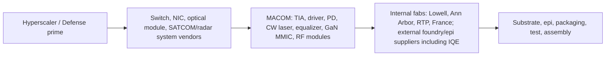
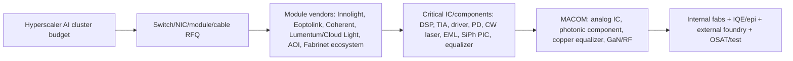

title: "公司：MTSI MACOM Technology Solutions Holdings, Inc."

# 公司：MTSI MACOM Technology Solutions Holdings, Inc. 全面尽调

> 生成日期：2026-05-09，美西时间。  
> 市场数据口径：2026-05-08 美股收盘，因为 2026-05-09 为周六。  
> 研究限制：未参考本目录“公司调研”下已有公司文件；使用公司公告、SEC/IR资料、财报电话会、产品公告、市场数据页，以及项目内 AI 光互联/数据中心产业资料。  
> 重要标注：公司不披露产品线收入、绝对 backlog、客户名单和取消率；本文对这些项目使用“披露值 + 可验证行业锚点 + 财报口径反推”，均标为测算。

## 0. 一页结论

1. **MTSI 是“RF 到 Light”的高性能模拟/混合信号/化合物半导体供应商，不是整机光模块厂，也不是 AI ASIC/DSP 平台公司。** 它的 AI 暴露主要在 800G/1.6T/3.2T 光模块和铜互联里的 TIA、laser/modulator driver、photodetector、CW laser、linear equalizer、ACC/PCIe equalizer 等器件层，属于 AI 网络的“每端口税”。
2. **最新财报强度很高。** FY2026 Q2（截至 2026-04-03，2026-05-07 发布）收入 **$289.0M**，同比 **+22.5%**，环比 **+6.4%**；GAAP 毛利率 **56.9%**，non-GAAP 毛利率 **58.5%**，non-GAAP EPS **$1.09**。FY2026 Q3 指引收入 **$331M-$339M**，中点环比 **+15.9%**，non-GAAP 毛利率 **59%-60%**。
3. **核心拐点是 Data Center 上修。** Q2 Data Center 收入 **$98.2M**，环比 **+14.5%**，同比约 **+36%**；公司把 FY2026 Data Center 年增基准从 **35%-40%**上修到 **60%+**。Q3 指引暗示 Data Center 约 **$132.6M**，环比 **+35%**，同比约 **+75%**。
4. **订单信号非常强。** Q2 book-to-bill **1.5:1**，为公司史上最高季度 bookings；按 $289.0M 收入反推 Q2 bookings 约 **$433M**，净 backlog 增量约 **$145M**。Q1 book-to-bill 也有 **1.3:1**。公司说 backlog 处于 record level，但不披露绝对金额。
5. **资产负债表很健康，但估值极贵。** 截至 2026-04-03，公司现金和短投 **$664.9M**，总债务约 **$407.1M**，净现金约 **$257.8M**；current ratio **7.52**。截至 2026-05-08 收盘，股价 **$359.88**，市值 **$27.46B**，TTM P/S **25.57x**，forward P/E **57.97x**，TTM P/E **154.16x**。市场已经把“1.6T/AI光互联 + 防务GaN + 毛利率上行”提前定价。
6. **投资主线排序：** 第一是 800G/1.6T 光互联模拟/光子器件；第二是 200G/lane PD/TIA/driver 和 448G/400G-per-lane driver 的 3.2T 期权；第三是 ACC/linear equalizer/PCIe 7 铜互联；第四是 I&D/Defense GaN RF 和 LEO SATCOM。传统 PON、低速光器件、CATV、broadcast、普通工业器件不是本次估值重估的核心。

## 1. 公司整体业务、投资人认知与产业链定位

### 1.1 公司做什么

MACOM 设计、开发和制造高性能半导体产品，覆盖 **Industrial & Defense、Data Center、Telecommunications** 三大终端市场。技术底座包括 RF、microwave、millimeter wave、analog/mixed signal、optical/photonic semiconductor。公司披露其拥有 **70+ 年 RF/微波经验**、每年服务 **6,000+ 客户**、产品组合 **8,000+ 产品、40+ product lines**。

核心产品形态包括：

| 技术/产品族 | 具体产品 | 主要终端 |
|---|---|---|
| 光互联模拟 IC 与光子器件 | TIA、laser/modulator driver、PAM4 driver、photodiode、CW laser、chip-stack optical receiver、OCR/CDR | AI 数据中心、DCI、相干传输 |
| 铜互联和 signal conditioning | linear equalizer、ACC/cable driver、PCIe 6/7 equalizer、onboard equalization | AI scale-up、rack/board/cable interconnect、HPC |
| RF/microwave/mmWave | GaN/GaAs MMIC、RF power amplifier、switch、limiter、mixer、radar core chip、SSPA module | 防务雷达/EW/导弹防御、SATCOM、5G |
| 光通信/电信 | PON/FTTx lasers、coherent components、metro/long-haul drivers/TIAs | Telecom、campus/scale-across |
| 专用工业 | test & measurement、medical/scientific、LiDAR、broadcast video、CATV | 工业和专业市场 |

### 1.2 投资人眼中的 MTSI

市场现在给 MTSI 的定位不是传统周期半导体，而是：

- **AI 光互联器件层受益股。** 公司不卖 NVIDIA GPU，不卖交换芯片，也基本不卖完整 800G/1.6T 光模块，而是卖模块和高速链路里高难度模拟/光子器件。
- **防务 RF/GaN 上行周期受益股。** I&D 在 FY2026 Q2 已达 **$120.7M**，为历史高位，欧洲和北美防务电子都在增长。
- **小体量、高增速、高估值的 compound semi 平台。** TTM 收入仅约 **$1.07B**，但市值 **$27B+**，说明投资人已经在支付很高的 AI 网络和防务确定性溢价。
- **毛利率改善故事。** 公司 FY2026 Q2 non-GAAP 毛利率 **58.5%**，Q3 指引 **59%-60%**，管理层把 FY2026 年末毛利目标从约 59%上修到更接近 60%。

### 1.3 最近 3 年重大业务变动/转型/收购

| 日期 | 事件 | 战略含义 |
|---|---|---|
| 2023-05 | 完成 OMMIC SAS 关键制造设施、能力和技术收购，建立 MACOM European Semiconductor Center（MESC） | 增强法国 Limeil-Brévannes 晶圆制造、外延、MMIC 处理和毫米波设计能力，强化欧洲防务/通信客户覆盖 |
| 2023-12 | 完成收购 Wolfspeed RF Business，交易含约 $75M 现金及 MACOM 股票，对应 Wolfspeed RF 业务和 RTP, North Carolina GaN RF 产能路径 | 取得 GaN-on-SiC RF 产品、Tier-1 防务/电信客户基础、长期 SiC 材料供应安排；为防务和 5G/SATCOM 增长提供产能 |
| 2024-11 | 收购 ENGIN-IC, Inc. | 扩大 GaAs/GaN MMIC、microwave assembly、defense prime contractor custom IC 能力 |
| 2023-2025 | 收购/整合 Linearizer Communications Group 等模块/线性化能力 | 增强 RF 前端、SATCOM、线性模块和高频系统能力 |
| 2025-2026 | Data Center 产品组合从 100G/400G 扩到 800G/1.6T，再预研 3.2T/400G-per-lane | 公司增长重心从“广谱 RF/光器件”明显向 AI 高速互联倾斜 |
| 2026-03 | 发布 PCIe 7.0 linear equalizer MAEQ-39964/39966、ACC/cable driver MACD-41804、448G PAM4 drivers MAOM-025408/MAOM-022404 | 明确进入 AI scale-up、PCIe/CXL、1.6T/3.2T 光和铜互联高端链条 |
| 2026-04 | 宣布与 IQE 签长期外延供应协议，并拟投资 IQE **£45M**（股权 + 可转债） | 锁定多技术外延供应，说明高端 InP/GaAs/GaN/photonic epi 供应链已经成为增长瓶颈 |

### 1.4 产业链位置

MTSI 位于 **hyperscaler/系统厂需求** 与 **模块厂/防务主机厂 BOM** 的上游关键器件层：

它的议价力来自：

- 高速模拟和光电封装难度：200G/lane、400G/lane、低暗电流 PD、低噪声 TIA、120GHz+ driver、线性链路调参。
- 客户认证周期长：AI 光互联新器件通常要跟交换芯片、模块、host SerDes、CMIS、散热和系统软件一起认证；防务产品认证周期更长。
- 内部 compound semi 制造能力：GaAs、GaN、InP、SiGe、SOI、specialized silicon、silicon photonics 等能力形成差异化。

## 2. 最新估值、财务与资产负债表健康度

### 2.1 最新市场与利润率数据

| 指标 | 最新值 | 日期/口径 | 备注 |
|---|---:|---|---|
| 股价 | **$359.88** | 2026-05-08 收盘 | 盘后 $361.60 |
| 市值 | **$27.46B** | 2026-05-08 | StockAnalysis |
| 企业价值 EV | **$27.20B** | 2026-05-08 | 净现金后 EV 低于市值 |
| TTM P/E | **154.16x** | 2026-05-08 | TTM EPS $2.33 |
| Forward P/E | **57.97x** | 2026-05-08 | 市场已反映 FY2026 EPS 快速增长 |
| TTM P/S | **25.57x** | 2026-05-08 | TTM 收入 $1.07B |
| Forward P/S | **21.05x** | 2026-05-08 | 仍显著高于多数半导体器件公司 |
| TTM 收入 | **$1.07B** | TTM 至 FY2026 Q2 | Q3'25+Q4'25+Q1'26+Q2'26 |
| 最近季度收入增速 | **+22.5% YoY** | FY2026 Q2 | Q2 收入 $289.0M |
| FY2025 收入增速 | **+32.6% YoY** | FY2025 | 收入 $967.3M |
| TTM 毛利率 | **55.57%** | 2026-05-08 | GAAP |
| FY2026 Q2 non-GAAP GM | **58.5%** | 2026-05-07 发布 | Q3 指引 59%-60% |
| TTM 净利率 | **16.46%** | 2026-05-08 | GAAP |
| TTM FCF | **$167.7M** | TTM | FCF yield 约 0.61% |

**估值判断：**  
MTSI 的基本面在加速，但估值已经处于“需要持续超预期”的位置。Forward P/E 接近 58x、P/S 超 25x，意味着只要 Data Center 从 60%+ 增速回落、1.6T ASP 下行快于出货、或者 FY2027 增速无法维持，股价会对预期修正非常敏感。

### 2.2 资产负债表和现金流

| 指标 | 数值 | 日期/口径 | 判断 |
|---|---:|---|---|
| 现金及短期投资 | **$664.9M** | 2026-04-03 | 现金充裕 |
| 总债务 | **$407.1M** | 2026-04-03 | 主要为 2029 可转债及租赁/融资义务 |
| 净现金 | **$257.8M** | 2026-04-03 | 净现金公司 |
| 短期债务 | **$0** | 2026-04-03 | Q2 已偿还 $161.2M 2026 convertibles |
| Current assets | **$1.126B** | 2026-04-03 | 高于 current liabilities 很多 |
| Current liabilities | **$149.7M** | 2026-04-03 | 当前流动压力低 |
| Current ratio | **7.52** | 2026-05-08 | 很健康 |
| Debt/equity | **0.29** | 2026-05-08 | 杠杆低 |
| FY2026 H1 OCF | **$121.6M** | 截至 2026-04-03 | 同比 $105.3M |
| FY2026 H1 CapEx | **$26.1M** | 截至 2026-04-03 | FY2026 全年 CapEx 指引 $55M-$65M |
| FY2026 H1 FCF 粗算 | **$95.5M** | OCF - CapEx | 强现金生成 |
| Inventory | **$252.2M** | 2026-04-03 | 环比 $238.9M 上升，管理层称为支持需求和 WIP 增加 |

**财务健康度：强。**  
公司现在的主要风险不是债务或流动性，而是估值、客户/产品 ramp、库存和供应链执行。净现金、低短债、强 OCF、低税率和内部 fab 利用率提升，使公司可以继续做小型收购、锁定 epi/wafer 供应并扩产。

## 3. 最近 5 次财报：财务、分市场收入、订单和 AI 暴露

> 注：Bookings 估算 = Revenue x book-to-bill；净 backlog 增量估算 = Bookings - Revenue。公司未披露绝对 backlog、取消率、产品线利润率。AI 数据中心收入为本文测算，主要按 Data Center 收入中 800G/1.6T 光互联、PD/TIA/driver、coherent-lite、copper interconnect 暴露估算。

| 财报季度 | 总收入 / 增速 | 终端收入与占比 | 利润率 / EPS | 订单、backlog、交期 | AI 数据中心相关测算 |
|---|---:|---|---|---|---|
| **FY2026 Q2** 截至 2026-04-03 发布 2026-05-07 | **$289.0M** YoY **+22.5%** QoQ **+6.4%** | I&D **$120.7M** / 41.8%, QoQ +2.5%, YoY +22.5% Data Center **$98.2M** / 34.0%, QoQ +14.5%, YoY +36.0% Telecom **$70.1M** / 24.3%, QoQ +3.0%, YoY +7.6% | GAAP GM **56.9%** Adj GM **58.5%** Adj op margin **27.8%** Adj EPS **$1.09** | Book-to-bill **1.5:1**，公司史上最高 quarterly bookings Bookings 测算 **$433M**，净 backlog 增量 **+$145M** Turns orders **18%** revenue，约 **$52M** Backlog record level；取消率未披露，结合上修指引推断低 | Data Center 主要由 800G/1.6T PAM4、pluggable optical module volume、200G/lane PD 拉动 AI/DC 相关收入估 **$75M-$85M**，约总收入 **26%-29%** |
| **FY2026 Q1** 截至 2026-01-02 发布 2026-02-05 | **$271.6M** YoY **+24.5%** QoQ **+4.0%** | I&D **$117.7M** / 43.3%, QoQ +2%, YoY +20.9% Data Center **$85.8M** / 31.6%, QoQ +8%, YoY +31.4% Telecom **$68.1M** / 25.1%, QoQ +3%, YoY +22.9% | GAAP GM **55.9%** Adj GM **57.6%** Adj op margin **27.2%** Adj EPS **$1.02** | Book-to-bill **1.3:1**，为 2021 Q3 以来最高 Bookings 测算 **$353M**，净 backlog 增量 **+$81M** Turns **23%** revenue，约 **$62M** Data Center 与 I&D backlog record | AI/DC 相关估 **$62M-$73M**；公司当时预计 FY2026 Data Center **+35%-40%** |
| **FY2025 Q4** 截至 2025-10-03 发布 2025-11-06 | **$261.2M** YoY **+30.1%** QoQ **+3.6%** | I&D **$115.6M** / 44.3%, QoQ +7% Data Center **$79.6M** / 30.5%, QoQ +5% Telecom **$66.0M** / 25.3%, sequential slightly down | GAAP GM **54.5%** Adj GM **57.1%** Adj op margin **25.6%** Adj EPS **$0.94** | Book-to-bill **约 1.02:1**，FY2025 全年约 **1.1:1** Bookings 测算 **$266M**，净 backlog 增量 **+$5M** Turns **14.5%** revenue，约 **$38M** FY2026 以 record backlog 开局 | AI/DC 相关估 **$55M-$65M**；1.6T 处于从 design-in/early ramp 向 production ramp 转换阶段 |
| **FY2025 Q3** 截至 2025-07-04 发布 2025-08-07 | **$252.1M** YoY **+32.3%** QoQ **+6.9%** | I&D **$108.2M** / 42.9%, QoQ +10%, YoY +19.0% Data Center **$75.8M** / 30.1%, QoQ +5%, YoY +54.7% Telecom **$68.1M** / 27.0%, QoQ +4%, YoY +34.6% | GAAP GM **55.3%** Adj GM **57.6%** Adj op margin **25.2%** Adj EPS **$0.90** | Book-to-bill **just over 1.1:1** Bookings 测算 **>$277M**，净 backlog 增量 **>$25M** Backlog 当时已为 all-time high | AI/DC 相关估 **$50M-$62M**；800G/1.6T 订单开始显著贡献 Data Center 增速 |
| **FY2025 Q2** 截至 2025-04-04 发布 2025-05-08 | **$235.9M** YoY **+30.2%** QoQ **+8.1%** | I&D **$98.5M** / 41.8%, YoY +8.4% Data Center **$72.2M** / 30.6%, YoY +67.3% Telecom **$65.2M** / 27.6%, YoY +38.1% | GAAP GM **55.2%** Adj GM **57.5%** Adj op margin **25.4%** Adj EPS **$0.85** | Book-to-bill **约 1.1:1** Bookings 测算 **$260M**，净 backlog 增量 **+$24M** 订单超过收入约 10% | AI/DC 相关估 **$45M-$58M**；Data Center 是同比最高增速终端 |

### 3.1 财报趋势判断

- **Data Center 正在从 30%收入占比向 40%靠近。** Q2 FY2025 占比 30.6%，Q2 FY2026 占比 34.0%，Q3 FY2026 指引中点估计占比接近 39.6%。
- **订单强度领先收入至少 2-4 个季度。** Q1+Q2 FY2026 book-to-bill 累积对应 bookings 约 **$786M**，同期收入 **$561M**，仅两个季度理论净 backlog 增量 **$226M**。
- **毛利率上行来自三件事：** 内部 fab 利用率提高、良率/成本改善、Data Center 高速器件占比提高。公司明确说 Lowell 和 North Carolina fab output 增加对毛利有正面作用。
- **Telecom 是短期拖后腿但 FY2027 有 LEO/SATCOM 期权。** Q2 FY2026 Telecom 仅低个位数环比增长，Q3 指引也低个位数；但管理层说 FY2027 SATCOM/LEO 有望明显更强。

## 4. FY2026 最新指引、业务占比和突出产品

### 4.1 FY2026 Q3 指引拆解

公司对截至 2026-07-03 的 FY2026 Q3 指引：

| 项目 | 公司指引/管理层口径 | 本文中点测算 | 含义 |
|---|---:|---:|---|
| 总收入 | **$331M-$339M** | **$335M** | QoQ +15.9%，YoY +32.9% |
| Adj gross margin | **59.0%-60.0%** | **59.5%** | 接近 60%年末目标 |
| Adj EPS | **$1.31-$1.37** | **$1.34** | Q2 $1.09 后继续跳升 |
| Data Center | 管理层预计 QoQ **约 +35%** | **$132.6M** | 占 Q3 收入约 39.6%，YoY +75% |
| I&D | 管理层预计 QoQ 接近 **+10%** | **$132.8M** | 占 Q3 收入约 39.6%，YoY +22.8% |
| Telecom | 管理层预计 low-single-digit QoQ growth | **$72M** | 占 Q3 收入约 21.5%，YoY +5.8% |

**最突出业务：Data Center。**  
Q3 指引隐含 Data Center 单季增量约 **+$34M**，几乎是公司总收入环比增量的主要来源。管理层明确把 FY2026 Data Center 年增基准上修至 **60%+**，对应 FY2025 Data Center $292.8M，则 FY2026 Data Center 至少约 **$469M+**。由于 Q1+Q2 已完成 $184M，Q3 指引约 $133M，Q4 只要达到约 $152M 就能实现 60%年增。

### 4.2 产品对应关系：哪些重要，哪些跳过

| 业务 | 关键产品/型号 | 当前重要性 | 2026-2027 判断 |
|---|---|---|---|
| **1.6T/800G Data Center optical analog IC** | 200G/lane TIA、laser/modulator drivers、MALD-40225 dual 227Gbps EML driver with equalizer、MAOM-025408 Mach-Zehnder driver、MAOM-022404 EML driver | 最核心增长来源 | 1.6T FRO/LRO/TRO 放量，3.2T/400G-per-lane 是下一条曲线 |
| **Photodetectors / receive-side chip stack** | 200G PAM4 PIN photodiodes、integrated-lens PD、PD stacked on TIA | 小而关键，不能漏 | 管理层强调 200G/lane PD 需求继续增长，并称其暗电流、灵敏度、量产能力有优势 |
| **CW lasers for 800G/1.6T** | 75mW / 100mW CW laser，用于 800G OSFP 2xFR4 等 | 当前收入可能较小，但供应链价值高 | EML/CW-LD 是 1.6T 扩产瓶颈之一；MTSI 处于追赶/导入阶段 |
| **Coherent-lite / scale-across** | 800G LR2 module demo、coherent TIAs/drivers for 400G-1.6T | 2026 小到中等，2027 潜力上升 | AI campus/scale-across 把相干从 telecom 周期拉到 AI CapEx |
| **Linear equalizer / ACC / PCIe 7 copper** | MAEQ-40904 227Gbps linear equalizer、MACD-41804 cable driver with equalizer、MAEQ-39964/39966 PCIe 7.0、MAEQ-39908 112G PAM4 | 当前收入占比小，战略期权大 | 管理层说 copper/electrified cable 是 real demand but TBD；若 scale-up copper 提前，弹性大 |
| **Defense GaN/RF/SSPA/SATCOM** | GaN MMIC、RF power amplifiers、radar core chips、T/R front ends、Linearizer products、Opto-Amp FSO/SATCOM | 第二主线，高确定性 | 北美/欧洲防务电子增长，LEO payload/gateway/terminal 进入 FY2027 ramp |
| **Telecom PON/5G/legacy optical** | PON/FTTx lasers、5G RF、wireless backhaul | 低优先级 | 低双位数或个位数增长，除 SATCOM/LEO 外不是核心 |
| **跳过：低速和成熟业务** | 10G/25G/50G DFB/FP lasers、CATV/wired broadband、broadcast SDI、普通 diode/passive、低速 industrial | 非 AI 且低增速 | 对估值重估贡献小，除非作为 fab utilization 和现金流底座 |

## 5. 高增长/关键业务当前贡献、供需、垄断和溢价能力

评分：5 为最高。收入为 FY2026 Q2 或当前季度 run-rate 测算。

| 关键业务/产品 | 当前对公司收入贡献 | 当前增速 | AI 基建重要性 | 时间紧急性 | 供需紧张度 | 垄断/溢价能力 | 证据与判断 |
|---|---:|---:|---:|---:|---:|---:|---|
| **800G/1.6T optical analog IC + PD/TIA/driver** | Q2 Data Center $98.2M 中估 **$60M-$80M** | Data Center YoY +36%，Q3 指引 QoQ +35% | **5** | **5** | **4.5** | **3.5** | 1.6T 是 2026 AI fabric 斜率；MTSI 不是唯一供应，但模拟/封装/PD 特性带来认证壁垒 |
| **200G/lane photodetectors + chip-stack receive side** | Q2 估 **$10M-$25M** | 可能 >50% YoY，管理层说 demand continues to grow | **4.5** | **5** | **4.5** | **4** | PD/TIA attach 接近 100%，暗电流、灵敏度、lens integration、stacked PD on TIA 是差异化 |
| **CW laser / coherent light / 800G LR2 scale-across** | Q2 估 **$5M-$15M** | 小基数高增长 | **4** | **4** | **4** | **3.5** | AI scale-across、800G LR2、coherent-lite 正从 telecom/metro 逻辑进入 AI campus |
| **Linear equalizer / ACC / PCIe 7 copper** | Q2 估 **$5M-$15M** | 早期高增，规模未充分体现 | **4** | **4** | **3.5** | **3** | 1.6T ACC、PCIe 7/CXL、rack/board reach；但管理层承认 optical 是 vast majority revenue，copper 是 additive |
| **Defense GaN/RF/I&D** | Q2 I&D $120.7M 中防务估 **$70M-$90M** | I&D H1 FY26 YoY +22%；top 25 defense customers FY26 显著增加 | **非AI 但战略重要** | **4** | **4** | **4** | 国防电子、EW、radar、missile defense、space sensors；认证周期长，替换成本高 |
| **LEO SATCOM payload/gateway/terminal** | 当前 Telecom/I&D 中估 **$5M-$20M** | FY2027 加速，FY2026 尚未大 step-up | **AI无关，但高潜力** | **3.5** | **3.5** | **3.5** | 管理层说有 active production、LRIP、EM module，full-rate late 2026/early 2027 |

## 6. 一年后收入贡献预测：基准、乐观、极度乐观

口径：以 2026-05 为起点，预测未来 12 个月收入贡献或 2027Q2 附近 quarterly run-rate。由于 MTSI 不披露产品线收入，以下为测算。

| 关键业务 | 情景 | 未来 12 个月收入贡献 | 2027Q2 附近季度 run-rate | 增速 | 重要性/紧急性/供需 | 垄断与溢价判断 |
|---|---|---:|---:|---:|---|---|
| **Data Center high-speed optical IC/PD/driver/TIA** | 基准 | **$520M-$650M** Data Center，其中 high-speed optical **$390M-$520M** | **$130M-$160M** | +45%-70% | 1.6T 按计划 ramp，800G 延续，供给仍偏紧 | 多供，但高性能 PD/TIA/driver 认证后较难替换，毛利率可维持高位 |
|  | 乐观 | Data Center **$700M-$900M**，high-speed optical **$540M-$720M** | **$180M-$230M** | +80%-130% | GB300/TPU/Trainium/MI350 同时拉货，1.6T 供不应求 | 可以通过交期、质量、良率和 chip-stack 方案拿溢价 |
|  | 极度乐观 | Data Center **$950M-$1.25B**，high-speed optical **$760M-$1.0B** | **$250M-$330M** | +150%-220% | 1.6T/200G lane 全面短缺，3.2T 预研订单提前 | 溢价强，但客户会强力推动 second source，持续垄断难 |
| **200G/lane PD + chip stack receive side** | 基准 | **$80M-$140M** | **$25M-$40M** | +50%-90% | 每 1.6T 端口刚需，交期紧 | 若暗电流/灵敏度/封装良率领先，溢价强 |
|  | 乐观 | **$150M-$250M** | **$45M-$70M** | +120%-200% | PD 成为 1.6T/3.2T 瓶颈 | 与 TIA 组合销售提高粘性 |
|  | 极度乐观 | **$300M-$450M** | **$90M-$130M** | +250%+ | Google/AI ASIC/OCS 带来极高模块 attach | 会被 Lumentum/Coherent/Broadcom/AOI 争夺，需持续良率领先 |
| **CW laser / coherent-lite / 800G LR2** | 基准 | **$60M-$120M** | **$15M-$30M** | +50%-100% | AI campus/scale-across 逐步导入 | 溢价中高，取决于客户认证和可靠性 |
|  | 乐观 | **$150M-$250M** | **$40M-$70M** | +150%+ | 800ZR/1600ZR/ZR+ 与 coherent-lite 进入 AI 网络 | MTSI 能参与但面对 Marvell/Cisco/Acacia/Ciena/Nokia 体系 |
|  | 极度乐观 | **$300M-$500M** | **$80M-$130M** | +300%+ | 多园区训练/推理强制 scale-across 光化 | 供应链重排，系统平台公司议价仍更强 |
| **Linear equalizer / ACC / PCIe 7 copper** | 基准 | **$50M-$90M** | **$15M-$25M** | +50%-100% | rack/board/cable reach 需求上升 | 性能优先但竞争多，溢价中等 |
|  | 乐观 | **$100M-$180M** | **$30M-$55M** | +150%+ | 1.6T ACC、PCIe 7/CXL 进入白名单 | 低功耗/低时延若被大客户采用，溢价提高 |
|  | 极度乐观 | **$220M-$350M** | **$65M-$100M** | +300%+ | copper scale-up 抢在 CPO 前放量 | Credo/Marvell/Broadcom/ASTL/Semtech 多方竞争，客户会压价 |
| **Defense GaN/RF/I&D** | 基准 | I&D **$530M-$620M** | **$135M-$155M** | +20%-30% | 防务电子订单强，认证周期长 | 替换成本高，溢价好 |
|  | 乐观 | **$650M-$780M** | **$165M-$200M** | +35%-55% | 北美/欧洲防务和空间电子预算同步上行 | GaN/RF 产能和项目认证形成强壁垒 |
|  | 极度乐观 | **$850M-$1.0B** | **$220M-$260M** | +70%+ | EW/雷达/导弹防御/space sensors 加速，RTP+Lowell 利用率跳升 | 供应稀缺时溢价强，但项目节奏受政府预算约束 |
| **LEO SATCOM** | 基准 | **$60M-$120M** | **$20M-$35M** | +50%-100% | 2027 ramp，非 2026 立即爆发 | 客户认证和平台绑定提供粘性 |
|  | 乐观 | **$150M-$250M** | **$45M-$70M** | +150%+ | 大型 LEO program full-rate production | 模块/SSPA/optical payload 若中标，溢价高 |
|  | 极度乐观 | **$300M-$500M** | **$90M-$140M** | +300%+ | 7,000-10,000 satellites/3年假设兑现且 gateway/terminal 同步 | TWTAs/SSPA/其他 RF 供应商竞争，客户多供 |

## 7. BOM、每 MW / rack / GPU / optical port 内容量与价格传导链

### 7.1 800G/1.6T 光模块中的 MACOM 内容量

> 关键点：MTSI 的收入不是完整光模块 ASP，而是模块内和链路周边的模拟/光子器件价值。

| 模块/链路 | 典型 BOM | MACOM 可供应内容 | 每 optical port 潜在 MACOM ASP | 现实 attach 判断 |
|---|---|---|---:|---|
| 800G DR8/2xFR4/FRO | DSP、8 lane TIA、driver、PD/EML/SiPh/CW laser、MCU、FAU/connector、housing | TIA、driver、PD、CW laser、linear equalizer、少量 coherent-lite | **$20-$60**；只中单一器件时 **$5-$25** | 800G 已多供，ASP 下行，但数量大 |
| 1.6T DR8/2xDR4/FRO/LRO | 8x200G 或 16x100G，200G/lane TIA/driver/PD，DSP/LRO DSP，laser/PIC，散热更严 | 200G/lane TIA/driver、PD、chip-stack receiver、CW laser、ACC/OBE | **$35-$95**；高端组合 **$80-$140** | 2026-2027 最强，供需偏紧 |
| 3.2T / 400G-per-lane | 8x400G，448G PAM4/400G optical lane，TFLN/SiPh/EML，测试难度高 | MAOM-025408/MAOM-022404 448G drivers、future TIA/PD | 样品期 **$50-$150+** | 2026 样品，2027 qual，2028 批量更现实 |
| 800G LR2 / coherent-lite | coherent-lite DSP/driver/TIA/laser、module optics | coherent TIA/driver、module/光组件 | **$40-$120** | AI scale-across 早期，客户集中 |
| ACC / copper scale-up | twinax cable、equalizer/driver/retimer、connector、EEPROM/diagnostics | MACD-41804、MAEQ-40904、MAEQ-39964/39966、MAEQ-39908 | 每 cable **$10-$50**，极端高端 **$60+** | 真实需求存在，但公司称短期 optical revenue 仍占绝大多数 |

### 7.2 每 GPU、每 rack、每 MW 内容量测算

假设：

- 2026 高端 AI rack 以 72 GPU/NVL72 或类似 64-144 XPU rack 为参考。
- 每 rack IT 功耗约 100kW-140kW；取 **120kW/rack** 中位，则 **1MW 约 8.3 rack**，约 **600 GPU/MW**。
- 光模块 attach rate 随架构差异很大。Google TPU/OCS 口径可达到约 1.5 个 800G+ 模块/XPU；通用 GPU Ethernet/IB 集群更常见估计为 **0.4-1.2 个高速 optical port/GPU**。
- MTSI 每 optical port 内容量按 **$20-$95** 基准，极度乐观按更多器件组合 **$120+**。

| 口径 | 基准 | 乐观 | 极度乐观 |
|---|---:|---:|---:|
| 高速 optical ports / GPU | **0.4-0.8** | **0.8-1.2** | **1.2-1.6** |
| MTSI optical 内容量 / GPU | **$10-$60** | **$45-$120** | **$120-$220** |
| MTSI optical 内容量 / 72-GPU rack | **$720-$4,300** | **$3,200-$8,600** | **$8,600-$15,800** |
| MTSI optical 内容量 / MW | **$6k-$36k** | **$27k-$72k** | **$72k-$132k** |
| Copper/ACC/PCIe 内容量 / GPU | **$2-$15** | **$15-$60** | **$60-$150** |
| Copper/ACC/PCIe 内容量 / MW | **$1k-$9k** | **$9k-$36k** | **$36k-$90k** |

**为什么每 MW 看起来不大但收入仍可快速增长：**  
MTSI 是器件层，不是服务器或完整模块层。AI 数据中心每 GW CapEx 可以达到数百亿美元，但 MTSI 抓取的是其中每端口几十美元的高毛利器件。收入弹性来自全球模块数量巨大、端口代际从 800G 升到 1.6T/3.2T、以及客户认证后的高 attach，而不是单 MW 里高美元含量。

### 7.3 价格传导链

价格传导判断：

- **上行时：** hyperscaler 为交期和功耗付溢价，模块厂把高端 TIA/driver/PD/CW laser 成本向上游锁量，MTSI 可通过长单、优先供货和高性能器件维持毛利。
- **下行时：** 800G/1.6T 模块 ASP 先降，模块厂再压上游 IC/PD/laser 单价；差异化较弱的器件价格下行最快。
- **最抗压产品：** PD/TIA chip-stack、400G-per-lane driver、defense GaN MMIC、coherent-lite 高性能器件。
- **最易被压价产品：** 标准 800G 低差异化 driver/TIA、成熟 100G/400G 组件、普通 equalizer。

## 8. 产能、供应链采纳和认证阶段

### 8.1 当前产能能力

| 业务 | 当前可见收入/产能能力 | 供应链采纳程度 | 认证/阶段 |
|---|---:|---|---|
| Data Center optical | Q2 $98.2M，Q3 指引约 $132.6M；当前 annualized run-rate **$530M+** | 已进入主流 pluggable optical module 和 optical cable production volume；客户多为模块厂/系统链间接导入 | 800G/1.6T 生产 ramp；3.2T/400G-per-lane 处样品/展示/客户 qual |
| 200G PD/TIA/driver | 未披露，估 Q2 **$30M-$60M** | 200G/lane PD demand 持续增长；PD stacked on TIA 已展示 | 1.6T 量产/认证中；3.2T 预研 |
| CW laser/coherent-lite | 未披露，估 Q2 **$5M-$15M** | OFC 2026 展示 75mW/100mW CW laser、800G LR2 coherent-lite | 客户试产/导入期 |
| Copper/ACC/PCIe equalizer | 未披露，估 Q2 **$5M-$15M** | MAEQ-40904 已 production availability；MACD-41804 和 MAEQ-39964/39966 新发布 | ACC/PCIe 7/CXL 早期设计导入，客户白名单仍在形成 |
| I&D/GaN/RF | Q2 I&D $120.7M，Q3 指引约 $132.8M；annualized **$530M+** | 防务/工业客户广，top 25 defense customers FY26 显著增加 | 多个生产项目；GaN manufacturability 获 Defense Manufacturing Technology Achievement Award |
| LEO SATCOM | 当前小到中等，FY2027 斜率 | active production + LRIP + EM modules 并存 | 大项目预计 late 2026 或 early 2027 full-rate production |

### 8.2 一年后产能能力预测

| 业务 | 基准 | 乐观 | 极度乐观 |
|---|---:|---:|---:|
| Data Center optical 年化产能/收入能力 | **$650M-$750M** | **$850M-$1.0B** | **$1.2B+** |
| 200G PD/TIA/driver | **$150M-$250M** | **$300M-$450M** | **$600M+** |
| Copper/ACC/PCIe equalizer | **$80M-$150M** | **$200M-$350M** | **$500M+** |
| I&D/GaN/RF | **$600M-$700M** | **$800M-$950M** | **$1.1B+** |
| LEO SATCOM | **$80M-$150M** | **$200M-$350M** | **$500M+** |

产能约束与扩产：

- North Carolina/RTP wafer capacity：管理层称约一年多前提出 **15 个月内提高 30% wafer production capacity**，投入 **$15M-$16M**，预计 2026 年底完成。
- CapEx：FY2026 指引 **$55M-$65M**，用于扩产和工程/生产设备升级。
- IQE：2026-04 宣布拟 **£45M** 投资并签 LTSA，直接指向 epi supply resilience。
- 生产策略：管理层明确不打算新建大型 fab，而是做 incremental facility-based expansion。

## 9. 基于订单和供给的未来一年业务增速预测

### 9.1 Backlog 和 bookings 推断

| 季度 | Revenue | Book-to-bill | Bookings 测算 | 净 backlog 增量测算 |
|---|---:|---:|---:|---:|
| FY2025 Q2 | $235.9M | 1.1x | $259.5M | +$23.6M |
| FY2025 Q3 | $252.1M | >1.1x | >$277M | >+$25M |
| FY2025 Q4 | $261.2M | 1.02x | $266.4M | +$5.2M |
| FY2026 Q1 | $271.6M | 1.3x | $353.1M | +$81.5M |
| FY2026 Q2 | $289.0M | 1.5x | $433.5M | +$144.5M |

**推断：**

- FY2026 H1 bookings 约 **$786M**，收入 **$561M**，净新增 backlog 约 **$226M**。
- 公司未披露 backlog 绝对值。若 FY2025 Q4 record backlog 约为季度收入的 1.0-1.5x，则 FY2026 Q2 backlog 粗估可能已经到 **$490M-$620M+**。这是测算，不是公司披露。
- Q2 orders booked and shipped within quarter 为 **18% revenue**，约 **$52M**，低于 Q1 的 23%，说明更多订单进入未来交付窗口，而不是当季 turns。
- 取消率未披露。结合 book-to-bill、Q3 大幅上修和库存/WIP 增加，本文估计高端 Data Center 和 Defense 订单取消率短期 **<5%**；成熟 telecom/legacy 产品可能更高，但对增长主线影响小。

### 9.2 公司未来一年总收入增速情景

| 情景 | 未来 12 个月收入 | 增速 | 关键假设 |
|---|---:|---:|---|
| 基准 | **$1.35B-$1.50B** | +25%-40% vs TTM | Q3/Q4 FY26 强劲但 FY27 初 1.6T ASP 正常下行；I&D +20%-30%；Telecom 低双位数 |
| 乐观 | **$1.60B-$1.85B** | +50%-70% | Data Center 继续 60%-100% 增长；1.6T 供不应求；Defense +35%+；LEO 项目在 FY27 启动 |
| 极度乐观 | **$2.0B-$2.4B** | +85%-120% | 1.6T/3.2T/PD/TIA/driver/copper 多线同时短缺；AI capex 继续上修；防务和 LEO 同步爆发 |

**最现实的 near-term 观察点：**

1. FY2026 Q3 是否达到或超过 **$335M** 中点，以及 Data Center 是否如管理层暗示到 **$132M+**。
2. Q3 book-to-bill 是否仍高于 **1.2x**；若回落到 1.0x 附近，Q4/FY27 斜率会被质疑。
3. 毛利率是否能到 **59.5%+**；若 Data Center 高速产品占比上升但毛利率不升，说明价格/良率/供应成本压力更大。
4. 库存是否继续健康上升而非积压；Q2 inventory $252.2M，turns 1.9x。
5. IQE LTSA 和 RTP/Lowell/Ann Arbor/France 产能是否按期贡献。

## 10. 竞争格局、替代风险与客户切换成本

### 10.1 Data Center optical analog / PD / laser / driver

| 环节 | 主要竞争者 | MTSI 相对位置 |
|---|---|---|
| TIA / Driver / linear analog | Semtech、MaxLinear、Broadcom、Marvell、Cisco/Acacia、Credo、Coherent、Lumentum | MTSI 在高性能模拟和 photonic component 组合上有差异化，但不是唯一供应 |
| PD / EML / CW laser / photonics | Lumentum、Coherent、Broadcom、AOI、Sumitomo Electric、Mitsubishi Electric、Furukawa、源杰科技等 | MTSI 的 PD/TIA stack 和 CW laser 是增长点，但在 laser/EML 侧面临强对手 |
| DSP/SerDes/platform | Broadcom、Marvell、Cisco/Acacia、Credo、MaxLinear | MTSI 不以 DSP 平台为核心，更多是 analog front-end 和 copper/photonic building blocks |
| 模块/系统 | Innolight、新易盛、Coherent、Lumentum/Cloud Light、AOI、Fabrinet、Cisco/Acacia、Nokia/Infinera、Ciena | MTSI 是这些模块/系统 BOM 的供应商，不是直接模块规模龙头 |

**主流性判断：**

- **1.6T pluggable + 200G/lane optical 是 2026-2027 主流。** MTSI 站在主流路径里。
- **LPO/LRO/TRO 会分流 fully-retimed optics，但不会在 2026 完全替代 DSP。** 对 MTSI 来说，LPO/LRO 反而可能提高线性 TIA/driver/equalizer 的价值。
- **CPO/NPO/CPX 是长期替代风险。** 若高端 switch 提前转 CPO，部分 pluggable 模块价值下降，但 external laser、TIA/driver、photonic engine 仍有新机会。MTSI 需要证明自己能进入 CPO/NPO BOM。

**客户切换成本：高。**

- 光模块客户需要重新验证 BER、FEC margin、温漂、功耗、CMIS、host tuning 和现场可靠性。
- PD/TIA/driver 的封装寄生、电气模型和 optics tuning 与模块设计强绑定。
- 但 hyperscaler 会持续要求 second source，因此 MTSI 的“垄断”更像是 program-level sticky share，而不是永久单供。

### 10.2 Copper / ACC / PCIe / scale-up

| 环节 | 主要竞争者 | 替代方案 |
|---|---|---|
| AEC/ACC retimer/equalizer | Credo、Marvell、Broadcom、Astera Labs、Semtech、Parade、Montage、Spectra7、MACOM | DAC、optics、CPO、near-package optical |
| PCIe/CXL equalizer | Astera、Parade、Montage、TI、ADI、Microchip、MACOM | Retimer、redriver、更高规格 PCB/connector、光 PCIe |

**判断：** Copper 是高弹性期权，但不是 MTSI 当前收入主菜。Q2 电话会管理层说 optical side 有 real production ramps，vast majority of revenue today；electrified cable 会 additive。要看 MAEQ-39964/39966、MACD-41804 是否进入大客户 1.6T OSFP/PCIe 7/CXL design win。

### 10.3 Defense GaN/RF/SATCOM

| 环节 | 主要竞争者 | MTSI 优势 |
|---|---|---|
| GaN RF / MMIC / power amplifier | Qorvo、NXP、Analog Devices、Teledyne、Mercury、Microchip、BAE/Northrop/Raytheon 内部供应、RFHIC、Gallium Semi | Wolfspeed RF、OMMIC/MESC、ENGIN-IC、Linearizer 形成 GaN/MMIC/module 组合 |
| SATCOM payload/gateway/terminal | CPI、Qorvo、Analog Devices、Teledyne、L3Harris、Viasat 供应链等 | RF power、linearizer、SSPA、Opto-Amp/FSO、毫米波和高可靠能力 |

**客户切换成本：非常高。**  
防务和空间项目的 design-in、qualification、radiation/hi-rel、AS9100D、program record 长，替换周期通常以年计。风险是预算、项目节奏、政府 shutdown 和主承包商内制/多供。

## 11. 风险

1. **估值风险最大。** 25x TTM sales 和 58x forward earnings 已经反映大量乐观假设。
2. **Data Center 客户/产品集中风险。** 公司不披露客户名和产品线收入；若某一 1.6T platform 或 module vendor 拉货延后，季度波动会很大。
3. **模块 ASP 下行向上游传导。** 800G 已多供，1.6T 2027 也会多供，低差异化器件毛利可能承压。
4. **CPO/NPO/host-integrated optics 改变价值分配。** 若 Broadcom/NVIDIA/Marvell/Cisco 等平台公司把更多价值集成，独立 analog component share 可能被压缩。
5. **供应链和良率。** 200G/400G lane 的 epi、wafer、packaging、test、光学对准、热设计都可能限制出货。
6. **防务和政府周期。** I&D 增长强，但受美国/欧洲预算、项目验收、出口限制和政府 shutdown 影响。
7. **并购整合。** Wolfspeed RF、OMMIC、ENGIN-IC、Linearizer 的整合需要持续管理；若 fab utilization 不达预期，固定成本会拖毛利。

## 12. 关键跟踪指标

| 指标 | 为什么重要 |
|---|---|
| Data Center quarterly revenue 是否从 Q2 $98.2M 到 Q3 $132M+ | 验证 +60% FY2026 年增是否真实 |
| Book-to-bill 是否连续高于 1.2x | 判断 backlog 是否继续扩张 |
| 200G/lane PD/TIA/driver 交期与 design win | 这是 MTSI 最核心的 AI 端口税 |
| 1.6T/3.2T 产品是否被更多模块厂公开 demo 或 volume qualification | 验证客户采纳程度 |
| MAOM-025408 / MAOM-022404 / MACD-41804 / MAEQ-39964/39966 是否出现在大客户 BOM | 判断 3.2T 和 copper 期权是否兑现 |
| FY2026 CapEx 是否维持 $55M-$65M 且毛利率继续上行 | 判断扩产是否高 ROIC |
| IQE LTSA 是否完成监管批准并稳定供货 | 判断 epi supply 是否被锁定 |
| I&D top 25 defense customers 增速 | 验证防务主线 |
| LEO SATCOM program 是否从 EM/LRIP 进入 full-rate production | 这是 FY2027 Telecom/Defense 的新增斜率 |

## 13. 资料来源

### 公司与财务资料

- MACOM FY2026 Q2 results, 2026-05-07: https://ir.macom.com/news-releases/news-release-details/macom-reports-fiscal-second-quarter-2026-financial-results
- MACOM FY2026 Q2 earnings transcript, Motley Fool, 2026-05-07: https://www.fool.com/earnings/call-transcripts/2026/05/07/macom-mtsi-q2-2026-earnings-transcript/
- MACOM FY2026 Q1 results: https://ir.macom.com/news-releases/news-release-details/macom-reports-fiscal-first-quarter-2026-financial-results
- MACOM FY2025 Q4/FY2025 results: https://ir.macom.com/news-releases/news-release-details/macom-reports-fiscal-fourth-quarter-and-fiscal-year-2025/
- MACOM FY2025 Q3 results: https://ir.macom.com/news-releases/news-release-details/macom-reports-fiscal-third-quarter-2025-financial-results/
- MACOM FY2025 Q2 results: https://ir.macom.com/news-releases/news-release-details/macom-reports-fiscal-second-quarter-2025-financial-results/
- StockAnalysis MTSI statistics and valuation, accessed 2026-05-09: https://stockanalysis.com/stocks/mtsi/statistics/

### 产品、供应链和行业资料

- MACOM OFC 2026 product demonstrations: https://www.macom.com/updates/news/2026/macom-to-showcase-innovative-connectivity-solutions-at-ofc-2026
- MACOM 448G PAM4 drivers MAOM-025408 / MAOM-022404, 2026-03-17: https://www.macom.com/updates/news/2026/macom-announces-two-new-448g-per-lane-drivers-for-3-2t-data-cent
- MACOM MAOM-025408 product page: https://www.macom.com/products/product-detail/MAOM-025408
- MACOM MACD-41804 cable driver with equalizer, 2026-03-16: https://www.macom.com/updates/news/2026/macom-enables-high-density-copper-interconnects-for-next-generat
- MACOM PCIe 7.0 MAEQ-39964 / MAEQ-39966 linear equalizers, 2026-03-12: https://www.globenewswire.com/news-release/2026/03/12/3254684/0/en/macom-introduces-industry-s-first-pcie-7-0-linear-equalizers-extending-the-reach-of-copper-at-128-gt-s.html
- MACOM IQE long-term supply agreements and £45M investment, 2026-04-27: https://ir.macom.com/news-releases/news-release-details/macom-enter-agreements-further-strengthen-supply-chain
- MACOM OMMIC/MESC acquisition: https://www.macom.com/updates/news/2023/macom-establishes-european-semiconductor-center
- MACOM Wolfspeed RF acquisition completion: https://www.macom.com/updates/news/2023/macom-completes-acquisition-of-wolfspeed-s-rf-business
- MACOM ENGIN-IC acquisition: https://www.macom.com/updates/news/2024/macom-expands-ic-design-expertise-with-acquisition-of-engin-ic

### 项目内本地行业资料

- `D:\drive\Investment\工作台v5\行业调研_AI网络_光互联_铜互联\行业调研_800G_1.6T可插拔光模块_2026-05-08.md`
- `D:\drive\Investment\工作台v5\行业调研_AI网络_光互联_铜互联\行业调研_光DSP_TIA与CDR芯片_2026-05-08.md`
- `D:\drive\Investment\工作台v5\行业调研_AI网络_光互联_铜互联\行业调研_LPO_LRO线性光模块_2026-05-08.md`
- `D:\drive\Investment\工作台v5\AI产业和股票研究结果\行业调研\行业调研/AI数据中心建设规模与产业链订单映射_2026-2027_美国.md`
- `D:\drive\Investment\基本面\行业调研\产业背景\顶级conference纪要\ofc_2026_conference_update.md`

---

非投资建议。本文用于产业链和公司基本面研究，测算部分需要随着公司 FY2026 Q3/Q4 财报、客户量产、1.6T ASP、book-to-bill、库存和毛利率变化更新。

