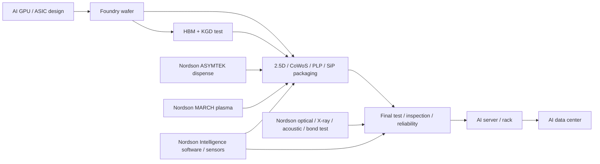

# 公司：NDSN Nordson Corporation

> 生成日期：2026-05-09（America/Los_Angeles）。  
> 股票与估值口径：美股最近收盘为 2026-05-08。Nordson 最新已披露财报为 FY2026 Q1，截至 2026-01-31；FY2026 Q2 预计 2026-05-20 盘后发布，本文不预判未披露季报。  
> 重要限制：公司不披露 AI 数据中心收入、按具体产品的收入、Bookings、Lead time 或取消率。本文把公司披露数字和模型估算分开；所有 AI 相关收入、BOM content、产能美元值均为基于 Nordson ATS 收入、产品组合、客户/会议验证和项目内 AI 封装需求模型的推算。

## 0. 一页结论

Nordson 是一家“高毛利精密流体控制 + 医疗组件 + 半导体/电子装配检测”的工业复利型公司，不是纯半导体设备股，也不是纯 AI 数据中心供应商。投资人通常把它看作高质量、分散终端、强应用工程能力、长期并购整合能力强的精密工业公司；AI 暴露主要藏在 Advanced Technology Solutions（ATS）里的先进封装点胶/等离子、X-ray/声学/光学检测、bond test、WaferSense 和 AI inspection software 中。

最重要的变化是：FY2025 Q1 Nordson 的 ATS 仍下滑 11%，但 FY2025 Q2 开始 ATS 转为双位数增长，FY2026 Q1 ATS 销售 $149.4M、同比 +23%、有机 +21%，公司明确说半导体相关产品线正在 inflect。FY2026 全年指引从最初 $2.83-2.95B 上调至 $2.86-2.98B，调整 EPS 指引 $11.00-11.60。最新公司 backlog 约为 FY2025 年末 $600M、同比 +5%；FY2026 Q1 进入 Q2 时 backlog 同比 +4%，订单动能在 ATS 特别强。

AI 直接弹性最大的不是 Nordson 的传统胶机/医疗业务，而是：

1. ASYMTEK Vantage/Forte/Spectrum + IntelliJet 的先进封装 underfill、encapsulation、gap fill、lid seal、TIM dispense。
2. MARCH FlexTRAK 等 plasma surface treatment，用于 die attach、wire bond、molding、underfill 前的清洁/活化。
3. Nordson Test & Inspection 的 SQ5000Pro/SQ7000+/SQ3000M2 optical metrology、Dynamic Planar CT/X3/XM8000/QuadraPro X-ray、Gen7 AMI acoustic microscopy、4800/4800 Integra bond test、WaferSense sensors。
4. Nordson Intelligence、AI-Hub、Sight、AutoProgram、AutoReview、AutoGrade、MGIA 等软件/AI 检测生态，当前收入小但毛利和粘性最高。

模型估算：FY2025 ATS 收入 $624.5M，其中半导体/电子相关约 $450-540M；AI/HPC 先进封装和后道检测直接相关收入约 $120-220M。若 2026H2-2027H1 CoWoS/HBM4/PLP 订单按项目内基准情景推进，Nordson AI 相关 ATS 收入一年后可到 $170-280M；乐观到 $240-380M；极度乐观可到 $350-520M。这个数字对 $2.9B 年收入公司不是“改变公司身份”的量级，但足以把 ATS 从 20% 左右收入占比的普通周期业务，推成最强增速业务。

## 1. 公司业务、投资人定位、产业链位置

### 1.1 整体业务

Nordson 总部位于 Ohio，成立于 1954 年，业务遍布 35 个以上国家。公司核心能力是对粘合剂、涂料、密封剂、聚合物、医疗流体、电子封装材料进行精准计量、点胶、喷涂、涂覆、表面处理、检测和量测。公司强调 direct sales model、应用工程和贴近客户的售前/售后。

| FY2025 业务 | FY2025 收入 | 收入占比 | FY2025 Segment EBITDA | EBITDA margin | 核心产品与终端 |
|---|---:|---:|---:|---:|---|
| Industrial Precision Solutions, IPS | $1.332B | 47.7% | $493.9M | 37.1% | 包装、非织造、工业涂装、聚合物加工、产品装配、精密农业 ARAG。 |
| Medical and Fluid Solutions, MFS | $835.4M | 29.9% | $311.7M | 37.3% | 医疗介入组件、Atrion 医疗流体/心血管产品、一次性流体组件、engineered fluid components。 |
| Advanced Technology Solutions, ATS | $624.5M | 22.4% | $146.6M | 23.5% | 电子点胶、plasma treatment、conformal coating、光学/X-ray/声学检测、bond test、MCS/WaferSense sensors。 |
| 合计 | $2.792B | 100% | $952.1M segment EBITDA | 34.1% | 高毛利精密工业组合。 |

ATS 是本文的 AI 重点。2025 年报定义 ATS 为集成表面处理、精密材料分配、点胶前后测试与检测的生产过程解决方案，主要服务半导体和电子终端；Test and Inspection 包含 bond tester、自动光学、声学显微、X-ray inspection、近红外/laser/X-ray/optical/nucleonic measurement 以及算法软件。

### 1.2 投资人眼中的 Nordson

投资人通常用四个标签看 Nordson：

| 标签 | 含义 | 对估值的影响 |
|---|---|---|
| 高质量工业复利股 | 55% 左右毛利率、30% 左右 EBITDA margin、强 FCF conversion、长期股东回报。 | 市场愿意给 20x 以上 forward P/E。 |
| 并购整合平台 | CyberOptics、ARAG、Atrion 等并购增强 ATS、农业和医疗平台。 | 估值依赖 ROIC 和杠杆纪律。 |
| 分散终端 + 周期缓冲 | 包装/工业/医疗/电子多终端，单一周期下滑时有缓冲。 | 下行韧性好，但 AI beta 被稀释。 |
| 半导体先进封装隐含期权 | ATS 中的 dispense/plasma/inspection 正好卡在 CoWoS、HBM、PLP、2.5D/3D IC 产线。 | 若订单持续，ATS margin 和增长可重估。 |

### 1.3 最近三年重大业务变动

| 时间 | 事件 | 业务含义 |
|---|---|---|
| 2022 | 收购 CyberOptics，交易约 $380M net of cash acquired。 | 增强 3D optical sensing、MRS sensors、半导体/电子检测量测，成为 ATS/Test & Inspection 的关键资产。 |
| 2023 | 收购 ARAG Group。 | 扩大 IPS 精密农业喷洒控制、nozzle、pump、filter、smart fluid control 和软件/数据能力。AI 相关性低，但提高工业平台规模。 |
| 2024-08 | 收购 Atrion，约 $800M，$460/share。 | 增强 MFS 中医疗流体、心血管和专有医疗组件，提升医疗稳定性和 margin。 |
| 2024-11 | Measurement and Control Solutions 从 IPS 调整到 ATS。 | 把 sensors、gauges、analyzers、WaferSense/measurement 类资产更清楚地放入 ATS，强化半导体/高科技定位。 |
| 2025-09 | 将部分 medical contract manufacturing 产品线剥离给 Quasar Medical。 | MFS 从低战略适配的 CDMO 转向更高价值 proprietary medical components，收入短期少一块，但 margin/portfolio 质量改善。 |
| 2025-2026 | Ascend strategy、NBS Next、owner mindset。 | 管理层强调 organic growth、new product vitality、best-in-class quality/delivery 和 decentralized execution。 |

### 1.4 产业链位置

Nordson 在 AI 产业链的位置是“先进封装/电子制造设备的工艺节点供应商”，而不是 chip vendor 或大 WFE 主设备商。

项目内 AI 芯片先进封装资料显示，2026 主线是 CoWoS-L/S + HBM3E、ABF 大载板、高可靠 underfill/mold、TCB/HBM KGD test，2027 主线是 Rubin/MI400/TPU8/ASIC + HBM4 + 更复杂封装。Nordson 的点胶、plasma、检测量测正好落在 underfill、encapsulation、TIM/lid seal、micro-bump/X-ray/acoustic/bond test 和 process control 这些“良率保险”环节。

## 2. 股价、估值、盈利质量和资产负债表

### 2.1 最新市场数据

| 指标 | 数值 | 日期/口径 |
|---|---:|---|
| 股价 | $283.53 | 2026-05-08 Nasdaq 收盘，Yahoo Finance chart API。 |
| 市值 | 约 $15.85B | StockAnalysis，2026-05-07/08 附近。 |
| TTM 收入 | 约 $2.85B | FY2025 $2.792B - FY2025 Q1 $0.615B + FY2026 Q1 $0.669B。 |
| TTM 净利润 | $523.2M | StockAnalysis。 |
| Trailing P/E | 30.7x | StockAnalysis。 |
| Forward P/E | 24.7x | StockAnalysis。 |
| P/S | 约 5.6x | 市值 $15.85B / TTM 收入 $2.85B。 |
| EV/Sales | 6.31x | StockAnalysis。 |
| FY2025 收入增速 | +3.8% | $2.792B vs $2.690B。 |
| FY2026 Q1 收入增速 | +8.8% | $669.5M vs $615.4M。 |
| FY2026 指引收入增速 | +2.5% 至 +6.7% | $2.86-2.98B vs FY2025 $2.792B。 |
| TTM gross margin | 55.3% | StockAnalysis；FY2026 Q1 gross margin 54.7%。 |
| TTM net margin | 18.4% | StockAnalysis；FY2025 net margin 17.3%。 |
| 现金 | $120.4M | FY2026 Q1 balance sheet。 |
| 总债务 | 约 $2.08B | StockAnalysis。 |
| 净债务 | 约 $1.96B | StockAnalysis。 |
| Net debt / EBITDA | 约 2.3x | StockAnalysis；公司长期 target 2.0-2.5x。 |

### 2.2 财务健康

Nordson 资产负债表健康但不是轻杠杆。FY2025 operating cash flow $719M，free cash flow $661M，FCF conversion 约 136%；FY2026 指引 capex 只有 $55-65M，说明主业现金产生能力很强。Q1 FY2026 current assets 约 $1.25B，包括现金 $120M、应收 $572M、存货 $451M；短期流动性充足。

风险点是债务和商誉：公司过去三年连续并购，长期债务约 $2.08B、net leverage 约 2.3x，仍在目标区间但再大额并购空间有限；Goodwill 约 $3B 以上，若医疗或农业资产增长不达预期，未来存在减值风险。总体判断：财务健康程度为“良好”，但估值已经反映高质量工业公司的溢价，真正的上行需要 ATS 半导体订单和 margin 持续改善来证明。

## 3. 最近五个财报季度

### 3.1 关键数字表

| 财报季度 | 总收入 / YoY | 毛利率 | 净利润 / EPS | EBITDA / margin | IPS | MFS | ATS | 订单、backlog、交期 | AI 数据中心相关收入估算 |
|---|---:|---:|---:|---:|---|---|---|---|---|
| FY2026 Q1 ended 2026-01-31 | $669.5M, +8.8% | 54.7% | $133.4M / $2.38；Adj EPS $2.37 | $203.0M / 30% | $326.9M, +9%；organic +3%；EBITDA $110.3M, 34% | $193.2M, flat；organic +3%，divestiture -4%；EBITDA $70.2M, 36% | $149.4M, +23%；organic +21%；EBITDA $32.6M, 22% | backlog 进入 Q2 同比 +4%；order entry broad-based，ATS 最强；Q2 指引 $710-740M。 | 公司未披露。模型估算：AI/HPC advanced packaging/test 约 $30-55M，占总收入 4-8%，占 ATS 20-37%。 |
| FY2025 Q4 ended 2025-10-31 | $751.8M, +1.0% | 56.3% | 年报推算净利润约 $151.6M；FY2025 全年 $484.5M | $255.8M / 34% | $361.7M, -1.5%；EBITDA $137.4M, 38% | $219.5M, +9.6%；EBITDA $87.7M, 40% | $170.6M, -3.6%；EBITDA $42.8M, 25% | FY2026 初始 backlog 约 $600M，剔除 divested business 后同比 +5%；Q1 FY2026 指引 $630-670M。 | 模型估算：$30-50M。电子点胶强，但 T&I 尤其 X-ray 交付较少拖累 ATS。 |
| FY2025 Q3 ended 2025-07-31 | $741.5M, +12.1% | 约 55% | $125.8M / $2.22；Adj EPS $2.73 | $238.5M / 32% | $350.8M, +0.5%；EBITDA $130.1M, 37% | $219.5M, +31.6%；EBITDA $83.2M, 38% | $171.3M, +17.4%；EBITDA $41.5M, 24% | backlog 环比约 -5%，原因是 Q3 出货强；全年收入略低于初始中点、EPS 略高于初始中点。 | 模型估算：$30-55M。ATS 第二个双位数增长季度，电子点胶、optical sensors、MCS 强，X-ray lumpy。 |
| FY2025 Q2 ended 2025-04-30 | $682.9M, +5.0% | 54.7% | $112.4M / $1.97 | 约 $217.2M / 32% | $318.8M, -7.6%；EBITDA $113.5M, 36% | $202.8M, +20.0%；EBITDA $76.5M, 38% | $161.3M, +18.0% organic；EBITDA $39.5M, 25% | order entry strong，backlog 环比 +5%；Q3 指引 $710-750M。 | 模型估算：$25-45M。半导体和电子终端 broad-based demand，electronics dispense、optical、X-ray inspection 均双位数增长。 |
| FY2025 Q1 ended 2025-01-31 | $615.4M, -2.8% | 54.6% | $94.7M / $1.65；Adj EPS $2.06 | $188.1M / 31% | $300.4M, -11.0%；EBITDA $112.8M, 38% | $193.6M, +21.4%；EBITDA $64.3M, 33% | $121.4M, -10.7%；EBITDA $22.8M, 19% | backlog 增加约 $85M 至约 $670M，较年初 +15%；订单改善。 | 模型估算：$15-30M。ATS 仍处下行，电子 processing 和 X-ray delivery 低，optical sensors/MCS 增长。 |

### 3.2 趋势解读

1. ATS 是拐点业务。FY2025 Q1 下滑，Q2 +18% organic，Q3 +17%，Q4 因 X-ray 出货波动下滑，FY2026 Q1 又 +23%、organic +21%。这说明订单和出货有 lumpiness，但半导体/电子终端复苏是真实的。
2. IPS 是现金牛但增长慢。polymer processing 和 industrial coating 疲弱，packaging/nonwovens/agriculture 稳定；AI 相关性低。
3. MFS 是高 margin 稳定器。Atrion 支撑 2025 收入，剥离低战略 fit 的 medical contract manufacturing 后，2026 organic 回到 +3%。
4. backlog 先升后被强出货消化，再回到增长。FY2025 Q1 +$85M，Q2 +5% sequential，Q3 -5% sequential，FY2025 年末 $600M，FY2026 Q1 同比 +4%。对 ATS 来说，订单强于收入披露数字。

## 4. FY2026 最新指引、业务占比和产品映射

### 4.1 FY2026 最新指引

| 指标 | 公司最新指引 | 对比 |
|---|---:|---|
| FY2026 sales | $2.86-2.98B | 初始 $2.83-2.95B，上调 $30M。 |
| FY2026 adjusted EPS | $11.00-11.60 | 初始 $10.80-11.50，上调中点。 |
| FY2026 Q2 sales | $710-740M | 环比 Q1 $669M 增长明显。 |
| FY2026 Q2 adjusted EPS | $2.70-2.90 | 高于 Q1 $2.37。 |
| 年末/最新 backlog | FY2025 年末约 $600M；Q1 进入 Q2 backlog 同比 +4% | 订单强度支撑全年上调。 |

FY2026 Q1 收入占比：IPS 48.8%，MFS 28.9%，ATS 22.3%。如果按 Q1 增长率看，ATS 是公司唯一具备 20%+ 有机增长的业务；管理层最强调的也是 semiconductor space。

### 4.2 重点和跳过业务

| 分类 | 产品/业务 | 是否重点 | 原因 |
|---|---|---|---|
| ATS Electronics Dispense Systems | ASYMTEK Vantage、Forte、Spectrum II S2-900、IntelliJet jetting、underfill/encapsulation/TIM/lid seal。 | 重点 | 直接服务 WLP/PLP/CoWoS/SiP/CPU/GPU lid/TIM，是 AI advanced packaging 的工艺节点。 |
| ATS Plasma Surface Treatment | MARCH FlexTRAK、FlexTRAK-CD 等 plasma systems。 | 重点 | 用于 die attach、wire bond、molding、encapsulation、underfill 前的 surface activation/contamination removal。 |
| ATS Test & Inspection | SQ5000Pro、SQ7000+、SQ3000M2、MRS sensors、Dynamic Planar CT、X3 AXI、XM8000 AXM、QuadraPro MXI、Gen7 AMI、4800 Bond Test、WaferSense。 | 重点 | AI 封装良率税和 process control 需求上行，X-ray/optical/acoustic/bond test 受益。 |
| ATS software/sensors | Nordson Intelligence、AI-Hub、Sight、AutoProgram、AutoReview、AutoGrade、MGIA、WaferSense sensors。 | 重点小业务 | 当前收入小，但软件毛利高，客户数据和 recipe 粘性强。 |
| MFS Engineered Fluid Solutions | Syringes、cartridges、tips、fluid connection components。 | 次重点 | 部分可服务电子/工业点胶耗材，但 AI 直接弹性弱。 |
| MFS medical components/Atrion | 医疗流体、心血管、介入组件。 | 跳过深挖 | 高 margin 稳定器，但非 AI。 |
| IPS packaging/nonwovens/product assembly/polymer processing/industrial coating | Adhesive、coating、laminating、polymer processing。 | 跳过深挖 | 现金牛，AI 数据中心直接相关性低，增速不突出。 |
| IPS precision agriculture ARAG | Nozzle、pump、filter、spraying control、software/data。 | 跳过深挖 | ARAG 是重要并购，但和 AI 基建无直接关系。 |

### 4.3 产品和收入交叉验证

| 产品线 | 官方/渠道验证 | 对应 AI 工艺 | 收入和 margin 推断 |
|---|---|---|---|
| ASYMTEK Vantage fluid dispensing | SEMICON China 2026 展示，用于 wafer-level/panel-level packaging 的 underfill、gap fill、fan-out/fan-in sealing lines、strips、module assembly；新 cleanroom 配置 preview，目标 Class-100。PTI 案例称 Vantage 在 PLP underfill 达到 >99% yield。 | CoWoS/PLP/SiP/chiplet package underfill、encapsulation、CPU/GPU lid seal、TIM dispense。 | Electronics dispense 是 ATS 增长核心之一。模型估算 FY2025 advanced packaging dispense/plasma 收入 $70-140M，FY2026 Q1 年化明显上行。设备/服务综合毛利估计 45-60%，高端配置更高。 |
| MARCH FlexTRAK plasma | SEMICON China 2026 展示 stand-alone configuration；用于 semiconductor manufacturing surface treatment，contamination removal、etching、surface activation before die attach/wire bond/molding/underfill。 | 先进封装前处理，提高 adhesion 和可靠性。 | 常与 dispense 形成工艺组合销售。模型估算 AI/HPC 相关年收入 $20-50M。毛利估计 45-60%。 |
| SQ5000Pro/SQ7000+/SQ3000M2 optical metrology | APEX 2026 展示 SQ5000Pro MRS HR/HS sensors，覆盖 advanced packaging、socket metrology、高精度 SMT；SQ7000+ 用于 next-generation apps；SQ3000M2 针对 microelectronics/wirebond。 | Solder paste、microelectronics、wirebond、advanced packaging 3D AOI/SPI/CMM。 | CyberOptics 收购后的 MRS 资产。模型估算 optical/metrology AI 相关年收入 $30-80M。毛利估计 50-65%。 |
| Dynamic Planar CT、X3 AXI、XM8000 AXM、QuadraPro MXI | APEX 2026 称 Dynamic Planar CT 对 flip-chip micro bump inspection 特别强，2x faster than classical Planar CT；SEMICON West 2025 展示 XM8000，用于 CoWoS、TSV、2.5D/3D IC、wafer bumps 的 hidden features、voiding、fill level、overlay、CD。 | Micro-bump、TSV、CoWoS hidden defect、void、overlay/CD。 | X-ray 出货 lumpy，Q4 FY2025 交付少拖累 ATS，Q1 FY2026 恢复。模型估算 AI 相关年收入 $40-100M。毛利估计 45-60%。 |
| Gen7 AMI acoustic microscopy | APEX 2026 展示，用于 delamination、voiding、internal defects。 | Advanced package delamination/void，可靠性失效分析。 | 小而高技术壁垒。模型估算 AI 相关年收入 $10-30M。毛利估计 50-65%。 |
| 4800/4800 Integra bond test | APEX 2026 展示 4800 Bond Test；SEMICON West 2025 展示 4800 INTEGRA Plus，用于 wafer-level packaging、micro bump、trace bond testing，200/300mm wafer。 | HBM/CoWoS micro-bump shear、wire bond、stacked wafer/molded wafer quality。 | AI 封装测试时间上升带来弹性。模型估算 AI 相关年收入 $15-40M。毛利估计 50-65%。 |
| Nordson Intelligence / AI-Hub / Sight | APEX 2026 展示 AI-Hub、Sight、AutoProgram、AutoGrade、AutoReview、BGA Void、MGIA。 | 自动建模、SPC、traceability、AI defect classification。 | 当前收入可能低于硬件，但软件毛利估计 70-85%，长期最有粘性。模型估算 AI 相关年收入 $5-20M。 |

## 5. 高增长或关键产品：当前贡献、重要性、供需和定价权

评分：5 最高，1 最低。收入贡献为模型估算，不是公司披露。

| 产品/业务 | 当前对公司收入贡献估算 | 当前增速估算 | AI 基建重要性 | 时间紧急性 | 供需紧张度 | 垄断/溢价能力 | 说明 |
|---|---:|---:|---:|---:|---:|---:|---|
| Advanced packaging dispense：Vantage/Forte/Spectrum/IntelliJet | $80-160M 年化，其中 AI/HPC $60-120M | +30-60% | 4 | 4 | 4 | 3 | Underfill/encapsulation/TIM/lid seal 是大 package 良率刚需；但 dispenser 竞争比前道 process control 分散。 |
| Plasma surface treatment：MARCH FlexTRAK | $30-70M 年化，其中 AI/HPC $20-50M | +20-45% | 3 | 4 | 3 | 3 | adhesion 和可靠性节点，常随 dispense/advanced packaging 产线采购。 |
| Advanced package inspection/metrology：optical/X-ray/acoustic/bond test | $120-220M 年化，其中 AI/HPC $70-150M | +35-70% | 5 | 5 | 4 | 3-4 | AI package 价值高，defect/void/delamination/micro-bump 失败代价高；X-ray 和 acoustic 小基数高弹性。 |
| WaferSense/MCS sensors | $30-70M 年化，其中 AI/HPC $10-30M | +15-35% | 3 | 3 | 3 | 3 | 工具 set-up、maintenance、in-line measurement，和 fab/packaging equipment uptime 相关。 |
| Nordson Intelligence AI software | $10-30M 年化，其中 AI/HPC $5-20M | +40-100% | 4 | 4 | 3 | 4 | 数据/recipe/software 粘性强，但基数小，需要硬件装机扩大。 |

## 6. 一年后收入贡献三情景

| 产品/业务 | 情景 | 一年后收入贡献估算 | 收入增速 | AI 重要性 | 时间紧急性 | 供需紧张度 | 垄断/溢价能力 |
|---|---|---:|---:|---:|---:|---:|---:|
| Advanced packaging dispense | 基准 | $110-180M | +25-40% | 4 | 4 | 4 | 3 |
| Advanced packaging dispense | 乐观 | $150-240M | +50-70% | 4 | 5 | 4 | 3-4 |
| Advanced packaging dispense | 极度乐观 | $220-340M | +90-130% | 5 | 5 | 5 | 4 |
| Plasma surface treatment | 基准 | $40-85M | +20-35% | 3 | 4 | 3 | 3 |
| Plasma surface treatment | 乐观 | $60-110M | +45-70% | 4 | 4 | 4 | 3 |
| Plasma surface treatment | 极度乐观 | $90-160M | +90-140% | 4 | 5 | 4 | 4 |
| Optical/X-ray/acoustic/bond test | 基准 | $160-260M | +35-55% | 5 | 5 | 4 | 3-4 |
| Optical/X-ray/acoustic/bond test | 乐观 | $220-340M | +65-100% | 5 | 5 | 5 | 4 |
| Optical/X-ray/acoustic/bond test | 极度乐观 | $320-500M | +120-180% | 5 | 5 | 5 | 4 |
| WaferSense/MCS sensors | 基准 | $40-85M | +15-30% | 3 | 3 | 3 | 3 |
| WaferSense/MCS sensors | 乐观 | $55-110M | +35-60% | 3 | 4 | 3 | 3-4 |
| WaferSense/MCS sensors | 极度乐观 | $80-160M | +80-130% | 4 | 4 | 4 | 4 |
| Nordson Intelligence software | 基准 | $15-40M | +40-70% | 4 | 4 | 3 | 4 |
| Nordson Intelligence software | 乐观 | $25-65M | +80-150% | 4 | 4 | 4 | 4 |
| Nordson Intelligence software | 极度乐观 | $45-100M | +180-300% | 5 | 5 | 4 | 5 |

## 7. BOM 拆分、真实 content、价格传导链

### 7.1 先说明：Nordson 不是服务器 BOM 零件公司

Nordson 大部分 AI 相关产品是封装/检测设备和软件，直接卖给 foundry、OSAT、电子制造和半导体后道客户，不直接卖进 AI server rack。因此每 rack、每 GPU、每 optical port 的 Nordson “直接物料含量”接近 0；真实含量应该按“上游制程设备折旧 + 服务 + 软件 + 消耗/备件”摊到每颗 GPU/XPU package。

本文模型假设：1 个高端 AI GPU/XPU package 功耗约 0.7-1.2kW；1 个 NVL72/同类 rack 约 72 个 GPU；1MW IT load 约 800-1,400 个 GPU，表中用 1,000 个 GPU/MW 做中位换算。以下不是公司报价。

### 7.2 Nordson content 估算

| 产品/业务 | 设备 ASP/合同形式估算 | 每 GPU/XPU package 摊销 content | 每 72-GPU rack 摊销 content | 每 1MW 摊销 content | 每 optical port content | 价格传导链 |
|---|---:|---:|---:|---:|---:|---|
| ASYMTEK Vantage/Forte/Spectrum dispense | 单机约 $250k-$900k；cleanroom/Class-100、dual-valve、jetting 配置上浮；服务/备件另计。 | $1-$8 | $70-$575 | $1k-$8k | 0 | OSAT/foundry 买设备 -> 封装服务费/NRE/优先排产 -> NVIDIA/AMD/Broadcom/云 ASIC -> hyperscaler。 |
| MARCH FlexTRAK plasma | 单机约 $250k-$800k；按 chamber、automation、throughput 配置变化。 | $0.5-$4 | $35-$290 | $0.5k-$4k | 0 | Plasma 作为 underfill/die attach 前置工艺，价格随良率保险和产能 slot 传导。 |
| X-ray/AXI/AXM/MXI | 单机约 $300k-$1.5M+；高分辨 tube/detector、automation、software 影响 ASP。 | $2-$15 | $145-$1,080 | $2k-$15k | CPO/光模块场景 $0.001-$0.02/port | Foundry/OSAT/T&I capex -> 每颗 package test/inspection fee -> 芯片 ASP/系统 ASP。 |
| Optical AOI/SPI/CMM | 单机约 $150k-$700k；MRS sensor、resolution、inline/offline 影响 ASP。 | $0.5-$5 | $35-$360 | $0.5k-$5k | $0.001-$0.01/port，取决于是否用于光模块/硅光组装检测。 | SMT/advanced packaging inspection fee -> EMS/OSAT -> system vendor。 |
| Acoustic microscopy / Gen7 AMI | 单机约 $300k-$1.2M；多用于 sampling、FA、可靠性。 | $0.2-$3 | $15-$215 | $0.2k-$3k | 0 | 可靠性/失效分析成本较小，但失效代价高，客户价格弹性低。 |
| Bond test / 4800 Integra | 单机约 $250k-$900k；automation、wafer handling、software 影响 ASP。 | $0.5-$5 | $35-$360 | $0.5k-$5k | 0 | Micro-bump/bond quality test -> package yield fee -> 芯片/系统 ASP。 |
| Nordson Intelligence software | license/service/attach；估计 $20k-$200k/工具/年或项目制。 | $0.05-$1 | $4-$72 | $0.05k-$1k | $0.0001-$0.005/port | 软件 attach -> 提高良率和减少人工 -> 客户愿意按 uptime/yield 付费。 |

### 7.3 目前产能能力、采纳程度和认证阶段

| 产品/业务 | 当前产能能力美元计估算 | 供应链采纳程度 | 认证/导入阶段 | 证据 |
|---|---:|---|---|---|
| ASYMTEK Vantage/Spectrum/Forte dispense | AI/HPC 可服务年收入能力约 $120-220M；公司若扩产/外协可继续上修。 | 已被 OSAT/先进封装客户采用；PTI PLP underfill >99% yield 是强客户验证。 | Vantage 已量产应用；Class-100 cleanroom 配置 2026 SEMICON China preview，处于客户评估/qualification。 | SEMICON China 2026、PTI customer success。 |
| MARCH FlexTRAK plasma | AI/HPC 可服务年收入能力约 $40-90M。 | 已用于半导体制造表面处理；与点胶/underfill 工艺互补。 | 量产应用；先进封装新配置持续导入。 | SEMICON China 2026。 |
| X-ray/optical/acoustic/bond test | AI/HPC 可服务年收入能力约 $170-300M。 | SMT、back-end semiconductor、advanced packaging、microelectronics 已采用；高端 AI package 仍在扩大渗透。 | Dynamic Planar CT、XM8000、SQ5000Pro、4800 Integra 等处于发布/演示/客户导入到量产不同阶段。 | APEX 2026、SEMICON West 2025。 |
| WaferSense/MCS sensors | 可服务年收入能力约 $40-90M。 | Semiconductor tool set-up/maintenance 场景采用。 | WaferSense 为成熟产品，Auto Centering System 属新扩展。 | SEMICON West 2025。 |
| Nordson Intelligence software | 可服务年收入能力约 $10-40M。 | 随 T&I 设备 attach，客户 adoption 取决于硬件装机和数据积累。 | AI-Hub/Sight/AutoReview/AutoGrade/MGIA 已展示，处于扩大 attach 阶段。 | APEX 2026。 |

## 8. 一年后产能、采纳和认证三情景

| 产品/业务 | 情景 | 一年后产能能力美元计 | 供应链采纳 | 未来认证/导入阶段 |
|---|---|---:|---|---|
| ASYMTEK dispense | 基准 | $160-260M | 更多 OSAT/foundry advanced packaging line 复购。 | Class-100 Vantage 从 preview 进入客户 qualification。 |
| ASYMTEK dispense | 乐观 | $220-340M | PLP/CoWoS 外溢订单增加，PTI 类案例复制。 | 进入多客户 POR，dual-valve/IntelliJet 成为高端配置。 |
| ASYMTEK dispense | 极度乐观 | $320-500M | CoPoS/PLP 提前上量，客户用预付款锁设备 slot。 | Class-100/PLP 成为批量标准配置。 |
| MARCH plasma | 基准 | $60-110M | 和 dispense 配套 attach。 | 先进封装 plasma pre-treatment 持续 qualification。 |
| MARCH plasma | 乐观 | $90-150M | Underfill/die attach 良率压力推动更多产线标配。 | 多 chamber/automation 配置进入 HVM。 |
| MARCH plasma | 极度乐观 | $130-220M | HBM4/PLP/大封装良率压力使 plasma 从可选变常规。 | 客户 POR 固化，服务/备件增长。 |
| T&I hardware | 基准 | $230-380M | AP inspection 从 sampling 扩到更多 inline/nearline。 | Dynamic Planar CT、XM8000 等进入更多客户验证。 |
| T&I hardware | 乐观 | $320-520M | HBM/CoWoS/PLP 检测设备供给偏紧，订单能见度拉长。 | X-ray/optical/acoustic/bond test 套件化销售。 |
| T&I hardware | 极度乐观 | $480-750M | HBM4、CPO、panel/glass core 将检测从后段工具推为产能瓶颈。 | 多产品进入关键客户 POR。 |
| WaferSense/MCS | 基准 | $55-100M | 工具 set-up 和 uptime 需求稳定。 | Auto Centering System 扩大应用。 |
| WaferSense/MCS | 乐观 | $80-140M | 新建/扩建先进封装线带来 tool calibration 增量。 | 更多 fab/OSAT line qualification。 |
| WaferSense/MCS | 极度乐观 | $120-220M | 先进封装设备交付紧张使 calibration/maintenance 成为效率杠杆。 | 和软件/analytics 打包。 |
| Intelligence software | 基准 | $20-50M | 设备 attach 上升。 | AI-Hub/Sight 从 demo 转入生产客户。 |
| Intelligence software | 乐观 | $40-85M | 客户把 SPC/traceability 数据层标准化。 | 软件订阅化、跨平台数据连接。 |
| Intelligence software | 极度乐观 | $70-140M | AI defect classification 成为减少误报/人工的刚需。 | 形成 Nordson T&I 软件生态锁定。 |

## 9. 订单积压、供给和未来一年增长预测

### 9.1 已披露 backlog 线索

| 时间 | Backlog / order 线索 | 含义 |
|---|---|---|
| FY2025 Q1 | backlog 增加约 $85M，进入 Q2 约 $670M，较年初 +15%。 | 2024 年末弱需求后订单回暖。 |
| FY2025 Q2 | order entry strong，backlog 环比 +5%。 | 支撑 Q3 销售 $710-750M 指引。 |
| FY2025 Q3 | backlog 环比 -5%，因 Q3 出货强。 | 订单没有崩，主要是出货消化。 |
| FY2025 年末 | backlog 约 $600M，剔除 divested business 后同比 +5%。 | FY2026 初始可见度尚可。 |
| FY2026 Q1 | 进入 Q2 backlog 同比 +4%，order entry broad-based，ATS 特别强。 | FY2026 指引上调的核心依据。 |

### 9.2 高增长产品未来一年增速推断

| 产品/业务 | 真实订单验证 | 基准 | 乐观 | 极度乐观 | 取消率/风险判断 |
|---|---|---:|---:|---:|---|
| ASYMTEK dispense | Q1 ATS order 强；SEMICON China 2026 主推 wafer/panel packaging；PTI PLP yield 案例。 | +25-40% | +50-70% | +90-130% | 取消率低于普通工业设备，因客户验证和封装线 capex 一旦启动较难取消；若 CoWoS/PLP 延迟，订单会递延而非完全取消。 |
| MARCH plasma | 与 dispense/underfill 工艺绑定；SEMICON China 展示。 | +20-35% | +45-70% | +90-140% | 低到中。若客户改工艺路线或外包给 turnkey packaging，单独 plasma 采购节奏会变。 |
| T&I hardware | APEX 2026 和 SEMICON West 2025 展示多款新产品；Q4 X-ray 出货少但 Q1 恢复。 | +35-55% | +65-100% | +120-180% | 中。X-ray/AXI 项目单价高、交付 lumpy；若客户 capex pause，季度波动大。 |
| WaferSense/MCS | MCS 调入 ATS；SEMICON West 展示 Auto Centering System。 | +15-30% | +35-60% | +80-130% | 低到中。更像产线效率/维护工具，周期性小于大 capex 工具。 |
| Intelligence software | APEX 2026 AI-Hub/Sight/AutoReview/AutoGrade/MGIA 展示。 | +40-70% | +80-150% | +180-300% | 低。收入基数小，风险是客户仍把软件作为硬件附属功能而非单独付费。 |

### 9.3 对公司整体增速影响

| 情景 | ATS FY2026/FY2027 斜率 | 公司未来一年收入增速 | EPS/利润含义 |
|---|---|---:|---|
| 基准 | ATS 全年 +12-18%，FY2027 继续 +10-15%。 | 公司 +4-7%。 | ATS mix 改善，EPS 增速高于收入，接近公司 $11.00-11.60 指引中高端。 |
| 乐观 | ATS +22-30%，advanced packaging/T&I 持续强。 | 公司 +7-10%。 | ATS margin 从 22-25% 向 25-28% 修复，经营杠杆明显。 |
| 极度乐观 | ATS +35% 以上，T&I 和 dispense 同时供不应求。 | 公司 +10-14%。 | 市场会把 Nordson 从普通精密工业重估为 AI advanced packaging picks-and-shovels，但需要连续 2-3 季订单验证。 |

## 10. 竞争格局、替代风险和客户切换成本

| 关键业务 | 主要竞争对手 | Nordson 优势 | 替代/风险 | 客户切换成本 |
|---|---|---|---|---|
| Advanced packaging dispense | ASMPT/Camalot、Musashi、Protec、GPD Global、Mycronic、Scheugenpflug、PVA 等。 | ASYMTEK 品牌、Vantage/IntelliJet、先进封装应用经验、PTI PLP yield 案例、全球 support。 | 竞争较分散，客户可多供；若封装厂 turnkey 绑定其他 dispenser，Nordson share 会波动。 | 中高。换机要重做流体 recipe、dot/line profile、void、warpage、可靠性和产线节拍验证，常需数月。 |
| Plasma surface treatment | PVA TePla、Plasma Etch、Diener、Samco、Yield Engineering、March legacy competitors。 | MARCH 在电子/半导体 plasma 处理有长期装机；与 Nordson dispense 组合销售。 | Plasma 工艺可被湿化学/不同表面处理路线替代；价格竞争强于高端 metrology。 | 中。换供应商要重做 adhesion、surface energy、contamination、underfill reliability 数据。 |
| Optical AOI/SPI/CMM | Koh Young、ViTrox、KLA/Orbotech、Camtek、Onto、Saki、CyberOptics legacy competitors。 | CyberOptics MRS sensor 技术，SQ5000Pro/SQ7000+ 多功能平台，Advanced packaging/socket metrology 应用。 | 大厂 process control 和亚洲 AOI 厂竞争强；低端 AOI ASP 下行。 | 中。recipe、false positive/negative、factory data 和 SPC 绑定提高切换成本。 |
| X-ray/AXI/AXM/MXI | KLA/Onto/Camtek/Nova 在 AP MI；Nikon/Waygate/Comet Yxlon/ViTrox/Saki/Viscom 等在 X-ray inspection。 | DAGE/Quadra、Dynamic Planar CT、XM8000 聚焦 hidden features、micro-bump、CoWoS/TSV/2.5D/3D IC。 | 若客户选择 KLA/Onto/Camtek 的更完整 process control suite，Nordson 可能只拿后道/实验室份额。 | 中高。X-ray recipe、dose、throughput、defect library 和客户可靠性数据切换慢。 |
| Acoustic microscopy | Sonoscan legacy、PVA TePla、Hitachi/其他 FA 工具商。 | C-SAM/Gen7 AMI 在 delamination/voiding/internal defect 上有专业积累。 | 多用于 sampling/FA，若 inline 渗透慢，收入弹性有限。 | 中。FA lab 可多供，但生产良率数据形成后切换成本上升。 |
| Bond test | XYZTEC、Royce、Dage legacy competitors、部分自动化测试设备商。 | DAGE 4800/Integra、micro-bump/wafer-level package 应用。 | 客户可用替代 shear/pull test 平台；ATE/inspection 大厂可能向 adjacent 扩展。 | 中高。probe/tooling/wafer handling/test program 和客户规范绑定。 |
| AI software / analytics | KLA、Onto、Applied、ASML、PDF Solutions、Siemens、各 AOI/T&I 厂自有软件。 | Nordson Intelligence 可跨 Nordson T&I 平台，AI-Hub/Sight/AutoReview 等与硬件紧密结合。 | 如果客户只采购硬件，把数据层交给 fab-wide platform，Nordson 软件 monetization 受限。 | 高。软件一旦绑定 historical data、SPC、defect library 和 review workflow，切换成本最高。 |

### 10.1 Nordson 技术是否是未来主流

是，但要分层看。

Underfill/encapsulation/TIM/lid seal dispense 和 plasma treatment 是先进封装长期主流工艺，不会因为 AI 代际变化消失；HBM4、chiplet、PLP、CoWoS-L/R 越复杂，可靠性和良率越依赖这些工艺。Nordson 不是唯一供应商，但其工艺地位稳定。

Inspection/metrology 更有弹性，但竞争也更强。AI advanced packaging 会把 X-ray、optical、acoustic、bond test 从“后道抽检/实验室”推向更高比例的 nearline/inline 质量控制。项目内检测量测资料估计，先进封装 inspection/metrology 未来 12 个月全球订单池基准 $4.5-7B，乐观 $7-11B，极度乐观 $11-16B；这给 Nordson 的 T&I 产品提供明显增量。但 KLA、Onto、Camtek、Nova 的 process control 定位更强，Nordson 更像 specialized back-end/semi inspection 组合，而不是 KLA 式全栈龙头。

### 10.2 主要风险

1. Q4 FY2025 已经证明 X-ray/T&I 出货会 lumpy，单季不能线性外推。
2. AI 相关收入没有披露，市场若过度把 NDSN 当 AI 纯 beta，可能估值失望。
3. ATS margin 仍低于 IPS/MFS。FY2026 Q1 ATS EBITDA margin 22%，虽高于去年 19%，但离公司 34% segment EBITDA margin 还有距离。
4. 先进封装 capex 若从 2026H2 延后到 2027，Nordson 订单可能递延。
5. 出口管制、关税、中国半导体国产替代可能影响中国/亚洲设备订单和成本。
6. 大客户若采用 KLA/Onto/Camtek 的 integrated inspection platform，Nordson 在高端 process control 中的份额可能受限。

## 11. 投资跟踪指标

| 指标 | 为什么重要 | 需要看到什么 |
|---|---|---|
| ATS organic growth | 最直接 AI/semicap 暴露。 | 连续 3 个季度 15%+ 更有说服力。 |
| ATS EBITDA margin | 判断增长是否带来经营杠杆。 | 从 22-25% 向 25-28% 提升。 |
| Backlog / order entry | 公司不披露细分 bookings，只能看总 backlog 和管理层措辞。 | Backlog 持续同比增长，且 ATS order strength 被反复提到。 |
| X-ray/T&I 交付 | Q4 FY2025 的拖累项。 | X-ray recovery 持续，Dynamic Planar CT/XM8000/SQ5000Pro 客户导入。 |
| SEMICON / APEX / customer case | Nordson 产品是否进入 AI advanced packaging POR。 | 更多 PTI 类量产案例、Class-100 Vantage qualification、CoWoS/PLP/HBM 客户验证。 |
| 项目内 AI 封装瓶颈 | 决定 Nordson 订单弹性。 | CoWoS/HBM4/PLP/advanced packaging inspection 订单继续上修。 |

## 12. 来源

### 公司披露和市场数据

- [Nordson FY2026 Q1 earnings release](https://investors.nordson.com/news/news-details/2026/Nordson-Corporation-Reports-Record-First-Quarter-Fiscal-2026-Results-and-Increases-Full-Year-Guidance/default.aspx)
- [Nordson FY2025 Q4 and full-year earnings release](https://investors.nordson.com/news/news-details/2025/Nordson-Corporation-Reports-Record-Fourth-Quarter-and-Fiscal-Year-2025-Results/default.aspx)
- [Nordson FY2025 Q3 earnings release](https://investors.nordson.com/news/news-details/2025/Nordson-Corporation-Reports-Third-Quarter-Fiscal-2025-Results-and-Updates-Full-Year-Guidance/)
- [Nordson FY2025 Q2 earnings release](https://investors.nordson.com/news/news-details/2025/Nordson-Corporation-Reports-Second-Quarter-Fiscal-2025-Results-and-Third-Quarter-Guidance/default.aspx)
- [Nordson FY2025 Q1 earnings release](https://investors.nordson.com/news/news-details/2025/Nordson-Corporation-Reports-First-Quarter-Fiscal-2025-Results-and-Second-Quarter-Guidance/default.aspx)
- [Nordson FY2025 Annual Report PDF](https://s202.q4cdn.com/528247721/files/doc_financials/2025/ar/Nordson2025Annual-Report.pdf)
- [Nordson Investor Presentation, 2026-03-23 PDF](https://s202.q4cdn.com/528247721/files/doc_presentations/2026/Mar/23/FY26-Nordson-Investor-Presentation-3-23-26.pdf)
- [Nordson Investor Presentation, 2025-12-22 PDF](https://s202.q4cdn.com/528247721/files/doc_presentations/2025/Dec/22/FY25-Nordson-Investor-Presentation-12-2025.pdf)
- [StockAnalysis NDSN statistics](https://stockanalysis.com/stocks/ndsn/statistics/)
- [Yahoo Finance chart API for NDSN](https://query1.finance.yahoo.com/v8/finance/chart/NDSN?range=5d&interval=1d)

### 产品、会议、客户案例

- [Nordson Electronics Solutions at SEMICON China 2026](https://www.nordson.com/en/about-us/newsroom/electronics-solutions-news/nordson-electronics-solutions-to-demonstrate-at-semicon-china-2026)
- [Nordson Test & Inspection at IPC APEX EXPO 2026](https://www.nordson.com/en/about-us/newsroom/test-and-inspection-news/news-detail-nordson-test-and-inspection-at-apex-expo-2026)
- [Nordson Semiconductor Packaging product page](https://www.nordson.com/en/Divisions/Electronics-Solutions/Your-Process/Industries/Semiconductor-Packaging)
- [PTI advances panel-level packaging with Nordson](https://www.nordson.com/en/about-us/nordson-blog/electronics-solutions-blogs/customer-success-scaling-up-with-panel-level-packaging)
- [Nordson Test & Inspection at SEMICON West 2025](https://www.nordson.com/ko-KR/About-Us/Newsroom/Test-and-Inspection-News/News-Detail---SEMICON-West-2025)
- [Nordson MEDICAL divestiture to Quasar Medical](https://investors.nordson.com/news/news-details/2025/Nordson-MEDICAL-Completes-Divestiture-of-Select-Contract-Manufacturing-Products-Narrowing-its-Focus-on-Proprietary-Medical-Components/default.aspx)
- [Nordson Atrion acquisition announcement](https://investors.nordson.com/news/news-details/2024/Nordson-Corporation-Announces-Agreement-to-Acquire-Atrion-Corporation-a-Market-Leader-in-Medical-Infusion-and-Cardiovascular-Technologies/default.aspx)

### 项目内资料（未引用“公司调研”目录）

- `D:\drive\Investment\工作台v5\AI产业和股票研究结果\行业调研\行业调研/AI数据中心建设规模与产业链订单映射_2026-2027_美国.md`
- `D:\drive\Investment\工作台v5\行业调研_AI服务器_存储_芯片\行业调研_AI芯片先进封装_2026.md`
- `D:\drive\Investment\工作台v5\行业调研_AI服务器_存储_芯片\行业调研_先进封装材料与热界面材料_2026.md`
- `D:\drive\Investment\工作台v5\行业调研_晶圆制造_设备_材料_测试\行业调研_半导体检测量测设备_2026-05-08.md`

