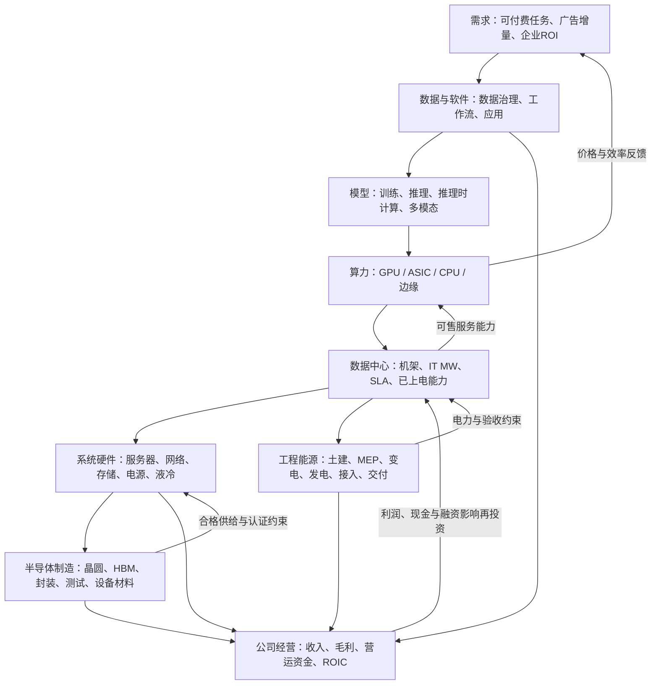

# AI产业链全局图谱与口径字典

报告日期：2026-09-18  
研究截止日期：2026-09-18（仅纳入本次检索时已经公开的资料，不包含当日后续披露）  
研究完成日期：2026-09-18  
主要数据日期：公司披露以2026年第二季度及截至2026-08-02的财季为主；行业与技术更新最晚至2026-09-18；能源历史基准为2023—2025年。  
地域：全球结构；财务样本以美国上市公司全球业务为主，物理约束按美国、欧洲、中国、中东分别判断。  
金额约定：USD bn＝十亿美元，USD m＝百万美元；披露值保留原值与限定词。估算区间均为参数条件范围或情景范围，除非特别说明，不是统计置信区间。

## 一、结论先行：先确定交易边界，再解释产业传导

**AI产业链应使用“九层结构、三本经济账、一条交付状态链”。** 九层负责定位需求、软件、模型、算力、数据中心、系统硬件、半导体制造、工程能源和公司经营；三本账分别记录最终资产形成、供应链交易收入、运营服务与终端付费。交付链依次记录规划、签约、融资、建设、上电、系统验收、可售能力、付费使用和现金回收。同一数字可以有多个标签，但只能在明确的加总边界内出现一次。

| 核心判断 | 对象、期间和依据 | 成立条件与主要未知 |
|---|---|---|
| 已有强劲采购与收入证据，不能由此预定2027—2028年全链条增长 | NVIDIA截至2026-07-26财季Data Center收入USD 89.0bn；Dell FY2027 Q2 AI服务器收入USD 16.4bn；均为公司披露，不是产业最终支出。[R05](https://nvidianews.nvidia.com/news/nvidia-announces-financial-results-for-second-quarter-fiscal-2027)、[R07](https://investors.delltechnologies.com/news-releases/news-release-details/dell-technologies-delivers-second-quarter-fiscal-2027-financial) | 收入可能已包含上游芯片、HBM和网络；后续订单取决于客户现金、利用率与更新决策 |
| CapEx的会计下降不必等于工程投入下降 | Microsoft 2026-07-29说明资产寿命调整使部分未来租赁由融资租赁转为经营租赁，改变公司CapEx指标；管理层称基础投资预期并未因此改变。[R01](https://www.microsoft.com/en-us/investor/events/fy-2026/earnings-fy-2026-q4) | 必须补看租赁新增、租金承诺和设备交付；不能用一个比例回补所有年份 |
| 容量稀缺与终端需求不足可以并存 | CoreWeave于2026-08-11披露截至6月底active power为1.5GW、contracted power约3.7GW；CBRE样本显示低空置。[R06](https://investors.coreweave.com/news/news-details/2026/CoreWeave-Reports-Strong-Second-Quarter-2026-Results/default.aspx)、[R16](https://www.cbre.com/insights/books/north-america-data-center-trends-h1-2026) | 可用电力、地点、GPU代际、SLA和客户信用不匹配时，总体短缺不保证每个资产高回报 |
| 效率改善有三种去向：消化存量、扩大付费任务、压低单位收入 | 本报告第六节同一需求模型：任务量增加80%，在设定效率与利用率下仅需新增约1,077个标准算力单元；另一效率突破分支新增采购为零 | 这是条件演算，不是全球出货预测；质量、延迟、迁移成本不达标时，效率不可兑现 |
| 电力与封装瓶颈具有地域、代际和时间属性 | IEA、PJM、FERC与先进封装资料支持约束存在，但不支持所有电力、材料公司同时受益。[R14](https://www.iea.org/reports/key-questions-on-energy-and-ai/executive-summary)、[R24](https://insidelines.pjm.com/pjms-updated-20-year-forecast-continues-to-see-significant-long-term-load-growth/)、[R22](https://www.trendforce.com/presscenter/news/20260918-13241.html) | 需要具体节点、可交付产能、认证和合同；短缺缓解可能提高数量却降低价格与利润 |
| 付费工作量增长仍可能无法收回资本 | 第七节2MW演算资产：基准路径2027—2031年工作量增长，但扣除一次更新后，五年累计经营自由现金不足初始投入；上行路径才在第五个经营年之前完成名义回收 | 假设资产、价格和吞吐均公开列示；不代表实际项目，也不代表NeoCloud行业平均 |
| 公司经营映射必须落到业务与现金，不能止于“AI相关” | 对GPU、ASIC、内存、EPC、受监管电力、软件分别使用不同收入机制 | 份额、产品毛利、客户集中度、营运资金、债务和股本稀释仍需独立证明 |

**实际阅读新闻时采用以下顺序：**先记录主体、产品、地域、期间、状态和交易对手；再判断这是存量还是流量、最终支出还是中间交易、毛额还是净额；随后找转换参数与约束；最后才估算供应商收入、毛利和现金。没有交易或采购边界的token、MW、wafer，保留物理单位。

## 二、研究边界、证据标记和对账规则

### 2.1 独立研究边界

本报告以用户提供的本次方法正文为研究要求。未读取或继承本地旧研究、行业索引、缓存和历史结论；仅核对目录治理规则，所有事实、数字和公司映射来自本次联网获取的公开外部材料。正式成果仅为本文件。

本研究不是公司投资排序，也不推导买卖建议。覆盖全球结构，但**不声称掌握完整全球AI收入、AI专用CapEx、GPU存量或项目数据库**。公司披露与行业估计作为边界锚点；缺少直接拆分时保留未知，或给出可替换参数的条件估算。

| 标记 | 含义 | 如何使用 |
|---|---|---|
| F：披露事实 | 财报、合同、产品规格或监管原文实际披露 | 事实置信度高不等于经济外推置信度高；未经审计季度数据单独标识 |
| M：管理层目标 | 指引、路线图、拟投产时间、规划容量 | 不转写为交付、收入或现金事实 |
| E：机构估计 | 行业机构模型、调查或预测 | 注明样本和预测期；公开摘要不能冒充完整付费底表 |
| A：研究假设/演算 | 本报告设定的参数、价格、产能和情景 | 输入底表保留，结果不冒充市场规模 |
| I：研究推断 | 由事实与条件建立的传导判断 | 必须列出成立条件和反证 |

来源优先级为：公司财报及监管文件→运营商/utility/公开审批与招标→原始技术论文、标准和产品文档→研究机构自己的公开发布→非正式线索。公司自测性能属于“一手技术声明”，不等于独立生产实测。本次未让论坛、渠道传言进入数字主表；未核验线索不据此赋予上市公司收入。

### 2.2 每条记录的最小口径

建议一条新闻或数据记录包含：

    observation_id / project_id / asset_id / buyer / seller
    product_and_scope / geography / disclosure_date / economic_period
    stock_or_flow / gross_or_net / currency_and_FX_date
    final_spend_or_intermediate_value / overlap_pool
    state / quantity / unit / price_boundary
    source / evidence_type / confidence / recognition_rule / falsifier

同一个园区以项目与分期ID去重；同一服务器由云厂、OEM、芯片商和HBM厂分别披露，应沿BOM建立父子关系。公司有同名项目、跨地区法人或共同出资时，不能只按新闻标题去重。

| 经济账 | 可以记录什么 | 可加总的条件 | 禁止的加总 |
|---|---|---|---|
| A账：终端基础设施资产形成 | 资产所有者新取得的计算、网络、存储、设施和接入资产；现金及非现金新增分别列示 | 同期、同币种、同资产边界，剔除集团内部与重复转售；租赁按所有权/使用权选定一套框架 | 开发商建造成本＋云厂同一设施融资租赁现值；原始资产＋二手转售当作两次全球新增 |
| B账：供应链交易收入 | GPU、HBM、晶圆、整机、EPC、设备等各层收入 | 在同一横向产品市场内剔除内部交易；跨层只能展示交易流水或估计增加值 | HBM收入＋GPU售价＋服务器售价称为AI基础设施规模 |
| C账：运营服务与终端支出 | API、实例、SaaS、租金、电费及终端客户付费 | 自行选择终端客户支出或供应商各层毛额收入；交易链条标识清楚 | 应用收入＋其支付的API费＋API商支付的云费作为独立需求 |
| 制造扩产辅助账 | 晶圆厂、存储厂、设备厂自身扩产和研发 | 可单独分析供给资本形成 | 加到云厂当年AI CapEx，称为同一座数据中心建设成本 |
| 融资辅助账 | 股权、贷款、债券、融资租赁、客户预付款 | 按融资人和工具核对用途、期限及条件 | 融资额直接当订单、收入或社会新增AI需求 |

供应链增加值可以在充分取得中间投入后计算，但上市公司毛利之和并不自动等于全产业增加值：会计期间、外购服务、薪酬资本化、折旧和关联交易需要统一。

## 三、全局产业链分层图谱

### 3.1 结构图

图中箭头是需求、供给或经济约束关系，不是可逐项相加的支出流。能源不是芯片的下一级产品，公司层也不是新增产品市场。

### 3.2 全局图谱表

表中时滞为A/I类型的分析窗口，不是全球统计交期；具体项目需以合同和实际进度替换。

| 层级 | 子环节/关键产品服务 | 上游驱动 | 下游影响 | 核心指标 | 连接条件与时滞 | 代表公司/证据锚点 |
|---|---|---|---|---|---|---|
| 需求层 | 消费助手、企业任务、代码、搜索广告 | 用户价值、预算、可验证ROI | 付费调用、订阅、内部预算 | 成功任务、续费、ARPU、成本节约 | 试用转付费和净增收入通常先于扩容；观察3—12个月 | Microsoft、Alphabet、Meta；R01—R04 |
| 需求层 | 视频、科研、机器人和边缘感知 | 质量、时延、部署安全性 | GPU时、数据和端侧芯片 | 秒视频、帧、实验、机器人运行小时 | 不把图像/视频token强行按文本token换算 | NVIDIA产品路线；R05 |
| 数据与软件层 | 数据平台、数据库、检索、治理、工作流 | 数据质量、权限、集成和企业采用 | CPU/存储/网络与模型调用 | TB、查询、工作流成功率、软件净收入 | 工作流可提升GPU需求，也可通过缓存降低；3—18个月 | Microsoft、Google Cloud；R01、R03 |
| 模型层 | 预训练、后训练、评测 | 模型目标、数据和实验预算 | 训练集群、checkpoint及互联 | 训练run、FLOPs、失败重跑率 | 研究需求不必当期变现；模型迭代可为月度 | 原始论文/MLPerf；R27—R29 |
| 模型层 | 推理、MoE、长上下文、agent | 任务结构、延迟目标、tool call | HBM容量、带宽、KV、CPU和网络 | prefill/decode、并发、TTFT、TPOT | 固定质量和输入结构再比较吞吐 | MLCommons、CloudMatrix研究；R27、R35 |
| 算力层 | GPU、定制ASIC、CPU、边缘 | 工作负载、生态、能效及采购预算 | 设备订单、可用服务能力 | 合格任务/秒、设备时、TCO | ASIC须摊薄NRE且软件可迁移；6—24个月仅是分析窗口 | NVIDIA、Broadcom、云厂自研、华为；R05、R08、R35 |
| 数据中心层 | 自建、colo、NeoCloud、主权AI | 容量规划、融资、地点和SLA | 机架及工程需求、投产节奏 | 已交付IT MW、可售MW、上架率 | 土地与已签电力先于上电；公示项目不算交付 | CoreWeave、CBRE样本、G42；R06、R16、R36 |
| 系统硬件层 | 整机、rack-scale系统和集成 | GPU/ASIC数与拓扑 | 电源、冷却、制造测试 | 节点/rack BOM、验收率、返工 | 价格需注明含GPU、互联、软件和保修 | Dell、NVIDIA；R05、R07、R26 |
| 系统硬件层 | scale-up/out/across、前端网络 | 集群规模、同步强度、距离 | 光模块、交换芯片、DSP、线缆 | 端口×速率、oversubscription | 铜/光、可插拔/CPO互替；代际进度不同 | Broadcom及网络/光学生态；R08、R18、R19、R31 |
| 系统硬件层 | DRAM、SSD、HDD和存储软件 | 数据集、checkpoint、RAG、KV溢出 | 容量、带宽、耐久性与成本 | GB/TB/EB、IOPS、GB/s、DWPD | 工作流和保留期比token数量更有解释力 | Micron及SSD/HDD厂；R09、R20 |
| 半导体制造层 | 晶圆、逻辑die、HBM、封装、基板 | 合格芯片需求和封装尺寸 | 出货上限、交期、良率 | wafer starts、good dies、stack、面积、测试时 | 新增名义产能须经爬坡和客户认证 | TSMC、Micron及封装生态；R09、R10、R22 |
| 半导体制造层 | 光刻、沉积、刻蚀、检测、测试、材料 | 晶圆厂扩产与制程复杂度 | 未来合格供给、折旧和成本 | 工具产能、工艺步骤、耗材/wafer | 下单到有效产能跨多个季度；不等于终端同年采购 | ASML、设备材料产业；R11、R21 |
| 工程能源层 | 土建、MEP、消防、调试、EPC | 已融资的可执行项目 | 交付、成本超支和验收 | 里程碑、工程量、工时、backlog | 土建完成≠IT验收；JLL调查支持时滞重要 | Quanta、工程商；R12、R17 |
| 工程能源层 | 电网接入、高压变电、配电、UPS/BESS | 站点负载曲线与可靠性 | 上电容量、故障穿越、需量费 | MW、MVA、MWh、动态响应 | PPA不能替代接入；法规和节点分别核验 | Eaton、AEP、Dominion；R13、R23—R25、R38 |
| 工程能源层 | 冷板/CDU、冷机、散热、用水 | 热密度、供回水温、气候 | 可支持功率、PUE/WUE、维护 | kW热负荷、流量、ΔT、泄漏率 | 机内冷板与设施冷却分别计价，整体不重复 | Vertiv、OCP生态；R30、R32、R33 |
| 公司经营映射 | 以上业务的实际交易与经营 | 合同、份额、竞争、资本投入 | 毛利、自由现金、ROIC | 收入暴露、回款、经济折旧、客户集中 | 收入到普通股价值需过融资与资本回收检验 | 第九节；不设置投资等级 |

### 3.3 全球结构不能用美国参数直接外推

| 地域 | 可共同使用的口径 | 必须本地化的变量 | 保留的未知 |
|---|---|---|---|
| 美国 | IT MW、任务质量、设备数、资产分账 | ISO/RTO、utility tariff、地方审批、税费、设备合规 | PJM样本不能代表ERCOT、其他州或全部自备电 |
| 欧洲 | 计算/网络/制造映射 | 电价、碳约束、数据驻留、热回收、并网和客户时延 | JLL/CBRE覆盖市场与全球全部数据中心不等同 |
| 中国 | 合格任务、吞吐、功耗、制造良率 | 本土加速器软件栈、采购资格、供应可得性、人民币合同 | 不以单芯片峰值替代系统TCO；海外产品份额不能套用 |
| 中东 | 分期建设、MW与可售能力 | 气候冷却、电水供应、许可、客户和跨境交付 | G42的5GW园区、1GW集群及首期200MW存在嵌套；公告目标不等于截至研究日完成 |
| 其他地区 | 同一交付状态链 | 主权融资、通信时延、电网与本地客户 | 不从人口、国家预算或新闻承诺直接推出订单池 |

G42公告将Stargate UAE放在更大的UAE–US AI Campus内，本报告只使用其项目边界及原定首期目标，不将原定2026年上线当成已经实现。[R36](https://www.g42.ai/resources/news/global-tech-alliance-launches-stargate-uae)

## 四、口径字典：单位相同不代表可加总

| 术语 | 标准定义及边界 | 单位；存量/流量 | 可加总吗 | 常见误用 | 来源优先级 | 反证/校验 |
|---|---|---|---|---|---|---|
| AI需求 | 明确场景和质量目标下需要完成的工作量，另分实际、潜在、付费及免费 | 任务/请求/token/设备时；期间流量 | 同任务定义可；异构任务先分组 | 用户增长当收入；每次agent工具调用当新终端用户 | 产品遥测、账单、客户案例 | 续费、任务成功率、付费使用 |
| token需求 | tokenizer及模型定义下的input/output/cached/reasoning token | token；期间流量 | 同tokenizer与处理类型可；跨模型需校准 | 把输入输出同价同算力；把处理运行率当全年实量 | 平台披露、计费文档 | 缓存命中、重复上下文、免费比例 |
| 训练计算 | 一个run及重跑的计算、通信和评测消耗 | FLOPs、GPU-hour | 同精度/硬件/任务可；不能与峰值性能相加 | 把训练一次需求线性外推每年；忽略失败实验 | 论文、训练日志、客户采购 | 实际MFU、训练周期、重跑 |
| FLOPs与FLOP/s | 工作量与运算速率；精度及稀疏条件明确 | FLOPs流量；FLOP/s能力 | 仅相同精度且避免峰值/有效混加 | FP4/FP8/BF16跨单位性能比较 | 产品规格+实测 | 合格任务吞吐、通信和内存瓶颈 |
| GPU-hour | 指定型号/形态/数量占用小时；区分可售、分配、忙碌、计费小时 | device-hour流量 | 同型号和服务边界可 | 一张GPU的小时跨代同值；集群小时忘记卡数 | 云账单、调度日志 | 可用率、预留/按需、SLA |
| 利用率 | 必须指定分母：电气负载、设备忙碌、有效计算、可售时间、商业计费 | %；期间比率 | 比率加权，不能相加 | 用GPU算术利用率代付费利用率 | 遥测+账单 | 分别重建busy/available/billed |
| 云AI收入 | 外部客户购买API、GPU实例、托管训练/推理等产生的收入；AI SaaS另列子账 | USD/期流量 | 同销售边界、去内部可 | 全部云收入归AI；API和上游租卡费重复 | 分部财报、合同 | 产品拆分、gross/net、credits |
| 应用/广告AI价值 | 明确反事实的增量收入、成本节约或软件收费 | USD/期 | 不与云费加成独立最终需求 | 全部广告增速归AI；节约工时等于裁员现金 | A/B测试、客户ROI、财报 | 非AI因素、采用成本、质量 |
| AI CapEx | 可归属AI任务的资产采购/建造；现金、资产新增与租赁单列 | USD/期流量 | 同资产形成账、同期去重可 | 云厂总CapEx全部AI；CapEx指引等于订单 | 财报现金流、PP&E与租赁附注 | 用途拆分、交付、资本化范围 |
| facility CapEx | 建筑、场地系统、MEP、设施级电力和冷却等；土地与外部接入是否含在内明确 | USD/项目或期 | 仅不相交子包可 | 设施造价/MW套到含GPU整栈 | 建设合同、工程造价 | BIM/BOM、交付边界、业主直采 |
| AI数据中心建设规模 | 新建/改造的AI用途物理容量及资产支出；二者分别表达 | IT MW、rack、USD | 同状态及AI归属的项目去重后可 | 规划MW当在建、总负载当IT负载 | 审批、接入、项目验收 | 分期ID、设备到货、上电 |
| IT load | 指定设备边界的IT电功率；区分额定、可供、实际平均与峰值 | MW/GW；容量或瞬时功率 | 相同状态/测点、去冗余可 | UPS额定容量与服务器实际负载相加 | 配电设计、计量 | 单线图、rack数量、实测曲线 |
| facility load | 全设施计量边界功率，含IT及相应辅助损耗 | MW | 不与IT load相加 | 设施2MW被当2MW纯GPU | 电表、utility | IT与设施测点/PUE闭合 |
| PUE | 同期间设施总能耗÷IT能耗；设计PUE另标 | 无量纲；期间比值 | 用能耗加权 | 用年均PUE精确算尖峰并网容量；PUE低代表每任务成本低 | DOE/标准、实测 | 年周期、天气、负载率和分母边界 |
| 电量与发电容量 | 实际能源与额定输出能力分别计量 | MWh/TWh与MW/GW | 同类才可；MWh不能加MW | 可再生PPA装机等于24×7可用功率 | 电表、PPA、ISO | 容量因子、逐时匹配、输电 |
| BESS/UPS | 功率支撑和储能时长的设备；不生产净能源 | MW与MWh | 功率与能量分账 | 1GW/4GWh储能当4GW长期电源 | 设备合同、运行策略 | 放电时长、循环、充电来源 |
| rack | 指定配置的一组系统/机柜，区分compute/network/facility racks | rack；存量/出货流量 | 同配置或分型号 | 一rack恒定72卡；计算柜之外的网络柜漏计 | 系统产品文档、采购 | 密度、RU、重量、供电与散热 |
| 订单池 | 已识别买方、卖方产品和可采购边界的合同机会 | USD/期或合同期 | 排除重叠主承包/分包后可 | 远期计划、投资意向直接当供应商订单 | 合同、bookings披露 | 撤单、价格重谈、里程碑 |
| bookings/backlog/RPO | 新签约流量/未履行订单存量/按会计口径剩余履约义务；并非同义 | USD；前者流量，后二者存量 | 存量不能跨季相加 | backlog+revenue称市场规模；RPO=现金 | 财报定义、附注 | 开始/结束余额、取消和范围变化 |
| 芯片产能释放 | 合格加速器/模块的可交付数；内部ASIC优先计数量与实际外购成本 | chip/package/期；外部采购USD另列 | 同采购单元可 | die、package、card、tray、rack混数 | 晶圆/封装/整机认证 | min约束、良率、库存和交付 |
| wafer starts/产出 | 晶圆投入与完成产出不同；工艺、尺寸和周期明确 | wafer/月、年 | 同工艺/尺寸/状态才可 | 月投片产能×12等于当年合格加速器 | 晶圆厂、设备/技术资料 | 周期、die面积、良率与良品数 |
| HBM stack/bit | 堆叠数量、层数、die容量和带宽；good stack与投入不同 | stack、GB、bit | 统一代际/容量后可 | 一stack恒定容量；HBM收入再加GPU BOM | 供应商规格、认证 | 每package装载、堆叠良率 |
| CoWoS/先进封装产能 | 制程、封装尺寸与载体边界明确的处理能力 | package/月或等效wafer/月 | 必须按面积/工时转换 | 不同封装面积沿用固定wafer-to-chip比 | 厂商/工艺资料优先 | 大封装侵占量、良率与测试 |
| 公司AI收入暴露 | 可识别AI产品/服务收入与可归属共同基础设施部分 | USD/期、占比 | 直接与估计分列 | 整个电力、HPC或半导体分部全归AI | 财报、合同、客户验证 | 产品及客户拆分、非AI驱动 |
| 价值捕获 | 扣除中间投入、经营成本、经济资本消耗和竞争侵蚀后保留的经济收益 | 毛利、FCF、ROIC | 不同指标不能相加 | 收入增长=利润增长=普通股升值 | 财报、合同、资本寿命 | 毛利、营运资金、更新、债务/稀释 |

PUE定义采用DOE能源效率指南；本报告不采用任何单一厂商的“tokens/W”替代整体经济性。[R34](https://www.energy.gov/sites/default/files/2024-07/best-practice-guide-data-center-design.pdf)

## 五、公开数字锚点：先保留原貌，再做有限对账

### 5.1 云厂投入与供应商收入

| 主体/指标 | 披露日期；经济期间 | 原始数字与类型 | 在本图谱中的位置 | 可以证明什么/不能证明什么 |
|---|---|---|---|---|
| Microsoft CapEx | 2026-07-29；截至2026-06-30季度 | USD 41bn（含融资租赁）；现金PP&E USD 35.8bn；融资租赁USD 5.6bn，F | A账：报告CapEx与现金/租赁分别列 | 不机械要求35.8+5.6精确等于41：指标定义、时点及取整仍需调节；短寿命资产也含CPU与非AI |
| Amazon现金CapEx | 2026-07-30；2026Q2 | USD 53.1bn；2026H1 USD 96.3bn，F | A账现金支出，含AWS与履约网络 | 大部分技术基础设施支持AWS，不等于全部支出均为AI |
| Alphabet PP&E现金购买 | 2026-07-22；2026Q2 | USD 44.924bn，F | A账；Google Cloud收入另为USD 24.768bn | 全公司资产购买和云收入均不能直接标成纯AI |
| Meta | 2026-07-29；2026Q2 | PP&E现金USD 30.116bn；融资租赁本金USD 0.962bn；公司合并口径CapEx USD 31.08bn，F | A账现金与融资付款分列 | 2026全年USD 130—145bn为M指引；内部广告AI没有对应外售云收入 |
| NVIDIA Data Center | 2026-08-26；截至2026-07-26季度 | USD 89.0bn，F | B账平台/系统/网络收入 | 不是裸GPU总价值，也不是全球最终AI采购 |
| Dell AI服务器 | 2026-09-01；截至2026-07-31季度 | 订单USD 60.9bn；收入USD 16.4bn；期末backlog USD 95bn，F | bookings流量、revenue流量、backlog存量分别列 | 三者不能相加；AI服务器收入可含采购自芯片商的价值 |
| Broadcom AI半导体 | 2026-09-02；截至2026-08-02季度 | USD 16.7bn，F；下一财季USD 21.7bn为M | B账定制加速器与网络 | “定制ASIC替代GPU”不代表算力经济消失；公司软件业务不在这个数字内 |
| CoreWeave | 2026-08-11；2026Q2/6月底 | 季度收入USD 2.575bn；revenue backlog约USD 104bn，F（公司自定义） | C账服务收入、跨年履约承诺 | backlog包含RPO及公司估计的其他已承诺合同收入，受交付与服务可用条件约束 |
| Vertiv净销售额 | 2026-07-29；2026Q2 | USD 3.274bn（发布稿取整），F | B账电力/热管理/服务 | 不把全部销售额或增速标成AI；并购、汇率与有机增长须区分 |
| TSMC营收 | 2026-07-16；2026Q2 | USD 40.20bn，F | B账晶圆与制造业务 | HPC并非AI的同义词；先进工艺也服务手机等市场 |
| ASML销售 | 2026-07-15；2026Q2 | EUR 9.3bn，F，保留原币种 | 制造扩产辅助账对应的设备收入 | 未做汇率折算；不是美元AI设备市场；设备销售还受非AI工艺需求驱动 |

来源逐项对应：[R01](https://www.microsoft.com/en-us/investor/events/fy-2026/earnings-fy-2026-q4)、[R02](https://www.sec.gov/Archives/edgar/data/1018724/000101872426000026/amzn-20260630.htm)、[R03](https://s206.q4cdn.com/479360582/files/doc_financials/2026/q2/2026q2-alphabet-earnings-release.pdf)、[R04](https://investor.atmeta.com/investor-news/press-release-details/2026/Meta-Reports-Second-Quarter-2026-Results/default.aspx)、[R05](https://nvidianews.nvidia.com/news/nvidia-announces-financial-results-for-second-quarter-fiscal-2027)、[R06](https://investors.coreweave.com/news/news-details/2026/CoreWeave-Reports-Strong-Second-Quarter-2026-Results/default.aspx)、[R07](https://investors.delltechnologies.com/news-releases/news-release-details/dell-technologies-delivers-second-quarter-fiscal-2027-financial)、[R08](https://investors.broadcom.com/news-releases/news-release-details/broadcom-inc-announces-third-quarter-fiscal-year-2026-financial)、[R10](https://investor.tsmc.com/english/quarterly-results/2026/q2)、[R11](https://www.asml.com/en/news/press-releases/2026/q2-2026-financial-results)、[R32](https://www.sec.gov/Archives/edgar/data/1674101/000162828026050323/q22026exhibit991vrt07292026.htm)。

**有限且可复算的横向加总：**四家公司同为2026年4—6月、全球业务范围，采用现金资本购买近似口径：

    35.8 + 53.1 + 44.924 + 30.116 ≈ USD 163.9bn

它只是四买方当季现金资本支出的观察包络，仍保留各自现金CapEx定义差异；不含新增非现金租赁，也不是全球AI CapEx。Meta融资租赁本金没有再加，避免与资产取得口径混用。它不能与上述供应商收入再相加，也不能乘4称为2026全年事实。

若要估计该样本的AI归属：

    样本AI现金资产支出 = Σ(买方现金资产支出_i × 可核验AI归属率_i)

目前缺少统一的AI/非AI分拆，**可由公开事实识别的数学范围只能是0—约USD 163.9bn，不是有信息量的预测区间**。本报告不把主观归属比例包装成精确全球规模；独立估计转向第六节有采购边界的100MW模块及工作量模型。融资租赁、第三方业主建设、其他地区及其他运营商另缺，不能用这四家公司拼出完整全球市场。

### 5.2 物理量、行业估计与边界冲突

| 来源/发布日期 | 原始数值；对应期间与范围 | 本报告的用法与限制 |
|---|---|---|
| IEA 2026报告，2026-04-16 | 全球数据中心2025年用电485TWh；2030年中央预测950TWh，E | 含非AI；由用电量得到的平均facility功率约55.4GW与108.4GW，不是装机IT GW |
| IEA 2025报告，2025-04-10 | 2024年全球数据中心约415TWh；2030基准约945TWh，E | 用于说明版本变化，不能与2026预测相加或将两个版本差额当实际增长 |
| LBNL报告，2024-12 | 美国数据中心2023年约176TWh；2028年约325—580TWh，E | 原模型范围保留；不把范围收窄，也不把美国所有数据中心当AI |
| CBRE，2026-08-27 | 北美八个主要市场2026H1供应10,903MW、在建7,481.1MW、空置率1.4%，E/调查 | 是指定市场的容量和地产吸纳口径；不包含全球全部自建，更不等于GPU付费利用率 |
| JLL，2026版 | 2026全球平均shell/core造价预测USD 11.3m/MW；示范规格为50MW单租户风冷机房，E | 排除土地与active IT；液冷溢价与地区差异另计，不能直接套到小型项目或完整AI机架 |
| SEMI，2026-07-14 | 全球全部半导体制造设备2026销售预测USD 165.9bn；2028 USD 229.5bn，E | 含多类非AI制造投资，是制造设备市场，不能加进云厂AI CapEx |
| Dell’Oro，2026-07-28 | 2026—2030 AI后端交换机累计支出预测接近USD 1tn，E | 含scale-up扩展边界；五年累计值不能当单年市场，不能与已含互联的rack价格叠加 |
| LightCounting，2026-07 | 2026以太网光模块销售增长预测73%，E | 不是全球全部网络增长；可插拔、CPO、DSP与系统之间必须去重 |
| TrendForce，2026-09-01 | 2026Q2前五企业SSD品牌收入估计接近USD 37.59bn，E | 企业SSD≠纯AI SSD；报价、bit出货和收入不同；公开摘要不够建立完整厂商合并抵消表 |
| TrendForce，2026-09-16 | 全球数据中心2026需求容量161GW；AI服务器约占33.4%，E | 包含IT与非IT四类容量；与IEA实际/预测电量不直接比较，见下述对账 |
| Micron，2026-06-24 | 披露HBM4已大批量出货，HBM4E目标2027年量产，F/M | 出货声明和未来路线分开；不能由某厂商认证推断全行业良率和产能 |
| MLCommons，2026-09-16 | Inference v6.1新一轮基准与测量框架，F/技术资料 | 版本、工作负载、精度、延迟必须固定，榜单性能不等于商业利用率 |

来源：[R14](https://www.iea.org/reports/key-questions-on-energy-and-ai/executive-summary)、[R15](https://www.iea.org/reports/energy-and-ai/energy-demand-from-ai)、[R39](https://eta-publications.lbl.gov/sites/default/files/2024-12/us_data_center_energy_usage_report_lbnl-2001637_0.pdf)、[R16](https://www.cbre.com/insights/books/north-america-data-center-trends-h1-2026)、[R17](https://www.jll.com/content/dam/jllcom/en/global/documents/reports/research-reports/26-research-global-data-center-outlook-new.pdf)、[R21](https://www.semi.org/en/semi-press-release/global-semiconductor-equipment-sales-forecast-to-reach-a-record-229-billion-dollars-in-2028-semi-reports)、[R18](https://www.delloro.com/news/ai-back-end-switch-sales-to-approach-1-trillion-over-the-next-five-years/)、[R19](https://lightcounting.com/newsletter/en/july-2026-cloud-data-center-optics-385)、[R20](https://www.trendforce.com/presscenter/news/20260901-13210.html)、[R41](https://www.trendforce.com/presscenter/news/20260916-13237.html)、[R09](https://investors.micron.com/node/50671/pdf)、[R27](https://mlcommons.org/2026/09/mlperf-inference-v6-1-results/)。

**重要分歧的量纲检验：**TrendForce给出的2030需求容量490.7GW，若全年满载对应约4,299TWh；IEA中央情景是950TWh。二者商约22.1%，只能作为“若两者边界一致，需要怎样的有效负载率才能对上”的诊断数，**不能称为测得的全球利用率**。差异可能来自规划需求与实现供给、容量与平均用电、非IT边界、模型和样本覆盖不同；现有公开资料无法唯一识别。TrendForce自身亦指出，电网缺口估计没有扣足自备电的潜在补充。本报告不取两者平均，不由缺口直接推算发电设备订单。[R41](https://www.trendforce.com/presscenter/news/20260916-13237.html)、[R14](https://www.iea.org/reports/key-questions-on-energy-and-ai/executive-summary)

## 六、跨层公式与独立数量估计

### 6.1 公式的适用条件与未证实连接

以下均为定义、工程恒等关系或A类型模型，不给会计恒等式赋概率。参数必须与同一地域、资产、工作负载和期间配对。

| 编号/用途 | 公式 | 何时可用、尚未证明的步骤 | 地域/期间/约束/反证 |
|---|---|---|---|
| F1 终端付费 | R_end = Σ(付费用户×使用频次×净价)；按量业务为Σ(tokens_by_type×相应净价) | 付费率若已经包含在“付费用户”中不再乘；订阅与超额费需排除包含权益 | 全球或地区、月/年；预算/采用约束；续费下降、credits增加须下修 |
| F2 推理工作→设备时 | H_device = Σ(T_j / q_j) / 3,600 | q为同模型、质量、上下文、batch与SLA下的每卡有效tokens/s；prefill/decode若分别计时不能又用含两者的总吞吐 | 2026—2028训练/推理分开；HBM/带宽/调度约束；实测TTFT/TPOT不达标即重估 |
| F3 FLOPs近似 | 所需名义FLOP/s = 年FLOPs / (年运行秒数×计算效率η) | 若输入已经是有效吞吐，不能再除η；密集decoder推理2×active parameters/token只是粗略算术核，训练6ND（N为参数数、D为训练token数）也是理想化近似 | 仅同模型和精度、全球可适用；MoE、attention、重跑/通信需补项；实测偏离则弃用近似 |
| F4 存量到采购 | S_t=S_(t-1)+交付−退役；N_new=max[0, D/(a×u_max×q_new×时间)−存量等效能力]+必要替换 | 存量须按合格能力归一，不用新卡性能直接除全部旧卡；必要替换若已从存量扣除，不再加一次 | 2027/2028按厂商或资产；电/融资/兼容约束；旧卡续约、利用率提高可减少新购 |
| F5 内存约束 | KV bytes≈2×层数×KV heads×head_dim×序列长度×并发×bytes/element；另加权重、激活和运行开销 | GQA、MLA、量化与共享prefix改变公式；不能直接用总参数算KV | 相同模型部署；2026—2028；OOM、带宽下降或命中率变化为反证 |
| F6 rack与负载 | 计算rack=加速器数/每rack卡数；IT MW=Σ(rack×对应kW)/1,000 +其他IT MW | 使用compute rack时外部网络/存储另加；已含的网络柜不得重复 | 每个园区/分期；机架密度/供电散热约束；实际配置与重量不兼容即失效 |
| F7 电量 | E_facility(MWh)=Σ(P_IT(MW)×Δh×同期PUE)；年均近似IT额定×负载率×8,760×PUE | 功率曲线、PUE随负载变化；设施尖峰与备用冗余另算，不由年度电量精确推出 | 节点/气候/电价特定；接入、水、燃料约束；需量账单和实测电表校验 |
| F8 设施与采购 | C_asset=Σ(不重叠采购包数量×包单价)+未包含工程费用 | GPU rack若含HBM/互联/冷板，只拆内部价值；业主直采与EPC供货去重 | 2026价格基础的2027交付等必须标明；验收/报价/关税约束；scope变化即改分母 |
| F9 芯片合格供给 | N_pkg≤min(W_completed×good_dies_per_wafer/dies_per_pkg, good_HBM_stacks/stacks_per_pkg, packaging_starts×Y_pkg, tester_hours/test_hours_per_pkg) | 各项对应同一时期且在制品时滞匹配；晶圆starts不能直接替代completed；系统良率再乘一次 | 代际/地区特定，未来12—24个月；HBM/封装/测试/认证；良率或产线分配下调 |
| F10 封装尺寸换算 | 可供package≈可加工总面积×有效排版率×良率/单package占用面积 | 不同interposer/载体/工序不能共用一个面积系数，工时瓶颈可能更强 | 同工艺同产品族；大封装/翘曲/测试约束；面积增加却沿用旧产能换算为失效 |
| F11 网络/光器件 | 光模块数=光链路数×每链路端点数×每端点模块数+备件 | 通常两端各一模块，但breakout、CPO、铜缆、拓扑与over-subscription改变系数 | cluster或园区，代际明确；认证/良率/距离约束；拓扑更换重算，不固定每GPU价值量 |
| F12 订单→收入 | B_end=B_start+新单−撤单−已履行订单价值±调整；R_t=Σ(已获合同_i×当期确认系数_i) | 若从行业订单池起算才乘份额；按进度确认与一次性交付要分开；换汇/并购调整单列 | 公司/财季；交付、验收、融资约束；book-to-bill和回款背离须下修 |
| F13 收入→现金 | GP=R×产品GM；FCF=现金回款−现金运营成本−维护/更新/增长CapEx−现金税费 | 不将折旧和更新CapEx重复作为现金支出；应收、预收及供应商融资单列 | 资产/公司全寿命；信用、成本、更新约束；续租价格或残值下降为反证 |
| F14 电力→公用事业收益 | 售电收入=电量价×MWh+需量费+其他批准收费；允许回报≈合格rate base×批准资本回报机制 | 能源转售与资本回报不同；fuel pass-through不自动增加利润；受监管与merchant发电分开 | 特定州/节点/费率期；核准与回收约束；费用不得转嫁/接入延误需下修 |

训练FLOPs近似参考Chinchilla计算最优训练论文，不能将预训练规模关系外推成推理商业需求。[R43](https://arxiv.org/abs/2203.15556)

关于q、质量门槛及SLA，采用MLCommons的计量思想，不搬用某一榜单最高值；PagedAttention论文证明软件可改变吞吐，但其测评倍数仅适用于论文条件。[R28](https://mlcommons.org/2025/04/llm-inference-v5/)、[R29](https://arxiv.org/abs/2309.06180)

### 6.2 同一2027年需求对象：增长、效率与新增采购可以脱钩

**对象与范围：**一个全球云业务的假设标准推理工作负载；2026年底已有10,000个标准算力单元，每单元满载年能力定义为1工作量单位，商业利用率60%，所以基期付费工作量6,000。2027最多允许75%利用率以保留SLA余量。所有价格、效率和需求倍数为2026-09-18设定的A参数，不是任何公司指引；暂不退役、不加训练负载。新旧单元都能取得表中效率倍数，若升级仅适用于新卡，必须逐代重算。

    2027所需单元 = 6,000×需求倍数 / (效率倍数×75%)
    新采购 = max(0, ceil(所需单元)−10,000)
    新采购金额 = 新采购×完整单元采购价
    服务收入指数 = 需求倍数×净服务价指数×100

| 2027情景 | 付费工作量；相对2026 | 同质量效率倍数 | 存量能力/新增采购 | 单元采购价；采购金额 | 净服务价指数；收入指数 |
|---|---:|---:|---|---|---|
| 基准条件 | 10,800；1.8倍 | 1.3 | 10,000旧单元可承接9,750；需新增1,077 | USD 25,000；约USD 26.9m | 0.80；144 |
| 需求上行 | 18,000；3.0倍 | 1.2 | 存量承接9,000；新增10,000 | USD 30,000；USD 300m | 0.70；210 |
| 采用偏弱且效率释放 | 7,200；1.2倍 | 1.8 | 存量上限13,500；新增0，实际利用率40% | 假设可购价USD 20,000；采购USD 0 | 0.60；72 |
| 上行路径中的效率突破子分支 | 18,000；3.0倍 | 2.5 | 存量上限18,750；新增0，利用率72% | 价格对新增金额不适用；采购USD 0 | 0.70；210 |

**数量含义：**需求上行不必对应新增GPU，收入增速也不必追上工作量。突破分支需要同等质量、长时间稳定运行和存量部署资格，不能用某个kernel的实验室倍数替代。反向结果也可能发生：性能提升解锁更复杂模型，使每个成功任务消耗更多设备时，必须重新定义D与q，不能只保留旧任务成本下降。

这些点是对同一2027对象的可比较条件路径，**没有宣称它们覆盖所有可能状态，也不赋总和100%的路径权重**。时滞分为软件改造与客户采用、订单、交付和回款；未填一个全球统一交付月数。用生产SLA、付费需求和旧设备利用率决定采购分支。

### 6.3 一个100MW IT模块的独立采购边界估计

**对象：**假设美国2027—2028交付的100MW IT数据中心模块，2026-09-18美元采购假设；不代表具体园区或全球年度规模。假设80MW给compute racks，每rack 120kW、72个加速器，则约667个rack、48,000个加速器。其余20MW给外部网络、存储和其他IT。PUE在设计条件下1.20—1.35，对应facility运行功率约120—135MW；并网尖峰、备用容量和扩建预留另核验。

| 不重叠采购包 | A类型假设与边界 | USD bn条件范围 | 反证/不含项目 |
|---|---|---:|---|
| 完整计算rack | 约667 rack×USD 3—5m；包括加速器、HBM、机内互联、电源、机内冷却及集成 | 2.00—3.33 | 不是市场报价；若供应商报价含外部网络则扣后项 |
| 外部网络 | rack以外的scale-out/across与前端网络，整包 | 0.12—0.25 | 不再加交换芯片、DSP及模块的供应商收入 |
| 存储 | 采购整套系统，含所需控制及软件初始许可 | 0.05—0.12 | 不是根据token直接推TB；需求要按数据生命周期验证 |
| 建筑与设施MEP | USD 9—14m/IT MW；设施配电、冷却、消防、调试 | 0.90—1.40 | 以JLL设施造价作独立锚点后扩范围；不是其液冷项目直接报价 |
| 土地与外部电力接入 | 项目承担的资产/接入费，不含独立大型发电厂 | 0.10—0.30 | 大规模自备电、输电主干投资可能使上界失效 |
| 未含的项目控制、工程整合及投产服务 | 只计未进入上述包的业主费用 | 0.02—0.05 | 若已在EPC中则置零 |
| **合计：最终资产采购边界** | 两端组合为条件范围，并非统计分位点 | **约3.19—5.45** | 不含融资成本、运营电费、税费差异；不外推全球 |

设施锚点来源：[R17](https://www.jll.com/content/dam/jllcom/en/global/documents/reports/research-reports/26-research-global-data-center-outlook-new.pdf)。计算rack价格与配套区间是独立假设，置信度低；目的为暴露构成和敏感性，不能用于声称真实市场均价。

**敏感性比“每GW固定造价”更有信息：**相同80MW计算负载下，若机架功率由120kW升至240kW，则计算rack数约减半；若单rack价同时翻倍，计算采购金额不变，但卡数、带宽、热密度和可用服务能力未必不变。若卡数翻倍却良品封装受限，设施可以先竣工而IT部署延后。对于全球统计，应汇总项目自身配置，不把此模块乘新闻宣布的GW。

### 6.4 与同一模块衔接的制造合格供给模型

为了检验48,000个加速器目标，设每package含2个合格逻辑die、8个合格HBM stacks。以下为**同一供货批次、同一代际、目标2027年交付**的演算，不是TSMC/Micron真实产能；completed wafers已经经历前道制造周期。测试能力假设足够，若不足增加一个min项。HBM取good stacks，不再乘一次HBM良率。

| 输入/结果 | 下行 | 基准 | 上行 |
|---|---:|---:|---:|
| 分配到该批次的完成晶圆wafer | 1,800 | 2,000 | 2,000 |
| 每wafer合格逻辑die | 50 | 60 | 60 |
| 逻辑侧支持package | 45,000 | 60,000 | 60,000 |
| 分配的合格HBM stacks | 320,000 | 400,000 | 480,000 |
| HBM侧支持package | 40,000 | 50,000 | 60,000 |
| 封装starts×封装良率 | 50,000×80%＝40,000 | 60,000×85%＝51,000 | 70,000×90%＝63,000 |
| 最小合格package供给 | 40,000 | 50,000 | 60,000 |
| 系统集成一次通过率 | 90% | 95% | 97% |
| 可交付系统中的加速器 | 36,000 | 47,500 | 58,200 |
| 对48,000目标 | 缺12,000 | 缺500 | 富余10,200 |
| 所对应72卡compute rack | 500 | 约660 | 约808 |

这说明**放大封装产能本身可能不增加交付**，如果HBM先约束；上行富余也不能在原80MW计算负载中全部安装，超过模块容量的器件需要另一资产或等待部署。因此制造交付、机房接纳、客户付费三道门必须分开。

此处不将good die、HBM stack强造美元。只有实际外购合同确定后才产生相应B账收入；内部ASIC只记录外部代工、HBM、封装、设计服务采购和内部开发成本。路线证据采用TSMC官方材料及Micron披露；TrendForce的封装替代预测作为另一解释，不能当客户已经量产采用的事实。[R10](https://investor.tsmc.com/english/quarterly-results/2026/q2)、[R09](https://investors.micron.com/node/50671/pdf)、[R22](https://www.trendforce.com/presscenter/news/20260918-13241.html)

## 七、完整经营案例：同一2MW资产从采购到现金回收

### 7.1 资产边界、服务质量和投入

**这是演算资产，不是真实园区，也不是2027年采购H100的建议。** 选择成熟8卡平台便于把采购单元、功率和可售工作量连接起来；新一代rack的造价与能效不能直接套入。对象为美国自有设施的2MW IT小型推理资产，2026年底一次性完成投资，2027-01-01投运，经营到2031年底。三个路径沿用相同土地、设施、机架数量、服务质量与终止日期，允许替换计算设备，不新增园区。

| 输入 | 基准资产参数 | 依据、日期与置信度 |
|---|---|---|
| 计算配置 | 128台8卡H100级服务器＝1,024卡；每rack放4台，32个计算rack | A；规格参考DGX H100的8卡及系统约10.2kW最大功率；非DGX采购报价 |
| 最大IT功率 | 128×10.2kW＋网络/存储180kW＝1.4856MW，2MW设计余量0.5144MW | A/F组合；网络等功率为假设；R26只支持单机规格 |
| 初始计算系统采购 | 128×USD 0.18m＝USD 23.04m；含卡、CPU、机内互联、内存、机内电源及冷却 | A，2026-09-18美元假设，低置信；完整单机价格，不再加裸GPU |
| 外部网络与存储 | USD 5m，含相关软件初始部署 | A；后续运维在固定成本中，不再重复资本化 |
| 设施与MEP | USD 22m，约USD 11m/设计IT MW | A；JLL造价作量级参照，2MW小规模存在较大上行风险 |
| 土地及外部接入 | USD 3m | A；不含新建发电站、大规模输电或漫长预开发 |
| **初始投资C0** | **USD 53.04m；合理压力测试输入可取约USD 42—74m** | 后一范围仅为计算系统18—32、网络存储4—7、设施18—30、土地接入2—5的参数组合 |
| 质量边界 | 固定文本任务集；每请求2,048输入token、256合格输出token；任务通过率不低于冻结基准，P95 TTFT≤2秒、TPOT≤50ms | A服务合同目标；本报告未运行性能测试，不声称该组合已在指定硬件验证 |
| 初始吞吐q0 | 每物理卡200个合格output tokens/s，**已包含固定输入处理消耗** | A；是需验收的关键假设，不是MLPerf成绩；不得再单独扣一次prefill算力 |
| 等效工作量 | 1个基准等效GPU-hour＝720,000个合格output tokens，附带固定8:1输入量 | A计量基准，硬件更新后保持任务定义 |
| 可用率a | 95%；各年统一8,760小时标准年 | A；维护、更换停机包含在5%内；忽略闰年额外24小时，影响小于0.3% |
| 商业利用率u | 表7.3；分母是可用服务时间；不等于FLOPs利用率 | A；付费工作量需求被定义为A×g×u，不能再乘付费率 |
| 效率g | 表7.3；同质量每卡服务能力相对初始值 | A；含软件优化及更新收益，不代表硬件峰值倍数 |
| 电力与PUE | 电价USD 0.08/kWh、PUE 1.25；固定费包含在非电运营费用的假设范围中 | A，不代表某utility实际费率；无强制最低需量的基础情形 |
| 固定非电运营费用 | USD 2.5m/年，含人工、水、保险、基础运维、软件及外网服务 | A；不含所得税、财产税、营业税、融资成本；需另做当地报价 |
| 随收入变动运营费 | 开票收入的5% | A；例如售后、支付、增量软件与服务成本 |
| 回款 | 当年开票收入98%同年实收，余下2%最终损失 | A；不结转应收，便于现金复算；实际企业必须用DSO和坏账表 |
| 维护CapEx | USD 0.5m/年 | A；维护与大规模更新分开 |
| 大规模更新 | 基准/上行2030年USD 20m；下行提前至2029年USD 20m，均无旧卡出售收入 | A；全部1,024卡对应系统替换，功率不超过原上限；要求兼容原设施 |
| 终止价值 | 2031年底设施/土地净出售回收USD 12m；计算及其他IT残值按0 | A；此12m单独加入，未混入年度经营现金；可能不能实现 |
| 融资与税费 | 全权益、无债务，无利息/融资费用；所得税及上述地方税未计 | 未覆盖成本会下调现金；未假设税收抵扣或补贴，不推导普通股目标价值 |

硬件规格：[R26](https://www.nvidia.com/content/dam/en-zz/Solutions/Data-Center/nvidia-dgx-h100-datasheet.pdf)；设施量级：[R17](https://www.jll.com/content/dam/jllcom/en/global/documents/reports/research-reports/26-research-global-data-center-outlook-new.pdf)。

### 7.2 可逐年复算的公式

适用范围仅为上述2027—2031美国推理资产。尚未证明的关键步骤是吞吐/SLA达标、客户付费与价格、设备更新报价、接入和税费。若任一不成立，应替换输入，不把表内现金作为预测事实。

    A = 1,024 × 8,760 × 95% / 1,000,000
      = 8.521728 百万物理可用GPU-hour/年

    H_t = A × g_t × u_t                 # 百万基准等效GPU-hour
    T_out,t = 0.72 × H_t                # 万亿合格输出token；输入=8倍
    requests_t = T_out,t × 10^12 / 256
    R_t = H_t × p_t                     # USD m；p按基准等效GPU-hour计价
    receipts_t = 0.98 × R_t

    e_t = 0.95 × (u_t + 0.03)           # 额外3%可用时间用于不收费校验等
    P_IT,avg = 128×(0.003 + 0.0072×e_t) + 0.180
             = 0.564 + 0.9216×e_t       # MW，包含闲置功率
    electricity_t = P_IT,avg × 8,760 × 1.25 × 1,000 × 0.08 / 10^6
                  = P_IT,avg × 0.876   # USD m
    Opex_t = 2.5 + 0.05×R_t + electricity_t
    FCF_t = receipts_t − Opex_t − 0.5 − replacement_t

    cumulative_t = −53.04 + Σ FCF_t
    NPV10 = −53.04 + Σ[FCF_t/(1.10)^t] + 12/(1.10)^5

p是相同服务工作量的等效价格，**不是更新后GPU的市场租赁报价**。g提高使同样物理卡时产出更多工作，因此H可以超过初始可用卡时；不能再次将H除g用于收入。q0包含输入计算，但收入按整套固定输入/输出服务包收取，输入token不再另加收费。

负载与能耗不是随u归零：即使没有客户也有服务器闲置与网络负载。更新假设在相应经营年开始时可用，更换停机包含在可用率中；NPV按年度现金统一在年末折现，这是简化约定。若更新款在年初支付，应把该笔折现提前一年，降低NPV；基准2030年更新对应的差额约USD 1.37m。更新后仍沿用同一功率曲线是一项需验收的假设；如果新设备功率更高、液冷改造超支或更换停机超过5%，必须增加成本、减少可售时数。

### 7.3 三条路径的年度工作量与现金

单位：H为百万等效GPU-hour，T为万亿合格输出token；收入、回款、Opex、更新及现金均为USD m。每年维护CapEx 0.5已在FCF扣除。累计现金含初始投资，不含终止残值。显示值取整，复算使用上述未取整公式。

| 路径 | 年 | g | u | p美元/等效小时 | H | T | 收入R | 实收 | 现金Opex | 大更新 | FCF | 累计现金 |
|---|---:|---:|---:|---:|---:|---:|---:|---:|---:|---:|---:|---:|
| 基准 | 2027 | 1.00 | 65% | 2.20 | 5.539 | 3.988 | 12.19 | 11.94 | 4.12 | 0 | 7.32 | -45.72 |
| 基准 | 2028 | 1.15 | 70% | 2.00 | 6.860 | 4.939 | 13.72 | 13.45 | 4.24 | 0 | 8.71 | -37.02 |
| 基准 | 2029 | 1.30 | 72% | 1.70 | 7.976 | 5.743 | 13.56 | 13.29 | 4.25 | 0 | 8.54 | -28.48 |
| 基准 | 2030 | 1.80 | 70% | 1.45 | 10.737 | 7.731 | 15.57 | 15.26 | 4.33 | 20 | -9.57 | -38.05 |
| 基准 | 2031 | 1.90 | 72% | 1.30 | 11.658 | 8.394 | 15.16 | 14.85 | 4.33 | 0 | 10.02 | -28.03 |
| 上行 | 2027 | 1.00 | 80% | 2.80 | 6.817 | 4.909 | 19.09 | 18.71 | 4.59 | 0 | 13.62 | -39.42 |
| 上行 | 2028 | 1.20 | 88% | 2.70 | 8.999 | 6.479 | 24.30 | 23.81 | 4.91 | 0 | 18.40 | -21.01 |
| 上行 | 2029 | 1.40 | 90% | 2.50 | 10.737 | 7.731 | 26.84 | 26.31 | 5.05 | 0 | 20.76 | -0.26 |
| 上行 | 2030 | 2.00 | 88% | 2.20 | 14.998 | 10.799 | 33.00 | 32.34 | 5.34 | 20 | 6.49 | 6.24 |
| 上行 | 2031 | 2.20 | 90% | 2.00 | 16.873 | 12.149 | 33.75 | 33.07 | 5.39 | 0 | 27.18 | 33.41 |
| 下行 | 2027 | 1.00 | 45% | 1.80 | 3.835 | 2.761 | 6.90 | 6.76 | 3.71 | 0 | 2.56 | -50.48 |
| 下行 | 2028 | 1.20 | 35% | 1.40 | 3.579 | 2.577 | 5.01 | 4.91 | 3.54 | 0 | 0.87 | -49.61 |
| 下行 | 2029 | 1.60 | 30% | 1.00 | 4.090 | 2.945 | 4.09 | 4.01 | 3.45 | 20 | -19.94 | -69.55 |
| 下行 | 2030 | 1.80 | 35% | 0.85 | 5.369 | 3.865 | 4.56 | 4.47 | 3.51 | 0 | 0.46 | -69.09 |
| 下行 | 2031 | 2.00 | 38% | 0.70 | 6.477 | 4.663 | 4.53 | 4.44 | 3.54 | 0 | 0.41 | -68.69 |

| 五年结果 | 基准 | 上行 | 下行 |
|---|---:|---:|---:|
| 年度FCF累计减初始投资，不含残值 | -28.03 | +33.41 | -68.69 |
| 加USD 12m终止回收后净累计现金 | -16.03 | +45.41 | -56.69 |
| 10%折现NPV，不含残值 | -33.09 | +11.46 | -64.41 |
| 10%折现NPV，含残值 | -25.64 | +18.91 | -56.96 |
| 名义经营现金回收 | 五年内未回收 | 2030年累计转正，已扣当年更新 | 五年内未回收 |
| 对应经营含义 | 工作量增加不足以抵消价格下降和资本消耗 | 需较高利用率、价格留存及更新效率同时成立 | 闲置与降价叠加；提前更新使资金缺口扩大 |

**路径解释：**

- 基准是按当前“付费增长、效率持续改善、价格竞争、需要更新”的多重证据选择的中间演算，不是行业最可能值或统计中位数。2027到2031的工作量增长来自利用率与效率；价格下降后收入增长有限。
- 上行须形成持久的客户业务，且质量相同情况下用户愿意保留较高净价；不能只靠供不应求新闻。2030年新增系统采购USD 20m为替换，没有新增2MW设施。
- 下行同时假设采用不足、净价下降，以及因平台支持/合同兼容要求提前更新。**这是继续履约的压力路径，不是最优投资决策**。如果可以取消后续更新、提前出售资产或关闭机房，应单独计算退出方案；不能因为设备买得更早就宣称需求更强。
- 三路径的g都上升，现金结果仍完全不同。因此“效率提升必然刺激投资”与“效率提升必然摧毁投资”都不由技术倍率本身成立。

### 7.4 经济更新、融资和敏感性

初始计算系统若经济寿命按3年、网络存储5年、设施20年、土地不折旧，则起始年经济资本消耗为：

    23.04/3 + 5/5 + 22/20 = USD 9.78m/年

基准2027年的回款扣现金Opex约USD 7.82m，低于这项经济资本消耗；即使运营现金为正，也不足以表明创造经济利润。上述经济折旧只用于解释盈利质量，**没有再从FCF扣一次**。会计使用寿命、经济更新与实际采购各有含义；后续更新按其剩余经济寿命另建折旧表。

| 敏感性/条件 | 同一资产的数量影响 | 经济影响及反证 |
|---|---|---|
| 基准路径各年的p同时增加USD 0.10/等效小时 | 工作量固定 | 含残值NPV增加约USD 2.91m；若涨价减少需求，这一局部敏感性失效 |
| 电价由0.08升至0.10美元/kWh | 物理服务固定 | 基准NPV下降约USD 1.00m；需量费、最低用电条款与尖峰费尚未包含 |
| 初始投资增加USD 10m | 可售能力不变 | NPV直接下降USD 10m；不能靠增加折旧寿命恢复现金 |
| 残值无法兑现 | 终止现金少USD 12m | 三路径NPV均再降约USD 7.45m |
| 沿用基准g/u及成本，要求五年NPV=0 | 计算一个所有年份相同的p | 所需恒定净价约USD 2.57/等效小时；它是解方程所得盈亏门槛，不是市场租金预测 |
| 吞吐q0实际只有假设的一半且价格按同质量token收费 | 同资产服务容量减半，若需求充足可提高u但有上限 | 不能仍沿用表内收入；需要重新算任务容量、拥塞与SLA |
| 60%初始债务、年利率10%的融资压力例 | 首年债务USD 31.824m | 年利息约USD 3.18m，尚未还本；基准2027 FCF仅7.32m，不能视为股东可分配现金 |

债务例不是实际融资条款，不并入主案例。所得税、财产税、销售税、建设期利息、接入延期、诉讼、拆除、超出固定预算的客户服务和总部费用均未完整建模，主案例NPV不能当银行可融资价值。上行依赖的高净价也需客户合同支持。

本案例采用自有设施，与租赁型NeoCloud不同：租用同一机房时，可移除相应购建现金并增加租金和保证金；不能同时保留全额自建设施投资再支付假设完整租金。真实合同若take-or-pay，应把“预订容量收费”和“实际消耗工作量”拆成两个变量，不能按这里的按量模型直接估值。

## 八、通用细分行业坐标系与传导情景

### 8.1 细分行业归属

下表中的价值捕获机制为I研究推断，具体上市公司是否获单另证；时滞与反证优先于概念标签。

| 细分行业 | 所属层级 | 上游驱动 | 下游约束 | 主要价值捕获点 | 主要反证指标 |
|---|---|---|---|---|---|
| 企业AI应用/工作流 | 需求、软件 | 可衡量任务ROI、权限与系统接入 | 企业采用、模型调用预算 | 业务集成、分发、数据权限 | 使用不续费、实施成本高、免费捆绑 |
| 数据库/检索/治理 | 数据与软件 | 企业数据、RAG、多模态资料 | 查询和检索质量、CPU/SSD | 数据管理与持续服务 | 缓存压缩、内建功能替代、查询单位价下降 |
| GPU/通用加速器 | 算力、硬件 | 灵活模型与生态 | 可用吞吐、HBM、开发效率 | 软件生态、系统协同、可交付性 | ASIC份额、推理净价、旧卡闲置 |
| 定制ASIC与设计服务 | 算力、制造 | 足够稳定且大规模的工作负载 | 软件迁移、开发周期、NRE | 专用能效、设计IP、量产服务 | 模型频繁变更、利用不足、NRE回收失败 |
| 服务器OEM/ODM | 系统硬件 | 平台采购与交付 | 集成、测试、售后和营运资金 | 系统设计、供应保障、服务 | 直采/白牌替代、返修、零部件过手毛利下降 |
| scale-up互联 | 系统硬件 | 单一加速域规模、通信强度 | 分布式效率与可扩展性 | 高速互联、协议与系统设计 | 模型通信减少、竞争协议、拓扑变更 |
| Ethernet/InfiniBand/scale-across | 系统硬件 | 集群和园区拓扑 | 网络拥塞、同步/容错 | 交换芯片、网络操作与可用性 | oversubscription变化、跨园区需求不足 |
| 光模块、激光器、DSP | 系统硬件、制造 | 端口数量、速率、距离与光纤拓扑 | 光链路良率、功耗和维护 | 光学器件、封装、测试与认证 | ASP降幅超过端口增长；铜缆/CPO改变采购边界 |
| HBM/高带宽内存 | 半导体制造 | 加速器数×每卡容量及带宽 | 封装合格交付和模型规模 | 高层堆叠、良率、客户认证 | 单卡装载改变、ASP下降、产能闲置 |
| DDR/LPDDR/CXL扩展内存 | 系统硬件、制造 | CPU数据服务、容量分层 | CPU与GPU数据供给 | 容量、带宽、模块集成 | 不能把全部DRAM周期归AI；缓存及内存分层变化 |
| 企业SSD/控制器 | 系统硬件、制造 | 数据集、checkpoint、RAG、KV分层 | 带宽、尾延迟、写入寿命 | 控制器、固件、认证、持续性能 | 原始bit多但美元价跌；KV留在HBM不落盘 |
| HDD/对象存储 | 系统硬件 | 长期数据保留、视频与归档 | 成本、容量、读取时延 | 单位容量TCO与生态 | 数据去重/删除、较短保留期；不能由推理token直推EB |
| 晶圆代工 | 半导体制造 | 合格die与节点迁移 | 前道供给、良率、功耗 | 工艺和制造执行、客户协同 | die面积/良率变化、非AI需求回落、重复下单 |
| 先进封装/基板/测试 | 半导体制造 | package面积、HBM数、chiplet复杂度 | 合格率与交付节奏 | 工艺、基板、测试时长及认证 | 替代封装量产、测试效率、良率爬坡快于需求 |
| 光刻/刻蚀/沉积/检测设备 | 制造扩产 | 工艺步骤、新增厂房和资本预算 | 后续制造产能 | 高端工艺、维护升级、装机服务 | 客户扩产延后、工具利用率低；订单不是终端需求倍数 |
| 材料/气体/化学品 | 半导体制造 | wafer数量×工艺消耗×纯度要求 | 良率、供应稳定性 | 认证与稳定交付 | 本土替代、单位耗量下降、非AI产能挤出 |
| 数据中心高压变电/接入 | 工程能源 | 已核实站点的负荷增长 | 最早可上电时间 | 认证设备、工程与节点资源 | lead time缩短、接入队列剔除、许可受阻 |
| 低压配电/UPS/BESS | 工程能源、硬件 | rack功率、供电拓扑、动态负载 | 可靠性、故障穿越和峰值供电 | 电源转换、保护和服务 | HVDC替代原有级数；储能功率增长但时长/单价下降 |
| 冷板/CDU/液冷配件 | 硬件、工程 | 热密度、供回水温、平台冷却比例 | 热管理和系统验收 | 泄漏控制、流体与维护认证 | 平台内置、标准化降价、客户认证未获 |
| 冷机/干冷器/冷却塔 | 工程能源 | 总热负荷、气候与水资源 | 可持续散热、PUE/WUE | 设施设计、能效与维护 | 温水液冷减少冷机需求；水约束改变路线 |
| EPC/MEP/调试 | 工程 | 可执行投资与项目开工 | 施工、质量、验收 | 工程能力、人才、风险管理 | 固定价超支、保函占用、回款慢、转包过手 |
| 发电/天然气/核能 | 工程能源 | 本节点可服务负荷与购电安排 | 电量、可靠容量、燃料/许可 | 合同电价、可调度能力 | 不得用全球GW推所有电源；燃料涨价与资本回收失败 |
| 受监管utility | 工程能源 | 经核准的接入与电网投资 | 接入、rate base与收费 | 获准回报、长期服务 | 监管拒绝回收、最低需量条款不足、客户退出 |
| 数据中心业主/colo | 数据中心 | 长租约、合格机房、地点 | power-ready交付 | 稀缺地点与电力、租赁服务 | 已租未用、租户信用、租赁到期价、设施改造成本 |

### 8.2 关键跨层连接：可比较结果及中断机制

| 重要连接/对象 | 目标时期与情景 | 数量/采购结果 | 价格、收入/现金结果 | 时滞、归属与判别证据 |
|---|---|---|---|---|
| 同一标准推理云业务 | 2027基准/上行/下行 | 付费量10,800/18,000/7,200；新购1,077/10,000/0 | 采购约USD 26.9m/300m/0；服务收入指数144/210/72 | 详见6.2；存量可承接则应用增长不传到设备新增 |
| 同一48,000加速器交付目标 | 2027下行/基准/上行 | 可供36,000/47,500/58,200 | 保留物理量；无采购合同，不造收入 | 详见6.4；HBM、封装和系统良率先后成为约束 |
| 同一2MW经营资产 | 2027—2031三路径 | 2031输出工作量8.394/12.149/4.663万亿token（基准/上行/下行） | 含残值NPV -25.64/+18.91/-56.96 USD m | 同一初始投资与质量；详见第七节，非行业盈利预测 |
| 同一100MW交付模块延迟 | 目标2027全年→延后半年，A假设 | 全年可运营100MW降为50MW-year；实际安装容量可仍为100MW | 假设满年服务贡献现金USD 100m，则当年减少USD 50m；若USD 0.5bn已付款且资金成本10%，半年占用成本USD 25m另列 | 贡献现金是假设，融资费用不重复扣入；utility/设备商可能已确认收入，业主却尚无服务收入 |
| 单一光模块采购包 | 2027相对2026，A标准化100万个模块 | 基准110万、上行150万、下行90万 | 初期ASP USD 500；2027 ASP 450/400/350；市场包收入USD 495m/600m/315m，对比初期500m | 量增不保证收入增；若CPO改为光引擎，必须重建产品边界，不能跨边界比较同比 |
| 单一设施总投资预算上修 | 2027预算从USD 1bn增至1.2bn，A | 若价格上涨20%，实物采购不增加；若价格持平，实物最多增20% | 供应商名义收入可增加，毛利取决于自身成本；工程量不确定 | 预算上修必须分价格、数量、范围和预付款；不将20%传给每一环节 |

后三行为独立机制演算，不能代替第七节完整案例，也不能彼此相加。其数字依据为研究设定，不是市场预测。

### 8.3 概率只用于有限事件，不赋予虚假精度

本次没有足够公开底表校准“全球AI建设上行/下行”的概率分布。下列范围是低置信度、可更新的主观判断，用于列明关键未知，**不是统计估计，也不以之加权生成全球市场规模**。

| 事件与概率性质 | 成功标准/目标时期 | 判断 | 支持理由与主要未知 | 上调/下调证据 |
|---|---|---|---|---|
| E1：条件技术事件 | 给定6.2上行需求已发生，至2027年底，同一冻结工作负载在原有设备实现≥2.5倍合格吞吐，SLA不降，稳定运行90天 | P(E1\|上行需求)=10%—40%，主观低置信 | 论文证明调度/内存管理有显著提升空间；成熟生产栈的剩余空间、模型复杂度和迁移成本未知；不把旧论文倍率当先验频率 | 多客户同任务90天验收上调；依赖换模型、降低质量或只支持新卡则下调 |
| E2：条件采购事件 | 给定6.2的18,000工作量、效率仅1.2和75%利用率上限，新增10,000单元在2027内交付并付费上线≥90% | 定性“中等且高度依赖合同”，不填百分比 | 算术需求确定，年内交付取决于设备、电力、合同和融资；缺少项目台账无法校准 | 预付款、上电、整机验收和真实账单上调；延迟/撤单/信用恶化下调 |
| E3：规模化替代事件 | 至2028年底，一种替代封装在至少两家独立外部客户的同等级AI平台稳定交付，并达该可比产品量的≥10% | 定性“可行但证据不足”，不给窄区间 | 工艺路线与行业预期存在，但发布/样品不足以识别份额和良率 | 客户量产及良率/成本披露上调；仅认证新闻或小批样品不改变判断 |

E1是上行情景的子分支，其无条件概率为P(上行需求)×P(E1|上行需求)；本报告没有给P(上行需求)，所以不声称无条件概率10%—40%。E1、E2与融资、电力并不独立，不能按独立事件连乘。至少一个客户成功不等于全行业渗透，渗透不等于供应商利润兑现。E3的技术发生、10%份额和盈利改善也分别观察。

## 九、公司经营映射：从实际暴露到可保留收益

### 9.1 公司经营映射示例

“直接”表示产品或合同与AI采购关系可核验，不代表利润高或股票便宜；“条件”表示需进一步拆分用途或合同；“概念”表示只有能力或主题关联，尚无本研究验证的获单。均不是投资分层。

| 公司/环节 | 位置 | 收入暴露口径/证据 | 采用或交付条件 | 替代关系 | 毛利/ROIC机制（I） | 不可直接映射处 |
|---|---|---|---|---|---|---|
| NVIDIA | 算力、整栈硬件/网络 | Data Center财报分项，直接但非纯裸GPU；R05 | 系统交付、客户部署与软件运行 | 定制ASIC、其他GPU、旧卡延寿；不同任务可共存 | 平台生态、系统集成、研发摊薄；受定价/成本/竞争影响 | 不能将全分部收入当全球AI芯片独立增量，也不能加回HBM/代工 |
| Broadcom | 定制加速器、网络 | 明确披露AI半导体收入，直接；R08 | 云厂设计定点、量产和真实工作量 | 通用GPU、自研设计或另一设计伙伴 | NRE/量产设计价值、网络IP及大客户规模 | 自定义AI口径不等于与NVIDIA完全可比；不能加公司软件收入当AI |
| Dell | 服务器集成 | AI-optimized服务器订单/收入/backlog，直接；R07 | GPU到货、整机验收、售后、现金收回 | ODM直采、厂商整栈、其他OEM | 集成/交付服务；大量芯片成本过手，营运资金可能上升 | ISG利润率不是AI服务器独立利润率 |
| Micron | HBM、DRAM、NAND | 产品出货披露直接；各业务单元收入须拆，R09 | 客户认证、良率、bit和stack配置 | 其他内存厂、不同代际、内存分层与压缩 | 稀缺性、良率与资本效率；周期价格影响大 | 全部云内存/数据中心收入不能认作HBM或纯AI；设备CapEx另账 |
| TSMC | 代工与封装 | 已披露制造业务；AI客户份额在本报告未量化，条件；R10 | 节点/封装认证、良率、产能配置 | 其他代工/封装工艺；设计改变die面积 | 制造执行与工艺，扩产折旧、良率及海外成本 | HPC、先进制程和CoWoS总量均非AI最终市场 |
| ASML | 制造设备/服务 | 设备销售直接、AI归属条件；R11 | 晶圆厂资本计划、装机、客户验收 | 工艺路线、延寿升级、其他制造步骤配置 | 高难度光刻与装机服务；研发/产能周期 | AI订单不等于本公司当年销售，全公司不能标为纯AI |
| Vertiv | 电力、热管理、服务 | 实际销售直接，AI拆分条件；R32 | 项目上电、平台认证、安装调试 | 其他供应商、模块化集成和标准化 | 系统设计、服务attach、供货和执行 | 产品收入与项目完整MEP合同可能嵌套；公司总增长含并购 |
| Eaton | 电气配电、供电系统 | 电气业务含数据中心、utility及其他市场，条件；R13 | 客户/项目认证、交期和工程安装 | HVDC改变转换级数，其他电气供应商 | 认证、渠道、可靠性、售后与产能 | 不把Electrical所有收入和订单全部归AI |
| Quanta Services | 电力及工程交付 | 财报工程业务、项目合同，条件；R12 | 工程许可、劳动力、保函、客户融资 | 自营建设、其他EPC、预制模块 | 交付与风险管理；毛利受固定价、材料和返工影响 | 工程主包中的设备收入不能再与设备商毛额合并为终端新增 |
| Microsoft | 云、软件、模型/应用 | 云/软件收入与AI使用需按产品识别，直接及条件并存；R01 | 客户续费、SLA、成本和容量 | 云际迁移、开源自托管、自研ASIC | 平台销售、软件分发；算力折旧/租金拖累毛利 | 内部研发AI不形成外部云收入；总云收入不是AI专属 |
| Alphabet/Meta | 平台、广告、模型、自研 | 外部云与内部广告变现分开；R03、R04 | 广告增量需反事实，模型API需净付费 | 模型商品化、流量竞争与内部ASIC | 广告效果、分发与已有用户；AI也可能提高成本 | 不能把全部广告收入认作AI收入或按token标价 |
| CoreWeave | 算力服务资产 | 服务收入和合同backlog直接；R06 | 交付、可用、客户履约与融资 | 云厂自建、其他GPU云、旧卡/新卡 | 利用率、合同净价与融资；更新/利息影响现金 | EBITDA/合同总额不等于可分配现金，active power不等于实际计费负载 |
| AEP / Dominion | 公用事业 | 数据中心特定接入、费率和相关合格投资，条件；R25、R38 | 监管核准、资产投运、最低计费及客户信用 | 节点迁移、自备电、需求响应 | 允许回报、rate base与成本回收，不是把电费涨幅全留作利润 | 全部售电和电网资本开支不属于AI |
| 华为及中国配套生态 | 模型、算力、系统 | CloudMatrix论文/服务公告可核验；上市配套公司获单未由此证明，R35、R40 | 软件迁移、实际SLA、认证及可交付能力 | 其他本土/海外系统、云端/端侧 | 系统协同可能补偿单芯片差异；需比较总功耗及客户成本 | 华为不是可直接投资的上市标的；不能由“兼容昇腾”推上市公司收入 |
| G42与主权项目配套 | 园区与AI基础设施 | 公告明确分期与合作方；实际各包收入需合同，条件，R36 | 分期融资、许可、设备、上电、客户 | 不同地域部署、其他运营商/设备 | 地点、客户与融资能力；效益受利用率影响 | 项目总规划不能分配给每个合作方；不能推断当地所有工程/能源企业受益 |

证据入口：R01—R13、R25、R32、R35—R36、R38、R40在附录给出完整链接。表中盈利机制是本研究的条件推断，而非公司利润指引。

### 9.2 “概念相关”应如何识别

| 看到的表述 | 本次允许的结论 | 升级为真实收入暴露需要什么 |
|---|---|---|
| “可用于AI数据中心的电缆/材料/冷却产品” | 产品可能适用，不分配订单 | 客户认证、SKU、订单金额/数量、交付期间及收入确认 |
| “与某GPU/模型厂战略合作” | 合作关系，可能只有联合展示或软件适配 | 付费交易对手、收费方式、商业部署与毛利 |
| “拥有GW级土地或电力意向” | 潜在资源；核实可撤回和转让限制 | 有效接入协议、融资、建设许可、交付和租户 |
| “所在国家/地区有大型主权AI计划” | 地域主题关联 | 可执行招标或已签合同；不能按GDP或承诺投资额分摊 |
| “持有AI公司股权” | 金融投资暴露 | 股权价值与经营收入分开，公平价值变动不是服务收入 |
| “数据中心业务占比高” | 比一般工业更接近建设支出 | AI/传统、更新/新增、地理及合同分拆 |

### 9.3 收入、毛利、现金与普通股价值的四道额外证明

1. **收入归属：**谁控制产品、谁开票、按总额还是净额、是否包含第三方组件、是否关联交易。
2. **毛利保留：**涨价来自自身稀缺还是转嫁供应商涨价；人工/保修/能源成本是否同步上升。
3. **资本与现金：**存货、应收、预付款、保函、维护/更新CapEx与客户集中度，决定收入能否变现金。
4. **普通股剩余：**债务、优先股、融资租赁、稀释和终止价值优先于普通股；即使产业规模和收入都增长，也没有自动推出股东回报。

## 十、重复计算、弹性与研究陷阱

### 10.1 可以相加和不能相加的操作表

| 组合 | 判断 | 正确处理 |
|---|---|---|
| 同园区互不重叠的计算系统、外网、存储、设施采购 | 可以，边界明确时 | 保留项目ID、发票/合同包及期间 |
| 不同地区、同期间、同口径已投产IT MW | 可以 | 不混入规划、备用、重复建设阶段 |
| 同代际设备的付费小时 | 可以 | 仅在相同服务定义下；跨代按质量基准转换 |
| 同产品横向竞争厂商对外销售 | 可形成该产品市场 | 清理关联/转售和并购重复，保留非AI部分 |
| GPU售价＋所含HBM＋封装＋代工收入 | 不可以当最终市场 | B账各层展示，或从GPU BOM向下拆 |
| 云CapEx＋Dell服务器收入＋NVIDIA平台收入 | 不可以当新增投资 | 同一交易链、跨期确认，三处证据而非三份需求 |
| EPC总包＋其外购变压器、冷机和设备 | 不可以 | 选择最终合同或拆分不重叠设备/人工包 |
| 某季backlog＋未来多季收入 | 不可以 | 用backlog滚动表，以履约时点转收入 |
| 云RPO＋客户对终端的未来收入合同 | 不可以当终端需求总额 | 识别客户供应链与支付来源 |
| AI模型融资额＋用于采购的CapEx | 不可以 | 融资为资金来源，采购为用途 |
| 经营租赁付款＋同设施资产原始建设支出 | 不可以当同期新增资产 | 建造与租赁服务账分别保留 |
| 100MW许可＋100MW在建＋100MW已交付 | 不可以 | 同一项目状态更新；允许按时间追踪，不能做横向加总 |
| 全球数据中心电量＋AI数据中心电量 | 不可以，若后者为子集 | 展示总量与AI占比/子集 |
| PPA容量＋电网接入容量＋备用柴油容量 | 不可以作可售IT容量 | 按可靠供电方案、逐时匹配和冗余单独工程计算 |
| 二手GPU交易＋新GPU出货 | 不能作全球新增设备 | 二手改变资产所有者和价格，不增加全球物理存量 |
| 政府补贴＋受补贴企业项目预算 | 不可以当两份投入 | 同一项目资金来源和最终用途分账 |

**价格含量变化的特殊风险：**当厂商从裸芯片转成整rack交付，收入可能因产品范围扩大而增加。必须同时拆数量、单价、所含部件及原先外包的价值；无法可靠重列历史范围就不比较“同口径增速”。CPO把原本外置模块价值移到交换机或封装内也有同样问题。

### 10.2 谁由需求驱动，谁由瓶颈驱动，谁仍只是叙事

| 类型 | 成立的经营条件 | 通常先看的证据 | 不能得出的结论 |
|---|---|---|---|
| 需求驱动 | 付费客户、使用/续费和ROI扩大 | 实收、净留存、成功任务、单位毛利 | 用户增长必然增加设备采购 |
| 瓶颈驱动 | 特定SKU/地点供给不足且有议价能力 | 交期、ASP、认证、可交付订单、利润率 | 所有同类厂商长期受益 |
| 预建/战略驱动 | 为未来能力或主权目标提前支出 | 融资、合同、预算、建设及政策 | 当期付费需求已经覆盖投入 |
| 叙事驱动 | 没有合同、可计量用途或客户证据 | 只有合作、招聘、媒体热度 | 按市场总额分配上市公司收入 |

2026公开数据支持部分环节有真实收入和紧张供给；本研究不把所有增长解释为同一种驱动。例如内存价格上涨可提高供应商收入，却挤压相同云预算能购买的算力数量；工程backlog增加也可能来自成本上升而非实物规模扩大。

### 10.3 CapEx上修或需求/融资转弱时，弹性取决于增量落点

| 冲击 | 可能更高的收入/利润弹性 | 最早承压处 | 成立条件、反证与时滞 |
|---|---|---|---|
| 已上电园区补购计算设备 | 认证通过且可交付的加速器/HBM/互联；OEM收入可能弹性高但利润较薄 | 非AI预算可能被挤占 | 同期新增预算确实用于设备、非涨价或范围迁移；缺电则中断 |
| 新增园区/外部接入预算 | 电气长交期设备、施工与设施冷却 | 资金先占用，云收入晚于施工 | 项目融资和许可确定；有资格的供应商才获单，交付常跨年度 |
| 单rack热密度提高，MW不增加 | 液冷、电源、连接器/配电架构的单位配置价值 | 被替代的风冷/旧配电产品 | 必须拆机内与设施侧；CDU标准化或平台内置会压低外部供应商份额 |
| 推理需求/净价转弱 | 长合同可暂缓影响，有保底的utility/colo较慢体现 | 按需GPU租价、空置能力、客户续约及增购预算 | take-or-pay不取消信用风险；旧订单可延迟使上游晚几个季度才见压力 |
| 融资成本上升/新资金减少 | 已有现金与低资本消耗的服务更抗压，但非保证 | 未融资的项目SPV、NeoCloud、预租/预付款与高营运资金集成商 | 供应商付款条件、抵押品价值和客户集中形成反馈；上市云厂也可能重排预算 |
| HBM/封装扩产成功 | 实物交付增加，整机阻塞缓解 | 稀缺溢价、库存与落后代际ASP | 同时有需求、电力、资金才促进部署；仅供给扩张可能压毛利 |
| ASIC渗透提高 | 定制设计、代工、封装、内存可保留或改变暴露 | 被替换的通用GPU份额/售价、部分软件租金 | ASIC也可能缩减每任务功耗和硬件总额；不能假设所有上游数量不变 |
| 工程审批与并网约束缓解 | 有融资项目加速；某些长期瓶颈租金下降 | 高稀缺溢价和提前囤货 | 建设提速可利好交付却减弱设备定价，不是全链利润共同扩张 |

价格与利润会反过来改变供给：高毛利吸引扩产和竞争，扩产有时滞，待产能释放时需求/产品可能已变化。负反馈也存在：租价下降削弱贷款覆盖和残值，再抑制采购，供应商价格跟随下行；低价可能最终恢复采用，但这两条效应的速度不相同。

## 十一、新证据如何改变计量边界与关键判断

### 11.1 已出现的边界变化与可保留的不同解释

| 新证据 | 应怎样更新 | 不能怎样更新 |
|---|---|---|
| Microsoft资产使用寿命/租赁分类变化，2026-07-29 | 保留现金、资产新增和租赁的三条序列；为跨期同比做桥接 | 不将报告CapEx变化直接视为AI需求变化；更不能视为GPU经济寿命同步延长 |
| MLPerf Inference v6.1发布，2026-09-16 | 标明新旧版本和场景，必要时重跑固定任务；区分实验基准和端到端服务 | 不把新模型/新质量/新延迟下的最高吞吐直接当旧资产能力倍增 |
| 封装尺寸与替代路线公开讨论，2026-09-18 | 同时保留“CoWoS维持主流”与“部分大客户替代”两条路径，重新按面积/测试时核容量 | 不从一种替代技术发布推算主流方案消失，或从主流地位推出永久价格溢价 |
| FERC 2026-06-18大型负荷行动 | 逐节点跟踪接入、灵活负荷、费用分摊和后续实施文件 | 不把程序推进等同立即上电，或一项PJM规则套到全美 |
| Loudoun 2026-09-15决议 | 对需立法批准的数据中心和变电站申请，加入最多12个月暂停最终表决的项目条件；逐案核对例外 | 不写成全县所有已批/已建项目停工，更不能外推全美国 |
| AEP Ohio现行data center tariff | 按合同容量、历史需量及适用档位核计费最低量；项目现金成本或有下限 | 不把新闻中的“85%”简化为所有客户每月实耗kWh固定保底85% |
| TrendForce GW与IEA TWh差距 | 先取得容量状态、AI归属、负载率及自备电覆盖，再重建对账桥 | 不平均两套数值，不把差额全转成设备采购池 |
| G42项目公告/工程进度 | 将5GW园区、1GW集群、200MW首期建立父子ID，状态逐期更新 | 不把同一分期多家合作方公告相加，也不以目标年当投产事实 |

来源：[R01](https://www.microsoft.com/en-us/investor/events/fy-2026/earnings-fy-2026-q4)、[R27](https://mlcommons.org/2026/09/mlperf-inference-v6-1-results/)、[R22](https://www.trendforce.com/presscenter/news/20260918-13241.html)、[R23](https://www.ferc.gov/news-events/news/ferc-launches-aggressive-targeted-action-speed-large-load-integration)、[R42](https://www.loudoun.gov/CivicAlerts.aspx?AID=10874)、[R25](https://www.aepohio.com/company/about/rates/data-center-tariff/)、[R41](https://www.trendforce.com/presscenter/news/20260916-13237.html)、[R14](https://www.iea.org/reports/key-questions-on-energy-and-ai/executive-summary)、[R36](https://www.g42.ai/resources/news/global-tech-alliance-launches-stargate-uae)。

### 11.2 未来3/12/24个月的可证伪条件

时间自研究截止日计：3个月至2026-12-18，12个月至2027-09-18，24个月至2028-09-18。下列阈值是A类型研究触发条件，不是行业共识或预测。

| 连接 | 3个月可验证进展 | 12—24个月经营验证 | 下修/改边界触发 |
|---|---|---|---|
| 企业采用→付费工作量 | 付费合同、使用、credits和净价格 | 续费与实收增长，任务ROI覆盖实施成本 | 免费量增长而实收连续两个可比季度不增，不能保持需求上行外推 |
| 效率→新增采购 | 固定任务/质量/SLA的生产基准 | 旧设备利用率、同需求预算与实际新购 | 吞吐提高却不满足SLA，删除效率收益；需求可由存量承担，减少新增采购 |
| CapEx→交付 | 预付款、采购包、设备到货 | 验收、资产新增、已上电与计费容量 | 多季度现金/租赁新增与实物交付背离，重查价格、范围及预付 |
| 电力意向→已可售能力 | 接入协议、许可和实际施工 | 电表、负荷曲线、网络/冷却/IT联合验收 | 新闻容量仍停留在规划或批准，不能进入当年供给 |
| HBM/封装→合格加速器 | 客户认证、测试与封装良率 | 成品出货、安装与返修/保修 | wafer或工具增长没有转成good package，降低良率/产能兑现 |
| 供应商收入→价值捕获 | 产品GM、库存和应收 | 现金转换、售后成本、更新/扩产回报 | 收入增而现金被存货/应收持续吞噬，不能维持利润兑现判断 |
| 租金/设备残值→融资 | 实际续约价、质押折扣与融资条款 | 利息及还本覆盖、抵押资产可出售性 | 抵押品贬值、契约收紧或预付客户信用恶化，减少可融资采购 |
| 技术路线→行业规模 | 样品/benchmark/认证分别记录 | 两家以上客户量产、可比产品份额与利润 | 样品成功不升级为规模；份额增长但ASP/GM降，不升级为利润 |

### 11.3 本报告仍不能识别的量，以及它们影响什么

| 未知 | 为什么无法唯一识别 | 对结论的影响/补充参数 |
|---|---|---|
| 全球统一token总量 | 模型、tokenizer、缓存、内部调用、免费与付费不可比 | 不发布全球token TAM；需按模型/场景收集计费与遥测 |
| 全球纯AI CapEx | 共享设施、租赁与内部自用、不同会计定义 | 四买方现金包络不能当AI市场；需资产用途及租赁桥接 |
| 全球合格GPU/ASIC有效存量 | 型号、退役、地域与SLA差异，ASIC缺外部售价 | 不用芯片累计出货代表有效供给；需逐代能力/退役表 |
| 2027—2028行业利润池 | 价格、产品范围、份额、折旧、融资与税费共同变化 | 提供机制与条件数量，不伪造全链利润总额 |
| 中国/中东全部项目兑现 | 公开采购与投产验证覆盖不足 | 保留物理与项目状态，不能按公开计划全额入账 |
| 采购招标的最终回款 | 公开招标/获授公告不等于验收付款 | 历史Isambard AI公告仅作采购边界示范，不据此填实际现金 |

对于最后一项，本次找到英国官方Find a Tender的Isambard AI公告，编号2023/S 000-033353，发布日期2023-11-10，类型F15自愿事前透明公告。官方索引片段可核验主体与公告类型，但正文访问返回403，因此**未把镜像所载合同金额或支付条件纳入本报告数字**。它说明招标公告首先用于识别买方、采购对象与法律程序，仍须继续连接合同、交付和回款。[R37](https://www.find-tender.service.gov.uk/Notice/033353-2023/PDF)

## 十二、Reference与数字来源附录

以下为本次使用的公开外部来源。发布日期与经济期间不同；未标注发布日期的技术/规则网页明确采用访问日期，不把抓取时间冒充披露时间。F/M/E的置信度分别针对“原文披露存在”“目标实现”“模型外推”；不把一手身份当成所有结论可靠的保证。全部链接于2026-09-18检索或访问；付费报告仅使用机构公开摘要，没有声称读取其完整数据集。

| 编号/来源 | 披露日期；对应期间 | 来源层级/是否一手 | 支持的定义、数字或判断 | 置信度与验证备注 |
|---|---|---|---|---|
| [R01 Microsoft FY26 Q4电话会](https://www.microsoft.com/en-us/investor/events/fy-2026/earnings-fy-2026-q4) | 2026-07-29；截至6/30季度及FY27/2026指引 | 公司IR，一手 | CapEx、现金PP&E、融资租赁；建筑寿命及未来租赁分类变化；云/软件边界 | F高，管理层前瞻中；41与现金/租赁分项不强行凑齐 |
| [R02 Amazon 2026Q2 10-Q](https://www.sec.gov/Archives/edgar/data/1018724/000101872426000026/amzn-20260630.htm) | 2026-07-30；Q2/H1 2026 | SEC监管文件，一手 | 现金CapEx 53.1/96.3bn；AWS与履约网络混合用途 | F高；不是纯AI披露 |
| [R03 Alphabet Q2 2026 earnings release](https://s206.q4cdn.com/479360582/files/doc_financials/2026/q2/2026q2-alphabet-earnings-release.pdf) | 2026-07-22；截至6/30季度 | 公司原始财报PDF，一手 | PP&E现金44.924bn、云收入24.768bn；现金流及经营边界 | F高；季度未审计，Cloud非纯AI |
| [R04 Meta Q2 2026 results](https://investor.atmeta.com/investor-news/press-release-details/2026/Meta-Reports-Second-Quarter-2026-Results/default.aspx) | 2026-07-29；Q2及2026年目标 | 公司IR，一手 | PP&E现金30.116bn、融资租赁本金0.962bn、31.08bn及130—145bn指引 | F高、M中；内部广告AI与外售云不同 |
| [R05 NVIDIA Q2 FY2027 results](https://nvidianews.nvidia.com/news/nvidia-announces-financial-results-for-second-quarter-fiscal-2027) | 2026-08-26；截至7/26财季 | 公司财报/产品路线，一手 | Data Center 89.0bn；整栈平台/网络与产品路线范围 | F高；不以路线公告推客户规模 |
| [R06 CoreWeave Q2 2026 results](https://investors.coreweave.com/news/news-details/2026/CoreWeave-Reports-Strong-Second-Quarter-2026-Results/default.aspx) | 2026-08-11；Q2、6/30存量 | 公司IR，一手 | 收入2.575bn、backlog约104bn；active/contracted power 1.5/约3.7GW及backlog定义 | F高；公司自定义指标，不能当现金或实耗 |
| [R07 Dell Q2 FY2027 results](https://investors.delltechnologies.com/news-releases/news-release-details/dell-technologies-delivers-second-quarter-fiscal-2027-financial) | 2026-09-01；截至7/31财季 | 公司IR，一手 | AI服务器订单60.9bn、收入16.4bn、backlog95bn；集成采购边界 | F高；分部利润不能直接下放AI产品 |
| [R08 Broadcom Q3 FY2026 results](https://investors.broadcom.com/news-releases/news-release-details/broadcom-inc-announces-third-quarter-fiscal-year-2026-financial) | 2026-09-02；截至8/2财季及Q4指引 | 公司IR，一手 | AI半导体收入16.7bn、下一季21.7bn目标；定制加速器及网络 | F高、M中；自定义AI收入口径 |
| [R09 Micron Q3 FY2026 results](https://investors.micron.com/node/50671/pdf) | 2026-06-24；该财季及2027路线目标 | 公司IR原文，一手 | HBM4出货与HBM4E目标；内存业务需分产品、bit、价格 | 出货声明中高、未来路线中；未量化纯AI总收入 |
| [R10 TSMC Q2 2026官方材料入口](https://investor.tsmc.com/english/quarterly-results/2026/q2) | 2026-07-16；2026Q2 | 公司IR，一手 | 40.20bn收入、制造/技术边界；链接财报、演示及电话会 | F高；不从HPC推纯AI收入 |
| [R11 ASML Q2 2026 results](https://www.asml.com/en/news/press-releases/2026/q2-2026-financial-results) | 2026-07-15；2026Q2 | 公司IR，一手 | EUR 9.3bn总销售；制造设备、订单和验收风险 | F高；原币保留，不造美元AI规模 |
| [R12 Quanta Q2 2026 results](https://investors.quantaservices.com/news-events/press-releases/detail/402/quanta-services-reports-second-quarter-2026-results) | 2026-07-30；2026Q2 | 公司IR，一手 | 工程交付、客户资本计划、材料/劳动力及项目风险 | F高、经营机制I；全公司非纯AI |
| [R13 Eaton Q2 2026 results](https://www.sec.gov/Archives/edgar/data/1551182/000155118226000027/etn06302026exhibit99.htm) | 2026-07-31；2026Q2 | 公司新闻稿，一手 | 电气业务跨数据中心、utility和其他行业；需按终端拆分 | F中高；未使用缺乏期间核验的订单数 |
| [R14 IEA Key Questions on Energy and AI](https://www.iea.org/reports/key-questions-on-energy-and-ai/executive-summary) | 2026-04-16；2025基年、2030预测 | 国际机构原始研究；模型一手 | 485TWh与950TWh；效率、采用和融资/供给约束 | E中；不是电表逐项目汇总事实 |
| [R15 IEA Energy and AI—需求章](https://www.iea.org/reports/energy-and-ai/energy-demand-from-ai) | 2025-04-10；2024基年、2030预测 | 国际机构原始研究；模型一手 | 415TWh与945TWh；旧版边界及情景 | E中；仅用于版本对比 |
| [R16 CBRE North America H1 2026](https://www.cbre.com/insights/books/north-america-data-center-trends-h1-2026) | 2026-08-27；2026H1 | 行业第三方原始调查 | 八个主要市场供应、在建和空置率 | E中高；不是全球或GPU利用率 |
| [R17 JLL 2026 Global Data Center Outlook](https://www.jll.com/content/dam/jllcom/en/global/documents/reports/research-reports/26-research-global-data-center-outlook-new.pdf) | 2026版，PDF提取未明确初发日；2025观察/2026预测 | 行业第三方原始报告 | shell/core 11.3m/MW、50MW风冷基准、排除土地与IT；工程时滞 | E中；用于造价量级，不作为演算资产报价 |
| [R18 Dell’Oro AI后端网络预测](https://www.delloro.com/news/ai-back-end-switch-sales-to-approach-1-trillion-over-the-next-five-years/) | 2026-07-28；2026—2030累计 | 第三方研究公开摘要，原机构 | 累计接近1tn预测及scale-up扩大覆盖边界 | E中偏低；长期预测，未读付费底表 |
| [R19 LightCounting Cloud DC Optics](https://lightcounting.com/newsletter/en/july-2026-cloud-data-center-optics-385) | 2026-07；2026及之后 | 第三方研究公开摘要，原机构 | 以太网光模块2026增长73%预测；光学产品范围 | E中；不外推全部网络 |
| [R20 TrendForce企业SSD](https://www.trendforce.com/presscenter/news/20260901-13210.html) | 2026-09-01；2026Q2 | 第三方行业研究原发布 | 前五品牌企业SSD收入接近37.59bn估计；量价区别 | E中；非纯AI、非全市场审计 |
| [R21 SEMI设备预测](https://www.semi.org/en/semi-press-release/global-semiconductor-equipment-sales-forecast-to-reach-a-record-229-billion-dollars-in-2028-semi-reports) | 2026-07-14；2026—2028 | 行业协会原始预测 | 全设备2026 165.9bn、2028 229.5bn；制造扩产独立边界 | E中；不是AI专属设备 |
| [R22 TrendForce先进封装路线](https://www.trendforce.com/presscenter/news/20260918-13241.html) | 2026-09-18；2026—2028 | 第三方研究原发布 | 大封装、CoWoS-L及替代工艺的竞争/成本关系 | 技术解释中；商业路线为预测，需厂商/客户验证 |
| [R23 FERC大型负荷行动](https://www.ferc.gov/news-events/news/ferc-launches-aggressive-targeted-action-speed-large-load-integration) | 2026-06-18；规则程序及后续实施 | 监管原发布，一手 | 大型负荷接入、灵活性、区域运营商差异 | 程序事实高；不代表所有项目已获接入 |
| [R24 PJM 2026长期负荷预测说明](https://insidelines.pjm.com/pjms-updated-20-year-forecast-continues-to-see-significant-long-term-load-growth/) | 2026-01；长期规划期 | 区域电网运营商，一手 | 大型负荷调整与预测方法，非全部申请都算实耗 | 规则/方法高，预测中；仅PJM地域 |
| [R25 AEP Ohio Data Center Tariff](https://www.aepohio.com/company/about/rates/data-center-tariff/) | 动态规则页；2026-09-18核验 | utility一手费率说明 | 最低计费需量、合同容量及历史需量条件 | 条款中高；实际以获准tariff和客户合同为准 |
| [R26 NVIDIA DGX H100 datasheet](https://www.nvidia.com/content/dam/en-zz/Solutions/Data-Center/nvidia-dgx-h100-datasheet.pdf) | 静态产品资料；未核定初发日；2026-09-18核验 | 公司产品文档，一手 | 8卡、640GB及约10.2kW最大系统功率 | 规格高；不支持报告假设吞吐/采购价 |
| [R27 MLPerf Inference v6.1](https://mlcommons.org/2026/09/mlperf-inference-v6-1-results/) | 2026-09-16；当轮基准 | 基准组织原发布，一手 | 测量框架及版本变化；须固定场景和质量 | 方法高；结果不等于生产付费利用率 |
| [R28 MLCommons LLM Inference v5.0](https://mlcommons.org/2025/04/llm-inference-v5/) | 2025-04；v5.0方法 | 基准组织技术资料，一手 | TTFT/TPOT、吞吐与不同部署场景 | 方法高；不把旧基准成绩当2026当前商业性能 |
| [R29 PagedAttention论文](https://arxiv.org/abs/2309.06180) | 2023-09首发；论文实验条件 | 原始论文，一手技术来源 | 内存管理/调度可提高吞吐；效率路径存在 | 实验中高，外推低；不复用实验倍率当行业预测 |
| [R30 OCP Project Deschutes CDU规格](https://ocpprodweb3.opencompute.org/documents/ocp-specification-deschutes-final-2025-09-05-pdf) | 文档日期2025-07-01，文件版本2025-09 | 开放工程规范，一手 | CDU、流量、热交换、功耗与设施/技术冷却边界 | 规范高；不是市场部署率或供应商份额 |
| [R31 IEEE P802.3dj投票通知](https://www.ieee802.org/3/email_dialog/msg01813.html) | 2026-03；初次SA投票3/26结束 | 标准组织，一手 | 200G—1.6T技术标准程序与产品商业化区别 | 程序高；不声称已全行业普及 |
| [R32 Vertiv Q2 2026 SEC Exhibit](https://www.sec.gov/Archives/edgar/data/1674101/000162828026050323/q22026exhibit991vrt07292026.htm) | 2026-07-29；截至6/30季度 | SEC中的公司财报，一手 | 3.274bn销售、产品/服务与有机/并购区别 | F高；非纯AI分项 |
| [R33 Hot Chips 2025液冷教程](https://hc2025.hotchips.org/assets/program/tutorials/HC2025.T1DCRacks.S3.Padilla.pdf) | 2025会议材料 | 顶级会议原始演示，一手技术资料 | 开放液冷、系统/设施协同、认证与接口 | 技术中高；路线不等于订单 |
| [R34 DOE能效设计指南](https://www.energy.gov/sites/default/files/2024-07/best-practice-guide-data-center-design.pdf) | 2024-07版本 | 美国能源部技术指南，一手 | PUE为设施与IT年度能耗之比；测点与系统边界 | 定义高；不是项目实际PUE |
| [R35 Serving LLMs on Huawei CloudMatrix384](https://arxiv.org/abs/2506.12708) | 2025-06-15首发；论文实验 | 系统作者原始论文，一手 | 超节点系统/软件协同与prefill/decode差异 | 技术中；自测，不做跨平台商业TCO排名 |
| [R36 G42 Stargate UAE公告](https://www.g42.ai/resources/news/global-tech-alliance-launches-stargate-uae) | 2025-05-22项目发布；首期原定2026 | 项目方一手公告 | 5GW园区/1GW集群/200MW首期嵌套与参与角色 | 公告存在高，落地中低；未确认截至研究日首期投运 |
| [R37 英国Find a Tender Isambard AI](https://www.find-tender.service.gov.uk/Notice/033353-2023/PDF) | 2023-11-10；历史采购程序 | 官方公开采购公告，一手索引 | 买方Bristol、编号及F15类型；订单与预算/回款不同 | 索引片段已核，全文403；不采用镜像金额 |
| [R38 Dominion Q2 2026 results](https://investors.dominionenergy.com/news/press-release-details/2026/Dominion-Energy-Announces-Second-Quarter-2026-Results/default.aspx) | 2026年Q2业绩发布；本次摘录未核定日 | utility IR，一手 | 公用事业经营与资本/融资边界；作为公司映射入口 | F中高；本报告不引用其项目MW估计 |
| [R39 LBNL美国数据中心用电报告](https://eta-publications.lbl.gov/sites/default/files/2024-12/us_data_center_energy_usage_report_lbnl-2001637_0.pdf) | 2024-12；2023基年、2028预测 | 国家实验室原始模型，一手 | 176TWh及325—580TWh；美国范围与情景不确定性 | E中；不替代2026实际数据 |
| [R40 华为CloudMatrix Token服务公告](https://www.huawei.com/cn/news/2025/9/hc-huawei-cloud-ai-pioneer) | 2025-09-19；服务发布时点 | 公司一手公告 | 服务已宣布上线与系统路线；不能反推第三方上市供应商获单 | 公告高，商业规模未识别 |
| [R41 TrendForce电力需求容量](https://www.trendforce.com/presscenter/news/20260916-13237.html) | 2026-09-16；2026—2030预测 | 第三方研究原发布 | 161GW、AI占比33.4%、2030需求容量490.7GW及电网缺口定义 | E中偏低；公开方法不足，与IEA不强行统一 |
| [R42 Loudoun审批暂停说明](https://www.loudoun.gov/CivicAlerts.aspx?AID=10874) | 2026-09公告；9/15董事会决议 | 地方政府原文/公开审批政策，一手 | 需立法批准的DC/变电站申请最终表决暂停边界 | 政策事实高；不是已批项目全停工 |
| [R43 Training Compute-Optimal Large Language Models](https://arxiv.org/abs/2203.15556) | 2022-03首发；论文训练实验 | 原始论文，一手 | 训练计算、参数与数据规模关系；6ND近似的适用边界 | 技术中高；不是未来token需求预测 |

### 12.1 非正式线索、未采纳信息与冲突处理

本次搜索出现论坛、转载、商业镜像与渠道评论，未进入事实主表，也没有据此推断订单、良率、公司份额或当前法规。未采用的信息包括：未经公司确认的逐厂CoWoS月产能、传闻GPU单价、被二手转载的项目造价，以及缺少合同边界的“全球AI总投资”。

采购公告全文访问失败保留在R37备注；没有把第三方镜像升级为官方完整核验。某一来源无法支持关键量时，本报告选择保留参数假设与敏感性，或不发布该量。对于GW与TWh、公司CapEx与租赁、厂商路线与实际投产，分别保留两种解释及需要补足的桥接参数，没有通过取平均掩盖口径冲突。

### 12.2 计算复核与使用限制

本报告数量模型使用程序逐行计算，再按展示精度取整。已核对：

- 四买方现金支出约USD 163.9bn的加法及其样本限制。
- 100MW模块的rack/卡数、采购包边界与USD 3.19—5.45bn条件范围。
- 三种制造供给的min约束、系统良率及原设施安装上限。
- 2MW案例15个经营年度行的工作量、收入、回款、功耗、Opex、更新、累计现金和NPV。
- 概率为条件事件而非独立路径权重，未将非穷尽情景强行凑成100%。

这些检查验证算术和内部口径，不验证假设吞吐、价格、需求或未来兑现。新增真实报价、验收数据、客户账单或许可进度后，优先替换对应输入；不要把演算数字添加到全球市场统计。

**使用落点：**面对任意AI新闻，先把它放入一层结构、一本经济账和一个交付状态；若找不到可解释的转换参数，保留原物理量与未知。只有同一资产/交易边界上的数量、价格、时滞和经营条件能够闭合，才把它映射到公司收入、利润与现金。
