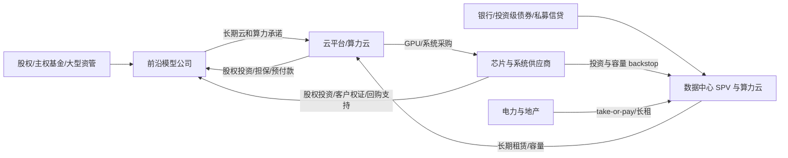

# AI 资本链：债务、关联投资、业务增长与 Dot-com 对照

**数据截止：2026-08-19（美国西海岸）**  
**性质：一次性跨公司研究，不作为正式公司报告或个性化投资建议**

## 一、先给结论

1. **这不是一个均匀的“AI 债务泡沫”。** 目前风险分成三层：
   - Microsoft、Alphabet、NVIDIA、AMD、腾讯、阿里等仍有净现金或强现金流，近期偿债风险低；它们的问题主要是增量资本回报、折旧和估值，而非生存。
   - Amazon、Meta 已因 AI 建设把自由现金流安全垫明显压薄；Oracle 已形成约 982 亿美元净债务、年度粗自由现金流为负和约 2,600 亿美元尚未起租的数据中心租赁，是大型平台里最实质的信用风险点。
   - OpenAI、Anthropic、SpaceX/xAI、CoreWeave 及其他算力云的风险来自“融资—算力承诺—客户预付款—继续融资”的闭环。它们增长最快，也最依赖增长不能显著降速。

2. **高投入并非没有商业验证，但不能据此认定全部合理。** AWS、Google Cloud、OCI、NVIDIA 数据中心、AMD 数据中心、Broadcom AI、阿里云和百度 AI 云均有真实高增长；OpenAI、Anthropic 也已经形成数百亿美元收入年化规模。合理性仍取决于：独立终端需求、利用率爬坡、推理毛利、设备经济寿命，以及合同期限能否覆盖债务期限。

3. **关联投资与机构合作是中高风险，局部已属高风险。** 最大问题不是“合作本身违法”，而是供应商同时成为投资人、云厂商同时成为股东和债权支持方、客户用投资资金购买投资人的产品。它会降低收入质量的可见度，并把原本独立的客户、供应商、银行、私募信贷和数据中心项目变成同一风险因子。

4. **近端系统性金融风险仍是中等，不是 2001—2002 年式信用出清。** 风险更多藏在长期租赁、take-or-pay、SPV、客户预付款、设备融资、担保和私募信贷，而非只在公开债券。BIS 将这种结构概括为由长期承租、offtake 和担保支持的“影子借款”；IMF 认为核心平台目前尚有韧性，但数据中心融资缺口、再融资和 GPU 经济寿命构成传导渠道。[BIS](https://www.bis.org/publ/qtrpdf/r_qt2603u.htm)；[IMF 2026-04 GFSR](https://www.imf.org/-/media/files/publications/gfsr/2026/april/english/text.pdf)

5. **与 Dot-com 峰值结构的综合相似度约 61/100，合理区间 55—70。** 当前最像一个“分裂式的 1998Q4—1999Q2”，中心约 1999 年初：资本开支、私人融资和产业集中度像 1999 年；公开 IPO 与散户狂热更像 1997—1998 年；违约和信用损失远未到 2001—2002 年。这是阶段映射，不是“还有一年崩盘”的倒计时。

6. **历史的投资借鉴意义：个股和信用筛选 8/10，行业仓位与估值纪律 6/10，预测顶部日期仅 2/10。** 最有价值的结论是：技术最终胜出，不代表今天的资产价格、资本结构或每一家供应商都会胜出。

## 二、口径与覆盖范围

本研究覆盖资本消耗最大的四类节点，而不是声称逐一覆盖全球所有 AI 初创公司：

- 云与平台：Microsoft、Alphabet、Amazon、Meta、Oracle、阿里、腾讯、百度；
- 芯片与系统：NVIDIA、AMD、Broadcom；
- 前沿模型：OpenAI、Anthropic、SpaceX/xAI；
- 算力云与数据中心：CoreWeave、Nebius、IREN、Hut 8、TeraWulf、Cerebras，并对披露不足的 Lambda、Crusoe、Mistral、Cohere、Perplexity、字节跳动作观察名单处理。

### 2.1 四种金额不可机械相加

| 类别 | 例子 | 风险性质 |
|---|---|---|
| 已融资有息债务 | 债券、银行借款、设备贷款 | 已经产生利息和到期偿还义务，直接影响违约概率 |
| 租赁与项目融资 | 尚未起租的数据中心租赁、SPV 非追索债 | 通常要等设施交付后付款，但期限长、退出成本高 |
| 采购与 take-or-pay | GPU、服务器、电力、云容量最低采购 | 不一定列为债务，却会锁定未来现金流；可与租赁口径重叠 |
| 股权、担保和或有支持 | 战略投资、客户权证、残值保证、backstop | 不一定立即用现金，但会造成稀释、估值和尾部损失 |

因此本文**不计算一个看似精确的“AI 总债务”**。披露口径不一致、承诺互相重叠，而且同一笔融资在供应商、客户和项目 SPV 之间可能被重复计算。

“粗 FCF”一般取经营现金流减现金资本开支；它不是公司统一定义的自由现金流，也不能把集团现金流全部归因于 AI。风险等级同时考虑偿债能力、现金消耗、客户集中、资产/期限错配、关联循环和执行风险。

## 三、系统级资本链

资金最终大多流向芯片、服务器、电力和建设方，而收入确认分散在云、模型和算力云。若独立终端客户的现金付费不够快，系统就需要以新股权、长期承诺或项目债务补足差额。

系统级证据：

- Fed 统计 Amazon、Google、Meta、Microsoft、Oracle 五家 2025 年资本开支合计约 **4,120 亿美元**，约为美国 GDP 的 **1.31%**，且不含租赁。[Federal Reserve](https://www.federalreserve.gov/econres/notes/feds-notes/monitoring-ai-adoption-in-the-u-s-economy-20260403.html)
- Dallas Fed 估计 2023 年以来初期建设主要由约 **5,000—6,000 亿美元留存收益**支持，而 2026 年 AI 相关投资级债券发行的中位估计约 **3,000 亿美元**，融资正从内部现金流转向公开和私人信用。[Dallas Fed](https://www.dallasfed.org/research/economics/2026/0210-searls-aifinancing)
- IMF 引述的基准估计为 2029 年前约 **3.4 万亿美元** AI 资本开支，其中约 **70%** 由 hyperscaler 承担；IMF 同时指出平台和芯片商目前财务韧性较强，而运营商、能源和项目开发商更敏感。[IMF](https://www.imf.org/-/media/files/publications/gfsr/2026/april/english/text.pdf)
- 美国代表性企业调查显示，2025 年末至 2026 年初约 **18%** 企业使用 AI，就业加权约 **32%**；大型企业和信息、金融行业显著更高。真实采用正在增长，但远未覆盖全部企业。[U.S. Census](https://www.census.gov/library/working-papers/2026/adrm/CES-WP-26-25.html)
- IMF 提醒，账面固定资产平均寿命约 7 年，但高端 GPU 的经济过时可能约 2 年。若债务和租赁按十多年摊还，而收益资产两三年就失去竞争力，就会形成核心期限错配。[IMF](https://www.imf.org/-/media/files/publications/gfsr/2026/april/english/text.pdf)

## 四、美国核心上市平台与芯片商

金额除特别说明外均为**十亿美元**。债务不含租赁；不同公司的报告期和 FCF 口径已在单元格内注明。

| 公司 / 最新期 | 增长验证 | 流动性 / 有息债务 | OCF / Capex / 粗 FCF | 长期承诺与关联链 | 判断 |
|---|---|---|---|---|---|
| **Microsoft**，FY26 | Q4 营收 90.0，+18%；FY 331.839，+18%；Q4 RPO 678，+84% | 现金短投 76.843；债务面值 46.136，净现金约 30.7 | FY 182.935 / 115.948 / 66.987；Q4 55.441 / 35.802 / 19.639 | 合同义务 743.821，包括租赁 443.506、采购 194.060；尚未起租租赁 329.1 可能重叠。OpenAI 新增 Azure 服务承诺 250；同时承载 Anthropic、Mistral、xAI | **信用低；资本纪律中高。** 现金流可承受，但超长租赁和模型供应商循环使未来灵活性下降。[10-K](https://www.sec.gov/Archives/edgar/data/789019/000119312526323660/msft-20260630.htm) |
| **Alphabet**，2026Q2 | 营收 119.796，+24%；Cloud 24.768，+82%，云营业利润 8.814 | 报告流动性 242.474，其中 87.063 为市场化股权；更保守现金和债券约 155.411。债务面值 101.085 | Q2 39.069 / 44.924 / **-5.855**；TTM FCF 约 53.3 | 合同义务 811.0，短期 200.7；尚未起租租赁 85.2；担保/信用支持最高约 51.4，另有约 24.1 未来基础设施 backstop 和 20 或有私企投资 | **信用低；表外承诺高、估值风险中高。** 剔除受限 SpaceX 股权仍是净现金，但单季 FCF 已转负，承诺规模巨大且并非全部 AI。[10-Q](https://www.sec.gov/Archives/edgar/data/1652044/000165204426000071/goog-20260630.htm) |
| **Amazon**，2026Q2 | 营收 200.606，+20%；AWS 42.232，+37%，营业利润 16.621 | 现金短投 122.988；债务面值 132.995，轻微净债务约 10.0 | TTM 161.403 / 169.007 / **-7.604**；2026 现金 Capex 指引约 220 | 合同承诺 650.034。对 Anthropic 和 OpenAI 均有大额投资，二者同时承诺购买 AWS/Trainium：Anthropic 对 AWS 10 年超 100；OpenAI 对 AWS 原 38 后再扩张 | **高。** 商业增长强，但八家中“投资对象也是大客户”的循环最明显，且 FCF 已负。[10-Q](https://www.sec.gov/Archives/edgar/data/1018724/000101872426000026/amzn-20260630.htm)；[Anthropic/AWS](https://www.anthropic.com/news/anthropic-amazon-compute) |
| **Meta**，2026Q2 | 营收 60.801，+28%；营业利润 18.775，-8%；未单列 AI 收入 | 现金短投 90.260；债务面值 84.0，接近净现金中性 | Q2 31.862 / 30.116 加融资租赁本金 0.962 / **0.784**；H1 FCF 13.170 | 2026 Capex 130—145；尚未起租租赁 278.99，7 月再签 68；不可取消合同 349.31。两项数据中心 JV 均为 20% 持股，并有残值或最大损失敞口 | **表外风险高。** 广告现金流仍强，但单季 FCF 接近零，长租、SPV 和残值保证把未来利用率风险留给 Meta。[10-Q](https://www.sec.gov/Archives/edgar/data/1326801/000162828026050705/meta-20260630.htm) |
| **Oracle**，FY26 | FY 营收 67.357，+17%；云 33.989，+39%；OCI IaaS 约 18.1，+77%；RPO 638，+363% | 现金 31.894；债务面值 130.105，**净债务约 98.211** | FY 31.977 / 55.663 / **-23.686** | 尚未起租租赁约 260，多为 15—19 年；FY27 仍拟融资约 40。大客户含 OpenAI、xAI、Meta、NVIDIA、AMD；约 75 RPO 由客户预付或客户提供 GPU | **大型平台中最高。** 高 RPO 和预付款是缓冲，但净债务、负 FCF、长租及少数大客户集中构成真实再融资和执行风险。[10-K](https://www.sec.gov/Archives/edgar/data/1341439/000119312526277521/orcl-20260531.htm) |
| **NVIDIA**，FY27Q1 | 营收 81.615，+85%；数据中心 75.246，+92% | 保守现金和债券 50.335；债务 8.5，净现金约 41.8 | 50.344 / 1.757 加融资本金 / **48.554** | 供应/库存承诺 119，云容量 30；投资 OpenAI、CoreWeave、Nebius、Intel。前三大直接客户合计 54% | **信用低；循环与集中中高。** “最高 100”OpenAI 投资为分阶段意向，不等于已负债；真正要监控的是客户融资质量和需求独立性。[10-Q](https://www.sec.gov/Archives/edgar/data/1045810/000104581026000052/nvda-20260426.htm) |
| **AMD**，2026Q2 | 营收 11.536，+50%；数据中心 6.718，+107% | 现金短投 13.111；债务 3.250，净现金约 9.9 | Q2 2.366 / 0.808 / **1.558**；H1 FCF 4.124 | 无条件承诺 30.276；OpenAI、Meta 各获最多 1.6 亿股、行权价 0.01 美元的里程碑客户权证；Anthropic 最多 2GW 合作 | **信用低；稀释/循环高。** 最大权证数约为当前股本 19.6%，虽未归属，却可能用股东稀释换取采购。[10-Q](https://www.sec.gov/Archives/edgar/data/2488/000000248826000123/amd-20260627.htm) |
| **Broadcom**，FY26Q2 | 营收 22.187，+48%；AI 半导体 10.8，+143% | 现金 19.628；债务面值 66.720，净债务约 47.1 | Q2 10.493 / 0.231 / **10.262**；H1 FCF 18.272 | 采购承诺 128.110；Apollo AI 机架/客户租赁安排含最高 29 的五年回购或支持敞口；单一分销商占营收 42% | **传统债务中等；或有风险高。** FCF 足以承债，但采购、客户租赁支持和集中度意味着“卖铲人”也在承接客户信用。[10-Q](https://www.sec.gov/Archives/edgar/data/1730168/000173016826000054/avgo-20260503.htm) |

### 4.1 对美国上市公司的直接回答

- **合理且安全垫较厚：** Microsoft、NVIDIA、AMD。增长与现金流能够覆盖当前债务，但并不代表估值便宜；需折价处理承诺、客户权证和客户集中。
- **商业合理但资本纪律已进入黄灯：** Alphabet、Amazon、Meta。增长真实，然而 Alphabet 单季、Amazon TTM、Meta 单季 FCF 已接近或低于零；如果 2027 年仍需以债务、股权或 SPV 显著加速融资，风险会从股东回报转向信用。
- **最需要严格承保：** Oracle。其风险不是“没有订单”，而是订单、客户预付款和长租使资产负债表对少数客户的长期兑现高度敏感。
- **供应商不再天然低风险：** NVIDIA、AMD、Broadcom 的投资、权证或租赁支持促成客户采购。当前现金流足以吸收，但必须把“投资所促成的销售”和独立第三方需求分开。

## 五、中国头部平台

以下金额为**十亿元人民币**；因报告期和定义不同，不与美元表机械比较。

| 公司 / 最新期 | AI/云增长 | 流动性 / 有息债务 / 租赁 | OCF / Capex / 粗 FCF | 关联投资与判断 |
|---|---|---|---|---|
| **阿里巴巴**，FY26 | 云收入 158.132，+34%；云调整 EBITA 14.265，+35%；3 月季外部云 +40%，AI 产品连续第 11 季三位数增长 | 可随时使用的现金和流动投资 520.824；有息债务约 259.996；租赁 21.726 | OCF 76.213；总 Capex 126.063；简单相减 **-49.850**；公司定义 FCF **-46.609** | 三年 AI/云投入至少 380，约为 FY26 云收入 2.4 倍。净流动资源仍约 239，近期信用低；资本配置中高，另有投资减值、VIE、出口管制和蚂蚁关联交易风险。[年报](https://www.hkexnews.hk/listedco/listconews/sehk/2026/0618/2026061800844.pdf) |
| **腾讯**，2026Q2 | 总收入 204.785，+11%；云收入低 20% 增长；AI 推荐推动广告 +22% | 总现金 511.2；借款和票据约 452.963；租赁 18.865；仍净现金约 58.2 | OCF 52.7；现金 Capex 59.3；简单相减 **-6.6**；再扣内容和租赁后的公司 FCF **-13.8**；剔除算力预付款为 +37.6 | 上市投资公允价值 487.2、非上市投资账面 387.9。未见美国式强循环融资；投入和内部变现场景匹配度三家最好，但净现金快速下降需跟踪。[Q2 业绩](https://www.tencent.com/wp-content/uploads/2026/08/Tencent-Announces-2026-Second-Quarter-Results.pdf) |
| **百度**，2026Q2 | 集团收入 31.325，-4%；AI 业务 12.5；AI 云基础设施 7.3，+50%，GPU 云 +283% | 公司定义现金及投资 283.1；有息债务约 103.860；租赁 9.037 | 3.436 / 11.390 / **-7.954**；Capex/OCF 331% | 昆仑芯拟分拆，Apollo Go 依赖 Uber/Lyft 等渠道。偿债仍可控，但旧广告下滑、短贷增加和 AI 应用仅 +3%，使资本效率与治理风险三家最高。[Q2 SEC 公告](https://www.sec.gov/Archives/edgar/data/1329099/000119312526355431/d112854dex991.htm) |

中国三家目前都不属于“靠高风险债务维持增长”。更准确的描述是：**净现金平台以高速 Capex 和阶段性负 FCF 换取 AI 份额**。公开披露的供应商—客户循环融资少于美国，但政策、芯片获取、VIE、非上市投资估值和云价格战风险更高。字节跳动未纳入定量表，因为截至截止日缺少可核验的最新审计财报或交易所申报。

## 六、前沿模型、算力云与数据中心

前沿模型和基础设施公司的披露质量差异很大；尚未上市者的“收入、亏损、现金”经常只来自公司新闻稿或媒体取得的管理层材料。下表以 `公司`、`监管`、`媒体估算` 区分证据；缺失不以零代替。

本节金额除特别说明外均为**十亿美元**。

| 公司 | 债务、流动性与增长 | 长期承诺/关联链 | 判断 |
|---|---|---|---|
| **OpenAI** | 公司披露 2026-03 完成 **1,220 亿美元 committed capital**、投后估值 8,520 亿；约 47 亿循环额度交割时未提款。收入约 **20 亿/月**，企业占比逾 40%；现金、GAAP 亏损和 FCF 未正式披露。媒体转述称 Q1 收入 57 亿、现金消耗 37 亿，且报道方无法独立核实，仅作估算 | Microsoft 增量 Azure 承诺 2,500 亿；AWS 原 380 亿后再扩；Oracle、CoreWeave、Cerebras 亦为大额伙伴，合同口径重叠不可相加。Amazon、Microsoft、NVIDIA、SoftBank 等既是投资者也是供应商；AMD 以极低行权价客户权证换采购里程碑；OpenAI 又贷款给 Cerebras | **直接信用中低；经济杠杆和循环极高。** 股权融资规模使短期违约概率不高，但算力承诺、亏损与扩建远超已经证明的 FCF。只有收入多年高增长、推理毛利改善且资本市场持续开放时才合理。[公司融资/增长披露](https://openai.com/index/accelerating-the-next-phase-ai/)；[Q1 媒体估算](https://www.investing.com/news/stock-market-news/openai-burned-37-billion-in-first-quarter-of-2026-the-information-reports-4746194) |
| **Anthropic** | 2026 Series G 300 亿、Series H 650 亿，后者含此前承诺的约 150 亿 hyperscaler 资金，不能重复计数。公司披露 5 月收入年化已超 **470 亿**；现金、净债务、GAAP FCF 未披露 | AWS 承诺 **10 年超 1,000 亿、最高 5GW**；另有 Google/Broadcom 5GW、Azure/NVIDIA、SpaceX 容量。Amazon 同时是股东、条件融资方、主要云供应商与分销渠道；Google、NVIDIA、Microsoft 也兼具投资与供应角色 | **经营趋势很强；表外和对手方风险高。** 相较 OpenAI，收入增长对算力更有支撑，但现金流未知、云转售的总额确认和多层 SPV 使真实资本效率难判断。[Series H](https://www.anthropic.com/news/series-h)；[AWS 合作](https://www.anthropic.com/news/anthropic-amazon-compute) |
| **SpaceX/xAI** | xAI 2026-01 融资 200 亿，2 月并入 SpaceX。2025 AI 收入约 32 亿、经营亏损约 64 亿、Capex 127 亿；2026Q2 AI 收入 25.61 亿、经营亏损 12.57 亿、Capex 158.28 亿。集团 Q2 现金及证券约 **1,000 亿**，债务与融资租赁约 **393.6 亿**；并表缓解流动性但不改善 xAI 单体经济性 | 2025 年 xAI 曾使用 12.5% 等高息融资并付高额提前还款罚金；SpaceX 后发 250 亿债券。Valor 关联 SPV 算力租赁由 SpaceX 担保；董事利益交叉。Tesla 投 xAI 后换成 SpaceX 少数权益，同时向 xAI/SpaceX 销售 Megapack | **集团直接信用低中；AI 分部经济和治理风险极高。** 单看 AI 分部，Capex 约为 Q2 收入 6.2 倍，现金流尚不能证明合理；风险被转移至 SpaceX 股东/债权人。[SpaceX Q2 业绩](https://s21.q4cdn.com/184289198/files/doc_financials/2026/q2/SpaceX-Reports-Second-Quarter-2026-Results.pdf)；[Q2 10-Q](https://www.sec.gov/Archives/edgar/data/1181412/000162828026052535/spcx-20260630.htm)；[Tesla 10-Q](https://www.sec.gov/Archives/edgar/data/1318605/000162828026049270/tsla-20260630.htm) |
| **CoreWeave**，2026Q2 | 现金 5.524；债务本金约 **35.55**，另有经营租赁负债约 16.3、尚未起租租赁 35.5。Q2 收入 2.575，+112%；利息 0.640、净亏损 0.626。H1 OCF 3.663、PP&E 14.117，粗 FCF **-10.45** | backlog 约 104，但交付、供电和可用性有条件；前三大客户占收入 72%。OpenAI 获股份并签最高约 22.4 合同；NVIDIA 买入 2 股权并承诺最高约 6.3 剩余容量；Jane Street 同时投资 1 并签 6 云合同；客户合同又被用作贷款抵押 | **本研究直接信用/再融资风险最高。** 高息债务、客户集中、GPU 残值、合同抵押和供应商支持同向；调整后 EBITDA 不能替代扣除利息与 Capex 后的偿债能力。[2026Q2 10-Q](https://www.sec.gov/Archives/edgar/data/1769628/000176962826000366/crwv-20260630.htm) |
| **Cerebras**，2026Q1/期后 IPO | Q1 现金 1.716、投资 0.516、受限现金 1.029；OpenAI 营运资金贷款余额 0.983。收入 0.193，+94%；净亏损 0.014；OCF 0.012、Capex 0.132，粗 FCF **-0.120**。5 月 IPO 又取得净募资约 **6.2** | OpenAI 合同逾 200 亿、750MW，分三年交付；OpenAI 同时是客户、贷款人，并获行权价 0.00001 美元、签约时约 15% 完全摊薄股本的权证。Q1 租赁负债约 0.379，尚未起租租赁约 2.3 | **直接信用低中；客户集中、执行和循环极高。** IPO 显著延长跑道，但单一主体仍同时决定收入、融资和潜在控制权；OpenAI 放缓会同时打击现金流、偿债和估值。[Q1 10-Q](https://www.sec.gov/Archives/edgar/data/2021728/000162828026044981/cbrs-20260331.htm)；[IPO 8-K](https://www.sec.gov/Archives/edgar/data/2021728/000162828026035605/closing8-k.htm) |
| **Nebius**，2026Q1/2026-07 | Q1 集团收入 0.399，+684%；AI 云 0.390，+841%；现金约 9.3。7 月首次 0.775 担保债，2030 到期、SOFR+2.5%，以 GPU 和投资级客户现金流担保 | 宣称 Microsoft、Meta 合同带来逾 40 的额外合同收入；Meta 五年最高 27；NVIDIA 投资 2，双方目标 2030 年前超过 5GW | **中高。** 现金垫和项目债期限优于 CoreWeave，但增长基数小、少数客户及 Nvidia 关联仍使执行风险高。[Q1 文件](https://www.sec.gov/Archives/edgar/data/1513845/000110465926059872/tm2614392d1_ex99-2.htm)；[7 月融资](https://www.sec.gov/Archives/edgar/data/1513845/000110465926084452/tm2620683d1_ex99-1.htm) |
| **IREN**，FY26Q3/期后 | Q3 收入 0.145、净亏损 0.248、调整 EBITDA 0.060；3 月末现金 2.213、4 月末初步现金 2.6。3 月末可转债账面 3.688、融资租赁 0.274；5 月又完成 3.0 的 2033 可转债，并签署总额约 3.6 的硬件子公司融资安排，后者含 delayed-draw 额度，实际提款/已发行余额须以后续财报确认 | NVIDIA AI 云合同 3.4、Microsoft 合同口径 9.7；NVIDIA 获按 70 美元购买 3,000 万股的权利，最大潜在现金 2.1，仍需采购和里程碑 | **高。** 融资能力强但相对现有收入的潜在杠杆快速上升，扩建仍依赖合同、GPU 融资和潜在稀释；NVIDIA 既是供应商/伙伴又是潜在股东。[Q3/3 月余额](https://www.sec.gov/Archives/edgar/data/1878848/000187884826000025/irenreportsq3fy26results.htm)；[5 月可转债](https://www.sec.gov/Archives/edgar/data/1878848/000114036126021285/ef20073507_8k.htm)；[硬件融资安排](https://www.sec.gov/Archives/edgar/data/1878848/000114036126023427/ef20075181_8k.htm) |
| **Hut 8**，2026Q1/2026-07 | 收入 0.071、净亏损 0.253；披露流动性约 1.3，其中母公司可归属约 0.796。项目层发行 **3.25**、16.5 年全摊还、约 95% loan-to-cost 的非追索债；母公司另有 0.2 比特币担保贷款，利率 7% | 以 15 年 take-or-pay、投资级承租人租约配对；Anthropic/Fluidstack 项目由 Google 提供财务支持。合同租赁收入 Q1 为 16.8，7 月第二期租约后扩至 26.6 | **项目风险高、母公司中高。** 长期合同、摊还和非追索结构优于短债滚续；但 95% 项目杠杆、单一承租链、建设和 Google backstop 仍高度集中。[Q1 文件](https://www.sec.gov/Archives/edgar/data/1964789/000110465926055894/hut-20260506xex99d1.htm)；[7 月扩租](https://www.sec.gov/Archives/edgar/data/1964789/000110465926084862/tm2620835d1_ex99-1.htm) |

### 6.1 披露不足的观察名单

- **Lambda：** 公司曾宣布高级担保和项目融资，并与 Microsoft 签有大型合同，但实际提款、余额、交割状态和不同工具是否重叠没有足够同期间披露；NVIDIA 同时具有股东、供应商和商业伙伴身份。仅列观察，不进入债务排序。
- **Crusoe：** 公司披露过多笔公司和项目/JV 信贷，但余额及重叠未知；Abilene 项目融资不能全部算作母公司债。公司只给出 bookings/pipeline，没有可比收入和 FCF；仅列观察，不进入债务排序。
- **Scale AI：** 债务和现金流未披露；Meta 约 137.9 亿美元非投票少数股权并伴随人才转移，战略独立性和潜在治理冲突高于可观察的流动性风险。[Meta 10-K](https://www.sec.gov/Archives/edgar/data/1326801/000162828026003942/meta-20251231.htm)
- **Mistral、Cohere、Perplexity、字节跳动：** 缺少截至截止日可比审计财务和债务余额，不能用融资估值或媒体 ARR 代替现金流。它们被纳入关系图观察，不进入债务排序。

### 6.2 风险排序

| 层级 | 直接信用/流动性 | 表外承诺 | 循环/治理 | 最需要监控 |
|---|---|---|---|---|
| 核心算力云 | 高到**极高** | **极高** | **极高** | CoreWeave、IREN；Lambda/Crusoe 因披露不足仅观察 |
| 前沿模型 | 低中到高，主体差异大 | **极高** | **极高** | xAI 分部经济性、OpenAI 承诺；Anthropic 现金流披露不足 |
| 项目开发商/SPV | 高但常为非追索 | **极高** | 高 | Hut 8、TeraWulf、Fluidstack 相关项目 |
| 现金流平台 | 低到中 | 中高到极高 | 中高 | Oracle、Amazon、Meta；Alphabet 的担保/承诺 |
| 芯片供应商 | 低到中 | 高 | 高 | 客户权证、容量 backstop、回购支持和客户集中 |

## 七、关联投资与机构合作：哪里最危险

本节金额除特别说明外均为**十亿美元**。

| 关系 | 资本与商业闭环 | 风险等级 | 为什么 |
|---|---|---:|---|
| Amazon ↔ Anthropic / OpenAI | Amazon 投资；两家公司再承诺使用 AWS/Trainium | **极高** | 估值收益、云收入、芯片利用率和客户信用相关，独立需求较难辨认 |
| Microsoft ↔ OpenAI | 股东、Azure 供应商、收入/知识产权安排；OpenAI 有大额增量 Azure 承诺 | 高 | 多重身份和长期锁定；多云化虽降低单一依赖，也削弱原合作的确定性 |
| NVIDIA ↔ CoreWeave | NVIDIA 投资 20 亿、供应 GPU，并对剩余容量提供最高约 63 亿采购支持 | **极高** | 供应商销售、客户融资、抵押物价值和容量需求同向 |
| OpenAI ↔ Cerebras | OpenAI 是最大客户、10 亿贷款人和潜在约 15% 权证股东 | **极高** | 单一对手同时控制收入、流动性和股权稀释 |
| AMD ↔ OpenAI / Meta | 采购里程碑对应极低行权价客户权证 | **极高** | 最大潜在稀释约当前股本 19.6%，收入质量与股东稀释直接交换 |
| Alphabet/Google ↔ Anthropic / 数据中心 SPV | 投资、TPU、云、金融保证、信用衍生品和 backstop | 高 | 风险并不都在 Alphabet 资产负债表“债务”一栏，项目链透明度低 |
| SpaceX/xAI ↔ Tesla / Valor | 股权、设备采购、董事交叉、SPV 租赁和母公司担保 | **极高** | 利益冲突、定价、交叉补贴和少数股东保护问题 |
| Meta ↔ Scale AI / 数据中心 JV | 大额少数股权、人才转移；Meta 是 JV 少数股东、唯一或首要租户并提供残值支持 | 高 | 战略中立性下降；表外项目仍由 Meta 承担需求和残值尾部风险 |
| Broadcom ↔ Apollo/客户租赁 | 供应 AI 系统并提供最高约 290 亿回购或支持敞口 | 高 | 上游把客户信用和二手设备残值纳入自身风险 |
| Hut 8/Fluidstack ↔ Anthropic/Google | 长期租约、Google backstop、95% 项目杠杆 | 高 | 契约匹配较好，但单一租户链和建设风险高度集中 |

这些安排**不是虚假收入或欺诈的证据**。合理的产业融资本来就可由长期合同、项目债和供应商支持组成。危险信号是：

1. 投资或贷款规模接近随后产生的采购额；
2. 采购必须靠供应商、股东或云厂商提供的资金才能完成；
3. 同一合同同时被用作 backlog、融资抵押和供应商收入依据；
4. 交易对手可低成本提前终止，而融资或租赁不可取消；
5. 资产经济寿命显著短于债务或租赁期限；
6. 公司只公布 ARR、RPO 或调整后 EBITDA，不公布利息后、Capex 后现金流。

## 八、这些债务和现金消耗到底合理吗

不能用“收入增长很快”或“AI 是通用技术”单独回答。合理的增长融资至少要同时通过六个测试：

| 测试 | 可接受条件 | 当前最脆弱者 |
|---|---|---|
| 独立需求 | 终端客户现金付费，而非主要由投资人/供应商资金回流 | CoreWeave、Cerebras、OpenAI 生态、Amazon 的被投客户 |
| 单位经济 | 推理和云毛利随规模改善，折旧后仍能盈利 | SpaceX/xAI、披露不足的模型公司 |
| 期限匹配 | 债务/租赁到期晚于建设和利用率爬坡，且有摊还 | CoreWeave；Oracle 长租；GPU 项目 SPV |
| 资产寿命 | 经济寿命和残值不短于融资假设 | 所有以 GPU 作抵押的项目；Broadcom/AMD 客户支持 |
| 资金跑道 | 不依赖下一轮融资才能完成已签承诺 | OpenAI、SpaceX/xAI、IREN、Lambda、Crusoe |
| 对手方分散 | 单一客户、云、芯片或担保方失效不会同时击穿收入和融资 | CoreWeave、Cerebras、Hut 8 项目、Oracle 部分项目 |

### 8.1 分层裁决

- **现金流平台：总体可承受，边际资本回报未被证明。** Microsoft、Alphabet 的公司层偿债很安全；NVIDIA、AMD 亦然。Amazon、Meta 已进入需要看 FCF 而不是只看收入的阶段。它们的债务“合理”只代表不会轻易违约，不代表股东能获得足够回报。
- **Oracle：有增长和订单，但资本结构偏危险。** 若 RPO 转收入顺利、客户预付继续、设施按时交付，融资可被证明；若大客户延迟 12—18 个月，约 982 亿净债务和超长租赁会显著限制选择。
- **前沿模型：股权融资暂时遮蔽了债务风险。** OpenAI 的直接借款不高不等于低杠杆；数千亿美元云/算力承诺具有债务般的经济刚性。Anthropic 的收入增速最强，但因现金流不公开，只能给条件性肯定。SpaceX/xAI 的 Capex/收入明显过高，当前不合理，靠并表融资能力缓释。
- **算力云/SPV：只有在完美执行的基准情景下合理。** take-or-pay、预付款、投资级 backstop 和非追索结构确实降低风险；但客户、GPU 残值、融资抵押和收入是同一风险因子。一旦需求下修，分散化会迅速消失。
- **中国平台：信用风险低于资本配置风险。** 腾讯内部场景最丰富、匹配度最好；阿里商业验证较强但三年投入激进；百度在旧业务下滑时以净现金补新业务，边际风险最高。

### 8.2 四个压力测试

| 压力 | 平台公司 | 模型公司 | 算力云/SPV | 芯片供应商 |
|---|---|---|---|---|
| AI 收入/使用量较计划低 20% | 估值和 ROIC 下修；多数仍可偿债，Oracle 压力大 | 需延后训练、再融资或重谈云合同 | 利用率、backlog兑现和抵押现金流同时下降 | 订单推迟、库存和供应承诺转为负担 |
| GPU 租金/残值下降 30% | 自用资产折旧/减值增加 | 推理成本可能下降，但已签高价承诺不一定同步下降 | 抵押品价值和租金双降，最容易触发再融资缺口 | 客户回购、容量 backstop 和融资支持产生损失 |
| 建设/供电延迟 12 个月 | Capex 在建、收入延后 | 容量不足或照付，产品可靠性受损 | 利息资本化、罚款和合同可用性条款直接冲击 | 发货/收入时点推后 |
| 再融资利差 +300bp | 现金型平台影响有限，Oracle/Amazon 较敏感 | 下一轮估值和条款恶化 | 高息、短期到期者可能无法覆盖利息和摊还 | 被投客户信用恶化反噬供应商收入 |

压力测试说明为什么**近端系统风险中等、局部风险极高**：核心平台可以吸收第一次冲击，但算力云、项目 SPV 和模型公司会把冲击通过订单、担保、投资减值和私募信贷重新传回平台和供应商。

## 九、与 Dot-com 泡沫对比

### 9.1 历史基准

| 指标 | Dot-com 事实 | 对当前 AI 的启示 |
|---|---|---|
| Nasdaq | 1995-01-03 的 743.58 升至 2000-03-10 的 5,048.62，累计 +579%；随后至 2002-10-09 跌至 1,114.11，峰值回撤约 77.9% | 泡沫形成和出清是多年过程，不能从相似性推导精确顶部日。[FRED](https://fred.stlouisfed.org/series/NASDAQCOM) |
| 最陡阶段 | 1998 年末至 1999 年末约 +85.6%；研究认为总市场约 1998 年才显现明显泡沫 | 当前私募融资和基础设施加速更像吹顶前半段，而不是早期商业验证。[NBER](https://www.nber.org/papers/w12011) |
| IPO 狂热 | 1999 年 476 宗，首日平均 +71.2%，76% 发行人亏损、78% 为科技；2000 年 380 宗、首日 +56.3%、81% 亏损 | 2025 年同口径仅 90 宗、首日 +29.3%、53% 亏损、34% 科技，当前公开市场尚未达到 1999 式广泛投机。[Ritter IPO Statistics](https://site.warrington.ufl.edu/ritter/files/IPO-Statistics.pdf) |
| 电信信用 | 1998—2001 年全球电信企业借款超过 1 万亿美元；美国电信 Capex 1997—2001 年增约 82%，随后两年降约 47% | 今天最像的不是无债务网站，而是以长期项目融资建设光纤/算力的电信和 CLEC。[Greenspan/Fed](https://www.federalreserve.gov/boarddocs/speeches/2002/20021119/default.htm)；[Fed Capex](https://www.federalreserve.gov/econres/notes/feds-notes/own-account-it-equipment-investment-accessible-20171004.htm) |
| 信用损失滞后 | 大型银团贷款中电信/有线电视 classified 比例由 2000 年 1.5% 升至 2002 年 27.0% | 股票可先跌、Capex 后削、信用损失最后确认；“尚未违约”不是债务合理的证据。[Fed/FDIC/OCC](https://www.federalreserve.gov/boarddocs/Press/bcreg/2002/20021008/) |
| 实体采用 | 美国家庭互联网接入率由 1997 年 18% 升至 2000-08 的 41.5%；生产率改善也是真实的 | 真实采用与泡沫并存。技术方向正确，不等于每笔债、每个合同或每只股票正确。[NTIA/Census](https://www.ntia.gov/sites/default/files/data/fttn00/falling.htm)；[Fed 生产率研究](https://www.federalreserve.gov/pubs/feds/2000/200020/200020abs.html?abstract_id=263526) |
| 循环交易 | SEC 后来认定 Qwest 在需求下滑时通过互相购买光纤 IRU 填补收入缺口，涉嫌虚增逾 38 亿美元收入 | 这是结构警报，而非对今天公司的欺诈指控：必须识别“投资客户—客户购买供应商”的收入独立性。[SEC](https://www.sec.gov/enforcement-litigation/litigation-releases/lr-18936) |

### 9.2 相同点

1. 都是有真实经济价值的通用技术，不是纯骗局；
2. 需求被指数外推，基础设施建设先于可验证终端现金流；
3. 上游供应商、平台、客户、投资人和融资人逐渐形成相关网络；
4. 市场份额、用户、算力或带宽等非现金流指标容易压倒估值纪律；
5. 设施建设有多年惯性，股价往往先于 Capex 和信用损失转向；
6. 最脆弱的信用往往在“基础设施中间层”，不是最知名的应用公司。

### 9.3 不同点

1. 当前大部分核心 Capex 仍由巨额盈利、投资级或净现金平台承担；2000 年电信过建更依赖银行、垃圾债、可转债和设备商融资。
2. 当前公开 IPO 狂热显著弱于 1999—2000；投机更多留在私募市场、战略投资和大型平台资产负债表内。
3. AI 已产生云、广告、企业软件和模型收入；但推理有持续可变成本，互联网软件复制成本更接近零。
4. GPU 可跨任务重新部署，但经济寿命短、性能/瓦快速迭代；光纤寿命长，却有地理路径和“最后一公里”限制。两者残值风险机制不同。
5. 当前风险更多分布在私募信贷、SPV、租赁、客户预付款、购电协议和担保，透明度可能比公开电信债更低。
6. 当前尚无 2002 年电信贷款分类率式的系统恶化；Fed 2026-05 仍判断总体融资风险温和，脆弱性集中在浮息、非投资级和高风险私人企业。[Fed Financial Stability Report](https://www.federalreserve.gov/publications/2026-may-financial-stability-report-overview.htm)

### 9.4 透明相似度评分

评分对象是**当前 AI 周期相对于 1999—2000 泡沫峰值的结构相似性**，不是崩盘概率。

| 维度 | 权重 | 相似度 0—10 | 加权分 |
|---|---:|---:|---:|
| 通用技术真实采用与生产率叙事 | 10 | 9 | 9.0 |
| 基础设施 Capex 加速及过建风险 | 15 | 9 | 13.5 |
| 收入/FCF 与投入错配 | 15 | 6 | 9.0 |
| 债务、租赁和再融资脆弱性 | 15 | 5 | 7.5 |
| 关联投资、供应商融资和循环交易 | 10 | 7 | 7.0 |
| 估值、集中和拥挤交易 | 10 | 8 | 8.0 |
| IPO、散户和低质量公司扩散 | 10 | 3 | 3.0 |
| 货币与流动性环境 | 5 | 4 | 2.0 |
| 龙头财务质量相似度 | 5 | 2 | 1.0 |
| 已实现违约和系统信用压力 | 5 | 2 | 1.0 |
| **合计** | **100** |  | **61/100** |

分项可概括为：技术/产业建设相似度 **75%—80%**，市场与估值相似度 **55%—65%**，信用与系统性风险相似度 **35%—45%**。总体合理区间 **55—70/100**。

### 9.5 当前最像什么时间点

Dot-com 可分为五段：

1. 1995—1997：商业化验证；
2. 1998：流动性与基础设施加速；
3. 1999—2000-03：公开市场吹顶；
4. 2000-03—2001：股票下跌但 Capex 仍因合同惯性增长；
5. 2001—2003：信用、产能和会计出清。

**当前是分裂阶段：**

- Capex、私募融资和产业集中度：像 **1999 年**；
- 公开 IPO 和散户投机广度：像 **1997—1998 年**；
- 已实现违约和银行信用压力：尚未到 **2001—2002 年**；
- 强制给一个综合时间窗：**1998Q4—1999Q2，中心约 1999 年初**。

这不意味着顶部必在 12 个月内。头部平台的现金流、私人资本、长租、客户预付款和政府/能源建设都可能拉长周期；AI 生产率若兑现更快，也可能提高可承受 Capex。

## 十、投资策略上的借鉴

### 10.1 按层而不是按“AI”统一定价

1. **平台公司：** 看扣除 AI Capex 后 FCF、折旧增速、云/广告增量营业利润和新增投入 ROIC。总债务低不是买入理由；Oracle 的 RPO 高也不是忽略净债务的理由。
2. **模型公司：** 看不依赖股东/供应商补贴的外部收入、推理毛利、现金跑道、合同最低付款和下一轮融资依赖。不要把 ARR 当现金，把融资额当收入。
3. **算力云/SPV：** 看债务期限、最低租约、预付款、取消条款、客户集中、供电交付、GPU 残值和再融资墙。adjusted EBITDA 必须再扣现金利息与维护/增长 Capex。
4. **芯片/系统供应商：** 把由自身投资、客户权证、信用额度、容量 backstop、云抵扣或回购支持促成的销售，与独立现金客户销售分开。
5. **中国平台：** 在现金与债务之外，单独给出口管制、VIE、云价格战、非上市投资估值和政策不确定性折价。

### 10.2 可执行的监控阈值

以下不是自动买卖信号，而是触发重新承保：

- 集团或关键云业务 **Capex/OCF 连续两个季度超过 100%**；
- 利息费用增长快于收入，或高杠杆算力云的**现金利息/收入超过 15%**；
- backlog/RPO 上升，但预付款、利用率、合同兑现或现金收入下降；
- 单一客户或前三大客户收入占比持续超过 **40%/70%**；
- GPU 租金、二手价格或性能调整后价格下降逾 **25%—30%**，而债务摊还不变；
- 尚未起租租赁、担保、客户权证和回购支持增长快于 FCF；
- 云/AI 收入增速连续两至三个季度低于 Capex 或折旧增速；
- 供应商投资客户后，客户立即签下接近投资额的大额采购；
- 私募信贷利差、延期、契约豁免和再融资折价同步上升；
- take-or-pay 被重谈，或投资级 backstop/唯一承租人评级恶化。

### 10.3 仓位与估值纪律

- 把 AI 暴露拆成“现金流平台、芯片、模型、算力云/项目债”，避免四层同时押注同一终端需求假设。
- 对净现金龙头也以增量 ROIC 和正常化 FCF 估值，不为技术确定性支付无限价格。
- 对高杠杆算力云、项目开发商和关联融资链限制单一仓位，并把债务、股票、被投公司和供应商持仓合并看穿。
- backlog 只按取消条款、客户信用、预付款比例和可交付电力折现；不要按名义合同额估值。
- 不因 Dot-com 类比本身做裸空或精确择时。历史更适合选择资产负债表和设计止损/仓位上限，而不适合预测峰值日期。

## 十一、数据质量与局限

- 上市公司优先采用最新 10-K、10-Q、20-F、港交所公告和公司业绩材料；私营公司优先采用公司公告和交易对手监管文件。
- 私营公司的现金、债务、GAAP 利润和 FCF 普遍不完整；媒体取得的管理层数字只在明确标注时使用，未进入精确债务汇总。
- committed capital 不等于已到账现金；未提款循环额度不等于债务；SPV 非追索债不等于母公司债；run-rate、RPO、backlog 不等于当期收入。
- 多个云、租赁、采购和能源数字可能互相包含；报告保留原始口径，不做总和，以避免双重计算。
- 2026 年仍在快速变化。任何投资决策都应在最新一季财报后刷新合同、债务到期、现金、利息、客户集中和 Capex。

## 十二、最终判断表

| 问题 | 回答 |
|---|---|
| 高风险债务和现金消耗对增长合理吗？ | **头部净现金平台多数可承受，但 Amazon/Meta 已到黄灯、Oracle 到橙红灯；模型公司只有在多年高增长和毛利改善下才合理；高杠杆算力云仅在合同与资产残值均兑现时合理。** |
| 关联投资和机构合作风险高吗？ | **系统整体中高，Amazon—Anthropic/OpenAI、NVIDIA—CoreWeave、OpenAI—Cerebras、AMD 客户权证、SpaceX/xAI—Tesla/Valor 等局部极高。** |
| 是不是 Dot-com 重演？ | **不是原样重演；结构相似度约 61/100。真实技术、过快 Capex 与循环融资相似，龙头现金流和低 IPO 狂热不同。** |
| 当前像哪个阶段？ | **分裂式 1998Q4—1999Q2，中心约 1999 年初；不是 2001—2002 信用出清。** |
| 对投资最有用的历史教训？ | **用来筛资产负债表、合同质量和估值非常有用，用来预测崩盘日期几乎无用。** |
