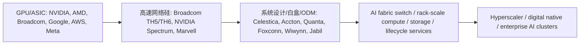
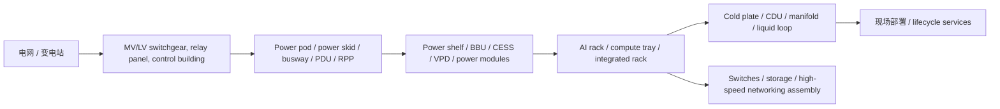
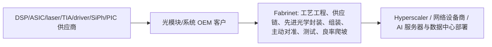
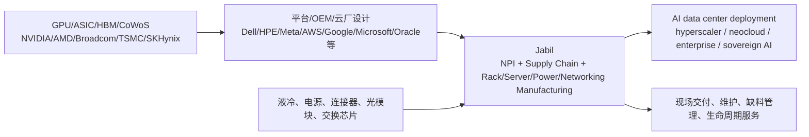
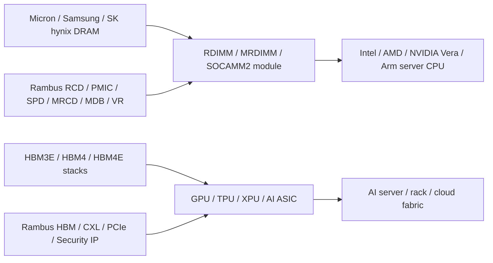

# 公司：CLS Celestica Inc. 全面尽调

> 截至日期：2026-05-10；市场数据以 2026-05-08 美股最新交易为准。  
> 货币：除特别说明外均为美元。  
> 口径提示：Celestica 不披露传统意义上的 backlog/bookings；本文用公司指引、采购义务、客户押金、库存、NCNR 条款、客户/项目名、量产窗口和产业链交期推断订单可见度。产品级收入和毛利率为推断，不是公司披露值。

## 0. 核心结论

Celestica 是一家从传统 EMS/ODM 转型为 AI 数据中心硬件平台供应商的公司。投资人现在看它，不再主要看“低毛利代工”，而是看它是否能在 hyperscaler AI 基建里拿到高价值的网络交换机、AI/ML compute、rack-scale 系统、CPO 和开放 scale-up fabric 的设计/制造位置。

一句话判断：CLS 现在最强的业务不是普通服务器组装，而是 **CCS 里的 Hardware Platform Solutions（HPS）**，特别是 800G/1.6T AI Ethernet 交换机、面向 hyperscaler 的 AI/ML compute program、AMD Helios scale-up switch、1.6T CPO Ethernet switch。2026 年收入确定性来自 800G/AI compute 放量；2027 年弹性来自 1.6T、CPO、Helios、digital-native rack-scale program 和 Google TPU 系统相关美国制造扩产。

关键数字：

| 指标 | 最新值 | 日期/口径 | 备注 |
|---|---:|---|---|
| 股价 | $375.55 | 2026-05-08 23:56 UTC | 周末前最新交易；当日区间 $373.75-$394.99 |
| 市值 | $43.45B | 2026-05-08 | 约 115.0M 股 |
| PE | 45.5x | 2026-05-08，TTM EPS $8.25 | GAAP TTM 口径 |
| Forward PE | 37.0x | 用公司 2026 adj. EPS 指引 $10.15 | 若用部分市场一致预期会更低，约 34x 附近 |
| TTM PS | 3.15x | TTM 收入 $13.79B | Q2 2025-Q1 2026 |
| Forward PS | 2.29x | 2026 收入指引 $19.0B | 用当前市值/公司指引 |
| 2025 收入增速 | +28% | FY2025 | 收入 $12.39B |
| 2026 收入指引增速 | +53% | FY2026 指引 | $19.0B vs 2025 $12.39B |
| TTM 毛利率 | 12.0% | Q2 2025-Q1 2026 | EMS/ODM 里已较高，但仍非芯片型毛利 |
| TTM 净利率 | 7.0% | Q2 2025-Q1 2026 | TRS、税率和 mix 有影响 |
| Q1 2026 调整后经营利润率 | 8.0% | 2026-03-31 季度 | 公司历史新高 |
| 2026 CapEx | ~$1.0B | 公司 2026 指引 | 主要投向 CCS/HPS 扩产 |
| 2027 CapEx 粗略占位 | ~$1.5B | Q1 call 管理层口径 | 支持 2027-2029 项目 |

投资上，CLS 的多头逻辑是“AI 数据中心网络与系统交付 bottleneck 的二阶赢家”。空头/风险逻辑是估值已经按高速增长定价，而公司客户集中、资本开支高、毛利天花板低于芯片/软件，并且任何 hyperscaler capex 放缓、AI compute program 技术切换或供应链延迟都会放大波动。

## 1. 公司整体业务、定位与财务健康

### 1.1 业务结构

Celestica 有两个报告分部：

| 分部 | 2025 收入 | 2025 占比 | 2026 Q1 收入 | 2026 Q1 占比 | 核心内容 |
|---|---:|---:|---:|---:|---|
| CCS: Connectivity & Cloud Solutions | $9.19B | 74% | $3.24B | 80% | Communications + Enterprise；AI 网络、云硬件、服务器/存储、HPS |
| ATS: Advanced Technology Solutions | $3.20B | 26% | $0.81B | 20% | A&D、Industrial、HealthTech、Capital Equipment |
| 合计 | $12.39B | 100% | $4.05B | 100% | 设计、制造、供应链、测试、系统集成 |

CCS 内部又分：

| End market | 2025 收入 | 2025 占比 | 2026 Q1 收入 | 2026 Q1 占比 | 2026 Q1 YoY |
|---|---:|---:|---:|---:|---:|
| Communications | $7.13B | 57% | $2.41B | 60% | +69% |
| Enterprise | $2.06B | 17% | $0.83B | 20% | +101% |
| ATS | $3.20B | 26% | $0.81B | 20% | 约持平 |

HPS 是最重要的投资线索。2025 年 HPS 收入约 $5.0B，占公司收入 41%，同比 +81%；2026 Q1 HPS 收入约 $1.7B，占总收入 42%，同比 +63%。HPS 不是一个独立报告分部，但它基本代表公司从普通代工向“设计+平台+系统”的升级。

### 1.2 投资人心中的公司形象

过去投资人通常把 Celestica 归为低估值 EMS/ODM，同类包括 Jabil、Flex、Sanmina、Benchmark。2024-2026 年后，市场重新定价的原因是：

1. HPS 在 hyperscaler AI 网络中占位明确，尤其是 400G/800G/1.6T Ethernet switch。
2. 公司从“客户图纸制造”升级到 ODM/JDM/co-design，R&D 和平台能力开始影响客户选择。
3. HPS mix 提升推动 CCS segment margin 从 2024 年 7.4% 到 2025 年 8.2%，2026 Q1 到 8.6%。
4. 公司开始拿到下一代项目：AMD Helios scale-up switch、1.6T CPO Ethernet switch、digital-native rack-scale program、Google TPU systems 美国制造扩产。
5. 客户集中度极高，Q1 2026 前三大客户分别占总收入 35%、15%、15%，全部在 CCS。这既是成长确定性，也是最大单点风险。

### 1.3 过去三年重大业务变化

| 时间 | 事件 | 影响 |
|---|---|---|
| 2023-2024 | HPS 从 400G/AI networking 切入 hyperscaler，高速交换机成为增长核心 | 2024 HPS 收入约 $2.8B，占收入 29%，同比 +63% |
| 2024-04 | 收购 NCS Global Services | 扩展 ITAM/ITAD、asset recovery、data destruction 和生命周期服务；补强数据中心客户资产管理闭环 |
| 2024-10 | 发布 DS4100 800G switch | 16x800G OSFP，Broadcom TH4-12.8T，面向 AI/ML ToR/leaf-spine |
| 2025 | Communications 收入同比 +81%，HPS 收入约 $5.0B | 公司定位从 EMS 明显转向 AI 网络硬件平台 |
| 2025 | Enterprise 因某 hyperscaler AI/ML compute program 技术切换而下滑 | 说明客户代际切换会带来季度波动，但 Q4 2025/Q1 2026 已重新加速 |
| 2026-01 | 2026 指引从 $16B 上调到 $17B | 公司确认 AI data center 需求持续进入 2027 |
| 2026-03 | 与 AMD 合作 Helios rack-scale AI platform | Celestica 负责 scale-up networking switches 的 R&D、设计、制造；切入非 NVIDIA 开放 scale-up |
| 2026-04 | Q1 2026 指引上调至 $19B 收入、$10.15 adj. EPS | 2026 收入增速指引升至约 +53% |
| 2026-04 | DS6000/DS6001 1.6TbE switch 可订购 | 64x1.6T、102.4Tbps、Broadcom TH6、UEC/OCP ESUN、SONiC、空气/混合液冷版本 |
| 2026-04 | 获得 hyperscaler 1.6T CPO Ethernet switch 项目 | 公司称 2027 开始量产，产品价值量和毛利率在传统项目高端 |
| 2026-04 | 信贷额度扩至约 $2.5B | revolver 从 $750M 扩至 $1.75B，总流动性约 $2B，支撑高 CapEx 周期 |

### 1.4 产业链位置

Celestica 位于 AI 基建价值链中游偏下，但正向高价值系统层移动：



它不拥有 GPU/ASIC 和 HBM 的超高毛利，但拥有：

- hyperscaler 认证和 program execution；
- 大规模采购、NPI、系统测试、burn-in、全球制造；
- 自有 HPS 平台：DS4000/DS4100/DS5000/DS6000/DS6001、storage、compute；
- SONiC/open networking、OCP、UEC、ESUN、UALoE 等标准化生态切入点；
- 2026-2027 供给紧张下的产能、R&D、供应链协同能力。

### 1.5 资产负债表与财务健康

| 项目 | 2026-03-31 | 2025-12-31 | 变化/判断 |
|---|---:|---:|---|
| 现金 | $378M | $596M | Q1 投资和营运资本消耗后下降 |
| 应收账款 | $3.17B | $2.64B | 随收入增长扩大 |
| 库存 | $2.67B | $2.19B | +$485M，主要支持 CCS/AI ramp |
| 总资产 | $8.26B | $7.21B | 扩张明显 |
| 应付账款 | $3.09B | $1.87B | 供应链融资效应强 |
| 总负债 | $6.16B | $5.00B | 主要是运营负债，不全是金融债 |
| 股东权益 | $2.10B | $2.22B | Q1 SBC/回购等影响 |
| Term loans | $719M | $724M | 无 revolver 余额 |
| Net debt | ~$341M | -- | 公司 Q1 call 口径 |
| Q1 CFO | $356M | -- | 强于去年同期 $130M |
| Q1 FCF | $138M | -- | CapEx $218M 后仍为正 |
| 2026 FCF 指引 | $500M | -- | 包含约 $1B CapEx |

财务健康判断：健康，但进入高强度扩产期。

- 正面：净债务低，gross debt/TTM adjusted EBITDA 约 0.6x；Q1 2026 后 amended credit facility 总规模约 $2.5B，流动性约 $2B；S&P 2026 年确认 BB+，并评价流动性强。
- 中性：库存和应收大幅增加是订单/产能扩张的结果，不是单纯坏账信号；但 EMS 模型天然占用营运资本。
- 风险：客户集中，Q1 2026 top 10 客户占 84%；客户 deposits Q1 2026 为 $388.7M，只能部分对冲库存风险；公司 2025 10-K 明确说明客户订单/预测可能改变、延迟或取消。
- 结论：短期偿债风险低，真正要盯的是“扩产资本回报率、客户验收节奏、库存是否被 NCNR/客户押金覆盖、供应链长交期是否导致错配”。

## 2. 最近五次财报：数字、订单、业务和 AI 数据中心占比

### 2.1 财报对比表

| 财报季度 | 收入 / YoY | GAAP毛利率 | Adj. op margin / adj. EPS | Communications | Enterprise | ATS | CCS margin / ATS margin | HPS收入 / 占比 | AI数据中心相关收入占比 | 订单、交期、取消率与核心信息 |
|---|---:|---:|---:|---:|---:|---:|---:|---:|---:|---|
| Q1 2025 | $2.649B / +20% | 10.3% | 7.1% / $1.20 | $1.428B / +87% | $0.414B / -39% | $0.807B / +5% | 8.0% / 5.0% | ~$1.0B / 39% | 严格 HPS 39%；广义 CCS 70% | 2025 指引升至 $10.85B；Communications 由 HPS networking demand 拉动；Enterprise 因某 hyperscaler AI/ML compute 技术切换下滑；前三大客户 28%/13%/10% |
| Q2 2025 | $2.893B / +21% | 12.8% | 7.4% / $1.39 | $1.641B / +75% | $0.433B / -37% | $0.819B / +7% | 8.3% / 5.3% | ~$1.2B / 43% | 严格 HPS 43%；广义 CCS 72% | 2025 指引升至 $11.55B；收入超指引因 Communications/HPS 高于预期；top 2客户 31%/13%；Enterprise 仍受技术切换压制 |
| Q3 2025 | $3.194B / +28% | 13.0% | 7.6% / $1.58 | $1.943B / +82% | $0.470B / -24% | $0.781B / -4% | 8.3% / 5.5% | ~$1.4B / 44% | 严格 HPS 44%；广义 CCS 76% | 2025 指引升至 $12.2B；首次给 2026 收入 $16B 指引；800G switch ramp 加速；top 3客户 30%/15%/14% |
| Q4 2025 | $3.655B / +44% | 11.8% | 7.7% / $1.89 | ~$2.115B / +79% | ~$0.745B / +33% | ~$0.795B / -1% | 8.4% / 5.3% | ~$1.4B / 38% | 严格 HPS 38%；广义 CCS 78% | 2026 指引升至 $17B；Q4 超指引因 CCS 强于预期；Enterprise 由 next-gen AI/ML compute 加速；Google TPU systems 美国制造扩产，预计 2027 完成 |
| Q1 2026 | $4.047B / +53% | 10.8% | 8.0% / $2.16 | $2.411B / +69% | $0.830B / +101% | $0.806B / ~0% | 8.6% / 6.0% | ~$1.7B / 42% | 严格 HPS 42%；广义 CCS 80% | 2026 指引升至 $19B；Q2 指引 $4.15-4.45B；1.6T with 2 hyperscalers H2 2026；10 active 1.6T programs 2027；CPO switch 2027；AMD Helios 初始 units 2026 年底；订单可见度延伸到 2028 |

注：

- “严格 HPS”是最可比的 AI/DC 硬件平台代理指标；“广义 CCS”包含云、通信、服务器/存储，AI/DC 相关性更强但不是全部 AI。
- Q4 2025 的 Communications/Enterprise/ATS 是用 2025 全年分部数据减去前三季度数据计算得出，并由 10-K 的 Q4 YoY/ QoQ 变化交叉验证。
- 公司没有直接披露 backlog、bookings、lead time 或 cancellation rate；表格中的订单信息来自指引、管理层 call 和采购/库存披露。

### 2.2 订单与交期的真实约束

公司没有像设备厂那样披露 backlog，但几个数字足以说明订单可见度在增强：

| 证据 | 数字/事实 | 解读 |
|---|---:|---|
| 2025 年底未确认资产负债表的 outstanding purchase orders | $6.76B | 大部分是为特定客户订单/预测采购的标准库存，客户在不少情况下承担材料责任 |
| Q1 2026 库存 | $2.67B | 比 2025 年底增加 $485M；raw materials $2.25B |
| Q1 2026 客户押金 | $388.7M | 用于降低 excess/obsolete inventory 风险 |
| Q1 2026 A/R 中 contract assets | $382.5M | 说明部分收入按合同进度确认 |
| Q1 2026 管理层表述 | 长交期材料、custom silicon lead time 很长，订单/awards 已延伸到 2028 | 订单性质从短期 PO 变成长期 capacity + material alignment |
| Q1 2026 1.6T 项目 | H2 2026 两个 hyperscaler 量产；2027 有 10 个 active 1.6T programs | 1.6T 是 2027 最大增量之一 |
| 取消率 | 未披露 | 对 generic forecast 仍有取消/延迟风险；但先进材料和大客户 NCNR 条款降低已下料订单取消风险 |

结论：对 CLS 来说，真正的 backlog 不是一个会计数字，而是“客户长期 capacity agreement + NCNR 材料采购 + 设计 win + 量产窗口”。2026 的风险更像“供应链是否按时给料、客户是否按期验收”，而不是“有没有需求”。

## 3. 2026 最新指引、业务占比与产品映射

### 3.1 最新指引

| 指标 | Q2 2026 指引 | 2026 全年指引 |
|---|---:|---:|
| 收入 | $4.15B-$4.45B | $19.0B |
| Adj. operating margin | 约 8.0% | 8.1% |
| Adj. EPS | $2.14-$2.34 | $10.15 |
| FCF | 未单独给 Q2 | $500M |
| CapEx | -- | ~$1.0B |

公司对 2026 分部增长的最新口径：

- CCS：约 +70% 收入增长，是绝对主引擎。
- Communications：继续由 800G/400G switch ramps、H2 2026 1.6T programs 驱动。
- Enterprise：AI/ML compute program、storage program、next-generation compute programs 驱动，Q2 2026 指引约 +130% YoY。
- ATS：从此前平/小幅下降上修到 mid-to-high single-digit 增长，主要由 Capital Equipment 回暖、Industrial/HealthTech 新项目驱动。

### 3.2 产品和型号映射

| 业务 | 重点产品/型号 | 当前状态 | AI 相关性 |
|---|---|---|---|
| HPS Networking | DS5000 | 64-port 800GbE，2U，51.2Tbps，Broadcom Tomahawk 5，SONiC/ONIE | 高，当前 800G AI fabric 主力 |
| HPS Networking | DS6000 | 64-port 1.6TbE，3RU，102.4Tbps，Broadcom Tomahawk 6，OSFP224 | 很高，2026 H2-2027 核心 |
| HPS Networking | DS6001 | 64-port 1.6TbE，2OU OCP ORv3，hybrid cooled | 很高，适合高密/液冷 AI factory |
| HPS Networking | DS4100 | 16x800G OSFP，1U，12.8Tbps，Broadcom TH4-12.8T | 中高，AI/ML leaf/spine |
| HPS Networking | DS4000/DS4001 | 32x400GbE QSFP-DD | 中，代际较早 |
| HPS Networking | 1.6T CPO Ethernet switch | hyperscaler award；mass production 2027 | 极高，CPO/3.2T 前置能力验证 |
| HPS / AMD ecosystem | Helios scale-up networking switch | AMD Helios rack-scale AI architecture；late 2026 初始 units | 极高，非 NVIDIA scale-up 关键变量 |
| Enterprise / Compute | AI/ML compute program | hyperscaler next-generation program 正在 ramp | 很高，Q1 2026 Enterprise +101% |
| Enterprise / Rack-scale | Digital-native rack-scale system | sample 2026，production late Q1 2027 | 很高，compute+network integrated rack |
| Enterprise / TPU systems | Google TPU systems production support | 美国制造扩产，2027 完成 | 很高，但客户和收入细项不披露 |
| HPS Storage | SC6100 等 storage platforms | AI/HPC storage case studies；IO500 相关案例 | 中高，小而可能被推理/KV cache 拉动 |
| Services | Rack integration / lifecycle / NCS ITAD | end-to-end lifecycle，asset recovery | 中，附加价值和客户粘性高 |

### 3.3 可以跳过或低优先级的业务

以下业务对公司稳定性重要，但不是本报告的 AI 增长主线：

- ATS 中传统 A&D、HealthTech、Industrial 制造服务：稳定、毛利改善，但 AI 数据中心直接弹性有限。
- ATS Capital Equipment：半导体设备周期回暖有帮助，但不是 CLS 估值重估的主因。
- 1G/10G/25G/100G 普通交换机、legacy communications hardware：增速和壁垒不如 800G/1.6T。
- 纯 commodity EMS assembly：收入规模可能大，但定价能力弱。
- ITAD/ITAM/NCS lifecycle：战略上补齐客户生命周期服务，但短期收入体量小。

## 4. 高增长/关键业务：当前贡献、重要性与供需紧张度

评分：5 = 最高。收入贡献为当前季度或年化 run-rate 粗估。

| 关键产品/业务 | 当前贡献估计 | 收入增速 | AI基建重要性 | 时间紧急性 | 供需紧张 | 垄断/溢价能力 | 判断 |
|---|---:|---:|---:|---:|---:|---:|---|
| 800G Ethernet AI switch / HPS networking | Q1 2026 约 $1.2B-$1.4B；年化 $5B+ | +40%-70% | 5 | 5 | 4 | 3 | 当前现金牛；受益 800G AI back-end 主流化 |
| 1.6T DS6000/DS6001 & 1.6T programs | 当前很小，H2 2026 开始贡献；2026E $0.5B-$1.5B | 从低基数高速增长 | 5 | 5 | 5 | 4 | 2027 最大 beta；10 active programs 是重点 |
| 1.6T CPO Ethernet switch | 当前接近 0；2027 MP | 2027 开始 | 5 | 4 | 5 | 4-5 | 高 value-add，管理层称毛利在公司项目高端 |
| AMD Helios scale-up switch / UALoE | 当前接近 0；2026 年底初始 units | 2027 起 | 4 | 4 | 4 | 3-4 | 非 NVIDIA 开放 scale-up 的期权；取决于 AMD MI450/MI455X/Helios 节奏 |
| AI/ML compute program / next-gen hyperscaler compute | Q1 Enterprise $0.83B，其中 AI compute 估计 $0.55B-$0.75B | Q1 Enterprise +101% | 5 | 5 | 4 | 3 | 2026 收入第二引擎；主要瓶颈是 memory/custom silicon |
| Digital-native rack-scale system | 当前 samples/开发；2027 late Q1 production | 2027 起 | 5 | 4 | 4 | 4 | 完整 rack system，compute+network，若顺利会显著抬升 Enterprise/HPS |
| Google TPU systems / custom ASIC systems | 当前未披露；2027 美国扩产完成 | 2027 起 | 5 | 4 | 4 | 3-4 | Google TPU/Anthropic 外溢验证 custom ASIC rack 需求 |
| Storage / rack integration / lifecycle services | 当前小；Storage program 2026 已 ramp | +20%-50% | 3 | 3 | 3 | 3 | 不应漏掉，小业务但可提高 attach 与客户粘性 |

## 5. 一年以后收入贡献预测：基准、乐观、极度乐观

定义：“一年以后”指 2027 年中附近的年化 run-rate，而非严格 FY2027 会计年度。区间是产品收入贡献，不是利润。

### 5.1 产品级收入情景

| 产品/业务 | 基准情景：2027年中 run-rate | 乐观情景 | 极度乐观情景 | 主要触发条件 |
|---|---:|---:|---:|---|
| 800G Ethernet AI switch | $5.5B-$6.5B | $6.5B-$8.0B | $8B-$10B | 800G 需求不被 1.6T 快速替代；现有 hyperscaler 继续扩容 |
| 1.6T DS6000/DS6001 & programs | $2.0B-$3.5B | $4B-$6B | $7B-$9B | 两个 hyperscaler H2 2026 顺利量产，2027 10 个 programs 多数 ramp |
| 1.6T CPO Ethernet switch | $0.1B-$0.4B | $0.4B-$0.9B | $1.0B-$1.8B | 2027 H2 量产提前、CPO field reliability 通过、客户扩大设计 |
| AMD Helios scale-up switch | $0.3B-$0.8B | $1.0B-$2.0B | $2.5B-$4.0B | MI450/MI455X/Helios 按期，Meta/HPE/其他客户放量，UALoE 稳定 |
| AI/ML compute hyperscaler programs | $3.5B-$5.0B | $5.5B-$7.5B | $8B-$11B | next-gen AI/ML compute 两个项目 2027 ramp，memory/custom silicon 供给到位 |
| Digital-native rack-scale system | $0.8B-$1.8B | $2.0B-$4.0B | $5B-$7B | 2026 samples 通过，2027 Q1 末 production 顺利，客户需求拉满 |
| Google TPU/custom ASIC systems | $0.5B-$1.5B | $1.5B-$3.5B | $4B-$6B | 美国 TPU capacity 2027 完成，Google/Anthropic/TPU 外部化加速 |
| Storage/rack integration/lifecycle | $0.5B-$1.0B | $1.0B-$1.8B | $2B-$3B | KV cache、AI storage、rack lifecycle attach 提升 |

### 5.2 评分变化：一年后

| 产品/业务 | 情景 | AI重要性 | 时间紧急性 | 供需紧张 | 垄断/溢价 | 说明 |
|---|---|---:|---:|---:|---:|---|
| 800G switch | 基准/乐观/极乐观 | 5/5/4 | 5/4/4 | 4/4/3 | 3/3/2 | 800G 仍大出货，但 1.6T 进入后 ASP/毛利压力上升 |
| 1.6T switch | 基准/乐观/极乐观 | 5/5/5 | 5/5/5 | 5/5/5 | 4/4/5 | 2027 新增 AI fabric 主线，早期供应商有溢价 |
| CPO switch | 基准/乐观/极乐观 | 4/5/5 | 3/4/5 | 4/5/5 | 4/5/5 | 若可靠性跑通，CPO 从 pilot 变高端默认选项 |
| Helios scale-up | 基准/乐观/极乐观 | 4/5/5 | 3/4/5 | 3/4/5 | 3/4/4 | 非 NVIDIA scale-up 若成规模，Celestica 卡位很有价值 |
| AI/ML compute | 基准/乐观/极乐观 | 5/5/5 | 5/5/5 | 4/5/5 | 3/3/4 | 需求强，供给由 memory/custom silicon 决定 |
| Digital-native rack | 基准/乐观/极乐观 | 5/5/5 | 4/5/5 | 4/5/5 | 4/4/5 | 完整 rack system 提高客户粘性和收入体量 |
| TPU/custom ASIC systems | 基准/乐观/极乐观 | 5/5/5 | 4/5/5 | 4/5/5 | 3/4/4 | ASIC rack 外部化将改变 ODM/JDM 需求池 |

## 6. BOM、单位内容量、价格传导、当前产能与认证

### 6.1 关键假设

为避免虚假精确，下面用可验证规格 + 行业模型：

- DS5000：64x800G，51.2Tbps。
- DS6000/DS6001：64x1.6T，102.4Tbps。
- 1MW 高密 AI 白空间粗按 100kW/rack，即约 10 个 AI racks；若 120kW/rack 则约 8.3 racks/MW。
- 每 72-GPU rack 需要约 57.6Tbps 的单向 800G scale-out 端口容量，实际设计会有冗余、oversubscription、leaf/spine 分层。
- 光模块价格通常不是 Celestica 的主要毛利来源；Celestica 更像 switch box、系统设计、制造、测试、SONiC/open networking 和支持服务的价值承接者。

### 6.2 BOM 和单位内容量

| 产品/业务 | BOM 拆分 | 每 optical port 内容量 | 每 rack 内容量 | 每 MW 内容量 | 当前产能/收入能力 | 当前供应链采纳/认证 |
|---|---|---:|---:|---:|---:|---|
| 800G DS5000/AI switch | Broadcom TH5 ASIC、64 OSFP、CPU/BMC/SSD、PCB、PSU、fans、cages、SONiC/ONIE、测试 | switch box 约 $0.5k-$1.0k/800G port；光模块另计约 $1k-$2k/port | 约 1-2 台 51.2T switch/72-GPU rack，取决于拓扑 | 10-20 台/MW；Celestica switch revenue 粗估 $0.3M-$1.2M/MW | HPS Q1 2026 $1.7B，800G为主体；年化 $5B+ | 量产；多 hyperscaler；Dell'Oro 指 Celestica/NVIDIA/Arista 领先 AI back-end Ethernet |
| 1.6T DS6000/DS6001 | Broadcom TH6、64 OSFP224、224G SerDes、空气/混合液冷、SONiC、UEC/OCP ESUN、LPO 支持 | switch box 约 $0.9k-$1.9k/1.6T port；1.6T optics 另计约 $3k-$6k/port | 1 台 102.4T 可覆盖约 128 个 800G 等效端口；常用于 spine/scale-up/out | 8-15 台/MW；Celestica revenue 粗估 $0.6M-$1.8M/MW | H2 2026 两个 hyperscaler MP；2027 10 active programs | 2026-04 ready-to-order；DS6001 OCP ORv3/混合液冷；UEC/ESUN/SONiC |
| 1.6T CPO switch | Switch ASIC、CPO optical engine、ELS/laser、advanced package、液冷、PCB/电源、CPO optical test | 系统内容量可能 $2k-$5k+/1.6T port，视光引擎/laser是否 pass-through | 主要用于高端 scale-out/spine，减少面板光模块功耗与密度限制 | 5-12 台/MW 级别，高价值但早期量小 | 当前开发/award，2027 H2 量产更现实 | hyperscaler award；管理层称 production-scale CPO，2027 MP |
| AMD Helios scale-up switch | UALoE scale-up switch silicon、high-speed PCB、retimer/SerDes、液冷/电源、cables、firmware/validation | 不按普通 optical port 看，主要是 rack 内 GPU-to-GPU scale-up ports | 72-GPU Helios rack 需要专用 scale-up switch；Celestica 初始内容是 switch | 8-10 Helios racks/MW；Celestica switch content 粗估 $1M-$4M/MW | 2026 年开发和 samples；2027 取决于 silicon/MI450 | AMD/Celestica 官方合作；OCP ORW；UALoE |
| AI/ML compute program | ASIC/GPU/CPU、HBM/DRAM、主板、tray、storage、NIC/DPU、电源/热、rack integration、burn-in | 不适用 | 若客户-owned silicon，Celestica revenue 主要是非硅 BOM+制造；若含材料采购，收入显著更高 | 每 MW 可对应 $20M-$80M+ 系统收入，取决于是否包含加速器 BOM | Q1 Enterprise $0.83B，AI compute 是主体之一 | hyperscaler next-gen program；Q1 供应问题已解决，后续 catch up |
| Digital-native rack-scale system | compute + network + rack integration + power/thermal + burn-in | 可包含 network ports 和 rack-level services | 完整 rack 内容量高于单服务器；Celestica 有更多集成价值 | 每 MW 可对应 $10M-$50M Celestica revenue，取决于客户供料 | samples 2026；production late Q1 2027 | 管理层称 highly complex integrated rack system |
| TPU/custom ASIC systems | TPU/ASIC board、host/control、HBM、interconnect、power/cooling、rack validation | 自研网络，不一定采用标准 800G port | 取决于 TPU pod/rack 架构 | 每 MW revenue 差异大；Celestica 2027 US capacity 是关键 | Google TPU US production support，扩产 2027 完成 | 官方披露支持 Google TPU systems 美国生产 |
| Storage / rack integration / lifecycle | PCIe Gen5 storage, NVMe/JBOF, controllers, chassis, service, ITAD/ITAM | 不适用 | AI rack storage attach 与 KV cache 相关 | 每 MW 约 $1M-$5M 可服务/存储内容量 | 体量小但可提高 attach | SC6100/AI supercomputer storage case；NCS lifecycle |

### 6.3 价格传导链

| 上游涨价/短缺 | 传导到 Celestica 的方式 | 能否转嫁 | 对毛利率影响 |
|---|---|---|---|
| Custom silicon / switch ASIC | 交期决定发货节奏；客户通常参与锁料 | 多数可转嫁或由客户承担 | 若断料，收入延迟；若拿到料，执行能力形成溢价 |
| HBM/DRAM/SSD | AI compute/storage BOM 上升 | 对 hyperscaler 多数可转嫁，但营运资本压力上升 | 收入放大，毛利率未必同比例放大 |
| PCB/224G SerDes/连接器 | 1.6T/CPO/high-speed board 良率和交期 | 高端早期可部分转嫁 | 有利于具备 SI/thermal know-how 的供应商 |
| 光模块/optics | 通常客户或系统 BOM pass-through | 价格压力大，多供应商竞争 | Celestica 更应赚系统集成/验证，而不是模块差价 |
| 液冷/电源 | 高密 switch/rack 必须整体验证 | 可靠性交付可溢价 | 事故成本高，认证供应商更有价值 |
| 测试/burn-in | 工位时间是隐性产能 | 可通过项目报价和长期协议体现 | 是 ODM/JDM 少数能提高结构性利润的环节 |

## 7. 一年后产能、采纳与认证情景

| 产品/业务 | 基准情景 | 乐观情景 | 极度乐观情景 |
|---|---|---|---|
| 800G switch | 产能维持 $5.5B-$6.5B 年化；客户继续采购，价格开始温和下行 | 800G 与 1.6T 并行，年化 $7B+；port 数继续增长 | 客户抢交期导致 800G 仍缺货，但 1.6T 抢走高端新增 |
| 1.6T DS6000/DS6001 | 2027 年中多个 programs 正常 ramp；年化 $2B-$3.5B | 10 active programs 中多数进入量产；年化 $4B-$6B | 1.6T 提前成为新增 AI fabric 默认；年化 $7B+ |
| CPO switch | 处于客户验证/小批量，H2 2027 开始 MP | CPO 可靠性数据好，客户扩大订单，收入提前 | 3.2T 前置需求拉动，CPO 成为高端 spine 默认 |
| AMD Helios | samples/early production，收入受 silicon availability pacing | HPE/Meta/云客户推高需求，2027 年中形成明显收入 | NVIDIA 供给紧张或客户强推 open stack，Helios 成第二曲线 |
| AI/ML compute | Memory/custom silicon 供给改善，Enterprise 年化 $4B-$5B | next-gen programs 量产，年化 $6B+ | 客户份额提升或多项目并行，年化 $8B+ |
| Digital-native rack | late Q1 2027 production 后爬坡 | 客户加单，rack integration 产能紧张 | 成为大型 program，拉动 compute+network 一体化收入 |
| TPU/custom ASIC | 美国扩产按期，TPU systems 贡献提升 | Anthropic/Google TPU 外部化推高订单 | Custom ASIC rack 池扩散，Celestica 成多客户制造节点 |

## 8. 基于订单积压和供给的未来一年业务增速预测

### 8.1 真实订单可见度推断

Celestica 的传统合同并不保证固定业务量，公司 10-K 说明 master supply agreements 通常不保证固定量或固定价格，PO 也可能变化。但 2026 Q1 以后有三个变化：

1. 长交期 custom silicon 迫使客户提前锁 material 和 capacity。
2. 公司称很多客户支持的采购订单是 NCNR，且订单/awards 已延伸到 2028。
3. Q1 2026 指引一次性从 $17B 上调到 $19B，且 2027 增量被管理层描述为“显著超过 2026 的 $6.5B 增量”。

这意味着未来一年最主要的风险不是需求取消，而是：

- 1.6T/CPO/Helios 硅片、PCB、液冷、测试工位是否按期；
- memory/HBM/DRAM 对 AI/ML compute 的节奏影响；
- 客户验收和现场部署是否匹配 Celestica 出货节奏；
- CapEx 工厂上线是否如期。

### 8.2 公司收入情景

| 情景 | 未来四季度收入（Q2 2026-Q1 2027） | 增速 vs TTM $13.79B | 2027 年化 run-rate | 关键假设 |
|---|---:|---:|---:|---|
| 基准 | $21B-$23B | +52%-67% | $25B-$27B | 800G 强、1.6T H2 贡献、AI compute catch up，digital-native 2027 Q1 刚开始 |
| 乐观 | $23B-$26B | +67%-89% | $28B-$31B | 1.6T programs 更快 ramp，AI/ML compute 两个 next-gen 项目提前，Helios/TPU 初始贡献 |
| 极度乐观 | $26B-$30B | +89%-118% | $33B-$36B+ | 供应链无明显瓶颈，hyperscaler 继续前置 2027 需求，CPO/Helios/digital-native 同时提前 |

我更倾向基准到乐观之间：2026 指引 $19B 已经很高，未来四季度 $21B-$24B 是更稳妥的中枢；但如果管理层“2027 增量显著超过 $6.5B”落地，FY2027 收入超过 $26B 并不激进。

### 8.3 取消率与交期推断

| 项目 | 取消风险 | 延迟风险 | 供给瓶颈 | 结论 |
|---|---:|---:|---|---|
| 已量产 800G switch | 低 | 中 | PCB、switch silicon、测试 | 需求确定，但价格和 mix 可能变化 |
| H2 2026 1.6T programs | 低-中 | 中 | TH6/224G SerDes、OSFP224、LPO/optics、测试 | 取消概率低，交期/认证是关键 |
| CPO switch | 中 | 中-高 | CPO optical engine、ELS、液冷、field reliability | 更像技术验证+量产 ramp 风险 |
| Helios | 中 | 高 | MI450/MI455X、UALoE、软件、silicon availability | 订单兴趣强，但非 NVIDIA open scale-up 还在生态验证期 |
| AI/ML compute | 低 | 中 | memory/custom silicon | 管理层称 Q1 物料问题已解决，后续 catch up |
| Digital-native rack | 低-中 | 中 | full rack supply chain、burn-in、现场验收 | 样机和 Q1 2027 production 是确认点 |

## 9. 竞争格局、替代方案与客户切换成本

### 9.1 竞争对手

| 业务 | 主要竞争对手 | CLS 相对位置 |
|---|---|---|
| AI Ethernet switch systems | Arista、Cisco、NVIDIA、HPE/Juniper、Accton/Edgecore、Quanta、Wiwynn、Foxconn | Dell'Oro 将 Celestica 与 NVIDIA、Arista列为 2025 Q2 AI back-end Ethernet 领先者；CLS 更偏白盒/ODM/open networking |
| Hyperscaler ODM/JDM | Quanta/QCT、Wiwynn、Foxconn、Inventec、Wistron、Pegatron、Jabil、Flex、Sanmina | CLS 规模小于台湾巨头，但在高端 switch HPS 更有辨识度 |
| AI server/rack integration | Dell、HPE、Supermicro、Lenovo、Foxconn、QCT、Wiwynn、ZT Systems/AMD | CLS 不像 Dell/HPE 有品牌总包优势，但 hyperscaler co-design 更强 |
| CPO/1.6T ecosystem | NVIDIA、Broadcom、Marvell、Cisco/Acacia、Coherent、Lumentum、Molex、Samtec、Fabrinet | CLS 是系统设计/制造与集成节点，不是 optical engine 供应商 |
| Helios/open scale-up | HPE/Juniper/Broadcom、AMD partners、Quanta/Foxconn 等 | 官方合作让 CLS 在 Helios switch 上有先发位置，但生态尚未成熟 |
| Lifecycle/ITAD | Iron Mountain、Sims Lifecycle、Ingram Micro Lifecycle 等 | NCS 扩展能力，但不是估值核心 |

### 9.2 新技术是否主流

| 技术 | 是否会成为主流 | 对 CLS 的意义 | 主要风险 |
|---|---|---|---|
| 800G AI Ethernet | 已是主流 | 当前最大收入池 | 2027 后 ASP 下行、1.6T 替代高端新增 |
| 1.6T Ethernet | 高概率成为 2027 新增 AI fabric 主流 | CLS 已有 DS6000/DS6001 和 hyperscaler programs | 224G SerDes、光模块、热、测试、客户认证 |
| CPO | 中高概率在高端 spine/3.2T 时代放量 | CLS 设计 win 验证能力上移 | 可维护性、laser source、field failure、标准化速度 |
| UALoE/Helios | 中概率成为非 NVIDIA scale-up 重要路线 | CLS 拿到 AMD Helios switch position | ROCm/软件生态、MI450 供给、客户部署速度 |
| Digital-native integrated rack | 高概率增长 | 提高 CLS 单客户内容量和粘性 | full rack execution、现场验收、营运资本 |
| Custom ASIC/TPU systems | 高概率增长 | 对冲 NVIDIA 单一路线，打开 Google/Anthropic/其他 ASIC 池 | 客户自有供应链、Broadcom/ODM 竞争、专用架构代际风险 |

### 9.3 客户替换成本

客户替换成本高，尤其在高端 HPS 项目：

- 设计阶段：switch ASIC、PCB/SI、thermal、power、firmware、SONiC/NOS、optics compliance 要一起验证。
- 制造阶段：hyperscaler 需要产线、测试工位、良率、供应链金融、跨区域制造。
- 交付阶段：AI fabric 的单个 link flap、PFC/ECN 配置、热漂移都可能影响训练集群可用性，客户不愿轻易换供应商。
- 采购阶段：1.6T/CPO/Helios 长交期材料和 NCNR 让切换成本进一步提高。

但替换成本不是绝对垄断。开源 SONiC、OCP、UEC、ESUN 让长期多供应商成为可能，hyperscaler 也会主动维持第二供应商压价。CLS 的护城河来自“先进入复杂项目 + 执行稳定 + 产能同步”，不是 IP 绝对垄断。

## 10. 最重要的跟踪指标

1. 2026 Q2-Q4：收入是否持续高于指引中点，尤其 CCS/Enterprise 是否 catch up。
2. 1.6T：H2 2026 两个 hyperscaler mass production 是否按期；2027 10 active programs 有多少转量产。
3. CPO：2027 H2 是否真正 production-scale，是否披露第二个 hyperscaler。
4. Helios：2026 年底 initial units 是否交付，AMD/HPE/Meta/其他客户是否确认实际 rack 部署。
5. Digital-native rack：2026 samples 和 2027 Q1 late production 是否按期。
6. 库存：库存增速是否继续低于收入增速；客户押金、NCNR 和采购义务是否覆盖库存风险。
7. CapEx：2026 $1B、2027 $1.5B 是否转化为收入，而不是形成低利用率资产。
8. 毛利率：Q1 2026 10.8% 毛利率是否回到 11%-12%+；adjusted operating margin 能否维持 8%+。
9. 客户集中：最大客户 35% 是否继续上升；前三大客户合计 65% 是重大风险。
10. 行业：Dell'Oro/IDC 对 AI back-end Ethernet、1.6T、CPO 的份额数据是否继续支持 Celestica。

## 11. 结论

CLS 是 AI 数据中心硬件平台化浪潮中的高 beta 标的。它的优势不是芯片 IP，而是能把高速网络、AI compute、rack-scale 系统、客户认证、供应链和制造执行捆成可交付产能。

基准判断：

- 2026 年收入 $19B 指引可信度较高，且 H2 可能继续上修。
- 2027 年收入中枢大概率在 $26B+，若 1.6T、digital-native rack、Helios、CPO 同时顺利，$30B+ 有可能。
- 毛利率不会像芯片公司一样爆发，但 HPS/CPO/1.6T mix 可让 segment margin 维持或小幅上行。
- 当前估值已经不便宜，股价对任何“只是符合预期”的财报会敏感；但从产业位置看，CLS 已经从普通 EMS 进入 AI fabric/system supply chain 的关键名单。

最值得盯的不是“公司是不是 AI 概念”，而是四件事：**1.6T program ramp、CPO 量产、Helios 真实部署、digital-native rack-scale system 产能爬坡**。这四件事决定 CLS 能否从 2026 的高增长，延续到 2027-2028 的第二段收入斜率。

## 资料来源

### 公司公告与 SEC 文件

- [Celestica Q1 2026 press release / 8-K](https://corporate.celestica.com/static-files/07a10764-b7be-4409-990a-c59e44507132)
- [Celestica Q1 2026 10-Q](https://www.sec.gov/Archives/edgar/data/1030894/000103089426000032/cls-20260331.htm)
- [Celestica FY2025 10-K](https://corporate.celestica.com/static-files/1c9e65c5-2da9-4aa8-8028-d94577b5ee6a)
- [Celestica Q4 2025 results](https://corporate.celestica.com/news-releases/news-release-details/celestica-announces-fourth-quarter-and-fy-2025-financial-results)
- [Celestica Q3 2025 10-Q](https://www.sec.gov/Archives/edgar/data/1030894/000103089425000053/cls-20250930.htm)
- [Celestica Q2 2025 10-Q](https://www.sec.gov/Archives/edgar/data/1030894/000103089425000047/cls-20250630.htm)
- [Celestica Q1 2025 10-Q](https://www.sec.gov/Archives/edgar/data/1030894/000103089425000028/cls-20250331.htm)
- [Celestica and AMD Helios collaboration](https://celestica.gcs-web.com/news-releases/news-release-details/celestica-and-amd-announce-collaboration-advance-next-era-ai)
- [Celestica DS6000 1.6TbE switches available to order](https://corporate.celestica.com/news-releases/news-release-details/celestica-accelerates-ai-scale-networking-ds6000-series-16tbe)
- [Celestica DS6000/OCP EMEA blog](https://www.celestica.com/blog/article/the-102.4t-milestone-celestica-ds6000-and-the-dawn-of-1.6t-networking-join-us-at-the-ocp-emea-summit)
- [Celestica networking products page](https://www.celestica.com/our-expertise/hardware-platform-solutions/networking?trk=public_post_comment-text)
- [Celestica DS5000 documentation](https://documentationportal.celestica.com/en/networking/ds5000/ds5000-system-overview)
- [Celestica NCS Global acquisition blog](https://www.celestica.com/blog/article/celesticas-recent-acquisition-of-ncs-global-expands-itad-and-itam-service-offerings)

### 行业与外部验证

- [Dell'Oro: AI back-end switch market to surpass $100B by 2030](https://www.prnewswire.com/news-releases/ai-back-end-switch-market-will-push-past-100-billion-by-2030-according-to-delloro-group-302678344.html)
- [Dell'Oro: Ethernet maintains lead in AI back-end networks, Celestica/NVIDIA/Arista lead Ethernet](https://www.prnewswire.com/news-releases/infiniband-switch-sales-surged-in-2q-2025-while-ethernet-maintains-market-lead-in-ai-back-end-networks-according-to-delloro-group-302546136.html)
- [Motley Fool transcript: Celestica Q1 2026 earnings call](https://www.fool.com/earnings/call-transcripts/2026/04/28/celestica-cls-q1-2026-earnings-transcript/)
- [Tom's Hardware: AMD says Helios on target for 2H 2026; SemiAnalysis delay debate](https://www.tomshardware.com/tech-industry/artificial-intelligence/amd-denies-report-of-mi455x-delays-as-nvidia-vr200-systems-are-rumored-to-arrive-early-company-says-helios-systems-on-target-for-2h-2026)
- [StockAnalysis CLS valuation snapshot](https://stockanalysis.com/stocks/cls/statistics/)
- [S&P: Celestica BB+ rating affirmed, liquidity strong](https://www.spglobal.com/ratings/en/regulatory/article/-/view/type/HTML/id/3541501)

### 项目内行业资料（未使用“公司调研”目录下任何现有文件）

- `D:\drive\Investment\工作台v5\AI数据中心建设规模与产业链订单映射_2026-2027_美国.md`
- `D:\drive\Investment\工作台v5\行业调研_AI网络_光互联_铜互联\行业调研_InfiniBand与专有Scale-up互联_2026.md`
- `D:\drive\Investment\工作台v5\行业调研_AI服务器_存储_芯片\行业调研_AI服务器整机与机架集成_2026-05-08.md`


# 公司：DELL Dell Technologies Inc. 全面尽调

> 生成日期：2026-05-10。价格与估值口径采用 2026-05-08 美股收盘数据，因为 2026-05-09/10 为周末。  
> 资料口径：未参考本目录“公司调研”下其他公司报告。外部资料以 Dell IR/SEC、Dell/NVIDIA 产品发布、财报电话会、StockAnalysis、行业会议和公开媒体为主；项目内只参考非“公司调研”目录的 AI 服务器、AI 数据中心、GTC/Xcelerated Compute 等行业材料。  
> 重要说明：本文是产业与财务尽调，不构成投资建议。文中“推断/估算”均明确标注，实际订单、客户交付和取消率以公司后续披露为准。

## 0. 结论摘要

Dell 已经从“PC+企业服务器+存储”的成熟硬件公司，变成 2026 年最直接受益于 AI 工厂建设的系统级交付商之一。最新官方数据很清楚：FY2026 全年收入 1135.38 亿美元，同比增长 19%；AI-optimized server 收入 246.83 亿美元，同比增长 166%；FY2026 AI 服务器订单超过 640 亿美元，Q4 单季订单 341 亿美元，期末 backlog 430 亿美元；公司 FY2027 指引 AI 服务器收入约 500 亿美元，同比增长约 100%。这使 Dell 的投资叙事从“低估值硬件股/PC 周期股”切到“AI rack-scale 供应链总包+企业 AI 基础设施入口”。

最值得重视的不是 PC，而是四条线：

| 重点 | 当前证据 | 投资含义 |
|---|---|---|
| AI-optimized servers/rack-scale | FY26 收入 246.83 亿美元，FY27 指引约 500 亿美元；Q4 backlog 430 亿美元 | 收入可见度极高，但毛利率主要受 GPU/HBM pass-through、客户结构和存储/服务 attach 影响 |
| Dell Integrated Rack Scalable Systems | XE9712/GB300、XE9812/Rubin、IR5000/IR7000/IR9000，液冷/风冷/平台可选 | Dell 的壁垒在工程、认证、安装、支持和融资，不是单个服务器 SKU |
| AI Data Platform/Storage | PowerScale、ObjectScale、Lightning File System、Exascale Storage、Data Orchestration Engine | AI 服务器出货后，RAG、checkpoint、KV cache、数据治理带来滞后 attach，利润率高于纯服务器 |
| AI networking + rack power/cooling integration | PowerSwitch Z9964、SN6000/Spectrum、SmartFabric、PowerCool RCDU | 单独收入未披露，但决定 rack 可交付性；也是服务和系统溢价来源 |

最大风险也很具体：AI 服务器是高收入、低容错、相对低毛利的交付生意。上游 GPU/HBM/内存涨价、neocloud 融资质量、客户集中度、项目验收延期、NVIDIA 参考设计标准化压缩集成商溢价，都会影响盈利质量。Dell 的胜负手是让 AI 服务器订单带动更高毛利的存储、网络、服务、软件和长期支持，而不是只做 GPU 盒子搬运。

## 1. 公司整体业务、市场定位与近三年变化

### 1.1 业务结构

Dell Technologies 主要分两大运营部门：

| 部门 | FY2026 收入 | 同比 | FY2026 占比 | 主要内容 |
|---|---:|---:|---:|---|
| Infrastructure Solutions Group, ISG | 608.26 亿美元 | +40% | 53.6% | AI-optimized servers、传统服务器与网络、存储 |
| Client Solutions Group, CSG | 509.84 亿美元 | +5% | 44.9% | 商用 PC、消费 PC、工作站、显示器和相关服务 |
| Corporate/Other | 17.28 亿美元 | -52% | 1.5% | VMware resale、Secureworks/Virtustream 等退出或非核心业务残留 |
| 合计 | 1135.38 亿美元 | +19% | 100% | FY2026 全年 |

ISG 内部变化更关键：

| ISG 子业务 | FY2026 收入 | 同比 | 占公司收入 | 占 ISG 收入 |
|---|---:|---:|---:|---:|
| AI-optimized servers | 246.83 亿美元 | +166% | 21.7% | 40.6% |
| Traditional servers & networking | 195.12 亿美元 | +9% | 17.2% | 32.1% |
| Storage | 166.31 亿美元 | +1% | 14.6% | 27.3% |

投资人眼中的 Dell 正在快速重估。过去 Dell 常被看作 PC 周期、企业 IT 预算和低毛利硬件的综合体；2025-2026 年，AI 服务器 backlog 和 FY2027 500 亿美元 AI 服务器指引让市场把它当作 NVIDIA/AMD AI 基建的系统总包商、企业 AI 私有化入口，以及 Supermicro、HPE、Lenovo、ODM/JDM 厂的直接对标。

### 1.2 近三年重大变化

1. AI Factory 叙事确立：2024 年推出 Dell AI Factory with NVIDIA，2026 年两周年时披露已有 4000+ 客户部署，早期客户最高 2.6x 首年 ROI。Dell 将服务器、存储、网络、服务、AI 数据平台和工作站打包为从桌面到数据中心的 AI 工厂。
2. AI 服务器从小业务变成主驱动：FY2024 AI server 收入约 19 亿美元，FY2025 约 93 亿美元，FY2026 246.83 亿美元，FY2027 指引约 500 亿美元。
3. 存储与数据平台从传统存储升级为 AI 数据层：2026 年推出/强化 Dell AI Data Platform with NVIDIA、Data Orchestration Engine、Lightning File System、Exascale Storage、PowerScale pNFS、ObjectScale AI-Optimized Search 等。
4. 资产组合简化：Secureworks 于 2025 年 2 月被 Sophos 收购，Dell 持股获得现金退出；VMware 已于 2021 年 spin-off，并在 2023 年被 Broadcom 收购，Dell 现在更聚焦硬件、基础设施和服务。
5. 成本结构持续压缩：FY2026 员工约 97000 人，较 FY2023 的约 133000 人下降约 27%；FY2026 severance 约 5.69 亿美元，显示公司用降本支持 AI 服务器低毛利扩张。
6. 治理/注册地变化：2026-05-04 董事会建议将注册地从 Delaware 迁至 Texas，预计不影响业务、战略、资产或员工地点。

### 1.3 产业链位置

Dell 位于 AI 基建产业链的“系统集成/品牌 OEM/企业交付”层：

| 上游/下游 | Dell 的位置 |
|---|---|
| 上游芯片 | 依赖 NVIDIA GB200/GB300/Rubin、AMD MI355X/MI450、Intel/AMD CPU、Broadcom/NVIDIA 网络芯片 |
| 上游内存/封装 | 间接受 HBM3E/HBM4、DRAM、SSD、CoWoS/先进封装供需影响 |
| 系统层 | Dell 的核心战场：PowerEdge AI server、Integrated Rack Scalable Systems、PowerSwitch、PowerCool、OpenManage/SmartFabric、服务 |
| 数据层 | PowerScale/ObjectScale/PowerProtect/DataDomain/Lightning/Exascale + Data Orchestration Engine |
| 客户 | hyperscaler、neocloud、主权 AI、企业、科研/HPC、能源/生命科学/金融 |
| 竞争对手 | HPE、Lenovo、Supermicro、Cisco、Foxconn/QCT/Wiwynn/Wistron/Inventec 等 ODM/JDM，以及 NVIDIA DGX 体系 |

Dell 的独特性不是 GPU 本身，而是“多平台+全球供应链+企业销售+现场服务+融资+存储 attach”。它比 ODM 更有企业客户与服务能力，比纯品牌 PC 厂更深地进入 AI rack，比高毛利芯片厂更低利润但更贴近项目交付。

## 2. 估值、利润率与资产负债表

### 2.1 最新市场与财务指标

| 指标 | 数值 | 日期/口径 | 说明 |
|---|---:|---|---|
| 股价 | 260.46 美元 | 2026-05-08 收盘 | 盘后 262.69 美元 |
| 市值 | 1693.5 亿美元 | 2026-05-08 | StockAnalysis |
| PE | 30.01x | 2026-05-08 | 基于 TTM EPS 8.68 美元 |
| Forward PE | 20.12x | 2026-05-08 | 与 FY2027 EPS 指引 12.90 美元大体一致 |
| PS | 1.49x | 2026-05-08 | TTM revenue 1135.4 亿美元 |
| Forward PS | 1.18x | 2026-05-08 | FY2027 revenue 指引 1400 亿美元附近 |
| TTM 收入 | 1135.4 亿美元 | FY2026 | +18.8%/+19% |
| FY2026 Non-GAAP 毛利率 | 20.4% | FY2026 | Q4 为 20.5% |
| FY2026 GAAP 净利率 | 约 5.2% | FY2026 | GAAP net income 约 59.4 亿美元 |
| FY2026 Non-GAAP 净利率 | 约 6.2% | FY2026 | Non-GAAP net income 70.46 亿美元 |
| FY2026 Adj. FCF | 115 亿美元 | FY2026 | 创纪录，自由现金流质量强 |
| 员工 | 约 97000 人 | FY2026 | 近三年显著精简 |

### 2.2 资产负债表健康度

Dell 资产负债表的表面特征是“负股东权益+高应付+高现金流”，不能简单用传统账面权益判断。

| 指标 | FY2026 Q4 | 判断 |
|---|---:|---|
| 现金及等价物 | 115.28 亿美元 | 流动性强 |
| 总流动资产 | 576.02 亿美元 | AI 服务器增长推高应收和库存 |
| 总流动负债 | 632.69 亿美元 | 流动负债高，当前比率 0.91 |
| 存货 | 104.37 亿美元 | Q4 随 AI 服务器交付显著上升 |
| 应付账款 | 336.30 亿美元 | 供应链融资/负现金转换周期的一部分 |
| 总债务本金 | 318 亿美元 | 其中 core debt 170 亿、DFS 相关债务 146 亿 |
| Core leverage | 1.4x | 接近长期 1.5x 目标 |
| 股东权益 | -24.70 亿美元 | 主要来自历史交易、回购和资本结构，不等同于短期偿债危险 |
| FY2026 CFO | 112 亿美元 | 能覆盖股东回报和经营扩张 |
| FY2026 资本回报 | 75 亿美元 | 回购+分红，FY2027 分红提高 20% |

综合判断：财务状况“健康但不保守”。健康来自强现金流、1.4x core leverage、可滚动的供应链账期和庞大订单；不保守来自 AI 服务器大单带来的应收/库存波动、总债务 318 亿美元、流动比率低于 1、负权益以及 neocloud/主权项目融资风险。若 backlog 兑现顺利，Dell 的现金转换能力很好；若 GPU/HBM 延迟或大客户推迟验收，营运资本会迅速吃现金。

## 3. 最新及最近五个财报季度分析

### 3.1 财报核心表

金额单位：十亿美元；利润率为部门 operating income/revenue 或公司 non-GAAP operating margin。AI backlog/orders 为公司披露和根据订单-出货关系推算；取消率未披露。

| 财报季度 | 总收入/同比 | Non-GAAP GM | Non-GAAP OI/率 | ISG 收入/率 | AI server 收入 | AI orders/book-to-bill/backlog | 传统 server+networking | Storage | CSG | AI 数据中心相关占比 | 重点信息 |
|---|---:|---:|---:|---:|---:|---|---:|---:|---:|---:|---|
| FY26 Q4, 截至 2026-01-30 | 33.38 / +39% | 20.5% | 3.54 / 10.6% | 19.60 / 14.8% | 8.95，shipments 9.5 | orders 34.1；B/B 3.6x；backlog 43.0 | 5.85 / +27% | 4.80 / +2% | 13.49 / +14% | AI server 为总收入 26.8%，ISG 45.7% | 单季订单爆发，FY27 AI revenue 指引 50B；ISG 利润率环比修复 |
| FY26 Q3, 截至 2025-10-31 | 27.01 / 约 +11% | 21.1% | 2.50 / 9.3% | 14.11 / 12.4% | 5.64 | orders 12.3；B/B 2.18x；backlog 18.4 | 4.48 | 3.98 | 12.48 | 20.9% | five-quarter pipeline 为 backlog 的数倍，客户包括 neocloud、sovereign、enterprise |
| FY26 Q2, 截至 2025-08-01 | 29.78 / +19% | 18.7% | 2.28 / 7.7% | 16.80 / 8.8% | 8.21 | orders 5.6；B/B 0.68x；backlog 11.7 | 4.74 | 3.86 | 12.50 | 27.6% | 大额 AI 出货拉高收入，但毛利率承压；公司将 FY26 AI shipment 指引升至 20B |
| FY26 Q1, 截至 2025-05-02 | 23.38 / +5% | 21.6% | 1.67 / 7.1% | 10.32 / 9.7% | 1.88 | orders 12.1；B/B 6.4x；backlog 14.4 | 4.44 | 4.00 | 12.51 | 8.1% | AI 订单超过 FY25 全年 shipments，验证需求斜率 |
| FY25 Q4, 截至 2025-01-31 | 23.93 | 24.3% | 2.67 / 11.2% | 11.35 / 18.1% | 2.03 | backlog 约 9.0；orders/取消率未披露 | 4.61 | 4.72 | 11.88 | 8.5% | 传统业务利润率高，AI 业务规模尚小；后续进入大单期 |

交期推断：Q4 FY26 结束时 AI backlog 430 亿美元。相对 FY27 AI server 指引 500 亿美元，覆盖率约 86%；相对 Q1 FY27 AI server 指引 130 亿美元，约等于 3.3 个 Q1 的出货量；相对 Q4 shipments 95 亿美元，约等于 4.5 个 Q4。公司没有披露 lead time 和取消率，但 backlog/年度指引关系说明交付窗口大概率覆盖未来 3-4 个季度，核心瓶颈为 GPU/HBM/先进封装、液冷、power shelf、网络和现场验收。

### 3.2 最近财报的几个反常识点

1. AI 服务器收入暴增，但公司毛利率没有同步扩张。FY26 Q2 AI server 收入 82 亿美元时 Non-GAAP GM 只有 18.7%，ISG margin 8.8%，说明早期大单、GPU/HBM/内存 pass-through 和客户议价压缩毛利。
2. Q4 ISG margin 从 Q2 的 8.8% 修复到 14.8%，部分来自 storage mix 和执行改善。若 FY27 AI mix 更高但 storage/service attach 不提升，利润率仍可能波动。
3. Storage FY26 仅 +1%，和 AI server +166% 形成强烈反差。我的判断是 AI storage attach 仍在滞后期：训练数据、RAG、KV cache、checkpoint 和治理需求会在服务器交付后逐步体现。
4. FY26 Q4 orders 341 亿美元远高于 shipments 95 亿美元，book-to-bill 约 3.6x。它不是收入，但代表 FY27 可见度；真正要跟踪的是 backlog 是否在 Q1/Q2 FY27 兑现而不牺牲利润率。
5. 取消率未披露。根据 FY26 Q3/Q4 backlog 从 184 亿美元跳到 430 亿美元的轨迹，短期取消率不像是主要问题；但 neocloud 融资、GPU 租金、客户 ROI 和电力交付会决定 2027 年后订单质量。

## 4. FY2027 指引、收入占比与产品拆解

### 4.1 最新官方指引

最新官方指引来自 2026-02-26 发布的 FY2026 Q4/FY2026 全年财报，FY2027 Q1 财报计划 2026-05-28 发布。

| 指引项 | FY2027 | FY2027 Q1 | 含义 |
|---|---:|---:|---|
| 总收入 | 1400 亿美元 ±20 亿，约 +23% | 352 亿美元 ±5 亿，约 +51% | AI server 是主驱动 |
| Non-GAAP EPS | 12.90 美元 ±0.25，约 +25% | 2.90 美元 ±0.10，约 +87% | EPS 增速高于收入，依赖费用纪律和回购 |
| AI server revenue | 约 500 亿美元，约 +100% | 约 130 亿美元 | AI server 将达总收入约 36% |
| ISG | mid-forties 增长 | over 100% 增长 | ISG 成为公司主业务 |
| Traditional server + storage | mid-single digits 增长 | 未细分 | 非 AI 仍稳健但不是爆发点 |
| CSG | 约 +1% | 约 +2% | PC 更新周期温和，不是核心变量 |
| 毛利率 | 剔除 AI mix 后同比提升 | 未披露 | AI mix 会压低表观 GM |

按 FY2027 指引粗略拆分：

| 业务 | FY2026 收入 | FY2027 基准估算 | 增长 | FY2027 占比 |
|---|---:|---:|---:|---:|
| AI-optimized servers | 246.83 亿美元 | 500 亿美元 | +103% | 35.7% |
| Traditional server + networking + storage | 361.43 亿美元 | 约 378-385 亿美元 | 中个位数 | 27% |
| CSG | 509.84 亿美元 | 约 515 亿美元 | +1% | 36-37% |
| Corporate/Other | 17.28 亿美元 | 低个位数/继续下降 | 下降 | <1% |

最突出的业务是 AI-optimized server，其次是 AI storage/data platform 和 rack-scale integration。PC/Consumer、普通外设、传统非 AI 服务器、legacy/other 已不应作为主要投资变量。

### 4.2 产品与业务对应关系

| 业务 | 关键产品/型号 | 收入口径 | 增长/利润判断 |
|---|---|---|---|
| NVIDIA rack-scale AI servers | PowerEdge XE9712, XE9812, XE8712, XE9680L/XE9685L, XE9780L/XE9785L；GB200/GB300/Rubin NVL72 | AI-optimized server | FY27 指引 500 亿美元；毛利率低于软件/芯片，但服务、storage attach 可改善 |
| AMD AI/HPC servers | PowerEdge XE9785/XE9785L，AMD EPYC + MI355X，AMD Pensando Pollara AI NIC | AI-optimized server | 第二供应源，有助于非 NVIDIA 客户和 TCO 优化；规模小于 NVIDIA |
| Integrated Rack Scalable Systems | IR5000 EIA 19"、IR7000 OCP ORv3、IR9000 exclusive rack；PowerCool RCDU | AI server + services | 单独收入未披露；是 Dell 与白牌 ODM 拉开差距的服务/工程层 |
| AI Data Platform/storage | PowerScale、ObjectScale、Lightning File System、Exascale Storage、PowerProtect、DataDomain、Data Orchestration Engine | Storage + software/services | FY26 storage 166.31 亿美元只 +1%，但 AI attach 潜力大，利润率高于 AI server |
| AI networking | PowerSwitch Z9964F/FL、SN6000/Spectrum-6、SONiC、SmartFabric Manager | server/networking + rack | 单独未披露；1.6T/102.4Tbps 与 AI fabric 需求强，毛利率取决于交换机/光模块/服务结构 |
| Edge/desktop AI | Dell Pro Max with GB10/GB300、Pro Precision 5/7/9、RTX PRO Blackwell workstation | CSG/Workstation | 小基数、高 ASP；对总收入影响小，但可能提升 CSG mix |
| AI services | Accelerator Services for Agentic AI、AI use-case pilots、one-call rack support、ProSupport | Services/attach | 高毛利、小基数；决定客户转换成本和复购 |

### 4.3 可跳过或低权重业务

以下业务仍重要，但不是本次 AI 投资主线：

| 低权重业务 | 原因 |
|---|---|
| Consumer PC | FY26 consumer revenue 69.22 亿美元，同比 -8%；Q4 基本持平 |
| 普通商用 PC | CSG FY27 指引约 +1%，不是高增长来源 |
| 普通外设/显示器 | 与 AI data center 相关性弱，增速有限 |
| VMware resale、Secureworks、Virtustream 等 Other | Secureworks 已出售，Other FY26 同比 -52% |
| 非 AI 传统服务器 | 有 16G/17G 更新机会，但 mid-single digits 增长，不决定估值弹性 |

## 5. 高增长/关键产品当前贡献与战略评分

评分 1-5：5 为最强。收入贡献为官方披露或估算，估算会注明。

| 产品/业务 | 当前收入贡献 | 收入增速 | AI 基建重要性 | 时间紧急性 | 供需紧张度 | 垄断/溢价能力 | 关键判断 |
|---|---:|---:|---:|---:|---:|---:|---|
| AI-optimized servers | FY26 246.83 亿美元；Q4 89.52 亿美元 | +166% FY26；Q4 +342% | 5 | 5 | 5 | 3 | Dell 最核心增长引擎；供给由 NVIDIA/AMD/HBM 决定，Dell 溢价来自交付和认证 |
| GB300/XE9712 NVL72 | 包含在 AI server；推断 FY26 下半年主要增量之一 | 高三位数放量 | 5 | 5 | 5 | 3 | CoreWeave 首批 GB300 NVL72 与 Dell/Switch/Vertiv 合作，验证交付能力 |
| Rubin/XE9812 NVL72 | 当前收入小，2H26 GA | 2027 起高增长 | 5 | 4 | 5 | 3 | 未来 12 个月订单认证关键；HBM4、液冷、1.6T 网络制约 |
| Integrated Rack + PowerCool | 官方未拆；估算 FY26 约 10-20 亿美元服务/集成价值 | +50-100% | 5 | 5 | 4 | 4 | rack burn-in、液冷、现场支持是客户愿意付费的风险降低层 |
| AI Data Platform/storage | FY26 storage 166.31 亿美元；AI 相关估算 20-40 亿美元 | storage 总体 +1%，AI 子集高增长 | 4 | 4 | 3 | 4 | 目前收入没有爆发，但利润率和客户锁定潜力优于服务器 |
| PowerSwitch/AI networking | 未拆；估算低个位数十亿美元 | +30-80% | 4 | 4 | 4 | 3 | Z9964 102.4Tbps、SN6000/Spectrum-6 对 1.6T AI fabric 关键 |
| Data Orchestration Engine | 当前收入小，Dataloop 技术整合 | 小基数高增长 | 3 | 3 | 2 | 4 | 如果与 PowerScale/ObjectScale 绑定，可增强 AI 数据平台黏性 |
| Pro Max GB300/Pro Precision | CSG 内小业务，估算 <20 亿美元 | +20-50% | 2 | 2 | 2 | 3 | 本地 agent/AI workstation 叙事强，但短期不改变公司收入结构 |

## 6. 一年后收入贡献三情景预测

时间口径：从最新 FY2026 Q4 披露向后约一年，即 FY2027/FY2027 Q4 附近。所有非官方拆分为估算。

| 产品/业务 | 基准：收入/增长/评分 | 乐观：收入/增长/评分 | 极度乐观：收入/增长/评分 |
|---|---|---|---|
| AI-optimized servers | 500 亿美元，+103%；重要性 5、紧急性 5、紧张度 4、溢价 3 | 600-650 亿美元，+140-160%；紧张度 5、溢价 3.5 | 750-800 亿美元，+200%+；供给顺利且新增订单继续爆发，溢价 4 |
| GB300/XE9712 | AI server 内约 300-380 亿美元；FY27 主力 | 400-480 亿美元；GB300 交付高于计划 | 550 亿美元以上；Rubin 之前 GB300 超长窗口 |
| Rubin/XE9812 | 20-50 亿美元；2H26 早期收入 | 80-120 亿美元；2H26 验证顺利 | 150-200 亿美元；Rubin 与 GB300 并行且客户提前锁量 |
| Integrated Rack + services/cooling | 25-35 亿美元；+70% 左右 | 40-55 亿美元；液冷/现场支持 attach 提升 | 70 亿美元以上；rack-level 服务成为 RFP 标配 |
| AI storage/data platform | AI 相关 45-60 亿美元；storage 总体 170-180 亿美元 | AI 相关 70-90 亿美元；KV cache/RAG attach 提升 | AI 相关 120 亿美元以上；AI storage share 快速抬升 |
| AI networking/PowerSwitch | 35-50 亿美元 | 60-85 亿美元 | 100-120 亿美元；1.6T/CPO/Spectrum-6 拉动 |
| Data Orchestration Engine | 2-5 亿美元，主要随服务/平台打包 | 8-12 亿美元 | 20 亿美元级，若成为 Dell AI Data Platform 控制层 |
| Edge/desktop AI workstation | 20-30 亿美元 | 35-50 亿美元 | 70 亿美元；本地 agent/workstation 更新周期超预期 |

我的基准情景基本贴近公司 FY2027 指引：AI server 500 亿美元，总收入 1400 亿美元，Non-GAAP EPS 12.90 美元。乐观情景来自三个条件同时满足：GB300/HBM3E 供给顺，Rubin early ramp 不挤压 GB300，storage/network/service attach 提升。极度乐观情景需要 Q4 FY26 这种 341 亿美元级订单不是一次性，而是 FY27 继续滚动出现，同时电力和客户融资没有卡住。

## 7. BOM、单位含量、价格传导与产能能力

### 7.1 典型 AI rack BOM 拆分

以 GB300/Rubin NVL72 级别整柜为例，行业实际价格随 GPU、内存、网络、客户配置和服务条款差异很大。以下为用于交叉验证的估算框架，不是 Dell 官方报价。

| 成本项 | 含 GPU 整柜 BOM 占比 | Dell 可捕获价值 | 价格传导 |
|---|---:|---|---|
| GPU/ASIC + HBM + advanced packaging | 65-80% | 主要 pass-through，毛利率低于上游 | GPU/HBM 涨价通常传导给客户，但压缩 Dell 绝对毛利率 |
| CPU、主板、内存、UBB/OAM、SSD | 4-10% | Dell/ODM 可捕获中低毛利 | DRAM/SSD 涨价可部分转嫁，短期影响 GM |
| NVLink/NVSwitch/Scale-up fabric | 5-12% | 多数来自 NVIDIA/Broadcom，上游价值高 | 随 GPU 平台绑定，切换成本高 |
| Scale-out networking、NIC/DPU、光模块 | 5-12% | Dell 可通过 PowerSwitch、SmartFabric、SONiC 和服务捕获 | 800G/1.6T 光模块和交换机紧张时溢价 |
| 液冷：cold plate、manifold、CDU/RCDU、UQD、传感器 | 3-8% | Dell 多为集成/服务，关键部件来自生态伙伴 | 可靠性溢价强，故障成本高 |
| 机柜供电：48V shelf、PDU、busbar、BBU/UPS 接口 | 2-6% | Dell 集成价值中等 | rack power 瓶颈时可形成服务溢价 |
| 机柜结构、线缆、背板、连接器 | 2-5% | 低到中毛利 | 高速铜缆/AEC 价值高于普通结构件 |
| 系统集成、burn-in、现场安装、支持 | 3-8% | Dell 最应争取的高质量收入 | 客户愿为少延期、少故障、one-call support 付费 |
| 软件/管理/安全/数据平台 | 1-5% | 高毛利，小基数 | 长期锁定客户，提升复购 |

### 7.2 每 rack、每 MW、每 GPU、每 optical port 内容量

| 单位 | 典型内容量 | Dell 收入/价值估算 | 备注 |
|---|---|---:|---|
| 每 GB300 NVL72 rack | 72 个 Blackwell Ultra GPU、36 个 Grace CPU、NVLink/NVSwitch、每 GPU 约 800Gb/s 网络、液冷、rack power、management | 整柜 ASP 估算 350-500 万美元；Dell 非 GPU/服务含量约 60-120 万美元 | NVIDIA 官方 GB300 NVL72 为全液冷 rack-scale；Dell XE9712 为对应 PowerEdge 平台 |
| 每 Rubin NVL72 rack | 72 个 Rubin GPU、36 个 Vera CPU、NVLink 6、ConnectX-9、BlueField-4、Spectrum-6 生态 | 初期 ASP 估算高于 GB300，可能 450-650 万美元 | 2H26 供货/认证，HBM4 和液冷是关键 |
| 每 MW IT load | 若 120-150kW/rack，则约 6.7-8.3 个 NVL72 rack，约 480-600 GPU/MW | 含 GPU 系统收入约 2700-4200 万美元/MW；Dell 非 GPU/服务约 400-800 万美元/MW | 若未来 rack 功率升至 200kW，GPU/MW 与收入/MW 会变化 |
| 每 GPU | 1/72 rack；含 HBM、NVLink、network、share of CPU/power/cooling/storage | 系统 ASP 约 5-7 万美元/GPU；Dell 非 GPU/集成约 0.8-1.7 万美元/GPU | 与 GPU 采购价、客户折扣相关 |
| 每 800G optical/logical port | GB300 每 GPU 800Gb/s，约 72 个逻辑 800G 连接/rack；物理模块可能 72-144 个，取决于 breakout/冗余 | 800G 端口含光模块/交换端口/线缆约 1500-3000 美元；1.6T 约 3000-7000 美元 | Dell 可捕获交换机、SONiC/SmartFabric、服务；光模块多为生态 pass-through |
| 每 10PB AI storage cluster | Exascale/PowerScale/ObjectScale/Lightning 组合；Dell 披露 Exascale 面向 10PB+，可达每 rack 6TB/s 性能口径 | 估算 300-1200 万美元，视闪存/HDD/性能层比例 | AI storage 与 GPU 利用率、RAG/KV cache 绑定 |
| 每 150kW rack cooling | Dell PowerCool RCDU 支持最高 150kW rack density，4U form factor | 单 rack 液冷/分配/服务约 8-25 万美元，极高密度更高 | Dell 捕获集成、维护和支持，不一定制造全部部件 |

### 7.3 当前产能、采纳与认证阶段

| 产品/业务 | 当前产能能力（美元计） | 供应链采纳 | 认证/阶段 |
|---|---:|---|---|
| AI-optimized servers | Q4 FY26 shipments 约 95 亿美元，Q1 FY27 指引约 130 亿美元，年化 520 亿美元 | hyperscaler、neocloud、sovereign、enterprise 全部采纳 | GB300/XE9712 已商业交付；FY27 guide 50B |
| GB300/XE9712 | 已在 CoreWeave 等客户部署；Q4/FY27 主力 | 与 Dell/Switch/Vertiv 协同交付获验证 | NVIDIA GB300 NVL72 平台；Dell XE9712 spec/IRSS |
| Rubin/XE9812 | 当前小批/认证期，2H26 GA | Dell、HPE、Lenovo、SMCI 等均为生态伙伴 | Dell PowerEdge XE9812 全球 2H26 可用 |
| AI Data Platform/storage | FY26 storage 166 亿美元基础盘；AI 子集仍小 | PowerScale/ObjectScale/Lightning/Exascale 支持 AI/RAG/KV cache | Lightning 2026-04；Exascale 2026 2H；NVIDIA CMX/STX 支持陆续推出 |
| PowerSwitch/AI networking | 单独未披露；随 server/networking 和 rack 交付 | Broadcom TH6、NVIDIA Spectrum-6 双路线 | Z9964F/FL 2H26；SN6000 2026-07；Quantum-X800 Q4 2026 |
| Rack cooling/services | 与 AI rack 出货绑定，RCDU 1H26 | OCP 19/21 inch rack，IR5000/IR7000/IR9000 | PowerCool RCDU 1H26；OpenManage/Integrated Rack Controller 2026 |

### 7.4 一年后产能与认证三情景

| 产品/业务 | 基准 | 乐观 | 极度乐观 |
|---|---|---|---|
| AI servers | 年收入能力 500-550 亿美元；backlog 覆盖 FY27 大半 | 650 亿美元能力；GB300/Rubin 并行交付 | 800 亿美元能力；新订单继续高于出货 |
| GB300/XE9712 | 大规模交付，逐步被 Rubin 接棒 | 供给更顺，GB300 延长高收入窗口 | GB300 与 Rubin 同时紧缺，客户提前锁 2027 产能 |
| Rubin/XE9812 | 2H26 认证/早期生产，FY27 收入 20-50 亿美元 | 2H26 快速 ramp，FY27 收入 80-120 亿美元 | 成为 2027 主力之一，收入 150 亿美元以上 |
| AI Data Platform/storage | AI attach 率逐季提升，Lightning/Exascale GA | CMX/KV cache、RAG storage 成为企业 AI 标配 | AI storage 从补充采购变成每个 inference pod 的必要配置 |
| PowerSwitch/networking | 800G 主流，1.6T 初期 | 1.6T 2H26 提前放量，SN6000/Z9964 贡献明显 | CPO/1.6T/AI Ethernet 供需紧张，Dell 网络 attach 率大幅提高 |
| Rack cooling/services | RCDU、现场服务随 rack 出货增长 | 液冷服务成为大客户 RFP 必选 | 交付/burn-in/现场可靠性成为限制行业产能的瓶颈，Dell 溢价扩大 |

## 8. 基于 backlog 和供给的未来一年增速预测

### 8.1 订单与供给交叉验证

| 指标 | 数值 | 含义 |
|---|---:|---|
| FY26 AI server orders | >640 亿美元 | 大于 FY26 AI revenue 246.83 亿美元 2.6 倍 |
| FY26 Q4 AI orders | 341 亿美元 | 单季订单接近 FY26 全年收入的 1.4 倍 |
| FY26 Q4 AI shipments | 95 亿美元 | 单季高 run-rate，但仍低于订单 |
| FY26 Q4 AI backlog | 430 亿美元 | 覆盖 FY27 AI revenue 指引约 86% |
| FY27 AI revenue guide | 500 亿美元 | 官方基准 |
| FY27 Q1 AI revenue guide | 约 130 亿美元 | 年化 520 亿美元，说明供给/交付能力已接近 FY27 指引 |
| 取消率 | 未披露 | 需用 backlog 转收入和订单续签观察 |

我的推断：FY27 AI server 增速的下限主要由已披露 backlog 提供，上限由新增订单、GB300/Rubin/HBM4 供给和客户电力/融资决定。若 FY27 不再新增订单，430 亿美元 backlog 也能覆盖绝大部分官方 500 亿美元目标；但现实中 Dell 需要持续新增订单来维持 FY28 产能可见度。

### 8.2 未来一年三情景

| 情景 | AI server revenue | 新增 orders | FY27 末 backlog | 隐含 B/B | 取消/延期假设 | 主要条件 |
|---|---:|---:|---:|---:|---|---|
| 基准 | 500 亿美元 | 500-600 亿美元 | 400-500 亿美元 | 1.0-1.2x | 取消率低个位数，部分交付延期 | GB300 稳定，Rubin 小规模，电力和客户融资可控 |
| 乐观 | 600-650 亿美元 | 700-850 亿美元 | 500-650 亿美元 | 1.2-1.4x | 取消率低，部分客户追加 | GB300 供给提升，Rubin 2H26 顺利，storage/network attach 增加 |
| 极度乐观 | 750-800 亿美元 | 950-1150 亿美元 | 650-900 亿美元 | 1.3-1.5x | 取消率仍低，客户提前锁 2027-2028 | neocloud/主权 AI/hyperscaler 同时抢产能，HBM/液冷/网络无硬卡点 |

## 9. 竞争格局、替代方案与客户切换成本

### 9.1 主要竞争对手

| 细分 | 竞争对手 | Dell 相对位置 |
|---|---|---|
| 品牌 AI OEM | HPE、Lenovo、Supermicro、Cisco | Dell 在企业销售、存储、全球服务和融资强；SMCI 速度快但治理/交付波动更高；HPE 有 Cray/HPC 和 Juniper 网络 |
| ODM/JDM | Foxconn、Quanta/QCT、Wiwynn、Wistron、Inventec、Pegatron | ODM 在 hyperscaler 白牌成本强；Dell 在品牌/服务/企业/主权 AI 更强 |
| NVIDIA 自有系统 | DGX、DGX SuperPOD、NVIDIA reference design | NVIDIA 控制平台与生态，Dell 是重要交付伙伴但被上游约束 |
| AI storage | NetApp、Pure、VAST、WEKA、DDN、HPE、IBM | Dell 有 PowerScale/ObjectScale/PowerProtect 大客户基础；纯软件/AI-native 厂商在性能/灵活性上有威胁 |
| AI networking | Arista、Cisco、NVIDIA Networking、HPE/Juniper、Celestica/Accton | Dell 可打包 PowerSwitch/SONiC/SmartFabric，但高端网络品牌壁垒低于 Arista/NVIDIA/Cisco |
| PC/workstation | HP、Lenovo、Apple、ASUS | Dell 商用渠道强，但 CSG 增速慢 |

### 9.2 新技术是否是主流

| 技术/产品 | 是否主流 | 风险与替代 |
|---|---|---|
| GB300/NVL72 rack-scale | 2026 主流高端 AI rack | 受 NVIDIA 节奏控制；替代为 AMD MI355X/MI450、云厂 ASIC rack |
| Rubin/NVL72 | 2027 高端主流候选 | HBM4/液冷/网络 ramp 风险；GB300 延长、ASIC 替代、AMD Helios 分流 |
| Direct liquid cooling | 高密度 AI rack 默认趋势 | 现场维护、漏液、水质、客户数据中心改造难度 |
| 800G/1.6T AI Ethernet/InfiniBand | 主流升级方向 | NVIDIA proprietary fabric、UEC/UALink 开放路线、Arista/Cisco/NVIDIA 竞争 |
| AI Data Platform/KV cache storage | 2026 仍早期，2027 潜力大 | 企业 adoption 慢；VAST/WEKA/DDN/NetApp/Pure 抢 AI-native 叙事 |
| Data Orchestration Engine | 小基数潜力业务 | 可能被 Databricks、Snowflake、cloud-native pipeline 或开源工具替代 |
| AI PC/workstation | 边缘/本地开发有价值，但非主线 | 云端推理更经济、本地模型需求不及预期 |

### 9.3 客户替换成本

| 产品 | 替换成本 | 原因 |
|---|---:|---|
| AI rack-scale server | 高 | rack 设计、液冷、NVLink/网络、BMC/firmware、burn-in、现场验收和供应链认证绑定 |
| Dell Integrated Rack + support | 高 | one-call support、现场服务、保修、融资和验收流程难以快速替代 |
| Storage/Data Platform | 中高到高 | 数据迁移、性能验证、治理/权限/备份策略复杂 |
| PowerSwitch/SONiC/SmartFabric | 中 | Ethernet 标准化降低锁定，但 fabric 调优、遥测和运维仍有黏性 |
| PC/workstation | 低到中 | 采购标准化，替换相对容易，除非绑定企业管理和服务合同 |

## 10. 需要持续跟踪的指标

| 指标 | 为什么重要 | 下次观察点 |
|---|---|---|
| FY27 Q1 AI server revenue 是否达到约 130 亿美元 | 验证 backlog 转收入能力 | 2026-05-28 FY27 Q1 财报 |
| FY27 Q1/Q2 ISG margin | 判断 AI 大单是否继续压毛利 | 目标是维持 12%+，接近/高于 Q4 14.8% 更强 |
| AI orders 与 backlog | 判断 FY28 可见度 | 若 B/B 仍 >1，估值支撑更强 |
| Storage 增速与 Dell IP mix | 判断 AI server 是否带动高毛利 attach | PowerScale/ObjectScale/Lightning/Exascale adoption |
| Rubin/XE9812 GA 节奏 | 2027 新平台切换风险 | 2H26 availability、客户认证、HBM4 供给 |
| 1.6T/SN6000/Z9964 出货 | 网络是否成为新增利润池 | 2026-07 后 SN6000、2H26 Z9964 |
| 库存、应收、CFO | 监控 AI 大单营运资本压力 | 若收入增长但 CFO 断崖，订单质量需重估 |
| neocloud 客户融资和利用率 | 影响取消/延期率 | CoreWeave、Nscale、IREN、xAI 等项目融资与租金 |

## 11. 核心参考资料

外部官方与财务：

- Dell IR 首页与最新事件：https://investors.delltechnologies.com/
- Dell FY2026 Q4/FY2026 performance review：https://delltechnologies.gcs-web.com/static-files/433e7b1b-c749-4411-bcd7-2f23fbf7f112
- Dell FY2026 Q4/FY2026 press release：https://investors.delltechnologies.com/node/19176/pdf
- Dell FY2026 10-K：https://www.sec.gov/Archives/edgar/data/0001571996/000157199626000008/dell-20260130.htm
- Dell FY2026 Q3 press release：https://investors.delltechnologies.com/node/19036/pdf
- Dell FY2026 Q2 press release：https://www.dell.com/en-us/dt/corporate/newsroom/announcements/detailpage.press-releases~usa~2025~08~dell-technologies-delivers-second-quarter-fiscal-2026-financial-results.htm
- Dell FY2026 Q1 press release：https://investors.delltechnologies.com/node/17691/pdf
- StockAnalysis DELL quote/statistics：https://stockanalysis.com/stocks/dell/ 和 https://stockanalysis.com/stocks/dell/statistics/

产品、AI Factory 与客户：

- Dell AI Factory with NVIDIA, 2026-03-16：https://investors.delltechnologies.com/news-releases/news-release-details/dell-ai-factory-nvidia-delivers-proven-path-enterprise-ai-roi
- Dell AI Data Platform with NVIDIA：https://www.dell.com/en-us/dt/corporate/newsroom/announcements/detailpage.press-releases~usa~2026~03~dell-ai-data-platform-with-nvidia-supercharges-enterprise-ai-with-breakthrough-data-orchestration-and-storage-innovations.htm
- Dell Data Orchestration Engine blog：https://www.dell.com/en-us/blog/powering-ground-truth-for-agentic-ai-with-the-dell-data-orchestration-engine/
- Dell SC25 AI Factory update：https://investors.delltechnologies.com/news-releases/news-release-details/dell-technologies-accelerates-enterprise-ai-powerful-automated
- Dell delivers first NVIDIA GB300 NVL72 to CoreWeave：https://www.dell.com/en-us/blog/dell-delivers-market-s-first-nvidia-gb300-nvl72-to-coreweave/
- CoreWeave GB300 NVL72 deployment：https://investors.coreweave.com/news/news-details/2025/CoreWeave-Becomes-First-Hyperscaler-to-Deploy-NVIDIA-GB300-NVL72-Platform/default.aspx
- NVIDIA GB300 NVL72：https://www.nvidia.com/en-us/data-center/gb300-nvl72/
- NVIDIA Vera Rubin NVL72：https://www.nvidia.com/en-us/data-center/vera-rubin-nvl72/
- NVIDIA Vera Rubin platform release：https://nvidianews.nvidia.com/news/nvidia-vera-rubin-platform

行业与项目内非公司调研材料：

- `conference_update/nvidia_gtc_2026_research.md`
- `conference_update/xcelerated_compute_show_2026_report.md`
- `行业调研_AI服务器_存储_芯片/行业调研_AI服务器整机与机架集成_2026-05-08.md`
- `AI数据中心建设规模与产业链订单映射_2026-2027_美国.md`
- `行业调研_AI网络_光互联_铜互联/行业调研_AI以太网交换系统与Fabric芯片_2026-05-08.md`
- `行业调研_AI园区电力_机电_冷却/行业调研_数据中心直液冷系统_2026.md`
- `行业调研_AI园区电力_机电_冷却/行业调研_机柜级供电与服务器电源架构_2026.md`


# 公司：FLEX Flex Ltd. 全面尽调

> 报告日期：2026-05-10。美股最新常规交易日为 2026-05-08，股价和估值数据采用 2026-05-08 收盘口径。  
> 重要口径：FLEX 的 fiscal year 截至 3 月 31 日。FY26 指 2025-04-01 至 2026-03-31。本文没有参考本目录内其他公司调研文件；项目内交叉验证使用的是行业/会议/AI 数据中心产业链资料。

## 0. 结论先行

FLEX 过去在投资人心中主要是低毛利 EMS/ODM 合同制造公司，类似 Jabil、Celestica、Sanmina 的全球制造平台。但 2026 年 5 月之后，市场正在把它重新定价为“AI 数据中心电力、液冷、整柜集成隐藏资产”。关键变化是公司把 Data Center 相关资产整合成 Cloud and Power Infrastructure（CPI）并计划在 2027 年一季度拆分上市。

最核心数字：FY26 收入 $27.9B，同比 +8%；CPI 收入 $6.6B，同比 +38%，其中 Cloud & Cooling $4.5B、同比 +29%，Power $2.1B、同比 +61%。FY27 公司指引总收入 $32.3B-$33.8B，CPI 同比 +65%-75%，意味着 FY27 CPI 可能达到约 $10.9B-$11.6B。换句话说，未来一年公司几乎全部增量来自 AI 数据中心电力/冷却/集成。

投资上最大的矛盾：业务确实进入 AI 基建最紧缺的“电力 + 液冷 + 整柜交付”环节，但股价已经提前大幅重估。截至 2026-05-08，FLEX 收盘 $142.70，市值约 $52.3B，TTM PE 约 63.7x，forward PE 约 32.0x，PS 约 1.95x。对传统 EMS 很贵，对一个 FY27/FY28 高增速 SpinCo 可能仍有解释空间。

## 1. 公司整体业务、投资人认知与产业链位置

### 1.1 公司做什么

Flex Ltd. 是全球化先进制造和供应链服务公司，提供设计工程、供应链、制造、系统集成、测试、售后与生命周期服务。FY26 起公司将业务重分为三块：

| 新分部 | FY26收入 | 同比 | Adj. OP margin | 主要业务 |
|---|---:|---:|---:|---|
| Regulated Manufacturing Solutions (RMS) | $10.2B | +5% | 6.0% | Industrial、Automotive、Healthcare |
| Integrated Technology Solutions (ITS) | $11.1B | -2% | 5.4% | Communications、Lifestyle |
| Cloud and Power Infrastructure (CPI) | $6.6B | +38% | 9.2% | Cloud & Cooling、Power |
| 合计 | $27.9B | +8% | 6.3% | 全球制造 + AI 数据中心基础设施 |

CPI 内部：

| CPI业务 | FY25 | FY26 | 同比 | FY26占公司收入 |
|---|---:|---:|---:|---:|
| Cloud & Cooling | $3.5B | $4.5B | +29% | 16.1% |
| Power | $1.3B | $2.1B | +61% | 7.5% |
| CPI合计 | $4.8B | $6.6B | +38% | 23.7% |

### 1.2 投资人现在怎么看 FLEX

过去：  
FLEX 是“制造服务 + 客户项目 + 低估值 + 低毛利”的组合。FY25 10-K 披露，公司前十大客户占收入 44%，无单一客户超过 10%；传统优势在全球制造、供应链、区域化产能和复杂产品量产。

现在：  
FLEX 被市场重新看作 AI infrastructure pick-and-shovel：不是卖 GPU，而是卖高密度 AI 数据中心必须的 power、cooling、rack integration、critical power、power pod、busway、CDU、cold plate、power shelf、BBU、modular AI block。公司 2026-05-05 宣布拟拆分 CPI，SpinCo 将定位为 critical digital and electrical infrastructure company，目标 FY27 收入 +65%-75%、FY28 +80%+。

散户论坛的小道情绪也验证了这次重估：Reddit 上多条 2026-05-06 至 2026-05-08 的帖子把 FLEX 的上涨归因于“Q4 beat + CPI spinoff + AI data center infrastructure”。这不是基本面证据，但说明市场认知从传统 EMS 切到了 AI 基建资产重估。

### 1.3 最近三年重大转型/收购

| 时间 | 事件 | 战略意义 |
|---|---|---|
| 2024-01 | 完成 Nextracker 分拆 | 移除太阳能 tracker 资产，FLEX 财报从 FY24 Q4 起不再包含 Nextracker；公司更专注制造和数据中心基础设施 |
| 2024-05 | Investor Day 推出 EMS + Products + Services 战略 | 从纯代工转向“制造 + 自有产品 + 服务”，毛利率目标上修 |
| 2024-11 | 收购 JetCool，10-K 披露总代价约 $53M | 获得 microconvective direct-to-chip liquid cooling、SmartPlate/SmartLid/6U in-rack CDU 等技术 |
| 2024-11 | 收购 Crown Technical Systems，10-K 披露总代价约 $319M；公告交易值 $325M | 补齐美国 critical power、MV switchgear、modular power systems、utility/data center power 入口 |
| 2025-04 | 收购波兰 Bielsko Biala 制造业务，约 $35M | 支持欧洲 power business 增长 |
| 2025-10 | OCP Global Summit 发布 Flex AI Infrastructure Platform | 把 power、cooling、compute 做成可复制模块，目标部署速度提升 |
| 2026-03/05 | 收购 Electrical Power Products (EP2)，交易值约 $1.1B，扣税收利益后约 $1.0B | EP2 FY26收入约 $323M，双位数有机增长，mid-to-high teens adj. EBITDA margin；增强 utility-grade control/protection |
| 2026-05 | 宣布拟分拆 CPI，目标 2027Q1 完成 | 释放 AI 数据中心电力/冷却/整合平台估值，Revathi Advaithi 将任 SpinCo CEO |

### 1.4 产业链位置

FLEX 不是 GPU/ASIC/HBM 公司，也不是纯电力设备巨头。它的位置更像 AI factory 的“系统集成和关键基础设施制造商”：



它卡位的不是单个零件，而是从 grid-to-chip 的组合交付：Anord Mardix/Crown/EP2 做上游 critical power，Flex Power 做 rack/board power，JetCool 做 direct liquid cooling，Flex Cloud 做 compute trays 和 rack integration。

### 1.5 最新估值与财务健康度

| 指标 | 数值 | 日期/口径 | 备注 |
|---|---:|---|---|
| 股价 | $142.70 | 2026-05-08 close | StockAnalysis |
| 市值 | $52.27B | 2026-05-08 | StockAnalysis |
| PE (TTM) | 63.7x | 2026-05-08 | 高于传统 EMS，反映 spin-off/AI rerating |
| Forward PE | 32.0x | 2026-05-08 | 与 FY27 adj. EPS $4.21-$4.51 中点对应约 32.7x |
| PS | 1.95x | 2026-05-08 | FY26 revenue $27.9B |
| FY26收入增速 | +8% | FY26 | Q4 单季 +17% |
| FY27收入指引 | $32.3B-$33.8B | 2026-05-05 | 中点同比约 +18.5% |
| GAAP gross margin | 9.2% | FY26 | GAAP gross profit $2.567B / revenue $27.9B |
| Adj. gross margin | 9.5% | FY26 | FY25 为 8.8% |
| GAAP net margin | 3.2% | FY26 | GAAP net income $880M |
| Adj. operating margin | 6.3% | FY26 | Q4 为 6.7% |
| FCF | $1.06B | FY26 | FY25 为 $1.082B |
| Cash | $2.389B | 2026-03-31 | Q4 release |
| Total debt | $3.751B | 2026-03-31 | 当前债务为 0，长期债务 $3.751B |
| Net debt | ~$1.36B | 2026-03-31 | Cash offset 后 |
| Current ratio | 1.36x | 2026-03-31 | Current assets $16.332B / current liabilities $12.016B |
| Debt / EBITDA | 2.24x | 2026-05-08 | StockAnalysis |
| Net debt / EBITDA | 1.00x | 2026-05-08 | StockAnalysis |

财务健康度：中上。FLEX 是工作资本重、库存重、项目制制造公司，但 FY26 仍实现 $1.06B FCF，且净债务/EBITDA 约 1.0x。风险不在短期偿债，而在 FY27 为 CPI 扩产把 capex 提到 $1.4B-$1.6B，FCF conversion 指引从 FY26 约 85% 降到约 60%。如果 CPI 按指引放量，这个投资周期合理；如果 AI 数据中心项目延期，库存、应收、产能利用率会成为压力。

## 2. 最近五次财报：关键数字、订单/交付与 AI 数据中心暴露

FLEX 不披露标准 backlog/bookings。FY25 10-K 明确说公司通常不获得 firm long-term purchase commitments，客户订单 lead time 可能短于公司采购 lead time，客户可能取消、减少或延后订单。因此表中“订单/交期”是披露 + 指引 + 资产负债表项目的推断，不是公司官方 backlog。

| 财报 | 期间 | 收入 | YoY | Adj. gross margin | Adj. operating income / margin | GAAP EPS / Adj. EPS | FCF | 分部与业务信息 | 订单/交期/取消率推断 | AI/DC收入占比 |
|---|---|---:|---:|---:|---:|---:|---:|---|---|---:|
| Q4 FY26 | 截至 2026-03-31 | $7.477B | +17% | 9.9% | $500M / 6.7% | $0.67 / $0.93 | $212M | RMS $2.7B +13%, ITS $2.9B +13%, CPI $1.8B +31%, CPI margin 9.9% | FY27 指引 CPI +65%-75%，Q1 CPI +20%-30% 且 2H 加速，说明已锁 program wins/产能；取消率未披露，电力项目取消率低于通用 EMS，但延期风险高 | CPI约24%；全年CPI $6.6B |
| Q3 FY26 | 截至 2025-12-31 | $7.058B | +8% | 9.8% | $460M / 6.5% | $0.64 / $0.87 | $275M | Reliability $3.2B +10%, Agility $3.8B +6% | 公司称 data center portfolio momentum，推进 next-gen AI power/compute/cooling；FY26指引上修至 $27.2B-$27.5B | FY26E data center $6.5B +35%，季度约20%+ |
| Q2 FY26 | 截至 2025-09-26 | $6.804B | +4% | 9.3% | $409M / 6.0% | $0.52 / $0.79 | $305M | Reliability segment income $197M，margin 6.5%；Agility $227M，margin 6.0% | 公司上修 FY26 指引，称 strong data center demand in Power and Cloud；Mukachevo 事件造成 $41M 资产减值/存货相关损失 | Data center 仍为主要增长源；估计约20%-23% |
| Q1 FY26 | 截至 2025-06-27 | $6.575B | +4% | 9.1% | $395M / 6.0% | $0.50 / $0.72 | $268M | Agility segment income $240M，margin 6.5%；Reliability $172M，margin 6.0% | 公司称 data center growth across both Cloud and Power；扩产 databar、PDU、RPP | Data center FY26E $6.5B +35%；季度约20% |
| Q4 FY25 | 截至 2025-03-31 | $6.398B | +4% | 9.4% | $396M / 6.2% | $0.57 / $0.73 | $325M | FY25 data center约 $4.8B，同比约 +50%；收购 Crown、JetCool | FY26初始指引 $25.0B-$26.8B，强调 data center customers strong demand；客户订单仍非长期刚性 | FY25 data center约18.6%；Q4估计约21%-22% |

财报趋势非常清楚：收入增速从 Q1/Q2 的 +4% 提升到 Q4 的 +17%；毛利率从 FY25 的 8.8% 提升到 FY26 的 9.5%；adj. operating margin 连续 6 个季度 6%+。这不是普通制造周期复苏，而是 mix shift：低价值消费业务弱化，Cloud/Power/Industrial/Communications 抬升。

## 3. 2026 最新指引、业务收入占比与重点产品

### 3.1 FY27 指引拆解

FY27 公司指引：

| 项目 | FY27指引 |
|---|---:|
| Revenue | $32.3B-$33.8B |
| Adj. operating margin | 7.0%-7.1% |
| Adj. EPS | $4.21-$4.51 |
| FCF conversion | ~60% |
| Capex | $1.4B-$1.6B |

FY27 分部增长：

| 分部 | FY26收入 | FY27增长指引 | FY27收入推算 | 含义 |
|---|---:|---:|---:|---|
| RMS | $10.2B | low-single to mid-single digit | ~$10.5B-$10.7B | Energy infrastructure、automation、capital equipment 支撑 |
| ITS | $11.1B | flat to low-single digit | ~$11.1B-$11.4B | Communications 受高速网络/卫星通信支撑；Lifestyle 拖累 |
| CPI | $6.6B | +65%-75% | ~$10.9B-$11.6B | 几乎全部公司增量来自 CPI |

最突出的业务是 CPI，且 2H FY27 加速。Q1 FY27 指引只给 CPI +20%-30%，说明短期仍在产能、客户验收和项目 ramp；全年 +65%-75% 依赖下半年 program conversion。

### 3.2 重点产品与跳过产品

重点产品不能只看“AI服务器代工”，FLEX 真正的增量来自 power + cooling + rack integration 打包：

| 业务 | 产品/型号/产品族 | 披露或可验证事实 | 投资重要性 |
|---|---|---|---|
| Critical Power Products | LV/MV switchgear、PDU、RPP、busway、Power Pods、Power Skids、MV E-house、utility control building、relay panels | Flex grid-to-chip brochure列出 DATABAR、RESINBAR、IBAR busway；Crown MV E-house 可缩短 commissioning time；EP2 提供 control/relay panels 和 modular integrated control buildings | AI园区先锁电力，订单领先服务器；Power FY26 +61% |
| Embedded Power Products | Power shelves/racks、power modules、power supplies、BBU、VPD、metering、CESS | Flex solution brief称 power modules 支持 750W continuous、1500W peak、98% efficiency；AI platform列出 CESS 为 first-to-market UL 1973-certified | 100kW+ rack 和 800VDC 过渡的核心 |
| Thermal Management | JetCool SmartPlate、SmartLid、SmartSense CDU、microconvective cooling、6U in-rack CDU、modular rack-level CDU | JetCool 白皮书：6U in-rack CDU >300kW/rack；产品可冷却 >1500W chipsets 和 >5 W/mm2 heat flux；Equinix CIF演示单 socket up to 4kW | 小基数高弹性；若液冷认证进入 hyperscaler BOM，增速和毛利都高 |
| Cloud / AI rack integration | Compute trays、custom compute、racks/enclosures、fully integrated racks、rack integration、switches/storage、1+ MW modular AI blocks | AI platform 称集成 power/cooling/compute，可让部署快 30%，pre-engineered modular systems for 1+ MW AI blocks | FY26 Cloud & Cooling $4.5B，FY27增量主体 |
| Lifecycle Services | deployment、training、retrofit、troubleshooting、maintenance、circular economy | Anord Mardix/critical power服务、Flex全球制造足迹 | 提升粘性和利润率，降低纯代工属性 |

可跳过或低优先级业务：

| 业务 | FY26收入/增长 | 为什么不是本报告重点 |
|---|---:|---|
| Lifestyle | $5.6B / -9% | 消费/家电/工具类需求弱，公司也在 de-emphasize low-value markets |
| Automotive | $3.6B / -2% | 车载 compute/power electronics 有长期价值，但短期不是 AI 数据中心弹性来源 |
| Healthcare | $2.8B / +5% | 稳健现金流，低波动，非 AI 高弹性 |
| 普通 EMS/传统消费设备 | 未单列 | 毛利率低、客户议价强、没有 AI 基建紧缺属性 |

## 4. 关键产品当前贡献、增长与战略打分

评分：5 = 极强/极紧缺/极重要，1 = 弱。收入贡献中，CPI 内部产品级拆分多数不是公司披露值，标注为估算。

| 产品/业务 | FY26收入贡献 | 增速 | AI基建重要性 | 时间紧急性 | 供需紧张度 | 垄断/溢价能力 | 判断 |
|---|---:|---:|---:|---:|---:|---:|---|
| Critical Power：switchgear/busway/PDU/RPP/power pods/control buildings | Power segment $2.1B的一大部分；含Crown，EP2 FY26约$323M待并表 | Power +61%；EP2 double-digit organic | 5 | 5 | 5 | 3.5 | 数据中心先锁电力，交期长，客户愿意为确定交付付溢价 |
| Embedded Rack/Board Power：power shelf/module/BBU/VPD/CESS | Power segment另一部分，估计数亿美元至$1B+ | 高双位数 | 5 | 5 | 4.5 | 3 | 100kW+ rack 需要 48V/54V power shelf；800VDC 是 2027 期权 |
| Liquid Cooling：JetCool SmartPlate/SmartLid/SmartSense/CDU | Cloud & Cooling子集，估计 FY26 <$0.5B | 小基数高增长 | 5 | 5 | 4.5 | 3.5 | 技术强，但必须过客户认证和量产服务考验 |
| Cloud / Rack Integration：compute tray、integrated rack、AI platform | Cloud & Cooling $4.5B大部分 | +29% | 4.5 | 5 | 4 | 2.5 | 收入体量最大，但毛利低于关键电力/液冷件 |
| Communications / high-speed networking manufacturing | Communications $5.5B, +6% | 中个位数 | 3.5 | 4 | 3 | 2 | AI-adjacent，受高速 networking share gains 支撑；不是最纯 AI 标的 |

## 5. 一年后收入贡献情景：基准、乐观、极度乐观

以下是 FY27/FY28 跨期视角，主要看 2027 年 5 月附近的 LTM run-rate。公司官方 FY27 CPI 指引是 +65%-75%；“极度乐观”是超出公司当前指引的产业链提前锁单情景。

| 产品/业务 | FY26基数 | 基准：一年后收入贡献 | 乐观：一年后收入贡献 | 极度乐观：一年后收入贡献 | 关键验证 |
|---|---:|---:|---:|---:|---|
| Critical + Embedded Power | $2.1B | $3.6B-$4.1B，+70%-95% | $4.3B-$5.0B，+105%-140% | $5.5B-$6.5B，+160%-210% | EP2并表、Crown产能、Power pods/skids、CESS/BBU进入更多项目 |
| Cloud/Rack Integration | $4.0B-$4.3B估算 | $6.8B-$7.5B，+60%-80% | $8.0B-$9.3B，+90%-120% | $10B-$12B，+140%+ | Hyperscaler/NeoCloud整柜项目、NVIDIA/ASIC rack、1+MW modular AI blocks |
| Liquid Cooling/Thermal | <$0.5B估算 | $0.6B-$0.9B | $1.1B-$1.7B | $2.0B-$3.0B | Equinix CIF后真实订单、CDU扩产、JetCool进入客户AVL |
| Communications AI networking制造 | $5.5B communications中AI子集估计$1B-$2B | +5%-10% | +10%-18% | +20%+ | 800G/1.6T switch/storage assembly项目是否扩张 |
| 整体CPI | $6.6B | $10.9B-$11.6B，公司指引 | $12B-$14B | $15B+ | Q1仅+20%-30%，必须看2H FY27 ramp |

## 6. BOM、单位内容量与价格传导链

### 6.1 Critical Power：每 MW / 每 rack 内容量

| 单位 | FLEX可能内容 | 粗略收入内容量 | 价格传导 |
|---|---|---:|---|
| 每 1MW IT load | MV/LV switchgear、busway、PDU/RPP、power pod/skid、control/relay panel、utility control building、power management | 仅部件/配电：$0.15M-$0.45M/MW；若含power pod/skid/UPS集成可达 $0.6M-$1.5M/MW | 铜、钢、断路器、保护继电器、UPS/电池涨价可较强传导，因为交付窗口比材料价格更重要 |
| 每 142kW GB300类 rack | busway/RPP/PDU分摊、上游power pod/skid分摊、现场调试 | $20k-$170k/rack，取决于是否含UPS/电池/预制模块 | 客户按“time-to-power”付费，急单可溢价 |
| 每 100MW园区 | power pods/skids、switchgear、busway、control buildings | $40M-$150M订单机会 | 大项目通常提前6-24个月锁单，取消率低于普通EMS，延期风险高 |

### 6.2 Embedded Rack Power：每 rack / GPU 内容量

以 GB300/NVL72 级 rack 为行业参考：本地机柜供电报告交叉验证显示，GB300 NVL72 最高约 142kW，典型配置 8 个 33kW power shelf，每个 shelf 内含 6 个 5.5kW PSU，即 48 个 PSU/rack。

| 单位 | 内容 | 粗略收入内容量 |
|---|---|---:|
| 每 142kW rack | 8x33kW power shelf、48x5.5kW PSU、48/50/54V busbar、controller、metering、线束、BBU/CESS可选 | $70k-$180k/rack；若带BBU/CESS可更高 |
| 每 1MW | 约 7 个 142kW rack，对应约 56 个 power shelf、336 个 5.5kW PSU | $0.5M-$1.3M/MW |
| 每 GPU | 以72 GPU/rack计，power shelf/PSU/BBU分摊 | $1k-$2.5k/GPU |

价格传导：power shelf/PSU 占整柜成本比例低，但故障成本极高，所以高可靠认证件比普通 PSU 有更强传导能力。800VDC 若导入，会把价值从 rack PSU 扩展到 power rack、DC busway、solid-state protection、DC/DC 和超级电容。

### 6.3 Liquid Cooling：每 rack / MW / GPU 内容量

JetCool/Flex 白皮书和 solution brief 给出的关键锚点：

- Flex + JetCool liquid-cooled rack 支持 up to 120kW/rack，并有 300kW/rack upgrade path。
- JetCool 6U in-rack CDU 设计为 >300kW cooling capacity per rack。
- Flex solution brief 披露 modular rack-level CDU up to 1.8MW flexible capacity。
- JetCool 技术可冷却 beyond 1500W chipsets，热流密度 well above 5 W/mm2；Equinix CIF 方案可展示 up to 4kW single processor socket。

| 单位 | 内容 | 粗略收入内容量 |
|---|---|---:|
| 每 120-142kW AI rack | cold plates/SmartLid/SmartPlate、server loop、manifold、QD、6U/in-row CDU分摊、leak detection、过滤/补液/水质 | 严格硬件 $75k-$140k/rack；含TCS/施工/热拒绝可 $180k-$450k/rack |
| 每 1MW | 约 7-8 个高密 rack，或 1个1.8MW CDU覆盖部分/多rack | Flex thermal content约 $0.4M-$1.0M/MW；项目口径更高 |
| 每 GPU | 72 GPU/rack分摊 | $0.8k-$2.0k/GPU 严格液冷硬件；系统项目口径 $2k-$6k/GPU |

价格传导：冷板、QD、CDU 不是按材料卖，而是按可靠性和认证卖。漏液事故成本可能远大于硬件差价，进入客户 AVL 后粘性强。

### 6.4 Cloud/Rack Integration：每 rack / GPU / optical port 内容量

| 单位 | 内容 | 粗略收入内容量 | 备注 |
|---|---|---:|---|
| 每 AI rack | compute trays、rack enclosure、线束、switch/storage集成、burn-in、firmware/telemetry集成、现场服务 | 不含GPU $100k-$600k/rack；含客户采购组件的收入确认口径可能更高 | 毛利低于液冷/电力关键件，但规模最大 |
| 每 GPU | 非GPU系统附加价值 | 2026约 $2k-$8k/GPU，2027高端rack可到 $6k-$15k/GPU | 来自本地整柜集成行业模型 |
| 每 optical port | switch/linecard/系统组装服务，不含optics/ASIC | 组装服务约 $20-$80/port；若按完整switch系统收入可能 $200-$600/port | FLEX不是光模块核心标的 |

## 7. 当前产能能力、客户采纳和认证阶段

公司没有披露 power shelf、CDU、rack integration 的物理产能；只能用收入 run-rate、capex、客户/合作伙伴信号估算。

| 产品/业务 | 当前产能能力（美元计） | 客户采纳程度 | 认证/验证阶段 |
|---|---:|---|---|
| CPI整体 | FY26 $6.6B；Q4 annualized run-rate约 $7.2B | Hyperscalers、silicon providers、colocation providers、neoclouds、utilities | SpinCo披露22个engineering/manufacturing centers；FY27 CPI +65%-75%需要扩产 |
| Critical Power | FY26 Power $2.1B；EP2 FY26约 $323M待并表；Crown FY25约 $120M | 数据中心、utilities、power generation、industrial customers | Switchgear/控制建筑为客户规格驱动；EP2有utility compliance/control经验 |
| Embedded Power | 未单独披露，包含在Power | 与NVIDIA/Renesas合作 in-rack power；AI rack power需求明确 | CESS 披露为 UL 1973-certified；power shelf需客户平台认证 |
| Liquid Cooling | JetCool FY25收入不重大；2025后产品发布和Equinix CIF验证 | Equinix CIF demonstration；面向hyperscalers/enterprise | OCP展示、Equinix CIF；进入大客户AVL是下一步关键 |
| Cloud/Rack Integration | Cloud & Cooling $4.5B FY26 | 已服务data center IT infrastructure customers；FY26 +29% | Rack integration、compute tray、lifecycle按客户项目认证 |

## 8. 一年后产能、采纳和认证情景

| 产品/业务 | 基准 | 乐观 | 极度乐观 |
|---|---|---|---|
| CPI整体 | FY27收入 $10.9B-$11.6B，符合公司指引；capex $1.4B-$1.6B支撑产能 | FY27 exiting run-rate $12B-$14B；SpinCo上市前给出更高FY28 visibility | 大客户提前锁2028产能，run-rate $15B+ |
| Critical Power | EP2/Crown/Anord整合顺利，power pods/skids和control buildings成为主线 | Utility/grid modernization + AI data center双拉动，Power收入超过$4.5B | 电力设备短缺加剧，客户为交期溢价，Power收入接近$6B |
| Embedded Power | 48V/54V power shelf继续放量，CESS/BBU开始进入高端项目 | 800VDC试点项目在2027H2贡献收入，BBU/CESS attach上升 | 800VDC被新建AI factory前置采用，rack power从配套件变系统架构 |
| Liquid Cooling | JetCool从demo进入小批量项目，thermal收入接近$1B | SmartPlate/SmartLid/CDU进入多个hyperscaler/colo项目 | 300kW/rack和1.8MW CDU需求爆发，thermal成为独立高增长子业务 |
| Cloud/Rack Integration | Cloud & Cooling跟随AI rack部署放量 | Flex AI Infrastructure Platform被1+MW模块化AI block采用 | 从rack集成升级成pod级/园区级模块交付，服务收入上升 |

## 9. 基于订单积压和供给的未来一年业务增速推断

FLEX 不披露 backlog，因此不能像 Dell 或 Vertiv 那样直接用订单积压除以收入确认。可用的替代信号：

1. FY27 CPI +65%-75% 指引是最强订单信号。管理层通常不会给这种增长指引，除非已有 program wins、客户需求和产能投资路径。
2. FY27 capex $1.4B-$1.6B，约为 FY26 purchases of PPE $633M 的 2.2-2.5 倍，说明正在为 CPI 扩产。
3. Balance sheet 中 contract assets 从 FY25 $616M 升至 FY26 $1.063B，deferred revenue/customer working capital advances 为 $2.156B，反映项目制业务和客户资金参与增加。
4. EP2 约 $323M FY26收入、双位数增长、mid-to-high teens EBITDA margin，且 utility/control building 项目通常交付周期更长、订单可见度高。
5. Q1 FY27 CPI仅指引 +20%-30%，但全年 +65%-75%，说明 2H FY27 才是产能释放和客户验收窗口。

| 情景 | 未来一年CPI增速 | 推断订单/供给情况 | 取消/延期风险 |
|---|---:|---|---|
| 基准 | +65%-75% | 已有 program wins 足以支撑 $10.9B-$11.6B；供给主要受产能 ramp、验收和capex节奏约束 | 普通EMS订单可取消；CPI电力项目取消率较低，延期约10%-20% |
| 乐观 | +80%-105% | Power/Cloud双线超预期，EP2/Crown并表和power pod/skid订单加速；液冷小基数爆发 | 延期仍是主要风险，不是需求风险 |
| 极度乐观 | +120%+ | AI data center电力/液冷瓶颈恶化，客户提前锁 2028 产能，SpinCo拿到更多grid-to-chip组合订单 | 主要限制转为产能、认证、现场服务和关键零部件 |

## 10. 竞争格局、替代方案与客户替换成本

### 10.1 主要竞争对手

| 环节 | 竞争对手 |
|---|---|
| EMS / AI rack integration | Foxconn、Quanta/QCT、Wiwynn、Wistron、Inventec、Pegatron、Jabil、Celestica、Sanmina、Dell、HPE、Supermicro、Lenovo |
| Critical Power / grid-to-rack | Schneider Electric、Vertiv、Eaton、ABB、Siemens、GE Vernova、Powell、Hubbell、nVent、Legrand/Starline、Rittal、Delta |
| Embedded Power / power shelf | Delta、Lite-On、AcBel、Chicony、FSP、Advanced Energy/Artesyn、Murata、TDK-Lambda、Vicor、Bel Fuse、Flex |
| Liquid Cooling | Vertiv、CoolIT/Ecolab、Schneider/Motivair、Eaton/Boyd、nVent、Modine/Airedale、Delta、Auras、AVC、Cooler Master、CPC/Parker/Danfoss/Stäubli |
| AI networking manufacturing | Celestica、Accton/Edgecore、Jabil、Flex、Foxconn、Quanta、Wiwynn 等 |

### 10.2 FLEX 的差异化

FLEX 的优势不是单点技术垄断，而是组合供给：

- Critical power：Anord Mardix + Crown + EP2，把 utility、switchgear、busway、power pod、control building 接起来。
- Cooling：JetCool 提供 microconvective direct-to-chip 技术和 in-rack CDU。
- Rack/compute：Flex 的全球制造和rack integration能力可以把 power/cooling/compute 打包。
- 服务：部署、培训、retrofit、troubleshooting、maintenance和生命周期管理让客户替换成本上升。

### 10.3 新技术是否主流

| 技术 | 是否主流 | FLEX受益方式 | 风险 |
|---|---|---|---|
| 48V/54V ORv3/MGX rack power | 2026绝对主流 | power shelf、PDU、busway、rack power、BBU | 竞争者多，普通PSU毛利不高 |
| Direct-to-chip liquid cooling | 2026高密AI rack主流 | JetCool/SmartPlate/SmartLid/CDU | 大客户认证和现场服务是门槛，液冷事故会放大风险 |
| 800VDC/HVDC | 2027期权，不是2026大收入 | CESS、power rack、DC busway、protection、VPD | 标准、安全认证、客户路线不确定 |
| Modular AI infrastructure platform | 趋势明确 | 1+MW blocks、prefab power pods/skids、rack integration | 若客户偏向Vertiv/Schneider/Eaton端到端方案，FLEX份额受压 |
| Optical port/AI networking系统 | 需求强，但FLEX非核心器件供应商 | manufacturing / system integration | 光模块/交换ASIC价值在别人手里 |

客户替换成本：  
Critical power 和 liquid cooling 的替换成本高，因为一旦进入 data hall 设计、客户 AVL、现场服务和备件体系，换供应商会影响 AHJ/UL/IEC/客户验收、冷却液、连接器标准、power monitoring 和施工流程。Cloud/rack integration 的替换成本中等，更多取决于 GPU/ASIC allocation、测试良率和交付速度。

## 11. 核心风险

1. 估值风险：当前 PE/forward PE 已明显脱离传统 EMS 框架，SpinCo 分拆前任何订单不及预期都会放大波动。
2. 无正式 backlog 披露：FY27 CPI 增长指引很强，但投资人无法逐项核对订单金额、交付窗口和取消条款。
3. AI capex 延期：电力并网、GPU/HBM、客户融资、NeoCloud utilization 都可能导致 rack integration revenue 推迟。
4. 产能执行风险：FY27 capex $1.4B-$1.6B，若 ramp 慢，会压 FCF；若 ramp 快但订单慢，会压利用率。
5. 竞争风险：Vertiv/Eaton/Schneider/ABB 等更强于高压电力和服务网络；Foxconn/Quanta/Jabil/Celestica 等更强于大规模ODM。
6. 液冷认证风险：JetCool技术强，但从demo到hyperscaler大批量需要可靠性、现场服务和供应链验证。
7. 800VDC路线风险：若 800VDC 推进慢，CESS/VPD/高压DC相关产品的高弹性会延后。
8. 客户订单可取消风险：10-K 明确客户通常不提供长期firm purchase commitments。
9. 地缘和运营风险：FY26 Mukachevo, Ukraine missile strike已造成 $51M 相关损失；全球制造仍受关税、物流、出口管制影响。

## 12. 跟踪清单

| 指标 | 为什么重要 |
|---|---|
| FY27每季CPI增速，尤其Q2/Q3 | Q1指引仅+20%-30%，全年+65%-75%依赖后半财年加速 |
| Capex执行与FCF conversion | 判断扩产是否消耗过多现金 |
| SpinCo Form 10 | 会披露更清晰的客户集中、业务拆分、利润率、债务和风险 |
| EP2/Crown整合收入与margin | 验证critical power是否能维持mid/high-teens EBITDA |
| JetCool客户认证/量产订单 | 决定thermal是不是小业务变大业务 |
| CESS、BBU、800VDC项目进展 | 决定Power业务是否从高增变成长期高ROIC |
| Contract assets、customer advances、inventory | 订单转收入与客户预付的先行指标 |
| Vertiv/Eaton/Schneider/nVent/Delta同类订单 | 交叉验证AI电力/液冷是否全行业继续紧缺 |

## 资料来源

- Flex Q4 FY26 results press release: https://investors.flex.com/news/news-details/2026/FLEX-REPORTS-FOURTH-QUARTER-AND-FISCAL-2026-RESULTS/default.aspx
- Flex Q4 FY26 earnings presentation: https://s202.q4cdn.com/732614612/files/doc_earnings/2026/q4/presentation/Flex_EP_FY26Q4.pdf
- Flex SpinCo investor presentation: https://s202.q4cdn.com/732614612/files/doc_presentations/2026/05/Flex-SpinCo-Investor-Presentation.pdf
- Flex EP2 acquisition press release: https://www.prnewswire.com/news-releases/flex-announces-agreement-to-acquire-electrical-power-products-ep-302727889.html
- Flex Crown acquisition press release: https://investors.flex.com/news/news-details/2024/Flex-to-Acquire-Crown-Technical-Systems/default.aspx
- Flex JetCool acquisition press release: https://investors.flex.com/news/news-details/2024/Flex-Acquires-JetCool-to-Expand-Data-Center-and-Power-Portfolio/default.aspx
- Flex FY25 10-K: https://s202.q4cdn.com/732614612/files/doc_financials/2025/ar/Flex_FY25_10-K.pdf
- Flex power and cooling products solution brief: https://flex.com/downloads/flex-power-and-cooling-products-solution-brief
- Flex AI infrastructure platform solution brief: https://flex.com/downloads/flex-ai-infrastructure-platform-solution-brief
- Flex grid-to-chip critical power brochure: https://flex.com/downloads/powering-data-centers-from-grid-to-chip
- Flex liquid-cooled AI rack white paper: https://flex.com/downloads/integrated-scalable-and-liquid-cooled-compute-racks-for-ai-data-centers-white-paper
- StockAnalysis FLEX ratios and valuation data: https://stockanalysis.com/stocks/flex/financials/ratios/
- 项目内交叉验证资料：`AI数据中心建设规模与产业链订单映射_2026-2027_美国.md`、`行业调研_AI服务器整机与机架集成_2026-05-08.md`、`行业调研_机柜级供电与服务器电源架构_2026.md`、`行业调研_数据中心直液冷系统_2026.md`、`行业调研_数据中心低压配电_PDU与母线槽_2026.md`、`conference_update/OCP_EMEA_Summit_2026_高密度调研报告.md`。


# 公司：FN Fabrinet

撰写日期：2026-05-10。股价、估值取截至 2026-05-08 最近交易数据；财务口径以 Fabrinet FY2026 Q3，即截至 2026-03-27、2026-05-04 发布的财报为最新官方口径。本文未使用本目录下其他公司调研文件；项目内行业信息仅引用非“公司调研”目录的 AI 数据中心、光互联、CPO/NPO、AI 服务器产业链资料。

## 一句话结论

Fabrinet 是 AI 光互联周期里的“高复杂度制造与测试产能”标的：它不是 Coherent/Lumentum 那类上游光器件设计公司，也不是 Innolight/Eoptolink 那类品牌光模块厂，而是帮 OEM/光模块/系统客户把 800G/1.6T、DCI/coherent、CPO/光引擎和高性能计算相关复杂产品稳定量产的精密制造平台。最新季度收入同比增长 39.3%，AI 相关代理口径收入约 46% 的季度收入；但商业模式仍是 EMS/精密制造，毛利率只有约 12%，估值已按 AI 稀缺产能重新定价，未来一年核心看点是 datacom 800G/1.6T、DCI、HPC 和 CPO 客户项目能否把 FY2027 产能填满。

## 1. 公司整体业务、产业链位置与估值财务

### 1.1 公司做什么

Fabrinet 是一家面向原始设备制造商的高级光学封装、精密光学、机电和电子制造服务公司。公司提供流程设计与工程、供应链管理、制造、先进封装、集成、最终组装和测试，产品覆盖：

| 业务/产品域 | 典型内容 | 与 AI 数据中心的关系 |
|---|---:|---|
| Optical communications | 光通信组件、模块、子系统；datacom、telecom、DCI | AI 集群 scale-out、scale-across、数据中心互联的核心受益方向 |
| Datacom optical | 800G/1.6T 可插拔光模块、相关高速光电产品量产 | AI 训练/推理集群从 400G 升级到 800G/1.6T 的直接受益方向 |
| DCI/coherent | 400ZR/800ZR/1.6T ZR/ZR+、相干模块/子系统制造 | 大模型跨园区、跨 AZ、跨城互联需求拉动 |
| Non-optical communications | HPC、汽车、工业激光、传感器、医疗及其他精密产品 | HPC 是新增 AI/高性能计算增长腿；汽车/工业相对低速 |
| CPO/advanced photonics | CPO/NPO 光引擎、光学封装、主动耦合、测试 | 2026-2027 处于早期爬坡，战略期权价值高 |

投资人眼中的 Fabrinet，已经从传统光通信 EMS 公司，变成“AI 光模块与高复杂系统制造外包瓶颈”的代理标的。它的核心稀缺性不是拥有某个光芯片或 DSP IP，而是能在泰国等制造基地用高良率、高一致性、复杂测试能力，把客户设计转成大规模交付。

### 1.2 最近 3 年重大变化/转型

| 时间 | 变化 | 投资含义 |
|---|---|---|
| 2023-2024 | 电信光通信周期低迷后，datacom/AI 光模块开始成为增量方向 | 公司从传统 telecom/industrial 周期股向 AI 光互联供应链重估 |
| FY2025 | FY2025 收入 $3.42B，同比增长约 18.6%-19%；Q4 FY2025 收入 $909.7M，创纪录 | AI 光通信、DCI 和非光通信战略项目开始驱动规模上台阶 |
| FY2026 Q1-Q3 | Q1/Q2/Q3 收入分别为 $978.1M、$1,132.9M、$1,214.3M；Q3 同比 +39.3% | 增长从单一 datacom 扩展到 DCI、HPC、CPO 早期项目 |
| 2026 | 两个 800G scale-out datacom 产品在直接 hyperscale 客户处完成资格认证并开始小批量出货；merchant transceiver 客户新增 datacom 业务，Fabrinet 获得若干项目 | 证明公司不只是传统代工，而进入 hyperscaler/merchant AI 光互联项目 |
| 2026 | 管理层称有 3 个 CPO 客户，均已开始出货；并进行 Raytec Semiconductor 14% 少数股权投资，金额 $32M | 向 CPO/先进光电封装生态延伸，提高战略可选性 |
| 2026-2027 | Pinehurst 产能扩张，Chonburi Building 10 建设，预计总收入产能从约 $4.8B/$5.0B 年化提升到 $8.5B；Navanakorn Rojana 土地可支持 Building 11/12，再各增 $1.5B，长期上限约 $11.5B | 产能扩张本身是订单可见度信号，但也提高利用率风险 |

### 1.3 产业链定位

Fabrinet 位于“光器件/模块设计公司、网络设备/云客户”与“实际高复杂度量产”之间：



它对产业链的价值在于：在 800G/1.6T/CPO/相干光模块这类产品中，客户设计和上游器件只是前半段，后半段的耦合、热管理、测试、老化、良率和交付节奏决定能否变成可部署收入。

### 1.4 最新股价与核心估值指标

| 指标 | 最新值 | 日期/口径 | 备注 |
|---|---:|---|---|
| 股价 | $621.28 | 2026-05-08 23:53 UTC 最近交易 | 美股 2026-05-08 最新交易数据 |
| 市值 | $22.55B | 2026-05-08 | 约 36.3M 股稀释股本附近 |
| TTM 收入 | $4.235B | Q4 FY2025-Q3 FY2026 | 909.7 + 978.1 + 1,132.9 + 1,214.3 |
| Q3 FY2026 收入增速 | +39.3% YoY | 截至 2026-03-27 | 最新官方季度 |
| TTM 收入增速 | 约 +30.6% | 对比前 4 个季度 | AI 光互联/HPC 拉动明显 |
| GAAP 毛利率 | 11.9% | Q3 FY2026 | EMS/精密制造模式决定毛利率不高 |
| Non-GAAP 毛利率 | 12.1% | Q3 FY2026 | 管理层核心经营口径 |
| GAAP 净利率 | 10.0% | Q3 FY2026 | $120.9M / $1,214.3M |
| Non-GAAP 净利率 | 10.7% | Q3 FY2026 | $129.5M / $1,214.3M |
| Trailing PE | 约 53.4x | 2026-05-08 | 按 TTM GAAP EPS 约 $11.6 |
| Forward PE | 约 38.2x | 2026-05-07/08 市场数据 | 依赖卖方 FY2027/FY2028 EPS 假设 |
| P/S | 约 5.3x | 市值 / TTM 收入 | 已显著反映 AI 产能溢价 |
| EV/Sales | 约 5.1x | 扣除净现金粗算 | 现金充足使 EV 略低于市值 |

估值结论：Fabrinet 已不是“便宜 EMS”。约 5.3x TTM P/S 和约 38x forward PE 的估值，隐含市场相信 FY2027 公司会进入更高收入台阶，并且 AI datacom/DCI/HPC/CPO 能持续填充新增产能。若只是传统 EMS 的 10%-15% 毛利率、个位数至低双位数增长，这个估值很难支撑。

### 1.5 资产负债表健康度

截至 2026-03-27：

| 项目 | 金额 | 解读 |
|---|---:|---|
| 现金及现金等价物 | $612.6M | 现金充足 |
| 短期投资 | $332.6M | 现金+短投合计 $945.2M |
| 应收账款 | $909.0M | 随收入高增长扩大，需关注客户集中与回款周期 |
| 存货 | $876.2M | AI/光通信订单爬坡需要备料；也会压制自由现金流 |
| 流动资产 | $2.945B | 规模显著大于流动负债 |
| 流动负债 | $1.156B | 流动比率约 2.55x |
| 总资产 | $3.555B | 资产负债表轻杠杆 |
| 总负债 | $1.250B | 基本无传统长期债务，主要为应付与租赁 |
| 股东权益 | $2.305B | 权益资本厚 |
| 9M FY2026 经营现金流 | $201.7M | 高增长期被应收/存货吃掉部分现金 |
| 9M FY2026 CapEx | $160.6M | 产能扩张投入加速 |
| 9M FY2026 FCF | 约 $41.1M | 自由现金流短期不如利润，但原因主要是扩产与营运资本 |

财务健康度评估：很健康。公司净现金接近 $0.9B、无明显金融杠杆、流动比率 2.55x，足以支撑 Building 10 及后续扩产。主要风险不是偿债，而是营运资本和 CapEx：如果客户订单推迟，$876M 存货和新增产能会放大利润与现金流波动。

## 2. 最新和最近 4 次财报：收入、业务、订单与 AI 相关占比

Fabrinet 不披露传统意义上的 backlog/bookings/cancellation rate，因此下表中的订单、交期、取消率为“管理层披露 + 财报电话会 + 供应链约束”的推断口径。AI 数据中心相关收入也不是公司官方口径，这里用 `Datacom + DCI + HPC` 作为代理值；DCI 是 telecom 的子项，HPC 是 non-optical communications 的子项。

| 财报季度 | 发布日期 | 总收入 / YoY | Non-GAAP GM / EPS | 业务收入拆分 | AI 数据中心代理收入 | 订单、交期、取消率推断 |
|---|---:|---:|---:|---|---:|---|
| Q3 FY2026，2026-03-27 | 2026-05-04 | $1,214.3M / +39.3% | 12.1% / $3.57 | Optical $888.7M；Datacom $260.4M；Telecom $628.3M；其中 DCI $196.9M；Non-optical $325.6M；HPC $106.7M；Auto $115.5M；Industrial laser $44.2M；Other $59.2M | $564.0M，约 46.4% | 需求明显大于客户供料能力；两个直接 hyperscaler 800G 产品已资格认证并初始出货；merchant transceiver 新项目预计 CY2026H2/FY2027 量产；瓶颈为 laser、memory、ASIC 等；未披露取消率，未见重大取消信号 |
| Q2 FY2026，2025-12-26 | 2026-02-02 | $1,132.9M / +35.9%-40.6% | 约 12.4% / $3.36 | Optical $832.6M；Datacom $278.1M；Telecom $554.4M；DCI $142.2M；Non-optical $300.3M；HPC $85.6M；Auto $117.0M；Industrial laser $41.4M | $505.9M，约 44.7% | 多个战略项目贡献增长；Q3 原指引 $1.15B-$1.20B 后又实际超出；说明订单/项目可见度强。datacom 受组件供应限制，HPC 已成为单独披露增长腿 |
| Q1 FY2026，2025-09-26 | 2025-11-03 | $978.1M / +21.6% | 约 12.3% / $2.92 | Optical $746.9M；Datacom $273.1M；Telecom $473.8M；DCI $138.1M；Non-optical $231.2M；HPC $15.4M；Auto $121.9M；Industrial laser $39.7M | $426.6M，约 43.6% | HPC 开始有“早期贡献”；datacom 环比小幅下降但好于预期；telecom/DCI 强。公司给 Q2 $1.05B-$1.10B 指引，后续实际 $1.133B，说明客户拉货强于初始预期 |
| Q4 FY2025，2025-06-27 | 2025-08-18 | $909.7M / +20.8% | 12.5% / $2.65 | Optical $688.7M；Datacom $276.9M；Telecom $411.8M；DCI $107.0M；Non-optical $221.0M；Auto $127.9M；Industrial laser $39.7M | $383.9M，约 42.2%，不含未单列 HPC | FY2025 收入 $3.42B，同比增长约 19%；Q1 FY2026 指引 $910M-$950M，实际 $978.1M，连续超指引 |
| Q3 FY2025，2025-03-28 | 2025-05-05 | $871.8M / +19.2% | 约 12.0% / $2.52 | Optical $657.2M；Datacom $251.1M；Telecom $406.1M；DCI $103.4M；Non-optical $214.6M；Auto $129.5M；Industrial laser $40.5M | $354.5M，约 40.7%，不含未单列 HPC | AI 光互联还未完全爆发，但 DCI 和 datacom 已占较高比例。后续 4 个季度显示 AI 相关代理占比从约 41% 升至约 46% |

关键观察：

1. 收入不是单腿增长。Q3 FY2026 最大惊喜来自 telecom/DCI 和 HPC，而不是 datacom 单项；datacom Q3 环比下降 6.4%，但原因更像供料约束，不是需求弱。
2. 毛利率稳定在 12% 左右，说明即便 AI 产品复杂度提升，Fabrinet 仍是制造服务公司，利润率弹性主要来自规模利用率和产品组合，而非类似芯片公司的 gross margin 重估。
3. AI 相关代理收入已经接近半数季度收入。若 Q4 FY2026 及 FY2027 的 800G/1.6T 和 HPC 爬坡兑现，AI 代理占比可能上升到 55%-65%。

## 3. 最新指引、业务收入占比与产品分析

### 3.1 FY2026 Q4 最新指引

Fabrinet 对 Q4 FY2026 的官方指引：

| 指标 | Q4 FY2026 指引 | 中值 | 对比 |
|---|---:|---:|---|
| 收入 | $1.250B-$1.290B | $1.270B | 环比 Q3 +4.6%；同比 Q4 FY2025 +39.6% |
| GAAP EPS | $3.48-$3.63 | $3.56 | 高于 Q3 GAAP EPS $3.33 |
| Non-GAAP EPS | $3.72-$3.87 | $3.80 | 高于 Q3 non-GAAP EPS $3.57 |
| FY2026 全年收入估算 | Q1-Q3 实际 $3.325B + Q4 指引中值 $1.270B | $4.595B | 相对 FY2025 $3.42B，约 +34% |

指引含义：Q4 中值已经超过 $5.0B 年化收入 run-rate，而公司此前披露 Pinehurst 当前年化收入产能约 $4.8B，Q4 扩张到约 $5.0B。也就是说公司正在进入“订单/需求大于当前产能，需要 Building 10 接力”的阶段。

### 3.2 Q3 FY2026 业务占比与增长

| 业务 | Q3 FY2026 收入 | 收入占比 | YoY | QoQ | 重点解读 |
|---|---:|---:|---:|---:|---|
| Optical communications | $888.7M | 73.2% | +35.2% | +6.7% | 公司最大收入池，AI 光通信周期核心承载 |
| Datacom | $260.4M | 21.4% | +3.7% | -6.4% | 受客户组件供应限制；直接 hyperscaler 800G 和 merchant 项目预计后续爬坡 |
| Telecom | $628.3M | 51.7% | +54.7% | +13.3% | telecom 里 DCI 是 AI scale-across 的高增长子项 |
| DCI | $196.9M | 16.2% | +90.4% | +38.5% | 最新季度最突出的光通信增长项 |
| Non-optical communications | $325.6M | 26.8% | +51.7% | +8.4% | HPC 拉动明显 |
| HPC | $106.7M | 8.8% | 未披露 | +24.6% | 管理层认为 $150M 季度收入目标“只差一个季度” |
| Automotive | $115.5M | 9.5% | -10.8% | -1.3% | 低增长/下滑，非本文重点 |
| Industrial lasers | $44.2M | 3.6% | +9.2% | +6.8% | 稳定但非 AI 主线 |
| Other | $59.2M | 4.9% | +32.7% | +5.0% | 可能包含部分精密/新产品，但透明度低 |

### 3.3 跳过的低优先级业务

以下业务仍贡献收入和现金流，但对 AI 基建增速判断不是主要变量，因此只做风险监控，不深入建模：

| 跳过业务/产品 | 原因 |
|---|---|
| Automotive optical/electro-mechanical components | Q3 FY2026 收入 $115.5M，同比 -10.8%，不在 AI 基建主线 |
| Industrial lasers | Q3 FY2026 收入 $44.2M，同比 +9.2%，增长稳定但弹性低 |
| Medical devices、传统 sensors、部分 other precision products | 收入披露颗粒度低，和 AI 数据中心订单相关性弱 |
| 传统 telecom 非 DCI 项目 | telecom 总体高增长，但本文只把 DCI/coherent/AI scale-across 相关部分作为关键产品 |

### 3.4 重点产品与业务

| 重点方向 | 对应产品/型号/形态 | 当前证据 | 为什么重要 |
|---|---|---|---|
| 800G/1.6T datacom 光模块制造 | 800G OSFP/QSFP-DD、1.6T OSFP/DR8/2xDR4、可能包含 LPO/LRO/TRO/FRO 变体；客户侧直接 hyperscaler 和 merchant transceiver 项目 | 两个 800G scale-out 产品在直接 hyperscale 客户处资格认证并初始出货；merchant 客户赢得新 datacom 业务，Fabrinet 获得若干项目；已有 800G 和 1.6T merchant 项目 | AI 集群 scale-out 标准从 400G 迁移到 800G/1.6T，行业预计 800G+ 出货占比 2026 超 60% |
| DCI/coherent 光模块/子系统 | 400ZR/800ZR/1.6T ZR/ZR+、相干 DCI 模块和系统 | Q3 DCI $196.9M，同比 +90.4%、环比 +38.5%；来自最新进入者和 3 个大客户增长 | AI 数据中心从单园区扩展到多园区/跨 AZ/跨城，DCI 带宽需求进入新周期 |
| HPC/高性能计算制造 | AI 服务器/子系统/机架相关复杂电子、机电、热管理、测试与集成，具体客户型号未披露 | Q3 HPC $106.7M，环比 +24.6%；管理层预计 $150M 季度目标接近 | AI 数据中心价值从光通信扩展到复杂系统制造，增加非光通信增长腿 |
| CPO/NPO/光引擎/先进光学封装 | CPO 光引擎、near-package optics、ELS 外置激光源、OCS 相关精密光学/封装/测试 | 管理层称有 3 个 CPO 客户且均已开始出货；战略投资 Raytec | 2026 仍早期，但 Rubin/Spectrum-X Photonics、Broadcom Tomahawk 6-Davisson 等推动 CPO 在 2027 后成为主流候选 |
| 稀缺制造产能平台 | Pinehurst、Chonburi Building 10、Navanakorn Rojana 后续 Building 11/12 | 当前年化产能 $4.8B，Q4 FY2026 扩到约 $5.0B；Building 10 完成后总产能 $8.5B；长期上限 $11.5B | 对客户而言，已认证产能本身就是稀缺资源；对股价而言，产能利用率决定 FY2027 收入上限 |

## 4. 高增长/关键产品当前收入贡献、增速、重要性、供需和定价能力

| 产品/业务 | 当前季度收入贡献 | 当前增速 | AI 基建重要性 | 时间紧急性 | 供需紧张程度 | 垄断/溢价能力 |
|---|---:|---:|---|---|---|---|
| 800G/1.6T datacom 光模块制造 | $260.4M/Q，约 21.4% 收入 | +3.7% YoY，-6.4% QoQ；需求被供料限制压住 | 极高：scale-out 网络标准件 | 高：2026 GB300/ASIC/TPU 集群上量需要 800G，2027 需要 1.6T | 高：管理层指向 laser、memory、ASIC 等组件短缺 | 中等：Fabrinet 是制造平台，毛利率受客户约束；但一旦认证，切换成本高，产能有一定溢价 |
| DCI/coherent | $196.9M/Q，约 16.2% 收入 | +90.4% YoY，+38.5% QoQ | 高：多园区 AI 训练/推理、数据搬运、scale-across | 高：云厂商 2026-2027 新园区/区域互联加速 | 高：相干 DSP、激光、测试产能均有约束 | 中等偏高：相干产品测试复杂，客户更看重良率和交付 |
| HPC/高性能计算制造 | $106.7M/Q，约 8.8% 收入 | +24.6% QoQ；YoY 未单列 | 高：AI 服务器/子系统复杂度上升 | 高：GPU/ASIC 服务器和 rack 级集成正在抢交付窗口 | 中高：取决于客户平台、GPU/ASIC/电源/热管理件供应 | 中等：EMS 属性限制毛利，但复杂系统认证后迁移成本较高 |
| CPO/NPO/先进光学封装 | 未单列；估计当前 <$10M-$20M/Q，含在 optical/other 中 | 未披露；从小基数开始 | 中期极高：2027 后交换机功耗和端口密度可能需要 CPO/NPO | 中：2026 是验证/早期出货，2027-2028 决定规模 | 高：PIC/ELS/封装/测试/可靠性均是瓶颈 | 中高：若进入核心客户认证名单，Fabrinet 的主动对准、光封装、测试能力更稀缺 |
| 制造产能平台 | Q4 指引中值年化 $5.08B run-rate；Q3 年化 $4.86B | FY2026 全年指引中值约 +34% | 高：没有产能就没有 AI 光互联交付 | 极高：客户需要 2026H2/FY2027 量产窗口 | 高：现有产能接近满载，Building 10 需要接力 | 中等：产能稀缺能带来优先项目和利用率，但不等于高毛利 |

## 5. 一年后收入贡献预测：基准、乐观、极度乐观

以下预测以 2027 年中、即 FY2027 前半段到中段的季度收入贡献为核心口径。Fabrinet 不披露 backlog，预测基于已披露项目、Q4 指引、行业 800G/1.6T 需求和公司产能扩张推断。

| 产品/业务 | 基准情景 | 乐观情景 | 极度乐观情景 |
|---|---|---|---|
| 800G/1.6T datacom 光模块制造 | $380M-$450M/Q，较 Q3 FY2026 +45%-70%；直接 hyperscaler 两个 800G 产品在 H1 FY2027 放量，merchant 项目 CY2026H2 稳步爬坡；供应仍偏紧但逐季改善 | $500M-$600M/Q，+90%-130%；1.6T merchant 和直接客户项目同步放量，laser/ASIC 供料改善 | $650M-$800M/Q，+150%-200%；1.6T 被提前拉货，云厂商 AI capex 上修，Fabrinet 获得优先产能分配 |
| DCI/coherent | $260M-$320M/Q，+30%-60%；AI scale-across 和 DCI 需求延续 | $350M-$450M/Q，+80%-130%；新进入者和 3 个大客户都增加份额 | $500M+/Q，+150% 以上；800ZR/1.6T ZR/ZR+ 超预期，DCI 成为第二大增长腿 |
| HPC/高性能计算制造 | $180M-$230M/Q，+70%-115%；先达到并稳定超过 $150M/Q | $250M-$325M/Q，+135%-205%；后续业务扩大到更多系统/子系统范围 | $350M-$450M/Q，+230%-320%；客户把更多 rack/subsystem 集成交给 Fabrinet，非光通信毛利杠杆增强 |
| CPO/NPO/先进光学封装 | $25M-$50M/Q；3 个 CPO 客户处于早期生产/验证 | $75M-$125M/Q；至少 1-2 个客户进入商业 ramp，CPO/NPO 从研发收入转成量产收入 | $150M-$250M/Q；Rubin/Spectrum-X Photonics、Broadcom CPO 生态带动第一批规模部署 |
| 制造产能平台 | 公司收入 run-rate 到 $6.3B-$7.0B；Building 10 逐步贡献 | run-rate 到 $7.5B-$8.5B，Building 10 接近被 AI 项目填满 | run-rate $9B+，需要 Building 10 快速满载、Building 11/12 提前承诺或其他外协/效率提升 |

整体收入情景：

| 情景 | 未来一年公司收入/年化 run-rate | 对 TTM $4.235B 的增长 | 关键假设 |
|---|---:|---:|---|
| 基准 | 年收入 $5.6B-$6.2B；期末 run-rate $6.3B-$7.0B | +30%-45% | Q4 FY2026 指引兑现；datacom 组件短缺逐步缓解；HPC 到 $150M/Q 后继续增长；DCI 稳健 |
| 乐观 | 年收入 $6.4B-$7.2B；期末 run-rate $7.5B-$8.5B | +50%-70% | Building 10 爬坡顺利；直接 hyperscaler 与 merchant 800G/1.6T 同时放量；DCI/HPC 双强 |
| 极度乐观 | 年收入 $7.8B-$8.8B；期末 run-rate $9B+ | +85%-110% | AI 光互联与 HPC 全线抢产能，客户锁定新厂房，CPO 提前贡献；但会受到 $8.5B 产能节点和供应链约束限制 |

## 6. BOM、每 MW/每 rack/每 GPU/每 optical port 内容量与价格传导链

### 6.1 800G/1.6T datacom 光模块制造

| 项目 | 拆分/估算 |
|---|---|
| 产品形态 | 800G OSFP/QSFP-DD、1.6T OSFP/DR8/2xDR4；可能包含 LPO/LRO/TRO/FRO 路线；客户设计由 hyperscaler/merchant transceiver/OEM 决定 |
| 典型 BOM | 800G：DSP/CDR 20%-30%，光器件 25%-35%，PCB/connector/cage 10%-15%，组装耦合/测试 15%-25%，热/良率/RMA 10%-15%。1.6T：DSP/retimer 25%-35%，200G/lane 光器件 25%-35%，封装/FAU/热 15%-20%，测试/老化 15%-25% |
| 每 optical port 内容量 | 1 个 switch/NIC 端口对应 1 个光模块端；一条完整链路通常需要 2 个光模块端。800G 2026 参考 ASP 约 $700-$1,200；1.6T 早期参考 ASP 约 $1,500-$3,000，视 reach、DSP/LPO、客户采购口径变化很大 |
| Fabrinet 收入捕获 | 若为 material-inclusive 制造，Fabrinet 收入可能覆盖材料+制造服务，约为模块 ASP 的 55%-75%；若为 consigned material，收入只体现制造/测试服务，金额低很多。Fabrinet 毛利通常约 12%，不是模块品牌厂 30%-40% 毛利 |
| 每 GPU 内容量 | 粗略按每 GPU 约 0.5-1.5 个 800G 光模块端估算，取决于 GPU/NIC 配置、oversubscription、spine 层计入方式；大型 AI 集群跨 rack 后光口密度显著增加 |
| 每 rack 内容量 | 以 GB300/NVL72 级别 72 GPU rack 为参照，单 rack 可能对应 72-144 个 800G 光模块端；若 1.6T 替代，模块数量可能下降但 ASP 和测试复杂度上升 |
| 每 MW 内容量 | 以 120-150kW/rack 估算，1MW 支持约 6.5-8 个 rack；对应约 470-1,150 个 800G 光模块端，不含额外 spine/aggregation 冗余；折算模块端市场金额约 $0.3M-$1.4M/MW，1.6T 情景金额更高 |
| 价格传导链 | Hyperscaler capex -> 网络设备/光模块 OEM 订单 -> DSP/laser/PIC 等上游材料 -> Fabrinet 材料采购/组装测试 -> 客户验收出货。Fabrinet 主要赚制造与测试能力，不完全享受 ASP 涨价 |
| 当前产能能力 | 公司级当前约 $4.8B 年化收入产能，Q4 FY2026 扩至约 $5.0B；datacom 具体产能未披露 |
| 被供应链采纳程度 | 两个直接 hyperscaler 800G 产品已资格认证并初始出货；merchant transceiver 客户新项目预计 CY2026H2/FY2027 生产 |
| 认证阶段 | 直接 hyperscaler 两个 800G 产品：已资格认证、初始量产；merchant 800G/1.6T：已有项目并等待后续爬坡 |

### 6.2 DCI/coherent 光模块/子系统

| 项目 | 拆分/估算 |
|---|---|
| 产品形态 | 400ZR/800ZR、800G/1.6T ZR/ZR+、相干 DCI 模块与子系统 |
| 典型 BOM | Coherent DSP 25%-40%，激光/调制器/receiver 25%-35%，封装与高精度测试 20%-30%，固件/认证/系统集成 5%-15% |
| 每 optical port 内容量 | 每个 DCI coherent port 一个模块端，完整链路两端各一只；ASP 视速率和 reach，可能从数千美元到万美元级 |
| 每 MW/每 rack 内容量 | DCI 不按单 rack 线性配置，而按园区间/区域间流量配置；粗略对大型训练园区可按每 10k GPU 产生数千至上万 DCI port equivalent 的长期需求看待，置信度低于 rack 内光模块 |
| Fabrinet 收入捕获 | 高速相干模块/子系统制造复杂度高，Fabrinet 更容易捕获测试、封装、良率价值；但最终毛利仍受 EMS 模式约束 |
| 当前产能能力 | Q3 DCI 收入 $196.9M，年化 run-rate 约 $788M |
| 被供应链采纳程度 | Q3 增长来自一个新进入者以及三个大型客户，说明客户面不止单一项目 |
| 认证阶段 | 多客户已量产；800ZR/1.6T ZR/ZR+ 后续认证与 ramp 是 FY2027 关键 |

### 6.3 HPC/高性能计算制造

| 项目 | 拆分/估算 |
|---|---|
| 产品形态 | AI 服务器/子系统/高复杂 PCBA、机电、热管理、电源、线束、系统测试；客户具体型号未披露 |
| 典型 BOM | GPU/ASIC 通常由客户或上游平台控制；Fabrinet 相关内容更可能是 PCBA、chassis/subsystem、液冷/热管理接口、电源/线缆、系统集成与测试 |
| 每 GPU 内容量 | 若不含 GPU/ASIC，Fabrinet 可捕获约 $700-$2,800/GPU 的制造/子系统内容，范围取决于是否覆盖机箱、冷却、线束、整机测试 |
| 每 rack 内容量 | 72 GPU rack 粗略对应 $50k-$200k Fabrinet 收入机会，不含昂贵 GPU 本体；若承担更多 rack-level integration，可更高 |
| 每 MW 内容量 | 6.5-8 rack/MW 情景下，约 $0.4M-$1.6M/MW 的非 GPU 制造内容；具体取决于客户是否把 rack 级集成交给 Fabrinet |
| 当前产能能力 | Q3 HPC 收入 $106.7M，年化 run-rate 约 $427M；管理层称 $150M/Q 目标接近 |
| 被供应链采纳程度 | 已形成单独披露收入线，说明不是小样品；还有 follow-on business |
| 认证阶段 | 量产爬坡中；下一阶段是从单项目扩大到多个平台或更大系统范围 |

### 6.4 CPO/NPO/先进光学封装

| 项目 | 拆分/估算 |
|---|---|
| 产品形态 | CPO 光引擎、near-package optics、external laser source、硅光/PIC 封装、OCS/光交换相关精密组件 |
| 典型 BOM | CPO/NPO engine：PIC/optics 25%-35%，EIC 20%-30%，ELS/laser/fiber 15%-25%，socket/connector/substrate/thermal 10%-20%，测试/可靠性 10%-20%。CPO switch system：switch ASIC 40%-55%，光引擎/ELS 25%-35%，board/package/liquid cooling 10%-20%，software/management 5%-10% |
| 每 optical port 内容量 | 端口等价收入高度不确定。若只做封装/测试，Fabrinet 收入可能为 $50-$300/port equivalent；若承担完整光引擎/模块装配，可能为 $500-$2,000+/port equivalent |
| 每 rack/MW 内容量 | CPO 主要在 switch 侧体现。409.6T 交换系统可对应数百个 800G port equivalent；每 MW 配置取决于网络拓扑、spine 层数和 cluster size |
| 当前产能能力 | 未单列；估计当前收入仍小，但已有 3 个客户出货 |
| 被供应链采纳程度 | 三个 CPO 客户已发货，说明至少处于 early production / engineering production 阶段 |
| 认证阶段 | 2026 为早期客户认证和小批量；2027-2028 才是规模化验证窗口 |

## 7. 一年后产能、供应链采纳和认证阶段预测

| 产品/业务 | 基准 | 乐观 | 极度乐观 |
|---|---|---|---|
| 800G/1.6T datacom | 年化收入能力 $1.5B-$1.8B；直接 hyperscaler 800G 进入稳定量产，merchant 1.6T 初步放量；认证从“已通过/初始出货”进入“多季度量产” | 年化 $2.0B-$2.6B；多个客户 800G/1.6T 同时满产；1.6T 良率改善 | 年化 $3.0B+；客户锁产能，1.6T 成为主线，Fabrinet 获得更多直接 hyperscaler/merchant 项目 |
| DCI/coherent | 年化 $1.0B-$1.3B；现有 3 大客户与新进入者持续增长；800ZR 量产 | 年化 $1.4B-$1.8B；1.6T ZR/ZR+ 加速认证 | 年化 $2.0B+；DCI 成为 AI scale-across 急缺资源，客户提前锁单 |
| HPC | 年化 $0.7B-$0.9B；稳定超过 $150M/Q | 年化 $1.0B-$1.3B；更多子系统范围导入 | 年化 $1.4B-$1.8B；rack/subsystem 集成显著扩大，成为第三大主线 |
| CPO/NPO/先进光学封装 | 年化 $0.1B-$0.2B；3 客户继续小批量/工程量产 | 年化 $0.3B-$0.5B；至少 1 个客户进入商业 ramp | 年化 $0.6B-$1.0B；CPO switch/光引擎进入 AI 集群第一批规模部署 |
| 公司级产能 | Building 10 完成后总收入产能向 $8.5B 过渡；FY2027 仍爬坡 | $8.5B 基本被 AI 光互联/HPC 项目预订 | Building 11/12 或额外扩产被提前讨论，长期 $11.5B 上限更可信 |

## 8. 基于真实订单积压与供给的未来一年增速预测

### 8.1 Backlog/订单可见度代理

公司不披露 backlog，但以下信号可以用来替代：

| 信号 | 事实 | 对订单可见度的含义 |
|---|---|---|
| 连续超指引 | Q3 FY2026 实际 $1.214B，高于 Q2 时给出的 $1.15B-$1.20B 指引；Q4 指引中值 $1.270B | 客户拉货和项目爬坡持续强于保守指引 |
| Q4 run-rate 超现有产能 | Q4 指引中值年化约 $5.08B，高于此前 $4.8B 当前产能，接近 Q4 扩张后 $5.0B | 需求至少足以吃掉现有产能 |
| 明确项目/PO | 管理层称 datacom 有产品、合同和采购订单，两个直接 hyperscaler 800G 产品已资格认证并初始发货 | 不是纯行业故事，而是已有订单和客户项目 |
| Merchant 客户项目 | merchant transceiver 客户赢得重要新 datacom 业务，Fabrinet 获得若干项目，生产窗口在 CY2026H2/FY2027 | FY2027 增长有项目支撑 |
| 供给约束 | 管理层称需求超过客户供应能力，约束来自 memory、ASIC、laser 等 | 当前收入低于真实需求；供给缓解会释放收入 |
| HPC 可见度 | Q3 HPC $106.7M，管理层认为 $150M/Q 目标只差一个季度，且有 follow-on business | HPC 在 FY2027 可能成为大于 $0.7B 年化收入的业务 |
| DCI 爆发 | DCI Q3 +90.4% YoY，来自新进入者和 3 个大客户 | AI scale-across 的订单并非单客户偶发 |
| 取消率 | 未披露；未见管理层提示重大取消 | 当前周期取消风险低，但若客户 CapEx 或组件供给改变，可能出现 push-out |

### 8.2 未来一年公司业务增速预测

| 情景 | 收入预测 | 增速 | 供给/产能假设 | 订单/取消率假设 |
|---|---:|---:|---|---|
| 基准 | 未来 12 个月收入 $5.6B-$6.2B；期末 run-rate $6.3B-$7.0B | +30%-45% | Pinehurst 扩张兑现，Building 10 逐季爬坡；laser/ASIC/memory 约束缓慢缓解 | 已披露 PO 和项目按计划爬坡；取消率低，存在正常推迟 |
| 乐观 | $6.4B-$7.2B；期末 run-rate $7.5B-$8.5B | +50%-70% | Building 10 爬坡顺利，AI 光模块和 HPC 共享新产能；关键器件供应明显改善 | 两个直接 hyperscaler 800G、merchant 800G/1.6T、DCI、HPC 同时拉动；取消率很低 |
| 极度乐观 | $7.8B-$8.8B；期末 run-rate $9B+ | +85%-110% | 产能成为唯一硬约束，需要 Building 10 高速满载，且提前锁定 Building 11/12 或提升效率 | AI capex 再上修，客户用预付款/长期协议锁产能；取消率接近零，但任何组件短缺都会转成延迟 |

更现实的约束：Fabrinet 的毛利率不会像上游芯片/光器件公司那样随缺货大幅上升。即便收入极度乐观，毛利率大概率仍在 12%-13.5% 区间，超额利润主要来自收入规模、产能利用率和运营费用杠杆。

## 9. 竞争格局、技术路线、替代风险与客户替换成本

### 9.1 竞争对手

| 层级 | 主要竞争/替代方 | 对 Fabrinet 的影响 |
|---|---|---|
| 精密制造/EMS | Foxconn/FIT、Jabil、Sanmina、Flex、Celestica、Luxshare、Quanta/Wiwynn 等 | 可争夺系统/光模块制造外包订单；大型 EMS 产能强，但 Fabrinet 在高复杂光学封装与测试上更垂直 |
| 光模块品牌与垂直制造商 | Innolight、Eoptolink、Coherent、Lumentum/Cloud Light、AOI、Accelink、Hisense、Source Photonics、Cisco/Acacia、Ciena 等 | 部分既是客户/生态伙伴，也可能选择内部制造，减少外包空间 |
| 上游关键器件 | Broadcom/Marvell/Credo DSP/retimer；Coherent/Lumentum/Sumitomo/Mitsubishi laser/optics；硅光/PIC 供应商 | 上游器件短缺决定 Fabrinet 收入释放节奏；上游也捕获更多利润 |
| CPO/交换系统平台 | NVIDIA Spectrum-X Photonics、Broadcom Tomahawk 6-Davisson、Marvell/其他光引擎方案、OCS 生态 | 若 CPO 成主流，Fabrinet 需要确保被核心平台选为制造/测试伙伴 |

### 9.2 技术路线是否主流

| 技术/产品 | 是否未来主流 | 对 Fabrinet 的判断 |
|---|---|---|
| 800G 可插拔光模块 | 2026 主流 | 已进入主流放量期，是未来 12 个月最确定收入来源 |
| 1.6T 可插拔光模块 | 2026 初步量产，2027 主流化 | 增速和复杂度更高，是 datacom 收入弹性的关键 |
| LPO/LRO/TRO/FRO | 场景化采用，不会一刀切替代 DSP 模块 | 对制造测试要求更高；若客户采用，Fabrinet 有机会捕获更多调试/良率价值 |
| DCI/coherent ZR/ZR+ | AI scale-across 主流方向 | Q3 已经验证需求强；800ZR/1.6T ZR+ 是后续增长点 |
| CPO/NPO | 2026 早期，2027-2028 可能成为交换侧重要路线 | 不是短期完全替代 pluggable，而是中期战略期权；Fabrinet 已有 3 客户出货 |
| OCS/全光交换 | 部分 hyperscaler/TPU 网络重要性提升 | 与 Google Ironwood/Apollo OCS 等路线相关，对高精度光学制造和测试有潜在拉动 |

### 9.3 主要风险

1. 估值风险：$22B+ 市值、约 5.3x TTM P/S、约 38x forward PE 已经提前定价 FY2027 强增长；如果 datacom 供给限制持续或客户项目延后，股价弹性会很大。
2. 毛利率天花板：Fabrinet 是制造服务公司，Q3 non-GAAP 毛利率 12.1%；即使 AI 产品强，利润率也不太可能接近光模块品牌厂或芯片厂。
3. 客户集中：公司依赖少数大客户和大项目，任何客户份额变化都会冲击季度收入。
4. 组件短缺：laser、memory、ASIC、DSP、PIC 等不是 Fabrinet 完全可控；需求旺但客户供料不足会压制收入。
5. 技术替代：CPO/NPO、LPO、OCS、硅光路线变化可能改变制造内容量和客户格局；Fabrinet 需要持续被新平台认证。
6. 垂直整合：大型光模块厂、云厂商或 EMS 可能把更多制造内化，削弱外包份额。
7. 地缘与运营集中：泰国制造基地是优势也是集中风险，包括洪水、政治、劳动力、汇率、关税和出口管制。
8. 产能利用率：Building 10/11/12 扩张若遇需求下修，会放大折旧和固定成本压力。

### 9.4 客户替换成本

客户替换成本偏高，但不是不可替代：

| 维度 | 替换成本 |
|---|---|
| 资格认证 | 高。800G/1.6T/CPO/coherent 产品需要重新做光学、热、误码率、可靠性和客户系统认证，周期可达 6-18 个月 |
| 良率/测试 | 高。高复杂光电产品的良率爬坡和测试程序是隐性资产，切换会带来 RMA 和交付风险 |
| 产能 | 中高。AI 周期中已认证产能稀缺，客户短期不愿轻易迁移 |
| 价格 | 中。长期客户仍会双供和压价，Fabrinet 难以形成垄断定价 |
| 战略粘性 | 中高。若 Fabrinet 进入直接 hyperscaler 或 CPO 核心项目，粘性显著上升 |

## 投资判断框架

### Bull case

Fabrinet 未来一年最强的 bull case 是：800G 直接 hyperscaler 产品和 merchant transceiver 项目在 FY2027 放量，1.6T 提前量产，DCI 延续 +50% 以上增长，HPC 从 $106.7M/Q 快速到 $200M+/Q，Building 10 被 AI 项目填满。此时收入 run-rate 可接近 $8B-$8.5B，EPS 增长可能显著高于收入增长，市场继续给予 AI 光互联稀缺产能溢价。

### Base case

基准情景下，Fabrinet FY2027 仍会高速增长，但节奏受组件供应和新产能爬坡限制。收入从 FY2026 约 $4.6B 走向 $5.8B-$6.5B 级别更可验证，毛利率保持 12%-13%，EPS 跟随规模和运营杠杆增长。这个情景对当前股价不便宜，但还能解释高估值。

### Bear case

熊市情景不是公司破产或业务失败，而是“好公司但估值先走太远”：datacom 供给限制持续、客户项目从 CY2026H2 推到 2027H2、HPC 未扩大范围、CPO 仍停留在小批量，导致收入只能按 Q4 指引附近缓慢增长。由于毛利率低、P/S 高，股价会对任何增长斜率下修非常敏感。

## 需要继续跟踪的关键指标

| 指标 | 为什么重要 | 触发信号 |
|---|---|---|
| Datacom QoQ 是否恢复增长 | Q3 datacom 被供料压住，FY2027 必须恢复 | Q4/FY2027 datacom 高于 $300M/Q 并继续上行 |
| DCI 是否维持高位 | Q3 DCI 是最大惊喜 | DCI 持续超过 $200M/Q，并向 $300M/Q 靠近 |
| HPC 到 $150M/Q 后是否继续上升 | 判断高性能计算是否是真增长腿 | $150M/Q 只是阶段点，若达 $200M/Q 说明范围扩大 |
| CPO 客户数量与量产收入 | 判断战略期权是否变真实收入 | 从“3 客户出货”升级到明确 commercial ramp |
| Building 10 利用率/客户承诺 | 新产能能否被填满决定 FY2027 天花板 | 管理层提前谈 Building 11/12 或客户锁产能 |
| 存货和应收账款 | 高增长质量 | 收入上行同时现金流改善，说明不是渠道堆货 |
| 毛利率 | EMS 模式利润弹性 | 若 non-GAAP GM 稳定高于 12.5%-13%，说明组合和利用率改善 |

## 主要信息来源

### 公司与 SEC

- Fabrinet FY2026 Q3 financial results, 2026-05-04: https://investor.fabrinet.com/news-releases/news-release-details/fabrinet-announces-third-quarter-fiscal-year-2026-financial
- Fabrinet FY2026 Q3 investor presentation: https://investor.fabrinet.com/static-files/c4186233-7a8e-4531-a39e-bae22502a986
- Fabrinet FY2026 Q3 earnings call transcript: https://www.fool.com/earnings/call-transcripts/2026/05/04/fabrinet-fn-q3-2026-earnings-transcript/
- Fabrinet FY2026 Q3 Form 10-Q: https://www.sec.gov/Archives/edgar/data/1408710/000140871026000016/fn-20260327.htm
- Fabrinet FY2026 Q2 financial results: https://investor.fabrinet.com/node/13486/pdf
- Fabrinet FY2026 Q1 financial results: https://investor.fabrinet.com/node/13351/pdf
- Fabrinet FY2025 Q4/FY2025 financial results: https://investor.fabrinet.com/node/13111/pdf
- Fabrinet FY2025 annual report: https://investor.fabrinet.com/static-files/9a916b94-df74-471d-971e-a5ac4b02107c

### 行业、会议与技术资料

- TrendForce: 2026 年全球 AI 光收发模块市场预计 $26B，2025 年 $16.5B，增速超 57%: https://www.trendforce.com.tw/presscenter/news/20260420-13016.html
- TrendForce: 800G 以上光模块 2026 年出货占比预计超过 60%: https://www.trendforce.com/presscenter/news/20260210-12919.html
- Cignal AI: optical component revenue nearly $25B in 2025, datacom optics and coherent modules driven by AI builds: https://cignal.ai/2026/01/optical-component-revenue-reaches-nearly-25b-in-2025/
- NVIDIA Spectrum-X Ethernet Photonics technical blog: https://developer.nvidia.com/blog/scaling-power-efficient-ai-factories-with-nvidia-spectrum-x-ethernet-photonics/
- Broadcom Tomahawk 6-Davisson / 102.4T switch release: https://investors.broadcom.com/node/63626/pdf
- Broadcom OFC 2026 AI infrastructure optical solutions: https://investors.broadcom.com/node/64036/pdf

### 市场数据

- StockAnalysis Fabrinet quote/statistics/valuation: https://stockanalysis.com/stocks/fn/
- StockAnalysis Fabrinet financial statistics: https://stockanalysis.com/stocks/fn/statistics/

### 项目内参考资料（非“公司调研”目录）

- `AI数据中心建设规模与产业链订单映射_2026-2027_美国.md`
- `行业调研_AI网络_光互联_铜互联/行业调研_800G_1.6T可插拔光模块_2026-05-08.md`
- `行业调研_AI网络_光互联_铜互联/行业调研_CPO_NPO与交换侧光引擎_2026-05-08.md`
- `行业调研_AI服务器_存储_芯片/行业调研_AI服务器整机与机架集成_2026-05-08.md`


# 公司：HPE Hewlett Packard Enterprise（惠普企业）

> 生成日期：2026-05-10。  
> 核心资料范围：HPE FY2026 Q1 最新财报与电话会、FY2025 Q1-Q4 财报、10-Q/10-K、Juniper 并购公告、HPE/AMD/NVIDIA 产品公告、行业 AI 服务器/网络/液冷资料。  
> 重要限制：HPE 不披露逐项 AI Systems 收入、产品级毛利、真实取消率、GPU 配额和工厂产能；本文对这些项目用订单、backlog、分部收入、公开产品规格和行业 BOM 做推断，推断项均标注为“估算”或“判断”。

## 0. 结论先行

HPE 正从“低估值、低增长、服务器/存储/服务公司”变成“网络高利润 + AI 系统订单积压 + 企业/主权 AI 交付商”。2025 年 7 月完成 Juniper 收购后，Networking 从边缘/园区网络扩展到数据中心交换、路由、安全和 AIOps，成为公司最赚钱的业务：FY2026 Q1 Networking 收入 **27.06 亿美元**，占总收入 **29.1%**，分部经营利润 **6.40 亿美元**，经营利润率 **23.7%**，约贡献 HPE 主要分部经营利润的一半。

AI 相关订单是真正的斜率，但也是利润质量争议最大的部分。FY2026 Q1 HPE 披露 AI backlog **53 亿美元**，AI orders **15 亿美元**，AI Systems + Networks for AI 收入 **11 亿美元**；AI Systems backlog 主要来自 enterprise/sovereign 客户，pipeline 仍是 backlog 的数倍。管理层同时强调 DRAM/NAND 价格上涨、供应链 lead time 和订单到发货之间的 repricing 条款，说明需求并不弱，瓶颈在 GPU/HBM/内存、液冷整柜交付、客户验收和价格传导。

HPE 的最佳投资点不是传统 ProLiant 出货量，而是四条链：**1. AI Systems/HPC 整机与液冷集群；2. Juniper QFX/PTX/MX 驱动的 Networks for AI；3. AMD Helios + HPE Juniper scale-up Ethernet switch；4. HPE Private Cloud AI/GreenLake/Alletra MP 的企业 AI attach**。其中 Helios 是小而有弹性的未来期权，Networks for AI 是利润质量最好的当期变量。

估值上，HPE 仍是“AI 基建低倍数入口”，但不是纯 AI 高毛利公司。截至 2026-05-08 附近，股价约 **31.35 美元**，市值约 **416 亿美元**，P/S 约 **1.16x**，Forward P/E 约 **13.1x**；TTM GAAP PE 因 FY2025 goodwill impairment、收购摊销和整合费用接近无意义或为负。资产负债表能支撑转型，但不是轻装：截至 2026-01-31 现金 **48.41 亿美元**，总债务 **216.11 亿美元**，净债务 **167.70 亿美元**，pro forma 净杠杆 **2.6x EBITDA**，流动比率 **1.03x**，goodwill + intangibles **299.29 亿美元**。

## 1. 公司业务、市场形象、转型和产业链位置

### 1.1 业务结构

HPE 是企业 IT 基础设施公司，主线从“服务器、存储、网络、金融服务”转向“Cloud & AI + Networking”。FY2026 起公司把 Server、Hybrid Cloud、Financial Services 合并为 **Cloud & AI**，Networking 则整合 Aruba 与 Juniper。

| 业务 | FY2026 Q1 收入 | 占比 | FY2026 Q1 分部利润率 | 主要产品/能力 | 投资含义 |
|---|---:|---:|---:|---|---|
| Cloud & AI | 63.34 亿美元 | 68.1% | 10.2% | ProLiant / Cray / AI Systems、Alletra MP、GreenLake、FS | 收入最大，AI backlog 在这里确认；利润受 GPU/内存 pass-through 稀释 |
| Networking | 27.06 亿美元 | 29.1% | 23.7% | HPE Aruba + Juniper QFX/PTX/MX/EX/SRX/Mist/Apstra/Marvis | Juniper 并表后成为利润核心；AI 数据中心交换与路由是最重要增量 |
| Corporate Investments & Other | 2.61 亿美元 | 2.8% | 亏损 | Telco、Instant On 等 | 非核心，部分资产因监管/组合优化可能继续剥离 |

Cloud & AI 内部，FY2026 Q1 可拆为：Server **42.32 亿美元**、Storage **10.61 亿美元**、Financial Services **8.76 亿美元**、Other **1.65 亿美元**。Networking 按产品看：Campus **12.27 亿美元**、Data Center Networking **4.44 亿美元**、Security **2.55 亿美元**、Routing **7.80 亿美元**。对 AI 基建最相关的是 Server/AI Systems、Data Center Networking、Routing、Storage/Alletra MP、GreenLake 私有云软件。

### 1.2 投资人眼中的 HPE

过去 HPE 在投资人心中是“成熟企业 IT 硬件 + 服务 + 股息 + 低估值”的股票，和 Dell、Cisco、NetApp、Lenovo、SMCI 以及云硬件 ODM 同台竞争。它的长期问题是服务器硬件毛利低、增长慢、云迁移削弱传统企业采购、AI 服务器收入含 GPU pass-through 导致利润弹性不如 NVIDIA/Broadcom/Arista。

2025-2026 的变化是：  
1. **Juniper 把 HPE 网络业务改写了**：HPE 2025-07-02 完成 Juniper 收购，官方称交易“doubles the size of HPE's networking business”，并获得从 silicon、hardware、OS、security 到 software/services 的完整网络 IP stack。  
2. **AI backlog 给服务器业务重新定价的可能**：AI backlog 从 FY2025 Q1 **31 亿美元**升到 FY2026 Q1 **53 亿美元**，且 FY2026 Q1 累计订单 mix 中 enterprise/sovereign 占 **64%**，比纯 hyperscaler 代工更有利润希望。  
3. **管理层更重视 margin protection**：FY2026 Q1 电话会披露 HPE 缩短报价承诺周期，并有权对订单在报价和发货之间的 commodity cost increase 做 repricing；DRAM/NAND 在传统服务器 BOM 中已超过 **50%**。这说明公司不愿用低毛利 AI 订单冲收入。

### 1.3 最近 3 年重大变化

| 时间 | 事件 | 对业务的影响 |
|---|---|---|
| 2023-2024 | GreenLake、Alletra MP、Private Cloud AI 成为混合云与企业 AI 重点 | 从卖硬件转向硬件 + 软件 + 订阅/服务 attach；但 ARR 基数仍小于硬件 |
| 2024-01 | 宣布以约 140 亿美元收购 Juniper | 市场开始按“网络公司 + AI infrastructure”重估，但担心杠杆和监管 |
| 2025-06 | DOJ 和解要求 divestitures/licensing commitments | 监管不确定性基本解除，但 Instant On/Mist AI licensing 等约束降低部分协同 |
| 2025-07-02 | 完成 Juniper 收购 | Networking 收入和利润大幅上台阶；Rami Rahim 领导合并后 HPE Networking |
| 2025-2026 | AI Systems backlog 持续增长，sovereign/enterprise 订单占比提升 | HPE 从传统服务器供应商转为 enterprise/sovereign AI factory 交付商 |
| 2025-12 | 宣布 2026 提供 AMD Helios rack-scale AI solution，含 HPE Juniper scale-up Ethernet switch | HPE 拿到非 NVIDIA rack-scale 期权；如果 UALink/以太网 scale-up 成为主流，HPE 网络价值上升 |
| 2026 Q1 | 重组为 Cloud & AI / Networking 两大核心分部 | 把投资叙事从“服务器、存储、边缘”统一到 AI、云和网络 |

### 1.4 当前行情与估值

| 指标 | 数值 | 日期/口径 | 备注 |
|---|---:|---|---|
| 股价 | 约 31.35 美元 | 2026-05-08 附近收盘口径 | 美股最新交易日接近 2026-05-08；不同行情源会有小差异 |
| 市值 | 约 416 亿美元 | 2026-05-08 附近 | StockAnalysis ratios 页给出约 415.97 亿美元 |
| TTM GAAP PE | 不适用/为负 | TTM 截至 FY2026 Q1 | FY2025 goodwill impairment、收购摊销和整合费用压低 GAAP EPS |
| Forward PE | 约 13.1x | StockAnalysis 2026-03-10 ratios | 与“AI infra”相比不贵，但反映硬件低毛利折价 |
| P/S | 约 1.16x | StockAnalysis 2026-03-10 ratios | 也可用市值/TTM 收入约 1.15-1.20x 交叉验证 |
| FY2026 Q1 收入增速 | +18.4% YoY | 2026-01-31 季度 | 大部分来自 Juniper 并表；normalization 后增速更低 |
| FY2026 Q1 GAAP 毛利率 | 35.9% | 2026-01-31 季度 | 9.301B 收入、5.961B cost of sales |
| FY2026 Q1 non-GAAP 毛利率 | 36.6% | 2026-01-31 季度 | 同比从 29.4% 大幅提升，Juniper mix 和价格纪律有贡献 |
| FY2026 Q1 GAAP 净利率 | 4.9% | 2026-01-31 季度 | 净利润 4.52 亿美元 / 收入 93.01 亿美元 |
| TTM GAAP 净利率 | 约 -0.3% | FY2025 + FY2026 Q1 滚动 | FY2025 GAAP 净利润仅 0.57 亿美元，TTM 约为负 |
| FY2026 指引 | 收入 +17-22% reported；normalized +5-10%；non-GAAP EPS 2.30-2.50 美元；FCF 至少 20 亿美元 | FY2026 Q1 后 | reported 增速含 Juniper；normalized 更能代表真实 organic |

### 1.5 资产负债表健康度

截至 2026-01-31：现金 **48.41 亿美元**，应收账款 **49.31 亿美元**，库存 **69.13 亿美元**，总流动资产 **252.03 亿美元**；短债/短期借款 **39.06 亿美元**，应付账款 **83.79 亿美元**，递延收入 **54.83 亿美元**，总流动负债 **243.57 亿美元**，流动比率 **1.03x**。总债务 **216.11 亿美元**，净债务 **167.70 亿美元**，TTM pro forma adjusted EBITDA **63.69 亿美元**，净杠杆 **2.6x**。

健康度判断：**中等偏稳，但杠杆和无形资产偏高**。HPE 有足够现金、正自由现金流和金融服务/递延收入缓冲，Q1 自由现金流 **7.08 亿美元**也好于季节性常态；但 Juniper 收购后债务高，goodwill + intangibles **299.29 亿美元**，占总资产 **39.5%**。库存 **69.13 亿美元**仍高，若 AI 订单交付延期或内存价格回落，可能有周转与减值压力。总体不是财务困境型公司，但也不是轻资产高现金流软件公司。

## 2. 最近 5 个财报季度：收入、利润、订单、AI 占比

> HPE 在 FY2026 Q1 改了分部，因此下表同时给出“新口径 Cloud & AI / Networking”和可比旧口径。AI revenue/backlog 为公司披露或从官方图表读取；AI revenue 主要为 AI Systems，FY2026 Q1 开始公司同时强调 Networks for AI。

| 财报季度 | 总收入 / 增速 | 分部收入 | 分部利润率 | AI 订单、收入、backlog、交期 | AI/数据中心相关收入占比估算 | 关键信息 |
|---|---:|---|---|---|---:|---|
| FY2026 Q1，2026-01-31，2026-03-09 披露 | **93.01 亿美元**，+18.4% YoY；non-GAAP GM **36.6%**；non-GAAP EPS **0.65**；FCF **7.08 亿美元** | Cloud & AI **63.34 亿**；Networking **27.06 亿**；Corp **2.61 亿**。Cloud & AI 内部：Server **42.32 亿**、Storage **10.61 亿**、FS **8.76 亿**。Networking 内部：Campus **12.27 亿**、DC switching **4.44 亿**、Security **2.55 亿**、Routing **7.80 亿** | Cloud & AI **10.2%**；Networking **23.7%**；公司 non-GAAP OP margin 约 **12.7%** | AI orders **15 亿**；AI Systems orders 约 **12 亿**；AI Systems backlog **50 亿+**，总 AI backlog 图表读数 **53 亿**；AI Systems + Networks for AI revenue **11 亿**；pipeline 为 backlog 数倍；交付偏 FY2026 下半年 | AI revenue / total 约 **11.8%**；Server+DC switching+routing+storage 中 AI 相关估算 **20-30%** | 数据中心 switching orders normalized mid-40% 增长，routing orders mid-20% 增长；Networks for AI FY2026 累计订单目标 **17-19 亿**；Server orders low double-digit 增长；内存供应/价格是交付与毛利关键 |
| FY2025 Q4，2025-10-31，2025-12-04 披露 | **96.79 亿美元**，+14% YoY；GAAP GM **33.5%**；non-GAAP GM **36.4%**；non-GAAP EPS **0.62** | 新口径可比：Cloud & AI **66.76 亿**；Networking **27.22 亿**；Corp **2.81 亿**。Server **45.14 亿**、Storage **11.06 亿**、FS **8.89 亿** | Cloud & AI **9.3%**；Networking **23.4%** | AI orders **19 亿**；AI revenue **10 亿**；AI backlog **47 亿**；cumulative AI orders **134 亿** | AI revenue / total 约 **10.3%** | 收入创纪录，但 AI revenue 低于 Q3，说明 AI 出货有 timing；Juniper 全季并表后 Networking 利润占比明显提升 |
| FY2025 Q3，2025-07-31，2025-09-03 披露 | **91.36 亿美元**，+19% YoY；non-GAAP GM **29.9%**；non-GAAP EPS **0.44**；FCF **7.90 亿** | 旧口径：Server **49.40 亿**，+16%；Hybrid Cloud **14.84 亿**，+12%；Networking **17.30 亿**，+54%；FS **8.86 亿**。新口径估算：Cloud & AI **72.12 亿**；Networking **16.54 亿** | 旧口径：Server **6.4%**；Hybrid Cloud **5.9%**；Networking **20.8%**；FS **9.9%**。新口径：Cloud & AI **7.0%**；Networking **22.1%** | AI orders **21 亿**；AI revenue **16 亿**，+25% YoY、+57% QoQ；AI backlog **37 亿**；sovereign AI opportunities 约 +200% 以上 | AI revenue / total 约 **17.5%** | Juniper 仅并表 7/2-7/31 一个自然月；Server revenue 创纪录，主要来自 AI backlog conversion 和传统服务器需求 |
| FY2025 Q2，2025-04-30，2025-06-03 披露 | **76.27 亿美元**，+6% YoY；non-GAAP EPS **0.38**；FCF **-8.47 亿** | 旧口径：Server **40.58 亿**，+6%；Hybrid Cloud **14.53 亿**，+13%；Intelligent Edge **11.62 亿**，+7%；FS **8.56 亿**。新口径估算：Cloud & AI **62.71 亿**；Networking **10.84 亿** | 旧口径：Server **5.9%**；Hybrid Cloud **5.4%**；Intelligent Edge **23.6%**；FS **10.4%**。新口径：Cloud & AI **6.6%**；Networking **25.0%** | AI orders **11 亿**；AI revenue **10 亿+**；AI backlog **32 亿**；未披露取消率 | AI revenue / total 约 **13-14%** | Server margin 较弱但较季内改善；AI 和传统服务器都在拉动订单；Juniper 尚未并表 |
| FY2025 Q1，2025-01-31，2025-03-06 披露 | **78.54 亿美元**，约 +17% YoY；non-GAAP GM **29.4%**；non-GAAP EPS **0.49** | 旧口径：Server **42.90 亿**；Hybrid Cloud **14.05 亿**；Intelligent Edge **11.46 亿**；FS **8.73 亿**。新口径估算：Cloud & AI **65.11 亿**；Networking **10.76 亿** | 旧口径：Server **8.1%**；Hybrid Cloud **7.0%**；Intelligent Edge **27.4%**；FS **9.4%**。新口径：Cloud & AI **8.4%**；Networking **29.7%** | AI orders **16 亿**；AI revenue **9 亿**；AI backlog **31 亿**；计划 FY2025 下半年更高转换 | AI revenue / total 约 **11.5%** | AI backlog 从 FY2024 Q4 的 **24 亿**回升；AI revenue 尚未稳定，订单强于收入 |

订单质量判断：HPE 明确提示订单和 backlog 会因 re-bookings、cancellations、fulfillment issues 调整，但未给取消率。FY2025 Q1 到 FY2026 Q1，AI backlog 从 **31 亿**到 **53 亿**，中间经历 Q3 **16 亿**AI revenue 的高出货仍继续上行，说明真实取消率目前不是主矛盾；主矛盾是 GPU/HBM/DRAM/NAND、液冷整柜、客户验收、价格传导和融资节奏。

## 3. FY2026 最新指引、业务占比和重点产品

### 3.1 FY2026 指引

FY2026 Q1 后，公司给出的全年指引为：reported revenue growth **17-22%**，normalized revenue growth **5-10%**；non-GAAP diluted EPS **2.30-2.50 美元**；free cash flow **至少 20 亿美元**。Q2 指引收入 **96-100 亿美元**，non-GAAP EPS **0.43-0.48 美元**。由于 FY2026 reported growth 含 Juniper 并表，真正看 organic 应看 normalized 5-10%。

最突出业务是 Networking 和 AI Systems。Networking 的突出点是收入质量：FY2026 Q1 约 **29%**收入、**23.7%**分部利润率；AI Systems 的突出点是 backlog：Q1 进入 Q2 时 AI Systems backlog **50 亿+**。公司最侧重的方向是“AI + networking + hybrid cloud”，不是传统通用服务器。

### 3.2 重点产品和被跳过产品

**重点产品/业务**

| 重点线 | 产品/型号 | 当前证据 | 为什么重要 |
|---|---|---|---|
| AI Systems / AI servers | HPE ProLiant Compute XD685：8x NVIDIA B300/B200/H200 或 AMD MI355X；5U DLC/6U air；2x AMD EPYC；HPE Factory Express | HPE 商店页面已列 B300/B200/H200/MI355X 选项；AI backlog **53 亿** | 直接把 GPU/HBM 订单转换成收入；enterprise/sovereign 客户比 hyperscaler 更可能接受 HPE 服务/安全/融资溢价 |
| HPC/AI supercomputing | HPE Cray EX / XD / GX5000、Slingshot、高端液冷安装服务 | HPE 强调 exascale 和 direct liquid cooling 经验；HPE Services 参与 Helios 液冷和 exascale installations | HPE 在科研/政府/主权 AI 竞争力强；交付复杂但毛利高于普通服务器 |
| Networks for AI | Juniper QFX data center switches、PTX/MX routers、Apstra fabric、Mist/Marvis AIOps、HPE Aruba campus/security | Q1 data center switching orders normalized mid-40%；routing orders mid-20%；FY2026 Networks for AI cumulative orders target **17-19 亿** | AI fabric、DCI、AI on-ramp 是高毛利硬件+软件；客户替换成本高 |
| AMD Helios rack-scale | AMD Helios 72x MI455X、Venice CPU、Pensando/Vulcano NIC、HPE Juniper scale-up Ethernet switch with Broadcom、OCP ORW | HPE 官方称 2026 全球提供；72 GPU/rack、260 TB/s scale-up bandwidth、2.9 FP4 exaFLOPS、31TB HBM4 | HPE 的“非 NVIDIA rack-scale”期权；若开放 Ethernet scale-up 成功，HPE 网络价值显著上升 |
| HPE Private Cloud AI | HPE Private Cloud AI with NVIDIA；DL380a Gen12、DL385 Gen11、RTX PRO 6000 Blackwell；AI Essentials/NIM/Blueprints | Private Cloud AI orders 连续 4 季增长；HPE/NVIDIA 称 turnkey enterprise AI factory | 企业 AI 推理、私有数据、安全合规需求；硬件基数小但 attach 软件/服务毛利高 |
| Alletra MP / AI storage | Alletra MP block/object storage、GreenLake storage、AI data platform attach | Q1 Alletra MP orders +42%，连续第 5 季 double-digit 增长 | checkpoint、RAG、对象存储、推理数据平台；不是最大收入，但可能高毛利 |
| GreenLake / VM Essentials | GreenLake ARR、Compute Ops Management、VM Essentials | GreenLake 接近 50,000 customers，ARR 目标 FY2026 年底 **35 亿美元**；VM Essentials sequential growth 第 3 季，高 double-digit new logos | recurring/软件化是估值提升关键；VMware 替代窗口给 HPE 私有云入口 |

**低优先级或跳过业务**

| 跳过/低权重项 | 原因 |
|---|---|
| 传统通用 ProLiant 服务器 | 有收入和订单，但低毛利、周期性强；AI 论文重点不在这里 |
| 传统金融服务 FS | 对客户融资有帮助，但不是 AI 产能或技术瓶颈 |
| 普通 Campus Wi-Fi/branch switching | HPE/Aruba 盈利好，但与 AI 数据中心直接关联弱；只保留 AIOps/安全和企业 AI 入口价值 |
| Telco / Instant On | 体量小且部分受监管 divestiture/组合优化影响 |
| 传统第三方存储转售 | HPE 明确转向 own-IP Alletra MP；低增长旧存储不作为重点 |

## 4. 当前高增长/关键业务：收入贡献、增速、供需和定价权

| 关键业务 | 当前收入贡献估算 | 当前增速/订单 | AI 基建重要性 | 时间紧急性 | 供需紧张程度 | 垄断/溢价能力 |
|---|---:|---|---|---|---|---|
| AI Systems / ProLiant XD685 / Cray AI clusters | FY2026 Q1 AI Systems + Networks for AI 收入 **11 亿美元**；其中 AI Systems 估算 **8-10 亿美元** | Q1 AI Systems orders 约 **12 亿**；AI Systems backlog **50 亿+** | 很高：企业/主权 AI 训练、微调、推理私有部署的 compute 底座 | 高：backlog 多数等待 GPU/内存/液冷/验收 | 高：GPU/HBM/DRAM/NAND 和液冷整柜限制 | 中：HPE 有品牌/服务/安全/政府客户，但 GPU 平台定价权主要在 NVIDIA/AMD |
| Networks for AI / Juniper QFX/PTX/MX | Q1 DC switching + routing 收入 **12.24 亿美元**，AI 专项订单目标 FY2026 **17-19 亿**累计；AI 专项收入估算 Q1 **1-3 亿** | DC switching orders normalized mid-40%；routing mid-20% | 很高：AI fabric、DCI、拥塞管理、AI on-ramp | 高：AI 集群没有网络就无法上线 | 高：800G/1.6T、交换 ASIC、路由和光模块共同紧 | 中高：Juniper/HPE 有系统/NOS/Apstra/Mist，但面对 Arista/NVIDIA/Cisco/Broadcom |
| AMD Helios + HPE Juniper scale-up Ethernet | 当前收入基本为 0；2026 开始供货 | 2026 全球提供；潜在 design-in | 高但早期：非 NVIDIA rack-scale 关键路线 | 中高：2026H2-2027 决定生态 | 中高：MI455X/HBM4/开放 Ethernet scale-up 都是早期紧缺 | 中高/未验证：若成为首批 OEM 与 scale-up switch 供应商，溢价强；若 UALink 慢则弱 |
| HPE Private Cloud AI / GreenLake AI | AI 私有云硬件+软件估算 Q1 **1-3 亿美元**；GreenLake ARR run-rate 接近 **35 亿目标** | Private Cloud AI orders 连续 4 季增长；GreenLake 近 50k customers | 中高：企业 AI 推理、RAG、agentic workflow | 高：企业不愿把所有数据放公有云 | 中：GPU 小集群紧，但比 hyperscale 易买 | 中高：方案、软件、服务、安全和融资形成粘性 |
| Alletra MP / AI storage | Storage Q1 **10.61 亿美元**；Alletra MP 估算数亿美元/季 | Orders +42%，连续第 5 季 double-digit | 中高：checkpoint、对象存储、RAG、数据湖、KV cache 的基础层 | 中：推理/agent 增长会提升 attach | 中：NAND/enterprise SSD 价格上涨，客户需要长期供给 | 中：存储竞争强，但 own-IP + GreenLake + AI attach 提升毛利 |

## 5. 一年后收入贡献预测：基准、乐观、极度乐观

> 预测窗口：从 2026-05-10 起约 12 个月，即 FY2026 Q2 到 FY2027 Q1 附近。收入为 HPE 对应业务收入，不是终端客户 CapEx。

| 业务 | 情景 | 未来一年收入贡献 | 收入增速 | AI 重要性 | 时间紧急性 | 供需紧张 | 垄断/溢价能力 |
|---|---|---:|---:|---|---|---|---|
| AI Systems / AI servers | 基准 | **60-75 亿美元** | +15-30% | 很高 | 高 | 高 | 中 |
| AI Systems / AI servers | 乐观 | **80-100 亿美元** | +35-55% | 很高 | 很高 | 很高 | 中偏高 |
| AI Systems / AI servers | 极度乐观 | **110-140 亿美元** | +70% 以上 | 极高 | 极高 | 极高 | 中高，但仍受 NVIDIA/AMD 配额制约 |
| Networks for AI | 基准 | **12-18 亿美元收入/确认**，订单 **17-22 亿美元** | +40-60% | 很高 | 高 | 高 | 中高 |
| Networks for AI | 乐观 | **20-28 亿美元收入/确认**，订单 **25-35 亿美元** | +70-100% | 极高 | 很高 | 很高 | 高 |
| Networks for AI | 极度乐观 | **35-50 亿美元收入/确认**，订单 **45 亿美元+** | 翻倍以上 | 极高 | 极高 | 极高 | 高，但需抢 Arista/NVIDIA/Cisco 份额 |
| AMD Helios / open scale-up | 基准 | **1-3 亿美元** | 从低基数起步 | 中高 | 中 | 中高 | 未验证 |
| AMD Helios / open scale-up | 乐观 | **5-10 亿美元** | 从 0 到可见收入 | 高 | 高 | 高 | 中高 |
| AMD Helios / open scale-up | 极度乐观 | **15-25 亿美元** | 超预期放量 | 极高 | 高 | 很高 | 高，HPE 成为开放 Ethernet scale-up 稀缺供货商 |
| Private Cloud AI / GreenLake AI | 基准 | **8-15 亿美元** | +20-35% | 中高 | 高 | 中 | 中高 |
| Private Cloud AI / GreenLake AI | 乐观 | **18-30 亿美元** | +50-80% | 高 | 很高 | 高 | 高 |
| Private Cloud AI / GreenLake AI | 极度乐观 | **35-50 亿美元** | 翻倍以上 | 高 | 很高 | 高 | 高，若软件/服务 attach 提升 |
| Alletra MP / AI storage | 基准 | **20-30 亿美元** | +15-30% | 中高 | 中 | 中 | 中 |
| Alletra MP / AI storage | 乐观 | **32-45 亿美元** | +40-65% | 高 | 高 | 中高 | 中高 |
| Alletra MP / AI storage | 极度乐观 | **50-70 亿美元** | +80% 以上 | 高 | 高 | 高 | 中高，若 AI object/KV storage attach 爆发 |

我的基准假设下，未来一年 HPE 总收入约 **405-430 亿美元**，其中 AI Systems + Networks for AI 直接收入约 **75-95 亿美元**，占收入 **18-22%**。极度乐观情景需要两个条件同时成立：HPE 获得更多 NVIDIA/AMD GPU allocation，且 Juniper 的数据中心交换/路由在 AI fabric 中明显夺份额。

## 6. BOM、每 MW/rack/GPU/port 内容量、价格传导和产能采纳

### 6.1 AI Systems / ProLiant XD685 / Cray AI clusters

HPE ProLiant Compute XD685 是当前最明确的 AI 服务器 SKU：支持 **8x NVIDIA B300 HGX / B200 / H200 / AMD MI355X**，5U 直液冷或 6U 风冷，2x AMD EPYC，24x DDR5 6400 RDIMM，HPE iLO 与 Factory Express 集成/测试。若按 HPE 页面披露的 **8 nodes/rack**，则一柜约 **64 GPUs**；若按 Helios/NVL72 类 rack-scale，则一柜 **72 GPUs**。

| 维度 | 估算内容量 |
|---|---|
| 每 rack GPU 数 | XD685 5U DLC：8 节点 x 8 GPU = **64 GPU/rack**；Helios/NVL72 类：**72 GPU/rack** |
| 每 rack 功率 | H200/B200/B300/MI355X 取决于配置，估算 **70-140kW/rack**；Helios/GB300 类更接近 **130kW+** |
| 每 MW GPU 数 | 70kW/rack 时约 **914 GPU/MW**；100kW/rack 时约 **640-720 GPU/MW**；140kW/rack 时约 **457-514 GPU/MW** |
| 每 GPU HPE 非 GPU 内容量 | 服务器底板/CPU/内存/机箱/电源/液冷/测试/服务估算 **2,000-8,000 美元/GPU**，不含网络与存储 |
| 每 rack HPE 非 GPU 内容量 | **15-60 万美元/rack**；含服务、液冷、工厂测试、软件可更高 |
| 每 rack 含 GPU 销售额 | B200/B300/H200/MI355X 价格差异大，估算 **250-600 万美元/rack**；HPE 收入确认常含 GPU pass-through |
| 毛利率推断 | 整体 AI 系统含 GPU 毛利通常低于 Networking；估算 **6-13%**，enterprise/sovereign/服务 attach 可到 **12-18%** |

价格传导链：NVIDIA/AMD GPU + HBM 是最大成本；DRAM/NAND 在传统服务器 BOM 已超过 **50%**，AI 服务器中 HBM 已内嵌在加速器价格里，DDR/NAND/SSD 仍会影响整机。HPE 已通过缩短报价周期和 repricing 条款把 commodity cost 向客户传导，这对毛利是正面信号。

当前产能能力（美元计）：HPE 不披露 GPU 配额和工厂产能。用 backlog 交叉验证，AI Systems backlog **50 亿+**，FY2026 Q1 AI Systems + Networks for AI revenue **11 亿**，说明当前年化交付能力至少 **40-50 亿美元**，若 FY2026 下半年加速，年化可到 **60-80 亿美元**。被供应链采纳程度：enterprise/sovereign 高，hyperscaler 相对 Dell/SMCI/ODM 更弱；HPE 在政府、科研、HPC、欧洲主权 AI 中更有优势。

### 6.2 Networks for AI / Juniper QFX/PTX/MX

AI 网络的采购不是“买交换机”这么简单，而是 leaf/spine/super-spine、DCI、路由、安全、可观测性和自动化。HPE/Juniper 的可卖内容包括 QFX data center switch、PTX/MX router、Apstra fabric automation、Mist/Marvis AIOps、安全与服务。

| 维度 | 估算内容量 |
|---|---|
| 每 GPU host port | 2026 高端 GPU 集群通常 **1x 800G/GPU** 或等效带宽；GB300 官方规格每 GPU 800Gb/s 网络连接 |
| 每 64-72 GPU rack host ports | **64-72 个 800G host ports**，另有管理网/存储网 |
| 每 MW host ports | 约 **500-900 个 800G host ports/MW**，取决于 rack 功率 |
| Fabric multiplier | leaf/spine/冗余/跨集群后，总 optical/electrical ports 约 host ports 的 **1.5-3.0x** |
| 每 800G optical port 总价值 | 光模块 **600-1,500 美元**，交换机系统/NOS/服务折算 **600-2,500 美元/port**；高端 1.6T 可更高 |
| 每 MW 网络系统价值 | HPE 可触达的交换/路由/软件/服务估算 **150-600 万美元/MW**；若含全部 optics 和 DCI 可 **500-1,500 万美元/MW** |
| 毛利率推断 | 品牌交换/路由+软件可 **40-60% gross margin**；分部经营利润率 Q1 已达 **23.7%** |

当前产能/采纳：Q1 data center switching orders normalized mid-40% 增长，routing orders mid-20% 增长，说明 Juniper 被 AI DC 采用在加速。FY2026 Networks for AI cumulative orders 目标 **17-19 亿美元**，是 HPE 给出的最清晰前瞻订单锚。

### 6.3 AMD Helios / HPE Juniper scale-up Ethernet

HPE 官方披露 Helios rack：**72 AMD Instinct MI455X GPUs/rack**，**260 TB/s** aggregated scale-up bandwidth，**2.9 FP4 exaFLOPS**，**31TB HBM4**，**1.4 PB/s** memory bandwidth，OCP Open Rack Wide，HPE Juniper scale-up Ethernet switch 与 Broadcom 合作开发，2026 年全球提供。

| 维度 | 内容量 |
|---|---|
| 每 rack | 72 MI455X、Venice CPU、Pensando/Vulcano NIC、HPE Juniper scale-up Ethernet switch、液冷 ORW 结构 |
| 每 MW | 若 140-160kW/rack，则 **450-515 GPUs/MW** |
| HPE 内容量 | switch + rack integration + services + software，估算 **30-80 万美元/rack**，若 HPE 总包 GPU/CPU 则收入可数百万美元/rack |
| 认证阶段 | 2026 全球提供，当前属于早期商用/客户设计导入；真正大规模认证看 2026H2-2027 |
| 主要风险 | UALink/以太网 scale-up 生态、ROCm 软件、MI455X/HBM4 供应、与 NVIDIA NVLink 的性能/稳定性差距 |

### 6.4 Private Cloud AI / GreenLake / Alletra MP

Private Cloud AI 的价值不是每 rack GPU 密度最高，而是企业部署速度、数据主权、安全、NVIDIA NIM/Blueprints、GreenLake 消费模式和 HPE 运维。HPE/NVIDIA 披露 DL385 Gen11 支持最多 2x RTX PRO 6000 Blackwell，DL380a Gen12 支持最多 8x RTX PRO 6000；Private Cloud AI 支持 NVIDIA Nemotron、Cosmos Reason、VSS Blueprint 等。

Alletra MP 是存储侧重点：Q1 orders **+42%**，连续第 5 季 double-digit growth。它可承接 block/object、checkpoint、RAG、推理数据、日志与对象平台。AI 存储每 MW 内容量取决于 workload：训练 checkpoint 可能重吞吐，企业 RAG/agent 更重对象与元数据。HPE 每 MW 可触达存储价值估算 **50-300 万美元/MW**，毛利率通常高于服务器硬件、低于纯软件。

## 7. 一年后产能、采纳和认证阶段预测

| 业务 | 情景 | 一年后产能能力（美元计） | 供应链采纳程度 | 认证/客户阶段 |
|---|---|---:|---|---|
| AI Systems | 基准 | 年化 **70-90 亿美元** | enterprise/sovereign 高，hyperscaler 中等 | B200/H200/B300/MI355X 批量；液冷与 Factory Express 成熟 |
| AI Systems | 乐观 | 年化 **100-130 亿美元** | 主权 AI、科研、服务商扩张 | B300/MI355X 大量交付；部分 Rubin/下一代早期认证 |
| AI Systems | 极度乐观 | 年化 **150 亿美元+** | 获得更多 GPU allocation，客户预付锁单 | 多平台并行：B300、MI355X、Helios、Cray/GX |
| Networks for AI | 基准 | 年化订单 **20-25 亿美元** | AI DCI/路由和部分 DC switching 稳定采用 | QFX/PTX/MX/Apstra 进入更多 AI RFP |
| Networks for AI | 乐观 | 年化订单 **35-45 亿美元** | 从路由/DCI 扩到后端 AI fabric | AI fabric validated designs 增多 |
| Networks for AI | 极度乐观 | 年化订单 **60 亿美元+** | HPE/Juniper 成为 Arista/NVIDIA/Cisco 之外核心第三选择 | 大客户标准化采购，软件/自动化 attach 提升 |
| Helios | 基准 | **3-5 亿美元** | 少量 early adopter | 2026H2 early racks，interop/ROCm 验证 |
| Helios | 乐观 | **10-20 亿美元** | 主权 AI/Oracle/AMD 生态带动 | 2027 design win 增多，HPE switch 进入 AVL |
| Helios | 极度乐观 | **30 亿美元+** | 开放 Ethernet scale-up 被证实可替代部分 NVLink 场景 | 大规模 rack qualification |
| Private Cloud AI | 基准 | **15-20 亿美元** | 企业 AI 推理/安全场景扩大 | NVIDIA/HPE bundle 标准化 |
| Private Cloud AI | 乐观 | **30-40 亿美元** | VMware 替代 + AI 私有云同步加速 | 多 GPU 代际、air-gapped、多租户成熟 |
| Alletra MP | 基准 | **25-35 亿美元** | 现有 HPE 存储客户迁移 | Block/object own-IP 迁移继续 |
| Alletra MP | 乐观/极度 | **45-70 亿美元** | AI data platform attach 上升 | 对象/KV/cache 用例进入方案 BOM |

## 8. 基于订单积压和供给的未来一年业务增速推断

HPE 真实 backlog 最强锚是 AI Systems **50 亿+**和总 AI backlog 图表 **53 亿**。从 FY2025 Q1 到 FY2026 Q1，AI backlog 由 **31 亿**升到 **53 亿**，期间 FY2025 Q3 已经确认 **16 亿**AI revenue，说明新增订单仍高于交付。Q1 AI orders **15 亿**、revenue **11 亿**，book-to-bill 约 **1.36x**；若 backlog 在 Q2/Q3 继续上行，则 FY2026 下半年收入会明显放大。

| 情景 | 订单/backlog 假设 | 供给假设 | 未来一年 AI Systems 增速 | 未来一年 Networks for AI 增速 | HPE 总收入影响 |
|---|---|---|---:|---:|---|
| 基准 | AI backlog 维持 **45-60 亿**；新订单与出货接近平衡 | GPU/HBM/DRAM/NAND 缓慢改善；液冷/验收仍有瓶颈 | +15-30% | +40-60% | 总收入 +5-10% normalized |
| 乐观 | backlog 升至 **65-80 亿**；enterprise/sovereign 继续拉单 | B300/MI355X/H200 供应改善；HPE repricing 保护毛利 | +35-55% | +70-100% | normalized +10-14% |
| 极度乐观 | backlog **90 亿+**；Helios/主权 AI/服务商新增大单 | HPE 获得更多 GPU allocation，液冷整柜和 Juniper 网络同步交付 | +70% 以上 | 翻倍以上 | normalized +15% 以上，利润率取决于网络 mix |

取消率判断：公司未披露取消率。由于 HPE 主动加入 repricing 条款，客户若不能接受涨价可能转配置或延后，但 enterprise/sovereign 项目的取消风险通常低于投机性 neocloud。更大的风险是 delivery slippage，而非订单消失。

## 9. 竞争格局、主流性、替代风险和客户切换成本

### 9.1 AI Systems / AI servers

主要竞争对手：Dell AI Factory、Supermicro、Lenovo、Cisco/UCS、NVIDIA DGX/MGX 生态、Foxconn/QCT/Wiwynn/Inventec 等 ODM/JDM、Eviden/Atos、Fujitsu/NEC（HPC/主权场景）。

HPE 优势：企业/政府客户基础、HPC/Cray 和 exascale 液冷经验、HPE Services/Factory Express、GreenLake 融资/消费模式、安全 iLO/Silicon Root of Trust。劣势：超大规模 AI 服务器透明 backlog 不如 Dell；硬件 gross margin 受 GPU pass-through 压制；GPU allocation 不是 HPE 独占。

新技术是否主流：B300/B200/H200/MI355X 8-GPU 节点仍是企业和主权 AI 主流；rack-scale NVL72/Helios 是 2026-2027 更高端主流。HPE 若只卖 8-GPU 服务器，溢价有限；若交付 rack/POD/液冷/服务，价值上升。

切换成本：中高。客户可换 Dell/SMCI/Lenovo，但一旦 rack 供电、液冷、管理软件、服务 SLA、融资租赁和安全认证确定，切换会影响上线周期和运维流程。

### 9.2 Networks for AI

主要竞争对手：Arista、NVIDIA Spectrum-X/Quantum、Cisco、Broadcom + 白盒/Celestica/Accton、Nokia/Ciena（DCI/路由）、Huawei（非美市场）。

HPE/Juniper 优势：QFX/PTX/MX 产品线完整，Apstra 自动化，Mist/Marvis AIOps，收购后销售组织整合完成；routing 和 AI DCI 有强需求。劣势：在最大 AI backend fabric 中，Arista/NVIDIA/Broadcom 生态更强；客户可能选择 SONiC/白盒降低成本。

新技术是否主流：AI 网络从 InfiniBand 单线走向 Ethernet/UEC/800G/1.6T 多路线是主流趋势，HPE 站在正确方向；但“Juniper 成为 AI backend 主导”还需要更多大客户验证。

切换成本：高。AI fabric 的拥塞控制、telemetry、自动化、光模块认证、故障排查和运维脚本会深度绑定。客户换网络供应商比换普通服务器更难。

### 9.3 AMD Helios / 开放 Ethernet scale-up

主要竞争对手/替代：NVIDIA NVLink/NVL72、UALink 其他实现、Broadcom/Celestica/Marvell/Cisco Silicon One、专用 ASIC rack（Google TPU、AWS Trainium、OpenAI/Broadcom）。

HPE 优势：首批 OEM、HPE Juniper scale-up switch 与 Broadcom 合作、HPE Services 液冷/安装经验。核心风险：NVLink 仍是训练 scale-up 事实标准；ROCm 和 UALink/以太网 scale-up 的软件/性能/可靠性必须经受大集群验证。

切换成本：若 Helios 进入客户 AI factory，切换成本高；但在 design-in 前，客户仍可能选择 NVIDIA 或云厂自研 ASIC。

### 9.4 Private Cloud AI / GreenLake / Alletra MP

主要竞争对手：Dell AI Factory、Lenovo Hybrid AI、Cisco + NVIDIA、Nutanix、Red Hat/OpenShift、VMware/Broadcom 生态、Pure/NetApp/VAST/WEKA/DDN、AWS/Azure/GCP 私有/混合方案。

HPE 优势：企业销售、GreenLake 消费模式、NVIDIA 联合方案、安全/air-gapped、多租户、存储/网络/服务器一体化。风险：企业 AI 私有云 ROI 兑现慢；客户可能直接使用公有云 API；GreenLake 软件毛利提升需要持续 ARR 增长证明。

切换成本：中高。数据迁移、运维、身份、安全合规、模型部署流水线和存储格式会形成粘性，但硬件底层仍可多供。

## 10. 监控指标

1. **AI backlog 是否继续高于 53 亿美元**：若 backlog 下降但收入没有同步上升，要警惕取消/延期。  
2. **AI revenue 是否在 FY2026 H2 放大**：管理层已暗示 AI 系统出货偏后半财年。  
3. **Networking normalized growth 和利润率**：如果 Juniper 并表后仍能维持 20%+ operating margin，估值支撑会增强。  
4. **Networks for AI 订单是否达到 17-19 亿美元目标**：这是 Juniper AI 网络成色的关键。  
5. **Helios 是否获得首批客户名和订单金额**：2026H2 若只有发布无订单，期权价值要下调。  
6. **DRAM/NAND/HBM 价格和 HPE repricing 执行**：HPE 能否把 commodity inflation 传导给客户决定 AI 服务器毛利。  
7. **GreenLake ARR 是否达到 35 亿美元目标**：决定 HPE 能否从低倍数硬件公司向 recurring infrastructure 公司重估。  
8. **净杠杆是否继续下降**：Juniper 后 2.6x 尚可，若 FCF 低于 20 亿美元或并购协同慢，财务风险上升。

## 11. 资料来源

公开资料：

- HPE FY2026 Q1 earnings presentation: https://investors.hpe.com/~/media/Files/H/HP-Enterprise-IR/documents/q1-2026/q1-2026-earnings-presentation.pdf  
- HPE FY2026 Q1 earnings transcript: https://investors.hpe.com/~/media/Files/H/HP-Enterprise-IR/documents/q1-2026/hpe-q1-26-earnings-transcript.pdf  
- HPE FY2026 Q1 quarterly results: https://investors.hpe.com/~/media/Files/H/HP-Enterprise-IR/documents/q1-2026/q1-2026-quarterly-results.pdf  
- HPE FY2026 Q1 10-Q: https://www.sec.gov/Archives/edgar/data/1645590/000164559026000032/hpe-20260131.htm  
- HPE FY2025 Q4 earnings presentation: https://investors.hpe.com/~/media/Files/H/HP-Enterprise-IR/documents/q4-2025/q4-2025-earnings-presentation.pdf  
- HPE FY2025 Q3 quarterly results: https://investors.hpe.com/~/media/Files/H/HP-Enterprise-IR/documents/q3-2025/q3-2025-quarterly-results.pdf  
- HPE FY2025 Q2 earnings press release/results: https://investors.hpe.com/~/media/Files/H/HP-Enterprise-IR/documents/q2-2025/q2-2025-earnings-press-release.pdf  
- HPE closes Juniper Networks acquisition, 2025-07-02: https://www.hpe.com/us/en/newsroom/press-release/2025/07/hewlett-packard-enterprise-closes-acquisition-of-juniper-networks-to-offer-industry-leading-comprehensive-cloud-native-ai-driven-portfolio.html  
- U.S. DOJ Juniper/HPE divestitures and commitments: https://www.justice.gov/opa/pr/justice-department-requires-divestitures-and-licensing-commitments-hpes-acquisition-juniper  
- HPE AMD Helios rack-scale AI architecture announcement: https://www.hpe.com/us/en/newsroom/press-release/2025/12/hpe-accelerates-ai-deployments-with-first-amd-helios-ai-rack-scale-architecture-with-open-scale-up-networking-built-with-broadcom.html  
- HPE NVIDIA Blackwell / Private Cloud AI announcement: https://www.hpe.com/us/en/newsroom/press-release/2025/08/hpe-helps-enterprises-drive-agentic-and-physical-ai-innovation-with-systems-accelerated-by-nvidia-blackwell-and-the-latest-nvidia-ai-models.html  
- HPE ProLiant Compute XD685 product page: https://buy.hpe.com/us/en/compute/rack-servers/proliant-compute-xd600-servers/hpe-proliant-compute-xd685/p/1014862906  
- StockAnalysis HPE overview and ratios: https://stockanalysis.com/stocks/hpe/ and https://stockanalysis.com/stocks/hpe/financials/ratios/  

项目内资料（未读取或引用 `公司调研` 目录内文件）：

- `D:\drive\Investment\工作台v5\行业调研_AI服务器_存储_芯片\行业调研_AI服务器整机与机架集成_2026-05-08.md`
- `D:\drive\Investment\工作台v5\行业调研_AI网络_光互联_铜互联\行业调研_AI以太网交换系统与Fabric芯片_2026-05-08.md`
- `D:\drive\Investment\工作台v5\行业调研_AI网络_光互联_铜互联\行业调研_InfiniBand与专有Scale-up互联_2026.md`
- `D:\drive\Investment\工作台v5\行业调研_AI网络_光互联_铜互联\行业调研_800G_1.6T可插拔光模块_2026-05-08.md`
- `D:\drive\Investment\工作台v5\行业调研_AI园区电力_机电_冷却\行业调研_数据中心直液冷系统_2026.md`
- `D:\drive\Investment\工作台v5\AI数据中心建设规模与产业链订单映射_2026-2027_美国.md`


# 公司：JBL Jabil Inc.（捷普）

报告日期：2026-05-10。行情口径：美股最近可得收盘/盘后数据为 2026-05-08；部分第三方估值页更新到 2026-05-07。本文不构成投资建议。  
研究边界：未参考本目录下既有公司调研文件；使用 Jabil 官方财报/10-Q/发布会材料、最近半年公开报道，以及项目内“AI服务器/机架集成、液冷、机柜供电、高速互联”等行业资料交叉验证。

## 0. 结论先行

Jabil 过去在投资人心中是“低毛利、强周转、客户集中、靠规模和执行吃饭的 EMS/ODM 型制造服务公司”。2025-2026 年这家公司明显被 AI 数据中心链条重新定价：它不是 GPU、HBM、交换芯片的核心利润池，但正在成为 **AI rack/server integration + power/thermal + networking manufacturing + supply chain orchestration** 的系统级制造平台。它的商业质量比纯服务器 ODM 更好一些，因为 Jabil 同时有美国/墨西哥/印度制造、数据中心电力 Hanley、液冷/热管理、硅光模块、半导体设备制造和供应链管理能力；但它仍不是高毛利芯片公司，收入弹性大于利润率弹性。

最重要的投资变量不是“Jabil 能不能制造 AI 服务器”，而是三件事：

1. **AI 相关收入 FY26E 已被公司上调到约 131 亿美元、同比 +46%。** 这约占 FY26E 340 亿美元总收入的 38.5%，其中最核心是 Cloud & Data Center Infrastructure 104 亿美元、同比 +41%。  
2. **订单/积压不直接披露，但指引连续上修就是 backlog/产能吃紧的最好代理。** FY26 收入指引从 2025-09 的 313 亿美元，上调到 2025-12 的 324 亿美元，再到 2026-03 的 340 亿美元；Intelligent Infrastructure 从 145 亿美元上调到 165 亿美元。  
3. **Jabil 的护城河来自“客户认证 + 区域化产能 + rack-level power/cooling/networking 交付”，不是单点产品垄断。** 如果 AI rack 交付继续由液冷、电力、整柜测试和高端网络卡住，Jabil 有上修空间；如果 hyperscaler 多源化、GPU/HBM 延迟、或 EMS 价格战加剧，估值很容易压回传统制造服务公司倍数。

## 1. 公司整体业务、定位和财务健康

### 1.1 公司做什么

Jabil 是总部位于美国佛罗里达的全球工程、供应链和制造解决方案公司，拥有 100+ 个全球制造/服务站点。它的客户不是终端消费者，而是全球品牌、云厂商、网络设备、医疗、汽车、半导体设备、零售自动化和工业公司。公司主要价值在于：

- 工程设计与 NPI：帮助客户把复杂电子/机电系统从样机导入量产。
- 供应链编排：采购、缺料管理、替代料、区域化制造、物流、应收/库存周转。
- 制造与系统集成：PCB/系统/机柜/模块/测试/burn-in/现场交付。
- 生命周期服务：维修、回收、组件再利用、长期供货和运维支持。

FY25 起公司投资叙事更清晰地分为三大业务口径：

| 分部 | FY26E 收入 | 占 FY26E 收入 | FY26E 增速 | 主要内容 | 投资含义 |
|---|---:|---:|---:|---|---|
| Regulated Industries | 125 亿美元 | 36.8% | +5% | Auto & Transportation、Healthcare & Packaging、Renewables & Energy Infrastructure | 稳定器，毛利/认证较好，但不是 AI 弹性主线 |
| Intelligent Infrastructure | 165 亿美元 | 48.5% | +34% | Capital Equipment、Cloud & Data Center Infrastructure、Networking & Communications | AI 数据中心核心主线 |
| Connected Living & Digital Commerce | 50 亿美元 | 14.7% | -11% | Connected Living、Digital Commerce、warehouse/retail automation | Connected Living 被修剪；Digital Commerce/physical AI 是小而高毛利期权 |

### 1.2 投资人眼中的 Jabil

传统视角：Jabil 与 Flex、Celestica、Sanmina、Foxconn、Quanta/Wiwynn 等同属 EMS/ODM/JDM 生态，长期估值通常受制于低毛利、客户集中、库存和应收波动。  
当前视角：市场开始把它看成 **美国本土 AI 数据中心制造能力 + hyperscaler rack integration + AI supply chain beneficiary**。这解释了 JBL 在 2025-2026 年的估值重估：不是因为毛利率突然变成芯片公司，而是 AI 订单可见度、自由现金流、回购和资产轻扩产同时出现。

### 1.3 最近三年重大转型/收购

| 时间 | 事件 | 交易/投入 | 战略意义 |
|---|---:|---:|---|
| 2023-12 | 向 BYD Electronic 出售 Mobility 业务 | 22 亿美元现金交易 | 退出手机/消费电子低附加值重资产业务，释放资本并降低 Apple/移动终端周期暴露 |
| 2023-10/11 | 接手 Intel Silicon Photonics pluggable transceiver 产品线 | 未披露金额 | 进入数据中心硅光可插拔模块制造和后续产品开发，补 AI networking 能力 |
| 2025-02 | 收购 Pharmaceutics International, Inc. | 约 3.09 亿美元 | 强化 Healthcare/药物递送和制造能力，偏稳定器 |
| FY25 | 收购 Mikros Technologies | 金额未披露 | 强化液冷/热管理，和 AI 数据中心、半导体测试相关 |
| 2025-06/07 | 宣布美国 AI/cloud 数据中心制造扩产 | 多年 5 亿美元；NC Rowan County 约 1,181 个岗位，计划 2026 中期投产 | 把 AI rack/server 产能近岸化，契合美国客户和出口/关税/交付安全需求 |
| 2025-09 | 收购 Rebound Technologies | 约 1.33-1.34 亿美元 | 强化全球 sourcing、缺料管理、obsolescence strategy；AI 短缺周期中有协同 |
| 2026-01 | 收购 Hanley Energy Group | 约 7.25 亿美元现金 + 最高 5,800 万美元或有对价；10-Q 口径现金转移约 7.51 亿美元含被收购现金 | 进入数据中心 energy management、critical power、生命周期服务；把“造服务器”扩展到 data center power lifecycle |
| 2026-01 | 投资/合作 EHT Semi | 少数股权 + 制造合作 | 面向先进半导体制造的 RF/pulsed DC power，切入 AI 芯片 WFE/etch/ALD 的电源子系统 |

### 1.4 产业链位置

Jabil 位于 AI 基建链条的 **系统制造与集成层**：



Jabil 的好处是客户需要快速、区域化、认证过的产能；缺点是上游 GPU/HBM/光芯片/连接器拥有更高定价权，Jabil 多数情况下赚的是制造、集成、供应链和服务利润。

### 1.5 最新估值和经营指标

| 指标 | 最新值 | 日期/口径 | 备注 |
|---|---:|---|---|
| 股价 | 355.15 美元 | 2026-05-08 可得行情 | 系统行情工具；StockAnalysis 5/7 收盘也显示约 369 亿美元市值量级 |
| 市值 | 379.65 亿美元 | 2026-05-08 可得行情 | 约 1.16x TTM sales |
| TTM P/E | 47.9x | 2026-05-08 可得行情 | 用 GAAP TTM EPS；FY25 受一次性/重组/税项影响 |
| Forward P/E | 25.8x-29.0x | 2026-05-07/08 | StockAnalysis forward PE 约 25.8x；用公司 FY26 core EPS 指引 12.25 美元计算约 29.0x |
| P/S | 1.16x | 市值 / TTM 收入 326.67 亿美元 | EMS 历史上偏高，反映 AI rerating |
| TTM 收入增速 | +19.0% | Q3 FY25-Q2 FY26 vs 前四季 | AI/Intelligent Infrastructure 驱动 |
| 最新季度毛利率 | 9.0% | Q2 FY26；gross profit 7.46 亿 / revenue 82.82 亿 | 公司长期目标 9%-10% |
| TTM 毛利率 | 9.0% | Q3 FY25-Q2 FY26 | 与 EMS/ODM 属性一致 |
| 最新季度净利率 | 2.7% | Q2 FY26；net income attributable 2.23 亿 | 低但改善 |
| TTM 净利率 | 2.5% | Q3 FY25-Q2 FY26 | 高收入、低利润率模型 |
| FY26 指引 | 收入 340 亿美元；core op margin 5.7%；core EPS 12.25；FCF 13 亿美元+ | 2026-03-18 | Q2 FY26 后上修 |

### 1.6 资产负债表健康程度

截至 2026-02-28：

| 项目 | 金额 | 评价 |
|---|---:|---|
| Cash | 18.30 亿美元 | 现金充足 |
| Total debt | 38.76 亿美元 | 其中 current debt 5.00 亿，long-term debt 33.76 亿 |
| Net debt | 20.46 亿美元 | 对 TTM core EBITDA 约 24.26 亿美元，净杠杆约 0.8x |
| Current assets | 150.09 亿美元 | 应收、合同资产、库存随 AI ramp 增加 |
| Current liabilities | 148.11 亿美元 | AP 85.17 亿、accrued 56.95 亿；current ratio 约 1.01 |
| Inventory | 49.72 亿美元 | 较 FY25 年末 +2.91 亿；AI ramp 和客户物料前置带动 |
| Operating cash flow | H1 FY26 7.34 亿美元 | Q1+Q2 adjusted FCF 约 6.32 亿美元 |
| Liquidity/信用 | 投资级；Q4 FY25 披露 Moody's Baa3 / S&P BBB- / Fitch BBB- | 可支撑 working capital 和收购 |

判断：财务状况健康，但不是“轻资产软件型健康”，而是制造业高周转健康。最大的观察点是应收、库存、客户预付款/寄售物料和应收账款出售计划能否同步扩张。当前净杠杆不高、现金流强、投资级评级仍在；风险在于 AI 订单若延迟或取消，库存/应收会先放大。

## 2. 最新和最近四次财报

Jabil 不披露正式 backlog/bookings/B2B。下表中的 AI 相关收入为基于公司 FY26 AI-related revenue 指引、Intelligent Infrastructure 分部占比和管理层发言的估算，不是公司逐季披露值。

| 财报 | 发布日期 | 收入/同比 | GAAP EPS / Core EPS | 分部收入与利润率 | AI/DC 与订单代理 | 下一季/全年指引变化 |
|---|---:|---:|---:|---|---|---|
| Q2 FY26（截至 2026-02-28） | 2026-03-18 | 82.82 亿美元，+23% | 2.08 / 2.69 美元 | RI 29.8 亿，+10%，core margin 4.8%；II 40.6 亿，+52%，core margin 5.7%；CLDC 12.4 亿，-8%，core margin 4.9%；总 core margin 5.3% | Q2 收入较指引中点高约 5.3 亿；II 较 Q2 指引高约 3 亿。管理层称复杂 rack/server integration 需求继续高于供给；East Coast 液冷 rack 改造提前 2-3 个月完成；Mexico 第二 hyperscaler、Memphis data center power、India AI networking 均强。AI 相关收入估算 32-34 亿美元。 | Q3 FY26 指引收入 81-89 亿；全年收入上修至 340 亿、core EPS 12.25；AI 相关收入上修至 131 亿、+46% |
| Q1 FY26（截至 2025-11-30） | 2025-12-17 | 83.05 亿美元，+19% | 1.35 / 2.85 美元 | RI 30.7 亿，+4%，core margin 5.8%；II 38.2 亿，+54%，core margin 5.2%；CLDC 14.1 亿，-10%，core margin 5.5%；总 core margin 5.5% | Q1 收入略高于 77-83 亿指引上限；公司把 FY26 AI 相关收入增长预期从约 +25% 提到约 +35%。第二 hyperscaler Mexico ramp 提升到约 10 亿美元目标，Hanley 预计 2026-01 close。AI 相关收入估算 30-32 亿美元。 | FY26 收入从 313 亿上修至 324 亿；core EPS 从 11.00 上修至 11.55 |
| Q4 FY25（截至 2025-08-31） | 2025-09-25 | 82.52 亿美元，+18% | 1.99 / 3.29 美元 | RI 31.4 亿，+3%，core margin 6.5%；II 37.1 亿，+62%，core margin 5.9%；CLDC 14.0 亿，-14%，core margin 6.6%；总 core margin 6.3% | FY25 结尾 AI/data center/networking 拉动明显。FY26 初始指引显示 Cloud & DCI 92 亿、Capital Equipment 29 亿、Networking 24 亿；AI 相关收入推算约 112 亿美元。AI 相关收入估算 27-29 亿美元。 | 首次给 FY26 指引：收入 313 亿、core EPS 11.00、FCF 13 亿+ |
| Q3 FY25（截至 2025-05-31） | 2025-06-17 | 78.28 亿美元，+16% | 2.03 / 2.55 美元 | RI 30.5 亿，持平，core margin 5.5%；II 34.4 亿，+51%，core margin 5.3%；CLDC 13.3 亿，-7%，core margin 5.3%；总 core margin 5.4% | 超预期来自 cloud、data center infrastructure、capital equipment；公司宣布 5 亿美元美国 AI/cloud 数据中心制造扩产，计划 2026 中期投产。AI 相关收入估算 24-26 亿美元。 | FY25 全年 outlook 上调；Q4 指引 71-78 亿，II 指引 33 亿 |
| Q2 FY25（截至 2025-02-28） | 2025-03-20 | 67.28 亿美元，-1% | 1.06 / 1.94 美元 | RI 27.6 亿，-8%，core margin 4.8%；II 26.2 亿，+18%，core margin 5.3%；CLDC 13.5 亿，-13%，core margin 4.5%；总 core margin 5.0% | 资本设备、cloud & DCI、digital commerce 强于预期；公司强调美国制造服务提供商身份和美国 footprint 对客户更重要。AI 相关收入估算 17-19 亿美元。 | FY25 收入指引上调至 279 亿；Q3 指引 67-73 亿 |

### 2.1 五个季度的财务节奏

| 季度 | 收入 | 毛利率 | GAAP 净利率 | Core op margin | Adjusted FCF | Share repurchase |
|---|---:|---:|---:|---:|---:|---:|
| Q2 FY25 | 67.28 亿 | 8.6% | 1.7% | 5.0% | 2.61 亿 | 4.04 亿 |
| Q3 FY25 | 78.28 亿 | 8.7% | 2.8% | 5.4% | 3.26 亿 | 3.39 亿 |
| Q4 FY25 | 82.52 亿 | 9.5% | 2.6% | 6.3% | 5.05 亿 | 0.25 亿 |
| Q1 FY26 | 83.05 亿 | 8.9% | 1.8% | 5.5% | 2.72 亿 | 3.00 亿 |
| Q2 FY26 | 82.82 亿 | 9.0% | 2.7% | 5.3% | 3.60 亿 | 3.00 亿 |

### 2.2 backlog / bookings / lead time 的推断

公司未披露 backlog、book-to-bill、取消率。可用以下代理：

- **指引连续上修**：FY26 总收入 313 亿 -> 324 亿 -> 340 亿；Intelligent Infrastructure 145 亿 -> 154 亿 -> 165 亿；AI-related revenue 约 112 亿 -> 121 亿 -> 131 亿。
- **供需表述**：Q2 FY26 管理层称 highly complex racks and servers 的 integration 需求仍高于供给。
- **产能节点**：East Coast 液冷 rack retrofit 提前完成；Mexico 第二 hyperscaler ramp；Memphis data center power 扩张计划；India advanced AI networking 扩产。
- **客户项目线索**：SEC 披露 Amazon 相关 warrant，vesting 与购买产品/服务付款挂钩；管理层公开提及 second hyperscale customer in Mexico，另称 third/fourth hyperscaler pipeline 还未进入指引。
- **资产负债表代理**：Q2 FY26 inventory 49.72 亿、contract assets 12.70 亿、AR 43.90 亿，均高于 FY25 年末；H1 FY26 operating cash flow 仍为正，说明 ramp 目前没有失控。

推断：真实订单可见度至少覆盖 FY26 大部分 Intelligent Infrastructure 指引；取消率目前低，但如果 hyperscaler AI capex 或 neocloud 融资转弱，非绑定式产能预留可能被延后，而非一次性取消。

## 3. 2026 最新指引、收入占比和重点产品

### 3.1 FY26 最新指引拆解

| 业务/终端市场 | FY25 | FY26E（2026-03 更新） | 增速 | 占 FY26E 收入 | 重要性 |
|---|---:|---:|---:|---:|---|
| Cloud & Data Center Infrastructure | 74 亿 | 104 亿 | +41% | 30.6% | 最高；AI rack/server/storage/power 交付主线 |
| Networking & Communications | 24 亿 | 31 亿 | +29% | 9.1% | 高；AI high-speed interconnect、Ethernet/InfiniBand、5G 小幅恢复 |
| Capital Equipment | 25 亿 | 30 亿 | +20% | 8.8% | 高；ATE 和 WFE 受 AI 半导体制造拉动 |
| Intelligent Infrastructure 合计 | 123 亿 | 165 亿 | +34% | 48.5% | 公司成长主引擎 |
| Auto & Transportation | 41 亿 | 42 亿 | +2% | 12.4% | 修复但非主线 |
| Healthcare & Packaging | 54 亿 | 56 亿 | +4% | 16.5% | 稳定器 |
| Renewables & Energy Infrastructure | 24 亿 | 27 亿 | +13% | 7.9% | 低位改善 |
| Regulated Industries 合计 | 119 亿 | 125 亿 | +5% | 36.8% | 稳定器 |
| Connected Living | 33 亿 | 24 亿 | -27% | 7.1% | 主动修剪/低优先级 |
| Digital Commerce | 23 亿 | 26 亿 | +13% | 7.6% | 高毛利小增长，warehouse automation/retail automation/physical AI |
| CLDC 合计 | 56 亿 | 50 亿 | -11% | 14.7% | 转型中 |
| Total Jabil | 298 亿 | 340 亿 | +14% | 100% | AI 贡献主要增量 |
| AI-related revenue | 约 90 亿推算 | 131 亿 | +46% | 38.5% | 公司披露口径：capital equipment、cloud/DCI、networking 的部分收入 |

### 3.2 重点产品/业务与跳过项

**跳过或低权重业务：**

- Connected Living：FY26E -27%，公司主动 customer pruning，收入下滑且 AI 相关性弱。
- Auto & Transportation：FY26E +2%，虽有 ADAS/EV/SDV 长期故事，但 2026 对 JBL 估值弹性弱。
- Healthcare & Packaging：FY26E +4%，稳定、认证强，但不是 AI 基建主线。
- Renewables & Energy Infrastructure：FY26E +13%，低位恢复；可改善 RI，但不是最强 alpha。
- 5G 通信：Q2 FY26 有约 1 亿美元上修贡献，但相对 AI networking 不是重点。

**重点和潜力产品：**

| 产品/业务 | 对应分部 | 2026 证据 | 对应产品/型号/能力 | 重要性 |
|---|---|---|---|---|
| AI cloud/DCI rack & server integration | Intelligent Infrastructure / Cloud & DCI | FY26E 104 亿、+41%；Q2 FY26 上修 6 亿；管理层称复杂 racks/servers 需求大于供给 | 液冷/风冷 rack、AI compute/storage 服务器、service racks、rack burn-in、NPI、系统测试；未公开具体客户 SKU，但对标 GB200/GB300/NVL72、custom ASIC racks、AI storage racks 等行业形态 | 最高 |
| Liquid-cooled rack retrofit & integration | Cloud & DCI | East Coast facility 改造提前 2-3 个月完成，可同时支持 liquid/air cooled configurations | 冷板液冷机柜集成、manifold/loop/CDU 接口、整柜测试、现场调试 | 最高 |
| Data center power / Hanley / Memphis | Cloud & DCI | Hanley 2026-01 closing；Memphis data center power、LVMV switchgear、heat exchangers 表现强，并有扩张计划 | critical power、energy management、LV/MV switchgear、modular power distribution、heat exchangers、生命周期服务 | 高 |
| Advanced AI networking programs | Networking & Communications | FY26E 31 亿、+29%；Q2 上修 4 亿中约 3 亿来自 networking；India sites 执行强 | Ethernet/InfiniBand related demand、高速互联、network switching、硅光模块、光/铜互联制造 | 高 |
| Silicon photonics pluggable transceiver modules | Networking & Communications | 2023 接手 Intel current SiPh pluggable optical transceiver product lines 和 future generations | 400G/800G/后续可插拔硅光模块制造/销售/开发；具体 2026 代际未披露 | 中高，小业务但 AI networking 期权 |
| Semiconductor capital equipment / ATE / WFE | Capital Equipment | FY26E 30 亿、+20%；Q2 上修 1 亿；ATE 做得好，WFE 有改善迹象 | 自动化测试设备、半导体制造设备子系统、RF/pulsed DC power collaboration with EHT Semi | 高，间接受 AI 芯片制造拉动 |
| Digital Commerce / warehouse automation / physical AI | CLDC / Digital Commerce | FY26E 26 亿、+13%；管理层称 warehouse automation 继续 double-digit；digital commerce 是高毛利 end market | AGV/AMR、ASRS、retail digital shelf labels、POS、handheld scanners、自助结账、humanoid robotics early stage | 中，潜力小业务 |

## 4. 当前高增长/关键产品贡献与竞争力

评分：1=低，5=最高。收入为 FY26E 或 2026 当前 run-rate 推算。

| 产品/业务 | 当前对公司收入贡献 | 收入增速 | AI 基建重要性 | 时间紧急性 | 供需紧张 | 垄断/溢价 | 判断 |
|---|---:|---:|---:|---:|---:|---:|---|
| AI cloud/DCI rack & server integration | FY26E 104 亿；Q2 FY26 当前季度约 26 亿 | +41% | 5 | 5 | 4.5 | 3 | 直接决定 AI rack 能否从 GPU 到货变成可验收收入；Jabil 不是唯一供应商，但客户认证和区域化制造提高切换成本 |
| Liquid-cooled rack integration | 未单独披露；估算在 Cloud/DCI 内 15-30 亿 FY26 相关收入池 | +50% 以上 | 5 | 5 | 4.5 | 3.5 | 液冷从选配变准入门槛；Jabil 的价值在系统集成与产线 retrofit，不是全部冷板/CDU BOM |
| Data center power / Hanley / Memphis | 未单独披露；Hanley Q2 纳入时间短，Q2 增量低于 1% 总收入；Memphis power 已“meaningful” | +50% 以上推算 | 5 | 5 | 4 | 3.5 | 机柜供电、switchgear、heat exchanger 与 rack 交付绑定；Hanley 把 Jabil 从制造延伸到 critical power lifecycle |
| AI networking / high-speed interconnect | FY26E Networking & Comms 31 亿，其中 AI networking 估算 25-28 亿 | +29%；Q2 networking 上修约 3 亿 | 4.5 | 4.5 | 4 | 3 | 800G/1.6T、Ethernet/InfiniBand、CPO/SiPh 都在拉；Jabil 需面对 Fabrinet/Celestica/Foxconn/Luxshare 等 |
| Silicon photonics modules | 未披露；估算仍低于 5 亿年化，但可成为高端 networking option | 高但基数小 | 4 | 4 | 3.5 | 3.5 | 若进入 800G/1.6T 或下一代硅光 AVL，价值提升；若 CPO/客户自研模块替代，风险高 |
| Capital equipment / ATE / WFE | FY26E 30 亿 | +20% | 4 | 4 | 3 | 3 | ATE 直接受 AI chip/package test 拉动；WFE 复苏提供弹性；制造服务仍低于设备原厂毛利 |
| Digital Commerce / physical AI | FY26E 26 亿；Q2 估算约 6-7 亿 | +13%；warehouse automation double-digit | 2.5 | 3 | 2.5 | 3.5 | 对 AI 数据中心不关键，但 margins accretive；humanoid/physical AI 是远期小期权 |

## 5. 一年后情景预测：收入、重要性、供需和溢价

时间口径：滚动 12 个月后，即 2027 年 5 月附近 run-rate；不是公司正式 FY27 指引。

| 产品/业务 | 基准情景 | 乐观情景 | 极度乐观情景 |
|---|---|---|---|
| AI cloud/DCI rack & server integration | 收入 125-140 亿，+20%-35%；重要性 5，紧急性 5，供需 4，溢价 3 | 收入 150-170 亿，+45%-65%；第三 hyperscaler/neo cloud 增量进入；供需 4.5，溢价 3.5 | 收入 180-220 亿，+70%-110%；GB300/Rubin/custom ASIC 前置且电力/液冷不拖后腿；供需 5，溢价 4 |
| Liquid-cooled rack integration | 收入池 22-35 亿；高端 AI rack attach 70%-80%；供需 4，溢价 3.5 | 收入池 35-55 亿；L2L/CDU/现场服务放量；供需 4.5，溢价 4 | 收入池 60-90 亿；液冷/现场服务成为交付主瓶颈；供需 5，溢价 4.5 |
| Data center power / Hanley / Memphis | 收入 20-30 亿；48V/54V rack power、switchgear、heat exchanger 放量；供需 4 | 收入 32-45 亿；Hanley cross-sell 与 Memphis 扩张明显；供需 4.5 | 收入 50-70 亿；power equipment 短缺和 800VDC design-in 提前变收入；供需 5 |
| AI networking / high-speed interconnect | 收入 36-42 亿；800G 主流、1.6T 小批；供需 3.5 | 收入 45-55 亿；India 扩产、1.6T/AI Ethernet 更快；供需 4 | 收入 60-80 亿；CPO/SiPh/1.6T 同步前置；供需 4.5 |
| Silicon photonics modules | 收入 3-6 亿；仍为小业务；供需 3 | 收入 7-12 亿；获得多个 AI cloud module design-in；供需 4 | 收入 15-25 亿；若成为 1.6T/CPO 过渡关键供应，供需 4.5；但替代风险也最高 |
| Capital equipment / ATE / WFE | 收入 33-38 亿；+10%-25%；供需 3 | 收入 40-46 亿；ATE/WFE 复苏叠加 AI test；供需 3.5 | 收入 50-60 亿；HBM/ASIC/package test 继续供不应求；供需 4 |
| Digital Commerce / physical AI | 收入 30-34 亿；warehouse automation 继续 double-digit | 收入 35-42 亿；ASRS/retail automation 加快，margin accretive | 收入 50-70 亿；humanoid/physical AI 进入客户量产前周期；供需 3.5，溢价 4 |

## 6. BOM、单位内容量、价格传导链、产能和认证

### 6.1 当前单位内容量与 BOM 拆分

| 产品/业务 | 每 rack / 每 MW / 每 GPU / 每 optical port 内容量 | BOM/价值链拆分 | Jabil 当前可捕获内容 | 价格传导 |
|---|---|---|---|---|
| AI rack/server integration | 以 GB300/NVL72 类 132-142kW rack 为例：每 MW 约 7-8 个高密 rack；每 rack 72 GPU；行业整柜总价值常见 300-900 万美元，其中 GPU/HBM 占大头 | GPU/HBM/CPU/NVSwitch 最大；非 GPU 系统包括机箱、托盘、线束、母线、液冷接口、BMC/固件、测试、burn-in、服务 | 若排除 GPU pass-through，2026 当前系统集成/非 GPU 可服务价值估算约 15-50 万美元/rack，约 0.2-0.7 万美元/GPU；到 2027 可升至 0.6-1.5 万美元/GPU | 上游 GPU/HBM涨价主要 pass-through；Jabil 通过 NRE、制造费、加急费、区域化产能和服务费传导，难以按 GPU 价值同比例提价 |
| Liquid-cooled rack integration | 严格液冷硬件约 7.5-14 万美元/rack；含 TCS 管路、CDU 分摊、施工和热拒绝项目口径约 18-45 万美元/rack | 冷板 25%-35%；QD/歧管/软管 20%-30%；CDU 分摊 20%-30%；漏液检测/控制 5%-10% | Jabil 捕获的是整柜集成、液冷 loop 装配、测试、热交换/服务部分；若自供/集成部分多，估算 2-8 万美元/rack；Memphis heat exchanger 可能提高捕获率 | 高端认证 QD/CDU/冷板短缺时涨价能力强；Jabil 更像总装/交付层，需与 CoolIT/Boyd/Vertiv/nVent/Delta 等合作或竞争 |
| Rack power / Hanley / Memphis | GB300 类参考：8 个 33kW power shelf，每个 shelf 6 个 5.5kW PSU；48/50/54V busbar；每 rack power 价值可达 5-25 万美元，取决于是否含 switchgear/BBU | PSU/power shelf、PDU/busbar、LV/MV switchgear、rack controller、BBU、heat exchanger、energy management software | Jabil/Hanley/Memphis 可捕获 critical power、LVMV switchgear、heat exchanger、deployment/services；估算 5-20 万美元/rack，项目制波动大 | 供电故障代价极高，认证件和短交期具备溢价；但普通 PSU 竞争激烈 |
| AI networking / optical & copper | GB300 类每 GPU 800Gb/s 网络连接，72 GPU rack 至少 72 个 800G endpoint；实际 leaf/spine、冗余、storage 网络会放大端口数。每 800G optical port 模块 ASP 粗略 700-1,500 美元；1.6T 约 2,000-4,000 美元早期更高 | 800G retimed 光模块：DSP/retimer 20%-30%；光引擎 30%-40%；driver/TIA/PD 10%-15%；PCB/壳体/散热 10%-15%；组装测试 10%-20% | Jabil 若做模块/交换系统/组装，捕获 assembly/test 与制造服务；若 Silicon Photonics 产品线自有销售，捕获可扩大到完整模块收入。每 800G port 可捕获约 100-300 美元制造/服务价值；完整模块销售则更高 | 头部 AVL、良率、测试时间和短缺可提价；普通模块多源化后 ASP 下行 |
| Capital equipment / ATE / WFE | 不适用 per rack；按每台 ATE/WFE 子系统 5-50 万美元制造/模块内容量估算，复杂 RF/power 子系统更高 | 机架、电源、流体/真空/运动控制、RF/pulsed power、线束、控制柜、测试 | FY26E 30 亿分部收入；Jabil 捕获制造、NPI、子系统集成和供应链 | 半导体设备客户给定 BOM，Jabil 溢价依赖质量、交期和设计参与深度 |
| Digital Commerce / warehouse automation | 不适用 AI rack；单 AGV/AMR/ASRS/POS 的 Jabil 内容从数百到数万美元不等 | 机电装配、传感器、控制板、外壳、线束、测试、售后 | Digital Commerce FY26E 26 亿；高毛利 end market | 高度定制，客户替换有认证/可靠性成本，毛利优于普通消费电子 |

### 6.2 当前产能能力、供应链采纳和认证状态

| 产品/业务 | 当前产能能力（美元计） | 采纳程度 | 认证/阶段 |
|---|---:|---|---|
| AI rack/server integration | Cloud & DCI FY26E 104 亿；AI-related FY26E 131 亿；Jabil 已上修并称新增 East Coast 液冷 capacity ahead of schedule | 至少已有一个主力客户 + Mexico 第二 hyperscaler ramp；pipeline 包含更多 hyperscaler 但未入指引 | 客户私有认证为主；公开层面与 OCP/MGX/ORv3/液冷 rack 标准方向一致，但具体客户 SKU 未披露 |
| Liquid-cooled rack integration | 不单列；East Coast retrofit 完成带来增量 capacity；NC 新制造 2026 中期开始贡献 | 被 AI rack 客户采用中，需求高于供给 | 客户 AVL、NVIDIA/AMD/hyperscaler rack 级认证，公开披露不足 |
| Data center power / Hanley / Memphis | Hanley acquisition 低于 Q2 总收入 1%增量但 2027 更有贡献；Memphis data center power 已强，且有 expansion plans | power/switchgear/heat exchanger 与 Cloud/DCI 客户交叉销售 | UL/IEC/NEC/NFPA、客户数据中心认证；Hanley 的 critical power lifecycle 服务已服务数据中心市场 |
| AI networking / high-speed interconnect | Networking & Comms FY26E 31 亿；India AI networking programs 有扩产计划 | AI Ethernet、InfiniBand related demand 同时增长；部分 5G 恢复 | 高速互联客户 AVL，800G/1.6T/SiPh 具体认证未披露 |
| Silicon photonics | 收入未披露；继承 Intel current pluggable transceiver product lines 和 future development | 具备 hyperscale/datacenter 产品基础，但 2026 份额不可见 | 模块级认证、客户网络互通、可靠性测试；需要观察 800G/1.6T design-win |
| Capital equipment / ATE | FY26E 30 亿 | ATE 强，WFE 改善；EHT Semi 合作是早期增强 | 半导体设备客户长期认证；RF/pulsed DC power 处于合作/制造导入 |

## 7. 一年后产能、采纳和认证情景

| 产品/业务 | 基准：2027-05 | 乐观：2027-05 | 极度乐观：2027-05 |
|---|---|---|---|
| AI rack/server integration | Cloud/DCI capacity 支撑 125-140 亿年化；2 个 hyperscaler + 若干 OEM/neocloud 项目 | 150-170 亿；第三 hyperscaler 进入量产，NC/US/Mexico 扩产兑现 | 180-220 亿；第三/第四 hyperscaler、sovereign AI 与 neocloud 同时拉动，burn-in 成瓶颈 |
| Liquid-cooled rack integration | East Coast + NC 形成稳定 liquid rack 产线，认证从 GB300/现有客户扩到 Rubin/ASIC | 多个客户 liquid rack AVL，L2L/sidecar CDU 标准化提高复制性 | 液冷现场服务和 rack retrofit 成为供给短板，Jabil 获得 premium allocation |
| Data center power / Hanley / Memphis | Hanley 完成整合，power/energy management 年化 20-30 亿可见 | Memphis 扩张 + Hanley cross-sell 到 AI lifecycle，年化 32-45 亿 | power equipment 短缺使 Jabil 成为 rack-to-power 交付商，年化 50-70 亿 |
| AI networking / high-speed interconnect | India 扩产支撑 36-42 亿 networking 年化；800G 主流 | 1.6T/AI Ethernet/InfiniBand programs 同步增长，45-55 亿 | CPO/SiPh/1.6T 前置，60-80 亿，需通过关键客户互通认证 |
| Silicon photonics | 维持 3-6 亿小规模；完成更多 800G/1.6T qualification | 7-12 亿，进入多个 AI cloud AVL | 15-25 亿，成为 1.6T/SiPh 重要模块供应商；同时面临 CPO 替代和价格战 |
| Capital equipment / ATE | 33-38 亿，ATE 持续强 | 40-46 亿，WFE recovery 更强 | 50-60 亿，advanced packaging/test 和 RF power 短缺带来超预期 |

## 8. 订单积压、供给与未来一年业务增速预测

### 8.1 真实订单积压的替代指标

Jabil 不披露 backlog，因此用以下方法推断：

1. **指引上修金额**：FY26 收入从 313 亿到 340 亿，半年上修 27 亿；其中 Intelligent Infrastructure 从 145 亿到 165 亿，上修 20 亿，是主要来源。
2. **Q2 FY26 beat 结构**：收入比指引中点高约 5.3 亿；其中 Intelligent Infrastructure 高约 3 亿，Regulated 高约 2 亿，说明不是单客户一次性拉货。
3. **客户/项目线索**：second hyperscaler Mexico ramp，East Coast liquid rack retrofit ahead of schedule，Memphis data center power expansion，India AI networking expansion；Amazon warrant 与购买付款挂钩。
4. **供给侧语言**：complex rack/server integration demand outstrips supply；这比普通“demand is strong”更接近产能约束表述。
5. **资产负债表**：inventory、contract assets、AR 增加，但 FCF 正向，说明订单转收入仍健康。

### 8.2 未来一年公司整体增速情景

| 情景 | 总收入 run-rate | 总收入增速 | Intelligent Infrastructure 增速 | Core op margin | 核心假设 |
|---|---:|---:|---:|---:|---|
| 基准 | 380-400 亿美元 | +12%-16% | +20%-28% | 5.8%-6.0% | FY26 订单顺利交付，Cloud/DCI 和 networking 维持高增长，RI 稳定，CLDC 不再大幅拖累 |
| 乐观 | 410-430 亿美元 | +18%-25% | +35%-45% | 6.0%-6.3% | 第三 hyperscaler/neo cloud 增量进入，NC/US/Mexico/India 扩产顺利，Hanley cross-sell 明显 |
| 极度乐观 | 450-490 亿美元 | +28%-40% | +60%-80% | 6.2%-6.7% | GB300/Rubin/custom ASIC rack、power/liquid cooling/networking 同时供不应求；Jabil 获得更多系统级项目，而不只是装配 |

风险修正：Jabil 的收入可能因为客户采购 GPU/HBM/高值组件的会计口径而波动。若客户改为更多 consignment / customer-controlled components，Jabil 真实工作量增长可能不完全反映为收入；反之，若 Jabil 采购并 pass-through 高值 BOM，收入会放大但毛利率被稀释。

## 9. 竞争格局、技术路线和替代风险

### 9.1 主要竞争对手

| 领域 | 竞争对手 | Jabil 相对位置 |
|---|---|---|
| AI server/rack ODM/JDM | Foxconn/Ingrasys、Quanta/QCT、Wiwynn、Wistron、Inventec、Pegatron、Celestica、Sanmina、Flex、Supermicro、Dell/HPE/Lenovo 内部供应链 | 优势在美国公司身份、美国/墨西哥/印度 footprint、供应链编排、data center power/thermal 并购；劣势是台湾 ODM 在 hyperscaler 传统服务器份额深 |
| 品牌 OEM/AI factory solution | Dell、HPE、Lenovo、Cisco、Supermicro | 这些可能既是客户又是竞争者；Jabil 更偏制造/集成底座 |
| Liquid cooling | Vertiv、Schneider/Motivair、Eaton/Boyd、CoolIT/Ecolab、nVent、Modine/Airedale、Delta、Danfoss、Parker、CPC、Stäubli | Jabil 强在集成和客户制造关系；关键冷板/QD/CDU 专利与认证不一定在 Jabil 手中 |
| Rack power / critical power | Vertiv、Eaton、Schneider、ABB、Siemens、Delta、Lite-On、AcBel、Advanced Energy、Bel Fuse | Hanley + Memphis 强化差异化；但电力设备巨头服务网络更完整 |
| Optical / networking manufacturing | Fabrinet、Celestica、Foxconn/FIT、Luxshare、Coherent、Lumentum、Innolight、Eoptolink、Sanmina | Jabil 有 Intel SiPh product line 和 system integration；Fabrinet/Celestica 在光模块/交换机制造更强 |
| Semicap manufacturing/subsystems | Flex、Celestica、Sanmina、Benchmark、UCT、Ichor、MKS/AE 等 | Jabil 的优势是全球规模、资本设备客户关系和 EHT Semi 方向；但专业子系统公司毛利和深度可能更高 |

### 9.2 Jabil 的新技术/新产品会是主流吗

| 技术/产品 | 是否主流 | 原因 | 风险/替代 |
|---|---|---|---|
| Liquid-cooled AI rack integration | 是，2026 已从选配变高端 AI rack 准入门槛 | 130-142kW rack、GB300/Rubin/MI400/TPU/Trainium 都推高热密度 | 若 GPU 供给延迟、电力不足、客户转向低密度 air-cooled，短期放缓 |
| 48V/54V rack power shelf | 是，2026 最确定 | OCP ORv3/MGX/NVL72 已标准化；33kW shelf/5.5kW PSU 是当前主线 | 2027 后 800VDC/HVDC 可能重构价值链；普通 PSU 竞争激烈 |
| 800VDC / HVDC power | 方向正确，但 2026 多为 design-in/试点 | 面向 500kW-1MW rack，减少铜和机柜空间 | 安全/标准/认证难，2027 才可能第一波量产；Jabil 未必是核心供应商 |
| Silicon photonics pluggable module | 中期重要，短期看 design-win | AI networking 进入 800G/1.6T/CPO/SiPh 周期 | CPO/ELS 可能减少传统可插拔；模块价格竞争强；Jabil 需证明进入头部客户 AVL |
| Advanced AI networking manufacturing | 是 | 800G 变主流、1.6T 导入，Ethernet/InfiniBand 需求扩张 | Broadcom/Marvell/NVIDIA/Arista 等核心利润更高；EMS 竞争会压价 |
| Warehouse automation / physical AI | 是，但和数据中心不是同一周期 | ASRS、AGV/AMR、retail automation 持续增长；humanoid 是早期选项 | 机器人量产节奏不确定，客户可能自建或转向更低成本 ODM |

### 9.3 客户替换成本

Jabil 的替换成本中等偏高，但不是不可替代：

- **高替换成本部分**：已认证的 rack integration、液冷/电力/网络整柜测试、客户工厂/数据中心现场流程、区域化供应链、Jabil 持有的制造数据和 NPI know-how。
- **低替换成本部分**：普通 PCB/线束/金属结构件/标准装配，只要有足够产能和客户认证，其他 ODM 可替代。
- **最强锁定来源**：客户在某一代 AI rack 上把 Jabil 写入 AVL、并将 power/cooling/networking/service 一起交给它。此时切换会触发 thermal/electrical/firmware/reliability/burn-in 重测，6-18 个月认证成本很高。

## 10. 主要风险

1. **估值已重估**：1.16x sales、约 26-29x forward/core earnings 对传统 EMS 不低，市场已经给 AI credit。
2. **毛利率天花板**：即使 AI revenue 高增，Jabil 仍是 9%-10% gross margin、5%-6% core op margin 模型，不应按芯片公司估值。
3. **客户集中和项目取消/延迟**：hyperscaler 与 neocloud 大项目若因电力、融资、GPU 利用率、监管推迟，Jabil 收入确认会滞后。
4. **上游短缺不由 Jabil 控制**：GPU/HBM/CoWoS、液冷关键件、power shelf、retimer/DSP、光模块和连接器任何一项短缺都会拖整柜交付。
5. **工作资本波动**：inventory、AR、contract assets 随 AI ramp 增长；应收账款出售计划降低表观压力，但不是永久替代经营现金流。
6. **技术路线变化**：CPO/OCS/800VDC/ASIC rack 若改变供应链分工，Jabil 既可能受益，也可能被更垂直的 OEM/ODM/电力设备商分走价值。
7. **质量风险**：液冷漏液、机柜供电故障、高速互联 BER、整柜 burn-in 失败，都可能导致客户资格受损。

## 11. 监控清单

| 未来信号 | 为什么重要 |
|---|---|
| FY26 Q3 实际收入是否接近 89 亿上沿，II 是否明显高于 42 亿指引 | 验证 Q2 上修是否保守 |
| FY26 AI-related revenue 是否再从 131 亿上调 | 最直接的订单/产能代理 |
| Cloud & DCI 是否继续上修至 110 亿+ | 验证 rack/server/power 项目持续性 |
| 新 NC/Southeast U.S. facility 投产进度 | 2027 rack capacity 和美国本土化客户需求的关键 |
| Hanley FY27 accretion、Memphis expansion 细节 | 判断 Jabil 是否从制造服务升级到 data center power lifecycle |
| 第三/第四 hyperscaler 是否进入指引 | 最大上行触发器 |
| Inventory/AR/contract assets 增长是否快于收入 | 预警工作资本和取消风险 |
| Core op margin 是否向 6%+ 逼近 | 判断 AI mix 是否真正提高盈利质量 |
| Silicon photonics / 1.6T / CPO 公开 design-win | 小业务变大业务的证据 |

## 12. 资料来源

**Jabil 官方与 SEC：**

- Jabil Q2 FY26 press release / SEC exhibit：<https://www.sec.gov/Archives/edgar/data/898293/000162828026019043/jbl-20260318ex991.htm>
- Jabil Q2 FY26 earnings presentation：<https://s27.q4cdn.com/276975351/files/doc_financials/2026/q2/Q2-FY26-Earnings-Presentation-Final.pdf>
- Jabil Q2 FY26 transcript：<https://s27.q4cdn.com/276975351/files/doc_financials/2026/q2/JBL-USQ_Transcript_2026-03-18.pdf>
- Jabil Q2 FY26 10-Q：<https://www.sec.gov/Archives/edgar/data/898293/000162828026024148/jbl-20260228.htm>
- Jabil Q1 FY26 earnings presentation：<https://s27.q4cdn.com/276975351/files/doc_financials/2026/q1/Q1-FY26-Earnings-Presentation-Final.pdf>
- Jabil Q1 FY26 transcript：<https://s27.q4cdn.com/276975351/files/doc_financials/2026/q1/JBL-USQ_Transcript_2025-12-17.pdf>
- Jabil Q4 FY25 investor briefing：<https://s27.q4cdn.com/276975351/files/doc_financials/2025/q4/Q4-FY25-Investor-Briefing-Presentation-Final-All-Slides-New.pdf>
- Jabil Q3 FY25 earnings presentation：<https://s27.q4cdn.com/276975351/files/doc_financials/2025/q3/Q3-FY25-Earnings-Presentation-Final.pdf>
- Jabil Q2 FY25 earnings presentation：<https://s27.q4cdn.com/276975351/files/doc_financials/2025/q2/Q2-FY25-Earnings-Presentation-Final.pdf>
- Hanley Energy acquisition：<https://investors.jabil.com/news/news-details/2026/Jabil-Acquires-Hanley-Energy-Group-to-Support-AI-Data-Center-Power-Management/default.aspx>
- U.S. AI/cloud manufacturing investment：<https://www.jabil.com/news/jabil-announces-us-footprint-expansion.html>
- Mobility divestiture to BYD：<https://www.jabil.com/news/jabil-completes-divestiture-mobility-business.html>
- Intel Silicon Photonics transceiver deal：<https://www.jabil.com/news/jabil-invests-future-ai-intel-silicon-photonics-transceiver.html>
- EHT Semi investment：<https://investors.jabil.com/news/news-details/2026/Jabil-Invests-in-EHT-Semi-to-Accelerate-Advanced-RF-and-Pulsed-Power-Solutions-for-Next-Generation-Semiconductor-Manufacturing/default.aspx>

**市场数据：**

- StockAnalysis JBL overview / forward PE / market data：<https://stockanalysis.com/stocks/jbl/>
- StockAnalysis financials：<https://stockanalysis.com/stocks/jbl/financials/>

**项目内行业资料（未使用公司调研旧文）：**

- `行业调研_AI服务器_存储_芯片/行业调研_AI服务器整机与机架集成_2026-05-08.md`
- `行业调研_AI园区电力_机电_冷却/行业调研_机柜级供电与服务器电源架构_2026.md`
- `行业调研_AI园区电力_机电_冷却/行业调研_数据中心直液冷系统_2026.md`
- `行业调研_AI网络_光互联_铜互联/行业调研_高速连接器_背板与结构化布线_2026-05-08.md`
- `行业调研_AI网络_光互联_铜互联/行业调研_800G_1.6T可插拔光模块_2026-05-08.md`
- `行业调研_AI网络_光互联_铜互联/行业调研_AEC_DAC与高速铜缆_2026.md`


# 公司：MRAM - Everspin Technologies, Inc.

> 生成日期：2026-05-10（美国西海岸时间，周日；美股最新可用收盘价为 2026-05-08）。  
> 口径：所有美元为 USD；公司未披露按终端市场、客户或 backlog 的完整拆分，因此订单、AI 数据中心收入和产品线收入部分使用“披露事实 + 可验证渠道 + 财务交叉验证”的推算口径，并在表格中标注。未参考本目录下任何既有公司报告。

## 0. 结论先行

Everspin 是一个很纯的 MRAM 小盘半导体公司：主营独立 MRAM 芯片、MRAM IP/工程服务和少量 foundry/授权收入。它不是 NVIDIA、HBM、光模块那类直接吃云端 AI 资本开支的公司；更准确的定位是 **高可靠非易失存储纯正标的 + 国防 on-shore 半导体供应链期权 + 边缘 AI/NOR Flash 替代期权**。

最重要的 2026 催化剂有四个：

1. **$40.0M Amentum/美国政府相关 Toggle MRAM 合同**：2026-04-24 签署，2026-04-20 到 2028-11-21 约 30 个月，目标是建立美国本土 Toggle MRAM 生产能力和工艺能力；公司 Q2 2026 指引明确未包含该合同影响。
2. **Microchip Oregon Fab 二产线**：2026-04-08 签署 10 年 foundry services agreement，Everspin 预计支付约 $13.95M 的设备搬迁/安装/工艺导入/初始认证成本；首批产品预计 2027H2 出货，因此它是中期产能弹性，不是 2026 立刻放量。
3. **产品路线图从低密度 MRAM 走向高密度 xSPI/UNISYST**：64Mb xSPI STT-MRAM 已完成 AEC-Q100 Grade 1 生产认证；128Mb 预计 2026-05 完成；256Mb 预计 2026-07 完成并在 2026H2 可量产；UNISYST 128Mb-2Gb 样品预计 2026Q4。
4. **估值快速重定价后风险升高**：按 2026-05-08 收盘价 $26.99、Q1 2026 期末 23.321M 股估算，市值约 $629M；TTM GAAP 净利仅约 $0.28M，P/E 基本失真；P/S 约 11.1x，已经在为国防合同和 UNISYST 期权提前定价。

核心判断：未来一年最真实的收入增量来自 **Amentum 国防合同 + xSPI/高可靠产品认证完成后的工业/航天/车规订单 + 数据中心 ST-DDR4 在企业存储中的继续渗透**。UNISYST 是期权，不应在 2026 主模型里给太高收入。云端 AI GPU rack 的直接 BOM 含量接近 0；Everspin 的 AI 相关性主要在数据中心存储掉电保护、边缘 AI 权重/代码存储、航空/国防 FPGA 配置存储。

## 1. 公司整体业务、投资人画像与产业链定位

### 1.1 公司在做什么

Everspin Technologies, Inc.（NASDAQ: MRAM）总部在 Arizona Chandler，是商业化 MRAM 的代表性纯公司。它提供：

| 业务/产品 | 主要内容 | 终端应用 | 收入属性 |
|---|---:|---|---|
| Toggle MRAM | 低到中密度并口/SPI/Quad SPI MRAM，SRAM/FRAM/nvSRAM 替代，强调 20 年数据保持、无限耐久、掉电即保存 | 工业自动化、能源、赌场游戏、医疗、交通、航天国防、FPGA 配置 | 芯片产品收入，生命周期长、单价高、量不大 |
| STT-MRAM / PERSYST xSPI | 4Mb-128Mb 现有 xSPI，64Mb 已生产认证，128Mb/256Mb 2026 完成认证；读写最高 400MB/s | 工业 IoT、汽车、运输、边缘 AI、航天 | 高增长产品收入 |
| ST-DDR4 1Gb MRAM | EMD4E001G，1Gb、DDR4-like、1333MT/s per pin，面向持久化高带宽 buffer | 企业存储、SSD/FlashCore、storage/fabric accelerator、data center | 小众但高价值数据中心产品 |
| UNISYST | 128Mb-2Gb、xSPI octal 200MHz、code+data unified MRAM，计划 AEC-Q100 Grade 1、10 年极温保持 | 边缘 AI、汽车、军工、工业软件定义系统 | 2026Q4 样品，2027+ 收入期权 |
| 授权/专利/工程/foundry services | GF STT-MRAM JDA、RAD-Hard、in-memory compute 工程服务、Amentum 国防合同 | 国防、研究项目、embedded MRAM、TMR sensor | 高毛利/项目制，波动大 |

### 1.2 投资人心中的公司

投资人通常把 MRAM 看成三种东西的混合体：

1. **稀缺纯正 MRAM 标的**：商业化时间很长，产品真实出货，2025 年公司称设计赢单 238 个，高于 2024 年 178 个。
2. **高可靠小盘半导体**：客户愿意为长期供货、耐久、辐照/温度可靠性付溢价，但 TAM 远小于 DRAM/NAND/HBM。
3. **期权型 AI/国防题材**：边缘 AI、机器人、航天卫星、国防本土供应链都能讲故事，但目前真正披露的收入主要仍是工业、航天、数据中心存储和工程服务。

### 1.3 最近 3 年重大业务变动/转型/收购

公司近 3 年没有看到重大收购，核心变化是产品和供应链转型：

| 时间 | 事件 | 影响 |
|---|---|---|
| 2024-04 | IBM 选择 PERSYST EMD4E001G 1Gb STT-MRAM 用于 FlashCore Module 4 | 验证 Everspin 在企业存储掉电保护中的 data center 价值 |
| 2025 | 设计赢单 238 个，高于 2024 年 178 个 | 2026-2027 量产收入的主要前置指标 |
| 2025 | RAD-Hard FPGA、in-memory compute 等工程/授权收入出现 | 服务收入提升，但波动大 |
| 2026-01 | Avalanche 对 Everspin 提起 STT-MRAM 专利诉讼及 ITC 投诉 | 竞争/IP 风险显性化 |
| 2026-03 | 推出 UNISYST 128Mb-2Gb unified memory，正式在 Embedded World 2026 展示 | 从 niche MRAM 向 NOR Flash 替代/边缘 AI 存储扩 TAM |
| 2026-03 | 64Mb xSPI STT-MRAM 完成 AEC-Q100 Grade 1 生产认证；128Mb/256Mb 排队认证 | 车规/航天/工业高可靠产品进入量产窗口 |
| 2026-04 | 与 Microchip 签 10 年 Oregon Fab foundry agreement | 从 Chandler 单一磁性 BEOL 产线 + GF 高密度供应，走向美国二产线 |
| 2026-04 | 与 Amentum 签 $40.0M、30 个月国防 MRAM 合同 | 真实 backlog/catalyst，强化美国国防供应链定位 |

### 1.4 产业链定位

Everspin 的位置在“特殊存储器/嵌入式非易失存储/磁性 BEOL 工艺/IP”层，而不是主流 DRAM/NAND/HBM 层：

| 层级 | Everspin 位置 | 上游/伙伴 | 下游客户 |
|---|---|---|---|
| CMOS wafer/foundry | 使用 GF 等外部 foundry 的 advanced node wafer；Chandler 做磁性工艺；Microchip Oregon 未来做 copy-exact line | GlobalFoundries、Microchip、NXP Chandler 生态、封测厂 | Everspin 自有产品、embedded MRAM/IP 客户 |
| MRAM 工艺/IP | MTJ、Toggle/STT-MRAM 工艺、专利、工程服务 | 设备/材料：PVD/etch/metrology/磁性材料 | 国防、工业、汽车、边缘 AI、data center storage |
| 独立 MRAM 芯片 | 低密度 Toggle、xSPI STT、1Gb ST-DDR | 分销：Mouser、DigiKey、Arrow、Future 等 | OEM/ODM、模块厂、存储系统厂、卫星/工业客户 |

## 2. 最新股价、估值与财务健康

### 2.1 估值快照

| 指标 | 最新/计算值 | 日期/口径 | 备注 |
|---|---:|---|---|
| 股价 | $26.99 | 2026-05-08 收盘，Benzinga/行情源显示 +25.5% | 2026-05-10 是周日，无新收盘价 |
| 盘后价 | $27.55 | 2026-05-08 17:03 ET，Benzinga | 部分论坛提到更高盘后价，但本报告不用作主口径 |
| 市值 | 约 $629M | 用 $26.99 * Q1 2026 期末 23.321M 股估算 | StockAnalysis 2026-05-07 市值 $501.1M，因 5/8 股价大涨需重算 |
| EV | 约 $589M | 市值 - Q1 2026 现金 $40.5M，未把经营租赁当作债务 | 公司无传统有息债务 |
| TTM 收入 | $56.94M | Q2 2025-Q1 2026 | Q1 2026 替换 Q1 2025 后 |
| P/S | 约 11.1x | 2026-05-08 市值 / TTM 收入 | 5/7 StockAnalysis EV/Sales 8.14x，5/8 涨后更高 |
| GAAP TTM 净利 | 约 $0.28M | Q2 2025-Q1 2026 | 几乎盈亏平衡 |
| P/E | 不具投资意义，>2,000x 量级 | TTM EPS 约 $0.01 | 净利太小，轻微费用变化即可扭曲 |
| Forward P/E | 约 65x | StockAnalysis 2026-05-07 forward P/E 51.8x，按 5/8 收盘价机械上调 | 依赖单一分析师/一致预期，可靠性一般 |
| Q1 2026 收入增速 | +13.2% YoY | $14.872M vs $13.138M | 产品收入 +27.9%，服务/授权收入 -63.4% |
| FY2025 收入增速 | +9.5% YoY | $55.202M vs $50.402M | 2024 低基数恢复 |
| TTM 毛利率 | 约 51.5% | TTM 毛利 $29.33M / 收入 $56.94M | 与 StockAnalysis 约 51.5% 接近 |
| TTM 净利率 | 约 0.5% | TTM GAAP 净利 $0.28M | Non-GAAP TTM 净利约 $7.41M，Non-GAAP 净利率约 13.0% |

### 2.2 资产负债表健康度

| 项目 | 2026-03-31 | 2025-12-31 | 评价 |
|---|---:|---:|---|
| 现金及等价物 | $40.5M | $44.5M | 现金充足，但 Microchip 产线导入会消耗资本 |
| 应收账款 | $10.2M | $8.1M | Q1 产品收入强，回款压力可控 |
| 库存 | $11.3M | $10.7M | 库存/TTM 收入约 20%，对长生命周期工业产品不异常 |
| 流动资产 | $63.7M | $65.2M | 流动性强 |
| 流动负债 | $11.1M | $13.5M | 当前比率约 5.8x |
| 总资产 | $83.2M | $84.6M | 资产轻，厂务/设备规模有限 |
| 总负债 | $12.9M | $15.7M | 总负债/资产约 15.6% |
| 股东权益 | $70.2M | $68.9M | 账面稳健 |
| Q1 经营现金流 | +$0.57M | 去年同期 +$1.44M | 正数但不强 |
| Q1 资本开支/无形资产购买 | 约 $4.83M | 去年同期 $1.39M | 产能/软件投入明显上升 |

财务健康结论：**资产负债表很健康，盈利能力仍弱**。现金约等于 TTM 收入的 71%，总负债很低，短债压力小；但公司 GAAP 盈利极薄，Q1 2026 有 $1.63M 诉讼费用，后续 Microchip 产线导入的 $13.95M 预计成本会压低短期自由现金流。以小盘半导体看，破产风险低；以当前市值看，估值主要买的是未来订单和技术期权。

## 3. 最新及最近 4 次财报：收入、利润、订单与 AI 数据中心推算

### 3.1 财报核心数字表

| 财报季度 | 发布日 | 总收入 | YoY / QoQ | 产品收入 | 授权/专利/工程/其他收入 | GAAP GM | GAAP 净利 | Non-GAAP 净利 | 公司点名的需求驱动 | Backlog/Bookings/交期/取消率推断 | AI/data center 收入占比推算 |
|---|---:|---:|---:|---:|---:|---:|---:|---:|---|---|---|
| Q1 2026 | 2026-04-29 | $14.872M | +13% / flat | $14.100M（+28% YoY） | $0.772M（-63% YoY） | 52.7% | -$0.296M | $2.633M | Industrial Automation、Transportation、Data Center；日本需求恢复 | 4/30 宣布 $40M Amentum 合同，未含 Q2 指引；应收 +$2.1M QoQ；库存 +$0.5M；分销渠道 64Mb xSPI 工厂交期约 27 周；取消率未披露 | 15%-25%，约 $2.2M-$3.7M；主要是 ST-DDR/data center storage，不是 GPU rack |
| Q4 2025 | 2026-03-04 | $14.803M | +12% / +5% | $13.5M（+23% YoY） | $1.3M（-41% YoY） | 50.8% | $1.196M | $2.569M | Data Center、Energy Management、Industrial Automation；238 个设计赢单 vs 178 | 设计赢单是 2026-2027 收入前置指标；合同负债 $1.47M；CIP $11.1M 显示产能/设备投入；无 formal backlog | 15%-25%，约 $2.2M-$3.7M |
| Q3 2025 | 2025-11-05 | $14.060M | +16% / +7% | $12.690M（+22% YoY） | $1.370M（-17% YoY） | 51.3% | $0.054M | $1.461M | LEO satellite、Casino Gaming、Energy Management | 现金 $45.3M；库存 $11.8M；递延收入 $1.0M；无 backlog；PO 可被客户延期/取消 | 5%-10%，约 $0.7M-$1.4M，data center 未被点名 |
| Q2 2025 | 2025-08-06 | $13.201M | +24% / flat | $11.1M（+12% YoY） | $2.1M（约 3x YoY） | 51.3% | -$0.670M | $0.749M | 产品组合强、设计赢单 ramp；新增 VP Sales 和 VP BD | Q3 指引 $13.5M-$14.5M 后被实现；经营现金流 H1 +$6.5M；取消率未披露 | 5%-15%，约 $0.7M-$2.0M |
| Q1 2025 | 2025-04-30 | $13.138M | -9% / -1% | $11.026M（+2% YoY） | $2.112M（-41% YoY） | 51.4% | -$1.166M | $0.411M | Astro Digital、Orion/xSPI、RAD-Hard FPGA 机会 | Q2 指引 $12.5M-$13.5M 后实现高端；无关税影响；客户 PO 可变更/取消 | 5%-12%，约 $0.7M-$1.6M |

### 3.2 最新 Q1 2026 收入结构与利润率

| Q1 2026 收入线 | 收入 | 占比 | YoY | 成本 | 毛利率 | 评价 |
|---|---:|---:|---:|---:|---:|---|
| MRAM 产品销售 | $14.100M | 94.8% | +27.9% | $6.955M | 50.7% | 真正的季度亮点，说明恢复不靠一次性授权 |
| 授权/专利/工程/其他 | $0.772M | 5.2% | -63.4% | $0.074M | 90.4% | 毛利高但波动大；Amentum 后续会重新拉高该线或工程服务线 |
| 合计 | $14.872M | 100% | +13.2% | $7.029M | 52.7% | 非 GAAP GM 53.7%，运营杠杆仍未完全释放 |

Q2 2026 指引：收入 $15.5M-$16.5M，中点 $16.0M，较 Q1 2026 增长约 7.6%，较 Q2 2025 增长约 21.2%；GAAP EPS -$0.12 到 -$0.07，Non-GAAP EPS $0.00-$0.03。关键细节：**该指引不包含 4/30 宣布的 $40M 新 subcontract 影响**，因此 H2 2026 起的实际收入弹性取决于 Amentum 里程碑确认节奏。

## 4. 重点产品与业务：当前贡献、AI 重要性、供需、垄断与溢价

评分口径：1=低，5=高。收入贡献为年化/TTM 推算，非公司披露 segment。

| 关键产品/业务 | 当前收入贡献推算 | 当前增速 | AI 基建重要性 | 时间紧急性 | 供需紧张度 | 垄断/溢价能力 | 证据与交叉验证 |
|---|---:|---:|---:|---:|---:|---:|---|
| ST-DDR4 1Gb MRAM（EMD4E001G，data center storage） | TTM 约 $8M-$14M | +10%-30% | 2/5 云端 AI；4/5 企业存储可靠性 | 3/5 | 3/5 | 4/5 | IBM FlashCore Module 4 采用；公司 Q1/Q4 点名 Data Center；1Gb DDR4-like、2.7GB/s read/write |
| PERSYST xSPI STT-MRAM / HR 64-256Mb | TTM 约 $14M-$22M | +20%-40% | 3/5 边缘 AI；2/5 云端 AI | 4/5 | 4/5 | 4/5 | 64Mb AEC-Q100 Grade 1 已完成；128Mb 2026-05、256Mb 2026-07 认证；Mouser 64Mb xSPI 工厂交期约 27 周 |
| UNISYST 128Mb-2Gb | 当前约 $0 | 2026Q4 样品前无收入 | 4/5 边缘 AI；1/5 云端 AI | 3/5 | 2/5 当前，4/5 若设计导入 | 3/5 | 目标 NOR Flash 替代；400MB/s read、约 90MB/s write；样品预计 Q4 2026，客户认证通常 18-24 个月 |
| Toggle MRAM / Mil-Aero / Amentum $40M | Q1 尚未贡献；未来 30 个月合同总额 $40M | 新增 | 1/5 云端 AI；5/5 国防/航天 | 5/5 | 5/5 | 5/5 | Firm fixed price IDIQ task orders；DoW/NSWC Crane 相关；目标本土 Toggle MRAM 工艺和生产能力 |
| MRAM IP/engineering/foundry services（GF、RAD-Hard、in-memory compute） | TTM 约 $5.6M，Amentum 后可显著上升 | 波动大 | 3/5 近存/边缘 AI 期权 | 3/5 | 3/5 | 4/5 | 2025 in-memory compute 工程服务 $4.1M；RAD-Hard FPGA 合同 $1.2M；GF JDA/royalty 机制 |
| Microchip Oregon copy-exact 产线 | 当前收入 0；当前是产能/成本项目 | 2027H2 后才体现 | 2/5 | 4/5 | 4/5 | 4/5 | 10 年协议；Everspin 保留 IP；预计 $13.95M 设置成本；首批产品 2027H2 |

### 4.1 可跳过的低增速/非 AI 业务

这些业务重要但不是本报告的 AI 高增长重点：低密度传统 Toggle MRAM 用于普通工业/能源表计/赌场游戏/医疗设备；FRAM/nvSRAM/BBSRAM drop-in replacement；常规分销长尾客户；非高可靠的 legacy SRAM 替代。它们提供稳定现金流和客户基础，但单独不构成 AI 数据中心高弹性。

### 4.2 不应漏掉的小业务/小产品

| 小业务/小产品 | 为什么有潜力 |
|---|---|
| 256Mb HR xSPI STT-MRAM | 2026-07 预计完成生产认证，密度上台阶后可进入更高价值的 FPGA 配置、卫星、车规 logging/boot |
| UNISYST 2Gb 方向 | 若能替代高端 NOR Flash，TAM 从小众 MRAM 扩大到数十亿美元 NOR/code storage 市场；但认证周期长 |
| in-memory compute 工程服务 | 2025 已确认 $4.1M，体量对 Everspin 很大；可能连接国防/边缘 AI 近存计算项目 |
| TMR sensor 产品 | Microchip agreement 覆盖 MRAM 和 Tunnel Magnetoresistive sensor；当前披露少，但可占用同类磁性工艺产能 |
| RAD-Hard FPGA 配置存储 | 美国国防/航天本土化需求强，替代传统 PROM/Flash；合同不大但客户黏性高 |

## 5. 一年后收入贡献预测：基准、乐观、极度乐观

预测窗口：2026Q2-2027Q1 的未来四个季度；不等同 FY2026。公司 Q2 2026 指引中点 $16.0M 不含 Amentum 合同，是模型锚点。

| 产品/业务 | 基准情景：一年后收入贡献 | 乐观情景 | 极度乐观情景 | 主要判断 |
|---|---:|---:|---:|---|
| ST-DDR4 1Gb data center storage | $10M-$14M，+10%-25% | $14M-$18M，+30%-50% | $18M-$24M，+60%+ | IBM/FlashCore 与企业存储拉动；AI 数据中心间接受益于存储可靠性，不是 GPU 芯片级刚需 |
| PERSYST xSPI/HR 64-256Mb | $18M-$25M，+20%-35% | $25M-$32M，+40%-60% | $32M-$42M，+70%+ | 64/128/256Mb 认证完成后客户导入，工业/航天/车规周期开始兑现 |
| UNISYST | $0.5M-$2M | $2M-$6M | $6M-$12M | 2026Q4 样品；即使极乐观也多是样品/NRE/早期客户，主量产更偏 2027H2-2028 |
| Amentum/Mil-Aero Toggle 合同 | $10M-$14M | $14M-$18M | $18M-$22M | $40M/30 月线性约 $16M/年；实际按里程碑，可能前低后高或集中确认 |
| IP/engineering/foundry services（不含 Amentum） | $5M-$8M | $8M-$12M | $12M-$18M | GF royalty、RAD-Hard、in-memory compute 后续项目；波动大 |
| Legacy Toggle/其他产品 | $20M-$24M | $24M-$28M | $28M-$34M | 长尾工业/能源/赌场/交通恢复，增长慢但毛利稳 |
| 公司总收入（去重后） | $72M-$80M | $82M-$92M | $95M-$110M | 基准相当于 TTM $56.9M 增长 26%-41%；极乐观需要 Amentum 快速确认 + 产品订单继续强 |

### 5.1 产品评分的一年后变化

| 产品/业务 | 情景 | AI 重要性 | 时间紧急性 | 供需紧张度 | 垄断/溢价能力 |
|---|---|---:|---:|---:|---:|
| ST-DDR4 data center | 基准 | 2 | 3 | 3 | 4 |
| ST-DDR4 data center | 乐观 | 3 | 4 | 4 | 4 |
| ST-DDR4 data center | 极度乐观 | 3 | 4 | 4 | 5 |
| PERSYST xSPI/HR | 基准 | 3 | 4 | 4 | 4 |
| PERSYST xSPI/HR | 乐观 | 3 | 4 | 5 | 4 |
| PERSYST xSPI/HR | 极度乐观 | 4 | 5 | 5 | 5 |
| UNISYST | 基准 | 3 | 3 | 2 | 3 |
| UNISYST | 乐观 | 4 | 4 | 3 | 4 |
| UNISYST | 极度乐观 | 4 | 5 | 4 | 4 |
| Amentum/Mil-Aero | 基准 | 1 | 5 | 5 | 5 |
| Amentum/Mil-Aero | 乐观 | 1 | 5 | 5 | 5 |
| Amentum/Mil-Aero | 极度乐观 | 2 | 5 | 5 | 5 |

## 6. BOM 拆分、单位含量、价格传导链与认证/采纳

### 6.1 BOM 与单位含量

Everspin 在 AI 数据中心里的真实含量要非常克制地看：**GPU、HBM、光模块、交换芯片中没有 MRAM 直接 BOM**。它的内容量主要出现在 storage controller、FlashCore/enterprise SSD、BMC/MCU/FPGA 配置和高可靠边缘设备。

| 场景 | Everspin 可能器件 | 每 GPU | 每 optical port | 每 rack | 每 MW | 价格/价值链 |
|---|---|---:|---:|---:|---:|---|
| NVIDIA/AMD GPU 计算托盘 | 无直接 MRAM | $0 | $0 | $0 | $0 | GPU/HBM 路线不使用 Everspin 独立 MRAM |
| AI rack 的交换/光互连 | 无直接 MRAM | $0 | $0 | $0 | $0 | 光模块/交换机主 BOM 是 DSP/TIA/CDR/laser/SerDes，不是 MRAM |
| AI rack 附属 BMC/MCU/安全日志 | xSPI/Toggle MRAM 1-2 颗/板，若被采用 | 约 $0 | $0 | $0-$2k | $0-$20k | 当前主流仍以 NOR/EEPROM/FRAM 为主；MRAM 是可靠性升级件 |
| 企业存储阵列/FlashCore module | 1Gb ST-DDR4 EMD4E001G，通常按 controller/module 配置 | 不按 GPU 计 | $0 | $0-$20k | $0-$150k | IBM FCM4 采用；收入随存储模块数量而非 GPU 数量 |
| 卫星/军工 FPGA 配置 | Toggle/xSPI/UNISYST/RAD-Hard MRAM | 不适用 | 不适用 | 不适用 | 不适用 | 按平台/任务定价，客户重视认证和长期供货 |
| 边缘 AI camera/robotics/industrial controller | xSPI/UNISYST 1-4 颗 | 不适用 | 不适用 | 不适用 | 不适用 | 用于模型权重、快速 OTA、code+data persistent memory |

价格参考：Mouser 上 EM064LXQ 64Mb xSPI STT-MRAM 单颗 1 件价约 $91.60，10 件价约 $84.49，显示工厂交期约 27 周；DigiKey 上 16Mb parallel MR4A16B 单价约 $66.88。分销价不能等同量产 ASP，但说明 MRAM 是高价值、小批量、高可靠器件；公司 Q1 2026 产品毛利率 50.7%，说明量产 ASP 与成本之间仍有较强溢价。

### 6.2 产能、认证与供应链采纳

| 产品/业务 | 当前产能能力（美元计，推算） | 当前采纳程度 | 当前认证阶段 | 一年后基准 | 一年后乐观 | 一年后极度乐观 |
|---|---:|---|---|---:|---:|---:|
| ST-DDR4 1Gb | 年化 $10M-$20M 能力 | IBM FCM4 已采用；其他 storage/SSD/fabric accelerator 客户未完全披露 | 商业量产，JEDEC-like DDR4 | $15M-$20M 能力，更多 storage design-in | $20M-$30M | $30M+，若 AI storage appliance 标配化 |
| PERSYST xSPI/HR | 年化 $20M-$35M 能力 | 工业/航天/车规客户导入，分销有库存但长交期 | 64Mb AEC-Q100 Grade 1；128Mb/256Mb 2026 认证中 | $30M-$40M 能力，128/256Mb 完成认证 | $40M-$55M | $55M+，若卫星/车规项目批量化 |
| UNISYST | 当前 0 | OpenMV 背书，Embedded World 2026 launch；未量产 | 工程样品预计 2026Q4，计划 AEC-Q100 Grade 1 | 样品/NRE $0.5M-$2M | 早期客户 $2M-$6M | $6M-$12M，仍属提前导入 |
| Amentum/Mil-Aero | 合同总额 $40M/30 月 | Firm fixed price IDIQ task orders；国防供应链强采纳 | 按 milestone/qualified process 推进 | 年确认 $10M-$14M | $14M-$18M | $18M-$22M |
| Microchip Oregon line | 当前不贡献收入，消耗 $13.95M 设置成本 | 10 年合作，未来美国第二 source | 工艺迁移/安装/初始 qualification | 仍未出货，2027H2 前准备 | 2027H2 首批产品提前导入 | 若进度顺利，2027H2 后产能上限重估 |

## 7. 基于真实订单/供给预测未来一年业务增速

Everspin 不披露 backlog，且 10-K 明确客户通常只按 purchase order 购买，客户预测不等于承诺，订单可能增加、减少、取消或延期且通常无重大罚金。因此必须用以下代理变量：

| 代理变量 | 事实 | 对订单的含义 |
|---|---|---|
| Q2 2026 指引 $15.5M-$16.5M | 指引不含 $40M Amentum | 基础产品/服务需求已在 Q1 基础上继续增长 |
| Amentum $40M/30 月 | 2026-04-20 到 2028-11-21 | 这是最硬的新增订单池；线性相当于 $16M/年，但确认节奏按里程碑 |
| 238 个 2025 设计赢单 | 高于 2024 年 178 个 | 2026-2027 产品收入 ramp 的主要前置信号 |
| 库存 $11.3M，应收 $10.2M | Q1 2026 均高于 2025 年底 | 需求恢复和备产正在发生 |
| 64Mb xSPI 分销交期 27 周 | Mouser 页面显示 | 小批量供应紧、客户若放量需要提前锁货 |
| Microchip line 2027H2 才出货 | 官方披露 | 未来一年供给仍主要靠 Chandler + GF + 封测，不要高估 2026 产能 |
| 诉讼费用和 ITC 风险 | Avalanche 2026-01 起诉 | 若不利，STT-MRAM 销售/进口/客户关系可能受扰动 |

### 7.1 未来一年公司级增速情景

| 情景 | 未来四季度收入 | YoY/TTM 增速 | 毛利率 | 主要假设 |
|---|---:|---:|---:|---|
| 基准 | $72M-$80M | +26%-41% vs TTM $56.9M | 51%-54% | Q2 中点 $16M；Amentum 12 个月确认 $10M-$14M；产品收入低双位数增长 |
| 乐观 | $82M-$92M | +44%-62% | 52%-55% | Amentum 接近线性确认 $14M-$18M；xSPI/HR 认证带来订单；data center storage 稳增 |
| 极度乐观 | $95M-$110M | +67%-93% | 53%-57% | Amentum 前置确认 + xSPI 强放量 + UNISYST 早期 NRE/样品订单 + 日本恢复持续 |

## 8. 竞争格局、替代风险与客户替换成本

### 8.1 竞争对手

| 产品/市场 | 主要竞争者 | Everspin 优势 | Everspin 风险 |
|---|---|---|---|
| Toggle MRAM 替代 SRAM/FRAM/nvSRAM | Infineon、Fujitsu、ISSI、Macronix、Microchip、Micron、Renesas、Samsung、Toshiba | 真 MRAM、无限耐久、掉电即保存、长期供货 | 对手成本/产能更大，客户可用 FRAM/nvSRAM/NOR 继续满足需求 |
| STT-MRAM / data center persistent buffer | Avalanche、Samsung、Micron/SK hynix DRAM 方案、Winbond、NVSRAM/NOR | 商业化 1Gb ST-DDR，IBM 采用，高可靠 | 密度远低于 DRAM/NAND，成本高；Avalanche 诉讼 |
| xSPI/UNISYST / NOR 替代 | Macronix、Winbond、GigaDevice、Infineon/Cypress、Micron legacy NOR、Renesas MCU 内嵌 Flash | 写入快、耐久高、code+data unified、车规/高可靠路线 | NOR Flash 价格低、生态成熟；UNISYST 客户认证长 |
| embedded MRAM/IP | TSMC、GlobalFoundries、Samsung、Intel research、foundry 自有 eNVM | 早期 MRAM IP 和 GF JDA 经验 | Foundry 可把 eMRAM option 内化，绕开独立芯片供应商 |
| Space/rad-hard MRAM | Avalanche、Honeywell、BAE/国防生态、NVE | Amentum 合同和本土产能强化 | Avalanche 在 space-grade 叙事上很积极，并已提起 IP 诉讼 |

### 8.2 新技术是不是未来主流

结论：**MRAM 是未来高可靠 eNVM/边缘 AI/工业汽车软件定义系统的重要路线，但不是 2026-2027 云端 AI 主流内存路线。**

项目内 AI 产业资料显示，2026-2027 云端 AI 的主线仍是 HBM、片上 SRAM、CXL/DRAM、SSD/AI-native storage、scale-up/network fabric。MRAM 的短板是密度、成本和写入功耗/速度三角；STT-MRAM 可成为 eNVM、配置、日志、掉电保护和部分 persistent buffer，但还不能替代 HBM/DRAM/SRAM。更先进的 SOT-MRAM/VC-MRAM 可能更接近 cache 替代，但商业窗口更偏 2028+。

### 8.3 客户替换成本

| 应用 | 替换成本 | 解释 |
|---|---:|---|
| 航天/国防/RAD-Hard | 很高 | 认证、任务可靠性、长期供货、出口/ITAR、本土生产要求决定替换慢 |
| 汽车/工业 AEC-Q100 | 高 | 一旦进控制器/日志/配置存储，平台生命周期 5-10 年，重新认证成本高 |
| 企业存储 ST-DDR | 中高 | controller/firmware/掉电保护架构绑定，换供应商需重新验证 QoS 和数据完整性 |
| 普通工业低密度 MRAM | 中 | 若只是 pin-compatible 替代，客户可回到 FRAM/nvSRAM/NOR，但耐久/速度会下降 |
| 边缘 AI/UNISYST | 当前中低，未来可变高 | 还在导入期；若客户围绕 execute-in-place、快速 OTA、code+data 架构设计，替换成本上升 |

## 9. 主要风险

1. **估值风险**：股价 5/8 大涨后，P/S 约 11x，forward P/E 约 65x；对一个 TTM 收入仅 $57M、GAAP 净利几乎为 0 的公司并不便宜。
2. **backlog 可见度不足**：除 Amentum $40M 外，公司不披露正式 backlog；10-K 明确客户 PO 可能变更/取消/延期。
3. **Microchip 产线短期不贡献收入**：首批产品预计 2027H2，未来一年更多体现为资本消耗和执行风险。
4. **诉讼/IP 风险**：Avalanche 已在 Delaware 和 ITC 提起诉讼/投诉，若不利可能影响 STT-MRAM 产品销售或客户信心。
5. **AI 叙事错配**：Everspin 与云端 AI 的连接偏间接，不能按 HBM/GPU/光模块逻辑估值。
6. **客户和项目波动**：授权/工程服务毛利高但项目制明显；Purdue、RAD-Hard、Amentum 的确认节奏会让季度利润波动很大。

## 10. 资料来源

- Everspin Q1 2026 earnings release: https://investor.everspin.com/news-releases/news-release-details/everspin-reports-unaudited-first-quarter-2026-financial-results
- Everspin Q4/FY2025 earnings release: https://investor.everspin.com/news-releases/news-release-details/everspin-reports-unaudited-fourth-quarter-and-full-year-2025
- Everspin Q3 2025 earnings release: https://investor.everspin.com/news-releases/news-release-details/everspin-reports-unaudited-third-quarter-2025-financial-results
- Everspin Q2 2025 earnings release: https://investor.everspin.com/news-releases/news-release-details/everspin-reports-unaudited-second-quarter-2025-financial-results
- Everspin Q1 2025 earnings release: https://investor.everspin.com/news-releases/news-release-details/everspin-reports-unaudited-first-quarter-2025-financial-results
- Everspin FY2025 Form 10-K: https://investor.everspin.com/node/11651/html
- Amentum / $40M Mil-Aero MRAM agreement press release: https://investor.everspin.com/news-releases/news-release-details/everspin-executes-40m-agreement-mil-aero-mram-applications
- Amentum agreement SEC 8-K: https://www.sec.gov/Archives/edgar/data/1438423/000162828026028432/mram-20260424.htm
- Microchip foundry agreement press release: https://investor.everspin.com/news-releases/news-release-details/everspin-technologies-expands-shore-mram-manufacturing-capacity
- Microchip foundry agreement SEC 8-K: https://www.sec.gov/Archives/edgar/data/1438423/000162828026024696/mram-20260408.htm
- UNISYST launch: https://investor.everspin.com/news-releases/news-release-details/everspin-launches-new-generation-unified-memory-embedded-systems
- xSPI 64/128/256Mb qualification update: https://investor.everspin.com/news-releases/news-release-details/everspin-advances-high-reliability-xspi-mram-portfolio-256mb
- Everspin ST-DDR product page: https://www.everspin.com/spin-transfer-torque-ddr-products
- EMD4E001G product page: https://www.everspin.com/family/emd4e001g
- Everspin xSPI product page: https://www.everspin.com/persyst-xspi-industrial-iot-and-embedded-systems
- Everspin Toggle MRAM technology page: https://www.everspin.com/toggle-mram-technology
- Mouser EM064LXQ distributor page: https://www.mouser.com/ProductDetail/Everspin-Technologies/EM064LXQAB313ES2T
- DigiKey MR4A16B distributor page: https://www.digikey.com/en/products/detail/everspin-technologies-inc/MR4A16BMA35R/2686875
- Benzinga MRAM quote/guidance page: https://www.benzinga.com/quote/MRAM/guidance
- StockAnalysis MRAM statistics: https://stockanalysis.com/stocks/mram/statistics/
- MRAM-Info Everspin company/profile and Amentum contract coverage: https://www.mram-info.com/everspin
- Avalanche space-grade MRAM competitor update: https://www.avalanche-technology.com/avalanche-technology-nhanced-semiconductors-first-space-grade-mram-boot-solution-radhard-sip/
- 项目内行业资料：`D:\drive\Investment\工作台v5\行业调研_AI服务器_存储_芯片\行业调研_片上SRAM_MRAM与近存计算_2026.md`
- 项目内 AI 数据中心资料：`D:\drive\Investment\工作台v5\AI数据中心建设规模与产业链订单映射_2026-2027_美国.md`


# 公司：MU Micron Technology（美光科技）全面尽调

> 写作日期：2026-05-10（美国太平洋时间）。  
> 股票与估值数据：股价使用行情工具显示的最近成交时间 2026-05-09 00:15 UTC，约等于美国 2026-05-08 盘后/延时报价口径。  
> 口径说明：Micron 财年通常在 8 月底结束；本文最新财报为 FY2026 Q2，季度截至 2026-02-26，发布于 2026-03-18。公司不系统披露 backlog/bookings，因此本文用已披露的 HBM 价格/数量协议、客户认证、产能扩张、行业价格、AI 平台 BOM 与本项目行业模型做推断。本文不是投资建议。

## 1. 公司整体业务、定位与财务健康

### 1.1 这是一家什么公司

Micron Technology 是全球三大先进存储厂之一，也是唯一总部在美国的先进 DRAM/HBM 大厂。公司产品本质上是 AI、云、手机、PC、汽车和工业系统里的“内存与存储层”：

| 层级 | Micron 产品 | 对 AI 基建的意义 |
|---|---|---|
| 高带宽近端内存 | HBM3E、HBM4、未来 HBM4E/custom HBM | 直接决定 GPU/ASIC 是否能按期交付，是 2026-2027 AI 加速器最稀缺 BOM 之一。 |
| 数据中心系统内存 | DDR5 RDIMM/LRDIMM/MRDIMM、LPDDR server、SOCAMM2 | Rubin/Vera、agentic inference、KV cache、CPU memory pool 的容量与功耗瓶颈。 |
| 数据中心 NAND/SSD | 9550/7600 Gen5 SSD、9650 PCIe Gen6 SSD、122TB/245TB 级 QLC/G9 NAND SSD | 训练数据湖、RAG、KV-cache offload、checkpoint 与 AI-native storage。 |
| 移动/客户端 | LPDDR5X/LPDDR6、UFS、client SSD、GDDR7 | AI PC/手机带来内容提升，但短期相对数据中心优先级低。 |
| 汽车/嵌入式 | Auto LPDDR、UFS、NOR、工业存储 | ADAS、智能座舱、机器人带来长期增长，但不是 2026 股价主线。 |

投资人眼中的 MU 已从“高波动、强周期的 commodity memory”变成“AI memory bottleneck + HBM 份额追赶 + 价格超级周期”标的。这个转变很剧烈：FY2025 全年收入 $37.38B，而 FY2026 前两个季度收入已达 $37.50B；FY2026 Q2 单季收入 $23.86B，几乎等于 FY2024 全年收入 $25.11B。

### 1.2 过去 3 年重大业务变化

| 时间 | 事件 | 影响 |
|---|---|---|
| 2024-2025 | HBM3E 从小规模进入高量产，Micron 进入 NVIDIA/AMD/ASIC HBM 供应链 | 公司从普通 DRAM 上行周期受益者，升级为 AI GPU 交付瓶颈供应商。 |
| 2024-12 | 美国 CHIPS Act 最终支持 Micron Idaho / New York 先进存储扩产，公开口径约 $6.1B | 强化“美国先进存储制造”战略地位，但实际新增 wafer 主要在 2027 以后。 |
| 2025-04 | 业务部门重组为 CMBU、CDBU、MCBU、AEBU | 直接把 hyperscaler/HBM 单列为 Cloud Memory Business Unit，管理层资源向 AI 大客户倾斜。 |
| 2025-09 | FY2025 Q4 HBM 收入接近 $2B，年化接近 $8B | HBM 从故事进入财报。 |
| 2025-12 | 宣布退出 Crucial 消费者零售内存/SSD 业务，2026-02 结束消费渠道出货 | 明确把供给留给战略客户、AI 数据中心和企业市场。 |
| 2025-12 | FY2026 Q1 宣布已完成 2026 年全部 HBM 供给的价格与数量协议，包括 HBM4 | HBM backlog 虽未披露美元数，但可视作 2026 高可见度收入池。 |
| 2026-03 | 宣布 HBM4 36GB 12H、192GB SOCAMM2、PCIe Gen6 9650 SSD 均进入高量产/量产，面向 NVIDIA Vera Rubin | Micron 从 HBM3E 追赶者变成 Rubin 时代多产品平台供应商。 |
| 2026-03 | 完成台湾 Tongluo 晶圆厂收购，并规划第二 cleanroom；FY2026 capex 指引上调至超过 $25B | 供给端核心矛盾从设备变成 cleanroom/长期 wafer capacity；产能弹性主要落在 FY2028 以后。 |

### 1.3 产业链位置

Micron 位于 AI 产业链的上游关键材料/器件层，但与普通零部件不同，HBM 与高端 DRAM 已经深度绑定 GPU/ASIC 平台定义。典型传导链：

云厂商 CapEx / GPU 订单 -> NVIDIA/AMD/ASIC 平台规格 -> HBM/SOCAMM/SSD 认证 -> Micron 产能 allocation / 长约定价 -> DRAM/NAND 价格外溢 -> PC/手机/汽车存储涨价。

2026 的核心不是“AI 服务器有没有内存需求”，而是“被 NVIDIA/AMD/Google/AWS/Microsoft/Broadcom 认证、能交货的 HBM/SOCAMM/enterprise SSD allocation 有多少”。

### 1.4 最新股价、估值与利润率

| 指标 | 最新值 | 日期/口径 | 解释 |
|---|---:|---|---|
| 股价 | $746.81 | 2026-05-09 00:15 UTC 行情工具 | 延时报价；盘中高 $759.21、低 $656.32。 |
| 市值 | $852.86B | 同上 | 按行情工具最新股价与股本计算。 |
| TTM PE | 35.26x | 同上 | 与 TTM GAAP 净利润约 $24.11B 交叉验证接近。 |
| Forward PE | 约 7.7x | FinanceCharts 2026-05-07；当前股价快速波动下估值源差异很大 | 市场在用 2026-2027 记忆体超级周期 EPS 定价，同时折价周期回落风险。 |
| TTM P/S | 约 14.7x | 市值 / 最近四季收入 $58.12B | 高于传统 memory 周期，但低于多数 AI 计算平台股；反映毛利率暴涨。 |
| FY2026 Q2 收入增速 | +196% YoY，+75% QoQ | FY2026 Q2 | 单季收入 $23.86B；DRAM +207% YoY，NAND +169% YoY。 |
| TTM 收入增速 | 约 +85.6% YoY | 最近四季 vs 前四季估算 | TTM 收入 $58.12B，对比前四季约 $31.32B。 |
| FY2026 Q2 GAAP 毛利率 | 74.4% | FY2026 Q2 | Non-GAAP 毛利率 74.9%。 |
| TTM GAAP 毛利率 | 约 58.4% | FY2025 Q3 至 FY2026 Q2 | 传统 memory 公司出现平台型硬件利润率。 |
| FY2026 Q2 GAAP 净利率 | 57.8% | FY2026 Q2 | GAAP 净利润 $13.79B。 |
| TTM GAAP 净利率 | 约 41.5% | FY2025 Q3 至 FY2026 Q2 | 周期上行 + HBM/高端 mix + 价格跳升。 |

### 1.5 资产负债表与财务健康

截至 2026-02-26：

| 项目 | 金额 | 判断 |
|---|---:|---|
| 现金及等价物 | $13.91B | 显著增强。 |
| 现金 + 短/长期投资 + 受限现金 | $16.65B | 公司披露 Q2 末 liquidity 超 $20B（含 undrawn revolver）。 |
| 总债务 | $10.14B | 三个季度内债务减少超过 $5B。 |
| 净现金 | $6.51B | FY2026 Q2 末为历史最高净现金状态。 |
| 流动资产 | $41.41B | 受收入激增影响，应收账款升至 $17.31B。 |
| 流动负债 | $14.30B | 流动比率约 2.90x。 |
| 总资产 | $101.51B | PP&E $51.41B，仍是重资产制造商。 |
| 总负债 | $29.05B | 资产负债率约 28.6%。 |
| FY2026 Q2 经营现金流 | $11.90B | 单季经营现金流为收入 50%。 |
| FY2026 Q2 调整后 FCF | $6.90B | 单季 capex net $5.0B 后仍强正现金流。 |
| FY2026 capex 指引 | 超过 $25B | 主要用于 HBM、DRAM、cleanroom 与全球制造扩张。 |

结论：财务健康度很高。Micron 仍是重资本行业，FY2026/FY2027 capex 会明显上行，但当前净现金、现金流和毛利率足以支撑扩产。最大财务风险不是偿债，而是 2027-2028 后行业新增产能若集中释放，ASP 和毛利率可能回落。

## 2. 最近五次财报：关键数字、供需、业务拆分

### 2.1 财报总表

| 财报季度 | 发布时间 | 收入 / 增速 | 毛利率 / 净利率 | EPS | DRAM / NAND | 业务收入结构 | AI 数据中心占比估算 | 订单/交期/取消率判断 |
|---|---:|---:|---:|---:|---|---|---:|---|
| FY2026 Q2 | 2026-03-18 | $23.86B；+196% YoY，+75% QoQ | GAAP GM 74.4%；GAAP 净利率 57.8% | GAAP $12.07；Non-GAAP $12.20 | DRAM $18.77B，79%，+74% QoQ；NAND $5.00B，21%，+82% QoQ | CMBU $7.75B，32%；CDBU $5.69B，24%；MCBU $7.71B，32%；AEBU $2.71B，11% | CMBU+CDBU = $13.44B，56%；若加 AI PC/手机/车载增量，AI 相关影响更高 | HBM4 已出货；NAND demand “显著超过可供给”；DRAM/NAND 供需 tight beyond 2026；取消率低。 |
| FY2026 Q1 | 2025-12-17 | $13.64B；+57% YoY，+21% QoQ | GAAP GM 56.0%；GAAP 净利率 38.4% | GAAP $4.60；Non-GAAP $4.78 | DRAM $10.81B，79%，+20% QoQ；NAND $2.74B，20%，+22% QoQ | CMBU $5.28B，39%；CDBU $2.38B，17%；MCBU $4.26B，31%；AEBU $1.72B，13% | CMBU+CDBU = $7.66B，56% | 完成 2026 年全部 HBM 供给价格/数量协议；HBM4 含在内；DRAM supply 受 HBM 3:1 trade ratio 约束。 |
| FY2025 Q4 | 2025-09-23 | $11.32B；+46% YoY，+22% QoQ | GAAP GM 44.7%；Non-GAAP GM 45.7%；GAAP 净利率 28.3% | GAAP $2.83；Non-GAAP $3.03 | DRAM $8.98B，79%，+27% QoQ；NAND $2.25B，20%，+5% QoQ | CMBU $4.54B，40%；CDBU $1.58B，14%；MCBU $3.76B，33%；AEBU $1.43B，13% | 数据中心 FY2025 达公司收入 56%；Q4 CMBU+CDBU = 54% | HBM 收入接近 $2B、年化近 $8B；HBM 客户扩至 6 家；2026 大部分 HBM3E 已有定价协议。 |
| FY2025 Q3 | 2025-06-25 | $9.30B；+37% YoY，+15% QoQ | Non-GAAP GM 39.0%；GAAP 净利率 20.3% | GAAP $1.65；Non-GAAP $1.91 | DRAM $7.07B，76%，+15% QoQ；NAND $2.16B，23%，+16% QoQ | 旧分部：CNBU $5.07B；SBU $1.45B；MBU $1.55B；EBU $1.23B | CNBU+SBU = $6.52B，约 70%，但旧口径含非 AI | HBM 收入环比近 +50%；HBM 高量产客户达 4 家；D4/LP4 进入 allocation。 |
| FY2025 Q2 | 2025-03-20 | $8.05B；+38% YoY，-8% QoQ | GAAP GM 36.8%；Non-GAAP GM 37.9%；GAAP 净利率 19.7% | GAAP $1.41；Non-GAAP $1.56 | DRAM $6.12B，76%，-4% QoQ；NAND $1.86B，23%，-17% QoQ | 旧分部：CNBU $4.56B；SBU $1.39B；MBU $1.07B；EBU $1.03B | CNBU+SBU = $5.96B，约 74%，但旧口径含非 AI | CY2025 HBM sold out；HBM3E 12H 进入量产；12H 进入 GB300、8H 进入 GB200；第三个大 HBM 客户开始出货。 |

### 2.2 五季趋势判断

1. 收入从 FY2025 Q2 的 $8.05B 升到 FY2026 Q2 的 $23.86B，五个季度内约 3 倍，主要是 ASP 而不是 bit volume 驱动。FY2026 Q2 DRAM bit 仅环比中个位数增长，但 ASP 环比中 60% 区间；NAND bit 低个位数增长，但 ASP 环比高 70% 区间。
2. 毛利率从 FY2025 Q2 的 36.8% 升到 FY2026 Q2 的 74.4%，说明供需紧张已经从 HBM 外溢到普通 DRAM/NAND。
3. 业务重心从旧 CNBU/SBU 变成 CMBU/CDBU 双数据中心分部。FY2026 Q2 CMBU + CDBU 已占 56%，且这两块毛利率/经营利润率均为 74%/66%-67% 左右。
4. MCBU 在 FY2026 Q2 跳到 $7.71B、经营利润率 76%，并不代表消费需求极强，而是 PC/手机供应受 AI allocation 挤压后价格补涨。
5. Backlog 可见度最高的是 HBM：公司已披露 2026 全年 HBM 价格与数量协议。NAND/SSD 和 DDR5 不披露 backlog，但 Q2 明确需求超过可供给，且行业长约锁量正在增加。

## 3. 最新指引、业务占比和产品映射

### 3.1 FY2026 Q3 指引

Micron 对 FY2026 Q3 的 Non-GAAP 指引：

| 指标 | FY2026 Q3 指引 | 相对 FY2026 Q2 |
|---|---:|---:|
| 收入 | $33.5B ± $0.75B | 中值环比 +40% |
| 毛利率 | 约 81% | 环比 +6.1pct（Non-GAAP） |
| Opex | 约 $1.40B | 基本持平 |
| EPS | $19.15 ± $0.40 | 中值环比 +57% |
| Capex | Q3 约 $7B；FY2026 超过 $25B | 清洁室/制造扩张加速 |

公司明确称 Q3 毛利率扩张来自更高价格、更低成本与更优 mix。该指引意味着 memory 价格上涨尚未见顶，且 Q2 的超高毛利不是一次性。

### 3.2 最新业务收入占比

以 FY2026 Q2 为准：

| 业务 | 收入 | 占比 | QoQ | YoY | 毛利率 | 经营利润率 | 产品映射 |
|---|---:|---:|---:|---:|---:|---:|---|
| CMBU | $7.75B | 32% | +47% | +163% | 74% | 66% | Hyperscaler memory、HBM3E/HBM4、云端高容量 DRAM。 |
| CDBU | $5.69B | 24% | +139% | +211% | 74% | 67% | 企业/云数据中心内存、数据中心 SSD、Gen5/Gen6、QLC。 |
| MCBU | $7.71B | 32% | +81% | +245% | 79% | 76% | 手机/PC LPDDR、client SSD、AI PC 内存；受供给挤压价格大涨。 |
| AEBU | $2.71B | 11% | +57% | +162% | 68% | 62% | 汽车、工业、消费嵌入式存储；ADAS/机器人长期增量。 |

最突出、公司最侧重的业务是 CMBU 与 CDBU，也就是 AI 数据中心内存和存储。短期利润率最高的可能并非只有 HBM，普通 DRAM/NAND 在 supply squeeze 下也获得超额利润，但战略价值仍集中在 HBM4、SOCAMM2 与 Gen6/高容量 SSD。

### 3.3 重点产品与跳过产品

**重点产品：**

| 产品 | 当前阶段 | 关键型号/规格 | 为什么重要 |
|---|---|---|---|
| HBM3E 12H | 2025-2026 主力放量 | 36GB 12-high；GB300/MI355X/ASIC | 2026 现金流主线，客户平台已锁定。 |
| HBM4 12H | 2026 Q1 已 volume shipment | 36GB 12H，>11Gbps/pin，>2.8TB/s/stack，功耗效率较 HBM3E 提升 >20% | Rubin/Vera、MI400、下一代 ASIC 的入口票。 |
| HBM4 16H | 已送样 | 48GB 16H，比 36GB 12H 单 placement 容量 +33% | 2027 高容量训练/推理的溢价 SKU。 |
| HBM4E/custom HBM | 2027 ramp 预期 | 标准 HBM4E + customized base logic die | 定制化提高毛利率和客户粘性；Micron 与 TSMC 合作 base die 是关键变量。 |
| SOCAMM2 | 192GB 已高量产，256GB 已 sampling | 192GB/256GB LPDDR5X SOCAMM2；最高 2TB/CPU、1.2TB/s/CPU | Rubin/Vera CPU 与 AI memory hierarchy 的新增品类。 |
| 高容量 DDR5/MRDIMM/LP server DRAM | 已放量 | 128/256GB RDIMM、MRDIMM、LP server DRAM、GDDR7 | 推理、agent、传统服务器刷新带来非 HBM 价格伞。 |
| 数据中心 SSD | 高速与容量双线放量 | 9650 PCIe Gen6，28GB/s sequential read、5.5M random read IOPS；9550/7600 Gen5；122TB/245TB QLC/G9 NAND SSD | KV cache offload、RAG、数据湖和 checkpoint 的存储瓶颈。 |
| CXL / memory tier 相关 | 早期/pilot | CXL memory expansion、CXL pooling、LPDRAM/SSD tiering | 2027 以后可能承接 HBM 溢出需求，当前小但不能漏掉。 |

**低优先级或本文跳过的产品：**

| 产品/业务 | 跳过原因 |
|---|---|
| Crucial 零售内存/SSD | 公司已宣布退出消费渠道，战略意义下降。 |
| 普通 client SSD / 普通 PC DRAM | 受益于涨价，但不是 AI 数据中心 bottleneck。 |
| 手机 UFS / LPDDR 主流 SKU | AI 手机长期提高 content，但短期与 HBM/SOCAMM/SSD 相比投资弹性低。 |
| NOR、传统低端嵌入式 | 体量小、增长慢。 |
| DDR4/LP4 生命周期产品 | 缺货会带来价格，但更多是 EOL/长尾供应，不是新技术主线。 |

## 4. 高增长/关键产品：当前贡献与供需强度

| 产品/业务 | 当前对公司收入贡献估算 | 当前增速 | AI 基建重要性 | 时间紧急性 | 供需紧张程度 | 垄断/溢价能力 |
|---|---:|---:|---|---|---|---|
| HBM3E/HBM4 合计 | FY2025 Q4 HBM 接近 $2B；FY2026 Q2 估算 $4-6B，年化 $16-24B | FY2025 多季高双位数，Q4 已年化近 $8B，FY2026 Q2 明显上台阶 | 极高：GPU/ASIC 交付前置条件 | 极高：2026 全年 supply 已锁 | 极紧：2026 价格/数量协议已完成 | 高：三寡头 + 平台认证 + 长约；但 SK hynix/Samsung 竞争强。 |
| HBM4E/custom HBM | 当前收入接近 0，主要为 R&D/NRE/样品 | 2027 从低基数放量 | 极高：下一代 Rubin Ultra/ASIC 差异化 | 高：2026 定义规格，2027 抢份额 | 预期极紧 | 很高：custom base die 可提高毛利率和锁定期。 |
| SOCAMM2 / LP server DRAM | FY2026 Q2 估算 $0.5-1.5B/季，仍早期 | 192GB 高量产、256GB sampling，随 Rubin/Vera 放量 | 很高：CPU 侧 LPDRAM memory tier | 高：Vera/Rubin 2026H2/2027 | 紧：Micron 先发，三大厂跟进 | 中高：首发/认证强，但多供应商将进入。 |
| 高容量 DDR5/MRDIMM | FY2026 Q2 估算 $5-8B/季，分散在 CMBU/CDBU/MCBU | 受 ASP + content 双升 | 高：AI host、agent、traditional server | 高：2026 server 单位增长 + content 增长 | 很紧：HBM 挤占先进 DRAM wafer | 中：commodity 属性仍在，但高容量/认证 SKU 有溢价。 |
| 数据中心 SSD / G9 NAND | FY2026 Q2 数据中心 NAND 收入环比翻倍，估算 $1.5-3B/季 | NAND 收入 FY2026 Q2 +82% QoQ，data center NAND 更快 | 高：RAG、KV cache、checkpoint、AI storage | 高：推理存储架构正在定型 | 很紧：公司称 NAND demand 显著超过可供给 | 中高：SSD 固件/认证/垂直整合有壁垒，但竞争者多。 |
| 9650 PCIe Gen6 SSD | 当前初期，估算 <$0.5B/季 | 从 0 到高量产 | 中高：高端 AI pipeline / BlueField-4 STX | 中高：2026 早期设计导入 | 紧：行业首款 Gen6 量产 | 高于普通 SSD：性能领先和平台认证带 premium。 |
| CXL / memory pooling | 当前收入很小 | 2026 pilot，2027 潜在高增 | 中：不是 HBM 替代，是外部 memory tier | 中 | 局部紧 | 中：更多取决于生态和控制器/软件。 |

## 5. 一年后产品收入与竞争力三情景

以下为 2027-05 前后滚动一年收入贡献估算，单位为美元收入，非公司指引。

| 产品/业务 | 基准情景 | 乐观情景 | 极度乐观情景 |
|---|---|---|---|
| HBM3E/HBM4 合计 | $28-35B；Micron 2026 HBM 份额约 18-22%；供需仍紧；重要性 5/5；溢价 4/5 | $35-45B；Rubin/MI400/ASIC 同时放量，Micron 份额 22-26%；重要性 5/5；溢价 5/5 | $45-60B；HBM4 良率快于预期，客户为交期付更高 ASP；重要性 5/5；溢价 5/5 |
| HBM4E/custom HBM | $1-3B；样品/NRE/小批量 | $3-8B；custom base die 设计锁定 | $8-15B；2027 初部分高端 ASIC/Rubin Ultra 提前导入 |
| SOCAMM2 / LP server DRAM | $6-12B；Vera/Rubin 初期 ramp | $12-22B；192GB+256GB 成为 Vera CPU 标配 | $22-35B；每 CPU 2TB LPDRAM 高配快速普及 |
| 高容量 DDR5/MRDIMM | $20-28B；价格高位、AI host content 提升 | $28-40B；DRAM tight beyond 2026，MRDIMM attach 提升 | $40-55B；HBM/LPDRAM 挤产能导致 DDR5 长期 allocation |
| 数据中心 SSD / G9 NAND | $10-16B；Gen5+QLC 主力，Gen6 小批量 | $16-25B；KV cache/RAG 形成显性采购 | $25-38B；AI storage rack 标配化，122/245TB QLC 长约锁量 |
| 9650 PCIe Gen6 SSD | $2-5B；高端 AI rack 早期 | $5-10B；BlueField-4 STX/CMX reference 推广 | $10-18B；Gen6 在高端推理 storage tier 成为默认 |
| CXL / memory tier | <$1B | $1-3B | $3-6B |

## 6. BOM、单位含量、价格传导与产能

### 6.1 HBM3E/HBM4

| 单位 | 真实内容量估算 | Micron 收入口径 |
|---|---:|---:|
| 每 GPU | 以 Rubin/GB300 级 288GB HBM 估算：8 个 36GB HBM stack/GPU | HBM3E 12H：约 $600-800/stack；HBM4 12H：约 $900-1,250/stack；每 GPU 约 $4,800-10,000。 |
| 每 NVL72 rack | 72 GPU x 8 stack = 576 stack；HBM 容量约 20.7TB | 约 $0.35-0.72M/rack；极度紧缺可到 $0.9M+。 |
| 每 MW | 假设 120kW/rack，1MW 约 8.3 rack = 600 GPU = 4,800 stack | 约 $3.0-6.0M/MW；极度情景 $7M+。 |
| 每 optical port | 直接含量为 0 | HBM 不进入光口 BOM，但 HBM 约束 GPU/rack 交付，从而间接决定光口需求。 |

BOM 拆分：DRAM core die 35-45%；logic base die 8-15%；TSV/RDL/microbump 10-15%；stacking/bonding/underfill 12-18%；probe/KGD/final test 8-15%；interposer/substrate allocation 5-10%；初期良率损失隐含 10-25%。

价格传导链：HBM stack 涨价 -> GPU/ASIC 成本上升 -> 整柜售价/云租赁价格/token economics 吸收。由于 HBM 是 GPU 可交付条件，客户更愿意用高价锁交期。当前产能美元能力：FY2025 Q4 HBM 年化近 $8B；FY2026 Q2 估算年化 $16-24B；一年后基准 $28-35B，乐观 $35-45B。

认证阶段：HBM3E 已在 GB200/GB300/AMD MI355X/多家 GPU 与 ASIC 客户中出货；HBM4 36GB 12H 已于 2026 Q1 volume shipment，面向 NVIDIA Vera Rubin；TrendForce 预期 2026Q2 三大厂 HBM4 验证格局形成。未来认证：HBM4 16H 进入客户样品；HBM4E 预计 2027 ramp，custom base die 是 2026-2027 design-win 关键。

### 6.2 SOCAMM2 / LP server DRAM

| 单位 | 真实内容量估算 | Micron 收入口径 |
|---|---:|---:|
| 每 Vera CPU | 8 个 192GB SOCAMM2 = 1.5TB；或 8 个 256GB = 2TB | 192GB 模组估算 $2,000-4,000；256GB $3,500-6,500；每 CPU $16k-52k。 |
| 每 NVL72 rack | 36 Vera CPU x 8 模组 = 288 模组；容量 55TB（192GB）至 72TB（256GB） | 约 $0.6-1.9M/rack。 |
| 每 MW | 约 8.3 rack x 288 = 2,400 模组 | 约 $5-16M/MW，取决于 192GB/256GB mix 和 ASP。 |
| 每 optical port | 直接含量为 0 | 间接通过 Vera/Rubin rack 规模带动。 |

BOM 拆分：LPDDR die 65-75%；SOCAMM PCB/连接器/thermal 8-15%；PMIC/SPD/VR 5-10%；测试/认证/质保 8-15%。利润率估算：Micron 模组/DRAM 毛利 60-80%；PCB/连接器 25-50%；接口/PMIC 50-70%。

价格传导链：SOCAMM2 带来 CPU 侧低功耗高带宽内存 -> 提高 Rubin/Vera agentic inference 的 TTFT 和 TCO -> 云厂商按 rack/system 价值吸收成本。当前产能：192GB 已 high-volume production，256GB 已 sampling；一年后基准 $6-12B，乐观 $12-22B。

### 6.3 高容量 DDR5 / MRDIMM / LP server DRAM

| 单位 | 真实内容量估算 | Micron 收入口径 |
|---|---:|---:|
| 每 AI host server | 12-24 DIMM，128/256GB 为主；1.5-6TB/server | 128GB RDIMM $800-1,500；256GB $1,800-3,500；每 server $10k-60k。 |
| 每通用 AI rack | 16-32 host/storage nodes，约 50-150TB DDR5 | $0.2-1.0M/rack。 |
| 每 MW | 依机架密度差异大；估算 $2-8M/MW | 与 AI server 配比相关。 |
| 每 optical port | 直接含量为 0 | 只通过服务器节点数量间接相关。 |

BOM 拆分：DRAM die 70-80%；PCB/连接器 5-8%；RCD/DB/PMIC/SPD 8-12%；测试/模组/质保 8-12%。当前供需：HBM 挤占先进 DRAM wafer，D4/LP4 EOL 带来 allocation，DDR5 高容量与 MRDIMM 受益。未来一年基准 $20-28B，乐观 $28-40B。

### 6.4 数据中心 SSD / 9650 Gen6 / QLC 高容量 SSD

| 单位 | 真实内容量估算 | Micron 收入口径 |
|---|---:|---:|
| 每 performance storage tray | 24-48 个 9650 Gen6 SSD；单盘最高 28GB/s read、5.5M random read IOPS | 9650 估算 $1,500-4,000/盘；每 tray $36k-192k。 |
| 每 high-capacity storage rack | 24-48 个 122TB/245TB QLC SSD；2.9-11.8PB/rack | QLC 高容量盘估算 $8k-30k/盘；每 rack $0.2-1.4M。 |
| 每 GPU rack attach | 取决于架构；若 1 storage rack 服务 2-4 GPU racks | 折算 $0.05-0.5M/GPU rack。 |
| 每 MW | 视 GPU:storage rack 比例，估算 $1-6M/MW | 推理/RAG 比训练更高。 |
| 每 optical port | 直接含量为 0 | SSD 通过 storage fabric 消耗 NIC/switch/optical port，但不进入光口 BOM。 |

BOM 拆分：NAND die 50-78%；controller/PHY 3-15%；DRAM cache/PLP/PMIC 5-12%；PCB/连接器/散热 4-12%；固件/认证/测试/质保 8-20%。9650 的 premium 来自 Gen6 PHY、固件、平台认证和液冷/EDSFF 形态；QLC 高容量盘 premium 来自 $/TB TCO、良率和客户认证。

当前产能：Micron 称 G9 NAND-based PCIe Gen6 high-performance data center SSD 已 high-volume production；data center NAND FY2026 Q2 收入环比翻倍并创新高；NAND demand 超过可供给。未来一年基准 data center SSD/G9 NAND $10-16B，Gen6 其中 $2-5B；极度乐观 data center SSD $25-38B。

### 6.5 CXL / memory tier

当前不是收入主线，但不能忽视。长上下文推理的 memory hierarchy 正从 HBM 外溢到 LPDRAM、DDR5、CXL memory 和 SSD。每 CPU server 可能配置 1-4 个 CXL Type-3 memory device 或 pooling appliance；每 rack 可能 $50k-300k 级别。Micron 若用 DRAM die + 模组 + firmware 进入该层，长期可获得高容量 DRAM 的新出海口。2026 收入很小，2027 基准 <$1B，极度乐观 $3-6B。

## 7. 一年后产能、认证和供应链采纳三情景

| 产品 | 基准：2027-05 | 乐观：2027-05 | 极度乐观：2027-05 |
|---|---|---|---|
| HBM3E/HBM4 | 年化产能 $30B 左右；HBM4 完成主流 Rubin 认证；供应链采纳为 NVIDIA/AMD/ASIC 多客户 | 年化 $40B+；Micron HBM4 份额上到 25% 左右；16H 小批量 | 年化 $55B+；HBM4 良率快，HBM4E early revenue；客户预付锁 2027/2028 产能 |
| HBM4E/custom | 仍以样品/NRE为主；TSMC base die 合作进入 design lock | 部分客户 2027H1 小批量；custom 毛利率高于标准 HBM4E | 高端 ASIC/Rubin Ultra 提前采用，形成 $8B+ 年化 run-rate |
| SOCAMM2 | 192GB 大规模，256GB 开始 premium；Vera/Rubin attach 清晰 | 256GB 放量，2TB/CPU 高配普及 | SOCAMM2 成为 AI CPU rack 默认形态，供应紧缺持续 |
| DDR5/MRDIMM | DRAM wafer 紧，价格高位；MRDIMM attach 提升 | 高容量 RDIMM/MRDIMM 仍 allocation | PC/手机被进一步挤压，AI host 拿走更多 bit allocation |
| 9650 Gen6 SSD | 高端 AI 客户批量，仍非普通企业主流 | BlueField-4 STX/CMX 参考架构带动更多 design win | 高端推理 storage rack 默认 Gen6，Gen5 被挤到性价比层 |
| QLC 高容量 SSD | 122TB 放量，245TB/更高容量导入 | AI data lake 和 warm tier 长约锁量 | HDD warm tier 被部分替代，QLC ASP/毛利超预期 |

## 8. 订单积压、供给与未来一年业务增速推断

### 8.1 Backlog / bookings 推断

| 产品 | 可验证订单线索 | 推断 backlog | 取消率判断 |
|---|---|---|---|
| HBM | 2026 全部 HBM 供给已完成价格与数量协议；2025 HBM sold out；客户数从 4 家到 6 家；HBM4 面向 Vera Rubin volume shipment | 2026 HBM backlog 可视为接近当年可交付产能，估算 $25-40B 级 | 很低，估计 <5%；GPU/ASIC 认证与平台交付绑定，客户不轻易取消。 |
| SOCAMM2 | 192GB high-volume production；256GB sampling；面向 Vera Rubin NVL72 / Vera CPU；最高 2TB/CPU | 2026H2-2027 backlog 取决于 Rubin/Vera 机柜斜率，估算 $5-20B 级 | 低到中；若 Rubin 延后则交付后移，不是需求消失。 |
| 数据中心 SSD | 9650 high-volume；data center NAND revenue more than doubled；robust design wins；NAND demand > supply | 估算 $8-20B 级；高容量 QLC 与 Gen6 仍受平台认证节奏影响 | 低到中；storage attach 比 HBM 更容易递延，但 AI inference/RAG 会降低取消风险。 |
| DDR5/MRDIMM | DRAM/NAND tight beyond 2026；server units 预计 2026 低双位数增长；AI 与 traditional server 同时拉动 | 估算 $20B+ 可见需求，但价格与季度 allocation 更浮动 | 中；PC/手机端可能因价格压制需求，数据中心取消率低。 |

### 8.2 未来一年公司收入增速三情景

| 情景 | FY2026 Q3-Q4 + FY2027 Q1-Q2 收入推断 | 未来一年同比增速 | 关键假设 |
|---|---:|---:|---|
| 基准 | $115-135B | +90-120% | Q3 按 $33.5B 指引，Q4 保持高位但不继续线性暴涨；HBM/SOCAMM/SSD 逐步放量；ASP 高位但不再每季 60-70% 上涨。 |
| 乐观 | $135-165B | +120-170% | HBM4 良率与 Rubin/Vera 交付顺利，SOCAMM2 迅速上量，NAND/DDR5 合约价继续大幅补涨。 |
| 极度乐观 | $165-210B | +170-250% | AI 客户提前锁 2027，HBM4E/custom 订单前置，普通 DRAM/NAND 因 allocation 出现持续 price shock。 |

最大正向变量是 HBM4 + SOCAMM2 + enterprise SSD 同时绑定 Rubin/Vera。最大负向变量是 GPU/ASIC 平台交付延迟、客户 CapEx 节奏变化、2027 产能扩张预期压制价格倍数。

## 9. 竞争格局、技术路线与替代风险

### 9.1 HBM

| 维度 | 判断 |
|---|---|
| 主要竞争对手 | SK hynix、Samsung。SK hynix 在 HBM3E 与 NVIDIA 历史份额领先；Samsung 借 HBM4/1c DRAM/4nm base die 追赶；Micron 靠低功耗、美国供应链、HBM4 量产节奏和客户工程抢份额。 |
| Micron 技术位置 | HBM3E 12H 已进入 GB300/MI355X；HBM4 36GB 12H 已 volume shipment，>2.8TB/s/stack；16H 已样品；HBM4E 预计 2027 ramp。 |
| 主流性 | HBM4 是 Rubin/MI400/下一代 ASIC 主流，HBM4E/custom HBM 是 2027-2028 主流升级。 |
| 替代方案 | GDDR7、LPDDR/SOCAMM、CXL memory、HBF 只能分担部分推理/外部 memory tier，不能替代 GPU 近端 HBM。 |
| 客户替换成本 | 极高。切换 HBM 供应商需要重新验证 SI/PI/thermal、封装、测试和平台 qualification。 |
| 风险 | SK/Samsung 份额挤压；HBM4 良率不及预期；NVIDIA/AMD 延迟；2028 后产能过剩；出口管制/地缘风险。 |

### 9.2 SOCAMM2 / LP server DRAM

| 维度 | 判断 |
|---|---|
| 主要竞争对手 | Samsung、SK hynix；接口/模组生态包括 Rambus、PCB/连接器/PMIC 厂。 |
| Micron 优势 | 先发推出 192GB high-volume 与 256GB sampling；与 NVIDIA Vera/Rubin 平台绑定；LPDRAM 数据中心先发。 |
| 主流性 | 在 Vera/Rubin CPU rack 中主流概率高；是否扩散到非 NVIDIA 平台仍需观察。 |
| 替代方案 | DDR5/MRDIMM、CXL memory、传统 DIMM 架构。 |
| 客户替换成本 | 中高。模组形态、热设计、BIOS/firmware、平台认证都有切换成本。 |
| 风险 | Rubin 交付延迟；三星/SK 供应跟进导致溢价回落；客户可能在成本压力下选择 DDR5/MRDIMM。 |

### 9.3 数据中心 SSD / Gen6 / QLC

| 维度 | 判断 |
|---|---|
| 主要竞争对手 | Samsung、SK hynix/Solidigm、Kioxia、SanDisk/WD、Phison/Silicon Motion/Microchip/Marvell 控制器生态。 |
| Micron 优势 | 垂直整合 NAND + SSD controller/firmware；9650 是行业首款 PCIe Gen6 data center SSD 高量产；G9 NAND 与高容量 QLC 路线。 |
| 主流性 | 2026 主流仍是 Gen5 TLC/QLC，Gen6 是高端 AI inference/context memory 早期主流化方向。 |
| 替代方案 | HDD warm/cold tier、CXL memory、HBM/LPDRAM cache、未来 HBF。 |
| 客户替换成本 | 高。企业 SSD 需要长期 firmware、OCP/NVMe、热、PLP、QoS 和 fleet telemetry 认证。 |
| 风险 | Gen6 平台成熟度不足；QLC endurance/workload mismatch；存储采购可被递延；竞争者跟进后价格下降。 |

### 9.4 DDR5/MRDIMM/普通 DRAM

| 维度 | 判断 |
|---|---|
| 主要竞争对手 | Samsung、SK hynix，另有 Nanya/CXMT 等中低端追赶。 |
| Micron 优势 | 1γ 节点、美国/日本/台湾/新加坡制造布局，高容量 server DIMM 与 LP server 组合。 |
| 主流性 | 2026-2027 AI host 与 traditional server 底盘。 |
| 替代方案 | SOCAMM2、CXL memory、HBM offload、SSD tier。 |
| 客户替换成本 | 中。标准化 DIMM 可多供，但高容量/高可靠/客户 AVL 切换仍需时间。 |
| 风险 | 周期属性最强；若 2027-2028 供给集中释放，普通 DRAM 利润率最先回落。 |

## 10. 结论：MU 的核心投资矛盾

Micron 当前最强的地方是“供给已被 AI 基建提前锁走，而价格仍在补涨”。FY2026 Q2 74.4% GAAP 毛利率和 Q3 约 81% 毛利率指引，说明 AI 存储/内存短缺已经把公司从传统周期品利润模型推入极高利润区间。

最需要盯的不是单季 EPS，而是四个问题：

1. HBM4 在 NVIDIA Vera Rubin、AMD MI400、云厂 ASIC 中的认证份额是否继续提升。
2. SOCAMM2 是否从 NVIDIA Vera/Rubin 专属亮点扩展成 AI CPU memory 标准形态。
3. Gen6 SSD 和高容量 QLC 是否从“好产品”变成 AI storage rack 的采购标准。
4. FY2027 capex 与 2028 新产能是否会把当前超高 ASP 周期提前终结。

基准判断：未来 12 个月 MU 仍是 AI memory bottleneck 最直接受益者之一，收入和毛利率可维持强势；但当前股价已经部分反映超级周期，估值的主要风险来自 memory 行业传统周期折价、2027-2028 扩产预期和 HBM 份额竞争。

## 主要来源

- Micron FY2026 Q2 results: https://investors.micron.com/news-releases/news-release-details/micron-technology-inc-reports-results-second-quarter-fiscal-2026
- Micron FY2026 Q2 earnings slides: https://investors.micron.com/static-files/9c0becf5-df56-4eec-bd67-453dda68b273
- Micron FY2026 Q2 prepared remarks: https://investors.micron.com/static-files/e089f8c0-065d-47b8-9d02-bfa863cdb357
- Micron FY2026 Q2 10-Q: https://www.sec.gov/Archives/edgar/data/723125/000072312526000006/mu-20260226.htm
- Micron FY2026 Q1 results: https://investors.micron.com/news-releases/news-release-details/micron-technology-inc-reports-results-first-quarter-fiscal-2026
- Micron FY2026 Q1 earnings slides: https://investors.micron.com/static-files/530bd7ed-a8c8-4687-af4a-8c129f740e09
- Micron FY2025 Q4 earnings slides: https://investors.micron.com/static-files/5fb98d73-2134-4446-8d1b-0f90285f6c02
- Micron FY2025 Q3 earnings slides: https://investors.micron.com/static-files/23e319ba-a44e-4da4-9462-d4eea7376787
- Micron FY2025 Q2 earnings slides: https://investors.micron.com/static-files/df96216e-3e07-4b97-a4ef-df0a5fa684d6
- Micron HBM4 / SOCAMM2 / PCIe Gen6 SSD high-volume production: https://investors.micron.com/news-releases/news-release-details/micron-high-volume-production-hbm4-designed-nvidia-vera-rubin
- Micron HBM4 product page: https://www.micron.com/products/memory/hbm/hbm4
- Micron SOCAMM2 product page: https://www.micron.com/products/memory/lpddr-modules/socamm
- Micron 9650 SSD product page: https://www.micron.com/products/storage/ssd/data-center-ssd/9650-ssd
- Micron business unit reorganization: https://micron.gcs-web.com/news-releases/news-release-details/micron-announces-business-unit-reorganization-capitalize-ai
- Micron Crucial exit: https://investors.micron.com/node/49841/pdf
- Micron CHIPS Act announcement: https://investors.micron.com/news-releases/news-release-details/micron-biden-harris-administration-us-senate-majority-leader
- TrendForce HBM4 validation, 2026Q2: https://www.trendforce.com/presscenter/news/20260213-12929.html
- TrendForce 2Q26 DRAM/NAND contract pricing: https://www.trendforce.com/presscenter/news/20260331-12995.html
- TrendForce memory wall / HBM consumption: https://www.trendforce.com/insights/memory-wall
- SK hynix 2026 HBM market outlook quoting BofA HBM market estimate: https://news.skhynix.com/2026-market-outlook-focus-on-the-hbm-led-memory-supercycle/
- FinanceCharts MU PE / forward PE reference: https://www.financecharts.com/compare/MU/value/pe-ratio


# 公司：NTAP NetApp, Inc.（NetApp）

> 生成日期：2026-05-10  
> 覆盖对象：NetApp, Inc.，NASDAQ: NTAP  
> 资料边界：本报告未参考 `工作台v5/公司调研` 目录下既有文件；公开资料以 NetApp 财报、SEC 文件、NVIDIA 认证/生态资料和市场数据为主；行业交叉验证仅使用项目中 `公司调研` 目录外的 AI 数据中心、AI-native 存储、企业级 SSD/高速存储控制器资料。  
> 核心结论：NetApp 不是 GPU、光模块或 SSD 原厂，而是企业级数据存储与混合云数据平台公司。AI 对它的价值不是“每颗 GPU 必配一个明确 BOM”，而是把训练数据、RAG 数据、checkpoint、向量/对象数据湖、企业权限治理、跨云 ONTAP 数据面连接到 AI 基建。NTAP 的优势在高毛利 ONTAP 软件栈、企业客户粘性、云厂商 first-party 存储入口、NVIDIA 认证和 AFX/AIDE 新 AI 数据平台；主要风险是 AI 直接收入尚未单列披露，AI-native 高性能存储市场竞争很强，且 NAND 成本上行会挤压产品毛利。

## 1. 整体业务、投资人认知与财务体检

### 1.1 公司业务与投资人心中的定位

NetApp 是一家企业级存储、数据管理和混合云数据服务公司。传统上，投资人把 NTAP 看成“成熟、高毛利、强现金流、低到中个位数增长”的企业存储公司；过去两年，市场开始重新给它加入两个标签：

1. **全闪存/高性能存储换代受益者**：All-Flash Array（AFA）ARR 已达约 42 亿美元，2026 财年三季度同比增长 11%，是公司最重要的增长引擎之一。
2. **AI 数据基础设施可选标的**：NetApp 把 ONTAP、AFF/ASA、StorageGRID、BlueXP、Keystone、AIPod、AFX 和 AIDE 组合成 AI data platform，服务训练数据准备、RAG、checkpoint、模型数据治理、混合云数据流动和企业级权限/合规。
3. **混合云存储平台公司**：通过 Amazon FSx for NetApp ONTAP、Azure NetApp Files、Google Cloud NetApp Volumes、Cloud Volumes ONTAP 等产品，把企业本地 ONTAP 工作负载延伸到 AWS/Azure/GCP。

这家公司在产业链中处在 **AI/企业应用与底层存储介质之间的数据平台层**：

```text
GPU/AI 应用/数据库/虚拟化/Kubernetes
        ↓
数据访问协议、快照、复制、权限、RAG/训练数据治理、checkpoint
        ↓
NetApp ONTAP / AFX / AIDE / StorageGRID / Cloud Volumes / Keystone
        ↓
SSD、HDD、以太网/RDMA、DPU、对象存储、公有云存储资源
```

对 AI 数据中心而言，NetApp 的价值不是替代 NVIDIA 或 Broadcom，而是提高 GPU 集群的数据可用性、可治理性和跨云复用能力。项目内行业资料显示，2026 年 AI 存储正在从“GPU + 普通 NAS/对象存储”转向“GPU/HBM + 共享 KV/context cache + CXL/DDR/NVMe 分层 + DPU/RDMA + KV-aware 调度”。NVIDIA BlueField-4 STX 与 NVIDIA Dynamo 把存储、对象存储、NVMe 和上下文缓存纳入推理/训练栈，NetApp 已被列入 NVIDIA AI storage/BlueField-4 STX 生态伙伴，因此 NTAP 有进入 AI-native 数据层的窗口。

### 1.2 最近 3 年重大业务变化、转型和收购/剥离

| 时间 | 事件 | 对公司定位的影响 |
|---|---:|---|
| 2023-2024 | AFF/ASA 全闪存产品线迭代，ONTAP 继续作为统一数据平台核心 | 从传统 NAS/SAN 厂商强化为高毛利软件定义存储平台；AFA ARR 成为核心经营指标 |
| 2024-2025 | 公有云业务重心从泛 FinOps/Spot 转向 first-party cloud storage 与 Cloud Volumes | 公有云收入短期被 Spot 剥离扰动，但剩余业务质量更接近存储主业，Q3 FY26 ex-Spot 公有云同比增长 17% |
| 2025 | 推出 NetApp AFX 与 NetApp AI Data Engine（AIDE） | 从“支持 AI 工作负载的存储”走向“AI 数据平台”：数据发现、分类、标注、血缘、治理与大规模全闪存命名空间 |
| 2025-2026 | 与 NVIDIA DGX、GB200 NVL72、NVIDIA AI Data Platform、BlueField-4 STX 生态加强绑定 | 获得 AI 基建供应链认证入口，但仍需证明在大规模 AI 训练/推理集群中的份额 |
| 2024-2026 | Keystone STaaS 与 RPO/未开票 RPO 增长 | 增强可见度与订阅属性，降低纯硬件销售周期波动 |

### 1.3 最新估值与经营指标

以下市场数据以 2026-05-09 UTC 附近最新可得报价和公开市场数据源为准；财务数据以 NetApp 2026 财年三季度报告和 TTM 口径为主。

| 指标 | 最新值 | 日期/口径 | 解读 |
|---|---:|---|---|
| 股价 | 约 **118.00 美元** | 2026-05-09 00:15 UTC 附近最新报价 | 较 2026 年初回升，市场重新计入 AI storage 叙事 |
| 市值 | 约 **240 亿美元** | 2026-05-09 附近 | 按约 2.0 亿股稀释/流通股估算 |
| 企业价值 EV | 约 **218-230 亿美元** | 2026-05-07/09 市场数据 | 公司为净现金或接近净现金状态 |
| TTM 收入 | 约 **67.1 亿美元** | 最近 12 个月 | 成熟存储公司，增长不是高 beta，但利润率高 |
| TTM 收入增速 | 约 **3%** | TTM YoY | FY26 指引隐含全年约 3%-5% 增长 |
| P/E | 约 **19-20x** | 股价 118 美元 / TTM EPS 约 5.97 美元 | 对成熟硬件公司不便宜，对 AI 数据平台叙事仍低于高成长软件 |
| Forward P/E | 约 **14-15x** | 股价 118 美元 / FY26 non-GAAP EPS 指引中点 7.97 美元 | 利润质量和回购支撑估值 |
| P/S | 约 **3.5-3.6x** | 市值 / TTM 收入 | 高于普通硬件，低于纯软件/SaaS |
| TTM 毛利率 | 约 **70%** | 市场数据与公司口径接近 | ONTAP 软件、支持服务和维护收入抬高毛利 |
| TTM 净利率 | 约 **18%** | 市场数据 | FCF 转化较强 |
| Q3 FY26 非 GAAP 经营利润率 | **31.1%** | 截至 2026-01-23 财季 | 成熟平台型利润结构 |

### 1.4 资产负债表与财务健康

截至 2026 财年三季度末（2026-01-23）：

| 资产负债表项目 | 金额 | 观察 |
|---|---:|---|
| 现金、现金等价物与投资 | **30.08 亿美元** | 流动性充足 |
| 总资产 | **99.71 亿美元** | 以现金、应收、库存、商誉/无形资产、经营资产为主 |
| 流动资产 | **49.96 亿美元** | 对应流动负债 35.94 亿美元 |
| 流动比率 | **约 1.39x** | 健康但不是过度保守 |
| 长期债务 | **24.86 亿美元** | 低于现金和投资 |
| 净现金 | **约 5.22 亿美元** | 现金/投资减长期债务 |
| 剩余履约义务 RPO | **51.1 亿美元** | 同比增长 10%，约 48% 将在未来 12 个月确认 |
| 递延收入与 financed unearned services | **46.3 亿美元** | 同比增长 12%，支持服务与订阅可见度强 |
| Q3 FY26 自由现金流 | **2.71 亿美元** | 单季收入 16.8 亿美元，FCF margin 约 16% |
| Q3 FY26 股东回报 | **3.03 亿美元** | 其中回购 1.98 亿美元、分红 1.05 亿美元 |

财务健康度结论：**偏健康**。公司有净现金、RPO 高、服务毛利率极高、自由现金流稳定；风险主要在产品毛利受 NAND 价格和市场采购影响、收入增长仍低于多数 AI 硬件标的、长期股东权益受多年回购压低，不能简单用账面权益倍数估值。

## 2. 最新及最近 4 次财报复盘

NetApp 不披露传统意义上的硬件 backlog、bookings、lead time 和取消率；对订单可见度更可靠的 proxy 是 billings、RPO、未开票 RPO、递延收入、AFA ARR、Keystone TCV、AI 客户数量。下表中凡是公司未直接披露的 backlog/交期/取消率，均标为“未披露/推断”。

| 财报季度 | 收入与增速 | 分业务收入 | AFA/云/AI 关键指标 | Billings/RPO/订单 proxy | 利润率与 EPS | Backlog/交期/取消率判断 |
|---|---:|---|---|---|---|---|
| **Q3 FY26**（截至 2026-01-23，2026-02-26 发布） | **16.80 亿美元，+2% YoY** | Hybrid Cloud **15.1 亿美元，+4%**；Public Cloud **1.74 亿美元，-8%**，剔除 Spot 后 **+17%**；产品 **7.70 亿美元，+2%**；支持 **8.13 亿美元，+3%**；专业/其他 **0.99 亿美元，+5%** | AFA ARR **42 亿美元，+11%**；first-party/marketplace cloud storage **+27%**；AI 客户从上一季约 200 家增至 **300+**；AFX 首季出货并获得重要客户 | Billings **18.5 亿美元，+10%**；RPO **51.1 亿美元，+10%**；未开票 RPO **4.82 亿美元，+38%**；递延收入与 financed unearned services **46.3 亿美元，+12%**；约 **48% RPO** 将在 12 个月内确认 | GAAP 毛利率 **71.2%**；非 GAAP 毛利率 **72.8%**；非 GAAP 经营利润率 **31.1%**；GAAP EPS **1.93 美元**；非 GAAP EPS **2.12 美元** | 未披露硬件 backlog 和取消率。RPO/未开票 RPO 明显增长，说明服务、订阅、Keystone/云合约可见度增强；NAND 与市场采购导致产品毛利承压，说明部分供给/成本紧张 |
| **Q2 FY26**（截至 2025-10-24，2025-11 发布） | **约 17.1 亿美元，+4% YoY** | Hybrid Cloud **约 15.3 亿美元，+4%**；Public Cloud **约 1.80 亿美元，+2%**，剔除 Spot 后 **+27%** | AFA ARR **约 41 亿美元，+14%**；first-party/marketplace cloud storage **+32%**；AI 客户 **200+**；管理层强调战略存储、scale-out block、marketplace cloud storage 合计贡献约 70% 的相关收入 | RPO **约 49 亿美元**；未开票 RPO **约 4.56 亿美元**；Billings 约 **17-18 亿美元** | 非 GAAP 毛利率约 **72%+**；非 GAAP 经营利润率约 **30%**；非 GAAP EPS 约 **2 美元+** | 未披露传统 backlog。AI 客户数量环比上升，AFA run-rate 继续增长；云存储剔除 Spot 后恢复高双位数增长 |
| **Q1 FY26**（截至 2025-07-25，2025-08 发布） | **约 15.6 亿美元，+1% YoY** | Hybrid Cloud **约 14.0 亿美元，+1%**；Public Cloud **约 1.58 亿美元，-2%**，剔除 Spot 后 **+9%**；产品 **约 6.63 亿美元**；支持 **约 8.05 亿美元**；专业/其他 **约 0.90 亿美元** | AFA ARR 约 **36-38 亿美元区间**；AI 客户数超过百家级别；AFX/AIDE 进入发布和早期商业化阶段 | RPO 约 **47-48 亿美元区间**；递延收入继续增长 | GAAP 毛利率约 **71%**；非 GAAP 毛利率约 **72%+**；非 GAAP 经营利润率约 **26%** | 未披露传统 backlog。Q1 为季节性较弱季度，但 AI 与 AFA 指标继续改善 |
| **Q4 FY25**（截至 2025-04-25，2025-05 发布） | **约 17.3 亿美元，+4% YoY** | Hybrid Cloud **约 15.8 亿美元，+7%**；Public Cloud **约 1.50 亿美元，-18%**，受 Spot 剥离/收缩影响；产品 **约 8.59 亿美元，+8%**；支持约 **7.86 亿美元** | AFA ARR **约 40 亿美元，+14%**；FY25 全年收入约 **65.7 亿美元，+5%** | Billings **约 20.3 亿美元，+11%**；RPO **约 49.7 亿美元，+9%**；递延收入约 **45.4 亿美元，+8%** | 全年总毛利率约 **71%**；产品毛利率约 **58%**；服务毛利率约 **76%+**；非 GAAP EPS 约 **1.9 美元/季** | 未披露传统 backlog。Q4 billings 强于收入，说明续约/服务/订阅可见度较好 |
| **Q3 FY25**（截至 2025-01-24，2025-02 发布） | **约 16.4 亿美元，+6% YoY** | Hybrid Cloud **约 14.7 亿美元，+7%**；Public Cloud **约 1.74 亿美元**；产品约 **7.5 亿美元**；支持约 **7.9 亿美元** | AFA ARR **约 38 亿美元，+19%**；AI 仍处于订单验证和客户案例扩张早期 | RPO 约 **46-47 亿美元区间**；Billings 约 **17 亿美元区间** | 毛利率约 **70%+**；非 GAAP 经营利润率约 **30%** | 未披露传统 backlog。AFA 增速更高，表明 FY25 是全闪存更新周期较强阶段 |

财报序列显示三条主线：

1. **收入增长温和，但质量改善**：TTM 增速只有低个位数，但服务、RPO、AFA ARR、first-party cloud storage 都在改善。
2. **产品收入不是唯一看点**：支持服务单季 8 亿美元以上、毛利率 90% 左右，是估值稳定器。
3. **AI 客户数斜率改善**：Q2 FY26 的 200+ AI 客户到 Q3 FY26 的 300+，是最明确的 AI adoption 信号；但公司还没有披露 AI 直接收入，因此必须用 AFA ARR、AFX 出货、NVIDIA 认证、RPO 和客户案例交叉验证。

## 3. 2026 年最新指引、收入占比与产品地图

### 3.1 最新指引

截至 2026-02-26 发布的 Q3 FY26 财报，公司给出的指引如下：

| 指引项目 | 金额/范围 | 中点 | 含义 |
|---|---:|---:|---|
| Q4 FY26 收入 | **17.05-18.55 亿美元** | **17.80 亿美元** | 同比约中个位数增长，Q4 通常季节性较强 |
| Q4 FY26 GAAP EPS | **1.53-1.63 美元** | **1.58 美元** | 包含股票薪酬、重组等项目 |
| Q4 FY26 non-GAAP EPS | **1.85-1.95 美元** | **1.90 美元** | 对应较强经营杠杆 |
| FY26 收入 | **67.75-69.25 亿美元** | **68.50 亿美元** | 较 FY25 约 65.7 亿美元增长约 4% |
| FY26 GAAP EPS | **6.07-6.17 美元** | **6.12 美元** | GAAP 利润率保持较高 |
| FY26 non-GAAP EPS | **7.92-8.02 美元** | **7.97 美元** | 当前 forward P/E 约 14-15x |

### 3.2 最新季度收入占比

以 Q3 FY26 16.80 亿美元收入为基准：

| 口径 | 收入 | 占比 | YoY | 投资含义 |
|---|---:|---:|---:|---|
| Hybrid Cloud | **15.1 亿美元** | **89.9%** | **+4%** | 主业，包含产品、支持、服务；AI/AFA 主要落在这里 |
| Public Cloud | **1.74 亿美元** | **10.4%** | **-8%**；剔除 Spot **+17%** | 剥离/退出 Spot 后更聚焦存储云服务 |
| 产品 | **7.70 亿美元** | **45.8%** | **+2%** | AFA、AFF/ASA、StorageGRID、硬件/软件系统销售 |
| 支持 | **8.13 亿美元** | **48.4%** | **+3%** | 高毛利、续约粘性强，服务毛利率 90%+ |
| 专业与其他服务 | **0.99 亿美元** | **5.9%** | **+5%** | 实施、迁移、咨询，不是核心估值驱动 |

### 3.3 产品与业务地图：重点、潜力小业务与可跳过业务

| 业务/产品 | 对应产品与型号/形态 | AI 相关性 | 增长与利润率判断 | 是否重点 |
|---|---|---|---|---|
| **All-Flash Array / ONTAP** | AFF A-Series、AFF C-Series、AFF A1K/A90/A70 等；ASA block storage；ONTAP 数据管理软件 | 高。训练数据、checkpoint、RAG、数据库、虚拟化和 Kubernetes 存储底座 | AFA ARR **42 亿美元，+11%**；产品毛利率 Q3 FY26 **55.3%**，服务/软件 attach 抬高生命周期毛利 | **最高重点** |
| **AFX** | NetApp AFX disaggregated all-flash architecture；单命名空间，可扩展至 128 个控制节点、52 个存储柜、1EB+ 容量，支持 pNFS、NFS over RDMA、S3、SMB | 很高。面向 AI 数据平台、GPU 集群、超大规模文件/对象统一命名空间 | 2025 年发布，FY26 Q3 首季出货，当前收入小但增速可能最高；毛利率初期受硬件成本影响，成熟后靠软件/支持改善 | **最高潜力小业务** |
| **AIDE** | NetApp AI Data Engine，基于 AFX，提供 AI 数据发现、分类、标注、血缘、治理 | 很高。解决企业 AI 数据可用性、权限和治理问题 | 直接收入未披露，可能以软件/平台 attach 形式变现；若被大型企业 AI 平台采用，增量利润率高 | **高潜力小业务** |
| **AIPod / NVIDIA certified storage** | NetApp AIPod with NVIDIA；DGX/DGX SuperPOD/GB200 NVL72 相关认证与参考架构 | 高。降低企业采购 AI 集群的集成风险 | 收入并非单独业务，而是拉动 AFF/AFX/ONTAP；认证带来名单准入和缩短销售周期 | **重点** |
| **First-party cloud storage / Marketplace cloud** | Amazon FSx for NetApp ONTAP、Azure NetApp Files、Google Cloud NetApp Volumes、Cloud Volumes ONTAP、BlueXP | 中高。AI 数据跨云迁移、云上训练/RAG、灾备、混合云数据流 | Q3 FY26 first-party/marketplace cloud storage **+27%**；公有云剔除 Spot **+17%**；毛利率应高于硬件但受云分成影响 | **重点** |
| **Keystone STaaS** | Keystone Storage-as-a-Service，按容量/服务等级订阅 | 中高。企业把 AI 数据存储 CapEx 转 OpEx，利于扩容 | TCV 快速增长，未开票 RPO +38% 是订阅可见度 proxy；短期收入确认慢于订单 | **重点** |
| **StorageGRID / Object Storage** | S3 object storage、对象数据湖、归档/冷暖数据层 | 中高。非结构化数据湖、RAG 原始资料、训练数据留存 | 增速未单列；AI 数据湖扩大时有机会，但竞争来自 S3、MinIO、Cloudian、Dell ECS 等 | **潜力业务** |
| Cyber Resilience | SnapLock、SnapMirror、ONTAP Autonomous Ransomware Protection、备份/恢复/不可变快照 | 中。AI 数据治理与企业合规刚需 | 多数通过 ONTAP/support attach 变现，利润率高；不是 AI CapEx 最直接弹性 | **辅助重点** |
| Legacy FAS/混合 HDD、E-Series 通用存储、专业服务 | FAS、E-Series、实施/迁移服务 | 低到中 | 增速较低或利润率较低；对 AI 叙事帮助有限 | **可跳过或低权重** |
| Spot/FinOps 相关云优化 | Spot by NetApp 等历史业务 | 低 | 已剥离/退出导致 Public Cloud YoY 扰动，非当前核心 | **跳过** |

## 4. 当前高增长/关键业务：收入贡献、AI 重要性、紧迫性、供需与定价权

评分说明：5 分最高；“供需紧张”越高代表越供不应求或越容易涨价/传导成本；收入贡献包含公司披露值和基于公开口径的推断。

| 关键业务 | 当前收入贡献 | 当前增速 | AI 基建重要性 | 时间紧急性 | 供需紧张程度 | 垄断/溢价能力 | 判断 |
|---|---:|---:|---:|---:|---:|---:|---|
| **AFA / AFF / ASA / ONTAP** | AFA ARR **42 亿美元**；产品收入 Q3 **7.70 亿美元** | AFA ARR **+11%** | **4.0/5** | **4.0/5** | **3.5/5** | **4.0/5** | 企业数据面核心，ONTAP 粘性强；但高性能 AI 训练场景要面对 DDN/VAST/WEKA/Pure |
| **AFX + AIDE** | 直接收入未披露；估算 FY26 年化 **1.5-3.5 亿美元级别订单/收入机会**，仍属早期 | 低基数下可能 **>100%** | **4.5/5** | **4.5/5** | **3.5/5** | **3.5/5** | 最像“AI 选项价值”的产品；成败取决于大型 AI/企业客户生产部署 |
| **NVIDIA AIPod / 认证存储方案** | 不单列收入，主要拉动 AFF/AFX/ONTAP | 与 AI 客户数同步，Q3 AI 客户 **300+** | **4.5/5** | **4.0/5** | **3.0/5** | **3.5/5** | 认证降低采购风险，是准入门槛而非绝对护城河 |
| **First-party / marketplace cloud storage** | Public Cloud Q3 **1.74 亿美元**，年化约 **7 亿美元**；其中 first-party/marketplace 为核心 | Q3 **+27%**；Public Cloud ex-Spot **+17%** | **3.5/5** | **3.5/5** | **2.0/5** | **4.0/5** | AWS/Azure/GCP first-party 入口稀缺，客户粘性强，但不受硬件供需紧张直接拉动 |
| **Keystone STaaS** | 未单列；从 RPO/未开票 RPO 推断年化收入 **2.5-4.5 亿美元区间** | TCV/未开票 RPO 高双位数增长；Q3 未开票 RPO **+38%** | **3.5/5** | **3.5/5** | **2.5/5** | **3.5/5** | 改变采购模式，增强可见度；收入确认慢于 TCV |
| **StorageGRID / 对象数据湖** | 未单列；估算年化 **2-5 亿美元区间** | 估算 **10%-20%+**，AI 数据湖场景可更高 | **3.5/5** | **3.0/5** | **2.5/5** | **3.0/5** | RAG 和训练数据湖受益，但 S3 生态竞争强 |
| **Cyber resilience / 数据保护** | 主要嵌入支持与软件 attach；支持收入 Q3 **8.13 亿美元** | 支持 **+3%**，安全功能 attach 可能更快 | **3.0/5** | **4.0/5** | **2.0/5** | **4.0/5** | 企业刚需，利润率高；不是 AI CapEx 弹性最大的一层 |

## 5. 一年后收入贡献三情景预测

这里预测的是未来 12 个月收入/ARR 贡献，而非精确 FY27 指引。基准情景假设企业 IT 预算正常化、AI 存储订单逐步释放；乐观情景假设 AI 数据湖/训练 checkpoint/RAG 存储明显扩容；极度乐观情景假设 AI 数据平台成为 GPU 集群标配之一，且 NetApp 在企业 AI 与混合云中拿到超预期份额。

| 业务 | 当前基数 | 基准情景：一年后 | 乐观情景：一年后 | 极度乐观情景：一年后 | AI 重要性/紧急性变化 |
|---|---:|---:|---:|---:|---|
| **AFA / AFF / ASA / ONTAP** | AFA ARR **42 亿美元** | **45.5-47.5 亿美元**，+8%-13% | **49-52 亿美元**，+17%-24% | **54 亿美元+**，+28%+ | 从企业存储升级变成 AI 数据层扩容，重要性 4.0 → 4.2/5 |
| **AFX + AIDE** | 早期出货，估算年化 **1.5-3.5 亿美元机会** | **3.5-6.0 亿美元** | **7-11 亿美元** | **13 亿美元+** | 若进入 DGX/GB200 参考架构生产部署，重要性可升至 4.8/5 |
| **NVIDIA AIPod / 认证方案** | AI 客户 **300+**，收入嵌入 AFF/AFX | 拉动 **3-5 亿美元** 相关产品收入 | 拉动 **6-10 亿美元** | 拉动 **12 亿美元+** | 紧急性取决于 GPU 集群交付窗口；从 4.0 → 4.5/5 |
| **First-party / marketplace cloud storage** | 年化约 **7 亿美元** | **8.0-9.0 亿美元**，+15%-25% | **9.5-11 亿美元**，+35%-55% | **12.5 亿美元+** | 云上 AI/RAG 数据驻留增加，重要性 3.5 → 4.0/5 |
| **Keystone STaaS** | 估算年化 **2.5-4.5 亿美元** | **3.5-5.5 亿美元** | **5.5-7.5 亿美元** | **8.5 亿美元+** | AI 项目从试点转生产时，OpEx 模式吸引力提升 |
| **StorageGRID / 对象数据湖** | 估算年化 **2-5 亿美元** | **3-5.5 亿美元** | **5.5-8 亿美元** | **10 亿美元+** | 如果企业 RAG 数据湖标准化，重要性 3.5 → 4.2/5 |
| **Cyber resilience** | 嵌入支持收入，支持年化 **32 亿美元+** | 安全 attach 稳步提升，增量 **0.5-1.5 亿美元** | 增量 **2-3 亿美元** | 增量 **4 亿美元+** | AI 数据价值提高会推升不可变备份/恢复预算 |

## 6. BOM、每 MW / 每 rack / 每 GPU / 每 optical port 内容量与价格传导

### 6.1 统一假设

AI 数据中心不存在一个固定的“每 GPU 必配多少 NetApp”的标准，以下为基于行业资料、AI 集群形态和企业存储采购的可投资化估算：

| 参数 | 基准假设 | 说明 |
|---|---:|---|
| GPU 密度 | **72 GPU/rack** | 参考 GB200 NVL72/NVL72 类机柜；传统 HGX 集群可更低 |
| 功率密度 | **100-140kW/rack** | 1MW 约对应 7-10 个高密度 GPU rack |
| 1MW GPU 数量 | **约 500-720 GPU** | 不含冷却、网络、存储 rack 的额外空间 |
| AI 热/温数据容量 | **10-80TB effective/GPU** | 训练集、checkpoint、RAG、日志、数据版本管理差异极大 |
| 极简 context/cache 层 | **1-8TB/GPU** | 只算推理 context/KV/中间数据时更低 |
| NetApp optical port 直接收入 | **0 美元/port** | NetApp 不销售光模块；但其存储系统会拉动 100/200/400GbE 端口和光模块需求 |

### 6.2 当前 BOM 与单位经济

| 产品/业务 | BOM 拆分 | 每 GPU 内容量 | 每 rack 内容量 | 每 MW 内容量 | 每 optical port 内容量 | 价格传导链 | 当前产能/采纳/认证 |
|---|---|---:|---:|---:|---:|---|---|
| **AFF/ASA/AFA + ONTAP** | SSD/NAND **35%-55%**；控制器 CPU/DRAM/NIC **15%-25%**；机箱/电源/散热 **10%-15%**；ONTAP/支持/软件价值 **20%-35%** | **1,500-12,000 美元/GPU** | **10-80 万美元/rack** | **100-600 万美元/MW** | 直接为 **0**；存储网络端口可间接拉动数百到数千美元/port 的系统预算 | NAND/SSD → 存储系统 BOM → NetApp 产品毛利 → ONTAP/support/订阅生命周期收入 | AFA ARR **42 亿美元**；多款 AFF 系统在 NVIDIA Certified Storage / DGX 生态名单中 |
| **AFX + AIDE** | 高密度 SSD enclosure **40%-60%**；scale-out controller/network **15%-25%**；AIDE/namespace/governance 软件 **15%-30%** | **2,000-18,000 美元/GPU** | **15-130 万美元/rack** | **150-1,000 万美元/MW** | 直接为 **0**；更依赖高速以太网/RDMA 端口 | GPU 集群规模 → checkpoint/RAG/训练数据吞吐 → AFX 容量与控制节点 → AIDE 软件 attach | 2025 发布，FY26 Q3 首季出货；支持 NVIDIA AI Data Platform、DGX、GB200 NVL72 相关集成 |
| **AIPod / NVIDIA 认证方案** | 主要由 AFF/AFX/ONTAP + NVIDIA compute/network + 参考架构集成构成 | **1,000-15,000 美元/GPU** 的 NetApp 可获收入 | **7-100 万美元/rack** | **70-800 万美元/MW** | 直接为 **0** | 认证/参考架构 → 缩短采购验证 → 拉动 NetApp 存储节点和支持 | NetApp 出现在 NVIDIA 认证存储与 AI 存储生态资料中；认证是准入门槛 |
| **First-party cloud storage** | 无本地硬件 BOM；云厂商基础设施 + NetApp 软件/服务分成 | **500-5,000 美元/GPU/年** 的数据服务预算 | **3.5-36 万美元/rack/年** | **35-360 万美元/MW/年** | 无直接 optical port | 企业云上数据驻留 → FSx/ANF/GCNV/Cloud Volumes 用量 → NetApp 云收入 | Q3 FY26 first-party/marketplace cloud storage **+27%**；AWS/Azure/GCP first-party 入口稀缺 |
| **Keystone STaaS** | 与 AFF/ASA/StorageGRID 类似，但按服务等级和容量订阅确认 | **300-4,000 美元/GPU/年** | **2-30 万美元/rack/年** | **20-250 万美元/MW/年** | 直接为 **0** | 容量预留/实际消耗 → TCV/RPO → 分期确认收入 | 未开票 RPO **+38%**，适合预算不确定的 AI 项目 |
| **StorageGRID / 对象数据湖** | HDD/QLC SSD/节点服务器 **50%-70%**；对象软件/支持 **20%-35%**；网络/机箱 **10%-15%** | **1,000-8,000 美元/GPU** | **7-60 万美元/rack** | **70-500 万美元/MW** | 直接为 **0** | 数据湖容量 → 对象存储节点 → S3 API/生命周期管理/支持 | 适合 RAG 原始数据、训练数据归档和多站点对象存储；竞争强 |

价格传导链总结：

1. **NAND 上行** 会先挤压 AFF/AFX 产品毛利，NetApp 通过价格上调和产品组合把一部分成本传给客户；Q3 FY26 管理层已提示 NAND/市场采购对毛利有压力。
2. **GPU 集群密度上升** 会提高 checkpoint、RAG、数据湖和高吞吐文件系统需求，但 NetApp 获益取决于客户是否选择企业级治理/混合云，而不是纯极限吞吐方案。
3. **光模块并不是 NTAP 直接收入项**。每 optical port 对 NTAP 的“真实内容量”应记为 0，但高速端口越多，越说明客户在构建高吞吐 AI 网络，间接提高 AFX/AFF 等系统价值。

## 7. 一年后产能、采纳程度和认证阶段三情景

| 业务 | 当前产能/收入能力 | 当前采纳程度 | 当前认证/生态 | 基准：一年后 | 乐观：一年后 | 极度乐观：一年后 |
|---|---:|---|---|---|---|---|
| **AFF/ASA/AFA + ONTAP** | AFA ARR **42 亿美元**，产品收入年化约 **30 亿美元+** | 企业客户成熟采用，AI 客户 **300+** 中大量依赖 AFA/ONTAP | NVIDIA Certified Storage / DGX 生态中有 NetApp 系统 | AFA ARR **45.5-47.5 亿美元**，认证维持，AI 项目更多从试点转生产 | AFA ARR **49-52 亿美元**，AI 相关订单占产品增量主要部分 | AFA ARR **54 亿美元+**，成为企业 AI 数据平台默认候选之一 |
| **AFX + AIDE** | 早期商业化，估算收入能力 **2-5 亿美元/年** | 首季出货，有重要客户 win，但尚未规模披露 | 与 NVIDIA AI Data Platform、DGX、GB200 NVL72、BlueField-4 STX 生态相关 | 生产案例增加，收入能力 **4-7 亿美元/年** | 多个大型企业/主权 AI/云边缘项目采用，收入能力 **8-12 亿美元/年** | 被若干大型 AI 集群标准化，收入能力 **15 亿美元+/年** |
| **AIPod / 认证参考架构** | 以拉动 AFF/AFX 为主 | 企业采购 AI 一体化方案时有吸引力 | NVIDIA 认证/参考架构 | 认证覆盖更多配置，形成可复制销售包 | 与 GB200/下一代 DGX 项目绑定更深 | 成为企业非 hyperscaler AI 集群主流采购模板之一 |
| **First-party cloud storage** | Public Cloud 年化约 **7 亿美元** | AWS/Azure/GCP 均有 first-party 或 marketplace 入口 | 云厂商合作本身就是认证 | 收入能力 **8-9 亿美元/年** | **10-11 亿美元/年**，AI 数据跨云明显拉动 | **12.5 亿美元+/年**，混合云 AI 数据层成为核心增长源 |
| **Keystone STaaS** | TCV/RPO 可见度提高，未开票 RPO **+38%** | 企业存储消费化采用上升 | 无单一硬件认证，依赖底层 AFF/StorageGRID | 年化收入能力 **3.5-5.5 亿美元** | **5.5-7.5 亿美元** | **8.5 亿美元+**，AI 项目大量采用 OpEx |
| **StorageGRID / 对象数据湖** | 年化估算 **2-5 亿美元** | 企业对象存储、归档和 RAG 数据湖采用 | S3/API 兼容，非 NVIDIA 核心认证项 | **3-5.5 亿美元** | **5.5-8 亿美元** | **10 亿美元+**，若 RAG/数据湖成为企业 AI 标配 |

## 8. 订单积压、供应与未来一年业务增速

### 8.1 真实 backlog 的可得性与推断方法

NetApp 不像半导体设备或 GPU 服务器公司那样披露 backlog、lead time、取消率。企业存储订单通常有以下特征：

1. 硬件订单可能在同季度下单并交付，传统 backlog 对收入可见度解释力有限。
2. 支持、订阅、Keystone、公有云合约会进入 RPO、递延收入、未开票 RPO，才是更可靠的订单池。
3. AI 项目订单往往与 GPU 集群交付窗口、数据中心上线、NVIDIA 认证、客户数据迁移周期绑定；交付紧迫性高，但 NetApp 未披露 AI backlog 金额。

因此本报告用以下 proxy 推断：

| Proxy | Q3 FY26 数值 | 同比 | 信号 |
|---|---:|---:|---|
| Billings | **18.5 亿美元** | **+10%** | 强于收入增速，说明订单/续约好于收入表观 |
| RPO | **51.1 亿美元** | **+10%** | 未来收入可见度增强 |
| 12 个月内确认 RPO | **约 24.5 亿美元** | 未披露 | 对 FY27 收入底座有支撑 |
| 未开票 RPO | **4.82 亿美元** | **+38%** | Keystone/订阅/合约型业务更强 |
| 递延收入与 financed unearned services | **46.3 亿美元** | **+12%** | 支持服务和订阅续约稳定 |
| AFA ARR | **42 亿美元** | **+11%** | 全闪存更新周期仍在 |
| AI 客户数 | **300+** | 环比从约 200+ 提升 | AI 采用加速，但收入未单列 |

### 8.2 供给与取消率判断

| 项目 | 当前判断 | 对未来一年影响 |
|---|---|---|
| NAND/SSD 供应 | 价格上行和市场采购已影响产品毛利 | 若 NAND 继续涨价，收入可受 ASP 支撑，但产品毛利短期承压 |
| 控制器/服务器/网卡 | 未见公司披露严重短缺 | 不是主要瓶颈，瓶颈更可能是客户 GPU 集群上线节奏 |
| AI 客户部署 | 从 200+ 到 300+ 客户，说明 pipeline 扩大 | 需要观察 AFX 是否从首批 win 变成规模收入 |
| 取消率 | 未披露；服务/RPO 取消率应低，硬件 PO 取消弹性更高 | 若宏观 IT 预算转弱，产品收入先受冲击；支持收入较抗跌 |
| 交付窗口 | 未披露；AI 项目可能与 GPU 和数据中心交付绑定 | 若 GPU rack 上线集中在 2026 下半年，存储订单可能滞后 1-2 个季度确认 |

### 8.3 未来一年公司级收入增速三情景

| 情景 | 收入预测 | YoY 增速 | 关键假设 | 产品/AI 业务增速 | 风险 |
|---|---:|---:|---|---:|---|
| **基准** | **71.5-73.5 亿美元** | **+5%-8%** | AFA +8%-13%；Public Cloud ex-Spot +15%-25%；AFX 贡献小但开始放量；支持服务稳定 | 产品 **+7%-10%**；Public Cloud **+12%-18%** | NAND 成本压毛利，AI 项目确认慢 |
| **乐观** | **74.5-77.5 亿美元** | **+9%-13%** | AI 数据平台订单放量；AFX/AIDE 形成 7-11 亿美元 run-rate；cloud storage +25%-40%；Keystone 加速 | 产品 **+12%-18%**；AI/AFX 低基数翻倍 | 需要多个大型客户生产部署，而非 POC |
| **极度乐观** | **79-82 亿美元** | **+15%-20%** | AI 存储订单与 GPU 集群交付强同步；NetApp 在企业 AI、主权 AI、混合云 AI 数据层拿到超预期份额 | AFA **+25%+**；AFX/AIDE **10 亿美元+** 增量；Public Cloud **+35%+** | 竞争对手和 hyperscaler 内部方案可能压低份额 |

整体判断：NTAP 的未来一年基本盘不是“爆炸式 AI 硬件收入”，而是 **AFA + 云存储 + Keystone + AFX early ramp** 共同把公司从 3%-5% 增长抬到中高个位数；若 AFX/AIDE 被多个大型企业 AI 项目标准化，才可能进入两位数收入增长。

## 9. 竞争格局、技术主流性、替代方案与客户替换成本

### 9.1 主要竞争对手

| 领域 | 竞争对手 | 竞争焦点 |
|---|---|---|
| 企业统一存储 | Dell Technologies、HPE、IBM、Hitachi Vantara、Huawei | 大客户关系、全栈方案、价格、服务覆盖 |
| AI/HPC 高性能存储 | DDN、VAST Data、WEKA、Pure Storage、Lustre/BeeGFS 生态 | 极限吞吐、metadata 性能、GPU Direct/RDMA、checkpoint 性能 |
| 全闪存阵列 | Pure Storage、Dell PowerStore/PowerMax、HPE Alletra、IBM FlashSystem | 延迟、压缩重删、可靠性、软件功能、TCO |
| 对象存储/数据湖 | AWS S3、Azure Blob、Google Cloud Storage、MinIO、Cloudian、Dell ECS、Pure FlashBlade | S3 兼容、成本、容量规模、数据治理 |
| 混合云存储 | AWS 原生服务、Azure 原生服务、Google 原生服务、Dell/HPE/Pure cloud offerings | first-party 入口、迁移工具、跨云一致性 |
| 存储即服务 | HPE GreenLake、Dell APEX、Pure Evergreen//One、云厂商托管存储 | 订阅价格、SLA、容量弹性、客户预算偏好 |

### 9.2 NetApp 新技术会成为主流吗？

| 技术/产品 | 主流概率 | 依据 | 主要风险 |
|---|---:|---|---|
| **ONTAP + AFF/ASA 全闪存** | 高 | 企业级存储主流路径已经确认；AFA ARR 42 亿美元 | 增速可能随更新周期放缓；Pure/Dell/HPE 竞争 |
| **First-party cloud storage** | 高 | 企业已经在 AWS/Azure/GCP 运行核心工作负载，NetApp 在三大云均有入口 | 云厂商自研功能增强，压低第三方分成 |
| **AFX/AIDE AI data platform** | 中高但需验证 | AI 数据治理、单命名空间、RDMA/NFS/S3、多协议统一方向正确；NVIDIA 生态背书 | 纯 AI/HPC 场景可能偏向 DDN/VAST/WEKA；收入未披露，客户是否规模化未知 |
| **AI shared context/KV/cache 存储层** | 中 | NVIDIA BlueField-4 STX、Dynamo 和行业资料显示上下文/KV/SSD/object 分层正在成为推理栈方向 | 这层可能被 NVIDIA、云厂商、数据库/向量库或专用缓存系统内部化，NetApp 不一定捕获最大价值 |
| **Keystone STaaS** | 中高 | 企业 IT 从 CapEx 转 OpEx，AI 项目容量不确定时更适用 | 收入确认慢；竞争对手订阅模式类似 |

### 9.3 客户替换成本

NetApp 的客户替换成本较高，主要体现在：

1. **数据迁移成本**：PB/EB 级企业数据迁移窗口长，涉及停机、校验、权限、快照和灾备。
2. **应用集成成本**：ONTAP 常与 VMware、数据库、Kubernetes、NFS/SMB、SAP、VDI、备份体系绑定。
3. **合规与安全成本**：不可变快照、审计、权限、勒索恢复策略迁移复杂。
4. **混合云一致性**：若客户同时使用本地 ONTAP 与 FSx/ANF/GCNV，替换要重做跨云数据流和运维流程。
5. **AI 管道验证成本**：训练数据、RAG 数据、checkpoint 性能和恢复流程需要重新 benchmark，替换周期长。

因此，NetApp 的定价权不是来自硬件垄断，而是来自 **数据平台粘性 + ONTAP 功能积累 + 云入口 + 认证/运维风险降低**。

### 9.4 关键风险清单

| 风险 | 影响 | 观察指标 |
|---|---|---|
| AI 收入未单列 | 市场可能高估 AI 直接弹性 | AFX/AIDE 是否披露收入、客户案例和订单金额 |
| 高性能 AI 存储竞争 | DDN/VAST/WEKA/Pure 在极限吞吐场景更强 | NetApp 是否进入大型训练集群生产环境 |
| NAND 成本上行 | 产品毛利率短期承压 | 产品毛利率、管理层价格传导评论 |
| 公有云业务扰动 | Spot 剥离导致 YoY 表观不好，cloud 增速需剔除噪音 | Public Cloud ex-Spot、first-party/marketplace 增速 |
| 企业 IT 预算周期 | 非 AI 主业增长可能回落 | 产品收入、billings、RPO |
| Hyperscaler 内部替代 | 云厂商可自研存储服务 | FSx/ANF/GCNV 增速和合作深度 |
| 估值再定价 | 14-15x forward PE 不贵，但若 AI 兑现不及预期，估值扩张受限 | AFA ARR、AI 客户数、AFX 出货 |

## 10. 投资化总结

NetApp 是一个 **高毛利、强现金流、低到中速增长的企业存储平台**，现在叠加了一个真实但尚未完全量化的 AI 数据基础设施选项。最重要的事实不是“NTAP 是 AI 硬件公司”，而是：

1. **AFA ARR 已达 42 亿美元，仍有双位数增长**，说明全闪存替代和高性能数据平台需求仍在。
2. **AI 客户数从约 200+ 到 300+，AFX 首季出货**，说明 AI pipeline 扩张是真实的，但收入还需验证。
3. **RPO 51.1 亿美元、未开票 RPO +38%、递延收入 +12%**，说明公司收入可见度和订阅/服务属性增强。
4. **Public Cloud 表观被 Spot 扰动，剔除后 first-party/marketplace cloud storage +27%**，这是比传统 cloud optimization 更贴近主业的增长点。
5. **资产负债表健康，forward PE 约 14-15x**，估值没有像纯 AI 标的那样过度膨胀，但也需要 AI 订单兑现才能继续抬升收入增速。

最关键的后续跟踪指标：

| 优先级 | 指标 | 为什么重要 |
|---|---|---|
| 1 | AFX/AIDE 是否开始披露收入、订单金额或大型客户 | 决定 AI 选项是否从故事变成收入 |
| 2 | AFA ARR 增速是否保持 10%+ | 决定主业增长质量 |
| 3 | AI 客户数、NVIDIA 认证案例、GB200/DGX 相关 win | 决定 AI 基建准入程度 |
| 4 | Public Cloud ex-Spot 与 first-party/marketplace 增速 | 决定 cloud 业务是否重回高质量增长 |
| 5 | 产品毛利率与 NAND 成本传导 | 决定 AI 存储放量是否损害利润率 |
| 6 | RPO/未开票 RPO/Keystone TCV | 决定未来收入可见度和订阅属性 |

综合评级式判断：**NTAP 更像“AI 数据基础设施的高质量二线受益者”，而不是一线 GPU/网络硬件弹性标的。基准情况下它能从低个位数增长抬升到中高个位数；乐观情况下，AFX/AIDE、first-party cloud storage 和 Keystone 可以把公司带入两位数增长；极度乐观情况下，前提是企业 AI 数据平台标准化明显加速，且 NetApp 在与 DDN/VAST/WEKA/Pure/Dell/HPE 的竞争中拿到实质生产份额。**

## 资料来源

公开资料：

1. NetApp Q3 FY26 earnings release: https://www.netapp.com/newsroom/press-releases/news-rel-20260226-results-618838/
2. NetApp Q3 FY26 prepared remarks PDF: https://s21.q4cdn.com/371534297/files/doc_earnings/2026/q3/generic/q3-prepared-remarks.pdf
3. NetApp Q2 FY26 prepared remarks PDF: https://s21.q4cdn.com/371534297/files/doc_earnings/2026/q2/generic/q2-prepared-remarks.pdf
4. NetApp Q1 FY26 prepared remarks PDF: https://s21.q4cdn.com/371534297/files/doc_events/2025/08/138307-remarks-q1-fy26.pdf
5. NetApp SEC Form 10-Q, quarter ended 2026-01-23: https://www.sec.gov/Archives/edgar/data/1002047/000119312526076622/ntap-20260123.htm
6. NetApp AFX/AIDE announcement: https://investors.netapp.com/news/news-details/2025/NetApp-Introduces-Comprehensive-Enterprise-Grade-Data-Platform-for-AI/default.aspx
7. NVIDIA Certified Storage Systems list: https://docs.nvidia.com/certification-programs/certified-storage/latest/systems-list.html
8. NVIDIA BlueField-4 STX storage architecture announcement: https://investor.nvidia.com/news/press-release-details/2026/NVIDIA-Launches-BlueField-4-STX-Storage-Architecture-With-Broad-Industry-Adoption/default.aspx
9. Market/valuation reference, StockAnalysis NTAP profile: https://stockanalysis.com/stocks/ntap/

项目内目录外行业资料：

1. `D:\drive\Investment\工作台v5\行业调研_AI服务器_存储_芯片\行业调研_AI-native存储与KV Cache基础设施_2026-05-08.md`
2. `D:\drive\Investment\工作台v5\行业调研_AI服务器_存储_芯片\行业调研_企业级SSD与高速存储控制器_2026-05-08.md`
3. `D:\drive\Investment\工作台v5\AI数据中心建设规模与产业链订单映射_2026-2027_美国.md`


# 公司：PENG Penguin Solutions, Inc.（Penguin Solutions）

> 信息截止：2026-05-10。PENG 财年为截至 8 月最后一个星期五的 52/53 周年度；最新已披露财报为 FY2026 Q2，季度截至 2026-02-27，发布于 2026-04-01。  
> 口径说明：公司不披露 backlog、订单金额、AI 数据中心收入的精确拆分；本文把“官方披露事实”和“基于收入、指引、库存、订单口径的推算”分开。美元为 USD，`M`=百万，`B`=十亿。

## 0. 核心结论

Penguin Solutions 是一个从 SMART Global Holdings 转型来的 **AI 基础设施工程集成 + 高级内存模组 + CXL/MemoryAI** 公司，不是 AI 芯片公司。投资人眼里的 PENG 正从“低估值、低毛利的硬件/内存周期股”变成“小市值 AI factory platform 标的”：它能设计、构建、部署、管理 AI/HPC 集群，同时拥有 SMART Modular 的内存产品线，因此在 **推理时代的 memory wall、KV cache、CXL 内存扩展** 叙事上有独特位置。

最重要的财务变化是 FY2026 指引上修：公司把全年收入增速从 `+6%` 上调到 `+12% +/-5%`，核心原因不是 Advanced Computing，而是 Integrated Memory 从 FY2025 的 `$464M` 指引到 FY2026 的约 `$766-812M`，同比 `+65-75%`。Advanced Computing 反而指引 `-25% 到 -15%`，因为公司退出 hyperscaler 硬件集中收入、wind down Penguin Edge，并转向企业、neocloud、主权 AI 客户。

最新季度 Q2 FY26：收入 `$343M`，同比 `-6%`；Integrated Memory `$172M`，占收入 `50%`，同比 `+63%`；Advanced Computing `$116M`，占 `34%`，同比 `-42%`；Optimized LED `$56M`，占 `16%`，同比 `-7%`。公司同时披露非 hyperscale AI/HPC 业务 FY26 上半年收入同比 `+50%`，占 Advanced Computing 上半年收入 `>40%`，且 Q2 有 `5` 个新 AI/HPC logo，H1 累计 `7` 个，对比去年 H1 的 `3` 个。

最值得跟踪的产品不是普通内存模组，而是：`MemoryAI KV Cache Server`、`SMART CXA-8F2W CXL AIC`、`OriginAI factory architectures`、`ClusterWare/Scyld ClusterWare`、以及仍在开发中的 `Photonic Memory Appliance/PMA`。其中 MemoryAI 是 PENG 的“小而尖”期权：官方称 11TB CXL KV cache server 已 production-ready，并已有 tier-one 金融机构采购、生成式 AI 公司采购 CXL cards，但订单金额未披露。

最大的风险也很清楚：PENG 的大部分收入仍是硬件和内存，混合毛利不高；Advanced Computing 项目制收入有 12-18 个月销售周期，bookings 到 revenue 滞后 3-6 个月；CXL/KV cache 仍是 early deployment，不是 2026 年立刻大规模标配；公司没有 GPU/HBM 控制权，客户项目转收入受 NVIDIA/AMD GPU、memory、液冷、电力、现场验收共同约束。

## 1. 公司业务、投资人认知、三年变化与产业链定位

### 1.1 业务结构

| 业务 | FY2025 收入 | FY2025 占比 | Q2 FY26 收入 | Q2 FY26 占比 | 核心内容 |
|---|---:|---:|---:|---:|---|
| Advanced Computing | `$648.4M` | `47.4%` | `$116M` | `34%` | AI/HPC 集群、OriginAI 架构、Penguin Computing、Stratus 高可用系统、ClusterWare、设计/集成/部署/托管服务 |
| Integrated Memory | `$464.2M` | `33.9%` | `$172M` | `50%` | SMART Modular DRAM/Flash/存储产品、CXL AIC、CXL memory expansion、客户定制内存解决方案 |
| Optimized LED | `$256.1M` | `18.7%` | `$56M` | `16%` | Cree LED，高功率/中功率/特殊照明、视频显示、园艺等 |
| 合计 | `$1.369B` | `100%` | `$343M` | `100%` | FY2025 收入同比 `+16.9%`；Q2 FY26 同比 `-6%` |

### 1.2 投资人心中的公司画像

- **AI 基建“小市值高 beta”**：截至 2026-05-08，市值约 `$2.24B`，相对 Dell/SMCI/HPE 体量很小；股价对 AI infrastructure、memory pricing、CXL/KV cache 叙事高度敏感。
- **不是芯片设计商，而是 full-stack 集成商**：PENG 不卖 GPU/ASIC 芯片；它把 NVIDIA/Dell/SK Telecom/SK hynix/SMART Modular/自有软件和服务组合成可部署的 AI factory。
- **从 commodity memory 走向 AI memory architecture**：老 SMART Modular 仍是现金流底盘；新故事是 AI 推理变成 memory-bound 后，PENG 同时有内存工程能力和 AI/HPC 集群部署经验。
- **低毛利硬件陷阱 vs AI factory 平台化转型**：论坛和投资者讨论的分歧集中在这里。看多者认为市场仍按普通硬件公司定价；看空者认为收入高增长不一定转化为高毛利和稳定现金流。

### 1.3 最近三年重大变化

| 时间 | 事件 | 投资含义 |
|---|---|---|
| 2022-08 | SGH 完成收购 Stratus Technologies，交易现金价 `$225M`，另有最高 `$50M` earn-out | 增加高可用/容错计算平台、软件和服务收入，提升 Advanced Computing 的服务属性 |
| 2023-2025 | wind down Penguin Edge，2025 年计提 Penguin Edge goodwill impairment；FY2026 预计该高毛利业务基本停止 | 短期压低收入和毛利，但降低非核心 edge 产品复杂度 |
| 2023-11 至 2026-03 | 先出售 SMART Brazil/Zilia `81%`，2026-03-30 再以 `$46.08M` 出售剩余 `19%` | 退出巴西消费电子 commodity memory module，集中 AI/HPC/enterprise memory |
| 2024-10-15 | SMART Global Holdings 更名 Penguin Solutions，股票代码从 SGH 切换为 PENG | 品牌从 memory holding company 转向 AI infrastructure solution provider |
| 2024-12 / 2025-01 | SK Telecom 完成 `$200M` 战略投资；PENG 与 SK Telecom、SK hynix 签署 AI data center collaboration | 增强主权 AI、韩国 Haein AI factory、memory collaboration 叙事 |
| 2025-06-30 | 完成从 Cayman 到 Delaware 的 U.S. redomiciliation | 治理结构更贴近美国机构投资者，减少部分架构折价 |
| 2026-03 | 发布 MemoryAI KV cache server、OriginAI inference blueprints；支持 NVIDIA DGX B300 / RTX PRO 6000 | 进入 AI inference memory tier 和 production-scale enterprise AI 的核心叙事 |

### 1.4 产业链位置

PENG 位于 AI 基建链条中游偏下游：

| 层级 | PENG 是否控制 | 说明 |
|---|---|---|
| GPU/ASIC/HBM | 否 | 依赖 NVIDIA、AMD、Broadcom、云厂自研、HBM 供应；这是最大 BOM 与交期瓶颈 |
| AI server/rack 集成 | 部分控制 | PENG 做架构、集成、测试、部署和 managed services；与 Dell、NVIDIA、SKT 等合作 |
| 系统内存 / CXL memory | 部分控制 | SMART Modular 提供 CXL AIC、DRAM/Flash/custom memory；这比普通系统集成商更有差异化 |
| Cluster management software | 控制 | ClusterWare/Scyld ClusterWare 是自有控制面之一，是服务毛利和粘性的关键 |
| 液冷、电力、网络、光模块 | 不直接控制 | 作为整套 AI factory 的 BOM/集成项采购和验证，收入确认可能按 principal/agent 口径不同 |
| 现场交付/运维 | 控制较强 | 25 年以上 HPC/AI 部署经验，官方称已部署约 `85,000+` GPU、累计 `2B+` GPU runtime hours |

### 1.5 最新股价、估值和利润率

| 指标 | 数值 | 日期/口径 |
|---|---:|---|
| 股价 | `$46.50` | StockAnalysis 页面 2026-05-08 显示；周末无新交易。部分 quote feed 显示 regular close 约 `$44.23`、after-hours `$46.50`，需以券商实时报价为准 |
| 市值 | `$2.24B` | 2026-05-08，StockAnalysis |
| Enterprise Value | `$2.26B` | 2026-05-08，StockAnalysis |
| TTM PE | `63.3x` | 2026-05-08，StockAnalysis，基于 GAAP/TTM 收益 |
| Forward PE | `18.2x` | 2026-05-08，StockAnalysis；若用公司 FY26 non-GAAP EPS 指引 `$2.15` 和 `$46.50` 股价，P/FY26 non-GAAP EPS 约 `21.6x` |
| P/S | `1.66x` | 2026-05-08，StockAnalysis |
| Forward P/S | `1.26x` | 2026-05-08，StockAnalysis |
| 收入增速 | Q2 FY26 `-6%` YoY；FY26 指引 `+12% +/-5%` | 公司披露 |
| TTM 毛利率 | `28.32%` | 2026-05-08，StockAnalysis；公司 FY2025 GAAP gross margin `28.8%`，Q2 FY26 non-GAAP gross margin `31.2%` |
| TTM 净利率 | `4.07%` | 2026-05-08，StockAnalysis；FY2025 GAAP net income attributable margin `1.9%` |

### 1.6 资产负债表健康度

截至 2026-02-27：

| 指标 | 数值 | 判断 |
|---|---:|---|
| Cash / equivalents | `$489.2M` | 现金充足 |
| Total current assets | `$1.238B` | 包含 AR `$370.6M`、inventory `$322.4M` |
| Total current liabilities | `$590.7M` | current ratio 约 `2.10x` |
| Long-term debt | `$442.8M` | 公司称 debt `$450M`，Q2 偿还 2026 convert `$20M` |
| Preferred stock temporary equity | `$202.7M` | 近似 quasi-debt 看待更保守 |
| Stockholders' equity | `$408.0M` | 债务/普通股权益约 `1.1x`；加 preferred 后杠杆观感偏高 |
| Net cash | 公司称 net cash position | 现金略高于债务，且按当前债务到期表，2029 前无 scheduled debt payments |
| Operating cash flow Q2 FY26 | `$55M` | 同比 `$73M` 下降，主要因为为 H2 增长投入 working capital |
| CapEx Q2 FY26 | `$2M` | Fab-light / integration-light 资产模式，资本开支很低 |

结论：资产负债表短期健康，流动性好，2029 前无大额 scheduled debt maturity；但 working capital 随 memory 和 AI 项目增长明显抬升，AR、inventory、AP 同时上行。若内存价格下行或客户项目延期，库存和毛利可能承压。把 preferred stock 当作准债务后，资本结构并不轻。

## 2. 最近五次财报复盘

### 2.1 财报关键数字

| 财报 | 季度截止 | 发布日 | 总收入 | YoY | Advanced Computing | Integrated Memory | Optimized LED | Non-GAAP GM | Non-GAAP OI | Non-GAAP EPS | 订单/交期/AI 信息 |
|---|---:|---:|---:|---:|---:|---:|---:|---:|---:|---:|---|
| FY26 Q2 | 2026-02-27 | 2026-04-01 | `$343M` | `-6%` | `$116M`，`34%`，YoY `-42%` | `$172M`，`50%`，YoY `+63%` | `$56M`，`16%`，YoY `-7%` | `31.2%` | `$45M` | `$0.52` | 非 hyperscale AI/HPC：Q2 bookings 强劲同比增长，Q2 `5` 个新 AI/HPC logo，H1 `7` 个；bookings 到 revenue 滞后 `3-6` 个月；销售周期常 `12-18` 个月；memory supply tight，部分 lead time 拉长 |
| FY26 Q1 | 2025-11-28 | 2026-01-06 | `$343.1M` | `+0.6%` | `$151.5M`，YoY `-14.6%` | `$136.5M`，YoY `+41.2%` | `$55.1M`，YoY `-17.7%` | `30.0%` | `$41.5M` | `$0.49` | Q1 强调 AI 从 experimentation 到 production、enterprise inference pipeline 增加；同时公告出售 Zilia 剩余 `19%` |
| FY25 Q4 | 2025-08-29 | 2025-10-07 | `$337.9M` | `+8.6%` | `$138.3M`，YoY `-7.4%` | `$132.2M`，YoY `+37.9%` | `$67.4M`，YoY `+2.2%` | `30.9%` | `$39.2M` | `$0.43` | FY2025 全年收入 `$1.369B`，同比 `+16.9%`；公司称从 holding company 转为 enterprise AI infrastructure solutions company |
| FY25 Q3 | 2025-05-30 | 2025-07-08 | `$324.3M` | `+7.9%` | `$132.5M`，YoY `-8.6%` | `$130.1M`，YoY `+42.0%` | `$61.6M`，YoY `-3.7%` | `31.7%` | `$38.5M` | `$0.47` | 完成/推进 refinancing 和 U.S. redomiciliation；强调发展 AI software/services、扩大 GTM |
| FY25 Q2 | 2025-02-28 | 2025-04-02 | `$365.5M` | `+28.3%` | `$200.2M`，YoY `+41.5%` | `$105.3M`，YoY `+26.4%` | `$60.1M`，YoY 持平 | `30.8%` | `$49.1M` | `$0.52` | 强劲 Advanced Computing/hyperscale 硬件基数；上调 FY2025 收入中值；此高基数导致 FY26 Q2 Advanced YoY 压力 |

### 2.2 业务利润率和 AI 数据中心收入占比推算

公司不披露季度分部毛利率，但 FY2025 non-GAAP operating income by segment 可作为利润率锚：

| 分部 | FY2025 收入 | FY2025 Non-GAAP OI | FY2025 Non-GAAP OI margin | 对 FY2026 的含义 |
|---|---:|---:|---:|---|
| Advanced Computing | `$648.4M` | `$115.0M` | `17.7%` | 软件/服务/集成 mix 高时利润率最好；但 FY26 H2 硬件 mix 上升会压毛利 |
| Integrated Memory | `$464.2M` | `$43.6M` | `9.4%` | FY26 收入暴增，但公司说明 memory 低于公司平均 gross margin，且 memory input cost 上升 |
| Optimized LED | `$256.1M` | `$9.0M` | `3.5%` | 低增长、低战略权重，更多是现金流/组合优化 |

AI/DC 收入估算：

| 季度 | 可验证直接 AI/HPC 收入 | AI-adjacent 收入估算 | 说明 |
|---|---:|---:|---|
| FY26 Q2 | Advanced Computing 内非 hyperscale AI/HPC 约 `$45-55M`（推算） | 包含 AI-driven memory 后约 `$110-150M`，占收入 `32-44%` | H1 Advanced Computing 总收入 `$267M`，公司称非 hyperscale AI/HPC 占 H1 segment `>40%`，即 H1 `>$107M`；Memory Q2 `$172M` 中 AI-driven demand 强，但未披露比例 |
| FY26 H1 | 直接非 hyperscale AI/HPC `>$107M` | AI-adjacent 大约 `$230-300M` | Memory H1 `$309M`，其中 networking/telecom/computing 受 AI 拉动 |
| FY25 全年 | Advanced Computing 中 AI/HPC 贡献较大但未拆 | AI-adjacent 可能 `40-50%` 收入 | FY2025 Advanced Computing 增长主要由 AI solutions/HPC 需求驱动；Integrated Memory 增长来自 flash/DRAM volume 和市场需求改善 |

取消率：公司未披露 cancellation rate。结合定制化 AI/HPC 项目、12-18 个月销售周期、客户验收和 design/build/deploy 流程，签约后取消率预计低于普通服务器分销订单；但项目延后、范围缩小、客户预算/GPU allocation/内存涨价导致 revenue slippage 的风险为中等。

## 3. FY2026 最新指引、收入占比和产品映射

### 3.1 FY2026 指引拆分

以 FY2025 实际收入为基数：

| 分部 | FY2025 收入 | FY2026 growth guide | FY2026 收入区间推算 | FY2026 中值 | FY2026 中值 mix |
|---|---:|---:|---:|---:|---:|
| Advanced Computing | `$648.4M` | `-25%` 到 `-15%` | `$486-551M` | `$519M` | `34%` |
| Integrated Memory | `$464.2M` | `+65%` 到 `+75%` | `$766-812M` | `$789M` | `51%` |
| Optimized LED | `$256.1M` | `-15%` 到 `-5%` | `$218-243M` | `$230M` | `15%` |
| Total | `$1.369B` | `+12% +/-5%` | `$1.465-1.602B` | `$1.533B` | `100%` |

最突出的业务：**Integrated Memory**。FY26 guide 意味着 memory 从 FY2025 的 `$464M` 跳到约 `$0.8B`，成为收入最大分部。公司把这一点归因为 AI-driven demand、favorable pricing、supply chain execution。

公司最侧重的长期业务：**AI Factory Platform**，包含六个元素：

1. ClusterWare/Scyld ClusterWare 软件控制面
2. MemoryAI 平台
3. Advanced Computing systems
4. OriginAI architectures
5. End-to-end services
6. Partner ecosystem

### 3.2 重点产品与可跳过业务

| 分类 | 产品/业务 | 重要性 | 当前状态 | 是否重点 |
|---|---|---|---|---|
| AI factory architecture | OriginAI，含 NVIDIA DGX B300、RTX PRO 6000、Dell PowerEdge + NVIDIA RTX PRO 6000 Blackwell、Georgia Tech/NVIDIA deployment | 企业/主权/NeoCloud 从 pilot 到 production 的部署载体 | 已有 Deepgram + Dell、Georgia Tech、SKT/Haein 等案例；支持 64 到 `24,000+` GPU 规模的预验证架构 | 重点 |
| Cluster software/services | ClusterWare / Scyld ClusterWare、managed services、design/build/deploy | 提高客户粘性和毛利，避免只做低毛利硬件转售 | 自有软件；NVIDIA DGX-Ready Managed Services Provider；官方称 GPU 部署 `85,000+`、runtime `2B+` hours | 重点 |
| MemoryAI | MemoryAI KV Cache Server，Altus XE4318GT-KVC | AI inference memory wall 的核心期权 | 2026-03 发布，11TB CXL-based memory；已有客户部署，tier-one 金融机构采购 | 重点、小基数高弹性 |
| SMART CXL | CXA-8F2W 8-DIMM CXL AIC、CXA-4F1W、CMM-E3S、NV-CMM-E3S | CXL memory expansion 的硬件抓手 | CXA-8F2W：Type 3 PCIe Gen5，2 个 x8 CXL ports，总带宽 `64GB/s`，最高 `1TB`，CXL 2.0 compliance/integrators list | 重点 |
| Integrated Memory core | 高容量 DRAM/Flash、custom memory/storage、networking/telecom/computing OEM 解决方案 | FY2026 最大收入增长来源 | Q2 FY26 `$172M`，YoY `+63%`；FY26 guide `+65-75%` | 重点，但需防周期 |
| Photonic Memory Appliance/PMA | 以前称 OMA，关联 Celestial AI/Marvell photonic memory | 潜在下一代 memory scaling，长期期权 | 开发中，未披露收入；公司从 Celestial AI 被 Marvell 收购获得约 `$32M` 现金收益 | 不能漏掉，但当前收入为零/很小 |
| Stratus / ztC Endurance | fault-tolerant edge/core systems | recurring service/高可用业务，有现金流价值 | 非 AI 数据中心主线，可能与 edge inference 有交集 | 次重点 |
| Optimized LED / Cree LED | LED 照明、显示、园艺 | Q2 FY26 `-7%`；FY26 guide `-15%` 到 `-5%` | 非 AI 主线 | 跳过，除非组合优化/出售 |
| Penguin Edge | edge 产品线 | 正在 wind down | FY2026 预计基本停止 | 跳过，且是收入/毛利逆风 |
| Zilia / Brazil commodity memory | 巴西消费电子内存组装 | 已出售 | 2026-03 出售剩余 `19%` | 跳过 |

## 4. 当前高增长/关键产品：收入贡献、增长、重要性和定价权

评分：5=最高，1=最低。

| 产品/业务 | 当前收入贡献（估算） | 当前增速 | AI 基建重要性 | 时间紧急性 | 供需紧张 | 垄断/溢价能力 | 解释 |
|---|---:|---:|---:|---:|---:|---:|---|
| Integrated Memory core + AI memory | Q2 FY26 `$172M`；FY26 guide `$766-812M` | Q2 `+63%`；FY26 `+65-75%` | 4 | 5 | 5 | 3 | AI 服务器 host memory、networking/telecom/computing 拉动；DRAM/NAND/DDR5 紧张带来价格顺风，但普通 memory 长期仍有周期性 |
| OriginAI / Advanced AI-HPC integration | Q2 segment `$116M`；H1 non-hyperscale AI/HPC `>$107M` | H1 non-hyperscale AI/HPC `+50%`，但 segment FY26 guide `-25% 到 -15%` | 5 | 4 | 4 | 3 | 受益企业、neocloud、主权 AI，从 hyperscaler 集中转向多客户；但 GPU/HBM allocation、客户验收和部署周期决定收入节奏 |
| MemoryAI KV Cache Server | 当前很小，估计 FY26 `<$50M`，但有已披露客户 | 新产品，基数近零 | 5 | 4 | 4 | 4 | 11TB CXL KV server 切中推理 memory wall；若成为 inference rack 标配，弹性很大；但 2026 仍属 limited deployment |
| SMART CXL AIC / CXL memory cards | 当前嵌入 Integrated Memory，估计 FY26 `$20-80M` | 小基数高速增长 | 4 | 4 | 4 | 4 | CXA-8F2W 已通过 CXL 2.0 compliance，官方披露 genAI company 有 substantial order；硬件可卖给非 PENG AI 集成客户 |
| ClusterWare + managed services | Q2 services `$64M`，AI 相关估计年化 `$60-120M` | Services Q2 `+1%`，AI 服务 mix 提升 | 4 | 4 | 3 | 4 | 软件/服务毛利和客户粘性最好；但收入确认慢，短期体量小于硬件和 memory |
| PMA / photonic memory appliance | 当前接近零 | 无收入 | 4 | 2 | 2 | 3 | 可能面向下一代 memory bandwidth/capacity；目前更像 2027+ 技术期权 |

## 5. 一年后收入贡献预测：基准、乐观、极度乐观

时间口径：2026-05 至 2027-05 滚动 12 个月。此表是推算，不是公司指引。

| 产品/业务 | 基准情景 | 乐观情景 | 极度乐观情景 | 关键触发条件 |
|---|---:|---:|---:|---|
| Integrated Memory core + AI memory | `$850-950M`，YoY `+10-20%` over FY26 guide run-rate | `$1.0-1.15B`，YoY `+25-40%` | `$1.25-1.45B`，YoY `+55-80%` | DRAM/DDR5/flash pricing 持续强，AI 客户 LTA/预付款锁供给，CXL/高容量 memory mix 提升 |
| OriginAI / Advanced AI-HPC integration | `$600-700M` segment，直接 AI/HPC `$350-450M` | `$800-950M` segment，直接 AI/HPC `$550-700M` | `$1.1-1.4B` segment，直接 AI/HPC `$800M+` | Q2/H1 新 logo 转收入，主权 AI/NeoCloud 项目签约，hyperscaler 或大型 AI lab 硬件收入回归 |
| MemoryAI KV Cache Server | `$50-100M` | `$150-300M` | `$400-700M` | tier-one financial 复制到金融/法律/医疗/政府；NVIDIA Dynamo/CMX/STX 生态认可 CXL KV tier；PENG 能稳定供货 |
| SMART CXL AIC / CXL cards | `$70-150M` | `$200-350M` | `$500M+` | CXL 2.0 Type-3 modules 从 pilot 到生产，更多 genAI/neocloud 客户采购；CXL compliance 变成招标条件 |
| ClusterWare + managed services | AI 相关 `$100-150M`；total services `$280-330M` | AI 相关 `$180-260M`；total `$350-450M` | AI 相关 `$350M+`；total `$500M+` | 每个 OriginAI/MemoryAI 项目 attach managed services；客户将运维/telemetry/control plane 外包 |
| PMA | `<$10M` | `$20-50M` early access | `$100M+` design-win/prepayment | Celestial/Marvell photonic memory 路线在大客户验证，PENG 拿到 appliance design win |

重要性、紧急性、供需和定价权的一年后变化：

| 产品/业务 | 基准 | 乐观 | 极度乐观 |
|---|---|---|---|
| Integrated Memory | 重要性 4、紧急性 5、供需 4、定价 3 | 重要性 4、紧急性 5、供需 5、定价 3.5 | 重要性 5、紧急性 5、供需 5、定价 4 |
| OriginAI / AI-HPC integration | 重要性 5、紧急性 4、供需 4、定价 3 | 重要性 5、紧急性 5、供需 4、定价 3.5 | 重要性 5、紧急性 5、供需 5、定价 4 |
| MemoryAI KV Cache | 重要性 4、紧急性 3、供需 3、定价 4 | 重要性 5、紧急性 4、供需 4、定价 4.5 | 重要性 5、紧急性 5、供需 5、定价 5 |
| SMART CXL AIC | 重要性 4、紧急性 3、供需 4、定价 4 | 重要性 4、紧急性 4、供需 4、定价 4 | 重要性 5、紧急性 5、供需 5、定价 4.5 |
| ClusterWare/services | 重要性 4、紧急性 4、供需 3、定价 4 | 重要性 5、紧急性 4、供需 4、定价 4.5 | 重要性 5、紧急性 5、供需 4、定价 5 |

## 6. BOM、单位内容量、价格传导、产能、采纳与认证

### 6.1 OriginAI / Advanced AI-HPC integration

| 维度 | 内容 |
|---|---|
| BOM 粗拆 | 对含 GPU rack-scale 系统，GPU/ASIC/HBM/先进封装约 `65-80%`；网络/光/铜 `5-12%`；液冷/供电/机柜 `5-14%`；系统集成、测试、burn-in、现场安装与服务 `3-8%`。PENG 主要捕获集成、软件、服务和部分硬件转售/主合同收入，不控制 GPU/HBM 最大价值池 |
| 每 rack 内容量 | 若是 64-72 GPU rack，客户采购总价可能在 `$5-15M/rack` 区间，取决于 GPU 代际、网络、液冷和是否含 storage；PENG 的高毛利内容更可能是 `$0.3-1.5M/rack` 的集成、服务、软件和验证，而不是全 BOM 毛利 |
| 每 MW 内容量 | 假设 `80-120kW/rack`，每 MW 可部署约 `8-12` 个高密 AI rack；若 PENG 是 principal 口径，gross revenue 可达 `$50-150M/MW`；若只计系统服务/软件/集成，PENG 经济内容约 `$3-15M/MW` |
| 每 GPU 内容量 | principal 硬件收入可能 `$80k-250k/GPU`；服务/软件/集成净内容估计 `$3k-20k/GPU`，托管服务另可按年收取 |
| 每 optical port | PENG 不生产光模块。若 GPU 后端网络按每 GPU `800Gb/s` 到 `1.6Tb/s`，PENG 只负责选型、集成、验证和 pass-through；每端口的 PENG 经济内容主要是系统验证和服务，不是光器件毛利 |
| 价格传导 | GPU/HBM/DRAM/网络涨价通常可传给客户，但人工、调试、返修、液冷问题、burn-in 工位成本较难完全传导 |
| 当前产能能力（美元计） | FY26 Advanced guide `$486-551M`；其中直接 AI/HPC 可验证 H1 `>$107M`，一年 direct AI/HPC 产能/收入能力估计 `$250-400M` |
| 采纳程度 | Deepgram + Dell enterprise voice AI、Georgia Tech AI Makerspace + NVIDIA、SKT/Haein sovereign AI、tier-one financial institution 等；H1 `7` 个 AI/HPC 新 logo |
| 认证/生态 | NVIDIA DGX-Ready Managed Services Provider；OriginAI 预验证架构支持 NVIDIA DGX B300、RTX PRO 6000；与 Dell、SKT、SK hynix、NVIDIA 合作 |

### 6.2 MemoryAI KV Cache Server

| 维度 | 内容 |
|---|---|
| 产品配置 | Altus-based 4U rackmount server；dual AMD EPYC 9005；8x PCIe Gen5 x16 FHFL + 2x PCIe Gen5 x16 LP；最高 `11TB DDR5-6400`，含 `3TB` DDR5 main memory + 最多 `8 x 1TB` CXL AIC |
| BOM 粗拆 | DDR5/CXL AIC `45-65%`；CXL controller/switch/retimer `10-20%`；CPU/主板/机箱/电源/散热 `10-20%`；软件/验证/服务 `5-15%` |
| 每 server 内容量 | `11TB` 总内存；若单价按高端 11TB DDR5+CXL 系统估，ASP 可能 `$180k-350k/server`，视 DRAM 合约价和服务包变化 |
| 每 rack 内容量 | 4U 服务器理论 10 台/42U，考虑交换机/配电/维护空间后约 `8-10` 台；即 `88-110TB/rack` raw memory，收入约 `$1.5-3.5M/rack` |
| 每 MW 内容量 | 假设每台 `1.5-2.5kW` IT load，1MW 可支撑约 `350-600` 台，raw memory 约 `3.8-6.6PB/MW`，gross revenue 约 `$60-200M/MW`；这高度取决于功耗和机房配电/冷却 |
| 每 GPU 内容量 | 若 1 台 MemoryAI 服务 8 GPU，则 `1.4TB/GPU`；16 GPU 则 `0.7TB/GPU`；32 GPU 则 `0.34TB/GPU`。实际取决于 context length、并发、KV reuse 和模型结构 |
| 每 optical port | CXL 是 server 内 PCIe/CXL 连接，不是 optical port。跨节点使用以太网/IB/RDMA，PENG 不捕获光模块毛利 |
| 当前产能能力（美元计） | 新产品未披露产量；基于已客户部署和 CXL AIC 供给，FY26 可见收入能力估 `$20-60M`，若大客户复制可快速放大 |
| 采纳程度 | 官方称 customers already deploying；tier-one financial institution 采购 CXL-powered KV cache server；一家公司采购 substantial CXL cards 用于 generative AI inference |
| 认证/生态 | SMART CXL AIC 已 CXL 2.0 compliance/integrators list；MemoryAI 兼容 NVIDIA Dynamo；产品在 NVIDIA GTC 2026 展示 |

### 6.3 SMART CXA-8F2W CXL AIC / CXL memory cards

| 维度 | 内容 |
|---|---|
| 产品配置 | Type 3 PCIe Gen5 CXL AIC；8 个 DDR5 RDIMM；2 个 x16 CXL controllers 实现 2 个 x8 CXL ports；总带宽 `64GB/s`；每 RDIMM socket 支持最高 `128GB`，当前页面列出最高 `1TB` 配置 |
| BOM 粗拆 | DRAM `50-65%`；CXL controller `15-25%`；PCB/thermal/EDSFF/AIC 结构 `5-10%`；firmware/validation `5-10%`；testing `5-8%` |
| 每 server 内容量 | MemoryAI 服务器中可用 `8` 张 `1TB` AIC，即 `8TB` CXL-attached memory；单独 server 也可按 PCIe/CXL slots 扩展 |
| 每 rack / MW 内容量 | 取决于 host server 数和 CXL slots；若 MemoryAI 形态，见上一节 |
| 当前产能能力（美元计） | Integrated Memory FY26 guide `$766-812M` 是底盘；CXL AIC 估计仍小，FY26 `$20-80M`，但订单弹性大 |
| 采纳程度 | 已列入 CXL Consortium Integrators List；生成式 AI inference 客户有 substantial order；AI Infra Summit 展示 |
| 认证阶段 | CXL 2.0 compliance passed；未来要看更多 OEM/server QVL、RHEL/Linux、NVIDIA Dynamo/LMCache/vLLM 生态验证 |

### 6.4 Integrated Memory core

| 维度 | 内容 |
|---|---|
| BOM/成本 | DRAM/Flash die 和高容量内存颗粒占大头；PCB、PMIC、RCD/SPD、测试、物流、客户认证决定附加值 |
| 每 GPU / rack 内容量 | AI host memory 通常随服务器 CPU、RAG、tokenization、data pipeline、control plane 增加；非 GPU 直接 attach，但每 GPU buildout 都会拉动 host DRAM、CXL、storage |
| 当前产能能力 | Q2 FY26 run-rate 年化 `$688M`；FY26 guide `$766-812M` |
| 采纳程度 | networking、telecom、computing、HPC、enterprise storage、AI deployment 广泛 OEM 客户 |
| 价格传导 | DRAM/Flash 涨价可通过合约、LTA、BOM surcharge 传导；但 memory 成本上行会压 PENG AI hardware gross margin |

## 7. 一年后产能、采纳和认证情景

| 产品/业务 | 基准：一年后产能/采纳/认证 | 乐观：一年后产能/采纳/认证 | 极度乐观：一年后产能/采纳/认证 |
|---|---|---|---|
| OriginAI / AI-HPC integration | 收入能力 `$600-700M/year`；新 logo 转收入，企业/主权/NeoCloud 稳步扩张；DGX B300/RTX PRO 6000 预验证架构成熟 | 收入能力 `$800-950M/year`；多主权 AI 项目 + neocloud 项目落地；NVIDIA blueprints 与 PENG platform 形成联合销售 | 收入能力 `$1.1B+`；hyperscaler/AI lab 硬件收入回归；PENG 被视为非 hyperscale AI factory 首选工程商之一 |
| MemoryAI KV Cache Server | `$50-100M/year`；金融、医疗、法律、政府出现复制案例；NVIDIA Dynamo compatibility 转为客户 RFP 加分项 | `$150-300M/year`；多行业 production deployments；与 Dell/NVIDIA/SKT 方案打包；CXL KV tier 成高端 inference rack 选配 | `$400-700M/year`；CXL KV server 进入 neoCloud/主权 AI 标配，供给紧，ASP 高；PENG 拥有可见 backlog |
| SMART CXL AIC/cards | `$70-150M/year`；更多 OEM QVL，CXL 2.0 cards 作为 memory expansion niche | `$200-350M/year`；多家 genAI/enterprise 客户采购，RHEL/Linux/OEM 兼容性成熟 | `$500M+`；CXL card 成为 inference memory tier 关键部件，DRAM/CXL controller 短缺，PENG/SMART 获交期溢价 |
| Integrated Memory core | `$850-950M/year`；AI/telecom/networking demand 延续 | `$1.0-1.15B/year`；memory pricing 继续强，AI 客户锁供给 | `$1.25B+`；DDR5/CXL/SOCAMM/MRDIMM 相关高端 memory 结构性缺货，PENG 获取更多高价值客户 |
| ClusterWare/services | AI related `$100-150M/year`；managed service attach 提高 | `$180-260M/year`；每个 AI factory 项目绑定软件/服务 | `$350M+`；从项目服务转为 recurring control-plane / fleet-management 收入 |
| PMA | early demo / design-in；无重大收入 | early access / 1-2 个客户 paid PoC | 形成 `$100M+` prepayment/design win，但需要 Marvell/Celestial 生态强推进 |

## 8. 基于订单积压和供给的未来一年增速判断

公司未披露 backlog，但可以用以下信号推断：

1. Q2 FY26 非 hyperscale AI/HPC bookings 同比强劲增长，Q2 `5` 个新 AI/HPC logo，H1 `7` 个，对比去年 H1 的 `3` 个。
2. 公司明确说明 bookings 到 revenue 通常滞后 `3-6` 个月，AI/HPC 销售周期可 `12-18` 个月，Q2 新订单更多影响 FY2027 H1。
3. Q2 inventory 从去年 `$200M` 升至 `$322M`，days inventory 从 `37` 天升至 `51` 天，原因是 memory 成本上升、memory business 增长，以及为 H2 memory 和 AI demand 做 strategic purchases。
4. Accounts payable 从去年 `$238M` 升至 `$401M`，显示采购规模显著增加。
5. 公司把 FY26 total growth 上修到 `+12%`，但 Advanced Computing guide 下调到 `-25% 到 -15%`，说明当前一年最确定的收入增长来自 memory，而不是 AI cluster hardware。
6. Management 指出部分 components extended lead time，尤其影响 Advanced Computing 与 Integrated Memory 的 ramp。

### 8.1 未来一年业务增速预测

| 业务 | 基准 | 乐观 | 极度乐观 | 主要约束 |
|---|---:|---:|---:|---|
| Integrated Memory | FY2027 滚动收入 `+10-20%` over FY26 guide run-rate | `+25-40%` | `+55-80%` | DRAM/Flash 价格、供应商 allocation、客户 LTA、库存风险 |
| Advanced Computing | FY2027 `+15-30%`，从 FY26 低基数恢复 | `+45-70%` | `+100%+` | AI/HPC bookings 转 revenue、GPU/HBM 可得性、客户验收、是否有 hyperscale/AI lab 大单 |
| MemoryAI/CXL | `2-3x` off tiny base | `4-6x` | `10x+` | 生产客户案例、CXL/Dynamo/LMCache 兼容、软件成熟度 |
| Services/software | `+10-20%` | `+30-50%` | `+80%+` | managed service attach rate、人才交付能力、是否从一次性项目转 recurring |
| Total company | FY2027 `+15-25%` | `+30-45%` | `+60%+` | 是否从 memory 周期转为 AI platform 多线共振 |

### 8.2 Backlog 推断

| 信号 | 含义 | 可信度 |
|---|---|---|
| H1 `7` 个新 AI/HPC logo | 客户数增长是真实的，但金额未知 | 高 |
| bookings 到 revenue `3-6` 个月 | Q2 bookings 很可能支撑 FY2027 H1 | 高 |
| H1 non-hyperscale AI/HPC revenue `+50%`，占 Advanced H1 `>40%` | 转型脱离 hyperscaler 集中度初见成效 | 高 |
| inventory 和 AP 大幅上升 | 公司为 H2 demand 和 memory 成本上升备货，隐含订单/需求可见度 | 中高 |
| tier-one financial 采购 MemoryAI，genAI company 采购 CXL cards | MemoryAI/CXL 已有 paid deployment，而非纯 demo | 中高 |
| 没有披露 backlog dollar | 无法验证订单金额、取消率和交付窗口 | 下行风险 |

## 9. 竞争格局、主流性、替代方案和客户替换成本

### 9.1 OriginAI / AI-HPC integration

| 竞争对手 | 竞争点 |
|---|---|
| Dell, HPE, Lenovo | 企业渠道、AI factory reference architecture、NVIDIA/AMD certified servers、global services |
| Supermicro | 快速 NPI、液冷整柜、成本/交付速度、AI rack 多样性 |
| QCT, Wiwynn, Foxconn, Inventec, Wistron | hyperscaler/NeoCloud ODM/JDM，大规模 rack manufacturing |
| NVIDIA DGX Cloud / NVIDIA service ecosystem | NVIDIA 自身 blueprint、DGX、NIM、Dynamo、Mission Control 可能下沉价值 |
| Cloud providers / neocloud internal teams | 大客户可自行集成，或选择 CoreWeave/Lambda/Crusoe/Oracle 等提供算力服务 |

PENG 的差异化是：25 年 HPC/AI 交付经验、自有 ClusterWare、SMART memory、NVIDIA/Dell/SKT/SK hynix partner ecosystem，以及对 enterprise/on-prem/sovereign AI 的复杂部署能力。替换成本中高：一旦客户把集群管理、现场运维、SLA、故障数据和扩容路线绑定 PENG，替换需要重新验证架构、软件和运维流程。

风险：大型 OEM/ODM 在价格和 GPU allocation 上更强；NVIDIA blueprints 既是 PENG 的助力，也会让架构标准化、压缩集成商差异；PENG 若拿不到关键 GPU/HBM/液冷资源，交付速度会落后。

### 9.2 MemoryAI / CXL KV cache

| 竞争者/替代方案 | 对 PENG 的影响 |
|---|---|
| NVIDIA BlueField-4 STX/CMX、Dynamo | 可能定义 KV/context memory 标准；PENG 兼容 Dynamo 是利好，但 NVIDIA 也可能捕获更多价值 |
| WEKA, VAST, DDN, NetApp, Dell, HPE | shared KV cache、AI storage、parallel file/object storage 可替代部分 CXL KV server 场景 |
| Supermicro, Dell, HPE, Lenovo CXL/storage server | 可快速复制 CXL big-memory server 硬件形态 |
| Samsung CMM-D, Micron CZ120/CZ122, SK hynix CMM | 上游 CXL modules/EDSFF 是必要生态，但也可能直接被 OEM 采购 |
| Astera, Marvell, Montage, Microchip | 控制 CXL controller/switch 的高毛利核心；PENG 需要依赖这些 silicon 生态 |
| KV runtime: vLLM, SGLang, LMCache, Mooncake, TensorRT-LLM | 如果软件层通过 CPU DRAM/NVMe/KV compression 解决问题，会降低独立 CXL server 的必需性 |

技术主流性判断：外部 KV/cache memory tier 方向大概率是主流，但 **CXL KV server 是否成为主流形态仍未完全确定**。2026 最现实路径是 GPU HBM + CPU DRAM offload + NVMe/shared KV + Dynamo/LMCache；CXL 是高端、低延迟、容量型 warm tier。到 2027，如果 agentic inference 的长上下文/并发继续爆发，CXL KV server 从“优化项”变“采购项”的概率上升。

客户替换成本：中高。硬件本身可替代，但一旦与 Dynamo/LMCache/vLLM、ClusterWare、NUMA/tiering 策略、SLA、security/multi-tenant policy、客户模型工作负载调优绑定，替换成本会显著提高。

### 9.3 Integrated Memory / SMART Modular

| 竞争对手 | 竞争点 |
|---|---|
| Samsung, SK hynix, Micron | DRAM die、HBM/DDR5/LPDDR/CXL module 供给、客户认证、价格权 |
| Kingston, Innodisk, Apacer, ADATA, Transcend | memory module/channel/custom solutions |
| Astera/Marvell/Microchip/Montage ecosystem | CXL controller 和互操作认证决定高端 CXL 价值 |

PENG 的优势是 SMART Modular 的 custom memory、CXL AIC、enterprise/OEM 关系和与 AI infrastructure 团队的交叉销售。弱点是上游 DRAM 受三巨头控制，普通 memory module 长期壁垒有限。

### 9.4 被跳过业务的竞争和风险

Optimized LED/Cree LED 面对 Nichia、ams OSRAM、Lumileds、Seoul Semiconductor 等，FY26 指引下滑，不是 AI 主线。Stratus fault-tolerant computing 有服务价值，但除非与 edge inference/industrial AI 绑定，否则不是未来一年估值弹性核心。

## 10. 跟踪指标清单

| 指标 | 为什么重要 |
|---|---|
| FY26 Q3/Q4 Integrated Memory revenue 是否继续接近 `$190-220M/quarter` | 验证 FY26 `+65-75%` guide 可信度 |
| Advanced Computing Q3/Q4 bookings 和新 logo 数 | 判断 H1 新 logo 是否转化为 FY2027 revenue |
| MemoryAI/CXL 是否披露第二个/第三个生产客户 | 决定 CXL KV server 是 demo 还是产品线 |
| Q2 inventory `$322M` 是否顺利转收入 | 防止 memory 备货变成库存风险 |
| Non-GAAP gross margin 是否跌破 FY26 guide `28% +/-0.5%` | Memory mix 和 AI hardware cost 会压毛利 |
| Services revenue attach rate | 决定 PENG 是否能从低毛利硬件转向可持续平台毛利 |
| 2026H2 NVIDIA B300/GB300/Rubin、Dell/Supermicro backlog、SKT/Haein 进展 | 决定 OriginAI 与 enterprise/sovereign AI 交付环境 |
| CXL ecosystem：Azure CXL preview 是否 GA、NVIDIA Dynamo/CMX/STX production case、vLLM/LMCache 支持 | 决定 CXL memory/KV tier 的行业采用速度 |

## 11. 主要资料来源

官方/公司资料：

- Penguin Solutions FY2026 Q2 earnings release: https://ir.penguinsolutions.com/news/news-details/2026/Penguin-Solutions-Reports-Q2-Fiscal-2026-Financial-Results/default.aspx
- Penguin Solutions FY2026 Q2 earnings presentation: https://s204.q4cdn.com/917347554/files/doc_financials/2026/q2/PENG-Q2-FY26-Earnings-Call-Presentation.pdf
- Penguin Solutions FY2026 Q2 prepared remarks and Q&A: https://s204.q4cdn.com/917347554/files/doc_financials/2026/q2/PENG-Q2-FY26-Earnings-Call-Prepared-Remarks-and-Q-A-_4-3-26.pdf
- Penguin Solutions FY2026 Q1 earnings release: https://ir.penguinsolutions.com/news/news-details/2026/Penguin-Solutions-Reports-Q1-Fiscal-2026-Financial-Results/default.aspx
- Penguin Solutions FY2025 Q4/FY earnings release: https://ir.penguinsolutions.com/news/news-details/2025/Penguin-Solutions-Reports-Q4-and-Full-Year-Fiscal-2025-Financial-Results/default.aspx
- Penguin Solutions FY2025 annual report: https://s204.q4cdn.com/917347554/files/doc_financials/2025/ar/PENG-2025-Annual-Report-December-19-2025.pdf
- MemoryAI KV cache server release: https://ir.penguinsolutions.com/news/news-details/2026/Penguin-Solutions-Introduces-Industrys-First-Production-Ready-CXL-Based-KV-Cache-Server/default.aspx
- MemoryAI / CXL memory expansion server product page: https://www.penguinsolutions.com/en-us/products/cxl-memory-expansion-servers
- OriginAI NVIDIA DGX B300 / RTX PRO 6000 release: https://ir.penguinsolutions.com/news/news-details/2025/Penguin-Solutions-to-Provide-OriginAI-Pre-Validated-Cluster-Architectures-Featuring-NVIDIA-DGX-B300-and-NVIDIA-RTX-PRO-6000-GPUs/default.aspx
- SMART CXA-8F2W product page: https://www.penguinsolutions.com/en-us/products/smart-modular/cxl-aic-cxa-8f2w
- SMART CXL AIC integrators list release: https://s204.q4cdn.com/917347554/files/doc_news/SMART-Modular-Add-In-Cards-Now-Listed-on-CXL-Consortium-Integrators-List-2025.pdf
- SK Telecom / SK hynix collaboration release: https://s204.q4cdn.com/917347554/files/doc_news/Penguin-Solutions-Signs-AI-Data-Center-Collaboration-Agreement-with-SK-Telecom-and-SK-hynix-2025.pdf
- SGH to become Penguin Solutions: https://ir.penguinsolutions.com/news/news-details/2024/SGH-to-Become-Penguin-Solutions/default.aspx

市场数据：

- StockAnalysis PENG statistics and valuation: https://stockanalysis.com/stocks/peng/statistics/

项目内行业底稿（未读取 `公司调研` 目录旧文件）：

- `行业调研_AI服务器_存储_芯片/行业调研_AI-native存储与KV Cache基础设施_2026-05-08.md`
- `行业调研_AI服务器_存储_芯片/行业调研_CXL内存扩展与内存池化_2026.md`
- `行业调研_AI服务器_存储_芯片/行业调研_AI服务器整机与机架集成_2026-05-08.md`
- `行业调研_AI服务器_存储_芯片/行业调研_系统内存_SOCAMM与内存模组_2026.md`


# 公司：PSTG/P - Everpure（原 Pure Storage）全面尽调

> 截至日期：2026-05-10（美国市场最近一个完整交易日为 2026-05-08）。  
> 口径：美元；公司 fiscal year 以 1 月底/2 月初结束，FY2026 截至 2026-02-01。  
> 重要说明：Pure Storage 在 2026 年更名为 Everpure。公司 2026-02-23 公告称 2026-03-05 起以 Everpure 名义交易且当时仍保留 `PSTG`；后续行情页和交易所资料显示新 ticker 使用 `P`。本报告沿用用户给定 `PSTG`，并在行情处列示 `P`。

## 0. 高浓度结论

1. **这不是传统企业存储股的旧故事，而是“全闪存平台 + 订阅化 + hyperscaler DirectFlash 授权 + AI 数据平台”的再定价故事。** FY2026 收入 $3.663B、同比 +15.6%；Q4 FY2026 首次单季超过 $1B，收入 $1.059B、同比 +20.4%。订阅服务收入 FY2026 $1.691B、占收入 46.2%，ARR $1.9B，RPO $3.7B、同比 +40%。
2. **最强边际变化是 hyperscaler。** 公司 Q4 电话会明确：hyperscaler 收入不进 RPO、以 product revenue 确认；FY2027 多数 hyperscaler 收入预计在 Q3/Q4；新模式下 hyperscaler 自行采购 NAND，Everpure 采购部分非 NAND 组件，hyperscaler 收入毛利预计 **75%-85%**，高于普通 product gross margin。
3. **AI 产品线已经从“认证/样机”进入“可卖产品”。** FlashBlade//EXA 在 Q4 FY2026 已拿到第一批销售；2026-03 又推出 Evergreen//One for FlashBlade//EXA 与 Data Stream beta。官方资料称 FlashBlade//EXA 单命名空间 read performance 可达 10+ TB/s，并披露 1-10 chassis、每 chassis 10 blades、每 blade 1-4 个 37.5TB DFM、16×400GbE uplinks 的规格。
4. **估值贵，但财务质量强。** 最近可得行情：`P` 2026-05-08 工具报价 $78.16；StockAnalysis 2026-05-07 口径 market cap $25.13B、TTM P/E 135.3x、forward P/E 32.2x。用 FY2026 收入 $3.663B 计算，P/S 约 6.9x-7.4x（取决于市值口径）。FY2026 GAAP gross margin 70.4%、net margin 5.1%、free cash flow $616M，现金和有价证券 $1.55B、无流动债务。
5. **核心风险不是需求，而是 NAND/组件供给、hyperscaler 项目节奏和 AI 存储价值捕获口径。** 公司已提示 NAND、memory、CPU 等组件价格快速上涨，可能导致长交期和 shipment delays；但同一供需失衡也迫使 hyperscaler 加速验证新供应源，对 Everpure 是双刃剑。

## 1. 公司整体业务、资本市场认知与产业链位置

### 1.1 公司做什么

Everpure/Pure Storage 是全闪存企业级数据存储与数据管理平台厂商。核心不是自制 NAND，而是用自研 DirectFlash Module、Purity 操作环境、Pure Fusion/Pure1 控制面、FlashArray/FlashBlade 硬件平台和 Evergreen 订阅服务，把企业的 block/file/object、云原生、AI/HPC、备份恢复、Kubernetes 数据服务统一起来。

| 层级 | 产品/能力 | 主要用途 | 投资含义 |
|---|---|---|---|
| 存储系统 | FlashArray//X、//C、//E、//XL、//ST | 数据库、虚拟化、VMware 替代、性能/容量/归档层 | FY2026 product revenue $1.972B 的主体，毛利 67.0% GAAP |
| AI/HPC 文件/对象 | FlashBlade//S、FlashBlade//EXA | 训练数据湖、checkpoint、RAG、GPU direct、HPC/AI 并行文件 | EXA 是 AI 叙事核心，当前收入小但增速高 |
| 订阅/消费模式 | Evergreen//One、Evergreen//Flex、Evergreen//Forever | Storage-as-a-Service、容量/性能 SLA、无中断升级 | FY2026 subscription services $1.691B，ARR $1.9B |
| 云原生 | Portworx、KubeVirt/Red Hat OpenShift Virtualization | Kubernetes 持久化、容器/VM 数据管理 | 高毛利软件，推动平台化 |
| 控制面/数据平台 | Pure Fusion、Pure1、Enterprise Data Cloud、1touch | 跨 on-prem/cloud/edge 的数据治理、分类、AI-ready context | 从“管存储”升级到“管数据”的战略焦点 |
| Hyperscaler 授权 | DirectFlash/软件+硬件 IP | 用 flash 替代部分 hyperscale HDD/SSD 环境 | FY2027 最关键的非线性收入源，毛利 75%-85% 预期 |

### 1.2 投资人心中的公司画像

过去 Pure Storage 在投资人眼中是 **“高毛利、全闪存、份额持续提升但仍受企业 IT 周期影响的存储硬件+订阅服务公司”**。2025-2026 年叙事发生三层变化：

1. **从硬件供应商变成平台商。** 2025 Pure Accelerate 推出 Enterprise Data Cloud，目标是把分散存储池抽象为统一数据云；FY2026 财报强调 Fusion、Purity、Pure1 统一控制面。
2. **从企业客户扩展到 hyperscaler。** 传统存储厂商很难进入 hyperscaler 自研存储堆栈；Pure 的 DirectFlash 技术被定位为能在 hyperscale 场景用 flash 挑战 disk 的空间/功耗/TCO。
3. **从“AI 受益概念”变成“AI 数据路径产品”。** FlashBlade//EXA、NVIDIA-Certified Storage、Evergreen//One for AI、Data Stream、1touch 都围绕 AI 数据准备、训练/推理吞吐、RAG、数据治理和上下文管理。

### 1.3 最近 3 年重大业务变化、转型和收购

| 时间 | 事件 | 影响 |
|---|---|---|
| 2020 | 收购 Portworx，交易额约 $370M | 进入 Kubernetes/cloud-native 数据服务，补软件栈 |
| 2024-2025 | DirectFlash hyperscaler design win、150TB DFM 路线、hyperscale 替代 disk 叙事 | 打开传统企业存储之外的超大客户市场 |
| 2025-03 | FlashBlade 集成 NVIDIA AI Data Platform；获 NVIDIA HPS/NVCS 相关认证 | 进入 NVIDIA AI factory reference architecture 采购语言 |
| 2025-06/09 | Enterprise Data Cloud、FlashArray//ST、FlashBlade//S 更新，Pure//Accelerate 强化平台战略 | 产品线从单阵列升级为统一数据云 |
| 2026-02 | Pure Storage 宣布更名 Everpure，并拟收购 1touch | 从 storage 品牌转为 data intelligence/data management 品牌；1touch 提供数据发现、分类、治理、DSPM 和 AI context |
| 2026-03 | Evergreen//One for FlashBlade//EXA、Data Stream beta | AI 项目从 pilot 到 production 的消费模式和数据管道 |

### 1.4 产业链位置

Everpure 不在 NAND wafer 或 SSD controller 的最上游，也不是服务器 OEM。它位于 **“AI/企业数据平台系统层”**：上游采购 NAND/DRAM/CPU/NIC/电源/机箱/代工，下游卖给企业、政府、neocloud、hyperscaler。其价值捕获来自三点：软件/控制面、数据迁移与运营锁定、以及 DirectFlash 对容量/功耗/TCO 的系统优化。

在 AI 基建技术栈中，它不是 GPU/HBM 那种必选件，但在以下场景成为高优先级：训练 checkpoint、RAG/embedding、长上下文推理的数据准备、KV/cache warm tier、GPU 利用率提升、数据治理/安全合规。

## 2. 最新股价、估值和资产负债表健康度

### 2.1 股价与估值

| 指标 | 最新数据 | 日期/口径 | 备注 |
|---|---:|---|---|
| 股价 | $78.16 | 2026-05-08，finance 工具，`P` | 周末无交易，属最近交易日 |
| 市值 | $25.1B-$27.0B | 2026-05-07/05-08，多数据源 | 股数约 330.46M，供应商口径略有差异 |
| TTM P/E | 约 135x-142x | 2026-05-07/05-08，按 FY26 EPS $0.55 近似 | finance 工具给出 PE 200x，可能使用不同 TTM EPS |
| Forward P/E | 32.2x-32.9x | StockAnalysis 2026-05-07 | 以 sell-side forward EPS 估算 |
| P/S | 约 6.9x-7.4x | 市值 / FY2026 revenue $3.663B | 若用 $25.13B 为 6.86x；用 $27.0B 为 7.37x |
| 收入增速 | FY2026 +15.6%；Q4 +20.4% | FY2026/Q4 FY2026 | Q4 增速明显加速 |
| GAAP 毛利率 | FY2026 70.4%；Q4 69.9% | 公司财报 | 非 GAAP FY2026 72.1% |
| GAAP 净利率 | FY2026 5.1%；Q4 9.5% | 净利 $188.2M / 收入 $3.663B | SBC 仍压低 GAAP 净利 |
| FCF margin | FY2026 16.8% | FCF $616M / 收入 $3.663B | 现金转化强 |

### 2.2 财务健康度

| 指标 | FY2026 末 | 判断 |
|---|---:|---|
| 现金+有价证券 | $1.547B | 现金充足 |
| 总资产 | $4.674B | 轻资产平台型硬件公司 |
| 总负债 | $3.229B | 主要为递延收入和经营负债 |
| 股东权益 | $1.446B | 正权益，累计赤字缩小至 $1.181B |
| 流动资产 | $3.063B | 现金、A/R、预付增加 |
| 流动负债 | $1.910B | current deferred revenue $1.181B |
| 流动比率 | 1.60x | 健康 |
| 债务 | 流动债务 0；FY2025 末有 $100M current debt | 资本结构低杠杆 |
| FY2026 operating cash flow | $880M | 强 |
| FY2026 FCF | $616M | 强 |
| FY2026 回购 | $343M | 有资本回报能力 |

资产负债表总体健康。最需要盯的不是偿债，而是 **A/R、库存、组件预付款和供应链承诺**：Q4 FY2026 A/R $944.8M、库存 $75.9M，均较 FY2025 末上升；这与 Q4 大单、hyperscaler/enterprise 项目确认和组件供给紧张有关。公司 10-K 风险因素也提示，hyperscaler 若降低需求，公司可能承担 NAND flash purchase commitments；不过 Q4 电话会又表示 FY2027 hyperscaler 模式中 hyperscaler 自行采购 NAND，这会降低 Everpure 对 NAND 库存风险的暴露。

## 3. 最新及最近四次财报：五个季度高密度表

> 注：公司不直接披露 backlog/bookings/cancel rate、AI 数据中心收入占比。本表将 RPO 作为服务合同 backlog，TCV sales 作为 Storage-as-a-Service bookings，hyperscaler shipment/revenue 用管理层披露和毛利变化推断。

| 财报季度 | 收入与增速 | 收入结构 | 毛利/利润 | ARR/RPO/Bookings | 订单、交期、取消率推断 | AI/hyperscaler 信息 |
|---|---:|---|---|---|---|---|
| Q4 FY2026，end 2026-02-01 | $1,058.9M，+20.4% YoY | Product $618.5M，+25.0%；Subscription $440.4M，+14.4% | GAAP GM 69.9%；non-GAAP GM 71.4%；non-GAAP OI $225.7M，margin 21.3%；GAAP net income $100.3M | ARR $1.9B，+16%；RPO $3.7B，+40%；Storage-as-a-Service TCV $179M，+28%；FY26 TCV $520M，+32% | RPO sequential +约 $0.8B，但管理层称 hyperscaler 不计入 RPO；组件短缺可能拉长 lead time；取消率未披露，RPO增长显示服务端取消压力低 | FlashBlade//EXA first sales；hyperscaler FY26 超预期；FY27 hyperscaler 多数收入 Q3/Q4，毛利 75%-85% 预期 |
| Q3 FY2026，end 2025-11-02 | $964.5M，+16% | Product 约 $534.8M，+18%；Subscription $429.7M，+14% | GAAP GM 72.3%；non-GAAP GM 74.1%；Product non-GAAP GM 72.9%；non-GAAP OI $196.2M，margin 20.3% | ARR $1.8B，+17%；RPO $2.9B，+24%；Storage-as-a-Service TCV $120M，+25% | 产品收入和毛利受 hyperscaler royalty/Portworx term license 正面拉动；交期未披露 | Q3 YTD hyperscaler shipments 已超过全年 1-2EB/2EB 初始预测，Q4 继续出货 |
| Q2 FY2026，end 2025-08-03 | $861.0M，+13% | Product $446.3M，+10.9%；Subscription $414.7M，+14.8% | GAAP GM 70.2%；non-GAAP GM 72.1%；Product non-GAAP GM 68.0%；non-GAAP OI $130.0M，margin 15.1% | ARR $1.8B，+18%；RPO $2.8B，+22%；Storage-as-a-Service TCV +24% | 上调 FY26 指引；TCV 和 RPO 说明订阅订单稳定；未披露取消率 | EDC 架构发布，FlashArray//XL、FlashArray//ST、FlashBlade//S 扩展；hyperscale/AI 被列入前瞻重点 |
| Q1 FY2026，end 2025-05-04 | $778.5M，+12% | Product 约 $372.2M，+约7%；Subscription $406.3M，+17% | GAAP GM 68.9%；non-GAAP GM 70.9%；Product non-GAAP GM 64.0%；non-GAAP OI $82.7M，margin 10.6% | ARR $1.7B，+18%；RPO $2.7B，+17%；Storage-as-a-Service TCV +70% | Q1 通常季节性较弱但现金流强；TCV 高增说明消费模式订单动能好 | FlashBlade//EXA 发布/推进；Portworx Enterprise 3.3；获得 NVIDIA Foundation/Enterprise 相关认证 |
| Q4 FY2025，end 2025-02-02 | $879.8M，+11.4% | Product $494.8M，+7.4%；Subscription $385.1M，+17.1% | GAAP GM 67.5%；non-GAAP GM 69.2%；Product non-GAAP GM 62.9%；non-GAAP OI $153.1M，margin 17.4% | ARR $1.7B，+21%；RPO $2.6B，+14% | FY2025 基准：产品毛利较低，hyperscaler 尚未明显贡献 | hyperscale/AI 仍主要是机会叙事，后续 FY26 开始兑现 |

### 3.1 最新指引

Q4 FY2026 给出的 FY2027 指引：

| 指引项 | Q1 FY2027 | FY2027 |
|---|---:|---:|
| 收入 | $990M-$1.01B | $4.3B-$4.4B |
| 收入同比增速 | +27% 至 +30% | +17% 至 +20% |
| Non-GAAP operating income | $125M-$135M | $780M-$820M |
| 隐含 non-GAAP OI margin | 约 12.6%-13.4% | 约 18.1%-18.6% |

管理层同时提示：FY2027 hyperscaler 收入不线性，多数在 Q3/Q4；行业会遇到 NAND、memory、CPU 价格上涨和组件短缺；2026-02-09 公司已对产品线涨价，Q1 product gross margin（不含 hyperscaler）可能在典型 65%-70% 区间低端，但全年会恢复。

## 4. 业务收入占比、产品线和重点/跳过项

### 4.1 FY2026 业务占比

| 业务 | FY2026 收入 | 占比 | 增速 | GAAP 毛利 | 判断 |
|---|---:|---:|---:|---:|---|
| Product | $1.972B | 53.8% | +16.0% | 67.0% | FlashArray/FlashBlade/DirectFlash/hyperscaler/部分 Portworx term license；FY27 弹性最大 |
| Subscription services | $1.691B | 46.2% | +15.2% | 74.4% | Evergreen、support、消费订阅；收入可见度强 |
| 合计 | $3.663B | 100% | +15.6% | 70.4% | 典型高毛利硬件+软件混合模型 |

### 4.2 产品对应关系

| 业务/产品 | 对应型号/模块 | AI 重要性 | 当前收入可见度 |
|---|---|---:|---|
| FlashArray | //X、//C、//E、//XL、//ST；DirectFlash Modules | 中-高：企业数据库、虚拟化、AI 数据准备和高性能 block | 高；Product revenue 主体 |
| FlashBlade//S | S200/S500 等 | 高：企业 AI、RAG、文件/对象、NVIDIA 认证 | 中高；已成熟出货 |
| FlashBlade//EXA | EXA metadata/data 架构，37.5TB DFM，400GbE fabric | 极高：AI/HPC、GPU 利用率、checkpoint/RAG/并行文件 | 早期；Q4 FY26 first sales |
| Evergreen//One | for block/file/object；2026 扩展到 FlashBlade//EXA | 高：消费模式降低 AI 项目 capex 和容量规划风险 | 高；FY26 TCV $520M |
| Portworx | Enterprise 3.3、KubeVirt、OpenShift Virtualization | 中高：K8s/VM 数据持久化、云原生 AI 平台 | 中；不单独披露 |
| Enterprise Data Cloud/Fusion/Pure1 | 统一数据平面和控制面 | 高：把数据从孤岛变成 AI-ready operational data | 主要拉动硬件和订阅，不单独披露 |
| Data Stream beta | 2026 later beta | 高潜力：自动数据管道从 ingest 到 inference | 期权；暂无收入 |
| 1touch | 数据发现、分类、治理、DSPM、数据主权/context | 高潜力：让数据 self-describing、AI-ready | 预计 Q2 FY27 关闭；FY27 对 OI 约 1.5% 稀释 |
| Hyperscaler DirectFlash/IP | DirectFlash 硬件/软件授权，NAND 由客户供应链采购 | 极高：flash 替代 hyperscale disk/SSD 层，省空间/电力 | FY27 关键弹性；不进 RPO |

### 4.3 可跳过的低增速/非核心业务

- 传统 support renewal 中非扩容部分：现金流好，但不是 AI 弹性来源。
- 普通 SMB/商业客户存储替换：稳定但增速低于 hyperscaler/AI。
- 非 AI 的 Cloud Block Store/迁云项目：有战略价值，但不是未来 12 个月最大弹性。
- 纯备份/归档低性能容量层：FlashArray//E 有 TCO 价值，但若不绑定 AI 数据湖和高密度机房，估值弹性弱。
- 非 AI 的政府/教育周期项目：可贡献收入，但订单节奏受预算周期影响。

## 5. 高增长/关键产品当前贡献与 AI 基建评分

> 评分 1-5：5 = 极强。收入贡献为估算时明确标注，不代表公司披露。

| 关键产品/业务 | FY2026 当前收入贡献 | 收入增速 | AI 技术栈重要性 | 时间紧急性 | 供需紧张 | 垄断/溢价能力 | 依据 |
|---|---:|---:|---:|---:|---:|---:|---|
| Hyperscaler DirectFlash/IP | 估算 $100M-$200M，约 3%-5% 收入；公司未披露 | >100%，低基数 | 5 | 5 | 5 | 4 | Q3 YTD shipments 超过 1-2EB/2EB 初始目标；FY27 收入 Q3/Q4 集中；GM 75%-85% |
| FlashBlade//EXA AI/HPC | 估算 FY26 <$50M-$100M；Q4 first sales | 新品，>100% | 5 | 4 | 4 | 4 | 10+TB/s、NVIDIA path、SPEC/MLPerf 叙事 |
| FlashBlade//S AI-ready/NVIDIA certified | 估算 $200M-$350M AI-adjacent；未披露 | +20%-40% | 4 | 4 | 3 | 3 | FlashBlade//S500 获 NVIDIA Foundation/Enterprise/NCP/DGX 相关认证 |
| Evergreen//One / Storage-as-a-Service | FY26 TCV bookings $520M，+32%；subscription revenue 总计 $1.691B | TCV +32% | 4 | 4 | 3 | 4 | 保证性能/容量、减少 AI 试点到生产的 capex 摩擦 |
| FlashArray//ST/DirectFlash enterprise | Product revenue 主体，估算 >$1.2B | +中双位数 | 3 | 3 | 4 | 3 | 全闪存替代、VMware/数据库/企业数据准备 |
| Portworx/Kubernetes | 估算 $100M-$200M；未披露 | +20%-40% | 3 | 3 | 2 | 3 | K8s、KubeVirt、OpenShift VM，云原生 AI 数据服务 |
| EDC/Fusion/1touch/Data Stream | FY26 直接收入小；主要拉动平台销售 | 新品/早期 | 4 | 4 | 2 | 3 | 数据治理、classification、AI context 是企业 AI 落地瓶颈 |

## 6. 一年后收入贡献三情景预测

| 产品/业务 | 基准：未来一年 | 乐观：未来一年 | 极度乐观：未来一年 |
|---|---|---|---|
| Hyperscaler DirectFlash/IP | FY27 $300M-$450M；占收入 7%-10%；增长 2-3x；重要性 5、紧急性 5、供需 4、溢价 4 | $500M-$750M；第二 hyperscaler 初始出货；占 11%-16%；供需 5 | $900M-$1.2B；多家 hyperscaler 加速 flash 替代 disk；占 18%-23%；溢价 5，但项目集中风险高 |
| FlashBlade//EXA | $150M-$250M；从 first sales 到 selected production；增长 2x+ | $300M-$500M；neocloud/enterprise AI 采购放量；NCP 认证推进 | $700M+；成为高端 AI/HPC storage 默认 shortlist，GPU idle 成本推动快速采购 |
| FlashBlade//S AI-ready | $280M-$450M AI-adjacent；NVIDIA-certified attach 提升 | $500M-$700M；企业 RAG/AI 工厂标准化 | $900M+；AI storage share 从 2%-3% 上修到 5%+，Pure 抢占份额 |
| Evergreen//One | FY27 TCV $650M-$750M；subscription revenue $1.9B-$2.05B | TCV $800M-$950M；EG1 for AI 拉动高性能 SLA | TCV $1.1B+；AI 客户偏好消费模式，RPO/ARR 再加速 |
| Portworx/EDC/1touch/Data Stream | $150M-$250M 直接/可识别软件收入；1touch 稀释 OI 约 1.5% | $250M-$400M；数据治理和 AI-ready context 变成 AI 项目预算项 | $500M+；Data Stream 与 1touch 嵌入企业数据平面，估值从硬件转软件 |
| Core FlashArray enterprise | Product total ex-hyperscaler $2.0B-$2.2B；价格抵消成本 | $2.3B-$2.5B；VMware 替代、全闪存替代 HDD 加速 | $2.7B+；NAND 成本可传导且客户为能耗/TCO 迁移 |

公司层面 FY2027 收入三情景：

| 情景 | FY2027 收入 | 同比 | Non-GAAP OI | 核心假设 |
|---|---:|---:|---:|---|
| 基准/公司指引 | $4.3B-$4.4B | +17%-20% | $780M-$820M | hyperscaler 后半财年确认；订阅稳定；组件成本逐步传导 |
| 乐观 | $4.55B-$4.75B | +24%-30% | $850M-$950M | EXA/EG1 for AI 超预期；产品涨价顺利；第二 hyperscaler 有贡献 |
| 极度乐观 | $5.0B-$5.3B | +37%-45% | $1.05B+ | hyperscaler flash 替代提前、多个 AI/neocloud 项目批量部署；供应链没有大延误 |

## 7. BOM、内容量、价格传导、产能与认证

### 7.1 FlashBlade//EXA：AI/HPC 关键产品

| 项目 | 内容 |
|---|---|
| 官方规格锚点 | 1-10 chassis；每 chassis 10 blades；每 blade 1-4 个 37.5TB DFM；2 个 XFM；16×400GbE uplinks；metadata chassis 5U、2600W nominal；每 XFM 1U、310W nominal |
| 容量 | 0.375PB-1.5PB raw/chassis；10 chassis 最高 3.75PB-15PB raw，取决于每 blade DFM 数 |
| 网络内容量 | 400GbE port 理论 50GB/s；16×400G = 6.4Tb/s = 800GB/s raw line rate；若 10 chassis 线性扩展为 160×400G，raw line rate 约 8TB/s |
| 性能 | 官方称单命名空间 read performance 10+TB/s；write speeds 可扩到 read 的 50%；SPEC AI_Image 可支持 6,300 simultaneous AI jobs；MLPerf 叙事称大型 NVIDIA Hopper 集群 GPU 利用率 >90% |
| 每 rack | 官方称 less than half rack 可支撑大规模 AI 性能；按 5U chassis + XFM 估算，容量/功耗随 chassis 数变化 |
| 每 MW | AI storage 一般占 IT power 2%-5%；每 1MW AI 负载可配 20-50kW 存储。按 3.2kW/EXA chassis+XFM 口径，约 6-15 个单元级配置，raw flash 约 9PB-22PB 上限；实际受网络/冗余/数据保护影响 |
| 每 GPU | 训练/RAG 热数据层常见 20-100TB effective/GPU；EXA 若按 512 GPU 集群，可对应约 10PB-50PB effective hot tier；若按 NVIDIA NCP 10,000 GPU 认证框架，单一 15PB raw 配置只是 1.5TB/GPU 的最低共享层，不代表生产最佳实践 |
| BOM 粗拆 | DFM/flash 35%-55%；CPU/metadata/controller/DRAM 10%-20%；NIC/XFM/switch/cabling 10%-25%；chassis/power/cooling 10%-20%；软件/支持 10%-25% |
| 毛利判断 | 系统毛利 55%-70%，若以 Evergreen//One SLA 与软件价值销售，综合毛利可更接近订阅服务的 75%+；早期项目有验证/服务成本 |
| 价格传导 | NAND/DRAM/NIC 涨价先压 product GM；但 AI 客户以 GPU idle time 评估 TCO，若 EXA 能减少 GPU 等待，可按系统价值定价 |
| 当前产能能力 | 不是晶圆产能，而是系统集成/DFM/NIC/供应链交付能力；FY2026 product revenue $1.97B，Q4 run-rate product revenue $2.47B，显示硬件交付能力可支持数十亿年化 |
| 采纳/认证 | FlashBlade//EXA 已在 NVIDIA certified storage list 中显示 Foundation；官方称路径指向 NCP 级别；FlashBlade//S500 已覆盖 Foundation/Enterprise/NCP/DGX SuperPOD 相关验证 |

### 7.2 Hyperscaler DirectFlash/IP

| 项目 | 内容 |
|---|---|
| 真实内容量 | 公司披露 Q3 FY2026 YTD hyperscaler shipments 已超过 1-2EB/2EB 初始预测；这是 exabyte 级交付，不是普通企业阵列规模 |
| BOM | Hyperscaler 自行采购 NAND；Everpure 提供 DirectFlash 相关硬件/软件/IP、部分非 NAND 组件、工程支持 |
| 每 TB 收入推断 | 公司未披露。若 FY26 hyperscaler revenue $100M-$200M、shipment 2EB+，隐含 $50/TB-$100/TB 以下量级；若只看 royalty 软件，则可能更低。该估算高度不确定 |
| 毛利 | 管理层给出 FY27 hyperscaler gross margin 75%-85% |
| 每 MW/rack | Hyperscale storage rack 通常按 PB/rack、W/TB、空间/TB 衡量；Pure 的卖点是用 flash 减少空间、功耗和冷却，而非每 GPU 固定 attach |
| 价格传导 | NAND 不由 Pure 承担，有利于毛利；非 NAND 组件涨价可通过产品价格/合同传导 |
| 当前产能 | FY26 已交付 2EB+；FY27 产能取决于 hyperscaler 数据中心 buildout schedule 和非 NAND 组件供应 |
| 认证阶段 | 已进入至少一个 hyperscaler 的生产/交付阶段；第二 hyperscaler 处于初始/早期信号，未量化 |

### 7.3 Evergreen//One / Storage-as-a-Service

| 项目 | 内容 |
|---|---|
| 内容量 | 不按固定硬件卖，而是按容量、性能和 SLA 消费；公司提供基础设施并保证 outcomes |
| FY26 bookings | Storage-as-a-Service TCV $520M，+32%；Q4 $179M，+28% |
| BOM | 底层 FlashArray/FlashBlade + 运维软件 + Pure1/Fusion + 支持服务 + 折旧/融资成本 |
| 毛利 | 订阅服务 GAAP GM FY26 74.4%，non-GAAP 76.6%；高于 product |
| 每 rack/MW | 客户不用先买满 rack；适合 AI 项目从 pilot 扩到 production，降低过度采购和容量误配 |
| 价格传导 | 通过 SLA/容量/性能等级续约和扩容传导；NAND 上涨滞后反映到新合同 |
| 采纳 | ARR $1.9B，RPO $3.7B，说明客户锁定和收入可见度强 |

### 7.4 Portworx / EDC / 1touch / Data Stream

| 项目 | 内容 |
|---|---|
| BOM | 主要是软件研发、云/支持、FAE；硬件 BOM 很低 |
| 毛利 | 成熟软件可达 75%-90%；1touch 目前未盈利，FY27 对 OI 预计 1.5% 稀释 |
| 每 GPU/rack | 不按物理单位销售；价值来自数据发现、分类、context、Kubernetes/VM 数据移动、AI pipeline |
| 采纳 | Portworx 已产品化；Data Stream 2026 later beta；1touch 预计 Q2 FY27 closing |
| 认证/生态 | Kubernetes、Red Hat/OpenShift、VM migration、data governance/DSPM；未来关键是与 NVIDIA/AI runtime/RAG 平台打通 |

## 8. 一年后产能与认证三情景

| 产品/业务 | 基准 | 乐观 | 极度乐观 |
|---|---|---|---|
| FlashBlade//EXA | FY27 可支持 $150M-$250M 收入；Foundation 认证转更多客户 PoC；NCP 路径推进 | $300M-$500M；NCP/Cloud Partner 参考架构推进，多 neocloud 采用 | $700M+；成为高端 AI storage shortlist，供应链主要约束在 NIC/DFM/集成 |
| Hyperscaler DirectFlash/IP | $300M-$450M 产能/收入能力；单一主客户为主；Q3/Q4 确认 | $500M-$750M；第二客户初步贡献；非 NAND 组件供应可控 | $900M-$1.2B；多客户 exabyte 级扩展，工程支持/供应链成为瓶颈 |
| Evergreen//One | TCV $650M-$750M；RPO 保持 20%+ 增长 | TCV $800M-$950M；AI SLA 和 EXA 消费模式加速 | TCV $1.1B+；大量企业绕过 capex，以 consumption 采购 AI data platform |
| EDC/1touch/Data Stream | 1touch 关闭后整合，FY27 小规模 revenue；OI 稀释 1.5% | 1touch 数据分类/治理嵌入 Pure1/Fusion，带动大单 | 成为 AI-ready data control plane，软件 attach 改变估值 |

## 9. 基于订单积压和供给的未来一年增速推断

### 9.1 真实 backlog / bookings 的可见部分

| 项目 | 数字 | 对未来一年含义 |
|---|---:|---|
| RPO | $3.7B，+40% YoY | 服务合同 backlog 强；但不含 hyperscaler product revenue |
| ARR | $1.9B，+16% YoY | 订阅收入 FY27 有高可见度 |
| Storage-as-a-Service TCV | FY26 $520M，+32% | Evergreen//One 扩张速度快于总收入 |
| Hyperscaler shipment | Q3 FY26 YTD 已超过 1-2EB/2EB 初始目标；Q4 继续 | FY27 product revenue 弹性来自数据中心建设 schedule，不体现在 RPO |
| >$5M 大单 | Q4 deals over $5M +80% YoY | enterprise strategic platform deal 增多 |
| 组件供给 | NAND/memory/CPU 价格上涨、短缺、可能 lead time 延长 | 短期 shipment delay 风险；中期价格传导和新供应源验证利好 |

### 9.2 增速推断

| 情景 | 未来一年收入增速 | 订单/供给解释 |
|---|---:|---|
| 基准 | +17%-20% | 公司指引；RPO 提供订阅底盘，hyperscaler 后半财年确认；供应链有扰动但不致命 |
| 乐观 | +24%-30% | RPO 高增长转收入，EXA/EG1 for AI 高于预期，产品涨价被接受；第二 hyperscaler 初步贡献 |
| 极度乐观 | +37%-45% | Hyperscaler exabyte 级 flash 替代提前，多家 AI/neocloud 采购 EXA；AI storage share 从当前低位上修 |

取消率：公司未披露。基于 RPO +40%、deferred revenue 上升、TCV +32%，订阅取消风险低；hyperscaler 侧取消/延迟风险中等，因为收入取决于客户数据中心建设节奏，且公司 10-K 提示单客户机会需要大量资源投入、存在需求下降风险。

## 10. 竞争格局、替代方案与切换成本

### 10.1 主要竞争对手

| 市场 | 竞争者 | Everpure 相对位置 |
|---|---|---|
| 企业全闪存阵列 | Dell PowerStore/PowerMax/PowerScale、NetApp AFF/AFX、HPE Alletra/GreenLake、IBM FlashSystem、Hitachi Vantara、Nutanix | Pure 在简单性、Evergreen、NPS、全闪存 TCO、订阅化上强；Dell/NetApp 在大客户覆盖和组合销售更强 |
| AI/HPC 文件/对象 | DDN AI400X、VAST Data、WEKA、IBM Storage Scale、Dell PowerScale、HPE ClusterStor、NetApp、MinIO/Cloudian | FlashBlade//EXA 性能和 NVIDIA 认证是新卖点；VAST/WEKA/DDN 在 AI-native/KV/context 叙事强 |
| Hyperscaler 存储 | Hyperscaler 自研系统、HDD/SSD 厂商、对象存储内部平台 | Pure 的机会是 DirectFlash/IP 嵌入客户自研体系，而不是卖传统阵列 |
| Kubernetes 数据服务 | Portworx、Red Hat OpenShift Data Foundation/Ceph、NetApp Trident/Astra、Dell/VMware、Longhorn 等 | Portworx 是强品牌，但开源和平台内置方案压价 |
| 数据治理/DSPM/AI-ready data | BigID、Varonis、Wiz/云安全、Rubrik/Commvault 数据安全、Snowflake/Databricks data governance | 1touch 带来语义/分类/context，但整合仍早期 |

### 10.2 新技术会是主流吗

- **全闪存替代部分 HDD：会成为高密度 AI 和 hyperscaler warm/hot tier 的主流之一，但不会全面替代 cold HDD。** AI 数据湖有读多写少、空间/能耗受限、交付确定性要求，高容量 QLC/DirectFlash 有优势；冷归档仍由 HDD/object storage 占优。
- **FlashBlade//EXA/AI parallel file：有机会成为企业/neo-cloud AI 的主流 shortlist，但竞争激烈。** DDN、VAST、WEKA 已经在 NVIDIA STX/CMX、KV/context memory 叙事中很活跃。
- **Enterprise Data Cloud：方向正确，但货币化需要时间。** 企业 AI 难点从模型转向数据准备、治理和实时 access；不过 Snowflake/Databricks/安全厂商/备份厂商都会争夺同一数据控制面。
- **Evergreen consumption：大概率继续成为主流采购方式之一。** AI 项目容量波动大，消费模式比一次性 capex 更适配，但融资/折旧和服务交付成本要被良好管理。

### 10.3 风险与替代

| 风险 | 影响 | 替代/缓释 |
|---|---|---|
| NAND/DRAM/CPU 继续涨价 | Product GM 短期承压、交期延长 | 涨价、Evergreen SLA 定价、hyperscaler 自采 NAND |
| Hyperscaler 项目非线性 | FY27 Q3/Q4 revenue 若延后，股价波动大 | RPO/ARR enterprise 底盘；多客户扩张 |
| AI storage attach 慢于预期 | EXA、Data Stream、1touch 估值叙事降温 | 传统 enterprise refresh 和 VMware 替代支撑 |
| 竞争者抢 NVIDIA/KV 生态 | VAST/WEKA/DDN 在 STX/CMX 中强势 | Pure 的优势是安装基数、Evergreen、FlashBlade//S500 认证和一体化 |
| 开源/云厂自研压价 | Portworx/EDC 软件定价受限 | 与硬件/SLA/数据治理打包，降低单点可替代性 |
| 数据迁移复杂 | 客户采用周期长 | Pure 的迁移工具、订阅模式和高 NPS 缓解 |

### 10.4 客户替换成本

存储是高切换成本资产。企业客户迁移 PB/EB 级数据、数据库、VM、Kubernetes volume、权限、备份链路和审计 lineage，需要长时间验证；AI 客户还要验证 GPU 利用率、checkpoint 恢复、RAG tail latency、metadata ops 和安全隔离。一旦 Everpure 进入客户的 data plane/control plane，替换成本高于普通服务器或 SSD 单品。

## 11. 投资跟踪清单

1. Q1 FY2027（预计 2026-05-27）是否继续确认 +27%-30% 收入增速，且 product GM 是否仅短期跌到 65%-70% 低端。
2. FY2027 Q3/Q4 hyperscaler 收入确认节奏、是否出现第二/第三 hyperscaler。
3. FlashBlade//EXA 是否从 first sales 变为可量化 backlog，是否获得更高 NVIDIA certification/NCP。
4. Storage-as-a-Service TCV 是否保持 25%-35% 增长，ARR 是否重新加速。
5. RPO 中 current/next-12-month recognition 比例；Q4 $3.7B 的增量能否转收入。
6. 1touch 是否按 Q2 FY27 关闭，整合后是否提高 EDC 软件 attach。
7. NAND/DRAM/CPU 成本和交期；公司涨价能否完整传导。
8. 与 VAST/WEKA/DDN/NetApp/Dell 在 NVIDIA AI storage 认证和 neocloud 客户中的 win/loss。

## 12. 主要信息源

- Everpure Q4 FY2026 earnings press release: https://s21.q4cdn.com/687136699/files/doc_financials/2026/q4/Everpure-Q4FY2026-Earnings-Press-Release.pdf
- Everpure Q4 FY2026 prepared remarks: https://s21.q4cdn.com/687136699/files/doc_financials/2026/q4/Q4FY26-Everpure-Prepared-Remarks.pdf
- Everpure FY2026 Form 10-K: https://www.sec.gov/Archives/edgar/data/1474432/000147443226000043/a10kfy2026.pdf
- Q3 FY2026 results: https://www.purestorage.com/content/dam/pdf/en/quarter-report/q3-2026.pdf
- Q2 FY2026 results: https://www.sec.gov/Archives/edgar/data/1474432/000147443225000038/pstg-ex991q2fy2026xpressre.htm
- Q1 FY2026 results: https://www.purestorage.com/content/dam/pdf/en/quarter-report/q1-2026.pdf
- Q4 FY2025 results: https://www.sec.gov/Archives/edgar/data/1474432/000162828025008136/pstg-ex991q4fy2025.htm
- Rebrand and 1touch announcement: https://investor.everpuredata.com/news-and-events/press-releases/press-release-details/2026/Pure-Storage-Becomes-Everpure-Announces-Intent-to-Acquire-1touch/default.aspx
- Evergreen//One for AI and Data Stream beta: https://www.everpuredata.com/company/newsroom/press-releases/everpure-simplifies-enterprise-ai-with-evergreen-one.html
- NVIDIA AI Data Platform / FlashBlade certification announcement: https://www.purestorage.com/company/newsroom/press-releases/pure-storage-integrates-nvidia-ai-data-platform-into-flashblade.html
- NVIDIA-Certified Storage systems list: https://docs.nvidia.com/certification-programs/certified-storage/latest/systems-list.html
- FlashBlade//EXA product/spec page: https://www.pure.ai/flashblade-exa.html
- StockAnalysis `P` statistics/valuation: https://stockanalysis.com/stocks/p/statistics/
- Everpure investor stock info: https://investor.everpuredata.com/stock-information/default.aspx
- 项目内行业资料（未读取 `公司调研` 目录）：`行业调研_AI服务器_存储_芯片/行业调研_AI-native存储与KV Cache基础设施_2026-05-08.md`、`行业调研_AI服务器_存储_芯片/行业调研_企业级SSD与高速存储控制器_2026-05-08.md`、`AI数据中心建设规模与产业链订单映射_2026-2027_美国.md`、`conference_update/xcelerated_compute_show_2026_report.md`


# 公司：RMBS Rambus Inc. 全面尽调

> 数据日期：股价/市值使用 Nasdaq 最新可得报价 `2026-05-09 00:15 UTC`，对应美国市场 `2026-05-08` 盘后附近；最新财报为 Rambus `2026Q1`，季度截至 `2026-03-31`、公告 `2026-04-27`。  
> 口径提示：Rambus 不披露 backlog、bookings、AI 数据中心收入、单产品收入和客户项目订单金额；本报告中带“推断”的数值是基于公司披露、电话会、产品物料、行业平台节奏和项目内 AI 基建资料做的研究模型，不是公司指引。

## 1. 公司整体业务、产业链定位与估值财务

### 1.1 一句话结论

Rambus 已经不是投资人早年印象里的“专利诉讼/授权公司”，而是一个以 **DDR5 服务器内存接口芯片为现金流底盘、以 MRDIMM/SOCAMM2/HBM4E/CXL/PCIe IP 为 AI 内存墙期权** 的高毛利半导体 IP 与芯片公司。它不卖 GPU、不卖 HBM DRAM，也不卖完整内存模组；它卖的是服务器内存模组和 AI SoC 里必须过认证、替换成本高、ASP 小但毛利率高的接口/控制/安全层。

### 1.2 主营业务结构

| 业务 | 2026Q1收入 | 占比 | YoY | 毛利/利润特征 | AI相关性 |
|---|---:|---:|---:|---|---|
| Product revenue：内存接口芯片，主要是 DDR5 RCD/PMIC/SPD Hub/TS，未来包括 MRDIMM、SOCAMM2 | `$88.0M` | `48.8%` | `+15.3%` | 2026Q1 product gross margin 约 `61.7%` | 高。服务器 DDR5、AI host memory、SOCAMM2/MRDIMM 都在此 |
| Royalties：专利授权/许可 | `$69.6M` | `38.6%` | `-5.9%` | 接近纯毛利，但受授权周期、续约、专利到期影响 | 中。客户含 AMD、Broadcom、Marvell、Micron、NVIDIA、Qualcomm、Samsung、SK hynix 等，但不是直接按 AI 订单披露 |
| Contract and other：Silicon IP，含 HBM/GDDR/PCIe/CXL/security IP、软件、工程服务 | `$22.5M` | `12.5%` | `+37.6%` | 合同型、项目型，高毛利但季度波动 | 高。HBM4E Controller、CXL 3.1、PCIe 7.0 Retimer Controller、AI安全IP在此 |

Rambus 10-Q 明确披露，product revenue 主要来自 memory interface chips，卖给 Micron、Samsung、SK hynix 等 DRAM 厂，也直接卖给系统厂商和云厂商，用于 server/client memory modules。contract and other revenue 主要来自 Silicon IP，包括高速接口和安全 IP。

### 1.3 投资人心中的公司形象

| 过去印象 | 现在变化 | 投资含义 |
|---|---|---|
| 专利授权、诉讼、royalty 驱动，收入可见度强但成长性有限 | Product revenue 从 `2023 $225M`、`2024 $247M` 增至 `2025 $347.8M`，2025 YoY `+41%` | 公司估值从“IP royalty cash cow”转向“AI内存接口芯片增长股” |
| 依赖专利周期和少数大客户 | DDR5 RCD 市占率提高，management 称 2025 年底 DDR5 RCD share 在 `mid-40%`，高于 2024 `early-40%` | 核心产品进入服务器内存标准件，替换成本高 |
| 收入质量高但不够 AI 直接 | 2026 推出 SOCAMM2，HBM4E controller IP，继续推 MRDIMM/CXL/PCIe | AI 暴露更明确，但仍以“间接卖铲子”为主 |

### 1.4 最近三年重大业务变动/转型

| 时间 | 事件 | 影响 |
|---|---|---|
| `2023-09` | Rambus 完成向 Cadence 出售 SerDes 和 memory interface PHY IP 业务，交易总额约 `$108.6M-$110M` | 明确退出部分模拟/PHY IP重资产环节，聚焦高增长 chips 与 digital IP；缺点是 HBM/PCIe 端到端 IP 不再完全自有 PHY |
| `2024-10` | 发布 Gen5 DDR5 RCD、MRCD/MDB、PMIC5030，支持 RDIMM `8000 MT/s`、MRDIMM `12800 MT/s` | 从 DDR5 RCD 底盘扩展到 MRDIMM 高带宽内存逻辑，打开更高单模组价值量 |
| `2025` | DDR5 RCD 份额提升，新产品从低个位数提升至 Q4 product revenue 的高个位数；FY2025 product revenue `$347.8M`，YoY `+41%` | Product business 成为最主要增量，Rambus 估值重心转移 |
| `2025-05` | 发布 AI PC/client DDR5 与 LPDDR5 chipset，覆盖 LPCAMM2、CUDIMM、CSODIMM | 扩大地址市场，但相对 AI data center 优先级较低 |
| `2026-03` | 发布 HBM4E Controller IP，最高 `16Gbps/pin`、每 HBM device `4.1TB/s`，8颗 HBM4E 对应 `>32TB/s` | 面向 2027+ AI accelerator/HPC SoC 设计导入 |
| `2026-04` | 发布 SOCAMM2 server module chipset，含 `12A VR`、`3A VR`、`SPD Hub`，LPDDR5X 最高 `9.6Gb/s` | 对应 NVIDIA Vera/Rubin 类 CPU 侧低功耗高带宽内存架构，2026 收入小，2027 期权大 |

### 1.5 产业链位置

Rambus 位于 **DRAM/AI ASIC/CPU/服务器平台之间的接口控制层**：



Rambus 的最大优点是：一旦内存接口芯片进入 DRAM 厂、CPU 平台、ODM 和云厂商的 qualified vendor list，替换会牵动 SI/PI、BIOS/SPD、module validation、thermal、供应链认证，客户不会轻易换。最大限制是：单机价值量远小于 GPU/HBM，收入弹性必须靠 attach rate、份额、产品线扩展和授权项目数放大。

### 1.6 最新估值和财务健康度

| 指标 | 最新数值 | 日期/口径 | 备注 |
|---|---:|---|---|
| 股价 | `$129.245` | Nasdaq，`2026-05-09 00:15 UTC` | 美国 `2026-05-08` 盘后附近 |
| 市值 | `$14.18B` | Nasdaq，`2026-05-09 00:15 UTC` | 对应股价 `$129.245` |
| TTM P/E | `61.55x` | Nasdaq，`2026-05-09 00:15 UTC` | 按 TTM GAAP earnings |
| Forward P/E | 约 `40.2x` | StockAnalysis，`2026-05-07` | 使用公开聚合口径；随股价小幅波动 |
| P/S | 约 `19.7x` | 本报告按市值/TTM收入计算 | TTM revenue `~$721.2M` |
| Q1收入增速 | `+8.1% YoY` | 2026Q1 | Product `+15.3%`，contract/IP `+37.6%`，royalty `-5.9%` |
| FY2025收入增速 | `+27.1% YoY` | FY2025 | FY2025 revenue `$707.6M` vs FY2024 `$556.6M` |
| TTM毛利率 | `~79.5%` | FY2025 + 2026Q1 - 2025Q1 | Product GM 约 `60-63%`，royalty/IP拉高总GM |
| TTM净利率 | `~31.9%` | 同上 | GAAP净利润TTM约 `$230.0M` |
| 现金+等价物+有价证券 | `$786.1M` | `2026-03-31` | 比 `2025-12-31` 增 `$24.3M` |
| 总资产 / 股东权益 | `$1.533B / $1.393B` | `2026-03-31` | Equity/assets `~90.9%` |
| 流动资产 / 流动负债 | `$999.9M / ~$101.8M` | `2026-03-31` | Current ratio 约 `9.8x` |
| 经营现金流 | `$83.2M` | 2026Q1 | Q1 capex `$17.0M`，FCF约 `$66.2M` |

**资产负债表评价：很健康。** Rambus 几乎是净现金结构，现金和有价证券 `$786M` 约为总负债的 `5.6x`，流动性非常强。Q1 inventory 增至 `$58.4M`，环比增加约 `$14.3M`，management 将其解释为战略性库存建设，用于支持增长并缓解供应链风险。风险不是偿债，而是估值、客户集中、产品周期和库存预测。

## 2. 最新及最近4次财报：关键数字、订单/交期、收入与AI占比

### 2.1 五个季度财报表

| 财报季度 | 总收入 / YoY | Product revenue / YoY | Royalties / YoY | Contract & other / YoY | Product GM | 总GM / 净利率 | Licensing billings / backlog proxy | 订单、交期、取消率与AI收入判断 |
|---|---:|---:|---:|---:|---:|---:|---:|---|
| 2026Q1 | `$180.2M` / `+8.1%` | `$88.0M` / `+15.3%` | `$69.6M` / `-5.9%` | `$22.5M` / `+37.6%` | `61.7%` | `79.7% / 33.2%` | `$70.8M` | Backlog不披露；Q2 product guide `$95-101M`，midpoint环比 `+11%`，说明需求恢复。Q1 companion chips 为 product revenue 低双位数，即约 `$9-12M`。AI/data center相关收入推断 `$80-105M` |
| 2025Q4 | `$190.2M` / `+18.1%` | `$96.8M` / `+31.9%` | `$71.7M` / `+23.1%` | `$21.8M` / `-26.2%` | `61.4%` | `78.9% / 33.6%` | `$71.5M` | 年度产品收入 `$347.8M`，YoY `+41%`；DDR5 RCD share 达 `mid-40%`；Q1 2026 曾受已解决供应链问题影响，金额低双位数百万美元 |
| 2025Q3 | `$178.5M` / `+22.7%` | `$93.3M` / `+40.6%` | `$65.1M` / `+1.6%` | `$20.1M` / `+33.5%` | `63.2%` | `79.5% / 27.1%` | `$66.1M` | 第四个连续季度产品收入纪录；PMIC/新产品贡献从Q2低个位数升至Q3中个位数，Q4预期中高个位数 |
| 2025Q2 | `$172.2M` / `+30.3%` | `$81.3M` / `+43.5%` | `$68.6M` / `+21.7%` | `$22.3M` / `+16.8%` | `60.1%` | `79.8% / 33.6%` | `$66.4M` | 创当时产品收入纪录；AI/HPC带动DDR5服务器接口芯片需求；Q3 product guide `$87-93M`，明显高于Q2实际 |
| 2025Q1 | `$166.7M` / `+41.4%` | `$76.3M` / `+51.5%` | `$74.0M` / `+55.8%` | `$16.4M` / `-18.2%` | `59.9%` | `80.3% / 36.2%` | `$73.3M` | management称DDR5 RCD领导地位稳固，新产品进展良好；Q2 product guide `$77-83M`，后续实际 `$81.3M` 达高端 |

### 2.2 订单/交期/取消率：公司不披露，如何推断

| 项目 | 公司披露 | 本报告推断 |
|---|---|---|
| Backlog | 未披露正式 backlog | 对产品芯片公司意义有限，因为出货和订单通常跟 DRAM module build plan、客户forecast、qualified vendor list绑定；可用 product guide 和库存变化观察 |
| Bookings | 未披露 | licensing billings 可作为授权侧发票/订单近似指标，最近五季在 `$66-73M` 区间，相对稳定 |
| B2B / book-to-bill | 未披露 | 2026Q2 product midpoint `$98M` vs 2026Q1 `$88M`，隐含产品出货环比 `+11%`，说明Q1不是需求断档 |
| Lead time | 未披露 | 内存接口芯片为fabless半导体，典型交付需 wafer、封测、客户module认证；若DDR/HBM/SOCAMM供应紧，客户会提前锁定接口芯片。Q1库存增加 `$14M` 是供应链前置采购信号 |
| 取消率 | 未披露 | DDR5 RCD/PMIC/SPD 已进入认证模组，取消率通常低于消费芯片；风险主要来自DRAM价格反转、CPU平台推迟、客户去库存 |
| AI数据中心收入 | 未披露 | 2026Q1 product revenue `$88M` 中大部分是服务器DDR5；contract/IP中 HBM/CXL/PCIe/security 与AI相关。综合推断2026Q1 AI/data center相关收入约 `$80-105M`，占总收入 `45-58%` |

## 3. 2026最新财报指引、收入占比与产品映射

### 3.1 2026Q2指引

| 指标 | 2026Q2指引 | midpoint | QoQ vs 2026Q1 | YoY vs 2025Q2 | 解读 |
|---|---:|---:|---:|---:|---|
| Royalty revenue | `$72-78M` | `$75M` | `+7.7%` | `+9.3%` | 专利授权恢复，仍是现金牛 |
| Product revenue | `$95-101M` | `$98M` | `+11.4%` | `+20.5%` | 最重要。Q1供应链扰动后恢复，DDR5和companion chips继续爬坡 |
| Contract & other | `$19-25M` | `$22M` | `-2.4%` | `-1.2%` | 项目型收入波动，HBM/CXL/PCIe/security设计授权不会线性确认 |
| Total revenue | 约 `$192-198M` | `$195M` | `+8.2%` | `+13.2%` | 若达成，将重新回到2025Q4收入水平以上 |
| Non-GAAP EPS | `$0.65-0.73` | `$0.69` | `+9.5%` vs Q1 `$0.63` | n/a | operating leverage仍强 |

### 3.2 产品收入占比和增长重点

| 产品/业务 | 当前收入贡献 | 增长 | 是否重点 | 说明 |
|---|---:|---:|---|---|
| DDR5 server DIMM RCD及基础接口芯片 | 推断2026Q1 `$70-78M` | Q1 product整体 `+15%`；FY2025 product `+41%` | 核心底盘 | DDR5 RCD share `mid-40%`，服务器DDR5迁移仍在中段 |
| Companion chips：PMIC、SPD Hub、TS等 | 2026Q1低双位数product占比，约 `$9-12M` | 从2025 H1低个位数 -> 2025Q4高个位数 -> 2026Q1低双位数 | 高增长 | 单模组Rambus内容量从“只卖RCD”扩到更完整chipset |
| MRDIMM：MRCD、MDB、PMIC5030、SPD/TS | 2026收入仍小，material revenue偏2027 | 2027潜在高增长，management称SAM约 `$600M` | 高潜力 | MRDIMM把单模组逻辑芯片价值量显著抬高，是Rambus最重要小业务之一 |
| SOCAMM2 server chipset：12A VR、3A VR、SPD Hub | 2026Q2刚发布，2026财务影响极小 | 2027取决于NVIDIA Vera/Rubin、AMD Verano等平台 | 高潜力 | LPDDR5X server module若成为AI CPU memory主线，Rambus有先发完整chipset |
| HBM4/HBM4E Controller IP | 嵌入contract & other，单项未披露；推断当前低个位数百万美元/季级别 | 2026 design win，2027+ tapeout/royalty | 高战略价值 | 16Gbps/pin，4.1TB/s per HBM device，8-HBM SoC超32TB/s |
| CXL 3.1 / PCIe 7 retimer controller / security IP | 嵌入contract & other `$22.5M` | 设计授权早于硬件放量 | 中高 | 不是当前收入最大项，但与AI memory tier和PCIe/CXL fabric相关 |
| Royalties | 2026Q1 `$69.6M` | Q1 `-5.9%`，Q2 guide恢复 | 现金牛，不是主要成长线 | 高利润但增速和AI绑定不如产品芯片 |

### 3.3 可以跳过或低权重的业务

| 低优先级业务 | 跳过原因 |
|---|---|
| DDR4 server DIMM chipset | 仍有存量现金流，但DDR5迁移继续，增长弹性弱 |
| Client DDR5/LPDDR5 AI PC chipset | 有AI PC叙事，但Rambus投资主线是数据中心；client ASP/周期更弱 |
| MIPI、VESA video compression、通用FEC等IP | 对AI数据中心内存墙和rack-scale thesis不是主变量 |
| 传统security/anti-counterfeiting/pay-TV类安全业务 | 高毛利但增长不如AI fabric/security root of trust |
| Patent sale/profit-sharing类一次性royalty | 可能贡献季度波动，不应资本化为高成长收入 |

## 4. 高增长/关键产品当前评估

评分：`5`最高，`1`最低。供需紧张分数越高，越偏供不应求。

| 关键产品/业务 | 当前收入贡献 | 当前增速 | AI基建重要性 | 时间紧急性 | 供需紧张 | 垄断/溢价 | 当前判断 |
|---|---:|---:|---:|---:|---:|---:|---|
| DDR5 server RCD/基础接口芯片 | 推断 `$70-78M/Q`，年化 `$280-310M` | product Q1 `+15%`，FY2025 `+41%` | `4` | `5` | `4` | `4` | AI服务器仍大量需要DDR5 RDIMM；Rambus share `mid-40%`，已是核心供应商 |
| Companion chips：PMIC/SPD/TS | `$9-12M/Q` | 2025低个位数到2026Q1低双位数占比，推断 `>100% YoY` | `3` | `4` | `3` | `3` | 内容量扩张比单纯RCD更重要，利润率接近RCD但竞争更多 |
| MRDIMM MRCD/MDB/PMIC5030 | 当前很小，推断 `<$2M/Q` | NPI阶段 | `4` | `3` | `4` | `4` | 单模组逻辑价值量最高；真正放量看Intel/AMD服务器平台和OEM认证，material revenue偏2027 |
| SOCAMM2 server chipset | 当前接近0；2026影响小 | 刚发布 | `5` | `4` | `4` | `3` | 若Vera/Rubin类CPU侧LPDDR module上量，每rack数百个模组，Rambus先发明显 |
| HBM4/HBM4E Controller IP | 单项未披露；推断低个位数百万/季 | contract & other Q1 `+37.6%` | `5` | `5` | `5` | `3` | HBM是AI accelerator瓶颈；Rambus有>100个HBM design wins，但出售PHY后需配第三方PHY |
| CXL/PCIe controller、PCIe 7 retimer controller IP | 单项未披露；嵌在`$22.5M/Q` IP收入 | 设计授权前置 | `4` | `3` | `3` | `3` | CXL 2026仍pilot，2027可能进入AI memory tier；Rambus更多是IP供应商，不是Astera式merchant silicon |
| Security IP / Ultra Ethernet security engine | 单项未披露 | 小基数 | `3` | `3` | `2` | `3` | OCP/sovereign AI会提高硬件安全门槛，是容易被低估的小业务 |

## 5. 一年后收入贡献三情景预测

基准情景假设：Q2指引兑现，DDR5继续增长但不再爆发，MRDIMM/SOCAMM2在2027前贡献有限。乐观情景假设：DDR5高容量、companion chips、HBM/CXL IP设计授权加速，MRDIMM/SOCAMM2开始小批量。极度乐观假设：Rubin/Vera、MRDIMM、SOCAMM2、HBM4E设计授权同步提前，Rambus share不被稀释。

| 产品/业务 | 当前收入贡献 | 基准：一年后收入/增速 | 乐观：一年后收入/增速 | 极度乐观：一年后收入/增速 | 一年后重要性/紧急性/供需/溢价 |
|---|---:|---:|---:|---:|---|
| DDR5 server RCD/基础接口芯片 | `$70-78M/Q` | `$85-95M/Q`，`+15-25%` | `$100-115M/Q`，`+30-50%` | `$120-140M/Q`，`+60-80%` | 重要性`4-5`；供需取决于server DRAM；溢价高但随竞争稳定 |
| Companion chips | `$9-12M/Q` | `$16-22M/Q`，`+70-100%` | `$25-35M/Q`，`+150-220%` | `$40M+/Q`，`+300%+` | 内容量扩张最确定；若全套chipset attach成功，溢价提升 |
| MRDIMM chipset | `<$2M/Q` | `$5-12M/Q` | `$15-30M/Q` | `$35-60M/Q` | 2027是关键窗口；若CPU memory bandwidth成为AI inference瓶颈，供需可快速转紧 |
| SOCAMM2 chipset | 约0 | `$5-15M/Q` | `$20-40M/Q` | `$50-80M/Q` | 对Vera/Rubin CPU memory很关键；极度情景下会成为最大新业务 |
| HBM4/HBM4E IP | 未披露，推断低个位数百万/季 | `$8-15M/Q` | `$15-30M/Q` | `$35-50M/Q` | 设计授权紧急；但Rambus不卖PHY和HBM，收入不是按HBM stack线性放大 |
| CXL/PCIe/security IP | 未披露，推断中个位数至低双位数百万/季 | `$12-20M/Q` | `$20-35M/Q` | `$40-60M/Q` | 2026 CXL仍早期；PCIe7/8 IP和security可能先体现为license/NRE |
| Royalties | `$69.6M/Q` | `$72-80M/Q` | `$80-88M/Q` | `$90M+/Q` | 高利润，但不是AI增速核心；风险是续约/专利周期 |

整体公司未来12个月收入模型：

| 情景 | 未来12个月总收入 | YoY/TTM增速 | Product revenue | Contract/IP | 核心假设 |
|---|---:|---:|---:|---:|---|
| 基准 | `$800-850M` | `+11-18%` | `$430-470M` | `$90-110M` | DDR5继续增长，companion chips提升，MRDIMM/SOCAMM2小量 |
| 乐观 | `$900-980M` | `+25-36%` | `$520-600M` | `$120-150M` | DDR5高容量和new products超预期，HBM/CXL/PCIe IP授权增加 |
| 极度乐观 | `$1.05-1.20B` | `+46-66%` | `$700-800M` | `$160-220M` | SOCAMM2/MRDIMM提前放量，Rambus维持/提升share，AI内存紧缺延续 |

## 6. BOM、每MW/每rack/每GPU/每port内容量与价格传导

### 6.1 真实内容量估算

| 产品 | BOM位置 | 每module / 每SoC真实内容量 | 每rack内容量估算 | 每GPU/每port内容量 | Rambus收入传导 |
|---|---|---|---|---|---|
| DDR5 RDIMM interface | RDIMM/MRDIMM上的RCD、PMIC、SPD Hub、TS | RDIMM通常 `1颗RCD + 1颗PMIC + 1颗SPD Hub + 若干TS`；Rambus不一定全吃 | 典型8-GPU x86 rack约 `128-288` 个RDIMM；Rambus可服务芯片价值约 `$1k-4k/rack` | 约 `2-4 RDIMM/GPU`，Rambus内容 `$15-60/GPU` | DRAM厂/模组厂采购接口芯片，成本传导到DIMM ASP，再进入服务器BOM |
| MRDIMM chipset | MRDIMM上的MRCD/MDB/PMIC/SPD/TS | 典型 `1颗MRCD + 约10颗MDB + PMIC/SPD/TS`，具体取决于rank/organization | 若rack使用 `128-256` 个MRDIMM，Rambus全套潜在内容约 `$6k-30k/rack` | `$80-400/GPU` | 逻辑芯片价值显著高于普通RDIMM，客户为带宽和容量付溢价 |
| SOCAMM2 chipset | LPDDR5X SOCAMM2 module上的VR和SPD Hub | Rambus披露产品为 `12A VR P2815Gxx + 3A VR P2813Gxx + SPD1605Gxx`；保守按每module `1+1+1`估 | Vera/Rubin类rack若36个CPU、每CPU 8个module，则约 `288 modules/rack`；Rambus内容推断 `$1.5k-5k/rack` | 72-GPU rack约 `$20-70/GPU` | LPDDR DRAM module ASP很高，Rambus是低价但高毛利控制/电源/telemetry silicon |
| HBM4E Controller IP | AI SoC / GPU / XPU 内部memory subsystem | 每个AI accelerator通常 `6-12`个HBM stack；Rambus收入是IP license/NRE/royalty，不是实体BOM | 若按license摊销，可能是 `$100-1,500/rack` 级；custom ASIC低量时更高 | 经济内容约 `$1-20/GPU`，低量项目可更高 | 芯片设计公司支付IP license和支持费；若有royalty，随SoC出货确认 |
| CXL/PCIe Controller/Retimer IP | CXL memory controller、switch、retimer、endpoint/host controller | IP嵌入客户SoC/retimer/switch，不是Rambus自有实体芯片 | 按license摊销，rack直接内容量通常低于merchant silicon供应商 | 每CXL/PCIe port摊销可能是美分到数美元，取决于授权模式 | 设计期一次性license/NRE + support/maintenance，收入早于终端硬件放量 |
| Security IP | XPU/NIC/switch/SoC root of trust、crypto、inline memory encryption | IP core按SoC集成 | 直接美元小，但进入OCP/Sovereign RFP后可能成为gating factor | 每port通常不单独计价 | 按IP license/royalty确认，毛利高，设计锁定后粘性强 |

### 6.2 每MW敏感性

AI rack功率跨度很大，传统GPU rack约 `40-120kW/rack`，新一代开放AI rack和OCP讨论已接近或超过 `500kW/rack`。因此每MW内容量要按rack密度折算：

| 产品 | 低密度：`100kW/rack`，10 rack/MW | 高密度：`500kW/rack`，2 rack/MW | 含义 |
|---|---:|---:|---|
| DDR5 RDIMM interface | `$10k-40k/MW` | `$2k-8k/MW` | 功率密度越高，每MW CPU host DIMM数量可能下降；每rack看更直观 |
| MRDIMM chipset | `$60k-300k/MW` | `$12k-60k/MW` | 如果高密度rack仍保留大量CPU host memory，MRDIMM弹性最大 |
| SOCAMM2 chipset | `$15k-50k/MW` | `$3k-10k/MW` | 绑定Vera/Rubin类CPU memory；每rack约数百模块 |
| HBM/CXL/PCIe IP | `$1k-20k/MW`经济摊销 | `$0.2k-4k/MW`经济摊销 | IP不是实体BOM，收入与design win/SoC项目更相关 |

### 6.3 当前产能能力、采纳和认证

| 产品 | 当前产能/供给能力（美元计） | 供应链采纳程度 | 认证/标准状态 |
|---|---:|---|---|
| DDR5 RCD/基础接口芯片 | 2026Q2 product guide midpoint `$98M/Q`，说明总product出货年化能力接近 `$400M`；其中大部分为DDR5 | 高。Micron/Samsung/SK hynix及系统/云客户生态 | JEDEC DDR5 RDIMM成熟；Rambus DDR5 RDIMM 8000 chipset已公开 |
| Companion chips | 当前run-rate约 `$40-50M/year`，随产品线扩张 | 中高。Q1已低双位数product占比 | PMIC/SPD/TS为JEDEC模组配套，需module/OEM qualification |
| MRDIMM | 当前NPI，小规模出货/样品；美元能力尚小 | 早期。SAM约 `$600M`，material revenue偏2027 | Rambus已发布MRCD/MDB/PMIC5030；JEDEC MRDIMM/MDB/MRCD标准持续推进 |
| SOCAMM2 | 2026刚发布，收入能力小；真正产能看2027 | 早期但战略客户积极。Micron公开欢迎Rambus SOCAMM2生态 | JEDEC-standard SOCAMM2，Rambus支持LPDDR5X `9.6Gb/s` |
| HBM4E IP | 工程/IP产能，非晶圆产能；可多项目license | 高端设计客户早期接入；Rambus称>100个HBM design wins | HBM4E controller available for licensing / early access；需配第三方standard或TSV PHY |
| CXL/PCIe/security IP | IP授权可扩展，瓶颈在工程支持 | CXL仍pilot，PCIe7/8设计导入开始 | CXL 3.1 `64GT/s`、PCIe7 retimer `128GT/s`；CXL/PCIe合规生态仍在推进 |

## 7. 一年后产能、采纳和认证三情景

| 产品 | 基准：一年后产能/采纳 | 乐观：一年后产能/采纳 | 极度乐观：一年后产能/采纳 |
|---|---|---|---|
| DDR5 RCD/基础接口芯片 | Product revenue能力 `$450-520M/year`；share维持mid-40%附近 | `$550-650M/year`；高容量DDR5和AI host需求带动share略升 | `$700M+/year`；DRAM厂锁量，Rambus成为多个高端DIMM默认方案 |
| Companion chips | `$70-100M/year`；在product中占 `15-20%` | `$100-150M/year`；PMIC/SPD/TS attach显著提升 | `$150-220M/year`；客户采用完整Rambus chipset |
| MRDIMM | `$20-50M/year`；2027平台小规模 | `$50-100M/year`；Intel/AMD高端服务器认证顺利 | `$100-180M/year`；MRDIMM成为AI host memory默认高带宽SKU |
| SOCAMM2 | `$20-60M/year`；Vera/Rubin早期rack | `$60-120M/year`；192GB/256GB modules多客户导入 | `$120-220M/year`；SOCAMM2成为AI CPU memory主流形态之一 |
| HBM4E IP | `$35-60M/year`；多个设计授权 | `$60-120M/year`；HBM4/HBM4E ASIC design win增加 | `$120-200M/year`；custom ASIC和GPU项目密集采用Rambus controller |
| CXL/PCIe/security IP | `$50-80M/year`；CXL memory pilot和PCIe7 IP授权 | `$80-140M/year`；CXL/PCIe/安全IP共同放大 | `$150-250M/year`；CXL memory tier进入云生产，PCIe8 pathfinding提前付费 |

## 8. 订单积压、供给与未来一年业务增速预测

### 8.1 当前真实订单能见度

Rambus不披露 backlog，因此不能把Q2 guide误读为订单积压。但几个信号说明产品需求并没有断：

1. 2026Q2 product guide midpoint `$98M`，比2026Q1 `$88M`高约 `11%`。
2. 2026Q1库存增加约 `$14M`，公司称用于支持增长并降低供应链风险。
3. DDR5 RCD share未见侵蚀，management称2026没有看到share erosion。
4. Companion chips从2025H1低个位数占比提升到2026Q1低双位数，说明客户不只采购单颗RCD，而在扩大Rambus attach value。
5. MRDIMM/SOCAMM2/HBM4E/CXL/PCIe都是2026-2027设计导入窗口，收入会先在IP/license/NRE和小批量产品中体现。

### 8.2 未来一年公司增速模型

| 情景 | Product增长 | Royalty增长 | Contract/IP增长 | 总收入增速 | 关键约束 |
|---|---:|---:|---:|---:|---|
| 基准 | `+20-35%` | `+3-8%` | `+5-20%` | `+11-18%` | DDR5继续但增速正常化；MRDIMM/SOCAMM2收入小；IP项目确认波动 |
| 乐观 | `+45-70%` | `+8-15%` | `+35-70%` | `+25-36%` | 高容量DDR5、companion chips、HBM4E/CXL/PCIe授权同步超预期 |
| 极度乐观 | `+90%+` | `+15-25%` | `+90%+` | `+46-66%` | SOCAMM2/MRDIMM提前变成生产订单，HBM4E和CXL/PCIe设计授权大幅增加 |

取消率风险相对低于消费半导体，因为内存接口芯片绑定认证模组和CPU平台；但如果AI capex推迟、DRAM价格急跌、NVIDIA/AMD/Intel平台延后，客户forecast会下修，Rambus库存和产品毛利会承压。

## 9. 竞争格局、主流性、替代方案与客户替换成本

### 9.1 竞争格局

| 领域 | 主要竞争对手 | Rambus位置 | 风险 |
|---|---|---|---|
| DDR5 RCD / server memory interface chips | Montage Technology（澜起科技）、Renesas/IDT、部分PMIC/SPD供应商 | 2025年底DDR5 RCD share `mid-40%`，龙头之一 | 标准化产品终局会有价格竞争；DRAM厂可能多供降低依赖 |
| MRDIMM MRCD/MDB | Montage、Renesas、Netlist模组/IP生态、DRAM厂合作方案 | 公开称industry-first complete chipset，先发 | 平台导入节奏慢；MRDIMM若被SOCAMM/CXL部分替代，SAM低于预期 |
| SOCAMM2 chipset | 未来可能有Montage/Renesas/PMIC厂商/DRAM厂合作方案 | 早期完整chipset，Micron公开站台 | SOCAMM2标准化后竞争者可追；若Vera/Rubin实际采用量低，收入窗口推迟 |
| HBM controller IP | Synopsys、Cadence、内部自研、其他IP供应商 | HBM controller强，>100 HBM design wins | 2023出售PHY后需配第三方PHY；大客户可能自研controller/PHY |
| CXL/PCIe IP | Synopsys、Cadence、Arm/其他IP厂；merchant silicon有Astera、Marvell、Montage、Microchip | Rambus是IP和子系统供应商 | 若客户偏好购买完整chip而不是license IP，Rambus收入弹性弱于Astera/Marvell |
| Security IP | Synopsys、Cadence、Arm CryptoCell/CCA、开源Caliptra生态、其他安全IP厂 | 有root of trust、crypto、inline memory encryption组合 | 开源安全IP可能压低部分license ASP；客户也可能内部开发 |

### 9.2 技术是否会成为主流

| 技术/产品 | 主流概率 | 判断 |
|---|---:|---|
| DDR5 RDIMM接口芯片 | 高 | DDR5是服务器主内存主线，RCD/PMIC/SPD是标准件 |
| MRDIMM | 中高 | CPU memory bandwidth瓶颈明确；但attach rate取决于Intel/AMD平台、OEM认证和相对SOCAMM/CXL的性价比 |
| SOCAMM2 | 中高但二元化 | 若NVIDIA Vera/Rubin CPU memory采用并放量，SOCAMM2会成为AI rack重要形态；若平台延后，2026-2027收入会显著后移 |
| HBM4/HBM4E controller | 高 | AI accelerator一定继续提高HBM带宽；问题不是是否需要，而是谁的controller/PHY/IP被采用 |
| CXL memory | 中 | 2026仍是pilot；2027若AI inference/KV cache和DRAM涨价延续，CXL memory tier会进入生产化 |
| PCIe7/8 retimer/controller IP | 高 | 标准周期长，但IP/验证/SerDes pathfinding会提前18-30个月发生 |
| Security IP | 中高 | OCP、sovereign cloud、供应链审计会提升重要性，但直接收入小 |

### 9.3 客户替换成本

1. **DDR5/MRDIMM/SOCAMM2接口芯片替换成本高。** 替换RCD/PMIC/SPD/MRCD/MDB会触发module PCB、SI/PI、firmware/SPD、thermal、CPU平台、DRAM厂和OEM认证重测，通常以季度为单位，不适合在量产爬坡时冒险。
2. **HBM/CXL/PCIe IP替换成本更高。** IP在SoC tapeout前锁定，换供应商意味着RTL、verification、PHY接口、timing closure、安全认证和系统软件全部重来，可能影响芯片上市窗口。
3. **专利授权替换成本不是工程问题，而是法律/商业问题。** 到期续约、专利范围、固定/变量royalty结构会决定收入稳定性。

### 9.4 主要风险

| 风险 | 影响 |
|---|---|
| 估值风险 | TTM P/E `61.6x`、P/S `~19.7x` 已定价较多AI内存增长；若product growth低于预期，估值压缩会很快 |
| Product mix稀释 | Product GM约 `60-63%`，低于royalty/IP；若product占比提升但ASP/份额承压，总GM可能下滑 |
| MRDIMM/SOCAMM2节奏 | 两者是最重要小业务，但2026财务贡献有限，真正考验在2027 |
| 客户集中 | DRAM三巨头、头部云厂和大授权客户集中；单一客户forecast变化会影响出货 |
| CXL软件生态慢 | CXL memory的技术逻辑强，但latency、OS/runtime、云计费模型尚未完全成熟 |
| 2023出售PHY资产后的端到端能力 | Rambus HBM/PCIe/CXL控制器仍强，但需要第三方PHY或客户PHY配合，竞争中可能输给完整IP套件供应商 |

## 10. 结论：RMBS的可投资观察框架

Rambus 的核心不是“AI GPU直接收入”，而是 **AI内存系统复杂度提升带来的接口芯片和IP内容量提升**。当前财务底盘已经证明：产品收入在2025年达到 `$347.8M`、同比 `+41%`，Q1 2026尽管有供应链扰动仍实现 product revenue `+15%`，Q2 guide又指向环比恢复。

最值得跟踪的三条线：

1. **DDR5 RCD份额是否维持mid-40%并继续吃companion chips attach。** 这是当前收入和利润的主引擎。
2. **MRDIMM/SOCAMM2能否从样品/标准进入平台生产订单。** 这是2027最关键的上行弹性。
3. **HBM4E/CXL/PCIe/security IP是否出现更多Tier-1 design wins。** 这决定Rambus能否从“内存模组芯片公司”继续升级为“AI memory subsystem IP公司”。

估值上，RMBS已经不便宜；但资产负债表非常干净、现金流强、产品线对AI内存墙暴露真实。投资分歧点在于：市场愿意为2027 SOCAMM2/MRDIMM/HBM4E/CXL期权提前支付多少倍数。

## 11. 主要来源

- Rambus 2026Q1财报公告：<https://investor.rambus.com/press-releases/press-release-details/2026/Rambus-Reports-First-Quarter-2026-Financial-Results/default.aspx>
- Rambus 2026Q1 10-Q：<https://www.sec.gov/Archives/edgar/data/917273/000119312526186931/rmbs-20260331.htm>
- Rambus 2025Q4/FY2025财报公告：<https://investor.rambus.com/press-releases/press-release-details/2026/Rambus-Reports-Fourth-Quarter-and-Fiscal-Year-2025-Financial-Results/default.aspx>
- Rambus 2025Q3财报公告：<https://investor.rambus.com/press-releases/press-release-details/2025/Rambus-Reports-Third-Quarter-2025-Financial-Results/default.aspx>
- Rambus 2025Q2财报公告：<https://investor.rambus.com/press-releases/press-release-details/2025/Rambus-Reports-Second-Quarter-2025-Financial-Results/>
- Rambus 2025Q1财报公告：<https://investor.rambus.com/press-releases/press-release-details/2025/Rambus-Reports-First-Quarter-2025-Financial-Results/>
- Rambus Q1 2026 earnings transcript（Motley Fool）：<https://www.fool.com/earnings/call-transcripts/2026/04/27/rambus-rmbs-q1-2026-earnings-transcript/>
- Rambus Q4 2025 earnings transcript（Motley Fool）：<https://www.fool.com/earnings/call-transcripts/2026/02/02/rambus-rmbs-q4-2025-earnings-call-transcript/>
- Rambus investor presentation Q1 2026：<https://s202.q4cdn.com/680194126/files/doc_presentations/2026/Q126-Rambus-Investor-Presentation.pdf>
- Rambus SOCAMM2 server chipset page：<https://www.rambus.com/memory-interface-chips/socamm2-server-chipset/>
- Rambus SOCAMM2 press release：<https://www.rambus.com/rambus-enables-power-efficient-ai-platforms-with-socamm2-server-module-chipset/>
- Rambus HBM4E Controller IP press release：<https://investor.rambus.com/press-releases/press-release-details/2026/Rambus-Sets-New-Benchmark-for-AI-Memory-Performance-with-Industry-Leading-HBM4E-Controller-IP/default.aspx>
- Rambus memory interface chips：<https://www.rambus.com/memory-interface-chips/>
- Rambus MRDIMM/RDIMM chipset press release：<https://www.rambus.com/rambus-unveils-industry-first-complete-chipsets-for-next-generation-ddr5-mrdimms-and-rdimms-to-deliver-breakthrough-performance-for-data-center-and-ai/>
- Rambus CXL Controller IP：<https://www.rambus.com/interface-ip/cxl/>
- Rambus PCIe 7.0 Retimer Controller IP：<https://www.rambus.com/interface-ip/pci-express/pcie7-retimer-controller/>
- Cadence收购Rambus PHY IP资产：<https://www.cadence.com/zh_CN/home/company/newsroom/press-releases/pr/2023/cadence-to-acquire-rambus-phy-ip-assets.html>
- RMBS最新行情（Nasdaq）：<https://www.nasdaq.com/market-activity/stocks/rmbs>
- RMBS估值聚合（StockAnalysis）：<https://stockanalysis.com/stocks/rmbs/>
- 项目内参考：`行业调研_AI服务器_存储_芯片/行业调研_系统内存_SOCAMM与内存模组_2026.md`
- 项目内参考：`行业调研_AI服务器_存储_芯片/行业调研_CXL内存扩展与内存池化_2026.md`
- 项目内参考：`conference_update/designcon_2026_conference_update.md`
- 项目内参考：`conference_update/pci_sig_devcon_2026_update.md`
- 项目内参考：`AI数据中心建设规模与产业链订单映射_2026-2027_美国.md`


# 公司：SANM Sanmina Corporation

> 生成日期：2026-05-10  
> 口径说明：股价和估值采用 2026-05-08 美股收盘价，因为 2026-05-10 为周日。财务季度按 Sanmina 财年，FY2026 Q2 截至 2026-03-28。本文没有参考本目录内其他公司调研文件；行业判断参考项目内 AI 服务器、液冷、机柜供电、光互联、美国 AI 数据中心建设规模等行业资料，并用 Sanmina 官方资料、SEC 文件和电话会记录交叉验证。  
> 核心限制：Sanmina 明确披露“backlog 不是有意义指标”，通常客户 firm order 只有 30-90 天，可取消或延后。因此订单判断主要用客户预付款/递延收入、ZT Systems run-rate、管理层 bookings/pipeline 表述、Q3/FY2026 指引和产业链瓶颈反推。

## 0. 高浓度结论

Sanmina 已经从传统 EMS/复杂制造公司，被市场重新定价成“AI 数据中心整机和整柜制造平台”。变化来自 2025-10-27 完成收购 ZT Systems 的数据中心基础设施制造业务：ZT 带来美国/欧洲 AI 与云基础设施整机制造、液冷、系统集成、NPI 和 hyperscaler 客户关系；AMD 保留 ZT 的 AI 系统设计业务，并把 Sanmina 作为 AMD AI rack/cluster-scale 系统的美国 NPI manufacturing partner。

最关键的事实：

| 事实 | 投资含义 |
|---|---|
| Q2 FY2026 收入 $4.013B，同比 +102.3%；其中 Communications Networks / Cloud & AI Infrastructure 收入 $2.771B，占 69.0%，同比接近 +278%。 | 收入结构已经被 AI/云数据中心重塑。 |
| Q2 ZT Systems 收入 $1.88B，显著高于计划；管理层称部分原本预计下半年交付的新 accelerated compute 提前到 Q2。 | Q2 不能线性年化，但证明客户需求和交付能力真实存在。 |
| FY2026 指引收入 $13.7-14.3B，非 GAAP operating margin 6.3%-6.6%，非 GAAP EPS $10.75-11.35；ZT 全年仍在 $5-6B 区间，FY2027 公司目标 $16B+。 | 市场在买“2026 成规模、2027 继续放大”的 AI rack 制造资产。 |
| Sanmina 10-K 称 firm orders 通常只有 30-90 天，backlog 不作为有意义指标；Q2 FY2026 top 10 客户占收入 72%，2 个客户各超过 10%。 | 增长确定性来自客户项目和认证，不来自传统 backlog；客户集中是最大风险。 |
| Q2 管理层披露新增 accelerated compute 出货基于 AMD 技术，不是 NVIDIA；同时提到 memory/custom ASIC 等物料短缺限制交付。 | Sanmina 的高弹性更偏 AMD/开放 AI rack 与 hyperscaler 定制项目，而不是直接吃 NVIDIA 参考设计垄断。 |

一句话判断：**SANM 的收入弹性很强，但利润率天花板仍是 EMS/系统集成商口径。最值得跟踪的不是总收入本身，而是 ZT 能否把 $5-6B run-rate 提升到 $7B+，以及 Sanmina 是否能在 power、liquid cooling、test cell、CPS 垂直件上拿到高于纯装配费的利润。**

## 1. 公司整体业务、定位和估值

### 1.1 公司做什么

Sanmina 是 Fortune 500 级别的全球复杂电子制造服务商，服务 OEM 客户，行业覆盖 industrial & energy、medical、defense & aerospace、automotive & transportation、communications networks、cloud & AI infrastructure。

业务按报告分为两层：

| 业务层 | 2025/2026 口径 | 产品和能力 | 对 AI 数据中心的相关性 |
|---|---:|---|---|
| Integrated Manufacturing Solutions, IMS | FY2025 约 80% 收入；Q2 FY2026 GAAP 第三方收入 $3.575B | PCB assembly/test、高阶系统 assembly/test、direct order fulfillment；并入 ZT 后加入数据中心整机/整柜制造 | 最高，ZT 和 AI rack 主要进 IMS |
| Components, Products and Services, CPS | Q2 FY2026 GAAP 第三方收入 $438.7M；演示稿含内部收入 $461M，非 GAAP GM 11.6% | advanced PCB、backplane、cable assembly、金属/塑胶件、Viking storage、Advanced Microsystems、SCI defense/repair | 中高，是提高垂直整合和毛利率的关键 |

公司在产业链中的位置：它不是 GPU/ASIC/IP 公司，也不是品牌服务器 OEM。它更像位于 NVIDIA/AMD/Broadcom/云厂设计链之后、hyperscaler/OEM 交付之前的“复杂制造、NPI、整柜测试、区域化交付、供应链与垂直件平台”。随着 AI 服务器从节点变成 rack/POD，Sanmina 的价值从普通 EMS 提升到“客户项目能否按期交付”的执行层。

### 1.2 投资人眼中的公司

过去投资人通常把 Sanmina 看成低估值、低到中个位数有机增长、强现金流、周期性 EMS 公司。2025 年后叙事发生突变：

1. **AI 基建制造 beta**：ZT 并入后，收入规模从 FY2025 的 $8.13B，跳到 FY2026 指引中点 $14.0B。
2. **北美/欧洲本地化制造稀缺性**：ZT 的 New Jersey、Texas、Netherlands 制造资产对 hyperscaler 和 AMD AI rack 有价值。
3. **低毛利但现金流强**：毛利率仅约 8%-9%，但 FCF 很强，Q2 FY2026 单季 FCF $342M，H1 FCF 约 $434M。
4. **客户集中和订单可见度争议**：AI 数据中心客户巨大，但可取消/延期订单、客户集中、GPU/HBM/ASIC 供给都会导致季度波动。

### 1.3 最近三年重大变化

| 时间 | 事件 | 影响 |
|---|---|---|
| 2023-2024 | 工业、汽车、通信库存周期压力；公司通过成本控制和营运资本改善维持利润 | 投资人按传统 EMS 估值，增长有限但现金流不错 |
| 2025-05-19 | 宣布从 AMD 收购 ZT Systems 的数据中心基础设施制造业务，交易总对价最高 $3.0B；ZT 当时年化 net revenue run-rate 约 $5-6B | 把 Sanmina 定位从复杂 EMS 推到 Cloud & AI ecosystem |
| 2025-10-27 | 提前完成 ZT 交易；最终 closing purchase price 最新口径 $2.05B，另有 $300M premium 和最高 $450M earnout | 增加债务和客户集中，但大幅扩大 AI/云基础设施收入 |
| FY2026 Q1-Q2 | ZT 贡献两个月 Q1 收入、Q2 完整季度收入；Q2 ZT $1.88B 超预期 | AI 制造转型开始进入收入确认 |
| FY2026 Q2 | 董事会授权新 $600M 回购；公司指引 FY2027 revenue $16B+ | 管理层认为 ZT 和核心业务增长可以共存，并继续返还现金 |

### 1.4 最新股价与估值

| 指标 | 数值 | 日期/口径 | 备注 |
|---|---:|---|---|
| 股价 | $248.35 | 2026-05-08 收盘 | StockAnalysis |
| 盘后价 | $251.91 | 2026-05-08 19:49 ET | StockAnalysis |
| 市值 | $13.31B | 2026-05-08 | StockAnalysis |
| 企业价值 | $14.15B | 2026-05-08 | StockAnalysis |
| TTM PE | 52.6x | 2026-05-08 | GAAP TTM EPS 受 ZT 并购成本、整合费用影响 |
| Forward PE | 21.1x | 2026-05-08 | 与 FY2026 非 GAAP EPS 指引中点 $11.05 对应约 22.5x |
| PS / Forward PS | 1.17x / 0.89x | 2026-05-08 | 收入倍数已明显重估 |
| TTM 收入 | $11.34B | 2026-05-08 TTM | StockAnalysis |
| FY2026 收入指引 | $13.7-14.3B | 2026-04-27 | 中点较 FY2025 $8.128B 增长约 +72% |
| TTM 毛利率 / 净利率 | 8.54% / 2.29% | 2026-05-08 TTM | StockAnalysis |
| Q2 FY2026 GAAP 毛利率 / 净利率 | 8.82% / 2.33% | 2026-03-28 季度 | GAAP gross profit $353.8M；普通股东净利约 $93.6M |
| Q2 FY2026 非 GAAP GM / OM | 9.0% / 6.4% | 2026-03-28 季度 | 演示稿口径 |

估值含义：按 FY2026 非 GAAP EPS 中点看，SANM 已不是低个位数 PE 的 EMS，而是 20x+ forward PE 的 AI 制造平台。这个估值需要 FY2027 $16B+ 收入、6%-7% operating margin、以及 ZT 客户留存/新增订单兑现来支撑。

### 1.5 资产负债表健康度

| 指标 | 数值 | 日期 | 判断 |
|---|---:|---|---|
| 现金及等价物 | $1.576B | 2026-03-28 | 强 |
| 短债 + 长债 | $2.172B | 2026-03-28 | ZT 交易后杠杆明显上升 |
| 净债务 | 约 $596M | 2026-03-28 | 可控 |
| Current assets / liabilities | $7.611B / $4.442B | 2026-03-28 | current ratio 约 1.71 |
| 存货 | $3.027B | 2026-03-28 | Q1/Q2 高位，主要来自 ZT 和 AI 项目备货 |
| 递延收入和客户预付款 | $1.231B | 2026-03-28 | 对大客户项目有一定“类订单”指示意义 |
| 股东权益 | $2.612B | 2026-03-28 | 债务/权益约 0.83，仍可接受 |
| Q2 FY2026 经营现金流 / FCF | $399M / $342M | 单季 | 很强 |
| 流动性 | 现金 $1.58B + $1.5B revolver 未使用 | 2026-03-28 | 公司披露总 liquidity 约 $3.7B |

健康度评估：**短期健康，经营现金流强；中期风险在客户集中、存货/应收周转和 ZT 整合。** ZT 让资产负债表从净现金/低杠杆变成适度杠杆，但 Q2 的 FCF 和 $600M 回购授权说明管理层认为杠杆仍在可控区间。最需要跟踪的是库存是否继续随 AI 项目堆高、客户预付款是否覆盖备料风险，以及两大 10%+ 客户的订单节奏。

## 2. 最近五次财报：收入、利润、订单和 AI 暴露

### 2.1 五季度核心表

| 财报季度 | 披露日期 | 收入 / YoY | 非 GAAP GM / OM / EPS | IMS 收入与 GM | CPS 收入与 GM | End-market：Comm Networks / Cloud & AI | ZT / AI 数据中心相关 | 订单、交期、取消率和管理层信号 |
|---|---:|---:|---:|---:|---:|---:|---|---|
| Q2 FY2026，2026-03-28 | 2026-04-27 | $4.013B / +102.3% | 9.0% / 6.4% / $3.16 | $3.575B GAAP 第三方；演示稿 $3.584B，GM 8.5% | $438.7M GAAP；演示稿 $461M，GM 11.6% | $2.771B，占 69.0%，同比接近 +278% | ZT $1.88B；核心 Sanmina CN/Cloud/AI 约 $891M，同比 +22%；直接 AI/DC 贡献估计 $2.0-2.5B | bookings 继续强，赢得多个新项目；部分 accelerated compute 从下半年提前到 Q2；component shortage 影响 CPS 一个产品业务；Q3 ZT 指引降至 $1.0-1.2B，说明 Q2 有前置交付 |
| Q1 FY2026，2025-12-27 | 2026-01-26 | $3.190B / +59.0% | 9.3% / 6.0% / $2.38 | $2.777B GAAP；演示稿 $2.791B，GM 8.7% | $412.7M GAAP；演示稿 $434M，GM 12.9% | $1.964B，占 61.6%，同比 +166% | Q1 含 ZT 两个月；ZT 估算约 $1.0-1.05B；核心 CN/Cloud/AI 约 $0.91B | Q2 指引 $3.1-3.4B；管理层称 ZT integration on track、EPS accretive；pipeline 指向 CY2026 下半年和 2027 |
| Q4 FY2025，2025-09-27 | 2025-11-03 | $2.096B / +3.9% | 9.4% / 6.0% / $1.67 | 演示稿 $1.681B，GM 7.8% | 演示稿 $448M，GM 14.5% | $849M，占 40.5%，同比 +11.0%；FY2025 全年 $3.105B | ZT 未并表，10-27 完成交易；Q1 指引 ZT 两个月 $0.85-1.05B | FY2025 top 10 客户 51.7%；ZT 交易提前完成，目标 FY2027 $16B+ |
| Q3 FY2025，2025-06-28 | 2025-07-28 | $2.042B / +10.9% | 9.1% / 5.7% / $1.53 | 演示稿约 $1.648B，GM 7.5% | 演示稿约 $422M，GM 14.7% | $786M，占 38.5%，同比 +19.1% | ZT 未并表；交易待监管批准 | Q4 指引 $2.0-2.1B；管理层称新 program wins 和 demand improvement 将推动 FY2026 |
| Q2 FY2025，2025-03-29 | 2025-04-28 | $1.984B / +8.1% | 9.1% / 5.6% / $1.41 | 演示稿约 $1.604B，GM 7.7% | 演示稿约 $411M，GM 13.9% | $733M，占 36.9% | ZT 未并表；AI/DC 主要是 core communications/cloud infrastructure | Q3 指引 $1.925-2.025B；关税和宏观不确定，但公司仍认为 FY2025 是增长年 |

注：IMS/CPS 演示稿口径包含部分内部销售，SEC 第三方收入口径略低。AI/DC 相关收入不是公司单独披露项，本文将官方 Communications Networks / Cloud & AI Infrastructure 作为上限口径，并将 ZT 与核心 CN/Cloud/AI 做拆分估算。

### 2.2 从五季度看出的变化

1. **并购前核心业务已经在改善**：Q2-Q4 FY2025 的 CN/Cloud/AI 从 $733M、$786M 到 $849M，核心市场本来就有高个位数到双位数增长。
2. **ZT 是收入断层式跃迁源头**：Q1 FY2026 开始并表两个月，总收入从约 $2.1B 季度台阶跳到 $3.19B；Q2 完整季度达到 $4.01B。
3. **Q2 FY2026 的 $1.88B ZT 不能直接年化**：管理层说明有提前交付，Q3 ZT 指引 $1.0-1.2B；更合理的 FY2026 ZT 仍是 $5-6B。
4. **CPS 是潜在利润率杠杆，但当前有短期压力**：Q2 CPS 增长 +12.2%，但 GM 降到 11.6%，原因包括折旧/投资和某个产品业务的组件短缺影响确认节奏。
5. **订单披露的实质是“pipeline + 客户排产”，不是 backlog 数字**：FY2025 10-K 明确 firm orders 多为 30-90 天，客户可能取消或推迟，因此传统 B2B/backlog 不适合外推。

## 3. 2026 最新指引、业务收入占比和重点产品

### 3.1 Q3 FY2026 与 FY2026 指引

| 指引项 | Q3 FY2026 | FY2026 |
|---|---:|---:|
| 总收入 | $3.2-3.5B | $13.7-14.3B |
| Core Sanmina 收入 | $2.2-2.3B | 高个位数增长 |
| ZT Systems 收入 | $1.0-1.2B | $5-6B 区间内 |
| 非 GAAP operating margin | 6.4%-6.9% | 6.3%-6.6% |
| 非 GAAP EPS | $2.55-2.85 | $10.75-11.35 |
| FY2027 目标 | 未给季度数 | positioned to deliver $16B+ |

Q2 FY2026 最新收入占比：

| 收入口径 | 金额 | 占比 | 增长 | 说明 |
|---|---:|---:|---:|---|
| Communications Networks / Cloud & AI Infrastructure | $2.771B | 69.0% | 约 +278% YoY | ZT + core 高性能网络/存储/云 AI |
| 其他 end markets：Industrial & Energy、Medical、Defense & Aerospace、Automotive & Transportation | $1.242B | 31.0% | 约 -0.7% YoY | 其中 Industrial & Energy 的数据中心电力相关是潜在高增长 |
| IMS | $3.575B GAAP | 89.1% | +124.5% YoY | ZT 并入后成为绝对主线 |
| CPS | $438.7M GAAP | 10.9% | +11.9% YoY | 垂直整合件、存储、线缆/背板/机械件等 |

### 3.2 跳过的低增速或非核心业务

以下业务仍然重要，但对 AI 投资主线解释力较低，本文只保留简要跟踪：

| 业务 | 跳过原因 |
|---|---|
| Medical 常规医疗设备、耗材、诊断设备 | 稳定但不是 SANM 估值重估核心 |
| Defense & Aerospace 常规军工/航空电子 | 毛利和周期不错，但收入斜率低于 AI rack |
| Automotive & Transportation | 管理层称短期稳定/偏软，非 2026 核心增长驱动 |
| 传统 broadband access、5G wireless infrastructure | 可能复苏，但与 AI 数据中心相比重要性较低 |
| 一般 PCB assembly、低复杂度 EMS | 收入基数大但定价权有限 |

### 3.3 重点和潜在小业务清单

| 优先级 | 重点业务/产品 | 对应产品和型号/形态 | 证据 | 利润率判断 |
|---:|---|---|---|---|
| 1 | ZT AI 数据中心 full-system / rack integration | accelerated compute GPU/CPU/storage racks；AMD AI rack/cluster-scale NPI；液冷整柜、整柜测试、BTO/CTO fulfilment | Q2 ZT $1.88B；AMD partnership；新 accelerated compute 已出货；next-gen accelerated compute pre-production | 收入高，毛利接近 core Sanmina，系统集成商约 6%-12% GM/更高 OM 杠杆来自规模和服务 |
| 2 | 高性能通信网络与 AI fabric 制造 | IP switching/routing、enterprise storage、optical systems & pluggables 400G/800G/1.6T、storage | Q2 core CN/Cloud/AI 约 $891M，同比增长约 +22%；Q1/Q2 管理层称高性能 switch、storage、optical advanced packaging 强 | EMS/系统制造毛利中低，若进入测试、光电封装和高端系统可上行 |
| 3 | AI 数据中心电力/能源制造 | SOFC equipment、distribution & instrument transformers、switchgear、battery controllers/enclosures、busbars、rectifiers | Q2 presentation 明确“expanding energy business for AI data centers”；Q1 call 提到 Houston 扩张和中压变压器订单 | 比普通 EMS 好，若是 co-design/认证件可中高毛利；规模尚小 |
| 4 | CPS 垂直件 | advanced PCB、backplanes、cables、metal/plastic mechanics、Viking storage platforms、SCI high-reliability products | CPS Q2 $461M 演示稿口径，+12.2%；但 component shortage 影响一个产品业务 | CPS GM 11%-15%，高于 IMS；AI 垂直件如果 design-in，可改善公司混合毛利 |
| 5 | 液冷、电源和 test-cell capacity 作为制造瓶颈 | liquid cooling capacity、power capacity、test cells、rack burn-in | Q2 presentation 明确增加 power/liquid cooling/test cell capex 支持 future growth | 多数体现在 ZT/IMS 收入，不一定单列，但决定交付和溢价 |

### 3.4 “小道消息/论坛/渠道”有效性

过去半年非正式论坛和二级市场讨论的核心共识是：AMD 收购 ZT 后把制造业务出售给 Sanmina，是为了让 AMD 保留系统设计/IP，同时借 Sanmina/ZT 扩大美国 AI rack 交付能力。可核验部分主要来自 Sanmina 与 AMD 官方资料；没有看到能超过公司披露、且可独立验证的客户订单金额。Q2 电话会反而提供了更有用的“半渠道”信号：新 accelerated compute 的 Q2 出货基于 AMD 技术；旧平台已在 transition/roll-off；未来机会更集中在 AMD partnership 和 next-generation accelerated compute。

## 4. 当前高增长关键业务：收入贡献、重要性、供需和定价权

| 高增长业务 | 当前收入贡献 | 收入增速 | AI 基建重要性 | 时间紧急性 | 供需紧张度 | 垄断/溢价能力 | 判断 |
|---|---:|---:|---|---|---|---|---|
| ZT / AI accelerated compute full-system manufacturing | Q2 FY2026 $1.88B；FY2026 指引 $5-6B | 并购新增；Q2 显著超计划 | 极高：GPU/CPU/storage rack 交付层 | 极高：客户要 2026-2027 上架 | 高：memory/custom ASIC 等物料短缺，管理层称可交付量受限 | 中：客户认证和 NPI 强，但 Dell/SMCI/Foxconn/Quanta/Jabil/Celestica 等竞争多 | SANM 最核心增长引擎 |
| Core communications/cloud/AI network & storage manufacturing | Q2 约 $891M core CN/Cloud/AI，+22% YoY | 高于公司传统业务 | 高：AI fabric、storage、optics 是集群刚需 | 高：800G 仍主流，1.6T 进入导入 | 中高：光模块、ASIC、memory、测试产能紧 | 中低到中：Sanmina 是制造/集成，不拥有主芯片/IP | 稳定增长，毛利看复杂度 |
| AI data center industrial & energy products | 未单列；估计 Q2 $100-250M 级别收入暴露 | 低基数高增长，H2 加速 | 高：电力是 AI 数据中心交付前置瓶颈 | 极高：time-to-power 是客户核心 | 高：变压器/switchgear/busbar 交期紧 | 中：co-design 和本地制造有壁垒，但电气巨头竞争强 | 小而不能漏，可能成为 CPS/Industrial 的二级曲线 |
| CPS AI 垂直件：backplane/cable/mechanics/storage | CPS Q2 $461M，AI 相关估计 $80-180M/季 | CPS +12.2% YoY | 中高：降低外采、提高可靠性 | 中高：整柜交付需要垂直供应 | 中高：高端线缆/背板/机械件认证紧 | 中：design-in 后切换成本高 | 改善混合毛利的关键 |
| Liquid cooling / power / test-cell capacity | 不单列；体现在 ZT/IMS 项目交付 | 跟随 AI rack | 极高 | 极高 | 高：项目 bottle-neck | 中：不是自有终端产品，但交付经验有溢价 | 产能瓶颈而非独立 P&L |

## 5. 一年后收入贡献三情景

这里把“一年以后”定义为未来 12 个月收入贡献或 2027 年初季度 run-rate 的合理区间，不把 NVIDIA/AMD GPU 芯片收入完整重复算入 Sanmina 非 GPU 价值；若 Sanmina 按 gross system revenue 确认，则收入会高于纯制造费。

| 业务 | 基准情景：未来 12 个月 | 乐观情景 | 极度乐观情景 | 重要性/紧急性变化 | 供需与定价变化 |
|---|---:|---:|---:|---|---|
| ZT / AI full-system manufacturing | $5.8-6.5B，较 FY2026 指引略增；Q2 前置交付后回到平滑 ramp | $7.0-8.5B，多个 AMD/hyperscale next-gen 项目进入量产 | $9-11B，2027 前 AMD/开放 rack 和新 hyperscaler 客户同步放量 | 仍为 5/5；从 NPI 转向量产爬坡 | 基准供给紧；乐观下 test cell/液冷成为关键；极度乐观可维持装配费溢价 |
| Core CN/Cloud/AI network & storage manufacturing | $3.8-4.2B，core +高个位数到低双位数 | $4.5-5.2B，800G/1.6T 和 enterprise storage 同步强 | $5.5-6.5B，AI fabric 与 storage 进入第二斜率 | 4/5 升至 4.5/5 | 光模块/ASIC 供应决定节奏；Sanmina 定价权仍弱于芯片/IP |
| AI data center industrial & energy | $0.6-0.9B AI 相关收入 | $1.0-1.5B，变压器/switchgear/busbar 项目扩大 | $1.7-2.4B，客户把 AI 数据中心电力模块标准化外包给 Sanmina | 4/5，紧急性 5/5 | 电力设备短缺支撑价格，但电气巨头和 EPC 竞争强 |
| CPS AI 垂直件 | $0.5-0.8B AI 相关收入 | $0.9-1.4B，更多 backplane/cable/storage/mechanics 被内部化 | $1.5-2.2B，垂直整合随 ZT 项目规模化 | 3.5/5 升至 4/5 | 认证后粘性强；普通件会被压价，高速/高可靠件有溢价 |
| Liquid cooling/power/test cells | 不单列；支撑 $6B+ ZT 和 $4B+ core AI revenue | 可把整体 OM 稳在 6.5%-7% | 成为抢产能的核心差异化 | 5/5 | 如果 leak-free 交付记录好，溢价能力提升 |

公司整体收入三情景：

| 情景 | FY2027/未来 12 个月总收入推演 | 对 FY2026 指引中点 $14.0B 的增长 | 核心假设 |
|---|---:|---:|---|
| 基准 | $15.5-16.5B | +11%-18% | ZT $6B 左右，core high single digits，Q2 前置交付被 H2 平滑 |
| 乐观 | $17.5-19.0B | +25%-36% | AMD accelerated compute 与多个 OEM/hyperscale 项目 FY2027 放量 |
| 极度乐观 | $20-23B | +43%-64% | AI rack 供给释放、客户把 2027/2028 项目前置，Sanmina 拿到新增客户和垂直整合份额 |

## 6. BOM、每 MW / rack / GPU / optical port 内容量与价格传导

### 6.1 高端 AI rack 的价值拆分

项目内 AI 服务器资料和 NVIDIA GB300 NVL72 参考规格给出一个实用锚点：GB300 NVL72 是 72 颗 Blackwell Ultra GPU + 36 颗 Grace CPU 的液冷 rack，最高约 142kW/rack，每 GPU 800Gb/s 网络连接，rack 内包含 NVLink/NVSwitch、液冷、电源、管理和整柜测试。

| 维度 | 物理量 | Sanmina 可捕获的内容 |
|---|---:|---|
| 每 rack | 72 GPU、36 Grace CPU、约 120-142kW、液冷、NVSwitch/scale-up、networking、power shelf、busbar、线束、整柜测试 | 若按 gross system revenue 可能 $2.5-4.5M/rack；纯非 GPU 系统集成内容约 $0.25-0.70M/rack |
| 每 MW | 约 7 个 142kW rack；约 504 GPU、252 CPU | gross system revenue 约 $18-32M/MW；非 GPU 集成内容约 $1.8-4.9M/MW |
| 每 GPU | 约 1/72 rack | gross system revenue 约 $35k-62k/GPU；非 GPU 集成内容约 $3.5k-10k/GPU |
| 每 optical/network port | NVIDIA 口径每 GPU 800Gb/s 网络连接；实际端口数取决于 single/dual rail 和 switch 拓扑 | Sanmina 更可能捕获 switch/linecard/optical system assembly/test，而不是光模块 ASP；制造与测试内容约 $50-500/port，具体取决于是否含光模块、线缆、交换机 |

BOM 粗拆：

| 成本/价值项 | 含 GPU rack BOM 占比 | 非 GPU 系统价值占比 | 价格传导 |
|---|---:|---:|---|
| GPU/ASIC + HBM + advanced package | 65%-80% | 不适用 | 由 NVIDIA/AMD/Broadcom/客户主导，Sanmina 多为 pass-through 或客户供料 |
| CPU、主板、内存、托盘 | 4%-10% | 15%-25% | 可随平台复杂度传导，但 EMS 加价有限 |
| 网络：NIC/DPU、NVSwitch、switch、optics | 5%-12% | 20%-35% | 800G/1.6T 短缺可传导，但芯片/IP 方拿走高毛利 |
| 液冷：cold plate、CDU、manifold、QD、管路、漏液检测 | 3%-8% | 12%-25% | 可靠性溢价较强，认证供应商受益 |
| 供电：power shelf、PSU、PDU、busbar、BBU、线束 | 2%-6% | 10%-20% | 100kW+ rack 后价值上升，800VDC 是 2027 期权 |
| 结构件、背板、连接器、cable harness | 2%-5% | 8%-18% | 高速/高可靠件可溢价，普通结构件竞争激烈 |
| 系统集成、burn-in、测试、现场服务 | 3%-8% | 15%-30% | Sanmina 最能争取的毛利区；test-cell 稀缺时议价提升 |
| 管理软件、telemetry、安全 | 1%-4% | 5%-15% | 毛利高，但 Sanmina 目前不是核心软件平台方 |

### 6.2 当前产能能力与供应链采纳

| 业务 | 当前产能能力（收入计） | 供应链采纳程度 | 认证/阶段 |
|---|---:|---|---|
| ZT AI full-system manufacturing | 官方交易时 ZT run-rate $5-6B；Q2 单季 $1.88B，但 Q3 指引 $1.0-1.2B | 高：已有 hyperscaler/OEM 客户，AMD NPI manufacturing partner | immediate post-acquisition integration largely complete；新 accelerated compute 已出货；next-gen pre-production，生产排期 finalizing |
| Core CN/Cloud/AI manufacturing | Q2 core CN/Cloud/AI 约 $0.89B/季，年化约 $3.6B | 高：持续 6 个季度 20% 左右增长 | 客户项目认证持续，具体客户未披露 |
| AI data center energy | 未披露；估算当前 AI 相关年化 $0.4-1.0B 潜力 | 中：已有 orders in books for medium-voltage transformers，Houston 扩张 | co-design/客户认证阶段，未见公开大额订单 |
| CPS AI 垂直件 | CPS 总年化约 $1.8B，AI 相关估算 $0.3-0.7B | 中高：Sanmina 自有 CPS 可给 ZT/IMS 做垂直整合 | 产品级客户认证；高端高速连接/存储/机械件需项目 design-in |
| Liquid cooling / power / test cells | Capex 已投，Q1 $87M、Q2 $57M，多用于增长能力 | 高：管理层明确围绕未来 AI 增长投资 | test-cell、液冷、power capacity 建设中，进入 NPI/预生产支撑阶段 |

### 6.3 一年后产能与认证三情景

| 业务 | 基准产能 | 乐观产能 | 极度乐观产能 | 未来认证/采纳阶段 |
|---|---:|---:|---:|---|
| ZT AI full-system | $6-7B 年收入能力 | $8-9B | $10-12B | 从 AMD/现有 hyperscaler 项目量产，扩展到更多 OEM/hyperscale next-gen |
| Core CN/Cloud/AI | $4-4.5B | $5B+ | $6B+ | 800G/1.6T、storage、高性能 switch 继续 design-in |
| AI data center energy | $0.8-1.2B | $1.5-2.0B | $2.5B+ | 中压变压器、switchgear、busbar、rectifier 等进入多客户 repeat order |
| CPS AI vertical | $0.8-1.0B AI 相关 | $1.5B | $2B+ | ZT vertical integration synergies 显性化，内部供应比例提升 |
| Liquid cooling/power/test cells | 支撑 $15-16B 公司收入 | 支撑 $18-19B | 支撑 $20B+ | 通过客户量产审核后成为交付壁垒；若出现液冷事故则反向淘汰 |

## 7. 用订单和供给推演未来一年业务增速

### 7.1 可见订单/供给证据

| 指标 | 数据 | 含义 |
|---|---:|---|
| 递延收入和客户预付款 | $1.231B，2026-03-28 | 大项目备料和客户预付款强，但不是传统 backlog |
| Q2 ZT revenue | $1.88B | 真实交付能力被验证 |
| Q3 ZT 指引 | $1.0-1.2B | Q2 有提前交付，季度节奏会波动 |
| FY2026 ZT 指引 | $5-6B | 管理层没有因 Q2 超预期而把 ZT 年度拉到 $7B+，说明仍谨慎 |
| FY2026 公司收入指引 | $13.7-14.3B | 较 FY2025 中点增长约 +72% |
| FY2027 revenue target | $16B+ | 至少再增长约 +14% |
| Q2 top 10 客户占比 | 72% | 订单集中在少数大客户，既提高可见度，也提高波动 |
| 供给约束 | memory、custom ASIC、组件、test cell、液冷/电力 | 需求不弱，瓶颈在交付链 |

### 7.2 未来一年增速三情景

| 情景 | 总收入增长 | ZT 增长 | Core Sanmina 增长 | 关键假设 | 取消率/延期风险 |
|---|---:|---:|---:|---|---|
| 基准 | 未来 12 个月收入 $15.5-16.5B，较 FY2026 中点 +11%-18% | $6B 左右 | 高个位数 | Q2 前置交付平滑；AMD/现有客户项目按计划；电力/液冷/test cell 能满足基本 ramp | 低到中；firm order 短，但 hyperscaler 需求稳定 |
| 乐观 | $17.5-19.0B，+25%-36% | $7-8.5B | 低双位数 | 新 accelerated compute 项目 2026H2/2027 开始量产；core CN/AI +20%；energy 业务加速 | 中；组件短缺反而支撑交期溢价 |
| 极度乐观 | $20-23B，+43%-64% | $9-11B | 中双位数 | AMD MI350/MI400/开放 rack、ASIC rack、hyperscaler/OEM 新客户同步放量；Sanmina 拿到更多整柜测试和垂直件 | 中高；最大风险是客户数据中心上电、GPU/HBM/ASIC 延迟、融资和利用率波动 |

最保守的交叉验证：公司自己说 FY2027 $16B+，不是 $20B+；因此基准情景应以 $16B 附近为主。极度乐观只适用于 Q3/Q4 FY2026 连续上修 ZT、确认 next-gen accelerated compute 生产排期、并看到递延收入/客户预付款继续上升的情况。

## 8. 竞争格局、替代风险和客户切换成本

### 8.1 主要竞争对手

| 环节 | 竞争对手 | Sanmina/ZT 相对位置 |
|---|---|---|
| 品牌 AI 服务器/OEM | Dell、HPE、Lenovo、Cisco、Supermicro | 品牌和渠道弱于 OEM，但在 hyperscaler/JDM/NPI 制造侧更灵活 |
| ODM/JDM/EMS | Foxconn/Ingrasys、Quanta/QCT、Wiwynn、Wistron、Inventec、Pegatron、Jabil、Celestica、Flex、Plexus | 北美/欧洲 ZT 资产和 AMD partnership 是差异化；规模仍小于亚洲巨头 |
| AI rack/液冷方案 | Supermicro DCBBS、Dell AI Factory、HPE Private Cloud AI、Lenovo Neptune、Foxconn modular DC | Sanmina 更偏制造/NPI，不是端到端品牌解决方案 |
| 网络/光互联制造 | Celestica、Accton、UfiSpace、Fabrinet、Jabil、Foxconn/FIT | Sanmina 有 high-performance networks/optical systems，但不是最纯光模块厂 |
| 电力/液冷/机电 | Vertiv、Schneider、Eaton、nVent、Delta、CoolIT/Boyd 等 | Sanmina 更多做制造/集成，不具备这些公司的电气品牌和标准制定权 |

### 8.2 新技术是否主流

| 技术/产品 | 是否主流 | 对 SANM 的机会 | 风险 |
|---|---|---|---|
| 液冷 rack-scale AI systems | 已是 2026-2027 主流 | ZT 能力直接受益 | 漏液、现场验收、CDU/冷板供应 |
| AMD accelerated compute / open AI rack | 2026 起加速，2027 弹性大 | Sanmina 是 AMD NPI partner，Q2 新出货基于 AMD | AMD 生态和客户部署速度不如 NVIDIA 时，收入可能低于预期 |
| NVIDIA GB300/Rubin reference rack | 绝对主流 | 间接受益于行业需求和 core networking/storage | Sanmina 不是 NVIDIA 最强绑定系统伙伴，竞争激烈 |
| 800G/1.6T optical/network systems | 800G 主流，1.6T 2027 主流化 | core CN/AI 制造与 optical systems/pluggables | 光模块/IP 毛利主要被其他公司捕获 |
| 800VDC/HVDC rack power | 2026 试点，2027 期权 | Sanmina 的 power/energy manufacturing 和 test cell 能力可参与 | 标准化慢、认证风险高、电气巨头主导 |
| CPO/OCS/硅光 | 2026 pilot，2027 小规模 | 制造复杂度提升有利 EMS 高端化 | 可能替代部分传统 pluggables/铜缆组装价值 |
| 自研 ASIC rack | 2026-2027 第二增长池 | 多客户/多平台制造复杂度提升，利好 JDM | 云厂内部化强，供应商可见度低 |

### 8.3 客户切换成本

客户切换成本较高，但不是不可替代。

高切换成本来自：

1. NPI、firmware、BMC、telemetry、液冷、电力、burn-in 和现场验收流程都要重新认证。
2. AI rack 单柜价值高，交付延期可能影响整个 AI 数据中心上线。
3. ZT/Sanmina 已经有美国/欧洲制造与 hyperscaler 客户关系。
4. AMD 与 Sanmina 的 preferred NPI manufacturing 关系形成早期项目优势。

但替代风险也真实：

1. 下一代平台换代时，客户可以重新分配项目给 Dell、SMCI、Foxconn、Quanta、Jabil、Celestica。
2. Hyperscaler 压价强，系统集成商很难长期独享高毛利。
3. 如果 AMD 或特定客户项目延期，ZT 的收入斜率会立刻受影响。
4. 若 Sanmina 液冷/测试/现场质量不达标，客户会把新项目转移给已有大规模 AI rack 交付经验的对手。

## 9. 投资跟踪清单

| 指标 | 为什么重要 | 理想信号 |
|---|---|---|
| ZT 单季收入 | 最直接的 AI rack 交付指标 | Q3 后重新加速，FY2026 从 $5-6B 向上修 |
| Core CN/Cloud/AI ex-ZT | 验证不是只有并购增长 | 持续 +20% 左右或更高 |
| 非 GAAP operating margin | 判断规模是否转化为利润 | 稳定 6.5%-7% 或上修 |
| CPS GM | 垂直整合是否改善利润 | 从 Q2 11.6% 回到 13%-15% |
| 客户预付款/递延收入 | 类订单/备料信号 | 随收入增长保持高位，不因取消而骤降 |
| 存货周转 | AI 项目是否堆库存 | 随 ZT 全季度并表后改善 |
| Capex 用途 | 是否继续扩 power/liquid cooling/test cell | 高 ROI、明确客户项目拉动 |
| 客户集中 | 风险和可见度双刃剑 | top 10 占比高但 10%+ 客户数量稳定、无流失 |
| AMD MI350/MI400/Helios、Broadcom/OpenAI、Meta/AMD 等项目 | 外部需求牵引 | 2026H2-2027 公开平台进入量产和客户部署 |

## 10. 主要风险

| 风险 | 影响 |
|---|---|
| 客户集中 | Q2 FY2026 top 10 客户占 72%，两客户超过 10%；任一大客户项目延迟都会影响季度收入 |
| backlog 不可见 | 公司自己不认为 backlog 有意义，firm order 多为 30-90 天；投资人容易误读 run-rate |
| ZT 整合和平台 transition | 旧平台 roll-off、新 AMD/next-gen 项目 ramp 若不顺，会造成 Q2 后收入回落 |
| GPU/HBM/custom ASIC/组件短缺 | 需求存在但无法确认收入；也会推高存货和营运资本 |
| 毛利率天花板 | AI rack 收入大，但系统集成商毛利远低于芯片/IP；客户压价强 |
| 质量/液冷事故 | 漏液、burn-in 失败、现场返修会影响认证和客户信任 |
| 竞争 | Dell/SMCI/Foxconn/Quanta/Jabil/Celestica 等都在争 AI rack 制造和本地化交付 |
| 估值重估过快 | 股价一年涨幅超过 200%，forward PE 约 21x，若 FY2027 不上修，估值承压 |

## 11. 结论

SANM 现在的核心矛盾是：**收入斜率非常强，利润率和订单可见度仍然是 EMS 模型。** 这不是纯粹“低估 EMS”，也不是“高毛利 AI 芯片股”；它是一个处在 AI 数据中心制造瓶颈位置、被 AMD/ZT 交易重新定义的系统制造平台。

基准判断：

1. FY2026 $13.7-14.3B 指引可信度较高，FY2027 $16B+ 是当前最重要锚点。
2. ZT $5-6B 是安全锚；若 2026 下半年 next-gen accelerated compute 生产排期落地，$7B+ 会成为上修点。
3. 真正能让利润率上行的是 CPS 垂直件、液冷/电力/test-cell、现场服务，而不是单纯更多 pass-through GPU rack 收入。
4. 投资上最需要盯的是 Q3/Q4 FY2026：如果 Q2 提前交付后 Q3 没有恶化、FY2026 继续上修、FY2027 visibility 增强，市场会继续按 AI infrastructure manufacturer 定价；反之会回到“高客户集中 EMS”的折价逻辑。

## 资料来源

- [Sanmina Q2 FY2026 earnings release](https://ir.sanmina.com/news/news-details/2026/Sanmina-Reports-Second-Quarter-Fiscal-2026-Financial-Results/default.aspx)
- [Sanmina Q2 FY2026 earnings presentation](https://s201.q4cdn.com/209924174/files/doc_financials/2026/q2/SANM-Q2-Earnings-Presentation-FINAL-4_27_26.pdf)
- [Sanmina Q2 FY2026 10-Q](https://www.sec.gov/Archives/edgar/data/897723/000089772326000025/sanm-20260328.htm)
- [Sanmina Q1 FY2026 earnings release](https://ir.sanmina.com/news/news-details/2026/Sanmina-Reports-First-Quarter-Fiscal-2026-Financial-Results/default.aspx)
- [Sanmina Q1 FY2026 earnings presentation](https://s201.q4cdn.com/209924174/files/doc_financials/2026/q1/FINAL-Q1-Earnings-Presentation-1_26_26.pdf)
- [Sanmina Q1 FY2026 10-Q](https://www.sec.gov/Archives/edgar/data/897723/000089772326000015/sanm-20251227.htm)
- [Sanmina FY2025 Q4 earnings release](https://ir.sanmina.com/news/news-details/2025/SANMINA-REPORTS-FOURTH-QUARTER-AND-FISCAL-2025-FINANCIAL-RESULTS/default.aspx)
- [Sanmina FY2025 Q4 earnings presentation](https://s201.q4cdn.com/209924174/files/doc_financials/2025/q4/Q4-Earnings-Slides-11_3_25.pdf)
- [Sanmina FY2025 10-K](https://www.sec.gov/Archives/edgar/data/897723/000089772325000042/sanm-20250927.htm)
- [Sanmina Q3 FY2025 earnings release](https://ir.sanmina.com/news/news-details/2025/Sanmina-Reports-Third-Quarter-Fiscal-2025-Financial-Results/default.aspx)
- [Sanmina Q3 FY2025 presentation](https://s201.q4cdn.com/209924174/files/doc_financials/2025/q3/FINAL-SANM-Q3_25-Presentation-7_28_25.pdf)
- [Sanmina Q2 FY2025 earnings release](https://ir.sanmina.com/news/news-details/2025/Sanmina-Reports-Second-Quarter-Fiscal-2025-Financial-Results/default.aspx)
- [Sanmina announces ZT Systems manufacturing acquisition from AMD](https://ir.sanmina.com/news/news-details/2025/SANMINA-ANNOUNCES-ACQUISITION-OF-DATA-CENTER-INFRASTRUCTURE-MANUFACTURING-BUSINESS-OF-ZT-SYSTEMS-FROM-AMD/default.aspx)
- [Motley Fool: Sanmina Q2 FY2026 earnings transcript](https://www.fool.com/earnings/call-transcripts/2026/04/27/sanmina-sanm-q2-2026-earnings-transcript/)
- [Motley Fool: Sanmina Q1 FY2026 earnings transcript](https://www.fool.com/earnings/call-transcripts/2026/01/26/sanmina-sanm-q1-2026-earnings-call-transcript/)
- [StockAnalysis: SANM statistics and valuation](https://stockanalysis.com/stocks/sanm/statistics/)
- 项目内行业资料：`行业调研_AI服务器_存储_芯片/行业调研_AI服务器整机与机架集成_2026-05-08.md`
- 项目内行业资料：`行业调研_AI园区电力_机电_冷却/行业调研_数据中心直液冷系统_2026.md`
- 项目内行业资料：`行业调研_AI园区电力_机电_冷却/行业调研_机柜级供电与服务器电源架构_2026.md`
- 项目内行业资料：`行业调研_AI网络_光互联_铜互联/行业调研_800G_1.6T可插拔光模块_2026-05-08.md`
- 项目内行业资料：`AI数据中心建设规模与产业链订单映射_2026-2027_美国.md`


# 公司：SIMO Silicon Motion Technology Corporation（慧荣科技）全面尽调

> 版本日期：2026-05-10。市场价格采用 2026-05-08 美股收盘附近数据，因为 2026-05-10 为周日。  
> 研究限制：未参考 `工作台v5/公司调研` 目录下任何既有公司报告；结合了项目内非公司目录的 AI 服务器、企业级 SSD、AI-native storage/KV cache、AI 数据中心建设规模资料，并用 SIMO 官方公告、20-F、电话会、产品发布和公开市场数据交叉验证。  
> 关键说明：SIMO 只披露产品线增长区间和年度收入占比，不披露逐季精确产品线收入、backlog、bookings、lead time、取消率。本文所有逐季产品线收入、AI 数据中心收入、订单积压均为“披露数字 + 业务增长区间 + 指引 + 行业交期”的估算，不是公司披露值。

## 0. 高浓度结论

SIMO 是一家从“消费电子/PC/手机 NAND 控制器周期股”转向“企业级 SSD 控制器 + AI GPU boot drive + 汽车/工业嵌入式存储方案”的 fabless 控制器公司。它不是 NAND 原厂，也不是完整 AI 存储系统商，真正的价值捕获点在控制器 ASIC、固件、NAND 兼容库、参考设计、客户认证和 supply allocation。

2026 年公司最大变化是三件事：一是 MonTitan 企业级 SSD 控制器开始商业放量，Q2 2026 起贡献更明显；二是面向领先 GPU 厂商的 boot drive 已从 2025Q4 量产出货，管理层称下一代 GPU/DPU/Ethernet/NVLink switch 设计中每系统 boot drive 密度提升 2-4 倍；三是 eMMC/UFS 控制器因客户 share gain、存储涨价和智能设备需求在 2026Q1 同比大增约 142.5%-145%。

市场对 SIMO 的重新定价非常剧烈：截至 2026-05-08 附近，股价约 $253.59，按约 33.98M ADS 估算市值约 $8.62B，TTM P/S 约 8.1x，TTM GAAP P/E 约 50x，公开统计口径 forward P/E 约 26-27x。估值已经把“2026 高增长 + 2027 企业/AI 存储期权”计入不少，后续关键不是 Q1 是否强，而是 Q2/Q3/Q4 的 MonTitan、boot drive、汽车 Ferri 是否能持续超出客户认证和 NAND 供给约束。

投资主线排序：`MonTitan enterprise SSD controller` > `AI GPU/DPU/switch boot drive` > `Ferri 汽车/工业嵌入式 SSD` > `eMMC/UFS share gain` > `client SSD controller`。其中 AI 数据中心纯度最高的是前两项，但当前收入体量仍小；eMMC/UFS 当前收入最大、增长最猛，但更偏手机/消费/IoT/汽车电子，AI 基建溢价较低。

## 1. 公司业务、投资人认知、转型与财务健康

### 1.1 公司做什么

SIMO 是 NAND flash controller 设计公司，核心产品包括：

| 产品线 | 主要产品 | 商业模式 | 产业链位置 | AI 数据中心相关性 |
|---|---|---|---|---|
| SSD controller | client SSD controller、enterprise SSD controller、MonTitan SM8366/SM8388/SM8466 路线 | 控制器芯片 + 固件 + 参考设计，卖给 SSD 模组商、NAND 厂、系统客户 | NAND 颗粒和 SSD 模组之间的控制 silicon 层 | 高。MonTitan 是公司进入企业/AI SSD 的核心抓手 |
| eMMC/UFS controller | eMMC、UFS 2.2/3.x/4.x 控制器，手机、智能设备、汽车座舱/ADAS | 控制器芯片 | NAND 与嵌入式存储模组之间 | 中低。汽车/边缘 AI 有相关性，但不是 AI 数据中心主链 |
| SSD solutions / Ferri / boot drive | FerriSSD、Ferri-eMMC/UFS、BlueJay/enterprise boot drive、BGA NVMe boot SSD | 控制器 + NAND + 固件的完整存储方案 | 嵌入式和专用 SSD 模组供应商 | 高。AI GPU/DPU/switch boot drive 是小体量高确定性增长点 |
| 其他 | microSD、工业/车用存储、少量 legacy controller/graphics 相关业务 | 控制器/方案 | 消费和工业电子供应链 | 低 |

投资人传统上把 SIMO 当作 NAND 控制器周期股：受 PC、智能手机、消费 SSD、NAND 价格、客户库存周期影响很大。2026 年以后，市场开始给它部分“AI 存储控制器”溢价，原因是 MonTitan、GPU boot drive 和高容量/高性能 SSD 控制器正被 AI 数据中心采购逻辑重新定价。

### 1.2 最近 3 年重大变化

| 时间 | 事件 | 对业务的影响 |
|---|---|---|
| 2023 | MaxLinear 终止收购 SIMO。原交易未完成后，SIMO 保持独立上市并继续与 MaxLinear 进行争议/仲裁程序 | 结束“被收购折价/事件交易”阶段，重新回到独立成长股逻辑 |
| 2024 | PC/手机库存周期消化，client SSD、eMMC/UFS 恢复；公司继续向车用和工业 Ferri 方案推进 | 业务仍偏周期，但 embedded/auto 比例提升 |
| 2025 | MonTitan 企业 SSD 控制器、Ferri/Boot Drive、UFS share gain 开始成为电话会重点；2025 全年收入 $885.6M，同比增长约 10% | 从消费控制器恢复，转向企业级和专用存储方案 |
| 2025Q4 | 面向领先 GPU 厂商的 boot drive 开始量产出货；公司称与下一代 GPU、DPU、Ethernet switch、NVLink switch 做设计导入 | AI 数据中心第一次形成可验证收入 |
| 2026Q1 | 收入 $342.1M，同比 +105%；Q2 指引 $393-411M，Non-GAAP gross margin 48.5%-49.5%；MonTitan Q2 起商业放量 | 业务从恢复变成高增长，估值开始按 2026/2027 enterprise SSD option 定价 |
| 2026 | GTC 2026 展示 MonTitan 企业 SSD 控制器；SM8466 PCIe Gen6/4nm 计划 Q3 2026 tape-out，2028 量产目标 | 技术路线从 Gen5 进入 Gen6，但 Gen6 收入更多是 2027-2028 期权 |

### 1.3 最新估值与经营指标

| 指标 | 数值 | 日期/口径 | 解释 |
|---|---:|---|---|
| 股价 | ~$253.59 | 2026-05-08 美股收盘附近；2026-05-10 为周日 | 使用公开 quote/finance 口径 |
| 市值 | ~$8.62B | 2026-05-08；按约 33.98M ADS 估算 | 部分数据源按普通股/ADS 口径会显示约 4 倍差异，本文用 ADS 市值 |
| TTM 收入 | $1.061B | 2025Q2-2026Q1 | 198.7 + 242.0 + 278.5 + 342.1 |
| TTM 收入增速 | +35.9% | 对比 2024Q2-2025Q1 | 2026Q1 同比 +105.5%，强于 TTM |
| P/S | ~8.1x | 市值 / TTM 收入 | 已明显高于传统周期控制器估值 |
| TTM GAAP EPS | ~$5.03/ADS | 2025Q2-2026Q1 | 用 GAAP EPS：0.49/1.16/1.41/1.97 |
| TTM GAAP P/E | ~50x | 2026-05-08 股价 / TTM EPS | 市场在看 forward growth |
| Forward P/E | ~26-27x | 公开统计口径，2026-05-07/08 附近 | 对应 2026 EPS 大幅上修预期 |
| 最新季度毛利率 | GAAP 47.1%；Non-GAAP 47.2% | 2026Q1 | Q2 指引 Non-GAAP 48.5%-49.5% |
| TTM 毛利率 | ~48.1% | 2025Q2-2026Q1 估算 | 产品 mix、NAND 转嫁、MonTitan/boot drive 改善 |
| 最新季度净利率 | GAAP 19.5%；Non-GAAP 15.7% | 2026Q1 | GAAP 净利含投资收益/税项影响，Non-GAAP更看经营 |
| TTM GAAP 净利率 | ~16.0% | 2025Q2-2026Q1 | 2026Q1 明显改善 |

### 1.4 资产负债表健康度

SIMO 财务结构健康，但库存和供应链承诺明显抬升。

| 项目 | 2026-03-31 | 2025-12-31 | 评价 |
|---|---:|---:|---|
| 现金、现金等价物与限制性现金 | ~$210.9M | ~$244.2M | 现金仍充足，但 Q1 因库存/营运资本和分红下降 |
| 总流动资产 | ~$1.002B | ~$895.2M | 大量被库存占用 |
| 存货 | ~$515.3M | ~$421.8M | 同比/环比显著增加，反映 NAND 供给锁量和需求准备，也带来价格/过时风险 |
| 总负债 | ~$400.9M | ~$354.5M | 负债不高，主要为应付款和营运负债 |
| 股东权益 | ~$906.1M | ~$890.4M | 资产负债表稳健 |
| 流动比率 | ~2.85x | ~2.94x | 偿债压力低 |
| 有息债务 | 基本可忽略 | 基本可忽略 | 财务杠杆低 |
| Q1 经营现金流 | 约 -$31M | 受库存增加影响 | 高增长早期常见，但需跟踪库存周转 |

健康程度：`中高`。公司没有重债，现金和流动性足够，毛利率正在改善。主要风险不是偿债，而是库存。若 NAND 短缺延续，库存是战略资产；若 2027 NAND 扩产过快或客户 forecast 回落，库存会压低毛利和现金流。

## 2. 最新及最近四次财报：五个季度拆解

### 2.1 财报核心表

产品线收入估算方法：用 2025 全年收入 $885.6M、官方年度 mix 中值、各季度官方披露的产品线 q/q 和 y/y 增长区间中值倒推；`其他/未披露` 为残差。该方法比单纯用 q/q 中值更贴近年度披露，但仍是估算。

| 财报季度 | 公告日期 | 收入 | 同比/环比 | GAAP/Non-GAAP 毛利率 | GAAP/Non-GAAP 经营利润率 | GAAP/Non-GAAP EPS | 估算 SSD controller | 估算 eMMC/UFS controller | 估算 Ferri/Boot/SSD solutions | AI 数据中心相关收入占比估算 | 订单/交期/取消率线索 |
|---|---:|---:|---:|---:|---:|---:|---:|---:|---:|---:|---|
| 2026Q1 | 2026-05-05 | $342.1M | +105.5% y/y；+22.8% q/q | 47.1% / 47.2% | 15.3% / 18.2% | $1.97 / $1.58 | ~$124.9M | ~$149.7M | ~$38.5M | ~7-12%，主要 boot drive + early MonTitan | Q2 指引继续 +15%-20%；MonTitan Q2 商业放量；boot drive 下一代系统密度 2-4x；未披露 backlog/取消率 |
| 2025Q4 | 2026-02-06 | $278.5M | +45.7% y/y；+15.1% q/q | 49.1% / 49.2% | 11.4% / 19.3% | $1.41 / $1.26 | ~$135.1M | ~$113.0M | ~$12.5M | ~4-7%，boot drive 首批量产，MonTitan 仍早期 | 管理层首次把 boot drive、MonTitan、汽车方案列为 2026 新增长；公司称客户 forecast 支撑 Q1/Q2 |
| 2025Q3 | 2025-11-03 | $242.0M | +10.3% y/y；+21.8% q/q | 48.6% / 48.7% | 12.1% / 15.8% | $1.16 / $1.00 | ~$105.9M | ~$110.3M | ~$5.5M | ~2-4%，以 design-in 和小批出货为主 | SSD controller 和 UFS 增长；AI/enterprise 仍处设计导入 |
| 2025Q2 | 2025-08-04 | $198.7M | -5.5% y/y；+19.3% q/q | 47.7% / 47.8% | 11.2% / 12.8% | $0.49 / $0.69 | ~$86.5M | ~$90.0M | ~$4.7M | ~1-3% | client SSD/eMMC-UFS 回升；企业 SSD 控制器仍未大规模收入化 |
| 2025Q1 | 2025-05-05 | $166.5M | -11.4% y/y；-17.8% q/q | 47.1% / 47.2% | 5.9% / 8.9% | $0.58 / $0.60 | ~$84.4M | ~$63.2M | ~$4.6M | <2% | 库存周期尾声，消费/手机仍弱，AI 产品主要处于 pipeline |

### 2.2 产品线增长信号

| 季度 | 公司披露的产品线增长区间 | 最重要信号 |
|---|---|---|
| 2026Q1 | SSD controller q/q -5% to -10%，y/y +40% to +45%；eMMC/UFS q/q +30% to +35%，y/y +140% to +145%；Ferri & Boot Drive q/q +205% to +210%，y/y +755% to +760% | 增长主因不是 client SSD，而是 eMMC/UFS share gain 和 Ferri/boot drive 从小基数爆发 |
| 2025Q4 | SSD controller q/q +25% to +30%，y/y +35% to +40%；eMMC/UFS q/q 0% to +5%，y/y +50% to +55%；SSD solutions q/q +125% to +130%，y/y +110% to +115% | boot drive 和 Ferri/solutions 开始进入收入拐点 |
| 2025Q3 | SSD controller q/q +20% to +25%；eMMC/UFS q/q +20% to +25%；SSD solutions q/q +15% to +20% | 三条线同时恢复，但 AI 仍未主导 |
| 2025Q2 | SSD controller q/q 0% to +5%；eMMC/UFS q/q +40% to +45%；SSD solutions q/q 0% to +5% | eMMC/UFS 是最早恢复线 |
| 2025Q1 | SSD controller q/q -10% to -15%；eMMC/UFS q/q -15% to -20%；SSD solutions q/q -20% to -25% | 2024 底到 2025 初仍是周期下行 |

### 2.3 Backlog、bookings、lead time、取消率

公司未披露 backlog 或 bookings。可用公开线索如下：

| 指标 | 公开线索 | 本文推断 |
|---|---|---|
| Backlog | 未披露。Q1 电话会称公司正用客户 forecast、design-win pipeline 和 NAND allocation 支撑 Q2/Q3 增长 | 2026Q2-Q3 可见度高于传统消费控制器周期，但不能按服务器 OEM 那种正式 backlog 处理 |
| Bookings/B2B | 未披露。Q2 指引 $393-411M，隐含 q/q +15%-20%，强于季节性 | B2B 很可能 >1，尤其 Ferri/boot/MonTitan，但无直接披露 |
| Lead time | 20-F 口径显示若库存不足，从 PO 到成品通常约数月级；企业 SSD/汽车认证行业通常 6-18 个月 | 对已认证客户交付主要受 NAND allocation 和封测/测试影响；新客户导入慢 |
| 取消率 | 未披露 | AI boot drive、汽车 Ferri、enterprise SSD design win 的取消率应低于消费 SSD；PC/手机客户 forecast 则仍有波动 |
| 供需紧张 | 管理层称 NAND shortage 至少贯穿 2026，可能延续到 2027；行业资料显示 enterprise SSD/HDD LTA 延长 | 对 SIMO 是双刃剑：可提高 ASP/毛利，但控制器公司要先拿到 NAND allocation 才能把完整方案交付 |

## 3. 2026 最新指引、收入占比与产品图谱

### 3.1 2026Q2 指引与全年方向

SIMO 2026Q2 指引非常强：

| 指标 | 2026Q2 指引 | 环比含义 |
|---|---:|---|
| 收入 | $393M-$411M | 以中值 $402M 计，q/q +17.5% |
| GAAP 毛利率 | 48.3%-49.3% | 较 Q1 47.1% 继续改善 |
| Non-GAAP 毛利率 | 48.5%-49.5% | 靠产品 mix、NAND 转嫁和高毛利控制器改善 |
| GAAP 经营利润率 | 19.4%-20.4% | 经营杠杆明显释放 |
| Non-GAAP 经营利润率 | 21.0%-22.0% | 接近半导体 fabless 强周期高位 |

管理层在 2026Q1 电话会中给出的战略重点：到 2026 年底，MonTitan 企业 SSD 控制器、boot drive 和汽车 Ferri/embedded storage 合计有机会占收入约 20%。这意味着公司从传统 client/mobile 控制器收入中切出更高毛利和更长认证周期的增长层。

### 3.2 2026Q1 业务收入占比估算

| 业务 | 2026Q1 收入估算 | 占收入 | 增长 | 评价 |
|---|---:|---:|---:|---|
| eMMC/UFS controller | ~$150M | ~44% | y/y +140%-145% | 当前最大增量，主要来自 share gain、手机/智能设备/汽车客户；AI 数据中心纯度低 |
| SSD controller | ~$125M | ~37% | y/y +40%-45%，q/q 下滑 | client SSD 仍大；MonTitan Q2 才开始更明显，Q1 AI 控制器还早 |
| Ferri/Boot/SSD solutions | ~$39M | ~11% | y/y +755%-760%，q/q +205%-210% | 小基数爆发，boot drive 和汽车/工业是利润弹性点 |
| 其他/未披露 | ~$29M | ~8% | 未披露 | microSD、legacy/other controller、残差 |

### 3.3 重点产品和型号

| 产品/型号 | 状态 | 客户/应用 | 收入与毛利判断 | 是否重点 |
|---|---|---|---|---|
| MonTitan SM8366 | PCIe Gen5 enterprise SSD controller，16-channel，面向高性能企业 SSD | AI storage、CSP、enterprise SSD 模组商 | 控制器/固件毛利潜力 50%-65%+；2026Q2 起商业放量 | 最高优先级 |
| MonTitan SM8388 | PCIe Gen5 8-channel，面向功耗敏感 nearline/QLC enterprise SSD | 高容量 QLC、AI 数据湖、warm tier | 若被高容量 QLC SSD 采用，单位价值低于 16-channel 但量更大 | 高 |
| MonTitan SM8466 / Gen6 路线 | 4nm PCIe Gen6 controller，计划 2026Q3 tape-out，2028 量产目标 | Rubin/MI400/TPU8/Trainium3 后的 Gen6 AI SSD | 2026 收入小，2027 design win、2028 收入弹性 | 期权高 |
| SM8008 / AI enterprise boot drive / BlueJay boot solution | 公司称为 purpose-built PCIe Gen5 boot drive controller/solution | 领先 GPU 厂商、下一代 GPU/DPU/Ethernet/NVLink switch | 2026 收入可能约 $50M 级；完整 BGA boot solution 毛利可能高于普通控制器 | 高 |
| FerriSSD / Ferri-eMMC / Ferri-UFS | 汽车、工业、网络设备嵌入式存储 | 车载座舱、ADAS、工业控制、网络通信 | 长生命周期、认证壁垒高，毛利稳定；AI 数据中心纯度中低 | 高，但非 AI 纯链 |
| UFS 4.x / eMMC controller | 手机、IoT、汽车座舱、智能终端 | NAND 厂、手机 OEM、汽车平台 | 2026 当前最大收入增长；毛利较好但竞争更强 | 重要但估值溢价低于 MonTitan |
| Client SSD controller SM2508/SM2504XT 等 | PC、gaming、edge AI PC、白牌 SSD | client SSD 模组商、PC OEM | 数量大但周期性强；AI 数据中心弱 | 中 |
| microSD controller / Nintendo Switch 2 等 | 消费电子 | 游戏机/存储卡 | 收入可见但估值溢价低 | 可跟踪，不作为核心 |

### 3.4 可以跳过或降低权重的业务

| 业务 | 跳过原因 |
|---|---|
| microSD/存储卡控制器 | 可能受 Nintendo Switch 2 等消费周期带动，但不是 AI 基建主链，毛利和壁垒低于 enterprise SSD |
| 普通 client SSD controller | 体量大但周期性强，2026 受 NAND 涨价和 PC 出货影响，AI 纯度低 |
| legacy graphics/其他控制器 | 公开披露少，收入占比低，对 2026 AI 叙事贡献有限 |
| 低端 eMMC | 价格敏感，智能终端需求强时有弹性，但不是高 ROIC 层 |

## 4. 高增长/关键产品当前贡献与战略评分

评分：5 = 极强，1 = 弱。收入贡献为 2026Q1 或当前季度 run-rate 粗估。

| 关键产品/业务 | 当前季度收入贡献估算 | 当前增速 | AI 基建重要性 | 时间紧急性 | 供需紧张程度 | 垄断/溢价能力 | 结论 |
|---|---:|---:|---:|---:|---:|---:|---|
| MonTitan enterprise SSD controller | Q1 约 $5-15M；Q4 run-rate 目标可能 $25-60M/季 | 从小基数快速上升 | 4 | 4 | 4 | 3 | AI 存储控制器期权最大，但仍需客户认证和 NAND/SSD partner 配合 |
| AI GPU/DPU/switch boot drive | Q1 约 $15-25M；2026 全年可能 $50M+ | 2025Q4 起量产，小基数高增 | 3 | 5 | 4 | 4 | 单位价值小但附着率高，若进入 GPU/DPU/switch reference design，替换成本较高 |
| Ferri 汽车/工业嵌入式存储 | Q1 约 $10-20M | solutions 线 y/y +755%-760%，其中包含 boot/Ferri | 2 | 3 | 3 | 4 | 不是 AI DC 主链，但认证周期长、生命周期长，利润质量好 |
| eMMC/UFS controller | Q1 约 $150M | y/y +140%-145% | 1-2 | 3 | 3 | 2-3 | 当前收入最大，但更多是 share gain/消费和汽车电子恢复 |
| Client SSD controller | Q1 约 $100M+，其中 AI 纯度低 | y/y +40%-45%，q/q 下滑 | 1-2 | 2 | 3 | 2 | 周期恢复和 Gen5 ASP 有帮助，但估值倍数不应按 AI 核心件给 |

## 5. 一年后收入贡献三情景预测

预测窗口：2027 年中附近的季度 run-rate 或滚动 12 个月贡献。这里重点看“未来一年以后对公司收入贡献”，不是 FY2026 全年值。

| 产品/业务 | 情景 | 一年后收入贡献 | 收入增速 | AI 基建重要性 | 时间紧急性 | 供需紧张 | 垄断/溢价 | 关键假设 |
|---|---|---:|---:|---:|---:|---:|---:|---|
| MonTitan enterprise SSD controller | 基准 | $180-260M/年化 | +200%+ | 4 | 4 | 4 | 3 | Gen5 SM8366/SM8388 获得 3-5 个 SSD/OEM/CSP program，Q4 2026 达收入 5%-8% |
| MonTitan enterprise SSD controller | 乐观 | $300-450M/年化 | +300%+ | 4 | 5 | 5 | 4 | AI QLC/Gen5 enterprise SSD 缺货，客户愿意采用 merchant controller/RDK 加速上市 |
| MonTitan enterprise SSD controller | 极度乐观 | $550M+/年化 | +500%+ | 5 | 5 | 5 | 4 | 大 CSP 或 NVIDIA 生态存储伙伴标准化 MonTitan，2027 Gen6 design win 明确 |
| AI boot drive | 基准 | $90-130M/年化 | +80%-150% | 3 | 5 | 4 | 4 | 领先 GPU 厂商维持出货，2-4x density 部分兑现 |
| AI boot drive | 乐观 | $150-220M/年化 | +200%+ | 3 | 5 | 5 | 4 | GPU、DPU、Ethernet switch、NVLink switch 均采用 SIMO boot solution |
| AI boot drive | 极度乐观 | $300M+/年化 | +400%+ | 4 | 5 | 5 | 5 | 进入多个 AI accelerator/reference rack 平台，boot drive 从单客户扩到多客户 |
| Ferri 汽车/工业 | 基准 | $120-170M/年化 | +50%-100% | 2 | 3 | 3 | 4 | ASPICE/ASIL、Qualcomm cockpit 等认证带动车用放量 |
| Ferri 汽车/工业 | 乐观 | $200-280M/年化 | +100%-180% | 2 | 4 | 4 | 4 | EV/智能座舱/ADAS 方案客户量产，工业网络设备补库存 |
| Ferri 汽车/工业 | 极度乐观 | $350M+/年化 | +250%+ | 3 | 4 | 4 | 5 | 车用平台多项目并发，Ferri 绑定长生命周期 ECU |
| eMMC/UFS | 基准 | $650-750M/年化 | +20%-35% | 1-2 | 3 | 3 | 2 | share gain 延续，但手机/消费单位增长正常化 |
| eMMC/UFS | 乐观 | $850M+/年化 | +40%-60% | 2 | 3 | 4 | 3 | NAND 供给紧张导致客户优先锁 controller，汽车/AI 边缘设备拉动 UFS |
| eMMC/UFS | 极度乐观 | $1.0B+/年化 | +70%+ | 2 | 4 | 4 | 3 | 主要手机/智能设备客户转单，UFS 4.x 高端化 |

## 6. BOM、单位内容量、价格传导、产能和认证

### 6.1 BOM 和价格传导

| 产品 | BOM/价值链 | SIMO 捕获内容 | 价格传导 |
|---|---|---|---|
| MonTitan enterprise SSD controller | enterprise SSD 中 NAND 约 50%-75%，controller/PHY/firmware/DRAM/PLP/PCB/测试构成其余部分 | 1 颗 enterprise controller + 固件 + NAND 兼容库 + RDK/FAE；controller-only ASP 粗估 $40-$150/drive，高端方案/授权价值可更高 | NAND 涨价由 SSD 厂传导给 CSP；SIMO 更受 controller 稀缺、认证成功率和 RDK 加速价值影响 |
| Gen6 MonTitan | Gen6 SSD 需要 PAM4 PHY、FEC、retimer/信号完整性、散热和更长验证 | 1 颗 Gen6 controller，单位价值高于 Gen5，设计和 IP 成本也高 | 2027/2028 若 AI SSD Gen6 紧缺，controller ASP 和 NRE/firmware 支持费有溢价 |
| AI boot drive | boot SSD/BGA NVMe 中 NAND、controller、PMIC、封装、固件、安全/可靠性构成 | 若卖完整 boot solution，SIMO 捕获 controller + NAND + module；若仅 controller，则捕获 $/device 较小 | 价格按“进入 GPU/DPU/switch reference design + 可靠启动”定价，弹性强于普通低容量 SSD |
| Ferri embedded storage | NAND + controller + DRAM/PMIC + 工规/车规测试 + 长供货 | 完整嵌入式存储模块/方案，ASP 高于单控制器 | 车规/工业认证、长生命周期、低故障率带来溢价 |
| eMMC/UFS controller | 嵌入式存储模块中 controller 和 firmware 是关键 | controller ASP 随 UFS 代际和容量提升 | 竞争更强，价格传导取决于 share gain 和高端 UFS attach |

### 6.2 每 rack / MW / GPU / optical port 内容量估算

由于 SIMO 产品不是 GPU、光模块或整机，单位内容量只能用存储 attach 假设估算。本文假设高端 AI compute rack 约 72 GPU、120-150kW；1MW 约 7-8 个高端 rack。实际因 NVL72、HGX、MI300/MI400、TPU/Trainium 架构差异很大。

| 产品 | 每 GPU | 每 AI compute rack | 每 MW | 每 optical port | 备注 |
|---|---:|---:|---:|---:|---|
| MonTitan enterprise SSD controller | 0.05-0.5 颗/GPU，取决于是否本地 NVMe/KV/cache SSD | 8-36 颗；storage-heavy rack 可 24-96 颗 | 100-350 颗，若配独立 storage rack 可更高 | 不直接相关 | 1 SSD 通常 1 controller；AI storage rack 与 compute rack 比例决定弹性 |
| AI boot drive | 0.1-0.6 个/GPU 等效 | 10-40 个 boot SSD/控制器 | 70-320 个 | 不直接相关 | 实际按 GPU tray、CPU node、DPU、switch、BMC/boot 架构配置 |
| Ferri embedded storage | 不适用 | 网络设备/工业控制中可能每系统 1-4 个 | 不适用 | 不适用 | 更多在汽车、工业、通信设备，不按 AI rack 计 |
| eMMC/UFS | 不适用 | 不适用 | 不适用 | 不适用 | 手机/汽车/边缘设备，不是 AI DC rack BOM |

### 6.3 当前产能能力、采纳和认证阶段

| 产品 | 当前产能/收入能力 | 供应链采纳 | 认证阶段 |
|---|---:|---|---|
| MonTitan SM8366/SM8388 | 2026 当前可支持数千万美元/季收入，Q4 若达管理层目标则年化 $100M-$250M+ | 与 SSD 模组商、enterprise SSD 客户、NVIDIA GTC 生态曝光；仍需更多 CSP/SSD OEM 放量证据 | Gen5 commercial ramp，客户 qualification 进行中 |
| SM8466 Gen6 | 2026 收入很小 | 主要是 design-in/roadmap，不是量产 | 4nm tape-out 计划 Q3 2026；2028 量产目标 |
| AI boot drive | 2026 可能 $50M+ 级收入能力 | 已向领先 GPU 厂商量产出货；下一代 GPU/DPU/Ethernet/NVLink switch 设计导入 | 第一代量产，下一代平台 qualification |
| Ferri embedded | 2026 solutions 线快速放大，年化可能 $100M+ | 汽车/工业/网络客户，Qualcomm cockpit 生态、车规/ASPICE/ASIL 相关认证 | 多个车用/工业 design-in，量产周期更长 |
| eMMC/UFS | 当前最大收入线，年化 $600M+ | NAND 厂/手机 OEM/智能设备客户 share gain | 已大规模量产，高端 UFS 继续认证 |

## 7. 一年后产能、采纳和认证阶段三情景

| 产品 | 情景 | 一年后产能能力/收入上限 | 供应链采纳 | 认证阶段 |
|---|---|---:|---|---|
| MonTitan Gen5 | 基准 | $250M-$350M 年化能力 | 3-5 个主要 SSD/OEM/CSP program | Gen5 已量产，客户 fleet validation 增多 |
| MonTitan Gen5 | 乐观 | $450M-$650M 年化能力 | 多个 CSP enterprise SSD SKU 采用 | 进入 hyperscaler qualified vendor list |
| MonTitan Gen5 | 极度乐观 | $800M+ 年化能力 | 被 AI storage/QLC SSD reference design 标准化 | 形成平台型 design win |
| MonTitan Gen6 | 基准 | 收入仍小，NRE/design-in 为主 | 1-2 个 early customer | silicon bring-up / sample |
| MonTitan Gen6 | 乐观 | $50M-$100M 年化 early revenue | 头部 AI SSD 客户 early access | 2027 qualification 加速 |
| MonTitan Gen6 | 极度乐观 | $150M+ early revenue | Rubin/MI400/TPU8 相关平台导入 | 早期量产窗口提前 |
| AI boot drive | 基准 | $120M 年化能力 | 单一领先 GPU 客户 + 扩展到 DPU/switch | 下一代平台 qualification |
| AI boot drive | 乐观 | $200M-$300M 年化能力 | 多平台、多 SKU 采用 | 成为 reference boot storage |
| AI boot drive | 极度乐观 | $400M+ 年化能力 | 多 AI accelerator 厂商采用 | 供应链标准件化 |
| Ferri embedded | 基准 | $150M-$200M 年化能力 | 汽车/工业客户持续放量 | 车规量产爬坡 |
| Ferri embedded | 乐观 | $250M-$350M 年化能力 | 多个座舱/ADAS/工业项目并发 | 平台级认证完成 |
| Ferri embedded | 极度乐观 | $450M+ 年化能力 | 车用长期供货合同扩大 | 多年量产锁定 |

## 8. 订单积压、供给和未来一年业务增速预测

### 8.1 订单积压推断

公司没有披露 backlog，因此只能从 Q2 指引、产品 ramp 和供应链约束倒推。

| 线索 | 推断 |
|---|---|
| Q2 指引中值 $402M，较 Q1 +17.5% | 至少到 Q2 的客户 forecast/PO 可见度很强 |
| Q1 solutions 线 q/q +205%-210% | boot drive/Ferri 不是普通季节性恢复，而是新 program 放量 |
| 管理层称 MonTitan Q2 commercial ramp | 2026H2 enterprise SSD controller 收入会比 Q1/Q2 更重要 |
| NAND shortage through 2026/possibly 2027 | 供给能见度可能由 NAND allocation 决定，客户更早下单 |
| boot drive 下一代 GPU/DPU/switch 密度 2-4x | 已有客户路线图带来的隐性 backlog，但公司未披露订单金额 |

### 8.2 未来一年公司收入增长三情景

以 TTM 收入 $1.061B、2026Q2 指引为基底。

| 情景 | 2026Q2-Q4 路径 | 未来一年收入 | 增速 | 关键驱动 | 主要风险 |
|---|---|---:|---:|---|---|
| 基准 | Q2 $402M，Q3 $430M，Q4 $470M，2027Q1 $450M | ~$1.75B 滚动年化 | +45%-65% | eMMC/UFS share gain 延续，MonTitan 到 Q4 达 5%+，boot drive 稳定 | PC/手机需求放缓，NAND 成本压毛利 |
| 乐观 | Q2 $410M，Q3 $470M，Q4 $540M，2027Q1 $520M | ~$1.94B-$2.05B | +70%-90% | MonTitan + boot drive + Ferri 合计接近 20% 收入；毛利接近 50% | 产能/NAND allocation 不足，客户认证慢 |
| 极度乐观 | Q2 超上限，Q3/Q4 连续超预期，2027Q1 不季节性下滑 | $2.2B+ | +100%+ | AI storage controller 标准化，boot drive 多平台复制，eMMC/UFS 继续转单 | 估值已高，任何 design win 延迟都会压缩倍数 |

### 8.3 取消率和下行风险

AI boot drive 和 enterprise SSD controller program 的取消率应低于 PC/手机控制器，因为进入客户 platform 后替换涉及重新认证、固件验证和供应链切换。但 client SSD、eMMC/UFS 仍可能被手机/PC 出货、NAND ASP 和客户库存影响。最需要警惕的是：客户 forecast 很强但 PO/long-term agreement 未披露，若 2027 NAND 价格或 AI capex 情绪反转，市场会重新把 SIMO 当作周期股。

## 9. 竞争格局、技术主流性、替代风险和切换成本

### 9.1 竞争对手

| 细分 | 主要竞争对手 | SIMO 相对位置 |
|---|---|---|
| Client SSD controller | Phison、Maxio、InnoGrit、Realtek、Marvell/自研、NAND 厂 captive controller | SIMO 是 merchant controller 龙头之一，份额和客户广，但价格竞争强 |
| Enterprise SSD controller | Microchip Flashtec、Marvell、Phison、FADU、InnoGrit、DapuStor、NAND 厂自研 | SIMO 是新晋强挑战者，MonTitan 需要用性能/功耗/固件/RDK 证明 |
| 高容量 QLC SSD controller | Samsung/Micron/Kioxia/Solidigm captive、Phison、FADU、Microchip | SIMO 的机会在 merchant/controller-for-partners，不容易替代 NAND 原厂 captive |
| AI boot drive | 客户自研、Phison、Marvell、Microchip、其他 BGA NVMe 方案商 | 若已进入领先 GPU 厂商平台，短期壁垒高 |
| Ferri embedded/auto | Swissbit、ATP、Innodisk、Phison、Kioxia/Samsung/Micron embedded、江波龙等 | SIMO 优势在控制器+固件+车规方案，规模不如 NAND 原厂但灵活 |
| eMMC/UFS controller | Samsung/Micron/Kioxia/SK hynix captive、Phison、慧荣、联芸/得一等 | 大盘竞争激烈，份额 gain 有弹性但不宜给过高估值倍数 |

### 9.2 新技术是否主流

| 技术 | 是否主流 | SIMO 机会 | 风险 |
|---|---|---|---|
| PCIe Gen5 enterprise SSD | 2026 主流 | SM8366/SM8388 正好进入放量窗口 | Gen5 市场已有 Microchip/Marvell/Phison/FADU/captive 竞争 |
| PCIe Gen6 enterprise SSD | 2027 起高端导入，2028 更主流 | SM8466 是未来两年最大期权 | Tape-out、验证、功耗、PAM4 PHY、CSP qualification 延迟 |
| 高容量 QLC / AI warm tier | 2026-2027 确定性高 | 控制器和固件可受益 | NAND 原厂 captive controller 和完整 SSD 方案优势很强 |
| AI boot drive | 小体量但确定性高 | 进入 GPU/DPU/switch reference design 后替换成本高 | 单客户集中、客户自研或第二供应商导入 |
| KV cache / AI-native storage | 2026H2 pilot，2027 才更主流 | 间接受益，更多在 enterprise SSD controller 需求 | 价值捕获可能被 NVIDIA DPU、存储软件和 NAND/SSD 原厂拿走 |
| CXL memory tier | 2026 limited，2027-2028 期权 | SIMO 直接暴露有限 | Astera/Marvell/Microchip/Montage/Rambus 等更直接 |

### 9.3 客户替换成本

| 产品 | 替换成本 | 原因 |
|---|---|---|
| MonTitan enterprise SSD controller | 中高 | SSD 控制器替换需要重做固件、NAND 兼容、OCP/NVMe、PLP、QoS、RMA/fleet telemetry 验证 |
| AI boot drive | 高 | Boot path 涉及 GPU/DPU/switch 平台启动可靠性、安全、固件更新和 reference design，一旦量产不轻易替换 |
| Ferri auto/industrial | 高 | 车规/工业认证周期长，生命周期 5-10 年，替换涉及 ECU/系统再认证 |
| eMMC/UFS controller | 中 | 手机/设备平台可多供应商，但高端 UFS 和汽车平台认证仍有门槛 |
| client SSD controller | 中低 | 价格竞争更激烈，模组商多供应商策略明显 |

## 10. 关键观察指标

| 指标 | 为什么重要 | 触发阈值 |
|---|---|---|
| MonTitan 收入占比 | 决定 AI 存储估值能否成立 | 2026Q4 接近或超过收入 5%-10% 是强信号 |
| boot drive 客户扩展 | 决定是否从单客户变成平台业务 | 不只 GPU，也进入 DPU/Ethernet/NVLink switch 并放量 |
| 毛利率是否站上 50% | 反映产品 mix 和价格传导能力 | 2026H2 Non-GAAP GM 50%+ 将增强重估 |
| 存货周转 | 反映 NAND allocation 是战略资产还是周期风险 | 存货继续上升但收入未同步增长是警报 |
| 2026H2 Q/Q 增速 | 判断强指引是否延续 | Q3/Q4 若连续超 $450M/$500M，市场会继续上修 |
| Gen6 SM8466 tape-out | 2027/2028 期权验证 | 2026Q3 如期 tape-out、2027 有早期客户样片 |
| 客户集中披露 | boot drive 高增长是否依赖单一 GPU 客户 | 单一客户过高会提高估值折扣 |

## 11. 主要来源

### SIMO 官方与财报

- SIMO 2026Q1 results：[Silicon Motion Announces Results for the Period Ended March 31, 2026](https://siliconmotiontechnologycorporation.gcs-web.com/static-files/b4bbde7d-29d7-439e-83c0-3771e5019412)
- SIMO 2025Q4/FY2025 results：[Silicon Motion Announces Results for the Fourth Quarter and Year Ended December 31, 2025](https://ir.siliconmotion.com/news-releases/news-release-details/silicon-motion-announces-results-fourth-quarter-and-year-ended/)
- SIMO 2025Q3 results：[Silicon Motion Announces Results for the Period Ended September 30, 2025](https://siliconmotiontechnologycorporation.gcs-web.com/news-releases/news-release-details/silicon-motion-announces-results-period-ended-september-30-2025)
- SIMO 2025Q2 results：[Silicon Motion Announces Results for the Period Ended June 30, 2025](https://ir.siliconmotion.com/news-releases/news-release-details/silicon-motion-announces-results-period-ended-june-30-2025)
- SIMO 2025 Annual Report / 20-F：[2025 Form 20-F](https://ir.siliconmotion.com/static-files/2c96fbc0-3eb1-4348-8033-eff8dfc2662c)
- SIMO GTC 2026 enterprise SSD controllers：[Silicon Motion showcases differentiated enterprise SSD controllers](https://ir.siliconmotion.com/news-releases/news-release-details/silicon-motion-showcases-differentiated-enterprise-ssd/)
- SIMO SM8008 boot drive controller：[Industry's first purpose-built PCIe Gen5 controller for enterprise boot drive](https://www.siliconmotion.com/company/news/detail/silicon-motion-announces-industrys-first-purpose-built-pcie-gen5-controller-for-enterprise-boot-drive-and-ultra-low-power-storage)
- SIMO Qualcomm Snapdragon Cockpit validation：[Ferri UFS solution validated with Qualcomm automotive platform](https://ir.siliconmotion.com/news-releases/news-release-details/silicon-motions-ferri-ufs-solution-validated-qualcomm)

### 电话会和市场数据

- 2026Q1 transcript：[StockAnalysis SIMO Q1 2026 transcript](https://stockanalysis.com/stocks/simo/transcripts/551659-q1-2026/)
- 2025Q4 transcript：[StockAnalysis SIMO Q4 2025 transcript](https://stockanalysis.com/stocks/simo/transcripts/395150-q4-2025/)
- SIMO quote/statistics：[StockAnalysis SIMO statistics](https://stockanalysis.com/stocks/simo/statistics/)
- SIMO forecast：[StockAnalysis SIMO forecast](https://stockanalysis.com/stocks/simo/forecast/)

### 行业与 AI 存储背景

- NVIDIA BlueField-4 STX：[NVIDIA Launches BlueField-4 STX Storage Architecture](https://investor.nvidia.com/news/press-release-details/2026/NVIDIA-Launches-BlueField-4-STX-Storage-Architecture-With-Broad-Industry-Adoption/default.aspx)
- NVIDIA CMX：[NVIDIA CMX Context Memory Storage](https://www.nvidia.com/en-us/data-center/ai-storage/cmx/)
- vLLM PagedAttention：[vLLM blog](https://vllm.ai/blog/vllm)
- LMCache：[LMCache GitHub](https://github.com/lmcache/lmcache)
- Micron 9650 Gen6 SSD：[Micron 9650 SSD](https://www.micron.com/products/storage/ssd/data-center-ssd/9650-ssd)
- Samsung PM1763 Gen6 SSD：[Samsung PM1763](https://semiconductor.samsung.com/ssd/enterprise-ssd/pm1763/)
- Microchip Flashtec NVMe controllers：[Microchip Flashtec](https://www.microchip.com/en-us/products/storage/flashtec-nvme-controllers)
- 本项目行业资料：`行业调研_AI服务器_存储_芯片/行业调研_企业级SSD与高速存储控制器_2026-05-08.md`
- 本项目行业资料：`行业调研_AI服务器_存储_芯片/行业调研_AI-native存储与KV Cache基础设施_2026-05-08.md`
- 本项目行业资料：`AI数据中心建设规模与产业链订单映射_2026-2027_美国.md`


# 公司：SMCI Super Micro Computer, Inc.（Supermicro）全面尽调

> 日期：2026-05-09（美国太平洋时间周六；美股最新可交易/报价日为 2026-05-08）。  
> 研究范围：过去半年公司财报、SEC 文件、官方新闻稿/产品页、行业会议与项目内 AI 基建资料。未参考本目录 `公司调研` 下任何已有文件。  
> 结论摘要：SMCI 是 AI 服务器/整柜集成的高 beta 标的，2026 年收入弹性极强，但利润率、营运资本、客户集中和出口合规风险同样极高。股票不是“纯 AI 芯片”，而是“GPU 分配 + rack-scale 集成 + 液冷/电力/软件服务 + 客户上电速度”的综合兑现。

## 1. 公司整体业务、投资人认知与最新估值

### 1.1 业务定位

Super Micro Computer, Inc.（NASDAQ: SMCI，品牌 Supermicro）设计、制造和销售应用优化服务器、存储、AI/ML GPU 系统、rack-scale 系统、网络、服务器子系统、管理软件和全球支持服务。公司 2025 Form 10-K 将产品分为：

| 产品类型 | FY2025 收入 | 占 FY2025 收入 | FY2024 收入 | 变化 |
|---|---:|---:|---:|---:|
| Server and storage systems | $21.312B | 97.0% | $14.185B | +50.2% |
| Subsystems and accessories | $0.660B | 3.0% | $0.804B | -17.9% |
| 合计 | $21.972B | 100% | $14.989B | +46.6% |

公司在产业链中的位置：位于 NVIDIA/AMD/Intel/Broadcom/内存/网卡/电源/液冷件等上游和云厂/企业/neo-cloud/主权 AI 客户之间，是 AI rack、服务器节点、存储、网络、液冷、电力子系统和现场服务的系统集成商。其利润池低于 GPU/HBM/网络硅，但收入弹性高；当客户需要“更快 time-to-online”时，SMCI 的价值上升。

投资人心中的 SMCI：高增长、低毛利、高周转、高客户集中度的 AI 服务器整机公司。牛市叙事是“最快把 NVIDIA/AMD 新平台做成可交付整柜”；熊市叙事是“接近 ODM 的低毛利、现金流被库存和应收吞掉、治理/合规折价巨大”。

### 1.2 最近 3 年重大变化

| 时间 | 变化 | 投资含义 |
|---|---|---|
| 2023-2024 | 从 CPU/存储/通用服务器加速转向 AI GPU 服务器与 liquid-cooled rack-scale 系统。 | 收入从 FY2023 $7.12B 升至 FY2025 $21.97B；业务周期从服务器替换周期变成 GPU 代际周期。 |
| 2024-2025 | Hopper 到 Blackwell/Blackwell Ultra 平台切换，客户在 H100/H200/B200/GB200/GB300 之间等待，导致部分季度收入延迟。 | Q3 FY25、Q1 FY26 都出现客户平台选择或定制升级导致的交付延期。 |
| 2025 | 推出 DCBBS（Data Center Building Block Solutions）和 DLC-2，把产品范围从服务器扩到 CDU、L2A heat exchanger、chilled door、power shelf、BBU、switching、software、services。 | 公司试图从低毛利服务器装配转向更高附加值 AI data center infrastructure provider。 |
| 2025-2026 | 全球产能扩张：台湾、马来西亚、荷兰 ramp；美国硅谷新 DCBBS campus，Bay Area footprint 接近 4M sq ft；管理层称目标超过 6,000 racks/month。 | 产能不是主要天花板，GPU/HBM 分配、客户机房上电、资金和合规才是天花板。 |
| 2025-2026 | 内控 material weaknesses 仍未完全修复；2026 年出现与前/原关联人员有关的出口管制刑事案件，公司称自身不是被告或调查目标。 | 估值折价的核心来源；大客户和 NVIDIA 供应链关系要持续观察。 |

### 1.3 最新股价与估值

| 指标 | 数值 | 日期/口径 |
|---|---:|---|
| 股价 | $35.37 | 2026-05-09 00:15 UTC 最新报价，约等于 2026-05-08 美股盘后 |
| 市值 | $24.55B | 同上 |
| Trailing PE | 24.23x | 同上，finance 工具口径 EPS $1.46 |
| Forward PE | 约 11.2x-11.9x | StockAnalysis 2026-05-07 forward PE 11.22x；按 $35.37 价格线性调整约 11.9x |
| TTM Revenue | 约 $33.70B | Q4 FY25 至 Q3 FY26：$5.757B + $5.018B + $12.682B + $10.243B |
| P/S | 约 0.73x | $24.55B / $33.70B |
| 最近季度收入增速 | +123% YoY，-19% QoQ | Q3 FY26 |
| TTM 收入增速 | 约 +56% | StockAnalysis/TTM 口径 |
| 最近季度 GAAP 毛利率 | 9.9% | Q3 FY26 |
| 最近季度 non-GAAP 毛利率 | 10.1% | Q3 FY26 |
| 最近季度 GAAP 净利率 | 4.72% | Q3 FY26，$483M / $10.243B |
| TTM GAAP 净利率 | 约 3.70% | TTM net income 约 $1.247B / revenue $33.70B |

### 1.4 资产负债表健康度

截至 2026-03-31（Q3 FY26 preliminary/unaudited）：

| 项目 | 数值 | 观察 |
|---|---:|---|
| Cash and cash equivalents | $1.29B | 从 2025-06-30 的 $5.17B 降至 $1.29B |
| Accounts receivable | $8.41B | 大客户收入确认后收款节奏成为关键；公司称 $2.7B March AR 在 4 月初收到 |
| Inventory | $11.10B | 2025-06-30 为 $4.68B，Q2 FY26 为 $10.6B；为未来交付备货，也带来跌价/取消风险 |
| Current assets | $21.57B | current ratio 约 2.66x |
| Current liabilities | $8.12B | 短债/应付/递延收入显著增加 |
| Total bank debt + convertible notes | $8.8B | Q3 净债务约 $7.5B，Q2 净债务约 $0.787B |
| Total liabilities | $15.88B | debt/equity 压力上升 |
| Stockholders' equity | $7.58B | total debt / equity 约 1.16x |
| Q3 operating cash flow | -$6.6B | 主要受 AP 减少、inventory 增加、AR 节奏影响 |
| 9M FY26 operating cash flow | -$7.56B | 收入增长吃掉大量现金 |
| Cash conversion cycle | 106 days | Q2 为 54 days；DIO 106、DSO 85、DPO 85 |

评估：短期偿债表面仍可控，因为流动资产很大、客户应收在回款、公司有美国/Taiwan credit facilities 和 AR sale facility。但健康程度不是“稳健型”，而是“高增长周转型”：一旦大客户延迟收货/付款、GPU 代际切换导致库存跌价、或出口合规影响供应链授信，现金流会迅速恶化。SMCI 的财务风险核心不在利润表，而在营运资本和信用额度。

## 2. 最新和最近 4 次财报对比

注：SMCI 不披露正式 backlog，表中 backlog/bookings/lead time 为公司披露订单、延迟收入、客户集中、库存和指引的反推。业务利润率不按垂直披露；用公司 gross margin 和渠道/产品 mix 判断。

| 财报 | 收入 | GAAP 毛利率 | GAAP 净利 | Non-GAAP EPS | AI GPU 收入占比 | Enterprise/channel | OEM appliance + large DC | 订单/交期/取消率判断 | 关键财务和风险 |
|---|---:|---:|---:|---:|---:|---:|---:|---|---|
| Q3 FY26 ended 2026-03-31 | $10.243B（+123% YoY，-19% QoQ） | 9.9%（non-GAAP 10.1%） | $483M | $0.84 | >80%，约 >$8.2B | $2.8B，28%，+46% YoY，+45% QoQ | $7.4B，72%，+183% YoY，-31% QoQ | Q3 受客户 site-readiness、电力/网络准备不足和 CPU/GPU/memory 短缺影响；公司称 orders/backlog strong，预计后续季度确认。取消率未披露，基准假设低，但延期明显。 | OCF -$6.6B，inventory $11.1B，net debt $7.5B；Q4 guide $11.0-12.5B，GM 8.2-8.4%。 |
| Q2 FY26 ended 2025-12-31 | $12.682B（+123% YoY，+153% QoQ） | 6.3%（non-GAAP 6.4%） | $401M | $0.69 | >90%，约 >$11.4B | $2.0B，16%，+42% YoY，+29% QoQ | $10.7B，84%，+151% YoY，+210% QoQ | 包含约 $1.5B Q1 延迟出货；management 称 broad backorders/forecasts/commitments 需求很强，Q3 guide 至少 $12.3B。取消率未披露。 | 单一大型数据中心客户约 63% 收入，毛利率因大模型客户议价、expedite/freight、component shortage、tariffs 压至低点；inventory $10.6B。 |
| Q1 FY26 ended 2025-09-30 | $5.018B（-15% YoY，-13% QoQ） | 9.3%（non-GAAP 9.5%） | $168M | $0.35 | >75%，约 >$3.8B | $1.5B，31% | $3.4B，68% | Q1 miss 主因某大型客户 custom rack platform upgrade、测试/验证和 logistics 延迟；公司披露 Blackwell Ultra order book >$13B，Q2 guide $10-11B。 | Inventory $5.7B，OCF -$918M；客户订单强但收入确认不稳。 |
| Q4 FY25 ended 2025-06-30 | $5.757B（+8% YoY，+25% QoQ） | 9.5% | $195M | 约 $0.41 | >70%，约 >$4.0B | $2.1B，36%，+7% YoY，+6% QoQ | $3.7B，63%，+2% YoY，+40% QoQ | Blackwell/下一代 AI 平台开始重新拉动；FY26 revenue guide 至少 $33B，目标 large-scale datacenter customers 从 4 个扩到 6-8 个。 | FY25 revenue $21.97B，net income $1.05B；FY25 gross margin 11.1%。 |
| Q3 FY25 ended 2025-03-31 | $4.600B（+19% YoY，-19% QoQ） | 9.6%（non-GAAP 9.7%） | $109M | $0.31 | >70%，约 >$3.2B | $1.9B，42%，+3% YoY，+38% QoQ | $2.6B，57%，+35% YoY，-38% QoQ | 客户等待 Hopper vs Blackwell 决策，部分 sales 推迟到 Q4/之后；inventory write-down 影响利润。 | 两个 large DC/CSP 客户占 22% 和 14%；Q4 guide $5.6-6.4B。 |

五个季度可以看出：SMCI 的需求不是线性增长，而是随 GPU 平台切换、客户机房就绪和大客户验收产生剧烈波动。Q2 FY26 的 $12.7B 是“延期收入 + 大客户集中 + AI rack ramp”的峰值样本；Q3 FY26 是“需求强但客户上电/网络/供应链限制导致收入推迟”的样本。

## 3. 最新 FY26 指引、业务收入占比和产品拆解

### 3.1 Q4 FY26 / FY26 指引

| 指引项目 | 管理层最新指引 | 含义 |
|---|---:|---|
| Q4 FY26 revenue | $11.0B-$12.5B | 中点 $11.75B，环比 Q3 +14.7%；若达成，FY26 全年约 $38.9B-$40.4B |
| Q4 FY26 GAAP EPS | $0.53-$0.67 | 股数假设 695M |
| Q4 FY26 non-GAAP EPS | $0.65-$0.79 | 股数假设 712M |
| Q4 FY26 gross margin | 8.2%-8.4% | Q3 的 10.1% non-GAAP 之后回落，主要取决于客户 mix |
| FY26 revenue | $38.9B-$40.4B | 对 FY25 $21.97B 增长约 +77%-84% |

### 3.2 最新业务收入占比

| 业务/市场 | Q3 FY26 占比 | Q3 FY26 收入 | 增长 | 判断 |
|---|---:|---:|---:|---|
| AI GPU related platforms | >80% | >$8.2B | 未单独给出，整体 Q3 +123% YoY | 核心业务，主要是 NVIDIA Blackwell/Blackwell Ultra、B200/GB200/GB300/B300、RTX inference、部分 AMD MI350/MI355。 |
| Enterprise/channel | 28% | $2.8B | +46% YoY，+45% QoQ | 毛利率通常高于大型 DC；公司正刻意提升占比以恢复双位数毛利。 |
| OEM appliance + large data center | 72% | $7.4B | +183% YoY，-31% QoQ | 规模最大，客户议价强，毛利率较低，现金流波动最大。 |
| Geography - US | 69% | 约 $7.1B | +154% YoY，-36% QoQ | 与美国 AI factory、neo-cloud、主权/政府 AI 绑定。 |
| Software / SuperCloud Composer 等 | Q3 booked >$46M | revenue/booking 口径未完全披露 | 从数季前 < $10M，到 Q2 $34M，Q3 >$46M booked | 小而高毛利，是 DCBBS 价值链中最值得跟踪的小业务。 |

### 3.3 跳过的低优先级业务

| 跳过业务 | 原因 |
|---|---|
| 普通 CPU rackmount、tower/workstation、传统企业通用服务器 | 收入仍有贡献，但不是当前估值弹性的核心。 |
| Subsystems/accessories：motherboards、chassis、普通 server building blocks | FY2025 仅 $0.66B、约 3% 收入，且更商品化。 |
| 传统 edge/5G/IoT | Q3 FY25 emerging 5G/Telco/Edge/IoT 仅 1% 收入；当前 AI infra 主线下优先级低。 |
| 非 AI commodity storage/JBOD | 只有与推理/RAG/KV cache/context memory 绑定时才值得单独分析。 |
| 老一代 Hopper/older GPU inventory | Q3 FY25 已出现 inventory write-down，平台生命周期尾部毛利风险较高。 |

### 3.4 重点产品和业务

| 重点产品/业务 | 对应型号/产品 | 当前收入贡献估算 | 利润率判断 | 增速判断 |
|---|---|---:|---|---|
| NVIDIA Blackwell/Blackwell Ultra rack-scale AI systems | GB300 NVL72、HGX B300/NVL16、B300 HGX、GB200/B200、B200 NVL4、RTX PRO 6000 Blackwell Server Edition | Q3 FY26 估计 $7.0B-$8.5B | 大客户含 GPU 整柜毛利低到中个位数/高个位数；企业/RTX/非超大客户更高 | 2026 主线，Q2/Q3 AI GPU 平台 >80%-90% revenue |
| DCBBS + DLC-2 + rack facility subsystem | CDU、L2A heat exchanger、chilled door、power shelf、BBU、switching、cabling、cooling tower/dry tower、services | Q3 FY26 估计 $0.5B-$1.0B embedded/standalone | 高于普通整机；管理层目标是 DCBBS 未来几年贡献 >25% profit | 早期高增，随着 GB300/Rubin/MI400 rack-scale 放量提升 |
| Data center management software / SuperCloud Composer | power/cooling/safety/device utilization、CPU/GPU orchestration、rack/cluster telemetry | Q3 booked >$46M | 软件毛利理论最高；但目前规模小 | 从 < $10M 到 $34M/Q2、>$46M/Q3，增速极高 |
| AMD MI350/MI355/Helios | 4U liquid-cooled MI355X、10U air-cooled MI355X、H14 GPU systems、future AMD Helios/MI400 | Q3 FY26 估计 $0.2B-$0.7B | 早期较低，成熟后与客户多元化带来议价 | 2026 小到中等，2027 若 MI400/Helios 获大客户放量则高弹性 |
| Enterprise AI / RTX inference / AI storage | X14/H14 Gold Series、RTX PRO 6000 servers、AI storage/context memory with BlueField-4/STX、Supermicro Open Storage Summit 产品 | Q3 enterprise/channel $2.8B，其中 AI/高毛利部分估计 $1.0B-$1.8B | 高于 hyperscaler 大单；软件/存储 attach 可提高毛利 | 推理、RAG、agentic AI 带来次级增长曲线 |

## 4. 当前关键产品收入贡献、重要性、供需和定价权

评分：1 低，5 高。

| 产品/业务 | 当前收入贡献 | 收入增速 | AI 基建重要性 | 时间紧急性 | 供需紧张 | 垄断/溢价能力 | 解释 |
|---|---:|---:|---:|---:|---:|---:|---|
| NVIDIA GB300/B300/B200/RTX AI systems | Q3 约 $7.0B-$8.5B | 极高 | 5 | 5 | 5 | 2.5 | GPU/HBM/NVIDIA 平台是价值核心；SMCI 的差异在 time-to-market、rack burn-in、液冷和本地制造，但不是唯一供应商。 |
| DCBBS/DLC-2/facility subsystem | Q3 约 $0.5B-$1.0B | 极高 | 4.5 | 5 | 4.5 | 3.5 | 100kW+ AI rack 上电瓶颈从服务器扩散到 CDU、power shelf、BBU、chilled door、现场服务。SMCI 可用整柜交付绑定客户。 |
| SuperCloud Composer / DC software | Q3 booked >$46M | 极高，小基数 | 3.5 | 4 | 3 | 4 | 规模小，但能把硬件销售变成运维/遥测/功耗冷却控制关系，提高客户粘性。 |
| AMD MI350/MI355/Helios systems | Q3 约 $0.2B-$0.7B | 高 | 4 | 4 | 3.5 | 2.5 | AMD 是第二 GPU 供应源，2027 Helios/MI400 若成功可降低 NVIDIA 单一路线风险；当前生态成熟度低于 NVIDIA。 |
| Enterprise AI / RTX / AI storage | Q3 约 $1.0B-$1.8B | 中高 | 3.5 | 3.5 | 3 | 3.5 | 企业渠道可改善毛利；RTX/AI storage/context memory 可能受 agentic inference 拉动。 |

## 5. 一年后产品收入贡献预测

口径：未来 12 个月/到 FY27 中段的年化 run-rate，不等同于 FY27 财年官方指引。基准假设 FY27 年化收入 $48B-$55B；乐观 $62B-$75B；极度乐观 $85B-$110B。极度乐观需要 GPU/HBM/Rubin/MI400/客户上电/融资同时顺利，风险很高。

| 产品/业务 | 基准：一年后收入贡献 | 乐观：一年后收入贡献 | 极度乐观：一年后收入贡献 | 重要性/紧急性/供需/溢价变化 |
|---|---:|---:|---:|---|
| NVIDIA GB300/B300/B200/RTX AI systems | $34B-$39B，+25%-35% | $45B-$55B，+55%-75% | $62B-$82B，+100%+ | 重要性仍 5；供需从 GPU 紧张转向 rack burn-in、液冷、电力和客户上电紧张；SMCI 溢价能力取决于 NVIDIA allocation 和整柜交付速度。 |
| DCBBS/DLC-2/facility subsystem | $3.0B-$5.0B，+100%+ | $6.0B-$10.0B | $12B-$20B | 重要性从 4.5 升到 5；若客户按 AI factory/POD 采购，DCBBS 可从利润贡献 4% H1 FY26 向 double-digit、再到多年 >25% profit 目标移动。 |
| SuperCloud Composer / DC software | $0.25B-$0.40B bookings/run-rate | $0.50B-$0.90B | $1.2B-$2.0B | 重要性 3.5->4；不是硬件收入大项，但毛利和客户锁定价值高。 |
| AMD MI350/MI355/Helios systems | $2.0B-$4.0B | $5.0B-$9.0B | $12B-$20B | 2027 关键看 MI400/Helios、Meta/OpenAI/Oracle 类项目能否外溢到 SMCI；供需紧张从中等升到高。 |
| Enterprise AI / RTX / AI storage | $6B-$9B | $10B-$15B | $18B-$28B | 重要性 3.5->4；如果企业推理和 RAG/KV cache infrastructure 放量，收入更稳定且毛利改善。 |

## 6. BOM、单位内容量、价格传导和当前产能/认证

### 6.1 GB300/B300/NVIDIA rack-scale systems

| 维度 | 内容量/估算 |
|---|---|
| 每 rack | GB300 NVL72：72 Blackwell Ultra GPUs、36 Grace CPUs、130TB/s NVLink、约 37TB fast memory；项目内资料给出 GB300 NVL72 约 142kW/rack。 |
| 每 MW | 约 7 个 142kW rack/MW，约 504 GPUs/MW；若 GB300 rack ASP $6.0M-$6.5M，含 GPU 系统收入约 $42M-$46M/MW。 |
| 每 GPU | 含 GPU rack 价格约 $83k-$90k/GPU；非 GPU 系统集成、网络、液冷、电源、服务约 $10k-$25k/GPU，取决于客户采购范围。 |
| 每 optical/network port | GB300 每 GPU 800Gb/s network，至少 72 个 800G 等效端口/rack；双平面/冗余设计可到 144 个 800G 等效端口/rack。800G port 全链路硬件约 $1.5k-$5k/port，1.6T 初期约 $4k-$10k/port。 |

BOM 粗拆（含 GPU rack 总价口径）：

| BOM 项 | 占含 GPU rack 成本 | 价格传导 |
|---|---:|---|
| GPU/CPU/HBM/NVSwitch/NIC/DPU | 65%-80% | 由 NVIDIA/HBM/CoWoS 决定，通常可向客户传导，但压低 SMCI 毛利率。 |
| 内存/SSD/系统板/PCIe/retimer/连接器 | 5%-10% | DRAM/NAND 涨价可部分传导；库存代际风险高。 |
| 机箱、rack、busbar、power shelf、PSU、PDU/BBU | 4%-8% | 单价占比小但可靠性关键；平台认证后更容易涨价。 |
| 液冷：cold plate、manifold、QD、CDU、L2A、chilled door | 3%-8% | rack 内冷却件约 $50k-$150k/rack；facility/DCBBS 口径可到 $150k-$600k/rack。 |
| 交换机/光模块/DAC/AEC/布线 | 5%-12% | 800G/1.6T、AEC、OSFP 和结构化布线在 2026-2027 偏紧。 |
| 系统集成、burn-in、现场安装、软件/服务 | 3%-8% | SMCI 最能争取溢价的部分，客户愿为 TTO 和低返修付费。 |

当前产能/采纳/认证：

| 项 | 判断 |
|---|---|
| 产能能力 | 管理层称到 FY26 年底 6,000 racks/month、3,000 DLC racks/month；Q3 又称新 Silicon Valley DCBBS campus 后可产超过 6,000 state-of-the-art racks/month。按非 GPU 系统价值 $0.3M-$1.0M/rack，名义非 GPU 年化产能 $21B-$72B；按含 GPU rack ASP 则名义值远超实际可获得 GPU。 |
| 供应链采纳 | 正在 shipping GB300 NVL72、B300 HGX、B200 NVL4、RTX product lines；Q2/Q3 AI GPU 平台占比 >80%-90%。 |
| 认证阶段 | NVIDIA partner/reference system 级别已量产；Vera Rubin NVL72/HGX Rubin NVL8 为 announced/preparing/early NPI，预计 2026H2 可用。 |

### 6.2 DCBBS/DLC-2/facility subsystem

| 单位 | 内容量/估算 |
|---|---|
| 每 rack | CDU/L2A sidecar 或 row CDU、chilled door、cold plates、manifold、UQD/LQC、leak detection、power shelf、BBU、switching、cabling、DC management software、deployment services。 |
| 每 MW | 约 7-10 个高密 racks/MW；2MW CDU 单台项目价约 $250k-$1.0M，极高端可更高；整套 DCBBS 非 GPU 内容量约 $5M-$15M/MW。 |
| 每 GPU | 液冷/电力/服务非 GPU 内容约 $2k-$8k/GPU；如果包含 switch/optics/software，可到 $10k-$20k/GPU。 |
| 毛利率 | 普通硬件 15%-30%；认证液冷、现场服务、软件 30%-60%；整体 DCBBS 应高于公司平均毛利。 |

当前状态：

| 项 | 判断 |
|---|---|
| 收入/利润 | H1 FY26 DCBBS 已贡献约 4% profit；管理层目标 CY2026 年底 double-digit profit contribution，未来几年 DCBBS >25% total profit。 |
| 产品成熟度 | 2025 年正式推出，DLC-2 已官方发布，目标节省 up to 40% power/water、20% lower TCO。 |
| 供需 | GB300/Rubin/MI400/TPU/Trainium 高密度平台使 CDU、冷板、power shelf、BBU、现场冲洗/commissioning 成为交付瓶颈。 |

### 6.3 Software / SuperCloud Composer

| 单位 | 内容量/估算 |
|---|---|
| 每 rack | rack-level power/cooling/safety/device utilization telemetry、CPU/GPU workload orchestration、fleet management、alerting、capacity/energy optimization。 |
| 每 MW | 若按 $2k-$10k/rack/year subscription + services，7-10 racks/MW 仅 $14k-$100k/MW/year；但可作为硬件 attach 和服务合同入口。 |
| 每 GPU | 当前可按 $50-$300/GPU/year 初期估算，取决于软件模块和服务范围。 |
| 毛利率 | 软件/订阅可明显高于硬件，成熟后理论 60%+；早期研发和服务投入会压低。 |

当前状态：几季前收入 < $10M，Q2 booked/revenue 指标 $34M，Q3 booked >$46M。该业务短期不会决定收入，但会决定客户切换成本和估值质量。

### 6.4 AMD MI350/MI355/Helios systems

| 单位 | 内容量/估算 |
|---|---|
| 每 system/rack | H14 8-GPU MI350/MI355 4U liquid-cooled 或 10U air-cooled；future Helios/MI400 走 rack-scale/open rack。 |
| 每 MW | 若 8-GPU 系统 8-12kW，1MW 支持约 80-120 nodes、640-960 GPUs；Helios rack-scale 后向 NVL72 类高密度靠近。 |
| 每 GPU | MI355 系统含 GPU ASP 低于 NVIDIA B300/GB300；系统集成内容量约 $5k-$15k/GPU。 |
| 毛利率 | 早期 design-in 毛利偏低；若客户为企业/主权 AI 或希望第二供应源，SMCI 议价略好。 |

当前状态：MI355X platforms momentum 明确；Helios/MI400 正在准备，2026H2-2027 是关键验证期。

### 6.5 Enterprise AI / RTX / AI storage

| 单位 | 内容量/估算 |
|---|---|
| 每 rack | RTX PRO 6000 Blackwell server、B200 NVL4、CPU/PCIe GPU inference server、AI storage/JBOF/NVMe、BlueField DPU、ConnectX NIC、storage fabric、management software。 |
| 每 MW | 企业 rack 功率低于 NVL72，通常 20-80kW/rack；每 MW rack 数更高，系统 ASP 更低但毛利更好。 |
| 每 GPU/port | RTX/PCIe inference 每 GPU 系统附加值较高；每 800G/400G port 的 switch/NIC/optics attach 仍能带动 SMCI resale/integration。 |
| 毛利率 | 高于 hyperscaler 大单，估计 10%-16% gross margin；软件/服务/storage attach 可继续提高。 |

当前状态：Q3 enterprise/channel 已恢复到 $2.8B、28% revenue；这是公司修复毛利率最直接的 mix 变量。

## 7. 一年后产能、采纳和认证预测

| 产品/业务 | 基准 | 乐观 | 极度乐观 |
|---|---|---|---|
| NVIDIA GB300/B300/Rubin systems | 6,000 racks/month 名义能力中 30%-45% 用于高端 AI/DLC；GB300 稳定交付，Rubin 小批 NPI。 | 45%-60% 用于高端 AI/DLC；Rubin NVL72 通过主要客户 early production validation。 | 60%+ 用于高端 AI/DLC；GB300/Rubin/RTX/Enterprise 多线满产，burn-in 成主要瓶颈。 |
| DCBBS/DLC-2 | 年化 DCBBS/facility subsystem 能力 $5B-$8B；被大客户作为 attach 采购。 | $10B-$15B；进入多个 neo-cloud/主权 AI 标准 RFP。 | $20B-$30B；DCBBS 从 attach 变成 AI factory/POD 交付主产品。 |
| Software | 年化 bookings $0.25B-$0.40B；随 DCBBS attach。 | $0.50B-$0.90B；出现 subscription 化。 | $1B+；成为大型客户 fleet control layer，提升估值倍数。 |
| AMD MI350/MI355/Helios | MI350/MI355 稳定企业/主权 AI 出货；Helios 早期客户验证。 | Helios/MI400 获至少 1-2 个大型客户项目；SMCI 获 rack-scale design win。 | 非 NVIDIA 第二供应源爆发，Helios/Open Rack 变成 SMCI 新增大单。 |
| Enterprise AI / AI storage | Enterprise/channel 稳定 25%-35% revenue mix。 | 推理/RAG/storage attach 提高，enterprise mix 35%-40%。 | AI storage/context memory rack 成为新 attach 类别，毛利率显著改善。 |

## 8. 基于订单积压与供给的未来一年公司增速预测

已披露的真实信号：

| 信号 | 内容 | 含义 |
|---|---|---|
| Q1 FY26 order book | Blackwell Ultra orders >$13B | 订单需求不是问题，收入确认取决于客户定制、验证、物流和上电。 |
| Q2 FY26 revenue | $12.7B，含 $1.5B Q1 延迟出货 | 延迟可回补，但季度波动会很大。 |
| Q3 FY26 延迟原因 | 客户 site readiness、电力/网络不足、CPU/GPU/memory 短缺 | backlog 不能直接等于收入；客户数据中心准备度是瓶颈。 |
| Q4 FY26 guide | $11.0B-$12.5B | 管理层预计 Q3 延迟部分在后续确认。 |
| Inventory | $11.1B | 为未来交付备货；若客户不取消，是收入弹药；若平台变化/客户延迟，是跌价风险。 |
| 客户集中 | Q2 单一大客户 63%；Q3 两个客户分别 27% 和 10% | 大客户项目名未全部披露，取消率未披露，真实风险集中在少数 AI factory 项目。 |

| 情景 | 未来一年收入预测 | 同比/年化增速 | 订单和供给假设 | 毛利率/现金流判断 |
|---|---:|---:|---|---|
| 基准 | $48B-$55B | +20%-35% vs FY26 guide | GB300/B300 稳定，Rubin 小批；Q3 延迟收入逐步确认；客户取消率低但上电节奏仍限制。 | GM 9%-11%；OCF 从极负改善，但 inventory/AR 仍高。 |
| 乐观 | $62B-$75B | +55%-85% | GB300 供给充足，Rubin/AMD/enterprise 全部贡献；DCBBS attach 提高，客户电力/网络准备快于预期。 | GM 10%-12.5%；DCBBS/enterprise mix 改善，融资压力下降。 |
| 极度乐观 | $85B-$110B | +110%-175% | 大客户把 2027 需求前置；6,000 racks/month 名义能力中大部分能拿到 GPU/HBM 和客户上电；Rubin/MI400 早于预期放量。 | GM 11%-14%；但需要大量 working capital，可能要增发/更多 debt/AR securitization。 |

我的基准看法：SMCI 未来一年最可能不是缺订单，而是“订单排队、上游 GPU/HBM/网络/液冷/电力和下游客户 site readiness 共同决定收入确认”。取消率目前没有证据显示高，但延期率已经被多次验证。市场应把 backlog 打折：基准对可确认订单打 70%-80%，乐观打 85%-95%，极度乐观接近 100% 且新增订单继续超预期。

## 9. 竞争格局、技术路线和替代风险

### 9.1 主要竞争者

| 领域 | 竞争对手 | SMCI 优势 | SMCI 劣势 |
|---|---|---|---|
| AI server OEM | Dell, HPE, Lenovo, Cisco | NPI 快、SKU 多、与 NVIDIA/AMD 平台跟进快、美国本地制造与液冷经验 | Dell/HPE/Lenovo 客户关系和服务体系更稳，信用质量更好 |
| ODM/JDM/rack integration | Foxconn/Hon Hai, Quanta/QCT, Wiwynn, Wistron, Inventec, Pegatron, Jabil, Celestica, Flex | 可直接面对客户、品牌/工程能力强、DCBBS 打包 | 台湾 ODM 成本和规模更强，hyperscaler 可绕过品牌商 |
| NVIDIA direct / DGX / DSX ecosystem | NVIDIA reference systems, DGX, cloud partners | SMCI 是 NVIDIA 生态快速落地伙伴 | NVIDIA 越往整柜/DSX/AI factory 走，系统集成利润可能被上游挤压 |
| 液冷/电力/设施 | Vertiv, Schneider/Motivair, CoolIT/Ecolab, Boyd, Delta, nVent, Eaton, Rittal | 能把服务器、液冷、电力、软件与 rack 集成 | 单项液冷/电力深度不如专业厂商，可能依赖外购关键件 |
| AI storage/software | Dell, HPE, VAST, WEKA, DDN, Pure, NetApp, NVIDIA BlueField/STX | 硬件 attach 和 rack 集成能力 | 软件生态和数据平台品牌弱于专业软件/存储公司 |

### 9.2 新技术是否是主流

| 技术/产品 | 是否主流 | 替代方案 | 风险 |
|---|---|---|---|
| GB300/B300/Blackwell Ultra rack-scale | 2026 主流 | AMD MI350/MI400、Google TPU、AWS Trainium、Meta MTIA、OpenAI/Broadcom ASIC | NVIDIA GPU allocation、客户 ROI、Blackwell/Rubin 代际切换。 |
| Direct liquid cooling / DLC-2 | 高端 AI rack 准入门槛 | 风冷/后门换热/浸没/两相直触 | 漏液、现场服务、水质、客户设施改造；普通冷板/CDU 商品化。 |
| DCBBS full-stack AI factory blocks | 趋势正确但仍早期 | 客户自建、Dell AI Factory、Vertiv/Schneider + ODM 组合 | 客户可能只买服务器，不把设施集成利润给 SMCI。 |
| 800G/1.6T network + optical/copper | 800G 已主流，1.6T 2026H2-2027 放量 | InfiniBand、Ethernet、OCS、CPO、AEC/DAC | 光模块和连接器 ASP 下行，NVIDIA/云厂直接指定供应商。 |
| SuperCloud Composer / management software | 小规模但方向正确 | NVIDIA software stack、云厂自研 DCIM/cluster management、Dell/HPE 管理平台 | 软件护城河尚未验证，客户可能把 SMCI 软件当附属功能。 |

### 9.3 客户替换成本

| 场景 | 替换成本 |
|---|---|
| 普通 CPU/存储服务器 | 低。价格、交期、渠道服务即可替换。 |
| 8-GPU HGX/OAM server | 中。需要重新验证 firmware、BIOS、thermal、power、rack compatibility，但供应商较多。 |
| GB300/Rubin NVL72 liquid-cooled rack | 高。涉及 NVLink/NVSwitch/rack power/liquid loop/burn-in/现场安装；替换可能造成 3-9 个月重新验证。 |
| DCBBS + software + services | 中高到高。若 SMCI 管理 power/cooling/software/service，客户切换会影响运维流程和 SLA。 |
| Hyperscaler ODM direct design | 中。大客户内部工程强，长期可替换；SMCI 必须靠速度、质量和本地化制造留住份额。 |

## 10. 关键监控清单

| 监控项 | 为什么重要 |
|---|---|
| Q4 FY26 revenue 是否达到 $11.0B-$12.5B，特别是中点 $11.75B | 验证 Q3 延迟收入能否转回。 |
| Gross margin 是否维持 8.2%-8.4% 以上并逐步回到双位数 | 验证 DCBBS/enterprise mix 能否抵消大型客户低毛利。 |
| Operating cash flow、inventory、AR、cash conversion cycle | 判断高增长是否变成现金，而不是库存和应收。 |
| Top customer concentration | Q2 63% 单一客户太高；Q3 降至 27%/10% 是好转但仍高。 |
| DCBBS profit contribution | H1 FY26 为 4%；若 CY2026 年底未到 double-digit，毛利修复叙事受损。 |
| Software booked/revenue | Q3 >$46M booked；若连续增长，SMCI 的估值质量会改善。 |
| Export-control investigation / internal controls remediation | 这是供应链授权、客户信任和估值倍数的关键折价项。 |
| NVIDIA GB300/Rubin、AMD Helios/MI400 供应节奏 | 决定 2027 收入天花板。 |

## 11. 结论

SMCI 的核心价值不是“拥有 AI 芯片”，而是能最快把 GPU/CPU/NIC/交换机/液冷/供电/软件拼成可上线的 AI rack。2026 年最强主线是 GB300/B300/NVIDIA rack-scale 系统，第二主线是 DCBBS/DLC-2 把 SMCI 从服务器商推向 AI factory infrastructure provider，第三主线是 enterprise AI/RTX/AI storage/software 改善毛利。

基准情况下，SMCI 可以从 FY26 约 $40B revenue 走向未来一年 $48B-$55B 年化收入；若 GB300/Rubin/AMD/enterprise/DCBBS 同时顺利，$60B-$75B 也可解释。极度乐观的 $85B-$110B 必须以 GPU/HBM、客户上电、融资和合规全都顺利为条件，不应作为默认估值锚。

最大风险不是需求突然消失，而是需求无法按季度确认：客户站点未准备好、电力/网络不足、平台升级、应收回款、库存跌价、出口合规和客户集中都会让利润表和现金流错位。SMCI 是 AI 基建周期中收入弹性最强的一类资产之一，但不是最稳的一类资产。

## 主要资料来源

- [SMCI Q3 FY26 earnings release / SEC Exhibit 99.1](https://www.sec.gov/Archives/edgar/data/1375365/000137536526000013/exhibit991_20260331.htm)  
- [SMCI Q3 FY26 prepared remarks](https://s204.q4cdn.com/707617056/files/doc_financials/2026/q3/SMCI-Q326-Prepared-Remarks.pdf)  
- [SMCI Q2 FY26 prepared remarks](https://s204.q4cdn.com/707617056/files/doc_financials/2026/q2/SMCI-Q226-Prepared-Remarks-UPDATED.pdf)  
- [SMCI Q1 FY26 earnings deck](https://s204.q4cdn.com/707617056/files/doc_financials/2026/q1/FQ126-SMCI-Earnings-Deck.pdf)  
- [SMCI FY2025 Form 10-K](https://www.sec.gov/Archives/edgar/data/1375365/000137536525000027/smci-20250630.htm)  
- [SMCI Q2 FY26 Form 10-Q](https://www.sec.gov/Archives/edgar/data/1375365/000137536526000007/smci-20251231.htm)  
- [SMCI Q1 FY26 Form 10-Q](https://www.sec.gov/Archives/edgar/data/1375365/000137536525000030/smci-20250930.htm)  
- [SMCI Q3 FY25 prepared remarks](https://s204.q4cdn.com/707617056/files/doc_financials/2025/q3/SMCI-FQ325-Prepared-Remarks-1.pdf)  
- [Supermicro DCBBS press release, 2025-05-15](https://www.supermicro.com/en/pressreleases/supermicros-revolutionary-data-center-building-block-solutionsr-dcbbs-simplify)  
- [Supermicro DLC-2 press release, 2025-05-14](https://www.supermicro.com/en/pressreleases/supermicros-dlc-2-next-generation-direct-liquid-cooling-solutions-aims-reduce-data)  
- [Supermicro Blackwell Ultra / GB300 NVL72 press release](https://www.supermicro.com/en/pressreleases/supermicro-adds-portfolio-next-wave-ai-nvidia-blackwell-ultra-solutions-featuring?mlg=0)  
- [Supermicro Vera Rubin NVL72 / HGX Rubin NVL8 press release](https://ir.supermicro.com/news/news-details/2026/Supermicro-Reveals-DCBBS-with-New-NVIDIA-Vera-Rubin-NVL72-HGX-Rubin-NVL8-and-Vera-CPU-Systems-Designed-to-Accelerate-Customer-Time-to-Market/default.aspx)  
- [Supermicro AMD MI350/MI355 press release](https://ir.supermicro.com/news/news-details/2025/Supermicro-Delivers-Performance-and-Efficiency-Optimized-Liquid-Cooled-and-Air-Cooled-AI-Solutions-with-AMD-Instinct-MI350-Series-GPUs-and-Platforms/default.aspx)  
- [AP: Supermicro-affiliated individuals charged in AI server export-control case](https://apnews.com/article/e8f5135a71b8863c66b9c73d04cb0eb2)  
- [StockAnalysis SMCI valuation statistics](https://stockanalysis.com/stocks/smci/statistics/)  
- 项目内资料：`行业调研_AI服务器_存储_芯片/行业调研_AI服务器整机与机架集成_2026-05-08.md`  
- 项目内资料：`行业调研_AI园区电力_机电_冷却/行业调研_机柜级供电与服务器电源架构_2026.md`  
- 项目内资料：`行业调研_AI园区电力_机电_冷却/行业调研_数据中心直液冷系统_2026.md`  
- 项目内资料：`行业调研_AI网络_光互联_铜互联/行业调研_高速连接器_背板与结构化布线_2026-05-08.md`  
- 项目内资料：`AI头部芯片市场占比和规模.md`、`AI数据中心建设规模与产业链订单映射_2026-2027_美国.md`

非投资建议。


# 公司：SNDK SanDisk

> 信息截至：2026-05-10；行情采用 2026-05-08 美股收盘后可得数据。  
> 研究边界：未参考本项目 `公司调研` 目录下任何旧文件；行业背景使用项目内 AI 数据中心、企业级 SSD、AI-native 存储、存储晶圆制造等资料，并用公司公告、SEC 文件、行业资料交叉验证。本文不是投资建议。  
> 关键来源：SanDisk FY2026 Q3 10-Q、FY2026 Q3/Q2/Q1 与 FY2025 Q4/Q3 财报；SanDisk 2025 10-K；SanDisk UltraQLC 发布；TrendForce/Gartner/本项目 AI 存储行业资料。

## 0. 高浓度结论

SanDisk 是 Western Digital 拆分出来的纯 Flash/NAND 公司，投资人现在把它看成“AI 存储紧缺周期里的高 beta NAND 纯标的”：不是 HBM，不是 GPU，但它卖的是 AI 数据湖、RAG、checkpoint、warm tier、边缘/客户端 AI 设备所需的 NAND/SSD 产能和固件能力。2026 年的财务突变来自三件事叠加：NAND 合约价快速上行、高容量/企业级 SSD 订单被 AI 拉紧、公司签下新的长期供货/新商业模式协议。

最新 FY2026 Q3 单季收入 $5.95B，同比 +251%，GAAP 毛利率 78.4%，净利润 $3.615B，净利率 60.8%。这不是正常消费电子零部件的利润率，更像供给被锁定后的稀缺资源定价。资产负债表也被快速修复：截至 2026-04-03，现金 $3.735B、债务为 0、总资产 $17.075B、股东权益 $13.777B，流动比率约 4.8x。

最重要的订单线索是 10-Q 披露的 remaining performance obligations：截至 FY2026 Q3，RPO 为 $41.6B，约 15% 预计在未来 12 个月确认，且合同负债 $511M。这不是传统 backlog 的完整替代，但足以说明未来收入可见度远高于普通 NAND 周期。

需要警惕的是：SNDK 的暴涨后估值已经把“供不应求延续”计入很多。以 2026-05-08 收盘价 $1,562.34、约 $245.3B 市值计算，TTM P/E 约 54x，TTM P/S 约 18.6x。若用公司 FY2026 Q4 非 GAAP EPS 指引 $30-$33 做年化，run-rate P/E 约 12-13x；若用外部一致预期口径，forward P/E 约 18x 左右。估值分歧本质上来自市场对 NAND 高价能持续多久的判断。

## 1. 公司业务、投资人认知、产业链位置

### 1.1 业务概览

SanDisk 设计、制造、销售基于 NAND flash 的产品与解决方案。公司按一个经营分部披露，但按终端市场拆分收入：

| 终端市场 | FY2026 Q3 收入 | 占比 | 主要产品/客户 | AI 相关性 |
|---|---:|---:|---|---|
| Data Center / Cloud | $1.467B | 24.7% | 企业级 NVMe SSD、高容量 QLC SSD、云/AI 数据湖、服务器 SSD | 高，直接对应 AI 数据、checkpoint、RAG、warm tier |
| Client / Edge | $3.663B | 61.6% | PC SSD、移动/嵌入式 flash、汽车/工业/边缘设备 | 中，受 AI PC、手机、边缘设备容量增长拉动，但不是 AI 基建核心 |
| Consumer | $0.820B | 13.8% | SanDisk/WD 品牌零售卡、U 盘、移动 SSD | 低，更多是品牌和渠道现金流 |

产业链位置：SanDisk 位于 NAND 晶圆、SSD 固件/控制器集成、企业/消费存储产品之间。上游核心是与 Kioxia 的 Flash Ventures/JV NAND 制造生态，下游是云厂、服务器 OEM、PC/手机/消费渠道。它不是单纯模组厂，因为有 NAND 供应、固件、企业认证、客户长期协议和品牌；但它也不是完整 AI 系统平台，价值捕获仍高度依赖 NAND 价格和客户 allocation。

### 1.2 最近三年重大变化

| 时间 | 事件 | 影响 |
|---|---|---|
| 2023-2024 | NAND 下行周期、存货/ASP 压力，Western Digital 推动 HDD 与 Flash 分拆 | 市场把 Flash 业务视为强周期、低估值资产 |
| 2025-02 | SanDisk 从 Western Digital 分拆，SNDK 独立上市交易 | 变成纯 NAND/Flash 标的，资本市场可单独定价 AI SSD 与 NAND 周期 |
| FY2025 | 仍处下行后期，FY2025 Q3 出现大额 goodwill impairment，GAAP 亏损 | 财务基底较低，后续 ASP 上行导致同比弹性极大 |
| FY2026 H1-H2 | 签署新商业模式/长期供货协议，RPO 升至 $41.6B | 收入可见度和定价能力大幅增强 |
| 2025-2026 | 展示 UltraQLC 256TB 企业 SSD 路线；高容量 QLC 与 AI 数据湖需求绑定 | 从“普通 NAND 周期件”转向“AI warm storage 瓶颈资产”叙事 |

### 1.3 最新估值与财务健康

| 指标 | 最新值 | 日期/口径 | 备注 |
|---|---:|---|---|
| 股价 | $1,562.34 | 2026-05-08 收盘 | 美股周五收盘；2026-05-10 为周日 |
| 市值 | $245.3B | 2026-05-08 | 按公开行情工具 |
| TTM 收入 | $13.184B | FY2025 Q4 至 FY2026 Q3 | 1.901 + 2.308 + 3.025 + 5.950 |
| TTM 收入增速 | +82.8% | 对比前四个可比季度约 $7.214B | 最新单季同比 +251% |
| TTM GAAP 毛利率 | 约 56.0% | 最近四季 | 最新 FY2026 Q3 为 78.4% |
| TTM GAAP 净利率 | 约 34.2% | 最近四季 | 最新 FY2026 Q3 为 60.8% |
| TTM P/S | 约 18.6x | 市值 / TTM 收入 | 高于传统 NAND 周期股 |
| TTM P/E | 约 54.4x | 市值 / TTM 净利润 $4.507B | 与行情工具约 54.3x 接近 |
| Forward P/E | 约 18x；run-rate 约 12-13x | 一致预期口径；另用 FY2026 Q4 EPS 指引年化 | 公司 Q4 非 GAAP EPS 指引 $30-$33 |
| 现金 | $3.735B | 2026-04-03 | 10-Q |
| 债务 | $0 | 2026-04-03 | Term Loan 已清偿，长期债务为 0 |
| 总资产 / 总负债 / 权益 | $17.075B / $3.298B / $13.777B | 2026-04-03 | 净现金、低杠杆 |
| 流动资产 / 流动负债 | $9.168B / $1.917B | 2026-04-03 | 流动比率约 4.8x |
| 存货 | $2.238B | 2026-04-03 | 在涨价期是利润杠杆；下行期会变成风险 |

财务健康度：短期非常健康。净现金、无债务、盈利和现金流快速转正，RPO 提供一定收入可见度。主要风险不是偿债，而是周期反转、客户集中、长期协议价格条款、JV 产能分配和 NAND 扩产导致的 ASP 下行。

## 2. 最近五次财报与订单/交期

> 注：SanDisk 披露一个经营分部，但提供终端市场收入。Backlog 不按传统订单簿披露；这里用 RPO、合同负债、管理层对长期协议/客户资格认证的描述、终端收入增速做推断。

| 财报 | 收入 | QoQ / YoY | GAAP 毛利率 | GAAP 营业利润 | GAAP 净利润 | Data Center / Cloud | Client / Edge | Consumer | 订单、交期、取消率判断 |
|---|---:|---:|---:|---:|---:|---:|---:|---:|---|
| FY2026 Q3，季末 2026-04-03 | $5.950B | +96.7% / +251.0% | 78.4% | $4.111B | $3.615B | $1.467B，+233% QoQ，+645% YoY | $3.663B，+118% QoQ，+295% YoY | $0.820B，-10% QoQ，+44% YoY | RPO $41.6B，15% 未来 12 个月确认；合同负债 $511M；供给紧张，取消率目前看低 |
| FY2026 Q2，季末 2026-01-02 | $3.025B | +31.1% / +61.2% | 50.9% | $1.065B | $0.803B | $0.440B，+64% QoQ | $1.678B，+21% QoQ | $0.907B，+39% QoQ | AI infra builders、semi-custom、cloud 拉动；公司未披露 backlog，但订单强度已经进入财报 |
| FY2026 Q1，季末 2025-10-03 | $2.308B | +21.4% / +22.6% | 29.8% | $0.176B | $0.112B | $0.269B，+26% QoQ | $1.387B，+26% QoQ | $0.652B，+12% QoQ | 两家 hyperscaler 已完成资格认证/出货推进，更多客户进入 2026 认证窗口 |
| FY2025 Q4，季末 2025-06-27 | $1.901B | +12.2% / 约 +8% | 26.2% | $0.018B | -$0.023B | $0.213B，+8% QoQ | $1.103B，+19% QoQ | $0.585B，+2% QoQ | 长期供货协议和新商业模式开始成为主题，但还没有 RPO 大幅释放 |
| FY2025 Q3，季末 2025-03-28 | $1.695B | -9.6% QoQ | 22.5% | -$1.881B GAAP，约 $0.002B non-GAAP | -$1.933B GAAP | $0.197B | $0.927B | $0.571B | 下行周期尾部；含约 $2.0B goodwill impairment；传统订单/交期正常化，低基数为后续弹性来源 |

核心观察：

1. FY2026 Q3 的收入和利润不是线性改善，而是价格、长协、产能 allocation 同时打开的跳变。
2. Data Center/Cloud 收入从 FY2025 Q3 的 $197M 增至 FY2026 Q3 的 $1.467B，四个季度增加约 $1.27B，是最接近 AI 基建的财报锚点。
3. Client/Edge 单季 $3.663B 是绝对收入最大项，但这里很大部分来自 NAND 价格、PC/手机/嵌入式补库和内容提升，不应全部按 AI 基建估值。
4. RPO $41.6B 是当前最强订单信号；15% 未来 12 个月确认约 $6.24B，相当于最近 TTM 收入的 47%。

## 3. 2026 最新指引、业务占比与产品映射

### 3.1 FY2026 Q4 指引

| 指引项 | 公司指引 | 含义 |
|---|---:|---|
| 收入 | $7.9B-$8.1B | 较 FY2026 Q3 再增长约 33%-36% |
| GAAP / non-GAAP 毛利率 | 80%-82% | 说明高价订单和库存成本优势仍在 |
| non-GAAP operating expense | $540M-$560M | Opex 杠杆极强 |
| non-GAAP EPS | $30-$33 | 若年化，对应股价约 12-13x run-rate P/E |
| 税率 | 约 10% | 利润释放对 EPS 非常敏感 |

### 3.2 最新实际收入占比与增速

| 业务 | FY2026 Q3 收入 | 占比 | QoQ | YoY | 重点产品 | 是否重点分析 |
|---|---:|---:|---:|---:|---|---|
| Data Center / Cloud | $1.467B | 24.7% | +233% | +645% | 企业级 NVMe SSD、高容量 QLC、AI 数据湖/云存储 SSD | 是 |
| Client / Edge | $3.663B | 61.6% | +118% | +295% | PC SSD、移动 UFS/eMMC/iNAND、汽车/工业/边缘存储 | 部分分析，非 AI 基建低权重 |
| Consumer | $0.820B | 13.8% | -10% | +44% | 零售卡、U 盘、移动 SSD | 跳过深度分析 |
| R&D / 路线产品 | 当前收入极小 | 0% 附近 | n.m. | n.m. | UltraQLC 256TB、HBF/高带宽 Flash、未来 512TB 级 SSD | 是，作为期权 |

跳过或低权重业务：消费级可移动存储、普通 USB/SD 卡、低端 client SSD、传统嵌入式 eMMC、低容量零售移动 SSD。它们贡献现金流，但对 AI 基建紧缺、溢价和长期订单解释力弱。

重点产品不能漏掉：

| 产品/技术 | 当前状态 | 为什么有潜力 |
|---|---|---|
| 高容量 QLC 企业 SSD，128TB 级 | 已从资格认证进入云客户部署 | 直接服务 AI 数据湖、RAG 索引、warm tier、checkpoint 归档 |
| UltraQLC 256TB enterprise SSD 平台 | 已公开展示，收入尚小 | 256TB 单盘提升 rack PB 密度，若客户重视 $/rack 和 W/PB，弹性很大 |
| Gen5 企业 NVMe SSD | 2026 真实主力 | 服务器平台成熟，先于 Gen6 大规模部署 |
| Gen6 AI eSSD 路线 | 2026 早期，需平台支持 | Rubin/MI400/TPU8/高端 inference rack 可能拉动 |
| Kioxia/SanDisk BiCS NAND 制造生态 | 公司产能核心 | 高层数 NAND、QLC 良率和封装能力决定供货上限 |
| HBF / 高带宽 Flash / 3D Matrix Memory | 早期研发/标准化阶段 | 若 KV cache 从 DRAM/CXL/NVMe 继续分层，Flash 可能获得新形态 |
| 新商业模式/NBM 长协 | 已体现在 RPO | 不是产品，但决定收入可见度、价格和供给优先级 |

## 4. 高增长/关键业务当前贡献与 AI 基建重要性

评分：5 为最高。

| 关键产品/业务 | 当前收入贡献 | 当前增速 | AI 技术栈重要性 | 时间紧急性 | 供需紧张 | 垄断/溢价能力 | 结论 |
|---|---:|---:|---:|---:|---:|---:|---|
| Data Center / Cloud eSSD 与高容量 QLC | FY2026 Q3 $1.467B；AI 子集估算 $1.0B-$1.3B | +645% YoY | 4 | 5 | 5 | 4 | 这是 SNDK 最关键的重估来源 |
| UltraQLC 256TB / 未来 512TB 级高容量 SSD | 当前收入很小，估算 <$50M | 从 0 起步 | 4 | 4 | 4 | 4 | 小产品但赔率高，若 AI 数据湖按 PB/rack 采购，会快速放大 |
| Gen5/Gen6 performance eSSD | 嵌入 DC/Cloud 收入；当前 Gen5 为主 | 高增长 | 3 | 4 | 4 | 3 | 对 checkpoint、热数据、KV warm tier 有价值，但竞争更强 |
| NBM / 长期供货协议 | RPO $41.6B，未来 12 个月约 $6.24B 可确认 | n.m. | 5 | 5 | 5 | 4 | 相当于把 commodity NAND 部分转成可见收入池 |
| Client / Edge flash | FY2026 Q3 $3.663B | +295% YoY | 2 | 3 | 4 | 3 | 收入最大，但 AI 基建权重较低 |
| HBF / 高带宽 Flash | 当前约 0 | n.m. | 3-5，取决于标准落地 | 2 | 2 | 3 | 更像 2027-2029 期权，不应计入 2026 主模型 |

## 5. 未来一年收入贡献：三情景

> 口径：未来 12 个月滚动收入；公司总收入会受 NAND ASP、客户拉货节奏、RPO 确认、产能 allocation 影响。基准情形已假设 Q4 指引大致兑现。

| 产品/业务 | 基准情形 | 乐观情形 | 极度乐观情形 |
|---|---:|---:|---:|
| 公司总收入 | $30B-$34B，约 +125%-160% vs TTM 前低基数 | $38B-$45B | $50B-$60B，需 RPO 加速确认且 NAND 高价持续 |
| Data Center / Cloud eSSD 与高容量 QLC | $10B-$13B；占总收入 30%-38% | $14B-$18B | $20B-$25B |
| UltraQLC 256TB / 超高容量 SSD 增量 | $0.3B-$0.6B | $1B-$2B | $3B-$4B，需头部云正式规模部署 |
| Gen5/Gen6 performance eSSD | $3B-$5B，主要嵌在 DC/Cloud | $5B-$8B | $8B-$12B |
| Client / Edge flash | $16B-$19B | $20B-$24B | $25B-$30B |
| Consumer | $3B-$4B | $4B-$5B | $5B-$6B |
| HBF / 高带宽 Flash | <$0.1B | $0.2B-$0.5B | $0.5B-$1.5B，主要是样品、NRE、早期定制 |

### 5.1 三情景下的产品属性变化

| 产品/业务 | 情景 | 增速 | AI 重要性 | 时间紧急性 | 供需紧张 | 溢价能力 |
|---|---|---:|---:|---:|---:|---:|
| Data Center / Cloud eSSD | 基准 | +150%-250% | 4 | 5 | 4 | 4 |
| Data Center / Cloud eSSD | 乐观 | +250%-350% | 5 | 5 | 5 | 4 |
| Data Center / Cloud eSSD | 极度乐观 | +350%+ | 5 | 5 | 5 | 5 |
| UltraQLC 256TB | 基准 | 从小基数到数亿美元 | 4 | 3 | 3 | 4 |
| UltraQLC 256TB | 乐观 | $1B+ 级 | 4 | 4 | 4 | 4 |
| UltraQLC 256TB | 极度乐观 | $3B+ 级 | 5 | 5 | 5 | 5 |
| NBM 长协 | 基准 | 至少 $6B+ RPO 12 个月确认 | 5 | 5 | 5 | 4 |
| NBM 长协 | 乐观 | 新签与提前确认 | 5 | 5 | 5 | 5 |
| HBF | 基准 | 几乎无收入 | 3 | 2 | 2 | 3 |
| HBF | 乐观/极乐观 | 早期商业化 | 4-5 | 3 | 3 | 4 |

## 6. BOM、单位含量与价格传导

### 6.1 BOM 拆分

| 产品 | BOM 粗拆 | 毛利决定因素 |
|---|---|---|
| 高容量 QLC eSSD | NAND 65%-78%；controller 3%-7%；DRAM/PLP 5%-9%；PCB/连接器/散热 4%-7%；固件/测试/质保 8%-15% | QLC 良率、容量 premium、客户认证、WAF、交付期 |
| Gen5 TLC performance eSSD | NAND 50%-65%；controller 5%-10%；DRAM/PLP/PMIC 8%-12%；机械/散热 5%-8%；测试/固件 10%-18% | QoS、尾延迟、endurance、OCP/FDP、平台认证 |
| Gen6 eSSD | NAND 45%-60%；Gen6 controller/PHY 8%-15%；retimer/连接/散热 6%-12%；DRAM/PLP 8%-12%；测试/认证 12%-20% | PAM4 合规、热设计、平台稀缺、早期客户认证 |
| AI storage node / JBOF | SSD 35%-55%；DPU/NIC/switch 10%-25%；服务器/电源/散热 15%-25%；软件/支持 10%-25% | 能否提升 token/s、GPU 利用率、数据完整性和运维 |

### 6.2 每 rack / MW / GPU / optical port 含量

> 这些是基于 AI 存储行业常见形态的研究估算，不是 SanDisk 官方 BOM。

| 计量单位 | SanDisk 相关内容量 | 美元含量估算 | 解释 |
|---|---:|---:|---|
| 单个 compute rack，GB200/GB300 类 | 本地 boot/cache SSD 2-8 块，3.84TB-15.36TB 为主 | $1k-$10k/rack | 对 GPU rack 成本占比很低，不是 SNDK 核心弹性 |
| 单个 AI storage / JBOF rack | 24-36 块高容量 SSD；122TB 盘约 3-4.4PB raw，256TB 盘约 6-9.2PB raw | $0.3M-$1.8M/rack | 高容量 QLC 真正弹性在 storage rack，而不是 GPU 主板 |
| 每 1MW 存储功率，按 10kW/storage rack | 约 100 个 storage rack，300-900PB raw | $30M-$180M/MW | 取决于 122TB/256TB 盘比例和 ASP |
| 每 GPU，按共享存储服务 512 GPU | 6-18PB raw / 512 GPU | $600-$3,500/GPU | 适用于 KV/context storage 或 checkpoint cache |
| 每 GPU，按大规模训练数据湖 | 50-200TB raw/GPU | $5k-$50k/GPU | 多模态/视频/RAG 数据保留会显著提高 |
| 每 800G optical port | 无直接光口内容；存储 rack 2-8 个高速端口分摊 SSD | $50k-$300k SSD/port | SanDisk 不卖光模块，价值通过端口后面的 flash 容量体现 |

### 6.3 价格传导链

```text
NAND wafer allocation / QLC 良率
  -> NAND die 与封装成本
  -> 企业 SSD 控制器、固件、PLP、测试、认证
  -> SanDisk drive ASP 与 LTA/NBM 价格条款
  -> OEM/JBOF/存储系统报价
  -> 云厂/AI 客户按 $/rack、W/PB、交付确定性、GPU 利用率接受溢价
  -> SNDK 收入、毛利率、RPO/合同负债确认
```

当前价格传导偏顺：NAND 涨价、企业 SSD 供不应求、客户愿意锁供给，SanDisk 能把成本和稀缺性传到 ASP。最大的逆转风险是 2027-2028 扩产、客户库存过高或 AI capex 放缓。

## 7. 当前与未来一年产能、采纳、认证

### 7.1 当前状态

| 产品/业务 | 当前产能能力，美元计 | 供应链采纳 | 认证阶段 |
|---|---:|---|---|
| 总体 Flash 产品 | FY2026 Q3 年化 $23.8B；FY2026 Q4 指引年化约 $32B | 云、client、consumer 全渠道；高端供给受 allocation | 已规模量产 |
| Data Center / Cloud eSSD | FY2026 Q3 年化约 $5.9B；Q4 可能继续上行 | 云/AI 客户快速拉动 | 部分 top hyperscaler 已通过/进入部署，更多客户在 2026 认证 |
| 高容量 QLC / 128TB 级 | 已从认证进入云数据中心部署 | AI 数据湖和 warm tier 采纳提升 | 头部客户已部署，二线客户受供给限制 |
| UltraQLC 256TB | 样品/展示/早期客户评估 | 采纳尚早 | 工程样品到客户评估阶段 |
| Gen6 eSSD | 行业早期，SanDisk 未明确大规模收入 | 高端 AI rack 关注 | 依赖 CPU/平台/retimer/EDSFF 生态 |
| HBF / 高带宽 Flash | 约 0 收入 | 标准化/生态早期 | 研发/标准阶段 |

### 7.2 未来一年三情景

| 产品/业务 | 基准 | 乐观 | 极度乐观 |
|---|---|---|---|
| 总产能/收入能力 | $30B-$34B；Q4 指引兑现后稳定高位 | $38B-$45B；RPO 新签与产能上修 | $50B-$60B；客户提前锁量且 ASP 高位不回落 |
| DC/Cloud eSSD | $10B-$13B；头部客户继续部署 | $14B-$18B；AI 数据湖采购成正式预算项 | $20B-$25B；256TB/高容量盘被大规模拉货 |
| UltraQLC 256TB | 认证到小批量 | 多家 hyperscaler 批量导入 | 成为 AI warm tier 标杆 SKU |
| Gen6 eSSD | 小批量高端平台 | Rubin/MI400 等高端平台带动 | 高端 inference rack 默认采用 |
| HBF | 继续研发/标准 | 早期 NRE/样品收入 | 与 HBF/KV cache 生态绑定，形成期权收入 |

## 8. 基于订单积压与供给的未来一年业务增速预测

SanDisk 不披露传统 bookings/backlog，但 10-Q RPO 给了当前最硬的订单锚：$41.6B，15% 预计 12 个月确认，意味着约 $6.24B 的未来 12 个月确认可见度。由于 FY2026 Q4 单季收入已指引 $8B 左右，仅 RPO 的 12 个月部分不能解释全部收入，公司仍依赖常规订单、短周期拉货和新增长协。

| 情景 | 关键假设 | 未来一年收入 | 增速判断 | 取消率/延期判断 |
|---|---|---:|---:|---|
| 基准 | Q4 指引兑现；NAND 高价维持 2-3 个季度；RPO 按约 15% 确认；DC/Cloud 继续放量 | $30B-$34B | 对 TTM +128%-158% | 取消率低，延期主要来自客户机房上电和认证 |
| 乐观 | 新签 NBM；高容量 QLC 进入更多云厂；client/edge 补库不崩 | $38B-$45B | +188%-241% | 取消率很低，客户以价格换交期 |
| 极度乐观 | AI 数据湖、RAG、KV/context storage 提前放量；UltraQLC 256TB 批量部署；ASP 高位 | $50B-$60B | +279%-355% | 取消率极低，但交付受 NAND/测试/认证限制 |

渠道验证逻辑：

1. 行业资料显示 2026 企业级 SSD 与 NAND 供给明显偏紧，头部客户签 3-5 年 LTA。
2. AI 数据中心 capex 中 SSD/HDD 数据存储占比约 4%-7%，在美国务实情景对应 2026 $16B-$29B、2027 $21B-$46B 的 capex 模块。
3. 高容量 QLC 的瓶颈不是单纯产能，而是 QLC 良率、企业固件、全容量 burn-in、客户 fleet 认证。
4. FY2026 Q3 的 78.4% 毛利率表明至少当下价格和成本错配对 SanDisk 极其有利。

## 9. 竞争格局、替代风险与客户切换成本

### 9.1 主要竞争对手

| 细分 | 竞争对手 | 对 SNDK 的压力 |
|---|---|---|
| NAND wafer / 企业 SSD | Samsung、Micron、SK hynix/Solidigm、Kioxia、YMTC | 价格、层数、QLC 良率、企业认证全面竞争 |
| 高容量 QLC SSD | Solidigm D5-P5336、Kioxia LC9、Micron 6600 ION、Samsung BM 系列 | 122TB-245TB 产品已经形成多家竞争 |
| Gen6 performance eSSD | Micron 9650、Samsung PM1763、Kioxia/其他平台 | SanDisk 若 Gen6 节奏慢，可能错失高端性能盘溢价 |
| AI-native storage 系统 | DDN、VAST、WEKA、Pure、NetApp、Dell、HPE、Supermicro | 系统价值可能被软件/平台厂捕获，SSD 变成 BOM |
| 控制器/固件生态 | Phison、Silicon Motion、Marvell、Microchip、FADU | merchant controller 可帮助竞争对手缩短产品周期 |
| 中国替代 | YMTC、国产 SSD/控制器生态 | 在中国云/AI 供应链存在长期替代压力 |

### 9.2 新技术是否会成为主流

| 技术 | 主流概率 | 对 SNDK 的影响 | 风险 |
|---|---:|---|---|
| 高容量 QLC eSSD | 高 | 最直接受益；SanDisk UltraQLC 是核心看点 | QLC endurance、价格周期、Solidigm/Micron/Kioxia 竞争 |
| Gen5 eSSD | 高，2026 仍主力 | 支撑当前收入 | ASP 未来回落 |
| Gen6 eSSD | 中高，2027 进入高端 | 若跟上可拿 premium | 平台/认证延迟，Micron/Samsung 先发 |
| AI-native KV/context storage | 中高，2027 起重要 | 推动高容量 SSD 和高性能 SSD 同时增长 | 价值可能被 NVIDIA/DPU/软件平台捕获 |
| CXL memory tier | 中 | 与 SSD KV tier 互补，不是直接替代 | CXL 若变强，部分 warm cache 需求转向 DRAM/CXL |
| HBF / 高带宽 Flash | 中低到中，偏长期 | SNDK 期权 | 标准、生态、成本和软件栈尚未成熟 |
| HDD/对象存储继续主导冷层 | 高 | 限制 QLC 替代总空间 | HDD $/TB 优势仍强 |

### 9.3 客户切换成本

企业级 SSD 的切换成本明显高于消费 SSD，原因包括：

1. 云客户需要 6-18 个月级别的固件、PLP、QoS、坏块、遥测、安全、热设计、RMA 数据验证。
2. PB/EB 级数据迁移成本高，且 failure rate 会直接影响 AI 数据湖和推理服务 SLA。
3. 一旦进入客户 AVL 和长期协议，替换供应商会影响交期和价格条款。
4. 但 NAND 仍是标准化程度较高的行业，长期垄断不强；Samsung、Micron、SK/Solidigm、Kioxia 都能形成替代。

## 10. 投资监控清单

| 监控项 | 为什么重要 | 乐观信号 | 风险信号 |
|---|---|---|---|
| RPO 与合同负债 | 订单可见度核心 | RPO 继续上升，12 个月确认比例提升 | RPO 下降或确认慢于收入指引 |
| Data Center / Cloud 收入 | AI 基建最直接锚点 | 单季接近/超过 $2B 并继续增长 | client/edge 才是增长主因，DC 停滞 |
| 毛利率 | 定价能力核心 | 80% 附近维持多个季度 | 快速跌回 40%-50% |
| 库存 | 涨价期利润杠杆，下行期风险 | 存货周转健康，客户预付款增加 | 库存大增但订单放缓 |
| UltraQLC 客户认证 | 小产品大赔率 | 头部 hyperscaler 正式量产部署 | 停留在展示/样品 |
| Gen6 路线 | 高端性能盘溢价 | 发布正式 Gen6 AI eSSD SKU | 被 Micron/Samsung 拉开 |
| Kioxia/SanDisk JV capex | 产能上限 | 高层数 NAND 良率和产能扩张顺利 | JV 产能/融资/地缘风险 |
| NAND 行业价格 | 估值最敏感变量 | 合约价继续上涨，LTA 延长 | 现货价转跌，客户延后拉货 |

## 11. 主要来源

- SanDisk FY2026 Q3 results: https://investor.sandisk.com/news-releases/news-release-details/sandisk-reports-fiscal-third-quarter-2026-financial-results
- SanDisk FY2026 Q3 10-Q: https://www.sec.gov/Archives/edgar/data/2023554/000162828026029401/sndk-20260403.htm
- SanDisk 2025 Form 10-K: https://investor.sandisk.com/sec-filings/sec-filing/10-k/0002023554-25-000034
- SanDisk FY2026 Q2 results: https://investor.sandisk.com/news-releases/news-release-details/sandisk-reports-fiscal-second-quarter-2026-financial-results
- SanDisk FY2026 Q1 results: https://investor.sandisk.com/news-releases/news-release-details/sandisk-reports-fiscal-first-quarter-2026-financial-results
- SanDisk FY2025 Q4 results: https://investor.sandisk.com/news-releases/news-release-details/sandisk-reports-fiscal-fourth-quarter-and-fiscal-year-2025
- SanDisk UltraQLC 256TB platform: https://www.sandisk.com/ja-jp/company/newsroom/press-releases/2025/2025-08-05-sandisk-showcases-ultraqlc-technology-platform-with-milestone-enterprise-ssd-capacity-at-fms-2025
- TrendForce 2Q26 memory pricing: https://www.trendforce.com/presscenter/news/20260331-12995.html
- Gartner semiconductor 2026 forecast: https://www.gartner.com/en/newsroom/press-releases/2026-04-08-gartner-forecasts-worldwide-semiconductor-revenue-to-exceed-us-dollars-one-point-3-trillion-in-2026
- NVIDIA BlueField-4 STX context memory storage: https://investor.nvidia.com/news/press-release-details/2026/NVIDIA-Launches-BlueField-4-STX-Storage-Architecture-With-Broad-Industry-Adoption/default.aspx
- 本项目行业资料：`行业调研_AI服务器_存储_芯片/行业调研_企业级SSD与高速存储控制器_2026-05-08.md`
- 本项目行业资料：`行业调研_AI服务器_存储_芯片/行业调研_AI-native存储与KV Cache基础设施_2026-05-08.md`
- 本项目行业资料：`AI数据中心建设规模与产业链订单映射_2026-2027_美国.md`


# 公司：STX Seagate Technology Holdings plc（希捷科技）

> 调研日期：2026-05-10（美国市场最新可用交易日为 2026-05-08）。  
> 口径：美元；`B`=十亿美元，`M`=百万美元，`EB`=exabyte。  
> 说明：本报告没有引用或读取 `工作台v5/公司调研` 目录下既有公司报告；结合了公开资料与项目内非公司目录的 AI 存储/AI 数据中心行业模型。非投资建议。

## 0. 一句话结论

Seagate 已经从“周期性 HDD 公司”被市场重新定价为“AI 数据长期保存和 hyperscaler nearline HDD 供给瓶颈”的核心卖方。最新 FY2026 Q3 数据显示：收入 `3.112B`、同比 `+44%`，Data Center 收入 `2.5B`、占 `80%`，non-GAAP 毛利率 `47.0%`，近线 exabyte 供给几乎分配到 `CY2027`，并已和主要云/超大规模客户推进 FY2027 build-to-order 合同。核心变量不是“PC 硬盘需求”，而是 `30-44TB HAMR/Mozaic` 能否在客户认证、良率和产能上持续爬坡。

## 1. 公司整体业务、投资人认知与财务状态

### 1.1 业务定位

Seagate 是全球三家 HDD 制造商之一，核心产品是企业级 nearline HDD、数据中心存储系统、视频/边缘/NAS HDD、外置存储和少量 SSD/系统业务。产业链位置：

| 层级 | STX 的位置 | 关键客户/下游 | 核心价值 |
|---|---:|---|---|
| 上游制造 | 自研/自制 HDD 平台、磁头/介质/光子 HAMR 关键能力，2025 收购 Intevac 强化 HDD 介质设备 | 自身工厂、关键材料/设备供应链 | 高 areal density、良率、单位 TB 成本 |
| 设备层 | Exos nearline HDD、Mozaic HAMR、IronWolf/SkyHawk AI、Exos CORVAULT/JBOD | Hyperscaler、OEM、企业、渠道 | EB 级容量、低 W/TB、低 $/TB |
| AI 基建层 | 数据湖、对象存储底层、RAG/训练数据、checkpoint、视频/多模态输出、合规留存 | AWS/Google/Microsoft/Meta/Oracle/NeoCloud、Dell/NetApp/HPE 等 | 让 AI 数据“长期可保留、可复用、可审计” |

投资人心中的 STX 已经明显转变：

- 2022-2024：被看作 HDD 周期股，PC/消费低迷、去库存、债务和毛利率压力是主要矛盾。
- 2025：云 nearline 复苏、HAMR 商业化和价格纪律使毛利率修复；FY2025 收入 `9.097B`，同比 `+38.9%`。
- 2026：市场开始按“AI 存储稀缺资产”定价。StockAnalysis 显示 STX 过去 52 周股价涨幅约 `+720%`，TTM P/E 已到 `74x`，forward P/E 约 `33x`，这已经不是传统 HDD 估值。

### 1.2 最近 3 年重大变化

| 时间 | 变化 | 投资含义 |
|---|---|---|
| FY2024 | 出售 SoC operations，确认约 `313M` 税前处置收益。来源：Seagate FY2024 10-K/BusinessWire。 | 收缩非核心芯片设计资产，集中 HDD/存储主业。 |
| FY2024-FY2025 | 从传统按需供给转向 build-to-order/LTA；因高容量 HDD lead time 拉长，要求关键 OEM 给更长期需求预测和承诺。来源：FY2025 10-K 摘要。 | 提高供需可见度和价格纪律，降低周期波动。 |
| 2025-03-31 | 完成收购 Intevac，价格约 `4.00/股`、总值约 `119M`；Intevac 200 Lean 平台支持 HDD disk media 与 HAMR media 生产。来源：[Seagate 完成 Intevac 收购](https://www.seagate.com/stories/articles/seagate-completes-acquisition-of-intevac-pr/)。 | 加强 HAMR 介质制造设备和垂直整合能力。 |
| 2025-2026 | Mozaic 3+ 从样品/小批走向规模量产；Mozaic 4+ `40-44TB` 于 2026-03 获两家 hyperscale 云商认证并量产。来源：[Mozaic 4+ 发布](https://www.seagate.com/stories/articles/seagate-delivers-industrys-highest-capacity-hard-drives-with-next-generation-mozaic-4/)。 | STX 拿到 30TB+ 到 44TB 的容量代际领先。 |
| 2026-04-09 | Wasabi 收购 Seagate Lyve Cloud 业务，Seagate 取得 Wasabi 股权；管理层称交易符合聚焦核心 mass-capacity storage。来源：[Wasabi 新闻稿](https://wasabi.com/company/newsroom/press-releases/wasabi-technologies-to-acquire-seagate-s-lyve-cloud-business)。 | 退出自营云对象存储，把资源集中到 HDD 产能/路线。 |

### 1.3 最新市场与估值数据

来源：[StockAnalysis STX 页面，2026-05-08 收盘](https://stockanalysis.com/stocks/stx/)；财务口径来自公司 FY2026 Q3 披露和 StockAnalysis TTM 汇总。

| 指标 | 最新值 | 日期/口径 | 解读 |
|---|---:|---|---|
| 股价 | `782.64`；盘后 `784.90` | 2026-05-08 close/after-hours | 已大幅重估，价格含强 AI 存储预期 |
| 市值 | `175.49B` | 2026-05-08 | 对 TTM 收入 `11.01B` 为 `15.94x P/S` |
| P/E | `74.12x` | TTM | 用过去 12 个月利润看已很贵 |
| Forward P/E | `33.13x` | 市场预期 | 反映市场预期 FY2027 EPS 大幅上行 |
| P/S | `15.94x` | TTM | 远高于传统硬件周期股 |
| TTM 收入 | `11.01B`，`+28.9%` | TTM | FY2026 Q1-Q3 加速 |
| TTM 毛利率 | `41.57%` | TTM | FY2026 Q3 单季 non-GAAP 已达 `47.0%` |
| TTM 净利率 | `21.60%` | TTM | Q3 单季 GAAP 净利率 `24.0%` |
| 现金 | `1.146B` | 2026-04-03 | 公司资产负债表 |
| 总债务 | `3.863B` 公司补充口径；StockAnalysis total debt `4.18B` | 2026-04-03/TTM | 净债务明显下降 |
| 净杠杆 | `0.7x` | LTM adjusted EBITDA | Q3 补充材料；债务健康度显著改善 |
| 流动比率 | `1.33x` | StockAnalysis | 流动性够用但非净现金公司 |
| Fitch 评级 | `BBB-` | 2026-03-24 | 从 BB+ 升为投资级，来源：Q3 supplemental |

财务健康度评估：目前健康。Q3 现金 `1.146B`，流动资产 `4.299B`，流动负债 `3.241B`，股东权益从 FY2025 年末的 `-453M` 转正至 `1.095B`。公司 Q3 退休约 `641M` 债务，9M FY2026 偿还/回购债务 `1.142B`，同时 Q3 FCF `953M`。主要风险不是偿债，而是估值、HAMR 良率/认证和云资本开支周期。

## 2. 最近 5 个财报季度：核心数字、订单与交期

来源：[FY2026 Q3 supplemental](https://s24.q4cdn.com/101481333/files/doc_financials/2026/q3/STX-FQ3-26-Supplemental.pdf)、[FY2026 Q2 supplemental](https://s24.q4cdn.com/101481333/files/doc_financials/2026/q2/STX-FQ2-26-Supplemental.pdf)、公司新闻稿。

> 公司不披露 formal backlog、bookings、lead time 或取消率；可用替代指标是 nearline capacity allocation、build-to-order/LTA 进展、Data Center revenue/exabytes、purchase order cancellation fees。Q3 FY2026 调节表中 purchase order cancellation fees 为 `0`，Q3 FY2025 为 `-3M` 调整项，不能直接当作取消率。

| 财报季度 | 截季/发布时间 | 收入 | YoY / QoQ | Data Center 收入 | Edge IoT 收入 | DC 占比 | HDD EB / Nearline EB | non-GAAP GM / OM | non-GAAP EPS | FCF | 订单/交期/认证信号 | AI 数据中心相关收入占比 |
|---|---:|---:|---:|---:|---:|---:|---:|---:|---:|---:|---|---:|
| FY2026 Q3 | 2026-04-03 / 2026-04-28 | `3,112M` | `+44% / +10%` | `2,500M` | `612M` | `80%` | `199EB / 175EB` | `47.0% / 37.5%` | `4.10` | `953M` | Nearline capacity almost fully allocated through CY2027；build-to-order FY2027；Mozaic 4+ 两大 CSP qualified/in production；剩余 2 个全球云客户 qualification 预计 June quarter 完成 | 官方 DC `80%`；AI-sensitive 估计 `60-80%` 总收入 |
| FY2026 Q2 | 2026-01-02 / 2026-01-27 | `2,825M` | `+22% / +7%` | `2,224M` | `601M` | `79%` | `190EB / 165EB` | `42.2% / 31.9%` | `3.11` | `607M` | Nearline EB allocated through CY2026；LTAs with major cloud through CY2027；Mozaic 3+ 完成所有美国大 CSP 认证；Mozaic 4+ 进入多个客户 qualification | 官方 DC `79%`；AI-sensitive 估计 `55-75%` |
| FY2026 Q1 | 2025-10-03 / 2025-10-28 | `2,629M` | `+21% / +8%` | `2,114M` | `515M` | `80%` | `182EB / 159EB` | `40.1% / 29.0%` | `2.61` | `427M` | Mozaic HAMR 已获 5 家全球最大云客户认证；公司称 AI、社交视频和云需求支撑高容量产品 | 官方 DC `80%` |
| FY2025 Q4 | 2025-06-27 / 2025-07-29 | `2,444M` | `+30% / +13%` | `1,863M` | `581M` | `76%` | `162EB / 137EB` | `37.9% / 26.2%` | `2.59` | `425M` | 24/28TB PMR 已广泛采用；HAMR qualification/ramp 是 FY2026 重点；FY2026 Q1 指引 `2.50B +/-150M` | 官方 DC `76%` |
| FY2025 Q3 | 2025-03-28 / 2025-04-29 | `2,160M` | `+31% / -7%` | `1,615M` | `545M` | `75%` | `144EB / 120EB` | `36.2% / 23.5%` | `1.90` | `216M` | 公司强调 healthy supply/demand、HAMR ramp；Q4 指引继续改善 | 官方 DC `75%` |

### 2.1 关键趋势

- Data Center 收入从 FY2025 Q3 的 `1.615B` 增至 FY2026 Q3 的 `2.500B`，四个季度增加 `885M`，同比 `+55%`。
- Nearline EB 从 `120EB` 增至 `175EB`，同比 `+47%`，但 Data Center revenue/TB 同比仍有 mid-single-digit 提升，说明价格/产品 mix 同时贡献。
- 毛利率从 FY2025 Q3 `36.2%` 到 FY2026 Q3 `47.0%`，核心驱动是：高容量 mix、value-based pricing、HAMR/Mozaic 放量、供需紧张。
- Q3 FY2026 单季 FCF `953M`，接近 `31%` FCF margin，说明当前周期现金转化极强。

## 3. FY2026 最新指引、业务收入占比与重点产品

### 3.1 最新指引

来源：[FY2026 Q3 新闻稿](https://investors.seagate.com/news/news-details/2026/Seagate-Technology-Reports-Fiscal-Third-Quarter-2026-Financial-Results/) 与 Q3 supplemental。

| 指引项目 | FY2026 Q4 指引 | 推断 |
|---|---:|---|
| 收入 | `3.45B +/-100M` | 中值较 Q3 `+10.9%` |
| non-GAAP EPS | `5.00 +/-0.20` | 较 Q3 `4.10` 再上台阶 |
| non-GAAP operating margin | lower forties % | 若收入中值 `3.45B`，低 40% OM 意味 operating income 约 `1.40B+` |
| non-GAAP OpEx | `~295M` | Q3 为 `296M`，经营杠杆继续扩大 |
| 税率 | `~16%` | FY2026 Pillar Two 等影响已纳入 |
| 稀释股数 | `~231M` | 含 2028 exchangeable notes 约 `3M` 稀释 |

按 Q3 业务 mix 推断 Q4 中值：

| 业务 | Q3 FY2026 实际 | Q4 FY2026E 基准 | 增长假设 |
|---|---:|---:|---|
| Data Center | `2.50B`，`80%` | `2.78-2.86B`，`81-83%` | Mozaic/HAMR ramp、cloud/enterprise demand 强 |
| Edge IoT | `612M`，`20%` | `590-670M`，`17-19%` | 32TB channel、video AI 支撑，但战略权重低于 DC |
| 合计 | `3.112B` | `3.35-3.55B` | 公司指引范围 |

### 3.2 产品/业务筛选

**跳过或低权重业务：**

| 业务/产品 | 为什么低权重 |
|---|---|
| 低容量 PC/消费 HDD、外置盘、LaCie 等 | 不是 FY2026 增长主线；渠道需求/价格弹性大，对 AI 数据中心影响弱 |
| 传统 mission-critical 10K/15K HDD/低容量 enterprise SSD | 被 nearline HDD、QLC SSD、NVMe 阵列替代，战略重要性下降 |
| Lyve Cloud 自营对象云 | 2026-04 已由 Wasabi 收购，STX 聚焦核心 mass-capacity storage |
| 一般 NAS/视频监控低容量盘 | 仍有现金流，但不是高增速；只保留 SkyHawk AI/IronWolf Pro 32TB 作为边缘 AI 小线索 |

**重点产品与潜力小产品：**

| 优先级 | 产品/平台 | 型号/容量 | 现阶段 | 为什么重要 |
|---:|---|---|---|---|
| 1 | Mozaic 4+ HAMR nearline | `40-44TB`，4+ TB/disk，10-disk | 两大 hyperscale CSP qualified/in production；2026-03 开始 revenue shipments | 单盘容量较 Mozaic 3+ 提升 `30%+`，几乎同 BOM，直接扩毛利 |
| 2 | Mozaic 3+ / Exos M HAMR | `30TB/32TB/36TB samples`，3-3.6TB/platter | 已商业化、云客户认证大多完成 | 当前 HAMR 放量基础盘；Dell PowerScale 等采用 |
| 3 | Mozaic 5+ | `50TB` | 目标 late CY2027 qualification shipments | 2027-2028 估值期权，若提前验证会显著抬高 FY2028 预期 |
| 4 | 高容量 PMR/CMR nearline | `24/28TB PMR` 等 | 成熟主力 | 仍贡献大部分 EB，供给紧时利润率也高 |
| 5 | Exos 4U100/4U74、CORVAULT | 4U100 最高约 `3.2PB`；CORVAULT 4U106/self-healing | 小收入但高 attach 价值 | AI edge/on-prem 数据湖、checkpoint、对象存储节点 |
| 6 | SkyHawk AI / IronWolf Pro / Exos 32TB CMR | 32TB channel/retail，自 2026-01-14 全球渠道可得 | 边缘 AI 视频/NAS 小业务 | 不是 hyperscaler 主线，但能吃到视频智能、RAG 私有化、边缘留存 |

### 3.3 产品利润率、规模与交叉验证

| 产品/业务 | 当前收入贡献估算 | 当前增速 | 毛利率推断 | 交叉验证 |
|---|---:|---:|---:|---|
| Data Center nearline HDD 总体 | Q3 `2.5B`；年化 `10B` | Q3 `+55% YoY` | FY2026 Q3 公司 non-GAAP GM `47%`；nearline 估计 `45-52%` | Data Center 占 `80%` 收入、近线 `175EB`、供给至 CY2027 |
| HAMR/Mozaic 3+/4+ subset | Q3 估计 `0.8-1.3B`，官方未披露 | 估计 `>100% YoY`，因基数低 | 估计 `50-60%+`，Mozaic 4+ 每 TB 成本改善 | 官方称已出货数百万 HAMR drives，Mozaic 4+ 同 disks/heads 下容量 `+30%+` |
| Mozaic 4+ `40-44TB` | Q3 贡献很小，因 2026-03 late 才 revenue shipment | 2026H2 快速爬坡 | 初期 `55-65%` 潜力 | 两大 CSP 已量产，预计 CY2026 出口 HAMR EB 中 Mozaic 4+ 占多数 |
| Edge IoT / 32TB AI video/NAS | Edge IoT Q3 `612M`；32TB 高容量 subset 估计 `<150M/季` | Edge IoT `+12% YoY` | 估计 `35-45%` | 32TB CMR 三产品全球渠道可得；但非核心 DC LTA |
| Exos systems/CORVAULT/JBOD | 公司不单披露，估计低个位数收入占比 | 中高但基数小 | 系统硬件 `25-40%`，服务/软件更高 | 4U100/4U74、CORVAULT 面向 AI/ML checkpoint、long retention |

## 4. 关键高增长业务：当前贡献、AI 技术栈重要性与供需

评分：`1` 低，`5` 高。收入为当前 FY2026 Q3 或年化估算。

| 关键业务 | 当前收入贡献 | 收入增速 | AI 基建重要性 | 时间紧急性 | 供需紧张 | 垄断/溢价能力 | 结论 |
|---|---:|---:|---:|---:|---:|---:|---|
| Data Center nearline HDD | `2.5B/季`，年化 `10B` | `+55% YoY` | 5 | 5 | 5 | 4 | AI 数据湖、视频、多模态输出、RAG、checkpoint 的温/冷容量底座 |
| HAMR/Mozaic 3+/4+ | 估计 `0.8-1.3B/季` | `>100%` 估算 | 5 | 5 | 5 | 5 | STX 当前最强 alpha；Mozaic 4+ 是毛利率上修核心 |
| Mozaic 5+ 50TB | 当前近 0 | n/a | 4 | 3 | 4 | 4 | 2027 late qual 的远期选择权 |
| Edge AI/NAS/video 32TB | 高容量 subset 估计 `<150M/季` | 中高 | 3 | 3 | 3 | 3 | 小但不能忽视，物理 AI/视频留存会拉动 |
| Exos systems/CORVAULT/JBOD | 估计 `100-300M/季` | 中高 | 3 | 3 | 3 | 2-3 | 不是主估值锚，但能提高 on-prem/edge attach |

## 5. 一年后收入贡献预测：基准、乐观、极度乐观

时间口径：未来 4 个季度合计，约 FY2027E 初段；以 FY2026 Q4 指引和公司“未来几年最低 `20%` 年收入增速目标”为锚。

| 业务 | 当前年化 | 基准：一年后收入贡献/增速 | 乐观 | 极度乐观 | 关键假设 |
|---|---:|---:|---:|---:|---|
| 公司总收入 | FY2026E 约 `12.0B` | `15.0-15.8B`，`+25-32%` | `16.8-17.8B`，`+40-48%` | `19-20.5B`，`+58-70%` | Q4 指引兑现；nearline LTA 与价格继续上行 |
| Data Center nearline | 当前年化 `10B` | `12.2-13.0B` | `14.0-15.0B` | `16.0-17.5B` | DC 占比保持 `80%+` |
| HAMR/Mozaic subset | 当前估算年化 `3.5-5B` | `5.5-6.8B` | `7.5-9.2B` | `10-12B` | Mozaic 4+ 2026 退出时占 HAMR EB 多数，FY2027 HAMR EB 接近/超过近线主流 |
| Mozaic 4+ `40-44TB` | Q3 极小 | `2.0-3.2B` | `4.0-5.5B` | `6.5-8.0B` | 两大 CSP 转规模交付，更多客户 qual 通过 |
| Edge AI/NAS/video 32TB | subset 估计 `<0.6B` 年化 | `0.6-0.9B` | `1.0-1.4B` | `1.6-2.2B` | 视频智能、私有 RAG、边缘对象存储采纳 |
| Systems/JBOD/CORVAULT | 估计 `<1B` 年化 | `0.6-1.0B` | `1.1-1.6B` | `2.0B+` | AI edge/on-prem 数据湖增长，但 STX 重点仍是 HDD |

## 6. BOM、单位内容量、价格传导与当前产能

### 6.1 BOM 拆分与价格传导

| 产品 | BOM 拆分估算 | 价格传导链 | 关键毛利杠杆 |
|---|---|---|---|
| 传统 nearline HDD | 盘片/介质/基板 `25-35%`；磁头/悬臂 `15-25%`；马达/actuator/helium HDA `15-20%`；PCB/SoC/DRAM/cache `8-12%`；组装测试/折旧/保修 `15-25%` | 上游材料/设备 -> STX ASP/TB -> OEM/JBOD/对象存储节点 -> 云对象/AI 数据服务 | 单盘 TB、良率、LTA 定价、客户 mix |
| HAMR/Mozaic HDD | 传统 HDD 基础上增加 HAMR media、near-field transducer、激光/集成光子、更多测试；Mozaic 4+ 相对 Mozaic 3+ 容量提升但 disks/heads 变化小 | 以 W/TB、rack TB、floor space、供货优先级做 value-based pricing | 同 BOM 多出 `30%+` TB，单位 TB 成本下降，供给稀缺时保留溢价 |
| Exos systems/CORVAULT/JBOD | HDD `60-80%`；机箱/电源/背板/控制器 `10-20%`；软件/支持/保修 `5-15%` | STX 系统 -> OEM/企业对象存储 -> AI 数据湖/备份归档 | HDD 自给、系统级认证、维护/ADR |

### 6.2 每 MW / rack / GPU / optical port 内容量

关键已知规格：Exos M 30TB 数据表给出 `30TB` CMR、3TB/platter、7200 rpm、`275MB/s` 最大持续传输、idle `6.9W`、random read `9.5W`、MTBF `2.5M hours`、AFR `0.35%`。Mozaic 4+ 官方披露最高 `44TB`，4+TB/disk，生产环境同 3.5-inch form factor。

| 口径 | 30TB Mozaic 3+ | 44TB Mozaic 4+ | STX 收入内容量估算 |
|---|---:|---:|---:|
| drive-only 每 1MW | `~105k` drives；`~3.16EB raw` | `~105k` drives；`~4.63EB raw` | Q3 DC revenue/TB = `2.5B / 175EB = ~$14.3/TB`；对应 `45M-66M/MW` drive-only |
| all-in storage MW（含服务器/网络/冷却 25% overhead） | `~80k` drives；`~2.4EB raw` | `~80k` drives；`~3.52EB raw` | `34M-50M/MW`，不含上层对象软件 |
| 每 42U storage rack | 约 `22-30PB raw` | 约 `32-44PB raw` | `0.45-0.75M/rack`，取决于 drive 数、容量和 ASP/TB |
| 每 4U100/JBOD 类 shelf | `3.0PB raw` | `4.4PB raw` | `43k-80k/shelf` drive content |
| 每 GPU（模型假设） | 按 AI rack 72 GPU，持久容量 `1-6PB/rack` = `14-83TB/GPU` | 同左，但 fewer drives | `200-1,200/GPU` HDD drive content；视频/物理 AI 极端可达 `2,000+/GPU` |
| 每 400G optical/storage port（模型假设） | 约 1-2 个 100-drive shelf，`3-6PB raw` | `4.4-8.8PB raw` | `60k-130k/400G port` HDD 内容；HDD 不是光模块 BOM 主驱动 |
| 每 AI-compute MW attach（项目模型） | SSD/HDD 占 AI DC CapEx `4-7%`；STX 只占 nearline HDD 部分 | 同左 | 基准 `0.3-1.4M/MW`；数据湖/视频重负载 `1.5-3M/MW` |

注：每 GPU/每 AI-compute MW 不是公司披露，是把项目内 AI 数据中心模型、HDD 功耗、Q3 revenue/TB 与常见数据湖 attach 率交叉推导。训练热层仍更多在 NVMe/并行文件；Seagate 的价值在 warm/cold/object mass tier。

### 6.3 当前产能、采纳程度与认证阶段

| 产品 | 当前产能能力（美元计） | 供应链采纳 | 认证/阶段 |
|---|---:|---|---|
| Nearline HDD 总体 | Q3 DC 年化 `~10B`；Q4E DC 年化 `11B+` | 近乎所有主要云/超大规模客户有 exabyte-scale supply agreements | Nearline capacity almost fully allocated through CY2027；FY2027 build-to-order 合同定配置/价格 |
| Mozaic 3+ | 年化估计数十亿美元 | 已出货数百万 HAMR drives；major US CSP 已完成 qual，全球头部客户大多通过 | 成熟放量，仍处在 mix 提升期 |
| Mozaic 4+ | Q3 贡献小，Q4 起明显 | 两大 hyperscale CSP qualified/in production，volume shipment | 预计 CY2026 exiting 时成为 HAMR EB 多数 |
| Mozaic 5+ | 当前 0 | 客户路线图沟通 | late CY2027 qualification shipments |
| Exos systems/JBOD/CORVAULT | 小于 HDD 主业务，估计 `0.5-1B` 年化上限 | 企业、edge、对象存储系统集成商 | 系统级认证依客户/软件栈而定 |

## 7. 一年后产能、采纳和认证预测

| 产品 | 基准 | 乐观 | 极度乐观 |
|---|---|---|---|
| Nearline HDD 总体 | DC revenue capacity `12-13B`；近线 EB `850-950EB/年`；CY2027 基本锁量 | `14-15B`；`1.0-1.1ZB/年`；更多 CY2028 planning 转订单 | `16B+`；`1.2ZB+/年`；客户提前锁 2028-2029 |
| Mozaic 3+/4+ | HAMR 成为 FY2027 近线 EB 的核心增量，Mozaic 4+ 出货显著 | HAMR 占近线 EB 过半更早发生，Mozaic 4+ 多客户通过 | STX 对 44TB 高容量盘有阶段性准垄断，ASP/TB 降幅慢于成本降幅 |
| Mozaic 5+ | late CY2027 开始 qualification shipment | 2027H2 提前给样、2028 初期 revenue visibility | 若 50TB 提前通过核心客户验证，FY2028 revenue multiple 上修 |
| Edge 32TB / systems | 渠道可得、系统商适配增加 | on-prem AI/RAG 和视频 AI 带来更高 attach | 主权 AI/视频生成数据爆发，边缘存储比预期更紧 |

## 8. 基于订单积压和供给的未来一年增速预测

### 8.1 真实 backlog 与渠道验证

公司未披露 backlog 金额。可验证信号如下：

- 官方电话会：nearline capacity almost fully allocated through CY2027；FY2027 build-to-order contracts 正在最终确定，包含具体配置和价格；战略规划谈到 CY2028 以后。
- Q2 官方材料：nearline EB allocated through CY2026，cloud LTAs through CY2027。
- Tom's Hardware 2026-05-04 行业报道称 SSD/HDD LTA 正从传统短周期延长到 3-5 年；其中引用 Seagate 和 WD 均在延长可见度。
- Q3 公司 capex `161M`，YTD capex `382M`，公司仍坚持 capex 在收入 `4-6%`，说明扩产主要靠 areal density/产品代际，而不是盲目加 unit capacity。
- 取消率：没有披露；从 FY2026 Q3 purchase order cancellation fee 为 `0`、供给锁到 CY2027 看，短期取消风险低。真正风险是客户推迟数据中心上电或降低 AI capex，而不是普通订单取消。

### 8.2 未来一年公司增速情景

| 情景 | 未来 12 个月收入 | YoY | Data Center 增速 | 毛利率 | 核心假设 |
|---|---:|---:|---:|---:|---|
| 基准 | `15.0-15.8B` | `+25-32%` | `+25-35%` | `47-50%` | Q4 指引兑现；Mozaic 4+ 稳定爬坡；价格维持 |
| 乐观 | `16.8-17.8B` | `+40-48%` | `+40-55%` | `50-54%` | Mozaic 4+ 多客户顺利通过；nearline ASP/TB 继续 mid-single 到 high-single 提升 |
| 极度乐观 | `19-20.5B` | `+58-70%` | `+60%+` | `55%+` | AI 视频/agentic inference 带来数据留存需求爆发；客户提前锁 2028；STX 44TB 供给稀缺且良率超预期 |

## 9. 竞争格局、替代方案与客户切换成本

### 9.1 主要竞争对手

| 竞争者 | 2026 路线 | 对 STX 的威胁 |
|---|---|---|
| Western Digital / WD | 40TB UltraSMR ePMR 已在两家 hyperscale 客户 qualification，2026H2 volume；HAMR qualification 进行中，2027 ramp；目标 2029 达 100TB。来源：[WD 2026 Innovation Day](https://www.westerndigital.com/company/newsroom/press-releases/2026/2026-02-03-western-digital-accelerates-storage-innovation-for-ai-era)。 | 最大威胁。WD 用 ePMR/UltraSMR 延续成熟平台，客户过渡风险更低；HAMR 若 2027 成功，会削弱 STX 独家溢价。 |
| Toshiba | 30-34TB SMR nearline M12 开始 sample，28TB CMR 计划 2026Q3 sample；FC-MAMR + 12-disk 路线。来源：[Toshiba M12 新闻](https://toshiba.semicon-storage.com/ap-en/company/news/news-topics/2026/03/storage-20260331-1.html)。 | 第三供应源，份额较小但在供给紧张时对云客户有战略价值。 |
| QLC/eSSD | 热层、KV cache、向量库、metadata、小 IO、训练 scratch 更适合 SSD | 替代热/温层部分需求，但 EB 级长期留存 $/TB、W/TB 仍难替代 HDD。 |
| 磁带/LTO | 冷归档最低成本，LTO-10 已到 30TB native | 替代“多年不访问”的冷归档；不能替代秒级可访问的 nearline 对象层。 |
| 公有云对象服务 | AWS S3/Azure Blob/GCS/OCI 等把客户锁在服务层 | 云服务商反而是 HDD 大买家；风险在于 STX 捕获硬件利润而非服务利润。 |

### 9.2 技术路线是不是主流

HAMR/Mozaic 大概率是未来 40TB+ 主流路线之一，但不是唯一主流。Seagate 的优势是当前已在生产环境规模部署 HAMR；WD 的优势是 ePMR/UltraSMR 还能继续拉容量，并给客户更平滑的过渡路线。2026-2027 的主流不是“HAMR 一统”，而是：

- Seagate：HAMR/Mozaic 3+/4+ 先行拿高容量溢价；
- WD：ePMR/UltraSMR 继续放量，同时 HAMR 2027 接力；
- Toshiba：FC-MAMR/SMR 做第三供应源。

### 9.3 风险与替代方案

| 风险 | 影响 | 观察指标 |
|---|---|---|
| HAMR 良率/可靠性低于预期 | Mozaic 4+/5+ 成本下降和认证推迟，毛利率上修失败 | Mozaic 4+ 客户数、HAMR EB 占比、保修/AFR、capex 效率 |
| WD 40TB UltraSMR / HAMR 超预期 | STX 溢价被压缩 | WD volume shipment、客户 qual 数、WD gross margin |
| AI capex 放缓或 NeoCloud 融资承压 | 长约需求降温，ASP/TB 回落 | hyperscaler capex、RPO、数据中心租赁、GPU 利用率 |
| QLC SSD 成本快速下降 | warm tier 被 SSD 侵蚀 | NAND 合约价、enterprise SSD 供给、对象存储热层架构 |
| 数据中心电力/建设延期 | HDD 订单交付窗口后移 | 电力 interconnect、变压器交期、客户机房上电节奏 |
| 高估值回撤 | 即使基本面好，P/S `15.9x` 容易因预期差大幅波动 | forward EPS、FY2027 revenue guide、毛利率是否继续扩张 |

### 9.4 客户切换成本

客户切换成本高，尤其是 hyperscaler nearline fleet：

- 认证周期长：firmware、failure mode、rack vibration、rebuild、SMR/CMR 写入模型、telemetry 都要验证，通常需数个季度。
- 数据中心架构粘性：机架功耗、冷却、对象存储 erasure coding、维护流程与供应商 telemetry 深度绑定。
- 长约锁定：build-to-order 定配置/价格，STX 和客户共同规划 CY2027/CY2028 supply。
- 但不是不可替代：大型云商会维持 STX/WD/Toshiba 多供应源，避免单一供应商风险。

## 10. 投资跟踪清单

| 优先级 | 指标 | Bullish 信号 | Bearish 信号 |
|---:|---|---|---|
| 1 | FY2026 Q4 实际 vs `3.45B` 指引 | 收入高于 `3.55B`、EPS 高于 `5.20`、OM 进入 mid-40s | 收入低于 `3.35B` 或毛利率停滞 |
| 2 | Nearline EB 与 Data Center revenue/TB | EB 增长 `mid-20%+` 且 revenue/TB 继续升 | EB 增但 ASP/TB 下滑 |
| 3 | Mozaic 4+ 客户数和 HAMR EB 占比 | 2026 退出时 Mozaic 4+ 为 HAMR EB 多数 | 客户 qual 推迟或仅两家客户 |
| 4 | CY2028/CY2029 LTA | 战略规划转明确合同 | 客户只给短期订单 |
| 5 | WD/Toshiba 路线 | WD 40TB/HAMR 延迟，Toshiba 份额有限 | WD 2026H2 volume 强、2027 HAMR 顺 |
| 6 | 资产负债表 | 净杠杆维持 `<1x`，继续还债/回购 | 债务转换稀释或 FCF 回落 |

## 11. 主要来源

- Seagate FY2026 Q3 results press release：[investors.seagate.com](https://investors.seagate.com/news/news-details/2026/Seagate-Technology-Reports-Fiscal-Third-Quarter-2026-Financial-Results/)
- Seagate FY2026 Q3 supplemental：[PDF](https://s24.q4cdn.com/101481333/files/doc_financials/2026/q3/STX-FQ3-26-Supplemental.pdf)
- Seagate FY2026 Q3 earnings call transcript：[PDF](https://s24.q4cdn.com/101481333/files/doc_financials/2026/q3/CORRECTED-TRANSCRIPT_-Seagate-Technology-Holdings-Plc-STX-US-Q3-2026-Earnings-Call-28-April-2026-5_00-PM-ET.pdf)
- Seagate FY2026 Q2 supplemental：[PDF](https://s24.q4cdn.com/101481333/files/doc_financials/2026/q2/STX-FQ2-26-Supplemental.pdf)
- Seagate FY2026 Q1 results：[investors.seagate.com](https://investors.seagate.com/news/news-details/2025/Seagate-Technology-Reports-Fiscal-First-Quarter-2026-Financial-Results/default.aspx)
- Seagate FY2025 Q4/FY2025 results：[BusinessWire](https://www.businesswire.com/news/home/20250729315382/en/Seagate-Technology-Reports-Fiscal-Fourth-Quarter-and-Fiscal-Year-2025-Financial-Results)
- Seagate Mozaic 4+ announcement：[Seagate](https://www.seagate.com/stories/articles/seagate-delivers-industrys-highest-capacity-hard-drives-with-next-generation-mozaic-4/)
- Seagate Mozaic 3+ / Exos M up to 36TB announcement：[investors.seagate.com](https://investors.seagate.com/news/news-details/2025/Seagate-Introduces-Hard-Drive-Capacities-of-Up-to-36TB-Extending-Its-HAMR-Based-Mozaic-3-Technology-Platform/default.aspx)
- Seagate Exos M data sheet：[PDF](https://www.seagate.com/content/dam/seagate/en_gb/content-fragments/products/datasheets/exos-m-v2/exos-m-v2-DS2045-3-2506-en_GB.pdf)
- Seagate 32TB channel/retail products：[Seagate](https://www.seagate.com/stories/articles/seagate-32TB-capacities-now-shipping-to-channel-and-retail-partners-globally/)
- Seagate Exos CORVAULT product page：[Seagate](https://www.seagate.com/products/storage/data-storage-systems/corvault.html/)
- Seagate Exos 4U100/4U74 coverage：[Data Center Dynamics](https://www.datacenterdynamics.com/en/news/seagate-launches-32-petabyte-storage-solutions-targeting-data-center-and-edge-environments/)
- Intevac acquisition completion：[Seagate](https://www.seagate.com/stories/articles/seagate-completes-acquisition-of-intevac-pr/)
- Wasabi acquisition of Lyve Cloud：[Wasabi](https://wasabi.com/company/newsroom/press-releases/wasabi-technologies-to-acquire-seagate-s-lyve-cloud-business)
- Stock/valuation data：[StockAnalysis STX](https://stockanalysis.com/stocks/stx/)
- HDD/SSD LTA industry report：[Tom's Hardware](https://www.tomshardware.com/pc-components/ssds/crushing-shortages-have-pushed-long-term-supply-agreements-for-ssds-and-hdds-to-record-five-years-large-customers-are-signing-large-contracts)
- WD 2026 storage roadmap：[Western Digital](https://www.westerndigital.com/company/newsroom/press-releases/2026/2026-02-03-western-digital-accelerates-storage-innovation-for-ai-era)
- Toshiba M12 30-34TB SMR sampling：[Toshiba](https://toshiba.semicon-storage.com/ap-en/company/news/news-topics/2026/03/storage-20260331-1.html)
- 项目内行业资料：`行业调研_AI服务器_存储_芯片/行业调研_HDD_对象存储与冷温数据存储_2026.md`、`行业调研_AI服务器_存储_芯片/行业调研_AI-native存储与KV Cache基础设施_2026-05-08.md`、`AI数据中心建设规模与产业链订单映射_2026-2027_美国.md`


# 公司：WDC Western Digital（WD）全面尽调

研究日期：2026-05-10。美股周末无交易，股价与估值采用 2026-05-08 收盘数据。  
核心结论：WDC 已经不是过去投资人印象里“PC/消费存储 + NAND 周期”的混合公司，而是拆出 SanDisk 后的 HDD 纯公司，收入约 89%-90% 来自 Cloud/AI 数据中心存储。2026 年 HDD 行业进入卖方市场：WDC FY2026 Q3 non-GAAP gross margin 达 50.5%，FY2026 Q4 指引 51%-52%；管理层披露制造 lead time 约一年，采购订单多提前一年下达。投资主线是 AI 数据湖、推理日志、RAG/向量数据、checkpoint、合规留存带动 nearline HDD 的 EB 需求和长期协议，核心变量是 40TB UltraSMR 2026H2 量产、HAMR 2027 ramp、以及 2027-2028 年高带宽/低功耗 HDD 与平台 API 能否把 WDC 从容量硬件拉向更强客户锁定。

## 0. 数据口径与最重要的判断

- **公司口径**：Western Digital 于 2025-02-21 完成 Flash 业务分拆，SanDisk 后续经营不再并表；本文把 WDC 作为 HDD/storage infrastructure 公司分析，不把 SanDisk UltraQLC、NAND/eSSD 收入计入 WDC 经营收入。
- **AI 收入口径**：WDC 不披露“纯 AI 收入”。本文用 Cloud 收入、nearline exabyte、管理层“AI workloads create persistent data”的表述，以及项目内 AI 存储订单池做交叉验证。最新 FY2026 Q3 Cloud 收入约 `$3.0B`、占总收入 `89%`；因此“AI+Cloud 数据中心相关”可近似看作 `~89%-90%`，但“纯 AI”低于此数。
- **订单/Backlog 口径**：公司不披露 backlog 金额。本文使用管理层公开说法：制造 lead time 约一年，PO 多提前一年下达；媒体引述 Q2 call 称 calendar 2026 HDD capacity 基本售罄、top 7 customers 有 firm POs，且 2027/2028 已有部分 LTA。取消率未披露，本文仅作低取消率推断。
- **投资结论**：WDC 当前基本面强，但 2026-05-08 市值已到 `$165.45B`、P/S `14.05x`，市场已把 HDD 从周期硬件重估为 AI 基建瓶颈资产。好公司和好价格是两回事，估值风险需要单列。

## 1. 公司整体业务、定位、估值和财务健康度

### 1.1 业务概览和投资人心智

WDC/WD 现在的主业是 **HDD 数据存储基础设施**：

| 业务 | 主要客户 | 产品/形态 | 投资含义 |
|---|---:|---|---|
| Cloud / 数据中心 | Hyperscaler、云服务商、企业云、AI 数据湖 | nearline HDD、ePMR、OptiNAND、UltraSMR、HAMR 路线、JBOD/数据中心平台 | 公司收入核心，FY2026 Q3 占 `89%`；AI 数据持久化让 HDD 回到瓶颈资产 |
| Client | PC OEM、渠道 | 内置 HDD、部分 OEM/商用盘 | FY2026 Q3 占 `5%`，非主线 |
| Consumer | 零售、NAS、小企业 | WD/Ultrastar/桌面和外置存储等 | FY2026 Q3 占 `6%`，低权重、更多是现金流尾部 |

投资人对 WDC 的心智在 2025-2026 年发生了明显切换：

1. **过去**：HDD+NAND 混合、PC/消费周期、价格波动、估值低。
2. **现在**：HDD 纯公司、Cloud 收入近九成、AI 数据持久化拉动 EB 需求、三家寡头、LTA 锁量、毛利率突破 50%。
3. **市场给的叙事**：从“commodity storage”重估为“AI data economy 的 persistent storage layer”。但股价一年涨幅极大，估值已经不便宜。

### 1.2 最近三年重大业务变化

| 时间 | 事件 | 对业务的影响 |
|---|---|---|
| 2023-2024 | WDC 推进 HDD 与 Flash 分离战略 | 为后续拆分做准备，降低 NAND 周期对 HDD 估值的拖累 |
| 2025-02-21 | Flash 业务分拆为 SanDisk Corporation | WDC 后续不再并表 SanDisk；WDC 变成 HDD-focused company |
| 2025 FY | 债务削减、恢复/提高分红、开启回购 | Q4FY25 公司称减少债务 `$2.6B`，授权 `$2.0B` 回购 |
| 2026-02-03 | Innovation Day：WD rebrand，发布 AI-era HDD roadmap | 40TB UltraSMR qualification、HAMR 2027 ramp、100TB+ 2029、Dual Pivot/High Bandwidth Drive、软件/API 平台 |
| 2026 FY Q3 | 继续 monetization retained SanDisk interest、净现金转正 | Q3 call 披露出售 5.8M SanDisk shares 带来 `$3.1B` debt reduction，剩余 1.7M shares，净现金约 `$450M` |

### 1.3 产业链位置

WDC 位于 AI 基础设施的 **容量层 / 持久化数据层**，不是 AI 芯片、HBM、网络、光模块供应商。它解决的是：

- 训练数据湖、合成数据、多模态视频、日志和 checkpoint 的大容量保存；
- 推理后 persistent data、agent memory、RAG 文档和向量索引的冷热分层；
- hyperscaler 对 EB 级容量、TCO、W/TB、$/TB、可靠性、firmware、SMR 写入调度的长期需求。

在产业链中，WDC 的上游是磁头/盘片/介质、马达/actuator、controller/PCB、helium HDA、测试和组装；下游是 hyperscaler/cloud、对象存储、AI 数据平台和企业归档。

### 1.4 最新市场与估值数据

截至 2026-05-08 美股收盘：

| 指标 | 数值 | 日期/口径 | 解读 |
|---|---:|---|---|
| 股价 | `$480.00` | 2026-05-08 close | 盘后 `$480.71` |
| 市值 | `$165.45B` | 2026-05-08 | 已是高估值 AI infra 资产，不是传统 HDD 倍数 |
| TTM Revenue | `$11.78B` | TTM，StockAnalysis | 同比 `+32.0%` |
| TTM GAAP Net Income | `$6.38B` | TTM，StockAnalysis | 含 SanDisk retained interest mark-to-market，不能直接当经营利润 |
| PE | `26.29x` | TTM | GAAP earnings distorted by investment gains |
| Forward PE | `31.23x` | forward consensus | 对周期股不低，隐含强持续性 |
| P/S | `14.05x` | TTM | 极高，反映市场押注 AI storage re-rating |
| Forward P/S | `10.58x` | forward consensus | 仍高 |
| 最新季度 GM | GAAP `50.2%` / non-GAAP `50.5%` | FY2026 Q3 | 毛利率已接近高质量半导体公司 |
| TTM GAAP GM | `~45.4%` | 近四季 GAAP gross profit / revenue | FY2026 Q3 明显抬升 |
| TTM GAAP net margin | `~54.2%` | GAAP，受 SNDK 持股收益影响 | 经营性净利率更应看 non-GAAP `~26%` |
| Shares outstanding | `344.68M` | 2026-05-08 | 一年减少约 `1.1%` |

### 1.5 资产负债表健康度

官方 FY2026 Q3 balance sheet：

| 项目 | 2026-04-03 | 2025-06-27 | 变化 |
|---|---:|---:|---:|
| Cash and equivalents | `$2.050B` | `$2.114B` | 基本稳定 |
| Retained interest in SanDisk | `$1.187B` | `$0.354B` | mark-to-market 后仍是可 monetization 资产 |
| Current assets | `$6.911B` | `$5.856B` | 增加 |
| Current liabilities | `$4.637B` | `$5.418B` | 降低 |
| Current portion of long-term debt | `$1.581B` | `$2.226B` | 降低 |
| Long-term debt | `$0` | `$2.485B` | 大幅去杠杆 |
| Total liabilities | `$5.365B` | `$8.462B` | 降低 `$3.097B` |
| Shareholders' equity | `$9.680B` | `$5.311B` | 大幅提高 |

财务健康度评估：

- **流动性强**：current ratio 约 `1.49x`；现金 `$2.05B`，再加 SanDisk retained interest `$1.19B`。
- **净现金**：官方报表口径现金减债务约 `$0.47B` 净现金；管理层 Q3 call 也称 net cash position 约 `$450M`。
- **现金流非常强**：FY2026 Q3 operating cash flow `$1.123B`、FCF `$978M`；FY2026 前九个月 FCF `$2.230B`。
- **风险**：客户集中、供应链集中、HAMR 良率、HDD/SSD 周期、以及高估值下任何毛利率正常化都会放大股价波动。

## 2. 最新及最近 4 次财报拆解

### 2.1 五个季度核心表

> 注：公司不披露 segment margin、bookings/backlog 金额、取消率；Cloud/client/consumer 是收入口径，nearline/non-nearline 是 exabyte 口径。Q3FY26 的 Cloud/Client/Consumer 来自 earnings call 披露；Q2FY26 及之前来自公司 deck fact sheet。

| 财报季度 | Revenue / YoY | Cloud 收入 / YoY | Client / Consumer | Nearline EB / Total EB | non-GAAP GM / OPM | EPS / FCF | 订单、交期、Backlog 推断 | AI/DC 收入占比 |
|---|---:|---:|---:|---:|---:|---:|---|---:|
| FY2026 Q3，2026-04-03 | `$3.337B` / `+45%` | `$3.0B` / `+~49%` | `$179M` / `$186M` | `199EB / 222EB` | `50.5% / 38.6%` | non-GAAP EPS `$2.72`; FCF `$978M` | 制造 lead time 约一年；大多数 PO 提前一年；HAMR 已有 4 个客户 qualification；取消率未披露，推断未来 12 个月低 | Cloud `89%`；AI+Cloud 近似 `~89%` |
| FY2026 Q2，2026-01-02 | `$3.017B` / `+25%` | `$2.673B` / `+27.5%` | `$176M` / `$168M` | `192EB / 215EB` | `46.1% / 33.8%` | EPS `$2.13`; FCF `$653M` | 媒体引述 call：CY2026 基本 sold out；top 7 customers firm POs；2 个客户有 CY2027 LTA、1 个有 CY2028 LTA | Cloud `89%` |
| FY2026 Q1，2025-10-03 | `$2.818B` / `+27%` | `$2.510B` / `+31.5%` | `$146M` / `$162M` | `183EB / 204EB` | `43.9% / 30.4%` | EPS `$1.78`; FCF `$599M` | 公司称数据中心需求驱动收入和利润改善；Q2 指引中点 `$2.9B`，同比约 `+20%` | Cloud `89%` |
| FY2025 Q4，2025-06-27 | `$2.605B` / `+30%` | `$2.329B` / `+36.0%` | `$140M` / `$136M` | `170EB / 190EB` | `41.3% / 28.1%` | EPS `$1.66`; FCF `$675M` | Q1FY26 指引 `$2.70B +/- $100M`；出货 1.7M+ 最新 ePMR drives，最高 26TB CMR / 32TB UltraSMR | Cloud `90%` |
| FY2025 Q3，2025-03-28 | `$2.294B` / `+31%` | `$2.007B` / `+38%` | `$137M` / `$150M` | `145EB / 166EB` | `40.1% / 26.0%` | EPS `$1.38`; FCF `$436M` | Q4FY25 指引 `$2.45B +/- $150M`；出货 800k+ 11-disk drives，最高 26TB CMR / 32TB UltraSMR | Cloud `87%` |

### 2.2 财报趋势判断

1. **收入从恢复转为供给瓶颈涨价周期**：近五季收入从 `$2.294B` 到 `$3.337B`，Cloud 从 `$2.007B` 到 `$3.0B`。
2. **毛利率跃迁比收入更重要**：non-GAAP GM 从 `40.1%` 提升到 `50.5%`，说明 mix、ASP、LTA、供给纪律同时起作用。
3. **EB 出货增长但 ASP/TB 也强**：total EB 从 `166EB` 到 `222EB`，nearline EB 从 `145EB` 到 `199EB`；收入增长快于 EB，说明价格和高容量 mix 都在改善。
4. **业务高度集中**：Cloud 近 90%，这是 AI 存储主线的弹性，也是客户集中和 capex 周期风险。
5. **SanDisk mark-to-market 扭曲 GAAP EPS**：FY2026 Q3 GAAP EPS `$8.20` 很大一部分来自 retained SanDisk interest gains；经营分析应看 non-GAAP EPS `$2.72` 与 FCF `$978M`。

## 3. 2026 最新指引、业务收入占比和重点产品

### 3.1 最新 FY2026 Q4 指引

公司 FY2026 Q4 指引：

| 指标 | 指引 |
|---|---:|
| Revenue | `$3.65B +/- $100M` |
| YoY growth | `+36%` 至 `+44%` |
| non-GAAP gross margin | `51% - 52%` |
| Operating expenses | `$385M - $395M` |
| Interest and other expense | `~$10M` |
| Tax rate | `~16%` |
| Diluted EPS | `$3.25 +/- $0.15` |
| Diluted weighted average shares | `~385M` |

最突出业务是 **Cloud nearline HDD**。FY2026 Q3 Cloud 收入 `$3.0B`，约 `89%`；client/consumer 合计仅约 `11%`。Q4 指引毛利继续升至 `51%-52%`，说明公司更强调 high-capacity nearline、UltraSMR、value-based pricing，而非追求消费盘份额。

### 3.2 当前收入占比

| 业务 | FY2026 Q3 收入 | 占比 | YoY | 重要性 |
|---|---:|---:|---:|---|
| Cloud / Data Center | `~$3.0B` | `89%` | `+48%` 左右 | 核心；AI 数据持久化主战场 |
| Consumer | `$186M` | `6%` | `+24%` | 小业务，受 HDD 短缺和价格影响反弹 |
| Client | `$179M` | `5%` | `+31%` | 小业务，不是估值核心 |

### 3.3 重点产品和型号/路线

| 产品/路线 | 阶段 | 对应业务 | 收入/利润判断 |
|---|---|---|---|
| 26TB CMR / 32TB UltraSMR ePMR nearline HDD；公开产品线包括 Ultrastar DC 高容量 HDD | 已量产；Q3FY26 最新 ePMR 出货 4.1M drives / 118EB | Cloud nearline | 当前利润核心；高容量 mix 推动 GM >50% |
| 40TB UltraSMR ePMR HDD | 2026-02 已在 2 家 hyperscale customer qualification，计划 2026H2 volume production | Hyperscale object/cold/warm tier | 2026H2-2027 主要增量；供不应求时毛利率可高于成熟盘 |
| HAMR HDD 40TB+ 到 100TB+ | qualification underway；Q3 call 称 4 个客户 qualification；2027 ramp；100TB+ 目标 2029 | AI 数据湖、长期 EB 成本曲线 | 当前收入极低，2027 后决定 WDC 能否追上/对抗 Seagate HAMR |
| High Bandwidth Drive / Dual Pivot | 2026 发布技术方向；目标 2x bandwidth、未来最高 8x bandwidth、最高 2x IO performance；更偏 2028 | AI warm data、并行读取、减少对 flash 的依赖 | 小业务/期权；若成功，提升 HDD 在温层和数据摄取中的份额 |
| Power-optimized HDD | 2026 发布，宣称 20% less power | EB 级数据中心 TCO | 对客户 W/TB 和 PUE 有价值，可能提高定价 |
| Intelligent platform / open API software | 计划 2027，把 hyperscale storage economics 带给快速扩张 AI 客户 | 200PB+ fleet 管理、qualification 和部署 | 小而潜在高毛利；可能增加锁定，但收入未披露 |
| Data center platform/JBOD，如 Ultrastar Data 系列 | 成熟 | Cloud/Enterprise storage platform | 相比硬盘本体收入小，战略意义在整机认证和客户粘性 |

### 3.4 跳过的低重要度业务

以下业务不是本轮投资主线，仅在财务模型里保守处理：

- Client HDD、PC OEM、普通内置盘；
- Consumer 外置盘、NAS retail、桌面移动存储、配件；
- SanDisk/NAND/enterprise SSD：已分拆，不再是 WDC operating revenue。WDC 可能还有 retained SanDisk interest 的资产价值，但不应混同为 WDC 产品收入。

## 4. 高增长/关键业务当前贡献、重要性和供需紧张度

评分：1 低，5 高。收入贡献为 2026 最新季度/当前年化推断，非公司直接披露时标注“估算”。

| 关键业务/产品 | 当前收入贡献 | 当前增速 | AI 基建重要性 | 时间紧急性 | 供需紧张度 | 垄断/溢价能力 | 核心依据 |
|---|---:|---:|---:|---:|---:|---:|---|
| 24-32TB high-capacity nearline ePMR/CMR/UltraSMR | Q3FY26 Cloud `$3.0B`，其中 nearline 估算 `$2.7B-$3.0B` | Cloud `+~48% YoY`，nearline EB `+37% YoY` 左右 | 5 | 5 | 5 | 4 | AI 数据必须持久化；WDC Q3 GM 50.5%；lead time ~1 年 |
| 40TB UltraSMR ePMR | 当前 revenue 接近 0，处于 qualification | 2026H2 从 0 起量 | 5 | 5 | 5 | 4 | 两家 hyperscale qualification，计划 2026H2 volume |
| HAMR HDD 40TB+ / 100TB+ roadmap | 当前 revenue 接近 0，qualification | 2027 ramp，增长率从 0 起很高 | 5 | 4 | 4 | 3-4 | Q3 call 称 4 客户 qualification；Seagate 已先发 HAMR，WDC 需追赶 |
| Power-optimized HDD | 未披露，当前应很小 | 小基数 | 4 | 3 | 3 | 3 | 20% lower power 对 EB fleet TCO 有价值 |
| High Bandwidth Drive / Dual Pivot | 当前 0，2028 前收入有限 | 2028 期权 | 4 | 2 | 2 | 3 | 若减少 warm tier 对 flash 依赖，战略价值高 |
| Intelligent platform / open API | 当前 0 或极小，2027 计划 | 2027 起可能小规模 | 4 | 3 | 3 | 4 | 软件/API 可降低 qualification 风险并增加锁定 |

## 5. 一年后收入贡献三档预测

预测窗口：2026-05 到 2027-05 附近的年度化 run-rate/下一年收入贡献。基准假设 WDC Q4FY26 指引落地且 FY2027 继续涨价但增速放缓；乐观假设 40TB UltraSMR 导入顺利且 LTA ASP 继续上修；极度乐观假设 AI 推理/物理 AI 数据留存超预期、40TB 和 HAMR qualification 快速转量。

| 产品/业务 | 基准：一年后收入贡献 | 乐观：一年后收入贡献 | 极度乐观：一年后收入贡献 | 收入增速 | AI 重要性 | 时间紧急性 | 供需紧张 | 垄断/溢价 |
|---|---:|---:|---:|---:|---:|---:|---:|---:|
| 24-32TB nearline ePMR/CMR/UltraSMR | `$10B-$11.5B/年` | `$11.5B-$13B/年` | `$13B-$15B/年` | `+15%-30%` | 5 | 5 | 5 | 4 |
| 40TB UltraSMR ePMR | `$1.0B-$2.0B/年` | `$2.0B-$3.5B/年` | `$3.5B-$5.5B/年` | 从 0 起量 | 5 | 5 | 5 | 4 |
| HAMR 40TB+ | `$0.3B-$1.0B/年` | `$1.0B-$2.5B/年` | `$2.5B-$5.0B/年` | 从 0 起量 | 5 | 4 | 4 | 3-4 |
| Power-optimized HDD | `$0.2B-$0.6B/年`，多嵌入核心 HDD ASP | `$0.6B-$1.2B/年` | `$1.2B-$2.0B/年` | 小基数 | 4 | 3 | 3 | 3 |
| Platform/API/JBOD attach | `$0.2B-$0.5B/年` | `$0.5B-$1.0B/年` | `$1.0B-$1.8B/年` | 小基数 | 4 | 3 | 3 | 3-4 |

公司层面三档：

| 情景 | 未来 12 个月 WDC revenue | YoY/TTM 增速 | non-GAAP GM | 逻辑 |
|---|---:|---:|---:|---|
| 基准 | `$15.5B-$17.0B` | `+32%-44%` | `50%-53%` | Q4FY26 指引落地，LTA 支撑高 ASP，40TB H2 起量 |
| 乐观 | `$17.0B-$19.5B` | `+44%-66%` | `52%-56%` | 40TB qualification 快速转量，cloud exabyte CAGR 上修 |
| 极度乐观 | `$19.5B-$23.0B` | `+66%-95%` | `55%-60%` | AI persistent data 爆发，供给完全被头部客户锁死，HAMR/UltraSMR 溢价持续 |

## 6. BOM、每 MW/每 rack/每 GPU/每 optical port 内容量、价格传导链

### 6.1 HDD BOM 粗拆

| 产品 | BOM/成本粗拆 | 毛利决定因素 | 价格传导 |
|---|---|---|---|
| Nearline HDD | 磁头/盘片/介质 `35%-45%`；机械件/马达/actuator/helium HDA `20%-25%`；PCB/SoC/缓存 `10%-15%`；组装/测试/折旧 `15%-25%`；保修 `3%-6%` | TB/drive、良率、SMR 溢价、客户组合、LTA 价格 | 大客户按季度/半年价格和 LTA 锁量；高容量盘按 $/TB、W/TB 和供货优先级定价 |
| HAMR HDD | 在 nearline HDD 基础上增加 HAMR head、near-field transducer、laser/thermal assist、HAMR media、更长 burn-in/test | 初期良率、客户 qualification、可靠性数据 | 早期 hyperscaler 愿为更低 TCO 和稀缺供给付溢价 |
| UltraSMR / host-managed SMR | 介质/头/盘片与 firmware/SMR tuning 价值上升 | 客户对象层写入调度能力、zone management、rebuild/写放大 | 只有大客户可充分消化 SMR，形成客户锁定 |
| Storage platform/JBOD | HDD `55%-70%`；chassis/PSU/fan/cable `10%-20%`；controller/NIC `5%-15%`；软件/服务 `5%-15%` | 认证、容量密度、散热、电源、运维 | 初始节点 + 扩容 + 支持服务；硬盘价格上涨可传导给整机 |

### 6.2 内容量估算

关键换算：FY2026 Q3 Cloud revenue `~$3.0B` / nearline exabytes `199EB`，粗略得到 WDC nearline HDD 收入约 `$15/TB`。这不是单盘 list price，而是公司收入/出货 EB 的交叉验证口径。

| 单位 | 32TB nearline 当前代 | 40TB UltraSMR 2026H2 | WDC 内容量估算 | 说明 |
|---|---:|---:|---:|---|
| 每 PB raw | `31.25` 块 32TB HDD | `25` 块 40TB HDD | `~$15K/PB` | 按 `$15/TB` |
| 每 EB raw | `31,250` 块 32TB HDD | `25,000` 块 40TB HDD | `~$15M/EB` | 与 Q3 cloud/nearline 交叉验证 |
| 每 4U 102-bay shelf | `3.26PB` | `4.08PB` | `$49K-$61K` drive content | 不含 chassis/network/support |
| 每 42U storage rack，10 个 102-bay shelf | `32.6PB` | `40.8PB` | `$489K-$612K` drive content | 实际受功耗、重量、散热限制，配置可能低于满载 |
| 每 1MW AI IT load | 基准 `50PB` / 乐观 `100PB` / 极度乐观 `200PB` backing HDD raw | 同左 | `$0.75M / $1.5M / $3.0M` | 这是 cluster/data lake 口径，不在 GPU rack 内 |
| 每 GPU | 若 1MW 对应 `512-576` GPU | 同左 | 基准 `$1.3K-$1.5K`；乐观 `$2.6K-$2.9K`；极度乐观 `$5.2K-$5.9K` | 取决于训练/推理数据保留策略 |
| 每 72-GPU rack | 约 0.12-0.14MW 的 cluster backing storage | 同左 | `$90K-$420K` WDC HDD content | 不是 rack 内直连 BOM，而是数据中心级 attach |
| 每 optical port | HDD 无直接 optical port；若 1MW 约 4,000-5,000 个 GPU/network optical ports | 同左 | `$150-$750/port` 间接映射 | 用于把存储预算分摊到 AI fabric，非硬件端口内含 |

### 6.3 产能能力与供应链采纳

| 产品 | 当前产能/收入能力 | 供应链采纳 | 认证/qualification |
|---|---:|---|---|
| 24-32TB nearline | Q3FY26 nearline `199EB`，annualized `~796EB`；Cloud revenue annualized `~$12B` | 头部 hyperscaler 大规模采用 | 已量产；26TB CMR / 32TB UltraSMR 最新 ePMR 已出货 4.1M units / 118EB |
| 40TB UltraSMR | 当前收入接近 0；2026H2 volume 后可贡献 `$1B+` 年化 | 两家 hyperscale customers qualification | 2026-02 已在 qualification；volume production planned 2026H2 |
| HAMR | 当前收入接近 0；2027 ramp 前主要是验证和 R&D | Q3 call 称已有 4 客户 qualification | 认证反馈积极，但尚未披露良率/规模 |
| Platform/API | 当前收入未披露 | 面向 200PB+ 快速扩张 AI customers | 计划 2027；更像软件/运维锁定层 |

## 7. 一年后产能能力、采纳和认证三档预测

| 产品/业务 | 基准 | 乐观 | 极度乐观 |
|---|---|---|---|
| 24-32TB nearline | 年化 `0.85-0.95ZB` EB 交付；继续为主力 | 年化 `0.95-1.10ZB`；客户 LTA 覆盖 2027 多数供应 | 年化 `1.1ZB+`；ASP/EB 继续上行 |
| 40TB UltraSMR | 2026H2 进入 volume，2027H1 覆盖 2-3 家 hyperscaler；年化收入 `$1B-$2B` | 4 家以上大客户 qualification 转量；年化 `$2B-$3.5B` | 40TB 成为 object/cold 新默认盘；年化 `$3.5B-$5.5B` |
| HAMR | 2027 ramp 初期；1-2 家客户小规模导入 | 2-4 家客户转量，WDC 缩小与 Seagate 差距 | qualification 进展超预期，40TB+ HAMR 2027 就成为高端 EB 增量主线 |
| Power-optimized HDD | 嵌入大客户 TCO SKU，认证随主盘推进 | 低功耗 SKU 被多家云用于 warm/cold tier | 电力紧张使 W/TB 溢价显著，成为报价独立变量 |
| Platform/API | 2027 small-scale launch，少量设计赢单 | 进入部分 neo-cloud / AI cloud 200PB+ fleet | 成为非 hyperscaler 使用 UltraSMR/HAMR 的准入工具，软件 attach 提升 |

## 8. 订单积压、供给和未来一年增速推断

### 8.1 订单与供给事实

- WDC Q3 call：manufacturing lead times 约一年，PO 多提前一年下达。
- Q2 call 媒体引述：calendar 2026 基本 sold out；top 7 customers 有 firm POs；2027 有 2 个客户 LTA，2028 有 1 个客户 LTA，LTA 包含 exabyte volume 和 price。
- Q3FY26 total EB `222EB`，其中 nearline `199EB`；nearline 占 `~90%`。
- FY2026 Q4 revenue 指引 `$3.65B +/- $100M`，中点同比约 `+40%`，GM 指引 `51.5%`。

### 8.2 取消率和订单质量推断

公司不披露 cancellation rate。基于 firm POs、LTA、供给紧张、客户需保证 AI 数据中心上线和 EB 级存储冗余，未来 12 个月取消率推断较低：

| 情景 | 取消/推迟率推断 | 业务增速推断 | 说明 |
|---|---:|---:|---|
| 基准 | `<3%-5%` | WDC revenue `+30%-45%` | 既有 POs 和 Q4 指引提供可见度 |
| 乐观 | `<2%-3%` | `+45%-65%` | 40TB UltraSMR 顺利导入，客户继续抢供给 |
| 极度乐观 | `<2%`，且新 LTA 覆盖 2027 更多产能 | `+65%-90%` | AI inference/log/physical AI 数据增速超预期，供给完全被头部客户吸走 |

### 8.3 约束条件

- **不是简单加产能**：HDD 扩产受 clean manufacturing、磁头/盘片/介质、helium HDA、良率、测试和客户认证约束。
- **HAMR 良率是最大技术变量**：HAMR 需要 laser/near-field transducer/media/servo 同时成熟。
- **SMR 需要软件协同**：UltraSMR 的价值取决于客户对象层写入调度、zone management 和 fleet operations，小客户难以复制 hyperscaler 效率。

## 9. 竞争格局、替代方案和客户替换成本

### 9.1 主要竞争对手

| 领域 | 竞争对手 | WDC 位置 |
|---|---|---|
| Nearline HDD | Seagate、Toshiba | 三家寡头之一；Seagate HAMR/Mozaic 更先发，WDC ePMR/UltraSMR/OptiNAND 客户基础强 |
| HAMR | Seagate 领先，Toshiba 后续 | WDC 2027 ramp 是关键；若 qualification 顺利可成为第二大 HAMR 供应源 |
| MAMR/FC-MAMR | Toshiba | Toshiba 是第三供应源，客户会保留多源策略 |
| Warm tier SSD 替代 | Samsung、Micron、Solidigm/SK hynix、Kioxia/SanDisk | WDC 已拆出 NAND，不能吃到 eSSD 大部分价值，但 HDD 仍有 $/TB 优势 |
| 对象/AI 存储系统 | Dell、HPE、NetApp、Pure、VAST、WEKA、DDN、Cloudian、MinIO、Ceph 生态 | WDC 是硬盘和部分平台供应商，不是完整高毛利软件存储平台 |
| 长期归档 | LTO tape、光存储/陶瓷存储等 | HDD 仍是 warm/cold active data 主体；纯 archive 可能被 tape 分流 |

### 9.2 新技术是否是未来主流

- **UltraSMR/ePMR**：2026 最现实的主流。优势是成熟、客户切换风险低、2026H2 可量产 40TB。缺点是 SMR 对写入模式和 host/object software 有要求。
- **HAMR**：2027-2029 重新打开 40TB、50TB、100TB+ 成本曲线，是 HDD 产业长期主线。风险是良率、可靠性、客户 fleet burn-in、Seagate 先发优势。
- **High Bandwidth Drive / Dual Pivot**：若 AI warm data 和摄取带宽成为瓶颈，可能提升 HDD 在温层的地位；但 2026-2027 收入贡献有限。
- **Power-optimized HDD**：电力约束越强，W/TB 越有定价权；这是 WDC 防守 SSD/Tape 替代的重要维度。
- **Platform/API**：如果能降低非 hyperscaler 使用 UltraSMR/HAMR 的复杂性，会从硬件利润走向软件/运维锁定；但当前仍未验证商业化规模。

### 9.3 客户替换成本

Hyperscaler 不会只看单盘规格，替换成本很高：

1. **Qualification 周期长**：高容量盘需要验证 firmware、failure mode、vibration、power、rebuild、RMA、SMR 写放大，通常数个季度。
2. **Fleet software 绑定**：host-managed SMR、对象层写入调度、zone management、rebuild policy 和 telemetry 与供应商特性绑定。
3. **数据重力**：PB/EB 级数据迁移成本高，客户会多源，但不会轻易替换成熟供应商。
4. **供给锁定**：当 top customers 签 firm POs / LTA，二线客户即使想切换也未必拿得到供给。

替换风险仍存在：

- Seagate HAMR 若持续领先，WDC 可能在 44TB/50TB 高端节点短期落后；
- QLC eSSD 在 warm tier 以更高 IOPS 和更低 rack footprint 替代部分 HDD 增量；
- AI capex 若放缓，客户可能延后新增 EB 采购，ASP 与毛利率回落；
- 当前估值已把强周期外推很远，任何毛利率低于 50% 的迹象都会伤害股价。

## 10. 最终投资跟踪框架

最重要的跟踪指标按优先级排序：

| 优先级 | 指标 | 为什么重要 |
|---:|---|---|
| 1 | Q4FY26 revenue 是否达到 `$3.65B +/- $100M`，GM 是否守住 `51%-52%` | 验证卖方市场和价格纪律 |
| 2 | Cloud revenue 占比和 nearline EB | 判断 AI/data center 是否继续拉动 |
| 3 | 40TB UltraSMR qualification 客户数、2026H2 volume timing | 2026-2027 最大新增产品变量 |
| 4 | HAMR qualification 客户数、可靠性/良率、2027 ramp | 决定 WDC 是否能追上 Seagate 的长期成本曲线 |
| 5 | LTA 覆盖 2027/2028 的客户数、volume 和 price | 决定 backlog 可见度和取消率 |
| 6 | FCF、回购、净现金 | 支撑估值和资本回报 |
| 7 | QLC SSD 替代速度 | 决定 HDD 在 warm tier 的天花板 |

**一句话判断**：WDC 是 2026 AI 基建里最纯的“persistent data storage bottleneck”之一，基本面强度由 Cloud nearline HDD 的供给紧张、LTA 和高容量路线支撑；但 `$165B+` 市值与 `14x` TTM P/S 已经高度资本化未来，研究重点应从“需求是否存在”转向“40TB/HAMR 量产能否兑现、50%+ 毛利能维持多久、以及估值是否已透支”。

## 11. 主要来源

- WDC FY2026 Q3 earnings release / financial tables：<https://investor.wdc.com/static-files/b08457c3-7879-45ca-a512-d30f21832299>
- WDC FY2026 Q3 earnings presentation：<https://investor.wdc.com/static-files/5b2d41c1-7d45-4575-b9ea-c51424dbffeb>
- WDC FY2026 Q2 earnings presentation：<https://investor.wdc.com/static-files/19cc0ab3-bca3-4107-9100-1bf8d7d51cce>
- WDC FY2026 Q1 earnings release：<https://investor.wdc.com/node/27411/pdf>
- WDC FY2025 Q4/FY2025 earnings release：<https://wdc.gcs-web.com/node/27046/pdf>
- WDC FY2025 Q4/FY2025 earnings presentation：<https://wdc.gcs-web.com/static-files/d9ca6e36-4468-4398-ab00-d55928adf206>
- WDC Innovation Day 2026 / AI-era storage roadmap：<https://www.westerndigital.com/company/newsroom/press-releases/2026/2026-02-03-western-digital-accelerates-storage-innovation-for-ai-era>
- Motley Fool WDC FY2026 Q3 earnings transcript：<https://www.fool.com/earnings/call-transcripts/2026/04/30/western-digital-wdc-q3-2026-earnings-transcript/>
- StockAnalysis WDC statistics / valuation, 2026-05-08：<https://stockanalysis.com/stocks/wdc/statistics/>
- Tom's Hardware on WDC 2026 capacity sold out and LTAs：<https://www.tomshardware.com/pc-components/hdds/western-digital-is-already-sold-out-of-hard-drives-for-all-of-2026-chief-says-some-long-term-agreements-for-2027-and-2028-already-in-place>
- 项目内参考：`AI数据中心建设规模与产业链订单映射_2026-2027_美国.md`
- 项目内参考：`行业调研_AI服务器_存储_芯片/行业调研_HDD_对象存储与冷温数据存储_2026.md`
- 项目内参考：`行业调研_AI服务器_存储_芯片/行业调研_企业级SSD与高速存储控制器_2026-05-08.md`
