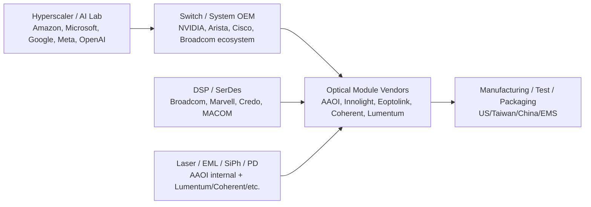
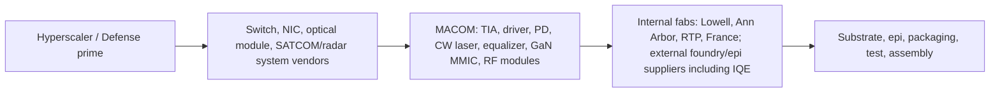
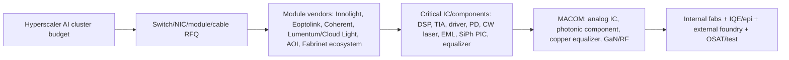

# Applied Optoelectronics, Inc.（AAOI）全面尽调

> 版本日期：2026-05-09（美西）。  
> 公司：Applied Optoelectronics, Inc.，NASDAQ: AAOI。  
> 口径说明：本文没有参考本目录“公司调研”下任何既有文件；结合了项目内“AI网络/光互联”“OFC 2026”“AI数据中心建设规模”等行业资料，并用 SEC、公司公告、行情页面和公开财报资料交叉验证。所有金额除特别注明外为美元。  
> 重要区分：AAOI 对 backlog、Bookings、取消率、产品级毛利率披露有限；本文把“披露数据”和“推算”分开，推算用于投资建模，不等于公司指引。

## 1. 公司整体业务、产业链位置与当前估值

### 1.1 业务概览

Applied Optoelectronics 是一家光通信器件、光模块和 HFC/CATV 宽带设备供应商，核心产品包括：

| 业务/市场 | 主要产品 | 2026Q1收入 | 占比 | YoY | 投资关注度 |
|---|---:|---:|---:|---:|---|
| Datacenter | 400G/800G/1.6T 光收发模块、激光器/探测器/光组件、AI 数据中心互联产品 | $81.4M | 53.9% | +154.0% | 最高 |
| CATV / HFC | 1.8GHz 放大器、DOCSIS 4.0 相关 HFC 设备、QuantumLink 软件、headend/node/distribution equipment | $66.8M | 44.2% | +3.6% | 现金流和客户集中风险并存 |
| Telecom | 电信光器件/模块 | $2.6M | 1.7% | -12.9% | 低 |
| FTTH/Other | FTTH、其他光组件 | $0.34M | 0.2% | -8.6% | 可忽略 |

公司纵向一体化程度高：美国 Sugar Land 做 R&D、工程、制造与激光芯片/光组件能力，台湾和宁波做工程与制造。2026 年叙事已从“CATV 周期修复 + 400G/800G 客户认证”切换为“AI 数据中心 800G/1.6T 量产 + 美国本土高端光模块产能”。

### 1.2 投资人心中的 AAOI

AAOI 现在是一个高 beta 的 AI 光互联转型股。市场给它的不是传统通信设备估值，而是“AI optics capacity option”估值：如果 800G/1.6T 订单、美国本土产能和 hyperscaler 客户认证持续兑现，公司收入可能在 2026-2027 跳阶；如果资格认证、良率、交付、ASP 或客户需求低于预期，高估值会迅速反噬。

核心标签：

- **正面**：AI 光模块供不应求、800G/1.6T 已有大额订单、美国本土制造稀缺、激光器/光组件纵向一体化、Amazon/Microsoft 等客户线索提高可信度。
- **负面**：仍亏损、自由现金流大幅为负、客户高度集中、订单多为 PO/资格认证驱动而非多年不可取消长约、股本稀释明显、估值已经极高。

### 1.3 最近 3 年重大业务变化

| 时间 | 事件 | 含义 |
|---|---|---|
| 2023-2024 | 业务从低谷修复，CATV/HFC 需求恢复，Datacenter 400G/800G 认证推进 | 公司从亏损周期股转向 AI 光互联候选供应商 |
| 2025-03-13 | 向 Amazon 子公司发行客户认股权证，可购买最多 7,945,399 股，行权价 $23.6956；其中 1,324,233 股初始可行权，其余与 Amazon 及关联方未来 10 年累计采购 $4B 产品挂钩 | 不是订单等同物，但强烈暗示 Amazon 可能成为长期关键客户 |
| 2025 全年 | 收入 $455.7M，YoY +82.8%；CATV $245.1M，Datacenter $195.7M；毛利率 30.0% vs 2024 年 24.8% | CATV 和数据中心共同驱动，毛利率修复 |
| 2025Q2-Q4 | Taiwan factory 获 major hyperscale 800G 生产批准；800G 产品进入最终资格认证；Q4 开始有 meaningful shipments 预期 | 从 design win/qualification 向 volume shipment 过渡 |
| 2026-03-09 | 获长期 hyperscale 客户首个 1.6T 批量订单，金额超过 $200M，预计资格认证后 2026Q3 开始发货、Q4 完成 | 1.6T 从样品期进入订单期，是估值重估关键 |
| 2026-03-23 / 04-02 | 获同一 major hyperscale 客户 800G 单模订单 $53M，随后追加 $71M，合计 $124M；另一个 hyperscale 客户已发出首批 10,000 只 800G 单模模块 | 公开订单覆盖度上升，800G 客户从单一客户扩散 |
| 2026-04-17 | Houston-area footprint 扩至约 900,000 sqft；目标到 2027 年底 Houston 区域 800G/1.6T 月产能最高 700,000 只，激光 fab 产能 +350% | 产能上限从“小厂”向头部量产供应商靠拢 |
| 2026-04-29 | 获 Texas Semiconductor Innovation Fund grant $20.85M，支持 Sugar Land 产能扩张，预计创造 500+ jobs | 美国本土化叙事增强 |
| 2026Q1 | 退出 Q1 时 800G transceiver 月产能接近 100,000 只；完成 800G 首个 hyperscale 批量发货 | 量产能力开始进入财报验证期 |

### 1.4 产业链定位

AAOI 位于 **AI 网络光模块/光器件制造层**：

AAOI 的差异点不是 DSP，也不是交换芯片，而是“模块 + 激光器/光组件 + 美国/台湾产能 + hyperscaler 认证”。它能否享受高毛利，取决于是否能把内部 laser/optical component 的纵向一体化优势转化为 800G/1.6T 良率、交期和成本优势。

### 1.5 最新估值和财务指标

行情口径：2026-05-08 美股收盘；2026-05-09 是周六，无常规盘中价。

| 指标 | 数值 | 日期/口径 |
|---|---:|---|
| 股价 | $148.94 收盘；盘后 $150.43 | Yahoo/StockAnalysis，2026-05-08 |
| 市值 | $11.95B | StockAnalysis，2026-05-08 |
| 企业价值 | $11.79B | StockAnalysis，2026-05-08 |
| TTM PE | N/A | TTM 亏损 |
| Forward PE | 80.25x | StockAnalysis，2026-05-08 |
| P/S | 23.57x | TTM revenue $507.0M |
| Forward P/S | 9.76x | StockAnalysis，2026-05-08 |
| TTM 收入 | $507.0M | Q2'25-Q1'26 |
| FY2025 收入增速 | +82.8% | $455.7M vs $249.4M |
| Q1'26 收入增速 | +51.4% YoY | $151.1M vs $99.9M |
| TTM 毛利率 | 29.64% | StockAnalysis，2026-05-08 |
| Q1'26 GAAP 毛利率 | 29.1% | 公司 10-Q |
| TTM 净利率 | -8.55% | StockAnalysis，2026-05-08 |
| Q1'26 净利率 | -9.45% | -$14.3M / $151.1M |
| 52周涨幅 | +965.38% | StockAnalysis，2026-05-08 |
| 流通/总股本 | 76.99M float / 80.24M shares outstanding | StockAnalysis，2026-05-08 |

### 1.6 资产负债表健康度

| 项目 | 2026-03-31 | 2025-12-31 | 解读 |
|---|---:|---:|---|
| Cash, cash equivalents & restricted cash | $449.4M | $216.0M | Q1 股权融资后流动性显著增强 |
| Accounts receivable | $299.0M | $244.4M | 应收账款继续上升，客户集中风险高 |
| Inventory | $206.2M | $183.1M | 为 800G/1.6T 和 CATV 需求备货，周转风险上升 |
| Total current assets | $992.6M | $675.7M | 短期资产充裕 |
| PP&E, net | $419.0M | $376.1M | 扩产继续资本化 |
| Total assets | $1.566B | $1.168B | 资产扩张很快 |
| Total current liabilities | $259.4M | $257.3M | 短债压力可控 |
| Convertible senior notes | $129.5M | $129.8M | 2030 可转债为主 |
| Total liabilities | $459.9M | $434.5M | 杠杆不高 |
| Stockholders' equity | $1.106B | $733.9M | 股权融资后明显增厚 |
| Current ratio / quick ratio | 3.83 / 2.85 | StockAnalysis | 短期偿债强 |
| Total debt / net cash | $280.4M debt / $159.3M net cash | StockAnalysis | 净现金状态 |

财务健康判断：**短期流动性强、破产风险低；但经营现金流质量仍弱，且增长高度依赖外部融资和客户如期收款。** 2026Q1 operating cash flow 为 -$85.4M，capex 约 $58.2M，TTM FCF 约 -$448.9M。公司 Q1 通过出售 3.753M 股、均价 $104.03，获得约 $382.6M net proceeds；这降低了财务风险，但也带来显著稀释。客户集中非常高：Q1'26 top 10 customers 占 98% 收入，Digicomm 占收入 44.1%，并占应收账款 74.5%。

## 2. 最近五次财报：收入、订单、利润率和 AI 暴露

### 2.1 财报核心表

| 财季 | 总收入 | YoY / QoQ | Datacenter | CATV | Telecom/Other | GAAP GM / Non-GAAP GM | GAAP净损失 / Adj. EBITDA | AI/DC收入占比 | 订单、交期、Backlog、取消率 |
|---|---:|---:|---:|---:|---:|---:|---:|---:|---|
| 2026Q1 | $151.1M | +51.4% / +12.6% | $81.4M，+154.0% YoY | $66.8M，+3.6% YoY | $2.9M | 29.1% / 29.2% | -$14.3M / $1.0M | 53.9% | 官方：完成首个 hyperscale 800G volume shipment；退出 Q1 时 800G 月产能近 100k 只。公开订单：1.6T >$200M、800G $124M，主要 2026Q2-Q4 交付。取消率未披露；PO制，资格认证前仍有风险。 |
| 2025Q4 | $134.3M | +33.9% / +13.2% | $74.9M，+69.2% YoY | $54.0M，+3.4% YoY | $5.4M | 31.2% / 31.4% | -$2.0M / $0.7M | 55.8% | 创纪录收入；制造产能扩张为 2026 高速数据中心产品做准备。Q1'26 指引 $150-165M。未披露 backlog。 |
| 2025Q3 | $118.6M | +82.1% / +15.2% | $43.9M，+7.3% YoY | $70.6M，+237.1% YoY | $4.1M | 28.0% / 31.0% | -$17.9M / $2.0M | 37.0% | 1.8GHz CATV amplifiers 和 QuantumLink 软件强；800G 接近 several customers final qualification，预期 Q4 meaningful shipments；目标年底 800G 月产能约 100k 只、约 35% 美国制造。 |
| 2025Q2 | $103.0M | +137.9% / +3.1% | $44.8M，+30.4% YoY | $56.0M，+862.8% YoY | $2.1M | 30.3% / 30.4% | -$9.1M / 估计约 -$3M 至 -$4M | 43.5% | Taiwan factory 获一个 major hyperscale 800G 生产批准；800G 资格认证接近 final stages；预期 H2'25 meaningful shipments；年底 800G 月产能 >100k 只、40% 美国制造。 |
| 2025Q1 | $99.9M | +145.5% / -0.4% | $32.0M，+10.6% YoY | $64.5M，+638.3% YoY | $3.3M | 30.6% / 30.7% | -$9.2M / $0.4M | 32.1% | 与既有 hyperscale 客户取得 3 个 design wins；多个大客户 800G qualification；管理层对 H2'25 800G ramp 信心提高。Q2 指引 $100-110M。 |

注：公司没有分业务披露毛利率。上表 AI/DC 收入占比用 Datacenter revenue / total revenue 作为 proxy；其中 400G/800G/1.6T 和 hyperscale 数据中心最相关，但不是所有 Datacenter revenue 都等同 AI。

### 2.2 订单和交期判断

公司长期合约披露非常少。10-Q 明确表示多数客户按 purchase order 采购，公司通常没有超过一年的客户长期采购承诺；但产品一旦进入客户设计，替换成本较高，因此生命周期内延续采购概率较高。

公开可量化订单：

| 订单/客户 | 金额 | 产品 | 交付窗口 | 认证阶段 | 投资含义 |
|---|---:|---|---|---|---|
| Long-term major hyperscale customer | >$200M | 1.6T data center transceivers | 资格认证后 2026Q3 开始，2026Q4 完成 | Product qualification 后发货 | AAOI 首个 1.6T volume order，客户预计恢复为 10%+ 客户 |
| Major hyperscale customer | >$53M | 800G single-mode transceivers | 2026Q2 开始，2026Q3 中完成 | Product qualification 后发货 | 800G 初始批量订单 |
| 同一 major hyperscale customer | $71M | 800G single-mode transceivers | 2026Q2 开始，年底前完成 | 同上 | 该客户 3月中以来订单合计 $124M，超过原 backlog 一倍 |
| 另一 hyperscale customer | 未披露；首批 10,000 只 | 800G single-mode transceivers | 已发出首批 | 已进入 volume shipment | 证明 800G 客户不止一个 |

订单覆盖度：已公开 $324M+ 的 800G/1.6T 订单约等于 2025 全年收入的 71%，也约等于管理层公开/转录口径中 2026 年 >$1.1B 收入目标的 29%。若 Q2 指引中点 $189M，2026H1 约 $340M，则 H2 要达到 >$1.1B 需要约 $760M+，公开订单只能覆盖一部分，剩余要靠后续订单、CATV、其他 hyperscaler 客户和产能释放。

### 2.3 利润率解读

Q1'26 毛利率 29.1%，低于 Q4'25 的 31.2%。10-Q 将毛利率下降归因于扩产折旧/生产效率影响约 1.1ppt、库存储备约 0.4ppt，以及某些 data center 产品成本增加带来的约 $2.3M 负面影响。换句话说，AI 光模块不是刚放量就自动高毛利：新产品早期良率、测试时间、折旧和物料成本会压制毛利；如果 800G/1.6T 扩产顺利，毛利率才可能在 2026H2 改善。

管理层在 Q1 call 转录/第三方摘要中给出更乐观的中期口径：2026 收入目标上调至 >$1.1B，non-GAAP operating income 约 >$140M，Q2 产能目标约 150k units/month，年底约 650k units/month，并希望年末毛利率接近 35%、长期 40% 左右。该口径需用后续 Q2/Q3 实际毛利验证。

## 3. 2026 最新指引、业务收入占比和产品线拆解

### 3.1 2026Q2 指引

| 指标 | 2026Q2 指引 | 与 2026Q1 对比 |
|---|---:|---|
| Revenue | $180M-$198M | 中点 $189M，QoQ +25.0% |
| Non-GAAP gross margin | 29%-30% | 与 Q1 29.2% 基本持平 |
| Non-GAAP net income | -$2.5M 至 +$2.8M | 接近盈亏平衡 |
| Non-GAAP EPS | -$0.03 至 +$0.03 | 使用约 80.7M 股 |

最突出业务是 Datacenter。Q1 已首次超过 CATV，且 Q2-Q4 的 800G/1.6T 发货窗口集中在数据中心。CATV 仍贡献接近一半收入，但增长率低，且 Digicomm 应收和收入集中度过高；它更像现金流底座和信用风险来源，而不是 AI 估值主线。

### 3.2 产品线：重点与跳过项

| 产品/业务 | 当前状态 | 是否重点 | 原因 |
|---|---|---|---|
| 800G single-mode datacenter transceivers | 已完成 hyperscale 首批 volume shipment，公开订单 $124M，Q1 退出产能近 100k/月 | 重点 | 2026 收入兑现主线 |
| 1.6T datacenter transceivers | 首个 volume order >$200M，Q3-Q4 交付 | 最高重点 | 2026H2-2027 最大弹性；AI fabric 代际升级方向 |
| 400G datacenter transceivers | 存量出货和客户关系基础 | 次重点 | 仍贡献收入，但增长和估值弹性低于 800G/1.6T |
| 25dBm / 400mW ELSFP high-power CW laser | OFC 2026 展示，支持 CPO/NPO/OBO | 潜力重点 | 小收入、大期权；若 CPO/NPO 发展，激光源溢价高 |
| 6.4T OBO demonstration / future optical engine | OFC 2026 live demo | 潜力重点 | 2027+ 期权，非 2026 主收入 |
| Internal laser chips / optical components | 垂直整合，支持自家模块，也可能供应第三方 | 重点 | 决定毛利率和交期，可能是差异化来源 |
| CATV 1.8GHz amplifiers / DOCSIS 4.0 / QuantumLink | 2025-2026 大额收入，Digicomm 相关集中 | 保留但非 AI 重点 | 现金流和规模重要，但 AI 估值相关性低 |
| Telecom / FTTH / Other | 2026Q1 合计约 $2.9M | 跳过 | 低增速、低占比 |
| Legacy 100G/200G / discontinued products | 非核心或退出 | 跳过 | 低 ASP、低成长，可能带库存/折旧压力 |

### 3.3 产品收入和利润率推断

| 产品 | Q1'26收入贡献估计 | 2026收入贡献估计 | 产品毛利率推断 | 交叉验证 |
|---|---:|---:|---:|---|
| 800G transceivers | $10M-$30M | $250M-$450M | 早期 25%-35%，良率提升后 30%-40% | Q1 已首批 volume shipment；公开 $124M 订单 Q2-Q4 交付；Q1 datacenter QoQ +$6.5M |
| 1.6T transceivers | <$5M | $180M-$280M | 早期 35%-45%，但资格认证和测试压制 | >$200M 订单 Q3-Q4 交付，行业 1.6T 2026 进入短缺期 |
| 400G / legacy datacenter | $50M-$70M | $250M-$350M | 25%-35% | Q1 Datacenter $81.4M，扣除早期 800G 后仍主要来自 400G/older datacenter |
| ELSFP / high-power laser / OBO | <$5M | $10M-$40M | 40%-60% 潜力，但当前多为工程/样品 | OFC 2026 展示 25dBm ELSFP、6.4T OBO；尚无大额订单披露 |
| CATV/HFC | $66.8M | $250M-$320M | 25%-35% | 2025 CATV $245.1M；Q1 Digicomm revenue $66.7M |

## 4. 当前高增长/关键产品评估

评分：5=最强。供需紧张越高越乐观。

| 产品 | 当前收入贡献 | 收入增速 | AI基建重要性 | 时间紧急性 | 供需紧张 | 垄断/溢价能力 | 判断 |
|---|---:|---:|---:|---:|---:|---:|---|
| 800G transceivers | Q1 估计 $10M-$30M；公开订单 $124M | 2026 预计数倍增长 | 5 | 5 | 4 | 3 | AI 集群 scale-out 当前主力，需求明确，但竞争者多，ASP 2026H2 后有压力 |
| 1.6T transceivers | Q1 近零；公开订单 >$200M | 从零到数亿美元 | 5 | 5 | 5 | 4 | 2026H2-2027 核心斜率，早期供不应求，客户认证强 |
| Internal lasers / optical components | 不披露；嵌入 Datacenter/CATV | 随模块增长 | 5 | 4 | 4 | 4 | 如果自有激光良率好，可改善毛利和交期，是 AAOI 纵向整合护城河 |
| ELSFP / high-power CW laser | 当前很小 | 低基数高增长 | 4 | 3 | 4 | 4 | CPO/NPO/OBO 期权，2026 收入小，2027+ 值得跟踪 |
| CATV 1.8GHz / DOCSIS 4.0 | Q1 $66.8M | 2026 低到中个位数/高个位数 | 1 | 2 | 2 | 2 | 对 AI 不关键，但提供规模和现金；客户/应收集中是风险 |

## 5. 一年后产品贡献三情景

时间口径：未来四个季度，即 2026Q2-2027Q1 的产品收入区间。

| 产品 | 情景 | 未来一年收入贡献 | 收入增速 | AI重要性 | 时间紧急性 | 供需紧张 | 垄断/溢价 |
|---|---|---:|---:|---:|---:|---:|---:|
| 800G transceivers | 基准 | $350M-$500M | +200%+ | 5 | 5 | 3 | 3 |
| 800G transceivers | 乐观 | $550M-$750M | +300%+ | 5 | 5 | 4 | 3 |
| 800G transceivers | 极度乐观 | $800M-$1.0B | +400%+ | 5 | 5 | 5 | 4 |
| 1.6T transceivers | 基准 | $250M-$400M | 从低基数爆发 | 5 | 5 | 5 | 4 |
| 1.6T transceivers | 乐观 | $500M-$750M | 爆发 | 5 | 5 | 5 | 4 |
| 1.6T transceivers | 极度乐观 | $900M-$1.3B | 爆发 | 5 | 5 | 5 | 5 |
| Internal lasers/components | 基准 | 内部转移价值 $120M-$180M，外部收入 <$50M | 随模块 +100% | 5 | 4 | 4 | 4 |
| Internal lasers/components | 乐观 | 内部转移价值 $200M-$300M，外部收入 $50M-$100M | +150% | 5 | 4 | 5 | 4 |
| Internal lasers/components | 极度乐观 | 内部转移价值 $350M+，外部收入 $100M+ | +200% | 5 | 5 | 5 | 5 |
| ELSFP / OBO | 基准 | $20M-$60M | 高增长但小基数 | 4 | 3 | 4 | 4 |
| ELSFP / OBO | 乐观 | $80M-$150M | 高增长 | 4 | 4 | 5 | 4 |
| ELSFP / OBO | 极度乐观 | $200M-$400M | 爆发 | 5 | 5 | 5 | 5 |
| CATV/HFC | 基准 | $250M-$320M | 0%-15% | 1 | 2 | 2 | 2 |
| CATV/HFC | 乐观 | $330M-$420M | +20%-35% | 1 | 2 | 3 | 2 |
| CATV/HFC | 极度乐观 | $450M+ | +40%+ | 1 | 2 | 3 | 3 |

## 6. BOM、单位内容量、价格传导与产能

### 6.1 光模块 BOM 和价格传导

| 产品 | 典型 BOM / 成本结构 | 价格传导链 | AAOI 的可控部分 |
|---|---|---|---|
| 800G retimed OSFP/QSFP-DD | DSP/CDR 20%-30%；光引擎/EML/SiPh/VCSEL 30%-40%；driver/TIA/PD 10%-15%；PCB/壳体/散热/连接器 10%-15%；组装测试 10%-20% | CSP -> switch OEM/ODM -> module vendor -> DSP/laser/TIA/PCB/test vendors | 自有激光器/部分光组件、模块组装测试、客户认证、美国/台湾产能 |
| 1.6T DR8/2xDR4 | 光源/调制/PD 35%-45%；DSP/host electrical 20%-30%；driver/TIA 10%-15%；热设计/连接/测试 15%-25% | 早期按交期、良率和资格认证溢价；2027 多供应后 ASP 压力加大 | 自有光组件 + 产能 + 资格认证；DSP 仍依赖外部 |
| EML/CW laser/ELS | 外延/晶圆 25%-35%；fab process 20%-30%；封装/TEC/isolator 20%-30%；测试老化 15%-25% | 短缺时通过 capacity reservation、long-term supply、expedite fee 传导 | AAOI 的 laser fab 是关键差异化，但规模仍需验证 |
| ELSFP/CPO/OBO optical engine | PIC/光引擎 25%-40%；ELS/laser 20%-35%；封装/连接/热 20%-30%；NRE/测试 10%-25% | 更偏平台/TCO 定价，不是简单 BOM+markup | 25dBm ELSFP、400mW CW laser、OBO demo；尚处早期 |

### 6.2 每 MW / rack / GPU / optical port 内容量

以下为 AI scale-out optics 的工程估算，实际取决于网络拓扑、oversubscription、GPU/NIC 数、交换层级和客户是否用 OCS/CPO。

| 单位 | 800G/1.6T transceiver 内容量 | AAOI revenue content 估算 | 说明 |
|---|---:|---:|---|
| 每 optical port | 1 只模块/端口；一条链路两端共 2 只 | 800G ASP $700-$1,100；1.6T ASP $1,400-$2,300 | 2026 初期高，2027 多供应后下行 |
| 每 GPU | 约 1-4 只 800G 等效模块 | $0.8k-$5k/GPU | 低配按 1 个 NIC port，高配按多 rail + switch side 计 |
| 每 NVL72/高端 AI rack | 约 150-350 只 800G 等效模块 | $0.12M-$0.60M/rack | 取决于 leaf/spine 层级、是否 1.6T、是否 OCS |
| 每 1MW IT load | 约 7-10 个高功率 AI rack，1,000-3,500 只 800G 等效模块 | $0.8M-$6.0M/MW | 仅模块，不含交换机、NIC、光纤布线 |
| 每 1MW 网络总价值 | 模块 + 交换机 + NIC + DAC/AEC + fiber | $2M-$10M/MW | 项目内 AI DC 模型中网络/光互联约占 CapEx 7%-16% |

AAOI 的直接内容量主要在“模块”和“部分激光/光组件”。它不吃完整网络 CapEx；交换芯片、NIC、DSP、连接器和系统利润会被 NVIDIA/Broadcom/Arista/Marvell/Credo/Amphenol/Corning 等分走。

### 6.3 当前产能与认证阶段

| 产品 | 当前产能能力 | 供应链采纳 | 认证阶段 |
|---|---:|---|---|
| 800G transceivers | 2026Q1 退出时接近 100k units/month；公司此前目标 2025 年底 >100k/月 | 至少两个 hyperscale 客户出现 volume shipment/订单 | 一个 major hyperscale 已批准 Taiwan factory；多个客户完成/接近完成 qualification |
| 1.6T transceivers | 与 800G 共用扩产线，官方称 2026 年底 combined 800G+1.6T >500k units/month | 一个 long-term major hyperscale customer 首个 volume order >$200M | 资格认证后 2026Q3 开始发货、Q4 完成 |
| ELSFP / OBO | 尚无量产产能披露 | OFC 2026 展示，客户评估阶段 | Demo / evaluation |
| CATV/HFC | 已成熟量产 | Digicomm 等客户高依赖 | 已商业化 |

理论产能对应收入：若 2026 年底 combined 800G/1.6T 月产能 >500k 只，即使按混合 ASP $800-$1,500，名义年化收入能力也可能达到 $4.8B-$9.0B。但这不是 2026 可确认收入，因为有效产能还受客户认证、器件供应、良率、测试时间、订单节奏、付款条件和产线爬坡限制。管理层 >$1.1B 2026 收入目标更接近“有效交付能力”。

## 7. 一年后产能、采纳和认证三情景

| 产品 | 情景 | 未来一年产能能力（收入计） | 供应链采纳 | 认证/客户阶段 |
|---|---|---:|---|---|
| 800G | 基准 | 年化有效 $700M-$1.0B | 2-3 个 hyperscaler 采纳 | 已进入 volume + 多客户资格认证 |
| 800G | 乐观 | 年化有效 $1.1B-$1.5B | 3-5 个 hyperscaler/云客户 | 主要客户进入 AVL，交付稳定 |
| 800G | 极度乐观 | 年化有效 $1.8B+ | 多区域 rollout | 供应链把 AAOI 当作核心二供/三供 |
| 1.6T | 基准 | 年化有效 $500M-$800M | 1 个大客户 + 小量第二客户 | 首单完成，2027 新 qual |
| 1.6T | 乐观 | 年化有效 $1.0B-$1.5B | 2-3 个大客户 | 1.6T 成为新建集群默认方案之一 |
| 1.6T | 极度乐观 | 年化有效 $2.0B+ | 3+ 大客户，订单滚动追加 | 供不应求延续，AAOI 获更高份额 |
| ELSFP/OBO | 基准 | <$100M | 少量评估 | demo 到 qualification |
| ELSFP/OBO | 乐观 | $150M-$300M | 与 CPO/NPO pilot 绑定 | lead customer design-in |
| ELSFP/OBO | 极度乐观 | $400M+ | 高端 switch/optical engine 早期量产 | 进入系统级长期架构 |

## 8. 基于订单和供给的未来一年业务增速预测

### 8.1 关键约束

1. **订单**：公开订单 $324M+ 明确存在，但公司没有完整 backlog。Amazon warrant 的 $4B 采购门槛不是 backlog，只是未来 10 年潜在采购触发条件。
2. **供给**：Q1 退出 800G 月产能近 100k 只；2026 年底官方目标 combined 800G+1.6T >500k/月；2027 年底 Houston 区域最高 700k/月并扩 laser fab +350%。
3. **认证**：800G 已开始 volume；1.6T 仍要资格认证后发货。
4. **取消率**：未披露。假设已完成 qualification 的 firm PO 取消率低至 0%-5%；qualification 前订单/forecast 延后或重切 SKU 风险为 10%-25%。
5. **营运资金**：Q1 AR、inventory 大增，若 Digicomm 或 hyperscaler 回款延迟，现金消耗可能超预期。

### 8.2 公司收入三情景

| 情景 | 2026E revenue | 未来四季度 revenue（2026Q2-2027Q1） | 2027E revenue run-rate | 核心假设 |
|---|---:|---:|---:|---|
| 基准 | $1.05B-$1.20B | $1.25B-$1.45B | $1.6B-$2.0B | Q2 指引兑现；1.6T >$200M 按期交付；800G $124M 订单完成；H2 产能爬坡但良率/测试压制 |
| 乐观 | $1.25B-$1.45B | $1.55B-$1.90B | $2.2B-$2.8B | 追加订单出现；年底有效产能接近 400k-500k/月；毛利率 Q4 接近 35% |
| 极度乐观 | $1.60B-$2.00B | $2.10B-$2.60B | $3.2B-$4.0B | 800G/1.6T 都供不应求，多个 hyperscaler 同时拉货；ASP 坚挺，产线爬坡极顺 |

我的基准判断：2026 年超过 $1.1B 是可以建模的，但市场已经部分计入。真正决定股价二阶走势的是 **Q3/Q4 收入斜率 + 毛利率是否从 29%-30% 向 35% 靠拢 + 公开订单是否持续增加**。如果收入上去但毛利率卡在 29%-30%，估值会从“AI 稀缺产能”转向“高 capex 模块组装”，倍数可能压缩。

## 9. 竞争格局、技术路线和替代风险

### 9.1 主要竞争对手

| 层级 | 竞争对手 | AAOI 相对位置 |
|---|---|---|
| 800G/1.6T 模块 | Innolight/中际旭创、Eoptolink/新易盛、Coherent、Lumentum/Cloud Light、Accelink、Hisense Broadband、Source Photonics、Cisco/Acacia | AAOI 不是最大，但美国本土产能和 hyperscaler 订单使其成为稀缺增量供应 |
| 激光器/EML/CW | Lumentum、Coherent、Mitsubishi、Sumitomo、Furukawa、Broadcom、MACOM、Source Photonics、中国光芯片厂 | AAOI 有自有 laser 能力，但高端 200G/400G EML 和 UHP/CW 规模仍需验证 |
| DSP/SerDes/Retimer | Broadcom、Marvell、Credo、MACOM、Semtech、Astera | AAOI 依赖外部 DSP/SerDes 生态，不掌握最高毛利芯片层 |
| EMS/封测 | Fabrinet、Foxconn/FIT、Jabil、Sanmina、Flex、Celestica | AAOI 自有产线更可控，但规模/成本需与 EMS 和中国头部厂竞争 |
| CPO/NPO/Optical engine | NVIDIA、Broadcom、Coherent、Lumentum、Marvell、OpenLight、Ayar、Lightmatter、Ranovus | AAOI 通过 ELSFP/OBO 切入，但当前不是平台主导者 |

### 9.2 技术路线是否主流

| 技术/产品 | 是否主流 | AAOI 风险/机会 |
|---|---|---|
| 800G pluggable | 2026 主流 | 机会大，但多供应商导致 2026H2-2027 ASP 压力 |
| 1.6T pluggable | 2026H2-2027 主流新增方向 | AAOI 已有首个 >$200M 订单，是最大机会 |
| LPO/LRO/TRO | 部分客户导入，LRO/TRO 比纯 LPO 更现实 | 若 AAOI 低功耗路线落后，可能被更低功耗供应商抢份额 |
| CPO/NPO/CPX | 2026 pilot，2027+ 高端 switch 放量 | 长期可能分流传统 pluggable，但 ELSFP/laser 也给 AAOI 新入口 |
| OCS | Google/TPU 先行，非 Google GPU 网络还早 | 不直接替代光模块，反而可能提高光模块和光纤需求；但会改变交换芯片/retimer价值 |
| AEC/DAC 铜互联 | 短距继续强 | 会替代一部分短距光模块，但跨 rack/longer reach 仍需光 |

### 9.3 客户替换成本

客户替换成本 **中高**：

- 高速光模块需要 switch ASIC、cage、热设计、FEC、DSP firmware、监控软件、现场维护、RMA 流程共同验证。
- Hyperscaler qualification 通常需要 6-18 个月，且批量故障会影响整柜/整 pod 上线。
- 但 hyperscaler 会刻意多供，避免单一供应商垄断；一旦多个供应商都通过认证，价格竞争会很快出现。

因此 AAOI 的壁垒不是“永久垄断”，而是 **在 800G/1.6T 早期窗口拿到资格认证、产能和交期溢价**。窗口期可能是 2026H2-2027H1；之后利润率会更依赖自有激光器、良率、自动化测试和美国本土产能价值。

## 10. 投资结论

AAOI 的核心多头逻辑是：公开订单已经从“故事”变成“交付窗口”，800G/1.6T 叠加美国本土产能，使公司有机会从 2025 年 $456M 收入跃升到 2026 年 $1.1B+。如果 Q3/Q4 产能释放、1.6T 认证和毛利率提升同步兑现，2027 收入可能继续向 $2B+ 运行。

核心空头逻辑也很清楚：估值已非常前置，P/S 23.6x、Forward PE 80x；公司仍亏损、FCF 大幅为负，Q1 毛利率没有随 AI 收入上升而改善；客户集中和 PO 制订单意味着需求并非无风险长约。真正要盯的是 **Q3 2026**：那时新增产能应开始明显进入 P&L，订单、收入、毛利率和现金流会同时给答案。

我的判断：AAOI 是 AI 光互联里弹性很高、但容错率很低的标的。它不是 Lumentum/Coherent 那种更上游的高毛利光器件龙头，也不是 Broadcom/Marvell/Credo 那种 DSP/SerDes 高毛利层；它的胜负点在“把美国/台湾扩产、内部激光器和 hyperscaler 认证变成稳定大批量模块交付”。若做跟踪，优先看四个数字：800G/1.6T 月产能、Q3/Q4 datacenter revenue、gross margin 是否上 33%-35%、公开新订单是否继续超过交付消耗。

## 资料来源

- AAOI Q1 2026 earnings release / SEC exhibit: https://www.sec.gov/Archives/edgar/data/1158114/000168316826003562/aaoi_ex9901.htm
- AAOI Q1 2026 10-Q: https://www.stocktitan.net/sec-filings/AAOI/10-q-applied-optoelectronics-inc-quarterly-earnings-report-e3111ee2cf71.html
- AAOI FY2025 Q4 results: https://www.globenewswire.com/news-release/2026/02/26/3246121/0/en/Applied-Optoelectronics-Reports-Fourth-Quarter-and-Full-Year-2025-Results.html
- AAOI 2025 10-K: https://www.sec.gov/Archives/edgar/data/1158114/000143774926005875/aaoi20251231_10k.htm
- AAOI Q3 2025 results: https://investors.ao-inc.com/news-releases/news-release-details/applied-optoelectronics-reports-third-quarter-2025-results
- AAOI Q2 2025 results: https://appliedoptoelectronics.gcs-web.com/news-releases/news-release-details/applied-optoelectronics-reports-second-quarter-2025-results
- AAOI Q1 2025 results: https://www.sec.gov/Archives/edgar/data/1158114/000168316825003290/appliedopto_ex9901.htm
- AAOI 1.6T order release, OFC page: https://www.ofcconference.org/news-media/exhibitor-news/aoi-receives-first-volume-order-of-1-6t-data-center-transceivers-from-major-hyperscale-customer/
- AAOI 800G $53M order: https://investors.ao-inc.com/news-releases/news-release-details/aoi-receives-new-order-800g-data-center-transceivers-major
- AAOI 800G $71M upsized order: https://investors.ao-inc.com/news-releases/news-release-details/aoi-receives-new-upsized-order-800g-data-center-transceivers
- AAOI Houston expansion: https://investors.ao-inc.com/news-releases/news-release-details/aoi-expands-its-houston-area-footprint-900000-square-feet
- AAOI Texas Semiconductor Innovation Fund grant: https://investors.ao-inc.com/news-releases/news-release-details/aoi-awarded-209m-texas-semiconductor-innovation-fund-grant
- AAOI OFC 2026 ELSFP / OBO announcement: https://investors.ao-inc.com/news-releases/news-release-details/aoi-showcases-25dbm-ultra-high-power-elsfp-foundation-next-gen
- StockAnalysis AAOI statistics / quote: https://stockanalysis.com/stocks/aaoi/statistics/
- Yahoo Finance chart API, AAOI 2026-05-08 quote: https://query1.finance.yahoo.com/v8/finance/chart/AAOI?range=5d&interval=1d
- MarketBeat Q1 2026 call transcript summary: https://www.marketbeat.com/earnings/reports/2026-5-7-applied-optoelectronics-inc-stock/
- 项目内参考：`D:\drive\Investment\工作台v5\行业调研_AI网络_光互联_铜互联\行业调研_800G_1.6T可插拔光模块_2026-05-08.md`
- 项目内参考：`D:\drive\Investment\工作台v5\行业调研_AI网络_光互联_铜互联\行业调研_激光器_EML与光器件_2026-05-08.md`
- 项目内参考：`D:\drive\Investment\工作台v5\conference_update\ofc_2026_conference_update.md`
- 项目内参考：`D:\drive\Investment\工作台v5\AI数据中心建设规模与产业链订单映射_2026-2027_美国.md`

# 公司：ANET Arista Networks（Arista Networks, Inc.）全面尽调

报告日期：2026-05-10  
市场数据日期：2026-05-08 美股收盘。2026-05-10 为周日，ANET 最新有效交易日为 2026-05-08。  
研究口径：本报告使用 Arista 官方新闻稿、SEC 文件、最新财报电话会、第三方市场数据、行业会议与项目内非“公司调研”目录下的 AI 网络/光互联/AI 数据中心资料。公司不披露硬件 backlog、bookings、取消率和 AI 业务季度拆分，因此相关字段以“披露数据 + 供应链/财务交叉验证 + 情景推断”标注。

## 0. 核心结论

Arista Networks 是 AI/云数据中心以太网交换系统的核心供应商之一，投资人心中的标签已经从“云交换机高质量成长股”升级为“AI Ethernet fabric 受益者”。它不生产 GPU、交换芯片或光模块，核心价值在于把 Broadcom 等 merchant ASIC、系统硬件、EOS 网络操作系统、CloudVision/CV UNO 可观测性与大型云客户的部署经验整合成可规模化的 AI 网络系统。

截至 2026Q1，公司收入增速重新加速：Q1 2026 收入 27.09 亿美元，同比增长 35.1%；管理层将 2026 年 AI networking/fabrics 收入目标上调至 35 亿美元。按 2026 年可能 110 亿至 120 亿美元总收入估计，AI fabrics 已接近公司收入的 30% 左右，并且是未来 12 个月最重要的增量来源。

财务质量非常强：2026Q1 末现金及有价证券约 123.5 亿美元，无明显金融债务；TTM 净利率约 38%，Q1 非 GAAP 毛利率 62.7%。主要风险不是资产负债表，而是客户集中、估值高、AI 订单节奏受 hyperscaler CapEx/电力/光模块/ASIC 供给影响，以及 NVIDIA Spectrum-X、Cisco Silicon One、Broadcom+白盒/SONiC 对 Ethernet AI fabric 的竞争。

## 1. 整体业务、定位、估值与资产负债表

### 1.1 公司业务

Arista 的主要业务是面向云、AI 数据中心、园区、路由和可观测性的网络系统，收入披露分为两类：

| 披露口径 | 2026Q1 收入 | 占比 | 同比 | 主要内容 | 毛利率特征 |
|---|---:|---:|---:|---|---|
| Product | 23.113 亿美元 | 85.3% | 约 +36.6% | 数据中心交换机、AI leaf/spine、路由系统、园区交换、部分光/线缆/系统硬件 | 2026Q1 产品毛利率约 58.4% |
| Service | 3.977 亿美元 | 14.7% | 约 +27.4% | 支持服务、软件订阅、CloudVision/CV UNO/可观测性相关服务 | 2026Q1 服务毛利率约 82.2% |
| Total | 27.090 亿美元 | 100.0% | +35.1% | AI、云、企业和服务商网络 | GAAP 毛利率 61.9%，非 GAAP 毛利率 62.7% |

公司在产业链中的位置：

| 层级 | 代表公司/环节 | Arista 的关系 |
|---|---|---|
| GPU/XPU/AI 加速器 | NVIDIA、AMD、Broadcom/Google TPU、AWS Trainium、Meta MTIA | 下游网络需求由 GPU/XPU 集群规模驱动，Arista 不生产加速器 |
| NIC/DPU/网卡 | NVIDIA ConnectX/BlueField、Broadcom、Marvell、Intel | AI Ethernet fabric 需要 NIC/RDMA/RoCE 配合，Arista 与之互操作 |
| 交换 ASIC | Broadcom Tomahawk/Jericho、Cisco Silicon One、NVIDIA Spectrum | Arista 主要使用 merchant silicon，优势在系统设计、软件和部署，不在自研 ASIC |
| 交换系统和网络 OS | Arista EOS/CloudVision、Cisco Nexus、NVIDIA Spectrum-X、白盒 SONiC | Arista 的核心价值层 |
| 光模块/铜缆/连接 | Coherent、Lumentum、Innolight、Eoptolink、Marvell、Broadcom、Amphenol 等 | Arista 依赖 400G/800G/1.6T 光电供应，部分随系统销售或由客户直接采购 |
| 云/AI 数据中心客户 | Microsoft、Meta、Google、AWS、Oracle、xAI、CoreWeave 等 | Arista 不披露具体客户名称；2026Q1 两大客户合计占收入 37.5% |

### 1.2 投资人眼中的公司形象

| 维度 | 结论 |
|---|---|
| 质量 | 高毛利、高净利率、无明显债务、现金充足，属于网络硬件中少见的“软件化硬件高利润模型” |
| 成长 | 传统云交换机基础上叠加 AI back-end / scale-out Ethernet fabric，2026 年 AI fabrics 目标 35 亿美元 |
| 商业模式 | 不是一次性硬件盒子公司，EOS/CloudVision/支持服务提升粘性和生命周期收入 |
| 争议 | 估值高、客户集中、部分 hyperscaler 可自研/白盒化；NVIDIA 在 AI full-stack 网络中有天然入口 |
| 关键变量 | 800G/1.6T 以太网是否继续替代或分流 InfiniBand，云客户 AI 集群是否持续扩容，Arista 能否维持产品毛利率 |

### 1.3 最近 3 年重大业务变动、转型与收购

| 时间 | 事件 | 投资含义 |
|---|---|---|
| 2023-2024 | 从云数据中心 leaf/spine 进一步切入 AI 集群后端网络，推出 Etherlink AI Networking Platforms | 公司叙事从云交换机升级为 AI Ethernet fabric |
| 2024-2025 | 7060X6 AI Leaf、7800R4 AI Spine、7700R4 Distributed Etherlink Switch 等产品线增强 | 从 400G/800G leaf-spine 走向更大规模 AI spine 和分布式 fabric |
| 2025 | 推出 EOS/CloudVision 面向 AI cluster 的能力，包括 CloudVision Universal Network Observability、job-centric observability、AI agent 方向 | 软件和服务在 AI 网络中更重要，强化替换成本 |
| 2025 | Cisco 专利诉讼事项和解 | 降低历史法律噪音，市场更聚焦 AI 增长 |
| 2026Q1 | 2026 年 AI fabrics 收入目标上调至 35 亿美元；Q1 收入同比 +35.1% | AI 需求已经进入财务报表，而非仅是概念 |
| 2026Q1 | 宣布拟收购 Broadcom/VMware VeloCloud SD-WAN 组合，预期 2026Q3 完成 | 增强企业 WAN/园区/边缘能力；不是 AI 主线，但提升企业网络版图 |
| 2026Q1 | 参与/发布 XPO MSA 12.8T 液冷可插拔光互联方向 | 小体量但潜在战略产品，指向 1.6T/3.2T 后的高密度互联 |

### 1.4 最新股价、估值和利润率

| 指标 | 数值 | 日期/口径 | 备注 |
|---|---:|---|---|
| 股价 | 141.77 美元 | 2026-05-08 收盘 | 美股周五收盘，2026-05-10 无交易 |
| 市值 | 约 1,806 亿美元 | 2026-05-08 | 市场数据口径 |
| TTM PE | 约 47.9x | 2026-05-08 | 市场数据口径；用 Q2 2025-Q1 2026 GAAP EPS 约 2.92-2.96 美元交叉验证 |
| Forward PE | 约 44-50x | 2026-05-06 至 2026-05-08 第三方口径 | 数据商差异较大；自算若 FY2026 非 GAAP EPS 约 3.55-3.75 美元，则约 38-40x |
| TTM P/S | 约 18.4x | 2026-05-08 自算 | 市值 1,806 亿美元 / TTM 收入 97.10 亿美元 |
| Q1 2026 收入增速 | +35.1% YoY | 2026Q1 | 收入 27.09 亿美元 |
| TTM 收入增速 | 约 +29-30% | Q2 2025-Q1 2026 | TTM 收入 97.10 亿美元 |
| Q1 2026 GAAP 毛利率 | 61.9% | 2026Q1 | 非 GAAP 毛利率 62.7% |
| Q1 2026 净利率 | 37.8% | 2026Q1 | GAAP 净利润 10.229 亿美元 |
| TTM 净利率 | 约 38.3% | Q2 2025-Q1 2026 | TTM GAAP 净利润约 37.21 亿美元 |

### 1.5 资产负债表健康度

| 项目 | 2026Q1 末数值 | 解读 |
|---|---:|---|
| 现金及现金等价物 | 23.465 亿美元 | 充足 |
| 短期有价证券 | 81.630 亿美元 | 流动性强 |
| 长期有价证券 | 18.440 亿美元 | 合计现金及有价证券约 123.535 亿美元 |
| 应收账款 | 18.731 亿美元 | 大客户集中，账期风险需结合云客户信用看 |
| 存货 | 23.811 亿美元 | 与 AI/云交付准备和长期采购承诺一致 |
| 总资产 | 248.368 亿美元 | 资产负债表轻资产、高现金 |
| 流动负债 | 65.601 亿美元 | 流动比率约 2.83x |
| 总负债 | 81.689 亿美元 | 无明显金融债务压力 |
| 递延收入 | 61.987 亿美元 | 服务/支持可见度强 |
| RPO | 约 77 亿美元 | 未来履约义务；约 89% 预计两年内确认 |
| 采购义务 | 约 89 亿美元 | 其中 76 亿美元 12 个月内支付，反映供应链锁量，也带来需求波动风险 |
| 客户集中 | 两大客户合计占 2026Q1 收入 37.5% | 最大结构性风险之一 |

判断：财务健康度非常高，真正风险不是偿债，而是“为了 AI 供给锁定大量采购义务后，如果客户交付节奏变化，存货和毛利率可能承压”。不过 77 亿美元 RPO、62 亿美元递延收入和 89 亿美元采购义务同时说明，公司对未来 1-2 年需求有很强可见度。

## 2. 最近五次财报对比

### 2.1 财务与业务核心数据

| 财报季度 | 收入 | YoY | QoQ | Product 收入 | Service 收入 | GAAP 毛利率 | 产品毛利率 | 服务毛利率 | GAAP 净利润 | GAAP EPS | AI 数据中心相关收入估计 |
|---|---:|---:|---:|---:|---:|---:|---:|---:|---:|---:|---|
| 2026Q1 | 27.090 亿美元 | +35.1% | +8.9% | 23.113 亿美元 | 3.977 亿美元 | 61.9% | 约 58.4% | 约 82.2% | 10.229 亿美元 | 0.80 美元 | 约 7.5-9.0 亿美元，按 2026 年 AI fabrics 35 亿美元目标反推 |
| 2025Q4 | 24.878 亿美元 | +29.0% | +7.8% | 20.957 亿美元 | 3.921 亿美元 | 62.9% | 约 59.3% | 约 81.9% | 9.558 亿美元 | 0.75 美元 | 约 6.0-7.5 亿美元，AI 订单进入规模交付 |
| 2025Q3 | 23.083 亿美元 | +27.5% | +4.7% | 19.117 亿美元 | 3.966 亿美元 | 64.6% | 约 61.0% | 约 81.7% | 8.530 亿美元 | 0.67 美元 | 约 5.0-6.5 亿美元，AI/云仍为增长核心 |
| 2025Q2 | 22.048 亿美元 | +30.4% | +10.0% | 18.770 亿美元 | 3.278 亿美元 | 65.2% | 约 62.3% | 约 81.9% | 8.888 亿美元 | 0.70 美元 | 约 4.5-6.0 亿美元，7800R4 AI Spine 等产品拉动 |
| 2025Q1 | 20.048 亿美元 | +27.6% | +3.9% | 16.925 亿美元 | 3.123 亿美元 | 63.7% | 约 60%左右 | 约 82%左右 | 8.138 亿美元 | 0.64 美元 | 约 3.5-5.0 亿美元，AI fabric 从验证转入更多生产部署 |

说明：Arista 不披露 AI 数据中心收入的季度拆分。上表 AI 收入为根据公司 2026 AI fabrics 35 亿美元目标、云客户收入集中、产品节奏和行业 AI Ethernet 需求推断，不能等同于公司正式 segment 数据。

### 2.2 订单、交期、取消率和 backlog 的可见度

| 季度 | 官方披露的订单/backlog | 可用代理指标 | 交期/供给推断 | 取消率判断 |
|---|---|---|---|---|
| 2026Q1 | 未披露 bookings/backlog/lead time/cancel rate | RPO 约 77 亿美元；递延收入约 62 亿美元；采购义务约 89 亿美元；Q2 指引 27.5 亿美元 | AI 供给需要提前锁定 ASIC、系统制造和光电组件。89 亿美元采购义务中 76 亿美元 12 个月内支付，说明供应链已为 2026 交付锁量 | 未披露。Hyperscaler AI 项目取消率应低于普通企业订单，但电力、机房、光模块、GPU 到货会造成季度间移动 |
| 2025Q4 | 未披露 | Q1 2026 指引 25.0-25.5 亿美元，实际显著超出至 27.09 亿美元 | Q4 指引偏保守，实际显示 AI/云交付拉动强 | 未披露，实际超预期说明取消压力不明显 |
| 2025Q3 | 未披露 | 公司给出 2026 年收入约 +20% 初始展望；随后上调 AI 目标 | 从普通云升级进入 AI fabric 更大订单周期 | 未披露 |
| 2025Q2 | 未披露 | Q3 指引 22.5-23.0 亿美元，实际 23.083 亿美元 | 800G/R4 产品逐步放量 | 未披露 |
| 2025Q1 | 未披露 | Q2 指引约 21.0 亿美元，实际 22.048 亿美元 | AI 网络供需紧于普通企业交换机 | 未披露 |

结论：硬 backlog 无法直接验证，但“RPO 77 亿美元 + 递延收入 62 亿美元 + 采购义务 89 亿美元 + AI fabrics 目标上调至 35 亿美元 + 连续超指引”构成较强交叉验证。真正要跟踪的是采购义务是否继续上升、存货周转是否恶化、两大客户收入占比是否继续提高，以及 2026H2 1.6T/102.4T 相关部署是否顺利。

## 3. 2026 最新财报指引、收入占比与产品映射

### 3.1 最新指引

2026Q1 财报给出的 2026Q2 指引：

| 指标 | 指引 |
|---|---:|
| 2026Q2 收入 | 约 27.5 亿美元 |
| 非 GAAP 毛利率 | 约 62% |
| 非 GAAP 经营利润率 | 约 47% |

这意味着 Q2 2026 收入同比仍可能在 24%-25% 以上，并且毛利率保持在 60%+ 高位。管理层同时把 2026 年 AI fabrics 收入目标提高到 35 亿美元。若全年总收入约 112-118 亿美元，AI fabrics 对总收入贡献约 30%-31%；若公司继续超指引，则该比例可能接近 33%。

### 3.2 2026Q1 收入结构与增长

| 业务/披露口径 | 收入 | 占比 | 增长 | 重点程度 |
|---|---:|---:|---:|---|
| Product | 23.113 亿美元 | 85.3% | +36.6% YoY | 最高，AI/云交换系统主要落在这里 |
| Service | 3.977 亿美元 | 14.7% | +27.4% YoY | 高，毛利率高，增强粘性 |
| AI fabrics | 约 7.5-9.0 亿美元估计 | 约 28%-33% | 高于公司平均 | 公司最侧重的增长业务 |
| 非 AI 云/企业/园区/路由 | 约 18-19.5 亿美元估计 | 约 67%-72% | 中低到中高不等 | 提供基本盘和现金流 |

### 3.3 产品与业务映射

| 业务 | 代表产品/型号 | 收入归属 | 增长/利润率判断 | 重要性 |
|---|---|---|---|---|
| AI Ethernet fabric / Etherlink | 7060X6 AI Leaf、7800R4 AI Spine、7700R4 Distributed Etherlink Switch、R4 系列 spine/leaf、400G/800G Ethernet/RoCE fabric | Product 为主，附带 service/software | 增速最快；产品毛利率受客户 mix 和供应链影响，估计 55%-62%；服务附加可提升生命周期利润 | 最高 |
| AI fabric 软件与可观测性 | EOS、CloudVision、CloudVision Universal Network Observability、AI agent、job-centric observability、AVA/可观测性工具 | Service/software + 支持合同 | 收入规模小于硬件但毛利率最高，估计 75%-85%+；随 AI 集群规模扩大 attach rate 提升 | 最高 |
| Scale-across / AI spine / routing | 7800R4 AI Spine、7700R4 DES、7800R4/7500R/7280R 相关路由和 spine 平台 | Product + service | 与 AI 集群跨机房、跨园区、DCI 相关；毛利率中高 | 高 |
| XPO 12.8T 液冷可插拔互联 | XPO MSA 12.8T module/系统方向，204.8Tbps per OCP RU | 目前收入很小，未来可能为 product/生态授权/系统销售 | 2026 仍在早期，潜在毛利率高但不确定；重点在 2027+ | 小但不能漏 |
| 园区/企业/SD-WAN | Campus switching、Wi-Fi/园区、CloudVision enterprise、拟收购 VeloCloud SD-WAN | Product/service | 非 AI 主线，增长较低或中等，利润率可好但不是核心弹性 | 本报告后文跳过细拆 |
| 传统服务商/普通路由 | 非 AI 相关 routing、传统数据中心更新 | Product/service | 稳定但 AI 弹性较弱 | 跳过细拆 |

被跳过的低优先级业务：园区交换、传统企业网络、Wi-Fi/园区云管理、VeloCloud SD-WAN、非 AI 服务商路由、普通企业支持续约。这些业务对现金流和多元化重要，但相对 AI fabric 的增速和估值弹性较低。

## 4. 高增长/关键产品当前贡献与 AI 基建重要性

评分：5 为最高，1 为最低。收入贡献为 2026Q1 当前季度估计或披露值，非公司披露 segment 的项目均为研究估计。

| 产品/业务 | 当前季度收入贡献 | 当前增速 | AI 技术栈重要性 | 时间紧急性 | 供需紧张程度 | 垄断/溢价能力 | 依据 |
|---|---:|---:|---:|---:|---:|---:|---|
| AI Ethernet fabric / Etherlink 系统 | 约 7.5-9.0 亿美元 | 估计 +60%-100% YoY | 5/5 | 5/5 | 4/5 | 3.5/5 | 2026 AI fabrics 目标 35 亿美元；800G Ethernet/RoCE 是大型 AI scale-out 的主路径之一 |
| EOS/CloudVision/CV UNO/AI 可观测性 | AI 相关约 1.2-1.7 亿美元；总 service 3.977 亿美元 | AI 相关估计 +30%-60% | 4.5/5 | 4/5 | 3/5 | 4/5 | 大集群故障定位、job-centric telemetry、变更管理和多厂商可视性重要性提升 |
| R4 AI Spine / scale-across routing | 约 2.0-3.0 亿美元，部分与 AI fabric 重叠 | 估计 +50%-90% | 4.5/5 | 4/5 | 4/5 | 3.5/5 | 7800R4/7700R4 推动大规模 spine、跨机房/园区互联 |
| XPO 12.8T 液冷可插拔 | 2026Q1 可忽略，估计低于 0.1 亿美元 | 基数极低 | 3.5/5，未来可升至 4.5/5 | 2.5/5 | 3/5 | 4/5 但未验证 | 解决 1.6T/3.2T 后密度和功耗问题，仍处 MSA/早期验证 |

## 5. 一年后收入贡献三情景

时间口径：未来 12 个月，即 2026Q2 至 2027Q1/2027Q2 附近。以下收入存在重叠，不能简单相加，尤其是 R4 spine 属于 AI fabric 的子集。

| 产品/业务 | 情景 | 未来 12 个月收入贡献 | 收入增速 | AI 重要性 | 时间紧急性 | 供需紧张 | 垄断/溢价能力 | 核心假设 |
|---|---|---:|---:|---:|---:|---:|---:|---|
| AI Ethernet fabric / Etherlink | 基准 | 44-50 亿美元 | +25%-40% | 5/5 | 5/5 | 4/5 | 3.5/5 | 2026 35 亿美元目标顺利兑现，800G 继续为主，1.6T 小规模导入 |
| AI Ethernet fabric / Etherlink | 乐观 | 55-65 亿美元 | +55%-85% | 5/5 | 5/5 | 5/5 | 4/5 | 两大云客户加速 AI cluster，Ethernet 份额提升，Arista 继续上调目标 |
| AI Ethernet fabric / Etherlink | 极度乐观 | 70-85 亿美元 | +100%+ | 5/5 | 5/5 | 5/5 | 4/5 | 1.6T/102.4T 平台提前放量，AI back-end 从 InfiniBand/自研方案获得额外份额 |
| EOS/CloudVision/CV UNO/AI 软件 | 基准 | 8-10 亿美元 | +20%-35% | 4.5/5 | 4/5 | 3/5 | 4/5 | 大型 AI fabric attach rate 提升，服务合同随硬件扩容 |
| EOS/CloudVision/CV UNO/AI 软件 | 乐观 | 11-14 亿美元 | +40%-60% | 4.5/5 | 4.5/5 | 3/5 | 4.5/5 | CV UNO/可观测性成为大集群运维标准配置 |
| EOS/CloudVision/CV UNO/AI 软件 | 极度乐观 | 16-21 亿美元 | +80%+ | 5/5 | 5/5 | 4/5 | 4.5/5 | AI 集群故障成本上升，客户愿为自动化和遥测显著付费 |
| R4 AI Spine / scale-across | 基准 | 10-13 亿美元 | +30%-50% | 4.5/5 | 4/5 | 4/5 | 3.5/5 | 作为 AI fabric 子集稳定增长 |
| R4 AI Spine / scale-across | 乐观 | 15-20 亿美元 | +60%-90% | 4.5/5 | 4.5/5 | 5/5 | 4/5 | 多园区 AI cluster、DCI 和 800G spine 密集建设 |
| R4 AI Spine / scale-across | 极度乐观 | 23-30 亿美元 | +100%+ | 5/5 | 5/5 | 5/5 | 4/5 | Scale-across 成为第二波 AI 网络瓶颈，客户抢 spine/router 产能 |
| XPO 12.8T | 基准 | 0.5-1.5 亿美元 | 基数极低 | 3.5/5 | 3/5 | 3/5 | 4/5 | 2027 初小批量验证，不形成主收入 |
| XPO 12.8T | 乐观 | 2-5 亿美元 | 基数极低 | 4/5 | 3.5/5 | 4/5 | 4/5 | MSA 获多家模块/系统厂支持，少数 hyperscaler 试点 |
| XPO 12.8T | 极度乐观 | 8-12 亿美元 | 基数极低 | 4.5/5 | 4.5/5 | 5/5 | 4.5/5 | 800G/1.6T 可插拔密度/功耗压力提前爆发，XPO 进入高端集群采购清单 |

## 6. BOM、单位含量与价格传导链

### 6.1 AI Ethernet switch system BOM 拆分

| BOM 项 | 估计成本占比 | 供应链/瓶颈 | 对 Arista 毛利率的影响 |
|---|---:|---|---|
| Merchant switch ASIC 与 SerDes | 20%-35% | Broadcom Tomahawk/Jericho、NVIDIA Spectrum、Cisco Silicon One 等；51.2T/102.4T 节点供给紧 | ASIC 紧缺时会压缩交付弹性，但 Arista 可通过系统溢价和软件价值缓冲 |
| PCB、retimer、cage、连接器、电源、散热 | 20%-30% | 224G SerDes、retimer、液冷/风冷设计、OSFP/QSFP-DD cage | 800G/1.6T 提高热设计难度，早期产品 ASP 和毛利较好 |
| 机箱、风扇、电源、线缆、制造 | 15%-25% | Contract manufacturers、Jabil/Foxconn/Flex 等模式；供应链锁量重要 | 规模化后成本下降，但大型云客户议价强 |
| 软件、系统集成、测试、NRE | 10%-20% | EOS、CloudVision、自动化测试、客户认证 | Arista 溢价核心，支撑 60% 左右产品毛利和 80%+ 服务毛利 |
| 光模块/光电连接 | 视销售模式而定 | 800G/1.6T 光模块、EML/SiPh/DSP/TIA/driver；可能由客户独立采购 | 若随系统销售，可能拉低硬件毛利但提高收入规模；若客户自采，则 Arista 收入只体现交换系统 |

### 6.2 光模块 BOM 参考

| 模块 | BOM 拆分 | 主要瓶颈 | 2026-2027 趋势 |
|---|---|---|---|
| 800G OSFP/QSFP-DD retimed | DSP/retimer 20%-30%；光引擎/EML/SiPh/VCSEL 30%-40%；driver/TIA/PD 10%-15%；PCB/外壳/散热/连接 10%-15%；组装测试 10%-20% | 200G EML、DSP、TIA/driver、主动耦合测试 | 2026 年 AI fabric 主力 |
| 1.6T DR8/2xDR4 | 光源/调制/PD 35%-45%；DSP/host electrical 20%-30%；driver/TIA 10%-15%；热管理/连接/测试 15%-25% | 224G SerDes、200G/400G 光器件、散热、良率 | 2026H2 认证，2027 更明显放量 |
| XPO/高密度液冷互联 | 光电引擎、液冷封装、连接器、系统级热设计占比更高 | 标准化、可维护性、液冷可靠性、客户认证 | 2026 主要是生态和样机，2027 以后看 adoption |

### 6.3 每 MW / 每 rack / 每 GPU / 每 optical port 的内容量

下面是研究口径，不是公司披露。假设一类高密度 AI rack 为 100-140kW，1MW 对应约 8-10 个高密度 rack；若按 72 GPU/rack，则 1MW 对应约 576-720 GPU。不同 GPU 架构、rail 数、前后端网络和 NVLink/UALink 占比会造成很大差异。

| 单位 | Arista 可寻址内容量 | 对应收入估计 | 备注 |
|---|---:|---:|---|
| 每 GPU | 0.2-1.2 个 400G/800G 等效以太网端口 | 约 1,000-6,000 美元/GPU 的交换系统含量 | NVLink rack 的 scale-out 端口较少，Ethernet-native XPU 或多 rail 设计更高 |
| 每 rack | 16-32 个 800G 等效端口为保守口径；Ethernet-native 设计可达 64-144 个 400G/800G 等效端口 | 约 15 万-80 万美元/rack 的交换系统含量 | 是否包含 optics 差异很大 |
| 每 MW | 150-320 个 800G 等效端口为保守口径；高 rail 设计可达 500-1,000+ 个 400G/800G 等效端口 | 基准 150 万-400 万美元/MW；乐观 400 万-800 万美元/MW；极度乐观 800 万-1,200 万美元+/MW | 大规模 back-end + front-end + storage fabric 叠加时上限更高 |
| 每 optical port | 交换机端口 ASP 约 1,250-2,500 美元/800G port；若带 800G optics，系统+光模块可达 2,500-5,000 美元/port | Arista 是否确认 optics 收入取决于客户采购模式 | 1.6T 早期 port 价值更高但成本也高 |

### 6.4 价格传导链

1. Hyperscaler AI CapEx 扩张先决定 GPU/XPU 集群规模。
2. GPU/XPU 集群规模决定 AI fabric 端口数量、spine/leaf 数量、光模块和线缆需求。
3. 网络预算在 AI 数据中心 CapEx 中通常约 7%-14%，在极端大集群中网络/光互联可升至更高区间。
4. Arista 确认收入主要来自交换系统、路由系统、软件/支持；光模块是否成为 Arista 收入取决于客户采购路径。
5. 上游 ASIC、SerDes、800G/1.6T 光模块、retimer、液冷材料涨价时，Arista 依靠系统溢价、客户优先级、软件服务和 mix 管理维持毛利率，但 hyperscaler 议价会限制完全转嫁。

## 7. 当前和一年后产能、采纳与认证

### 7.1 当前产能与采纳

| 产品/业务 | 当前收入/产能能力 | 供应链采纳程度 | 认证阶段 |
|---|---:|---|---|
| AI Ethernet fabric / Etherlink | Q1 2026 AI 相关收入估计 7.5-9.0 亿美元；2026 年目标 35 亿美元 | 已被大型云客户生产采用；两大客户合计占 Q1 收入 37.5% 说明大客户拉动明显 | 800G/RoCE/EOS fabric 已在生产；新 R4 平台持续 ramp |
| EOS/CloudVision/CV UNO | 总 service 年化约 15.9 亿美元，AI 相关部分估计 5-7.5 亿美元年化 | 在既有 Arista 客户中随硬件部署 attach；AI 集群复杂度提高采纳率 | 生产级软件和支持服务，功能持续迭代 |
| R4 AI Spine / scale-across | 属于 product 的高端子集，估计年化 8-12 亿美元 | 云客户和 AI 数据中心 spine/routing 认证中或已生产 | 7800R4/7700R4 处 ramp/客户认证/生产混合阶段 |
| XPO 12.8T | 2026 收入很小 | MSA/生态合作阶段 | 样机/标准化/早期验证，未到大规模收入 |

公司层面产能：Arista 不自建晶圆厂或大型制造厂，产能实质是“供应链锁量 + 合同制造 + 关键部件分配”。2026Q1 product 年化 run-rate 为 92.5 亿美元；结合 89 亿美元采购义务，2026 可支撑的 product 交付能力基准约 95-105 亿美元，乐观约 110-120 亿美元，极度乐观在供应链和客户拉货顺利时可向 130 亿美元靠近。

### 7.2 一年后产能和认证三情景

| 产品/业务 | 情景 | 一年后产能能力 | 供应链采纳 | 认证/成熟度 |
|---|---|---:|---|---|
| AI Ethernet fabric / Etherlink | 基准 | 年化 45-50 亿美元 AI fabric 交付能力 | 两大云客户继续拉动，新增客户有限 | 800G 主流生产，1.6T 少量认证 |
| AI Ethernet fabric / Etherlink | 乐观 | 年化 55-70 亿美元 | 更多 hyperscaler 和 neo-cloud 采用 Ethernet back-end | 102.4T/1.6T 进入早期生产 |
| AI Ethernet fabric / Etherlink | 极度乐观 | 年化 80 亿美元+ | Ethernet 明显抢占部分 InfiniBand/自研 fabric 增量 | 1.6T 平台提前规模化 |
| EOS/CloudVision/CV UNO | 基准 | 年化 8-10 亿美元 AI 相关服务/软件能力 | 随 Arista AI 硬件 attach | 生产成熟 |
| EOS/CloudVision/CV UNO | 乐观 | 年化 12-15 亿美元 | AI cluster 可观测性成为标配 | 自动化/遥测功能更深集成 |
| EOS/CloudVision/CV UNO | 极度乐观 | 年化 18 亿美元+ | 多云/多厂商 fabric 管理需求放大 | 成为大型 AI fabric 运维控制面之一 |
| R4 AI Spine / scale-across | 基准 | 年化 12-15 亿美元 | 大型 AI 园区继续扩容 | R4 spine/routing 生产成熟 |
| R4 AI Spine / scale-across | 乐观 | 年化 18-25 亿美元 | scale-across 成为明显瓶颈 | 800G spine 放量，1.6T 认证 |
| R4 AI Spine / scale-across | 极度乐观 | 年化 30 亿美元+ | 多园区 AI 互联爆发 | 1.6T/更高 radix 系统提前量产 |
| XPO 12.8T | 基准 | 0.5-1.5 亿美元 | 少数客户试点 | MSA/样机/实验室验证 |
| XPO 12.8T | 乐观 | 2-5 亿美元 | 模块厂和系统厂扩大生态 | 客户 POC 和小规模部署 |
| XPO 12.8T | 极度乐观 | 8-12 亿美元 | 高密度液冷集群导入 | 早期生产认证，但仍有执行风险 |

## 8. 基于订单积压与供给的未来一年增速推断

### 8.1 真实订单积压如何推断

Arista 不披露 hardware backlog 或 bookings。可用的交叉验证如下：

| 验证项 | 数字/事实 | 对订单的含义 |
|---|---:|---|
| RPO | 2026Q1 末约 77 亿美元，约 89% 两年内确认 | 服务/合同履约可见度强，但不等同硬件 backlog |
| 递延收入 | 2026Q1 末约 62 亿美元 | 支持服务和合同收入蓄水池大 |
| 采购义务 | 2026Q1 末约 89 亿美元，其中 76 亿美元 12 个月内支付 | 公司已为未来供给锁定大量部件/制造能力 |
| 存货 | 2026Q1 末约 23.8 亿美元 | 为 AI/云项目交付备货 |
| 大客户集中 | 两大客户 2026Q1 收入占比 37.5% | AI/云大订单贡献高，同时集中度风险高 |
| 管理层目标 | 2026 AI fabrics 收入目标 35 亿美元 | 直接体现 AI 网络需求进入收入层 |
| 行业口径 | 2026 AI fabric switch 市场基准约 250-400 亿美元，乐观 360-550 亿美元；800G/1.6T 光模块高增长 | Arista 处于高增长需求池 |

### 8.2 未来一年业务增速情景

| 口径 | 基准 | 乐观 | 极度乐观 |
|---|---:|---:|---:|
| 公司总收入未来 12 个月增速 | +25%-32% | +35%-45% | +50%-60% |
| Product 收入增速 | +28%-35% | +40%-50% | +60% 左右 |
| Service 收入增速 | +20%-25% | +30%-40% | +50% 左右 |
| AI Ethernet fabric 增速 | +35%-45% | +60%-85% | +100%+ |
| AI 软件/可观测性增速 | +25%-35% | +40%-60% | +80%+ |
| 主要制约 | 800G/1.6T optics、ASIC 供给、客户机房/电力节奏 | 同左，但 Arista 获得更多供应分配 | GPU、网络、光模块、电力同步加速，且 Ethernet 份额提升 |
| 取消率/推迟风险 | 取消低，推迟中等 | 取消低，推迟低至中等 | 供不应求下取消低，但季度波动更大 |

基准判断：未来 12 个月公司总收入增速大概率高于最初 2026 年 +20% 展望，25%-32% 更合理。若 Q2/Q3 继续超指引，AI fabrics 35 亿美元目标可能再次上调，届时收入和估值都将由 AI Ethernet 订单可见度重新定价。

## 9. 竞争格局、主流性、替代风险与客户切换成本

### 9.1 主要竞争对手

| 竞争对手/方案 | 竞争点 | 对 Arista 的威胁 | Arista 的应对优势 |
|---|---|---|---|
| NVIDIA Spectrum-X / InfiniBand | GPU、NIC、DPU、switch、software 一体化，训练集群完整栈 | 最强；NVIDIA 可把网络和 GPU 方案绑定 | Ethernet 开放生态、多供应商、hyperscaler 自主权，EOS 成熟 |
| Cisco Nexus / Silicon One | 自研 ASIC、企业客户、路由/园区/安全组合 | 高；Cisco 在企业和 service provider 强 | Arista 在云客户和 EOS 简洁一致性上优势明显 |
| Broadcom + 白盒/SONiC | 低成本、hyperscaler 自研 NOS、ODM 直接供货 | 中高；大客户可压低系统利润 | Arista 提供生产级 EOS、支持、验证和快速交付，降低运维风险 |
| HPE/Juniper | 数据中心/园区/服务商组合 | 中；收购整合后可能强化 AI 网络方案 | Arista 在 AI hyperscaler 更强 |
| Dell/Supermicro/ODM 网络方案 | AI server bundling、白盒交换 | 中；可能随服务器打包销售 | 高端 AI fabric 的软件、可观测性和大规模可靠性仍是壁垒 |
| 云厂自研网络 | SONiC、FBOSS、内部 fabric 控制面 | 长期高；客户可内部替代部分系统 | 自研需要大量工程资源，生产事故成本高，Arista 可作为可靠外部能力 |

### 9.2 新技术是否是未来主流

800G Ethernet/RoCE 是 2026 年 AI scale-out 网络的主流增量之一，1.6T Ethernet 大概率在 2026H2 认证、2027 放量。Arista 的方向符合主流：开放 Ethernet、多厂商 NIC/ASIC/光模块生态、以 EOS/CloudVision 支撑大规模运维。

但需要区分三类网络：

| 网络层 | 主流技术 | Arista 机会 | 风险 |
|---|---|---|---|
| Scale-up | NVLink、UALink、机架内互联、专用互联 | XPO/未来高密度互联有机会，但当前不是主收入 | NVIDIA NVLink 生态强，Arista 当前影响有限 |
| Scale-out back-end | InfiniBand、Spectrum-X Ethernet、Arista/Cisco/Broadcom Ethernet | 最大机会，AI fabric 35 亿美元目标来自这里 | NVIDIA full-stack 和白盒 SONiC 竞争 |
| Front-end / storage / scale-across | Ethernet、DCI、routing、AI storage network | Arista R4 spine/routing 和 CloudVision 机会大 | Cisco、Nokia、Juniper、云自研方案竞争 |

### 9.3 替代方案和风险

| 风险 | 影响 | 观察指标 |
|---|---|---|
| NVIDIA full-stack 绑定 GPU 网络 | Arista AI back-end 份额可能低于预期 | Spectrum-X/InfiniBand 在 hyperscaler 新集群的份额 |
| 大客户白盒化/自研 NOS | 压低 Arista 系统 ASP 和毛利 | 两大客户收入占比、产品毛利率、采购义务与存货变化 |
| 1.6T optics 和 224G SerDes 供给不足 | 1.6T 平台推迟，800G 延长但规模受限 | 光模块厂交付、800G/1.6T ASP、lead time |
| AI CapEx 被电力/机房约束 | 订单推迟至后续季度 | 云厂 CapEx 指引、电力并网、数据中心开工 |
| 估值过高 | 即使基本面好，股价也可能对指引敏感 | Forward PE、P/S、AI 目标是否继续上修 |
| 光互联架构变化 | CPO/OCS/CPX/XPO 可能改变盒式交换机价值分配 | OFC 2026/2027、OCP、UEC/UALink 标准进展 |

### 9.4 客户替换成本

Arista 的替换成本来自四层：

| 层级 | 替换成本 |
|---|---|
| 硬件拓扑 | 大规模 leaf/spine/routing 设计一旦进生产，替换需要重新验证网络拓扑、线缆、机架、功耗和热设计 |
| 网络 OS | EOS 配置、自动化、API、Telemetry 与客户内部系统深度集成 |
| 运维系统 | CloudVision/CV UNO、变更管理、故障定位和 job 级可观测性降低大集群事故成本 |
| 供应链/认证 | Hyperscaler 认证周期长，涉及 ASIC、光模块、NIC、软件版本和合同制造 |

因此客户替换成本中高。但它不是不可替代：顶级云客户拥有自研能力，会在 Arista、NVIDIA、Cisco、白盒/SONiC 之间动态分配，Arista 的护城河更像“规模部署可靠性 + 软件运维效率 + 供应链执行”，不是绝对垄断。

## 10. 后续跟踪清单

| 优先级 | 指标 | 为什么重要 |
|---|---|---|
| 最高 | AI fabrics 2026 目标是否从 35 亿美元再次上调 | 直接决定 AI 收入弹性和估值重估 |
| 最高 | Product 毛利率是否稳定在 58%-62% | 判断 hyperscaler 议价和 optics/ASIC 成本是否侵蚀利润 |
| 最高 | 采购义务、存货和 RPO 的方向 | 验证真实订单和供给锁量 |
| 高 | 两大客户收入占比 | 高增长与集中风险并存 |
| 高 | 800G 到 1.6T 认证节奏 | 决定 2027 网络平台升级周期 |
| 高 | NVIDIA Spectrum-X 和 InfiniBand 份额 | 影响 Ethernet AI fabric 天花板 |
| 中高 | VeloCloud 收购整合 | 对企业网络和 SD-WAN 版图有帮助，但不是 AI 主线 |
| 中高 | XPO MSA 生态进展 | 小业务，但若液冷高密度互联成为主流，可能打开新空间 |

## 11. 主要资料来源

### 公司官方与 SEC

- Arista Q1 2026 earnings release, 2026-05-05: https://www.arista.com/en/company/news/press-release/24017-pr-20260505
- Arista 2026Q1 Form 10-Q: https://www.sec.gov/Archives/edgar/data/1596532/000159653226000078/anet-20260331.htm
- Arista Q4 and FY2025 earnings release PDF: https://s21.q4cdn.com/861911615/files/doc_news/Arista-Networks-Inc--Reports-Fourth-Quarter-and-Year-End-2025-Financial-Results-2026.pdf
- Arista Q3 2025 earnings release: https://arista2017rd.q4web.com/Communications/Press-Releases-and-Events/Press-Release-Detail/2025/Arista-Networks-Inc--Reports-Third-Quarter-2025-Financial-Results/default.aspx
- Arista Q2 2025 earnings release, SEC exhibit: https://www.sec.gov/Archives/edgar/data/1596532/000159653225000214/ex991q225-earningsrelease.htm
- Arista Q1 2025 earnings release, SEC filing text: https://www.sec.gov/Archives/edgar/data/1596532/000159653225000103/0001596532-25-000103.txt
- Arista Etherlink AI Networking Platforms: https://investors.arista.com/Communications/Press-Releases-and-Events/Press-Release-Detail/2024/Arista-Unveils-Etherlink-AI-Networking-Platforms/default.aspx
- Arista XPO MSA announcement, 2026-03-11: https://www.arista.com/en/company/news/press-release/23697-pr-20260311

### 市场数据与电话会

- ANET market data, 2026-05-08 close: price 141.77 美元、市值约 1,806 亿美元、PE 约 47.9x。
- StockAnalysis ANET valuation snapshot: https://stockanalysis.com/stocks/anet/
- FinanceCharts ANET PE/forward PE snapshot: https://www.financecharts.com/stocks/ANET/value/pe-ratio
- MarketTrack ANET P/S snapshot: https://markettrack.io/stock/ANET/charts/price-sales-ratio
- Motley Fool Arista Q1 2026 earnings transcript: https://www.fool.com/earnings/call-transcripts/2026/05/05/arista-anet-q1-2026-earnings-transcript/

### 行业与技术资料

- TrendForce, 2026 optical transceiver trend: https://www.trendforce.com/presscenter/news/20260210-12919.html
- Cignal AI, optical component revenue, 2026-01: https://cignal.ai/2026/01/optical-component-revenue-reaches-nearly-25b-in-2025/
- Broadcom OFC 2026 AI interconnect solutions: https://investors.broadcom.com/news-releases/news-release-details/broadcom-showcases-industry-leading-solutions-scaling-ai
- NVIDIA Spectrum-X Ethernet Photonics: https://developer.nvidia.com/blog/scaling-power-efficient-ai-factories-with-nvidia-spectrum-x-ethernet-photonics/
- Coherent OFC 2026 demos: https://www.coherent.com/news/press-releases/coherent-demonstrates-next-gen-pluggable-transceiver-ofc-2026
- Lumentum OFC 2026 demos: https://investor.lumentum.com/financial-news-releases/news-details/2026/Lumentum-Demonstrates-Industry-Leading-Technologies-and-Products-for-Scale-Out-Scale-Up-and-Scale-Across-AI-Infrastructure-at-OFC-2026/default.aspx
- Marvell 1.6T COLORZ 1600: https://www.marvell.com/company/newsroom/marvell-1-6t-zr-zr-plus-pluggable-2nm-coherent-dsp-ai-interconnects.html

### 项目内参考资料

以下项目内资料来自非“公司调研”目录，用于行业规模、AI 网络技术栈和供应链交叉验证：

- `D:\drive\Investment\工作台v5\行业调研_AI网络_光互联_铜互联\行业调研_AI以太网交换系统与Fabric芯片_2026-05-08.md`
- `D:\drive\Investment\工作台v5\行业调研_AI网络_光互联_铜互联\行业调研_AI_Fabric网络操作系统与遥测软件_2026-05-08.md`
- `D:\drive\Investment\工作台v5\行业调研_AI网络_光互联_铜互联\行业调研_激光器_EML与光器件_2026-05-08.md`
- `D:\drive\Investment\工作台v5\AI数据中心建设规模与产业链订单映射_2026-2027_美国.md`
- `D:\drive\Investment\工作台v5\conference_update\ofc_2026_conference_update.md`

# APH - Amphenol Corporation（安费诺）全面尽调

> 生成日期：2026-05-10。股价与市场估值采用美股最近一个交易日 2026-05-08 收盘数据。公司不单独披露“AI数据中心收入”，本文用 IT Datacom、Communications Solutions、CommScope CCS、产品组合和订单口径做交叉估算；估算项均标注为“估算”。本文未参考本目录下任何已有公司调研文件。

## 0. 一页结论

Amphenol 是全球连接器、线缆组件、传感器、天线、光/铜互连和高可靠互连平台型公司。投资人通常把它看作“连接器行业的高质量复利并购平台”：分散下游、强现金流、长期通过小中型并购扩品类/客户，并在AI服务器和数据中心周期里从传统工业连接器公司变成AI机柜内部与机柜间互连的关键供应商。

2025-2026 年业务性质发生了明显变化：IT Datacom 从 2024 年以前的周期性电子互连业务，变成公司最大增长引擎。2026Q1 IT Datacom 占销售额“just over 40%”，按 41% 估算约 31.2 亿美元；公司总订单 94.35 亿美元、Book-to-bill 1.24，且所有终端市场 B2B 均不低于 1.0。管理层称 IT Datacom 的环比有机增长几乎全部由 AI 相关产品推动。

最重要的产品不是单一“AI芯片”，而是AI基础设施里必须伴随GPU/ASIC出货同步放大的互连内容量：800G/1.6T OSFP/QSFP-DD、AEC/DAC/ACC、224G/448G near-ASIC/背板/OverPass/UltraPass、光模块与结构化光纤、48V/54V机柜电力连接器和母排/盲插组件。Amphenol 在这些环节的优势是产品广、全球制造、客户设计导入、可用并购快速补足品类；风险是估值已经反映相当强的AI成长，且CommScope CCS拉高了债务和整合复杂度。

## 1. 公司整体业务、定位、转型与财务健康

### 1.1 业务结构与产业链位置

Amphenol 位于电子硬件产业链的“互连层”：在芯片、GPU、交换机、服务器、机柜、电源、光纤布线、汽车、航空、国防、工业设备之间提供电信号、光信号、射频信号和电力连接。它不卖GPU，也不是纯光模块厂，但AI系统每提升一代带宽和功率，连接器/线缆/背板/光纤/电力连接的价值量都会上升。

| 2026Q1分部 | 收入 | 同比 | 有机增长 | 营业利润率 | 产业链意义 |
|---|---:|---:|---:|---:|---|
| Communications Solutions | 45.35亿美元 | +88% | +47% | 30.6% | IT Datacom、通信网络、移动设备；AI数据中心高带宽铜/光互连主阵地 |
| Harsh Environment Solutions | 16.93亿美元 | +34% | +23% | 28.0% | 国防、航空、工业、医疗等高可靠连接器；并购Trexon/Narda增强防务/RF |
| Interconnect and Sensor Systems | 13.92亿美元 | +23% | +17% | 20.2% | 汽车、工业传感器与一般互连；AI弹性较弱但提供现金流与分散性 |
| 合计 | 76.20亿美元 | +58% | +33% | GAAP 24.0% / Adjusted 27.3% | AI带动高端互连放量，同时并购贡献显著 |

按终端市场看，2026Q1 约为：IT Datacom 41%（约31.2亿美元）、Industrial 20%（约15.2亿美元）、Communications Networks 12%（约9.1亿美元）、Automotive 11%（约8.4亿美元）、Defense 8%（约6.1亿美元）、Mobile Devices 4%（约3.0亿美元）、Commercial Aerospace 4%（约3.0亿美元）。IT Datacom 已经是公司第一大终端市场。

### 1.2 最近三年重大变化

| 时间 | 事件 | 战略含义 |
|---|---|---|
| 2024 | 收购 Carlisle Interconnect Technologies（CIT） | 强化商用航空、国防和高可靠线缆组件，扩大Harsh Environment能力 |
| 2025Q1 | 完成 LifeSync 与 CommScope OWN/DAS（Andrew） | LifeSync增强医疗连接；Andrew增强无线、DAS、通信网络资产 |
| 2025Q2 | 收购 Narda-MITEQ | 增强国防/航天用RF、微波、毫米波器件 |
| 2025Q3 | 收购 Rochester Sensors，年销售约1亿美元 | 增强工业液位/传感器产品 |
| 2025Q4 | 收购 Trexon，年销售约2.9亿美元，EBITDA率约26% | 增强国防、航空和高可靠线缆组件 |
| 2026-01 | 完成 CommScope CCS，现金对价约105亿美元 | 一次性补强数据中心、结构化布线、光纤/铜缆连接、楼宇连接；公司预期2026年贡献约41亿美元销售、约0.15美元调整后EPS |

结论：Amphenol 的“转型”不是砍掉旧业务，而是靠AI数据中心与CommScope CCS把Communications Solutions做成最大增长和最大利润引擎，同时保留国防、工业、汽车等低相关现金流业务。

### 1.3 最新估值和经营指标

| 指标 | 数值 | 日期/口径 |
|---|---:|---|
| 股价 | 128.03美元 | 2026-05-08收盘 |
| 市值 | 1651亿美元 | 2026-05-08，Finance口径 |
| PE | 35.27x | 2026-05-08，Finance口径 |
| Forward PE | 25.84x | 2026-05-08，StockAnalysis口径 |
| PS | 约6.08x-6.37x | StockAnalysis口径6.08x；按市值/TTM收入估算约6.37x |
| TTM收入 | 259.04亿美元 | FY2025 230.95亿 - 2025Q1 48.11亿 + 2026Q1 76.20亿 |
| TTM收入增速 | 约+55% | 2025全年+52%，2026Q1+58% |
| TTM毛利率 | 约37.3% | FY2025毛利85.18亿 - 2025Q1 16.44亿 + 2026Q1 28.00亿 |
| TTM净利率 | 约16.5% | FY2025归母净利42.70亿 - 2025Q1 7.38亿 + 2026Q1 9.33亿 |
| 2026Q1 Adjusted OM | 27.3% | 同比+380bp |
| 2026Q1订单 | 94.35亿美元 | +78% YoY，B2B 1.24 |
| 2026Q2指引 | 收入81-82亿美元，调整后EPS 1.14-1.16美元 | 收入同比+43%-45%，EPS同比+41%-43% |

### 1.4 资产负债表健康度

2026Q1资产负债表明显受CommScope CCS现金收购影响：现金+短投从2025年末114.34亿美元降至45.83亿美元；总债务187.49亿美元，其中短期/一年内到期21.10亿美元、长期债务166.39亿美元；净债务约141.66亿美元。总资产421.34亿美元，其中商誉175.43亿美元、其他无形资产54.01亿美元，收购资产占比很高。

| 项目 | 2026-03-31 | 2025-12-31 | 变化 |
|---|---:|---:|---|
| 现金+短投 | 45.83亿美元 | 114.34亿美元 | -68.51亿美元 |
| 应收账款 | 58.73亿美元 | 47.17亿美元 | +11.56亿美元 |
| 存货 | 40.87亿美元 | 34.25亿美元 | +6.62亿美元 |
| 总资产 | 421.34亿美元 | 362.37亿美元 | +58.97亿美元 |
| 商誉 | 175.43亿美元 | 105.75亿美元 | +69.68亿美元 |
| 总债务 | 187.49亿美元 | 155.02亿美元 | +32.47亿美元 |
| 股东权益 | 139.77亿美元 | 134.13亿美元 | +5.64亿美元 |
| 流动比率 | 1.71x | 2.98x | 收购后下降，但仍可接受 |

健康度评估：中高质量但杠杆阶段性升高。公司2025全年自由现金流43.93亿美元，2026Q1自由现金流8.31亿美元；如果AI订单持续兑现，净债务/年化EBITDA可较快回落。核心风险不是短期偿付，而是并购商誉/无形资产占比上升、CCS整合和AI订单节奏变化。

## 2. 最新与最近四次财报对比

> AI/DC收入为模型估算：公司披露IT Datacom占比与增长，但不披露AI收入。这里把IT Datacom作为AI数据中心最强代理变量，并按公司“AI-related products驱动”表述估算AI/DC收入区间。

| 财报季度 | 收入/增速 | 订单、B2B、交期/取消率 | EPS与利润率 | 分部收入与利润率 | IT Datacom与AI/DC估算 | 关键信息 |
|---|---:|---|---|---|---|---|
| 2026Q1 | 76.20亿美元，+58%，有机+33% | 订单94.35亿美元，+78%；B2B 1.24；所有终端市场B2B≥1；管理层称部分客户打开订单窗口以支持产能投资，未披露取消率 | GAAP EPS 0.72美元，Adj EPS 1.06美元；GAAP OM 24.0%，Adj OM 27.3%；FCF 8.31亿美元 | Communications 45.35亿/+88%/OM30.6%；Harsh 16.93亿/+34%/OM28.0%；ISS 13.92亿/+23%/OM20.2% | IT Datacom约41% = 31.2亿美元；AI/DC估算约20-24亿美元 | CommScope CCS并表；Q2指引81-82亿美元 |
| 2025Q4 | 64.39亿美元，+49%，有机+37% | 订单84.31亿美元，环比+38%；B2B约1.31；全年订单254亿美元、B2B 1.1；AI相关订单拉动 | GAAP EPS 0.93美元，Adj EPS 0.97美元；Adj OM 27.5%；FCF 14.76亿美元 | Communications 34.23亿/+78%/OM32.5%；Harsh 16.53亿/+31%/OM27.6%；ISS 13.64亿/+21%/OM20.1% | IT Datacom 38% = 24.5亿美元；AI/DC估算约15-18亿美元 | FY2025收入230.95亿美元/+52%；完成Trexon；CCS 2026年1月完成 |
| 2025Q3 | 61.94亿美元，+53%，有机+41% | 订单61.11亿美元，+38% YoY、+11% QoQ；B2B 0.99；IT Datacom交期较前期缩短，使B2B较低 | GAAP EPS 0.97美元，Adj EPS 0.93美元；Adj OM 27.5%；FCF 12.16亿美元 | Communications 33.10亿/+96%/OM32.7%；Harsh 15.16亿/+27%/OM27.1%；ISS 13.69亿/+18%/OM20.0% | IT Datacom 37% = 22.9亿美元；AI/DC估算约14-17亿美元 | IT Datacom +128%；收购Rochester Sensors；提高股息52% |
| 2025Q2 | 56.50亿美元，+57%，有机+41% | 订单55.23亿美元，+36% YoY、+4% QoQ；B2B 0.98；公司称IT Datacom超预期出货，含小部分Q3需求前置 | GAAP EPS 0.86美元，Adj EPS 0.81美元；Adj OM 25.6%；FCF 11.21亿美元 | Communications 29.10亿/+101%/OM30.6%；Harsh 14.45亿/+38%/OM25.2%；ISS 12.95亿/+16%/OM19.5% | IT Datacom 36% = 20.3亿美元；AI/DC估算约12-15亿美元 | 收购Narda-MITEQ；IT Datacom +133% |
| 2025Q1 | 48.11亿美元，+48%，有机+33% | 订单52.92亿美元，+58% YoY、+6% QoQ；B2B 1.10 | GAAP EPS 0.58美元，Adj EPS 0.63美元；Adj OM 23.5%；FCF 5.80亿美元 | Communications 24.14亿/+91%/OM27.4%；Harsh 12.68亿/+38%/OM24.5%；ISS 11.29亿/+5%/OM18.1% | IT Datacom 33% = 15.9亿美元；AI/DC估算约9-12亿美元 | 完成LifeSync和Andrew；IT Datacom +133% |

重要观察：2025Q2/Q3的B2B低于1并不等于需求弱，部分原因是公司交付能力提升、客户交期缩短、Q2还提前交付了部分Q3需求。2025Q4和2026Q1重新出现极强B2B，说明AI数据中心订单窗口重新拉长，客户愿意给Amphenol更长能见度来换产能。

## 3. 2026最新指引、收入占比与产品映射

### 3.1 2026Q2指引与终端市场重点

公司对2026Q2指引为收入81-82亿美元、调整后EPS 1.14-1.16美元。若取中点81.5亿美元，较2026Q1环比约+7%，同比约+44%。终端市场口径：IT Datacom预计环比低双位数增长，是最突出业务；Defense预计高个位数环比增长；Industrial预计高个位数环比增长；Communications Networks基本持平；Mobile Devices略降；Commercial Aerospace略降或温和；Automotive温和增长。

### 3.2 收入占比：AI相关权重大幅上升

| 2026Q1终端市场 | 收入占比 | 收入估算 | 增长信息 | AI相关性 |
|---|---:|---:|---|---|
| IT Datacom | ~41% | ~31.2亿美元 | 公司称“exceptional organic growth”，Q2预计环比低双位数 | 极高 |
| Industrial | 20% | ~15.2亿美元 | +52% USD，+16% organic；CommScope楼宇连接并入 | 中，部分数据中心建筑/布线相关 |
| Communications Networks | 12% | ~9.1亿美元 | +91% USD，organic flat；Andrew/CommScope拉动 | 中低，含无线/宽带/网络基础设施 |
| Automotive | 11% | ~8.4亿美元 | +7% USD，+2% organic | 低 |
| Defense | 8% | ~6.1亿美元 | +44% USD，+25% organic | 非AI但高增长、高壁垒 |
| Mobile Devices | 4% | ~3.0亿美元 | +2% USD，季节性环比-22% | 低 |
| Commercial Aerospace | 4% | ~3.0亿美元 | +22% USD，+20% organic | 低 |

### 3.3 关键产品、型号与利润率/增速判断

| 产品/业务 | 对应产品和型号 | 收入/增速判断 | 利润率判断 | 交叉验证 |
|---|---|---|---|---|
| 高速铜互连与可插拔I/O | ExtremePort OSFP 224G、OSFP 112G、QSFP-DD 112G/224G、OSFP/OSFP-XD铜缆组件、800G/1.6T AEC/DAC/AOC | AI服务器/交换机端口数和带宽升级直接拉动；2025-2026 IT Datacom增速100%+ | 组件毛利估算30%-50%，高端224G/1.6T和客户定制可更高 | Amphenol官网显示OSFP 224G支持1.6T、AI/ML集群；AEC页面覆盖400G/800G/1.6T/3.2T |
| 224G near-ASIC/背板/飞线 | Paladin HD2、UltraPass/OverPass、TR Multicoax、Micro Cool Edge IO、M-Series、cLGA等 | GB200/GB300/Rubin类机柜把高速信号从芯片附近拉出，价值量提升 | 高端设计导入件毛利估算40%-60%，客户认证后议价强 | 项目行业文件与Amphenol数据中心手册均指向224G PAM4、near-chip、高密度低损耗 |
| 光模块与光互连 | 400G/800G QSFP-DD/OSFP DR/SR/FR，1.6T OSFP-XD DR8，On-Board Optics，loopback，AOC | 不是Amphenol最纯的利润池，但可作为铜/光一体方案补全；800G/1.6T市场高速扩张 | 模块组装毛利估算25%-40%，1.6T早期更高但竞争激烈 | TrendForce预计AI光收发模块2026市场260亿美元、+57% |
| CommScope CCS结构化布线 | 数据中心光纤/铜缆、配线架、预端接布线、楼宇连接、SYSTIMAX/CommScope品牌资产 | 2026年预计贡献约41亿美元销售；数据中心和AI园区布线受益 | 初期利润率低于Amphenol核心连接器，整合后有提升空间 | 收购公告给出41亿美元销售、0.15美元EPS增厚 |
| 机柜电力连接与母排 | 48V/54V ORv3/MGX电源架构相关连接器、母排、盲插、线束、高电流连接器 | GB300 NVL72等机柜功率提升，电力连接价值量上升；当前收入小但增长快 | 毛利估算30%-50%，定制高可靠件更高 | 项目电力文件显示33kW ORv3电源架、48V母排/连接器为2026确定路径 |
| 国防/RF/高可靠线缆 | Narda-MITEQ RF/微波，Trexon高可靠线缆，防务连接器 | 2026Q1 Defense收入约6.1亿美元，+44% USD/+25% organic | 高可靠业务利润率强，分部OM 28% | 非AI，但订单质量和壁垒高 |

暂时跳过或弱化的低AI弹性产品：移动设备连接器/天线、传统汽车低压连接器与传感器、商用航空常规线缆、传统宽带/无线接入、一般工业传感器、医疗监测连接器。这些业务并非差业务，但对AI基础设施收入弹性和估值重估的解释力较低。

## 4. 高增长/关键产品：当前收入贡献、AI重要性与供需

评分：5为最高。收入为2026Q1或当前年化估算，因公司未披露产品线明细，采用IT Datacom、分部收入、产品组合和订单情况估算。

| 关键产品/业务 | 当前收入贡献估算 | 当前增速 | AI基础设施重要性 | 时间紧急性 | 供需紧张度 | 垄断/溢价能力 | 判断 |
|---|---:|---:|---:|---:|---:|---:|---|
| 800G/1.6T高速铜互连、AEC/DAC、OSFP/QSFP-DD | 2026Q1约14-17亿美元；年化约56-68亿美元 | IT Datacom +100%级别；AI产品是主要驱动 | 5.0 | 5.0 | 4.5 | 4.0 | 训练/推理集群短距互连刚需，客户更愿提前下单换产能 |
| 224G/448G near-ASIC、背板、OverPass/UltraPass/Paladin | 2026Q1约4-7亿美元；年化约16-28亿美元 | 估算+60%-120% | 5.0 | 4.5 | 4.5 | 4.5 | 224G PAM4和下一代机柜使低损耗/高密度连接成为瓶颈 |
| 光模块、AOC与CommScope结构化光纤/铜缆 | 2026Q1约8-12亿美元；年化约32-48亿美元 | 估算+40%-90%，含收购 | 4.5 | 4.5 | 4.0 | 3.5 | 机柜间/园区内光互连持续放量，竞争比高端铜连接更分散 |
| 48V/54V机柜电力连接、母排、盲插组件 | 2026Q1 AI相关约1-2.5亿美元；年化约4-10亿美元 | 估算+50%-100% | 4.0 | 4.5 | 4.0 | 3.5 | GPU机柜功率上升后，电力连接从配套件变成可靠性关键件 |
| 国防/RF/高可靠线缆 | Defense 2026Q1约6.1亿美元 | +44% USD，+25% organic | 1.5 | 3.5 | 3.5 | 4.0 | 非AI，但防务订单和高可靠认证支撑利润与抗周期性 |

## 5. 一年后收入贡献三情景预测

| 产品/业务 | 基准情景：未来12个月收入贡献 | 乐观情景 | 极度乐观情景 | 关键假设 |
|---|---:|---:|---:|---|
| 高速铜互连/AEC/DAC/OSFP/QSFP-DD | 70-85亿美元，增速+35%-60% | 85-105亿美元，增速+60%-90% | 105-130亿美元，增速+90%-130% | GB300/ASIC集群大规模交付，800G继续放量，1.6T开始贡献 |
| 224G near-ASIC/背板/飞线 | 22-32亿美元，增速+40%-70% | 32-48亿美元，增速+80%-120% | 48-70亿美元，增速+130%-200% | 224G PAM4成为新平台主线，客户认证转量产 |
| 光模块/AOC/结构化布线/CCS | 40-53亿美元，增速+35%-55% | 53-70亿美元，增速+55%-85% | 70-90亿美元，增速+85%-120% | CCS整合顺利，AI园区光纤/配线架/800G/1.6T需求持续 |
| 机柜电力连接/母排/盲插 | 8-12亿美元，增速+50%-80% | 12-18亿美元，增速+80%-130% | 18-26亿美元，增速+130%-200% | 48V ORv3/MGX进入高功率机柜标配，800VDC设计导入提前 |
| 国防/RF/高可靠 | 27-31亿美元，增速+15%-25% | 31-36亿美元，增速+25%-40% | 36-42亿美元，增速+40%-55% | 防务预算、导弹/航天/电子战需求持续，Trexon/Narda交叉销售 |

一年后重要性/供需/溢价判断：

| 产品/业务 | 基准 | 乐观 | 极度乐观 |
|---|---|---|---|
| 高速铜互连/AEC/DAC | 重要性5，紧急性5，供需4，溢价4 | 重要性5，紧急性5，供需4.5，溢价4.3 | 重要性5，紧急性5，供需5，溢价4.5 |
| 224G near-ASIC/背板 | 重要性5，紧急性4.5，供需4，溢价4.5 | 重要性5，紧急性5，供需4.7，溢价4.7 | 重要性5，紧急性5，供需5，溢价5 |
| 光模块/结构化布线 | 重要性4.5，紧急性4.5，供需3.8，溢价3.3 | 重要性4.7，紧急性4.8，供需4.3，溢价3.7 | 重要性5，紧急性5，供需4.8，溢价4 |
| 电力连接/母排 | 重要性4，紧急性4.5，供需3.8，溢价3.5 | 重要性4.5，紧急性4.8，供需4.3，溢价3.8 | 重要性4.8，紧急性5，供需4.8，溢价4.2 |
| 国防/RF/高可靠 | 重要性1.5，紧急性3.5，供需3.5，溢价4 | 重要性1.5，紧急性4，供需4，溢价4.2 | 重要性2，紧急性4.5，供需4.5，溢价4.5 |

## 6. BOM拆分、每MW/机柜/GPU/端口内容量、价格传导与产能/认证

### 6.1 高速铜互连：OSFP/QSFP-DD、DAC/AEC/ACC

| 维度 | 内容 |
|---|---|
| 典型BOM | AEC：retimer/DSP/SerDes 35%-55%，连接器/热壳/笼子15%-25%，twinax线缆10%-25%，PMIC/EEPROM/PCB 5%-10%，组装测试10%-20%。被动DAC：twinax 35%-50%，连接器/笼子25%-35%，组装测试10%-20%。 |
| 每optical/electrical port内容量 | 若Amphenol只供连接器/笼子：约20-80美元/800G端口；若供AEC/DAC整线：约80-600美元/线；1.6T和OSFP-XD可更高。 |
| 每GPU内容量 | GB300 NVL72每GPU有800Gb/s网络连接；按72 GPU/机柜估算，Amphenol高速I/O和线缆内容量约300-1100美元/GPU（基准），1100-2200美元/GPU（乐观），2200-4000美元/GPU（极度乐观）。 |
| 每rack内容量 | 约2万-8万美元/机柜（基准），8万-16万美元（乐观），16万-30万美元（极度乐观）。 |
| 每MW内容量 | GB300 NVL72约142kW/机柜，1MW约7台机柜；高速铜互连约15万-56万美元/MW（基准），56万-112万美元/MW（乐观），112万-210万美元/MW（极度乐观）。 |
| 价格传导链 | GPU/ASIC平台规格提升 → 交换机/NIC端口升级到800G/1.6T → OSFP/QSFP-DD接口、连接器笼子、散热结构、DAC/AEC线缆单价上升 → 客户为确定交付给Amphenol更长订单窗口。 |
| 当前产能能力 | 以2026Q1 IT Datacom年化约125亿美元为上限池，高速铜/可插拔I/O当前年化出货能力估算60-80亿美元。 |
| 采纳/认证 | 800G OSFP/QSFP-DD已在量产平台；1.6T OSFP-XD/AEC处于展示、客户认证和早期导入；OSFP 224G产品遵循OSFP MSA、RoHS/REACH。 |

### 6.2 224G near-ASIC、背板、飞线/板级互连

| 维度 | 内容 |
|---|---|
| 典型BOM | 高速连接器/接触件35%-50%，twinax或高频线缆20%-35%，结构/EMI/热管理10%-20%，测试10%-20%。 |
| 每GPU内容量 | 约100-500美元/GPU（基准），500-1200美元/GPU（乐观），1200-2500美元/GPU（极度乐观），取决于是否采用near-chip/飞线/高密度背板方案。 |
| 每rack内容量 | 约1万-6万美元（基准），6万-12万美元（乐观），12万-25万美元（极度乐观）。 |
| 每MW内容量 | 约7万-42万美元/MW（基准），42万-84万美元/MW（乐观），84万-175万美元/MW（极度乐观）。 |
| 价格传导链 | ASIC/GPU SerDes速率112G→224G→448G，PCB损耗和热约束上升 → 传统板走线不够 → 近芯片连接器/飞线/背板价值量提升。 |
| 当前产能能力 | 年化约20-30亿美元，受客户平台认证、良率、精密组装和测试产线约束。 |
| 采纳/认证 | 112G/224G方案已在多种AI服务器/交换机设计导入；448G更偏2027+设计验证。客户替换周期通常6-18个月。 |

### 6.3 光模块、AOC与结构化光纤/CommScope CCS

| 维度 | 内容 |
|---|---|
| 典型BOM | 1.6T模块：DSP/retimer 25%-35%，200G EML/SiPh/VCSEL/CW-LD 25%-35%，封装/FAU/热管理15%-20%，测试/老化15%-25%。结构化布线：光纤/铜缆、MPO/MTP/SN/CS/MDC连接器、配线架、预端接模块、机柜管理。 |
| 每optical port内容量 | 结构化布线/光纤管理约20-80美元/端口（基准），80-150美元（乐观），150-300美元（极度乐观）。若Amphenol供应完整光模块，单端口价值量可达数百到数千美元，但竞争和客户指定较强。 |
| 每rack内容量 | 约5000-3万美元/机柜（基准），3万-7万美元（乐观），7万-15万美元（极度乐观）。 |
| 每MW内容量 | 约3.5万-21万美元/MW（基准），21万-49万美元/MW（乐观），49万-105万美元/MW（极度乐观）。 |
| 价格传导链 | AI集群规模扩大 → spine/leaf与跨机柜链路端口数增加 → 800G/1.6T光模块、预端接光纤、配线密度、测试认证需求增加 → CCS结构化布线受益。 |
| 当前产能能力 | CCS 2026年收入预期约41亿美元，叠加Amphenol原有光/线缆能力，结构化光纤/光互连年化能力估算40-60亿美元。 |
| 采纳/认证 | 800G产品量产；1.6T OSFP-XD DR8和On-Board Optics处于展示、样品、客户验证和早期量产转换；TrendForce预计2026年800G+出货占比超过60%。 |

### 6.4 机柜电力连接、母排、盲插

| 维度 | 内容 |
|---|---|
| 典型BOM | 33kW ORv3电源架：功率半导体/控制/保护25%-35%，磁性件15%-25%，电容8%-15%，PCB/铜母排/连接器/线缆12%-20%，结构/风扇/金属8%-15%，测试8%-15%。Amphenol主要对应连接器、线缆、盲插、母排互连。 |
| 每rack内容量 | GB300 NVL72类机柜含多组33kW电源架和母排；Amphenol电力连接内容约5000-3万美元/机柜（基准），3万-7万美元（乐观），7万-12万美元（极度乐观）。 |
| 每MW内容量 | 约3.5万-21万美元/MW（基准），21万-49万美元/MW（乐观），49万-84万美元/MW（极度乐观）。 |
| 每GPU内容量 | 约70-420美元/GPU（基准），420-970美元/GPU（乐观），970-1670美元/GPU（极度乐观）。 |
| 价格传导链 | GPU功耗上升 → 机柜功率142kW级并向更高迁移 → 48V/54V母排、盲插、高电流连接器可靠性要求上升 → 连接器从低价值配件变成系统可用性风险项。 |
| 当前产能能力 | AI相关年化约4-10亿美元估算，若客户指定整线/母排组件会更高。 |
| 采纳/认证 | 48V/54V ORv3/MGX为2026主线；800VDC更偏2027+，目前是设计导入/验证阶段而非大规模收入。 |

## 7. 一年后产能能力与采纳阶段预测

| 产品/业务 | 基准：一年后产能能力 | 乐观 | 极度乐观 | 未来认证/采纳阶段 |
|---|---:|---:|---:|---|
| 高速铜互连/AEC/DAC | 80-100亿美元/年 | 100-130亿美元/年 | 130-160亿美元/年 | 800G全面量产；1.6T OSFP/OSFP-XD进入多客户量产；224G PAM4端口认证扩大 |
| 224G near-ASIC/背板/飞线 | 30-40亿美元/年 | 40-60亿美元/年 | 60-85亿美元/年 | 从交换机/服务器高端SKU扩展到更多客户平台；448G进入样机和早期验证 |
| 光模块/结构化布线/CCS | 60-75亿美元/年 | 75-95亿美元/年 | 95-120亿美元/年 | CCS整合后进入更多数据中心项目；1.6T模块与高密度光纤配线扩大认证 |
| 机柜电力连接/母排 | 10-15亿美元/年 | 15-25亿美元/年 | 25-35亿美元/年 | 48V ORv3量产深化；800VDC/更高功率机柜进入客户联合验证 |
| 国防/RF/高可靠 | 30-34亿美元/年 | 34-40亿美元/年 | 40-48亿美元/年 | Narda/Trexon交叉销售，防务平台认证继续扩展 |

## 8. 基于订单积压和供给的未来一年增速预测

公司不披露标准化backlog，但订单足够强：2025Q4订单84.31亿美元、B2B约1.31；2026Q1订单94.35亿美元、B2B 1.24。2026Q1订单比销售多18.15亿美元，说明至少一个季度内需求显著高于当前出货；管理层也承认部分AI客户把订单窗口打开，以便供应商投资产能。

| 情景 | 公司未来12个月收入 | 增速 | IT Datacom收入 | 关键产品增速 | 隐含B2B/取消率假设 |
|---|---:|---:|---:|---|---|
| 基准 | 330-350亿美元 | 较TTM +27%-35% | 140-160亿美元 | 高速铜+35%-60%，结构化光纤+35%-55%，电力连接+50%-80% | B2B回落至1.05-1.15；无大规模取消，部分项目因电力/园区交付推迟 |
| 乐观 | 360-390亿美元 | +39%-51% | 170-200亿美元 | 高速铜+60%-90%，224G near-ASIC +80%-120% | B2B维持1.10-1.20；客户交期拉长，产能约束持续 |
| 极度乐观 | 400-440亿美元 | +54%-70% | 210-250亿美元 | 高速铜+90%-130%，结构化光纤+85%-120%，电力连接+130%-200% | B2B多数季度>1.15；GB300/ASIC/800G/1.6T集中拉货，取消率很低 |

判断：基准情景已能支撑公司2026年收入明显高于2025年；极度乐观情景需要两个条件同时成立：一是AI算力集群不受电力/土地/并网/冷却约束拖累，二是Amphenol能把高端铜互连和CCS产能快速转为合格出货。取消率目前没有公开恶化迹象，但若客户“打开订单窗口”包含部分排队性质订单，则2026下半年可能出现交付窗口重排而非真实取消。

## 9. 竞争格局、技术主流性、替代风险与客户替换成本

### 9.1 主要竞争对手

| 领域 | 竞争对手 | Amphenol优势 | 风险 |
|---|---|---|---|
| 高速铜互连、OSFP/QSFP-DD、AEC/DAC | TE Connectivity、Molex、Samtec、Luxshare、FIT、BizLink、Hirose、JAE、Yamaichi、Rosenberger | 产品线完整、全球制造、客户覆盖广、可同时供连接器/线缆/散热结构 | 亚洲线缆组装厂扩产快；客户会双供压价 |
| 224G背板/near-ASIC/飞线 | TE、Molex、Samtec、Rosenberger、BizLink、Luxshare等 | 信号完整性、机械结构、设计导入和高可靠制造经验 | 设计失败或客户平台转向不同架构会影响单代产品 |
| 光模块/光互连 | Innolight、Eoptolink、Coherent、Lumentum、AOI、Fabrinet、Cisco/Acacia、Hisense等 | 与铜/结构化布线组合销售，补全方案 | 纯光模块竞争激烈，价格下降快；Amphenol不是最纯光模块龙头 |
| 结构化布线/光纤 | Corning、Legrand、Panduit、Belden、Siemon、Senko、Sumitomo、Prysmian、Nexans | CommScope/SYSTIMAX品牌、渠道、数据中心和楼宇连接资产 | Corning等在超大云客户光纤项目中很强；CCS整合需时间 |
| 电力连接/母排/盲插 | TE、Molex、Samtec、Legrand/Starline、nVent、Hubbell、Eaton、Schneider、ABB | 连接器和线缆组件能力强，可跟随服务器/机柜客户导入 | 电力系统由电源/配电厂商主导，Amphenol单机柜份额不一定高 |
| 国防/RF/高可靠 | TE、Smiths、Carlisle/Bel、Glenair、Molex、Radiall等 | 认证周期长、客户替换慢，并购加强RF和线缆 | 国防预算节奏、项目延迟、并购整合 |

### 9.2 新技术是否是主流

800G/1.6T可插拔光模块、OSFP/QSFP-DD、AEC/DAC以及224G PAM4铜互连是2026-2027 AI数据中心主流路径，不是边缘小众技术。TrendForce预计800G及以上光模块出货占比从2024年的19.5%升至2026年60%以上；NVIDIA GB300 NVL72每GPU提供800Gb/s网络连接，且高功率机柜继续需要大量铜互连、电力连接和结构化布线。

替代方案主要是CPO/CPX/板上光、LPO/LRO、OCS全光网络、以及更高集成度的机柜背板。它们不是对Amphenol的单向利空：CPO可能减少部分可插拔接口，但会增加板级/近芯片/光纤管理/高精密连接的价值量；OCS会减少部分电交换层级，但会增加高质量光纤和连接管理。真正风险是Amphenol在某一代架构中没有拿到客户设计导入，或者客户把大量价值量交给垂直整合ODM/线缆组装厂。

### 9.3 客户替换成本

替换成本高。高速连接器不是普通大宗件，需要信号完整性、热、机械公差、插拔寿命、EMI、线缆弯折半径、良率、系统级误码率验证。AI服务器和交换机平台一旦定型，替换通常意味着重新做板级设计、热仿真、SI仿真、样机验证、系统可靠性测试和量产爬坡；周期常见为6-18个月。对224G/1.6T和高功率机柜连接件而言，替换成本更高，供应商能获得更强议价权。

## 10. 投资判断框架

核心多头逻辑：Amphenol 已经从“分散连接器复利股”叠加为“AI互连内容量提升股”。2026Q1订单、B2B、IT Datacom收入占比和Q2指引都显示AI需求不是单季脉冲。若GB300、定制ASIC、800G/1.6T和48V机柜继续放量，公司未来12个月收入可向330-390亿美元区间移动。

核心空头/风险：当前估值约35x PE、26x Forward PE，不便宜；CommScope CCS带来105亿美元大收购、净债务上升和商誉增加；AI订单窗口打开可能包含客户抢产能，若数据中心电力/冷却/融资节奏放缓，B2B可能回落。产品层面，纯光模块和线缆组装竞争激烈，价格可能被云客户和ODM压缩。

最需要跟踪的领先指标：

1. 每季IT Datacom收入占比和环比增长，是否继续高于公司整体。
2. Orders和Book-to-bill是否持续>1.10，尤其是IT Datacom订单。
3. Communications Solutions利润率能否在CCS并入后维持30%附近。
4. 1.6T OSFP-XD/AEC、224G/448G near-ASIC和电力连接是否从展示/认证变成量产收入。
5. 净债务下降速度和商誉/无形资产减值风险。

## 主要来源

- Amphenol 2026Q1 Results PDF：https://s21.q4cdn.com/564806605/files/doc_financials/2026/q1/2026_04_29-PR-1Q-2026-Results.pdf
- Amphenol 2025Q4/FY2025 Results PDF：https://s21.q4cdn.com/564806605/files/doc_financials/2025/q4/Press-Release-Q4-2025.pdf
- Amphenol 2026Q1 Form 10-Q（Quartr镜像）：https://files.quartr.com/reports/420ff-2026-05-01-20-37-11.pdf
- Amphenol完成CommScope CCS收购公告：https://s21.q4cdn.com/564806605/files/doc_news/2026/Jan/12/2026_01_12-PR-Closes-acq-of-CCS.pdf
- Amphenol ExtremePort OSFP 224G产品页：https://www.amphenol-cs.com/product-series/extremeport-osfp-224g.html
- Amphenol Active Electrical Cables产品页：https://www.amphenol-cs.com/cables/active-electrical-cables.html
- Amphenol Data Centers Brochure：https://www.amphenol-cs.com/media/wysiwyg/files/documentation/datasheet/general/data-centers-brochure.pdf
- Motley Fool APH 2026Q1电话会纪要：https://www.fool.com/earnings/call-transcripts/2026/04/30/amphenol-aph-q1-2026-earnings-transcript/
- Fintool/StockAnalysis APH 2025Q4电话会纪要：https://fintool.com/app/research/companies/APH/documents/transcripts/q4-2025
- TrendForce 800G+光模块占比预测：https://www.trendforce.com/presscenter/news/20260210-12919.html
- TrendForce AI光收发模块市场规模预测：https://www.trendforce.cn/presscenter/news/20260420-13018.html
- NVIDIA GB300 NVL72：https://www.nvidia.com/en-us/data-center/gb300-nvl72/
- NVIDIA DGX GB rack hardware guide：https://docs.nvidia.com/dgx/dgxgb200-user-guide/hardware.html
- 项目内行业资料（未使用公司调研目录）：`行业调研_AI网络_光互联_铜互联/行业调研_高速连接器_背板与结构化布线_2026-05-08.md`，`行业调研_AI网络_光互联_铜互联/行业调研_AEC_DAC与高速铜缆_2026.md`，`行业调研_AI网络_光互联_铜互联/行业调研_800G_1.6T可插拔光模块_2026-05-08.md`，`行业调研_AI园区电力_机电_冷却/行业调研_机柜级供电与服务器电源架构_2026.md`

# 公司：BDC Belden Inc.（Belden）全面尽调

日期：2026-05-10。美股周末，市场数据采用 2026-05-08 最近收盘/查询值。除官方披露外，本文把未披露的 AI 数据中心收入、订单、交期、每 MW / 每 rack 内容量明确标为“模型估算”。本文不构成投资建议。

## 0. 核心结论

Belden 是一家从传统线缆、连接器、工业网络硬件，向“被动连接 + 主动网络 + OT/IT 软件”迁移的中型网络基础设施公司。投资人通常把 BDC 看成“工业/企业网络连接件质量公司 + 解决方案转型 + M&A 复合增长”标的，而不是纯 AI 芯片、交换 ASIC 或光模块公司。

AI 数据中心相关性主要在三层：第一，Smart Buildings 里的数据中心结构化光纤/铜缆、配线架、ODF、预端接 trunk、线缆管理；第二，Broadband/Precision Optical 的 PON、光收发器、FTTx/园区光网络能力；第三，Automation 里的 Hirschmann 工业以太网、OT 安全、CloudRail 数据采集用于电力、冷却、厂务、制造和能源场景。2026 年宣布收购 RUCKUS 后，Belden 进一步进入企业 Wi-Fi 7、交换机、云管和 AI 驱动网络运维，但 RUCKUS 更偏企业/园区/工业无线，不是 NVIDIA/AMD GPU 训练集群的核心 fabric。

最关键的判断：BDC 的 AI beta 不在“每颗 GPU 高价值器件”，而在 AI 基建建设速度约束里的被动物理层和管理/园区网络。其优点是收入更稳定、客户替换成本较高；缺点是竞争格局分散、单位内容量低、公司不披露 AI/DC 订单，估值弹性弱于光模块、交换机、AEC/DAC 芯片链。

## 1. 公司整体业务、定位与财务健康度

### 1.1 业务结构与产业链位置

Belden 披露三大产品族：Automation Solutions、Smart Buildings Solutions、Broadband Solutions。2026E 管理层口径收入占比约为 Automation 56%、Smart Buildings 22%、Broadband 22%；2026Q1 实际收入占比分别为 55.6%、22.1%、22.3%。

| 业务 | 2025 收入 | 2026Q1 收入 | 2026Q1 YoY | 主要产品/品牌 | AI 基建相关性 |
|---|---:|---:|---:|---|---|
| Automation Solutions | $1.496B | $387.0M | +10.3% | Hirschmann 工业以太网交换机/路由器，Lumberg/Belden 工业线缆与连接器，ProSoft 网关，Tofino/macmon/Voleatech 安全，CloudRail OT-to-cloud | 中等。服务电力、冷却、厂务、半导体/制造自动化、AI 工厂 OT 网络 |
| Smart Buildings Solutions | $585.9M | $154.1M | +20.9% | FiberExpress UHD/ECX、DCX ODF、MPO/MTP trunk、Hydra 跳线、REVConnect 铜缆、配线架、机柜/线缆管理 | 最高。直接落在数据中心结构化布线、交付速度和端口密度 |
| Broadband Solutions | $633.5M | $155.3M | +5.9% | Precision Optical 光收发器/PON 部件，Sichert 户外机柜，PPC/同轴与 FTTx/宽带接入组件 | 中等偏低。更偏 MSO/telco/园区接入，少量可延伸到 AI 园区/边缘 |
| RUCKUS（待收购） | 2025 收入 $687M | 不并表 | 高个位数增长 | Wi-Fi 7 AP、ICX 交换机、SmartZone、Cloud/AI-driven networking platform | 中等。企业/工业/园区主动网络；非 GPU 后端 fabric |

产业链位置：Belden 在 AI 数据中心不是 GPU、HBM、NIC、交换芯片、光模块主链的高 ASP 节点，而是物理层连接、结构化布线、配线/管理、工业控制网络和园区接入网络供应商。价值来自“部署可靠性、认证、交付速度、项目集成”，不是芯片级垄断。

### 1.2 最近三年重大转型与收购

| 时间 | 事项 | 战略含义 |
|---|---|---|
| 2023-04 | 收购 Berthold Sichert，交易额约 $97.5M-$98M | 增强 Broadband/FTTx/PON 户外机柜与网络节点能力 |
| 2023-09 | 收购 CloudRail | 增强 OT 数据采集、设备管理、OT-to-cloud，补齐工业数据软件 |
| 2024-06/07 | 收购 Precision Optical Technologies，净现金对价约 $281.7M | 进入 value-added optical transceivers、PON 组件、软件/固件配置，补强 Broadband/Enterprise fiber |
| 2024-09 | 收购 Voleatech，约 EUR 5.0M / $5.6M 净现金 | 增强 VT AIR Next Gen Firewall，补 OT 网络安全 |
| 2026-04 | 宣布以约 $1.846B 现金收购 RUCKUS Networks，预计 2026 下半年交割 | 最大转型：从被动连接件扩大到主动 Wi-Fi/交换/云管平台；并表后收入约 $3.4B pro forma 2025，毛利结构显著抬升 |

管理层在 RUCKUS 交易材料中披露：Belden 2019-2025 收入 CAGR 约 5%，调整后 EPS CAGR 约 12%；Solutions 收入占比 2025 年达到 15%，收购 RUCKUS 后 pro forma 超过 20%，提前超过 2028 目标。

### 1.3 最新估值与财务质量

| 指标 | 数值 | 日期/口径 |
|---|---:|---|
| 股价 | $112.30 | 2026-05-08 最近收盘/2026-05-10 查询 |
| 市值 | $4.424B | 同上 |
| Trailing P/E | 18.91x | 同上；TTM EPS 约 $5.94 |
| Forward P/E | 13.1x | 用股价 / 公司 2026E adjusted EPS 中值 $8.60 估算 |
| P/S | 1.59x | 市值 / TTM revenue $2.787B |
| TTM 收入 | $2.787B | 2025Q2-2026Q1 |
| 2026Q1 收入增速 | +11% reported，+7% organic | 公司披露 |
| 2026Q1 GAAP 毛利率 | 37.1% | $258.1M / $696.4M |
| 2026Q1 adjusted 毛利率 | 38.1% | 公司披露 |
| 2026Q1 净利率 | 7.3% | $51.0M / $696.4M |
| 2025 全年毛利率/净利率 | 38.0% / 8.8% | $1.031B gross profit，$237.5M net income |

资产负债表在 RUCKUS 交割前是健康但不算轻杠杆：2026Q1 现金 $272.2M，流动资产 $1.280B，流动负债 $613.6M，流动比率 2.09x；长期债务 $1.260B，股东权益 $1.283B，净债务约 $988M。2026Q1 经营现金流为 -$18.7M、capex $44.4M，主要受季节性营运资金、库存和应收影响；单季不代表全年 FCF。

RUCKUS 交易会显著改变资本结构：交易价 $1.85B、100% 现金支付、已获 J.P. Morgan committed debt financing。公司预计交割时净杠杆约 3.9x，2026 年末约 3.6x，2027 年末约 2.9x，2029 年回到长期目标 1.5x；在去杠杆前会暂停进一步 M&A 和回购。因此短期财务风险从“保守”变为“可承受但需要执行去杠杆”。

## 2. 最近五次财报：收入、利润、订单/交期与 AI 数据中心线索

Belden 不披露标准 backlog/bookings、AI 数据中心收入、取消率。下面用合同负债、下一季指引、产品族增速和行业交期做订单强度代理；“AI/DC 收入”是模型估算，不是公司披露。

| 财报季度 | 总收入与增速 | 产品族收入与增速 | 利润指标 | 订单/交期/取消率代理 | AI 数据中心相关收入估算 |
|---|---:|---|---|---|---|
| 2026Q1 | $696.4M，+11% YoY，+7% organic | Automation $387.0M +10.3%；Smart Buildings $154.1M +20.9%；Broadband $155.3M +5.9% | GAAP GM 37.1%；Adj EBITDA $118.1M，17.0%；Adj EPS $1.77 | 合同负债 $41.5M，低于 2025Q4 的 $49.7M；Q2 指引 $735-$750M，中值环比 +6.6%、YoY +10.5%，说明短期订单转换强；取消率未披露，估计低至中 | $35M-$70M/季，约 5%-10%。Smart Buildings 数据中心布线是主要来源，Automation/Precision 少量 |
| 2025Q4 | $720.1M，+8% YoY，+5% organic | Automation $397.7M +14.8%；Smart Buildings $157.7M +9.5%；Broadband $164.8M -6.2% | GAAP GM 36.6%；Adj EBITDA $122M，17.0%；Adj EPS $2.08 | 合同负债 $49.7M，全年最高；Q1 2026 指引 $675-$690M，实际超高端 | $30M-$65M/季，结构化布线与光网络项目交付较强 |
| 2025Q3 | $698.2M，+6.6% YoY，+4% organic | Automation $381.3M +13.7%；Smart Buildings $150.2M +3.5%；Broadband $166.7M -4.5% | GAAP GM 37.7%；Adj EBITDA $119M，17.0%；Adj EPS $1.97 | 合同负债 $46.0M；Q4 指引 $690-$700M，实际 $720M，指引偏保守 | $25M-$55M/季，Automation 拉动更明显，AI/DC 不是主解释项 |
| 2025Q2 | $672.0M，+11% YoY，+5% organic | Automation $366.0M +9.6%；Smart Buildings $150.6M +12.0%；Broadband $155.4M +14.2% | GAAP GM 38.5%；Adj EBITDA $114M，17.0%；Adj EPS $1.89 | 合同负债 $45.6M；Q3 指引 $670-$685M | $25M-$55M/季；Precision/宽带并购贡献和 Smart Buildings 回升共同驱动 |
| 2025Q1 | $624.9M，+17% YoY，+11% organic | Automation $350.8M +16.3%；Smart Buildings $127.4M +4.4%；Broadband $146.6M +30.8% | GAAP GM 39.3%；Adj EBITDA $104M，16.6%；Adj EPS $1.60 | 合同负债 $43.4M；Q2 指引 $645-$660M，实际 $672M | $20M-$45M/季；Broadband 并购和早期数据中心布线需求贡献 |

观察：过去五个季度最稳定的增长核心是 Automation；最新 2026Q1 最突出的增速是 Smart Buildings 的 +20.9%，这与 AI 数据中心/高密度园区布线逻辑最吻合。Broadband 的 2025Q1-Q2 高增速更多来自 Precision/Sichert 等并购和 PON/宽带项目，并不是纯 AI 训练集群订单。

## 3. 2026 最新指引、收入占比和重点产品

### 3.1 最新指引

2026Q2 standalone 指引，不含 RUCKUS：收入 $735M-$750M，GAAP EPS $1.53-$1.63，adjusted EPS $1.95-$2.05。收入中值 $742.5M，相比 2025Q2 的 $672.0M 增长约 10.5%，相比 2026Q1 增长约 6.6%。管理层同时提示短期宏观和地缘环境仍不稳定，但长期驱动来自 data growth、automation、IT/OT convergence。

### 3.2 重点业务与产品矩阵

| 业务/产品线 | 对应产品/型号举例 | 2025/2026 收入规模 | 增速和利润率判断 | AI 相关判断 |
|---|---|---:|---|---|
| 数据中心结构化光纤/铜缆（Smart Buildings） | FiberExpress UHD/Ultra、FX ECX patch panel、DCX Optical Distribution Frame、MPO/MTP multi-fiber trunks、Hydra patch cords、OptiTuff mini trunks、REVConnect CAT6A、数据中心机柜/线缆管理 | Smart Buildings 2025 $585.9M；2026Q1 $154.1M，年化 $616M；其中数据中心/高密度布线模型估算 $220M-$300M 年化 | Smart Buildings 2026Q1 +20.9%。行业同类结构化光纤/配线毛利率约 25%-40%，高密度/预端接/项目设计可达 35%-45%；Belden 公司 adjusted GM 38.1% 可交叉验证 | 直接相关。AI 集群从 400G/800G 到 1.6T 迁移，端口密度和 fiber count 增加，结构化布线和配线管理成为 time-to-deploy 约束 |
| Precision Optical / PON / Broadband 光网络 | Value-added optical transceivers、PON components、Sichert OSP cabinets、FTTx/DOCSIS/PON 接入产品 | Broadband 2025 $633.5M；2026Q1 $155.3M，年化 $621M；Precision acquisition net consideration $281.7M | 2026Q1 +5.9%；2025Q1-Q2 受并购和宽带项目拉动。光收发器/接入组件硬件毛利模型估算 25%-40%，带软件/固件配置的 value-added 部分更高 | 中等。不是 800G/1.6T AI 数据中心主流光模块供应商定位，但可受益 AI 园区、MSO/telco、边缘节点和 PON 升级 |
| Hirschmann/工业以太网/OT 安全（Automation） | BOBCAT、GREYHOUND、MACH/RSP/RSPE 系列工业交换机，工业路由器/网关，Tofino firewall，macmon NAC，Voleatech VT AIR，CloudRail | Automation 2025 $1.496B；2026Q1 $387.0M，年化 $1.548B | 2026Q1 +10.3%；工业网络硬件/软件毛利高于线缆，模型估算 40%-55% blended，软件/安全可更高 | 间接但重要。AI 数据中心的电力、冷却、厂务、储能、半导体/自动化供应链都需要 OT 网络和安全 |
| RUCKUS 主动网络（待收购） | Wi-Fi 7 AP、ICX Ethernet switches、SmartZone controllers、Ruckus Cloud、AI-driven cloud networking platform、BeamFlex RF | RUCKUS 2025 revenue $687M；并表后约占 pro forma 2025 revenue 20% | 官方披露 high-single-digit growth，60%+ adjusted gross margin，20%+ adjusted EBITDA margin | 中等。对企业/园区/工业高密度无线和管理网络重要，但不是 AI GPU fabric |
| CloudRail/OT 数据软件 | CloudRail Device Management Cloud、AWS IoT SiteWise Edge integration、OT 数据预处理和云连接 | 未单独披露；模型估算 <$50M 年收入 | 高增速小基数；软件毛利潜力高 | 潜在小业务。AI 工厂、预测维护、能耗管理需要 OT 数据上云 |

### 3.3 可跳过的低增速/非核心 AI 产品

可以低权重处理：普通建筑低压线、传统安防/AV 线、广播线缆、成熟 Cat5e/Cat6 非数据中心项目、传统同轴/legacy broadband 配件、通用工业电缆。它们稳定但 AI 传导弱、单位价格弹性低，主要贡献现金流而非估值重估。

## 4. 当前关键产品/业务：收入贡献、重要性、供需和定价能力

评分 1-5，5 为最高。收入贡献为模型估算/披露组合。

| 关键业务 | 当前收入贡献 | 收入增速 | AI 技术栈重要性 | 时间紧急性 | 供需紧张度 | 垄断/溢价能力 | 解释 |
|---|---:|---:|---:|---:|---:|---:|---|
| 数据中心高密度结构化布线 | $220M-$300M 年化；AI/DC 直接约 $100M-$180M | +15%-25% | 4.0 | 5.0 | 3.5 | 2.5 | AI 集群交付必须解决光纤路径、端口密度、标签/运维、链路预算；但 Corning、CommScope/Amphenol、Panduit、Legrand、Siemon、Senko、FS.com 竞争强 |
| RUCKUS Wi-Fi 7/交换/云管 | 2025 $687M，未并表 | 高个位数 | 2.5 | 3.0 | 3.0 | 3.5 | 对园区、工业、酒店、教育、医疗高密度无线有价值；BeamFlex/客户基础带来差异化，但 Cisco/HPE/Juniper/Extreme/Fortinet 竞争强 |
| Automation 工业网络/OT 安全 | 2025 $1.496B；2026Q1 年化 $1.55B | +8%-12% | 3.5 | 4.0 | 3.0 | 3.0 | AI 数据中心外部电力、冷却、厂务和 AI 制造端均需要可靠 OT 网络；工业认证、停机成本、生命周期形成替换壁垒 |
| Broadband/Precision 光网络/PON | 2025 $633M；2026Q1 年化 $621M | +4%-8% | 2.5 | 3.0 | 2.5 | 2.5 | 受 BEAD、PON、MSO/telco、园区光网络影响；AI 相关性间接，且光模块/接入设备竞争充分 |
| CloudRail/OT 数据软件 | <$50M 年化估算 | +20%+ 小基数 | 3.0 | 3.5 | 2.5 | 3.0 | 小业务但潜力高；价值在 OT 数据接入、能耗/设备状态、AWS SiteWise 等云平台集成 |

## 5. 一年后收入贡献情景预测

以下以 2027 年中附近的年化贡献为口径；RUCKUS 假设 2026H2/Q4 交割，若监管延迟则并表节奏后移。

| 关键业务 | 基准情景 | 乐观情景 | 极度乐观情景 | 核心触发因素 |
|---|---:|---:|---:|---|
| 数据中心高密度结构化布线 | $300M-$360M，+20%-30%；AI/DC $140M-$220M | $380M-$460M，+50%-70%；AI/DC $220M-$330M | $500M-$650M，+100%+；AI/DC $350M+ | 800G 规模部署、1.6T 设计导入、预端接 fiber trunk 和 ODF 成为交付瓶颈 |
| RUCKUS 主动网络 | 年化 $740M-$780M，+8%-13%；Belden reported 只贡献部分月份 | $820M-$900M，+20%-30% | $950M-$1.05B，+38%-53% | Wi-Fi 7 更新周期、Belden 工业客户交叉销售、渠道稳定、云管软件 attach |
| Automation/OT 网络安全 | $1.62B-$1.70B，+5%-10% | $1.80B-$1.90B，+16%-23% | $2.0B+，+29%+ | 工业自动化复苏、能源/电网/半导体投资、IEC 62443/OT 安全预算上行 |
| Broadband/Precision/PON | $650M-$700M，+4%-10% | $750M-$820M，+18%-29% | $900M+，+42%+ | BEAD/PON/FTTx 加速、MSO/telco capex 回暖、Precision 拿到更多数据中心/园区光网络订单 |
| CloudRail/OT 数据软件 | $40M-$60M | $70M-$100M | $120M+ | AWS/云平台集成、工业数据采集标准化、Belden 解决方案 attach |

情景评分变化：基准下供需紧张度主要在数据中心布线 3.5/5、RUCKUS 3/5、Automation 3/5；乐观/极度乐观下，数据中心布线可升到 4-4.5/5，因为项目交付窗口和认证安装商产能会成为真实约束。垄断能力不会同步升到 5，因为替代供应商充足；Belden 的溢价来自认证、交付、设计服务和客户标准化，而不是单一技术专利。

## 6. BOM 拆分、单位内容量、价格传导链、产能与认证

### 6.1 数据中心结构化光纤/铜缆

| 维度 | 模型估算/事实 |
|---|---|
| BOM 内容 | OM4/OS2 fiber、MPO/MTP-12/16/24 connector、LC/MPO fanout、pre-terminated trunk、cassette、patch panel、ODF cabinet、rack/cable manager、标签/文档、少量 CAT6A/管理网络铜缆 |
| 每 rack 内容量 | $1.5K-$8K 材料；高密度 AI pod、预端接 trunk、ODF/patch 管理较多时 $8K-$15K |
| 每 MW 内容量 | 30-50 racks/MW 下，被动结构化布线与配线管理 $0.10M-$0.40M/MW；若包含更广低压、安防、楼宇和安装总包，可到 $0.30M-$1.0M/MW |
| 每 GPU 内容量 | 仅 Belden 可触达的结构化布线约 $20-$80/GPU；不含 GPU 内部 NVLink、DAC/AEC、光模块和交换机 |
| 每 optical port 内容量 | patch/跳线/配线 $8-$35/port；预端接 trunk + panel + 标签/管理约 $40-$150/port；高密度交钥匙系统 $150-$300/port installed |
| 价格传导链 | Hyperscaler/colo/企业 → EPC/低压总包/MSI/认证安装商 → Belden/分销商 → 原材料（光纤、铜、树脂、连接器、陶瓷 ferrule、机柜金属件） |
| 当前产能 | 公司不披露；按 Smart Buildings $586M 2025 收入和 fiber systems/数据中心产品组合估算，数据中心相关被动产品可服务 $250M-$400M/年需求，短期瓶颈更可能在项目设计、预端接配置和认证安装商 |
| 采纳程度 | 企业/数据中心/园区成熟采纳；在 hyperscale AI 主集群中 Belden 不是唯一标准，需与 Corning/CommScope/Legrand/Panduit 等竞争 |
| 认证/资质 | 产品符合数据中心常规 TIA/ISO/IEC、UL/ETL、阻燃等级等；Belden 通过 certified installer/advisory partner 保证系统质保；不需要 NVIDIA/AMD 认证 |

### 6.2 RUCKUS 主动网络

| 维度 | 模型估算/事实 |
|---|---|
| BOM 内容 | Wi-Fi 7 AP 射频/天线/SoC/内存/PoE，ICX 交换 ASIC/PHY/电源，controller/cloud software，support/license |
| 每 rack/每 MW | 对 AI 训练后端 GPU fabric 几乎不构成核心 BOM；若用于数据中心管理网/园区网，约 $50-$250/rack 或 $20K-$80K/MW；企业场馆按 AP/交换端口计价更合理 |
| 每端口/每 AP | AP list price 通常 $500-$2,000+；交换端口硬件/软件约 $50-$250/port，取决于 PoE、速率和 license |
| 价格传导链 | 企业/园区/工业客户 → VAR/SI/MSP → RUCKUS/Belden → ODM/EMS、Wi-Fi/交换芯片、云软件 |
| 当前产能 | 官方 2025 revenue $687M，60%+ gross margin，20%+ EBITDA margin，48,000+ 客户；2026E high-single-digit growth |
| 采纳程度 | 高。酒店、教育、医疗、公共场馆、MDU、企业/工业无线是传统强项 |
| 认证/交易阶段 | Wi-Fi Alliance/FCC/CE 等常规产品认证；并购需监管审批，预计 2026H2 close |

### 6.3 Automation 工业网络/OT 安全

| 维度 | 模型估算/事实 |
|---|---|
| BOM 内容 | 工业以太网交换机、DIN-rail/rack switch、router/gateway、工业 cable/connectors、firewall/NAC、CloudRail edge device/software |
| 每 MW 内容量 | AI 数据中心厂务/电力/冷却/储能/水处理 OT 网络约 $50K-$200K/MW；大型园区或自建变电/水冷 plant 可更高 |
| 每 rack/GPU | 不是 rack/GPU 直接 BOM；主要在中央 plant、BMS/EPMS/SCADA、制造/能源现场网络 |
| 价格传导链 | 数据中心业主/工业客户 → OEM/系统集成商/自动化承包商 → Belden/Hirschmann/分销 → EMS/工业芯片/电源/金属件 |
| 当前产能 | Automation 2025 revenue $1.496B，2026Q1 年化 $1.55B；供给相对稳健，瓶颈在项目周期、认证和客户停机窗口 |
| 采纳程度 | 工业和关键任务网络成熟采纳；客户更看重生命周期、可靠性和认证 |
| 认证 | Hirschmann BOBCAT 等产品具备 ISASecure CSA / IEC 62443-4-2 相关认证信息；OT 安全产品需要客户现场验证 |

### 6.4 Broadband/Precision/PON 光网络

| 维度 | 模型估算/事实 |
|---|---|
| BOM 内容 | PON/FTTx optical transceivers、firmware/software config、optical components、OSP cabinet、splitter/connection、同轴/宽带接入组件 |
| 每 MW/园区内容量 | AI 园区/边缘节点外部接入和 campus fiber 约 $10K-$100K/MW；大型 campus/metro interconnect 可更高 |
| 每 optical port | PON/access transceiver 与周边连接 $100-$1,000/port；不等同于 800G/1.6T AI fabric optical module |
| 价格传导链 | MSO/telco/园区业主 → 网络设备商/SI/分销 → Belden/Precision/Sichert → 光器件、PCB、外壳、固件 |
| 当前产能 | Broadband 2025 revenue $633M，2026Q1 年化 $621M；Precision 扩大光收发器和 PON 部件能力 |
| 采纳程度 | MSO/telco/FTTx/宽带项目采纳；AI 主集群渗透未披露 |
| 认证 | 客户互操作测试、carrier approval、PON/DOCSIS/行业规范；认证周期通常 1-4 个季度 |

## 7. 一年后产能、采纳与认证阶段预测

| 业务 | 基准 | 乐观 | 极度乐观 |
|---|---|---|---|
| 数据中心结构化布线 | 年产能/可交付收入 $350M-$450M；采纳维持企业/colo 强、hyperscaler 中等；更多 800G 项目量产 | $500M-$650M；进入更多 AI pod 标准 BOM；认证安装商成为瓶颈 | $750M+；1.6T 预部署带来高密度 trunk/ODF 拉货；但需扩产和安装生态同步 |
| RUCKUS | 2026H2 close，2027 年化 $750M-$800M；监管完成，Belden 开始交叉销售 | 年化 $850M-$950M；Wi-Fi 7、ICX、cloud attach 提升；工业客户导入 | $1B+；Belden OT 客户大规模 cross-sell，云管软件 attach 明显高于历史 |
| Automation/OT | 可交付 $1.65B-$1.75B；IEC 62443/OT 安全需求稳步增长 | $1.85B-$1.95B；电力/半导体/数据中心厂务项目拉动 | $2B+；AI 电力和制造投资同步爆发，Hirschmann/CloudRail bundle 形成解决方案订单 |
| Broadband/Precision | $650M-$720M；客户认证延续，PON/FTTx 稳健 | $800M 左右；Precision 更多 carrier/data-center campus design win | $900M+；BEAD/FTTx/AI campus 光网络同步上行，交付周期拉长 |
| CloudRail/OT 软件 | $40M-$60M，小规模 attach | $70M-$100M，AWS/云集成项目增多 | $120M+，成为 Automation 解决方案差异化模块 |

## 8. 基于订单积压和供给的未来一年业务增速预测

公司没有披露 backlog/bookings。可用代理包括：合同负债、下一季指引、客户集中度和行业项目交付窗口。

事实代理：合同负债 2025Q1 $43.4M、Q2 $45.6M、Q3 $46.0M、Q4 $49.7M、2026Q1 $41.5M。它不是完整 backlog，仅反映部分预收/履约义务。2026Q1 合同负债环比下降，但 Q2 收入指引中值 $742.5M 创高位，说明短期订单/交付不是由合同负债单项解释。2025 年前十大客户占收入 47%，其中八家为分销商；最大客户占相关收入口径约 14%，渠道集中度较高，带来订单可见度，也带来分销库存波动。

| 情景 | Standalone Belden 未来一年增速 | RUCKUS 并表影响 | 订单/供给假设 | 取消率判断 |
|---|---:|---:|---|---|
| 基准 | +6%-8%，收入约 $2.95B-$3.05B | 若 2026Q4 close，未来 12 个月 reported 增加约 $250M-$450M；2027 年化 pro forma $3.7B-$3.9B | Q2 指引兑现；Smart Buildings 继续两位数，Automation 高个位数，Broadband 中个位数；供给主要受项目节奏影响 | 低至中。数据中心/工业项目 PO 后取消率低，宽带/分销库存取消风险中等 |
| 乐观 | +10%-12%，收入约 $3.05B-$3.15B | RUCKUS 年化 $820M+，reported 增加 $350M-$550M | AI 数据中心布线、工业 OT、PON 项目同步；认证安装商和预端接产能偏紧 | 低。AI/工业项目交付窗口紧，客户更可能拉货而非取消 |
| 极度乐观 | +15%+，收入 $3.25B+ | RUCKUS 年化接近 $1B；cross-sell 提前显现 | 1.6T/800G 布线、Wi-Fi 7、OT 安全同时放量；供应紧张扩散到高密度配线、安装商和部分工业交换机 | 很低但宏观敏感。若 AI capex 延迟或利率/关税冲击，风险快速上升 |

未来一年最大弹性不来自现有 backlog 披露，而来自三件事：Smart Buildings +20.9% 是否持续；RUCKUS 是否按期交割且不伤渠道；Automation 是否保持 10% 左右增长。若这三项同时成立，BDC 从低个位数工业连接件公司变成 10%+ organic/M&A 复合增长平台，估值中枢会抬升。

## 9. 竞争格局、主流性、风险与替代方案

### 9.1 数据中心结构化布线

主要竞争对手：Corning、CommScope/Amphenol、Legrand、Panduit、Siemon、Senko、FS.com、AFL 等。Belden 的优势是完整 fiber/copper/配线/认证安装生态、项目经验和企业/工业客户基础；劣势是 hyperscale AI 主集群可能已有标准供应商，Belden 不是唯一高端光连接件标准。

技术主流性：高密度预端接 MPO/MTP、ODF、模块化 patch panel、结构化 fiber trunk 是 800G/1.6T AI 数据中心的主流方向。替代风险包括 hyperscaler 直接采购、标准化压价、CPO/NPO/OCS 改变端口与布线形态、以及低成本供应商挤压利润。客户替换成本中等偏高：一旦进入项目标准和认证安装体系，替换需要重新测试链路预算、文档、质保和施工流程。

### 9.2 RUCKUS Wi-Fi 7/交换/云管

主要竞争对手：Cisco Meraki/Catalyst、HPE Aruba、Juniper Mist、Extreme Networks、Fortinet、Ubiquiti、Huawei 等。RUCKUS 的 BeamFlex、场馆/酒店/教育/MDU 高密度无线口碑、48,000+ 客户和 60%+ gross margin 是核心资产。风险在于并购整合、渠道流失、Wi-Fi 7 更新低于预期、企业 IT 预算波动，以及 Cisco/HPE/Juniper 用软件平台和捆绑销售压制。

技术主流性：Wi-Fi 7、云管、AI-driven assurance 是企业无线主流。对 AI 数据中心主训练网络不是核心，但对 AI campus、工厂、医院、教育和边缘推理场景有价值。客户替换成本中等：AP、控制器、license、site survey、运维平台和认证形成粘性，但不是不可替换。

### 9.3 Automation 工业网络/OT 安全

主要竞争对手：Siemens、Rockwell/Cisco Stratix、Phoenix Contact、Moxa、Cisco Industrial Ethernet、Schneider、ABB，以及 Fortinet/Nozomi/Claroty 等 OT 安全厂商。Belden/Hirschmann 的优势是工业可靠性、长生命周期、认证和现场网络经验；风险是工业 capex 周期、客户自有标准、价格竞争和安全软件生态竞争。

技术主流性：工业以太网、TSN、IEC 62443、OT/IT convergence 是主流方向。客户替换成本高：工业网络替换涉及停机、认证、PLC/SCADA 兼容性、长期维护和安全审计。

### 9.4 Broadband/Precision/PON

主要竞争对手：Corning、CommScope/Amphenol、Calix、Adtran、Nokia、Ciena、Harmonic、PPC/同类连接件厂商、低成本光模块供应商。Precision 的 value-added optical transceiver/firmware 配置可以提高解决方案属性，但若不能进入高端数据中心光互联，估值弹性仍主要受 MSO/telco capex 和 BEAD/PON 节奏约束。

技术主流性：PON/FTTx/园区光网络仍是宽带升级主流，但与 AI 训练集群的直接关联弱。客户替换成本中等：carrier certification 和互操作测试有壁垒，单体硬件仍会被价格竞争压制。

## 10. 需要跟踪的信号

1. 2026Q2 是否显著超过 $742.5M 中值，尤其 Smart Buildings 是否继续 >15% 增长。
2. RUCKUS 监管审批、交割时间、渠道人员留存、2026E EBITDA 是否支撑约 13x 交易倍数。
3. 公司是否首次披露 data center vertical 或 AI-related revenue/order commentary。
4. Smart Buildings 毛利率是否受高密度结构化布线拉升，而不是被铜价/低价项目稀释。
5. Automation 的 OT 安全/software attach 是否提升 recurring/solution mix。
6. 资产负债表去杠杆是否符合 2026 年末 3.6x、2027 年末 2.9x 路径；若 FCF 不达标，回购暂停时间会拉长。

## 11. 主要来源

- Belden Q1 2026 results press release: https://investor.belden.com/news/news-details/2026/Belden-Reports-First-Quarter-2026-Results/default.aspx
- Belden Q1 2026 earnings presentation: https://s204.q4cdn.com/887061772/files/doc_financials/2026/q1/Belden-Q1-2026-Earnings-Presentation.pdf
- Belden RUCKUS transaction presentation: https://s204.q4cdn.com/887061772/files/doc_financials/2026/q1/Belden-Transaction-Announcement-Presentation.pdf
- Vistance RUCKUS sale press release: https://commscopeholdingcompanyinc.gcs-web.com/news-releases/news-release-details/vistance-networks-sell-its-ruckus-networks-business-belden-inc
- Belden FY2025 Form 10-K / annual report: https://www.sec.gov/Archives/edgar/data/913142/000091314226000009/bdc-20251231.htm
- Belden 2026Q1 Form 10-Q: https://www.sec.gov/Archives/edgar/data/913142/000091314226000023/bdc-20260329.htm
- Belden Precision Optical acquisition release: https://investor.belden.com/news/news-details/2024/Belden-Completes-Acquisition-of-Precision-Optical-Technologies-Inc/default.aspx
- Belden Fiber Systems product page: https://www.belden.com/products/fiber-systems
- Belden Data Center Cabling Infrastructure Solutions: https://www.belden.com/solutions/industries/data-centers/cabling-infrastructure-solutions
- Belden product portfolio: https://www.belden.com/products
- 项目内非公司调研资料参考：`AI数据中心建设规模与产业链订单映射_2026-2027_美国.md`、`行业调研_AI网络_光互联_铜互联/行业调研_高速连接器_背板与结构化布线_2026-05-08.md`、`行业调研_AI网络_光互联_铜互联/行业调研_AEC_DAC与高速铜缆_2026.md`、`行业调研_AI园区电力_机电_冷却/行业调研_DCIM_能控与AI工厂数字孪生_2026-05-08.md`。

# 公司：BELFB Bel Fuse Inc. 全面尽调

> 生成日期：2026-05-10  
> 股价口径：BELFB 2026-05-08 纳斯达克收盘价；因 BELFA/BELFB 双股权结构，市值采用两类股收盘价与 2026Q1 已发行股数估算。  
> 资料边界：未参考本目录下其他公司调研文件；结合项目内 AI 数据中心电力、机柜供电、高速连接器/结构化布线资料，以及 Bel Fuse 最新公告、10-K/10-Q、产品资料和市场数据。

## 0. 核心结论

Bel Fuse 是一家小市值但产品线很“基础设施化”的电子元件公司，核心能力是 **power / protect / connect**：电源转换与保护、连接器/线缆/以太网磁性件、磁性元件。过去投资人常把 BELFB 看成低估值、现金流较稳、受工业/网络/汽车周期影响的电子元件股；2024-2026 年以后，叙事显著转向 **防务航空高可靠电源 + 数据基础设施电源/互连**。

最重要的业务变化有三件：

1. **2024-11 收购 Enercon 80% 股权**：交易企业价值约 `$400M`，Bel 先付约 `$320M`，意图 2027 年初买下剩余 20%。Enercon 把 Bel 带入航空、防务、空间等高可靠电源/网络系统，2025 年贡献收入 `$136.6M`。
2. **2026-03 收购 dataMate**：交易价 `$16M`，标的年销售额约 `$18M`，经营利润率接近 Bel 公司平均；产品是 advanced Ethernet / broadband / data-over-copper，补强数据中心、网络设备、工业以太网和宽带部署。
3. **2026-03 业务重组**：从三大产品组改成两大终端市场组：`Aerospace, Defense & Rugged Solutions`（2025 销售约 `$369M`，55%）和 `Industrial Technology & Data Solutions`（约 `$307M`，45%）。这说明公司希望从“卖元件”转向“按客户应用场景打包卖电源+互连+保护”。

投资判断：BELFB 不是纯 AI 光模块/高速 SerDes 标的，也不是 Vertiv/Eaton/Delta 级别的数据中心电源系统商。它更像 **AI 数据中心供应链三线受益者**：受益于网络设备、管理面以太网、48V 前端电源、保护器件、MagJack/ICM/磁性件、SFP copper/data-over-copper 等需求；但公司未披露直接 AI 收入，且没有公开 NVIDIA GB300 / OCP ORv3 power shelf 的关键认证。短期更确定的利润来自防务/航空与 backlog；AI 相关是可验证但需折扣处理的期权。

## 1. 公司整体业务与投资人定位

### 1.1 业务结构

Bel 的传统产品组如下：

| 传统产品组 | 2025 收入 | 2025 占比 | 2025 毛利率 | 核心产品 | AI/数据中心相关性 |
|---|---:|---:|---:|---|---|
| Power Solutions & Protection | `$356.8M` | `52.8%` | `42.7%` | 前端 AC/DC 与 HVDC/DC 电源、DC/DC、板级电源、工业/交通电源、fuse/PTC 保护 | 中高：48V 数据中心设备电源、网络设备电源、保护器件 |
| Connectivity Solutions | `$232.3M` | `34.4%` | `38.7%` | Cinch 高可靠连接器、expanded beam fiber、copper/RF/RJ 连接器、线缆组件 | 中：高速/管理面互连、航空防务连接器；不是 800G/1.6T 光模块主链 |
| Magnetic Solutions | `$86.4M` | `12.8%` | `27.6%` | MagJack ICM、以太网磁性模块、变压器、电感 | 中：以太网端口、管理网络、交换/路由设备磁性件 |

2026Q1 改成两大终端市场组：

| 新业务单元 | 2026Q1 收入 | YoY | 毛利率 | 含义 |
|---|---:|---:|---:|---|
| Aerospace, Defense & Rugged Solutions | `$99.8M` | `+20.1%` | `41.5%` | Enercon + Cinch 等高可靠电源/连接，当前公司最大确定性来源 |
| Industrial Technology & Data Solutions | `$78.7M` | `+13.8%` | `36.6%` | 工业、交通、数据解决方案；其中 data solutions 增速最高 |

Bel 2026Q1 披露，`Industrial Technology & Data Solutions` 的增长来自：`data solutions +$9.5M / +30.4%`、industrial `+$4.3M / +16.7%`、transportation `-$4.2M / -33.3%`。据此倒推，2026Q1 data solutions 收入约 `$40.7M`，占公司总收入约 `22.8%`，年化约 `$163M`。这部分是公司 AI 数据中心映射的核心池子，但它仍包含普通 networking、broadband、industrial Ethernet，不等于纯 AI。

### 1.2 产业链位置

Bel 在 AI 基建技术栈中的位置是 **二级/三级硬件部件供应商**：

| 层级 | Bel 对应产品 | 价值链位置 | 议价权判断 |
|---|---|---|---|
| AI rack 电源 | TET4800/TET3600 等 48V 前端电源、DC/DC、保护器件 | 服务器/交换机/网络设备电源模块或 power shelf 组件 | 中等；若进平台认证则强，否则面对 Delta/Lite-On/AcBel 等竞争 |
| 管理面与网络设备以太网 | MagJack ICM、Ethernet magnetics、RJ45、SFP copper、dataMate copper transceiver | BMC/OOB 管理、交换/路由设备、宽带/工业以太网 | 中等；Bel 在 ICM/磁性件有品牌积累，但 AI 数据面高速 OSFP/AEC 不是主阵地 |
| 高可靠防务/航空 | Enercon rugged power/networking、Cinch 连接器 | 飞机、导弹、无人系统、舰载/陆基平台 | 较强；认证周期长、替换成本高 |
| 普通工业/交通/医疗 | EOS/CUI/VOF/VPS/EPG 等通用电源、eMobility DC/DC | 工业设备、医疗、交通、汽车 | 中低；增长较慢，竞争更充分 |

### 1.3 最新估值与财务健康

| 指标 | 数值 | 日期/口径 | 备注 |
|---|---:|---|---|
| BELFB 股价 | `$297.98` | 2026-05-08 close，Yahoo chart | 52 周区间约 `$69-$307` |
| BELFA 股价 | `$265.37` | 2026-05-08 close，Yahoo chart | A/B 股双股权结构 |
| 估算市值 | `~$3.72B` | 2026-05-08；2.115M A 股、10.607M B 股 | 按两类股各自收盘价估算 |
| TTM 收入 | `~$701.7M` | 2025Q2-2026Q1 | 同比约 `+25.5%` |
| FY2025 收入增速 | `+26.3%` | 2025 vs 2024 | 收购 Enercon 是主因 |
| 2026Q1 收入增速 | `+17.2%` | 2026Q1 vs 2025Q1 | Q2 指引中值继续加速 |
| TTM 毛利率 | `~39.2%` | 2025Q2-2026Q1 | 与市场数据 `39.15%` 接近 |
| TTM 净利率 | `~8-9%` | 取决于是否按 attributable/NCI 调整 | 市场数据源约 `9.11%` |
| PE | `~60x` 市场数据；按双股权/普通股归属净利粗算 `~65-68x` | 2026-05-07/08 | Q4 impairment 与 NCI 使口径差异较大 |
| Forward PE | `~45x` | StockAnalysis 2026-05-07 | 高于公司历史小盘电子估值 |
| P/S | 市场数据约 `4.4x`；双股权市值/TTM 收入约 `5.3x` | 2026-05-07/08 | 市值口径差异来自双股权处理 |
| Forward P/S | `~4.0x` | StockAnalysis 2026-05-07 | 隐含市场已显著重估 |
| 现金 | `$59.4M` | 2026-03-31 |
| 长债 | `$204.5M` | 2026-03-31 |
| 净债务 | `~$145.1M` | 不含租赁 | TTM adjusted EBITDA 约 `$146.5M`，净债/EBITDA 约 `1.0x` |
| 流动比率 | `3.18x` | 2026-03-31 | 流动资产 `$397.2M` / 流动负债 `$124.7M` |
| Backlog | `$531.3M` | 2026-03-31 | 环比 2025 年末 `+21.0%` |

财务健康度：中上。Enercon 收购后债务上升，但 2025 年 Bel 已从 `$287.5M` 长债降到 `$197.5M`，2026Q1 因 dataMate 与营运资金又回升到 `$204.5M`；净债/TTM adjusted EBITDA 约 `1.0x`，流动性充足。风险在于商誉/无形资产较高：2026Q1 goodwill `$224.8M`、intangibles `$214.1M`，合计约占总资产 `46%`；如果 Enercon 或 dataMate 协同不及预期，未来有减值风险。

## 2. 最近五次财报与订单/交期

> 说明：Bel 不按季度披露完整 bookings；下表的 bookings/book-to-bill 为按 `期末 backlog - 期初 backlog + 当季销售` 反推，近似用于判断订单动量。取消率未披露。lead time 未披露，使用 backlog coverage 近似。

| 财报季度 | 披露日期 | 收入 / YoY | 毛利率 | GAAP 归属净利 | Adj. EBITDA | Backlog / 覆盖 | 反推 bookings / B2B | 分部收入与毛利 | AI/数据中心信息 |
|---|---:|---:|---:|---:|---:|---:|---:|---|---|
| 2026Q1 | 2026-04-29 | `$178.5M` / `+17.2%` | `39.0%` | `$11.4M` | `$34.5M` / `19.3%` | `$531.3M`，约 `3.0` 个季度销售；环比 `+21.0%` | `~$270.7M` / `~1.52x` | ADRS `$99.8M` / GM `41.5%`；ITDS `$78.7M` / GM `36.6%` | data solutions 约 `$40.7M`，YoY `+30.4%`；公司称 datacenter connectivity、HPC、AI-driven investment 带动 power conversion/protection/high-speed interconnect 机会 |
| 2025Q4 | 2026-02-17 | `$175.9M` / `+17.4%` | `39.4%` | `-$5.4M`，受 Innolectric impairment | `$37.6M` / `21.4%` | `$439.1M` 年末；另 2026-01-31 backlog `$452.2M`，80-85% 预计 2026 年内出货 | `~$200.0M` / `~1.14x` | Power `$92.5M` / GM `44.5%`；Conn `$60.5M` / GM `37.2%`；Mag `$22.9M` / GM `27.3%` | 2025 全年 Power orders `$379.9M`、同比 `+172%`，来自 networking、aero/defense；Mag orders `$99.3M`、`+52.8%`，来自 networking |
| 2025Q3 | 2025-10-29 | `$179.0M` / `+44.8%` | `39.7%` | `$22.3M` | `$39.2M` / `21.9%` | `$415M`，约 `2.3` 个季度销售；较 2024 年末 `+9%` | `~$180.0M` / `~1.01x` | Power `$94.4M` / GM `41.8%`；Conn `$61.9M` / GM `40.3%`；Mag `$22.7M` / GM `29.0%` | Power networking applications +`$11.4M` YoY；Mag 受 large networking customer 拉动 |
| 2025Q2 | 2025-07-24 | `$168.3M` / `+26.3%` | `38.7%` | `$26.9M` | `$35.2M` / `20.9%` | `$414M`，约 `2.5` 个季度销售；较 2024 年末 `+9%` | `~$186.6M` / `~1.11x` | Power `$86.8M` / GM `41.9%`；Conn `$59.2M` / GM `39.2%`；Mag `$22.3M` / GM `28.7%` | Power networking +`$3.7M` YoY；Mag 由 networking customers 和 distribution 增长 |
| 2025Q1 | 2025-04-24 | `$152.2M` / `+18.9%` | `38.6%` | `$17.9M` | `$30.9M` / `20.3%` | `$395.7M`，约 `2.6` 个季度销售；较 2024 年末 `+4%` | `~$166.3M` / `~1.09x` | Power `$83.1M` / GM `42.6%`；Conn `$50.7M` / GM `37.9%`；Mag `$18.5M` / GM `24.7%` | backlog 中 Power +7%、Mag +9%，Connectivity -5%；Enercon 开始放大 Power 收入 |

关键结论：

- 2026Q1 backlog 突然从 `$439.1M` 到 `$531.3M`，是报告中最强的订单信号；按新分部反推，2025 年末 ADRS backlog 约 `$269M`、ITDS 约 `$170M`，2026Q1 分别增至约 `$314M` 和 `$217M`。ITDS backlog 环比 `+27.3%`，比 ADRS `+17.0%` 更快。
- backlog 覆盖约 `3` 个季度收入，对 Bel 这种电子元件公司很高，说明客户在防务、航空、数据解决方案和网络设备上提前锁单。
- 公司同时提示 backlog 不一定代表最终销售时点；供给困难、客户需求变化、新设计变化都可能影响出货。这一点在 AI 数据中心尤其重要，因为 GPU/HBM、电力、机柜设计变更会影响下游元件拉货。

## 3. 2026 最新指引、业务收入占比与产品拆分

### 3.1 2026Q2 指引

Bel 对 2026Q2 指引为：

| 项目 | 2026Q2 指引 | 对比 |
|---|---:|---|
| 收入 | `$195M-$215M` | 中值 `$205M`，较 2025Q2 `$168.3M` 约 `+21.8%` |
| 毛利率 | `38%-40%` | 中值 `39%`，维持高位 |
| 驱动 | defense、commercial air、space、data solutions 客户需求和 robust bookings | 说明新增订单不只来自防务，也来自数据解决方案 |

### 3.2 2026Q1 收入占比

| 口径 | 收入 | 占总收入 | 增长 | 重点程度 |
|---|---:|---:|---:|---|
| Aerospace, Defense & Rugged Solutions | `$99.8M` | `55.9%` | `+20.1%` | 当前利润与 backlog 的主引擎 |
| Industrial Technology & Data Solutions | `$78.7M` | `44.1%` | `+13.8%` | AI 数据中心映射核心 |
| 其中：data solutions（倒推） | `~$40.7M` | `22.8%` | `+30.4%` | 最接近 AI/HPC/networking 的业务 |
| 其中：industrial（倒推） | `~$30.0M` | `16.8%` | `+16.7%` | 工业自动化、楼控、普通网络 |
| 其中：transportation（倒推） | `~$8.4M` | `4.7%` | `-33.3%` | 低优先级 |

### 3.3 产品与型号映射

重点产品：

| 产品/系列 | 所属业务 | 用途 | AI 数据中心相关性 | 当前公开证据 |
|---|---|---|---|---|
| `TET4800 (AC-DC/HVDC) Series` | Power | 4.8kW AC/DC 或 HVDC/DC，输出 `48VDC (42-58V)`，用于 data center equipment、servers、routers、network switches | 高 | 4.8kW、48V 与 AI rack 48V 架构方向匹配，但未见 GB300/OCP 认证披露 |
| `TET3600-48-104xA` | Power | 3.6kW AC/DC，48V 输出，用于高可靠数据中心/网络设备 | 中高 | 与 48V front-end power 匹配 |
| `PFE1500-12NDS412` | Power | 1.5kW front-end DC/DC，-40~-72V 输入，12V 输出 | 中 | 可用于 telecom/datacom 负载，不是 AI rack 主功率层 |
| `MagJack ICM` | Magnetic / Ethernet | RJ45 + integrated magnetics，10/100M、1G、2.5G、5G、10GBASE-T | 中 | AI rack 管理面/OOB、交换/路由、工业以太网使用；非 800G 数据面 |
| `Ethernet Magnetic Modules` | Magnetic | LAN transformer、EMI/EMC、PHY 匹配 | 中 | 与 Broadcom/Marvell/Aquantia PHY 生态兼容 |
| `SFP Copper Transceivers / dataMate` | ITDS | data-over-copper、advanced Ethernet、broadband、single-pair powered Ethernet | 中高但需验证 | dataMate 年销售约 `$18M`，客户包括 enterprise networking equipment 与 telecom network operators |
| `Cinch / high-reliability connectors` | ADRS | 防务/航空/恶劣环境连接器、cable assemblies | 低到中 | 高可靠连接器业务强，但 AI 数据中心直接映射较弱 |
| `Enercon rugged power conversion / networking` | ADRS | 军用/航天 power conversion 与 networking | 低到中 | 公司高增长核心；不是 AI 数据中心，但高毛利、高 backlog |
| `Fuse / PTC / circuit protection` | Power & Protection | 板级/系统保护，过流/过温 | 中 | AI rack 800VDC/48V 保护需求提高，但 Bel 未披露具体 design-win |

可跳过或低优先级产品：

| 产品/业务 | 跳过原因 |
|---|---|
| eMobility / transportation DC/DC，例如 `700DNC40-24` | 技术上有 400-850V 输入和液冷能力，但 2026Q1 transportation 收入同比 `-33.3%`；与 AI 数据中心重叠有限 |
| 普通医疗/工业 open-frame PSU，例如 `MWLP225`、`VOF-150G`、`VOF-250C`、`VPS1000`、`EPG500` | 稳定但不是 AI 高增速主线 |
| Consumer applications | 公司披露 2025 多季度下滑或贡献有限 |
| Railway | 2025 多季度下滑，非 AI 主线 |
| Automotive Ethernet MagJack | 技术有潜力，但主要是汽车以太网，不是 AI 数据中心 |

## 4. 当前高增长/关键产品贡献与战略评分

评分：1=弱，5=强。收入贡献为估算，不与公司披露口径完全一致。

| 关键业务/产品 | 当前收入贡献估算 | 当前增速 | 对 AI 基建重要性 | 时间紧急性 | 供需紧张程度 | 垄断/溢价能力 | 判断 |
|---|---:|---:|---:|---:|---:|---:|---|
| Data solutions：MagJack/ICM、Ethernet magnetics、SFP copper、dataMate | 2026Q1 `~$40.7M`；年化 `~$163M` | `+30.4%` | 3 | 4 | 3 | 3 | 这是 Bel 最直接的数据中心池子；AI 相关比例未披露，纯 AI 需打折 |
| Data center/networking power conversion & protection：TET4800/TET3600、48V front-end、fuse/PTC | 年化 `~$60M-$90M`，嵌在 ITDS 和 Power 中 | 估计 `+20%-40%` | 4 | 4 | 3 | 2-3 | 方向对，产品功率等级有用；但 Bel 不是已公开的 AI rack power shelf 龙头 |
| Magnetic/networking components：ICM、LAN magnetics、transformers | 年化 `~$90M-$110M`，与 data solutions 部分重叠 | 2025 Magnetic orders `+52.8%`，large networking customer 拉动 | 3 | 3 | 3 | 3 | 小产品但不应漏；AI rack 管理面和网络设备会拉动端口数 |
| ADRS：Enercon/Cinch rugged power & networking | 2026Q1 `$99.8M`；年化 `~$399M` | `+20.1%` | 1-2 | 4 | 4 | 4 | 非 AI 但公司层面最重要；认证和防务订单给估值底座 |
| dataMate 单独业务 | 收购时年销售约 `$18M` | 未披露；并表后应高于公司平均 | 3 | 4 | 3 | 3 | 小业务但有潜力；data-over-copper、single pair powered Ethernet 可用于工业/楼控/边缘网络 |

### AI 数据中心收入占比估算

公司没有披露 AI/data-center revenue。用披露的 `data solutions ~$40.7M/quarter` 做上限，结合产品结构估计：

| 口径 | 2026 当前收入 | 占公司收入 | 说明 |
|---|---:|---:|---|
| 宽口径：data solutions 全部 | `~$163M` 年化 | `~23%` | 包含 networking、broadband、industrial data，不等于 AI |
| 中口径：data center / networking infrastructure | `~$90M-$130M` 年化 | `~13%-18%` | 包含网络设备、数据中心管理面、部分 power |
| 窄口径：AI/HPC 直接相关 | `~$40M-$75M` 年化 | `~6%-10%` | 高性能计算、datacenter connectivity、AI-driven investment 直接拉动；需后续验证 |

## 5. 一年后收入贡献三情景

时间口径：未来一年约截至 2027-05。

| 关键业务/产品 | 基准情景 | 乐观情景 | 极度乐观情景 |
|---|---|---|---|
| Data solutions / Ethernet connectivity stack | 收入 `$185M-$210M`，增速 `+15%-30%`；AI 重要性 3，供需紧张 3，定价 3 | `$230M-$260M`，`+40%-60%`；大型数据中心/网络设备客户继续拉货，dataMate 协同 | `$280M-$330M`，`+70%-100%`；AI rack 管理面、工业以太网、铜互联项目明显前置 |
| Data center/networking power & protection | `$80M-$110M`，`+20%-35%`；48V 服务器/网络设备电源继续增长 | `$120M-$160M`，`+50%-80%`；TET 类 48V front-end 进入更多网络/服务器平台 | `$180M-$240M`，`+100%+`；若获得头部 AI rack/power shelf design-in，收入弹性最大 |
| Magnetic/networking components | `$105M-$125M`，`+10%-25%`；large networking customer 延续 | `$130M-$160M`，`+35%-60%`；端口数、PoE、OOB 管理需求增长 | `$170M-$220M`，`+80%+`；AI rack 管理节点显著增加，MagJack/ICM 供给紧张 |
| ADRS rugged power/networking | `$420M-$470M`，`+5%-18%`；防务/商飞/空间继续强 | `$500M-$560M`，`+25%-40%`；欧洲认证、美国 bundled Cinch/Enercon 设计转量产 | `$600M-$700M`，`+50%+`；防务急单、空间与无人系统同时放量 |
| dataMate 单独 | `$20M-$25M`，并表后小幅增长 | `$30M-$40M`，进入更多 enterprise networking/broadband 客户 | `$50M+`，single-pair powered Ethernet 或 data-over-copper 出现大客户设计胜出 |

## 6. BOM、单位含量、价格传导、产能和认证

### 6.1 AI rack 电源内容量：Bel 可吃到的部分

项目内机柜供电资料显示，2026 确定性最高的路径是 `48V/50V/54V ORv3/MGX power shelf`：GB300 NVL72 参考架构约 `142kW/rack`，配置 `8 x 33kW power shelf`，每 shelf `6 x 5.5kW PSU`，共 `48` 个 PSU。Bel 不是该参考架构中公开点名的 power shelf 供应商，但它有 3.6kW/4.8kW 48V front-end power 产品，可作为网络设备/服务器/电源架构的部件池。

| 单位口径 | Bel power 可服务内容量估算 | 说明 |
|---|---:|---|
| 每 142kW GB300 类 rack | 若用 4.8kW 模块，原始功率约需 `30` 个；N+1/冗余后 `34-40` 个 | 对标 Bel TET4800 只是工程估算，不代表已获 GB300 认证 |
| 每 rack 美元内容 | `~$12k-$35k/rack` | 假设高功率前端电源 `$350-$900/个`；AI 认证溢价时更高 |
| 每 MW IT 负载 | `~$85k-$250k/MW` | 1MW/142kW ≈ 7 rack；或按 4.8kW 模块约 208 个/MW 加冗余 |
| 每 GPU | `~$170-$490/GPU` | 按 72 GPU/rack 粗算 |
| 每 optical port | `0` | Bel power 与 optical port 无直接绑定 |

价格传导链：`hyperscaler / NVIDIA reference design -> ODM/OEM / rack integrator -> power shelf / network equipment supplier -> front-end power / protection component vendor -> Bel`。在 AI rack 里，电源成本占整柜 `$3M-$9M` 比例很低，但故障代价高；如果 Bel 获得平台认证，涨价传导能力会明显强于普通工业电源。

### 6.2 Ethernet / MagJack / dataMate 内容量

Bel 的 MagJack/ICM 和 Ethernet magnetics 更偏 **管理面、控制面、普通网络设备**，不是 800G/1.6T AI 数据面光模块。

| 单位口径 | Bel Ethernet/magnetics 内容量估算 | 说明 |
|---|---:|---|
| 每 AI rack | `~$500-$2,500/rack` | OOB 管理、BMC、PDU/CDU、传感器、交换管理端口，按 100-300 个以太网端点/连接器和磁性件估算 |
| 每 MW | `~$3.5k-$18k/MW` | 以 142kW/rack 估算；若低密机柜，rack 数更多、管理端口更多 |
| 每 GPU | `~$7-$35/GPU` | 管理面端口分摊，不是高速 GPU fabric |
| 每 optical port | 基本 `0`；若是 SFP copper/dataMate 低速铜收发，`~$20-$80/port` | AI 800G/1.6T optical port 主要由 OSFP cage、DSP、光器件、光纤厂商占据，Bel 公开资料未显示主链地位 |

### 6.3 产能能力与采用阶段

| 产品/业务 | 当前收入产能能力 | 供应链采用程度 | 认证/验证阶段 |
|---|---:|---|---|
| Data solutions | 2026Q1 年化 `$163M`；若按 Q2 指引，ITDS 可能进入 `$330M+` 年化级别 | 已有 networking、data infrastructure、broadband 客户；dataMate 有 enterprise networking/telecom 客户基础 | Bel 官网称 Ethernet 产品可匹配 Broadcom/Marvell/Aquantia PHY；dataMate 并入后需观察新 design-win |
| Power conversion/protection | Power 传统年收入 `$356.8M`，但 AI/DC 子集估计 `$60M-$90M` 年化 | 网络设备、服务器、工业电源客户；AI rack 直接采用未披露 | TET4800/TET3600 是产品级 ready；未见 NVIDIA/OCP ORv3 公开认证 |
| Magnetic/networking | Magnetic 2025 收入 `$86.4M`，orders `$99.3M` | large networking customer 明确拉动 backlog | MagJack/ICM 产品成熟，速度到 10GBASE-T；AI 数据面需要更高速方案 |
| ADRS rugged | 2026Q1 年化 `$399M`，backlog 强 | 防务、航空、空间客户认证壁垒高 | 2026Q1 两个欧洲防务 design contracts 进入 final certification，预计 Q2 完成；首个 Cinch+Enercon 美国新设计 bundled agreement |

### 6.4 当前产能健康度

Bel 2025 capex 只有 `$12.0M`，2026Q1 capex `$2.6M`，不是激进扩产型公司。当前 `$531.3M` backlog 对 `$195M-$215M` Q2 指引有支撑，但如果 AI 数据中心需求突然要求成倍扩产，Bel 需要更多外协、自动化或并购。短期产能更像“稳健爬坡”，不是“爆发式新增”。

## 7. 一年后产能、采用和认证三情景

| 产品/业务 | 基准 | 乐观 | 极度乐观 |
|---|---|---|---|
| Data solutions | 年收入能力 `$190M-$220M`；更多 networking/broadband 客户，dataMate 平稳整合 | `$250M-$300M`；dataMate 与 MagJack/ICM 交叉销售，进入更多 data center equipment | `$330M+`；AI rack 管理面/工业以太网项目提前锁单，客户给预付款或长单 |
| Power conversion/protection | AI/DC 子集能力 `$90M-$120M`；TET 48V 产品在网络设备和服务器侧扩大 | `$140M-$180M`；获得大型 ODM/网络设备平台认证 | `$220M+`；拿到 AI rack power shelf 或 800VDC-to-48V 相关 design-in |
| Magnetic/networking | `$110M-$130M`；large networking customer 延续 | `$150M-$180M`；多个网络客户补库存/扩产 | `$220M+`；管理面端口数乘数超预期，MagJack/ICM 出现交期紧张 |
| ADRS rugged | `$430M-$480M`；欧洲防务认证完成，美国 bundled design 进入样机 | `$520M-$600M`；Enercon 交付稳定，Cinch 协同提升 | `$650M+`；防务/空间急单推动产能满载，Bel 提前买下 Enercon 剩余 20% |

认证观察：

- **最关键缺口**：Bel 尚未公开披露 NVIDIA GB300/Rubin、OCP ORv3 power shelf、Meta ORW、Google TPU/AWS Trainium 等 AI rack reference design 的关键认证。没有这类认证，AI revenue 的估值应打折。
- **已有正面信号**：Q1 2026 公司明确提到 datacenter connectivity、HPC tied to AI-driven investment；ITDS backlog 环比 `+27.3%`；data solutions `+30.4%`。
- **ADRS 认证更确定**：欧洲 defense design final certification 和美国 Cinch+Enercon bundled design 是更可追踪的近期催化。

## 8. 基于 backlog 和供给的未来一年业务增速预测

### 8.1 Backlog 驱动

2026Q1 backlog `$531.3M`，相当于：

- 2025 全年收入 `$675.5M` 的 `78.7%`；
- 2026Q1 收入的 `3.0` 倍；
- 2026Q2 指引中值 `$205M` 的 `2.6` 倍。

如果 80-85% 的 2026-01-31 backlog 能在 2026 年出货，叠加 Q1 新增订单，Bel 2026 收入可见度明显高于 2025。问题不在需求，而在交付、材料、客户设计变更和 AI rack 总项目节奏。

### 8.2 三情景预测

| 情景 | 2026-05 至 2027-05 收入 | 增速 | 关键假设 |
|---|---:|---:|---|
| 基准 | `$800M-$880M` | `+18%-28%` vs FY2025 | Q2 达指引中值；ADRS 持续 10-20% 增长；ITDS data solutions 保持 20-30%；AI 贡献仍为小比例 |
| 乐观 | `$900M-$1.02B` | `+33%-51%` | backlog 转化顺利；dataMate 协同；数据中心/网络设备订单继续提高；防务认证转量产 |
| 极度乐观 | `$1.10B-$1.25B` | `+63%-85%` | ITDS backlog 大幅追加，Power/Connectivity 获得 AI rack/网络设备关键 design-in；Enercon/Cinch 防务订单同步放量 |

我对 BELFB 的基准判断偏向 `$830M-$900M` 年收入能力，原因是 Q2 指引中值已接近 `$820M` 年化，Q1 backlog 又提供了订单垫。但极度乐观需要看到 **AI 数据中心明确客户/项目/平台认证**，否则不能只用行业景气外推。

## 9. 竞争格局、替代风险和客户切换成本

### 9.1 主要竞争对手

| Bel 业务 | 主要竞争对手 | 竞争强度 | Bel 优势 | Bel 劣势 |
|---|---|---:|---|---|
| Data center / server front-end power | Delta、Lite-On、AcBel、Chicony Power、FSP、Flex、Advanced Energy/Artesyn、Murata/TDK-Lambda | 高 | 产品线完整、48V/HVDC 产品、客户分散 | 规模不如台系/系统级电源龙头，公开 AI rack 认证少 |
| Power protection / fuses | Littelfuse、Eaton/Bussmann、Mersen、TE、Bourns | 高 | Bel Fuse 品牌历史、板级保护产品 | 高压 DC protection/solid-state breaker 不是核心公开优势 |
| Ethernet ICM / magnetics | Pulse/YAGEO、Halo、Würth Elektronik、Bourns、TDK、Abracon、Amphenol/TE 部分产品 | 中高 | Bel/MagJack 品牌强，ICM 集成能力好 | AI 高速数据面迁移到 OSFP/AEC/光模块，RJ45/ICM 价值密度较低 |
| High-reliability connectors | Amphenol、TE、Molex、ITT Cannon、Glenair、Smiths Interconnect、Samtec | 高 | Cinch 在防务/航空细分有认证积累 | AI 数据中心高速连接器主战场被 Amphenol/TE/Molex/Samtec 主导 |
| Rugged power/networking | Vicor、Curtiss-Wright、Leonardo DRS、Crane、XP Power、Advanced Energy、防务电源厂商 | 中 | Enercon 高可靠电源/网络系统，认证壁垒 | 地缘风险，规模较小，依赖防务预算 |

### 9.2 技术路线是否主流

| 技术/产品 | 是否主流 | 风险 |
|---|---|---|
| 48V front-end power | 是，2026 AI rack 和网络设备确定性高 | power shelf 更可能被 Delta/Lite-On/Vertiv/Eaton 等系统供应商主导 |
| 800VDC | 2027+ 主流方向之一，但 2026 主要是 design-in/pilot | Bel 现有 400-850V eMobility/DC-DC 技术不能自动转化为 800VDC AI rack 认证 |
| Ethernet MagJack/ICM | 管理面/工业网络主流 | AI 数据面从 RJ45 转向 OSFP/光模块/AEC，Bel 单端口 dollar content 受限 |
| data-over-copper / single-pair powered Ethernet | 工业/楼控/边缘网络有潜力 | 不是 AI GPU fabric 主链；若数据中心管理网络走专有方案，规模受限 |
| Rugged defense power/networking | 防务/航空主流刚需 | 与 AI 无关；估值若按 AI 纯度给过高倍数，会有回撤风险 |

### 9.3 客户替换成本

| 产品 | 替换成本 | 原因 |
|---|---:|---|
| Defense/aerospace rugged power & connectors | 高 | 认证周期长、可靠性测试、政府/军方采购清单、平台寿命长 |
| AI/server front-end power | 中高 | 电源效率、热、BMC/PMBus、冗余、安规、整机测试绑定；但供应商多 |
| Ethernet ICM / magnetics | 中 | PCB layout、EMI/EMC、PHY 兼容性、插拔可靠性；但 second source 较多 |
| dataMate copper transceivers | 中高 | 如果进入 enterprise networking 设备设计，替换需重新验证信号、热和固件 |
| 通用工业/医疗电源 | 低到中 | 安规有门槛，但供应商多、价格竞争强 |

## 10. 最重要的后续跟踪指标

1. **2026Q2 实际收入是否超过 `$215M` 上沿**：若超过，说明 backlog 转化速度比指引强。
2. **ITDS backlog 和 data solutions 是否继续高于公司平均增长**：Q1 ITDS backlog 环比 `+27.3%` 是最强信号。
3. **是否披露 AI rack / hyperscaler / NVIDIA / OCP / major ODM design-win**：这是从“间接受益”变成“AI 纯度提升”的分水岭。
4. **dataMate 并表后的收入 run-rate**：若从 `$18M` 年销售快速变成 `$30M-$50M`，说明交叉销售有效。
5. **Enercon 剩余 20% 购买安排和防务认证完成情况**：决定 ADRS 估值底座。
6. **毛利率是否保持 39%-41%**：若收入增长但毛利率掉到 36% 以下，说明混合产品或价格压力抵消了订单增长。
7. **库存与应收账款**：2026Q1 inventory 增至 `$181.2M`，如果收入没有同步释放，可能是拉货放缓或产品切换风险。

## 资料来源

- Bel Fuse Q1 2026 results, 2026-04-29: https://ir.belfuse.com/node/18386/pdf
- Bel Fuse 2026Q1 Form 10-Q, filed 2026-05-05: https://www.sec.gov/Archives/edgar/data/729580/000143774926014903/belfa20260331_10q.htm
- Bel Fuse FY2025 Form 10-K / Annual Report: https://ir.belfuse.com/static-files/906d46d2-be5e-409c-a295-c791196ed388
- Bel Fuse Q4/FY2025 results, 2026-02-17: https://ir.belfuse.com/news-releases/news-release-details/bel-reports-fourth-quarter-and-full-year-2025-results
- Bel Fuse Q3 2025 results, 2025-10-29: https://ir.belfuse.com/news-releases/news-release-details/bel-reports-third-quarter-2025-results
- Bel Fuse Q2 2025 results, 2025-07-24: https://ir.belfuse.com/news-releases/news-release-details/bel-reports-second-quarter-and-first-half-2025-results
- Bel Fuse Q1 2025 results, 2025-04-24: https://ir.belfuse.com/news-releases/news-release-details/bel-reports-first-quarter-2025-results
- Bel Fuse strategic realignment, 2026-03-31: https://www.nasdaq.com/press-release/bel-announces-strategic-organizational-realignment-accelerate-growth-and-innovation
- Bel Fuse dataMate acquisition, 2026-03-05: https://www.nasdaq.com/press-release/bel-fuse-inc-announces-acquisition-datamate-advanced-ethernet-and-broadband-business
- Methode dataMate sale background, 2026-03-05: https://ir.methode.com/news/news-details/2026/MethodeElectronics-Announces-Sale-ofdataMateBusiness/default.aspx
- Bel Enercon acquisition close, 2024-11-14: https://ir.belfuse.com/node/17071/pdf
- Bel Ethernet / MagJack product pages: https://www.belfuse.com/products/ethernet
- Bel TET4800 product page: https://www.belfuse.com/products/power-supplies/ac-dc-converters/TET4800-AC-DC-HVDC-Series
- Bel 700DNC40-24 product page: https://www.belfuse.com/products/power-supplies/dc-dc-converters/700dnc40-24-series
- StockAnalysis BELFB statistics, accessed 2026-05: https://stockanalysis.com/stocks/belfb/statistics/
- 项目内资料：`行业调研_AI园区电力_机电_冷却/行业调研_机柜级供电与服务器电源架构_2026.md`
- 项目内资料：`行业调研_AI网络_光互联_铜互联/行业调研_高速连接器_背板与结构化布线_2026-05-08.md`
- 项目内资料：`AI数据中心建设规模与产业链订单映射_2026-2027_美国.md`

# 公司：CIEN Ciena Corporation

> 截至日期：2026-05-10（美西，周日）。股价与估值采用美股最近收盘日 2026-05-08；最新财报为 FY2026 Q1，季度截至 2026-01-31，下一次已确认财报日为 2026-06-04。本文没有参考本目录下其他公司调研文件；行业假设引用项目内 AI 网络、800G/1.6T、CPO/NPO、OFC 2026 与美国 AI 数据中心建设研究，并与外部公开资料交叉验证。

## 0. 一页结论

CIEN 是被 AI 重新定价的光网络系统公司，不是单纯电信设备周期股。它的核心价值从传统长途/城域光传输，外延到 **AI scale-across**：把多个数据中心、园区、区域集群通过高容量、低时延、低功耗光网络连接成一个训练/推理资源池。FY26Q1 的关键事实是：收入 `14.27 亿美元`、同比 `+33.1%`；backlog 从约 `50 亿美元`跳到约 `70 亿美元`，季度新增约 `20 亿美元`；管理层称几乎所有新订单都已排到 FY2027 履约。

短线投资逻辑很硬：FY2026 收入指引上调到 `59-63 亿美元`，中点同比 `+28%`；FY26Q2 指引 `15.0 亿美元 ± 0.5 亿美元`；非 GAAP 毛利率指引 `43.5-44.5%`。但估值已非常激进：2026-05-08 收盘价 `$548.11`、市值 `$77.5B`、TTM PE `338x`、forward PE `82.7x`、P/S `15.1x`。这意味着股票价格已经在贴现“AI 光网络长期赢家 + backlog 高质量 + FY27 继续高增”的组合。

最重要产品不是普通 800G 光模块，而是四条线：`RLS/WaveLogic/Waveserver/800ZR-1600ZR scale-across`、`RLS Hyper-Rail`、`Vesta 200 6.4T CPX CPO optical engine`、`Nitro 2004 200G/lane redriver/ACC`、以及 `DCOM 数据中心带外管理`。其中 RLS/相干 DCI 已贡献实质收入；Vesta/Nitro 是 2027 以后期权；DCOM 是可能被低估的小业务，已由 Meta 牵引并进入另外两家 hyperscaler 技术讨论。

## 1. 公司业务、定位与财务健康度

### 1.1 整体业务

Ciena 是全球高端光网络设备、相干光 DSP/模块、路由交换、网络自动化软件和专业服务供应商。客户包括通信运营商、云厂商、hyperscaler、政府和企业。它在产业链中位于 **光传输系统/线路系统/相干光模块/网络软件/集成服务** 层，不是纯器件厂，也不是纯交换芯片厂。

| 业务线 | FY26Q1 收入 | 占比 | 同比 | 典型产品/能力 | AI 相关性 |
|---|---:|---:|---:|---|---|
| Optical Networking | `$1,023.2M` | `71.7%` | `+40.6%` | WaveLogic 6、6500、Waveserver、RLS、800ZR/未来 1600ZR、海缆/长途/城域/DCI | 最高，AI scale-across 主载体 |
| Routing and Switching | `$126.0M` | `8.8%` | `+35.2%` | WaveRouter、8192 coherent router、XGS-PON/路由交换、DCOM | 高，DCOM 与 IP/光融合 |
| Platform Software and Services | `$93.3M` | `6.5%` | `-1.9%` | Navigator NCS、MCP、网络控制/运维软件 | 中，随系统 attach |
| Blue Planet Automation | `$20.4M` | `1.5%` | `-21.5%` | 网络自动化、编排、服务保证 | 中低，短期非主增量 |
| Global Services | `$164.1M` | `11.5%` | `+26.2%` | 维护、实施、咨询、部署 | 高，AI 项目交付可见性来源 |

### 1.2 投资人眼中的公司

过去投资人通常把 Ciena 看成“高端光传输龙头 + 电信 capex 周期股”，估值不高，增长受运营商投资周期、供应链和客户集中影响。2025-2026 的定价框架改变：市场把 Ciena 视作 **AI 网络瓶颈资产**，尤其是跨数据中心训练、MOFN、RLS line system、coherent pluggables 和未来 CPO/NPO 的组合。

估值重估的证据很直接：2026-05-08 市值约 `$77.5B`，一年市值增长 `+748%`；P/S 从 FY2024 的约 `2.27x`升到当前 `15.12x`。这不是传统通信设备商估值，而是 AI 基建稀缺标的估值。

### 1.3 最近三年重大业务变化

| 时间 | 变化 | 对业务含义 |
|---|---|---|
| 2023-2024 | 电信客户库存消化、部分云客户订单波动，FY2024 收入 `$4.01B`、同比 `-8.5%` | 市场曾担心 Ciena 是低成长周期股 |
| 2024-2025 | WaveLogic 6、800ZR、RLS、Waveserver 与云客户需求加速；FY2025 收入 `$4.77B`、同比 `+18.8%` | 光传输从电信升级周期转向云/AI 周期 |
| 2025Q4 | 收购 Nubis Communications，公告交易价约 `$270M`；10-K/市场口径显示实际收购现金流约 `$231M-$233M` | 获得 CPO/NPO optical engine 和 Nitro linear redriver/ACC 能力，切入机内/机架内互联 |
| 2025-2026 | 三家 hyperscaler 采用 Ciena 光方案做 AI training across distance；FY26Q1 backlog 约 `$7B` | 从 WAN/DCI 供应商进入 AI regional fabric 关键层 |
| 2026Q1/OFC | 发布 Vesta 200 6.4T CPX、Hyper-Rail、1600ZR/ZR+ 路线、Nitro 2004 | 把产品路线从 800ZR/RLS 扩展到 CPO/CPX、ACC 和超高密线路系统 |

### 1.4 最新市场估值与财务指标

| 指标 | 数值 | 日期/口径 | 评价 |
|---|---:|---|---|
| 股价 | `$548.11` | 2026-05-08 收盘 | 过去一年涨幅极大，估值已高 |
| 市值 | `$77.50B` | 2026-05-08 | 大型 AI 光网络标的定价 |
| 企业价值 | `$77.72B` | 2026-05-08 | EV 与市值接近，净债务不高 |
| TTM PE | `338.36x` | 2026-05-08 | 按 GAAP TTM 盈利极贵 |
| Forward PE | `82.66x` | 2026-05-08 | 反映 FY26-FY27 盈利加速预期 |
| P/S | `15.12x` | TTM | 远高于传统通信设备商 |
| Forward P/S | `11.89x` | 2026-05-08 | 仍高度依赖收入继续高增 |
| TTM 收入 | `$5.12B` | 截至 FY26Q1 | 同比 `+26.54%` |
| FY2026 收入指引 | `$5.9B-$6.3B` | 2026-03-05 | 中点同比 `+28%` |
| FY26Q1 GAAP 毛利率 | `43.8%` | 2026-01-31 季度 | 同比基本持平 |
| FY26Q1 非 GAAP 毛利率 | `44.7%` | 2026-01-31 季度 | 高于预期 |
| TTM 毛利率 | `42.1%` | 截至 FY26Q1 | 传统系统商中较稳 |
| TTM 净利率 | 约 `4.5%` | TTM 净利 `$229M` / 收入 `$5.12B` | GAAP 净利率仍不高 |
| FY26Q1 GAAP 净利率 | 约 `10.5%` | 净利约 `$150M` / 收入 `$1.427B` | 单季经营杠杆明显改善 |

### 1.5 资产负债表和财务健康度

截至 2026-01-31，Ciena 资产负债表健康，最强点是流动性和 backlog 可见性，主要风险是客户集中、供应链成本和高估值。

| 项目 | FY26Q1 数值 | 评价 |
|---|---:|---|
| 现金及现金等价物 | `$1.123B` | 现金充足 |
| 短期投资 + 长期投资 | `$246M` | 合计现金/投资约 `$1.37B` |
| 总债务 | 约 `$1.536B` | 现金投资覆盖后净债务约 `$0.17B` |
| 流动资产 | `$3.541B` | 对短期负债覆盖充足 |
| 流动负债 | `$1.258B` | 当前比率约 `2.81x` |
| 存货 | `$845.8M` | 供应链紧张下维持高库存，库存周转 `3.2x` |
| 应收账款 | `$967.4M` | DSO `72` 天，较此前改善 |
| 总负债 / 股东权益 | `$3.10B / $2.79B` | 杠杆可控 |
| FY26Q1 经营现金流 | `$228M` | 与利润改善匹配 |
| FY26Q1 CapEx | `$74M` | 为过去 12 个季度平均值约 `2-3x`，用于扩产 |

结论：财务结构不是问题，供给能力才是问题。公司有足够资产负债表扩产并锁供应，但 `$7B` backlog 已超过 FY2026 指引收入中点，订单能否转成收入取决于光器件、相干 DSP、线路系统部件、测试产能和实施服务。

## 2. 最近五次财报：数字、订单、业务与 AI 占比

说明：Ciena 不逐项披露 AI 数据中心收入。下表“AI/DC 相关收入占比”为估算：直接口径包括 cloud direct、AI scale-across、RLS/Waveserver、800ZR/1600ZR、DCOM、Vesta/Nitro 相关早期收入；广义口径还包括为 hyperscaler/MOFN 承载 AI 流量的服务 provider 项目。

| 财报季度 | 总收入 / 同比 | GAAP GM / Adj GM | GAAP 净利率 | Optical / Routing收入与增速 | 订单、Backlog、交期、取消率 | 估算 AI/DC 相关占比 | 重点信息 |
|---|---:|---:|---:|---|---|---:|---|
| FY26Q1 2026-01-31 | `$1.427B` / `+33.1%` | `43.8% / 44.7%` | 约 `10.5%` | Optical `$1.023B` `+40.6%`; Routing `$126M` `+35.2%` | Backlog 出口约 `$7B`，本季增加约 `$2B`；近乎所有新单排到 FY2027；测算 bookings 约 `$3.4B`、B/B 约 `2.4x`；取消率未披露但管理层强调 backlog 质量 | `40-50%` 广义；`25-35%` 直接 | 三个 10%+ 客户合计 `47.4%`；RLS 连续第二个 record quarter；Vesta/Nitro 将 Q2 CY2026 采样 |
| FY25Q4 2025-11-01 | `$1.352B` / `+20.3%` | `42.7% / 43.4%` | `1.4%`，受重组/减值影响 | Optical `$929M` `+19.2%`; Routing `$118M` `+49.1%` | FY25 年末 backlog 约 `$5B`；FY26Q1 初始收入指引 `$1.35B-$1.43B`；交付开始受供给上限约束 | `35-45%` 广义；`20-30%` 直接 | 三个 10%+ 客户合计 `43.6%`；FY26 初始收入指引 `$5.7B-$6.1B` |
| FY25Q3 2025-08-02 | `$1.219B` / `+29.4%` | 约 `41.3% / 41.9%` | 约 `4.1%` | Optical `$815.5M` `+34.4%`; Routing `$125.9M` `+35.8%` | 两个 10%+ 客户合计 `28.8%`；管理层称对 FY2026 可见性增强；Q4 指引 `$1.24B-$1.32B` | `25-35%` 广义；`15-25%` 直接 | 首个大型 hyperscaler scale-across rollout 在此阶段明确，随后 FY26Q1 又增加站点和两家 hyperscaler |
| FY25Q2 2025-05-03 | `$1.126B` / `+23.6%` | `40.2% / 41.0%` | `0.8%` | Optical `$773.6M` `+38.1%`; Routing `$92.7M` `-20.2%` | 两个 10%+ 客户合计 `23.9%`；库存 `$874M`、周转 `2.5x`；订单未披露，测算 B/B `>1.1x` | `22-30%` 广义；`12-20%` 直接 | 800ZR、WaveLogic 6、cloud provider orders 加速，毛利受产品 mix/服务 margin 压制 |
| FY25Q1 2025-02-01 | `$1.072B` / `+3.3%` | `44.0% / 44.7%` | `4.2%` | Optical `$728M` `+4.6%`; Routing `$93.2M` `-16.3%` | 两个 10%+ 客户合计 `26.1%`；库存 `$845M`、周转 `2.3x`；AI需求仍在早期兑现 | `20-25%` 广义；`10-15%` 直接 | 仍像复苏早期财报，尚未完全体现 FY26 backlog 爆发 |

五个季度的核心变化：收入不是线性恢复，而是从 FY25Q3 开始被 AI scale-across 和云/SP 光网络补库存共同拉高；FY26Q1 backlog 突然放大，说明需求已经超过短期产能，未来四个季度的关键变量从“有没有订单”转为“能不能交付、是否能提价、供应链成本是否吞噬毛利”。

## 3. 2026 最新指引、收入结构与产品交叉验证

### 3.1 指引

| 口径 | 指引 | 含义 |
|---|---:|---|
| FY26Q2 收入 | `$1.50B ± $50M` | 环比继续增长，约等于 `$5.8B-$6.2B` 年化 run-rate |
| FY26Q2 非 GAAP GM | `43.5%-44.5%` | Q1 高毛利不是一次性异常 |
| FY26Q2 非 GAAP OpEx | `$375M-$390M` | 经营杠杆继续释放 |
| FY26Q2 非 GAAP operating margin | `17.5%-18.5%` | 明显高于 FY25 |
| FY2026 收入 | `$5.9B-$6.3B` | 中点 `$6.1B`，同比 `+28%` |
| FY2026 非 GAAP GM | `43.5%-44.5%` | 比 2025 非 GAAP GM `42.7%`改善约 `130bp` |
| FY2026 非 GAAP operating margin | `17.5%-19.5%` | 从 FY25 `11.2%`显著上行 |

### 3.2 重点业务与产品

| 业务/产品 | 对应产品型号/平台 | 当前收入贡献 | 增长与毛利判断 | 是否重点 |
|---|---|---:|---|---|
| AI scale-across 光传输 | RLS、Waveserver、WaveLogic 6 Extreme/Nano、800ZR、未来 1600ZR/ZR+、full-spectrum transponder | FY26Q1 估算 `$450M-$650M` | 收入同比可能 `50%+`；系统毛利 `35-45%`，相干高端模块/线路系统可更高 | 核心 |
| RLS Hyper-Rail | Hyper-Rail photonics，最高 `32x density`、`128 fiber pairs/rack`、功耗最高降 `75%`、空间降 `85%` | 2026 主要样机/验证 | 2027 ramp，毛利可高于传统线路系统 | 核心期权 |
| 800G/1600ZR coherent pluggables | WL6n 800G C/L-band、未来 1600ZR/ZR+ | FY26Q1 估算 `$150M-$300M`，与上项重叠 | AI DCI 推动 `30-60%`增长；coherent DSP 稀缺，毛利 `40-55%` | 核心 |
| Vesta 200 6.4T CPX | 6.4T pluggable CPO optical engine，200G/lane，面向 100T/200T ASIC | FY26Q1 几乎无收入；CY26Q2 samples | 2027 起可能贡献；早期毛利 `40-60%`，取决于认证 | 高潜力小业务 |
| Nitro 2004 Linear Redriver / ACC | 200G/lane，ACC 到 `4m`，功耗较 AEC 低最高 `80%` | FY26Q1 几乎无收入；CY26Q2 samples | 若进入 scale-up rack，增长快；但竞争强 | 高潜力小业务 |
| DCOM 数据中心带外管理 | XGS-PON + Routing/Switching + 软件/服务，初始与 Meta 设计 | FY26Q1 估算 `$30M-$80M` | 若另外两家 hyperscaler 落地，可成 `$200M-$1B`级年收入 | 容易被低估 |
| Blue Planet/传统软件 | Blue Planet、编排、保证 | FY26Q1 `$20.4M`，同比 `-21.5%` | 短期不是增长主线，更多作为系统 attach | 跳过低优先 |
| 传统运营商存量升级 | 6500/长途/城域/海缆传统订单 | 大但难拆 | 受 AI 流量外溢和 SP 补投资拉动，但不是最高 beta | 部分跳过 |

## 4. 当前关键产品：收入、重要性、供需与定价权

评分：1 低，5 高。收入贡献为本文估算，不是公司披露。

| 产品/业务 | 当前收入贡献 | 当前收入增速 | AI 技术栈重要性 | 时间紧急性 | 供需紧张 | 垄断/溢价能力 | 依据 |
|---|---:|---:|---:|---:|---:|---:|---|
| RLS/WaveLogic/Waveserver scale-across | FY26Q1 `$450M-$650M` | `50%+` | 5 | 5 | 5 | 4 | 三家 hyperscaler AI training across distance；RLS record shipments/revenue；FY26Q1 backlog 排到 FY27 |
| 800ZR/1600ZR coherent pluggables | FY26Q1 `$150M-$300M` | `40-70%` | 5 | 4 | 4 | 4 | AI campus/metro/regional DCI，1600ZR/ZR+ 2026H2-2027 进入窗口 |
| RLS Hyper-Rail | 当前收入小，`<$20M` | N/M | 5 | 4 | 4 | 5 | 2026 demo、2026 年末标准化、2027 ramp；解决 fiber pair/rack 密度 |
| Vesta 200 6.4T CPX | 当前近 `0` | N/M | 5 | 3 | 3 | 3-4 | Q2 CY2026 samples；CPO/NPO 是 2027 高端 switch 设计窗口 |
| Nitro 2004 ACC/redriver | 当前近 `0` | N/M | 4 | 3 | 3 | 3 | 200G/lane、4m ACC，功耗较 AEC 低最高 80%；竞争来自 Credo/Broadcom/MACOM |
| DCOM out-of-band | FY26Q1 `$30M-$80M` | `50%+` | 3 | 4 | 3 | 4 | Meta 牵引，两家 hyperscaler 技术讨论；Ciena称垂直整合/软件/安装使其 defensible |

## 5. 未来一年关键产品三情景预测

未来一年口径：2026Q2 至 2027Q1 附近的 12 个月，不等同自然年或公司 FY2027 指引。

| 产品/业务 | 基准 | 乐观 | 极度乐观 |
|---|---|---|---|
| RLS/WaveLogic/Waveserver scale-across | 收入 `$2.2B-$2.8B`，同比 `+35-50%`；重要性 5；紧急性 5；供需 5；定价权 4 | `$2.8B-$3.5B`，`+55-75%`；新 hyperscaler 站点增多；FY27 backlog 继续扩 | `$3.5B-$4.5B`，`+80%+`；多园区 AI training 成标配，Hyper-Rail 前置订单明显 |
| 800ZR/1600ZR coherent pluggables | `$0.7B-$1.0B`，`+30-50%`；800ZR 主力，1600ZR 初期 | `$1.0B-$1.4B`，`+50-80%`；1600ZR/ZR+ 更早导入 | `$1.5B-$2.2B`，`+100%+`；AI campus/metro DCI 急速放大 |
| RLS Hyper-Rail | `$50M-$150M`，以样机、NRE、早期客户验证为主 | `$150M-$350M`，首批标准化客户下单 | `$400M-$800M`，大型区域 AI 网络提前锁单 |
| Vesta 200 6.4T CPX | `$30M-$120M`，samples/小批量/NRE | `$150M-$400M`，2-3 家客户进入 qual/小批量 | `$500M-$1.0B`，若 100T/200T switch 平台把 CPX 写入 2027 设计 |
| Nitro 2004 ACC/redriver | `$25M-$100M`，客户评估和初期 ACC 方案 | `$100M-$250M`，进入一到两家 hyperscaler rack | `$250M-$600M`，若 200G/lane ACC 成为短距低功耗主方案 |
| DCOM out-of-band | `$200M-$400M`，Meta 扩张 + 一个客户试点 | `$400M-$700M`，两家 hyperscaler 转生产 | `$800M-$1.2B`，DCOM 成为 hyperscale 带外管理标准化架构之一 |

## 6. BOM、单位含量、价格传导、产能与认证

### 6.1 BOM 与单位内容量

| 产品/业务 | BOM 拆分 | 每 MW / 每 rack / 每 GPU / 每 optical port 内容量估算 | 价格传导链 |
|---|---|---|---|
| RLS/WaveLogic scale-across | coherent DSP/模块 `25-40%`；laser/modulator/receiver `25-35%`；线路系统/放大/ROADM/WSS `20-35%`；软件/安装 `10-20%` | 单站内无 scale-across 时接近 0；跨园区训练时每 MW 约 `$0.3M-$1.5M`，极端多园区可 `$2M-$5M`；每 800G/1600G coherent port 约 `$8k-$30k`模块 + `$1k-$8k`线路系统分摊 | 云厂 AI 集群 capex -> DCI/线路系统设计 -> Ciena RLS/WaveLogic -> 相干 DSP/光器件/测试 -> 交付服务 |
| Hyper-Rail | 高密 fiber management/photonic rail `25-35%`；放大/监控 `25-35%`；机框/电源/热 `15-25%`；软件/服务 `10-20%` | 面向 `128 fiber pairs/rack`级部署；每 AI DCI rack 增量可能 `$0.1M-$0.8M`，取决于 fiber pair 数、距离、保护冗余 | 高密度/低功耗节省 amplify hut、空间和功耗，客户按 TCO 而非单端口议价 |
| Vesta 200 6.4T CPX | PIC/laser/PD `30-40%`；driver/TIA/SerDes `20-30%`；CPX/socket/fiber attach/thermal `15-25%`；test/burn-in `15-20%` | 1 个 Vesta = `6.4T` = 32 x 200G lane，等效 8 个 800G 或 4 个 1.6T port；102.4T switch 需约 16 个引擎，204.8T 约 32 个；早期每 switch Ciena 内容量估算 `$0.15M-$0.8M` | Switch ASIC / XPU 设计 win -> CPX/NPO 光引擎 -> laser/PIC/driver/connector -> Ciena/Nubis 封装测试 |
| Nitro 2004 ACC/redriver | redriver/analog IC `35-50%`；cable/connector `25-35%`；PCB/thermal/firmware/test `15-30%` | 200G/lane，ACC 可到 `4m`；每 rack 视线缆密度 `$5k-$50k`，每 GPU `$50-$300`；高密 scale-up rack 更高 | XPU/交换芯片短距连接 -> ACC 方案 -> redriver IC + cable assembly -> 认证后按功耗/距离溢价 |
| DCOM out-of-band | XGS-PON OLT/ONU/路由交换 `35-50%`；软件/管理 `15-25%`；安装/服务 `20-35%` | 每 rack `$2k-$8k`；72-GPU rack 每 GPU `$30-$120`；每 MW 8-14 个高密 rack，对应 `$20k-$120k` | Hyperscaler provisioning 需求 -> DCOM 架构 -> Ciena 硬件/软件/安装 -> 扩展到多站点 |

### 6.2 当前产能、采纳程度与认证

| 产品/业务 | 当前产能能力（美元计） | 供应链采纳 | 认证阶段 |
|---|---:|---|---|
| RLS/WaveLogic scale-across | 公司整体 FY26 年化收入能力约 `$6B+`；该线估算年化可交付 `$2B-$3B`，但受供应约束 | 三家 hyperscaler scale-across；RLS 为 cloud provider line system 标准之一 | 成熟量产，客户认证已完成，新增站点持续扩 |
| Hyper-Rail | 2026 收入产能小，主要 prototype/NRE | hyperscaler 与 SP 共同设计；OFC 2026 demo | 2026 年末标准化，2027 ramp |
| 800ZR/1600ZR pluggables | 800ZR 已收入；1600ZR/1600ZR+ 处于 2026H2-2027 导入 | OIF/OpenROADM/CMIS demos，AI DCI 采用上升 | 800ZR 成熟；1600ZR 采样/互通验证 |
| Vesta 200 CPX | 2026 主要样品，估算年化产能 `<$100M-$200M` | 与 cloud provider/partner 讨论中；Open CPX MSA 生态 | CY26Q2 samples，客户 qual 早期 |
| Nitro 2004 | 2026 主要样品，估算年化产能 `<$50M-$150M` | 目标 ACC/scale-up 网络；尚无公开生产客户 | CY26Q2 samples，早期 qual |
| DCOM | 估算年化能力 `$200M-$400M`，可随 routing/switching 和服务扩 | Meta 已牵引，两家 hyperscaler 技术讨论 | Meta 级别设计/部署；其他客户技术验证 |

## 7. 一年后产能与认证三情景

| 产品/业务 | 基准 | 乐观 | 极度乐观 |
|---|---|---|---|
| RLS/WaveLogic scale-across | 年化产能 `$2.8B-$3.5B`；供应链仍紧；客户扩站 | `$3.5B-$4.5B`；关键器件锁价锁量，交期改善 | `$4.5B-$6B`；Ciena 成为多个 AI region 默认 line system |
| Hyper-Rail | `$0.15B-$0.3B`产能；标准化后早期交付 | `$0.3B-$0.7B`；2-3 个云/SP 项目认证 | `$0.8B-$1.5B`；2027 成大型 AI DCI 标准组件 |
| 800ZR/1600ZR | `$1.0B-$1.5B`；1600ZR 小批 | `$1.5B-$2.2B`；AI DCI 采用快于传统电信 | `$2.5B-$3.5B`；1600ZR/ZR+ 供不应求 |
| Vesta 200 CPX | `$0.2B-$0.5B`；1-2 家客户 qual | `$0.5B-$1.2B`；多平台 small volume | `$1.5B-$3B`；100T/200T switch 设计 win 明确 |
| Nitro 2004 | `$0.1B-$0.3B`；少量 ACC 客户 | `$0.3B-$0.8B`；进入多款 rack 短距方案 | `$1B+`；低功耗 ACC 成 200G/lane 主路线之一 |
| DCOM | `$0.4B-$0.7B`；Meta 扩 + 一家新客户 | `$0.7B-$1.2B`；三家 hyperscaler 部署 | `$1.5B+`；DCOM 标准化并带服务收入 |

## 8. Backlog、供给与未来一年业务增速

Ciena 当前最强硬指标是 backlog：FY26Q1 出口约 `$7B`，季度增加约 `$2B`。若用 FY2026 指引中点 `$6.1B`看，backlog/收入约 `1.15x`；若用 TTM 收入 `$5.12B`看，backlog/TTM 收入约 `1.37x`。管理层明确说，几乎所有新单都已经是 FY2027 履约，这说明交期正在拉长。

| 情景 | 假设 | 未来一年公司收入 | 同比/TTM 增速 | 毛利/利润判断 |
|---|---|---:|---:|---|
| 基准 | FY26Q2 达指引；供应链持续紧但可爬坡；backlog 质量高，取消率低 | `$6.4B-$7.0B` | `+25-37%` | 非 GAAP GM `43.5-45%`；operating margin `18-20%` |
| 乐观 | 关键光器件、相干 DSP、测试产能改善；价格上调 Q3/Q4 生效；Hyper-Rail/DCOM 有新增 | `$7.2B-$8.2B` | `+40-60%` | GM `45-47%`；经营杠杆显著 |
| 极度乐观 | AI scale-across 订单继续爆；Vesta/Nitro/DCOM 拿到多家云厂 design win；供应链不再拖累 | `$8.5B-$9.8B` | `+65-90%` | GM `47%+`；但估值也需更高盈利兑现支持 |

取消率判断：公司未披露取消率，但 backlog 质量看起来高于 2021-2022 通信设备周期。原因是：AI cluster 部署有具体站点和安装服务可见性；Ciena 正在争取更好的条款、长期采购承诺、非取消或低风险条件；客户需要的是 AI 上线能力，不是普通库存囤货。风险在于电力/液冷/并网拖延会把交付窗口后移。

## 9. 竞争格局、替代风险与客户切换成本

### 9.1 竞争对手

| 领域 | 主要竞争对手 | Ciena 位置 |
|---|---|---|
| 高端光传输/线路系统 | Nokia/Infinera、Cisco/Acacia、Huawei、ZTE、Adtran/ADVA、Fujitsu | 北美云厂和 SP 中份额强，RLS/WaveLogic 领先 |
| Coherent DSP/pluggables | Cisco/Acacia、Marvell、Nokia/Infinera、Coherent、Lumentum | 系统+模块+line system 协同强，但不垄断 DSP 生态 |
| AI data center CPO/NPO | NVIDIA、Broadcom、Coherent、Lumentum、Marvell、Eoptolink、Ayar、Lightmatter、Ranovus、OpenLight | 新进入者，靠 Nubis/Vesta 卡 CPX/open ecosystem |
| ACC/AEC/短距互联 | Credo、Broadcom、MACOM、Semtech、Astera、Amphenol、TE、Molex、Samtec、Luxshare | Nitro 具备差异，但需要客户认证证明 |
| DCOM/带外管理 | Arista、Cisco、Nokia、HPE、传统 Ethernet OOB、PON/OLT 供应商 | Meta 设计牵引是关键差异，若多客户复制壁垒较强 |

### 9.2 技术是否会成为主流

| 技术 | 主流概率 | 关键判断 |
|---|---:|---|
| RLS/WaveLogic/800ZR scale-across | 高 | AI 区域训练需要跨站点低时延高带宽，线路系统和相干光是确定需求 |
| 1600ZR/ZR+ | 高 | 2026H2-2027 采样/导入，适合 campus/metro/regional AI DCI |
| Hyper-Rail | 中高 | 解决 fiber pair/rack、功耗和空间，若大型 AI region 继续扩大，价值很高 |
| Vesta CPX/socketed CPO | 中 | 方向正确，但 2027 才会看出是否被 100T/200T switch 平台正式采用 |
| Nitro ACC/redriver | 中 | 铜短距仍强，但 Credo/Broadcom/MACOM 等竞争激烈 |
| DCOM | 中高 | 若 Meta 架构被其他 hyperscaler 接受，小业务会迅速变大 |

### 9.3 风险与替代方案

1. **估值风险最大。** 当前 `82.7x forward PE`要求 FY27 继续高增；一旦 Q2/Q3 backlog 转收入慢于预期，股票弹性会很大。
2. **供应链挤压。** 光器件、DSP、测试和制造成本上涨，如果 Ciena 不能完全转嫁，毛利改善会受限。
3. **Nokia/Infinera 和 Cisco/Acacia 追赶。** Nokia 收购 Infinera 后在光网络和 hyperscaler 中更完整；Cisco/Acacia 在 coherent DSP 和 router/switch 中也强。
4. **CPO/NPO 标准分裂。** Vesta/CPX 并不一定成为赢家；NVIDIA/Broadcom/Coherent/Lumentum/Marvell 也会争夺平台控制权。
5. **云厂自研/双供压价。** hyperscaler 既需要 Ciena，又会避免被单一供应商锁定。
6. **电力/数据中心建设滞后。** AI 网络订单可能先到，但机房、电力、液冷若延期，会推迟收入确认。
7. **客户集中。** FY2025 前五大客户占收入 `49.7%`；单一 cloud provider 占 `$851.6M`、即 `17.9%`。

### 9.4 客户替换成本

Ciena 在成熟 line system、coherent optics、RLS、安装服务和运维软件上的替换成本高。光网络不是简单插拔模块采购：客户需要重新做链路预算、FEC/功耗/时延验证、运维系统集成、现场备件、安装服务和多站点规划。因此 RLS/WaveLogic/Hyper-Rail 的切换成本高于普通 datacom 模块。

Vesta 和 Nitro 的切换成本目前还没有完全形成，因为处于 sample/qual 阶段。一旦写入 hyperscaler 的 switch/XPU/rack reference design，切换成本会迅速升高；如果未进入 reference design，则可能只是众多候选 optical engine/redriver 之一。

## 10. 投资判断

CIEN 的基本面方向很强，订单和指引也比传统光设备周期更扎实。最乐观的地方是：AI scale-across 是真实新增需求，不只是运营商库存周期；FY26Q1 backlog 排到 FY2027，说明订单能见度非常高；Ciena 还有 Vesta/Nitro/DCOM 这类可能被市场低估的“inside data center”期权。

但股票已经不是便宜资产。以 `$77.5B`市值对应 FY2026 指引中点 `$6.1B`收入，P/S 仍约 `12.7x`；即使未来一年收入做到 `$7.5B`，P/S 仍超 `10x`。因此投资上更像“高确定增长但高估值兑现题”：需要连续看到 backlog 转收入、毛利上行、FY2027 指引继续加速，以及 Vesta/Hyper-Rail/DCOM 的客户认证进展。

最值得跟踪的未来 6-12 个月指标：

| 指标 | 观察点 |
|---|---|
| FY26Q2 收入与 GM | 是否高于 `$1.50B`中点、GM 是否保持 `44%`附近 |
| Backlog | 是否继续高于 `$7B`，以及 FY2027 覆盖度 |
| RLS/Waveserver | record revenue 是否持续，cloud/SP mix |
| 价格传导 | Q3/Q4 价格上调是否兑现到毛利 |
| Hyper-Rail | 2026 年末标准化是否按计划推进 |
| Vesta 200 | CY26Q2 samples 后是否出现明确 cloud/switch partner qualification |
| Nitro 2004 | 是否拿到 hyperscaler ACC/scale-up 设计 win |
| DCOM | Meta 外两家 hyperscaler 是否从技术讨论转向部署 |
| 竞争 | Nokia/Infinera、Cisco/Acacia 是否抢走 AI DCI/line system 增量 |

## 资料来源

- [Ciena FY2026 Q1 results](https://investor.ciena.com/news-releases/news-release-details/ciena-reports-fiscal-first-quarter-2026-financial-results)
- [Ciena FY2026 Q1 earnings call transcript](https://investor.ciena.com/static-files/16b070cb-daaf-422c-a580-b2bdc4d4e673)
- [Ciena FY2025 Q4 and full-year results](https://investor.ciena.com/news-releases/news-release-details/ciena-reports-fiscal-fourth-quarter-2025-and-year-end-financial)
- [Ciena FY2025 Q3 results](https://www.businesswire.com/news/home/20250903272104/en/Ciena-Reports-Fiscal-Third-Quarter-2025-Financial-Results)
- [Ciena FY2025 Q2 results](https://investor.ciena.com/news-releases/news-release-details/ciena-reports-fiscal-second-quarter-2025-financial-results)
- [Ciena FY2025 Q1 results](https://investor.ciena.com/node/25956/pdf)
- [Ciena Vesta 200 6.4T CPX announcement](https://www.ciena.com/about/newsroom/press-releases/ciena-unveils-the-industrys-highest-density-lowest-power-pluggable-optical-engine-to-meet-data-center-ai-demands)
- [Ciena OFC 2026 innovations](https://www.ciena.com/about/newsroom/press-releases/ciena-solidifies-ai-networking-leadership-unveils-new-innovations-for-high-speed-connectivity)
- [Ciena Nubis acquisition announcement](https://www.ciena.com/about/newsroom/press-releases/ciena-to-acquire-nubis-communications-to-expand-its-inside-the-data-center-strategy-and-further-address-growing-ai-workloads)
- [Ciena stock valuation and ratios, StockAnalysis](https://stockanalysis.com/stocks/cien/financials/ratios/)
- [Ciena market cap, StockAnalysis](https://stockanalysis.com/stocks/cien/market-cap/)
- [Ciena revenue, StockAnalysis](https://stockanalysis.com/stocks/cien/revenue/)
- [Ciena statistics and valuation, StockAnalysis](https://stockanalysis.com/stocks/cien/statistics/)
- [Ciena 2025 annual report search result / investor PDF](https://investors.ciena.com/static-files/ad995d8d-948d-4a48-b588-9daa5b5daa27)
- 项目内资料：`行业调研_AI网络_光互联_铜互联/行业调研_800G_1.6T可插拔光模块_2026-05-08.md`
- 项目内资料：`行业调研_AI网络_光互联_铜互联/行业调研_CPO_NPO与交换侧光引擎_2026-05-08.md`
- 项目内资料：`conference_update/ofc_2026_conference_update.md`
- 项目内资料：`AI数据中心建设规模与产业链订单映射_2026-2027_美国.md`

# 公司：COHR Coherent Corp.（相干公司）全面尽调

> 生成日期：2026-05-09；市场数据口径尽量取 2026-05-08 美股收盘或 2026-05-06 最新财报披露。  
> 重要说明：本报告未参考 `工作台v5/公司调研` 目录下任何既有文件；使用了公司公告、财报材料、电话会、行业资料，以及项目内非该目录的 AI 网络/光互联资料。COHR 不披露正式 backlog、Bookings 分业务表和 AI 数据中心收入，因此相关订单、AI 占比、产品收入和 BOM 内容量均标注为估算。

## 0. 结论摘要

COHR 已经从“光学材料 + 工业激光 + 通信器件”的周期型公司，快速切换成 AI 数据中心光互联核心供给商。2026 财年 Q3，Datacenter & Communications 收入达到 13.62 亿美元，占总收入 75.4%，同比增长 40.6%；Industrial 收入只有 4.44 亿美元，同比下降 16.1%。投资人当前给它的估值，本质上是在买 800G/1.6T 光模块、200G/400G/lane 光器件、InP/SiPh/VCSEL 垂直整合、OCS/CPO/NPO 这条 AI 网络升级链。

最新财报强度很高：Q3 FY26 收入 18.06 亿美元，同比增长 20.5%；非 GAAP 毛利率 39.6%；非 GAAP EPS 1.41 美元；Q4 FY26 指引收入 19.10-20.50 亿美元，中点环比再增长 9.7%。公司表示 FY27 增速将高于 FY26，核心约束不再是需求，而是 InP、光模块、测试和系统级导入产能。

最关键的变化是 NVIDIA。2026-03-02，NVIDIA 对 COHR 投资 20 亿美元，并签订多年战略协议，获得 COHR 用于当前和未来 silicon-photonics 网络交换机的光子解决方案产能权利。这不仅是融资，更像是 COHR 被纳入 NVIDIA AI 网络物料和产能版图。

当前估值已经不便宜：2026-05-08 附近股价约 335.6 美元，市值约 656 亿美元，TTM P/S 约 9.9x，GAAP TTM PE 约 159x；用 FY26 非 GAAP EPS 中值约 5.48 美元计算，当年非 GAAP PE 约 61x；若用市场 FY27 EPS 共识约 7.7-8.0 美元，forward PE 约 42-44x。估值隐含 FY27-FY28 AI 光互联继续高增长。

风险也很集中：1.6T ASP 下行、客户自研/多供、NVIDIA 产能权利压低超额利润、InP 6 英寸良率爬坡、OCS/CPO 标准路线变化、库存和 capex 前置。COHR 胜负手是“垂直整合 + 客户认证 + 产能兑现”，而不是单个模块型号。

## 1. 公司整体业务、定位与财务状态

### 1.1 投资人眼中的 COHR

COHR 的历史资产包括 II-VI 的工程材料、InP/GaAs/SiC、激光器件、光通信器件，以及 2022 年收购 Coherent 后加入的激光和光学系统能力。2024-2026 年投资叙事已经明显改变：

| 投资叙事阶段 | 市场看法 | 核心变量 |
|---|---:|---|
| 传统阶段 | 工业激光、材料、通信周期公司 | 工业 capex、汽车/消费电子、通信设备周期 |
| 2023-2024 | AI 光模块上游器件受益者 | 800G 光模块、InP EML、VCSEL、CW laser、PD/TIA |
| 2025-2026 | AI 数据中心光互联平台公司 | 1.6T、200G/lane、400G/lane、OCS、CPO/NPO、NVIDIA 产能绑定 |

公司现在在产业链里的位置不是单纯模块厂，而是“从化合物半导体材料/外延/激光器/调制器/探测器/PIC 到光模块/光引擎/OCS 的垂直整合供应商”。这使它既能给 hyperscaler、交换机厂和系统厂供应完整光模块，也能供应关键光器件，还能参与下一代 CPO/ELS/OCS 架构。

### 1.2 最近 3 年重大业务变动

| 时间 | 事件 | 对业务含义 |
|---:|---|---|
| 2022 | II-VI 完成收购 Coherent 并更名为 Coherent Corp. | 形成材料、激光、光通信、工业系统的综合平台；同时带来较高杠杆和整合任务 |
| 2023-2024 | DENSO 与 Mitsubishi Electric 对 SiC 业务投资 10 亿美元，隐含 SiC 业务估值约 40 亿美元，COHR 保持控制权 | 释放 SiC 资产价值，降低资产负债压力；SiC 从完全内部资本负担转为合资/战略资本支持 |
| 2025 | 出售 Aerospace & Defense 业务给 Advent，价格约 4 亿美元 | 剥离非核心、低增长/低协同业务，回笼现金降杠杆 |
| 2025-2026 | 出售 Munich 材料加工产品线等低利润工业资产 | 工业业务瘦身，把资源转向 AI 数据中心和高毛利器件 |
| 2026-03 | NVIDIA 投资 20 亿美元并签多年战略协议 | COHR 获得强需求锚；NVIDIA 获得 photonic solutions 产能权利，COHR 在 CPO/SiPh 网络供应链地位显著上升 |
| 2026-05 | Q3 FY26 财报显示 D&C 占比 75.4%，Q4 指引收入中点约 19.8 亿美元 | 公司收入重心已经实质转向 AI 数据中心网络 |

### 1.3 产业链位置

AI 数据中心网络链条可以简化为：

| 层级 | 代表环节 | COHR 参与位置 |
|---|---|---|
| GPU/ASIC 集群 | NVIDIA GB200/GB300、Rubin、Google TPU、AWS Trainium、Meta MTIA 等 | 间接受益，需求来自 AI cluster 带宽扩张 |
| 交换芯片/交换机 | NVIDIA Spectrum-X/Spectrum-6、Broadcom Tomahawk、Cisco/Arista 系统 | 供应光模块、CPO/ELS、OCS、光引擎/器件 |
| 光模块/光引擎 | 800G、1.6T、3.2T、CPO/NPO/XPO | COHR 是模块与器件双角色 |
| 光器件 | InP EML、CW laser、SiPh PIC、VCSEL、PD/TIA、driver | COHR 的核心壁垒；6 英寸 InP 扩产是关键 |
| 光网络架构 | OCS、DCI、multi-rail amplification | COHR 正从组件进入系统级架构 |

### 1.4 最新股价、估值与利润率

| 指标 | 数值 | 日期/口径 |
|---|---:|---|
| 股价 | 约 335.6 美元 | 2026-05-08 附近美股收盘 |
| 市值 | 约 655.9 亿美元 | 2026-05-08 附近 |
| TTM 收入 | 66.02 亿美元 | Q4 FY25-Q3 FY26 |
| TTM P/S | 约 9.9x | 市值 / TTM 收入 |
| GAAP TTM PE | 约 159x | 以 TTM GAAP EPS 约 2.1 美元估算 |
| FY26 非 GAAP EPS | 约 5.48 美元 | Q1-Q3 实际 3.86 美元 + Q4 指引中点 1.62 美元 |
| FY26 非 GAAP PE | 约 61x | 股价 / FY26 非 GAAP EPS 估算 |
| FY27 forward PE | 约 42-44x | 若采用 FY27 EPS 共识约 7.7-8.0 美元 |
| Q3 FY26 GAAP 毛利率 | 37.7% | 2026-05-06 财报 |
| Q3 FY26 非 GAAP 毛利率 | 39.6% | 2026-05-06 财报 |
| TTM GAAP 毛利率 | 约 36.8% | 最近 4 季度合计 |
| TTM 非 GAAP 毛利率 | 约 38.9% | 最近 4 季度合计 |
| Q3 FY26 GAAP 净利率 | 10.6% | GAAP 净利润 1.914 亿美元 / 收入 18.056 亿美元 |
| Q3 FY26 非 GAAP 净利率 | 15.3% | 非 GAAP 净利润 2.764 亿美元 / 收入 18.056 亿美元 |
| TTM GAAP 净利率 | 约 7.1% | 最近 4 季度 GAAP 净利润约 4.684 亿美元 |
| TTM 非 GAAP 净利率 | 约 14.2% | 最近 4 季度非 GAAP 净利润约 9.373 亿美元 |

估值结论：市场已经把 COHR 作为 AI 网络成长股定价，而不是传统光学工业股。P/S 接近 10x 的前提，是 D&C 高增长、1.6T/OCS/CPO 顺利放量、毛利率继续向 40%+ 推进。如果 FY27 增速低于 25%-30%，估值会很敏感。

### 1.5 资产负债表健康度

截至 2026-03-31：

| 项目 | 金额 | 评价 |
|---|---:|---|
| 现金及等价物 | 18.82 亿美元 | 与 NVIDIA 投资、出售资产后现金增强 |
| 短期投资 | 5.36 亿美元 | 与现金合计 24.18 亿美元 |
| 限制性现金 | 约 6.33 亿美元 | 加上后现金类资产约 30.5 亿美元 |
| 存货 | 21.26 亿美元 | 高，反映 AI 订单备货和扩产；若需求反转会放大风险 |
| 总流动资产 | 64.45 亿美元 | 流动性充足 |
| 流动负债 | 21.13 亿美元 | 流动比率约 3.05x |
| 短债 | 2.40 亿美元 | 短期偿债压力低 |
| 长债 | 29.54 亿美元 | 总债务约 31.94 亿美元 |
| 股东权益 | 88.60 亿美元 | 债务/权益约 0.36x |
| 总资产 | 143.22 亿美元 | 总负债/总资产约 36.3% |

财务健康度：较 2022-2024 年显著改善。当前问题不是破产式杠杆，而是“AI 扩产期的营运资本 + capex”风险。Q3 FY26 单季 capex 约 2.90 亿美元，YTD 经营现金流偏弱，存货升高；如果订单继续兑现，这是锁定产能的必要成本；如果客户推迟或 ASP 快速下行，库存和折旧会压制利润率。

## 2. 最近五个财报季度对比

| 财报季度 | 收入与增速 | Datacenter & Communications | Industrial | 毛利率 | EPS | 订单、交期、取消率与 AI 占比判断 |
|---|---:|---:|---:|---:|---:|---|
| Q3 FY26，期末 2026-03-31，发布 2026-05-06 | 18.056 亿美元；+7.1% QoQ，+20.5% YoY；公司称 pro forma +27% YoY | 13.616 亿美元；+12.7% QoQ，+40.6% YoY；占 75.4% | 4.440 亿美元；-7.0% QoQ，-16.1% YoY；占 24.6% | GAAP 37.7%；非 GAAP 39.6% | 非 GAAP 1.41 美元 | 官方未披露 backlog；管理层称客户预测延伸至 2028，LTAs 延伸到下个十年；NVIDIA 20 亿美元战略协议强化产能可见度。AI/DC 相关收入估算占总收入 58%-66%。取消率未披露，当前推断低于正常通信周期。 |
| Q2 FY26，期末 2025-12-31，发布 2026-02-04 | 16.856 亿美元；+6.6% QoQ，约 +17.5% YoY | 12.080 亿美元；+10.8% QoQ；占 71.7% | 4.776 亿美元；-2.8% QoQ；占 28.3% | GAAP 36.9%；非 GAAP 39.0% | 非 GAAP 1.29 美元 | 管理层在电话会中提到数据中心 book-to-bill 超过 4x，主要来自 800G/1.6T；若数据中心收入为 D&C 的 60%-70%，单季 bookings 可粗估超过 29-34 亿美元。AI/DC 相关收入估算占总收入 50%-60%。 |
| Q1 FY26，期末 2025-09-30，发布 2025-11-05 | 15.814 亿美元；+3.4% QoQ，约 +17% YoY | 10.900 亿美元；+7.0% QoQ；占 68.9% | 4.914 亿美元；-3.9% QoQ；占 31.1% | GAAP 36.6%；非 GAAP 38.7% | 非 GAAP 1.16 美元 | 800G 继续爬坡，1.6T/200G/lane 进入客户验证和早期出货；官方无 backlog。AI/DC 相关收入估算占总收入 46%-56%。 |
| Q4 FY25，期末 2025-06-30，发布 2025-08-13 | 15.294 亿美元；+2.1% QoQ，约 +16% YoY | 10.183 亿美元；+5.1% QoQ；占 66.6% | 5.111 亿美元；-3.4% QoQ；占 33.4% | GAAP 35.7%；非 GAAP 38.1% | 非 GAAP 1.00 美元 | 1.6T 和 OCS 开始从展示/认证转为早期收入；出售 A&D 业务改善组合。AI/DC 相关收入估算占总收入 42%-52%。 |
| Q3 FY25，期末 2025-03-31，发布 2025-05-07 | 14.979 亿美元 | 9.687 亿美元；占 64.7% | 5.292 亿美元；占 35.3% | GAAP 33.6%；非 GAAP 37.0% | 非 GAAP 0.91 美元 | 800G 是主要 AI 光模块驱动；1.6T 尚处早期。AI/DC 相关收入估算占总收入 38%-48%。 |

趋势：五个季度里，总收入从 14.98 亿美元到 18.06 亿美元，增长 20.5%；D&C 从 9.69 亿美元到 13.62 亿美元，增长 40.6%；Industrial 从 5.29 亿美元降到 4.44 亿美元。公司利润率提升主要来自 AI/DC mix 上升、低利润工业资产剥离、InP/SiPh/模块垂直整合和规模效应。

## 3. 2026 最新指引、收入占比与重点产品

### 3.1 Q4 FY26 指引

COHR 对 Q4 FY26 的指引：

| 指标 | 指引 |
|---|---:|
| 收入 | 19.10-20.50 亿美元；中点 19.80 亿美元 |
| 环比增长 | 中点较 Q3 FY26 +9.7% |
| GAAP 毛利率 | 37%-39% |
| 非 GAAP 毛利率 | 39%-41% |
| GAAP EPS | 1.00-1.30 美元 |
| 非 GAAP EPS | 1.47-1.77 美元；中点 1.62 美元 |

按 FY26 前三季实际收入 50.726 亿美元加 Q4 指引中点 19.80 亿美元，FY26 收入中点约 70.53 亿美元，较 FY25 约 58 亿美元级别增长约 21%。管理层还表示 FY27 增速预计高于 FY26，这意味着市场会把 FY27 收入 85-100 亿美元作为重要验证区间。

### 3.2 当前业务收入占比

| 业务 | Q3 FY26 收入 | 占比 | 增长状态 | 侧重点 |
|---|---:|---:|---|---|
| Datacenter & Communications | 13.616 亿美元 | 75.4% | +40.6% YoY，+12.7% QoQ | AI 数据中心光模块、InP/SiPh 器件、OCS、CPO/NPO、DCI |
| Industrial | 4.440 亿美元 | 24.6% | -16.1% YoY，-7.0% QoQ | 工业激光、材料、仪器；正在剥离低利润资产 |

公司最突出的业务是 D&C，尤其是 AI 数据中心光互联。Industrial 虽然仍有规模，但当前不是估值核心；低增长/低利润资产的退出反而提升了整体毛利率和资本效率。

### 3.3 重点产品、型号与业务映射

| 产品/技术 | 对应业务 | 官方或行业线索 | 销售增速与规模判断 | 利润率判断 |
|---|---|---|---|---|
| 800G pluggable transceiver | D&C，AI datacenter | AI 集群主流部署；行业 2026 年 800G+ 占高速模块出货 60%+ | 仍在高增长，但 2026-2027 会逐步从“最稀缺”转向“规模产品”；COHR 估算年化收入 20-30 亿美元级别相关敞口 | 模块毛利率估算 30%-40%；若自供光器件比例高，综合毛利率更高 |
| 1.6T pluggable DR8/FR/短距方案 | D&C，AI datacenter | COHR OFC 2026 展示 1.6T DR8 SiPh PIC + InP CW laser、1.6T 200G InP EML、1.6T 200G GaAs VCSEL | 2026 起高速放量，行业 1.6T 2026 出货可超过 500 万只；COHR 是核心受益者 | 早期毛利率可高于 800G，估算 35%-45%，但随多供和良率成熟下行 |
| 200G/lane InP EML、400G/lane D-EML | D&C，光器件 | Q3 FY26 电话会强调 6 英寸 InP 产能；OFC 展示 200G EML、400G/lane InP modulator array | 是 1.6T/3.2T 的瓶颈器件；产能紧张程度高 | 器件毛利率估算 40%-55%，受良率和客户长期协议影响 |
| Silicon Photonics PIC + 高功率 InP CW laser | D&C，光器件/模块/CPO | 1.6T DR8、3.2T、CPO/ELS 均需要；NVIDIA 协议明确 current/future silicon photonics switches | 战略价值高，收入可能从模块内含逐步变为独立器件/光引擎 | 高端器件毛利率估算 40%+；NVIDIA 绑定可能降低价格波动但增加量 |
| 2D VCSEL / PD arrays | D&C，短距/多模 AI interconnect | OFC 2026 推出 850nm 2D VCSEL/PD arrays，32 channels x 50G NRZ；1060nm BSE flip-chip 版本目标 2026 | 在 rack 内/短距多模、CPO/多模 socketed CPO 中有潜力，小但不能忽视 | 若成为短距标准，毛利率可高；当前规模小、认证不确定 |
| OCS liquid-crystal optical switch | D&C，AI 网络架构 | 公司称 OCS 市场机会 5 年内 40 亿美元+，两个工厂产出，瓶颈已解决，Q4/Q1 ramp | 小基数、高弹性；若 hyperscaler 采用类似 Google OCS 架构，增速可非常高 | 系统/模块级毛利率可能 35%-50%；取决于定制化和客户集中度 |
| CPO/NPO/XPO optical engine + ELS | D&C，下一代交换机 | OFC 2026 展示 6.4T socketed CPO，32x200G，SiPh + external laser；公司称初始 PO，CY26H2 初始收入，CY27H2 scale-up CPO/NPO | 2026 收入仍小，2027-2028 才可能放大；但决定未来网络架构地位 | 早期高 NRE/低良率，利润率波动；成熟后可高于普通模块 |
| AI DCI coherent pluggables、multi-rail amplification、pump lasers | D&C，数据中心互联/集群跨园区 | OFC 展示 100G/400G/800G DCI、100G ZR BiDi、multi-rail amplification、pump lasers | AI scale-across 和多园区训练提高需求；不是最强主线但弹性可观 | 取决于相干 DSP/客户，毛利率 35%-50% |
| Thermal solutions：diamond-SiC、TEG | Industrial/D&C 交叉 | Q3 材料中列为新增长引擎，面向 AI 机柜热管理 | 当前收入很小，2027 后随高功耗机柜可能放大 | 新材料若进入认证，毛利率可高，但规模和认证周期不确定 |

### 3.4 可跳过的低增速业务和产品

以下业务不是当前 AI 投资主线，除非估值回撤到传统工业股逻辑，否则优先级低：

| 业务/产品 | 原因 |
|---|---|
| 传统工业材料加工激光系统 | 公司正在出售/瘦身部分产品线；Q3 Industrial 同比 -16.1% |
| Aerospace & Defense 相关业务 | 已出售给 Advent，非持续核心 |
| 成熟通信低速光模块 | 增速和稀缺性弱于 800G/1.6T/3.2T |
| 非 AI 工业仪器/显示/消费电子光学 | 周期性强，估值贡献低 |
| 普通 SiC 材料叙事 | 有资产价值，但 COHR 当前股价的边际驱动更集中在 AI 光互联 |

### 3.5 不能漏掉的小业务

| 小业务 | 为什么重要 |
|---|---|
| OCS | 当前收入可能不大，但若 AI 网络从传统电交换转向光电混合/光路调度，OCS 是架构级增量，不只是模块升级 |
| 2D VCSEL/PD arrays | 短距、多模、CPO socketed 方案可能绕开部分单模瓶颈；如果被 hyperscaler 采用，收入弹性会被低估 |
| External laser source / high-power CW laser | CPO/SiPh 网络的“光源基础设施”，NVIDIA silicon photonics switch 明确需要产能权利 |
| 400G/lane InP modulator | 3.2T/6.4T 后续代际瓶颈，决定 COHR 是否能从 1.6T 延续到下一代 |
| Thermal diamond-SiC/TEG | AI 机柜热密度上升后，先进热材料可能成为光引擎和 GPU 周边的隐性约束 |

## 4. 高增长/关键产品的当前收入贡献与战略评分

评分：5 为最高。收入贡献为 2026 年中附近年化或季度 run-rate 估算，不等于公司正式披露。

| 产品/业务 | 当前收入贡献估算 | 当前收入增速 | AI 基建重要性 | 时间紧急性 | 供需紧张程度 | 垄断/溢价能力 | 判断 |
|---|---:|---:|---:|---:|---:|---:|---|
| 800G/1.6T pluggable 光模块 | 年化 25-38 亿美元相关敞口，其中 1.6T 快速上升 | 50%-90% | 5 | 5 | 4 | 3 | 当前最大收入引擎。800G 正规模化，1.6T 是 2026-2027 增长弹性。竞争激烈但客户认证和供给紧张支撑价格。 |
| 200G/lane InP EML、SiPh PIC、CW laser、PD/TIA 等光器件 | 年化 10-18 亿美元内含/外售敞口 | 60%-100% | 5 | 5 | 5 | 4 | 更接近瓶颈层，COHR 6 英寸 InP 扩产是核心。若良率成功，利润质量高于单纯模块装配。 |
| OCS | 年化 0.5-2.0 亿美元早期收入/订单敞口 | 100%+，小基数 | 4 | 4 | 4 | 4 | 不是每个客户都会采用，但一旦进入 AI fabric 架构，单客户规模大、替换成本高。 |
| CPO/NPO/XPO 光引擎与 ELS | 当前收入小，年化 <1 亿美元；订单/PO 可见 | 2026H2 起从零到一 | 5 | 3 | 4 | 4 | 2026 不是主要收入，2027H2-2028 才是拐点。NVIDIA 关系显著提升胜率。 |
| AI DCI/coherent pluggables、multi-rail amplification | 年化 3-8 亿美元敞口 | 20%-50% | 4 | 3 | 3 | 3 | AI 训练跨园区和推理流量带动 DCI，但竞争者强，周期性仍在。 |
| Thermal solutions：diamond-SiC、TEG | 当前很小，年化 <0.5 亿美元 | 小基数高增长 | 3 | 2 | 2 | 3 | 可选增量，未到主线收入验证阶段。 |

当前最应跟踪的不是总收入，而是三个领先指标：1.6T 客户认证/出货节奏、6 英寸 InP 良率和产能倍增、OCS/CPO 是否从初始 PO 变为可量产平台。

## 5. 一年后产品收入贡献三情景预测

口径：预测 2027 年中附近年化收入贡献，不代表会计年度正式指引。

| 产品/业务 | 基准情景 | 乐观情景 | 极度乐观情景 |
|---|---|---|---|
| 800G/1.6T pluggable 光模块 | 年化 38-48 亿美元；同比 +35%-55%；1.6T 占比显著提高；重要性 5，供需紧张 3-4，溢价 3 | 年化 50-62 亿美元；同比 +60%-85%；1.6T ASP 韧性好；重要性 5，供需紧张 4，溢价 3-4 | 年化 65-80 亿美元；同比翻倍附近；1.6T/3.2T 提前拉货；重要性 5，供需紧张 5，溢价 4 |
| 200G/400G/lane 光器件与 SiPh/CW laser | 年化 16-24 亿美元；同比 +40%-70%；InP 扩产按计划 | 年化 25-35 亿美元；同比 +80%-120%；6 英寸良率优于预期，外售与内部模块双增长 | 年化 35-45 亿美元；成为 NVIDIA/多 hyperscaler 稀缺产能；供需紧张 5，溢价 4-5 |
| OCS | 年化 2-4 亿美元；从早期 ramp 到多个客户试产 | 年化 5-8 亿美元；至少一个大客户规模部署 | 年化 10-15 亿美元；OCS 架构被多个 hyperscaler 采纳，成为 AI fabric 标配之一 |
| CPO/NPO/XPO + ELS | 年化 1-3 亿美元；CY26H2 初始收入后继续验证 | 年化 4-8 亿美元；CY27H2 scale-up 提前，NVIDIA/交换机客户拉动 | 年化 10-20 亿美元；CPO/ELS 在 Spectrum-X/Spectrum-6 或同类架构中快速扩散 |
| AI DCI/coherent + multi-rail amplification | 年化 5-9 亿美元；同比 +20%-40% | 年化 9-14 亿美元；AI campus/cross-region 训练拉动 | 年化 15-22 亿美元；多园区训练和推理网络爆发 |
| Thermal solutions | 年化 0.5-1 亿美元 | 年化 1-3 亿美元 | 年化 3-6 亿美元；高功耗机柜认证突破 |

核心判断：一年后最确定的收入仍来自 800G/1.6T 与光器件；最大上修弹性来自 OCS 和 CPO/ELS；最大利润率弹性来自 6 英寸 InP 良率和自供比例。

## 6. BOM 拆分、单位内容量与价格传导链

### 6.1 AI 机柜与光端口假设

行业和项目内资料显示，AI 数据中心网络/光互联约占 AI 数据中心 capex 的 7%-16%；2026 年 AI 光收发器市场可从 2025 年约 165 亿美元增至约 260 亿美元，增长约 57%；800G+ 高速模块出货占比 2026 年可超过 60%；1.6T 2026 年出货可超过 500 万只。

为了把 COHR 产品映射到 BOM，采用以下工作假设：

| 单位 | 基准假设 | 乐观/高密度假设 |
|---|---:|---:|
| 每 AI rack 功率 | 100-140 kW | 140-200 kW |
| 每 rack GPU/AI accelerator | 72 颗左右 | 72-144 颗 |
| 每 MW rack 数 | 7-10 个 | 5-7 个 |
| 每 MW GPU/accelerator | 500-720 颗 | 720-1,000 颗 |
| 每 GPU 对应高速光模块/端口 | 0.8-1.5 个 | 1.5-2.5 个 |
| 每 rack 高速光端口 | 64-144 个 | 150-250 个 |

Google Ironwood/OCS 相关行业数据给出一个锚：约 400 万 TPU 可能对应 600 万个以上 800G+ 光模块需求，约 1.5 个模块/TPU。这说明在 scale-out、multi-rail、OCS 和容错网络里，每 accelerator 的光模块内容量可能显著高于传统以太网估算。

### 6.2 BOM 与 COHR 内容量

| 产品 | BOM 拆分 | 每 optical port / 模块 COHR 内容量 | 每 rack COHR 内容量估算 | 每 MW COHR 内容量估算 |
|---|---|---:|---:|---:|
| 800G pluggable 光模块 | DSP 25%-35%；光器件 25%-35%；封装/热/PCB 15%-20%；测试老化 15%-25%；其他 5%-10% | 若 COHR 供整模块，ASP 约 500-900 美元；若只供器件，约 80-250 美元 | 64-144 端口对应 3.2-13.0 万美元整模块收入，或 0.5-3.6 万美元器件收入 | 7-10 rack 对应 22-130 万美元整模块收入，或 3.5-36 万美元器件收入 |
| 1.6T pluggable 光模块 | DSP/retimer 25%-35%；200G/lane EML/SiPh/VCSEL 30%-40%；封装/散热 15%-20%；测试 15%-25% | 整模块 ASP 约 1,400-2,000 美元；COHR 器件内容量约 250-600 美元 | 64-144 端口对应 9.0-28.8 万美元整模块收入，或 1.6-8.6 万美元器件收入 | 7-10 rack 对应 63-288 万美元整模块收入，或 11-86 万美元器件收入 |
| InP EML / CW laser / SiPh PIC / PD/TIA | 外延/晶圆 20%-30%；芯片加工 25%-35%；封测 20%-30%；测试筛选 15%-25% | 每 800G/1.6T 模块 80-600 美元，取决于是否包含 laser/PIC/TIA/driver | 按 64-144 端口，约 0.5-8.6 万美元 | 每 MW 约 3.5-86 万美元 |
| OCS | 液晶/光路阵列 25%-35%；MEMS/控制/封装 20%-30%；系统/电源/机箱 20%-30%；校准测试 15%-25% | 按每高速端口等效 50-200 美元估算；系统级订单以机箱/plane 计 | 每 rack 0.3-2.9 万美元 | 每 MW 2-29 万美元；若 OCS 成为 fabric 核心，可更高 |
| CPO/NPO 光引擎 + ELS | SiPh PIC/光引擎 25%-40%；external laser 20%-35%；先进封装/光纤连接/热 20%-30%；测试/NRE 10%-25% | 每 1.6T 等效端口 COHR 内容量约 150-700 美元；若含 ELS 和光引擎更高 | 每 rack 1.0-10.1 万美元 | 每 MW 7-101 万美元 |
| AI DCI/coherent pluggables | 相干 DSP 25%-40%；laser/modulator/receiver 25%-35%；封装/测试 20%-30% | 每 400G/800G DCI 端口 1,000-5,000 美元整模块级别；COHR 内容取决于整机/器件角色 | 与园区互联拓扑相关，不按单 rack 简单线性 | 每 MW 0.05-0.5 百万美元，跨园区训练会更高 |

### 6.3 价格传导链

价格传导链可以分为三条：

| 传导链 | 路径 | COHR 议价点 |
|---|---|---|
| 可插拔模块链 | Hyperscaler / NVIDIA / Arista / Cisco / white-box switch -> 光模块厂 -> DSP/光器件/封测 | COHR 若供整模块，吃模块 ASP；若供器件，吃瓶颈器件溢价；自供比例越高，利润留存越多 |
| CPO/ELS 链 | GPU/ASIC 网络平台 -> 交换芯片/交换机 -> CPO 光引擎 + external laser -> wafer/laser/PIC | COHR 的 InP laser、SiPh PIC、光引擎和外置激光源是核心；NVIDIA 产能权利提高确定性 |
| OCS/光网络架构链 | Hyperscaler fabric 设计 -> OCS 系统 -> 光开关核心器件/控制/封装 | COHR 若被架构采纳，收入不再只跟端口 ASP 走，而跟网络 plane 和集群规模走 |

## 7. 当前产能、采纳程度、认证阶段与一年后情景

| 产品/业务 | 当前产能与采纳 | 当前认证阶段 | 一年后基准 | 一年后乐观 | 一年后极度乐观 |
|---|---|---|---|---|---|
| 800G/1.6T 光模块 | D&C 年化收入已超过 54 亿美元；AI 模块与器件是最大驱动。1.6T 进入快速 ramp | 多客户量产/验证；800G 成熟，1.6T 从 early ramp 到大客户 qualification/production | 有效年化产能 45-55 亿美元；1.6T 占比大幅提升 | 有效年化产能 60-75 亿美元；产能利用率高 | 有效年化产能 80 亿美元+；测试/光器件仍是瓶颈 |
| 6 英寸 InP / 200G lane 器件 | 公司称新平台可在低于 3 英寸一半成本下实现超过 4 倍可用产品；预计下一季度内部产能翻倍，2027 年底前再翻倍以上；约 80% 内部扩产目标已达成 | 200G/lane 已进入模块和客户认证；400G/lane 阵列处于展示/下一代验证 | InP 内部供给基本覆盖主要 1.6T ramp | 扩产提前，外售器件和内部模块双受益 | 成为行业稀缺产能，COHR 获得更强定价和份额 |
| OCS | 公司称瓶颈已解决，两个设施产出，Q4/Q1 ramp；市场机会 5 年内 40 亿美元+ | 多客户 engagement，早期部署/试产 | 年化产能 2-4 亿美元，1-2 个客户进入生产网络 | 年化产能 5-8 亿美元，至少一个 hyperscaler 大规模部署 | 年化产能 10 亿美元+，OCS 成为 AI fabric 的标准选项 |
| CPO/NPO/XPO + ELS | OFC 2026 展示 6.4T socketed CPO；公司称已有初始 PO，CY26H2 初始 scale-out CPO revenue，CY27H2 scale-up CPO/NPO revenue | 初始 PO/工程验证/客户平台集成 | 年化产能 1-3 亿美元；认证继续推进 | 年化产能 4-8 亿美元；NVIDIA/交换机平台放量 | 年化产能 10 亿美元+；CPO 提前进入主流 AI 交换机 |
| AI DCI/coherent 与 amplification | 已有 DCI 和 coherent portfolio；AI scale-across 增加需求 | 标准通信客户 + cloud DCI 认证 | 年化产能 5-9 亿美元 | 年化产能 9-14 亿美元 | 年化产能 15 亿美元+ |
| Thermal solutions | 当前小规模，新增长引擎 | 材料/系统认证早期 | 年化 0.5-1 亿美元 | 年化 1-3 亿美元 | 年化 3-6 亿美元 |

认证判断：光模块的核心认证通常包括客户工程样品、可靠性、高温高湿/寿命、互通、系统联调、试产、量产放行。COHR 的 800G 处于量产，1.6T 处于多客户 ramp 和生产认证，CPO/OCS 更偏早期平台认证。NVIDIA 战略协议降低了 CPO/ELS 认证路径的不确定性，但不消除量产良率和标准路线风险。

## 8. 订单积压、供给与未来一年业务增速预测

COHR 不披露正式 backlog，但可用以下信号推断：

| 信号 | 含义 |
|---|---|
| Q2 FY26 数据中心 book-to-bill 超过 4x | 如果 Q2 数据中心收入约 7.2-8.5 亿美元，则单季数据中心 bookings 可能超过 29-34 亿美元；若占比更高，bookings 更大 |
| 客户预测延伸到 2028、LTA 延伸到下个十年 | 大客户正在锁产能，不只是短期 spot order |
| NVIDIA 20 亿美元投资 + 多年 purchase/capacity agreement | 需求锚和产能锚同时出现，降低订单取消概率，但可能限制价格弹性 |
| Q4 FY26 收入中点环比 +9.7% | 订单已进入当期交付，不只是远期意向 |
| InP 产能下一季度翻倍、2027 年底前再翻倍以上 | 公司扩产节奏与订单可见度匹配 |

未来 12 个月公司收入增速预测：

| 情景 | 关键假设 | 公司收入 | D&C 增速 | AI/DC 光互联增速 | 取消/推迟率 | 主要风险 |
|---|---|---:|---:|---:|---:|---|
| 基准 | 1.6T 按计划放量；800G ASP 有下行但量增抵消；InP 扩产基本达标；OCS/CPO 有早期收入 | FY27 年化/财年收入 88-94 亿美元 | +35%-45% | +45%-60% | 5%-10% | ASP 下行、客户拉货节奏平滑、工业拖累 |
| 乐观 | NVIDIA/多 hyperscaler 产能锁定；1.6T 供不应求延续；OCS 至少一个大客户规模化；CPO 进度提前 | 98-110 亿美元 | +55%-70% | +70%-90% | <5% | 良率和测试产能成为瓶颈 |
| 极度乐观 | GB300/Rubin、Google TPU、AWS Trainium、Meta/ASIC 集群同时拉货；1.6T/3.2T 与 OCS/CPO 提前进入网络设计 | 115-130 亿美元 | 近翻倍 | +100% 以上 | <3% | 需要极强 capex、供应链和认证兑现；估值已部分提前反映 |

订单质量判断：当前订单更像“产能锁定型订单”而不是普通通信周期的库存订单。原因是 AI 集群建设窗口紧、网络容量直接影响 GPU 利用率、客户预测跨到 2028。但仍需警惕两类反转：一是 hyperscaler capex 节奏从抢产能变成价格谈判；二是 1.6T 多供成熟后 ASP 下行快于良率改善。

## 9. 竞争格局、技术主流性、替代风险与客户替换成本

### 9.1 分产品竞争格局

| 业务/产品 | 主要竞争对手 | COHR 优势 | 风险/替代方案 |
|---|---|---|---|
| 800G/1.6T pluggable | Innolight、中际旭创；Eoptolink、新易盛；Lumentum/Cloud Light；AOI；Cisco/Acacia；Broadcom 生态；Fabrinet/Jabil/FIT 等代工体系 | 垂直整合、InP/SiPh/VCSEL/模块一体、多客户认证、美国/全球供应链属性 | 中国模块厂成本强；DSP 供应商和客户多供压价；模块 ASP 下行 |
| InP EML、CW laser、SiPh PIC、PD/TIA | Lumentum、Broadcom、Sumitomo、Furukawa、Mitsubishi、MACOM、Semtech、AOI | 6 英寸 InP 扩产、材料到器件纵向能力、NVIDIA 绑定 | 6 英寸良率不达预期；客户自研 SiPh；EML/SiPh/VCSEL 路线切换 |
| CPO/NPO/XPO + ELS | NVIDIA、Broadcom、Marvell、Cisco/Acacia、Lumentum、Ayar Labs、Lightmatter、OpenLight、Molex/Samtec 等 | 同时有 laser/PIC/模块/封装经验；NVIDIA 协议提高胜率 | CPO 服务性、热、光纤管理、标准化、现场维修仍是障碍；可插拔继续延寿 |
| OCS | Google 内部 OCS/Apollo 架构；Calient/MEMS；Lumentum/MEMS；其他云厂自研或供应商方案 | 若液晶 OCS 解决功耗和规模问题，可能成为 AI fabric 重要架构 | 客户自研、MEMS/硅光开关替代、OCS 不被多数客户采用 |
| AI DCI/coherent | Ciena、Nokia/Infinera、Cisco/Acacia、Marvell、Lumentum | 光器件和模块组合广，能覆盖 campus/cross-DC | 相干 DSP 和系统客户强势；通信周期波动 |
| 工业激光/材料 | IPG Photonics、TRUMPF、MKS/Newport、nLight、Han's Laser | 品类广、技术积累深 | 非 AI 低增速，估值贡献下降 |

### 9.2 新技术是否是未来主流

COHR 的优势在于它不是押注单一路线，而是覆盖多条可能成为主流的技术路径：

| 技术路线 | 主流概率 | COHR 位置 |
|---|---:|---|
| 800G -> 1.6T pluggable | 高，2026-2027 收入主线 | 已量产/放量，直接受益 |
| 200G/lane -> 400G/lane | 高，决定 1.6T/3.2T/6.4T 演进 | 有 InP EML、D-EML、SiPh、laser 能力 |
| Silicon photonics + external laser | 高，尤其在 CPO/高密度交换 | NVIDIA 协议直接验证战略价值 |
| CPO/NPO/XPO | 中高，2027-2028 后更关键 | 早期 PO 和 6.4T CPO demo；仍需量产验证 |
| OCS 光路调度 | 中高，但客户差异大 | 若被大客户采用，收入弹性非常高 |
| VCSEL 多模短距 | 中，取决于 rack 内/短距架构 | 小业务潜力大，但标准不确定 |

结论：COHR 的技术组合大概率在未来 AI 网络中占据一部分主流位置。真正的问题不是“是否有需求”，而是“COHR 在每条路线上的份额和利润率有多高”。如果客户同时保留 pluggable、CPO、OCS 多路线，COHR 的组合价值较高；如果某一路线被单一大客户自研或中国模块厂低价主导，利润率会受压。

### 9.3 客户替换成本

| 层级 | 替换成本 | 原因 |
|---|---:|---|
| 标准 800G 模块 | 中 | 多供成熟，但大规模网络互通、可靠性和交付节奏仍需认证 |
| 1.6T 模块 | 中高 | 200G/lane 可靠性、热、DSP/光器件组合难度更高，认证周期更长 |
| InP/SiPh/CW laser 器件 | 高 | 更换会影响模块设计、良率、可靠性和供应计划 |
| CPO/ELS | 很高 | 与交换芯片、封装、热、光纤管理深度耦合 |
| OCS | 很高 | 属于网络架构级决策，替换会影响 fabric 设计和调度系统 |

因此，COHR 最有溢价的地方不是标准模块，而是被客户平台深度耦合的 InP/SiPh/laser、CPO/ELS 和 OCS。标准模块业务规模最大，但最容易被 ASP 和多供竞争削薄。

## 10. 关键监控指标

| 监控项 | 乐观信号 | 风险信号 |
|---|---|---|
| D&C QoQ 增速 | 连续高个位数到双位数增长 | 增速突然降至低个位数 |
| 非 GAAP 毛利率 | 稳定站上 40%，向 42%-45% 推进 | 1.6T 放量但毛利率不升反降 |
| InP 扩产 | 下一季度产能翻倍如期兑现，良率提升 | capex 增加但交付/毛利率不匹配 |
| 1.6T | 客户数和出货量扩大，ASP 韧性 | 客户压价、多供成熟导致 ASP 快速下行 |
| OCS | 从 engagement/early revenue 转为明确量产客户 | 继续停留在 demo/小批量 |
| CPO/NPO | CY26H2 初始收入兑现，CY27H2 scale-up 指引增强 | 被推迟到 2028 以后 |
| 库存 | 存货周转改善 | 存货继续大增但收入/订单放缓 |
| NVIDIA 关系 | 多年采购和产能权利转化为收入 | NVIDIA 强势议价，COHR 量增但利润率被压 |

## 11. 来源与参考

公司与官方资料：

- [Coherent Q3 FY2026 earnings release, 2026-05-06](https://www.coherent.com/content/dam/coherent/site/en/documents/investors/financial-releases/2026/may-6/earnings-release-fy26-q3.pdf)
- [Coherent Q3 FY2026 investor presentation, 2026-05-06](https://www.coherent.com/content/dam/coherent/site/en/documents/investors/investor-presentations/2026/may-6/investor-presentation-20260506.pdf)
- [Coherent Q2 FY2026 earnings release, 2026-02-04](https://www.coherent.com/content/dam/coherent/site/en/documents/investors/financial-releases/2026/february-4/earnings-release-fy26-q2.pdf)
- [Coherent Q1 FY2026 earnings release, 2025-11-05](https://www.coherent.com/content/dam/coherent/site/en/documents/investors/financial-releases/2026/november-5/earnings-release-fy26-q1.pdf)
- [Coherent Q4 FY2025 earnings release, 2025-08-13](https://www.coherent.com/content/dam/coherent/site/en/documents/investors/financial-releases/2025/august-13/earnings-release-fy25-q4.pdf)
- [Coherent Q3 FY2025 earnings release, 2025-05-07](https://www.coherent.com/content/dam/coherent/site/en/documents/investors/financial-releases/2025/may-7/earnings-release-fy25-q3.pdf)
- [Coherent Q3 FY2026 earnings call transcript, Motley Fool, 2026-05-06](https://www.fool.com/earnings/call-transcripts/2026/05/06/coherent-cohr-q3-2026-earnings-transcript/)
- [NVIDIA and Coherent strategic partnership announcement, 2026-03-02](https://www.stocktitan.net/news/NVDA/nvidia-and-coherent-announce-strategic-partnership-to-develop-optics-g4w5m5crshom.html)
- [Coherent OFC 2026 AI-scale optical innovations](https://www.coherent.com/news/press-releases/coherent-ai-scale-optical-innovations-ofc-2026)
- [Coherent next-gen pluggable transceiver demo at OFC 2026](https://www.coherent.com/news/press-releases/coherent-demonstrates-next-gen-pluggable-transceiver-ofc-2026)
- [Coherent 2D VCSEL and photodiode arrays](https://www.coherent.com/news/press-releases/coherent-introduces-next-gen-2d-vcsel-and-photodiode-arrays)

行业与项目内资料：

- [Cignal AI: Optical Component Revenue Reaches Nearly $25B in 2025](https://cignal.ai/2026/01/optical-component-revenue-reaches-nearly-25b-in-2025/)
- [TrendForce: 800G+ transceiver demand and AI optical module share](https://www.trendforce.com/presscenter/news/20260210-12919.html)
- [TrendForce: AI optical transceiver market 2026 outlook](https://www.trendforce.cn/presscenter/news/20260420-13018.html)
- `D:\drive\Investment\工作台v5\行业调研_AI网络_光互联_铜互联\行业调研_800G_1.6T可插拔光模块_2026-05-08.md`
- `D:\drive\Investment\工作台v5\conference_update\ofc_2026_conference_update.md`
- `D:\drive\Investment\工作台v5\AI数据中心建设规模与产业链订单映射_2026-2027_美国.md`

# 公司：CRDO Credo Technology Group Holding Ltd

> 日期：2026-05-09（美西）。因今天是周六，市场数据采用截至 2026-05-08 美股收盘/盘后可得数据。  
> 研究纪律：未参考本目录“公司调研”下其他文件；结合了项目内非公司调研目录中的 AI 数据中心、AEC/DAC、光 DSP、800G/1.6T 光模块、LPO/LRO、OFC 2026 底稿。  
> 重要口径：Credo 目前按单一经营分部披露，近季不披露 AEC、光 DSP、retimer、光模块等产品线收入；本文涉及产品收入、backlog、每 rack/GPU 内容量、产能能力的部分均明确标注为估算或推断。

## 0. 高浓度结论

Credo 是 2026 年 AI 基础设施里最纯的高速互连弹性标的之一，核心不是 GPU，而是 GPU/ASIC 集群之间的“短距铜互连 + 光互连 + SerDes/DSP/retimer + 遥测诊断”物理层和系统层。投资人眼中的 CRDO 已经从过去的 SerDes IP/光 DSP 小型半导体公司，重估为 AI 数据中心互连平台公司：Q3 FY2026 收入 4.07 亿美元，同比 +201.5%，GAAP 毛利率 68.5%，GAAP 净利率 38.6%，增长和利润率都接近 AI 半导体平台型公司，而不是普通线缆厂。

最关键的判断：

- **收入主线仍是 ZeroFlap AEC/主动铜缆。** Q3 FY2026 管理层明确把同比和环比增长主要归因于 AEC 在 hyperscale AI 数据中心客户的 ramp；公司披露的 Q3 终端客户集中度为 39%、32%、17%，前三大终端客户合计约 88%。
- **第二曲线是光互连。** 2026-04-13 宣布收购 DustPhotonics，把 SiPh PIC 纳入内部；公司预计 ZeroFlap Optical Transceivers、Optical DSP、Silicon Photonics 合并组合在 FY2027 光业务收入超过 5 亿美元。
- **估值很高，但财务质量也突然变强。** 截至 2026-05-08 收盘，股价 188.51 美元，市值 347.7 亿美元，TTM P/E 103.4x，forward P/E 39.4x，P/S 32.6x，forward P/S 17.8x。Q3 末现金和短投约 13.0 亿美元，几乎无债；即便扣除 DustPhotonics 7.5 亿美元现金对价，仍是净现金公司。
- **最大风险不是产品有没有市场，而是客户集中、估值、技术路线替代和供给执行。** AEC、1.6T 光模块、LRO/LPO、CPO/NPO、OCS 都会同时发展；Credo 需要证明自己不只是某几家 hyperscaler 的 AEC 供应商，而能在光、retimer、scale-up、memory connectivity 上连续拿 design win。

## 1. 公司业务、投资人定位、产业链位置

### 1.1 公司做什么

Credo 是 fabless 高速连接芯片和系统方案公司，产品围绕 100G/200G/400G/800G/1.6T 以太网、PCIe、AI scale-up/scale-out 互连展开。核心能力是 SerDes、DSP、retimer、FEC、链路诊断、线缆/光模块系统设计。

主要产品：

| 产品线 | 代表产品/技术 | 作用 | 当前商业阶段 |
|---|---|---|---|
| ZeroFlap AEC 主动电缆 | HiWire / ZF AEC，100G-1.6T，0.5-7m，集成 retimer/gearbox/FEC | AI rack 内/相邻 rack 短距互连，替代部分 AOC/光模块，降低功耗、成本和 link flap | 已大规模放量，是 FY2026 增长主因 |
| 光 DSP / retimer / IC | Bluebird/Cardinal 1.6T 224G/lane 光 DSP，PCIe Gen6 retimer，line-card PHY | 光模块、交换机前面板、PCIe/CXL/AI fabric 连接 IC | 800G/1.6T 光模块和 active copper 同步受益 |
| ZeroFlap Optical Transceivers | 400G/800G/1.6T ZF optics，PILOT 诊断遥测 | 解决大规模 AI 网络中的 optical link flap、可观测性和维护 | 2026 已向 TensorWave 出货，另有 3 家客户 qualification |
| Silicon Photonics PIC | DustPhotonics SiPho PIC，400G/800G/1.6T，路线到 3.2T/NPO/CPO | 光模块/PIC 纵向整合，降低 ZF optics 对外部 PIC 依赖 | 2026-04 宣布收购，预计 2026Q2 关闭 |
| ALC / microLED cable | Hyperlume microLED，Active LED Cable，目标最长约 30m | AEC 与传统光之间的中距低功耗新形态 | FY2027 sampling/qualification，FY2028 才更可能放量 |
| Blue Heron 224G retimer | 支持 UALink、ESUN、Ethernet 的 224G multiprotocol scale-up retimer | 开放 AI scale-up 网络、背板和 cable reach 延伸 | 2026-01 发布并 sampling，生产量预计 2026Q3 |
| OmniConnect / Weaver | LPDDR5X memory fanout gearbox chiplet，2Tb/s/mm beachfront density | 解决推理 XPU 的内存容量/带宽瓶颈，潜在服务 Positron 等架构 | 早期产品，当前收入很小但不能忽略 |
| SerDes IP / CoMira IP | SerDes IP、link layer、ECC/security IP | 支持客户 ASIC、协议、FEC、安全和未来 scale-up/scale-out 产品 | 高毛利小收入池，增强平台粘性 |

### 1.2 投资人如何看这家公司

投资人把 CRDO 看成三类资产的混合体：

1. **AI active copper 纯度最高的标的。** 项目内 AEC/DAC 底稿把 Credo 列为 AEC active silicon 头部公司，Credo Q3 FY2026 的 68.6% non-GAAP 毛利率也证明 AEC 不是低毛利线缆，而是带 SerDes/DSP/firmware/diagnostics 的系统件。
2. **光互连第二曲线。** DustPhotonics 使 Credo 从 AEC 和 DSP 进一步进入 SiPh PIC、ZF optical transceiver、NPO/CPO 供应链，目标是 FY2027 光业务超过 5 亿美元。
3. **高估值高 beta AI capex 资产。** 截至 2026-05-08，P/S 32.6x、forward P/S 17.8x；市场已经在用 FY2027 超过 20 亿美元收入的框架定价，而不是 TTM 10.7 亿美元收入。

### 1.3 近 3 年重大业务变化

| 时间 | 事件 | 影响 |
|---|---|---|
| FY2024-FY2025 | 从 IP/工程服务和早期产品公司，转向 hyperscaler AI 数据中心 AEC 放量 | FY2024 收入 1.93 亿美元，FY2025 收入 4.37 亿美元，FY2026 前 9 个月收入已 8.98 亿美元 |
| 2024-10 | 推出 800G HiWire ZeroFlap AEC，面向 AI backend network，最长 7m | 800G AEC 成为 AI 训练/推理集群短距互连的核心产品 |
| 2025-09-29 | 收购 Hyperlume，总对价约 9,200 万美元，获得 microLED 光互连技术 | 为 Active LED Cable、near-package/mid-reach 光互连做技术储备 |
| 2025-10 | 在 OCP Global Summit 推出 ZeroFlap Optical Transceivers，并与 Oracle 共同推动 OCP Optics Reliability Workstream | 从 AEC 的 ZeroFlap 可靠性叙事扩展到光模块 |
| 2026-01-29 | 发布 Blue Heron 224G multiprotocol scale-up retimer | 切入 UALink、ESUN、Ethernet 等开放 scale-up 互连 |
| 2026-03-02 | 收购 CoMira Solutions | 获得 link layer、ECC、security IP，增强协议/FEC/安全能力 |
| 2026-04-13 | 宣布收购 DustPhotonics，7.5 亿美元现金 + 约 92 万股股票 + 最高约 321 万股 earnout | 把 SiPh PIC 纳入内部，目标 FY2027 光业务收入 >5 亿美元 |
| FY2026 前 9 个月 | ATM 发行 480 万股，净募资 7.363 亿美元 | 支撑 DustPhotonics 等并购，同时带来稀释 |

### 1.4 最新估值与财务健康度

| 指标 | 最新值 | 日期/口径 |
|---|---:|---|
| 股价 | 188.51 美元收盘；188.59 美元盘后 | 2026-05-08 |
| 市值 | 347.7 亿美元 | 2026-05-08 |
| 企业价值 | 334.8 亿美元 | 2026-05-08 |
| TTM P/E | 103.41x | 2026-05-08 |
| Forward P/E | 39.39x | 2026-05-08 |
| TTM P/S | 32.55x | 2026-05-08 |
| Forward P/S | 17.81x | 2026-05-08 |
| TTM 收入 | 10.7 亿美元 | 截至 Q3 FY2026 后 TTM |
| TTM 净利润 | 3.398 亿美元 | 截至 Q3 FY2026 后 TTM |
| TTM 毛利率 | 67.83% | 2026-05-08 数据页 |
| TTM 净利率 | 31.81% | 2026-05-08 数据页 |
| Q3 FY2026 收入增速 | +51.9% QoQ，+201.5% YoY | 财季截至 2026-01-31 |
| Q3 FY2026 GAAP 毛利率/净利率 | 68.5% / 38.6% | 财季截至 2026-01-31 |
| 现金 + 短投 | 13.01 亿美元 | Q3 FY2026 期末 |
| 总债务 | 约 1,628 万美元 | 2026-05-08 数据页 |
| Current ratio | 10.82x | 2026-05-08 数据页 |

资产负债表评估：非常健康。Q3 末现金及短投约 13.01 亿美元，总负债 1.884 亿美元，股东权益 18.49 亿美元，9 个月经营现金流 2.821 亿美元。需要注意两点：第一，DustPhotonics 7.5 亿美元现金对价会显著消耗现金，但 pro forma 后仍是净现金；第二，FY2026 的现金增强很大一部分来自 ATM 发股 7.363 亿美元，投资人要把高成长和稀释一起看。

## 2. 最近五次财报：财务、订单、业务拆分

### 2.1 五个季度核心数字

| 财报季度 | 报告/披露日期 | 收入 | QoQ | YoY | 产品/IP收入拆分 | GAAP毛利率 | GAAP净利润/净利率 | non-GAAP EPS | AI/AEC与客户信息 |
|---|---:|---:|---:|---:|---|---:|---:|---:|---|
| Q3 FY2026，截止 2026-01-31 | 2026-03-02 | $407.0M | +51.9% | +201.5% | 未继续披露产品/IP明细；公司说明增长主要来自 AEC 出货量 | 68.5% | $157.1M / 38.6% | $1.07 | 终端客户 B/D/E 分别 39%/32%/17%；前三大约 88% |
| Q2 FY2026，截止 2025-11-01 | 2025-12-01 | $268.0M | +20.2% | +272.1% | 产品 $261.3M，IP $6.7M；产品占 97.5% | 67.5% | $82.6M / 30.8% | $0.67 | 合同客户 A/B 分别 64%/16%；Q3 指引 $335-345M，后续上修 |
| Q1 FY2026，截止 2025-08-02 | 2025-09-03 | $223.1M | +31.2% | +273.6% | 产品 $217.1M，IP $6.0M；产品占 97.3% | 67.4% | $63.4M / 28.4% | $0.52 | 合同客户 A/B 分别 50%/35%；第三家 hyperscaler 超 10% |
| Q4 FY2025，截止 2025-05-03 | 2025-06-02 | $170.0M | +25.9% | +179.7% | 产品 $164.5M，工程服务 $1.3M，IP $4.2M；产品占 96.8% | 67.2% | $36.6M / 21.5% | $0.35 | FY2025 收入 $436.8M，同比 +126%；AI hyperscaler 需求是主因 |
| Q3 FY2025，截止 2025-02-01 | 2025-03-04 | $135.0M | +87.4% | +154.4% | 产品 $129.4M，工程服务 $2.7M，IP $3.0M；产品占 95.8% | 63.6% | $29.4M / 21.7% | $0.25 | 客户 D 约 86% 终端收入；集中但 AEC ramp 已启动 |

### 2.2 Backlog、bookings、lead time、取消率：官方披露与推断

| 季度 | 官方 RPO/订单披露 | 库存/采购承诺 | bookings 与交期推断 | 取消率/风险判断 |
|---|---|---|---|---|
| Q3 FY2026 | RPO $31.8M，预计 12 个月确认；主要不代表产品 backlog | 库存 $208.0M，其中成品 $169.1M；对 foundry/分包商 12 个月内不可取消 PO $114.5M | Q3 实际 $407M 远高于原 Q3 指引 $335-345M；Q4 指引 $425-435M，说明 AEC/IC 拉货强且可见度至少覆盖下一季 | 产品 PO 不等于不可取消 backlog；但 AI 集群项目交付紧、前三大客户拉货集中，短期取消率估计低于普通半导体 |
| Q2 FY2026 | RPO $33.9M，主要与 IP license 有关 | 库存 $150.2M；制造采购义务 $95.3M，含产能预留 | Q3 原指引已较 Q2 中位 +26.9%；2 个月后又预告 Q3 至 $404-408M，说明订单/供给均超预期 | Q3 上修证明当季风险偏供给不足而非需求不足 |
| Q1 FY2026 | deferred revenue $3.1M，contract asset $10.8M | 库存 $116.7M | Q2 指引 $230-240M，后续实际 $268M，高于指引 | 新客户导入与 hyperscaler 节奏是主要变量 |
| Q4 FY2025 | 未披露产品 backlog | 期末库存 $90.0M | Q1 FY2026 指引 $185-195M，后续实际 $223M | AEC 需求持续超预期 |
| Q3 FY2025 | 未披露产品 backlog | 未列在本表 | FY2026 早期管理层曾预期 FY2026 收入增长 >50%，后续快速上修 | 当时集中于单一大客户，客户节奏风险高 |

结论：Credo 不披露传统 backlog。最可靠的替代指标是“下一季指引 + 库存 + 不可取消 PO + 客户集中度 + 预告上修”。Q3 FY2026 这组指标非常强：库存一年内从 $90.0M 增至 $208.0M，成品库存 $169.1M，Q4 指引中位 $430M，且 Q3/Q4 指引连续上修。负面是：RPO 只有 $31.8M，说明产品订单未以软件式 backlog 形式锁定；客户如果推迟 AI cluster 上电，收入会快速波动。

## 3. 2026 最新指引、业务收入占比和重点产品

### 3.1 最新官方指引

Q4 FY2026（截止 2026-05-02，预计 2026-06-01 左右披露）官方指引：

| 项目 | 指引 |
|---|---:|
| 收入 | $425M-$435M，中位 $430M |
| GAAP 毛利率 | 63.9%-65.9% |
| non-GAAP 毛利率 | 64.0%-66.0% |
| GAAP 运营费用 | $125.5M-$129.5M |
| non-GAAP 运营费用 | $76.0M-$80.0M |

若 Q4 达中位数，FY2026 收入约为 $1.328B，相比 FY2025 的 $436.8M 增长约 +204%。结合管理层在财报电话会中对 FY2027 “至少 50%+”增长的口径，FY2027 收入基准锚点约为 $2.0B 以上。

### 3.2 最新收入占比：官方口径与估算口径

官方可确认：公司 Q3 FY2026 只披露单一分部，且收入增长主要由 AEC 产品出货量显著增加驱动。Q1/Q2 FY2026 产品收入占比分别约 97.3%/97.5%，IP 占比约 2.5%-2.7%。Q3 未披露产品/IP，但从 RPO 和业务描述推断，产品收入仍应接近 98%。

本文估算 Q3 FY2026 产品线收入：

| 业务/产品 | Q3 FY2026 收入估算 | 占比估算 | 增长判断 | 说明 |
|---|---:|---:|---|---|
| ZeroFlap AEC / active copper 系统 | $260M-$310M | 64%-76% | 同比数倍增长，环比仍高 | 财报明确 AEC 出货量是增长主因；前三大终端客户集中 |
| 光 DSP、retimer、line-card IC、SerDes chiplet | $70M-$110M | 17%-27% | 高增长 | 管理层称 AEC 和 IC 均增长；1.6T optical DSP/PCIe retimer 进入客户窗口 |
| ZF optical transceivers / PILOT optics | $5M-$20M | 1%-5% | 从 0 到早期量产 | TensorWave 已开始生产出货，另有 3 家客户 qual；2027 才是主要贡献期 |
| IP license / product engineering / CoMira 相关 | $5M-$15M | 1%-4% | 稳定小项 | Q1/Q2 IP 约 $6M-$7M；CoMira 更像能力补强 |
| ALC / OmniConnect | 当前接近 0 | 接近 0 | 期权型 | ALC FY2027 sample/qual，FY2028 production；OmniConnect 仍早期 |

### 3.3 跳过的低重要性业务

以下业务不是没有价值，而是对 2026-2027 投资主线影响较小：

- 传统 MSO/MNO、有线通信、5G/电信相关低速产品；
- 50G/100G 老一代 optical DSP、legacy line-card PHY；
- 非 AI 的 product engineering services；
- 泛企业/普通数据中心低速 SerDes IP license；
- 普通被动 DAC 或纯线缆组装环节，若不绑定 Credo silicon 和 PILOT。

### 3.4 重点产品清单

| 优先级 | 产品 | 为什么重要 |
---|---|---|
| 1 | 800G/1.6T ZeroFlap AEC | 当前收入和利润核心；短距 AI rack 低功耗、低延迟、高可靠需求强 |
| 2 | Optical DSP：Bluebird/Cardinal | 1.6T 光模块从样品到量产，224G/lane DSP 是高毛利瓶颈 |
| 3 | ZF Optical Transceivers + PILOT | 把 ZeroFlap 从铜扩到光；link flap 是大型 AI cluster 的真实痛点 |
| 4 | DustPhotonics SiPho PIC | 让 Credo 拥有 DSP + SiPh PIC + module/system 纵向组合，目标 FY2027 光收入 >$500M |
| 5 | Blue Heron 224G retimer / PCIe Gen6 retimer | 开放 scale-up、UALink、ESUN、PCIe/CXL 高速互连的关键卡位 |
| 6 | ALC / Hyperlume microLED | 7-30m 中距低功耗潜在新类别，FY2028 前更像期权 |
| 7 | OmniConnect / Weaver | 推理内存瓶颈潜在大机会；若进 XPU reference design，会是小业务变大业务的典型 |
| 8 | CoMira link layer/ECC/security IP | 增强多协议、FEC、security 和产品平台化能力 |

## 4. 当前关键产品：收入贡献、增速、重要性、供需与定价权

评分：1 低，5 极高。

| 产品/业务 | 当前收入贡献估算 | 收入增速 | AI 基建重要性 | 时间紧急性 | 供需紧张 | 垄断/溢价能力 | 关键判断 |
|---|---:|---:|---:|---:|---:|---:|---|
| ZeroFlap AEC / active copper | Q3 $260M-$310M；FY2026 约 $0.9B-$1.1B | 200%+ YoY | 5 | 5 | 5 | 4 | AI rack 内 0.5-7m 短距，光模块紧张和 link flap 痛点使 AEC attach rate 上升 |
| 光 DSP / 1.6T DSP | Q3 $40M-$80M | 50%-150%+ | 5 | 4 | 4 | 3 | 224G/lane、1.6T 光模块、LRO/TRO/FRO 并行，Credo 有技术但竞争强 |
| ZF optical transceivers | Q3 $5M-$20M | 从 0 起步 | 5 | 4 | 4 | 3 | TensorWave 生产出货，3 家客户 qual；若 ZF optics 标准化，收入弹性大 |
| DustPhotonics SiPho PIC | 当前未并表 | 2027 放量 | 5 | 4 | 4 | 4 | 已有 hyperscale AI clusters 部署和 design wins；并入后支持 >$500M 光收入目标 |
| Blue Heron / PCIe Gen6 retimer | 当前 <$10M | 早期 | 4 | 4 | 3 | 3 | 224G、UALink、ESUN、Ethernet、PCIe Gen6 是开放 AI scale-up 的关键物理层 |
| ALC / Hyperlume | 当前近 0 | 期权 | 4 | 2 | 2 | 3 | 目标 30m、microLED，若 2027 qual 顺利，FY2028 有中距替代潜力 |
| OmniConnect / Weaver | 当前近 0 | 期权 | 4 | 3 | 2 | 4 | 内存容量/带宽是推理瓶颈；若 Positron/其他 XPU 采用，单设计价值高 |

## 5. 未来一年收入贡献预测：基准、乐观、极度乐观

未来一年指 2026-05 至 2027-05 附近的滚动 12 个月/近似 FY2027 run-rate。

| 产品/业务 | 基准情景 | 乐观情景 | 极度乐观情景 |
|---|---:|---:|---:|
| ZeroFlap AEC / active copper | 收入 $1.15B-$1.35B；同比 +25%-45%；重要性 5；供需紧张 4；定价权 4 | $1.45B-$1.75B；+55%-85%；重要性 5；供需 5；定价权 4 | $1.9B-$2.3B；+100%+；重要性 5；供需 5；定价权 5 |
| 光 DSP + ZF optics + DustPhotonics SiPho | $0.50B-$0.65B；公司光业务目标 >$500M；重要性 5；供需 4；定价权 3-4 | $0.70B-$0.90B；1.6T 和 ZF optics 提前 ramp；供需 5 | $1.0B-$1.3B；Dust 客户迁移超预期，ZF optics 多客户批量；定价权 4-5 |
| Retimer / PCIe Gen6 / Blue Heron / line-card IC | $0.18B-$0.28B；scale-up design-in 初放量；重要性 4 | $0.35B-$0.50B；UALink/ESUN/PCIe Gen6 采纳加速 | $0.65B-$0.90B；开放 scale-up 从试点变批量 |
| IP / CoMira / SerDes license | $40M-$70M；高毛利稳定项 | $80M-$120M；更多 ASIC 客户授权 | $150M-$250M；协议/FEC/security IP 深度绑定客户 |
| ALC / OmniConnect | $0-$50M；主要 sample/NRE | $50M-$150M；首批客户工程收入 | $200M-$350M；若 OmniConnect/ALC 进入重点 XPU 或 neocloud 项目 |
| 公司合计 | $2.0B-$2.2B；较 FY2026 中位约 +50%-65% | $2.5B-$2.9B；+90%-120% | $3.3B-$4.0B；+150%-200% |

基准情景与管理层“FY2027 50%+ 增长”和“光业务 >$500M”相匹配；极度乐观需要同时满足：1.6T AEC/optics 提前、DustPhotonics 顺利并表、多家 hyperscaler/neocloud ZF optics 批量、Blue Heron/PCIe Gen6 规模化。

## 6. BOM、单位内容量、价格传导、产能与认证

### 6.1 单位内容量估算

参考项目内 AI rack 假设：GB300 NVL72 级别单 rack 72 GPU、最高约 142kW；为便于统一，1MW 约等于 7 个 142kW rack，或 10 个 100kW rack。以下为 Credo 可捕获收入内容量，不是整条供应链总 BOM。

| 产品 | BOM 拆分 | 每 optical port / cable 内容量 | 每 GPU 内容量 | 每 72-GPU rack 内容量 | 每 MW 内容量 | 价格传导链 |
|---|---|---:|---:|---:|---:|---|
| 800G/1.6T AEC | retimer/DSP/SerDes 35%-55%；连接器/散热壳 15%-25%；twinax 10%-25%；PMIC/EEPROM/PCB 5%-10%；组装测试 10%-20% | 800G AEC 约 $250-$700；1.6T AEC 约 $600-$1,500 | $200-$800 | $15k-$60k | $0.10M-$0.60M | 1.6T/224G 良率、低功耗、零 flap、客户 qual、测试时间决定 ASP；短缺时可通过 LTA/NRE/加急费传导 |
| 光 DSP / SiPho PIC | DSP/retimer 20%-35%；PIC/laser/PD/driver/TIA 25%-40%；封装/测试 20%-30%；PCB/热 10%-15% | IC/PIC 内容量约 $150-$600；若完整 ZF module，单端口 $1,000-$3,500 | IC 口径 $100-$350；module 口径 $500-$1,500 | IC $7k-$25k；module $40k-$120k | IC $50k-$250k；module $0.3M-$1.2M | 200G/lane DSP、SiPh PIC、EML/CW laser、测试/良率紧张时，上游保价能力强于模块组装 |
| ZF optical transceiver + PILOT | 光模块 BOM + Credo DSP/PIC/telemetry/firmware | 400G/800G $800-$1,800；1.6T $1,800-$3,500 | $500-$1,500 | $35k-$110k | $0.25M-$1.1M | link flap 减少可按 uptime/TCO 议价；如果 OCP reliability spec 被采用，溢价更稳定 |
| Blue Heron / PCIe Gen6 retimer | advanced-node retimer、FEC/协议、封装测试、固件 | 每 retimer $50-$250 | $50-$300 | $3k-$20k | $20k-$200k | 取决于 UALink/ESUN/PCIe Gen6 design-in；协议和平台绑定后议价强 |
| ALC / microLED cable | microLED emitter/receiver、光纤、driver/retimer、连接器、测试 | 预计 $500-$1,500/条 | 当前为 0；成熟后 $100-$500 | $7k-$40k | $50k-$400k | 若 7-30m 中距比 AOC/传统 optics 低功耗，按 power saving 和可维护性定价 |
| OmniConnect / Weaver | gearbox chiplet、LPDDR5X fanout、封装、IP/NRE | 取决于 XPU 设计，单 XPU 可 $100-$500+ | $100-$600 | $7k-$45k | $50k-$450k | 一旦进入 XPU reference design，随芯片平台生命周期锁定 |

### 6.2 当前产能、供应链采纳和认证阶段

| 产品 | 当前产能能力（美元计，估算） | 供应链采纳程度 | 认证/qualification 阶段 |
|---|---:|---|---|
| ZeroFlap AEC | Q4 FY2026 指引支持公司季度收入 $425M-$435M；AEC 当前年化收入能力估计 $1.1B-$1.4B | 已进入多个 hyperscaler；Microsoft HiWire dual-ToR 架构合作；xAI/100k+ GPU 可靠性背书；前三大终端客户 Q3 约 88% | 800G 已量产；1.6T/PCIe Gen6 AEC sampling/qual 中 |
| 光 DSP / ZF optics / DustPhotonics | 当前年化 <$300M；FY2027 公司目标光组合 >$500M | TensorWave 生产出货；另有 3 家 hyperscaler/neocloud qual；DustPhotonics PIC 已部署于领先 hyperscale AI clusters | ZF optics sampling/early production；Dust deal 预计 2026Q2 关闭；NPO/CPO design 阶段 |
| Blue Heron / PCIe Gen6 retimer | 当前小；2026Q3 生产量后可进入 $100M+ 年化机会 | Upscale AI/SkyHammer 相关支持；开放 UALink/ESUN/Ethernet 生态早期 | sampling；生产量计划 2026Q3；客户平台 qual 仍在早期 |
| ALC / Hyperlume | 当前几乎无收入 | 微 LED 技术并入 Credo，目标 ALC 最长 30m | FY2027 sampling/qualification；FY2028 production ramp |
| OmniConnect / Weaver | 当前几乎无收入 | Positron 等 memory-heavy inference XPU 架构是早期信号 | TSMC symposium 展示阶段；客户 design-in 观察期 |

### 6.3 一年后产能与认证预测

| 产品 | 基准 | 乐观 | 极度乐观 |
|---|---|---|---|
| ZeroFlap AEC | 产能/收入能力 $1.5B-$1.8B；3-4 家 10%+ 客户；1.6T AEC 完成核心客户 qual | $2.2B-$2.8B；5 家以上大客户，1.6T 成 AI rack 默认短距方案之一 | $3.2B+；主动铜供不应求，客户用 LTA/预付款锁产能 |
| 光 DSP / ZF optics / SiPho | $0.6B-$0.8B；Dust 整合完成，ZF optics 多客户生产 ramp | $0.9B-$1.2B；1.6T optics 与 SiPho PIC 进入 hyperscaler 批量 | $1.5B+；ZF optics 标准化，NPO/CPO PIC 设计赢单提前转收入 |
| Blue Heron / PCIe retimer | $0.2B-$0.3B；首批 UALink/ESUN/PCIe Gen6 平台生产 | $0.4B-$0.6B；开放 scale-up 网络启动批量 | $0.8B+；开放 AI rack 架构显著超预期 |
| ALC / Hyperlume | 工程样品/qualification，收入 $0-$50M | 部分客户 NRE/试产，$50M-$150M | 若 microLED cable 被大客户锁定，$200M+，但更可能在 FY2028 |
| OmniConnect / Weaver | 1-2 个 early design-in，收入很小 | Positron/其他推理 XPU 小批量，$50M-$100M | 若成为 memory-heavy inference 参考架构，$200M+ |

## 7. 基于真实订单和供给的未来一年增速预测

### 7.1 订单与供给证据链

可信证据从强到弱：

1. Q3 FY2026 收入 $407M，原指引 $335M-$345M，实际大幅高于指引；
2. Q4 FY2026 指引 $425M-$435M，说明至少下一季订单/供给可见度强；
3. Q3 期末库存 $208M、成品 $169M、12 个月内制造 PO $114.5M，说明公司在为未履约需求备货；
4. DustPhotonics 收购公告给出 FY2027 光业务 >$500M 的明确目标；
5. TensorWave 生产出货与 3 家额外客户 qual，证明 ZF optics 不是纯 PPT；
6. 客户集中度极高，三大终端客户 Q3 合计约 88%，这既说明需求集中可靠，也说明节奏风险集中。

### 7.2 未来一年公司收入增速情景

| 情景 | 未来一年收入 | 对 FY2026 中位 $1.328B 增速 | 核心假设 | 取消率/延期风险 |
|---|---:|---:|---|---|
| 基准 | $2.0B-$2.2B | +50%-65% | AEC 持续增长，光业务超过 $500M，Q4 FY2026 指引兑现，客户从 3 家扩到 4-5 家 | 低到中；若 AI rack 交付延迟，季度波动大 |
| 乐观 | $2.5B-$2.9B | +90%-120% | 1.6T AEC 和 ZF optics 提前，Dust 客户迁移顺利，Blue Heron/PCIe retimer 初放量 | 中；供给和认证是主要瓶颈 |
| 极度乐观 | $3.3B-$4.0B | +150%-200% | 多家 hyperscaler/neocloud 抢 1.6T/ZF optics/active copper 产能，Omni/retimer 也贡献 | 中高；需要客户 capex、供给、认证同时超预期 |

## 8. 竞争格局、主流技术判断、替代风险

### 8.1 主要竞争对手

| 领域 | 竞争对手 | 对 Credo 的威胁 |
|---|---|---|
| AEC / active copper silicon | Broadcom、Marvell、Astera、MaxLinear、MACOM、Semtech、Point2 | Broadcom/Marvell 可把 switch/NIC/retimer/AEC silicon 打包，Astera 在 PCIe/CXL 强 |
| AEC/DAC/连接器成品 | Amphenol、TE、Molex、Samtec、Luxshare、FIT、BizLink、Volex | 线缆和连接器规模制造强，可能压 Credo 成品毛利；但多数仍需要 silicon/IP |
| 光 DSP / PAM4 DSP | Broadcom、Marvell、Cisco/Acacia、MaxLinear、NVIDIA 内部 | 头部 DSP 供应商客户关系和平台能力强，Credo 需要靠低功耗、telemetry、系统方案差异化 |
| 光模块 / optics | Coherent、Lumentum、AOI、Innolight、中际旭创、新易盛、Eoptolink、Fabrinet/Jabil | ZF optics 若走完整模块，会面对成熟模块厂价格竞争 |
| SiPh PIC / CPO/NPO | Broadcom、Marvell/Celestial AI、Coherent、Cisco/Acacia、Ayar、Lightmatter、OpenLight、POET | DustPhotonics 是加分项，但 3.2T/CPO 竞争极强 |
| Scale-up retimer / fabric | Astera、Broadcom、Marvell、Microchip、Montage、Synopsys/Rambus IP | UALink/ESUN 仍早，最终标准和主导客户未完全确定 |

### 8.2 Credo 技术是否会成为主流

分产品看：

- **AEC/active copper：主流概率高。** 项目底稿判断 2026-2027 不会出现“光完全替代铜”，而是 rack 内短距铜和 rack 间光分层共存。224G/1.6T 下被动 DAC reach 缩短，AEC/ACC attach rate 上升。Credo 是这个分层中最直接受益者。
- **ZF optics：有机会成为可靠性标准的一部分，但不是必然。** OCP + Oracle workstream 是强信号；若 PILOT/ZeroFlap telemetry 被客户运维系统采用，切换成本会高。风险是模块厂和 hyperscaler 自研遥测标准。
- **Optical DSP/SiPho：市场主流，但竞争激烈。** 1.6T/3.2T 光模块一定需要 DSP-light/FRO/LRO/TIA/driver/PIC 组合，但 Broadcom/Marvell/Cisco-Acacia 是强对手。
- **Blue Heron scale-up retimer：方向正确，标准未定。** UALink、ESUN、Ethernet scale-up 都在争夺开放 scale-up；NVIDIA NVLink 仍强，客户是否规模采用开放协议是关键。
- **ALC/OmniConnect：期权型。** 技术潜力大，但当前验证和商业化阶段远早于 AEC/optics。

### 8.3 客户替换成本

Credo 的替换成本主要来自系统级认证，而不是单个芯片价格：

1. AEC/optical link 进入 AI rack 后，会影响 BER、FEC、PFC/RDMA、link flap、热、firmware、CMIS/I2C、运维诊断；
2. Hyperscaler/OEM qualification 通常需要 6-12 个月，重换供应商会拖延集群上线；
3. 终端客户有时会要求 OEM/ODM/模块厂采用 Credo 方案，这使 Credo 拥有“end customer pull-through”能力；
4. 但客户集中也意味着大客户有议价权，且会推动二供，长期不会允许 Credo 完全垄断。

## 9. 风险清单

| 风险 | 影响 |
|---|---|
| 客户集中 | Q3 FY2026 前三大终端客户约 88%；任一客户拉货节奏变化都会影响季度收入 |
| 估值 | Forward P/S 17.8x、TTM P/S 32.6x，已经反映强增长；一次指引 miss 可能导致大幅回撤 |
| AEC 被替代 | LPO/CPO/OCS/更低功耗 optics 若提前成熟，会压缩部分 active copper TAM |
| 价格下行 | 800G/1.6T 模块和 AEC 多供后 ASP 会下降，毛利率可能从 68% 高位回落 |
| 并购整合 | DustPhotonics 现金对价大，技术和客户迁移若不顺，会影响 FY2027 光业务目标 |
| 供应链 | Fabless 依赖 foundry、OSAT、线缆/模块组装、测试设备；224G/1.6T 良率与测试时间是瓶颈 |
| 稀释 | FY2026 前 9 个月 ATM 净募资 $736M，股本同比增加；未来并购 earnout 继续稀释 |
| 标准分裂 | UALink、ESUN、Ethernet、PCIe/CXL、CPO/NPO/XPO/OCI 并行，选错路线会拖累产品周期 |

## 10. 资料来源

### 官方与市场数据

- [CRDO StockAnalysis 估值与市场数据，2026-05-08](https://stockanalysis.com/stocks/crdo/statistics/)
- [Credo Q3 FY2026 业绩新闻稿/SEC Exhibit 99.1，2026-03-02](https://www.sec.gov/Archives/edgar/data/1807794/000162828026013205/credoq32026ex-9911.htm)
- [Credo Q3 FY2026 10-Q，客户集中、RPO、库存、采购承诺](https://www.sec.gov/Archives/edgar/data/1807794/000162828026014017/crdo-20260131.htm)
- [Credo Q2 FY2026 10-Q，产品/IP收入、客户集中、Hyperlume](https://www.sec.gov/Archives/edgar/data/1807794/000162828025054549/crdo-20251101.htm)
- [Credo Q1 FY2026 10-Q，产品/IP收入、客户集中](https://www.sec.gov/Archives/edgar/data/1807794/000180779425000021/crdo-20250802.htm)
- [Credo Q4 FY2025 业绩新闻稿/SEC Exhibit 99.1](https://www.sec.gov/Archives/edgar/data/1807794/000162828025028827/credoq42025ex-991.htm)
- [Credo Q3 FY2025 业绩新闻稿](https://www.nasdaq.com/press-release/credo-reports-third-quarter-fiscal-year-2025-financial-results-2025-03-04)

### 产品、并购、行业信号

- [Credo DustPhotonics 收购公告/SEC Exhibit 99.1，2026-04-13](https://www.sec.gov/Archives/edgar/data/1807794/000162828026024892/april20268-kex991.htm)
- [Credo 收购 Hyperlume 公告，2025-09-29](https://www.nasdaq.com/press-release/credo-acquire-hyperlume-inc-2025-09-29)
- [Credo 收购 CoMira Solutions 公告，2026-03-02](https://www.nasdaq.com/press-release/credo-acquires-comira-solutions-2026-03-02)
- [Credo ZeroFlap AEC 产品页](https://credosemi.com/products/hiwire-aec/shift-lp-shift/)
- [Credo Bluebird 1.6T optical DSP 产品页](https://credosemi.com/products/optical-dsp/bluebird/)
- [Credo OmniConnect 产品页](https://credosemi.com/products/omniconnect/)
- [Credo Blue Heron 224G retimer 发布，2026-01-29](https://www.nasdaq.com/press-release/credo-introduces-industrys-first-224g-multiprotocol-ai-scale-retimer-supporting)
- [TensorWave 与 Credo ZeroFlap AEC/Optics 合作，2026-02-25](https://convergedigest.com/tensorwave-taps-credo-zeroflap-cables-and-optics-for-amd-ai-clusters/)
- [Credo/OCP ZeroFlap optics 与 Oracle reliability workstream](https://www.storagenewsletter.com/2025/10/15/ocp-global-summit-2025-credo-unveils-zeroflap-optical-transceivers-a-reliability-revolution-for-optics-in-ai-networks/)

### 项目内参考底稿（非“公司调研”目录）

- `AI数据中心建设规模与产业链订单映射_2026-2027_美国.md`
- `行业调研_AI网络_光互联_铜互联/行业调研_AEC_DAC与高速铜缆_2026.md`
- `行业调研_AI网络_光互联_铜互联/行业调研_光DSP_TIA与CDR芯片_2026-05-08.md`
- `行业调研_AI网络_光互联_铜互联/行业调研_800G_1.6T可插拔光模块_2026-05-08.md`
- `行业调研_AI网络_光互联_铜互联/行业调研_LPO_LRO线性光模块_2026-05-08.md`
- `conference_update/ofc_2026_conference_update.md`

# CSCO Cisco Systems：公司业务与 AI 数据中心链条全面尽调（截至 2026-05-10）

> 口径说明：本报告新写，未引用或比对 `工作台v5/公司调研` 目录内其他文件。行业判断结合项目内非“公司调研”目录的 AI 网络、AI 数据中心、800G/1.6T 光模块、AI Fabric 软件等资料，并用 Cisco 官方财报、公告和外部行业资料交叉验证。2026-05-10 为周日，美股未开盘；股价采用 2026-05-08 收盘附近的最新可得行情。Cisco Q3 FY2026 财报预定 2026-05-13 盘后披露，因此当前最新已发布财报为 FY2026 Q2。

## 0. 高浓度结论

- Cisco 仍是全球最大网络设备和企业网络平台公司之一，投资人传统上把它看作“高毛利、强现金流、分红回购、低到中个位数增长”的成熟科技股；2025-2026 年叙事正在被 AI 后端网络、Silicon One、800G/1.6T 光互联和 Splunk 数据/安全平台重新定价。
- 最新基本面最强信号是订单：FY2025 AI infrastructure orders 超过 20 亿美元；FY2026 Q1 hyperscaler AI 订单 13 亿美元；FY2026 Q2 进一步到 21 亿美元，FY2026 上半年已超过 30 亿美元。Q2 total product orders 同比 +18%，Service Provider & Cloud orders +65%，Networking product orders 超过 +20%。
- 公司 FY2026 指引已上调到收入 612-617 亿美元，中点 614.5 亿美元，较 FY2025 的 566.54 亿美元约 +8.5%；Q3 FY2026 指引收入 154-156 亿美元，non-GAAP gross margin 65.5%-66.5%，non-GAAP operating margin 33.5%-34.5%。
- 最新财报业务结构中，Networking 占总收入约 54.0%，同比 +21%，是最突出的增长引擎；Security 占 13.1%，同比 -4%，说明 Splunk/安全业务战略价值很高但短期增长并不顺；Observability 仅 1.8%，同比持平。
- AI 相关核心产品不是 GPU，而是 AI Ethernet fabric：Silicon One G300/P200、N9000/8000/N9100、Nexus One/Nexus Dashboard、Acacia 光学/相干光模块、800G/1.6T optics、Secure AI Factory with NVIDIA、UCS/AI POD、安全与可观测性软件。
- 竞争格局很硬：Arista 在 AI Ethernet 系统层强，NVIDIA Spectrum-X/Spectrum-6 把 NIC/DPU/交换机/软件打包，Broadcom+白盒/ODM 是 hyperscaler 的低成本默认选项，HPE/Juniper、Nokia、Dell/SONiC 也在抢份额。Cisco 的优势是 silicon+system+NOS+optics+security+observability 全栈和企业客户信任；短板是 hyperscaler 直采生态中并非默认第一供应商。
- 估值已不便宜：以 2026-05-08 收盘价约 96.57 美元、稀释股本约 39.84 亿股估算，市值约 3,847 亿美元，TTM P/E 约 34x-35x，P/S 约 6.5x；若用 FY2026 non-GAAP EPS 指引中点 4.15 美元，forward P/E 约 23.3x。AI 订单必须继续兑现为收入，否则估值弹性会受限。

## 1. 公司整体业务、定位、转型与财务健康

### 1.1 公司业务和投资人心智

Cisco Systems 是网络基础设施、企业安全、协作、可观测性和 IT 服务公司。它的收入按类似产品和服务分为 Networking、Security、Collaboration、Observability、Services。2026 年最新财报中，Networking 仍是绝对主轴，Security/Splunk 是战略第二曲线，Services 提供稳定利润和递延收入。

投资人心中 Cisco 的形象可以分三层：

- 传统形象：企业网络和运营商网络龙头，现金牛，分红回购稳定，收入周期受企业/运营商设备更新影响。
- 2024-2025 新形象：通过 280 亿美元现金收购 Splunk，转向“networking + security + observability + data platform”的软件化公司。
- 2026 新叙事：AI 后端网络和 AI 数据中心 fabric 供应商。Cisco 不卖 GPU，但能捕获 AI 集群中 800G/1.6T 交换机、光模块、软件、运维和安全的价值。

### 1.2 最近 3 年重大业务变动

| 时间 | 事件 | 影响 |
|---|---:|---|
| 2024-03-18 | 完成收购 Splunk，157 美元/股现金，总股权价值约 280 亿美元 | Cisco 变成全球大型软件公司之一，强化安全、SIEM、可观测性和数据平台，但也带来债务、商誉/无形资产和整合风险 |
| 2024-2025 | 产品分类重构为 Networking、Security、Collaboration、Observability、Services | 更突出软件、安全和可观测性，也让 Splunk 对 Security/Observability 增速产生同比扰动 |
| 2025 | AI infrastructure orders 从初始 10 亿美元目标提升并最终超过 20 亿美元 | 证明 Cisco 已进入 hyperscaler AI 后端网络采购，但收入确认仍有交付和客户资格认证周期 |
| 2025-2026 | Campus networking refresh 与 Wi-Fi 7、smart switches、secure routers 进入更新周期 | 企业网络传统盘子恢复，Q1/Q2 FY26 campus 相关订单加速 |
| 2026-02 | 发布 Silicon One G300、102.4T N9000/8000、1.6T OSFP、800G LPO、Nexus One/AgenticOps | Cisco 把 AI 网络从“交换机硬件”升级为 silicon+optics+software+telemetry 全栈 |
| 2026-03 | 扩展 Secure AI Factory with NVIDIA，支持 Cisco Silicon One 或 NVIDIA Spectrum-X/Spectrum-6 路线 | 有利于企业 AI 工厂和 neocloud 采购，但也意味着 Cisco 在部分方案中承认 NVIDIA silicon 是重要选择 |

### 1.3 产业链位置

Cisco 位于 AI 基建产业链的网络层和安全/运维层：

- 上游：TSMC/先进制程、SerDes/IP、内存、光芯片、DSP、激光器、PCB、电源/散热、ODM/EMS。
- Cisco 自有能力：Silicon One 交换/路由芯片，Nexus/N9000/8000/8223/N9100 系统，NX-OS/ACI/Nexus One/Nexus Dashboard，Acacia 相干光学和光模块技术，Splunk/ThousandEyes/AI Defense/Hybrid Mesh Firewall。
- 下游：hyperscaler、neocloud、sovereign cloud、运营商、企业 AI 数据中心、渠道/系统集成商。
- 价值位置：不直接拿 GPU/HBM 最大 BOM，但能拿 AI 集群中随 GPU 数量放大的 scale-out/scale-across 网络、光互联、telemetry、网络安全和服务收入。

### 1.4 最新估值与经营指标

| 指标 | 最新口径 | 读数 |
|---|---:|---|
| 股价 | 2026-05-08 收盘附近，2026-05-10 周日未开盘 | 约 96.57 美元 |
| 市值 | 股价 x Q2 FY26 稀释股本约 39.84 亿股 | 约 3,847 亿美元 |
| TTM 收入 | FY25 Q3 + FY25 Q4 + FY26 Q1 + FY26 Q2 | 约 590.54 亿美元 |
| P/S | 市值 / TTM 收入 | 约 6.5x |
| TTM GAAP 净利 | 同上四季官方净利合计 | 约 113.49 亿美元 |
| TTM 净利率 | TTM GAAP 净利 / TTM 收入 | 约 19.2% |
| TTM P/E | 市值 / TTM GAAP 净利 | 约 34x-35x |
| Forward P/E | 股价 / FY26 non-GAAP EPS 指引中点 4.15 美元 | 约 23.3x |
| 最新季度收入增速 | Q2 FY26 | +10% YoY |
| FY2026 收入指引增速 | 指引中点 614.5 亿美元 vs FY25 566.54 亿美元 | 约 +8.5% |
| 最新 GAAP gross margin | Q2 FY26 | 65.0% |
| 最新 non-GAAP gross margin | Q2 FY26 | 67.5% |
| 最新 GAAP operating margin | Q2 FY26 | 24.6% |
| 最新 non-GAAP operating margin | Q2 FY26 | 34.6% |

### 1.5 资产负债表健康度

| 项目 | Q2 FY2026 | 评价 |
|---|---:|---|
| Cash + investments | 158 亿美元 | 现金仍充足，但低于总债务 |
| Total current assets | 351.31 亿美元 | 流动资产大 |
| Total current liabilities | 约 365 亿美元级别 | current ratio 约 0.96，短期流动性不宽 |
| Total debt | 约 300 亿美元级别 | Splunk 收购后杠杆上升，净债务约 140 亿美元级别 |
| Goodwill | 约 591 亿美元 | Splunk 后商誉很重 |
| Purchased intangibles | 约 80-90 亿美元级别 | 摊销影响 GAAP 盈利 |
| RPO | 434 亿美元，+5%；Product RPO +8%，长期 product RPO 118 亿美元，+11% | 订单/递延可见度强，是财务健康的重要缓冲 |
| Deferred revenue | 284 亿美元，+2% | 软件、服务和订阅基础稳定 |
| Q2 operating cash flow | 18 亿美元，-19% | 受税款和 AI 需求相关投入影响，短期现金流低于收入增长 |
| FY26 H1 capital return | 66 亿美元 | 分红回购力度仍大 |

结论：财务健康但不再是“净现金无压力”的老 Cisco。现金流、RPO、递延收入和毛利率仍强，足以支持分红回购和研发；但 Splunk 后债务、商誉、无形资产与内存涨价压力提高了财务弹性要求。如果 AI 订单转收入并维持 65%+ gross margin，资产负债表风险可控；若 AI hyperscaler 大单毛利低于传统企业网络，同时 Splunk 增长不恢复，估值和债务承受力会被市场重新审视。

## 2. 最新和最近 4 次财报复盘

> 注：Cisco 不按 Networking/Security/Collaboration/Observability 单独披露毛利率，也不披露严格意义的 backlog、book-to-bill、lead time、取消率。下表用 RPO、product orders、AI infrastructure orders 和递延收入作为 backlog/order proxy；“AI 数据中心收入占比”为基于订单、FY26 hyperscaler revenue 指引、收入确认节奏和 Networking 规模的模型估算。

| 财报季度 | 收入与业务结构 | 订单/RPO/交期/取消率 proxy | 利润率 | AI 数据中心相关信息与占比估算 |
|---|---|---|---|---|
| Q2 FY2026，2026-01-24，2026-02-11 发布 | 总收入 153.49 亿美元，+10%；Networking 82.94 亿，+21%；Security 20.18 亿，-4%；Collaboration 10.54 亿，+6%；Observability 2.77 亿，持平；Services 37.07 亿，-1% | Product orders +18%；Networking product orders >+20%；Service Provider & Cloud orders +65%；hyperscaler AI orders 21 亿美元；RPO 434 亿，+5%；Product RPO +8%；ARR 310 亿，+3%；subscription revenue 78 亿，占收入 51%；未披露取消率，RPO/订单上行未显示取消恶化 | GAAP GM 65.0%，product 63.9%，services 68.4%；non-GAAP GM 67.5%，product 66.4%，services 70.9%；GAAP OM 24.6%，non-GAAP OM 34.6% | FY26 H1 AI orders 已超过 30 亿美元；Q2 计算口径 AI/DC 收入估计 8-12 亿美元，占总收入约 5%-8%，占 Networking 约 10%-15%；收入确认滞后订单 1-4 个季度 |
| Q1 FY2026，2025-10-25，2025-11-12 发布 | 总收入 148.83 亿美元，+8%；Networking 77.68 亿，+15%；Security 19.80 亿，-2%；Collaboration 10.55 亿，-3%；Observability 2.74 亿，+6%；Services 38.06 亿，+2% | Product orders +13%；hyperscaler AI orders 13 亿美元；RPO 429 亿，+7%；Product RPO +10%，长期 Product RPO 118 亿，+13%；campus switching/routing/wireless/IoT 订单加速 | GAAP GM 65.5%，product 64.5%，services 68.4%；non-GAAP GM 68.1%，product 67.2%，services 70.7%；GAAP OM 22.6%，non-GAAP OM 34.4% | AI/DC 收入估计 6-9 亿美元，占总收入约 4%-6%；订单明显领先收入，说明 backlog 正在建立 |
| Q4 FY2025，2025-07-26，2025-08-13 发布 | 总收入 146.73 亿美元，+8%；Networking 76.33 亿，+12%；Security 19.52 亿，+9%；Collaboration 10.42 亿，+2%；Observability 2.59 亿，+4%；Services 37.87 亿，持平 | FY25 全年 AI infrastructure orders 超过 20 亿美元；RPO 417 亿，+6%；Product RPO +4%；FY26 初始收入指引 590-600 亿美元 | GAAP GM 65.7%，product 64.7%，services 68.3%；non-GAAP GM 68.4%，product 67.5%，services 70.8%；GAAP OM 23.5% 左右，non-GAAP OM 34.3% | AI/DC 收入估计 5-8 亿美元，占总收入约 3%-5%；webscale orders 明显增长，进入 FY26 转收入窗口 |
| Q3 FY2025，2025-04-26，2025-05-14 发布 | 总收入 141.49 亿美元，+11%；Networking 70.68 亿，+8%；Security 20.13 亿，+54%；Collaboration 10.31 亿，+4%；Observability 2.61 亿，+24%；Services 37.75 亿，+3% | Q3 AI infrastructure orders 超过 6 亿美元，FY25 YTD 超过 10 亿美元；Product orders +20%；RPO 405 亿，+7%，Product RPO +6%，Services RPO +8% | GAAP GM 65.6%，product 64.4%，services 68.7%；non-GAAP GM 68.6%，product 67.6%，services 71.3%；non-GAAP OM 34%+ | AI/DC 收入估计 3-5 亿美元，占总收入约 2%-4%；Security/Observability 高增主要由 Splunk 同比并表贡献，不等同 AI 网络 |
| Q2 FY2025，2025-01-25，2025-02-12 发布 | 总收入 139.91 亿美元，+9%；Networking 68.50 亿，-3%；Security 21.11 亿，+117%；Collaboration 9.96 亿，+1%；Observability 2.77 亿，+47%；Services 37.57 亿，+6% | RPO 412.68 亿，+16%，其中未来 12 个月确认比例 51%；Product RPO +25%，Services RPO +8%；当季 web-scale AI orders 超过 3.5 亿美元，FY25 YTD 超过 7 亿美元 | GAAP GM 65.1%，product 63.7%，services 68.9%；non-GAAP GM 68.7%，product 67.7%，services 71.6% | AI/DC 收入估计 1.5-3.5 亿美元，占总收入约 1%-3%；Networking 仍在传统去库存/换代影响中，AI 网络还未完全体现在收入 |

### 2.1 订单和交期判断

- 官方 backlog proxy 最强的是 RPO：Q2 FY26 RPO 434 亿美元，Product RPO +8%，长期 Product RPO 118 亿美元 +11%。这不是纯硬件 backlog，但能说明订单可见度强。
- AI 订单曲线非常陡：Q2 FY25 当季 >3.5 亿美元，Q3 FY25 >6 亿美元，FY25 全年 >20 亿美元；Q1 FY26 >13 亿美元，Q2 FY26 >21 亿美元，FY26 上半年 >30 亿美元。
- 交期推断：成熟 400G/800G 以太网系统可在 1-3 个季度交付并确认；新 1.6T、102.4T G300、CPO/LPO、客户定制 telemetry 的交付和资格认证更接近 2-6 个季度。大型 hyperscaler 项目通常有 lab qualification、pilot cluster、production ramp 三段。
- 取消率：Cisco 未披露。订单、RPO、递延收入均增长，且管理层明确谈到 AI 需求相关投入和供应链锁定，目前没有异常取消证据。主要取消风险来自 AI capex 延迟、电力/液冷/园区许可瓶颈、GPU 交付窗口变化，而不是 Cisco 单点需求消失。

## 3. FY2026 最新指引、业务占比和产品映射

### 3.1 最新 FY2026 指引

| 指引项目 | 最新指引 |
|---|---:|
| Q3 FY2026 revenue | 154-156 亿美元 |
| Q3 FY2026 non-GAAP gross margin | 65.5%-66.5% |
| Q3 FY2026 non-GAAP operating margin | 33.5%-34.5% |
| Q3 FY2026 non-GAAP EPS | 1.02-1.04 美元 |
| FY2026 revenue | 612-617 亿美元 |
| FY2026 GAAP EPS | 3.00-3.08 美元 |
| FY2026 non-GAAP EPS | 4.13-4.17 美元 |

管理层同时提示，内存价格显著上涨，Cisco 已采取涨价、调整渠道/客户合同条款、利用供应链规模锁供三类措施。Q3 non-GAAP GM 指引 65.5%-66.5% 低于 Q2 67.5%，说明 AI 和高速网络需求虽强，但成本/产品组合压力真实存在。

### 3.2 Q2 FY2026 业务收入占比

| 业务 | Q2 FY2026 收入 | YoY | 占总收入 | 重点程度 |
|---|---:|---:|---:|---|
| Networking | 82.94 亿美元 | +21% | 54.0% | 最高，AI 网络和 campus refresh 同时拉动 |
| Security | 20.18 亿美元 | -4% | 13.1% | 战略重要，但短期增长弱 |
| Collaboration | 10.54 亿美元 | +6% | 6.9% | 非核心 AI，偏成熟 |
| Observability | 2.77 亿美元 | 0% | 1.8% | Splunk/Nexus/Splunk integration 对 AI 运维重要，但独立收入小 |
| Services | 37.07 亿美元 | -1% | 24.2% | 稳定现金流和客户粘性 |
| Product subtotal | 116.42 亿美元 | +14% | 75.8% | 订单加速主体 |

### 3.3 产品映射：重点、潜力小业务与跳过项

| 业务/产品组 | 代表产品/型号 | 与 AI 数据中心关系 | 预计利润率/增长判断 |
|---|---|---|---|
| Silicon One AI switching | G300、G200、P200、N9000、Cisco 8000、8223、N9364E-SP2R-X、N9364F-SG3 | 后端 scale-out/scale-across 以太网 fabric 核心；G300 102.4T，支持 1.6T；P200 51.2T 适合 routing/DCI/universal spine | 系统毛利低于传统企业软件但仍高于白盒；订单增长最快；1.6T 和 102.4T 是 FY26H2-FY27 弹性 |
| AI optics / Acacia | 800G ZR/ZR+、1.6T OSFP、800G LPO、相干 pluggables、co-packaged optics engine | GPU 集群跨 rack、跨 DC、scale-across 的瓶颈部件；光互联是 AI capex 中增速最高的环节之一 | 早期 1.6T/相干/CPO 溢价更强；行业供应紧张，Acacia bookings/光学需求是潜力小业务 |
| Nexus One / Nexus Dashboard / AgenticOps | Unified fabric、AI job observability、native Splunk integration、telemetry | AI 集群需要 job-aware telemetry、拥塞控制、故障定位和 GPU 利用率优化 | 软件毛利高，直接收入披露少；attach rate 提升比硬件毛利更关键 |
| Secure AI Factory with NVIDIA | Cisco AI POD、Cisco UCS、Nexus Hyperfabric AI、N9000/N9100、AI Defense、Hybrid Mesh Firewall、Splunk Enterprise Security | 企业/sovereign/neocloud 把 GPU、网络、安全、运维打包采购；支持 Cisco Silicon One 和 NVIDIA Spectrum-X 路线 | 规模可能小于 hyperscaler 网络，但客户粘性高，销售周期更企业化 |
| Security/Splunk AI security | AI Defense、Hypershield、XDR/SIEM/SOAR、Secure Access、Isovalent、Hybrid Mesh Firewall | 模型、agent、workload、DPU/BlueField、东西向流量安全；AI 工厂必须安全可审计 | 最新 Security -4%，短期不是高增长；但若 AI governance 预算落地，弹性来自 Splunk/AI Defense |
| UCS/compute/Hyperfabric | UCS servers、Cisco AI PODs、Hyperfabric AI clusters、Intersight | Cisco 不主导 GPU，但可卖企业 AI 集成系统和管理 | 管理层提到 compute/服务器需求强，增长可观但竞争极强 |

跳过或低优先级业务：传统 Webex seat/终端、普通会议室设备、低端 SMB 网络、非 AI 的常规服务续约、传统语音/协作、非 AI 旧代 campus 设备、一般性运营商路由更新。这些业务贡献现金流，但不是未来 12 个月 AI 相关估值弹性的主要来源。

不能漏掉的小业务/小产品：

- Acacia 相干光学和 800G/1.6T/CPO/LPO：收入未单列，但在 AI scale-across 与 DCI 中可能是 Cisco 边际增长和毛利弹性的关键。
- Nexus One + Splunk native integration：AI job observability 如果成为客户验收的一部分，软件 attach 可从“附属管理工具”变成“生产控制系统”。
- N9100 + NVIDIA Spectrum-X/Spectrum-6：它会分流 Cisco 自有 Silicon One 的 silicon 价值，但能让 Cisco 进入 NVIDIA Cloud Partner/NCP reference architecture 项目，守住系统、OS、服务和企业客户入口。
- AI Defense + Hybrid Mesh Firewall on BlueField：若 agentic AI 和 sovereign AI 对审计/隔离/策略下沉有强需求，安全收入可能从当前低增长恢复。

## 4. 高增长/关键产品当前收入贡献与战略评分

评分 1-5，越高代表越重要/越紧急/越供不应求/越有溢价能力。收入为模型估算，因 Cisco 未按这些产品单独披露。

| 产品/业务 | 当前收入贡献估算 | 当前增速/订单 | AI 技术栈重要性 | 时间紧急性 | 供需紧张 | 垄断/溢价能力 | 结论 |
|---|---:|---|---:|---:|---:|---:|---|
| AI Ethernet switching systems：Silicon One G300/P200、N9000/8000/8223 | FY26 hyperscaler AI revenue 管理层口径可超过 30 亿美元；Q2 收入估计 8-12 亿美元 | FY26 H1 hyperscaler AI orders >30 亿美元，Q2 单季 21 亿美元，订单同比大幅加速 | 5.0 | 5.0 | 4.0 | 3.5 | Cisco 最重要的 AI beta，决定估值能否从成熟网络股转向 AI infra 供应商 |
| AI optics / Acacia / 800G-1.6T / coherent / LPO-CPO | 当前年化收入估计 8-15 亿美元级别，未单列 | 行业 800G+ 光模块 2026 出货占比预计 >60%；Cisco 新发布 1.6T OSFP 和 800G LPO | 4.5 | 5.0 | 4.5 | 4.0 | 小而关键，供需紧张和技术壁垒强，可能被市场低估 |
| Nexus One / telemetry / AgenticOps / Splunk integration | 直接 AI fabric software attach 估计 5-10 亿美元年化；总 ARR 310 亿美元 | 软件收入 Q2 57 亿美元 +2%，订阅收入 78 亿美元，占总收入 51%；产品 ARR +6% | 4.0 | 4.5 | 3.0 | 4.0 | 高毛利、强粘性；收入披露不透明，但对 GPU 利用率和故障恢复很关键 |
| Secure AI Factory with NVIDIA / AI POD / UCS | 企业 AI 工厂相关年化收入估计 10-25 亿美元区间，含 UCS/网络/安全/服务 | Cisco 与 NVIDIA 扩展架构，Cisco 可提供 Silicon One 或 Spectrum-X/Spectrum-6 路线 | 4.0 | 4.0 | 3.5 | 3.0 | 更偏企业/sovereign/neocloud，未必爆发最快，但销售面更宽 |
| AI security / Splunk / AI Defense / Hypershield | Security Q2 20.18 亿美元，Observability 2.77 亿美元，但 AI 专项占比小 | Security -4%，Observability 持平；Splunk 整合仍在过渡 | 3.5 | 4.0 | 2.5 | 3.5 | 战略必要但短期没证明高增长，重点看 AI Defense 和 Splunk 是否形成 attach |

## 5. 未来一年三情景预测：收入、增长、重要性与供需

| 产品/业务 | 基准情景，未来 12 个月 | 乐观情景，未来 12 个月 | 极度乐观情景，未来 12 个月 |
|---|---|---|---|
| AI Ethernet switching systems | 收入 40-50 亿美元，YoY +35%-55%；G300/P200 从 beta/早期出货进入更多 production cluster；重要性 5，供需 4，溢价 3.2 | 收入 55-70 亿美元，YoY +70%-100%；neocloud/sovereign cloud 和第二批 hyperscaler 放量；重要性 5，供需 4.5，溢价 3.8 | 收入 80-100 亿美元，YoY +130%-180%；1.6T/102.4T 快速替代 800G/51.2T，Cisco 拿到多个大客户第二供应商甚至主供应商份额；供需 5，溢价 4 |
| AI optics / Acacia | 收入 14-20 亿美元，YoY +30%-60%；800G/LPO/相干光学稳步附着 | 收入 22-32 亿美元，YoY +80%-120%；1.6T OSFP、800G ZR/ZR+ 和跨 DC scale-across 项目扩大 | 收入 40 亿美元以上；若 CPO/3.2T engine 提前被关键客户接受，Cisco optics 从“配套”变成稀缺卖点 |
| Nexus One / telemetry / Splunk integration | AI fabric software/telemetry 直接相关收入 8-13 亿美元，attach 稳定提升；总软件低个位数增长 | 15-25 亿美元；AI job observability 和 Splunk native integration 成为大型集群验收项 | 30 亿美元以上；Cisco 把网络运维、AI job telemetry 和安全日志合成 AI 工厂控制平面 |
| Secure AI Factory / AI POD / UCS | 15-25 亿美元，YoY +25%-40%；企业 AI pilot 到 production | 30-40 亿美元，YoY +60%-100%；NVIDIA Enterprise RA/NCP 带动渠道复制 | 50 亿美元以上；edge/enterprise inference 与 sovereign AI 批量复制，Cisco 吃到全栈集成和服务 |
| AI security / Splunk / AI Defense | Security 恢复到 +3%-6%，AI security 仍小；AI Defense 做战略 attach | Security +10%-15%，AI governance/agent security 预算显性化 | Security +20% 以上，Splunk/AI Defense/Hybrid Mesh Firewall 成为 AI 工厂标准模块 |

## 6. BOM、每 MW/每 rack/每 GPU/每 optical port 内容量与价格传导

> 下列为模型化 BOM，不代表 Cisco 报价。实际取决于 GPU 平台、oversubscription、rail-optimized topology、是否用 DAC/AEC/optics、客户自研 SONiC/FBOSS/NX-OS、是否捆绑服务和多年订阅。

### 6.1 AI Ethernet switching systems

| 维度 | 内容量与价值链 |
|---|---|
| 每 switch | 51.2T 系统通常对应 64 x 800G；102.4T 系统对应 64 x 1.6T 或 128 x 800G 等效。Cisco G300 新系统覆盖 102.4T，N9000/8000 可支持 1.6T。 |
| 每 rack | 100-140kW GPU rack 假设 64-72 GPU，scale-out 通常至少 64-72 个 800G/1.6T 端点；含 leaf/spine/冗余后，每 rack 对应 100-250 个 800G 等效交换端口需求。 |
| 每 GPU | AI scale-out 口径通常对应 1-3 个 800G 等效网络侧端口，训练集群冗余和跨 rack 通信越强，端口数越高。Cisco 不一定拿 NIC 价值，主要拿 switch-side port、NOS、telemetry、optics attach。 |
| 每 MW | 1MW IT power 约对应 7-10 个高密 GPU rack、500-720 个 GPU；网络侧需求约 800-2,500 个 800G 等效交换端口。若 Cisco 全栈中标，系统+软件+服务+可选光学价值约 150 万-1,200 万美元/MW。 |
| 每 optical port | 800G switch port 系统侧价值粗略 1,000-3,000 美元；1.6T early port 价值 2,500-6,000 美元；若叠加光模块，两端 optics/cables 可能再增加数百至数千美元/链路。 |
| BOM 拆分 | Switch ASIC/SerDes/package 25%-35%；PCB/电源/散热/机箱 15%-25%；光/电端口和 cage/connector 10%-20%；内存/packet buffer 5%-15%；软件、支持、测试、质保 10%-20%。 |
| 价格传导 | GPU cluster RFP -> hyperscaler/neocloud/enterprise -> Cisco or ODM/system vendor -> Silicon One/Nexus/optics/软件 -> 组件供应商。内存涨价会压 product GM，Cisco 已涨价和改合同条款传导。 |
| 当前产能能力，美元计 | 官方 FY26 hyperscaler AI revenue 目标已超过 30 亿美元，且 FY26 H1 orders 已超过 30 亿美元；当前可服务产能至少是数十亿美元/年，但 1.6T/G300 仍在爬坡。 |
| 供应链采纳/认证 | G300、系统和 optics 官方口径为 2026 年出货；客户引用覆盖 AMD、Intel、du、Sharon AI、Cirrascale、CDW、Computacenter、WWT、DDN、VAST、NetApp 等生态。Hyperscaler 认证通常经历 lab -> pilot -> production。 |

### 6.2 AI optics / Acacia / 800G-1.6T

| 维度 | 内容量与价值链 |
|---|---|
| 每 rack | rack 内短距可能用 DAC/AEC，跨 rack/spine 使用 800G/1.6T optics。每 GPU rack 可能需要 50-150 条高速光链路，视 topology 和冗余而变。 |
| 每 GPU | 0.5-2 个 optical link 等效，低端企业 inference 更低，大规模 training/scale-across 更高。 |
| 每 MW | 500-720 GPU 口径下，可能需要 500-2,000 个 800G/1.6T 光口等效。若 800G module ASP 600-1,500 美元、1.6T early ASP 1,500-3,500 美元，光模块链条价值约 100 万-700 万美元/MW；Cisco/Acacia 只捕获其中自有 optics/DSP/相干部分。 |
| 每 optical port BOM | 800G retimed module：DSP/retimer 20%-30%，光引擎/laser/modulator/PD 30%-40%，driver/TIA 10%-15%，PCB/thermal/connector 10%-15%，assembly/test 10%-20%。1.6T：光源/调制/PD 35%-45%，DSP/electrical 20%-30%，driver/TIA 10%-15%，thermal/test 15%-25%。 |
| 供需紧张 | 800G 已成熟但需求仍强，1.6T 从 qualification 进入 scale delivery，行业瓶颈在 224G SerDes、laser、DSP、SiPh/EML、test/burn-in 和良率。 |
| 当前产能能力，美元计 | Cisco 未披露 Acacia/optics 独立产能；以订单和产品发布推断，当前可承接年化 10 亿美元以上 AI/DC optics 相关业务，但完整 1.6T/CPO 产能仍取决于外部光器件和代工。 |
| 认证 | 800G/ZR/ZR+ 属成熟到批量；1.6T OSFP 处于 2026 出货/客户验证窗口；CPO/3.2T engine 更偏 2026-2027 pilot 和长期 qualification。 |

### 6.3 Nexus One / telemetry / Splunk / AgenticOps

| 维度 | 内容量与价值链 |
|---|---|
| 每 rack / 每 GPU | 软件不按物理 BOM 消耗，但 AI 后端网络软件、telemetry、可观测性和支持可占 switch/fabric 合同价值的 10%-18%；超大集群、合规和 sovereign 场景可超过 20%。 |
| 每 MW | 若网络硬件+光学为 300 万-1,500 万美元/MW，软件/支持/telemetry attach 可约 30 万-300 万美元/MW，取决于 Splunk ingest、retention、Nexus One、ThousandEyes 和服务年限。 |
| 价格传导 | Switch/NOS license -> Nexus Dashboard/Nexus One -> Splunk ingest/observability/security analytics -> professional services/managed service。 |
| 产能能力 | 软件不受制造产能限制，限制在客户集成、数据治理、日志成本、运维流程迁移和安全认证。 |
| 认证 | 关键不是硬件认证，而是与客户 GPU scheduler、Kubernetes/Slurm、NVIDIA/AMD telemetry、SIEM/SOC、sovereign data locality 的集成认证。 |

### 6.4 Secure AI Factory / AI POD / UCS

| 维度 | 内容量与价值链 |
|---|---|
| 每 rack | Cisco 可拿 UCS server、Intersight、Nexus/N9100/N9000、security、observability、services；GPU、HBM、NVLink 价值主要归 NVIDIA/AMD 和服务器供应链。 |
| 每 GPU | 排除 GPU 本体后，Cisco 系统/网络/管理/安全内容量可约 1,000-8,000 美元/GPU；企业小集群因服务和安全 attach 更高。 |
| 每 MW | 企业/sovereign AI factory 若由 Cisco 作为集成架构核心，Cisco 可捕获 200 万-1,500 万美元/MW，差异由是否包含 UCS、交换机、光模块、软件和多年服务决定。 |
| 采纳 | Cisco Secure AI Factory with NVIDIA 支持 Cisco Silicon One 或 NVIDIA Spectrum-X switch silicon；N9100/Spectrum-X 路线有助于进入 NVIDIA reference architecture 项目。 |
| 风险 | 企业 AI 工厂采购周期长，GPU 配额、电力、数据准备和应用 ROI 会拖慢硬件确认；系统集成利润率可能低于软件。 |

## 7. 未来一年产能、采纳和认证三情景

| 产品/业务 | 基准 | 乐观 | 极度乐观 |
|---|---|---|---|
| AI Ethernet switching | 年化可交付收入 40-50 亿美元；G300/P200 多客户 pilot/production；UEC/客户互通验证推进 | 年化 60-70 亿美元；1.6T N9000/8000 进入多个 neocloud/sovereign production；Cisco 成为 hyperscaler 第二供应商 | 年化 80-100 亿美元；G300 102.4T 成为 2027 AI Ethernet 主力之一，客户提前锁单，供给紧张 |
| AI optics / Acacia | 年化 14-20 亿美元；800G 稳定，1.6T 开始批量；CPO 仍 pilot | 年化 22-32 亿美元；1.6T OSFP、800G LPO 和相干 DCI 被更多客户采用 | 年化 40 亿美元以上；3.2T/CPO/scale-across coherent optics 超预期，被关键客户纳入标准架构 |
| Nexus One / telemetry / Splunk | 软件 attach 稳步提升；native Splunk integration 落地，更多客户试用 job-aware observability | AI job observability 成为大集群验收项，attach rate 从低双位数提升到中高双位数 | Cisco/Splunk 成为 AI 工厂运维安全数据平面，软件收入增速显著高于硬件 |
| Secure AI Factory / UCS | 企业 AI POD 按区域复制，NVIDIA Enterprise RA/NCP 项目逐步形成 | neocloud/enterprise/edge inference 快速复制，Cisco 渠道优势体现 | Cisco 在 enterprise AI factory 中成为默认架构商，安全/可观测性强绑定 |
| AI Security / Splunk | AI Defense 作为 attach，Security 恢复低个位数增长 | AI governance、agent security、DPU firewall 明显带动新单 | Splunk+AI Defense+Hybrid Mesh Firewall 成为 AI workload 安全标配，Security 重回双位数增长 |

## 8. 基于真实订单积压和供给的未来一年增速推断

### 8.1 官方可验证订单线索

- FY25 AI infrastructure orders 超过 20 亿美元。
- Q1 FY26 hyperscaler AI infrastructure orders 13 亿美元。
- Q2 FY26 hyperscaler AI infrastructure orders 21 亿美元。
- FY26 上半年 AI infrastructure orders 已超过 30 亿美元。
- Q2 FY26 total product orders +18%；Networking product orders >+20%；Service Provider & Cloud orders +65%，其中 hyperscaler orders 三位数增长。
- Q2 FY26 RPO 434 亿美元，Product RPO +8%，长期 Product RPO 118 亿美元 +11%。
- Q2 FY26 经营现金流下降部分来自“为整体需求和 AI infrastructure 需求做投入”，说明公司正在为交付锁供应链。

### 8.2 订单到收入的模型

| 情景 | AI 网络订单假设 | 供给假设 | 未来一年 AI infra 收入增速 | 对 Cisco 总收入影响 |
|---|---|---|---:|---|
| 基准 | FY26 H2 AI orders 维持强但低于 Q2 峰值，全年 orders 55-70 亿美元 | 800G 供应可控，1.6T/G300 爬坡，内存价格压毛利 | +35%-55% | FY27 总收入 +5%-8%，Networking 高个位数到低双位数 |
| 乐观 | FY26 H2 继续拿 hyperscaler/neocloud/sovereign 新单，全年 orders 75-95 亿美元 | 1.6T optics 和 G300 认证顺利，Cisco 锁住关键组件 | +70%-100% | FY27 总收入 +8%-11%，gross margin 短期承压但 operating leverage 维持 |
| 极度乐观 | Q2 订单节奏延续且出现多客户 multi-year awards，全年 orders 100 亿美元以上 | 供应链优先级提升，客户接受涨价和多年承诺 | +130%-180% | FY27 总收入 +12%-15%，Cisco 估值从成熟网络股向 AI infra 平台重估 |

### 8.3 取消率和供给约束

Cisco 不披露 AI backlog、book-to-bill、lead time 和取消率。当前推断取消率偏低，依据是 product orders、RPO 和 deferred revenue 同时上行，且需求来自 hyperscaler、neocloud、sovereign、enterprise、campus refresh 多来源。真正的风险更像“交付滑期”而不是“订单取消”：

- 电力、液冷、园区审批和 GPU 到货时间可能推迟 AI cluster acceptance。
- 内存涨价和高速光模块供应会压 product gross margin，Q3 non-GAAP GM 指引已明显反映压力。
- 若客户选择 NVIDIA Spectrum-X 全栈、Broadcom whitebox/SONiC 或 Arista EOS，Cisco 订单份额可能被挤压。
- 新 1.6T/G300/CPO 从 beta 到量产需要客户资格认证，若良率或稳定性慢于预期，收入确认会后移。

## 9. 竞争格局、主流技术判断、风险和替代方案

### 9.1 主要竞争对手

| 领域 | 竞争对手 | Cisco 相对位置 |
|---|---|---|
| AI Ethernet 系统 | Arista、NVIDIA、Celestica/ODM、HPE/Juniper、Nokia、Dell | Cisco 正在加速出货，产品强，但 2025 AI 后端份额并非第一；需要靠 G300/P200/Nexus/安全全栈抢份额 |
| Switch ASIC | Broadcom Tomahawk/Jericho、NVIDIA Spectrum、Marvell、客户自研 | Silicon One 是差异化资产，统一 routing/switching 架构强；但 Broadcom 白盒生态和 NVIDIA NIC/DPU 绑定非常强 |
| 光模块/光互联 | Coherent、Lumentum、Innolight、Eoptolink、Marvell/Broadcom DSP、Ciena/Nokia、Fabrinet/AOI | Acacia 在相干光学和 coherent pluggables 强，Cisco 不是通用光模块出货量第一，但在系统捆绑和 DCI 有优势 |
| Fabric software | Arista EOS/CloudVision、NVIDIA Cumulus/DOCA/UFM/NMX、SONiC/FBOSS、Juniper Apstra | Cisco 企业 installed base 强，Nexus One/Splunk integration 是亮点；hyperscaler 自研软件会压缩溢价 |
| Security/observability | Palo Alto、CrowdStrike、Zscaler、Fortinet、Microsoft、Cloudflare、Wiz、Datadog、Dynatrace、Elastic | Splunk 数据平台粘性高但成本高；Security 最新季度下滑，必须证明 AI Defense/Hypershield 可以带新增长 |
| Enterprise AI systems | Dell、HPE、Lenovo、Supermicro、NVIDIA DGX Cloud partners、云服务商 | Cisco 强在网络+安全+渠道，不强在 GPU server 成本和供应链规模 |

### 9.2 Cisco 新技术是否可能成为主流

更可能成为主流的部分：

- 800G Ethernet/RoCE + 51.2T/102.4T switch ASIC + 1.6T optics 是 2026-2027 AI 后端网络主线；Cisco G300/P200 正踩在主线上。
- UEC 1.0、Ethernet scale-out/scale-up/scale-across 的开放标准趋势有利于 Cisco，削弱 InfiniBand 和单一 vendor lock-in。
- Nexus One + job-aware telemetry + Splunk integration 符合 AI 工厂从“搭得起来”走向“跑得稳、可审计、可优化”的需求。
- Acacia/coherent/ZR/ZR+ 在跨数据中心、scale-across 和 DCI 中有长期价值。

不确定或有替代风险的部分：

- NVIDIA Spectrum-X/Spectrum-6 可能成为 GPU 集群事实标准，Cisco 即使卖 N9100，也可能让出 switch silicon 价值。
- Broadcom+whitebox+SONiC 对 hyperscaler 成本优势巨大，Cisco 必须证明性能、功耗、buffer、telemetry 和交付可靠性能抵消溢价。
- CPO 何时从 pilot 到主流仍不确定，pluggable 800G/1.6T 可能持续更久。
- AI security 预算会增长，但买方可能优先选择 Palo Alto、CrowdStrike、Microsoft、Zscaler 或云原生方案，而不是 Cisco 全家桶。

### 9.3 客户替换成本

| 客户类型 | 替换成本 | 原因 |
|---|---:|---|
| Hyperscaler 自研网络团队 | 中等 | 他们能用白盒/SONiC/自研控制平面，硬件供应商可替换；但一旦通过 large cluster qualification，替换会影响稳定性和交付窗口 |
| Neocloud/sovereign cloud | 中高 | 团队规模较小，更依赖 Cisco/Arista/NVIDIA 的 reference architecture、支持和可观测性 |
| 企业 AI 数据中心 | 高 | Cisco installed base、渠道、服务、安全策略、Nexus/ACI/NX-OS 运维经验带来粘性 |
| Splunk/SIEM/SOC 客户 | 高但有价格压力 | 数据模型、告警、SOC 流程和合规报表迁移成本高；但 Splunk 成本高，Datadog/Elastic/Microsoft 等替代会持续施压 |

## 10. 投资判断框架

### Bull case

- AI infrastructure orders 从 FY25 >20 亿美元到 FY26 H1 >30 亿美元，说明 Cisco 已进入主流 AI 网络采购。
- G300 102.4T、1.6T OSFP、800G LPO、Nexus One/AgenticOps 正好对应 2026-2027 AI 网络升级周期。
- Ethernet 在 AI scale-out 中已经超过 InfiniBand，并向 scale-up/scale-across 延伸，Cisco 的开放以太网路线受益。
- Splunk + Nexus + AI Defense 如果形成 AI 工厂控制/安全/观测平台，软件估值倍数可高于硬件。
- Campus refresh 也在启动，意味着 AI 之外传统 Networking 不再拖累。

### Bear case

- 估值已经反映不少 AI 乐观预期，forward non-GAAP P/E 约 23x，P/S 约 6.5x，不是传统 Cisco 的便宜估值。
- Q3 GM 指引下滑，内存涨价、hyperscaler mix、光模块成本可能压低产品毛利。
- Arista、NVIDIA、Broadcom 白盒生态和 HPE/Juniper 都在抢同一个 AI Ethernet 池子。
- Security -4%、Observability 持平，Splunk 整合尚未证明能带来持续高增长。
- 大型 AI 数据中心受电力、冷却、园区审批和 GPU 交付约束，Cisco 订单转收入可能后移。

### 关键跟踪指标

1. 2026-05-13 Q3 FY26 财报中 AI infrastructure orders 是否继续超过 15-20 亿美元。
2. Product RPO 和 long-term Product RPO 是否继续增长。
3. Networking 收入是否维持 15%-20%+ 增长，还是 Q2 高点后回落。
4. Q3/Q4 non-GAAP gross margin 是否稳定在 65% 以上，以及涨价能否抵消内存成本。
5. G300/N9000/8000/1.6T optics 是否出现 production customer 而不仅是 beta/生态 quote。
6. Security 和 Observability 是否从 Splunk 并表扰动中恢复到正增长。
7. Cisco 是否披露更多 neocloud、sovereign cloud、enterprise AI pipeline 金额和转化率。

## 11. 信息来源

- Cisco Q2 FY2026 earnings release, 2026-02-11: https://newsroom.cisco.com/c/r/newsroom/en/us/a/y2026/m02/cisco-reports-second-quarter-earnings.html
- Cisco Q2 FY2026 prepared remarks: https://s21.q4cdn.com/812015656/files/doc_events/2026/02/Q2FY26-Prepared-Remarks-1.pdf
- Cisco Q1 FY2026 earnings release: https://newsroom.cisco.com/c/r/newsroom/en/us/a/y2025/m11/cisco-reports-first-quarter-earnings.html
- Cisco Q4 FY2025 and FY2025 earnings release: https://investor.cisco.com/news/news-details/2025/CISCO-REPORTS-FOURTH-QUARTER-AND-FISCAL-YEAR-2025-EARNINGS/
- Cisco Q3 FY2025 earnings release: https://newsroom.cisco.com/c/r/newsroom/en/us/a/y2025/m05/cisco-reports-third-quarter-earnings.html
- Cisco Q2 FY2025 earnings release: https://newsroom.cisco.com/c/r/newsroom/en/us/a/y2025/m02/cisco-reports-second-quarter-earnings.html
- Cisco Silicon One G300/N9000/8000/1.6T optics announcement, 2026-02-10: https://newsroom.cisco.com/c/r/newsroom/en/us/a/y2026/m02/cisco-announces-new-silicon-one-g300.html
- Cisco Secure AI Factory with NVIDIA, 2026-03-16: https://newsroom.cisco.com/content/r/newsroom/en/us/a/y2026/m03/cisco-secure-ai-factory-with-nvidia-GTC-2026.html
- Cisco completes Splunk acquisition, 2024-03-18: https://investor.cisco.com/news/news-details/2024/Cisco-Completes-Acquisition-of-Splunk/
- Dell'Oro AI back-end switch market forecast, 2026-02-04: https://www.prnewswire.com/news-releases/ai-back-end-switch-market-will-push-past-100-billion-by-2030-according-to-delloro-group-302678344.html
- Dell'Oro Ethernet vs InfiniBand AI scale-out market, 2026-03-10: https://www.prnewswire.com/news-releases/ethernet-more-than-doubles-size-of-infiniband-as-the-leading-fabric-for-ai-scale-out-networks-in-2025-according-to-delloro-group-302708949.html
- TrendForce 800G+ optics share forecast, 2026-02-10: https://www.trendforce.com/presscenter/news/20260210-12919.html
- Ultra Ethernet Consortium Specification 1.0 release, 2025-06-11: https://ultraethernet.org/ultra-ethernet-consortium-uec-launches-specification-1-0-transforming-ethernet-for-ai-and-hpc-at-scale/
- 项目内非“公司调研”行业资料：AI Ethernet/Fabric switch、AI 数据中心建设规模与订单映射、800G/1.6T 光模块、AI Fabric 网络操作系统与遥测软件、AI 头部芯片市场占比和规模等。

# 公司：GLW Corning Incorporated（康宁）全面尽调

> 报告日期：2026-05-10（美国太平洋时间）。  
> 研究范围：Corning Incorporated，NYSE: GLW。本文未参考 `工作台v5/公司调研` 目录下任何既有公司报告；使用公开资料、SEC/公司公告、公司投资者材料，以及项目内其他行业/AI产业资料进行交叉验证。  
> 重要口径：Corning 把非 GAAP 的 `core sales/core EPS/core margin` 作为经营口径；本文同时列 GAAP 与 core。未披露的订单、AI收入占比、BOM价值量均标注为“估算/推断”，不作为公司指引。

## 0. 一页结论

Corning 过去在投资人心中主要是“材料科学+显示玻璃+光纤+Gorilla Glass”的周期性工业科技公司，估值通常受显示玻璃价格、智能手机周期、运营杠杆和现金流约束。2025-2026 年，市场对它的定价逻辑明显切到“AI数据中心光纤/光连接基础设施 + 美国本土太阳能供应链 + 光子学平台”的成长股口径。

最重要的新事实是：

| 主题 | 关键信息 | 投资含义 |
|---|---:|---|
| AI光纤订单可见度 | 2026-01 Meta 与 Corning 签署最高 **60亿美元**、多年期美国数据中心光纤/线缆/连接协议；2026Q1 又有 **两个类似规模和期限**的 hyperscaler 长约；2026-05 NVIDIA 与 Corning 长期合作，Corning 美国 optical connectivity 产能将扩大 **10倍**，美国光纤产能扩大 **50%+**，新建 **3座**工厂、增加 **3000+**岗位。 | Corning 从普通光纤供应商被重估为 AI cluster 供给瓶颈的战略供应商。 |
| 最新经营动能 | 2026Q1 core sales **43.45亿美元**，同比 **+18%**；Optical Communications **18.46亿美元**，同比 **+36%**；Solar **3.70亿美元**，同比 **+80%**。 | AI光通信和太阳能是当前收入增速核心。 |
| Springboard 上修 | 2026-05-06 公司把 2026 年底年化销售目标定为 **200亿美元**；2028 内部目标 **300亿美元**年化，高信心目标 **270亿美元**；2030 内部目标 **400亿美元**，高信心目标 **350亿美元**；新 Photonics MAP 计划 2030 形成 **100亿美元**收入流。 | 公司管理层把 2027-2030 增长斜率显著上修，核心驱动是 Enterprise Networks 和 Photonics。 |
| 估值状态 | 2026-05-08 GLW 收盘价 **186.94美元**；用 Forbes 2026-05-07 估值数据和 2026-05-08 收盘价调整，市值约 **1609亿美元**，TTM P/E 约 **90x**，forward P/E 约 **55x**，P/S 约 **9.8-9.9x**。 | 股价已反映强烈 AI 光互联重估，后续需要订单转收入、毛利率和自由现金流兑现。 |
| 财务健康 | 2026Q1 现金 **17.55亿美元**，未使用 revolver **15亿美元**，长期债务账面值约 **77亿美元**，一年内到期短长债及短借 **13亿美元**；管理层披露契约杠杆率约 **42%**，低于 **60%**上限。 | 资产负债表可支撑扩产，但 capex、库存和客户集中度会抬高执行风险。 |

核心判断：GLW 不是光模块公司，也不是 CPO/DSP/激光器平台公司；它更像 AI 数据中心“物理光路”的基础材料和系统件供应商。若 AI cluster 从 800G scale-out 走向 1.6T、CPO/NPO、OCS、regional DCI，Corning 的高密度 fiber、cable、connector、shuffle、multicore fiber 和美国本土产能将变得更稀缺。但估值已经非常激进，未来 12 个月最关键不是“有没有 AI 故事”，而是三个数字：Optical Communications 单季收入能否持续接近/超过 **20亿美元**、光通信 segment net income margin 能否维持 **20%+**、客户预付款/长约能否转化为 free cash flow 而不是只带来 capex。

## 1. 公司整体业务、产业链位置与近3年变化

### 1.1 公司是什么

Corning 是一家 170+ 年历史的材料科学公司，核心能力是玻璃科学、陶瓷科学、光学物理、熔融/拉丝/精密成型和大规模制造。公司主要市场包括：

| 2026Q1新口径 | 核心产品 | 产业链位置 | 2026Q1 core sales | 同比 |
|---|---|---|---:|---:|
| Optical Communications | 光纤、光缆、连接器、数据中心互连、企业/运营商网络、Gen AI fiber/cable systems、GlassWorks AI | AI数据中心物理光路；运营商宽带/长途/园区互连 | **18.46亿美元** | **+36%** |
| Glass Innovations | 显示玻璃、Gorilla Glass、Ceramic Shield、Advanced Optics、半导体光学材料、玻璃晶圆/基板 | 面板、手机、半导体设备和先进封装材料 | **14.20亿美元** | **+1%** |
| Automotive | 汽车排放陶瓷基材/过滤器、汽车玻璃 | 汽车环保和高端玻璃材料 | **4.37亿美元** | **-1%** |
| Solar | Hemlock polysilicon、太阳能晶棒/硅片、组件 | 美国本土太阳能供应链 | **3.70亿美元** | **+80%** |
| Life Sciences and Emerging Growth | 实验室耗材、细胞培养、药包材/新兴业务 | 医疗/生物制造材料 | **2.72亿美元** | **0%** |

收入结构上，Corning 现在约 **42.5%** 来自 Optical Communications，约 **32.7%** 来自 Glass Innovations。也就是说，GLW 已经不是单纯显示玻璃周期股；光通信是最大业务和最强增长业务。

### 1.2 投资人眼中的公司定位变化

过去：  
Corning 在很多投资组合里是“优质但慢”的材料股，亮点是 Gorilla Glass、显示玻璃份额、运营商宽带周期和稳定股息；缺点是显示业务周期性、外汇、资本开支和长期低个位数到中个位数增长。

现在：  
2025-2026 年市场开始把 Corning 看作 AI基础设施“光纤瓶颈”的战略资产。重估触发点包括：

1. AI 数据中心用光纤密度显著高于传统数据中心。项目内线缆管理研究引用 Panduit/NVIDIA 架构口径，AI 数据中心光纤密度可达传统数据中心 **4-8倍**，AI服务器通常需要 **4-6倍**光纤。
2. 800G/1.6T 光互联在 2026-2027 成为 AI 网络主线。项目内 800G/1.6T 光模块研究给出，2026 年 800G 及以上模块出货占比可升至 **60%+**，1.6T 从验证转向规模交付。
3. Corning 不是卖“裸光纤”这么简单，而是把高密度光纤、光缆、预连接、splice enclosure、ODF、fiber shuffle、MCF 和工程交付打成系统。
4. 客户用长期协议和预付款锁供应，说明光纤/连接不再是低端辅材，而是影响 AI cluster 上线时间的供应链瓶颈。

### 1.3 最近3年重大业务变化/转型/收购

| 时间 | 事件 | 影响 |
|---|---|---|
| 2023Q4 | 启动 Springboard 计划，以 Q4 2023 为起点提升年化销售、利润率和 ROIC。 | 从“周期恢复”转成明确的中期成长计划。 |
| 2024-2025 | Gen AI fiber/cable system 商业化；Lumen 协议预留 Corning 2025-2026 年全球光纤产能的约 **10%**，目标是在既有管道中放入 **2-4倍**光纤。 | DCI/AI园区互连成为 Carrier/Enterprise 增长新变量。 |
| 2025 | 太阳能业务扩张：Hemlock polysilicon idle assets 激活；建设美国大型晶棒/硅片设施；收购并爬坡 Arizona 太阳能组件制造设施。 | Solar 从 Hemlock 单点变成 polysilicon-wafer-module 组合，2026Q1同比 +80%。 |
| 2025-01 | 将 Automotive Glass Solutions 与 Environmental Technologies 合并为 Automotive segment。 | 更清楚地区分汽车业务和新兴业务。 |
| 2026Q1 | 新 segment 结构：Display + Specialty Materials 合并为 Glass Innovations；Hemlock + solar wafer/module 归为 Solar；其余归 Life Sciences and Emerging Growth。 | 经营重点转向 Optical、Glass Innovations、Solar 三条主线。 |
| 2026-01-27 | 与 Meta 签署多年期、最高 **60亿美元**美国数据中心光纤/线缆/连接协议。 | AI hyperscaler 订单锚定。 |
| 2026Q1 | 公司披露又完成两个类似规模和期限的 hyperscaler 长约。 | 若按 Meta 口径类比，潜在多年合约池可达百亿美元级，但具体金额和节奏未披露。 |
| 2026-05-06 | 与 NVIDIA 长期商业和技术合作；美国 optical connectivity 产能扩大 **10倍**，美国光纤产能扩大 **50%+**，新建三座工厂。 | Corning 被纳入 NVIDIA AI factory 供应链控制面。 |
| 2026-05-06 | Springboard 再上修并延伸到 2030；新增 Photonics MAP，2030 目标 **100亿美元**收入流。 | 光子学从产品线升级为公司级市场接入平台。 |

## 2. 最新行情、估值与资产负债表

### 2.1 最新市场数据

2026-05-10 是周日，没有当日美股交易。使用 Yahoo 日线接口抓取的最近交易日为 2026-05-08：

| 指标 | 数值 | 日期/口径 |
|---|---:|---|
| 股价 | **186.94美元** | 2026-05-08 收盘 |
| 市值 | **约1609亿美元** | 用 Forbes 2026-05-07 市值/股价反推股本后按 2026-05-08 收盘估算 |
| TTM P/E | **约90x** | Forbes 2026-05-07 P/E 87.77；按 2026-05-08 收盘价调整约 90x |
| Forward P/E | **约55x** | Forbes 2026-05-07 forward P/E 54.07；按 2026-05-08 收盘价调整 |
| P/S | **约9.8-9.9x** | TTM GAAP sales 约 **163.21亿美元**，市值约 **1609亿美元** |
| 收入增速 | **2026Q1 GAAP +20%，core +18%** | 公司 Q1 2026 |
| GAAP gross margin | **37%** | 2026Q1 |
| Core gross margin | **39.1%** | 2026Q1 |
| GAAP TTM net margin | **约11.1%** | TTM GAAP net income 约 **18.10亿美元** / TTM GAAP sales 约 **163.21亿美元** |
| Core Q1 net margin | **约14.1%** | 2026Q1 core net income **6.12亿美元** / core sales **43.45亿美元** |

估值判断：GLW 当前估值已经从传统材料股跳到 AI基础设施成长股。用 forward P/E 约 **55x** 看，市场隐含的是 Photonics/AI Optical 长期增长和高 ROIC；如果未来几季 Optical growth 放缓或 capex 吃掉现金流，估值回撤风险很大。

### 2.2 资产负债表健康程度

| 项目 | 2026Q1 | 解读 |
|---|---:|---|
| Cash and cash equivalents | **17.55亿美元** | 现金不算极高，但配合 revolver 足够支持正常经营。 |
| 未使用循环信贷 | **15亿美元** | 2030 到期；2026Q1无 outstanding。 |
| Long-term debt 账面值 | **约77亿美元** | 公允价值约 **73亿美元**。 |
| 一年内到期短长债及短借 | **约13亿美元** | 管理层预计用经营现金、现金余额、信贷和再融资处理。 |
| 中国人民币短借/贷款 | **8.12亿美元**，其中 **7.54亿美元**一年内到期 | 利率 2.2%-2.9%，用于资本投资等。 |
| 客户预付款/customer deposits | **13亿美元** | 多数不可退，用于锁定长期供应，最长通常达 **10年**；是 backlog proxy。 |
| Deferred revenue | **7.37亿美元** | 主要与 Solar/Hemlock 长期供应协议相关。 |
| Inventory | **32.79亿美元** | 较 2025 年底 **30.77亿美元**上升，反映扩产/备货。 |
| 2026Q1 operating cash flow | **3.62亿美元** | 同比改善。 |
| 2026Q1 capex | **3.32亿美元** | 2026 全年 capex 预计 **17亿美元**。 |
| Covenant leverage | **约42%** | 低于 60% covenant 上限。 |

财务健康评估：健康但不轻。Corning 有长期债务、重资产扩产和较高库存；但客户预付款、长约、revolver、长债久期和 core margin 改善，使其扩产风险可控。真正要盯的是“AI光通信扩产是否带来持续 FCF”，而不是只看收入增速。

## 3. 最近五个财报季度分析

### 3.1 五季度核心数字

| 财报季度 | GAAP sales | Core sales | Core EPS | Core gross margin | Core operating margin | 重点 |
|---|---:|---:|---:|---:|---:|---|
| 2026Q1 | **41.44亿美元** | **43.45亿美元** | **0.70美元** | **39.1%** | **20.2%** | Optical +36%，Solar +80%；Q2 指引 core sales 约 46亿美元、EPS 0.73-0.77。 |
| 2025Q4 | **42.15亿美元** | **44.12亿美元** | **0.72美元** | **38.1%** | **20.2%** | FY2025 core sales 164.08亿美元，core EPS 2.52；Springboard 上修。 |
| 2025Q3 | **41.00亿美元** | **42.72亿美元** | **0.67美元** | 约 **38.5%-39%** | 约 **19.7%** | Optical Enterprise +58% YoY，Gen AI 产品继续放量。 |
| 2025Q2 | **38.62亿美元** | **40.45亿美元** | **0.60美元** | **38.4%** | **19.0%** | Optical Enterprise +81% YoY；Q3 指引 core sales 42亿美元。 |
| 2025Q1 | **34.52亿美元** | **36.79亿美元** | **0.54美元** | **37.9%** | **18.0%** | Optical Enterprise +106% YoY，Gen AI 产品拉动。 |

### 3.2 五季度分业务收入/利润率

说明：2026Q1 公司改为新 segment。为保持可比，2025Q2-Q4 的 Glass Innovations 用 Display + Specialty Materials 合并；Solar/Life Sciences and Emerging Growth 在部分 2025 季度没有完整新口径拆分，表内用公司披露旧口径并标注。

| 季度 | Optical Communications | Glass Innovations / Display+Specialty | Automotive | Solar / Hemlock & EGB | Life Sciences / LSEGB | 订单、交期、取消率和AI收入推断 |
|---|---:|---:|---:|---:|---:|---|
| 2026Q1 | **18.46亿美元**, +36% YoY；net income **3.87亿美元**；margin **21.0%** | **14.20亿美元**, +1%；net income **3.24亿美元**；margin **22.8%** | **4.37亿美元**, -1%；margin **16.0%** | **3.70亿美元**, +80%；net income **0.07亿美元**；margin **1.9%** | **2.72亿美元**, flat；loss **0.24亿美元** | 客户 deposits **13亿美元**、deferred revenue **7.37亿美元**。Meta **最高60亿美元**长约；Q1新增两个类似 hyperscaler 长约。AI相关收入估算：Optical 内约 **7-9亿美元/季**。 |
| 2025Q4 | **17.01亿美元**, +24%；net income **3.05亿美元**；margin **17.9%** | **14.99亿美元**, Display + Specialty；net income **3.56亿美元**；margin **23.7%** | **4.40亿美元**；margin **14.3%** | 新口径 Solar **4.75亿美元**；net income **0.30亿美元**；margin **6.3%** | 新口径 LSEGB **2.97亿美元**；loss **0.15亿美元** | 2025Q4 customer deposits 约 **15亿美元**。Meta 合约 2026-01 公布，Q4末未完全体现在收入。 |
| 2025Q3 | **16.52亿美元**, +33%；net income **2.95亿美元**；margin **17.9%** | **15.60亿美元**, Display+Specialty；net income **3.63亿美元**；margin **23.3%** | **4.54亿美元**；margin **15.0%** | Hemlock & EGB **3.64亿美元**；loss **0.01亿美元** | Life Sciences **2.42亿美元**；margin **6.6%** | Enterprise sales +58% YoY，Gen AI 产品强 adoption；实际 backlog 未披露。 |
| 2025Q2 | **15.66亿美元**, +41%；net income **2.47亿美元**；margin **15.8%** | **14.43亿美元**, Display+Specialty；net income **3.24亿美元**；margin **22.5%** | **4.60亿美元**；margin **17.2%** | Hemlock & EGB **3.26亿美元**；loss **0.10亿美元** | Life Sciences **2.50亿美元**；margin **7.2%** | Enterprise sales +81% YoY；公司提示为满足 Gen AI 和美国太阳能需求有临时 ramp 成本。 |
| 2025Q1 | **13.55亿美元**, +46%；net income **2.01亿美元**；margin **14.8%** | 新口径 Glass **14.06亿美元**；net income **3.17亿美元**；margin **22.5%** | **4.40亿美元**；margin **15.5%** | 新口径 Solar **2.06亿美元**；net income **0.27亿美元**；margin **13.1%** | 新口径 LSEGB **2.72亿美元**；loss **0.30亿美元** | Enterprise sales +106% YoY，Gen AI 产品开始明显贡献；订单取消率未披露，长约和预付款显示取消率应低。 |

### 3.3 财报趋势解读

1. Optical Communications 是利润弹性最大业务。2025Q1 segment margin **14.8%**，到 2026Q1 提升到 **21.0%**，说明 AI/Enterprise 高增长不是低毛利抢单。
2. Glass Innovations 收入基本持平，但利润率稳定在 **22%-24%**，是现金牛。其 Advanced Optics 和半导体光学材料是潜在 AI/先进封装小业务，不应完全忽略。
3. Solar 2026Q1 同比 **+80%**，但 margin 只有 **1.9%**，因为 wafer plant 维护/爬坡成本。公司称 polysilicon Q1 已高于 **20%** corporate operating margin target，module Q2 有望跨过 **20%**门槛。
4. Backlog 不直接披露，但 customer deposits **13亿美元**和长期协议提供了较强的订单可见度。对 Optical 来说，Meta + 两个类似 hyperscaler + NVIDIA 合作，比传统 backlog 更有意义。

## 4. 2026最新指引、业务收入占比与重点产品

### 4.1 2026Q1收入占比与增长

| 业务 | 2026Q1收入 | 占 core sales | 同比 | 业务状态 |
|---|---:|---:|---:|---|
| Optical Communications | **18.46亿美元** | **42.5%** | **+36%** | 最突出，Gen AI/hyperscaler/Carrier DCI 同时拉动。 |
| Glass Innovations | **14.20亿美元** | **32.7%** | **+1%** | 稳定现金牛；advanced optics/semiconductor glass 是小但有潜力的 AI 期权。 |
| Automotive | **4.37亿美元** | **10.1%** | **-1%** | 低增长，非AI主线。 |
| Solar | **3.70亿美元** | **8.5%** | **+80%** | 高增长但非AI；美国本土太阳能供应链受政策和客户承诺驱动。 |
| Life Sciences and Emerging Growth | **2.72亿美元** | **6.3%** | **0%** | 暂非重点。 |

### 4.2 公司最新指引

| 指引项目 | 公司口径 | 含义 |
|---|---:|---|
| 2026Q2 core sales | **约46亿美元** | 同比约 **+14%**。 |
| 2026Q2 core EPS | **0.73-0.77美元** | 同比约 **+25%**。 |
| 2026Q2额外成本 | **约3000万美元** | Solar wafer plant 维护、转永久供电、修复和升级设备。 |
| 2026年底年化销售 | **200亿美元** | 从 2023Q4 到 2026Q4 sales CAGR 约 **15%**。 |
| 2028年化销售 | 内部 **300亿美元**，高信心 **270亿美元** | 2026以后增速再加速。 |
| 2030年化销售 | 内部 **400亿美元**，高信心 **350亿美元** | Photonics 和 Enterprise 是关键。 |
| Photonics MAP | 2030 **100亿美元**收入流 | 新平台，面向 Gen AI OEM/AI optical scale-up。 |
| Solar MAP | 2028 **25亿美元**收入流，利润率高于公司平均 | 非AI高增长第二曲线。 |

### 4.3 跳过深挖的低增速/非AI业务

| 业务/产品 | 跳过原因 | 仍需监控 |
|---|---|---|
| Display glass | 成熟、2026Q1 Glass Innovations 整体仅 +1%；主要是现金牛。 | 大尺寸LCD价格、日元/韩元/台币汇率、面板厂库存。 |
| Gorilla Glass / Ceramic Shield | 高质量但不是 AI基础设施主线；增长更多跟手机/消费电子周期相关。 | Apple/三星高端机、折叠屏、AR/VR玻璃。 |
| Automotive ceramic substrates / filters | 2026Q1 -1%，汽车周期和排放法规驱动，AI相关性弱。 | 混动/商用车排放规则、重卡周期。 |
| Life Sciences labware/cell culture | 2026Q1 flat，利润小。 | 生物制药资本开支恢复。 |
| 普通FTTH光纤 | Carrier 内部仍有恢复，但 AI弹性低于 DCI/AI园区互联。 | BEAD、运营商capex、库存。 |

### 4.4 重点产品和潜力小业务

| 产品/业务 | 对应业务 | 产品/型号/方案 | 当前重要性 |
|---|---|---|---|
| GlassWorks AI / AI数据中心高密度光纤连接 | Optical / Enterprise | 高密度 fiber、cable、connectivity、Multicore Fiber、Lens connectors、Shuffle Solutions、bend-insensitive fiber | 最核心，受 Meta/其他 hyperscaler/NVIDIA 长约直接拉动。 |
| RocketRibbon / Contour Flow / EDGE Rapid Connect / DCI半预连接系统 | Optical / Carrier + Enterprise | RocketRibbon extreme-density cable，EDGE Rapid Connect，RXD/RXD-HD/OSE，ODF，高纤芯 trunk | DCI、园区互联和既有管道增密关键。 |
| Photonics MAP / NVIDIA optical connectivity | Optical / 新Photonics | 高性能 optical connectivity、photonic hardware、可能包括 CPO/NPO/optical scale-up 相关 fiber/connector/shuffle/packaging support | 当前收入披露少，但 2030目标 **100亿美元**，战略弹性最大。 |
| Multicore Fiber（MCF） | Optical / GlassWorks AI | 标准125微米 footprint 内最高 **4x** optical pathway density | 小业务但可能成为光路密度瓶颈解法。 |
| Advanced Optics / semiconductor glass | Glass Innovations | HPFS fused silica、ULE glass、laser optics、semiconductor optics、glass wafers/substrates | AI芯片制造/先进封装间接受益，当前不大但毛利和壁垒高。 |
| Glass core / TGV / photonic glass substrate | Glass Innovations / Emerging | TGV substrate 技术、glass core substrate、glass interposer、CPO substrate | 2026收入不是主线，但 2027-2028 design-in 期权大。 |
| Solar polysilicon / wafers / modules | Solar | Hemlock polysilicon、美国硅片、Arizona modules | 非AI，但 2026增长快，政策和本土化驱动。 |

## 5. 高增长/关键产品：当前贡献、增速和战略评分

评分：1=低，5=极高。收入为估算时已注明。

| 产品/业务 | 当前收入贡献 | 当前增速 | AI基建重要性 | 时间紧急性 | 供需紧张 | 垄断/锁定 | 溢价能力 | 依据 |
|---|---:|---:|---:|---:|---:|---:|---:|---|
| AI Enterprise fiber/cable/connectivity（GlassWorks AI等） | 估算 2026Q1 **7-9亿美元**；年化 **28-36亿美元** | 估算 **+60%-100%** | 5 | 5 | 5 | 4 | 4 | Optical +36%；Enterprise/Gen AI为主要驱动；Meta+2 hyperscaler 长约。 |
| DCI/Carrier高密度光缆系统（Lumen/园区/城域） | 估算年化 **12-18亿美元**，其中AI DCI占比上升 | **+35%-60%** | 4 | 4 | 4 | 4 | 4 | Carrier +36%；Lumen 预留产能；AI regional DCI需要更多 fiber pairs。 |
| Photonics MAP / NVIDIA optical connectivity | 当前未单列，估算 2026收入 **<5亿美元**，2027开始显性化 | 低基数高增 | 5 | 5 | 5 | 4 | 5 | 2030目标100亿美元；NVIDIA合作扩产10x connectivity。 |
| Multicore Fiber / high-density fiber shuffle | 当前小，估算 **<1亿美元/年** | 高但低基数 | 5 | 4 | 4 | 4 | 5 | MCF最高4x pathway density；适合拥挤管道和CPO/OCS高密连接。 |
| Advanced Optics / semiconductor optics | Advanced optics and other specialty glass 2025约 **8.25亿美元**；AI/semicap相关估算 **2-4亿美元** | 中个位数到双位数 | 3 | 3 | 3 | 4 | 4 | 半导体设备、EUV/DUV光学、精密玻璃材料。 |
| Glass core/TGV/advanced packaging glass | 当前商业收入很小，估算 **<0.5亿美元** | NPI/样品阶段 | 4 | 2 | 3 | 3 | 4 | 2026是定标准/样品，主收入在2027-2028以后。 |
| Solar polysilicon/wafers/modules | 2026Q1 **3.70亿美元**；年化 **14.8亿美元** | **+80%** | 1（非AI直接） | 3 | 3 | 3 | 3 | 2028目标25亿美元；政策/本土化驱动。 |

## 6. 一年后收入贡献预测：基准、乐观、极度乐观

口径：预测 2027Q2 附近的年化 revenue run-rate，不是财年收入。所有未披露拆分为估算。

| 产品/业务 | 基准 | 乐观 | 极度乐观 |
|---|---:|---:|---:|
| AI Enterprise fiber/cable/connectivity | **45-55亿美元**；增速 +35%-55%；重要性5，紧急性5，供需4，锁定4，溢价4 | **60-75亿美元**；增速 +70%-100%；供需5，溢价4-5 | **80-100亿美元**；增速 +120%+；若 Meta+2 hyperscaler+NVIDIA 产能抢跑，短缺延续，溢价5 |
| DCI/Carrier高密度光缆系统 | **18-24亿美元**；增速 +25%-40% | **25-35亿美元**；AI regional DCI和Lumen扩展 | **40亿美元+**；128+ fiber pairs/rack 类 regional AI DCI 变成主流设计输入 |
| Photonics MAP / NVIDIA optical connectivity | **5-10亿美元**；主要是早期项目/工程/首批供货 | **15-25亿美元**；CPO/NPO/optical scale-up 相关产品进入多客户 qual | **30-40亿美元**；NVIDIA生态加速，Photonics从demo转批量 |
| Multicore Fiber / high-density shuffle | **1-2亿美元**；多为高端客户试点 | **3-5亿美元**；在拥挤管道/高密交换中扩大 | **8亿美元+**；MCF成为新建AI园区或CPO fiber management 标准件 |
| Advanced Optics / semiconductor glass | **9-11亿美元**（总advanced optics口径），AI相关 **3-5亿美元** | **12-15亿美元**；半导体光学+AI设备需求加速 | **18亿美元+**；先进封装/光子封装材料提前进 design-in |
| Glass core/TGV/advanced packaging glass | **<1亿美元**；样品/小批量 | **1-3亿美元**；进入 OSAT/基板厂 pilot AVL | **5-8亿美元**；若 custom ASIC/CPO substrate 2027前置认证 |
| Solar polysilicon/wafers/modules | **18-22亿美元**；margin改善 | **23-28亿美元**；接近2028目标提前兑现 | **30亿美元+**；政策/客户锁量/本土供应短缺同步有利 |

## 7. BOM拆分、每MW/每rack/每GPU/每optical port价值量与价格传导

Corning 不直接卖 GPU、交换芯片或光模块；它卖的是“光路物理层”的基础材料和系统件。因此每GPU/每端口价值量较低，但交付优先级很高。

### 7.1 AI数据中心光纤连接价值量估算

| 单位 | 关键假设 | Corning可获得内容 | 价值量估算 |
|---|---|---|---:|
| 每 optical port | 800G/1.6T端口可用 duplex fiber、MPO/MTP、多芯并行、fiber shuffle、patch/trunk；不同DR/FR/SR方案纤芯数差异很大 | 光纤、光缆、连接器、预端接 trunk、patch panel、splice/ODF、标签/管理 | 数据厅内 **20-80美元/port**；含园区/OSP DCI分摊 **100-400美元/port** |
| 每 GPU | GB300/NVL72 类机柜每GPU至少约 800G scale-out 网络口径；实际双平面/冗余会更高 | 每GPU对应 server-side 与 switch-side 光路的一部分 | 数据厅内 **50-300美元/GPU**；含DCI/园区分摊 **200-800美元/GPU** |
| 每 rack | 以 72 GPU/rack、每GPU约1个800G端口、switch端口和冗余系数 1.5-2x 估算 | 高密 trunk、MPO/LC连接、ODF、fiber shuffle、路径管理 | 数据厅内 **0.5万-3万美元/rack**；含DCI/园区 **2万-10万美元/rack** |
| 每 MW IT load | GB300 NVL72 约 100kW+；按 7-10 rack/MW、500-720 GPU/MW，端口等效 1000-2500个/MW | 数据厅 + DCI + campus fiber | **10万-50万美元/MW**；大型多园区AI region可到 **50万-150万美元/MW** |

结论：Corning 的单位价值量不是 AI rack BOM 的大头，但它影响上线时间。客户愿意签多年合约和支付预付款，是因为 GPU idle cost、并网窗口和数据中心交付罚金远高于光纤/连接溢价。

### 7.2 关键产品BOM和价格传导链

| 产品 | BOM拆分 | 价格传导链 | Corning当前产能/收入能力（估算） | 供应链采纳/认证 |
|---|---|---|---:|---|
| AI Enterprise fiber/cable/connectivity | 玻璃预制棒/光纤 25%-40%；护套/树脂/aramid 10%-20%；连接器/MPO/LC/MT ferrule 15%-25%；预端接/测试/标签 15%-25%；物流/工程服务 10%-20% | Corning → hyperscaler/OEM/系统集成商 → 数据中心EPC/布线承包商 → AI集群 | 2026现有AI光连接年化能力估算 **30-45亿美元**；NVIDIA合作后中期大幅增加 | Meta长约；两个未具名hyperscaler长约；NVIDIA合作；GlassWorks AI产品化 |
| DCI高密度光缆/EDGE Rapid Connect/RocketRibbon | 高纤芯光缆 35%-50%；closures/splice/ODF 20%-30%；预连接trunk 15%-25%；施工/测试 10%-20% | 长约锁量 + 项目交付；紧缺时靠密度和安装时间节省溢价 | 年化能力估算 **15-25亿美元** | Lumen商业化；Carrier DCI和FTTH同步恢复 |
| Photonics MAP / CPO-adjacent fiber/connector/shuffle | 高密fiber array/connector 20%-35%；fiber shuffle 15%-30%；MCF/特殊光纤 20%-40%；光电封装支持/测试 10%-25% | NVIDIA/AI OEM定义平台 → Corning提供光连接/光纤/制造 → switch/GPU/光引擎生态 | 2026小，估算 **<5亿美元**；2030目标 **100亿美元** | NVIDIA长期合作；2026-2027看 CPO/NPO/optical scale-up qual |
| Advanced Optics / semiconductor glass | 高纯石英/ULE/HPFS材料 30%-50%；精密成型/研磨/镀膜 25%-40%；检测/计量/客户工程 10%-25% | 半导体设备商/光学系统商按性能和长期供货认证付费 | 2025 advanced optics and other specialty glass **8.25亿美元** | 半导体设备/航空航天/光学客户长期认证 |
| Glass core/TGV/advanced packaging glass | 高规格玻璃原片 15%-30%；TGV成孔/金属化 30%-50%；检测/warpage/RDL 20%-35%；可靠性验证 10%-20% | 材料商 → 基板厂/OSAT/foundry → AI ASIC/switch/GPU客户 | 当前收入很小；2027前以样品/共同开发为主 | 2026关注 Intel/Samsung/Absolics/DNP/AGC/SCHOTT生态；Corning有材料与TGV技术储备 |
| Solar polysilicon/wafers/modules | Polysilicon 20%-35%；wafer/ingot 20%-35%；cell/module材料与组装 30%-45%；能源/折旧/物流 10%-20% | 国内供应、IRA/关税/客户承诺决定ASP | 2026Q1年化 **14.8亿美元**；2028目标 **25亿美元** | 已有 wafer output committed customers；module Q2目标跨过20% op margin |

## 8. 一年后产能能力、采用程度和认证阶段预测

| 产品/业务 | 基准：2027Q2产能/采用 | 乐观：2027Q2产能/采用 | 极度乐观：2027Q2产能/采用 |
|---|---|---|---|
| AI Enterprise fiber/cable/connectivity | 年化可供收入 **50-70亿美元**；Meta+2 hyperscaler进入主要交付；客户AVL锁定 | **80-110亿美元**；NVIDIA相关新厂/扩线部分前置贡献；长约覆盖更多GPU集群 | **120-150亿美元**；美国本土供应成为AI DC审批/采购标准，allocation持续紧张 |
| DCI高密度光缆系统 | **20-30亿美元**；Lumen和多园区DCI继续扩 | **35-45亿美元**；regional AI DCI/128+ fiber-pair需求常态化 | **50亿美元+**；AI scale-across把coherent DCI和高纤芯路径变成交付瓶颈 |
| Photonics MAP / NVIDIA optical connectivity | **5-10亿美元**；demo/qualification/首批系统 | **15-30亿美元**；CPO/NPO/optical scale-up进入多客户试点 | **40亿美元+**；NVIDIA生态或头部云厂把 optical scale-up 写入 rack/POD BOM |
| MCF / high-density shuffle | **1-2亿美元**；特定拥挤管道和高端机房 | **3-6亿美元**；成为高密AI园区选项 | **8-12亿美元**；MCF进入标准设计库 |
| Advanced Optics / semiconductor glass | **10-12亿美元**总产能；半导体相关占比上升 | **15亿美元+**；AI芯片设备/光子封装共振 | **20亿美元级**；如果先进封装玻璃和半导体光学材料同时放量 |
| Glass core/TGV | 样品/低量产，**<1亿美元** | **1-3亿美元**；进入客户NPI和AVL | **5亿美元+**；custom ASIC/CPO substrate 设计提前 |
| Solar | 年化 **18-22亿美元**；利润率改善 | **25-30亿美元**；提前接近2028目标 | **30亿美元+**；政策和客户锁量使美国本土产能溢价 |

认证阶段判断：

1. AI Enterprise fiber/cable/connectivity 已经是商业化/量产阶段，Meta、Lumen、未具名 hyperscaler 和 NVIDIA 是强信号。
2. Photonics MAP 是 2026-2027 的 qualification/early production 阶段，关键看 NVIDIA/CPO/optical scale-up 是否披露具体产品和出货。
3. MCF/high-density shuffle 是客户试点到小批量导入阶段，若客户把“4x pathway density”写进设计规范，切换成本会快速提高。
4. Glass core/TGV 仍处样品线/pilot/客户认证，2026不是收入主线。

## 9. Backlog、订单积压、供给和未来一年增速推断

Corning 不披露传统 backlog。本文使用“长约金额、客户预付款、deferred revenue、产能预留和客户项目”作为订单积压 proxy。

| 证据 | 数字/事实 | 对 backlog 的含义 |
|---|---:|---|
| Customer deposits | 2026Q1 **13亿美元**，多数不可退，锁最长约10年供货权 | 客户为供应确定性预付款，取消率应低于普通订单。 |
| Deferred revenue | 2026Q1 **7.37亿美元**，主要 Hemlock/Solar 长协 | Solar 交付可见度强。 |
| Meta agreement | 最高 **60亿美元**，多年期，美国数据中心光纤/线缆/连接 | 单客户就能贡献约十亿美元/年的潜在平均交付。 |
| 两个类似 hyperscaler 长约 | 公司披露“类似规模和期限”，未披露金额 | 若类比 Meta，潜在多年合约池可进一步扩大；本文不把具体金额当官方订单。 |
| NVIDIA合作 | optical connectivity美国产能 **10x**，美国光纤产能 **+50%**，3座新厂 | 说明未来订单规模超过现有产能，公司需扩产配合AI factory。 |
| Lumen协议 | 预留 2025-2026 全球光纤产能约 **10%**，用于新Gen AI fiber/cable system | DCI/长途/园区互连的确定性。 |

### 9.1 未来一年业务增速预测

| 业务 | 基准 | 乐观 | 极度乐观 |
|---|---:|---:|---:|
| Optical Communications 总收入 | 2026年 **80-90亿美元**；2027Q2 run-rate **100-120亿美元**；未来一年 +35%-50% | 2027Q2 run-rate **120-150亿美元**；+60%-80% | 2027Q2 run-rate **150-180亿美元**；+90%-120%，需NVIDIA/Photonics提前贡献 |
| 其中AI Enterprise/Photonics | 2027Q2 run-rate **50-65亿美元** | **75-100亿美元** | **110亿美元+** |
| Glass Innovations | 2026-2027低个位数增长；Advanced Optics中高个位数/双位数 | Advanced Optics拉动整体 +5%-8% | 若glass substrate/semicap放量，整体 +10%+ |
| Solar | 2026年 **15-18亿美元**；2027Q2 run-rate **18-22亿美元** | **25-30亿美元** | **30亿美元+** |
| 公司整体 | 2026年底年化接近 **200亿美元**官方目标；2027Q2 run-rate **220-250亿美元** | **260-300亿美元** | **300亿美元+**，接近2028内部目标提前折现 |

取消率判断：Meta/NVIDIA/Lumen 类协议和不可退 customer deposits 使近端取消率较低。真正风险不是客户取消，而是交付窗口、扩产节奏、现场施工、电力并网和客户把订单延后。

## 10. 竞争格局、替代方案和客户替换成本

### 10.1 AI光纤/光缆/连接

| 维度 | 内容 |
|---|---|
| 主要竞争对手 | Prysmian、CommScope、Furukawa/OFS、Fujikura、Sumitomo、AFL、Sterlite、YOFC/Hengtong 等光纤光缆；Senko、US Conec、Molex、Samtec、Amphenol、TE、Fujikura 等连接器/高密连接；Panduit、Legrand、CommScope、Belden、Siemon、Leviton 等线缆管理/数据中心布线生态。 |
| Corning优势 | 发明低损耗光纤；预制棒-光纤-光缆-连接系统垂直能力；美国本土制造；Meta/NVIDIA/Lumen长约；高密度产品组合；客户工程能力。 |
| 替代风险 | 普通光纤可被多供应商替代；中国/欧洲低成本产能压价；hyperscaler有多供策略。 |
| 技术方向 | 800G/1.6T、OCS、CPO/NPO、XPO、MCF 都会提高光纤管理复杂度。CPO不一定减少Corning机会，反而可能提高 fiber shuffle、connector、清洁和路径管理价值。 |
| 客户替换成本 | 高。AI数据中心布线一旦进入 reference design、BIM、测试规范、清洁流程和运维备件体系，换供应商会影响上线时间和可靠性。 |

### 10.2 Photonics / CPO / optical engine 生态

| 维度 | 内容 |
|---|---|
| 主要竞争对手/生态 | NVIDIA、Broadcom、Marvell、Coherent、Lumentum、Cisco/Acacia、Ciena、Nokia/Infinera、GlobalFoundries、Ayar Labs、Lightmatter、OpenLight、Eoptolink、Innolight、Fabrinet。 |
| Corning位置 | 不是交换ASIC、DSP或光模块龙头；更像高密光纤、连接、光学材料和光路制造能力供应商。 |
| 主流性判断 | 2026-2027 主流仍是 800G/1.6T pluggable；CPO/NPO/CPX 是 2027-2028 高端交换侧路线。Corning 的机会在两边都存在。 |
| 风险 | 如果价值集中到 silicon photonics PIC、DSP、ELS/laser 和 switch ASIC，Corning只能拿物理连接层收入，收入弹性低于光器件公司。 |
| 替换成本 | 中高。CPO/NPO 的 connector/fiber attach/field service 一旦定型，后续替换成本会高于普通光模块。 |

### 10.3 Advanced Optics / glass substrate

| 维度 | 内容 |
|---|---|
| 竞争对手 | AGC、SCHOTT、Nippon Electric Glass、HOYA、Ohara、Sumitomo/Dongwoo；基板/封装生态包括 Intel、Absolics/SKC、Samsung Electro-Mechanics、DNP、TOPPAN、JNTC、TSMC/VisEra、ASE、Amkor。 |
| Corning优势 | 高纯玻璃、精密玻璃、光学材料、TGV技术储备和长期半导体光学客户关系。 |
| 主流性判断 | 2026 玻璃基板不是 AI GPU 主流量产路径；主流仍是 CoWoS/ABF/HBM。玻璃更可能先在 custom ASIC、switch ASIC、CPO substrate、server CPU 或超大封装中试用。 |
| 风险 | 技术窗口后移；ABF/CoWoS继续改良；客户认证漫长；玻璃材料商价值可能被设备/封装平台吸收。 |
| 替换成本 | 当前低到中；一旦 TGV几何、RDL overlay、warpage模型和可靠性数据进入 design rule，替换成本会变高。 |

### 10.4 Solar

| 维度 | 内容 |
|---|---|
| 竞争对手 | Wacker、REC Silicon、国内多晶硅厂、First Solar、Qcells、Canadian Solar、Jinko/Trina/JA 等组件链。 |
| Corning优势 | Hemlock polysilicon、美国本土制造、政策激励、客户承诺、垂直整合。 |
| 风险 | 太阳能价格周期剧烈；政策/关税变动；中国供应过剩；wafer/module ramp成本。 |
| 替换成本 | 中。国内供应链和长期客户可提高粘性，但产品本质比AI光互联更易被价格竞争。 |

## 11. 关键风险

1. **估值风险**：forward P/E 约 **55x**、P/S 约 **10x**，已经不是传统材料股估值。
2. **订单转收入风险**：NVIDIA合作披露的是产能和合作，不是明确收入金额；Meta和未具名客户长约需要按交付窗口确认。
3. **capex与FCF风险**：2026 capex 预计 **17亿美元**；如果扩产先于收入，FCF会承压。
4. **客户集中风险**：Meta、NVIDIA生态、未具名 hyperscaler 可能抬高议价权。
5. **技术替代风险**：CPO/OCS/光引擎路线若改变 fiber topology，Corning产品组合需要快速适配。
6. **光纤供给周期风险**：大规模扩产后，2028以后若AI capex放缓，普通光纤可能重新过剩。
7. **Solar政策风险**：美国太阳能业务依赖本土化政策、关税和激励，政策变化会影响利润率。
8. **显示/消费电子周期**：Glass Innovations仍占三分之一收入，不能忽视显示和手机需求波动。

## 12. 未来四个季度要跟踪的信号

| 信号 | 乐观阈值 | 风险阈值 |
|---|---:|---:|
| Optical Communications季度收入 | 连续接近/超过 **20亿美元** | 回落到 **17亿美元**附近且增长放缓 |
| Optical segment margin | 稳定 **20%+** | 低于 **17%**，说明扩产/价格/成本压力显现 |
| Customer deposits | 维持或上升，且收入确认同步增长 | deposits下降但收入未放量 |
| NVIDIA合作细节 | 披露产线、客户、出货窗口、Photonics产品 | 只有capex没有订单/收入指引 |
| Photonics MAP | 首次披露收入或具体产品 | 长期停留在概念/演示 |
| Solar margin | module Q2跨过 **20%** op margin目标 | wafer维护后仍亏损或低毛利 |
| Capex/FCF | capex增长但FCF同步改善 | capex上升、库存上升、OCF不增 |
| 1.6T/CPO/OCS行业节奏 | 1.6T持续短缺，CPO/NPO进入客户qual | ASP快速下行，CPO推迟 |

## 13. 结论

GLW 的投资关键已经从“康宁是不是好公司”变成“AI optical infrastructure 是否足以支撑高估值”。基本面上，Corning 已经拿到 Meta、两个类似 hyperscaler、Lumen 和 NVIDIA 这些最硬的需求锚，2026Q1 Optical **+36%**和 segment margin **21%**说明收入与利润都在兑现。若 2027 年 1.6T、regional DCI、CPO/NPO 和 optical scale-up 同时放量，Corning 的 Enterprise/Photonics 可能从几十亿美元级别走向百亿美元级别。

但从股票角度，市场已经抢跑。现在 GLW 的胜负手是执行：长约变收入、扩产不牺牲毛利、Photonics MAP 从口号变产品、Solar 不消耗太多资本。最理想的路径是 Optical 继续 **30%-50%**增长、Photonics 在 2027 年显性收入化、Solar margin 回到 **20%+**、公司整体 2026 年底兑现 **200亿美元**年化 run-rate。最差的路径不是AI需求消失，而是扩产过快、端口ASP下行、客户延后交付，导致高估值先于现金流兑现。

## 14. 主要资料来源

### 公司与SEC资料

- [Corning 2026Q1 earnings release](https://investor.corning.com/news-and-events/news/news-details/2026/Corning-Announces-Strong-First-Quarter-2026-Financial-Results-1/default.aspx)
- [Corning 2026Q1 Form 10-Q, SEC](https://www.sec.gov/Archives/edgar/data/24741/000002474126000205/glw-20260331.htm)
- [Corning 2026Q1 earnings presentation PDF](https://s203.q4cdn.com/212458750/files/doc_financials/2026/q1/2026-04-28-First-Quarter-Earnings-Call-Presentation-with-Appendix.pdf)
- [Corning 2025Q4/FY2025 earnings release](https://investor.corning.com/news-and-events/news/news-details/2026/Corning-Announces-Outstanding-2025-Financial-Results-1--Upgrades-Springboard-Plan-for-Faster-Sales-Growth-on-Significantly-Enhanced-Financial-Profile/default.aspx)
- [Corning 2025Q3 earnings release](https://investor.corning.com/news-and-events/news/news-details/2025/Corning-Announces-Third-Quarter-2025-Financial-Results1-with-Record-Core-Sales-and-Core-EPS/default.aspx)
- [Corning 2025Q2 earnings release](https://investor.corning.com/news-and-events/news/news-details/2025/Corning-Announces-Outstanding-Second-Quarter-2025-Financial-Results1-Highlighted-by-Record-Core-Sales-and-Core-EPS/default.aspx)
- [Corning 2025Q1 earnings release](https://www.businesswire.com/news/home/20250428946830/en/Corning-Announces-Strong-First-Quarter-2025-Financial-Results1-and-Reiterates-Confidence-in-Springboard-Plan)
- [Corning Springboard update, 2026-05-06](https://investor.corning.com/news-and-events/news/news-details/2026/Corning-Upgrades-and-Extends-Springboard-Plan-Outlines-New-Phase-of-Accelerating-Growth/default.aspx)
- [NVIDIA and Corning partnership, 2026-05-06](https://www.corning.com/worldwide/en/about-us/news-events/news-releases/2026/05/nvidia-and-corning-announce-long-term-partnership-to-strengthen-us-manufacturing-for-ai-infrastructure.html)
- [Corning and Meta up-to-$6B agreement, 2026-01-27](https://investor.corning.com/news-and-events/news/news-details/2026/Corning-and-Meta-Announce-Multiyear-up-to-6-Billion-Agreement-to-Accelerate-US-Data-Center-Buildout/default.aspx)
- [Corning GlassWorks AI product page](https://www.corning.com/optical-communications/worldwide/en/home/solutions/glassworks-ai.html)
- [Corning Hyperscale Data Center Solutions](https://www.corning.com/data-center/worldwide/en/home/applications/hyperscale-cloud-data-center.html)
- [Corning Optical Communications products](https://www.corning.com/optical-communications/worldwide/en/home/products.html)
- [Corning Advanced Optics](https://www.corning.com/worldwide/en/products/advanced-optics.html)

### 市场数据

- [Forbes GLW key data, valuation and trading data](https://www.forbes.com/companies/corning/)
- Yahoo Finance chart API, GLW daily close through 2026-05-08（用于最近交易日收盘价）

### 项目内行业交叉验证资料（非公司调研目录）

- [AI数据中心建设规模与产业链订单映射_2026-2027_美国.md](../AI数据中心建设规模与产业链订单映射_2026-2027_美国.md)
- [行业调研_800G_1.6T可插拔光模块_2026-05-08.md](../行业调研_AI网络_光互联_铜互联/行业调研_800G_1.6T可插拔光模块_2026-05-08.md)
- [行业调研_CPO_NPO与交换侧光引擎_2026-05-08.md](../行业调研_AI网络_光互联_铜互联/行业调研_CPO_NPO与交换侧光引擎_2026-05-08.md)
- [行业调研_导管桥架与线缆管理.md](../行业调研_AI园区电力_机电_冷却/行业调研_导管桥架与线缆管理.md)
- [行业调研_玻璃基板_TGV与玻璃检测_2026-05-08.md](../行业调研_晶圆制造_设备_材料_测试/行业调研_玻璃基板_TGV与玻璃检测_2026-05-08.md)
- [行业调研_硅光材料_光子材料与电光聚合物_2026-05-08.md](../行业调研_晶圆制造_设备_材料_测试/行业调研_硅光材料_光子材料与电光聚合物_2026-05-08.md)
- [OFC 2026 conference update](../conference_update/ofc_2026_conference_update.md)
- [NVIDIA GTC 2026 research](../conference_update/nvidia_gtc_2026_research.md)

# 公司：LITE Lumentum Holdings Inc.（Lumentum）

> 日期：2026-05-09。股票行情采用 2026-05-08/2026-05-09 最新可得交易数据；财务口径以 FY26Q3（截至 2026-03-28，2026-05-05 发布）为最新季度。  
> 说明：本文未参考本目录下其他“公司调研”文件；结合了项目内非公司调研目录的 AI 光互联、OFC 2026、800G/1.6T、CPO/OCI/OCS 行业资料，并用公司公告、SEC 文件、产品页、行业机构信息交叉验证。非公司直接披露的数据均标为“估算/推断”。非投资建议。

## 0. 核心结论

1. Lumentum 已从“周期性光通信/Apple 3D sensing/工业激光”公司，迅速转成投资人眼中的 **AI 光互联瓶颈供应商**：FY26Q3 收入 8.084 亿美元，同比 +90.1%，non-GAAP 毛利率 47.9%，non-GAAP 经营利润率 32.2%，主要由云与 AI 数据中心光器件、光模块、OCS/CPO 相关产品拉动。
2. 公司的强项不是普通模块组装，而是 **InP/EML/CW laser、narrow-linewidth laser、pump laser、OCS/MEMS、CPO/ELS、高速光模块系统**的垂直组合。NVIDIA 2026-03 宣布向 Lumentum 投资 20 亿美元，并给出多年、多十亿美元采购承诺和 advanced laser capacity access，说明激光/光器件已被 GPU 平台商视为战略约束。
3. 最新披露最硬的订单信号：FY26Q2 管理层称 **OCS backlog 已远超 4 亿美元**，CPO 获得 **增量数亿美元级订单**、交付窗口在 2027H1；FY26Q3 又称 OCS ramp 按计划推进，符合多年、多十亿美元采购协议，1.6T transceiver 将在 FY26Q4 ramp。
4. 财务健康度明显改善但估值极高：截至 FY26Q3，公司现金及短投 31.72 亿美元、总债务账面 32.82 亿美元，净债务接近中性；但大量可转债/优先股带来稀释。按最新价格约 903.80 美元、普通股 7,170 万股估算，普通股市值约 648 亿美元，TTM P/S 约 26x；完全稀释口径接近 870 亿美元。
5. 未来一年主要看四件事：1.6T 量产是否顺利、200G/400G EML 和 CW laser 是否继续短缺、OCS/CPO 订单能否按窗口兑现、以及 2027 供给扩散后 800G/1.6T ASP 是否下行过快。

## 1. 公司整体业务、定位与财务状态

### 1.1 业务概览与产业链位置

Lumentum 是光学和光子技术公司，总部位于 San Jose，产品覆盖高性能激光器、光通信组件、光模块/子系统、OCS 光路交换、3D sensing VCSEL、工业激光等。公司最新口径把收入按 **Components（组件）** 和 **Systems（系统）** 展示：

| 业务层级 | 代表产品 | AI 基建中的位置 | 投资含义 |
|---|---:|---|---|
| Components | 100G/200G/400G EML、InP CW laser、narrow-linewidth laser、pump laser、PD/TIA 相关光器件、VCSEL | 800G/1.6T 模块、coherent DCI、CPO/ELS、scale-up 光互联的上游核心物料 | 毛利和定价权通常高于普通模块，扩产慢，客户认证强 |
| Systems | 800G/1.6T transceivers、Cloud Light 模块资产、OCS 系统/子系统 | AI scale-out 网络和 Google/类 Google OCS 架构 | 收入弹性最大，但长期会受 ASP 和多供应商竞争影响 |
| Industrial / sensing legacy | 工业激光、3D sensing VCSEL、传统电信/低速产品 | 非 AI 或技术储备 | 低增长部分，本文只在其能迁移到 AI scale-up 时讨论 |

在 AI 产业链中，Lumentum 位于 **GPU/ASIC 平台商、交换芯片/网络设备商、云厂商与光模块供应链之间的光器件/光系统层**。它不是最大光模块出货商，但在高端 EML、CW laser、narrow-linewidth laser、OCS/MEMS 和 CPO external laser 方面具备更强壁垒。

### 1.2 投资人心中的公司形象

过去 Lumentum 常被看成光通信周期股，受电信资本开支、Apple/消费 3D sensing、工业激光周期影响，估值弹性有限。2025H2 到 2026H1 后，叙事变成：

- **AI optics pure-play**：收入增速由 AI 数据中心光互联驱动，FY26Q3 公司明确称 cloud and AI business 使公司总收入同比增长 90%+。
- **NVIDIA 战略供应链**：NVIDIA 20 亿美元投资、多年采购承诺和 capacity access 把 Lumentum 从普通供应商升级为 AI factory 光学基础设施战略伙伴。
- **从模块 beta 到上游瓶颈 alpha**：Cloud Light 带来模块能力，NeoPhotonics 带来 coherent/高速光器件，Lumentum 自身 InP/VCSEL/OCS 资产形成垂直整合。

### 1.3 最近三年重大变动/转型/收购

| 时间 | 事件 | 战略意义 |
|---|---|---|
| 2022-08 | 完成 NeoPhotonics 收购 | 扩展高速光通信、coherent、tunable/narrow-linewidth laser、100G+ 光器件能力 |
| 2023-11/12 | 完成 Cloud Light 收购 | 补齐面向 cloud datacenter 的高速 transceiver/AOC 能力，后续 FY26 Systems 收入高增的基础 |
| 2024-2025 | 整合 NeoPhotonics/Cloud Light，重组产线，转移部分受出口限制影响的产线 | 毛利率从 FY24 低谷恢复；提升非中国制造弹性和大客户可供性 |
| 2025-02 | Michael Hurlston 接任 CEO | 公司叙事更集中到 AI/cloud photonics、运营纪律和利润率扩张 |
| 2026-03 | NVIDIA 宣布向 Lumentum 投资 20 亿美元，并有多年、多十亿美元采购承诺 | 锁定 advanced laser components 产能；验证 Lumentum 在 CPO/硅光/AI optics 中的战略地位 |
| 2026-03 | 收购/启用 Greensboro, North Carolina 240,000 sqft 先进制造 facility，计划 mid-2028 ramp、400+ jobs | 建设美国本土 6-inch InP/先进激光产能，解决中长期 CPO/laser/AI datacenter 供给瓶颈 |

### 1.4 最新估值与经营指标

| 指标 | 最新值 | 日期/口径 | 备注 |
|---|---:|---|---|
| 股价 | 约 903.80 美元 | 2026-05-08 最新交易/盘后口径 | 2026-05-09 为周六，无常规交易 |
| 市值 | 约 648 亿美元 | 903.80 美元 x FY26Q3 common shares 71.7m | 普通股市值口径 |
| 完全稀释权益价值 | 约 869 亿美元 | 行情工具口径，接近 Q3 diluted shares 96.2m | 可转债/优先股稀释使口径差异很大 |
| TTM 收入 | 24.884 亿美元 | FY25Q4-FY26Q3 | 480.7+533.8+665.5+808.4 |
| TTM 收入增速 | 约 +68.9% | 与 FY24Q4-FY25Q3 14.726 亿美元比较 | 最新季度收入同比 +90.1% |
| PE | 约 163x | 最新行情工具口径 | GAAP TTM EPS 受稀释/一次性项影响 |
| Forward PE | 约 56x；按 FY26Q4 指引年化约 77x | consensus/行情站；FY26Q4 midpoint EPS 2.95 x4 | 市场在给 FY27/FY28 AI optics 成长溢价 |
| P/S | 约 26.0x 普通股口径；约 34.9x 完全稀释口径 | TTM revenue 24.884 亿美元 | 对订单兑现高度敏感 |
| FY26Q3 GAAP / non-GAAP 毛利率 | 44.2% / 47.9% | 2026-03-28 quarter | 环比 non-GAAP GM +540 bps |
| TTM GAAP / non-GAAP 毛利率 | 约 37.7% / 42.7% | 自算 | mix 转向 laser chips/AI optics 后扩张 |
| TTM GAAP / non-GAAP 净利率 | 约 17.7% / 20.9% | 自算 | GAAP Q4 FY25 含较多非经营因素，non-GAAP 更稳 |

### 1.5 资产负债表健康度

| 项目 | FY26Q3 | 评价 |
|---|---:|---|
| 现金及短期投资 | 31.723 亿美元 | NVIDIA 20 亿美元优先股投资后流动性大幅改善 |
| 总资产 | 70.279 亿美元 | 较 FY25 年末 42.187 亿美元上升 |
| 总负债 | 40.545 亿美元 | 其中可转债按当前负债重分类是主要表观压力 |
| 总债务账面 | 32.818 亿美元 | convertible notes 31.834 亿美元 + Japan term loans 0.984 亿美元 |
| 净债务 | 约 1.095 亿美元 | cash+ST investments 与账面 debt 基本相抵 |
| 流动比率 | 1.14x | 当前负债包含大量可转债；剔除 current converts 后运营流动性较强 |
| 9M FY26 经营现金流 | 3.884 亿美元 | 利润恢复，库存/应收增长消耗部分现金 |
| 库存 | 6.328 亿美元，较 FY25 年末 +34.6% | 支持高增长需求，也意味着若客户延期会有库存风险 |
| Purchase obligations | 17.956 亿美元 | 10-Q 披露，主要为库存和运营采购；但 open PO 通常可取消/重排，不能直接等同 backlog |
| 资本开支/产能 | PPE net 9.643 亿美元，CIP 2.484 亿美元 | 正在为 InP/laser/AI optics 扩产 |

结论：财务健康度从 FY24/FY25 初期的“高债务+周期低谷”修复为“高现金+高订单+高稀释”。短期偿债压力可控，核心风险不在破产式流动性，而在 **估值、稀释、库存、订单兑现、ASP 下行**。

## 2. 最新及最近四次财报对比

公司从 FY26 开始用 Components/Systems 产品类型披露；FY25 仍主要用 Cloud & Networking / Industrial Tech 分部。因此下表把原始披露口径保留，并对 AI 数据中心占比做估算。

| 财报 | 期间 / 发布日 | 收入 / 增速 | 毛利率 / 经营利润率 | 业务收入 | 订单、backlog、交期与取消率 | AI 数据中心收入占比（估算） | 关键解读 |
|---|---|---:|---|---|---|---:|---|
| FY26Q3 | 截至 2026-03-28 / 2026-05-05 | 8.084 亿美元；QoQ +21.5%，YoY +90.1% | GAAP GM 44.2%，non-GAAP GM 47.9%；non-GAAP OPM 32.2% | Components 5.333 亿美元，占 66.0%，YoY +77.3%；Systems 2.751 亿美元，占 34.0%，YoY +121.1% | 1.6T transceivers 将在 FY26Q4 ramp；OCS ramp on track，符合多年、多十亿美元采购协议；200G EML 收入 QoQ 翻倍以上；取消率未披露，行业交期/认证仍紧 | 80-90% | 公司进入 AI optics 加速段；margin 扩张来自 laser chips、scale-across components、价格纪律和产品 mix |
| FY26Q2 | 截至 2025-12-27 / 2026-02-03 | 6.655 亿美元；QoQ +24.7%，YoY +65.5% | GAAP GM 36.1%，non-GAAP GM 42.5%；non-GAAP OPM 25.2% | Components 4.437 亿美元，占 66.7%，YoY +68.3%；Systems 2.218 亿美元，占 33.3%，YoY +60.1% | OCS backlog “well beyond $400M”；CPO 获增量数亿美元订单，交付在 CY2027H1；推断 book-to-bill >1 | 75-85% | Q2 是市场重估点：AI 增长从 800G/EML 扩展到 OCS/CPO |
| FY26Q1 | 截至 2025-09-27 / 2025-11-04 | 5.338 亿美元；QoQ +11.0%，YoY +58.4% | GAAP GM 34.0%，non-GAAP GM 39.4%；non-GAAP OPM 18.7% | Components 3.792 亿美元，占 71.0%，YoY +63.9%；Systems 1.546 亿美元，占 29.0%，YoY +46.5% | 未披露 backlog；管理层称 revenue/OPM/EPS 均达指引高端；库存和现金上升支持需求 | 70-80% | 800G、EML、cloud datacenter 需求持续；Cloud Light 整合进入贡献期 |
| FY25Q4 | 截至 2025-06-28 / 2025-08-12 | 4.807 亿美元；QoQ +13.1%，YoY +55.9% | GAAP GM 33.3%，non-GAAP GM 37.8%；non-GAAP OPM 15.0% | Cloud & Networking 4.241 亿美元，占 88.2%，YoY +66.5%；Industrial Tech 0.566 亿美元，占 11.8%，YoY +5.6% | 未披露 backlog；公司称 AI DC cloud portfolio 需求强，EML chips、pump lasers、narrow linewidth laser assemblies、800G modules 表现强 | 65-75% | 从恢复期进入加速期；管理层当时预期 FY26Q4 或更早季度收入超过 6 亿美元，实际 FY26Q2 已超过 |
| FY25Q3 | 截至 2025-03-29 / 2025-05-06 | 4.252 亿美元；QoQ +5.7%，YoY +16.0% | GAAP GM 28.8%，non-GAAP GM 35.2%；non-GAAP OPM 10.8% | Cloud & Networking 3.652 亿美元，占 85.9%，YoY +16.4%；Industrial Tech 0.600 亿美元，占 14.1%，YoY +13.9% | 未披露 backlog；Q4 指引 4.40-4.70 亿美元；云客户需求强、networking market 恢复 | 55-65% | AI 需求已显现，但还未进入 FY26 的 OCS/CPO/1.6T 订单重估阶段 |

## 3. 2026 最新指引、业务占比与产品拆解

### 3.1 FY26Q4 指引

| 项目 | FY26Q3 实际 | FY26Q4 指引 | 含义 |
|---|---:|---:|---|
| 收入 | 8.084 亿美元 | 9.60-10.10 亿美元，中点 9.85 亿美元 | QoQ 中点 +21.9%，若兑现为历史新高 |
| non-GAAP operating margin | 32.2% | 35.0-36.0% | mix、定价和规模效应继续上行 |
| non-GAAP EPS | 2.37 美元 | 2.85-3.05 美元 | diluted shares 指引约 102m，稀释继续上升 |

按 FY26Q3 披露，业务收入占比为 Components 66.0%、Systems 34.0%。增长最突出的不是低速传统通信，而是：

- Components：100G/200G EML 出货创新高；200G EML 收入 QoQ 翻倍以上；DCI narrow-linewidth lasers 连续 9 个季度环比增长，YoY +120%+；scale-across/subsea pump lasers YoY +80%；CPO UHP lasers 按计划在 CY2026 exit 时贡献 meaningful revenue。
- Systems：cloud transceiver shipments 创纪录，QoQ +40%+；1.6T transceivers FY26Q4 ramp，开始整合 internal CW lasers；OCS ramp on track。

### 3.2 产品、收入、利润率与增长交叉验证

| 产品/业务 | 对应产品/型号 | 当前收入贡献（估算） | 增速/利润率判断 | 交叉验证 |
|---|---|---:|---|---|
| 800G/1.6T cloud transceivers | 800G OSFP/QSFP-DD；1.6T 2xDR4 TRO OSFP；1.6T DR4 OSFP with 400G differential EML demo | FY26Q3 Systems 2.751 亿美元，其中大部分为 cloud transceiver/OCS；估算 AI transceiver 2.0-2.5 亿美元/季 | Systems YoY +121.1%；1.6T 早期毛利估算 35-45%，FY26Q4 开始更高 mix | Lumentum 1.6T TRO OSFP：8 electrical + 8 optical lanes at 212.5G PAM4，1.6Tbps，500m，typical 16W；OFC 展示 4x400G differential EML DR4 |
| EML / InP / CW laser | 100G/200G EML；400G differential EML；CW laser for SiPh；SHP/UHP laser | FY26Q3 Components 5.333 亿美元，AI/datacenter components 估算 3.8-4.8 亿美元/季 | 200G EML QoQ >2x；组件毛利高于公司平均，估算 45-65% | TrendForce 指出 EML/CW-LD 是 AI 光模块扩产瓶颈；Lumentum non-GAAP GM 47.9% 说明 mix 强 |
| OCS / MEMS optical circuit switching | OCS systems、MEMS mirrors、OCS-optimized transceivers | backlog >4 亿美元；FY26Q3 收入已 ramp 但未单列，估算数千万到 1 亿美元/季级别 | 多年多十亿美元采购协议；毛利估算 35-55%，随系统/软件/服务 mix 变化 | TrendForce 称 Google Apollo OCS 约 100W vs 传统 switch 约 3000W，且 Lumentum 对 OCS/MEMS capacity 影响 rollout |
| CPO / ELS / UHP laser | 1310nm SHP laser；16-channel DWDM UHP laser；ELSFP；CPO laser source | 当前收入小，但 CPO 订单数亿美元、CY2026 exit meaningful revenue | 早期 ELS/laser 毛利估算 50-70%；系统级 CPO 取决于可靠性服务成本 | NVIDIA/Broadcom/Coherent/Lumentum 在 OFC 2026 推 CPO/CPX/NPO；NVIDIA 采购承诺验证战略性 |
| DCI scale-across components | narrow-linewidth laser assemblies；pump lasers；coherent DCI 光器件 | FY26Q3 Components 的重要利润来源，估算 1.0-1.8 亿美元/季 | narrow linewidth laser YoY +120%+，pump lasers YoY +80%；毛利估算 45-60% | AI campus/region scale-across 拉动 800ZR/1600ZR/ZR+ 和 line system |
| 1060nm VCSEL scale-up | 1060nm VCSEL array co-packaged with host ASIC；fan-out wafer-level package | 当前几乎无规模收入，属于 2027-2028 期权 | 若进入 optical scale-up，毛利估算 45-65%；短期为 design-in/qualification | OFC 2026 demo：>150C 高温、>10B emitters 3DS 制造基础，目标 UCIe/PCIe slow-and-wide scale-up |
| 3.2T / 400G-per-lane | 400G differential EML；未来 3.2T stepping stone | 当前样品/验证，收入很小 | 2027 后潜在高毛利器件；良率和测试卡点 | Broadcom Taurus、Coherent 400G-lane、OpenLight 3.2T PIC 等说明路线进入 qual |

### 3.3 可跳过的低优先级业务

本文不重点展开以下业务，因为短期 AI 数据中心弹性较弱，或收入增速/估值贡献较低：

- 传统 Industrial Tech 工业激光，用于一般材料加工、传统制造周期。
- 消费 3D sensing / Apple 类 VCSEL 存量业务。注意：其 1060nm VCSEL 量产基础可迁移到 AI scale-up，因此“消费应用”跳过，“VCSEL scale-up”保留。
- 传统低速电信/legacy transceiver 与非 AI access 产品。
- 非 AI sensing、普通工业测量和成熟光通信备件。

## 4. 高增长/关键产品当前贡献与战略评分

评分：5 = 极强/极紧/极高；1 = 弱。

| 产品/业务 | 当前收入贡献（美元） | 当前增速 | AI 技术栈重要性 | 时间紧急性 | 供需紧张 | 垄断/溢价能力 | 解释 |
|---|---:|---:|---:|---:|---:|---:|---|
| 800G/1.6T transceivers | FY26Q3 AI transceiver/相关 Systems 估算 2.0-2.5 亿美元/季；FY26Q4 随 1.6T ramp 可能 3.0 亿美元+/季 | Systems YoY +121.1%，cloud transceiver shipment QoQ +40%+ | 5 | 5 | 4 | 3 | AI scale-out 必需；模块竞争者多，Lumentum 优势来自 Cloud Light + 自有 laser |
| 200G/400G EML / InP / CW laser | FY26Q3 AI/datacenter components 估算 3.8-4.8 亿美元/季 | 200G EML revenue QoQ >2x；Components YoY +77.3% | 5 | 5 | 5 | 5 | 1.6T、CPO、SiPh 都需要高质量光源；扩产慢、认证强 |
| OCS / MEMS | backlog >4 亿美元；当前收入未单列，估算数千万到 1 亿美元/季 | backlog 和 ramp 指向高双位数到三位数增长 | 4 | 4 | 4 | 4 | Google/TPU 类架构最直接；平台依赖强，供应商少 |
| CPO / ELS / UHP laser | 当前小，但 CPO 订单数亿美元；CY2026 exit meaningful revenue | 低基数高增长 | 5 | 4 | 5 | 5 | 2026 是 pilot/qual，2027 高端 switch 可能放量；ELS 是 CPO 可维护性核心 |
| DCI narrow-linewidth / pump lasers | 估算 1.0-1.8 亿美元/季 | narrow linewidth +120% YoY，pump +80% YoY | 4 | 4 | 4 | 4 | AI scale-across 需要 coherent DCI/line systems；技术壁垒高 |
| 1060nm VCSEL scale-up | 规模收入几乎为零 | 研发/样品阶段 | 3 | 2 | 3 | 4 | 若 optical scale-up 替代部分铜，价值大；但 2026 收入不可过度资本化 |
| 3.2T/400G-lane EML | 当前小 | 样品/qual | 4 | 3 | 4 | 4 | 2027-2028 产品周期；现在是 design win 窗口 |

## 5. 一年后收入贡献情景预测

口径：预测未来 12 个月内各业务对 Lumentum 的收入贡献，不是市场总规模。基准假设 FY26Q4 指引兑现，FY27 1.6T/OCS/CPO 按公司交付窗口推进；乐观假设大客户提前锁货；极度乐观假设 1.6T、OCS、CPO/ELS、AI DCI 同时供不应求且 ASP 保持。

| 产品/业务 | 基准 | 乐观 | 极度乐观 |
|---|---:|---:|---:|
| 800G/1.6T transceivers | 年收入 18-25 亿美元；增速 +70-110%；AI 重要性 5，供需 4，溢价 3 | 28-38 亿美元；+120-170%；1.6T 成新增集群主力，供需 5，溢价 4 | 45-60 亿美元；+200%+；1.6T 长期短缺，客户给预付款/价格保护 |
| EML/InP/CW laser | 年收入 20-28 亿美元；+50-80%；供需 5，溢价 5 | 32-42 亿美元；+90-130%；200G/400G EML 和 CW laser 成共同瓶颈 | 50 亿美元+；+150%+；CPO/SiPh/1.6T/3.2T 同时抢产能 |
| OCS/MEMS | 年收入 4-8 亿美元；backlog 消化；供需 4，溢价 4 | 10-15 亿美元；Google/TPU-like 架构扩展，供需 5 | 20 亿美元+；OCS 从单一生态扩散到更多 ASIC/GPU fabric |
| CPO/ELS/UHP laser | 年收入 3-7 亿美元；CY2026 exit meaningful revenue，CY2027H1 交付 | 10-18 亿美元；数亿美元订单后续追加，进入多个 high-end switch qual | 25 亿美元+；CPO/CPX/NPO 成 2027 高端 switch 默认路线之一 |
| DCI narrow-linewidth / pump | 年收入 7-10 亿美元；+40-70% | 12-16 亿美元；+80-120%，AI campus/region DCI 拉动 | 20 亿美元+；1600ZR/ZR+ 与 multi-rail line system 提前放量 |
| 1060nm VCSEL scale-up | <0.5 亿美元，主要 NRE/sample | 1-2.5 亿美元，进入 1-2 个客户 design-in | 5 亿美元+，若 optical scale-up 在 XPU/GPU 机架中提前商用 |
| 3.2T/400G-lane | <1 亿美元，样品/qual | 2-5 亿美元，器件小批量 | 10 亿美元+，若 204.8T switch 和 3.2T 模块提前 |

公司总收入未来 12 个月情景：

| 情景 | 未来 12 个月收入 | 增速 vs 当前 TTM 24.9 亿美元 | non-GAAP GM | 主要条件 |
|---|---:|---:|---:|---|
| 基准 | 46-52 亿美元 | +85-110% | 45-50% | FY26Q4 指引兑现，1.6T ramp 顺利，OCS/CPO 逐季释放 |
| 乐观 | 58-67 亿美元 | +130-170% | 50-54% | 大客户锁货、OCS backlog 转收入、CPO/ELS 提前 |
| 极度乐观 | 80-95 亿美元 | +220-280% | 52-58% | 1.6T、CPO、OCS、AI DCI 同时缺货，ASP 高位维持 |

## 6. BOM、内容量、价格传导与当前产能/认证

### 6.1 内容量估算假设

- 高端 AI rack：约 72 GPUs/XPU，功率 100-120kW；1MW 约 8-10 rack、600-720 GPUs。
- 每 GPU scale-out 端口：2026 主流按 1-2 个 800G/1.6T 等效端口估算；考虑 switch-to-switch/fabric overhead 后，1MW 高端集群约需要 1,500-4,000 个 1.6T 模块端点，或 3,000-7,000 个 800G 模块端点。
- 1 条光链路需要两个模块端点；下表“每 optical port”以一个模块端点或一个 1.6T equivalent port 计。
- ASP 为工程估算：800G module 约 500-900 美元；1.6T module 早期约 1,400-2,000 美元；CPO/ELS/OCS 因系统形态差异大，只给区间。

| 产品/业务 | BOM 拆分 | 每 optical port 内容量 | 每 rack 内容量 | 每 MW 内容量 | 价格传导链 | 当前产能能力与采纳/认证 |
|---|---|---:|---:|---:|---|---|
| 1.6T OSFP / 800G transceiver | DSP/retimer 20-30%；EML/SiPh/CW/PD 25-40%；driver/TIA 10-15%；PCB/connector/thermal 10-15%；assembly/test/yield 15-25% | 若卖整模块：1.6T 约 1,400-2,000 美元；若只供 Lumentum 光器件：150-600 美元 | 约 150-500 个模块端点/rack，价值 20-100 万美元；Lumentum 可捕获 3-25 万美元 | 约 1,500-4,000 个 1.6T 端点，系统光模块价值 200-800 万美元；Lumentum share 30-200 万美元 | 云厂年度框架价 -> 模块厂 -> EML/CW/DSP/测试；短缺时上游先涨价，供给扩散后模块 ASP 先被压 | FY26Q3 Systems 2.751 亿美元；1.6T FY26Q4 ramp；客户认证通常 6-18 个月，Lumentum 已在 lead pack |
| 200G/400G EML / InP / CW laser | 外延/晶圆 25-35%；fab process 20-30%；封装/TEC/isolator 20-30%；测试老化 15-25% | 每 1.6T 模块 4x400G differential EML 或 8x200G lane/CW/SiPh 路线；Lumentum 内容量 150-600 美元 | 若 150-500 个端点/rack，laser/EML 内容量 2-30 万美元/rack | 30-240 万美元/MW，取决于 Lumentum share 和 1.6T attach | 上游短缺 -> 模块厂成本上涨 -> 云厂接受 premium/长期容量承诺 | Components FY26Q3 5.333 亿美元；200G EML 收入 QoQ >2x；Greensboro 240k sqft InP fab mid-2028 ramp，短期仍靠现有/外包/扩线 |
| OCS/MEMS | MEMS mirror/optical switch fabric 25-40%；fiber management 20-30%；control electronics/software 10-20%；test/service 15-25% | OCS 系统按 port 估算 100-500 美元，不含外部 optical modules | Google/TPU-like rack 需要更高光纤/模块密度；OCS 按 pod/cluster 配置，不是每 rack 固定 | 按大型集群分摊，Lumentum 内容量估算 10-80 万美元/MW，极端 OCS 架构更高 | 云厂/平台商直接采购 OCS 系统或关键 MEMS；节能/可重构性定价，而非按零件成本 | FY26Q2 OCS backlog >4 亿美元；FY26Q3 ramp on track；TrendForce 指 Lumentum capacity 影响 Apollo OCS rollout |
| CPO/ELS/UHP/SHP laser | PIC/engine 25-35%；EIC/driver/TIA 20-30%；ELS/laser/fiber 15-25%；socket/connector/thermal/test 20-35% | ELS/laser 约 200-800 美元/1.6T equivalent port；102.4T switch 约 2-8 万美元 laser/ELS 内容量 | 高端 switch rack 若 1-4 台 102.4T/204.8T switch，Lumentum 内容量约 2-30 万美元/rack | 约 20-250 万美元/MW，取决于 CPO switch attach | Switch ASIC/系统商打包给云厂；客户按 watts/port、可靠性和可维护性付费 | CPO 增量数亿美元订单，CY2027H1 交付；UHP lasers 计划 CY2026 exit 有 meaningful revenue；标准/现场维护仍在 qual |
| DCI narrow-linewidth / pump lasers | narrow-linewidth tunable laser、modulator/receiver、pump laser、amplifier/line system coupling、test/calibration | 每 coherent module/line card Lumentum 内容量约 100-700 美元 | 与 AI campus fiber-pair 数相关，不按 GPU 线性；128+ fiber pairs/rack 的 scale-across 会放大 | 约 5-50 万美元/MW，跨园区训练/推理越多越高 | Ciena/Nokia/Cisco/Marvell/云厂 DCI 方案 -> laser/pump 供应商 | narrow-linewidth lasers 连续 9 季增长、YoY +120%+；pump lasers YoY +80%；认证偏运营商级，周期长但粘性强 |
| 1060nm VCSEL scale-up | VCSEL/PD array 25-40%；driver/TIA 20-30%；fan-out wafer-level package 20-30%；multimode fiber/connector/test 10-20% | 早期每 GPU/ASIC package 20-150 美元，若 scale-up 光化可至 100-500 美元 | 72 GPU rack 约 1,500-36,000 美元早期；全面 optical scale-up 后可 1-5 万美元+ | 1-50 万美元/MW，取决于是否进入 rack-scale optical I/O | XPU/GPU package 设计 -> advanced packaging -> VCSEL array；客户按功耗/密度/热可靠性付费 | OFC 2026 demo；>10B 3DS emitters 制造经验；处于 design-in/技术验证，不应计入 2026 大收入 |

### 6.2 一年后产能/采纳/认证情景

| 产品/业务 | 当前产能/采纳 | 基准（1 年） | 乐观（1 年） | 极度乐观（1 年） |
|---|---|---|---|---|
| 1.6T/800G transceivers | Q3 Systems 年化 11 亿美元；1.6T Q4 ramp | 年化 22-28 亿美元，2-3 个核心 hyperscaler 批量 | 年化 35-45 亿美元，多客户 1.6T qual 通过 | 年化 55 亿美元+，1.6T 缺货延续、客户预付款锁产能 |
| EML/InP/CW laser | 200G EML QoQ >2x；现有 InP 产能紧 | 年化 25-32 亿美元，产能利用率高 | 年化 40 亿美元+，CPO/SiPh 同时拉货 | 年化 55 亿美元+，6-inch InP 扩产前持续稀缺 |
| OCS/MEMS | backlog >4 亿美元；单一/少数大客户为主 | backlog 转收入 4-8 亿美元 | 多客户/多 pod 复制，10-15 亿美元 | OCS 扩散到更多 AI ASIC/GPU fabric，20 亿美元+ |
| CPO/ELS | 订单数亿美元，2026 exit meaningful revenue | CY2027H1 交付，收入 3-7 亿美元 | 多个 switch ASIC 平台 design-in，10-18 亿美元 | CPO/CPX 成高端 switch 默认路线，25 亿美元+ |
| DCI lasers/pumps | +80% 到 +120% YoY 子产品增长 | 年化 7-10 亿美元 | 年化 12-16 亿美元 | 年化 20 亿美元+ |
| VCSEL scale-up | OFC demo，未量产 | NRE/sample，小于 0.5 亿美元 | 1-2 个客户 design-in，1-2.5 亿美元 | 大客户 rack optical scale-up 小批量，5 亿美元+ |

## 7. 基于 backlog、供给与订单的未来一年业务增速预测

公司不披露完整 backlog/bookings/back-to-bill。可验证线索如下：

- OCS backlog：FY26Q2 明确 “well beyond $400M”。
- CPO：FY26Q2 获增量数亿美元订单，交付 CY2027H1。
- NVIDIA：2026-03 20 亿美元投资 + multibillion purchase commitment + capacity access rights。
- FY26Q3 采购义务：17.956 亿美元，库存 6.328 亿美元，均说明公司在为需求扩张备货；但 10-Q 也说明 open purchase orders 通常可取消、重排或调整，不能机械等同 firm backlog。
- FY26Q4 指引中点 9.85 亿美元，相当于年化收入 39.4 亿美元，已高于当前 TTM 24.9 亿美元很多。

| 情景 | 收入预测 | 订单/供给假设 | 取消/延期风险 | 结论 |
|---|---:|---|---|---|
| 基准 | 未来 12 个月 46-52 亿美元；公司 YoY +85-110% | 1.6T ramp 正常，OCS backlog 按期转收入，CPO 2027H1 开始交付；EML/CW 仍紧但可扩 | 低到中；客户项目强，但数据中心上电/电力/HBM/网络验证可能造成季度波动 | 高增长兑现，估值仍要求 FY27 继续加速 |
| 乐观 | 58-67 亿美元；+130-170% | NVIDIA/云厂提前锁定 laser/ELS；OCS 多客户复制；1.6T ASP 下降慢 | 中；供应链扩产和客户集中是主要约束 | 毛利率可能继续高于 50%，股价能维持 AI scarcity premium |
| 极度乐观 | 80-95 亿美元；+220-280% | 1.6T、CPO/ELS、OCS、AI DCI 同时缺货；客户支付预付款/长约锁产能 | 中高；任何上电延迟或客户架构转向都会造成估值回撤 | 需要极强 AI capex 与供应执行，属于高 beta 上沿 |

## 8. 竞争格局、技术路线与替代风险

| 产品/业务 | 主要竞争对手 | Lumentum 竞争力 | 替代/风险 | 客户替换成本 |
|---|---|---|---|---|
| 800G/1.6T transceivers | Coherent、Innolight/中际旭创、Eoptolink/新易盛、AOI、Accelink、Hisense、Fabrinet/Jabil 生态 | Cloud Light 模块能力 + 自有 laser/EML；北美战略供应链属性 | 中国供应商价格竞争；800G ASP 下行；1.6T 多供后毛利回归 | 中高。客户 qual、firmware/CMIS、热设计、RMA 数据会锁定，但模块仍可多供 |
| EML/InP/CW laser | Coherent、Mitsubishi、Sumitomo、Furukawa、Broadcom/MACOM、AOI/Source Photonics、中国 InP 追赶者 | 高端 EML/CW/laser 深厚；NVIDIA 投资验证先进 laser 价值 | 400G-lane 路线改变、SiPh/PIC 集成、客户自研；InP 扩产执行 | 高。进入 AVL 后替换需重跑可靠性、温漂、BER、老化 |
| OCS/MEMS | Google Apollo 内部生态、Coherent、Calient、Telescent、HUBER+SUHNER Polatis、Molex/iPronics 等 | 公开信息显示 Lumentum 在 Google OCS/MEMS 供应链关键 | OCS 未扩散、传统 switch/CPO 方案分流、云厂自研压价 | 很高。OCS 是架构级组件，一旦进入 fabric，替换牵涉调度、fiber management、运维 |
| CPO/ELS | Coherent、Broadcom/NVIDIA 平台、Marvell、Ciena/Nubis、OpenLight、Ayar、Lightmatter、GF、Eoptolink NPO/XPO | UHP/SHP laser、ELS、InP/CW 供应强；有 NVIDIA 长约 | CPO field service 不达标；XPO/高密 pluggable 延长；ASIC 厂捕获更多利润 | 高。CPO/ELS 绑定 switch ASIC、热设计、光纤路由、现场维护 |
| DCI lasers/pumps | Coherent、Furukawa、Mitsubishi、Ciena、Nokia/Infinera、Cisco/Acacia 生态 | NeoPhotonics 资产 + narrow-linewidth/pump laser 增长强 | 相干 DSP/系统商垂直整合；AI campus DCI 建设延期 | 高。运营商级可靠性与长周期认证提高粘性 |
| VCSEL scale-up | Coherent、Broadcom/VCSEL 生态、Ayar/Lightmatter/Celestial optical I/O、SiPh/TFLN 方案 | >10B emitters 制造经验，1060nm 高温/可靠性优势 | 铜/AEC 足够便宜；SiPh/ELS 路线占优；光 scale-up 标准碎片化 | 早期中，量产后高。package-level design-in 一旦确定很难换 |

### 8.1 这些技术会成为未来主流吗？

- **1.6T pluggable：主流概率高。** 2026 是导入/短缺，2027 大概率成为新增高端 AI fabric 主力。风险是 2027 多供应商进入后 ASP 下行。
- **EML/CW/SiPh 并行：不会单一路线通吃。** 1.6T/3.2T 会按 reach、功耗、良率和客户偏好并行采用 EML、CW laser + SiPh、VCSEL、LRO/TRO/LPO。
- **OCS：在 Google/TPU 架构中确定性高，向其他云厂扩散仍需验证。** 若 OCS 扩散，Lumentum 的 MEMS/OCS 系统价值会被显著重估。
- **CPO/CPX/NPO：长期重要，2026 收入不宜过度前置。** CPO 的瓶颈是可维护性、laser redundancy、field service；CPX/socketed CPO/NPO 比全封闭 CPO 更可能先商业化。
- **VCSEL optical scale-up：小而不能漏。** 1060nm VCSEL 有热可靠性和量产基础，但 2026 仍是样品/设计导入，真正收入窗口更可能在 2027-2028。

## 9. 关键跟踪指标

1. FY26Q4 revenue 是否达到 9.60-10.10 亿美元，non-GAAP OPM 是否进入 35-36%。
2. 1.6T transceiver ramp：出货客户数、良率、ASP、是否整合 internal CW lasers。
3. 200G/400G EML：收入是否继续 QoQ 大幅增长，是否出现供应缓解导致价格下行。
4. OCS backlog：>4 亿美元 backlog 转收入速度、是否新增非 Google/非单一客户订单。
5. CPO/ELS：数亿美元订单是否按 2027H1 交付，CY2026 exit meaningful revenue 是否兑现。
6. NVIDIA 长约细节：采购产品类别、容量 access、优先股/可转债稀释。
7. Greensboro InP fab：改造进度、capex、mid-2028 ramp 是否提前或延后。
8. 库存与采购义务：库存继续上升是需求备货还是客户延期。
9. 竞争 ASP：Innolight/Eoptolink/Coherent/AOI 1.6T 产能是否压低模块毛利。
10. AI 数据中心外部约束：电力、液冷、HBM/CoWoS、GPU 上电节奏决定 optics 订单节奏。

## 10. 资料来源

公司与 SEC：

- Lumentum FY26Q3 results（2026-05-05）：https://investor.lumentum.com/financial-news-releases/news-details/2026/Lumentum-Announces-Third-Quarter-of-Fiscal-Year-2026-Financial-Results/default.aspx
- Lumentum FY26Q3 earnings presentation：https://s21.q4cdn.com/377324469/files/doc_financials/2026/q3/Q3-FY26-Earnings-Presentation_final.pdf
- Lumentum FY26Q3 Form 10-Q：https://www.sec.gov/Archives/edgar/data/1633978/000162828026030777/lite-20260328.htm
- Lumentum FY26Q2 results：https://investor.lumentum.com/financial-news-releases/news-details/2026/Lumentum-Announces-Second-Quarter-of-Fiscal-Year-2026-Financial-Results/default.aspx
- Lumentum FY26Q1 results：https://investor.lumentum.com/financial-news-releases/news-details/2025/Lumentum-Announces-First-Quarter-of-Fiscal-Year-2026-Financial-Results/default.aspx
- Lumentum FY25Q4/FY2025 results：https://investor.lumentum.com/financial-news-releases/news-details/2025/Lumentum-Announces-Fourth-Quarter-and-Full-Fiscal-Year-2025-Results/default.aspx
- Lumentum FY25Q3 results：https://investor.lumentum.com/financial-news-releases/news-details/2025/Lumentum-Announces-Fiscal-Third-Quarter-2025-Financial-Results/default.aspx
- Lumentum FY2025 Form 10-K：https://www.sec.gov/Archives/edgar/data/1633978/000162828025040830/lite-20250628.htm
- NVIDIA-Lumentum strategic partnership：https://nvidianews.nvidia.com/_gallery/download_pdf/69a58a513d6332d72ae626bb/
- Lumentum OFC 2026 event page：https://www.lumentum.com/en/events/ofc-2026
- Lumentum 1.6T 2xDR4 TRO OSFP product page：https://www.lumentum.com/products/16t-2dr4-tro-osfp-transceiver-module
- Lumentum VCSEL scale-up OFC 2026 release：https://s21.q4cdn.com/377324469/files/doc_news/Lumentum-Showcases-Breakthrough-Optical-Scale-Up-Demonstration-at-OFC-2026-Using-VCSEL-Technology-2026.pdf
- Greensboro facility local report：https://www.wfdd.org/development/2026-03-26/data-center-technology-manufacturer-coming-to-greensboro

行业与会议：

- TrendForce：800G+ optical transceiver share >60% by 2026, Google OCS/Ironwood：https://www.trendforce.com/presscenter/news/20260210-12919.html
- TrendForce：2026 AI 光收发模块市场 260 亿美元，EML/CW-LD 瓶颈：https://www.trendforce.cn/presscenter/news/20260420-13018.html
- Cignal AI：2025 optical component revenue nearly $25B：https://cignal.ai/2026/01/optical-component-revenue-reaches-nearly-25b-in-2025/
- OFC 2026 official release：https://www.ofcconference.org/news-media/news-releases/2026/ofc-2026-opens-next-week-in-los-angeles-with-sold-out-exhibition-as-ai-driven-network-demand-fuels/

项目内行业资料（非“公司调研”目录）：

- `D:\drive\Investment\工作台v5\行业调研_AI网络_光互联_铜互联\行业调研_800G_1.6T可插拔光模块_2026-05-08.md`
- `D:\drive\Investment\工作台v5\行业调研_AI网络_光互联_铜互联\行业调研_激光器_EML与光器件_2026-05-08.md`
- `D:\drive\Investment\工作台v5\行业调研_AI网络_光互联_铜互联\行业调研_CPO_NPO与交换侧光引擎_2026-05-08.md`
- `D:\drive\Investment\工作台v5\行业调研_AI网络_光互联_铜互联\行业调研_OCI_OpenCPX_XPO_2026-05-08.md`
- `D:\drive\Investment\工作台v5\conference_update\ofc_2026_conference_update.md`
- `D:\drive\Investment\工作台v5\AI数据中心建设规模与产业链订单映射_2026-2027_美国.md`

# 公司：LWLG Lightwave Logic Inc. 全面尽调

> 日期：2026-05-10。口径：截至美股 2026-05-08 收盘与 2026-05-10 可得公开资料。LWLG 的 Q1 2026 财报电话会安排在 2026-05-13，本文无法也不应假设 Q1 2026 已发布；“最新财报”按 FY2025/Q4 2025 10-K 与 2026 年后续业务公告更新。本文未参考本目录“公司调研”下任何旧文件；行业背景仅使用项目内非公司调研目录的 AI 光互联/硅光材料/OFC 2026 笔记，并与外部公开来源交叉。

## 0. 高密度结论

1. **LWLG 不是当前收入股，而是“电光聚合物材料/IP + 硅光 PDK/BEOL 工艺 + 客户设计导入”的商业化期权。** 2025 年收入只有 `23.69 万美元`，但 2026 年股价已按“1.6T/3.2T/CPO 光互联关键材料可能被采纳”重估，2026-05-08 收盘市值约 `24.7 亿美元`，对应 TTM PS 约 `10,400x`。
2. **基本面最硬的变化不是收入，而是设计导入质量上升。** 2025 年底已有 3 个 Stage 3 客户项目，2026-02 又增加第 4 个 Fortune Global 500 Stage 3 客户；2026-03 到 2026-05 接连出现 SilTerra/Luceda、Tower PH18、GlobalFoundries/GDSFactory、PDK 1.1 与高量产 foundry transfer 公告。
3. **财务健康度短期足够，商业验证风险仍极高。** 2025-12-31 现金 `6901.7 万美元`，2026-01 over-allotment 又补 `493.1 万美元`，无债，流动比率约 `32.7x`；但公司同时扩大 ATM 到 `5140.45 万美元`，2026-04 仍有 `4932.63 万美元`可卖，未来若股价维持高位，稀释风险是真实的。
4. **订单/backlog 没有被披露，不能把 Stage 3 当作采购订单。** 公司披露的是 4 个 prototype-to-final-product 项目和约 15 个 Stage 1/2 engagement；没有量产 PO、bookings、book-to-bill、取消率数据。现阶段真实“订单可见度”约等于 NRE/材料样品/最低 royalty，远小于市值定价。
5. **技术位置有价值但尚非主流。** 2026-2027 AI 光互联的主收入仍在 800G/1.6T pluggable、SiPh/InP/EML、DSP/driver/TIA、测试与激光器；EO polymer/SOH 是 400G/lane、CPO/NPO/3.2T 的潜在高弹性路线，2026 是 PDK/tape-out/qualification 年，2027 才可能出现早期 volume 或 design win 收入。

## 1. 公司业务、定位和财务健康

### 1.1 公司做什么

Lightwave Logic, Inc. 是美国 Colorado Englewood 的电光聚合物平台公司，核心材料品牌为 **Perkinamine**。电光聚合物通过外加电场改变折射率，把电信号高速调制为光信号，目标是在数据中心、AI 网络、通信和未来量子 PIC 中实现更高速、低驱动电压、小尺寸的光调制器。

公司现在的商业模式不是卖完整光模块，也不是卖交换机或收发器，而是：

| 层级 | LWLG 的位置 | 收入方式 | 当前阶段 |
|---|---|---|---|
| 材料 | Perkinamine chromophore / EO polymer | 材料供应、最低 royalty、未来超额 royalty | 已有 2023 年 material supply/license agreement |
| 器件/IP | polymer modulator reference design、slot waveguide、封装与可靠性 know-how | upfront、milestone、NRE、field-of-use license | 2025 年有 JDA/NRE |
| 硅光生态 | 把 EO polymer modulator 写入 SilTerra/Luceda、Tower PH18、GF/GDSFactory 等 PDK | NRE、PDK/技术授权、未来材料与 royalty | 2026 年密集推进 |
| BEOL 工艺 | polymer deposition、wafer-level poling/testing、Gen 4 encapsulation | 自有工艺壁垒；未来可转移到量产 foundry | PDK 1.1 已准备转移，H2 2026 是关键窗口 |

### 1.2 投资人眼中的 LWLG

LWLG 在投资人心中是典型的“高赔率、低当前收入、高技术验证风险”的光互联材料标的。看多方买的是：AI 数据中心从 800G 升级到 1.6T/3.2T，CPO/NPO 需要更低功耗、更高带宽密度的调制器，而 LWLG 的 EO polymer 可能成为 silicon photonics 的增强层。看空方关注的是：公司多年研发、收入仍近乎为零，客户不披露，volume revenue 最早 2027，材料长期可靠性、量产良率和客户认证仍未用收入证明。

过去 3 年重大变化：

| 时间 | 事件 | 含义 |
|---|---|---|
| 2023-05 | 公司称开始商业运营，签下四年期 material supply/license agreement | 从纯研发进入最低限度商业收入阶段 |
| 2024-12 | Yves LeMaitre 成为 CEO；公司战略转向材料/IP/授权、服务 AI/data center | 从“自己做器件故事”转向“材料和 PDK 平台故事” |
| 2025 | 公司将 go-to-market 重点放在 Fortune Global 500 客户、foundry PDK、材料可靠性 | 重点从论文指标转向 design-in 和 foundry compatibility |
| 2025-11 | 两个 Fortune Global 500 客户进入/接近 Stage 3：一个偏 1.6T 200G/lane transceiver，一个偏 400G CPO | 第一次把客户项目与 AI networking 细分场景清楚绑定 |
| 2025-12 | 公开增发 `3500 万美元`，净得 `3282.6 万美元`；后续 2026-01 over-allotment 净得 `493.1 万美元` | 现金显著增强，但稀释明显 |
| 2026-01 | 任命 Nokia 网络基础设施前 CTO Aref Chowdhury 为 CTO & Head of Strategy；QPICs 量子 PIC MOU | 技术战略和非 AI 可选市场扩展 |
| 2026-03 | SilTerra/Luceda PDK、Tower PH18 development agreement、GF/GDSFactory PDK | 多 foundry 路线同时打开，降低单一制造路径风险 |
| 2026-05 | PDK 1.1 ready for high-volume foundry transfer，H2 2026 进行主要集成工作 | 从 PDK 可用走向 BEOL/wafer-level 工艺转移 |

### 1.3 产业链位置

LWLG 位于 AI 光互联价值链的“材料/IP/调制器使能层”，上游于光模块厂和交换机厂，下游客户可能是：

- 硅光 foundry / PDK 平台：GlobalFoundries/AMF、Tower、SilTerra/Luceda、其他未命名 foundry。
- 光引擎、PIC、模块、CPO/NPO 厂商：公司未披露最终客户名称。
- AI 数据中心平台链条：间接受益于 NVIDIA/Broadcom/Marvell/Arista/Coherent/Lumentum/Innolight/Eoptolink 等推动 1.6T、3.2T、CPO、CPX、NPO、XPO。

重要判断：**LWLG 不直接跟 GPU 出货绑定，而是跟“高速 optical lane 需要什么调制器材料”绑定。** 当前 AI 光互联主线仍是 800G/1.6T pluggable；LWLG 的最佳落点是 200G/lane 到 400G/lane 的低功耗调制器、CPO/NPO 高温/高密封装环境，以及未来 3.2T/6.4T 光引擎。

### 1.4 最新股价和财务指标

| 指标 | 数值 | 日期/口径 | 评价 |
|---|---:|---|---|
| 股价 | `$16.43` | 2026-05-08 收盘；盘后 `$16.41` | 一年内大幅重估，短线主要交易技术/PDK催化 |
| 市值 | 约 `$2.47B` | 用约 `150.6M` 股估算；市场数据源口径略有差异 | 对当前收入极端昂贵 |
| TTM收入 | `$236,855` | FY2025 | 仍是 pre-commercial revenue |
| PE | N/M；按 FY2025 EPS `-$0.16` 机械算约 `-103x` | 2026-05-08 股价 / FY2025 EPS | 亏损公司 PE 无意义 |
| Forward PE | N/A | 无正盈利可见度；volume revenue 2027 earliest | 不能用盈利倍数估值 |
| PS | 约 `10,400x` | 市值 / FY2025收入 | 市场定价几乎完全来自未来 design win |
| EV/Sales | 约 `10,100x` | 市值减 2025-12 现金后 / FY2025收入 | 同样极高 |
| 2025收入增速 | `+147.7%` | `$236.9k` vs `$95.6k` | 基数太小，不可线性外推 |
| 2025毛利率 | `97.1%` | gross profit `$230.0k` / revenue `$236.9k` | 材料/license/NRE 结构导致高毛利，但收入太小 |
| 2025净利率 | `-8,576%` | net loss `$20.31M` / revenue `$0.237M` | 亏损来自研发、G&A 和商业化准备 |
| 现金 | `$69.02M` | 2025-12-31；2026-01 增加 `$4.93M` | 现金相对当前 burn 充足 |
| 总资产/总负债 | `$79.19M` / `$4.54M` | 2025-12-31 | 资产负债表轻、无金融债 |
| 流动资产/流动负债 | `$69.81M` / `$2.14M` | 2025-12-31 | current ratio 约 `32.7x` |
| 年运营现金流出 | `-$13.75M` | FY2025 | 2026 投入会提高；Needham call 粗略提到 2026 spend 约 `$25M-$28M` |
| 稀释风险 | ATM 可售额度 `~$49.33M` | 2026-04 424B5/8-K | 现金强，但股本持续扩张是估值代价 |

**财务健康评估：** 短期偿债和 runway 健康，商业化前两年不缺现金；但收入没有验证估值，且未来 12-24 个月若 Stage 3 不能转 Stage 4，股价会回到“现金 + IP 期权”逻辑。资产负债表风险低，估值/执行/稀释风险高。

## 2. 最近五次财报：数字、pipeline 和订单可见度

> 说明：2026-05-13 才发布 Q1 2026 电话会，故最新已发布财报为 FY2025 10-K。Q4 2025 单季数为 FY2025 年报减 Q1-Q3 10-Q 推算。

| 财报期 | 披露/文件 | 收入 | 收入增速 | 收入构成/业务 | 毛利率 | R&D / G&A | 经营亏损 / 净亏损 | 现金期末 | 订单、交期、backlog、AI占比 |
|---|---|---:|---:|---|---:|---:|---:|---:|---|
| Q4 2025 / FY2025 | 2026-03-20 10-K；2026-03-05 call | Q4 `$159.2k`；FY `$236.9k` | Q4 YoY `+594%`；FY YoY `+148%` | FY: license/material `$106.9k`、JDA/NRE `$130.0k`；Q4 推测主要来自 NRE + license | Q4 `99.2%`；FY `97.1%` | Q4 `$2.84M` / `$2.39M`; FY `$11.49M` / `$9.50M` | Q4 `-$5.07M` / `-$4.84M`; FY `-$20.76M` / `-$20.31M` | `$69.0M` | 无披露 volume backlog；3 个 2025 Stage 3、2026-02 增至 4 个；约 15 个 Stage 1/2；2026 收入主要 material/NRE，volume 2027 earliest；披露客户均面向 AI/data center connectivity |
| Q3 2025 | 2025-11-14 10-Q；2025-11-25 update | `$29.2k` | YoY `+27%`，QoQ `+14%` | 主要为 material/license 递延/最低 royalty | 约 `100%` | `$2.92M` / `$2.29M` | `-$5.18M` / `-$5.10M` | `$34.9M` | 2025-11 披露两个 Fortune Global 500 项目；一个 1.6T/200G lane transceiver，一个 400G CPO；backlog 未披露 |
| Q2 2025 | 2025-08 10-Q | `$25.6k` | YoY `+32%`，QoQ `+12%` | material/license | `86.5%` | `$2.64M` / `$2.99M` | `-$5.61M` / `-$5.67M` | `$22.1M` | 无订单披露；现金低点后依赖融资补强 |
| Q1 2025 | 2025-05 10-Q | `$22.9k` | YoY `-25%` | material/license | `91.2%` | `$3.09M` / `$1.84M` | `-$4.91M` / `-$4.70M` | `$25.0M` | 公司仍处客户/样品验证阶段；无 backlog |
| Q4 2024 / FY2024 | 2025-03 10-K | Q4 `$22.9k`; FY `$95.6k` | FY 较 2023 `+136%` | license/material `$81.9k` + device processing `$13.8k` | Q4 `95.7%`; FY `92.3%` | Q4 `$4.00M` / `$1.73M`; FY `$16.81M` / `$6.37M` | Q4 `-$5.70M` / `-$5.53M`; FY `-$23.09M` / `-$22.54M` | `$27.7M` | 商业化仍主要靠评估、样品、许可；无量产订单 |

**关键解读：**

- `book-to-bill`、`bookings`、`backlog`、`取消率`均未披露。对 LWLG 来说，目前可用的订单代理指标是：Stage 3 项目数、客户 tape-out、foundry PDK 可用性、NRE 增长、contract liability/receivable 和是否出现 named customer。
- Q4 2025 收入跳升到 `$159k`，不是量产，而是 JDA/NRE 进入报表。它证明客户愿意付工程费用，但没有证明客户会量产采购。
- 公司明确说 2026 收入主要来自材料供应和 NRE；volume production 和 licensing revenue 最早 2027。

## 3. 2026 指引、业务占比和产品图谱

### 3.1 管理层的 2026 指引

公司没有给正式美元收入指引。管理层给出的经营指引是：

1. 2026 收入主要来自 **material supply + NRE/prototype/engineering programs**。
2. **volume production 和 licensing revenue 不预期在 2027 以前出现**。
3. 2026 重点：推进 Stage 3 到 qualification / Stage 4、把技术项目转商业协议、扩大 EO polymer-ready silicon foundry 生态、优化 200G/400G per lane、为 2027 production ramp 做运营准备。
4. 2026-05 PDK 1.1 的 BEOL transfer 主要工作预计在 2026H2。

### 3.2 2025 收入占比

| 业务 | 2025收入 | 占比 | 增长/状态 | 备注 |
|---|---:|---:|---|---|
| Material supply / license / minimum royalty | `$106,855` | `45.1%` | 2024 为 `$81,855`，增长 `+30.5%` | 来自 2023 年非独家 material supply/license agreement |
| Joint development / NRE | `$130,000` | `54.9%` | 2025 新增 | 与客户共同开发 EO polymer-based modulator chip |
| Device processing | `$0` | `0%` | 2024 为 `$13,750` | 非核心、可跳过 |
| AI data center 相关收入 | 未披露 | 未披露 | 披露客户项目均面向 AI network/data center connectivity | 报表收入没有按 AI/非 AI 拆分；Stage 3 客户项目可视为 AI/data center pipeline |

### 3.3 重点产品和业务

| 产品/业务 | 对应产品/型号/形态 | 2026 状态 | 收入模式 | 利润率推断 | 销售规模与增长 |
|---|---|---|---|---|---|
| Perkinamine EO polymer material | chromophore/polymer material for photonic devices/PICs | 已有 license；Stage 3 客户验证 | material sale、minimum/variable royalty | 物理材料成本低，成熟后材料/IP gross margin 可能 `60%-85%`；当前报表毛利率高但收入太小 | 2025 `$106.9k`，2026 取决于样品和工程项目 |
| 1.6T transceiver 200G/lane modulator | 8x200G optical lane；silicon photonics PIC embedded EO polymer modulator | 一个 tier-1 客户 2026-01 wafer tape-out，chips 预计 Q2 2026 回来测试 | NRE、材料、未来 per-module/per-lane royalty | 若进入 design win，材料/IP毛利可高；模块端会受 ASP 下行压制 | 当前收入极小；若进入 2027 volume，弹性最大 |
| 400G/lane CPO/NPO polymer modulator | custom Perkinamine + PDK + CPO packaging process；面向 3.2T/6.4T optical engine | 2025-11 second Fortune Global 500，Stage 3 仍带 milestone 条件；Tower/GF/SilTerra PDK 相关 | NRE、milestone、license、材料 royalty | CPO early premium 高，但 qual 长、封装风险高 | 2026 是验证年；2027H2 才可能早期收入 |
| Foundry PDK / BEOL process platform | SilTerra/Luceda PDK、Tower PH18 PDK、GF/GDSFactory PDK、PDK 1.1 | 2026 多 foundry tape-out 和 H2 transfer | NRE/技术许可/材料锁定 | PDK/IP 若被采用，gross margin 高；但可能被客户压为工程服务 | 不是大收入项，但决定后续 volume 是否存在 |
| Plasmonic / Polariton material path | Lightwave polymer used in plasmonic modulator ecosystem；目标更高 lane speed | 伙伴推进原型和 packaging reliability | 材料供应/授权 | 技术高弹性，风险更高 | 当前未披露收入，保留为小而潜在高赔率业务 |

### 3.4 可跳过或低优先级业务

| 业务 | 为什么跳过 |
|---|---|
| QPICs/quantum photonic processors | 有 MOU 和长期技术价值，但 2026-2027 收入与 AI 数据中心主线关系弱，商业化更早期 |
| 普通 device processing 服务 | 2024 仅 `$13.75k`，2025 已不构成主要收入 |
| 非 AI telecom/consumer/automotive 探索 | 公司明确当前 disclosed partners 均面向 AI network/data center connectivity；非 AI 不是短期估值主线 |

## 4. 当前关键产品的收入贡献、重要性和供需

评分：1 低，5 高。供需紧张评分越高表示越供不应求；定价力越高表示 LWLG 可保留更多材料/IP价值。

| 关键产品/业务 | 当前收入贡献 | 收入增速 | AI基建重要性 | 时间紧急性 | 供需紧张 | 垄断/溢价能力 | 依据与判断 |
|---|---:|---:|---:|---:|---:|---:|---|
| 1.6T 200G/lane EO polymer modulator | 2025 无量产；NRE/material 总收入中可能有部分相关，估 `$0.05M-$0.15M` | 从 0 起步 | 4 | 4 | 行业 4；LWLG 订单 1 | 2.5 | 1.6T 是 2026-2027 确定主线，但主流仍可用 SiPh/InP/EML/TFLN 替代；LWLG 要靠功耗/尺寸/PDK进入客户 |
| 400G/lane CPO/NPO custom polymer | 当前主要是 Stage 3/JDA，不是量产，估 `$0.05M-$0.13M` | 从 0 起步 | 5 | 3.5 | 行业 3；LWLG订单 1 | 3 | CPO/NPO 是 2026H2-2027 design-in 主题；若 400G/lane 成功，材料/IP价值高，但 qual 和封装风险大 |
| Foundry PDK / BEOL transfer | 2025 JDA/NRE `$0.13M` 是最可见收入 | 新增 | 5 | 5 | 3 | 3 | 没有 PDK 和 BEOL transfer，客户无法低成本 tape-out；PDK 1.1 是 2026 最关键里程碑之一 |
| Perkinamine general material license | 2025 `$0.107M` | `+30.5%` | 3 | 3 | 1 | 3 | 已商业化但规模很小；物理材料供应不紧，客户认证才是瓶颈 |
| Plasmonic/Polariton material path | 未披露，估 `<$0.05M` | 从 0 起步 | 3.5 | 2.5 | 2 | 2.5 | 高速潜力强，但不是 2026 主收入线；竞争和路线不确定 |

## 5. 未来一年产品收入三情景

口径：未来一年指 2026-05 至 2027-05；不是公司指引，是基于公开 pipeline、行业节奏和当前收入基数的情景测算。

| 产品/业务 | 情景 | 未来一年收入贡献 | 收入增速 | AI重要性 | 时间紧急性 | 供需紧张 | 垄断/溢价能力 | 核心假设 |
|---|---|---:|---:|---:|---:|---:|---:|---|
| 1.6T 200G/lane modulator | 基准 | `$0.3M-$1.0M` | `+100%-500%` | 4 | 4 | 2 | 2.5 | 1 个 Stage 3 继续 tape-out/测试，收入来自材料、NRE、少量 milestone |
| 1.6T 200G/lane modulator | 乐观 | `$2M-$5M` | `>10x` | 4.5 | 4.5 | 3 | 3.5 | 至少 1 个客户进入 Stage 4/paid pre-production，出现初步年度供应或 license milestone |
| 1.6T 200G/lane modulator | 极度乐观 | `$10M-$25M` | `>40x` | 5 | 5 | 4 | 4 | 客户在 2027 上半年启动有限 volume，LWLG 按 per-lane/per-module royalty 或大额 upfront 收费 |
| 400G/lane CPO/NPO custom polymer | 基准 | `$0.2M-$0.8M` | `+50%-300%` | 5 | 3.5 | 2 | 3 | 仍是工程验证和 PDK，CPO客户未量产 |
| 400G/lane CPO/NPO custom polymer | 乐观 | `$1M-$3M` | `>5x` | 5 | 4 | 3 | 4 | CPO customer 达成关键温度/封装/性能里程碑，签下一项 commercial development agreement |
| 400G/lane CPO/NPO custom polymer | 极度乐观 | `$5M-$15M` | `>20x` | 5 | 4.5 | 4 | 4.5 | NVIDIA/Broadcom 类高端 switch CPO 节奏提前，客户抢占材料/IP锁定 |
| PDK/BEOL foundry platform | 基准 | `$0.5M-$2M` | `>3x` | 5 | 5 | 3 | 3.5 | PDK 1.1 转移、多个 tape-out，收入以 NRE/服务费为主 |
| PDK/BEOL foundry platform | 乐观 | `$3M-$8M` | `>10x` | 5 | 5 | 4 | 4 | 2-3 家 foundry/客户进入付费工程和 license milestone |
| PDK/BEOL foundry platform | 极度乐观 | `$10M-$30M` | `>40x` | 5 | 5 | 5 | 4.5 | 高量产 foundry transfer 成为客户标准路径，出现大额 upfront/field-of-use license |
| Plasmonic/Polariton path | 基准 | `<$0.2M` | 小 | 3 | 2 | 1 | 2 | 继续样品和可靠性 |
| Plasmonic/Polariton path | 乐观 | `$0.5M-$1.5M` | `>5x` | 3.5 | 3 | 2 | 3 | 伙伴进入客户 demo 或 paid prototype |
| Plasmonic/Polariton path | 极度乐观 | `$2M-$5M` | `>20x` | 4 | 3.5 | 3 | 3.5 | plasmonic route 被 3.2T/6.4T optical engine 采用为备选路线 |

## 6. BOM、单位内容量、价格传导、产能与认证

### 6.1 先说清楚：当前真实 AI量产内容量为 0

LWLG 目前没有披露任何 AI data center 量产 PO。因此：

- **当前每 MW / 每 rack / 每 GPU / 每 optical port 的真实已确认内容量：`$0`。**
- 下表是“如果 design-in 成功”的经济内容量模型，不能当成已实现 BOM。

模型假设：

- 1 个 1.6T optical port = 8x200G lane 或 4x400G lane。
- 以 GB300/NVL72 类 rack 粗略假设：每 GPU 约 800Gb/s scale-out 网络，72 GPU rack 约 57.6Tb/s，即 `36 个 1.6T port`。
- 以高密 rack `120kW/rack`估算：`1MW`约 `8.3 racks`，即约 `300 个 1.6T port/MW`。不同系统差异很大，结果只用于量级感。

### 6.2 内容量和价格传导链

| 应用 | BOM 位置 | LWLG可能内容量/port | 每 GPU 内容量 | 每 rack 内容量 | 每 MW 内容量 | 价格传导链 |
|---|---|---:|---:|---:|---:|---|
| 1.6T pluggable transceiver | 调制器材料/IP，占 optical PIC/Tx 路径；1.6T module 中 optical PIC/laser/PD/调制器约占 BOM `25%-40%` | 基准 `$2-$16`；乐观 `$8-$64`；极度 `$32-$160` / 1.6T port | 按 0.5 port/GPU：`$1-$80` | 36 port/rack：`$72-$5,760` | 300 port/MW：`$600-$48,000` | hyperscaler -> module vendor -> PIC/foundry/optical engine -> LWLG material/license；若只卖材料，收入低；若有 royalty/IP，内容量高 |
| 400G/lane CPO/NPO engine | CPO/NPO optical engine 的 modulator/PIC；CPO/NPO engine 中 PIC/光器件约 `25%-35%`，EIC/driver/TIA `20%-30%`，ELS/laser/fiber `15%-25%` | `$0.5-$25` / 400G port；折合 `$2-$100` / 1.6T | 取决于 switch oversubscription，不能稳定映射 | 取决于 switch radix | 取决于 topology | switch ASIC vendor 或 optical engine vendor 打包；早期可按 NRE + premium ASP，后期被平台商压价 |
| PDK/BEOL process | 不直接进 BOM，进入 design flow、foundry run、wafer-level poling/testing、encapsulation | 按 port 计可能是 license amortization `$0.5-$10` | 不稳定 | 不稳定 | 不稳定 | foundry/customer 先付工程费，量产后按材料、wafer、device 或 royalty摊销 |
| Plasmonic/Polariton path | 超高速 modulator 材料/IP | 早期无法估；若采纳，可能高于普通材料但量小 | 不稳定 | 不稳定 | 不稳定 | 伙伴先把器件卖给模块/引擎客户，LWLG 收材料或许可 |

### 6.3 当前产能、供应链采纳和认证

| 产品/业务 | 当前产能能力（美元计） | 供应链采纳程度 | 认证/验证阶段 | 主要瓶颈 |
|---|---:|---|---|---|
| Perkinamine 材料 | 公司未披露；已审计收入能力仅 `$0.24M/年`，原型/NRE承载能力估 `$1M-$3M/年` | 1 个商业 license + 4 个 Stage 3 customer programs + 约 15 个早期 engagement | 内部可靠性、客户评估；没有披露量产 Telcordia/客户 AVL 完成 | 客户 qualification、材料高温/光氧化稳定性、第二来源 |
| 1.6T 200G/lane modulator | 实际受客户 PIC 和 foundry run 限制；不是材料合成瓶颈 | tier-1 客户 2026-01 wafer tape-out，Q2 2026 返片测试 | wafer tape-out -> chip processing/testing | 性能、良率、封装、客户 link budget |
| 400G/lane CPO/NPO | 研发/工程阶段，美元产能意义有限 | Fortune Global 500 technical program；Tower/GF/SilTerra PDK生态 | H1 2026 custom material/PDK；H2 2026 BEOL transfer | CPO 高温封装、field service、ELS 冗余、thermal drift |
| PDK/BEOL | Denver 可支持 prototype/final qualification；高量产需外部 foundry transfer | SilTerra/Luceda PDK、GF/GDSFactory PDK、Tower PH18 development agreement | PDK 1.1 ready for transfer；主要集成 H2 2026 | wafer-level poling/testing、Gen4 encapsulation、foundry process control |

### 6.4 未来一年产能和认证三情景

| 产品/业务 | 情景 | 未来一年产能能力（美元计） | 供应链采纳 | 未来认证阶段 |
|---|---|---:|---|---|
| Perkinamine/1.6T | 基准 | `$1M-$3M/年` 原型/NRE/材料 | 1-2 个 Stage 3 继续 | 完成部分返片测试，未量产 |
| Perkinamine/1.6T | 乐观 | `$5M-$15M/年` pre-production 支持 | 1 个客户进入 Stage 4，另 1 个继续 Stage 3 | 客户 qual + 初始 commercial agreement |
| Perkinamine/1.6T | 极度乐观 | `$25M-$75M/年`，需 BEOL/外部伙伴放大 | 多客户抢占材料/IP | 进入 limited volume / AVL 初期 |
| 400G CPO/NPO | 基准 | `<$2M/年` NRE | 继续技术项目 | 材料和封装里程碑 |
| 400G CPO/NPO | 乐观 | `$5M-$20M/年` | 1-2 个 CPO客户正式付费开发 | CPO package qual、thermal reliability |
| 400G CPO/NPO | 极度乐观 | `$30M-$100M/年`，公司需快速外包/扩产 | 进入高端 switch early SKU | field trial / limited production |
| PDK/BEOL | 基准 | `$2M-$5M/年` 工程支持 | 2-3 条 foundry path 可跑 | PDK compact model + design rule validation |
| PDK/BEOL | 乐观 | `$10M-$25M/年` | 3-4 家 foundry/customer paid tape-out | high-volume foundry transfer 基本完成 |
| PDK/BEOL | 极度乐观 | `$50M+` 潜在 license/royalty 承载 | 成为某大客户标准工艺选项 | 量产 process control / reliability sign-off |

## 7. 基于订单积压和供给的未来一年公司增速

### 7.1 真实 backlog 判断

公开材料中没有看到：

- 量产 purchase order；
- backlog 金额；
- bookings；
- book-to-bill；
- lead time；
- 取消率；
- named hyperscaler design win。

可以看到的 pipeline 代理指标：

- `4` 个 Stage 3 customer programs，其中多个为 Fortune Global 500；
- 约 `15` 个 Stage 1/2 engagements；
- 2026-01 1.6T 客户 wafer tape-out，Q2 2026 回片；
- SilTerra tape-out 2026H1，mid-2026 characterization；
- PDK 1.1 H2 2026 transfer to high-volume foundry；
- 公司明确准备 2027 production ramp，但 2026 主要是 material/NRE。

### 7.2 公司收入三情景

| 情景 | 未来一年公司收入 | 增速 vs FY2025 | 订单/客户假设 | 供给/产能假设 | 取消/延迟风险 |
|---|---:|---:|---|---|---|
| 基准 | `$0.5M-$1.5M` | `+110%-530%` | 4 个 Stage 3 继续推进，但未形成量产；NRE/材料样品小幅增加 | Denver 支撑样品和工程；foundry transfer 进行中 | 高；客户 qual 任何环节延迟即可推后收入 |
| 乐观 | `$3M-$8M` | `+12x-33x` | 1-2 个客户进入 Stage 4 或签 commercial development/license milestone | 需要 BEOL流程稳定，少量外部产能/设备到位 | 中高；仍无大规模量产证明 |
| 极度乐观 | `$10M-$30M` | `+41x-126x` | 至少 1 个大客户 limited volume 或大额 upfront；CPO/1.6T 同时给 milestone | 高量产 foundry transfer 顺利，材料产能不拖后腿 | 中；若进入客户 AVL，取消率下降但 field reliability 风险仍在 |

**投资含义：** 即使极度乐观的一年收入达到 `$30M`，以当前约 `$2.47B` 市值仍是 `~82x` forward sales；因此股价不是在交易 2026 收入，而是在交易 2027-2029 年材料/IP平台能否成为 1.6T/3.2T/CPO 标准组件。

## 8. 竞争格局、主流路线和替代风险

### 8.1 主要竞争对手和替代技术

| 路线 | 代表公司/生态 | 优势 | 对 LWLG 的威胁 |
|---|---|---|---|
| Silicon PN/MZM/ring modulator | Intel SiPh、Cisco/Acacia、Broadcom、Coherent、Tower、GF/AMF、TSMC生态 | 工艺成熟、foundry生态强、客户信任高 | 2026-2027 主流仍可能用传统 SiPh 迭代解决问题 |
| InP EML/EAM/DFB/PD | Coherent、Lumentum、Broadcom、Mitsubishi、Sumitomo、OpenLight | 1.6T/3.2T 和 ELS 共用核心器件，供应链成熟 | 高端客户可继续用 InP/EML 组合，不必引入新材料 |
| TFLN 薄膜铌酸锂 | HyperLight、Liobate、Lightium、Polariton/LiNbO3 adjacent | 低损耗、低驱动、高带宽，模块样机路径清楚 | 是 EO polymer 最直接的高性能替代路线之一 |
| SOH / EO polymer | LWLG、NLM Photonics、SilOriX、学术/ETH/华盛顿大学生态 | 极低 VpiL、高速、可 BEOL/slot waveguide | LWLG 不是唯一 polymer/SOH 参与者，客户会要求第二来源 |
| BTO-on-Si | Lumiphase、imec/Veeco | 300mm silicon photonics 兼容潜力 | 长期替代，2026-2027 更偏工程样品 |
| Plasmonic modulator | Polariton/Marvell、ETH Zurich lineage | 极高速、小尺寸 | 若大厂资源加速，可能在 3.2T/6.4T 抢先占位 |
| 系统架构替代 | XPO、OCS、coherent-lite、更多 DSP/retimer | 不一定需要新材料，靠系统设计绕开瓶颈 | 推迟 CPO 或 polymer 采用窗口 |

### 8.2 LWLG 技术会成为未来主流吗

基准判断：**不是 2026-2027 的主流，但可能成为 2027-2029 高端光互联的关键分支。**

- 2026 最主流：800G/1.6T pluggable、SiPh/InP/EML/VCSEL、DSP/driver/TIA、LPO/LRO/TRO。
- 2026H2-2027 关键 design-in：CPO/CPX/NPO、ELS、400G/lane、3.2T、XPO、OCS。
- LWLG 的胜负手：能否证明 EO polymer 在 **高温、光氧化、封装应力、wafer-level poling、长期漂移、良率、客户 field failure** 上满足 hyperscaler 要求，同时通过 PDK 降低采用成本。

### 8.3 客户替换成本

| 阶段 | 客户替换成本 | 说明 |
|---|---|---|
| 当前 Stage 1/2 | 低 | 客户还在比较路线，切换到 TFLN/InP/SiPh 成本低 |
| Stage 3 prototype-to-final-product | 中 | 已有 design/tape-out/workflow，但若性能/可靠性不达标仍可换 |
| Stage 4/qualification | 高 | 重新做 PIC、封装、测试、link budget、客户 qual 通常需要数季 |
| 量产 AVL / hyperscaler deployment | 很高 | 进入云厂 AVL 后，替换会影响供应连续性、field reliability、整机认证 |

## 9. 未来 6-12 个月必须跟踪的信号

1. **2026-05-13 Q1 2026 call：** 是否出现 Q1 NRE/材料收入、是否更新 Stage 3 数量、是否披露 Stage 4。
2. **Q2 2026 返片结果：** 1.6T 客户 wafer tape-out 的性能、良率、封装和测试结果是否达标。
3. **SilTerra mid-2026 characterization：** 200G/400G per lane PDK-integrated modulator 是否跑通。
4. **PDK 1.1 H2 2026 transfer：** 高量产 foundry 是否正式接收 BEOL process，是否有 named foundry/customer。
5. **收入质量：** 单季收入是否从 `$20k-$160k`跃迁到 `$0.5M+`，且不是一次性服务费。
6. **contract liability / receivables：** 是否出现显著 deferred revenue、milestone billing 或 customer prepayment。
7. **客户公开背书：** Tower/GF/SilTerra 是 foundry/PDK 层；真正重估还需要模块厂、光引擎厂、switch ASIC 或 hyperscaler 公开确认。
8. **稀释：** ATM/S-3 使用节奏，股本是否继续快速扩大。
9. **竞争路线：** HyperLight/TFLN、Coherent/OpenLight/InP/SiPh、Broadcom Taurus、NVIDIA Spectrum-X Photonics/XPO 的量产节奏。

## 10. 资料来源

| 类型 | 来源 |
|---|---|
| SEC 年报 | [LWLG FY2025 Form 10-K](https://www.sec.gov/Archives/edgar/data/1325964/000107997326000348/lwlg_10k-123125.htm) |
| SEC 10-Q | [LWLG Q3 2025 Form 10-Q](https://www.sec.gov/Archives/edgar/data/1325964/000107997325001745/lwlg_10q-093025.htm) |
| SEC 融资/ATM | [2025-12 public offering 8-K](https://www.sec.gov/Archives/edgar/data/1325964/000107997325001867/lwlg_8k.htm), [2026-04 ATM prospectus supplement](https://www.sec.gov/Archives/edgar/data/1325964/000107997326000512/lwlg_424b5.htm), [2026-05 S-3ASR](https://www.sec.gov/Archives/edgar/data/1325964/000107997326000626/lwlg_s3ars.htm) |
| 股价/财务市场数据 | [StockAnalysis LWLG](https://stockanalysis.com/stocks/lwlg/), [StockAnalysis market cap](https://stockanalysis.com/stocks/lwlg/market-cap/), [CompaniesMarketCap PE](https://companiesmarketcap.com/lightwave-logic/pe-ratio/) |
| Q4 2025 call | [StockAnalysis transcript: Q4 2025 call, 2026-03-05](https://stockanalysis.com/stocks/lwlg/transcripts/415757-q4-2025/) |
| Needham 2026 | [StockAnalysis transcript: 28th Annual Needham Growth Conference](https://stockanalysis.com/stocks/lwlg/transcripts/538969-28th-annual-needham-growth-conference-virtual/) |
| 2025-11 update | [StockAnalysis transcript: 2025-11-25 status update](https://stockanalysis.com/stocks/lwlg/transcripts/418724-status-update/) |
| 公司技术/业务页面 | [Lightwave Logic technology platform](https://www.lightwavelogic.com/technology-platform), [technology based products](https://www.lightwavelogic.com/technology-based-products), [patent portfolio](https://www.lightwavelogic.com/patent-portfolio) |
| 2026 业务公告 | [SilTerra/Luceda PDK, 2026-03-03](https://www.lightwavelogic.com/press-releases/silterra-silicon-photonics-platform-enables-integration-of-lightwave-logic-high-speed-polymer-modulators-through-luceda-photonics-pdk), [Tower PH18 agreement, 2026-03-11](https://www.nasdaq.com/press-release/lightwave-logic-and-tower-semiconductor-announce-development-agreement-enable-high), [GF/GDSFactory PDK, 2026-03-16](https://www.stocktitan.net/news/LWLG/lightwave-logic-high-speed-modulator-platform-now-available-in-gds-nsl6r3dsd39v.html), [PDK 1.1, 2026-05-07](https://www.nasdaq.com/press-release/lightwave-logic-announces-availability-version-11-its-polymer-photonics-pdk-advancing), [Q1 2026 call timing, 2026-05-05](https://www.nasdaq.com/press-release/lightwave-logic-inc-announces-timing-first-quarter-2026-financial-results-and) |
| Pipeline/合作 | [Commercial pipeline update, 2026-02-24](https://www.streetinsider.com/ACCESS%2BNewswire/Lightwave%2BLogic%2C%2BInc.%2BProvides%2BUpdate%2Bon%2BCommercial%2BPipeline%2Band%2BAnnounces%2BTiming%2Bof%2BFourth%2BQuarter%2Band%2BFull%2BYear%2B2025%2BEarnings%2BCall/26046696.html), [QPICs MOU, 2026-01-15](https://www.nasdaq.com/press-release/lightwave-logic-inc-and-qpics-announce-partnership-advance-use-electro-optic-polymers) |
| 管理层变化 | [Aref Chowdhury CTO appointment](https://uk.investing.com/news/company-news/lightwave-logic-appoints-nokia-veteran-as-new-cto-and-strategy-head-93CH-4448414), [Thomas Zelibor retirement SEC exhibit](https://www.sec.gov/Archives/edgar/data/1325964/000107997325001824/ex99x1.htm) |
| 行业会议/技术 | [OFC 2026 official news](https://www.ofcconference.org/news-media/news-releases/2026/ofc-2026-opens-next-week-in-los-angeles-with-sold-out-exhibition-as-ai-driven-network-demand-fuels/), [NVIDIA silicon photonics](https://www.nvidia.com/en-in/networking/products/silicon-photonics/), [Broadcom OFC 2026](https://investors.broadcom.com/news-releases/news-release-details/broadcom-showcases-industry-leading-solutions-scaling-ai), [Coherent OFC CPO](https://www.coherent.com/news/press-releases/coherent-co-packaged-optics-cpo-technologies-ofc-2026), [Open CPX MSA](https://www.opencpxmsa.org/) |
| 行业内论坛/情绪 | [r/LWLG May 2026 PDK discussion](https://www.reddit.com/r/LWLG/comments/1t62wws/trading_action_thursday_may_07_2026/), [InvestorsHub LWLG discussion](https://investorshub.advfn.com/Lightwave-Logic-Inc-LWLG-7937)；仅作情绪和传闻观察，不作为事实依据 |
| 项目内行业背景（非公司调研目录） | `D:\drive\Investment\工作台v5\conference_update\ofc_2026_conference_update.md`; `D:\drive\Investment\工作台v5\行业调研_AI网络_光互联_铜互联\行业调研_CPO_NPO与交换侧光引擎_2026-05-08.md`; `D:\drive\Investment\工作台v5\行业调研_晶圆制造_设备_材料_测试\行业调研_硅光材料_光子材料与电光聚合物_2026-05-08.md` |

title: "公司：MTSI MACOM Technology Solutions Holdings, Inc."

# 公司：MTSI MACOM Technology Solutions Holdings, Inc. 全面尽调

> 生成日期：2026-05-09，美西时间。  
> 市场数据口径：2026-05-08 美股收盘，因为 2026-05-09 为周六。  
> 研究限制：未参考本目录“公司调研”下已有公司文件；使用公司公告、SEC/IR资料、财报电话会、产品公告、市场数据页，以及项目内 AI 光互联/数据中心产业资料。  
> 重要标注：公司不披露产品线收入、绝对 backlog、客户名单和取消率；本文对这些项目使用“披露值 + 可验证行业锚点 + 财报口径反推”，均标为测算。

## 0. 一页结论

1. **MTSI 是“RF 到 Light”的高性能模拟/混合信号/化合物半导体供应商，不是整机光模块厂，也不是 AI ASIC/DSP 平台公司。** 它的 AI 暴露主要在 800G/1.6T/3.2T 光模块和铜互联里的 TIA、laser/modulator driver、photodetector、CW laser、linear equalizer、ACC/PCIe equalizer 等器件层，属于 AI 网络的“每端口税”。
2. **最新财报强度很高。** FY2026 Q2（截至 2026-04-03，2026-05-07 发布）收入 **$289.0M**，同比 **+22.5%**，环比 **+6.4%**；GAAP 毛利率 **56.9%**，non-GAAP 毛利率 **58.5%**，non-GAAP EPS **$1.09**。FY2026 Q3 指引收入 **$331M-$339M**，中点环比 **+15.9%**，non-GAAP 毛利率 **59%-60%**。
3. **核心拐点是 Data Center 上修。** Q2 Data Center 收入 **$98.2M**，环比 **+14.5%**，同比约 **+36%**；公司把 FY2026 Data Center 年增基准从 **35%-40%**上修到 **60%+**。Q3 指引暗示 Data Center 约 **$132.6M**，环比 **+35%**，同比约 **+75%**。
4. **订单信号非常强。** Q2 book-to-bill **1.5:1**，为公司史上最高季度 bookings；按 $289.0M 收入反推 Q2 bookings 约 **$433M**，净 backlog 增量约 **$145M**。Q1 book-to-bill 也有 **1.3:1**。公司说 backlog 处于 record level，但不披露绝对金额。
5. **资产负债表很健康，但估值极贵。** 截至 2026-04-03，公司现金和短投 **$664.9M**，总债务约 **$407.1M**，净现金约 **$257.8M**；current ratio **7.52**。截至 2026-05-08 收盘，股价 **$359.88**，市值 **$27.46B**，TTM P/S **25.57x**，forward P/E **57.97x**，TTM P/E **154.16x**。市场已经把“1.6T/AI光互联 + 防务GaN + 毛利率上行”提前定价。
6. **投资主线排序：** 第一是 800G/1.6T 光互联模拟/光子器件；第二是 200G/lane PD/TIA/driver 和 448G/400G-per-lane driver 的 3.2T 期权；第三是 ACC/linear equalizer/PCIe 7 铜互联；第四是 I&D/Defense GaN RF 和 LEO SATCOM。传统 PON、低速光器件、CATV、broadcast、普通工业器件不是本次估值重估的核心。

## 1. 公司整体业务、投资人认知与产业链定位

### 1.1 公司做什么

MACOM 设计、开发和制造高性能半导体产品，覆盖 **Industrial & Defense、Data Center、Telecommunications** 三大终端市场。技术底座包括 RF、microwave、millimeter wave、analog/mixed signal、optical/photonic semiconductor。公司披露其拥有 **70+ 年 RF/微波经验**、每年服务 **6,000+ 客户**、产品组合 **8,000+ 产品、40+ product lines**。

核心产品形态包括：

| 技术/产品族 | 具体产品 | 主要终端 |
|---|---|---|
| 光互联模拟 IC 与光子器件 | TIA、laser/modulator driver、PAM4 driver、photodiode、CW laser、chip-stack optical receiver、OCR/CDR | AI 数据中心、DCI、相干传输 |
| 铜互联和 signal conditioning | linear equalizer、ACC/cable driver、PCIe 6/7 equalizer、onboard equalization | AI scale-up、rack/board/cable interconnect、HPC |
| RF/microwave/mmWave | GaN/GaAs MMIC、RF power amplifier、switch、limiter、mixer、radar core chip、SSPA module | 防务雷达/EW/导弹防御、SATCOM、5G |
| 光通信/电信 | PON/FTTx lasers、coherent components、metro/long-haul drivers/TIAs | Telecom、campus/scale-across |
| 专用工业 | test & measurement、medical/scientific、LiDAR、broadcast video、CATV | 工业和专业市场 |

### 1.2 投资人眼中的 MTSI

市场现在给 MTSI 的定位不是传统周期半导体，而是：

- **AI 光互联器件层受益股。** 公司不卖 NVIDIA GPU，不卖交换芯片，也基本不卖完整 800G/1.6T 光模块，而是卖模块和高速链路里高难度模拟/光子器件。
- **防务 RF/GaN 上行周期受益股。** I&D 在 FY2026 Q2 已达 **$120.7M**，为历史高位，欧洲和北美防务电子都在增长。
- **小体量、高增速、高估值的 compound semi 平台。** TTM 收入仅约 **$1.07B**，但市值 **$27B+**，说明投资人已经在支付很高的 AI 网络和防务确定性溢价。
- **毛利率改善故事。** 公司 FY2026 Q2 non-GAAP 毛利率 **58.5%**，Q3 指引 **59%-60%**，管理层把 FY2026 年末毛利目标从约 59%上修到更接近 60%。

### 1.3 最近 3 年重大业务变动/转型/收购

| 日期 | 事件 | 战略含义 |
|---|---|---|
| 2023-05 | 完成 OMMIC SAS 关键制造设施、能力和技术收购，建立 MACOM European Semiconductor Center（MESC） | 增强法国 Limeil-Brévannes 晶圆制造、外延、MMIC 处理和毫米波设计能力，强化欧洲防务/通信客户覆盖 |
| 2023-12 | 完成收购 Wolfspeed RF Business，交易含约 $75M 现金及 MACOM 股票，对应 Wolfspeed RF 业务和 RTP, North Carolina GaN RF 产能路径 | 取得 GaN-on-SiC RF 产品、Tier-1 防务/电信客户基础、长期 SiC 材料供应安排；为防务和 5G/SATCOM 增长提供产能 |
| 2024-11 | 收购 ENGIN-IC, Inc. | 扩大 GaAs/GaN MMIC、microwave assembly、defense prime contractor custom IC 能力 |
| 2023-2025 | 收购/整合 Linearizer Communications Group 等模块/线性化能力 | 增强 RF 前端、SATCOM、线性模块和高频系统能力 |
| 2025-2026 | Data Center 产品组合从 100G/400G 扩到 800G/1.6T，再预研 3.2T/400G-per-lane | 公司增长重心从“广谱 RF/光器件”明显向 AI 高速互联倾斜 |
| 2026-03 | 发布 PCIe 7.0 linear equalizer MAEQ-39964/39966、ACC/cable driver MACD-41804、448G PAM4 drivers MAOM-025408/MAOM-022404 | 明确进入 AI scale-up、PCIe/CXL、1.6T/3.2T 光和铜互联高端链条 |
| 2026-04 | 宣布与 IQE 签长期外延供应协议，并拟投资 IQE **£45M**（股权 + 可转债） | 锁定多技术外延供应，说明高端 InP/GaAs/GaN/photonic epi 供应链已经成为增长瓶颈 |

### 1.4 产业链位置

MTSI 位于 **hyperscaler/系统厂需求** 与 **模块厂/防务主机厂 BOM** 的上游关键器件层：

它的议价力来自：

- 高速模拟和光电封装难度：200G/lane、400G/lane、低暗电流 PD、低噪声 TIA、120GHz+ driver、线性链路调参。
- 客户认证周期长：AI 光互联新器件通常要跟交换芯片、模块、host SerDes、CMIS、散热和系统软件一起认证；防务产品认证周期更长。
- 内部 compound semi 制造能力：GaAs、GaN、InP、SiGe、SOI、specialized silicon、silicon photonics 等能力形成差异化。

## 2. 最新估值、财务与资产负债表健康度

### 2.1 最新市场与利润率数据

| 指标 | 最新值 | 日期/口径 | 备注 |
|---|---:|---|---|
| 股价 | **$359.88** | 2026-05-08 收盘 | 盘后 $361.60 |
| 市值 | **$27.46B** | 2026-05-08 | StockAnalysis |
| 企业价值 EV | **$27.20B** | 2026-05-08 | 净现金后 EV 低于市值 |
| TTM P/E | **154.16x** | 2026-05-08 | TTM EPS $2.33 |
| Forward P/E | **57.97x** | 2026-05-08 | 市场已反映 FY2026 EPS 快速增长 |
| TTM P/S | **25.57x** | 2026-05-08 | TTM 收入 $1.07B |
| Forward P/S | **21.05x** | 2026-05-08 | 仍显著高于多数半导体器件公司 |
| TTM 收入 | **$1.07B** | TTM 至 FY2026 Q2 | Q3'25+Q4'25+Q1'26+Q2'26 |
| 最近季度收入增速 | **+22.5% YoY** | FY2026 Q2 | Q2 收入 $289.0M |
| FY2025 收入增速 | **+32.6% YoY** | FY2025 | 收入 $967.3M |
| TTM 毛利率 | **55.57%** | 2026-05-08 | GAAP |
| FY2026 Q2 non-GAAP GM | **58.5%** | 2026-05-07 发布 | Q3 指引 59%-60% |
| TTM 净利率 | **16.46%** | 2026-05-08 | GAAP |
| TTM FCF | **$167.7M** | TTM | FCF yield 约 0.61% |

**估值判断：**  
MTSI 的基本面在加速，但估值已经处于“需要持续超预期”的位置。Forward P/E 接近 58x、P/S 超 25x，意味着只要 Data Center 从 60%+ 增速回落、1.6T ASP 下行快于出货、或者 FY2027 增速无法维持，股价会对预期修正非常敏感。

### 2.2 资产负债表和现金流

| 指标 | 数值 | 日期/口径 | 判断 |
|---|---:|---|---|
| 现金及短期投资 | **$664.9M** | 2026-04-03 | 现金充裕 |
| 总债务 | **$407.1M** | 2026-04-03 | 主要为 2029 可转债及租赁/融资义务 |
| 净现金 | **$257.8M** | 2026-04-03 | 净现金公司 |
| 短期债务 | **$0** | 2026-04-03 | Q2 已偿还 $161.2M 2026 convertibles |
| Current assets | **$1.126B** | 2026-04-03 | 高于 current liabilities 很多 |
| Current liabilities | **$149.7M** | 2026-04-03 | 当前流动压力低 |
| Current ratio | **7.52** | 2026-05-08 | 很健康 |
| Debt/equity | **0.29** | 2026-05-08 | 杠杆低 |
| FY2026 H1 OCF | **$121.6M** | 截至 2026-04-03 | 同比 $105.3M |
| FY2026 H1 CapEx | **$26.1M** | 截至 2026-04-03 | FY2026 全年 CapEx 指引 $55M-$65M |
| FY2026 H1 FCF 粗算 | **$95.5M** | OCF - CapEx | 强现金生成 |
| Inventory | **$252.2M** | 2026-04-03 | 环比 $238.9M 上升，管理层称为支持需求和 WIP 增加 |

**财务健康度：强。**  
公司现在的主要风险不是债务或流动性，而是估值、客户/产品 ramp、库存和供应链执行。净现金、低短债、强 OCF、低税率和内部 fab 利用率提升，使公司可以继续做小型收购、锁定 epi/wafer 供应并扩产。

## 3. 最近 5 次财报：财务、分市场收入、订单和 AI 暴露

> 注：Bookings 估算 = Revenue x book-to-bill；净 backlog 增量估算 = Bookings - Revenue。公司未披露绝对 backlog、取消率、产品线利润率。AI 数据中心收入为本文测算，主要按 Data Center 收入中 800G/1.6T 光互联、PD/TIA/driver、coherent-lite、copper interconnect 暴露估算。

| 财报季度 | 总收入 / 增速 | 终端收入与占比 | 利润率 / EPS | 订单、backlog、交期 | AI 数据中心相关测算 |
|---|---:|---|---|---|---|
| **FY2026 Q2** 截至 2026-04-03 发布 2026-05-07 | **$289.0M** YoY **+22.5%** QoQ **+6.4%** | I&D **$120.7M** / 41.8%, QoQ +2.5%, YoY +22.5% Data Center **$98.2M** / 34.0%, QoQ +14.5%, YoY +36.0% Telecom **$70.1M** / 24.3%, QoQ +3.0%, YoY +7.6% | GAAP GM **56.9%** Adj GM **58.5%** Adj op margin **27.8%** Adj EPS **$1.09** | Book-to-bill **1.5:1**，公司史上最高 quarterly bookings Bookings 测算 **$433M**，净 backlog 增量 **+$145M** Turns orders **18%** revenue，约 **$52M** Backlog record level；取消率未披露，结合上修指引推断低 | Data Center 主要由 800G/1.6T PAM4、pluggable optical module volume、200G/lane PD 拉动 AI/DC 相关收入估 **$75M-$85M**，约总收入 **26%-29%** |
| **FY2026 Q1** 截至 2026-01-02 发布 2026-02-05 | **$271.6M** YoY **+24.5%** QoQ **+4.0%** | I&D **$117.7M** / 43.3%, QoQ +2%, YoY +20.9% Data Center **$85.8M** / 31.6%, QoQ +8%, YoY +31.4% Telecom **$68.1M** / 25.1%, QoQ +3%, YoY +22.9% | GAAP GM **55.9%** Adj GM **57.6%** Adj op margin **27.2%** Adj EPS **$1.02** | Book-to-bill **1.3:1**，为 2021 Q3 以来最高 Bookings 测算 **$353M**，净 backlog 增量 **+$81M** Turns **23%** revenue，约 **$62M** Data Center 与 I&D backlog record | AI/DC 相关估 **$62M-$73M**；公司当时预计 FY2026 Data Center **+35%-40%** |
| **FY2025 Q4** 截至 2025-10-03 发布 2025-11-06 | **$261.2M** YoY **+30.1%** QoQ **+3.6%** | I&D **$115.6M** / 44.3%, QoQ +7% Data Center **$79.6M** / 30.5%, QoQ +5% Telecom **$66.0M** / 25.3%, sequential slightly down | GAAP GM **54.5%** Adj GM **57.1%** Adj op margin **25.6%** Adj EPS **$0.94** | Book-to-bill **约 1.02:1**，FY2025 全年约 **1.1:1** Bookings 测算 **$266M**，净 backlog 增量 **+$5M** Turns **14.5%** revenue，约 **$38M** FY2026 以 record backlog 开局 | AI/DC 相关估 **$55M-$65M**；1.6T 处于从 design-in/early ramp 向 production ramp 转换阶段 |
| **FY2025 Q3** 截至 2025-07-04 发布 2025-08-07 | **$252.1M** YoY **+32.3%** QoQ **+6.9%** | I&D **$108.2M** / 42.9%, QoQ +10%, YoY +19.0% Data Center **$75.8M** / 30.1%, QoQ +5%, YoY +54.7% Telecom **$68.1M** / 27.0%, QoQ +4%, YoY +34.6% | GAAP GM **55.3%** Adj GM **57.6%** Adj op margin **25.2%** Adj EPS **$0.90** | Book-to-bill **just over 1.1:1** Bookings 测算 **>$277M**，净 backlog 增量 **>$25M** Backlog 当时已为 all-time high | AI/DC 相关估 **$50M-$62M**；800G/1.6T 订单开始显著贡献 Data Center 增速 |
| **FY2025 Q2** 截至 2025-04-04 发布 2025-05-08 | **$235.9M** YoY **+30.2%** QoQ **+8.1%** | I&D **$98.5M** / 41.8%, YoY +8.4% Data Center **$72.2M** / 30.6%, YoY +67.3% Telecom **$65.2M** / 27.6%, YoY +38.1% | GAAP GM **55.2%** Adj GM **57.5%** Adj op margin **25.4%** Adj EPS **$0.85** | Book-to-bill **约 1.1:1** Bookings 测算 **$260M**，净 backlog 增量 **+$24M** 订单超过收入约 10% | AI/DC 相关估 **$45M-$58M**；Data Center 是同比最高增速终端 |

### 3.1 财报趋势判断

- **Data Center 正在从 30%收入占比向 40%靠近。** Q2 FY2025 占比 30.6%，Q2 FY2026 占比 34.0%，Q3 FY2026 指引中点估计占比接近 39.6%。
- **订单强度领先收入至少 2-4 个季度。** Q1+Q2 FY2026 book-to-bill 累积对应 bookings 约 **$786M**，同期收入 **$561M**，仅两个季度理论净 backlog 增量 **$226M**。
- **毛利率上行来自三件事：** 内部 fab 利用率提高、良率/成本改善、Data Center 高速器件占比提高。公司明确说 Lowell 和 North Carolina fab output 增加对毛利有正面作用。
- **Telecom 是短期拖后腿但 FY2027 有 LEO/SATCOM 期权。** Q2 FY2026 Telecom 仅低个位数环比增长，Q3 指引也低个位数；但管理层说 FY2027 SATCOM/LEO 有望明显更强。

## 4. FY2026 最新指引、业务占比和突出产品

### 4.1 FY2026 Q3 指引拆解

公司对截至 2026-07-03 的 FY2026 Q3 指引：

| 项目 | 公司指引/管理层口径 | 本文中点测算 | 含义 |
|---|---:|---:|---|
| 总收入 | **$331M-$339M** | **$335M** | QoQ +15.9%，YoY +32.9% |
| Adj gross margin | **59.0%-60.0%** | **59.5%** | 接近 60%年末目标 |
| Adj EPS | **$1.31-$1.37** | **$1.34** | Q2 $1.09 后继续跳升 |
| Data Center | 管理层预计 QoQ **约 +35%** | **$132.6M** | 占 Q3 收入约 39.6%，YoY +75% |
| I&D | 管理层预计 QoQ 接近 **+10%** | **$132.8M** | 占 Q3 收入约 39.6%，YoY +22.8% |
| Telecom | 管理层预计 low-single-digit QoQ growth | **$72M** | 占 Q3 收入约 21.5%，YoY +5.8% |

**最突出业务：Data Center。**  
Q3 指引隐含 Data Center 单季增量约 **+$34M**，几乎是公司总收入环比增量的主要来源。管理层明确把 FY2026 Data Center 年增基准上修至 **60%+**，对应 FY2025 Data Center $292.8M，则 FY2026 Data Center 至少约 **$469M+**。由于 Q1+Q2 已完成 $184M，Q3 指引约 $133M，Q4 只要达到约 $152M 就能实现 60%年增。

### 4.2 产品对应关系：哪些重要，哪些跳过

| 业务 | 关键产品/型号 | 当前重要性 | 2026-2027 判断 |
|---|---|---|---|
| **1.6T/800G Data Center optical analog IC** | 200G/lane TIA、laser/modulator drivers、MALD-40225 dual 227Gbps EML driver with equalizer、MAOM-025408 Mach-Zehnder driver、MAOM-022404 EML driver | 最核心增长来源 | 1.6T FRO/LRO/TRO 放量，3.2T/400G-per-lane 是下一条曲线 |
| **Photodetectors / receive-side chip stack** | 200G PAM4 PIN photodiodes、integrated-lens PD、PD stacked on TIA | 小而关键，不能漏 | 管理层强调 200G/lane PD 需求继续增长，并称其暗电流、灵敏度、量产能力有优势 |
| **CW lasers for 800G/1.6T** | 75mW / 100mW CW laser，用于 800G OSFP 2xFR4 等 | 当前收入可能较小，但供应链价值高 | EML/CW-LD 是 1.6T 扩产瓶颈之一；MTSI 处于追赶/导入阶段 |
| **Coherent-lite / scale-across** | 800G LR2 module demo、coherent TIAs/drivers for 400G-1.6T | 2026 小到中等，2027 潜力上升 | AI campus/scale-across 把相干从 telecom 周期拉到 AI CapEx |
| **Linear equalizer / ACC / PCIe 7 copper** | MAEQ-40904 227Gbps linear equalizer、MACD-41804 cable driver with equalizer、MAEQ-39964/39966 PCIe 7.0、MAEQ-39908 112G PAM4 | 当前收入占比小，战略期权大 | 管理层说 copper/electrified cable 是 real demand but TBD；若 scale-up copper 提前，弹性大 |
| **Defense GaN/RF/SSPA/SATCOM** | GaN MMIC、RF power amplifiers、radar core chips、T/R front ends、Linearizer products、Opto-Amp FSO/SATCOM | 第二主线，高确定性 | 北美/欧洲防务电子增长，LEO payload/gateway/terminal 进入 FY2027 ramp |
| **Telecom PON/5G/legacy optical** | PON/FTTx lasers、5G RF、wireless backhaul | 低优先级 | 低双位数或个位数增长，除 SATCOM/LEO 外不是核心 |
| **跳过：低速和成熟业务** | 10G/25G/50G DFB/FP lasers、CATV/wired broadband、broadcast SDI、普通 diode/passive、低速 industrial | 非 AI 且低增速 | 对估值重估贡献小，除非作为 fab utilization 和现金流底座 |

## 5. 高增长/关键业务当前贡献、供需、垄断和溢价能力

评分：5 为最高。收入为 FY2026 Q2 或当前季度 run-rate 测算。

| 关键业务/产品 | 当前对公司收入贡献 | 当前增速 | AI 基建重要性 | 时间紧急性 | 供需紧张度 | 垄断/溢价能力 | 证据与判断 |
|---|---:|---:|---:|---:|---:|---:|---|
| **800G/1.6T optical analog IC + PD/TIA/driver** | Q2 Data Center $98.2M 中估 **$60M-$80M** | Data Center YoY +36%，Q3 指引 QoQ +35% | **5** | **5** | **4.5** | **3.5** | 1.6T 是 2026 AI fabric 斜率；MTSI 不是唯一供应，但模拟/封装/PD 特性带来认证壁垒 |
| **200G/lane photodetectors + chip-stack receive side** | Q2 估 **$10M-$25M** | 可能 >50% YoY，管理层说 demand continues to grow | **4.5** | **5** | **4.5** | **4** | PD/TIA attach 接近 100%，暗电流、灵敏度、lens integration、stacked PD on TIA 是差异化 |
| **CW laser / coherent light / 800G LR2 scale-across** | Q2 估 **$5M-$15M** | 小基数高增长 | **4** | **4** | **4** | **3.5** | AI scale-across、800G LR2、coherent-lite 正从 telecom/metro 逻辑进入 AI campus |
| **Linear equalizer / ACC / PCIe 7 copper** | Q2 估 **$5M-$15M** | 早期高增，规模未充分体现 | **4** | **4** | **3.5** | **3** | 1.6T ACC、PCIe 7/CXL、rack/board reach；但管理层承认 optical 是 vast majority revenue，copper 是 additive |
| **Defense GaN/RF/I&D** | Q2 I&D $120.7M 中防务估 **$70M-$90M** | I&D H1 FY26 YoY +22%；top 25 defense customers FY26 显著增加 | **非AI 但战略重要** | **4** | **4** | **4** | 国防电子、EW、radar、missile defense、space sensors；认证周期长，替换成本高 |
| **LEO SATCOM payload/gateway/terminal** | 当前 Telecom/I&D 中估 **$5M-$20M** | FY2027 加速，FY2026 尚未大 step-up | **AI无关，但高潜力** | **3.5** | **3.5** | **3.5** | 管理层说有 active production、LRIP、EM module，full-rate late 2026/early 2027 |

## 6. 一年后收入贡献预测：基准、乐观、极度乐观

口径：以 2026-05 为起点，预测未来 12 个月收入贡献或 2027Q2 附近 quarterly run-rate。由于 MTSI 不披露产品线收入，以下为测算。

| 关键业务 | 情景 | 未来 12 个月收入贡献 | 2027Q2 附近季度 run-rate | 增速 | 重要性/紧急性/供需 | 垄断与溢价判断 |
|---|---|---:|---:|---:|---|---|
| **Data Center high-speed optical IC/PD/driver/TIA** | 基准 | **$520M-$650M** Data Center，其中 high-speed optical **$390M-$520M** | **$130M-$160M** | +45%-70% | 1.6T 按计划 ramp，800G 延续，供给仍偏紧 | 多供，但高性能 PD/TIA/driver 认证后较难替换，毛利率可维持高位 |
|  | 乐观 | Data Center **$700M-$900M**，high-speed optical **$540M-$720M** | **$180M-$230M** | +80%-130% | GB300/TPU/Trainium/MI350 同时拉货，1.6T 供不应求 | 可以通过交期、质量、良率和 chip-stack 方案拿溢价 |
|  | 极度乐观 | Data Center **$950M-$1.25B**，high-speed optical **$760M-$1.0B** | **$250M-$330M** | +150%-220% | 1.6T/200G lane 全面短缺，3.2T 预研订单提前 | 溢价强，但客户会强力推动 second source，持续垄断难 |
| **200G/lane PD + chip stack receive side** | 基准 | **$80M-$140M** | **$25M-$40M** | +50%-90% | 每 1.6T 端口刚需，交期紧 | 若暗电流/灵敏度/封装良率领先，溢价强 |
|  | 乐观 | **$150M-$250M** | **$45M-$70M** | +120%-200% | PD 成为 1.6T/3.2T 瓶颈 | 与 TIA 组合销售提高粘性 |
|  | 极度乐观 | **$300M-$450M** | **$90M-$130M** | +250%+ | Google/AI ASIC/OCS 带来极高模块 attach | 会被 Lumentum/Coherent/Broadcom/AOI 争夺，需持续良率领先 |
| **CW laser / coherent-lite / 800G LR2** | 基准 | **$60M-$120M** | **$15M-$30M** | +50%-100% | AI campus/scale-across 逐步导入 | 溢价中高，取决于客户认证和可靠性 |
|  | 乐观 | **$150M-$250M** | **$40M-$70M** | +150%+ | 800ZR/1600ZR/ZR+ 与 coherent-lite 进入 AI 网络 | MTSI 能参与但面对 Marvell/Cisco/Acacia/Ciena/Nokia 体系 |
|  | 极度乐观 | **$300M-$500M** | **$80M-$130M** | +300%+ | 多园区训练/推理强制 scale-across 光化 | 供应链重排，系统平台公司议价仍更强 |
| **Linear equalizer / ACC / PCIe 7 copper** | 基准 | **$50M-$90M** | **$15M-$25M** | +50%-100% | rack/board/cable reach 需求上升 | 性能优先但竞争多，溢价中等 |
|  | 乐观 | **$100M-$180M** | **$30M-$55M** | +150%+ | 1.6T ACC、PCIe 7/CXL 进入白名单 | 低功耗/低时延若被大客户采用，溢价提高 |
|  | 极度乐观 | **$220M-$350M** | **$65M-$100M** | +300%+ | copper scale-up 抢在 CPO 前放量 | Credo/Marvell/Broadcom/ASTL/Semtech 多方竞争，客户会压价 |
| **Defense GaN/RF/I&D** | 基准 | I&D **$530M-$620M** | **$135M-$155M** | +20%-30% | 防务电子订单强，认证周期长 | 替换成本高，溢价好 |
|  | 乐观 | **$650M-$780M** | **$165M-$200M** | +35%-55% | 北美/欧洲防务和空间电子预算同步上行 | GaN/RF 产能和项目认证形成强壁垒 |
|  | 极度乐观 | **$850M-$1.0B** | **$220M-$260M** | +70%+ | EW/雷达/导弹防御/space sensors 加速，RTP+Lowell 利用率跳升 | 供应稀缺时溢价强，但项目节奏受政府预算约束 |
| **LEO SATCOM** | 基准 | **$60M-$120M** | **$20M-$35M** | +50%-100% | 2027 ramp，非 2026 立即爆发 | 客户认证和平台绑定提供粘性 |
|  | 乐观 | **$150M-$250M** | **$45M-$70M** | +150%+ | 大型 LEO program full-rate production | 模块/SSPA/optical payload 若中标，溢价高 |
|  | 极度乐观 | **$300M-$500M** | **$90M-$140M** | +300%+ | 7,000-10,000 satellites/3年假设兑现且 gateway/terminal 同步 | TWTAs/SSPA/其他 RF 供应商竞争，客户多供 |

## 7. BOM、每 MW / rack / GPU / optical port 内容量与价格传导链

### 7.1 800G/1.6T 光模块中的 MACOM 内容量

> 关键点：MTSI 的收入不是完整光模块 ASP，而是模块内和链路周边的模拟/光子器件价值。

| 模块/链路 | 典型 BOM | MACOM 可供应内容 | 每 optical port 潜在 MACOM ASP | 现实 attach 判断 |
|---|---|---|---:|---|
| 800G DR8/2xFR4/FRO | DSP、8 lane TIA、driver、PD/EML/SiPh/CW laser、MCU、FAU/connector、housing | TIA、driver、PD、CW laser、linear equalizer、少量 coherent-lite | **$20-$60**；只中单一器件时 **$5-$25** | 800G 已多供，ASP 下行，但数量大 |
| 1.6T DR8/2xDR4/FRO/LRO | 8x200G 或 16x100G，200G/lane TIA/driver/PD，DSP/LRO DSP，laser/PIC，散热更严 | 200G/lane TIA/driver、PD、chip-stack receiver、CW laser、ACC/OBE | **$35-$95**；高端组合 **$80-$140** | 2026-2027 最强，供需偏紧 |
| 3.2T / 400G-per-lane | 8x400G，448G PAM4/400G optical lane，TFLN/SiPh/EML，测试难度高 | MAOM-025408/MAOM-022404 448G drivers、future TIA/PD | 样品期 **$50-$150+** | 2026 样品，2027 qual，2028 批量更现实 |
| 800G LR2 / coherent-lite | coherent-lite DSP/driver/TIA/laser、module optics | coherent TIA/driver、module/光组件 | **$40-$120** | AI scale-across 早期，客户集中 |
| ACC / copper scale-up | twinax cable、equalizer/driver/retimer、connector、EEPROM/diagnostics | MACD-41804、MAEQ-40904、MAEQ-39964/39966、MAEQ-39908 | 每 cable **$10-$50**，极端高端 **$60+** | 真实需求存在，但公司称短期 optical revenue 仍占绝大多数 |

### 7.2 每 GPU、每 rack、每 MW 内容量测算

假设：

- 2026 高端 AI rack 以 72 GPU/NVL72 或类似 64-144 XPU rack 为参考。
- 每 rack IT 功耗约 100kW-140kW；取 **120kW/rack** 中位，则 **1MW 约 8.3 rack**，约 **600 GPU/MW**。
- 光模块 attach rate 随架构差异很大。Google TPU/OCS 口径可达到约 1.5 个 800G+ 模块/XPU；通用 GPU Ethernet/IB 集群更常见估计为 **0.4-1.2 个高速 optical port/GPU**。
- MTSI 每 optical port 内容量按 **$20-$95** 基准，极度乐观按更多器件组合 **$120+**。

| 口径 | 基准 | 乐观 | 极度乐观 |
|---|---:|---:|---:|
| 高速 optical ports / GPU | **0.4-0.8** | **0.8-1.2** | **1.2-1.6** |
| MTSI optical 内容量 / GPU | **$10-$60** | **$45-$120** | **$120-$220** |
| MTSI optical 内容量 / 72-GPU rack | **$720-$4,300** | **$3,200-$8,600** | **$8,600-$15,800** |
| MTSI optical 内容量 / MW | **$6k-$36k** | **$27k-$72k** | **$72k-$132k** |
| Copper/ACC/PCIe 内容量 / GPU | **$2-$15** | **$15-$60** | **$60-$150** |
| Copper/ACC/PCIe 内容量 / MW | **$1k-$9k** | **$9k-$36k** | **$36k-$90k** |

**为什么每 MW 看起来不大但收入仍可快速增长：**  
MTSI 是器件层，不是服务器或完整模块层。AI 数据中心每 GW CapEx 可以达到数百亿美元，但 MTSI 抓取的是其中每端口几十美元的高毛利器件。收入弹性来自全球模块数量巨大、端口代际从 800G 升到 1.6T/3.2T、以及客户认证后的高 attach，而不是单 MW 里高美元含量。

### 7.3 价格传导链

价格传导判断：

- **上行时：** hyperscaler 为交期和功耗付溢价，模块厂把高端 TIA/driver/PD/CW laser 成本向上游锁量，MTSI 可通过长单、优先供货和高性能器件维持毛利。
- **下行时：** 800G/1.6T 模块 ASP 先降，模块厂再压上游 IC/PD/laser 单价；差异化较弱的器件价格下行最快。
- **最抗压产品：** PD/TIA chip-stack、400G-per-lane driver、defense GaN MMIC、coherent-lite 高性能器件。
- **最易被压价产品：** 标准 800G 低差异化 driver/TIA、成熟 100G/400G 组件、普通 equalizer。

## 8. 产能、供应链采纳和认证阶段

### 8.1 当前产能能力

| 业务 | 当前可见收入/产能能力 | 供应链采纳程度 | 认证/阶段 |
|---|---:|---|---|
| Data Center optical | Q2 $98.2M，Q3 指引约 $132.6M；当前 annualized run-rate **$530M+** | 已进入主流 pluggable optical module 和 optical cable production volume；客户多为模块厂/系统链间接导入 | 800G/1.6T 生产 ramp；3.2T/400G-per-lane 处样品/展示/客户 qual |
| 200G PD/TIA/driver | 未披露，估 Q2 **$30M-$60M** | 200G/lane PD demand 持续增长；PD stacked on TIA 已展示 | 1.6T 量产/认证中；3.2T 预研 |
| CW laser/coherent-lite | 未披露，估 Q2 **$5M-$15M** | OFC 2026 展示 75mW/100mW CW laser、800G LR2 coherent-lite | 客户试产/导入期 |
| Copper/ACC/PCIe equalizer | 未披露，估 Q2 **$5M-$15M** | MAEQ-40904 已 production availability；MACD-41804 和 MAEQ-39964/39966 新发布 | ACC/PCIe 7/CXL 早期设计导入，客户白名单仍在形成 |
| I&D/GaN/RF | Q2 I&D $120.7M，Q3 指引约 $132.8M；annualized **$530M+** | 防务/工业客户广，top 25 defense customers FY26 显著增加 | 多个生产项目；GaN manufacturability 获 Defense Manufacturing Technology Achievement Award |
| LEO SATCOM | 当前小到中等，FY2027 斜率 | active production + LRIP + EM modules 并存 | 大项目预计 late 2026 或 early 2027 full-rate production |

### 8.2 一年后产能能力预测

| 业务 | 基准 | 乐观 | 极度乐观 |
|---|---:|---:|---:|
| Data Center optical 年化产能/收入能力 | **$650M-$750M** | **$850M-$1.0B** | **$1.2B+** |
| 200G PD/TIA/driver | **$150M-$250M** | **$300M-$450M** | **$600M+** |
| Copper/ACC/PCIe equalizer | **$80M-$150M** | **$200M-$350M** | **$500M+** |
| I&D/GaN/RF | **$600M-$700M** | **$800M-$950M** | **$1.1B+** |
| LEO SATCOM | **$80M-$150M** | **$200M-$350M** | **$500M+** |

产能约束与扩产：

- North Carolina/RTP wafer capacity：管理层称约一年多前提出 **15 个月内提高 30% wafer production capacity**，投入 **$15M-$16M**，预计 2026 年底完成。
- CapEx：FY2026 指引 **$55M-$65M**，用于扩产和工程/生产设备升级。
- IQE：2026-04 宣布拟 **£45M** 投资并签 LTSA，直接指向 epi supply resilience。
- 生产策略：管理层明确不打算新建大型 fab，而是做 incremental facility-based expansion。

## 9. 基于订单和供给的未来一年业务增速预测

### 9.1 Backlog 和 bookings 推断

| 季度 | Revenue | Book-to-bill | Bookings 测算 | 净 backlog 增量测算 |
|---|---:|---:|---:|---:|
| FY2025 Q2 | $235.9M | 1.1x | $259.5M | +$23.6M |
| FY2025 Q3 | $252.1M | >1.1x | >$277M | >+$25M |
| FY2025 Q4 | $261.2M | 1.02x | $266.4M | +$5.2M |
| FY2026 Q1 | $271.6M | 1.3x | $353.1M | +$81.5M |
| FY2026 Q2 | $289.0M | 1.5x | $433.5M | +$144.5M |

**推断：**

- FY2026 H1 bookings 约 **$786M**，收入 **$561M**，净新增 backlog 约 **$226M**。
- 公司未披露 backlog 绝对值。若 FY2025 Q4 record backlog 约为季度收入的 1.0-1.5x，则 FY2026 Q2 backlog 粗估可能已经到 **$490M-$620M+**。这是测算，不是公司披露。
- Q2 orders booked and shipped within quarter 为 **18% revenue**，约 **$52M**，低于 Q1 的 23%，说明更多订单进入未来交付窗口，而不是当季 turns。
- 取消率未披露。结合 book-to-bill、Q3 大幅上修和库存/WIP 增加，本文估计高端 Data Center 和 Defense 订单取消率短期 **<5%**；成熟 telecom/legacy 产品可能更高，但对增长主线影响小。

### 9.2 公司未来一年总收入增速情景

| 情景 | 未来 12 个月收入 | 增速 | 关键假设 |
|---|---:|---:|---|
| 基准 | **$1.35B-$1.50B** | +25%-40% vs TTM | Q3/Q4 FY26 强劲但 FY27 初 1.6T ASP 正常下行；I&D +20%-30%；Telecom 低双位数 |
| 乐观 | **$1.60B-$1.85B** | +50%-70% | Data Center 继续 60%-100% 增长；1.6T 供不应求；Defense +35%+；LEO 项目在 FY27 启动 |
| 极度乐观 | **$2.0B-$2.4B** | +85%-120% | 1.6T/3.2T/PD/TIA/driver/copper 多线同时短缺；AI capex 继续上修；防务和 LEO 同步爆发 |

**最现实的 near-term 观察点：**

1. FY2026 Q3 是否达到或超过 **$335M** 中点，以及 Data Center 是否如管理层暗示到 **$132M+**。
2. Q3 book-to-bill 是否仍高于 **1.2x**；若回落到 1.0x 附近，Q4/FY27 斜率会被质疑。
3. 毛利率是否能到 **59.5%+**；若 Data Center 高速产品占比上升但毛利率不升，说明价格/良率/供应成本压力更大。
4. 库存是否继续健康上升而非积压；Q2 inventory $252.2M，turns 1.9x。
5. IQE LTSA 和 RTP/Lowell/Ann Arbor/France 产能是否按期贡献。

## 10. 竞争格局、替代风险与客户切换成本

### 10.1 Data Center optical analog / PD / laser / driver

| 环节 | 主要竞争者 | MTSI 相对位置 |
|---|---|---|
| TIA / Driver / linear analog | Semtech、MaxLinear、Broadcom、Marvell、Cisco/Acacia、Credo、Coherent、Lumentum | MTSI 在高性能模拟和 photonic component 组合上有差异化，但不是唯一供应 |
| PD / EML / CW laser / photonics | Lumentum、Coherent、Broadcom、AOI、Sumitomo Electric、Mitsubishi Electric、Furukawa、源杰科技等 | MTSI 的 PD/TIA stack 和 CW laser 是增长点，但在 laser/EML 侧面临强对手 |
| DSP/SerDes/platform | Broadcom、Marvell、Cisco/Acacia、Credo、MaxLinear | MTSI 不以 DSP 平台为核心，更多是 analog front-end 和 copper/photonic building blocks |
| 模块/系统 | Innolight、新易盛、Coherent、Lumentum/Cloud Light、AOI、Fabrinet、Cisco/Acacia、Nokia/Infinera、Ciena | MTSI 是这些模块/系统 BOM 的供应商，不是直接模块规模龙头 |

**主流性判断：**

- **1.6T pluggable + 200G/lane optical 是 2026-2027 主流。** MTSI 站在主流路径里。
- **LPO/LRO/TRO 会分流 fully-retimed optics，但不会在 2026 完全替代 DSP。** 对 MTSI 来说，LPO/LRO 反而可能提高线性 TIA/driver/equalizer 的价值。
- **CPO/NPO/CPX 是长期替代风险。** 若高端 switch 提前转 CPO，部分 pluggable 模块价值下降，但 external laser、TIA/driver、photonic engine 仍有新机会。MTSI 需要证明自己能进入 CPO/NPO BOM。

**客户切换成本：高。**

- 光模块客户需要重新验证 BER、FEC margin、温漂、功耗、CMIS、host tuning 和现场可靠性。
- PD/TIA/driver 的封装寄生、电气模型和 optics tuning 与模块设计强绑定。
- 但 hyperscaler 会持续要求 second source，因此 MTSI 的“垄断”更像是 program-level sticky share，而不是永久单供。

### 10.2 Copper / ACC / PCIe / scale-up

| 环节 | 主要竞争者 | 替代方案 |
|---|---|---|
| AEC/ACC retimer/equalizer | Credo、Marvell、Broadcom、Astera Labs、Semtech、Parade、Montage、Spectra7、MACOM | DAC、optics、CPO、near-package optical |
| PCIe/CXL equalizer | Astera、Parade、Montage、TI、ADI、Microchip、MACOM | Retimer、redriver、更高规格 PCB/connector、光 PCIe |

**判断：** Copper 是高弹性期权，但不是 MTSI 当前收入主菜。Q2 电话会管理层说 optical side 有 real production ramps，vast majority of revenue today；electrified cable 会 additive。要看 MAEQ-39964/39966、MACD-41804 是否进入大客户 1.6T OSFP/PCIe 7/CXL design win。

### 10.3 Defense GaN/RF/SATCOM

| 环节 | 主要竞争者 | MTSI 优势 |
|---|---|---|
| GaN RF / MMIC / power amplifier | Qorvo、NXP、Analog Devices、Teledyne、Mercury、Microchip、BAE/Northrop/Raytheon 内部供应、RFHIC、Gallium Semi | Wolfspeed RF、OMMIC/MESC、ENGIN-IC、Linearizer 形成 GaN/MMIC/module 组合 |
| SATCOM payload/gateway/terminal | CPI、Qorvo、Analog Devices、Teledyne、L3Harris、Viasat 供应链等 | RF power、linearizer、SSPA、Opto-Amp/FSO、毫米波和高可靠能力 |

**客户切换成本：非常高。**  
防务和空间项目的 design-in、qualification、radiation/hi-rel、AS9100D、program record 长，替换周期通常以年计。风险是预算、项目节奏、政府 shutdown 和主承包商内制/多供。

## 11. 风险

1. **估值风险最大。** 25x TTM sales 和 58x forward earnings 已经反映大量乐观假设。
2. **Data Center 客户/产品集中风险。** 公司不披露客户名和产品线收入；若某一 1.6T platform 或 module vendor 拉货延后，季度波动会很大。
3. **模块 ASP 下行向上游传导。** 800G 已多供，1.6T 2027 也会多供，低差异化器件毛利可能承压。
4. **CPO/NPO/host-integrated optics 改变价值分配。** 若 Broadcom/NVIDIA/Marvell/Cisco 等平台公司把更多价值集成，独立 analog component share 可能被压缩。
5. **供应链和良率。** 200G/400G lane 的 epi、wafer、packaging、test、光学对准、热设计都可能限制出货。
6. **防务和政府周期。** I&D 增长强，但受美国/欧洲预算、项目验收、出口限制和政府 shutdown 影响。
7. **并购整合。** Wolfspeed RF、OMMIC、ENGIN-IC、Linearizer 的整合需要持续管理；若 fab utilization 不达预期，固定成本会拖毛利。

## 12. 关键跟踪指标

| 指标 | 为什么重要 |
|---|---|
| Data Center quarterly revenue 是否从 Q2 $98.2M 到 Q3 $132M+ | 验证 +60% FY2026 年增是否真实 |
| Book-to-bill 是否连续高于 1.2x | 判断 backlog 是否继续扩张 |
| 200G/lane PD/TIA/driver 交期与 design win | 这是 MTSI 最核心的 AI 端口税 |
| 1.6T/3.2T 产品是否被更多模块厂公开 demo 或 volume qualification | 验证客户采纳程度 |
| MAOM-025408 / MAOM-022404 / MACD-41804 / MAEQ-39964/39966 是否出现在大客户 BOM | 判断 3.2T 和 copper 期权是否兑现 |
| FY2026 CapEx 是否维持 $55M-$65M 且毛利率继续上行 | 判断扩产是否高 ROIC |
| IQE LTSA 是否完成监管批准并稳定供货 | 判断 epi supply 是否被锁定 |
| I&D top 25 defense customers 增速 | 验证防务主线 |
| LEO SATCOM program 是否从 EM/LRIP 进入 full-rate production | 这是 FY2027 Telecom/Defense 的新增斜率 |

## 13. 资料来源

### 公司与财务资料

- MACOM FY2026 Q2 results, 2026-05-07: https://ir.macom.com/news-releases/news-release-details/macom-reports-fiscal-second-quarter-2026-financial-results
- MACOM FY2026 Q2 earnings transcript, Motley Fool, 2026-05-07: https://www.fool.com/earnings/call-transcripts/2026/05/07/macom-mtsi-q2-2026-earnings-transcript/
- MACOM FY2026 Q1 results: https://ir.macom.com/news-releases/news-release-details/macom-reports-fiscal-first-quarter-2026-financial-results
- MACOM FY2025 Q4/FY2025 results: https://ir.macom.com/news-releases/news-release-details/macom-reports-fiscal-fourth-quarter-and-fiscal-year-2025/
- MACOM FY2025 Q3 results: https://ir.macom.com/news-releases/news-release-details/macom-reports-fiscal-third-quarter-2025-financial-results/
- MACOM FY2025 Q2 results: https://ir.macom.com/news-releases/news-release-details/macom-reports-fiscal-second-quarter-2025-financial-results/
- StockAnalysis MTSI statistics and valuation, accessed 2026-05-09: https://stockanalysis.com/stocks/mtsi/statistics/

### 产品、供应链和行业资料

- MACOM OFC 2026 product demonstrations: https://www.macom.com/updates/news/2026/macom-to-showcase-innovative-connectivity-solutions-at-ofc-2026
- MACOM 448G PAM4 drivers MAOM-025408 / MAOM-022404, 2026-03-17: https://www.macom.com/updates/news/2026/macom-announces-two-new-448g-per-lane-drivers-for-3-2t-data-cent
- MACOM MAOM-025408 product page: https://www.macom.com/products/product-detail/MAOM-025408
- MACOM MACD-41804 cable driver with equalizer, 2026-03-16: https://www.macom.com/updates/news/2026/macom-enables-high-density-copper-interconnects-for-next-generat
- MACOM PCIe 7.0 MAEQ-39964 / MAEQ-39966 linear equalizers, 2026-03-12: https://www.globenewswire.com/news-release/2026/03/12/3254684/0/en/macom-introduces-industry-s-first-pcie-7-0-linear-equalizers-extending-the-reach-of-copper-at-128-gt-s.html
- MACOM IQE long-term supply agreements and £45M investment, 2026-04-27: https://ir.macom.com/news-releases/news-release-details/macom-enter-agreements-further-strengthen-supply-chain
- MACOM OMMIC/MESC acquisition: https://www.macom.com/updates/news/2023/macom-establishes-european-semiconductor-center
- MACOM Wolfspeed RF acquisition completion: https://www.macom.com/updates/news/2023/macom-completes-acquisition-of-wolfspeed-s-rf-business
- MACOM ENGIN-IC acquisition: https://www.macom.com/updates/news/2024/macom-expands-ic-design-expertise-with-acquisition-of-engin-ic

### 项目内本地行业资料

- `D:\drive\Investment\工作台v5\行业调研_AI网络_光互联_铜互联\行业调研_800G_1.6T可插拔光模块_2026-05-08.md`
- `D:\drive\Investment\工作台v5\行业调研_AI网络_光互联_铜互联\行业调研_光DSP_TIA与CDR芯片_2026-05-08.md`
- `D:\drive\Investment\工作台v5\行业调研_AI网络_光互联_铜互联\行业调研_LPO_LRO线性光模块_2026-05-08.md`
- `D:\drive\Investment\工作台v5\AI数据中心建设规模与产业链订单映射_2026-2027_美国.md`
- `D:\drive\Investment\工作台v5\conference_update\ofc_2026_conference_update.md`

---

非投资建议。本文用于产业链和公司基本面研究，测算部分需要随着公司 FY2026 Q3/Q4 财报、客户量产、1.6T ASP、book-to-bill、库存和毛利率变化更新。

# 公司：NOK Nokia Corporation（诺基亚）

> 报告日期：2026-05-10。市场数据截至 2026-05-08 美股收盘；2026-05-09/10 为周末，没有新的美股收盘价。  
> 货币口径：公司财报以欧元披露；涉及“美元收入贡献”时按 `EUR/USD=1.15` 粗略换算，便于和 AI 基建产业链比较。  
> 结论口径：Nokia 不披露完整 backlog、AI 数据中心收入、产品级毛利率；本文把官方披露与推断分开写。非投资建议。

## 0. 一页结论

Nokia 正从“低增长电信设备商”被重新定价为“电信 + 光网络 + 数据中心 IP fabric + AI-RAN 期权”的网络基础设施公司。传统无线 RAN 仍是最大收入池，但真正带来估值弹性的不是 5G 基站，而是 **Infinera 并表后的 Optical Networks、IP Networks 的数据中心设计赢单、SR Linux/EDA 自动化软件、以及 NVIDIA 入股后的 AI-RAN/AI networking 联合路线**。

最重要的变化是订单斜率。2026Q1 Nokia 披露 **AI & Cloud 客户销售占集团 8%，同比 +49%，约 €360M；订单达到约 €1B**，对应当季 AI & Cloud book-to-bill 约 `2.8x`。公司把 2026 年 Network Infrastructure 增长假设从 6-9% 上调到 **12-14%**，把 Optical + IP Networks 的增长假设从 12-15% 上调到 **18-20%**。这说明 AI/cloud 订单已不是新闻稿层面的故事，而开始改变全年指引。

但 NOK 不是纯 AI 设备股。2026Q1 集团销售 €4.5B 中，Mobile Infrastructure 仍占 **55.4%**；Radio Networks 约 €1.58B，占集团 **35.1%**，增长基本持平。AI 相关收入大部分隐藏在 Network Infrastructure 的 Optical/IP 里，当前仍低于集团收入的 10%，但订单增速和毛利方向明显优于传统 RAN。

截至 2026-05-08，NOK ADR 收盘价约 **$12.82**，市值约 **$72.3B**；StockAnalysis 口径 trailing PE **78.7x**、forward PE **30.8x**、PS **3.13x**、TTM 收入 **$23.06B**、收入同比 **+4.3%**、TTM 毛利率 **44.1%**、净利率 **4.0%**。估值已经不再是传统欧洲电信设备的“价值股低倍数”，市场开始给 AI 光网络和 NVIDIA 合作期权定价。

## 1. 公司整体业务、定位和过去三年重大变化

### 1.1 Nokia 是什么公司

Nokia 是 B2B 网络基础设施公司，不再是消费手机公司。按 2026 新口径，核心分为三块：

| 业务 | 2026Q1 收入 | 占比 | 同比/固定汇率组合口径 | 主要内容 | 投资含义 |
|---|---:|---:|---:|---|---|
| Network Infrastructure | €1.829B | 40.6% | +6% | Optical Networks、IP Networks、Fixed Networks | AI/cloud 和光网络弹性所在，是估值重估核心 |
| Mobile Infrastructure | €2.495B | 55.4% | +3% | Radio Networks、Core Software、Technology Standards | 最大收入池；RAN 低增速，Core/专利更高毛利 |
| Portfolio Businesses | €0.173B | 3.8% | 约持平/低增速 | Enterprise Campus Edge、Fenix Group、其他孵化业务 | 小而散，短期不是估值主线 |

细分到产品线，2026Q1 收入结构更清楚：

| 产品线 | 2026Q1 收入 | 集团占比 | 同比/固定汇率组合口径 | 重要性 |
|---|---:|---:|---:|---|
| Optical Networks | €821M | 18.2% | +20% | Infinera 并表后，成为 AI DCI/metro/regional optical 的主战场 |
| IP Networks | €383M | 8.5% | +3% | 数据中心交换/路由、SR Linux/EDA，增长受订单交付节奏影响 |
| Fixed Networks | €626M | 13.9% | -13% | PON/宽带接入，非 AI 主线 |
| Core Software | €530M | 11.8% | +5% | 5G Core、云原生核心网，利润率好但 AI 相关性弱 |
| Radio Networks | €1.580B | 35.1% | 约持平 | RAN 大盘，低增速；AI-RAN 是期权不是当期利润 |
| Technology Standards | €385M | 8.6% | +10% | 专利授权，高毛利现金流 |

### 1.2 投资人心中的 Nokia

过去几年投资人通常把 Nokia 看作三类资产的混合体：

1. **传统电信设备周期股**：与 Ericsson、Huawei/ZTE、Samsung 在 RAN、核心网和运营商资本开支中竞争。这个叙事低增长、低估值、订单周期长。
2. **光网络/IP 网络修复股**：云厂、运营商和企业升级 400G/800G/1.6T，Infinera 并购把 Nokia 的光通信暴露提升。
3. **AI 网络期权股**：NVIDIA 入股 $1B、AI-RAN、AI & Cloud order intake €1B/quarter，让市场开始把其放进 AI 数据中心网络供应链讨论里。

市场对 NOK 的核心分歧：AI/cloud 订单能否从“Optical/IP 的几亿美元季度收入”变成“集团层面可见的数十亿美元年收入增量”。如果能，forward PE 30x 不一定贵；如果不能，NOK 仍会被 RAN 低增速拖回传统设备股估值。

### 1.3 最近三年重大业务变化

| 时间 | 事件 | 影响 |
|---|---|---|
| 2023-2024 | 电信运营商 5G/RAN capex 下行，Nokia 做成本削减和组织调整 | RAN 收入承压，投资人降低对传统 Mobile Networks 的估值 |
| 2024-06 公告、2025Q1 完成 | 收购 Infinera，交易价值约 $2.3B | 显著加强 coherent optics、long-haul/metro DCI、InP 光器件能力；2025Q1 开始并表并带来无机增长 |
| 2024-2025 | Submarine Networks/ASN 出售并重分类为 discontinued operation | 退出非核心资产，聚焦陆上光网络、IP、RAN 和软件 |
| 2025-2026 | 重构业务分部：Network Infrastructure、Mobile Infrastructure、Portfolio Businesses | 把 Optical/IP/Fiber 与 RAN/核心网拆开，方便市场看见 AI/cloud 订单 |
| 2025-10/11 | NVIDIA 战略投资 Nokia 约 $1B，双方合作 AI-RAN 与 AI networking | Nokia 获得 AI-RAN 和数据中心网络叙事，但商业收入仍处早期 |
| 2025-2026 | Microsoft Azure、Nscale 等数据中心网络客户/项目披露 | 证明 Nokia 不只卖给传统运营商，也在进入 cloud/AI 数据中心采购清单 |
| 2026Q1 | AI & Cloud 销售 +49%，订单 €1B；NI 指引上调 | AI/cloud 从主题变成财报驱动项 |

### 1.4 最新估值和财务健康度

| 指标 | 最新数值 | 日期/口径 | 备注 |
|---|---:|---|---|
| NOK ADR 收盘价 | $12.82 | 2026-05-08 美股收盘 | 周末无新收盘 |
| 市值 | 约 $72.3B | 2026-05-08/StockAnalysis | ADR 口径 |
| Trailing PE | 78.7x | 2026-05-08/StockAnalysis | 受重组、并购摊销和低 reported EPS 影响偏高 |
| Forward PE | 30.8x | 2026-05-08/StockAnalysis | 市场已计入盈利改善 |
| Price/Sales | 3.13x | 2026-05-08/StockAnalysis | 对传统电信设备不低，对 AI 网络期权不高 |
| TTM 收入 | $23.06B | 2026-05-08/StockAnalysis | 同比 +4.3% |
| TTM 毛利率 | 44.1% | 2026-05-08/StockAnalysis | Nokia Q1 2026 comparable GM 45.5% |
| TTM 净利率 | 约 4.0% | 2026-05-08/StockAnalysis | 净利 $0.918B / 收入 $23.06B |
| 2026Q1 净现金及有息金融投资 | €3.788B | Nokia Q1 2026 | 现金和短投 €6.2B，财务弹性强 |
| 2026Q1 自由现金流 | €629M | Nokia Q1 2026 | Q1 营运资本季节性释放明显 |
| 2026E capex 指引 | €0.9-1.0B | Nokia Q1 2026 | 包括 San Jose InP fab 扩产等 optical 投入 |

资产负债表结论：健康。Nokia 不是高杠杆 turnaround；Q1 净现金约 €3.8B，自由现金流为正，足以支撑 Infinera 整合、光器件扩产和股东回报。主要财务风险不在偿债，而在 **毛利率能否随着 AI/cloud mix 上升而改善**、以及并购整合/光网络扩产是否吃掉过多现金。

## 2. 最新与最近 4 次财报

说明：2025 年分部数据使用 Nokia 2026 新口径 recast comparative segment results；集团毛利率和经营利润率使用各季度 earnings release 的 comparable 口径。AI & Cloud、hyperscaler、book-to-bill 数据只在部分季度披露，未披露处使用官方措辞和合理推断。

| 财报季度 | 集团收入/增长 | 集团 comparable GM / OM | Network Infrastructure | Mobile Infrastructure | Portfolio | 订单、交期、Backlog/Book-to-bill | AI 数据中心/AI & Cloud 暴露 |
|---|---:|---:|---:|---:|---:|---|---|
| 2026Q1 | €4.500B，+4% c/c portfolio | 45.5% / 6.2% | €1.829B，+6%；Optical €821M +20%，IP €383M +3%，Fixed €626M -13%；NI GM 43.4%，OM 6.7% | €2.495B，+3%；Core €530M +5%，Radio €1.580B 持平，Tech Standards €385M +10%；MI GM 48.5%，OM 8.9% | €173M | AI & Cloud 订单约 €1B；Optical book-to-bill 明显 >1；公司把 NI 2026 增长上调至 12-14%，Optical+IP 上调至 18-20%；真实 backlog 未披露 | AI & Cloud 销售约 €360M，占集团 8%，同比 +49%；订单/销售约 2.8x，交付受 optical capacity 和客户上电节奏限制 |
| 2025Q4 | €6.130B，+3% | 48.1% / 17.3% | Recast €2.332B；Optical €981M，IP €783M，Fixed €568M；NI GM 45.8%，OM 16.7% | €3.562B；Core €765M，Radio €2.414B，Tech Standards €384M；MI GM 50.9%，OM 20.5% | €236M | FY25 AI & Cloud order intake 约 €2.4B；Optical 订单强；Q4 季节性收入最高 | 800G ZR/ZR+ 取得首批收入；下一代数据中心交换设计赢单；AI/cloud 订单开始显著超过收入确认 |
| 2025Q3 | €4.833B，+12% | 44.2% / 9.0% | Recast €1.850B；Optical €782M，IP €578M，Fixed €490M；NI GM 42.8%，OM 7.8% | €2.747B；Core €593M，Radio €1.763B，Tech Standards €391M；MI GM 47.3%，OM 12.9% | €234M | 订单较收入强；AI/cloud 和 data center 项目贡献订单；未披露取消率 | AI & Cloud 销售约占集团 6%，约 €290M；占 NI 约 14%；Nscale 选择 Nokia 作为网络设备首选供应商 |
| 2025Q2 | €4.551B，+1% | 44.7% / 6.6% | Recast €1.826B；Optical €730M，IP €588M，Fixed €507M；NI GM 40.3%，OM 6.5% | €2.526B；Core €507M，Radio €1.662B，Tech Standards €357M；MI GM 50.0%，OM 12.2% | €199M | Optical book-to-bill 明显 >1；美国 hyperscaler 800G pluggable 订单/交付开始出现 | Hyperscalers 占集团销售约 5%，约 €228M；AI/cloud 仍早期但订单质量改善 |
| 2025Q1 | €4.390B，+3% | 42.3% / 3.6% | Recast €1.639B；Optical €525M，IP €646M，Fixed €468M；NI GM 41.9%，OM 7.0% | €2.573B；Core €535M，Radio €1.669B，Tech Standards €369M；MI GM 44.2%，OM 5.1% | €176M | Infinera 并表初期；美国和印度电信项目较强；AI/cloud 订单披露有限 | AI/cloud 收入占比未披露；基于 Q2-Q3 轨迹推断低个位数到中个位数，占集团 <5% |

财报读法：

1. **收入季节性强**：Q4 通常显著高于 Q1，不能简单把 Q1 年化。
2. **AI/cloud 订单比收入更重要**：2026Q1 AI & Cloud 销售约 €360M，但订单 €1B，说明未来 2-4 个季度收入确认有可见性。
3. **利润率弹性在 NI**：Optical/IP 的 AI/cloud mix 上升，理论上比传统 Fixed/RAN 更能改善毛利；但 Infinera 整合、光器件扩产、客户 ramp 初期会压利润。
4. **Mobile Infrastructure 是稳定器不是主引擎**：2026Q1 Radio 持平，Core +5%，Tech Standards +10%。RAN 下行风险还在，AI-RAN 目前未形成显著收入。

## 3. 2026 最新指引、业务占比和产品映射

### 3.1 2026 指引变化

| 指标 | 2026Q1 后最新指引/管理层口径 | 含义 |
|---|---|---|
| 集团 comparable operating profit | €2.0B-2.5B | 保持不变；AI/cloud 订单增量暂未完全上修集团利润区间 |
| Network Infrastructure 增长 | 从 6-9% 上调至 12-14% | AI & Cloud + Optical/IP 订单转化是核心 |
| Optical + IP Networks 增长 | 从 12-15% 上调至 18-20% | 这是 NOK 2026 最重要的增量指标 |
| Mobile Infrastructure | 大体稳定/低个位数 | RAN 不再是高增长主线 |
| Capex | €0.9B-1.0B | Optical 产能、InP fab、Infinera 整合投入 |

### 3.2 跳过的非重点业务

以下业务仍重要，但不是本报告的 AI 高增长主线：

| 业务/产品 | 为什么跳过 |
|---|---|
| 传统 Radio Networks 宏基站、Massive MIMO、RAN modernization | 收入体量大，但 2026 增速近似持平；竞争激烈，运营商 capex 决定周期 |
| Fixed Networks 普通 PON/宽带接入 | 2026Q1 -13%，不是 AI 数据中心核心瓶颈；若 50G/100G PON 用于边缘云，体量仍小 |
| Technology Standards 专利授权 | 高毛利现金牛，但不是 AI 基建供需紧张环节 |
| Enterprise Campus Edge / Fenix 等 Portfolio 小业务 | 可能有边缘 AI 叙事，但收入占比 <4%，短期不改变估值 |

### 3.3 重点产品和业务

| 重点方向 | 对应产品/型号/能力 | 当前收入贡献估计 | 增长信号 | 粗略利润率判断 |
|---|---|---:|---|---|
| Optical AI DCI / coherent transport | 1830 PSS、Infinera ICE 系列能力、PSE/新 DSP、1.6T coherent pluggable、2.4T pluggable、3.2T coherent-lite、full-band transponder、multi-rail ILA、InP/SiPh optical front-end | Optical Networks 2026Q1 €821M；其中 AI/cloud 相关估计 €180-250M/季 | Optical +20%；Optical book-to-bill 明显 >1；新产品 2027 年中采样、2027H2 GA | Optical 系统毛利估计 35-45%；coherent DSP/高端光器件更高，集成/服务较低 |
| IP data center switching / routing | 7220/7250 IXR、7750 SR、1.6T/800G 数据中心互联平台、SR Linux、data center fabric | IP Networks 2026Q1 €383M；AI/DC 相关估计 €50-100M/季 | 下一代交换设计赢单；Microsoft/Nscale 等客户；AI & Cloud 订单拉动 | 系统综合 GM 35-55%；若软件和支持 attach 高，可更高 |
| SR Linux / EDA / Digital Sandbox / fabric automation | Event Driven Automation、AIOps engine、Digital Sandbox、model-driven SR Linux、SONiC support | 未单独披露；估计年化 €100-250M 隐含在 IP/软件/服务中 | AI fabric 需要 telemetry、变更验证、自动化；本地行业资料显示 AI fabric 软件 2026-2028 高增 | 纯软件/支持 GM 70-90%；专业服务 30-55% |
| AI-RAN / Cloud RAN with NVIDIA | AirScale、Cloud RAN、anyRAN、MantaRay、NVIDIA Aerial/ARC 平台合作、AI-RAN trials | 2026 当前接近 0-€50M，主要是试点/工程 | NVIDIA 入股；公开客户增加；Orange 等客户加入 trials | 早期利润率不稳定；成熟后软件/加速平台毛利高，但硬件集成低 |
| Core Software / network security for AI-era telco cloud | 5G Core、Subscriber Data、voice core、security、automation | 2026Q1 €530M，AI 直接占比小 | 5G SA、专网、边缘云带来稳定需求 | 软件毛利较高，但增长中低 |

## 4. 关键产品当前收入贡献与 AI 基建重要性

评分：5 = 最高。供需越高代表越供不应求。

| 产品/业务 | 当前对公司收入贡献（美元，估计） | 当前增速 | AI 基建重要性 | 时间紧急性 | 供需紧张 | 垄断/溢价能力 | 说明 |
|---|---:|---:|---:|---:|---:|---:|---|
| Optical AI DCI / coherent transport | 2026Q1 Optical 总收入约 $0.94B；AI/cloud 相关约 $0.21-0.29B/季，年化 $0.8-1.2B | Optical +20%；AI/cloud +49% | 5 | 5 | 4 | 3.5 | AI region 需要 campus/metro/regional DCI；Nokia+Infinera 有 coherent 和 InP 能力，但 Ciena/Cisco/Marvell 竞争强 |
| IP data center switching / routing | IP 总收入约 $0.44B/季；AI/DC 相关约 $60-115M/季 | IP +3%，但设计赢单更快 | 4 | 4 | 3 | 3 | AI fabric 关键层，但 Nokia 不是 Arista/NVIDIA 级份额；在主权云、电信云、DCI 路由有优势 |
| EDA/SR Linux/fabric automation | 年化约 $0.12-0.29B 隐含收入 | 推断 +30-60% | 4 | 4 | 3 | 4 | AI fabric 从“买交换机”转为“买可运维 fabric”；软件溢价高 |
| AI-RAN | 当前 <$60M/年 | 基数极低 | 2.5 | 2.5 | 1.5 | 3 | 长期想象力来自把 RAN 算力与 AI 推理合并；短期 telco 商业模式未证明 |
| Technology Standards | 2026Q1 $443M | +10% | 1 | 1 | 1 | 4 | 非 AI，但现金流质量高，为研发和回购提供资金 |

## 5. 一年后收入贡献预测：基准、乐观、极度乐观

这里的“一年后”指 2027Q1 附近的年化 run-rate 或未来 12 个月贡献，不是精确财年收入。

| 产品/业务 | 情景 | 一年后收入贡献（美元） | 收入增速 | AI 重要性 | 时间紧急性 | 供需紧张 | 垄断/溢价能力 | 核心假设 |
|---|---|---:|---:|---:|---:|---:|---:|---|
| Optical AI DCI / coherent transport | 基准 | $1.4-1.8B/年 | +35-55% | 5 | 5 | 4 | 3.5 | Q1 €1B AI/cloud 订单按 4-6 季度转化；InP 扩产稳步爬坡 |
| Optical AI DCI / coherent transport | 乐观 | $2.2-2.8B/年 | +80-120% | 5 | 5 | 4.5 | 4 | Microsoft/Nscale/大型云区 DCI 加速；客户提前锁 800G/1.6T coherent |
| Optical AI DCI / coherent transport | 极度乐观 | $3.4-4.2B/年 | +150%+ | 5 | 5 | 5 | 4 | AI scale-across 爆发，Nokia 获得多个 hyperscaler multi-region design win |
| IP data center switching / routing | 基准 | $0.55-0.75B/年 | +50-80% | 4 | 4 | 3 | 3 | 下一代交换设计赢单转收入，但份额仍小 |
| IP data center switching / routing | 乐观 | $0.9-1.3B/年 | +120-180% | 4.5 | 4.5 | 3.5 | 3.5 | 1.6T/800G DC fabric 和 sovereign AI 客户多点采用 |
| IP data center switching / routing | 极度乐观 | $1.7-2.3B/年 | +250%+ | 4.5 | 5 | 4 | 4 | Nokia 进入大型 AI cluster 标准化采购清单 |
| EDA/SR Linux/fabric automation | 基准 | $0.25-0.40B/年 | +50-80% | 4 | 4 | 3 | 4 | IP/Optical 项目中 attach 率提高 |
| EDA/SR Linux/fabric automation | 乐观 | $0.50-0.75B/年 | +120-180% | 4.5 | 4.5 | 3.5 | 4.5 | EDA 成为大型 AI fabric Day0/1/2 标配之一 |
| EDA/SR Linux/fabric automation | 极度乐观 | $0.9-1.2B/年 | +250%+ | 4.5 | 5 | 4 | 4.5 | outcome-based fabric assurance，按 cluster/GPU/site 定价 |
| AI-RAN | 基准 | $50-150M/年 | 基数低 | 2.5 | 2 | 1.5 | 3 | trials 和 PoC，收入以工程服务/软件为主 |
| AI-RAN | 乐观 | $200-400M/年 | 高 | 3 | 3 | 2 | 3.5 | 头部运营商把 Cloud RAN + AI inference 试点扩大 |
| AI-RAN | 极度乐观 | $500-800M/年 | 高 | 3.5 | 3.5 | 2.5 | 4 | NVIDIA 生态把 AI-RAN 变成 2027 RAN 采购主题 |

## 6. BOM、单位内容量、价格传导和认证/产能

### 6.1 Optical AI DCI / coherent transport

| 项目 | 内容 |
|---|---|
| BOM 拆分 | coherent DSP 20-30%；InP/SiPh optical front-end、laser/PD/modulator 15-25%；module/linecard/packaging/test 15-25%；ROADM/ILA/amplifier/full-band line system 20-40%；software/service 5-15% |
| 每 optical port 内容量 | 800G ZR/ZR+ 当前主流；1.6T ZR/ZR+ 2026H2-2027 进入采样/导入；早期 coherent port ASP 估计 $8k-30k，取决于 reach、ZR/ZR+、line system 是否绑定 |
| 每 rack 内容量 | 对 72-GPU AI rack，rack 内 scale-out 可达数十个 800G 端口；Nokia 更可能捕获跨 rack/跨楼/跨园区/跨 metro 的 DCI port，而不是所有 rack 内短距光模块 |
| 每 MW 内容量 | 1MW AI IT load 约 500-700 GPU。若把 5-20% 训练/推理带宽映射到 campus/metro DCI，可能对应 20-100 个 800G/1.6T coherent port，加 line system 后价值约 $0.5M-3M/MW；极端 multi-region training 会更高 |
| 价格传导 | GPU 集群上电延迟成本极高，客户愿意为按期交付、低功耗、低空间占用 coherent/line system 付溢价；一旦多供应商认证完成，module ASP 下行，利润转向 DSP、系统软件、line system 和服务 |
| 当前产能能力 | 公司未披露美元产能；按 2026Q1 Optical €821M、2026 growth +20% 和 capex €0.9-1.0B 估计，全年 Optical 可收入化能力约 €3.5-4.0B，其中 AI/cloud 相关可收入化约 €1.0-1.6B |
| 供应链采纳 | 已有美国 hyperscaler 800G pluggable 首批收入、Microsoft/Nscale 等客户信号；Infinera 客户基础叠加 Nokia 运营商/云客户 |
| 认证阶段 | 800G ZR/ZR+ 已进入生产/首收入；新一代 1.6T/2.4T/3.2T coherent 产品族预计 2027 年中采样、2027H2 GA；当前仍在客户 qual / early design-in 阶段 |

### 6.2 IP data center switching/routing

| 项目 | 内容 |
|---|---|
| BOM 拆分 | switch/router ASIC 25-40%；高速 PCB/backplane/chassis/power/thermal 20-30%；optics 若绑定销售占 30-50%；NOS/automation/support 5-15%；测试与 burn-in 5-10% |
| 每 optical port 内容量 | 800G/1.6T front-panel port 价值主要由 optics + switch silicon + NOS 捕获；Nokia 如果只卖路由/交换系统，不一定捕获光模块全部价值 |
| 每 rack 内容量 | 高端 AI rack 的 external network 可用 32-72 个 800G 等效端口估算；系统价值 $100k-400k/rack，Nokia 可捕获比例取决于是否为 leaf/spine/DCI 主供应商 |
| 每 MW 内容量 | 约 8-12 个 100-120kW AI rack/MW。若 Nokia 进入 leaf/spine/DTN/DCI，网络系统可贡献 $1M-5M/MW；若只做 DCI/edge routing，贡献明显较低 |
| 当前产能能力 | IP Networks 2026Q1 €383M，全年收入化能力约 €1.6-2.0B；AI/DC 相关估计 €0.25-0.50B 当前 run-rate |
| 供应链采纳 | 下一代数据中心交换设计赢单，Nscale preferred vendor，Microsoft Azure 多年协议；但在纯 AI backend leaf/spine 中仍落后 Arista/NVIDIA/Cisco/Broadcom 白盒生态 |
| 认证阶段 | 800G/1.6T 设计赢单和客户 qual；大量收入取决于客户机房上电、网络验证、NOS/EDA 集成 |

### 6.3 EDA/SR Linux/fabric automation

| 项目 | 内容 |
|---|---|
| BOM/成本结构 | 研发和软件平台 35-50%；TAC/专业服务 15-30%；telemetry ingest/数据平台 10-25%；sales/customer success 10-20%；云/实验室验证环境 5-15% |
| 每 rack / 每 MW 内容量 | 软件常按 switch/port/site/cluster/support 打包。参考项目内 AI fabric 软件模型：100k GPU 集群网络硬件、光模块、NIC、布线约 $0.6B-1.5B，首年 fabric 软件与服务可达 $45M-155M；Nokia EDA 若进入单个大集群，可贡献 $5M-50M 级合同 |
| 价格传导 | 当硬件变商品，客户更愿意为 uptime、变更回滚、故障定位、GPU utilization 提升付费；软件从 capex 附件转为“保证上电速度和利用率”的保险 |
| 当前产能能力 | 不受晶圆/光器件硬约束，受专家、TAC、客户认证、现场部署能力约束；当前可收入化规模估计 $0.1-0.3B/年 |
| 供应链采纳 | SR Linux/EDA 在数据中心 fabric、主权云、电信云中有明确定位；AI backend 还需和客户 GPU/NIC/optics telemetry 深度集成 |
| 认证阶段 | 已商业化；大型 AI fabric 属于 customer-specific validation、digital sandbox、pre/post-check 阶段 |

### 6.4 AI-RAN

| 项目 | 内容 |
|---|---|
| BOM 拆分 | radio/antenna/baseband 传统硬件；COTS/GPU/accelerator server；Cloud RAN software；AI inference/optimization layer；系统集成和运维 |
| 每 MW / rack / GPU 内容量 | 不是数据中心 GPU BOM 的直接受益项。若运营商把 RAN edge cloud 与 AI inference 共站，可能按每 site/zone 部署小规模 GPU/accelerator；对 Nokia 收入更多来自 Cloud RAN software、AirScale refresh、integration |
| 当前产能能力 | 工程试点为主，当前收入贡献很小；硬约束是运营商商业模式和标准，不是产能 |
| 供应链采纳 | NVIDIA 合作、多个公开客户 trial；Orange 加入是欧洲运营商验证信号 |
| 认证阶段 | 2026 trials / field validation；大规模商用更可能在 2027-2028 后 |

### 6.5 一年后产能/认证情景

| 产品/业务 | 基准 | 乐观 | 极度乐观 |
|---|---|---|---|
| Optical AI DCI/coherent | AI/cloud 可收入化 $1.4-1.8B/年；800G 稳定，1.6T 采样/qual | $2.2-2.8B/年；1.6T ZR/ZR+ 多客户 design-in，InP 扩产顺利 | $3.4-4.2B/年；AI region DCI 缺口推动客户预留产能，2027H2 GA 前已有大量框架订单 |
| IP data center switching/routing | $0.55-0.75B/年；DCI/主权云为主 | $0.9-1.3B/年；1.6T/800G fabric 多客户采纳 | $1.7-2.3B/年；进入 hyperscaler AI backend 标准化采购 |
| EDA/SR Linux | $0.25-0.40B/年；随硬件 attach | $0.50-0.75B/年；EDA 成为 AI fabric 自动化标配 | $0.9-1.2B/年；按 cluster/site/outcome 定价 |
| AI-RAN | $50-150M/年；trial 收入 | $200-400M/年；早期商用 | $500-800M/年；NVIDIA 生态和运营商 capex 同时打开 |

## 7. 基于订单积压和供给的未来一年增速预测

Nokia 不披露 backlog，因此只能从 book-to-bill、订单金额、客户项目和交付窗口推断。

已知事实：

1. 2026Q1 AI & Cloud 订单约 €1B，销售约 €360M，book-to-bill 约 `2.8x`。
2. FY25 AI & Cloud order intake 约 €2.4B；2026Q1 单季已达到 FY25 的约 42%。
3. Optical book-to-bill 明显大于 1；公司上调 NI 和 Optical+IP 指引。
4. 2026 capex €0.9-1.0B，包含 optical capacity 投入；说明供给仍是管理层关注点。
5. 取消率没有披露。AI/cloud 客户通常是 Microsoft、Nscale、美国 hyperscaler、主权云/NeoCloud 等长期项目，取消率低于消费电子订单，但交付窗口可能被电力、机房、液冷和客户上电节奏推迟。

未来 12 个月情景：

| 情景 | 集团收入 | Network Infrastructure | AI & Cloud 收入 | 订单/供给判断 |
|---|---:|---:|---:|---|
| 基准 | €21.1-21.6B，约 +6-8% | €8.6-8.8B，约 +12-15% | €1.8-2.3B | Q1 €1B 订单分 3-5 季度转化；Optical 产能逐步释放；RAN 持平拖累集团 |
| 乐观 | €22.0-22.8B，约 +10-14% | €9.2-9.8B，约 +20-28% | €2.8-3.5B | AI/cloud 订单保持 €0.8-1.2B/季；Microsoft/Nscale/美国云厂交付顺利；InP fab 扩产提前贡献 |
| 极度乐观 | €23.2-24.5B，约 +16-23% | €10.2-11.3B，约 +34-48% | €4.0-5.0B | AI region DCI 供不应求，客户预付/锁产能；Nokia 获得多个 multi-region optical + IP fabric design win |

更现实的判断：2026 年集团增速不会像纯 AI 供应链那样爆发，因为 Radio/Fixed 稀释很大；但 **NI/Optical/IP 的增速和订单质量会显著好于集团表观增速**。NOK 的投资看点应跟踪 `AI & Cloud order intake`、`Optical book-to-bill`、`Optical+IP growth`、`NI operating margin`，而不是只看集团收入。

## 8. 竞争格局、主流性、替代风险和切换成本

### 8.1 Optical AI DCI / coherent transport

| 维度 | 内容 |
|---|---|
| 主要竞争对手 | Ciena、Cisco/Acacia、Huawei、ZTE、Marvell coherent DSP、Coherent/Lumentum 光器件、部分云厂自研 optical stack |
| Nokia 优势 | Infinera 带来 coherent optics、InP photonics、数据中心 DCI 客户；Nokia 有运营商 optical installed base 和 IP+Optical 组合 |
| 主流性 | 800G ZR/ZR+ 已主流；1.6T ZR/ZR+ 和 coherent-lite 是 2026-2027 重点；AI scale-across 使 coherent DCI 成为刚需 |
| 风险 | Ciena WaveLogic 和 Cisco/Acacia 强；云厂可能多供应商压价；1.6T/3.2T ASP 随供应扩散下行；电力/机房 delay 会推迟收入确认 |
| 切换成本 | 中高。线路系统、运维、光层规划和备件体系锁定明显；但 hyperscaler 会强制多供应商 |

### 8.2 IP data center switching / routing

| 维度 | 内容 |
|---|---|
| 主要竞争对手 | Arista、Cisco、NVIDIA Networking、Broadcom whitebox/SONiC、HPE/Juniper、Dell/SONiC、DriveNets、Celestica/Accton/UfiSpace |
| Nokia 优势 | SR Linux model-driven NOS、EDA 自动化、运营商/主权云信任度、IP/Optical 组合；适合 DCI、edge、sovereign AI、telco cloud |
| 主流性 | 800G Ethernet AI fabric 是确定主流；1.6T 在 2027 放大。Nokia 技术方向是主流，但市场份额不是第一梯队 |
| 风险 | Arista/NVIDIA/Cisco 在 hyperscaler AI backend 更强；白盒 + SONiC 压低硬件毛利；客户会把 Nokia 限定在 DCI/边界而非核心 leaf-spine |
| 切换成本 | 中高。NOS、自动化、telemetry、运维 runbook 一旦落地切换成本高；但设计初期竞争激烈 |

### 8.3 EDA/SR Linux/fabric automation

| 维度 | 内容 |
|---|---|
| 主要竞争对手 | Arista CloudVision、Cisco Nexus Dashboard/AgenticOps、NVIDIA NetQ/UFM/NMX、Juniper Apstra、SONiC/Aviz/Hedgehog、Datadog/Splunk/Grafana 等观测栈 |
| Nokia 优势 | Kubernetes-native EDA、Digital Sandbox、SR Linux 可编程性、适合复杂运营商/主权云场景 |
| 主流性 | AI fabric 软件化是确定方向；本地行业资料显示 AI fabric 软件与服务首年可达硬件价值的约 7-15%，大型集群更高 |
| 风险 | Hyperscaler 自研；开源 SONiC 降低闭源 NOS 定价；软件价值可能被硬件打包而不单独披露 |
| 切换成本 | 高。自动化、变更验证、故障处理和团队流程一旦绑定，替换成本比硬件更高 |

### 8.4 AI-RAN

| 维度 | 内容 |
|---|---|
| 主要竞争对手 | Ericsson、Samsung、Mavenir、Fujitsu/NEC、NVIDIA 生态内其他 RAN/Cloud RAN 合作方 |
| Nokia 优势 | RAN installed base、Cloud RAN、NVIDIA 战略合作和股权背书、运营商关系 |
| 主流性 | 技术方向值得跟踪，但 2026 不是主流收入；AI-RAN 需要证明运营商能从 RAN 边缘算力赚到钱 |
| 风险 | 运营商 capex 低迷；AI-RAN ROI 不清晰；NVIDIA 可能同时支持多家 RAN 厂商；标准和频谱/监管周期长 |
| 切换成本 | 对已部署 RAN 客户高，但新增 AI-RAN 架构仍可竞争 |

## 9. 投资跟踪清单

优先跟踪指标：

1. **AI & Cloud order intake**：2026Q1 €1B 是关键起点；若连续 2-3 个季度维持高位，NOK AI 重估更有支撑。
2. **AI & Cloud sales 占比**：从 8% 向 10-15% 提升，才会改变集团收入增速。
3. **Optical book-to-bill 和 gross margin**：如果订单强但毛利不升，说明产能/价格/整合成本吃掉了利润。
4. **Optical + IP growth 是否高于 18-20% 指引**：这是 2026 最直接的 upside。
5. **NVIDIA 合作商业化节点**：AI-RAN 是否从 trial 变成付费部署；NVIDIA 入股后是否带来数据中心 networking 客户导入。
6. **InP fab 和新 coherent 产品采样**：San Jose InP 扩产、新 1.6T/2.4T/3.2T 产品 2027 年中采样、2027H2 GA 是否按期。
7. **Microsoft/Nscale/US hyperscaler 项目交付窗口**：订单转收入的速度决定 2026-2027 EPS。

最大风险：

1. **传统 RAN 拖累**：Radio Networks 仍是最大收入线，若运营商 capex 继续弱，集团增速会被稀释。
2. **AI 光网络 ASP 下行**：800G/1.6T 产能追上后，模块和系统价格可能下行快于收入增长。
3. **Nokia 在 AI backend 不是默认第一选择**：Arista、NVIDIA、Cisco、Broadcom 白盒生态更强。
4. **订单交付被数据中心电力/液冷/上电延迟推迟**：订单不一定取消，但 revenue timing 会波动。
5. **并购整合风险**：Infinera 整合、产品线合并、渠道调整和研发路线协调都可能影响利润率。

## 10. 资料来源

- Nokia Q1 2026 earnings release: https://www.nokia.com/newsroom/nokia-corporation-interim-report-for-q1-2026/
- Nokia Q1 2026 results PDF: https://www.nokia.com/system/files/2026-04/nokia_results_2026_q1.pdf
- Nokia Q4 2025 earnings release: https://www.nokia.com/newsroom/nokia-corporation-financial-report-for-q4-and-full-year-2025/
- Nokia Q4 2025 slides: https://www.nokia.com/system/files/2026-01/nokia_slides_2025_q4.pdf
- Nokia recast 2025/2024 segment results: https://www.nokia.com/newsroom/nokia-provides-recast-comparative-segment-results-for-2025-and-2024-reflecting-new-operating-and-financial-reporting-structure/
- Nokia Q3 2025 interim report: https://www.nokia.com/newsroom/nokia-corporation-interim-report-for-q3-2025-789295/
- Nokia Q2 2025 results PDF: https://www.nokia.com/system/files/2025-07/nokia_results_2025_q2.pdf
- Nokia Q1 2025 earnings PDF: https://live.euronext.com/sites/default/files/company_press_releases/attachments/2025/04/24/cpr01_hugin_2025%20Q1%20Nokia_%20Earnings_release_English.pdf
- Nokia AI-era optical solutions / OFC 2026: https://www.nokia.com/newsroom/nokia-launches-suite-of-applicationoptimized-optical-solutions-for-ai-era-networks/
- Nokia OFC 2026 takeaways: https://www.nokia.com/blog/ofc-2026-takeaways-pluggables-multi-rail-hcf-and-ai/
- Nokia + NVIDIA strategic partnership: https://www.nokia.com/newsroom/nvidia-and-nokia-to-pioneer-the-ai-platform-for-6g--powering-americas-return-to-telecommunications-leadership/
- Nokia / NVIDIA equity investment details: https://www.nokia.com/newsroom/inside-information-nvidia-to-make-usd-1-billion-equity-investment-in-nokia-in-addition-to-new-strategic-partnership-nokias-board-resolved-on-directed-share-issuance-to-nvidia/
- Nokia AI-RAN MWC 2026 update: https://www.nokia.com/newsroom/nokia-accelerates-ai-ran-momentum-with-new-partnerships-driving-path-to-ai-native-6g-mwc26/
- Nokia / Microsoft Azure networking agreement: https://www.nokia.com/about-us/news/releases/2024/11/21/nokia-expands-multi-year-agreement-to-supply-microsoft-azure-datacenter-networks/
- Nokia / Nscale preferred networking partner announcement: https://www.nokia.com/about-us/news/releases/2025/09/25/nokia-and-nscale-partner-to-accelerate-ai-infrastructure-build-out/
- StockAnalysis NOK statistics and financials: https://stockanalysis.com/stocks/nok/statistics/ and https://stockanalysis.com/stocks/nok/financials/
- 项目内行业资料：`AI数据中心建设规模与产业链订单映射_2026-2027_美国.md`、`conference_update/ofc_2026_conference_update.md`、`行业调研_AI网络_光互联_铜互联/行业调研_AI_Fabric网络操作系统与遥测软件_2026-05-08.md`、`行业调研_AI网络_光互联_铜互联/行业调研_AI以太网交换系统与Fabric芯片_2026-05-08.md`。

# 公司：POET - POET Technologies Inc.

> 日期：2026-05-09，美西时间。  
> 股票：NASDAQ: POET；TSX Venture: PTK。  
> 结论先行：POET 是一家从研发型光子集成平台公司转向 AI 数据中心光互连硬件供应商的早期商业化公司。市场现在买的不是当前收入，而是 POET Optical Interposer 在 800G/1.6T 光引擎、外置激光源 ELS、CPO/NPO 和未来 optical I/O chiplet 中被客户采用的期权。财务上，2025 年收入只有约 107 万美元，但 2025Q4 至 2026Q1 完成大额融资，短期现金非常厚；业务上，硬信号是一个超过 500 万美元的 POET Infinity 光引擎生产订单、2026 年 3 月 LITEON/Lessengers 合作、Semtech/Sivers/QCI 生态合作，以及管理层/二级报道提到的 2026 年 30,000+ 光引擎出货目标。最大风险是：客户认证、量产良率、订单转收入速度和大厂替代方案。

## 1. 整体业务、投资人认知、产业链位置

### 1.1 公司做什么

POET Technologies 是一家光子集成和光引擎公司，核心平台是 **POET Optical Interposer**。公司把电子器件和光子器件用晶圆级半导体工艺集成到一个多芯片/单芯片级光电模块中，目标是减少传统光模块的主动对准、线键合、透镜/载板等装配环节，降低 BOM、测试和 CAPEX，并提升可规模化制造能力。

公司官网对业务的最新定义很明确：POET 提供面向 AI 系统市场和 hyperscale 数据中心的高速光模块、光引擎和光源产品。产品侧覆盖：

| 产品/平台 | 定位 | 当前重要性 |
|---|---|---|
| POET Optical Interposer | 光子和电子器件的晶圆级集成平台 | 公司所有产品的底座，也是估值故事核心 |
| POET Infinity | 400G FR4 Tx with driver，可用于 400G、800G、1.6T pluggable transceivers | 已获得超过 500 万美元生产订单，是 2026 最硬的收入锚 |
| 800G 2xFR4 Rx OE / Wavelight | 800G 接收光引擎和 800G OSFP 参考设计 | 2026Q3 量产爬坡目标，贴近 AI scale-out 当前需求 |
| POET Teralight | 1.6T 2xFR4/DR8 Tx/Rx optical engines | 2026-2027 最大斜率产品，已获 Lightwave 4.5 Elite Score |
| POET Starlight / LightBar / Blazar | O-band/C-band、4/8/16 通道外置/封装光源，服务 AI 与 CPO | CPO/NPO/optical I/O 的战略瓶颈产品 |
| 3.2T/TFLN 合作 | 与 Quantum Computing Inc. 合作开发 400G/lane TFLN 3.2Tbps engines | 小而早期，但若 400G/lane 提前，期权价值高 |

公司不是普通光模块组装厂。更准确地说，POET 位于 **光模块/光引擎上游和 CPO/NPO 光引擎中游**：它给模块商、系统集成商、CPO/ELS 合作方提供光引擎、光源、参考设计或 NRE/定制模块能力。POET 官网强调，光引擎是 transceiver 中把电信号和光信号互转的最高价值部分，通常代表 transceiver 模块成本的 50% 以上。

### 1.2 投资人眼中的 POET

投资人心中，POET 更像 **pre-revenue 到 early-revenue 的 AI 光互连纯硬件期权**，而不是成熟半导体公司。

支持多头叙事的点：

- 赛道正确：AI 数据中心从 800G 走向 1.6T、3.2T，且 CPO/NPO/ELS/光 I/O 进入路线图。
- 平台有差异化：Optical Interposer 强调 CMOS 兼容、晶圆级 passive alignment、内置 MUX/DEMUX、低成本可扩展。
- 合作方开始变多：LITEON、Lessengers、Semtech、Sivers、QCI，以及公司历史上提到的 Foxconn Interconnect Technology、Luxshare Tech。
- 资金突然变厚：2025Q4 三轮股权融资总额约 3.75 亿美元，2026 年 1 月又融资 1.5 亿美元，管理层称现金约 4.3 亿美元。
- 硬订单出现：超过 500 万美元 POET Infinity 光引擎生产订单。

空头/谨慎叙事也很清楚：

- 2025 全年收入仅 107.5 万美元，和 2026-05-08 收盘后约 16.7 亿美元市值不匹配，估值完全靠未来兑现。
- 目前未披露可审计 backlog，500 万美元订单之外，大量是 sampling、prototype、joint development 或渠道转述。
- 2026 量产爬坡仍未被财报验证，客户认证周期通常 6-18 个月。
- 大厂竞争极强，NVIDIA、Broadcom、Marvell、Coherent、Lumentum、Cisco/Acacia、OpenLight、Ayar、Lightmatter 等都有相邻技术路线。
- 股权融资导致摊薄明显：第三方统计显示股份数一年增加约 54.6%。

### 1.3 最近三年重大业务变化

| 时间 | 事件 | 投资含义 |
|---|---|---|
| 2023-2024 | 公司从较宽泛的光子平台叙事，收敛到 AI data communications hardware，重点推 800G/1.6T 光引擎、光源和模块参考设计 | 估值叙事从“实验室平台”转向“AI 光互连供应链” |
| 2024-2025 | POET ONE、Infinity、Wavelight、Teralight、Starlight/LightBar 等产品线逐步成形 | 开始拥有可销售 SKU，而不是只有 NRE |
| 2025 | 2025 全年收入 107.5 万美元，同比增长 2,494.6%，但基数极低；经营现金流为 -3,108.7 万美元 | 商业化刚起步，财务模型还不能用成熟公司口径 |
| 2025Q4 | 披露超过 500 万美元 POET Infinity 光引擎生产订单；完成大额融资；取得 SPX 剩余权益相关事项并确认非现金损失 | 从 development 转 execution 的第一批硬信号 |
| 2025-09 | 与 Sivers 合作开发 CPO 和下一代 AI 市场外置光源 ELS，目标 2026H1 展示早期原型、2026 年底 production readiness | 切入 CPO/NPO 关键瓶颈：高功率外置光源 |
| 2025-09 | 与 Semtech 推出 1.6T DR8 和 2xFR4 接收光引擎，面向 AI/cloud，已向 qualified customers 采样 | 1.6T Rx engine 进入客户 sampling |
| 2026-02 | Teralight 获 Lightwave Innovation Reviews 4.5 Elite Score | 行业认可度增强，但不是商业订单 |
| 2026-03 | 与 LITEON 合作开发 AI optical modules，预计 2026 年底 prototype，2027 高量产 | 引入台湾/亚洲制造和客户渠道 |
| 2026-03 | 与 Lessengers 扩大合作，开发 1.6T 2xDR4 transceiver，目标 2026Q2 样品 | 1.6T 2xDR4 进入更具体的样品窗口 |
| 2026 | 管理层/行业报道提到马来西亚产线，光源 Q2 量产、800G 光引擎 Q3 量产，2026 年 30,000+ 光引擎出货目标 | 2026 最重要跟踪项：产线、良率、客户出货和收入确认 |

### 1.4 产业链位置

AI 数据中心光互连链条可以简化为：

GPU/ASIC/交换芯片 -> SerDes/DSP/TIA/driver -> 光引擎/PIC/laser/PD/MUX/DEMUX -> 光模块/ELS/CPO/NPO -> 光纤连接器/OCS/系统集成 -> hyperscaler。

POET 的位置在：

- **光引擎/PIC 封装集成层**：POET Infinity、Teralight、800G Rx OE。
- **模块参考设计/定制模块层**：Wavelight、Lessengers/LITEON 联合模块。
- **外置光源/ELS 层**：Starlight、LightBar、Blazar、Sivers 合作。
- **未来 near-package / CPO / optical I/O 层**：POET Optical Interposer 的长期期权。

项目内光互联报告判断：2026 真正放量的是 800G/1.6T pluggable、200G/lane 器件/DSP、ELS、交换机侧 CPO/NPO/CPX 试点；把 optical I/O chiplet 或 photonic interposer 大规模放进 GPU/ASIC 封装内，更像 2027-2028 的高赔率期权。POET 的当前产品更贴近前半段，长期叙事贴近后半段。

### 1.5 最新股价和估值指标

口径：截至 2026-05-08 美股收盘，2026-05-09 是周六，无正常交易日。

| 指标 | 数值 | 日期/口径 | 评价 |
|---|---:|---|---|
| 股价 | 10.95 美元，盘后 11.19 美元 | 2026-05-08 16:00 / 19:59 EDT | 52 周涨幅约 +152.3% |
| 市值 | 16.7 亿美元 | 2026-05-08，StockAnalysis | 对 2025 收入极高估值 |
| EV | 13.7 亿美元 | 2026-05-08，StockAnalysis | 扣除净现金后仍很高 |
| PE | N/A | 2026-05-08 | 公司亏损 |
| Forward PE | N/A | 2026-05-08 | 仍无盈利预期支撑 |
| PS | 1,555.72x | TTM/FY2025 revenue 107.5 万美元 | 估值完全看未来收入跃迁 |
| Forward PS | 160.73x | 第三方 forward 口径 | 隐含 forward revenue 约 1,040 万美元 |
| 2025 收入 | 1,074,865 美元 | FY2025 | 同比 +2,494.6%，但从 4.14 万美元极低基数 |
| 2025 毛利率 | 100.0% | 第三方标准化口径 | NRE/早期产品收入口径导致，不代表成熟产品毛利 |
| 2025 净利润率 | 约 -5,857.8% | 净亏损 6,296.3 万美元 / 收入 107.5 万美元 | 亏损公司，净利率不具可比性 |
| 现金及短投 | 3.134 亿美元 | 2025-12-31 | 之后 2026 年 1 月又融资 1.5 亿美元，管理层称现金约 4.3 亿美元 |
| 总债务 | 707 万美元 | 2025-12-31 | 资产负债表轻债务 |
| 净现金 | 3.063 亿美元，约 2.01 美元/股 | 2025-12-31 | 现金是最大安全垫 |
| 当前比率 | 2.19x | 2025-12-31 | 流动性健康 |
| 经营现金流 | -3,108.7 万美元 | FY2025 | 以 2025 burn rate 看现金跑道长，但 2026 会加速扩产/招聘 |
| FCF | -3,334 万美元 | FY2025 | 尚未自我造血 |
| 股份变化 | +54.63% YoY | 2026-05-08 第三方统计 | 摊薄风险高 |

资产负债表判断：**短期非常健康，商业质量尚未被证明**。截至 2025 年底，现金和短投 3.134 亿美元，总债务 707 万美元，净现金 3.063 亿美元；加上 2026 年 1 月融资，管理层称现金约 4.3 亿美元。按 2025 年 FCF burn 约 3,334 万美元，现金跑道超过 9 年；但公司计划扩马来西亚制造、增加招聘、战略收购和模块业务，因此实际 burn 会高于 2025。债务风险低，摊薄风险高，估值风险极高。

## 2. 最新和最近五个季度财报分析

截至 2026-05-09，POET 尚未正式披露 2026Q1 财报。最新已披露财报为 **2025Q4/2025 年报，披露日期 2026-03-31**。下表覆盖最新财报及此前四个季度。

### 2.1 五个季度核心数字

| 财报季度 | 披露/截至日期 | 收入 | QoQ | YoY | 净利润/亏损 | EPS | R&D | 订单、交期、backlog、取消率 | 业务收入拆分与 AI 数据中心占比 |
|---|---:|---:|---:|---:|---:|---:|---:|---|---|
| 2025Q4 | 截至 2025-12-31，披露 2026-03-31 | 341,202 美元 | +14.3% | +1,075% | -42,671,682 美元 | -0.32 | 4,621,450 美元 | 硬披露：超过 500 万美元 POET Infinity 生产订单；粗算 order/revenue >14.7x。当季经营现金流 -1,160 万美元。未披露 formal backlog、lead time、取消率。管理层/行业报道指光源 Q2 2026、800G 光引擎 Q3 2026 量产，2026 目标 30,000+ 光引擎。 | 公司未分部披露。收入为 NRE 和产品收入，基本围绕 Optical Interposer。AI/hyperscale 相关收入占比无法审计，按产品定位推测为绝大部分，但硬收入仍很小。 |
| 2025Q3 | 截至 2025-09-30 | 298,434 美元 | +11.2% | 未披露 | -9,369,714 美元 | -0.11 | 3,735,703 美元 | 未披露 backlog/bookings。业务处于 sampling/NRE/早期产品阶段。 | 同上，NRE/product revenue，未拆分。 |
| 2025Q2 | 截至 2025-06-30 | 268,469 美元 | +61.0% | 未披露 | -17,263,375 美元 | -0.21 | 3,150,044 美元 | 未披露 backlog/bookings。 | 同上，未拆分。 |
| 2025Q1 | 截至 2025-03-31 | 166,760 美元 | +474.4% | 未披露 | +6,341,558 美元 | +0.08 | 4,360,192 美元 | 未披露 backlog/bookings；净利润为非现金 derivative liability adjustment 带来的会计收益，不代表业务盈利。 | 同上，未拆分。 |
| 2024Q4 | 截至 2024-12-31 | 29,032 美元 | N/A | N/A | -30,259,239 美元 | -0.50 | 3,437,683 美元 | 未披露 backlog/bookings。 | 2024 收入接近停滞，是 2025 高增长的低基数。 |

### 2.2 五个季度的真实含义

1. 2025Q4 是第一个有“订单锚”的季度。500 万美元以上订单相当于 2025 全年收入的 4.7 倍以上、2025Q4 收入的 14.7 倍以上。问题是该订单的交付窗口、毛利率和客户是否会追加订单尚未披露。

2. 2025 年收入增长很高但意义有限。收入从 2024 年 41,427 美元到 2025 年 1,074,865 美元，同比 +2,494.6%，但基数极低，不足以证明量产。

3. 亏损结构里有大量非现金项目。2025Q4 净亏损 4,267 万美元，其中 3,069 万美元是 derivative warrant liability fair value adjustment。2026 年后公司称多数加元认股权证已按美元等值重新定价，未来这类非现金波动会显著降低，但经营亏损仍在。

4. 真实经营成本在上升。R&D 从 2024Q4 的 344 万美元升到 2025Q4 的 462 万美元；公司 2025 年新增 30 名员工，2026Q1 又新增 15 名员工，说明商业化前投入正在加速。

5. 订单和交期透明度仍低。POET 没有披露 formal backlog、book-to-bill、取消率、客户集中度或具体 hyperscaler 名称。当前只能用硬订单、contract liabilities、客户合作公告和产线时间窗口反推。

## 3. 2026 最新指引、业务占比和产品交叉验证

### 3.1 管理层给出的 2026 业务路线

POET 没有给传统意义上的收入/EPS 指引。最新可用“指引”是管理层在 2025Q4 财报和行业报道中给出的运营里程碑：

| 里程碑 | 时间窗口 | 可信度 | 关键验证点 |
|---|---|---:|---|
| 光源产品高量产准备/量产 | 2026Q2 | 中高 | 是否出现发货、客户确认、收入确认 |
| 800G 光引擎制造爬坡 | 2026Q3 | 中高 | POET Infinity 500 万美元订单是否按期交付 |
| 2026 年 30,000+ 光引擎出货 | 2026 全年 | 中 | 30,000 单位对应收入取决于 ASP 和产品组合，财报需验证 |
| Lessengers 1.6T 2xDR4 样品 | 2026Q2 | 中高 | 样品是否给 qualified customers，是否转 design-in |
| LITEON 联合模块 prototype | 2026 年底 | 中 | 2027 HVM 是否启动，客户是谁 |
| Sivers ELS early prototypes | 2026H1 | 中 | 2026 年底 production readiness 是否达成 |
| Semtech 1.6T Rx engine sampling | 已经启动 | 中高 | qualified customer 数量、测试结果、转量产时间 |

### 3.2 2026 业务收入占比：披露口径与推算口径

公司没有按产品线披露收入。按 2025 年报，收入只有 NRE/product revenue 一栏。为了投资分析，需要把披露收入和 2026 潜在收入分开：

| 业务/产品线 | 2025 已披露收入贡献 | 2026 已披露硬订单/里程碑 | 我对 2026 收入占比的基准推断 | 增长判断 |
|---|---:|---|---:|---|
| 800G/POET Infinity/POET Wavelight/800G Rx OE | 未拆分，包含在 107.5 万美元中 | >500 万美元 Infinity 订单；800G engines Q3 ramp | 45-60% | 2026 最确定增长项 |
| 1.6T Teralight/Semtech/Lessengers | 未拆分，主要为 sampling/NRE | Semtech 1.6T Rx sampling；Lessengers Q2 2026 样品；Teralight 获行业奖 | 5-20% | 2026 以样品/NRE为主，2027 弹性更大 |
| ELS/light source：Starlight/LightBar/Blazar/Sivers | 未拆分 | 光源 Q2 2026；Sivers ELS prototypes H1 2026；Blazar 在 OFC 2026 受关注 | 20-35% | 若 CPO/NPO 订单推进，可能成为 2027 核心 |
| LITEON/custom modules | 未拆分 | prototype late 2026，HVM 2027 | 0-5% | 2026 收入小，2027 看 HVM |
| 3.2T/TFLN/QCI | 0 或 NRE 极小 | QCI 合作 400G/lane TFLN 3.2Tbps engine | 0-5% | 早期期权，不能算 2026 主收入 |
| 非 AI 传统业务 | 未披露 | 无高强度新订单 | 低 | 可忽略 |

### 3.3 需要跳过或低优先级的产品/业务

以下业务不是没有价值，而是对 POET 2026-2027 估值弹性贡献较低，或缺乏最新订单信号：

- POET Legacy。
- POET ONE 旧平台/展示型产品。
- 100G/200G 非 AI 光引擎。
- 400G 非 AI/PON/5G 接入方向。
- Edge computing、IoT、LiDAR、OCT、VR sensing 等长期应用。
- 普通电信光模块或非 AI 数据中心低速模块。

### 3.4 重点产品不要漏掉的小业务

1. **Blazar + SmartFAU 外置光源**：短期收入可能不如 800G 光引擎，但 ELS 是 CPO/NPO/optical I/O 的瓶颈之一，且 Sivers 合作和 OFC 2026 关注度高。

2. **Semtech FiberEdge 1.6T Rx engine**：1.6T 接收端若通过 qualified customers 的 power/sensitivity 验证，POET 可作为 1.6T 模块中 Rx engine 供应方，而不必自己做整模块。

3. **Lessengers 1.6T 2xDR4**：Lessengers DOW 技术解决 optical routing/packaging，POET 负责 optical engines，Q2 2026 样品窗口非常关键。

4. **LITEON optical modules**：LITEON 有 optoelectronic 与高功率 AI/HPC 基础设施制造能力，2027 HVM 若落地，会显著增强 POET 的制造背书。

5. **3.2T/TFLN/QCI**：2026 收入几乎可以忽略，但 400G/lane 是 2027-2028 3.2T/6.4T 的前置方向，属于小而高赔率的项目。

## 4. 关键产品：当前贡献、AI 基建重要性、供需与定价能力

评分：5 最高，1 最低。收入贡献为我基于公开信息的估计，非公司指引。

| 产品/业务 | 当前收入贡献 | 当前增长 | AI 基建重要性 | 时间紧急性 | 供需紧张 | 垄断/溢价能力 | 判断 |
|---|---:|---:|---:|---:|---:|---:|---|
| 800G/Infinity/Wavelight 光引擎 | 2025 已确认收入中未拆分；硬订单 >500 万美元待交付 | 从接近 0 到百万美元级 | 4 | 5 | 4 | 3 | POET 当前最硬的商业化主线。产品正确，但不是唯一供应商。 |
| 1.6T Teralight / Semtech Rx / Lessengers 2xDR4 | 当前收入小，主要 sampling/NRE | 高但尚未财报验证 | 5 | 4 | 5 | 3 | 赛道最热。若 2026Q2 样品顺利，2027 价值大。 |
| ELS/light source：Starlight/LightBar/Blazar/Sivers | 当前收入未披露，预计很小 | 高，取决于 Q2/Q4 产线 | 5 | 4 | 5 | 4 | CPO/NPO 的关键瓶颈之一，POET 差异化强于普通模块。 |
| LITEON/custom optical modules | 2026 可能几乎无收入 | 2027 后 | 4 | 3 | 3 | 2 | 需要 prototype 和 HVM 验证，2026 不是主要收入。 |
| 3.2T/TFLN/QCI | 当前接近 0 | 早期高赔率 | 4 | 2 | 4 | 3 | 400G/lane 方向正确，但商业化时间更晚。 |
| NRE/licensing/custom design | 2025 收入主体之一，全年 107.5 万美元 | 稳定但小 | 3 | 3 | 2 | 3 | 可支撑客户导入，但不是估值主线，除非转成量产订单。 |

## 5. 关键产品一年后收入预测：基准、乐观、极度乐观

口径：未来 12 个月大致指 2026Q2 至 2027Q1/2027Q2 初。收入预测为情景估算，不是公司指引。

| 产品/业务 | 基准情景 | 乐观情景 | 极度乐观情景 |
|---|---|---|---|
| 800G/Infinity/Wavelight 光引擎 | 收入 500-900 万美元；增长来自 500 万美元订单和少量追加；AI 重要性 4；时间紧急性 5；供需 4；溢价 2-3 | 收入 1,200-2,500 万美元；30,000+ engines 目标超额，新增系统集成商；供需 4；溢价 3 | 收入 3,500-6,000 万美元；一个 hyperscaler/module maker 设计赢单转量产；供需 5；溢价 3-4 |
| 1.6T Teralight / Semtech / Lessengers | 收入 50-200 万美元；以 NRE、样品、小批量为主；重要性 5；紧急性 4；供需 5；溢价 3 | 收入 500-1,200 万美元；Lessengers Q2 样品转客户验证，Semtech Rx engine 进多个 qualified customers；溢价 3-4 | 收入 2,000-4,000 万美元；1.6T 2xDR4/DR8 被写入主流客户 AVL，2027 前出现提前锁单；溢价 4 |
| ELS/light source：Starlight/LightBar/Blazar/Sivers | 收入 200-500 万美元；Q2 光源产线开始贡献；重要性 5；紧急性 4；供需 5；溢价 4 | 收入 800-1,800 万美元；CPO/near-package 客户加速 ELS 样品和小批量 | 收入 2,500-5,000 万美元；ELS 成为 POET 最大新增业务之一，客户预付款/产能锁定出现 |
| LITEON/custom modules | 收入 0-100 万美元；主要 prototype/NRE | 收入 200-600 万美元；prototype 提前且有客户评估费 | 收入 1,000-2,000 万美元；2027 HVM 前置，LITEON 带来明确客户 |
| 3.2T/TFLN/QCI | 收入 0-50 万美元；研发合作为主 | 收入 100-300 万美元；400G/lane evaluation board/NRE | 收入 500-1,000 万美元；头部客户为 2027/2028 3.2T 预研付费 |
| NRE/licensing/custom design | 收入 100-300 万美元 | 收入 300-800 万美元 | 收入 1,000-2,000 万美元 |
| 公司总收入，扣除重叠 | 1,000-1,800 万美元 | 3,000-6,000 万美元 | 9,000 万-1.6 亿美元 |

关键解释：

- 基准情景接近当前第三方 forward PS 隐含的约 1,000 万美元 forward revenue。
- 乐观情景要求 500 万美元订单顺利确认收入，并出现一到两个追加订单。
- 极度乐观情景需要真正的 hyperscaler/module maker 量产设计赢单，而不仅是 sampling 或 joint development。

## 6. BOM、单位含量、价格传导、产能和认证

### 6.1 典型 BOM 与 POET 可捕获内容

| 产品 | 典型 BOM/价值链 | POET 可捕获内容 | 单位价值估计 |
|---|---|---|---|
| 800G pluggable | DSP/CDR 20-30%；光器件/PIC/EML/PD 25-35%；PCB/cage/connector 10-15%；主动/被动对准与测试 15-25%；散热/良率/RMA 10-15% | 400G/800G Tx/Rx optical engine、MUX/DEMUX、PD、TIA/driver 集成，参考设计 | 每个 800G 模块 POET 内容量约 100-300 美元；若只供单侧 engine 则更低 |
| 1.6T pluggable | DSP/retimer 25-35%；200G/lane optical 25-35%；FAU/thermal 15-20%；测试/老化 15-25% | Teralight Tx/Rx engine，Semtech FiberEdge Rx 集成，Lessengers 2xDR4 engine | 每个 1.6T 模块 POET 内容量约 250-800 美元；完整 Tx+Rx engine 组合更高 |
| ELS / Light source | 高功率 laser 30-50%；MUX/splitter/combiner/passives 15-30%；封装/FAU/热控 15-25%；测试/老化 10-20% | Starlight/LightBar/Blazar、SmartFAU、Sivers DFB laser + POET interposer | 每个 ELS 模块约 500-5,000 美元，取决于通道数和功率；折算每 1.6T port 约 50-250 美元 |
| CPO/NPO optical engine | PIC/光器件 25-35%；EIC/TIA/driver 20-30%；ELS/laser/fiber 15-25%；socket/substrate/thermal 10-20%；测试 10-20% | Optical Interposer, optical engine, ELS coupling, passive alignment | 早期可按 NRE + premium ASP 定价，成熟后被平台商压价 |
| 3.2T/400G-lane | 400G EML/EAM/MZM/TFLN 30-40%；DSP/driver/TIA 25-35%；封装和测试 20-30% | QCI/TFLN 3.2Tbps engine 和 future interposer | 2026 主要是 NRE/样品，商业 ASP 未稳定 |

### 6.2 每 MW / 每 rack / 每 GPU / 每 optical port 内容量

由于不同 AI rack 架构差异极大，下表用 800G-equivalent optical endpoint 表示。一个 1.6T port 约等于 2 个 800G-equivalent endpoint。每条光链路有两端，每端都可能有一个模块或 optical engine。

| 单位 | 保守/基准内容量 | 乐观内容量 | 极度乐观内容量 | POET 对应收入机会 |
|---|---:|---:|---:|---|
| 每 GPU | 1-2 个 800G-equivalent optical endpoints | 2-4 个 | 4-8 个，包含更多 scale-across/optical scale-up | 若 POET 内容量 100-400 美元/endpoint，则每 GPU 潜在 100-3,200 美元，但实际取决于 attach rate |
| 每 72-GPU rack | 72-144 个 800G-equivalent endpoints | 144-288 个 | 288-576 个 | 对应 POET 可服务内容池约 0.7 万-23 万美元/rack，当前 POET attach rate 远低于 1% |
| 每 1MW IT load | 约 700-1,000 个高端 GPU，对应 700-2,000 endpoints | 1,400-4,000 endpoints | 2,800-8,000 endpoints | 对应 POET 可服务内容池约 7 万-320 万美元/MW；极度乐观才可能显著捕获 |
| 每 800G optical port | 1 个模块端点；POET 可能供 Tx/Rx engine 子系统 | POET 内容量 100-300 美元 | 若供完整高价值 engine，可到 300 美元+ | 价格随模块 ASP 和良率传导 |
| 每 1.6T optical port | 1 个 1.6T 模块端点，约 2x 800G bandwidth | POET 内容量 250-800 美元 | 若 Tx+Rx+ELS 组合，可能 800 美元+ | 1.6T 短缺时溢价较强，2027 多供后下降 |

价格传导链：

1. Hyperscaler 年度 capex 和集群架构决定 optical port 数量。
2. 交换芯片/NIC/服务器 BOM 决定 800G、1.6T、CPO/NPO、AEC 的组合。
3. 模块商锁定 DSP、laser、EML、PD、TIA、driver、FAU、测试设备和 assembly capacity。
4. POET 若作为光引擎/光源供应商进入模块商 AVL，价格从“客户愿为 power/bit、良率、测试简化和交期支付的溢价”中分成。
5. 当供给紧缺时，POET 可用交期和良率定价；当多供应商扩散后，模块商和 hyperscaler 会压低 ASP，POET 需要靠集成度和良率保护毛利。

### 6.3 当前产能能力、供应链采纳和认证阶段

| 产品 | 当前产能/美元能力 | 当前供应链采纳 | 认证阶段 |
|---|---|---|---|
| 800G/Infinity/Wavelight | 官方/二级报道口径为 2026 年 30,000+ engines。按 150-500 美元 ASP，年化收入能力约 450 万-1,500 万美元；若产品组合更高，可更高 | 已有 >500 万美元系统集成商订单；公司历史上称 FIT/Luxshare 等合作验证平台 | 从 engineering sample/qualification 进入 production order；客户名未披露 |
| 1.6T Teralight/Semtech/Lessengers | 2026 以样品和小批为主，收入能力低于 800G，但如果 1.6T customer qual 顺利，可快速扩大 | Semtech FiberEdge Rx engine sampling；Lessengers 2xDR4 Q2 2026 sample；Teralight 获行业奖 | qualified customer sampling，尚非正式大规模量产 |
| ELS/light source | 2026Q2 计划开始光源高量产；美元能力取决于 laser 和封装产线，基准估计数百万美元级 | Sivers 合作；OFC 2026 live demo；Blazar/SmartFAU 受关注 | early prototype / customer demo / production readiness before end-2026 |
| LITEON/custom module | 2026 主要研发，2027 HVM | LITEON 联合开发，制造背书强 | prototype late 2026，HVM 2027 |
| 3.2T/TFLN/QCI | 研发阶段，无可量化量产能力 | QCI 合作 | early development |

### 6.4 一年后产能、采纳和认证：三情景

| 产品 | 基准 | 乐观 | 极度乐观 |
|---|---|---|---|
| 800G/Infinity/Wavelight | 产能 2,000-4,000 万美元/年；1-2 个客户生产发货；通过至少一个系统集成商生产资格 | 产能 6,000 万-1.2 亿美元/年；2-4 个客户；进入多家模块/系统商 AVL | 产能 1.5-3 亿美元/年；获得 hyperscaler 拉动的长期订单；客户预付款/产能锁定 |
| 1.6T Teralight/Semtech/Lessengers | 产能 500-2,000 万美元/年；以 sampling 和 pilot 为主 | 产能 3,000-8,000 万美元/年；1.6T 2xDR4/DR8 进入客户 qual | 产能 1-2 亿美元/年；至少一个 1.6T 平台进入小批生产订单 |
| ELS/light source | 产能 1,000-3,000 万美元/年；Sivers/POET early ELS 进入客户评估 | 产能 5,000 万-1 亿美元/年；CPO/NPO 客户启动小批 | 产能 1.5-3 亿美元/年；ELS 被头部平台采纳，成为 POET 第二增长曲线 |
| LITEON/custom module | prototype 完成，少量 NRE | 2027 HVM 准备，客户导入 | HVM 前置，LITEON 带来大客户排产 |
| 3.2T/TFLN/QCI | engineering demo | qualified customer 预研 | 400G/lane 客户锁定 2027-2028 预研订单 |

## 7. 基于订单积压和供给的未来一年增速预测

### 7.1 硬订单和渠道验证

硬披露：

- 超过 500 万美元 POET Infinity 光引擎生产订单。
- 2025 年底 contract liabilities 为 445,840 美元；2025 年客户 deposits 曾有 1,175,000 美元，已确认 725,000 美元收入。
- 2026 年产线目标：光源 Q2，800G 光引擎 Q3，30,000+ 光引擎出货。

渠道/二级信息，需要打折：

- Converge Digest 等报道提到马来西亚制造 readiness、2026 30,000+ 光引擎出货。
- Reddit 转述 Zacks Small-Cap Research 称 POET 2026 年将向 Celestial AI（现 Marvell 体系）、Adtran 和一个未具名非中国亚洲客户出货，用来产生大部分 2026 收入。该说法未直接从公司原文验证，作为渠道线索而非基准假设。

### 7.2 未来一年公司收入增速三情景

| 情景 | 订单转收入 | 供给/产能 | 取消率/延期 | 未来一年收入 | 同比增速口径 |
|---|---|---|---|---:|---:|
| 基准 | 500 万美元订单大部分确认；少量 NRE、光源和样品收入 | 30,000+ engines 部分兑现，良率爬坡普通 | 10-25% 延期，不假设大取消 | 1,000-1,800 万美元 | 对 FY2025 +830% 到 +1,575% |
| 乐观 | 500 万美元订单全额确认并追加；1.6T/ELS 有小批 | 马来西亚产线顺利；多个客户 qual 通过 | 延期 <10%，客户追加订单 | 3,000-6,000 万美元 | +2,690% 到 +5,480% |
| 极度乐观 | 一个以上头部客户设计赢单转量产；预付款/长单出现 | 通过融资和合作方产能快速扩张 | 基本无取消，供给成为瓶颈 | 9,000 万-1.6 亿美元 | +8,270% 到 +14,780% |

极度乐观的必要条件非常苛刻：

- 客户名字或订单金额更透明。
- 30,000+ engines 不只是低 ASP engine，而是 1.6T/ELS 高价值 mix。
- 至少一个 hyperscaler 或其一级模块/系统供应商把 POET 写进 AVL。
- 产线良率、测试时间、RMA 和交期没有显著问题。

## 8. 竞争格局、主流性、替代方案和客户替换成本

### 8.1 主要竞争对手

| 领域 | 竞争对手 | POET 相对位置 |
|---|---|---|
| 800G/1.6T pluggable 模块 | Innolight、中际旭创、Eoptolink、新易盛、Coherent、Lumentum/Cloud Light、AOI、Fabrinet、Accelink、Hisense、Foxconn/FIT、Luxshare | POET 不是规模模块龙头，而是光引擎/参考设计供应商 |
| 光器件/laser/EML/PD | Lumentum、Coherent、Broadcom、Mitsubishi、Sumitomo、MACOM、Sivers、OpenLight | POET 通过 interposer 集成切入，单独 laser/EML 规模不如头部 |
| DSP/TIA/driver/SerDes | Broadcom、Marvell、Semtech、Credo、MACOM、MaxLinear、Synopsys/Cadence IP | POET 通常集成第三方 EIC，不是核心 DSP 供应商 |
| CPO/NPO/CPX optical engine | NVIDIA、Broadcom、Coherent、Lumentum、Marvell/Celestial、Ciena、Molex、Samtec、TeraHop、OpenLight、GF | POET 有平台差异化，但缺少平台控制权 |
| Optical I/O chiplet/photonic fabric | Lightmatter、Ayar Labs、Marvell/Celestial、Ranovus、Nubis、Xscape、Intel/TSMC/GF 生态 | POET 是候选技术之一，主流化尚未证明 |
| ELS | Lumentum、Coherent、Sivers、Broadcom、MACOM、Mitsubishi、Sumitomo | POET + Sivers/Blazar 路线有差异化，需证明可靠性和供给规模 |

### 8.2 POET 技术会成为主流吗

方向上，POET 所处的技术方向是主流：

- 1.6T pluggable 是 2026-2027 AI 光模块最确定的升级。
- CPO/NPO/CPX/ELS 是 2027-2028 高端 AI switch 的核心方向。
- 外置激光源是降低 CPO/near-package optics 热和寿命风险的重要路线。
- 晶圆级被动对准、减少 assembly/test 成本，是行业共识。

但 POET 本身成为主流供应商还没有被证明。行业会采用“光引擎 + ELS + 高密连接 + CPO/NPO”的架构，但赢家可能是平台型大厂或已被 hyperscaler 深度认证的器件/模块龙头。POET 的机会在于：它如果能先在一个 800G/1.6T 模块供应链里跑通良率、成本和可靠性，就会获得比小公司普通模块更高的估值弹性。

### 8.3 风险和替代方案

| 风险/替代 | 影响 |
|---|---|
| 传统 800G/1.6T pluggable 继续主流 | 有利于 POET 的 800G/1.6T engine，但削弱 CPO/ELS 过快放量叙事 |
| Lumentum/Coherent/Broadcom/Marvell 内部方案 | 大厂可自行集成 laser/PIC/DSP/engine，压缩 POET 空间 |
| 光模块厂自研 optical engine | Innolight/Eoptolink/Luxshare/FIT 等有规模制造和客户关系，可能只采购少量 POET IP/engine |
| ASIC 平台商打包 optics | NVIDIA/Broadcom 若把 optical engine 纳入平台，价值可能集中到平台商 |
| CPO/NPO 可维护性失败 | 会推迟 ELS/near-package optics，POET 的高赔率产品延后 |
| 良率/测试/RMA 问题 | 小公司最致命，客户可直接冻结后续订单 |
| 客户 M&A 或项目路线变化 | 例如 Celestial/Marvell 这类生态变化可能改变原供应链 |
| 估值过高和融资摊薄 | 当前市值已反映强成功预期，任何延迟都可能大幅压缩估值 |

### 8.4 客户替换成本

客户替换成本分阶段看：

- 样品前：低。客户可以同时评估多家 optical engine/ELS 供应商。
- 模块设计阶段：中。若 POET engine 决定光路、板级设计、热设计和测试夹具，替换会增加数月工程成本。
- 通过 hyperscaler AVL/量产阶段：中高。重新认证涉及 BER、thermal drift、RMA、firmware、CMIS/监控、长期可靠性，通常 6-18 个月。
- CPO/NPO/ELS 系统阶段：高。若 POET 光源/光引擎进入 CPO/NPO 架构，替换会牵动 laser redundancy、fiber routing、socket、thermal 和现场维护流程。

结论：POET 的壁垒不是“别人不能做光引擎”，而是 **一旦被客户设计进去并完成 qualification，替换成本会快速上升**。当前问题是它还在从 design-in/sampling 走向量产资格的中间阶段。

## 9. 投资判断和未来 6-12 个月跟踪清单

### 9.1 最重要判断

POET 当前不是用 PE 或 PS 解释的公司，而是用 **订单转收入概率 x AI 光互连赛道赔率 x 量产可信度** 解释。它的资产负债表给了公司足够时间，但市场给的估值已经假设它能从百万美元收入跨到千万甚至上亿美元收入。

最看好的业务顺序：

1. 800G/Infinity 光引擎：最硬订单，最先验证商业化。
2. ELS/Blazar/Starlight/LightBar：CPO/NPO 战略瓶颈，潜在毛利和壁垒更好。
3. 1.6T Teralight/Semtech/Lessengers：最大收入池，但竞争也最强。
4. LITEON/custom module：2027 产能和客户背书期权。
5. 3.2T/TFLN/QCI：远期期权，2026 不应给太多收入权重。

### 9.2 未来 6-12 个月高频指标

| 指标 | 为什么重要 |
|---|---|
| 2026Q1/Q2/Q3 收入是否超过 100 万、300 万、500 万美元台阶 | 验证 500 万美元订单是否开始确认 |
| Q1/Q2 财报是否给出 backlog、bookings 或客户数量 | 当前最大信息缺口 |
| 马来西亚光源 Q2 和 800G engine Q3 是否按期出货 | 验证 manufacturing execution |
| 30,000+ optical engines 是否兑现 | 判断产能和 ASP |
| 500 万美元订单客户是否追加或公开 | 判断该订单是不是一次性 |
| Lessengers 1.6T 2xDR4 Q2 样品是否有客户反馈 | 判断 1.6T 路线商业化节奏 |
| Semtech 1.6T Rx engine sampling 是否转 design-in | 判断 Teralight/Rx engine 的客户资格 |
| LITEON prototype 是否在 2026 年底完成 | 判断 2027 HVM 可见度 |
| Sivers/Blazar ELS 是否到 production readiness | 判断 ELS 是否成为第二增长曲线 |
| 毛利率是否从 100% NRE 异常口径变成可解释产品毛利 | 真实商业模型开始形成 |
| 经营现金流 burn 是否明显扩大 | 判断现金跑道和再次融资风险 |
| 是否新增大额股权融资 | 估值和摊薄风险 |

## 资料来源

### 公司和财务一手资料

- POET Technologies Q4 2025 财报新闻稿，2026-03-31：https://www.poet-technologies.com/news/poet-technologies-reports-fourth-quarter-2025-financial-results
- POET 2025 Form 20-F，SEC，2026-03-31：https://www.sec.gov/Archives/edgar/data/1437424/000149315226014253/form20-f.htm
- POET investor / company profile：https://www.poet-technologies.com/investors
- POET technology page：https://www.poet-technologies.com/technology
- POET about page：https://www.poet-technologies.com/about-us
- StockAnalysis POET statistics，股价、估值、财务比率，2026-05-08：https://stockanalysis.com/stocks/poet/statistics/
- StockAnalysis POET financials：https://stockanalysis.com/stocks/poet/financials/
- StockAnalysis POET balance sheet：https://stockanalysis.com/stocks/poet/financials/balance-sheet/

### 产品和合作公告

- POET Teralight 1.6T product page：https://www.poet-technologies.com/products/poet-teralight
- POET 800G 2xFR4 Rx OE：https://www.poet-technologies.com/products/800g-2xfr4-rx-oe
- POET Infinity：https://www.poet-technologies.com/products/poet-infinity
- POET LightBar：https://www.poet-technologies.com/products/lightbar
- POET Starlight：https://www.poet-technologies.com/products/starlight
- POET Wavelight：https://www.poet-technologies.com/products/wavelight
- POET + LITEON，AI optical modules，2026-03-16：https://www.poet-technologies.com/news/poet-technologies-and-liteon-announce-joint-development-of-optical-modules-for-ai-applications
- POET + Lessengers，1.6T 2xDR4，2026-03-17：https://www.poet-technologies.com/news/poet-technologies-and-lessengers-expand-partnership-to-deliver-1-6t-2xdr4-optical-transceivers-for-ai-network-connectivity
- POET + Sivers，ELS for CPO/AI，2025-09-29：https://www.poet-technologies.com/news/poet-technologies-and-sivers-semiconductors-collaborate-on-external-light-sources-for-co-packaged-optics-and-next-generation-ai-market
- POET + Semtech，1.6T optical receivers，2025-09-30：https://www.poet-technologies.com/news/poet-technologies-and-semtech-launch-1-6t-optical-receivers-for-ai-networks
- POET Lightwave award for Teralight，2026-02-12：https://www.poet-technologies.com/news/poet-wins-lightwave-award-for-second-year-in-a-row
- POET OFC 2026 ELS demo，2026-03-10：https://www.poet-technologies.com/news/poet-to-demonstrate-extraordinary-hybrid-laser-and-next-generation-high-powered-light-sources-for-ai-applications-at-ofc-conference
- Converge Digest 对 Q4 2025 与 2026 生产目标的整理：https://convergedigest.com/poet-reports-4q25-secures-430m-to-scale-ai-optical-engines/

### 渠道和论坛信息，仅作辅助

- Reddit 转述 Zacks Small-Cap Research 对 2026 客户出货的说法，未作为基准假设：https://www.reddit.com/r/POETTechnologiesInc/comments/1sqojt5/poet_confirmed_shipping_to_marvel_this_year/
- Reddit POET 社区对 Q4 2025、OFC 2026 和客户/订单的讨论，用于观察市场预期，不作为事实基础：https://www.reddit.com/r/POETTechnologiesInc/

### 项目内行业资料，不含“公司调研”目录

- `D:\drive\Investment\工作台v5\行业调研_AI网络_光互联_铜互联\行业调研_Optical_Interposer与新型光引擎_2026-05-08.md`
- `D:\drive\Investment\工作台v5\行业调研_AI网络_光互联_铜互联\行业调研_CPO_NPO与交换侧光引擎_2026-05-08.md`
- `D:\drive\Investment\工作台v5\行业调研_AI网络_光互联_铜互联\行业调研_800G_1.6T可插拔光模块_2026-05-08.md`
- `D:\drive\Investment\工作台v5\conference_update\ofc_2026_conference_update.md`
- `D:\drive\Investment\工作台v5\AI数据中心建设规模与产业链订单映射_2026-2027_美国.md`
- `D:\drive\Investment\工作台v5\AI头部芯片市场占比和规模.md`

# 公司：SITM SiTime Corporation

> 日期口径：2026-05-10。股价/估值采用 2026-05-08 美股收盘，因为 2026-05-10 为周日。  
> 研究口径：未参考本目录“公司调研”下任何已有公司报告；结合项目内非公司调研的 AI 数据中心、AI 网络、光互联和精密时钟资料，并使用公司公告、SEC/IR、电话会 transcript 与公开行情数据。  
> 关键结论：SiTime 是 AI 基建中“很小 BOM、很高杠杆”的 precision timing 纯正标的。2025-2026 的主线不是传统晶振替换，而是 AI inference、800G/1.6T 光互联、SmartNIC/DPU、CPO/交换机、PTP/SyncE 同步把 timing 从普通器件推成系统级约束。估值已经极端前置，股票更像“AI timing 平台期权”而不是传统模拟芯片。

## 1. 公司整体业务、定位与估值

### 1.1 公司业务

SiTime Corporation 是 MEMS-based precision timing 公司，核心产品包括：

| 产品层 | 代表产品/平台 | 对应应用 | 投资含义 |
|---|---|---|---|
| MEMS oscillator / XO / TCXO / OCXO | Elite、Elite RF、Elite X、Elite 2 Super-TCXO、SiT9507/SiT9505/SiT9501、Endura、Epoch | AI 数据中心、光模块、交换机、SmartNIC、5G/RAN、航空航天、汽车、工业、消费电子 | 公司原生优势。相比石英，MEMS 更抗震、温漂可控、尺寸小、可编程，适合高可靠/高频/高 ASP 场景。 |
| Clocking / clock tree | Cascade clocking family、SiT912xx、Aura clock assets、拟收购 Renesas clock portfolio | PCIe/Ethernet clock generator、clock buffer、jitter cleaner、network synchronizer | 从单颗 oscillator 扩到完整 clock tree，提升每系统美元含量与客户锁定。 |
| Synchronization / software | TimeFabric、PTP/SyncE 相关 timing solution，拟并入 Renesas 82P/8A 等 synchronizer | 数据中心时间同步、5G/telecom、金融/国防/AI 集群日志一致性 | 若 AI 集群把 ns 级时间同步列为默认 RFP，软件/模块/服务可带来更高毛利。 |
| MEMS resonator | Titan resonator | MCU、SoC、PMIC、wearable、IoT、AI/机器人边缘设备 | ASP 低但单位量巨大。公司称 funnel 已达 $400M，Q3 2025 电话会提到 resonator ASP 通常低于 $0.20，但毛利仍可在 60% 区间。 |

公司历史上被投资人看作“MEMS 替代石英晶振”的高毛利小型模拟公司；2024-2026 叙事升级为“AI 数据中心 timing 平台”。市场开始给它类似 AI 网络/光互联卖铲子的倍数：收入规模还小，但 CED（Communications, Enterprise and Data Center）连续高速增长，Q1 2026 CED 收入 $75.7M，占总收入 66.6%，同比 +158%，连续第 8 个季度三位数增长。

### 1.2 最近 3 年重大业务变化

| 时间 | 事件 | 战略意义 |
|---|---|---|
| 2023-12 | 收购 Aura Semiconductor 的 clock products 并获得 clock IP 独家许可，固定付款约 $148M。 | 从 oscillator 扩展到 clock IC，补齐 clock tree。 |
| 2024-2025 | AI 数据中心 CED 成为第一增长曲线，800G 光模块、switch、NIC、AEC、accelerator platform 进入高量出货。 | 公司从消费/工业分散需求，转向 AI 基建高 ASP、高毛利、高可见度需求。 |
| 2025 | 发布/推进 Titan MEMS resonator、TimeFabric 软件套件。 | 低 ASP 大批量 SoC 内嵌 resonator 与同步软件，打开非传统 timing 市场。 |
| 2026-02 | 宣布收购 Renesas timing business：$1.5B 现金 + 约 4.13M 股 SITM。被收购业务预计 close 后 12 个月收入约 $300M、毛利率约 70%，约 75% 来自 AI datacenter-comms。 | 行业结构性事件。SiTime 从 MEMS oscillator 龙头变为纯 timing 平台，产品覆盖 clock generator、buffer、network synchronizer、jitter attenuator。 |
| 2026-05 | 发布 Elite 2 Super-TCXO：面向 AI 数据中心 GPU 同步，1ns 同步精度，2026Q3 量产，目标 2030 年累计 $1.5B 市场。 | 第一次把“precision timing 提升 GPU 利用率”产品化，直接对接 AI infrastructure ROI。 |

### 1.3 产业链定位

SiTime 位于 AI 基建物理层与同步层之间：

1. 上游：MEMS resonator wafer、CMOS/mixed-signal die、成熟制程 foundry、OSAT、测试设备。公司 Q1 2026 电话会称 MEMS 来自 Bosch，analog chips 主要来自 TSMC 的 180/150/130nm 等成熟节点，后端 OSAT 有周期性执行压力但总体 capacity solid。
2. 中游：precision timing IC/module，包括低 jitter oscillator、Super-TCXO、clock generator、buffer、jitter cleaner、DPLL/SMU、network synchronizer。
3. 下游：光模块、交换机、SmartNIC/DPU、AI accelerator platform、服务器主板、5G RAN、LEO satellite、国防 PNT、消费电子。
4. AI 数据中心价值位置：每颗器件几美分到几十美元，但对 800G/1.6T 链路 BER、PCIe/CXL margin、PTP/SyncE time error、GPU utilization 有系统级影响。高端 AI rack 价值数百万美元，timing BOM 占比极低，因此供应商有机会按“系统可靠性/利用率”而不是按普通 BOM 定价。

### 1.4 当前股价与估值

| 指标 | 最新值 | 日期/口径 | 备注 |
|---|---:|---|---|
| 股价 | $833.08 | 2026-05-08 收盘 | StockAnalysis 实时报价页。 |
| 市值 | $21.99B | 2026-05-08 | 26.40M shares outstanding。 |
| EV | $21.20B | 2026-05-08 | 净现金约 $785.7M。 |
| PE | n/a | TTM GAAP 净亏损 | TTM net loss -$24.24M。 |
| Forward PE | 97.31x | 2026-05-08 | 市场已计入高增长和利润率扩张。 |
| PS | 57.88x | TTM revenue $379.91M | 极端高 PS，容错率低。 |
| Forward PS | 42.62x | 2026-05-08 | 即便按 forward revenue 仍非常贵。 |
| TTM 收入 | $379.91M | 截至 Q1 2026 | Q2 2025-Q1 2026。 |
| 2025 收入增速 | +61% | FY2025 vs FY2024 | FY2025 收入约 $326.6M。 |
| Q1 2026 收入增速 | +88.3% | YoY | Q1 revenue $113.6M。 |
| FY2026 指引 | 至少 +80% | 公司 Q1 2026 电话会 | 不含 Renesas timing business。按 FY2025 revenue 估算，FY2026 organic revenue 至少约 $588M。 |
| TTM GAAP 毛利率 | 55.70% | 2026-05-08 | StockAnalysis。 |
| Q1 2026 non-GAAP 毛利率 | 64.5% | 公司 Q1 2026 | 产品 mix 和 CED 拉动。 |
| TTM GAAP 净利率 | -6.38% | 2026-05-08 | SBC、摊销和并购费用仍压 GAAP。 |
| Q1 2026 non-GAAP 净利率 | 33.5% | $38.1M / $113.6M | 经营杠杆已经显性。 |

### 1.5 资产负债表健康度

| 指标 | 数值 | 判断 |
|---|---:|---|
| Cash + short-term investments | $788.7M | 极强流动性。 |
| Total debt | $3.0M | 目前几乎无债。 |
| Net cash | $785.7M | 约 $29.77/share。 |
| Current ratio | 12.48x | 流动性非常充足。 |
| Quick ratio | 11.09x | 短期偿债风险低。 |
| Q1 2026 operating cash flow | $31.2M | 同比翻倍以上，业务开始产生现金。 |
| Q1 2026 inventory | $91.1M | 高库存是 assurance of supply 策略，配合高速增长合理，但若 AI 订单急转会放大风险。 |
| Renesas 交易后 | $900M committed debt + 新发约 4.13M 股 | 交易完成后会从净现金转为一定杠杆，并带来稀释。公司称 close 后 24 个月内降至 <2x leverage。 |

结论：交易前资产负债表非常健康；交易后财务风险主要来自 $1.5B cash consideration、$900M debt、股权稀释和整合执行。好处是被收购业务约 $300M revenue、70% GM、AI datacenter-comms 约 75%，若按计划 close 并维持利润率，信用风险可控，战略价值高。

## 2. 最近 5 个财报季度：核心数字、订单、业务拆分

> 公司不披露正式 backlog、bookings 金额、lead time、取消率。下表中 “订单/交期” 使用管理层披露的 book-to-bill、order book、bookings、funnel、库存和下季度指引交叉推断。

| 财报季度 | 收入 / 增速 | CED 收入与增速 | Auto/Industrial/A&D | Mobile/IoT/Consumer | 毛利率/利润率 | 订单、交期、取消率 | AI 数据中心相关收入占比推断 |
|---|---:|---:|---:|---:|---:|---|---:|
| Q1 2026 | $113.6M，YoY +88.3%，QoQ 基本持平 | $75.7M，占 66.6%，YoY +158%，QoQ +17% | $21.2M，占 18.7%，YoY +51% | $16.7M，占 14.7%，YoY -1%；最大消费客户 $10.2M | non-GAAP GM 64.5%，non-GAAP operating margin 28%，non-GAAP NI $38.1M；GAAP net loss 约 $5.2M | book-to-bill 继续增长；公司称 order book depth 和客户 forecast 支撑 FY2026 至少 +80%。库存 $91.1M，说明仍在为供给保障备货。取消率未披露，未见异常取消信号。 | 直接 AI DC 约 $55-65M，约 48-57%；若把 telecom/AI-adjacent 纳入，CED 全部为 $75.7M。 |
| Q4 2025 | 约 $113.2M，FY2025 revenue $326.6M | 约 $64.5M，占 57%，同比 >100% | $24.5M，占 22%，YoY +19% | $24.2M，占 21%，YoY +7% | 估算 non-GAAP GM 61.2%，non-GAAP NI 约 $41.3M；GAAP net income 约 $9.2M | 电话会披露 book-to-bill 约 1.5；CED 连续第 7 个季度 >100% 增长。Q1 指引原本季节性下滑，但后续 Q1 实际显著超预期，说明订单转化强。 | 直接 AI DC 约 $45-55M，占 40-49%；AI-adjacent CED 约 57%。 |
| Q3 2025 | $83.6M，YoY +45% | $42.1M，占 51%，YoY +115% | $20.2M，占 24%，YoY +14% | $21.3M，占 25%，YoY +4%；大客户 $15.3M | non-GAAP GM 58.8%，non-GAAP NI $23.4M；GAAP net loss $8.0M | Q4 指引 $100-103M，QoQ +20-23%，显示订单继续加速。库存 $86.7M，经营现金流 $31.4M。Titan resonator launch，funnel 开始扩大。 | 直接 AI DC 约 $30-35M，占 36-42%。 |
| Q2 2025 | $69.5M，YoY +58% | CED/数据中心为主，管理层称 data center customer segment YoY +137%；估算 CED $33-36M | 未逐项披露，估算 $16-19M | 未逐项披露，估算 $16-19M | non-GAAP GM 58.2%，non-GAAP NI $11.6M；GAAP net loss $20.2M | 管理层称 robust bookings 和 healthy funnel；Q3 实际收入 $83.6M，验证 Q2 订单可见度。新 design win 来自 switch、NIC、optical modules、AEC。 | 直接 AI DC 约 $23-30M，占 33-43%。 |
| Q1 2025 | $60.3M，YoY +83% | 约 $29.5M，占 49%，YoY 约 3x | 约 $13.9M，占 23% | 约 $16.9M，占 28%；最大客户 YoY +75% | non-GAAP GM 57.4%，non-GAAP NI $6.3M；GAAP net loss $23.9M | Q2 指引当时仅 $64.7M midpoint，实际达 $69.5M，说明订单/交付持续超预期。库存 $82.6M，现金 $398.9M，无债。 | 直接 AI DC 约 $18-24M，占 30-40%。 |

### 2.1 财报趋势解读

1. CED 是核心：Q1 2025 的约 $29.5M 到 Q1 2026 的 $75.7M，4 个季度收入约 2.6x。
2. 毛利率斜率很陡：non-GAAP GM 从 Q1 2025 的 57.4% 升至 Q1 2026 的 64.5%；公司称约一半提升来自 CED 高毛利 mix，一半来自成本改善和产能吸收。
3. 订单可见度从“强 bookings”升级为“order book depth”：Q4 2025 book-to-bill 1.5，Q1 2026 管理层将 FY2026 organic revenue growth 从此前 25-30% 长期目标大幅上调至至少 80%。
4. AI 相关收入占比持续提升：Q1 2026 CED 已 66.6%，公司明确提到 optical modules、switches、SmartNICs、accelerator platforms；直接 AI data center revenue 我估算已接近公司总收入一半以上。
5. GAAP 仍亏，non-GAAP 已高利润：SBC、摊销和并购费用导致 TTM GAAP 净亏损，但业务现金流和 non-GAAP operating margin 已进入高质量扩张状态。

## 3. 2026 最新指引、业务占比与重点产品

### 3.1 Q2 2026 和 FY2026 指引

| 指标 | 公司指引 | 推断含义 |
|---|---:|---|
| Q2 2026 revenue | $140-150M | Midpoint $145M，YoY >100%，QoQ +27.6%。 |
| Q2 2026 gross margin | 65% ±1 point | 已触及长期目标 65% GM。 |
| Q2 2026 OpEx | $46-47M | 继续加研发、销售和整合准备。 |
| Q2 2026 non-GAAP EPS | $1.85-2.00 | Midpoint $1.925，QoQ +34%。 |
| FY2026 revenue growth | 至少 +80%，不含 Renesas | Organic revenue 至少约 $588M，明显超过原长期 +25-30% 模型。 |

### 3.2 2026 Q2 业务占比推断

公司未给 Q2 分部收入指引；根据 Q1 mix、Q2 指引和管理层称 CED 继续 fast pace growth，推断如下：

| 业务 | Q1 2026 实际 | Q2 2026 推断 | 增长驱动 |
|---|---:|---:|---|
| CED | $75.7M，66.6% | $100-108M，69-74% | AI inference XPU、optical modules、1.6T、switch、SmartNIC、AEC。 |
| Auto / Industrial / Aerospace & Defense | $21.2M，18.7% | $23-26M，16-18% | A&D、LEO、PNT、autonomous systems。 |
| Mobile / IoT / Consumer | $16.7M，14.7% | $17-20M，12-14% | 大客户平台、AI glasses/hearables，但 Q2 仍非主线。 |

最突出的业务是 CED，尤其 AI data center 和 networking bandwidth。非 AI 的传统 consumer/mobile、普通 IoT、低端工业 timing 不是当前估值核心，可跳过。

### 3.3 产品线拆分与收入/毛利推断

| 产品/业务 | 对应型号/平台 | 当前收入贡献推断 | 增速 | 毛利率推断 | 重要性 |
|---|---|---:|---:|---:|---|
| AI CED MEMS oscillator / Super-TCXO | Elite、Elite RF、Elite X、SiT9507/9505/9501、SiT934x/935x、Endura | Q1 2026 约 $45-60M | CED YoY +158%；其中 AI optics/switch/NIC 更快 | 60-70%，高端型号 65-75% | 核心主业，当前 revenue 和 GM 主要来源。 |
| Elite 2 Super-TCXO / GPU synchronization | SiT5234、SiT5235、SiT5434、SiT5435 | Q1 2026 基本无量，2026H2 试产/小批 | 2027 起高弹性 | 65-80% | 潜在小产品大叙事，直接绑定 GPU utilization。 |
| 1.6T/800G optical module timing | Ultra-low jitter XO、Super-TCXO、clock generator，部分 Cascade clocking | Q1 2026 约 $25-40M | 800G 稳增，1.6T 2026 开始斜率 | 55-70% | 2026 最确定收入池。 |
| Clock tree / synchronizer / jitter cleaner | Cascade，Aura clock assets；拟并入 Renesas clock generator、buffer、network synchronizer、jitter attenuator | SiTime 现有 $10-20M/季；Renesas close 后 12mo 约 $300M | Renesas acquired revenue 约 75% AI datacenter-comms | Renesas 约 70% GM | 平台化关键，显著提高 TAM 和客户粘性。 |
| Titan MEMS resonator | Titan resonator platform | 当前收入小，funnel $400M | 2026H2-2027 design-in 转收入 | ASP <$0.20，GM 60%+ | 不应漏掉的小业务：量级大，若进 MCU/SoC package 会很粘。 |
| Aerospace/Defense/LEO/PNT | Endura、Epoch OCXO/Super-TCXO、rugged timing | Q1 2026 AID 总 $21.2M，其中 A&D fastest | +51% segment YoY | 55-70% | 非 AI 但高增长、高可靠、高 ASP。LEO content up to $2,000/satellite。 |

### 3.4 跳过或低权重业务

| 业务/产品 | 跳过原因 |
|---|---|
| 普通低端 quartz replacement / standard oscillator | 市场大但竞争碎、ASP 低、和当前 AI 估值关联弱。 |
| 普通 32kHz IoT / commodity consumer timing | 出货量大但毛利/增速/议价权弱于 AI CED。 |
| 手机普通 timing sockets | 大客户平台可贡献收入，但季节性强、与 AI data center 主线弱。 |
| 传统工业自动化低端 timing | 稳定但非爆发；只保留 robotics/autonomous/high reliability 部分。 |

## 4. 当前关键产品/业务：收入贡献、AI 重要性、供需与定价权

评分：1 低，5 极高。

| 关键产品/业务 | 当前收入贡献 | 当前收入增速 | AI 基建重要性 | 时间紧急性 | 供需紧张 | 垄断/溢价能力 | 证据链 |
|---|---:|---:|---:|---:|---:|---:|---|
| AI CED precision timing 平台 | Q1 2026 CED $75.7M；其中直接 AI DC 估 $55-65M | CED YoY +158%，QoQ +17% | 5 | 5 | 4 | 4 | optical modules、switches、SmartNICs、accelerator platforms 全部拉动；book-to-bill/order book 强。 |
| 800G/1.6T optical timing | Q1 估 $25-40M | 800G 稳增，1.6T 高三位数早期增长 | 5 | 5 | 4 | 4 | 1.6T 2026 进入 meaningful adoption，高频和 resilience 需要更高 ASP oscillator。 |
| Elite 2 Super-TCXO | 当前收入可忽略，2026Q3 commercial production | 基数低，潜在爆发 | 5 | 4 | 4 | 5 | 1ns accuracy、sub-ns sync，目标 GPU utilization；2030 累计 $1.5B SAM。 |
| Clock tree + Renesas timing | SiTime 现有 clocking 估 $10-20M/季；Renesas close 后 12mo $300M | acquired business 约 75% AI datacenter-comms | 5 | 5 | 3 | 4 | 完整 clock generator/buffer/synchronizer/jitter attenuator 组合提高 design-in 粘性。 |
| Titan MEMS resonator | 当前小；funnel $400M | 2026H2-2027 才转收入 | 3 | 3 | 2 | 4 | ASP 低但 unit TAM 巨大；与 Renesas MCU/SoC MOU 有可选性。 |
| A&D / LEO / PNT | Q1 AID $21.2M；A&D fastest | Segment YoY +51% | 2 | 4 | 3 | 4 | LEO up to $2,000 content/satellite；A&D funnel $0.5B lifetime；目标未来几年 $100M revenue。 |

## 5. 一年后关键产品/业务收入预测：基准、乐观、极度乐观

> 一年后口径：截至 2027Q2 run-rate 或未来 4 个季度收入贡献。Renesas 交易假设在 2026 年底前完成；若监管或交割推迟，则对应收入后移。

| 产品/业务 | 口径 | 一年后收入贡献 | 收入增速 | AI 重要性 | 紧急性 | 供需紧张 | 垄断/溢价 |
|---|---|---:|---:|---:|---:|---:|---:|
| AI CED precision timing 平台 | 基准 | $420-520M/年 organic | +60-85% | 5 | 5 | 4 | 4 |
| AI CED precision timing 平台 | 乐观 | $550-700M/年 organic | +90-120% | 5 | 5 | 5 | 4 |
| AI CED precision timing 平台 | 极度乐观 | $750M-1.0B/年 organic | +130%+ | 5 | 5 | 5 | 5 |
| 800G/1.6T optical timing | 基准 | $140-220M/年 | +60-100% | 5 | 5 | 4 | 4 |
| 800G/1.6T optical timing | 乐观 | $220-350M/年 | +100-170% | 5 | 5 | 5 | 4 |
| 800G/1.6T optical timing | 极度乐观 | $350-550M/年 | +200%+ | 5 | 5 | 5 | 5 |
| Elite 2 Super-TCXO | 基准 | $40-120M/年 | 新品放量 | 5 | 4 | 4 | 5 |
| Elite 2 Super-TCXO | 乐观 | $120-300M/年 | 新品快速渗透 | 5 | 5 | 5 | 5 |
| Elite 2 Super-TCXO | 极度乐观 | $300-600M/年 | hyperscaler 标配化 | 5 | 5 | 5 | 5 |
| Clock tree + Renesas timing | 基准 | $250-350M acquired + $80-120M SiTime clocking | +60-100% combined | 5 | 5 | 3 | 4 |
| Clock tree + Renesas timing | 乐观 | $350-450M acquired + $120-180M SiTime clocking | +100%+ | 5 | 5 | 4 | 4 |
| Clock tree + Renesas timing | 极度乐观 | $450-600M acquired + $180-250M SiTime clocking | +150%+ | 5 | 5 | 5 | 5 |
| Titan MEMS resonator | 基准 | $5-20M | 起步 | 3 | 3 | 2 | 4 |
| Titan MEMS resonator | 乐观 | $20-60M | design wins 转量 | 3 | 3 | 3 | 4 |
| Titan MEMS resonator | 极度乐观 | $60-120M | MCU/SoC package 大客户采用 | 4 | 4 | 4 | 5 |
| A&D / LEO / PNT | 基准 | $90-120M/年 | +30-50% | 2 | 4 | 3 | 4 |
| A&D / LEO / PNT | 乐观 | $120-160M/年 | +50-80% | 2 | 4 | 4 | 4 |
| A&D / LEO / PNT | 极度乐观 | $160-220M/年 | +80%+ | 3 | 5 | 4 | 5 |

## 6. BOM、单位含量、价格传导与当前产能

### 6.1 单位含量拆分

| 单位 | SiTime/precision timing 真实内容量估算 | 价格传导链 | 关键假设 |
|---|---:|---|---|
| 每 800G optical port/module | $0.8-5 timing content；高端 800G 可 $3-8 | SiTime oscillator/clock -> optical module vendor -> switch/NIC vendor -> cloud capex | 通常 1 颗低 jitter refclk/XO，部分 retimed module 或更高可靠场景增加 clocking。 |
| 每 1.6T optical port/module | $3-12 timing content；高端/低抖动/同步要求可 $8-20 | 高端 oscillator ASP 随 1.6T 频率、温漂、jitter、认证溢价传导 | 1.6T 用更高频、更低 jitter、更小温漂器件；公司称 1.6T oscillator ASP 高于 800G。 |
| 每 CPO switch port | $1-8 等效 timing content，按端口折算；整台 switch clock tree 更高 | Timing IC -> switch platform BOM -> GPU fabric 系统 ASP | 公司称 CPO switches timing content 可达 3x。CPO 不是 port 端每个模块一颗，而是集中 clock tree/同步架构提升。 |
| 每 SmartNIC/DPU/AEC endpoint | $2-15 | Oscillator/clock generator/buffer -> NIC/AEC board -> server/rack | 400G/800G/1.6T endpoint 需要低 jitter refclk、PCIe Gen5/6 clock tree、硬件 timestamp。 |
| 每 AI GPU/XPU | $1-5 直接板级 timing；若按 NIC/optics/switch 分摊为 $5-25 | GPU tray/server BOM -> rack/network BOM -> AI cluster TCO | 单 GPU 本体不是主要 timing 消费点，网络端口、PCIe、DPU 和同步分摊更重要。 |
| 每 NVL72/GB300-class rack | 当前 $150-600；若含 Elite 2/PTP/time card/更多 1.6T，可 $600-2,500 | 高端 rack 价值数百万美元，timing 占比极低，能按 utilization/availability 定价 | 72 GPU rack，36-72 scale-out endpoints，若高端 inferencing 和 PTP 标配，content 2-4x。 |
| 每 MW AI 数据中心 | $5k-30k direct SiTime timing；含 time appliances、同步模块和全网 timing 可 $20k-100k | 云厂 CapEx -> rack/network -> board/module timing | 60-120kW/rack，约 8-17 racks/MW；若采用 ns 级 PTP/vPRTC，系统侧内容量上升。 |

### 6.2 BOM 成本结构

| 产品 | 典型 BOM / 成本拆分 | 毛利决定因素 | 价格传导机制 |
|---|---|---|---|
| MEMS oscillator / TCXO | MEMS wafer 20-35%；CMOS die 20-35%；封装 10-20%；校准/测试 20-30% | MEMS 良率、数字调谐、ADEV/温漂、抗震、尺寸、软件配置工具 | 以系统可靠性、替代多颗器件和 GPU/网络利用率定价，ASP 高于 quartz。 |
| Low-jitter differential XO | resonator/振荡 IC 30-50%；封装 10-20%；测试/老化 20-35% | 17-50fs jitter、温漂、长期可靠性、客户认证 | 800G/1.6T/224G SerDes 认证后切换成本高，短缺时可传导。 |
| Clock generator / buffer / jitter cleaner | CMOS/analog die 25-45%；封装 10-15%；测试 20-35%；IP/R&D 10-25% | 输出数量、jitter、DPLL profile、PCIe/SyncE/PTP 支持、功耗 | 进入主板/交换机 reference design 后锁定，随平台代际上行。 |
| PTP grandmaster/time module | OCXO/TCXO/CSAC 20-40%；GNSS/FPGA/NIC/CPU 20-35%；电源/机箱 10-20%；软件/校准 20-40% | holdover、HA-TT/vPRTC、GNSS 安全、管理软件、SLA | 按系统可靠性、合规、维护合同定价，不按普通器件 BOM 定价。 |
| Titan resonator | MEMS die + package + test，单价低 | 尺寸、功耗、SoC package integration、良率 | 价值来自客户封装/板级面积节省和批量锁定，单价低但量大。 |

### 6.3 当前产能能力、供应链采纳、认证状态

| 业务 | 当前产能能力（美元计） | 供应链采纳 | 认证/阶段 |
|---|---:|---|---|
| Organic SiTime core | Q2 2026 guide midpoint $145M，年化 $580M；FY2026 organic guide 至少约 $588M | 已进入 optical module、switch、SmartNIC、AEC、accelerator platform。 | 高端 AI 客户 design-in 已转收入；1.6T 进入 2026 meaningful adoption。 |
| MEMS oscillator/Super-TCXO | 产能“solid”；Bosch MEMS + TSMC mature node；后端 OSAT 有常规执行压力 | CED 连续 8 季度三位数增长说明客户采纳已规模化 | Elite/Elite RF 已广泛部署；Elite 2 sampling，2026Q3 commercial production。 |
| Clocking products | 现有 Cascade/Aura 已进入客户系统；Renesas close 后 12mo $300M expected revenue | 通过 clock generator/buffer/synchronizer 打入 switch、SmartNIC、router、AI server | Renesas 交易预计 2026 年底前 close，需监管审批和客户迁移。 |
| Titan resonator | 当前收入小，funnel $400M | 半导体 partner / OEM design-in 阶段 | 2026H2-2027 转收入；与 Renesas MCU/embedded compute MOU 是潜在放大器。 |
| PTP/time synchronization | 当前更多在产品化和早期采纳 | OCP Time Appliance、AI cluster ns-scale timing、Microchip server timing module 等验证需求 | Elite 2 是 SiTime 直接产品入口；完整 PTP appliance 能力更多依赖生态/并购后 clock/sync 组合。 |

## 7. 一年后产能、采纳和认证阶段预测

| 业务 | 基准 | 乐观 | 极度乐观 |
|---|---|---|---|
| Organic SiTime revenue capacity | 年化 $700-800M；Q4 2026/Q1 2027 单季 $175-200M | 年化 $850M-1.0B；单季 $220-250M | 年化 $1.1B+ organic；AI CED 抢货导致交期拉长 |
| Renesas timing business | 2026 年底 close，2027 贡献 $250-300M run-rate | close 顺利，SiTime sales channel 拉动至 $350-450M run-rate | AI datacenter-comms 长单锁定，$450M+ run-rate |
| Elite 2 | 头部 hyperscaler/AI silicon provider 认证，2027 10-20% 高端 inference rack 渗透 | 成为部分高端 AI cluster RFP 默认项 | 证明 GPU utilization 改善，被多个 CSP 标配，供应短缺 |
| 1.6T optical timing | 1.6T 模块 2027 新增高端 fabric 25-45% attach；SiTime 高端 oscillator 稳定供应 | 2027 1.6T 成为新增 AI fabric 默认选项，ASP 坚挺 | 1.6T + CPO + 224G SerDes 同步缺货，SiTime 高端型号优先供头部客户 |
| Clock tree / PTP / synchronizer | Renesas integration 完成初步 SKU 与客户迁移 | complete clock tree reference design 在 switch/NIC/server 中扩张 | clock + MEMS + software 形成单供应商平台，客户替换成本显著提高 |
| Titan resonator | 小批量收入，消费/MCU/SoC 逐步导入 | 与 Renesas MCU/SoC package 合作推进，design wins 十百万级单位 | 进入多个 SoC 封装，形成低 ASP 大批量第二曲线 |

## 8. 基于订单积压和供给推断的未来一年业务增速

### 8.1 已知订单/需求线索

| 线索 | 事实 | 对收入的指向 |
|---|---|---|
| Q4 2025 book-to-bill | 电话会提到 book-to-bill 约 1.5 | 订单明显高于当季收入，Q1/Q2 继续上修。 |
| Q1 2026 order book | 管理层称 FY2026 至少 +80% 来自 order book depth 和客户 forecast confidence | 不是一次性补库存，更像客户项目拉动。 |
| CED 增长 | Q1 CED $75.7M，YoY +158%，QoQ +17% | AI data center/networking 项目持续追加。 |
| 1.6T | 公司称 2026 会看到 meaningful adoption，ASP 高于 800G | 2026H2-2027 单机 content 和 ASP 双升。 |
| Supply | MEMS/analog capacity solid，back-end OSAT 有可解决挑战 | 目前不是先进制程瓶颈，交付能力强于很多 AI 半导体环节。 |
| Channel inventory | book-to-bill growing with pull-through, keeping inventories at desired target | 渠道库存未显著失控；取消率未见异常。 |

### 8.2 未来一年公司收入预测

| 情景 | Organic SITM revenue（未来 4Q） | Renesas timing contribution（若 2026 年底 close） | 合并 run-rate | 核心假设 |
|---|---:|---:|---:|---|
| 基准 | $700-800M | $150-300M（部分季度贡献/或年化 $300M） | 2027 run-rate $950M-1.1B | FY2026 至少 +80% 达成；CED 持续强，Elite 2 初步贡献；Renesas 按计划 close。 |
| 乐观 | $850M-1.0B | $300-450M | $1.15-1.35B | 1.6T、inference XPU、CPO pilot 和 SmartNIC/AEC 拉动超预期；GM 维持 65%+。 |
| 极度乐观 | $1.05-1.25B | $450-600M | $1.45-1.75B | Elite 2/AI synchronization 被多个 CSP 标配；complete clock tree 缺货；Renesas 被 SiTime sales 快速放大。 |

取消率假设：基准/乐观均假设取消率低，因为客户项目是 AI rack/network deployment，且 timing 单价占 BOM 小，不是客户优先砍单项。最大风险不是取消，而是 GPU/电力/光模块/整柜延期导致 timing 交付窗口后移。

## 9. 竞争格局、替代风险与客户切换成本

### 9.1 竞争对手

| 细分 | 主要竞争对手 | SiTime 相对位置 |
|---|---|---|
| MEMS timing | Microchip、Murata、Abracon、Epson 部分 programmable/MEMS、TXC/Siward 部分产品 | SiTime 在高端 MEMS precision timing 叙事和规模上领先。 |
| 高端石英 XO/TCXO/OCXO | Epson、Kyocera、NDK、Murata、TXC、Daishinku/KDS、Rakon、Abracon、CTS、Siward | 石英在成本和成熟供应链上强；SiTime 在抗震、温漂、可编程、尺寸和高可靠方面差异化。 |
| BAW clocks | Skyworks | BAW 是重要替代路线，17-18fs 级产品对高端 AI network 有竞争力。 |
| PCIe/Ethernet clock IC | Renesas/IDT、Microchip、Skyworks、TI、ADI、Diodes、Onsemi、NXP、MaxLinear | SiTime 收购 Renesas 后产品完整度大幅提升，否则原本 clock IC 覆盖不够全。 |
| Network synchronizer / DPLL / jitter cleaner | Renesas 82P/8A、Microchip ZL/SY、Skyworks Si55xx/SKY69xxx、TI LMK5B/LMK5C、ADI AD954x | Renesas 交易是补强关键，否则 SiTime 在 synchronizer 层并非最完整。 |
| PTP grandmaster/time appliance | Microchip TimeProvider/SyncServer、Meinberg、Adtran Oscilloquartz、Safran/Orolia、EndRun、Net Insight、Meta/OCP time card | SiTime 更偏器件和模块；系统级 appliance 需要生态/合作/并购。 |

### 9.2 新技术是否会成为主流

| 技术 | 主流概率 | 逻辑 | 风险 |
|---|---:|---|---|
| MEMS high-end oscillator / Super-TCXO | 高 | AI rack、光模块、AEC、switch 对抗震、温漂、低 jitter、可编程更敏感；价格占系统 BOM 极低。 | 石英/BAW 在部分指标、成本和大客户二供上竞争；客户可能坚持 multi-source。 |
| Elite 2 / GPU synchronization TCXO | 中高 | 若能量化提升 GPU utilization，即使 0.5-2% 也足够支撑溢价。 | 客户可能通过 NIC timestamping、PTP stack、系统软件、OCXO/time card 等路线解决，不一定每 rack 标配 Elite 2。 |
| Complete clock tree platform | 高 | 客户希望减少供应商、缩短设计周期、统一工具；Renesas deal 后 SiTime 能卖 oscillator + clock + synchronizer。 | 并购整合复杂；部分 hyperscaler 仍偏好多供应商压价。 |
| PTP/SyncE in AI cluster | 中高 | 分布式 inference、RDMA、日志/调度、multi-tenant/sovereign AI 都需要更好时间一致性。 | AI workload 是否真的要求 ns-scale time sync 仍需验证；有些集群依靠网络/软件容忍。 |
| Titan resonator in SoC/package | 中 | 小型化、低功耗和 package integration 有价值，unit TAM 极大。 | ASP 很低，需要极大量和长期客户认证；短期对收入贡献有限。 |

### 9.3 客户切换成本

切换成本高，原因是 timing 是 clock tree 起点：

1. 换 oscillator/clock 会重做 jitter、phase noise、SI/PI、EMI、temperature ramp、vibration、BER、PTP time error。
2. 光模块、switch、SmartNIC、accelerator 平台认证周期通常 6-18 个月，错过平台窗口短期难补。
3. 一旦进入 hyperscaler reference design，器件 ASP 占比低，客户没有动力为省几美元承担系统风险。
4. SiTime 的软件配置、Time Machine/clock tools、未来 Renesas timing tools 可形成工程工作流锁定。

### 9.4 核心风险

| 风险 | 影响 |
|---|---|
| 估值极端 | PS 57.9x、forward PE 97x，任何订单放缓/毛利回落/交易延迟都会放大股价波动。 |
| AI CapEx 或 GPU 交付延期 | Timing 不是独立需求，若 rack、光模块、交换机延迟，收入确认会后移。 |
| Elite 2 效果未被客户量化认可 | “GPU utilization timing”叙事若没有实测 ROI，产品可能停留在 niche。 |
| Renesas 整合风险 | 客户迁移、SKU 管理、人员保留、监管审批和债务融资都会影响 2027 模型。 |
| 多供应商与替代路线 | 石英、BAW、Microchip/Skyworks/TI/ADI/Renesas legacy 均有强产品，客户可能避免单源。 |
| OSAT/测试瓶颈 | 高端 17-30fs 级测试、温漂、老化、ADEV/TDEV/MTIE 是隐性产能瓶颈。 |

## 10. 投资判断摘要

SITM 的好处很清楚：AI inference 和 800G/1.6T 把 timing 从“低存在感器件”推成高端系统可靠性组件；公司 Q1 2026 已经用 $75.7M CED、+158% YoY、64.5% non-GAAP GM、Q2 $145M midpoint 指引证明需求正在兑现。Renesas timing business 如果按 $300M revenue、70% GM 进入公司，SITM 的 revenue scale 和产品完整度会跃迁。

但估值也很尖：$21.99B 市值对应 TTM revenue $379.9M，PS 57.9x。合理看法是，SITM 当前市值已经在买 2027-2028 的 combined timing platform：organic $0.8-1.0B revenue、Renesas $0.3-0.5B revenue、65%+ GM、25-35% operating margin，以及 Elite 2/1.6T/AI synchronization 的上行期权。如果任一环节低于预期，股票可能先跌估值而不是跌基本面。

我的排序：

1. 最确定：AI CED precision timing、800G/1.6T optical timing。
2. 最有弹性：Elite 2 Super-TCXO / GPU synchronization。
3. 最能改变公司结构：Renesas timing acquisition。
4. 最容易被低估的小业务：Titan MEMS resonator、A&D/LEO/PNT。
5. 最大风险：估值、Renesas close/integration、客户证明 timing 对 GPU utilization 的 ROI、1.6T ASP 下行和多供竞争。

## 11. 主要来源

### 公司/财务/行情

- [SiTime Q1 2026 financial results](https://www.sitime.com/company/newsroom/press-release/sitime-reports-first-quarter-2026-financial-results)
- [SiTime Q1 2026 earnings call transcript - StockAnalysis](https://stockanalysis.com/stocks/sitm/transcripts/552039-q1-2026/)
- [SiTime Q4/FY2025 financial results](https://www.sitime.com/company/newsroom/press-release/sitime-reports-fourth-quarter-and-fiscal-year-2025-financial-results)
- [SiTime Q4 2025 earnings call transcript - StockAnalysis](https://stockanalysis.com/stocks/sitm/transcripts/396612-q4-2025/)
- [SiTime Q3 2025 financial results](https://www.sitime.com/company/newsroom/press-release/sitime-reports-third-quarter-2025-financial-results)
- [SiTime Q3 2025 earnings call transcript - StockAnalysis](https://stockanalysis.com/stocks/sitm/transcripts/371568-q3-2025/)
- [SiTime Q2 2025 financial results](https://www.sitime.com/company/newsroom/press-release/sitime-reports-second-quarter-2025-financial-results)
- [SiTime Q2 2025 earnings call transcript - StockAnalysis](https://stockanalysis.com/stocks/sitm/transcripts/343712-q2-2025/)
- [SiTime Q1 2025 financial results](https://www.sitime.com/company/newsroom/press-release/sitime-reports-first-quarter-2025-financial-results)
- [SiTime Q1 2025 earnings call transcript - StockAnalysis](https://stockanalysis.com/stocks/sitm/transcripts/313301-q1-2025/)
- [SITM statistics and valuation - StockAnalysis](https://stockanalysis.com/stocks/sitm/statistics/)

### 并购与产品

- [SiTime to acquire Renesas timing business - Renesas](https://www.renesas.com/en/about/newsroom/sitime-acquire-renesas-timing-business)
- [SiTime Elite 2 Super-TCXO press release](https://www.sitime.com/company/newsroom/press-release/sitime-boosts-gpu-utilization-ai-data-centers-elite-2-super-tcxo)
- [SiTime product overview](https://www.sitime.com/products)

### 项目内行业资料（非“公司调研”目录）

- `行业调研_AI服务器_存储_芯片/行业调研_精密时钟与同步芯片_2026.md`
- `行业调研_AI网络_光互联_铜互联/行业调研_800G_1.6T可插拔光模块_2026-05-08.md`
- `行业调研_AI网络_光互联_铜互联/行业调研_Optical_Interposer与新型光引擎_2026-05-08.md`
- `AI数据中心建设规模与产业链订单映射_2026-2027_美国.md`
- `AI头部芯片市场占比和规模.md`

# 公司：SMTC Semtech Corporation（Semtech）全面尽调

> 研究日期：2026-05-09。货币单位默认美元。财务季度采用 Semtech 财年口径，FY2026 截至 2026-01-25。  
> 说明：本报告没有参考本目录下其他公司调研文件；行业交叉验证使用了项目内非“公司调研”目录的 AI 光互联、铜互联、DesignCon/OFC 资料。凡公司未披露的 backlog、BOM 内容量、AI 数据中心季度拆分，均标注为“测算/推断”。

## 0. 核心结论

Semtech 现在已经从传统模拟/混合信号与 IoT 公司，重新被市场定价为“AI 数据中心光互联/铜互联上游 IC 供应商”。FY2026 公司收入 10.50 亿美元，同比 +15.5%；其中数据中心收入 2.23 亿美元，同比 +58%，Q4 数据中心收入 6300 万美元，同比 +26%、环比 +12%。管理层给出的 FY2027 数据中心目标是同比增长超过 50%，这意味着该业务至少要到 3.35 亿美元以上。

最重要的业务不是 IoT，而是 data-center interconnect：224G/200G TIA、MZM/laser driver、1.6T LPO/LRO/FRO、CopperEdge ACC redriver、以及 2026-03 收购 HieFo 后新增的 InP gain chip/DFB laser。OFC 2026 上 Semtech 展示了 NVIDIA 1.6T DR8 OSFP 模块采用 GN1834D TIA 与 GN187N1 driver，另有 GN8234/GN8304 铜缆 redriver 和 TN622/TN14740 448G PMD 样品。这些信息把 Semtech 从“有周期性 IoT 包袱的模拟公司”推向“AI 光模块与铜缆内容量扩张”的交易逻辑。

估值已经反映高预期：截至 2026-05-08 收盘，SMTC 股价 121.81 美元，市值 113.4 亿美元，P/S 10.80x，Forward P/E 55.11x；由于 FY2026 GAAP 仍亏损 4040 万美元，TTM P/E 为 n/a。资产负债表明显改善，现金 1.95 亿美元、总债务约 5.03 亿美元、净债务约 3.08 亿美元，FY2026 自由现金流 1.714 亿美元；但客户订单可取消、收入 74% 通过分销、China/HK ship-to 占 47%，且设计赢单竞争激烈，估值安全垫不厚。

## 1. 公司整体业务、产业链定位与财务健康

### 1.1 业务结构与投资人认知

Semtech 是高性能半导体、IoT 系统和云连接服务供应商。FY2026 三个报告分部如下：

| FY2026 分部 | 收入 | 收入占比 | YoY | 分部毛利率 | 核心产品/应用 | AI 相关性 |
|---|---:|---:|---:|---:|---|---|
| Signal Integrity | 3.226 亿 | 30.7% | +23.3% | 65.2% | 数据中心/企业网/PON/无线前传光收发器 IC、视频传输、光/铜高速链路 | 最高，AI 数据中心 TIA/driver/ACC/PMD 主要落在此处 |
| Analog Mixed Signal & Wireless | 3.734 亿 | 35.6% | +15.6% | 58.9% | TVS/保护、PerSe sensing、LoRa/无线、部分高速模拟/基础设施产品 | 中等，含部分基础设施/高速信号链；非 AI 产品较多 |
| IoT Systems & Connectivity | 3.539 亿 | 33.7% | +9.0% | 35.5% | Sierra Wireless 模块、路由器、连接服务、IoT edge-to-cloud | 低，收入大但毛利率低、AI 数据中心相关性弱 |
| 合计 | 10.500 亿 | 100% | +15.5% | GAAP 51.6% / 调整后 52.8% | 半导体产品 + IoT 系统/服务 | 数据中心收入 2.23 亿，占总收入 21.2% |

投资人眼中的 Semtech 有两层：  
第一层是传统模拟/IoT 公司。2023 年完成 Sierra Wireless 收购后，公司收入规模接近翻倍，但高杠杆、IoT 模块低毛利、整合与商誉减值压制估值。  
第二层是 AI 光互联公司。2025-2026 年数据中心收入快速放大，Semtech 的 TIA/driver/linear optics/ACC 产品进入 800G、1.6T、3.2T 光铜互联升级周期，市场开始把它与 MACOM、Credo、Marvell、Broadcom、Astera 这类 AI interconnect 标的放在一起比较。

### 1.2 最近 3 年重大变化

| 时间 | 事件 | 对业务与估值的影响 |
|---|---|---|
| 2023-01 | 完成 Sierra Wireless 收购，企业价值约 12 亿美元；交易带来蜂窝 IoT 模块、路由器、连接服务，并新增约 1 亿美元高毛利 IoT cloud services recurring revenue 的战略目标。 | 收入规模扩大，但债务、整合、低毛利硬件和商誉减值成为股价包袱。 |
| 2024-2025 | 持续重组、降本、资本结构优化；公司把重点从“端到端 IoT 平台叙事”转向高毛利半导体和现金流。 | FY2026 经营现金流 1.812 亿、FCF 1.714 亿，债务压力显著缓和。 |
| 2025-2026 | 数据中心收入成为增长主轴：FY2026 数据中心收入 2.23 亿美元，同比 +58%；Q4 数据中心 6300 万美元，同比 +26%、环比 +12%。 | Semtech 的投资叙事切换为 AI 数据中心 800G/1.6T/3.2T 光铜互联 IC。 |
| 2026-03-03 | 收购 HieFo Corporation，现金约 3400 万美元，获得 InP gain chip、DFB laser 等上游光器件能力。 | 扩大从 TIA/driver 到 laser/gain chip 的内容量，强化 CPO/NPO/3.2T 光平台。 |
| 2026-03-12/16 | OFC 2026 展示 1.6T optical、1.6T/3.2T ACC、448G PMD；发布 224Gbps TIA/driver family。 | 进入 224G/lane 量产窗口与 448G/lane 预研窗口，和 NVIDIA 生态验证相关性提高。 |

### 1.3 产业链位置

Semtech 不做 GPU、交换芯片或完整光模块，而是在 AI 网络互联链条里卖“高速模拟/光电前端 IC”：

GPU/ASIC 节点 -> NIC/交换机 SerDes -> 光模块或主动铜缆 -> 光/铜物理层 IC -> 模块厂/线缆厂 -> 系统厂 -> hyperscaler。  

Semtech 的价值点在光模块接收端 TIA、发射端 MZM/laser driver、linear optics 信号链、ACC redriver、以及 HieFo 的 InP laser/gain chip。AI 集群从 800G 升级到 1.6T、3.2T 时，每个 optical port 或 ACC port 对低功耗、高线性度、低噪声、低时延 IC 的依赖上升，Semtech 的内容量有机会从 800G 模块的个位数美元，提升到 1.6T 的十几到数十美元，3.2T/CPO/NPO 更高。

### 1.4 最新行情与估值

| 指标 | 最新数值 | 日期/口径 | 评价 |
|---|---:|---|---|
| 股价 | 121.81 | 2026-05-08 收盘，StockAnalysis | 52 周涨幅 +254%，接近 52 周高位 127.19 |
| 盘后价 | 122.69 | 2026-05-08 19:56 EDT，StockAnalysis | 盘后仍强 |
| 市值 | 113.4 亿 | 2026-05-08，StockAnalysis | 已按 AI interconnect 成长股定价 |
| EV | 116.7 亿 | 2026-05-08，StockAnalysis | EV/Sales 11.11x |
| TTM P/E | n/a | FY2026 GAAP 净亏损 4040 万 | GAAP 亏损主要受商誉/无形资产减值影响 |
| Forward P/E | 55.11x | 2026-05-08，StockAnalysis | 高，需要 FY2027-2028 快速放量支撑 |
| P/S | 10.80x | 2026-05-08，StockAnalysis | 对 FY2026 15.5% 收入增速而言偏贵，但对数据中心 +50%+ 预期可解释 |
| FY2026 收入增速 | +15.5% | 10-K，10.50 亿 vs 9.093 亿 | 增长来自数据中心、LoRa 与半导体产品 |
| TTM 毛利率 | 52.51% | StockAnalysis | 半导体产品分部毛利率 61.8%，IoT 系统拉低整体 |
| TTM 净利率 | -3.85% | StockAnalysis/10-K | FY2026 净亏损 4040 万 |
| FCF | 1.714 亿 | FY2026，10-K | FCF margin 16.3%，质量明显改善 |

### 1.5 资产负债表健康程度

FY2026 末现金及等价物 1.952 亿美元，总债务面值 5.030 亿美元，其中 2027 可转债 1.005 亿、2030 可转债 4.025 亿，净债务约 3.08 亿美元；StockAnalysis 口径总债务 5.180 亿、净债务 3.228 亿。流动资产 6.551 亿，流动负债 2.759 亿，流动比率 2.37，营运资本 3.792 亿，短期偿债压力较小。FY2026 经营现金流 1.812 亿、资本开支 980 万、FCF 1.714 亿，足以覆盖当前现金利息和小规模并购。

风险在三点。第一，资产结构仍有商誉 4.579 亿和无形资产 4000 万，FY2026 已确认商誉减值 8480 万，说明 Sierra 整合和非核心业务价值仍需观察。第二，订单多数基于 purchase order，10-K 明确称许多客户订单可取消，backlog 大多要求 6 个月内交付且相当部分可取消或重排。第三，客户和区域集中：FY2026 通过独立分销收入占 74%；China/HK ship-to 占 47%，美国 18%，台湾 6%；应收账款客户 A/B/C/D 分别约 13%/12%/12%/10%。财务健康度从“杠杆修复中”提升到“可投资扩产”，但不是净现金型公司。

## 2. 最新和最近 4 次财报：分部、利润率、订单/交期与 AI 数据中心

> 注：Semtech 不披露正式 bookings/B2B/backlog 金额。下表 backlog/交期列采用 10-K 订单披露、财报电话会和产品验证信息推断。AI 数据中心收入中，Q4 FY26、FY26 年度、Q4 FY25 为电话会披露或可由 YoY 反推；Q3 FY26 由 Q4 环比 +12% 反推；Q1/Q2 FY26 为在年度总额内的模型拆分。

| 财报季度 | 总收入/增速 | 分部收入与分部毛利率 | EPS/现金流 | AI 数据中心收入占比 | 订单、交期、取消率与定性 B2B |
|---|---:|---|---|---:|---|
| Q4 FY26，2026-01-25，2026-03-16 发布 | 2.744 亿；QoQ +3%，YoY +9.3% | SI 9070 万，GM 67.4%；AMW 9370 万，GM 56.2%；IoT 8990 万，GM 31.6% | GAAP EPS -0.32；调整 EPS 0.44；FCF 5910 万 | 6300 万，23.0%；YoY +26%，QoQ +12% | 无 backlog 金额；1.6T/3.2T、LPO、ACC 与 HieFo 形成 FY27 订单能见度。公司 10-K：backlog 多数 6 个月内交付、相当部分可取消/重排；推断数据中心 B2B >1，IoT B2B 接近 1。 |
| Q3 FY26，2025-10-26，2025-11-24/25 发布 | 2.670 亿；QoQ +3.6%，YoY +12.7% | SI 8160 万，GM 65.1%；AMW 9700 万，GM 58.0%；IoT 8830 万，GM 36.6% | GAAP EPS -0.03；调整 EPS 0.48；调整 EBITDA 6270 万 | 测算 5630 万，21.1% | Q4 data-center +12% QoQ 反推 Q3 约 5630 万；客户对高带宽低功耗链路需求增强，Semtech 称客户合作加深。订单仍以可取消 PO 为主。 |
| Q2 FY26，2025-07-27，2025-08-25/26 发布 | 2.576 亿；QoQ +2.6%，YoY +19.6% | SI 7676 万，GM 62.4%；AMW 9204 万，GM 59.3%；IoT 8879 万，GM 39.5% | GAAP EPS -0.31，含 4200 万商誉减值；调整 EPS 0.41 | 测算 5300 万，20.6% | 经营层称客户 engagement 强、现金流和去杠杆改善；数据中心继续爬坡，但 H2 前 1.6T/LPO/ACC 仍多为验证与早期放量。 |
| Q1 FY26，2025-04-27，2025-05-27/29 发布 | 2.511 亿；QoQ 持平，YoY +21.8% | SI 7352 万，GM 65.5%；AMW 9062 万，GM 62.3%；IoT 8692 万，GM 34.4% | GAAP EPS 0.22；调整 EPS 0.38；调整 EBITDA margin 22.1% | 测算 5080 万，20.2% | 基数从 800G/早期 1.6T optics 继续增长；Semtech 已开始把 R&D 投向 data-center networking、LoRa 和 sensing。 |
| Q4 FY25，2025-01-26，2025-03 发布 | 2.510 亿；Q4 FY26 对比基数 | SI 7250 万，GM 63.4%；AMW 8540 万，GM 53.8%；IoT 9310 万，GM 42.5% | GAAP EPS 0.43；调整 EPS 0.40；FCF 3090 万 | 由 Q4 FY26 +26% 反推约 5000 万，19.9% | 仍处于 Sierra 整合和数据中心早期 ramp；后续一年的核心变化是 data-center 从约 1.41 亿年收入提升到 2.23 亿。 |

关键变化：FY2026 全年半导体产品收入 6.961 亿，毛利率 61.8%；IoT Systems & Connectivity 收入 3.539 亿，毛利率 35.5%。因此公司利润弹性主要来自 data-center-heavy 的 SI/AMW 组合，而不是 IoT 硬件。

## 3. 最新指引、业务收入占比与产品映射

### 3.1 Q1 FY2027 指引

| 指标 | Q1 FY2027 指引 | 含义 |
|---|---:|---|
| 净销售额 | 2.83 亿 +/- 500 万 | 中点同比 Q1 FY26 +12.7%，环比 Q4 FY26 +3.1% |
| 调整后毛利率 | 52.8% +/- 50bp | 高于 Q4 FY26 51.6%，产品结构预计改善 |
| 半导体产品毛利率 | 60.4% +/- 50bp | 公司专门披露该指标，说明半导体产品利润率是市场关注点 |
| 调整后 opex | 9690 万 +/- 100 万 | FY27 加大数据中心 R&D、HieFo 整合、容量投资 |
| 调整后 EPS | 0.45 +/- 0.03 | 中点略高于 Q4 FY26 0.44 |
| 调整后 EBITDA | 5950 万 +/- 300 万 | EBITDA margin 中点 21.0% |

管理层最强调的业务是数据中心：FY2027 预计同比 +50% 以上，即从 FY2026 的 2.23 亿提高到至少 3.35 亿。若 Q1 data-center 按 Q4 的 6300 万顺季增长约低双位数测算，Q1 FY27 data-center 可到 7000 万美元上下，占 Q1 收入约 25%。

### 3.2 FY2026 业务收入占比和增长

| 收入口径 | FY2026 收入 | 占总收入 | YoY | 评论 |
|---|---:|---:|---:|---|
| Data center | 2.23 亿 | 21.2% | +58% | 最关键增长引擎，FY2027 目标 +50%+ |
| Signal Integrity | 3.226 亿 | 30.7% | +23.3% | 数据中心光/铜互联相关性最高 |
| Analog Mixed Signal & Wireless | 3.734 亿 | 35.6% | +15.6% | 既有保护/无线/sensing，也含高速模拟和基础设施 |
| IoT Systems & Connectivity | 3.539 亿 | 33.7% | +9.0% | 收入大但毛利率低，非 AI 核心 |
| Semiconductor Products（SI+AMW） | 6.961 亿 | 66.3% | +19.1% | FY2026 GM 61.8%，利润核心 |

### 3.3 产品与型号映射

| 业务/产品族 | 关键产品/型号 | 对应 AI 数据中心场景 | 2026 状态 | 利润率/增速判断 |
|---|---|---|---|---|
| 224G/200G TIA | GN1832、GN1834D、GN1834L、GN1834DL、GN1836、GN1838DL | 800G/1.6T optical receiver，LPO/LRO/FRO/NPO/CPO | GN1834L/GN1834DL 已可用；GN1838DL 预计 2026-04 发布 | 高毛利，随 1.6T 与 linear optics 放量；产品级毛利估计 60-75% |
| 224G MZM/laser driver | GN187N1、GN1877、GN1878、GN1887 | SiPho、InP MZM、TFLN transmitter，1.6T/3.2T optical | GN1887 已可用，GN1877 预计 2026-04 | 与 TIA 成套销售，议价能力强于单一器件 |
| 448G PMD | TN622 driver、TN14740 TIA | 3.2T、448G/lane optical，未来 CPO/NPO/XPO | OFC 2026 demo，样品/客户验证阶段 | 小收入高期权；若 3.2T 时间提前，增速可非常高 |
| CopperEdge ACC redriver | GN8234、GN8304 | 1.6T/3.2T active copper cable，AI scale-up/机架内外短距连接 | OFC 2026：GN8234 1.6T ACC 跑 NVIDIA 224G/lane SerDes；GN8304 3.2T/448G demo | 当前收入小；若 GB300/Rubin/ASIC rack 采用 ACC，1 年可从低个位数百万到数千万 |
| Linear optics/LPO/LRO/XPO/NPO/CPO | CEI-224G-Linear、LPO-MSA compliant TIA/driver family | 去 DSP、降低光模块功耗/成本/时延 | Q4 FY26 已开始向 LPO transceiver 出货；2026 发布 224G family | Semtech 的核心增量方向；LPO 若被 hyperscaler 放量，内容量和毛利率向上 |
| HieFo InP laser/gain chip | InP gain chip、DFB laser、C-band gain chip | coherent optics、IMDD links、1.6T/3.2T/CPO/NPO | 2026-03 收购；Alhambra, CA 扩产和招聘 | 目前贡献低但战略重要；公司称首年可增厚 non-GAAP EPS |

### 3.4 可跳过或低优先级业务

以下业务并非没有价值，但对 AI 数据中心弹性较弱，本报告仅简述：IoT cellular modules/routers/managed connectivity、LoRa 低功耗广域网、PerSe smart sensing、TVS/circuit protection、power management、broadcast video/Pro AV、PON/XGS-PON。LoRa 在 FY2026 表现不错，但不是 AI 基建瓶颈；IoT Systems 收入占 33.7%，毛利率仅 35.5%，且可能存在组合优化/出售非核心蜂窝模块业务的可能。

## 4. 当前关键产品：收入贡献、增速、AI 重要性与供需

评分：1 低，5 高。收入贡献为 FY2026 或 FY2026 末 run-rate 测算。

| 关键产品/业务 | 当前收入贡献 | 收入增速 | AI 基建重要性 | 时间紧急性 | 供需紧张 | 垄断/溢价能力 | 依据与判断 |
|---|---:|---:|---:|---:|---:|---:|---|
| Data-center optical PMD：TIA/driver/FiberEdge/DirectEdge，含 800G/1.6T | FY2026 约 1.75-1.95 亿，占 data-center 78-87% | data-center 总体 +58% | 5 | 5 | 4 | 3.5 | 光模块每端口必需，1.6T 端口从 2026 开始进入 volume；Semtech 在 NVIDIA 1.6T DR8 OSFP demo 中有 TIA/driver 位置。 |
| 224G linear optics：GN1834L/GN1838DL/GN1887/GN1877 | 当前已出货，FY2026 收入包含在上项，LPO 单项 Q4 开始 | 从小基数高双位/三位数 | 5 | 5 | 4 | 4 | 去 DSP 可省功耗/时延，是 AI cluster 光互联的重要方向；但 LPO 链路预算和系统级调试难度高。 |
| CopperEdge ACC：GN8234/GN8304 | FY2026 估计 500-1500 万，Q4/FY27 开始更重要 | 小基数 >100% 潜力 | 4 | 4 | 3.5 | 3 | 主动铜缆解决 scale-up/短距高带宽和成本/功耗问题；Credo、Marvell、Astera 等竞争强。 |
| 448G PMD：TN622/TN14740 | FY2026 几乎无量产收入，样品/验证 | 样品到量产期权 | 4.5 | 3 | 2.5 | 3.5 | 3.2T/448G 是 2027+ 路线，若 Rubin/下一代交换 ASIC 提前，价值显著。 |
| HieFo InP gain chip/DFB laser | FY2026 无并表贡献；独立产能可能已有限量 | FY2027 高增长 | 4 | 4 | 4 | 3.5 | InP laser 是 silicon photonics/coherent/IMDD 的上游瓶颈之一；公司称需要扩 Alhambra 产能。 |

## 5. 一年后收入贡献预测：基准、乐观、极度乐观

| 产品/业务 | FY2026 基准点 | FY2027 基准 | FY2027 乐观 | FY2027 极度乐观 | 关键触发条件 |
|---|---:|---:|---:|---:|---|
| Data center 总收入 | 2.23 亿 | 3.35-3.60 亿，+50-61% | 4.00-4.50 亿，+79-102% | 5.20-6.00 亿，+133-169% | 1.6T optics 与 ACC 同时放量，客户扩产不延迟，设计赢单份额扩大 |
| 800G/1.6T TIA/driver/optical PMD | 1.75-1.95 亿 | 2.75-3.10 亿 | 3.30-3.70 亿 | 4.20-4.80 亿 | GN1834/GN1887/GN187x 系列在 1.6T OSFP/linear optics 模块中高 attach |
| Linear optics/LPO/LRO/XPO/NPO | Q4 已开始，收入低两位数百万级以下 | 5000-8000 万 | 1.0-1.5 亿 | 2.0 亿+ | LPO-MSA/CEI-224G linear 架构被 hyperscaler 量产采用，链路良率可控 |
| CopperEdge ACC redriver | 500-1500 万 | 3500-5500 万 | 7000 万-1.0 亿 | 1.3-1.8 亿 | 1.6T ACC 获 hyperscaler rack-level 量产；GN8304 3.2T/448G 进入早期订单 |
| HieFo InP gain chip/DFB laser | 并表 0 | 1500-2500 万 | 3500-5000 万 | 7000 万-1.0 亿 | Alhambra 扩产成功，gain chip 供不应求，Semtech 将 laser+TIA+driver 打包销售 |
| 448G PMD TN622/TN14740 | <300 万 | 1000-2500 万 | 4000-7500 万 | 1.0-1.5 亿 | 3.2T optical/CPO/NPO 客户验证提前，224G 到 448G 迁移加速 |

一年后 AI 重要性/紧急性排序：TIA/driver 与 linear optics 仍为 5/5；ACC 为 4-5/5，取决于 rack 内 copper 路径；HieFo/InP 为 4/5，因 laser 供给与 CPO/NPO 生态绑定；448G PMD 是 2027+ 的高期权，当前紧急性低于 224G 量产产品。

## 6. BOM 内容量、价格传导链、产能能力与认证/采纳

### 6.1 价格传导链

Semtech 晶圆/封测/部分 InP 内部或外部制造 -> Semtech TIA/driver/redriver/gain chip -> 光模块厂或主动铜缆厂 -> 交换机/NIC/服务器系统厂 -> hyperscaler。  
价格传导能力来自三点：功耗和时延降低带来的系统级价值、设计赢单后的切换成本、以及 224G/448G 高速模拟器件调试门槛。压力来自模块 ASP 年降、DSP/retimer 厂商打包销售、以及 module maker 自研/二供。

### 6.2 每 port / GPU / rack / MW 内容量测算

主要假设：1.6T OSFP 为 8x200G lanes；72-GPU AI rack 的外部网络按 36-144 个 1.6T optical ports 区间测算；单 rack 功耗按 120-140kW，1MW 约 7-8 racks。实际 topology、oversubscription、front-end/back-end 网络拆分会显著改变内容量。

| 产品 | BOM 位置 | 每 optical port / cable 内容量 | 每 GPU 内容量 | 每 rack 内容量 | 每 MW 内容量 | 当前产能/采纳/认证 |
|---|---|---:|---:|---:|---:|---|
| 1.6T TIA + driver | 1.6T OSFP/DR8/LPO/LRO/FRO 的 receiver/transmitter 模拟前端 | 1.6T port 约 15-35 美元；800G 为高个位数到十几美元 | 约 8-35 美元/GPU | 0.5k-5.0k 美元/rack | 4k-40k 美元/MW | 已在 NVIDIA 1.6T DR8 OSFP demo、multi-vendor 1.6T OSFP demos 出现；GN1834L/GN1834DL/GN1887 已可用，GN1838DL/GN1877 2026-04 预期发布。 |
| Linear optics LPO/LRO/XPO/NPO | 去 DSP 或半 retimed 光模块的高线性 TIA/driver | 1.6T port 约 20-45 美元，取决于是否 bundled telemetry/equalization | 10-45 美元/GPU | 0.7k-6.5k 美元/rack | 5k-52k 美元/MW | CEI-224G-Linear、LPO-MSA compliant；Q4 FY26 已开始 LPO transceiver 出货。客户验证门槛高，认证状态多为客户私有。 |
| CopperEdge GN8234/GN8304 | 1.6T/3.2T active copper cable 两端 redriver/linear equalization | 1.6T ACC 每条 cable Semtech IC 内容量约 10-25 美元；3.2T 约 25-60 美元 | 5-35 美元/GPU | 0.7k-8.6k 美元/rack | 5k-70k 美元/MW | GN8234 在 OFC 2026 跑 NVIDIA 224G/lane SerDes live traffic；GN8304 448G/3.2T demo。DesignCon 2026 的 Semtech/TE active copper 论文说明其在 ACC 生态中活跃。 |
| HieFo InP gain chip/DFB laser | tunable laser/coherent/IMDD 光源上游 | 800G/1.6T 增量约 5-15 美元；3.2T/CPO 若集成，可将 Semtech 总内容量推向数十美元，管理层讨论过 3.2T 约 80 美元内容量机会 | 3-40 美元/GPU | 0.2k-6.0k 美元/rack | 2k-48k 美元/MW | 2026-03 收购，CFIUS non-objection；Alhambra 扩产和招聘已启动。短期产能受限，认证为光模块/laser 客户级私有验证。 |
| 448G TN622/TN14740 | 3.2T/448G lane PMD | 3.2T optical engine/port 约 40-80 美元内容量机会 | 10-60 美元/GPU | 1k-12k 美元/rack | 8k-95k 美元/MW | OFC 2026 demo；当前为样品/验证阶段，FY2027 后半才可能更有量。 |

### 6.3 产能能力与供应链采纳

Semtech 采用 fabless/outsourced 模式为主，第三方 foundry、封测和 EMS 负责大部分制造；IoT systems 由 EMS 生产。FY2026 10-K 提到供应商 lead time、产能限制和客户需求误判会影响交付。公司并未披露按产品的美元产能，但从 FY2026 data-center 2.23 亿收入和 FY2027 +50% 指引推断，当前可支持至少 3.35 亿美元 data-center 年收入，基准情形下产能上限约 3.6 亿。HieFo 是例外：InP gain chip 具备国内制造属性且短期扩产中，供给更可能成为约束。

供应链采纳证据分为三层：  
第一，实物 demo：NVIDIA 1.6T DR8 OSFP transceiver 采用 Semtech GN1834D/GN187N1；1.6T ACC 与 NVIDIA 224G/lane SerDes 跑 live traffic。  
第二，标准/生态：CEI-224G-Linear、LPO-MSA、FRO/LRO/LPO multi-vendor OSFP、DesignCon 2026 active copper 论文。  
第三，收入验证：FY2026 data-center 2.23 亿，Q4 6300 万，FY2027 指引 +50%+。

## 7. 一年后产能、采纳与认证预测

| 产品/业务 | 基准：2027 年中 | 乐观：2027 年中 | 极度乐观：2027 年中 |
|---|---|---|---|
| TIA/driver/optical PMD | 年化产能支持 3.0 亿美元左右 optical PMD 收入；1.6T OSFP/FRO/LRO 多客户量产；NVIDIA 生态验证转为常规出货。 | 年化 3.5-4.0 亿美元；LPO/LRO 从验证转向前两大 hyperscaler 的 volume；Semtech attach rate 提升。 | 年化 4.5 亿美元+；1.6T 端口部署快于 Dell'Oro 5M ports/1-2 年预期，Semtech 成为部分模块平台默认二供/一供。 |
| Linear optics | LPO/LRO 客户认证通过率逐步提高，收入 5000-8000 万。 | CEI-224G linear 在 AI cluster 光链路中成为主流选择之一，收入 1 亿+。 | hyperscaler 为降功耗加速去 DSP，Semtech linear portfolio 形成强绑定，收入 2 亿+。 |
| CopperEdge ACC | hyperscaler 量产尾端/中期 ramp，年化产能 5000 万级；认证聚焦 1.6T ACC。 | GN8234/8304 被多个 cable/module 厂采用，年化 1 亿级；3.2T demo 转样品订单。 | ACC 在 scale-up/rack 内短距连接中显著替代光，年化 1.5 亿+；供需偏紧。 |
| HieFo InP | Alhambra 扩产初见效，年化 3000-5000 万；gain chip 与 Semtech driver/TIA 打包。 | 年化 5000-8000 万；多个 coherent/IMDD 客户完成验证。 | InP laser/gain chip 供不应求，年化 1 亿+；Semtech 形成 laser+driver+TIA 平台级销售。 |
| 448G PMD | 认证/样品收入 1000-2500 万；主要为 3.2T 和 CPO/NPO 预研。 | 2027 年下半年开始早期量产，收入 5000 万左右。 | 3.2T/448G 被下一代 AI switch 提前拉动，收入 1 亿+。 |

## 8. 订单积压、供给与未来一年业务增速推断

Semtech 官方不披露 backlog 金额，且 10-K 明确说明 backlog 多数要求 6 个月内交付、相当部分可取消或重排，不能直接当未来收入。更可靠的订单信号是：Q4 data-center 6300 万，FY2026 data-center 2.23 亿，管理层 FY2027 data-center +50%+，OFC 2026 中 NVIDIA 生态 live demo，HieFo 扩产，和 Q1 FY2027 收入指引 2.83 亿。

| 情景 | FY2027 公司总收入 | FY2027 data-center 收入 | 业务增速推断 | 供给/订单逻辑 | 取消率/风险 |
|---|---:|---:|---|---|---|
| 基准 | 12.2-13.0 亿，+16-24% | 3.35-3.60 亿，+50-61% | Data-center 拉动 SI +25-40%；AMW 中低双位；IoT 低个位到中个位 | 现有 1.6T optical 和 LPO 小规模放量，ACC/HieFo 贡献有限但增量明确 | backlog 可取消，基准假设 hyperscaler 交付窗口稳定、模块 ASP 正常下降 |
| 乐观 | 13.5-14.5 亿，+29-38% | 4.00-4.50 亿，+79-102% | SI 接近或超过 4.5 亿；semiconductor products 毛利率维持 60%+ | 1.6T 端口量产快于预期；LPO/LRO 认证通过率高；ACC 获第二个大客户 | 供应链紧张有利于排产和价格，但若模块客户 double order，后续会修正 |
| 极度乐观 | 15.5-17.0 亿，+48-62% | 5.20-6.00 亿，+133-169% | Semtech 从“上游 IC 供应商”变成多个 hyperscaler 1.6T/3.2T 平台关键器件供应商 | 1.6T switch volume 超预期、3.2T/448G 早采纳、HieFo 扩产成功、ACC scale-up 大量替代光 | 需要多个假设同时成立；任何客户切换、功耗/良率失败或 capex 延迟都会压缩估值 |

目前我对未来一年的主判断是：公司整体收入最可能在 +20% 左右，data-center 至少 +50%；如果 1.6T 光模块订单在 2026 下半年继续追单，Semtech 有机会超过管理层指引，但股价已按较高成功率定价。

## 9. 竞争格局、主流性、替代方案与切换成本

| 产品/业务 | 主要竞争对手 | Semtech 优势 | 替代/风险 | 客户切换成本 |
|---|---|---|---|---|
| 224G/200G TIA/driver | MACOM、MaxLinear、Broadcom、Marvell、TI、Coherent/Lumentum 自供、Cisco/Acacia | 高速模拟经验、FiberEdge/DirectEdge 产品线、NVIDIA/OFC demo、多模式 FRO/LRO/LPO 支持 | 模块厂自研、DSP 厂商打包、MACOM 在 linear optics 强势、价格年降 | 中高。光模块设计验证长，替换会带来 SI/BER/热/良率风险，但 hyperscaler 通常要求二供。 |
| LPO/LRO/XPO/NPO/CPO | Broadcom/Marvell DSP/retimer 路线、MACOM linear IC、Credo、Ayar Labs/光 I/O 方案 | 去 DSP 低功耗低时延，224G linear family 完整；HieFo 后可做 laser-driver-TIA 优化 | LPO 链路预算/温漂/系统调试失败；客户继续用 fully retimed optics；CPO 节奏推迟 | 高。linear optical 架构需要系统级调参，设计赢单后替换难；但架构路线尚未完全定型。 |
| CopperEdge ACC | Credo、Marvell Alaska、Broadcom、Astera、MACOM、MaxLinear、Spectra7、Point2、线缆厂方案 | GN8234/GN8304 覆盖 1.6T/3.2T，OFC 与 NVIDIA SerDes live traffic；功耗/低延迟卖点 | 被 passive DAC 限制距离、被 optical 替代、retimer/redriver 热设计失败、Credo 已有 AEC 先发 | 中。线缆/retimer 可换供应商，但 rack/cable 认证和 SI margin 使量产后切换成本上升。 |
| HieFo InP gain chip/DFB laser | Lumentum、Coherent、Broadcom、Sumitomo、Furukawa、Mitsubishi、MACOM、Nokia/Infinera、OpenLight | 美国本土 InP 能力；可与 Semtech TIA/driver 联合优化；HieFo 交易金额小、财务风险低 | 扩产慢、良率不足、客户已有垂直整合供应链；InP 供需缓和后溢价下降 | 中高。Laser/gain chip 一旦进入光源平台，重新认证耗时，但大厂有多供策略。 |
| 448G PMD | MACOM、Broadcom、Marvell、MaxLinear、Coherent/Lumentum、Acacia | 提前展示 TN622/TN14740，能承接 3.2T/448G 预研需求 | 448G 标准/SerDes/rack 节奏推迟；客户停留 224G 更久；CPO/NPO 路线改变内容量分配 | 当前低、量产后高。样品阶段可替换，平台定型后切换难。 |
| IoT/LoRa/routers/modules | Quectel、Telit Cinterion、u-blox、Digi、Ericsson Cradlepoint、Peplink、NB-IoT/蜂窝替代 | LoRa 生态强，Sierra 渠道与连接服务 | 毛利低、竞争激烈、非 AI 估值贡献有限；可能组合优化/出售 | 低到中。模块和路由器可替代，平台服务迁移有一定成本。 |

技术主流性判断：1.6T optical 在 2026 是确定方向，224G/lane TIA/driver 是主流刚需；LPO/LRO 是重要但仍需验证的低功耗方向；ACC 是 rack 内/短距 scale-up 的成本和功耗补充，不会完全替代 optical；448G/3.2T 是下一轮高期权，不是 FY2026 收入主体。

## 10. 投资监控清单

| 监控项 | 为什么重要 | 好信号 | 坏信号 |
|---|---|---|---|
| Q1/Q2 FY2027 data-center 收入 | 验证 +50% FY27 指引是否保守 | Q1 超 7000 万、Q2 继续环比增长 | Q1 低于 6800 万或 Q2 不增长 |
| Signal Integrity 毛利率 | 验证高端 optical/ACC mix | SI GM 维持 65%+，semiconductor products GM 60%+ | 价格战或良率问题导致 SI GM 下滑 |
| LPO/LRO 客户量产 | 决定内容量和估值上限 | 公司披露 LPO 收入从小规模转为显著贡献 | 客户回退到 fully retimed DSP optics |
| CopperEdge 量产客户数 | 决定 ACC 是否成为第二增长腿 | hyperscaler 量产、GN8304 3.2T design-in | 只有 demo、无量产订单 |
| HieFo 产能 | 决定 InP 收购是否成为真实收入 | 高 teens 到 5000 万收入路线明确，扩产顺利 | 认证/良率/产能延迟 |
| Backlog/PO 质量 | Semtech 官方 backlog 可取消 | 指引上调、交期延长但取消率低 | double ordering 后订单重排/取消 |
| 非核心 IoT 组合优化 | 降低低毛利拖累 | 出售低毛利模块业务或提高 IoT GM | IoT 继续占用营运资本、毛利下行 |

## 资料来源与口径

主要官方来源：  
- Semtech FY2026 10-K / SEC：`https://www.sec.gov/Archives/edgar/data/88941/000008894126000005/smtc-20260125.htm`  
- Semtech Q4 FY2026 8-K Exhibit 99.1 / SEC：`https://www.sec.gov/Archives/edgar/data/88941/000008894126000003/smtc-01252026x8k991.htm`  
- Semtech Q1/Q2/Q3 FY2026 10-Q：`https://www.sec.gov/Archives/edgar/data/88941/000008894125000101/smtc-20250427.htm`；`https://www.sec.gov/Archives/edgar/data/88941/000008894125000160/smtc-20250727.htm`；`https://www.sec.gov/Archives/edgar/data/88941/000008894125000166/smtc-20251026.htm`  
- Semtech HieFo 收购公告：`https://www.semtech.com/company/press/semtech-expands-data-center-portfolio-with-acquisition-of-hiefo-corporation`  
- Semtech OFC 2026 1.6T/3.2T demo 公告：`https://www.semtech.com/company/press/showcases-ai-interconnect-leadership-with-live-1.6t-demos-ofc-2026`  
- Semtech 224Gbps TIA/driver family 公告：`https://www.semtech.com/company/press/semtech-launches-224-gbps-ic-family-for-linear-optics-era`  
- Semtech Q4 FY2026 earnings call transcript：`https://www.fool.com/earnings/call-transcripts/2026/03/16/semtech-smtc-q4-2026-earnings-call-transcript/`  
- 行情与估值：StockAnalysis `https://stockanalysis.com/stocks/smtc/statistics/`，2026-05-08 收盘。

项目内行业交叉验证资料（非“公司调研”目录）：  
- `行业调研_AI网络_光互联_铜互联/行业调研_光DSP_TIA与CDR芯片_2026-05-08.md`  
- `行业调研_AI网络_光互联_铜互联/行业调研_800G_1.6T可插拔光模块_2026-05-08.md`  
- `conference_update/designcon_2026_conference_update.md`  
- `AI数据中心建设规模与产业链订单映射_2026-2027_美国.md`

# 公司：TEL TE Connectivity plc 全面尽调

> 研究日期：2026-05-10（美股最近交易日为 2026-05-08）。  
> 公司：TE Connectivity plc，NYSE: `TEL`。  
> 资料范围：官方财报/SEC 文件、2025 10-K、2026Q1-Q2 8-K/10-Q、近半年电话会与行业调研底稿。未读取本目录“公司调研”下其他报告。  
> 核心结论：TEL 是“连接器/传感器工业龙头 + AI 数据中心高速互联二阶受益股”。AI 不是公司全部，但已经足够大：管理层把 FY2026 DDN AI 收入预期上调到约 **$2.4B**，相当于 FY2026E 公司收入约 **12%-13%**，并且订单已经排到 2027。

## 1. 公司整体业务、产业链位置与估值

### 1.1 公司做什么

TE Connectivity 是全球连接器、传感器、线缆组件、电力连接和工业互联系统供应商。公司历史来自 Tyco Electronics，2007 年独立上市，2024-09-30 将注册地从瑞士迁至爱尔兰。FY2025 后公司报告分部从过去的 Transportation / Industrial / Communications 调整为两个分部：

| 分部 | FY2025收入 | 占比 | 核心业务 | 投资含义 |
|---|---:|---:|---|---|
| Transportation Solutions | $9.388B | 54.4% | 汽车、商用车、传感器、车内/车外电气连接、高压连接、ADAS/数据连接 | 稳定现金牛，受全球轻车/商用车产量周期影响，但单车连接内容提升 |
| Industrial Solutions | $7.874B | 45.6% | Digital Data Networks、Energy、Automation & Connected Living、Aerospace/Defense/Marine、Medical | 增长主引擎，AI 数据中心和电网现代化是估值弹性的来源 |
| 合计 | $17.262B | 100% | 全球 93,000 员工，连接器和传感器平台 | 工业质量体系 + 大客户认证 + 多区域制造，是主要护城河 |

投资人眼中的 TEL：过去多被当作“汽车连接器 + 工业连接器”的高质量复合型工业股，估值通常低于纯 AI 半导体/光模块，但现金流强、回购稳定。2025-2026 年估值叙事明显变化：Industrial 中的 Digital Data Networks（DDN）受 AI 机架内铜互联、OSFP/AEC/DAC、背板/中板、光纤管理和未来 CPO/光互联拉动，成为 AI capex 的“物理层小件瓶颈”。

### 1.2 最近三年重大业务变化

| 时间 | 事件 | 金额/影响 | 判断 |
|---|---|---:|---|
| 2023-12 | 收购 Schaffner Holding AG | 约 CHF 505M 级别公开交易；增强 EMC 滤波、电力质量、工业/电动化产品 | 补强工业电气化和电磁兼容能力，协同 Energy/Transportation |
| 2024-09/2024-10 | 注册地从瑞士迁至爱尔兰 | 2024-09-30 完成 | 法人结构变化，不改变业务本质；税务、治理和资本市场结构更清晰 |
| 2025-04 | 完成 Richards Manufacturing 收购 | 管理层披露 Richards FY2025 对 Energy 增量贡献明显，Q2 FY26 Energy 收入中并购贡献 $120M | 强化美国地下配电、utility grid hardening、数据中心供电基础设施 |
| 2025-2026 | 报告分部调整为 Transportation / Industrial | DDN 从原 Communications Solutions 的投资故事转入 Industrial | AI、能源、电网、工厂自动化被放在同一“数据+电力”框架里 |
| 2026Q2 | 收购 RAM Photonics / RampPhotonics 相关被动光互联技术 | 金额未披露 | 补上未来 CPO/NPO/光纤阵列、passive optical connectivity 期权，说明 TEL 不押单一铜路线 |

### 1.3 产业链位置

TEL 位于 AI 数据中心产业链的中游物理层：

| 层级 | 代表环节 | TEL 位置 |
|---|---|---|
| AI 算力芯片 | GPU/ASIC/HBM/封装 | 不直接做芯片 |
| 服务器/机架内互联 | NVLink/PCIe/CXL/UALink/以太网短距铜互联，背板、中板、线缆、OSFP | 关键供应商之一：高速连接器、cage、cable assembly、背板/Sliver/STRADA 类产品 |
| Scale-out 网络 | 800G/1.6T OSFP/QSFP-DD、DAC/AEC/光模块、交换机 | 做连接器、cage、铜缆组件、光纤/被动光互联，不是 DSP/光模块主价值层 |
| 数据中心电力 | utility grid hardening、配电连接、地下电缆附件、高可靠电力连接 | Energy + Richards，受 AI 数据中心电力接入和电网升级拉动 |
| 终端/汽车 | 汽车连接器、传感器、高压连接 | 现金牛，AI 弹性较低 |

### 1.4 最新股价与估值

最近交易日是 2026-05-08，以下市场数据以 StockAnalysis 页面为主，时间戳为 2026-05-08 收盘/盘后。

| 指标 | 数值 | 日期/口径 |
|---|---:|---|
| 股价 | $206.20 | 2026-05-08 16:00 EDT 收盘 |
| 盘后价 | $208.25 | 2026-05-08 19:07 EDT |
| 市值 | $60.19B | 2026-05-08 |
| 企业价值 EV | $64.94B | 2026-05-08 |
| TTM 收入 | $18.70B | 2026-05-08 数据源口径 |
| TTM 收入增速 | +16.7% | 2026-05-08 数据源口径 |
| TTM 净利润 | $2.91B | 2026-05-08 数据源口径 |
| PE | 21.03x | 2026-05-08 |
| Forward PE | 17.47x | 2026-05-08 |
| PS | 3.22x | 2026-05-08 |
| 毛利率 | 36.07% | TTM |
| 经营利润率 | 20.16% | TTM |
| 净利率 | 15.54% | TTM |
| FCF | $3.39B | TTM |
| FCF yield | 5.63% | 2026-05-08 |
| 股息 | $2.84/股，1.38% yield | 年化 |

估值判断：若只看汽车连接器，21x TTM PE 不便宜；若按 FY2026 AI DDN 收入约 $2.4B、FY2026 总收入约 $19.3B-$19.6B，则市场正在给“工业现金牛 + AI 互联订单”双重估值。TEL 的风险是 AI 价值量捕获低于 Amphenol/Credo/光模块链，优势是自由现金流和业务分散度明显更好。

### 1.5 资产负债表健康度

| 指标 | 数值 | 判断 |
|---|---:|---|
| 现金及等价物 | $1.11B | 流动性足够 |
| 总债务 | $5.86B | 绝对债务可控 |
| 净债务 | $4.75B | 对 EBITDA/FCF 压力不大 |
| Current ratio | 1.89x | 健康 |
| Quick ratio | 1.05x | 合格 |
| Debt / EBITDA | 1.19x | 保守 |
| Interest coverage | 31.67x | 利息覆盖很强 |
| ROIC | 16.69% | 高质量工业股水平 |
| Altman Z-score | 5.04 | 破产风险很低 |

结论：资产负债表健康。TEL 可以同时做三件事：给 AI DDN 扩产、做小型 bolt-on M&A、维持股息和回购。Q2 FY26 电话会中管理层把 FY2026 capex 提到约收入的 6%，几乎全部增量用于 DDN AI 项目 ramp，说明短期现金流会被增长投资吸收，但不是资产负债表压力。

## 2. 最近五个财报季度：核心数字、订单、业务增速

### 2.1 公司级与分部财务

| 财报季度 | 总收入 | 同比 | 调整EPS | 订单/Book-to-bill | Transportation收入 / 调整OPM | Industrial收入 / 调整OPM | AI数据中心相关收入占比估计 |
|---|---:|---:|---:|---|---:|---:|---|
| FY26Q2，2026-03-27 | $4.744B | +14.5% | $2.73 | 订单 $5.3B，+25%，BTB 1.12；Industrial订单 +40%，DDN订单 +60%+；DDN backlog 进入 2027 | $2.422B / 21.6% | $2.322B / 21.8% | DDN约 $714M，占公司15.1%；AI部分估 $0.5B-$0.6B，占公司11%-13% |
| FY26Q1，2025-12-26 | $4.669B | +21.7% | $2.72 | 订单 $5.1B，+28%，BTB约1.09；DDN订单约 +70%，Q3/Q4 AI项目开始放量 | $2.467B / 21.2% | $2.202B / 23.3% | DDN约 $707M，占公司15.1%；AI部分估 $0.45B-$0.55B |
| FY25Q4，2025-09-26 | $4.749B | +16.7% | $2.44 | 订单 $4.7B，+22%，BTB约0.99；DDN和Energy强 | $2.413B / 19.4% | $2.336B / 20.3% | DDN约 $707M，占公司14.9%；AI/Cloud明显加速 |
| FY25Q3，2025-06-27 | $4.534B | +13.9% | $2.41 | 订单约 $4.5B，约等于收入；DDN订单/收入继续高增长 | $2.418B / 19.4% | $2.116B / 20.4% | DDN约 $606M，占公司13.4% |
| FY25Q2，2025-03-28 | $4.143B | +4.4% | $2.21 | 订单约 $4.25B，BTB约1.03；AI和Energy开始显性拉动 | $2.314B / 20.7% | $1.829B / 17.9% | DDN约 $482M，占公司11.6% |

注：TEL 不披露公司整体 backlog 绝对值，也不披露 AI revenue 的季度明细。上表 AI 收入为按 DDN 收入、管理层 FY26 AI revenue 约 $2.4B、H2 ramp 口径推算；DDN 是可观测的 AI 载体，但不等于全部 AI。

### 2.2 Industrial 细分业务收入估算

以下按公司披露的“change in net sales”反推季度收入，单位为百万美元；小数四舍五入，主要用于比较斜率。

| 季度 | DDN | DDN同比 | Energy | Energy同比 | Automation & Connected Living | ADM | Medical | Industrial合计 |
|---|---:|---:|---:|---:|---:|---:|---:|---:|
| FY26Q2 | ~$714 | +48.1% | ~$445 | +59.5%（organic +11.2%，Richards贡献 $120M） | ~$578 | +13.1% | ~$408 | +9.1% | ~$176 | ~$2.322B |
| FY26Q1 | ~$707 | +71.2% | ~$406 | +88.0%（Richards贡献 $151M） | ~$550 | +14.6% | ~$380 | +14.1% | ~$159 | ~$2.202B |
| FY25Q4 | ~$707 | +79.9% | ~$465 | +83.1% | ~$584 | +14.5% | ~$400 | +9.3% | ~$178 | ~$2.336B |
| FY25Q3 | ~$606 | +84.2% | ~$384 | +69.9% | ~$572 | +10.0% | ~$374 | +8.4% | ~$181 | ~$2.116B |
| FY25Q2 | ~$482 | +76.6% | ~$279 | +19.2% | ~$512 | +2.4% | ~$372 | +9.4% | ~$183 | ~$1.829B |

观察：

- DDN 已连续 5 个季度以约 48%-84% 的同比速度增长，规模从 FY25Q2 的约 $482M 提升到 FY26Q2 的约 $714M。
- Energy 的 reported growth 很高，但 FY26Q1/Q2 里 Richards 并购贡献很大；organic growth 分别约 +14.6% / +11.2%，仍好于多数工业电气产品。
- Industrial 调整经营利润率从 FY25Q2 17.9% 提升到 FY26Q1 23.3%、FY26Q2 21.8%，说明 DDN/能源放量没有拖垮利润率。

### 2.3 订单、交期、backlog、取消率

| 项目 | 当前证据 | 推断 |
|---|---|---|
| 公司订单 | FY26Q2 订单 $5.3B，BTB 1.12；FY26Q1 订单 $5.1B；FY25Q4 订单 $4.7B | 公司订单强于收入，短期收入有能见度 |
| DDN订单 | FY26Q2 DDN orders +60%+，FY26Q1电话会口径约 +70% | AI客户提前锁产能，项目型订单延伸到 2027 |
| Backlog | 管理层明确说 DDN 订单正在建立进入 2027 的 backlog | 不披露金额；以 FY26 AI revenue $2.4B、Q2 BTB 1.12 推，DDN backlog 可能已覆盖 FY26H2 大部分 AI ramp |
| Lead time | 电话会称客户 scheduling further out / reserving capacity，尤其 AI 相关项目 | 高速互联不是通用库存件，按客户项目定制，交期拉长更像“产能预留” |
| 取消率 | 公司不披露；Q2/Q1 管理层未看到需求负面影响，也称不是容量不足导致保守 | 短期取消率估计低；风险在 hyperscaler capex 延期、架构改版、二供导入 |

## 3. 2026 最新财报指引、业务占比、产品拆分

### 3.1 FY26Q3 指引

Q2 FY26 后公司给出 FY26Q3 指引：

| 指标 | 指引 | 含义 |
|---|---:|---|
| FY26Q3收入 | 约 $5.0B | 同比 +10%，连续第二个约 $5B 级季度 |
| 调整EPS | 约 $2.83 | 同比 +17% |
| 订单趋势 | 所有业务订单动能仍强 | 公司没有给全年正式收入指引，但 H1 $9.413B + Q3 $5B 后，FY26 全年大概率 $19.3B-$19.8B 区间 |
| Capex | FY26约收入 6% | 增量几乎全部投向 DDN AI 项目 |

### 3.2 FY26 最新收入结构估算

按 H1 FY26 实际、Q3 指引、Q4季节性推算：

| 业务 | FY26E收入 | 占公司FY26E | 增长质量 | 重点程度 |
|---|---:|---:|---|---|
| Transportation | $9.8B-$10.1B | 50%-52% | Auto organic 波动；商用车恢复；利润率稳定 | 现金牛，非AI主线 |
| Industrial | $9.4B-$9.7B | 48%-50% | DDN + Energy 驱动 | 核心增长 |
| DDN | $3.1B-$3.4B | 16%-17% | FY26H1 +58.8%，订单进入2027 | 最突出业务 |
| DDN内AI收入 | 约 $2.4B | 12%-13% | 管理层Q2上调 $150M | 估值主线 |
| Energy | $1.7B-$1.9B | 9%-10% | Richards + organic double-digit | AI电力/电网副主线 |
| ACL / ADM / Medical | $3.8B-$4.2B | 20%-22% | 稳定中速 | 选择性关注 |

### 3.3 跳过或低优先级业务

以下业务不是不重要，而是相对 AI 估值弹性低：

| 业务/产品 | 跳过原因 |
|---|---|
| 普通汽车低压连接器、传统线束连接器 | 规模大但跟随轻车产量；organic growth 在 FY26Q2 为负，估值弹性低 |
| Sensors 中非AI/非高压应用 | Q2 FY26 organic -3.0%，不是主增长源 |
| Medical | FY25多季度下滑，FY26恢复有限；跟 AI 数据中心无直接关系 |
| 普通家电/建筑连接器 | ACL 有恢复，但不是 AI capex 主线 |
| 普通低速铜缆/低端连接器 | 竞争分散，ASP 压力大，不能代表 TEL 的高端 DDN 弹性 |

### 3.4 重点产品与型号/平台

| 产品/平台 | TEL产品线 | 对应AI基础设施 | 收入/利润判断 |
|---|---|---|---|
| OSFP 224G copper cable assemblies | 1.6T OSFP DAC/ACC/AEC、25-32 AWG、EEPROM/管理、OSFP cage/connector | 800G/1.6T AI scale-out，switch/NIC 到 switch/NIC 短距连接 | 高增长；整线毛利估 30%-50%，高端早期料号可更高 |
| STRADA Whisper / 高速背板连接器 | 112G PAM4/高速背板、中板、交换机/服务器背板 | 交换机、AI server、NVSwitch/NIC 周边 | 稳定高毛利，认证周期长；224G迁移带来升级机会 |
| Sliver / MCIO / PCIe内部线缆 | SFF-TA/PCIe Gen5/6 内部高速连接，EDSFF/存储/扩展卡连接 | AI server 内部 PCIe/CXL/NIC/存储连接 | 单价小但 attach rate 高，客户认证后切换成本中高 |
| High-speed copper / near-ASIC / flyover | 高速cable assembly、connector、cage、thermal/mechanical | 224G/448G下绕开PCB损耗，AI rack内短距连接 | 小业务但潜力高；2026 design-in，2027放量 |
| Passive optical connectivity | RAM Photonics/FAU/光纤阵列/被动光互联 | CPO/NPO/Open CPX/未来光进机架 | 目前收入小，战略期权大；毛利取决于认证和良率 |
| Energy grid / data center power | Richards地下配电、电缆附件、grid hardening、电力连接 | AI数据中心电力接入、utility升级、配电可靠性 | 增长较 DDN 慢但确定性强；Richards EBITDA率高 |

## 4. 当前高增长/关键产品：收入贡献、增速、重要性、供需与垄断力

评分：5=最高。收入为 FY2026E 或当前年化估算，含推断。

| 产品/业务 | 当前收入贡献 | 增速 | AI技术栈重要性 | 时间紧急性 | 供需紧张 | 垄断/溢价 | 结论 |
|---|---:|---:|---:|---:|---:|---:|---|
| DDN AI高速互联整体 | FY26E约 $2.4B AI收入；DDN总收入 $3.1B-$3.4B | FY26H1 DDN +58.8%；Q2 +48.1% | 5 | 5 | 4 | 3.5 | TEL最重要增长资产；不是芯片级垄断，但认证和规模形成高进入壁垒 |
| OSFP 800G/1.6T连接器/cage/DAC/AEC/ACC | TEL内估 $0.8B-$1.3B | 40%-80% | 5 | 5 | 4 | 3 | AI rack短距/scale-out基础件，1.6T/224G 是升级驱动 |
| STRADA/背板/中板/near-ASIC copper | TEL内估 $0.4B-$0.8B | 25%-60% | 4.5 | 4 | 4 | 4 | 认证壁垒更高；若224G/448G提前，盈利弹性强 |
| Sliver/PCIe/CXL内部线缆 | TEL内估 $0.2B-$0.4B | 20%-50% | 4 | 4 | 3.5 | 3 | 单位价值小，但每台AI server attach率高 |
| Passive optical connectivity / CPO期权 | 当前 <$0.1B-$0.2B | 从低基数高增 | 4 | 3 | 3 | 3.5 | 2026收入不大；若CPO/OpenCPX进入2027量产，成为高弹性小业务 |
| Energy / Richards / data center power | FY26E $1.7B-$1.9B，其中AI DC相关估 $0.2B-$0.4B | Reported 30%+，organic low-double-digit | 4 | 5 | 4 | 3.5 | AI数据中心电力接入和电网升级的“慢变量强需求” |

## 5. 一年以后收入贡献三情景

时间口径：2027年中可见的 FY2027 run-rate，非严格会计年度。单位为美元。

| 产品/业务 | 基准 | 乐观 | 极度乐观 |
|---|---:|---:|---:|
| DDN AI高速互联收入 | $3.2B，约 +33%；AI rack订单延续，1.6T初放量 | $4.2B，约 +75%；GB300/Rubin/TPU/ASIC 同步抢产能，客户锁单到2027H2 | $5.5B，约 +130%；224G/1.6T/AEC/near-ASIC copper 全面短缺，TEL拿到更多二供/主供份额 |
| DDN总收入 | $4.0B | $5.0B | $6.5B |
| OSFP/DAC/AEC/ACC | $1.3B-$1.7B；1.6T占比提升 | $2.0B-$2.8B；AEC/ACC attach率大幅上升 | $3.0B-$4.2B；1.6T/3.2T设计提前，ASP高位 |
| 背板/near-ASIC/STRADA/224G | $0.7B-$1.0B | $1.1B-$1.7B | $2.0B-$3.0B |
| Passive optical connectivity | $0.1B-$0.2B | $0.3B-$0.5B | $0.7B-$1.0B，若OpenCPX/CPO客户验证超预期 |
| Energy / data center power | $2.0B-$2.1B | $2.3B-$2.5B | $2.7B-$3.0B，若utility interconnect和AI园区电力订单集中释放 |

### 5.1 一年以后非收入评分

| 产品/业务 | 情景 | AI重要性 | 时间紧急性 | 供需紧张 | 垄断/溢价 |
|---|---|---:|---:|---:|---:|
| DDN AI高速互联 | 基准 | 5 | 5 | 4 | 3.5 |
| DDN AI高速互联 | 乐观 | 5 | 5 | 4.5 | 4 |
| DDN AI高速互联 | 极度乐观 | 5 | 5 | 5 | 4.5 |
| Passive optical/CPO | 基准 | 4 | 3 | 3 | 3.5 |
| Passive optical/CPO | 乐观 | 4.5 | 4 | 4 | 4 |
| Passive optical/CPO | 极度乐观 | 5 | 5 | 5 | 4.5 |
| Energy/data center power | 基准 | 4 | 5 | 4 | 3.5 |
| Energy/data center power | 乐观 | 4.5 | 5 | 4.5 | 4 |
| Energy/data center power | 极度乐观 | 4.5 | 5 | 5 | 4 |

## 6. BOM、单位内容量、价格传导、产能和认证

### 6.1 AI rack / MW / GPU / optical port 内容量

以下是产业链估算，不是 TEL 官方披露。参考项目内 AI 网络底稿：GB300/NVL72 类机架约 72 GPU、最高约 142kW/rack，1MW 约 7 台此类机架；每GPU网络口径约800Gb/s，rack内短距铜、OSFP、背板、结构化光纤共同增长。

| 维度 | AI互联BOM | TEL可服务内容 | 每单位TEL收入机会 |
|---|---|---|---:|
| 每GPU | NIC/scale-out 800G/1.6T端口、PCIe/CXL内部连接、NVLink/背板相关连接 | OSFP/cage、内部高速连接器、线缆组件、背板连接器 | $50-$250/GPU；高端/定制可到 $300+ |
| 每72-GPU rack | 72+ 个高速网络端口，数百条内部高速连接，背板/中板/线缆管理 | OSFP连接器/cage、DAC/AEC/ACC、STRADA/Sliver/near-ASIC、光纤管理 | $5k-$25k/rack；极高端定制 $30k-$60k/rack |
| 每MW AI IT负载 | 约7个142kW rack，加上leaf/spine、配线、机电余量 | 高速互联 + 电力连接双重内容 | DDN侧 $35k-$175k/MW；Energy/电力连接 $20k-$100k/MW |
| 每800G optical/electrical port | OSFP/QSFP-DD连接器、cage、thermal、DAC/AEC或光模块接口 | connector/cage $5-$20；DAC $50-$200；AEC/ACC $150-$600；TE不一定捕获全BOM | $5-$600/port，取决于卖零件还是整线 |
| 每1.6T port | 224G PAM4，散热/测试/信号完整性更难 | OSFP224、1.6T AEC/ACC/DAC、cage、thermal | $20-$900/port；早期高端料号溢价显著 |

### 6.2 典型BOM拆分

| 产品 | BOM拆分 | 价格传导 |
|---|---|---|
| 800G/1.6T AEC/ACC | Retimer/DSP/SerDes 35%-55%；连接器/散热壳 15%-25%；twinax 10%-25%；PMIC/EEPROM/PCB 5%-10%；组装测试 10%-20% | TE若只做机械/连接/线缆，捕获中低段；若卖完整 cable assembly，捕获更高但受 DSP供应影响 |
| DAC/高速被动铜缆 | 连接器/cage/EEPROM/壳体 25%-40%；twinax 30%-45%；组装测试 15%-25%；质保/良率 5%-10% | 铜价可部分转嫁；高端低损耗twinax和良率决定毛利 |
| STRADA/背板连接器 | 精密端子/塑胶/屏蔽 35%-50%；模具和自动化 15%-25%；测试/认证 10%-20%；SG&A/R&D 15%-25% | 客户design-in后切换成本高，价格压力低于普通连接器 |
| Passive optical FAU/光纤阵列 | 光纤/MT ferrule/阵列基板 25%-40%；精密装配 25%-35%；测试/良率 20%-30%；封装/管理 10%-15% | 良率和客户认证决定溢价；比普通跳线更高毛利 |
| Energy/Richards电力连接 | 铜/铝/绝缘材料/橡胶 35%-50%；加工/密封/测试 20%-30%；认证/质保 10%-15%；渠道/服务 10%-20% | 金属和树脂成本可通过价格机制转嫁；utility认证增强稳定性 |

### 6.3 当前产能、采纳和认证

| 产品/业务 | 当前产能能力（收入计） | 供应链采纳 | 认证阶段 |
|---|---:|---|---|
| DDN AI高速互联 | FY26 AI收入约 $2.4B；capex升至收入约6%以支持AI项目 | 已被关键 hyperscaler/AI架构客户采用；订单进入2027 | 多个客户项目量产/爬坡；新项目处于design-in到量产切换 |
| OSFP 224G / 1.6T cable assemblies | 年化估 $0.8B-$1.3B 可服务收入 | 1.6T/224G进入2026设计导入/早期量产 | 800G成熟；1.6T/224G客户验证/初量产 |
| STRADA/背板/Sliver | 年化估 $0.6B-$1.0B | 服务器/交换机/OEM长期采用 | 112G成熟；224G相关料号验证 |
| Passive optical / RAM Photonics | 当前 <$0.1B-$0.2B | CPO/OpenCPX/光进机架生态早期 | 样品/客户验证/技术整合 |
| Energy/Richards | FY26E $1.7B-$1.9B | Utility、电网和数据中心电力链采用 | Utility认证周期长，Richards已在美国地下配电链中具备资格 |

## 7. 一年以后产能、采纳和认证三情景

| 产品/业务 | 基准 | 乐观 | 极度乐观 |
|---|---|---|---|
| DDN AI高速互联 | 产能收入 $3.2B-$3.5B；主要客户量产；backlog覆盖未来2-3季 | $4B-$4.5B；客户把2027H2订单前置，二供也给TEL份额 | $5B+；TEL成为多个AI平台关键主供/强二供，交期维持紧张 |
| OSFP/AEC/ACC/1.6T | 800G成熟，1.6T批量；认证从单客户扩至多客户 | 1.6T AEC/ACC成为新增AI rack默认短中距方案 | 224G/1.6T产能瓶颈持续，ASP/毛利高位 |
| STRADA/near-ASIC/224G | 112G继续出货，224G设计导入贡献收入 | 224G背板/near-ASIC进入多个平台BOM | 448G pathfinding提前锁单，测试夹具和连接器订单先爆 |
| Passive optical/CPO | 小批量验证，收入 $0.1B-$0.2B | OpenCPX/CPO平台小批量，收入 $0.3B-$0.5B | 头部switch/XPU采用socketed optical，收入 $0.7B-$1.0B |
| Energy/data center power | 产能随Richards扩张，收入 $2.0B+ | Utility和数据中心并行拉动，收入 $2.3B-$2.5B | AI园区电力接入抢料，收入 $2.7B+ |

## 8. 基于订单积压和供给的未来一年增速预测

### 8.1 订单证据链

- FY26Q2订单 $5.3B，book-to-bill 1.12，订单同比 +25%，高于收入同比 +14.5%。
- Industrial贡献超过70%的订单增量，Industrial订单 +40%，DDN订单 +60%+。
- DDN订单建立进入2027的backlog；客户为具体AI项目提前预留产能，不是通用库存件。
- Q2电话会称 AI FY26 revenue 预期比90天前上调约 $150M，增量全部在FY26H2。
- FY26 capex约收入6%，增量几乎全部投入DDN AI项目，说明管理层用资本开支验证订单真实度。

### 8.2 未来一年增长三情景

| 业务 | 基准增速 | 乐观增速 | 极度乐观增速 | 关键假设 |
|---|---:|---:|---:|---|
| 公司总收入 | +8%-11% | +13%-17% | +20%+ | Transportation低个位数，Industrial强双位数 |
| Industrial | +13%-18% | +22%-30% | +35%+ | DDN和Energy同步强，ACL/ADM保持中高个位数 |
| DDN总收入 | +25%-35% | +45%-60% | +80%+ | Backlog兑现，1.6T/224G新项目追加 |
| DDN AI收入 | +30%-40% | +60%-80% | +100%+ | FY26 $2.4B 基数上继续拿份额 |
| Energy | +10%-18% | +25%-35% | +45%+ | Richards扩产、utility订单、AI数据中心电力项目 |
| Transportation | +0%-5% | +5%-8% | +10%-12% | 取决于全球车产和单车内容增长 |

### 8.3 取消率与交付窗口推断

TEL没有披露 backlog金额、取消率、客户项目名和单个订单金额。可推断：

| 变量 | 推断 |
|---|---|
| 交付窗口 | DDN订单已覆盖到2027，FY26H2为第一轮强交付窗口，FY27为第二轮 |
| 取消率 | 短期低。原因：订单与特定客户项目/架构绑定，且客户是在“预留产能”；但若GPU/ASIC平台推迟，可能发生push-out而不是直接取消 |
| 供应约束 | 管理层称不是不能采购所需物料；真正约束是项目型产能、测试、认证、客户爬坡节奏 |
| 价格传导 | 金属、树脂、运费通胀可较快转嫁；高端AI项目议价力好于汽车/普通工业连接器 |

## 9. 竞争格局、技术主流性、替代风险和切换成本

### 9.1 主要竞争对手

| 领域 | 竞争对手 | TEL相对位置 |
|---|---|---|
| 高速连接器/OSFP/cage | Amphenol、Molex、Samtec、Luxshare/FIT、JAE、Hirose、Yamaichi | 第一梯队，但不是垄断；Amphenol在IT datacom和结构化布线更强 |
| AEC/DAC/ACC整线 | Amphenol、Molex、Luxshare、BizLink、FIT/Foxconn、Credo生态、Broadcom/Marvell生态 | TEL强在连接器和系统质量，若缺少主动芯片控制则价值捕获低于Credo/Marvell |
| 背板/near-ASIC copper | Amphenol、Molex、Samtec、Luxshare、Hirose | 高端认证壁垒强，客户通常多供 |
| 被动光互联/CPO连接 | Samtec、Molex、Amphenol、Senko、US Conec、Corning、Sumitomo | RAM Photonics增强期权，但仍需证明量产份额 |
| Energy/utility电力连接 | Hubbell、Eaton、ABB、Prysmian、Nexans、nVent、3M、Southwire | Richards增强美国utility地下配电，TEL组合广 |
| 汽车连接器 | Aptiv、Yazaki、Sumitomo、Molex、Amphenol、Rosenberger、JAE | TEL为全球龙头之一，客户认证和规模强 |

### 9.2 TEL的新技术是否是主流

结论：TEL 的“铜 + 光”路线是主流，而不是单一路线押注。

- 2026 年 AI rack 内短距仍以铜为主：DAC/AEC/ACC、NVLink铜背板、PCIe/CXL内部线缆、OSFP/800G/1.6T端口都需要高端连接器和线缆。
- 1.6T/224G PAM4 是 2026-2027 的真实升级方向。被动铜 reach 下降，主动铜 AEC/ACC 和高质量连接器价值量上升。
- 光不会消灭铜，而是吞掉更长距离/更高功耗链路；TEL收购被动光互联技术，说明公司准备承接 CPO/OpenCPX/光纤阵列。
- Energy侧不是“新技术爆发”，而是电网老化 + AI数据中心负载上升带来的可靠性和交付瓶颈，确定性较强。

### 9.3 风险和替代方案

| 风险 | 影响 | 监控指标 |
|---|---|---|
| 光互联/CPO提前替代部分铜 | 远距和部分scale-up铜内容量下降 | OCI/OpenCPX/CPO量产时间、NVIDIA/Meta/Google架构变化 |
| Hyperscaler双供/压价 | TEL毛利率和份额受压 | DDN增速是否快于行业端口增速，Industrial OPM能否维持20%+ |
| 800G/1.6T ASP下降 | 收入增速不等于利润增速 | 订单增长 vs 毛利率、adjusted OPM |
| AI capex放缓或GPU供给延迟 | backlog push-out | DDN orders、book-to-bill、capex节奏 |
| 金属/树脂/运费通胀 | 短期毛利压力 | 价格传导滞后、库存周转 |
| 主动线缆价值被芯片商捕获 | TE只拿机械/连接件小份额 | TEL是否卖完整AEC/ACC方案、与DSP厂合作情况 |
| 汽车周期下行 | 公司总收入/现金流拖累 | 全球轻车产量、汽车organic growth |

### 9.4 客户替换成本

| 产品 | 切换成本 | 原因 |
|---|---|---|
| 普通连接器 | 低到中 | 多供应商，价格竞争明显 |
| 高速OSFP/cage/DAC/AEC | 中到高 | 信号完整性、热、BER、EEPROM/管理、可靠性测试；客户验证通常6-12个月 |
| 背板/near-ASIC/STRADA | 高 | 进入系统架构和PCB/机箱机械设计，换供应商会影响整机验证 |
| Passive optical/CPO连接 | 高但早期未固化 | 一旦进入CPO/CPX标准设计，切换困难；目前生态仍在形成 |
| Utility电力连接/Richards | 高 | 公用事业认证、现场可靠性、质保周期长 |

## 10. 投资判断摘要

### 10.1 看多逻辑

1. TEL 的 AI revenue 已从“隐含小业务”变成 FY2026 约 $2.4B 的显性业务，体量足够影响公司总增长。
2. FY26Q2 订单 $5.3B、BTB 1.12、DDN订单 +60%+，且 backlog 进入 2027，说明不是单季度脉冲。
3. Industrial调整OPM FY26Q1 23.3%、FY26Q2 21.8%，高增长没有牺牲利润率。
4. TEL 不是纯铜路线，收购被动光互联技术让它在 CPO/OpenCPX/未来光互联中保留期权。
5. 资产负债表健康，Debt/EBITDA 约1.19x，FCF强，能支持AI扩产和小型并购。

### 10.2 看空/谨慎逻辑

1. TEL不是AI芯片、DSP或光模块主价值层，单位价值量和议价力低于部分半导体/光器件公司。
2. AI相关收入集中在DDN，不披露客户、backlog金额和取消率；透明度不足。
3. Amphenol、Molex、Samtec、Luxshare等竞争强，hyperscaler通常要求多供。
4. 2026H2以后若800G/1.6T供应追上，普通连接器/线缆ASP可能下行。
5. Transportation仍占公司约一半，汽车周期会稀释AI高增长。

### 10.3 一句话结论

TEL 是 AI 数据中心“数据移动 + 电力连接”双主题的稳健型受益标的：上行弹性不如纯 AEC/DSP/光模块小巨头，但业务质量、现金流、客户认证和订单能见度更强。最关键的跟踪指标是：DDN订单增速是否继续 >50%、FY26 AI收入是否超过 $2.4B、Industrial OPM是否守住 21%-22%、以及 RAM Photonics/被动光互联是否在2027前拿到可量化客户项目。

## 资料来源

- TE Connectivity FY26Q2 earnings release / SEC 8-K exhibit 99.1：<https://www.sec.gov/Archives/edgar/data/1385157/000110465926046285/tel-20260422xex99d1.htm>
- TE Connectivity FY26Q1 earnings release / SEC 8-K exhibit 99.1：<https://www.sec.gov/Archives/edgar/data/1385157/000110465926005219/tel-20260121xex99d1.htm>
- TE Connectivity FY25Q4 earnings release / SEC 8-K exhibit 99.1：<https://www.sec.gov/Archives/edgar/data/1385157/000110465925103388/tel-20251029xex99d1.htm>
- TE Connectivity FY25Q3 earnings release / SEC 8-K exhibit 99.1：<https://www.sec.gov/Archives/edgar/data/1385157/000155837025009400/tel-20250723xex99d1.htm>
- TE Connectivity FY25Q2 earnings release / SEC 8-K exhibit 99.1：<https://www.sec.gov/Archives/edgar/data/1385157/000155837025005183/tel-20250423xex99d1.htm>
- TE Connectivity FY2025 10-K：<https://www.sec.gov/Archives/edgar/data/1385157/000110465925109150/tel-20250926x10k.htm>
- TE Connectivity FY2025 annual report PDF：<https://www.te.com/content/dam/te-com/documents/about-te/our-company/global/annual-report/te-connectivity-annual-report-2025.pdf>
- TEL valuation/statistics, StockAnalysis, 2026-05-08：<https://stockanalysis.com/stocks/tel/statistics/>
- TE Connectivity Q2 FY2026 earnings transcript, The Motley Fool：<https://www.fool.com/earnings/call-transcripts/2026/04/22/te-connectivity-tel-q2-2026-earnings-transcript/>
- TE Connectivity Q1 FY2026 earnings transcript, The Motley Fool：<https://www.fool.com/earnings/call-transcripts/2026/01/21/te-connectivity-tel-q1-2026-earnings-transcript/>
- TE Connectivity OSFP 224G Copper Cable Assemblies PDF：<https://www.te.com/content/dam/te-com/documents/consumer-devices/global/ddn-fly-osfp-224g-copper-cable-assemblies.pdf>
- 项目内部行业调研参考：`D:\drive\Investment\工作台v5\行业调研_AI网络_光互联_铜互联\行业调研_高速连接器_背板与结构化布线_2026-05-08.md`
- 项目内部行业调研参考：`D:\drive\Investment\工作台v5\行业调研_AI网络_光互联_铜互联\行业调研_AEC_DAC与高速铜缆_2026.md`
- 项目内部行业调研参考：`D:\drive\Investment\工作台v5\行业调研_AI网络_光互联_铜互联\行业调研_OCI_OpenCPX_XPO_2026-05-08.md`

# 公司：VIAV VIAVI Solutions Inc.

> 截至日期：2026-05-10。股价/估值采用可检索到的 2026-05-07 收盘数据；最新财报为 FY2026 Q3，季度截至 2026-03-28，披露日 2026-04-29。  
> 口径说明：VIAVI 不披露 backlog、bookings、AI 数据中心收入、单产品收入和产能，因此本文把“公司披露数据”和“基于财报、产品发布、行业供需、项目内光互联/测试材料的推算”分开标注。推算不是公司指引。  
> 本文没有参考 `工作台v5/公司调研` 目录下既有公司报告；项目内交叉验证只使用光互联、AI 网络、测试设备和 OFC 2026 等行业资料。

## 0. 核心结论

VIAVI 原来在投资人心中是一个偏成熟、偏电信周期的网络测试/光学技术公司：收入增长低个位数到中个位数、现金流尚可、估值不高。2025-2026 年它被重新定价，核心原因不是传统运营商测试复苏，而是 **AI 数据中心把 800G/1.6T Ethernet、RoCE/UEC、光模块量产、CPO/OCS、AI inference 压测推成了验证瓶颈**。VIAVI 通过收购 Spirent 的 High-Speed Ethernet / Network Security / Channel Emulation 资产，补齐 TestCenter，高速以太网协议压测能力突然站到了 AI fabric 认证链的前排。

FY2026 Q3 收入 **4.068 亿美元，同比 +42.8%**，其中 NSE **3.215 亿美元，同比 +54.4%**，公司 Q4 指引中值 **4.32 亿美元**，意味着同比约 **+48.7%**。FY2026 全年按 Q4 指引中值推算收入约 **15.07 亿美元，同比 FY2025 +39%**。这已经不是“慢增长电信测试”。

估值已经提前反映了很强的 AI 预期：截至 2026-05-07 收盘价 **51.05 美元**，市值 **119.4 亿美元**，TTM 收入 **13.7 亿美元**，P/S **8.72x**，Forward P/E **41.83x**，TTM GAAP 净利润为负。资产负债表可承受，但不是无压力：2026-03-28 现金约 **4.99 亿美元**、债务账面值约 **10.81 亿美元**、净债务约 **5.82 亿美元**；M&A 后杠杆升高，Q3 经营现金流为 **-2,630 万美元**，需要后续几个季度证明并表协同和现金转换。

最值得盯的不是 OSP 光学安全现金牛，而是 NSE 中四条高弹性线：**TestCenter D2/A1/B3 AI fabric 测试、ONE LabPro/ONT-800 光模块和 1.6T 验证、CyberFlood AI inference/DPU/SmartNIC 压测、数据中心现场光纤/连接器测试工具**。A&D/PNT 也是高增长关键业务，但与 AI 数据中心相关性弱。

## 1. 公司整体业务、定位和财务健康度

### 1.1 公司业务和产业链位置

VIAVI 有两大报告分部：

| 分部 | FY2026 Q3 收入 | 占比 | 同比 | 非 GAAP 毛利率 | 非 GAAP 经营利润率 | 业务本质 |
|---|---:|---:|---:|---:|---:|---|
| Network and Service Enablement, NSE | $321.5M | 79.0% | +54.4% | 65.3% | 17.2% | 网络测试、监控、服务保障、高速 Ethernet/光互联/AI fabric 测试、PNT/A&D、数据中心和电信测试 |
| Optical Security and Performance Products, OSP | $85.3M | 21.0% | +11.4% | 50.3% | 35.3% | 防伪、3D sensing、政府/航空航天、汽车/工业光学薄膜与光管理 |
| 合计 | $406.8M | 100% | +42.8% | 62.2% | 21.0% | 测试仪器 + 光学技术组合 |

在 AI 基建产业链里，VIAVI 不是 GPU、交换芯片、光模块或服务器公司，而是 **验证和量产 gatekeeper**：

- 芯片/模块/交换机厂需要用 VIAVI/Keysight/Anritsu 等仪器证明 800G/1.6T/224G/未来 3.2T 的信号完整性、FEC、BER、RoCE/CCL traffic、拥塞控制、互操作和可靠性。
- 云厂和 NEM 需要在实验室里模拟 GPU/NIC/server、AI training/inference traffic、tail latency、JCT、P95/P99/P99.9、BusBW 等指标。
- 光模块和数据中心施工需要测试光纤、连接器、损耗、端面污染、OTDR、并行光纤和高密度布线。

因此 VIAVI 的 AI 投资逻辑是：**每一代速率升级和标准分裂都会先买测试设备，且测试设备 ASP/软件 license/服务粘性高于普通硬件。**

### 1.2 最近 3 年重大业务变化

| 时间 | 事件 | 对业务的影响 |
|---|---|---|
| 2024-03 | VIAVI 曾同意收购 Spirent 全部股权，随后 Keysight 提出更高报价，VIAVI 方案失效 | 说明 VIAVI 已经想从传统电信测试转向更完整的网络测试/安全/定位平台 |
| 2024-06 | 公司批准 FY2024 重组和裁员计划 | 降低成熟业务成本，给 NSE 高增长投入腾空间 |
| 2025-01 | 收购 Inertial Labs，现金约 $134.4M，另有最高 $175M earnout | 切入 resilient PNT、GNSS-denied、航天军工和工业导航，增强 A&D 增长线 |
| 2025-10-16 | 从 Keysight 收购 Spirent 的 HSE、Network Security、Channel Emulation 测试业务，公告价格 $425M，10-Q 现金对价约 $399.3M | 关键转折。TestCenter、高速 Ethernet、网络安全和 channel emulation 并入 NSE，直接受益 AI data center fabric |
| 2025-2026 | 发行/调整债务：$600M Term Loan B、$250M 2031 可转债，并处理 2026 可转债 | 支撑收购，但杠杆和利息压力上升 |
| 2026-03 至 2026-04 | 推 TestCenter D2 1.6T、OFC 2026 展示 ONE LabPro、TestCenter、DCX-700、mFVU-3000、INX 700 等 | 明确把产品叙事转向 AI fabric、1.6T、硅光、PCIe over optics、光纤感知和 hyperscale data center |

### 1.3 估值和财务指标

| 指标 | 最新值 | 日期/口径 | 评价 |
|---|---:|---|---|
| 股价 | $51.05 | 2026-05-07 收盘，StockAnalysis | 年内和近一年大幅 rerating，已计入 AI test 预期 |
| 市值 | $11.94B | 2026-05-07 | 对 FY2026E 收入约 7.9x，偏高 |
| 企业价值 | $12.54B | 2026-05-07 | 收购后净债务抬高 EV |
| TTM 收入 | $1.37B | 2026-05-07，约等于 FY25Q4+FY26Q1-Q3 | 同比 +30.6% |
| P/E | N/A / TTM 为负 | TTM EPS -$0.25 | GAAP 受收购、债务 extinguishment、税和重组影响 |
| Forward P/E | 41.83x | 2026-05-07 | 对增长要求高 |
| P/S | 8.72x | 2026-05-07 | 从传统测试股变成 AI 光互联验证股估值 |
| Forward P/S | 7.26x | 2026-05-07 | 仍不便宜 |
| FY2026 Q3 GAAP 毛利率 | 57.5% | 2026-04-29 财报 | 较强 |
| FY2026 Q3 非 GAAP 毛利率 | 62.2% | 2026-04-29 财报 | NSE 高速测试 mix 推升 |
| FY2026 Q3 GAAP 净利率 | 1.6% | $6.4M / $406.8M | GAAP 仍低 |
| FY2026 Q3 非 GAAP 净利率 | 16.6% | $67.6M / $406.8M | 经营杠杆改善明显 |
| TTM GAAP 净利率 | 约 -4.0% | Net income -$55.1M / revenue $1.37B | 收购/债务相关费用压制 |
| 2026-03-28 现金 | $499.0M | 最新 10-Q | 流动性尚可 |
| 2026-03-28 债务账面值 | $1.0808B | 最新 10-Q | M&A 后明显上升 |
| Current ratio | 1.61x | 2026-05-07，StockAnalysis | 短债压力可控 |
| Debt / EBITDA | 4.89x | 2026-05-07，StockAnalysis | 偏高，需要利润增长消化 |

**资产负债表判断：中性偏健康，但杠杆不是小事。** 收购 Spirent 资产后，公司把收入弹性买到了，但也把现金流波动、整合成本和利息压力买进来了。Q3 单季经营现金流为 **-2,630 万美元**，9 个月经营现金流为 **+4,720 万美元**，明显低于非 GAAP 净利润表现。若 Q4 和 FY2027 数据中心订单继续兑现，杠杆会快速被 EBITDA 稀释；若 AI test 订单延后，高估值和高杠杆会同时放大回撤。

## 2. 最新及最近 4 次财报拆解

### 2.1 五个季度财务表

| 财报季度 | 披露日 | 收入 | 同比 | NSE 收入 / 同比 | OSP 收入 / 同比 | 非 GAAP 毛利率 | 非 GAAP 经营利润率 | 非 GAAP EPS | 经营现金流 | 订单/Backlog/交期推断 | AI 数据中心相关收入推断 |
|---|---:|---:|---:|---:|---:|---:|---:|---:|---:|---|---|
| FY2026 Q3 | 2026-04-29 | $406.8M | +42.8% | $321.5M / +54.4% | $85.3M / +11.4% | 62.2% | 21.0% | $0.27 | -$26.3M | 公司未披露 backlog。Q4 指引继续环比增长，数据中心/A&D 被管理层称为强驱动，推断数据中心子业务 B/B >1，取消率低；整体仍有 in-quarter book-and-ship 特征 | 宽口径 $140-200M，严格 AI fabric/高速光互联测试约 $95-145M |
| FY2026 Q2 | 2026-01-28 | $369.3M | +36.4% | $291.5M / +45.8% | $77.8M / +9.7% | 61.8% | 19.3% | $0.22 | $42.5M | Spirent HSE/CE 并表贡献显著，管理层称 data center ecosystem 和 A&D demand 延续。交付窗口从 Q2 延伸到 CY2026 | 宽口径 $120-170M，严格口径 $80-120M |
| FY2026 Q1 | 2025-10-29 | $299.1M | +25.6% | $216.0M / +35.5% | $83.1M / +5.5% | 60.0% | 15.7% | $0.15 | $31.0M | Spirent 资产尚未完整并表；公司提示供应链、客户支出和 in-quarter book-and-ship 使能见度有限，但数据中心/云需求强 | 宽口径 $75-110M，严格口径 $50-80M |
| FY2025 Q4 | 2025-08-07 | $290.5M | +15.3% | $209.1M / +14.8% | $81.4M / +16.6% | 60.1% | 14.4% | $0.13 | $23.8M | FY2026 Q1 初始指引 $290-298M，实际 $299.1M，说明需求略好于谨慎指引；AI data center 仍在早期爬坡 | 宽口径 $65-95M，严格口径 $40-65M |
| FY2025 Q3 | 2025-05-01 | $284.8M | 未在本表来源直接披露 | $208.2M | $76.6M | 60.0% | 16.7% | $0.15 | $7.8M | NSE 由 NEM、fiber lab/production 需求驱动；1.6T/800G 测试尚在重估前夜 | 宽口径 $55-85M，严格口径 $35-55M |

### 2.2 财报里的最重要变化

1. **NSE 从 72% 左右升到 79%。** FY2025 Q4 NSE 占比 72.0%，FY2026 Q3 升至 79.0%，说明公司的估值锚已从 OSP 现金牛切到网络/AI/数据中心测试。
2. **Spirent HSE/CE 并表把收入台阶抬高。** FY2026 Q1 NSE 为 $216M，Q2 跳到 $291.5M，Q3 到 $321.5M；其中既有并购贡献，也有 AI data center demand。
3. **毛利率没有被并购显著稀释。** Q3 非 GAAP 毛利率 62.2%，NSE 非 GAAP 毛利率 65.3%，说明高速测试资产是高毛利资产，不是低毛利仪器拼量。
4. **GAAP 与非 GAAP 差距大。** FY2026 Q2 GAAP 净亏损 $48.1M，Q3 GAAP 净利仅 $6.4M，但非 GAAP 净利分别为 $51.5M 和 $67.6M。投资人不能只看非 GAAP，需要跟踪现金流和重组/整合成本是否真的消退。
5. **订单可见度不是传统 backlog 型。** 公司多次风险提示强调 in-quarter book-and-ship、产品 mix 和客户采购节奏会影响能见度。VIAVI 的“订单积压”更像测试设备交付窗口、客户 qual pipeline 和高端产品 lead time 的组合，而不是披露的大额 backlog。

## 3. 2026 最新指引、收入占比和产品映射

### 3.1 FY2026 Q4 指引

公司指引 FY2026 Q4，即截至 2026-06-27 的季度：

| 指标 | 指引 | 中值 | 含义 |
|---|---:|---:|---|
| 收入 | $427M-$437M | $432M | 环比 Q3 +6.2%，同比 FY2025 Q4 +48.7% |
| 非 GAAP EPS | $0.29-$0.31 | $0.30 | 环比 Q3 $0.27 继续上行 |
| FY2026E 收入 | Q1-Q3 实际 $1.075B + Q4 中值 $432M | $1.507B | 较 FY2025 $1.084B 增长约 39% |

按 FY2026 Q3 mix 粗推，Q4 NSE 可能在 **$335-350M**，OSP 可能在 **$85-95M**。这不是公司分部指引，只是基于 Q3 mix 和业务动能的估算。

### 3.2 产品和业务映射

| 业务/产品线 | 对应产品/型号 | FY2026 Q3 收入贡献推算 | 增速判断 | 毛利/利润率判断 | 是否重点 |
|---|---|---:|---|---|---|
| AI fabric / 高速 Ethernet 测试 | TestCenter D2 1.6T、B3/B2 800G、A1 400G、TestCenter software、RoCE/CCL/AI workload emulation | $70-105M/季 | 并购后高增长，数据中心驱动，未来 12 个月 +35-80% | NSE GM 65.3%；该子线硬件+软件估计 GM 60-75% | **核心** |
| 光模块/光器件研发与量产验证 | ONE LabPro ONE-1600ER、ONE-1600、ONT-800、MAP-300、mVOA/mOSW、FiberChek ULTRA | $55-85M/季 | 800G/1.6T/224G/未来 3.2T 拉动，+25-60% | 高端光电测试估计 GM 60-75% | **核心** |
| AI inference / DPU / SmartNIC 压测 | CyberFlood AI Inference Testing、CyberFlood DPU & SmartNIC Assessment、CF1000 等 | $8-18M/季 | 小基数，+50-100%+ | 软件/安全测试 license 毛利高，估计 GM 65-80% | **小而潜在** |
| 数据中心现场光纤、连接器和施工测试 | DCX-700、mFVU-3000、OneExpert Fiber、INX 700、FiberChek、OTDR/inspection | $20-40M/季 | 随 hyperscale/AI campus 上电和光纤密度增加，+15-40% | 仪器+耗材+服务，估计 GM 55-70% | **重要但弹性低于 TestCenter** |
| A&D / PNT | Inertial Labs IMU/INS/VNS、Jackson Labs timing/PNT、GNSS-denied navigation | $35-60M/季 | A&D 强，收购 earnout 暗示高增长目标，+20-50% | 任务关键型硬件，估计 GM 50-65% | **非 AI 但关键** |
| OSP 光学安全与性能 | 防伪光学颜料/薄膜、3D sensing filter、政府/工业/汽车光学 | $85.3M/季 | Q3 +11.4%，稳定现金牛 | OSP OM 35.3%，但 GM 50.3% | 现金牛，非 AI |

### 3.3 可跳过的非 AI/低增速业务

以下业务不是没有价值，而是对本报告的 AI 数据中心弹性贡献较小：

- OSP 中传统防伪、安全颜料、部分政府文件/货币相关光学产品。
- 传统电信运营商现场维护测试、低速网络测试、成熟 5G field test 中非 AI/非 A&D 部分。
- 传统 service assurance、铁路、first responder、企业网络监控中未连接到 AI data center 或 DPU/SmartNIC 压测的部分。
- 成熟 3D sensing、汽车/工业光学薄膜中低增长 SKU。

## 4. 高增长/关键产品当前贡献和战略评分

评分 1-5，5 为最高。收入为本文推算。

| 产品/业务 | 当前年化收入贡献推算 | 当前收入增速推算 | AI 基建重要性 | 时间紧急性 | 供需紧张度 | 垄断/溢价能力 | 解释 |
|---|---:|---:|---:|---:|---:|---:|---|
| TestCenter AI fabric / 1.6T Ethernet 测试 | $280-420M | +40-90% | 5 | 5 | 4 | 4 | D2 1.6T 是 4x1.6T OSFP line-rate traffic appliance；AI fabric 测试需要 RoCEv2、CCL、GPU/NIC/server emulation、tail latency 和拥塞控制，客户换工具成本高 |
| ONE LabPro / ONT-800 / MAP-300 光模块验证 | $220-340M | +25-60% | 5 | 5 | 4 | 4 | 1.6T/224G/802.3dj、800G FLEX、FEC stress、光电混合验证是模块量产前置 gate；3.2T 会继续提高复杂度 |
| CyberFlood AI inference / DPU / SmartNIC | $35-70M | +50-120% | 4 | 4 | 3 | 3 | AI 推理 endpoint 压测、TTFT、tokens/sec、OpenAI-compatible API、DPU/SmartNIC offload 测试，小基数但贴近推理数据中心 |
| 数据中心光纤/连接器现场测试 | $100-160M | +15-35% | 4 | 4 | 3 | 3 | 高密度光纤、MPO/VSFF、端面检测、OTDR、24-fiber loss test 是 AI campus 交付必要环节，但竞争更分散 |
| A&D / PNT | $140-240M | +20-50% | 2 | 4 | 3 | 3 | 非 AI，但 A&D 预算和 GNSS-denied 需求强；Inertial Labs earnout 说明管理层期待较快增长 |
| OSP 高毛利现金牛 | $320-360M | +5-15% | 1 | 2 | 2 | 3 | 对 AI 弹性弱，但 OSP OM 35%+，为公司现金流和利润底座 |

## 5. 未来一年关键产品收入情景

下表预测 FY2026 Q4 至 FY2027 Q3 的未来 12 个月收入贡献。单位为美元。

| 产品/业务 | 基准收入贡献 | 乐观收入贡献 | 极度乐观收入贡献 | 基准增速 | 乐观增速 | 极度乐观增速 | AI 重要性/紧急性变化 | 供需和溢价变化 |
|---|---:|---:|---:|---:|---:|---:|---|---|
| TestCenter AI fabric / 1.6T Ethernet | $420-520M | $560-700M | $750-950M | +30-45% | +60-80% | +100%+ | 维持 5/5；1.6T 从导入转量产，UEC/RoCE/CCL 测试需求放大 | 基准仍紧；乐观下 D2/B3 交期拉长；极度乐观下软件 license 和端口配置溢价上升 |
| ONE LabPro / ONT-800 / MAP-300 | $300-380M | $390-500M | $520-700M | +20-35% | +45-65% | +80%+ | 维持 5/5；1.6T HVM、3.2T/400G lane qual 提前 | 224G/400G lane 测试复杂度越高，单站价值越高 |
| CyberFlood AI inference / DPU / SmartNIC | $60-85M | $95-140M | $150-220M | +40-70% | +90-130% | +180%+ | 从 4/4 升至 4.5/4.5；推理服务商需要压测和安全验证 | 小基数，若 CF1000/AI inference 被安全和 neocloud 客户采纳，license 毛利最高 |
| 数据中心光纤/连接器现场测试 | $150-210M | $220-300M | $320-450M | +15-30% | +40-60% | +80%+ | 重要性 4；AI campus 光纤密度、OCS/高密度连接器增加测试工时 | 竞争较多但 hyperscale 标准化工具链有粘性 |
| A&D / PNT | $220-280M | $300-380M | $420-550M | +20-35% | +45-65% | +90%+ | AI 重要性低，但公司总增长关键性高 | 国防项目认证慢，但一旦 design-in，替代成本高 |
| OSP | $340-380M | $380-430M | $440-500M | +5-10% | +12-20% | +25%+ | AI 重要性低 | 高利润现金牛，非重估主因 |

## 6. BOM、单位内容量、价格传导和当前产能/采纳程度

### 6.1 VIAVI 产品不是 AI rack 直接 BOM，而是验证 BOM

VIAVI 的价值量不能简单按每 GPU 或每 rack 直接计入硬件 BOM。它更像三层验证成本：

1. **R&D/qualification BOM**：交换机、NIC、DPU、光模块、线缆、CPO/OCS 平台在导入前必须采购高端测试仪器。
2. **HVM/production test BOM**：光模块和系统量产时，每条生产线要配置测试站、夹具、自动化软件和校准服务。
3. **Deployment/field test BOM**：AI 数据中心上电和运维时，光纤、连接器、端面、损耗、链路故障定位需要现场测试工具。

### 6.2 关键产品 BOM 拆分和单位内容量

| 产品/业务 | BOM / 价值构成 | 每 optical port / rack / MW 内容量推算 | 价格传导链 |
|---|---|---|---|
| TestCenter D2 1.6T / B3 800G / A1 400G | 高速 traffic engine/FPGA/ASIC、224G SerDes、OSFP/QSFP-DD 接口、RoCE/CCL/AI workload 软件、自动化 API、校准服务 | D2 为 **4 x 1.6T OSFP** line-rate；按高端实验室口径，每 1.6T 测试端口硬件+license 可贡献约 $40k-$150k。摊到量产模块，每 optical port 可能仅 $1-$10，但 R&D 阶段每 SKU 可达 $0.2M-$2M+ | GPU/ASIC/交换机价值越高，客户越愿意为更短 qual cycle 和更低故障风险付费；价格按测试端口、协议包、license 和服务传导 |
| ONE LabPro ONE-1600ER / ONT-800 / MAP-300 | 224G electrical lane、FEC/MAC/IP/BERT、OSFP 1600G socket、功率/散热控制、光开关/VOA、测试软件 | 800G/1.6T 模块量产线通常需要多站测试。按 20k-60k 模块/年/站、$0.3M-$1.2M/站估算，折旧后每模块约 $5-$25，每 optical port 约 $2-$12；研发/互操作实验室显著更高 | 1.6T/3.2T 良率和 FEC margin 不确定时，测试时间变长，仪器 attach 和软件 license 增加 |
| CyberFlood AI inference / DPU / SmartNIC | Stateful L4-L7 traffic、LLM prompt emulation、TTFT、tokens/sec、OpenAI-compatible API、DPU offload benchmark、威胁/加密 traffic | 不按 optical port 计价，更接近每 inference lab / security lab / CI pipeline。大型客户每实验室可从几十万美元到数百万美元 | 推理集群上线前需要证明 SLA、安全策略、DPU offload 和延迟；license 和自动化 API 价格弹性好 |
| DCX-700 / mFVU-3000 / OneExpert Fiber / INX 700 | OTDR、loss test、fiber inspection、multi-fiber connector、端面显微镜、云端数据管理 | 假设 1MW AI hall 有 1,000-4,000 个高速光端口，现场测试工具摊销可能 $2k-$30k/MW；大规模 campus 会按施工队和运维队配置工具包 | 光纤密度、MPO/VSFF 复杂度、OCS/高密度配线越高，现场测试工时和工具数量越多 |
| PNT / Inertial Labs | IMU/INS、GNSS、visual navigation、timing oscillator、嵌入式软件和校准 | 不适用于 MW/rack/GPU；按无人机、导弹、车辆、船舶、工业机器人或基站 timing 节点计价 | 国防/工业客户按可靠性、精度、抗干扰和认证付费 |

### 6.3 当前产能能力和供应链采纳程度

VIAVI 不披露测试设备产能。以下是基于 FY2026 Q3 run-rate、Q4 指引和产品线推算的收入能力。

| 产品/业务 | 当前收入产能能力推算 | 当前供应链采纳程度 | 认证/阶段 |
|---|---:|---|---|
| TestCenter AI fabric / 1.6T Ethernet | $400-550M/年 | 官方称 TestCenter 被大型 NEM、hyperscaler、neocloud、SP、enterprise 使用；OFC 与 Ethernet Alliance、Amphenol、Celestica 等生态联动 | D2 1.6T 2026-03 发布并 OFC 展示，Lightwave Innovation 评分 4.0；处于早期放量和客户 qual 阶段 |
| ONE LabPro / ONT-800 / MAP-300 | $280-380M/年 | 光模块、IC、系统厂 R&D 和 production test 工具；ONE-1600ER 直接面向 pluggable 1.6T 和 224G electrical lane | ONE-1600ER 已支持 802.3dj、1.6T、8x200G；VIAVI 称 ONE-1600 已与 200G/lane gearboxes 和 10+ module vendors 完成互操作 |
| CyberFlood AI inference | $50-90M/年 | 安全测试和应用压测客户基础，AI inference 是新 attach | 数据表和 CF1000 新平台阶段；OpenAI-compatible API 增强生态兼容 |
| 数据中心现场光纤工具 | $150-220M/年 | 成熟 field tool 基础，hyperscale data center 高密度光纤增加新需求 | INX 700、DCX-700、mFVU-3000 在 OFC 2026 推新；成熟产品线进入升级周期 |
| A&D / PNT | $180-260M/年 | A&D、工业、无人系统、GNSS-denied 客户 | Inertial Labs 2025-01 并入；军工/航天认证周期较长，但 design-in 后粘性高 |

## 7. 一年后产能能力、采纳和认证情景

| 产品/业务 | 基准产能能力 | 乐观产能能力 | 极度乐观产能能力 | 采纳/认证路径 |
|---|---:|---:|---:|---|
| TestCenter AI fabric / 1.6T Ethernet | $600-750M/年 | $800M-$1.0B/年 | $1.1B-$1.4B/年 | 基准：1.6T lab/production 多客户扩张；乐观：UEC/RoCE/CCL 标准化带来并行采购；极度乐观：3.2T/448G 提前 qual，D2 后续平台加速 |
| ONE LabPro / ONT-800 / MAP-300 | $400-520M/年 | $550-700M/年 | $750M-$1.0B/年 | 基准：1.6T HVM 站点增加；乐观：3.2T 器件和 400G/lane 样品提前；极度乐观：1.6T LRO/LPO 可靠性测试显著延长测试时间 |
| CyberFlood AI inference | $90-130M/年 | $150-220M/年 | $250-350M/年 | 基准：安全和推理压测 attach；乐观：neocloud/enterprise AI inference CI/CD 标准化；极度乐观：DPU/SmartNIC offload 测试成为云厂上线必测 |
| 数据中心现场光纤工具 | $220-300M/年 | $320-430M/年 | $500M+/年 | 基准：AI campus 施工/运维工具升级；乐观：OCS/高密度 MPO/VSFF 增加工时；极度乐观：多园区 AI scale-across 使光纤管理和检测大幅前置 |
| A&D / PNT | $260-340M/年 | $380-500M/年 | $600M+/年 | 基准：Inertial Labs/Jackson Labs 稳定并表；乐观：GNSS-denied 项目放量；极度乐观：多平台军工 design-in 快速转量产 |

## 8. Backlog、供给和未来一年增速推断

### 8.1 公开 backlog 情况

VIAVI 不披露 backlog 或 bookings。财报风险提示中还强调，公司许多产品线能见度有限、产品 mix 波动大，并有显著 in-quarter book-and-ship。这意味着不能把 VIAVI 当作 Vertiv、Powell 这类明确 backlog 公司来建模。

但可以从以下信号反推：

- FY2026 Q3 实际收入 $406.8M，超过市场/指引预期，Q4 中值 $432M 继续环比增长。
- Q3 NSE 收入 $321.5M，同比 +54.4%，比 Q2 继续 +10.3%。
- 管理层在 Q2/Q3 均把 data center ecosystem 和 aerospace/defense 作为持续强驱动。
- TestCenter D2、ONE-1600ER、CyberFlood AI、OFC 2026 多产品发布与项目内行业资料的 1.6T/224G/3.2T 验证瓶颈相互印证。
- 行业侧 1.6T 光模块、224G electrical lane、CPO/OCS、3.2T/400G-per-lane 的验证需求在 2026-2027 明显前置。

### 8.2 三情景未来一年增速

| 情景 | 订单/供给假设 | 未来 12 个月总收入 | 总收入增速 | NSE 增速 | AI/data center 测试收入增速 | 取消率/延期判断 |
|---|---|---:|---:|---:|---:|---|
| 基准 | Q4 指引兑现；1.6T/800G 测试需求强但无严重短缺；Spirent 整合顺利 | $1.75B-$1.90B | +16-26% vs FY2026E | +20-32% | +35-50% | 取消率低；部分云厂上电延期导致季度波动 |
| 乐观 | 1.6T RFQ 和生产线测试扩张快；CyberFlood/AI inference attach 提升；A&D/PNT 同步强 | $1.95B-$2.20B | +29-46% | +35-55% | +60-90% | 取消率很低，更多是排产和交期问题；软件 license 提前采购 |
| 极度乐观 | 3.2T/448G/400G lane qual 前置；UEC/RoCE/CCL 多标准并行；hyperscaler/NEM 同时扩 lab | $2.25B-$2.55B | +49-69% | +60-90% | +100%+ | 供给受高端仪器产能、校准、工程支持限制；交期拉长但取消率仍低 |

### 8.3 订单侧最重要的验证点

1. Q4 FY2026 是否继续 beat 指引上限 $437M。
2. Q4/FY2027 NSE 是否继续高于 75%-80% mix，且经营利润率维持 18%+。
3. TestCenter D2、ONE-1600ER 是否出现明确客户案例、交期拉长、软件 license 增长。
4. CyberFlood AI inference 是否从新闻稿转为可见收入。
5. Spirent 资产整合是否带来销售协同，而不是只带来成本/债务。
6. 经营现金流是否转正并接近非 GAAP 利润质量。

## 9. 竞争格局、替代风险和客户切换成本

### 9.1 主要竞争对手

| 领域 | 主要竞争对手 | VIAVI 优势 | 风险 |
|---|---|---|---|
| AI fabric / Ethernet traffic generation | Keysight/Ixia、Anritsu、Teledyne LeCroy/Xena、Rohde & Schwarz、EXFO、部分自研工具 | 收购 Spirent HSE/CE 后 TestCenter 组合完整；AI workload、RoCE/CCL、1.6T D2 抢到窗口 | Keysight 在高端测试和 Ixia 生态极强；大客户可能多供应商采购 |
| 光模块/光电物理层测试 | Keysight、Anritsu、EXFO、Yokogawa、Santec、Luna、MultiLane、Tektronix | ONE LabPro/ONT-800/MAP-300 产品线覆盖 800G/1.6T、FEC、光开关、HVM | 3.2T/400G lane 需要持续研发投入；Keysight/Anritsu 竞争激烈 |
| 数据中心现场光纤测试 | EXFO、Fluke Networks、Anritsu、AFL、Kingfisher | VIAVI field tool 基础强，INX/DCX/OneExpert/FiberChek 组合完整 | Field tool 竞争更分散，价格压力较大 |
| CyberFlood / AI inference / DPU 压测 | Keysight BreakingPoint/Ixia、Spirent/legacy security tools、开源/云厂内部工具、专业安全测试平台 | 可与 TestCenter/Fabric 测试形成 L2-L7 闭环 | AI inference 压测市场仍早，客户可能用内部工具或云原生 observability |
| PNT / Inertial | Honeywell、Safran、Northrop、KVH、VectorNav、SBG Systems、Trimble、Microchip timing 等 | Inertial Labs + Jackson Labs 组合，定位 A&D/工业 resilient PNT | 认证周期长，国防项目不确定，非 AI 估值弹性较低 |

### 9.2 新技术是否是主流

**TestCenter D2 / ONE-1600ER 的方向是主流。** 800G 已成为 AI 数据中心标准件，1.6T 正在从样品进入批量，224G electrical lane 是 1.6T 的主验证对象，3.2T/400G-per-lane 虽然 2026 还不是大规模收入，但会提前拉动测试设备。项目内 OFC 2026 和高速互连材料也把测试设备列为高毛利、先行受益环节。

**CyberFlood AI inference 是更早期的潜力小业务。** 推理集群对 TTFT、tokens/sec、并发、API 兼容、安全防护和 DPU offload 的压测会变重要，但客户是否愿意外购工具仍需验证。

**CPO/OCS 并不会削弱测试需求，反而增加测试复杂度。** CPO、XPO、OCS、LPO/LRO、coherent-lite 会让 form factor、host tuning、功耗、热漂移、field service、fiber management 变复杂。风险在于某些测试价值会从可插拔模块转移到交换机/CPO 光引擎/云厂内部系统，VIAVI 必须跟上标准和客户架构。

### 9.3 替代方案和风险

| 风险 | 影响 |
---|---|
| AI CapEx 或数据中心上电延期 | 测试设备订单可能先备货后消化，季度收入波动 |
| 800G/1.6T 多供应商成熟后 ASP 下行 | 模块厂毛利承压，但测试复杂度仍支撑 VIAVI；若客户减少新 SKU，测试需求会放缓 |
| 云厂/NEM 自研测试自动化 | 会替代部分软件 workflow，但高端硬件、校准和标准一致性仍需第三方 |
| Keysight 竞争 | Keysight/Ixia 在高速测试、EDA、示波器、DCA、BERT 组合强，价格和客户关系压力大 |
| Spirent 整合失败 | 销售协同、产品路线、人员整合和债务负担会拖累利润 |
| CPO/OCS 路线改变价值分布 | 若光模块可插拔测试需求低于预期，VIAVI 需要转向 CPO/optical engine/system-level test |
| GAAP 盈利和现金流不跟上 | 高估值下，市场会从收入故事转向现金流拷问 |

### 9.4 客户切换成本

VIAVI 的客户切换成本中高：

- 测试脚本、自动化 API、夹具、校准流程、历史数据、failure signature 都嵌在客户研发和量产体系里。
- 高速信号测试不是“替换一台仪器”这么简单，换供应商通常要重新验证 correlation、GR&R、fixture de-embedding、FEC/BER 阈值和量产放行标准。
- Hyperscaler、NEM 和光模块厂一旦把工具写入 AVL/生产测试规范，切换周期可能是数月到数个季度。
- 但大客户通常会保留第二供应商，尤其 Keysight/Anritsu/EXFO 等不会被完全排除。

## 10. 资料来源

### 公司和财务

- [VIAVI FY2026 Q3 results](https://investor.viavisolutions.com/news-events/news-releases/news-details/2026/VIAVI-Announces-Third-Quarter-Fiscal-2026-Results/default.aspx)
- [VIAVI FY2026 Q3 earnings slides PDF](https://s201.q4cdn.com/299643651/files/doc_financials/2026/q3/FQ326-VIAVI-Earnings-Slides_vf.pdf)
- [VIAVI FY2026 Q2 results](https://investor.viavisolutions.com/news-events/news-releases/news-details/2026/VIAVI-Announces-Second-Quarter-Fiscal-2026-Results/)
- [VIAVI FY2026 Q2 earnings slides PDF](https://s201.q4cdn.com/299643651/files/doc_financials/2026/q2/FQ226-VIAVI-Earnings-Slides.pdf)
- [VIAVI FY2026 Q1 results](https://investor.viavisolutions.com/news-events/news-releases/news-details/2025/VIAVI-Announces-First-Quarter-Fiscal-2026-Results/default.aspx)
- [VIAVI FY2026 Q1 earnings slides PDF](https://s201.q4cdn.com/299643651/files/doc_financials/2026/q1/FQ126-VIAVI-Earnings-Slides.pdf)
- [VIAVI FY2025 Q4 and FY2025 results](https://investor.viavisolutions.com/news-events/news-releases/news-details/2025/VIAVI-Announces-Fiscal-Fourth-Quarter-and-Fiscal-Year-2025-Results/default.aspx)
- [VIAVI latest 10-Q, quarter ended 2026-03-28](https://www.sec.gov/Archives/edgar/data/0000912093/000162828026028926/viav-20260328.htm)
- [VIAVI 2025 10-K, Inertial Labs acquisition details](https://www.sec.gov/Archives/edgar/data/912093/000091209325000096/viav-20250628.htm)
- [VIAVI closes acquisition of Spirent HSE / Network Security / CE business](https://www.sec.gov/Archives/edgar/data/912093/000114036125038266/ef20057008_ex99-1.htm)
- [VIAVI valuation and market cap, StockAnalysis](https://stockanalysis.com/stocks/viav/)
- [VIAVI statistics and financial ratios, StockAnalysis](https://stockanalysis.com/stocks/viav/statistics/)

### 产品和行业

- [VIAVI AI Data Center Networking Test](https://www.viavisolutions.com/en-us/solutions/ai-data-center-networking-test)
- [VIAVI TestCenter D2 1.6T Appliance launch](https://www.nasdaq.com/press-release/viavi-launches-testcenter-d2-16t-appliance-accelerate-ai-infrastructure-rollouts)
- [VIAVI TestCenter AI Data Center Test Solution data sheet](https://www.viavisolutions.com/en-us/literature/testcenter-ai-data-center-test-solution-data-sheet-en.pdf)
- [VIAVI TestCenter High-Speed Ethernet portfolio brochure](https://www.viavisolutions.com/en-us/literature/high-speed-ethernet-product-portfolio-brochure-en.pdf)
- [VIAVI OFC 2026 showcase](https://www.viavisolutions.com/pt-br/node/132729)
- [VIAVI expands ONE LabPro ONE-1600 1.6Tb platform](https://www.viavisolutions.com/en-us/news-releases/viavi-expands-one-labpro-one-1600-16tb-testing-and-validation-platform)
- [ONE-1600ER product page](https://www.viavisolutions.com/en-us/products/one-1600er-osfp-1600gb-s-test-module)
- [ONT-800 data sheet](https://www.viavisolutions.com/en-us/literature/ont-800-optical-network-testers-data-sheets-en.pdf)
- [CyberFlood AI Inference Testing data sheet](https://www.viavisolutions.com/en-us/literature/cyberflood-ai-inference-testing-data-sheets-en.pdf)
- [TrendForce: 800G+ optical transceiver share past 60% by 2026](https://www.trendforce.com/presscenter/news/20260210-12919.html)
- [LightCounting: AI capex flows down supply chain to DSP vendors](https://www.lightcounting.com/newsletter/en/february-2026-pam4-and-coherent-dsps-381)
- 项目内交叉验证：`行业调研_AI网络_光互联_铜互联/行业调研_800G_1.6T可插拔光模块_2026-05-08.md`
- 项目内交叉验证：`行业调研_晶圆制造_设备_材料_测试/行业调研_高速互连与光学验证测试_2026-05-08.md`
- 项目内交叉验证：`conference_update/ofc_2026_conference_update.md`

# 公司：VISN Vistance Networks, Inc.

> 调研日期：2026-05-10（美国太平洋时间）。  
> 口径说明：本报告未参考 `工作台v5/公司调研` 目录下已有文件；仅使用公开资料、SEC/公司公告、行业会议/论坛信息，以及项目内非“公司调研”目录的 AI 数据中心和网络产业链资料。非投资建议。

## 0. 核心结论

VISN 是原 **CommScope Holding Company** 在出售 Connectivity and Cable Solutions（CCS）后更名的公司。2026 年 1 月 9 日完成 CCS 出售给 Amphenol，2026 年 1 月 14 日改名并以 VISN 交易；2026 年 4 月 29 日又签约将 **RUCKUS Networks** 以 **$1.846B** 现金卖给 Belden，预计 2026 下半年交割。若 RUCKUS 出售完成，VISN 将基本变成 **Aurora Networks 单一业务公司**，核心是 cable MSO 的 DOCSIS/HFC 宽带接入升级，而不是 AI 芯片或 AI 数据中心公司。

投资人眼中的 VISN 更像“**重组后特殊情境 / sum-of-the-parts / 现金返还 + DOCSIS 4.0 周期**”标的，而不是普通通信设备成长股。公司从高杠杆 CommScope 变成低债务、现金返还、业务聚焦的 RemainCo；但同时规模、分散度下降，客户集中度上升，2027 年以后最关键变量是 Aurora 在 Comcast、Charter、CableLabs DOCSIS 4.0/DAA 生态中的份额。

最重要的反常点：市场上若把 VISN 当成“AI 数据中心基建”会误判。**2025 年真正与数据中心更相关的 CCS segment 已卖给 Amphenol**；VISN 留下的 Aurora 是宽带接入网，RUCKUS 是企业/园区 Wi-Fi 和交换机，均不是 GPU rack、800G/1.6T 光模块、AI fabric switch、DPU/NIC 供应商。按 AI 数据中心 BOM 口径，VISN 当前继续经营业务对每 MW、每 AI rack、每 GPU、每 optical port 的直接内容量接近 **$0**。

## 1. 公司业务、定位与最新估值财务

### 1.1 业务定位

Vistance Networks 是全球通信、数据、娱乐网络基础设施供应商，服务 cable / telco / satellite / media / enterprise 客户。2025 年继续经营口径主要有两块：

| 业务 | 2025 收入 | 2025 收入占比 | 核心产品 | 产业链位置 |
| --- | ---: | ---: | --- | --- |
| Aurora Networks（原 ANS） | 约 $1.23B | 63.8% | CMTS / CCAP / vCCAP、DOCSIS 4.0 放大器、节点、RPD/RMD、视频与传输、PON/OLT、云/PKI | Cable MSO 接入网设备供应商，处于运营商 CapEx 到住户/企业宽带接入的设备层 |
| RUCKUS Networks | 约 $0.70B | 36.2% | Wi-Fi 7 AP、ICX 交换机、SmartZone / RUCKUS One / RUCKUS AI、IoT / SaaS | 企业园区、高密公共场馆、教育/酒店/医疗 Wi-Fi 与接入交换 |

RUCKUS 已签约出售给 Belden。交易完成后，Aurora 将成为 VISN 的事实主业。

### 1.2 最近 3 年重大业务变动

| 时间 | 事件 | 战略含义 |
| --- | --- | --- |
| 2024-01 | Home Networks 出售给 Vantiva | 退出 CPE/Home，减复杂度 |
| 2024-06 | 收购 Casa Systems 部分资产，整合到 Aurora | 强化 vCMTS / vCCAP、PON、软件化接入网能力 |
| 2025-01-31 | OWN 与 DAS 出售给 Amphenol，净 proceeds 约 $2.0B | 降杠杆，剥离无线基础设施资产 |
| 2025-05-01 | OneCell 出售给 Amphenol，现金 $7.4M | 退出 RUCKUS 内部小型蜂窝业务 |
| 2025-08 宣布，2026-01-09 完成 | CCS 出售给 Amphenol，净 proceeds 约 $10B | 卖出最接近数据中心/连接器/布线的资产，偿还全部重大债务并赎回 preferred |
| 2026-01-14 | CommScope 更名为 Vistance Networks，ticker 从 COMM 变为 VISN | RemainCo 新身份：Aurora + RUCKUS |
| 2026-04-27 | 支付 $10/股一次性特别分配 | 约 $2.26B 现金返还给普通股股东 |
| 2026-04-29/30 | 签约出售 RUCKUS 给 Belden，交易价 $1.846B，预计净 proceeds 约 $1.7B | VISN 聚焦 Aurora，并可能继续返还现金 / 做增值收购 |

### 1.3 最新行情与估值（截至 2026-05-08 收盘，除非注明）

| 指标 | 数值 | 日期/口径 | 备注 |
| --- | ---: | --- | --- |
| 股价 | $11.72 收盘；$11.76 盘后 | 2026-05-08 | StockAnalysis 实时报价页 |
| 市值 | $2.64B | 2026-05-08 | 225.57M 股 |
| Enterprise value | $199.68M | 2026-05-08，基于 2026-03-31 资产负债表 | 被 4/27 特别分配扭曲：现金口径仍含分红前 $2.51B |
| PE / Forward PE | 17.78x / 9.15x | 2026-05-08，第三方口径 | GAAP/TTM EPS 受资产出售、税项影响，不宜机械使用 |
| P/S / Forward P/S | 1.31x / 1.24x | 2026-05-08 | TTM revenue $2.02B |
| TTM 收入 | $2.02B | 2026-05-08 | 继续经营口径调整后 |
| 2025 收入增速 | +39.7% YoY | FY2025 | $1.9316B vs $1.3826B |
| Q1 2026 收入增速 | +21.6% YoY | 2026Q1 | $471.8M vs $388.1M |
| 毛利率 | 49.22% TTM；49.5% Q1 2026 | 2026-05-08 / 2026Q1 | Q1 gross profit $233.7M |
| 净利率 | 347.72% TTM；Q1 GAAP continuing 49.1% | 2026-05-08 / 2026Q1 | 受资产出售收益、税收规划收益影响；经营质量应看 adj. EBITDA / FCF |
| Q1 2026 adjusted EBITDA margin | 18.5% | 2026Q1 | Core adjusted EBITDA $87.3M |
| 现金 / 债务 | $2.51B cash / $66M debt | 2026-03-31 | 分红前口径 |
| 特别分配后估算现金 | 约 $0.25B | 2026-04-27 后模型值 | $2.51B - $10*225.57M，未含 Q2 经营现金流 |
| 待收 RUCKUS 净 proceeds | 约 $1.7B | 预计 2026H2 | 交易价 $1.846B，扣税费约 $150M |

**资产负债表健康度：强，但要看 pro forma。**  
截至 2026-03-31，公司账面现金 $2.51B、债务 $66M，表面上净现金 $2.44B；但 2026-04-27 已支付 $10/股特别分配，约 $2.26B，分红后现金大幅下降。更合理的 pro forma 是：分红后仍近似净现金、小额债务，且 2026H2 若 RUCKUS 交易完成将新增约 $1.7B 净现金。核心风险不是偿债，而是 1）RUCKUS 交易监管/交割风险；2）出售后 Aurora 单一业务和 Comcast 客户集中度；3）管理层如何处理第二轮现金返还、回购和潜在收购。

一个粗略 SOTP：当前市值 $2.64B + debt $0.066B - 分红后估算 cash $0.254B - RUCKUS 待收净 proceeds $1.7B ≈ **$0.75B implied Aurora EV**。对比 Aurora 2026 adjusted EBITDA 指引 $225M-$250M，中值 $237.5M，隐含约 **3.2x EBITDA**。这个数值看起来便宜，但强依赖 RUCKUS 顺利交割、现金返还安排、Aurora EBITDA 持续性和 stranded cost 处理。

## 2. 最新及最近 4 次财报

### 2.1 五个季度核心财务表

| 财报期 | 报告日期 | 总收入 / 增速 | 分部收入 | 分部 adjusted EBITDA / 利润率 | 订单、交期、取消率线索 | AI 数据中心相关收入 |
| --- | --- | ---: | --- | --- | --- | --- |
| 2026Q1 | 2026-04-30 | $471.8M / +21.6% YoY | RUCKUS $173.4M +6.3%；Aurora $298.4M +32.6% | RUCKUS $37.0M / 21.3%；Aurora $50.3M / 16.9%；Core $87.3M / 18.5% | 公司未披露 backlog/bookings；增长由更高销量驱动、部分被降价抵消；Comcast 占总收入 39%；Aurora 受 Access Technologies / DOCSIS 项目拉动 | 继续经营直接 AI DC 约 0%；CCS 已售 |
| 2025Q4 | 2026-02-26 | $514.5M / +23.9% YoY | RUCKUS $167.1M +8.9%；Aurora $347.4M +32.7% | RUCKUS $19.8M / 11.8%；Aurora $79.3M / 22.8%；Core $99.1M / 19.3% | 未披露 backlog；RUCKUS 由需求与销售资源增加驱动，core RUCKUS ex-OneCell +16.2%；Aurora 由 Access Technologies 增长驱动 | 继续经营直接 AI DC 约 0%；历史 CCS 不在继续经营 |
| 2025Q3 | 2025-10-30 | RemainCo $516.3M / +49.4% YoY；合并 $1.63B / +50.6% | RUCKUS $178.5M +15.2%；ANS/Aurora $337.8M +77.2%；CCS $1.113B +51.1%（已售） | RUCKUS $36.4M / 20.4%；ANS $54.2M / 16.0%；RemainCo $90.6M / 17.5%；CCS $311.9M / 28.0% | RUCKUS higher sales volumes + pricing；ANS higher Access Technologies + BNS sales；CCS 数据中心业务强但已卖 | 继续经营直接 AI DC 约 0%；已售 CCS 有数据中心业务但未披露具体金额 |
| 2025Q2 | 2025-08-04 | 合并 $1.388B / +31.7% YoY | RUCKUS $190.2M +46.5%；ANS/Aurora $322.5M +65.0%；CCS $875.4M +20.2%（已售） | RUCKUS $46.5M / 24.4%；ANS $80.2M / 24.9%；CCS $211.1M / 24.1% | RUCKUS higher sales volumes、channel inventory 改善；ANS Access Technologies + BNS；CCS 数据中心增长 | 继续经营直接 AI DC 约 0%；已售 CCS 有数据中心业务 |
| 2025Q1 | 2025-05-01；后续 2026Q1 recast | 继续经营 RemainCo $388.1M；原合并 $1.112B / +23.5% | RUCKUS/NICS $163.1M；ANS/Aurora $225.0M；CCS $724.1M（已售） | RUCKUS $24.9M / 15.3%；Aurora $38.2M / 17.0%；Core RemainCo $63.1M / 16.3%；原合并 adj EBITDA $240.3M | NICS/RUCKUS higher sales volumes；ANS higher sales volumes；CCS Enterprise 增长 | 继续经营直接 AI DC 约 0%；CCS 后来已卖 |

### 2.2 订单 / backlog 推断

公司没有给出标准 backlog、bookings、book-to-bill、lead time、取消率披露。可验证的订单线索主要来自三个方向：

| 线索 | 证据 | 推断 |
| --- | --- | --- |
| 公司在 10-K 战略中提到“为 high backlog、fast growth、long-term demand visibility 的产品扩产” | FY2025 10-K profitable growth 部分 | backlog 存在但集中在特定产品，最可能是 Aurora 的 DOCSIS 4.0 / Access Technologies；公司未给金额 |
| Comcast 客户集中度显著上升 | 2026Q1 Comcast 占公司总收入 39%，应收账款占 44%；FY2025 Comcast 占 35% | 当前 Aurora 订单高度依赖 Comcast FDX DOCSIS 4.0 / 宽带升级节奏 |
| Comcast + CommScope 2025-09 宣布 DOCSIS 4.0 FDX 放大器已覆盖 Comcast 所有市场并服务数百万 homes | 官方联合公告 | Aurora FDX 放大器/节点/RPD 不是实验项目，已进入规模 rollout；取消率低于早期试点，但项目节奏受 MSO capex 控制 |
| CableLabs 2026 DOCSIS 4.0 Interop·Labs 仍在推进，CCAP-Cores 包含 Aurora、Harmonic、Vecima | CableLabs 2026-03 互操作活动 | 2026 仍是认证、互操作、部署扩围并行阶段；供应链采纳继续推进 |
| Q1 2026 收入增长由“更高销量”驱动但被“lower pricing”部分抵消 | 10-Q MD&A | Aurora 不是 AI 光模块那种全行业缺货提价；更像项目量上升、价格被 MSO/多供应商压住 |

**订单基准判断：** Aurora 的 2026 可见性高，主要是 Comcast DOCSIS 4.0 FDX 与 cable operator 宽带升级；但定价能力中等，不是供不应求型 AI 供应链。项目取消率短期应低，因已部署和已认证设备通常不会轻易替换；但 **6-12 个月项目延期 / capex phasing** 风险真实存在。

## 3. 2026 最新财报指引、业务占比与产品

### 3.1 2026Q1 收入占比与指引

| 项目 | 2026Q1 数值 | 占比 / 增速 |
| --- | ---: | ---: |
| 总收入 | $471.8M | +21.6% YoY |
| Aurora | $298.4M | 63.3% / +32.6% YoY |
| RUCKUS | $173.4M | 36.7% / +6.3% YoY；core RUCKUS ex-OneCell +13.7% |
| Core adjusted EBITDA | $87.3M | 18.5% margin |
| 2026 公司 adjusted EBITDA guidepost | $350M-$400M | 公司称仍在轨道上 |
| 2026 standalone Aurora adjusted EBITDA guidepost | $225M-$250M | RUCKUS 出售完成后最关键指标 |

最突出业务是 **Aurora 的 Access Technologies / DOCSIS 4.0 升级周期**。RUCKUS 仍是高质量资产，但已签约出售；对 VISN 未来 EPS/EBITDA 的持续贡献要按“待售资产”处理。

### 3.2 产品与重要性

| 业务 / 产品簇 | 代表产品和型号 | 当前状态 | 利润率 / 增速推断 | 是否 AI 数据中心相关 |
| --- | --- | --- | --- | --- |
| Aurora DOCSIS 4.0 FDX/ESD 现场硬件 | STARLINE FDX / MB180 / BLE180、Flex Max FML180、NC4000 光节点、RD1710-U6、RD2322 RPD/RMD | Comcast FDX 已规模 rollout；ESD/Unified 仍在产品化和互操作推进 | 硬件毛利估计 35-50%；Aurora Q1 +32.6%；受 MSO 压价影响 | 不是 AI DC；是家庭/企业宽带接入 |
| Aurora vCCAP / DAA / vCore / Casa Axyom | vCCAP Core / vCCAP Evo、E6000 / vCore、DAA 管理、PON OLT | Casa 资产增强软件化接入；CableLabs 互操作推进 | 软件/License/服务毛利估计 60-80%；规模小但弹性高 | 不是 AI DC；与低延迟接入/云服务间接相关 |
| Aurora PON / XGS-PON / EPON | OLT、PON product line | Casa 资产和保留 PON line 支撑 | 小业务，增长取决于 MSO fiber-deep / PON 计划 | 不是 AI DC |
| RUCKUS Wi-Fi 7 / AI cloud | R770、R670、R370、H670、T670 / T670sn、ICX switches、RUCKUS One、IntentAI、EquiFlex、RUCKUS AI | Wi-Fi 7 产品线完整；R770 曾为 Wi-Fi 7 test bed；T670 为 outdoor Wi-Fi 7 标准功率方案；已签约卖给 Belden | RUCKUS gross margin 被 Belden 描述为 >60%，2026 projected EBITDA margin >20%；对 VISN 持续贡献取决于交易是否交割 | 不是 AI DC；是 enterprise/campus edge AI 管理 |
| 已出售 / 跳过 | CCS 数据中心连接/布线、OWN、DAS、Home、OneCell、传统视频、低端 legacy Wi-Fi | 不再是 VISN 核心或已出售 | 对当前 VISN 估值不应按持续经营倍数计入 | CCS 曾有 AI/DC 相关性，但已离开 VISN |

### 3.3 不应遗漏的小产品 / 小业务

1. **vCCAP / vCore / Casa software**：收入体量小于 DOCSIS 放大器和节点，但毛利、客户粘性和软件化趋势更好。若 Aurora 能在开放 RPD/RMD、third-party node 生态中站稳，估值质量会高于普通硬件。
2. **Unified DOCSIS 4.0 RPD / smart amplifier**：Comcast 是 FDX，Charter/部分运营商偏 ESD，单一硬件同时支持 FDX/ESD 可降低客户路线不确定性。
3. **CableLabs PKI / security / authentication 相关能力**：体量小，但 DOCSIS 4.0 网络部署绕不开设备认证、安全与互操作。
4. **RUCKUS One / AI assurance**：如果 Belden 交易失败，它是 RUCKUS 估值中最像软件/AI 的部分；若交易完成，则不属于 VISN 持续业务。

## 4. 高增长 / 关键业务当前贡献与战略评分

评分 1-5，5 最高。收入贡献为模型估算，因公司未拆分产品线收入。

| 业务 / 产品 | 当前收入贡献估算 | 当前增速 | 对 AI 基建重要性 | 时间紧急性 | 供需紧张程度 | 垄断/溢价能力 | 结论 |
| --- | ---: | ---: | ---: | ---: | ---: | ---: | --- |
| Aurora DOCSIS 4.0 field hardware | 年化 $0.85B-$1.05B | Aurora Q1 +32.6%；Access Technologies 主驱动 | 1/5 | 4/5（对 cable MSO 很急） | 3/5 | 3.5/5 | VISN 未来主线；Comcast FDX incumbency 强，但 Harmonic/Vecima/ATX/Technetix 竞争压价 |
| Aurora vCCAP / DAA / PON software | 年化 $0.15B-$0.30B | 20-40% 估计 | 1/5 | 4/5 | 2/5 | 3.5/5 | 小而重要；客户认证和互操作壁垒较高，利润率优于硬件 |
| RUCKUS Wi-Fi 7 / AI-managed campus | 年化 $0.68B-$0.75B | Q1 reported +6.3%；core ex-OneCell +13.7% | 0.5/5 | 3/5 | 2/5 | 2.5/5 | 优质但待售；Belden 交易完成后 VISN 收入贡献归零 |

## 5. 一年后收入贡献三情景

时间点：约 2027Q2 run-rate。假设 RUCKUS 按计划 2026H2 交割；若交易失败，另行重估。

| 业务 / 产品 | 基准 | 乐观 | 极度乐观 |
| --- | --- | --- | --- |
| Aurora DOCSIS 4.0 field hardware | $0.95B-$1.10B，YoY +5-15%；Comcast 持续、Charter/其他客户多供应商分流 | $1.15B-$1.30B，YoY +15-25%；Comcast 加速，Unified DOCSIS 产品带来份额 | $1.35B-$1.55B，YoY +25-40%；3GHz / FDX / ESD 同步升级，供应商份额向 Aurora 集中 |
| Aurora vCCAP / DAA / PON software | $0.20B-$0.28B，YoY +15-25%；随节点/RPD部署增长 | $0.30B-$0.42B，YoY +35-55%；Casa/vCCAP 进入更多 MSO 项目 | $0.45B-$0.60B，YoY +70-100%；开放 RPD 生态胜出，软件 attach 大幅上升 |
| RUCKUS Wi-Fi 7 / AI cloud | VISN 贡献 $0，Belden 交易完成 | VISN 贡献 $0，收到 RUCKUS proceeds 后再分配/收购 | 若交易失败：$0.80B-$0.90B 年收入，但这不是基准 |

三情景评分变化：

| 业务 | 基准重要性/紧急性/供需/垄断 | 乐观 | 极度乐观 |
| --- | --- | --- | --- |
| Aurora DOCSIS 4.0 hardware | AI 1、运营商紧急 4、供需 3、垄断 3.5 | AI 1、运营商紧急 4.5、供需 3.5、垄断 4 | AI 1、运营商紧急 5、供需 4、垄断 4.2 |
| Aurora vCCAP / DAA | AI 1、运营商紧急 4、供需 2、垄断 3.5 | AI 1、运营商紧急 4.5、供需 2.5、垄断 4 | AI 1、运营商紧急 5、供需 3、垄断 4.2 |
| RUCKUS | 对 VISN 贡献归零；对 Belden 重要性上升 | 同左 | 只有交易失败才重新计入 |

## 6. BOM、价格传导与当前产能 / 认证

### 6.1 AI 数据中心 BOM 口径

项目内 AI 数据中心产业链资料显示，2026-2027 AI DC CapEx 中，GPU/服务器约 35-45%，网络（800G/1.6T 光模块、AI fabric switch、DAC/AEC、InfiniBand/Ethernet）约 7-16%，高价值网络 BOM 集中在 switch ASIC、光模块、DPU/NIC、CPO/光引擎、高速铜缆等。VISN 目前继续经营业务不在这些 BOM 关键环节。

| VISN 产品 | 每 MW AI DC 内容量 | 每 AI rack 内容量 | 每 GPU 内容量 | 每 optical port 内容量 |
| --- | ---: | ---: | ---: | ---: |
| Aurora DOCSIS/HFC | $0 | $0 | $0 | $0 |
| Aurora vCCAP/DAA/PON | $0 | $0 | $0 | $0 |
| RUCKUS campus Wi-Fi/switching | $0 | $0 | $0 | $0 |

### 6.2 Access network 真实内容量口径（模型估算）

| 产品 | 典型 BOM / 价值构成 | Vistance 单位内容量估算 | 价格传导链 | 当前采纳 / 认证 |
| --- | --- | ---: | --- | --- |
| DOCSIS 4.0 smart amplifier / line extender | RF 放大器、diplex filters、控制/遥测、铝/钢外壳、电源、连接器、少量 silicon/capacitors | $400-$1,500 / 台；每 1,000 homes passed 约 5-25 台，Vistance revenue $2k-$35k | Comcast/Charter/MSO capex -> Vistance / 分销 -> field contractor -> 安装 | Comcast FDX 已全市场 live；公司称近 10M network amplifiers shipped since DOCSIS 1.0 |
| Optical node / NC4000 / RPD/RMD | 光收发、RF 端口、RPD/RMD ASIC/FPGA/SoC、时钟、外壳、电源、软件 license | $2k-$10k / node 或 node upgrade；每 1,000 homes passed 约 0.5-3 个节点，$1k-$30k | MSO node split / DAA project -> Vistance hardware + license -> 系统集成 | CableLabs DOCSIS 4.0 / DAA Interop 持续；Aurora 为 CCAP-Core 参与方 |
| vCCAP / vCore / Casa software | 软件 license、控制面/管理面、service/support、服务器/交换机由客户另采 | $1k-$10k / service group 或按 subscriber / capacity license；软件毛利最高 | MSO software capex/opex -> Aurora license/support -> 节点/RPD attach | Casa 资产增强；支持 third-party RPD 是关键卖点 |
| PON / XGS-PON / EPON | OLT line cards、optics、软件/管理、机框/电源 | 小规模，$50-$200 / served location 级别的 vendor content 视架构变化 | MSO fiber-deep / greenfield 项目 -> OLT/PON vendor | 竞争更激烈，Vecima/Harmonic/Nokia 等也在 |
| RUCKUS Wi-Fi 7 campus | AP SoC/radio/antenna/PoE、ICX switch、cloud license、support | AP $400-$1,200；100 AP campus 项目 Vistance revenue $75k-$250k | Enterprise/VAR/distributor -> RUCKUS hardware+cloud -> installer/MSP | R770 Wi-Fi 7 test bed；Nokia optical LAN early access；federal FIPS/DoDIN 渠道 |

### 6.3 当前产能能力（美元计）

| 业务 | 当前产能 / revenue capacity 估算 | 依据 | 约束 |
| --- | ---: | --- | --- |
| Aurora | $1.2B-$1.5B 年收入能力 | 2025 revenue $1.23B；Q1 2026 annualized $1.19B；公司仍指引 Aurora adj EBITDA $225M-$250M | Comcast/Charter 项目节奏、关键 silicon/光器件/铝铜钢、合同制造、现场施工 |
| RUCKUS | $0.7B-$0.8B 年收入能力 | 2025 revenue 约 $0.70B；Q1 annualized $0.69B | Wi-Fi 7 竞争、渠道库存、Belden 交易导致的组织扰动 |
| vCCAP / DAA 软件 | $0.2B-$0.4B 年收入能力 | 模型估算，受工程/认证/服务能力约束多于工厂 | 与客户网络架构深耦合，互操作周期长 |

## 7. 一年后产能 / 采纳 / 认证三情景

| 业务 | 基准 | 乐观 | 极度乐观 |
| --- | --- | --- | --- |
| Aurora DOCSIS hardware | 产能 $1.3B-$1.4B；Comcast 持续、其他 MSO 多供应商；CableLabs DOCSIS 4.0 interop 常规推进 | 产能 $1.5B-$1.6B；Unified FDX/ESD 产品被更多 MSO 采纳；交期趋紧但不失控 | 产能 $1.7B-$1.9B；FDX/ESD/3GHz 路线叠加，Aurora 需要扩产或外协 |
| Aurora vCCAP/DAA/PON | capacity $0.25B-$0.35B；third-party RPD 兼容逐步扩大 | capacity $0.40B-$0.55B；更多 CableLabs / MSO 互操作清单中验证 | capacity $0.60B+；Aurora 成为多个 MSO 的 open DAA 软件核心 |
| RUCKUS | 归 Belden；VISN 只确认出售收益/现金 | 同左 | 若监管失败，则继续作为 VISN $0.8B revenue asset |

## 8. 基于真实订单积压和供给的未来一年增速

因为公司不披露 backlog，以下用客户项目、增长口径、供给约束和价格信号推断。

| 情景 | 关键假设 | Aurora 2027 run-rate 增速 | 置信度 | 主要验证点 |
| --- | --- | ---: | ---: | --- |
| 基准 | Comcast FDX rollout 持续；Charter/其他客户采用多供应商；价格仍有压力；无重大交割问题 | +5% 到 +12% | 中高 | Comcast DOCSIS 4.0 覆盖 homes、Aurora Q2/Q3 订单节奏、毛利是否稳定 |
| 乐观 | BEAD / ARPA / operator capex 延迟项目开始释放；Unified RPD/Smart Amp 份额上升；vCCAP attach 改善 | +15% 到 +25% | 中 | CableLabs interop、Charter/非 Comcast win、vCCAP 软件增长 |
| 极度乐观 | DOCSIS 4.0 / 3GHz / fiber-deep 大幅提前，Aurora 形成事实标准；竞争对手供给或认证滞后 | +30% 到 +40% | 低中 | 需要看到订单金额、交付窗口、客户扩展，不仅是 press release |

取消率：短期已下 PO 的 Comcast/field hardware 取消率估计低于 5-10%，因为设备与网络升级绑定；但订单 **延后** 的概率显著高于取消，尤其非 Comcast 客户可能受 capex、利率、施工资源、认证节奏影响。

## 9. 竞争格局、技术路线与替代风险

### 9.1 Aurora / DOCSIS / DAA

| 竞争对手 | 领域 | 对 VISN 的影响 |
| --- | --- | --- |
| Harmonic | CableOS、vCMTS、DAA、DOCSIS 4.0 live deployment | 软件化 CCAP 的强竞争者；Mediacom 等案例增强可信度 |
| Vecima | Entra DAA、RPD/RMD、PON；Charter 2026 采用 Vecima DOCSIS 4.0 / PON 技术 | 对 Charter/非 Comcast 份额形成压力 |
| ATX Networks | 1.8GHz amplifiers、HFC outside plant | 现场硬件竞争，压 ASP |
| Technetix / Teleste | DOCSIS 4.0-ready amplifiers / nodes | 欧洲和部分 MSO 竞争 |
| Cisco legacy / Casa legacy | CMTS / vCMTS installed base | Casa 资产已被 Aurora 部分吸收，但存量替换复杂 |
| Fiber / PON overbuild | FTTH 替代 DOCSIS | 最大结构性风险：若 MSO 更偏 fiber overbuild，HFC amplifier/RPD TAM 下降 |

Aurora 的新技术是否是主流？**DOCSIS 4.0 短中期是 cable MSO 延续 HFC 资产寿命的主流路线之一**，尤其 Comcast FDX 路线；但长期并不是唯一主流，FTTH/PON、fixed wireless、区域 fiber overbuild 都是替代方案。客户替换成本高：DOCSIS/HFC 设备牵涉已有节点、放大器级联、CMTS/vCCAP、CPE、PKI、现场施工、运维工具，替换通常按区域/项目推进，不是普通硬件 drop-in。

### 9.2 RUCKUS / Wi-Fi 7 / campus AI

| 竞争对手 | 强项 | 风险 |
| --- | --- | --- |
| Cisco / Meraki | 企业渠道、全栈安全、云管理 | RUCKUS 在大企业 full-stack 安全上弱于 Cisco |
| HPE Aruba | 企业 Wi-Fi、switching、NAC | Wi-Fi 7 和 AIOps 竞争直接 |
| Juniper Mist | AI-native WLAN operations | RUCKUS AI / IntentAI 需要持续证明差异化 |
| Extreme Networks | venue / campus switching | 高密场馆和教育市场重叠 |
| Ubiquiti / Cambium / TP-Link Omada | 成本优势 | SMB/低端项目压价 |

RUCKUS 技术方向（Wi-Fi 7 + AI assurance + optical LAN with Nokia）是 campus network 主流之一，但不是 AI 数据中心主流。Belden 收购后可能给 RUCKUS 增加工业 OT 客户入口，这是 RUCKUS 的好事，但不再是 VISN 的持续经营上行。

### 9.3 AI 数据中心竞争格局中的 VISN 位置

项目内 AI 网络资料显示，AI 数据中心网络控制点集中在 NVIDIA NVLink/InfiniBand、Broadcom/Marvell Ethernet switch ASIC、800G/1.6T 光模块、DPU/SuperNIC、CPO/ELS、DAC/AEC/retimer 等环节。VISN 当前业务与这些环节没有直接竞争，也不具备 GPU rack 绑定、optical port 价值量或 hyperscaler certification 壁垒。VISN 的“AI”更多是 RUCKUS/Aurora 在网络管理中使用 AI，而不是向 AI 数据中心卖关键硬件。

## 10. 需要继续跟踪的信号

1. **RUCKUS 交易交割时间和净 proceeds**：若 2026H2 顺利交割，VISN 估值将基本变成 Aurora + cash return。
2. **第二次特别分配金额**：Belden proceeds 中“significant portion”将返还，金额决定股价除权和 EV 口径。
3. **Aurora 2026 standalone EBITDA 是否达到 $225M-$250M**：这是最重要经营 KPI。
4. **Comcast revenue concentration**：若 Comcast 占比继续高于 35-40%，增长质量与客户议价权都要打折。
5. **DOCSIS 4.0 非 Comcast 客户 win**：Charter、Cox、Rogers、Mediacom、欧洲 MSO 是否选择 Aurora。
6. **vCCAP / software attach rate**：如果 Aurora 软件收入占比上升，估值倍数可上修。
7. **lower pricing 是否持续**：Q1 2026 收入增长被降价抵消，若价格压力扩大，硬件高增长不一定转化为 EBITDA。

## 11. 资料来源

公开来源：

- StockAnalysis: VISN price/statistics, 2026-05-08 close. https://stockanalysis.com/stocks/visn/ and https://stockanalysis.com/stocks/visn/statistics/
- Vistance Networks Q1 2026 results press release. https://www.vistancenetworks.com/press-releases/2026/vistance-networks-reports-first-quarter-2026-results/
- Vistance Networks 2026Q1 Form 10-Q. https://www.sec.gov/Archives/edgar/data/1517228/000119312526193963/visn-20260331.htm
- Vistance Networks FY2025 Form 10-K. https://www.sec.gov/Archives/edgar/data/1517228/000119312526072523/visn-20251231.htm
- Vistance Networks Q4/FY2025 results. https://ir.vistancenetworks.com/news-releases/news-release-details/vistance-networks-reports-fourth-quarter-and-full-year-2025/
- CommScope 2025Q1/Q2/Q3 SEC filings: https://www.sec.gov/Archives/edgar/data/1517228/
- Belden acquisition announcement for RUCKUS. https://investor.belden.com/news/news-details/2026/Belden-to-Acquire-RUCKUS-Networks-from-Vistance-Networks-Accelerating-its-Transformation-into-a-Full-Stack-Networking-Solutions-Provider/default.aspx
- CommScope/Vistance rebrand and CCS sale completion. https://www.nasdaq.com/press-release/commscope-completes-divestiture-connectivity-and-cable-solutions-segment-and-rebrands
- Comcast / CommScope DOCSIS 4.0 FDX deployment. https://ir.commscope.com/news-releases/news-release-details/commscope-and-comcast-accelerate-rollout-docsis-40-amplifiers
- CableLabs DOCSIS 4.0 Interop / Tech Summit 2026. https://www.cablelabs.com/blog/authentication-and-privacy-docsis-4-0-interop-focuses-on-security and https://www.cablelabs.com/event/tech-summit-2026
- CommScope DOCSIS 4.0 / RD2322 / FML180 product pages. https://www.commscope.com/product-type/broadband-access-network-systems/
- RUCKUS Wi-Fi 7 / RUCKUS One / press releases. https://www.ruckusnetworks.com/

项目内非“公司调研”资料：

- `D:\drive\Investment\工作台v5\AI数据中心建设规模与产业链订单映射_2026-2027_美国.md`
- `D:\drive\Investment\工作台v5\行业调研_AI网络_光互联_铜互联\行业调研_InfiniBand与专有Scale-up互联_2026.md`
