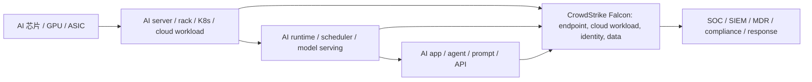

# 公司：ADBE Adobe Inc.

> 报告日期：2026-05-10。美股 2026-05-10 为周日，股价使用 2026-05-08 美股收盘后可得的最新报价口径。  
> 重要口径：Adobe 是 AI 应用层/SaaS 公司，不销售 AI 芯片、GPU、光模块、rack 或数据中心设备；AI 数据中心对 Adobe 是成本项、交付能力和产品体验约束，而不是直接收入项。因此本报告在“每 MW / rack / GPU / optical port”部分采用“内部算力消耗与 SaaS 价格传导”口径，直接 AI 数据中心硬件收入占比记为 0%。  
> 本报告未参考本目录下其他公司调研文件；项目内背景只使用“公司调研”目录之外的 AI 数据中心与 AI 芯片产业链资料。

## 1. 公司整体业务、投资人认知与最新估值

### 1.1 一句话结论

Adobe 是全球创意软件、PDF/文档生产力和企业数字体验/营销自动化的高毛利订阅平台。2025-2026 年的投资争议不是“业务是否衰退”，而是“生成式 AI 会把 Photoshop/Illustrator/Acrobat 的护城河打穿，还是会让 Adobe 用 Firefly、Acrobat AI、GenStudio 和 AEP 把创意与营销工作流重新定价”。截至 FY2026 Q1，公司收入仍保持双位数增长，毛利率接近 90%，经营现金流非常强，但股票估值因 AI 竞争和 CEO 交接而被明显压缩。

### 1.2 业务构成与产业链位置

Adobe 的价值链位置是 **AI 应用层 + 内容工作流平台 + 企业营销数据/激活系统**：

| 层级 | Adobe 所在位置 | 对应产品/平台 | 收入性质 | 与 AI 基建关系 |
|---|---|---|---|---|
| 基础设施 | 不直接供应 | 无 GPU/ASIC/光模块/rack 产品 | 0% 硬件收入 | 购买云算力/自有或第三方托管资源，形成 AI 推理和训练成本 |
| AI 模型/服务 | 应用模型与企业定制模型 | Firefly Models、Firefly Services、Firefly Foundry、Custom Models | 订阅、生成 credits、API/企业合同 | 依赖 GPU 推理、模型训练、内容安全/版权过滤 |
| 创意生产 | 核心护城河 | Photoshop、Illustrator、Premiere Pro、After Effects、Lightroom、Frame.io、Creative Cloud Pro | 高毛利订阅 | AI 提升产品价值，亦增加推理成本 |
| 文档生产力 | 第二增长引擎 | Acrobat、Acrobat AI Assistant、Acrobat Studio、PDF Spaces、Adobe Sign | 订阅、seat 扩张、AI add-on | 文档问答/摘要/跨文档 agent 消耗推理 |
| 营销/体验 | 企业端增长引擎 | Adobe Experience Platform、AEM、Analytics、Real-Time CDP、Journey Optimizer、Marketo、GenStudio | 企业 SaaS/平台合同 | AI agent、个性化生成、广告素材优化拉动推理和数据处理 |
| 分发入口 | 新增渠道 | Photoshop/Express/Acrobat for ChatGPT、MCP、Copilot/ChatGPT/agentic browser 入口 | freemium 获客、转化订阅/usage | AI 平台成为获客入口，也压缩传统 app 入口价值 |

### 1.3 投资人眼中的 Adobe

| 投资人认知 | 正面逻辑 | 负面逻辑 |
|---|---|---|
| 高质量软件资产 | FY2025 收入 $23.77B、毛利率 89.3%、经营现金流 $10.03B；订阅收入占比 96%+。 | 增速从疫情前高增长进入 9-12% 区间，估值不再享受高成长溢价。 |
| 创意软件准垄断 | Photoshop/Illustrator/Premiere/Acrobat 是行业标准，客户迁移成本高。 | Canva、Figma、Runway、Midjourney、OpenAI/Google 图像与视频模型降低了“专业工具”的稀缺性。 |
| AI 赢家候选 | Firefly、GenStudio、Acrobat AI 已进入产品和企业工作流；Q3 FY2025 AI-influenced ARR 超 $5B，AI-first ARR 提前超过 $250M 目标。 | 市场担心 AI 功能会变成免费基础设施，Adobe 只能承担 GPU 成本而无法充分涨价。 |
| 现金流/回购机器 | Q1 FY2026 经营现金流 $2.96B，季度回购 8.1M 股；2026 年 4 月又宣布新 $25B 回购计划。 | 大额回购在增长放缓时容易被视作缺少更高 ROIC 投资机会。 |
| 企业营销平台 | AEP、AEM、Analytics、GenStudio 能接企业预算，Semrush/GEO 补 AI 搜索可见度。 | Salesforce、HubSpot、Google/Meta/广告生态、独立 CDP/营销自动化竞争激烈，销售周期长。 |

### 1.4 最近 3 年重大业务变化

| 时间 | 事件 | 业务含义 |
|---|---|---|
| 2023-2024 | 放弃收购 Figma，支付约 $1B termination fee | 监管封锁大型横向并购；Adobe 必须靠自研与生态合作防守协作设计入口。 |
| 2023-2026 | Firefly 从创意生成模型扩展到 Photoshop/Illustrator/Premiere/Express/Acrobat/GenStudio | AI 从功能增强变成定价、获客和企业内容供应链的一部分。 |
| FY2025 Q1 | 开始补充披露 Business Professionals & Consumers、Creative & Marketing Professionals 两个客户群 | 把 Acrobat/Express 与 Creative/DX 的增长分开，让投资人跟踪 AI 消费者/企业双线。 |
| 2025-10 Adobe MAX | GenStudio、Firefly Foundry、Firefly Creative Production、Content Production Agent、广告平台集成升级 | 重点从“生成图片”转向“企业规模化生成、审核、投放、优化”。 |
| 2025-11 | 宣布以约 $1.9B 现金收购 Semrush，预计 2026H1 交割 | 加强 SEO/GEO/AI 搜索品牌可见度，补企业营销栈在 LLM 搜索时代的弱环。 |
| 2025-12 | Photoshop、Express、Acrobat 接入 ChatGPT，面向 ChatGPT 8 亿周活用户 | 防守/利用 AI 对话入口；从 app 内获客扩展到 AI 平台内获客。 |
| FY2026 Q1 | 原 Digital Media、Digital Experience、Publishing & Advertising 合并为单一报告分部 | 管理层按统一产品创新和统一销售动作管理，不再提供传统分部利润/收入主表。 |
| 2026-03 | CEO Shantanu Narayen 宣布将在继任者确定后卸任 CEO，继续担任董事长 | 18 年 CEO 任期进入交接期，是短期估值折价因素。 |

### 1.5 最新股价与估值

| 指标 | 数值 | 日期/口径 | 说明 |
|---|---:|---|---|
| 股价 | $253.04 | 2026-05-08 美股最新可得报价；2026-05-10 为周日 | 价格口径来自行情工具，交叉参考 Yahoo/Nasdaq 报价页。 |
| 市值 | 约 $103.95B | 2026-05-08 | 约 411M diluted shares 的量级。 |
| TTM PE | 约 14.8x | 2026-05-08 | 使用行情工具 TTM EPS 口径。 |
| FY2026 forward PE, GAAP | 约 14.1x | 2026-05-08 股价 / FY2026 GAAP EPS 指引中点 $18.00 | Adobe FY2026 指引 $17.90-18.10。 |
| FY2026 forward PE, non-GAAP | 约 10.8x | 2026-05-08 股价 / FY2026 non-GAAP EPS 指引中点 $23.40 | Adobe FY2026 指引 $23.30-23.50。 |
| TTM PS | 约 4.4x | 市值 / FY2025 收入 $23.77B | 传统高质量软件公司里偏低。 |
| FY2026 forward PS | 约 4.0x | 市值 / FY2026 收入指引中点 $26.0B | 收入指引 $25.90-26.10B。 |
| 最新季度收入增速 | +12% YoY | FY2026 Q1, 2026-02-27 季度 | 总收入 $6.40B。 |
| FY2026 指引收入增速 | 约 +9.4% | FY2026 指引中点 vs FY2025 | $26.0B / $23.769B - 1。 |
| 最新季度毛利率 | 89.6% | FY2026 Q1 | $5.734B / $6.398B。 |
| 最新季度净利率 | 29.5% | FY2026 Q1 | $1.889B / $6.398B。 |
| FY2025 毛利率 | 89.3% | FY2025 | $21.218B / $23.769B。 |
| FY2025 净利率 | 30.0% | FY2025 | $7.130B / $23.769B。 |

### 1.6 资产负债表健康度

| 项目 | FY2026 Q1 数值 | 判断 |
|---|---:|---|
| 现金及等价物 | $6.332B | 现金充足。 |
| 短期投资 | $0.558B | 现金+短投合计 $6.890B。 |
| 债务 | $6.228B | current debt $0.849B + long-term debt $5.379B。 |
| 净现金/净债务 | 约净现金 $0.662B | 近似净现金状态，债务压力低。 |
| 当前资产 | $10.386B | 比 FY2025 年末略升。 |
| 当前负债 | $11.390B | 包含递延收入 $7.275B；工作资本为 -$1.004B，不等于流动性恶化。 |
| RPO | $22.22B | 未来收入可见度高；cRPO 67%，约 $14.9B 在 12 个月内确认。 |
| Q1 经营现金流 | $2.958B | 强现金流；Q1 OCF margin 46.2%。 |
| Q1 回购 | $2.478B | 现金流基本被回购吸收；股本持续下降。 |

结论：财务健康度高。Adobe 是轻资产、高毛利、高现金转换的软件公司。主要财务风险不是偿债，而是 AI 推理/训练成本抬升后能否维持 45% 左右 non-GAAP operating margin，以及订阅监管/客户流失是否压低净扩张率。

## 2. 最近 5 次财报对比：收入、RPO、业务收入与 AI 信息

### 2.1 财报主表

| 财报季度 | 总收入 | YoY | GAAP / non-GAAP EPS | GAAP op margin | non-GAAP op margin | 净利率 | 经营现金流 | RPO / cRPO | 订单/交期/取消率推断 | 业务收入与增长 | AI/数据中心相关信息 |
|---|---:|---:|---:|---:|---:|---:|---:|---:|---|---|---|
| FY2026 Q1, 截至 2026-02-27 | $6.398B | +12% | $4.60 / $6.06 | 37.8% | 47.4% | 29.5% | $2.958B | $22.22B / 67% | SaaS 无硬件交期；RPO +13% YoY，cRPO 约 $14.9B；未披露取消率。 | Customer Group subscription $6.17B +13%；BPC $1.78B +16%；CMP $4.39B +12%。 | AI-first ARR YoY 超 3 倍；直接 AI 数据中心硬件收入 0%；AI 推理/训练成本在 COGS/R&D。 |
| FY2025 Q4, 截至 2025-11-28 | $6.194B | +10% | $4.45 / $5.50 | 36.5% | 45.6% | 30.0% | $3.160B | $22.52B / 65% | 年末续约和企业合同推高 RPO；cRPO 约 $14.6B。 | Digital Media $4.62B +11%；Digital Experience $1.52B +9%；DX subscription $1.41B +11%；BPC $1.72B +15%；CMP $4.25B +11%。 | FY2025 Total Adobe ARR $25.20B +11.5%；FY2026 指引 ending ARR +10.2%。 |
| FY2025 Q3, 截至 2025-08-29 | $5.988B | +11% | $4.18 / $5.31 | 36.3% | 46.3% | 29.6% | $2.198B | $20.44B / 67% | RPO 首次超过 $20B，YoY +13%，需求可见度提高。 | Digital Media $4.46B +12%；DM ARR $18.59B +11.7%；Digital Experience $1.48B +9%；DX subscription $1.37B +11%；BPC $1.65B +15%；CMP $4.12B +11%。 | AI-influenced ARR 超 $5B；AI-first ARR 已超过 FY2025 年末 $250M 目标。 |
| FY2025 Q2, 截至 2025-05-30 | $5.873B | +11% | $3.94 / $5.06 | 35.9% | 45.5% | 28.8% | $2.191B | $19.69B / 67% | RPO 与 Q1 持平但收入继续增长；无硬件 backlog。 | Digital Media $4.35B +11%；DM ARR $18.09B +12.1%；Digital Experience $1.46B +10%；DX subscription $1.33B +11%；BPC $1.60B +15%；CMP $4.02B +10%。 | Firefly subscriptions、Acrobat AI Assistant、GenStudio 是主要 AI 产品线；具体 AI 收入未披露。 |
| FY2025 Q1, 截至 2025-02-28 | $5.714B | +10% | $4.14 / $5.08 | 37.8% | 47.5% | 31.7% | $2.482B | $19.69B / 67% | SaaS 续约型 backlog 充足；cRPO 约 $13.2B。 | Digital Media $4.23B +11%；DM ARR $17.63B +12.6%；Digital Experience $1.41B +10%；DX subscription $1.30B +11%；BPC $1.53B +15%；CMP $3.92B +10%。 | AI-first standalone/add-on innovations exiting ARR book >$125M。 |

### 2.2 Backlog/Bookings/Lead time/取消率解释

Adobe 不披露 bookings，也没有像硬件公司那样的订单积压、交期和取消率。最接近 backlog 的指标是 RPO：

| 指标 | 最新状态 | 投资含义 |
|---|---:|---|
| RPO | FY2026 Q1 $22.22B | 已签订但尚未确认收入的合同价值，近似企业订阅/服务 backlog。 |
| cRPO | 67% | 约 $14.9B 未来 12 个月内确认，收入能见度强。 |
| Lead time | 自助订阅即时；企业销售/部署通常数周到数月 | 不受 GPU/rack 交付直接限制，但 AI 功能体验受云推理容量、延迟和成本限制。 |
| 取消率 | 未披露 | 只能通过 ARR/RPO、递延收入和订阅增长间接判断；目前未见大规模 churn。 |
| AI 容量供需 | 未披露 GPU 数量/云合同 | 可从“cost of subscription revenue 包含 AI inferencing costs，R&D 包含 AI training costs”判断，AI 成本已进入损益表。 |

## 3. 2026 最新指引、收入占比与产品映射

### 3.1 FY2026 最新指引

Adobe 在 FY2026 Q1 继续确认此前 FY2026 年度目标，并给出 Q2 指引：

| 指标 | FY2026 全年指引 | FY2026 Q2 指引 | 投资含义 |
|---|---:|---:|---|
| 总收入 | $25.90-26.10B | $6.43-6.48B | 全年中点约 +9.4% YoY；Q2 中点约 +10%。 |
| Business Professionals & Consumers subscription | $7.35-7.40B | $1.80-1.82B | Acrobat/Express/Acrobat Studio/ChatGPT 入口是最高增速组。 |
| Creative & Marketing Professionals subscription | $17.75-17.90B | $4.41-4.44B | Creative Cloud + DX/GenStudio/AEP 是收入主体。 |
| Total Adobe ending ARR growth | +10.2% YoY | 未单独给 Q2 ARR 指引 | 订阅基本盘仍双位数。 |
| GAAP EPS | $17.90-18.10 | $4.35-4.40 | FY2026 Q2 GAAP margin 指引约 35%。 |
| non-GAAP EPS | $23.30-23.50 | $5.80-5.85 | FY2026 全年 non-GAAP op margin 指引约 45%。 |

### 3.2 最新业务收入占比

| 业务/客户群 | FY2026 Q1 收入 | YoY | Q1 收入占比 | FY2026 指引 | FY2026 指引收入占比 | 重点产品 |
|---|---:|---:|---:|---:|---:|---|
| Creative & Marketing Professionals subscription | $4.39B | +12% | 68.6% of total revenue | $17.75-17.90B | 约 68.6% | Creative Cloud flagship apps、Firefly、GenStudio、AEP、AEM、Analytics、Marketo、Journey Optimizer |
| Business Professionals & Consumers subscription | $1.78B | +16% | 27.8% | $7.35-7.40B | 约 28.4% | Acrobat、Acrobat AI Assistant、Acrobat Studio、Express、ChatGPT apps |
| Product + Services/Other + legacy | $0.23B | 低/负增长 | 3.6% | 未单独指引 | 约 3% | legacy licensing、services、Publishing & Advertising |

最突出的业务：**Business Professionals & Consumers** 增速最高，核心是 Acrobat 和 Express 的 AI 化、低门槛化、跨 ChatGPT 分发；**Creative & Marketing Professionals** 体量最大，重点是 Firefly/GenStudio/AEP 把“创意生成”连接到“企业内容供应链和广告投放”。

### 3.3 重点产品与跳过产品

| 类别 | 产品/业务 | 是否重点 | 理由 |
|---|---|---|---|
| 创意 AI | Firefly Models、Firefly Services、Firefly Foundry、Custom Models、Firefly Boards、Firefly Creative Production | 是 | AI-first ARR 的核心；能从个人订阅、企业 API、品牌模型和 usage 计费多路径变现。 |
| 创意旗舰 | Photoshop、Illustrator、Premiere Pro、After Effects、Lightroom、Creative Cloud Pro | 是 | 最大收入护城河；AI 功能用于提高 ARPU、留存和吸引低端用户。 |
| 文档 AI | Acrobat AI Assistant、Acrobat Studio、PDF Spaces、Acrobat for ChatGPT | 是 | BPC 增速最高，文档问答/摘要/重组是高频企业场景。 |
| 轻量创作 | Adobe Express、Express for ChatGPT、Express 企业版 | 是 | 面向 Canva 和低门槛设计用户；可扩大 TAM，但 ARPU 低于专业 Creative Cloud。 |
| 企业营销 AI | GenStudio for Performance Marketing、Content Production Agent、Firefly Services APIs、AEP Agent Orchestrator、CX Enterprise Coworker、Brand Intelligence、Experience Intelligence | 是 | 企业预算更大，适合 usage/outcome-based pricing；与 AEP 数据、AEM 资产和广告渠道集成形成壁垒。 |
| AI 搜索/GEO | Semrush、LLM Optimizer、Brand Concierge、SEO/GEO | 是，小业务但潜力高 | LLM 搜索改变品牌发现路径；Semrush 企业 ARR +33% YoY，为 Adobe DX 补数据与客户入口。 |
| 跳过/低优先级 | PostScript、传统技术文档 publishing、eLearning、web conferencing、legacy advertising、低增长 services | 跳过 | FY2025 Publishing & Advertising 仅 $256M、约 1% 总收入，且下降 7%。 |
| 硬件/数据中心 | GPU、AI ASIC、服务器、光模块、rack | 无直接产品 | Adobe 不销售这些产品；只通过云成本和 AI inferencing costs 受影响。 |

## 4. 高增长/关键产品当前贡献、AI 基建重要性与供需

> 注：Adobe 不披露单产品收入和单产品利润率。下表中“当前贡献”分三类：官方披露、由官方分组推算、分析估算。估算仅用于投资框架，不应等同公司披露值。

| 关键业务/产品 | 当前收入贡献 | 增速/动量 | 对 AI 技术栈重要性 | 时间紧急性 | 供需紧张程度 | 垄断/溢价能力 | 证据与判断 |
|---|---:|---|---|---|---|---|---|
| Creative Cloud + Firefly/Creative Cloud Pro | 官方分组中 CMP Q1 $4.39B 的主体；FY2025 Digital Media $17.65B | CMP +12%；FY2025 Digital Media +11% | 高：人类创意生产入口，模型生成后仍需编辑、审稿、品牌合规和交付格式 | 高：OpenAI/Google/Runway/Canva 快速蚕食入口 | 中：GPU 推理成本上升，但客户需求强 | 高：Photoshop/Illustrator/Premiere 文件、技能、团队流程、插件生态迁移成本高 | 旗舰 app 仍是创意行业标准；AI 是保 ARPU 和防替代的必需品。 |
| Firefly AI-first ARR | 官方：FY2025 Q1 AI-first ARR book >$125M，Q3 已超过 $250M，FY2026 Q1 YoY 超 3 倍；推算 FY2026 Q1 exiting ARR >$375M | 高速，>3x YoY | 高：商业安全生成模型、品牌模型、API 是 Adobe AI 变现核心 | 极高：模型能力与成本曲线决定 AI 叙事 | 中高：企业可用“版权安全模型”供给稀缺，但底层模型竞争激烈 | 中高：版权安全、训练数据治理、Creative Cloud 集成带来溢价 | 不是最大收入池，但对估值重估最关键。 |
| Acrobat / Acrobat AI Assistant / Acrobat Studio | BPC Q1 $1.78B 的主体；BPC FY2026 指引 $7.35-7.40B | BPC +16%，公司最快 | 高：PDF 是企业知识载体，文档 agent 与 RAG 高频 | 高：微软 Copilot、Google Workspace、ChatGPT 均进入文档场景 | 中：文本推理成本低于视频/图像，供给相对宽松 | 高：PDF 标准、Acrobat 装机、企业合规与工作流 | Acrobat 是 BPC 增长主引擎，AI 有望提高 attach 和 seat 扩张。 |
| Adobe Express + ChatGPT apps | BPC 重要子集；单独收入未披露 | 高用户增长潜力，ARPU 较低 | 中高：面向大众内容生成和 SMB 营销 | 极高：Canva/ChatGPT 正在抢低端创作入口 | 中：轻量图文生成算力需求可控 | 中：品牌弱于 Photoshop，强于普通模板工具 | ChatGPT 8 亿周活入口显著降低获客成本，但免费入口也可能压缩付费转化。 |
| GenStudio / Firefly Services / Content Production Agent | DX/CMP 内部；单独未披露；估算直接 AI/GenStudio ARR 数亿美元级，受企业采用拉动 | 高：GenStudio、AEP、Firefly Services 被列为 FY2025 DX 增长驱动 | 很高：企业内容供应链“生成-管理-审核-投放-优化”闭环 | 高：企业营销团队正在重构内容生产成本 | 中高：企业级品牌安全、审批和广告集成供给少 | 中高：AEP/AEM/Analytics 数据与工作流集成强 | Adobe MAX 披露近 90% Top 50 企业账户采用至少一个 AI-first 创新，包括 GenStudio/Firefly Services。 |
| AEP / Journey Optimizer / Analytics / Real-Time CDP + Agents | FY2025 DX revenue $5.86B，subscription $5.41B；Q4 DX $1.52B | DX +9%，subscription +11% | 高：企业客户数据、实时个性化、agent orchestration 是营销 AI 底座 | 中高：品牌在 AI search 和个性化体验上加速 | 中：受企业预算和销售周期约束 | 中：强在 Adobe 生态，弱在 CRM/CDP 可替代性 | 增速低于 BPC，但企业合同大、RPO 可见度高。 |
| Semrush / GEO / LLM Optimizer / Brand Concierge | 收购未并表；交易值约 $1.9B；Semrush enterprise ARR 最近季度 +33% YoY | 潜在高增长 | 中高：LLM 搜索成为品牌发现入口，GEO/SEO 数据是营销 AI 的新燃料 | 高：AI 搜索分流传统搜索流量 | 中：GEO 仍早期，竞争者多 | 中：Semrush 数据资产强，但 Ahrefs、Similarweb、BrightEdge 等竞争 | 小体量但方向正确；若接入 AEP/GenStudio，可提高企业 DX 差异化。 |

## 5. 一年后收入贡献预测：基准、乐观、极度乐观

| 产品/业务 | 当前基线 | 1 年后基准 | 1 年后乐观 | 1 年后极度乐观 | AI 重要性变化 | 供需/定价变化 |
|---|---:|---:|---:|---:|---|---|
| BPC: Acrobat/Express/Acrobat Studio | FY2026 指引 $7.35-7.40B | $8.1-8.3B, +10-13% | $8.5-8.8B, +15-19% | $9.1-9.5B, +23-29% | 文档 agent 成为企业知识工作标配 | 文本推理成本下降，毛利率压力较小；Acrobat 具备涨价/打包能力。 |
| CMP: Creative Cloud + DX/Marketing | FY2026 指引 $17.75-17.90B | $19.2-19.6B, +8-10% | $20.0-20.5B, +12-15% | $21.0-21.8B, +18-22% | 创意生成、编辑和投放闭环更重要 | 若 Firefly/GenStudio usage 放量，收入加速但 GPU 成本也上升。 |
| Firefly AI-first ARR | FY2026 Q1 推算 >$0.375B exiting ARR | $0.8-1.1B ARR | $1.2-1.7B ARR | $2.0-2.8B ARR | 从“功能”变成“新收入池” | 极度乐观需企业 API/Foundry/视频生成 credits 高转化。 |
| GenStudio/Firefly Services/Content Production Agent | 当前估算直接 ARR 数亿美元级 | $0.9-1.4B ARR | $1.5-2.3B ARR | $3.0B+ ARR | 企业内容供应链 AI 化加速 | 需要广告平台集成、审批合规、品牌模型可规模部署。 |
| AEP + Experience Agents | FY2025 DX subscription $5.41B；FY2026 并入 CMP | $6.0-6.3B 相关 subscription | $6.5-7.0B | $7.5B+ | Agent orchestration 提高 AEP 粘性 | 企业预算释放慢；竞争强，涨价能力低于 Creative/Acrobat。 |
| Semrush/GEO | 未并表，交易预计 2026H1 关闭 | 并表贡献约 $0.4-0.5B 年化收入级别，协同有限 | $0.5-0.7B，GEO 产品交叉销售 | $0.8-1.0B，LLM search 预算爆发 | 品牌可见度从 SEO 扩到 LLM/GEO | 收购整合和定价体系是关键。 |

## 6. BOM 拆分、每 MW/rack/GPU/port 内容量与价格传导

### 6.1 先给结论：Adobe 没有硬件 BOM

| 项目 | 对 Adobe 的口径 |
|---|---|
| 每 MW 内容量 | 不适用为收入项；Adobe 不向数据中心销售 MW 级设备。 |
| 每 rack 内容量 | 不适用为收入项；Adobe 不销售 rack。 |
| 每 GPU 内容量 | 不适用为收入项；GPU 是 Adobe AI 功能的成本输入。 |
| 每 optical port 内容量 | 不适用为收入项；光口是云/数据中心网络成本输入。 |
| AI 数据中心相关收入占比 | 直接收入 0%；间接收入体现在 AI-enabled subscriptions、AI-first ARR、AI-influenced ARR。 |
| AI 数据中心相关成本 | 体现在 subscription cost of revenue 的 hosting/data center/AI inferencing costs，以及 R&D 的 AI training costs。 |

### 6.2 Adobe 的“BOM”：从 GPU 成本到 SaaS/credits 价格

| 产品/业务 | 可销售单位 | 成本/BOM 主要构成 | 价格传导链 | 当前毛利率推断 |
|---|---|---|---|---|
| Firefly consumer/Creative Cloud Pro | Creative Cloud seat、Firefly subscription、generative credits | GPU 推理、模型维护、内容安全、存储/CDN、支付/获客、产品研发 | GPU token/image/video 成本 -> generative credits 限额 -> Pro 套餐涨价/更高 tiers -> overage credit packs | 公司订阅毛利率约 91%；AI-heavy 子业务毛利率可能低于平均，但随推理成本下降改善。 |
| Firefly Services APIs | API 调用、企业年度合同、usage/credits | GPU 推理、批量任务调度、企业 SLA、安全/合规、AEM/Frame.io 集成 | 批量生成/改图/视频处理成本 -> API/credit 单价 -> 企业合同最低消费 | 毛利率估算中高，取决于视频/3D/高分辨率任务占比。 |
| Firefly Foundry / Custom Models | 企业模型定制、训练/微调项目、使用费 | 数据准备、模型训练/微调、评测、安全、私有部署/隔离 | 训练成本 + 专业服务 + 使用量 -> upfront + recurring usage | 初期服务和训练成本较高；规模化后软件毛利上升。 |
| Acrobat AI Assistant / Acrobat Studio | seat add-on、Acrobat higher tier、AI assistant usage | 文档解析/OCR、向量化、LLM 推理、存储、权限/合规 | 每文档/每查询推理成本 -> AI add-on 或 bundled tier -> seat 扩张 | 文本推理成本相对低，毛利率应高于视频生成业务。 |
| GenStudio / Content Production Agent | 企业 SaaS seat、workflow、campaign/asset volume、outcome pricing | 生成模型、AEP/AEM 数据处理、审批流、广告平台 API、品牌合规 | 素材生产量/投放量/节省人力 -> enterprise ARR + usage/outcome pricing | 若客户按节省成本付费，溢价高；若按素材生成计费，受模型价格竞争压制。 |
| AEP Agents / CX Enterprise | 企业平台合同、数据量、activation volume、agent workflows | 数据摄取/处理、实时个性化、LLM/agent 推理、安全、集成服务 | 数据与触点规模 -> 平台合同 -> AI agent add-on | 平台毛利高，但实施/服务拉低综合利润率。 |

### 6.3 每 MW/rack/GPU 的“内部成本敏感性”框架

由于 Adobe 没披露 GPU 数量和云合同，只能做方向性框架：

| 变量 | 对 Adobe 收入/利润的作用 | 投资判断 |
|---|---|---|
| 每 GPU 推理吞吐上升 | 单位 Firefly/Acrobat/GenStudio 调用成本下降 | 利好毛利率，允许免费/低价入口扩大获客。 |
| 每 MW 可用 GPU 容量上升 | 大规模生成任务更可用，延迟下降 | 利好企业 SLA 和用户体验。 |
| GPU 云租金下降 | AI-first ARR 的 gross margin 上升 | 对 Firefly/GenStudio 尤其重要。 |
| 视频/3D 生成占比上升 | 单次任务成本显著高于图像/文本 | 若不能用 credits/usage 充分传导，会压毛利。 |
| 光互联/数据中心瓶颈 | 对 Adobe 间接影响：云成本和延迟 | 不形成收入弹性，但影响服务质量和成本。 |

项目内 AI 数据中心资料给出的 2026-2027 逻辑是：美国 AI DC CapEx 进入数千亿美元级别，GPU/服务器、网络、HBM、液冷和电力仍是瓶颈。对 Adobe 的交叉验证结论是：**越是 AI 推理需求爆发，Adobe 的产品需求越强，但其直接受益弹性不如 NVIDIA/光模块/电力链；Adobe 的胜负取决于能否把推理成本打包成高 ARPU 订阅和企业 usage，而不是直接享受硬件订单。**

## 7. 一年后产能、采纳程度与认证/合规阶段预测

| 产品/业务 | 当前产能/采纳 | 当前认证/合规 | 1 年后基准 | 1 年后乐观 | 1 年后极度乐观 |
|---|---|---|---|---|---|
| Firefly consumer/Creative Cloud | 已广泛嵌入 Photoshop、Illustrator、Express 等；99% Fortune 100 用过 Adobe app 中 AI | 商业安全/内容凭证/版权治理是核心卖点 | 推理容量足以支撑 Pro 套餐与 credits 扩张；ARR $0.8-1.1B | 视频/音频/3D 生成稳定，ARR $1.2-1.7B | Firefly 成为企业默认商业安全模型，ARR $2B+ |
| Firefly Foundry / Custom Models | 已发布；面向企业品牌 IP 训练/定制 | 私有数据、品牌安全、IP 权利审核 | 头部品牌项目制导入，收入数亿美元级 | CPG/media/agency 批量导入 | 成为企业品牌模型标准层，训练+推理长期合同放量 |
| Acrobat AI / Acrobat Studio | Acrobat AI Assistant、PDF Spaces、Studio 已推出 | 企业文档权限、隐私、审计、合规 | AI assistant attach 提高，BPC +10-13% | 多文档 agent 成为 Acrobat 高阶 tier 标配 | ChatGPT/Copilot 入口反而扩大 Acrobat 标准地位 |
| GenStudio / Content Production Agent | 近 90% Top 50 enterprise accounts 采用至少一个 AI-first innovation；Content Production Agent beta | 品牌合规、审批流、广告平台连接 | 由 beta 转 GA，GenStudio ARR 逼近 $1B | 广告平台闭环提高 usage | outcome-based pricing 成功，ARR $3B+ |
| AEP Agent Orchestrator / CX Enterprise | Summit 2026 重点发布；约 14,000 现场参会、20,000 在线 | 企业数据治理、身份、隐私、行业合规 | Agent workflows 作为 AEP add-on | 与 GenStudio/AEM 强绑定 | 成为企业 CX AI 操作系统，DX 增速重新加速到 mid-teens |
| Semrush/GEO | 待交割；Semrush enterprise ARR 最近季度 +33% | 交易需监管/股东批准，预计 2026H1 | 交割并接入 Adobe DX，协同温和 | LLM Optimizer/GEO 与 AEP/GenStudio 组合销售 | AI search budget 爆发，Semrush 成为 DX 新增长极 |

## 8. 基于 RPO/供给/订单推断未来一年业务增速

### 8.1 公司层面

| 情景 | 证据 | 未来一年总收入增速 | BPC 增速 | CMP 增速 | 主要约束 |
|---|---|---:|---:|---:|---|
| 基准 | FY2026 指引 $25.90-26.10B；RPO $22.22B；ARR ending +10.2% | +9-11% | +10-13% | +8-10% | AI 变现循序渐进，企业预算谨慎，生成 credits 不大幅外溢。 |
| 乐观 | ChatGPT 入口、Acrobat AI attach、GenStudio/AEP 企业采用强；AI-first ARR 继续翻倍 | +12-14% | +15-19% | +12-15% | 需要推理成本下降且不损伤毛利。 |
| 极度乐观 | Firefly/GenStudio usage 定价成功，AI search/GEO 预算转入 Adobe；Semrush 顺利整合 | +16-20% | +23-29% | +18-22% | 需要生成式 AI 从“功能”变成“独立预算池”。 |

### 8.2 RPO 与“订单”推断

Adobe RPO 从 FY2025 Q1 的 $19.69B 到 FY2026 Q1 的 $22.22B，约 +12.9%。cRPO 维持 65-67%，说明 backlog 质量稳定，未来 12 个月收入可见度高。若 RPO 增速不再加速，则收入大概率维持 9-12%；若 GenStudio、AEP agents、Acrobat AI add-on 拉动多年度企业合同，RPO 增速应先于收入上行。

| 业务 | 当前“订单/供给”信号 | 未来一年增速判断 |
|---|---|---|
| BPC | Q1 +16%，Q2 指引 $1.80-1.82B；ChatGPT apps 免费入口扩大 funnel | 基准低双位数，乐观 mid/high-teens。 |
| Creative Cloud | 仍是最大现金牛；AI 主要通过 Pro tier、credits、留存体现 | 基准 high-single/low-double；极度乐观需 Firefly 变成明显增量 ARPU。 |
| GenStudio/AEP | 企业采用强，但销售周期长；RPO 是关键观察指标 | 基准 low-double；若 RPO 加速，可看 mid-teens。 |
| Firefly AI-first | Q1 FY2026 YoY >3x，但基数仍小 | 一年后可能成为 $1B ARR 级别业务，是估值重估杠杆。 |
| Semrush | 尚未并表，预计 2026H1 close | FY2026 指引未含 Semrush；并表后小幅增加收入，战略价值大于短期 EPS。 |

## 9. 竞争格局、替代风险与客户替换成本

### 9.1 主要竞争对手

| 领域 | Adobe 产品 | 主要竞争对手 | Adobe 优势 | 风险 |
|---|---|---|---|---|
| 专业创意 | Photoshop、Illustrator、Premiere、After Effects、Lightroom | Canva、Figma、Affinity、DaVinci Resolve、Runway、CapCut、Apple/Final Cut | 行业标准、文件格式、插件生态、专业流程、企业采购 | AI 降低专业门槛，低端用户向 Canva/ChatGPT/CapCut 分流。 |
| 生成式图像/视频 | Firefly | OpenAI、Google Gemini/Nano Banana、Midjourney、Runway、Stability、Pika、Luma、BFL | 商业安全、Adobe workflow、内容凭证、企业合规 | 模型质量和速度若落后，用户会把 Adobe 当后期工具而不是生成入口。 |
| 文档/PDF | Acrobat、Acrobat AI、Sign | Microsoft 365/Copilot、Google Workspace/Gemini、DocuSign、Foxit、Nitro、ChatGPT | PDF 标准、Acrobat 装机、企业合规、编辑能力 | Copilot/ChatGPT 原生文档问答可能绕过 Acrobat。 |
| 轻量设计 | Express | Canva、Microsoft Designer、ChatGPT apps、CapCut | Creative Cloud 资产联动、Adobe brand、企业模板/品牌控制 | Canva 更强在协作和模板社区，低端价格压力大。 |
| 企业营销/CX | AEP、AEM、Analytics、Journey Optimizer、Marketo、GenStudio | Salesforce、HubSpot、Oracle、SAP、Braze、Twilio Segment、Snowflake/Databricks、Google Marketing Platform | 创意资产 + 数据 + 投放闭环，AEM/Analytics 大客户基础 | CRM/CDP/数据平台竞争强，实施复杂，预算周期长。 |
| GEO/SEO/品牌可见度 | Semrush、LLM Optimizer、Brand Concierge | Ahrefs、Similarweb、BrightEdge、Conductor、Yext、Profound、Rankscale、Google Search Console | Semrush 数据和 SMB/enterprise 客户基础，接入 Adobe DX 后有协同 | GEO 早期标准未定，价格和结果归因仍模糊。 |

### 9.2 新技术是否主流

| 技术/产品 | 是否未来主流 | 理由 | 风险/替代 |
|---|---|---|---|
| 商业安全生成模型 Firefly | 是，但不一定独占 | 企业客户需要版权、品牌、安全和审计，不能只用 consumer model | OpenAI/Google/Runway 模型质量领先会压低 Firefly 溢价。 |
| GenStudio 内容供应链 | 是 | 内容需求爆炸后，企业需要从 brief 到生成、审批、投放、优化的闭环 | 客户可能用内部 AI workflow + DAM/CDP 组合替代。 |
| Acrobat 文档 agent | 是 | PDF/合同/报告/知识库是企业高频工作流 | Microsoft/Google/Copilot 可在办公套件内完成部分任务。 |
| ChatGPT 内 Adobe apps | 是，作为新渠道 | 用户入口正在从独立 app 转向 conversational interface | 入口被 OpenAI 掌控，Adobe 可能变成插件型供应商。 |
| GEO/LLM Optimizer | 大概率成为营销预算新类目 | AI 搜索正在改变品牌发现路径，传统 SEO 需要扩展到 LLM 引用/答案 | 标准未定，ROI 难度量；搜索平台可能自带工具。 |

### 9.3 客户替换成本

| 客户类型 | 替换成本 | 原因 |
|---|---|---|
| 专业设计/视频团队 | 高 | PSD/AI/Premiere 项目、插件、团队技能、审稿流程、客户交付格式高度绑定。 |
| 大型企业文档/法务/财务 | 中高 | PDF 标准、Acrobat/Sign、权限、审计、合规和文档资产历史。 |
| SMB/轻量创作 | 低到中 | Canva/ChatGPT/CapCut 替代强，价格敏感。 |
| 企业营销平台 | 高但实施痛苦 | AEP/AEM/Analytics 与数据、网站、广告渠道深度集成；替换周期长。 |
| AI 生成模型单点使用者 | 低 | 如果只看单次生成质量，用户可随时切换 OpenAI/Google/Midjourney/Runway。 |

## 10. 投资结论

Adobe 当前不是“AI 数据中心硬件 beta”，而是“AI 应用层变现能力 beta”。硬件链的核心问题是产能、交期和订单；Adobe 的核心问题是 **AI 功能能否提高 ARPU、留存和企业 usage，同时不让 GPU 推理成本吞掉毛利率**。

基准情景下，公司 FY2026-2027 仍是 9-12% 收入增长、45% 左右 non-GAAP operating margin、强回购的软件现金流资产；以约 10.8x FY2026 non-GAAP PE 和约 4.0x forward PS 看，市场已给了明显 AI 竞争折价。乐观情景下，Firefly AI-first ARR 进入 $1B+、GenStudio/AEP agent 成为企业内容供应链预算入口、Acrobat AI 继续拉动 BPC mid-teens 增长，估值有重估空间。极度乐观情景需要 Adobe 在 ChatGPT/Copilot/agentic browser 入口中仍保住品牌和付费关系，并把 GenAI usage 变成高毛利合同。

最大风险是：模型质量被 OpenAI/Google/Runway 拉开、Canva/Figma/ChatGPT 分走低端和协作入口、AI features 被市场视为必须免费赠送、推理成本上升压缩毛利、Semrush/GEO 整合不顺，以及 CEO 交接期导致战略执行折价。

## 11. 关键信号跟踪清单

| 信号 | 为什么重要 | 观察方式 |
|---|---|---|
| AI-first ARR 绝对值 | Adobe AI 新收入池是否真实放大 | 是否从“>3x”变成披露具体 $ 值，是否达到 $1B ARR 节点。 |
| AI-influenced ARR | AI 对现有订阅提价/留存的影响 | 是否从 Q3 FY2025 的 >$5B 继续显著上行。 |
| BPC subscription 增速 | Acrobat/Express/AI 文档是否继续高增 | 是否维持 mid-teens。 |
| RPO/cRPO 增速 | 企业合同和 GenStudio/AEP pipeline | RPO 是否持续快于收入增长。 |
| non-GAAP op margin | AI 成本是否被价格传导覆盖 | 是否维持 FY2026 指引约 45%。 |
| Firefly/GenStudio 客户案例 | 企业 AI 是否从 demo 进入 production | Fortune 100/Top 50 enterprise adoption、广告平台投放量、workflow volume。 |
| ChatGPT apps 转化 | 新入口是获客还是被平台抽象 | 免费用户到 Adobe account/native app/paid tier 的转化。 |
| Semrush 交割与 GEO 产品 | AI search 是否成为 DX 新增长点 | 交割时间、LLM Optimizer/Brand Concierge 与 AEP/GenStudio 集成。 |

## 12. 主要来源

| 来源 | 用途 |
|---|---|
| [Adobe FY2026 Q1 earnings release / SEC 8-K](https://www.sec.gov/Archives/edgar/data/796343/000079634326000048/adbeex991q126.htm) | Q1 FY2026 收入、ARR、RPO、指引、CEO 交接。 |
| [Adobe FY2026 Q1 Form 10-Q](https://www.sec.gov/Archives/edgar/data/796343/000079634326000056/adbe-20260227.htm) | 单一报告分部变更、业务描述、资产负债表、AI 成本口径。 |
| [Adobe FY2025 Q4 and FY2025 earnings release](https://www.adobe.com/cc-shared/assets/investor-relations/pdfs/01215202/a54gu6y5tegrrf.pdf) | FY2025 全年、Q4、FY2026 指引、ARR 重估。 |
| [Adobe FY2025 Q3 earnings release](https://www.adobe.com/cc-shared/assets/investor-relations/pdfs/11905202/aiy4w5teshy5t.pdf) | Q3 收入、RPO、AI-influenced ARR >$5B、AI-first ARR >$250M。 |
| [Adobe FY2025 Q2 earnings release](https://www.adobe.com/cc-shared/assets/investor-relations/pdfs/12605202/a654erthgf.pdf) | Q2 收入、分部、RPO、FY2025 上调指引。 |
| [Adobe FY2025 Q1 earnings release](https://www.adobe.com/cc-shared/assets/investor-relations/pdfs/21305202/a4t3greafe.pdf) | Q1 收入、分部、AI-first ARR >$125M。 |
| [Adobe FY2025 Form 10-K](https://www.adobe.com/cc-shared/assets/investor-relations/pdfs/adbe-10k-fy25-final.pdf) | FY2025 分部收入、成本结构、产品定义、AI training/inferencing cost 口径。 |
| [Adobe Investor Relations](https://www.adobe.com/investor-relations.html) | 公司描述、Q2 FY2026 earnings call 日期、Summit 2026 investor session、新回购链接。 |
| [Adobe to Acquire Semrush](https://news.adobe.com/news/2025/11/adobe-to-acquire-semrush) | Semrush 交易金额、GEO/SEO 战略、enterprise ARR +33%。 |
| [Adobe Photoshop/Express/Acrobat in ChatGPT](https://news.adobe.com/news/2025/12/adobe-photoshop-express-acrobat-chatgpt) | ChatGPT 8 亿周活入口、产品能力、免费可用性。 |
| [Adobe Summit 2026 Investor Session](https://www.adobe.com/cc-shared/assets/investor-relations/pdfs/adbe-investor-session-summit-2026.pdf) | AI agents、Firefly/GenStudio/AEP、usage/outcome 定价、Summit 规模。 |
| [Adobe MAX 2025 GenStudio innovations](https://news.adobe.com/news/downloads/pdfs/2025/10/102825-genstudio-innovations-at-adobe-max.pdf) | GenStudio、Firefly Foundry、Content Production Agent、广告平台集成、Top 50 企业采用。 |
| [Yahoo Finance ADBE quote](https://finance.yahoo.com/quote/ADBE/) / [Nasdaq ADBE](https://www.nasdaq.com/market-activity/stocks/adbe) | 股价和市场数据交叉参考页。 |
| 项目内资料：`D:\drive\Investment\工作台v5\AI数据中心建设规模与产业链订单映射_2026-2027_美国.md` | AI 数据中心 CapEx、GPU/网络/电力/存储产业链背景，用于判断 Adobe 与硬件链的差异。 |
| 项目内资料：`D:\drive\Investment\工作台v5\AI头部芯片市场占比和规模.md` | AI 芯片/GPU/HBM/推理需求背景，用于判断 Adobe AI 成本与硬件供需的间接关系。 |

# 公司：AMZN Amazon.com, Inc.（亚马逊）

数据截止：2026-05-09/10。股价使用美股最近成交数据；财务使用 Amazon 2026Q1 10-Q、2026Q1 财报新闻稿、2025 年报/股东信。本文未参考本目录下其他公司调研文件；结合了项目内 AI 芯片、AI 数据中心、电力、网络/光互联、云厂自研 ASIC 研究框架。

## 0. 核心结论

AMZN 现在不是单纯的“电商股”，而是一个由三层利润池叠加的基础设施平台：第一层是 Stores/Prime/物流带来的全球消费流量和履约密度；第二层是 Amazon Ads 的高毛利零售媒体网络；第三层是 AWS，尤其是 AI 计算容量、Trainium 自研芯片、Bedrock/AgentCore 推理与代理平台。2026 年投资人最关心的不是零售收入还能不能增长，而是 **$200B 级别 capex 是否能被 AWS AI 需求、RPO、OpenAI/Anthropic 长约和 Trainium 供不应求验证**。

最强的正面证据是：AWS 2026Q1 收入 $37.6B、同比 +28%，为 15 个季度最快；AWS AI 收入年化 run-rate 超过 $15B；Amazon 芯片业务年化 run-rate 超过 $20B；AWS 长期未履约合同义务/RPO 从 2025Q4 的约 $244B 跳升到 2026Q1 的约 $364B，季度净增约 $120B；OpenAI 扩大 AWS 合同 $100B/8 年并承诺约 2GW Trainium，Anthropic 承诺 $100B+/10 年、最高 5GW Trainium。

最大风险也很集中：短期 FCF 被 AI capex 几乎吃干，TTM FCF 从 2025Q1 的 $25.9B 降到 2026Q1 的 $1.2B；AWS 的算力建设受 HBM、先进封装、服务器/网络、液冷、电力并网约束；Trainium 的商业价值取决于 Neuron/Mantle/Bedrock 软件栈能否把 NVIDIA CUDA 生态的客户锁定打穿；AI 需求如果被证明 ROI 不足，RPO 的使用节奏和扩容节奏会被拉长。

## 1. 整体业务、投资人认知、产业链位置

### 1.1 公司业务结构

Amazon 的公开分部为 North America、International、AWS。按产品服务口径，2026Q1 收入来自 Online Stores、Physical Stores、Third-party Seller Services、Advertising Services、Subscription Services、AWS、Other。AWS 是利润核心，Advertising 是增量利润率改善核心，Stores 是流量、Prime、商家生态和广告数据的底盘。

产业链位置：

| 层级 | Amazon 的位置 | 关键资产 | 收入/利润特征 |
|---|---:|---|---|
| 消费互联网入口 | 全球电商、Prime、视频、设备、Alexa/Rufus | 用户、商家、搜索/推荐、履约网络 | 收入规模最大，利润率低到中等，但产生广告和订阅飞轮 |
| 履约与商家基础设施 | FBA、3P seller、Buy with Prime、多渠道履约 | 仓储、配送、算法定价、商家工具 | 佣金/履约费服务收入，经营杠杆持续改善 |
| 零售媒体 | Amazon Ads、Prime Video ads、Amazon DSP、Amazon Audiences、Rufus Brand Prompts | 购物意图数据、流媒体库存、闭环归因 | 高增长、高利润，2026Q1 $17.2B、TTM >$70B |
| 云基础设施 | AWS compute/storage/database/network/security | 全球 region、企业客户、合规、数据重力 | 2026Q1 $37.6B、37.7% segment margin |
| AI 基建 | Trainium/Graviton/Nitro、NVIDIA GPU capacity、Bedrock、SageMaker、AgentCore | 自研芯片、EFA/NeuronLink、AI 数据中心、电力、模型平台 | 2026 最大增量；capex 先行、RPO/长约验证 |
| 新业务 | Amazon Leo、Zoox、Health/Pharmacy/One Medical、Robotics | 卫星频谱/终端、自动驾驶、医疗入口 | 当前收入占比小，但 capex 和期权价值大 |

### 1.2 投资人心中的 Amazon

投资人通常把 AMZN 看成“高增长、低分红、持续再投资”的复合平台。2023-2024 的叙事是 Jassy 降本增效、零售履约网络区域化、AWS 增速触底恢复、广告高增长；2025-2026 的叙事明显转向 **AI capex 是否变成下一代 AWS 现金流**。市场给 AMZN 的估值不是按传统零售 PE，而是按 AWS + Ads + AI 基建期权 + 零售平台现金流的组合估值。

业内和论坛反馈也呈两极化：官方披露显示“容量一上线就被货币化”；但 The Register 论坛评论中，质疑点集中在 $200B capex 回报、电力瓶颈、客户 AI ROI 不足导致未来取消/推迟。这个分歧正是 AMZN 2026 股票弹性的来源。

### 1.3 最近 3 年重大业务变动、转型和收购

| 时间 | 事件 | 影响 |
|---|---|---|
| 2023-02 | 完成 One Medical 收购，现金对价约 $3.5B-$3.9B | Amazon Health/Pharmacy/Prime 医疗入口增强，但当前仍属小业务 |
| 2023-2024 | 投资 Anthropic，累计 $8B；Anthropic 将 AWS/Trainium 作为核心训练伙伴 | 让 AWS 获得 Claude/Bedrock 关键模型供给，也把 Trainium 推到百万颗级别验证 |
| 2024-01 | 终止 iRobot 收购，支付 $94M termination fee | 监管压力上升，设备/智能家居外延受阻 |
| 2024-2025 | 零售区域化、Same-Day、Rural delivery、Grocery/Pharmacy 快速配送 | Stores 单位增长恢复，North America margin 提升 |
| 2025 | Project Rainier 上线，近 50 万颗 Trainium2；Anthropic 目标超过 100 万颗 | 自研 AI ASIC 从实验进入生产级 AI 工厂 |
| 2025-12 | Trainium3 UltraServers GA，144 颗 Trainium3、362 FP8 PFLOPs | AWS 自研芯片进入 3nm/rack-scale 阶段 |
| 2026-02 | OpenAI 与 Amazon 战略合作，Amazon 将投资 $50B；OpenAI 扩大 AWS 合同 $100B/8 年，约 2GW Trainium | 大幅验证 Trainium 外部 AI lab 需求和 RPO |
| 2026-04 | Anthropic 承诺 $100B+/10 年，最高 5GW Trainium；Amazon 计划追加投资 | AWS/Trainium 长约可见度进一步提高 |
| 2026-04 | 宣布收购 Globalstar，交易隐含价值约 $10.9B，预计 2027 close | Amazon Leo 获得 D2D 频谱/卫星资产，并承接 Apple 卫星服务关系 |

### 1.4 当前股价、估值和财务健康

| 指标 | 最新值 | 日期/口径 | 解读 |
|---|---:|---|---|
| 股价 | $272.68 | 2026-05-09 UTC 最近成交 | 美股周末前数据 |
| 市值 | $2.965T | 2026-05-09 UTC | 约等于 TTM sales 4.0x |
| TTM PE | 32.6x | 2026-05-09，EPS $8.36 | 受 2026Q1 Anthropic 投资重估收益抬高 EPS；剔除后更高 |
| Forward PE | 约 32x-33x | 2026-05-07/09 第三方统计 | 反映市场预期 EPS 继续上修 |
| PS | 约 4.0x | 市值 / TTM revenue $742.8B | 对零售不低，对 AWS/Ads/AI 组合可解释 |
| 2026Q1 收入增速 | +17% YoY | 官方财报 | AWS +28%、Ads +24%、Stores unit +15% |
| TTM 收入增速 | +14% YoY | 2026Q1 TTM | TTM revenue $742.8B |
| 毛利率 | 约 50.6% TTM | 2026-03-31，第三方按 cost of sales | Amazon 自称经营利润比 gross margin 更有意义 |
| 净利率 | 12.2% GAAP TTM；约 10%-11% normalized | TTM net income $90.8B / revenue $742.8B；剔除 Anthropic gain 估算 | 2026Q1 含 $16.8B 税前 Anthropic gain |
| 经营利润率 | 13.1% Q1；11.5% TTM | 官方财报 | AWS/Ads mix 和 North America 效率拉升 |
| 现金+证券 | $143.1B | 2026-03-31，cash $101.8B + securities $41.3B | 流动性非常强 |
| Current ratio | 1.18x | current assets $255.2B / current liabilities $216.8B | 健康但不是闲置资产型公司 |
| 长期债务 | $119.1B | 2026-03-31 | 2026Q1 新发 $37B 美元债 + €14.5B 欧元债 |
| 长期租赁负债 | $90.8B | 2026-03-31 | 数据中心/履约网络资产重 |
| TTM OCF / FCF | $148.5B / $1.2B | 2026Q1 TTM | FCF 被 AI capex 压缩 |
| TTM PPE cash capex | $147.3B | 2026Q1 TTM | 同比 +67%，主要反映 AI 投资 |

资产负债表评估：Amazon 财务健康，流动性强，信用能力强，没有短期融资压力；但资本结构正在明显变重。2026Q1 长期债从 $65.6B 增至 $119.1B，主要是为 AI 数据中心、芯片、卫星和长期基础设施融资。核心风险不是偿债，而是 **capex 周期与收入确认错配**：AWS 需要提前 6-24 个月为土地、电力、建筑、芯片、服务器、网络设备付款，而客户账单滞后。只要 RPO/客户承诺能按期转收入，杠杆可控；若 AI 需求推迟或电力/供应链延迟，FCF 会继续承压。

## 2. 最近五个季度财报与订单/交期

### 2.1 关键财务表

单位：十亿美元，margin 为 segment operating margin。RPO 为原始期限超过 1 年、主要与 AWS 相关的未履约合同义务；Bookings proxy = 当季 AWS 收入 + RPO 环比净增，仅用于粗略判断订单斜率，不是公司披露 bookings。

| 财报季度 | 总收入 / YoY | 经营利润 / margin | 净利润 / EPS | North America 收入 / OI / margin | International 收入 / OI / margin | AWS 收入 / YoY / OI / margin | Ads 收入 / YoY | RPO/订单与交期信号 | AI 数据中心相关收入占比 |
|---|---:|---:|---:|---:|---:|---:|---:|---|---|
| 2025Q1 | $155.7 / +9% | $18.4 / 11.8% | $17.1 / $1.59 | $92.9 / $5.8 / 6.3% | $33.5 / $1.0 / 3.0% | $29.3 / +17% / $11.5 / 39.5% | $13.9 / +19% ex-FX | RPO $189B；proxy bookings 约 $41B；长约平均 4.1 年 | AWS 19% of sales；AI run-rate 未单独披露，推断仍为数十亿美元年化 |
| 2025Q2 | $167.7 / +13% | $19.2 / 11.4% | $18.2 / $1.68 | $100.1 / $7.5 / 7.5% | $36.8 / $1.5 / 4.1% | $30.9 / +17% / $10.2 / 32.9% | $15.7 / +22% ex-FX | RPO $195B；proxy bookings 约 $37B；capex/容量约束仍在 | AWS 18% of sales；AI 需求开始更明显拉动 AWS capacity |
| 2025Q3 | $180.2 / +13% | $17.4 / 9.7% | $21.2 / $1.95 | $106.3 / $4.8 / 4.5% | $40.9 / $1.2 / 2.9% | $33.0 / +20% / $11.4 / 34.6% | $17.7 / +22% ex-FX | RPO $200B；proxy bookings 约 $38B；AWS 过去 12 个月新增 3.8GW；Trainium2 full subscribed 且 QoQ +150% | AWS 18% of sales；Project Rainier 近 50 万 Trainium2 上线 |
| 2025Q4 | $213.4 / +14% | $25.0 / 11.7% | $21.2 / $1.95 | $127.1 / $11.5 / 9.0% | $50.7 / $1.0 / 2.1% | $35.6 / +24% / $12.5 / 35.0% | $21.3 / +22% ex-FX | RPO $244B；proxy bookings 约 $80B；Trainium2 1.4M chips landed；Trainium3 预计 2026 年中前几乎被承诺 | AWS 17% of sales；Trainium+Graviton run-rate >$10B；2026 capex 约 $200B |
| 2026Q1 | $181.5 / +17% | $23.9 / 13.1% | $30.3 / $2.78 | $104.1 / $8.3 / 7.9% | $39.8 / $1.4 / 3.6% | $37.6 / +28% / $14.2 / 37.7% | $17.2 / +22%-24% | RPO $364B；proxy bookings 约 $158B；OpenAI +$100B/8 年、Anthropic $100B+/10 年；Trainium commitments >$225B | AWS 21% of sales；AWS AI run-rate >$15B；芯片 run-rate >$20B |

### 2.2 财报解读

2025Q1-Q2：AWS 增长仍在 17% 附近，市场担心 Azure/GCP 抢走 AI 叙事；但 AWS margin 仍高，Ads 持续 20% 左右增长，North America margin 改善。2025Q2 AWS margin 降到 32.9%，主要是基础设施投资、折旧和 AI capacity 拉动。

2025Q3：AWS 重新加速到 20%，Jassy 明确说 AI 和 core infrastructure 需求强，新增 3.8GW power capacity。Trainium2 变成 full subscribed、多十亿美元业务且 QoQ +150%。这是 Amazon AI 基建叙事的拐点。

2025Q4：公司正式给出 2026 capex 约 $200B，市场短期担心 FCF；但 Trainium2 1.4M chips landed，Project Rainier 50 万+ Trainium2，Trainium3 production workloads，Trainium4 2027 交付，说明自研芯片路线开始形成代际节奏。

2026Q1：RPO 跳到 $364B 是最重要数据。AWS +28%、AI run-rate >$15B、芯片 run-rate >$20B、Bedrock spend QoQ +170%、OpenAI/Anthropic 多 GW 长约同时出现，说明 2026 的核心变量不再是“有没有 AI 需求”，而是“供给、并网、HBM/封装、液冷、软件栈能否按期交付”。

取消率/交期：Amazon 不披露云合同取消率。由于 RPO 是 long-term customer commitments，短期取消率应低，但 AI lab 的融资、模型路线和算力 ROI 会影响用量节奏。管理层披露 AWS capex 通常领先收入确认 6-24 个月；Trainium3 近乎 fully subscribed、Trainium4 18 个月后 broad availability 且已有显著预留，表明交期紧张。

## 3. 2026 最新一次财报指引、收入占比和重点业务

### 3.1 2026Q1 收入占比

| 业务口径 | 2026Q1 收入 | 占总收入 | YoY | 重要性 |
|---|---:|---:|---:|---|
| Online stores | $64.3B | 35.4% | +12% | 规模底盘，低利润率，贡献 Prime/Ads/履约飞轮 |
| Physical stores | $5.8B | 3.2% | +5% | 低增速，主要是 Whole Foods/线下触点 |
| Third-party seller services | $41.6B | 22.9% | +14% | 佣金/FBA，高经营杠杆，商家生态核心 |
| Advertising services | $17.2B | 9.5% | +24% reported；+22% ex-FX | 高利润、高增长，TTM >$70B |
| Subscription services | $13.4B | 7.4% | +15% | Prime、数字内容、非 AWS 订阅，稳定现金流 |
| AWS | $37.6B | 20.7% | +28% | 利润核心和 AI 基建主线 |
| Other | $1.6B | 0.9% | +25% | Shipping/Healthcare/licensing/credit card 等混合 |

分部经营利润占比：AWS 2026Q1 operating income $14.2B，占公司 operating income 的约 59%；North America $8.3B，占约 35%；International $1.4B，占约 6%。这说明 AWS 仍是 AMZN 股权价值的核心，Ads 和 North America 是 margin 扩张的第二曲线。

### 3.2 2026Q2 指引

公司指引 2026Q2 净销售 $194B-$199B，同比 +16% 到 +19%；经营利润 $20B-$24B，对比 2025Q2 的 $19.2B；假设 Prime Day 在 2026Q2。指引风险包括汇率、能源价格、关税、memory chips 供应波动、客户需求和宏观条件。

### 3.3 重点产品与跳过业务

重点和突出业务：

| 业务/产品 | 产品与型号/服务 | 2026 关键事实 | 为什么重要 |
|---|---|---|---|
| AWS AI infrastructure | EC2 P 系列 NVIDIA GPU、EC2 Trn2/Trn3、UltraClusters、EFA、SageMaker HyperPod | AWS +28%；AI run-rate >$15B；新增 3.9GW power capacity in 2025；计划 2027 年底前 power capacity 翻倍 | 直接决定 AWS 增速、capex 回报和云份额 |
| Amazon custom silicon | Trainium2、Trainium3、Trainium4、Graviton5、Nitro | 芯片业务 run-rate >$20B；Trainium commitments >$225B；Trainium3 nearly fully subscribed；Trainium4 2027 | 让 AWS 降低对 NVIDIA 的成本依赖，改善推理毛利 |
| Bedrock / AgentCore / Mantle / SageMaker | Bedrock、AgentCore、Strands、Kiro、Transform、Quick、Connect | Bedrock spend QoQ +170%；Q1 tokens 超过此前所有年份总和；Connect $1B ARR；Kiro/Quick 高增长 | 把底层算力变成高层平台收入和客户锁定 |
| Amazon Ads + AI Commerce | Sponsored Products/Brands、Prime Video Ads、DSP、Amazon Audiences、Creative Agent、Rufus Brand Prompts | Q1 ads $17.2B、TTM >$70B；Netflix/Comcast/Samsung 扩展；Rufus prompts 近 20% 继续对话 | 高利润、利用 Amazon 第一方交易数据和 AI 转化 |
| Stores AI/grocery/fulfillment | Rufus、Seller Central AI、Same-Day Grocery、Amazon Now、Pharmacy/Health AI | Units +15%；Grocery 2025 gross sales >$150B；perishables same-day sales 40x | 零售底盘恢复，增强 Ads/Prime/Health 入口 |
| Amazon Leo | LEO 宽带、Leo Ultra terminal、Globalstar D2D、Delta/Vodafone/Apple 服务 | 250+ satellites in orbit；20+ launches next year；Globalstar deal 预计 2027 close | 高 capex 期权；短期拖累利润，长期对 Starlink 形成竞争 |

跳过/低优先级业务：Physical stores 单独口径、传统设备硬件、非核心娱乐内容授权、低增速普通 online store 商品销售、传统物流服务、非 AI 的一般订阅内容。它们仍影响现金流和用户留存，但不是 2026-2027 投资弹性的主要来源。

## 4. 高增长/关键业务当前贡献、供需和定价权

评分：5 = 最强/最紧缺/最关键。

| 业务/产品 | 当前收入贡献 | 增速 | AI 基建重要性 | 时间紧急性 | 供需紧张 | 垄断/溢价能力 | 判断 |
|---|---:|---:|---:|---:|---:|---:|---|
| AWS 总体 | 2026Q1 $37.6B；TTM $137.0B | Q1 +28%；TTM +23% | 5 | 5 | 5 | 4 | RPO $364B 对 TTM AWS revenue 覆盖约 2.7x；云数据重力强 |
| AWS AI 服务 | 年化 run-rate >$15B | triple-digit，绝对值快速上行 | 5 | 5 | 5 | 4 | 约占 AWS run-rate 10%+；容量仍约束增长 |
| Trainium/Graviton/Nitro | 年化 run-rate >$20B；独立芯片口径等效约 $50B | Q1 chip business QoQ 近 +40%；YoY triple-digit | 5 | 5 | 5 | 4 | Trainium commitments >$225B；T2/T3/T4 连续满订/预留 |
| Bedrock/AgentCore/SageMaker/Kiro/Quick | 未单列；Connect $1B ARR；Bedrock 用量极快 | Bedrock customer spend QoQ +170%；tokens Q1 > prior years total | 5 | 5 | 4 | 4 | 是 AWS 把算力上移到 agent platform 的关键 |
| Amazon Ads | 2026Q1 $17.2B；TTM >$70B | Q1 +22%-24% | 2 | 4 | 3 | 5 | 数据闭环、Prime Video/Netflix/Rufus 增量，利润率应高于公司平均 |
| Stores AI/grocery/fulfillment | Stores/3P/subs 合计巨大；Grocery gross sales >$150B | Units +15%；perishables 40x | 2 | 3 | 2 | 4 | 对广告和 Prime 留存比直接利润更重要 |
| Amazon Leo | 当前收入很小，成本上升；Q1/Q2 有约 $1B YoY Leo cost impact | 2026-2028 从零开始 | 1 | 3 | 3 | 2 | 卫星频谱/Apple/Delta 是亮点，但执行和监管风险高 |

## 5. 一年后收入贡献预测：基准、乐观、极度乐观

口径：未来一年为 2026Q2-2027Q1/2027Q2 附近的年化 run-rate 或未来 12 个月收入估计。Amazon 不披露 AI 子业务收入，AWS AI、Bedrock、芯片为推断值；用官方 run-rate、RPO、项目内 AI ASIC/数据中心模型交叉验证。

| 业务/产品 | 当前基线 | 基准：一年后 | 乐观：一年后 | 极度乐观：一年后 | 关键约束 |
|---|---:|---:|---:|---:|---|
| AWS 总体 | TTM $137B；Q1 run-rate $150B | 未来 12m $165B-$175B，+20%-28% | $180B-$195B，+31%-42% | $205B-$225B，+50%-64% | 电力、HBM/GPU/ASIC、客户上云迁移节奏 |
| AWS AI 服务 | run-rate >$15B | run-rate $28B-$35B，+90%-130% | $40B-$55B，+170%-270% | $65B-$90B，+330%-500% | 推理需求、Bedrock 采用、Trainium/NVIDIA capacity |
| Trainium/Graviton/Nitro | run-rate >$20B | run-rate $35B-$45B | $55B-$75B | $90B-$120B | T3/T4 ramp、Neuron 软件、AI lab 合同兑现 |
| Bedrock/AgentCore/SageMaker/AI apps | 推断 $3B-$6B run-rate，含在 AWS AI | $10B-$18B | $20B-$30B | $35B-$50B | 企业 agent 落地、模型成本、合规/安全 |
| Amazon Ads | TTM >$70B | $85B-$90B，+20%-28% | $95B-$105B | $110B-$125B | 广告预算、Prime Video/Netflix inventory、AI prompts 转化 |
| Stores AI/grocery/Rufus | Rufus 贡献 $12B incremental annualized sales（2025 披露）；Grocery gross >$150B | AI/quick commerce 增量 GMV $18B-$25B | $30B-$45B | $55B-$80B | 消费环境、低价竞争、履约成本 |
| Amazon Leo | 当前接近 pre-revenue；成本显著 | revenue $0.5B-$2B | $2B-$5B | $5B-$10B | 发射、频谱、终端成本、Starlink 竞争、监管 |

### 一年后“重要性/紧缺/定价权”情景

| 业务/产品 | 基准 | 乐观 | 极度乐观 |
|---|---|---|---|
| AWS AI | 重要性 5，紧缺 4，定价权 4；供给逐步释放但仍不足 | 重要性 5，紧缺 5，定价权 4.5；客户抢 reservation | 重要性 5，紧缺 5，定价权 5；AI 推理爆发，价格以 SLA/交期定 |
| Trainium | 重要性 5，紧缺 5，定价权 4；T3 交付，T4 预留 | 重要性 5，紧缺 5，定价权 5；OpenAI/Anthropic/Meta/Uber 案例扩散 | 重要性 5，紧缺 5，定价权 5；AWS 开始对第三方卖 rack/容量 |
| Bedrock/AgentCore | 重要性 4，紧缺 3，定价权 4 | 重要性 5，紧缺 4，定价权 4.5 | 重要性 5，紧缺 5，定价权 5；agent runtime 变成企业标准层 |
| Ads | 重要性 3，紧缺 2，定价权 4.5 | 重要性 3，紧缺 3，定价权 5 | 重要性 4，紧缺 3，定价权 5；Rufus/CTV 闭环广告溢价 |
| Leo | 重要性 1-2，紧缺 2，定价权 2 | 重要性 2-3，紧缺 3，定价权 3 | 重要性 3，紧缺 4，定价权 4；D2D + 航空企业客户打开 |

## 6. BOM、每 MW/每 rack/每 GPU/每 optical port 内容量与价格传导

### 6.1 AWS AI/Trainium 容量的真实内容量

Amazon 不是单纯卖芯片，而是把芯片、服务器、网络、电力、软件平台打包成 AWS capacity。项目内 AI 数据中心模型显示，2026-2027 的共同瓶颈是 HBM3E/HBM4、CoWoS/先进封装、ABF/载板、液冷/供电、800G/1.6T 光互联和可上电机房。Amazon 的价格传导链条是：

**晶圆/封装/HBM/载板/光模块/电力设备成本上升 → AI rack capex 上升 → AWS reservation/on-demand 价格和长约条款更硬 → Bedrock/SageMaker/EC2 收入确认 → AWS margin 受折旧短期压制，但 Trainium 降低单位 token cost。**

| 单位 | Trainium2/Trn2 官方内容量 | 价格/产能含义 |
|---|---|---|
| 每 Trainium2 chip | 8 个 NeuronCore-v3；约 1,299 FP8 TFLOPS；96 GiB HBM；2.9 TB/s HBM bandwidth；NeuronLink-v3 1.28 TB/s/chip | 单 chip 已是高端 AI ASIC + HBM + 封装价值池 |
| 每 Trn2 instance | 16 颗 Trainium2；20.8 FP8 PFLOPs；1.5 TB HBM；46 TB/s memory bandwidth；3.2 Tbps EFAv3 | 适合 LLM 训练/推理，AWS 称比 P5e/P5en GPU 有 30%-40% price-performance 优势 |
| 每 Trn2 UltraServer | 64 颗 Trainium2；83.2 FP8 PFLOPs；6 TB HBM；185 TB/s bandwidth；12.8 Tbps EFAv3 | 这是 rack-scale/scale-up 口径，可近似作为一个 AI rack-scale 计算单元 |
| 每 800G optical port 等效 | Trn2 UltraServer 12.8 Tbps EFAv3 = 16 个 800G 端口等效，或 8 个 1.6T 端口等效 | 1.6T 迁移会减少端口数量但提高单端口 ASP/功耗要求 |
| 每 MW 粗算 | 项目内模型：1MW IT power 约对应 700-1,100 颗高端 ASIC/GPU；Trainium2 约 0.9-1.4 EFLOPS FP8、67-106 TB HBM、11-17 个 Trn2 UltraServer | 真正瓶颈通常不是芯片本身，而是电力、液冷、网络和 HBM/封装同步到位 |
| Project Rainier | 近 50 万颗 Trainium2，Anthropic 已在超过 100 万 Trainium2 上训练/服务 Claude | 这是 AWS 自研 ASIC 的最大实战验证 |
| Trainium3 UltraServer | 144 颗 Trainium3；362 FP8 PFLOPs；较 Trainium2 UltraServers 4.4x compute、4x 能效、近 4x memory bandwidth | 2026 放量主线，适合训练和推理；T3 几乎 fully subscribed |
| Trainium4 | 预计 2027 交付；官方称 FP4 compute 6x Trainium3、memory bandwidth 4x、HBM capacity 2x | 2027-2028 增长弹性；OpenAI 2GW 和 Anthropic 5GW 的后续代际 |

### 6.2 光互联与网络 attach

项目内 800G/1.6T 研究给出的成本结构可用于 AWS AI fabric：

| 产品 | 典型 BOM | AWS/Trainium 传导 |
|---|---|---|
| 800G DSP/retimed 模块 | DSP/CDR 20%-30%；光器件 25%-35%；PCB/封装/连接器 10%-15%；主动对准/测试 15%-25%；散热/良率 10%-15% | 2026 AI 集群标配，Trn2 12.8Tbps EFA 等效 16 个 800G port |
| 1.6T 模块 | DSP/retimer 25%-35%；200G EML/SiPh/VCSEL/CW-LD 25%-35%；封装/thermal 15%-20%；测试/老化 15%-25% | 2026-2027 Trn3/T4、NVIDIA GB/Rubin、Broadcom ASIC 集群提高 1.6T attach |
| AEC/ACC 铜互联 | retimer/redriver/MCU 30%-50%；线缆连接器 25%-35%；测试/组装 15%-25% | rack 内短距降低成本和功耗；但 scale-out 仍靠光模块 |
| Coherent ZR/ZR+ | coherent DSP 25%-40%；laser/modulator/receiver 25%-35%；封装/测试 20%-30% | AI scale-across、多园区训练/推理带来 DCI 增量 |

### 6.3 当前产能、供应链采纳和认证

| 业务/产品 | 当前产能能力（美元计） | 供应链采纳程度 | 认证/阶段 |
|---|---:|---|---|
| Trainium2 | 项目内等效 2026 产能释放基准约 $15B-$25B，乐观 $40B；官方芯片业务 run-rate 已 >$20B | Anthropic、Bedrock、Uber 等生产采用；Rainier 近 50 万颗，Anthropic >100 万颗 | 生产级；T2 largely sold out |
| Trainium3 | 项目内 2026 产能释放基准约 $6B-$12B，乐观 $24B；官方称几乎 fully subscribed | Bedrock production workloads；Anthropic/OpenAI 未来容量 | GA/生产部署；2026 年中供应大部分承诺 |
| Trainium4 | 当前 2026 收入很小，2027 交付 | Anthropic/OpenAI 长约覆盖 T4；显著容量已被预留 | 设计/预留阶段，预计 2027 delivery |
| NVIDIA GPU on AWS | AWS 宣布 2026 起部署 100 万+ NVIDIA GPUs | AWS 仍会做最好 NVIDIA cloud，客户需要 CUDA 生态 | EC2 P6e-GB200 UltraServers 等发布/部署 |
| Bedrock/Mantle/AgentCore | 收入未披露，包含在 AWS AI >$15B run-rate | Bedrock 125k+ 客户、约 80% Fortune 100；AgentCore 每 10 秒部署 agent | 生产级；Mantle 已成 Bedrock 推理 backbone |
| Ads AI/Rufus | Q1 Ads $17.2B；TTM >$70B | Netflix/Comcast/Samsung/Prime Video/品牌广告主 | 已规模商业化；Rufus prompt 仍早期 |
| Amazon Leo | 当前收入小，capex/launch cost 高 | Delta、Vodafone、DP World Tour、Apple/Globalstar 关系 | 卫星 250+；Globalstar 交易预计 2027 close，D2D 2028 |

## 7. 一年后产能能力、采纳和认证情景

| 产品/业务 | 基准：一年后产能/采纳 | 乐观：一年后产能/采纳 | 极度乐观：一年后产能/采纳 |
|---|---|---|---|
| Trainium2/3 | AWS chips revenue run-rate $35B-$45B；Anthropic 接近/超过 1GW T2/T3；T3 大部分容量已上线或排产 | run-rate $55B-$75B；OpenAI 2GW 进入 2027 ramp；T3/T4 预留驱动客户预付款 | run-rate $90B+；AWS 开始销售/托管第三方 Trainium racks；T4 提前进入标杆集群 |
| Trainium4 | 仍以预留/工程样机为主，2027 初开始交付 | 2027H1 进入 Anthropic/OpenAI 早期生产 | 2027H1 出现多客户生产认证，成为下一代推理默认方案 |
| AWS NVIDIA GPU fleet | 100 万+ GPU 部署按计划推进，主要支持 CUDA 和大模型训练 | Blackwell/GB 系列供应改善，AWS 可同时卖 Trainium + NVIDIA | GPU 与 Trainium 双供均紧缺，客户愿付更高 reservation premium |
| Bedrock/AgentCore | Bedrock run-rate 继续翻倍，AgentCore 成企业 agent 部署标准之一 | OpenAI Frontier + Claude + Nova 组合带来显著新增客户 | AWS 形成企业 agent runtime 事实标准，模型供应商反而变成组件 |
| Ads/Rufus | Rufus prompts 与 Creative Agent 扩展到更多国家，Ads TTM 接近 $90B | CTV/Netflix/Prime Video + Rufus 闭环归因拉动 $100B+ TTM | AI shopping interface 改变搜索广告入口，Amazon Ads 获得接近 Google/Meta 的增量预算 |
| Leo | 卫星与终端继续建设，商业收入有限 | 航空/企业/政府合同可见，Globalstar close 进展顺利 | D2D/Apple/航空打开，Leo 被市场重新估为通信基础设施资产 |

## 8. 基于 backlog、订单和供给的未来一年业务增速预测

### 8.1 真实 backlog 与供给

最硬的 backlog 是 AWS RPO：2026Q1 长期 RPO $364B，平均剩余寿命 5.5 年。相当于平均每年约 $66B 的已承诺收入池，但实际确认取决于客户使用和 AWS 履约。RPO 从 2025Q4 的 $244B 到 2026Q1 的 $364B，净增约 $120B，主要由 OpenAI/Anthropic 等 AI 长约拉动。

更直接的 AI 订单信号：

| 信号 | 金额/容量 | 交付窗口 | 取消/延期风险 |
|---|---:|---|---|
| OpenAI AWS 扩展合同 | 既有 $38B，多加 $100B/8 年；约 2GW Trainium | 2027 起 ramp，跨 Trainium3/4 | OpenAI 融资/模型路线/多云策略可能影响节奏，但合同规模大 |
| Anthropic AWS 承诺 | $100B+/10 年，最高 5GW Trainium；2026 年底近 1GW T2/T3 | 2026H1 新 T2，2026E 接近 1GW，长期 5GW | Anthropic 同时使用 Google TPU，非独家；但 AWS 仍是主要训练伙伴 |
| Trainium commitments | 官方称 >$225B revenue commitments | 2026-2030+ | 依赖 T3/T4 交付、Neuron 软件和客户模型适配 |
| Project Rainier | 近 50 万 T2，Anthropic >100 万 T2 | 已上线/正在扩展 | 生产验证强，取消风险低 |
| AWS power capacity | 2025 新增 3.9GW，目标 2027 年底前总 power capacity 翻倍 | 2026-2027 | 电力/变压器/并网/液冷是主要实物瓶颈 |

### 8.2 未来一年增速情景

| 业务 | 基准 | 乐观 | 极度乐观 |
|---|---:|---:|---:|
| 公司总收入 | +14%-18%；2026Q2 指引 +16%-19%，全年由 AWS/Ads 支撑 | +18%-23%；AWS capacity 加快，Prime Day/Ads 强 | +24%-30%；AI capacity 超预期、广告/Stores 同时强 |
| AWS | +23%-28%；供给仍约束，但 RPO 足够 | +30%-38%；T3/NVIDIA capacity 与 OpenAI/Anthropic 转收入 | +40%+；新增 GW 快速上电，AI inference 需求爆发 |
| AWS AI 服务 | +90%-130% run-rate | +170%-270% | +300%+ |
| Trainium/芯片业务 | +75%-125% run-rate | +175%-275% | +350%+ |
| Ads | +18%-25% | +25%-35% | +35%-45% |
| FCF | 仍低，$0-$15B 区间，capex 高 | $15B-$35B，收入开始追 capex | 短期仍可能低，因为公司会继续加码 capex |

我的基准判断：未来一年 Amazon 最大概率维持 mid-teens consolidated growth，AWS 维持 mid/high-20s，Ads 维持 low/mid-20s。最可能的超预期来自 AWS RPO 转收入速度和 Trainium3/4 的软件接受度；最可能的低于预期来自电力/内存/封装供给、客户 AI ROI 和 FCF 继续被 capex 吞噬。

## 9. 竞争格局、技术路线、替代方案和客户替换成本

| 业务/技术 | 主要竞争对手 | Amazon 优势 | 替代/风险 | 客户替换成本 |
|---|---|---|---|---|
| AWS cloud | Microsoft Azure、Google Cloud、Oracle Cloud、CoreWeave、private cloud | 最大云收入规模、企业客户、数据重力、广泛服务、强安全/运营记录 | Azure/OpenAI、GCP/TPU、Oracle GPU 租赁价格；多云分流 | 高。应用、数据、身份、网络、合规和长约迁移成本大 |
| Trainium | NVIDIA H100/H200/B200/GB200/GB300、AMD MI350/MI400、Google TPU、Microsoft Maia、Meta/Broadcom MTIA、OpenAI/Broadcom | AWS 控制芯片+云+模型平台；TCO 低；T2/T3/T4 有真实大客户 | CUDA 生态强；Neuron 软件成熟度；HBM/封装/良率；客户怕 lock-in | 中高。若已在 Neuron/Bedrock 优化，切换成本高；新客户仍会先选 NVIDIA |
| Bedrock/AgentCore | Azure AI Foundry/OpenAI、Google Vertex/Gemini、Databricks Mosaic、Snowflake Cortex、OpenAI/Anthropic direct | 模型选择多、贴近 AWS 数据、AgentCore/Mantle/Strands/Kiro 一体化 | 模型 API 可迁移，客户担心平台抽象层锁定；模型质量由第三方决定 | 中高。agent、数据权限、监控、日志、评估体系一旦集成，迁移复杂 |
| Ads/Retail media | Google、Meta、TikTok、Walmart Connect、Instacart、Netflix/CTV networks | 购物意图和闭环归因最强；Prime Video/Netflix/Rufus 扩库存 | 隐私监管、广告负载、品牌预算周期、Temu/Shein/Walmart 竞争 | 中高。广告主可多平台投放，但 Amazon conversion data 独特 |
| Stores/3P/FBA | Walmart、Target、Costco、Shopify、Temu、Shein、MercadoLibre、TikTok Shop | Prime、履约速度、选择、价格、广告/商家工具 | 低价平台、监管、劳动力/物流成本、关税 | 对消费者低；对卖家中高，因 FBA/广告/评论/Prime badge |
| Leo satellite | Starlink、OneWeb/Eutelsat、Viasat、AST SpaceMobile、传统电信 | Amazon 资金、AWS/设备生态、Globalstar 频谱和 Apple 关系 | Starlink 先发巨大；发射/监管/终端成本；回报周期长 | 企业/航空客户中等；消费者低 |

技术路线判断：

1. **Trainium 是未来主流之一，但不会替代 NVIDIA。** 2026-2027 的主线不是 ASIC 取代 GPU，而是 GPU 和 ASIC 都不够用。Trainium 更适合高利用率、可优化、成本敏感的训练/推理池；NVIDIA 仍在通用训练、CUDA 生态和最快模型开发中占主导。
2. **AWS 的真正护城河是全栈。** 单颗 Trainium 不一定能打赢 NVIDIA，但 Trainium + Graviton + Nitro + EFA + Bedrock/Mantle + AWS 数据重力可以在单位 token 成本、延迟、毛利和客户锁定上形成系统优势。
3. **最大替代风险来自客户多云和 AI lab 自研。** Anthropic 同时锁定 Google TPU，OpenAI 同时有 NVIDIA/AMD/Broadcom/AWS 多条路线。AI lab 不会把全部算力命脉交给单一云。
4. **电力是行业共同瓶颈。** 项目内 AI 数据中心模型显示，美国 AI 可交付新增 IT load 的瓶颈在并网、变压器、switchgear、UPS/BESS、液冷和施工周期。Amazon 自称 2025 新增 3.9GW 并仍有 unmet demand，说明电力紧缺不是叙事，是实际交付约束。
5. **HBM/封装决定 2027 上限。** Trainium4、Rubin、MI400、TPU8、OpenAI/Broadcom、MTIA 都会抢 HBM4、先进封装、ABF、测试产能。若 HBM4 验证/良率低于预期，Amazon 的 T4 和 NVIDIA/AMD/GCP 同时受限。

## 10. 投资监控清单

| 指标 | 为什么重要 | 下一次验证 |
|---|---|---|
| AWS revenue growth 是否维持 25%+ | 直接验证 $200B capex 回报 | 2026Q2/Q3 |
| RPO 是否继续高增长，以及平均期限是否拉长 | 判断 OpenAI/Anthropic 长约外是否有更多客户 | 10-Q |
| AWS AI run-rate 是否从 >$15B 上修到 $25B+ | 核心 AI monetization 指标 | earnings call / shareholder letter |
| Chips run-rate 是否从 >$20B 上修到 $35B+ | Trainium 供需与自研芯片经济性 | earnings call |
| Trainium3/4 交付、T4 认证和 Neuron 软件反馈 | 判断能否从 Anthropic 扩散到更多客户 | re:Invent、客户案例 |
| Capex / FCF | 判断收入追 capex 的拐点 | 每季 cash flow |
| AWS margin | 高 capex 折旧 vs Trainium 降本的净效果 | 每季 segment margin |
| Bedrock spend/tokens/customer counts | 推理平台是否变成 AWS 新平台层 | 官方披露 |
| Power/energy commitments | 是否能按期上电 | 10-Q energy contracts、项目公告 |
| Ads growth >20% 是否持续 | 支撑公司利润率和零售飞轮 | 每季 supplemental metrics |

## 11. 主要信息来源

- [Amazon 2026Q1 earnings release / SEC exhibit](https://www.sec.gov/Archives/edgar/data/1018724/000101872426000012/amzn-20260331xex991.htm)
- [Amazon 2026Q1 Form 10-Q](https://www.sec.gov/Archives/edgar/data/1018724/000101872426000014/amzn-20260331.htm)
- [Amazon 2025 shareholder letter](https://www.aboutamazon.com/news/company-news/amazon-ceo-andy-jassy-2025-letter-to-shareholders)
- [Amazon 2025Q4 earnings release](https://www.aboutamazon.com/news/company-news/amazon-earnings-q4-2025-report)
- [Amazon 2025Q3 earnings release](https://www.aboutamazon.com/news/company-news/amazon-earnings-q3-2025-report)
- [OpenAI and Amazon strategic partnership](https://press.aboutamazon.com/2026/2/openai-and-amazon-announce-strategic-partnership)
- [OpenAI partnership announcement](https://openai.com/index/amazon-partnership/)
- [Anthropic and Amazon 5GW compute collaboration](https://www.anthropic.com/news/anthropic-amazon-compute)
- [AWS Project Rainier](https://www.aboutamazon.com/news/aws/aws-project-rainier-ai-trainium-chips-compute-cluster)
- [AWS Trn2/Trainium2 instance specifications](https://aws.amazon.com/ec2/instance-types/trn2/)
- [AWS Neuron Trainium2 architecture](https://awsdocs-neuron.readthedocs-hosted.com/en/latest/about-neuron/arch/neuron-hardware/trainium2.html)
- [Trainium3 UltraServers announcement](https://press.aboutamazon.com/2025/12/trainium3-ultraservers-now-available-enabling-customers-to-train-and-deploy-ai-models-faster-at-lower-cost)
- [Amazon chips business Q1 2026 commentary](https://www.aboutamazon.com/news/company-news/amazon-ceo-andy-jassy-amazon-chips-business-q1-2026-earnings)
- [AWS AI Q1 2026 commentary](https://www.aboutamazon.com/news/company-news/amazon-ceo-andy-jassy-aws-ai-q1-2026-earnings)
- [Amazon Ads Q1 2026 commentary](https://www.aboutamazon.com/news/company-news/andy-jassy-amazon-ads-q1-2026-earnings)
- [Amazon Stores Q1 2026 commentary](https://www.aboutamazon.com/news/company-news/amazon-stores-growth-q1-2026-earnings-call)
- [Globalstar acquisition announcement](https://press.aboutamazon.com/2026/4/amazon-to-acquire-globalstar-and-expand-amazon-leo-satellite-network)
- [Network World: AWS AI capacity demand commentary](https://www.networkworld.com/article/4157477/ai-demand-is-so-high-aws-customers-are-trying-to-buy-out-its-entire-capacity.html)
- [The Register forum thread on AMZN capex debate](https://forums.theregister.com/forum/all/2026/02/06/amazon_earnings_q4_2025/)
- [StockAnalysis AMZN statistics](https://stockanalysis.com/stocks/amzn/statistics/)
- [Macrotrends AMZN gross margin](https://www.macrotrends.net/stocks/charts/AMZN/amazon/gross-margin)

# 公司：APLD Applied Digital Corporation 全面尽调

> 生成日期：2026-05-10（美西）。美股周日休市，市场数据采用最近可得交易时间：2026-05-09 00:15 UTC，对应美国 2026-05-08 盘后/收盘附近。  
> 研究口径：以 Applied Digital Corporation（Nasdaq: APLD）官方财报、SEC/IR 公告、近半年数据中心行业资料、Data Center World 2026、NVIDIA GTC 2026、OCP EMEA 2026，以及项目内非“公司调研”目录的 AI 数据中心、电力、液冷、服务器机架和光互联资料交叉验证。  
> 结论先行：APLD 现在不是传统 IDC REIT，也不是 GPU 云平台，而是一个高杠杆、高执行风险、高订单可见度的 AI Factory 开发商。投资核心从“公司历史亏损”转为“900MW 已签 AI critical IT load、约 $23B+ 15 年合同收入能否按时交付并融资”。

## 1. 公司整体业务、投资人认知与产业链定位

### 1.1 公司在做什么

Applied Digital 的业务已经从 2021-2024 年的“加密矿机托管 + GPU 云”快速转成“为 AI/HPC 客户设计、建设、运营高功率数据中心园区”。公司现在有三类资产：

| 业务/资产 | 当前状态 | 战略重要性 | 主要收入形态 |
|---|---:|---:|---|
| AI Factory / HPC Hosting | 核心。Polaris Forge 1、Polaris Forge 2、Delta Forge 1 已签合计约 900MW critical IT load，约 $23B+ 15 年合同收入 | 最高 | 15 年左右数据中心租赁、租金、tenant fit-out、power pass-through |
| Data Center Hosting | Jamestown 106MW + Ellendale 180MW，主要给 Bitcoin/crypto mining 客户提供 energized space，满负荷运行 | 中低。现金流有价值，但不再是估值主线 | 托管费、电力相关收入 |
| Cloud / GPU compute | 2026-05-05 已贡献给 EKSO/ChronoScale，APLD 持有约 97% CHRN 股权 | 中。是 AI GPU 云期权，但已与核心数据中心租赁平台分离 | GPU 云/专用算力，周期更短、资本风险不同 |

投资人眼中的 APLD：  
1. 牛市叙事：少数已经拿到 AI hyperscaler 长约的“电力+土地+液冷数据中心”开发商，合同收入超过现有市值两倍，AI 电力容量稀缺。  
2. 熊市叙事：历史亏损、持续稀释、高债务、高客户集中、高施工/融资风险，且公司并不拥有 GPU 或网络核心技术垄断。  
3. 正确看法：APLD 的估值不应只看当期 PE，而应看“已签 MW × 单 MW 年租金 × 交付概率 × 项目 NOI margin × 融资成本 × 稀释”。

### 1.2 最近三年重大业务变化

| 时间 | 事件 | 投资含义 |
|---|---|---|
| 2023-2024 | 从 Applied Blockchain 时代的加密/区块链基础设施，扩大到 HPC 与 AI 数据中心；同时建设 GPU Cloud/Cloud Services | 初始转型，收入仍杂，亏损和折旧压力大 |
| 2024-2025 | Garden City 等非核心资产处置/held-for-sale；Ellendale/Jamestown crypto hosting 恢复满负荷 | 退出边缘资产，释放资金；但仍依赖非 AI 托管收入 |
| 2025-06 | CoreWeave 与 APLD 签 250MW Polaris Forge 1 15 年租赁，约 $7B 合同收入 | 公司估值重估的第一触发点 |
| 2025-08 | CoreWeave 追加 150MW，Polaris Forge 1 总计 400MW，约 $11B 合同收入 | Backlog 从概念变成具体客户项目 |
| 2025-10 | Polaris Forge 2 与美国 investment-grade hyperscaler 签 200MW，约 $5B 合同收入 | 客户从 CoreWeave 单一化走向投资级 hyperscaler 多元化 |
| 2025-11 至 2026-03 | Macquarie 平台融资、APLD ComputeCo 2 发行 $2.15B 6.750% senior secured notes 等 | 用项目融资支撑大规模建设，降低但没有消除资本风险 |
| 2026-01 | Delta Forge 1 430MW utility / 300MW critical IT load AI Factory 开工 | AI Factory blueprint 复制到南部美国市场 |
| 2026-04 | Delta Forge 1 签 300MW、约 $7.5B、15 年 high investment-grade hyperscaler 租赁 | 总合同收入扩至 $23B+，三位 hyperscale 客户 |
| 2026-05 | Cloud 业务分离为 ChronoScale（CHRN），APLD 保留约 97% 股权；另获 $300M Goldman-led bridge facility 支持 PF1 第三栋 | 公司更像“长约数据中心平台 + GPU cloud 股权期权” |

### 1.3 产业链定位

APLD 位于 AI 基建链的“powered shell / liquid-cooling-ready AI data center developer and operator”位置。它不卖 GPU、HBM、光模块或服务器，而是把土地、电力接入、变电站、建筑、白空间、冷却、电力冗余、许可、施工融资整合成可上电的 critical IT load，再租给 CoreWeave、投资级 hyperscaler 或未来 AI 云客户。

在 AI 技术栈中的真实价值：  
1. 对客户：把“买 GPU”之前最难的电力、机电、液冷和施工交付外包。  
2. 对供应链：提前锁定变压器、MV/HV switchgear、UPS/BESS、CDU/冷板、EPC 和现场施工资源。  
3. 对投资人：将 15 年租约证券化/项目融资化，形成类似基础设施资产的现金流，但仍处于高建设期。

### 1.4 最新股价与估值/财务指标

| 指标 | 数值 | 日期/口径 | 评价 |
|---|---:|---|---|
| 股价 | $41.25 | 2026-05-09 00:15 UTC 最近可得交易；美股 2026-05-10 休市 | 过去一年显著重估，波动极大 |
| 市值 | $11.63B | 同上 | 已提前反映大量合同兑现 |
| PE（TTM） | -50.9x | 同上，EPS -$0.81 | GAAP 亏损，PE 参考意义低 |
| Forward PE | 不适用/多数数据源为空 | 2026-05 当前一致预期仍受 GAAP 亏损、项目融资和稀释扰动 | 不建议用 PE 定价 |
| TTM 收入 | $355.5M | FY25 Q4-FY26 Q3 GAAP/continuing comparable | 仍是早期确认阶段 |
| P/S（TTM，自算） | 32.7x | $11.63B / $355.5M | 极高；市场买的是 backlog |
| EV（粗略，自算） | $12.22B | 市值 + 2026-02-28 debt $2.693B - cash/restricted $2.108B | 未完全调整 NCI/preferred |
| EV/Sales（TTM，自算） | 34.4x | 同上 | 显示估值对执行极敏感 |
| 最新季度收入增速 | +139% YoY | FY26 Q3，收入 $126.6M vs $52.9M | HPC Hosting 开始贡献 |
| TTM 收入增速 | +136% YoY | 当前 TTM $355.5M vs 前一 TTM约 $150.8M | 转型开始进报表 |
| 最新季度毛利率 | 42.5% | FY26 Q3：($126.6M-$72.8M)/$126.6M | 较 Q1/Q2 明显改善，租金占比提高 |
| TTM 毛利率 | 27.1% | 最近四季 revenue $355.5M、cost $259.2M | fit-out 低毛利拉低 |
| TTM 净利率 | -46% 至 -52% | 用总 common net loss约 -$165M 或 continuing common loss约 -$186M | GAAP 亏损，受 stock comp、held-for-sale loss、建设期费用影响 |

### 1.5 资产负债表健康度

| 项目 | 2026-02-28 | 变化/含义 |
|---|---:|---|
| Cash + restricted cash | $2.108B | 相比 2025-05-31 的 $120.9M 大幅增加，来自融资 |
| Debt | $2.693B | 项目债务显著上升，gross leverage 高 |
| Net debt | 约 $585M | 现金覆盖当前债务较强，但大量现金对应限制用途/建设用途 |
| Current assets | $2.428B | 充足 |
| Current liabilities | $1.019B | Current ratio 约 2.38x |
| PP&E, net | $3.012B | 建设中资产快速膨胀 |
| Total assets | $6.247B | 资产负债表已基础设施化 |
| Total liabilities | $3.679B | 债务和应付款压力显著 |
| Stockholders' equity attributable to APLD | $1.581B | 仍有权益垫，但稀释明显 |
| 9M FY26 operating cash flow | -$42.9M | 核心运营仍未完全自我供血 |
| 9M FY26 capex/asset purchases | -$1.577B | 高建设期，现金流主要看融资 |

健康度判断：  
APLD 不是“低杠杆健康型”资产，而是“项目融资可支撑但执行风险高”的建设期基础设施公司。正面是：现金和限制现金充足、已有 15 年租约、CoreWeave/投资级 hyperscaler 合同提高融资信用。负面是：施工、融资、利率、客户验收、债务再融资和股权稀释会持续存在。若交付延迟 6-12 个月，估值弹性会非常大。

## 2. 最近五次财报对比：订单、收入、利润率与 AI 数据中心占比

| 财报季度 | 披露日期 | 总收入 | 收入增速 | 业务收入拆分 | 毛利率/利润 | Backlog/Bookings/交期 | AI 数据中心相关收入占比 |
|---|---:|---:|---:|---|---|---|---:|
| FY26 Q3 ended 2026-02-28 | 2026-04-08 | $126.6M | +139% YoY | HPC Hosting $71.0M；Data Center Hosting $37.5M；Cloud $18.1M | 毛利率 42.5%；GAAP common net loss -$100.9M；Adj. EBITDA $44.1M | Q内 Delta Forge 1 开工；Q后 2026-04-23 DF1 签 300MW、约 $7.5B；总合同收入 $23B+。PF1 100MW 已运营，PF1 后续 150MW/150MW、PF2 200MW、DF1 300MW 排队交付 | HPC 56.1%；HPC+Cloud 70.4%；核心 adjusted revenue 中 HPC 65.4% |
| FY26 Q2 ended 2025-11-30 | 2026-01-07 | $126.6M | +250% YoY | HPC Hosting $85.0M，其中 tenant fit-out $73.0M、rent $12.0M；Data Center Hosting $41.6M | 毛利率 20.6%；GAAP continuing net loss -$26.6M；Adj. EBITDA $20.2M | 2025-10-22 PF2 200MW investment-grade hyperscaler lease，约 $5B；PF2 初始容量 2026、早 2027 全部上线 | HPC 67.1%；但低毛利 fit-out 占比高 |
| FY26 Q1 ended 2025-08-31 | 2025-10-09 | $64.2M | +84% YoY | Data Center Hosting $37.9M；HPC tenant fit-out $26.3M | 毛利率 13.4%；GAAP continuing common loss -$27.8M；Adj. EBITDA $0.5M | 2025-08 CoreWeave 第三栋 150MW finalize，PF1 总 400MW、约 $11B；后续收入尚处 fit-out/建设期 | AI/HPC 约 41.0%，主要是 fit-out |
| FY25 Q4 ended 2025-05-31 | 2025-07-30 | $38.0M | +41% YoY | Data Center Hosting $38.0M；Cloud classified as discontinued | 毛利率 20.4%；continuing common loss -$26.6M；Adj. EBITDA $1.0M | 2025-06 Q后 CoreWeave 签 250MW、约 $7B；150MW option 已被行使/后续 finalize。100MW Q4 2025 ready，150MW mid-2026，第三 150MW 2027 | 当季收入几乎无 AI lease，订单拐点已出现 |
| FY25 Q3 ended 2025-02-28 | 2025-04-14 | $52.9M | +22% YoY | Data Center Hosting $35.2M；Cloud约 $17.8M；HPC lease 尚未贡献 | 毛利率 7.1%；common loss -$36.1M；Adj. EBITDA约 $10.0M（后续 recast口径约 $6.3M） | 董事会批准 Cloud strategic options；SMBC $375M financing；Jamestown 106MW 和 Ellendale 180MW 满负荷 | Cloud+AI 约 33.6%，但核心 AI 数据中心租赁仍未启动 |

补充判断：  
1. Q2 的 $85M HPC 主要由 $73M tenant fit-out 拉动，毛利低；Q3 租金 $44.1M 上来后，毛利率明显改善。  
2. Backlog 不是传统产品 backlog，而是多年租赁 TCV。公司披露的合同收入约 $23B+ 对应 900MW、约 15 年，折合约 $1.5B/年稳定租赁收入潜力，且不含 pass-through power 的全部利润解释。  
3. 取消率未披露。推断取消概率在合同签署后较低，但不是零：客户验收、施工延迟、融资失败、性能不达标、客户信用或 AI 需求变化都可能影响实际开票节奏。

## 3. 2026 最新指引、收入占比、产品/项目映射

### 3.1 最新季度业务占比

FY26 Q3 是最能代表新 APLD 的第一个季度：

| 业务 | FY26 Q3 收入 | 占总收入 | YoY/趋势 | 评价 |
|---|---:|---:|---|---|
| HPC Hosting / AI Factory | $71.0M | 56.1% | 新增主引擎；其中 rent $44.1M、fit-out $18.9M、power/ancillary $8.1M | 最核心，高增长，高可见度 |
| Data Center Hosting（crypto/Bitcoin） | $37.5M | 29.6% | +7% YoY | 稳定现金流，但战略权重下降 |
| Cloud Services / GPU Cloud | $18.1M | 14.3% | 约 +2% YoY，2026-05 已分离至 ChronoScale | AI compute 期权，但不再是 APLD 核心报表主线 |

### 3.2 关键产品/项目和“型号”

APLD 的“产品型号”不是芯片型号，而是 campus/building/MW 产品。核心如下：

| 产品/项目 | 规格 | 客户/合同 | 交付窗口 | 利润率判断 |
|---|---|---|---|---|
| Polaris Forge 1 - Building 2 / ELN-02 | 100MW critical IT load | CoreWeave，PF1 400MW 合同的一部分 | 2025 Q4/2026 Q1 起运营，FY26 Q3 已贡献租金 | Q3 rent 已验证；成熟 lease NOI 可能接近官方 investor deck 的 85%±3% site NOI 目标，但 GAAP 折旧/利息另计 |
| Polaris Forge 1 - Building 3 / ELN-03 | 150MW | CoreWeave | 公司曾指向 2026 中期/2026 年内；2026-05 $300M bridge facility 用于继续建设 | 交付是 2026-2027 增长关键 |
| Polaris Forge 1 - Building 4 | 150MW | CoreWeave | 规划/建设，2027 贡献更大 | 与 B3 类似，客户信用不如 investment-grade 但 CoreWeave AI 需求强 |
| Polaris Forge 2 | 200MW | 美国 investment-grade hyperscaler，约 $5B，约 15 年 | 初始 2026，full capacity early 2027 | 客户信用更好，融资利差/项目证券化能力更强 |
| Delta Forge 1 | 430MW utility power / 300MW critical IT load，两栋 150MW，>500 acres | 新美国 high investment-grade hyperscaler，约 $7.5B，约 15 年；APLD 总合同收入 $23B+ | 初始运营 mid-2027；investor deck 口径 1H27-1H28 | 单 MW TCV 与 PF2 类似，若按 $11-13M/MW capex 和 85% site NOI，项目回报很强 |
| ChronoScale GPU Cloud | H100/H200/A100 等 GPU 云/专用算力平台 | 独立上市 CHRN，APLD 持约 97% | 2026-05 完成分离 | 利润率取决于 GPU 租金与折旧/融资；波动大于长约数据中心 |
| Jamestown/Ellendale crypto hosting | 106MW + 180MW | Bitcoin/crypto mining customers | 满负荷 | 可产生现金流，但非 AI 估值主线 |

### 3.3 跳过或低权重业务

| 跳过/低权重项 | 原因 |
|---|---|
| 传统 crypto/Bitcoin hosting 的细节客户、矿机经济性 | 增速低，战略地位下降，且与 AI Factory 估值核心不一致 |
| ChronoScale 的具体 GPU 租赁价格逐 SKU 建模 | 已分离，APLD 仅保留股权期权；对 APLD 核心现金流影响低于 AI data center lease |
| 非核心房地产/旧区块链资产 | 已处置或战略权重弱 |

### 3.4 最突出的业务

最突出业务是 AI Factory / HPC Hosting。原因很直接：  
1. 当前已签约 900MW、约 $23B+ 15 年合同收入。  
2. Q3 已开始产生 $44.1M 基础租金，证明不是纯 pipeline。  
3. 行业侧电力容量、液冷、变电站、施工交付仍是稀缺项。CBRE 披露 2025 北美数据中心 vacancy 低至 1.4%，即使总容量增长 36%，新增空间仍快速被吸收；OCP/Data Center World 2026 都指向电力和液冷成为第一约束。  
4. APLD 把客户从 CoreWeave 扩展到两个 investment-grade hyperscaler，有助于融资。

## 4. 高增长/关键业务当前收入贡献、供需和定价权

| 业务/产品 | 当前收入贡献 | 收入增速 | AI 基建重要性 | 时间紧急性 | 供需紧张度 | 垄断/溢价能力 |
|---|---:|---:|---|---|---|---|
| Polaris Forge 1 AI data center lease | FY26 Q3 HPC $71.0M，其中 base rent $44.1M，主要来自 PF1 首 100MW | 从 0 到主收入 | 极高。CoreWeave/NVIDIA GPU 云需要可上电 liquid-ready 容量 | 极高。客户 GPU/网络交付节奏依赖机房 ready | 高。美国 AI power-ready 容量严重短缺 | 中高。签约后切换成本高；签约前不是垄断 |
| Polaris Forge 2 investment-grade hyperscaler lease | 当前收入尚低/建设期，合同约 $5B | 2026-2027 进入收入确认 | 极高。投资级客户背书提升融资质量 | 高。2026 初始、2027 full | 高。200MW 单体可交付容量稀缺 | 中高。客户信用改善融资，租金已锁 |
| Delta Forge 1 high investment-grade lease | 当前无收入，合同约 $7.5B | 2027 开始放量 | 高。南部美国新增 300MW critical load | 中高。mid-2027 启动 | 高。430MW utility power/300MW IT load 已签 | 中。项目尚未运营，执行风险高 |
| ChronoScale GPU Cloud 股权 | FY26 Q3 Cloud revenue $18.1M；2026-05 后不再是核心合并主线/需看会计处理 | 低到中，取决于 GPU 利用率 | 中高。GPU 云需求强，但竞争激烈 | 中。H100/H200 仍有需求，Blackwell 切换影响租金 | 中。H100/H200 不再绝对短缺，B200/GB200 更强 | 低中。GPU 云同质化，客户迁移成本低于长约园区 |
| Data Center Hosting crypto | FY26 Q3 $37.5M | +7% YoY | 低。非 AI | 低 | 中 | 低。电价/矿价驱动，替代多 |

## 5. 未来一年三情景预测：收入、重要性、供需、定价权

### 5.1 分业务预测

| 业务/产品 | 基准：未来一年收入贡献 | 乐观：未来一年收入贡献 | 极度乐观：未来一年收入贡献 | 关键假设 |
|---|---:|---:|---:|---|
| Polaris Forge 1 | $420-560M | $600-760M | $780-950M | B2/B3 顺利贡献，B4 2027 前后开始；power pass-through 和 fit-out 形成额外低毛利收入 |
| Polaris Forge 2 | $120-250M | $250-420M | $420-600M | 2026 初始容量、2027 early full；投资级客户验收顺利 |
| Delta Forge 1 | $0-80M | $80-180M | $180-350M | mid-2027 前后开始贡献，极度乐观为 1H27 交付提前且 fit-out/预付款确认 |
| ChronoScale/Cloud 股权经济 | $0-80M 对 APLD经济价值影响 | $80-180M | $180-300M | 取决于合并/权益法、CHRN 融资和 GPU 利用率，不作为核心 lease 收入 |
| Data Center Hosting crypto | $145-165M | $165-185M | $185-210M | 满负荷，Bitcoin/电价友好；低增长 |
| 公司总收入（NTM 粗略） | $850M-$1.05B | $1.15B-$1.45B | $1.55B-$2.05B | 对比 TTM $355.5M，增长主要来自 AI lease/final acceptance |

### 5.2 未来一年业务增速与议价

| 指标 | 基准 | 乐观 | 极度乐观 |
|---|---:|---:|---:|
| 公司总收入增速 vs TTM | +140% 至 +195% | +225% 至 +310% | +335% 至 +480% |
| AI Factory 收入增速 | +250% 以上 | +400% 以上 | +600% 以上 |
| 产品对 AI 基建重要性 | 极高 | 极高 | 极高 |
| 时间紧急性 | 高：客户要按 GPU 交付窗口上线 | 很高：客户提前锁 2027 capacity | 极高：电力容量本身成为战略资产 |
| 供需紧张程度 | 高 | 很高 | 极高，客户愿为 time-to-power 溢价 |
| APLD 垄断/溢价能力 | 中高，取决于已签项目 | 高，若按时交付并证明可复制 | 高，但不会成为真正垄断；大客户仍可自建/找 QTS、DLR、Vantage、Crusoe 等 |

## 6. BOM、单位内容量与价格传导链

### 6.1 APLD 的“每 MW”经济模型

官方/投资者材料给出 Delta Forge 1 类项目 capex 约 $11M-$13M/MW，expected site NOI margin 约 85% ± 3%。已签合同的单 MW 价格可交叉验证：

| 项目 | 合同收入 | MW | 年限 | 合同收入/MW/年 | 合同收入/MW/月 |
|---|---:|---:|---:|---:|---:|
| Polaris Forge 1 / CoreWeave | ~$11B | 400MW | 约 15 年 | ~$1.83M | ~$153k |
| Polaris Forge 2 | ~$5B | 200MW | 约 15 年 | ~$1.67M | ~$139k |
| Delta Forge 1 | ~$7.5B | 300MW | 约 15 年 | ~$1.67M | ~$139k |
| 合计/加权 | >$23B | 900MW | 约 15 年 | ~$1.70M | ~$142k |

这不等于利润。需要扣除电力 pass-through、维护、物业税、保险、运营人员、维修、项目债务利息和折旧；但若 site NOI 85% 可实现，单 MW 年 NOI 约 $1.4M-$1.6M，未计融资成本前回报很强。

### 6.2 每 MW / 每 rack / 每 GPU / 每 optical port 内容量

APLD 并不直接销售 GPU 或光模块，下面是把其“可交付 critical IT MW”映射到 AI 基建单位，便于理解容量价值。

| 单位 | 基准假设 | APLD landlord content | 说明 |
|---|---:|---:|---|
| 每 MW critical IT load | $11M-$13M capex；$1.67M-$1.83M/年合同收入 | 土地、电力接入、变电/配电、建筑、白空间、液冷/机电、冗余、安防、运营 | 不含租户 GPU/服务器/多数网络资产 |
| 每 rack（100kW/rack） | 10 racks/MW | capex约 $1.1M-$1.3M/rack；租赁收入约 $167k-$183k/rack/年 | 适用于偏保守高密机柜 |
| 每 rack（GB300 NVL72 132-142kW/rack） | 7.0-7.6 racks/MW | capex约 $1.45M-$1.85M/rack；租赁收入约 $220k-$260k/rack/年 | 项目内资料显示 GB300/NVL72 约 132-142kW/rack |
| 每 GPU（GB300 NVL72） | 72 GPU/rack，约 507-545 GPU/MW | landlord capex约 $20k-$26k/GPU；租赁收入约 $3.1k-$3.6k/GPU/年 | 只代表设施容量成本，不含 GPU 本体 |
| 每 optical port | GB300 每 GPU 约 800Gb/s 连接，粗略 500-550 端口/MW | landlord capex折合 $20k-$26k/port | APLD 不卖端口；端口由客户网络/服务器链条采购 |

### 6.3 AI 数据中心 capex 价格传导链

| 层级 | 典型占比/价值 | 价格如何传导到 APLD |
|---|---:|---|
| GPU/服务器/机架 | 项目内美国 AI DC 2026 capex 中 compute 约 35-45%，AI服务器/整柜订单池极大 | 客户 GPU 到货越快，对 ready MW 越急；APLD 获得租约/加速交付溢价 |
| 网络/光互联 | 2026 网络与光互联占 capex 约 7-14%；800G/1.6T 是主线 | 光网络通常客户采购，但决定数据大厅布线/电力/散热设计 |
| 电力/变电/UPS/BESS | capex 约 8-16%；变压器/switchgear 交期 18-36 个月或更久 | APLD 的 time-to-power moat 主要来自提前锁电力设备和并网路径 |
| 冷却/液冷 | capex 约 4-8%，高密项目更高 | 直液冷、CDU、快接、漏液监控决定高密客户能否验收 |
| 土建/MEP/EPC | capex 约 6-14% | 施工进度直接决定收入确认；延迟会推迟租金 |
| 租约/项目融资 | 15 年租约可支持 project debt/equity | 客户信用和租约 TCV 影响融资成本，融资成本再影响股东剩余价值 |

### 6.4 当前产能能力、供应链采纳和认证

| 产品/项目 | 当前产能能力（美元计） | 供应链采纳 | 认证/验收阶段 |
|---|---:|---|---|
| PF1 100MW 已运营 | 合同年收入潜力约 $170M-$183M/年，加 power pass-through | CoreWeave 已采用并运行 | 已从建设进入运营/租金确认 |
| PF1 后续 300MW | 合同年收入潜力约 $510M-$550M/年 | CoreWeave 已签 | B3 建设中，B4 规划/建设；2026-05 bridge facility 支持第三栋 |
| PF2 200MW | 合同年收入潜力约 $333M/年 | 投资级 hyperscaler 已签 | 初始 2026、full early 2027；融资/建设/验收中 |
| DF1 300MW | 合同年收入潜力约 $500M/年 | high investment-grade hyperscaler 已签 | 开工并签约，预计 mid-2027/1H27-1H28 开始交付 |
| ChronoScale GPU Cloud | APLD 股权价值随 CHRN 市值/融资变化 | GPU 云市场采纳已存在，H100/H200/A100 | 已完成公司分离；算力平台需独立融资和客户验证 |

## 7. 未来一年产能、供应链采纳和认证三情景

| 项目 | 基准：一年后产能能力 | 乐观：一年后产能能力 | 极度乐观：一年后产能能力 | 认证/采纳判断 |
|---|---:|---:|---:|---|
| PF1 | 250MW 运营/接近运营，年化合同收入能力 $420M-$460M | 400MW 基本运营，年化 $680M-$730M | 400MW 全部验收且 power/ancillary 强，年化 $800M+ | CoreWeave 采纳，重点是按时验收 |
| PF2 | 100-150MW 可贡献，年化 $170M-$250M | 200MW 运营，年化 $333M+ | 200MW 提前 full 并带来额外 fit-out/pass-through | 投资级客户采纳，融资信用强 |
| DF1 | 开始建设/少量预收入，年化 $0-$80M | 首批 150MW 开始贡献，年化 $250M+ | 300MW 提前部分上线，年化 $500M+ | high investment-grade 客户已签，风险在施工和电力设备 |
| 合计 AI capacity | 350-450MW 运营或准运营 | 600-750MW | 800-900MW | 若达乐观，APLD 估值逻辑显著强化 |

## 8. 基于订单积压与供给的未来一年业务增速

### 8.1 真实 backlog

APLD 不披露传统 backlog，但已披露/公告的租赁 TCV 可视作长约 backlog：

| 客户/项目 | MW | TCV | 客户质量 | 交付窗口 |
|---|---:|---:|---|---|
| CoreWeave / PF1 | 400MW | ~$11B | AI hyperscaler，信用低于大型 investment-grade 云厂但需求强 | 100MW 已运营；150MW 2026；150MW 2027 |
| U.S. investment-grade hyperscaler / PF2 | 200MW | ~$5B | 更高信用 | 2026 初始，early 2027 full |
| U.S. high investment-grade hyperscaler / DF1 | 300MW | ~$7.5B | 高信用，客户未具名 | mid-2027 起 |
| 合计 | 900MW | >$23B | 三位 hyperscale 租户，超过 50% TCV 由 investment-grade 支持 | 2026-2028 分段交付 |

### 8.2 取消率与交付窗口推断

| 因素 | 判断 |
|---|---|
| 取消率 | 未披露；15 年租约签署后低于普通订单，但并非零。施工失败、客户验收失败、融资失败、客户信用恶化可导致延期/重谈 |
| 交期瓶颈 | 变压器、switchgear、液冷/CDU、EPC、并网、客户 IT fit-out、项目债务 |
| 客户项目名 | CoreWeave 已具名；PF2/DF1 客户未具名但为 investment-grade/higher investment-grade hyperscaler |
| 订单金额 | 已公告约 $23B+，年化约 $1.5B 合同收入潜力 |
| 供给能力 | APLD 已用 Macquarie、SMBC/SMBC相关、senior notes、Goldman bridge 等方式补资本；但 capex 仍需持续融资 |

### 8.3 未来一年收入增速三情景

| 情景 | 未来一年收入 | 增速 vs TTM $355.5M | 核心驱动 | 主要风险 |
|---|---:|---:|---|---|
| 基准 | $850M-$1.05B | +140% 至 +195% | PF1 250MW 级别贡献、PF2 初始、crypto hosting 稳定 | B3/PF2 延迟、低毛利 fit-out 占比高 |
| 乐观 | $1.15B-$1.45B | +225% 至 +310% | PF1 接近 400MW，PF2 full 或接近 full，DF1 开始前期收入 | 施工/电力设备交期、客户验收 |
| 极度乐观 | $1.55B-$2.05B | +335% 至 +480% | PF1+PF2 高度兑现，DF1 提前，power pass-through/fit-out 同步 | 需要几乎完美执行和融资顺畅 |

## 9. 竞争格局、替代方案、客户切换成本

### 9.1 主要竞争对手

| 类型 | 代表公司/资产 | 与 APLD 的竞争关系 |
|---|---|---|
| 全球/大型 colocation & REIT | Equinix、Digital Realty、CoreSite、NTT、CyrusOne、QTS、Vantage、DataBank、Aligned、Stack | 规模、客户关系、融资成本强；但部分市场 power-ready 容量不足 |
| AI data center / neo-cloud infra | Crusoe、CoreWeave 自建/租赁、Oracle、Nebius、IREN、Lambda、Crusoe、Lancium | 与 APLD 抢 AI 客户和电力资产；也可能成为客户/合作方 |
| Crypto-to-HPC 转型资产 | Core Scientific、TeraWulf、Cipher Mining、IREN、Hut 8、Riot 等 | 有电力和土地，但液冷/高可靠 AI 数据中心能力差异大 |
| Hyperscaler 自建 | Microsoft、AWS、Google、Meta、Oracle | 最大替代方案。若自建可更低成本，但速度/电力获取受限 |
| 工程/EPC+业主联营 | Blackstone/QTS、Brookfield、Macquarie-backed platforms | 资本成本和开发经验强，是 APLD 长期对手 |

### 9.2 APLD 的优势

1. **已签合同多且客户质量改善**：从 CoreWeave 到两个 investment-grade/higher investment-grade hyperscaler。  
2. **AI-ready MW 规模足够大**：900MW 已签 critical IT load，在当前电力稀缺环境中具有稀缺性。  
3. **项目融资可见度提高**：Macquarie 平台、$2.15B notes、$300M bridge facility 等证明资本市场愿意按项目融资。  
4. **运营验证开始出现**：FY26 Q3 已有 $44.1M base rent，说明第一栋不是 PPT。  
5. **可复制 AI Factory blueprint**：PF1 到 PF2 到 DF1，若交付顺利，会形成开发商信誉。

### 9.3 APLD 的劣势与风险

| 风险 | 具体表现 |
|---|---|
| 建设施工风险 | 变压器、switchgear、CDU、EPC、并网、客户 fit-out 任一延迟都会推迟租金 |
| 融资风险 | 高 capex 必须持续融资；利率/信用利差上行会吞噬股东回报 |
| 客户集中 | CoreWeave 占 PF1 400MW；未具名 hyperscaler 披露有限 |
| 稀释 | 普通股从 2025-05 的约 225M outstanding 到 2026-02 的约 285M；还有 warrants/preferred/NCI |
| 非真正技术垄断 | 关键技术来自电力、液冷、EPC 和客户系统集成生态；APLD 的 moat 是项目位置/电力/租约/速度，不是芯片专利 |
| 需求周期风险 | 如果 AI 推理 monetization、GPU 租金或客户 capex 降温，后续扩展租赁议价会下降 |
| 社区/监管/电价 | 大型 AI 园区可能遇到地方反对、电价、用水、排放和并网规则变化 |

### 9.4 新技术是否主流、替代方案与切换成本

| 技术/方案 | 是否未来主流 | APLD 相关性 | 替代风险 |
|---|---|---|---|
| 高密 liquid-ready AI data hall | 是。GB300/Rubin/MI400/TPU/Trainium 都推动液冷和 100kW+ rack | 极高 | 若客户转向低密分布式推理，单位 MW 价值下降，但总需求仍可能高 |
| 传统 AC power + 高压变电站 | 2026-2027 仍是绝对主流 | 极高 | 800VDC/HVDC 会逐步进入新项目，但不会立刻替代园区高压接入 |
| 800VDC/LVDC/HVDC rack power | 方向明确，收入早期 | 中。APLD 需让建筑和电力系统兼容 | 若标准变化，已建白空间可能需改造 |
| Onsite power / microgrid / BESS | 越来越重要 | 中高。可缩短 time-to-power 或增强可靠性 | 燃气/排放/许可/成本 |
| Hyperscaler 自建 | 长期主流之一 | 最大替代 | 但短期自建也受电力与施工约束，反而利好 APLD 这类开发商 |

客户替换成本：  
1. 签约前：中等。客户可比较 QTS、DLR、Vantage、Crusoe、自建等方案。  
2. 签约和施工中：高。设计、液冷、电力、网络、现场调试、融资和排产都绑定项目。  
3. 上线后：很高。迁移几万 GPU、网络、存储、客户 SLA、应用部署成本极高；15 年租约也形成合同约束。  
因此 APLD 的定价权不是“行业垄断”，而是“签约后项目级锁定”。

## 10. 投资结论

### 10.1 核心多头逻辑

1. 已签 900MW、$23B+ TCV，合同年化潜力约 $1.5B，远高于当前 TTM 收入。  
2. 北美 AI 数据中心空置率、预租率、电力交付瓶颈均显示“可上电 MW”稀缺。  
3. FY26 Q3 已经看到 HPC rent 进入收入，毛利率从 Q2 20.6% 提升到 Q3 42.5%。  
4. 投资级客户增加后，项目融资成本和可证券化能力改善。  
5. 若 PF1/PF2 顺利，APLD 会从高 beta 概念股变成可复制 AI data center platform。

### 10.2 核心空头逻辑

1. 估值已很贵：TTM P/S 约 32.7x，EV/Sales 约 34.4x；市场已经提前买入 backlog。  
2. GAAP 亏损、stock comp、融资费用、折旧和施工支出仍重。  
3. Gross debt $2.7B，未来还要继续融资，股东剩余价值高度依赖项目 NOI 与利率。  
4. 交付风险是第一风险，不是需求风险。  
5. APLD 没有 GPU/液冷/电力设备技术垄断，长期租金会受大型客户议价和竞争开发商影响。

### 10.3 我对未来一年的判断

最合理的中性偏乐观判断：APLD 未来一年收入大概率显著跃迁，核心问题不是“有没有需求”，而是“租赁收入确认速度能否跟上市场预期”。如果 PF1 B3、PF2 初始容量按期交付，公司收入从 TTM $355M 上到 $850M-$1.05B 是可解释的；如果 PF1 400MW + PF2 200MW 在一年内高度兑现，$1.2B+ 收入也有路径。反过来，若交付延迟，股价会因为高估值和高预期受到双重压缩。

最需要跟踪的五个指标：  
1. PF1 B3/B4 construction ready、customer acceptance 和 rent commencement。  
2. PF2 200MW 是否按 2026/early 2027 节奏上线。  
3. DF1 的融资、变电/电力设备采购和客户验收里程碑。  
4. 每季度 HPC rent vs tenant fit-out 的比例：租金越高，毛利越健康。  
5. 项目融资成本、普通股稀释、NCI/preferred/warrant 对 common shareholder 的稀释。

## 11. 信息来源

### 公司与市场数据

- Applied Digital FY26 Q3 results（2026-04-08）：https://ir.applieddigital.com/news-events/press-releases/detail/148/applied-digital-reports-fiscal-third-quarter-2026-results
- Applied Digital FY26 Q2 results（2026-01-07）：https://ir.applieddigital.com/news-events/press-releases/detail/142/applied-digital-reports-fiscal-second-quarter-2026-results
- Applied Digital FY26 Q1 results（2025-10-09）：https://ir.applieddigital.com/news-events/press-releases/detail/131/applied-digital-reports-fiscal-first-quarter-2026-results
- Applied Digital FY25 Q4/FY2025 results（2025-07-30）：https://ir.applieddigital.com/news-events/press-releases/detail/126/applied-digital-reports-fiscal-fourth-quarter-and-full-year
- Applied Digital FY25 Q3 results（2025-04-14）：https://ir.applieddigital.com/news-events/press-releases/detail/121/applied-digital-reports-fiscal-third-quarter-2025-results/
- Applied Digital Delta Forge 1 lease 300MW/$7.5B（2026-04-23）：https://ir.applieddigital.com/sec-filings/all-sec-filings/content/0001144879-26-000036/apld_deltaforgexprxfinal.htm
- Applied Digital $300M bridge facility（2026-05-04）：https://ir.applieddigital.com/_assets/_2b270afc37018352de7ef24c16a6e485/appliedblockchaininc/news/2026-05-04_Applied_Digital_Announces_300_Million_Senior_150.pdf
- Applied Digital completes ChronoScale separation（2026-05-05）：https://ir.applieddigital.com/_assets/_1bb24339cb16920d1911758b44cc2380/appliedblockchaininc/news/2026-05-05_Applied_Digital_Completes_Separation_of_Cloud_151.pdf
- APLD real-time/latest market quote（2026-05-09 UTC）：OpenAI finance quote for Nasdaq:APLD

### 行业与会议资料

- CBRE North America data center 2025 market record/vacancy data：https://www.cbre.com/press-releases/fast-growing-north-american-data-center-market-set-records-in-2025
- Uptime Institute 2026 data center predictions：https://uptimeinstitute.com/about-ui/press-releases/uptime-institute-announces-five-data-center-predictions-report-for-2026
- Uptime Institute liquid cooling 2026 discussion：https://journal.uptimeinstitute.com/liquid-cooling-will-not-outgrow-its-high-density-niche/
- Data Center Dynamics, CoreWeave 150MW additional Applied Digital lease：https://www.datacenterdynamics.com/en/news/coreweave-signs-on-for-another-150mw-of-capacity-at-applied-digital-data-center-campus/
- Data Center Dynamics, Applied Digital Delta Forge 1 Louisiana/300MW lease：https://www.datacenterdynamics.com/en/news/applied-digital-secures-300mw-lease-with-hyperscaler-at-louisiana-data-center-campus/

### 项目内交叉验证资料（未使用“公司调研”目录）

- `D:\drive\Investment\工作台v5\AI数据中心建设规模与产业链订单映射_2026-2027_美国.md`
- `D:\drive\Investment\工作台v5\行业调研_AI园区电力_机电_冷却\行业调研_数据中心电力接入与高压变电_2026.md`
- `D:\drive\Investment\工作台v5\行业调研_AI园区电力_机电_冷却\行业调研_数据中心直液冷系统_2026.md`
- `D:\drive\Investment\工作台v5\行业调研_AI服务器_存储_芯片\行业调研_AI服务器整机与机架集成_2026-05-08.md`
- `D:\drive\Investment\工作台v5\行业调研_AI网络_光互联_铜互联\行业调研_800G_1.6T可插拔光模块_2026-05-08.md`
- `D:\drive\Investment\工作台v5\conference_update\data_center_world_2026_research_report.md`
- `D:\drive\Investment\工作台v5\conference_update\nvidia_gtc_2026_research.md`
- `D:\drive\Investment\工作台v5\conference_update\OCP_EMEA_Summit_2026_高密度调研报告.md`

# BABA 阿里巴巴集团 Alibaba Group Holding Limited 全面尽调

基准日：2026-05-10，美国周日；市场数据采用 2026-05-08 美股收盘可得数据。股票：NYSE `BABA` / HKEX `9988`。  
说明：本报告未参考本目录下任何已有公司调研文件；使用公开资料、公司官方披露、SEC/IR 文件、新闻与项目内 AI 基建/云厂 ASIC/光互联行业底稿。金额除特别说明外为人民币；美元按公司披露汇率或近似 `RMB7.1203/USD` 折算。本文为研究，不构成投资建议。

## 0. 投资结论先行

阿里巴巴在投资人眼里已经不是单纯的中国电商公司，而是三条曲线叠加的资产：

1. **现金流型中国电商平台**：淘宝/天猫仍贡献绝大多数利润，最新季度中国电商收入 `RMB159.3B`、调整 EBITA `RMB34.6B`，仍是集团现金牛。
2. **AI + 云基础设施再定价资产**：云智能集团最新季度收入 `RMB43.3B`、同比 `+36%`，AI 相关产品连续十个季度三位数增长；公司过去四个季度 AI/cloud 基础设施 capex 约 `RMB120B`，此前宣布未来三年 AI/cloud 相关投资至少 `RMB380B`。这部分是估值重估的核心。
3. **本地生活/即时零售/国际电商烧钱增长组合**：淘宝即时电商与 Ele.me 并入中国电商口径后收入同比 `+56%`，AIDC 同比 `+26%` 并接近盈亏平衡，但短期压低集团利润率。

最核心判断：**BABA 未来一年股价弹性主要看两件事：云收入能否从 36% 加速并改善利润率，以及 T-Head/通义千问/阿里云 AI 算力是否把中国国产 AI 算力需求转化成云收入，而不是只变成高 capex。** 电商基本盘更像安全垫，快速商业化的 AI 云才是 upside。

## 1. 公司整体业务、定位与近三年变化

### 1.1 整体业务

阿里巴巴是中国最大的综合电商与云计算公司之一，主要业务按 FY2026 新口径分为四块：

| 业务 | 核心内容 | 最新季度收入 | 业务性质 |
|---|---:|---:|---|
| Alibaba China E-commerce Group | Taobao/Tmall、即时零售、广告/CMR、会员、直营与批发 | `RMB159.3B` | 高利润现金牛 + 新零售投资 |
| Alibaba International Digital Commerce, AIDC | AliExpress、Trendyol、Lazada、Alibaba.com、Choice、Accio | `RMB39.2B` | 跨境电商/国际 marketplace，增长快但利润弱 |
| Cloud Intelligence Group | 阿里云 IaaS/PaaS、AI 基建、PAI、Model Studio/百炼、通义千问相关云服务 | `RMB43.3B` | AI 时代核心重估资产 |
| All Others | 菜鸟、盒马、高德、优酷、大麦、钉钉、夸克、灵犀互娱等 | `RMB67.3B` | 多资产组合，亏损收窄和资产处置是重点 |

产业链位置：阿里处在 **AI 应用、模型、云平台、数据中心算力采购/自研芯片定义方** 的交汇处。它不是 NVIDIA/Broadcom 这类上游硬件供应商，而是中国 AI 算力需求方、云服务销售方和部分自研 ASIC/PPU 架构定义方。对 AI 基建产业链而言，BABA 是需求端和系统集成端；对中国企业客户而言，BABA 是 GPU/国产 ASIC、模型、数据库、存储、网络、推理平台的打包供应商。

### 1.2 投资人心智

过去几年市场对 BABA 的主线大致经历了四次切换：

| 阶段 | 市场心智 | 估值焦点 |
|---|---|---|
| 2021-2022 | 平台监管/消费疲弱/反垄断风险资产 | 政策折价、利润下修 |
| 2023 | 六大业务集团拆分、资产重组、回购 | sum-of-parts、组织效率 |
| 2024 | 电商防守、云增长放缓、海外电商烧钱 | 核心电商能否守住、云是否失速 |
| 2025-2026 | AI 云再加速 + 即时零售投入 + 自研 AI 芯片 | 云收入增速、AI capex 回报、利润率短期牺牲 |

### 1.3 最近三年重大变动/转型/收购处置

1. **2023 年组织大拆分**：阿里宣布“1+6+N”组织结构，拆成云智能、淘宝天猫、本地生活、菜鸟、国际数字商业、大文娱等业务集团。后续云分拆因外部芯片出口限制和不确定性被暂停，核心逻辑从“分拆释放价值”转向“统一投入 AI/cloud”。
2. **2024-2025 年回归核心电商与 AI 云**：管理层强调用户优先、AI 驱动、公共云优先，低毛利项目收缩，云收入重新加速。
3. **资产处置**：公司出售或推进退出非核心零售资产，例如 Sun Art/高鑫零售、Intime/银泰等，降低线下零售资本占用。
4. **即时零售重组**：2025 年起淘宝即时电商和 Ele.me 组合成中国电商增长投资项，最新季度收入同比 `+56%`，但拖累利润。
5. **AI 基建超大投入**：公司在 2025 年宣布未来三年 AI/cloud 基础设施投入至少 `RMB380B`，截至 2025-09 前四个季度已投入约 `RMB120B`。这是集团资本配置最重要变化。
6. **自研/国产 AI 芯片推进**：平头哥/T-Head 的 Zhenwu 810E/PPU 被多家媒体报道已交付超过 `100,000` 颗，并出现 `10,000` 卡级集群线索；这部分未被阿里财报直接拆分披露，但对中国 AI 云供给能力有重要意义。

## 2. 最新估值、财务健康与资产负债表

### 2.1 市场数据

| 指标 | 数值 | 日期/口径 | 备注 |
|---|---:|---|---|
| 股价 | `$140.06` | 2026-05-08 收盘 | 2026-05-10 为周日，无当日交易 |
| 市值 | `$319.8B` | 2026-05-08 | ADR 口径 |
| PE | `25.35x` | 2026-05-08 TTM | StockAnalysis |
| Forward PE | `21.98x` | 2026-05-08 | StockAnalysis |
| PS | `2.20x` | 2026-05-08 TTM | StockAnalysis |
| TTM 收入 | `$145.37B` | 2026-05-08 | TTM，约同比 `+3.6%` |
| TTM 毛利率 | `40.75%` | 2026-05-08 | StockAnalysis TTM |
| TTM 净利率 | `8.91%` | 2026-05-08 | StockAnalysis TTM |
| 最新财报收入 | `RMB284.843B / $40.005B` | FY2026 Q3，2025-12 季度 | 同比 `+2%`；同口径剔除已处置业务约 `+9%` |
| 最新调整 EBITA | `RMB23.353B / $3.279B` | FY2026 Q3 | 同比 `-55%`，主要因即时电商和 AI 投入 |

资料：BABA 市场数据来自 [StockAnalysis BABA Statistics](https://stockanalysis.com/stocks/baba/statistics/)；最新财报来自 [Alibaba FY2026 Q3 earnings release / SEC exhibit](https://www.sec.gov/Archives/edgar/data/1577552/000110465926032060/tm269353d1_ex99-1.htm)。

### 2.2 财务健康

阿里资产负债表仍然健康，但自由现金流正在被 AI/cloud capex 明显压低。

| 项目 | 最新状态 | 判断 |
|---|---|---|
| 现金和其他流动投资 | `RMB560.175B / $78.7B`，截至 2025-12-31 | 现金垫很厚，足够支撑 AI capex、回购和短期亏损业务 |
| 经营现金流 | FY2026 Q3 `RMB37.663B`，同比 `-49%` | 利润和营运资本受即时电商/AI 投资影响 |
| 自由现金流 | FY2026 Q3 `RMB12.267B`，同比 `-80%` | 核心风险点：AI/cloud 投入强度短期吃掉 FCF |
| 最新季度 PP&E 采购 | FY2026 Q3 `RMB25.396B` | 主要用于云基础设施；意味着云收入增长以重 capex 换取 |
| 债务 | 市场统计约 `$41.0B` | 低于现金/流动投资，净现金状态仍强 |
| 股东回报 | 持续回购；截至 2025-12 后仍有较大授权 | 对冲 SBC 和估值折价，但短期要和 AI capex 争资本 |

健康度评价：**A-/B+**。优点是现金巨大、核心电商仍高利润、净现金；缺点是 AI 云 capex 开始压低 FCF，且本地生活/即时零售与国际电商利润修复时间不确定。真正需要盯的是：云收入增速是否持续高于 capex 增速，以及云 EBITA margin 是否从约 `9%` 往 `12-15%` 走。

## 3. 最新及最近四次财报：核心数字与推断 backlog

阿里财报不披露标准意义的 backlog/bookings/lead time，也不披露 AI 数据中心收入金额。本节用三个代理变量：1）云收入与 AI 产品连续三位数增长；2）资本开支和 PP&E 采购；3）T-Head/国产 AI 芯片与集群交付媒体线索。AI 收入占比为模型估算，不是公司披露。

| 财报季度 | 发布/期间 | 总收入 | 中国电商 | AIDC | 云智能 | All Others | 调整 EBITA / 利润率 | 订单/交期/取消率推断 | AI 数据中心/AI 云收入占比推断 |
|---|---:|---:|---:|---:|---:|---:|---:|---|---|
| FY2026 Q3 | 2026-03-19；2025-12 季度 | `RMB284.8B`，`+2%`；同口径约 `+9%` | `RMB159.3B`，`+11%`；EBITA margin `21.7%` | `RMB39.2B`，`+26%`；EBITA `-5.1%` | `RMB43.3B`，`+36%`；EBITA margin `9.0%` | `RMB67.3B`，`-3%`；EBITA `-14.5%` | `RMB23.4B`，`8.2%` | backlog 未披露；云 PP&E 采购 `RMB25.4B`，AI 产品连续第 10 个季度三位数增长；推断高端 AI 算力交期仍偏紧，取消率低 | 云占总收入 `15.2%`；AI 相关云收入估算为云收入 `15-25%`，约 `$0.9-1.5B/季` |
| FY2026 Q2 | 2025-11-25；2025-09 季度 | `RMB247.8B`，`+5%`；同口径约 `+15%` | `RMB132.6B`，`+16%`；EBITA margin `32.6%` | `RMB34.8B`，`+20%`；EBITA `-2.5%` | `RMB39.8B`，`+34%`；EBITA margin `8.5%` | `RMB61.1B`，`-2%`；EBITA `-12.8%` | `RMB27.0B`，`10.9%` | 公司披露过去四个季度 AI/cloud capex 约 `RMB120B`；AI 产品收入连续第 9 个季度三位数增长 | 云占总收入 `16.1%`；AI 云收入估算为云收入 `13-22%`，约 `$0.7-1.2B/季` |
| FY2026 Q1 | 2025-08-29；2025-06 季度 | `RMB247.7B`，`+2%`；同口径约 `+10%` | `RMB140.1B`，`+10%`；EBITA margin `33.7%` | `RMB34.7B`，`+19%`；EBITA `-0.3%` | `RMB33.4B`，`+26%`；EBITA margin `8.9%` | `RMB58.9B`，`-6%`；EBITA `-12.2%` | `RMB38.8B`，`15.7%` | backlog 未披露；AI 产品收入连续第 8 个季度三位数增长；6 月后云价格/供给紧张预期升温 | 云占总收入 `13.5%`；AI 云收入估算为云收入 `10-17%`，约 `$0.5-0.8B/季` |
| FY2025 Q4 | 2025-05-15；2025-03 季度 | `RMB236.5B`，`+7%` | 旧口径淘宝天猫 `RMB101.4B`，`+9%` | `RMB31.2B`，`+22%` | `RMB30.1B`，`+18%` | 菜鸟/本地生活/文娱等合计约 `RMB100B+` | 调整 EBITA `RMB32.6B`，`13.8%` | 2025-02 后公司宣布未来三年 AI/cloud 投资至少 `RMB380B`；AI 产品收入连续多季度三位数增长 | 云占总收入 `12.7%`；AI 云收入估算为云收入 `8-13%` |
| FY2025 Q3 | 2025-02-20；2024-12 季度 | `RMB280.2B`，`+8%` | 最新重述口径 `RMB150.6B`；EBITA margin `40.1%` | `RMB37.8B`；EBITA `-13.1%` | `RMB31.7B`；EBITA margin `9.9%` | `RMB89.2B`；EBITA `-3.6%` | 调整 EBITA `RMB53.4B`，`19.1%` | AI 产品收入连续第 6 个季度三位数增长；尚未进入 FY2026 的高 capex/即时零售亏损高峰 | 云占总收入 `11.3%`；AI 云收入估算为云收入 `5-10%` |

关键信息：

- 云智能是最近五个季度最重要的增量：收入增速从 `18% -> 26% -> 34% -> 36%`，AI 产品连续三位数增长。
- 中国电商利润率从 FY2025 Q3 的高位被即时电商投资显著稀释，FY2026 Q3 中国电商 EBITA margin 仅 `21.7%`。
- 国际电商收入仍快，但 AIDC EBITA margin 从约 `-12%/-13%` 改善到 `-5%` 左右，2026 若接近 break-even，会释放利润。
- All Others 仍亏损，菜鸟/盒马/高德/大文娱/钉钉/夸克需要继续筛选，不应给过高估值倍数。

## 4. 最新一次财报指引、收入占比与业务优先级

### 4.1 指引

阿里最新 FY2026 Q3 没有给正式季度收入/利润数字指引。可提炼的业务指引是：

1. 继续加大 AI 与云基础设施投资。
2. 云收入增长由公共云、AI 相关产品、企业客户迁移拉动。
3. 即时电商会继续投入，短期牺牲中国电商 EBITA。
4. 国际电商改善效率，亏损率下降。
5. 非核心资产继续处置和运营效率提升。

因此，未来一年财务预测不应简单外推集团利润率。应拆成三层：

| 层级 | 增长/利润判断 | 投资意义 |
|---|---|---|
| 电商现金牛 | GMV/CMR 中个位数到低双位数，利润率受即时零售拖累 | 估值底 |
| AI 云 | 收入 `30-45%+` 增长，短期 capex 重，EBITA margin 仍可提升 | 估值弹性 |
| 国际/本地生活/其他 | 收入高增但利润波动 | 期权和费用项并存 |

### 4.2 最新季度收入占比

按 FY2026 Q3 consolidated revenue `RMB284.843B` 计，分部收入为未抵消前收入，因此合计会超过 100%，抵消项约 `-RMB24.9B`。

| 业务 | FY2026 Q3 收入 | 同比 | 占集团收入 | 调整 EBITA | EBITA margin | 重点 |
|---|---:|---:|---:|---:|---:|---|
| 中国电商 | `RMB159.3B` | `+11%` | `55.9%` | `RMB34.6B` | `21.7%` | 现金牛；即时零售是主要投资项 |
| AIDC | `RMB39.2B` | `+26%` | `13.8%` | `-RMB2.0B` | `-5.1%` | AliExpress/Trendyol/Lazada/Alibaba.com；Accio AI agent 小但有潜力 |
| 云智能 | `RMB43.3B` | `+36%` | `15.2%` | `RMB3.9B` | `9.0%` | AI 云、模型、算力、数据库；公司最侧重业务 |
| All Others | `RMB67.3B` | `-3%` | `23.6%` | `-RMB9.8B` | `-14.5%` | 高德、盒马、菜鸟、钉钉、夸克、优酷等；需要继续筛选 |
| 抵消 | `-RMB24.9B` | NA | `-8.8%` | NA | NA | 分部间交易抵消 |

最突出业务：**云智能 + AI**。云收入同比 `+36%`、AI 产品三位数增长、capex 大幅上修，且模型、芯片、云服务能互相强化。第二突出业务是即时电商，因为集团明确愿意牺牲利润换用户频次，但其毛利和估值质量不如云。

## 5. 产品与业务筛选：跳过项与重点项

### 5.1 低优先级或本报告跳过的业务

| 业务/产品 | 跳过原因 |
|---|---|
| 传统直营零售、线下商超、银泰/高鑫等 | 资产处置或低战略优先级，增长慢、利润率低 |
| 优酷/大文娱常规内容业务 | 与 AI 基建主线弱相关，利润可见度低 |
| 菜鸟传统物流 | 重要但更像效率基础设施，不是高毛利 AI 增长主线 |
| 盒马传统零售 | 单店模型改善有价值，但不构成 AI 基建主线 |
| 传统企业 IT 项目制云收入 | 阿里已收缩低质量项目，增长不应给高倍数 |

### 5.2 重点或不能漏掉的小业务

| 重点项 | 对应产品/型号/服务 | 当前信号 | 重要性 |
|---|---|---|---|
| 阿里云 AI 基建 | ECS/GPU 实例、灵骏/智算集群、PAI、Model Studio/百炼、向量数据库、OSS/CPFS、AI 网络/存储 | 云收入 `+36%`，AI 产品连续 10 季度三位数增长 | 最高 |
| 通义千问 Qwen 系列 | Qwen3/Qwen3.5、Qwen-VL、Qwen-Coder、Qwen-Omni、Qwen Image/Edit、Wan 视频模型 | Qwen 生态下载/衍生模型规模巨大；Qwen App 用户增长 | 最高 |
| 平头哥/T-Head AI 芯片 | Zhenwu 810E / PPU，Hanguang 后继，Yitian CPU 等 | 媒体报道已交付 `>100,000` 颗；`10,000` 卡级集群线索 | 高，但披露少 |
| 淘宝即时电商 | Taobao Instant Commerce + Ele.me | FY2026 Q3 收入 `+56%`，但压低利润 | 高增长但低利润 |
| Accio / AI B2B 采购 Agent | Alibaba.com 面向 B2B 采购的 AI agent | AIDC 提到 Accio AI Agent 发布和用户增长 | 小业务高赔率 |
| 夸克/钉钉 AI | Quark AI、DingTalk AI agent/协同办公 | All Others 口径，不单独披露 | 小业务可选项 |

## 6. 高增长/关键业务当前贡献与质量评分

评分 1-5：越高越好。收入贡献为当前年化或季度估算，未披露处明确标注估算。

| 关键业务/产品 | 当前收入贡献 | 增速 | AI 基建重要性 | 时间紧急性 | 供需紧张 | 垄断/溢价能力 | 当前利润率判断 |
|---|---:|---:|---:|---:|---:|---:|---|
| 阿里云 AI 基建与公共云 | FY2026 Q3 云收入 `RMB43.3B`，年化约 `$24.3B`；AI 子集估算 `$0.9-1.5B/季` | 云 `+36%`，AI 产品 `100%+` | 5 | 5 | 4 | 3.5 | 分部 EBITA margin `9%`，AI 高利用资源毛利应高于平均云 |
| Qwen/Model Studio/MaaS | 直接收入未披露；通过 API、云算力、企业订阅带动；估算年化 `$0.5-1.5B` 级别收入牵引 | 生态/调用量高增 | 4.5 | 5 | 3 | 4 | 软件/API 毛利高，但推理成本和价格战压制 |
| T-Head Zhenwu/PPU 自研芯片 | 外部收入不披露；按 `>100k` 颗和 `$6k-15k` 内部转移价估算硬件价值 `$0.6-1.5B+`，若含集群系统可更高 | 媒体线索显示快速扩张 | 4 | 5 | 5 | 3 | 芯片本身不体现毛利，价值在降低 token 成本和云毛利 |
| 淘宝即时电商 | 归入中国电商，FY2026 Q3 收入同比 `+56%`；收入基数未单独披露 | `+50%+` | 2 | 4 | 2 | 2.5 | 当前显著亏损/补贴；长期看广告和履约效率 |
| AIDC + Accio AI B2B | AIDC `RMB39.2B/季`；Accio 单独收入未披露，估算仍小于 `$0.2B` 年化 | AIDC `+26%`；Accio 用户高增 | 2.5 | 3 | 2 | 3 | AIDC亏损收窄；AI agent 若转化采购佣金，利润率更高 |
| 夸克/钉钉 AI | 未披露；在 All Others | 用户侧高潜力但商业化早期 | 2.5 | 3 | 2 | 3 | 软件毛利高，但广告/订阅仍需验证 |

当前最强业务质量：**阿里云 AI 基建 > Qwen/MaaS > T-Head 芯片 > 即时电商 > Accio/夸克/钉钉 AI**。

## 7. 未来一年收入贡献三情景预测

未来一年指 2026-05 到 2027-05；收入为年化 run-rate 或未来十二个月贡献估算。

| 业务/产品 | 情景 | 一年后收入贡献 | 收入增速 | AI 基建重要性 | 时间紧急性 | 供需紧张 | 垄断/溢价能力 | 关键假设 |
|---|---|---:|---:|---:|---:|---:|---:|---|
| 阿里云 AI 基建/公共云 | 基准 | 云年化 `$31-34B`；AI 子集 `$5-7B` | 云 `+28-35%` | 5 | 5 | 4 | 3.5 | capex 按计划转化，云 EBITA margin 稳中小升 |
| 阿里云 AI 基建/公共云 | 乐观 | 云年化 `$36-40B`；AI 子集 `$8-11B` | 云 `+40-50%` | 5 | 5 | 4.5 | 4 | 企业/模型公司迁移加速，AI 算力定价维持 |
| 阿里云 AI 基建/公共云 | 极度乐观 | 云年化 `$43-48B`；AI 子集 `$13-17B` | 云 `+60%+` | 5 | 5 | 5 | 4.5 | 国产算力供给+Qwen 需求爆发，供不应求带来价格韧性 |
| Qwen/MaaS | 基准 | 直接/牵引收入 `$1.5-2.5B` | `+70-120%` | 4.5 | 5 | 3 | 4 | API、百炼、企业模型平台转化 |
| Qwen/MaaS | 乐观 | `$3-5B` | `+150-250%` | 5 | 5 | 4 | 4.5 | Qwen 成为中国企业默认开源/私有化底座之一 |
| Qwen/MaaS | 极度乐观 | `$6-9B` | `+300%+` | 5 | 5 | 4.5 | 5 | Qwen App/agent 与云 API 打通，形成高频推理收入 |
| T-Head Zhenwu/PPU | 基准 | 等效硬件/集群价值 `$2-4B`；主要内部使用 | `+50-100%` | 4 | 5 | 5 | 3 | `100k+` 颗后继续扩容，主要替代受限 GPU |
| T-Head Zhenwu/PPU | 乐观 | `$5-8B` | `+150%+` | 4.5 | 5 | 5 | 3.5 | 先进封装/国产供应链爬坡，更多云内集群上线 |
| T-Head Zhenwu/PPU | 极度乐观 | `$10-15B` | `+250%+` | 5 | 5 | 5 | 4 | 成为中国云端推理/推荐主力芯片之一，并外溢到客户/运营商项目 |
| 淘宝即时电商 | 基准 | 年化收入 `$15-20B`，利润仍承压 | `+35-50%` | 2 | 4 | 2 | 2.5 | 补贴收敛慢，主要换频次 |
| 淘宝即时电商 | 乐观 | `$22-28B`，亏损率改善 | `+60-80%` | 2 | 4 | 2 | 3 | 广告/会员/履约效率改善 |
| 淘宝即时电商 | 极度乐观 | `$30B+`，接近 breakeven | `+90%+` | 2 | 4 | 2 | 3.5 | 淘宝主站流量和本地履约形成闭环 |
| AIDC/Accio AI | 基准 | AIDC 年化 `$24-27B`；Accio `<$0.5B` | `+20-30%` | 2.5 | 3 | 2 | 3 | AIDC 接近 breakeven，B2B AI agent 仍早期 |
| AIDC/Accio AI | 乐观 | `$29-34B`；Accio `$0.5-1B` | `+35-50%` | 3 | 3 | 2 | 3.5 | AI 采购工具提高转化率和 take rate |
| AIDC/Accio AI | 极度乐观 | `$38B+`；Accio `$1-2B` | `+60%+` | 3 | 4 | 2.5 | 4 | Accio 成为跨境 B2B 搜索/询盘入口 |

## 8. BOM、单位含量与价格传导链

### 8.1 阿里 AI 云的每 MW / rack / GPU / optical port 含量

项目内 AI 数据中心底稿给出的高密度 AI 数据中心全栈 capex 约 `$55-80M/MW`，乐观场景可到 `$90M/MW`。中国建设成本可能低于美国，但受 GPU/HBM/先进封装/进口替代溢价影响，阿里 AI 云的真实 all-in 成本仍可按 `$45-75M/MW` 做基准估算。

| 单位 | 阿里 AI 云/智算集群内容量估算 | 价格传导 |
|---|---|---|
| 每 MW IT power | 全栈 capex `$45-75M/MW`；其中算力服务器/加速器 `35-50%`，网络/光互联 `8-13%`，存储 `4-8%`，电力冷却/机电 `18-30%`，土建/土地/其他 `10-20%` | GPU/ASIC/HBM 缺货先抬高服务器价格；光模块/交换芯片其次；电力接入和液冷决定交付节奏 |
| 每 rack | 推理/训练混合集群 `60-150kW/rack`；高端液冷 rack 可更高；若按 8 卡服务器 x 8 台，约 `64` 颗加速器/rack | rack ASP 取决于加速器：H20/国产 PPU rack 可能 `$0.6-1.5M+`；高端 Blackwell/Rubin rack 远高于此 |
| 每 GPU/PPU | Zhenwu 810E 媒体线索：`96GB HBM2e`、`700GB/s` 芯片间互连；内部转移价估算 `$6k-15k/颗`，若含板卡/服务器约 `$10k-25k/颗` | 芯片成本由先进节点 wafer、HBM、封装、基板、测试决定；阿里通过自用降低采购价格但牺牲外部芯片毛利可见度 |
| 每 optical port | 800G 为 2026 主流，1.6T 逐步进入新增集群；每加速器 scale-out 约 `1-2` 个 800G NIC/port，对应 `2-4` 个光模块等效端口；每 64 卡 rack 约 `128-256` 个 800G 等效光端口 | 光模块厂 ASP 下行但端口数上升；1.6T 占 AI 高速模块收入比例 2027 可从 `40-55%` 向上 |
| 每 10,000 卡集群 | 若 `64` 卡/rack，约 `150-180` rack；IT power 约 `10-25MW`，取决于 PPU/TDP/网络/冷却；全栈 capex 约 `$0.6-1.6B` | 10k 卡项目会提前锁芯片、封装、光模块、交换机、液冷和变压器；订单取消率通常低，但交付可能被上电/封装限制 |

### 8.2 关键业务 BOM

| 业务/产品 | BOM 拆分 | 毛利/价格传导 |
|---|---|---|
| 阿里云 AI 基建 | 加速器/GPU/PPU、HBM、CPU、NIC/DPU、交换机、800G/1.6T 光模块、NVMe/对象存储、液冷、48V/UPS/配电、云管平台 | 短期硬件成本上涨先压云毛利；供不应求时可通过 GPU 实例涨价、预留实例、企业长约传导 |
| Qwen/MaaS | 模型训练算力、推理 GPU/PPU、KV cache、向量数据库、API 网关、安全/审计、企业私有化服务 | 软件/API 毛利高，但实际毛利由推理利用率、batching、KV cache 命中率决定 |
| T-Head PPU | ASIC die、HBM2e/后续 HBM、ABF/载板、2.5D/先进封装、板卡、ICN/以太网、驱动/编译器、整机 burn-in | 自用不体现芯片毛利；通过降低 token 成本、减少受限 GPU 采购、提高云资源可用性体现价值 |
| 淘宝即时电商 | 骑手/履约、仓配、商家补贴、流量、推荐/广告系统、支付与客服 | 当前补贴和履约成本压低利润；长期靠广告 take rate、会员、履约密度传导 |
| Accio AI B2B | LLM 推理、商品/供应商知识图谱、搜索排序、询盘撮合、风控、跨境支付/物流接口 | 若成为采购入口，毛利来自广告/佣金/会员；成本主要是推理和数据清洗 |

## 9. 当前产能、供应链采纳与认证阶段

| 业务/产品 | 当前产能能力 | 供应链采纳 | 认证/阶段 | 风险 |
|---|---:|---|---|---|
| 阿里云 AI 基建 | 已投入 `RMB120B` 级四季度 capex；三年承诺 `RMB380B+`，折合 `$53B+` | 企业客户、互联网客户、模型开发者；中国公有云头部地位 | 生产部署；高端 AI 集群持续扩容 | GPU/ASIC 供给、数据中心上电、价格竞争 |
| Qwen/MaaS | 模型生态已大规模开放；API/百炼/Model Studio 承接 | 开发者、企业私有化、中国云客户 | 生产可用，企业迁移中 | 开源价格战、DeepSeek/百度/腾讯/字节/华为竞争 |
| T-Head Zhenwu/PPU | 媒体线索 `>100k` 颗交付；`10k` 卡集群线索；公司未正式披露产能 | 阿里云内部、运营商/政企项目线索 | 生产/扩产阶段，具体良率和认证不披露 | SMIC/封装/HBM/EDA 限制，软件生态弱于 NVIDIA |
| 淘宝即时电商 | 全国履约网络与 Ele.me 资源 | 商家/消费者；淘宝主站导流 | 大规模商业化 | 补贴战、美团/京东竞争、履约成本 |
| Accio AI | 早期产品，收入未披露 | Alibaba.com B2B 卖家/买家 | 产品发布和导入期 | 采购链条长、AI 搜索结果可信度和转化率 |

## 10. 未来一年产能能力与供应链采纳三情景

| 业务/产品 | 情景 | 一年后产能能力 | 采纳程度 | 认证/阶段 |
|---|---|---:|---|---|
| 阿里云 AI 基建 | 基准 | AI/cloud capex 继续 `RMB120-160B/年`；可新增 `$15-25B` 年化云资源能力 | 中国企业 AI 客户稳步迁移 | 生产部署，更多 region 上线 |
| 阿里云 AI 基建 | 乐观 | capex `RMB170-220B/年`；AI 算力供给仍偏紧 | 大客户预留实例/长约增加 | 高端集群通过大客户验收 |
| 阿里云 AI 基建 | 极度乐观 | capex `RMB250B+` 年化；国产 PPU 与外购 GPU 双线放量 | 供不应求，价格韧性强 | 多个万卡级国产/混合集群 |
| Qwen/MaaS | 基准 | API/私有化承接主流企业试点 | 企业中高采用 | 默认云产品组件 |
| Qwen/MaaS | 乐观 | 高并发推理平台成熟，Qwen 成为中国默认开源企业底座之一 | 采纳率高 | 金融/政企/制造私有化认证增加 |
| Qwen/MaaS | 极度乐观 | Qwen App + 云 API 形成消费/企业双入口 | 极高 | 生态标准化，开发者锁定增强 |
| T-Head PPU | 基准 | 累计部署 `200k-300k` 颗等效 | 阿里云内部为主 | 生产扩容 |
| T-Head PPU | 乐观 | `400k-600k` 颗等效，更多运营商/政企集群 | 内部+外部项目 | 万卡集群验收增加 |
| T-Head PPU | 极度乐观 | `800k+` 颗等效，成为国产推理主线之一 | 高 | 供应链成熟，软件栈接入 Qwen/PAI |
| 即时电商 | 基准 | 履约密度提升，亏损率小幅改善 | 高 | 大规模运营 |
| 即时电商 | 乐观 | 订单密度使履约成本下降 | 高 | 单城/区域盈利案例 |
| 即时电商 | 极度乐观 | 规模接近核心本地服务平台 | 很高 | 单位经济模型转正 |
| Accio AI | 基准 | B2B AI 搜索/询盘小规模变现 | 中 | 产品迭代 |
| Accio AI | 乐观 | 采购 agent 成为 Alibaba.com 新入口 | 中高 | 企业客户验证 |
| Accio AI | 极度乐观 | B2B 搜索广告/佣金重构 | 高 | 跨境贸易 AI agent 标准化 |

## 11. 基于订单积压与供给的未来一年业务增速预测

阿里没有披露 cloud backlog。可用代理变量如下：

- **需求侧**：AI 产品收入连续 `10` 个季度三位数增长；Qwen 生态扩大；企业客户开始把模型训练/推理转到公有云。
- **供给侧**：过去四季度 AI/cloud capex `RMB120B`，三年计划 `RMB380B+`；FY2026 Q3 单季度 PP&E 采购 `RMB25.4B`。
- **订单/交付线索**：T-Head Zhenwu 810E/PPU 媒体线索 `>100k` 颗；`10k` 卡集群线索；云服务价格上调被媒体归因为 AI 需求和核心硬件采购成本。
- **取消率**：公有云资源没有传统 backlog 取消率；高端 AI 算力更接近“锁卡/预留实例/长约”，取消率应低于普通云资源，但若模型训练 ROI 下降，2027 可能出现利用率波动。

| 业务 | 基准增速 | 乐观增速 | 极度乐观增速 | 推断依据 |
|---|---:|---:|---:|---|
| 云智能总收入 | `+28-35%` | `+40-50%` | `+60%+` | 云已达 `+36%`；capex 与 AI 需求强，但规模变大后基准略降 |
| AI 相关云产品 | `+80-120%` | `+150-220%` | `+300%+` | 从小基数连续三位数增长；供给决定上限 |
| 中国电商 | `+6-10%` | `+10-15%` | `+18%+` | CMR、即时电商、AI 广告工具；但消费大盘限制 |
| 淘宝即时电商 | `+35-50%` | `+60-80%` | `+90%+` | 最新 `+56%`，补贴和履约覆盖继续扩张 |
| AIDC | `+20-30%` | `+35-50%` | `+60%+` | AliExpress/Trendyol/Lazada 与 Accio 转化 |
| 集团收入 | `+12-18%` | `+18-25%` | `+30%+` | 云和即时电商上拉；处置业务和亏损收缩影响口径 |
| 集团调整 EBITA | `-5% 到 +10%` | `+10-25%` | `+30%+` | 关键看即时电商亏损和云 EBITA margin |

我的基准：未来一年阿里更可能出现 **收入加速、利润率低位修复较慢、FCF 被 capex 压制** 的组合。股价若要继续重估，需要云增速保持 `30%+` 且市场相信 AI capex 回报率不是“烧钱买增长”。

## 12. 竞争格局、替代方案与客户替换成本

### 12.1 阿里云 AI 基建

| 维度 | 竞争格局 |
|---|---|
| 主要竞争者 | 华为云/昇腾、腾讯云、百度智能云/昆仑芯、火山引擎/豆包、AWS/Azure/GCP 在跨国客户中竞争 |
| 技术路线 | NVIDIA/AMD GPU、华为昇腾、寒武纪、百度昆仑、阿里 T-Head、自研/国产 ASIC 混合 |
| 阿里优势 | 中国公有云份额、Qwen 模型生态、电商/广告/支付/物流数据、企业客户基础、自研芯片降低受限 GPU 依赖 |
| 风险 | 华为在国产政企和昇腾生态中强；DeepSeek 降低模型差异化；价格战；美国出口限制影响高端 GPU |
| 客户替换成本 | 中高。云迁移涉及数据、网络、安全、数据库、模型服务和运维；但纯 GPU 租赁客户替换成本较低 |

阿里的新技术是否主流：**云厂自研 ASIC + 开源/开放模型 + 公有云 MaaS** 是未来主流之一，但不是唯一主流。GPU 仍是最通用生态；国产 PPU/ASIC 更适合稳定推理、推荐、广告、搜索、Qwen 内部工作负载。

### 12.2 Qwen/MaaS

| 维度 | 竞争格局 |
|---|---|
| 主要竞争者 | DeepSeek、百度文心、腾讯混元、字节豆包、智谱、月之暗面、OpenAI/Anthropic/Google 在海外 |
| 阿里优势 | 开源生态强、模型家族覆盖文本/代码/视觉/视频、云平台承接商业化、企业私有化能力 |
| 风险 | 开源模型同质化、API 价格战、应用层入口被其他 agent/搜索/办公软件拿走 |
| 替换成本 | 中。API 替换相对容易，但企业私有化、RAG、权限、安全和模型微调会提高黏性 |

### 12.3 T-Head Zhenwu/PPU

| 维度 | 竞争格局 |
|---|---|
| 主要竞争者 | 华为 Ascend 910B/910C/950、寒武纪 MLU590/690、百度昆仑 M100/M300、壁仞、燧原、沐曦、海光等 |
| 阿里优势 | 直接绑定阿里云和 Qwen 工作负载；能用云内高利用率摊薄 NRE；不依赖完全外部销售 |
| 风险 | 先进制程、HBM、封装、EDA、软件生态和良率；单芯片性能/生态弱于 NVIDIA；对外披露少 |
| 替换成本 | 对阿里内部较高，因 compiler/runtime/模型适配深；对外部客户中等，政企常要求多供应商 |

技术主流判断：PPU/ASIC 会成为中国 AI 推理和部分训练的重要补充，但难完全替代 GPU。若 Qwen/淘宝推荐/广告/搜索/agent 工作负载稳定，阿里自研 PPU 的经济性更强；若模型架构快速变化，ASIC 利用率风险上升。

### 12.4 即时电商

| 维度 | 竞争格局 |
|---|---|
| 主要竞争者 | 美团、京东秒送/即时零售、抖音本地生活 |
| 阿里优势 | 淘宝入口、支付/会员、Ele.me 履约网络、商家资源 |
| 风险 | 补贴战、履约成本、用户心智不如美团、利润率低 |
| 替换成本 | 低到中。消费者可多平台比价；商家多平台经营 |

即时电商是公司侧重点，但不是高质量 AI 基建资产。它会提高淘宝频次和广告库存，但短期拖累 EBITA。

### 12.5 Accio / AI B2B

| 维度 | 竞争格局 |
|---|---|
| 主要竞争者 | Google 搜索/Shopping、Amazon Business、Temu/Shein 供应链工具、传统 B2B SaaS、垂直采购平台 |
| 阿里优势 | Alibaba.com 供应商网络、跨境交易数据、支付/物流/信用工具 |
| 风险 | AI 采购结果可信度、供应商质量、跨境政策和关税 |
| 替换成本 | 中。若接入采购流程和历史询盘，替换成本提高 |

## 13. 关键跟踪指标

1. 云收入增速是否连续维持 `30%+`，以及 AI 产品是否继续三位数增长。
2. 云 EBITA margin 是否从 `9%` 向 `12-15%` 修复。
3. FY2026 Q4 / FY2027 Q1 capex 是否继续高位；FCF 是否稳定为正。
4. T-Head Zhenwu/PPU 是否有更明确的官方披露：累计出货、集群规模、客户、良率、HBM/封装路线。
5. Qwen App MAU、百炼/Model Studio API 调用量、企业付费客户数。
6. 即时电商亏损是否收敛，若收入高增但 EBITA 持续下滑，会抵消云重估。
7. AIDC EBITA 是否接近 breakeven，Accio 是否转化为收入。
8. 中国 GPU/ASIC 出口管制、国产替代政策、政企云招标份额。

## 14. 结论

BABA 现在的核心矛盾不是“电商能不能赚钱”，而是 **AI/cloud 投入能否在 12-24 个月内证明高 ROI**。电商现金流和资产负债表给了阿里持续投入的底气；云收入 `+36%` 和 AI 产品连续十个季度三位数增长给了市场重估理由；但即时电商补贴、AI capex、PPU 供应链不透明、云价格战会压制短期利润和 FCF。

基准情景下，BABA 是“现金牛电商 + AI 云成长 + 大额回购”的复合资产，估值从传统平台折价向 AI 云平台折中倍数修复。乐观情景下，若阿里云 AI 收入一年后达到 `$8-11B` 年化、云总收入 `$36-40B` 年化，且云 EBITA margin 继续上行，BABA 的估值会更像中国 AI 云基础设施龙头。极度乐观情景需要 T-Head/国产 PPU、Qwen/MaaS、企业 AI 迁移同时兑现，难度高但赔率大。

## 15. 主要资料来源

### 公司与财务

- Alibaba FY2026 Q3 results / SEC exhibit: <https://www.sec.gov/Archives/edgar/data/1577552/000110465926032060/tm269353d1_ex99-1.htm>
- Alibaba FY2026 Q2 results PDF: <https://data.alibabagroup.com/ecms-files/1532295521/96ebbe16-9309-479f-b628-48b0ccc31b9c/Alibaba%20Group%20Announces%20September%20Quarter%202025%20Results%20and%20Interim%20Results%20for%20the%20Six%20Months%20Ended%20September%2030%2C%202025.pdf>
- Alibaba FY2026 Q1 results / BusinessWire: <https://www.businesswire.com/news/home/20250828875486/en/Alibaba-Group-Announces-June-Quarter-2025-Results>
- Alibaba FY2025 Q4/FY2025 results PDF: <https://data.alibabagroup.com/ecms-files/1532295521/83f92d1d-d36f-4ecd-a56c-2d3c59cb251a/Alibaba%20Group%20Announces%20March%20Quarter%202025%20and%20Fiscal%20Year%202025%20Results.pdf>
- Alibaba AI/cloud investment announcement: <https://www.alibabagroup.com/document-1830678592242057216>
- BABA market statistics: <https://stockanalysis.com/stocks/baba/statistics/>

### AI、云与产品

- Alibaba Apsara 2025 / AI and cloud product releases: <https://www.alibabagroup.com/en-US/document-1911884625546838016>
- SCMP Alibaba Zhenwu 810E media line: <https://www.scmp.com/tech/article/3341860/alibaba-ai-chip-push-hits-100000-mark-beating-local-rival-cambricon-sources>
- TechRadar Alibaba Cloud AI price increase coverage: <https://www.techradar.com/pro/alibaba-cloud-hikes-prices-across-ai-services>
- Qwen ecosystem / official materials referenced through Alibaba earnings and product pages.

### 项目内行业底稿

- `D:\drive\Investment\工作台v5\AI数据中心建设规模与产业链订单映射_2026-2027_美国.md`
- `D:\drive\Investment\工作台v5\AI头部芯片市场占比和规模.md`
- `D:\drive\Investment\工作台v5\行业调研_AI服务器_存储_芯片\行业调研_云厂自研AI_ASIC_2026.md`
- `D:\drive\Investment\工作台v5\行业调研_AI服务器_存储_芯片\行业调研_商用AI加速芯片_2026.md`
- `D:\drive\Investment\工作台v5\行业调研_AI网络_光互联_铜互联\行业调研_800G_1.6T可插拔光模块_2026-05-08.md`
- `D:\drive\Investment\工作台v5\行业调研_AI网络_光互联_铜互联\行业调研_Optical_Interposer与新型光引擎_2026-05-08.md`

# 公司：CRWD CrowdStrike Holdings, Inc. 全面尽调

> 报告日期：2026-05-10  
> 股票代码：CRWD / Nasdaq  
> 公司财政年度：FY2026 截至 2026-01-31；最新已披露财报为 Q4 FY2026，发布日 2026-03-03。  
> 方法说明：本报告未参考本项目 `公司调研` 目录下任何既有文件；行业背景仅参考项目内 AI 数据中心、AI 芯片、AI 调度与 AI Fabric 研究资料，并结合公开公司财报、10-K、发布会、新闻稿、业绩会信息做独立判断。  
> 重要口径：CrowdStrike 是 SaaS/网络安全软件公司，不生产 AI 芯片、服务器、光模块或数据中心硬件。因此“BOM / 每 MW / 每 rack / 每 GPU / 每 optical port”在硬件物料意义上不适用。本报告把它转译为 AI 基建安全软件 attach：每 endpoint、每 cloud workload、每 identity/NHI、每 TB/day 安全日志、每 AI agent/API 的软件内容量。

## 0. 核心结论

1. **CRWD 是网络安全平台型 SaaS 公司，不是 AI 数据中心硬件链公司。** 它在 AI 基建中的位置是“安全控制层”：保护 endpoint、server/cloud workload、Kubernetes、identity、data、SaaS、browser、AI agent、prompt 与 SOC 工作流。AI 数据中心越走向多云、K8s、GPU 集群、agentic workflow，安全 telemetry、身份权限、日志/SIEM、AI prompt/runtime 防护的重要性越高，但 CRWD 收入不是按 MW、rack 或 GPU 直接线性卖硬件。
2. **财务质量强，估值也很贵。** 最新行情接口显示 CRWD 约 **$527.77/股**、市值约 **$132.6B**（2026-05-09 UTC 最新价）。FY2026 收入 **$4.812B**，同比 **+21.7%**；FY2027 指引收入中值 **$5.898B**，同比约 **+22.6%**；FY2026 GAAP 净亏损约 **-$163M**，GAAP PE 不适用；FY2027 non-GAAP EPS 指引 **$4.78-$4.90**，对应 forward non-GAAP PE 约 **108-110x**。TTM P/S 约 **27.6x**，FY2027 forward P/S 约 **22.4x**。
3. **订单可见度高。** 截至 2026-01-31，10-K 披露 RPO（remaining performance obligations，可视作合同积压）约 **$9.0B**，其中约 **51%** 将在未来 12 个月确认，约 **43%** 在 13-36 个月确认。即未来 12 个月可确认 RPO 约 **$4.59B**，覆盖 FY2027 收入指引中值约 **78%**。
4. **增长最强的业务不是传统 EDR，而是 Cloud Security、Next-Gen SIEM、Next-Gen Identity 与 AI/agentic security。** Q4 FY2026 披露：Cloud Security ARR **>$800M**、同比 **>35%**；Next-Gen SIEM ARR **>$585M**、同比 **>75%**；Next-Gen Identity ARR **>$520M**、同比 **>34%**；三者合计 ARR **>$1.9B**、同比 **>45%**，约占 FY2026 ending ARR **36%+**。Falcon Flex account ARR **$1.69B**、同比 **>120%**，说明大客户正在把 CRWD 从单点 EDR 扩到平台合同。
5. **AI 主题对 CRWD 是“需求放大器”，但目前直接 AI 安全收入尚未单独披露。** Charlotte AI、Agentic Security Workforce、Threat AI、AI Detection and Response（Pangea）、AI agent identity/runtime/browser protection 是高潜小业务。当前可见收入大概率仍内嵌在 SIEM、Cloud、Identity、Data Protection 与服务合同中；本报告估计直接 AI security ARR 约 **$50M-$150M**，一年后基准可到 **$150M-$250M**，乐观 **$300M-$450M**，极度乐观 **$600M-$800M**。
6. **最大风险是估值容错率、Microsoft/Palo Alto/Cisco/Splunk/Google/Wiz/Okta/CyberArk 等平台竞争、SIEM 与 cloud security 的数据成本，以及 2024 年 7 月 Falcon sensor 事故后的质量/法律/客户信任尾部风险。** FY2026 与 2025 年相关事故成本分别约 **$117.7M** 与 **$60.1M**。

## 1. 公司整体业务、定位与财务状态

### 1.1 业务概览

CrowdStrike 的核心产品是 **Falcon 平台**：一个 cloud-native、AI-native 的网络安全 SaaS 平台，通过单一 lightweight sensor 和 Security Cloud/Enterprise Graph 汇聚 endpoint、server、cloud workload、identity、DevOps、IT asset、configuration、threat intelligence 等 telemetry，提供检测、阻断、响应、威胁狩猎、SIEM、云安全、身份安全、数据保护、IT 运维与托管安全服务。

公司在 2026 10-K 中称 Falcon 平台提供 **33 个 cloud modules**，以 SaaS 订阅模式销售；主要通过直销团队与渠道伙伴销售，采用 land-and-expand：先从 endpoint/EDR 进入，再追加 cloud、identity、SIEM、exposure、data protection、MDR 等模块。模块采用越多，客户迁移成本越高，数据网络效应越强。

投资人通常把 CRWD 看作三类资产的组合：

| 投资人视角 | 具体含义 | 投资含义 |
|---|---|---|
| 高增长网络安全 SaaS | FY2026 收入 $4.812B，FY2027 指引继续 +22% 左右 | 仍是大盘软件里少数能维持 20%+ 增长的安全平台 |
| 平台整合/替代 legacy security 的公司 | 33 个 Falcon modules；6+ 模块客户占比 50%，7+ 占 34%，8+ 占 24% | 多模块扩张支撑 NRR、ARR 和销售效率 |
| AI security / agentic SOC 主题股 | Charlotte AI、Agentic Security Workforce、AIDR、AI-SPM、AI agent identity | 估值里已经含有较高 AI 安全期权 |

### 1.2 最近 3 年重大业务变动、转型与收购

| 时间 | 事件 | 战略意义 |
|---|---|---|
| 2024-03 | 收购 Flow Security，补 DSPM / cloud data runtime security | 让 Falcon Cloud Security 从 CSPM/CWPP/CIEM 扩到数据安全与 AI workload 数据保护 |
| 2024-07 | Falcon sensor 内容更新事故导致 Windows 系统大规模崩溃 | 重大声誉与运营风险；FY2026 仍产生 $117.7M 相关成本 |
| 2024-11 | 收购 Adaptive Shield，补 SaaS Security Posture Management | 把 SaaS 配置、SaaS identity、SaaS data exposure 纳入 Falcon Shield/Cloud/Identity |
| 2025-08 | 宣布收购 Onum，实时 telemetry pipeline 管理 | 强化 Next-Gen SIEM，降低日志 ingest 成本，提高 agentic SOC 数据底座效率 |
| 2025-09 | 宣布收购 Pangea，AI security / AI Detection and Response | 把 prompt、AI agent、AI app、AI workflow 的防护纳入 Falcon，补 AI runtime 安全 |
| 2025-09/11 | Fal.Con 推出 Agentic Security Platform、Agentic Security Workforce、Threat AI、Charlotte AI AgentWorks | 从传统 SOC 自动化升级到 agentic SOC，强化 AI 原生平台叙事 |
| 2026-01 | 宣布收购 SGNL，市场报道交易约 $740M | 强化 continuous identity、JIT access、NHI/AI agent privileged identity 控制 |
| 2026-01 | 宣布收购 Seraphic Security，browser runtime security | 把浏览器变为安全控制面，覆盖 unmanaged device、browser extension、agentic browser 风险 |

### 1.3 产业链位置

在 AI 基建技术栈中，CRWD 不处在 GPU/HBM/光模块/电力/冷却硬件层，而处在 **security control plane**：

结合项目内 AI 基建资料，2026-2027 AI 数据中心约束从“买到 GPU”转向“把 GPU/TPU/ASIC 变成稳定 token 工厂”，这会增加三类安全需求：第一，保护 cloud workload、Kubernetes、container、CI/CD 与 AI data pipeline；第二，管理爆炸式增长的 human / machine / non-human / AI-agent identities；第三，把 security logs、cloud logs、identity logs、AI prompt/runtime events 汇入 SIEM 和 agentic SOC。

### 1.4 最新估值和财务指标

| 指标 | 数值 | 日期/口径 | 备注 |
|---|---:|---|---|
| 股价 | ~$527.77 | 2026-05-09 UTC 最新行情 | 行情接口；接近 2026-05-08 美股收盘口径 |
| 市值 | ~$132.6B | 2026-05-09 UTC | 股价 × 稀释后/流通股近似 |
| TTM revenue | $4.812B | FY2026，截至 2026-01-31 | 公司 Q4 FY2026 release |
| FY2027 revenue guide | $5.868B-$5.928B | 指引，截至 2027-01-31 | 中值 $5.898B，约 +22.6% |
| TTM P/S | ~27.6x | 市值 / FY2026 revenue | 高估值 |
| Forward P/S | ~22.4x | 市值 / FY2027 revenue guide midpoint | 高估值 |
| GAAP PE | 不适用 | FY2026 GAAP EPS 约 -$0.65 | FY2026 仍为 GAAP 亏损 |
| Forward non-GAAP PE | ~108-110x | 股价 / FY2027 non-GAAP EPS $4.78-$4.90 | 软件高增长溢价 |
| FY2026 revenue growth | +21.7% | $4.812B vs $3.954B | Q4/FY26 release |
| FY2027 revenue growth guide | +21.9% 至 +23.2% | $5.868B-$5.928B | 中值 +22.6% |
| FY2026 GAAP gross margin | ~74.7% | $3.593B gross profit / $4.812B revenue | subscription GM 更高 |
| FY2026 GAAP net margin | ~-3.4% | GAAP loss 约 $163M / revenue | SBC、事故成本、收购摊销拖累 |
| FY2026 non-GAAP net margin | ~19.9% | non-GAAP EPS $3.73 × 256.5M shares | 经营杠杆良好 |
| Ending ARR | $5.25B | 2026-01-31 | +24% YoY |
| RPO/backlog proxy | $9.0B | 2026-01-31 10-K | 51% 未来 12 个月确认 |

### 1.5 资产负债表健康度

| 项目 | 2026-01-31 | 判断 |
|---|---:|---|
| Cash and equivalents | $5.230B | 极强现金垫，足以覆盖收购、云成本、事故尾部成本 |
| Current assets | $7.419B | 应收、递延获客成本与现金构成强 |
| RPO | $9.0B | 合同可见度高，未来收入安全垫强 |
| Deferred revenue | $4.753B | SaaS 预收款能力强，现金流领先收入确认 |
| FY2026 operating cash flow | 约 $1.43B | 公司称创纪录 |
| FY2026 free cash flow | 约 $1.12B | 高质量现金流，显著好于 GAAP 净利润 |
| July 19 incident costs | FY2026 $117.7M；FY2025 $60.1M | 可承受但仍是风险因子 |

综合判断：**财务健康度高，流动性强，现金流强，负债压力低；主要财务风险不是偿债，而是高估值下增长/利润率不达预期，以及事故、诉讼、质量控制和收购整合造成的利润扰动。**

## 2. 最新和最近 4 次财报分析

### 2.1 五个季度关键财务与订单表

> 说明：CRWD 不披露传统硬件 backlog、lead time、取消率。这里用 SaaS 更合适的指标替代：ARR、net new ARR、RPO、deferred revenue、Falcon Flex ARR、sales pipeline、合作伙伴大单。交期主要是软件部署/日志迁移/身份改造周期，不是硬件交付周期。

| 财报 | 总收入 / 增速 | 订阅收入 / 专业服务 | ARR / net new ARR | 毛利率与利润 | 订单、交期、取消率 proxy | 产品与 AI/数据中心信号 |
|---|---:|---:|---:|---|---|---|
| Q4 FY2026 ended 2026-01-31 | **$1.305B**, +23% YoY | Subscription **$1.242B**, +23%；PS **~$63M** | Ending ARR **$5.25B**, +24%；net new ARR **$330.7M**, +47% | GAAP sub GM **79%**；non-GAAP sub GM **81%**；non-GAAP op income **$325.8M**, 25% margin；GAAP 转正季度 | RPO **$9.0B**；FY26 net new ARR **$1.01B**；Falcon Flex ARR **$1.69B**, >120% YoY；多为 1-3 年不可随意取消合同 | Cloud Security **>$800M ARR** (+35%+)；Next-Gen SIEM **>$585M** (+75%+)；Identity **>$520M** (+34%+)；AI security 从 GPU-to-agent-to-prompt 叙事进入销售 |
| Q3 FY2026 ended 2025-10-31 | **$1.234B**, +22% | Subscription **$1.169B**, +21%；PS **$65.5M** | ARR **$4.92B**, +23%；net new ARR **$265.3M**, +73% | GAAP sub GM **78%**；non-GAAP sub GM **81%**；non-GAAP op income **$264.6M**；FCF **$295.9M** | 公司称 pipeline 创历史高；上调 FY26 指引；H2 net new ARR growth 预期至少 50% YoY | 收购 Pangea；Charlotte AI FedRAMP High；AWS SIEM quick launch；CoreWeave、NVIDIA、Salesforce、EY、Kroll、KPMG 等合作/客户验证 |
| Q2 FY2026 ended 2025-07-31 | **$1.169B**, +21% | Subscription **$1.103B**, +20%；PS **$66.0M** | ARR **~$4.66B**, +20%；net new ARR **~$221M** | GAAP total GM **73%**；non-GAAP total GM **78%**；non-GAAP op income 约 **$255M**, 22% margin；FCF **$283.6M** | Falcon Flex 与 partner-led demand 改善；公司指引 H2 ARR 再加速 | 宣布收购 Onum；Gartner EPP Leader；Cloud、Exposure、SSPM、ITDR 等平台化继续推进 |
| Q1 FY2026 ended 2025-04-30 | **$1.103B**, +20% | Subscription **$1.051B**, +20%；PS **$52.7M** | ARR **$4.44B**, +22%；net new ARR **$193.8M** | GAAP sub GM **77%**；non-GAAP sub GM **80%**；non-GAAP op income **$201.1M**；FCF **$279.4M** | Falcon Flex 早期扩张与 win rate 支撑 H2 reacceleration；事故后恢复期 | RSA 2025 推 Charlotte AI Agentic Response/Workflows；Cloud/Identity/Exposure momentum |
| Q4 FY2025 ended 2025-01-31 | **$1.059B**, +25% | Subscription **$1.008B**, +26.7%；PS **$50.2M** | ARR **$4.24B**, +23%；net new ARR **$224.3M** | non-GAAP sub GM **80%**；GAAP op loss **$79.3M**；non-GAAP op income **$224.8M** | 事故后客户承诺方案、折扣/激励影响短期收入确认与销售成本 | 平台继续从 endpoint 向 cloud、identity、SIEM 扩；FY2026 起重点是重新加速 net new ARR |

### 2.2 财报趋势解读

| 趋势 | 数据证据 | 判断 |
|---|---|---|
| 增速已从事故后低点修复 | Q1/Q2/Q3/Q4 FY26 收入增速约 20%/21%/22%/23%，ending ARR Q4 +24% | 增长重回加速轨道，但不是 2021-2023 的 50%+ 阶段 |
| Net new ARR 明显再加速 | Q1 $193.8M、Q2 ~$221M、Q3 $265.3M、Q4 $330.7M | 大客户扩模和 Falcon Flex 是关键 |
| 平台化有效 | Q4 6+ modules 50%，7+ 34%，8+ 24% | 单一 sensor + 多模块交叉销售形成护城河 |
| 非 GAAP 利润杠杆强 | Q4 non-GAAP op margin 25%；FY2027 op income guide $1.422B-$1.462B | 规模经济清晰 |
| GAAP 仍被 SBC、收购、事故成本拖累 | FY2026 GAAP loss；事故相关成本 FY2026 $117.7M | GAAP 盈利质量仍需观察 |
| AI/云/身份/SIEM 是增长核心 | 三项 ARR >$1.9B、>45% YoY | endpoint 是现金牛，新增 alpha 在平台新模块 |

## 3. 最新财报指引、收入占比与产品地图

### 3.1 FY2027 指引

| 指标 | Q1 FY2027 指引 | FY2027 全年指引 | 投资含义 |
|---|---:|---:|---|
| ARR | $5.502B-$5.504B | $6.466B-$6.516B | FY2027 ending ARR 中值约 +23.6% |
| Total revenue | $1.360B-$1.364B | $5.868B-$5.928B | 收入中值约 +22.6% |
| Non-GAAP operating income | $308.0M-$310.4M | $1.422B-$1.462B | 全年 non-GAAP op margin 约 24%-25% |
| Non-GAAP net income | $275.2M-$277.1M | $1.241B-$1.271B | 现金利润能力继续增强 |
| Non-GAAP diluted EPS | $1.06-$1.07 | $4.78-$4.90 | forward PE 约 108-110x |

### 3.2 FY2026 收入与 ARR 结构

| 口径 | 金额 | 占比 | 增速 | 说明 |
|---|---:|---:|---:|---|
| Subscription revenue | $4.565B | 94.9% of revenue | +21.4% | 公司主收入；高毛利、预收款强 |
| Professional services revenue | ~$247M | 5.1% | +28.7% | incident response、MDR、服务交付；毛利低但带动订阅 |
| Cloud Security ARR | >$800M | >15.2% of ending ARR | >35% | CNAPP/CWPP/CSPM/ASPM/DSPM/AI-SPM |
| Next-Gen SIEM ARR | >$585M | >11.1% | >75% | LogScale、data pipeline、Onum、agentic SOC |
| Next-Gen Identity ARR | >$520M | >9.9% | >34% | ITDR、PAM/JIT、NHI、AI agent identity |
| Cloud + SIEM + Identity | >$1.9B | >36% | >45% | 公司最突出的高增长组合 |
| Falcon Flex account ARR | $1.69B | 32% of ending ARR | >120% | 商业模式/合同结构，不是产品线；显示平台合同放量 |
| Core endpoint/XDR/MDR/others | 估算 ~$3.3B-$3.4B | ~64% | 中高 teens 至低 20% | 现金牛与 sensor install base，支撑新模块 attach |
| Direct AI security ARR | 本报告估算 $50M-$150M | ~1%-3% | >100% 可能 | Charlotte AI/AIDR/Pangea/AI agent governance 未单独披露 |

### 3.3 产品、业务与型号/模块映射

| 业务 | 对应产品/模块 | 收入规模与增速 | 利润率判断 | AI/数据中心相关性 |
|---|---|---:|---|---|
| Endpoint / XDR core | Falcon Prevent, Insight, Device Control, Firewall Management, OverWatch, Falcon Complete MDR | 估算 ARR ~$2.5B-$3.0B，增速低于新模块但仍稳健 | SaaS gross margin 高，成熟模块增量 GM 可 80%+ | AI 数据中心 worker/server/开发终端也需要 endpoint/workload sensor，但不是按 GPU 卖 |
| Cloud Security / CNAPP | Falcon Cloud Security, CSPM, CWPP, KSPM, CIEM, ASPM, DSPM/Flow, AI-SPM | ARR >$800M，>35% | 75%-82% 估计；云日志/扫描成本较高 | 很高：保护 K8s、container、cloud workload、AI model/data pipeline |
| Next-Gen SIEM | Falcon Next-Gen SIEM, LogScale, Onum real-time telemetry pipeline, data onboarding agent | ARR >$585M，>75% | 70%-80% 估计；日志 ingest/storage 成本是关键 | 很高：AI SOC、AI Fabric/云/identity logs 汇聚，Onum 可降低数据成本 |
| Next-Gen Identity | Falcon Identity Protection, ITDR, PAM/JIT, SGNL continuous identity, SaaS identity | ARR >$520M，>34% | 80%-88% 估计；身份数据与策略控制高毛利 | 极高：AI agents、service accounts、NHI 都是 privileged identities |
| AI Security / Charlotte AI | Charlotte AI, Agentic Security Workforce, Threat AI, Charlotte AI AgentWorks, Pangea AIDR | 未披露；估算 ARR $50M-$150M | 80%-90% 估计；R&D 费用高但软件毛利好 | 极高：prompt/agent/runtime/model/app 防护，是 AI 主题核心 |
| Data / SaaS / Browser / IT | Falcon Data Protection, Falcon Shield, Adaptive Shield SSPM, Seraphic browser runtime, Falcon for IT, XIoT | 多为小但潜在增长业务 | 75%-88% 估计 | 中高：SaaS、browser、data exfiltration 和 IT asset 是 AI agent 攻击面 |

### 3.4 跳过或低优先级业务

以下业务不是不重要，而是对“AI 基建高增量”贡献相对弱，报告后续不展开：

| 业务 | 跳过原因 |
|---|---|
| 传统专业服务 / incident response 单次项目 | 收入占比小、毛利低、不可线性扩张；更像订阅获客入口 |
| Falcon Go / SMB 基础防病毒套餐 | 有助长尾市场，但 AI 数据中心相关性弱 |
| 传统 endpoint 防病毒替换 | 是现金牛，不是最高增长边际 |
| XIoT/OT 安全 | 长期有价值，但当前 AI 数据中心主题更偏 cloud/K8s/identity/SIEM |

### 3.5 过去半年会议、技术报告与渠道/论坛信号

| 信号类型 | 时间 | 事实/传闻 | 可信度 | 投资含义 |
|---|---|---|---|---|
| 官方会议：Fal.Con 2025 / Fal.Con Europe | 2025-09 至 2025-11 | 发布 Agentic Security Platform、Agentic Security Workforce、Threat AI、Charlotte AI AgentWorks、Next-Gen Identity、Falcon Data Protection、Falcon for IT、XIoT 等 | 高 | 公司把产品叙事从 endpoint/XDR 扩到 agentic SOC、AI security、identity、data、IT 运维 |
| 官方客户/伙伴 | 2025-Q4 | AWS selected CrowdStrike integrated SIEM；EY、Kroll、KPMG、BT、NordVPN 等采用或集成 | 高 | SIEM、MSSP 与 marketplace 可能成为 FY2027 增长放大器 |
| 官方技术/认证 | 2025-Q4 | Charlotte AI 获 FedRAMP High Authorization；MITRE ATT&CK 2025 100% detection/protection/no false positives | 高 | 政府、金融、受监管客户采用 AI security/SOC automation 的门槛下降 |
| 官方：RSA 2026 | 2026-04 | CrowdStrike 将 endpoint 定位为 AI security epicenter，扩展 AI agent discovery、governance、runtime protection | 高 | 说明公司正把 AI 安全落到既有 endpoint sensor 和 browser/runtime 数据面，而不是只做 SOC chat assistant |
| 收购：SGNL / Seraphic | 2026-01 | SGNL 补 continuous identity/JIT access；Seraphic 补 browser runtime security | 高 | AI agent、NHI、browser/agentic browser 成为公司下一批攻击面控制点 |
| 论坛/渠道：r/crowdstrike | 2026-04 至 2026-05 | 用户讨论 Falcon Onum data pipeline、Falcon for IT 替换 Tanium、Seraphic 整合、模块清单复杂度 | 中低 | 侧面验证销售正在把 Falcon 推向 IT ops、data pipeline、browser；也提示模块复杂、收购整合、客户信任仍需跟踪 |
| 渠道传闻：Onum 交易额 | 2025-11 西班牙媒体 | 报道 CrowdStrike 对 Onum 支付约 $290M cash | 中 | 若属实，CRWD 愿意为 SIEM 数据管道付较高价格，说明日志成本/实时 pipeline 是战略重点 |

## 4. 当前关键产品与业务评估

评分：5 = 极强/极紧急/供不应求/强垄断；1 = 弱。

| 关键业务 | 当前收入贡献 | 当前增速 | AI 基建重要性 | 时间紧急性 | 供需紧张/需求强度 | 垄断与溢价能力 | 结论 |
|---|---:|---:|---:|---:|---:|---:|---|
| Cloud Security / CNAPP | >$800M ARR | >35% | 5 | 5 | 4 | 4 | AI workloads 从 VM/container/K8s 到 data/model pipeline 都需要运行时、配置、权限和数据保护；Wiz/PANW/Microsoft 压力大但 CRWD sensor + threat intel 有差异 |
| Next-Gen SIEM | >$585M ARR | >75% | 5 | 5 | 5 | 4 | SOC 数据爆炸、AI agent workflow、Onum 降 ingest 成本，增长最强；竞争来自 Splunk/Cisco、Microsoft Sentinel、Palo Alto XSIAM、Elastic |
| Next-Gen Identity | >$520M ARR | >34% | 5 | 5 | 4 | 4 | AI agent/NHI 会放大 privileged identity 问题；SGNL 让 JIT/continuous access 更完整 |
| Charlotte AI / Agentic Security / AIDR | 估算 $50M-$150M ARR | >100% 可能 | 5 | 4 | 4 | 3 | 高潜小业务；收入未披露，需观察是否从 feature 变 SKU |
| Core Endpoint/XDR/MDR | 估算 $3.3B+ ARR | teens-low 20% | 4 | 4 | 3 | 5 | sensor install base 是平台护城河，替换成本最高；高增长弹性不如 SIEM/Cloud |
| Data/SaaS/Browser/IT | 估算数亿美元以下到低十亿美元组合 | 30%-80% 不等 | 4 | 3 | 3 | 3 | 潜力分散，取决于收购整合和 cross-sell |

## 5. 一年后关键业务三情景预测

> 说明：部分 ARR 口径不是完全可加，尤其 AI security 可能被计入 Cloud/SIEM/Identity 合同中。以下用于判断方向与弹性，不等同公司正式 segment guidance。

| 业务 | 基准：一年后收入贡献/增速 | 乐观：一年后收入贡献/增速 | 极度乐观：一年后收入贡献/增速 | AI 重要性变化 | 供需与溢价判断 |
|---|---|---|---|---|---|
| Cloud Security / CNAPP | ARR **$1.05B-$1.15B**, +30%-40% | **$1.20B-$1.35B**, +50%-65% | **$1.45B+**, +80%+ | 继续 5/5，AI workloads 上云和 K8s 化提升刚需 | 若 AI-SPM、DSPM、runtime security 打包成功，溢价提升；否则受 Wiz/PANW 压价 |
| Next-Gen SIEM | ARR **$0.90B-$1.00B**, +55%-70% | **$1.05B-$1.25B**, +80%-110% | **$1.40B+**, +140%+ | 继续 5/5，agentic SOC 与 telemetry pipeline 是核心 | 日志成本高，Onum 若显著降成本则利润弹性最大 |
| Next-Gen Identity | ARR **$0.70B-$0.80B**, +35%-50% | **$0.85B-$1.00B**, +65%-90% | **$1.10B+**, +110%+ | 从 ITDR 扩到 AI-agent identity，重要性上升 | SGNL 若顺利整合 JIT access，溢价增强 |
| Charlotte AI / AIDR | ARR **$150M-$250M**, +100%+ | **$300M-$450M**, +200%+ | **$600M-$800M**, +400%+ | 从 SOC copilot 变成 agentic security workforce | 目前不是垄断；若被 Falcon 数据闭环训练强化，溢价会提高 |
| Core Endpoint/XDR/MDR | ARR **$3.7B-$3.9B**, +12%-17% | **$4.0B-$4.2B**, +18%-25% | **$4.4B+**, +30%+ | 重要性稳定，AI 终端/开发环境扩大攻击面 | 垄断力强但价格竞争来自 Microsoft bundle |
| Data/SaaS/Browser/IT | ARR **$400M-$700M visible run-rate** | **$700M-$1.0B** | **$1.2B+** | browser + SaaS + data 是 agentic workflow 攻击面 | 收购整合决定速度，单独 SKU 溢价待验证 |

## 6. BOM、内容量、价格传导链与认证

### 6.1 为什么硬件 BOM 不适用

CRWD 没有“每 GPU 几美元芯片、每 optical port 几美元器件、每 rack 几个部件”的硬件 BOM。更真实的 attach 是：

| AI 基建对象 | CRWD 可收费内容量 | 价格传导链 | 典型年度软件价值估算 |
|---|---|---|---:|
| 每 endpoint / developer workstation | Falcon sensor、EDR/XDR、device control、data protection、IT hygiene | CISO/SOC 预算 -> per endpoint subscription -> 多模块 bundle | SMB list 可低至几十美元/endpoint/year；企业多模块常见 **$100-$350+/endpoint/year**（渠道估算） |
| 每 AI server / GPU node | Falcon sensor、Linux server/workload protection、cloud runtime、vulnerability/exposure、log telemetry | AI platform/security 预算 -> per server/workload/license -> cloud/security bundle | **$300-$2,000+/server/year**，取决于 EDR、cloud、exposure、log/SIEM |
| 每 K8s cluster / cloud account | CNAPP、CSPM、CWPP、KSPM、CIEM、ASPM、DSPM、AI-SPM | cloud security budget -> workload/cloud asset count -> annual subscription | 大企业 AI 平台可 **$100k-$1M+/year** |
| 每 TB/day security logs | Next-Gen SIEM、LogScale、Onum pipeline、retention、search、correlation、agentic SOC | SOC/SIEM budget -> ingest volume / retention / seats -> ARR | 高日志客户可 **$0.5M-$10M+/year**；Onum 价值在降低无效 ingest |
| 每 identity / NHI / AI agent | ITDR、PAM/JIT、continuous access、service account/NHI protection | IAM/security budget -> users + service accounts + privileged actions | **$10-$100+/identity/year**；NHI/AI agent 可能按资源/权限包收费 |
| 每 AI app/API/prompt flow | AIDR、prompt injection 防护、AI policy、agent workflow guardrail | appsec/AI platform budget -> app/API/request/agent count | 当前早期，估算 **$50k-$500k+/enterprise/year** |

### 6.2 每 MW / rack / GPU 的软件 attach 估算

| 单位 | 硬件假设 | CRWD 安全软件 attach | 年化 ARR 估算 |
|---|---|---|---:|
| 每 GPU | CRWD 不按 GPU 授权 | 间接受益：每 GPU 所在 server、K8s workload、log、identity、API 都需要保护 | **$5-$80/GPU/year** 的等效摊销，取决于是否含 SIEM/Cloud/AI security |
| 每 72-GPU AI rack | 18 台 4-GPU 或 8 台 8-GPU server，加管理节点、K8s、日志 | endpoint/server sensor、cloud workload、identity/NHI、SIEM ingest、AI runtime logs | **$25k-$250k/rack/year**；极高日志/托管 SOC 可更高 |
| 每 1 MW AI IT load | 约 10-20 个高密 rack，数百到上千 GPU | 多 rack 的 server/workload、identity、SIEM、cloud、data protection | **$0.3M-$3M/MW/year**；大型 regulated customer 可上探 |
| 每 optical port | 无直接 attach | 网络 telemetry 多由 fabric vendor/Splunk/Datadog/CloudVision/NetQ 采集；CRWD 只在安全事件和 SIEM 侧间接吸收 | **不适用**，除非网络日志进入 Falcon Next-Gen SIEM |

### 6.3 产能能力、供应链采纳与认证阶段

| 业务 | 当前“产能能力”美元计 | 被供应链/客户采纳程度 | 认证/第三方验证 |
|---|---:|---|---|
| Falcon platform overall | FY2027 ending ARR 指引 **$6.47B-$6.52B**；RPO **$9.0B** 支撑 | AWS、Microsoft Marketplace、NVIDIA、Salesforce、CoreWeave、EY、Kroll、KPMG、BT、NordVPN 等合作/客户信号 | 2025 MITRE ATT&CK Enterprise Evaluations：100% detection、100% protection、无 false positives；多项 Gartner/Frost/IDC/GigaOm 认可 |
| Cloud Security | 当前 ARR **>$800M**；一年基准可承接 **$1B+** | AI cloud、K8s、data platform、安全团队需求强 | Frost & Sullivan Cloud Workload Security Company of the Year；IDC MarketScape CNAPP/Exposure 认可 |
| Next-Gen SIEM | 当前 ARR **>$585M**；一年基准可承接 **~$1B** | AWS integrated SIEM、EY/KPMG/Kroll 服务商采纳；Onum 强化 data pipeline | Gartner 2025 SIEM MQ：Visionary；GigaOm SIEM Leader/Fast Mover |
| Identity | 当前 ARR **>$520M**；SGNL 后一年有 **$0.8B+** 潜力 | NHI、AI agent、hybrid identity、SaaS identity 需求强 | Gartner Peer Insights User Authentication Customers' Choice；KuppingerCole ITDR Leadership Compass |
| Charlotte AI / AIDR | 当前估算 **$50M-$150M ARR**；产能受销售 SKU 与数据闭环限制 | Fed/gov、regulated enterprise、SOC automation 需求强 | Charlotte AI 获 FedRAMP High Authorization |

## 7. 一年后产能能力、采纳与认证预测

| 业务 | 基准 | 乐观 | 极度乐观 |
|---|---|---|---|
| Falcon overall | FY2027 ending ARR **$6.47B-$6.52B**，RPO 继续 >$10B | ARR 接近 **$6.7B-$7.0B**，Flex ARR >$2.5B | ARR >$7.2B，Falcon Flex 成为大客户主合同默认形态 |
| Cloud Security | ARR **$1.05B-$1.15B**，AI-SPM 与 DSPM 成为标准 upsell | ARR **$1.20B-$1.35B**，大型 AI cloud/K8s 客户扩大 | ARR **$1.45B+**，成为 CNAPP 头部 2-3 家之一 |
| Next-Gen SIEM | ARR **$0.9B-$1.0B**，Onum 降成本、AWS/EY/KPMG 带单 | ARR **$1.1B-$1.25B**，替换 Splunk/legacy SIEM 加速 | ARR **$1.4B+**，agentic SOC 成为公司第二增长曲线 |
| Identity | ARR **$0.70B-$0.80B**，SGNL 完成整合 | ARR **$0.85B-$1.0B**，JIT/NHI/AI agent identity 强卖 | ARR **$1.1B+**，成为 CyberArk/Okta/Microsoft 之外的强平台 |
| AI Security / AIDR | ARR **$150M-$250M**，更多作为 Cloud/SIEM/Identity attach | ARR **$300M-$450M**，独立 SKU 清晰 | ARR **$600M-$800M**，AI app/runtime/prompt 防护成为新预算项 |

认证路径预测：Charlotte AI FedRAMP High 已经是重要门槛；未来一年最有价值的认证/验证包括 AIDR/AI-SPM 的 FedRAMP/金融行业合规、cloud runtime security 的 Kubernetes/major cloud marketplace 验证、Identity/JIT 的 Okta/Microsoft Entra/AWS IAM 深度集成、SIEM 的 AWS/Microsoft/GCP marketplace 与 MSSP 认证。

## 8. 基于订单积压与供给的未来一年增速预测

### 8.1 真实订单与渠道验证

| 证据 | 数字/事实 | 对未来一年增长的含义 |
|---|---|---|
| RPO | 2026-01-31 RPO **$9.0B**；51% 未来 12 个月确认 | 未来 12 个月已有约 **$4.59B** 合同覆盖 |
| Deferred revenue | FY2026 ending deferred revenue **$4.753B**；additions **$5.837B**；recognized **$4.812B** | 预收款与合同签订强，现金收入质量好 |
| Net new ARR | FY2026 net new ARR **$1.01B**；Q4 **$330.7M** | FY2027 ARR guide 中值 implies net new ARR 约 **$1.24B**，同比再增约 20%+ |
| Falcon Flex | Ending ARR from Flex accounts **$1.69B**，>120% YoY；Flex customers >1,600 | 平台合同化，扩模速度快，客户承诺更长 |
| 合作/客户 | AWS SIEM quick launch、CoreWeave secure AI cloud、EY/KPMG/Kroll managed services、NVIDIA/Salesforce integrations | 渠道和 MSSP 可放大 SIEM/Cloud/AI security |
| 取消率 | 未披露直接 cancel rate；多数订阅合同 1-3 年且通常不可取消 | 风险更多是 renewal discount、module adoption 放缓，而非硬件订单取消 |

### 8.2 未来一年增速三情景

| 情景 | ARR 增速 | Revenue 增速 | 主要假设 | 风险 |
|---|---:|---:|---|---|
| 基准 | ending ARR **+23%-24%**；FY2027 ARR $6.47B-$6.52B | revenue **+22%-23%** | 公司指引兑现；SIEM/Cloud/Identity 维持高增；endpoint 稳定 | Microsoft bundling 压价、SIEM ingest 成本、收购整合慢 |
| 乐观 | ARR **+27%-31%**；ending ARR $6.65B-$6.90B | revenue **+25%-28%** | Falcon Flex 超预期、SIEM 破 $1B ARR、Cloud/Identity 加速 | 估值已高，利润率可能因销售/云成本投入被压 |
| 极度乐观 | ARR **+35%+**；ending ARR >$7.1B | revenue **+30%+** | AI security/AIDR 成独立大 SKU，MSSP/marketplace 爆发，legacy SIEM 替换潮 | 需要多个产品同时超预期，概率低但弹性高 |

## 9. 竞争格局、主流性、替代方案与客户替换成本

### 9.1 竞争格局

| 业务 | 主要竞争对手 | CRWD 优势 | 主要风险 |
|---|---|---|---|
| Endpoint / XDR | Microsoft Defender, SentinelOne, Palo Alto Cortex XDR, Trend Micro, Sophos, Trellix, Broadcom/Symantec | 单一 lightweight sensor、威胁情报、MDR/OverWatch、平台模块 attach | Microsoft E5 bundle 价格压力；SentinelOne 自动化与性价比 |
| Cloud Security / CNAPP | Wiz, Palo Alto Prisma Cloud, Microsoft Defender for Cloud, Orca, Lacework/Fortinet, Tenable | endpoint/workload sensor + runtime + threat intel + identity + data | Wiz 等 cloud-native specialist 产品体验强；CSP 原生工具低价 |
| SIEM / SOC | Splunk/Cisco, Microsoft Sentinel, Palo Alto Cortex XSIAM, Google SecOps/Mandiant, Elastic, Datadog | Falcon telemetry 原生、Onum pipeline、AI agents、MSSP 渠道 | SIEM 是数据成本战；客户迁移慢，Splunk/Sentinel 生态强 |
| Identity / PAM / NHI | Okta, Microsoft Entra, CyberArk, SailPoint, BeyondTrust, Silverfort | ITDR 与 endpoint/cloud telemetry 结合，SGNL 补 continuous access | IAM/PAM 既有流程深，替换成本高，Okta/CyberArk 生态强 |
| AI security / agentic security | Microsoft Security Copilot/Defender, Palo Alto AI Runtime Security, Wiz AI-SPM, Cisco/Robust Intelligence, Protect AI, HiddenLayer, Lakera | Falcon 数据湖、SOC workflow、endpoint/cloud/identity 跨域 | 新市场标准未定，AI app 团队可能先选开发者原生工具 |
| Browser / SaaS / Data | Island, Palo Alto/Talon, Zscaler, Cloudflare, Netskope, SSPM/DSPM startups | Seraphic/Adaptive/Flow 并入 Falcon，平台 cross-sell | 收购整合和产品重叠复杂，客户可能偏好 best-of-breed |

### 9.2 新技术是否是未来主流

| 技术/产品 | 是否可能成为主流 | 理由 | 风险/替代 |
|---|---|---|---|
| Agentic SOC / Security Workforce | 高概率 | SOC 告警量、人才缺口、AI agent workflow 都要求自动化调查、规则生成、响应 | AI hallucination、自动化误封、审计/合规门槛 |
| Next-Gen SIEM + telemetry pipeline | 高概率 | 传统 SIEM 成本高、数据爆炸；Onum 这类 pipeline 是降本关键 | Microsoft Sentinel/Splunk/Datadog 也可做 pipeline 和 AI |
| AI agent identity / NHI continuous access | 高概率 | AI agents 具备高权限和高频操作，standing privilege 风险放大 | Okta/CyberArk/Microsoft 可从身份源头控制 |
| AI Detection and Response / prompt-runtime security | 中高概率 | prompt injection、data leakage、agent tool misuse 是真实新攻击面 | 安全标准未定；可能被 cloud/appsec/platform vendor 吸收 |
| Single-sensor platform consolidation | 高概率但非唯一 | 客户希望少 agent、少 console、统一 telemetry | 大客户仍会保留多 vendor 以降低单点事故风险 |

### 9.3 客户替换成本

CRWD 的客户替换成本很高，原因包括：

1. **Sensor 深度部署**：endpoint/server 上的 agent 覆盖广，替换涉及测试、性能、冲突、合规。
2. **Telemetry 与检测历史**：Falcon Security Cloud 数据越多，检测、关联、调查越有价值；迁移会损失历史 context。
3. **SOC workflow 绑定**：SIEM、SOAR、MDR、ticketing、规则、playbook、合规报告一旦绑定，迁移周期常以季度计。
4. **多模块合同**：Falcon Flex 把多个模块放进更大合同，降低单点替换概率。
5. **MSSP/渠道嵌入**：EY、KPMG、Kroll 等服务商标准化后，会把 CRWD 嵌入客户交付流程。

但客户也会保留替代路径：Microsoft E5/Defender + Sentinel 是最大价格替代；Palo Alto 可用 Cortex + Prisma + XSIAM 组合竞争；Wiz/Orca 在 cloud security 中更轻量；Okta/CyberArk 在身份/PAM 中根基深；Splunk/Datadog/Elastic 在日志与可观测性生态中强。

## 10. 投资判断：最需要跟踪的数字

| 跟踪项 | 为什么重要 | 关键阈值 |
|---|---|---|
| Net new ARR | 判断增长是否再加速 | FY2027 若低于 $1.20B，会削弱高估值逻辑 |
| Next-Gen SIEM ARR | 最大增速业务 | 一年内是否突破 $1B ARR |
| Cloud Security ARR | AI workload 安全核心 | 是否维持 >35% 增长并缩小与 Wiz/PANW 差距 |
| Identity ARR + SGNL 整合 | AI agent/NHI 权限是新刚需 | 是否加速到 >45%-50% |
| Falcon Flex ARR | 平台合同化 | 是否从 $1.69B 继续到 $2.5B+ |
| GAAP margin / SBC | 估值容错率 | FY2027 是否接近/达到 GAAP 盈利 |
| SIEM gross margin / cloud cost | 新业务质量 | 高日志客户增长是否稀释 gross margin |
| July 19 incident litigation/cost | 尾部风险 | 相关成本是否继续下降 |

## 11. 主要资料来源

- CrowdStrike Q4 FY2026 results / SEC 8-K exhibit: https://www.sec.gov/Archives/edgar/data/1535527/000153552726000007/crwd-20260303xex991.htm
- CrowdStrike Q4 FY2026 earnings presentation: https://ir.crowdstrike.com/static-files/d87beb11-6d88-4dfb-9cc0-00da1c92ccd1
- CrowdStrike FY2026 10-K: https://ir.crowdstrike.com/static-files/07cdeecf-efb9-4958-a4bc-9bf14da2127a
- CrowdStrike Q3 FY2026 results: https://ir.crowdstrike.com/news-releases/news-release-details/crowdstrike-reports-third-quarter-fiscal-year-2026-financial
- CrowdStrike Q2 FY2026 results: https://crowdstrike.gcs-web.com/news-releases/news-release-details/crowdstrike-reports-second-quarter-fiscal-year-2026-financial
- CrowdStrike Q1 FY2026 results: https://ir.crowdstrike.com/news-releases/news-release-details/crowdstrike-reports-first-quarter-fiscal-year-2026-financial/
- CrowdStrike Q4 FY2025 results / SEC 8-K exhibit: https://www.sec.gov/Archives/edgar/data/1535527/000153552725000005/crwd-20250304xex991.htm
- CrowdStrike Fal.Con 2025 Agentic Security Workforce: https://ir.crowdstrike.com/news-releases/news-release-details/crowdstrike-unleashes-agentic-security-workforce-transform
- CrowdStrike Falcon platform Fall Release: https://ir.crowdstrike.com/news-releases/news-release-details/crowdstrike-unveils-falcon-platform-fall-release-lead/
- CrowdStrike / NVIDIA agentic ecosystem partnership: https://www.nasdaq.com/press-release/crowdstrike-teams-nvidia-build-power-and-secure-agentic-ecosystem-2025-09-16
- CrowdStrike Seraphic acquisition release: https://ir.crowdstrike.com/node/15851/pdf
- CrowdStrike Onum acquisition blog: https://www.crowdstrike.com/content/crowdstrike-www/locale-sites/us/en-us/blog/crowdstrike-to-acquire-onum.html
- CrowdStrike RSA 2026 AI security release: https://ir.crowdstrike.com/node/16156/pdf
- CrowdStrike Flow Security acquisition release: https://www.crowdstrike.com/en-us/press-releases/crowdstrike-to-acquire-flow-security-and-expand-cloud-security-leadership-with-dspm/
- CrowdStrike Adaptive Shield acquisition blog: https://www.crowdstrike.com/en-us/blog/crowdstrike-acquires-adaptive-shield-and-integrates-saas-protection/
- TechRadar on SGNL acquisition terms: https://www.techradar.com/pro/crowdstrike-acquires-continuous-identity-firm-sgnl-for-usd740m-in-push-for-next-gen-security
- TechRadar on Pangea acquisition terms: https://www.techradar.com/pro/security/crowdstrike-snaps-up-pangea-to-boost-ai-security
- Cinco Días / HWK Onum sale discussion: https://cincodias.elpais.com/companias/2025-11-26/hwk-techinvestment-gana-11-veces-el-dinero-que-invirtio-en-onum-tras-la-venta-a-crowdstrike.html
- Reddit r/crowdstrike discussion on Falcon for IT replacing Tanium: https://www.reddit.com/r/crowdstrike/comments/1t6vr3r/replacing_tanium_with_falcon_for_it/
- Reddit r/crowdstrike discussion on Seraphic acquisition: https://www.reddit.com/r/crowdstrike/comments/1qbv9mq/crowdstrike_to_acquire_seraphic_to_secure_work_in/
- Reddit r/crowdstrike discussion on Onum acquisition: https://www.reddit.com/r/crowdstrike/comments/1n1rpdh/crowdstrike_to_acquire_onum_to_transform_how_data_powers_the_agentic_soc/
- 项目内行业背景文件：`AI数据中心建设规模与产业链订单映射_2026-2027_美国.md`、`AI头部芯片市场占比和规模.md`、`行业调研_AI服务器_存储_芯片/行业调研_AI集群调度与推理运行时_2026-05-08.md`、`行业调研_AI网络_光互联_铜互联/行业调研_AI_Fabric网络操作系统与遥测软件_2026-05-08.md`

# CoreWeave（CRWV）全面尽调：AI 云、GPU 金融与数据中心上电兑现

> 数据截至：2026-05-09 美西时间 / 2026-05-10 UTC。  
> 研究约束：未参考本目录下其他“公司调研”文件；产业链假设引用项目内非公司调研资料，包括 AI 数据中心建设、AI 服务器整柜、直液冷、AI 网络/Fabric 报告。  
> 核心口径：美元；`B` = 十亿美元；若公司未披露分业务收入、backlog 细分、取消率、交付期，则明确标注为“推算/估算”。

## 0. 一页结论

CoreWeave 是美股少数纯 AI 基础设施上市标的：它不是传统 IaaS 云厂，也不是数据中心 REIT，而是把 NVIDIA GPU/网络/液冷/电力容量打包成面向 AI Labs、Hyperscaler、企业客户的高密 AI Cloud。投资人眼中的 CRWV 是“AI 算力需求的高 beta 代理”：收入增长、backlog 和客户订单非常强，但资产负债表极度资本密集，利润表被折旧、利息和扩建前置成本压住。

最重要的硬数字：

| 指标 | 最新值 | 日期/口径 | 含义 |
|---|---:|---|---|
| 股价 | `$114.15` | 2026-05-09 00:15 UTC，Yahoo/finance 实时报价口径 | Q1 财报后仍是高 beta 波动股 |
| 市值 | 约 `$62B` | 2026-05-08 收盘价 `$114.15` 乘公开流通/稀释股本口径估算；不同行情站口径略有差异 | 约为 2026E 收入中点 `5.0x` |
| TTM 收入 | `$6.23B` | Q2'25-Q1'26 | 同比仍三位数，但 Q1 之后进入更陡资本开支期 |
| P/S | 约 `10.0x TTM / 5.0x 2026E` | 市值 / TTM 收入；市值 / FY26 指引中点 `$12.5B` | 估值主要押注 backlog 转收入 |
| PE / Forward PE | `N/M` | GAAP 净亏损；财经站点多显示负值或 0/N/A | 不能用 PE 估值，重点看收入、ARR、MW、融资成本 |
| Q1'26 收入 | `$2.078B` | 2026-03-31 季度 | 同比 `+112%`，环比约 `+32%` |
| Q1'26 毛利率 | `65.5%` | 收入 `$2.078B`，成本约 `$716M`，公司财报推算 | 毛利率高，但折旧/利息吞噬净利 |
| Q1'26 净利率 | `-35.6%` | 净亏损 `$740M` / 收入 | 利息费用 `$536M` 是核心压力 |
| Revenue backlog | `$99.4B` | 2026-03-31 | Q1 新增承诺 `>$40B`，约 `36%` 预计 24 个月内确认 |
| Active power | `>1GW` | 2026-03-31 | 年底目标 `>1.7GW`，2030 目标 `>8GW` |
| Contracted power | `>3.5GW` | 2026-03-31 | 产能瓶颈从“有没有需求”转为“能否上电、交付、融资” |
| FY26 指引 | 收入 `$12-13B`；调整后经营利润 `$0.9-1.1B`；CapEx `$31-35B` | 2026-05-07 Q1 outlook | 资本开支约为收入的 `2.6x`，需要持续融资 |

我的判断：CRWV 未来 12-18 个月的胜负手不是需求，而是三件事：一是能否把 `$99.4B` backlog 按时变成 revenue；二是能否用低成本 GPU-backed/contract-backed 债务覆盖 `$31-35B` 年度 CapEx；三是 GB300/Blackwell、Vera Rubin、液冷、电力和 data hall fit-out 是否同步兑现。基准情景下，CRWV 可以把 2026 收入做到 `$12.3-12.8B`、2027Q2 年化 run-rate 推到 `$22-27B`；极度乐观情景要求上电、GPU/HBM、客户验收几乎都顺，2027 年化 run-rate 才可能逼近 `$35-45B`。

## 1. 公司业务、定位、三年变化与财务健康

### 1.1 公司整体业务

CoreWeave 的业务本质是“AI 专用云 + GPU/数据中心资产运营”。公司把 NVIDIA GPU、CPU、NVLink/NVSwitch、InfiniBand/Ethernet、对象存储、Kubernetes/Slurm 调度、MLOps、网络和数据中心电力冷却整合为云服务，客户主要用来训练大模型、部署推理、做高性能计算和 AI-native 应用。

收入模式以中长期 committed contracts 为主，也提供按需/弹性容量。公司披露的 backlog 定义包括 RPO 加上已签 committed customer contracts 中预计未来可确认的收入，前提是交付容量并满足可用性要求。2025 年底 RPO 为 `$60.7B`，2026Q1 revenue backlog 升至 `$99.4B`。

产业链位置：

| 层级 | CoreWeave 的位置 | 价值捕获 |
|---|---|---|
| 上游芯片 | NVIDIA GPU/Grace CPU/NVSwitch/BlueField/ConnectX 为核心，未来包括 Vera Rubin | 不制造芯片，但凭供给关系和大单拿到稀缺 GPU allocation |
| 服务器/整柜 | 采购 OEM/ODM 整柜、液冷、电力、网络设备 | 把服务器变成可计费 AI 云容量 |
| 数据中心 | 租赁/自建/合作获取 powered shell、电力、冷却、网络 | 上电速度决定收入确认节奏 |
| 云平台 | CoreWeave Cloud、Kubernetes、SUNK、Mission Control、W&B、Interconnect、Omni | 软件/调度/可靠性是区别于“纯转租 GPU”的关键 |
| 客户 | OpenAI、Microsoft、Meta、Anthropic、Mistral、Cohere、Perplexity、Jane Street、企业客户 | 长约锁定现金流，但客户集中度仍高 |

### 1.2 投资人心中的 CoreWeave

正面叙事：

- AI 算力最纯标的之一，2025 收入 `$5.13B`，公司称其是最快达到 `$5B` 年收入的云公司之一。
- `$99.4B` backlog 带来多年可见度；Q1'26 新签承诺 `>$40B`，其中 Meta 新增 `$21B`。
- active power 已超过 `1GW`，年底目标 `>1.7GW`，2030 目标 `>8GW`，接近 AI 数据中心开发商和云厂的混合体。
- NVIDIA 关系极深，Q1'26 公司称 2026 大部分组件和基础设施已经锁定，并预计二季度以后 margin 顺序改善。

负面叙事：

- 资产负债表重：Q1'26 总资产 `$55.6B`，总负债 `$50.8B`，股东权益 `$4.8B`，负债/权益约 `10.7x`。
- Q1'26 利息费用 `$536M`，净亏损 `$740M`；2026Q2 利息费用指引 `$650-730M`。
- 年度 CapEx 指引 `$31-35B`，远高于 FY26 收入指引 `$12-13B`。
- 数据中心 powered shell、液冷、内存/HBM、网络和客户验收任何一个环节滞后，都会造成收入确认延后和短期 margin 压力。

### 1.3 最近 3 年重大变动/转型/收购

| 时间 | 事件 | 对投资逻辑的影响 |
|---|---|---|
| 2023-2024 | 从早期加密/渲染/HPC GPU 资源商，快速转为 AI 专用云 | 业务从“GPU 租赁”升级为 AI training/inference 基础设施 |
| 2024 | Microsoft 成为最大客户之一，CoreWeave 大规模签数据中心和设备融资 | 增长速度上台阶，但客户集中和债务融资同步上升 |
| 2025-03 | IPO 登陆 Nasdaq，股票代码 CRWV | 成为公开市场 AI Cloud 纯标的 |
| 2025-03 至 2025-09 | OpenAI 多次扩展合约，公开报道合计约 `$22.4B` | 将公司从 Microsoft 依赖逐步扩展至 AI Lab 直客 |
| 2025-05 | 完成收购 Weights & Biases | 从裸算力走向 MLOps/开发者平台，提高软件与工作流黏性 |
| 2025-07 至 2025-10 | 宣布以全股票收购 Core Scientific，后因 Core Scientific 股东否决而失败 | 垂直整合数据中心的战略仍清晰，但外部并购不确定 |
| 2025-10 | 收购 Marimo | 强化 AI 开发者 workflow 和 notebook 工具链 |
| 2026-03 | 完成 `$8.5B` investment-grade GPU-backed 融资；定价包括 SOFR+2.25% 和约 5.9% 固定利率部分 | 证明 GPU + 客户合同可作为资产融资，但也强化了金融杠杆属性 |
| 2026-03/04 | Meta `$21B` 新承诺、Anthropic 多年协议、Perplexity GB200 NVL72 推理合作 | Q1 backlog 跳到 `$99.4B`，客户结构开始从单一 Microsoft 扩散 |
| 2026-H2 预期 | 公司称将成为较早部署 NVIDIA Vera Rubin NVL72 和 Vera CPU rack 的云商之一 | 下一代平台领先交付是溢价来源，也是供应链执行压力 |

### 1.4 最新财务与资产负债表健康度

| 项目 | Q1'26 | 判断 |
|---|---:|---|
| 现金、现金等价物和受限现金 | `$3.32B` | 单看现金不厚，但公司 Q1 后已获得大额融资承诺 |
| Q1 经营现金流 | `$2.98B` | 受预收款、应收/应付节奏支持，业务有经营现金流 |
| Q1 投资现金流 | `-$7.71B` | 设备和数据中心支出吞噬现金 |
| Q1 融资现金流 | `$3.91B` | 依赖债务和私募股权融资 |
| 总资产 | `$55.57B` | 大部分为 GPU、服务器、网络、数据中心相关资产 |
| 总负债 | `$50.81B` | 杠杆极高；其中非流动债务 `$17.31B`，租赁和递延收入也很大 |
| 股东权益 | `$4.76B` | 权益缓冲相对资产规模很薄 |
| Q1 利息费用 | `$536M` | 收入的 `25.8%`，短期是净亏损主因 |

健康度结论：合同可见度强、融资渠道正在改善，但财务结构不是“稳健云厂”，而是“合同支持的重资产融资平台”。只要 backlog 高质量、客户不违约、GPU 利用率和租金维持，杠杆可以放大股东回报；若模型需求、价格或数据中心交付出问题，债务和折旧会迅速放大损失。

## 2. 最近 5 次财报：收入、订单、交付与 margin

公司不披露按产品/客户的季度收入明细，也不披露 bookings/backlog 取消率。下表用公开财报、presentation 和 earnings call 信息整理；“AI 数据中心收入占比”按公司业务属性估算，核心云收入基本全部与 AI/HPC 数据中心相关。

| 财报季度 | 收入 | 收入增速 | Adj. EBITDA / margin | Adj. op income / margin | GAAP 净亏损 / 净利率 | Revenue backlog | CapEx | 订单/交付/lead time | AI DC 收入占比 |
|---|---:|---:|---:|---:|---:|---:|---:|---|---:|
| Q1'26 | `$2.078B` | `+112% YoY`，约 `+32% QoQ` | `$1.157B` / `56%` | `$21M` / `1%` | `-$740M` / `-36%` | `$99.4B` | `$6.8B` | 新承诺 `>$40B`；Meta `$21B`；Anthropic；active power `>1GW`，contracted power `>3.5GW`；fit-out 后第 3 个月贡献 margin 正常化 | `>95%` |
| Q4'25 | `$1.572B` | `+110% YoY`，约 `+15% QoQ` | `$898M` / `57%` | 约 `$205M` / `~13%`（推算） | `-$452M` / `-29%` | `$66.8B` | `$8.2B` | powered shell 延迟影响 Q4 节奏；active power 约 `850MW`；FY26 指引首次给出 `$12-13B` 收入、`$30-35B` CapEx | `>95%` |
| Q3'25 | `$1.365B` | `+134% YoY`，`+13% QoQ` | `$838M` / `61%` | `$217M` / `16%` | `-$110M` / `-8%` | `$55.6B` | `$1.9B` | backlog 几乎环比翻倍；OpenAI、Meta、多家 hyperscaler；active power `~590MW`，contracted power `~2.9GW` | `>95%` |
| Q2'25 | `$1.213B` | `+207% YoY`，`+24% QoQ` | `$753M` / `62%` | `$200M` / `16%` | `-$291M` / `-24%` | `$30.1B` | `$2.9B` | OpenAI `$4B` 扩展叠加此前 `$11.9B`；active power `~470MW`，contracted power `~2.2GW` | `>95%` |
| Q1'25 | `$982M` | 约 `+420% YoY` | `$606M` / `62%` | `$163M` / `17%` | `-$315M` / `-32%` | `$25.9B` | `$1.9B` | IPO 后首份季报；backlog 同比/环比上升；FY25 收入初始指引 `$4.9-5.1B` | `>95%` |

交叉验证重点：

- Backlog 从 Q1'25 `$25.9B` 到 Q1'26 `$99.4B`，一年约 `3.8x`；Q1'26 backlog 约为 FY26 指引收入中点的 `8.0x`。
- Q1'26 公司称 `36%` backlog 预计 24 个月内确认，即约 `$35.8B`；`75%` 预计 4 年内确认，即约 `$74.6B`。
- Q1'26 管理层称 2026 capacity 基本 sold out，A100/H100/H200/L40s 价格环比上行，说明推理需求正在消化旧 GPU 代际。
- 交付 lead time：拿到 powered shell 后，公司平均需要 `1-2` 个月 fit-out；期间成本先确认但无收入，第 3 个月通常开始产生收入，contract contribution margin 正常化到 `mid-20s`。
- 取消率：无公开取消率。因大多是 committed/take-or-pay 型合同，基准假设取消率 `0-3%`，但 schedule delay、客户 credit、capacity availability 会改变确认时点。

## 3. 2026 最新指引、业务收入占比与产品映射

### 3.1 最新指引

| 指标 | Q2'26 指引 | FY26 指引 | 备注 |
|---|---:|---:|---|
| Revenue | `$2.45-2.60B` | `$12-13B` | FY26 中点同比约 `+144%` |
| Adjusted operating income | `$30-90M` | `$900M-1.1B` | Q1 是 margin 低点，Q4 目标回到低双位数 adjusted operating margin |
| Interest expense | `$650-730M` | 未给全年精确值 | Q2 利息继续上行 |
| CapEx | `$7-9B` | `$31-35B` | 低端上调，原因包括组件价格上涨 |
| Exit 2026 ARR | 无 | `$18-19B` | Q1 后上调低端 `$1B` |
| Exit 2027 ARR | 无 | `>$30B` | 公司称超过 `75%` 已签约，不含未行权续约 |
| Active power | 无 | `>1.7GW` 年底目标 | Q1 已 `>1GW` |

### 3.2 业务收入占比：公司披露与估算

CoreWeave 按单一经营分部披露，没有直接给出“GPU 训练 / 推理 / 存储 / 软件”收入拆分。以下为结合产品结构和客户公告的估算：

| 业务/产品线 | Q1'26 收入占比估算 | 增速判断 | 利润率判断 | 证据与解释 |
|---|---:|---|---|---|
| Dedicated AI compute cloud：GPU/CPU/NVLink/网络容量长约 | `85-90%` | `+100%` 以上 | GAAP gross margin 高；contract contribution margin成熟后 `mid-20s`；EBIT 被折旧/利息压低 | 收入主体来自 committed AI capacity；Q1 收入 `+112%` |
| Managed inference / production AI clusters | `5-10%` | 快于训练，推理需求开始明显拉动旧 GPU 价格 | 利用率稳定时 margin 好，因客户对低延迟/可靠性敏感 | Perplexity 使用 GB200 NVL72 推理；管理层称 inference 可能已占用电量估算的 `>50%` |
| Cloud platform software：Kubernetes、SUNK、Mission Control、Interconnect、Trust Center、Flex/Spot | `3-6%` | 高增长，小基数 | 软件/控制平面毛利高，但收入仍被硬件容量掩盖 | Q1 call 提到 Trust Center、Flex reservation、spot pricing、Google Cloud Interconnect、CoreWeave Omni |
| Weights & Biases / Marimo / MLOps developer workflow | `<3%` | 高增长，小基数 | 软件毛利高，战略价值大于当期收入 | 2025 收购 W&B，强化 AI workflow |
| 低增长/非核心业务：传统 VFX、通用 CPU 云、历史 crypto/GPU 租赁尾部 | `<2%` | 低/不重要 | 不构成投资主线 | 可跳过，主要价值已转向 AI cloud |

### 3.3 重点产品和潜力小产品

不应漏掉的重点产品：

| 产品/平台 | 对应业务 | 2026 状态 | 为什么重要 |
|---|---|---|---|
| NVIDIA GB200/GB300 NVL72 clusters | Dedicated compute / inference | GB200 已用于 Perplexity，GB300/Blackwell Ultra 是 2026 主力 | 单 rack `~130-142kW`，72 GPU，定义 CoreWeave 上电/液冷/网络能力 |
| NVIDIA Vera Rubin NVL72 与 Vera CPU rack | 下一代 compute | CoreWeave 称 2026H2 进入生产部署队列 | 2027 高端训练和 agentic inference 弹性 |
| Older GPU monetization：A100/H100/H200/L40s | 推理/企业 workload | Q1 管理层称 A100/H100 sold out，多个代际价格上行 | 证明不是只靠最新 Blackwell，推理可延长资产现金流 |
| CoreWeave Kubernetes Service / SUNK | 调度与训练平台 | 支撑 Slurm/Kubernetes 融合 | AI labs 关注利用率、排队、故障恢复，不只是裸 GPU |
| Weights & Biases | AI 开发者平台/MLOps | 2025 收购后逐步整合 | 提高客户 workflow 黏性，软件毛利高 |
| CoreWeave Omni / cloud stack licensing | 潜在外部化软件 | FY26 指引未包含明显贡献 | 小基数但潜在高毛利，可把 CoreWeave 从资产运营扩到软件授权 |
| CoreWeave Interconnect with Google Cloud | 多云/数据互联 | Q1 产品更新 | 降低客户数据迁移阻力，提高与 hyperscaler 共存能力 |

可跳过或低优先级业务：

- 通用 CPU 云、传统渲染/VFX、非 AI HPC 小单。
- 历史 crypto/mining 相关资产叙事。
- 非高密 GPU 的普通企业云服务。

## 4. 关键业务当前贡献、增长、重要性与定价权

评分：`1` 低，`5` 高。收入贡献为 Q1'26 或当前年化 run-rate 的估算。

| 关键业务/产品 | 当前收入贡献 | 当前增速 | AI 基建重要性 | 时间紧急性 | 供需紧张 | 垄断/溢价能力 | 判断 |
|---|---:|---:|---:|---:|---:|---:|---|
| Dedicated GPU cloud capacity：GB200/GB300/H100/H200 | Q1 约 `$1.75-1.90B`；年化 `$7-7.6B` | `+100%` 以上 | `5` | `5` | `5` | `4` | 核心收入池，受 GPU/HBM/电力共同约束；不是垄断但供给极稀缺 |
| Inference clusters 与旧 GPU 再货币化 | Q1 约 `$0.15-0.25B`；年化 `$0.6-1.0B` | `>150%` 小基数 | `5` | `5` | `5` | `3.5` | 推理让 A100/H100/H200 继续 sold out，改善资产寿命 |
| 平台软件/调度/可靠性：Kubernetes、SUNK、Mission Control | Q1 约 `$60-120M` | `>100%` | `4` | `4` | `3` | `4` | 影响客户利用率和切换成本，收入暂小 |
| W&B/Marimo/MLOps | Q1 约 `$20-60M` | `>50%` | `3.5` | `3` | `2` | `4` | 潜在高毛利，小业务不能忽视 |
| Data center/power capacity procurement | 不单独确认收入，是收入的先决条件 | active power Q1 `>1GW`，年底目标 `>1.7GW` | `5` | `5` | `5` | `3` | 核心瓶颈在电力、powered shell、液冷、网络交付 |
| CoreWeave Omni / software licensing | 当前很小，FY26 指引基本不含 | 潜在高增长 | `4` | `3` | `2` | `4.5` | 若能外部授权 cloud stack，可显著改善资本效率 |

## 5. 一年后收入贡献预测：基准 / 乐观 / 极度乐观

下面预测的是 2027Q1-Q2 附近的年化收入贡献，不等同 FY2027 全年收入。公司官方口径是 2026 年底 ARR `$18-19B`，2027 年底 ARR `>$30B`。

| 业务/产品 | 基准：一年后收入贡献 | 乐观：一年后收入贡献 | 极度乐观：一年后收入贡献 | 关键前提 |
|---|---:|---:|---:|---|
| Dedicated GPU cloud capacity | ARR `$17-21B`；同比 `+120-150%` | ARR `$23-28B`；同比 `+180-230%` | ARR `$32-40B`；同比 `+280%+` | 1.7GW 年底 active power 兑现；GB300/Rubin 交付；客户按期验收 |
| Inference / production clusters | ARR `$2.0-3.5B` | ARR `$4-6B` | ARR `$7-10B` | 推理 token 需求爆发，旧 GPU 价格和利用率维持高位 |
| 平台软件/调度/管理 | ARR `$0.4-0.8B` | ARR `$0.8-1.5B` | ARR `$2-3B` | SUNK/Omni/Mission Control 外部化，软件 attach 提升 |
| W&B/MLOps | ARR `$0.2-0.4B` | ARR `$0.5-0.9B` | ARR `$1.0-1.5B` | W&B 成为 CoreWeave compute 的默认 workflow 层 |
| 多云互联/存储/KV cache 附加服务 | ARR `$0.6-1.2B` | ARR `$1.5-2.5B` | ARR `$3-5B` | 推理 workload 对对象存储、KV cache、低延迟互联 attach 上升 |
| 公司合计 | ARR `$22-27B` | ARR `$30-38B` | ARR `$45B+` | 基准接近官方 2027 exit ARR 路径；极度乐观需超额上电和价格上行 |

一年后评分变化：

| 业务/产品 | AI 重要性 | 时间紧急性 | 供需紧张 | 定价权 | 变化 |
|---|---:|---:|---:|---:|---|
| GPU cloud | `5` | `5` | 基准 `4.5` / 乐观 `5` / 极度 `5` | `4` | 供给仍紧，但客户会更多比较 CoreWeave vs 自建/Oracle/Azure |
| Inference clusters | `5` | `5` | `5` | `4` | 推理若继续爆发，旧 GPU 资产反而更值钱 |
| 软件/调度 | `4.5` | `4` | `3` | `4.5` | 软件若外部化，估值质量改善 |
| W&B/MLOps | `4` | `3` | `2` | `4` | 从工具变成客户 retention 层 |
| 电力/数据中心容量 | `5` | `5` | `5` | `3.5` | power 是真正稀缺品，但 CoreWeave 不是唯一买方 |

## 6. BOM、每 MW / 每 rack / 每 GPU / 每 optical port 内容量与价格传导

CoreWeave 不卖硬件，BOM 用来理解它采购、折旧、租金和定价的传导链。项目内 AI 服务器和液冷报告给出的关键锚：GB300/GB200 NVL72 高密 rack 功率约 `130-142kW`；单 rack 72 GPU；GB300 每 GPU 约 `800Gb/s` 外部网络连接；高端 AI rack 直液冷成为默认。

### 6.1 每 rack 与每 MW 内容量

| 口径 | 典型内容量 | 成本/收入推算 | 价格传导 |
|---|---|---:|---|
| 每 NVL72 rack | 72 GPU；36 Grace/Vera CPU；NVSwitch/NIC/DPU；液冷冷板/歧管/CDU 分摊；约 `130-142kW` | rack 硬件 ASP 粗估 `$2.5-4.5M`；CoreWeave 年收入可达 `$1.4-1.8M/rack/year`（按 exit ARR/MW 推算） | GPU/HBM 涨价可部分传导给客户，液冷/fit-out 延迟则压 margin |
| 每 1MW IT load | 约 `7.0-7.7` 个 NVL72 rack；约 `504-554` 个 GPU | Q1 run-rate 约 `<$8.3M/MW/year`；2026 exit 指引约 `$10.6-11.2M/MW/year` | active power 越快从 1GW 到 1.7GW，收入确认越快 |
| 每 GPU | 1 个加速器模块，HBM3E/HBM4、先进封装、NIC/network attach、液冷冷板分摊 | CoreWeave 收入粗估 `$1.7-2.2k/GPU-month` 平均口径；高端/短缺代际更高 | 推理需求让旧 GPU 价格上行，延长折旧资产现金流 |
| 每 optical port | GB300 级每 GPU `800Gb/s`；rack 外部网络至少 72 个 800G host 口，含 spine/冗余可达 `100-150` 个 800G 等效端口/rack | 800G 光模块约 `$0.7-2.0k/port`，交换/NIC/DPU/线缆另计；每 rack 网络光电内容量可达数十万至百万美元级 | 网络不足会降低 GPU 利用率，客户更愿为低拥塞 fabric 付费 |
| 每 MW 网络 | 约 `700-1,100` 个 800G 等效光端口，取决于 oversubscription 和拓扑 | 光模块+交换+NIC/DPU 可能占非 GPU 系统价值 `20-35%` | 1.6T 切换会推高短期 ASP 和测试成本 |
| 每 MW 液冷/热管理 | 冷板、歧管、QD、CDU、漏液检测、TCS 管路、干冷/冷水系统 | 严格 rack 液冷 `$75-140k/rack`；含设施热管理可 `$180-450k/rack` | 可靠性和认证件有溢价；漏液事故成本远高于部件成本 |

### 6.2 供给、采纳与认证阶段

| 关键产品 | 当前产能能力（美元计，估算） | 供应链采纳 | 认证/阶段 | 主要瓶颈 |
|---|---:|---|---|---|
| GB200/GB300 NVL72 capacity | CoreWeave 2026 CapEx `$31-35B`，按 `$55-80M/MW` 全栈 CapEx 可支持数百 MW 新增高密 capacity | 头部 AI Labs/Hyperscalers 直接采购/租用 | NVIDIA 生态深度合作；GB200 已有客户推理部署 | GPU/HBM/CoWoS、rack burn-in、数据中心上电 |
| Vera Rubin NVL72 / Vera CPU rack | 2026H2 小批，2027 扩大；收入弹性大但 Q1 仍未贡献 | CoreWeave 宣称将较早生产部署 | NVIDIA 下一代平台 early deployment 阶段 | HBM4、NVLink 6、液冷母排、45°C warm-water |
| 液冷系统 | 全球直液冷严格设备市场 2026 基准 `$4-5.5B`，项目口径 `$18-30B` | 高端 AI rack 2026 attach `50-75%+` | GB300/Rubin reference design、OCP UQD/QD 标准推进 | QD、CDU、现场服务、漏液可靠性 |
| 800G/1.6T 网络 | AI 网络总订单池未来 12 个月基准 `$75-120B`（项目内估算） | 800G 已主流，1.6T 2026H2-2027 | Ethernet/RoCE、Spectrum-X、Broadcom/Cisco/Arista | 224G SerDes、光模块、AEC、CPO 可靠性 |
| W&B / CoreWeave software stack | 当前收入小，但潜在 `$0.5-1B+ ARR` | AI labs/enterprise 开发流程逐步绑定 | W&B 已完成收购，Omni/licensing 早期 | 与客户现有 MLOps、多云架构集成 |

## 7. 一年后产能、采纳和认证情景

| 产品/能力 | 基准：一年后 | 乐观：一年后 | 极度乐观：一年后 |
|---|---|---|---|
| Active power / capacity | `1.7-2.2GW` active；FY27 exit ARR 路径清晰 | `2.3-2.8GW` active；2027 ARR 低端提前上修 | `3GW+` active；更多自建/合作园区提前上电 |
| GB300/Blackwell capacity | 成为 2026-2027 主力，交付仍受 HBM/液冷约束 | 大客户批量验收顺利，价格维持高位 | Blackwell Ultra 超预期，新增 capacity 被提前锁满 |
| Vera Rubin | 2026H2 early production，2027 进入核心客户 | 2027H1 多客户导入，Rubin rack 收入明显 | Rubin/HBM4 供给提前，CoreWeave 获 early allocation 溢价 |
| 800G/1.6T 网络 | 800G 主流，1.6T 进入 spine/scale-across | 1.6T 大客户批量采用 | 1.6T 与 CPO/OCS 提前进入高端 region |
| 液冷/电力 | L2A/L2L CDU、冷板、QD 标配 | 45°C warm-water 和 L2L 成新建 AI hall 主流 | 液冷母排、UQD08、两相试点提前形成订单 |
| W&B/Omni 软件 | 软件 attach 增加，但仍非收入主体 | MLOps + compute bundle 提升留存 | Cloud stack licensing 成为高毛利新增曲线 |

## 8. 基于 backlog 与供给的未来一年业务增速

### 8.1 Backlog 真实度与渠道验证

公开确认的订单/客户锚：

- Q1'26 新增客户承诺 `>$40B`，backlog `$99.4B`。
- Meta 在 2026Q1 签署新增 `$21B` commitment。
- Anthropic 多年协议，容量从 2026 年晚些时候开始上线。
- Perplexity 使用 CoreWeave 的 GB200 NVL72 clusters 进行下一代推理 workload。
- OpenAI 合约公开报道合计约 `$22.4B`，且公司 10-K 列示了 2025 年与 OpenAI 的主服务协议。
- Microsoft 仍是历史最大客户，2025 年收入中约 `67%` 来自 Microsoft，客户集中度是核心风险。

### 8.2 未来一年增长情景

| 情景 | 收入预测 | 增速 | 产能假设 | backlog 转化 | 取消/延期假设 | 关键风险 |
|---|---:|---:|---|---|---|---|
| 基准 | FY26 `$12.3-12.8B`；2027Q2 ARR `$22-27B` | FY26 `+140-150%` | active power 年底 `>1.7GW`，2027 上半年继续爬坡 | 24 个月确认 `32-38%` backlog | 取消 `0-3%`；延期影响 `5-10%` | fit-out、利息、客户验收 |
| 乐观 | FY26 `$13.0-13.8B`；2027Q2 ARR `$30-38B` | FY26 `+155-170%` | 年底 active power `1.8-2.0GW`，组件/电力更顺 | 24 个月确认 `38-45%` | 延期 `<5%` | 需要 GB300 和新 data hall 同步兑现 |
| 极度乐观 | FY26 `$14B+`；2027Q2 ARR `$45B+` | FY26 `+170%+` | 供电、GPU、液冷、融资都超预期 | 24 个月确认 `45%+` | 取消几乎为零 | 需要极高执行完美度，风险收益很尖 |

最重要的推演公式：

- Q1'26 revenue run-rate：`$2.078B x 4 = $8.3B`。
- 2026 exit ARR 指引：`$18-19B`，对应年底每 MW 年收入约 `$10.6-11.2M/MW`（以 `1.7GW` active power 计）。
- 若 2027 exit ARR `>$30B` 且 `>75%` 已签约，则 2027 的核心不是卖单，而是交付和融资。

## 9. 竞争格局、主流性、替代方案与切换成本

### 9.1 主要竞争对手

| 竞争层 | 公司 | 对 CoreWeave 的威胁 |
|---|---|---|
| Hyperscaler 自建 | Microsoft Azure、AWS、Google Cloud、Meta 内部基础设施、Oracle OCI | 资金成本更低、芯片/电力自有化更强；也是 CoreWeave 客户/合作方 |
| AI Cloud / NeoCloud | Lambda、Crusoe、Nebius、Voltage Park、Together、RunPod、Applied Digital 等 | 可争取短缺 GPU 订单，但规模和融资成本多数不及 CRWV |
| GPU + OEM 集成 | NVIDIA DGX Cloud、Dell、HPE、Supermicro、Foxconn/QCT/Wiwynn | 硬件交付能力强，但缺少 CRWV 的云运营和客户合约组合 |
| 数据中心/Colo | Core Scientific、TeraWulf、Digital Realty、Equinix、QTS、Vantage、Crusoe | 可提供 power shell 和 lease，部分也往 AI 云上游延伸 |
| 自研 ASIC 云 | Google TPU、AWS Trainium/Inferentia、Meta MTIA、Microsoft Maia、OpenAI/Broadcom | 长期降低对 NVIDIA GPU cloud 的依赖，尤其推理 workload |

### 9.2 CoreWeave 技术是否是未来主流

主流部分：

- 2026-2027 高端 AI 集群仍离不开 GPU + HBM + 高密网络 + 液冷 + 可靠调度。CoreWeave 押中的 GB200/GB300/Vera Rubin、800G/1.6T 网络、直液冷和 AI cloud workflow 都是主流。
- 项目内 AI 服务器资料判断，2026 最确定的是 GB300/Blackwell Ultra 整柜、冷板液冷、800G 网络、AI rack power 与整柜测试交付；这与 CoreWeave 的产品路径高度一致。
- 项目内直液冷资料判断，直液冷已从可选升级变成 GB300/Rubin/MI400/TPU/Trainium 高密集群上电前置条件；这强化了 CoreWeave 的工程壁垒，但也增加交付风险。

替代风险：

| 风险/替代 | 影响 | 观察指标 |
|---|---|---|
| Hyperscaler 自建替代外租 | 大客户可能把训练/推理逐渐迁回自有云 | Microsoft/Meta/OpenAI/Anthropic 自建 CapEx 与续约情况 |
| ASIC 降低 GPU 依赖 | TPU/Trainium/MTIA/Maia 在推理上成本更低 | AI server 中 ASIC 占比、Google/AWS 对外客户扩张 |
| 模型效率提升 | 每 token 算力下降可能压租金 | 推理价格、GPU 利用率、H100/H200 二级市场价格 |
| 电力/并网延期 | backlog 确认可后移 | active power、contracted power、数据中心 provider 分散度 |
| 融资成本上升 | 利息吞噬利润，股权稀释 | SOFR、信用利差、GPU-backed 贷款条款 |
| NVIDIA 供给关系变化 | GPU allocation 和早期平台优势下降 | NVIDIA 对 CRWV 的投资/采购/参考架构合作变化 |

### 9.3 客户替换成本

客户替换成本高，但不是不可替代：

- 高：模型训练/推理 pipeline、Kubernetes/Slurm 调度、数据集、checkpoint、网络拓扑、可靠性 tuning、合规和安全审计都需要重新验证。
- 高：AI lab 需要确定容量和交付窗口，换供应商可能影响模型路线图。
- 中：客户也会多云部署，Perplexity 等公开强调 multi-cloud；CoreWeave 需通过性能、可用性和软件工具留住客户。
- 中长期下降：若 AWS/Google/Microsoft/Oracle 自建 capacity 足够，且 ASIC 成本优势显现，客户会把部分 workload 转向自有平台。

## 10. 投资监控清单

| 优先级 | 指标 | 为什么重要 |
|---:|---|---|
| 1 | Active power：Q2/Q3/Q4 是否按 `>1.7GW` 年底目标推进 | 直接决定收入确认 |
| 1 | CapEx 与每 MW 收入：`$31-35B` 是否继续上调 | 若 CapEx 上调但 ARR 不上调，ROIC 受压 |
| 1 | Interest expense：Q2 `$650-730M` 后是否继续上行 | 决定 GAAP 盈利路径 |
| 1 | Backlog 转化：24 个月确认比例是否维持/提高 | `$99.4B` 的质量验证 |
| 2 | 客户集中：Microsoft 占比下降速度，Meta/OpenAI/Anthropic 兑现 | 降低单一客户和 credit 风险 |
| 2 | GB300/Vera Rubin 实际上线 | 判断技术领先和 supply allocation |
| 2 | 旧 GPU 价格：A100/H100/H200 是否继续 sold out | 推理需求是否真实强劲 |
| 3 | W&B/Omni 软件收入 | 决定估值能否从重资产租赁转向平台软件 |
| 3 | 诉讼/延迟/论坛噪音 | Denton 等数据中心延误、集体诉讼新闻只能作风险信号，需用公司 active power 和收入验证 |

## 11. 最终判断

CoreWeave 的最强点是：需求和订单几乎不用怀疑，`$99.4B` backlog、`>3.5GW` contracted power、Meta/OpenAI/Anthropic/Perplexity 等客户足以证明 AI 算力短缺是真实的。最弱点是：这门生意的资产端和融资端也同样真实，Q1'26 `$740M` 净亏损、`$536M` 利息、`$50.8B` 总负债和 `$31-35B` 年度 CapEx 让它没有太多执行容错。

因此，CRWV 更像“AI 基础设施建设周期中的杠杆型承包云”，不是传统软件股。若 2026 年 active power 顺利超过 `1.7GW`、Q4 adjusted operating margin 回到低双位数、2027 exit ARR `>$30B` 的 `75%+` 已签约口径继续提高，股价可以继续享受高收入倍数；若 powered shell、电力、GPU/HBM 或融资成本任何一项出问题，市场会迅速重新定价为高杠杆租赁资产。

## 信息源

公开来源：

- CoreWeave Q1'26 results / Business Wire mirror: https://markets.financialcontent.com/stocks/article/bizwire-2026-5-7-coreweave-reports-strong-first-quarter-2026-results
- CoreWeave Q1'26 earnings presentation: https://s205.q4cdn.com/133937190/files/doc_financials/2026/q1/CoreWeave-1Q26-Earnings-Presentation.pdf
- CoreWeave FY2025 10-K: https://www.sec.gov/Archives/edgar/data/1769628/000176962826000104/crwv-20251231.htm
- CoreWeave Q4/FY2025 results: https://investors.coreweave.com/news/news-details/2026/CoreWeave-Reports-Strong-Fourth-Quarter-and-Fiscal-Year-2025-Results/
- CoreWeave Q2'25 results: https://investors.coreweave.com/news/news-details/2025/CoreWeave-Reports-Strong-Second-Quarter-2025-Results/
- CoreWeave Q3'25 results: https://investors.coreweave.com/news/news-details/2025/CoreWeave-Reports-Strong-Third-Quarter-2025-Results/default.aspx
- CoreWeave `$8.5B` GPU-backed financing: https://investors.coreweave.com/news/news-details/2026/CoreWeave-Closes-Landmark-8-5-Billion-Financing-Facility-Achieving-First-Investment-Grade-Rated-GPU-backed-Financing/default.aspx
- CoreWeave Vera Rubin deployment update: https://investors.coreweave.com/news/news-details/2026/CoreWeave-Advances-AI-Native-Cloud-Platform-for-the-Next-Phase-of-Production-Scale-AI/default.aspx
- CoreWeave Anthropic agreement: https://investors.coreweave.com/news/news-details/2026/CoreWeave-Announces-Multi-Year-Agreement-With-Anthropic/default.aspx
- CoreWeave Perplexity inference agreement: https://investors.coreweave.com/news/news-details/2026/CoreWeave-Announces-Agreement-to-Power-Perplexitys-AI-Inference-Workloads/default.aspx
- CoreWeave W&B acquisition: https://investors.coreweave.com/news/news-details/2025/CoreWeave-Completes-Acquisition-of-Weights--Biases/default.aspx
- CoreWeave/Core Scientific failed merger background: https://www.axios.com/2025/10/31/ai-bubble-coreweave-core-scientific
- Yahoo Finance CRWV quote: https://finance.yahoo.com/quote/CRWV/
- Investing.com CRWV historical price, May 8 2026 close `$114.15`: https://www.investing.com/equities/coreweave-historical-data

项目内产业资料：

- `D:\drive\Investment\工作台v5\AI数据中心建设规模与产业链订单映射_2026-2027_美国.md`
- `D:\drive\Investment\工作台v5\行业调研_AI服务器_存储_芯片\行业调研_AI服务器整机与机架集成_2026-05-08.md`
- `D:\drive\Investment\工作台v5\行业调研_AI园区电力_机电_冷却\行业调研_数据中心直液冷系统_2026.md`
- `D:\drive\Investment\工作台v5\行业调研_AI网络_光互联_铜互联\行业调研_AI以太网交换系统与Fabric芯片_2026-05-08.md`

# 公司：DLR Digital Realty Trust（Digital Realty）全面尽调

> 日期：2026-05-10。美股最近一个交易日为 2026-05-08。  
> 口径：美元；`B`=十亿美元，`M`=百万美元。DLR 是 REIT，PE 只作横向估值参考，核心盈利更应看 Core FFO / AFFO / NOI / 开发收益率。  
> 本报告未参考本目录下其他公司调研文件；行业交叉验证使用项目内“AI 数据中心建设规模与产业链订单映射”“数据中心土建/MEP/冷却/电力”等行业资料，并用官方财报、补充材料、会议和行业报告校验。

## 0. 一页结论

Digital Realty 是全球最大级别的中立数据中心平台之一，业务不是“卖服务器/芯片”，而是把土地、电力、机房、冷却、网络互联和长期租约打包成可融资的 AI 基础设施资产。投资人眼中的 DLR 正从传统数据中心 REIT 变成“AI 电力容量与全球互联平台”的稀缺资产：核心指标从平方英尺转向 MW、预租率、backlog、可获电力、开发资本。

2026Q1 是明显拐点：DLR 签下公司史上最大 200MW AI inference hyperscale 租约，季度新签 $707M 年化租金（100% share）/ $423M（DLR share），总 backlog 达 $1.8B（100% share）/ $1.0B（DLR share），开发管线扩至约 1.2GW under construction、61% 预租、平均预期收益率 11.4%。这说明 AI 需求已经从“试点”进入“生产级预租”，但收入确认会被 8-19 个月甚至更长交付周期拉开。

估值不便宜：2026-05-08 收盘价 $195.31，市值约 $69.86B，PE 52.1x，Forward PE 94.1x，P/S 11.1x；但按 2026 Core FFO 指引中点 $8.05 计算，P/Core FFO 约 24.3x。资产负债表比 2023-2024 周期健康：1Q26 net debt / Adjusted EBITDA 4.7x，多年低位；固定费用覆盖 4.9x；总债务约 $18.0B，现金约 $2.43B，总资产 $48.86B。风险是估值已计入高成长，且 AI 园区实际交付受电力、变压器、并网、劳动力和社区许可约束。

## 1. 公司业务、定位、转型与最新估值

### 1.1 整体业务

DLR 提供四类核心能力：

| 业务/产品线 | 本质 | 2026Q1 证据 | 投资含义 |
|---|---|---:|---|
| Hyperscale / >1MW 容量 | 大客户长期租赁 MW 级数据中心容量，云/AI/内容平台为主 | 1Q26 >1MW 新签 $324.5M 年化租金（DLR share），149.3MW，租期 13.0 年 | AI 最大弹性；低单价但长约、可融资、backlog 可见度高 |
| 0-1MW colocation | 企业、云边缘、区域推理节点、小型 AI 集群 | 1Q26 0-1MW 新签 $79.0M，26.6MW；AI-oriented 约占该类新签 21% | 单价更高，靠低延迟、生态和互联溢价 |
| Interconnection / ServiceFabric / connectivity hubs | 交叉连接、云入口、网络密集设施、平台互联 | 1Q26 interconnection 新签 $18.6M；Q1 interconnection and other 收入 $124.3M | 小但高质量，受 enterprise inference 和多云架构驱动 |
| Private capital / fund management | 用 JV/基金承接资本密集开发，DLR 保留 GP/运营/部分权益 | 2026Q1 fee income $34.9M；美国 hyperscale fund 最终关闭 $3.25B 股权承诺 | 降杠杆、提高资本周转，是 AI 开发周期的融资放大器 |

### 1.2 投资人心中的 DLR

DLR 的投资叙事已从“高股息数据中心房东”转为“AI 容量开发商 + 全球互联平台 + 私募资本管理人”。它的稀缺性不在普通机房面积，而在：

- 已获或可规划的大规模电力容量：1Q26 管理层称开发管线约 6GW；在建约 1.2GW。
- 预租和客户信用：Q1 最大单租约是 AA-rated hyperscaler 的 200MW AI inference lease。
- 全球互联节点：300+ facilities、55+ metros、30+ countries。
- 融资能力：Blackstone hyperscale JV、美国 hyperscale fund、ATM 股权和欧元债共同降低单一资产负债表压力。

### 1.3 最近三年重大业务变化

| 时间 | 事件 | 影响 |
|---|---|---|
| 2023-2024 | 与 Blackstone 建立约 $7B hyperscale data center development JV，开发四个 hyperscale campus | 从纯自有开发转向“DLR 运营/开发 + 私募资本共担 CapEx”的模型 |
| 2024-2026 | 战略私募资本平台扩张；2026-03 美国 hyperscale fund 最终关闭，股权承诺 $3.25B | DLR 获得约 $10B 发展资本口径，支持 AI hyperscale 开发且降低杠杆压力 |
| 2025 | 通过基金/JV 贡献运营数据中心和开发地块，回收资本；2025 Core FFO $7.39/股，同比 +10% | 资本循环从“卖资产降杠杆”升级为长期资产管理平台 |
| 2025-2026 | 大量抢地/抢电：Charlotte、Atlanta、Dallas、Hillsboro、Milan、Portugal、Malaysia、Sofia | 进入“拿电力+拿地+预租+融资”的 AI campus 周期 |
| 2026Q1 | 200MW Charlotte AI inference 租约、1.2GW 在建、1.8B total backlog | AI 推理从小规模 colo 渗透到 hyperscale megadeal |

### 1.4 最新股价和财务指标

| 指标 | 最新值 | 日期/口径 | 备注 |
|---|---:|---|---|
| 股价 | $195.31 | 2026-05-08 收盘 | 2026-05-10 为周日，市场未开盘 |
| After-hours | $195.33 | 2026-05-08 19:39 EDT | 参考，不作为正式收盘 |
| 市值 | $69.86B | StockAnalysis，2026-05-08 | shares outstanding 约 357.7M |
| 企业价值 | $86.85B | StockAnalysis，2026-05-08 | 含净债务 |
| PE / Forward PE | 52.08x / 94.09x | StockAnalysis，TTM/forward | REIT 用 PE 容易失真 |
| P/S / Forward P/S | 11.06x / 10.07x | StockAnalysis | 价格隐含较高长期 NOI 成长 |
| P/Core FFO | 约 24.3x | 股价 / 2026 Core FFO 指引中点 $8.05 | 比 PE 更有意义 |
| TTM 收入 | $6.31B-$6.34B | StockAnalysis / 官方近四季 operating revenue | 2025 全年 official operating revenue 约 $6.11B |
| 2026 收入指引 | $6.65B-$6.75B | 2026-04-23 | 中点较 2025 全年约 +9.6% |
| 毛利率 / 净利率 | 55.34% / 21.82% | StockAnalysis TTM | DLR 折旧大，净利率波动受资产处置影响 |
| Adjusted EBITDA margin | 56.3% | 1Q26：$920M / $1.635B | REIT 经营质量核心口径之一 |
| 股息 | $4.88/年，收益率约 2.50% | StockAnalysis | 1Q26 AFFO payout ratio 约 64% |

### 1.5 资产负债表健康程度

| 指标 | 1Q26 | 判断 |
|---|---:|---|
| 总资产 | $48.86B | 重资产平台，资产规模稳定扩张 |
| 总负债 | $23.46B | 负债占资产约 48.0%，REIT 中可接受 |
| 总债务 | 官方披露约 $18.0B；补充材料 debt table 约 $18.14B | 绝对债务高，但期限和固定利率结构较好 |
| 现金及等价物 | $2.43B | 加上 revolver 和基金资本，短期流动性强 |
| Net debt / Adjusted EBITDA | 4.7x | 多年低位，优于 AI CapEx 加速期的多数重资产开发商 |
| Fixed charge coverage | 4.9x | 利息/优先股覆盖健康 |
| Debt + preferred / TEV | 22.7% | 资本结构较稳 |
| 2026 净开发 CapEx 指引 | $3.5B-$4.0B | 仍需大量资本，但 JV/基金降低完全自担压力 |

结论：财务健康度偏强，核心风险不是“债务马上压垮”，而是 AI 开发管线规模大、资本开支长周期，若租户需求或资本市场转冷，P/Core FFO 24x 的估值容错不高。

## 2. 最近五个季度财报与订单/交期

| 财报季度 | 收入与增速 | Core FFO / Adj. EBITDA | 新签订单、MW 与交期 | Backlog / 续租 | AI 数据中心相关信号 |
|---|---:|---:|---|---|---|
| 1Q26（2026-04-23） | $1.635B；YoY +16%，QoQ 基本持平 | Core FFO $2.04/股；Adj. EBITDA $920M | Bookings $707M（100%）/ $423M（DLR share）；312.8MW（100%）/176.0MW（DLR share）；lag 19 个月 | Backlog $1.8B（100%）/ $1.0B（DLR share）；续租 $193M，cash spread +5.0% | 200MW AI inference 租约；0-1MW+interconnection $98M 创纪录，AI-oriented 约 21%；1.2GW 在建、61% 预租 |
| 4Q25（2026-02-05） | $1.635B；YoY +14%，QoQ +4% | Core FFO $1.86/股；Adj. EBITDA $857M | Bookings $400M（100%）/ $175M（DLR share）；159.1MW（100%）/58.6MW（DLR share）；lag 8 个月 | Backlog $817M（DLR share）；续租 cash spread +6.1% | 0-1MW+interconnection $96M；2026 指引首次给出 Core FFO $7.90-$8.00 |
| 3Q25（2025-10-23） | $1.577B；YoY +10%，QoQ +6% | Core FFO $1.89/股；Adj. EBITDA $868M | Bookings $201M（100%）/ $162M（DLR share）；71.4MW（100%）/49.8MW（DLR share）；lag 8 个月 | Backlog $852M；续租 cash spread +8.0% | 企业 0-1MW+interconnection 需求强；管理层称 5GW buildable IT capacity worldwide |
| 2Q25（2025-07-24） | $1.493B；YoY +10%，QoQ +6% | Core FFO $1.87/股；Adj. EBITDA $823M | Bookings $177M（100%）/ $135M（DLR share）；45.0MW；lag 4 个月 | Backlog $826M；续租 cash spread +7.3% | 0-1MW+interconnection $90M；美国 hyperscale fund 承诺超过 $3B |
| 1Q25（2025-04-24） | $1.408B；YoY +6%，QoQ -2% | Core FFO $1.77/股；Adj. EBITDA $791M | Bookings $242M（DLR share）；77.3MW；lag 10 个月 | Backlog $919M；续租 cash spread +5.6% | 形成美国 hyperscale fund，初始 LP equity commitments >$1.7B；Charlotte campus 可支持 up to 400MW |

### 2.1 五季收入线拆分

| 收入项 | 1Q25 | 2Q25 | 3Q25 | 4Q25 | 1Q26 | 1Q26 YoY |
|---|---:|---:|---:|---:|---:|---:|
| Rental revenues | $960.5M | $1,003.6M | $1,045.7M | $1,074.7M | $1,103.9M | +14.9% |
| Tenant reimbursements - utilities | $271.2M | $294.5M | $332.7M | $356.1M | $333.9M | +23.1% |
| Tenant reimbursements - other | $42.2M | $37.4M | $37.3M | $34.4M | $38.1M | -9.7% |
| Interconnection and other | $113.0M | $122.0M | $120.4M | $123.4M | $124.3M | +10.0% |
| Fee income | $20.6M | $34.4M | $36.4M | $45.7M | $34.9M | +69.1% |
| Total operating revenues | $1,407.6M | $1,493.2M | $1,577.2M | $1,634.7M | $1,635.2M | +16.2% |

### 2.2 AI 数据中心相关占比：披露值与推算值

DLR 不披露“AI revenue”这个 GAAP 收入项，因此最可靠的观测口径是新签租约结构、MW、客户类型和交付窗口。

| 口径 | 1Q25 | 2Q25 | 3Q25 | 4Q25 | 1Q26 | 解释 |
|---|---:|---:|---:|---:|---:|---|
| >1MW bookings / data-center bookings（DLR share，约等于 hyperscale/cloud/AI） | 75.6% | 38.2% | 53.6% | 50.0% | 80.4% | 1Q26 被 200MW AI inference lease 显著拉高 |
| 0-1MW + interconnection bookings | $68.8M | $89.9M | $84.5M | $96.0M | $97.6M | 该口径更接近 enterprise/colo/inference 节点 |
| 已披露的 AI-oriented 比例 | 未披露 | 未披露 | 未披露 | 未披露 | 0-1MW bookings 约 21% | 管理层口径，说明企业 AI 开始从 pilot 转 production |
| AI/云/hyperscale 对当期收入贡献估计 | 约 45%-55% | 约 45%-55% | 约 50%-58% | 约 50%-60% | 约 55%-65% | 含云与 AI hyperscale，不等同纯 AI；按租户结构、>1MW 新签和 top customers 推算 |
| 纯 AI 可归因收入估计 | <10%-15% | <10%-15% | 约 10%-15% | 约 10%-18% | 约 12%-22% | 保守推算；AI 租约收入确认滞后，1Q26 大单主要进 2027/2028 |

## 3. 2026 最新指引、业务占比与重点产品

### 3.1 2026 指引

| 指标 | 2026 初始指引（2026-02-05） | 1Q26 后指引（2026-04-23） | 变化 |
|---|---:|---:|---|
| Total revenue | $6.60B-$6.70B | $6.65B-$6.75B | 上调 $50M |
| Adjusted EBITDA | $3.60B-$3.70B | $3.65B-$3.75B | 上调 $50M |
| G&A | $610M-$620M | $615M-$625M | 上调 |
| Renewal cash spread | +6.0%-8.0% | +6.5%-8.5% | 上调 50 bps |
| Year-end power-based occupancy | +50-100 bps | +50-100 bps | 不变 |
| Same-capital cash NOI growth | +4.0%-5.0% | +4.0%-5.0% | 不变 |
| Development CapEx, net | $3.25B-$3.75B | $3.50B-$4.00B | 上调 $250M |
| Core FFO / share | $7.90-$8.00 | $8.00-$8.10 | 上调 $0.10 |

### 3.2 1Q26 收入占比

| 收入项 | 1Q26 收入 | 占比 | YoY | 判断 |
|---|---:|---:|---:|---|
| Rental revenues | $1,103.9M | 67.5% | +14.9% | 核心租金，受新交付、续租提价和 FX 支撑 |
| Utilities reimbursements | $333.9M | 20.4% | +23.1% | 大部分电力成本 pass-through，约 90% utility expense 可向客户报销 |
| Interconnection and other | $124.3M | 7.6% | +10.0% | 高质量平台收入，enterprise inference 受益 |
| Other tenant reimbursements | $38.1M | 2.3% | -9.7% | 非核心 |
| Fee income | $34.9M | 2.1% | +69.1% | 私募资本/JV 平台增长快，小基数高弹性 |

### 3.3 重点产品与跳过项

| 分类 | 产品/业务 | 为什么重要 | 当前规模/证据 |
|---|---|---|---|
| 重点 | >1MW hyperscale AI capacity | AI 云、推理、训练和内容平台的最大 MW 需求来源 | 1Q26 >1MW DLR share 新签 $324.5M / 149.3MW；租期 13 年 |
| 重点 | 0-1MW enterprise AI + colocation | 企业 AI 从 pilot 走向 production，区域推理需要近用户/近云 | 1Q26 0-1MW 新签 $79.0M；0-1MW+interconnection $98M 创纪录 |
| 重点 | Interconnection / ServiceFabric | AI inference 需要多云、数据、模型服务和企业网络互联 | 1Q26 interconnection and other revenue $124.3M，YoY +10% |
| 重点 | AI-ready high-density halls | DLR 不卖液冷硬件，但高密机房能力决定租金和预租 | AFCOM：2026 平均 rack density 27kW，36% 已部署液冷、28% 计划 12-24 个月部署 |
| 重点 | Development pipeline / land+power | 真实瓶颈是可交付电力和预租；这决定未来收入 | 1Q26 1.2GW under construction，$16.5B gross pipeline，61% preleased |
| 小但不能漏 | Strategic private capital / fee income | 资本密集 AI 开发中，基金化提高 ROE 与开发速度 | 1Q26 fee income $34.9M；美国 hyperscale fund $3.25B |
| 跳过/低权重 | Office/storage/garage/short-term roof leases | 与 AI 增量无强相关 | 1Q26 “Other” bookings 仅 $0.7M |
| 跳过/低权重 | 非核心小型旧数据中心资产 | 管理层持续出售，战略价值低 | 2025-2026 出售 Boston/Atlanta/Dallas 等非核心资产 |

### 3.4 2026 最突出业务

最突出的是两个层次叠加：

| 层次 | 2026 当前最强证据 | 收入确认节奏 | 投资含义 |
|---|---|---|---|
| Hyperscale AI inference | Charlotte 200MW AA-rated hyperscaler lease；1Q26 >1MW 新签 $324.5M DLR share | 慢，weighted-average lag 19 个月，主要贡献 2027/2028 | 订单弹性高，短期收入弹性低 |
| Enterprise AI colocation | 0-1MW+interconnection $98M 创纪录，AI-oriented 约 21%，116 new logos | 快，0-1MW 租约通常短交期、租期 4 年左右 | 对 2026 指引和续租提价更直接 |
| Development/private capital | 1.2GW 在建、61% 预租、$16.5B gross pipeline；fund final close $3.25B | 中慢，取决于 commissioning | 决定 2027-2029 成长 runway |

## 4. 当前关键产品/业务：收入贡献、重要性、供需与溢价能力

评分：5=最高。

| 关键产品/业务 | 当前收入贡献估计 | 当前增速/订单 | AI 技术栈重要性 | 时间紧急性 | 供需紧张 | 垄断/溢价能力 | 说明 |
|---|---:|---|---:|---:|---:|---:|---|
| >1MW hyperscale AI capacity | 现有 annualized rent/NOI 中约 $2.8B-$3.3B；新增 backlog 是核心增量 | 1Q26 >1MW 新签 $324.5M，LTM DLR share $523.7M | 5 | 5 | 5 | 4 | 客户买的是“可交付 MW+电力+工期确定性”；200MW lease 说明 DLR 可承接超大 inference 节点 |
| 0-1MW enterprise AI colocation | 约 $1.5B-$2.0B annual revenue/ARR 级别 | 1Q26 0-1MW 新签 $79.0M；0-1MW+interconnection $98M，YoY +40%+ | 4 | 4 | 4 | 4 | 单价 $247/kW/月，高于 >1MW 的 $181/kW/月；enterprise AI 刚开始 |
| Interconnection / ServiceFabric | Q1 run-rate 约 $497M/年 | Q1 revenue YoY +10%；interconnection bookings $18.6M | 4 | 4 | 3 | 4 | 对内部 GPU fabric 不收费，但对跨云、企业数据、运营商接入有溢价 |
| AI-ready high-density data halls | 融入租金，不单独披露；影响 >1MW 与 colo 单价 | 需求由 rack density 从 16kW 到 27kW 跳升驱动 | 5 | 5 | 4 | 3 | DLR 需采购液冷/电力设备，溢价来自可用容量而非硬件专利 |
| Development pipeline / powered land | 不直接当期收入；backlog $1.0B DLR share 年化租金 | 1Q26 gross pipeline $16.5B，1.2GW under construction | 5 | 5 | 5 | 4 | 土地不稀缺，带电土地和 interconnection queue 稀缺 |
| Strategic private capital / fee income | TTM 约 $151M；Q1 run-rate $140M | Q1 fee income YoY +69% | 3 | 4 | 3 | 3 | 对估值有“资产管理平台”加成，但绝对收入仍小 |

## 5. 一年后三情景：关键产品收入贡献和竞争力

| 产品/业务 | 基准情景（2027Q1 附近） | 乐观情景 | 极度乐观情景 |
|---|---|---|---|
| >1MW hyperscale AI capacity | 年化收入/租金贡献 $3.4B-$3.7B；增速 +12%-18%；重要性 5、紧急性 5、供需 4、溢价 4 | $3.8B-$4.2B；+22%-30%；200MW 级别交易继续出现，供需 5 | $4.4B-$4.8B；+35%-45%；AI inference 园区复制，DLR share backlog >$1.4B |
| 0-1MW enterprise AI colocation | $1.8B-$2.2B；+10%-15%；AI 占新签从 21% 向 25%-30% | $2.2B-$2.6B；+18%-28%；enterprise AI 从金融/医药/制造扩散 | $2.7B-$3.1B；+35%+；低延迟推理节点成为平台标配 |
| Interconnection / ServiceFabric | $540M-$580M；+10%-16%；企业多云带动 | $600M-$680M；+20%-35%；ServiceFabric/云入口加速 | $730M-$850M；+45%-65%；推理网络和数据交换强绑定 |
| AI-ready high-density halls | 作为租金 premium 体现；100kW+ rack 需求提升，CapEx 成本也上升 | DLR 能把 power/cooling 成本通过租金和 utility pass-through 转嫁 | 液冷-ready 容量成为企业 colo 标配，0-1MW 单价继续走高 |
| Development pipeline / powered land | gross under construction $18B-$20B；1.2-1.4GW；预租 60%-65% | $21B-$25B；1.4-1.7GW；预租 65%-70% | $26B-$32B；1.8GW+；但资本和施工瓶颈显著上升 |
| Strategic private capital / fee income | $170M-$210M；+15%-35% | $230M-$300M；基金扩容、更多 stabilized contribution | $320M-$450M；DLR 被重估为 REIT+asset manager |

## 6. BOM、单位内容量与价格传导

### 6.1 DLR 的“每 MW”真实收入内容量

DLR 的单位经济不是每 GPU 卖设备，而是每 kW/月收取基础租金，加上电力等 pass-through、互联和服务收入。1Q26 新签租约的 DLR share 价格：

| 单位 | 0-1MW | >1MW | Data center total |
|---|---:|---:|---:|
| GAAP rent / kW / month | $247 | $181 | $191 |
| 年化基础租金 / MW | $2.96M | $2.17M | $2.29M |
| Initial stabilized cash rent / kW / month | $245 | $153 | $167 |
| 年化初始现金租金 / MW | $2.94M | $1.84M | $2.00M |
| 平均新租期 | 4.2 年 | 13.0 年 | 11.3 年 |

JLL 2026 口径显示全球 shell/core 建设成本约 $11.3M/MW，AI tech fit-out 可高达 $25M/MW。DLR 1Q26 gross pipeline $16.5B / 1.2GW，约 $13.8M/MW，和“AI-ready shell/core + powered campus”口径匹配；客户 GPU/服务器/网络 fit-out 通常不在 DLR 资产负债表内。

### 6.2 每 rack / 每 GPU 的 DLR 内容量

| 口径 | 假设 | DLR 年化基础租金内容量 |
|---|---|---:|
| 传统/混合高密 rack | 30kW/rack | >1MW 约 $65k/年；0-1MW 约 $89k/年 |
| 高密 AI rack | 100kW/rack | >1MW 约 $217k/年；0-1MW 约 $296k/年 |
| GB200/NVL72 级 | 120kW/rack | >1MW 约 $261k/年；0-1MW 约 $356k/年 |
| GB300/NVL72 级 | 142kW/rack | >1MW 约 $308k/年；0-1MW 约 $421k/年 |
| 每 GPU（72 GPU/rack，120-142kW） | 约 1.67-1.97kW/GPU | >1MW 约 $3.6k-$4.3k/GPU/年；0-1MW 约 $5.0k-$5.8k/GPU/年 |

注意：这是设施租金内容量，不含客户采购的 GPU、HBM、服务器、光模块、交换机。

### 6.3 每 optical port 的内容量

DLR 不直接卖 GPU fabric optical ports。GPU 集群内部 800G/1.6T 光模块、交换机端口主要由租户/OEM/网络供应链采购。DLR 可变现的是：

| 光/网络相关层 | 是否 DLR 收入 | 价格传导 |
|---|---|---|
| GPU cluster 内部光口 | 否，租户 IT BOM | 高带宽需求提高机房功率密度和冷却要求，间接提高 DLR 每 kW 价值 |
| Cross-connect / fiber entrance / cloud on-ramp | 是，interconnection 收入 | 企业 AI、多云、数据重力提高互联需求；Q1 interconnection and other revenue $124.3M |
| ServiceFabric / virtual interconnection | 是，平台收入 | 软件化互联提升客户粘性，边际毛利较高 |
| 海缆/城域网络密集 hub | 是，体现在租金和互联 premium | Sofia、Cyberjaya、Milan、Portugal 等小市场入口是潜在小而关键业务 |

### 6.4 设施侧 BOM 与供应链价格传导

| 每 1MW IT load 设施侧 BOM | 大致内容 | 价格传导给 DLR/客户 |
|---|---|---|
| 电力接入 | utility interconnection、变电站、变压器、MV/LV switchgear、busway、PDU/RPP | 长交期设备涨价先进入 DLR CapEx，再通过租金、续租、utility pass-through 或客户定制条款传导 |
| 备用/稳压 | UPS、BESS、柴油/燃气备电、飞轮/电池 | AI rack 瞬态负载提高冗余和电能质量要求；客户为上线确定性付 premium |
| 冷却 | 冷水机组、冷却塔/干冷器、CDU、冷板、manifold、泵阀、传感器 | DLR 可通过 liquid-ready / high-density capacity 获租金 premium |
| 土建/白空间 | shell/core、data hall、security、fire suppression、cabling pathways | JLL shell/core $11.3M/MW；AI campus 规模化但工期更长 |
| 网络入口 | meet-me-room、fiber routes、cross-connects、cloud access | 直接形成 interconnection and other revenue |
| 数字化运维 | DCIM/BMS/能耗监控、capacity planning | 降低 SLA 风险，增强续约和客户迁移成本 |

## 7. 当前与一年后产能能力、供应链采纳和认证阶段

### 7.1 当前状态

| 产品/业务 | 当前产能能力（美元计） | 被供应链/客户采纳程度 | 认证/门槛 |
|---|---:|---|---|
| >1MW hyperscale AI capacity | 1Q26 backlog $1.0B DLR share 年化租金；gross pipeline $16.5B | 高：AA-rated hyperscaler 200MW，Oracle/大型云/社交平台为 top customers | 门槛是客户 pre-lease、utility interconnection、commissioning、SLA，不是单一硬件认证 |
| 0-1MW enterprise AI | 1Q26 $79M 新签、$293M LTM 新签（不含 interconnection） | 高：116 new logos，AI-oriented 占 0-1MW 新签约 21% | 企业合规、低延迟、云入口、液冷/高密 readiness |
| Interconnection / ServiceFabric | 年化收入约 $497M；Q1 新签 $18.6M | 中高：云、网络、企业客户多边网络效应 | MMR、carrier-neutral、云 on-ramp、网络生态 |
| Development pipeline / powered land | $16.5B gross under construction；1.2GW | 高但受工期约束：61% preleased | 电力批复、变电站、设备交期、当地许可 |
| Private capital platform | $3.25B fund equity commitments；约 $10B development capacity | 高：全球机构 LP | 基金 track record、资产贡献、治理和资本市场窗口 |

### 7.2 一年后产能与认证情景

| 产品/业务 | 基准 | 乐观 | 极度乐观 |
|---|---|---|---|
| >1MW hyperscale AI capacity | 1.2-1.4GW under construction；DLR share backlog $1.0B-$1.15B；预租 60%-65% | 1.4-1.7GW；backlog $1.2B-$1.4B；更多 100MW+ 租约 | 1.8GW+；backlog $1.5B+；多 campus 复制，但电力设备成为瓶颈 |
| 0-1MW enterprise AI | AI-oriented 占新签 25%-30%；更多 1-3MW 企业块 | 30%-40%；金融/医药/制造/AI 平台区域节点明显增加 | 40%+；企业 inference 规模化，colo 单价继续扩张 |
| Interconnection / ServiceFabric | ServiceFabric 与 cloud on-ramp 续增，收入 +10%-16% | 多云 AI 数据流带来 +20%-35% | interconnection 被重估为 AI inference 控制点，+45%+ |
| AI-ready high-density halls | 100kW+ rack 在新建 AI hall 中成为常态选项 | liquid-ready 成为企业 colo 标配 | DLR 可为 brownfield retrofit 获额外 premium |
| Private capital platform | 基金进入持续资产贡献/开发资本循环 | 新基金或扩容，fee income >$250M run-rate | DLR 估值向“开发商+资产管理人”迁移 |

## 8. 基于 backlog 与供给的未来一年增速预测

官方已披露的硬数据：

- 1Q26 total backlog：$1.8B annualized GAAP base rent（100% share），$1.0B（DLR share）。
- 1Q26 FY2026 backlog cash NOI and carry-over：约 $279M。
- 1Q26 under construction：约 1.2GW，61% preleased，平均 expected yield 11.4%。
- 1Q26 delivered capacity：63MW，84% preleased。
- 1Q26 started capacity：约 464MW，接近 50% preleased。
- 2026 revenue guide：$6.65B-$6.75B，较 2025 operating revenue $6.11B 约 +9%-10%。

### 8.1 三情景收入增速

| 情景 | 订单/供给假设 | 2026-2027 未来一年收入增速 | Core FFO 增速 | 关键判断 |
|---|---|---:|---:|---|
| 基准 | 1Q26 大单逐步转 backlog，2026 交付主要来自既有项目；电力/设备仍紧 | +9%-11% | +8%-10% | 基本贴近公司 2026 指引；backlog 更多支撑 2027/2028 |
| 乐观 | 0-1MW enterprise AI 和 interconnection 继续高于预期，>1MW 维持强预租 | +12%-15% | +10%-14% | 高单价 colo 和 fee income 对冲开发期利息/折旧 |
| 极度乐观 | 200MW 级 AI inference lease 复制，电力和施工窗口好于行业预期 | +16%-20% | +15%+ | 估值可继续扩张，但需要 backlog 转 commencement 明显提速 |

### 8.2 取消率/交期推断

DLR 未系统披露取消率。基于长约、客户信用、预租和资本结构推断：

- >1MW hyperscale：取消率低，但交期和 phase-in 风险高。1Q26 weighted-average lag 19 个月，说明 Q1 新签对 2026 收入贡献有限，主要进 2027/2028。
- 0-1MW enterprise：交期短、收入兑现快。2Q25 lag 4 个月、3Q25/4Q25 lag 8 个月，说明这部分对当年收入更敏感。
- 电力/建设延期风险高于需求取消风险。CBRE 称 500MW+ AI campus 使工期进入多年，若需新增高压输电/发电，并网可拉到 24、36、48+ 个月。

## 9. 竞争格局、主流技术、替代方案与切换成本

### 9.1 竞争对手

| 赛道 | 主要竞争对手 | DLR 相对位置 |
|---|---|---|
| 全球零售/互联 colo | Equinix | Equinix 互联生态更强，DLR 在 hyperscale MW 容量和开发平台更突出 |
| 私有 hyperscale 开发商 | QTS/Blackstone, Vantage, STACK, Aligned, DataBank, NTT Global Data Centers, Compass, Switch | DLR 优势是上市 REIT 融资渠道、全球平台、客户网络和 JV/基金 |
| NeoCloud / AI factory 自建 | CoreWeave, Crusoe, Applied Digital, Nebius, Oracle/Stargate 生态 | 新玩家弹性更高，但融资/客户集中/运营记录风险更大；DLR 更稳 |
| 云厂商自建 | AWS, Microsoft, Google, Meta, Oracle | 最大替代方案；但云厂商仍会为速度、地理覆盖和资本效率租赁第三方 capacity |
| 区域 carrier-neutral hubs | Telehouse, Global Switch, regional IX/data center operators | DLR 通过收购 Sofia/Malaysia 这类 hubs 补足网络节点 |

### 9.2 DLR 新技术/新产品是否主流

DLR 的主流路线不是单一硬件，而是“powered campus + high-density liquid-ready hall + interconnection + private capital”。这与行业方向一致：

- JLL：电网连接等待超过四年，behind-the-meter power 和 battery storage 成为重要路径；2026 shell/core 成本约 $11.3M/MW，AI tech fit-out 可到 $25M/MW。
- CBRE：2026 美国数据中心租赁活动有望创纪录，空置率历史低位，power delivery speed 已经压过纯 connectivity；300MW+ 36个月内交付成为选址关键。
- AFCOM：平均 rack density 从 2025 年 16kW 升至 2026 年 27kW，36% 已部署液冷，28% 计划 12-24 个月内部署。
- Data Center World 2026：800VDC 被讨论为释放 rack 空间、减少铜耗和转换级数的方向，但 2026 更像 design-in/早期试点，2027 后收入确认更现实。

### 9.3 风险与替代方案

| 风险 | 对 DLR 的影响 | 替代/缓解 |
|---|---|---|
| AI CapEx 放缓或推理变现低于预期 | 新签放缓，估值压缩；但已签 backlog 提供缓冲 | 长约客户信用、enterprise AI 多元需求 |
| 电力/并网/变压器延期 | 开发收入推迟，CapEx carry cost 上升 | BYOP、现场发电、BESS、模块化变电站、选择电力友好市场 |
| 云厂商自建比例提高 | 第三方租赁份额下降 | 云厂仍需速度/区域/资本效率；DLR 用 JV/基金降低资本占用 |
| 数据中心供给过度 | 租金和续租 spread 下行 | 当前 vacancy 低、预租高；但 2028 后需关注 |
| 利率上行 | REIT 估值和开发收益率承压 | 固定/hedged debt、private capital、资产贡献 |
| 社区/水/环保监管 | 许可和工期风险 | 低水耗冷却、可再生/firm power、区域多元化 |
| 技术路线变化：800VDC、液冷、低功耗 ASIC | 旧机房改造成本上升 | DLR 新开发以 MW/power-based 管理，较易转向高密设计 |

### 9.4 客户替换成本

客户替换成本很高，尤其是 AI inference 和企业多云场景：

- 物理迁移成本高：搬迁 GPU/服务器、网络、存储和安全设备会中断 SLA。
- 网络重构成本高：cross-connect、cloud on-ramp、carrier 路由、IP/安全策略迁移复杂。
- 认证和合规成本高：金融、医药、政府、AI 平台需要审计、物理安全和运营记录。
- 电力不可替代：客户真正锁的是 MW 和上线窗口，不只是机柜空间。
- 长约约束：>1MW 新签平均租期 13 年，hyperscale 合同常见 15 年、3% 左右 escalator。

## 10. 最终投资判断

DLR 是 AI 基建链条里“慢变量但高确定性”的资产。相比 VRT/ETN/POWL 等设备商，它的弹性低一些；相比 APLD/CoreWeave/NeoCloud，它的财务风险低、客户和资本结构更稳。最看多的点是：1Q26 的 200MW AI inference lease 和 $1.0B DLR share backlog 证明 AI 不只是概念，而是已经变成长期租约；最需要警惕的是：股价已按高质量成长 REIT 定价，未来一年收入确认不可能像 bookings 那样跳升，交付周期是硬约束。

更像“确定性复利 + AI 容量期权”，不是短期爆发型硬件股。若投资组合已经有大量 AI 半导体/电力设备高 beta，DLR 可以作为 AI 数据中心地产和电力容量的低 beta 配置；若追求最高弹性，DLR 可能不如设备瓶颈公司，但胜在 backlog、客户信用、全球平台和融资能力。

## 11. 主要来源

- Digital Realty 1Q26 earnings release: https://investor.digitalrealty.com/static-files/186019d2-aa98-4bf5-a1c6-15bb5af879ed
- Digital Realty 1Q26 earnings supplemental: https://investor.digitalrealty.com/static-files/953419cb-91ee-4485-8017-26ee0b29bb2a
- Digital Realty quarterly results page: https://investor.digitalrealty.com/financials/quarterly-results
- Digital Realty 4Q25 earnings release: https://investor.digitalrealty.com/static-files/241d2e64-633e-44fc-9297-013076675afb
- Digital Realty 3Q25 earnings release: https://investor.digitalrealty.com/static-files/0a51c3a7-edbf-450e-b84c-276dce245d16
- Digital Realty 2Q25 earnings release: https://investor.digitalrealty.com/static-files/bbfd1e7a-e55c-443b-b718-7e744503da09
- Digital Realty 1Q25 earnings release: https://investor.digitalrealty.com/static-files/c2fd5e61-71ca-4a23-b166-ea6dc7892114
- Digital Realty Q1 2026 earnings transcript, Motley Fool: https://www.fool.com/earnings/call-transcripts/2026/04/23/digital-realty-dlr-q1-2026-earnings-transcript/
- StockAnalysis DLR statistics and quote: https://stockanalysis.com/stocks/dlr/statistics/
- CBRE U.S. Real Estate Market Outlook 2026 - Data Centers: https://www.cbre.com/insights/books/us-real-estate-market-outlook-2026/data-centers
- JLL 2026 Global Data Center Outlook: https://www.jll.com/en-de/insights/market-outlook/data-center-outlook
- AFCOM State of the Data Center 2026 executive summary: https://cdn.ymaws.com/afcom.com/resource/resmgr/resource_center/whitepapers/afcom_stateofdatacenter26_ex.pdf
- Data Center Knowledge, Data Center World 2026 power architecture: https://www.datacenterknowledge.com/build-design/data-center-world-2026-new-limits-push-power-architecture-beyond-the-rack
- Blackstone / Digital Realty $7B hyperscale development JV: https://www.blackstone.com/news/press/digital-realty-and-blackstone-announce-7-billion-hyperscale-data-center-development-joint-venture/
- Digital Realty $3.25B U.S. hyperscale fund final close: https://investor.digitalrealty.com/news-releases/news-release-details/digital-realty-announces-final-close-325-billion-us-hyperscale
- Digital Realty Bulgaria / Telepoint acquisition: https://investor.digitalrealty.com/news-releases/news-release-details/digital-realty-enters-bulgaria-acquisition-highly-connected
- Digital Realty Malaysia entry / TelcoHub 1: https://www.globenewswire.com/news-release/2026/01/19/3221202/0/en/digital-realty-enters-malaysia-strengthening-southeast-asia-s-digital-backbone.html
- 项目内行业资料：`AI数据中心建设规模与产业链订单映射_2026-2027_美国.md`
- 项目内行业资料：`行业调研_AI园区电力_机电_冷却/行业调研_数据中心土建_MEP与预制化交付_2026-05-08.md`
- 项目内会议资料：`conference_update/data_center_world_2026_research_report.md`

# 公司：EQIX Equinix

> 截至日期：2026-05-10。市场数据按 2026-05-08 美股收盘；财务数据以 Equinix 2026Q1 财报、2025 年报和 2026Q1 10-Q 为主。  
> 重要口径：Equinix 是数据中心 REIT/数字基础设施平台，GAAP PE 会被折旧、资产处置、REIT 会计和扩张周期扭曲；本文同时看 PE、P/S、P/AFFO、净杠杆和订单/容量指标。  
> 项目内资料引用范围：只参考了本项目中 AI 数据中心、液冷、AI Fabric、数据中心供电/建设相关行业文件，未参考“公司调研”目录下任何旧文件。  

## 0. 一页结论

Equinix 是全球最强的“中立互联型数据中心平台”，核心不是单纯出租机房面积，而是把 10,500+ 客户、513,000 个互联、225+ 云 on-ramp、77 个全球都市圈、281 个数据中心组合成一个企业 AI/云/网络的中立交换层。投资人眼里的 EQIX 是高质量数据中心 REIT、互联网络效应平台和 AI inference/混合云基础设施受益者，估值长期显著高于普通地产 REIT。

2026 年的关键变化是：EQIX 不再只讲“cloud on-ramp + colocation”，而是把 AI 明确产品化为三层：1）AI-ready IBX 高密度零售托管；2）Equinix Fabric / Fabric Cloud Router / Fabric Intelligence / Distributed AI Hub；3）xScale 和 atNorth 这类大功率 hyperscale/AI 容量。Q1 2026 公司披露约 60% 最大交易与 AI 相关、8/10 大模型提供商和 4/5 neocloud 正在扩张，说明 AI 对订单的拉动已经进入主披露口径，但 AI 收入占比仍未单独披露。

最强信号在订单和容量，不在当季收入：Q1 2026 年化 gross bookings 为 $378M，是历史最强 Q1；Q4 2025 为 $474M，是历史高点；柜位 sold-not-installed backlog 创纪录；剩余履约义务 RPO 为 $14.2B，其中约 65% 将在未来两年确认。供应侧也很硬：Q1 2026 有 46 个重大项目在 32 个市场推进、零售到 2028 年有 50,000+ cabinet equivalent 增量；xScale 现有/在建组合 484MW、443MW 已租，完全建成目标约 2GW、总投资 $23B+。

主要投资判断：EQIX 的 AI beta 没有 Vertiv、光模块、GPU 供应商那么陡，但胜在“长期稀缺位置 + 互联网络效应 + 低取消率 + 资本伙伴放大”。如果 AI inference 和企业私有 AI 在 2026-2027 放量，EQIX 的零售高密度柜位、Fabric、云/AI on-ramp 和 AI-ready metro 容量会有持续定价权。最大风险是高估值、高债务/高 capex、power availability、施工交付、AI 大训练负载向低电价远郊/自建园区迁移，以及 2024-2025 会计/资本开支争议后的投资人信任折价。

## 1. 公司整体业务、投资人认知与财务健康度

### 1.1 业务定位

Equinix 的业务可以拆成四层：

| 层级 | 业务 | 2026Q1 公开指标 | 投资含义 |
|---|---|---:|---|
| 零售 IBX 托管 | 企业、云、网络、金融、内容、AI 服务商在中立数据中心部署机柜/高密度算力 | 2026Q1 colocation 收入 $1.730B，占 recurring revenue 74.2% | 基本盘；AI 提高单柜功率、MRR/柜和电力稀缺溢价 |
| 互联与 Fabric | 物理交叉连接、虚拟连接、Equinix Fabric、Fabric Cloud Router、Fabric Intelligence | 2026Q1 interconnection 收入 $446M，513,000 interconnections；Fabric revenue +26% YoY | 护城河核心；客户迁移成本和网络效应来源 |
| xScale hyperscale/JV | 面向 hyperscaler 的大规模容量，通常通过 JV 轻资产扩张 | xScale portfolio 484MW、443MW leased；完全建成约 2GW、$23B+ 投资 | AI/cloud 大单通道；对 EQIX 报表更多体现为 JV、费用、权益收益和 AFFO |
| AI/数字服务 | Distributed AI Hub、Fabric Intelligence、Private AI with NVIDIA DGX、AI Discovery Hub | Q1 2026 新发布；HK6 HPE/NVIDIA AI Discovery Hub 计划 2026H2 可用 | 当前收入小，但能拉动托管、互联、GPU cloud/model provider 生态 |

### 1.2 投资人心中的 EQIX

EQIX 通常被视为三类资产的组合：

| 投资人标签 | 为什么成立 | 主要反证/约束 |
|---|---|---|
| 高质量数据中心 REIT | 稳定 recurring revenue、AFFO、分红、全球资产和 BBB+/Baa1 信用 | Capex 极高，自由现金流经常为负；GAAP 折旧和债务周期影响估值 |
| 全球互联平台 | 513k interconnections、225+ cloud on-ramps、10,500+ 客户，客户越多网络效应越强 | 互联收入只占总收入约 18%； hyperscaler 自建和云私网可替代部分连接 |
| AI inference / hybrid-cloud on-ramp | 企业 AI 数据、模型、GPU cloud、云和安全服务天然分布式，低延迟/私有连接重要 | 最大训练集群更偏向低电价、低土地成本和超大园区，未必在 EQIX 核心 metro |

### 1.3 最近三年重大变化、转型和收购

| 时间 | 事件 | 影响 |
|---|---|---|
| 2024-10 | 与 GIC、CPP Investments 签署 >$15B 美国 xScale JV；CPP 和 GIC 各 37.5%，EQIX 25%；目标在美国多个 100MW+ campus 新增 >1.5GW hyperscale 容量 | 用资本伙伴放大 AI/cloud 大功率需求，降低单体资产负债表压力 |
| 2024Q4-2026Q2 | 决定让 Equinix Metal 不再商业可售，相关运营计划到 2026 年 6 月结束 | 从裸金属云转向更高确定性的托管、互联和 AI ecosystem；低增速业务出清 |
| 2025-06 | 以 $183M 收购 TIM NextGen DC，获得菲律宾三个数据中心，进入菲律宾市场 | APAC 增长和东南亚云/AI/网络需求布局 |
| 2025-11 | 完成收购 BT 在爱尔兰的两个 Dublin 数据中心业务，交易最早 2024-12 宣布 | 强化 Dublin/欧洲互联与云节点；金额约 €59M 的市场口径 |
| 2025 | 完成多个战略土地收购，在 Amsterdam、Chicago、London、Milan、Mumbai、Toronto 等地新增约 1GW powered land-under-control | 数据中心竞争从“建楼”转为“锁电力+土地+许可”，土地电力成为战略库存 |
| 2026-01 | Hampton, Georgia 资产贡献给美国 xScale JV，并让 JV 与客户进入租赁安排 | $15B 美国 JV 开始落地，验证大容量 AI/cloud 租约 |
| 2026-02 | 与 CPP Investments 约定以 EV $4B 收购 atNorth；CPP 60%，EQIX 40%；atNorth 有 8 个运营数据中心、约 800MW 未来五年 active pipeline、另有 1GW secured power | 加速进入北欧高密度/液冷/低碳 HPC 与 AI 市场，立即 AFFO accretive 预期 |
| 2026-03/04 | 发布 Distributed AI Hub、Fabric Intelligence、香港 HPE/NVIDIA AI Discovery Hub | 把互联、AI on-ramp、网络自动化从“功能”包装成企业 AI 产品线 |

### 1.4 最新估值与经营指标

| 指标 | 数值 | 日期/口径 | 备注 |
|---|---:|---|---|
| 股价 | $1,072.08 | 2026-05-08 收盘 | StockAnalysis / Yahoo chart |
| 市值 | $105.73B | 2026-05-08 | StockAnalysis |
| 企业价值 EV | $127.71B | 2026-05-08 | StockAnalysis |
| PE | 74.12x | TTM，2026-05-08 | TTM EPS $14.46 |
| Forward PE | 60.84x | 2026-05-08 市场数据 | 对 REIT 参考意义弱 |
| P/S | 11.10x | TTM，2026-05-08 | TTM revenue $9.53B |
| Forward P/S | 9.95x | 2026-05-08 | 市场预期口径 |
| P/AFFO | 25.1x | 用股价 / 2026 AFFO/share 指引中点 $42.71 | 比 PE 更适合 REIT |
| TTM 收入 | $9.53B | 2026-05-08 | StockAnalysis；公司近四季加总约 $9.44B，差异来自数据源更新/模板 |
| TTM 收入增速 | 约 +8%至+10% | 2026Q1 YoY +10%；公司 2026 指引 +10%至+11% | 已重新加速 |
| TTM 毛利率 | 51.61% | 2026-05-08 | StockAnalysis；2026Q1 GAAP gross margin 51.5% |
| TTM 净利率 | 14.93% | 2026-05-08 | StockAnalysis；2026Q1 net margin 17.0% |
| 2026Q1 adjusted EBITDA margin | 51% | 2026Q1 | 公司历史 Q1 高位 |
| 股息率 | 1.93% | 2026-05-08 | 年化股息 $20.64 |

### 1.5 资产负债表与财务健康度

| 指标 | 数值 | 口径 |
|---|---:|---|
| 现金及等价物 | $1.362B | 2026-03-31 |
| 短期投资 | $1.692B | 2026-03-31 |
| 现金 + 短投 | $3.054B | 2026-03-31 |
| 可用流动性 | 约 $7.1B | 2026Q1 presentation，含 revolver |
| 总资产 | $40.898B | 2026-03-31 |
| 总负债 | $26.578B | 2026-03-31 |
| 股东权益 | $14.295B | 2026-03-31 |
| 债务本金 outstanding | $22.084B | 2026-03-31，含 finance lease |
| 总 gross debt | 约 $20B | Presentation 口径，排除 leases |
| 净杠杆 | 3.8x | 2026Q1 presentation |
| 借款加权平均利率 | 2.9% after-tax blended borrowing rate | 2026Q1 presentation |
| 加权平均债务期限 | 6.5 年 | 2026Q1 presentation |
| 信用评级 | Baa1 / BBB+ / BBB+ | Moody's / S&P / Fitch；Moody's 升至 Baa1 |
| Current ratio | 1.18x | 2026-03-31 |
| 未来 purchase commitments | $7.740B | 2026-03-31；含未交付 IBX 设备、劳务、地产等，不含部分变量电力合同 |

判断：财务健康度在数据中心 REIT 中偏强，但不是低杠杆公司。EQIX 的优势是投资级信用、长久期低成本债、$7.1B 流动性、稳定 AFFO 和可用 JV 分担 xScale 资本开支；风险是 AI 周期迫使 capex 和土地/电力承诺继续上行，2026 指引总 capex 约 $4.1B、non-recurring capex 约 $3.8B，短期 FCF 不应作为主要估值锚。

## 2. 最新与最近四次财报：财务、订单、AI 信号

### 2.1 最近五个季度核心表

| 财报季度 | 收入 | 收入增速 | Recurring revenue | GAAP 毛利 / 毛利率 | Adj. EBITDA / margin | AFFO / diluted AFFO per share | 净利润 / 净利率 | 年化 gross bookings 与 backlog | 业务/AI 重点 |
|---|---:|---:|---:|---:|---:|---:|---:|---|---|
| 2026Q1，2026-04-29 | $2.444B | +9.8% YoY / +1.0% QoQ | $2.331B | $1.258B / 51.5% | $1.245B / 51% | $1.065B / $10.79 | $415M / 17.0% | $378M，史上最强 Q1；柜位 sold-not-installed backlog 创纪录；RPO $14.2B | 约 60% 最大交易与 AI 相关；8/10 大模型商、4/5 neocloud 扩张；发布 Fabric Intelligence、Distributed AI Hub；Q2 指引含 Hampton xScale lease timing |
| 2025Q4，2026-02-11 | $2.420B | +7.0% YoY / +4.5% QoQ | $2.294B | $1.222B / 50.5% | $1.186B / 49% | $877M / $8.91 | $265M / 11.0% | $474M，Q4 record，+42% YoY；2025 全年 annualized gross bookings $1.6B，+27% | Q4 4,500+ deals，约 60% 最大交易由 AI workloads 驱动；2025 交付 23,250 retail cabinets 和 90+ MW xScale；新增约 1GW powered land |
| 2025Q3，2025-10-29 | $2.316B | +5.2% YoY / +2.7% QoQ | $2.215B | $1.174B / 50.7% | $1.148B / 50% | $965M / $9.83 | $374M / 16.1% | $394M，+25% YoY、+14% QoQ | 启动 Distributed AI infrastructure；Fabric bookings +57% YoY；499k interconnections；58 个重大项目、12 个 xScale；土地收购支持 900MW+ |
| 2025Q2，2025-07-30 | $2.256B | +4.5% YoY / +1.4% QoQ | $2.143B | $1.172B / 52.0% | $1.129B / 50% | $972M / $9.91 | $367M / 16.3% | $345M；Q3 指引收入 $2.314-2.334B | 收入增速温和但 margin 强；FY2025 指引上调，capex 指引加入 xScale |
| 2025Q1，2025-04-30 | $2.225B | +4.6% YoY / -1.6% QoQ | $2.087B | $1.141B / 51.3% | $1.067B / 48% | $947M / $9.67 | $343M / 15.4% | $348M；公司称 bookings 超预期 | NVIDIA Instant AI Factory / DGX GB300、DGX B300：Equinix 将率先在 45 个市场的液冷或风冷 AI-ready 数据中心提供；56 个重大项目、12 个 xScale |

### 2.2 最近五季业务收入拆分

| 财报季度 | Colocation | YoY | Interconnection | YoY | Managed infrastructure | YoY | Other | YoY | 非 recurring revenue | 备注 |
|---|---:|---:|---:|---:|---:|---:|---:|---:|---:|---|
| 2026Q1 | $1.730B | +12.0% | $446M | +13.5% | $115M | 0.0% | $40M | +17.6% | $113M | 互联和托管同时再加速，AI/云/网络需求共同拉动 |
| 2025Q4 | $1.708B | +10.3% | $433M | +10.2% | $116M | +0.9% | $37M | +5.7% | $126M | Q4 bookings 最高，Hampton xScale lease timing 延至 2026 |
| 2025Q3 | $1.637B | +7.7% | $422M | +9.9% | $118M | 0.0% | $38M | +2.7% | $101M | Fabric bookings +57%，互联是亮点 |
| 2025Q2 | $1.585B | +5.7% | $407M | +8.8% | $117M | +0.9% | $34M | 0.0% | $113M | 基本盘稳定，margin 改善 |
| 2025Q1 | $1.545B | +3.7% | $393M | +6.8% | $115M | -2.5% | $34M | 0.0% | $138M | Q1 是 2025 增长低点，之后逐季加速 |

### 2.3 订单、交期、取消率与 backlog 口径

| 指标 | 最新披露 | 解释 |
|---|---:|---|
| Annualized Gross Bookings | Q1 2026 $378M；Q4 2025 $474M；Q3 $394M；Q2 $345M；Q1 $348M | 只包含期限 12 个月以上、预计 90 天内开始产生收入的新合同 MRR 年化影响；不含 JV recurring revenue、power price adjustments |
| Backlog | Q1 2026 “record backlog”；柜位 sold but not installed backlog 创纪录 | 未披露美元金额；从 bookings + sold-not-installed 说明订单强于当期收入确认 |
| RPO | $14.2B，截至 2026-03-31；约 65% 两年内确认 | 不含大部分 interconnection 可随时终止部分、xScale 未来事件/实际成本类服务费、变量电力 |
| MRR churn | 2026Q1 1.7%；2025Q4 2.2%；Q3 2.3%；Q2 2.6%；Q1 2.4% | 取消率未披露，用 MRR churn 近似；Q1 2026 明显改善 |
| Cabinet utilization | 77% 2026Q1，78% 2025Q1 | 仍有表观空余，但关键市场和高密电力并不等于表观柜位 |
| Cabinet billing | 303,400，QoQ +4,100 | 303.4k billed cabinets x $2,524 MRR/cab ≈ $9.2B 年化 recurring run-rate |
| Cabinet capacity | 393,800，QoQ +1,500 | 90.4k 未 billing cabinet equivalent；实际可销售受地理、电力和高密配置限制 |
| Lead time 推断 | retail 项目开仓排到 2028；xScale under development 2026-2027；行业 1-10MW 真实可用 capacity 常常需要 12-36 个月 | CBRE/JLL 显示北美 vacancy 1.4%、under-construction 大量预租，电力接入/开关柜/变压器是交付瓶颈 |

## 3. 2026 最新指引、业务占比、产品和被跳过业务

### 3.1 2026 指引

| 指标 | 2026Q1 前指引 | Q1 后修订 | 2026 最新指引 | 含义 |
|---|---:|---:|---:|---|
| Revenue | $10.123-10.223B | +$21M | $10.144-10.244B | +10%至+11% YoY；Q1 经营好于预期 |
| Adj. EBITDA | $5.141-5.221B | +$24M | $5.165-5.245B | margin 约 51%，同比扩张约 2pct |
| AFFO | $4.158-4.238B | +$40M | $4.198-4.278B | +12%至+14% reported；+10%至+12% normalized constant currency |
| AFFO/share | $41.93-42.74 | +$0.38 | $42.31-43.11 | +10%至+12% reported |
| Total capex | 原 Q4 指引 $3.655-4.155B | 更新为约 $4.100B | $4.100B | 仍是扩张型资本周期 |
| Non-recurring capex | $3.385-3.865B | +$188M 运营调整、FX -$13M | 约 $3.800B | 排除 on-balance-sheet xScale spend、land acquisitions |
| Recurring capex | $270-290M | +$10M | $280-300M | 约收入 3%，用于维护 |
| Q2 2026 revenue | - | - | $2.571-2.611B | 中点 QoQ +6%，含 Hampton xScale lease timing |
| Q2 2026 Adj. EBITDA | - | - | $1.349-1.389B | margin 52%-53% |

### 3.2 最新收入占比

| 口径 | 2026Q1 收入 | 占总收入 | 占 recurring revenue | 增长 |
|---|---:|---:|---:|---:|
| Colocation | $1.730B | 70.8% | 74.2% | +12.0% YoY |
| Interconnection | $446M | 18.2% | 19.1% | +13.5% YoY |
| Managed infrastructure | $115M | 4.7% | 4.9% | 0.0% YoY |
| Other recurring | $40M | 1.6% | 1.7% | +17.6% YoY |
| Non-recurring | $113M | 4.6% | - | -18.1% YoY |
| Total | $2.444B | 100% | - | +9.8% YoY |

区域上，2026Q1 Americas $1.091B，占 44.6%；EMEA $827M，占 33.8%；APAC $526M，占 21.5%。AI 容量的投资重点并不是单一区域，而是“大都市互联 + 低成本大功率 xScale/atNorth + APAC 新市场”并行。

### 3.3 AI 相关收入占比：披露与推断

公司不披露 AI revenue line。可用披露和推断如下：

| 口径 | 当前可观察数字 | 本文估计 |
|---|---|---|
| AI 对订单贡献 | Q1 2026 约 60% 最大交易与 AI 相关；Q4 2025 约 60% 最大交易由 AI workloads 驱动 | 按 bookings $378M 估计，AI 相关新增年化 MRR 约 $110-170M；Q4 2025 约 $140-220M |
| AI 对存量收入贡献 | 未披露；8/10 大模型商、4/5 neocloud 扩张；AI/cloud/networking 是主要需求源 | 直接 AI-ready colocation + AI interconnection 约占 recurring revenue 15%-22%，即年化 $1.4-2.0B；这是研究估计，不是公司披露 |
| AI 对未来收入贡献 | 50,000+ retail cabinets 2028 前交付，xScale 443MW leased，atNorth 800MW active pipeline | 未来 12-24 个月订单占比会先于收入占比上升，收入确认受安装、供电、客户 deployment schedule 限制 |

### 3.4 重点产品与跳过业务

| 重点产品/业务 | 对应产品/型号/形态 | 为什么重点 |
|---|---|---|
| AI-ready IBX colocation | 高密度 cabinet、direct-to-chip liquid cooling-ready hall、Private AI with NVIDIA DGX、HPE/NVIDIA AI Discovery Hub、HK6 direct-to-chip liquid cooling | 企业 AI inference、私有 AI、数据主权、金融/医药/制造低延迟场景；单柜 MRR 和互联 attach 提升 |
| Equinix Fabric / Fabric Cloud Router | 虚拟连接、跨云私网路由、cloud on-ramp、inter-metro private connectivity | AI 数据、模型、GPU cloud、云和安全服务分布式后，低延迟/私有连接成为生产控制面 |
| Fabric Intelligence / Distributed AI Hub | AI-native networking operation layer；中立 AI provider marketplace/on-ramp | 2026 新产品，直接软件收入小，但拉动 Fabric、interconnection 和 AI ecosystem |
| xScale hyperscale / Hampton / global JV | xScale campus、100MW+ 大型 hyperscale 数据中心、JV | AI/cloud 大客户、长期租约、资本伙伴放大；443MW leased，2GW 完全建成目标 |
| atNorth / Nordics high-density | 液冷 enabled high-density colocation、built-to-suit、HPC/AI 北欧容量 | 低碳低温电力、800MW active pipeline、1GW secured power；补齐欧洲 AI/HPC 大容量 |
| Powered land / energy strategy | 约 3GW developable capacity、PPA、on-site generation、next-generation nuclear 探索 | 数据中心最稀缺资产从楼变成可交付电力和许可 |

低增速或非核心业务可跳过：

| 跳过项 | 原因 |
|---|---|
| Managed infrastructure | 2026Q1 $115M，YoY 0%；体量小、增长弱 |
| Equinix Metal | 公司已决定 wind down，2026 年 6 月前结束相关运营支持 |
| Non-recurring installation revenue | 2026Q1 $113M，波动大，非核心 recurring moat |
| 普通低密度非 AI colo | 仍是基本盘，但不是增速和重估主要来源 |
| 传统企业托管小单 | 稳定但定价权弱于 AI-ready/high-density/互联生态 |

## 4. 高增长和关键产品：当前收入贡献、重要性、紧迫性、供需和定价权

评分 1-5：5 最高。收入贡献为本文研究估计，除已披露总业务线外非公司披露。

| 产品/业务 | 当前收入贡献 | 当前增速 | AI 基建重要性 | 时间紧急性 | 供需紧张 | 垄断/溢价能力 | 依据 |
|---|---:|---:|---:|---:|---:|---:|---|
| AI-ready retail IBX / 高密托管 | 已披露 colocation $1.730B/Q；AI 直接相关估计 $0.28-0.40B/Q | colocation +12% YoY；MRR/cab +7% YoY | 5 | 5 | 4 | 4 | 低延迟企业 inference、模型/GPU cloud on-ramp；柜位 backlog 纪录；CBRE 北美 primary vacancy 1.4% |
| Interconnection + Fabric | 已披露 $446M/Q；AI/cloud 相关估计 $0.14-0.20B/Q | +13.5% YoY；Fabric revenue +26% YoY；Q3 Fabric bookings +57% | 5 | 4 | 3 | 5 | 513k interconnections，225+ cloud on-ramp，平均每连接约 $290/月 |
| Fabric Intelligence / Distributed AI Hub | 当前直接收入估计 < $25M/Q，更多是 pull-through | 新产品，高基数数据不足 | 4 | 4 | 2 | 3 | 2026-03/04 发布；AI network automation 和中立 AI ecosystem 入口 |
| xScale / hyperscale JV | Gross leased ARR 估计 $0.55-0.90B；EQIX 报表收入/权益贡献显著低于 gross ARR | 90+ MW xScale 2025 交付；443MW leased | 4 | 5 | 5 | 3 | 484MW portfolio、443MW leased、完全建成约 2GW；客户集中、单体项目大 |
| atNorth / Nordics high-density | 当前合并收入为 0；交易完成后 AFFO accretive | 800MW active pipeline 五年上线 | 4 | 5 | 5 | 4 | 北欧低碳电力、液冷、HPC/AI；EV $4B，EQIX 40% |
| Powered land / energy capacity | 不单独产生收入；支撑 $10B+ 年收入和未来 growth | 2025 新增约 1GW powered land；总 developable capacity 约 3GW | 5 | 5 | 5 | 4 | 电力/许可成为行业第一瓶颈；位置和并网排队具稀缺性 |

## 5. 未来一年三情景预测：关键产品收入与战略指标

### 5.1 未来一年收入贡献预测

| 产品/业务 | 基准情景，到 2027Q1 LTM/run-rate | 乐观情景 | 极度乐观情景 |
|---|---:|---:|---:|
| AI-ready retail IBX / 高密托管 | AI 直接相关年化收入 $1.5-2.0B，增速 +25%-35%；colocation 总收入 +10%-13% | $2.0-2.7B，增速 +45%-65%；高密 MRR/cab 继续上行 | $2.7-3.6B，增速 +80%-100%；企业 inference 和 neocloud 抢电抢柜 |
| Interconnection + Fabric | total interconnection 年化 $1.95-2.05B，+10%-15%；AI/cloud 部分 $0.75-1.0B | $2.10-2.30B，+18%-25%；Fabric/FCR 继续高双位数 | $2.35-2.60B，+30%-45%；Distributed AI Hub 使 Fabric 成为 AI on-ramp 标配 |
| Fabric Intelligence / Distributed AI Hub | 直接收入 $75-150M，pull-through 更重要；重要性 4、紧急性 4 | $150-300M；进入大型企业 AI 网络自动化预算 | $300-600M；若按 AI network control plane/observability 订阅计价 |
| xScale / hyperscale JV | gross leased ARR $0.8-1.2B；EQIX 经济贡献 $0.25-0.40B | gross $1.2-1.7B；EQIX $0.35-0.55B | gross $1.8-2.5B；EQIX $0.55-0.80B，需 Hampton/新增 campus 快速 lease-up |
| atNorth / Nordics high-density | 若 2026 交易完成，EQIX 权益/AFFO 贡献 $50-100M | $100-180M，订单和扩产提速 | $200-300M，欧洲主权 AI/HPC 抢占北欧低碳电力 |
| Powered land / energy capacity | 主要体现为 2027-2028 订单；可支撑总收入 +10%-12% | 通过预租、PPA、模块化交付支撑总收入 +14%-18% | 若电力路径显著快于 peers，总收入 +20% 以上，但需并购/JV 合并贡献 |

### 5.2 未来一年战略评分预测

| 产品/业务 | 情景 | AI 重要性 | 时间紧急性 | 供需紧张 | 垄断/溢价能力 | 说明 |
|---|---|---:|---:|---:|---:|---|
| AI-ready IBX | 基准 | 5 | 5 | 4 | 4 | 企业 AI inference、私有 AI、金融/医药数据就近部署 |
| AI-ready IBX | 乐观 | 5 | 5 | 5 | 4 | 新增高密容量被提前预售，MRR/cab + mid/high single digit |
| AI-ready IBX | 极度乐观 | 5 | 5 | 5 | 5 | 可交付电力和低延迟 metro 容量成为强卖方市场 |
| Interconnection/Fabric | 基准 | 5 | 4 | 3 | 5 | 网络效应强，软件/互联毛利高 |
| Interconnection/Fabric | 乐观 | 5 | 5 | 4 | 5 | 多云、GPU cloud、model provider、security service 私网连接成为 AI 默认架构 |
| Interconnection/Fabric | 极度乐观 | 5 | 5 | 4 | 5 | Fabric Intelligence/FCR 变成企业 AI control-plane 入口 |
| xScale | 基准 | 4 | 5 | 5 | 3 | hyperscaler 有议价权，但可交付 MW 稀缺 |
| xScale | 乐观 | 5 | 5 | 5 | 4 | 大客户提前签 100MW+，资本伙伴愿意继续放大 |
| xScale | 极度乐观 | 5 | 5 | 5 | 4 | 1.5GW 美国 JV 和 atNorth 成为 AI 训练/推理容量池 |
| atNorth | 基准 | 4 | 4 | 5 | 4 | 欧洲主权 AI + 北欧低碳电力 |
| atNorth | 乐观 | 5 | 5 | 5 | 4 | 800MW 五年 pipeline 加速预租 |
| atNorth | 极度乐观 | 5 | 5 | 5 | 5 | 北欧变成欧洲 AI/HPC “电力套利”核心区 |

## 6. BOM、每 MW/每 rack/每 GPU/每 optical port 内容量、价格传导和当前产能

### 6.1 EQIX 自身披露推导的单位经济

| 单位 | 公开数据 | 推导 |
|---|---:|---|
| 每 billed cabinet MRR | $2,524，2026Q1 worldwide | 年化 $30.3k/cab；303.4k billed cabinets 对应约 $9.2B 年化 recurring run-rate |
| 每 interconnection 月收入 | $446M/Q / 513k / 3 | 约 $290/连接/月，约 $3.5k ARR/连接 |
| xScale 每 MW capex | $5.362B / 484MW total portfolio | 约 $11.1M/MW |
| xScale under development 每 MW capex | $1.114B / 110MW | 约 $10.1M/MW |
| xScale lease-up | 443MW leased / 484MW total portfolio | 91.5% leased；under development 91MW/110MW = 82.7% leased |
| 零售 IBX expansion capex | presentation 显示至 2028 约 50,000+ cabinets，tracker capex 约 $7.965B | 约 $130k-$160k / sellable cabinet equivalent；若按 8-12kW/cab equivalent，则约 $13M-$20M/MW |
| 理论未 billed capacity | 393.8k capacity - 303.4k billed = 90.4k | 按平均 MRR/cab 年化约 $2.7B 潜在 run-rate，但实际受市场、电力、高密 fit-out 和客户安装节奏限制 |

### 6.2 AI-ready 数据中心 BOM 和价格链

| 层级 | 每 MW 价值量 | 每 rack / 每 GPU / 每 port 内容量 | 价格如何传导到 EQIX |
|---|---:|---|---|
| 土地、壳体、许可、基础设施 | $2M-$5M/MW，核心 metro 更高 | 与 rack/GPU 不直接线性相关 | 稀缺位置、电力排队和许可转化为高 MRR/kW、预租和较低 churn |
| 电力系统：变压器、switchgear、UPS、PDU、busway、发电机/备用电源 | $4M-$8M/MW；AI-ready 可更高 | 100kW rack 需要更高 busway/PDU/UPS 冗余；NVL72 132-142kW/rack | 电力 capex 通过 colocation MRR、power pass-through、setup fee、长期租约传导 |
| 冷却：液冷 CDU、管路、冷板接口、干冷/冷水机、漏液监控 | $2M-$6M/MW，直液冷 retrofit 更高 | NVL72 约 72 GPU/rack、132-142kW；每 1MW 约 7-8 个 NVL72 rack、约 500-550 GPU | AI-ready premium；客户为更快 deployment、液冷能力和 uptime 付溢价 |
| 白空间、机柜、布线、安全、BMS/DCIM | $1M-$3M/MW | 传统 5-10kW/rack 为 100-200 rack/MW；AI 30-80kW/rack 为 12-33 rack/MW；NVL72 约 7-8 rack/MW | 高密度减少 rack 数但提高 kW/MRR 和互联/服务 attach |
| 互联层：cross-connect、Fabric、cloud on-ramp、security/data platform on-ramp | 按连接/端口计价，不按 MW | 平均 $290/connection/month；AI workloads 增加 cloud/model/GPU/security/data 连接数 | 最强毛利层，客户搬迁成本高；Fabric/FCR/AI Hub 增加虚拟连接 |
| GPU/服务器 IT 设备 | 不属于 EQIX BOM，客户或合作伙伴购买 | 以 DGX GB300/B300、GB200/NVL72、HPE AI factory、neocloud GPU 为代表 | EQIX 捕捉的是托管、电力、冷却、互联和服务，不捕捉 GPU ASP |

按 NVL72 级 132kW rack 粗算，如果数据中心租金为 $150-$250/kW/月，则 facility rent 为 $19.8k-$35.5k/rack/月；除以 72 GPU，相当于 $275-$493/GPU/月，即 $3.3k-$5.9k/GPU/年。若 AI-ready metro 容量溢价 20%-60%，则可上升到约 $4k-$9k/GPU/年。EQIX 的真正 upside 不是每 GPU 设施费，而是同一客户额外购买 cross-connect、Fabric、security/cloud/data on-ramp。

### 6.3 当前产能、供应链采纳和认证

| 产品/业务 | 当前产能能力 | 供应链采纳 | 重要认证/阶段 |
|---|---|---|---|
| AI-ready IBX | 281 data centers、393.8k cabinet capacity、303.4k billed；46 重大项目，50k+ cabinets through 2028 | 8/10 模型提供商、4/5 neocloud 扩张；Block、Groq、Salesforce、BMS 等案例 | NVIDIA DGX-Ready colocation partner；45 markets 可提供 DGX GB300/B300 液冷或风冷 AI-ready data centers 的披露 |
| Interconnection/Fabric | 513k interconnections；225+ cloud on-ramps；Q1 Fabric revenue +26% | Salesforce Data 360 跨 AWS/Azure 等多云；AI/cloud/network ecosystem 已规模化 | Fabric Intelligence 2026-04 已 availability；Distributed AI Hub 2026-03 已全球发布 |
| xScale | 484MW total portfolio，443MW leased；110MW under development，91MW leased | Hyperscaler/AI/cloud 大客户长期租约；Hampton lease transaction 进入 2026 | JV 项目，主要是客户预租/电力/建设许可，不是标准硬件认证 |
| atNorth | 8 个运营数据中心，约 800MW installed + active development pipeline，另有 1GW secured power | AI/HPC/high-density 北欧客户基础；交易后可接入 EQIX 全球客户和供应链 | 交易待监管批准；多个设施 liquid-cooling enabled |
| AI Discovery Hub HK6 | 2026H2 可用 | HPE + NVIDIA + Equinix；面向香港企业验证 AI 应用 | HK6 direct-to-chip liquid cooling；NVIDIA AI Enterprise/NeMo/agentic AI 软件栈，具体组件以 HPE/NVIDIA 项目交付口径为准 |

## 7. 未来一年产能能力、供应链采纳与认证阶段：三情景

| 产品/业务 | 基准情景 | 乐观情景 | 极度乐观情景 |
|---|---|---|---|
| AI-ready IBX | 2026-2027 继续按 retail tracker 交付，新增 25k-35k sellable cabinets；AI-ready capacity dollar 能力新增 $0.8-1.2B ARR | 高密项目预租率提高，新增 capacity dollar $1.2-1.8B ARR；更多 metro 进入 liquid-ready 标准 | 客户提前锁 2028 容量，新增 capacity dollar $2B+ ARR；AI-ready premium 明显扩大 |
| Interconnection/Fabric | interconnections 年净增 20k-28k；平均 ARR/connection 稳定上升；Fabric revenue +20%上下 | 年净增 30k-40k，Fabric/FCR/AI Hub attach 提升；AI on-ramp 成 RFP 必选 | 年净增 45k+；Fabric Intelligence 从功能变成订阅平台 |
| xScale | 110MW under development 继续开仓，443MW leased 转收入/权益贡献；2GW 目标维持 | 美国 JV 新增项目签约，Hampton 后续复制；leased MW +150-250MW | 可交付电力被 hyperscaler/neocloud 提前锁定，leased MW +300MW+ |
| atNorth | 交易关闭，800MW pipeline 进入 EQIX/CPP 资本平台；认证和客户导入开始 | EQIX 企业客户和 hyperscaler 导入加快，北欧 AI/HPC 订单明显提升 | 北欧成为欧洲主权 AI 优先区，1GW secured power 被快速预留 |
| AI Discovery/Private AI | HK6 HPE/NVIDIA 2026H2 可用，主要是测试和销售线索 | 多个 APAC/EMEA/AMER metro 复制 Discovery Hub | 与 NVIDIA/HPE/安全厂商形成标准企业 AI package |

## 8. 基于真实订单积压和供给的未来一年业务增速预测

### 8.1 增速桥

| 增速来源 | 证据 | 对未来 12 个月的影响 |
|---|---|---|
| 已签订单/RPO | RPO $14.2B，65% 两年内确认；Q1/Q4 bookings 强 | 支撑 2026 revenue +10%-11%，2027 仍有可见性 |
| 柜位 backlog | Q1 sold-not-installed cabinets backlog 创纪录 | 安装/上电节奏决定收入确认，订单不等于当季收入 |
| 新容量 | 46 重大项目、50k+ cabinets through 2028；xScale 443MW leased | 2026-2027 供给释放，但电力和施工是瓶颈 |
| 定价 | MRR/cab $2,524，YoY +7%；interconnection $446M +13.5% | 价格/密度提升可在不大幅增加柜数时拉动收入 |
| 取消率 | Q1 MRR churn 1.7%，低于前四季 2.2%-2.6% | 订单质量较好，收入流失压力低 |
| 行业供需 | CBRE 北美 primary market vacancy 1.4%；JLL 指 record-low vacancy 和大量 pipeline pre-committed | 有利于 landlords/pricing，但也反映电力/施工交付难 |

### 8.2 三情景总收入和业务增速

| 情景 | 未来一年总收入预测 | Adj. EBITDA margin | 关键假设 |
|---|---:|---:|---|
| 基准 | 2026 revenue $10.14-10.24B；到 2027Q1 LTM 约 $11.1-11.4B，增速 +10%-12% | 51%-52% | 按公司指引，Q2 Hampton timing 兑现，AI 订单逐步装机，churn 维持低位 |
| 乐观 | 2027Q1 LTM $11.6-12.1B，增速 +14%-18% | 52%-53% | AI-ready colocation 和 Fabric 继续加速，xScale 预租转化顺利，atNorth 关闭并贡献 |
| 极度乐观 | 2027Q1 LTM $12.5-13.4B，增速 +22%-30% | 53%+ | 企业 inference、neocloud、model provider 抢锁 metro power；atNorth/JV 项目贡献快于预期；MRR/cab 上行 |

更现实的判断：2026 公司已经给出 +10%-11% revenue 指引，极度乐观情景需要并购/JV 贡献、Hampton/xScale 租约快速确认、AI-ready retail 大幅预租和定价上行共同发生；否则 EQIX 更可能是“稳健双位数增长 + margin expansion + P/AFFO re-rating”，不是收入 30% 暴涨型资产。

## 9. 竞争格局、技术路线、替代方案和客户替换成本

### 9.1 主要竞争对手

| 赛道 | 主要竞争者 | EQIX 相对优势 | EQIX 风险 |
|---|---|---|---|
| 全球零售 colocation / interconnection | Digital Realty/Interxion、NTT GDC、CoreSite、Telehouse/KDDI、Iron Mountain、Flexential、Switch | 全球互联生态最大、cloud on-ramp 密度高、客户分散、metro footprint 强 | 价格高，部分企业只需要便宜机柜和电力 |
| Hyperscale / AI campus | Digital Realty、QTS、Vantage、CyrusOne、Aligned、DataBank、Stack、Crusoe、Oracle/Stargate、CoreWeave、自建 hyperscaler | xScale JV、资本伙伴、全球客户关系、重要 metro | hyperscale 客户议价强，自建/专用园区替代强 |
| AI-ready 高密度 / 液冷 colo | atNorth、CoreWeave 自建/租赁、DLR、QTS、Vantage、Aligned、Compass、NextDC | 中立互联+企业客户+NVIDIA/HPE ecosystem | 低电价远郊训练园区不需要 EQIX 的 metro 溢价 |
| Interconnection / virtual networking | Megaport、PacketFabric、Colt、Arelion、Lumen、云原生 Direct Connect/ExpressRoute/Interconnect | 物理密度、云/网络/企业同场、跨市场一致 SLA | 软件定义网络价格竞争，云厂自有私网吸收部分需求 |
| 企业 AI 平台入口 | 云厂 marketplace、NVIDIA DGX Cloud/partners、HPE GreenLake、Dell/HPE/Lenovo private AI、Palo Alto/安全厂商 | 中立位置、连接多家模型/GPU/cloud/security/data 平台 | 大厂把 AI stack 打包，弱化中立 hub 价值 |

### 9.2 EQIX 的新技术是不是主流

| 技术/业务 | 是否主流 | 判断 |
|---|---|---|
| 高密度 direct-to-chip/liquid-ready data center | 是 | GB200/GB300/Rubin、MI400、Trainium3 等高密机架使液冷成为 AI hall 标配，EQIX 需要跟上，不是可选项 |
| Distributed AI Hub | 部分主流 | 企业 AI 的数据、模型、云、安全、GPU provider 分布式是主流；但是否由 EQIX hub 统一编排仍需验证 |
| Fabric Intelligence | 方向主流，收入待验证 | AI Fabric 软件、telemetry、自动化是行业确定方向；EQIX 能否从网络自动化抽取软件毛利仍需观察 |
| xScale hyperscale | 主流但竞争激烈 | AI/cloud 大客户需要 100MW+，但这个市场更接近工程、电力和融资竞争 |
| atNorth 北欧高密 HPC/AI | 区域主流 | 欧洲 AI/HPC 对低碳、低温、数据主权和廉价电力有真实需求；但离核心企业用户远，需要网络和数据架构配合 |

### 9.3 风险、替代方案与客户替换成本

| 风险/替代 | 影响 | 客户替换成本 |
|---|---|---|
| Hyperscaler 自建 AI campus | 大训练负载可能绕开 EQIX，直接去低电价地区 | 对 hyperscaler 较低；对多云企业较高 |
| Oracle/OpenAI/Stargate、xAI、CoreWeave 垂直化 | 大客户可能锁定专用园区和专用网络 | 中等；取决于是否需要企业生态和跨云连接 |
| 电力和施工延期 | 订单确认慢，capex 占用现金，客户交付延迟 | 高；但也会推高已有可交付容量价值 |
| 资本成本上升 | P/AFFO 压缩，JV/债务成本上行 | 不影响客户替换，但影响股东回报 |
| 互联软件化与云私网 | Megaport/云厂网络降低部分 cross-connect 增量 | 低到中；物理迁移和生态密度仍是壁垒 |
| 会计/资本开支争议 | 估值折价和治理折扣 | 不直接影响客户；影响投资人信心 |
| AI capex 泡沫或推理 monetization 不达预期 | AI 订单放缓，neocloud 信用风险上升 | 租约可保护短期收入，但续约/扩张放缓 |

客户替换成本总体很高。对于 enterprise/金融/医药/网络客户，迁移数据中心不仅是搬服务器，还要重建交叉连接、云 on-ramp、合规审计、IP/网络路由、运维流程、延迟路径和安全策略。对 hyperscaler 大租户，替换成本相对低一些，但 100MW+ 可交付电力和已经预租的 campus 本身稀缺，短期同样不容易替代。

## 10. 最重要的观察指标

| 指标 | 为什么重要 | 下一步怎么读 |
|---|---|---|
| Annualized gross bookings | 最直接的新订单强度 | Q2/Q3 若维持 $380M+，说明 Q4 2025 不是一次性高点 |
| Sold-not-installed cabinet backlog | 订单转收入的蓄水池 | backlog 高但安装慢，说明供给/施工瓶颈；高且转化快是最优 |
| MRR per cabinet | 定价和密度指标 | 若持续 +5%-8% YoY，AI/high-density 正在传导 |
| Interconnection revenue growth / Fabric revenue growth | 互联护城河是否再加速 | Fabric +20% 以上是 AI/private cloud 多连接逻辑成立 |
| xScale leased MW / Hampton 后续 | AI/cloud 大客户容量验证 | 看新增 leased MW、JV 贡献和客户集中度 |
| atNorth close 与 pipeline | 北欧 AI/HPC 期权 | 监管、融资、800MW pipeline 预租、AFFO accretion |
| Net leverage / available liquidity | 高 capex 周期下的安全阀 | 3.8x 净杠杆可控；若上升到 4.5x+ 会压缩估值 |
| Recurring capex / revenue | Hindenburg 争议后的信任指标 | 2026 指引 $280-300M，约 3%；需持续观察分类一致性 |

## 11. 信息来源

主要公开来源：

- Equinix 2026Q1 earnings release and financials: https://investor.equinix.com/news-events/press-releases/detail/1107/equinix-reports-first-quarter-results-and-raises-full-year
- Equinix 2026Q1 earnings presentation: https://d1io3yog0oux5.cloudfront.net/_dd4537fcab139e43b5bb871d20079fe3/equinix/db/2183/27031/earnings_presentation/Equinix+Q1+26+Earnings+Presentation+Final.pdf
- Equinix 2026Q1 10-Q: https://investor.equinix.com/sec-filings/all-sec-filings/content/0001101239-26-000091/eqix-20260331.htm
- Equinix 2025Q4 / FY2025 release: https://investor.equinix.com/news-events/press-releases/detail/1096/equinix-provides-robust-2026-outlook-driven-by-strong
- Equinix 2025Q3 release: https://investor.equinix.com/news-events/press-releases/detail/1086/equinix-reports-strong-third-quarter-2025-results
- Equinix 2025Q2 release: https://investor.equinix.com/news-events/press-releases/detail/1076/equinix-reports-second-quarter-2025-results
- Equinix 2025Q1 release / 8-K: https://investor.equinix.com/sec-filings/current-reports/content/0001628280-25-021080/0001628280-25-021080.pdf
- Equinix 2025 10-K: https://investor.equinix.com/sec-filings/all-sec-filings/content/0001101239-26-000032/eqix-20251231.htm
- StockAnalysis EQIX statistics, 2026-05-08 close: https://stockanalysis.com/stocks/eqix/statistics/
- StockAnalysis EQIX ratios: https://stockanalysis.com/stocks/eqix/financials/ratios/
- Yahoo Finance chart endpoint, 2026-05-08 close: https://query1.finance.yahoo.com/v8/finance/chart/EQIX?range=5d&interval=1d
- Equinix Distributed AI Hub, 2026-03-11: https://www.prnewswire.com/news-releases/equinix-unveils-the-distributed-ai-hub-to-simplify-and-secure-enterprise-ai-infrastructure-302710188.html
- Equinix Fabric Intelligence, 2026-04-15: https://www.prnewswire.com/news-releases/equinix-accelerates-enterprise-ai-workloads-with-launch-of-fabric-intelligence-302742424.html
- Equinix AI Discovery Hub with HPE/NVIDIA, 2026-04-23: https://newsroom.equinix.com/2026-04-23-Equinix-Introduces-AI-Discovery-Hub-to-Accelerate-AI-Innovation-and-Deployment-in-Hong-Kong-with-HPE-and-NVIDIA
- NVIDIA DGX-Ready Colocation Data Centers: https://www.nvidia.com/en-us/data-center/colocation-partners/
- CPP Investments and Equinix to acquire atNorth for US$4B: https://newsroom.equinix.com/2026-02-27-CPP-Investments-and-Equinix-to-Acquire-atNorth-for-US-4-Billion
- GIC / CPP / Equinix >$15B xScale JV: https://www.gic.com.sg/newsroom/all/equinix-agrees-to-form-greater-than-15b-jv-to-expand-hyperscale-data-centers-in-the-u-s-and-support-growing-ai-and-cloud-innovation/
- BT Ireland data center sale completion: https://newsroom.bt.com/bt-completes-sale-of-its-datacentre-business-in-ireland-to-equinix/
- CBRE North America Data Center Trends H2 2025: https://www.cbre.com/insights/books/north-america-data-center-trends
- JLL North America Data Center Report YE2025: https://www.jll.com/en-us/newsroom/jll-north-america-data-center-report-year-end-2025
- DCD on SEC investigation ending without enforcement action: https://www.datacenterdynamics.com/en/news/sec-drops-investigation-into-equinix-following-short-seller-accusations-of-accounting-manipulation/
- DCD on $41.5M litigation settlement: https://www.datacenterdynamics.com/en/news/equinix-to-pay-415m-to-settle-lawsuit-over-alleged-accounting-malpractices/
- 行业论坛/渠道侧参考，非事实锚点：Reddit r/sysadmin 2026 colocation capacity planning thread: https://www.reddit.com/r/sysadmin/comments/1t614zu/colocation_capacity_planning_in_2026_what_has/

项目内本地行业资料：

- `AI数据中心建设规模与产业链订单映射_2026-2027_美国.md`
- `行业调研_AI园区电力_机电_冷却/行业调研_数据中心直液冷系统_2026.md`
- `行业调研_AI网络_光互联_铜互联/行业调研_AI_Fabric网络操作系统与遥测软件_2026-05-08.md`
- `conference_update/data_center_world_2026_research_report.md`

# 公司：GOOGL Alphabet Inc.（Google）全面尽调

> 报告日期：2026-05-10。美股 2026-05-10 为周日，行情采用 2026-05-08 收盘/盘后数据。本文未参考 `工作台v5/公司调研` 目录下任何既有公司报告；公开信息以 Alphabet IR/SEC、Google Cloud/Google 官方技术博客、StockAnalysis、SEC filings、Cloud Next 2026、OFC/OCP 2026 行业材料为主，并结合项目内非公司调研目录的 AI 数据中心、云厂自研 ASIC、光互联、AI 服务器与电力冷却研究。非公司披露的 AI 收入拆分、产品毛利、BOM、单位价值量、订单取消率均为估算并显式标注。

## 0. 核心结论

Alphabet 已经从“搜索广告 + YouTube + Android 生态”变成“搜索广告现金牛 + Google Cloud AI 基建 + Gemini 全栈 AI + TPU/GPU 数据中心 + Waymo 期权”的组合。投资人当前买 GOOGL，不只是买广告，而是在买三条同时成立的曲线：1）AI 没有破坏搜索，反而 Q1 2026 Search & other 收入同比 +19%；2）Google Cloud 收入同比 +63% 到 **$20.0B/季**，Cloud backlog 到 **$462.3B**；3）公司把 TPU 从内部降本工具推进到外部硬件/容量协议，Q1 10-Q 明确披露已签少数 **multi-GW TPU hardware agreements**，收入 2026 年晚些时候开始确认，大部分在 2027 年确认。

估值已经不便宜：2026-05-08 GOOGL 收盘 **$400.80**，市值约 **$4.86T**，TTM PE **30.58x**，forward PE **31.96x**，PS **11.49x**。但资产负债表仍很强：2026Q1 现金和短期有价证券 **$126.8B**，长债 **$77.5B**，TTM operating cash flow **$174.4B**，TTM FCF **$64.4B**。主要风险不是流动性，而是 2026 CapEx 指引已经升至 **$180B-$190B**，2027 还会显著高于 2026；若 AI ROI、监管或供应链交付不及预期，估值和 FCF 容错会下降。

最重要的产品线优先级：

| 优先级 | 产品/业务 | 当前判断 |
|---:|---|---|
| 1 | Google Cloud AI Infrastructure：TPU v7 Ironwood、TPU 8t/8i、AI Hypercomputer、NVIDIA GPU instances、Axion CPU | 最高弹性。Q1 Cloud $20.0B、+63%；Cloud backlog $462.3B；TPU hardware 多 GW 合同使 2027 收入曲线可能跳变。 |
| 2 | Gemini/Vertex AI/Gemini Enterprise Agent Platform/Agentic Data Cloud | 高增长软件层。Gemini Enterprise paid MAU Q/Q +40%；基于 gen AI model 的 Cloud 产品收入 Y/Y 近 +800%；330 个 Cloud 客户过去 12 个月各处理 >1T tokens。 |
| 3 | Search AI Mode / AI Overviews / Ads AI | 现金牛防线。Search & other Q1 $60.4B、+19%；核心 AI response 成本自升级 Gemini 3 后下降 >30%，说明推理成本没有吞掉广告毛利。 |
| 4 | Wiz + Google Security / Agentic Defense | 小但重要。Wiz $29.5B 收购 2026-03-11 完成，纳入 Cloud；增强多云安全和 AI security，是 Cloud 高毛利软件 attach 的关键。 |
| 5 | YouTube + Google One + Gemini App AI subscriptions | 中高增长。Subscriptions/platforms/devices Q1 $12.4B、+19%；付费订阅数 350M，Gemini App 驱动最强季度。 |
| 6 | Waymo | 非 AI 数据中心但高期权。Q1 公司称 Waymo 每周 fully autonomous rides 超 50 万次，少于一年翻倍，已覆盖美国 11 个主要城市。 |

## 1. 公司整体业务、市场形象、三年变化、产业链位置

### 1.1 业务结构

Alphabet 披露三大分部：

| 分部 | Q1 2026 收入 | 占总收入 | Y/Y | Q1 2026 经营利润 | 经营利润率 | 业务实质 |
|---|---:|---:|---:|---:|---:|---|
| Google Services | **$89.64B** | **81.6%** | **+16.0%** | **$40.59B** | **45.3%** | Search、YouTube、Network、Android/Chrome/Maps/Play、订阅、设备。 |
| Google Cloud | **$20.03B** | **18.2%** | **+63.4%** | **$6.60B** | **32.9%** | GCP、AI infrastructure、Vertex AI、Gemini Enterprise、Workspace、Security/Wiz。 |
| Other Bets | **$0.41B** | **0.4%** | **-8.7%** | **-$2.10B** | n.m. | Waymo、Wing 等；GFiber 2026Q1 classified as held for sale。 |
| Hedging | **-$0.18B** | -0.2% | n.m. | - | - | 汇率套保。 |
| Alphabet 合计 | **$109.90B** | 100% | **+22%** | **$39.70B** | **36.1%** | AI 投资开始同时拉动 Services 与 Cloud。 |

Google Services 内部，Q1 2026 结构为：Search & other **$60.40B**（+19%）、YouTube ads **$9.88B**（+11%）、Google Network **$6.97B**（-4%）、Google advertising 合计 **$77.25B**（+15.5%）、subscriptions/platforms/devices **$12.38B**（+19.3%）。

### 1.2 投资人心中的公司

过去投资人把 Alphabet 看成“全球搜索广告垄断现金牛 + YouTube + Android optionality”。2026 年市场叙事已经明显转向：

1. **搜索没有被生成式 AI 颠覆，至少短期没有。** AI Mode/AI Overviews 上线后，Search & other 仍 +19%，管理层称 queries 创历史新高。
2. **Google Cloud 从利润改善故事变成 AI backlog 故事。** Cloud Q1 收入 +63%，经营利润率 32.9%，backlog 从 2025Q4 的 $242.8B 跳到 2026Q1 的 $462.3B。
3. **TPU 外部化改变估值逻辑。** 过去 TPU 主要是内部 TCO 优势；现在 10-Q 披露 TPU hardware 供应给需要/提供 on-prem infrastructure 的客户，2027 会成为收入确认点。
4. **CapEx 激进化。** 2026 CapEx 指引 $180B-$190B，2027 显著增加，Alphabet 开始像 AI utility / AI factory operator，而不仅是软件公司。

### 1.3 最近 3 年重大业务变化、转型、收购

| 时间 | 事件 | 影响 |
|---|---|---|
| 2023 | Google Brain 与 DeepMind 整合为 Google DeepMind；Bard/Gemini 路线启动 | AI 研发组织集中，模型、TPU、Search/Cloud 产品开始协同。 |
| 2023-2024 | 成本纪律、裁员、Cloud 盈利化、Other Bets 资源收敛 | Operating margin 抬升，Cloud 从亏损转为高利润率。 |
| 2024 | 开始派发季度股息；持续大额回购 | 成熟大盘科技现金回报属性增强。 |
| 2024-2025 | AI Overviews、AI Mode、Gemini、Vertex AI、Trillium/Ironwood TPU、AI Hypercomputer 推进 | 搜索、开发者、企业 AI、数据中心基础设施进入同一条技术路线。 |
| 2025 | Google Cloud backlog 从 2025Q1 $92.4B 升至 Q4 $242.8B | AI infra 需求从 pipeline 变成合同义务。 |
| 2026-03 | 完成 Wiz 收购，价格 **$29.5B** | 补强 Cloud security、CNAPP、多云安全和 Agentic Defense。 |
| 2026-03 | 完成 Intersect 收购，价格 **$5.9B** | 直接服务数据中心容量和能源开发；说明电力成为 AI 产能战略资产。 |
| 2026Q1 | 披露少数 multi-GW TPU hardware agreements；Cloud backlog **$462.3B** | TPU 开始外部硬件/容量商业化，2027 收入可能出现非线性增长。 |
| 2026Q1 | GFiber classified as held for sale | Other Bets 更聚焦 Waymo/AI 期权，低战略相关资产退出。 |

### 1.4 产业链位置

Alphabet 同时是 AI 产业链的需求方、架构定义方和云服务销售方：

| 层级 | Alphabet 位置 | 上游/下游关系 |
|---|---|---|
| 模型与应用 | Gemini、Search AI、YouTube AI、Workspace/Gemini Enterprise、Vertex AI | 下游是消费者、广告主、企业、开发者、AI lab。 |
| 云服务 | GCP、AI Hypercomputer、TPU/GPU instances、Workspace、Security | 与 AWS、Azure、Oracle、CoreWeave 竞争。 |
| AI 加速器 | 自研 TPU v7/v8，外购 NVIDIA GPU，Axion CPU | 上游依赖 Broadcom/TSMC/HBM/封装/测试/光互联/电力冷却；下游通过 Google Cloud 和硬件协议商业化。 |
| 数据中心 | 自建数据中心、能源合同、Intersect 能源开发 | 上游是电力、PPA、变压器、UPS、冷却、光模块、建筑/EPC；可交付电力成为关键约束。 |
| 自动驾驶 | Waymo robotaxi | 与 Tesla、Zoox、Cruise 等竞争；不是 AI DC 主线，但是真实世界 AI 期权。 |

## 2. 最新行情、估值、利润率与资产负债表

### 2.1 股票与估值

| 指标 | 数值 | 日期/口径 |
|---|---:|---|
| GOOGL 收盘价 | **$400.80** | 2026-05-08 4:00 PM EDT |
| 盘后价 | **$399.55** | 2026-05-08 7:59 PM EDT |
| 市值 | **$4.86T** | StockAnalysis，2026-05-10 访问 |
| TTM PE | **30.58x** | StockAnalysis |
| Forward PE | **31.96x** | StockAnalysis |
| PS | **11.49x** | StockAnalysis |
| Forward PS | **9.56x** | StockAnalysis |
| TTM revenue | **$422.50B** | StockAnalysis，+17.5% |
| TTM net income | **$160.21B** | StockAnalysis，+44.3%；Q1 2026 含大额非上市股权未实现收益 |
| TTM gross margin | **60.37%** | StockAnalysis |
| TTM operating margin | **32.69%** | StockAnalysis |
| TTM net margin | **37.92%** | StockAnalysis，受投资收益抬高 |
| TTM FCF | **$64.43B** | Q1 2026 earnings release |

估值解读：如果只把 GOOGL 当作搜索广告公司，30x PE 不低；如果把 Cloud backlog、TPU 外部化、Gemini 软件层和 Waymo 期权计入，估值更像 “mega-cap AI infrastructure + ads cash flow” 的混合资产。关键不是短期 PE，而是 2027 年 $180B-$190B+ CapEx 能否转成 Cloud/TPU 收入与搜索 AI 护城河。

### 2.2 资产负债表健康度

| 指标 | 2026Q1 | 判断 |
|---|---:|---|
| 现金 + 短期有价证券 | **$126.84B** | 高流动性；几乎覆盖全部 current liabilities。 |
| Current assets | **$213.75B** |  |
| Current liabilities | **$111.19B** | Current ratio **1.92x**。 |
| Long-term debt | **$77.50B** | 债务绝对额上升，但低于现金+短投。 |
| Net cash（现金短投 - 长债） | **约 $49.34B** | 仍为净现金。 |
| Total assets | **$703.92B** | P&E net 达 $281.02B，AI 基建资产化显著。 |
| Total liabilities | **$225.17B** | Liabilities/equity 约 **0.47x**。 |
| Stockholders' equity | **$478.75B** | 资本结构强。 |
| TTM operating cash flow | **$174.35B** | 仍是全球最强现金流之一。 |
| TTM CapEx | **$109.92B** | CapEx 已压低 FCF。 |
| Q1 purchase commitments | **$332.4B**，其中短期 **$138.0B** | 主要为技术基础设施、库存、能源 take-or-pay、内容等；这是最大新增约束。 |

健康程度：短期财务非常健康，但公司正在主动把资产负债表和现金流投向 AI 基建。真正风险在“承诺购买 + 资本开支 + 电力/第三方数据中心 backstop”的长期资金占用，而非偿债能力。

## 3. 最新与最近 4 次财报分析

Alphabet 不披露传统制造业 bookings/book-to-bill/cancel rate。本文用三个替代指标：1）Revenue backlog / remaining performance obligations，主要为 Google Cloud；2）purchase commitments，主要反映技术基础设施、库存、能源和内容承诺；3）TPU hardware agreements 的交付窗口。公司明确说明 backlog 排除 cancellable contracts，因此取消率无法直接量化，但合同口径比普通 pipeline 更硬。

| 财报季度 | 总收入 / Y/Y | 经营利润 / Margin | 净利润 / EPS | Google Services 收入 / 增速 / OPM | Google Cloud 收入 / 增速 / OPM | Backlog / 订单与交期 | CapEx / FCF | AI 数据中心相关占比估算 |
|---|---:|---:|---:|---:|---:|---|---:|---|
| **2026Q1** | **$109.90B / +22%** | **$39.70B / 36.1%** | **$62.58B / $5.11**；含 $36.8B securities gain | **$89.64B / +16.0% / 45.3%**；Search +19%，Subs/Platforms/Devices +19% | **$20.03B / +63.4% / 32.9%** | Total backlog **$467.6B**，Cloud **$462.3B**；>50% 预计 24 个月确认；TPU hardware late 2026 开始、小部分确认，绝大多数 2027 | **$35.67B / $10.12B**；60% server、40% DC+network | Cloud 占总收入 **18.2%**；AI infra/AI solutions 推算 **$8B-$12B**，占总收入 **7%-11%** |
| **2025Q4** | **$113.83B / +18%** | **$35.93B / 31.6%** | **$34.46B / $2.82** | **$95.86B / +14.0% / 41.9%**；Search +17% | **$17.66B / +47.8% / 30.1%** | Backlog **$242.8B**，主要 Cloud；Q/Q 到 2026Q1 近翻倍 | **$27.85B / $24.55B** | Cloud 占 **15.5%**；AI infra/solutions 推算 **$6B-$9B** |
| **2025Q3** | **$102.35B / +16%** | **$31.23B / 30.5%**；含 EC fine | **$34.98B / $2.87** | **$87.05B / +13.8% / 38.5%**；EC fine 压低利润率 | **$15.16B / +33.5% / 23.7%** | Backlog **$157.7B**；55%+ 预计 24 个月确认 | **$23.95B / $24.46B** | Cloud 占 **14.8%**；AI infra/solutions 推算 **$5B-$7B** |
| **2025Q2** | **$96.43B / +14%** | **$31.27B / 32.4%** | **$28.20B / $2.31** | **$82.54B / +11.7% / 40.1%** | **$13.62B / +31.7% / 20.7%** | Backlog **$108.2B**；Cloud annual run-rate >$50B | **$22.45B / $5.30B** | Cloud 占 **14.1%**；AI infra/solutions 推算 **$4B-$6B** |
| **2025Q1** | **$90.23B / +12%** | **$30.61B / 33.9%** | **$34.54B / $2.81** | **$77.26B / +9.8% / 42.3%** | **$12.26B / +28.1% / 17.8%** | Backlog **$92.4B**；55% 预计 24 个月确认 | **$17.20B / $18.95B** | Cloud 占 **13.6%**；AI infra/solutions 推算 **$3.5B-$5B** |

关键观察：

1. **Cloud backlog 5 个季度从 $92.4B 到 $462.3B，增长 5.0x。** 这不是传统 SaaS RPO 的线性增长，而是 AI infrastructure + TPU hardware + long-duration capacity 合同进入订单池。
2. **Cloud margin 从 17.8% 到 32.9%。** 高利用率 GCP、AI software attach、规模效应抵消了部分技术基础设施折旧；但 Wiz 会在 2026 剩余时间给 Cloud operating margin 带来 low-single-digit percentage point headwind。
3. **CapEx 从 2025Q1 $17.2B 到 2026Q1 $35.7B。** 2026 全年指引 $180B-$190B，Q1 已经不是一次性，而是 AI buildout 常态化。
4. **Net income 需要剔除投资收益看。** Q1 2026 net income $62.6B 很强，但 OI&E 中 $37.7B 主要是非上市股权未实现收益，经营利润 $39.7B 更能代表业务质量。

## 4. 2026 最新指引、业务占比、产品与利润率判断

### 4.1 指引与管理层口径

| 项目 | 最新口径 |
|---|---|
| 2026 CapEx | 更新至 **$180B-$190B**，上调原因包括 Intersect 收购和 AI compute 需求。 |
| 2027 CapEx | 管理层预计 **significantly increase compared to 2026**。 |
| Q1 CapEx mix | $35.7B，技术基础设施为主；约 **60% servers**，**40% data centers and networking equipment**。 |
| Cloud backlog | 2026Q1 total RPO **$467.6B**，其中 Cloud **$462.3B**；>50% 未来 24 个月确认。 |
| TPU hardware | 少数协议向需要/提供 on-prem infrastructure 的客户供应 **multiple gigawatts of TPU hardware**；2026 晚些时候开始确认收入，绝大多数 2027 确认。 |
| Gemini/API usage | 第一方模型 direct API use 超 **16B tokens/min**，上季度为 10B/min。 |
| Gemini Enterprise | Paid MAU Q/Q **+40%**；partners seats sold 与 partners internal adoption 均 Y/Y **9x**。 |
| Waymo | 超 **500k fully autonomous rides/week**，少于一年翻倍；2026 已新增 6 城，美国 11 个主要城市运营。 |

### 4.2 重点产品与型号

| 业务 | 产品/型号 | 收入与增速判断 | 利润率判断 | 交叉验证 |
|---|---|---|---|---|
| Cloud AI infra | **TPU v7 Ironwood**：9,216 chips pod、42.5 EFLOPS、每 chip 192GB HBM、7.37TB/s HBM bandwidth、1.2TBps ICI、先进液冷；2026 later available | 当前以内部和 Cloud capacity 为主，外部收入加速；2026Q1 Cloud +63% | TPU 内部 TCO 毛利不直接披露；Cloud segment OPM 32.9%，AI infra utilization 上升利好毛利 | Google 官方 Ironwood 技术博客；项目内云厂 ASIC 报告把 Ironwood 列为 2026 Google/Anthropic 主力 |
| Cloud AI infra | **TPU 8t**：训练优化，单 superpod 9,600 TPUs、2PB shared HBM、3x Ironwood processing power、up to 2x perf/W | 2026H2 GA/客户可用，2027 主收入 | 早期供不应求，内部转移价/外部硬件 ASP 有溢价；HBM/封装压成本 | Cloud Next 2026；Q1 call 披露 2027 hardware revenue |
| Cloud AI infra | **TPU 8i**：推理优化，1,152 TPUs/pod、288GB HBM、384MB SRAM、19.2Tb/s ICI、performance/$ +80% | 对 agentic inference 和低延迟 serving 重要；2027 弹性最大 | 如果能把 token cost 下降转化为 Cloud usage 和 search cost savings，隐含利润率高 | 官方 TPU 8 博客；Search AI response cost 降低 >30% 说明硬件效率可变现 |
| Cloud AI infra | NVIDIA GPU instances：Hopper、Blackwell，未来 Vera Rubin NVL72；Axion CPU host | 保持 Cloud 客户选择权；不是 TPU 替代，而是 portfolio | GPU resale/compute margin 低于自研 TPU，但客户生态更强 | Q1 call 称 NVIDIA GPU 是核心 accelerator portfolio，Google 将首批提供 Rubin NVL72 |
| Gemini/AI software | Vertex AI、Gemini API、Gemini Enterprise Agent Platform、Agentic Data Cloud、BigQuery + Gemini | Cloud genAI model products revenue Y/Y 近 +800%，paid MAU +40% Q/Q | 软件/平台毛利高于 raw compute；但需补贴推理成本 | 330 个 Cloud 客户过去 12 个月各处理 >1T tokens，35 个 >10T |
| Security | Wiz、Google Threat Intelligence、Security Operations、Agentic Defense | Wiz 当前收入未单独披露；2026 并表后贡献 Cloud software attach | 管理层称 Wiz 给 2026 Cloud OPM 带来 low-single-digit headwind，初期摊销/整合压 margin，长期安全软件毛利高 | Wiz $29.5B 收购，2026-03 完成 |
| Search AI | AI Mode、AI Overviews、Gemini 3 responses、ads ranking | Search & other Q1 $60.4B、+19% | 搜索广告毛利极高；AI response cost 降 >30% 是关键 | 查询量创新高，AI experiences 提升使用率 |
| Consumer AI | Gemini App、Google One AI plans、YouTube Premium/Music | Subscriptions/platforms/devices Q1 $12.4B、+19%；付费订阅 350M | 订阅毛利高，但 devices 拉低；AI plan ARPU 提升 | Q1 “strongest quarter ever for consumer AI plans” |
| Waymo | Robotaxi service、Waymo Driver | Other Bets 收入 $411M，Waymo 仍亏损但规模快速上升 | 当前亏损；长期单位经济取决于车队利用率、保险、安全冗余、远程运营 | 500k autonomous rides/week，11 城 |

### 4.3 跳过或低权重业务

| 业务/产品 | 低权重原因 |
|---|---|
| Google Network | Q1 2026 收入 $6.97B、Y/Y -4%；增长弱，且不是 AI 基建主线。 |
| Pixel/Nest/Fitbit 等硬件 | 包在 subscriptions/platforms/devices 内，战略上辅助 Android/Gemini 分发，但利润率和投资弹性低于 Cloud AI。 |
| 普通 Google Play app fees | 稳定现金流，但监管压力和增速不如 AI/Cloud。 |
| 非 AI Workspace base seats | 重要但不是高弹性；Gemini Enterprise attach 才是核心。 |
| GFiber | 2026Q1 held for sale，战略相关性下降。 |
| Wing 等 Other Bets 小业务 | 技术期权但收入规模远低于 Waymo。 |

## 5. 当前高增长/关键产品：收入贡献、增速、重要性与供需

评分：1 低，5 极高。收入贡献为 2026Q1 或当前 run-rate 推算。

| 产品/业务 | 当前收入贡献 | 当前增速 | AI 基建重要性 | 时间紧急性 | 供需紧张 | 垄断/溢价能力 | 判断 |
|---|---:|---:|---:|---:|---:|---:|---|
| Cloud AI infra + GCP compute/storage/network | Q1 Cloud $20.0B；AI infra/solutions 推算 **$8B-$12B/季** | Cloud +63%；AI infra 是主驱动 | 5 | 5 | 5 | 4 | 受 Cloud backlog、TPU hardware、GPU/TPU 供给共同驱动；2027 最大弹性。 |
| TPU v7/v8 hardware agreements | Q1 已进 backlog，收入大多未确认；当前确认近零到低个位数 $B | 2026 late 开始，2027 大幅 | 5 | 5 | 5 | 4.5 | Google 拥有架构+软件+数据中心协同，外部客户接受 on-prem TPU 说明需求很硬。 |
| Gemini/Vertex/Gemini Enterprise | 推算 **$1B-$3B/季**，含 API/agents/enterprise AI | Cloud genAI model products +800% Y/Y，paid MAU +40% Q/Q | 4.5 | 5 | 4 | 4 | 软件 attach 可以提高 Cloud margin；竞争强但数据/agent/workflow 锁定提高切换成本。 |
| Search AI / ads AI | Search & other **$60.4B/季**；AI 直接收入未拆 | +19% | 3.5 | 5 | 3 | 5 | 它不是卖 AI 基建，但决定 Alphabet 是否有现金流继续投入基建；AI cost control 是核心。 |
| Wiz/security/Agentic Defense | Wiz 收入未披露；行业估计并购前 ARR 约低个位数 $B | 高增长，2026 并表 | 4 | 4 | 3 | 4 | 多云 security 是 Cloud 进入大型企业的 attach 点；与 Gemini agents 结合有差异化。 |
| Consumer AI subscriptions | Subscriptions/platforms/devices **$12.4B/季**；AI plan 子集未拆 | +19%；AI plans 最强季度 | 3 | 4 | 2 | 3.5 | Gemini App 与 Google One 可抬 ARPU，但与 ChatGPT/Copilot/Perplexity 竞争直接。 |
| Waymo | Other Bets $0.41B/季中重要部分；rides >500k/week | rides 少于一年翻倍 | 2 | 3 | 2 | 4 | 自动驾驶商业化领先，但不是 AI 数据中心主线；监管和单位经济仍是关键。 |

## 6. 一年后收入贡献：基准/乐观/极度乐观

口径：未来 12 个月内的年化收入贡献或 2027 初 run-rate；硬件协议因收入确认时间可能季节性很强。

| 产品/业务 | 情景 | 一年后收入贡献 | 增速 | AI 重要性 | 时间紧急性 | 供需紧张 | 垄断/溢价 | 核心假设 |
|---|---|---:|---:|---:|---:|---:|---:|---|
| Cloud AI infra + GCP | 基准 | **$110B-$140B/年 run-rate** | +35%-55% | 5 | 5 | 4.5 | 4 | RPO >50%/24 个月确认，TPU hardware 部分进入收入，核心 GCP 继续高增长。 |
| Cloud AI infra + GCP | 乐观 | **$150B-$190B** | +60%-85% | 5 | 5 | 5 | 4.5 | Anthropic/AI lab/enterprise capacity 拉动，TPU+GPU 供给同步到位。 |
| Cloud AI infra + GCP | 极度乐观 | **$220B+** | +100%+ | 5 | 5 | 5 | 5 | TPU multi-GW 合同提前确认，AI inference 需求爆发，客户愿意预付锁容量。 |
| TPU hardware agreements | 基准 | **$15B-$35B** | 从低基数跳升 | 5 | 5 | 5 | 4.5 | 2026 late 小量，2027 大部分确认。 |
| TPU hardware agreements | 乐观 | **$35B-$65B** | 高速 | 5 | 5 | 5 | 5 | 多 GW 客户项目按期交付，on-prem/third-party DC 电力与冷却到位。 |
| TPU hardware agreements | 极度乐观 | **$65B-$110B** | 非线性 | 5 | 5 | 5 | 5 | 需求方把 2027 容量提前，Google 锁定 HBM/封装/光模块/电力供给。 |
| Gemini/Vertex/Gemini Enterprise | 基准 | **$12B-$20B** | +80%-150% | 4.5 | 5 | 4 | 4 | 企业 agents 从 pilot 转 production，API tokens 继续增长。 |
| Gemini/Vertex/Gemini Enterprise | 乐观 | **$20B-$35B** | +150%-300% | 4.5 | 5 | 4.5 | 4.5 | Gemini Enterprise 成为 Google Cloud 的默认 agent control plane。 |
| Gemini/Vertex/Gemini Enterprise | 极度乐观 | **$35B-$55B** | +300%+ | 5 | 5 | 5 | 4.5 | Agentic workflow 大规模上线，数据平台/安全/Workspace attach 同时提升。 |
| Search AI / ads AI | 基准 | **Search & other $270B-$300B/年** | +10%-18% | 3.5 | 5 | 3 | 5 | AI Mode/Overviews 提升使用率，广告负载与 CPC 稳。 |
| Search AI / ads AI | 乐观 | **$310B-$340B** | +20% 左右 | 4 | 5 | 3 | 5 | AI search 带来更多 query 与商业意图，核心 response 成本继续下降。 |
| Search AI / ads AI | 极度乐观 | **$360B+** | +25%+ | 4 | 5 | 4 | 5 | AI answer + shopping/booking/agent 形成新 ad inventory。 |
| Wiz/security | 基准 | **$2B-$4B** | 高双位数到翻倍 | 4 | 4 | 3 | 4 | Wiz 并入 Cloud sales，CNAPP + Agentic Defense attach。 |
| Wiz/security | 乐观 | **$4B-$7B** | 2x+ | 4 | 4 | 3.5 | 4.5 | 大型企业把 multi-cloud security 与 Gemini agents 捆绑采购。 |
| Wiz/security | 极度乐观 | **$8B+** | 3x+ | 4.5 | 5 | 4 | 4.5 | AI security budget 独立爆发，Google 成为 enterprise security stack 核心供应商。 |
| Consumer AI subscriptions | 基准 | **$55B-$65B/年**（整个 subs/platform/devices） | +10%-20% | 3 | 4 | 2 | 3.5 | Gemini App/Google One 提 ARPU，YouTube Premium 稳增。 |
| Consumer AI subscriptions | 乐观 | **$70B-$85B** | +25%-35% | 3.5 | 4 | 2.5 | 4 | AI plans 形成类 ChatGPT Plus 的大规模付费层。 |
| Consumer AI subscriptions | 极度乐观 | **$90B+** | +45%+ | 4 | 4 | 3 | 4 | Gemini 与 Android/Workspace/YouTube 深度打包。 |
| Waymo | 基准 | **$2B-$4B** | 2x+ | 2 | 3 | 2 | 4 | 城市扩张稳步，车队利用率提升。 |
| Waymo | 乐观 | **$5B-$8B** | 3x+ | 2 | 3 | 2.5 | 4 | 多城复制，单位经济改善。 |
| Waymo | 极度乐观 | **$10B+** | 5x+ | 2.5 | 4 | 3 | 4.5 | Robotaxi 开始跨州规模化，监管窗口打开。 |

## 7. BOM、单位内容量、价格传导链与当前产能/认证

### 7.1 AI 数据中心全栈 CapEx 口径

项目内 AI 数据中心建设模型给出的 2026 全栈 CapEx 占比：compute/server 35%-45%，网络 7%-14%，电力 8%-16%，建筑 6%-14%，冷却 4%-8%，SSD/HDD 4%-7%，HBM/SRAM 等 16%-30%。Alphabet 的 TPU/GPU 建设会在这些池子里同时产生采购需求。

### 7.2 TPU / Cloud AI infra BOM 与单位内容量

以下为估算，因 Google 不披露 TPU ASP、单芯片功耗、rack BOM。用公开技术指标和产业链均值约束。

| 单位 | 内容量 / 价值量估算 | 价格传导 |
|---|---|---|
| 每 TPU v7 Ironwood chip | 192GB HBM、7.37TB/s HBM bandwidth、1.2TBps ICI、4,614 TFLOPs peak、先进液冷；芯片+HBM+封装+board 内部转移价估计 **$15k-$40k/颗** | HBM3E/先进封装/基板/测试若涨价，会进入 TPU 内部成本或外部 hardware ASP。 |
| 每 TPU 8i chip | 288GB HBM、384MB SRAM、19.2Tb/s ICI；推理优化；performance/$ +80% | HBM 容量提升使 HBM 成本权重更高；SRAM/ICI 降低 token cost，形成 Google 溢价。 |
| 每 TPU 8t superpod | 9,600 TPUs、2PB shared HBM；训练优化；3x Ironwood processing power | 单 pod HBM 内容量极高，锁定 HBM、封装、液冷、光互联产能。 |
| 每 1MW IT load | 约 **600-1,000** 个高端 TPU/GPU 等效加速器；IT hardware 价值 **$35M-$90M/MW**；其中 HBM/SRAM **$8M-$25M/MW**，network/optics **$3M-$10M/MW**，服务器/board/host CPU **$15M-$45M/MW** | 客户按可交付 MW/GW 购买，不只按芯片。电力、冷却、光模块和 HBM 同时决定价格。 |
| 每 rack | 2026 高密 rack 约 **100-250kW**，极高密设计向 500kW+ 演进；AI rack IT 内容量约 **$4M-$20M/rack** | rack density 越高，液冷、busway、CDU、光纤管理、测试费用越高。 |
| 每 optical port / module | TrendForce/OFC 口径：Google 2026 近 400 万 TPU 需要 >600 万只 800G+ 光模块，约 **1.5 只 800G+ module/TPU**；800G module ASP 估 **$600-$1,500**，1.6T **$1,200-$3,000** | OCS 架构减少电交换功耗但增加光模块/fiber/MEMS switch/测试需求；Google 采购会影响 Innolight/Eoptolink/Lumentum/Coherent 等供应链。 |
| 每 GPU 等效 | Google Cloud 同时采购 NVIDIA Hopper/Blackwell/Rubin；每 GPU HBM 约 192-288GB 级别，外部 GPU ASP 高于 TPU 内部转移价 | NVIDIA GPU 由供应商获取高毛利，Google 通过 Cloud usage 回收；TPU 则将利润更多留在 Google/Cloud 服务层。 |

当前产能能力：

| 项目 | 当前能力/美元计 | 供应链采纳 | 认证/阶段 |
|---|---:|---|---|
| 2026 CapEx | **$180B-$190B** 指引；若按 Q1 mix，servers 约 $108B-$114B，DC+network 约 $72B-$76B | 极高；Google 是全球最大 AI 基建买家之一 | 进行中，2027 还会显著增加。 |
| Q1 2026 purchase commitments | **$332.4B**，短期 **$138.0B** | 主要技术基础设施、库存、能源 take-or-pay、内容 | 供应商订单/合约已锁，但交付受 HBM、封装、光模块、电力约束。 |
| Cloud backlog | **$462.3B Cloud RPO** | 客户合同锁定，排除 cancellable contracts | >50% 未来 24 个月确认；TPU hardware 多 GW 协议大部分 2027。 |
| TPU v7 Ironwood | Cloud customer availability later 2026；内部 Gemini/Google workload 已验证 TPU 路线 | Anthropic/Google Cloud 外部需求强；项目内资料称 Anthropic 计划最高 100 万 Google TPU、2026 超 1GW 容量 | 客户可用/量产爬坡阶段。 |
| TPU 8t/8i | Cloud Next 2026 发布，both generally available later 2026 | 训练/推理分芯片，面向 agentic workload | Pre-GA/客户 request info；2026H2 qual，2027 主量产。 |
| OCS/800G+ 光互联 | Google Apollo/OCS 被 OFC/OCP 作为标杆讨论；2026 Google TPU optics 需求 >600 万只 | Innolight + Eoptolink 等供应链高份额口径；Lumentum/Coherent/光器件受益 | OCS 在 Google 架构中先行，行业复制仍在 pilot/早期。 |

### 7.3 软件产品 BOM

| 产品 | 主要成本栈 | 单位经济 |
|---|---|---|
| Gemini/Vertex API | TPU/GPU inference、HBM、KV cache、SSD、网络、模型训练摊销、数据工程、安全 | 不是按 rack 销售，而是按 tokens/API/seat/agent workflow monetization；硬件效率提升直接进入 gross margin。 |
| Gemini Enterprise | Seat + agent orchestration + data connectors + governance + inference | 毛利接近软件/SaaS，但大量 agentic workflow 会消耗推理；优势在 Google 自研 TPU 降成本。 |
| Search AI | Query inference + ads auction + ranking + response generation | 管理层披露核心 AI responses 成本下降 >30%；每 query 成本若继续下降，AI Overviews 不必显著稀释广告利润。 |
| Wiz/security | Cloud graph、agentic security scanning、threat intel、security operations、Gemini agents | 软件毛利潜力高，初期受并购摊销、整合和 sales motion 影响。 |

## 8. 一年后产能、采纳与认证：三情景

| 产品/业务 | 基准 | 乐观 | 极度乐观 |
|---|---|---|---|
| Cloud AI infra overall | 2027 CapEx **$210B-$240B**；Cloud RPO 确认 >$115B/年；供应链采纳高，客户仍排队拿容量 | 2027 CapEx **$250B-$300B**；TPU/GPU/数据中心同步交付；Cloud annualized revenue 接近 $180B-$200B | CapEx **$320B+**；多 GW TPU 项目提前，Google 成 AI capacity utility；电力和 HBM 被提前锁定 |
| TPU v7/v8 | Ironwood 量产，TPU 8t/8i 2026H2 GA 后 2027 批量；Anthropic/Cloud 头部客户优先 | TPU 8i 成 agentic inference 默认选项，TPU 8t 进入大训练；on-prem hardware 客户增加 | TPU 外部化从少数客户扩为多客户；硬件销售 + Cloud usage 双轮，供应紧缺持续 |
| Gemini Enterprise/Vertex | 企业 agents 从 pilot 到 production；paid MAU 继续高双位数增长 | 与 BigQuery、Workspace、Security、Databases 打包，成为 Google Cloud 控制平面 | Agent Platform 形成准标准，客户把大量内部 workflow 绑定 Google 数据层 |
| OCS/800G/1.6T optics | Google 自用和 TPU cluster 持续采用 800G，1.6T 在 2027 扩大 | OCS + 1.6T 在 Google/Anthropic 类架构成为主流，模块供应偏紧 | OCS 影响 GPU Ethernet fabric，光模块/光交换/测试设备全面供不应求 |
| Wiz/security | 完成 Google Cloud sales 整合；Agentic Defense attach 提升 | 大型企业多云安全项目标准化采用 Wiz + Google SecOps | AI security budget 爆发，Google 进入安全平台第一梯队 |
| Search AI | AI Mode/Overviews 继续降低响应成本，广告收入稳增 | AI agent/search commercial actions 形成新增广告库存 | Google 把搜索、购物、订票、订阅和 agents 串成新交易入口 |
| Waymo | 20 个左右重点 metro 扩张前期，rides 继续翻倍 | 多城运营效率提升，车队资产利用率改善 | Robotaxi 监管窗口打开，Waymo 从期权变成可估值业务 |

## 9. 基于 backlog/产能预测未来一年业务增速

Alphabet 没有披露传统 backlog 取消率，但 revenue backlog 排除 cancellable contracts；因此更适合把 RPO 视为“较硬合同义务”，而不是销售 pipeline。关键变量是交付能力，而非需求是否存在。

| 情景 | 未来一年 Alphabet 总收入增速 | Cloud 增速 | Services 增速 | Backlog/订单判断 | 取消率/供给判断 |
|---|---:|---:|---:|---|---|
| 基准 | **+18%-24%** | **+40%-55%** | **+10%-15%** | Cloud backlog >$462B，>50%/24 月确认；TPU hardware 小部分 2026、2027 加速 | Cancellable contracts excluded；主要风险是电力/数据中心/TPU 供应导致确认递延 |
| 乐观 | **+25%-34%** | **+65%-85%** | **+15%-20%** | TPU 多 GW 合同按期，Cloud usage 与 Gemini software 同时放量 | 供给紧但可交付；客户愿意预付/接受长约，取消率低 |
| 极度乐观 | **+35%+** | **+100%+** | **+20%+** | TPU hardware revenue 非线性确认，AI inference 爆发，Search AI commercial action 新增库存 | HBM/封装/光模块/电力仍供不应求，价格传导能力强；最大限制是物理交付 |

推导锚点：

1. Cloud backlog $462.3B，若 just over 50% 在 24 个月确认，相当于未来 24 个月至少 **$231B+** 的 Cloud revenue visibility，年均约 **$115B+**，还不含一年以内 cancellable/短合同和新增 usage。
2. Q1 Cloud quarterly revenue $20B，年化 $80B；backlog 的确认速度足以支撑未来 12-24 个月 Cloud 高增长。
3. Purchase commitments $332.4B 与 2026 CapEx $180B-$190B 显示 Alphabet 已经提前锁服务器、网络、数据中心和能源供给；这是对未来需求的强验证，也提高了执行风险。

## 10. 竞争格局、技术路线、替代方案与切换成本

### 10.1 Cloud AI infra / TPU

| 维度 | 竞争格局 |
|---|---|
| 主要对手 | AWS Trainium/Inferentia + Anthropic、Microsoft Azure + OpenAI/Maia、Oracle OCI + NVIDIA、CoreWeave、NVIDIA DGX Cloud、Meta 内部 MTIA、AMD MI350/MI400。 |
| Google 优势 | TPU 已经迭代 8 代；XLA/JAX/Pathways/AI Hypercomputer 成熟；搜索/YouTube/Gemini 内部 workload 是天然 customer zero；Cloud RPO 验证外部需求。 |
| 风险 | CUDA/NVIDIA 生态仍是默认；客户多云采购降低 Google 垄断；HBM/CoWoS/光模块/电力延迟会推迟收入确认；TPU 8 若软件迁移难度高，外部采用会慢。 |
| 替代方案 | NVIDIA GB300/Rubin、AWS Trainium3/4、AMD MI400、Microsoft Maia、OpenAI/Broadcom custom ASIC。 |
| 切换成本 | 高。模型编译、kernel、数据管线、调度、SLA、debug、监控、token 成本模型都要重做；但头部 AI lab 会维护多供应商 portfolio。 |

### 10.2 Gemini / Enterprise AI

| 维度 | 竞争格局 |
|---|---|
| 主要对手 | OpenAI/ChatGPT Enterprise/API、Anthropic Claude、Microsoft Copilot/Azure AI Foundry、AWS Bedrock/Q、Databricks、Snowflake Cortex、ServiceNow、Salesforce。 |
| Google 优势 | Gemini + BigQuery + Workspace + Security + Cloud data stack 一体化；330 个 >1T token 客户说明不是 demo；paid MAU +40% Q/Q。 |
| 风险 | 模型质量波动、企业数据权限复杂、agent ROI 证明周期长、开源模型降价。 |
| 切换成本 | 中高。单模型 API 可替换，深度 agent workflow、数据治理、security integration 替换成本高。 |

### 10.3 Search AI / Ads

| 维度 | 竞争格局 |
|---|---|
| 主要对手 | Microsoft Bing/Copilot、OpenAI Search、Perplexity、Meta AI、TikTok/Amazon retail search、Apple 入口。 |
| Google 优势 | 搜索分发垄断、广告主/拍卖系统、商业意图数据、Android/Chrome、AI response 成本下降。 |
| 风险 | DOJ/欧盟监管、默认搜索协议、AI answer 减少点击、广告可见性与 publisher 生态冲突。 |
| 替代方案 | AI answer engine、社媒/电商搜索、垂直 agent。 |
| 切换成本 | 对用户低，对广告主高；广告预算会跟 ROI 走。Google 的关键是保持 AI answer 与商业转化闭环。 |

### 10.4 Security/Wiz

| 维度 | 竞争格局 |
|---|---|
| 主要对手 | Microsoft Defender/Sentinel、Palo Alto Networks、CrowdStrike、Zscaler、SentinelOne、Tenable、Fortinet/Lacework。 |
| Google 优势 | Wiz cloud graph + Google threat intelligence + Gemini agents + GCP distribution；多云安全正好服务 enterprise AI adoption。 |
| 风险 | 并购整合、客户担心多云中立性下降、security 平台竞争激烈。 |
| 切换成本 | 高。安全数据、策略、告警、合规流程、SOC workflow 一旦迁移成本大。 |

### 10.5 Waymo

| 维度 | 竞争格局 |
|---|---|
| 主要对手 | Tesla Robotaxi/FSD、Zoox、Cruise/GM、Baidu Apollo、Pony.ai、WeRide。 |
| Google 优势 | 真正无人运营里程与城市商业化领先；500k rides/week 是真实需求验证。 |
| 风险 | 安全事故、监管、车辆成本、车队维护、保险、远程运营人力、城市扩张速度。 |
| 替代方案 | 人类网约车、L2/L3 自动驾驶、Tesla camera-only 路线。 |
| 切换成本 | 对乘客低，对城市/运营网络高；规模经济尚未完全证明。 |

## 11. 风险清单

| 风险 | 影响 |
|---|---|
| AI CapEx ROI 不达预期 | $180B-$190B CapEx 和 $332B commitments 会压 FCF，估值下修。 |
| TPU 8/TPU hardware 交付延迟 | Cloud backlog 确认推迟，2027 高增速落空。 |
| HBM/先进封装/光模块/电力瓶颈 | 供给无法兑现，客户容量上线延期。 |
| 搜索监管 | DOJ/欧盟 remedies 可能影响默认入口、广告工具、数据使用。 |
| AI answer 侵蚀广告点击 | 若 AI Overviews 增 usage 但削弱 monetization，Search margin 承压。 |
| NVIDIA/CUDA 生态继续扩大 | TPU 外部客户采用低于预期，Google 只能作为 GPU cloud 竞争者。 |
| 云价格战 | AWS/Azure/Oracle/CoreWeave 为 AI capacity 抢客户，压低 compute margin。 |
| Wiz 整合和安全中立性 | 多云客户担心被 Google Cloud 绑定。 |
| 投资收益波动 | Q1 2026 net income 被 non-marketable securities gain 拉高，未来可能反向。 |

## 12. 跟踪指标

| 指标 | 为什么重要 |
|---|---|
| Cloud backlog 与其中 Cloud 占比 | 判断 AI capacity 合同是否持续扩张。 |
| TPU hardware revenue recognition | 验证 multi-GW 合同是否从 backlog 转收入。 |
| 2027 CapEx 指引 | 判断管理层是否继续加速，或开始因 ROI 放缓。 |
| CapEx mix：servers vs data centers/network | 服务器比例高代表近期算力交付，DC/network 比例高代表中长期 capacity build。 |
| Purchase commitments | 上游供应链锁单强度和资产负债表风险。 |
| Cloud operating margin | 判断 AI infra 高 CapEx 是否能保持利润率。 |
| Gemini Enterprise paid MAU、token usage、>1T token 客户数 | 企业 AI 软件层是否形成高毛利 attach。 |
| Search & other 增速与 TAC | AI Search 是否继续提高使用率且不牺牲广告经济性。 |
| OCS/800G/1.6T 光模块订单 | 验证 Google TPU 架构是否推动光互联供应链。 |
| Waymo rides/week 与城市数 | 判断 Other Bets 中唯一大规模商业化期权。 |

## 13. 主要来源

| 来源 | 用途 |
|---|---|
| [Alphabet Q1 2026 earnings release](https://s206.q4cdn.com/479360582/files/doc_financials/2026/q1/2026q1-alphabet-earnings-release.pdf) | Q1 收入、利润、分部、FCF、Sundar 评论。 |
| [Alphabet Q1 2026 earnings transcript](https://s206.q4cdn.com/479360582/files/doc_events/2026/Apr/29/2026_Q1_Earnings_Transcript.pdf) | CapEx 指引、TPU hardware agreements、Cloud/Gemini/Waymo 业务口径。 |
| [Alphabet 2026Q1 10-Q](https://www.sec.gov/Archives/edgar/data/1652044/000165204426000048/goog-20260331.htm) | 资产负债表、backlog、purchase commitments、Wiz/Intersect、风险因素。 |
| [Alphabet FY2025 10-K](https://www.sec.gov/Archives/edgar/data/1652044/000165204426000018/goog-20251231.htm) | 2025Q4 backlog、purchase commitments、业务定义。 |
| [Alphabet Q4 2025 earnings exhibit](https://www.sec.gov/Archives/edgar/data/1652044/000165204426000012/googexhibit991q42025.htm) | Q4 2025 收入、分部、现金流。 |
| [Alphabet Q3 2025 earnings exhibit](https://www.sec.gov/Archives/edgar/data/1652044/000165204425000087/googexhibit991q32025.htm) | Q3 2025 收入、分部、现金流。 |
| [Alphabet Q2 2025 earnings exhibit](https://www.sec.gov/Archives/edgar/data/1652044/000165204425000056/googexhibit991q22025.htm) | Q2 2025 收入、分部、现金流。 |
| [Alphabet Q1 2025 earnings exhibit](https://www.sec.gov/Archives/edgar/data/1652044/000165204425000040/googexhibit991q12025.htm) | Q1 2025 收入、分部、现金流。 |
| [Google Cloud Next 2026 - Sundar Pichai](https://blog.google/innovation-and-ai/infrastructure-and-cloud/google-cloud/cloud-next-2026-sundar-pichai/) | TPU 8t/8i、Gemini Enterprise、Cloud Next 产品口径。 |
| [Google eighth-generation TPU blog](https://blog.google/innovation-and-ai/infrastructure-and-cloud/google-cloud/eighth-generation-tpu-agentic-era/) | TPU 8t/8i 技术参数、GA 时间、AI Hypercomputer。 |
| [Google Ironwood TPU blog](https://blog.google/innovation-and-ai/infrastructure-and-cloud/google-cloud/ironwood-tpu-age-of-inference/) | Ironwood 9,216 chips、42.5 EFLOPS、192GB HBM、7.37TB/s、ICI、液冷。 |
| [StockAnalysis GOOGL overview](https://stockanalysis.com/stocks/googl/) | 2026-05-08 收盘价、盘后价、market cap、TTM revenue/net income 摘要。 |
| [StockAnalysis GOOGL statistics](https://stockanalysis.com/stocks/googl/statistics/) | PE、forward PE、PS、gross/operating/profit margin、FCF。 |
| 项目内 `AI数据中心建设规模与产业链订单映射_2026-2027_美国.md` | AI DC CapEx 分摊、每 MW 与供应链订单情景。 |
| 项目内 `AI头部芯片市场占比和规模.md` | TPU/Ironwood、NVIDIA、AWS Trainium、Maia/MTIA 等 AI 芯片供给情景。 |
| 项目内 `行业调研_AI服务器_存储_芯片/行业调研_云厂自研AI_ASIC_2026.md` | 云厂自研 ASIC、TPU 8t/8i、Anthropic TPU、Broadcom/TSMC/HBM 供应链。 |
| 项目内 `行业调研_AI网络_光互联_铜互联/行业调研_LPO_LRO线性光模块_2026-05-08.md` | Google OCS、800G/1.6T 光模块、每 TPU 光模块需求、光互联供应链。 |
| 项目内 `conference_update/ofc_2026_conference_update.md` | OFC 2026 OCS/CPO/1.6T、Google Apollo OCS、光互联行业会议信息。 |
| 项目内 `conference_update/OCP_EMEA_Summit_2026_高密度调研报告.md` | Open Data Center for AI、800G/1.6T、OCS/CPO、AI rack 标准化。 |

非投资建议。

# 公司：IBM - International Business Machines Corporation

> 研究日期：2026-05-10。市场数据以 2026-05-08 美股最近收盘附近为主；财务数据以 IBM 2026-04-22 发布的 2026Q1 业绩和 2026Q1 10-Q 为最新口径。本文未参考本目录下既有公司调研文件；结合了项目内非公司调研的 AI 基础设施、AI-native 存储、CXL、ISSCC/HPCA/ASPLOS 会议资料。

## 0. 核心结论

IBM 不是 NVIDIA/AMD 式的 AI 算力芯片公司，也不是纯云厂商。它在 AI 基建链条中的位置更接近“企业 AI 控制面 + 数据面 + 主机/存储 + 咨询落地”的组合：Red Hat/OpenShift 把 AI 工作负载放进企业混合云，watsonx/Confluent/DataStax 把企业数据变成 agent 可用的实时上下文，IBM Z/Power/Storage 承接银行、保险、政府、医疗等高合规场景的低延迟推理与数据保护，Consulting 把这些产品转化成项目收入和长期软件 attach。

投资人心中的 IBM 已经从“老牌硬件和外包公司”变成“高现金流、分红、低 beta、软件化转型、AI 受益但不是 AI GPU 弹性标的”的公司。2025-2026 的关键变化是：Red Hat 和软件 ARR 继续放大；z17 主机周期显著强于前代；HashiCorp、DataStax、Confluent 把 IBM 的混合云/数据/AI 拼图补齐；AI book 从 2025Q1 的 >60 亿美元增长到 2025Q4 的 >125 亿美元，但 IBM 在 2026Q1 开始更多使用 AI 收入和价值贡献口径，而非只强调 inception-to-date book。

当前最值得跟踪的高增长/关键业务不是传统 Consulting 总量，而是：

| 优先级 | 业务/产品 | 为什么重要 | 当前可验证牵引 |
|---|---|---|---|
| 1 | Red Hat OpenShift / OpenShift AI / RHEL AI / llm-d | 企业 AI 私有云、主权 AI、Kubernetes-native inference 的控制面 | 2026Q1 Hybrid Cloud 收入 19.05 亿美元，+12.9%；OpenShift ARR 达 20 亿美元；llm-d 于 2026-03 贡献给 CNCF Sandbox |
| 2 | Data：Confluent + DataStax + watsonx.data + Granite/OpenRAG/Docling | agentic AI 的瓶颈是实时、可信、可治理数据；Confluent/DataStax 直接补 Kafka/Flink/Cassandra/vector/RAG | 2026Q1 Data 收入 14.74 亿美元，+19.2%；Confluent 2026-03-17 并表，服务 6500+ 企业、40% Fortune 500 |
| 3 | IBM Z z17 + Telum II + Spyre + Z software | 主机上的实时交易推理、反欺诈、合规和数据就地 AI；客户替换成本极高 | 2026Q1 IBM Z 收入 +50.9%；z17 可达 4500 亿次/日推理、1ms 响应；Spyre 卡 2025Q4 GA |
| 4 | Automation：HashiCorp / Concert / Turbonomic / Instana / IBM Bob | AI 使混合云和 agent 系统复杂度上升，自动化、可观测、治理、开发 agent 是企业预算入口 | 2026Q1 Automation 收入 17.41 亿美元，+9.9%；Think 2026 推出 Concert platform、IBM Bob SaaS、Infragraph |
| 5 | IBM Storage FlashSystem / Storage Scale / Fusion / Ceph / NVIDIA STX 生态 | AI-native storage 和 KV/context memory 可能成为推理集群的新预算项；IBM 是企业存储和 NVIDIA STX 生态参与者 | 2026Q1 Distributed Infrastructure +16.7%，Storage 受新 Flash 产品推动；FlashSystem 5600/7600/9600 于 2026-02 发布 agentic AI |

最重要的风险也很清楚：IBM 的 AI 收入很多来自软件 attach、咨询签单和主机升级，不等同于 AI GPU/HBM 供应链的强制采购；Confluent/HashiCorp/DataStax 并购提高了增长质量，也提高了商誉、债务和整合执行风险；Anthropic、OpenAI、Microsoft、AWS、Google、Databricks、Snowflake、ServiceNow 等会把 IBM 的“企业 AI agent + 数据治理 + 迁移咨询”拆成更便宜、更易用的替代品。

## 1. 整体业务、市场定位与财务体质

### 1.1 公司业务结构

IBM 的收入分为 Software、Consulting、Infrastructure、Financing 四块。2026Q1 总收入 159.17 亿美元，同比增长 9.5%，固定汇率增长 6.1%。

| 2026Q1 分部 | 收入 | 同比 | 固定汇率同比 | 毛利率 | 收入占比 | 核心产品/业务 |
|---|---:|---:|---:|---:|---:|---|
| Software | 70.52 亿美元 | +11.3% | +7.9% | 82.8% | 44.3% | Red Hat、Automation、Data、Transaction Processing |
| Consulting | 52.72 亿美元 | +4.0% | +0.9% | 27.5% | 33.1% | Strategy & Technology、Intelligent Operations、AI/数据/应用转型 |
| Infrastructure | 33.26 亿美元 | +15.3% | +11.7% | 56.9% | 20.9% | IBM Z、LinuxONE、Power、Storage、Infrastructure Support |
| Financing | 2.20 亿美元 | +14.8% | +10.2% | 43.4% | 1.4% | 客户融资和商业融资 |
| Other | 0.48 亿美元 | -21.4% | -37.4% | nm | 0.3% | 租赁残值等调整 |

IBM 目前产业链定位：

| 层级 | IBM 的位置 | 不做/弱项 |
|---|---|---|
| AI 算力芯片 | Telum II、Spyre 面向 IBM Z/Power 的企业推理；不是通用 GPU/HBM 大规模训练芯片 | 不直接参与 NVIDIA Blackwell/Rubin、AMD MI 系列、HBM、光模块、交换芯片的主要增量 |
| AI 运行时/调度 | Red Hat OpenShift AI、RHEL AI、llm-d、Kubernetes/云原生 AI 平台 | 不拥有 NVIDIA CUDA 生态级别的硬件锁定能力 |
| AI 数据层 | watsonx.data、Confluent、DataStax、Db2、Netezza、OpenRAG、Docling | 与 Snowflake/Databricks/Microsoft Fabric/AWS/GCP 的平台竞争激烈 |
| 企业系统 | IBM Z、LinuxONE、Power、Storage、DS8000、FlashSystem、Storage Scale | 总量增长受主机周期和客户预算节奏限制 |
| 服务落地 | IBM Consulting + Consulting Advantage + 行业 know-how | 咨询毛利低于软件，且 AI coding/迁移工具可能压缩人天收入 |

### 1.2 最近三年重大业务变化、转型和收购

| 时间 | 事件 | 金额/状态 | 投资含义 |
|---|---|---:|---|
| 2023-08 | 完成 Apptio 收购 | 约 46 亿美元 | 加强 FinOps、IT 财务管理，与 Turbonomic/Instana 形成混合云成本优化闭环 |
| 2024-04 宣布，2025-02 完成 | 收购 HashiCorp | 企业价值约 64 亿美元 | Terraform/Vault/Consul/Nomad 进入 IBM Automation；补齐基础设施即代码、secret 管理、多云治理 |
| 2025-04/06 | 发布并交付 IBM z17 | z17 2025-06-18 GA | 主机新周期，Telum II + Spyre 把实时 AI 推理带进核心交易系统 |
| 2025-05/07 | 收购/整合 DataStax | 未披露 | 把 Cassandra/AstraDB/vector/RAG 数据能力接入 watsonx 和企业 AI |
| 2025-07 | 发布 Power11 | 2025-07-25 可用 | 强化 AIX/IBM i/SAP/HANA/关键工作负载，支持 Spyre Accelerator |
| 2025-10 | Spyre Accelerator 商用 | z17/LinuxONE 2025-10-28，Power11 2025-12 | 面向本地、低延迟、合规的 generative/agentic AI 推理 |
| 2025-12 宣布，2026-03 完成 | 收购 Confluent | 约 110 亿美元企业价值 | 把 Kafka/Flink/实时数据流变成 IBM agentic AI 数据底座，2026Q1 起并表 |
| 2026-02 | 发布新 FlashSystem 5600/7600/9600 | 产品发布 | agentic AI co-admin、FlashSystem.ai、FlashCore Module，面向自主存储和韧性 |
| 2026-03 | IBM/Red Hat/Google 将 llm-d 贡献给 CNCF | CNCF Sandbox | IBM 押注 vendor-neutral、Kubernetes-native LLM inference 标准 |
| 2026-05 Think | watsonx Orchestrate、Concert、Sovereign Core、Context on watsonx.data、GPU Presto 等 | 多数为 preview/GA 组合 | 统一“agent + real-time data + automation + hybrid sovereignty”的企业 AI 操作模型 |

### 1.3 最新股价、估值和经营指标

| 指标 | 数值 | 日期/口径 | 说明 |
|---|---:|---|---|
| 股价 | 约 229.76 美元 | 2026-05-08 美股最近收盘附近 | 2026-05-10 为周日，无当日交易 |
| 市值 | 约 2160-2170 亿美元 | 2026-05-07/08 | StockAnalysis 2026-05-07 显示 2174 亿美元；按 9.3989 亿股和 229.76 美元约 2160 亿美元 |
| PE, TTM | 约 20.0x | 2026-05-07 | StockAnalysis 口径 |
| Forward PE | 约 17.9x | 2026-05-07 | StockAnalysis 口径 |
| P/S, TTM | 约 3.15-3.19x | 2026-05-07 | StockAnalysis/Macrotrends 口径；按 Q1 后 TTM 收入约 689 亿美元也在 3.1x 左右 |
| Forward P/S | 约 3.0x | 2026-05-07 | StockAnalysis 口径 |
| 最新季度收入增速 | +9.5%；固定汇率 +6.1% | 2026Q1 | Q1 总收入 159.17 亿美元 |
| FY2025 收入增速 | +7.6%；固定汇率 +5.8% | 2025 全年 | 全年收入 675.35 亿美元 |
| 最新季度 GAAP 毛利率 | 56.2% | 2026Q1 | 同比 +1.0pct |
| 最新季度 operating 毛利率 | 57.7% | 2026Q1 | 同比 +1.1pct |
| TTM/平台净利率参考 | 约 15.6% | StockAnalysis 2026-05-07 | FY2025 净利润受税项利好；Q1 GAAP 净利率 7.6% 更保守 |
| 年化股息 | 6.76 美元/股 | 2026-04 董事会提高季息至 1.69 美元 | 对应股息率约 2.9% |

### 1.4 资产负债表和财务健康

IBM 财务体质属于“现金流强、债务高但可管理、并购后杠杆和商誉需要盯”的类型。

| 项目 | 2026-03-31 | 变化/解读 |
|---|---:|---|
| 现金、限制性现金和有价证券 | 118 亿美元 | 较 2025 年末下降 26 亿美元，主要因 Confluent 收购 |
| 总债务 | 664 亿美元 | 较 2025 年末增加 51 亿美元；包含 IBM Financing 债务 128 亿美元 |
| 工业口径净债务估算 | 约 418 亿美元 | 总债务 664 - Financing 债务 128 - 现金证券 118；用于看核心业务杠杆 |
| 2025 FCF | 147 亿美元 | 同比 +20 亿美元 |
| 2026 FCF 指引 | 约 155-157 亿美元 | 管理层指引同比增加约 10 亿美元 |
| 总资产 | 1562 亿美元 | Q1 增加 43 亿美元 |
| 总负债 | 1232 亿美元 | Q1 增加 40 亿美元 |
| 总权益 | 331 亿美元 | 权益缓慢增加 |
| Goodwill | 747 亿美元 | 并购型软件转型带来高商誉；若增长不兑现存在减值风险 |
| 当前资产/当前负债 | 319 亿 / 401 亿美元 | 流动比率约 0.80；IBM 依赖稳定 FCF、商业票据和信贷额度滚动，不是净现金公司 |
| 信贷额度 | 100 亿美元 | 2026Q1 未动用 |

健康度判断：中上。IBM 的 FCF 覆盖年化股息约 2.4x，software 毛利率 80%+，软件 ARR 246 亿美元，主机和交易处理软件续费黏性强，因此债务服务能力较好。主要扣分项是：Confluent/HashiCorp 后总债务上升、商誉占总资产接近一半、咨询业务毛利率仅 27.5%、未来若 AI 和主机周期放缓，PE 20x 对低个位数有机增长公司并不便宜。

## 2. 最新和最近四次财报

### 2.1 五个季度关键数字

| 季度 | 发布日 | 总收入/增速 | Software | Consulting | Infrastructure | 分部毛利率 | EPS/FCF | 订单、backlog、AI book 和交付线索 | AI 数据中心相关收入占比估算 |
|---|---:|---:|---:|---:|---:|---|---|---|---|
| 2026Q1 | 2026-04-22 | 159.17 亿美元，+9.5%，CC +6.1% | 70.52 亿，+11.3%，CC +7.9% | 52.72 亿，+4.0%，CC +0.9% | 33.26 亿，+15.3%，CC +11.7% | SW 82.8%；Consulting 27.5%；Infra 56.9%；总 56.2% | GAAP EPS 1.28；Non-GAAP EPS 1.91；FCF 22 亿 | Consulting signings 53.54 亿，+8.5%；TTM book-to-bill 1.04；backlog 313 亿；Software ARR 246 亿；OpenShift ARR 20 亿；Q1 不再更新累计 GenAI book，电话会改用 AI platform/agents/assistants/orchestration TTM >15 亿美元、>40% 增长的收入口径 | 严格 AI DC/AI infra 约 4-8%；广义 AI 相关收入约 9-14%。依据：AI consulting、OpenShift AI、watsonx/data、z17/Spyre/Storage AI，均为估算 |
| 2025Q4 | 2026-01-28 | 196.86 亿美元，+12%，CC +9% | 90.31 亿，+14%，CC +11% | 53.49 亿，+3%，CC +1% | 51.32 亿，+21%，CC +17% | SW 83.4%；Consulting 28.4%；Infra 60.6%；总 60.6% | GAAP EPS 5.86；Non-GAAP EPS 4.52；FCF 76 亿 | GenAI book >125 亿；Software ARR 年末约 216 亿+；z17 adoption 强；2026 指引收入 CC >5%、FCF +约 10 亿 | 广义 AI 约 8-13%；严格 AI DC 约 3-7%。Q4 含主机周期高峰，Z/Storage 的 AI 标签不等于纯 AI 数据中心收入 |
| 2025Q3 | 2025-10-22 | 163.31 亿美元，+9%，CC +7% | 72.09 亿，+10%，CC +9% | 53.24 亿，+3%，CC +2% | 35.59 亿，+17%，CC +15% | SW 83.1%；Consulting 29.3%；Infra 57.2%；总 57.3% | GAAP EPS 1.84；Non-GAAP EPS 2.65；FCF 24 亿 | GenAI book >95 亿；管理层上调 FY2025 收入和 FCF；IBM Z +61%，Automation +24% | 广义 AI 约 7-12%；严格 AI DC 约 3-6% |
| 2025Q2 | 2025-07-23 | 169.77 亿美元，+8%，CC +5% | 73.87 亿，+10%，CC +8% | 53.14 亿，+3%，CC flat | 41.42 亿，+14%，CC +11% | SW 83.9%；Consulting 27.5%；Infra 61.5%；总 58.8% | GAAP EPS 2.31；Non-GAAP EPS 2.80；FCF 28 亿 | GenAI book >75 亿；z17 launch 推动 IBM Z +70%；提高 FY2025 FCF 指引至 >135 亿 | 广义 AI 约 6-10%；严格 AI DC 约 3-5% |
| 2025Q1 | 2025-04-23 | 145.41 亿美元，+1%，CC +2% | 63.36 亿，+7%，CC +9% | 50.68 亿，-2%，CC flat | 28.86 亿，-6%，CC -4% | SW 83.6%；Consulting 27.3%；Infra 52.8%；总 55.2% | GAAP EPS 1.12；Non-GAAP EPS 1.60；FCF 20 亿 | GenAI book >60 亿，单季增加 >10 亿；收购 HashiCorp 支出 71 亿；Infrastructure 处于 z16 周期尾部 | 广义 AI 约 5-9%；严格 AI DC 约 2-4% |

说明：IBM 的“GenAI book of business”不是传统 backlog。它包含 inception-to-date 的软件交易收入、新 SaaS ACV 和咨询签单，不能直接当作未来收入积压。真正披露的 backlog 主要在 Consulting：2026Q1 backlog 为 313 亿美元。

### 2.2 业务线增长细节

| 季度 | Software 内部增长 | Consulting 内部增长 | Infrastructure 内部增长 | 利润率/质量观察 |
|---|---|---|---|---|
| 2026Q1 | Hybrid Cloud/Red Hat +12.9%；Automation +9.9%；Data +19.2%；Transaction Processing +5.7% | Strategy & Technology +4.1%；Intelligent Operations +4.0% | Hybrid Infrastructure +28.1%；IBM Z +50.9%；Distributed Infrastructure +16.7%；Support -1.8% | 软件分部利润率 29.8%，+0.6pct；Infra 利润率 15.8%，+7.2pct；咨询利润率 10.6%，-0.4pct |
| 2025Q4 | Hybrid Cloud/Red Hat +10%；Automation +18%；Data +22%；Transaction Processing +8% | Strategy & Technology +2%；Intelligent Operations +5% | Hybrid Infrastructure +29%；IBM Z +67%；Distributed Infrastructure +3%；Support +1% | Q4 软件和主机强，全年 operating EPS 11.59 |
| 2025Q3 | Red Hat +14%；Automation +24%；Data +8%；Transaction Processing -1% | Strategy & Technology +2%；Intelligent Operations +5% | Hybrid Infrastructure +28%；IBM Z +61%；Distributed Infrastructure +10%；Support +1% | 自动化受 HashiCorp 并表和需求推动明显 |
| 2025Q2 | Red Hat +16%；Automation +16%；Data +9%；Transaction Processing +1% | Strategy & Technology +1%；Intelligent Operations +5% | Hybrid Infrastructure +21%；IBM Z +70%；Distributed Infrastructure -15%；Support -1% | z17 首轮贡献强，咨询仍受 discretionary spend 拖累 |
| 2025Q1 | Red Hat +12%；Automation +14%；Data +5%；Transaction Processing flat | Strategy & Technology -3%；Intelligent Operations -2% | Hybrid Infrastructure -9%；IBM Z -15%；Distributed Infrastructure -5%；Support -3% | 软件转型有效，但主机周期切换前 Infra 弱 |

### 2.3 订单、交期、取消率和 backlog 推断

| 指标 | 已披露事实 | 推断 |
|---|---|---|
| Consulting signings | 2026Q1 53.54 亿美元，+8.5%，固定汇率 +6.0% | 2025 年企业 discretionary 项目延迟后，AI/数据/应用转型签单恢复；未来 12 个月咨询增速大概率高于 2025 年 |
| Consulting backlog | 2026Q1 313 亿美元；TTM book-to-bill 1.04 | backlog 约为 quarterly consulting revenue 的 5.9 倍，但按多年服务合约释放；对收入有支撑，不等于强爆发 |
| GenAI book | 2025Q1 >60 亿、Q2 >75 亿、Q3 >95 亿、Q4 >125 亿 | H2 2025 增速很强；若按咨询签单和软件 ACV混合口径，转化为收入通常跨 4-12 个季度，且部分为一次性交易 |
| Software ARR | 2026Q1 246 亿美元，YoY +约 30 亿美元；OpenShift ARR 20 亿美元 | 软件收入可见度高；OpenShift AI/RHEL AI/llm-d 若放量会先体现 ARR，而不是硬件 backlog |
| z17/Power/Storage 交付 | IBM 未披露 lead time、硬件 backlog 或取消率；z17 2025-06 GA，Spyre 2025Q4 GA | 企业主机采购交付/安装通常以季度为单位；当前看需求强于前代，但 2026 下半年同比基数抬高 |
| 取消率 | IBM 未披露；10-Q 提示 backlog 会受终止、scope change、revalidation、currency 影响 | 未见官方披露的异常取消；风险主要来自宏观 IT 预算、并购整合和客户项目延期 |

## 3. 2026 最新指引、收入占比和产品映射

### 3.1 2026 指引

IBM 在 2026Q1 维持全年指引：

| 指引项 | 管理层口径 | 含义 |
|---|---|---|
| 收入 | 2026 年固定汇率收入增长 >5% | Q1 固定汇率 +6.1%，开局略高于全年框架 |
| 汇率 | 当前汇率下对全年收入约 +1pct 顺风 | 报告增长可能高于 CC 增长 |
| FCF | 同比增加约 10 亿美元 | 2025 FCF 147 亿美元，对应 2026 约 155-157 亿美元 |
| 资本配置 | 投资业务 + 分红；Q1 完成 Confluent | 并购后债务上升，但仍强调 FCF 和股息 |

### 3.2 2026Q1 收入占比和子业务

| 分部/子业务 | 2026Q1 收入 | 占总收入 | 同比 | 固定汇率同比 | 重点产品 |
|---|---:|---:|---:|---:|---|
| Software | 70.52 亿美元 | 44.3% | +11.3% | +7.9% | Red Hat、Automation、Data、Transaction Processing |
| Hybrid Cloud / Red Hat | 19.05 亿美元 | 12.0% | +12.9% | +10.0% | RHEL、OpenShift、OpenShift AI、RHEL AI、Ansible、OpenShift Virtualization、llm-d |
| Automation | 17.41 亿美元 | 10.9% | +9.9% | +6.7% | HashiCorp Terraform/Vault、Apptio、Turbonomic、Instana、Concert、API Connect、webMethods、IBM Bob |
| Data | 14.74 亿美元 | 9.3% | +19.2% | +15.9% | watsonx.data、watsonx.ai/governance、Granite、Confluent、DataStax、Db2、Netezza、Cognos、OpenRAG、Docling |
| Transaction Processing | 19.32 亿美元 | 12.1% | +5.7% | +1.7% | z/OS、CICS、IMS、Db2 for z/OS、MQ、TP 软件、Z modernization |
| Consulting | 52.72 亿美元 | 33.1% | +4.0% | +0.9% | AI/数据/应用/云转型、Consulting Advantage |
| Strategy & Technology | 28.96 亿美元 | 18.2% | +4.1% | +0.9% | 应用现代化、混合云、AI 工程、数据平台 |
| Intelligent Operations | 23.76 亿美元 | 14.9% | +4.0% | +0.8% | BPO、智能运营、供应链、财务运营 |
| Infrastructure | 33.26 亿美元 | 20.9% | +15.3% | +11.7% | IBM Z、Power、Storage、Support |
| Hybrid Infrastructure | 21.08 亿美元 | 13.2% | +28.1% | +24.8% | z17、LinuxONE 5、Power11、FlashSystem、DS8000、Storage Scale |
| Infrastructure Support | 12.18 亿美元 | 7.7% | -1.8% | -5.7% | 维护、生命周期服务 |
| Financing | 2.20 亿美元 | 1.4% | +14.8% | +10.2% | 客户融资 |

### 3.3 突出业务和产品

#### A. Red Hat / OpenShift AI / llm-d

IBM 的 AI 基建最重要控制点是 Red Hat。项目内《AI集群调度与推理运行时》判断，2026 AI 基础设施控制点从“买 GPU”转向“把 GPU/TPU/ASIC 变成稳定 token factory”，最可能路径是 Kubernetes + Kueue/JobSet/DRA + KServe/llm-d + vLLM/SGLang/LMCache + Gateway API Inference Extension。IBM/Red Hat 正好处在这个控制面。

对应产品：

| 产品 | 状态 | 作用 | 收入/增长交叉验证 |
|---|---|---|---|
| Red Hat OpenShift | 成熟商用 | 企业 Kubernetes / hybrid cloud 底座 | 2026Q1 OpenShift ARR 达 20 亿美元；Hybrid Cloud +12.9% |
| OpenShift AI / Red Hat AI / RHEL AI | 成熟到放量 | 企业模型部署、MLOps、私有 AI、RAG/agent 平台 | 不单独披露；体现在 Hybrid Cloud 和 AI platform revenue |
| llm-d | 2026-03 贡献给 CNCF Sandbox | Kubernetes-native 分布式推理、KV cache-aware routing、prefill/decode disaggregation | 开源本身不收费，但增强 OpenShift AI attach 和企业支持 |
| Ansible / OpenShift Virtualization | 成熟 | 自动化和 VMware 替代迁移 | 与 HashiCorp/Automation 形成交叉销售 |

毛利率判断：Red Hat/OpenShift 属软件订阅，分部毛利率 82.8%，增量毛利率预计 85-92%；OpenShift AI/支持服务 blended 可能 75-90%。

#### B. Data：Confluent + DataStax + watsonx.data

Think 2026 的主线是“agents + real-time data + automation + hybrid sovereignty”。IBM 收购 Confluent 后，把实时数据流接入 watsonx.data、IBM Z、webMethods；DataStax 则补非结构化/半结构化数据、Cassandra 和向量检索。

对应产品：

| 产品 | 状态 | 作用 | 牵引 |
|---|---|---|---|
| Confluent Platform / Cloud | 2026-03-17 完成收购 | Kafka/Flink/Iceberg/Tableflow，实时事件流和 agent context | Confluent 服务 6500+ 企业、40% Fortune 500；IBM 110 亿美元 EV 收购 |
| watsonx.data Context / OpenRAG / OpenSearch | 多数 private preview/preview | 给 agents 提供语义、治理、可解释的实时上下文 | Think 2026 重点发布 |
| watsonx.data GPU-accelerated Presto | private technical preview | 使用 NVIDIA GPU 加速 SQL/analytics，IBM 称内部/POC 可显著改善成本和性能 | Nestle POC：83% 成本节省、30x price-performance（IBM 公告口径） |
| DataStax AstraDB / Cassandra / vector | 2025 并入 | RAG、向量、实时应用数据 | 2026Q1 Data +19.2%，含 DataStax/Confluent 并表贡献 |
| Granite / watsonx.ai / watsonx.governance | 商用 | 企业模型、治理、安全、透明度 | AI platform/agents/orchestration TTM >15 亿美元口径的一部分 |

毛利率判断：Data 软件毛利接近 Software 平均 80%+；Confluent SaaS/订阅增量毛利通常高，但并购摊销、销售整合、云成本会压低 GAAP 利润。

#### C. IBM Z z17 + Telum II + Spyre

z17 是 IBM 2025-2026 最硬的硬件周期。IBM 官方称 z17 可较 z16 多处理 50% AI inference operations/day，最高 4500 亿次/日推理、1ms 响应；Telum II 内置第二代 AI accelerator；Spyre PCIe 卡 2025Q4 为 z17/LinuxONE、Power11 提供本地 generative/agentic AI 推理。

对应产品：

| 产品 | 状态 | 关键规格/事实 | 收入验证 |
|---|---|---|---|
| IBM z17 | 2025-06-18 GA | Telum II、超过 250 个 AI use cases、设计期提交 300+ patent applications、100+ 客户参与设计 | 2025Q2 IBM Z +70%，Q3 +61%，Q4 +67%，2026Q1 +50.9% |
| Telum II | z17 核心处理器 | on-chip AI accelerator，cache +40%，实时交易推理 | 与 z17 硬件绑定，非外售通用芯片 |
| Spyre Accelerator | 2025-10/12 GA | 32 AI cores、256 亿晶体管；z17 可集群 up to 48 cards，Power11 up to 16 cards | 收入未单披露，主要体现在 Z/Power attach |
| z/OS 3.2 / Z Operations Unite / watsonx Assistant for Z | z17 软件栈 | 运行时、运维、代码现代化、数据库助手 | 交易处理软件 2026Q1 19.32 亿美元，+5.7% |

毛利率判断：Infrastructure 2026Q1 毛利率 56.9%，主机周期上行时毛利率更高；Z 软件/Transaction Processing 毛利接近高端软件，硬件 placement 带来 3-4 倍软件/服务周期收入的乘数逻辑，但具体倍数 IBM 未在正式财报表中逐项披露。

#### D. Automation：HashiCorp、Concert、IBM Bob、AIOps

AI 在企业落地后，真正的付费点常是身份、配置、治理、观测、修复、开发流程，而不是模型本身。IBM 的 Automation 业务通过 HashiCorp、Apptio、Turbonomic、Instana、Concert、IBM Bob 把“混合云复杂度”变成软件预算。

重点产品：

| 产品 | 状态 | 作用 | 收入验证 |
|---|---|---|---|
| HashiCorp Terraform / Vault / Infragraph | 2025-02 并表；Infragraph 2026 public preview | IaC、secret、统一基础设施图谱 | Automation 2026Q1 +9.9%，含 HashiCorp 并购贡献 |
| IBM Concert platform | 2026 public preview | AIOps、跨应用/基础设施/网络信号关联和协调执行 | 仍早期，可能提升 Instana/Turbonomic attach |
| IBM Bob SaaS | 2026 Think 重点 | agentic software development，覆盖开发、测试、安全、部署 | 早期；对主机现代化和企业开发平台有潜在增量 |
| Concert Secure Coder / Vault 2.0 / zSecure Secret Manager | 2026 preview/GA/计划 GA | 安全、secret、证书生命周期 | 安全和合规是企业采购触发器 |

#### E. Storage：FlashSystem、Storage Scale、Fusion、Ceph、NVIDIA STX 生态

项目内《AI-native存储与KV Cache基础设施》判断，agentic inference 会让 KV cache 从运行时细节变成基础设施预算项；NVIDIA GTC 2026 把 BlueField-4 STX/CMX 定义成 pod-level context memory tier，IBM 被列入存储/制造生态。IBM 不一定是 AI storage 最激进供应商，但在企业存储、Z/Power 绑定和 Red Hat Ceph/Storage Scale 上有渠道优势。

重点产品：

| 产品 | 状态 | 作用 | 收入验证 |
|---|---|---|---|
| FlashSystem 5600/7600/9600 + FlashSystem.ai | 2026-02 发布 | agentic AI co-admin、威胁分析、恢复建议、FlashCore Module | 2026Q1 10-Q 称 Storage 增长来自新 Flash 产品强劲采用 |
| IBM Storage Scale | 成熟 | 并行文件系统、AI/HPC 数据吞吐、metadata | 与 AI storage/KV cache 生态相关 |
| IBM Fusion / Red Hat OpenShift Data Foundation / Ceph | 成熟 | OpenShift 上的数据服务、容器化存储 | 与 OpenShift AI 联动 |
| IBM DS8000 | 成熟 | Z 集成存储 | z17 attach |
| NVIDIA STX/CMX 生态 | 2026H2 早期产品路线 | DPU/RDMA/KV context memory storage | IBM 是生态参与者，但当前收入贡献尚早 |

### 3.4 可以弱化或跳过的低增长业务

| 业务/产品 | 原因 | 仍需关注的理由 |
|---|---|---|
| Financing | 2026Q1 仅 2.20 亿美元，收入占比 1.4% | 支持大客户采购，但非 AI 增长主线 |
| Infrastructure Support | 2026Q1 -1.8%，固定汇率 -5.7% | 现金流稳定，和 Z/Power install base 绑定 |
| 传统低端 BPO/人天咨询 | 毛利低、AI 自动化替代风险高 | Consulting Advantage 若把服务软件化，可改善利润率 |
| 成熟 Transaction Processing 非 AI 功能 | 增速低，主要续费 | 高毛利、高黏性，是 IBM 估值底座 |
| 通用硬件转售/低差异存储 | 竞争激烈 | 与 FlashSystem.ai、Z/Power attach 绑定时价值上升 |

## 4. 高增长或关键产品的当前贡献和战略评分

评分：1=弱，5=强。收入贡献含官方披露和估算，估算处明确标注。

| 产品/业务 | 当前收入贡献 | 当前增速 | 对 AI 基建重要性 | 时间紧急性 | 供需紧张程度 | 垄断/溢价能力 | 结论 |
|---|---:|---:|---:|---:|---:|---:|---|
| Red Hat OpenShift / OpenShift AI / RHEL AI / llm-d | Hybrid Cloud 2026Q1 19.05 亿美元；OpenShift ARR 20 亿美元 | Hybrid Cloud +12.9%；OpenShift 强增长 | 5 | 4 | 3 | 3.5 | IBM 最核心 AI 控制面；不是 GPU 稀缺，但企业标准化和支持可收费 |
| Confluent + DataStax + watsonx.data | Data 2026Q1 14.74 亿美元 | +19.2%；含并购贡献 | 4.5 | 5 | 3 | 3.5 | agentic AI 的数据实时性/治理痛点明确；并购整合决定上限 |
| z17 + Telum II + Spyre + Z software | Hybrid Infra 21.08 亿美元；Transaction Processing 19.32 亿美元；Z 硬件收入未单披露 | IBM Z +50.9%；TP +5.7% | 3.5 | 4 | 3.5 | 5 | 非通用 AI 数据中心，但在核心交易 AI 上几乎不可替代 |
| Automation：HashiCorp/Concert/Turbonomic/Instana/Bob | Automation 17.41 亿美元 | +9.9% | 4 | 4 | 2.5 | 3 | 混合云复杂度上升带来需求；替代品多，产品体验要追上 |
| AI Consulting / Consulting Advantage | Consulting 52.72 亿美元；GenAI 占比未正式逐项披露，电话会摘要显示 GenAI 已成 backlog/revenue 重要组成 | Consulting +4.0%；signings +8.5% | 4 | 4 | 2 | 2.5 | 收入大但毛利低；关键看服务软件化能否提高利润率 |
| Storage FlashSystem/Scale/Fusion/Ceph/STX | IBM 未披露存储收入；Distributed Infrastructure +16.7%，Storage 为增长贡献之一 | Storage 受新 Flash 产品推动 | 4 | 3.5 | 3.5 | 2.5 | AI-native storage/KV cache 是 2027 潜在弹性，2026 还在早期 |
| Power11 + Spyre for Power | Distributed Infrastructure 的一部分，未单披露 | Power 驱动 Distributed growth | 2.5 | 3 | 3 | 4 | SAP/HANA/AIX/IBM i 防守强，AI 弹性低于 Z/Red Hat/Data |
| Quantum | 未披露，估计仍小于 IBM 收入 1% | 战略投入，短期收入小 | 2（1年）/5（长期） | 2 | 2 | 3 | 一年内不是财务主线；作为长期 call option |

## 5. 一年后收入贡献与三情景预测

下面预测为未来四个季度/一年后 run-rate 口径，不是 IBM 官方指引。

| 产品/业务 | 当前 run-rate 基准 | 基准情景（一年后） | 乐观情景（一年后） | 极度乐观情景（一年后） |
|---|---:|---:|---:|---:|
| Red Hat / OpenShift / OpenShift AI | Hybrid Cloud 年化约 76 亿美元；OpenShift ARR 20 亿美元 | 84-88 亿美元，+10-15%；OpenShift AI attach 增加，llm-d 仍以企业试点和支持收入为主 | 92-98 亿美元，+20-28%；主权 AI/私有 AI 加速，OpenShift ARR 25-28 亿美元 | 105-115 亿美元，+35-50%；OpenShift 成为企业 LLM serving 默认控制面之一，llm-d/KServe/GAIE 标准化超预期 |
| Data：Confluent/DataStax/watsonx.data | Data 年化约 59 亿美元；Confluent Q1 仅部分并表 | 70-75 亿美元，+18-27%；Confluent 全年贡献 + 交叉销售 | 80-88 亿美元，+35-50%；实时 context、OpenRAG、GPU Presto 获大客户采用 | 95-105 亿美元，+60-80%；agentic data layer 成为 IBM 第二增长曲线 |
| Automation / HashiCorp / Concert / Bob | Automation 年化约 70 亿美元 | 76-80 亿美元，+8-14%；HashiCorp/Vault 稳定并表 | 84-90 亿美元，+20-29%；Concert 和 Bob 打开新 ARR | 95-105 亿美元，+35-50%；企业 agent operations/security 成为大规模预算 |
| Z z17 / Telum II / Spyre / Transaction Processing | TP 年化约 77 亿美元；Z 硬件未披露，主机周期强 | Z 硬件同比逐步正常化，TP +3-6%；合计 Z-linked run-rate 低个位数增长 | Spyre attach 和 Z modernization 拉动，Z-linked +8-12% | 监管行业本地 AI 推理需求爆发，Z-linked +15-20%；概率低，因为主机基数和采购周期慢 |
| AI Consulting / Consulting Advantage | Consulting 年化约 211 亿美元；AI 相关收入估算 45-60 亿美元 | 总 Consulting +3-5%；AI 相关收入 55-70 亿美元 | 总 Consulting +6-8%；AI 相关收入 75-90 亿美元 | 总 Consulting +10%+；AI 相关收入 100 亿美元+，但毛利能否跟上是关键 |
| Storage / FlashSystem / AI data platform | 存储未披露，估算 run-rate 20-35 亿美元 | +8-12%；FlashSystem.ai 和 Z/Power attach 推动 | +15-25%；AI-native storage、Storage Scale、Fusion 在私有 AI 中放量 | +35-50%；NVIDIA STX/KV cache/context storage 2026H2-2027 大客户落地 |
| Power11 + Spyre | 未披露，Distributed Infra 的一部分 | +5-8%；企业续换周期 | +12-18%；SAP/HANA 和 AI 推理 attach | +25%+；Power11 + Spyre 在特定行业获得强 adoption |
| Quantum | 收入小，估计 <数亿美元级 | +20-35%，财务贡献仍小 | +40-60%，更多云/研究/政府项目 | +100%，但绝对收入仍很难改变 IBM 一年 EPS |

## 6. BOM、内容量、价格传导链、当前产能和认证

### 6.1 IBM 在 AI rack/MW/GPU/optical port 的真实内容量

IBM 与 AI GPU 硬件供应链公司的差别是：它大多不是“每 GPU 必装的物理 BOM”，而是“每企业 AI 平台/每集群/每数据工作流/每主机系统”的软件、服务和系统 attach。

| 产品/业务 | BOM/成本结构 | 每 MW / rack / GPU / optical port 内容量 | 价格传导链 | 当前产能/供应能力 | 认证/采纳阶段 |
|---|---|---|---|---|---|
| OpenShift AI / RHEL AI / Red Hat | 软件研发、支持、SRE、云 marketplace、销售；毛利高 | 不是物理 BOM。估算企业私有 AI：每 GPU-year 0.5k-5k 美元平台/支持；每 8-72 GPU rack 约 2万-30万美元/年；每 MW 约 20万-300万美元/年，取决于 GPU 密度和支持等级 | GPU/服务器采购 -> Kubernetes/平台标准化 -> OpenShift/RHEL/AI subscription -> 支持/咨询/治理 attach | 软件供给不受硬件产能直接限制；瓶颈是企业 qualification、SRE/咨询交付、GPU 集群上线节奏 | OpenShift 成熟；OpenShift AI/RHEL AI 商用；llm-d 2026-03 CNCF Sandbox，处于标准化早期 |
| llm-d / distributed inference | 开源研发、企业支持、集成测试 | 本身免费；内容量体现在 OpenShift AI/支持/服务。对每 rack 的价值来自提升 GPU utilization、降低 TTFT/P99 | 客户使用 vLLM/SGLang/KServe -> 需要 multi-node/多租户/KV-aware -> OpenShift/Red Hat 支持收费 | 开源供给充足；生产化需要与 GPU、RDMA、KV cache、observability 集成 | CNCF Sandbox；IBM/Red Hat/Google/NVIDIA/CoreWeave 等生态参与 |
| Confluent / watsonx.data / DataStax | 软件/SaaS、云成本、support、研发；Confluent/DataStax 并购摊销 | 无直接每 GPU/光口内容。按 event throughput、Kafka/Flink cluster、data volume、SaaS ACV、节点/核/存储计费；每 AI 应用/数据域可能 10万-数百万美元/年 | 业务事件流/数据库 -> 实时 context/RAG -> watsonx.data/Confluent/DataStax subscription -> Consulting/治理服务 | 软件和 SaaS 可扩；瓶颈是客户数据治理、迁移、合规审批 | Confluent 成熟商用；Context on watsonx.data private preview；GPU Presto private technical preview |
| z17 / Telum II / Spyre | IBM 主机硬件、定制芯片、系统软件、服务；硬件毛利中高，Z 软件极高毛利 | 不在 GPU rack BOM。每 z17 系统/LPAR/交易工作负载计价；Spyre 可在 z17 集群 up to 48 cards，Power11 up to 16 cards。每 MW 指标不适用 | 主机 hardware placement -> z/OS/CICS/Db2/IMS/MQ/TP 软件 -> support -> modernization/AI assistants；主机硬件带软件/服务乘数 | 当前 z17 需求强，无官方供应短缺披露；企业安装周期以季度计 | z17 2025-06 GA；Spyre 2025-10 z17/LinuxONE GA，2025-12 Power11；z/OS 3.2 2025Q3 |
| FlashSystem / Storage Scale / Fusion / Ceph | SSD/HDD 35-55%；CPU/DPU/NIC 10-25%；DRAM/CXL 10-20%；机箱电源散热 10-20%；软件/support 高毛利 | 若 IBM 赢得 AI pod 存储：每 rack 约 5万-30万美元；每 MW 约 100万-1000万美元，差异取决于训练/推理、容量、性能、冗余。每 GPU 约 1k-20k 美元数据层内容；无 optical port 必然内容 | AI 训练/推理数据瓶颈 -> 存储/并行文件/KV context tier -> hardware + Storage Scale/Ceph/Fusion software + support | FlashSystem 5600/7600/9600 已发布；AI-native KV/STX 仍早期，2026H2-2027 更关键 | FlashSystem.ai 2026-02；NVIDIA STX/CMX 生态 2026H2 早期；IBM 被列为生态参与者 |
| HashiCorp / Concert / Automation | 软件、研发、支持、云成本、销售；毛利高 | 无物理内容。按 workspace、resource、node、seat、SaaS usage、enterprise license 计费 | 多云/AI agent 复杂度 -> Terraform/Vault/observability/AIOps -> Automation subscription + services | 软件供给可扩；瓶颈是整合和客户采用 | Terraform/Vault 成熟；Infragraph public preview；Concert public preview；Vault 2.0 GA |
| Consulting / Consulting Advantage | 人力、行业资产、自动化工具、交付中心 | 无硬件内容。按项目、人天、托管服务、outcome fee；AI 可把人力转成可复用资产 | AI 战略/数据治理/应用现代化需求 -> 咨询签单 -> 软件 attach -> managed services | 产能是顾问技能和 reusable assets；可通过 AI 内部工具提升供给 | Consulting Advantage 平台化；不属于硬件认证 |
| Quantum | QPU、低温、控制系统、软件、云服务 | 与 AI rack/MW/GPU 无关；按 cloud access、研究合作、政府项目 | 研发/政府/企业探索 -> quantum cloud/services | 供应由 IBM Quantum roadmap 决定 | 长期技术路线，短期收入小 |

### 6.2 当前供应链采纳程度

| 产品 | 当前采纳 | 供需判断 | 关键验证点 |
|---|---|---|---|
| OpenShift / Red Hat | 企业大规模采用，OpenShift ARR 20 亿美元 | 需求稳定偏强，不是供不应求 | OpenShift ARR 增速、OpenShift AI attach、VMware 替代迁移 |
| llm-d | 标准化早期，CNCF Sandbox | 技术需求强，商业 monetization 早期 | 进入 OpenShift AI 默认栈、与 vLLM/SGLang/NVIDIA/AMD/TPU 的生产案例 |
| Confluent | 6500+ 企业、40% Fortune 500 使用 | 需求强但竞争强 | IBM 客户交叉销售、watsonx.data Tableflow/Flink 集成、SaaS retention |
| DataStax | Cassandra/RAG/vector 生态 | 中等偏强 | 与 watsonx/OpenRAG 的产品整合、Databricks/Snowflake/MongoDB 竞争 |
| z17 / Spyre | z17 adopton 明显强，Z 收入连续高增 | 行业需求强于供给但未披露短缺 | Z hardware placement、Spyre attach rate、Z software capacity growth |
| FlashSystem / AI storage | 企业存储成熟，agentic AI 新品早期 | 传统存储供给足，AI-native/KV tier 供需 2027 才明显 | STX/CMX 联合方案、Storage Scale/Fusion 在 AI pod 中的设计赢单 |
| HashiCorp / Automation | Terraform/Vault 成熟，IBM 整合初期 | 需求稳定，替代选择多 | Vault/HCP Terraform ARR、Infragraph/Concert adoption |

## 7. 一年后产能、采纳和认证三情景

| 产品/业务 | 基准情景 | 乐观情景 | 极度乐观情景 |
|---|---|---|---|
| OpenShift AI / RHEL AI / llm-d | 企业私有 AI 和主权 AI 继续增长；llm-d 进入更多 OpenShift reference architecture；2027 企业 K8s LLM serving 渗透约 20-35%（项目行业资料口径） | OpenShift AI 成为金融/政府/医疗私有 AI 默认平台之一；llm-d 与 KServe/GAIE 标准绑定；商业 capture 通过支持、网关、管理面实现 | Kubernetes-native inference 成为 2027 主流之一；OpenShift AI/llm-d 在企业 LLM serving 渗透 35-50%+，Red Hat AI ARR 明显单独披露 |
| Data / Confluent / watsonx.data | Confluent 全年并表，Data 增速维持高双位数；Context/OpenRAG/GPU Presto 从 preview 到少量 GA/production | IBM 把 real-time context engine 打包进 watsonx.data，Kafka/Flink + Iceberg/Tableflow 成为企业 agent 数据层 | 数据层成为 IBM AI 第一增长曲线，Data 收入增长 50%+；GPU Presto/Context 在大客户形成大规模 ACV |
| z17 / Spyre | z17 周期仍强但同比放缓；Spyre attach 从早期客户扩展到金融/保险/政府 | Spyre 在 Z/Power 的 on-prem LLM use cases 被大客户验证，带动 Z 软件和服务升级 | 监管数据本地化 + AI 安全要求推动主机内 AI 加速器 attach 超预期，Z-linked 收入双位数增长延长 |
| FlashSystem / Storage / STX | FlashSystem.ai 继续进入企业存储更新；STX/AI-native storage 以 pilot 和 reference design 为主 | IBM/Red Hat storage 与 NVIDIA STX/CMX、OpenShift AI 形成可销售方案；AI pod 中存储 attach 提升 | KV/context memory 成为推理集群标配预算项，IBM 赢得高合规企业和主权 AI 的 storage/control-plane 设计赢单 |
| Automation / HashiCorp / Concert | Terraform/Vault 稳定；Concert/Bob preview 到早期商用；Automation 增速高个位数至低双位数 | Concert、Infragraph、Vault 2.0 与 OpenShift/Confluent 交叉销售，Automation 恢复 mid-teens 增速 | 企业 agent operations 成为新大类，IBM Bob/Concert 建立大规模 ARR |
| Consulting AI | signings 和 backlog 支撑中个位数增长；AI 项目占比提高 | Consulting Advantage 把 AI delivery 软件化，毛利率改善 | AI 项目大规模替代传统转型项目，收入和毛利同步加速；但需要避免 AI 工具压缩人天收入 |

## 8. 基于 backlog、订单和供给的未来一年业务增速预测

### 8.1 已披露订单和需求信号

| 信号 | 数字 | 解释 |
|---|---:|---|
| Consulting backlog | 313 亿美元，2026-03-31 | 未来服务收入底座；约为 2026Q1 Consulting 收入的 5.9 倍 |
| Consulting signings | 53.54 亿美元，+8.5% | Q1 signings 恢复增长，应用和数据转型强 |
| TTM Consulting book-to-bill | 1.04 | 新签略高于收入确认，温和扩张 |
| GenAI book | 2025Q4 >125 亿美元 | H2 2025 从 >75 亿到 >125 亿，需求加速；但不是 backlog |
| AI platform/agents/orchestration | Q1 电话会摘要：TTM >15 亿美元，增长 >40% | IBM 2026 更强调可确认收入和价值贡献 |
| Software ARR | 246 亿美元，YoY +约 30 亿美元 | 软件高可见度，是未来增长底盘 |
| OpenShift ARR | 20 亿美元 | Red Hat AI/control-plane 的核心可追踪指标 |
| z17 demand | IBM Z 2025Q2 +70%、Q3 +61%、Q4 +67%、2026Q1 +50.9% | 主机周期非常强，但 2026H2 基数会变难 |

### 8.2 未来一年公司总增速预测

| 情景 | 公司收入增长 | Software | Consulting | Infrastructure | FCF | 关键假设 |
|---|---:|---:|---:|---:|---:|---|
| 基准 | 固定汇率 +5.5-6.5%；报告 +6.5-7.5% | +8-10% | +2-4% | flat 到 +3% | 155-158 亿美元 | IBM 达成官方 >5% CC 指引；Confluent 并表、Red Hat/Data 支撑；z17 同比正常化 |
| 乐观 | 固定汇率 +8-10% | +12-15% | +5-7% | +5-8% | 160-168 亿美元 | Confluent/HashiCorp 交叉销售强，OpenShift AI 放量，Consulting AI signings 转收入，z17/Power/Storage 维持强 |
| 极度乐观 | 固定汇率 +12-14% | +18%+ | +8-10% | +12-18% | 170 亿美元+ | agentic AI 数据层和控制面成为企业必采预算；z17/Spyre/Storage AI 都超预期；概率较低，因为 IBM 基数大、硬件周期慢 |

### 8.3 分业务 backlog/供给推断

| 业务 | 真实 backlog/供给 | 未来一年增速中枢 | 风险 |
|---|---|---:|---|
| Red Hat/OpenShift | ARR 可见度高，但 IBM 不披露 OpenShift AI backlog | +10-15% | 云厂商托管平台和 NVIDIA AI Enterprise 抢控制面 |
| Data/Confluent | Confluent SaaS/订阅和 IBM Data 软件可扩；并购整合是瓶颈 | +20-35% | 客户把数据平台预算给 Snowflake/Databricks/Microsoft/AWS |
| Consulting AI | backlog 313 亿、signings 53.54 亿；GenAI 占比提高 | +3-7% | 项目延期、AI 自动化压缩人天、低毛利 |
| Z/Power/Storage | 无官方硬件 backlog；z17 强需求已验证 | 0-8%，Z-linked 可更强 | 主机周期前高后低，硬件交付一次性，比较基数抬高 |
| Automation/HashiCorp | 订阅和企业 license 为主；并表后交叉销售 | +8-15% | Terraform 开源分叉、云原生替代、整合慢 |

## 9. 竞争格局、技术路线风险和客户替换成本

### 9.1 按产品的竞争格局

| 产品/业务 | 主要竞争对手 | IBM 优势 | 替代风险 |
|---|---|---|---|
| OpenShift / OpenShift AI | Microsoft AKS/Azure AI Foundry、AWS EKS/SageMaker/Bedrock、Google GKE/Vertex、NVIDIA AI Enterprise/Run:ai、VMware Tanzu、SUSE、Canonical、Databricks Mosaic AI | 企业私有云、Kubernetes、RHEL、监管行业、Red Hat 生态 | 公有云托管 AI 更易用；NVIDIA 在 GPU 栈有更强硬件锁定 |
| llm-d / distributed inference | NVIDIA Dynamo/NIM、vLLM/SGLang 原生商业公司、Ray/Anyscale、KServe、Google Inference Gateway | vendor-neutral、CNCF、OpenShift 入口 | 开源标准价值可能被云厂商内部化，IBM capture 需要靠支持和平台 |
| Confluent/watsonx.data/DataStax | Snowflake、Databricks、Microsoft Fabric/Event Hubs、AWS MSK/Kinesis/Glue/Bedrock、Google Pub/Sub/BigQuery、Redpanda、MongoDB、Elastic、Oracle | Kafka/Flink 事实标准、IBM Z/webMethods/watsonx 整合、企业治理 | 客户不愿把数据层交给 IBM；Confluent 收购价高，需交叉销售兑现 |
| Z z17/Telum II/Spyre | 公有云迁移、x86/Arm、NVIDIA GPU、本地小模型 appliance、Anthropic/OpenAI/微软 COBOL/迁移工具 | 核心交易系统替换成本极高；安全、合规、低延迟、长期兼容 | AI coding/modernization 降低 COBOL/Z 技能壁垒，可能削弱咨询和软件维护溢价 |
| Power11 | x86/Arm servers、Oracle Exadata、HPE/Dell、云数据库/云 ERP | IBM i/AIX/SAP/HANA install base、可靠性、Spyre attach | 总市场小，AI 弹性有限 |
| FlashSystem/Storage Scale/Ceph/Fusion | Dell、HPE、NetApp、Pure、DDN、WEKA、VAST、Hammerspace、MinIO、Cloudian、NVIDIA STX partner ecosystem | 企业渠道、Z/Power/Red Hat 整合、FlashSystem.ai、Storage Scale | AI-native storage 的技术领导可能在 DDN/WEKA/VAST/NVIDIA 生态，IBM 需证明性能和方案 |
| Automation/HashiCorp/Concert | ServiceNow、Datadog、Dynatrace、Splunk/Cisco、Microsoft/GitHub、AWS/GCP/Azure tools、Palo Alto、Okta、1Password、OpenTofu | Terraform/Vault 品牌、IBM 混合云大客户、Z/Red Hat 整合 | OpenTofu、云厂商原生工具、开发者体验差距 |
| Consulting | Accenture、Deloitte、Capgemini、Cognizant、TCS、Infosys、EPAM、云厂商专业服务 | 行业 know-how、IBM 产品联动、主机/数据深度 | AI 工具降低迁移/编码人天，客户压价 |
| Quantum | Google、Microsoft、Amazon Braket、IonQ、Quantinuum、Rigetti、D-Wave | IBM Quantum 生态和研究深度 | 商业化时间不确定，一年内财务贡献小 |

### 9.2 IBM 新技术是否是未来主流

| 技术 | 主流概率 | 判断 |
|---|---:|---|
| Kubernetes-native AI inference / OpenShift AI / llm-d | 高 | 项目行业资料显示企业和主权 AI 更偏开放云原生路线；llm-d 的 vendor-neutral 方向符合多模型、多加速器现实 |
| Real-time data for agents / Confluent + watsonx.data context | 高 | agent 需要实时、可信、可治理上下文；Kafka/Flink/Iceberg 是企业已有资产 |
| z17/Telum II/Spyre 本地推理 | 中高，但场景窄 | 在银行/保险/政府交易场景是主流候选；在通用 AI 数据中心不是主流 |
| FlashSystem.ai / AI-native storage / KV context tier | 中高，2027 更关键 | 项目资料显示 KV cache/context memory 可能成为推理集群新预算项；IBM 是参与者但非唯一领先者 |
| IBM Bob/Concert agentic operations | 中 | 方向正确，但竞争极强，体验和生态决定胜负 |
| Quantum | 长期高，1年低 | 技术战略价值大，但一年内不能支撑 IBM 估值重估 |

### 9.3 客户替换成本

| 领域 | 替换成本 | 原因 |
|---|---:|---|
| IBM Z / Transaction Processing | 极高 | 核心交易代码、监管、可靠性、数据、人员、合规审计和停机风险 |
| Red Hat OpenShift | 高 | 企业 Kubernetes 平台、CI/CD、安全策略、运维流程、应用迁移绑定 |
| Confluent/DataStax/watsonx.data | 中高 | 数据流、schema、connector、治理策略和应用事件模型有黏性 |
| Storage Scale/FlashSystem/DS8000 | 中高 | 数据迁移、性能调优、备份恢复、主机 attach、运维习惯 |
| HashiCorp/Vault/Terraform | 中 | Terraform 生态强，但 OpenTofu 和云原生工具降低部分锁定 |
| Consulting | 中低到中 | 行业 know-how 有黏性，但服务商可替换，AI 工具进一步降低部分人天壁垒 |
| watsonx/Granite/Orchestrate | 中 | 企业治理/部署有黏性，但模型和 agent 框架替代极多 |

## 10. 需要重点跟踪的未来指标

| 指标 | 为什么重要 | 触发解读 |
|---|---|---|
| Software ARR 和 OpenShift ARR | IBM AI 控制面最硬收入指标 | OpenShift ARR 若从 20 亿加速到 25-30 亿美元，说明 OpenShift AI/VMware 替代/私有 AI 有效 |
| Data segment 增速 | Confluent/DataStax/watsonx.data 是否兑现 | Data 维持 20%+ 且 organic 加速，IBM AI 数据层 thesis 成立 |
| Consulting signings/backlog/book-to-bill | AI 咨询转收入的领先指标 | book-to-bill >1.05 且 backlog 质量改善，未来 12-24 个月收入更稳 |
| GenAI/AI 收入口径 | 管理层从 book 转向 revenue | 若 AI platform/agents/orchestration TTM 从 >15 亿快速到 >25 亿，软件 AI 真实 monetization 提升 |
| z17 / IBM Z growth | 主机周期是否延长 | Z 高增维持到 2026H2，说明 z17 强于普通 replacement cycle |
| Spyre attach | IBM AI chip 是否有财务意义 | 若 IBM 单独披露 attach/card/AI workload，说明从营销进入收入阶段 |
| FlashSystem/Storage AI wins | 是否吃到 AI-native storage/KV cache | NVIDIA STX/CMX、Storage Scale/Fusion 大客户案例是关键 |
| Debt/FCF 和 goodwill | 并购后的财务安全 | 若 FCF 达不到 155 亿美元+，杠杆和估值压力会上升 |

## 11. 总结投资判断

IBM 的 AI 逻辑不是“卖更多 GPU”，而是“让企业把 AI 放到已有核心系统、数据、流程和合规环境里”。这个逻辑慢，但客户黏性强、软件毛利高、现金流好。2026 年 IBM 的最强组合是 Red Hat/OpenShift 控制面、Confluent/DataStax/watsonx.data 数据面、z17/Spyre 主机 AI、Automation/HashiCorp/Concert 运维治理，以及 Consulting 的行业落地。

基准判断：IBM 可以实现官方 2026 年 >5% 固定汇率收入增长和约 155-157 亿美元 FCF，Software 是估值核心，Data 和 Red Hat 是重估来源，Z 是周期性加分项。乐观判断需要看到 Data + Red Hat + Automation 三条软件线同时加速，并且 Consulting AI 项目转成高毛利软件 attach。极度乐观情景并非不可能，但 IBM 的收入基数、主机采购周期、咨询毛利和强竞争决定了它不像 AI 芯片/光互联/电力设备那样具备一年的爆发弹性。

## 12. 来源和资料

### 官方财务和市场数据

- IBM 2026Q1 业绩新闻稿：https://newsroom.ibm.com/2026-04-22-IBM-RELEASES-FIRST-QUARTER-RESULTS
- IBM 2026Q1 10-Q：https://www.sec.gov/Archives/edgar/data/51143/000005114326000038/ibm-20260331.htm
- IBM 2025Q4/FY2025 业绩新闻稿：https://newsroom.ibm.com/2026-01-28-IBM-RELEASES-FOURTH-QUARTER-RESULTS?hl=en-US
- IBM 2025Q3 业绩新闻稿：https://newsroom.ibm.com/2025-10-22-IBM-RELEASES-THIRD-QUARTER-RESULTS
- IBM 2025Q2 业绩新闻稿：https://newsroom.ibm.com/2025-07-23-IBM-RELEASES-SECOND-QUARTER-RESULTS?lnk=hpln1id
- IBM 2025Q1 业绩新闻稿：https://newsroom.ibm.com/2025-04-23-IBM-RELEASES-FIRST-QUARTER-RESULTS
- IBM 2025 Annual Report / 10-K：https://www.sec.gov/Archives/edgar/data/51143/000005114326000027/ibmars2025.pdf
- StockAnalysis IBM valuation/statistics：https://stockanalysis.com/stocks/ibm/statistics/
- Macrotrends IBM P/S：https://www.macrotrends.net/stocks/charts/IBM/ibm/price-sales

### 官方产品、并购和技术资料

- Think 2026 产品公告：https://newsroom.ibm.com/2026-05-05-think-2026-ibm-delivers-the-blueprint-for-the-ai-operating-model-as-the-ai-divide-widens
- Think 2026 全部公告：https://www.ibm.com/new/announcements/ibm-announcements-at-think-2026
- IBM z17 新闻稿：https://newsroom.ibm.com/z17
- IBM Spyre Accelerator / Telum II：https://www.ibm.com/new/announcements/ibm-spyre-accelerator-and-telum-ii-processor-capturing-ai-value-at-a-trusted-enterprise-level
- IBM Research - Building the IBM Spyre Accelerator：https://research.ibm.com/blog/building-the-ibm-spyre-accelerator
- IBM Power11：https://newsroom.ibm.com/2025-07-08-IBM-Power11-Raises-the-Bar-for-Enterprise-IT
- IBM FlashSystem agentic AI：https://newsroom.ibm.com/next-generation-ibm-flashsystem-portfolio
- IBM/Red Hat/Google 捐赠 llm-d 至 CNCF：https://research.ibm.com/blog/donating-llm-d-to-the-cloud-native-computing-foundation
- IBM 完成 Confluent 收购：https://newsroom.ibm.com/2026-03-17-ibm-completes-acquisition-of-confluent,-making-real-time-data-the-engine-of-enterprise-ai-and-agents
- IBM 收购 Confluent 公告：https://newsroom.ibm.com/2025-12-08-ibm-to-acquire-confluent-to-create-smart-data-platform-for-enterprise-generative-ai
- IBM 完成 HashiCorp 收购：https://newsroom.ibm.com/2025-02-27-ibm-completes-acquisition-of-hashicorp%2C-creates-comprehensive%2C-end-to-end-hybrid-cloud-platform
- IBM DataStax 公告：https://www.ibm.com/new/announcements/ibm-to-acquire-datastax-helping-clients-bring-the-power-of-unstructured-data-to-enterprise-ai-applications

### 项目内非公司调研资料

- `D:\drive\Investment\工作台v5\行业调研_AI服务器_存储_芯片\行业调研_AI集群调度与推理运行时_2026-05-08.md`
- `D:\drive\Investment\工作台v5\行业调研_AI服务器_存储_芯片\行业调研_AI-native存储与KV Cache基础设施_2026-05-08.md`
- `D:\drive\Investment\工作台v5\行业调研_AI服务器_存储_芯片\行业调研_CXL内存扩展与内存池化_2026.md`
- `D:\drive\Investment\工作台v5\conference_update\isscc_2026_ai_ic_soc_research.md`
- `D:\drive\Investment\工作台v5\conference_update\hpca_2026_conference_update.md`
- `D:\drive\Investment\工作台v5\conference_update\ASPLOS_2026_conference_update.md`

### 社区/行业情绪参考

- Reddit/IBM 社区关于 IBM AI 定位、Orchestrate 易用性、Anthropic/COBOL 工具影响的讨论只作为风险情绪信号，不作为财务事实来源。核心财务和产品判断以上述官方披露和项目行业资料为准。

# 公司：IREN - IREN Limited（NASDAQ: IREN）全面尽调

报告日期：2026-05-10。行情数据截至 2026-05-08 美股收盘，财务数据以 IREN 2026-05-07 发布的 Q3 FY26 及 2026-05-08 提交的 10-Q 为最新口径。本文没有参考本目录下其他公司调研文件；行业判断结合了项目内 AI 数据中心、电力、服务器、光互联和会议底稿。

## 0. 一页结论

IREN 现在已经不是单纯的比特币矿工，而是一个用“已获电力 + 自建数据中心 + GPU 采购融资 + 云服务合同”重估的 AI Cloud / AI Factory 基础设施公司。投资人买它，主要是在买三件事：第一，北美、欧洲、APAC 合计 5GW 级别已获或在推进的电力和土地；第二，Microsoft、NVIDIA 这类锚定客户把电力资产转成长期 AI 云收入的验证；第三，IREN 能否把矿场式快速建设能力升级为企业级、高 SLA 的 GPU 云运营能力。

当前最硬的事实是：Microsoft 五年 $9.7B 合同、NVIDIA 五年 $3.4B 合同、NVIDIA 最高 $2.1B 投资权利、CY26 年底 $3.1B 已签 ARR / $3.7B 目标 ARR、CY27 在建 1.21GW AI Cloud capacity。当前最大的风险同样清楚：收入确认还很早，Q3 FY26 AI Cloud 收入只有 $33.6M；公司正处在极重 capex、极重融资、极重摊销/减值阶段，Q3 FY26 GAAP 净亏损 $247.8M，TTM FCF 约 -$2.32B，股本一年增加约 52%。

**截至 2026-05-08 收盘的市场与财务快照**

| 指标 | 数值 | 日期/口径 | 备注 |
|---|---:|---|---|
| 股价 | $61.20 | 2026-05-08 收盘 | 当日 +7.65%，盘后 $60.76 |
| 市值 | $21.87B | 2026-05-08 | StockAnalysis |
| 企业价值 EV | $23.62B | 2026-05-08 | StockAnalysis |
| PE | 112.66x | 2026-05-08 TTM | Q3 FY26 亏损后，PE 对转型期参考价值有限 |
| Forward PE | n/a | 2026-05-08 | 主流页面未给稳定 forward PE；利润受 ramp、D&A、融资和减值扰动 |
| PS / Forward PS | 28.89x / 8.64x | 2026-05-08 | 当前交易更接近“未来 ARR 折现”而非现有收入 |
| TTM 收入 | $757.07M | 2026-05-08 TTM | 同比 +104.8% |
| TTM 毛利率 / 净利率 | 68.40% / 20.88% | 2026-05-08 TTM | 净利含金融工具公允价值扰动，质量一般 |
| TTM FCF | -$2.32B | 2026-05-08 TTM | 扩张期重 capex |
| 现金 / 总债务 | $2.21B / $3.96B | 2026-03-31 | 2026-04-30 未审现金约 $2.6B |
| Current ratio / Debt-to-equity | 3.72x / 1.49x | 2026-05-08 | 短期流动性强，杠杆和融资依赖上升 |
| 股数 | 357.38M | 2026-05-08 | YoY +52.27%，稀释是核心风险 |

## 1. 业务、投资人认知与产业链位置

### 1.1 公司做什么

IREN 的业务可以分成三层。

| 层级 | 业务 | 当前状态 | 投资含义 |
|---|---|---|---|
| 基础资产层 | 电力、土地、变电站、数据中心壳体、冷却和电气基础设施 | 已从北美约 3GW 扩展到 5GW 级别组合；Childress 750MW、Sweetwater 2GW、Oklahoma 1.6GW、Spain/Nostrum 490MW、BC 多园区 | 这是 IREN 的稀缺资产。AI 数据中心真正瓶颈是可交付电力和并网进度 |
| 计算服务层 | AI Cloud：GPU bare metal、managed GPU cloud、训练/推理集群 | Q3 FY26 收入 $33.6M，但已签/目标 ARR 远大于现有收入 | 从“卖电/卖场地”升级为“卖算力时长和 SLA” |
| 传统现金流层 | Bitcoin mining | Q3 FY26 仍占收入 76.8%，但正在让出容量给 GPU | 现金流和电力套利仍有价值，但投资叙事已经从 BTC beta 转到 AI beta |

IREN 自己不生产 GPU、AI 芯片、光模块或服务器；它处于 AI 基础设施产业链的下游运营与交付层。它从 NVIDIA / Dell / 服务器网络供应链拿硬件，自己控制电力、土地、数据中心工程和运营，把这些组合成 GPU 云合同。真正的上游利润池仍在 NVIDIA GPU、HBM、先进封装、网络芯片/光模块；IREN 捕获的是“time-to-power”和“time-to-compute”的稀缺溢价。

### 1.2 投资人心中的公司形象

2024 年以前，IREN 更像“低电价、可再生能源叙事、执行较快的比特币矿工”。2025 年以来，它被重新定价为“miner-to-AI cloud pivot”样本，和 CoreWeave、Nebius、Crusoe、Lambda、Applied Digital、Cipher/TeraWulf 等一起被放进 NeoCloud / AI data center basket。

投资人当前争议点不是“有没有需求”，而是：

- IREN 能否按时把 480MW / 150k GPU 的 2026 目标交付并计费。
- 未来 1.21GW 在建容量能否拿到新客户合同，而不是只停留在电力管线。
- AI Cloud 的高直接毛利能否覆盖 D&A、利息、SBC、GPU 残值折旧和融资成本。
- 股权融资、可转债、GPU leasing、NVIDIA 投资权利带来的稀释是否会吃掉经营增长。

### 1.3 近三年重大转型与交易

| 时间 | 事件 | 影响 |
|---|---|---|
| 2023-2024 | 开始把数据中心能力从纯 BTC mining 延伸到 AI/HPC；上线 H100/H200 GPU 云 | 证明矿场基础设施可以部分复用为 GPU 云，但早期收入很小 |
| 2024-11 | Iris Energy 更名为 IREN Limited | 从“能源/矿工”品牌转向 AI infrastructure |
| FY25 | 运营数据中心容量增至 810MW；Bitcoin mining 50 EH/s；AI Cloud 容量 1.9k NVIDIA GPUs | 传统 mining 创造现金流，AI Cloud 开始有产品形态 |
| 2025-05 | 暂停 mining 继续扩张在 50 EH/s，转向 AI 机会；Horizon 1 50MW 液冷 AI data center 推进 | 标志性资本配置转向 |
| 2025-08 | NVIDIA Preferred Partner；计划 10.9k GPUs 和 $200-250M AI Cloud ARR | 获得 NVIDIA 生态背书 |
| 2025-11 | Microsoft 五年 $9.7B GPU cloud 合同；Dell $5.8B GPU/设备采购；20% 客户预付款 | 估值重置的关键锚点 |
| 2026-02 | $3.6B GPU financing；Oklahoma 1.6GW 新园区；已获电力 >4.5GW | 融资可得性提升，但杠杆上升 |
| 2026-03 | 采购 50k+ NVIDIA B300 GPUs，目标 150k GPUs / $3.7B ARR by CY26 | 提前锁 GPU，押注供不应求 |
| 2026-05 | Mirantis $625M 全股票收购；Nostrum Spain 490MW；NVIDIA $3.4B 合同 + 5GW DSX 合作 + $2.1B 投资权利 | 从硬件/场地向 full-stack managed cloud 和全球 AI factory 平台升级 |

## 2. 财务与资产负债表健康度

### 2.1 最新季度财务质量

Q3 FY26 的表面收入下降，核心原因不是需求消失，而是 BTC 价格走弱、ASIC 退役、容量切换到 GPU 前的空档。AI Cloud 收入从 Q2 的 $17.3M 增至 $33.6M，环比 +94%，但绝对规模仍小。公司已签 ARR 和目标 ARR 远大于当前收入，因此 2026-2027 的关键是 backlog / ARR 转 revenue 的速度。

| 项目 | Q3 FY26 | Q2 FY26 | 变化 |
|---|---:|---:|---:|
| 总收入 | $144.8M | $184.7M | -21.6% QoQ |
| Bitcoin mining revenue | $111.2M | $167.4M | -33.6% QoQ |
| AI Cloud services revenue | $33.6M | $17.3M | +94.2% QoQ |
| AI Cloud 收入占比 | 23.2% | 9.4% | +13.8 pct |
| 直接毛利率 | 72.4% | 64.4% | +8.0 pct |
| AI Cloud 直接毛利率 | 86.3% | 86.1% | 基本稳定 |
| Adj. EBITDA | $59.5M | $75.3M | -21.0% QoQ |
| GAAP 净利润 | -$247.8M | -$155.4M | 亏损扩大 |

AI Cloud 的直接成本很低，Q3 FY26 AI Cloud cost of revenue 只有 $4.6M，对应直接毛利 $29.0M、直接毛利率 86.3%。但这不是完整经济利润，因为 GPU 折旧、数据中心折旧、融资成本、SBC、减值和未来运维资本开支会在 GAAP 利润和 FCF 中体现。

### 2.2 资产负债表评估

| 项目 | 2026-03-31 | 2025-12-31 | 评估 |
|---|---:|---:|---|
| 现金及等价物 | $2.213B | $3.261B | Q3 单季消耗明显；2026-04-30 未审现金回升/约 $2.6B |
| 流动资产 | $2.425B | $3.383B | 仍有充足短期流动性 |
| PP&E | $4.370B | $3.171B | 单季增加 $1.199B，进入重资产加速期 |
| 总资产 | $7.265B | $7.028B | 资产快速扩张 |
| 流动负债 | $651M | $682M | Current ratio 约 3.72x，短期偿付压力可控 |
| 可转债 | $3.688B | $3.685B | 长期资本结构核心变量 |
| 总负债 | $4.600B | $4.516B | 杠杆明显上升 |
| 股东权益 | $2.665B | $2.511B | 仍有权益缓冲，但稀释持续 |

健康度结论：短期不危险，中期强依赖融资和交付。现金、客户预付款、可转债、GPU financing 和 GPU leasing 给了公司交付 Microsoft/NVIDIA 合同的资金路径；但 FCF 为负、capex 巨大、债务接近 $4B、股数快速增加，意味着估值必须由未来 $3B+ ARR 兑现支撑。若 GPU 交付、客户验收或融资成本出现 1-2 个季度延误，权益稀释和再融资压力会放大。

## 3. 最新及最近四次财报：五个季度对比

说明：Q3 FY25 使用当季 press release 口径；Q4 FY25 使用 FY25 全年披露中的季度拆分；FY26 使用 US GAAP 10-Q/8-K 口径。Backlog/Bookings 对 IREN 不是传统制造订单，公司披露更多是 ARR under contract、TCV、GPU count、MW delivery window；未披露取消率，以下按已披露合同和交付窗口推断。

| 财报季度 | 发布日期 | 收入与增速 | 业务收入拆分 | 直接毛利率 | Adj. EBITDA / 净利 | 订单、交期、backlog、取消率推断 | AI 数据中心相关收入占比 |
|---|---:|---|---|---:|---|---|---:|
| Q3 FY26 ended 2026-03-31 | 2026-05-07 | $144.8M；QoQ -21.6%；TTM 收入 $757M | Bitcoin $111.2M；AI Cloud $33.6M | 总 72.4%；BTC 68.3%；AI Cloud 86.3% | Adj. EBITDA $59.5M；净亏损 $247.8M | 已签 Microsoft $9.7B + NVIDIA $3.4B TCV；ARR under contract $3.1B；CY26 目标 $3.7B；480MW on track；2027 1.21GW in build；NVIDIA 60MW early 2027 ramp；未披露取消率，锚定客户取消风险低但交付/验收风险高 | 23.2% 已确认收入；按 ARR under contract 看未来占比将超过 80% |
| Q2 FY26 ended 2025-12-31 | 2026-02-05 | $184.7M；QoQ -23.1% | Bitcoin $167.4M；AI Cloud $17.3M | 总 64.4%；BTC 62.1%；AI Cloud 86.1% | Adj. EBITDA $75.3M；净亏损 $155.4M | $3.6B GPU financing，利率 <6%，和 Microsoft $1.9B prepay 合计覆盖 95% GPU capex；CY26 140k GPUs / $3.4B ARR 目标；Prince George ~$0.4B ARR under contract；Oklahoma 1.6GW 2028 起 | 9.4% |
| Q1 FY26 ended 2025-09-30 | 2025-11-06 | $240.3M；YoY +355% | Bitcoin $232.9M；AI Cloud $7.3M | 总 66.4%；BTC 65.7%；AI Cloud 90.4% | Adj. EBITDA $91.7M；净利 $384.6M，主要受金融工具未实现收益影响 | Microsoft $9.7B 合同，5 年平均期限、20% 预付款、$1.94B ARR；Together AI / Fluidstack / Fireworks 等推动 Q1 CY26 >$500M ARR 目标；Childress Horizon 1-4 200MW、130-200kW rack density | 3.0% |
| Q4 FY25 ended 2025-06-30 | 2025-08-28 | $187.3M；QoQ +29.4%（按 FY25 表） | Bitcoin $180.3M；AI Cloud $7.0M | 总 71.8%；BTC 70.9%；AI Cloud 92.9% | Adj. EBITDA $121.9M；净利 $176.9M | 目标 10.9k GPUs / $200-250M AI Cloud annualized revenue by Dec 2025；BC 可部署 >60k Blackwell GPUs；Horizon 1 可部署 >19k GB300；获 NVIDIA Preferred Partner | 3.7% |
| Q3 FY25 ended 2025-03-31 | 2025-05-14 | Press release revenue $148.1M；Q2 $119.6M；BTC revenue +24%；AI revenue +33% QoQ | Bitcoin $141.2M；AI Cloud $3.6M；其他/调整约 $3.3M | 非 IFRS Adj. EBITDA margin 56%；AI direct margin 未单列 | Adj. EBITDA $83.3M；profit after tax $24.2M | 1,896 H100/H200 GPUs；AI Cloud run-rate $28M；Horizon 1 50MW 液冷 AI DC，200kW rack density，capex $6-7M/MW，Q4 2025 delivery；Sweetwater 2GW，Sweetwater 1 2026-04 energization | 约 2.4% |

关键读法：

- 过去五个季度，收入从“几乎全是 BTC”转向“AI Cloud 开始显性化”，但截至 Q3 FY26，AI Cloud 仍只有 $33.6M 单季收入。
- 真正的订单拐点在 2025-11 Microsoft 和 2026-05 NVIDIA，财报收入还没有完全反映。
- 直接毛利率从 Q2 FY26 到 Q3 FY26 提升，主要是 AI Cloud 占比上升和 BTC 电力成本下降；GAAP 净利润被减值、折旧、金融工具、公允价值、SBC 和融资结构强烈扰动。
- “Backlog”最好看 ARR under contract：Q3 FY26 $3.1B，其中 Microsoft $1.9B、NVIDIA $0.7B、Prince George $0.5B。TCV 至少 $13.1B（Microsoft + NVIDIA），但转收入取决于 GPU delivered、commissioned、in service。

## 4. 2026 最新指引、业务占比和重点产品

### 4.1 最新指引与业务占比

Q3 FY26 最新管理层口径：

| 指标 | 最新指引/事实 | 投资含义 |
|---|---:|---|
| CY26 运营容量 | 480MW on track，Horizon 1-4 年底交付 | 这是 $3B+ ARR 的计费基础 |
| CY26 ARR under contract | $3.1B | 主要由 Microsoft、NVIDIA、Prince George 合同支撑 |
| CY26 target ARR | $3.7B | 其中 $1.9B Microsoft + 约 $1.8B 来自约 74k GPUs；不全是已签 |
| CY27 在建容量 | 1,210MW | Childress H5-6、Childress air-cooled、Sweetwater 1 initial phase |
| 长期电力组合 | 5GW global pipeline | NVIDIA DSX 合作把 Sweetwater 2GW 变成战略展示点 |
| Q3 FY26 实际收入占比 | BTC 76.8%，AI Cloud 23.2% | 现有收入仍偏 BTC，未来 ARR 已偏 AI |

若按 $3.7B target ARR 看，IREN 的业务结构到 CY26 年底将从“BTC 矿工”变成“AI Cloud 主导”。BTC mining 可能仍贡献现金流，但不再是估值核心。

### 4.2 跳过或低权重业务

| 业务/产品 | 为什么低权重 | 仍需跟踪的指标 |
|---|---|---|
| Bitcoin mining 新增扩张 | 公司已经在 2025 年明确暂停 50 EH/s 后继续扩矿，容量向 GPU 切换 | BTC 价格、hashprice、电价、ASIC 减值、需求响应收入 |
| 普通 air-cooled colo/powered shell 未签约部分 | 没有锚定客户前只是期权；收入确认晚 | 是否转为合同 TCV、预付款、客户信用 |
| 2028+ Oklahoma / Spain / APAC 长线园区 | 长期空间大，但近期收入贡献小 | 并网协议、许可、融资、客户 LOI 是否变 binding |
| 单纯 bare metal 租赁小客户 | 容易被 CoreWeave/Nebius/Lambda/Runpod/Vast 等价格竞争 | 利用率、SLA、enterprise support、软件栈粘性 |

### 4.3 重点产品/业务，不漏小潜力点

| 重点业务/产品 | 对应产品与型号 | 当前证据 | 利润率/增速判断 |
|---|---|---|---|
| Microsoft GB300 liquid-cooled AI Cloud | NVIDIA GB300 GPU / GB300 NVL72；Dell racks；InfiniBand、cabling、software/licensing；Childress Horizon 1-4 200MW | $9.7B TCV、5 年、20% prepay；Dell $5.8B 设备采购；2026 分阶段部署 | 收入可见度最高；直接毛利高，但 D&A/融资后净利取决于折旧和利率 |
| NVIDIA air-cooled Blackwell managed cloud | Air-cooled Blackwell platform systems；Mirantis orchestration and cluster management；Childress 60MW | $3.4B TCV、5 年、early 2027 ramp；NVIDIA 最高 $2.1B 投资权利 | 每 MW ARR 约 $11.3M，高于 Microsoft；背书最强 |
| BC / Prince George / Mackenzie GPU Cloud | H100 80GB、H200 141GB、B200 180GB、B300 288GB、GB300 288GB / NVL72；NVIDIA InfiniBand 3.2TB/s；WEKA storage | 23k GPUs 目标 >$500M ARR；150k GPUs 目标 $3.7B ARR；Prince George $0.5B ARR under contract | 高增长、部分未签，价格受 GPU supply 和利用率影响 |
| 5GW DSX-aligned AI Factory / colocation | NVIDIA DSX 架构、Sweetwater 2GW flagship、Oklahoma 1.6GW、Spain 490MW、APAC projects | NVIDIA 5GW 战略合作；Nostrum Spain；Sweetwater 1 已 energization | 最大期权，收入确认晚；若签 anchor，估值会再上台阶 |
| Mirantis / k0rdent AI orchestration | Kubernetes-based orchestration、enterprise support、k0rdent AI platform、NVIDIA AI Cloud Ready ISV | $625M 全股票收购；1,500+ enterprise customers；支持 NVIDIA 合同交付 | 小收入但高战略价值：把 IREN 从 bare metal 拉向 managed cloud |
| AI storage / data layer 小业务 | On-node NVMe、WEKA.IO storage、GB300 NVL72 rack 276TB NVMe | IREN GPU 页面披露 storage 选项；Microsoft/NVIDIA 合同包含 storage/ancillaries | 容易被忽视；推理/KV cache 增长会提高 attach |

## 5. 高增长/关键业务当前贡献与战略评分

评分 1-5，5 最高。供需紧张程度越高，表示越供不应求；垄断/溢价能力评分反映 IREN 自身，而不是 NVIDIA。

| 业务 | 当前收入贡献 | 收入增速 | AI 基建重要性 | 时间紧急性 | 供需紧张 | IREN 垄断/溢价 | 判断 |
|---|---:|---:|---:|---:|---:|---:|---|
| Microsoft GB300 液冷 AI Cloud | 当前几乎未完全体现；稳态 ARR $1.94B | 从 0 到 $1.9B ARR | 5 | 5 | 5 | 4 | 最确定主线；客户预付款和 Dell 采购锁定度高 |
| NVIDIA 60MW Blackwell managed cloud | 当前未开始；稳态 ARR 约 $0.68B | early 2027 ramp | 5 | 5 | 5 | 5 | NVIDIA 既是客户/伙伴/潜在股东，信号价值极高 |
| BC/Prince George/Mackenzie GPU Cloud | Q3 FY26 AI Cloud $33.6M；Prince George $0.5B ARR under contract；74k GPUs target $1.8B ARR | Q3 AI Cloud QoQ +94% | 4 | 5 | 4 | 3 | 增速强，但非全部已签，利用率和价格需验证 |
| 5GW DSX / colocation / build-to-suit | 当前收入很小；项目价值按 MW 期权计 | 取决于新合同 | 5 | 4 | 5 | 4 | 电力稀缺带来强期权，2028+ 变现更大 |
| Mirantis / 软件与支持 | 当前并表未完成；交易价值 $625M | 取决于企业客户导入 | 3 | 4 | 3 | 3 | 小而关键，可提高 managed cloud 毛利和客户范围 |
| Bitcoin mining | Q3 FY26 $111.2M | 收缩/波动 | 1 | 2 | 2 | 2 | 仍是现金流，但不是未来估值中心 |

## 6. 一年后情景预测：收入、重要性、供需与溢价

口径：预测的是 2027 年中附近的年化收入能力或 ARR run-rate，不等同 GAAP 当年确认收入。基准假设 480MW CY26 交付基本完成、NVIDIA 60MW 开始 ramp；乐观假设 2027 在建 1.21GW 中更多容量提前预租/转合同；极度乐观假设 NVIDIA DSX/Sweetwater 签下更多 anchor 客户且 GPU 供应、融资、电力设备同步顺利。

| 业务 | 基准：一年后收入贡献与状态 | 乐观：一年后收入贡献与状态 | 极度乐观：一年后收入贡献与状态 |
|---|---|---|---|
| Microsoft GB300 液冷 AI Cloud | $1.7-1.94B ARR；四期基本计费；重要性 5、供需 5、IREN 溢价 4 | $2.0-2.2B ARR；利用率/服务附加提升；重要性 5、供需 5、溢价 4 | $2.5-3.0B ARR 或扩容谈判；重要性 5、供需 5、溢价 4 |
| NVIDIA 60MW Blackwell managed cloud | $0.5-0.7B ARR ramp；NVIDIA 合同开始计费；重要性 5、供需 5、溢价 5 | $0.8-1.0B ARR；60MW 满载且服务层增值；重要性 5、供需 5、溢价 5 | $1.2-1.5B ARR；NVIDIA/DSX 追加容量；重要性 5、供需 5、溢价 5 |
| BC/Prince George/Mackenzie GPU Cloud | $1.2-1.8B ARR；74k GPUs 大部分上线，价格正常化；重要性 4、供需 4、溢价 3 | $2.0-2.6B ARR；B300/H200/B200 长约更多，利用率高；重要性 4、供需 5、溢价 4 | $3.0-4.0B ARR；Blackwell 供给仍紧、企业/AI-native 抢容量；重要性 5、供需 5、溢价 4 |
| 5GW DSX / colocation / build-to-suit | 已签新合同 $0.5-1.5B ARR/等值 TCV，但收入多在 2028 后；重要性 5、供需 5、溢价 4 | 1.21GW 中较大部分预租，合同 ARR $3-5B；重要性 5、供需 5、溢价 4 | Sweetwater/NVIDIA DSX 成为多 GW flagship，合同 ARR $6B+ 或 TCV 数百亿美元；重要性 5、供需 5、溢价 5 |
| Mirantis / 软件支持 | $150-250M 收入贡献/服务协同；毛利改善有限但客户范围扩大 | $300-500M，更多 enterprise managed cloud attach；软件/支持毛利 40-70% | $0.8-1.0B 等值平台收入/服务包，成为 IREN 与 CoreWeave/Nebius 竞争的核心差异 |
| Bitcoin mining | $300-500M，容量继续被 GPU 置换 | $500-800M，BTC/hashprice 好转 | $1B 级别，若 BTC 大牛市且 mining capacity 保留更多 |

综合预测：基准下一年 IREN AI Cloud 年化收入能力可达 $3.6-4.4B；乐观 $5.5-7.0B；极度乐观 $8-10B+。但 GAAP 净利和 FCF 不会线性跟随 ARR，因为折旧、利息、SBC、GPU leasing 和继续扩建 capex 会显著拖累。

## 7. BOM、每 MW / rack / GPU / optical port 内容量与价格传导

### 7.1 IREN 的“真实内容量”不是芯片 BOM，而是 AI cloud 交付栈

IREN 的价值链可以拆成：

1. 电力和土地：输变电、并网、PPA/电力市场、土地、水、许可。
2. 数据中心灰空间：变电站、开关柜、UPS、柴油发电、busway、冷却、楼体、安防、消防、网络接入。
3. 白空间：高密机柜、液冷 CDU/冷板/manifold、PDU、光纤/铜缆、监控、DCIM。
4. IT 硬件：GPU、CPU、HBM/DRAM、NVMe、NIC/DPU、InfiniBand / Ethernet 交换机、光模块/AEC/DAC。
5. 云平台：provisioning、orchestration、Kubernetes、监控、SLA、support、billing、安全隔离。

### 7.2 每 MW 经济性

| 合同/业务 | 已披露口径 | 推导的每 MW 收入能力 | 推导的 capex / MW | 含义 |
|---|---:|---:|---:|---|
| Microsoft | $9.7B TCV / 5 年；200MW critical IT load；Dell 采购 $5.8B | $1.94B ARR / 200MW = $9.7M/MW-year | $5.8B / 200MW = $29M/MW，仅 GPU/服务器/网络/软件/ancillary 相关 | 已签、预付、液冷，确定性最高 |
| NVIDIA | $3.4B TCV / 5 年；60MW existing Childress air-cooled | $0.68B ARR / 60MW = $11.3M/MW-year | 未披露；若按 B300/Blackwell air-cooled 估计 $35-45M/MW IT stack | 单 MW ARR 更高，NVIDIA 背书强 |
| 50k B300 扩容 | 50k+ B300 GPUs；新增 capex 约 $3.5B；150k GPUs 支撑 >$3.7B ARR | $3.7B / 150k = $24.7k/GPU-year；若每 GPU 1.5-2.0kW，约 $12-16M/MW-year | $3.5B / 50k = $70k/GPU；约 $35-45M/MW | 反映全 IT stack 成本：GPU、server、storage、networking、labor、ancillary |
| 5GW pipeline | NVIDIA DSX 合作支持 up to 5GW | 按 $8-11M/MW-year 理论上 5GW 可对应 $40-55B ARR envelope，非预测 | 设施+IT capex 可高达数百亿美元 | 只是长期期权，受融资、客户、GPU、电力设备约束 |

### 7.3 每 rack / 每 GPU 内容量

| 产品形态 | IREN/行业披露的典型内容量 | 收入/成本含义 |
|---|---|---|
| GB300 NVL72 rack | 72 GPUs；36 Grace CPUs；IREN 页面列 GB300/288GB、20,736GB RAM、2,592 vCPUs、276TB NVMe；项目内行业底稿给出 130TB/s NVLink、37TB fast memory、每 GPU 800Gb/s 网络连接 | 若按 Microsoft 200MW、130-200kW/rack，约 1,000-1,538 racks；$1.94B ARR 对应约 $1.26-1.94M/rack-year |
| B300 HGX / air-cooled Blackwell | B300/288GB；3,096GB RAM；256 vCPUs；30TB NVMe；通常 8-GPU server，多台组成 rack | 按 $24.7k/GPU-year，48-80 GPUs/rack 可对应约 $1.2-2.0M/rack-year |
| H100/H200/B200 节点 | H100 80GB、H200 141GB、B200 180GB；2,048GB RAM；15.4-30TB NVMe | 存量/企业客户仍有需求，但 B300/GB300 是新增 ARR 斜率 |
| 软件/支持层 | Mirantis k0rdent AI、Kubernetes orchestration、cluster management、monitoring、support | 不是最大收入项，但决定 IREN 能否从 bare metal 变 managed cloud |

### 7.4 每 optical port / 网络内容量

AI 集群的网络不是可选件。IREN 明确称 IREN Cloud built to NVIDIA reference architecture，并使用 full non-blocking 3.2TB/s InfiniBand connectivity。项目内 AI 服务器底稿显示 GB300 NVL72 每 GPU 800Gb/s 网络连接，因此：

- 每 GB300 NVL72 rack 外部网络可粗略看作 72 个 800G 级 GPU-facing connections，即 57.6Tbps 级别 scale-out 接入，不含 spine/leaf 冗余和管理网络。
- 每 GPU 至少需要 800G 级后端网络能力；大规模训练还会带来额外 leaf-spine、存储和 DCI 光口。
- 800G/1.6T 光模块、AEC/DAC、InfiniBand/Ethernet switch、NIC/DPU 成为 IREN 交付速度的隐性瓶颈。项目内光互联底稿判断 2026 是 800G 高峰年、1.6T 从验证转规模交付，800G+ 在 AI 模块出货占比超过 60%。

价格传导链：

`HBM/GPU/服务器/NIC/光模块/液冷/电力设备涨价或交期延长` -> `Dell/NVIDIA/系统集成 capex 上升` -> `IREN 需要更高 GPU-hour、长期合同、预付款或融资覆盖` -> `Microsoft/NVIDIA/AI-native 客户用更高云服务成本换 time-to-compute`。

只要 Blackwell/B300/GB300 容量供不应求，IREN 可以把较多成本通过长期合同和高利用率传导；一旦 GPU 租金回落或客户利用率低于预期，IREN 的折旧和融资成本会固定留在资产负债表上，利润弹性会反向放大。

## 8. 当前产能、供应链采纳和认证阶段

| 业务 | 当前产能能力（美元计） | 供应链/客户采纳 | 认证或验证阶段 |
|---|---:|---|---|
| Microsoft GB300 liquid-cooled AI Cloud | $1.94B ARR；$9.7B TCV；200MW critical IT | Microsoft + Dell + NVIDIA GB300 供应链；20% prepayment；Dell racks/GB300/ancillary | Childress Horizon 1-4；Tier 3-equivalent concurrent maintainability；非正式 Uptime 认证未披露 |
| NVIDIA Blackwell managed cloud | $0.68B ARR；$3.4B TCV；60MW | NVIDIA 直接客户/伙伴；NVIDIA 可买 30M 股，$70 exercise price | NVIDIA DSX-aligned partnership；air-cooled Blackwell systems；early 2027 ramp |
| BC/Prince George GPU Cloud | Q3 FY26 $33.6M revenue；Prince George $0.5B ARR under contract；74k GPUs target $1.8B ARR | Together AI、Fluidstack、Fireworks AI 等；GPU fleet H100/H200/B200/B300/GB300 | NVIDIA reference architecture；NVIDIA InfiniBand；WEKA storage optional；NVIDIA Preferred Partner |
| 5GW DSX pipeline | 当前更像合同期权；按 $8-11M/MW-year 可形成巨大 ARR envelope | NVIDIA DSX 合作；Sweetwater 2GW 作为 flagship；Nostrum Spain 490MW | 并网/许可/融资/客户合同阶段；Spain acquisition 待 closing |
| Mirantis 软件 | 并表前未披露；$625M 股票交易价值 | 1,500+ enterprise customers；NVIDIA AI Cloud Ready Initiative founding ISV partner | k0rdent AI 管理 bare metal、VM、Kubernetes；待交易 closing 和整合 |

## 9. 一年后产能、采纳与认证情景

| 业务 | 基准 | 乐观 | 极度乐观 |
|---|---|---|---|
| Microsoft GB300 liquid-cooled AI Cloud | 200MW 基本交付，$1.7-1.94B ARR；验收/计费稳定 | 交付提前、SLA 稳定，Microsoft 扩容讨论 | 追加 Childress/Sweetwater GPU 云容量，TCV 明显扩大 |
| NVIDIA Blackwell managed cloud | 60MW early 2027 ramp，$0.5-0.7B ARR | 60MW 满载，NVIDIA 行使部分投资权利或追加 DSX 容量 | NVIDIA 将 IREN 作为 DSX flagship 之一，Sweetwater 签多 GW 级部署 |
| BC/Prince George GPU Cloud | 74k GPUs 大部分上线，$1.2-1.8B ARR | B300/H200 长约增加，企业客户通过 Mirantis 进入 | AI-native/enterprise 大客户把 BC 和 Childress air-cooled 容量抢满 |
| 5GW DSX pipeline | 1.21GW 在建按计划推进，2028+ 合同谈判 | Sweetwater 1 初始阶段签 anchor；Spain 490MW 进入客户设计 | 2027 提前形成多 GW TCV，成为估值主线 |
| Mirantis | 完成整合，支持 NVIDIA 合同；服务收入小幅贡献 | k0rdent AI 成为 IREN managed GPU cloud 控制平面 | 软件层成为独立卖点，降低对单一 hyperscaler 的价格依赖 |

认证/采纳要跟踪四个硬指标：NVIDIA DSX reference design 落地证明、Microsoft/NVIDIA 客户验收节点、Uptime/AHJ/保险/消防/UPS/柴油备电测试一次通过率、Mirantis 平台是否能在真实大规模 GPU 集群中降低 provisioning 和故障恢复时间。

## 10. 未来一年业务增速：真实订单积压与供给推断

### 10.1 真实订单积压

| 订单/合同 | 金额 | 交付窗口 | 取消率/风险推断 |
|---|---:|---|---|
| Microsoft GPU cloud | $9.7B TCV；$1.94B ARR；20% prepayment | 2026 分阶段，Childress Horizon 1-4，200MW | 取消率预计低；Microsoft 预付和 Dell 采购锁定度高。风险在 IREN 交付、GPU 供应、验收和 SLA |
| NVIDIA AI cloud | $3.4B TCV；$0.68B ARR；60MW | early 2027 ramp，Childress existing DC | 取消率预计很低；NVIDIA 同时给战略合作和投资权利。风险在 air-cooled Blackwell 交付、集群管理 |
| Prince George / AI-native contracts | $0.5B ARR under contract | GPUs delivered/commissioned 后计费 | 中低；客户信用和利用率需验证 |
| CY26 target 非已签部分 | $3.7B target ARR - $3.1B contracted ARR = 约 $0.6B gap | 2026 年内 | 中高；需要新增客户、定价和上线节奏 |
| 5GW DSX / Sweetwater / Spain / Oklahoma | 尚未披露 binding TCV | 2027-2028+ | 高；取决于并网、融资、客户合同和 NVIDIA 架构推广 |

### 10.2 一年增速情景

| 情景 | 关键假设 | AI Cloud 年化收入能力 | 总公司收入增速判断 |
|---|---|---:|---|
| 基准 | Microsoft 基本完成；NVIDIA 60MW early 2027；74k GPUs 大部分上线；BTC 收缩 | $3.6-4.4B ARR | 2027 年化收入相对 FY26 TTM $757M 可数倍增长；GAAP 利润仍受折旧/利息拖累 |
| 乐观 | 1.21GW 在建容量预租超预期；B300/GB300 利用率高；Mirantis 提高企业合同 | $5.5-7.0B ARR | AI Cloud 成为绝对主导，PS 从当前 28.9x TTM 向 forward revenue 8x 以下切换 |
| 极度乐观 | NVIDIA DSX + Sweetwater 签下多 GW anchor；GPU/电力/融资同步顺；客户愿意预付 | $8-10B+ ARR | IREN 从 mining pivot 变成全球 AI factory 开发商，估值可继续上移，但融资稀释也会同步扩大 |

最核心的反证指标：Horizon 1-4 延期、NVIDIA early 2027 ramp 后移、GPU financing 利率/抵押条款恶化、AI GPU 租金下滑、客户从长期承购转短租、Q4/Q1 AI Cloud revenue 低于 ARR ramp 节奏。

## 11. 竞争格局、替代方案和客户替换成本

### 11.1 主要竞争对手

| 竞争层 | 主要公司 | 与 IREN 的竞争点 |
|---|---|---|
| NeoCloud / GPU cloud | CoreWeave、Nebius、Lambda、Crusoe、Nscale、Fluidstack、Together AI、Runpod、Vast.ai | GPU 可得性、价格、SLA、软件平台、融资成本、客户合同 |
| 矿工转 AI data center | Applied Digital、Cipher Mining、TeraWulf、Hut 8、Hive、Bitfarms、CleanSpark、Riot | 已获电力、数据中心改造能力、客户信用、融资能力 |
| Hyperscaler 自建 | Microsoft、AWS、Google、Oracle、Meta | 自建成本 vs 外包速度；长期会压低外部云毛利 |
| 数据中心 REIT/开发商 | Digital Realty、Equinix、QTS、Vantage、DataBank、Aligned、Stack、Switch、NTT GDC | 可交付 MW、预租、融资和全球客户关系 |
| 系统集成/硬件伙伴 | Dell、Supermicro、HPE、Lenovo、Foxconn、Quanta、Wiwynn | IREN 是客户/运营商，不是硬件制造商；若硬件伙伴直接服务客户，IREN 溢价受压 |

### 11.2 IREN 的技术路线会是主流吗

主流部分：

- GB300 / B300 / Blackwell GPU 云、NVIDIA reference architecture、InfiniBand、液冷 130-200kW rack density，都是 2026 AI 训练/推理基础设施主线。
- Microsoft 合同和 NVIDIA 合同说明 hyperscaler/平台厂愿意采购外部已获电力+GPU 云 capacity。
- NVIDIA DSX 方向把 AI factory 从“买 GPU”推向“compute + networking + software + power + operations”的整栈参考架构，和 IREN 垂直一体化定位相符。

非主流或有替代风险部分：

- 长期不是所有 AI workload 都需要 NVIDIA GPU。AWS Trainium、Google TPU、Microsoft Maia、Meta MTIA、AMD MI350/MI400、自研 ASIC 会分流。
- Hyperscaler 可能先外包补短期 capacity，长期回到自建或更低成本供应商。
- GPU 云价格会随供给改善、芯片代际折旧和竞争者融资改善而下行。
- 1.6T/CPO/OCS、800VDC、Rubin/Helios 等下一代架构可能要求重新设计机房、网络和电力，旧一代 air-cooled 容量有折价风险。

### 11.3 客户替换成本

替换成本高的部分：

- 已上线大集群的网络拓扑、软件镜像、数据管线、调度器、SLA、故障处理流程和客户预付款形成粘性。
- Microsoft/NVIDIA 这类合同一旦按 200MW/60MW 交付，短期替换成本很高，因为其他供应商也缺可交付电力和 GPU。
- Mirantis 增强 orchestration 和 enterprise support 后，客户从 bare metal 转移的操作成本会上升。

替换成本低的部分：

- 小客户的 H100/H200/B200/B300 租赁，如果只是裸金属 GPU-hour，价格和可得性会主导。
- 若 GPU 云市场供给过剩，客户可以多云调度，IREN 溢价会下降。

## 12. 非官方渠道和行业会议交叉验证

低权重但有用的渠道信号：

- Reddit/LLM 开发者社区对 H200/B300 可得性的讨论反复强调“容量可用性比便宜 10% 更重要”。这与 IREN “time-to-compute”叙事一致，但论坛样本不可当作订单证据。
- IREN 股东社区的争议集中在两个极端：看多者认为 Microsoft/NVIDIA 背书改变公司身份；看空者担心稀释、AI revenue 尚未兑现、Q3 earnings miss 和 GPU 云利润被折旧吃掉。这个分歧解释了股价高 beta。
- 项目内 2026 GTC、DesignCon、AI server、800G/1.6T 光互联、数据中心电力底稿共同指向：2026-2027 的真实瓶颈从 GPU 扩散到电力、液冷、800G/1.6T 网络、整柜测试、现场施工和软件调度。IREN 的机会正来自这些瓶颈，但这些瓶颈也会拖慢它的收入确认。

## 13. 关键跟踪清单

| 指标 | 为什么重要 | 触发信号 |
|---|---|---|
| Q4 FY26 / Q1 FY27 AI Cloud revenue | 验证 ARR 是否开始转收入 | 单季 AI Cloud 收入是否从 $33.6M 向数亿美元级爬坡 |
| Horizon 1-4 交付 | Microsoft $1.94B ARR 的核心 | 200MW 是否按 2026 年底上线，客户验收是否顺利 |
| NVIDIA 60MW early 2027 ramp | NVIDIA 背书能否变现金流 | Q1/Q2 CY27 开始计费、SLA、利用率 |
| 现金、债务、ATM、股数 | 衡量稀释和偿债压力 | 股数继续高速增加、债务利率上升、抵押条款变差 |
| GPU 租金和利用率 | 决定 AI Cloud 毛利真实质量 | B300/H200/B200 hourly rate、contract duration、reserved vs spot |
| Sweetwater / Oklahoma / Spain 并网 | 5GW 期权是否可交付 | connection agreement、substation energization、anchor customer |
| Mirantis 整合 | 是否从 bare metal 变 managed cloud | k0rdent AI 在 IREN 大集群上线、enterprise 客户签约 |
| 客户集中度 | Microsoft/NVIDIA 占比过高 | 新增非 Microsoft/NVIDIA anchor，或相反客户议价加强 |

## 14. 结论

IREN 是 AI 基建中“电力和交付速度重估”的高 beta 标的。它的核心资产不是算法，也不是芯片，而是已获电力、快速数据中心建设、GPU 融资和锚定客户。2026 年最值得看的不是 BTC mining revenue，而是 $3.1B ARR under contract 能否按期变成 AI Cloud revenue。

基准情况下，IREN 到 2027 年中有机会拥有 $3.6-4.4B AI Cloud 年化收入能力，足以让当前 TTM PS 看起来失真；乐观和极度乐观情况下，5GW DSX 合作、Sweetwater、Nostrum Spain 和 Mirantis 软件层会把公司推向多区域 AI Factory 平台。但这是一个资金密集、执行密集、客户集中、稀释风险高的故事。最保守的投资框架应该把 IREN 看成“带长期合同的 AI 数据中心开发商 + GPU 云运营商”，而不是轻资产软件公司。

## 主要资料来源

- IREN Q3 FY26 Business Update and Results, 2026-05-07: https://www.globenewswire.com/news-release/2026/05/07/3290719/0/en/IREN-Business-Update-and-Q3-FY26-Results.html
- IREN / NVIDIA 5GW strategic partnership, 2026-05-07: https://investor.nvidia.com/news/press-release-details/2026/NVIDIA-and-IREN-Announce-Strategic-Partnership-to-Accelerate-Deployment-of-up-to-5-Gigawatts-of-AI-Infrastructure/default.aspx
- IREN $3.4B NVIDIA AI Cloud contract, 2026-05-07: https://www.globenewswire.com/news-release/2026/05/07/3290760/0/en/IREN-Secures-3-4bn-AI-Cloud-Contract-with-NVIDIA.html
- IREN Nostrum Group acquisition, 2026-05-07: https://www.globenewswire.com/news-release/2026/05/07/3290678/0/en/IREN-Expands-AI-Cloud-Platform-to-Europe-with-Acquisition-of-Nostrum-Group.html
- IREN Mirantis acquisition, 2026-05-05: https://www.globenewswire.com/news-release/2026/05/05/3287514/0/en/IREN-Announces-Acquisition-of-Mirantis-to-Strengthen-AI-Cloud-Delivery-Capabilities.html
- IREN Q2 FY26 Results, 2026-02-05: https://www.globenewswire.com/news-release/2026/02/05/3233417/0/en/IREN-Reports-Q2-FY26-Results.html
- IREN Q1 FY26 Results, 2025-11-06: https://www.globenewswire.com/news-release/2025/11/06/3183028/0/en/IREN-Reports-Q1-FY26-Results.html
- IREN Microsoft $9.7B contract, 2025-11-03: https://www.globenewswire.com/fr/news-release/2025/11/3/3178993/0/en/iren-secures-9-7bn-ai-cloud-contract-with-microsoft.html
- Dell support for IREN/Microsoft deployment, 2025-11-03: https://www.dell.com/en-us/dt/corporate/newsroom/announcements/detailpage.press-releases~usa~2025~11~dell-technologies-ai-infrastructure-to-support-iren-and-microsoft-collaboration.htm
- IREN FY25 Results, 2025-08-28: https://irisenergy.gcs-web.com/news-releases/news-release-details/iren-reports-full-year-fy25-results
- IREN Q3 FY25 Results, 2025-05-14: https://www.globenewswire.com/news-release/2025/05/14/3081617/0/en/IREN-Reports-Q3-FY25-Results.html
- IREN AI Cloud product page: https://iren.com/solutions/gpu-cloud/ai-cloud
- IREN 150k GPU expansion, 2026-03-04: https://irisenergy.gcs-web.com/news-releases/news-release-details/iren-expands-ai-cloud-capacity-150000-gpus
- StockAnalysis IREN market data and ratios, updated 2026-05-08: https://stockanalysis.com/stocks/iren/ and https://stockanalysis.com/stocks/iren/statistics/
- 项目内行业底稿：`AI数据中心建设规模与产业链订单映射_2026-2027_美国.md`
- 项目内行业底稿：`行业调研_AI服务器_存储_芯片/行业调研_AI服务器整机与机架集成_2026-05-08.md`
- 项目内行业底稿：`行业调研_AI网络_光互联_铜互联/行业调研_800G_1.6T可插拔光模块_2026-05-08.md`
- 项目内会议底稿：`conference_update/nvidia_gtc_2026_research.md`
- 论坛/社区低权重交叉验证：r/LLMDevs H200/B300 availability thread, r/irenstocks Q3 FY26/Mirantis/NVIDIA discussion threads.

# 公司：META Meta Platforms, Inc.

> 生成日期：2026-05-10（美国太平洋时间周末，最近可交易价为 2026-05-08 收盘后行情）。  
> 研究范围：Meta Platforms, Inc.（NASDAQ: META）的核心广告业务、AI 产品、AI 基础设施、Reality Labs/AI 眼镜、WhatsApp 商业化，以及其在 AI 数据中心产业链中的需求侧位置。  
> 重要口径：META 不是卖 AI 服务器或云 IaaS 的公司，传统意义上的 backlog/bookings 不适用。本文把 `广告需求可见度`、`长期云容量/服务器/网络/数据中心承诺`、`CapEx 指引`、`供应链长交期` 作为订单与交期的代理指标。

## 1. 公司整体业务、投资人认知与财务健康

### 1.1 业务结构与产业链位置

Meta 的业务可以分成两层：

1. **Family of Apps（FoA）现金流层**：Facebook、Instagram、Messenger、WhatsApp、Threads 及广告系统。收入几乎全部来自广告，2026Q1 广告收入 `550.24 亿美元`，占总收入 `97.7%`；FoA 总收入 `559.09 亿美元`，占总收入 `99.3%`。FoA 的利润率极高，2026Q1 FoA operating income `269.00 亿美元`，FoA operating margin `48.1%`。
2. **AI/沉浸式期权层**：Meta AI、Llama/Muse 系列模型、Business AI、AI glasses、Quest/Horizon、MTIA 自研 AI 芯片和数据中心。Reality Labs 2026Q1 收入只有 `4.02 亿美元`，但亏损 `40.28 亿美元`；AI 基建不是外部收入，而是支撑广告、推荐、AI assistant 和未来 agent monetization 的成本/产能底座。

在产业链中，META 是**最下游的 AI 应用/广告平台 + 最大级别 AI 基建买方之一**。它不是 NVIDIA/Broadcom/AMD/光模块/电力设备供应商的竞争者，而是它们的客户和需求锚。2026 年公司 CapEx 指引 `1,250-1,450 亿美元`，相当于把社交广告现金流转化为 GPU/ASIC、HBM、光互联、数据中心、电力与云容量合同。

### 1.2 投资人眼中的 META

投资人通常把 META 看成三种资产的叠加：

- **全球最高质量广告现金流之一**：2026Q1 总收入同比 `+33%`，广告 impressions `+19%`，average price per ad `+12%`，说明 AI 推荐/广告系统不仅拉动展示量，也拉动价格。
- **AI CapEx 争议资产**：2025 全年 CapEx 约 `722 亿美元`；2026 最新指引升至 `1,250-1,450 亿美元`，且 2026Q1 非取消合同承诺已达 `2,376.7 亿美元`。市场担心 FCF 被压缩，但也承认广告业务正在吃到 AI 红利。
- **消费 AI 入口期权**：Meta AI、WhatsApp Business AI、Ray-Ban/Oakley Meta AI glasses、Threads，可能把 Meta 从广告平台扩展为个人 AI assistant 与 AI wearable 入口。

### 1.3 最近 3 年重大变化/转型/收购

| 时间 | 事件 | 对公司定位的影响 |
|---|---:|---|
| 2023 | “Year of Efficiency”、组织降本、Reels monetization 改善、Threads 上线 | 证明核心广告业务能在降本后恢复利润率；Threads 成为 X/Twitter 替代流量池 |
| 2024-2025 | AI 推荐、Advantage+、Meta AI、Llama 开源模型体系加速 | 广告增长从简单 ad load 转向模型驱动的相关性、转化率和创意自动化 |
| 2025 | Meta 投资 Scale AI 约 `143 亿美元`并吸收 Alexandr Wang 进入 superintelligence 体系 | 这是过去 3 年最大 AI 组织动作之一，本质是用资本购买数据、人才和模型后训练能力 |
| 2025 | AI glasses 明显放量；EssilorLuxottica 口径显示 2025 智能眼镜销量超过 `700 万副` | Reality Labs 从纯 VR 亏损叙事，转向更可能规模化的 AI wearable |
| 2026Q1 | Meta Superintelligence Labs 发布首个模型，Meta AI/Business AI 成为公司主线 | 公司叙事从“metaverse”进一步转向“personal superintelligence” |
| 2026Q1-Q2 | Broadcom/MTIA 多代自研芯片、CoreWeave `210 亿美元`云容量协议、长期数据中心承诺扩大 | META 正从单纯买 GPU，转向 GPU + 自研 ASIC + 第三方 AI cloud + 自建数据中心的组合路线 |

### 1.4 最新行情与估值快照

| 指标 | 最新值 | 日期/口径 | 备注 |
|---|---:|---|---|
| 股价 | `609.63 美元` | 2026-05-09 00:15 UTC 报价快照 | 周末前最近可交易价 |
| 市值 | `约 1.56 万亿美元` | 2026-05-09 00:15 UTC 报价快照 | 与公开行情页 `1.56-1.70T` 区间一致，随股价波动 |
| TTM P/E | `约 22.2x` | 市值 / TTM GAAP net income `705.87 亿美元` | Q3/Q1 税项一次性影响较大 |
| Forward P/E | `约 18.5-19.8x` | 2026-05-01 至 2026-05-07 市场数据 | CapEx 担忧后估值低于多数高增长 AI 资产 |
| P/S | `约 7.3x` | 市值 / TTM revenue `2,149.62 亿美元` | 自算 |
| 最新季度收入增速 | `+33% YoY` | 2026Q1 | Constant currency `+29%` |
| TTM 收入增速 | `约 +26%` | 2025Q2-2026Q1 vs 前 4 季 | 自算 |
| Q1 gross margin | `81.9%` | 2026Q1，`(收入-成本)/收入` | Cost of revenue `102.18 亿美元` |
| Q1 net margin | `47.5% GAAP` / `33.3% ex-tax benefit` | 2026Q1 | Q1 有 `80.3 亿美元`离散税收收益 |
| TTM net margin | `32.8% GAAP` / `36.5% tax-normalized` | 2025Q2-2026Q1 | Q3 有 `159.3 亿美元`一次性税费，Q1 有反向税收收益 |

### 1.5 资产负债表与财务健康

财务健康结论：**短期非常健康，长期资本承诺快速上升，净现金优势正在转化为 AI 基建负债/承诺风险。**

- 2026Q1 末 cash、cash equivalents、marketable securities 合计 `811.8 亿美元`。
- 长期债务本金 `590.0 亿美元`，表面上仍是净现金公司；但利息费用 2026Q1 同比明显增加。
- 2026Q1 operating cash flow `322.26 亿美元`，free cash flow `123.9 亿美元`。在单季 `198.4 亿美元` CapEx 后仍能产生 FCF，核心广告现金流强度非常高。
- 关键风险不在传统偿债，而在**已签和待启动承诺**：未开始租赁义务 `1,828.8 亿美元`；非取消合同承诺 `2,376.7 亿美元`，其中 2026 年到期 `422.5 亿美元`、2027 年到期 `476.5 亿美元`；另有 `147.2 亿美元`或有云容量购买义务；2026 年 4 月又新增约 `240 亿美元`基础设施合同承诺。
- 回购已暂停/大幅放缓：2026Q1 未回购股票，剩余授权 `250.3 亿美元`。这说明管理层优先级已经从回购转向 AI 基建。

## 2. 最近五次财报核心数据

### 2.1 总体财务与运营

| 财报季度 | 发布日期 | Revenue / YoY | Operating income / margin | Net income / EPS | DAP | Ad impressions / price | CapEx | OCF / FCF | 订单、交期、取消率代理 |
|---|---:|---:|---:|---:|---:|---:|---:|---:|---|
| 2026Q1 | 2026-04-29 | `563.11 亿` / `+33%` | `228.72 亿` / `41%` | `267.73 亿` / `$10.44`；ex-tax benefit EPS 约 `$7.31` | `35.6 亿`，`+4%` | `+19%` / `+12%` | `198.4 亿` | `322.3 亿` / `123.9 亿` | 广告无长期 backlog；AI 基建非取消承诺 `2,376.7 亿`，4 月又增约 `240 亿` |
| 2025Q4 | 2026-01-28 | `598.93 亿` / `+24%` | `247.45 亿` / `41%` | `227.68 亿` / `$8.88` | `35.8 亿`，`+7%` | `+18%` / `+6%` | `221.37 亿` | `362.1 亿` / `140.8 亿` | 首次给 2026 CapEx `1,150-1,350 亿`，确认 AI 基建加速 |
| 2025Q3 | 2025-10-29 | `512.42 亿` / `+26%` | `205.35 亿` / `40%` | `27.09 亿` / `$1.05`；税项正常化 EPS `$7.25` | `35.4 亿`，`+8%` | `+14%` / `+10%` | `193.74 亿` | `300.0 亿` / `106.3 亿` | FY25 CapEx 指引升至 `700-720 亿`；提示 2026 CapEx dollar growth 会更大 |
| 2025Q2 | 2025-07-30 | `475.16 亿` / `+22%` | `204.41 亿` / `43%` | `183.37 亿` / `$7.14` | `34.8 亿`，`+6%` | `+11%` / `+9%` | `170.12 亿` | `255.6 亿` / `85.5 亿` | FY25 CapEx `660-720 亿`；说明 2026 最大 expense driver 将是 infrastructure |
| 2025Q1 | 2025-04-30 | `423.14 亿` / `+16%` | `175.55 亿` / `41%` | `166.44 亿` / `$6.43` | `34.3 亿`，`+6%` | `+5%` / `+10%` | `136.92 亿` | `240.3 亿` / `103.3 亿` | Meta AI 接近 `10 亿` MAU；开始明确 AI glasses 和 Meta AI 是 2025 主线 |

### 2.2 分部收入、利润率与 AI 数据中心收入占比

| 财报季度 | Advertising | Other revenue | FoA revenue / YoY | Reality Labs revenue / YoY | FoA operating income / margin | RL operating loss / margin | AI 数据中心相关收入占比 |
|---|---:|---:|---:|---:|---:|---:|---|
| 2026Q1 | `550.24 亿`，`+33%` | `8.85 亿`，`+74%` | `559.09 亿`，`+33%` | `4.02 亿`，`-2%` | `269.00 亿` / `48.1%` | `-40.28 亿` / `-1002%` | 外部收入 `0%`；AI DC 是 CapEx/成本中心 |
| 2025Q4 | `581.37 亿`，`+24%` | `8.01 亿`，`+54%` | `589.38 亿`，`+25%` | `9.55 亿`，`-12%` | `307.66 亿` / `52.2%` | `-60.21 亿` / `-630%` | 外部收入 `0%`；2026 CapEx 指引首次上台阶 |
| 2025Q3 | `500.82 亿`，`+26%` | `6.90 亿`，`+59%` | `507.72 亿`，`+26%` | `4.70 亿`，`+74%` | `249.67 亿` / `49.2%` | `-44.32 亿` / `-943%` | 外部收入 `0%`；CapEx 扩张为 AI 训练/推理产能 |
| 2025Q2 | `465.63 亿`，`+21%` | `5.83 亿`，`+50%` | `471.46 亿`，`+22%` | `3.70 亿`，`+5%` | `249.71 亿` / `53.0%` | `-45.30 亿` / `-1224%` | 外部收入 `0%`；AI infra pressure 已进入 2026 费用展望 |
| 2025Q1 | `413.92 亿`，`+16%` | `5.10 亿`，`+34%` | `419.02 亿`，`+16%` | `4.12 亿`，`-6%` | `217.65 亿` / `51.9%` | `-42.10 亿` / `-1022%` | 外部收入 `0%`；AI monetization 主要体现在广告 uplift |

结论：最近五季最重要的不是 RL，而是广告系统突然重新加速。2025Q1 广告增速 `+16%`，到 2026Q1 变成 `+33%`；同时 impressions 和 price 双升，这通常意味着推荐/广告模型、Reels monetization、自动化广告工具和宏观广告需求同时改善。

## 3. 2026 最新指引、收入占比与重点产品

### 3.1 2026Q1 最新指引

| 项目 | 指引 | 投资含义 |
|---|---:|---|
| 2026Q2 revenue | `580-610 亿美元` | 中点 `595 亿美元`，对 2025Q2 `475.16 亿美元`约 `+25% YoY` |
| FY2026 total expenses | `1,620-1,690 亿美元` | 与此前一致；基础设施折旧、云费用、AI 人才是压力项 |
| FY2026 operating income | 高于 2025 operating income `832.76 亿美元` | 管理层仍承诺利润绝对额增长，说明广告动能足以覆盖部分 AI 开支 |
| FY2026 CapEx | `1,250-1,450 亿美元`，较前次上调 `100 亿美元` | 主要因 memory/component pricing 和新增数据中心成本 |
| 后续季度税率 | `13-16%` | Q1 税收收益不可年化 |

### 3.2 2026Q1 收入占比

| 业务 | 2026Q1 收入 | 占比 | 增速 | 判断 |
|---|---:|---:|---:|---|
| FoA Advertising | `550.24 亿美元` | `97.7%` | `+33%` | 绝对核心，AI 广告系统是最大产品 |
| FoA Other revenue | `8.85 亿美元` | `1.6%` | `+74%` | WhatsApp paid messaging、Meta Verified 等小而快 |
| Reality Labs | `4.02 亿美元` | `0.7%` | `-2%` | AI glasses 高增长被 Quest/VR 波动抵消 |

### 3.3 重点产品与跳过产品

**重点产品/业务：**

| 优先级 | 产品/业务 | 关注原因 | 2026 状态 |
|---|---|---|---|
| 1 | AI 广告系统：Advantage+、ranking/recommendation、Reels/Feeds/Stories ads、creative AI | 当前已经贡献收入，广告价格和展示量双升 | 2026Q1 广告收入 `550 亿美元`，`+33%` |
| 2 | Meta AI / Muse / Llama / Business AI agents | 对 engagement、搜索、创作、客服和商务转化有潜在二阶影响 | 直接收入小，但推高 CapEx 与产品路线 |
| 3 | WhatsApp Business、click-to-message ads、paid messaging、Meta Verified | 低基数高增，能把 WhatsApp 从通信网络变成商业操作系统 | Other revenue Q1 `+74%` |
| 4 | AI glasses：Ray-Ban Meta、Oakley Meta、Ray-Ban Display、未来 AR | 可能是最自然的 consumer AI hardware 入口 | 2025 智能眼镜销量超过 `700 万副`，但 RL 仍大亏 |
| 5 | MTIA + AI infrastructure：MTIA 300/400/450/500、Broadcom XPU、CoreWeave cloud capacity | 不产生外部收入，但决定未来 inference 成本、广告/assistant 规模和供应链控制力 | MTIA 已部署数十万颗；Broadcom 首期超过 `1GW`；CapEx `1,250-1,450 亿` |
| 6 | Threads + Reels discovery | 增量 attention 和广告库存，补充 Instagram/Facebook | 收入未单独披露，纳入广告系统 |

**低优先级/本文跳过：**

- Portal 等已淡出的硬件产品。
- 传统 Quest VR 游戏/内容收入：仍在 Reality Labs 中，但相对 AI glasses 与 AI agent 的增长斜率较低。
- 纯社交基础功能、Marketplace、Payments 等：重要但不是当前 AI/高增长主线。
- Workplace/企业协作旧业务：不是公司主要增长矛盾。

## 4. 关键产品当前贡献、增长、供需与垄断力

| 关键业务/产品 | 当前收入贡献 | 当前增速 | AI 基建重要性 | 时间紧急性 | 供需紧张程度 | 垄断/溢价能力 |
|---|---:|---:|---|---|---|---|
| AI 广告系统 + Reels/Feeds/Stories | 2026Q1 广告 `550.24 亿美元`；TTM ad `2,098.06 亿美元` | Q1 `+33%` | 极高：是 AI 投入的第一现金回收口 | 极高：广告模型每天迭代，延迟即损失 auction yield | 需求端健康；算力端紧张 | 高：用户数据、广告主学习、转化闭环强；但与 Google/TikTok/Amazon 竞争 |
| Meta AI / Llama / Muse / Business AI | 直接收入未披露，当前主要是间接广告/engagement | 用户与产品快速扩张，但 monetization 早期 | 极高：决定推理规模和未来 agent 入口 | 高：OpenAI/Google/Anthropic 竞争窗口很短 | 算力、数据、人才紧张 | 中：开源扩大生态，但削弱直接定价；分发能力很强 |
| WhatsApp Business / paid messaging / click-to-message | Other revenue Q1 `8.85 亿美元`；TTM other `29.59 亿美元`，另有 click-to-message ads 在广告线内 | Q1 other `+74%` | 中高：AI 客服、商家 agent、支付/CRM 入口 | 高：商业化才刚打开 | 需求强，平台侧算力/风控是约束 | 高：WhatsApp 网络效应极强，但区域变现和监管差异大 |
| AI glasses / smart wearables | RL Q1 `4.02 亿美元`；TTM RL `21.97 亿美元`；2025 智能眼镜销量 `700 万+` | RL Q1 `-2%`，但 glasses 子项高增 | 中高：端侧 AI 入口 + multimodal data | 中高：Apple/Google/Snap/XR 竞争逼近 | 供应与渠道扩张紧张，需求强但产品迭代快 | 中高：EssilorLuxottica 渠道/品牌强；硬件利润率仍弱 |
| MTIA / AI infrastructure | 外部收入 `0`；2026 CapEx `1,250-1,450 亿美元`；Q1 非取消承诺 `2,376.7 亿美元` | CapEx 2025 `~722 亿`到 2026 指引中点 `1,350 亿`，约 `+87%` | 极高：广告、Meta AI、Business AI 和 glasses 云端能力的底座 | 极高：HBM、电力、云容量都要提前多年锁定 | 极紧：HBM/先进封装/电力/网络/施工均紧 | 中：自研 MTIA 可降低对 NVIDIA 依赖，但软件调优和供应链仍受约束 |

## 5. 一年后收入贡献预测：基准、乐观、极度乐观

> 时间口径：从 2026-05-10 往后 12 个月，重点看 2026Q2-2027Q1 的 revenue run-rate。数字为研究估算，不是公司指引。

| 产品/业务 | 基准情景 | 乐观情景 | 极度乐观情景 |
|---|---:|---:|---:|
| AI 广告系统 + Reels/Threads | 未来 12M ad revenue `2,500-2,650 亿美元`，同比 `+19-26%`；Q1 2027 单季广告 `640-680 亿美元` | `2,700-2,900 亿美元`，同比 `+29-38%`；Q1 2027 `700 亿+` | `3,000-3,250 亿美元`，同比 `+43-55%`；AI 创意和自动投放显著提高 price per ad |
| Meta AI / Llama / Business AI | 直接收入 `5-20 亿美元`；间接贡献广告 uplift `50-120 亿美元` | 直接收入 `30-60 亿美元`；Business AI/assistant ads 开始规模化 | 直接收入 `80-150 亿美元`；Meta AI 成为 app 内搜索/购物/客服入口 |
| WhatsApp Business / Other revenue | Direct other revenue `40-50 亿美元`，同比 `+35-70%` | `55-70 亿美元`，同比 `+85-135%` | `80-100 亿美元`，click-to-message 与 AI agent 带动商家预算迁移 |
| AI glasses / RL hardware | RL revenue `25-35 亿美元`，亏损继续 `180-220 亿美元/年` | `40-60 亿美元`，眼镜销量/Display 版本上修 | `70-100 亿美元`，若 2026 出货接近 `1,500-2,000 万副`且 ASP 上移 |
| MTIA / AI infrastructure | 外部收入 `0`；2026-2027 年化 CapEx/容量投入 `1,350-1,600 亿美元`，新增有效 AI 容量约 `1.5-2.2GW` | CapEx/合同执行 `1,600-1,850 亿美元`，MTIA 与第三方云容量加速 | `1,900-2,250 亿美元`，多 GW 自研 ASIC/云容量提前锁定；但 FCF 压力显著 |

### 5.1 未来一年关键定性评分

| 产品/业务 | 情景 | AI 重要性 | 时间紧急性 | 供需紧张 | 垄断/溢价 |
|---|---|---|---|---|---|
| AI 广告 | 基准/乐观/极度 | 极高/极高/极高 | 极高/极高/极高 | 中/中高/高 | 高/高/很高 |
| Meta AI / Llama | 基准/乐观/极度 | 高/极高/极高 | 高/极高/极高 | 高/很高/极高 | 中/中高/高 |
| WhatsApp Business | 基准/乐观/极度 | 中/中高/高 | 高/高/极高 | 中/中高/高 | 高/很高/很高 |
| AI glasses | 基准/乐观/极度 | 中/中高/高 | 中/高/极高 | 中高/高/很高 | 中/中高/高 |
| MTIA / AI infra | 基准/乐观/极度 | 极高/极高/极高 | 极高/极高/极高 | 极高/极高/极端紧缺 | 中/中高/高 |

## 6. BOM、单位内容量与价格传导链

### 6.1 AI 广告/Meta AI 背后的 AI 数据中心 BOM

Meta 的广告和 AI assistant 没有传统硬件 BOM，但其成本链条正在变成 AI factory BOM。按项目内 AI 数据中心模型，AI 数据中心全栈 CapEx 可用 `6,000-8,000 万美元/MW` 做基准敏感性，极高密度集群可更高。

| 单位 | 内容量估算 | 价值量/成本链 | 价格传导 |
|---|---|---:|---|
| 每 MW AI IT load | 约 `6-10` 个 `100-150kW` 高密 AI racks；约 `400-720` 个高端 GPU/XPU 等效，取决于平台功耗 | 全栈 CapEx `6,000-8,000 万美元/MW`；其中 compute `35-45%`、HBM/内存 `12-20%`、网络/光互联 `10-18%`、电力 `8-16%`、冷却 `4-8%` | HBM/电力/网络涨价会通过 CapEx 抬升折旧和 cloud expense，最终要求广告价格、AI agent 商业化或更高自动化 ROI 覆盖 |
| 每 AI rack | `64-72` 个 GPU/XPU 或更多自研推理 ASIC；`100-150kW+`；液冷、busbar、800G/1.6T scale-out | IT 硬件价值常为数百万美元级；全栈口径约 `600-1,200 万美元/rack` | rack 延迟上电会直接影响 token revenue/广告推理能力，客户愿为短交期部件付溢价 |
| 每 GPU/XPU | 高端 GPU/ASIC `700W-1,200W+`；HBM 通常 `6-12` stacks；CPU/DPU/NIC/SSD/KV cache 配套 | GPU/ASIC 是最大美元池；HBM/先进封装是交付阀门 | HBM 单 stack 涨价相对整机价值不高，具备强传导 |
| 每 optical port | 2026 主流 `800G`，2026H2/2027 新增 `1.6T`；scale-out leaf-spine 和 DCI | 800G 模块 BOM：DSP/CDR `20-30%`、光器件 `25-35%`、PCB/连接器 `10-15%`、测试/主动对准 `15-25%`；1.6T DSP/retimer 与 200G 光器件占比更高 | 早期 1.6T/200G 光器件、AEC/retimer 短缺时可溢价；多供后 ASP 下行 |

### 6.2 产品级 BOM 与供应链采纳

| 产品/业务 | BOM/价格链 | 当前产能能力（美元计） | 供应链采纳与认证 |
|---|---|---:|---|
| AI 广告系统 | 广告主预算 -> Meta ad auction -> FoA revenue -> AI inference/training 成本、数据中心折旧、R&D | 当前 TTM ad revenue `2,098 亿美元`；公司可用 FoA operating income 年化 `1,000 亿美元+`支撑 AI 投入 | 已全量内部采用；无外部认证，但受 Apple/Google 平台政策、隐私法规影响 |
| Meta AI / Llama / Business AI | 免费 assistant/开源模型 -> engagement/搜索/商务转化 -> 未来 ads、paid agent、API/enterprise-like 服务 | 直接收入很小；间接消耗 2026 CapEx `1,250-1,450 亿美元` | PyTorch/vLLM/Triton/OCP 与 MTIA 适配是关键；模型能力需持续追赶 OpenAI/Google |
| WhatsApp Business | 商家消息/API/BSP 费用 + click-to-message ads + AI 客服/销售 agent | Other revenue TTM `29.6 亿美元`，但 click-to-message 可能在广告收入内体现，实际商业贡献更大 | WhatsApp 网络效应强；各国隐私、支付、商业消息规则决定 rollout |
| AI glasses | 终端 BOM 粗略：镜架/镜片/装配 `25-35%`，SoC/连接 `15-25%`，摄像头/传感 `10-20%`，音频/麦克风 `8-15%`，电池/热 `5-10%`，渠道/保修 `10-20%` | 2025 智能眼镜销量 `700 万+`；EssilorLuxottica 曾规划 2026 年底年产能 `1,000 万副`级 | EssilorLuxottica 渠道与 Ray-Ban/Oakley 品牌强；认证集中在消费电子、隐私、地区 AI 功能合规 |
| MTIA / 自研 AI infra | Broadcom XPU/advanced packaging/networking + OCP rack + HBM/DRAM + data center power/cooling | Broadcom 合作首期超过 `1GW`，后续 multi-GW；2026 CapEx `1,250-1,450 亿美元` | MTIA 300 已生产；400/450/500 进入 2026-2027；Meta 称 MTIA 软件/硬件基于 PyTorch、vLLM、Triton、OCP |

### 6.3 一年后产能与认证阶段预测

| 产品/业务 | 基准 | 乐观 | 极度乐观 |
|---|---|---|---|
| AI 广告系统 | AI 推理容量足以支撑 `20%+`广告增长；CapEx 折旧抬升但 margin 维持 | Reels/Threads/AI creative 拉动 price per ad，FoA margin 维持 `48-52%` | 广告价格与展示量双高增长，AI 广告 ROI 明显优于 Google/TikTok |
| Meta AI / Llama | Muse/Llama 后续模型进入 app 内默认 assistant，商业化仍克制 | Business AI conversations、AI shopping、assistant ads 开始小规模显性收入 | 成为 WhatsApp/Instagram 搜索、客服和购物入口，直接收入进入百亿美元级 run-rate |
| WhatsApp Business | Paid messaging 和 Meta Verified 继续高增，监管可控 | 商家 AI agent 产品标准化，BSP/CRM 生态扩张 | WhatsApp 在印度、巴西、东南亚等市场形成商业操作系统 |
| AI glasses | 产能向 `1,000 万副/年`级别靠近，Display 版本供给有限 | 产能和需求同步上修，销量 `1,200-1,500 万副` | 进入 `1,500-2,000 万副`级别，端侧 AI app 生态出现 |
| MTIA / AI infra | MTIA 400/450 开始更多生产导入，>1GW 项目进入分批执行 | MTIA、CoreWeave、NVIDIA/AMD 组合缓解供应瓶颈 | 多 GW 自研 ASIC 路线被验证，2027 订单前置；软件调优风险下降 |

## 7. 基于订单积压/供给的未来一年增速推断

META 不披露广告 backlog，因为广告主通常没有长期不可取消承诺；广告预算可快速上调或取消。因此未来一年收入增速的关键不是 backlog，而是三条交叉验证：

1. **公司 Q2 指引**：`580-610 亿美元`，中点同比约 `+25%`。
2. **广告量价趋势**：2026Q1 impressions `+19%`、price `+12%`，不是单一价格或单一库存驱动。
3. **AI 基建锁单程度**：非取消承诺 `2,376.7 亿美元`、未开始租赁 `1,828.8 亿美元`、CoreWeave `210 亿美元`、Broadcom MTIA `>1GW`，说明公司管理层愿意提前多年锁定产能。

| 业务 | 真实订单/供给代理 | 取消率判断 | 未来一年增速预测 |
|---|---|---|---|
| 广告 | 无 backlog；Q2 指引 + ad impressions/price 双升 | 广告预算取消率高，但 Meta auction 实时重定价；分散客户降低单一客户风险 | 基准 `+20-26%`，乐观 `+27-35%`，极度 `+36-50%` |
| Other/WhatsApp | Business messaging、Meta Verified、click-to-message 需求；无披露 backlog | 商家消息/API 取消率中等；网络效应强 | 基准 `+35-70%`，乐观 `+80-130%`，极度 `+150%+` |
| AI glasses/RL | 2025 销量 `700 万+`，渠道扩产；但库存/新品周期波动 | 硬件库存风险中等，Display/AI 功能需求强 | 基准 `+15-35%`，乐观 `+60-100%`，极度 `+150%+` |
| Meta AI direct monetization | 用户分发强但付费/广告形态未稳定 | 产品策略可随时调整，收入可见度低 | 基准小收入，乐观 `30-60 亿美元`，极度 `80-150 亿美元` |
| AI infra/MTIA | 非取消承诺和 lease 是最强代理；供应链长交期 | 低取消率，高延期风险 | CapEx 执行基准 `1,250-1,450 亿美元`；若极度乐观可向 `1,800 亿+`年化推进 |

## 8. 竞争格局、技术主流性、替代风险与切换成本

### 8.1 AI 广告系统

| 维度 | 分析 |
|---|---|
| 主要竞争对手 | Google Search/YouTube、TikTok、Amazon Ads、Snap、Reddit、Pinterest、Apple ads |
| META 优势 | 全球社交图谱、Instagram/Reels、WhatsApp、广告主转化数据、Advantage+ 自动投放、AI 创意工具、跨 app 分发 |
| 技术是否主流 | 是。广告行业主流正在从手工定向/素材测试转向模型自动化、创意生成、实时转化优化 |
| 替代风险 | TikTok 抢短视频时长，Amazon 抢零售闭环，Google 抢高意图搜索，Apple/监管削弱数据可用性 |
| 客户切换成本 | 中高。小广告主可随时迁移，大广告主依赖历史转化数据、creative learning、pixel/CAPI、账户结构和团队流程 |

### 8.2 Meta AI / Llama / Muse / Business AI

| 维度 | 分析 |
|---|---|
| 主要竞争对手 | OpenAI、Google Gemini、Anthropic Claude、Microsoft Copilot、xAI、Apple Intelligence、DeepSeek/Qwen/Mistral |
| META 优势 | 分发入口极强：Facebook/Instagram/WhatsApp/Messenger 每日 35 亿+用户；开源 Llama 生态；广告/商务场景天然闭环 |
| 技术是否主流 | Agent、multimodal assistant、business AI 是主流；开源权重也是开发者生态主流之一 |
| 替代风险 | 模型能力落后、训练数据版权诉讼、开源无法直接变现、推理成本高、用户不愿在社交 app 内使用严肃 AI |
| 客户切换成本 | C 端低，企业/商家中等；若 WhatsApp business workflow 建成，切换成本显著提高 |

### 8.3 WhatsApp Business

| 维度 | 分析 |
|---|---|
| 主要竞争对手 | Apple iMessage/RCS、Telegram、Signal、WeChat、Twilio/MessageBird/CRM 平台、本地支付/电商 app |
| META 优势 | 非美国市场极强网络效应、端到端通信入口、click-to-message ads 可闭环到 Instagram/Facebook |
| 技术是否主流 | 是。AI 客服、自动销售、订单通知、售后和支付会把 messaging 变成企业前台 |
| 替代风险 | 隐私监管、加密与商业化冲突、垃圾消息损害用户体验、区域支付生态封闭 |
| 客户切换成本 | 高。用户联系方式、历史对话、模板、客服流程和广告账户绑定后迁移困难 |

### 8.4 AI glasses / Reality Labs

| 维度 | 分析 |
|---|---|
| 主要竞争对手 | Apple Vision/潜在轻量眼镜、Google/Samsung Android XR、Snap Spectacles、Xreal、Rokid、其他 AR 眼镜厂 |
| META 优势 | Ray-Ban/Oakley 品牌、EssilorLuxottica 线下渠道、已验证的无显示 AI glasses 产品市场、Meta AI 云端能力 |
| 技术是否主流 | 眼镜形态大概率是 consumer AI 的重要入口；但是否由无显示眼镜、HUD 眼镜还是全 AR 胜出仍未定 |
| 替代风险 | 隐私争议、电池/重量/发热、显示良率、ASP 过高、手机/耳机替代、平台监管 |
| 客户切换成本 | 低到中。硬件消费者可换品牌；但配镜、品牌、AI assistant、照片/社交集成会提高粘性 |

### 8.5 MTIA / AI infrastructure

| 维度 | 分析 |
|---|---|
| 主要竞争对手/替代 | NVIDIA Blackwell/Rubin、AMD MI350/MI400、Google TPU、AWS Trainium、Microsoft Maia、OpenAI/Broadcom ASIC、merchant cloud capacity |
| META 优势 | 超大内部 workload、可定制推荐/推理芯片、Broadcom XPU/网络/封装能力、OCP 标准与自有数据中心 |
| 技术是否主流 | 是。Hyperscaler 自研 ASIC 是 2026-2027 主流趋势之一，尤其是推理 |
| 替代风险 | NVIDIA CUDA/NVL ecosystem 仍强；MTIA 软件/硬件 tuning 低于预期；HBM、CoWoS、电力、施工限制；自研 ASIC 生命周期赶不上模型变化 |
| 切换成本 | 很高。数据中心、rack、编译器、runtime、模型部署、监控、运维都要配套；一旦平台化成功，成本优势可长期化 |

## 9. 投资结论

META 当前不是“有没有 AI 收入”的问题，而是**AI 已经在核心广告业务中体现收入弹性，但 AI 基建投入能否持续以高 ROI 兑现**的问题。

最强正面证据：

- 2026Q1 收入 `+33%`，广告 impressions `+19%`、price `+12%`，FoA operating income `269 亿美元`。
- Q2 指引中点 `595 亿美元`，仍对应约 `+25% YoY`。
- 资产负债表仍能承受：现金证券 `811.8 亿美元`，Q1 FCF `123.9 亿美元`。
- AI 基建锁单强，Broadcom MTIA、CoreWeave、长期 cloud/data center/server commitments 说明管理层对未来推理需求高度确信。

最大风险：

- 2026 CapEx `1,250-1,450 亿美元`可能继续上修，FCF 与回购弹性被压缩。
- 非取消承诺 `2,376.7 亿美元`和未开始租赁 `1,828.8 亿美元`把未来多年固定成本抬高。
- AI 模型/assistant 直接商业化尚不清晰；开源 Llama 策略有生态价值，但直接定价能力弱。
- 监管、隐私、青少年安全、训练数据版权、EU 广告规则仍是结构性折价来源。

**基准判断**：未来 12 个月 META 的主要收益仍来自 AI 驱动广告增长，而非 AI assistant 直接收费。只要广告能维持 `20%+`增长、FoA margin 不明显塌陷，`18-20x forward P/E`对这样的现金流质量并不贵。真正需要持续跟踪的是：CapEx 是否再次上修、Q2/Q3 ad price 是否延续双位数增长、MTIA/第三方云容量是否真正降低单位 inference 成本，以及 Reality Labs 是否能从“亏损 VR”切换成“规模化 AI glasses”。

## 资料来源

- Meta Q1 2026 earnings release：[Meta Reports First Quarter 2026 Results](https://s21.q4cdn.com/399680738/files/doc_news/Meta-Reports-First-Quarter-2026-Results-2026.pdf)
- Meta Q1 2026 10-Q：[SEC filing, quarter ended March 31, 2026](https://www.sec.gov/Archives/edgar/data/1326801/000162828026028526/meta-20260331.htm)
- Meta Q1 2026 earnings call transcript：[META Q1 2026 transcript](https://s21.q4cdn.com/399680738/files/doc_financials/2026/q1/META-Q1-2026-Earnings-Call-Transcript.pdf)
- Meta Q4/FY2025 earnings release：[Meta Reports Fourth Quarter and Full Year 2025 Results](https://s21.q4cdn.com/399680738/files/doc_financials/2025/q4/Meta-12-31-2025-Exhibit-99-1-FINAL.pdf)
- Meta Q3 2025 earnings release：[Meta Reports Third Quarter 2025 Results](https://s21.q4cdn.com/399680738/files/doc_financials/2025/q3/Meta-09-30-2025-Exhibit-99-1-Final.pdf)
- Meta Q2 2025 earnings release：[Meta Reports Second Quarter 2025 Results](https://investor.atmeta.com/investor-news/press-release-details/2025/Meta-Reports-Second-Quarter-2025-Results/default.aspx)
- Meta Q1 2025 earnings release：[Meta Reports First Quarter 2025 Results](https://investor.atmeta.com/investor-news/press-release-details/2025/Meta-Reports-First-Quarter-2025-Results/default.aspx)
- Meta MTIA official post：[Expanding Meta’s Custom Silicon to Power Our AI Workloads](https://about.fb.com/news/2026/03/expanding-metas-custom-silicon-to-power-our-ai-workloads/)
- Meta/Broadcom official post：[Meta Partners With Broadcom to Co-Develop Custom AI Silicon](https://about.fb.com/news/2026/04/meta-partners-with-broadcom-to-co-develop-custom-ai-silicon/)
- CoreWeave/Meta official announcement：[CoreWeave and Meta Announce $21 Billion Expanded AI Infrastructure Agreement](https://investors.coreweave.com/news/news-details/2026/CoreWeave-and-Meta-Announce-21-Billion-Expanded-AI-Infrastructure-Agreement/default.aspx)
- TrendForce AI server / CSP CapEx：[Combined CapEx of Top Eight CSPs to Exceed $710 Billion in 2026](https://www.trendforce.com/presscenter/news/20260225-12934.html)
- TrendForce AI server shipment：[Global AI Server Shipments Forecast to Grow Over 28% YoY in 2026](https://www.trendforce.com/presscenter/news/20260120-12887.html)
- Smart glasses channel checks：[Road to VR: Meta Sold Over 7 Million Smart Glasses Last Year](https://www.roadtovr.com/meta-ray-ban-smart-glasses-sales-tripled-2025/)
- 项目内产业链资料（未读取“公司调研”目录）：`D:\drive\Investment\工作台v5\AI数据中心建设规模与产业链订单映射_2026-2027_美国.md`、`D:\drive\Investment\工作台v5\AI头部芯片市场占比和规模.md`、`D:\drive\Investment\工作台v5\行业调研_AI网络_光互联_铜互联\行业调研_800G_1.6T可插拔光模块_2026-05-08.md`、`D:\drive\Investment\工作台v5\行业调研_AI服务器_存储_芯片\行业调研_HBM与高带宽内存_2026.md`

# 公司：MSFT Microsoft Corporation（微软）全面尽调

报告日期：2026-05-10  
股价与估值口径：截至 2026-05-08 美股收盘，美元口径。  
资料口径：公开财报、微软官方技术资料、2026 年行业研究资料，以及项目内非“公司调研”目录的 AI 数据中心/AI 芯片行业资料。本文没有参考或引用“工作台v5/公司调研”目录下既有文件。  
重要说明：微软不按产品披露 Azure、Copilot、Maia 200 等细项收入。本文凡涉及产品级收入、AI 数据中心收入占比、BOM、每 MW/rack/GPU/port 内容量和一年后情景预测，均标注为“估算/推断”，并优先以公司披露的 RPO、CapEx、Azure 增速、Microsoft Cloud 收入和 AI ARR 做交叉验证。

## 0. 核心结论

微软在投资人心中已经从“Office + Windows 的高利润软件公司”，转成“企业软件现金流 + Azure AI 基础设施 + Copilot 应用分发 + 自研 AI silicon 的全栈 AI 平台”。2026 年市场对 MSFT 的核心分歧不是需求有没有，而是：AI CapEx 急剧上行后，Azure、OpenAI、Microsoft 365 Copilot、GitHub Copilot、Security Copilot 能否把 GPU/CPU/存储/电力投入及时转成高毛利收入。

FY26 Q3 是一个强信号季度：总收入 828.86 亿美元，同比增长 18%；Microsoft Cloud 收入 545 亿美元，同比增长 29%（固定汇率 +25%）；Azure and other cloud services 收入同比 +40%（固定汇率 +39%）；AI 业务年化收入 run-rate 超过 370 亿美元，同比增长 123%；Commercial RPO 达 6,270 亿美元，同比增长 99%。这说明微软当前更接近“供给约束”而非“需求不足”。

资产负债表仍然很强，但 AI 基建让资本强度进入新阶段。FY26 Q3 单季 CapEx 为 319 亿美元，其中约三分之二是短寿命资产，主要是 GPU 和 CPU；公司指引 Q4 CapEx 超过 400 亿美元，calendar 2026 CapEx 约 1,900 亿美元，其中约 250 亿美元来自组件价格上涨。自由现金流仍正向，但 FCF margin 已经被 AI 基建显著压低。

最关键的增长业务是 Azure AI + Microsoft Cloud、Microsoft 365 Copilot、GitHub Copilot、Security Copilot、Azure AI Foundry/Fabric、Maia 200/Cobalt 200 自研 silicon。低增长或对 AI 基建影响较小的业务包括 Windows OEM/Devices、Xbox 硬件、传统 on-prem server license、消费硬件和部分 LinkedIn 广告。

## 1. 整体业务、市场定位与三年变化

### 1.1 业务结构

微软按三大 segment 披露：

| Segment | FY26 Q3 收入 | 同比 | 主要产品/服务 | 投资含义 |
|---|---:|---:|---|---|
| Productivity and Business Processes | 350.13 亿美元 | +17% | Microsoft 365 Commercial/Consumer、Office、Teams、Exchange、SharePoint、M365 Copilot、LinkedIn、Dynamics 365、Power Platform | 高利润企业软件底座，Copilot 加价和 usage-based agent 是核心增量 |
| Intelligent Cloud | 346.81 亿美元 | +30% | Azure、Azure AI、Azure OpenAI/Foundry、server products、Nuance、cloud infrastructure | AI 数据中心 CapEx 的主要收入承接层，Azure 增速和容量是核心变量 |
| More Personal Computing | 131.92 亿美元 | -1% | Windows、Devices、Search/Bing/Edge ads、Gaming/Xbox/Activision | 搜索广告有 AI 拉动；Windows/Xbox 更偏周期和内容业务 |

Microsoft Cloud 是跨 segment 的商业云口径，FY26 Q3 收入 545 亿美元，约占当季总收入 65.8%，同比 +29%（固定汇率 +25%），云毛利率 66%。这已经是微软最重要的价值中枢。

### 1.2 投资人眼中的微软

微软的投资画像有三层：

| 层级 | 投资人看重的东西 | 主要风险 |
|---|---|---|
| 现金流底盘 | Office/M365、Windows Commercial、LinkedIn、Dynamics、Security 的续费和企业客户锁定 | 增速放缓、价格提升到头、监管限制捆绑销售 |
| AI 云平台 | Azure AI、OpenAI workloads、Foundry、Fabric、AI 数据中心容量、RPO | CapEx 过高、GPU/电力/存储供给不足、OpenAI 客户集中度 |
| AI 应用分发 | M365 Copilot、GitHub Copilot、Security Copilot、Dynamics agents、Copilot Studio | 用户活跃度、token 成本、企业 ROI 证明周期、竞品替代 |

当前市场更愿意把微软视为“AI 时代的企业操作系统”：它既控制企业身份（Entra）、办公数据（Microsoft Graph）、协作入口（Teams/Outlook）、开发者入口（GitHub/VS Code），又拥有 Azure 的 GPU/CPU/网络/存储能力。这种从数据到应用到云的闭环，是微软相对单纯云厂商或单纯模型公司的最大差异。

### 1.3 最近三年重大业务变化

| 时间 | 事件 | 影响 |
|---|---|---|
| 2023-2026 | 与 OpenAI 深度绑定，Azure 承接训练/推理，OpenAI 合同进入 RPO | 拉动 Azure 大额长期承诺，也带来客户集中度和 CapEx 压力 |
| 2023-2026 | Copilot 全产品化：Microsoft 365、GitHub、Security、Dynamics、Windows、Bing | 把传统 per-seat 软件变成“seat + consumption”模型 |
| 2023-2025 | Activision Blizzard 并购整合 | 扩大 gaming 内容资产，但 FY26 Q3 Gaming 收入仍同比下滑，非 AI 主线 |
| 2023-2026 | 自研 silicon：Maia AI accelerator、Cobalt CPU，2026 年 Maia 200/Cobalt 200 上线 | 减少对外部 GPU/CPU 的边际依赖，改善 tokens/watt/dollar |
| 2025-2026 | AI 数据中心 CapEx 加速，Fairwater 等 AI superfactory、液冷、高密度架构推进 | 微软变成 AI 基建供应链最核心买方之一 |
| 2025-2026 | Agent 365、Copilot Studio、Foundry、Fabric 形成 agent 平台层 | 从“聊天助手”升级为企业 agent 控制面和数据面 |

### 1.4 产业链位置

微软处在 AI 产业链的需求端、平台端和应用端交汇点：

| 产业链环节 | 微软角色 | 上游/下游关系 |
|---|---|---|
| AI 芯片/HBM/先进封装 | 超大买方，自研 Maia/Cobalt 参与部分替代 | 上游依赖 NVIDIA、AMD、TSMC、HBM、CoWoS/先进封装、服务器 ODM |
| 数据中心/电力/冷却 | 超大 CapEx 投入方和设计方 | 依赖电网、变压器、开关柜、UPS/HVDC、液冷、机电工程 |
| 云平台 | Azure 是全球第二大 hyperscale cloud | 与 AWS/GCP/Oracle/CoreWeave/NeoCloud 竞争 |
| 模型/agent 平台 | Azure OpenAI、Foundry、Fabric、Agent 365 | 连接 OpenAI、Anthropic、Mistral、Cohere、开源模型和企业数据 |
| 应用分发 | M365 Copilot、GitHub Copilot、Security Copilot、Dynamics agents | 直接触达企业用户和开发者，切换成本高 |

## 2. 最新市场数据、估值和财务健康度

### 2.1 估值快照

| 指标 | 最新值 | 日期/口径 | 备注 |
|---|---:|---|---|
| 股价 | 415.12 美元 | 2026-05-08 收盘 | StockAnalysis 实时页 |
| 市值 | 约 3.09 万亿美元 | 2026-05-08 | 以最新股价和股本估算；StockAnalysis 估值倍数对应同日 |
| TTM 收入 | 3,182.7 亿美元 | 截至 FY26 Q3 | FY25 Q4 + FY26 Q1-Q3 |
| TTM 净利润 | 1,252.2 亿美元 | 截至 FY26 Q3 | GAAP，含 FY26 Q2 OpenAI 投资重估收益 |
| TTM EPS | 16.79 美元 | 截至 FY26 Q3 | StockAnalysis |
| Trailing P/E | 24.72x | 2026-05-08 | StockAnalysis |
| Forward P/E | 22.43x | 2026-05-08 | StockAnalysis |
| P/S | 9.69x | 2026-05-08 | StockAnalysis |
| FY26 预期收入 | 3,353.6 亿美元 | 分析师均值 | 同比 +19.0% |
| FY27 预期收入 | 3,889.1 亿美元 | 分析师均值 | 同比 +16.0% |
| FY26 预期 EPS | 17.06 美元 | 分析师均值 | 同比 +25.1% |
| FY27 预期 EPS | 19.63 美元 | 分析师均值 | 同比 +15.0% |
| TTM 毛利率 | 68.31% | 截至 FY26 Q3 | StockAnalysis |
| TTM 经营利润率 | 46.80% | 截至 FY26 Q3 | StockAnalysis |
| TTM 净利率 | 39.34% | 截至 FY26 Q3 | StockAnalysis |
| TTM FCF | 729.2 亿美元 | 截至 FY26 Q3 | OCF 1,701.4 亿美元，CapEx 972.3 亿美元 |

### 2.2 资产负债表评估

| 指标 | 最新值 | 解读 |
|---|---:|---|
| 现金及短投 | 782.3 亿美元 | 仍是极强流动性，但已低于含租赁的总债务 |
| 总债务（含租赁） | 1,254.3 亿美元 | StockAnalysis 口径，包含租赁负债；传统 long-term debt 较低 |
| 净现金 | -472.0 亿美元 | 主要因为 AI 数据中心相关 lease/capex 负债上升 |
| Current ratio | 1.28 | 流动性健康 |
| Debt / Equity | 0.30 | 杠杆仍低 |
| Interest coverage | 52.1x | 利息覆盖极强 |
| 股东权益 | 4,143.7 亿美元 | FY26 Q3 末 |
| FY26 Q3 OCF | 466.79 亿美元 | 同比 +26%，云账单和回款强 |
| FY26 Q3 FCF | 158 亿美元 | CapEx 上升后仍为正 |
| FY26 Q3 CapEx | 319 亿美元 | 约三分之二为短寿命资产，主要 GPU/CPU |

财务健康程度：高。微软仍拥有极强盈利能力、现金生成能力、低传统债务压力和高利息覆盖。主要变化是资本结构开始被 AI 数据中心租赁和 CapEx 重塑：FY26 Q4 CapEx 指引超过 400 亿美元，calendar 2026 CapEx 约 1,900 亿美元。若 AI 收入转化慢于预期，折旧、租赁付款和组件涨价会压低 FCF margin；若 Azure 与 Copilot usage 继续提升，微软会把这轮 CapEx 转成未来 15 年以上的数据中心资产和长期 RPO。

## 3. 最近五个财报季度对比

微软不披露工业意义上的 backlog/bookings/lead time/cancellation rate。本文用 Commercial RPO、commercial bookings、Azure 大额承诺、OpenAI/Anthropic 合同、capacity constraint、CapEx 和管理层交付表述作为订单与交期代理。

| 财报季度 | 总收入/增速 | 经营利润/利润率 | 净利润/EPS | Segment 收入与利润率 | Azure/Microsoft Cloud | RPO、Bookings、交期/供给 | AI 数据中心/AI 收入占比推断 |
|---|---:|---:|---:|---|---|---|---|
| FY26 Q3，2026-03-31 | 828.86 亿美元，+18% | 383.98 亿美元，46.3% | 317.78 亿美元，EPS 4.27 | PBP 350.13 亿美元，op margin 59.9%；IC 346.81 亿美元，39.7%；MPC 131.92 亿美元，27.8% | Microsoft Cloud 545 亿美元，+29%；cloud GM 66%；Azure +40%/+39% cc | RPO 6,270 亿美元，+99%，加权期限约 2.5 年；约 25% 在未来 12 个月确认；OpenAI 影响大；客户需求继续超过可用容量 | AI ARR 超 370 亿美元，+123%；Azure 与一方 AI 应用是主力；当季 CapEx 319 亿美元，约 2/3 GPU/CPU |
| FY26 Q2，2025-12-31 | 812.73 亿美元，+17% | 382.75 亿美元，47.1% | 384.58 亿美元，EPS 5.16；非 GAAP EPS 4.14 | PBP 341.16 亿美元，60.4%；IC 329.07 亿美元，42.2%；MPC 142.50 亿美元，26.7% | Microsoft Cloud 515 亿美元，+26%；Azure +39%/+38% cc | RPO 6,250 亿美元，+110%；约 45% 来自 OpenAI；bookings +230%/+228% cc，受 OpenAI 和 Anthropic 大额承诺拉动 | CapEx 375 亿美元，约 2/3 GPU/CPU；Maia 200 上线；Q2 增加近 1GW total capacity |
| FY26 Q1，2025-09-30 | 776.73 亿美元，+18% | 379.61 亿美元，48.9% | 277.47 亿美元，EPS 3.72 | PBP 330.20 亿美元，61.8%；IC 308.97 亿美元，43.3%；MPC 137.56 亿美元，30.3% | Microsoft Cloud 491 亿美元，约 +26%；Azure +40% cc 附近 | RPO 已进入 6,000 亿美元级别前夜；AI 容量分配在 Azure、M365 Copilot、GitHub Copilot、R&D 之间权衡 | Additions to PPE 193.94 亿美元；AI 基建为主要增量投入 |
| FY25 Q4，2025-06-30 | 764.41 亿美元，+18% | 343.17 亿美元，44.9% | 272.33 亿美元，EPS 3.65 | PBP 331.12 亿美元；IC 298.78 亿美元；MPC 134.51 亿美元 | Microsoft Cloud 467 亿美元，+27%；FY25 Azure 年收入超 750 亿美元，+34%；Azure +39% | FY25 结束时市场开始重新定价微软 AI 数据中心支出；RPO 继续受 Azure 长约拉动 | FY25 全年收入 2,817 亿美元；AI/Cloud 成为全年增长主轴 |
| FY25 Q3，2025-03-31 | 700.66 亿美元，+13% | 320.00 亿美元，45.7% | 258.24 亿美元，EPS 3.46 | PBP 299.44 亿美元，58.0%；IC 267.51 亿美元，41.5%；MPC 133.71 亿美元，26.4% | Microsoft Cloud 424 亿美元，+20%/+22% cc；Azure +33%/+35% cc；cloud GM 69% | RPO 3,150 亿美元，+34%/+35% cc；bookings +18%/+17% cc | Additions to PPE 167.45 亿美元；AI 仍处在加速期早段 |

关键观察：

| 观察 | 投资含义 |
|---|---|
| FY25 Q3 到 FY26 Q3，RPO 从 3,150 亿美元跃升到 6,270 亿美元 | 大额 AI cloud 承诺已经进入合同池；但 OpenAI 浓度也显著上升 |
| Microsoft Cloud 从 424 亿美元升至 545 亿美元 | 云和 AI 正在变成公司收入主体，且增长快于公司总收入 |
| Intelligent Cloud 从 267.5 亿美元升至 346.8 亿美元 | Azure 容量是公司最关键的供给瓶颈 |
| Cloud gross margin 从 69% 降到 66% | AI 基建和 Copilot 使用量带来短期毛利率压力 |
| CapEx 从 FY25 Q3 的 167 亿美元级别升到 FY26 Q2/Q3 的 300 亿美元以上 | 微软进入更资本密集的 AI supercycle |

## 4. 2026 最新指引、收入占比和重点产品

### 4.1 FY26 Q4 指引

| 指引项 | FY26 Q4 指引 | Midpoint | 占总收入 midpoint |
|---|---:|---:|---:|
| Total revenue | 867-878 亿美元 | 872.5 亿美元 | 100% |
| Productivity and Business Processes | 370-373 亿美元 | 371.5 亿美元 | 42.6% |
| Intelligent Cloud | 379.5-382.5 亿美元 | 381.0 亿美元 | 43.7% |
| More Personal Computing | 117.5-122.5 亿美元 | 120.0 亿美元 | 13.8% |
| Azure growth | +39% 至 +40% cc | n.a. | Intelligent Cloud 主驱动 |
| Microsoft Cloud GM | 约 64% | n.a. | 同比下降，受 AI 和 GitHub Copilot 使用量影响 |
| Q4 CapEx | 超过 400 亿美元 | n.a. | 其中约 50 亿美元来自更高组件价格 |
| Calendar 2026 CapEx | 约 1,900 亿美元 | n.a. | 约 250 亿美元来自组件价格上涨 |

Q4 指引显示 Intelligent Cloud 将成为最大 segment。公司明确称，即使加大 GPU、CPU、storage 上线速度，至少到 2026 年仍会 capacity constrained；但 Azure 增速预计在 2026 下半年较上半年小幅加速。

### 4.2 业务与产品映射

| 业务 | 对应产品/型号 | 收入/增速信号 | 利润率推断 | 是否重点 |
|---|---|---|---|---|
| Azure AI infrastructure | NVIDIA/AMD 加速器 fleet，Microsoft Maia 200，Cobalt 200，Fairwater AI superfactory，高密度液冷机房 | Azure +40%/+39% cc；需求超过供给；CapEx 2026 约 1,900 亿美元 | 初期毛利承压，规模利用率提高后可改善；AI business margin 管理层称优于当年云转型早期 | 是 |
| Azure AI platform | Azure OpenAI、Azure AI Foundry、Foundry Models、Agent 365、Fabric、Cosmos DB、AKS、Azure ML | AI ARR 370 亿美元+，+123%；Foundry 多模型客户和高 token 客户增长 | PaaS/软件层毛利高于裸 GPU IaaS；token 成本是变量 | 是 |
| Microsoft 365 Copilot | Word/Excel/PowerPoint/Outlook/Teams Copilot，Copilot Studio，Agent Builder，Work IQ | FY26 Q3 paid M365 Copilot seats 超 2,000 万；Q2 为 1,500 万；Q3 seat add 创纪录 | 标价高、分发强，但推理成本高；随 Maia/模型优化改善 | 是 |
| GitHub Copilot | GitHub Copilot、Copilot CLI、Agent HQ、VS Code/CLI 多模型 coding agents | 近 14 万组织使用 GitHub Copilot；企业订阅者同比接近 3 倍；2026-06-01 转向 usage-based pricing | 开发者工具高毛利，usage-based 可把重度使用成本传导给客户 | 是 |
| Security Copilot | Defender、Entra、Intune、Purview、Sentinel agents | Security Copilot 客户数同比 2 倍；Purview 已审计 350 亿次 Copilot interactions | 安全软件毛利高，E5 打包带来分发优势 | 是 |
| Dynamics/Power Platform agents | Dynamics 365 agents、Customer Service、Sales Qualification、Power Platform、Copilot credits | Dynamics 365 +22%/+17% cc；近 60% service 客户购买 usage-based credits | 传统 seat + consumption 叠加，增量毛利较高 | 是，小但有潜力 |
| Search/Bing/Edge AI | Bing、Edge、Copilot consumer、search ads ex-TAC | Search ads ex-TAC +12%/+9% cc；Bing MAU 首次达到 10 亿 | 广告毛利高，但 Google 竞争强，AI 查询成本高 | 中等 |
| Windows/Devices | Windows OEM、Surface、Windows consumer AI | FY26 Q3 Windows OEM/Devices -2%/-3% cc；Q4 指引下滑明显 | 非 AI 主线，周期性强 | 跳过 |
| Gaming/Xbox/Activision | Xbox content/services、Game Pass、Xbox hardware | FY26 Q3 Xbox content/services -5%/-7% cc；Q4 低双位数下滑指引 | 内容周期和价格调整影响大 | 跳过 |
| LinkedIn | Talent Solutions、Marketing Solutions、agentic recruiting products | LinkedIn +12%/+9% cc；agentic Talent Solutions 年化 run-rate 4.5 亿美元+ | 广告/订阅混合，AI 小产品有潜力 | 非主线，保留观察 |

### 4.3 跳过或低优先级业务

| 业务/产品 | 跳过原因 |
|---|---|
| Windows OEM 与 Devices | Q4 指引受 Windows 10 EOS 对比、库存回落、内存涨价影响，高周期，AI 贡献不清晰 |
| Xbox hardware 与部分内容收入 | FY26 Q3/Q4 同比下滑，AI 基建关联弱 |
| 传统 on-prem server license | 客户继续迁移到云，长期不是核心增长源 |
| 消费硬件 Surface | 收入占比小，增长和 AI CapEx 传导弱 |
| LinkedIn 非 AI 广告/招聘主业 | 稳健但不是微软 AI 基建估值的主要弹性 |

### 4.4 重点和潜在小业务

| 产品/业务 | 为什么不能漏 |
|---|---|
| Maia 200 | 不是外部卖芯片收入，但直接改善 Azure/Copilot 推理 TCO，是微软对 NVIDIA 依赖的边际对冲 |
| Cobalt 200 | AI agent/inference 需要大量 CPU、storage、pre/post-processing；CPU 可能从“配角”变成推理瓶颈之一 |
| Fabric | Q2 披露 ARR 超 20 亿美元，客户 31,000+，收入 +60%；企业 agent 需要统一数据层 |
| Agent 365 | agent governance/control plane，可能成为跨云 agent 管理入口 |
| Copilot credits | 把 per-seat 软件转成 consumption，价格传导更灵活 |
| Dragon Copilot/Nuance 医疗 | Q2 披露 10 万+ 医疗提供者、单季 2,100 万 patient encounters，垂直 AI 付费意愿较强 |
| LinkedIn agentic Talent Solutions | FY26 Q3 年化 run-rate 4.5 亿美元+，虽小但贴近招聘流程 ROI |

## 5. 高增长/关键业务当前贡献评估

评分口径：1 为弱，5 为强。收入贡献中“估算”不是微软披露数据，主要用于投资判断和交叉验证，不应视为会计口径。

| 业务/产品 | 当前收入贡献 | 增速 | AI 基建重要性 | 时间紧急性 | 供需紧张程度 | 垄断/溢价能力 | 判断 |
|---|---:|---:|---:|---:|---:|---:|---|
| Azure + Azure AI services | IC 当季 346.8 亿美元；Azure 估算 250-270 亿美元/季；AI 业务 ARR 370 亿美元+中很大部分来自 Azure/AI 平台 | Azure +40%/+39% cc；AI ARR +123% | 5 | 5 | 5 | 4 | 微软最核心增量。瓶颈是 GPU/CPU/storage/电力而非需求 |
| Microsoft Cloud aggregate | 545 亿美元/季，约总收入 65.8% | +29%/+25% cc | 5 | 5 | 4 | 4 | 云毛利率 66%，AI 投资短期压毛利，但规模化后仍是高价值资产 |
| M365 Copilot | 估算 ARR 50-80 亿美元区间；20M+ paid seats 若按 30 美元/月 list price 满额年化为 72 亿美元，但实际受折扣/爬坡影响 | Q3 paid seats 超 20M，Q2 为 15M；seat add 创纪录 | 4 | 4 | 3 | 5 | Office/Graph/Teams 锁定强，推理成本决定 margin 释放速度 |
| GitHub Copilot | GitHub 整体收入未单列；AI 相关收入是 GitHub 增长主因之一；近 14 万组织采用 | 企业订阅者接近 3x YoY；CLI usage 近月翻倍 | 3 | 4 | 3 | 4 | 开发者工作流切换成本高，usage-based pricing 可改善成本传导 |
| Maia 200 | 外部收入几乎为 0；内部等效产能/成本节省估算 2026 年数十亿美元级 | 从 Maia 100 小规模进入 Maia 200 生产部署 | 4 | 5 | 5 | 3 | 价值在降低 tokens/dollar、释放 GPU 约束，不在卖芯片 |
| Cobalt 200 | 外部收入为 0；内部 Azure CPU 成本/TCO 改善 | Cobalt 200 较第一代 Cobalt 性能 +50% 以上 | 3 | 4 | 4 | 3 | agentic inference 会提高 CPU/GPU 配比，CPU 自研价值上升 |
| Security Copilot + Microsoft Security | 安全产品大盘为百亿美元级 ARR；Security Copilot 单独收入未披露 | Security Copilot 客户 +2x YoY；Purview 审计 350 亿次 Copilot interactions | 3 | 4 | 2 | 4 | E5/Defender/Entra/Purview 数据闭环强，AI 是 upsell |
| Dynamics/Power Platform agents | Dynamics 365 当季 +22%/+17% cc；agent usage 小但增长快 | 近 60% service 客户购买 usage-based credits | 3 | 3 | 2 | 4 | 垂直业务流程 agent 可能高 ROI，但体量小于 M365/Azure |
| Search/Bing/Edge AI | MPC 内搜索广告 ex-TAC 未披露，估算 40-60 亿美元/季 | +12%/+9% cc；Bing MAU 10 亿 | 2 | 3 | 2 | 2 | 有增长但 Google 生态压制强，AI 查询成本是利润率变量 |

## 6. 一年后收入贡献三情景预测

时间口径：约 2027 年中，非公司指引。所有产品级数字为研究估算，用于判断弹性和风险。

| 业务/产品 | 基准情景 | 乐观情景 | 极度乐观情景 |
|---|---|---|---|
| Azure + Azure AI services | 季度收入 315-350 亿美元，YoY +25% 至 +32%；AI ARR 550-650 亿美元；重要性 5、紧急性 5、供需紧张 4、溢价 4 | 季度收入 360-400 亿美元，YoY +35% 至 +48%；AI ARR 700-850 亿美元；供需紧张 5 | 季度收入 420-480 亿美元，YoY +55%+；AI ARR 1,000 亿美元级；GPU/电力仍严重短缺，价格权力最强 |
| Microsoft Cloud aggregate | 季度 660-700 亿美元，YoY +20% 至 +28%；cloud GM 64-66% | 季度 720-790 亿美元，YoY +32% 至 +45%；GM 回到 66%+ | 季度 850 亿美元+，YoY 55%+；但需 OpenAI/enterprise demand 同时兑现 |
| M365 Copilot | ARR 90-130 亿美元；paid seats 35-45M；增长 80-120%；推理容量基本可满足 | ARR 150-220 亿美元；paid seats 55-70M；seat + credits 双增长 | ARR 300 亿美元+；Copilot 进入多数 E5/E3 enterprise 用户的常用工作流 |
| GitHub Copilot | ARR 35-50 亿美元；组织数 20 万+；usage-based 缓解 margin | ARR 60-90 亿美元；agentic coding 成为开发者默认入口 | ARR 100 亿美元+；GitHub 成为多模型 coding agent 控制面 |
| Maia 200/自研 silicon | 内部等效产能价值 80-180 亿美元；主要服务 Copilot/Foundry inference；TCO 改善 30%+ | 内部等效产能价值 180-320 亿美元；更多区域和 workload 生产化 | 内部等效产能价值 320-550 亿美元；成为 Azure inference 的重要 capacity pool |
| Cobalt 200 | 内部 CPU workload 渗透提升，减少部分 x86/Arm 外购压力；间接贡献数十亿美元 TCO | 大规模配套 agentic workloads，CPU/GPU 配比趋紧，价值提升 | CPU 成为推理场景关键瓶颈，自研 CPU 显著改善 Azure margin |
| Security Copilot | 安全 ARR 低双位数增长；Security Copilot 客户继续 2x 附近 | E5/Security Copilot 打包加速，ARR 高 teens 增长 | AI 安全治理成为 enterprise AI 标配，Security 成为 Copilot/Agent 365 附加税 |
| Dynamics/Power Platform agents | Dynamics 365 低 teens 至 high teens 增长；credits 起量 | customer service/sales agents 拉动 20%+ 增长 | usage-based agents 成为 business apps 新计费层 |
| Search/Bing/Edge AI | 搜索广告高个位数至低双位数增长 | Bing/Edge share gain 继续，增长 mid-teens | AI browser/search 重构入口，增长 20%+，但概率低 |

## 7. BOM、单位内容量和价格传导链

### 7.1 Azure AI GPU/ASIC 数据中心

| 单位 | 真实内容量/估算 | 价值链与价格传导 |
|---|---|---|
| 每 MW IT power | 约 600-1,100 个高端 GPU/ASIC 等效芯片，取决于单芯片 0.75-1.4kW、服务器/网络/冷却 overhead 和利用率；项目内 AI 芯片资料用 1GW = 60-110 万高端芯片等效 | GPU/ASIC/HBM/CoWoS/服务器/网络/电力进入 CapEx；通过 Azure VM、reserved instances、OpenAI/Foundry token、Copilot usage 回收 |
| 每 rack | Blackwell NVL72 类液冷 rack 为 72 GPU、100kW+ 级别；Maia 200 rack 具体数量未披露，若 40-72 accelerator/rack，则约 30-80kW/rack 级别 | rack 功率越高，对 CDU/冷板/泵/快接/母线/配电要求越高；液冷和电力成为交付瓶颈 |
| 每 GPU/ASIC | 高端 GPU/ASIC 通常含 6-12 个 HBM stacks；GB300/Rubin/HBM4 代际会继续提高容量；Maia 200 单芯片含 216GB HBM3E、272MB SRAM、750W TDP | HBM、先进封装和基板价格上涨会传导至 Azure CapEx；微软 Q4 指引中约 50 亿美元增量来自更高组件价格 |
| 每 optical/network port | 800G/1.6T 端口包含 NIC/switch ASIC、retimer/DSP 或 LPO/LRO、光模块、激光器、TIA/driver、连接器和光纤；每 GPU/ASIC 估算 1-2 个高带宽 scale-out 端口，实际取决于拓扑 | 800G 向 1.6T 升级提高单 port 价值量；AI 集群东西向流量推高交换机和光模块用量 |
| 每 token | 模型权重加载、KV cache、HBM bandwidth、GPU/ASIC compute、CPU pre/post-processing、storage、safety/filtering、observability | Copilot/GitHub/Foundry 的 usage-based 定价，是把 token 成本传导给客户的关键 |

### 7.2 Maia 200 BOM 与架构

| 项目 | 内容 |
|---|---|
| 制程 | TSMC 3nm |
| 晶体管 | 1,400 亿+ |
| 计算 | FP4 10+ petaFLOPS，FP8 5+ petaFLOPS |
| 内存 | 216GB HBM3E，7TB/s 带宽；按常见 36GB HBM3E stack 推断约 6 stack |
| 片上 SRAM | 272MB |
| 功耗 | 750W SoC TDP |
| 网络 | 每 accelerator 2.8TB/s 双向 dedicated scale-up bandwidth；支持最多 6,144 accelerators 的集群 collective operations；标准 Ethernet + 自研 transport layer |
| 冷却 | 第二代 closed-loop liquid cooling HEU，Azure rack/控制平面集成 |
| 认证/采用 | 已部署 US Central，US West 3 next；Maia SDK preview 支持 PyTorch、Triton compiler、kernel library、低层语言和 simulator |
| 价格传导 | 不外卖芯片；通过更低 performance-per-dollar、tokens-per-watt-per-dollar 改善 Azure/Copilot 毛利，并降低 NVIDIA/AMD 供给约束 |

Maia 200 是微软最值得跟踪的小产品之一。它不会在收入表中以“芯片收入”出现，但可能通过三条路径影响利润：第一，减少推理 workload 对外部 GPU 的边际依赖；第二，把 Copilot/Foundry 的 token cost 降下来；第三，让微软在 NVIDIA/AMD 供应谈判中拥有更多内部替代选择。

### 7.3 Copilot / GitHub / Security 的“软件 BOM”

| 产品 | 成本内容 | 收入/价格传导 |
|---|---|---|
| M365 Copilot | LLM inference、Microsoft Graph retrieval、权限检查、RAG、KV cache、存储、M365 app integration、safety、compliance logging | per-seat 订阅 + Copilot credits；高价值企业 workflow 能承受更高价格 |
| GitHub Copilot | coding model inference、多模型 routing、repo context retrieval、CLI/VS Code integration、agent workflow compute | 2026-06-01 起更明确 usage-based pricing，重度用户成本更容易传导 |
| Security Copilot | Defender/Entra/Purview/Sentinel telemetry、SIEM/log 存储、triage agent、LLM reasoning、合规审计 | E5/安全套件 bundling + AI add-on；安全 ROI 更直接 |
| Dynamics/Power agents | CRM/ERP/workflow 数据、任务 agent、业务系统连接器、token usage | seat + consumption credits；客户服务和销售场景更容易用降本增收证明 ROI |

### 7.4 当前产能能力与采纳程度

| 业务 | 当前产能/美元计 | 采纳程度 | 认证/阶段 |
|---|---:|---|---|
| Azure AI capacity | FY26 Q3 CapEx 319 亿美元，Q4 超 400 亿美元，calendar 2026 约 1,900 亿美元；其中短寿命资产主要 GPU/CPU | OpenAI、Anthropic、enterprise Azure、Foundry、M365/GitHub/Security Copilot 共用 capacity pool；需求超过供给 | Azure region/service SLA 生产阶段；新增容量仍受 GPU/CPU/storage/电力约束 |
| Maia 200 | 2026 年内部等效产能价值估算数十亿美元级，非外部收入 | US Central 已部署，US West 3 next，服务 Foundry、M365 Copilot、OpenAI GPT-5.2、synthetic data/RL | SDK preview；生产 workload 持续扩展 |
| M365 Copilot | 20M+ paid seats，推理 capacity 与 Azure AI 共用 | 大型企业部署加速，>50,000 seats 客户同比显著增长 | M365 合规、安全、权限体系内生产 |
| GitHub Copilot | 近 14 万组织采用 | 企业订阅者接近 3x YoY；CLI usage 近月翻倍 | 开发者平台生产；usage-based pricing 切换中 |
| Security Copilot | 客户数 2x YoY | Defender/Entra/Intune/Purview agents 扩展；Purview 审计 350 亿 Copilot interactions | 企业安全/合规生产 |

## 8. 一年后产能、采纳和认证阶段三情景

| 业务 | 基准 | 乐观 | 极度乐观 |
|---|---|---|---|
| Azure AI capacity | Calendar 2026 约 1,900 亿美元 CapEx 执行大部分，2027 上半年仍紧；Azure +25-35%；多数新容量进入 revenue-ready | 数据中心交付速度提高，2027 上半年 Azure 增长加速到 high-30s/40% 附近；更多 GPU/CPU/storage 上线 | 电力/组件供给改善超预期，OpenAI/enterprise demand 继续满载，Azure AI capacity 仍被快速吸收 |
| Maia 200 | 内部等效产能 80-180 亿美元；SDK 从 preview 到更多受控客户/workload | 180-320 亿美元；更多区域可用，成为 Copilot/Foundry inference 重要后端 | 320-550 亿美元；6,144 accelerator cluster 拓扑和软件栈稳定，成为微软自有推理 capacity pool |
| M365 Copilot | paid seats 35-45M；Copilot credits 小规模扩张 | 55-70M；Agent Builder/Studio 推动 consumption | 80M+；Copilot 变成 Office 的默认智能层 |
| GitHub Copilot | 20 万组织级；usage-based pricing 平稳迁移 | 30 万组织级；agentic coding 带动 token 消耗 | GitHub Agent HQ 成为多模型 coding agent 的事实工作台 |
| Security Copilot | 客户继续 2x 左右；E5 客户普及 | agent triage/AI governance 成为安全预算刚需 | Agent 365 + Security Copilot 形成跨云 agent 治理标准 |
| Dynamics/Power Platform agents | credits 渗透继续提升 | customer service/sales agents 成为业务应用增长主线 | 大型企业把业务流程 agent 化，Dynamics 与 Power Platform 消耗显著加速 |

## 9. Backlog、订单积压和未来一年增长推断

### 9.1 已披露的订单代理

| 指标 | 最新披露 | 含义 |
|---|---:|---|
| FY26 Q3 Commercial RPO | 6,270 亿美元，+99% YoY | 合同负债和未履约承诺大幅扩张；含 OpenAI 影响 |
| RPO weighted average duration | 约 2.5 年 | 多年期 cloud/AI 承诺占比高 |
| 未来 12 个月确认比例 | 约 25%，同比 +39% | 即约 1,560 亿美元级未来 12 个月收入池，但并非全部为 Azure |
| Beyond 12 months RPO | +138% | 长期 AI/cloud capacity demand 可见度提高 |
| FY26 Q3 bookings | 剔除 OpenAI +7%；含 OpenAI -4%/-6% cc | Q2 大额合同后 Q3 bookings 正常化；核心 annuity 仍增长 |
| FY26 Q2 bookings | +230%/+228% cc | OpenAI 和 Anthropic 大额承诺驱动 |
| CapEx 指引 | Q4 >400 亿美元；calendar 2026 约 1,900 亿美元 | 公司为真实 demand 信号做供给扩张 |

### 9.2 渠道/供应链推断

项目内 AI 数据中心资料显示，美国 hyperscaler 的 AI 数据中心投资正从单一 GPU 采购扩展到完整“GPU/ASIC + HBM + network + power + cooling + construction”链条。订单通常领先 CapEx 6-24 个月，超大数据中心从 land/power 到 revenue-ready 可能需要 24-48 个月。TrendForce 2026 年 5 月报告把前九大 CSP 的 2026 CapEx 上调到约 8,300 亿美元，并指出微软 2026 CapEx 约 1,900 亿美元、同比约 +130%，其中约 250 亿美元来自组件价格上涨。

微软的真实 backlog 不能只看 RPO。还要看三类隐含 backlog：

| 隐含 backlog | 证据 | 风险 |
|---|---|---|
| OpenAI/Anthropic/模型公司 Azure 承诺 | Q2 bookings 暴增，Q2 RPO 约 45% 来自 OpenAI；Q3 RPO 仍 6,270 亿美元 | 客户集中度、模型公司融资和商业化节奏 |
| Enterprise Copilot/agent seat + usage | M365 Copilot 20M+ paid seats；GitHub Copilot 近 14 万组织；Security Copilot 客户 2x | 用户活跃度、实际 ROI、token cost |
| 数据中心供应链订单 | CapEx 2026 1,900 亿美元；GPU/CPU/storage 至少 2026 年受限；液冷/电力/HBM/先进封装紧张 | 电力接入、组件涨价、机电工程延迟、区域审批 |

### 9.3 未来一年业务增速推断

| 业务 | 基准 | 乐观 | 极度乐观 | 取消率/延迟判断 |
|---|---|---|---|---|
| Azure + AI | +25% 至 +35% | +35% 至 +45% | +50%+ | 已签 RPO 取消率低；交付延迟风险高于取消风险 |
| Microsoft Cloud | +20% 至 +28% | +30% 至 +40% | +45%+ | annuity 稳定，消费型 cloud 受容量影响 |
| M365 Copilot | ARR +80% 至 +120% | +150% 至 +220% | +300% | 企业 seat 取消率低，但扩 seat 节奏取决于 ROI |
| GitHub Copilot | +50% 至 +90% | +100% 至 +180% | +200%+ | usage pricing 有短期摩擦，但可改善 margin |
| Maia 200 capacity | 2-4x | 4-7x | 8x+ | 不存在外部取消；主要风险是良率、软件、HBM/封装 |
| Security Copilot | +50% 至 +100% | +100% 至 +150% | +200% | 安全预算刚性强，取消率低 |
| 总公司收入 | +14% 至 +18% | +19% 至 +23% | +25%+ | Windows/Gaming 拖累会抵消部分 Azure/Copilot 弹性 |

## 10. 竞争格局、主流性、替代方案和切换成本

### 10.1 云和 AI 基础设施

| 竞争对手 | 竞争点 | 微软优势 | 微软风险 |
|---|---|---|---|
| AWS | 最大 cloud 规模、Trainium/Inferentia、自有生态 | OpenAI workloads、M365 enterprise distribution、Azure AI Foundry | AWS CapEx 更大，企业云份额仍强 |
| Google Cloud | TPU、Gemini、DeepMind、数据/AI 原生 | Microsoft enterprise lock-in 更强，OpenAI 分发强 | TPU/Google 自研模型栈技术领先，Workspace/Gemini 竞争 Copilot |
| Oracle Cloud | GPU capacity、与 OpenAI/AI lab 合作 | 微软应用层和企业关系更强 | Oracle 对大模型客户的 GPU 租赁价格激进 |
| CoreWeave/NeoCloud | GPU availability、快速交付 | 微软信用、平台、企业 SLA、数据层强 | 在供给紧张期，NeoCloud 可抢短期 GPU workloads |
| Meta/自建 AI | 内部模型和基础设施 | 微软可服务外部企业/模型客户 | 大客户自建会减少部分云需求 |

### 10.2 芯片与系统

| 技术路线 | 是否未来主流 | 对微软影响 |
|---|---|---|
| NVIDIA GPU/NVL rack | 仍是训练和通用 AI 的主流，2026 年 GB300/Blackwell 类平台继续主导 | 微软必须大量采购；供应和价格决定 Azure 容量 |
| AMD GPU | 次主流，适合多供应商策略 | 增强微软议价和供给弹性 |
| Hyperscaler ASIC（Maia、TPU、Trainium、MTIA） | 推理和稳定 workload 会越来越主流；TrendForce 预计 2026 ASIC AI server shipment share 约 27.8% | Maia 200 可承接 Copilot/Foundry inference，改善 TCO |
| CPU-heavy agentic inference | 推理前后处理、retrieval、tool use 会增加 CPU/storage 负载 | Cobalt 200 价值上升；CPU 也可能变成供给瓶颈 |
| 800G/1.6T optical + Ethernet scale-out | AI cluster 必需；1.6T 逐步上量 | 网络和光模块价值量提升，数据中心 CapEx 继续上行 |
| 液冷/HVDC/高密度供电 | GB300/Rubin/ASIC rack 功率提高后成为主流 | 微软数据中心设计能力和供应链锁定能力更重要 |

### 10.3 应用层竞争

| 业务 | 主要竞争对手 | 微软切换成本/壁垒 |
|---|---|---|
| M365 Copilot | Google Workspace/Gemini、OpenAI ChatGPT Enterprise、Anthropic、Glean、Slack/Atlassian agents | 极高。Office 文档、Outlook、Teams、SharePoint、Graph、Entra 权限边界难迁移 |
| GitHub Copilot | Cursor/Anysphere、JetBrains AI、Google、AWS Q、OpenAI/Anthropic coding agents | 中高。GitHub repo、PR、Actions、security scanning 和开发流程嵌入深 |
| Security Copilot | Palo Alto、CrowdStrike、Zscaler、SentinelOne、Cisco/Splunk、Google/Mandiant | 高。Defender/Entra/Purview/Intune/Sentinel telemetry 一体化 |
| Dynamics/Power agents | Salesforce Agentforce、ServiceNow、SAP、Workday、Oracle | 中高。CRM/ERP/workflow 数据和 Microsoft 365 集成形成黏性 |
| Search/Bing AI | Google Search/Gemini、Perplexity、OpenAI browser/search | 低到中。消费者入口切换成本低，Google 默认地位强 |

### 10.4 核心风险

| 风险 | 具体表现 | 监控指标 |
|---|---|---|
| AI CapEx 回报风险 | 1,900 亿美元级 CapEx 需要多年收入吸收；折旧和租赁付款压 FCF | Azure 增速、AI ARR、cloud GM、FCF margin |
| OpenAI 集中度 | Q2 披露约 45% commercial RPO 来自 OpenAI；合作和商业条款变化会影响 RPO 质量 | OpenAI Azure 使用量、合同续签、OpenAI 多云/自建迹象 |
| 供应链瓶颈 | GPU/HBM/CoWoS/CPU/storage/电力/液冷/施工延迟 | CapEx 转 revenue-ready 的速度、Azure capacity commentary |
| Copilot ROI | paid seats 增长不等于高活跃和高续费 | seats、DAU/WAU、queries/user、credits consumption、gross margin |
| 自研 silicon 执行 | Maia 200 良率、软件生态、workload coverage 不及预期 | 部署区域、SDK GA、支持模型、tokens/dollar |
| 监管 | Office/Teams/Copilot bundling、cloud competition、AI 安全/版权 | EU/US antitrust、AI 法规、数据驻留要求 |
| 竞争替代 | Google TPU/Gemini、AWS Trainium、OpenAI direct、Anthropic multi-cloud | Azure share、M365 Copilot attach、Foundry multi-model客户数 |

## 11. 投资判断摘要

| 维度 | 判断 |
|---|---|
| 增长质量 | 高。FY26 Q3 收入 +18%，Azure +40%，AI ARR +123%，RPO +99%，增长质量由合同和 capacity pull 支撑 |
| 财务质量 | 高但资本强度显著上升。毛利率和净利率仍极强，FCF 被 CapEx 压低 |
| 估值 | 24.7x trailing PE、22.4x forward PE、9.7x P/S；对普通软件公司不便宜，但对“AI 云 + enterprise distribution + 40% Azure 增速”并不极端 |
| 关键 upside | Azure capacity 更快上线；M365 Copilot paid seats 和 usage 超预期；Maia 200 降低推理成本；Agent 365/Fabric 成为企业 AI 控制面 |
| 关键 downside | CapEx 执行慢或成本继续涨；AI usage 不能覆盖折旧；OpenAI 合同质量被市场质疑；Copilot 活跃度/ROI 不达预期 |
| 一年主线 | “供给扩张能否转化为 Azure + Copilot + Foundry 的高毛利收入” |

## 12. 来源

公开资料：

| 来源 | 链接 | 用途 |
|---|---|---|
| Microsoft FY26 Q3 Press Release | https://www.microsoft.com/en-us/investor/earnings/fy-2026-q3/press-release-webcast | FY26 Q3 收入、segment、RPO、cloud、财务报表 |
| Microsoft FY26 Q3 Earnings Call | https://www.microsoft.com/en-us/investor/events/fy-2026/earnings-fy-2026-q3 | Q4 指引、CapEx、AI ARR、Copilot/GitHub/Security 运营指标 |
| Microsoft FY26 Q2 Press Release | https://www.microsoft.com/en-us/Investor/earnings/FY-2026-Q2/press-release-webcast | FY26 Q2 收入、segment、RPO、CapEx |
| Microsoft FY26 Q2 Earnings Call | https://www.microsoft.com/en-us/investor/events/fy-2026/earnings-fy-2026-q2 | Maia 200/Cobalt 200、Fairwater、Copilot seats、GitHub/Fabric 指标 |
| Microsoft FY26 Q1 Press Release | https://www.microsoft.com/en-us/Investor/earnings/FY-2026-Q1/press-release-webcast | FY26 Q1 财务和 segment |
| Microsoft FY25 Q4 Press Release | https://www.microsoft.com/en-us/Investor/earnings/FY-2025-Q4/press-release-webcast | FY25 Q4 和 FY2025 全年数据 |
| Microsoft FY25 Q3 Press Release | https://www.microsoft.com/en-us/Investor/earnings/FY-2025-Q3/press-release-webcast | FY25 Q3 对比基准 |
| Microsoft Maia 200 Official Blog | https://blogs.microsoft.com/blog/2026/01/26/maia-200-the-ai-accelerator-built-for-inference/ | Maia 200 技术规格、部署区域、SDK、网络和冷却 |
| Microsoft Maia 200 Architecture Deep Dive | https://techcommunity.microsoft.com/blog/azureinfrastructureblog/deep-dive-into-the-maia-200-architecture/4489312 | Maia 200 架构交叉验证 |
| StockAnalysis MSFT Statistics | https://stockanalysis.com/stocks/msft/statistics/ | 股价、估值、TTM 财务、margin、债务、FCF |
| StockAnalysis MSFT Forecast | https://stockanalysis.com/stocks/msft/forecast/ | 分析师 FY26/FY27 收入和 EPS 预测 |
| TrendForce AI Server 2026 | https://www.trendforce.com/presscenter/news/20260120-12887.html | 2026 AI server shipment、ASIC share、CSP inference 需求 |
| TrendForce 2026 CSP CapEx | https://www.trendforce.com/presscenter/news/20260506-13033.html | 前九大 CSP 2026 CapEx、微软 1,900 亿美元 CapEx、组件涨价 |

项目内行业资料（未使用“公司调研”目录）：

| 文件 | 用途 |
|---|---|
| `D:\drive\Investment\工作台v5\AI数据中心建设规模与产业链订单映射_2026-2027_美国.md` | AI 数据中心 CapEx、订单领先期、美国 AI DC 建设规模、网络/电力/冷却/服务器价值链 |
| `D:\drive\Investment\工作台v5\AI头部芯片市场占比和规模.md` | 高端 GPU/ASIC 等效芯片、CoWoS/HBM、Maia 200 情景估算、1GW 对应芯片数 |
| `D:\drive\Investment\工作台v5\行业调研_AI服务器_存储_芯片\行业调研_商用AI加速芯片_2026.md` | 商用 AI 加速芯片竞争格局、Maia 200 规格和内部等效产能估算 |

# 公司：NBIS Nebius Group N.V. 全面尽调

> 截至日期：2026-05-10（美国市场最近一个交易日为 2026-05-08）。  
> 口径说明：除特别注明外，美元单位；`B`=十亿美元，`M`=百万美元。财务数据优先使用 Nebius 官方财报、股东信、Form 20-F 和 SEC 6-K；市场估值采用 2026-05-08 最新可得行情/统计。对未披露的 backlog、产品毛利、MW/rack/GPU 内容量和未来收入贡献，本文明确标为“推算”。  
> 重要时间点：Nebius 已公告 Q1 2026 财报将在 2026-05-13 美股盘前发布，因此截至 2026-05-10，最新已披露财报仍是 2026-02-12 发布的 Q4/FY2025。

## 1. 公司业务、投资人认知与财务健康

### 1.1 公司定位

Nebius 是从原 Yandex N.V. 分拆/重组而来的 AI-native 云基础设施公司。2024 年完成俄罗斯业务剥离后，公司把核心定位从“俄罗斯互联网资产控股公司”切换为“面向 AI 工作负载的全栈云和 GPU 基础设施平台”。当前核心业务是 Nebius AI Cloud：向 AI-native 初创、企业客户和 hyperscaler 提供 GPU 集群、托管 Kubernetes/Slurm、对象存储、网络、运维与推理平台。公司自称不是在通用云上叠 GPU，而是从数据中心、服务器/rack、网络、云软件到推理服务自建。

在投资人心中，NBIS 已从“Yandex 残余资产+转型故事”重估为“欧洲/美国少数能拿到 NVIDIA 下一代 GPU、能签下 Microsoft/Meta 长单、能快速锁电力和数据中心的 neocloud”。市场给它的不是传统云估值，而是 AI 基建订单、RPO、MW 扩张和 NVIDIA 生态稀缺性的期权估值。

### 1.2 最近 3 年重大变化

| 时间 | 事件 | 投资含义 |
|---|---|---|
| 2024-05 至 2024-07 | 完成俄罗斯及部分国际业务剥离；2024 年收到首笔和二笔交割现金，剥离交易带来大量现金但也使历史财务不可直接连续比较。 | 公司从 Yandex 互联网集团转型为 AI 基建平台，资产负债表获得起步资金。 |
| 2024-10-21 | Nasdaq 交易恢复，股票代码 NBIS。 | NBIS 重新进入美国资本市场，融资能力和指数/机构覆盖改善。 |
| 2024-12 | 完成 $700M 私募，投资方包括 Accel、NVIDIA 等。 | 为 2025 GPU capex 提供初始资本；NVIDIA 背书开始被市场定价。 |
| 2025-05 | Toloka 获外部投资后，Nebius 不再拥有投票控制权，Toloka 改按权益法/非并表处理，历史收入重列为 discontinued operations。 | 收入质量更集中到 AI cloud；非核心资产可作为融资/退出弹药。 |
| 2025-09 | 与 Microsoft 签署约 $17.4B 基础金额、最高 $19.4B 的 AI 基础设施协议，收入从 2025 年末/2026 年逐步爬坡。 | 第一个超大长期客户验证“可交付、可融资、可规模化”。 |
| 2025-11 | 与 Meta 签署约 $2.88B 五年期 dedicated GPU cloud 协议；Q4 已交付两批 tranche。 | hyperscaler 长单从 Microsoft 扩展到 Meta。 |
| 2026-02 | 宣布收购 Tavily，把 agentic search 纳入 AI Cloud/Token Factory。 | 从纯算力向 agent/inference enablement 软件层延伸。 |
| 2026-03-11 | NVIDIA 宣布对 Nebius 投资 $2B，并建立战略合作；目标支持 Nebius 到 2030 年部署超过 5GW NVIDIA 系统。 | NVIDIA 从供应商/投资者上升为工程与平台伙伴；强化下一代 GPU 获取权。 |
| 2026-03-16 | 与 Meta 新增五年期协议：$12B dedicated capacity，另 Meta 承诺购买部分 upcoming clusters 的可用算力，最高 $15B；合计最高约 $27B。 | backlog proxy 突然上台阶；Vera Rubin 大规模部署从产品路线变成客户订单。 |
| 2026-05-01 | 宣布收购 Eigen AI，强化 Token Factory 的模型优化、post-training 和 inference serving。 | 小体量但潜在高毛利软件层，目标改善每 GPU revenue/毛利。 |

### 1.3 产业链位置

Nebius 位于 AI 基建价值链的“GPU/AI factory 运营商 + 云平台包装层”：

| 上游 | Nebius 的位置 | 下游 |
|---|---|---|
| NVIDIA GPU/Networking、ODM/OEM、液冷、电力、数据中心土地/电力、融资 | 采购 GPU 和 rack 级系统，建设/租用数据中心，提供裸金属 GPU、虚拟化云、托管训练/推理、Token Factory | AI 初创、企业、Microsoft/Meta 等 hyperscaler、推理/agent 应用开发者 |

护城河不是单个 GPU 型号，而是四件事叠加：NVIDIA allocation、可用电力/MW、云软件/运维能力、长期客户合同融资能力。弱点也在这里：它必须持续高 capex、强融资、高利用率，否则折旧和债务会快速吞噬毛利。

### 1.4 最新估值与利润率

| 指标 | 数值 | 日期/口径 | 解读 |
|---|---:|---|---|
| 股价 | $177.05 收盘；$178.48 盘后 | 2026-05-08，Nasdaq/Yahoo Chart | 2026-05-10 为周日，无新交易。 |
| 市值 | $45.33B | 2026-05-08，StockAnalysis | 对 2025 收入约 85.6x P/S；市场在定价 2026-2027 ARR。 |
| PE | 约 549x | 2026-05-08，StockAnalysis TTM | GAAP 盈利受投资重估/非经营项影响，参考价值低。 |
| Forward PE | n/a/不稳定 | 2026-05-08，第三方统计 | 未来一年仍高 capex、高折旧，GAAP EPS 口径波动大。 |
| P/S | 85.57x | TTM revenue $529.8M | 静态 P/S 极高。 |
| Forward P/S | 13.45x | 第三方 forward revenue | 更接近市场主估值口径。 |
| FY2025 收入增速 | +479% YoY 至 $529.8M | 公司 Q4 2025 财报 | 核心 AI cloud 拉动。 |
| Q4 2025 收入增速 | +547% YoY 至 $227.7M | 公司 Q4 2025 财报 | Q4 core AI revenue $214M，占 94%。 |
| TTM 毛利率 | 68.63% | StockAnalysis；公司 FY2025 gross profit $363.6M/$529.8M | Q4 单季毛利率约 69.9%。 |
| TTM 净利率 | 15.57%（第三方）；公司 FY2025 net income $101.7M | 受 discontinued operations 和投资重估影响 | 经营利润率仍为负；不能用净利率判断成熟盈利能力。 |
| FY2025 经营利润率 | -112.5% | Loss from operations -$596.2M / revenue $529.8M | 折旧和 SG&A 仍处扩张期。 |

### 1.5 资产负债表健康程度

| 指标 | 2025-12-31 | 评价 |
|---|---:|---|
| Cash and cash equivalents | $3.678B | 现金厚，但 2026 capex 需求更大。 |
| Current assets / current liabilities | $4.711B / $1.528B，current ratio 约 3.08x | 短期流动性健康。 |
| PP&E | $5.573B | GPU、网络和数据中心硬资产快速扩张。 |
| Total assets | $12.450B | 资产端已转向重资产 AI infrastructure。 |
| Debt, current + non-current | $4.128B（不含部分 lease 口径差异） | 主要来自 2025 可转债融资；StockAnalysis 总债务含租赁约 $4.97B。 |
| Deferred revenue | $1.578B | 客户预付款/长期合约带来的融资缓冲。 |
| Operating cash flow | FY2025 +$401.9M；Q4 +$834.3M | Q4 正现金流主要来自客户战略协议预付款。 |
| Capex / FCF | FY2025 capex $4.066B；FCF 约 -$3.68B | 业务本质是“订单支持下的高强度融资扩产”。 |
| RPO | $21.333B as of 2025-12-31 | 28% 预计 2026-2027 确认，39% 预计 2028-2029 确认。 |

结论：短期流动性强，订单/客户预付款提供融资弹性；但财务健康高度依赖三件事：1）Microsoft/Meta 等长单按时交付并回款；2）可转债/资产抵押/项目融资持续可得；3）新增 GPU 和 MW 快速变成高利用率收入。它不是轻资产 SaaS，而是“高成长、高杠杆潜力、高折旧”的 AI utility。

## 2. 最新和最近 4 次财报

### 2.1 五个季度核心表

| 财报期 | 发布时间 | Group revenue | YoY / QoQ | Gross margin | Adj. EBITDA | GAAP net income/loss | Core AI cloud收入/占比 | ARR / 订单与交付 | Capex / power | AI数据中心相关收入占比 |
|---|---:|---:|---:|---:|---:|---:|---:|---|---|---:|
| Q4 2025 | 2026-02-12 | $227.7M | +547% YoY / +56% QoQ | 69.9% | +$15.0M | -$249.6M continuing | $214M，约 94%；core +802% YoY | YE2025 ARR $1.25B；Microsoft 首批 2025-11 交付；Meta 两批 tranche 已按时交付；RPO $21.333B | Q4 capex $2.056B；active power ~170MW；2026E connected 800MW-1GW、contracted >3GW | 约 94% |
| Q3 2025 | 2025-11-11 | $146.1M | +355% YoY / +39% QoQ | 70.6% | -$5.2M | -$119.6M continuing | 约 $131M，约 90%；core +400% YoY、+40% QoQ | Sept ARR ~$551M；Microsoft $17.4-19.4B；Meta $2.88B；“sold out of available capacity” | Q3 capex $955.5M；2026 contracted power target raised to >2.5GW，connected 800MW-1GW | 约 90% |
| Q2 2025 | 2025-08-07 | $105.1M | +625% YoY / +90% QoQ | 71.4% | -$21.0M | +$502.5M continuing（主要受投资重估影响） | 推算约 $90-95M，约 86-90%；core adj. EBITDA margin 约 10% | ARR guidance 上调至 $900M-$1.1B；core business 提前转正 adj. EBITDA | Q2 letter披露 capex $510.6M；2025 connected 220MW；2026 contracted >1GW | 推算约 86-90% |
| Q1 2025 | 2025-05-20 | $55.3M | +385% YoY / +57% QoQ | 46.7% | -$62.6M | -$113.6M continuing | 未披露；收入“primarily”由 core AI infrastructure 驱动，推算 80-85% | March ARR $249M，April ARR ~$310M；2025 YE ARR目标 $750M-$1B | Q1 capex $544M；现金 $1.44B；2025 约 100MW contracted capacity 目标 | 推算 80-85% |
| Q4 2024 | 2025-02-20 / 2026 重列 | $35.2M（2026重列口径；原披露 $37.9M） | +约 466% YoY 原口径 | 40.1% 重列口径；27.4% 原口径 | -$63.9M 重列 / -$75.5M 原口径 | -$122.9M continuing 重列 | core AI infrastructure 超过一半；core +602% YoY；Dec ARR $90M | ARR 低于此前预期，因销售团队建设和平台迁移 lead time 拉长 | Cash $2.45B；FY2024 capex约 $807.5M | >50%，但仍有 Toloka/TripleTen/Avride |

### 2.2 订单、backlog、lead time 和取消率

Nebius 不披露传统 bookings/backlog，但 RPO 和客户协议足够构建订单积压代理：

| 项目 | 披露金额 | 交付窗口 | 取消/延期判断 | 投资含义 |
|---|---:|---|---|---|
| RPO as of 2025-12-31 | $21.333B | 28% 在 2026-2027 确认，39% 在 2028-2029 确认，剩余更远期 | RPO 通常代表不可取消/部分不可取消合同；取消率低，但交付延期和容量验收仍可能导致收入递延 | 是 2026-2029 收入可见度核心。 |
| Microsoft AI infrastructure | $17.4B 基础，最高 $19.4B | 2025-2031；2026 收入开始 ramp | 企业级长单，取消概率低；关键是 New Jersey capacity、GPU供给和上线验收 | 给项目融资提供锚定现金流。 |
| Meta 2025 initial | 约 $2.88B | 五年，两批 tranche；Q4 已交付 | 已进入 servicing stage，执行风险下降 | 验证 Nebius 对 hyperscaler 的交付能力。 |
| Meta 2026 new | $12B dedicated Vera Rubin capacity + 最高 $15B additional available compute；合计最高约 $27B | 2027 early 开始交付，五年 | 不是所有 $27B 都应等同立即 backlog；$12B dedicated 更硬，$15B 是 upcoming clusters 的承购/backstop | 直接把 Vera Rubin 和 2027 ARR 上沿抬高。 |
| NVIDIA partnership | NVIDIA 投资 $2B；支持到 2030 年超过 5GW NVIDIA systems | 2026-2030 | 不是收入订单，但可提高 GPU allocation 和工程支持确定性 | 对供给和产品认证比对收入更重要。 |

推断：截至 2026-03 后，订单/承购可见度的“硬+半硬”金额约为 $48B（2025-12 RPO $21.3B + 2026 Meta up to $27B），但其中 $15B Meta additional compute 应按“容量 backstop/承购承诺”折价处理。基准取消率假设 0-5%，乐观 0-3%，极度乐观接近 0；更现实的风险不是取消，而是 GPU、电力、施工、验收导致交付窗口后移 1-3 个季度。

## 3. 2026 最新财报指引、收入占比和产品线

### 3.1 最新指引

截至最新已披露财报：

| 指引项 | 公司披露/管理层口径 | 本文解读 |
|---|---:|---|
| 2026 年末 ARR | $7B-$9B | 从 YE2025 $1.25B 增至约 5.6-7.2x。 |
| 2026 revenue | 市场/公司通话口径约 $3.0B-$3.4B；Meta 2026-03 新闻稿称 2026 guidance unchanged | 对 FY2025 $529.8M 为 +466%-542%。 |
| 2026 connected power | 800MW-1GW | 与 YE2026 ARR 对应约 $7M-$11M ARR/MW，低于 spot GPU-hour 理论值，反映长单折扣、分期上电和混合 SKU。 |
| 2026 contracted power | >3GW | 不是都能当年转收入；代表土地/电力锁定能力。 |
| 2030 NVIDIA systems | >5GW | NVIDIA 框架目标，偏长期 supply-side 期权。 |

### 3.2 当前业务收入占比

Q4 2025 是最清楚的拆分：Group revenue $227.7M，其中 core AI infrastructure $214M，占约 94%。其他业务（TripleTen、Avride、权益投资/非核心）合计约 $13.7M，约 6%。

| 业务 | Q4 2025 收入/占比 | 增速/状态 | 是否重点 |
|---|---:|---|---|
| Core AI Cloud / AI infrastructure | $214M，约 94% | +802% YoY；core adj. EBITDA margin 24% | 第一主线。 |
| Dedicated hyperscaler capacity（Microsoft/Meta） | 未单列；已包含在 core AI | 2026-2027 最大增量 | 第一主线。 |
| Startup/enterprise AI Cloud | 未单列；包含自助和托管 GPU 集群 | 需求持续超过可用供给 | 第一主线。 |
| Token Factory / inference / post-training | Q4 2025 刚推出，收入小 | 2026 通过 Tavily/Eigen 补软件栈 | 高潜小业务。 |
| TripleTen edtech | 未单列 | 2025 继续增长，但与 AI DC beta 不强 | 跳过。 |
| Avride autonomous vehicles | 未单列；Uber 投资与 robotaxi launch 是看点 | 非 GPU 云收入，但可能单独融资/退出 | 本文仅低权重跟踪。 |
| Toloka / ClickHouse stakes | Toloka 已非并表；ClickHouse 为投资 | 可释放资本或估值收益 | 非经营主线。 |

### 3.3 重点产品和跳过产品

跳过/低权重：

| 产品/业务 | 跳过原因 |
|---|---|
| TripleTen bootcamp/edtech | 增长可观但与 AI 数据中心供需、GPU capex 和 NBIS 估值主线弱相关。 |
| Avride robotaxi/机器人 | 有 Uber 背书，但收入、capex、技术风险和估值框架与 AI cloud 不同；更像非核心资产期权。 |
| Toloka 数据标注/数据解决方案 | 已不并表；作为权益投资/融资弹药，而非 NBIS 收入主线。 |

重点/不可漏：

| 产品/业务 | 对应产品/型号 | 毛利/规模推断 | 2026 增长驱动 |
|---|---|---|---|
| GPU compute / bare-metal AI Cloud | H100、H200、L40S、B200、B300、GB200 NVL72、GB300 NVL72 | Spot GPU-hour：H100 $2.95、H200 $3.50、B200 $5.50、B300 $6.10；长期大集群折扣最高约 35%。成熟后 core adj. EBITDA margin 已到 24%。 | 客户 demand > supply；2025 已售罄可用容量；2026 上电/MW 扩张。 |
| Dedicated hyperscaler contracts | Microsoft dedicated capacity；Meta dedicated GPU clusters；2026 Meta Vera Rubin | 毛利低于中小客户 spot，但合同可融资、利用率高、回款可预测；是 ARR 放大的主发动机。 | Microsoft 2026 ramp；Meta 2025 已服务，2027 起 Vera Rubin。 |
| Blackwell / Blackwell Ultra capacity | B200、B300、GB200 NVL72、GB300 NVL72；Quantum-X800 InfiniBand | 高 ASP、高利用率；B300 on-demand $6.10/GPU-hour 是公开价格锚。 | 2025-11 欧洲 B300 生产部署；2026 仍是最确定收入池。 |
| Vera Rubin NVL72 | NVIDIA Vera Rubin NVL72，US/Europe H2 2026 起可用；Meta 2027 early dedicated deployment | 前期收入小，但 2027 起订单大；技术/认证风险高于 Blackwell。 | Meta $12B dedicated + $15B backstop；NVIDIA 早期采用支持。 |
| Nebius Token Factory | inference serving、post-training、fine-tuning、dedicated endpoints；支持 Llama/Qwen/DeepSeek/Nemotron 等 open models | 收入当前很小；理论毛利高，可提升 GPU 利用率和每 token economics。 | Agentic inference、开源模型企业化、Tavily/Eigen 并入。 |
| Tavily / Eigen AI | agentic search；inference/model optimization | 小业务，但可能把 Nebius 从“卖 GPU 小时”升级为“卖 agent/inference 单位经济”。 | 2026 M&A 整合，增强 Token Factory stickiness。 |

## 4. 高增长业务当前贡献、技术重要性和供需

评分：5=最高，1=最低。

| 业务/产品 | 当前收入贡献（估算） | 当前增速 | AI基建重要性 | 时间紧急性 | 供需紧张 | 垄断/溢价能力 | 说明 |
|---|---:|---:|---:|---:|---:|---:|---|
| Core AI Cloud GPU capacity | Q4 2025 $214M，FY2025 约 $470M-$500M | Q4 +802% YoY core | 5 | 5 | 5 | 3.5 | NBIS 自身不垄断 GPU，但可用 GPU+电力+云软件稀缺。 |
| Dedicated hyperscaler contracts | Q4 已含 Microsoft/Meta部分服务收入；Dec RPO $21.3B，Mar 2026 Meta up to $27B | 2026 开始大幅 ramp | 5 | 5 | 5 | 4 | 长单锁定利用率和融资；客户替换成本高。 |
| Blackwell/B300/GB300 capacity | 2025 末开始贡献，Q4 core收入主要由新 capacity 推动 | 2026 主力 | 5 | 5 | 5 | 4 | B300/GB300 是 2026 AI 训练/推理主 SKU；GPU allocation 是关键。 |
| Vera Rubin NVL72 | 当前收入接近 0，订单/产品期权大 | 2026 H2 small ramp，2027 大 | 5 | 4 | 5 | 4.5 | Meta 2026 新协议把 Rubin 变成核心 future backlog。 |
| Token Factory / inference layer | 当前小于 $10M-$20M run-rate（推算） | 早期高增 | 4 | 4 | 3 | 3 | 软件层可提高 GPU 利用率和客户粘性，但竞争激烈。 |
| Tavily/Eigen agentic/inference tooling | 当前可忽略 | 并购整合期 | 3.5 | 3 | 2.5 | 2.5 | 小业务小产品，但对单位经济和差异化有潜力。 |

## 5. 一年后收入贡献三情景

口径：从 2026-05 往后约 12 个月的 run-rate/年度化贡献，非公司正式指引；总量与公司 YE2026 ARR $7B-$9B 指引交叉校验。

| 业务/产品 | 基准情景 | 乐观情景 | 极度乐观情景 |
|---|---|---|---|
| Dedicated hyperscaler capacity | 2027Q2 run-rate $3.5B-$4.5B；2026 revenue $1.5B-$2.0B；Microsoft ramp 顺利，Meta 2025合同满负荷。重要性5、紧急性5、供需5、溢价4。 | run-rate $4.5B-$6.0B；Meta 2026部分 capacity 提前上电；项目融资顺利。重要性5、供需5、溢价4.5。 | run-rate $6.0B-$7.5B；Rubin早期capacity超预期且additional compute被Meta/第三方快速吃掉。重要性5、供需5、溢价5。 |
| Open AI Cloud GPU clusters（startup/enterprise） | run-rate $2.0B-$2.8B；capacity sold-out 状态延续，但 hyperscaler 抢占部分供给。重要性5、供需5、溢价3.5。 | run-rate $2.8B-$3.8B；B300/GB300上电快，enterprise Aether带来更高价格。溢价4。 | run-rate $4.0B-$5.0B；中小客户愿意为现货 GPU 支付高溢价，利用率接近满载。溢价4.5。 |
| Blackwell/B300/GB300 capacity | 2026 revenue贡献 $1.5B-$2.2B（跨 dedicated+open，避免与上两项相加）；2027Q2 run-rate $3B-$4B。 | 2026 revenue $2.2B-$3.0B；GB300交付稳定。 | 2026 revenue $3B+；GB300/B300供给和液冷并行爬坡，价格折扣小。 |
| Vera Rubin NVL72 | 2026 revenue <$0.3B，2027 early run-rate $0.8B-$1.5B；主要是预订/小批量。 | 2027Q2 run-rate $1.5B-$3.0B；Meta dedicated capacity 开始确认。 | 2027Q2 run-rate $3B-$5B；Rubin供给提前且Meta $15B backstop开始兑现。 |
| Token Factory / inference layer | 2027Q2 run-rate $0.2B-$0.5B；占总收入低，但毛利高。 | run-rate $0.5B-$1.0B；开源模型企业推理增长，Eigen优化提高吞吐。 | run-rate $1B-$1.5B；Token Factory成为 managed inference 主入口，带动底层 GPU 高利用率。 |
| Tavily/Eigen agentic tooling | run-rate $30M-$100M；更多体现为 attach 和客户留存。 | $100M-$250M；企业 agentic search/API 成为独立付费层。 | $250M-$500M；若 agentic workflow 爆发，可能成为高毛利软件收入池。 |

## 6. BOM、每 MW/rack/GPU/optical port 内容量和价格传导

### 6.1 GPU cloud 价格传导链

| 层级 | 价格/价值锚 | 传导逻辑 |
|---|---:|---|
| NVIDIA GPU/rack 系统 | 未披露采购价；公开云租价可反推 | NVIDIA allocation 决定 NBIS 可售产能；GPU/HBM/CoWoS缺货时，Nebius 折扣收窄。 |
| Nebius GPU-hour spot price | H100 $2.95、H200 $3.50、B200 $5.50、B300 $6.10/GPU-hour；长期承诺最高较 on-demand 省约 35% | 这是公开价格上沿；Microsoft/Meta 大单应有显著折扣，但换取高利用率、预付款/融资和长期可见度。 |
| 每 GPU 年化收入 | B300 $6.10*8760=$53,436/GPU-year；35%折扣后约 $34,733 | 100%利用率理论值；实际还要扣除空置、维护、客户折扣和电力限制。 |
| 每 MW 年化收入 | 经验值：YE2025 $1.25B ARR / 170MW active ≈ $7.35M/MW；YE2026指引 $7B-$9B / 800MW-1GW connected ≈ $7M-$11M/MW | 与 spot B300 理论值 $18M-$27M/MW 差距来自折扣、混合SKU、connected未全active、非GPU配套、电力冗余。 |
| EBITDA 传导 | Q2 core adj. EBITDA margin约10%，Q3约19%，Q4约24% | 一旦 capacity 满载，固定运维和云软件摊薄，利润率迅速改善。 |

### 6.2 GB300 / Blackwell Ultra rack 内容量推算

| 颗粒度 | 内容量 | 价值/技术含义 |
|---|---:|---|
| 每 GB300 NVL72 rack | 72 颗 Blackwell Ultra GPU、36 颗 Grace CPU；全液冷；NVLink rack-scale fabric；约 130TB/s NVLink；每 GPU 约 800Gb/s 网络吞吐 | 训练、长上下文推理、agentic inference 的 2026 主力 rack。 |
| 每 rack 功耗 | NVIDIA/Vertiv 参考架构约 142kW；GB200 NVL72约 120kW | 1MW IT power 约 7.0 个 GB300 rack，约 507 GPU。 |
| 每 MW（GB300） | 约 7 rack、504-507 GPU、约 252 Grace CPU、约 1.0MW IT load | 以 B300公开价折扣后，理论年化收入约 $17.5M-$27M/MW；公司实际ARR/MW约 $7M-$11M。 |
| 每 GPU | B300公开 on-demand $6.10/GPU-hour；长约折后约 $4/GPU-hour | GPU 是最大收入颗粒，也是最大采购/折旧颗粒。 |
| 每 optical/network port | GB300每 GPU 约 800Gb/s scale-out 网络吞吐；至少 72 个 800G endpoint/rack；若计入交换机侧和冗余，端口/光模块可达约 144+ 个/rack | 800G OSFP 2026 单价粗估 $1.5k-$3.5k；直接 endpoint optics 内容量约 $0.2M-$0.5M/rack，不含 spine/跨楼宇光纤。 |
| 每 rack 非GPU系统BOM | 液冷冷板/CDU/manifold/快接、power shelf/PDU/busbar、NVSwitch/NIC、线缆/连接器、整柜测试 | 非 GPU BOM 占含 GPU rack 约 15-30%，但可靠性和交付节奏决定可确认收入。 |

### 6.3 当前产能能力和供应链采纳

| 产品/业务 | 当前产能能力（美元计，推算） | 供应链采纳/认证 | 当前阶段 |
|---|---:|---|---|
| Core AI Cloud | YE2025 ARR $1.25B；active power ~170MW | NVIDIA Cloud Partner；NVIDIA Exemplar；SemiAnalysis ClusterMAX 2.0 Gold；MLPerf inference 提交 | 已规模商用。 |
| Blackwell/B300/GB300 | 2025 已部署 B300/GB300，欧洲 B300 生产部署；价格页已列 B300/GB300 | NVIDIA Quantum-X800 InfiniBand；GB300/B300 进入可售/预订 | 2026 主力爬坡。 |
| Dedicated Microsoft/Meta | Dec RPO $21.3B；Mar 2026后 backlog proxy最高约 $48B | Microsoft首批交付；Meta初始tranche已服务；Meta Rubin新协议签署 | 已进入长单交付。 |
| Vera Rubin NVL72 | 当前收入小；Meta $12B dedicated + $15B backstop | Nebius称 H2 2026 起 US/Europe 提供 Vera Rubin NVL72；NVIDIA战略合作支持 early adoption | NPI/早期部署。 |
| Token Factory | 当前收入小；可复用底层 GPU | 2025-11推出；2026收购 Tavily/Eigen；支持 major open-source models | 早期商业化。 |

## 7. 一年后产能能力与认证三情景

| 产品/业务 | 基准 | 乐观 | 极度乐观 |
|---|---|---|---|
| Core AI Cloud / GPU capacity | 2026年底 connected 800MW、contracted >3GW；ARR $7B；NVIDIA/ClusterMAX/MLPerf认证延续。 | connected 接近 1GW；ARR $9B-$10B；更多站点完成企业安全认证。 | connected >1.1GW；ARR $11B+；新增美国 owned data centers 快速复制。 |
| Blackwell/B300/GB300 | 2026主要收入池；B300/GB300稳定交付；每 MW ARR $7M-$10M。 | 供应链释放，更多 open capacity 卖给高价企业客户；每 MW ARR $10M-$13M。 | B300/GB300紧缺持续但可交付，折扣收窄；每 MW ARR $13M+。 |
| Vera Rubin NVL72 | H2 2026小批量，2027初Meta dedicated开始；认证/bring-up仍是风险。 | 2027Q1-Q2多站点上线；NVIDIA早期软件支持降低故障率。 | Rubin提前量产，Meta additional compute和第三方客户共同消化。 |
| Token Factory / Tavily / Eigen | 形成 managed inference 付费层，run-rate $0.2B-$0.5B。 | 高吞吐端点和agentic search attach率提升，run-rate $0.5B-$1B。 | 成为大客户推理生产平台，run-rate $1B+，软件毛利显著高于硬件云。 |

## 8. 基于订单积压和供给的未来一年增速预测

### 8.1 公司级预测

| 情景 | 2026 revenue | YoY vs FY2025 | YE2026 ARR | 关键假设 |
|---|---:|---:|---:|---|
| 基准 | $3.0B-$3.4B | +466%-542% | $7B-$9B | 采用公司/市场指引；connected power 800MW-1GW；Microsoft ramp，Meta 2025初始合同满载。 |
| 乐观 | $3.6B-$4.2B | +580%-693% | $9B-$11B | B300/GB300上电快，部分 2027 需求提前，企业 open cloud 价格强。 |
| 极度乐观 | $4.5B-$5.2B | +749%-882% | $11B-$13B | Rubin/GB300供应超预期、项目融资顺、Meta additional compute提前消化。 |

### 8.2 供给约束

| 约束 | 当前状态 | 对增长的影响 |
|---|---|---|
| GPU/HBM/CoWoS | Blackwell/B300/GB300仍是 2026 最紧的高端算力池；Rubin更依赖 HBM4 和新 rack bring-up | 决定可卖 GPU 数量和上线节奏。 |
| 电力和数据中心 | YE2025 active power ~170MW；YE2026 connected 800MW-1GW、contracted >3GW | connected power 转 active power 的速度决定收入确认。 |
| 融资 | 2025 已发行可转债/股权融资，Q4有客户预付款；NVIDIA 2026投资 $2B | 订单能融资，但稀释/债务成本是估值风险。 |
| 客户验收 | Microsoft/Meta按时交付是当前最大信任资产 | 一旦延期会影响 ARR ramp 和市场估值。 |
| 折旧 | 服务器/网络设备按四年折旧；D&A Q4 2025达 $180.7M | 若利用率低于预期，利润率会快速恶化。 |

## 9. 竞争格局、替代路线和客户替换成本

### 9.1 主要竞争对手

| 领域 | 竞争者 | NBIS相对位置 |
|---|---|---|
| NeoCloud / GPU cloud | CoreWeave、Lambda、Crusoe、Fluidstack、Together、Voltage Park、Applied Digital、IREN 等 | NBIS优势是 NVIDIA战略合作、Meta/Microsoft长单、欧洲/美国双区域和自研云软件；劣势是规模仍小于CoreWeave，交付历史较短。 |
| Hyperscaler cloud | AWS、Azure、Google Cloud、Oracle Cloud | Hyperscaler也自建GPU/ASIC云；Nebius更像补充供给和专用容量伙伴。 |
| AI infrastructure REIT/colo | Equinix、Digital Realty、Vantage、DataBank、Crusoe | NBIS不是纯地产/colo；它承担 GPU capex 和云服务。 |
| Inference platform | Together AI、Fireworks、Replicate、Baseten、Modal、GroqCloud、AWS Bedrock、Azure AI Foundry、Vertex AI | Token Factory需要用更低成本/更高吞吐/专属容量来差异化。 |
| Agentic search/API | Tavily、Exa、Brave Search API、SerpAPI、Perplexity enterprise 等 | Tavily并入后有入口，但不是垄断。 |

### 9.2 技术路线是否主流

| 技术/产品 | 是否主流 | 风险/替代 |
|---|---|---|
| NVIDIA Blackwell/B300/GB300 | 2026最主流高端AI GPU路线 | 受GPU/HBM供应限制；客户可转向自研ASIC或AMD，但软件生态和交付速度仍偏NVIDIA。 |
| Vera Rubin NVL72 | 2027高端主流候选 | HBM4、液冷、CPO/网络、软件稳定性可能带来早期摩擦。 |
| Dedicated GPU cloud contracts | 主流且更像电力/云承购协议 | 若客户自建更快、AI ROI下降或租金下行，续约/扩约价格受压。 |
| Full-stack AI cloud + Slurm/Kubernetes | 主流，AI团队希望少运维 | 通用云也在补齐；差异来自实际性能、稳定性和价格。 |
| Token Factory / managed inference | 高增长方向，但格局未定 | OpenAI/Anthropic商业API、hyperscaler平台、开源模型自部署都会竞争。 |
| Agentic search + inference stack | 潜力小产品 | 容易被模型厂、搜索API和企业数据平台替代，必须绑定成本/延迟优势。 |

### 9.3 客户替换成本

| 客户类型 | 替换成本 | 原因 |
|---|---|---|
| Microsoft/Meta 等 dedicated capacity | 很高 | 五年期合同、专用容量、数据中心位置、电力、网络、验收、模型训练/推理排程一旦绑定，迁移成本高。 |
| AI-native startup 大集群客户 | 中高 | Slurm/Kubernetes、数据集、checkpoint、网络拓扑、性能调优、排队机制会形成粘性。 |
| 企业/自助 GPU 用户 | 中等 | 若只是按需 GPU-hour，替换较容易；若使用 Aether、Token Factory、存储和合规能力，粘性提高。 |
| Token Factory/API 客户 | 中等偏低到中高 | API层可替换，但模型优化、SLA、成本曲线和专属端点会提高迁移成本。 |

## 10. 核心投资判断

1. **NBIS 的主线不是 2025 EPS，而是 2026-2027 ARR/MW 转化。** 静态 P/S 85x 很贵，但如果 YE2026 ARR 到 $7B-$9B，估值切换到 forward P/S 约 5x-7x ARR/market cap 口径，逻辑才成立。
2. **RPO 和 Meta/NVIDIA 事件把订单确定性显著抬高。** 2025-12 RPO $21.3B，2026-03 Meta新增最高约 $27B；NVIDIA $2B投资和 5GW框架改善供给端信心。
3. **最大风险从“有没有需求”转成“能不能按时交付”。** 2025 Q4 active power ~170MW，2026 目标 connected 800MW-1GW、contracted >3GW；中间差的是施工、GPU、液冷、电力、验收、融资。
4. **Blackwell/B300/GB300 是 2026 现金流主力，Vera Rubin 是 2027 上行期权。** Meta 新协议把 Rubin 从“路线图”变成“潜在 $27B 订单池”，但技术和供给不确定性更高。
5. **Token Factory、Tavily、Eigen 是小但重要的毛利改善期权。** 如果 Nebius 只卖折扣 GPU-hour，长期会像高折旧电力资产；如果能把推理优化、agentic search、post-training 做成高 attach 软件层，估值质量会改善。
6. **财务健康短期强、长期取决于资本市场。** 现金 $3.7B、current ratio 3.08x、客户预付款强，但 FY2025 capex $4.1B、FCF -$3.7B；只要增长放缓或融资窗口收紧，股权/债务压力会被放大。

## 11. 主要来源

- Nebius Q4/FY2025 financial results, 2026-02-12: https://www.sec.gov/Archives/edgar/data/1513845/000110465926013946/tm266173d1_ex99-1.htm
- Nebius Q4 2025 shareholder letter: https://assets.nebius.com/assets/85571bd2-050b-468c-954c-42e9d24e4cd2/Letter%20to%20Shareholders%20Q4%202025.pdf
- Nebius 2025 Form 20-F: https://www.sec.gov/Archives/edgar/data/1513845/000110465926052948/nbis-20251231x20f.htm
- Nebius Q3 2025 financial results/shareholder letter: https://assets.nebius.com/assets/a24c0d55-ba23-437c-a6bc-93cc2223cb01/20251111%20Nebius%20reports%20third%20quarter%202025%20financial%20results.pdf
- Nebius Q2 2025 financial results/shareholder letter: https://assets.nebius.com/assets/7821a4e0-e1d9-4f05-a6ab-2c283e24ff14/Nebius%20-%20Financial%20results%20-%20Q2%202025.pdf
- Nebius Q1 2025 financial results/shareholder letter: https://assets.nebius.com/assets/0369f7c5-dde6-4e32-873e-f1dd2a511212/20250520%20Nebius%20Group%20announces%20first%20quarter%202025%20financial%20results.pdf
- Nebius-Meta 2026 agreement: https://nebius.com/newsroom/nebius-signs-new-ai-infrastructure-agreement-with-meta
- NVIDIA-Nebius strategic partnership: https://nebius.com/newsroom/nvidia-and-nebius-partner-to-scale-full-stack-ai-cloud
- Nebius Vera Rubin NVL72 availability: https://nebius.com/newsroom/nebius-to-offer-nvidia-vera-rubin-nvl-72-in-us-and-europe-from-h2-2026
- Nebius Tavily acquisition: https://nebius.com/newsroom/nebius-announces-agreement-to-acquire-tavily-to-add-agentic-search-to-its-ai-cloud-platform
- Nebius Eigen AI acquisition: https://nebius.com/newsroom/nebius-agrees-to-acquire-eigen-ai-strengthening-nebius-token-factory-as-a-frontier-inference-platform
- Nebius GPU pricing: https://nebius.com/prices
- StockAnalysis NBIS statistics, 2026-05-08 latest available: https://stockanalysis.com/stocks/nbis/statistics/
- Yahoo Finance chart API snapshot for NBIS, latest market data 2026-05-08.
- NVIDIA GB300 NVL72 reference architecture / official GB300 materials: https://www.nvidia.com/en-us/data-center/gb300-nvl72/
- 项目内非公司调研资料：AI数据中心建设规模与产业链订单映射、AI头部芯片市场占比和规模、AI服务器整机与机架集成、机柜级供电与服务器电源架构、AI网络/光互联/铜互联、液冷小组件与流体控制等。

# 公司：NTNX Nutanix

> 日期：2026-05-10。美国市场周日休市，股价和估值采用 2026-05-08 收盘口径。  
> 核心结论：Nutanix 不是 AI 芯片、AI 服务器或光互联公司，而是企业私有云/混合云的基础设施软件公司。它的 AI 暴露主要在“企业 AI/agentic AI 应用运行在哪里、由谁管理、数据和 Kubernetes 如何治理”这一层。短期主线仍是 Broadcom/VMware 替换、外接存储扩展和服务器供应链约束；中期看 NAI/NKP/NUS 能否把 Nutanix 从 HCI 替代品升级为企业 AI 工厂的软件控制面。

## 1. 公司整体业务、投资人认知和财务画像

### 1.1 业务定位

Nutanix 提供 Nutanix Cloud Platform（NCP），把企业数据中心、公有云、边缘站点里的 VM、容器、存储、数据库、网络、安全、自动化和云管理做成统一软件平台。公司起家于 HCI（hyperconverged infrastructure），但现在投资人更常把它看成三类资产的组合：

1. **VMware 替代/私有云软件股。** Broadcom 收购 VMware 后，许可打包、涨价、渠道变化和客户不满给 Nutanix 的 AHV/NCI/NCM 带来迁移窗口。Investor Day 2026 中公司引用 Gartner：2025 年对 Broadcom/VMware 的负面情绪升至 64%，预计到 2028 年有 35% VMware enterprise-grade applications 会迁移出 VMware；Nutanix 同时披露过去 4 个季度新增 3,000+ new logos、总客户 30,000+。[Investor Day 2026](https://ir.nutanix.com/static-files/678ab044-c0d5-4cd9-ad3e-8aa010df000f)
2. **混合多云/主权云平台。** NC2 把 Nutanix 环境延展到 AWS、Azure、Google Cloud；2026 年公司又强调 AWS GovCloud、AWS European Sovereign Cloud、Google Cloud Hyperdisk/C3 bare metal 等路径。[NCP 2026 update](https://ir.nutanix.com/news-releases/news-release-details/nutanix-delivers-complete-platform-agentic-ai-era)
3. **企业 AI 基础设施软件控制面。** Nutanix 的 AI 不是卖 GPU，而是 NAI、NKP、NUS、NCM、Data Lens、SP Central、外接存储等，把 GPU/CPU/存储/网络/Kubernetes/数据治理整合为企业和 neocloud 可用的平台。2026 年 2 月 AMD 与 Nutanix 宣布最高 2.5 亿美元战略合作，其中 1.5 亿美元为 Nutanix 普通股投资，最高 1 亿美元用于联合研发和 GTM。[AMD/Nutanix](https://ir.nutanix.com/news-releases/news-release-details/amd-and-nutanix-announce-strategic-partnership-advance-open-and)

产业链位置：NTNX 处在 **AI/企业数据中心硬件之上的软件抽象层**。上游是 Dell/HPE/Lenovo/Cisco/Supermicro、AMD/Intel/NVIDIA、Pure/Everpure、Dell PowerFlex/PowerStore、NetApp ONTAP 等；下游是企业 IT、金融/医疗/政府/服务商/主权云、部分 neocloud。它不直接按 GPU、光口或 SSD 计价，但它的收入会被服务器交期、内存/CPU 供给、VMware 迁移窗口、AI workload 的 Kubernetes/数据治理需求牵引。

### 1.2 最近 3 年重大业务变动

| 时间 | 事件 | 对投资逻辑的影响 |
|---|---|---|
| 2023-06 | 出售 Frame Desktop-as-a-Service 业务给 Dizzion，退出非核心 DaaS。 | 聚焦 hybrid multicloud、AI infrastructure 和核心平台。 |
| 2023-12/2024-01 | 收购/整合 D2iQ Kubernetes Platform（DKP），后续形成 Nutanix Kubernetes Platform（NKP）。 | 从 VM/HCI 扩到 Kubernetes 管理，是进入 AI/云原生平台的关键拼图。[D2iQ](https://www.nutanix.com/blog/acquisition-of-d2iq-platform) |
| 2024-2026 | VMware/Broadcom 生态扰动扩大。 | 形成新增客户和迁移项目主线；但客户替换周期长、迁移风险高。 |
| 2025-2026 | 外接存储路线从 Dell PowerFlex 扩到 Everpure/Pure FlashArray、Dell PowerStore、NetApp ONTAP、Lenovo ThinkSystem。 | 打破传统 HCI “必须一起换服务器和本地存储”的限制，可复用客户现有 SAN/flash array，扩大 SAM。 |
| 2026-02 | AMD 战略合作，建设开放 full-stack enterprise/agentic AI platform。 | 让 Nutanix 获得 AMD EPYC/Instinct/ROCm 生态背书；第一套联合平台预计 2026 年底。 |
| 2026-04 | .NEXT/Investor Day 发布 Agentic AI、NKP Metal、NUS 5.3、Data Lens 2.0、SP Central、更多主权云/外接存储路线。 | 公司明确把未来增长驱动定义为 AI、Kubernetes、external storage、hybrid cloud。 |

### 1.3 股价和估值

| 指标 | 最新值 | 日期/口径 |
|---|---:|---|
| 股价 | $46.00 | 2026-05-08 收盘；盘后 $45.97。[StockAnalysis](https://stockanalysis.com/stocks/ntnx/statistics/) |
| 市值 | $12.20B | 2026-05-08。 |
| EV | $11.87B | 2026-05-08。 |
| PE / Forward PE | 50.09x / 23.47x | 2026-05-08。 |
| PS / Forward PS | 4.54x / 3.99x | 2026-05-08。 |
| TTM 收入 / 增速 | $2.69B；Q2 FY26 单季 +10% YoY | TTM 至 2026-01-31；Q2 FY26。 |
| TTM 净利润 / EPS | $267.13M；EPS $0.92 | TTM 至 2026-01-31。 |
| TTM 毛利率 / 净利率 | 87.13% / 9.95% | TTM。 |
| TTM FCF / FCF margin | $777.11M / 28.94% | TTM。 |
| FY26 指引 | 收入 $2.80-2.84B；non-GAAP op margin 21-22%；FCF $745-775M | 2026-02-25 Q2 FY26 指引。[Q2 FY26](https://ir.nutanix.com/news-releases/news-release-details/nutanix-reports-second-quarter-fiscal-2026-financial-results) |

### 1.4 资产负债表健康度

Q2 FY26 末（2026-01-31），公司现金 $603.4M、短投 $1.271B，合计约 $1.874B；可转债净额 $1.346B，StockAnalysis 口径总债务 $1.55B、净现金 $326.9M。流动资产 $2.466B，流动负债 $1.491B，流动比率约 1.65。递延收入合计 $2.197B，RPO $2.897B，其中约 50% 预计 12 个月内确认。[Q2 FY26](https://ir.nutanix.com/news-releases/news-release-details/nutanix-reports-second-quarter-fiscal-2026-financial-results)

健康度评估：**现金流强、净现金、短债压力低，但账面股东权益为负。** 负权益主要来自历史累计亏损、股权激励、可转债和回购，并不等同于经营资不抵债。关键风险不是流动性，而是：服务器供应链延迟导致收入/现金确认推后、SBC 仍高、VMware 替换红利被竞争或客户预算拖慢。

## 2. 最新和最近 4 次财报

> 注：Nutanix 从 FY26 开始调整 ARR 定义，历史 ARR 可比性需谨慎。公司不披露传统 bookings/backlog；下表用 ARR、RPO、递延收入和管理层对 bookings/交期的表述作为订单可见度代理。

| 财报 | 收入 / YoY | ARR / YoY | 收入结构 | 毛利率 / 利润率 | FCF | backlog/bookings/交期 | AI 数据中心相关 |
|---|---:|---:|---|---|---:|---|---|
| Q2 FY26，2026-01-31 | $722.8M，+10% | $2.356B，+16% | Product $387.4M，53.6%，+9.4%；support/services $335.5M，46.4%，+11.6%；subscription $690.5M，95.5% | GAAP GM 87.4%；non-GAAP GM 88.6%；GAAP op margin 11.6%；non-GAAP op margin 26.2%；GAAP net margin 14.3% | $191.4M | 管理层称 strong bookings；新增客户 >1,000，为 8 年最强；RPO $2.897B，+24% YoY；服务器 CPU/内存/存储供应紧张拉长 lead time，少数与服务器出货绑定的订单收入/现金确认延后；未披露取消率。 | 直接 AI 收入未披露；管理层称 AI 两年前几乎为零、现在仍小但增长很好。估算直接 NAI/NKP/AI 数据服务 <5% 收入，AI-adjacent 平台 5-10%。 |
| Q1 FY26，2025-10-31 | $670.6M，+13% | $2.284B，+18% | Product $349.0M，52.0%，+15.6%；support/services $321.6M，48.0%，+11.3%；subscription $637.8M，95.1% | GAAP GM 87.0%；non-GAAP GM 88.0%；GAAP op margin 7.4%；non-GAAP op margin 19.7% | $174.5M | Bookings 略高于预期，但部分收入从 Q1 移至未来期间；total billings $708.1M；RPO $2.671B；递延收入 $2.171B。 | AI/Kubernetes 仍早期；重点是 Dell PowerStore、Azure Virtual Desktop、Gartner DHI Leader。 |
| Q4 FY25，2025-07-31 | $653.3M，+19% | $2.22B，+17% | Product $339.8M，52.0%，+27.8%；support/services $313.5M，48.0%，+11.1% | GAAP GM 87.2%；non-GAAP GM 88.3%；GAAP op margin 4.8%；non-GAAP op margin 18.3% | $207.8M | FY25 新增客户 2,700+；递延收入 $2.113B；公司强调 AWS/Pure/NVIDIA/Google 合作。 | AI、modern apps 是公司 FY25 创新主题，但收入未单列。 |
| Q3 FY25，2025-04-30 | $639.0M，+22% | $2.14B，+18% | Product $345.5M，54.1%，+35.2%；support/services $293.5M，45.9%，+9.1% | GAAP GM 87.0%；non-GAAP GM 88.2%；GAAP op margin 7.6%；non-GAAP op margin 21.5% | $203.4M | 新 logo 约 620；递延收入 $2.029B；.NEXT 发布 NCI Compute for external storage、Pure partnership、Cloud Native AOS、NAI/NVIDIA 深度集成。 | NAI/NKP 初步进入客户扩张案例；仍为小基数。 |
| Q2 FY25，2025-01-31 | $654.7M，+16% | $2.06B，+19% | Product $354.2M，54.1%，+18.2%；support/services $300.5M，45.9%，+13.2% | GAAP GM 87.0%；non-GAAP GM 88.3%；GAAP op margin 10.0%；non-GAAP op margin 24.6% | $187.1M | 新 logo 约 710；递延收入 $2.020B；公司完成 $862.5M 2029 可转债发行，并建立 $500M revolver。 | 2025 ECI 调查显示 GenAI 改变云采用优先级，安全/隐私是主要顾虑。 |

五个季度的信号：收入增速从 Q3 FY25 的 +22% 降到 Q2 FY26 的 +10%，不是需求突然消失，而是 **未来起始日期订单 + 服务器硬件交付延迟** 影响收入确认。更关键的是 ARR 仍 +16%，RPO +24%，Q2 FY26 bookings 预期反而上调。

## 3. 2026 最新指引、业务占比和产品拆解

### 3.1 最新指引和收入占比

Q3 FY26 指引：收入 $680-690M，non-GAAP op margin 16-17%，稀释股数约 288M。FY26 指引：收入 $2.80-2.84B，non-GAAP op margin 21-22%，FCF $745-775M。相比 Q1 FY26 后给出的 FY26 收入 $2.82-2.86B、FCF $800-840M，公司下调收入/FCF，但称 bookings 预期高于此前，差异主要来自供应链导致收入和现金确认延后。[Q2 FY26](https://ir.nutanix.com/news-releases/news-release-details/nutanix-reports-second-quarter-fiscal-2026-financial-results)

Q2 FY26 最新收入结构：

| 口径 | 收入 | 占比 | YoY | 利润率线索 |
|---|---:|---:|---:|---|
| Product | $387.4M | 53.6% | +9.4% | Product cost 仅 $5.7M，产品毛利率约 98.5%，本质是软件许可证/订阅。 |
| Support, maintenance and other services | $335.5M | 46.4% | +11.6% | Support/services 毛利率约 74.5%。 |
| Subscription revenue | $690.5M | 95.5% | +10.6% | 公司已基本是订阅软件收入模型。 |
| Professional services and other | $32.3M | 4.5% | +6.6% | 非重点，硬件收入 immaterial。 |

### 3.2 重点产品和跳过产品

跳过/低优先级：Professional services、immaterial hardware/non-portable software、已剥离 Frame DaaS、纯传统 HCI 替换中不带外接存储/AI/Kubernetes/云管理扩展的低增长续约。

重点产品：

| 产品/业务 | 对应产品 | 2026 状态 | 重点原因 |
|---|---|---|---|
| Core NCP / VMware displacement | NCI、AHV、AOS、Prism、NCM、Flow、Nutanix Move | 成熟、最大收入池 | VMware 替代窗口；FY25-FY26 new logos 强。 |
| External Storage | NCI Compute with Dell PowerFlex、Everpure/Pure FlashArray、Dell PowerStore、NetApp ONTAP、Lenovo ThinkSystem | PowerFlex/Everpure 已 GA；PowerStore/NetApp/Lenovo 2026 GA/late 2026 | 扩 SAM，缓解服务器/存储供应链，复用客户现有阵列。 |
| Agentic/Enterprise AI | Nutanix Agentic AI、NAI、NVIDIA AI Enterprise/NIM/NeMo、AMD EPYC/Instinct/ROCm 联合平台 | NAI 已有 NVIDIA 集成；Agentic AI early access，H2 2026 full availability；AMD 联合平台 late 2026 | 从 VM 平台升级到企业 AI 工厂控制面。 |
| Kubernetes / Modern Apps | NKP、NKP Metal、NDK、Cloud Native AOS | NKP 成熟；NKP Metal early access，H2 2026 GA | AI 应用、CXL/存储/调度都需要 Kubernetes 控制面。 |
| AI Data / Storage / Governance | NUS 5.3、NUS Object、Data Lens 2.0、NDB、MongoDB Ops Manager integration | NUS 5.3/Data Lens 2.0 GA；NUS RDMA S3 later 2026；MongoDB integration GA | AI 数据湖、RAG、对象存储、主权/air-gapped 治理。 |
| Hybrid Cloud / Sovereign / Service Provider | NC2 on AWS/Azure/GCP、AWS GovCloud、AWS European Sovereign Cloud、SP Central | AWS GovCloud GA；Google Hyperdisk/C3 H2 2026；SP Central early access/H2 GA | 服务商/neocloud 和受监管企业的部署路径。 |

## 4. 当前高增长/关键产品收入贡献与 AI 基建重要性

> 下表为估算。Nutanix 不披露产品模块收入；用 ARR $2.356B、subscription revenue 95.5%、Investor Day 的 portfolio attach、管理层产品线表述和客户案例交叉验证。

| 产品/业务 | 当前 ARR/收入贡献估算 | 当前增速估算 | AI 基建重要性 | 时间紧急性 | 供需紧张 | 垄断/溢价能力 |
|---|---:|---:|---|---|---|---|
| Core NCP/AHV/NCI | $1.6-1.9B ARR 等效；占公司多数 | +10-16% | 中高：AI 仍需 VM、存储、网络、安全和运维底座，但不是训练 GPU 核心栈 | 高：VMware renewals 和硬件刷新窗口正在发生 | 中：需求强，交付受服务器 CPU/内存 lead time 影响 | 中：替换成本高，但 VMware、Azure Local、Red Hat、public cloud 竞争强 |
| External Storage | $30-70M ARR 等效，小基数 | +100%+ | 高：让客户复用 SAN/flash array，降低硬件替换门槛；AI/数据库/mission-critical workload 更依赖外接高性能存储 | 高：供应链约束和 VMware 迁移窗口同步发生 | 高：不是 Nutanix 产能紧，而是客户硬件采购和认证节奏紧 | 中高：一旦进入 Dell/Pure/NetApp 联合方案，切换成本上升 |
| Agentic/Enterprise AI | $20-60M ARR 等效，直接收入仍小 | +100%+ | 高但早期：企业 inference、agent、主权 AI、edge AI 需要本地平台 | 中高：2026H2-late 2026 是验证窗口 | 中：GPU 供给紧，软件生态仍 early access | 中：NVIDIA/AMD 生态提供背书，但 Red Hat/OpenShift AI、Dell/HPE/Cisco/VMware 都在抢 |
| NKP/Kubernetes | $80-150M ARR 等效 | +40-80% | 高：AI app、CXL/memory pooling、KV cache、MLOps 都需要 Kubernetes 作为调度和资源声明层 | 高：企业云原生和 AI 现代化同步推进 | 中：软件可交付，瓶颈在客户 adoption 和平台成熟度 | 中：开源 Kubernetes 降低垄断，企业支持/集成提升粘性 |
| NUS/NDB/Data Lens | $250-400M ARR 等效，含传统数据服务 | +15-30%，AI 子集更快 | 高：RAG、对象存储、数据治理、air-gapped/sovereign AI 是 enterprise AI 的必要层 | 中高 | 中高：SSD/HDD/内存紧张提高数据平台价值；Nutanix 本身不是硬件卖方 | 中：数据粘性强，但 Pure/NetApp/Dell/DDN/WEKA/VAST 很强 |
| NC2/SP Central/Sovereign | $100-200M ARR 等效 | +20-40% | 中高：AI 和主权云需要跨公有云/私有云一致运行 | 中高 | 中：受 hyperscaler bare metal 可用性影响 | 中：Nutanix 迁移便利性强，但 public cloud 原生服务替代强 |

## 5. 一年后收入贡献情景

| 产品/业务 | 基准情景：一年后贡献/增速 | 乐观情景 | 极度乐观情景 | 关键验证 |
|---|---|---|---|---|
| Core NCP/AHV/NCI | $1.85-2.15B ARR，+12-15%；重要性高，供需中等偏紧，溢价中 | $2.2-2.4B，+18-22%；VMware 迁移加速 | $2.5B+，+25-30%；Broadcom 迁移潮与供应链缓解叠加 | FY27 ARR growth、new logos、$1M+ ARR 客户数、NPS 是否维持。 |
| External Storage | $120-180M，+150-250%；重要性高，供需紧，溢价中高 | $250-400M；PowerStore/NetApp/Lenovo GA 后渠道快速放量 | $500-700M；external storage 成为 VMware 替换主路径 | Dell/Pure/NetApp 共同 pipeline、GA 后首年客户数、attach rate。 |
| Agentic/Enterprise AI | $80-150M，+150-250%；重要性高但早期，供需中，溢价中 | $200-350M；AMD late-2026 平台顺利、NVIDIA 生态客户扩容 | $500M+；neocloud/主权云把 Nutanix 作为 AI service control plane | AMD 平台 GA、NAI paid customers、GPU service provider wins。 |
| NKP/Kubernetes | $150-250M，+50-80%；重要性高，供需中，溢价中 | $300-450M；NKP Metal 带动裸金属 AI/edge | $600M+；企业把 VM + K8s + AI 统一给 Nutanix | NKP attach、Forrester/Gartner 评价、large enterprise adoption。 |
| NUS/NDB/Data Lens | $320-500M，+20-30%；重要性高，供需中高，溢价中 | $500-700M；对象存储/RDMA S3/air-gapped Data Lens 放量 | $800M+；AI 数据湖和 governance 成为企业 AI 标配 | NUS object growth、Data Lens on-prem、MongoDB/NDB 采用。 |
| NC2/SP Central/Sovereign | $160-260M，+30-40%；重要性中高 | $300-500M；service provider/neocloud 多租户早期成功 | $700M；主权云/受监管客户大规模用 Nutanix 托管 AI/VM | SP Central GA、NC2 GCP/AWS sovereign wins、service provider ACV。 |

## 6. BOM、每 MW/rack/GPU/optical port 内容量与当前产能/认证

### 6.1 关键事实

Nutanix 的直接 BOM 是软件研发、云服务、支持和销售，不是硬件 BOM。客户侧硬件 BOM 由服务器、CPU/GPU、内存、SSD/HDD、NIC/DPU、switch、光模块、存储阵列、电力/冷却构成；Nutanix 通常捕获软件订阅/支持价值。Q2 FY26 其他 non-subscription product/hardware revenue 为 immaterial，说明硬件不是收入核心。[Q2 FY26](https://ir.nutanix.com/news-releases/news-release-details/nutanix-reports-second-quarter-fiscal-2026-financial-results)

| 产品/业务 | 客户侧 BOM | Nutanix 内容量估算 | 当前可交付能力/认证阶段 |
|---|---|---|---|
| Core NCP/AHV/NCI | x86 servers、CPU、DDR5、SSD/HDD、NIC、switch、可选 GPU | 按节点/CPU core/容量/软件模块订阅；企业私有云项目中 Nutanix 软件通常可占服务器+存储硬件 annualized 价值的 5-15%。每 1MW 普通企业私有云可对应约 $1-4M ARR，取决于功率密度和软件模块。每 optical port 直接收入 $0。 | 成熟 GA；Cisco/Dell/Fujitsu/HPE/Lenovo/NX 等广泛支持。 |
| External Storage | 服务器 + Dell PowerFlex/Pure FlashArray/Dell PowerStore/NetApp ONTAP/Lenovo storage + FC/Ethernet | Nutanix 捕获 compute/virtualization/cloud management 软件；不捕获阵列硬件。每 rack 约 $20-100k ARR；每 1MW 约 $0.5-3M ARR，取决于 8-30 rack/MW 和 module attach。 | PowerFlex GA；Everpure/Pure GA；PowerStore early access、GA summer 2026；NetApp ONTAP late 2026；Lenovo late 2026。 |
| Agentic/Enterprise AI | GPU servers（NVIDIA/AMD）、CPU、HBM/DDR、NVMe、DPU/NIC、Kubernetes、模型服务、对象/文件存储 | 估算每 8-GPU server $30-120k ARR；每 32-GPU enterprise inference rack $0.1-0.4M ARR；每 GPU $3-12k ARR；每 1MW $2-8M ARR。每 optical port 直接收入 $0，间接通过集群订阅摊薄。 | Nutanix Agentic AI early access，full H2 2026；NAI 与 NVIDIA AI Enterprise/NIM/NeMo 集成；AMD GPU accelerated compute support planned later 2026，联合平台 late 2026。 |
| NKP/NKP Metal | Kubernetes control plane、bare metal/GPU servers、CNI/CSI、registry、security | 每集群/节点/平台订阅；每 GPU/rack 不直接计价。估算 AI Kubernetes attach 可为 NCP 项目增加 10-25% 软件 ACV。 | NKP 已商业化；NKP Metal early access，H2 2026 GA。 |
| NUS/NDB/Data Lens | SSD/HDD/object storage、MongoDB/DB infra、air-gapped sites、backup/security | NUS/NDB/Data Lens 是软件和支持；AI 数据湖/对象存储可为基础平台增加 5-20% ACV。 | NUS 5.3 GA；NUS RDMA S3 later 2026；Data Lens 2.0 GA on-prem/air-gapped；NDB + MongoDB Ops Manager certified GA。 |
| NC2/SP Central | Hyperscaler bare metal、storage、network、tenant management | 云端订阅/服务商平台；每 MW 不适用，按云/集群/租户扩容。 | AWS GovCloud GA；AWS European Sovereign Cloud later 2026；Google Cloud Hyperdisk/C3 bare metal H2 2026；SP Central early access，H2 2026 GA。 |

项目内 AI 存储/KV cache 研究的交叉验证：2026 年 AI-native 存储从“GPU + 普通存储”进入“GPU/HBM + shared KV cache + CXL/DDR/NVMe 分层 + DPU/RDMA + KV-aware 调度”，高价值点在软件、DPU/RDMA、数据平台和 Kubernetes/fleet management。Nutanix 位于这个价值链的软件和数据治理边缘，不是最核心的 KV cache runtime，但能通过 NUS/NKP/NAI/NCM 接入企业 AI 数据栈。

## 7. 一年后产能/采纳/认证情景

| 产品/业务 | 基准 | 乐观 | 极度乐观 |
|---|---|---|---|
| Core NCP/AHV/NCI | 年化收入可交付 $3.0B 左右；认证生态稳定；供应链 lead time 仍扰动部分收入确认 | 服务器供给缓解，OEM/channel 迁移 playbook 成熟，FY27 ARR mid-teens+ | VMware 迁移加速，Nutanix 成为默认替代 shortlist，FY27 revenue high-teens+ |
| External Storage | PowerStore/NetApp/Lenovo GA 完成，external storage ARR capacity $150-250M | Dell/Pure/NetApp 联合 pipeline 放量，capacity $400M+ | external storage 变成 VMware 替换主入口，capacity $700M+ |
| Agentic/Enterprise AI | AMD late-2026 平台 GA/首批客户，NAI full solution GA；capacity $150M ARR | 受监管企业和 service provider 采用，capacity $350M | neocloud 把 Nutanix Agentic AI 做成多租户服务平台，capacity $500M-1B |
| NKP/NKP Metal | NKP Metal H2 GA 后进入 edge/AI pilot，capacity $250M | 进入更多 GPU bare metal/edge AI deployments，capacity $450M | Kubernetes + VM 统一平台成为 enterprise AI 标配，capacity $600M+ |
| NUS/NDB/Data Lens | NUS RDMA S3、Data Lens on-prem 增强，capacity $500M | 对象存储/RAG/sovereign data governance 放量，capacity $700M | AI data platform 与 KV/context storage 生态合作深化，capacity $1B |
| NC2/SP Central | SP Central H2 GA，AWS/GCP sovereign cloud 扩展，capacity $250M | 服务商和政府/金融采用加速，capacity $500M | neocloud/sovereign cloud 标准化，capacity $700M+ |

## 8. 订单积压、真实供给与未来一年业务增速推断

公司披露的硬指标：

- Q2 FY26 ARR $2.356B，+16% YoY。
- Q2 FY26 RPO $2.897B，+24% YoY；current RPO $1.438B，约 50% 在 12 个月内确认。
- Q2 FY26 递延收入 $2.197B，较 FY25 年末 $2.113B 增加 $84M。
- Q2 FY26 新增客户 >1,000，为 8 年最高；过去 4 个季度新增 3,000+。
- 管理层明确：FY26 bookings expectations higher than before，但服务器 CPU、内存、存储等第三方硬件 lead time 拉长，导致 revenue/FCF later。
- 与服务器出货绑定的订单是少数，但这部分只有服务器交付后才能确认软件收入和收款。

未来一年增速情景：

| 情景 | 假设 | FY27 前 12 个月收入/ARR 增速推断 | 取消率/风险 |
|---|---|---:|---|
| 基准 | 服务器供应链到 2026H2 仍紧，Q3/Q4 FY26 延迟订单逐步确认；VMware 迁移持续但不爆发；AI 仍小基数 | Revenue +12-15%；ARR +14-17%；FCF margin 25-29% | 未披露取消率；用 ARR/RPO 看取消压力不高，但未来起始日期订单可能再延。 |
| 乐观 | CPU/内存/存储交期 2026H2 改善；PowerStore/NetApp GA；VMware 客户迁移预算释放；NAI/NKP attach 提升 | Revenue +16-20%；ARR +18-22%；FCF margin 接近高 20% | 主要风险是客户把 VMware 迁移延期到下一硬件 refresh。 |
| 极度乐观 | Broadcom/VMware renewals 驱动大规模迁移，external storage 成为无硬件替换方案，AMD/NAI 首批 service provider 成功 | Revenue +22-28%；ARR +25%+；FCF margin 28-32% | 需要服务器供应链缓解、渠道交付能力充足、Nutanix 定价不吓退客户。 |

渠道/论坛交叉验证：Reddit 与 sysadmin/vmware 论坛中既有“VMware 涨价推动迁移”的反馈，也有 Nutanix 报价上涨、迁移痛苦、与 VMware 成本差距不够大的负面案例。这说明替换不是无脑迁移：客户会比较 VMware renewal、Nutanix license、现有存储/服务器折旧、人员技能和迁移停机风险。Nutanix 的 external storage 和 zero-copy migration 正是为降低这些摩擦而做。

## 9. 竞争格局、主流性、替代方案和客户替换成本

| 赛道 | Nutanix 竞争对手 | Nutanix 优势 | 风险/替代方案 | 客户替换成本 |
|---|---|---|---|---|
| 私有云/虚拟化 | Broadcom VMware VCF/vSphere、Microsoft Azure Local/Hyper-V、Red Hat OpenShift Virtualization、SUSE/Rancher、Proxmox、public cloud | AHV + NCP 成熟，VMware 迁移工具和客户案例多，NPS 高，订阅软件毛利高 | VMware 仍功能最全、生态最大；Microsoft/Red Hat 与现有企业协议绑定强；Proxmox/开源压价 | 高。涉及 VM 迁移、存储、网络、安全、备份、运维脚本、团队技能。 |
| External storage | VMware + vSAN/VMFS + storage plugin、Dell/HPE/NetApp/Pure 自有栈、Red Hat/OpenShift + CSI | 能复用 PowerFlex/Pure/PowerStore/ONTAP，降低 HCI 硬件绑定 | 存储厂可能推自有/VMware/Red Hat 集成；性能和认证出问题会拖累口碑 | 中高。若已接入阵列和 Prism/NCM，迁移成本上升。 |
| Kubernetes/modern apps | Red Hat OpenShift、VMware Tanzu、Rancher/SUSE、public cloud EKS/AKS/GKE、Platform9 | NKP 来自 D2iQ 技术，和 NCP/NDK/NUS/NAI 组合销售 | Kubernetes 开源化强，OpenShift 生态更深；云原生客户可能直接用 hyperscaler | 中。应用多云部署有可移植性，但 platform ops 和安全策略迁移复杂。 |
| Enterprise AI platform | NVIDIA AI Enterprise/DGX Cloud、VMware Private AI、Dell AI Factory、HPE Private Cloud AI、Cisco Secure AI Factory、Red Hat OpenShift AI、public cloud AI | Nutanix 可横跨 VM/K8s/storage/cloud，且同时拥抱 NVIDIA/AMD | AI 平台主导权可能被 NVIDIA、hyperscaler 或硬件 OEM 捕获；Nutanix 直接 AI 收入基数小 | 中高。AI 数据、模型治理、多租户和合规集成会形成粘性。 |
| AI data/storage | Pure/Everpure、NetApp、Dell、HPE、DDN、WEKA、VAST、MinIO、Cloudian、IBM Storage Scale | NUS/Data Lens/NDB 与 NCP/NAI/NKP 集成，适合企业统一管理 | 高性能 AI 存储上，DDN/WEKA/VAST/Pure/NetApp 技术更专；Nutanix 需证明性能 | 中。数据迁移重、治理/备份/权限复杂。 |
| Hybrid cloud/sovereign | AWS/Azure/GCP 原生、VMware Cloud、Azure Local、OpenShift on cloud | NC2 可让 VM 不重构迁云/回迁，主权/政府区域增强 | 公有云原生服务更便宜/更深；VMware Cloud 对存量 VMware 客户更自然 | 中高。取决于客户是否需要跨云一致性。 |

主流性判断：Nutanix 的核心 NCP/AHV 是 **VMware 替代主流之一**，不是唯一主流；external storage 是 2025-2026 最实用的新方向，因为它直接解决客户“想换 hypervisor，但不想重买存储/服务器”的痛点；Agentic AI/NKP/NUS 是潜在大业务，但目前还处于早期验证，短期不能按 AI 芯片股逻辑估值。

## 投资判断摘要

1. **最确定收入池：NCP/AHV/NCI + VMware displacement。** ARR $2.356B、RPO $2.897B、FCF $777M TTM 说明生意已进入高毛利、高现金流阶段。
2. **最关键新增变量：external storage。** PowerFlex/Everpure 已 GA，PowerStore/NetApp/Lenovo 2026 推进。它把 Nutanix 从 HCI 盒子逻辑转为“任意服务器/存储上的云平台”，对 SAM 的增量比单个 AI 产品更直接。
3. **最大期权：Agentic AI + NKP + NUS。** AMD 2.5 亿美元合作、NVIDIA 集成、NAI early access 和 service provider/neocloud 方向给它 AI 故事，但当前直接收入仍小。
4. **最大短期风险：供应链延迟和收入确认。** 管理层已下调 FY26 revenue/FCF 指引，但同时上调 bookings expectation。若服务器 lead time 继续变长，股价可能继续受“需求强但收入慢”的错配影响。
5. **最大竞争风险：Nutanix 不是低价替代品。** 客户论坛里已有 Nutanix 报价和迁移痛点反馈；VMware、Microsoft、Red Hat、public cloud 都会抢这批预算。

## 主要来源

- Nutanix Q2 FY26 财报与指引：https://ir.nutanix.com/news-releases/news-release-details/nutanix-reports-second-quarter-fiscal-2026-financial-results
- Nutanix Q1 FY26 财报：https://ir.nutanix.com/news-releases/news-release-details/nutanix-reports-first-quarter-fiscal-2026-financial-results
- Nutanix Q4/FY25 财报：https://ir.nutanix.com/news-releases/news-release-details/nutanix-reports-fourth-quarter-and-fiscal-2025-financial-results
- Nutanix Q3 FY25 财报：https://ir.nutanix.com/news-releases/news-release-details/nutanix-reports-third-quarter-fiscal-2025-financial-results
- Nutanix Q2 FY25 财报：https://ir.nutanix.com/news-releases/news-release-details/nutanix-reports-second-quarter-fiscal-2025-financial-results
- Nutanix Q2 FY26 earnings call transcript：https://ir.nutanix.com/static-files/7288dce4-0255-4b9b-b3c8-e6e12cd3c4ad
- Nutanix Investor Day 2026：https://ir.nutanix.com/static-files/678ab044-c0d5-4cd9-ad3e-8aa010df000f
- Nutanix .NEXT 2026 product update：https://ir.nutanix.com/news-releases/news-release-details/nutanix-delivers-complete-platform-agentic-ai-era
- AMD/Nutanix AI partnership：https://ir.nutanix.com/news-releases/news-release-details/amd-and-nutanix-announce-strategic-partnership-advance-open-and
- NTNX valuation/statistics：https://stockanalysis.com/stocks/ntnx/statistics/
- Nutanix Q3 FY26 earnings date：https://ir.nutanix.com/news-releases/news-release-details/nutanix-announces-date-and-conference-call-information-third-5
- Nutanix D2iQ acquisition：https://www.nutanix.com/blog/acquisition-of-d2iq-platform
- Nutanix + Pure Storage partnership：https://ir.nutanix.com/news-releases/news-release-details/nutanix-and-pure-storage-partner-deliver-greater-customer-choice

# 公司：ORCL Oracle Corporation（甲骨文）全面尽调

截至：2026-05-09 PT / 2026-05-10 生成。美股最新完整交易日为 2026-05-08。  
资料边界：未参考 `工作台v5/公司调研` 目录下任何既有公司报告；结合了项目内 AI 数据中心、AI 服务器、网络、液冷与 OCP/GTC 会议资料，并重新检索 Oracle 官方财报、SEC 文件、OpenAI/Oracle/NVIDIA 技术资料和行业媒体。

## 0. 一页结论

Oracle 现在不是单纯的“数据库+ERP软件公司”，投资人对它的核心争论已经转成：它能否把数据库现金牛、SaaS客户关系、NVIDIA GPU供给和数据中心融资能力，变成全球头部 AI cloud capacity landlord。最硬的数据是：FY26 Q3 RPO 达 $553B，同比 +325%，季度新增 $29B；FY26 收入指引 $67B、CapEx 指引 $50B；FY27 收入指引被上调到 $90B。按 FY25 收入 $57.4B 算，FY27 指引意味着两年收入复合增速约 25%。

最强增长引擎是 OCI Cloud Infrastructure，尤其是 AI infrastructure / GPU Supercluster。Q3 FY26 OCI IaaS 收入 $4.9B，同比 +84%；云收入 $8.9B，同比 +44%；DCD 披露管理层称 AI infrastructure revenue 同比 +243%，margin 约 32%。这说明 OCI 已经不是边缘业务，而是决定公司估值、融资、债务评级和股价波动的主线。

最大风险也来自同一件事：Oracle 正在用资产负债表承接比自身历史规模大很多的 AI 数据中心项目。Q3 FY26 资产负债表上现金+有价证券 $39.1B，notes payable/current+non-current borrowings $134.6B，9M FY26 CapEx $39.2B，9M FCF 约 -$21.8B。Q2 FY26 10-Q 还披露 $248B 未开始租赁承诺，主要与数据中心和云容量有关，预计 FY26 Q3 到 FY28 启动，期限 15-19 年。短期流动性充足，但长期是“高杠杆+长租约+大客户履约”的承销模型。

我的判断：ORCL 的 2026-2027 弹性主要来自三个业务：OCI AI Supercluster、Oracle Multicloud Database、Oracle AI Database/Vector/Exadata for AI。SaaS/Fusion/NetSuite 是利润率底座，硬件、传统服务、低增长 on-prem license 不是估值弹性核心。

## 1. 公司整体业务、投资人定位和财务健康

### 1.1 业务结构和产业链位置

Oracle 的业务可以分为四层：

| 层级 | 业务 | 2026 最新季度口径 | 产业链位置 |
|---|---:|---:|---|
| Cloud | OCI IaaS、GPU/CPU Supercluster、storage/networking、Oracle Database cloud、Database@AWS/Azure/Google、Cloud@Customer/Alloy | Q3 FY26 Cloud revenue $8.914B，占收入 52%，同比 +44%；其中 IaaS $4.9B，同比 +84%，SaaS $4.0B，同比 +13% | AI 算力容量运营商；位于 NVIDIA/AMD/服务器/电力液冷供应链下游，OpenAI/Meta/xAI/TikTok/企业客户上游 |
| Software | Database、middleware、Java、license support、on-prem/cloud software | Q3 FY26 Software $6.119B，占 36%，同比 +3% | 企业关键数据层和应用中间层，现金牛和客户锁定来源 |
| Applications/SaaS | Fusion ERP/HCM/SCM/CX、NetSuite、行业应用、Oracle Health | Q3 FY26 SaaS $4.0B，同比 +13%；Fusion ERP $1.1B，同比 +17%；NetSuite ERP $1.1B，同比 +14% | 企业业务流程系统；AI agents 嵌入场景多，但增速低于 OCI |
| Hardware/Services | Exadata/Engineered Systems、行业硬件、咨询和客户服务 | Q3 FY26 Hardware $714M，占 4%；Services $1.443B，占 8% | 支撑数据库/云迁移生态，非估值主线 |

投资人心中的 Oracle 原本是高续费、高毛利、慢增长的 enterprise software / database compounder；2025-2026 之后，它被重新定价为 AI infrastructure capacity broker：一边有 Oracle Database 的企业数据锁定，一边有 OCI 数据中心、NVIDIA GPU、RoCE 网络和长期 AI 云合同。

### 1.2 最近三年的重大变化

| 时间 | 变化 | 投资含义 |
|---|---|---|
| 2023-2024 | Oracle Database@Azure、Database@Google Cloud、Database@AWS 陆续推进，Oracle 把数据库服务嵌入其他三大云 | 不再要求客户“迁到 OCI 才能用 Oracle DB”，而是让 Oracle Database 变成 multicloud 数据层；高客户替换成本转成云增长 |
| 2024-2025 | OCI AI 训练集群与 OpenAI、xAI、Meta、NVIDIA、AMD 等客户绑定；FY25 Q3 销售合同超过 $48B，RPO $130B | AI 云从叙事变成 backlog；但客户集中度和供给交付风险上升 |
| 2025 | Stargate / OpenAI / Oracle / SoftBank 项目启动；OpenAI 2025-07 宣布与 Oracle 增加 4.5GW Stargate 容量，含 Abilene 后超过 5GW、超过 200 万 chips under development | Oracle 获得美国 AI 基建核心承包商位置；单位项目规模远超传统软件合同 |
| 2025-09 | Clay Magouyrk 与 Mike Sicilia 升任 co-CEO，Safra Catz 转任执行副董事长 | 管理层从财务纪律/软件收购整合，切换到 OCI 与行业应用双 CEO 执行 |
| 2025-11 | SoftBank 收购 Ampere 后，Oracle 出售 Ampere 权益，收到 $4.3B 现金并确认 $2.7B 税前收益 | Oracle 明确放弃“自研云 CPU”路线，转向 chip neutrality：客户要 NVIDIA/AMD/其他 ASIC，Oracle 做容量和云平台 |
| 2026-02 至 2026-03 | Oracle 宣布最多 $50B 债务+股权融资计划，几天内完成 $30B 投资级债+强制可转优先股；Q3 RPO $553B | 资产负债表进入 AI capacity financing 模式；股东稀释和债务成本成为核心变量 |

### 1.3 估值与交易数据

| 指标 | 数值 | 日期/口径 |
|---|---:|---|
| 股价 | $196.09 | 2026-05-08 收盘，FinanceCharts |
| 市值 | 约 $563.2B | 2026-05-08，FinanceCharts |
| Enterprise value | 约 $681.9B | 2026-05-07，StockAnalysis |
| TTM Revenue | 约 $64.1B | Q4 FY25 + Q1-Q3 FY26 |
| TTM P/S | 约 8.8x | $563.2B / $64.1B |
| Forward P/S | 约 6.3-6.7x | 用公司 FY27 revenue guide $90B 得 6.3x；StockAnalysis forward PS 6.66 |
| TTM P/E | 约 35.2x | $196.09 / TTM GAAP EPS $5.57；StockAnalysis 2026-05-07 为 34.82x |
| Forward P/E | 约 24.5-25.8x | SlickCharts forward EPS $7.99；StockAnalysis forward PE 25.78 |
| 最新季度收入增速 | +22% YoY | Q3 FY26，总收入 $17.190B |
| FY26 收入指引增速 | 约 +16.7% | FY26 guide $67B vs FY25 $57.4B |
| FY27 收入指引增速 | 约 +34.3% | FY27 guide $90B vs FY26 guide $67B |
| TTM Gross margin | 约 67.1% | 按四季收入减 cloud/software、hardware、services 成本估算；StockAnalysis 67.08% |
| TTM Net margin | 约 25.3% | Q2 含 Ampere 一次性收益；StockAnalysis 25.30% |

### 1.4 资产负债表健康度

| 指标 | Q3 FY26 / 2026-02-28 | 评估 |
|---|---:|---|
| Cash + marketable securities | $39.132B | 短期流动性强，且已完成大额融资 |
| Current assets / current liabilities | $54.874B / $40.737B，current ratio 1.35x | 短期偿付压力可控 |
| Notes payable and borrowings | current $9.887B + non-current $124.718B = $134.605B | 杠杆显著抬升 |
| On-balance operating lease liabilities | $18.512B non-current | 数据中心租赁模式正在放大 |
| Stockholders' equity | $39.051B | notes/buyings 对权益约 3.45x；总负债/权益约 5.28x |
| 9M FY26 operating cash flow | $17.357B | 软件现金牛仍强 |
| 9M FY26 CapEx | $39.170B | 数据中心扩张吞噬现金流 |
| 9M FY26 FCF | 约 -$21.8B | 不是传统软件公司 FCF profile，而是 AI 基建扩产周期 |
| Q2 FY26 off-balance lease commitments | $248B | 主要为数据中心/云容量，预计 FY26 Q3-FY28 启动，15-19 年期限 |

结论：短期不担心流动性，Oracle 有现金、债券市场通道、客户预付款/BYOH 模式和软件现金流；中长期风险在于 AI 容量租赁和 GPU/电力项目必须按时转成高利用率收入。若客户需求或融资条件变化，Oracle 会比传统软件公司更像高杠杆基础设施运营商。

## 2. 最新及最近五个季度财报

说明：Oracle 在 FY26 改了披露格式，把 revenue 重新分为 Cloud / Software / Hardware / Services。FY25 旧表为 Cloud services and license support / Cloud license and on-premise license / Hardware / Services。AI 数据中心收入占比为模型估算，因为公司不直接披露 AI revenue；估算锚为 OCI IaaS、DCD 披露的 AI infrastructure revenue +243% YoY、margin 约 32%。

| 财报季度 | 总收入与利润 | 业务收入拆分 | 订单/Backlog/交付 | AI数据中心收入占比估算 | 关键信息 |
|---|---|---|---|---|---|
| Q3 FY26，截止 2026-02-28，发布 2026-03-10 | Revenue $17.190B，+22% YoY；GAAP op margin 32%；non-GAAP op margin 43%；GAAP EPS $1.27，non-GAAP EPS $1.79 | Cloud $8.914B，+44%，占 52%；Software $6.119B，+3%；Hardware $714M，+2%；Services $1.443B，+12%；IaaS $4.9B，+84%；SaaS $4.0B，+13% | RPO $553B，+325% YoY，+ $29B QoQ；10-Q 披露 RPO 中 12% 预计 12 个月内确认、31% 在第 13-36 个月、35% 在第 37-60 个月；DCD 称 Q3 上线 400MW 数据中心容量，已 확보 10GW 未来三年电力 | 估算 AI infra revenue $2.1-2.8B/季度，占总收入 12-16%，占 IaaS 43-57%；DCD 披露 AI infra revenue +243% YoY，margin 约 32% | 大型 AI 合同大多由客户预付款买 GPU 或客户自带 GPU，Oracle 认为无需为 Q3 新签大型 AI 合同增量融资 |
| Q2 FY26，截止 2025-11-30，发布 2025-12-10 | Revenue $16.058B，+14%；GAAP op margin 29%；GAAP EPS $2.10，含 Ampere 出售收益；non-GAAP EPS $2.26 | Cloud $7.977B，+34%；Software $5.877B，-3%；Hardware $776M，+7%；Services $1.428B，+7%；IaaS $4.1B，+68%；SaaS $3.9B，+11% | RPO $523B，+438% YoY，+ $68B QoQ；新增承诺来自 Meta、NVIDIA 等；10-Q 披露 $248B 未开始租赁承诺，主要为数据中心/云容量 | 估算 $1.6-2.2B，占总收入 10-14% | Larry Ellison 明确说出售 Ampere 因为 Oracle 不再认为自研/制造/使用自有芯片是战略重点，转向 chip neutrality |
| Q1 FY26，截止 2025-08-31，发布 2025-09-09 | Revenue $14.926B，+12%；GAAP op margin 29%；non-GAAP EPS $1.47 | Cloud $7.186B，+28%；Software $5.721B，-1%；Hardware $670M，+2%；Services $1.349B，+7%；IaaS $3.3B，+55%；SaaS $3.8B，+11% | RPO $455B，+359%；签下 4 个 multi-billion-dollar contracts，来自 3 个客户；管理层称 RPO 可能超过 $500B | 估算 $1.1-1.6B，占总收入 7-11% | 公司给出 OCI 长期路线：FY26 $18B，之后四年 $32B、$73B、$114B、$144B；称多数收入已在 RPO 中 |
| Q4 FY25，截止 2025-05-31，发布 2025-06-11 | Revenue $15.903B，+11%；GAAP op margin 32%；non-GAAP op margin 44%；GAAP EPS $1.19，non-GAAP EPS $1.70 | Cloud revenue $6.7B，+27%；IaaS $3.0B，+52%；SaaS $3.7B，+12%；旧口径：cloud services/license support $11.698B，+14%；license $2.007B，+9%；hardware $850M；services $1.348B | RPO $138B，+41%；管理层预计 FY26 OCI consumption 增速更快；Multicloud database revenue Q/Q +115%；Cloud@Customer datacenter revenue +104% YoY | 估算 $0.9-1.3B，占总收入 6-8% | FY26 cloud growth guide 从 FY25 的 24% 提高到 >40%，OCI guide >70% |
| Q3 FY25，截止 2025-02-28，发布 2025-03-10 | Revenue $14.130B，+6%；GAAP op margin 31%；non-GAAP op margin 44%；GAAP EPS $1.02，non-GAAP EPS $1.47 | Cloud revenue $6.2B，+23%；IaaS $2.7B，+49%；SaaS $3.6B，+9%；cloud services/license support $11.007B，+10%；license $1.129B，-10%；hardware $703M；services $1.291B | Sales contracts >$48B；RPO $130B，+62%；客户包括 OpenAI、xAI、Meta、NVIDIA、AMD；管理层期待首个 Stargate 合同 | 估算 $0.6-0.9B，占总收入 4-6% | GPU consumption for AI training 过去 12 个月 +244%；Database MultiCloud revenue 三个月内 +92% |

## 3. 2026 最新指引、收入占比和产品拆分

### 3.1 Q4 FY26 与 FY26/FY27 指引

| 指引 | 管理层口径 |
|---|---:|
| Q4 FY26 total revenue growth | constant currency +18% 至 +20%；USD +19% 至 +21% |
| Q4 FY26 cloud revenue growth | constant currency +44% 至 +48%；USD +46% 至 +50% |
| Q4 FY26 non-GAAP EPS | USD $1.96-$2.00，增长 +15% 至 +17% |
| FY26 revenue | $67B |
| FY26 CapEx | $50B |
| FY27 revenue | $90B，较此前上调 |

### 3.2 最新季度收入占比

| 业务 | Q3 FY26 收入 | 占总收入 | 同比增长 | 重要性 |
|---|---:|---:|---:|---|
| Cloud | $8.914B | 51.9% | +44% | 最重要增长引擎 |
| 其中 OCI IaaS | $4.9B | 28.4% | +84% | AI 数据中心核心 |
| 其中 SaaS | $4.0B | 23.4% | +13% | 高毛利稳定增长 |
| Software | $6.119B | 35.6% | +3% | 数据库/support 现金牛 |
| Hardware | $0.714B | 4.2% | +2% | Exadata/engineered systems 支撑生态 |
| Services | $1.443B | 8.4% | +12% | 咨询/迁移/支持，低估值弹性 |

Oracle 在 Q3 FY26 10-Q 中披露：排除汇率影响后，Q3 cloud revenue growth 中 cloud infrastructure 贡献 85%，cloud applications 贡献 15%。这意味着“云增长”几乎就是 OCI 基建增长。

### 3.3 产品和业务映射

| 重点业务 | 产品/型号/服务 | 当前规模和增速 | 利润率判断 | 是否重点 |
|---|---|---:|---|---|
| OCI AI Infrastructure | OCI Supercluster、OCI Zettascale10、NVIDIA GB200/GB300/Rubin Superclusters、AMD MI300X/未来 MI 系列、Oracle Acceleron RoCEv2/CNIC/multiplanar networking、Bare Metal GPU、block/object storage | IaaS Q3 $4.9B，+84%；AI infra revenue +243%（DCD）；FY26 OCI guide $18B | DCD 披露 AI infra margin 约 32%；长期取决于 GPU采购价格、客户预付款、利用率和电力/租赁成本 | 最重点 |
| OCI Multicloud Database | Oracle Database@Azure、Database@Google Cloud、Database@AWS、Oracle Cloud@Customer、Oracle Alloy | Q3 multicloud database revenue +531%；Q2 +817%；Q1 +1,529%；Q4 FY25 Q/Q +115% | 数据库/Exadata/软件服务毛利显著高于 AI GPU capacity；公司称 other cloud offerings margin much better than AI infra | 最重点，高毛利 |
| Oracle AI Database / Vector / Exadata for AI | Oracle AI Database 26ai、AI Vector Search、Select AI、RAG/vector indexing、Exadata for AI、NVIDIA cuVS/NIM integration | 未单独披露；属于 software + cloud database 拉动项 | 高毛利软件/数据库；若带动 Database@ multicloud 用量，利润质量优于纯 GPU 租赁 | 重点，小而关键 |
| Fusion/NetSuite/Industry SaaS AI | Fusion Cloud ERP/HCM/SCM/CX、NetSuite ERP、Oracle Health、industry agents、NVIDIA Nemotron in Fusion Apps | SaaS Q3 $4.0B，+13%；Fusion ERP $1.1B，+17%；NetSuite $1.1B，+14% | 成熟 SaaS 高毛利，但增长较 OCI 慢；AI code generation 可能降低研发成本 | 重点利润底座 |
| Legacy software/license support | Oracle Database license support、middleware、Java、on-prem license | Software Q3 $6.119B，+3% | 高毛利、现金流强 | 保留但非增长弹性 |
| Hardware/services | Engineered systems、server/storage、consulting | Hardware $714M，Services $1.443B | 硬件毛利尚可，服务低增长 | 跳过为主 |

跳过/低优先级业务：传统 on-prem new license、通用咨询服务、低增长硬件、非 AI 行业硬件、成熟 support 的增量逻辑。它们对现金流重要，但对未来一年 ORCL 的估值重估帮助小。

## 4. 高增长/关键业务的当前贡献、重要性和供需

评分：1 低，5 高。收入为估算时明确标注。

| 业务/产品 | 当前收入贡献 | 当前增速 | AI基建重要性 | 时间紧急性 | 供需紧张 | 垄断/溢价能力 | 结论 |
|---|---:|---:|---:|---:|---:|---:|---|
| OCI AI Infrastructure / Supercluster | 估算 Q3 $2.1-2.8B，run-rate $8-11B；IaaS 总收入 Q3 $4.9B | AI infra +243%；IaaS +84% | 5 | 5 | 5 | 3 | 需求远大于供给，最大瓶颈是电力、GPU、液冷、融资和交付 |
| OCI IaaS 非 AI / CPU / Storage / Network | IaaS 中非 AI 估算 Q3 $2.1-2.8B | IaaS 合计 +84%，非 AI低于 AI | 3 | 3 | 3 | 3 | 随 AI 客户上云同步增长，但不是最稀缺资产 |
| Multicloud Database | 估算 Q3 $0.3-0.8B，披露增速 +531% | +531% Q3，Q2 +817% | 4 | 4 | 3 | 5 | 高毛利、高锁定，是 OCI AI 容量之外更好的利润质量 |
| Oracle AI Database 26ai / Vector / Exadata for AI | 未披露，估算当前直接贡献仍小于 $0.5B/季度，但带动 DB/OCI 交叉销售 | 新产品周期，2025-2026 GA/推广 | 4 | 3 | 2 | 4 | 小业务但不能忽略，Oracle 可以把企业私有数据变成 AI 应用入口 |
| Fusion/NetSuite SaaS AI agents | SaaS $4.0B，Fusion ERP $1.1B，NetSuite $1.1B | SaaS +13%，Fusion +17%，NetSuite +14% | 2 | 2 | 1 | 4 | 不是 AI 基建瓶颈，但利润率和客户关系支撑估值 |
| Oracle Alloy / Sovereign Cloud / Cloud@Customer | 未披露；Cloud@Customer FY25 Q4 +104% YoY | 高增长但基数小 | 3 | 4 | 3 | 4 | 主权云、金融/政府/医疗私有化部署重要，可能是小而高质的增量 |

## 5. 一年后收入贡献情景预测

时间点：约 FY27 中期 / 2027-05。基准以公司 FY27 revenue guide $90B 和 Q1 FY26 OCI FY27 $32B forecast 为锚；乐观/极度乐观假设电力、GPU、客户预付和租赁融资执行更顺。

| 业务/产品 | 基准情景 | 乐观情景 | 极度乐观情景 |
|---|---|---|---|
| OCI AI Infrastructure / Supercluster | 年收入 $17-22B；YoY +90-120%；重要性 5；紧急性 5；供需 4；溢价 3 | 年收入 $24-30B；YoY +130-170%；供需 5；溢价 3.5；AI客户继续预付/BYOH | 年收入 $32-42B；YoY +200% 左右；多个 100k GPU cluster 同时上线；供需 5；但客户集中和交付风险最高 |
| OCI IaaS 合计 | FY27 $32-36B；与公司早期 forecast 接近 | $40-45B；FY27 total revenue 可能超过 $100B | $50-60B；需 10GW 电力/数据中心融资和 GPU/Rubin 交付超预期 |
| Multicloud Database | 年收入 $2-4B；增速 +150-250%；AWS/Azure/GCP live regions 扩大 | $4-6B；Database@ 成为大型企业默认采购方式 | $7-10B；Oracle DB 在三大云中形成事实“企业数据层税” |
| Oracle AI Database 26ai / Vector / Exadata for AI | 年化直接收入 $1-2B，更多体现为 DB/OCI 拉动 | $2-4B；RAG/vector/search 进入核心业务应用 | $4-6B；企业不愿复制数据到外部向量库，Oracle DB 内嵌 AI 成为标准 |
| Fusion/NetSuite/Industry SaaS AI | SaaS 年收入 $17-19B；增速 +12-15%；AI 降低研发/服务成本 | $20-22B；行业 agent 提升 upsell | $23-26B；AI agents 带来应用层重新定价，但难度高 |
| Alloy/Sovereign/Cloud@Customer | 年收入 $1-2B | $2-4B | $4-6B；政府/金融/主权 AI 加速 |

## 6. BOM、单位价值量、价格传导链、产能和认证

### 6.1 OCI AI Supercluster 的单位经济模型

Oracle 不是直接卖 rack/BOM 的硬件厂商，而是把 GPU、网络、数据中心、电力、存储、运维打包成 OCI capacity。下面是用于判断收入兑现能力的工程口径估算。

| 单位 | 内容量 | 价值/收入链估算 | 对 Oracle 的含义 |
|---|---|---:|---|
| 每 MW IT power | 约 7-8 个 130-142kW GB200/GB300 NVL72 级 rack；约 500-575 个高端 GPU/chips；含 GPU、CPU、NVLink、NIC/DPU、switch、storage、liquid cooling、rack power | 全栈 CapEx 约 $50-80M/MW；极高密 AI campus 可到 $90M/MW；租赁/云收入能力约 $15-45M/MW-year，取决于 GPU 代际、利用率和合同价 | 400MW 新上线容量若满载，理论年收入容量约 $6-18B，但爬坡、客户交付、GPU到货会分期确认 |
| 每 NVL72 rack | 72 个 Blackwell/Blackwell Ultra GPU、36 个 Grace CPU、NVLink switch、ConnectX/Spectrum-X/BlueField、20TB GPU memory、37TB fast memory、130TB/s NVLink；功率约 130-142kW/rack | IT rack 成本粗估 $4-7M；含配套电力/液冷/建筑分摊 $7-10M/rack | rack 是收入确认最小工业单元；Oracle 的 rack output 过去一年提升 4x，制造 sites 提升 3x |
| 每 GPU | 对应 GPU/HBM/CoWoS、board、server tray、液冷冷板、NIC/DPU、software stack；高端 GPU 云价格可按 $2-10/GPU-hour 大范围波动 | 满年 100% 利用 $17.5k-$87.6k/GPU-year；75% 利用 $13k-$65.7k/GPU-year | 利用率是关键：AI训练/推理客户若长期承购，Oracle 可锁定回收；若需求转弱，折旧和租赁成本会挤压利润 |
| 每 800G optical/network port | GB300/NVL72 每 GPU 800Gb/s 网络连接；72 GPU rack 至少 72 个 800G server-facing ports，若光模块双端约 144 只 800G optics；MRC 可把 800Gb/s NIC 拆成 8 个 100Gb/s planes | 800G 光模块 hyperscale 单价约数百至低千美元；每 rack optics 约 $0.1-0.4M，若 1.6T/更多 spine 层则更高 | MRC/多平面网络降低层数和功耗，但对 800G NIC、switch、optics、telemetry 依赖更高 |
| 每 Stargate 4.5GW | OpenAI 2025-07 称 Oracle 4.5GW 新容量 + Abilene 后超过 5GW，超过 200 万 chips under development | 4.5GW / 2M chips 约 444 chips/MW；与高密 AI rack 估算一致 | 验证 Oracle 的项目是 GW 级而非传统 MW 级云扩建 |

### 6.2 价格传导链

1. NVIDIA/AMD/HBM/网络芯片供应商定价决定 GPU server/rack 初始成本。
2. ODM/系统集成商、液冷、电力、光模块、数据中心开发商把 rack、冷却、电力和建筑交付给 Oracle 或 Oracle 的租赁伙伴。
3. Oracle 通过长期租赁、客户预付款、客户自带 GPU/BYOH、GPU 租赁融资等方式降低自有资本压力。
4. Oracle 将容量卖给 OpenAI、Meta、xAI、NVIDIA、TikTok、政府/企业客户，收入以 OCI consumption、reserved capacity 或长期合同确认。
5. 数据库、SaaS、AI Database、Multicloud 服务附着在 OCI 容量上，贡献更高毛利的软件收入。

### 6.3 当前产能、采纳和认证阶段

| 产品/业务 | 当前产能能力 | 供应链采纳 | 认证/标准阶段 |
|---|---:|---|---|
| OCI AI Supercluster | Q3 FY26 上线 400MW；未来三年已 확보 10GW power；Oracle 称超过 90% 容量融资已由 partners funded，剩余接近完成 | OpenAI、Meta、xAI、NVIDIA、AMD、TikTok 等客户进入 RPO/合同池 | 生产级；OpenAI MRC 已部署在 OCI Abilene GB200 supercomputers |
| Oracle Acceleron / MRC-style RoCE networking | 支撑数十万 GPU、17 zettaFLOPS OCI Supercluster；Oracle/NVIDIA 2026-03 宣布 Rubin Supercluster | OpenAI、OCI、NVIDIA、Broadcom、Microsoft 等共同推动 | OpenAI MRC 2026-05 通过 OCP 发布；生产部署 + 开放规格阶段 |
| Zettascale10 | 目标 up to 800,000 NVIDIA GPUs，16 zettaFLOPS，多 GW clusters | 作为 Stargate/大型 AI cluster 的上层架构 | 2025 AI World 发布；2026 处于部署/扩容阶段 |
| Multicloud Database | Q3：Azure 33 regions live，Google 14 live，AWS Q3 从 2 到 8 live，Q4 目标 22 AWS regions live | 嵌入 Microsoft/AWS/Google 客户采购路径 | 生产级，区域覆盖正在快速扩大 |
| Oracle AI Database 26ai | 2025-10 发布，2026 文档/Release Update 持续更新；支持 vector search、NVIDIA NIM/cuVS 等 | 数据库客户、应用开发、RAG/vector 生态 | GA/Release Update 阶段；认证来自 Oracle 数据库生态和云服务可用性 |
| Liquid cooling / rack power / OCP interfaces | 通过 GB200/GB300/Rubin rack 交付间接采用；本地 OCP 资料显示 UQDv2、cold plate base spec、HPRv4/HVDC 在 2026 推进 | Oracle 大规模部署会推动供应商认证 | 行业标准快速成型；对 Oracle 是供应链准入条件 |

## 7. 一年后产能和采纳情景

| 产品/业务 | 基准 | 乐观 | 极度乐观 |
|---|---|---|---|
| OCI AI Supercluster | 2027-05 可商业化年收入容量 $25-35B；已上线/在交付容量约 1.5-2.5GW；客户采纳集中在 OpenAI/Meta/xAI/TikTok/NVIDIA | 年收入容量 $40-55B；2.5-4GW capacity 可分期收入；客户预付/BYOH 模式常态化 | 年收入容量 $65B+；4GW+ 进入商业运营或试运行；风险是 GPU/电力/液冷交付同步失败 |
| Multicloud Database | 覆盖 Azure/Google/AWS 主流区域，年收入 $2-4B | 成为大型企业上 Oracle DB 的默认路径，年收入 $4-6B | 与 AI Database 26ai 捆绑，年收入 $7B+ |
| Oracle AI Database 26ai | 企业 RAG/vector/search 普及，直接年收入 $1-2B | 金融/医疗/政府 adoption 加速，$2-4B | Oracle DB 私有数据 AI 层被重估，$4B+ |
| Acceleron / MRC / 800G-1.6T network stack | MRC/OCP 在 OpenAI/OCI/Microsoft 之外开始被更多 AI cluster RFP 引用 | 多数 100k GPU Ethernet fabric 参考 MRC/UEC/SRv6 思路 | MRC/UEC 成为新建高端 AI Ethernet 默认，Oracle 因生产经验获得溢价 |
| Liquid cooling / rack power | GB300/Rubin 新 rack 标配，供应紧张但可交付 | L2L CDU、UQD08、warm-water 更快标准化 | 供给成为收入瓶颈，Oracle 项目优先级提高但成本上升 |

## 8. 基于 backlog 和供给的未来一年增速预测

### 8.1 真实 backlog 和供给线索

| 线索 | 数字 | 含义 |
|---|---:|---|
| Q3 FY26 RPO | $553B，+325% YoY | 订单能见度极强，但确认期长 |
| RPO确认节奏 | 12% 未来12个月，31% 第13-36个月，35% 第37-60个月 | 未来 12 个月可识别约 $66B revenue，与 FY26/FY27 指引匹配 |
| Q3 新增 RPO | +$29B QoQ | 增速仍在，但较 Q2 的 +$68B 低 |
| Q2 未开始租赁承诺 | $248B，FY26 Q3-FY28 开始，15-19年 | Oracle 已锁很多长期数据中心成本 |
| Q3 上线容量 | 400MW | 执行正在发生，不只是纸面订单 |
| 电力管线 | 未来三年 10GW power secured | 收入上限取决于 power-to-rack-to-GPU 交付 |
| 产能工程改善 | manufacturing sites 3x，rack output 4x | 供应链爬坡明确 |
| 客户融资模式 | Q3 新签 $29B 合同使用 BYOH 或 upfront payments | 降低 Oracle 自有资本压力，也验证客户 commitment |

### 8.2 未来一年业务增速预测

| 口径 | FY27 总收入 | OCI IaaS | OCI AI infra | 云收入 | 关键假设 |
|---|---:|---:|---:|---:|---|
| 基准 | $88-92B | $32-36B | $17-22B | $45-50B | 公司 FY27 guide 基本兑现；400MW/季度附近持续爬坡；OpenAI/Meta等合同不取消但交付分期 |
| 乐观 | $98-105B | $40-45B | $24-30B | $55-62B | 客户预付和自带GPU降低CapEx压力；10GW power 中更多在 2027 前形成可收入容量；Multicloud DB 高增长 |
| 极度乐观 | $110-125B | $50-60B | $32-42B | $70B+ | Blackwell/GB300/Rubin、液冷、电力、数据中心融资同时顺利；多个 100k GPU 级客户并行上线 |

取消率/延迟判断：公司没有披露 cancellation rate。RPO 中客户预付款/BYOH 部分取消风险较低，但项目层面存在 rescope。Bloomberg/Reuters/Tom's Hardware 报道过 Abilene 额外 600-700MW 扩张被搁置或转给其他客户的可能；Oracle/相关报道同时强调 4.5GW Oracle-OpenAI 协议仍在轨道上。我的模型把“已签核心 RPO 的取消率”设为低个位数，把“特定站点扩张/融资重排导致的容量延迟或转租”设为 5-15% 的年内风险。

## 9. 竞争格局、技术主流性、替代风险和客户替换成本

### 9.1 OCI AI Infrastructure

| 竞争对手 | 优势 | Oracle 相对位置 |
|---|---|---|
| Microsoft Azure | OpenAI 深度关系、全球云规模、内部 Fairwater supercomputers、企业客户 | Oracle 在 OpenAI/OCI Abilene 和成本/定制上有强位置，但 Azure 仍是最大体系 |
| AWS | AWS规模、Trainium/Inferentia自研芯片、Anthropic、Nitro/EFA | AWS 自研 ASIC 可能压低纯 NVIDIA GPU 租赁需求；Oracle 胜在更愿意给客户定制大规模 capacity |
| Google Cloud | TPU、Jupiter/Apollo OCS、AI Hypercomputer、Gemini | Google 自有 TPU 经济性强；Oracle 更偏客户指定 GPU/芯片中立 |
| CoreWeave / Crusoe / Lambda / Nebius | NeoCloud 速度快、GPU-first、融资围绕 AI | Oracle 规模和企业信任更强，但 NeoCloud 更纯、更灵活 |
| xAI / Meta / OpenAI 自建 | 避免云商 margin，深度定制 | 只有顶级 AI 公司能自建；Oracle 可做 overflow/leased capacity |

技术主流性：短期 NVIDIA GB200/GB300 + 800G/RoCE/Spectrum-X/液冷是主流；2027 Rubin、1.6T、MRC/UEC、ASIC rack 会变成新主线。Oracle 的 chip neutrality 是正确方向，因为 OpenAI/Meta/AWS/Google 都在推进 ASIC 或多供应商路线。

替代风险：客户未来可转向 AWS Trainium、Google TPU、AMD MI400/Helios、OpenAI/Broadcom ASIC、Microsoft Maia、Meta MTIA；如果这些 ASIC 在推理 TCO 上明显优于 NVIDIA GPU，Oracle 必须快速支持，否则 OCI AI margin 会被压低。

客户替换成本：已部署训练集群替换成本很高，涉及数据、调度、网络、模型并行、存储和运维；但“下一座数据中心”的替换成本低于“当前训练任务”。所以 Oracle 的客户锁定强在已交付容量，弱在未来扩张份额。

### 9.2 Multicloud Database / AI Database

主要竞争：AWS Aurora/RDS/Redshift、Google AlloyDB/Spanner/BigQuery、Microsoft SQL Server/Azure SQL/Fabric、Snowflake、Databricks、MongoDB、PostgreSQL/Neon，以及向量数据库/搜索系统。

Oracle 优势：全球大企业核心交易数据仍大量在 Oracle Database、PL/SQL、Exadata、ERP 周边系统中；迁移风险高、审计和性能要求高。Database@AWS/Azure/Google 把“必须迁出当前云”的阻力拆掉，反而提高 Oracle 数据库续费和云化概率。

技术主流性：企业 AI 的关键不是只训练模型，而是安全访问私有数据。Oracle AI Database 26ai、vector search、NVIDIA cuVS/NIM、Exadata for AI 的方向符合 RAG/agentic enterprise 的主线。

风险：开发者生态和新应用默认更偏 Postgres/Snowflake/Databricks；如果 AI 应用层把数据抽象走，Oracle 的数据库锁定会被削弱。

客户替换成本：数据库替换成本 5/5；SaaS ERP 替换成本 4/5；AI vector/RAG 新项目替换成本 2-3/5。

### 9.3 SaaS/Applications

竞争对手：SAP、Workday、Salesforce、Microsoft Dynamics、ServiceNow、UKG、Infor、Epic/医疗IT等。

Oracle 优势：Fusion ERP、NetSuite、HCM、SCM 与数据库/云基础设施相互带动；AI code generation 可能降低内部开发成本，改善 SaaS margin。

风险：SaaS 增速只有十几个点，不足以独立支撑当前 AI 估值；若 OCI 订单延迟，SaaS 很难填补估值缺口。

## 10. 投资监控指标

1. Q4 FY26 是否达到 cloud revenue +46-50% 指引；若只达下限，需要看是供给延迟还是需求不足。
2. FY27 $90B revenue guide 是否再次上修；若维持但 CapEx/债务继续上行，风险收益变差。
3. RPO 中未来 12 个月确认比例是否维持/上升；当前 12% 约 $66B，是收入能见度核心。
4. AI infrastructure margin 是否维持 30%+；若 GPU租赁/电力/租赁成本上升，margin 会先受压。
5. 400MW/季度上线是否持续；10GW power secured 中有多少变成可计费 rack。
6. OpenAI/Meta/xAI/TikTok/NVIDIA/AMD 等客户是否继续预付或自带 GPU。
7. Multicloud Database regions 和收入增速；这是比 GPU capacity 更高质量的增长。
8. 未开始租赁承诺、债务发行、preferred/equity 稀释是否继续扩大。
9. Abilene/Michigan/新站点是否出现融资重排、地方阻力、液冷事故或交付延期。
10. MRC/OCP/UEC、1.6T、Rubin、AMD Helios、OpenAI/Broadcom ASIC 的技术路径是否削弱或增强 Oracle 的 chip-neutral strategy。

## 11. 主要来源

官方与财务：

- Oracle FY26 Q3 earnings release, 2026-03-10: https://investor.oracle.com/investor-news/news-details/2026/Oracle-Announces-Fiscal-Year-2026-Third-Quarter-Financial-Results/default.aspx
- Oracle FY26 Q2 earnings release, 2025-12-10: https://investor.oracle.com/investor-news/news-details/2025/Oracle-Announces-Fiscal-Year-2026-Second-Quarter-Financial-Results/default.aspx
- Oracle FY26 Q1 earnings release, 2025-09-09: https://investor.oracle.com/investor-news/news-details/2025/Oracle-Announces-Fiscal-Year-2026-First-Quarter-Financial-Results/default.aspx
- Oracle FY25 Q4 earnings release, 2025-06-11: https://investor.oracle.com/investor-news/news-details/2025/Oracle-Announces-Fiscal-2025-Fourth-Quarter-and-Fiscal-Full-Year-Financial-Results/default.aspx
- Oracle FY25 Q3 earnings release, 2025-03-10: https://investor.oracle.com/investor-news/news-details/2025/Oracle-Announces-Fiscal-2025-Third-Quarter-Financial-Results/default.aspx
- Oracle Q3 FY26 10-Q PDF: https://fortune.com/company-assets/1744/quartr/quarterly-report-10-q-656d8-2026-03-11-10-01-40.pdf
- StockAnalysis ORCL statistics and valuation: https://stockanalysis.com/stocks/orcl/statistics/
- FinanceCharts ORCL price/market cap: https://www.financecharts.com/stocks/ORCL/summary/price

AI 数据中心、订单和技术：

- DCD, Oracle stood up 400MW and secured 10GW power, 2026-03-11: https://www.datacenterdynamics.com/en/news/oracle-stood-up-400mw-of-data-center-capacity-in-latest-quarter-has-secured-10gw-of-power-for-the-next-three-years/
- OpenAI, Stargate advances with 4.5GW partnership with Oracle, 2025-07-22: https://openai.com/index/stargate-advances-with-partnership-with-oracle/
- OpenAI, Supercomputer networking to accelerate large scale AI training / MRC, 2026-05-05: https://openai.com/index/mrc-supercomputer-networking/
- OpenAI MRC technical paper: https://cdn.openai.com/pdf/resilient-ai-supercomputer-networking-using-mrc-and-srv6.pdf
- Oracle OCI + NVIDIA GTC 2026 announcement: https://blogs.oracle.com/cloud-infrastructure/oracle-nvidia-gtc-2026-key-announcements
- Oracle OCI Zettascale10 announcement: https://www.oracle.com/middleeast/news/announcement/ai-world-oracle-unveils-next-generation-oci-zettascale10-cluster-for-ai-2025-10-14/
- Oracle AI Database 26ai announcement: https://www.oracle.com/news/announcement/ai-world-database-26ai-powers-the-ai-for-data-revolution-2025-10-14
- Bloomberg/Reuters/Tom's Hardware on Abilene expansion risk: https://www.tomshardware.com/tech-industry/oracle-and-openai-scrap-planned-600mw-abilene-expansion
- Investing.com summary of Blue Owl/Michigan financing report: https://www.investing.com/news/stock-market-news/oracle-stock-falls-after-ft-reports-blue-owl-wont-back-10bn-data-center-4412899

本地项目行业资料：

- `D:\drive\Investment\工作台v5\AI数据中心建设规模与产业链订单映射_2026-2027_美国.md`
- `D:\drive\Investment\工作台v5\AI头部芯片市场占比和规模.md`
- `D:\drive\Investment\工作台v5\行业调研_AI服务器_存储_芯片\行业调研_AI服务器整机与机架集成_2026-05-08.md`
- `D:\drive\Investment\工作台v5\行业调研_AI网络_光互联_铜互联\行业调研_AI_Fabric网络操作系统与遥测软件_2026-05-08.md`
- `D:\drive\Investment\工作台v5\行业调研_AI园区电力_机电_冷却\行业调研_数据中心直液冷系统_2026.md`
- `D:\drive\Investment\工作台v5\conference_update\OCP_EMEA_Summit_2026_高密度调研报告.md`
- `D:\drive\Investment\工作台v5\conference_update\nvidia_gtc_2026_research.md`

免责声明：本文是产业与公司研究，不构成投资建议。所有未披露分项收入、AI收入占比、单位 MW/rack/GPU 价值量和情景预测均为模型估算，已在正文标注。
