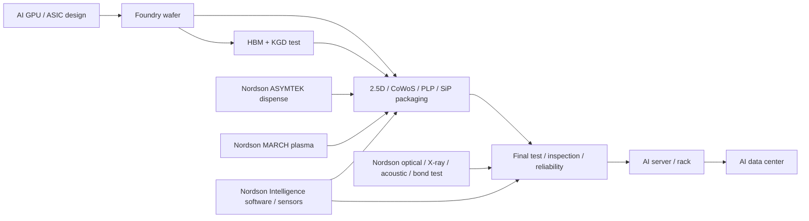

# 公司：AJNMY / 2802.T 味之素（Ajinomoto Co., Inc.）

> 报告日期：2026-05-10（美国西海岸时间）。  
> 口径说明：AJNMY/AJINY 为 Ajinomoto Co., Inc. 的美国 OTC ADR 报价口径，J.P. Morgan ADR 资料显示 ADR 与普通股为 1:1；本文公司经营和财务以东京证券交易所 `2802.T` 与公司官方 IFRS 报表为主，ADR 价格仅作美国投资人口径参考。  
> 汇率：为便于美元化比较，本文估算统一采用 `JPY150/USD`，除非另有说明。  
> 重要限制：公司不披露 ABF/Functional Materials 的 backlog、bookings、客户、AI 数据中心收入和具体产品毛利；相关项目订单、AI 占比、BOM 含量均为基于公司披露、产业链容量、产品属性和交付节奏的推断。

## 1. 公司整体业务、投资人心智与财务快照

### 1.1 公司是什么

味之素是日本食品与 AminoScience 集团，核心业务分为三大报告分部：

| 分部 | FY2025 收入 | YoY | FY2025 Business Profit | 利润率 | 投资含义 |
|---|---:|---:|---:|---:|---|
| Seasonings & Foods | ¥936.9B | +4.6% | ¥143.0B | 15.3% | 现金牛；调味品、加工食品、即食食品等，提供稳定利润和品牌护城河 |
| Frozen Foods | ¥290.3B | +0.3% | ¥8.4B | 2.9% | 低利润率、运营改善型业务；AI 相关性低 |
| Healthcare & Others | ¥341.5B | +4.0% | ¥66.2B | 19.4% | 增长与估值重估核心；内部包括 Bio-Pharma、Ingredients、Functional Materials |
| 其中：Functional Materials | ¥100.7B | +31.6% | ¥54.6B | 54.2% | AI 封装材料核心；只占集团收入 6.4%，贡献集团 Business Profit 约 30.2% |

公司在传统投资人心中长期是“日本消费品/食品现金牛 + 氨基酸技术平台”公司；过去两年投资人心智快速变化为“食品现金牛覆盖下的 AI 半导体封装材料隐形龙头”。这个变化的核心不是食品，而是 Ajinomoto Fine-Techno 的 Ajinomoto Build-up Film（ABF）：高性能 CPU/GPU/ASIC 的 FC-BGA 封装基板中使用的层间绝缘膜。AI 加速器、交换芯片、服务器 CPU 和部分定制 ASIC 都需要高层数、大面积、低翘曲、高可靠性的有机封装基板，ABF 是其中小金额但高卡位的关键材料。

### 1.2 产业链位置

味之素不直接卖给 NVIDIA、AMD、Broadcom、Google、AWS、Meta、Microsoft 或数据中心运营方。它处在 AI 基建链条的上游材料层：

`AI GPU/ASIC/CPU 设计商 -> Foundry/OSAT/封装厂 -> FC-BGA 基板厂 -> ABF 绝缘膜/电子材料 -> Ajinomoto Fine-Techno`

典型客户链条中的基板厂包括 Ibiden、Shinko、Unimicron、Kinsus、SEMCO、AT&S、TOPPAN、Nan Ya PCB、Kyocera 等。最终需求来自 Blackwell/GB200/GB300、Rubin、AMD MI 系列、Broadcom/Marvell/ASIC、TPU、Trainium/Inferentia、800G/1.6T 网络交换 ASIC 与高端服务器 CPU。

### 1.3 最近 3 年重大业务变化

1. **Functional Materials 被重新定价**：FY2025 Functional Materials 收入 ¥100.7B、Business Profit ¥54.6B，利润率 54.2%，成为集团利润质量最高的业务。公司 FY2026 指引继续给出 Functional Materials 收入和利润均 +10.8%。
2. **AI 封装扩产进入长期规划**：2026-05-07，Ajinomoto Fine-Techno 宣布取得岩手县北上市原 Toshiba Electronics 工厂土地与建筑，用于未来 ABF 生产，目标是应对 2030 年前后预期需求；建筑和设备投资仍需后续根据市场环境决策。这说明 2026-2027 现有需求已足以让公司准备下一轮长期产能，但该资产不会显著缓解未来 12 个月供给。
3. **Bio-Pharma Services & Ingredients 进入恢复/扩张阶段**：FY2025 该子业务收入约 ¥148.0B、Business Profit ¥9.5B；FY2026 指引收入 ¥176.2B、利润 ¥17.0B，收入 +19.1%、利润 +79%。这是非 AI 的第二增长点，但估值弹性弱于 ABF。
4. **资本回报加大**：FY2025 公司购买库存股约 ¥130.0B，支付股息 ¥43.1B。强现金流和资产处置收益支持回购。
5. **激进股东推动重估**：Palliser Capital 在 2026-03-31 发布针对 Ajinomoto 的价值提升计划，主张集团架构掩盖了世界级 Functional Materials/ABF 资产价值，要求更高透明度、战略评估和资本配置优化。这强化了“食品集团中藏着 AI 材料龙头”的投资人叙事。

### 1.4 最新市场与估值数据

| 指标 | 最新口径 | 数值 | 日期/说明 |
|---|---:|---:|---|
| ADR 参考股价 | AJNMY/AJINY OTC | 约 US$30.30 | 2026-05-07 市场数据口径；5 月 10 日为周日 |
| 普通股市值 | 2802.T | ¥4.74T | 2026-05-07，StockAnalysis |
| 企业价值 EV | 2802.T | ¥5.00T | 2026-05-07，StockAnalysis |
| Trailing PE | 2802.T | 35.96x | 2026-05-07，StockAnalysis |
| Forward PE | 2802.T | 39.21x | 2026-05-07，StockAnalysis |
| Price/Sales | 2802.T | 2.99x | 2026-05-07，StockAnalysis |
| EV/Sales | 2802.T | 3.16x | 2026-05-07，StockAnalysis |
| 收入增速 | TTM/年度口径 | +3.47% | StockAnalysis；官方 FY2025 收入 +3.5% |
| 毛利率 | FY2025/TTM | 37.7% | 公司 FY2025 gross profit ¥597.1B / sales ¥1,583.7B |
| 营业利润率 | FY2025/TTM | 12.6% | StockAnalysis |
| 净利率 | FY2025/TTM | 约 9.2% | StockAnalysis；归母净利 ¥134.6B / 收入约 8.5% |

估值结论：以食品公司看，PE 36x、PS 3.0x 偏贵；以高壁垒 AI 封装材料资产看，市场正在把 Functional Materials 视作集团重估核心。风险是 ABF 只占收入约 6%-7%，即使利润贡献高，也不足以完全解释集团整体高估值，除非投资人相信 ABF 会持续高增长且公司会提高披露或分拆/重组。

### 1.5 资产负债表健康度

| 指标 | FY2025 数值 | 判断 |
|---|---:|---|
| 总资产 | ¥1,812.3B | 资产规模稳定扩大 |
| 总负债 | ¥968.1B | 杠杆可控 |
| 总权益 | ¥844.3B | 权益缓冲较厚 |
| 归母权益率 | 42.5% | 对制造+食品集团健康 |
| 现金及现金等价物 | ¥106.6B | 现金低于总债务，但现金流强 |
| Current assets / liabilities | ¥704.2B / ¥449.1B | 流动比率 1.57x |
| CFO | ¥239.3B | 经营现金流强 |
| PPE 购置 | ¥96.4B | 扩产/维持资本开支较高 |
| 估算 FCF | 约 ¥142.9B | CFO - PPE 购置，未扣其他投资项目 |
| Interest-bearing debt/CFO | 201.7% | 估算有息债约 ¥483B |
| Interest coverage | 32.7x | 偿息压力低 |
| 估算净债务/EBITDA | 约 1.4x | 健康 |

财务健康度：较健康。公司有强经营现金流、较高利息覆盖、稳定食品现金牛和可观回购能力。主要压力来自三点：ABF 长期扩产会提高资本开支，库存 FY2025 升至 ¥318.6B，且估值已经提前反映部分 AI 材料成长。

## 2. 最新及最近 4 次财报

公司最近 5 个季度财报如下。FY2025Q4 是截至 2026-03-31 的最新季度，2026-05-07 公布。

| 财报季度 | 总收入 | Business Profit | Seasonings & Foods | Frozen Foods | Healthcare & Others | Functional Materials | 估算 AI/DC 相关收入 | 订单/交期/取消率推断 |
|---|---:|---:|---:|---:|---:|---:|---:|---|
| FY2024Q4 | ¥379.5B | ¥21.1B | 收入 ¥218.2B | 收入 ¥70.6B | 收入 ¥85.5B | 收入 ¥18.9B；BP ¥9.3B；利润率 49.2% | ¥7-9B / US$45-60M | 未披露 backlog；AI GPU 基板需求启动，高端 ABF 交期估计 6-9 个月 |
| FY2025Q1 | ¥364.0B | ¥47.2B | 收入 ¥213.3B | 收入 ¥68.7B | 收入 ¥78.9B | 收入 ¥21.5B；BP ¥10.8B；利润率 50.2% | ¥9-11B / US$60-75M | Functional Materials 同比 +24%；说明高端客户拉货加强，取消率低 |
| FY2025Q2 | ¥374.8B | ¥39.5B | 收入 ¥222.5B | 收入 ¥69.7B | 收入 ¥79.0B | 收入 ¥23.4B；BP ¥12.8B；利润率 54.7% | ¥11-13B / US$70-90M | 利润率跳升，混合结构向高端 ABF 倾斜；交期估计 6-12 个月 |
| FY2025Q3 | ¥425.2B | ¥59.2B | 收入 ¥259.0B | 收入 ¥78.2B | 收入 ¥84.5B | 收入 ¥28.9B；BP ¥16.5B；利润率 57.1% | ¥14-17B / US$95-115M | Functional Materials 同比 +41%；AI 服务器/ASIC 链最强季度，供需偏紧 |
| FY2025Q4 | ¥419.5B | ¥35.1B | 收入 ¥241.8B | 收入 ¥73.5B | 收入 ¥98.9B | 收入 ¥26.9B；BP ¥14.4B；利润率 53.5% | ¥13-16B / US$90-110M | 同比 +42%；Q/Q 回落但高于去年，FY2026 指引继续增长，积压/客户 forecast 仍强 |

补充数字：

| Functional Materials | FY24Q4 | FY25Q1 | FY25Q2 | FY25Q3 | FY25Q4 | FY2025 全年 | FY2026 指引 |
|---|---:|---:|---:|---:|---:|---:|---:|
| 收入 | ¥18.9B | ¥21.5B | ¥23.4B | ¥28.9B | ¥26.9B | ¥100.7B | ¥111.6B |
| YoY | n.a. | +24% | +18% | +41% | +42% | +31.6% | +10.8% |
| Business Profit | ¥9.3B | ¥10.8B | ¥12.8B | ¥16.5B | ¥14.4B | ¥54.6B | ¥60.5B |
| 利润率 | 49.2% | 50.2% | 54.7% | 57.1% | 53.5% | 54.2% | 54.2% |
| 占集团收入 | 5.0% | 5.9% | 6.2% | 6.8% | 6.4% | 6.4% | 6.5% |
| 占集团 BP | 44.1% | 22.9% | 32.4% | 27.9% | 41.0% | 30.2% | 30.7% |

订单与 backlog 判断：公司没有披露 bookings、B2B、lead time、取消率。用收入、毛利、FY2026 指引和 2026 年新 ABF 用地动作反推，高端 ABF 的客户 forecast 覆盖度高，产能短期不宽松；取消率在产品量产后较低，因为 ABF 属于已认证材料，换料会影响翘曲、信号完整性、可靠性和良率。真正风险不是单个 PO 取消，而是 GPU/ASIC 平台推迟、CoWoS/基板产能错配或客户代际切换。

## 3. FY2026 最新指引、业务占比与产品映射

FY2026 公司指引：

| 分部 | FY2026 收入指引 | YoY | 收入占比 | FY2026 BP 指引 | YoY | BP 占比 |
|---|---:|---:|---:|---:|---:|---:|
| Seasonings & Foods | ¥998.6B | +6.6% | 58.0% | ¥145.9B | +2.0% | 74.1% |
| Frozen Foods | ¥310.6B | +7.0% | 18.0% | ¥12.1B | +44.0% | 6.1% |
| Healthcare & Others | ¥397.8B | +16.5% | 23.1% | ¥80.0B | +20.8% | 40.6% |
| 其中：Bio-Pharma Services & Ingredients | ¥176.2B | +19.1% | 10.2% | ¥17.0B | +79.0% | 8.6% |
| 其中：Functional Materials | ¥111.6B | +10.8% | 6.5% | ¥60.5B | +10.8% | 30.7% |
| 其中：Others | ¥109.9B | +18.7% | 6.4% | ¥2.4B | n.a. | 1.2% |
| Shared companywide expenses | - | - | - | -¥46.2B | - | -23.5% |
| 集团合计 | ¥1,723.0B | +8.8% | 100.0% | ¥197.0B | +8.7% | 100.0% |

最突出业务是 Functional Materials。它的收入只占集团约 6.5%，但利润率约 54%，贡献集团约 31% 的 Business Profit；这是公司 AI 估值的核心。Bio-Pharma FY2026 增速更高，但利润率、技术垄断和 AI 基建映射都弱于 ABF。

### 3.1 重点产品与跳过产品

| 类别 | 产品/业务 | 是否重点 | 原因 |
|---|---|---|---|
| Functional Materials | Ajinomoto Build-up Film（ABF）：公开产品页列出 GX、GL、GX-T31、GY、GZ 等系列 | 重点 | 高端 CPU/GPU/ASIC FC-BGA 基板关键层间绝缘膜；AI 封装链核心 |
| Functional Materials | AFTINNOVA magnetic film / 磁性膜材料 | 小重点 | 可能受益于高功率封装、电源完整性、嵌入式被动器件和 EMI 管理，但当前收入小 |
| Functional Materials | 其他绝缘、粘接、脱模、活性炭/精细材料 | 部分跳过 | 可能有工业价值，但 AI 数据中心映射弱或收入披露不足 |
| Bio-Pharma Services & Ingredients | CDMO、医药/食品级氨基酸 | 非 AI 成长观察 | FY2026 指引强，但不属于 AI 基建 |
| Seasonings & Foods | 调味品、酱料、quick nourishment | 跳过 | 稳定现金牛，低 AI 相关性 |
| Frozen Foods | 冷冻食品 | 跳过 | 低利润率、运营改善型，AI 相关性低 |

## 4. 当前关键产品：收入贡献、增速、AI 重要性与供需

### 4.1 ABF / 高端电子功能材料

| 指标 | 当前评估 |
|---|---|
| FY2025 收入贡献 | Functional Materials 总收入 ¥100.7B / US$0.67B；其中 ABF/高端封装材料估算 ¥80-90B / US$0.53-0.60B |
| FY2025 AI/DC 收入贡献 | 估算 ¥45-60B / US$0.30-0.40B；公司未披露 |
| FY2025 增速 | Functional Materials +31.6%；FY25Q4 同比 +42% |
| FY2026 官方增速 | Functional Materials 收入与利润均 +10.8% |
| AI 技术栈重要性 | 极高。ABF 是有机 FC-BGA 基板的关键绝缘层；没有通过认证的材料，GPU/ASIC 封装基板无法稳定量产 |
| 时间紧急性 | 高。GB300、Rubin、MI400、TPU、Trainium、Broadcom/OpenAI ASIC、800G/1.6T switch ASIC 都推高大尺寸高层数基板需求 |
| 供需紧张程度 | 高。收入高增、利润率提升和 2030 ABF 用地扩张共同指向高端 ABF 供给偏紧 |
| 垄断/溢价能力 | 高但非无限。Ajinomoto 是 ABF 概念和产业化龙头，客户切换成本高；但基板厂和芯片客户会推动多源与议价 |

### 4.2 AFTINNOVA 磁性膜及其他电子功能材料

| 指标 | 当前评估 |
|---|---|
| FY2025 收入贡献 | 估算 <¥5-10B / <US$70M，包含在 Functional Materials 中，未单列 |
| 增速 | 无披露；估计低于 ABF 主线，但可能随高功率封装和电源模块增长 |
| AI 技术栈重要性 | 中等。不是 GPU/ASIC 封装的第一瓶颈，但对电源完整性、噪声抑制、薄型化和高频化有潜在价值 |
| 时间紧急性 | 中。客户导入周期长，短期无法替代 ABF 的投资主线 |
| 供需紧张程度 | 低到中。没有看到公开供不应求证据 |
| 垄断/溢价能力 | 中。材料配方和可靠性有门槛，但替代体系更多 |

### 4.3 Bio-Pharma Services & Ingredients

| 指标 | 当前评估 |
|---|---|
| FY2025 收入贡献 | ¥148.0B / US$0.99B；Business Profit ¥9.5B |
| FY2026 指引 | 收入 ¥176.2B / US$1.17B，+19.1%；Business Profit ¥17.0B，+79% |
| AI 技术栈重要性 | 低。不是 AI 基建业务 |
| 投资重要性 | 中。可改善集团增长和利润结构，但估值弹性低于 ABF |

## 5. 一年后关键产品收入与战略属性预测

### 5.1 ABF / 高端电子功能材料情景

| 情景 | 一年后收入贡献 | AI/DC 收入贡献 | 收入增速 | AI 重要性 | 时间紧急性 | 供需紧张 | 垄断/溢价 |
|---|---:|---:|---:|---|---|---|---|
| 基准 | ¥111.6B / US$0.74B，即公司 FY2026 指引 | ¥55-70B / US$0.37-0.47B | 总体 +10.8%；AI/DC +20-35% | 极高 | 高 | 偏紧 | 高 |
| 乐观 | ¥125-140B / US$0.83-0.93B | ¥75-95B / US$0.50-0.63B | +25-40% | 极高 | 很高 | 紧张 | 很高，价格/产品 mix 均受益 |
| 极度乐观 | ¥155-180B / US$1.03-1.20B | ¥105-130B / US$0.70-0.87B | +55-80% | 极高 | 极高 | 严重供不应求 | 高端等级具备明显溢价，但会被客户要求扩产和多源 |

基准采用公司 FY2026 指引。乐观和极度乐观需要同时满足：Blackwell/GB300 到 Rubin 过渡顺利，定制 ASIC 订单兑现，FC-BGA 大尺寸高层数基板供给没有拖累，且 Ajinomoto 通过 mix、良率和价格实现收入超过物理产能扩张。

### 5.2 AFTINNOVA 磁性膜及其他电子功能材料情景

| 情景 | 一年后收入贡献 | 收入增速 | AI 重要性 | 时间紧急性 | 供需紧张 | 垄断/溢价 |
|---|---:|---:|---|---|---|---|
| 基准 | ¥5-8B / US$35-55M | +10-20% | 中 | 中 | 不紧 | 中 |
| 乐观 | ¥8-12B / US$55-80M | +30-50% | 中偏高 | 中偏高 | 局部偏紧 | 中偏高 |
| 极度乐观 | ¥15-20B / US$100-135M | +80-120% | 高功率封装中重要 | 高 | 紧 | 较高，但需客户认证放量 |

## 6. BOM、真实内容量、价格传导链与当前产能

### 6.1 ABF BOM 和内容量

ABF 在 AI 系统中的价值量很小，但瓶颈属性很强。它不是按 GPU 直接销售，而是作为膜材料进入 FC-BGA 基板。

| 单位 | 估算 ABF 内容量 | 说明 |
|---|---:|---|
| 每颗 AI GPU/ASIC package | US$30-150；极大尺寸/HBM4 情景 US$100-250 | 基于高端 FC-BGA 基板价值 US$500-2,000+、ABF 材料占基板 BOM 小比例推断 |
| 每个 NVL72 级 72-GPU rack | US$2,000-11,000；极度乐观/极大 package US$7,000-18,000 | 72 颗加速器，不含 CPU、交换芯片和 NIC 的额外基板 |
| 每 MW AI 负载 | US$20,000-108,000；极端 US$72,000-180,000 | 假设约 100kW/rack、10 rack/MW、720 GPU/MW；120kW rack 时单位 MW GPU 数会下降 |
| 每颗高端 switch ASIC | US$50-200 | 800G/1.6T 交换 ASIC 也使用高端封装基板，但面积通常低于最大 AI 加速器 |
| 每 optical port | US$0.5-3 间接 ABF | ABF 不直接进入光模块；通过交换 ASIC/NIC ASIC 基板摊销到端口 |

价格传导链：

`Hyperscaler/GPU/ASIC 需求 -> NVIDIA/AMD/Broadcom/Marvell/自研 ASIC -> Foundry/OSAT/基板厂产能锁定 -> FC-BGA 基板报价 -> ABF 等关键材料 -> Ajinomoto`

ABF 的价格弹性来自“低成本占比 + 高失败成本”。即使每颗 GPU/ASIC 上 ABF 价值只有几十到一两百美元，相比 AI 加速器、HBM、CoWoS 和整机成本很低；但如果材料导致良率、翘曲、可靠性或信号完整性问题，损失远超材料价差。因此高端已认证等级具备较强传导能力。

### 6.2 当前产能、采纳度与认证

| 产品 | 当前产能能力（美元计） | 供应链采纳程度 | 认证阶段 |
|---|---:|---|---|
| ABF/Functional Materials | FY2025 销售能力 US$0.67B；FY2026 官方收入能力 US$0.74B | 已被全球高端 FC-BGA 基板生态广泛采用；用于 CPU/GPU/chipset/ASIC 等高性能封装 | 现有主流产品已量产认证；下一代大尺寸/HBM4/玻璃或低翘曲体系处于客户共研和平台认证 |
| AI/DC 相关 ABF | FY2025 估算 US$0.30-0.40B | 已进入 AI GPU/ASIC/服务器 CPU/交换 ASIC 供应链，但具体客户不披露 | 量产平台已认证；新平台认证通常 9-18 个月 |
| AFTINNOVA/磁性膜等 | 估算 <US$70M | 小规模或特定客户导入 | 产品级认证/客户导入阶段，未见大规模供不应求证据 |

2026-05-07 岩手北上市资产取得的意义是长期扩产选址，不是立即产能。公司明确表示未来建筑和设备投资将根据市场环境决策，目的在于满足 2030 年前后预期增长。

## 7. 一年后产能、采纳度与认证预测

| 产品 | 情景 | 一年后产能能力（美元计） | 采纳程度 | 认证/导入阶段 |
|---|---|---:|---|---|
| ABF/Functional Materials | 基准 | US$0.77-0.83B | 现有 CPU/GPU/ASIC 基板客户继续扩量 | 下一代大尺寸/低翘曲等级持续认证 |
| ABF/Functional Materials | 乐观 | US$0.87-0.97B | AI GPU、ASIC、交换 ASIC 客户 forecast 上修，基板厂增加分配 | 多个 2027 平台完成设计锁定或接近量产认证 |
| ABF/Functional Materials | 极度乐观 | US$1.07-1.27B | 供给严重偏紧，客户接受更高价格和更强 capacity reservation | 高端等级成为 2027 平台事实标准，但物理扩产仍受设备、良率和厂房限制 |
| AFTINNOVA/磁性膜等 | 基准 | US$35-55M | 小规模增长 | 维持局部导入 |
| AFTINNOVA/磁性膜等 | 乐观 | US$55-80M | 高功率封装/电源模块采用增加 | 进入更多客户平台测试 |
| AFTINNOVA/磁性膜等 | 极度乐观 | US$100-135M | 若嵌入式被动器件和电源完整性方案快速放量，收入跃升 | 若干平台完成量产认证 |

## 8. 基于订单积压与供给的未来一年增速推断

公司不披露 ABF backlog，所以用四类证据推断：Functional Materials 四季度收入同比 +24%、+18%、+41%、+42%；FY2025 全年收入 +31.6%、利润率 54.2%；FY2026 仍指引 +10.8%；并且 2026 年已经为 2030 ABF 需求取得新生产用地。结论是：真实客户 forecast 很强，但公司给出的官方指引偏保守或受产能约束。

| 情景 | 订单/需求假设 | 供给/扩产假设 | 取消率假设 | 未来一年业务增速 |
|---|---|---|---|---:|
| 基准 | 现有 AI GPU/ASIC/CPU 客户 forecast 稳定；FY2026 指引可信 | 主要靠现有线良率、mix 和小幅去瓶颈 | 量产后低，平台延迟为主要风险 | Functional Materials +10-15%；AI/DC ABF +20-35% |
| 乐观 | GB300、Rubin 前置备货、ASIC 项目和 800G/1.6T switch ASIC 同时拉动 | 高端等级分配给 AI 客户，价格/mix 改善 | 低；客户愿意提前锁料 | Functional Materials +25-40%；AI/DC ABF +45-70% |
| 极度乐观 | 大客户抢产能，基板厂高层数良率改善，AI rack 出货大幅上修 | 供给成为瓶颈，收入主要来自价格、mix、满产和良率提升 | 低，但若平台推迟则波动大 | Functional Materials +55-80%；AI/DC ABF +80-120% |

需要强调：由于岩手新产地是 2030 年前后扩产准备，未来 12 个月极度乐观情景更依赖价格、产品 mix、现有线去瓶颈和客户分配，而不是新厂带来的物理产能。

## 9. 竞争格局、替代风险与客户切换成本

### 9.1 ABF 竞争格局

| 层级 | 参与者 | 对 Ajinomoto 的含义 |
|---|---|---|
| 直接/邻近材料 | Ajinomoto Fine-Techno、Resonac、Sekisui、Mitsubishi Chemical、Sumitomo Bakelite、Panasonic Industry、MGC 等 | 其他厂商可做绝缘、低损耗树脂、封装/基板材料，但高端 ABF 量产认证和客户粘性是 Ajinomoto 的核心 |
| 基板厂客户 | Ibiden、Shinko、Unimicron、Kinsus、SEMCO、AT&S、TOPPAN、Nan Ya PCB、Kyocera 等 | 客户希望多源和压价，但高端平台换料成本高 |
| 封装技术路线 | CoWoS-S/L/R、Fan-out/RDL、玻璃基板、陶瓷/硅中介层、有机中介层 | 不同路线会改变价值分配；但大多数高性能封装仍需要有机基板和 build-up dielectric |
| 最终需求方 | NVIDIA、AMD、Broadcom、Marvell、Google、AWS、Meta、Microsoft、OpenAI 等 | 不直接采购，但其平台规划决定基板面积、层数和材料等级 |

### 9.2 新技术是否主流

ABF 不是新概念，但 AI 时代的新变量是封装基板变得更大、更薄、更高层数、更低翘曲、更高信号完整性要求。高端 ABF 仍是未来 1-3 年主流有机 FC-BGA 路线的关键材料。玻璃基板、先进 RDL 和 fan-out 会增加替代想象，但不会在 2026-2027 直接消灭 ABF；更现实的情形是部分价值转移，同时高端 build-up 材料继续升级。

### 9.3 替代风险

1. **玻璃基板**：Intel、Samsung、Absolics 等推动玻璃核心基板，目标是改善翘曲、尺寸稳定性和高密度互连。风险在 2028 年以后更大；短期量产和生态成熟度仍有限。
2. **Fan-out/RDL/CoWoS-L**：如果更多互连从 FC-BGA 转向 RDL 或硅/有机中介层，ABF 单位面积价值可能被稀释。但最终封装仍通常需要承载基板。
3. **多源材料认证**：大客户和基板厂会降低单一材料依赖；若竞争材料完成认证，Ajinomoto 的价格弹性会下降。
4. **AI capex 波动**：ABF 是小金额瓶颈材料，但收入仍由 GPU/ASIC/服务器出货驱动。若 2027 AI 资本开支放缓，估值先于基本面受压。
5. **估值与披露错配**：公司没有披露 ABF backlog、客户和 AI 收入，投资人只能用 Functional Materials 分部推断，容易造成预期过高。

### 9.4 客户替换成本

客户替换成本高。ABF 等基板材料进入客户平台后，需要经过材料特性、热膨胀系数、低损耗、翘曲、可靠性、湿热、良率、封装兼容性和量产一致性的完整验证。对 AI GPU/ASIC 来说，材料换代可能影响整个基板 stack-up 和 CoWoS/OSAT 良率。实际切换周期通常以 9-18 个月计，并可能跨一个产品世代。因此 Ajinomoto 对已量产高端平台有强粘性，但对未来平台仍需持续认证和价格谈判。

## 投资结论

Ajinomoto 是一个食品现金流集团包裹下的 AI 封装材料公司。FY2025 Functional Materials 只占收入 6.4%，却贡献约 30.2% 的集团 Business Profit，且利润率高达 54.2%；这是股票重估的核心。最新 FY2026 指引给 Functional Materials +10.8%，表面温和，但结合 FY25Q3/Q4 的 +41%/+42% 同比和 ABF 长期扩产用地，实际需求信号强于指引。

最重要的投资问题不是“ABF 会不会受益 AI”，而是三件事：

1. Functional Materials 能否在 2026-2027 从约 US$0.7B 收入平台走向 US$1.0B+；
2. ABF 的 AI/DC 占比能否从估算 US$0.3-0.4B 提升到 US$0.7B+；
3. 公司是否会提高披露、释放 ABF 估值，或在激进股东压力下优化集团结构。

当前财务健康、现金流强、资产负债表稳健；主要风险是估值已高、ABF 披露不足、新产能不解决短期瓶颈、以及玻璃基板/RDL/多源材料对远期溢价的潜在侵蚀。

## 主要资料来源

- Ajinomoto FY2025 Q4 Presentation / Results / Tanshin / FY2026 Forecast，2026-05-07：[IR Results Library](https://www.ajinomoto.co.jp/company/en/ir/library/result.html)
- Ajinomoto FY2025 Q4 Presentation PDF：[FY25Q4_Presentation_E.pdf](https://www.ajinomoto.co.jp/company/en/ir/event/presentation/main/011111113/teaserItems1/01/linkList/00/link/FY25Q4_Presentation_E.pdf)
- Ajinomoto FY2025 Q4 Results PDF：[FY25Q4_Results_E.pdf](https://www.ajinomoto.co.jp/company/en/ir/event/presentation/main/011111113/teaserItems1/01/linkList/01/link/FY25Q4_Results_E.pdf)
- Ajinomoto FY2026 Forecast PDF：[FY26_Forecast_E.pdf](https://www.ajinomoto.co.jp/company/en/ir/event/presentation/main/011111113/teaserItems1/01/linkList/02/link/FY26_Forecast_E.pdf)
- Ajinomoto Fine-Techno fixed asset acquisition for ABF production, 2026-05-07：[Notice Regarding Acquisition of Fixed Assets](https://www.ajinomoto.com/cms_wp_ajnmt_global/wp-content/uploads/pdf/2026_05_07_02E.pdf)
- Ajinomoto Fine-Techno ABF product page：[Ajinomoto Build-up Film](https://www.aft-website.com/en/products/insulating_film-abf/)
- Ajinomoto Fine-Techno magnetic material page：[Magnetic Materials](https://www.aft-website.com/en/products/magnetic_materials/)
- StockAnalysis 2802.T statistics, 2026-05-07：[Ajinomoto Statistics](https://stockanalysis.com/quote/tyo/2802/statistics/)
- Palliser Capital value enhancement plan, 2026-03-31：[Palliser Publishes Value Enhancement Plan for Ajinomoto](https://markets.chroniclejournal.com/chroniclejournal/article/bizwire-2026-3-31-palliser-capital-publishes-value-enhancement-plan-for-ajinomoto)
- 本项目非“公司调研”目录行业资料：AI 封装基板/中介层/RDL、Chiplet Summit 2026、AI 数据中心建设规模与产业链订单映射等，用于 ABF、CoWoS、HBM、AI rack/MW 含量和 2026-2027 需求情景交叉验证。

# 公司：APD Air Products and Chemicals（空气产品公司）

> 版本日期：2026-05-10（美国太平洋时间）。APD 最新可交易收盘价取 2026-05-08，因为 2026-05-10 是周日。本文没有参考本目录下其他公司调研文件；只使用公开资料、公司公告、财报、行业资料和项目内非“公司调研”行业资料。金额若无特别说明均为美元。

## 0. 核心结论

APD 是全球工业气体公司，不是 AI 数据中心硬件公司。投资人通常把它看作“高资本强度、长约、类基础设施、分红增长”的工业气体资产；2025-2026 年的投资主线是新管理层接手后的资本纪律、退出回报不足项目、保留高质量气体长约与氢能/氨项目期权。

AI 相关性主要是间接链条：AI 芯片、HBM、先进封装、光器件制造需要超高纯氮气、氢气、氩气、氧气、氦气和特殊/稀有气体；APD 通过 Electronics 终端市场、韩国 Samsung 平泽先进晶圆厂供气项目、氦气供应链受益。它几乎没有直接“每 rack / 每 GPU / 每 optical port”的数据中心硬件内容量，不能按 Vertiv、Eaton、Amphenol 那类逻辑估值。

截至 2026 财年 Q2，APD 的基本面在改善：Q2 FY26 销售额 31.72 亿美元，同比增长 9%；调整后 EPS 3.20 美元，同比增长 19%；调整后 EBITDA 11.77 亿美元，同比增长 16%；调整后 EBITDA margin 37.1%。公司把 FY26 调整后 EPS 指引提高到 13.00-13.25 美元，同比增长 8%-10%，并把 FY26 capex 控制在约 40 亿美元。

资产负债表不是低杠杆状态：截至最新公开市场数据，APD 总债务约 184.4 亿美元、现金约 9.54 亿美元、净债务约 174.9 亿美元，TTM FCF 为 -12.5 亿美元，主要因为大型项目资本开支。公司口径下，报告净债务/调整后 EBITDA 为 4.7x；剔除 NGHC 项目融资债务后约 2.2x。结论是“经营现金流强、投资期 FCF 承压、信用仍可控但需要资本纪律兑现”。

## 1. 整体业务、产业链位置与投资人认知

### 1.1 APD 做什么

APD 生产、分离、提纯、储运并现场供应工业气体，核心产品包括氧气、氮气、氩气、氢气、氦气、一氧化碳、合成气、液化气体以及部分高纯/特殊气体供应系统。典型商业模式是：

| 模式 | 客户 | 合同形态 | 经济特征 |
|---|---:|---|---|
| On-site / pipeline 现场供气 | 炼化、化工、钢铁、半导体、玻璃、能源 | 10-20 年长约、take-or-pay、成本传导 | 粘性高、客户替换成本高、资本强度高 |
| Merchant liquid/bulk 批量液体气 | 制造、医疗、食品、电子、实验室 | 区域供货、指数/成本调价 | 更周期化，受区域价格和利用率影响 |
| Helium / rare gas supply 氦气与稀有气体 | 电子、医疗、航天、科研 | 3-5 年合约、物流/储运能力重要 | 供给弹性低，紧缺期定价权强 |
| Clean hydrogen / ammonia 清洁氢氨 | 能源、工业、交通潜在客户 | 项目融资、长期 offtake | 期权价值大，但执行和需求风险也大 |

APD 在产业链中的位置是“上游工艺材料和能源分子基础设施”。在 AI 产业链里，它更靠近晶圆厂和先进封装厂，而不是数据中心园区电力设备、服务器、网络或液冷。

### 1.2 FY25 终端市场收入结构

公司披露 FY25 销售额约 120 亿美元，按终端市场大致如下：

| 终端市场 | FY25 占比 | 估算销售额 | 与 AI/先进制造关系 |
|---|---:|---:|---|
| Chemicals 化工 | 21% | 25.2 亿 | 传统核心长约，低到中个位数增长 |
| Energy 能源 | 21% | 25.2 亿 | 氢气/合成气/炼化；清洁氢氨期权在这里 |
| Electronics 电子 | 17% | 20.4 亿 | 与 AI 芯片、HBM、先进封装最相关 |
| Metals 金属 | 15% | 18.0 亿 | 周期性工业需求 |
| Manufacturing 制造 | 10% | 12.0 亿 | 分散工业需求 |
| Medical 医疗 | 5% | 6.0 亿 | 稳定防御性需求 |
| Food 食品 | 5% | 6.0 亿 | 稳定低增速 |
| Aerospace 航天 | 2% | 2.4 亿 | 液氢、液氧、氦气；小但高规格 |
| Other 其他 | 4% | 4.8 亿 | 分散 |

### 1.3 最近三年重大变化

| 时间 | 事件 | 投资含义 |
|---|---|---|
| 2024-09-30 | APD 完成把 LNG process technology and equipment 业务以 18.1 亿美元现金出售给 Honeywell | 退出非核心设备业务，强化工业气体/项目资产属性 |
| 2025 财年 | 公司确认退出三个美国项目，Q2 FY25 产生约 23 亿美元税后项目退出相关费用，全年 GAAP EPS 大幅受损 | 管理层承认部分大型项目回报不足，资本纪律成为核心考核 |
| 2025-2026 | 新 CEO Eduardo F. Menezes 接手，推动“clean-up year”、出售/评估非核心资产、压低 capex | 市场把 APD 从“氢能大 capex 故事”重新定价为“工业气体质量+资本回报修复” |
| 2026 Q2 | 获 Samsung 韩国平泽先进半导体 fab 供气项目，称为 APD 在韩国历史最大投资；新 fab 阶段预计 2028-2030 投产 | 这是 APD 最清晰的 AI/先进半导体长周期增量，但一年内收入贡献有限 |
| 2026 | FY26 指引提高到调整后 EPS 13.00-13.25 美元，capex 约 40 亿美元 | 盈利韧性和资本纪律同时验证中 |

### 1.4 最新股价、估值和财务质量

| 指标 | 最新值 | 日期/口径 | 解读 |
|---|---:|---|---|
| 股价 | 295.41 美元 | 2026-05-08 收盘 | 周日无交易，取最近交易日 |
| 市值 | 657.8 亿美元 | 2026-05-08 附近 | 大型工业气体公司 |
| 企业价值 EV | 832.7 亿美元 | 2026-05-08 附近 | 杠杆和项目债使 EV 明显高于市值 |
| TTM PE | 31.12x | 最新 TTM | 当前 GAAP/TTM 受项目退出费用与周期扰动影响 |
| Forward PE | 21.45x | 市场一致预期口径 | 与 FY26 调整后 EPS 指引接近 |
| PS | 5.28x | TTM revenue 124.6 亿 | 工业气体优质长约资产估值 |
| Forward PS | 5.01x | 市场一致预期口径 | 反映中个位数收入增长 |
| TTM 收入 | 124.6 亿 | 最新 TTM | FY26 H1 销售额 62.74 亿，同比 +7% |
| TTM 毛利率 | 31.98% | 最新 TTM | 受合同、能源成本传导和产品组合影响 |
| TTM 净利率 | 16.91% | 最新 TTM | 工业气体中较高，但项目费用可显著扰动 GAAP |
| 当前比率 | 1.43x | 最新资产负债表 | 短期流动性尚可 |
| 现金 | 9.54 亿 | 最新资产负债表 | 相对债务规模不高 |
| 总债务 | 184.4 亿 | 最新资产负债表 | 高资本项目导致债务较高 |
| 净债务 | 174.9 亿 | 最新资产负债表 | 需要 EBITDA 与资产出售/FCF 支撑 |
| Debt / EBITDA | 4.61x | TTM 统计口径 | 表观杠杆高 |
| 公司调整后净债务/EBITDA | 4.7x；剔除 NGHC 项目融资约 2.2x | Q2 FY26 公司口径 | 关键在项目融资隔离和长期 A/A2 信用评级维持 |
| TTM 经营现金流 | 41.2 亿 | 最新 TTM | 现金创造能力强 |
| TTM FCF | -12.5 亿 | 最新 TTM | capex 高峰期仍消耗现金 |

财务健康度：中等偏健康，但不是“轻资产安全垫很厚”的状态。APD 的防线在于长期合同、工业气体高粘性、经营现金流和信用评级；主要风险在于大型项目延期/减值、清洁氢氨 offtake 不及预期、债务较高时再遇利率或成本压力。

## 2. 最近五次财报：关键数字、订单/交期和 AI 相关性

APD 不像设备公司那样披露 bookings/book-to-bill/lead time/cancellation rate。可用的订单代理指标包括：剩余履约义务 RPO、长期 take-or-pay 合同、项目投产窗口、公司项目退出记录、以及 Samsung 等客户项目披露。APD 2026 年 3 月 31 日附近披露的 RPO 约 280 亿美元，六个月前约 260 亿美元；其中约 7 亿美元预计未来 12 个月确认收入。这说明“长期锁定很大、短期可转收入较小”。

| 财报 | 销售额 / 增速 | 调整后 EPS / 增速 | 利润率与分部 | 订单、交期、取消率推断 | AI/数据中心相关收入占比估算 |
|---|---:|---:|---|---|---|
| Q2 FY26（截至 2026-03-31） | 31.72 亿，+9% | 3.20，+19% | 调整后 OI 7.53 亿，+19%；调整后 OI margin 23.7%；调整后 EBITDA 11.77 亿，margin 37.1%。Americas 13.84 亿 +8%；Asia 8.33 亿 +8%；Europe 7.89 亿 +8%；Corporate/Other 1.37 亿 +44% | RPO 约 280 亿，半年增加约 20 亿；Samsung 平泽供气项目为中长期新增项目，投产 2028-2030；FY26 clean hydrogen 项目对 EPS 指引无贡献 | 直接 AI DC 约 0%；间接 Electronics 约 17% 年化口径；AI 芯片/先进半导体 subset 估约公司收入 5%-8% |
| Q1 FY26（截至 2025-12-31） | 31.03 亿，+6% | 3.16，+10% | GAAP OI 7.44 亿，margin 24.0%；调整后 EBITDA 11.60 亿，margin 37.4%。Americas 13 亿 +4%；Asia 8.32 亿 +2%；Europe 7.82 亿 +12% | 需求仍有通胀、汇率和终端挑战，但价格/生产率/新资产支撑；capex 指引约 40 亿 | 直接 AI DC 约 0%；间接电子材料链仍是主要 AI 暴露 |
| Q4 FY25（截至 2025-09-30） | 32 亿，-1% | 3.39，+8% | 调整后 OI 8.12 亿，+10%；调整后 OI margin 25.5%；调整后 EBITDA 13 亿，margin 39.8%。Americas 13 亿 -1%；Asia 8.70 亿 +1%；Europe 7.89 亿 +8% | FY25 为“清理年”；退出三个美国项目，减少约 25 亿资本承诺并预计产生超过 20 亿现金收益；FY26 EPS 初始指引 12.85-13.15 | 电子占比按 FY25 17%；AI subset 估 5%-8%；大型半导体新项目尚未进入收入 |
| Q3 FY25（截至 2025-06-30） | 30 亿，+1% | 3.09，-3% | 调整后 OI 7.41 亿，持平；调整后 OI margin 24.5%；调整后 EBITDA 12 亿，margin 38.4%。Americas 13 亿 +2%；Asia 8.10 亿 +3%；Europe 7.71 亿 +11% | 没有披露 bookings；Europe 表现强，Corporate/Other 因 LNG sale 后基数下降。FY25 capex 指引约 50 亿 | 直接 AI DC 约 0%；半导体气体链同比应好于传统工业，但公司未单列 |
| Q2 FY25（截至 2025-03-31） | 29 亿，持平 | 2.69，-6% | GAAP 因项目退出亏损；调整后 EBITDA 12 亿，margin 39.7%；调整后 OI 6.31 亿，margin 21.6%。Americas 13 亿 +3%；Asia 7.74 亿 -1%；Europe 7.27 亿 +9% | 退出三个美国项目，税后费用约 23 亿；这是取消/项目筛选风险的现实案例。FY25 capex 指引约 50 亿 | AI 直接收入仍约 0；电子链重要但无法抵消项目退出对 GAAP 的冲击 |

## 3. FY26 最新指引、业务占比与产品映射

### 3.1 最新指引

| 指引项 | 最新公司指引 | 含义 |
|---|---:|---|
| FY26 调整后 EPS | 13.00-13.25 美元 | 同比 +8%-10%，较 Q1 指引上调 |
| Q3 FY26 调整后 EPS | 3.25-3.35 美元 | 同比 +11%-14% |
| FY26 capex | 约 40 亿美元 | 从 FY25 约 50 亿指引区间下移，资本纪律强化 |
| FY26 clean hydrogen 项目贡献 | 指引不包含贡献 | NEOM/其他清洁氢氨仍是 2027+ 期权 |
| FY26 主要正向因素 | volume、productivity、新资产、回购、保险收益、汇率 | 经营改善多于宏观需求爆发 |
| FY26 主要负向因素 | 氦气 pricing pressure 约 -3% 到 -4% EPS headwind | 氦气价格从高价合约期回落，短期压盈利 |

### 3.2 产品与业务映射

| 业务/产品簇 | 主要产品 | 客户与场景 | 收入/利润特征 | 是否重点 |
|---|---|---|---|---|
| On-site industrial gases | O2、N2、Ar、H2、CO、syngas、pipeline systems | 化工、炼化、钢铁、电子大厂 | 长约、高切换成本、EBIT margin 通常 20%-30% 区间；项目利用率决定回报 | 保留核心，但非 AI 高弹性 |
| Electronics gases / bulk specialty supply | UHP N2/O2/Ar/H2/He，bulk specialty gas supply system，purification/storage/pipeline | 晶圆厂、HBM/先进封装、显示、光电 | 规格高、客户认证周期长，利润率通常高于普通 merchant gas；先进节点需求强 | 重点 |
| Samsung 平泽 advanced fab 项目 | 多套生产设施、高纯工业气体管道、先进 bulk specialty gas supply system | Samsung 韩国平泽新 fab，阶段投产 2028-2030 | APD 韩国历史最大投资；短期是 capex/工程，长期是高粘性收入 | 重点，但一年内收入有限 |
| Helium 氦气 | 液氦、气氦、ISO containers、cavern storage、liquefaction | 电子 35%、医疗 18%、航天 16%、其他 31% | >90% 量已签约，平均合约 3-5 年；供给紧时溢价强，FY26 有价格下行压力 | 重点 |
| Clean hydrogen / ammonia | 绿氢、低碳氢、氨、氢液化/储运 | NEOM、潜在 Yara/美国低碳氨项目、交通/工业 | 当前收入贡献低，资本强度高，长期期权大 | 选择性重点 |
| Aerospace cryogenic gases | 液氢、液氧、液氮、氦气 | NASA、商业航天、测试台 | 小收入、高规格、认证壁垒高；NASA 长约金额超过 1.4 亿 | 小而关键 |
| LNG equipment | LNG process technology/equipment | LNG 项目 | 已于 2024 出售给 Honeywell | 跳过 |

### 3.3 可以跳过的低增长/非核心产品

普通金属切割/焊接气、食品保鲜气、普通医疗氧、分散制造业 merchant gas、传统 LNG 工艺设备业务、低差异化区域液体气配送，都不是 APD 当前 AI 或高增长投资主线。它们提供现金流和网络密度，但不应被高估为 AI 增量。

## 4. 当前高增长或关键业务：收入贡献、增速、AI 重要性与供需

评分：5 = 最高，1 = 最低。收入贡献为估算，因 APD 不披露每个产品的精确销售额。

| 关键业务/产品 | 当前收入贡献估算 | 当前增速估算 | AI 基建重要性 | 时间紧急性 | 供需紧张程度 | 垄断/溢价能力 | 交叉验证 |
|---|---:|---:|---:|---:|---:|---:|---|
| Electronics gases / 半导体现场供气 | FY25 Electronics 约 20.4 亿；其中 AI/HBM/先进半导体 subset 约 6-9 亿 | +8%-15% | 4 | 4 | 4 | 4 | Gartner 预计 2026 全球半导体收入超过 1.3 万亿美元；SEMI 预计 2026-2028 全球 300mm fab 设备支出 3740 亿美元；项目内行业资料显示 2026 电子气体市场约 68 亿美元 |
| Samsung 平泽项目 | 当前收入很小；建设/工程期，未来可能形成年化数千万到数亿美元级长约收入 | 2028-2030 才放量 | 4 | 3 | 4 | 4 | 公司披露这是 APD 韩国历史最大投资，客户为 Samsung 先进半导体 fab |
| Helium 氦气 | 公司未披露总额；按终端和行业规模估约 8-11 亿；电子用氦约 2.8-4.0 亿 | FY26 volume 稳，但价格造成 EPS -3% 到 -4% headwind | 3 | 4 | 4 | 4 | APD 披露 >90% 氦气量已签约、平均 3-5 年；电子占公司氦气销售 35% |
| Core H2/HyCO/onsite gases | 化工+能源终端合计约 50.4 亿，不全是 H2/HyCO | +2%-6% | 1-2 | 3 | 2-3 | 3-4 | 长约资产稳定，但与 AI 直接关系弱 |
| Clean hydrogen / ammonia | 当前收入接近 0；capex 和项目资产在建 | 2027+ 起步 | 1-2 | 2 | 2 | 2-3 | NEOM 预计 2027 商业化；FY26 指引明确不含 clean hydrogen 贡献 |
| Aerospace cryogenic gases | FY25 aerospace 约 2.4 亿；NASA 新长期液氢合同超过 1.4 亿 | +5%-15% | 0-1 | 3 | 3-4 | 4 | 航天客户认证和物流壁垒高，但规模小 |

结论：APD 的“AI beta”主要来自 semiconductor gases 和 helium，不来自 AI 数据中心电力/冷却/网络硬件。AI 芯片需求越强，越会通过晶圆厂、HBM、先进封装扩产传导到电子气体和氦气；但传导链长、收入确认慢、单位 GPU 内容量低。

## 5. 一年后关键业务收入贡献三情景

以下预测覆盖 2026-05 至 2027-05 左右的未来一年。Samsung 平泽新 fab 的主体收入预计 2028-2030 才出现，所以一年情景主要体现订单、capex、工程进展和小额预收入，不把它当作 FY27 大额收入。

| 业务 | 基准情景 | 乐观情景 | 极度乐观情景 |
|---|---|---|---|
| Electronics gases / 半导体现场供气 | 年化收入 21.5-22.5 亿，+5%-10%；AI subset 7-9 亿；重要性 4、紧急性 4、供需 4、溢价 4 | 年化 23-25 亿，+12%-20%；AI subset 9-11 亿；先进节点/HBM 拉动更强 | 年化 26-29 亿，+25%-40%；需要新增大型 fab 供气项目、电子气体紧缺和价格上行共同发生 |
| Samsung 平泽项目 | 工程/建设推进，收入贡献小于 0.5 亿；但 backlog/项目可见度提高 | 项目进度提前、更多设施范围落地；潜在未来年化收入锚定 1-2 亿+ | Samsung 或韩国先进封装/存储链追加项目，未来年化收入可见度 2-4 亿，但一年内仍主要是订单价值 |
| Helium | 年化 8-10.5 亿，收入持平到 +5%；价格 headwind 仍压 EPS | 年化 9-11.5 亿，+5%-12%；电子/航天需求吸收高价合约回落 | 年化 11-13.5 亿，+15%-25%；需要全球氦源扰动、电子/航天同时紧缺 |
| Core onsite H2/industrial gas | 非 Electronics 工业气体年化 86-90 亿，+3%-6%；AI 重要性低 | 90-95 亿，+6%-10%；新资产投产、Europe/Asia 延续强劲 | 97-103 亿，+12%-18%；宏观工业复苏叠加价格/利用率上行 |
| Clean hydrogen / ammonia | 0-1 亿；NEOM 调试和 offtake 准备，FY26/FY27 初期贡献有限 | 1-2.5 亿；NEOM 如期商业化，Yara/美国低碳氨取得 FID | 2.5-5 亿；多项目 offtake/FID 同步落地，但执行难度高 |
| Aerospace cryogenic gases | 2.5-3.0 亿，+5%-15% | 3.0-3.8 亿，+15%-35% | 4.0-5.0 亿，商业航天/政府发射需求超预期 |

## 6. BOM、单位含量、价格传导链与当前产能/认证

### 6.1 价格传导链

APD 的价格链条不是“器件 ASP -> 模组 -> 机柜”，而是“AI 芯片需求 -> 晶圆厂/HBM/先进封装 capex 与利用率 -> 高纯气体用量、现场供气资产、氦气/稀有气体物流 -> APD 长约收入”。因此每 GPU 或每 optical port 的 APD 内容量很小，但整个 fab 层面的粘性和壁垒高。

### 6.2 单位含量估算

假设：一个 AI 数据中心 1MW IT 负载约对应 700-1,200 颗高端 GPU/accelerator；每 100kW rack 约 70-120 颗高端 accelerator；APD 捕获的是上游制造气体份额，不是数据中心现场硬件。

| 产品/业务 | BOM 中真实内容 | 每 MW AI IT 负载 APD 捕获 | 每 100kW rack APD 捕获 | 每 GPU/accelerator APD 捕获 | 每 optical port APD 捕获 | 说明 |
|---|---|---:|---:|---:|---:|---|
| 半导体电子气体 | UHP N2/O2/Ar/H2/He、purifier、compressor、storage、pipeline、gas cabinets、bulk specialty gas supply | 2 万-12 万美元/MW；全行业电子气体含量约 20 万-60 万美元/MW | 2,000-12,000 美元/rack | 20-120 美元/GPU | 0.02-0.50 美元/port | 取决于 GPU ASP、晶圆代工份额、APD 在对应 fab 的气体份额 |
| Helium | 晶圆制造/检测、低温、航天、医疗；电子用氦占 APD 氦气销售约 35% | 5,000-40,000 美元/MW | 500-4,000 美元/rack | 5-40 美元/GPU | 近似 0-0.10 美元/port | 氦气更像紧缺材料和物流能力，不是单颗芯片固定 BOM |
| Clean hydrogen for data center power | 若用于 1MW 连续发电，约 0.48-0.53 千吨 H2/MW-year；3-8 美元/kg 对应 150万-420万美元/MW-year fuel value | 当前 APD 已披露 AI DC 直接供氢收入约 0 | 当前约 0 | 当前约 0 | 无 | 这是可选能源路径，不是 APD 当前订单主线；目前 AI DC 更常见的是电网、燃气、BESS、燃料电池/微电网组合 |
| Aerospace LH2/LOX/He | 发射、测试台、低温推进剂和惰化/吹扫 | 不适用 | 不适用 | 不适用 | 不适用 | 与 AI 无直接关系，但认证壁垒高 |

### 6.3 当前产能、采纳和认证

| 业务 | 当前产能能力（美元计，估算） | 供应链采纳程度 | 认证/项目阶段 |
|---|---:|---|---|
| Electronics gases | 现有 Electronics 收入能力约 20-22 亿/年；全球电子气体市场约 68 亿/年，APD 属第一梯队之一 | 高。晶圆厂现场供气一旦接入，替换成本高 | Samsung 平泽项目已被选定，处于设计/建设前期；各类高纯气体需通过客户 fab site qualification |
| Helium | 估算 8-11 亿/年销售能力；500+ ISO container fleet、美国 cavern、液化和管网接入 | 高。电子、医疗、航天客户重视稳定供给 | >90% 量已签约，平均合约 3-5 年；医疗/航天/电子客户规格认证高 |
| Clean hydrogen / ammonia | 当前商业收入低；项目资产与工程能力显著，但可售收入取决于投产和 offtake | 中低到中。客户采纳仍受价格、政策和基础设施影响 | NEOM 项目预计 2027 商业化；其他美国/沙特低碳氨谈判和 FID 仍需确认 |
| Aerospace cryogenic gases | 约 2.4 亿/年终端市场收入；NASA 长期液氢合同超过 1.4 亿 | 高规格小市场，客户粘性强 | NASA/航天客户规格、物流和安全要求构成认证壁垒 |

## 7. 一年后产能、采纳和认证三情景

| 业务 | 基准 | 乐观 | 极度乐观 |
|---|---|---|---|
| Electronics gases | 年化产能/收入能力 22-23 亿；Samsung 工程推进，收入仍主要在 2028+ | 24-26 亿；更多先进 fab 或封装客户签订 onsite/bulk specialty 项目 | 28 亿+ 可见收入能力；韩国/美国先进 fab 追加项目，但一年内更多体现 backlog |
| Helium | 8-10.5 亿收入能力；合约稳定，价格继续消化 | 9-11.5 亿；重新分配更多量给电子/航天，价格企稳 | 11-13.5 亿；全球供给扰动带来价格和溢价，但 volume 受源头限制 |
| Clean hydrogen / ammonia | NEOM 调试为主，商业收入很小；美国低碳氨项目谨慎推进 | NEOM 按计划商业化，Yara/美国低碳氨 FID 获确认 | 多个 offtake 与政策支持同时落地，形成 2027-2028 收入 ramp 可见性 |
| Aerospace cryogenic gases | NASA 合同执行，年化 2.5-3.0 亿 | 商业航天增加，年化 3.0-3.8 亿 | 发射/测试需求超预期，年化 4.0-5.0 亿 |

## 8. Backlog、订单积压、供给和未来一年增速

### 8.1 真实 backlog 的可用线索

APD 最重要的“订单”不是短周期 bookings，而是长期 RPO 和现场供气合同。2026 年 3 月 31 日附近 RPO 约 280 亿美元，六个月增加约 20 亿美元；但未来 12 个月预计确认仅约 7 亿美元。这说明 APD 有很大的长期合同池，但短期收入增长不会像 AI 硬件供应商那样随订单爆发立刻兑现。

Samsung 项目是最明确的新增半导体订单线索，但公司披露的投产窗口是 2028-2030，意味着未来一年更多是工程、capex、客户认证和 backlog 可见度，而非收入爆发。

氦气的 backlog 形态是供应合约。公司披露 >90% 的氦气量已签约，平均合约期 3-5 年，取消率理论上低；但合同价格滚动会造成 FY26 pricing headwind。

项目取消率方面，FY25 退出三个美国项目是必须重视的负面样本。公司减少约 25 亿资本承诺、预计产生超过 20 亿现金收益，短期改善现金和回报纪律，但也证明大型项目并非无风险 backlog。

### 8.2 未来一年公司收入增速情景

| 情景 | 公司未来一年收入增速 | EPS/利润弹性 | 关键假设 |
|---|---:|---:|---|
| 基准 | +5%-8% | 调整后 EPS +7%-10% | FY26 指引兑现；价格/生产率/新资产抵消需求温和；氦气价格 headwind 延续；clean hydrogen 收入接近 0 |
| 乐观 | +9%-13% | 调整后 EPS +12%-18% | Electronics +12%-20%；Asia/Europe 延续强劲；氦气价格企稳；资本开支控制带来 FCF 改善 |
| 极度乐观 | +15%-22% | 调整后 EPS +20%+ | 电子气体紧缺、先进 fab 订单增加、氦气重新涨价、新资产高利用率、NEOM/低碳氨形成初始收入；但 Samsung 主体收入仍大概率在 2028+ |

## 9. 竞争格局、替代风险与客户替换成本

| 领域 | 主要竞争对手 | APD 优势 | 风险/替代方案 | 客户替换成本 |
|---|---|---|---|---|
| 全球工业气体 | Linde、Air Liquide、Nippon Sanso、Messer | 氢气、氦气、现场供气和大型项目经验强 | Linde/Air Liquide 规模和区域网络更强；价格竞争和能源成本传导压力 | On-site/pipeline 很高；merchant 中等 |
| Electronics gases | Linde、Air Liquide、Nippon Sanso、Merck/EMD、SK Materials、Resonac、Kanto Denka、Wonik、Foosung、中国本土气体公司 | 高纯气体供应、现场资产、Samsung 项目背书 | 客户双供、区域本土化、特殊气体公司在单品上更强；稀有气体回收降低新增需求 | 高。fab 认证、管道和稳定供给要求高 |
| Helium | Linde、Air Liquide、Messer、地区源头和贸易商 | 美国管网/洞库/液化能力、500+ ISO container fleet、长期合约 | 新氦源投产、价格回落、客户回收/节气 | 中高。电子/医疗/航天认证和物流可靠性重要 |
| Clean hydrogen / ammonia | Linde、Air Liquide、Plug Power、CF、OCI、Yara、Exxon/CCS、NEOM/Saudi partners、电力公用事业 | 大项目经验、氢气运营历史、NEOM 股权/项目经验 | 绿氢成本高、of take 延期、政策变化、天然气+BESS/燃料电池替代、项目融资成本 | 中等。合同高粘性，但项目前期客户可换方案 |
| Data center energy | Bloom Energy、Caterpillar、GE Vernova、Cummins、公用事业、BESS 厂商 | APD 有氢气供应和液氢能力，但不是当前主供应链核心 | AI DC 近期更偏天然气发电、燃料电池、BESS、电网互联；APD 没有披露 AI DC 供氢订单 | 当前低 |

新技术是否主流：半导体高纯气体和氦气是先进制造不可绕开的基础材料，仍会随先进节点和 HBM 扩产增长；但 APD 的产品不是 AI 数据中心“短缺瓶颈”中最直接的环节。清洁氢/氨长期可能成为工业脱碳主流之一，但未来一年对 APD 财务贡献不应过度前置。

## 10. 投资判断与跟踪指标

APD 现在更像“工业气体质量资产 + 新管理层资本纪律修复 + 半导体气体/氦气 AI 间接受益 + 清洁氢氨长期期权”。它不是 AI 数据中心设备股，也不应按 rack/GPU 硬件单位经济来给高倍数。

最重要的向上催化剂：FY26 EPS 13.00-13.25 美元兑现或上修；Electronics 增速持续高于公司平均；Samsung 平泽项目 capex/认证/投产里程碑顺利；RPO 继续增加且项目质量改善；氦气 pricing headwind 结束；NEOM 2027 商业化和 Yara/美国低碳氨 FID 确认；FCF 从负转正、净债务/EBITDA 下降。

最重要的风险：大型项目再次减值或延期；氦气合约价格继续下行；清洁氢氨需求和政策不及预期；半导体客户双供压价；APD 因高 capex 导致 FCF 长期为负；Samsung 项目收入在 2028-2030 前无法支撑短期 AI 估值叙事。

## 资料来源

- Air Products FY26 Q2 presentation: https://investors.airproducts.com/static-files/1c55c69d-3196-4a46-b646-fd85adeec0f2
- Air Products FY26 Q1 results: https://www.prnewswire.com/news-releases/air-products-reports-fiscal-2026-first-quarter-results-302674978.html
- Air Products FY25 full year and Q4 results: https://investors.airproducts.com/news-releases/news-release-details/air-products-reports-fiscal-2025-full-year-and-fourth-quarter
- Air Products FY25 Q3 results: https://www.nasdaq.com/press-release/air-products-reports-fiscal-2025-third-quarter-results-2025-07-31
- Air Products FY25 Q2 results: https://www.nasdaq.com/press-release/air-products-reports-fiscal-2025-second-quarter-results-2025-05-01
- Air Products LNG business sale to Honeywell: https://www.airproducts.com/company/news-center/2024/09/0930-air-products-completes-sale-of-lng-process-technology-and-equipment-business-to-honeywell
- StockAnalysis APD statistics: https://stockanalysis.com/stocks/apd/statistics/
- Yahoo Finance APD chart API: https://query1.finance.yahoo.com/v8/finance/chart/APD?range=5d&interval=1d
- TechInsights electronic gases 2026 market view: https://www.techinsights.com/blog/electronic-gases-market-reach-681b-2026-driven-advanced-node-demand
- Gartner semiconductor revenue forecast 2026: https://www.gartner.com/en/newsroom/press-releases/2026-04-08-gartner-forecasts-worldwide-semiconductor-revenue-to-exceed-us-dollars-one-point-3-trillion-in-2026
- SEMI 300mm fab equipment spending outlook: https://www.semi.org/en/semi-press-release/semi-reports-global-300mm-fab-equipment-spending-expected-to-total-374-billion-dollars-over-next-three-years
- Bloom Energy / Oracle AI infrastructure fuel-cell context: https://www.bloomenergy.com/news/bloom-energy-and-oracle-expand-strategic-partnership-to-deploy-up-to-2-8-gw-to-accelerate-ai-infrastructure-build-out/
- 项目内非“公司调研”行业资料：`AI数据中心建设规模与产业链订单映射_2026-2027_美国.md`、`行业调研_硅片_光刻胶与前道材料_2026-05-08.md`、`行业调研_数据中心自备发电与微电网_2026-05-08.md`、`conference_update/data_center_world_2026_research_report.md`。

# 公司：ASGLY + AGC Inc.（AGC株式会社）

> 截至日期：2026-05-10。  
> 股票口径：ASGLY 为 AGC Inc. 的 OTC ADR，主上市为东京证券交易所 `5201.T`。Citi DR 页面显示 `ORD:DR = 1:5`，即 1 股普通股对应 5 份 DR，单份 ASGLY 约等于 0.2 股普通股。  
> 财报口径：AGC 官方日历显示 FY2026 Q1 财报将在 2026-05-12 发布。因此截至 2026-05-10，最新正式财报是 2026-02-06 发布的 FY2025 结果和 FY2026 指引。  
> 研究口径：未使用“公司调研”目录下既有文件；结合了项目内非公司调研行业资料中的 AI 芯片、先进封装、玻璃/TGV、光罩/掩模资料。所有未由公司披露的 backlog、AI 数据中心收入、单机柜/单 GPU 内容量，均为估算。

## 0. 结论摘要

AGC 不是纯 AI 公司，而是日本大型材料集团：建筑玻璃、汽车玻璃、电子材料、化学品、生命科学 CDMO 六大板块并行。投资人通常把它看作“低 P/B、稳定分红、周期材料 + 半导体材料期权 + 生命科学修复”的综合材料股，而不是高 beta AI 标的。2025 年收入约 ¥2.059T，同比 -0.4%；营业利润 ¥127.5B，同比 +1.3%；归母净利 ¥69.2B，从 2024 年大额亏损修复。FY2026 公司指引收入 ¥2.200T，同比 +6.9%，营业利润 ¥150.0B，同比 +17.7%。

AI 相关最值得看的是三条线：

1. **EUV mask blanks / 先进半导体材料**：AGC 是少数 EUV mask blank 供应商之一，并强调自己在“玻璃材料到 coating”全流程一体化。FY2024 EUV mask blanks 提前达到 FY2025 目标 ¥40B，FY2025 因客户和产品转换出现双位数下滑，FY2026 公司口径是“恢复增长但不强”。  
2. **半导体制程/封装用氟化学品、CMP slurry、低介电材料**：藏在 Chemicals 的 Performance Chemicals 与 Electronics 中，2025 Performance Chemicals 收入 ¥196.1B，同比 +10.2%，其中电子、能源、mobility 是公司明确聚焦的高利润产品类别。  
3. **TGV / glass core / glass interposer / CPO substrate**：AGC 官方 CES 2026 与产品页已经把 TGV glass substrate 用途写到 chiplet、CPO substrate、RF、semiconductor packaging；规格包括 510 x 515mm panel、0.1-1.1mm+、20:1 aspect ratio、20-150um 孔径等。但 2026 更像样品、认证、design-rule 卡位，不应当把它当作已经大规模贡献收入的业务。

最核心的投资判断：**AGC 的 AI 敞口是真实的，但目前体量小，主要通过 EUV blanks、semiconductor materials 和 glass-core/TGV 期权体现；2026 的利润弹性更大部分来自 Life Science 减亏、汽车玻璃修复、化学品量价恢复，而非 AI 数据中心直接放量。**

## 1. 公司整体业务、定位与财务状态

### 1.1 公司业务与产业链位置

AGC 1907 年成立，原名 Asahi Glass，2018 年更名 AGC Inc.。公司处在“上游关键材料 + 部分加工件”位置，客户包括建筑、汽车、显示、半导体、化工、医药 CDMO 等行业。FY2025 分部收入结构如下：

| 分部 | FY2025 收入 | 收入占比 | FY2025 营业利润 | 营业利润率 | 产业链定位 |
|---|---:|---:|---:|---:|---|
| Architectural Glass | ¥441.1B | 21.4% | ¥17.3B | 3.9% | 建筑玻璃，欧洲/美洲/亚洲区域化供给，周期性强 |
| Automotive | ¥520.6B | 25.3% | ¥29.3B | 5.6% | 汽车玻璃、HUD/显示/传感器/低辐射/调光等高附加值玻璃 |
| Electronics | ¥355.1B | 17.2% | ¥47.5B | 13.4% | 显示玻璃、EUV mask blanks、CMP slurry、合成石英、SiC、TGV/carrier glass |
| Chemicals | ¥584.2B | 28.4% | ¥53.0B | 9.1% | 氯碱/PVC、氟化学品、半导体设备/工艺/封装材料 |
| Life Science | ¥133.1B | 6.5% | -¥22.3B | -16.8% | 小分子/农化 CDMO、生物药 CDMO、细胞/基因治疗 CDMO |
| Ceramics/Others | ¥59.9B | 2.9% | ¥2.6B | 4.3% | 陶瓷、其他材料 |

### 1.2 投资人心中的 AGC

市场给 AGC 的标签更接近“折价综合材料股”。截至 2026-05-08，5201.T 的 P/B 约 0.68x、P/S 约 0.58x，说明市场仍然在折价计入低 ROE、周期玻璃/化工暴露、Life Science CDMO 亏损和资本开支回收压力。相反，EUV blanks、先进半导体材料、TGV/glass core 是它被重新估值的主要期权。

过去三年的重大变化：

| 时间 | 事件 | 投资含义 |
|---|---|---|
| 2024-02 | 制定中期计划 AGC plus-2026，延续 Vision 2030 的“core + strategic businesses”双轮策略 | Core 业务提供现金流，Electronics、Life Science、Performance Chemicals、Mobility 做增长 |
| 2024 | 完成俄罗斯建筑玻璃和汽车业务转让；确认相关损失 | 降低地缘暴露，但拖累 FY2024 利润 |
| 2024 | Biopharmaceuticals CDMO 发生大额 impairment | Life Science 从成长故事变成修复故事 |
| 2025 | 宣布退出 Specialty Glass for Chemical Strengthening、Polycarbonate、AGC Coat-Tech、美国 Colorado 大规模 SUS 生物反应器 CDMO 等低 ROCE/亏损资产 | ROCE 修复，资本配置收缩，2026 开始“收获既有投资” |
| 2025-2026 | EUV mask blank、半导体相关材料、TGV/glass core、低介电封装材料继续作为战略 R&D 方向 | AI/HPC 产业链期权上升，但收入仍以材料小占比体现 |

### 1.3 最新行情和估值

| 指标 | 数据 | 日期/口径 | 备注 |
|---|---:|---|---|
| ASGLY 收盘价 | $7.09 | 2026-05-08 | OTC ADR，流动性低，单日成交约 2,674 股 |
| 5201.T 收盘价 | ¥5,580 | 2026-05-08 15:30 JST | 主上市，价格更可靠 |
| 市值 | 约 ¥1.19T / $7.57B | 2026-05-08 | StockAnalysis 口径 |
| EV | 约 ¥1.98T | 2026-05-08 | StockAnalysis 口径 |
| PE TTM | 17.1x | 2026-05-08 | 5201.T 17.13x，ASGLY 17.15x |
| Forward PE | 14.45x | 2026-05-08 | 5201.T 口径，ASGLY 页未给 forward PE |
| P/S | 0.58x | 2026-05-08 | 5201.T 口径 |
| P/B | 0.68x | 2026-05-08 | 明显低于账面净资产 |
| TTM/2025 收入 | ¥2.06T / $13.13B | FY2025 | USD/JPY 约 156.68，折合 $13.14B |
| 收入增速 | -0.4% | FY2025 YoY | FY2026 指引 +6.9% |
| 毛利率 | 24.3% | FY2025 | Gross profit ¥500.4B / sales ¥2,058.8B |
| 营业利润率 | 6.2% | FY2025 | Operating profit ¥127.5B |
| 归母净利率 | 3.36% | FY2025 | 归母净利 ¥69.2B |
| ROE | 4.7% | FY2025 | FY2026 指引 5.2%，仍低于公司约 7% cost of equity |

### 1.4 资产负债表健康度

AGC 的资产负债表不紧张，但资本效率偏低。

| 项目 | FY2025 | FY2024 | 判断 |
|---|---:|---:|---|
| 总资产 | ¥2,950.1B | ¥2,889.7B | PPE 增加，资本密集 |
| 总负债 | ¥1,218.4B | ¥1,218.0B | 基本持平 |
| 总权益 | ¥1,731.7B | ¥1,671.7B | 权益修复 |
| 母公司权益比率 | 50.3% | 49.7% | 健康 |
| 现金及等价物 | ¥94.7B | ¥108.0B | 现金下降 ¥13.3B |
| 有息负债 | 约 ¥646.5B | 约 ¥649.7B | 短债 + 一年内到期长债 + 长债 |
| 净债务 | 约 ¥551.8B | 约 ¥541.7B | 净债务/EBITDA 约 1.8x |
| Current ratio | 1.39x | 约 1.41x | 短期偿债正常 |
| Debt / Equity | 0.37x | 约 0.39x | 杠杆可控 |
| Debt / EBITDA | 2.09x | 约 2.1x | 对材料公司尚可 |
| 经营现金流 | ¥274.5B | ¥284.8B | 稳定但同比下降 |
| FCF | ¥96.1B | ¥89.2B | 仍为正，支撑 ¥210/股分红 |
| 利息保障 | 18.8x | 16.9x | 现金流覆盖利息很充足 |

财务健康程度：**中上**。风险不在流动性，而在 ROE/ROCE。公司自己也承认 FY2025 ROE 4.7% 低于资本成本，目标是 2026 ROE 超过 5%，2027 以后尽快达到 8% 以上。

## 2. 最新及最近四次财报分析

> 单位：收入/利润为 JPY；`B` = 十亿日元。季度财报按 AGC 披露的累计口径列示，FY2025 的 Q4 单季可由全年减 9M 粗略推算。

| 财报 | 发布日 | 核心数字 | 分部收入与利润 | 订单/交期/取消率线索 | AI 数据中心相关收入估算 |
|---|---|---|---|---|---|
| FY2025 | 2026-02-06 | 收入 ¥2,058.8B，同比 -0.4%；营业利润 ¥127.5B，同比 +1.3%；归母净利 ¥69.2B；毛利率 24.3%；OPM 6.2% | 建筑 ¥441.1B/OP ¥17.3B；汽车 ¥520.6B/¥29.3B；电子 ¥355.1B/¥47.5B；化学 ¥584.2B/¥53.0B；生命科学 ¥133.1B/-¥22.3B | 不披露 backlog。EUV blanks FY2025 收入双位数下降；FY2026 弱复苏。Life Science 订单重建需要 1.5-2 年；Colorado 出售仍在谈判。取消率未披露，半导体认证后取消率通常低，CDMO pipeline 转收入慢。 | 严格可归因 AI/DC 约 ¥25-55B，约 1.2-2.7%；广义半导体材料敞口约 ¥200-260B，约 10-13% |
| 2025Q3 累计 | 2025-11-05 | 收入 ¥1,512.1B，同比 -1.4%；营业利润 ¥94.8B，同比 +0.9%；归母净利 ¥39.5B；OPM 6.3% | 建筑 ¥320.8B/¥10.0B；汽车 ¥385.6B/¥23.4B；电子 ¥259.7B/¥36.0B；化学 ¥431.3B/¥39.7B；生命科学 ¥96.1B/-¥16.2B | FY2025 全年指引维持 ¥2,050B/OP ¥120B。电子材料受 EUV lithography 出货下降影响；Performance Chemicals 因半导体和运输设备用氟产品出货及价格改善。 | 严格 AI/DC 约 1-3%；Q1 的 EUV 强势已转为 Q2/Q3 走弱 |
| 2025Q2 累计 | 2025-08-01 | 收入 ¥995.5B，同比 -1.9%；营业利润 ¥54.0B，同比 -4.7%；归母净利 ¥13.9B；OPM 5.4% | 建筑 ¥210.8B/¥3.2B；汽车 ¥255.7B/¥15.1B；电子 ¥168.1B/¥24.4B；化学 ¥285.9B/¥22.5B；生命科学 ¥63.5B/-¥11.9B | 全年指引从收入 ¥2,150B、OP ¥150B 下调到收入 ¥2,050B、OP ¥120B，说明 Chemicals、Life Science、Electronics 订单/需求可见度低于年初。 | AI/DC 相关未披露；EUV blanks 和其他半导体材料出货下滑，广义半导体收入压力显现 |
| 2025Q1 | 2025-05-12 | 收入 ¥499.6B，同比 +0.2%；营业利润 ¥25.8B，同比 +7.0%；归母净利 ¥6.6B；OPM 5.2% | 建筑 ¥104.0B/-¥0.9B；汽车 ¥128.7B/¥7.7B；电子 ¥86.7B/¥14.0B；化学 ¥144.1B/¥11.1B；生命科学 ¥31.0B/-¥6.2B | Q1 披露“EUV photomask blanks 和其他半导体材料出货稳健”，原全年指引维持。后续 Q2 下调说明 Q1 强度不可线性外推。 | 严格 AI/DC 约 1-3%；Q1 是全年半导体材料最乐观的披露点 |
| FY2024 | 2025-02-07 | 收入 ¥2,067.6B，同比 +2.4%；营业利润 ¥125.8B，同比 -2.3%；归母亏损 -¥94.0B；OPM 6.1% | 建筑 ¥438.0B/¥16.4B；汽车 ¥498.8B/¥13.9B；电子 ¥364.5B/¥54.5B；化学 ¥593.6B/¥56.8B；生命科学 ¥141.2B/-¥21.2B | EUV mask blanks 和 Electronic Materials 强；但俄罗斯业务转让损失和 Biopharma CDMO impairment 压垮净利。FY2025 初始指引收入 ¥2,150B、OP ¥150B，后来未达成。 | FY2024 EUV blanks 提前达到 ¥40B 目标，是 AGC 半导体材料高点之一 |

FY2025 Q4 单季推算：收入约 ¥546.7B，营业利润约 ¥32.7B，归母净利约 ¥29.7B。分部收入粗略为建筑 ¥120.3B、汽车 ¥135.0B、电子 ¥95.4B、化学 ¥152.9B、生命科学 ¥37.0B。Q4 好于公司 Q3 后的预期，Q&A 中公司称 Automotive 量和 mix、Electronics optoelectronics、Performance Chemicals 需求强于预期。

## 3. FY2026 指引、业务占比与产品映射

### 3.1 FY2026 指引

| 分部 | FY2026e 收入 | 收入占比 | YoY | FY2026e OP | OP YoY | 公司指引重点 |
|---|---:|---:|---:|---:|---:|---|
| Architectural Glass | ¥480.0B | 21.8% | +8.8% | ¥20.0B | +¥2.7B | 亚洲需求恢复、价格政策、欧洲成本控制 |
| Automotive | ¥510.0B | 23.2% | -2.0% | ¥32.0B | +¥2.7B | 汽车产量下降但 mix/价格/结构改革改善利润 |
| Electronics | ¥360.0B | 16.4% | +1.4% | ¥45.0B | -¥2.5B | 半导体材料含 EUV blanks 出货增加，显示小幅下降，optoelectronics 转换期 |
| Chemicals | ¥680.0B | 30.9% | +16.4% | ¥56.0B | +¥3.0B | 泰国氯碱扩产满产、电子用氟产品和氯碱/聚氨酯出货增加 |
| Life Science | ¥160.0B | 7.3% | +20.2% | -¥5.0B | +¥17.3B | 小分子/农化 CDMO 扩产、生物药 CDMO 项目增加、Colorado 固定成本下降 |
| Ceramics/Others | ¥60.0B | 2.7% | +0.2% | ¥2.0B | -¥0.6B | 非重点 |
| 合计 | ¥2,200.0B | 100% | +6.9% | ¥150.0B | +¥22.5B | 1H 指引收入 ¥1,070B，OP ¥60B |

最突出的 FY2026 利润变化不是 AI，而是 **Life Science 减亏**：收入指引 +20.2%，营业亏损从 -¥22.3B 收窄到 -¥5.0B，对集团 OP 改善贡献约 ¥17.3B，占总 OP 增量约 77%。

### 3.2 重点产品与跳过产品

**重点产品/业务：**

| 业务 | 对应产品/型号/技术 | 为什么重要 |
|---|---|---|
| EUV mask blanks | EUVL mask blanks、low-thermal-expansion glass substrate、multilayer/coating、Low-NA 7-2nm/DRAM D1Z-D1D、High-NA 1.4-0.7nm under development | 先进逻辑、DRAM/HBM、2nm/AI ASIC 必经材料；AGC 官方称从 glass materials 到 coating 一体化 |
| 半导体前道材料 | Synthetic fused silica glass AQ series、CMP slurry、SiC fixtures、lens materials、anti-reflection coating、gas/materials for etching and cleaning | AI capex 推动晶圆厂扩产和 EUV/DUV 曝光、CMP、设备部件需求 |
| 半导体封装材料 | Carrier glass、release film、silica for sealing materials、low-dielectric underfill、low-dielectric fluoropolymer resin、CCL、RCC/build-up film under development | CoWoS/RDL/FC-BGA/HBM4 对低损耗、低翘曲、封装可靠性要求提高 |
| TGV / glass core / glass interposer | TGV glass substrate、glass core for advanced packaging、glass interposer、optical waveguide under development、CPO substrate | 2027-2028 AI ASIC、switch ASIC、CPO、panel-level packaging 期权 |
| Performance Chemicals | Fluoropolymers、fluororubber、gases、refrigerants、films for semiconductor process and equipment components | 半导体设备和晶圆厂材料链更直接受益于 AI 扩产 |
| Life Science CDMO | Mammalian、microbial、cell and gene therapy、small molecule pharmaceuticals/agrochemicals CDMO | 非 AI，但 FY2026 指引中最重要的利润修复来源 |

**可以跳过或低权重的产品/业务：**

| 低权重业务 | 原因 |
|---|---|
| 普通建筑玻璃 | 周期品，区域价格和能源成本驱动，和 AI 数据中心材料栈弱相关 |
| Essential Chemicals 中 PVC/氯碱大宗部分 | FY2026 有泰国扩产和东南亚恢复，但 commodity 属性强，估值弹性低 |
| 普通显示玻璃 | TV 大尺寸化提供稳定需求，但不是 AI 数据中心核心瓶颈 |
| 普通汽车玻璃 | 利润修复重要，但 AI 相关性低；只关注 HUD、车载显示、传感器、调光/Low-E 等 high-value mobility |
| Ceramics/Others | 体量小且未显示为 AI 核心增长点 |

## 4. 当前高增长/关键产品贡献、增速和 AI 基建重要性

| 产品/业务 | 当前收入贡献估算 | 当前增速 | AI 基建重要性 | 时间紧急性 | 供需紧张度 | 垄断/溢价能力 |
|---|---:|---:|---|---|---|---|
| EUV mask blanks | FY2024 已达 ¥40B+；FY2025 因双位数下滑估算 ¥32-36B，约 $0.20-0.23B | FY2025 双位数下滑；FY2026 弱复苏 | 极高。AI GPU/ASIC、HBM4、2nm/3nm 都依赖 EUV mask ecosystem | 高。mask blank 资格验证前置于晶圆量产 | 中高。2026 ASML 提高收入指引，AI 相关芯片供不应求支撑 EUV 链 | 高。AGC 是少数 EUV blank 玩家，并强调全流程一体化；客户切换慢 |
| 其他半导体材料：CMP slurry、合成石英、SiC、前道材料 | Electronic Materials FY2025 总收入 ¥168.5B 不含 Display；广义半导体材料估算 ¥100-130B | FY2025 下滑，Q1 强、Q2/Q3 弱；FY2026 指引回升 | 高。CMP、曝光材料、设备部件是 fab 扩产耗材/部件 | 中高。跟随晶圆厂 capex 和利用率 | 中。单品紧缺不如 EUV blank，但质量认证强 | 中高。细分多，AGC 在 ceria CMP、高纯石英等有 know-how |
| Performance Chemicals 中电子用氟产品/半导体设备材料 | Performance Chemicals FY2025 收入 ¥196.1B；电子用部分估算 ¥50-70B | FY2025 +10.2%；公司称半导体和 mobility 用氟产品出货增加 | 中高。半导体设备管路、密封、过滤、刻蚀/清洗材料受 AI capex 拉动 | 中高。设备扩产先于晶圆产出 | 中高。高纯氟材料和 PFAS 监管约束供应 | 中高。Daikin/Chemours/Syensqo 等竞争，但认证和法规抬高壁垒 |
| TGV / glass core / glass interposer / CPO glass substrate | 当前多为样品/开发；AGC 直接收入估算 <¥5-10B，约 <$65M | 从低基数增长，未披露商业放量 | 2026 中等，2028 潜在极高。针对 AI 大封装、CPO、switch ASIC | 2026 是认证窗口，不是 HVM 窗口 | 当前不紧缺；若 2027 设计锁定则供不应求概率高 | 潜在高。可调 CTE、TTV、via geometry、客户 design rule 一旦绑定，切换成本高 |
| Life Science CDMO | FY2025 ¥133.1B，FY2026 指引 ¥160.0B | FY2025 -5.8%；FY2026 指引 +20.2% | 与 AI 数据中心无关 | 对集团利润很紧急 | CDMO 市场逐步恢复，但订单转收入慢 | 中。高质量 CDMO 有粘性，但 AGC 规模和执行稳定性弱于龙头 |
| Mobility 高附加值汽车玻璃 | 公司称 mobility products 占 Automotive sales 约 25%，FY2025 粗估 ¥130B | Automotive FY2025 +4.4%，OP +110% | 与 AI DC 无关，但车载显示/传感器有长期增长 | 中 | 供需不紧，但高附加值产品替代普通玻璃 | 中。OEM 认证强，价格政策改善明显 |

## 5. 未来一年收入贡献情景预测

> 未来一年指 2026-05 到 2027-05 附近。以下为研究估算，不是公司指引。

| 产品/业务 | 基准情景 | 乐观情景 | 极度乐观情景 |
|---|---|---|---|
| EUV mask blanks | 收入 ¥36-40B，同比 +10-20%；Low-NA 2nm/DRAM 客户恢复，High-NA 仍研发；重要性 5/5，紧急性 5/5，供需 4/5，溢价 4/5 | 收入 ¥42-48B，同比 +25-40%；AI ASIC/HBM4/2nm tape-out 加速，客户多供认证完成更多；供需 4.5/5 | 收入 ¥50-60B，同比 +50-75%；EUV/2nm/HBM4 同时拉动，blank 产能成为瓶颈；供需 5/5，溢价 5/5 |
| 半导体前道材料 | AGC 相关收入 ¥110-135B，同比低双位数；AI 晶圆扩产改善 CMP/石英/SiC | ¥140-165B，因 ASML/晶圆厂扩产和 memory/HBM capex 提前 | ¥170-210B，AI fab 扩产 + 客户库存重建 + 高端产品切换同时发生 |
| 电子用氟化学品/半导体设备材料 | 电子应用收入 ¥60-80B，同比 +10-20%；Performance Chemicals 保持高利润 | ¥85-105B，同比 +25-40%；半导体设备和 process materials 拉动明显 | ¥110-130B，同比 +50%+；设备材料供应紧张，价格传导增强 |
| TGV / glass core / CPO substrate | ¥5-8B，主要样品、carrier、联合开发；2027 仍非集团重要收入 | ¥10-18B，拿到头部 ASIC/switch/CPO 的 design-in 或小批验证订单 | ¥25-40B，若 AWS/Google/Intel/Samsung/SKC 生态提前采用 glass core，AGC 作为材料/加工商获得 NPI premium |
| Life Science CDMO | 按公司指引向 ¥160B 靠拢，亏损大幅收窄至约 -¥5B；H2 月度或季度接近盈利 | ¥170B+，Seattle/Copenhagen 接单和产能爬坡好于预期，FY2027 盈利可见度提高 | ¥185B+，大客户项目加速，Colorado 出售完成且固定成本削减超预期 |
| Mobility 高附加值汽车玻璃 | ¥135-145B，产品 mix 改善但整车产量弱 | ¥150-160B，HUD、车载显示、传感器、调光/Low-E 玻璃占比提升 | ¥165B+，SDV/AI vehicle 推动玻璃功能件显著升级 |

## 6. BOM、单位内容量、价格传导链与当前产能

### 6.1 统一假设

用于 AI rack / MW 的粗略换算：

| 假设 | 数值 |
|---|---:|
| 单 rack 功耗 | 100kW |
| 每 MW rack 数 | 10 racks |
| 每 rack 加速器数 | 72 GPUs/accelerators |
| 每 MW 加速器数 | 约 720 GPUs/accelerators |

### 6.2 EUV mask blanks

| 维度 | 内容 |
|---|---|
| BOM 内容 | 低热膨胀玻璃基板、超平坦双面抛光、多层反射膜、absorber/capping 等 coating、缺陷检测和客户认证 |
| 每 GPU 内容量 | 不是逐颗物理 BOM，而是 mask set NRE 摊销。先进 AI 芯片 mask set 可能 $15-50M+；EUV blank/blank-related 成本可占高端 reticle 成本约 25-45%。若 50 万到 200 万颗摊销，AGC blank 对每颗 AI accelerator 的经济暴露可粗估 $1-30，量越大摊销越低 |
| 每 rack / MW | 若按每颗 $1-30 摊销，则每 rack 约 $72-2,160，每 MW 约 $720-21,600。它金额不大，但断供会影响整代芯片 tape-out 和量产 |
| 价格传导链 | AGC EUV blank -> captive/merchant mask shop 或 foundry/IDM mask shop -> wafer fab -> advanced package -> GPU/ASIC -> server/rack |
| 当前产能能力 | 公司未披露片数。官方 2023 扩产项目使 FY2025 产能较当时约 +30%，2024 已提前达到 FY2025 ¥40B 销售目标；FY2025 出货下滑说明短期不是纯产能不足，而是客户/产品转换 |
| 认证阶段 | Low-NA：Logic 7-2nm、DRAM D1Z-D1D 开发完成；2nm 有客户已完成认证，部分仍在认证。High-NA：Logic 1.4-0.7nm、DRAM D0X under development；Hyper-NA 也 under development |

### 6.3 CMP slurry、合成石英、SiC、半导体前道材料

| 维度 | 内容 |
|---|---|
| BOM 内容 | Ceria-based CMP slurry、合成石英曝光材料、SiC fixtures、设备部件、anti-reflection coating、etch/clean gas/materials 等 |
| 每 GPU 内容量 | 主要通过 wafer starts 和设备折旧体现。单颗高端 AI die 分摊的 AGC 材料价值通常低于封装/基板/HBM，粗估 <$1-5/accelerator，但良率影响大 |
| 每 rack / MW | 每 rack 粗估 <$72-360；每 MW <$720-3,600。金额小，重要性高 |
| 价格传导链 | AGC 材料 -> wafer fab / equipment maker -> wafer process yield -> GPU/ASIC wafer cost |
| 当前产能能力 | 未按产品披露。Electronic Materials FY2025 收入 ¥168.5B，FY2026 公司预计半导体相关材料含 EUV mask blanks 出货增加 |
| 认证阶段 | 高纯材料通常需客户长期 qual。AGC 在 ESG/半导体材料页明确称 photomask blanks 和 CMP slurry 是半导体制造关键材料 |

### 6.4 Performance Chemicals 中电子用氟产品和封装材料

| 维度 | 内容 |
|---|---|
| BOM 内容 | Fluoropolymers、fluororubber、gases、films、semiconductor equipment ducts/piping/seal/filter materials、silica for sealing、low-dielectric underfill、low-dielectric fluoropolymer resin、CCL、RCC/build-up film under development |
| 每 GPU 内容量 | 前道设备材料按 fab 折旧/耗材摊销，单颗极低；封装低介电材料若进入 FC-BGA/RDL/optical package，单颗可能 $0.5-10，取决于是否是结构性封装材料 |
| 每 optical port | 若 optical waveguide / CPO substrate 被采用，玻璃/低介电材料内容量粗估 $0.5-5/port，单 1.6T 光模块/光引擎可能 $5-50，仍处早期 |
| 当前产能能力 | Performance Chemicals FY2025 ¥196.1B，公司披露电子/能源/mobility 是高利润重点；具体电子应用收入未披露 |
| 认证阶段 | 半导体设备材料、封装材料认证周期长；RCC、build-up film、optical waveguide 等仍 under development |

### 6.5 TGV / glass core / glass interposer / CPO substrate

| 维度 | 内容 |
|---|---|
| AGC 官方规格 | CES 2026：0.1-1.1mm+ 厚度，fine pitch small TGV >=50um，AR up to 20:1 at 1.0mmt，panel 510 x 515mm，用于 chiplet、CPO substrate、RF。产品页：EN-A1 non-alkali glass、150/200/300mm wafer、510 x 515mm panel、0.1-1.0mmt、through/blind via、straight/taper/hourglass、20-150um hole、pitch 约 hole diameter x2 |
| 每 GPU 内容量 | 若 glass core substrate 被一颗 AI accelerator 采用，AGC 原片/加工玻璃内容量当前可粗估 $20-150/accelerator；早期极大 substrate 或 glass interposer 可到 $200-500，但需看 AGC 是否只供玻璃还是供 TGV 加工 |
| 每 rack / MW | 按 $20-150/accelerator：每 rack 约 $1,440-10,800；每 MW 约 $14,400-108,000。极大封装采用 $300/accelerator 时，每 MW 约 $216,000 |
| 每 optical port | CPO/光波导玻璃结构若被采用，AGC 内容量粗估 $0.5-5/port；若是整块 CPO substrate，可按每模块 $5-50 估算 |
| 价格传导链 | AGC glass/TGV -> substrate maker / OSAT / foundry packaging -> package substrate / interposer / optical substrate -> AI ASIC/GPU/switch package -> board/rack |
| 当前产能能力 | 公司未披露商业产能和收入。研究判断 2026 AGC 直接可变现能力更像样品和小批验证，收入能力保守估算 <$50-100M，远小于集团收入 |
| 被供应链采纳程度 | 官方已展示产品和规格；行业仍处 pilot/sample/qualification。TrendForce 2026-05 把 AGC 与 SCHOTT、Corning、NEG 列为低 CTE 玻璃供应商之一 |
| 认证阶段 | 客户级可靠性认证、RDL/TGV metallization、热循环、microcrack、void、panel handling 尚是核心瓶颈。论坛和行业报告都把 metallization、microcrack、handling、SeWaRe 视为 HVM 难点 |

## 7. 未来一年产能、采纳和认证阶段预测

| 产品/业务 | 基准 | 乐观 | 极度乐观 |
|---|---|---|---|
| EUV mask blanks | 收入产能恢复至 ¥40-45B；Low-NA 2nm 客户认证扩大；High-NA 仍研发 | 收入产能 ¥50-60B；主要逻辑/DRAM 客户恢复并扩展；2nm 多客户认证 | 收入产能 ¥65-75B；AI ASIC/HBM4/2nm 提前拉动，客户愿意预留产能 |
| 半导体前道材料 | 电子材料整体稳定增长，产能利用率逐步改善 | 晶圆厂扩产和 EUV/DUV 工具交付加速，CMP/石英/SiC 出货同步提升 | ASML/存储/HBM 扩产同时超预期，材料库存重建放大订单 |
| 电子用氟化学品/封装材料 | Performance Chemicals 电子应用持续增长，客户认证稳步推进 | 电子用氟产品和低介电材料被更多 AI 封装/设备客户采用 | 低介电 underfill、CCL/RCC/build-up film/optical waveguide 中部分产品获得关键 design-in |
| TGV/glass core/CPO substrate | 样品、工程批、客户 coupon；收入能力 ¥5-10B | 1-2 个头部客户进入小批验证，收入能力 ¥15-30B；design rule 开始锁定 | CSP ASIC/switch/CPO 客户提前量产验证，收入能力 ¥40-60B；供应链愿意签预订或共同投资 |
| Life Science CDMO | Seattle/Copenhagen ramp；H2 月度或季度接近盈亏平衡；FY2027 全年盈利目标可信度提高 | 订单恢复快于预期，FY2026 亏损小于 -¥5B | 大客户项目提前，Colorado 出售完成，FY2026 接近 break-even |

## 8. 订单积压、供给能力和未来一年增速推断

AGC 没有披露集团 backlog、bookings、lead time、取消率。只能按业务属性推断：

| 产品/业务 | 真实订单/渠道线索 | Lead time / 取消率判断 | 未来一年增速基准 | 乐观 | 极度乐观 |
|---|---|---|---:|---:|---:|
| EUV mask blanks | FY2024 销售 >¥40B，FY2025 双位数下降，FY2026 “弱复苏”；ASML 2026 Q1 把全年收入指引上调至 €36-40B，并称 AI 基建使芯片需求超过供给 | 客户认证周期 6-18 个月；一旦进客户 spec，取消率低；订单可能受客户节点切换影响 | +10-20% | +25-40% | +50-75% |
| 半导体前道材料 | Q1 强，Q2/Q3 走弱，FY2026 指引恢复；ASML backlog 和客户扩产支撑中期需求 | 耗材 lead time 短于设备，但客户 qual 长；取消率低到中 | +5-15% | +20-30% | +40%+ |
| 电子用氟产品/Performance Chemicals | FY2025 收入 +10.2%；公司 Q&A 称 FY2026 氟相关产品出货增加 | 高纯/设备材料认证长，客户换料慢；取消率低 | +10-20% | +25-40% | +50%+ |
| TGV/glass core/CPO | AGC 已展示产品；TrendForce 称 SKC/Absolics 到 yield stabilization、AMD/AWS 测试原型，Samsung 目标 2028；项目内资料判断 2026 是 sample/qualification 年 | Lead time 极长，可靠性验证 6-24 个月；取消率高于成熟材料，失败多来自 yield/reliability | +50-100% 但基数极小 | +150-250% | +300%+，仍不足集团 2% 收入 |
| Life Science CDMO | 公司称 proposal 到贡献业绩需 1.5-2 年；Copenhagen ramp、Seattle expansion、Colorado 退出 | CDMO 项目签约后取消率不高，但 biotech funding 和临床失败会影响 pipeline | +20% | +28-35% | +40%+ |

综合看，AGC 未来一年集团收入增长最可能落在 **+5-8%**，接近公司 +6.9% 指引；营业利润增长 **+15-20%**，接近公司 +17.7% 指引。AI 相关产品能提供估值弹性，但不太可能单独决定 FY2026 集团利润。

## 9. 竞争格局、技术主流性、替代风险与客户替换成本

### 9.1 EUV mask blanks / photomask blanks

| 维度 | 判断 |
|---|---|
| 主要竞争对手 | HOYA、Shin-Etsu、S&S Tech、FST，以及 captive mask/materials 生态 |
| AGC 优势 | 官方称其是世界上唯一可从 glass materials 到 coating 全流程处理 EUVL mask blanks 的制造商；2003 年开始 R&D，2017 年量产；客户覆盖逻辑和存储 |
| 技术是否主流 | 是。Low-NA EUV 仍是 2026 AI 芯片/HBM/先进逻辑主流；High-NA 是后续研发方向 |
| 替代风险 | TSMC/部分客户延后 High-NA 会影响单张难度结构，但不会取消 Low-NA EUV blank 需求。客户多供可能压低单一供应商份额 |
| 客户替换成本 | 高。EUV blank defect spec、清洗、mask shop、wafer print、客户认证绑定，换供应商可能损失 6-18 个月 |

### 9.2 半导体前道材料与 CMP slurry

| 维度 | 判断 |
|---|---|
| 竞争对手 | Fujimi、Resonac、Entegris/CMC、DuPont、Merck、JSR/TOK、Shin-Etsu、高纯石英和 SiC 部件供应商 |
| AGC 优势 | 合成石英、ceria CMP、SiC、光学/玻璃材料积累深；能和 EUV blank 客户关系交叉销售 |
| 替代风险 | 单品竞争比 EUV blank 更分散，客户会多源；国产替代长期压价 |
| 客户替换成本 | 中高。先进工艺材料直接影响良率，换料认证慢，但并非不可替代 |

### 9.3 Performance Chemicals / 电子用氟产品

| 维度 | 判断 |
|---|---|
| 竞争对手 | Daikin、Chemours、Syensqo/Solvay、3M 存量、Gujarat Fluorochemicals、国产氟化工、高纯化学品商 |
| AGC 优势 | 高纯氟材料、半导体设备部件认证、电子/能源/mobility 多应用；PFAS 监管会抬高合规门槛 |
| 替代风险 | PFAS/环境法规、客户多供、低成本亚洲产能；同时 3M 退出部分 PFAS 也可能利好合规玩家 |
| 客户替换成本 | 中高。设备 seal/tube/filter/chemical compatibility 和良率相关，换料会重新 qual |

### 9.4 TGV / glass core / glass interposer / CPO substrate

| 维度 | 判断 |
|---|---|
| 主要竞争对手 | Corning、SCHOTT、Nippon Electric Glass、HOYA/Ohara、SKC Absolics、Samsung Electro-Mechanics、DNP、TOPPAN、JNTC、Intel internal glass ecosystem、Kyocera ceramic core、organic ABF/FC-BGA 供应链 |
| AGC 优势 | 玻璃材料、CTE 可调、面板尺寸、TGV 加工、chiplet/CPO/RF 官方定位；可同时提供 carrier glass、TGV、低介电材料和前道材料 |
| 是否未来主流 | 2026 不是主流，2028+ 可能成为 AI ASIC/server CPU/switch/CPO 的重要分支。项目内行业资料判断 2026 主流仍是 high-layer large-area ABF/FC-BGA + CoWoS-S/L/R + HBM3E/HBM4 过渡 |
| 替代方案 | 高端 ABF/FC-BGA、CoWoS-L/RDL interposer、silicon interposer、EMIB/EMIB-T、ceramic core、panel-level organic RDL |
| 关键风险 | TGV metallization void、microcrack、SeWaRe、panel handling、RDL overlay、thermal cycling、检测吞吐、设计规则未标准化 |
| 客户替换成本 | 认证前低，design rule 锁定后非常高。一旦 TGV geometry、RDL overlay、可靠性模型进入客户 package design rule，换材料/供应商会影响整颗 ASIC package |

### 9.5 Life Science CDMO

| 维度 | 判断 |
|---|---|
| 竞争对手 | Lonza、Samsung Biologics、Fujifilm Diosynth、WuXi Biologics、Catalent/诺和诺德体系、Thermo Fisher/Patheon 等 |
| AGC 优势 | Microbial、cell/gene therapy、小分子/农化 CDMO 表现较稳；Seattle/Copenhagen 扩产已经完成 |
| 风险 | Biotech funding 恢复慢、订单转收入 1.5-2 年、过去 Boulder/Colorado 执行问题影响客户信任 |
| 客户替换成本 | 中高。CDMO 工艺转移和监管验证慢，但 AGC 需要证明稳定性 |

## 10. 需要继续跟踪的催化剂

| 催化剂 | 为什么重要 |
|---|---|
| 2026-05-12 FY2026 Q1 财报 | 这是本报告之后第一个关键更新点，能验证 FY2026 指引是否稳 |
| EUV mask blanks FY2026 出货恢复力度 | 直接判断 FY2025 双位数下滑是短期客户转换还是份额/需求问题 |
| High-NA / 1.4nm 开发认证进度 | 决定 AGC 在下一代 EUV blank 的溢价空间 |
| TGV/glass core 客户设计导入 | 关注 AWS/Google/Intel/Samsung/SKC/Absolics/DNP/TOPPAN 生态是否明确 AGC 供货 |
| 电子用氟产品出货和价格 | 这是 FY2026 Chemicals 中最接近半导体 AI capex 的成长因子 |
| Life Science H2 是否月度/季度盈利 | FY2026 OP 改善最大变量 |
| Colorado site 出售 | 固定成本、现金流和管理层执行力验证 |
| CAPEX 是否真的降至约 ¥190B | 决定 FCF、分红和潜在回购空间 |

## 11. 资料来源

### 官方公司资料

- [AGC IR Calendar](https://www.agc.com/en/ir/support/calendar/index.html)
- [AGC FY2025 Consolidated Financial Results, 2026-02-06](https://ssl4.eir-parts.net/doc/5201/tdnet/2751530/00.pdf)
- [AGC FY2025 Financial Results Presentation, 2026-02-06](https://ssl4.eir-parts.net/doc/5201/tdnet/2751534/00.pdf)
- [AGC FY2025 Q&A, 2026-02-06](https://ssl4.eir-parts.net/doc/5201/ir_material_for_fiscal_ym2/198120/00.pdf)
- [AGC Toward Profitability Improvement, 2026-02-06](https://ssl4.eir-parts.net/doc/5201/ir_material_for_fiscal_ym5/197768/00.pdf)
- [AGC EUV Mask Blanks, AGC Electronics America](https://agcem.com/products/euv-mask-blanks/)
- [AGC Semiconductor materials overview](https://www.agc.com/en/everyday/semiconductors/semiconductor.html)
- [AGC CES 2026 Semiconductor Solutions](https://www.agc.com/en/ces/semiconductor.html)
- [AGC Through Glass Vias product page](https://www.agc.com/en/products/electoric/detail/tgv.html)
- [AGC Glass substrate for semiconductor packaging](https://www.agc.com/en/products/electoric/detail/swan.html)

### 行情、ADR 和汇率

- [StockAnalysis ASGLY quote](https://stockanalysis.com/quote/otc/ASGLY/)
- [StockAnalysis 5201.T statistics](https://stockanalysis.com/quote/tyo/5201/statistics/)
- [Citi Depositary Receipt Services, ASGLY ratio](https://depositaryreceipts.citi.com/adr/notices/pgm_dispCA.aspx?cusip=00109C103&pageId=15&subpageID=112)
- [J.P. Morgan ADR ratio change notice, ASGLY](https://api.markitdigital.com/jpmadr-public/v1/cms/document?cmsId=0345955377f040d8ba5dadc6aed4d162)
- [USD/JPY 2026-05-08 reference](https://www.exchange-rates.org/converter/usd-jpy)

### 产业与交叉验证

- [ASML Q1 2026 results](https://www.asml.com/en/news/press-releases/2026/q1-2026-financial-results)
- [ASML FY2025/Q4 2025 results](https://www.asml.com/en/news/press-releases/2026/q4-2025-financial-results)
- [TrendForce, SKC/Absolics glass substrate update, 2026-05-08](https://www.trendforce.com/news/2026/05/08/news-skc-said-to-speed-glass-substrate-mass-production-by-year-end-advances-new-non-embedding-tech-for-u-s-client/)
- [IDTechEx, Glass Interposers and Substrates in Advanced Packaging](https://www.idtechex.com/en/research-article/glass-interposers-and-substrates-in-advanced-packaging/33856)
- [Intel Foundry Glass-Core Substrate product brief](https://www.intel.com/content/dam/www/central-libraries/us/en/documents/2024-08/foundry-glass-core-substrates-pb.pdf)
- [Reddit r/Semiconductors forum signal: TGV hype and HVM bottlenecks](https://www.reddit.com/r/Semiconductors/comments/1t8daqe/people_working_with_packaging_how_real_is_the_tgv/)

### 项目内非“公司调研”资料

- `D:\drive\Investment\工作台v5\行业调研_晶圆制造_设备_材料_测试\行业调研_玻璃基板_TGV与玻璃检测_2026-05-08.md`
- `D:\drive\Investment\工作台v5\行业调研_AI服务器_存储_芯片\行业调研_封装基板_中介层与RDL_2026-05-08.md`
- `D:\drive\Investment\工作台v5\行业调研_晶圆制造_设备_材料_测试\行业调研_高端光罩与先进封装掩模_2026-05-08.md`
- `D:\drive\Investment\工作台v5\行业调研_AI服务器_存储_芯片\行业调研_先进封装材料与热界面材料_2026.md`

# 公司：AXTI AXT, Inc.

> 报告日期：2026-05-10  
> 研究对象：AXT, Inc.，Nasdaq: AXTI  
> 核心结论：AXTI不是光模块公司，也不是AI芯片公司，而是AI数据中心高速光互联上游的化合物半导体衬底供应商。2026年的投资主线几乎完全落在InP（磷化铟）衬底：订单积压、出口许可证、扩产速度、客户认证和6英寸InP能否从故事变成收入。

## 0. 结论摘要

AXTI过去在投资人眼中是一个小市值、周期性强、盈利不稳定的化合物半导体衬底公司，主营InP、GaAs、Ge衬底和中国原材料合资公司。2025下半年到2026年5月，它被市场重新定价为“AI光互联InP上游瓶颈股”：Q1 2026 InP收入达到1,360万美元，同比增长254.6%，InP backlog超过1亿美元，公司还在2026年4月完成大规模股权融资，满额超额配售后的总募资约6.325亿美元，主要支持北京通美Tongmei扩充InP产能。

最重要的事实是：Q1 2026总收入只有2,690万美元，TTM收入约9,589万美元，但按2026-05-08附近报价和增发后股本计算，市值已进入约69亿-74亿美元区间，P/S约70x-77x。市场不是在买当前盈利，而是在买2026-2028年InP产能从“十几百万美元/季度”扩到“6,500万-7,000万美元/季度”的期权。

基本面拐点很清楚：Q1 2026毛利率29.6%，Q2 2026收入指引3,350万-3,550万美元，InP收入预计超过1,700万美元，将创公司InP季度收入纪录。风险也同样清楚：估值极高、出口许可证仍是收入确认的门槛、公司没有披露客户名和订单取消率、客户一定会二供，且SiPh/CPO/ELS/VCSEL等路线变化会改变InP单位含量。

## 1. 公司业务、投资人认知、三年变化与产业链位置

### 1.1 整体业务

AXT, Inc.是一家化合物半导体晶圆衬底公司，主要生产：

| 材料/业务 | 典型产品 | 主要应用 | 2026年AI相关性 |
|---|---:|---|---|
| InP 磷化铟衬底 | 2-4英寸InP，向6英寸演进；S-doped、In-doped、semi-insulating等 | EML/DFB/CW laser、PIN/APD/PD、光通信、PON、数据中心高速光互联、部分SiPh光源链 | 最高。800G/1.6T/未来3.2T光互联的激光器和探测器上游关键材料 |
| GaAs 砷化镓衬底 | 半绝缘GaAs、VCSEL相关GaAs、无线PA/HBT用GaAs | 手机PA、无线、VCSEL、传感、少量数据中心VCSEL | 中低。AI数据中心VCSEL单颗很小，管理层明确说不太能“move the needle” |
| Ge 锗衬底 | Ge晶圆 | 太阳能、卫星、红外等 | 低。Q1 2026仅约20万美元 |
| 原材料合资公司 | 高纯镓、砷、pBN坩埚、GaAs多晶、部分稀散金属材料 | 自供原料、外销、降低供应链风险 | 间接重要。对InP/GaAs成本、可得性和垂直整合有价值，但不是直接AI产品 |

AXTI位于AI数据中心产业链的上游材料环节：

`AI GPU/ASIC集群 -> 交换机/网卡 -> 800G/1.6T光模块或CPO/ELS -> 激光器/探测器/SiPh光源 -> InP/GaAs化合物半导体晶圆衬底 -> 高纯原材料`

因此，AXTI的产品金额占整机BOM极小，但一旦InP衬底、外延、激光器或可靠性认证卡住，可能延迟价值高得多的光模块和AI集群交付。这就是市场愿意给它极高期权估值的核心原因。

### 1.2 投资人眼中的AXTI

| 阶段 | 投资人认知 | 事实基础 |
|---|---|---|
| 2023-2024 | 小型周期股，受手机、PON、原材料、出口限制和中国需求影响大 | FY2023收入7,580万美元；FY2024收入9,936万美元；盈利波动大 |
| 2025上半年 | 出口管制和良率问题导致利润率失真，故事有但兑现慢 | Q1 2025毛利率-6.4%；Q2 2025毛利率8.0%；InP出口许可证拖延 |
| 2025下半年 | InP数据中心需求兑现，出口许可证成为节奏变量 | Q3 2025 InP收入1,310万美元，InP backlog超过4,900万美元 |
| 2026年5月 | “AI光互联InP瓶颈 + Tongmei扩产 + 6英寸InP期权” | Q1 2026 InP收入1,360万美元；InP backlog超过1亿美元；Q2指引强；完成约6.325亿美元股权融资 |

业内论坛和散户讨论的情绪也高度集中在“InP是AI光互联瓶颈”和“估值是否已经提前透支”。论坛信息只可作为情绪观察，不能替代订单、许可证和客户认证证据。

### 1.3 最近三年重大业务变化/转型

| 时间 | 变化 | 对公司影响 |
|---|---|---|
| 2023-2024 | 数据中心与云基础设施开始成为InP/GaAs新增应用，传统PON、手机、无线周期仍明显 | 公司开始从周期性衬底供应商向AI光互联上游材料股转型 |
| 2024 | FY2024收入9,936万美元，同比增长31.1%，但仍未形成稳定盈利能力 | 证明需求恢复，但还不是AI光互联纯成长股 |
| 2025-02 | 中国将InP加入出口管制清单，公司需要客户/订单出口许可证 | Q1-Q2 2025收入和毛利承压；许可证成为收入确认核心变量 |
| 2025-06以后 | 部分InP出口许可证获批，Q3 2025 InP大幅反弹 | Q3 2025总收入2,800万美元，InP收入1,310万美元 |
| 2025 | 增加InP产能约25%；Tongmei STAR科创板上市仍在推进但未完成 | 为2026扩产打基础 |
| 2026-04 | 完成8,560,311股普通股发行，另有1,284,046股超额配售；价格64.25美元/股，满额总募资约6.325亿美元 | 资产负债表从“扩产资金约束”转为“执行和认证约束” |
| 2026 | 计划2026年资本开支3,000万-4,000万美元，2027年可能约1亿美元，并评估2.2亿-2.5亿美元greenfield扩建 | 公司押注InP长期高增长，尤其4英寸到6英寸演进 |

### 1.4 最新估值和财务快照

> 行情源在增发后股本处理上存在明显差异。因此下表优先使用“价格/日期”和“公司Q2指引股本”重新计算市值，同时保留第三方网页口径作校验。

| 指标 | 最新值/估算 | 日期/口径 | 备注 |
|---|---:|---|---|
| 股价 | 116.36美元 | 2026-05-09 00:15:59 UTC行情源 | 另有网页源显示2026-05-07收盘约108.4美元 |
| 稀释股数 | 约6,350万股 | 公司Q2 2026 EPS指引使用的稀释股数 | 已反映4月增发后影响更接近真实市值 |
| 市值 | 约73.9亿美元 | 116.36美元 * 6,350万股 | 若按2026-05-07网页口径，市值约69.0亿美元 |
| TTM收入 | 约9,589万美元 | FY2025 8,832.6万美元 + Q1 2026 2,692.4万美元 - Q1 2025 1,935.6万美元 | Q1 2026纳入后TTM收入 |
| P/S | 约77.1x | 73.9亿美元 / 9,589万美元 | 按69.0亿美元市值约71.9x；FinanceCharts 2026-05-07约67.26x |
| Trailing P/E | 无意义/NM | TTM仍亏损 | 行情源曾给出-228x，因分母为负不具投资解释力 |
| Forward P/E | 2026约2,000x+；2027约240x | StockAnalysis 2026-05-07预测口径 | 若用Q2 2026 EPS中点0.06美元简单年化，P/E约485x；仍非常高 |
| Q1 2026收入增速 | +39.1% YoY，+17.1% QoQ | 2026-03-31季度 | InP是主因 |
| Q2 2026收入指引 | 3,350万-3,550万美元 | 2026-04-30发布 | 中点3,450万美元，约+91.7% YoY |
| Q1 2026毛利率 | GAAP 29.6%；Non-GAAP 29.9% | 2026-03-31季度 | 从Q1 2025的-6.4%强烈修复 |
| Q1 2026净利率 | GAAP约-6.0%；Non-GAAP约-2.2% | GAAP亏损160万美元；Non-GAAP亏损60万美元 | Q2指引转为盈利 |
| FY2025毛利率 | GAAP 12.7%；Non-GAAP 13.1% | 2025全年 | 被Q1/Q2出口和良率拖累 |
| FY2025净利率 | GAAP约-24.1% | FY2025净亏损2,130万美元/收入8,832.6万美元 | 当前不是成熟盈利公司 |

### 1.5 资产负债表健康程度

| 项目 | 数字 | 判断 |
|---|---:|---|
| Q1 2026现金、现金等价物、投资、受限存款、短投合计 | 约1.233亿美元 | 增发前流动性已能支撑短期经营 |
| Q1 2026短期投资 | 约6,540万美元 | 可动用流动资产较多 |
| Q1 2026受限存款 | 约1,610万美元 | 不是完全自由现金 |
| 2026-04股权融资 | 基础发行约5.50亿美元；超额配售后总毛额约6.325亿美元 | 使公司扩产资金压力大幅下降 |
| 当前比率 | 约2.59x | 第三方统计口径，说明短期偿债压力低 |
| 2026计划CapEx | 3,000万-4,000万美元 | 新融资足够覆盖 |
| 2027潜在CapEx | 约1亿美元，另评估2.2亿-2.5亿美元greenfield | 资金可行性增强，关键变成执行、良率和客户认证 |

财务健康度结论：资产负债表在2026年4月融资后显著增强，短期破产/流动性风险低。真正的财务风险不是现金不够，而是估值要求公司在2026-2028年持续兑现InP订单、扩产、毛利率和客户认证；只要其中任一环节延迟，当前市值对短期盈利的容错率很低。

## 2. 最近五次财报拆解

> 公司没有按业务披露完整利润率，也没有披露Bookings、B2B、取消率和精确交期。下表中“订单/交期/AI占比”为基于管理层电话会、backlog描述、收入结构和行业交货周期的估算。

| 财报季度 | 发布日期 | 总收入 | YoY/QoQ | GAAP毛利率 | GAAP净利/EPS | InP收入 | GaAs收入 | Ge收入 | 原材料JV收入 | Backlog/Bookings/Lead time | AI数据中心收入占比估算 |
|---|---:|---:|---:|---:|---:|---:|---:|---:|---:|---|---:|
| Q1 2026 | 2026-04-30 | 2,690万美元 | +39.1% YoY；+17.1% QoQ | 29.6% | -160万美元；-0.03美元 | 1,360万美元，+254.6% YoY，+69.8% QoQ；主要来自数据中心 | 540万美元，-19.4% YoY，-23.6% QoQ | 约20万美元 | 760万美元，约+7% YoY | InP backlog超过1亿美元；4个客户出口许可证已获批，仍有客户待批；Q2 InP预计>1,700万美元 | 约38%-52%总收入；InP中大部分为数据中心 |
| Q4 2025 | 2026-02-19 | 2,304万美元 | -8.2% YoY；-17.7% QoQ | 20.9% | -350万美元；-0.08美元 | 800万美元，主要数据中心 | 700万美元 | 23.1万美元 | 760万美元 | Q4许可证少于预期，收入低于原Q4指引；2026已收到部分许可证；公司称2026将主要由AI基础设施InP驱动 | 约25%-38% |
| Q3 2025 | 2025-10-30 | 2,800万美元 | +18.4% YoY；+56% QoQ | 22.3% | -190万美元；-0.04美元 | 1,310万美元，主要数据中心和PON；QoQ超过+250% | 750万美元 | 64万美元 | 670万美元 | InP backlog超过4,900万美元；许可证约60个工作日是最大收入门槛；Q4增量取决于许可证节奏 | 约35%-50% |
| Q2 2025 | 2025-07-31 | 1,800万美元 | -35.5% YoY；-7.0% QoQ | 8.0% | -700万美元；-0.16美元 | 360万美元，主要中国PON/数据中心，6月取得首批非中国InP出口许可 | 620万美元 | 150万美元 | 670万美元 | GaAs出口许可证处理慢；中国需求偏弱；InP首批海外订单开始发货 | 约12%-22% |
| Q1 2025 | 2025-05-01 | 1,936万美元 | -14.7% YoY；-22.9% QoQ | -6.4% | -880万美元；-0.20美元 | 380万美元，主要PON和数据中心 | 670万美元 | 60万美元 | 830万美元 | InP出口申请提交，预计6月中旬附近批准；GaAs良率问题导致毛利率大幅异常 | 约10%-20% |

### 2.1 从五个季度看到的关键变化

1. InP从Q1 2025的380万美元升到Q1 2026的1,360万美元，增长超过3.5倍，已经成为单季度最大收入项。
2. 毛利率从Q1 2025的-6.4%修复到Q1 2026的29.6%，核心原因是产品结构转向InP、产能利用率提升、GaAs良率问题缓解。
3. Backlog从Q3 2025的超过4,900万美元升至Q1 2026的超过1亿美元，说明需求不是单季度拉货，但公司未披露客户名、订单锁定期、取消条款。
4. 出口许可证比订单更关键：订单在手但许可证未批时不能按计划发货，Q4 2025就是例子。
5. Q2 2026是关键验证点：收入指引中点3,450万美元，InP超过1,700万美元，意味着InP环比至少+25%，并创历史新高。

## 3. 2026最新指引、收入占比与重点产品

### 3.1 Q1 2026收入结构

| 业务 | Q1 2026收入 | 收入占比 | 同比/环比 | 判断 |
|---|---:|---:|---:|---|
| InP衬底 | 1,360万美元 | 50.5% | +254.6% YoY；+69.8% QoQ | 公司最突出、最侧重业务，AI光互联核心 |
| GaAs衬底 | 540万美元 | 20.1% | -19.4% YoY；-23.6% QoQ | 仍有无线、VCSEL、传感机会，但不是当前主线 |
| Ge衬底 | 约20万美元 | 0.7% | 小基数波动 | 可忽略 |
| 原材料JV | 760万美元 | 28.2% | 约+7% YoY | 战略供应链价值高，直接成长性不如InP |
| 合计 | 2,690万美元 | 100% | +39.1% YoY | Q2指引显示加速 |

Q2 2026公司指引：收入3,350万-3,550万美元，GAAP EPS 0.05-0.07美元，Non-GAAP EPS 0.06-0.08美元，稀释股数约6,350万股。管理层还表示Q2 InP收入预计超过1,700万美元，将是AXT历史最高InP季度。

### 3.2 产品与型号/规格映射

| 重点程度 | 产品/规格 | 对应业务 | 典型下游 | 2026判断 |
|---|---|---|---|---|
| 最高 | 2-4英寸InP衬底，低EPD，高均匀性，S-doped/In-doped等 | InP | EML/DFB/CW laser、PD/APD、PON、800G/1.6T模块、SiPh光源、CPO/ELS | 当前收入和backlog核心；供给紧，客户认证粘性强 |
| 高 | 6英寸InP衬底 | InP新产品 | 更高吞吐量、更低单位成本、未来更大规模光器件生产 | 当前收入很小，但期权价值高；关键在客户认证和良率 |
| 中高 | pBN坩埚、高纯原料、内部晶体生长炉能力 | 原材料/垂直整合 | InP/GaAs晶体生长、成本和交付保障 | 不是AI产品本身，但可强化供应安全和成本 |
| 中 | GaAs VCSEL/半绝缘GaAs | GaAs | 短距光互联、传感、无线PA/HBT | 数据中心VCSEL单颗材料小，管理层认为不太能显著拉动总收入 |
| 低 | Ge衬底 | Ge | 太阳能、卫星、红外 | Q1 2026收入仅约20万美元，非AI重点 |

### 3.3 可以跳过的低优先级业务

以下业务在本报告后续只做风险和竞争背景，不作为高增长主线展开：

| 跳过业务 | 原因 |
|---|---|
| Ge衬底 | Q1 2026收入约20万美元，占比不到1%，与AI数据中心关联弱 |
| 传统PON中的低速InP需求 | 可能贡献部分收入，但不是AI 800G/1.6T主线，增长弹性低于数据中心 |
| Legacy GaAs无线/手机PA | 周期性强，价格和良率风险高，不是当前市场给AXTI重估的核心 |
| 非自用/非战略高纯原材料外销 | 稳定现金流有价值，但不应按AI高增长估值 |

### 3.4 不能漏掉的小业务/小产品

| 潜力小业务/产品 | 为什么不能忽略 |
|---|---|
| 6英寸InP | 当前收入可能很小，但若通过头部客户认证，单位成本、产能密度和客户锁定都会改善 |
| 低EPD/高规格InP | 客户在高速激光器、探测器和可靠性上对缺陷密度敏感，低EPD是溢价来源 |
| In-doped/S-doped细分组合 | 不同器件和客户规格不同，公司在Q&A中讨论过掺杂结构变化，细分mix会影响ASP和毛利 |
| 自研晶体生长炉和pBN坩埚 | 扩产不是简单买设备；炉体、坩埚、晶体生长know-how会决定交期和良率 |

## 4. 高增长/关键产品当前贡献与AI基建重要性

评分：5为最高，1为最低。

| 产品/业务 | 当前收入贡献 | 当前增速 | AI基建重要性 | 时间紧急性 | 供需紧张程度 | 垄断/溢价能力 | 依据 |
|---|---:|---:|---:|---:|---:|---:|---|
| InP衬底：800G/1.6T光器件上游 | Q1 2026为1,360万美元；约50.5%总收入 | +254.6% YoY；+69.8% QoQ | 5 | 5 | 5 | 4 | InP backlog超过1亿美元；Q2预计>1,700万美元；多家领先光学客户 |
| 4英寸/大尺寸InP与高规格低EPD InP | 包含在InP收入中，未单独披露 | 随InP同步高速增长 | 4.5 | 5 | 4.5 | 4 | 高速激光器/探测器对缺陷和均匀性敏感，客户认证后切换慢 |
| 6英寸InP | 当前估计<100万美元/季度，主要认证/样品 | 小基数，未来取决于认证 | 4 | 4 | 4 | 3.5 | 可改善吞吐量和成本，但2026收入贡献尚未充分披露 |
| 高纯原料/pBN/自有炉体/原材料JV | Q1 2026为760万美元；约28.2%总收入 | 约+7% YoY | 3.5直接；4.5间接 | 4 | 3.5 | 3 | 支撑InP/GaAs扩产和供应链安全，外销利润弹性有限 |
| GaAs VCSEL/数据中心相关GaAs | Q1 2026总GaAs为540万美元；AI相关部分估计<100万-200万美元/季度 | GaAs总收入-19.4% YoY | 2.5-3.5 | 3 | 2.5 | 2.5 | 公司称数据中心VCSEL器件小，对GaAs材料拉动不大 |

## 5. 一年后三情景：收入、重要性、供需与定价权

> 时间口径：从2026-05-10往后12个月，约覆盖2026Q2-2027Q1。金额为收入贡献估算，不是公司正式指引。

| 产品/业务 | 情景 | 未来12个月收入贡献 | 收入增速 | AI重要性 | 时间紧急性 | 供需紧张 | 垄断/溢价能力 | 关键假设 |
|---|---|---:|---:|---:|---:|---:|---:|---|
| InP衬底主线 | 基准 | 9,500万-1.20亿美元 | +180%-250% | 5 | 5 | 4.5 | 4 | Q2>1,700万美元达成；2026年末接近3,500万美元/季度产能但爬坡不满 |
| InP衬底主线 | 乐观 | 1.20亿-1.60亿美元 | +250%-350% | 5 | 5 | 5 | 4.5 | 出口许可证延至12个月或更顺；客户LTA/预付款增强；Q4 2026接近满产 |
| InP衬底主线 | 极度乐观 | 1.70亿-2.20亿美元 | +400%+ | 5 | 5 | 5 | 4.5-5 | 2027产能提前释放，良率/认证/交付同步顺利，客户接受更高ASP |
| 6英寸InP | 基准 | 200万-800万美元 | 小基数 | 4 | 3.5 | 3.5 | 3.5 | 样品和少量认证收入为主 |
| 6英寸InP | 乐观 | 1,000万-2,500万美元 | 高速 | 4.5 | 4 | 4 | 4 | 1-2家头部客户进入小批量认证订单 |
| 6英寸InP | 极度乐观 | 3,000万-5,000万美元 | 爆发 | 5 | 4.5 | 4.5 | 4.5 | 6英寸成为下一代1.6T/3.2T或ELS链条的指定路线之一 |
| 原材料JV/垂直整合 | 基准 | 3,200万-4,500万美元 | +5%-25% | 3.5 | 4 | 3 | 3 | 外销稳定，更多内部供应支持InP |
| 原材料JV/垂直整合 | 乐观 | 4,500万-6,000万美元 | +25%-60% | 4 | 4 | 3.5 | 3.5 | 高纯铟/镓、pBN等随InP扩产紧张 |
| 原材料JV/垂直整合 | 极度乐观 | 6,000万-8,000万美元 | +60%+ | 4 | 4.5 | 4 | 4 | 稀散金属/坩埚供应紧张，外部销售和内部转移价值同时提升 |
| GaAs数据中心/VCSEL相关 | 基准 | 400万-800万美元AI相关；总GaAs约2,400万-3,200万美元 | 低至中 | 2.5 | 3 | 2.5 | 2.5 | VCSEL单颗材料含量小，传统GaAs维持 |
| GaAs数据中心/VCSEL相关 | 乐观 | 800万-1,500万美元AI相关 | +50%-100% | 3.5 | 3.5 | 3 | 3 | 短距光互联/传感需求拉动 |
| GaAs数据中心/VCSEL相关 | 极度乐观 | 1,500万-2,500万美元AI相关 | +100%+ | 4 | 4 | 3.5 | 3.5 | VCSEL/短距方案在部分scale-up网络放量，但仍非主线 |

## 6. BOM、单位含量、价格传导、产能与认证

### 6.1 AXTI在BOM中的真实位置

AXTI卖的是晶圆衬底，不卖光模块、激光器、DSP或交换机。它的内容量小，但在特定设计中可能是“卡脖子”材料。

| 层级 | 典型价值量 | AXTI相关内容 | 价格传导逻辑 |
|---|---:|---|---|
| AI GPU/ASIC | 约2万-5万美元/颗，随型号差异巨大 | 无直接材料 | GPU集群规模决定光端口需求 |
| 交换机/网络设备 | 单台数万-数十万美元 | 无直接材料 | 网络架构决定800G/1.6T端口数 |
| 800G/1.6T光模块 | 估计约1,500-3,500美元/个，早期1.6T更高 | 间接通过激光器/探测器使用InP/GaAs | 模块厂把需求传给激光器/SiPh光源/PD供应商 |
| 激光器/探测器/光源芯片 | 单端口几十到数百美元 | InP衬底是上游基础材料之一 | 高可靠性和良率要求提高合格衬底价值 |
| InP衬底 | 单端口/模块估计5-60美元材料价值，视路线而定 | AXTI直接供货 | 衬底占模块ASP很小，但缺货会延迟整个模块交付 |

价格传导链：

`Hyperscaler AI集群订单 -> 交换机/光模块LTA和AVL -> 光模块厂 -> 激光器/探测器/SiPh光源客户 -> InP衬底供应商AXTI -> 高纯原料/pBN/晶体生长设备`

由于InP衬底在光模块BOM中占比低，客户在短缺时期对涨价容忍度较高；但一旦Sumitomo、JX Metals、Freiberger、中国本土厂商或客户二供释放产能，AXTI的价格权会回落。

### 6.2 每port / 每GPU / 每rack / 每MW含量估算

> 以下为产业链含量估算，用来理解订单弹性。真实内容量会随光模块架构、EML vs SiPh+CW laser、VCSEL vs EML、CPO/ELS、lane数和客户设计不同而大幅变化。

| 单位 | 光端口/模块假设 | InP/GaAs衬底内容量估算 | AXTI可捕获收入估算 | 解释 |
|---|---:|---:|---:|---|
| 每800G/1.6T optical port/module | 1个可插拔模块或等效CPO光引擎端口 | InP-heavy EML/PD路线约8-30美元；1.6T/ELS/CPO高规格路线约20-60美元；VCSEL/GaAs路线更低 | 若AXTI份额25%-40%，约2-24美元/端口 | 衬底金额小，但缺货可影响1,500美元以上模块交付 |
| 每GPU/AI加速器 | 1-2个光端口为基准；高端网络2-4个 | 约10-120美元/GPU | 约3-48美元/GPU | 取决于scale-out/scale-up网络和是否光化 |
| 每72-GPU rack | 72-288个光端口 | 约700-17,000美元/rack | 约200-7,000美元/rack | 对单rack CapEx占比极低，但战略意义高 |
| 每MW数据中心IT负载 | 约7-20个高功率AI rack/MW | 约1万-15万美元/MW | 约3,000-6万美元/MW | 以50-150kW/rack估算；网络冗余越高，内容量越高 |

### 6.3 1.6T光模块BOM与AXTI映射

| BOM环节 | 1.6T模块成本占比估算 | AXTI相关性 | 当前供需 |
|---|---:|---|---|
| DSP/Retimer/SerDes | 25%-35% | 无直接收入 | 高端DSP紧张但由Broadcom/Marvell等主导 |
| EML/CW laser/SiPh光源/PD | 25%-35% | 高，InP衬底进入激光器/探测器链 | 2026最紧环节之一 |
| 光学封装、FAU、热管理 | 15%-20% | 间接 | 主动对准和封装能力紧张 |
| 测试、burn-in、良率损耗 | 15%-25% | 间接，衬底质量影响良率 | 可靠性测试窗口较长 |
| PCB/连接器/外壳 | 5%-10% | 无 | 相对不稀缺 |

### 6.4 当前产能能力与采纳程度

| 产品/业务 | 当前产能能力（美元计） | 被供应链采纳程度 | 认证/门槛 |
|---|---:|---|---|
| InP衬底 | Q2 2026收入预计>1,700万美元；2026年末目标支持>3,500万美元/季度InP收入 | 已进入数家领先光学客户；管理层称材料进入美国hyperscaler供应链 | 中国出口许可证、客户晶圆认证、外延/激光器良率、下游Telcordia/GR-468类可靠性 |
| 6英寸InP | 当前商业收入很小；能力更多在样品和认证阶段 | 估计处于客户评估/早期认证 | 大直径晶体生长良率、翘曲/缺陷、epi兼容性和客户设备适配 |
| 原材料JV/自供体系 | 外销约700万-800万美元/季度；内部价值未完全体现在收入 | 对AXTI自身扩产采纳度高 | 高纯度、稳定性、出口和原料安全 |
| GaAs/VCSEL相关 | 总GaAs约500万-750万美元/季度区间，AI相关较小 | 有客户基础，但数据中心VCSEL材料含量小 | GaAs良率、半绝缘规格、VCSEL客户认证 |

## 7. 一年后产能、采纳与认证三情景

| 产品/业务 | 情景 | 未来12个月产能能力（美元计） | 供应链采纳 | 认证阶段预测 |
|---|---|---:|---|---|
| InP衬底 | 基准 | 2026年末3,500万美元/季度；2027Q1约3,500万-4,500万美元/季度 | 现有客户持续拉货，新增客户逐步放量 | 4英寸高规格InP在多家客户量产；部分客户许可证仍逐批申请 |
| InP衬底 | 乐观 | 2027Q1约4,500万-5,500万美元/季度 | 头部光学客户形成LTA/预付款，二供仍不够 | 多数重点客户出口许可和材料认证顺畅，订单窗口延长 |
| InP衬底 | 极度乐观 | 2027Q1约5,500万-7,000万美元/季度 | AXTI成为若干800G/1.6T链条的核心上游供应商 | 产线良率、客户认证、许可证同时顺利，提前接近2027目标 |
| 6英寸InP | 基准 | 年化<1,000万美元 | 少量样品/试产 | 仍在客户可靠性和epi兼容认证 |
| 6英寸InP | 乐观 | 年化1,000万-3,000万美元 | 1-2家客户早期采用 | 通过部分客户小批量认证 |
| 6英寸InP | 极度乐观 | 年化3,000万-6,000万美元 | 被头部客户纳入下一代路线 | 进入1.6T/3.2T或ELS/CPO链条设计导入 |
| 原材料/自供 | 基准 | 外销年化3,200万-4,500万美元，内部供应能力增强 | AXTI内部优先保障InP | 高纯原料稳定性验证持续 |
| 原材料/自供 | 乐观 | 年化4,500万-6,000万美元 | 外部客户和内部需求同步增加 | 高纯铟、pBN等成为客户认可供应链优势 |
| 原材料/自供 | 极度乐观 | 年化6,000万-8,000万美元 | 原料紧张使垂直整合价值显性化 | 战略材料认证和出口许可可管理 |

## 8. Backlog驱动的未来一年业务增速预测

### 8.1 真实订单积压与供给约束

已披露/可验证的订单信号：

| 指标 | 数字 | 含义 |
|---|---:|---|
| Q3 2025 InP backlog | 超过4,900万美元 | AI数据中心需求开始从意向转为订单 |
| Q1 2026 InP backlog | 超过1亿美元 | 约等于Q1 2026 InP收入的7.4倍 |
| Q2 2026 InP收入指引 | >1,700万美元 | backlog开始转收入，创历史最高季度 |
| 2026年末InP产能目标 | >3,500万美元/季度 | 年化>1.4亿美元InP收入能力 |
| 2027/2028产能目标 | 6,500万-7,000万美元/季度 | 年化2.6亿-2.8亿美元InP收入能力 |

未披露/需推断项：

| 未披露项 | 本报告推断 |
|---|---|
| Bookings | Q1 2026 backlog超过1亿美元且Q1发货1,360万美元，说明过去两个季度净新增订单仍强；若无大取消，Bookings显著高于发货 |
| B2B | Q1 2026大概率>1.5x，甚至更高；但公司未给出正式值 |
| Lead time | 出口许可证约60个工作日是显性门槛；客户认证和光器件可靠性通常数月到一年以上 |
| 取消率 | 未披露。因AI光模块需求紧、衬底占BOM低，短期取消率估计低；若2027二供释放或AI capex下修，取消/延期风险上升 |
| 客户项目名 | 未披露。管理层只说“several leading optical customers”和材料进入美国hyperscaler供应链 |

### 8.2 未来一年公司总收入增速

| 情景 | 未来12个月公司总收入 | 总收入增速 | InP收入 | 毛利率方向 | 主要驱动 | 主要风险 |
|---|---:|---:|---:|---:|---|---|
| 基准 | 1.45亿-1.80亿美元 | +60%-90% | 9,500万-1.20亿美元 | 32%-36% | Q2指引达成，Q4 2026接近3,500万美元/季度InP能力，原材料JV稳定 | 许可证节奏慢、客户认证排队、产能利用率未满 |
| 乐观 | 1.80亿-2.40亿美元 | +100%-160% | 1.20亿-1.60亿美元 | 36%-40% | 许可证周期改善，客户LTA锁量，InP ASP和mix维持高位 | 二供开始供货、ASP回落、良率爬坡成本 |
| 极度乐观 | 2.40亿-3.20亿美元 | +170%-250% | 1.70亿-2.20亿美元 | 40%+ | 产能、许可证、客户认证全部顺利，6英寸和高规格InP贡献提前显现 | 对执行要求极高，当前估值已提前反映很多好消息 |

## 9. 竞争格局、技术路线和客户切换成本

### 9.1 主要竞争对手

| 环节 | 竞争者 | 与AXTI关系 |
|---|---|---|
| InP/GaAs衬底 | Sumitomo Electric、JX Metals、Freiberger Compound Materials、中国本土InP/GaAs衬底厂 | 直接竞争 |
| 高纯原材料 | 5N Plus、Vital Pure Metal、Dowa、Azelis等 | 原材料外销/供应链竞争 |
| 激光器/光器件 | Lumentum、Coherent、Mitsubishi、Sumitomo、Furukawa、MACOM等 | 多数是潜在客户或客户的客户，不是直接同层竞争 |
| 光模块 | Coherent、Lumentum、AOI、Innolight、新易盛、中际旭创、Source Photonics等 | 下游客户链条，决定InP需求节奏 |
| SiPh/DSP/交换 | Broadcom、Marvell、NVIDIA、Cisco、Arista等生态 | 架构选择会影响InP单位含量 |

AXTI优势：

| 优势 | 解释 |
|---|---|
| 垂直整合 | 自有晶体生长炉、原材料合资公司、pBN坩埚和高纯材料体系降低扩产约束 |
| 已有客户认证 | 高速光器件客户认证周期长，一旦进入供应链，短期不容易替换 |
| 低EPD等规格能力 | 高速激光器/探测器对缺陷密度敏感，规格能力决定良率 |
| 新融资后资金充足 | 6.325亿美元毛额融资让2026-2027扩产不再主要受现金限制 |

AXTI劣势：

| 劣势 | 解释 |
|---|---|
| 中国制造和出口许可证风险 | InP被加入中国出口管制后，许可证节奏直接影响收入确认 |
| 客户集中但客户名不透明 | Q1 2026前五大客户约32%，无单一客户超过10%；但backlog客户项目未披露 |
| 当前收入基数太小 | 即使InP翻数倍，当前市值仍要求多年高增长 |
| 二供不可避免 | Hyperscaler和光模块厂不会长期依赖单一上游材料供应商 |

### 9.2 新技术是否是未来主流

| 技术/产品 | 是否主流 | 对AXTI影响 |
|---|---|---|
| InP用于高速EML/DFB/CW laser和PD | 是，至少2026-2028在800G/1.6T和部分3.2T链条中仍是核心材料之一 | 最直接利好 |
| SiPh + 外置/集成CW laser | 是，尤其在大规模低功耗互联中重要性提升 | 仍需要高质量激光器，InP可能从“每通道EML”变成“光源/激光器阵列”内容，单位含量变化但不会消失 |
| CPO/NPO/ELS | 2026仍在导入/试点，2027-2028可能放量 | 若ELS/CPO需要高可靠CW laser，AXTI仍有机会；但模块形态变化会改变订单节奏 |
| VCSEL/GaAs短距光互联 | 特定短距/scale-up可能有机会 | 对AXTI GaAs有小机会，但管理层已提示材料用量较小 |
| TFLN/EO polymer/BTO等新调制材料 | 中长期替代/补充 | 可能降低某些InP调制器需求，但光源和探测器仍需化合物材料 |

### 9.3 客户替换成本

客户替换成本偏高，但不是不可替代。

| 维度 | 替换难度 | 说明 |
|---|---:|---|
| 材料规格/低EPD/均匀性 | 高 | 换供应商会影响外延、激光器良率和可靠性 |
| 可靠性认证 | 高 | 光器件需要长周期可靠性测试，下游模块和hyperscaler不愿冒险 |
| 价格 | 中 | 衬底占BOM小，短缺期价格弹性好；供给增加后价格权下降 |
| 地缘/出口 | 中高风险 | 如果许可证不稳定，客户会主动推进非中国或多区域二供 |
| 产能 | 高 | AI客户要的是可持续供给，不只是样品；AXTI融资后有优势 |

## 10. 跟踪清单与风险

### 10.1 未来四个季度最该盯的数字

| 跟踪项 | 为什么重要 | 阈值判断 |
|---|---|---|
| Q2 2026收入是否达到3,350万-3,550万美元 | 第一轮验证强指引 | 低于区间会打击“backlog可转收入”逻辑 |
| Q2 2026 InP是否>1,700万美元 | 验证InP历史新高 | 若明显高于1,800万美元，说明许可证和产能都顺 |
| InP backlog是否继续>1亿美元 | 验证需求持续性 | 若快速下降且没有更高收入，可能是订单延期/取消 |
| 毛利率是否稳定在30%+ | 验证规模效应和价格权 | 35%+会支持乐观估值，低于25%说明成本/良率压力 |
| 出口许可证有效期是否从6个月延长到12个月 | 决定收入可预测性 | 延长将显著降低季度波动 |
| 2026年末InP产能是否达到3,500万美元/季度 | 决定2027收入天花板 | 如果延迟，当前估值压力大 |
| 6英寸InP客户认证进度 | 决定第二增长曲线 | 进入客户小批量是强催化 |

### 10.2 最大风险

1. 估值风险：按当前价格和增发后股本，P/S约70x-77x，远超普通材料公司，已经隐含未来数年高增长和高毛利。
2. 出口管制风险：InP出口许可证仍是关键门槛，Q4 2025已经证明许可证延迟会直接压低收入。
3. 客户和订单透明度不足：公司不披露客户项目名、订单金额分布、交付窗口、取消率，backlog质量需要持续验证。
4. 产能爬坡风险：从1,700万美元/季度InP收入爬到3,500万美元/季度，再到6,500万-7,000万美元/季度，对设备、炉体、良率、人员和供应链都是挑战。
5. 技术路线风险：SiPh、ELS/CPO、VCSEL、TFLN/EO polymer等路线会改变InP单位含量；AXTI最强逻辑是“光源/探测器仍需要高质量化合物材料”，但单位内容量并非线性上升。
6. 二供风险：Hyperscaler和模块厂有强动机引入Sumitomo、JX、Freiberger和中国本土厂商作为二供，长期溢价能力可能下降。

## 11. 投资判断框架

AXTI的核心判断不是“这家公司现在便宜吗”，而是：

| 问题 | 当前答案 |
|---|---|
| InP是否是真实AI光互联瓶颈？ | 是，至少2026年客户订单和backlog支持这一点 |
| AXTI是否已经拿到需求？ | 是，InP backlog超过1亿美元，Q2收入指引强 |
| AXTI是否能交付？ | 部分已验证，但许可证和产能爬坡仍需连续几个季度证明 |
| 当前估值是否宽松？ | 否，非常苛刻，市场已提前计入2027甚至2028产能成功 |
| 最强催化是什么？ | Q2/Q3连续超指引、InP backlog继续上升、许可证周期改善、6英寸InP认证推进 |
| 最大杀伤点是什么？ | InP收入低于指引、backlog转化慢、毛利率回落、出口许可证反复、客户二供带来ASP压力 |

一句话：AXTI是一个已经从“周期性衬底股”切换到“AI光互联上游瓶颈期权”的公司；基本面拐点真实，但估值也已经把大量未来成功前置。接下来每个季度都要用InP收入、backlog、毛利率、许可证和产能节点来验证，而不能只看AI叙事。

## 资料来源

### 公司与财务资料

1. AXT, Inc. Q1 2026 earnings release，2026-04-30：<https://investors.axt.com/Investors/news/news-details/2026/AXT-Inc--Announces-First-Quarter-2026-Financial-Results/default.aspx>
2. AXT, Inc. Q1 2026 earnings call transcript，Motley Fool，2026-04-30：<https://www.fool.com/earnings/call-transcripts/2026/04/30/axt-axti-q1-2026-earnings-call-transcript/>
3. AXT, Inc. FY2025 Form 10-K，SEC：<https://www.sec.gov/Archives/edgar/data/0001051627/000143774926008612/axti20251231_10k.htm>
4. AXT, Inc. Q4/FY2025 earnings release，2026-02-19：<https://investors.axt.com/Investors/news/news-details/2026/AXT-Inc--Announces-Fourth-Quarter-and-Fiscal-Year-2025-Financial-Results/default.aspx>
5. AXT, Inc. Q3 2025 earnings release，2025-10-30：<https://investors.axt.com/Investors/news/news-details/2025/AXT-Inc--Announces-Third-Quarter-2025-Financial-Results/default.aspx>
6. AXT, Inc. Q2 2025 earnings release，2025-07-31：<https://investors.axt.com/Investors/news/news-details/2025/AXT-Inc--Announces-Second-Quarter-2025-Financial-Results/default.aspx>
7. AXT, Inc. Q1 2025 earnings release，2025-05-01：<https://investors.axt.com/Investors/news/news-details/2025/AXT-Inc--Announces-First-Quarter-2025-Financial-Results/default.aspx>
8. AXT public offering / SEC filing，2026-04：<https://www.sec.gov/Archives/edgar/data/1051627/000121390026045867/ea0286957-8k_axt.htm>

### 行情与估值资料

1. StockAnalysis AXTI statistics / valuation，访问日期2026-05-10：<https://stockanalysis.com/stocks/axti/statistics/>
2. StockAnalysis AXTI revenue / financials，访问日期2026-05-10：<https://stockanalysis.com/stocks/axti/financials/>
3. StockAnalysis AXTI forecast，访问日期2026-05-10：<https://stockanalysis.com/stocks/axti/forecast/>
4. FinanceCharts AXTI P/S ratio，访问日期2026-05-10：<https://www.financecharts.com/stocks/AXTI/value/ps-ratio>

### 电话会转录与二级资料校验

1. Fintool / Q3 2025 AXT transcript summary：<https://fintool.com/app/research/companies/AXTI/documents/transcripts/q3-2025>
2. Fintool / Q2 2025 AXT transcript summary：<https://fintool.com/app/research/companies/AXTI/documents/transcripts/q2-2025>
3. Q4 2025 transcript snippets / StockInsights：<https://www.stockinsights.ai/us/AXTI/earnings-transcript/fy25-q4-ba73>
4. Q1 2025 transcript snippets / MarketBeat：<https://www.marketbeat.com/earnings/reports/2025-5-1-axt-inc-stock/>
5. 论坛情绪样本，Reddit r/options，2026-04：<https://www.reddit.com/r/options/comments/1sn8nmc/axti_strong_story_still_needs_proof_sell_calls/>
6. 论坛情绪样本，Reddit TradeVerseNetwork，2026-04/05：<https://www.reddit.com/r/TradeVerseNetwork/comments/1t0glnl/axti_q1_2026_deep_dive_gross_margin_swings_36pp/>

### 项目内非“公司调研”行业资料

本报告只使用了项目内非“公司调研”目录资料，没有读取“工作台v5/公司调研”目录下既有文件。

1. `D:\drive\Investment\工作台v5\AI数据中心建设规模与产业链订单映射_2026-2027_美国.md`
2. `D:\drive\Investment\工作台v5\AI头部芯片市场占比和规模.md`
3. `D:\drive\Investment\工作台v5\行业调研_AI网络_光互联_铜互联\行业调研_800G_1.6T可插拔光模块_2026-05-08.md`
4. `D:\drive\Investment\工作台v5\行业调研_AI网络_光互联_铜互联\行业调研_激光器_EML与光器件_2026-05-08.md`
5. `D:\drive\Investment\工作台v5\行业调研_晶圆制造_设备_材料_测试\行业调研_硅光材料_光子材料与电光聚合物_2026-05-08.md`

# 公司：CC The Chemours Company（科慕）全面尽调

> 结论先行：Chemours（NYSE: CC）不是 AI 芯片公司，而是一家带有明显周期属性和 PFAS/负债包袱的特种化学公司。2026 年投资框架的核心是：`TSS/Opteon 低 GWP 制冷剂`在法规替代周期中贡献高增长和高利润，`TiO2`仍是最大收入池但周期性强，`APM/含氟高性能材料`受 Washington Works 停产和 PFAS 组合调整拖累。AI 数据中心相关的真正期权是 `Opteon 2P50 / SF33 两相液冷流体`和半导体/先进电子材料，但截至 2026Q1 仍是小收入、强认证、长转化周期的业务，不能按 AI 纯概念股估值。
>
> 数据口径：股价和估值截至 2026-05-08 美股收盘；财务数据截至 2026-05-05/06 发布的 2026Q1 财报。公司不披露 backlog/bookings/lead time，本文在相关表格中把“官方披露”和“推断”分开。本文不是投资建议。

## 1. 公司业务、投资人定位与财务健康

### 1.1 公司整体业务和产业链位置

Chemours 是 2015 年从 DuPont 分拆出来的氟化学、钛白粉和高性能材料公司。公司 2026Q1 披露约 5,700 名员工、28 个制造基地，客户覆盖约 110 个国家。核心品牌包括 `Opteon`、`Freon`、`Ti-Pure`、`Nafion`、`Teflon`、`Viton`、`Krytox`。

| 分部 | 2026Q1 收入 | 占总收入 | 2026Q1 YoY | 产业链定位 | 投资含义 |
|---|---:|---:|---:|---|---|
| Thermal & Specialized Solutions（TSS） | $568M | 41.1% | +22% | 低 GWP 制冷剂、传统 Freon、发泡/推进剂、两相冷却流体 | 目前公司最强业务，Q1 EBITDA margin 33%，Opteon 是增长核心 |
| Titanium Technologies（TT） | $559M | 40.5% | -6% | Ti-Pure 钛白粉、矿砂/矿物 | 大收入池但周期性强，2026 靠价格上调和成本控制修复 |
| Advanced Performance Materials（APM） | $243M | 17.6% | -17% | Nafion/Teflon/Viton/Krytox 等含氟材料，半导体、电子、能源、工业 | 具备 AI/半导体交叉点，但 2026Q1 被 Washington Works outage 压低 |
| Other | $11M | 0.8% | 持平附近 | Performance Chemicals & Intermediates | 非核心 |

投资人眼中的 Chemours：它更像“被 PFAS 负债和高杠杆压住估值的化工周期股 + Opteon 法规替代成长股”，而不是纯成长股。多头看 TSS 的 Opteon 周期、低 GWP 法规替代、液冷流体期权、TiO2 价格修复；空头看 PFAS 诉讼/环境负债、高净杠杆、TiO2 景气弱、APM 产线和组合调整风险。

### 1.2 最近三年重大变化/转型

| 时间 | 事件 | 业务含义 |
|---|---|---|
| 2024-2027 战略期 | `Pathway to Thrive`：目标 2024-2027 销售 CAGR >5%，2027 前 run-rate cost reduction >$250M，长期净杠杆 <3x | 公司从“高杠杆周期化工”向更聚焦现金流、成本和高价值终端市场组合转型 |
| 2023-2025 | PFAS/环境遗留事项持续结算：美国 Public Water System class action $1.185B；多项 MDL/NRD/州级事项 | 资产负债表长期折价的根源；现金流可见性受诉讼和监管影响 |
| 2025 | APM 决定退出 SPS Capstone telomer-based chemistry，Q3 完成 Advanced Materials SPS Capstone line closure | 组合从低回报/高监管不确定性产品撤出，短期压低收入与产能利用 |
| 2025-05 | 与 Navin Fluorine 达成 Opteon 两相浸没冷却流体制造协议，计划 2026 起提供初始产能 | AI 数据中心液冷流体商业化从实验室进入供应链准备 |
| 2025-08 | Samsung 成功认证 Chemours Opteon 两相浸没冷却流体，用于 Gen4 SSD，并计划 Gen5/Gen6 后续测试 | 这是公司 AI 数据中心期权最硬的客户认证信号之一，但不是收入大单 |
| 2025Q4-2026Q1 | 全球 TiO2 价格上调：2025-12 起实施，2026-04 继续提价，Q1 实现 TiO2 sequential price +3% | TT 利润修复关键变量 |
| 2026-02/04 | Kuan Yin TiO2 site 土地出售：初始净现金约 $287M；2026-04 用现金偿还 EUR 140M 贷款，剩余一块地预计 2026 年底完成 | 直接用于降杠杆，缓解资产负债表压力 |
| 2026-03 | 完成 $700M 7.875% senior unsecured notes due 2034 | 延长债务期限，但利息成本高，反映信用风险仍不低 |
| 2026Q1 | 与 Olin 达成 DeLisle TiO2 site 长期 chlorine supply agreement，2028 起供应 | 支撑 DeLisle 站点长期成本和供应稳定 |

### 1.3 最新股价、估值和利润率

| 指标 | 数值 | 日期/口径 | 解释 |
|---|---:|---|---|
| 股价 | $23.04 | 2026-05-08 收盘 | 2026-05-10 是周末；采用最近交易日 |
| 市值 | $3.46B | 2026-05-08 | 股本约 150.38M 股 |
| 企业价值 EV | $7.29B | 2026-05-08 | 高净债务导致 EV 远高于市值 |
| TTM PE | NM | TTM 到 2026-03 | TTM 净亏损，PE 不适用 |
| Forward PE | 13.63x | 2026-05-08 | 取决于 2026 EBITDA/FCF 修复能否兑现 |
| P/S | 0.60x | TTM | 化工周期股低估值，但部分来自高杠杆与 PFAS 折价 |
| Forward P/S | 0.54x | 2026-05-08 | 对应 2026 收入增长预期 |
| TTM 收入 | $5.821B | TTM 到 2026Q1 | YoY +0.55% |
| TTM 毛利率 | 15.2% | TTM | 2026Q1 毛利率约 15.4%，仍偏低 |
| TTM 净利率 | -7.04% | TTM | 受诉讼、利息、减值/重组等拖累 |
| TTM FCF | $154M | TTM | FCF margin 2.65%；2025 FCF 仅 $51M |
| 2026 指引 | 收入 +3-5%；Adj. EBITDA $800-900M；CapEx $275-325M；FCF conversion 20%+ | 2026Q1 财报 | 管理层同时预计 2026 年底净杠杆 <3.8x |

### 1.4 资产负债表健康度

截至 2026-03-31，公司披露：gross debt $4.2B，unrestricted cash $563M，net debt $3.6B，TTM net leverage 4.9x，总流动性 $1.5B（$563M 现金 + $953M revolver capacity）。资产负债表能活，但不舒服。

| 项目 | 2026Q1 数字 | 评估 |
|---|---:|---|
| Current assets / current liabilities | $2.928B / $1.609B | current ratio 约 1.82，短期流动性尚可 |
| 现金 | $563M unrestricted；另有约 $53M restricted cash | restricted cash 与 DuPont/Corteva/EID MOU 相关 |
| 长债 | long-term debt net $4.1B | 对 $3.46B 市值而言杠杆很重 |
| 环境修复负债 | current $97M + long-term $520M | PFAS/环境义务仍是估值折价核心 |
| 权益 | total equity $216M | 杠杆极高，Debt/Equity 统计口径超过 20x |
| 利息覆盖 | 约 0.9x TTM operating-income 口径 | 现金流修复前，利息负担限制股东回报 |
| 降杠杆催化 | Kuan Yin 初始净现金 $287M；EUR 140M debt paydown；2026 预计进一步偿债 | 降杠杆是 2026 投资故事的必要条件 |

结论：财务健康度为“有流动性、但高杠杆和高遗留负债”。如果 2026 Adj. EBITDA 达到 $800-900M、FCF conversion 20%+，净杠杆能从 4.9x 降到 <3.8x；若 TiO2 或 APM 继续弱、PFAS 现金流出超预期，股权价值会被债务和环境负债重新压制。

## 2. 最近五个季度财报与订单/交期推断

公司不披露 backlog、bookings、B2B、lead time 或取消率。下表的订单信息是基于官方财报语言、产品认证、产能协议和项目内行业资料推断。

| 财报季度 | 总收入 / Adj. EBITDA | TSS：Opteon / Freon / FP&O；利润率 | TT：TiO2 / Minerals；利润率 | APM：Advanced Materials / Performance Solutions；利润率 | AI 数据中心相关收入占比 | 订单、交期、取消率推断 |
|---|---:|---|---|---|---|---|
| 2026Q1 | $1.381B / $169M | TSS $568M；Opteon $313M（+12% YoY），Freon $162M（+67%），FP&O $93M；EBITDA $190M，margin 33% | TT $559M；TiO2 $541M，Minerals $18M；EBITDA $18M，margin 3% | APM $243M；Advanced $143M，Performance $100M；EBITDA $5M，margin 2% | 官方未披露；直接 AI DC 估计 <1%，广义 AI/semiconductor/DC-adjacent 低个位数 | Q2 指引：总收入 sequential +15-20%；TSS low-mid teens；TT mid-high teens；APM low-high thirties。APM 交付受 Washington Works outage 影响后恢复；TSS 订单来自季节性和 AIM Act 转换，不披露 backlog |
| 2025Q4 | $1.329B / $128M | TSS $444M；Opteon $243M，Freon $113M，FP&O $88M；EBITDA $128M，margin 29% | TT $561M；TiO2 $534M，Minerals $27M；EBITDA $23M，margin 4% | APM $312M；Advanced $172M，Performance $141M；EBITDA $12M，margin 4% | 直接 AI DC 接近 0；液冷在认证/试点阶段 | Q1 2026 指引原本收入 sequential +3-5%，TSS +25-30%，APM high-teens decline；TT 因 ore mix 和生产调整影响 EBITDA |
| 2025Q3 | $1.495B / $195M | TSS $560M；Opteon $368M（+80% YoY），Freon $94M，FP&O $98M；EBITDA $194M，margin 35% | TT $612M；TiO2 $591M，Minerals $21M；EBITDA $25M，margin 4% | APM $311M；Advanced $190M，Performance $121M；EBITDA $14M，margin 5% | Samsung Gen4 SSD 认证带来强信号，但收入仍不显著 | Opteon 需求强；TT 有 $11M disruption cost；APM outage-related costs 约 $20M。Q4 指引收入 seasonal -10-15%，显示订单可见性主要由季节性/价格而非 backlog 驱动 |
| 2025Q2 | $1.615B / $253M | TSS $597M；Opteon $375M（+65% YoY），Freon $123M，FP&O $99M；EBITDA $207M，margin 35% | TT $657M；TiO2 $629M，Minerals $28M；EBITDA $47M，margin 7% | APM $346M；Advanced $214M，Performance $132M；EBITDA $50M，margin 14% | Navin Fluorine 协议建立 2026 初始产能；收入仍主要在传统制冷剂/材料 | TSS 在美国 stationary AC transition 下超预期；Q2 前公司上调 TSS outlook，说明渠道/OEM 拉货强。TT rail disruption 影响 ore mix |
| 2025Q1 | $1.368B / $166M | TSS $466M；Opteon $279M（+40% YoY），Freon $97M，FP&O $90M；EBITDA $141M，margin 30% | TT $597M；TiO2 $575M，Minerals $22M；EBITDA $50M，margin 8% | APM $294M；Advanced $178M，Performance $116M；EBITDA $32M，margin 11% | 液冷业务刚开始进入产能和试验阶段 | Opteon OEM/stationary AC transition 强；APM 启动 SPS Capstone 退出，订单质量优先于低回报收入 |

五季度读法：

1. TSS 是公司最强利润引擎。2025Q1-2026Q1 的 TSS 收入从 $466M 升到 $568M，季度 EBITDA margin 29-35%，Opteon FY2025 收入 $1.265B，较 2024 的 $810M 增长约 56%。
2. TT 是最大周期摆动项。TiO2 TTM 收入约 $2.295B，但 2026Q1 EBITDA margin 只有 3%，现金流修复必须靠价格上调、ore mix、DeLisle chlorine 供应和成本削减。
3. APM 不是坏业务，但 2025-2026 被 SPS Capstone 退出和 Washington Works outage 扭曲。Q2 2026 指引 sequential +30% 左右，说明 Q1 是低基数。
4. AI 数据中心直接收入目前很小。Samsung/2CRSi/Navin 是认证和供给链证据，不是已经大规模出货的订单披露。

## 3. 2026 最新指引、业务占比和重点产品

### 3.1 2026Q2 和 FY2026 指引

| 口径 | 2026Q2 指引 | FY2026 指引 |
|---|---|---|
| Consolidated net sales | sequential +15-20% | 2025 基础上 +3-5%，即约 $5.98-6.10B |
| Consolidated Adjusted EBITDA | $220-250M | $800-900M |
| Corporate expenses | $45-50M | 未单列全年 |
| CapEx | 约 $50M | $275-325M |
| FCF | Q2 至少 $100M | FCF conversion 20%+ |
| Net leverage | 未给 Q2 | 2026 年底 <3.8x |
| TSS | revenue sequential low-mid teens；EBITDA $210-225M | 更高 TSS/Opteon 需求支撑全年 |
| TT | revenue sequential mid-high teens；EBITDA $40-50M | TiO2 价格动能 + 成本改善 |
| APM | revenue sequential low-high thirties；EBITDA $12-18M | Washington Works 恢复，Performance Solutions 需求改善 |

### 3.2 产品和业务收入占比

| 产品/业务 | 2026Q1 收入 | 占总收入 | YoY | 重要性 |
|---|---:|---:|---:|---|
| Opteon Refrigerants | $313M | 22.7% | +12% | 低 GWP 替代主线，TSS 高利润核心 |
| Freon Refrigerants | $162M | 11.7% | +67% | 传统/汽车 aftermarket 现金牛，增长不可简单外推 |
| FP&O | $93M | 6.7% | +3% | 低优先级 |
| TiO2 Pigment | $541M | 39.2% | -6% | 最大收入池，利润修复关键 |
| Minerals | $18M | 1.3% | -18% | 非核心 |
| Advanced Materials | $143M | 10.4% | -20% | Teflon/Nafion/Krytox/Viton 等高性能材料，半导体/电子相关但 Q1 低迷 |
| Performance Solutions | $100M | 7.2% | -14% | 半导体、数据中心、能源等高价值应用的恢复点 |

### 3.3 重点产品、型号和跳过项

重点产品/潜力业务：

| 产品/产品族 | 所属分部 | 对应型号/品牌 | 为什么重要 |
|---|---|---|---|
| Opteon 低 GWP 制冷剂 | TSS | `Opteon XL41 (R-454B)`、`XL55 (R-452B)`、`XP10 (R-513A)`、`XP40 (R-449A)`、HFO-1234yf 等 | AIM Act、R-410A/R-134a 等替代周期，2025-2026 高增长；数据中心 chiller 也会向低 GWP 迁移 |
| Freon 汽车/aftermarket | TSS | Freon HFC/legacy refrigerants | 2026Q1 +67% YoY，现金贡献强，但长期受 HFC phase-down 限制 |
| Opteon 2P50 / SF33 两相冷却流体 | TSS / Liquid Cooling Venture | `Opteon 2P50` 两相浸没；`Opteon SF33` 两相 direct-to-chip 概念/方案 | AI 数据中心最直接期权；Samsung Gen4 SSD 认证、2CRSi JDA、Navin 2026 初始产能 |
| Nafion/Teflon/Viton/Krytox 高性能材料 | APM | Nafion membranes/dispersion，Teflon fluoropolymers，Viton fluoroelastomers，Krytox lubricants | 半导体湿法、先进电子、数据中心/电力、能源、电解等高价值应用；但公司不披露细分收入 |
| Ti-Pure TiO2 | TT | Ti-Pure pigment | 不是 AI 主线，但占收入近 40%，决定 EBITDA 和降杠杆速度 |

可以跳过或低权重处理的业务：

| 跳过/低权重业务 | 原因 |
|---|---|
| Minerals & Other | 收入仅 $18M/Q1，非 AI、非核心 |
| FP&O | 稳定但增长慢，AI 数据中心关系弱 |
| SPS Capstone | 已退出/关闭，属于组合瘦身项目 |
| 普通工业/油气应用 APM | 周期性和分散性强，不是 AI 基建主线 |
| TiO2 下游涂料/塑料普通需求 | 对公司现金流重要，但不是 AI 产业链增量 |

## 4. 高增长/关键产品当前贡献、增速和 AI 基建重要性

评分：1=低，5=高。收入贡献为本文估算，因公司未披露 AI/半导体/液冷子项收入。

| 产品/业务 | 当前收入贡献 | 当前增速 | AI 基建重要性 | 时间紧急性 | 供需紧张度 | 垄断/溢价能力 | 判断 |
|---|---:|---:|---:|---:|---:|---:|---|
| Opteon Refrigerants | FY2025 $1.265B；Q1 2026 $313M；TTM 约 $1.299B | FY2025 +56%；Q1 2026 +12% | 2/5 | 4/5 | 4/5 | 4/5 | 数据中心 chiller 只是子集；主要来自 HVAC/汽车低 GWP 转换。R-454B/R-32/R-513A 等有法规驱动和 OEM 锁定 |
| Freon Refrigerants | TTM 约 $492M；Q1 2026 $162M | Q1 2026 +67%，但不应年化 | 1/5 | 2/5 | 3/5 | 3/5 | 现金牛和 opportunistic pricing；长期受 HFC quota/phase-down 抑制 |
| Opteon 2P50 / SF33 液冷流体 | 直接收入估计 <$25M LTM，Q1 未单列 | 从近零增长 | 4/5（若两相路线成功） | 3/5 | 4/5 | 4-5/5 | Samsung/2CRSi/Navin 是硬信号；但 2026 主流 AI 液冷仍是水/PG direct-to-chip，不是两相浸没 |
| APM 半导体/先进电子/数据中心材料 | APM TTM 约 $1.212B；其中 AI/semiconductor/DC 子集估计 $150-300M | Q1 -17%，但受 outage；Q2 指引 +30% 左右 | 3/5 | 3/5 | 2-3/5 | 3/5 | 需要 Washington Works 正常化和高价值应用恢复；客户认证粘性较高 |
| Ti-Pure TiO2 | TTM 约 $2.295B；Q1 $541M | Q1 -6%；价格 sequential +3% | 1/5 | 2/5 | 2/5 | 2/5 | AI 相关低，但对公司降杠杆极重要。若提价成功，股权弹性明显 |

## 5. 一年后三情景预测

“一年以后”按 2027Q1/Q2 LTM run-rate 理解。

| 产品/业务 | 基准情景 | 乐观情景 | 极度乐观情景 |
|---|---|---|---|
| Opteon Refrigerants | LTM 收入 $1.45-1.55B；增速 +12-20%；AI 重要性 2；供需 3-4；溢价 4 | $1.60-1.75B；增速 +25-35%；stationary AC/aftermarket 继续强；R-454B/R-32 供应链顺畅 | $1.80-2.00B；增速 +40% 左右；低 GWP 短缺/配额/渠道补库推高 ASP |
| Freon | $450-520M；增速 -5% 到 +5%；作为 cash cow | $520-580M；汽车 aftermarket 和季节性强 | $600M+；若 HFC quota/渠道短缺带来 opportunistic pricing，但持续性低 |
| Opteon 2P50/SF33 | $20-50M；Samsung/2CRSi 后进入更多 trial，仍小 | $75-150M；2-3 个服务器/OEM/tank 生态进入初始商业部署 | $200-350M；某 hyperscaler 或大型服务器平台批量采用两相浸没/两相 DTC，但这是期权，不是基准 |
| APM 半导体/数据中心相关 | 子集 $220-330M；APM 总收入回到 $1.25-1.35B run-rate | 子集 $350-500M；Washington Works 稳定，semiconductor/data center demand 恢复 | 子集 $600M+；AI fab/advanced electronics 材料需求强 + 供应链认证收紧 |
| Ti-Pure TiO2 | TTM $2.35-2.50B；价格修复但需求温和 | $2.55-2.75B；提价和 Western fair trade 保护改善 mix | $2.85B+；全球供给纪律/反倾销/房地产修复共同推动 |

对整家公司：

| 情景 | 2026-2027 收入/EBITDA 推演 | 关键条件 |
|---|---|---|
| 基准 | FY2026 收入 $6.0B 左右，Adj. EBITDA $800-850M；2027 收入低中个位数增长，EBITDA $850-950M | TSS 稳，TT 提价部分兑现，APM 正常化 |
| 乐观 | FY2026 EBITDA 靠近 $900M；2027 EBITDA $1.0B+ | TSS margin 维持 30%+，TiO2 修复，APM H2 run-rate 达 $30-40M/quarter |
| 极度乐观 | 2027 收入 $6.5B+，EBITDA $1.1B+ | Opteon 持续紧缺、TiO2 强提价、2P50 从期权变成真实订单 |

## 6. BOM、真实内容量、价格传导和当前产能/认证

### 6.1 每 MW / rack / GPU / optical port 内容量估算

Chemours 的产品不是 GPU、光模块或服务器 BOM 主体。它的“内容量”主要在冷却流体、制冷剂和上游制造材料中。

| 产品 | 每 MW AI IT load 内容量 | 每 100-140kW rack 内容量 | 每 GPU 内容量 | 每 optical port 内容量 | 价格传导链 |
|---|---:|---:|---:|---:|---|
| Opteon 低 GWP chiller refrigerant | 约 100-500 kg/MW cooling charge，取决于 chiller 类型和低充注设计；Chemours 销售额约 $2k-40k/MW 初装，服务补充 1-5%/年 | 约 $200-5k/rack | 折算 $3-70/GPU（72 GPU/rack 口径） | 0 | 数据中心业主 -> chiller OEM/服务商 -> 制冷剂分销商 -> Chemours；法规/配额/短缺推 ASP |
| Opteon 2P50 两相浸没 | 48U immersion tank 估计 500-1,500 L，约 700-2,400 kg；销售额 $30k-250k/rack；按 100kW rack 为 $0.3-2.5M/MW | $30k-250k/rack | $400-3,500/GPU | 0 | Hyperscaler/服务器 OEM -> tank/server integrator -> fluid qualification -> Chemours/Navin 供货；认证决定定价 |
| Opteon SF33 / 两相 direct-to-chip | 闭环流体体积低于浸没，估计 50-200 L/rack；约 $30k-300k/MW | $3k-30k/rack | $40-400/GPU | 0 | 芯片热设计 -> cold plate/OEM qualification -> fluid fill/service -> Chemours |
| APM 半导体/电子材料 | 不在数据中心现场 BOM；在晶圆厂/封装/设备材料中体现，难以按 MW 分摊 | 不适用 | 可能是每颗 GPU 几美分到数美元级的上游材料/设备消耗价值，无法精确披露 | 0 或极小 | 晶圆厂/设备 OEM/材料 distributor -> Chemours APM；客户认证和材料兼容性决定价格 |
| TiO2 | 0 | 0 | 0 | 0 | 与 AI 基建无直接 BOM 关系 |

### 6.2 当前产能、采用程度和认证阶段

| 产品/业务 | 当前产能能力（美元计，估算） | 供应链采用程度 | 认证/项目阶段 |
|---|---:|---|---|
| Opteon Refrigerants | 已商业化，FY2025 $1.265B；Q1 2026 annualized $1.25B；Corpus Christi expansion 支持低 GWP 转换 | HVAC/OEM/aftermarket 广泛采用；TSS Q1 margin 33% | A2L/低 GWP 设备采用和法规切换阶段；不是单一认证，而是大量 OEM/地区法规组合 |
| Opteon 2P50/SF33 | Navin Fluorine 2026 起提供初始产能；公司未披露吨数/美元；本文估计 2026 可供收入 low tens of millions | Samsung Gen4 SSD、2CRSi current-generation servers 已验证；仍处早期 | Samsung Gen4 SSD 合格，Gen5/Gen6 待测；2CRSi JDA；OCP 标准相关测试；ORNL NGDCI 行业合作 |
| APM 半导体/数据中心材料 | APM FY2025 收入约 $1.263B；Q1 受 outage 压低，Q2 指引大幅恢复 | 半导体/advanced electronics 是既有客户基础，但公司未披露具体客户 | 主要是材料/客户 AVL 和长期应用认证；Washington Works 恢复是短期约束 |
| Ti-Pure TiO2 | TTM $2.295B run-rate | 涂料、塑料、纸等成熟客户 | 无 AI 认证；价格/贸易政策是关键 |

## 7. 一年后产能和认证三情景

| 产品/业务 | 基准 | 乐观 | 极度乐观 |
|---|---|---|---|
| Opteon Refrigerants | 年收入能力 $1.5B 左右；Corpus Christi 支撑低 GWP，供应基本紧平衡 | $1.7B+；R-454B/R-32/HFO 组合交付顺畅，渠道库存健康 | $2.0B；HFC 配额/短缺推高价格，但需警惕监管和客户反弹 |
| Opteon 2P50/SF33 | 2027 前后 $20-50M 产能/收入能力；继续通过 SSD、server、tank 认证 | $75-150M；完成 Gen5/Gen6 SSD、2CRSi 扩展、1-2 个服务器 OEM 试点 | $200M+；一个大型数据中心项目批量采用两相方案，Navin/其他产能扩张 |
| APM 半导体/数据中心材料 | Washington Works 正常化，APM revenue run-rate $1.25-1.35B；semi/DC 子集 $220-330M | $1.4B+；Performance Solutions 和 Advanced Materials mix 改善 | $1.6B+；AI 半导体/先进电子和高价值材料供需明显紧张 |
| Ti-Pure TiO2 | $2.35-2.50B；价格修复温和 | $2.55-2.75B；Western markets mix 改善 | $2.85B+；全球价格周期上行 |

## 8. Backlog/订单积压和未来一年业务增速推断

| 产品/业务 | 真实 backlog 披露 | 渠道/项目证据 | Lead time / 取消率判断 | 未来一年增速预测 |
|---|---|---|---|---|
| Opteon Refrigerants | 不披露 | Q1 2026 Opteon +12%；FY2025 +56%；AIM Act 推动 stationary AC transition；R32 input cost 是成本变量 | Lead time 取决于 HFO/R32 原料、配额和包装/分销；取消率低到中，弱冷季会带来渠道去库存 | 基准 +12-20%；乐观 +25-35%；极度 +40% |
| Freon | 不披露 | Q1 +67% 主要是 North America auto aftermarket/pricing 和 opportunistic sales | 受 HFC quota 和 aftermarket 季节性影响；取消率中等，长期需求下降 | 基准 -5% 到 +5%；乐观 +5-15%；极度短期 +20% |
| Opteon 2P50/SF33 | 无订单金额 | Navin 初始产能 2026；Samsung Gen4 SSD qualified；2CRSi JDA；ORNL NGDCI 行业合作 | 认证周期 6-18 个月；取消/延后率高，因为主流路线仍是 water/PG direct-to-chip | 从低基数增长，基准 $20-50M；乐观 $75-150M；极度 $200M+ |
| APM semi/DC materials | 不披露 | Q1 outage constrained sales；Q2 指引 low-high thirties sequential increase；管理层称 H2 APM EBITDA run-rate 改善 | 经过客户认证的材料切换成本高；生产 outage 是主要短期交期风险 | APM 总收入基准 +10-20%；semi/DC 子集 +15-30% |
| Ti-Pure TiO2 | 不披露 | 2025-12 和 2026-04 全球 price actions；Q1 sequential price +3%；Olin chlorine contract 2028 起 | TiO2 更接近周期/spot+contract；取消率随建筑/涂料需求波动 | 基准 +2-6%；乐观 +8-12%；极度 +15-20% |

行业论坛/小道信号：2025 年 HVAC 论坛出现 R-454B 可得性和钢瓶/分销转换的抱怨；这与低 GWP 转换早期的包装、分销和 OEM 切换压力一致。但 2026Q1 公司同时提到住宅 aftermarket/OEM 需求启动偏慢，所以不能把论坛短缺直接外推成全行业缺货。更稳妥的判断是：低 GWP 制冷剂局部产品/包装紧张，长期需求由法规决定，短期波动由天气、渠道库存和 OEM 排产决定。

## 9. 竞争格局、替代风险和客户切换成本

### 9.1 主要竞争对手

| 赛道 | Chemours 位置 | 主要竞争对手 |
|---|---|---|
| 低 GWP/HFO/HFC blend 制冷剂 | Opteon 头部供应商，TSS 高利润核心 | Honeywell Solstice、Arkema、Daikin、Koura/Orbia、AGC、Juhua、Dongyue、Sanmei、Yonghe、Sinochem、reclaim 端 A-Gas/Hudson |
| 两相液冷流体 | 早期领先认证：Samsung 首个两相 fluid approval，2CRSi JDA | 3M legacy Novec/Fluorinert（退出 PFAS 制造）、Syensqo/Solvay、Engineered Fluids、Shell、Castrol/BP、Perstorp、Lubrizol、ZutaCore/LiquidStack/Submer/GRC 生态 |
| APM 含氟材料 | Nafion/Teflon/Viton/Krytox 品牌强，半导体/电子认证粘性 | Daikin、AGC、Syensqo/Solvay、Gore、DuPont、3M legacy、Dongyue/Juhua 等 |
| TiO2 | 全球主要 TiO2 生产商之一 | Tronox、Kronos、Venator、LB Group/Lomon Billions、Ishihara、CNNC Hua Yuan 等 |

### 9.2 新技术是否是主流

| 技术 | 主流化判断 | 风险/替代 |
|---|---|---|
| 低 GWP 制冷剂 | 已是 HVAC/chiller/汽车替代主流，Chemours 受益确定性高 | R-32、CO2、氨、丙烷等自然/低 GWP 工质；Honeywell/Daikin/Arkema 竞争；A2L 安规和维修培训 |
| 两相浸没 Opteon 2P50 | 不是 2026 主流；是 2027-2030 高热密度 AI/HPC 的期权 | 2026-2027 主流更可能是 water/PG direct-to-chip + CDU；两相浸没面临服务器可维护性、材料兼容、PFAS/法规、流体成本、客户责任边界 |
| 两相 direct-to-chip SF33 | 可能是从单相 DTC 向更高热流密度过渡的桥，但仍需平台验证 | ZutaCore 等 waterless DTC；先进冷板、微通道、45C warm-water 可能继续延长单相 DTC 生命周期 |
| APM 半导体/电子材料 | 认证型材料具备客户粘性，但增速取决于具体产品 | PFAS 限制、客户去风险化、国产替代、供应链双源化 |
| TiO2 | 成熟主流产品，不是新技术主线 | 中国供给、宏观需求、贸易政策、原料/能源成本 |

客户替换成本：

1. 制冷剂：中高。OEM 设备型号、A2L 安规、压缩机/润滑油/控制设计、服务网络都会锁定 refrigerant；但同类低 GWP blend 之间仍有竞争。
2. 液冷流体：高但需要先进入客户标准。Samsung/2CRSi 认证一旦扩大到 SSD、DDR、logic package 和服务器/tank OEM，切换成本会很高；但在大规模采用前，客户仍可能选择直接液冷水/PG 路线。
3. APM 材料：中高。半导体/高可靠电子材料通常需要长周期 AVL/qualification，切换会牵涉良率、洁净度、化学兼容和质保。
4. TiO2：中低。品牌和质量有差异，但大宗周期品议价更强，客户可多供应商采购。

## 10. 最终投资判断

Chemours 的 2026 投资重点不是“AI 直接收入马上爆发”，而是三层弹性叠加：

1. 现实现金流：Opteon Refrigerants + Freon opportunistic sales 支撑 TSS 30%+ EBITDA margin，是 2026 最可靠的利润来源。
2. 周期修复：TiO2 价格上调和成本控制决定公司能否从 4.9x 净杠杆向 <3.8x 迈进。
3. AI 期权：Opteon 2P50/SF33 两相液冷流体已有 Samsung/2CRSi/Navin/ORNL 信号，但 2026 仍应按小收入高期权处理。它真正变成估值主线，需要看到 hyperscaler 或服务器 OEM 的商业化订单金额、交付窗口、fluid attach rate 和重复采购。

最重要的跟踪指标：

| 优先级 | 指标 | 为什么重要 |
|---:|---|---|
| 1 | TSS Opteon 季度收入、TSS EBITDA margin、R32 input cost | 公司利润核心 |
| 2 | 2026Q2/Q3 TiO2 价格实现和 TT EBITDA margin | 降杠杆能否兑现 |
| 3 | APM Washington Works 恢复、H2 EBITDA run-rate | 判断 Q1 是否低点 |
| 4 | 2P50/SF33 商业订单、Samsung Gen5/Gen6 qualification、2CRSi 之外的 OEM/tank partner | AI 期权是否从认证转收入 |
| 5 | Net debt、FCF conversion、PFAS/environment cash outflow | 股权价值是否被债务/诉讼继续吞噬 |

## 资料来源

公司官方/监管：

- Chemours 2026Q1 results press release: https://www.chemours.com/en/news-media-center/all-news/press-releases/2026/the-chemours-company-reports-first-quarter-results
- Chemours 2026Q1 earnings presentation: https://investors.chemours.com/static-files/d5741a91-0c76-4505-9a53-d855a9de94bc
- Chemours 2025Q4 / FY2025 results: https://investors.chemours.com/news-releases/news-release-details/chemours-company-reports-fourth-quarter-and-full-year-2025
- Chemours 2025Q4 earnings presentation: https://investors.chemours.com/static-files/6f793355-95ef-4dae-8f23-b53d93ab3da9
- Chemours 2025Q3 results: https://www.chemours.com/en/news-media-center/all-news/press-releases/2025/the-chemours-company-reports-third-quarter-2025-results
- Chemours 2025Q2 SEC exhibit / results: https://www.sec.gov/Archives/edgar/data/1627223/000095017025103204/cc-ex99_1.htm
- Chemours 2025Q1 results: https://investors.chemours.com/news-releases/news-release-details/chemours-company-reports-first-quarter-2025-results/
- Chemours 2025 Annual Report / 10-K: https://www.sec.gov/Archives/edgar/data/0001627223/000119312526065201/cc-20251231.htm
- Chemours investor events and presentations: https://investors.chemours.com/events-presentations

AI 液冷/产品认证：

- Samsung qualifies Chemours Opteon two-phase immersion cooling fluid: https://investors.chemours.com/news-releases/news-release-details/samsung-electronics-successfully-qualifies-chemours-opteontm-two
- Chemours and Navin Fluorine manufacturing agreement: https://chemours.gcs-web.com/news-releases/news-release-details/chemours-and-navin-fluorine-announce-agreement-manufacture-new
- Chemours and 2CRSi JDA / qualification: https://investors.2crsi.com/wp-content/uploads/2026/02/Chemours-and-2CRSi-join-forces-to-accelerate-deployment-of-two-phase-liquid-cooling.pdf
- ORNL NGDCI launch mentioning Chemours: https://www.ornl.gov/news/oak-ridge-national-laboratory-launches-next-generation-data-centers-institute
- Chemours 2026Q1 earnings call transcript: https://www.fool.com/earnings/call-transcripts/2026/05/06/chemours-cc-q1-2026-earnings-transcript/

市场和估值：

- StockAnalysis CC statistics and valuation, 2026-05-08 close: https://stockanalysis.com/stocks/cc/statistics/
- StockAnalysis CC financials: https://stockanalysis.com/stocks/cc/financials/

项目内参考（未使用 `公司调研` 目录文件）：

- `D:\drive\Investment\工作台v5\AI数据中心建设规模与产业链订单映射_2026-2027_美国.md`
- `D:\drive\Investment\工作台v5\行业调研_AI园区电力_机电_冷却\行业调研_冷却液_水处理_过滤与制冷剂.md`
- `D:\drive\Investment\工作台v5\行业调研_AI园区电力_机电_冷却\行业调研_数据中心直液冷系统_2026.md`

# 公司：ECL Ecolab Inc.（艺康）全面尽调

> 截至日期：2026-05-10（美国周日；市场数据采用 2026-05-08 最近收盘/可得口径）  
> 研究口径：以 Ecolab Inc.（NYSE: ECL）为主体，重点覆盖 Global Water、Global High-Tech、Life Sciences、Pest、Institutional & Specialty，以及 2026 年待完成的 CoolIT 收购带来的 AI 数据中心液冷敞口。  
> 结论先行：ECL 过去在投资人心中是“高质量、防御型、服务化水处理+卫生化学品复利股”；2025-2026 年通过 Ovivo Electronics 与 CoolIT，正在把 Global High-Tech 从水处理业务升级成“半导体超纯水 + AI 数据中心液冷硬件 + 冷却液/水质监测/服务”的平台。AI 敞口真实存在，但截至 Q1 2026 仍主要是公司小基数增长引擎，不是整体收入主导项。

## 1. 公司整体业务、市场定位与估值快照

### 1.1 Ecolab 是什么公司

Ecolab 是全球水处理、卫生、清洁、感染预防和运营效率服务公司，2025 年收入约 **$16.08B**，服务超过 170 个国家、40 多个行业，客户场景覆盖食品饮料、酒店餐饮、医院、生命科学、工业水处理、造纸、能源、半导体和数据中心。公司商业模式不是单纯卖化学品，而是“现场服务工程师 + 专有化学品/耗材 + 监测设备 + 数字软件 + 长期客户关系”。这使 ECL 在投资人眼中长期接近高 ROIC 的工业服务复利股，而不是传统周期化工股。

公司当前四个财务报告分部：

| 分部 | 2025 reported sales | 收入占比 | 业务性质 | 2026 观察重点 |
|---|---:|---:|---|---|
| Global Water | $7.98B | 49.6% | 工业水处理、食品饮料水/卫生、高科技水处理、造纸、轻重工业 | High-Tech + AI 数据中心冷却成为核心增量 |
| Global Institutional & Specialty | $6.10B | 38.0% | 酒店餐饮、机构清洁、餐饮/零售消毒卫生 | 稳定现金流，低中个位数增长 |
| Global Pest Elimination | $1.25B | 7.8% | 商业虫害控制、食品/餐饮/医疗/零售场景 | Pest Intelligence、服务密度提升 |
| Global Life Sciences | $0.75B | 4.7% | 制药、生物工艺、水纯化、洁净/灭菌相关服务 | 生物工艺和制药高增长，目标利润率高 |

### 1.2 最近 3 年重大业务变化

| 时间 | 事件 | 交易/业务数字 | 战略含义 |
|---|---|---:|---|
| 2024-08-01 | 出售 Global Surgical Solutions 给 Medline | 现金对价约 **$950M** | 剥离较非核心、较低协同的手术耗材业务，保留感染预防和器械再处理服务；释放资本回购和再投资。 |
| 2024-2027 | One Ecolab 组织重构 | Q1 2026 仍有相关 special charges；2027 前持续 | 把多国职能向全球卓越中心集中，目标是 SG&A 杠杆和服务效率。 |
| 2025-08 宣布 / 2025-12 完成 | 收购 Ovivo Electronics 超纯水业务 | 约 **$1.8B** 现金；Ovivo Electronics 2025E sales 约 **$500M** | 切入半导体先进制程超纯水、回用和水循环；使 Global High-Tech 从化学服务扩到关键水系统。 |
| 2026-03 宣布 / 预计 2026Q3 完成 | 收购 CoolIT Systems | 约 **$4.75B** 现金；CoolIT NTM sales 约 **$550M**，NTM adj. EBITDA margin 约 **30%**，估值 29x NTM EBITDA / 24x 2027E EBITDA | 把 AI 数据中心 direct-to-chip 液冷硬件（CDU、冷板、loop、rack manifold）并入 Ecolab 的水化学、3D TRASAR、冷却液和服务网络，形成 Cooling-as-a-Service。 |

### 1.3 产业链位置

ECL 的传统位置在客户运营端：水处理药剂、现场服务、卫生耗材、传感/监测和数字优化。它不生产 AI 芯片，也不是服务器 ODM；但在 AI 基础设施链条中，它正在卡三个“流体入口”：

1. **半导体制造端**：先进制程/HBM/先进封装需要更多超纯水、回用水和水质控制，Ovivo 补齐设备与系统能力。
2. **AI 数据中心 IT 侧**：CoolIT 提供 direct-to-chip 冷板、CDU、rack manifolds、liquid loops，是高密 GPU/ASIC rack 能否稳定运行的关键组件。
3. **AI 数据中心设施侧**：Ecolab/Nalco 提供 cooling water chemistry、3D TRASAR、冷却液/添加剂、水质监测、预处理和 utility water management。

项目内 AI 数据中心模型显示，2026-2027 冷却与热管理订单在务实情景下可从 **$25-45B** 增至 **$40-70B**，乐观情景可从 **$35-65B** 增至 **$65-105B**；液冷与高密热管理是 100kW+ rack 的最强 beta 环节之一。ECL/CoolIT 的位置更接近“冷却硬件 + 水质服务 + 现场运维”的高可靠系统供应商。

### 1.4 股价与估值快照

| 指标 | 数值 | 日期/口径 | 备注 |
|---|---:|---|---|
| 股价 | **$254.22** | 2026-05-08 close | 2026-05-10 为周日 |
| 市值 | **约 $72.1B** | 2026-05-08 | 按约 283.7M 股估算 |
| TTM reported PE | **约 34.4x** | 2026-05-08 / TTM GAAP EPS | 与 Q1 2026 后 TTM GAAP EPS 约 $7.39 接近 |
| 2026 forward PE | **约 29.8x** | 股价 / 2026 adj. EPS 指引中点 $8.53 | ECL 2026 指引 $8.43-8.63，不含 pending CoolIT 影响 |
| TTM PS | **约 4.4x** | 市值 / TTM sales $16.45B | TTM sales = Q2-Q4 2025 + Q1 2026 |
| Q1 2026 reported sales growth | **+10%** | 2026Q1 YoY | organic sales +4%，收购贡献 +3%，FX +4% |
| TTM sales growth | **约 +4.9%** | Q2 2025-Q1 2026 vs Q2 2024-Q1 2025 | 包括剥离/收购/FX |
| Q1 2026 gross margin | **43.6% reported / 43.8% adjusted** | 2026Q1 | 2025 adjusted gross margin 约 44.5% |
| Q1 2026 net margin | **10.6% reported** | $432.6M / $4.066B | 受季节性、special charges、利息影响 |
| TTM reported net margin | **约 12.8%** | TTM net income $2.11B / sales $16.45B | 服务化利润率较传统化工高 |
| Q1 2026 net debt / adjusted EBITDA | **2.0x** | 2026-03-31 | Q1 deck 披露 |
| Pro forma after CoolIT | **约 3.0x at close** | 公司指引 | 管理层预计第二年末回到 2x |

资产负债表判断：截至 2026Q1，ECL 财务健康，现金约 **$0.52B**，TTM adjusted EBITDA 约 **$4.04B**，净债务/adjusted EBITDA 约 **2.0x**。CoolIT 将用新债融资，短期把杠杆推到约 **3x**；考虑 ECL 现金流稳定、毛利率高、服务复购强，这不是危险杠杆，但会压缩 2026-2027 回购/并购弹性，且若 CoolIT 增长或整合低于预期，估值溢价会被市场重新审视。

## 2. 最近五次财报对比

> 注：ECL 大部分业务为服务/耗材/现场项目，并不披露统一 backlog/bookings。下表的“订单/交期”列使用官方“new business wins / significant backlog / customer deployments”等表述结合行业交叉验证推断。AI 数据中心收入占比为估算，CoolIT 在 Q1 2026 尚未并表。

| 财报季度 | 收入与 EPS | 分部收入 / 增速 | 利润率 | 订单、交期、取消率 | AI / 数据中心读数 |
|---|---|---|---|---|---|
| **Q1 2026** 2026-04-28 | Sales **$4.066B**, reported **+10%**, organic **+4%**；adj. EPS **$1.70**, **+13%** | Global Water fixed sales **$2.035B**, +7% fixed / +2% organic；I&S **$1.508B**, +4%；Pest **$310M**, +8% fixed / +7% organic；Life Sciences **$201M**, +11%；Water 内 High-Tech reported **+131%**、organic **+25%** | Reported OI margin **15.3%**；adj. OI margin **16.7%**, +70 bps；Water OI margin **14.6%**；I&S **23.0%**；Pest **16.7%**；Life Sciences **18.7%** | 核心业务 backlog 不披露；High-Tech 披露 microelectronics 和 data centers 均有强 new wins；CoolIT pending acquisition 披露有 significant backlog，但未给金额 | 现有 data center 水/冷却仍在 Water/High-Tech 中，估计并表前占公司收入低个位数；CoolIT 未并表。AI 相关最大信号是 High-Tech organic +25% 和数据中心客户强增长 |
| **Q4 2025** 2026-02-10 | Sales **$4.196B**, reported **+5%**, organic **+3%**；adj. EPS **$2.08**, **+15%** | Water fixed **$2.017B**, +3%；I&S **$1.499B**, +3%；Pest **$307M**, +7%；Life Sciences **$191M**, +7%；Digital sales **$99M**, +24% | Reported OI margin **17.0%**；organic OI margin **18.5%**, +140 bps；Water margin **17.9%**；I&S **22.3%**；Pest **20.3%**；Life Sciences **17.0%** | Ovivo Electronics 已于 2025-12 完成，Q4 贡献有限；无统一 backlog；管理层给 2026 organic sales +3-4% 起步，全年加速 | High-Tech 强增长延续；Ovivo 把半导体超纯水 run-rate 抬高。CoolIT 尚未宣布 |
| **Q3 2025** 2025-10-28 | Sales **$4.165B**, reported **+4%**，organic 约 **+3%**；adj. EPS **$2.07**, **+13%** | Water fixed **$1.954B**, +3%，organic +2%；I&S **$1.545B**, fixed +1%，organic +4%；Pest **$323M**, +7%；Life Sciences **$171M**, +6% | Reported/adjusted EPS 强；Water margin 约 **17.2%**（full-year/quarter bridge 推算）；其余分部维持 I&S 高 20%+、Pest 约 20%、Life Sciences 中高 teens | Ovivo 收购已宣布、待完成；High-Tech 保持 double-digit growth；不披露 backlog 或取消率 | AI 芯片制造水处理先于数据中心液冷成为收入增长源；投资人开始把 ECL 看成半导体水处理供应链 |
| **Q2 2025** 2025-07-29 | Sales **$4.025B**, reported **+1%**，organic **+3%**；adj. EPS **$1.89**, **+13%** | Water fixed **$1.909B**, +2%；I&S **$1.512B**, fixed -2% / organic +4%；Pest **$311M**, +7% fixed / +6% organic；Life Sciences **$177M**, +4%；Digital sales **$95M**, +29% | Reported OI margin **17.6%**；organic OI margin **18.3%**, +170 bps；Water **16.0%**；I&S **23.8%**；Pest **19.7%**；Life Sciences **19.7%** | Water 中 Global High-Tech double-digit growth；I&S 受 surgical divestiture/低毛利退出影响 reported 下滑；无 backlog | AI 相关仍主要体现在半导体/数据中心水处理和数字监测，不足以改变公司总收入结构 |
| **Q1 2025** 2025-04-29 | Sales **$3.695B**, reported **-2%**，organic **+3%**；adj. EPS **$1.50**, **+12%** | Water fixed **$1.801B**，organic +2%；I&S **$1.407B**，organic +4%；Pest **$278M**，organic +5%；Life Sciences **$167M**，organic +5% | Adj. OI margin 约 **16.0%**；Water **14.4%**；I&S **21.2%**；Pest **16.6%**；Life Sciences **15.1%** | Surgical Solutions divestiture拖累 reported sales；核心业务仍靠 pricing + new business wins 扩毛利 | AI 数据中心尚非显性财务项目；公司已把 data centers、microelectronics、Life Sciences、Digital 定义为 growth engines |

## 3. 2026 指引、收入占比与重点业务

### 3.1 2026 最新指引

ECL 维持 2026 年 adjusted diluted EPS **$8.43-$8.63**，同比 **+12%-15%**，并给出 Q2 2026 adjusted EPS **$2.02-$2.12**，同比 **+7%-12%**。全年指引不含 pending CoolIT 影响。公司长期目标为 organic sales **+5%-7%**、OI margin 每年扩张 **100-150 bps**、adjusted EPS **+12%-15%**。

2026Q1 分部收入结构：

| 分部 | Q1 2026 fixed-currency sales | 占合计 fixed sales | Organic growth | 2026 业务重心 |
|---|---:|---:|---:|---|
| Global Water | $2.035B | 50.2% | +2% | High-Tech +25% organic；F&B +5%；Light +2%；Heavy -2%；Paper -2% |
| Global Institutional & Specialty | $1.508B | 37.2% | +4% | 酒店/餐饮稳定增长，医院偏弱 |
| Global Pest Elimination | $310M | 7.6% | +7% | 商业 pest intelligence、服务密度 |
| Global Life Sciences | $201M | 5.0% | +11% | Bioprocessing、pharma 强增长 |

### 3.2 重点与跳过业务

**重点业务/产品：**

| 业务/产品 | 为什么重要 | 当前规模/增速 | AI 相关性 |
|---|---|---:|---|
| Global High-Tech：半导体超纯水、循环水、Ovivo Electronics | 先进芯片制造水强度上升；ECL 从药剂/服务进入 UPW 系统 | 2025 acquisition 披露 ECL high-tech business 约 **$800M**，Ovivo 2025E sales **$500M**；Q1 2026 High-Tech organic **+25%** | 高。AI 芯片、HBM、先进封装扩产直接拉动 |
| CoolIT direct liquid cooling | AI 数据中心从风冷转向 direct-to-chip；ECL 获得冷板/CDU/rack manifold 硬件锚点 | NTM sales **~$550M**，organic growth **>30%**，NTM EBITDA margin **~30%**；预计 2026Q3 close | 极高。GB200/GB300/Rubin/MI400/TPU/Trainium 高密 rack 的必要条件 |
| 3D TRASAR / Cooling-as-a-Service / 冷却液与水质监测 | 把一次性硬件变成耗材+监测+服务合同；客户为 uptime 付费 | 单独收入不披露；CoolIT deck 把 Ecolab current offering 叠加到 CoolIT 后称可产生 **3x-5x current consumables anchored around CDU** | 高。液冷运维中颗粒、电导率、腐蚀、微生物和漏液风险决定停机概率 |
| Life Sciences / Purolite / 生物工艺 | 高毛利、高增长，非 AI 但可提升公司质量 | 2025 sales **$748M**；Q1 2026 **+11%**，公司长期目标 **+10%-12%**，OI margin target **30%** | 低到中。不是 AI 基建，但利润质量高 |
| Ecolab Digital | 软件、传感、订阅和硬件 enablement，可横跨水、冷却、卫生 | 2025 Q4 annualized sales 约 **$400M**；目标 growth **>20%** | 中高。数据中心水/冷却数字孪生、监测和服务化的基础 |

**可低权重跳过业务：**

Institutional 清洁/餐饮卫生、Food & Beverage、水处理中的 Paper、Basic Industries、部分 Light/Heavy Water、传统 Pest 线下服务是公司现金流底盘，但 Q1 2026 增速多为 -2% 到 +7%，AI 敞口低。除非讨论 ECL 整体抗周期和估值下限，否则不是本报告的 alpha 来源。

## 4. 关键产品/业务当前贡献与供需评估

| 关键业务 | 当前收入贡献估计 | 收入增速 | AI 基建重要性 | 时间紧急性 | 供需紧张度 | 垄断/溢价能力 |
|---|---:|---:|---|---|---|---|
| **CoolIT direct-to-chip 液冷** | 并表前 0；交易披露 NTM revenue **~$550M**。2026Q4-ECL 贡献取决于 close 时间，年化约占 ECL TTM sales **3.3%** | 官方 expected organic sales growth **>30%** | 极高。100kW+ GPU/ASIC rack 没有 DTC/CDU 很难交付 | 极高。GB300、Rubin、MI400、TPU/Trainium 推动 2026H2-2027 抢产能 | 高。官方称 significant backlog，但不披露金额 | 中高。CoolIT 是头部 pure-play，但有 Vertiv、Schneider/Motivair、Eaton/Boyd、Delta、Nidec、nVent 等竞争 |
| **High-Tech / Ovivo 半导体超纯水** | ECL high-tech 约 **$800M** 旧口径；Ovivo **~$500M** 2025E；合计 run-rate 估 **$1.2-$1.4B**，官方不同材料 pro forma High-Tech 约 **$1.5B** | Q1 2026 High-Tech organic **+25%**；长期强双位数 | 高。AI 芯片、HBM、先进封装 fab 的先行水系统 | 高。晶圆厂扩产和良率爬坡需要先建水系统 | 中高。项目制、认证周期长，但 capex 节奏波动 | 中高。UPW 技术、服务网络和客户认证壁垒强；但 Veolia/Xylem/Kurita/DuPont 等强竞争 |
| **Cooling-as-a-Service / 3D TRASAR CDU / 冷却液与水质服务** | 未单独披露；估算现有 data center water/cooling 服务年化 **$150-$300M**，CoolIT 后可随 installed base 放大 | ECL 未披露；数据中心 High-Tech 强增长，CoolIT cross-sell 1 年后贡献 +1% 公司 organic growth | 高。液冷事故成本非线性，水质监测和服务是质保/SLA 核心 | 高。2026 液冷项目从试点转批量，客户会补齐监测 | 高。服务队伍、化学配方、现场冲洗/监测能力短缺 | 高。耗材/服务复购、切换成本高，毛利率优于普通硬件 |
| **Life Sciences / Purolite** | 2025 sales **$748M**；Q1 2026 annualized **~$804M** | Q1 2026 **+11%**；目标 **+10%-12%** | 低。与 AI 基建无直接关系 | 中。生物制药周期复苏 | 中。部分工业水纯化曾受 production limitations | 中高。树脂/服务技术壁垒与药企认证带来粘性 |
| **Ecolab Digital** | 2025 Q4 annualized **~$400M** | Q4 2025 +24%，长期目标 **>20%** | 中高。数据中心冷却数字孪生、水质监测、远程运维会增配 | 中高 | 中。软件可复制，但客户系统集成慢 | 中高。若绑定化学/硬件/SLA，定价优于独立软件 |

## 5. 一年后收入贡献：三情景

| 业务 | 基准情景：2027Q2 run-rate | 乐观情景 | 极度乐观情景 | 关键触发 |
|---|---:|---:|---:|---|
| CoolIT direct-to-chip 液冷 | **$700-$800M**，同比 +30%-45%；ECL 并表后贡献约 4%-5% sales run-rate | **$900M-$1.1B**，同比 +60%-90% | **$1.2-$1.5B**，同比 100%+ | GB300/Rubin/MI400 机架提前放量；2MW+ CDU 和冷板产能被 hyperscaler 锁定 |
| High-Tech / Ovivo 超纯水 | **$1.4-$1.6B**，同比 +15%-25% | **$1.7-$1.9B**，同比 +30% 左右 | **$2.0-$2.3B**，同比 +45%+ | HBM/先进封装/AI ASIC fab capex 延续；Ovivo 交叉销售放大 |
| Cooling-as-a-Service / 3D TRASAR / 冷却液服务 | **$250-$400M**，同比 +25%-40% | **$400-$650M**，同比 +60%+ | **$700M-$1.0B**，同比 100%+ | CoolIT installed base 导入 ECL 化学品、监测、冲洗、补液、维护合同 |
| Life Sciences | **$850-$900M**，同比 +8%-12% | **$925M-$1.0B** | **$1.05B+** | Bioprocessing 延续强劲、产能限制缓解 |
| Ecolab Digital | **$480-$520M**，同比 +20%-30% | **$550-$650M** | **$700M+** | 传感硬件订阅、AI 水质控制、数据中心冷却平台整合 |

综合判断：一年后 ECL 的 AI/高科技收入池（High-Tech + CoolIT + data center cooling service）有机会从 2025 的低个位数收入占比，抬升到 **约 12%-18%** 的公司收入 run-rate；但“纯 AI 数据中心”大概率仍是 **5%-9%**，除非 CoolIT 极度乐观放量。

## 6. BOM、单位含量、价格传导与认证

### 6.1 CoolIT / ECL 在 AI rack 中的内容量

| 计量单位 | 基准 ECL/CoolIT 可服务内容量 | 乐观 | 极度乐观 | 说明 |
|---|---:|---:|---:|---|
| 每 100kW 高密 AI rack | **$50k-$120k/rack** | $120k-$250k/rack | $250k-$500k/rack | 包含冷板/loops、rack manifold、CDU 分摊、传感/过滤/服务；不含 GPU/服务器主体 |
| 每 MW IT load | **$0.5M-$1.2M/MW** | $1.2M-$2.5M/MW | $2.5M-$5.0M/MW | 取决于 rack 功率、CDU 冗余、是否 ECL 提供流体服务 |
| 每 GPU/CPU cold plate loop | **$150-$450** | $300-$800 | $700-$1,500 | 项目内行业模型；高热流、定制设计、100% leak/flow/thermal test 提升价格 |
| 每 optical port | **接近 0** | $0.5-$3/port 等效 | $3-$10/port 等效 | ECL 不是光模块供应商；只有液冷交换机/CPO 光引擎开始液冷化时，冷却液、mini-QD、监测可能分摊到端口 |

价格传导链：GPU/ASIC TDP 上升 -> rack 功率上升 -> 冷板热阻/压降要求提高 -> CDU 容量、泵压、板换、过滤升级 -> 水质/漏液监测纳入 SLA -> ECL 从硬件销售扩到耗材、监测、现场服务。客户对价格不敏感的原因不是冷板材料贵，而是单柜 GPU 资产价值高、停机损失大、重新认证和冲洗成本高。

### 6.2 BOM 拆分

| 产品 | BOM/成本拆分 | 毛利决定因素 | ECL 定价能力 |
|---|---|---|---|
| 冷板 / cold plate loop | 铜/铝/TIM 25%-35%；加工/焊接 20%-30%；QDs/软管/密封 15%-25%；测试清洁 15%-20%；工程/QA 10%-15% | 热阻、压降、良率、GPU/ASIC 平台认证、漏率 ppm | 中高。高热流定制冷板强，普通冷板会被 ODM 压价 |
| CDU | 泵 15%-25%；板换 15%-25%；阀/传感/控制 15%-25%；机柜/管路/过滤 15%-20%；电气/软件/测试 15%-20%；服务 5%-10% | MW 级容量、ATD、N+1 冗余、控制软件、现场服务 | 中高。2MW+、低 ATD、控制和服务绑定提升毛利 |
| 冷却液 / 水处理 | 基础液/添加剂 30%-50%；监测测试 20%-30%；包装物流 10%-20%；服务 20%-30% | 材料兼容、OEM 质保、在线监测、批次追溯、补液复购 | 高。认证配方和现场服务切换成本高 |
| 半导体超纯水 / 回用系统 | 膜/树脂/预处理 25%-40%；药剂 10%-25%；土建/管道/水箱 20%-30%；运维 15%-30% | 纯水质量、回收率、fab 认证、良率影响、项目交付 | 中高。项目制竞争强，但认证和服务网络有壁垒 |

### 6.3 当前产能、采纳与认证

| 产品 | 当前产能/收入能力 | 被采纳程度 | 认证/验证阶段 |
|---|---:|---|---|
| CoolIT CDU/冷板/loop/manifold | 官方披露 NTM sales **~$550M**；员工 600+；Liquid Lab 在加拿大和台湾；制造覆盖加拿大、中国、越南；项目内资料显示月产 10,000+ server coldplate loops、1,000+ rack manifolds | 已服务全球 hyperscaler、colocation、server OEM；Ecolab 披露 CoolIT 与 NVIDIA、AMD 等领先 AI chip developers 有 custom-designed solutions | 客户 AVL/RVL 以私有认证为主；公开层面与 NVIDIA/AMD 设计协同；OCP/UQD/Deschutes 是行业接口方向 |
| Ovivo Electronics UPW | 2025E sales **~$500M**，员工 900+ | 半导体先进客户采用；与 ECL 现有 high-tech 客户交叉销售 | Fab 级项目认证，周期长；具体客户名单未公开 |
| 3D TRASAR / cooling chemistry | ECL/Nalco 全球服务网络，覆盖超过 1,000 data centers 的既有触达（CoolIT release） | 冷却水/工业水处理成熟；直触液冷 CDU 监测仍在从 early adoption 走向标准化 | ECL 自有 3D TRASAR 技术成熟；与 CoolIT CDU 结合处于 2026 commercial integration 前夜 |

### 6.4 一年后产能/采纳三情景

| 产品 | 基准 | 乐观 | 极度乐观 |
|---|---|---|---|
| CoolIT direct liquid cooling | 年收入能力 **$0.8B** 左右；主要进入 GB300/ASIC 部分项目；认证从客户项目转平台化 | 年收入能力 **$1.1B+**；成为多家 hyperscaler 标准 AVL；2MW+ CDU 标准化 | 年收入能力 **$1.5B+**；Rubin/MI400 提前锁产能；ECL 以服务合同绑定 installed base |
| Ovivo / UPW | 年收入能力 **$1.4B-$1.6B** high-tech 平台；认证延续 fab 项目制 | **$1.8B** 左右；先进封装/HBM water reuse 项目加速 | **$2B+**；AI fab 同步扩产，回用水成为审批/ESG 条件 |
| 3D TRASAR / cooling service | 从硬件附属走向 SLA 服务；ECL 在 CoolIT 客户中导入监测/补液 | 大客户把水质/颗粒/腐蚀监测写入液冷验收 | 服务 attach rate 快速提升，按 MW/rack 签多年合同 |

## 7. 基于真实 backlog 和供给的未来一年业务增速预测

ECL 对传统业务不披露 backlog；CoolIT 只披露 **significant backlog**、无金额。合理推断方法：

1. CoolIT NTM revenue **$550M** + >30% organic growth，说明已签/高可见订单至少覆盖未来 2-4 个季度主要交付。
2. AI 液冷行业 2026H2 受 GB300、Rubin early、MI350/MI400、TPU/Trainium 机架密度推动，冷板、CDU、快接头和现场服务均有交期压力。
3. 数据中心液冷客户为 hyperscaler/colo/server OEM，取消率通常低于消费电子，但项目可能因电力、GPU/HBM、融资、并网延期而推迟确认。

| 情景 | CoolIT 未来一年收入增速 | High-Tech/Ovivo 增速 | ECL 总 organic growth 影响 | 推断 |
|---|---:|---:|---:|---|
| 基准 | +30%-45% | +15%-25% | CoolIT close 一年后 +1 pct，公司 organic 约 +5%-7% | backlog 充足但交付受产能/客户项目节奏限制 |
| 乐观 | +60%-90% | +25%-35% | 公司 organic 有机会 +7%-9% | GB300/Rubin/ASIC rack 放量，CoolIT 被多客户纳入标准架构 |
| 极度乐观 | +100%+ | +40%+ | 公司 organic +9% 以上，但毛利/交付风险同步上升 | 高密 rack 供不应求，客户用预付款锁 CDU/冷板/服务；瓶颈从需求转为制造和现场团队 |

主要取消/延期风险：AI capex 放缓、GPU/HBM 延迟、电力/并网排队、液冷事故造成验收放慢、普通 CDU/冷板快速商品化、客户/ODM 自制比例提升。

## 8. 竞争格局、替代风险与客户切换成本

### 8.1 主要竞争对手

| 环节 | ECL/CoolIT 竞争对手 | ECL 优势 | 风险 |
|---|---|---|---|
| Direct liquid cooling / CDU | Vertiv、Schneider/Motivair、Eaton/Boyd、nVent、Modine/Airedale、Delta、Nidec、Trane/LiquidStack、Envicool | CoolIT pure-play、hyperscaler/OEM 关系、冷板到 CDU 全组合；ECL 加水质/服务 | 大厂电力/HVAC 组合更全；ODM/服务器厂可能自制或压价 |
| 冷板/loop | Boyd、Auras、AVC、Delta、Cooler Master、JetCool/Frore、Envicool、Feirongda | 与 NVIDIA/AMD custom design、量产记录、ECL 服务化 | 普通冷板会商品化；台湾/中国供应链成本优势 |
| 水处理/UPW | Veolia、Xylem/Evoqua、Kurita、Solenis、DuPont Water、Danaher/ChemTreat/Pall、Gradiant | Ecolab/Nalco 服务网络 + Ovivo UPW + 数字监测 | 半导体项目制强，客户多供应商策略 |
| 冷却液/化学品 | Chemours、Engineered Fluids、Castrol/BP、Shell、Dober、MicroCare、Honeywell、Arkema | 化学品 + 现场服务 + CoolIT installed base 绑定 | PFAS-free、两相流体路径若由其他材料商主导，ECL 需补技术 |
| 数据中心全栈热管理 | Vertiv、Schneider、Trane、Carrier、Johnson Controls、Eaton | ECL 专注水/流体/服务，CoolIT 补硬件 | 客户可能偏好电力+冷却+监控一体化采购 |

### 8.2 新技术是不是主流

2026-2027 主流大概率是 **单相 direct-to-chip 冷板 + L2L/L2A CDU + 水/PG25 类闭环冷却液 + 水质/颗粒/漏液监测**。这正是 CoolIT + Ecolab 的最强组合。浸没式和两相直触会增长，但更像 2027-2028 的高密/缺水/特殊场景期权；短期不太会替代 DTC 主线。

### 8.3 客户切换成本

切换成本高，原因包括：

| 切换维度 | 成本来源 |
|---|---|
| GPU/ASIC 平台认证 | 冷板、QD、冷却液、材料兼容、漏率、热阻都要重新验证 |
| 现场施工 | TCS/FWS 管路、冲洗、补液、压力测试、漏液定位和维护流程绑定 |
| 质保/SLA | 一旦因颗粒、腐蚀、微生物或漏液导致停机，损失远高于组件差价 |
| 服务网络 | 全球 hyperscaler 需要跨区域一致备件、工程师和数据记录 |
| 数据闭环 | 3D TRASAR/数字监测一旦接入运营平台，换供应商会丢历史和标准化流程 |

## 9. 投资判断与风险

### 9.1 多空关键点

**多头核心：**

1. ECL 核心业务仍是高复购、高服务密度、防御性现金流，给估值下限。
2. Ovivo + CoolIT 把公司推入 AI 半导体和数据中心冷却两条高增长赛道。
3. CoolIT 的 **$550M NTM sales / ~30% EBITDA margin / >30% growth** 对一个 $16B 收入公司虽不是压倒性体量，但足以抬高 growth engine 的叙事和中期增速。
4. ECL 最有价值的不是一次性 CDU/冷板，而是把化学品、冷却液、监测、维护和水处理打包成 recurring 服务。

**空头核心：**

1. 估值不便宜：约 **34x TTM PE / 30x 2026 forward PE**，已经隐含高质量复利和 AI 增量。
2. CoolIT 交易价格高：**29x NTM EBITDA / 24x 2027E EBITDA**，需要持续高增长才能证明。
3. 新债把 pro forma leverage 推到约 **3x**，短期资本配置余地下降。
4. 液冷硬件可能在 2027 后部分商品化；如果 ECL 无法把服务/监测 attach 到 CoolIT installed base，ROIC 会低于并购叙事。
5. AI 数据中心建设受电力、GPU/HBM、并网、融资和社区/水权约束，订单可能延期。

### 9.2 我的判断

ECL 是“优质传统复利底盘 + 新增 AI 流体平台期权”。如果只看 2026 当前收入，AI 数据中心还不是公司主体；如果看 2027-2028 run-rate，CoolIT + Ovivo + 3D TRASAR 有机会让 Global High-Tech 成为公司最重要的增长引擎之一。

投资上，最需要跟踪的不是 ECL 每季度总收入是否 +4% 或 +5%，而是以下四个指标：

1. CoolIT close 后披露的订单、收入 run-rate、毛利/EBITDA margin、交期。
2. Global High-Tech organic growth 是否连续维持 **20%+**，以及 microelectronics 与 data center 的拆分。
3. CoolIT customers 是否从“项目采购”升级为 hyperscaler/server OEM 平台级 AVL。
4. ECL 是否披露冷却液、3D TRASAR CDU、服务合同 attach rate，这决定并购从硬件收入变成高 ROIC recurring revenue 的概率。

## 10. 主要资料来源

- Ecolab Q1 2026 earnings release: <https://investor.ecolab.com/news/news-details/2026/Ecolab-Delivers-Accelerated-Sales-Growth-and-Double-Digit-EPS-Growth-Reported-Diluted-EPS-1-52-Adjusted-Diluted-EPS-1-70-13-Maintains-2026-Adjusted-Diluted-EPS-Outlook-8-43---8-63-12---15/default.aspx>
- Ecolab Q1 2026 earnings presentation PDF: <https://s204.q4cdn.com/218790897/files/doc_financials/2026/q1/Q1-2026-Earnings-Presentation-2.pdf>
- Ecolab Q1 2026 Form 10-Q: <https://www.sec.gov/Archives/edgar/data/31462/000110465926056737/ecl-20260331x10q.htm>
- Ecolab Q4 2025 earnings release: <https://investor.ecolab.com/news/news-details/2026/Ecolab-Announces-Record-Fourth-Quarter-and-Strong-2026-Outlook-Reported-Diluted-EPS-1-98-Adjusted-Diluted-EPS-2-08-15-2026-Adjusted-Diluted-EPS-Outlook-8-43---8-63-12---15/default.aspx>
- Ecolab Q3 2025 earnings release: <https://investor.ecolab.com/news/news-details/2025/Ecolab-Delivers-Another-Strong-Quarter-of-Double-Digit-EPS-Growth-Reported-Diluted-EPS-2-05-Adjusted-Diluted-EPS-2-07-13-2025-Adjusted-Diluted-EPS-Outlook-7-48---7-58-12---14/default.aspx>
- Ecolab Q2 2025 earnings release: <https://investor.ecolab.com/news/news-details/2025/Ecolab-Delivers-Another-Strong-Quarter-of-Double-Digit-EPS-Growth-Reported-Diluted-EPS-1-84-Adjusted-Diluted-EPS-1-89-13-Maintains-2025-Adjusted-Diluted-EPS-Outlook-7-42---7-62-12---15/default.aspx>
- Ecolab Q1 2025 earnings release: <https://investor.ecolab.com/news/news-details/2025/Ecolab-Delivers-Continued-Double-Digit-EPS-Growth-Reported-Diluted-EPS-1-41-Adjusted-Diluted-EPS-1-50-12-Maintains-2025-Adjusted-Diluted-EPS-Outlook-7-42---7-62-12---15/default.aspx>
- Ecolab 2025 Form 10-K: <https://www.sec.gov/Archives/edgar/data/0000031462/000110465926018357/ecl-20251231x10k.htm>
- Ecolab / SEC CoolIT acquisition release: <https://www.sec.gov/Archives/edgar/data/31462/000110465926032446/tm269446d1_ex99-1.htm>
- Ecolab CoolIT acquisition presentation: <https://s204.q4cdn.com/218790897/files/doc_downloads/2026/03/Ecolab-to-Acquire-CoolIT-Systems.pdf>
- Ecolab Ovivo Electronics acquisition release: <https://investor.ecolab.com/news/news-details/2025/Ecolab-to-Acquire-Ovivos-Electronics-Ultra-Pure-Water-Business/default.aspx>
- Ecolab surgical solutions divestiture release: <https://investor.ecolab.com/news/news-details/2024/Ecolab-Closes-Sale-of-Global-Surgical-Solutions-Business/default.aspx>
- NVIDIA GB300 NVL72 product page: <https://www.nvidia.com/en-us/data-center/gb300-nvl72/>
- Dell'Oro / PRNewswire liquid cooling market release: <https://www.prnewswire.com/news-releases/data-center-liquid-cooling-market-to-approach-7-billion-by-2029-as-ai-deployments-accelerate-according-to-delloro-group-302655848.html>
- 项目内参考（未读取“公司调研”目录旧报告）：`AI数据中心建设规模与产业链订单映射_2026-2027_美国.md`、`行业调研_AI园区电力_机电_冷却/行业调研_冷却液_水处理_过滤与制冷剂.md`、`行业调研_AI园区电力_机电_冷却/行业调研_液冷小组件与流体控制_2026.md`

---

非投资建议。报告中对未披露的 backlog、AI 数据中心收入、产品单位含量和一年后情景预测均为基于官方披露、项目内行业模型和公开行业资料的推断，需用后续并表披露、客户认证和订单交付继续验证。

# 公司：ENTG Entegris

> 生成日期：2026-05-10。市场数据采用 2026-05-08 美股收盘价；财务数据以 Entegris 2026Q1 财报、2025Q4/Q3/Q2/Q1 财报和公开电话会为主。  
> 重要限制：Entegris 不披露 AI 数据中心收入、产品线 backlog/bookings 的完整美元数。本报告凡涉及“AI 相关收入、产品级收入、订单/产能”均为基于 segment、管理层口径、行业资料和产品组合的估算，不应视作公司披露。

## 1. 公司整体业务、产业链位置与估值

Entegris 是半导体先进材料、微污染控制和高纯流体/晶圆搬运方案供应商。投资人通常把它看成“先进节点和 HBM/AI 制造强度提升的材料杠杆”：它不卖 GPU、服务器或 WFE 主设备，但在晶圆制造、先进封装、HBM DRAM、前道沉积/CMP/清洗、液体/气体过滤纯化和 FOUP 中提供高粘性耗材与 process-of-record 产品。客户替换材料或过滤器的收益通常远小于重新认证、良率波动和停线风险，因此公司具备较高切换成本和定价粘性。

公司目前只有两个披露 segment：

| Segment | 2026Q1 收入 | 占总收入 | 2026Q1 segment profit | segment margin | 主要产品 |
|---|---:|---:|---:|---:|---|
| Materials Solutions, MS | $351.1M | 43.2% | $75.9M | 21.6% | CVD/ALD 前驱体、CMP slurries/pads、选择性刻蚀/清洗化学品、离子注入特气、其他 specialty materials |
| Advanced Purity Solutions, APS | $463.6M | 57.1% | $133.6M | 28.8% | 液体过滤/纯化、气体过滤/纯化、微污染控制、流体管理、FOUP/晶圆搬运 |
| Inter-segment elimination | -$2.8M | -0.3% | - | - | - |

产业链位置：上游接高纯原料、膜材料、树脂、金属有机前驱体、过滤介质、超净容器；中游直接卖给 TSMC/Samsung/Intel/DRAM 厂/OSAT/WFE 子系统和材料供应链；下游通过先进逻辑/HBM/CoWoS/2.5D 封装进入 NVIDIA、AMD、Google TPU、AWS Trainium、Microsoft Maia、Broadcom/Meta ASIC 等 AI 供应链。它的价值不在“每颗芯片 BOM 很大”，而在“材料占比很小但影响整片 wafer/整包 HBM 良率”。

最近三年关键变化：

| 时间 | 事件 | 投资含义 |
|---|---|---|
| 2022-07 | 完成收购 CMC Materials，取得 CMP slurries/pads、电子材料等资产。 | 使 Entegris 从过滤/搬运更完整地进入 CMP 和先进材料平台；同时带来高杠杆。 |
| 2023-10 | 完成出售 Electronic Chemicals 业务给 Fujifilm。 | 清理部分 CMC 非核心资产，降低组合复杂度。 |
| 2024-03 | 出售 Pipeline and Industrial Materials，现金 $260M + 最高 $25M earnout， proceeds 用于还债。来源：[Entegris PIM sale](https://entegrisinc.gcs-web.com/news-releases/news-release-details/entegris-completes-sale-pipeline-and-industrial-materials-pim) | 去工业油气业务，半导体 pure-play 程度提高。 |
| 2024Q4 | 报告口径重组为 MS 与 APS 两个 segment。 | 把公司叙事简化为“材料解决方案 + 高纯/污染控制”。 |
| 2025-08 | Bertrand Loy 退任 CEO，David Reeder 任 CEO；Loy 继续任 Executive Chair。来源：[Entegris David Reeder bio](https://www.entegris.com/en/home/about-us/corporate-overview/bod-david-reeder.html) | 新 CEO 有 GlobalFoundries / supply-chain / finance 背景，重点转向运营效率、去杠杆和毛利释放。 |
| 2026-04 | 任命 Sukhi Nagesh 为 CFO，2026-05-18 生效。来源：[Entegris CFO appointment](https://www.entegris.com/en/home/about-us/news/news-archive.html) | 市场会关注 2027 年去杠杆完成后的资本配置、M&A 或回购。 |

最新估值与利润率：

| 指标 | 数值 | 日期/口径 |
|---|---:|---|
| 股价 | $149.11 | 2026-05-08 收盘，来源：[MarketBeat](https://www.marketbeat.com/earnings/reports/2026-4-30-entegris-inc-stock/) |
| 市值 | 约 $22.8B | 用 $149.11 × 2026Q1 diluted shares 153.2M 估算 |
| TTM GAAP P/E | 约 86x | TTM EPS 约 $1.73；高是因为 CMC amortization、利息和一次性项压低 GAAP EPS |
| Forward P/E | 约 38.5x-39x | StockAnalysis 2026-05-07 显示 Forward PE 38.56；按当前价接近 39x |
| P/S, TTM | 约 7.1x | TTM sales $3.235B |
| Forward P/S | 约 6.3x | StockAnalysis 2026-05-07 显示 Forward PS 6.28 |
| 收入增速 | 2026Q1 +5.0% YoY；TTM -0.25%；2025 全年 -1.4% | Q1 来自公司；TTM = 2025Q2-Q4 + 2026Q1 |
| 毛利率 | 46.9% | 2026Q1 GAAP/non-GAAP；来源：[2026Q1 release](https://www.nasdaq.com/press-release/entegris-reports-results-first-quarter-2026-2026-04-30) |
| 净利率 | 11.3% Q1；TTM 约 8.2% | 2026Q1 net income $92.0M / sales $811.9M；TTM net income $264.7M / sales $3.235B |
| FCF | 约 $144M，约 18% of sales | 2026Q1 call；operating cash $183M，capex $41.5M，政府激励 $2M |

资产负债表健康度：中等偏健康，但仍有 CMC 收购遗留杠杆。2026Q1 现金 $442.7M、current assets $1.786B、current liabilities $555.6M，流动比率约 3.2x；long-term debt $3.651B，管理层披露 net debt $3.3B、net leverage 3.6x，目标 2026 年底约 3.0x。Q1 还了 $50M term loan，2025 已还 $300M；term loan 剩 $400M，是唯一可变利率债。风险是 goodwill + intangible assets 约 $4.81B，占总资产 $8.48B 的 57%，若半导体周期反转或 CMC 协同不及预期，会放大减值风险。正面是 FCF 正在改善，2026 capex 指引 $250M，低于 2025 $299M，有利于去杠杆。

## 2. 最近五次财报：收入、利润、订单与 AI 暴露

| 财报季度 | 总收入 / YoY | GAAP GM / 净利率 | MS 收入 / YoY / seg margin | APS 收入 / YoY / seg margin | 订单、交期、backlog、取消率 | AI/数据中心相关收入估算 |
|---|---:|---:|---:|---:|---|---|
| 2026Q1, ended 2026-03-28 | $811.9M / +5.0% | 46.9% / 11.3% | $351.1M / +2.8% / 21.6% | $463.6M / +6.8% / 28.8% | 公司称 order patterns strengthening、backlog increasing；75% 收入与 MSI/unit-driven 相关，25% 与 CapEx 相关。液体过滤连续第 3 个 record quarter，FOUP 三年高点。未披露取消率；先进逻辑/HBM 推断取消率低。 | 披露 end-market：advanced logic 约 40% revenue，memory 约 30%，mainstream logic 约 1/3。直接 AI/HBM/先进节点估算 $300M-$380M/季，纯 AI 数据中心链 $180M-$260M/季。 |
| 2025Q4, ended 2025-12-31 | $823.9M / -3.0% | 43.8% / 6.0% | $361.8M / +0.2% / 17.7% | $464.5M / -5.4% / 22.4% | 2025 unit-driven growth 来自 liquid filtration、selective etch、CMP consumables。Q1 guide $785M-$825M。未披露 backlog。 | AI 受益来自 advanced logic、DRAM/HBM、新一代 device architecture；估算 $285M-$360M/季。 |
| 2025Q3, ended 2025-09-27 | $807.1M / -0.1% | 43.5% / 8.7% | $348.6M / +0.5% / 18.7% | $460.8M / -0.5% / 25.7% | 新 CEO 上任；公司称 liquid filtration & purification、deposition materials、CMP consumables 在先进节点有 key wins。Q4 guide $790M-$830M。 | 先进节点 POR wins 开始体现；AI/HBM 估算 $270M-$340M/季。 |
| 2025Q2, ended 2025-06-28 | $792.4M / -2.5% | 44.4% / 6.7% | $354.9M / +3.7% / 20.4% | $439.9M / -6.9% / 21.8% | 公司称 AI-enabled applications 带动 advanced logic 与 HBM，但其他 fab activity subdued；Q3 guide $780M-$820M。Q2 收入高于原 guide，说明订单 pull-in/出货韧性好。 | HBM/advanced logic 继续拉动 CMP、selective etch、deposition；估算 $260M-$325M/季。 |
| 2025Q1, ended 2025-03-29 | $773.2M / +0.3%; excl. divestiture +5% | 46.1% / 8.1% | $341.4M / -2.5% / 22.0% | $433.9M / +2.5% / 24.9% | tariff 增加 forward visibility 不确定性；管理层称 CMP consumables、micro contamination control demand strong，并已有 POR wins。Q2 guide $735M-$775M 含美国对中国销售 tariff impact。 | AI/HBM 仍早期传导；估算 $245M-$310M/季。 |

读法：2025 年 headline revenue 没明显增长，但“结构”在变：先进逻辑、DRAM/HBM、液体过滤、先进沉积、选择性刻蚀和 CMP 在增长；工业/低端、部分 APS capex、China tariff pull-forward 和新设施摊销压制了 GAAP margin。2026Q1 是拐点，收入 +5%、GM 46.9%、APS margin 28.8%，说明高纯/过滤业务的 mix 和效率开始兑现。

## 3. 2026Q1 指引、业务占比、重点产品与跳过项

2026Q2 指引：sales $815M-$845M；GAAP net income $82M-$94M；GAAP EPS $0.53-$0.61；non-GAAP EPS $0.76-$0.84；Adjusted EBITDA margin 27.0%-28.0%。电话会还给出 Q3 初步方向：基于历史季节性和当前可见度，Q3 revenue 可能从 Q2 指引中点再顺序增长约 5%。来源：[2026Q1 call](https://www.marketbeat.com/earnings/reports/2026-4-30-entegris-inc-stock/)。

业务占比与增长重点：

| 业务/产品簇 | 2026Q1 收入估算 | 2026Q1 增长信号 | 重点程度 | 代表产品/型号 |
|---|---:|---|---|---|
| 液体过滤/纯化、CMP slurry filter、湿法过滤 | $190M-$230M/季 | 液体过滤连续第 3 个 record quarter；先进节点/光刻/CMP/湿法清洗拉动 | 最高 | ProcessGard、Savana、Optimizer、Planargard、Planarcap、Impact、Microgard、Torrento、Fluorogard；Planargard APR/NMB CMP filters；Optimizer ST/DEV/DI photochemical filters |
| 气体过滤/纯化、UHP gas purifier | $55M-$85M/季 | gas filtration 增长；fab construction/WFE wave 相关 | 高 | Wafergard gas filters、GateKeeper GPS/GPU gas purifiers、Linegard gas filters、Wafergard III NF、Wafergard GTL |
| FOUP / 晶圆搬运 / reticle handling | $75M-$95M/季 | FOUP 三年高点；fab construction wave 先行 | 高 | A300 FOUP、Spectra FOUP、A300 G3 accessories、SB300 FOSB、SmartStack wafer shippers |
| CMP slurries / pads / post-CMP clean | $150M-$180M/季 | CMP consumables strong；先进逻辑、HBM、hybrid bonding 的表面平坦度要求上升 | 最高 | CMP slurries、CMP pads、post-CMP cleaning solutions、CMP brushes、process monitors；CMC Materials legacy |
| Advanced deposition materials + selective etch/clean | $120M-$155M/季 | MS +3% YoY；advanced deposition 和 selective etch double-digit growth | 最高 | Advanced Deposition Materials, ADM ALD/CVD precursors；Hf/Zr/Si/Ti/Ta/W/Mo/Ru/Co 路线相关前驱体；formulated etch/clean |
| 先进封装 wet clean/CMP/filter/control package | $40M-$70M/季，跨 MS/APS | HBM/CoWoS/RDL/hybrid bonding 从 2026H2 起提高需求 | 高潜力小业务 | RDL/TSV CMP & clean、post-plating clean、hybrid bonding pre-bond clean、CMP slurry filters、bath control/filter/purification |

可以跳过或低权重业务：PIM 已出售；2025Q4 又出售 small industrial specialty chemicals business；普通 industrial specialty materials、life-science single-use packaging、成熟节点/低端过滤、非半导体 graphite/SiC/coating 等不是 AI 主线。它们可能贡献收入和现金流，但不决定 ENTG 的 AI rerating。

## 4. 高增长/关键产品的当前收入贡献与战略评分

评分：5 = 最高。收入贡献为当前 run-rate 估算，不相加，部分产品簇存在交叉。

| 产品/业务 | 当前收入贡献估算 | 当前增速 | AI 技术栈重要性 | 时间紧急性 | 供需紧张 | 垄断/溢价能力 | 核心判断 |
|---|---:|---:|---:|---:|---:|---:|---|
| 液体过滤/纯化 + CMP slurry filters | $0.80B-$0.95B 年化 | +10%-20%，液体过滤 record | 5 | 5 | 4 | 4 | 先进逻辑、HBM、EUV 光刻、CMP 和 wet clean 都需要更低颗粒/金属污染；材料价差远小于 yield 风险。 |
| CMP slurries/pads/post-CMP clean | $0.60B-$0.75B 年化 | +8%-15%，advanced packaging 更快 | 5 | 5 | 4 | 4 | CMC 资产是核心；hybrid bonding 对 ultra-flat surface 和 residue control 使 CMP 从普通耗材变成良率关键。 |
| Advanced deposition materials + selective etch/clean | $0.50B-$0.65B 年化 | +15%-30%，Q1 double-digit | 5 | 5 | 4 | 4 | GAA/2nm/BSPD/DRAM/HBM4 需要新前驱体、选择性刻蚀和更窄 process window；进入 POR 后锁定 2-4 年。 |
| Gas filtration/purification + gas/chemical fluid management | $0.30B-$0.45B 年化 | +5%-15%，CapEx wave 回升 | 4 | 4 | 3 | 4 | fab construction 和 WFE wave 先受益；GateKeeper/Wafergard 属于良率和 EHS 双壁垒。 |
| FOUP/wafer handling | $0.30B-$0.40B 年化 | +10%-25%，FOUP 三年高点 | 4 | 4 | 3 | 3 | 2nm/HBM/advanced packaging wafer handling 对微环境、湿度/VOC/ESD 更敏感；但更偏 CapEx cycle。 |
| Advanced packaging wet clean/filter/control package | $0.15B-$0.25B 年化 | +25%-50%，小基数 | 5 | 5 | 4 | 4 | RDL、Cu pillar、TSV、HBM4、hybrid bonding surface prep 会把湿化学 + 过滤/纯化绑定成系统。 |

## 5. 一年后产品收入三情景预测

| 产品/业务 | 基准：一年后收入/增速 | 乐观：一年后收入/增速 | 极度乐观：一年后收入/增速 | 重要性/紧急性/供需/溢价变化 |
|---|---:|---:|---:|---|
| 液体过滤/纯化 + CMP slurry filters | $0.95B-$1.10B / +15%-20% | $1.10B-$1.25B / +30% | $1.35B+ / +45% | 基准 5/5/4/4；极乐观时 HBM4/2nm ramp 推高供需紧张到 5，客户愿为稳定供货签更长 LTA。 |
| CMP slurries/pads/post-CMP clean | $0.70B-$0.85B / +12%-18% | $0.90B-$1.05B / +30%-45% | $1.20B+ / +60% | hybrid bonding clean 若提前收入化，重要性 5、溢价 5；风险是 advanced packaging CMP attach rate 慢。 |
| Advanced deposition + selective etch/clean | $0.62B-$0.75B / +15%-25% | $0.80B-$0.95B / +40% | $1.10B+ / +70% | 2nm/GAA/BSPD 和 DRAM/HBM4 是关键；若客户材料 POR 已锁，价格弹性高。 |
| Gas filtration/purification + fluid management | $0.38B-$0.50B / +15%-20% | $0.55B-$0.70B / +45% | $0.85B+ / +80% | 取决于 fab groundbreaking 后 9-18 个月的三波需求；lead time 是优势也是瓶颈。 |
| FOUP/wafer handling | $0.38B-$0.48B / +15%-25% | $0.52B-$0.65B / +50% | $0.75B+ / +90% | 先进 fab 多点开工会强；若 WFE/fab delay，订单递延但不一定取消。 |
| Advanced packaging wet clean/filter/control | $0.25B-$0.35B / +50% | $0.40B-$0.55B / +100% | $0.75B+ / +200% | 赔率最高的小业务；2026H2 HBM4/customer ASIC material qualification 决定 2027 收入。 |

## 6. BOM、单位内容量、价格传导与当前产能/认证

Entegris 的产品通常不是服务器 BOM 中可见的“零件”，而是通过 wafer process、HBM DRAM、先进封装和 fab construction 被摊入芯片/封装成本。因此 per GPU / rack / MW 只能估算为“Entegris 可确认收入等效内容量”。

| 单位 | 当前 B300/MI350/HBM3E 类估算 | HBM4/Rubin/MI400 类估算 | 解释 |
|---|---:|---:|---|
| 每颗高端 GPU/XPU | $25-$90 | $45-$160 | 包含逻辑 die wafer 的过滤/前驱体/CMP/clean、HBM DRAM wafer 间接材料、CoWoS/先进封装 CMP/clean/filter、FOUP/气体过滤摊销。 |
| 每 72-GPU rack | $1,800-$6,500 | $3,200-$11,500 | 单颗乘以 72；不含服务器液冷和电源 BOM。 |
| 每 MW AI IT load | $18K-$65K | $32K-$115K | 按 100kW rack、10 racks/MW 粗算；若 rack 功率更高，per MW 内容量会下降但 per rack 上升。 |
| 每个 HBM stack | $1.5-$6 | $3-$12 | 主要来自 DRAM wafer CMP/clean/前驱体、TSV/stacking/hybrid bonding 表面处理间接份额。 |
| 每个 800G/1.6T optical port | $0.05-$0.50 | $0.20-$2.00 | 当前主要是硅光/交换芯片制造材料的间接份额；CPO/硅光封装若放量，clean/filter/CMP 内容上升。 |

价格传导链：Entegris → foundry / DRAM / OSAT / WFE 子系统 / fab construction → GPU/ASIC/HBM package 成本 → server/rack OEM → hyperscaler。材料价格占整机柜价值极小，在 GPU/HBM 紧缺时最容易被吸收。真正限制是资格认证、良率数据、洁净制造和扩产 lead time，而不是客户对几美元材料成本敏感。

当前产能与采纳程度：

| 产品/业务 | 当前产能能力，美元计 | 被供应链采纳程度 | 认证阶段 |
|---|---:|---|---|
| 液体过滤/纯化 | 约 $0.9B-$1.1B 年产能/收入能力 | 先进逻辑、memory、CMP、photolithography、wet clean 大规模 HVM | HVM 已成熟；2nm/HBM4/advanced packaging 新规格处于 POR 扩展/客户 qual |
| CMP slurries/pads/clean | 约 $0.75B-$0.9B | 前道 CMP HVM；先进封装和 hybrid bonding 逐步导入 | 成熟 CMP HVM；hybrid bonding clean、HBM4 CMP 为 2026-2027 qual/ramp |
| Advanced deposition/selective etch | 约 $0.65B-$0.8B | sub-5nm、DRAM/HBM、GAA 路线客户共研 | 既有 HVM + 2nm/BSPD/Mo/Ru/Co 层导入 |
| Gas filtration/purification/fluid management | 约 $0.45B-$0.6B | fab construction、tool gas box、EUV/ALD/MOCVD/H2 purification | HVM；新 fab 按项目 spec 认证，GateKeeper/Wafergard 有长期产品族 |
| FOUP/wafer handling | 约 $0.4B-$0.5B | 300mm fab 标准产品，advanced FOUP 随新 fab 提前采购 | HVM；先进 thin/bonded wafer、特殊 purge 配置按客户 qual |
| Advanced packaging wet clean/filter/control | 约 $0.25B-$0.35B，跨 segment | 先进封装供应链正在从单买化学品转向 process control package | RDL/CMP 成熟；HBM4/hybrid bonding/TGV 处于 early qual |

## 7. 一年后产能、采纳与认证三情景

| 产品/业务 | 基准产能/采纳 | 乐观产能/采纳 | 极度乐观产能/采纳 |
|---|---|---|---|
| 液体过滤/纯化 | 年收入能力 $1.1B-$1.2B；2nm/DRAM/HBM 客户扩大 POR | $1.3B；KSP 等设施稼动上升，liquid filtration 继续 record | $1.5B+；客户预留产能，部分长协/预付款锁货 |
| CMP slurries/pads/clean | $0.85B-$1.0B；advanced packaging CMP attach 继续上升 | $1.1B-$1.25B；hybrid bonding clean 进入多客户 HVM | $1.4B+；HBM4/Rubin/MI400 提前拉货，clean 成为准瓶颈 |
| Advanced deposition/selective etch | $0.8B-$0.9B；2nm/advanced DRAM POR 扩散 | $1.0B-$1.15B；Mo/Ru/Co/Hf/Zr 等高 ASP 材料放量 | $1.35B+；BSPD/GAA/HBM4 同步放量，客户接受溢价 |
| Gas/fluid management | $0.55B-$0.65B；fab construction wave 进入出货 | $0.75B；gas purification、fluid management 项目集中释放 | $0.95B+；多区域 fab 抢交期，lead time 拉长 |
| FOUP/wafer handling | $0.5B；new fab 标配 + replacement fleet | $0.65B-$0.75B；300mm/HBM/advanced packaging 扩线同步 | $0.9B；供应吃紧，客户提前下单避免 fab ramp 卡点 |
| Advanced packaging wet clean/filter/control | $0.4B；HBM4 early ramp | $0.6B；hybrid bonding surface prep 认证通过 | $0.9B+；CPO/TGV/panel RDL/AI ASIC 一起放量 |

## 8. 基于订单积压与供给的未来一年增速推断

公司没有披露 backlog 美元数，但 2026Q1 电话会给了几个可用于推断的硬信号：1）order patterns strengthening、backlog increasing；2）75% 收入与 MSI/unit-driven 相关，剩余 25% 与 CapEx 相关；3）CapEx 相关业务中约 1/3 是 WFE、2/3 是 fab construction；4）fab construction 产品通常在 groundbreaking 后 9-12 个月确认，WFE/initial filtration 在 12-18 个月确认，unit-driven 在约 24 个月后确认；5）2026Q2 midpoint $830M，Q3 可能再顺序增长约 5%。来源：[2026Q1 call](https://www.marketbeat.com/earnings/reports/2026-4-30-entegris-inc-stock/)。

未来一年公司总收入情景：

| 情景 | 未来 12 个月收入 | 增速 | 订单/供给假设 | 取消率/递延风险 |
|---|---:|---:|---|---|
| 基准 | $3.45B-$3.60B | +7%-11% | Q2/Q3 guide 基本兑现，MSI mid-to-high single digit，advanced logic/DRAM 强，mainstream mixed；KSP/Rockrimmon 仍有稀释但不阻碍交付。 | 先进逻辑/HBM <5%；mainstream/China capex 5%-15% 递延。 |
| 乐观 | $3.70B-$3.90B | +15%-21% | 2nm wafer output、DRAM/HBM capex、fab construction wave 同步释放；liquid filtration、CMP、deposition 保持双位数。 | 主要风险是客户 fab 工期；订单取消低，更多是 quarter shift。 |
| 极度乐观 | $4.05B-$4.30B | +25%-33% | AI/HBM4/自研 ASIC 把 2027 需求前置，客户为过滤/前驱体/CMP/FOUP 预留产能；Colorado/Rockrimmon qual 快于预期。 | 供给成为瓶颈；若无法扩产，收入确认受限但定价改善。 |

产品级未来一年增速：

| 产品/业务 | 基准 | 乐观 | 极度乐观 |
|---|---:|---:|---:|
| 液体过滤/纯化 | +15%-20% | +30% | +45% |
| CMP slurries/pads/post-CMP clean | +12%-18% | +30%-45% | +60% |
| Advanced deposition/selective etch | +15%-25% | +40% | +70% |
| Gas filtration/fluid management | +15%-20% | +45% | +80% |
| FOUP/wafer handling | +15%-25% | +50% | +90% |
| Advanced packaging wet clean/filter/control | +50% | +100% | +200% |

## 9. 竞争格局、替代风险与客户切换成本

| 产品/业务 | 主要竞争对手 | ENTG 位置 | 新技术是否主流 | 替代风险 | 切换成本 |
|---|---|---|---|---|---|
| CMP slurries/pads/post-CMP clean | DuPont/Qnity、Fujimi、Resonac、Merck、Fujifilm、Anji Micro、Soulbrain | CMC 收购后为全球 CMP 核心平台之一 | 是。GAA/DRAM/HBM/hybrid bonding 都增加 CMP/clean 强度 | 分层竞争，客户可二供；中国本土 CMP 在成熟/部分先进层追赶 | 很高。slurry/pad/clean 与 tool recipe、缺陷数据库绑定。 |
| 液体过滤/纯化 | Pall/Danaher、Mott、Porvair、3M、Donaldson、Merck、Nippon Pillar、RION/PMS | 领先，液体过滤连续 record quarter | 是。EUV、CMP、wet clean、photochemical 都向更低 defect 走 | 低端滤芯可替代，高端节点难替代 | 很高。换 filter 会改变颗粒谱、流量、extractables，需重新 qual。 |
| Advanced deposition/selective etch | Merck/EMD、Air Liquide、ADEKA、Tri Chemical、DNF、Hansol、Soulbrain、UP Chemical、Gelest/Mitsubishi | 按材料品种分散领先 | 是。2nm/GAA/BSPD/DRAM/HBM4 需要更多新材料 | 单一前驱体可能被替代，但客户会多源管理 | 很高。前驱体进 POR 后通常锁一个 node。 |
| Gas filtration/purification | Pall、Mott、Parker、Swagelok、MKS、Horiba、Brooks、Fujikin、CKD、SMC | Wafergard/GateKeeper 是强品牌 | 是。UHP gas 和 EUV/ALD/H2 purification 重要性上升 | 标准件有替代，高端 purifier/filters 粘性高 | 高。涉及 EHS、tool gas box、purity spec 和 fab uptime。 |
| FOUP/wafer handling | Shin-Etsu Polymer、Miraial、Dainichi Shoji、Gudeng、Chung King 等 | A300/Spectra 为头部产品族 | 是，但更偏 fab capex 周期 | 竞争存在，客户倾向多供应商 | 中高。FOUP 与 automation、microenvironment、wafer contact、cleaning SOP 绑定。 |
| Advanced packaging wet clean/filter/control | MKS/Atotech、MacDermid Alpha/Element Solutions、Qnity、Technic、Uyemura、Okuno、Fujimi、Anji、Shanghai Sinyang | ENTG 在 CMP/clean/filter 组合有差异化 | 很可能成为 HBM4/hybrid bonding 主流环节 | 早期技术路线未完全定型，竞争开放 | 高。HBM4/hybrid bonding 表面缺陷容忍度极低。 |

最大风险：

1. AI capex 或 HBM/CoWoS 扩产低于预期，advanced logic/DRAM wafer starts 递延。
2. CMC 整合后毛利提升不及预期；KSP、Colorado/Rockrimmon 新设施继续稀释 2026-2027 margin。
3. 中国市场：本土 CMP/过滤/湿化学竞争追赶，且出口管制/关税导致订单节奏扭曲。
4. PFAS、危化品、废水、特气安全法规抬高合规成本。
5. 估值已经反映高质量复苏：以 $149 股价、约 39x forward P/E 看，若 2026 下半年收入没有顺序加速，估值风险较高。

## 结论

ENTG 的核心投资点是“AI 不是直接收入标签，而是制造复杂度标签”。AI/HBM/2nm/GAA/Rubin/MI400/TPU/自研 ASIC 共同推高 wafer starts、HBM DRAM 强度、CMP/clean 层数、过滤/纯化规格、FOUP/fab construction 需求。2026Q1 已出现更强订单、backlog 可见度、液体过滤 record、deposition/selective etch double-digit、APS margin 扩张和 FCF 改善。  

最值得跟踪的不是总收入 +5% 这个表面数字，而是 2026H2 到 2027 的三件事：1）Q3/Q4 是否按管理层暗示继续顺序增长；2）liquid filtration、CMP、deposition/selective etch 是否保持 double-digit；3）KSP/Colorado 从稀释转为产能释放后，毛利率能否稳定进入 47%-49% 区间。若这三点同时兑现，ENTG 会从“高杠杆材料公司”重新定价为“AI advanced manufacturing consumables 平台”。若订单只是短期补库存，当前 7x sales、约 39x forward P/E 的估值容错不高。

## 主要来源

- Entegris 2026Q1 earnings release: https://www.nasdaq.com/press-release/entegris-reports-results-first-quarter-2026-2026-04-30
- Entegris 2026Q1 call transcript / MarketBeat: https://www.marketbeat.com/earnings/reports/2026-4-30-entegris-inc-stock/
- Entegris 2025Q4 earnings release: https://www.nasdaq.com/press-release/entegris-reports-results-fourth-quarter-2025-2026-02-10
- Entegris 2025Q3 earnings release: https://investor.entegris.com/news/news-details/2025/Entegris-Reports-Results-for-Third-Quarter-of-2025/default.aspx
- Entegris 2025Q2 earnings release: https://investor.entegris.com/news/news-details/2025/Entegris-Reports-Results-for-Second-Quarter-of-2025/default.aspx
- Entegris 2025Q1 earnings release: https://investor.entegris.com/news/news-details/2025/Entegris-Reports-Results-for-First-Quarter-of-2025/default.aspx
- Entegris product catalog: https://www.entegris.com/en/home/products.html
- Entegris CMP product page: https://www.entegris.com/en/home/our-science/by-industry/microelectronics/semiconductor/cmp.html
- Entegris deposition product page: https://www.entegris.com/en/home/our-science/by-industry/microelectronics/semiconductor/deposition.html
- Entegris liquid filters: https://www.entegris.com/shop/en/USD/Products/Liquid-Filtration-and-Purification/Liquid-Filters/c/liquidfilters
- Entegris gas filters: https://www.entegris.com/en/home/products/gas-filtration-and-purification/gas-filters.html
- Entegris A300 FOUP: https://www.entegris.com/shop/en/USD/products/wafer-handling/wafer-processing/300-mm-front-opening-unified-pods-%28foups%29/A300-FOUP/p/A300FOUPs
- Entegris sale of PIM business: https://entegrisinc.gcs-web.com/news-releases/news-release-details/entegris-completes-sale-pipeline-and-industrial-materials-pim
- StockAnalysis valuation snapshot: https://stockanalysis.com/stocks/entg/statistics/
- 项目内交叉验证资料：`行业调研_晶圆制造_设备_材料_测试/行业调研_硅片_光刻胶与前道材料_2026-05-08.md`、`行业调研_晶圆制造_设备_材料_测试/行业调研_先进封装湿化学与表面处理材料_2026-05-08.md`、`行业调研_晶圆制造_设备_材料_测试/行业调研_半导体高纯水_气体与化学流体系统_2026-05-08.md`、`行业调研_AI服务器_存储_芯片/行业调研_先进封装材料与热界面材料_2026.md`、`AI头部芯片市场占比和规模.md`。

# 公司：HOCPY HOYA Corporation（HOYA株式会社）

> 截至日期：2026-05-10；最新市场价格口径采用 2026-05-08 收盘/延迟行情。  
> 股票识别：HOCPY 为 HOYA Corporation 的 OTC ADR；日本主上市代码为 7741.T / TYO:7741。  
> 研究口径：不引用本目录“公司调研”下既有文件；结合项目内 AI 芯片、光罩/掩模、HDD/对象存储行业资料，并以 HOYA 官方 FY25 Q4 财报、电话会和最近四个季度材料为主锚。所有未披露的产品收入、backlog、AI 占比、BOM 内容量均标注为模型估算。

## 0. 高浓度结论

HOYA 是一家“Life Care 稳定现金流 + Information Technology 高壁垒材料”的日本精密光学/医疗/半导体材料公司。投资人通常把它看成高 ROIC、净现金、强治理、少数细分市场第一梯队的 compounder；2025-2026 年以后，市场对它的重新定价主要来自三条 AI 侧增量：**EUV/DUV mask blanks、nearline HDD 玻璃基板、CUPO 偏振光学材料**。

FY25（截至 2026-03-31）公司收入 ¥947.7B，YoY +9.4%；税前利润 ¥327.7B，YoY +26.0%；归母净利润 ¥253.1B，YoY +25.2%；ROIC 21.1%。Information Technology 只占收入 37.4%，但按 HOYA 参考经营利润口径贡献约 ¥186.3B，占分部经营利润约 63%，利润弹性明显强于 Life Care。

最新 FY25 Q4 最关键的事实是：总收入 ¥248.1B，YoY +14.5%；IT 收入 ¥93.1B，YoY +23.3%；IT operating margin 51.0%。LSI +18%、HDD substrates +25%、Imaging +30%；电话会中管理层补充 **EUV blanks 与 3.5 英寸 HDD substrates 在 Q4 都约 +25% YoY**，且 HDD plants “close to full capacity”。公司已批准 **新加坡 EUV blank 新厂约 ¥42B 投资、FY28 量产**，以及 **越南 HDD substrate Phase 1 约 ¥50B 投资、FY28 起贡献**。

股票估值已经反映相当多乐观预期：7741.T 于 2026-05-08 收 ¥27,470，市值约 ¥9.19T，TTM PE 约 36.9x，Forward PE 约 34.9x，P/S 约 9.7x；HOCPY 同日约 $177.39，市值约 $59.5B。资产负债表非常健康：现金及等价物 ¥574.1B，短长债合计约 ¥42.2B，净现金约 ¥532B，权益比率 78.4%，FY25 FCF ¥270.9B。

投资判断：HOYA 不是纯 AI 股票，但它在 AI 基建上游的两个位置非常稀缺：**先进节点光罩 blank 的低缺陷供应**和**高容量 nearline HDD 的玻璃基板**。短期收入弹性受现有产能约束，FY26 更像“高稼动 + 产品 mix + 小幅扩线”的年份；真正大产能释放在 FY28。若未来 12 个月 AI ASIC tape-out、HBM4/2nm NPI、40TB/44TB nearline HDD 和 800G/1.6T 光模块同步拉动，IT 收入可能继续明显跑赢集团。

## 1. 公司业务、定位与财务状态

### 1.1 公司整体业务和产业链位置

| 分部 / 产品群 | FY25 收入 | 占总收入 | YoY | FY25参考经营利润 / OPM | 产业链位置 | AI / 数据中心关联 |
|---|---:|---:|---:|---:|---|---|
| Life Care | ¥590.7B | 62.3% | +7.2% | ¥107.0B / 18.1% | 眼镜片、隐形眼镜零售 Eyecity、内镜、IOL、人工骨等 | 低；稳定现金流和品牌/渠道业务 |
| Health care products | ¥450.8B | 47.6% | +7.9% | 未披露 | 眼镜片、隐形眼镜 | 非 AI；MiYOSMART 是结构性增长点 |
| Medical products | ¥139.9B | 14.8% | +5.1% | 未披露 | 内镜、IOL、AER、骨科材料等 | 非 AI；中国反腐/NVBP影响仍在 |
| Information Technology | ¥354.8B | 37.4% | +14.0% | ¥186.3B / 52.5% | 半导体 mask blanks / photomasks、FPD photomasks、HDD glass substrates、imaging optics | 高；AI 侧利润弹性核心 |
| Electronics related products | ¥295.8B | 31.2% | +11.5% | 未披露 | LSI mask blanks、FPD masks、HDD substrates | 高；EUV blanks 和 HDD substrates 是主线 |
| Imaging related products | ¥59.0B | 6.2% | +28.5% | 未披露 | 光学镜片、光学玻璃、CUPO、车载/可穿戴镜头 | 中高；CUPO 受 AI 光模块拉动 |
| Other | ¥2.3B | 0.2% | -42.4% | -¥8.1B corporate adj. | 语音合成等 | 忽略 |

HOYA 的定位不是大宗材料供应商，而是“少数客户、少数关键规格、高认证门槛”的精密材料/光学供应商。管理层在 FY25 Q4 材料中强调“big fish in the small pond”：选择可凭材料科学、工艺、量产和客户共同开发建立高份额的小池塘。

### 1.2 投资人心中的公司画像

| 维度 | 评价 |
|---|---|
| 质量 | 高 ROIC、净现金、低负债、长期强现金流；FY25 ROIC 21.1%，FCF ¥270.9B。 |
| 增长 | Life Care 稳定中低个位到高个位增长；IT 受半导体/AI/HDD 周期驱动，FY25 +14.0%，Q4 +23.3%。 |
| 周期 | 比纯半导体设备/材料低波动，因为 Life Care 占收入 62%；但利润端 IT 权重高，AI/HDD 下行会影响估值。 |
| 估值 | 36-37x TTM PE、约 35x forward PE，市场已经给出“高质量 + AI option”溢价。 |
| 治理/资本配置 | 2025 年起 40% progressive dividend；FY25 两次回购；未来三年通过回购释放超额现金，同时优先内部投资 EUV blanks 和 HDD substrates。 |

### 1.3 最近三年重大业务变化、转型、收购

| 年度 / 时间 | 重大变化 | 投资含义 |
|---|---|---|
| FY22 | HDD substrates 因客户库存调整大幅下滑；Life Care 强劲，集团仍增长。 | 证明组合韧性，但 IT 周期性明显。 |
| FY23 | HDD substrates 继续下行，EUV blanks 也经历库存消化；公司通过产能管理维持盈利。 | EUV/HDD 不是线性增长，客户库存会放大周期。 |
| FY24 | Life Care 受 IT incident 影响但快速恢复；HDD substrates 与 EUV blanks 需求快速回升，收入/利润创新高。 | IT 进入复苏，AI/HPC 与 nearline HDD 重新拉动估值。 |
| 2025-05 | 公布 40% progressive dividend policy。 | 股东回报从“避免现金继续堆积”转向更清晰的现金释放框架。 |
| 2025-06 | 收购加拿大眼镜片分销商 Centennial Optical。 | 典型 bolt-on M&A，强化眼镜片渠道，而非大型转型。 |
| 2025-2026 | 内镜业务进行结构改革；Q2 提到治疗外科器械业务出售、工厂整合。 | Life Care 内部做产品/区域取舍，目标是利润率修复。 |
| 2026-04 | 批准新加坡 EUV blank 新厂，投资约 ¥42B，FY28 量产。 | 明确把 AI/HPC 先进节点需求当作中期主线。 |
| 2026-04 | 批准越南 HDD substrate 新厂 Phase 1，约 ¥50B，分阶段扩张，FY28 起贡献。 | 说明 nearline HDD 玻璃基板客户采用和需求可见度已足够高。 |
| FY26 起 | 启动 HOYA Incubation Laboratories，重新强化集团级长期 R&D。 | 在大型 M&A 受估值纪律约束后，内部研发成为新增长种子。 |

### 1.4 最新行情、估值与利润率

| 指标 | 最新值 | 日期 / 来源口径 |
|---|---:|---|
| HOCPY ADR 价格 | $177.39 | 2026-05-08 OTCM / YCharts |
| 7741.T 价格 | ¥27,470 | 2026-05-08 TSE / StockAnalysis |
| 市值 | 约 $59.5B / ¥9.19T | 2026-05-08，美元口径与日股口径存在 FX/ADR 差异 |
| TTM PE | 约 36.0x-36.9x | YCharts HOCPY 36.01；StockAnalysis 7741.T 36.93 |
| Forward PE | 约 34.9x | StockAnalysis 7741.T，2026-05-07/08 |
| P/S | 约 9.7x-10.1x | 7741.T P/S 9.70；HOCPY P/S 10.05 |
| FY25 收入增速 | +9.4% reported / +8.0% constant currency | HOYA FY25，年结 2026-03-31 |
| Q4 FY25 收入增速 | +14.5% reported / +9% CC | HOYA FY25 Q4 |
| 毛利率 | 34.1% | 第三方 HOCPY TTM 口径；HOYA 官方材料未直接列 gross margin |
| 参考经营利润率 | 30.1% | HOYA FY25 operating profit ¥285.2B / revenue ¥947.7B |
| 净利率 | 26.7% | HOYA FY25 归母净利润 ¥253.1B / revenue ¥947.7B |
| ROIC | 21.1% | HOYA FY25 |

### 1.5 资产负债表健康度

| 指标 | FY25 / 2026-03-31 | 评价 |
|---|---:|---|
| 总资产 | ¥1,300.9B | 资产规模稳步上升。 |
| 现金及现金等价物 | ¥574.1B | 现金占总资产约 44.1%，明显偏高。 |
| 短期 + 长期有息债 | ¥42.2B | 约等于权益的 4.1%，杠杆很低。 |
| 净现金 | 约 ¥531.9B | 足以覆盖已宣布的 ¥42B + ¥50B 两个大项目多倍。 |
| 权益合计 | ¥1,035.0B | 权益比率 79.6%；归母权益/资产 78.4%。 |
| 流动资产 / 流动负债 | ¥960.8B / ¥199.7B | 流动比率约 4.8x。 |
| FY25 operating CF / FCF | ¥278.4B / ¥270.9B | FCF 极强；FY25 investing cash outflow很小部分因出售投资抵消。 |
| FY25 capex / R&D | ¥65.7B / ¥36.3B | Capex 将因 EUV/HDD 新项目在 FY27 起上升。 |

结论：资产负债表极健康，短期没有偿债压力；核心问题不是财务风险，而是“现金如何转化为高 ROIC 增长”。管理层称最优净现金包括约两个月销售额运营资金（约 ¥160B）+ ¥300B M&A/风险池，FY25 末超额资金约 ¥110B，将主要通过回购逐步释放。

## 2. 最近五个季度财报分析

> HOYA 不披露 backlog、bookings、取消率或具体 AI 数据中心收入。下表中 backlog/AI 占比为基于产能利用、管理层口径、产品增长和行业订单的推断。

| 财报季度 | 集团关键数字 | Life Care | Information Technology | 关键产品增长 | Backlog / 交期 / 取消率推断 | AI/DC 相关收入占比估算 |
|---|---|---|---|---|---|---|
| FY25 Q4（2026-03） | 收入 ¥248.1B，YoY +14.5%，CC +9%；OP ¥74.7B，YoY +14%；PTP ¥77.6B，YoY +14.6%；FCF ¥65.8B | 收入 ¥155.1B，YoY +10.6%；OP ¥29.5B，OPM 19.0%；眼镜片 +11%，内镜 +14%，IOL +8% | 收入 ¥93.1B，YoY +23.3%；OP ¥47.5B，OPM 51.0%；PTP ¥50.4B | LSI +18%；FPD +37%；HDD substrates +25%；Imaging +30%；电话会称 EUV blanks 与 3.5-inch substrates 均约 +25% | 未披露 backlog；HDD plants close to full capacity；EUV 新加坡 ¥42B、HDD 越南 ¥50B 扩产说明需求可见度强；取消率估计低 | 模型估算 ¥40-55B，占集团 16-22%；主要来自 LSI/HDD/CUPO |
| FY25 Q3（2025-12） | 收入 ¥244.7B，YoY +11%，CC +8%；OP ¥74.1B，YoY +12%；PTP ¥110.8B，YoY +70%，含 IOL JV 等一次性收益 | 收入 ¥151.5B，YoY +9%；OP ¥27.4B，OPM 18.1%；中国眼镜片恢复 YoY 增长 | 收入 ¥92.9B，YoY +16%；OP ¥49.3B，OPM 53.0%；PTP ¥51.4B | LSI +14%；FPD +15%；HDD +9%；Imaging +35%；HDD 3.5-inch 双位数增长 | 管理层称 CSP demand exceptionally high，Q4 seasonal decline only slight；FY26 后扩产规划 | 模型估算 ¥35-50B，占集团 14-20% |
| FY25 Q2（2025-09） | 收入 ¥234.5B，YoY +9%，CC +8%；OP ¥70.2B，YoY +7%；PTP ¥71.9B，YoY +15% | 收入 ¥146.9B，YoY +8%；OP ¥25.9B，OPM 17.6%；MiYOSMART 在法国保险覆盖后需求上升 | 收入 ¥86.5B，YoY +12%；OP ¥46.0B，OPM 53.1%；PTP ¥47.8B | LSI +13%；FPD +5%；HDD +4%；Imaging +31%；CUPO for optical isolators in data centers surged | 新 nearline 客户取得，客户宣布 12-platter model；nearline visibility improved，strong demand expected foreseeable future | 模型估算 ¥30-43B，占集团 13-18% |
| FY25 Q1（2025-06） | 收入 ¥220.4B，YoY +3%，CC +8%；OP ¥66.2B，YoY +13%；PTP ¥67.4B，YoY +5% | 收入 ¥137.2B，YoY +2%，CC +6%；OP ¥24.3B，OPM 17.7%；去年 IT incident 后恢复 | 收入 ¥82.2B，YoY +6%，CC +12%；OP ¥43.5B，OPM 52.9%；PTP ¥42.8B | LSI +8%；FPD +11%；HDD -4% reported / CC +6%；Imaging +17%；EUV robust at 3nm, angstrom evaluation | 3.5-inch nearline strong；promoting mass production systems for HAMR/PMR multi-platter substrates | 模型估算 ¥26-38B，占集团 12-17% |
| FY24 Q4（2025-03） | 收入 ¥216.8B，YoY +10%，CC +11%；OP ¥65.7B，YoY +24%；PTP ¥67.7B，YoY -6%，受 FX swing 影响 | 收入 ¥140.3B，YoY +2%；OP ¥28.1B，OPM 20.0%；眼镜片和隐形眼镜支撑 | 收入 ¥75.5B，YoY +28%；OP ¥39.8B，OPM 52.7%；PTP ¥39.4B | LSI +39%；FPD -23%；HDD +43%；Imaging +10% | 强客户需求抵消春节季节性；HDD 工厂春节也运行以满足需求 | 模型估算 ¥28-39B，占集团 13-18% |

最重要的财报线索不是单季利润，而是 **IT OPM 连续保持 51%-53%**。这说明 LSI/HDD/CUPO 的增量不是低毛利放量；即便折旧上升，产品组合和高稼动仍支撑极高利润率。

## 3. 最新 FY25 Q4 指引、收入占比与产品映射

### 3.1 2026 年最新管理层指引

HOYA 在 FY25 Q4 后没有给出完整 FY26 集团数值指引；但电话会和 slides 给了产品层面的方向：

| 业务 | 最新管理层口径 | 推断 |
|---|---|---|
| EUV / DUV mask blanks | Q4 EUV blanks strong；中期仍沿用 FY26 约 10%-15% 的增长讨论水平；若需求兑现会尽量供给。新加坡新厂 FY26 开工，FY28 量产。 | FY26 更受现有产能与 mix 限制；2nm/HBM4/AI ASIC NPI 提供上修可能。 |
| HDD glass substrates | Q4 3.5-inch substrates 约 +25%；当前需求 very strong，plants close to full capacity；管理层认为高个位数增长是假设，但若需求兑现会供给。 | 基准应按高个位数到低双位数；乐观情形来自 11/12 substrate adoption 与客户 ramp。 |
| CUPO / Imaging | FY26 从高增长转向更稳定增长；CUPO、wearables、车载 sensing 继续扩张。 | 低基数高弹性；但 DRAM shortage for cameras、光模块元件约束可能影响节奏。 |
| Life Care | 眼镜片稳定增长，MiYOSMART iQ 水平推广；内镜继续结构改革；IOL 供应系统稳定后恢复。 | 稳定底盘，但不是 AI 主线。 |
| 资本配置 | 内部投资优先；重点扩大 EUV blanks 和 HDD substrates；M&A 聚焦眼镜片/隐形眼镜 bolt-ons；100% FCF 以股息+回购返还，并用约三年优化过高净现金。 | 现金流仍充裕，FY27 起 capex 上升但不会压制回购框架。 |

### 3.2 重点产品和跳过产品

| 类别 | 产品 / 型号 / 应用 | 当前重要性 | 是否重点分析 |
|---|---|---|---|
| LSI mask blanks | EUV blanks、DUV blanks、phase-shift / high-value blanks、面向 3nm、angstrom generation、High-NA/Hyper-NA 路线 | AI/HPC/先进逻辑 tape-out 的上游瓶颈 | 是 |
| HDD substrates | 3.5-inch nearline glass substrates；PMR/HAMR multi-platter；10/11/12-substrate drives | AI 数据湖、对象存储、checkpoint、RAG 冷/温层底座 | 是 |
| CUPO | 含 Cu 的偏振光学材料，用于 optical transceivers、optical modulators、wavelength selectors；受 400G/800G/1.6T 推动 | AI data center 光互联小而高弹性 | 是 |
| FPD photomasks | 折叠屏、IT OLED、高精度 LCD、phase-shift / halftone masks | FY25 Q4 高增长，但与 AI 数据中心相关性低 | 只简述，非主线 |
| Eyeglass lenses / MiYOSMART | MiYOSMART iQ、progressive lenses、VisuPro 等 | Life Care 核心稳定增长 | 跳过 AI 深拆 |
| Contact lenses / Eyecity | 日抛、高性能日抛、多焦点、hoyaONE、订阅服务 | 日本零售现金流 | 跳过 AI 深拆 |
| Endoscopes / IOL / AER / artificial bone | PENTAX Medical 内镜、Vivinex IOL、AER、骨科材料等 | 医疗器械稳定/修复 | 跳过 AI 深拆 |
| Digital camera lenses | mirrorless、GMO、colored glass filters | 成熟/低速，部分由可穿戴和车载替代 | 跳过 AI 深拆 |

### 3.3 产品收入估算与交叉验证

HOYA 只披露 Electronics / Imaging 大类，不披露 LSI、FPD、HDD 的绝对收入。以下为模型估算：

| 产品 | FY25 收入估算 | Q4 / FY25 增长证据 | 估算毛利 / 利润率 | 交叉验证 |
|---|---:|---|---|---|
| LSI mask blanks（EUV + DUV） | ¥145B-165B（约 $1.0B-$1.1B） | Q4 LSI +18%；电话会称 EUV blanks Q4 约 +25%；FY25 全年 Electronics +11.5% | 分部 OPM 51%-53%；高端 blank 毛利模型 45%-65% | 项目行业模型：EUV/ArF mask blanks 未来 1 年全球收入池 $1.6B-$4.8B，HOYA 属少数核心供应商 |
| HDD glass substrates | ¥80B-100B（约 $0.5B-$0.7B） | Q4 HDD +25%；3.5-inch substrates Q4 约 +25%；plants close to full capacity | 高稼动下贡献接近 IT 平均；上游基板估算毛利 40%-60% | WD 40TB UltraSMR 2026H2 量产、Seagate 44TB revenue shipment、Toshiba 12-disk sampling 支撑 |
| CUPO / optical materials | ¥8B-18B（约 $55M-$120M） | Imaging FY25 +28.5%，Q2 +31%、Q3 +35%、Q4 +30%；HOYA 称 AI 市场推动光模块 shipments sharp increase | 小批量高精度光学材料，估算毛利 45%-65%，但未披露 | CUPO 属 Imaging non-camera applications；HOYA 称非相机应用占 Imaging 70%，分散约 10 个应用 |
| FPD masks / blanks | ¥45B-65B | Q4 +37%，全年可能双位数；中国/韩国 foldable、IT OLED R&D | 低于 LSI，高端 phase-shift/halftone 可改善 | 非 AI 数据中心主线，显示行业周期性强 |

## 4. 当前高增长/关键产品评估

| 产品 | 当前对公司收入贡献 | 收入增速 | AI 基建重要性 | 时间紧急性 | 供需紧张程度 | 垄断/溢价能力 |
|---|---:|---:|---|---|---|---|
| EUV/DUV mask blanks | FY25 约 ¥145B-165B；AI/HPC 相关约 ¥65B-95B | Q4 LSI +18%；EUV blanks 约 +25% | 极高：所有先进 GPU/ASIC/HBM4/2nm NPI 前置消耗 mask blanks | 极高：tape-out 和 mask debug 早于 wafer ramp，延误会卡芯片窗口 | 高：高端 defect spec、AIMS/inspection、writer 共同约束；FY28 新产能才大贡献 | 高：HOYA、Shin-Etsu、AGC、S&S Tech 等少数供应商；客户认证长 |
| HDD glass substrates | FY25 约 ¥80B-100B；AI/DC 相关约 ¥45B-70B | Q4 +25%；3.5-inch substrates 约 +25% | 高：AI 数据湖/对象存储/归档仍依赖 nearline HDD 的 $/TB | 高：2026H2 40TB/44TB、2027 12-disk/HAMR 进入客户 ramp | 很高：plants close to full capacity；HDD OEM LTA 拉长 | 中高：玻璃基板在 11/12 disk、HAMR/PMR 多盘化中更优，qualification 强 |
| CUPO / polarizing optics | FY25 约 ¥8B-18B；AI光互联相关占大头 | Imaging +28.5%；CUPO 被明确称为 surge | 中高：光模块隔离/调制/波长选择，小部件但随 800G/1.6T 端口数增长 | 中高：AI 集群 scale-out 光模块交付窗口紧 | 中：HOYA 称会增产；但可能受光模块其它元件制约 | 中高：光学材料配方/加工壁垒，客户广泛，替代技术需验证 |
| FPD masks | FY25 约 ¥45B-65B | Q4 +37% | 低：与 AI 数据中心弱相关 | 中 | 中：显示 R&D 复苏，产能利用改善 | 中：高端显示 mask 有壁垒，但周期性和客户议价强 |

## 5. 未来一年三情景预测

### 5.1 关键产品收入贡献与行业评分

| 产品 | 基准情景：未来 12 个月 | 乐观情景：未来 12 个月 | 极度乐观情景：未来 12 个月 |
|---|---|---|---|
| EUV/DUV mask blanks | 收入 ¥165B-185B，YoY +10%-15%；AI/HPC 相关 ¥80B-110B；重要性 5/5、紧急性 5/5、紧张度 4/5、溢价 4/5 | 收入 ¥185B-210B，YoY +20%-30%；2nm/HBM4/AI ASIC recut 增加；紧张度 5/5 | 收入 ¥210B-240B，YoY +35%-50%；客户提前锁 High-NA/2nm/curvilinear 资格验证；但受现有产能限制 |
| HDD glass substrates | 收入 ¥90B-105B，YoY +8%-12%；第二客户开始小幅贡献；重要性 4/5、紧急性 4/5、紧张度 4/5、溢价 3.5/5 | 收入 ¥105B-125B，YoY +20%-30%；11-substrate/12-substrate ramp 更快，ASP/mix 上升 | 收入 ¥125B-150B，YoY +40%-60%；hyperscaler LTA 继续抢货，Laos 追加设备爬坡顺利；最大约束是 FY28 前大新厂未量产 |
| CUPO / optical materials | 收入 ¥13B-25B，YoY +40%-60%；800G 光模块继续增长；重要性 3.5/5、紧急性 3.5/5、紧张度 3/5、溢价 3.5/5 | 收入 ¥20B-35B，YoY +80%-120%；1.6T 提前放量、单模块 CUPO chip 数上升 | 收入 ¥30B-50B，YoY +150%+；AI 光互联超预期，客户为交期接受溢价；风险是替代方案和其它元件瓶颈 |

### 5.2 对集团 FY26 的增长推演

| 情景 | IT 收入增速 | Life Care 收入增速 | 集团收入增速 | 核心假设 |
|---|---:|---:|---:|---|
| 基准 | +12%-18% | +4%-7% | +8%-11% | EUV blanks 按 10%-15%，HDD 高个位数，CUPO 高增长但基数小；Life Care 稳定修复。 |
| 乐观 | +20%-30% | +5%-8% | +12%-16% | Q4 强势延续，HDD 11/12 substrate adoption 和 800G/1.6T 光模块同时放量。 |
| 极度乐观 | +35%-45% | +6%-9% | +18%-23% | AI ASIC tape-out、2nm/HBM4 NPI、nearline HDD LTA、CUPO 同步超预期；现有产能仍是最大约束。 |

## 6. BOM、单位内容量、产能、认证与价格传导

### 6.1 EUV/DUV mask blanks

| 项目 | 内容 |
|---|---|
| BOM 位置 | AI GPU/ASIC tape-out 前的 mask/reticle 供应链：quartz / low-defect substrate、多层膜、absorber、EUV/DUV blank、pellicle、写入、检测、AIMS、修补。 |
| 价格 / 内容量 | 行业模型：EUV reticle 单张 $300k-$1.2M+；先进节点 mask set $15M-$50M+；EUV blank 占 EUV reticle 成本约 25%-45%；blank 单价可达数万至十万美元级。 |
| 每 GPU / rack / MW | 不是单台服务器物理 BOM，而是 mask NRE 摊销。若一套先进 mask set $20M-$50M、量产 1M 颗，mask set 摊销约 $20-$50/GPU；若 10M 颗则约 $2-$5/GPU。HOYA blank 对应约 $1-$20/GPU 量级，NPI/小批 ASIC 可更高。72-GPU rack 折合约 $70-$1,500；每 MW 取 500-800 GPU 折合约 $0.5k-$16k。 |
| 当前产能能力 | 产品收入估算 ¥145B-165B / 年；现有产线高稼动。新加坡新设施投资约 ¥42B，FY26 开工，FY28 量产；FY26/FY27 主要靠既有产能、良率和 mix 改善。 |
| 被供应链采纳程度 | 已服务 advanced node logic、AI/HPC、DUV used in EUV lithography、中国客户、memory 应用；Q1 已提 3nm，Q4 提 high-precision products for advanced nodes。 |
| 认证阶段 | Angstrom generation customer evaluation；FY24 Q4 提到 1nm generation qualification；中期关注 High-NA/Hyper-NA、phase-shift/high-value-added blanks。 |
| 价格传导 | 客户首先买交期和 defect performance；blank 认证周期长、替代少，价格传导强于普通 mask shop。 |

### 6.2 HDD glass substrates

| 项目 | 内容 |
|---|---|
| BOM 位置 | 3.5-inch nearline HDD 的盘片基底；用于 PMR/HAMR/ePMR/MAMR 多盘化，尤其 10/11/12 platter drives。 |
| 价格 / 内容量 | 模型估算：30TB-44TB nearline HDD 单盘含 10-12 个 glass substrates；HOYA 内容量约 $20-$50 / HDD，即 $0.5-$1.5 / TB 原始容量。 |
| 每 rack / MW | 存储 rack 若放 60-100 颗 HDD，则 HOYA 内容量约 $1.2k-$5.0k / rack；每 MW 若按 40-70 个存储 rack，HOYA 内容量约 $50k-$350k / MW。它不按 GPU 或 optical port 计量。 |
| 当前产能能力 | 产品收入估算 ¥80B-100B / 年；FY25 Q4 plants close to full capacity。Laos 厂已有建筑和未装设备空间，可逐步加设备覆盖第二客户；越南新厂 Phase 1 约 ¥50B，FY28 起贡献，整体目标约为现有越南单厂 1.5x，但 Phase 1 小于总规划一半。 |
| 被供应链采纳程度 | 当前主要客户已量产；FY26 H2 第二客户 11-glass-substrate model；2027 12-glass-substrate model。第三客户需求由越南新厂承接。 |
| 认证阶段 | Nearline HDD qualification 与 fleet burn-in 周期通常数季；客户采用可见度已足以支持 ¥50B 新厂投资。 |
| 价格传导 | 通过 HDD OEM 与 hyperscaler LTA 间接传导；当 30TB+、40TB、44TB、12-disk 供不应求时，玻璃基板 mix 和 ASP 有上行空间。 |

### 6.3 CUPO / polarizing optical materials

| 项目 | 内容 |
|---|---|
| BOM 位置 | Optical transceivers、optical modulators、wavelength selectors 中的偏振光学材料；HOYA 称随 data transfer speed 上升，单 optical transceiver 使用的 CUPO chips 数量增加。 |
| 价格 / 内容量 | 模型估算：800G transceiver 中 HOYA CUPO 内容量约 $2-$8；1.6T 可上升至 $5-$15；折合每 optical port 约 $0.5-$4，取决于端口定义、lane 数和模块架构。 |
| 每 GPU / rack / MW | 不按 GPU 物理绑定。若 72-GPU AI rack 有 50-200 个外部 800G/1.6T optical ports，HOYA CUPO 内容量约 $25-$800 / rack；每 MW 约 10-20 个高功率 GPU rack，约 $0.3k-$16k / MW。 |
| 当前产能能力 | 未披露；FY25 Imaging ¥59.0B，其中非相机应用占 70%，CUPO 是约 10 个非相机应用之一。FY26 公司将增产以满足客户需求。 |
| 被供应链采纳程度 | 客户覆盖美国到中国公司；400G/800G/1.6T 光模块出货增长是直接驱动。 |
| 认证阶段 | 以光模块、调制器、wavelength selector 客户认证为主；需关注 CPO、硅光集成、隔离器替代方案。 |
| 价格传导 | 单件金额小但对光链路损耗/可靠性关键；高性能材料能享受溢价，但光模块 BOM 中占比不高。 |

## 7. 未来一年产能、采纳和认证情景

| 产品 | 基准 | 乐观 | 极度乐观 |
|---|---|---|---|
| EUV/DUV mask blanks | FY26 可用产能 +5%-10%，主要来自良率/去瓶颈/mix；2nm/angstrom evaluation 继续；新加坡新厂仍建设期 | 可用产能 +10%-15%；客户把 2nm/HBM4/AI ASIC NPI 提前，现有线高稼动；High-NA/phase-shift 认证加速 | 可用产能 +15%-20%；客户通过 capacity reservation/expedite 拉满；但 FY28 前新增大楼不能实质贡献，极端需求会变成交期拉长和价格上行 |
| HDD glass substrates | 可用产能 +5%-10%；Laos 加设备覆盖第二客户；越南项目支出开始准备 | 可用产能 +10%-20%；11-substrate model H2 FY26 ramp，12-substrate 客户验证加快 | 可用产能 +20%-25%；现有 Laos/Vietnam 去瓶颈最大化，但新越南 Phase 1 未到 FY28，大规模订单可能排期 |
| CUPO | 产能 +30%-50%；800G 主流化，1.6T 小批 | 产能 +70%-100%；客户多源订单，单模块 CUPO chips 数上升 | 产能 +150%+；AI 光模块严重缺货，客户锁材料；风险是模块其它元件或 CPO 架构改变降低离散材料弹性 |

## 8. 基于订单积压和供给的未来一年业务增速预测

HOYA 不披露 backlog，因此采用代理变量：

1. FY25 Q4 IT 无季节性下滑，HDD plants close to full capacity。
2. Q4 EUV blanks 与 3.5-inch substrates 均约 +25% YoY。
3. 新加坡 EUV blank ¥42B、越南 HDD substrate ¥50B 的资本决策说明中期需求可见度强。
4. WD 已宣布 40TB UltraSMR ePMR 与两家 hyperscale customers qualification，2026H2 volume；Seagate 44TB Mozaic 4+ 已 revenue shipment；Toshiba 12-disk 30TB/32TB/34TB SMR sampling。
5. 项目内 AI 芯片模型显示 2026-2027 B300/GB300、Trainium2/3、TPU Ironwood/TPU8、Maia、MTIA、OpenAI/Broadcom XPU 将增加先进节点 tape-out、HBM4、CoWoS/RDL 和数据湖需求。

| 业务 | 基准增速 | 乐观增速 | 极度乐观增速 | 判断 |
|---|---:|---:|---:|---|
| LSI mask blanks | +10%-15% | +20%-30% | +35%-50% | 管理层未上调中期口径，但客户 demand 若兑现将尽力供给；产能是硬约束。 |
| HDD substrates | +8%-12% | +20%-30% | +40%-60% | 管理层基准为高个位数；若 11/12 substrate 与 40TB/44TB hyperscaler 拉货更快，mix 上行明显。 |
| CUPO / Imaging AI 光学 | +40%-60% | +80%-120% | +150%+ | 基数小、产品重要性上升；但公司称 FY26 Imaging 从高增长转稳定，需防估计过激。 |
| IT segment | +12%-18% | +20%-30% | +35%-45% | 分部利润率可能维持 50% 附近，但折旧和扩产准备会抵消部分杠杆。 |
| 集团收入 | +8%-11% | +12%-16% | +18%-23% | Life Care 稳定，IT 决定上修空间。 |

## 9. 竞争格局、技术路线风险与替代方案

### 9.1 EUV/DUV mask blanks

| 维度 | 内容 |
|---|---|
| 主要竞争对手 | Shin-Etsu Chemical、AGC、S&S Tech、FST，以及 Applied/Veeco 相关材料设备生态；photomask shop 侧有 TSMC/Samsung/Intel captive、DNP、Tekscend/Toppan、Photronics 等。 |
| HOYA 优势 | 先进节点 low-defect blank、长期客户认证、材料/抛光/镀膜量产经验；Q4 已批准新加坡大扩产。 |
| 是否主流 | 是。即使 High-NA 节奏不确定，low-NA EUV + 多重 patterning、2nm、HBM4、AI ASIC tape-out 仍需要更多高端 blanks。 |
| 替代风险 | 客户多供、captve mask shop 议价、High-NA adoption 晚于预期、某些 design/OPC 改善减少 recut；但 blank 本身不可被绕过。 |
| 客户替换成本 | 高。新 blank 需经过 defect spec、cleaning、pellicle、inspection、wafer print、litho process window 认证，周期可达数季到 6-18 个月。 |

### 9.2 HDD glass substrates

| 维度 | 内容 |
|---|---|
| 主要竞争对手 | Nippon Electric Glass、Resonac / Showa Denko、HDD OEM 内部 media/substrate 能力；最终客户为 Seagate、Western Digital、Toshiba 及其 hyperscaler 终端客户。 |
| HOYA 优势 | 3.5-inch nearline glass substrate 大规模量产、Laos/Vietnam 亚洲基地、11/12 substrate road map、客户可见度强。 |
| 是否主流 | 在高容量 nearline HDD 中更主流。HOYA 自称 30TB+ HAMR 仍预计 10 substrates，11/12-substrate 也会出现，玻璃因薄型/强度优势提高份额。 |
| 替代风险 | SSD/QLC 在热层替代部分 HDD；HAMR areal density 若快速提升可能减少盘片数；铝基板在部分容量段竞争；HDD 总需求受 AI capex 影响。 |
| 客户替换成本 | 高。HDD substrate 关系到机械公差、盘片良率、servo、helium sealing、fleet reliability，客户 qualification 与 burn-in 周期长。 |

### 9.3 CUPO / optical materials

| 维度 | 内容 |
|---|---|
| 主要竞争对手 | 其它光学玻璃/偏振材料供应商，如 Schott、Ohara、Corning、AGC 及模块厂垂直整合材料方案。 |
| HOYA 优势 | CUPO 长期产品历史、偏振光学材料配方和加工能力；客户覆盖美国和中国；800G/1.6T 提高单模块 CUPO chips 数。 |
| 是否主流 | 在当前可插拔光模块/光通信器件中有明确需求；随着 CPO/硅光，离散光学材料用量路径需持续验证。 |
| 替代风险 | CPO/NPO、集成硅光、不同隔离/调制方案、光模块价格下行；若模块厂重构光学路径，单端口材料内容量可能下降。 |
| 客户替换成本 | 中高。单个材料金额小，但光损耗、可靠性、热稳定、偏振性能需要验证；一旦进入光模块平台，替换不会轻易发生。 |

## 10. 跟踪指标

| 指标 | 为什么重要 |
|---|---|
| HOYA IT segment revenue / OPM | 是否维持 50%+ OPM，是估值溢价的关键。 |
| EUV blanks YoY growth 与 capex 进度 | 判断 AI ASIC/2nm/HBM4 是否转化为真实订单。 |
| HDD substrates 3.5-inch growth、第二/第三客户进度 | 验证 ¥50B 越南项目是否被需求支撑。 |
| WD / Seagate / Toshiba 30TB+、40TB+、44TB、12-disk roadmap | 直接传导到玻璃 substrate 内容量和 ASP。 |
| 800G/1.6T optical transceiver 出货与 CUPO 评论 | 验证 CUPO 是否从小业务变成 Imaging 的第二增长曲线。 |
| HOYA cash release / buyback pace | 估值高位下，回购和股息是每股收益的重要支撑。 |
| High-NA / 2nm / angstrom qualification | 决定 HOYA blanks 的长期壁垒和下一轮 ASP。 |

## 11. 主要来源

| 类型 | 来源 |
|---|---|
| HOYA 官方 | [FY25 Q4 Earnings Presentation, 2026-04-30](https://ssl4.eir-parts.net/doc/7741/tdnet/2797232/00.pdf) |
| HOYA 官方 | [FY25 Q4 Quarterly Report, 2026-04-30](https://ssl4.eir-parts.net/doc/7741/tdnet/2797234/00.pdf) |
| HOYA 官方 | [FY25 Q4 Earnings Call Transcript, 2026-05-01](https://www.hoya.com/wp-content/uploads/2026/05/FY25-Q4-Transcript_E.pdf) |
| HOYA 官方 | FY25 Q1/Q2/Q3 presentations and FY24 Q4 presentation from HOYA IR library |
| 行情估值 | [StockAnalysis 7741.T overview](https://stockanalysis.com/quote/tyo/7741/), [StockAnalysis HOCPY statistics](https://stockanalysis.com/quote/otc/HOCPY/statistics/), [YCharts HOCPY PE](https://ycharts.com/companies/HOCPY/pe_ratio) |
| HDD 行业 | [Western Digital AI-era storage roadmap, 2026-02-03](https://www.westerndigital.com/en-sg/company/newsroom/press-releases/2026/2026-02-03-western-digital-accelerates-storage-innovation-for-ai-era) |
| 项目内行业资料 | `D:\drive\Investment\工作台v5\行业调研_晶圆制造_设备_材料_测试\行业调研_高端光罩与先进封装掩模_2026-05-08.md` |
| 项目内行业资料 | `D:\drive\Investment\工作台v5\行业调研_AI服务器_存储_芯片\行业调研_HDD_对象存储与冷温数据存储_2026.md` |
| 项目内产业资料 | `D:\drive\Investment\工作台v5\AI头部芯片市场占比和规模.md` |

# 公司：LIN Linde plc

> 日期：2026-05-10。最新可交易价格使用 2026-05-08 收盘价，因为 2026-05-10 是周日。  
> 资料口径：未参考本目录“公司调研”下其他文件。外部资料以 Linde IR/SEC/10-Q/10-K、公司产品页、近半年公司公告和公开行业信息为主；项目内只参考非“公司调研”目录的 AI 数据中心、AI 芯片、晶圆制造/材料行业资料。  
> 重要结论：LIN 不是 AI 数据中心设备股，而是 AI 芯片制造、HBM/先进逻辑扩产、商业航天和清洁能源项目的“高纯气体/现场制气/工程基础设施”上游。直接 AI data center 收入几乎不可见；AI 相关弹性主要通过电子特气、超高纯 bulk gas、氦气/稀有气、先进材料和新增 on-site gas 长协体现。

## 1. 公司整体业务、投资人印象与财务健康度

### 1.1 一句话定位

Linde plc 是全球最大的工业气体和工程公司之一，2025 年销售额 339.86 亿美元，业务覆盖工业气体、现场制气、商用 bulk/cylinder 气体、电子/医疗/食品/金属/化工/能源用气、Linde Engineering 气体工程与工厂设计。公司自称 2025 年销售额 340 亿美元，覆盖 80 多个国家，并在投资者页披露 Nasdaq: LIN 于 2026-05-08 收盘 493.16 美元。

投资人通常把 LIN 当作“高质量复利型工业股”：收入增速不高，但价格传导、长期合同、网络密度、资本纪律、回购和高 ROIC 使 EPS 可在弱宏观下继续增长。2025 年公司调整后 operating margin 29.8%，调整后 EPS 16.46 美元，经营现金流 103.50 亿美元，after-tax ROC 24.2%。这种特征更接近“本地垄断网络 + 长协现金流 + 通胀传导”的基础设施资产，而不是普通化工周期股。

### 1.2 业务构成与产业链位置

Linde 的工业气体业务有三种核心交付模式：

| 模式 | 典型客户 | 合同/壁垒 | 对 LIN 的意义 |
| --- | --- | --- | --- |
| On-site / tonnage | 半导体 fab、化工、炼化、钢铁、氢气/合成氨项目 | 客户厂区内或附近建 ASU/氢气/氮气装置，长约、最低采购、能源 pass-through | 现金流最稳，换供应商成本最高，backlog 以 CAPEX 形式披露 |
| Merchant / bulk | 食品饮料、金属加工、医疗、航天、工业客户 | 区域液态气体配送半径限制，依赖本地密度 | 规模经济和本地网络壁垒强 |
| Packaged / cylinder | 中小工业、实验室、医疗、焊接、零售 | 分销网络、服务和 SKU | 增长低但现金流稳，可通过 bolt-on 并购整合 |

产业链位置：Linde 位于“关键工艺输入 + 公用工程基础设施”层。对 AI 产业来说，它不卖 GPU、服务器、交换机或液冷设备；它卖的是先进逻辑/HBM fab 必需的超高纯氮、氧、氩、氢、氦、二氧化碳、电子特气、氟技术、湿化学品 JV、PVD 靶材，以及这些气体的 onsite 制造、纯化、储存、管线和分配系统。先进制程的缺陷预算越紧，气体纯度、连续供应和现场运维越像“不可中断基础设施”。

### 1.3 最近三年重大业务变化

1. 电子/AI 半导体成为增长叙事核心之一。2025 年报明确提到半导体制造商需求和 AI 相关数字基础设施扩张仍强，公司继续随全球先进 electronics fabs 投资。2026 Q1 electronics 端市场占气体销售约 10%，同比 +10%，是所有披露端市场中增速最高的类别。
2. 项目 backlog 维持在 100 亿美元量级。2026 Q1 项目 backlog 约 99 亿美元，其中 sale-of-gas backlog 71 亿美元、sale-of-plant backlog 28 亿美元；sale-of-gas 是已签长协支持的资本项目，目标 double-digit IRR。
3. 商业航天变成小而快的成长线。公司 2025 年宣布在美国佛州 Mims 扩产、在德州 Brownsville 建 ASU，支持商业发射；2025 年报称已支持创纪录发射次数，并“近期投资近 10 亿美元”满足已签空间发射客户需求。
4. 清洁能源/低碳氢/CCUS 在 backlog 中占重要比例。2025 年报称执行 70 亿美元以上长期 sale-of-gas 项目，其中约三分之二支持高质量清洁能源客户投资，并签署 4 亿美元 Blue Point 低碳氨项目供氧/氮项目。
5. 继续小型并购和资本回报。2025 年完成 20 多个 bolt-on 并购，2026 Q1 又签署 9 个 bolt-on acquisitions；2025 年回馈股东 74 亿美元，2026 Q1 回馈 15.45 亿美元。

### 1.4 最新估值与经营指标

| 指标 | 最新值 | 日期/口径 | 备注 |
| --- | ---: | --- | --- |
| 股价 | 493.16 美元 | 2026-05-08 收盘，Linde IR | 2026-05-10 为周日 |
| 市值 | 约 2300 亿美元 | 用 Q1 diluted shares 466.3 百万股估算 | 493.16 * 466.3m |
| TTM 销售额 | 346.55 亿美元 | 2025 全年 339.86 - 1Q25 81.12 + 1Q26 87.81 | 报告口径推算 |
| P/S | 约 6.6x | 市值 / TTM sales | 高质量工业股溢价 |
| GAAP TTM EPS | 约 15.08 美元 | 2025 14.61 - 1Q25 3.51 + 1Q26 3.98 | P/E 约 32.7x |
| Adj. TTM EPS | 约 16.84 美元 | 2025 16.46 - 1Q25 3.95 + 1Q26 4.33 | Adj. P/E 约 29.3x |
| Forward P/E | 约 27.8x | FY2026 adj. EPS 指引中点 17.75 | 指引 17.60-17.90 |
| 收入增速 | +8% reported；+3% underlying | 1Q26 YoY | price +2%，volume +1%，FX +5% |
| 调整后 operating margin | 30.0% | 1Q26 | YoY -10 bps |
| 近似毛利率 | 约 48.5% | 1Q26，cost of sales excl. D&A 为 sales 51.5% | 更接近“D&A 前毛利” |
| 净利率 | 21.1% reported；23.0% adj. | 1Q26 | 1Q26 net income 18.57 亿美元 |
| 现金流 | OCF 22.40 亿美元；FCF 8.98 亿美元 | 1Q26 | Capex 13.42 亿美元 |
| 2026 capex 指引 | 50-55 亿美元 | 2026 FY 指引 | 支持维护和 71 亿美元 SOG backlog |

### 1.5 资产负债表健康度

| 项目 | 2026-03-31 | 2025-12-31 | 解读 |
| --- | ---: | ---: | --- |
| 现金及等价物 | 39.59 亿美元 | 50.56 亿美元 | Q1 回购、分红和 capex 后仍充足 |
| 总资产 | 863.15 亿美元 | 868.17 亿美元 | 资产基础稳定 |
| 总负债 | 462.23 亿美元 | 470.76 亿美元 | 负债率约 53.6% |
| 总权益含少数股东 | 400.79 亿美元 | 397.28 亿美元 | 权益稳中有升 |
| 总债务 | 263.17 亿美元 | 269.89 亿美元 | Q1 债务下降 |
| 净债务 | 约 223.58 亿美元 | 219.33 亿美元 | 2025 年报调整后净债务 219.30 亿美元 |
| 净债务 / adj. EBITDA | 约 1.6x | TTM adj. EBITDA 约 135.9 亿美元 | 投资级工业公司很健康 |
| 应收账款净额 | 53.21 亿美元 | 49.66 亿美元 | 随 Q1 销售和项目启动上升 |
| 存货 | 20.79 亿美元 | 20.55 亿美元 | 周转稳定 |
| 应付账款 | 26.59 亿美元 | 28.10 亿美元 | 无异常压力 |
| 信用评级 | S&P A / A-1；Moody's A2 / P-1 | 2025-12-31 | 长债 A/A2，短债 A-1/P-1 |

综合判断：财务状况很健康。Linde 的现金流足以同时覆盖 50-55 亿美元年 capex、约 28 亿美元年度股息和持续回购；净债务/调整后 EBITDA 约 1.6x，且有 50 亿美元无财务 covenants 的循环信贷支持商业票据。主要财务风险不是偿债，而是高估值下 EPS 增速容错率、clean energy 项目延迟、氦气供应冲击和大项目施工成本。

## 2. 最近五次财报：收入、利润、订单、交期与 AI 相关度

金额单位为十亿美元，利润率为调整后 operating margin 或 segment operating profit / sales。Linde 不披露传统 bookings/book-to-bill 和取消率；报告用 sale-of-gas backlog、Engineering 订单、RPO 和管理层电话会作为订单/交期代理。AI 数据中心相关收入为估算，核心是 electronics/半导体供气，不是直接数据中心设备收入。

| 财报季度 | 总收入 / YoY | Adj. OP / Margin | EPS / OCF / Capex | 订单与交期代理 | 分部收入与利润率 | 端市场与 AI 相关收入推算 | 关键信息 |
| --- | ---: | ---: | ---: | --- | --- | --- | --- |
| 1Q26，2026-03-31 | 8.781 / +8%；underlying +3% | 2.630 / 30.0% | Adj EPS 4.33；OCF 2.240；capex 1.342 | SOG backlog 7.1；SOP backlog 2.8；Engineering intake 0.640；RPO 约 64.0，半数未来 6 年确认；管理层预计 electronics 合同可使 SOG backlog 年底有 8B handle | Americas 4.025 / 31.6%；APAC 1.701 / 28.0%；EMEA 2.171 / 36.1%；Engineering 0.517 / 19.5%；Other 0.367 / -1.1% | Electronics 10% / +10%，约 0.83；AI 半导体直接相关估 0.25-0.40；Healthcare 16% +1；F&B 9% +5；Manufacturing 21% +5；C&E 22% +3；M&M 13% +3 | FX +5% 是 reported 增长大头；电子、制造、金属矿业带动 Americas；APAC 电子和 C&E 量增；全球氦气 sales 大致持平但价格冲击正在反转 |
| 4Q25，2025-12-31 | 8.764 / +6% | 2.585 / 29.5% | Adj EPS 4.20；OCF 3.030；capex 1.458 | Project backlog 10.0；SOG 7.3；SOP 2.7；Engineering intake 0.434；SOP backlog 2.719 | Americas 3.884 / 30.9%；APAC 1.726 / 29.1%；EMEA 2.178 / 35.4%；Engineering 0.615 / 16.7%；Other 0.361 / 1.7% | Electronics 10% / +7%，约 0.81；AI 半导体相关估 0.22-0.35；所有端市场 YoY 正增长 | 2025 全年 EPS 和 OCF 创纪录；backlog 仍 10B；电子和项目启动抵消工业弱周期 |
| 3Q25，2025-09-30 | 8.615 / +3% | 2.558 / 29.7% | Adj EPS 4.21；OCF 2.948；capex 1.276 | Backlog 10.0；Engineering intake 约 0.269；SOP backlog 约 2.907；YTD secured growth 2.3 | Americas 3.846 / 31.2%；APAC 1.741 / 28.1%；EMEA 2.178 / 35.9%；Engineering 0.519 / 19.5%；Other 0.331 / -3.9% | Electronics 9% / +6%，约 0.73；AI 半导体相关估 0.19-0.30；Electronics sequential +4% | Record EPS；电子 volume 高，C&E 偏弱；APAC 一次性成本压低利润率，底层 margin mid-28% |
| 2Q25，2025-06-30 | 8.495 / +3% | 2.556 / 30.1% | Adj EPS 4.09；OCF 2.211；capex 1.257 | Project backlog 10.3；SOG 7.1；SOP 3.2；Engineering intake 0.311；SOP backlog 3.230 | Americas 3.812 / 31.7%；APAC 1.655 / 29.6%；EMEA 2.162 / 36.1%；Engineering 0.551 / 16.3%；Other 0.315 / -4.1% | Electronics 9% / -1%，约 0.71；但 Americas/APAC 半导体量增，Other advanced materials 拖累 | Margin +80 bps YoY；工业 volumes 低迷，价格和 productivity 支撑；全年 EPS 指引低端上调 |
| 1Q25，2025-03-31 | 8.112 / 0% | 2.438 / 30.1% | Adj EPS 3.95；OCF 2.161；capex 1.270 | Project backlog 10B+；Engineering intake 0.516；SOP backlog 3.326；SOG 估约 7.0 | Americas 3.666 / 31.0%；APAC 1.539 / 29.3%；EMEA 2.031 / 35.5%；Engineering 0.565 / 20.2%；Other 0.311 / 4.5% | Electronics 9% / +6%，约 0.68；AI 半导体相关估 0.16-0.28 | 价格 +2%、volume -1%、FX -3%；EPS +5%，ex FX +8%；弱宏观下 margin 仍 30% |

订单/取消率判断：Linde 的 on-site 合同通常是 customer requirements + minimum purchase，实际合同期最长可到 30 年；2026 Q1 RPO 约 640 亿美元，半数未来 6 年确认。取消率未披露，但结构上低于普通设备订单，风险更多是项目延迟、客户投产节奏和能源/施工成本，而不是客户轻易取消。Engineering 的 SOP backlog 从 2025 Q1 的 33.26 亿美元降至 2026 Q1 的 28.02 亿美元，但 Q1 订单 intake 6.40 亿美元环比改善。

## 3. 2026 最新指引、业务收入占比和重点产品

### 3.1 2026 指引

| 指引项目 | 公司口径 | 投资含义 |
| --- | --- | --- |
| 2Q26 adj. EPS | 4.40-4.50 美元，同比 +8% 至 +10%；剔除约 +1% FX 为 +7% 至 +9% | 不假设经济改善，仍能高个位数 EPS 增长 |
| FY2026 adj. EPS | 17.60-17.90 美元，同比 +7% 至 +9%；含约 +1% FX | 估值锚是 27.8x forward P/E |
| FY2026 capex | 50-55 亿美元 | 高于折旧，用于维护、项目启动、71 亿美元 SOG backlog |
| 经济假设 | 中点不假设宏观改善；不假设 helium 较 2 月指引改善 | 若氦气价格/量回升、electronics 大合同落地，是增量 |

### 3.2 最新收入占比：1Q26 end market

| 端市场 | 占气体销售比例，排除 Engineering | YoY 增长 | 估算季度收入 | 重要性 |
| --- | ---: | ---: | ---: | --- |
| Chemicals & Energy | 22% | +3% | 约 18.2 亿美元 | 大基盘，clean energy/hydrogen 项目在 backlog 中占比高 |
| Manufacturing | 21% | +5% | 约 17.4 亿美元 | 工业周期修复和 Americas 制造回流 |
| Healthcare | 16% | +1% | 约 13.2 亿美元 | 防御性现金流，美国 home care 政策拖累 |
| Metals & Mining | 13% | +3% | 约 10.7 亿美元 | 氧气、氮气、燃烧优化，周期性较强 |
| Electronics | 10% | +10% | 约 8.3 亿美元 | AI 半导体主线，增速最高 |
| Food & Beverage | 9% | +5% | 约 7.4 亿美元 | 稳定，U.S. beverage 强 |
| Other | 约 9% | 未单列 | 约 7.4 亿美元 | 经销、竞争对手、零售等 |

最突出的业务是 electronics，其次是 commercial space、helium/rare gases 和 clean energy SOG 项目。传统 healthcare、food & beverage、普通 packaged gases、一般制造用焊接/切割气体仍重要，但不是 AI 投资主线；本报告后续低权重处理。

### 3.3 重点产品和对应业务

| 产品/方案 | 对应业务 | 官方/渠道线索 | 毛利率与增速判断 |
| --- | --- | --- | --- |
| SPECTRA N on-site nitrogen generators | 半导体 onsite bulk gas | Linde 半导体页称 SPECTRA N 可按客户需求扩展、提供高效率 UHP N2 | 长协、现场资产，毛利/资本回报高；随 advanced fab/HBM 增长 |
| UHP N2/O2/Ar/H2/He/CO2 bulk supply、储存、纯化、dispense | Electronics / advanced fabs | 公司称向 wafer fabs 供应超高纯 bulk gas；工程页称 N2 是半导体主气体，Ar/H2/O2/CO2/He 也重要 | 电子端市场 +10%；客户认证强，供应连续性溢价高 |
| Electronics specialty gases，100+ gases/mixtures | Electronics | Linde 专页称全球 electronics specialty gas plants 接近关键制造市场 | 价格/纯度/物流壁垒高；部分品类受 F-gas 环保约束 |
| GENERATION F fluorine technology | Chamber cleaning / F-gas 替代 | Linde 称 F2 可替代 NF3/ClF3/SF6/F2/N2 mixtures，零 GWP | 小业务但潜力高；若先进 fab 减排加速，溢价好 |
| AUECC ultra-pure wet chemicals JV | Microelectronics wet chemicals | Linde 半导体页提到 AUECC 专注微电子超纯湿化学品 | 小而关键，更多是亚洲电子供应链配套 |
| Linde Advanced Material Technologies：PVD sputtering targets、6N copper refining、coatings | Global Other / electronics / aerospace | AMT 页称有半导体级纯度和一致性，投资 6N copper refining line | 当前在 Global Other 内，不披露；AI 封装/先进逻辑材料小业务不可漏 |
| Helium / rare gases / recovery | Electronics、MRI、space、lab | 1Q26 电话会称 helium 客户 85%-90% contracted；Qatar/Strait 事件后价格有上行动能 | 供给紧时利润弹性高，但量受全球气源限制 |
| Commercial space LOX/LN2/LAr/LH2/He supply | Commercial space | 2025 年宣布佛州 Mims、德州 Brownsville 投资；年报称近 10 亿美元投资支持 contracted launch customers | 小基数、高增长；航天客户长约与区域供给壁垒强 |
| Blue Point / clean ammonia oxygen & nitrogen；hydrogen/CCUS/ATR | Clean energy / C&E / Engineering | 2025 年报披露 4 亿美元 Louisiana 项目，Woodside/Blue Point 氮气中期启动、ATR/T&S 滑至 1Q27 | 项目型，收入爬坡慢；资本强度高但长约稳 |

跳过或低权重业务：普通 healthcare 氧气/home care、食品饮料 CO2/N2、普通焊接/切割气、一般 packaged gas 分销、传统 metals & mining、普通工程 EPC。它们支撑估值底座，但不是未来一年 AI 相关弹性的主要来源。

## 4. 当前高增长/关键产品：收入贡献、重要性、供需与定价能力

评分 1-5，5 为最高。收入贡献为公司披露 + 本报告估算，非公司官方分拆。

| 产品/业务 | 当前收入贡献 | 收入增速 | AI 基建重要性 | 时间紧急性 | 供需紧张度 | 垄断/溢价能力 | 判断 |
| --- | ---: | ---: | ---: | ---: | ---: | ---: | --- |
| Electronics UHP bulk gas + onsite plants | 1Q26 electronics 约 8.3 亿美元；年化约 33 亿美元 | 1Q26 +10% | 5 | 5 | 4 | 4 | 最核心 AI 相关业务；先进逻辑/HBM fab 离不开连续 UHP N2/O2/Ar/H2/He 供应 |
| Electronics specialty gases + F2 chamber clean | 包含在 electronics；估算年化数亿美元 | 高个位数至双位数 | 4 | 4 | 4 | 4 | 特气纯度、环保替代和客户认证带来溢价；F2 替代 F-gases 是小但高赔率产品 |
| Helium / rare gases / recovery | Global Other 1Q26 总收入 3.67 亿美元；helium 为未披露子集，估算年化 <10 亿美元 | 1Q26 sales 大致持平，价格先降后升 | 4 | 5 | 5 | 4 | 氦气是半导体、MRI、space 的隐形瓶颈；85%-90% 客户已签约，现货/续约有上行 |
| AMT sputtering targets / 6N copper / coatings | Global Other + electronics，估算年化 4-8 亿美元区间 | 中高个位数到双位数 | 3 | 3 | 3 | 3 | 先进制程 PVD、航空涂层、增材粉末小业务，不能改变公司整体但可能改善 mix |
| Commercial space cryogens | 2025 投资近 10 亿美元，收入未披露；估算当前年化 1-3 亿美元 | 高双位数小基数 | 2 对 AI；4 对航天 | 4 | 4 | 4 | 与 AI 数据中心弱相关，但与 Starlink/发射频次间接相关；区域 ASU/LOX 供给壁垒强 |
| Clean energy / hydrogen / CCUS SOG projects | SOG backlog 71 亿美元；完全投产后估算年收入能力 8-14 亿美元 | 项目启动驱动 | 2 对 AI；4 对能源 | 3 | 3 | 3 | 对 AI 主要通过现场发电/低碳能源叙事间接相关；政策和施工进度决定兑现 |
| Linde Engineering sale-of-plant | 1Q26 revenue 5.17 亿美元；SOP backlog 28.02 亿美元 | 1Q26 -8%，但 intake 6.40 亿美元改善 | 2 | 3 | 2 | 3 | 工程利润率 19.5%；能支撑 ASU、氢气、空气分离、电子/能源项目 |

## 5. 一年后收入贡献预测：基准、乐观、极度乐观

| 产品/业务 | 基准：2027 年中 run-rate | 乐观 | 极度乐观 |
| --- | --- | --- | --- |
| Electronics UHP bulk gas + onsite plants | 年化 37-40 亿美元，+10%-18%；重要性 5、紧急性 5、紧张度 4、溢价 4 | 42-46 亿美元，+25%-35%；SOG backlog 新增电子合同，紧张度 5 | 48-54 亿美元，+45%-60%；AI/HBM fab 全面锁气，Linde 年底 SOG backlog 持续 8B+ |
| Specialty gases + F2 | 年化 5-8 亿美元，+10%-20%；认证推进 | 年化 8-11 亿美元，+30%-50%；F2/chamber clean 环保替代加速 | 年化 12-16 亿美元，+70%+；先进 fab 减排和 supply security 触发专线锁量 |
| Helium / rare gases | 年化 8-11 亿美元；价格恢复，量小幅升 | 年化 12-15 亿美元；Qatar/物流冲击使续约价上升 | 年化 16-20 亿美元；供给多年受损，长期合同重新定价，margin 高 |
| AMT / PVD targets / coatings | 年化 5-9 亿美元，+8%-15% | 年化 8-12 亿美元，+20%-35% | 年化 12-16 亿美元，+50%+；半导体靶材和航空涂层同时上行 |
| Commercial space cryogens | 年化 2.5-3.5 亿美元 | 年化 4-5.5 亿美元；Brownsville/Mims 充分利用 | 年化 7-10 亿美元；多客户高频发射 + 测试消耗带来 LOX/LN2/LAr 拉动 |
| Clean energy / hydrogen / CCUS SOG | 新增年收入 2-4 亿美元；Blue Point 分阶段启动 | 新增 5-8 亿美元；ATR/T&S 准时、更多 clean ammonia/HyCO 项目 | 新增 10 亿美元以上；政策、客户 FID 和施工全部顺利 |
| Linde Engineering SOP | 年收入 2.1-2.4 亿美元/季度，年化 2.1-2.5B；margin 17%-20% | 年化 2.6-3.0B，backlog 稳定 | 年化 3.2B+，外部 ASU/hydrogen/clean energy 工程订单恢复 |

公司整体未来一年增速推断：基准收入 +4%-7%、adj EPS +7%-10%；乐观收入 +8%-12%、adj EPS +11%-15%；极度乐观收入 +13%-18%、adj EPS +16%-22%。LIN 的经营杠杆高，但能源 pass-through 和 FX 会稀释 reported sales 质量；真正要看 underlying volume、price 和 electronics/helium/项目启动。

## 6. BOM、单位含量、价格传导、当前产能与认证

### 6.1 价格传导链

AI 基建到 Linde 收入的传导链不是“每个数据中心买 LIN 设备”，而是：

AI token demand -> hyperscaler/GPU/ASIC capex -> TSMC/Samsung/Intel/Micron/SK hynix 等扩先进逻辑/HBM/foundry -> fab 锁定 UHP gas/特气/湿化学/靶材/onsite plants -> Linde 签 10-30 年长协、建设 ASU/氢气/氮气/纯化/储罐 -> gas sales 与最低采购进入 RPO，capex 进入 SOG backlog。

商业航天链条则是：

卫星/Starlink/商业发射/Artemis -> 发射与发动机测试频次上升 -> LOX/LN2/LAr/LH2/He 区域供应需求 -> Linde 扩 ASU/液态气体物流 -> 长协 bulk sales。

### 6.2 单位经济与“真实内容量”估算

| 单位 | Linde 直接内容量 | Linde 间接/嵌入式内容量 | 备注 |
| --- | ---: | ---: | --- |
| 每 1MW AI 数据中心 IT 负载 | 直接运营用气通常很小，估计 0-0.5 万美元/年，主要为维护、消防/惰化、实验室/服务用气 | 通过 600-1100 颗高端 GPU/ASIC 的制造链，估算 Linde 可捕获 gas/chem/targets 约 2-15 万美元一次性价值 | 项目内 AI 芯片资料显示 1GW IT power 大致对应 60-110 万颗高端芯片；直接 DC 不是 LIN 主要收入 |
| 每 NVL72/类似 rack | 直接 DC 用气接近 0 | 72 颗 GPU 对应制造链 Linde 内容量约 0.2-1.1 万美元 | 取每 GPU 30-150 美元估算，含 UHP gas、特气、氦、湿化学/AMT 可捕获份额 |
| 每颗高端 GPU/ASIC | 直接 0 | 约 30-150 美元 | 取决于 die 面积、HBM stack 数、CoWoS/HBM4、气体回收、供应商份额；不是芯片 BOM 官方披露 |
| 每片先进逻辑/HBM wafer | 不适用 | UHP bulk/specialty gas、purge、etch/deposition/chamber clean、He/Ar/H2/N2 等合计约 500-2500 美元，其中 Linde 可捕获份额取决于 fab 双供/长协 | 先进 fab 的氮气是主气体，Ar/H2/O2/CO2/He 与特气用于沉积、刻蚀、掺杂、清洗、冷却/泄漏测试 |
| 每 30k WSPM 先进 fab | Onsite plant/storage/purification capex 估 1-4 亿美元；年 gas/chem 服务收入 0.5-2.0 亿美元 | 对 LIN 是最重要单位 | 若绑定 HBM/先进逻辑客户，长协 10-30 年，最低采购增强可见度 |
| 每 optical port | 直接为 0 | 光模块/激光/半导体制造中的气体摊销通常 <0.1-1 美元/port | Linde 不直接卖 optical port；价值在晶圆/外延/激光制造的上游工艺气体 |
| 每大型火箭发射/测试周期 | LOX/LN2/LAr/LH2/He 估 20 万至数百万美元，重型发射和测试高于小火箭 | 不适用 | Linde 称发动机测试消耗可为发射本身数倍，Artemis II 示例为 20 万加仑 LOX + 移动氮气车 |

### 6.3 当前产能、客户采纳和认证

| 产品/业务 | 当前产能能力，美元计 | 供应链采纳程度 | 认证/锁定阶段 |
| --- | ---: | --- | --- |
| Electronics UHP bulk gas | 年化收入能力 33 亿美元以上，随 SOG backlog 扩展 | 已被全球头部 wafer fab 大规模采用；公司在半导体页强调全球 footprint 和 onsite plants | 客户 fab 级认证，长协 + 最低采购；新合同预计 2026 年内落地 |
| Specialty gases / F2 | 未披露，估数亿美元年化 | 多数先进 fab 双供/多供，但切换需要认证 | F2/GENERATION F 属于工艺替代认证，取决于 chamber recipe 和环保目标 |
| Helium / rare gases | 受全球气源限制，不是单纯内部扩产；85%-90% 客户已签约 | 半导体、MRI、space、实验室高采纳 | 长协锁量，价格根据供需/物流逐步重定价；回收系统认证强 |
| AMT / 6N copper / sputtering targets | Global Other 内，估 4-8 亿美元年化 | 先进材料客户认证强，半导体 PVD targets 纯度要求高 | 6N copper refining line 已投资；客户认证周期长 |
| Commercial space cryogens | 已投资近 10 亿美元支持 contracted launch customers | 佛州/德州发射生态客户采纳；区域供给稀缺 | Mims 扩产、Brownsville ASU，长协支持，ASU 计划 2026 Q1 启动 |
| Clean energy / hydrogen/CCUS SOG | SOG backlog 71 亿美元，约三分之二 clean energy | 大型低碳氨、HyCO、CCUS 客户采用 | Blue Point/Louisiana 4 亿美元项目；Woodside 相关 nitrogen 2026 mid，ATR/T&S 滑至 1Q27 |

## 7. 一年后产能、采纳和认证情景

| 产品/业务 | 基准 | 乐观 | 极度乐观 |
| --- | --- | --- | --- |
| Electronics UHP gas | SOG backlog 维持 7-8B；新 fab ramp 带来年化 37-40 亿美元收入能力；2-3 个大型电子长协落地 | SOG backlog 8B+；先进逻辑/HBM 客户提前锁 2027 容量；收入能力 42-46 亿美元 | SOG backlog 8.5-9.5B；多区域 AI fab 同步扩产；收入能力 50 亿美元级 |
| Specialty gases / F2 | F2 和特气更多进入 chamber/fab recipe，年化 5-8 亿美元 | 环保法规/客户减排促使 F2 替代提速，年化 8-11 亿美元 | HBM4/2nm/先进 NAND 导入加速，特气供应偏紧，年化 12 亿美元以上 |
| Helium / rare gases | 续约价格抬升，回收系统采纳提高；年化 8-11 亿美元 | Qatar/海运限制延长，客户提前签更长协议；年化 12-15 亿美元 | 全球供给多年受损，半导体/MRI/space 抢量；年化 16-20 亿美元 |
| AMT / PVD targets | 6N copper / coatings 稳步认证；年化 5-9 亿美元 | 半导体 targets 和航空涂层双增，年化 8-12 亿美元 | 先进逻辑/HBM 用靶材高纯升级形成缺口，年化 12 亿美元以上 |
| Commercial space | Brownsville/Mims 稳定，年化 2.5-3.5 亿美元 | 发射频次和测试显著提升，年化 4-5.5 亿美元 | 重型商业发射、Artemis、商业空间站同时拉动，年化 7-10 亿美元 |
| Clean energy/hydrogen | Nitrogen/ASU 先投产，ATR/T&S 到 2027 贡献；新增年收入 2-4 亿美元 | 施工滑点收敛，新项目签约，新增 5-8 亿美元 | 政策、FID、施工全顺，新增 10 亿美元以上 |

## 8. 基于真实 backlog 和供给推断未来一年业务增速

### 8.1 订单/积压锚

| 订单锚 | 最新状态 | 对未来 12 个月的含义 |
| --- | --- | --- |
| RPO / minimum purchase + plant sales | 2026 Q1 约 640 亿美元；约一半未来 6 年确认 | 年收入可见度强，约 50 亿美元/年均值，但实际高于最低采购 |
| SOG backlog | 2026 Q1 71 亿美元 | 代表在建大型 onsite 项目总 capex，不是收入；投产后提供长协气体销售 |
| SOP backlog | 2026 Q1 28.02 亿美元 | Engineering 未来 plant sales；1Q intake 6.40 亿美元改善 |
| 2026 capex 指引 | 50-55 亿美元 | 公司愿意继续把现金投入高质量长协项目 |
| Electronics 合同 | 管理层称几个大合约仍在推进，预期数月内宣布，可能使 SOG backlog 年底带 8B handle | AI 半导体相关订单的核心催化 |
| Helium 合同 | 85%-90% 客户 contracted；已 secured some long-term agreements，预期更多 | 供给冲击下价格和期限改善 |
| Commercial space 长协 | 佛州/德州项目由 long-term agreements 支持 | 2026-2027 小基数增量可见 |

### 8.2 三情景收入增速

| 业务 | 基准未来一年增速 | 乐观 | 极度乐观 | 取消/延期风险 |
| --- | ---: | ---: | ---: | --- |
| Electronics | +10%-18% | +25%-35% | +45%-60% | Fab ramp 延迟、客户双供、晶圆周期回落 |
| Helium/rare gases | +5%-15% | +30%-50% | +70%+ | 供给恢复快、价格监管/客户谈判 |
| Commercial space | +30%-60% | +80%-120% | +150%+ | 发射延迟、客户自建/替代供应、事故停飞 |
| Clean energy SOG | +5%-12% | +15%-25% | +30%+ | 施工、政策、客户 FID、氢/氨经济性 |
| Engineering SOP | -5% 至 +5% | +5%-15% | +20%+ | 大项目 timing、固定价工程成本 |
| 公司整体 sales | +4%-7% | +8%-12% | +13%-18% | FX、能源 pass-through、宏观工业需求 |
| 公司整体 adj. EPS | +7%-10% | +11%-15% | +16%-22% | 估值压缩、能源/人工成本、项目启动延迟 |

判断：未来 12 个月真正能让 LIN 超预期的是 electronics 大合同 + helium 重新定价 + commercial space ramp，而不是传统制造周期。SOG backlog 是高质量增长池，但从 capex 到收入确认有 1-3 年时滞；所以 2026 年 EPS 弹性仍更多来自 price/productivity、FX、回购和 helium/electronics mix。

## 9. 竞争格局、替代风险和客户替换成本

### 9.1 主要竞争对手

| 领域 | 竞争对手 | LIN 位置 |
| --- | --- | --- |
| 全球工业气体 | Air Liquide、Air Products、Nippon Sanso/Matheson、Messer、Air Water、本地气体公司 | Linde 与 Air Liquide 是最强全球双雄，Linde margin/ROC 领先 |
| 半导体 UHP bulk gas | Air Liquide、Air Products、Nippon Sanso/Matheson、Taiyo Nippon Sanso、SK Specialty、本地合资供应商 | 全球 footprint 和 onsite 能力强；客户通常双供但主供切换成本高 |
| 电子特气/材料 | Merck/EMD、Entegris、Resonac、Kanto Denka、Solvay、SK Specialty、Jinhong/Juhua 等 | Linde 强在气体和现场供应链，不是所有特气分子都领先 |
| 氦气/稀有气 | Air Liquide、Air Products、Matheson、Messer、Gazprom/中游气源、Qatar/US 供应链 | Linde 客户合同强，但上游气源决定真实供给 |
| Clean hydrogen / HyCO / ASU | Air Products、Air Liquide、Topsoe、Technip Energies、KBR、thyssenkrupp Uhde、Plug/Nel 等 | Linde 工程+运营一体强，但项目经济性和政策风险高 |
| 商业航天 cryogens | Air Liquide/Airgas、Air Products、本地 bulk gas/ASU 运营商、客户自建 ASU | 区域供给和长协是壁垒；SpaceX 等大客户有自建或多供动力 |

### 9.2 是否是未来主流技术

| 技术/产品 | 主流性 | 风险与替代方案 |
| --- | --- | --- |
| On-site UHP nitrogen/oxygen/argon/hydrogen for fabs | 已经是主流，并且先进 fab 越大越依赖 onsite | 客户双供、自建、Air Liquide/APD 竞争；但切换成本高 |
| Electronic specialty gases | 主流且不可替代，但具体分子会变化 | 环保限制推动 NF3/SF6/ClF3 等替代；F2/低 GWP 工艺可受益 |
| Helium | 短中期不可完全替代，尤其冷却、泄漏测试、部分半导体工艺 | 回收系统、工艺优化、替代惰性气体、火箭自增压减少 helium 用量 |
| Commercial space LOX/LN2/LAr | LOX/LN2 是发射和测试基础消耗品 | 客户自建 ASU、发射事故/延期、不同推进剂路线 |
| Blue hydrogen/CCUS/clean ammonia | 可能成为部分重工业/化肥/能源链主流 | 绿氢成本下降、政策变化、项目超支、碳价不确定 |
| AMT 6N copper/PVD targets | 先进半导体 PVD 仍是主流工艺之一 | 供应商多，客户认证慢但可替代；Linde 不是唯一材料平台 |

### 9.3 客户替换成本

| 客户场景 | 替换成本 | 原因 |
| --- | --- | --- |
| 先进半导体 onsite gas 主供 | 极高 | 厂区管线、纯度认证、连续供应、recipe 风险、停线成本巨大 |
| 电子特气认证供应商 | 高 | 分子纯度、杂质谱、cylinder/valve/物流、EHS 和客户 recipe 绑定 |
| Helium 长协客户 | 中高 | 供给稀缺时合同更重要；但客户会多源化和回收 |
| Commercial space cryogens | 中高 | 区域 ASU、液体运输、发射窗口可靠性；大客户可自建 |
| Clean energy/hydrogen on-site | 极高 | 资产专用、长约、客户工厂耦合、融资和监管绑定 |
| Packaged gases/普通 bulk | 中低 | 本地网络重要，但可替代性高于 onsite |

最终判断：LIN 的 AI upside 不是“数据中心直接 BOM”，而是 AI 产能扩张在半导体 fab 端放大超高纯气体、氦气、特气、湿化学和 onsite plant 需求。公司胜在长协、资本纪律、客户认证和区域网络密度；短板是公司体量太大，electronics 即使高增也只占约 10% 端市场收入，AI beta 会被 healthcare、manufacturing、C&E 等大基盘稀释。因此，LIN 更适合作为 AI 上游基础设施的低波动复利资产，而不是高弹性 AI 设备股。

## 主要资料来源

- Linde 投资者页和股价信息：[Investors | Linde](https://www.linde.com/investors)
- Linde 2026 Q1 财报新闻稿与表格：[Linde Reports First-Quarter 2026 Results](https://assets.linde.com/-/media/global/corporate/corporate/documents/press-releases/2026/linde-1q26-earnings-release-tables.pdf)
- Linde 2026 Q1 投资者演示：[1Q26 teleconference slides](https://assets.linde.com/-/media/global/corporate/corporate/documents/investors/quarterly-earnings/linde1q26teleconferenceslides.pdf)
- Linde 2026 Q1 电话会纪要：[1Q26 transcript](https://assets.linde.com/-/media/global/corporate/corporate/documents/investors/quarterly-earnings/investor-call-transcript-1q26.pdf)
- Linde 2025 年报：[2025 annual report](https://assets.linde.com/-/media/global/corporate/corporate/documents/investors/full-year-financial-reports/2025-annual-report-to-shareholders.pdf)
- SEC 2026 Q1 10-Q：[lin-20260331](https://www.sec.gov/Archives/edgar/data/1707925/000162828026029165/lin-20260331.htm)
- Linde 半导体气体产品页：[Gases and Tailored Services for Wafer Fabs](https://www.linde-gas.com/industries/electronics/semiconductor)
- Linde Engineering 电子行业页：[Serving the Electronics Industry](https://www.linde-engineering.com/industries/electronics)
- Linde Advanced Material Technologies：[Advanced Material Technologies](https://www.linde.com/about-us/our-expertise/advanced-material-technologies)
- Linde 商业航天投资公告：[Major US Investments to Support Commercial Space Sector](https://www.linde.com/news-and-media/2025/linde-announces-major-us-investments-to-support-commercial-space-sector)
- Linde funding/评级信息：[Funding | Linde](https://www.linde.com/investors/funding)
- 项目内资料：`D:\drive\Investment\工作台v5\AI数据中心建设规模与产业链订单映射_2026-2027_美国.md`
- 项目内资料：`D:\drive\Investment\工作台v5\AI头部芯片市场占比和规模.md`
- 项目内资料：`D:\drive\Investment\工作台v5\行业调研_晶圆制造_设备_材料_测试\行业调研_先进封装湿化学与表面处理材料_2026-05-08.md`
- 项目内资料：`D:\drive\Investment\工作台v5\行业调研_晶圆制造_设备_材料_测试\行业调研_存储前道制造设备_2026-05-08.md`

# 公司：MMM 3M Company（3M）

> 报告日期：2026-05-10（美国太平洋时间）。股价与市值采用美股最新可用收盘数据：2026-05-08。  
> 资料边界：本报告没有读取或引用 `工作台v5/公司调研` 目录下的任何既有文件；行业交叉验证只使用项目内其他行业目录资料与公开资料。  
> 核心判断：3M 不是 AI 纯正标的，而是一个“低个位数有机增长 + 高利润率 + 诉讼/PFAS 折价修复”的工业材料平台。AI 数据中心相关业务目前约 6 亿美元年收入口径，占公司约 2.4%，但订单、EBO 光连接、数据中心供电材料、半导体/热管理材料正在成为少数能拉动估值想象力的高增量业务。

## 1. 公司整体业务、投资人认知与财务健康度

### 1.1 公司是什么

3M 是全球工业材料、电子材料、安全防护、消费品和交通电子材料公司。2024 年剥离医疗健康业务 Solventum 后，3M 的业务更集中在三个报告分部：

| 分部 | 2026Q1 收入 | 占总收入 | 2026Q1 有机增速 | 2026Q1 营业利润率 | 产业链位置 |
|---|---:|---:|---:|---:|---|
| Safety & Industrial | 29.30 亿美元 | 48.6% | +3.2% | 26.5% | 工业胶带/胶粘剂、磨料、个人安全、电气市场、汽车后市场；上游为化工/材料，中游为工业耗材与安全产品 |
| Transportation & Electronics | 18.48 亿美元 | 30.6% | -0.3% | 21.6% | 汽车/航空材料、商业标识与交通、电子材料、先进材料；AI 数据中心、半导体、连接器和光/铜互连主要在此 |
| Consumer | 11.31 亿美元 | 18.8% | -1.3% | 19.2% | 家居改善、包装表达、家用/汽车护理、消费安全；低增速现金流业务 |
| Corporate / PFAS 等 | 1.21 亿美元 | 2.0% | 不适用 | 不适用 | 制造 PFAS 退出和公司层面项目 |

投资人通常把 3M 看成三类东西的叠加：

1. 高毛利、多品类、强渠道的工业耗材平台。
2. 过去几年被 PFAS、耳塞诉讼、增长疲弱压低估值的“修复型工业股”。
3. 2025-2026 年开始重新强调精简组合、订单恢复、运营效率和数据中心机会的再定价标的。

它在 AI 产业链中的位置不是 GPU、交换芯片或光模块主链条，而是“材料与连接可靠性层”：高速铜缆/连接器、EBO 光连接、数据中心供电电气附件、热管理材料、电子胶粘剂、薄膜、EMI/屏蔽和半导体工艺材料。这类产品单机价值量通常不大，但认证、可靠性、施工效率和现场返工成本很高，因此在超大规模数据中心里有较高的供应链粘性。

### 1.2 最近 3 年重大业务变化

| 时间 | 事件 | 投资含义 |
|---|---|---|
| 2024-04-01 | 3M 完成医疗健康业务 Solventum 分拆，并保留 19.9% Solventum 股份，计划 5 年内变现 | 3M 从医疗+工业综合体变为更纯的工业/材料公司；短期失去医疗防御属性，但组合更容易重估 |
| 2024-2025 | 新管理层推动 3M eXcellence、SKU/工厂/供应链效率、OTIF 改善 | 2025 年调整后营业利润率提升 220 bps 至 23.5%；公司从“收入增长故事”转向“利润率修复+现金流” |
| 2025-12-31 | 3M 完成所有 PFAS 制造退出，包括氟聚合物和氟化添加剂 | 降低长期监管尾部风险，但也意味着 Novec/Fluorinert 等氟化数据中心液体不能作为未来成长主线看待 |
| 2026-03-14 | 3M 宣布与 Madison Fire & Rescue 组合消防安全业务；Madison 向 3M 支付 19.5 亿美元现金，持有新公司 70%，3M 保留 30%；合并业务预计年收入超 8 亿美元，预计 2026H2 完成 | 把 Scott Safety 变成更聚焦的安全平台，同时释放现金；3M 继续分享安全业务成长但降低整合负担 |
| 2026-03-16 | 3M 宣布扩建 EBO（Expanded Beam Optical）产能，预计 2026 年底投产 | 这是 3M 在 AI 数据中心最明确的新增产能信号：EBO 已获超大客户验证并拿到订单 |
| 2026-04-01 | 完成 Precision Grinding and Finishing 业务出售；该业务年销售约 1.3 亿美元、750 名员工 | 继续削减非核心/低协同资产，交易规模小但方向清晰 |

### 1.3 最新估值与经营指标

| 指标 | 数值 | 日期/口径 | 备注 |
|---|---:|---|---|
| 股价 | 143.32 美元 | 2026-05-08 收盘 | StockAnalysis |
| 市值 | 758 亿美元 | 2026-05-08 | StockAnalysis |
| 企业价值 | 846 亿美元 | 2026-05-07/08 附近 | StockAnalysis |
| PE | 25.6x | TTM，2026-05-07 | StockAnalysis |
| Forward PE | 18.3x | 市场一致预期，2026-05-07 | StockAnalysis |
| 公司指引口径 Forward PE | 16.7x | 股价 / 2026 调整 EPS 指引中点 8.60 美元 | 公司 2026Q1 上调指引为 8.40-8.80 美元 |
| PS | 3.0x | 市值 / TTM 收入约 250.24 亿美元 | TTM 收入按 FY2025 + 2026Q1 - 2025Q1 推算 |
| TTM 收入 | 250.24 亿美元 | 截至 2026Q1 | FY2025 249.48 亿 + 2026Q1 60.30 亿 - 2025Q1 59.54 亿 |
| 2026Q1 销售增速 | +1.3% GAAP；+4.0% 调整后销售；+1.2% 调整后有机 | 2026Q1 | PFAS/剥离项影响较大 |
| 2026Q1 毛利率 | 40.7% | GAAP | 销售 60.30 亿、销售成本 35.74 亿 |
| TTM 毛利率 | 39.7% | 推算 | TTM 销售成本约 150.87 亿美元 |
| 2026Q1 净利率 | 10.8% | GAAP | 归母净利润 6.53 亿美元 |
| TTM 净利率 | 11.1% | 推算 | TTM 归母净利润约 27.87 亿美元 |
| 2026Q1 调整后营业利润率 | 23.8% | 非 GAAP | 同比 +30 bps |
| 2025 全年调整后营业利润率 | 23.5% | 非 GAAP | 同比 +220 bps |
| 2026 指引 | 调整后销售 +4%；调整后有机销售 +3%；调整 EPS 8.40-8.80 美元；调整后自由现金流转换率 >100% | 2026-04-21 | Q1 后上调 |

### 1.4 资产负债表健康度

截至 2026-03-31：

| 项目 | 金额 |
|---|---:|
| 现金及现金等价物 | 37.29 亿美元 |
| 可交易证券 | 4.20 亿美元 |
| 现金+可交易证券 | 41.49 亿美元 |
| 流动资产 | 143.93 亿美元 |
| 流动负债 | 90.32 亿美元 |
| 流动比率 | 1.59x |
| 短债及一年内到期长债 | 16.50 亿美元 |
| 长期债务 | 109.06 亿美元 |
| 总债务 | 125.56 亿美元 |
| 净债务 | 84.07 亿美元 |
| 总资产 | 354.36 亿美元 |
| 总负债 | 321.25 亿美元 |
| 股东权益 | 33.11 亿美元 |

结论：短期流动性健康，现金流强，2025 全年调整后自由现金流 44 亿美元、转换率 102%，2026Q1 调整后自由现金流 5.40 亿美元、同比 +9%。但资产负债表“看起来薄”：股东权益只有 33 亿美元，总负债 321 亿美元，主要因为历史诉讼、PFAS、重组和分拆影响。经营层面不接近财务困境；估值层面的折价核心仍是长期法律/环境责任、PFAS 退出后的业务重塑，以及低个位数收入增长能否重新加速。

## 2. 最近五次财报：收入、利润、订单与 AI 数据中心线索

> 说明：3M 不披露产品级 backlog、book-to-bill、取消率或 AI 数据中心收入。本节将“公司披露”和“推断”分开。AI/DC 收入口径以管理层电话会披露的“数据中心+相关电力公用事业约 6 亿美元年收入，其中约 1 亿美元在数据中心内部、约 5 亿美元为把电力接入设施”作为基准。

| 财报 | 总收入与增速 | 调整后利润/现金流 | S&I | T&E | Consumer | 订单、backlog、交期、取消率 | AI/DC 相关线索 |
|---|---:|---:|---:|---:|---:|---|---|
| 2026Q1，2026-04-21 | 销售 60.30 亿美元，+1.3%；调整后销售 60 亿美元，+4.0%；调整后有机 +1.2% | 调整后营业利润 14.22 亿美元，margin 23.8%；调整 EPS 2.14 美元，+15%；调整 FCF 5.40 亿美元，+9% | 收入 29.30 亿，organic +3.2%，营业利润 7.76 亿，margin 26.5% | 收入 18.48 亿，organic -0.3%，营业利润 3.99 亿，margin 21.6% | 收入 11.31 亿，organic -1.3%，营业利润 2.17 亿，margin 19.2% | 订单同比略高于 +10%；backlog 环比和同比均双位数增长；T&E 订单低双位数、backlog 约 +30%；交期改善 25%；OTIF >90%；取消率未披露，管理层提到部分 pre-buy | 管理层披露 DC+相关电力约 6 亿美元年收入，其中 1 亿美元在 DC 内、5 亿美元为电力接入；半导体和数据中心在 T&E 中双位数增长；EBO 获超大客户验证并有显著订单 |
| 2025Q4，2026-01-20 | 销售 61.33 亿美元，+2.1%；调整后销售 60 亿美元，+3.7%；调整后有机 +2.2% | 调整后营业利润率 21.1%，+140 bps；调整 EPS 1.83 美元，+22%；FCF 13 亿美元，转换率 133% | 收入 28.65 亿，organic +3.8%，营业利润 6.65 亿，margin 23.2% | 收入 19.61 亿，reported organic -2.5%；调整口径 T&E organic +2.4%；营业利润 1.40 亿，margin 7.1%（含 PFAS/重组影响） | 收入 12.14 亿，organic -2.2%，营业利润 2.18 亿，margin 18.0% | 三个分部订单动能延续；年底 backlog 同比更高；取消率未披露 | 2026 指引中电子/半导体/数据中心预计中个位数增长；DC 垂直为优先方向 |
| 2025Q3，2025-10-21 | 销售 65.17 亿美元，+3.5%；调整后销售 63 亿美元，+4.7%；调整后有机 +3.2% | 调整后营业利润约 16 亿美元，+12%；margin 24.7%，+170 bps；调整 EPS 2.19 美元，+10%；调整 FCF 13 亿美元，转换率 100% | 收入 29.17 亿，organic +4.1%，营业利润 7.54 亿，margin 25.8% | 收入 21.91 亿，reported organic +1.8%；调整口径 T&E organic +3.6%；营业利润 4.82 亿，margin 22.0% | 收入 13.12 亿，organic +0.3%，营业利润 2.91 亿，margin 22.2% | 日均订单同比 +3%；backlog 同比增长；backlog 覆盖 Q4 销售约 20%-25%；OTIF 91.6%，20 多年最高 | 管理层首次更明确量化 DC+电力收入约 6 亿美元，约 1 亿美元在 DC 内、5 亿美元连接电力；相关业务 mid-teens 增长 |
| 2025Q2，2025-07-18 | 销售 63.44 亿美元，+1.4%；调整后销售 62 亿美元，+3.0%；调整后有机 +1.5% | 调整后营业利润约 15 亿美元，+17%；margin 24.5%，+290 bps；调整 EPS 2.16 美元，+23%；调整 FCF 13 亿美元，转换率 108% | 收入 28.57 亿，organic +2.6%，营业利润 7.21 亿，margin 25.2% | 收入 21.30 亿，reported organic -1.5%；调整口径 T&E organic +1.0%；营业利润 4.62 亿，margin 21.7% | 收入 12.70 亿，organic +0.3%，营业利润 2.68 亿，margin 21.1% | 订单低个位数增长；backlog 约 20 亿美元，环比 +1%，覆盖 Q3 销售约 20%-25%；OTIF 89.6%，6 月退出时略高于 90%；取消率未披露 | 交叉销售 pipeline >6000 万美元，已下单 1000 万美元；数据中心与可再生能源拉动 cable accessories |
| 2025Q1，2025-04-22 | 销售 59.54 亿美元，-1.0%；调整后销售 58 亿美元，+0.7%；调整后有机 +1.5% | 调整后营业利润率 23.5%，+220 bps；调整 EPS 1.88 美元，+10%；调整 FCF 5 亿美元 | 收入 27.45 亿，organic +2.5%，营业利润 6.96 亿，margin 25.4% | 收入 19.90 亿，reported organic -4.0%；调整口径 T&E organic +1.1%；营业利润 3.52 亿，margin 17.7% | 收入 11.24 亿，organic +0.3%，营业利润 2.19 亿，margin 19.5% | 日均订单同比 >2%；年初以来 backlog 低双位数增长；覆盖 Q2 销售接近 25%；OTIF 89%，五年最佳；渠道库存正常，无明显订单暂停/取消 | 管理层提到数据中心和可再生能源项目带动电缆附件需求；AI/DC 未披露收入 |

五季趋势：

- 收入增长仍低，但利润率恢复很快。2025Q1-Q3 调整后营业利润率分别为 23.5%、24.5%、24.7%，2025 全年为 23.5%，2026Q1 为 23.8%。
- backlog 从 2025Q1 的“低双位数增长”变成 2026Q1 的“环比/同比双位数增长”，T&E backlog 约 +30%，说明半导体、数据中心、电气和长交期产品正在改善需求能见度。
- 公司仍是 book-and-ship 为主，管理层称约 75% 季度收入来自当季下单当季发货。因此 backlog 不能像资本设备公司那样覆盖全年，但 20%-25% 的下一季覆盖率对 3M 已有信号意义。
- 取消率没有披露；电话会没有出现“取消率上升”或“渠道库存异常”表述。2025Q1 管理层明确称渠道库存正常，没有 paused orders/shipments。

## 3. 2026 指引、业务收入占比与产品映射

### 3.1 最新 2026 指引

2026Q1 后公司上调全年指引：

| 项目 | 2026 指引 |
|---|---:|
| 调整后销售增速 | 约 +4% |
| 调整后有机销售增速 | 约 +3% |
| 调整后 EPS | 8.40-8.80 美元 |
| 调整后自由现金流转换率 | >100% |

这意味着公司层面不是高速成长股：即使 AI/DC 线索明显，2026 仍是低个位数有机增长。但在组合里，数据中心、半导体、航空、个人安全、电气市场是突出业务；消费和传统 PFAS/部分汽车链条是拖累或低优先级。

### 3.2 2026Q1 业务占比与侧重点

| 业务 | 2026Q1 收入 | 占比 | 增长 | 公司侧重点 |
|---|---:|---:|---:|---|
| Safety & Industrial | 29.30 亿美元 | 48.6% | organic +3.2% | 电气市场、个人安全、工业胶带/胶粘剂；数据中心供电附件在此有较强交叉 |
| Transportation & Electronics | 18.48 亿美元 | 30.6% | organic -0.3%，但半导体/DC 双位数增长 | EBO、TwinAx/高速连接、电子材料、汽车/航空材料；AI/DC 主要想象力在此 |
| Consumer | 11.31 亿美元 | 18.8% | organic -1.3% | 现金流与品牌渠道，非 AI 主线 |
| Corporate/PFAS | 1.21 亿美元 | 2.0% | PFAS 退出尾项 | 不应作为成长业务估值 |

### 3.3 重点产品与应跳过业务

重点产品/业务：

| 优先级 | 产品/业务 | 对应分部 | 为什么重要 |
|---|---|---|---|
| 1 | 3M Expanded Beam Optical Interconnect（EBO） | T&E / Electronics | 官方宣布扩产，已获至少一个 hyperscaler 验证，第二家在测试；安装时间较传统 MPO 最多减少 80%，直指 AI 数据中心布线施工效率和可靠性 |
| 2 | TwinAx / 高速铜缆 / 高速电缆组件 / 连接器 | T&E | AI rack 内部短距互连、800G/1.6T 交换与 GPU 集群布线仍大量依赖铜缆；3M 管理层称 EBO 建立在 TwinAx 连接器基础上 |
| 3 | 数据中心供电与公用事业电气附件 | S&I / Electrical Markets | 管理层披露 DC+相关电力约 6 亿美元收入，其中 5 亿美元是“把电力带到设施”；AI 数据中心最紧急瓶颈之一是电力接入 |
| 4 | 热管理材料、TIM、EMI/屏蔽、电子胶粘剂 | T&E / S&I | GB300/Rubin 级液冷 rack 需要更高可靠性 TIM、pad、gap filler、绝缘和屏蔽材料；项目行业资料显示高性能 TIM 2026-2028 高增长 |
| 5 | 半导体/先进封装工艺材料、薄膜、研磨/抛光相关材料 | T&E / Electronics / Abrasives | AI 芯片封装复杂度提高，带动临时键合/解键合、underfill、die attach、清洁/研磨/耗材需求 |
| 6 | Personal Safety / Fire & Safety | S&I | 不是 AI 主线，但 Madison-Scott 组合业务年收入超 8 亿美元，是组合重塑和安全业务扩张重点 |

低优先级或本报告后文跳过业务：

- Consumer：家居改善、包装表达、家用/汽车护理，2026Q1 有机 -1.3%，不是 AI/DC 弹性来源。
- Roofing granules、传统 auto aftermarket、部分商业标识与交通：稳定但低弹性。
- Precision Grinding and Finishing：已在 2026-04-01 出售，年销售约 1.3 亿美元。
- Novec / Fluorinert 等氟化液体：3M 数据中心页面仍出现 Novec 工程流体，但公司已在 2025-12-31 完成所有 PFAS 制造退出；因此不能把传统氟化浸没液作为 3M 未来高增长产品建模。液冷液体机会更多会流向 Chemours、Syensqo/Solvay、Shell、Castrol/BP、Engineered Fluids、Dow/DuPont 等替代供应链。

## 4. 高增长/关键产品当前贡献、增速、稀缺性与定价权

> 说明：除“数据中心+相关电力约 6 亿美元”外，3M 没有披露单项 AI/DC 产品收入。下表收入贡献为基于管理层披露、业务组合、行业 BOM 和订单信号的估算，目的在于判断量级，不应视作公司披露值。

| 产品/业务 | 当前 3M 收入贡献估算 | 当前增速估算 | AI 基建重要性 | 时间紧急性 | 供需紧张程度 | 垄断/溢价能力 |
|---|---:|---:|---:|---:|---:|---|
| EBO 光连接 | 2026 年收入跑道约 2000万-6000 万美元；仍在 ramp | >100%，低基数 | 4/5：解决高密度光纤连接、灰尘/返工、施工速度 | 5/5：AI 数据中心交付窗口紧，布线返工代价高 | 高：官方扩产且 2026 年底投产，说明供给是约束之一 | 中高：有超大客户验证和差异化，但 hyperscaler 要求多源/合同制造，限制垄断 |
| TwinAx / 高速铜缆连接 | 约 4000万-9000 万美元 AI/DC 相关收入 | +20%-40% | 4/5：rack 内和短距 scale-out 仍依赖铜 | 4/5 | 中高：800G/1.6T 认证铜缆紧张，普通铜缆不稀缺 | 中：认证后粘性高，但竞争者多，主动 AEC 硅片不在 3M 核心 |
| 数据中心供电/电气附件 | 管理层披露约 5 亿美元年收入口径 | mid-teens；2026Q1 订单更强 | 5/5：电力接入是 AI 园区瓶颈 | 5/5 | 中高：项目排队、长交期、EPC/utility 认证决定供给 | 中高：utility qualification 和可靠性带来溢价，但项目招标竞争仍在 |
| 热管理/TIM/EMI/电子材料 | 约 5000万-1.5 亿美元 AI/DC/半导体相关 | +15%-35% | 3.5/5：影响 GPU/ASIC、SSD、VRM、冷板界面可靠性 | 4/5 | 中：高端 TIM/填料局部紧张，普通材料充足 | 中：认证后替换成本高，但 Henkel、Honeywell、DuPont 等强竞争 |
| 半导体/先进封装材料与耗材 | 约 4000万-1.2 亿美元 AI/HBM 相关 | +10%-30% | 3/5：不是主设备，但复杂封装提升耗材密度 | 3.5/5 | 中 | 中：材料 qualification 粘性强，但 3M 不是唯一供应商 |
| Fire & Safety / Madison-Scott | 交易完成后组合年收入 >8 亿美元；3M 保留 30% 权益 | 高个位数到低双位数取决于消防安全周期 | 1/5：非 AI | 2/5 | 中 | 中：品牌和认证重要，但不是 AI 供给瓶颈 |

## 5. 未来一年：基准、乐观、极度乐观收入预测

| 产品/业务 | 基准情景：未来 12 个月收入贡献 | 乐观情景 | 极度乐观情景 | 关键触发条件 |
|---|---:|---:|---:|---|
| EBO 光连接 | 8000万-1.2 亿美元，增速约 +100%-200% | 1.5亿-2.5 亿美元 | 3.0亿-4.5 亿美元 | 2026 年底扩产顺利；第一家 hyperscaler 放量；第二家通过测试；EBO 从 patch/connector 扩到更多机房标准 |
| TwinAx / 高速铜缆连接 | 7000万-1.2 亿美元，+25%-35% | 1.2亿-1.8 亿美元 | 2.2亿-3.5 亿美元 | 800G/1.6T DAC/ACC/AEC 认证扩大；3M 进入更多 AI rack AVL；铜缆在 CPO 前继续保留价值量 |
| 数据中心供电/电气附件 | 5.75亿-6.50 亿美元，+15%-25% | 7.0亿-8.5 亿美元 | 9.0亿-11.0 亿美元 | AI 园区电力接入项目提前；utility/EPC 采用率提高；3M terminations/splices/coatings 进入更多大型项目 |
| 热管理/TIM/EMI/电子材料 | 8000万-1.8 亿美元，+25%-45% | 1.8亿-3.2 亿美元 | 3.5亿-6.0 亿美元 | GB300/Rubin 液冷 rack 放量；3M TIM/pad/filler 被 GPU、冷板、SSD、VRM 或电源模块设计采用 |
| 半导体/先进封装材料与耗材 | 6000万-1.6 亿美元，+20%-35% | 1.5亿-2.8 亿美元 | 3.0亿-5.0 亿美元 | HBM/CoWoS/面板级或 2.5D/3D 封装耗材密度上升；3M 材料通过更多 fab/OSAT qualification |
| Fire & Safety / Madison-Scott | 合并业务 >8 亿美元，3M 以 30% 权益分享价值；收入不并表或视交易结构处理 | 组合高个位数增长 | 低双位数增长并提升估值倍数 | 交易 H2 2026 完成、整合顺利、消防安全需求强 |

公司层面含义：

- 基准情景下，AI/DC 相关收入从约 6 亿美元提升到 7.5亿-9.5 亿美元，对公司收入增量贡献约 1-1.5 个百分点，足以改善叙事但不足以让 3M 变成 AI 高 beta 股。
- 乐观情景下，AI/DC 相关收入接近或超过 12 亿美元，占 TTM 销售约 5%，开始对 T&E 和 S&I 增速产生肉眼可见拉动。
- 极度乐观情景需要 EBO 多 hyperscaler 标准化、供电项目加速、热管理/铜互连均被重点平台采用；这更像 2027 年以后情景，不是 2026 年公司指引的基准。

## 6. BOM、单位价值量、价格传导链与认证状态

### 6.1 EBO 光连接：每 optical port / 每 rack 价值量

| 维度 | 内容量估算 | 3M 价值量估算 | 价格传导 |
|---|---:|---:|---|
| 每 optical port / 连接点 | 扩束光连接器、透镜/聚合物或陶瓷光学界面、housing、清洁/防尘可靠性设计 | 基准 10-40 美元；乐观 40-120 美元；极度乐观 120-300 美元（若进入更复杂高密度/近封装连接） | 3M 卖 connector/interconnect，不拿光模块 DSP、laser、PIC 价值；价值通过减少安装时间、清洁、返工和现场故障向 hyperscaler 传导 |
| 每 AI rack | 视 scale-out 光纤端口密度和 EBO 渗透率；高端 rack 可有数十至上百个光连接点 | 基准 0.5k-3k 美元/rack；乐观 3k-10k 美元/rack；极度乐观 10k-25k 美元/rack | 机房建设中连接器成本远低于 downtime/返工成本，因此合格产品可获得可靠性溢价 |

当前产能/采纳/认证：

- 官方称 EBO 已获 hyperscaler qualified。
- 至少一个 hyperscaler 已验证，第二个在测试。
- Q1 已拿到“fairly large order”。
- 正在扩产，目标 2026 年底产能投产；管理层称后段产能将 more than double。
- 公司会使用 partner/contract manufacturer，因为 hyperscaler 不愿单源。

未来一年认证阶段预测：

| 情景 | 产能能力（收入计） | 采纳程度 | 认证阶段 |
|---|---:|---|---|
| 基准 | 年化 1亿-1.5 亿美元 | 1 家 hyperscaler 放量，第二家小批量测试 | 从 customer qualified 到量产爬坡 |
| 乐观 | 年化 2亿-3 亿美元 | 2 家 hyperscaler 采用，进入部分标准布线架构 | 第二家通过 qualification，开始 AVL/设计标准化 |
| 极度乐观 | 年化 4亿-6 亿美元 | 多客户/多数据中心项目采用，EBO 成为某些高密度机房默认选项 | 多源生态建立，陶瓷/硅光/fiber-to-chip 方向进入工程样机或早期验证 |

### 6.2 TwinAx / 高速铜缆：每 rack / 每 GPU 价值量

项目内高速铜缆行业资料显示，AI rack 仍大量使用 800G DAC/AEC、1.6T AEC/ACC、PCIe/CXL smart cable、224G CPC/top-side/flyover copper。行业 BOM：

- 被动 DAC：twinax 35%-50%，连接器/cage/housing 25%-35%，EEPROM/小 PCB 1%-5%，组装测试 10%-20%，物流/损耗 5%-10%。
- AEC：retimer/DSP/SerDes 35%-55%，连接器/热 housing 15%-25%，twinax 10%-25%，PMIC/EEPROM/PCB 5%-10%，组装测试 10%-20%。
- CPC/top-side/flyover：精密连接器/socket 35%-50%，高速线缆 20%-35%，结构/热/EMI 10%-20%，测试 10%-20%。

| 单位 | 总价值量/行业口径 | 3M 可拿内容量 | 备注 |
|---|---:|---:|---|
| 每 GPU | 短距铜连接价值随 NVLink/PCIe/scale-out 架构变化大 | 5-50 美元/GPU 基准；50-150 美元/GPU 乐观 | 3M 若只供 cable/connector，价值低于主动硅供应商 |
| 每 rack | 高端 AI rack 内部铜互连/短距外联价值可从数千到数万美元 | 1k-6k 美元/rack 基准；6k-20k 乐观；20k-60k 极度乐观 | 极度乐观需要进入认证线缆组件或 cable cartridge，而非只卖材料 |
| 每 800G/1.6T 端口 | DAC/AEC 总 ASP 从几十到数百美元不等 | 10-80 美元/端口基准；80-200 美元乐观 | AEC 主价值在 retimer/DSP，3M 不一定获得 |

未来一年：

| 情景 | 产能能力（收入计） | 采纳程度 | 认证阶段 |
|---|---:|---|---|
| 基准 | 1亿-1.5 亿美元 AI/DC 年化能力 | 800G 铜缆/连接器小幅扩大 | 维持现有客户 AVL，新增少数平台 |
| 乐观 | 2亿-3 亿美元 | 进入更多 AI rack 和交换机端口 | 1.6T/224G 相关产品认证扩大 |
| 极度乐观 | 4亿-6 亿美元 | 被某大客户标准化为高密度铜连接方案之一 | 与 OEM/ODM/hyperscaler 共同定义 cable cartridge 或 top-side/flyover 方案 |

### 6.3 数据中心供电/电气附件：每 MW 价值量

这条线是 3M 当前 AI/DC 最真实、最大规模的收入贡献。管理层披露约 5 亿美元年收入与“把电力带到设施”有关。

| 单位 | 3M 内容 | 3M 价值量估算 | 价格传导 |
|---|---|---:|---|
| 每 MW | 中压/高压电缆终端、splice、绝缘/密封材料、Scotchcast/Scotchkote 类电气材料、标签/施工耗材 | 基准 5k-20k 美元/MW；乐观 20k-60k 美元/MW；极度乐观 60k-120k 美元/MW | 通过 utility/EPC/cable contractor 进入项目，材料价值占总 capex 很小，但故障代价极高 |
| 每 100 MW 园区 | 同上 | 基准 0.5m-2m 美元；乐观 2m-6m；极度乐观 6m-12m | 高复杂度地下电缆、冗余接入、快速交付会提升内容量 |

未来一年：

| 情景 | 产能能力（收入计） | 采纳程度 | 认证阶段 |
|---|---:|---|---|
| 基准 | 6亿-7 亿美元年化 | 现有 utility/EPC 项目继续 mid-teens 增长 | 既有认证为主 |
| 乐观 | 8亿-9 亿美元年化 | 更多 AI 园区和电力公用事业项目拉动 | 客户项目级 preferred/approved vendor |
| 极度乐观 | 10亿-12 亿美元年化 | AI 园区抢电导致项目提前采购 | 大型电力接入包标准化，交期和可靠性成为溢价来源 |

### 6.4 热管理/TIM/EMI/电子材料：每 rack / 每 GPU 价值量

项目内先进封装与热界面材料资料显示，GB300/Rubin/Helios 液冷 rack 的 TIM/热材料价值量快速上升：

| 项目 | 基准价值量 | 乐观价值量 | 极度乐观价值量 |
|---|---:|---:|---:|
| GPU/ASIC TIM2 与 cold plate interface | 2k-8k 美元/rack | 8k-25k 美元/rack | 25k-65k 美元/rack |
| CPU/NIC/SSD/VRM gap filler/pad | 0.8k-3k 美元/rack | 2.5k-8k 美元/rack | 6k-18k 美元/rack |
| 维护/备件 | 0.3k-1.5k 美元/rack | 1.5k-5k 美元/rack | 5k-15k 美元/rack |
| 总 TIM/热材料 | 3.1k-12.5k 美元/rack | 12k-38k 美元/rack | 36k-98k 美元/rack |

3M 若被采用，不会拿走全部 TIM/热材料价值，合理假设为 5%-20% 的可服务内容量：

| 单位 | 3M 内容量估算 |
|---|---:|
| 每 rack | 基准 150-2,500 美元；乐观 600-7,600 美元；极度乐观 1,800-19,600 美元 |
| 每 GPU/ASIC package | 基准 5-30 美元；乐观 30-100 美元；极度乐观 100-250 美元 |
| 每 MW | 按 40-80 rack/MW，基准 6k-200k 美元/MW；乐观 24k-608k 美元/MW；极度乐观 72k-1.57m 美元/MW |

未来一年：

| 情景 | 产能能力（收入计） | 采纳程度 | 认证阶段 |
|---|---:|---|---|
| 基准 | 1亿-2 亿美元 AI/半导体热管理年化能力 | 局部设计采用，更多在 SSD/VRM/电源/电子材料 | 客户 qualification 进行中或小批量 |
| 乐观 | 3亿-4 亿美元 | 进入 GB300/Rubin 相关 rack 的若干关键位置 | 平台级认证，第二供应商或主供应商之一 |
| 极度乐观 | 6亿-8 亿美元 | 进入 GPU/cold plate 主界面或高价值维护件 | 主平台设计锁定，产能和良率成为约束 |

### 6.5 半导体/先进封装材料：每 GPU / 每 package 价值量

项目内先进封装资料显示，高端 AI package（不含 die/HBM）材料与耗材成本大致为：

| 项目 | 基准 | 供给紧张/高端口径 |
|---|---:|---:|
| ABF/载板 | 300-900 美元/package | 800-1,800 美元 |
| interposer/RDL | 80-250 美元 | 200-600 美元 |
| underfill/flux/molding/die attach | 40-150 美元 | 120-400 美元 |
| TIM1/1.5/2 | 15-80 美元 | 80-300 美元 |
| test/probe 消耗品 | 60-250 美元 | 200-600 美元 |
| 合计 | 500-1,600 美元 | 1,400-3,700 美元 |

3M 可参与的是胶粘剂、薄膜、研磨/抛光、临时键合/解键合、清洁/保护、TIM/EMI 等小项。每 package 可拿内容量可能只有个位数到数十美元，但认证周期长，替换成本高。

## 7. 基于 backlog、订单和供给预测未来一年增速

### 7.1 公司层面

3M 已给出 2026 指引：调整后销售 +4%、调整后有机 +3%。这应作为基准，不宜因为 AI 主题简单外推。订单数据说明公司有上修弹性：

- 2026Q1 订单同比略高于 +10%，backlog 环比和同比均双位数增长。
- T&E 订单低双位数增长，backlog 约 +30%，半导体、数据中心、航空贡献突出。
- 2025Q2 曾披露 backlog 约 20 亿美元，覆盖下一季销售 20%-25%；2025Q3 仍覆盖 20%-25%。
- 公司约 75% 收入仍是 book-and-ship，因此 backlog 只提供一季到数月能见度。

### 7.2 AI/DC 关键线未来一年增速

| 产品/业务 | 基准增速 | 乐观增速 | 极度乐观增速 | 订单/供给推断 |
|---|---:|---:|---:|---|
| EBO | +100%-200% | +200%-400% | +500% 以上 | 已有大单、已验证、扩产到 2026 年底；供给约束大于需求约束 |
| TwinAx/高速铜缆 | +25%-35% | +50%-80% | +100% 以上 | AI rack 短距铜仍强，但 3M 需证明在 800G/1.6T 高价值组件中的份额 |
| 数据中心供电/电气附件 | +15%-25% | +35%-60% | +80%-120% | 管理层披露现有 5 亿美元基数且 mid-teens 增长；AI 园区抢电可能带来项目 pull-in |
| 热管理/TIM/EMI | +25%-45% | +60%-100% | +120% 以上 | 行业资料显示高性能 TIM 2026-2028 高增；3M 需完成平台 qualification |
| 半导体/先进封装材料 | +20%-35% | +50%-80% | +100% 以上 | 受 HBM/CoWoS/先进封装资本开支与耗材密度拉动，但公司披露不足 |

取消率风险：

- 短期没有看到管理层提示取消率上升。
- 主要风险不是订单取消，而是 hyperscaler 多源策略压价、产品 qualification 不及预期、AI rack 架构从铜/传统连接器转向 CPO/光背板导致部分产品代际替换。

## 8. 竞争格局、替代风险与客户替换成本

| 产品/业务 | 主要竞争对手 | 3M 优势 | 替代风险 | 客户替换成本 |
|---|---|---|---|---|
| EBO 光连接 | US Conec/MPO/MTP 生态、Senko、Corning、Molex、Amphenol、TE Connectivity、Fujikura、Sumitomo、扩束光连接专业厂商 | 官方已获 hyperscaler qualified；安装时间最多减少 80%；灰尘容忍度和少清洁/少返工对 AI 数据中心有价值 | 传统 MPO/MTP 继续“足够好”；CPO、光背板或新机房架构减少独立连接器价值 | 中高。数据中心布线标准一旦锁定，替换成本高；但 hyperscaler 会要求第二来源 |
| TwinAx / 高速铜缆 | Amphenol、TE、Molex、Samtec、Luxshare、FIT、BizLink、Volex；主动 AEC 硅片有 Credo、Marvell、Broadcom、Astera 等 | 3M 有 TwinAx/连接器经验，能和 EBO 互补 | CPO、短距光、主动电缆硅片价值迁移；铜缆长度/功耗限制 | 中。AVL 认证后粘性强，但供应商多 |
| 数据中心供电/电气附件 | TE/Raychem、Prysmian、Nexans、Hubbell、Eaton、ABB/Hitachi Energy、nVent、Southwire、AFL 等 | 3M 电气市场品牌、utility 认证、可靠性和全球渠道 | EPC/utility 使用电缆厂商自带附件；项目招标压价 | 高。电力附件涉及认证、施工习惯和故障责任，替换慢 |
| 热管理/TIM/EMI | Henkel/Bergquist、Honeywell、DuPont/Laird、Parker、Fujipoly、Shin-Etsu、Boyd、Dow、Indium、Denka、Tokuyama、Momentive、Resonac 等 | 3M 材料平台广、跨胶粘/薄膜/热/EMI 组合能力 | 液态金属、indium、石墨/碳材料、diamond/CNT、OEM 自研冷板界面 | 高。通过 GPU/服务器平台 qualification 后替换困难；但前期竞争激烈 |
| 半导体/先进封装材料 | DuPont、Resonac、Toray、JSR、TOK、Shin-Etsu、Namics、Henkel、Hitachi Chemical 系、Entegris、FUJIFILM 等 | 长期电子材料客户关系和多材料组合 | OSAT/fab 转向既有日本/韩国/台湾材料体系；先进封装路线变化 | 高。工艺材料认证周期长，但 3M 需要证明 AI 封装份额 |
| Novec/氟化液冷液体 | Chemours、Syensqo/Solvay、Shell、Castrol/BP、Engineered Fluids、Lubrizol、Dow/DuPont 等 | 历史品牌和 installed knowledge | 3M 已退出 PFAS 制造；监管与供应连续性风险高 | 中。浸没液一旦系统设计锁定有粘性，但 3M 不应再被建模为成长供应商 |

竞争结论：

- 3M 的 AI 数据中心机会不是单点垄断，而是多产品“认证粘性+可靠性溢价”。
- EBO 是最有潜在 alpha 的小产品：如果从单一 hyperscaler 扩到多客户标准化，收入弹性可远高于公司平均。
- 数据中心供电附件是最真实的大基数业务：它未必性感，但已经有约 5 亿美元收入，且 AI 园区电力接入瓶颈给它提供持续订单。
- 热管理和先进封装材料有大行业 beta，但 3M 披露不足；应等待客户 qualification、订单或分部口径中 electronics/semiconductor 更强的连续增长来验证。

## 9. 投资结论与跟踪指标

### 9.1 结论

3M 当前更像“工业蓝筹修复 + 小 AI 材料期权”，不是 AI 主链。以 2026-05-08 股价 143.32 美元计，公司按 2026 EPS 指引中点交易在约 16.7x，若用市场一致预期 forward PE 约 18.3x，估值已经从历史诉讼折价中修复一部分。投资胜负手不是单纯收入高增长，而是：

- 2026 年调整后有机销售能否从 +3% 继续上修。
- 调整后营业利润率能否维持 23%-24% 以上。
- PFAS/诉讼负债是否继续边际收敛。
- EBO、数据中心供电、半导体/热管理是否把 AI/DC 收入从约 6 亿美元带到 10 亿美元以上。

### 9.2 必须跟踪的高频指标

| 指标 | 为什么重要 | 触发信号 |
|---|---|---|
| EBO 扩产进度 | 官方称 2026 年底投产，是 AI 期权兑现的第一节点 | 年底前宣布 capacity operational；更多 hyperscaler qualification |
| T&E backlog | 2026Q1 T&E backlog +30%，是半导体/DC 动能领先指标 | 连续两个季度维持双位数增长，说明需求不是一次性 pre-buy |
| DC+电力收入 | 当前约 6 亿美元，其中 5 亿美元电力、1 亿美元 DC 内部 | 管理层将口径上修到 8亿-10 亿美元或单独披露 |
| 订单与 OTIF | 3M 75% book-and-ship，订单和交付可靠性直接影响收入 | 订单增长 >销售增长，OTIF >90%，lead time 继续下降 |
| PFAS/制造退出后成本 | 估值折价核心之一 | corporate/PFAS 拖累下降，现金支出可预测 |
| Consumer 是否继续拖累 | Consumer 约 19% 收入，2026Q1 organic -1.3% | 若转正，可提高公司层面上修概率 |

### 9.3 风险

- 法律/PFAS/环境责任仍可能扰动现金流和估值倍数。
- EBO 是小基数业务，即使高增长也需要时间影响公司总收入。
- Hyperscaler 多源策略会限制 3M 的单品垄断利润。
- AI rack 架构变化可能减少传统铜缆或连接器价值，例如 CPO、光背板、短距光替代。
- 3M 已退出 PFAS 制造，氟化液体相关历史数据中心产品不应被误判为增长资产。
- 若宏观工业需求转弱，S&I 和 Consumer 的低增速会抵消 AI/DC 增量。

## 10. 主要资料来源

公开资料：

- 3M 2026Q1 业绩新闻稿：<https://news.3m.com/2026-04-21-3M-Reports-First-Quarter-2026-Results>
- 3M 2025Q4/FY2025 业绩新闻稿：<https://news.3m.com/2026-01-20-3M-Reports-Fourth-Quarter-and-Full-Year-2025-Results-Initiates-Full-Year-2026-Financial-Guidance>
- 3M 2025Q3 业绩新闻稿：<https://news.3m.com/2025-10-21-3M-Delivers-Strong-Third-Quarter-Results-Increases-Full-Year-Margin-and-EPS-Guidance>
- 3M 2025Q2 业绩新闻稿：<https://investors.3m.com/news-events/press-releases/detail/1897/3m-reports-second-quarter-2025-results-increases-full-year>
- 3M 2025Q1 业绩新闻稿：<https://news.3m.com/2025-04-22-3M-Reports-First-Quarter-2025-Results>
- 3M 2026Q1 10-Q：<https://investors.3m.com/financials/sec-filings/content/0000066740-26-000175/mmm-20260331.htm>
- 3M 2025 10-K：<https://investors.3m.com/financials/sec-filings/content/0000066740-26-000014/mmm-20251231.htm>
- 3M 季度财报资料页：<https://investors.3m.com/financials/quarterly-earnings>
- 3M EBO 扩产公告：<https://news.3m.com/2026-03-16-3M-announces-capacity-investment-for-Expanded-Beam-Optical-EBO-production>
- 3M 数据中心解决方案页：<https://www.3m.com/3M/en_US/data-center-us/>
- 3M PFAS 退出说明：<https://www.3m.com/3M/en_US/pfas-stewardship/operations-innovation/>
- 3M Solventum 分拆公告：<https://news.3m.com/2024-04-01-3M-Completes-Spin-off-of-Solventum>
- 3M Madison Fire & Rescue 交易公告：<https://investors.3m.com/news-events/press-releases/detail/1922/3m-to-create-a-leading-fire-and-safety-business-acquires>
- 3M Precision Grinding and Finishing 出售公告：<https://news.3m.com/2026-04-01-3M-completes-sale-of-its-Precision-Grinding-and-Finishing-business>
- StockAnalysis MMM 行情与统计：<https://stockanalysis.com/stocks/mmm/>，<https://stockanalysis.com/stocks/mmm/statistics/>

项目内行业资料（不属于 `公司调研` 目录）：

- `D:\drive\Investment\工作台v5\行业调研_AI服务器_存储_芯片\行业调研_先进封装材料与热界面材料_2026.md`
- `D:\drive\Investment\工作台v5\行业调研_AI园区电力_机电_冷却\行业调研_数据中心直液冷系统_2026.md`
- `D:\drive\Investment\工作台v5\行业调研_AI网络_光互联_铜互联\行业调研_AEC_DAC与高速铜缆_2026.md`

# 公司：MTRN - Materion Corporation

> 调研日期：2026-05-10。  
> 股票数据口径：2026-05-08 美股收盘后可得数据。财务口径：公司 2026Q1 财报、2025 10-K、2025Q1-Q4 财报。  
> 说明：本报告未参考 `工作台v5/公司调研` 目录下任何既有文件；结合了项目内其他行业研究文件、公司官方文件、SEC 文件与公开行业资料。  
> 核心判断：MTRN 不是纯 AI 硬件公司，而是 AI 半导体、先进封装/晶圆制造、数据中心连接器/海缆、精密光学、国防与核能上游的 specialty materials 公司。AI 暴露当前仍是“材料小含量、平台大弹性”，投资成败取决于半导体复苏、数据中心连接器放量、国防/核能 backlog 转化，以及 2025 年 precision clad strip 质量问题是否完全出清。

## 1. 公司整体业务、定位和当前估值

### 1.1 公司是什么

Materion Corporation 是美国特种材料公司，总部位于俄亥俄州 Mayfield Heights，核心能力是高性能金属合金、铍及铍相关材料、贵金属/非贵金属薄膜沉积材料、微电子封装材料和精密光学镀膜/滤光片。公司按三大分部披露：

| 分部 | 2025 净销售额 | 2025 value-added sales | 2025 调整 EBITDA | EBITDA/VA sales | 核心产品 | AI/高景气暴露 |
|---|---:|---:|---:|---:|---|---|
| Performance Materials | $675.9M | $618.1M | $156.2M | 25.3% | 铍铜/镍铍、ToughMet 铜镍锡、铍金属、AlBeMet、BeO 陶瓷、精密包覆带材 | 数据中心/海缆连接器、半导体设备零部件、国防、核能 |
| Electronic Materials | $1,010.0M | $327.6M | $74.7M | 22.8% | PVD 溅射靶材、高纯金属、贵金属材料、微电子封装/焊接/钎焊材料 | AI/HBM/先进逻辑晶圆制造、先进封装、存储 |
| Precision Optics | $100.7M | $100.5M | $9.6M | 9.6% | 光学薄膜、滤光片、光学组件和子系统 | 数据中心光通信滤光片、半导体设备光学、国防/航天 |
| 合计 | $1,786.6M | $1,046.2M | $217.0M | 20.7% | 特种材料组合 | AI 半导体 + 连接 + 国防能源 |

公司对“value-added sales”非常强调，因为 Electronic Materials 的贵金属 pass-through 会显著放大净销售额但不代表真实利润池。2025 年公司净销售额 $1.787B，但 VA sales 只有 $1.046B；其中 Electronic Materials 净销售额 $1.010B，VA sales $327.6M，说明约三分之二是金属价格/贵金属流转口径。

### 1.2 投资人怎么看这家公司

投资人通常把 MTRN 看成三类资产的混合体：

1. **高端材料复苏股**：半导体、工业、汽车、消费电子等周期暴露明显，2024-2025 曾受半导体库存和消费电子 precision clad strip 质量问题拖累。
2. **AI/半导体小型上游杠杆**：MTRN 不卖 GPU、光模块或连接器成品，而卖 PVD 靶材、高纯金属、特殊合金、光学镀膜等“含量小但认证壁垒高”的材料。AI 单机架直接内容量不大，但一旦进入晶圆厂、连接器、光学元件 AVL，客户替换成本高。
3. **国防/能源关键材料股**：公司披露 2026Q1 收到约 $60M 国防入单、A&D 最近 12 个月订单率 +50%，并有 $300M 以上 open defense RFQ；另有主承包商 $65M 客户投资用于扩充铍材料产能。该方向比纯 AI 更确定，但项目收入确认周期长。

### 1.3 最近 3 年重大业务变化

| 时间 | 变化 | 投资含义 |
|---|---|---|
| 2023-2025 | 业务重心继续从通用工业材料向半导体、A&D、能源、数据中心连接器和高端光学倾斜 | 高毛利、长认证周期业务占比提升，但周期和客户集中也增强 |
| 2024 | Albuquerque, NM large-area sputter target 业务完成出售/剥离；2025 10-K 显示剩余 $1.0M 应收票据在 2025 收回 | 退出非核心/较低回报资产，聚焦半导体材料组合 |
| 2025 | Consumer Electronics 内 precision clad strip 质量问题导致 2025 年 $27.3M 额外成本；公司在 Q4 采取流程/工厂整改 | 这是 2025 利润波动最大负面因素；2026 若不复发，利润弹性会自然释放 |
| 2025 | 完成一项亚洲半导体相关小型收购，管理层称扩大半导体足迹和亚洲能力 | 有利于服务亚洲晶圆/封装客户，但规模相对小 |
| 2025-2026 | 客户向公司投资 $65M 扩大铍产能，用于美国国防供应链 | 说明材料稀缺性和客户锁定较强；属于产能/订单先行指标 |
| 2026Q1 | Record backlog：较 2025 年末 +15% 以上、同比 +20% 以上；公司将 2026 adjusted EPS 指引从 $6.10-$6.50 上调至 $6.25-$6.50 | 订单拐点正在反映到 backlog，但收入兑现仍受 18 个月交付窗口约束 |

### 1.4 产业链定位

MTRN 位于 AI 和半导体产业链的上游/中上游：

| 下游系统 | MTRN 实际位置 | 价格传导 |
|---|---|---|
| AI GPU/HBM/ASIC | 晶圆制造 PVD 靶材、高纯金属、先进封装/微电子封装材料 | Hyperscaler capex -> NVIDIA/AMD/ASIC/HBM -> 晶圆厂/封装厂 capex 与耗材 -> MTRN |
| AI 数据中心高速互联 | 连接器用高可靠铜合金/铍铜/镍铍、光通信滤光片/镀膜 | AI rack -> 连接器/线缆/光模块 OEM -> 材料/滤光片供应商 -> MTRN |
| 半导体设备 | 腐蚀/热/机械性能要求高的合金、光学/镀膜材料 | WFE capex -> AMAT/Lam/TEL/KLA 等设备链 -> 子系统/部件材料 -> MTRN |
| 国防、航天、核能 | 铍、AlBeMet、ToughMet、光学镀膜、核聚变/裂变相关材料 | 政府/主承包商项目 -> 长周期订单/RFQ -> 产能投资 -> MTRN |

项目内 AI 数据中心研究给出的背景是：2026 美国 AI 数据中心建设规模务实区间约 $400B-$490B，2027 为 $520B-$650B；网络与光互联 2027 务实订单增速可达 40%-60%，半导体上游 2027 务实订单增速可达 40%-55%。这对 MTRN 的含义不是“收入同步翻倍”，而是其半导体材料、连接器材料和精密光学的订单可见度、定价和客户认证价值提高。

### 1.5 最新估值和利润率

| 指标 | 数值 | 日期/口径 | 备注 |
|---|---:|---|---|
| 股价 | $199.37 | 2026-05-08 收盘 | 美股周五收盘价 |
| 市值 | 约 $4.19B | 2026-05-08，按约 21.0M 股 | 价格已反映较强复苏预期 |
| TTM P/E | 约 54.6x | 2026-05-10 估算 | TTM GAAP EPS 约 $3.65 |
| 调整后 TTM P/E | 约 35.7x | 2026-05-10 估算 | TTM adjusted EPS 约 $5.58 |
| Forward P/E | 30.7x-31.9x | 2026 指引 $6.25-$6.50 | 按股价/2026 adjusted EPS 指引 |
| P/S | 约 2.19x | TTM net sales 约 $1.916B | pass-through 金属价格使 P/S 偏低参考价值有限 |
| P/VA sales | 约 4.0x | TTM VA sales 约 $1.049B | 更接近真实业务规模 |
| Q1 2026 收入增速 | 净销售 +30.8%；VA sales +1.0% | 2026Q1 YoY | 剔除 precision clad strip 后 VA sales +10% |
| 2026 指引 | Top-line low-double-digit growth；adjusted EBITDA growth >20%；adjusted EPS $6.25-$6.50 | 2026Q1 更新 | 管理层上调 EPS 底部 |
| Q1 2026 毛利率 | 14.9% | Gross profit $81.8M / net sales $549.8M | 受 pass-through 与分部 mix 影响 |
| Q1 2026 净利率 | 3.5% | Net income $19.4M / net sales $549.8M | 调整后盈利更能反映经营 |
| TTM 净利率 | 约 4.0% | 2025 FY + 2026Q1 - 2025Q1 | GAAP 口径，仍受质量成本/重组影响 |
| EV/TTM adjusted EBITDA | 约 21.1x | EV 约 $4.67B，TTM adj EBITDA 约 $221M | 对材料公司不便宜 |

### 1.6 资产负债表健康程度

| 指标 | 2026Q1 | 评价 |
|---|---:|---|
| 现金 | $16.2M | 现金余额低，但公司通常依赖运营现金流和信贷工具 |
| 存货 | $493.7M | 很高，反映贵金属/材料库存和订单准备；库存管理是现金流关键 |
| 应收账款 | $294.9M | Q1 销售放大后占用现金 |
| 流动资产/流动负债 | $875.7M / $288.5M | Current ratio 约 3.0x，短债压力低 |
| 总债务 | 约 $503M | 包括短债 $23.1M、长债 $466.9M、finance lease $13.0M |
| 净债务 | 约 $487M | 约 2.2x TTM adjusted EBITDA |
| 股东权益 | $957.0M | 净债务/权益约 0.51x |
| 2026Q1 经营现金流 | -$4.3M | 季度现金流受库存/应收增长影响 |
| 2026Q1 capex + mine development | $15.3M | FCF 约 -$19.7M；增长和产能投资阶段正常但需跟踪 |

健康程度评估：中等偏健康。流动性和杠杆可控，客户投资扩产也减轻部分资本压力；但库存和贵金属 pass-through 使营运资本占用大，Q1 现金流为负。若 backlog 转收入、质量成本不再复发，2026 FCF 应改善；若半导体/消费订单延迟或贵金属价格波动，现金流会被库存重新拖住。

## 2. 最新及最近 4 次财报分析

### 2.1 五个季度核心表

| 财报季度 | 披露日期 | 净销售额 | VA sales | Adj EPS | Adj EBITDA / margin on VA | 分部 VA sales | 分部 EBITDA margin on VA | 订单、backlog、交期 | AI/数据中心相关判断 |
|---|---:|---:|---:|---:|---:|---|---|---|---|
| 2026Q1 | 2026-05-06 | $549.8M，+30.8% YoY | $261.8M，+1.0%；剔除 clad strip +10% | $1.27，+12% YoY | $52.9M，20.2% | PM $139.5M；EM $91.6M；PO $30.7M | PM 20.1%；EM 28.3%；PO 17.9% | Record backlog：较年初 +15% 以上、YoY +20% 以上；按 2025 年末 $579M backlog 推算 Q1 约 $666M；公司 backlog 预计 18 个月内大体交付 | 半导体 end-market $79.5M，+16%；Telecom & Data Center $9.1M，+7%；AI-enabling VA 粗估 $35M-$55M |
| 2025Q4 | 2026-02-19 | $489.7M，+12.1% YoY | $253.9M，-14.3%；剔除 clad strip 有机 +7% | $1.53，+4% YoY | $57.0M，22.5% | PM $132.4M；EM $94.0M；PO $27.5M | PM 27.0%；EM 23.4%；PO 15.7% | 2025 年末 backlog $579M，预计未来 18 个月填充；A&D、energy、semiconductor order momentum 改善 | Q4 是利润修复季度；EM + PO 增长抵消 PM 质量问题；AI 半导体和光学材料收入约 $40M-$55M |
| 2025Q3 | 2025-10-29 | $436.9M，+2.3% YoY | $264.0M，+1.4% YoY | $1.38，+3% YoY | $53.7M，20.4% | PM $157.1M；EM $79.7M；PO $27.1M | PM 24.2%；EM 27.1%；PO 11.8% | 公司称订单率环比双位数增长，所有业务均改善；先进制造/半导体需求恢复 | 半导体和 PO 加速，AI-enabling VA 估 $30M-$45M；仍未进入 Q1 2026 的 backlog 爆发阶段 |
| 2025Q2 | 2025-08-06 | $439.9M，+3.5% YoY | $268.9M，-4.0% YoY | $1.32，-7% YoY | $56.2M，20.9% | PM $168.5M；EM $76.1M；PO $24.4M | PM 24.6%；EM 23.4%；PO 9.0% | 订单开始改善，但半导体 China headwind、consumer electronics 弱；质量成本仍影响 | AI-enabling VA 估 $25M-$40M；半导体材料未完全恢复，PO 仍低利润 |
| 2025Q1 | 2025-05-01 | $420.3M，-7.2% YoY | $259.3M，-0.8% YoY | $1.13，-11% YoY | $48.7M，18.8% | PM $160.0M；EM $77.8M；PO $21.5M | PM 25.6%；EM 17.1%；PO -0.5% | 未披露 backlog 大幅变化；管理层维持全年指引；半导体修复早期 | AI-enabling VA 估 $25M-$40M；PO 仍亏损，EM margin 低于后续季度 |

> 注：AI-enabling VA 为估算，含半导体材料中面向先进逻辑/HBM/存储/设备的部分、Telecom & Data Center 连接/光学相关收入，以及 Precision Optics 中数据中心/半导体设备光学的部分。公司未披露纯 AI 数据中心收入。

### 2.2 分部增速和利润率变化

| 季度 | Performance Materials | Electronic Materials | Precision Optics | 重点 |
|---|---|---|---|---|
| 2026Q1 | VA -12.8% YoY，EBITDA margin 20.1% | VA +17.7% YoY，margin 28.3% | VA +42.8% YoY，margin 17.9% | PM 被 precision clad strip 拖累；EM/PO 是增长和利润改善核心 |
| 2025Q4 | VA -32.4% YoY，margin 27.0% | VA +19.7% YoY，margin 23.4% | VA +26.3% YoY，margin 15.7% | Q4 开始看到 EM 和 PO 补偿 PM 弱项 |
| 2025Q3 | VA -4.0% YoY，margin 24.2% | VA +2.4% YoY，margin 27.1% | VA +21.0% YoY，margin 11.8% | 半导体订单率改善，PO 利润率修复 |
| 2025Q2 | VA -2.7% YoY，margin 24.6% | VA -6.2% YoY，margin 23.4% | VA -4.7% YoY，margin 9.0% | 周期底部特征；EM 受半导体区域 mix 影响 |
| 2025Q1 | VA +2.8% YoY，margin 25.6% | VA +0.3% YoY，margin 17.1% | VA -12.6% YoY，margin -0.5% | PO 尚未恢复；EM margin 后续有明显改善空间 |

## 3. 2026 最新财报指引、收入占比、产品线和 AI 重点

### 3.1 2026Q1 最新收入占比

按 2026Q1 VA sales $261.8M 看，公司真实业务收入结构如下：

| 口径 | 收入 | 占比 | YoY | 备注 |
|---|---:|---:|---:|---|
| Performance Materials | $139.5M | 53.3% | -12.8% | 仍最大分部，但受 precision clad strip 拖累 |
| Electronic Materials | $91.6M | 35.0% | +17.7% | 当前增长最干净的 AI/半导体核心分部 |
| Precision Optics | $30.7M | 11.7% | +42.8% | 小分部但边际改善强 |

按 end-market VA sales 看：

| End market | 2026Q1 VA sales | 占总 VA sales | YoY | 重要性 |
|---|---:|---:|---:|---|
| Semiconductor | $79.5M | 30.4% | +16% | AI/HBM/先进逻辑/存储/设备主线 |
| Aerospace & Defense | $52.5M | 20.1% | +11% | 订单更强，A&D orders 最近 12 个月 +50% |
| Industrial | $42.8M | 16.4% | -14% | 周期性，非 AI 权重较高 |
| Consumer Electronics | $26.3M | 10.0% | -48% | precision clad strip 问题核心拖累 |
| Energy | $17.0M | 6.5% | +19% | 核能/聚变/油气/电力材料，订单最近 12 个月 +20% |
| Automotive | $14.2M | 5.4% | -19% | 低优先级 |
| Life Sciences | $10.1M | 3.9% | +5% | 稳定但非 AI 主线 |
| Telecom & Data Center | $9.1M | 3.5% | +7% | 直接数据中心连接/海缆信号，绝对额小但弹性强 |
| Other/未单列 | 约 $10.3M | 3.9% | n.a. | 由总额扣减估算 |

### 3.2 公司最侧重的业务

2026 年公司最突出的业务不是 Consumer Electronics，而是：

1. **Semiconductor / Electronic Materials**：Q1 VA sales +18%，公司称高性能内存和数据存储应用需求 strong；该业务受 AI/HBM/先进逻辑 capex 和晶圆制造耗材拉动。
2. **Aerospace & Defense / Performance Materials**：Q1 新入单约 $60M，open RFQ 超 $300M，主承包商 $65M 客户投资扩大铍产能。
3. **Precision Optics**：Q1 VA sales +43%，margin 从 2025Q1 的接近 breakeven 修复至 17.9%；数据中心光通信、半导体设备光学、国防/航天共同拉动。
4. **Telecom & Data Center 连接器材料**：Q1 只有 $9.1M VA，但公司明确称 AI 增长支撑 data 和 undersea cable connectors 强需求。该业务可能是小而高弹性的潜在产品线。

### 3.3 产品线梳理：跳过项和重点项

**低增速/低 AI 相关、报告中不作为重点展开的产品：**

| 产品/业务 | 原因 |
|---|---|
| Consumer electronics precision clad strip | 2025 质量问题导致 $27.3M 成本，2026Q1 consumer end-market -48%；目前更像修复/风险项 |
| 传统汽车材料 | 2026Q1 automotive -19%，与 AI 基建关联弱 |
| 普通工业合金 | 工业 end-market Q1 -14%，周期性强，缺少 AI 特异性 |
| 低端普通光学滤光片 | 竞争充分；只有数据中心、半导体设备、国防航天规格值得关注 |
| 仅由贵金属价格推动的净销售增长 | 不代表 MTRN 的 value-added 或利润增长 |

**重点产品和潜力小产品：**

| 重点产品/业务 | 对应产品/型号/材料 | 当前收入贡献 | 增速/利润率判断 | 为什么重要 |
|---|---|---:|---|---|
| 半导体薄膜沉积/高纯材料 | PVD sputtering targets、precious/non-precious targets、高纯金属、钌/钽/钨/钼/贵金属相关材料、advanced chemicals | 2026Q1 Semiconductor VA $79.5M；EM VA $91.6M | EM Q1 VA +17.7%，EBITDA/VA 28.3% | AI/HBM/先进逻辑扩产直接拉动晶圆制造耗材 |
| 微电子封装/焊接/钎焊材料 | Microelectronic packaging materials、hermetic packages、solder/braze/alloy systems | 并入 EM，估 Q1 $10M-$25M | 高客户认证、毛利中高 | HBM/先进封装和高可靠封装材料长期受益 |
| 数据中心连接器/海缆合金 | Copper beryllium、nickel beryllium、ToughMet、high-performance strip/alloy | Telecom & DC Q1 $9.1M；另部分在 Industrial/Semiconductor | Q1 +7%，但公司称 AI 支撑 strong demand | AI rack 内连接器、线缆、海缆、fire protection 对高可靠金属弹性材料有小含量高壁垒需求 |
| Precision Optics 数据中心/半导体设备光学 | Optical thin-film coatings、filters、assemblies、IR/UV/visible optics | PO Q1 VA $30.7M | Q1 +42.8%，EBITDA/VA 17.9% | 800G/1.6T 光通信、半导体设备、国防/航天共同驱动 |
| 铍/AlBeMet/BeO 国防能源材料 | Beryllium metal、AlBeMet、beryllium oxide ceramic、ToughMet | A&D Q1 $52.5M；Energy $17.0M | A&D +11%，Energy +19%，订单更强 | 非纯 AI，但订单、产能投资和美国供应链稀缺性最强 |
| 半导体设备高性能部件材料 | 铍铜/铜合金/光学镀膜/热管理和机械稳定材料 | 并入 PM/PO/Semiconductor | 与 WFE/先进封装 capex 同步 | HBM、CoWoS、2nm/GAA 推动半导体设备子系统规格上升 |

## 4. 当前高增长/关键产品：收入贡献、AI 重要性和供需

评分口径：1=低，5=高。收入贡献均为 2026Q1 run-rate 或 2026 年化估算，非公司披露的纯产品线收入。

| 关键产品/业务 | 当前对公司收入贡献 | 当前增速 | AI 基建重要性 | 时间紧急性 | 供需紧张程度 | 垄断/溢价能力 | 核心判断 |
|---|---:|---:|---:|---:|---:|---:|---|
| 半导体 PVD/高纯材料 | 年化 VA $300M-$370M；其中 AI/HBM/先进逻辑相关估 $110M-$160M | EM Q1 VA +17.7%；Semiconductor end-market +16% | 5 | 4 | 4 | 3.5 | AI 芯片放量必须先有晶圆/存储材料，MTRN 是小含量高认证供应商 |
| 微电子封装/高可靠焊接材料 | 年化估 $40M-$90M | 估 +10%-25% | 4 | 4 | 3.5 | 3 | HBM/CoWoS/封装良率使材料规格上移，但 MTRN 非唯一 |
| 数据中心连接器/海缆合金 | Telecom & DC 年化 $35M-$45M；AI 直接估 $15M-$30M | Q1 +7%；行业铜互联 2026/2027 高增长 | 4 | 5 | 4 | 4 | 绝对收入小，但 AI rack 连接数量、224G/1.6T、海缆和高可靠连接器抬高材料门槛 |
| Precision Optics 数据中心/半导体光学 | PO 年化 $120M-$130M；AI/semicap/datacom 估 $25M-$55M | PO Q1 +42.8% | 3.5 | 4 | 3.5 | 3 | 若进入光模块/光通信或设备光学 AVL，收入弹性好；但竞争者多 |
| 铍/国防/核能材料 | A&D + Energy 年化 VA $275M-$300M | Q1 A&D +11%，Energy +19%；订单 A&D +50% | 2.5 对 AI；5 对国家安全/能源 | 5 | 5 | 4.5 | 对纯 AI 不是核心，但对 MTRN 估值和 backlog 最关键 |
| 半导体设备材料/光学部件 | 年化估 $40M-$80M | 随 WFE 与先进封装复苏 | 4 | 4 | 3.5 | 3.5 | HBM/先进封装设备链升级，材料可靠性比价格更重要 |

## 5. 一年后关键产品收入贡献预测

| 关键产品/业务 | 基准情景：2027Q2 run-rate | 乐观情景：2027Q2 run-rate | 极度乐观情景：2027Q2 run-rate | 重要性/紧急性/供需/溢价变化 |
|---|---:|---:|---:|---|
| 半导体 PVD/高纯材料 | VA $360M-$420M，AI 相关 $150M-$190M，+15%-25% | VA $430M-$500M，AI 相关 $210M-$260M，+30%-45% | VA $520M-$620M，AI 相关 $300M+，+55%+ | 若 HBM4/Rubin/MI400/TPU8 与先进逻辑同步扩产，供需从 4 升至 4.5；溢价主要来自认证和交期 |
| 微电子封装/高可靠焊接材料 | $55M-$105M，+15%-25% | $90M-$140M，+35%-60% | $150M-$220M，+80%+ | 先进封装材料认证慢，2026 design-in 决定 2027 收入；高端小批量溢价强 |
| 数据中心连接器/海缆合金 | Telecom & DC VA $45M-$60M，AI 直接 $25M-$40M | $65M-$90M，AI 直接 $45M-$70M | $100M-$140M，AI 直接 $80M+ | 1.6T/224G、GB300/Rubin、海缆建设和结构化布线若同步，供需紧张升至 4.5 |
| Precision Optics 数据中心/半导体光学 | PO VA $140M-$160M，其中 AI/semicap/datacom $40M-$65M | $170M-$210M，其中 $70M-$100M | $230M-$300M，其中 $120M+ | 成败取决于光通信滤光片/半导体设备/国防光学 design-win；溢价中等 |
| 铍/国防/核能材料 | A&D+Energy VA $320M-$360M | $390M-$460M | $520M+ | 订单和客户投资最强；供需紧张维持 5，替代难，溢价能力强 |
| 半导体设备材料/光学部件 | $55M-$95M | $90M-$140M | $160M+ | WFE 2027 若创纪录，设备部件材料提前拉货；但收入识别滞后 |

## 6. BOM 内容量、每 MW/每 rack/每 GPU/每 optical port 估算和价格传导

### 6.1 关键假设

本节是自下而上估算。公司未披露每 GPU、每 rack 或每 optical port 内容量。项目内 AI 服务器和互联研究给出的锚点包括：GB300/NVL72 类机柜约 72 GPU，单 rack 功率可达 100kW 以上；高密 AI rack 内短距铜、连接器、OSFP/AEC/DAC、结构化光纤和光模块端口数量快速上升；AI 光互联、HBM/CoWoS 和先进封装是 2026-2027 最强 beta 环节。

为便于换算，本报告采用：1MW IT load ≈ 8-10 个 100kW-125kW AI racks，或约 576-720 颗高端 GPU/ASIC。

### 6.2 内容量和价格链

| 产品/业务 | BOM 位置 | 每 GPU/ASIC MTRN 内容量 | 每 rack 内容量 | 每 MW 内容量 | 每 optical port 内容量 | 价格传导链 |
|---|---|---:|---:|---:|---:|---|
| 半导体 PVD/高纯材料 | 逻辑/HBM/ASIC 晶圆制造耗材，靶材和高纯金属被摊入 wafer cost | $1-$5/高端 GPU+HBM package；极高端/多 HBM 可到 $8+ | $100-$500；极端 $800+ | $1k-$5k；极端 $8k+ | n.a. | Hyperscaler -> AI chip/HBM -> foundry/IDM/OSAT -> WFE/耗材 -> MTRN |
| 微电子封装材料 | Hermetic/package/lid/solder/braze/钎焊/高可靠封装 | $0.5-$3；特殊封装 $5+ | $50-$250 | $500-$2.5k | n.a. | Chip/package reliability -> OSAT/IDM qualified material -> MTRN |
| 连接器/海缆合金 | OSFP/QSFP cage、spring contacts、socket、fire protection、undersea connectors 中的 BeCu/NiBe/ToughMet 等 | $0.2-$2/加速器等效；取决于连接器数量 | $50-$500；若含大量 cable cartridge/高可靠连接可 $1k+ | $500-$5k；极端 $10k+ | $0.02-$0.30/port 材料层 | Rack OEM/connector vendor -> qualified alloy strip/wire -> MTRN |
| Precision Optics 滤光片/镀膜 | 光模块滤光片、WDM/薄膜滤波、半导体设备光学组件 | n.a. | $20-$300 | $200-$3k | 材料/镀膜层 $0.05-$0.50；若 MTRN 供完整微光学组件可 $1-$10 | Optical module/semicap optics -> optical coating/filter vendor -> MTRN |
| 铍/AlBeMet/BeO 国防能源材料 | 卫星/导弹/传感/核能/聚变部件 | n.a. | n.a. | 与 AI rack 无直接线性关系 | n.a. | Prime contractor/DOE/nuclear customer -> long-cycle material qualification -> MTRN |
| 半导体设备材料/光学部件 | 真空/热/机械/光学稳定部件 | 间接摊入芯片成本 | $10-$100 等效摊销 | $100-$1k | n.a. | WFE capex -> equipment OEM/subsystem supplier -> MTRN materials |

结论：MTRN 的每 rack 直接内容量很小，通常是几十到几百美元量级；但材料进入的是上游晶圆、设备、连接器和光学 AVL，收入不是按每个 AI rack 线性下单，而是通过晶圆厂扩产、连接器/光学器件拉货、国防项目锁单放大。换句话说，MTRN 的 AI beta 更像“认证材料乘以大规模产能扩张”，不是“整柜 BOM 高价值供应商”。

### 6.3 当前产能、采纳和认证状态

| 产品/业务 | 当前产能能力（美元计） | 被供应链采纳程度 | 认证/资格阶段 |
|---|---:|---|---|
| 半导体 PVD/高纯材料 | 以 EM 年化 VA $360M-$370M 为当前能力近似；2026 可向 $400M+ VA 扩 | 高：公司长期服务 leading chipmakers 和半导体材料客户 | 晶圆厂/IDM/设备链客户认证，具体节点不公开；认证替换周期通常 6-18 个月 |
| 微电子封装材料 | 年化 $40M-$90M 估算 | 中高：高可靠封装客户采用，但 MTRN 非唯一供应商 | OSAT/IDM/防务/航空电子资格认证，按客户平台逐项导入 |
| 数据中心连接器/海缆合金 | Telecom & DC 当前年化 $36M；高端合金总产能更大但不全用于 DC | 中高：公司明确披露 data/undersea cable connector demand strong | 连接器厂/OEM AVL，材料规格认证；公开阶段有限 |
| Precision Optics | PO 年化 VA $120M-$130M | 中：国防、半导体、数据中心光学均有机会；不同客户项目制 | 光学组件、镀膜、滤光片客户认证；数据中心光模块是否大规模 AVL 未披露 |
| 铍/国防/核能 | A&D+Energy 年化 VA $275M-$300M；$65M 客户投资扩产 | 很高：主承包商投资和 $300M open RFQ 是强采纳信号 | 国防 prime/政府/核能项目资格，交付周期长 |

## 7. 一年后产能、采纳和认证预测

| 产品/业务 | 基准 | 乐观 | 极度乐观 |
|---|---|---|---|
| 半导体 PVD/高纯材料 | 产能/收入能力 $400M-$450M VA；HBM3E/先进逻辑客户继续导入 | $500M+ VA；HBM4、先进封装、AI ASIC 客户拉动新增资格 | $600M+ VA；多客户长协/锁量，部分高纯材料供不应求 |
| 微电子封装材料 | $80M-$120M 收入能力；先进封装项目逐步收入化 | $140M+；HBM4/2.5D/3D 项目多个 design-in | $200M+；高可靠材料成为 bottleneck，客户愿意为交期付溢价 |
| 数据中心连接器/海缆合金 | $50M-$65M DC/telecom VA；更多 800G/1.6T 连接器进入 AVL | $80M-$100M；AI rack、海缆、数据中心 fire protection 同步拉货 | $140M+；224G/448G 高端连接器材料短缺，客户预付/锁产能 |
| Precision Optics | $150M VA 能力；PO margin 稳定在 mid-teens | $200M VA；数据中心滤光片、半导体设备、航天项目共振 | $300M VA；若进入关键光通信平台，利润率向 20%+ 靠拢 |
| 铍/国防/核能 | 客户投资开始形成 2027 产能；A&D backlog 转收入 | 国防 RFQ 转化率高，产能紧张持续 | $65M 投资叠加新项目，MTRN 在美国铍链条获得准瓶颈溢价 |

## 8. 订单积压、供给和未来一年业务增速

### 8.1 真实 backlog 和推断

公司披露：

- 2025 年末 backlog 为 $579M，预计未来 18 个月内基本填充。
- 2026Q1 record backlog，较年初 +15% 以上，较去年同期 +20% 以上。
- 因此可推算 2026Q1 末 backlog 约 $666M 以上。
- Q1 2026 收到约 $60M defense orders；open RFQs 超 $300M。
- 最近 12 个月订单率：A&D +50%，Energy +20%，Semiconductor +10%。

公司没有披露取消率。10-K 表述通常允许客户在某些条件下调整/取消订单，因此 backlog 不是完全不可取消合同。本报告按业务质量估算：国防/能源取消率低，半导体材料中低，consumer electronics 较高，数据中心连接器/光学取决于客户项目节奏。

### 8.2 未来一年增速情景

| 业务 | 基准 2026Q2-2027Q1 增速 | 乐观增速 | 极度乐观增速 | 支撑因素 | 主要约束 |
|---|---:|---:|---:|---|---|
| 半导体 PVD/高纯材料 | +15%-25% | +30%-45% | +55%+ | AI/HBM/先进逻辑、EM margin 已达 28% | 晶圆厂库存、客户认证、材料供给 |
| 数据中心连接器/海缆合金 | +20%-35% | +50%-80% | +100%+ | AI rack 1.6T/224G、undersea cable、连接器材料升级 | 绝对基数小、连接器客户二供、CPO/光化替代部分铜 |
| Precision Optics | +20%-35% | +45%-70% | +100% | Q1 +43%，利润率修复；光通信/半导体设备/国防多驱动 | 项目型收入、客户集中、光学行业竞争 |
| 国防/铍/能源 | +15%-25% | +30%-50% | +70%+ | $60M Q1 orders，$300M RFQ，$65M 客户投资 | 产能释放、政府预算/项目节点、环保安全 |
| Consumer electronics clad strip | -10% 至 +10% | +10%-20% | +25% | 质量问题出清后的低基数 | 客户信任恢复、替代材料 |
| 公司整体 VA sales | +10%-15% | +18%-25% | +30%+ | backlog +15%，2026 指引 low double-digit top-line | pass-through 扰动、营运资本、产能和执行 |
| 公司 adjusted EBITDA | +20%-25% | +30%-40% | +50%+ | 2026 指引 >20%，质量成本不复发 | mix、金属价格、重组/质量费用 |

## 9. 竞争格局、技术路线和替代风险

### 9.1 主要竞争对手

| 产品/业务 | 主要竞争者 | MTRN 优势 | 风险 |
|---|---|---|---|
| 半导体 PVD 靶材/高纯材料 | JX Advanced Metals、Umicore、Heraeus、Honeywell、Tanaka、Plansee、Tosoh、Mitsubishi Materials、Sumitomo Metal Mining、Linde/Praxair Surface Technologies | 品类组合、贵金属/非贵金属材料、客户认证历史 | 大客户多供应商策略；亚洲材料供应商成本/本地服务强 |
| 微电子封装/焊接材料 | Indium Corporation、Heraeus、MacDermid Alpha、Henkel、DuPont、Kyocera/NTK、AdTech Ceramics | 高可靠材料组合和特种金属能力 | HBM/CoWoS 主流材料未必由 MTRN 捕获，客户认证周期长 |
| 铍铜/高性能合金 | NGK Metals、Wieland、Mitsubishi Materials、KME、Olin Brass、国产高端铜合金厂、部分 titanium copper/phosphor bronze 替代 | 铍和高性能铜合金垂直能力，美国供应链稀缺 | 铍环保/职业健康约束；部分连接器可用低成本替代合金 |
| ToughMet/高端轴承和连接合金 | Wieland、Materion 自有 ToughMet 竞争替代包括青铜、CuNiSn、Ni 基合金、工程塑料/涂层 | 高强度、耐磨、抗咬合、低摩擦 | 客户若追求成本会切换到普通铜/钢/涂层 |
| Precision Optics | Coherent、VIAVI、Edmund Optics、IDEX、Alluxa、Iridian、Omega Optical、Dynasil、Materion 自身区域小厂竞争 | 定制镀膜、国防/航天/半导体光学经验 | 数据中心光学滤光片竞争较多，价格可能下行 |
| 半导体设备材料/部件 | Entegris、MKS/Newport、Coherent、Ferrotec、Kyocera、NGK、Saint-Gobain、Parker、地方精密机加/陶瓷/涂层商 | 特种金属/光学材料能力 | OEM 自制或子系统供应商锁定其他材料 |

### 9.2 新技术是否是主流

| 技术/产品 | 是否可能成为主流 | 对 MTRN 的影响 |
|---|---|---|
| AI/HBM/先进逻辑 PVD 和高纯材料升级 | 是。HBM3E/HBM4、2nm/GAA、背面供电、先进封装都会提高材料洁净度和认证要求 | 中长期正面，但 MTRN 只是多供应商之一 |
| AI rack 内短距高速铜 | 2026-2027 仍是主流之一。项目内高速铜研究显示铜不会被光简单替代，rack 内短距因成本、功耗、时延仍重要 | 正面，拉动 BeCu/NiBe/ToughMet 等连接器材料，但内容量小 |
| CPO/OCS/全光互联 | 长期会提高光学比例，但 2026-2027 先在高端 switch/scale-out pilot | 对 Precision Optics 正面，对部分铜连接材料有中长期替代风险 |
| HBM4/先进封装材料 | 是 2027 主线之一，认证慢、良率敏感 | 对 EM 和封装材料正面；需要确认 MTRN 具体 design-win |
| 国防/核能铍材料 | 不是 AI 主流，但对美国供应链稀缺性很强 | 对 MTRN 更确定，且客户投资验证稀缺产能 |

### 9.3 客户替换成本

| 业务 | 替换成本 | 原因 |
|---|---|---|
| 半导体靶材/高纯材料 | 高 | wafer-level 工艺、污染、良率和电性验证；替换需 6-18 个月甚至更久 |
| 高端连接器合金 | 中高 | 高速连接器对弹性、导电、疲劳、应力松弛、镀层兼容要求高；更换会触发连接器/整机可靠性验证 |
| Precision Optics | 中 | 光学镀膜和滤光片可多供，但系统光谱、热漂移、可靠性需要重新验证 |
| 国防/铍材料 | 很高 | 国防/航天/核能项目材料资格、可追溯、美国本土供应链和安全规范约束强 |
| Consumer clad strip | 中 | 技术要求不低，但 2025 质量事件说明客户信任和替代风险真实存在 |

## 10. 投资结论和关键跟踪项

### 10.1 结论

MTRN 的多头逻辑是：2026 backlog 创纪录，半导体/PO 利润率改善，国防和能源订单强，precision clad strip 的 2025 质量成本若出清，adjusted EBITDA 增速可高于收入增速；AI 数据中心虽然直接收入占比不高，但通过半导体材料、连接器合金、光学滤光片和半导体设备材料形成多点小弹性。

但以 $199.37 股价、约 $4.19B 市值看，公司已不便宜。按 2026 adjusted EPS 指引，forward P/E 约 31x；按 TTM adjusted EBITDA，EV/EBITDA 约 21x。这个估值要求 2026-2027 年 backlog 持续转化、EM/PO 高增速延续、A&D/energy RFQ 转订单，并且质量问题不复发。

### 10.2 最重要的 12 个跟踪指标

| 排名 | 指标 | 为什么重要 |
|---:|---|---|
| 1 | Backlog 是否继续高于 $666M，并保持 book-to-bill >1 | 判断 Q1 record backlog 是否可持续 |
| 2 | Semiconductor end-market VA sales 增速是否维持 15%+ | AI/HBM/先进逻辑材料需求验证 |
| 3 | Electronic Materials EBITDA/VA 是否维持 25%+ | 证明高增长伴随高质量利润 |
| 4 | Telecom & Data Center 是否从 $9M/季向 $15M+/季爬坡 | 判断 AI 连接器/海缆小业务是否真正放量 |
| 5 | Precision Optics VA 增速和 margin 是否继续改善 | 小分部对 EPS 弹性大 |
| 6 | A&D orders 和 $300M RFQ 转化 | 国防/铍材料是最强确定性 |
| 7 | $65M 客户投资扩产节点 | 判断铍产能瓶颈是否变收入 |
| 8 | Consumer precision clad strip 是否仍有质量成本 | 2026 利润修复核心风险 |
| 9 | Operating cash flow 是否转正 | 存货/应收和贵金属 pass-through 会吞现金 |
| 10 | 2026 EPS 指引是否继续上修 | 估值能否继续扩张 |
| 11 | 半导体 WFE/HBM/CoWoS capex 是否上修 | EM 中长期需求源 |
| 12 | 高速铜/CPO 路线变化 | 影响连接器材料与光学滤光片的中长期结构 |

## 11. 主要来源

### 公司和 SEC 文件

1. Materion 2026Q1 press release / SEC exhibit: https://www.sec.gov/Archives/edgar/data/0001104657/000110465726000026/q12026pressrelease.htm
2. Materion 2026Q1 earnings presentation: https://s203.q4cdn.com/782025361/files/doc_financials/2026/q1/Materion-Corporation-Q1-2026-Earnings-Presentation.pdf
3. Materion 2025 10-K: https://www.sec.gov/Archives/edgar/data/1104657/000110465726000011/mtrn-20251231.htm
4. Materion 2025Q4/FY2025 results: https://investor.materion.com/news/news-details/2026/Materion-Corporation-Reports-Fourth-Quarter-and-Full-Year-2025-Results-Provides-Strong-2026-Outlook/default.aspx
5. Materion 2025Q3 results: https://investor.materion.com/news/news-details/2025/Materion-Corporation-Reports-Strong-Third-Quarter-2025-Financial-Results-and-Affirms-Full-Year-Outlook/default.aspx
6. Materion 2025Q2 results / SEC exhibit: https://www.sec.gov/Archives/edgar/data/0001104657/000110465725000140/q22025pressrelease.htm
7. Materion 2025Q1 results / SEC exhibit: https://www.sec.gov/Archives/edgar/data/1104657/000110465725000056/q12025pressrelease.htm
8. Materion semiconductor market page: https://www.materion.com/en/markets/semiconductor

### 项目内行业资料（不含公司调研目录）

1. `D:\drive\Investment\工作台v5\AI数据中心建设规模与产业链订单映射_2026-2027_美国.md`
2. `D:\drive\Investment\工作台v5\行业调研_AI网络_光互联_铜互联\行业调研_高速连接器_背板与结构化布线_2026-05-08.md`
3. `D:\drive\Investment\工作台v5\行业调研_AI网络_光互联_铜互联\行业调研_AEC_DAC与高速铜缆_2026.md`
4. `D:\drive\Investment\工作台v5\行业调研_AI服务器_存储_芯片\行业调研_先进封装材料与热界面材料_2026.md`
5. `D:\drive\Investment\工作台v5\行业调研_晶圆制造_设备_材料_测试\行业调研_半导体设备子系统与真空_RF_流体模块_2026-05-08.md`

### 估算说明

报告中所有未由公司直接披露的 AI 数据中心收入、每 rack/每 MW/每 GPU/每 optical port 内容量、未来一年三情景收入和产能能力，均为基于公司 end-market/segment 披露、backlog、项目内 AI 基建模型和供应链 BOM 的推断，不是公司指引。公司披露的净销售额受贵金属 pass-through 影响较大，分析利润和业务质量时优先使用 value-added sales、adjusted EBITDA 和 backlog。

# 公司：NDSN Nordson Corporation

> 生成日期：2026-05-09（America/Los_Angeles）。  
> 股票与估值口径：美股最近收盘为 2026-05-08。Nordson 最新已披露财报为 FY2026 Q1，截至 2026-01-31；FY2026 Q2 预计 2026-05-20 盘后发布，本文不预判未披露季报。  
> 重要限制：公司不披露 AI 数据中心收入、按具体产品的收入、Bookings、Lead time 或取消率。本文把公司披露数字和模型估算分开；所有 AI 相关收入、BOM content、产能美元值均为基于 Nordson ATS 收入、产品组合、客户/会议验证和项目内 AI 封装需求模型的推算。

## 0. 一页结论

Nordson 是一家“高毛利精密流体控制 + 医疗组件 + 半导体/电子装配检测”的工业复利型公司，不是纯半导体设备股，也不是纯 AI 数据中心供应商。投资人通常把它看作高质量、分散终端、强应用工程能力、长期并购整合能力强的精密工业公司；AI 暴露主要藏在 Advanced Technology Solutions（ATS）里的先进封装点胶/等离子、X-ray/声学/光学检测、bond test、WaferSense 和 AI inspection software 中。

最重要的变化是：FY2025 Q1 Nordson 的 ATS 仍下滑 11%，但 FY2025 Q2 开始 ATS 转为双位数增长，FY2026 Q1 ATS 销售 $149.4M、同比 +23%、有机 +21%，公司明确说半导体相关产品线正在 inflect。FY2026 全年指引从最初 $2.83-2.95B 上调至 $2.86-2.98B，调整 EPS 指引 $11.00-11.60。最新公司 backlog 约为 FY2025 年末 $600M、同比 +5%；FY2026 Q1 进入 Q2 时 backlog 同比 +4%，订单动能在 ATS 特别强。

AI 直接弹性最大的不是 Nordson 的传统胶机/医疗业务，而是：

1. ASYMTEK Vantage/Forte/Spectrum + IntelliJet 的先进封装 underfill、encapsulation、gap fill、lid seal、TIM dispense。
2. MARCH FlexTRAK 等 plasma surface treatment，用于 die attach、wire bond、molding、underfill 前的清洁/活化。
3. Nordson Test & Inspection 的 SQ5000Pro/SQ7000+/SQ3000M2 optical metrology、Dynamic Planar CT/X3/XM8000/QuadraPro X-ray、Gen7 AMI acoustic microscopy、4800/4800 Integra bond test、WaferSense sensors。
4. Nordson Intelligence、AI-Hub、Sight、AutoProgram、AutoReview、AutoGrade、MGIA 等软件/AI 检测生态，当前收入小但毛利和粘性最高。

模型估算：FY2025 ATS 收入 $624.5M，其中半导体/电子相关约 $450-540M；AI/HPC 先进封装和后道检测直接相关收入约 $120-220M。若 2026H2-2027H1 CoWoS/HBM4/PLP 订单按项目内基准情景推进，Nordson AI 相关 ATS 收入一年后可到 $170-280M；乐观到 $240-380M；极度乐观可到 $350-520M。这个数字对 $2.9B 年收入公司不是“改变公司身份”的量级，但足以把 ATS 从 20% 左右收入占比的普通周期业务，推成最强增速业务。

## 1. 公司业务、投资人定位、产业链位置

### 1.1 整体业务

Nordson 总部位于 Ohio，成立于 1954 年，业务遍布 35 个以上国家。公司核心能力是对粘合剂、涂料、密封剂、聚合物、医疗流体、电子封装材料进行精准计量、点胶、喷涂、涂覆、表面处理、检测和量测。公司强调 direct sales model、应用工程和贴近客户的售前/售后。

| FY2025 业务 | FY2025 收入 | 收入占比 | FY2025 Segment EBITDA | EBITDA margin | 核心产品与终端 |
|---|---:|---:|---:|---:|---|
| Industrial Precision Solutions, IPS | $1.332B | 47.7% | $493.9M | 37.1% | 包装、非织造、工业涂装、聚合物加工、产品装配、精密农业 ARAG。 |
| Medical and Fluid Solutions, MFS | $835.4M | 29.9% | $311.7M | 37.3% | 医疗介入组件、Atrion 医疗流体/心血管产品、一次性流体组件、engineered fluid components。 |
| Advanced Technology Solutions, ATS | $624.5M | 22.4% | $146.6M | 23.5% | 电子点胶、plasma treatment、conformal coating、光学/X-ray/声学检测、bond test、MCS/WaferSense sensors。 |
| 合计 | $2.792B | 100% | $952.1M segment EBITDA | 34.1% | 高毛利精密工业组合。 |

ATS 是本文的 AI 重点。2025 年报定义 ATS 为集成表面处理、精密材料分配、点胶前后测试与检测的生产过程解决方案，主要服务半导体和电子终端；Test and Inspection 包含 bond tester、自动光学、声学显微、X-ray inspection、近红外/laser/X-ray/optical/nucleonic measurement 以及算法软件。

### 1.2 投资人眼中的 Nordson

投资人通常用四个标签看 Nordson：

| 标签 | 含义 | 对估值的影响 |
|---|---|---|
| 高质量工业复利股 | 55% 左右毛利率、30% 左右 EBITDA margin、强 FCF conversion、长期股东回报。 | 市场愿意给 20x 以上 forward P/E。 |
| 并购整合平台 | CyberOptics、ARAG、Atrion 等并购增强 ATS、农业和医疗平台。 | 估值依赖 ROIC 和杠杆纪律。 |
| 分散终端 + 周期缓冲 | 包装/工业/医疗/电子多终端，单一周期下滑时有缓冲。 | 下行韧性好，但 AI beta 被稀释。 |
| 半导体先进封装隐含期权 | ATS 中的 dispense/plasma/inspection 正好卡在 CoWoS、HBM、PLP、2.5D/3D IC 产线。 | 若订单持续，ATS margin 和增长可重估。 |

### 1.3 最近三年重大业务变动

| 时间 | 事件 | 业务含义 |
|---|---|---|
| 2022 | 收购 CyberOptics，交易约 $380M net of cash acquired。 | 增强 3D optical sensing、MRS sensors、半导体/电子检测量测，成为 ATS/Test & Inspection 的关键资产。 |
| 2023 | 收购 ARAG Group。 | 扩大 IPS 精密农业喷洒控制、nozzle、pump、filter、smart fluid control 和软件/数据能力。AI 相关性低，但提高工业平台规模。 |
| 2024-08 | 收购 Atrion，约 $800M，$460/share。 | 增强 MFS 中医疗流体、心血管和专有医疗组件，提升医疗稳定性和 margin。 |
| 2024-11 | Measurement and Control Solutions 从 IPS 调整到 ATS。 | 把 sensors、gauges、analyzers、WaferSense/measurement 类资产更清楚地放入 ATS，强化半导体/高科技定位。 |
| 2025-09 | 将部分 medical contract manufacturing 产品线剥离给 Quasar Medical。 | MFS 从低战略适配的 CDMO 转向更高价值 proprietary medical components，收入短期少一块，但 margin/portfolio 质量改善。 |
| 2025-2026 | Ascend strategy、NBS Next、owner mindset。 | 管理层强调 organic growth、new product vitality、best-in-class quality/delivery 和 decentralized execution。 |

### 1.4 产业链位置

Nordson 在 AI 产业链的位置是“先进封装/电子制造设备的工艺节点供应商”，而不是 chip vendor 或大 WFE 主设备商。

项目内 AI 芯片先进封装资料显示，2026 主线是 CoWoS-L/S + HBM3E、ABF 大载板、高可靠 underfill/mold、TCB/HBM KGD test，2027 主线是 Rubin/MI400/TPU8/ASIC + HBM4 + 更复杂封装。Nordson 的点胶、plasma、检测量测正好落在 underfill、encapsulation、TIM/lid seal、micro-bump/X-ray/acoustic/bond test 和 process control 这些“良率保险”环节。

## 2. 股价、估值、盈利质量和资产负债表

### 2.1 最新市场数据

| 指标 | 数值 | 日期/口径 |
|---|---:|---|
| 股价 | $283.53 | 2026-05-08 Nasdaq 收盘，Yahoo Finance chart API。 |
| 市值 | 约 $15.85B | StockAnalysis，2026-05-07/08 附近。 |
| TTM 收入 | 约 $2.85B | FY2025 $2.792B - FY2025 Q1 $0.615B + FY2026 Q1 $0.669B。 |
| TTM 净利润 | $523.2M | StockAnalysis。 |
| Trailing P/E | 30.7x | StockAnalysis。 |
| Forward P/E | 24.7x | StockAnalysis。 |
| P/S | 约 5.6x | 市值 $15.85B / TTM 收入 $2.85B。 |
| EV/Sales | 6.31x | StockAnalysis。 |
| FY2025 收入增速 | +3.8% | $2.792B vs $2.690B。 |
| FY2026 Q1 收入增速 | +8.8% | $669.5M vs $615.4M。 |
| FY2026 指引收入增速 | +2.5% 至 +6.7% | $2.86-2.98B vs FY2025 $2.792B。 |
| TTM gross margin | 55.3% | StockAnalysis；FY2026 Q1 gross margin 54.7%。 |
| TTM net margin | 18.4% | StockAnalysis；FY2025 net margin 17.3%。 |
| 现金 | $120.4M | FY2026 Q1 balance sheet。 |
| 总债务 | 约 $2.08B | StockAnalysis。 |
| 净债务 | 约 $1.96B | StockAnalysis。 |
| Net debt / EBITDA | 约 2.3x | StockAnalysis；公司长期 target 2.0-2.5x。 |

### 2.2 财务健康

Nordson 资产负债表健康但不是轻杠杆。FY2025 operating cash flow $719M，free cash flow $661M，FCF conversion 约 136%；FY2026 指引 capex 只有 $55-65M，说明主业现金产生能力很强。Q1 FY2026 current assets 约 $1.25B，包括现金 $120M、应收 $572M、存货 $451M；短期流动性充足。

风险点是债务和商誉：公司过去三年连续并购，长期债务约 $2.08B、net leverage 约 2.3x，仍在目标区间但再大额并购空间有限；Goodwill 约 $3B 以上，若医疗或农业资产增长不达预期，未来存在减值风险。总体判断：财务健康程度为“良好”，但估值已经反映高质量工业公司的溢价，真正的上行需要 ATS 半导体订单和 margin 持续改善来证明。

## 3. 最近五个财报季度

### 3.1 关键数字表

| 财报季度 | 总收入 / YoY | 毛利率 | 净利润 / EPS | EBITDA / margin | IPS | MFS | ATS | 订单、backlog、交期 | AI 数据中心相关收入估算 |
|---|---:|---:|---:|---:|---|---|---|---|---|
| FY2026 Q1 ended 2026-01-31 | $669.5M, +8.8% | 54.7% | $133.4M / $2.38；Adj EPS $2.37 | $203.0M / 30% | $326.9M, +9%；organic +3%；EBITDA $110.3M, 34% | $193.2M, flat；organic +3%，divestiture -4%；EBITDA $70.2M, 36% | $149.4M, +23%；organic +21%；EBITDA $32.6M, 22% | backlog 进入 Q2 同比 +4%；order entry broad-based，ATS 最强；Q2 指引 $710-740M。 | 公司未披露。模型估算：AI/HPC advanced packaging/test 约 $30-55M，占总收入 4-8%，占 ATS 20-37%。 |
| FY2025 Q4 ended 2025-10-31 | $751.8M, +1.0% | 56.3% | 年报推算净利润约 $151.6M；FY2025 全年 $484.5M | $255.8M / 34% | $361.7M, -1.5%；EBITDA $137.4M, 38% | $219.5M, +9.6%；EBITDA $87.7M, 40% | $170.6M, -3.6%；EBITDA $42.8M, 25% | FY2026 初始 backlog 约 $600M，剔除 divested business 后同比 +5%；Q1 FY2026 指引 $630-670M。 | 模型估算：$30-50M。电子点胶强，但 T&I 尤其 X-ray 交付较少拖累 ATS。 |
| FY2025 Q3 ended 2025-07-31 | $741.5M, +12.1% | 约 55% | $125.8M / $2.22；Adj EPS $2.73 | $238.5M / 32% | $350.8M, +0.5%；EBITDA $130.1M, 37% | $219.5M, +31.6%；EBITDA $83.2M, 38% | $171.3M, +17.4%；EBITDA $41.5M, 24% | backlog 环比约 -5%，原因是 Q3 出货强；全年收入略低于初始中点、EPS 略高于初始中点。 | 模型估算：$30-55M。ATS 第二个双位数增长季度，电子点胶、optical sensors、MCS 强，X-ray lumpy。 |
| FY2025 Q2 ended 2025-04-30 | $682.9M, +5.0% | 54.7% | $112.4M / $1.97 | 约 $217.2M / 32% | $318.8M, -7.6%；EBITDA $113.5M, 36% | $202.8M, +20.0%；EBITDA $76.5M, 38% | $161.3M, +18.0% organic；EBITDA $39.5M, 25% | order entry strong，backlog 环比 +5%；Q3 指引 $710-750M。 | 模型估算：$25-45M。半导体和电子终端 broad-based demand，electronics dispense、optical、X-ray inspection 均双位数增长。 |
| FY2025 Q1 ended 2025-01-31 | $615.4M, -2.8% | 54.6% | $94.7M / $1.65；Adj EPS $2.06 | $188.1M / 31% | $300.4M, -11.0%；EBITDA $112.8M, 38% | $193.6M, +21.4%；EBITDA $64.3M, 33% | $121.4M, -10.7%；EBITDA $22.8M, 19% | backlog 增加约 $85M 至约 $670M，较年初 +15%；订单改善。 | 模型估算：$15-30M。ATS 仍处下行，电子 processing 和 X-ray delivery 低，optical sensors/MCS 增长。 |

### 3.2 趋势解读

1. ATS 是拐点业务。FY2025 Q1 下滑，Q2 +18% organic，Q3 +17%，Q4 因 X-ray 出货波动下滑，FY2026 Q1 又 +23%、organic +21%。这说明订单和出货有 lumpiness，但半导体/电子终端复苏是真实的。
2. IPS 是现金牛但增长慢。polymer processing 和 industrial coating 疲弱，packaging/nonwovens/agriculture 稳定；AI 相关性低。
3. MFS 是高 margin 稳定器。Atrion 支撑 2025 收入，剥离低战略 fit 的 medical contract manufacturing 后，2026 organic 回到 +3%。
4. backlog 先升后被强出货消化，再回到增长。FY2025 Q1 +$85M，Q2 +5% sequential，Q3 -5% sequential，FY2025 年末 $600M，FY2026 Q1 同比 +4%。对 ATS 来说，订单强于收入披露数字。

## 4. FY2026 最新指引、业务占比和产品映射

### 4.1 FY2026 最新指引

| 指标 | 公司最新指引 | 对比 |
|---|---:|---|
| FY2026 sales | $2.86-2.98B | 初始 $2.83-2.95B，上调 $30M。 |
| FY2026 adjusted EPS | $11.00-11.60 | 初始 $10.80-11.50，上调中点。 |
| FY2026 Q2 sales | $710-740M | 环比 Q1 $669M 增长明显。 |
| FY2026 Q2 adjusted EPS | $2.70-2.90 | 高于 Q1 $2.37。 |
| 年末/最新 backlog | FY2025 年末约 $600M；Q1 进入 Q2 backlog 同比 +4% | 订单强度支撑全年上调。 |

FY2026 Q1 收入占比：IPS 48.8%，MFS 28.9%，ATS 22.3%。如果按 Q1 增长率看，ATS 是公司唯一具备 20%+ 有机增长的业务；管理层最强调的也是 semiconductor space。

### 4.2 重点和跳过业务

| 分类 | 产品/业务 | 是否重点 | 原因 |
|---|---|---|---|
| ATS Electronics Dispense Systems | ASYMTEK Vantage、Forte、Spectrum II S2-900、IntelliJet jetting、underfill/encapsulation/TIM/lid seal。 | 重点 | 直接服务 WLP/PLP/CoWoS/SiP/CPU/GPU lid/TIM，是 AI advanced packaging 的工艺节点。 |
| ATS Plasma Surface Treatment | MARCH FlexTRAK、FlexTRAK-CD 等 plasma systems。 | 重点 | 用于 die attach、wire bond、molding、encapsulation、underfill 前的 surface activation/contamination removal。 |
| ATS Test & Inspection | SQ5000Pro、SQ7000+、SQ3000M2、MRS sensors、Dynamic Planar CT、X3 AXI、XM8000 AXM、QuadraPro MXI、Gen7 AMI、4800 Bond Test、WaferSense。 | 重点 | AI 封装良率税和 process control 需求上行，X-ray/optical/acoustic/bond test 受益。 |
| ATS software/sensors | Nordson Intelligence、AI-Hub、Sight、AutoProgram、AutoReview、AutoGrade、MGIA、WaferSense sensors。 | 重点小业务 | 当前收入小，但软件毛利高，客户数据和 recipe 粘性强。 |
| MFS Engineered Fluid Solutions | Syringes、cartridges、tips、fluid connection components。 | 次重点 | 部分可服务电子/工业点胶耗材，但 AI 直接弹性弱。 |
| MFS medical components/Atrion | 医疗流体、心血管、介入组件。 | 跳过深挖 | 高 margin 稳定器，但非 AI。 |
| IPS packaging/nonwovens/product assembly/polymer processing/industrial coating | Adhesive、coating、laminating、polymer processing。 | 跳过深挖 | 现金牛，AI 数据中心直接相关性低，增速不突出。 |
| IPS precision agriculture ARAG | Nozzle、pump、filter、spraying control、software/data。 | 跳过深挖 | ARAG 是重要并购，但和 AI 基建无直接关系。 |

### 4.3 产品和收入交叉验证

| 产品线 | 官方/渠道验证 | 对应 AI 工艺 | 收入和 margin 推断 |
|---|---|---|---|
| ASYMTEK Vantage fluid dispensing | SEMICON China 2026 展示，用于 wafer-level/panel-level packaging 的 underfill、gap fill、fan-out/fan-in sealing lines、strips、module assembly；新 cleanroom 配置 preview，目标 Class-100。PTI 案例称 Vantage 在 PLP underfill 达到 >99% yield。 | CoWoS/PLP/SiP/chiplet package underfill、encapsulation、CPU/GPU lid seal、TIM dispense。 | Electronics dispense 是 ATS 增长核心之一。模型估算 FY2025 advanced packaging dispense/plasma 收入 $70-140M，FY2026 Q1 年化明显上行。设备/服务综合毛利估计 45-60%，高端配置更高。 |
| MARCH FlexTRAK plasma | SEMICON China 2026 展示 stand-alone configuration；用于 semiconductor manufacturing surface treatment，contamination removal、etching、surface activation before die attach/wire bond/molding/underfill。 | 先进封装前处理，提高 adhesion 和可靠性。 | 常与 dispense 形成工艺组合销售。模型估算 AI/HPC 相关年收入 $20-50M。毛利估计 45-60%。 |
| SQ5000Pro/SQ7000+/SQ3000M2 optical metrology | APEX 2026 展示 SQ5000Pro MRS HR/HS sensors，覆盖 advanced packaging、socket metrology、高精度 SMT；SQ7000+ 用于 next-generation apps；SQ3000M2 针对 microelectronics/wirebond。 | Solder paste、microelectronics、wirebond、advanced packaging 3D AOI/SPI/CMM。 | CyberOptics 收购后的 MRS 资产。模型估算 optical/metrology AI 相关年收入 $30-80M。毛利估计 50-65%。 |
| Dynamic Planar CT、X3 AXI、XM8000 AXM、QuadraPro MXI | APEX 2026 称 Dynamic Planar CT 对 flip-chip micro bump inspection 特别强，2x faster than classical Planar CT；SEMICON West 2025 展示 XM8000，用于 CoWoS、TSV、2.5D/3D IC、wafer bumps 的 hidden features、voiding、fill level、overlay、CD。 | Micro-bump、TSV、CoWoS hidden defect、void、overlay/CD。 | X-ray 出货 lumpy，Q4 FY2025 交付少拖累 ATS，Q1 FY2026 恢复。模型估算 AI 相关年收入 $40-100M。毛利估计 45-60%。 |
| Gen7 AMI acoustic microscopy | APEX 2026 展示，用于 delamination、voiding、internal defects。 | Advanced package delamination/void，可靠性失效分析。 | 小而高技术壁垒。模型估算 AI 相关年收入 $10-30M。毛利估计 50-65%。 |
| 4800/4800 Integra bond test | APEX 2026 展示 4800 Bond Test；SEMICON West 2025 展示 4800 INTEGRA Plus，用于 wafer-level packaging、micro bump、trace bond testing，200/300mm wafer。 | HBM/CoWoS micro-bump shear、wire bond、stacked wafer/molded wafer quality。 | AI 封装测试时间上升带来弹性。模型估算 AI 相关年收入 $15-40M。毛利估计 50-65%。 |
| Nordson Intelligence / AI-Hub / Sight | APEX 2026 展示 AI-Hub、Sight、AutoProgram、AutoGrade、AutoReview、BGA Void、MGIA。 | 自动建模、SPC、traceability、AI defect classification。 | 当前收入可能低于硬件，但软件毛利估计 70-85%，长期最有粘性。模型估算 AI 相关年收入 $5-20M。 |

## 5. 高增长或关键产品：当前贡献、重要性、供需和定价权

评分：5 最高，1 最低。收入贡献为模型估算，不是公司披露。

| 产品/业务 | 当前对公司收入贡献估算 | 当前增速估算 | AI 基建重要性 | 时间紧急性 | 供需紧张度 | 垄断/溢价能力 | 说明 |
|---|---:|---:|---:|---:|---:|---:|---|
| Advanced packaging dispense：Vantage/Forte/Spectrum/IntelliJet | $80-160M 年化，其中 AI/HPC $60-120M | +30-60% | 4 | 4 | 4 | 3 | Underfill/encapsulation/TIM/lid seal 是大 package 良率刚需；但 dispenser 竞争比前道 process control 分散。 |
| Plasma surface treatment：MARCH FlexTRAK | $30-70M 年化，其中 AI/HPC $20-50M | +20-45% | 3 | 4 | 3 | 3 | adhesion 和可靠性节点，常随 dispense/advanced packaging 产线采购。 |
| Advanced package inspection/metrology：optical/X-ray/acoustic/bond test | $120-220M 年化，其中 AI/HPC $70-150M | +35-70% | 5 | 5 | 4 | 3-4 | AI package 价值高，defect/void/delamination/micro-bump 失败代价高；X-ray 和 acoustic 小基数高弹性。 |
| WaferSense/MCS sensors | $30-70M 年化，其中 AI/HPC $10-30M | +15-35% | 3 | 3 | 3 | 3 | 工具 set-up、maintenance、in-line measurement，和 fab/packaging equipment uptime 相关。 |
| Nordson Intelligence AI software | $10-30M 年化，其中 AI/HPC $5-20M | +40-100% | 4 | 4 | 3 | 4 | 数据/recipe/software 粘性强，但基数小，需要硬件装机扩大。 |

## 6. 一年后收入贡献三情景

| 产品/业务 | 情景 | 一年后收入贡献估算 | 收入增速 | AI 重要性 | 时间紧急性 | 供需紧张度 | 垄断/溢价能力 |
|---|---|---:|---:|---:|---:|---:|---:|
| Advanced packaging dispense | 基准 | $110-180M | +25-40% | 4 | 4 | 4 | 3 |
| Advanced packaging dispense | 乐观 | $150-240M | +50-70% | 4 | 5 | 4 | 3-4 |
| Advanced packaging dispense | 极度乐观 | $220-340M | +90-130% | 5 | 5 | 5 | 4 |
| Plasma surface treatment | 基准 | $40-85M | +20-35% | 3 | 4 | 3 | 3 |
| Plasma surface treatment | 乐观 | $60-110M | +45-70% | 4 | 4 | 4 | 3 |
| Plasma surface treatment | 极度乐观 | $90-160M | +90-140% | 4 | 5 | 4 | 4 |
| Optical/X-ray/acoustic/bond test | 基准 | $160-260M | +35-55% | 5 | 5 | 4 | 3-4 |
| Optical/X-ray/acoustic/bond test | 乐观 | $220-340M | +65-100% | 5 | 5 | 5 | 4 |
| Optical/X-ray/acoustic/bond test | 极度乐观 | $320-500M | +120-180% | 5 | 5 | 5 | 4 |
| WaferSense/MCS sensors | 基准 | $40-85M | +15-30% | 3 | 3 | 3 | 3 |
| WaferSense/MCS sensors | 乐观 | $55-110M | +35-60% | 3 | 4 | 3 | 3-4 |
| WaferSense/MCS sensors | 极度乐观 | $80-160M | +80-130% | 4 | 4 | 4 | 4 |
| Nordson Intelligence software | 基准 | $15-40M | +40-70% | 4 | 4 | 3 | 4 |
| Nordson Intelligence software | 乐观 | $25-65M | +80-150% | 4 | 4 | 4 | 4 |
| Nordson Intelligence software | 极度乐观 | $45-100M | +180-300% | 5 | 5 | 4 | 5 |

## 7. BOM 拆分、真实 content、价格传导链

### 7.1 先说明：Nordson 不是服务器 BOM 零件公司

Nordson 大部分 AI 相关产品是封装/检测设备和软件，直接卖给 foundry、OSAT、电子制造和半导体后道客户，不直接卖进 AI server rack。因此每 rack、每 GPU、每 optical port 的 Nordson “直接物料含量”接近 0；真实含量应该按“上游制程设备折旧 + 服务 + 软件 + 消耗/备件”摊到每颗 GPU/XPU package。

本文模型假设：1 个高端 AI GPU/XPU package 功耗约 0.7-1.2kW；1 个 NVL72/同类 rack 约 72 个 GPU；1MW IT load 约 800-1,400 个 GPU，表中用 1,000 个 GPU/MW 做中位换算。以下不是公司报价。

### 7.2 Nordson content 估算

| 产品/业务 | 设备 ASP/合同形式估算 | 每 GPU/XPU package 摊销 content | 每 72-GPU rack 摊销 content | 每 1MW 摊销 content | 每 optical port content | 价格传导链 |
|---|---:|---:|---:|---:|---:|---|
| ASYMTEK Vantage/Forte/Spectrum dispense | 单机约 $250k-$900k；cleanroom/Class-100、dual-valve、jetting 配置上浮；服务/备件另计。 | $1-$8 | $70-$575 | $1k-$8k | 0 | OSAT/foundry 买设备 -> 封装服务费/NRE/优先排产 -> NVIDIA/AMD/Broadcom/云 ASIC -> hyperscaler。 |
| MARCH FlexTRAK plasma | 单机约 $250k-$800k；按 chamber、automation、throughput 配置变化。 | $0.5-$4 | $35-$290 | $0.5k-$4k | 0 | Plasma 作为 underfill/die attach 前置工艺，价格随良率保险和产能 slot 传导。 |
| X-ray/AXI/AXM/MXI | 单机约 $300k-$1.5M+；高分辨 tube/detector、automation、software 影响 ASP。 | $2-$15 | $145-$1,080 | $2k-$15k | CPO/光模块场景 $0.001-$0.02/port | Foundry/OSAT/T&I capex -> 每颗 package test/inspection fee -> 芯片 ASP/系统 ASP。 |
| Optical AOI/SPI/CMM | 单机约 $150k-$700k；MRS sensor、resolution、inline/offline 影响 ASP。 | $0.5-$5 | $35-$360 | $0.5k-$5k | $0.001-$0.01/port，取决于是否用于光模块/硅光组装检测。 | SMT/advanced packaging inspection fee -> EMS/OSAT -> system vendor。 |
| Acoustic microscopy / Gen7 AMI | 单机约 $300k-$1.2M；多用于 sampling、FA、可靠性。 | $0.2-$3 | $15-$215 | $0.2k-$3k | 0 | 可靠性/失效分析成本较小，但失效代价高，客户价格弹性低。 |
| Bond test / 4800 Integra | 单机约 $250k-$900k；automation、wafer handling、software 影响 ASP。 | $0.5-$5 | $35-$360 | $0.5k-$5k | 0 | Micro-bump/bond quality test -> package yield fee -> 芯片/系统 ASP。 |
| Nordson Intelligence software | license/service/attach；估计 $20k-$200k/工具/年或项目制。 | $0.05-$1 | $4-$72 | $0.05k-$1k | $0.0001-$0.005/port | 软件 attach -> 提高良率和减少人工 -> 客户愿意按 uptime/yield 付费。 |

### 7.3 目前产能能力、采纳程度和认证阶段

| 产品/业务 | 当前产能能力美元计估算 | 供应链采纳程度 | 认证/导入阶段 | 证据 |
|---|---:|---|---|---|
| ASYMTEK Vantage/Spectrum/Forte dispense | AI/HPC 可服务年收入能力约 $120-220M；公司若扩产/外协可继续上修。 | 已被 OSAT/先进封装客户采用；PTI PLP underfill >99% yield 是强客户验证。 | Vantage 已量产应用；Class-100 cleanroom 配置 2026 SEMICON China preview，处于客户评估/qualification。 | SEMICON China 2026、PTI customer success。 |
| MARCH FlexTRAK plasma | AI/HPC 可服务年收入能力约 $40-90M。 | 已用于半导体制造表面处理；与点胶/underfill 工艺互补。 | 量产应用；先进封装新配置持续导入。 | SEMICON China 2026。 |
| X-ray/optical/acoustic/bond test | AI/HPC 可服务年收入能力约 $170-300M。 | SMT、back-end semiconductor、advanced packaging、microelectronics 已采用；高端 AI package 仍在扩大渗透。 | Dynamic Planar CT、XM8000、SQ5000Pro、4800 Integra 等处于发布/演示/客户导入到量产不同阶段。 | APEX 2026、SEMICON West 2025。 |
| WaferSense/MCS sensors | 可服务年收入能力约 $40-90M。 | Semiconductor tool set-up/maintenance 场景采用。 | WaferSense 为成熟产品，Auto Centering System 属新扩展。 | SEMICON West 2025。 |
| Nordson Intelligence software | 可服务年收入能力约 $10-40M。 | 随 T&I 设备 attach，客户 adoption 取决于硬件装机和数据积累。 | AI-Hub/Sight/AutoReview/AutoGrade/MGIA 已展示，处于扩大 attach 阶段。 | APEX 2026。 |

## 8. 一年后产能、采纳和认证三情景

| 产品/业务 | 情景 | 一年后产能能力美元计 | 供应链采纳 | 未来认证/导入阶段 |
|---|---|---:|---|---|
| ASYMTEK dispense | 基准 | $160-260M | 更多 OSAT/foundry advanced packaging line 复购。 | Class-100 Vantage 从 preview 进入客户 qualification。 |
| ASYMTEK dispense | 乐观 | $220-340M | PLP/CoWoS 外溢订单增加，PTI 类案例复制。 | 进入多客户 POR，dual-valve/IntelliJet 成为高端配置。 |
| ASYMTEK dispense | 极度乐观 | $320-500M | CoPoS/PLP 提前上量，客户用预付款锁设备 slot。 | Class-100/PLP 成为批量标准配置。 |
| MARCH plasma | 基准 | $60-110M | 和 dispense 配套 attach。 | 先进封装 plasma pre-treatment 持续 qualification。 |
| MARCH plasma | 乐观 | $90-150M | Underfill/die attach 良率压力推动更多产线标配。 | 多 chamber/automation 配置进入 HVM。 |
| MARCH plasma | 极度乐观 | $130-220M | HBM4/PLP/大封装良率压力使 plasma 从可选变常规。 | 客户 POR 固化，服务/备件增长。 |
| T&I hardware | 基准 | $230-380M | AP inspection 从 sampling 扩到更多 inline/nearline。 | Dynamic Planar CT、XM8000 等进入更多客户验证。 |
| T&I hardware | 乐观 | $320-520M | HBM/CoWoS/PLP 检测设备供给偏紧，订单能见度拉长。 | X-ray/optical/acoustic/bond test 套件化销售。 |
| T&I hardware | 极度乐观 | $480-750M | HBM4、CPO、panel/glass core 将检测从后段工具推为产能瓶颈。 | 多产品进入关键客户 POR。 |
| WaferSense/MCS | 基准 | $55-100M | 工具 set-up 和 uptime 需求稳定。 | Auto Centering System 扩大应用。 |
| WaferSense/MCS | 乐观 | $80-140M | 新建/扩建先进封装线带来 tool calibration 增量。 | 更多 fab/OSAT line qualification。 |
| WaferSense/MCS | 极度乐观 | $120-220M | 先进封装设备交付紧张使 calibration/maintenance 成为效率杠杆。 | 和软件/analytics 打包。 |
| Intelligence software | 基准 | $20-50M | 设备 attach 上升。 | AI-Hub/Sight 从 demo 转入生产客户。 |
| Intelligence software | 乐观 | $40-85M | 客户把 SPC/traceability 数据层标准化。 | 软件订阅化、跨平台数据连接。 |
| Intelligence software | 极度乐观 | $70-140M | AI defect classification 成为减少误报/人工的刚需。 | 形成 Nordson T&I 软件生态锁定。 |

## 9. 订单积压、供给和未来一年增长预测

### 9.1 已披露 backlog 线索

| 时间 | Backlog / order 线索 | 含义 |
|---|---|---|
| FY2025 Q1 | backlog 增加约 $85M，进入 Q2 约 $670M，较年初 +15%。 | 2024 年末弱需求后订单回暖。 |
| FY2025 Q2 | order entry strong，backlog 环比 +5%。 | 支撑 Q3 销售 $710-750M 指引。 |
| FY2025 Q3 | backlog 环比 -5%，因 Q3 出货强。 | 订单没有崩，主要是出货消化。 |
| FY2025 年末 | backlog 约 $600M，剔除 divested business 后同比 +5%。 | FY2026 初始可见度尚可。 |
| FY2026 Q1 | 进入 Q2 backlog 同比 +4%，order entry broad-based，ATS 特别强。 | FY2026 指引上调的核心依据。 |

### 9.2 高增长产品未来一年增速推断

| 产品/业务 | 真实订单验证 | 基准 | 乐观 | 极度乐观 | 取消率/风险判断 |
|---|---|---:|---:|---:|---|
| ASYMTEK dispense | Q1 ATS order 强；SEMICON China 2026 主推 wafer/panel packaging；PTI PLP yield 案例。 | +25-40% | +50-70% | +90-130% | 取消率低于普通工业设备，因客户验证和封装线 capex 一旦启动较难取消；若 CoWoS/PLP 延迟，订单会递延而非完全取消。 |
| MARCH plasma | 与 dispense/underfill 工艺绑定；SEMICON China 展示。 | +20-35% | +45-70% | +90-140% | 低到中。若客户改工艺路线或外包给 turnkey packaging，单独 plasma 采购节奏会变。 |
| T&I hardware | APEX 2026 和 SEMICON West 2025 展示多款新产品；Q4 X-ray 出货少但 Q1 恢复。 | +35-55% | +65-100% | +120-180% | 中。X-ray/AXI 项目单价高、交付 lumpy；若客户 capex pause，季度波动大。 |
| WaferSense/MCS | MCS 调入 ATS；SEMICON West 展示 Auto Centering System。 | +15-30% | +35-60% | +80-130% | 低到中。更像产线效率/维护工具，周期性小于大 capex 工具。 |
| Intelligence software | APEX 2026 AI-Hub/Sight/AutoReview/AutoGrade/MGIA 展示。 | +40-70% | +80-150% | +180-300% | 低。收入基数小，风险是客户仍把软件作为硬件附属功能而非单独付费。 |

### 9.3 对公司整体增速影响

| 情景 | ATS FY2026/FY2027 斜率 | 公司未来一年收入增速 | EPS/利润含义 |
|---|---|---:|---|
| 基准 | ATS 全年 +12-18%，FY2027 继续 +10-15%。 | 公司 +4-7%。 | ATS mix 改善，EPS 增速高于收入，接近公司 $11.00-11.60 指引中高端。 |
| 乐观 | ATS +22-30%，advanced packaging/T&I 持续强。 | 公司 +7-10%。 | ATS margin 从 22-25% 向 25-28% 修复，经营杠杆明显。 |
| 极度乐观 | ATS +35% 以上，T&I 和 dispense 同时供不应求。 | 公司 +10-14%。 | 市场会把 Nordson 从普通精密工业重估为 AI advanced packaging picks-and-shovels，但需要连续 2-3 季订单验证。 |

## 10. 竞争格局、替代风险和客户切换成本

| 关键业务 | 主要竞争对手 | Nordson 优势 | 替代/风险 | 客户切换成本 |
|---|---|---|---|---|
| Advanced packaging dispense | ASMPT/Camalot、Musashi、Protec、GPD Global、Mycronic、Scheugenpflug、PVA 等。 | ASYMTEK 品牌、Vantage/IntelliJet、先进封装应用经验、PTI PLP yield 案例、全球 support。 | 竞争较分散，客户可多供；若封装厂 turnkey 绑定其他 dispenser，Nordson share 会波动。 | 中高。换机要重做流体 recipe、dot/line profile、void、warpage、可靠性和产线节拍验证，常需数月。 |
| Plasma surface treatment | PVA TePla、Plasma Etch、Diener、Samco、Yield Engineering、March legacy competitors。 | MARCH 在电子/半导体 plasma 处理有长期装机；与 Nordson dispense 组合销售。 | Plasma 工艺可被湿化学/不同表面处理路线替代；价格竞争强于高端 metrology。 | 中。换供应商要重做 adhesion、surface energy、contamination、underfill reliability 数据。 |
| Optical AOI/SPI/CMM | Koh Young、ViTrox、KLA/Orbotech、Camtek、Onto、Saki、CyberOptics legacy competitors。 | CyberOptics MRS sensor 技术，SQ5000Pro/SQ7000+ 多功能平台，Advanced packaging/socket metrology 应用。 | 大厂 process control 和亚洲 AOI 厂竞争强；低端 AOI ASP 下行。 | 中。recipe、false positive/negative、factory data 和 SPC 绑定提高切换成本。 |
| X-ray/AXI/AXM/MXI | KLA/Onto/Camtek/Nova 在 AP MI；Nikon/Waygate/Comet Yxlon/ViTrox/Saki/Viscom 等在 X-ray inspection。 | DAGE/Quadra、Dynamic Planar CT、XM8000 聚焦 hidden features、micro-bump、CoWoS/TSV/2.5D/3D IC。 | 若客户选择 KLA/Onto/Camtek 的更完整 process control suite，Nordson 可能只拿后道/实验室份额。 | 中高。X-ray recipe、dose、throughput、defect library 和客户可靠性数据切换慢。 |
| Acoustic microscopy | Sonoscan legacy、PVA TePla、Hitachi/其他 FA 工具商。 | C-SAM/Gen7 AMI 在 delamination/voiding/internal defect 上有专业积累。 | 多用于 sampling/FA，若 inline 渗透慢，收入弹性有限。 | 中。FA lab 可多供，但生产良率数据形成后切换成本上升。 |
| Bond test | XYZTEC、Royce、Dage legacy competitors、部分自动化测试设备商。 | DAGE 4800/Integra、micro-bump/wafer-level package 应用。 | 客户可用替代 shear/pull test 平台；ATE/inspection 大厂可能向 adjacent 扩展。 | 中高。probe/tooling/wafer handling/test program 和客户规范绑定。 |
| AI software / analytics | KLA、Onto、Applied、ASML、PDF Solutions、Siemens、各 AOI/T&I 厂自有软件。 | Nordson Intelligence 可跨 Nordson T&I 平台，AI-Hub/Sight/AutoReview 等与硬件紧密结合。 | 如果客户只采购硬件，把数据层交给 fab-wide platform，Nordson 软件 monetization 受限。 | 高。软件一旦绑定 historical data、SPC、defect library 和 review workflow，切换成本最高。 |

### 10.1 Nordson 技术是否是未来主流

是，但要分层看。

Underfill/encapsulation/TIM/lid seal dispense 和 plasma treatment 是先进封装长期主流工艺，不会因为 AI 代际变化消失；HBM4、chiplet、PLP、CoWoS-L/R 越复杂，可靠性和良率越依赖这些工艺。Nordson 不是唯一供应商，但其工艺地位稳定。

Inspection/metrology 更有弹性，但竞争也更强。AI advanced packaging 会把 X-ray、optical、acoustic、bond test 从“后道抽检/实验室”推向更高比例的 nearline/inline 质量控制。项目内检测量测资料估计，先进封装 inspection/metrology 未来 12 个月全球订单池基准 $4.5-7B，乐观 $7-11B，极度乐观 $11-16B；这给 Nordson 的 T&I 产品提供明显增量。但 KLA、Onto、Camtek、Nova 的 process control 定位更强，Nordson 更像 specialized back-end/semi inspection 组合，而不是 KLA 式全栈龙头。

### 10.2 主要风险

1. Q4 FY2025 已经证明 X-ray/T&I 出货会 lumpy，单季不能线性外推。
2. AI 相关收入没有披露，市场若过度把 NDSN 当 AI 纯 beta，可能估值失望。
3. ATS margin 仍低于 IPS/MFS。FY2026 Q1 ATS EBITDA margin 22%，虽高于去年 19%，但离公司 34% segment EBITDA margin 还有距离。
4. 先进封装 capex 若从 2026H2 延后到 2027，Nordson 订单可能递延。
5. 出口管制、关税、中国半导体国产替代可能影响中国/亚洲设备订单和成本。
6. 大客户若采用 KLA/Onto/Camtek 的 integrated inspection platform，Nordson 在高端 process control 中的份额可能受限。

## 11. 投资跟踪指标

| 指标 | 为什么重要 | 需要看到什么 |
|---|---|---|
| ATS organic growth | 最直接 AI/semicap 暴露。 | 连续 3 个季度 15%+ 更有说服力。 |
| ATS EBITDA margin | 判断增长是否带来经营杠杆。 | 从 22-25% 向 25-28% 提升。 |
| Backlog / order entry | 公司不披露细分 bookings，只能看总 backlog 和管理层措辞。 | Backlog 持续同比增长，且 ATS order strength 被反复提到。 |
| X-ray/T&I 交付 | Q4 FY2025 的拖累项。 | X-ray recovery 持续，Dynamic Planar CT/XM8000/SQ5000Pro 客户导入。 |
| SEMICON / APEX / customer case | Nordson 产品是否进入 AI advanced packaging POR。 | 更多 PTI 类量产案例、Class-100 Vantage qualification、CoWoS/PLP/HBM 客户验证。 |
| 项目内 AI 封装瓶颈 | 决定 Nordson 订单弹性。 | CoWoS/HBM4/PLP/advanced packaging inspection 订单继续上修。 |

## 12. 来源

### 公司披露和市场数据

- [Nordson FY2026 Q1 earnings release](https://investors.nordson.com/news/news-details/2026/Nordson-Corporation-Reports-Record-First-Quarter-Fiscal-2026-Results-and-Increases-Full-Year-Guidance/default.aspx)
- [Nordson FY2025 Q4 and full-year earnings release](https://investors.nordson.com/news/news-details/2025/Nordson-Corporation-Reports-Record-Fourth-Quarter-and-Fiscal-Year-2025-Results/default.aspx)
- [Nordson FY2025 Q3 earnings release](https://investors.nordson.com/news/news-details/2025/Nordson-Corporation-Reports-Third-Quarter-Fiscal-2025-Results-and-Updates-Full-Year-Guidance/)
- [Nordson FY2025 Q2 earnings release](https://investors.nordson.com/news/news-details/2025/Nordson-Corporation-Reports-Second-Quarter-Fiscal-2025-Results-and-Third-Quarter-Guidance/default.aspx)
- [Nordson FY2025 Q1 earnings release](https://investors.nordson.com/news/news-details/2025/Nordson-Corporation-Reports-First-Quarter-Fiscal-2025-Results-and-Second-Quarter-Guidance/default.aspx)
- [Nordson FY2025 Annual Report PDF](https://s202.q4cdn.com/528247721/files/doc_financials/2025/ar/Nordson2025Annual-Report.pdf)
- [Nordson Investor Presentation, 2026-03-23 PDF](https://s202.q4cdn.com/528247721/files/doc_presentations/2026/Mar/23/FY26-Nordson-Investor-Presentation-3-23-26.pdf)
- [Nordson Investor Presentation, 2025-12-22 PDF](https://s202.q4cdn.com/528247721/files/doc_presentations/2025/Dec/22/FY25-Nordson-Investor-Presentation-12-2025.pdf)
- [StockAnalysis NDSN statistics](https://stockanalysis.com/stocks/ndsn/statistics/)
- [Yahoo Finance chart API for NDSN](https://query1.finance.yahoo.com/v8/finance/chart/NDSN?range=5d&interval=1d)

### 产品、会议、客户案例

- [Nordson Electronics Solutions at SEMICON China 2026](https://www.nordson.com/en/about-us/newsroom/electronics-solutions-news/nordson-electronics-solutions-to-demonstrate-at-semicon-china-2026)
- [Nordson Test & Inspection at IPC APEX EXPO 2026](https://www.nordson.com/en/about-us/newsroom/test-and-inspection-news/news-detail-nordson-test-and-inspection-at-apex-expo-2026)
- [Nordson Semiconductor Packaging product page](https://www.nordson.com/en/Divisions/Electronics-Solutions/Your-Process/Industries/Semiconductor-Packaging)
- [PTI advances panel-level packaging with Nordson](https://www.nordson.com/en/about-us/nordson-blog/electronics-solutions-blogs/customer-success-scaling-up-with-panel-level-packaging)
- [Nordson Test & Inspection at SEMICON West 2025](https://www.nordson.com/ko-KR/About-Us/Newsroom/Test-and-Inspection-News/News-Detail---SEMICON-West-2025)
- [Nordson MEDICAL divestiture to Quasar Medical](https://investors.nordson.com/news/news-details/2025/Nordson-MEDICAL-Completes-Divestiture-of-Select-Contract-Manufacturing-Products-Narrowing-its-Focus-on-Proprietary-Medical-Components/default.aspx)
- [Nordson Atrion acquisition announcement](https://investors.nordson.com/news/news-details/2024/Nordson-Corporation-Announces-Agreement-to-Acquire-Atrion-Corporation-a-Market-Leader-in-Medical-Infusion-and-Cardiovascular-Technologies/default.aspx)

### 项目内资料（未引用“公司调研”目录）

- `D:\drive\Investment\工作台v5\AI数据中心建设规模与产业链订单映射_2026-2027_美国.md`
- `D:\drive\Investment\工作台v5\行业调研_AI服务器_存储_芯片\行业调研_AI芯片先进封装_2026.md`
- `D:\drive\Investment\工作台v5\行业调研_AI服务器_存储_芯片\行业调研_先进封装材料与热界面材料_2026.md`
- `D:\drive\Investment\工作台v5\行业调研_晶圆制造_设备_材料_测试\行业调研_半导体检测量测设备_2026-05-08.md`

# 公司：Q Qnity Electronics Inc.

> 截至日期：2026-05-10，美国太平洋时间。今天是周日，`Q` 最近一个完整交易日为 2026-05-08。Qnity 已公告将于 2026-05-12 发布 2026Q1 业绩，因此本文的“最新已发布财报”为 2025Q4/FY2025，2026Q1 只作为未来催化点。  
> 方法：未参考本目录 `公司调研` 下任何已有文件；结合项目内非公司调研目录的 AI 数据中心、AI 芯片、先进封装、前道材料、热界面材料和会议调研框架，并使用公司公告、SEC 文件、IR、行业会议/技术页面和市场数据交叉验证。  
> 记号：`B/O/X` = 基准/乐观/极度乐观。美元金额除特别说明外均为 USD。产品组收入为本文基于分部、产品映射和行业单耗的估算，不是公司逐项披露。

## 0. 一页结论

Qnity 是 DuPont 电子材料业务在 2025-11-01 分拆出来的纯电子材料公司，2025-11-03 以 `Q` 在 NYSE 开始交易。它不是 AI 芯片公司，而是 AI 半导体和 AI 服务器物理层的“材料铲子”：CMP pad/slurry、post-CMP clean、EUV/ArFi/KrF 光刻材料、RDL/TSV/Cu pillar 电镀与清洗、IC substrate/PCB 干膜与金属化、Kapton/Pyralux/Laird 热管理和 EMI 材料。

投资人眼中的 Qnity：高质量、客户认证深、毛利率 46% 左右、FCF 好的半导体材料资产；同时也是新分拆公司，负债被分拆交易抬高，估值按 2025-2026 年利润看已经不便宜。市场给它 AI premium 的核心理由不是“每颗 GPU 的 Qnity 价值量巨大”，而是 AI 带来的先进节点 wafer starts、HBM、CoWoS/2.5D、RDL、ABF/PCB、液冷/热界面材料需求同时放大，且材料一旦进客户 AVL，替换成本高。

最重要的判断：Qnity 对 AI 的弹性集中在五条线，按未来一年收入弹性排序为：先进封装 RDL/TSV/Cu pillar/清洗材料、Laird 热/EMI 材料、AI PCB/IC substrate 材料、CMP pad/slurry/clean、EUV/DUV 光刻材料。Eon EUV photoresist、无氟 KrF/ArFi、Cyclotene/玻璃基板相关介质、Emblem CMP、Laird TPCM/Tgel/Tputty 是不能漏的小产品或小业务。

估值和财务快照：2026-05-08 收盘价约 `$147.33`，市值约 `$30.9B`；StockAnalysis 显示 TTM P/E `43.5x`、forward P/E `37.7x`、P/S `6.3x`、EV/EBITDA `24.7x`。2025 年收入 `$4.754B`，同比 +10%；毛利率 46.2%；公司口径 GAAP net income `$729M`，EPS 口径净利润约 `$692M`，净利率约 14.6%-15.3%。2026 指引收入 `$4.97-5.17B`，中点同比 +6.6%；调整后 operating EBITDA `$1.465-1.575B`，中点同比 +8.4%；调整后 EPS `$3.55-3.95`。

最大风险：公司不披露 backlog/bookings；AI 订单需要用客户长协、产能投资、材料认证和下游 HBM/CoWoS/AI rack 交付推断。若 2026H2 GB300/Rubin/HBM4/ASIC 节奏被电力、CoWoS 或客户 capex 拉长，Qnity 的 AI 材料斜率会延后；若中国材料国产替代加快、EUV 胶无法打入主流层、或 PFAS/含氟材料监管加压，估值容错会明显下降。

## 1. 公司业务、定位与财务状态

### 1.1 业务概览

Qnity 由两个分部组成：

| 分部 | 2025 收入 | 占比 | 2025 分部 operating EBITDA | 分部 EBITDA margin | 业务实质 |
|---|---:|---:|---:|---:|---|
| Semiconductor Technologies | `$2.642B` | 55.6% | `$945M` | 35.8% | 晶圆制造、CMP、光刻材料、清洗/去胶、先进封装材料、半导体工艺耗材与部分工业聚合物 |
| Interconnect Solutions | `$2.112B` | 44.4% | `$539M` | 25.5% | PCB/IC substrate 干膜、金属化/电镀、Kapton/Pyralux 软板材料、Laird 热管理/EMI、显示和电子互连材料 |
| 合计 | `$4.754B` | 100% | 分部合计 `$1.484B`，公司调整后 pro forma operating EBITDA `$1.402B` | 29.5% | AI 半导体制造 + AI 服务器/网络互连物理层材料组合 |

公司产业链位置：Qnity 位于晶圆厂、存储厂、OSAT、IC substrate/PCB 厂、服务器/网络 OEM/ODM 的上游材料层。它很少直接面对 hyperscaler 采购，但材料会被 TSMC、Samsung、SK hynix、Micron、Intel、ASE/Amkor、Ibiden/Unimicron/SEMCO、服务器和光模块供应链设计进工艺配方、封装流程和系统 BOM。

客户和地理暴露：2025 年 Samsung 占收入约 11%，TSMC 约 8%；中国大陆收入约 `$1.57B`，约占 33%，韩国约 `$725M`，台湾约 `$707M`。因此公司既受益于亚洲先进制造，也暴露于中国半导体周期、出口管制和国产替代。

### 1.2 最近 3 年重大变化、转型和交易

| 时间 | 事件 | 投资含义 |
|---|---|---|
| 2023 | 半导体库存去化和消费电子弱周期压制电子材料；DuPont 电子业务仍保持高毛利和客户认证壁垒 | 2024-2025 收入增长有低基数和库存修复因素，但 AI/HBM/先进封装是结构性新增 |
| 2024-05 | DuPont 宣布将 Electronics 与 Water 分拆，后续 Electronics 业务命名为 Qnity | 从综合化工集团内部业务变成 pure-play electronics materials，估值可按半导体材料公司重估 |
| 2025-07 至 2025-10 | 分拆前路演、投资者日；公司披露 2024 约 15% 收入来自 data center / HPC / AI end market | 市场开始把它放进 AI 半导体材料篮子，而不是传统化工/电子材料周期股 |
| 2025-10 | 与 SK hynix 签 long-term CMP pad supply agreement/MOU；Qnity 称合作覆盖下一代半导体材料、HBM 和先进封装需求 | 对 CMP pad 进入 HBM/DRAM 核心客户的订单能见度有正面意义，虽未披露金额 |
| 2025-11-01/03 | 完成从 DuPont 分拆并在 NYSE 以 `Q` 交易；Qnity 向 DuPont 支付约 `$4.1B` 分拆相关现金分配，形成较高初始债务 | 纯电子材料属性增强，但资产负债表从轻负债变为中等杠杆 |
| 2026-02 | 发布 Eon EUV photoresist，并配套 AR EUV underlayer、EUVSolv cleans | 试图从 EUV ancillary 扩到 EUV 光刻胶本体；若能获得主流先进逻辑/HBM 层认证，弹性大 |
| 2026-03 | 与 NVIDIA 合作探索材料科学创新，支持 AI/high-performance computing；宣布约 `$61.5M` 投资台湾 facility，预计 2027 年初投产 | NVIDIA 合作更偏 R&D/生态背书；台湾投资是客户贴近、local-for-local 和先进封装/半导体材料需求的订单前置线索 |
| 2026-03/04 | 推出无氟 UV/KrF photoresist 方案并披露 ArF immersion 方向进展；Emblem CMP pad 获 Edison Awards | 环保替代与高端 CMP 双线推进，利好长期产品结构 |

### 1.3 最新市场数据和估值

| 指标 | 最新值 | 日期/口径 | 备注 |
|---|---:|---|---|
| 股价 | `$147.33` | 2026-05-08 收盘，finance/market data | 2026-05-10 为周日 |
| 市值 | 约 `$30.9B` | 2026-05-08，按约 209.5M 股估算；StockAnalysis 约 `$30.1B` | 数据商因收盘价/股数更新时间略有差异 |
| Enterprise value | 约 `$33.7B` | StockAnalysis 统计页，2026-05 | 反映分拆后债务 |
| TTM P/E | `43.5x` | StockAnalysis，2026-05 | 按 EPS/归母利润口径；按 2025 GAAP EPS `$3.30` 与 2026-05-08 价格粗算约 `44.6x` |
| Forward P/E | `37.7x` | StockAnalysis，2026-05 | 与 2026 adjusted EPS 指引 `$3.55-3.95` 中点粗算约 `39.3x` 接近 |
| P/S | `6.3-6.5x` | 市值 / 2025 收入 `$4.754B` | 高于传统化工，接近优质半导体材料估值 |
| EV/EBITDA | `24.7x` | StockAnalysis，2026-05 | 按 TTM EBITDA；按 2026 指引中点 `$1.52B` 粗算约 `22.2x` |
| 2025 收入增速 | +10% | FY2025 | organic sales +10% |
| 2025 毛利率 | 46.2% | FY2025 | gross profit `$2.196B` |
| 2025 净利率 | 14.6%-15.3% | FY2025 | StockAnalysis 净利润 `$692M` 对收入为 14.6%；公司 GAAP net income `$729M` 对收入为 15.3% |
| 2025 调整后 operating EBITDA margin | 29.5% | FY2025 | `$1.402B` / `$4.754B` |
| 2026 收入指引 | `$4.97-5.17B` | 2026-02-26 FY2025 release | 中点 `$5.07B`，同比 +6.6% |
| 2026 调整后 EPS 指引 | `$3.55-3.95` | 2026-02-26 | 中点 `$3.75` |
| 2026 调整后 FCF 指引 | `$450-550M` | 2026-02-26 | 分拆后利息、税、独立公司成本会压低相对 2025 的 FCF 转化 |

### 1.4 资产负债表健康度

| 项目 | 2025-12-31 | 判断 |
|---|---:|---|
| Cash and cash equivalents | `$915M` | 现金充足 |
| Current assets / current liabilities | `$2.638B / $1.356B` | current ratio 约 `1.95x`，短期偿债健康 |
| Long-term debt | `$4.003B` | 分拆交易后债务显著上升 |
| 数据商 total debt | 约 `$4.53B` | 含其他债务/租赁等口径 |
| Net debt | 约 `$3.1-3.6B` | 约为 2025 adjusted EBITDA 的 `2.2-2.6x`，按数据商 debt/EBITDA 约 `3.1x` |
| 2025 operating cash flow | `$1.273B` | 现金生成能力强 |
| 2025 capex | 约 `$285M` | capex/revenue 约 6%，材料资产不算特别重 |
| 2025 FCF 粗算 | 约 `$988M` | 分拆前历史 FCF 强；2026 指引 FCF 明显低于此，反映独立公司利息、税、分拆成本和营运资本 |

健康程度：中等偏健康。业务质量和现金流强，短期流动性好；主要扣分项是分拆后净债务和可能的 PFAS/环境责任分担。按 2026 EBITDA 中点看，去杠杆可控，但估值对 2026-2027 AI 材料增长兑现比较敏感。

## 2. 最新和最近 4 次财报拆解

### 2.1 财报节奏说明

Qnity 2026Q1 财报电话会安排在 2026-05-12，尚未发布。下表使用最新已发布 2025Q4/FY2025、2025Q3 10-Q、Form 10/Q1 与 H1 披露以及 FY2025 release 的 Q4 2024 对比数据。Q1/Q2 2025 的部分分部值由 Q1、H1 与 Q3 9M 数据反推，已在表内标注。

### 2.2 最近五个季度核心数字

| 财报季度 | 发布/披露状态 | Net sales | YoY | Semiconductor Technologies | Interconnect Solutions | 毛利/净利 | EBITDA/利润率 | 订单、交期、取消率判断 | AI/DC/HPC 收入占比估计 |
|---|---|---:|---:|---|---|---|---|---|---|
| 2025Q4 | 2026-02-26 release / 10-K | `$1.190B` | +8% | 收入 `$661M`，YoY +7%；分部 EBITDA 约 `$232M`，margin 35.1% | 收入 `$529M`，YoY +9%；分部 EBITDA 约 `$136M`，margin 25.7% | gross profit `$549M`，GM 46.1%；GAAP net income 约 `$109M` | adjusted pro forma operating EBITDA `$349M`，margin 29.3% | 不披露 backlog/bookings；2026 指引中点 +6.6%，说明订单可见度稳健但不是爆发式；无取消率披露 | 估计 17%-20%，约 `$200-240M`；先进封装、AI PCB、热管理支撑 |
| 2025Q3 | 2025-11 10-Q / business update | `$1.276B` | +11% | 收入 `$693M`，YoY +8%；分部 EBITDA `$240M`，margin 34.6% | 收入 `$583M`，YoY +15%；分部 EBITDA `$152M`，margin 26.1% | gross profit `$575M`，GM 45.1%；net income `$223M` | 分部 EBITDA 合计 `$392M`；扣 corporate 后约 `$382M`，margin 约 29.9% | 分拆系统切换和客户预拉货可能抬高 Q3；订单强度来自 volume +11%，不是官方 backlog | 估计 18%-21%，约 `$230-270M`；Interconnect 斜率最强 |
| 2025Q2 | H1 与 Q1 数据反推 | `$1.170B` | 约 +6% | 收入约 `$644M`，YoY 约 +4%；分部 EBITDA 约 `$226M`，margin 35.1% | 收入约 `$526M`，YoY 约 +8%；分部 EBITDA 约 `$137M`，margin 26.0% | gross profit 约 `$540M`，GM 46.2%；net income 约 `$198M` | 分部 EBITDA 合计约 `$363M`，margin 31.0% | 订单未披露；Q2 是 AI/HBM/先进封装需求向 Interconnect 传导的早期阶段 | 估计 17%-19%，约 `$200-220M` |
| 2025Q1 | Form 10 / Q1 carve-out | `$1.118B` | 约 +14% | 收入 `$644M`，YoY 约 +11%；分部 EBITDA `$247M`，margin 38.4% | 收入 `$474M`，YoY 约 +17%；分部 EBITDA `$114M`，margin 24.1% | gross profit 约 `$531M`，GM 47.5%；historical net income `$199M`，pro forma EPS 会受独立债务影响更低 | 分部 EBITDA 合计 `$361M`，margin 32.3% | 消费/半导体库存修复 + AI 初期拉动；无 backlog 披露 | 估计 17%-19%，约 `$190-210M` |
| 2024Q4 | FY2025 release 对比期 | `$1.101B` | 基期 | 收入 `$616M`；分部 EBITDA 约 `$246M`，margin 39.9% | 收入 `$485M`；分部 EBITDA 约 `$117M`，margin 24.1% | gross profit `$515M`，GM 46.8%；net income `$221M` | adjusted pro forma operating EBITDA `$322M`，margin 29.2% | 2024 仍有电子材料库存周期影响；AI 端已开始成为叙事但收入占比低于 2025 | 公司披露 2024 data center/HPC/AI 约 15%，Q4 估计约 `$165M` |

### 2.3 Backlog / bookings / lead time / cancellation 的可验证结论

Qnity 不像设备商或服务器 OEM 那样披露 backlog，也没有按季度披露 bookings、book-to-bill、lead time 或取消率。对它更合适的订单框架是“客户 AVL/design-in + 长期供货协议 + 工厂贴近产能 + wafer starts/封装产能消耗”。

| 维度 | 官方披露 | 本文推断 |
|---|---|---|
| Backlog | 未披露 | 传统 backlog 不是核心指标；消耗性材料更多随客户产量和安全库存滚动采购 |
| Bookings / B2B | 未披露 | 2025Q3 revenue +11%、Q4 +8%、2026 revenue guide +4.5%-8.7%，暗示需求稳健但不是“订单翻倍” |
| Lead time | 未披露 | 已认证消耗材料通常以周到数月滚动交付；新材料认证/导入 6-24 个月；新产线如台湾投资预计 2027 年初开始贡献 |
| 取消率 | 未披露 | 合格材料替换成本高，终端取消率低于普通电子零件；但客户 wafer starts、HBM/CoWoS 延期会改变消耗节奏 |
| 关键订单线索 | SK hynix CMP pad 长协/MOU、台湾 `$61.5M` 投资、NVIDIA R&D 合作、Q3 volume 拉动 | 这些是订单可见度和技术路线信号，不应直接等同于已披露 backlog 金额 |

## 3. 2026 指引、收入占比和产品映射

### 3.1 2026 最新指引

| 2026 指标 | 指引 | 中点 | 对 2025 增长 | 观察 |
|---|---:|---:|---:|---|
| Net sales | `$4.97-5.17B` | `$5.07B` | +6.6% | 比 2025 +10% 放缓，但高于多数成熟电子材料周期品 |
| Adjusted pro forma operating EBITDA | `$1.465-1.575B` | `$1.520B` | +8.4% | EBITDA 增速快于收入，说明价格/ mix /成本效率有支撑 |
| Adjusted EPS | `$3.55-3.95` | `$3.75` | 约 +12% vs 2025 adjusted EPS `$3.35` | 独立公司利息负担仍在，但成本优化和 buyback 支撑 EPS |
| Adjusted free cash flow | `$450-550M` | `$500M` | 低于 2025 历史 FCF | 分拆成本、税、独立公司成本、营运资本影响 |

### 3.2 2025-2026 收入结构判断

| 业务/产品组 | 2025 收入估计 | 2025 占比 | 2026 基准收入估计 | 2026 增速估计 | AI 相关性 | 说明 |
|---|---:|---:|---:|---:|---|---|
| CMP pads/slurries + post-CMP clean/removers | `$0.90B` | 19% | `$0.98B` | +8%-12% | 高 | 先进逻辑、HBM DRAM、CoWoS/RDL planarization、SK hynix 长协是关键 |
| Lithography materials：Eon/Epic/UV/AR/EUVSolv | `$0.65B` | 14% | `$0.70B` | +7%-12% | 中高 | Eon EUV 是小基数期权；DUV/ArFi/KrF 与 HBM、先进逻辑同步 |
| Advanced packaging wet process / RDL / TSV / Cu pillar / dielectric | `$0.55B` | 12% | `$0.70B` | +20%-30% | 很高 | 与 CoWoS-L/RDL、HBM microbump、2.5D/3D、AI ASIC 直接相关 |
| AI PCB / IC substrate / high-speed interconnect materials | `$1.15B` | 24% | `$1.28B` | +10%-15% | 很高 | Riston、Circuposit、Microfill、Interra、Pyralux/Kapton、metal finishing 受 AI rack/PCB/ABF 牵引 |
| Laird thermal / EMI / assembly materials | `$0.55B` | 12% | `$0.66B` | +18%-25% | 很高 | 100kW+ rack、liquid cooling、optical/AI switch、GPU/ASIC 热界面拉动 |
| 其他：display、一般 metal finishing、industrial seals、consumer flex、silver nanowire 等 | `$0.95B` | 20% | `$0.75B-0.85B` | -5% 至 +3% | 低到中 | 可现金流打底，但不是 AI thesis 核心 |

2026 最突出的业务：先进封装材料、AI PCB/IC substrate materials、热管理/EMI、CMP。公司短期真正侧重的不是单一 Eon EUV 胶，而是“半导体工艺材料 + 先进封装 + 互连/热材料”的组合，覆盖从 wafer 到 package 到 board/rack 的多个瓶颈。

### 3.3 跳过或降权的业务

以下业务仍可能贡献现金流，但不是本文 AI 高增长重点：OLED/display 材料、一般 plating-on-plastics、传统 automotive/consumer flex、普通工业 metal finishing、低端 PCB 化学品、非半导体 Kalrez/industrial seals、silver nanowire 透明导电材料。例外是 Kalrez 在半导体设备密封件中的高端应用仍需跟踪，但它更像半导体 capex/设备稼动率受益，不是 AI rack 直接弹性。

## 4. 关键产品当前贡献、AI 重要性和供需紧张程度

评分：1 = 低，5 = 高。收入为 2025 估算。

| 关键产品/业务 | 代表产品和型号 | 2025 收入贡献估计 | 2025 增速估计 | AI 基建重要性 | 时间紧急性 | 供需紧张 | 垄断/溢价能力 | 当前判断 |
|---|---|---:|---:|---:|---:|---:|---:|---|
| CMP pads/slurries/cleans | Emblem CMP pad、Ikonic、IC1000、Acuplane/Novaplane/Optiplane/Klebosol slurry、EKC clean/remover | `$0.85-1.05B` | +10%-15% | 4 | 4 | 3 | 4 | 先进逻辑/HBM/CoWoS 都要 CMP；pad + slurry + clean 配方认证深，替换成本高 |
| Lithography：EUV/ArFi/KrF stack | Eon EUV PR、AR EUV underlayer、EUVSolv cleans、Epic ArF immersion、UV KrF/无氟 photoresist | `$0.55-0.75B` | +8%-12% | 4 | 3 | 3 | 3 | Eon EUV 是新增期权，但 EUV 胶主战场仍由日系/TOK/JSR/Shin-Etsu/Fujifilm 等把持 |
| Advanced packaging RDL/TSV/Cu pillar/dielectric | Solderon BP TS7000、Intervia 8540HSP、Cyclotene advanced packaging dielectric、Cu RDL、TSV Cu、UBM、bump PR/removers | `$0.45-0.65B` | +20%-30% | 5 | 5 | 4 | 4 | 与 CoWoS-L/RDL、HBM4、AI ASIC 直接耦合，单耗随 package 面积和 RDL 层数上升 |
| AI PCB / IC substrate / interconnect materials | Riston DI86/DI16/DWB81M dry film、Circuposit 6800W、Microfill EVF-IV、Copper Gleam PPR、Interra HK04J、Kapton/Pyralux laminates | `$1.05-1.25B` | +12%-18% | 5 | 4 | 4 | 3 | AI server board、switch board、substrate、CPC/top-side copper 等都提高材料规格 |
| Laird thermal/EMI | Tgel 600、Tpcm 7000、Tputty 910、MaxAir vent panels、absorbers、EMI shielding、thermal pads/gels | `$0.45-0.65B` | +15%-25% | 5 | 5 | 4 | 4 | 100kW+ rack 和液冷让 TIM/EMI 从普通配件变成系统可靠性材料 |
| 小基数期权：玻璃基板/TGV/CPO/photonic packaging 材料 | Cyclotene、low-loss dielectric、optical/thermal adhesives、Kapton/Pyralux flex for optical modules | `<$0.10-0.20B` | +20%+，但基数小 | 3 | 2 | 3 | 3 | 2026 更多是认证/样品；若 2027 CPO/玻璃基板 design-in，估值弹性大于收入弹性 |

## 5. 未来一年产品收入三情景预测

未来一年按 2026 年全年到 2027 年初订单/收入节奏理解。产品收入为本文估计，非公司披露。

| 产品/业务 | 基准 B：一年后收入/增速 | 乐观 O：一年后收入/增速 | 极度乐观 X：一年后收入/增速 | AI 重要性变化 | 供需和溢价判断 |
|---|---|---|---|---|---|
| CMP pads/slurries/cleans | `$0.98B`，+9% | `$1.08B`，+20% | `$1.20B`，+33% | HBM4/先进逻辑增加 CMP 层数和良率要求 | 基准下供应可控；乐观下 SK hynix/HBM 和先进封装客户拉动高端 pad 溢价 |
| Lithography stack | `$0.70B`，+8% | `$0.78B`，+20% | `$0.88B`，+35% | Eon EUV 进入更多客户评价；ArFi/KrF 无氟替代打开 ESG/合规需求 | 最大不确定是 EUV 胶认证；若只是 ancillary，增速较温和 |
| Advanced packaging RDL/TSV/Cu pillar/dielectric | `$0.70B`，+27% | `$0.82B`，+49% | `$0.95B`，+73% | CoWoS-L/RDL、HBM4 microbump、AI ASIC 使其从利基变成核心 | 供给紧张度最高；配方认证和良率代价支撑溢价 |
| AI PCB/IC substrate/interconnect | `$1.28B`，+11% | `$1.42B`，+23% | `$1.60B`，+39% | 224G/448G、AI switch、GB300/NVL72、1.6T optical 拉动高频/高可靠材料 | 竞争比半导体工艺材料更分散，但客户认证和工艺包仍有粘性 |
| Laird thermal/EMI | `$0.66B`，+20% | `$0.78B`，+42% | `$0.95B`，+73% | rack 功率上升、液冷普及，TIM/EMI 单机架价值量上升 | 高端定制材料供需偏紧；客户替换需重新做热/可靠性验证 |
| 小基数：glass/TGV/CPO/photonic packaging | `$0.12B`，+20% | `$0.18B`，+60% | `$0.28B`，+150% | 2026-2027 主要是 design-in，不是大收入 | 极度乐观需要 CPO/玻璃基板提前进入 hyperscaler 标准平台 |

公司整体收入三情景：基准 `$5.05-5.15B`，接近公司指引；乐观 `$5.25-5.40B`，需要 AI 材料和 Interconnect 同时超预期；极度乐观 `$5.55-5.75B`，需要 GB300/Rubin/HBM4/ASIC、AI rack 和材料认证全部顺利，且非 AI 业务不拖累。

## 6. BOM 拆分、单位内容量和价格传导链

Qnity 产品多为材料和工艺包，不像 GPU、光模块或服务器电源那样有公开 BOM。下表为基于先进晶圆、封装、PCB、rack 热管理和 optical module 材料单耗的估算，用于量级判断。

| 产品/业务 | 在 AI 技术栈里的真实位置 | 每 GPU/ASIC 内容量估计 | 每 rack 内容量估计 | 每 MW 内容量估计 | 每 optical port 内容量估计 | 价格传导链 |
|---|---|---:|---:|---:|---:|---|
| CMP pads/slurries/cleans | 先进逻辑/HBM wafer CMP、CoWoS/RDL planarization、post-CMP defect control | `$2-10/GPU equivalent`，取决于逻辑 die、HBM stacks 和良率要求 | `$150-900/NVL72 equivalent` | `$2k-15k/MW IT` | 基本无直接口径 | Hyperscaler demand -> GPU/ASIC/HBM wafer starts -> foundry/memory fab -> CMP pad/slurry/clean 消耗；价格靠认证和良率价值传导 |
| Lithography stack | EUV/ArFi/KrF photoresist、underlayer、developer/clean | `$1-8/GPU equivalent` | `$75-600/rack` | `$1k-10k/MW` | 无直接口径 | 先进节点/HBM 层数 -> 光刻材料用量；EUV 胶若进主层，ASP 和毛利显著高于 ancillary |
| Advanced packaging RDL/TSV/Cu pillar/dielectric | CoWoS-L/RDL、HBM microbump/TSV、Cu pillar、UBM、临时/后清洗 | `$5-25/GPU/ASIC package` | `$360-1,800/NVL72 rack` | `$3k-25k/MW` | CPO/photonic package `$0.2-2.0/port`，目前小 | GPU/ASIC vendor -> TSMC/OSAT/HBM -> RDL/TSV/plating/clean 材料；良率和可靠性决定溢价 |
| AI PCB/IC substrate/interconnect | IC substrate wet process、ABF/FC-BGA 周边、GPU baseboard、switch board、high-speed PCB/flex | `$5-25/GPU`，服务器和交换板分摊后可能更高 | `$0.8k-4.0k/rack` | `$8k-45k/MW` | `$0.05-0.50/800G-1.6T port` | NVIDIA/ASIC rack -> ODM/OEM/PCB/substrate -> dry film、metallization、laminate；金属可 pass-through，配方和低损耗材料有溢价 |
| Laird thermal/EMI | GPU module/rack TIM2、gap filler、phase change、EMI absorber/shield、vent panels | `$5-25/GPU/accelerator` | `$0.5k-2.5k/rack`，高功率 rack 可更高 | `$5k-30k/MW` | `$0.05-0.30/port`，CPO/linear optics 可能更高 | Rack power density -> thermal design -> ODM/OEM/cooling integrator -> Laird 材料；热可靠性验证提升替换成本 |

### 6.1 当前产能能力、采纳程度和认证阶段

| 产品/业务 | 当前产能能力，收入口径 | 供应链采纳程度 | 认证阶段 | 关键事实 |
|---|---:|---|---|---|
| CMP pads/slurries/cleans | 约 `$0.9-1.1B/年` | 已在主流晶圆厂/存储厂 HVM；SK hynix 长协/MOU 提升 HBM/DRAM 能见度 | 高端产品多为 HVM/AVL；Emblem 属新平台客户导入期 | CMP 是 Qnity 最成熟、最能变现的半导体工艺材料之一 |
| Lithography stack | 约 `$0.6-0.8B/年` | ArFi/KrF/underlayer/clean 已有客户基础；Eon EUV 为 2026 新推 | Eon EUV 仍应视为 sampling/customer qualification；AR/EUVSolv ancillary 更成熟 | EUV 胶主赛道壁垒极高，不能假设快速拿大份额 |
| Advanced packaging RDL/TSV/Cu pillar/dielectric | 约 `$0.5-0.7B/年` | OSAT/foundry/先进封装/载板链采纳程度高，AI 高端项目提升单耗 | RDL/TSV/Cu pillar 量产；Cyclotene/玻璃/新型 dielectric 更多 NPI/qualification | 与 CoWoS-L/RDL、HBM4、AI ASIC 节奏最同频 |
| AI PCB/IC substrate/interconnect | 约 `$1.1-1.3B/年` | PCB/substrate 产业链大量采用；中国 CPCA 2026 展示面向 AI/data center 的 DI86、DI16、DWB81M 等 | 成熟 HVM + 新高频/高密度材料持续认证 | 高速互连和 AI server PCB 使 Interconnect 增速高于公司平均 |
| Laird thermal/EMI | 约 `$0.5-0.7B/年` | 服务器、网络、光模块、汽车/工业已有广泛 design-in | 平台级 thermal/EMI 验证，客户切换需重新验证 | 直接受益 100kW+ rack、液冷和高密度 AI switch |

## 7. 一年后产能能力、采纳和认证三情景

| 产品/业务 | 基准 B | 乐观 O | 极度乐观 X |
|---|---|---|---|
| CMP pads/slurries/cleans | 收入能力 `$1.05B`；SK hynix/HBM 客户逐步放量；Emblem 继续多客户导入 | 收入能力 `$1.15B`；HBM4/DRAM/EUV CMP 订单提前；高端 pad 供给局部紧 | 收入能力 `$1.25B+`；HBM wafer starts 和 CoWoS/RDL CMP 同时紧，pad 配方成为短交期瓶颈 |
| Lithography stack | 收入能力 `$0.75B`；Eon EUV 维持评价/小批量；无氟 KrF/ArFi 样品增加 | 收入能力 `$0.85B`；Eon 至少获得 1-2 个客户关键层前置认证或非关键层量产 | 收入能力 `$1.0B`；EUV 胶从 ancillary 变成主流层二供，概率低但估值影响大 |
| Advanced packaging RDL/TSV/Cu pillar/dielectric | 收入能力 `$0.80B`；CoWoS-L/RDL 和 HBM4 NPI 拉动 | 收入能力 `$0.95B`；AI ASIC/OSAT 外溢订单显著提升 | 收入能力 `$1.10B+`；panel-level/RDL/玻璃基板材料提前获得 hyperscaler design-in |
| AI PCB/IC substrate/interconnect | 收入能力 `$1.35B`；GB300/NVL72、AI switch、800G/1.6T 板材需求稳步增长 | 收入能力 `$1.55B`；224G/448G 互连和高端 substrate 同时紧 | 收入能力 `$1.75B+`；rack-scale ASIC 和 CPO/optical engine 提前拉动新材料 |
| Laird thermal/EMI | 收入能力 `$0.75B`；100kW+ rack 放量，TIM/EMI design-in 增加 | 收入能力 `$0.90B`；300-600kW rack 和液冷冷板界面材料加速 | 收入能力 `$1.10B+`；1MW rack/高热流密度平台提前，金属/phase-change/CNT 类 TIM 进入更多量产项目 |

## 8. 基于真实订单线索和供给的未来一年增速判断

### 8.1 订单线索的可信度分层

| 线索 | 类型 | 对收入的含义 | 可信度 |
|---|---|---|---|
| 2026 revenue guide `$4.97-5.17B` | 官方财务指引 | 公司层面最硬；意味着 +4.5%-8.7% | 高 |
| 2025Q3/Q4 分部增长，尤其 Interconnect Q3 +15%、Q4 +9% | 已披露收入 | AI PCB/热/先进封装已在收入中体现 | 高 |
| SK hynix long-term CMP pad MOU | 官方客户长协/MOU | 对 HBM/DRAM CMP pad 有中长期正面信号，但无金额 | 中高 |
| 台湾 `$61.5M` facility，预计 2027 年初投产 | 官方 capex/产能 | 说明客户贴近需求强，可能带来 `$80-150M/年` 成熟收入能力，2026 贡献有限 | 中 |
| NVIDIA material science collaboration | 官方合作 | 技术背书强，但不是采购订单；更利于长期材料 design-in | 中 |
| 项目内 AI 产业链判断：2026-2027 HBM/CoWoS/ABF/液冷/光模块为瓶颈 | 行业模型 | 提供 Qnity 产品增长上限和节奏校验 | 中高 |

### 8.2 未来一年增速预测

| 产品/业务 | 基准增速 | 乐观增速 | 极度乐观增速 | 约束和取消风险 |
|---|---:|---:|---:|---|
| CMP pads/slurries/cleans | +8%-12% | +18%-22% | +30%+ | HBM/DRAM wafer starts 和客户认证；若 HBM 扩产延后，消耗递延但不完全取消 |
| Lithography stack | +7%-12% | +18%-22% | +30%-40% | EUV 胶认证是硬约束；若只是 underlayer/clean，增长接近基准 |
| Advanced packaging RDL/TSV/Cu pillar/dielectric | +20%-30% | +40%-55% | +65%-80% | CoWoS/RDL/OSAT 外溢和 AI ASIC 封装；若 CoWoS 产能卡住，材料订单递延 |
| AI PCB/IC substrate/interconnect | +10%-15% | +22%-28% | +35%-45% | AI rack 交付和高端 PCB/substrate 产能；中国国产替代和价格压力是风险 |
| Laird thermal/EMI | +18%-25% | +35%-45% | +60%-80% | rack 功率密度、液冷标准化、ODM design-in；若客户平台推迟，订单递延 |
| 公司总收入 | +5%-8% | +9%-12% | +13%-18% | 非 AI 业务拖累、债务/利息不影响收入但影响 EPS；公司指引是短期硬锚 |

## 9. 竞争格局、主流技术和替代风险

| 产品/业务 | 主要竞争对手 | Qnity 优势 | 是否未来主流 | 替代风险 | 客户替换成本 |
|---|---|---|---|---|---|
| CMP pads/slurries/cleans | Entegris/CMC Materials、Fujimi、Resonac、Fujifilm、Anji、SKC/Enf 等 | pad + slurry + clean 组合、历史 DuPont/IC1000 基础、客户共研深 | 是。先进逻辑/HBM/CoWoS 都依赖 CMP | 客户二供、国产 slurry、价格压力 | 高。缺陷/刮伤/良率风险使替换周期长 |
| Lithography stack | TOK、JSR/Inpria、Shin-Etsu、Fujifilm、Merck/EMD、Sumitomo、Dongjin | 既有 underlayer/clean 和 ArFi/KrF 基础，Eon EUV 打开新空间 | EUV/ArFi/KrF 仍是 2026-2027 主流 | EUV 胶本体竞争非常强，Eon 需要证明性能/defect/dose | 极高。关键层 PR 切换需长认证 |
| Advanced packaging RDL/TSV/Cu pillar/dielectric | MKS/Atotech、Element Solutions/MacDermid Alpha、Uyemura、Technic、JCU、Okuno、Resonac、Shanghai Sinyang、Anji | 工艺包宽、Cu/RDL/clean/PR/dielectric 全线覆盖 | 是。CoWoS-L/RDL、HBM4、AI ASIC 推动 RDL 和 Cu pillar 成主线 | OSAT 自有配方、MKS/MacDermid 强竞争、中国替代 | 高。电镀/清洗/介质缺陷会直接影响封装良率 |
| AI PCB/IC substrate/interconnect | Ajinomoto、Resonac、Panasonic、MGC、Rogers、Isola、Taiyo、MKS/Atotech、MacDermid、Chemleader、中国 PCB 化学材料商 | Riston/Circuposit/Microfill/Kapton/Pyralux 品牌和工艺生态，贴近 PCB/substrate 客户 | 是。AI rack 需要更高层数、更低损耗、更高可靠 PCB/基板 | ABF 关键材料 Ajinomoto 仍强；中国供应链降价 | 中高。PCB 化学品二供比前道容易，但高端板良率约束强 |
| Laird thermal/EMI | Henkel/Bergquist、Honeywell、Dow/Carbice、Indium、Parker Chomerics、Boyd、3M、Shin-Etsu、Fujipoly、t-Global | Laird 在 thermal + EMI + venting + absorbers 组合强，系统级客户深 | 是。100kW+ rack 让 TIM/EMI 变成可靠性瓶颈 | 金属 TIM/CNT/graphite/diamond 路线替代传统 pad/gel；客户自研热设计 | 中高。热循环、泵出、压缩永久变形、EMI 测试需重做 |
| Glass/TGV/CPO/photonic packaging 材料 | Corning/AGC/TOPPAN/SKC、MKS/MacDermid、Brewer、3M、Henkel、DELO、Toray、Merck 等 | Cyclotene/low-loss dielectric/Kapton/flex/thermal 组合可卡位 | 2026 非主流，2027-2028 期权 | 路线不确定，CPO serviceability/laser/thermal 难题 | 早期较低，量产后升高 |

技术主流判断：Qnity 最稳的是成熟主流路线里的材料升级，而不是押单一颠覆性路线。2026-2027 主流仍是 low-NA EUV + ArFi、HBM3E/HBM4、CoWoS-S/L/RDL、ABF/FC-BGA、800G/1.6T pluggable + 高速 PCB/铜互联、100kW+ 液冷 rack。Qnity 的材料大多是这些主流路线的增量耗材。CPO、玻璃基板、panel-level 2.5D 是赔率高但收入靠后的路线。

## 10. 跟踪指标

1. 2026-05-12 Q1 2026：收入是否超过 `$1.24B` 季均指引、Interconnect 是否继续跑赢 Semiconductor Technologies、毛利率是否保持 46%+。
2. 公司是否开始披露 AI/data center/HPC 收入占比；若从 2024 的 15% 提升到 2026 的 20%+，估值逻辑更稳。
3. Eon EUV：是否披露客户 sampling、qualification、non-critical layer 或 HVM 进展。
4. SK hynix CMP pad 长协：是否变成实际收入上修、HBM4 相关 CMP pad 认证或扩产。
5. 台湾 `$61.5M` facility：2027 年初是否按期投产，服务哪些产品组。
6. Advanced packaging：Qnity 是否披露 RDL/TSV/Cu pillar/advanced packaging materials 增速，尤其 CoWoS-L/RDL/OSAT 外溢。
7. Laird：是否出现 AI rack、liquid cooling、optical module、CPO 相关 design win。
8. 资产负债表：net leverage 是否按 FCF 去杠杆；share repurchase 是否影响去杠杆速度。
9. 中国业务：33% 中国收入是否受国产替代、出口管制或客户 capex 影响。

## 11. 主要来源

- Qnity FY2025 results release, 2026-02-26: <https://ir.qnityelectronics.com/press-releases/detail/50/qnity-reports-fourth-quarter-and-full-year-2025-results>
- Qnity 2025 Form 10-K: <https://ir.qnityelectronics.com/sec-filings/all-sec-filings/content/0002058873-26-000010/q-20251231.htm>
- Qnity 2025Q3 Form 10-Q: <https://ir.qnityelectronics.com/sec-filings/all-sec-filings/content/0002058873-25-000023/q-20250930.htm>
- Qnity 2025H1 / Form 10 exhibit financial update: <https://ir.qnityelectronics.com/sec-filings/all-sec-filings/content/0001193125-25-240313/d21160dex991.htm>
- StockAnalysis Q statistics and valuation page: <https://stockanalysis.com/stocks/q/statistics/>
- Qnity Advanced Computing and AI portfolio: <https://www.qnityelectronics.com/advanced-computing-and-artificial-intelligence.html>
- Qnity Eon EUV photoresist announcement, 2026-02: <https://www.qnityelectronics.com/news/qnity-expands-offerings-for-extreme-ultraviolet-lithography.html>
- Qnity non-fluorine photoresist innovation, 2026-03: <https://www.qnityelectronics.com/news/qnity-advances-more-sustainable-semiconductor-manufacturing-through-photoresist-innovation.html>
- Qnity and SK hynix CMP pad long-term supply agreement/MOU, 2025-10: <https://www.dupont.com/news/qnity-and-sk-kynix-sign-long-term-cmp-pad-supply-agreement.html>
- Qnity Taiwan facility investment, 2026-03: <https://ir.qnityelectronics.com/press-releases/detail/51/qnity-announces-61-5-million-investment-in-new-advanced-semiconductor-research-manufacturing-facility>
- Qnity / NVIDIA collaboration announcement, 2026-03: <https://www.qnityelectronics.com/news/qnity-collaborates-with-nvidia-to-accelerate-innovation-for-semiconductor-and-advanced-electronics-materials.html>
- Qnity CPCA 2026 interconnect materials: <https://www.qnityelectronics.com/news/ai-enabling-solutions-at-cpca-show-2026.html>
- Qnity DesignCon 2026 high-speed/thermal materials: <https://www.qnityelectronics.com/news/qnity-at-design-con-2026.html>
- Qnity Emblem CMP pad Edison Awards, 2026-04: <https://www.qnityelectronics.com/news/qnity-wins-2026-edison-award.html>
- 项目内非公司调研文件：《AI头部芯片市场占比和规模.md》《AI数据中心建设规模与产业链订单映射_2026-2027_美国.md》《行业调研_先进封装材料与热界面材料_2026.md》《行业调研_硅片_光刻胶与前道材料_2026-05-08.md》《行业调研_先进封装湿化学与表面处理材料_2026-05-08.md》《designcon_2026_conference_update.md》《chiplet_summit_2026_update.md》。

---

非投资建议。本文的产品组拆分、AI 收入占比、单位 BOM 内容量和三情景预测均为基于公开披露和产业链模型的推算，应以后续 Qnity 10-Q、earnings call、客户认证和订单披露更新。

# 公司：ROG Rogers Corporation（罗杰斯公司）

> 生成日期：2026-05-10。股票与估值数据采用最近一个美股交易日 2026-05-08 收盘口径。  
> 结论先行：ROG 不是 AI 芯片公司，而是高性能工程材料公司。它的 AI 数据中心弹性主要来自三条“材料含量”链：高速电路材料、功率电子陶瓷/母排/冷却、以及数据中心与电子设备用弹性体/密封/缓冲材料。当前直接 AI 数据中心收入仍小，估计只有低个位数到中个位数占比；投资赔率在于这些材料能否进入 800G/1.6T 网络、100kW+ AI rack power、UPS/800VDC 和高密设备密封/热管理的客户设计清单。

## 1. 公司整体业务、市场印象与财务状态

### 1.1 公司定位

Rogers Corporation 设计、开发、制造并销售高性能、高可靠性的工程材料和组件，总部位于亚利桑那州 Chandler。公司披露的两大战略业务为：

| 业务 | 2025收入 | 2025占比 | 2025毛利率 | Q1 2026收入 | Q1 2026占比 | Q1 2026同比 | 核心应用 |
|---|---:|---:|---:|---:|---:|---:|---|
| Advanced Electronics Solutions（AES） | $445.2M | 54.9% | 29.6% | $107.7M | 53.7% | +3.4% | 高频/高速电路材料、陶瓷基板、母排、冷却；EV/HEV、ADAS、无线/有线基础设施、A&D、可再生能源、工业电力 |
| Elastomeric Material Solutions（EMS） | $349.7M | 43.1% | 34.2% | $88.4M | 44.1% | +7.0% | PORON/BISCO/ARLON/DeWAL 等泡棉、硅胶、PTFE/UHMW-PE；密封、缓冲、振动管理、半导体热应用、便携电子、工业、A&D |
| Other | $15.9M | 2.0% | 32.1% | $4.4M | 2.2% | +18.9% | ENDUR、NITROPHYL 等非核心弹性体组件 |
| 合计 | $810.8M | 100% | 31.7% | $200.5M | 100% | +5.2% | 工程材料平台 |

在投资人心中，ROG 更像“电子/电力/工业材料中的小型高端材料平台”，不是高速成长半导体公司。过去它的股价叙事有三层：一是 DuPont 收购失败后的独立价值修复；二是 Starboard 激进股东推动运营改善；三是 EV/HEV、ADAS、A&D、无线基础设施和 AI 数据中心材料可选项。2025 年公司收入仍下滑、curamik 发生大额减值，说明基本面还处在修复期；2026 Q1 和 Q2 指引转强，是“成本削减+工业/电子通信恢复”的早期信号。

### 1.2 近三年重大业务变化

| 时间 | 事件 | 投资含义 |
|---|---|---|
| 2022-11 | DuPont 因未及时取得中国 SAMR 审批而终止 $5.2B 收购 Rogers，并向 Rogers 支付 $162.5M 监管终止费。 | 虽略早于三年窗口，但仍是当前估值锚的重要历史事件：$277/股收购价曾证明战略买家愿意为其高端材料组合付高价。 |
| 2023-02 | Rogers 与 Starboard Value 达成协议，新增独立董事。Starboard 当时持股约 6.5%。 | 激进股东叙事强化“降本、运营效率、资产组合优化”。 |
| 2024-06 | 宣布拟在 2025 年中前关闭/退出比利时 Evergem 的高频电路材料生产，将 RO3000/RO4000 等转至苏州和 Chandler 等现有基地。 | 明确制造足迹优化，目标是提高 AES 毛利率；同时带来执行和客户转产风险。 |
| 2025-07 | CEO Colin Gouveia 离任，Ali El-Haj 任临时 CEO。 | 转型执行进入管理层重置阶段；也是投资人要求改善 ROIC 的信号。 |
| 2025 Q2 | curamik 业务因市场竞争和供需变化下调前景，确认 $67.3M goodwill impairment 和 $4.5M indefinite-lived intangible impairment；同时宣布 curamik 降本举措，完全实施后年化降本超过 $13M。 | power electronics 仍有潜力，但 EV/HEV 与工业需求不稳，AI 数据中心电力机会尚未抵消传统需求压力。 |
| 2025-10 至 2026 | Board chair 过渡，Starboard 后续持股降至 5%以下。 | 公司治理压力仍在，但激进股东直接催化减弱。 |

### 1.3 最新股价与估值

| 指标 | 数值 | 日期/口径 | 备注 |
|---|---:|---|---|
| 股价 | $140.66 | 2026-05-08 收盘 | 2026-05-10 为周日，故采用最近交易日 |
| 市值 | $2.51B | 2026-05-08 | 约 17.8M 股 |
| Enterprise Value | $2.34B | 2026-05-08 | 净现金公司 |
| PE | N/A | TTM | TTM 净亏损，主要受 2025 impairment 影响 |
| Forward PE | 36.44x | 2026-05-08 | 市场已给修复预期 |
| P/S | 3.06x | TTM revenue $820.8M | 高于一般低增长工业材料股，需要利润率修复兑现 |
| EV/Sales | 2.86x | TTM | 净现金降低 EV |
| TTM收入 | $820.8M | 截至 Q1 2026 | 2025 全年收入 $810.8M，同比 -2.3%；Q1 2026 同比 +5.2% |
| TTM毛利率 | 32.2% | TTM gross profit $264.4M | Q1 2026 毛利率 32.2% |
| TTM净利率 | -6.8% | TTM net loss $55.9M | 受 2025 curamik 减值拖累；Q1 2026 净利率约 2.2% |
| 现金 | $195.8M | 2026-03-31 | Q1 2026 10-Q |
| 总债务 | $29.8M | 2026-03-31 / market data | 净现金约 $166.0M |
| 营运资本 | $384.1M | 2026-03-31 | 资产负债表健康 |

资产负债表评价：健康。公司几乎无净债务，Q1 2026 现金 $195.8M、债务约 $29.8M、净现金约 $166M；2025 经营现金流 $101.2M，Q1 2026 经营现金流 $5.8M、FCF $1.1M。限制不在偿债，而在收入增长、curamik 利用率、转产执行、客户设计导入速度和毛利率能否持续从 31%-33%向更高区间修复。

## 2. 最新与最近四次财报

> 注：Backlog/Bookings/取消率公司不直接披露。Rogers 在 2025 10-K 中明确多数 point-in-time 销售来自短期 purchase orders，且订单可在相对短时间内重排、取消或修改且无重大罚金。因此表中订单数据为基于披露、指引和渠道需求的推断。

| 财报 | 发布日期 | 总收入/增长 | 毛利率 | 净利润/EPS | Adj. EBITDA / FCF | 分业务收入与毛利率 | 订单、交期、取消率与AI数据中心推断 |
|---|---:|---:|---:|---:|---:|---|---|
| Q1 2026 | 2026-04-28 | $200.5M，同比 +5.2%，环比 -0.5% | 32.2% | $4.5M；EPS $0.25；Adj EPS $0.75 | $32.0M；FCF $1.1M | AES $107.7M/29.2%；EMS $88.4M/35.4%；Other $4.4M/43.2% | Q2 指引中点收入 $215M，环比 +7.2%，说明 bookings/shipments 转强。工业、电子通信增长，汽车下滑。AI/DC直接收入估计 $8-15M，占 4%-7%；主要在 AES 高速/有线基础设施和 power electronics、EMS 数据中心密封/缓冲。 |
| Q4 2025 | 2026-02-17 | $201.5M，同比 +4.8%，环比 -6.7% | 31.5% | $4.6M；EPS $0.26；Adj EPS $0.89 | $34.4M；FCF $42.2M | AES 约 $117.3M/30.6%；EMS 约 $80.5M/33.3%；Other 约 $3.7M/21.6% | 收入改善来自工业、ADAS、可再生能源；季节性让 EMS/便携电子偏弱。AI/DC估计 $8-14M。无披露 backlog，短周期 PO 质量一般。 |
| Q3 2025 | 2025-10-29 | $216.0M，环比 +6.5%，同比 +2.7% | 33.5% | $8.6M；EPS $0.48；Adj EPS $0.90 | $37.2M；FCF $21.2M | AES $114.7M/31.5%；EMS $97.2M/35.7%；Other $4.1M/36.6% | AES 环比 +5.2%，受 EV/HEV、无线基础设施、工业拉动；EMS 环比 +8.7%，受便携电子、A&D、工业拉动。AI/DC估计 $8-14M。关税、运费、启动新产线压 EMS 毛利。 |
| Q2 2025 | 2025-07-31 | $202.8M，环比 +6.5%，同比 -5.3% | 31.6% | -$73.6M；EPS -$4.00；Adj EPS $0.34 | $23.9M；FCF $5.6M | AES $109.0M/28.3%；EMS $89.4M/35.2%；Other $4.4M/36.4% | 发生 $71.8M 非现金 impairment，主要是 curamik 前景下调。AES 环比 +4.6%，EMS 环比 +8.2%。AI/DC估计 $7-13M。curamik 降本年化 >$13M，但意味着原有 EV/工业 power substrate 需求偏弱。 |
| Q1 2025 | 2025-04-29 | $190.5M，环比 -0.9%，同比 -10.7% | 29.9% | -$1.4M；EPS -$0.08；Adj EPS $0.27 | $19.5M；FCF $2.1M | AES $104.2M/27.9%；EMS $82.6M/32.3%；Other $3.7M/32.4% | 需求低点附近：EV/HEV、无线基础设施、工业疲弱；ADAS和A&D较好。现金 $175.6M。AI/DC估计 $6-11M。可取消短周期 PO 增加可见度折扣。 |

## 3. 2026最新指引、业务占比与产品映射

### 3.1 最新指引

Q1 2026 财报给出的 Q2 2026 指引：

| 指标 | Q2 2026 指引 | 中点含义 |
|---|---:|---|
| 净销售额 | $210M-$220M | 中点 $215M，同比 Q2 2025 +6.0%，环比 Q1 2026 +7.2% |
| 毛利率 | 32.5%-33.5% | 中点 33.0%，高于 Q1 2026 的 32.2% |
| Adjusted EPS | $0.90-$1.10 | 中点 $1.00，利润修复明显 |
| Adjusted EBITDA | $35M-$41M | 中点 $38M，EBITDA margin 约 17.7% |
| 2026 Capex | $30M-$40M | 低资本开支、现金流友好 |

最突出业务：短期最强不是纯 AI，而是工业、电子通信和成本改善。按 Q1 2026 结构，AES 占 53.7%、EMS 占 44.1%。公司真正值得跟踪的是 AES 中与数据中心相关的有线基础设施/高速电路材料、功率电子材料，以及 EMS 中的 data center/wired infrastructure 密封和电子设备材料。非 AI 的 EV/HEV 修复、ADAS、A&D 仍可能贡献利润，但不是本报告的重点。

### 3.2 产品线映射

| 业务 | 关键产品/型号 | AI数据中心相关性 | 当前判断 |
|---|---|---|---|
| AES 高频/高速电路材料 | RO4000 Series（RO4003C、RO4350B、RO4835 等）、RO3000 Series（RO3003、RO3006、RO3010 等）、RT/duroid、CLTE、TMM、AD、DiClad、CuClad、Kappa、COOLSPAN、TC、IsoClad、MAGTREX、IM、2929 Bondply、SpeedWave Prepreg、RO4400/RO4400T、Radix | 800G/1.6T switch、router、optical module、backplane、SerDes test board、高速/低损耗 PCB | 有潜力但不是默认赢家。AI网络主流PCB材料竞争激烈，Panasonic MEGTRON、Isola、ITEQ/台光、AGC/Taconic、Shengyi 等都会抢份额。 |
| AES power electronics | curamik Power（Al2O3 DBC，24 W/mK）、Power Plus（HPS）、Thermal（AlN，约170 W/mK）、Performance（Si3N4 AMB，约90 W/mK）、Endurance DBC、CoolPower/CoolPower Plus、ROLINX laminated busbars | UPS、VFD、AC/DC、DC/DC、BESS PCS、800VDC/LVDC、电源模块、SiC/GaN/IGBT/MOSFET功率模块 | AI电力链条确定性高，但 ROG 当前未披露数据中心专项订单；curamik 2025 减值说明传统需求和竞争压力真实存在。 |
| EMS PORON/BISCO/ARLON/DeWAL | PORON 4701-30/40/50/60、PORON 4790-92、AquaPro、ThinStik、40V0；BISCO HT-800、HT-820、BF-2000；ARLON silicones；DeWAL PTFE/UHMW-PE；ProCell EV Firewall | 数据中心机柜、电子/通信 enclosure、光/电模块垫片、gap filling、gasketing、vibration isolation、部分半导体热应用 | 小而稳的材料含量。不是核心冷板/TIM1冠军，但在密封、缓冲、防火、振动、线缆保护上有设计导入价值。 |

### 3.3 可跳过或低优先级业务

以下业务对公司仍重要，但对 AI 数据中心增量解释力较低，本报告不作为重点展开：EV/HEV 电池缓冲与防火材料、ADAS 雷达材料、传统无线基站项目、A&D 天线/雷达、消费便携电子、鞋材/impact mitigation、汽车/工业用 elastomer floats、传统白电和一般工业垫片。它们会影响公司总收入和毛利率，但不是 AI 基建主线。

## 4. 高增长/关键产品的当前贡献与战略重要性

> 以下 AI/DC 收入为基于公司分部披露、产品应用、AI基础设施BOM和行业订单的推断，不是公司披露口径。

| 关键产品/业务 | 当前ROG总收入贡献 | 当前AI/DC直接收入估计 | 当前增速 | AI基建重要性 | 时间紧急性 | 供需紧张程度 | 垄断/溢价能力 |
|---|---:|---:|---:|---|---|---|---|
| 高速/高频电路材料：RO4000/RO3000/RT/duroid/SpeedWave/Radix 等 | AES总收入 $445.2M（2025），其中电路材料是核心但公司未拆分 | 2025约 $10M-$20M；Q1 2026约 $3M-$6M | 传统无线基础设施 2025仍弱；AI网络相关可高双位数增长 | 中高：AI switch、optical module、SerDes验证板和高速PCB需要低损耗材料 | 高：800G已主流，1.6T 2026H2-2027导入 | 中：高端低损耗材料紧，但竞争商多 | 中：ROG在RF/微波强；AI高速PCB主导权不如Panasonic/Isola/台系PCB材料确定 |
| curamik DBC/AMB + ROLINX busbar/cooling | AES中重要一块；2025发生 $71.8M curamik相关减值 | 2025约 $10M-$25M；Q1 2026约 $3M-$7M | 传统EV/HEV承压；AI UPS/PCS/800VDC潜在 +20%-50% | 中高：AI园区 power train、UPS、BESS PCS、电源模块需要高可靠功率基板/母排 | 高：100kW+ rack、800VDC/LVDC和grid-to-chip让power electronics更紧急 | 中高：电力设备18-36个月交期紧，陶瓷基板未必同等紧但资格认证长 | 中：DBC/AMB是成熟技术，供应商多；ROG可靠性、设计支持和铜/陶瓷工艺带来一定溢价 |
| EMS 数据中心/电子通信 elastomer：PORON/BISCO/ARLON/DeWAL | EMS收入 $349.7M（2025） | 2025约 $5M-$15M；Q1 2026约 $2M-$4M | Q1 2026 EMS +7.0%；AI相关小基数可 +20%-60% | 中：密封、gap filling、振动、线缆保护和模块可靠性是必要辅材 | 中：随机柜/光模块/电源模块出货推进 | 中：转换商网络和材料认证有壁垒，但不是最紧缺环节 | 中低到中：产品性能好，但可替代供应商多；定价靠可靠性和转换商服务 |

## 5. 一年后关键产品收入预测

### 5.1 产品级三情景

| 产品/业务 | 情景 | 未来12个月AI/DC收入贡献 | 增速 | AI重要性 | 时间紧急性 | 供需紧张 | 垄断/溢价 |
|---|---|---:|---:|---|---|---|---|
| 高速/高频电路材料 | 基准 | $18M-$30M | +40%-60% | 中高 | 高 | 中 | 中 |
| 高速/高频电路材料 | 乐观 | $35M-$55M | +100%-180% | 高 | 很高 | 中高 | 中高，需进入AI switch/optical module AVL |
| 高速/高频电路材料 | 极度乐观 | $70M-$100M | +250%+ | 高 | 很高 | 高 | 中高，但需多个hyperscaler/ODM平台设计导入 |
| curamik/ROLINX/power electronics | 基准 | $25M-$40M | +40%-70% | 中高 | 高 | 中高 | 中 |
| curamik/ROLINX/power electronics | 乐观 | $50M-$75M | +150%-250% | 高 | 很高 | 高 | 中高，若800VDC/UPS/PCS模块标准化 |
| curamik/ROLINX/power electronics | 极度乐观 | $90M-$130M | +300%+ | 高 | 很高 | 很高 | 中高，但需从EV低迷切换到AI电力项目量产 |
| EMS data center elastomer | 基准 | $15M-$25M | +50%-80% | 中 | 中高 | 中 | 中低 |
| EMS data center elastomer | 乐观 | $30M-$45M | +150%-250% | 中 | 高 | 中 | 中，依赖converter和客户重复采购 |
| EMS data center elastomer | 极度乐观 | $60M-$90M | +300%+ | 中 | 高 | 中高 | 中，需成为AI rack/optical/power module平台标准材料 |

### 5.2 公司整体三情景

| 情景 | 未来12个月公司收入 | 对2025收入增速 | 毛利率 | 核心假设 |
|---|---:|---:|---:|---|
| 基准 | $875M-$925M | +8%-14% | 32.5%-34.0% | Q2指引兑现，工业和电子通信温和恢复，降本继续，AI/DC只是小增量 |
| 乐观 | $950M-$1.02B | +17%-26% | 34.0%-36.0% | AES高速材料和power electronics拿到若干AI平台design-in，EMS数据中心材料放量，curamik利用率改善 |
| 极度乐观 | $1.08B-$1.18B | +33%-46% | 36.0%-39.0% | 多个AI rack/power/optical供应链项目把ROG材料列为标准件，订单提前锁定，价格折扣减少；这是高赔率而非当前基本面 |

## 6. BOM拆分、单位内容量、价格传导与产能

> 单位含量为工程测算，用于判断弹性，不是公司披露。AI rack 假设：GB300/NVL72类机柜约 72 GPU、100-150kW/rack；1MW IT 负载约 7-10 个高密 rack、约 500-720 GPU。

| 产品链 | BOM位置 | 每MW真实内容量估计 | 每rack内容量估计 | 每GPU/每optical port内容量 | 价格传导链 | 当前产能能力（美元计）与采纳程度 | 认证阶段 |
|---|---|---:|---:|---:|---|---|---|
| 高速/高频电路材料 | 800G/1.6T switch PCB、optical module PCB、retimer/NIC/DPU板、SerDes测试板、部分backplane | ROG可捕获 $0.4k-$4k/MW；若大规模design-in可到 $5k+/MW | $50-$400/rack | $0.7-$6/GPU；$0.2-$1.5/optical port | Hyperscaler/ODM定义SI规格 -> switch/optical/NIC供应商 -> PCB fab -> laminate/prepreg供应商 -> Rogers | 当前AI可用供给估计 $20M-$40M/年；AES整体产能远高于此，但是否能被AI平台采纳是关键 | 已成熟材料体系；AI平台需PCB fab、OEM、hyperscaler AVL/UL/IPC/可靠性测试，design-in周期约6-18个月 |
| curamik DBC/AMB、ROLINX busbar、CoolPower | UPS、PCS、AC/DC、DC/DC、BESS、VFD、800VDC/LVDC power module、SiC/GaN/IGBT模块、母排 | 陶瓷基板 $2k-$15k/MW；若含ROLINX/冷却，ROG可捕获 $5k-$30k/MW | $200-$2,000/rack | $3-$25/GPU；不按optical port计 | Cloud/DC developer -> UPS/电力模块/PCS/OEM -> power module maker -> ceramic substrate/busbar -> Rogers | curamik受EV/工业波动拖累，存在可释放产能；AI可用供给估计 $25M-$60M/年 | DBC/AMB成熟；数据中心UPS/PCS/800VDC客户认证6-18个月，SiC/GaN高可靠模块认证更长 |
| EMS PORON/BISCO/ARLON/DeWAL | 机柜/电源/通信 enclosure密封，gap filling，振动隔离，线缆保护，光/电模块垫片，部分半导体热应用 | $0.15k-$3k/MW | $20-$300/rack | $0.3-$4/GPU；$0-$0.2/optical port | Rack/power/optical OEM -> converter/die-cutter -> Rogers roll/sheet material | EMS年收入 $350M级，数据中心可分配产能估计 $30M-$80M/年 | 材料成熟；按UL/flammability/outgassing、客户内部可靠性和converter加工认证导入 |

### 6.1 一年后产能与采纳预测

| 产品链 | 基准 | 乐观 | 极度乐观 |
|---|---|---|---|
| 高速/高频电路材料 | AI可服务产能 $40M-$70M；进入少数switch/optical/NIC项目，采纳率仍低个位数 | $80M-$140M；2-3个主要平台design-in，1.6T/SerDes验证带动 | $180M-$250M；ROG成为若干AI网络低损耗材料标准选项，Evergem转产无明显扰动 |
| curamik/ROLINX/power electronics | AI可服务产能 $60M-$100M；UPS/PCS/高密电源项目小批量 | $120M-$180M；800VDC/LVDC或AI UPS power block进入标准化采购 | $220M-$320M；多个GW级AI园区power train导入，curamik从减值业务变成增长资产 |
| EMS data center elastomer | $40M-$70M；随机柜、enclosure和电子通信恢复 | $80M-$130M；进入AI rack、光模块和power module converter清单 | $150M-$220M；成为高密AI rack多部位标准材料，converter重复订单放大 |

## 7. 订单积压、供给与未来一年增长推断

### 7.1 已披露订单信息

Rogers 不披露 backlog/bookings/B2B，也不披露按 AI 数据中心拆分的客户订单。更重要的是，公司在 10-K 中说明，按 point-in-time 确认的销售通常来自短期 purchase orders，且这些订单可在较短通知下重排、取消或修改且无重大罚金。这意味着 ROG 的“订单可见度”明显弱于变压器、switchgear、UPS、服务器整机或光模块龙头。

### 7.2 渠道与项目映射

| 外部项目/行业信号 | 对ROG的潜在拉动 | 交付窗口 | 取消/延后风险 |
|---|---|---|---|
| GB300/NVL72、Rubin、MI400/Helios、TPU/Trainium 等推动 100kW+ rack | power electronics、母排、冷却、密封、gap filling、低损耗高速材料 | 2026H2-2027 | GPU/HBM/电力并网延迟会推迟材料拉货 |
| 800G成为主流、1.6T 2026H2-2027导入 | switch/optical module PCB、SerDes测试板、低损耗材料 | 2026-2027 | 若 CPO/光路交换减少传统PCB长度，部分材料含量被替代 |
| 数据中心电力设备交期18-36个月，UPS/BESS/PCS/power block前置采购 | curamik/ROLINX 若进入电力模块供应链，可获得更长订单可见度 | 2026-2028 | ROG需通过power module/UPS OEM认证，不能直接等同于电力设备backlog |
| hyperscaler提升本地化/可靠性要求 | 高可靠材料供应商有机会替代普通低价材料 | 2026-2027 | 亚洲低价材料商竞争，客户多供应商策略压制溢价 |

### 7.3 未来一年业务增速预测

| 情景 | 真实订单/供给推断 | 公司收入增速 | AI/DC相关收入增速 | 关键验证指标 |
|---|---|---:|---:|---|
| 基准 | Q2 2026指引显示需求改善但无明确backlog；短周期PO为主 | +8%-14% | +50%-90%（小基数） | Q2收入是否接近/高于$215M；AES毛利率是否>30%；EMS是否维持>35% |
| 乐观 | 工业、电子通信和AI网络/电力项目同时拉动；curamik利用率改善 | +17%-26% | +150%-250% | 管理层是否开始点名数据中心/wired infrastructure；库存与应收不异常上升 |
| 极度乐观 | 多个AI rack/power/optical design-in变成量产，ROG进入平台BOM | +33%-46% | +300%+ | 客户或合作伙伴公告、产线扩张、capex上调、AES订单可见度明显提升 |

## 8. 竞争格局、替代方案与客户切换成本

### 8.1 高速/高频电路材料

主要竞争对手：Panasonic（MEGTRON）、Isola、ITEQ/台光、Shengyi、生益科技、Kingboard、AGC/Taconic、DuPont、Park/Nelco、Mitsubishi Gas Chemical、Doosan 等。

ROG优势：RO4000/RO3000/RT/duroid 等在RF/微波、高可靠应用里品牌强，技术支持和材料一致性有口碑。  
风险：AI数据中心高速PCB的主流不一定是传统RF材料路线；224G/448G SerDes、800G/1.6T、CPO会把需求推向低损耗、低粗糙铜、低Dk/Df和系统级SI能力，ROG必须和PCB厂、switch/NIC/optical OEM共同design-in。客户切换成本中高，因为材料换掉会重做SI、热、可靠性和良率验证；但客户通常保留第二供应商，价格压力不小。

### 8.2 curamik/ROLINX/power electronics

主要竞争对手：Kyocera、Niterra/NGK、CoorsTek、Heraeus、Denka、Toshiba Materials、Ferrotec、Remtec、Littelfuse/IXYS相关模块生态；母排竞争包括 Mersen、Methode/Eldre、Amphenol、Storm Power、Idealec 等。

ROG优势：DBC/AMB、厚铜、AlN/Si3N4、设计支持、可靠性历史和ROLINX母排组合。  
风险：2025 curamik impairment 是硬信号，说明竞争和需求变化正在压中短期收入/利润。AI power train 走向800VDC、SiC/GaN、rack-level energy storage 后，陶瓷基板与母排重要性上升，但客户认证慢，且大电力设备订单不等于 ROG 自动拿单。客户切换成本高于普通材料，因为功率模块失效代价大、热循环和局放测试周期长。

### 8.3 EMS elastomer/thermal/sealing

主要竞争对手：3M、DuPont/Laird、Henkel/Bergquist、Parker Chomerics、Boyd、Fujipoly、Shin-Etsu、Dow、Saint-Gobain、Trelleborg、Stockwell Elastomerics、Momentive 等。

ROG优势：PORON/BISCO/ARLON品牌、converter网络、压缩永久变形、密封、阻燃、振动和长期可靠性。  
风险：如果投资逻辑是“GPU TIM”，ROG并不是最清晰的核心供应商；更准确的定位是高可靠密封/缓冲/垫片/部分热应用材料。客户切换成本中等：一旦进入机柜、enclosure、光模块或电源模块设计，重新验证材料厚度、压缩曲线、阻燃、outgassing和粘接工艺需要时间，但可替代供应商多。

## 9. 投资判断与跟踪清单

ROG 当前最重要的问题不是“有没有AI概念”，而是“AI材料选项能否大到足以改变 $800M 级收入公司的增长曲线”。基准情景下，ROG 是一个估值已提前修复的高端材料公司：资产负债表好、运营改善中、Q2 2026指引强，但直接AI收入仍小。乐观情景下，如果高速电路材料和power electronics进入AI rack/网络/电力客户BOM，ROG会出现收入和毛利率双击。极度乐观情景则需要外部可验证订单或客户公告，目前证据不足。

需要持续跟踪：

1. Q2 2026收入是否高于 $215M 中点、毛利率是否超过 33%。
2. AES毛利率是否持续高于 30%，curamik降本是否兑现，是否不再出现额外减值。
3. 管理层是否开始明确提到 data center、wired infrastructure、AI、800VDC、UPS、power module 或 high-speed digital design wins。
4. Capex是否从 $30M-$40M上调；若上调且指向AES/EMS AI相关产能，是强信号。
5. 应收和库存是否跟收入同步但不失控；若收入增长靠渠道塞货，风险升高。
6. OFC/DesignCon/OCP/GTC 相关客户平台里是否出现 Rogers 材料、curamik 或 ROLINX 设计导入。

## 10. 主要资料来源

公司与财务：

- Rogers Q1 2026 earnings release：https://www.rogerscorp.com/-/media/project/rogerscorp/documents/investor-relations/english/press-releases/2026/rogers-corporation-reports-first-quarter-2026-results.pdf
- Rogers Q1 2026 10-Q：https://www.sec.gov/Archives/edgar/data/84748/000008474826000023/rog-20260331.htm
- Rogers FY2025 10-K：https://www.sec.gov/Archives/edgar/data/84748/000008474826000007/rog-20251231.htm
- Rogers Q4/FY2025 release：https://www.rogerscorp.com/news/2026/rogers-corporation-reports-fourth-quarter-and-full-year-2025-results
- Rogers Q3 2025 release：https://rogerscorp.com/-/media/project/rogerscorp/documents/investor-relations/english/press-releases/2025/rogers-corporation-reports-third-quarter-2025-results.pdf
- Rogers Q2 2025 release：https://www.rogerscorp.com/-/media/project/rogerscorp/documents/investor-relations/english/press-releases/2025/rogers-corporation-reports-second-quarter-2025-results.pdf
- Rogers Q1 2025 release：https://www.rogerscorp.com/-/media/project/rogerscorp/documents/investor-relations/english/press-releases/2025/rogers-corporation-reports-first-quarter-2025-results.pdf
- StockAnalysis ROG statistics and market cap：https://stockanalysis.com/stocks/rog/statistics/ ，https://stockanalysis.com/stocks/rog/market-cap/
- CEO transition 8-K：https://www.sec.gov/Archives/edgar/data/84748/000008474825000045/ceodeparturepressrelease.htm
- Evergem manufacturing consolidation 8-K：https://www.sec.gov/Archives/edgar/data/84748/000008474824000043/projectrubyexternalpressre.htm
- Starboard agreement：https://www.rogerscorp.com/news/2023/Rogers-Announces-Agreement-with-Starboard-Value
- DuPont termination：https://www.rogerscorp.cn/news/2022/rogers-announces-termination-of-merger-agreement-with-dupont

产品与技术：

- Rogers Advanced Electronics Solutions：https://www.rogerscorp.com/advanced-electronics-solutions
- curamik Power：https://www.rogerscorp.com/advanced-electronics-solutions/curamik-ceramic-substrates/curamik-power
- Active Metal Brazing：https://www.rogerscorp.com/advanced-electronics-solutions/technical-expertise/active-metal-brazing
- Direct Bond Copper：https://www.rogerscorp.com/advanced-electronics-solutions/technical-expertise/direct-bond-copper
- curamik CoolPower / CoolPower Plus：https://www.rogerscorp.com/advanced-electronics-solutions/curamik-cooling-solutions/curamik-coolpower-and-curamik-coolpower-plus
- VFD & UPS application：https://www.rogerscorp.com/applications/vfd-and-ups
- RO4000 data sheet：https://rogerscorp.com/-/media/project/rogerscorp/documents/advanced-electronics-solutions/english/data-sheets/ro4000-laminates-ro4003c-and-ro4350b---data-sheet.pdf
- Rogers Elastomeric Material Solutions：https://rogerscorp.com/elastomeric-material-solutions
- PORON Industrial Polyurethanes：https://www.rogerscorp.com/elastomeric-material-solutions/poron-industrial-polyurethanes
- BISCO Silicones：https://www.rogerscorp.com/elastomeric-material-solutions/bisco-silicones
- BISCO HT-800：https://www.rogerscorp.com/elastomeric-material-solutions/bisco-silicones/bisco-ht-800-medium-silicone-foam

项目内参考（未读取“公司调研”目录下任何既有报告）：

- `D:\drive\Investment\工作台v5\AI数据中心建设规模与产业链订单映射_2026-2027_美国.md`
- `D:\drive\Investment\工作台v5\行业调研_AI服务器_存储_芯片\行业调研_AI服务器整机与机架集成_2026-05-08.md`
- `D:\drive\Investment\工作台v5\行业调研_AI服务器_存储_芯片\行业调研_先进封装材料与热界面材料_2026.md`
- `D:\drive\Investment\工作台v5\行业调研_AI网络_光互联_铜互联\行业调研_800G_1.6T可插拔光模块_2026-05-08.md`
- `D:\drive\Investment\工作台v5\行业调研_AI园区电力_机电_冷却\行业调研_数据中心电力接入与高压变电_2026.md`

# 公司：SHECY Shin-Etsu Chemical（信越化学）

> 日期：2026-05-10（美国市场最近交易日为 2026-05-08）  
> 股票：SHECY（OTC ADR）；东京主上市代码 4063.T。SHECY 为美国 OTC ADR，价格与东京普通股存在 ADR 换算和汇率差异。  
> 口径：除特别说明外，财务数据采用信越化学 FY2026（2025-04-01 至 2026-03-31）日 GAAP；美元换算主要用约 `¥150/$` 做量级估算。  
> 本报告使用项目内“AI 芯片、硅片/光刻胶/前道材料、先进封装材料与 TIM”等行业资料作为产业链框架；未参考本目录下其他公司调研文件。

## 0. 一页结论

信越化学不是 AI 芯片公司，而是 AI 芯片供应链更上游的“关键材料平台公司”。投资人通常把它看成三类资产的组合：第一，全球领先的半导体硅片、光刻胶、photomask blanks、封装材料和石英/光学材料平台；第二，美国 Shintech PVC/烧碱现金流平台；第三，有机硅、纤维素、稀土磁体等高壁垒功能材料平台。2026 年最重要的变化是公司公开承认 AI 相关产品约占总销售 `15%`，产品主要包括 photoresists、mask blanks、silicon wafers，其后是 HDD 用稀土磁体、有机硅、光学材料，甚至数据中心管线/电缆用 PVC。

FY2026 全年收入 `¥2.574T`，同比 `+0.5%`；营业利润 `¥635.2B`，同比 `-14.4%`；净利润 `¥474.5B`，同比 `-11.2%`。电子材料收入 `¥1.016T`，同比 `+9%`，营业利润 `¥344.5B`，同比 `+6%`，贡献集团 `40%` 收入和 `54%` 营业利润，是真正的 AI 载体。基础设施材料收入 `¥981.3B`，同比 `-6%`，营业利润 `¥164.8B`，同比 `-43%`，主要被 PVC/烧碱价格和检修拖累。

估值截至 2026-05-08：SHECY 收盘约 `$24.07`，MarketBeat 口径市值约 `$95.56B`，TTM P/E `28.65x`，forward P/E `25.88x`，P/S `5.59x`，净利率 `18.50%`，ROE `10.67%`。东京 4063.T 的 StockAnalysis 口径最近收盘 `¥7,480`，市值 `¥13.89T`，P/E `29.62x`，forward P/E `24.50x`，P/S `5.40x`。两套口径差异来自交易时点、ADR 换算和汇率。

资产负债表非常健康：FY2026 末总资产 `¥5.662T`，净资产 `¥4.643T`，权益比率 `78.7%`；现金及存款 `¥1.708T`，有息负债 `¥243.2B`，净现金约 `¥1.47T`。流动资产/流动负债约 `5.9x`。公司 FY2026 经营现金流 `¥712.7B`，资本开支 `¥434.5B`，即使完成 `¥500B` 级别回购，财务压力也不大。

投资判断：信越的 AI 弹性不像 NVIDIA/TSMC 那样直观，而是“单位价值低、认证极难、替换成本极高”的材料型杠杆。最强位置是先进 300mm 硅片、EUV/ArFi 光刻胶、photomask blanks、EUV mask blanks、先进封装用 underfill/molding/TIM/高导热有机硅、稀土磁体和 QST/GaN/光学材料小业务。核心风险是 PVC 周期稀释、硅片行业 200mm/成熟制程仍弱、中国国产化挤压中低端、以及下一代 EUV resist/High-NA 路线变化导致材料份额重排。

## 1. 公司整体业务、定位与最近三年变化

### 1.1 四大业务

| FY2026 分部 | 收入 | 收入占比 | YoY | 营业利润 | 利润占比 | 分部利润率 | 主要产品 |
|---|---:|---:|---:|---:|---:|---:|---|
| 电子材料 | `¥1,015.7B` | `39.5%` | `+9%` | `¥344.5B` | `54.2%` | `33.9%` | 半导体硅片、化合物半导体、稀土磁体、半导体封装材料、LED 材料、photoresists、photomask blanks、合成石英 |
| 基础设施材料 | `¥981.3B` | `38.1%` | `-6%` | `¥164.8B` | `25.9%` | `16.8%` | PVC、烧碱、甲醇、氯甲烷、PVA |
| 功能材料 | `¥440.8B` | `17.1%` | `-2%` | `¥100.9B` | `15.9%` | `22.9%` | 有机硅、纤维素衍生物、金属硅、合成信息素、液态氟橡胶、pellicles、锂电硅负极 |
| 加工/商社/技术服务 | `¥135.9B` | `5.3%` | `-1%` | `¥27.3B` | `4.3%` | `20.1%` | 晶圆盒、树脂加工、设备/工程、球状 SiC、薄膜 |
| 合计 | `¥2,573.9B` | `100%` | `+0.5%` | `¥635.2B` | `100%` | `24.7%` |  |

### 1.2 投资人眼中的公司

信越的核心标签是“日本关键材料冠军”。它不像典型化工公司只看油气价差，而是同时拥有全球客户认证、Process of Record、长期协议、材料配方 IP、超高纯生产和资产负债表冗余。市场会把它和 SUMCO、GlobalWafers、Siltronic、TOK、JSR/Inpria、Fujifilm、HOYA、AGC、Henkel、Resonac 等放在同一张 AI 材料图谱里看。

公司在 AI 产业链中的位置：

| 层级 | 信越位置 | AI 相关性 |
|---|---|---|
| 晶圆制造前道 | 300mm silicon wafers、photoresists、photomask blanks、quartz materials | 先进逻辑、HBM DRAM、ASIC/GPU 的共同上游 |
| 先进封装 | semiconductor encapsulants、liquid epoxy、molding、die attach、高热导有机硅、TIM/填料相关材料 | CoWoS/HBM4/大尺寸 package 的可靠性和热管理 |
| 数据中心存储/机电 | 稀土磁体、PVC 管线/电缆、有机硅密封/导热材料 | HDD nearline、机房建设、液冷/电力辅助材料 |
| 新兴功率/光学 | QST engineered substrate、合成石英、光纤材料、光学材料、pellicles | GaN 电源、CPO/硅光、EUV 工艺 |

### 1.3 最近三年重大业务变化

1. **从周期性硅片复苏转向 AI 结构性需求。** 2025-2026 年 300mm 需求从库存调整中恢复，公司在 FY2026 Q3 明确称 AI-related market 扩张，advanced sector thriving；AI memory/HBM wafer 占整体 300mm wafer 市场略高于 `5%`，advanced AI logic wafer 占高个位数。
2. **光刻材料扩产进入兑现期。** 公司已完成 Isesaki 半导体光刻材料制造/R&D 新基地，投资 `¥83B`，Q3 电话会称该 photoresist 新设施 2026 年 4 月开始运行。
3. **资本配置大幅变化。** 2025 年 4 月公告最多回购 `200M` 股、上限 `¥500B`；FY2026 实际 2025 年 5 月回购 `87.39M` 股约 `¥400B`，2026 年 2 月回购 `17.80M` 股约 `¥100B`。同时进行约 `¥140B` 二级出售以改善流动性和股东结构。
4. **Shintech 扩产继续押注美国 PVC/烧碱一体化。** 2026-03-05 公告 `US$3.4B` 投资 Plaquemine：新增乙烯 `625k tons/year`、VCM `500k tons/year`、烧碱 `310k tons/year`，预计 2030 年底完成。该项目偏中长期，不是 2026-2027 AI 弹性核心。
5. **小产品开始进入 AI 外围。** FY2026 topics 提到 IMEC 在信越 `300mm QST` substrate 上实现超过 `650V` GaN breakdown voltage；这把信越推到高压 GaN/AI 电源链条的早期可选项。

## 2. 最近五个财报季度：数字、订单与业务变化

> 信越不披露 backlog/bookings/cancellation rate。下表用官方 Q&A 中的 LTA、客户订单、产能扩张、客户库存和价格行动作为订单/交期代理。

| 季度 | 总收入 / OP / 净利 | 电子材料：收入 / OP | 基础设施：收入 / OP | 功能材料：收入 / OP | 订单、交期与库存信号 | AI/DC 相关判断 |
|---|---:|---:|---:|---:|---|---|
| FY2025 Q4 2025 Jan-Mar | `¥631.5B` / `¥157.6B` / `¥101.4B` | `¥225.1B` / `¥64.2B` | `¥263.9B` / `¥65.1B` | `¥107.2B` / `¥21.7B` | 300mm wafer 销售 YoY 增、QoQ 降；公司称 300mm wafer LTA 到 `2027/2028`，设备逐步到货；客户订单已触底。EUV mask blanks 订单稳步获得、份额在少数 EUV 量产客户中提升。 | 光刻材料利润上升抵消部分 wafer 下滑；PVC 受数据中心管线/电缆需求支持，但核心仍是建筑/基础设施周期。 |
| FY2026 Q1 2025 Apr-Jun | `¥628.5B` / `¥166.8B` / `¥126.4B` | `¥240.2B` / `¥83.1B` | `¥244.4B` / `¥52.8B` | `¥110.0B` / `¥24.0B` | 300mm wafer 出货 YoY、QoQ 均双位数增长；Q1 销售基于 LTA，库存调整逆转。Shintech 满产，未计划限产，重点是扭转 PVC 价格下行。稀土磁体扩产新增产量已售罄。 | 电子材料利润率 `34.6%`，说明先进材料 mix 改善；数据中心工业投资推升 PVC 项目需求但不足以改善价格周期。 |
| FY2026 Q2 2025 Jul-Sep | `¥655.9B` / `¥167.1B` / `¥131.4B` | `¥256.0B` / `¥87.5B` | `¥256.0B` / `¥49.5B` | `¥110.6B` / `¥24.1B` | 300mm wafer 行业出货 QoQ 持平、YoY 个位数增长；10-12 月 300mm 订单 steady；200mm 仍弱。300mm 业务按 LTA 扩建：先建厂房、再按需求装机。 | 公司称 AI 用 wafer 数量占 300mm 低于 `10%`，但 advanced-node wafer 是高成本高价值产品，价格按价值与客户协商。 |
| FY2026 Q3 2025 Oct-Dec | `¥649.4B` / `¥164.0B` / `¥126.4B` | `¥254.0B` / `¥88.5B` | `¥247.4B` / `¥43.9B` | `¥113.1B` / `¥24.3B` | 300mm wafer 出货 YoY 高个位数、QoQ 低个位数增长；部分客户 Q4 做库存调整。memory 客户开始关注未来 wafer supply security。photoresist 预计 Q4 动能增强。 | 公司首次给出 AI 相关产品约占总销售 `15%`；AI HBM wafer 占整体 300mm `>5%`，advanced AI logic 占高个位数。 |
| FY2026 Q4 2026 Jan-Mar | `¥639.9B` / `¥137.1B` / `¥90.1B` | `¥265.4B` / `¥85.3B` | `¥233.4B` / `¥18.5B` | `¥107.0B` / `¥28.3B` | 公司年度说明称 AI 相关需求持续强，其他半导体需求开始恢复，硅片、photoresist、photomask blanks 销售增长。基础设施材料受 PVC/烧碱价格、检修和海外供给拖累。 | 电子材料收入创近五季最高；但集团 OP 被 Infrastructure 拖累，说明信越股价不是纯 AI 材料 beta。 |

### 五季环比变化

| 指标 | FY25 Q4 | FY26 Q1 | FY26 Q2 | FY26 Q3 | FY26 Q4 | 观察 |
|---|---:|---:|---:|---:|---:|---|
| 总收入 | `¥631.5B` | `¥628.5B` | `¥655.9B` | `¥649.4B` | `¥639.9B` | 总收入平稳，业务 mix 改变比总量更重要 |
| 总 OP margin | `25.0%` | `26.5%` | `25.5%` | `25.3%` | `21.4%` | Q4 被 Infrastructure 利润断崖拉低 |
| 电子材料收入 | `¥225.1B` | `¥240.2B` | `¥256.0B` | `¥254.0B` | `¥265.4B` | 连续上行，AI 与传统半导体复苏共振 |
| 电子材料 OP margin | `28.5%` | `34.6%` | `34.2%` | `34.8%` | `32.1%` | 先进材料 mix 和光刻材料支撑高利润 |
| 基础设施 OP margin | `24.7%` | `21.6%` | `19.3%` | `17.7%` | `7.9%` | PVC/烧碱价格周期是最大拖累 |
| 海外销售 | `¥505.0B` | `¥490.3B` | `¥518.2B` | `¥513.0B` | `¥502.3B` | 海外占比维持 `78-80%` |

## 3. FY2026 指引、业务占比与重点产品

### 3.1 2026 最新指引

公司在 2026-04-28 FY2026 年报式财报中没有给出 FY2027 业绩预测，原文口径是“在能够披露预测时迅速公告”。因此，未来一年只能用订单/产能/客户项目侧验证，而不能用管理层收入指引机械外推。

FY2026 实际业务收入占比：

| 业务 | FY2026 收入 | 占比 | 增长 | 对 FY2027 的含义 |
|---|---:|---:|---:|---|
| 电子材料 | `¥1.016T` | `40%` | `+9%` | 最高优先级；硅片、photoresist、mask blanks 已被 AI 拉动 |
| 基础设施材料 | `¥0.981T` | `38%` | `-6%` | PVC/烧碱仍大，但低估值周期属性强，短期拖利润 |
| 功能材料 | `¥0.441T` | `17%` | `-2%` | 高功能有机硅、pellicle、硅负极等有小产品期权 |
| 加工/服务 | `¥0.136T` | `5%` | `-1%` | 晶圆盒、设备/工程、激光 debond 等与先进封装有边缘相关 |

### 3.2 重点产品与跳过产品

低 AI 相关或短期低增速、报告中只保留财务/风险口径的产品：

| 跳过/低权重产品 | 原因 |
|---|---|
| PVC、烧碱、甲醇、氯甲烷、PVA | 数据中心建设会用 PVC 管线和电缆，但业务本质仍受地产、基础设施、全球供给和中国出口影响；FY2026 OP 同比 `-43%` |
| 普通有机硅、个人护理有机硅、建筑密封胶 | 有现金流和配方壁垒，但不是 AI 主线 |
| 纤维素衍生物、信息素、食品/医药辅料 | 高质量业务，但与 AI 基建相关性弱 |
| 普通加工/商社业务 | 经营稳定，难形成 AI 估值重估 |

重点和潜在小业务：

| 产品/业务 | 对应产品和型号/族群 | 为什么重要 |
|---|---|---|
| 300mm 半导体硅片 | prime/polished、annealed、epitaxial、SOI、compound semiconductor wafers | AI GPU/ASIC、HBM DRAM、advanced logic 的共同起点；客户 LTA 到 `2027/2028`，认证/规格极难替换 |
| 光刻材料 | ArF/ArFi/KrF/i-line/EUV photoresists、underlayer/topcoat/developer 等 lithography materials | AI 芯片先进节点和 HBM DRAM EUV 层数上升；Isesaki `¥83B` 新基地 2026-04 启动 |
| photomask blanks / EUV mask blanks | photomask blanks、synthetic quartz glass substrate、EUV mask blank 相关材料 | 高端 EUV 客户少但单点价值极高；公司称订单稳步、份额提升 |
| 先进封装/导热材料 | semiconductor encapsulating materials、liquid epoxy encapsulant、silicone molding materials、die attach、高热导 silicone materials、TIM/thermal grease/gel/pad 相关产品 | CoWoS/HBM4/大 die 封装需要低应力、低 alpha、高热导和高可靠材料；公司产品目录覆盖多类 |
| 稀土磁体 | neodymium magnets、voice-coil motor magnets、rare earth oxides/compounds | HDD nearline、AI 数据存储、风扇/电机、电动车/工业；FY2026 Q1 称扩产新增产量已售罄 |
| QST / GaN substrate | 300mm QST substrate | IMEC 在其上实现 `>650V` GaN breakdown，潜在进入 AI 数据中心高压电源/GaN 功率链 |
| 光学/硅光材料 | synthetic quartz、fiber preform、optical isolators/Faraday rotators、SOI/optical materials、pellicles | 800G/1.6T、CPO、EUV pellicle 与光通信边缘材料；当前收入小但弹性高 |

## 4. 当前高增长/关键产品：收入贡献、增速、供需、定价力

> 下表为“公司公开 AI 相关销售约 `15%`”的自下而上拆分。信越未披露产品级收入，所有产品级美元数为估算，用于投资判断，不可当成公司指引。

| 关键产品 | FY2026 当前收入贡献估算 | 当前增速 | AI 基建重要性 | 时间紧急性 | 供需紧张 | 垄断/溢价能力 | 证据与交叉验证 |
|---|---:|---:|---|---|---|---|---|
| 300mm AI 相关硅片 | `~$0.6-0.8B` | `+15-25%` | 高：先进逻辑与 HBM DRAM 的共同耗材 | 高：HBM/ASIC 产能提前锁定 | 中高：高端 300mm 紧，200mm/成熟弱 | 高：LTA、规格、良率、客户认证 | 300mm Q1 双位数增长；AI memory wafer `>5%`、advanced AI logic 高个位数；客户开始关心未来 wafer supply |
| photoresists + lithography materials | `~$0.8-1.1B` | `+20-35%` | 极高：EUV/ArFi 决定先进节点 throughput 和 defect | 极高：2026 是 Low-NA EUV/HBM DRAM 放量期 | 高：Isesaki 新基地刚启动，客户 POR 粘性高 | 极高：材料小美元、大良率杠杆 | 公司称 lithography materials 扩张，正在快速扩供；AI 相关在其表现中“clearly reflected” |
| photomask blanks / EUV mask blanks | `~$0.4-0.6B` | `+20-40%` | 极高：EUV mask 良率和 scanner uptime 关键 | 高：先进逻辑/DRAM 层数提升 | 高：客户少但门槛高 | 极高：少数供应商、低缺陷壁垒 | 公司称 EUV mask blanks 稳步接单并提高份额 |
| 先进封装/导热有机硅/TIM/encapsulant | `~$0.25-0.4B` | `+30-60%` | 高：CoWoS/HBM4/大 package 可靠性和热阻瓶颈 | 中高：GB300/Rubin/MI400 带动 | 中高：认证 6-18 个月，材料替换慢 | 中高：信越是强者但不是唯一供应商 | 项目内行业资料显示 AI advanced package underfill、molding、TIM2、metal TIM 正高增；信越产品目录覆盖封装/高热导材料 |
| 稀土磁体/HDD VCM | `~$0.25-0.4B` | `+10-25%`，价格另有上行 | 中：AI 数据存储和 nearline HDD 间接受益 | 中：存储扩容持续但非 GPU 瓶颈 | 高：扩产新增产量已售罄，重稀土受出口许可 | 高：重稀土控制、回收、低重稀土技术 | Q1 Q&A 称磁体需求强、产能扩张新增产量 sold out；额外订单单独定价 |
| QST/GaN、光学/硅光/石英/pellicle | `~$0.1-0.25B` | `+30%+`，低基数 | 中高：GaN 电源、CPO/EUV pellicle 是未来瓶颈 | 中：2026 多为验证/小批量 | 中：技术强但 adoption 未完全确定 | 中高：一旦设计导入切换慢 | IMEC QST 650V 事件；项目内 CPO/High-NA/EUV pellicle 路线显示 2027 后期权 |

## 5. 一年后收入贡献三情景

| 产品 | 基准：FY2027E 收入/增速 | 乐观：FY2027E 收入/增速 | 极度乐观：FY2027E 收入/增速 | 重要性/紧急性变化 |
|---|---:|---:|---:|---|
| 300mm AI 硅片 | `$0.85B` / `+25-35%` | `$1.10B` / `+55-70%` | `$1.35B` / `+90%+` | Rubin/MI400/TPU8/HBM4 拉高 advanced wafer mix；但仍受客户库存和 LTA 节奏约束 |
| photoresists + lithography | `$1.25B` / `+25-35%` | `$1.65B` / `+50-70%` | `$2.05B` / `+90%+` | Isesaki 产能和 HBM DRAM EUV 层数是关键；若 MOR/dry resist 路线切换，需跟踪份额 |
| photomask blanks / EUV blanks | `$0.65B` / `+25-35%` | `$0.85B` / `+55-70%` | `$1.10B` / `+90%+` | High-NA/EUV mask blank 缺陷控制成为高端节点良率杠杆 |
| 先进封装/TIM/encapsulant | `$0.45B` / `+40-60%` | `$0.65B` / `+80-110%` | `$0.90B` / `+150%+` | GB300/Rubin/MI400 液冷和 HBM4 package 提升材料价值量 |
| 稀土磁体/HDD | `$0.37B` / `+15-25%` | `$0.48B` / `+35-55%` | `$0.65B` / `+80%+` | AI 存储和重稀土定价驱动；供给来自扩产和原料许可 |
| QST/GaN、光学/硅光/石英 | `$0.22B` / `+40%+` | `$0.35B` / `+80%+` | `$0.55B` / `+150%+` | CPO/1.6T/AI 电源若加速，小业务会变成高倍数期权 |
| AI 相关合计 | `$3.7B` 左右 | `$5.1B` 左右 | `$6.6B` 左右 | 从 FY2026 约 `$2.6B` 增至集团 `20-30%+` 销售占比，取决于 PVC 是否拖累分母 |

## 6. BOM 拆分、单位价值量、价格传导与认证

### 6.1 每 GPU / rack / MW / optical port 内容量

| 产品 | 每 GPU/XPU 内容量估算 | 每 72-GPU rack 内容量估算 | 每 MW 内容量估算 | 每 optical port 内容量 | 价格传导链 |
|---|---:|---:|---:|---:|---|
| 300mm 硅片 | 逻辑 die + HBM + base/interposer 合计约 `0.15-0.25` 片 300mm wafer equivalent；信越裸硅片收入约 `$20-60/GPU` | `$1.5k-4k/rack` | `$15k-40k/MW`，高 HBM 配置可更高 | 不适用；若硅光 SOI 则 `$1-5/port` | 云厂订单 -> GPU/ASIC 设计 -> TSMC/HBM 厂 wafer starts -> wafer LTA/spot mix |
| photoresist/lithography | 先进逻辑 + HBM DRAM 光刻材料摊销约 `$50-180/GPU` | `$3.6k-13k/rack` | `$36k-130k/MW` | 硅光端小量 `$0.1-1/port` | EUV scanner throughput/defect 成本 -> fab 采购 POR -> 材料 ASP |
| photomask blanks | 高端 mask set NRE 摊销约 `$5-50/GPU`，ASIC 小批量更高 | `$0.4k-3.6k/rack` | `$4k-36k/MW` | 硅光/交换芯片端按 mask set 摊销 | 节点 tape-out -> mask blank/photomask -> 良率和改版成本 |
| underfill/molding/TIM/封装材料 | 信越可触达部分约 `$5-30/GPU`；全市场 package materials `~$40-150+` | `$0.4k-2.2k/rack`，TIM2/冷板界面可额外上升 | `$4k-22k/MW`，液冷 rack 极端可更高 | CPO 光学胶/封装材料 `$0.2-2/port` | GPU/ASIC/HBM package 良率 -> OSAT/TSMC AVL -> 材料溢价 |
| 稀土磁体 | compute GPU 近乎无直接内容；HDD/风扇/电机间接 | 存储 rack：HDD VCM 磁体约 `$30-150/rack` | 存储重场景 `$5k-20k/MW` | 不适用 | HDD/电机需求 -> 稀土价格 + 技术附加费 -> 磁体 ASP |
| QST/GaN/光学材料 | 若 AI PSU 采用 GaN-on-QST，substrate 内容可能 `$1-10/加速器等效`，当前多为验证 | `$100-1,000/rack`，取决于 PSU 架构 | `$1k-10k/MW` | optical isolator/quartz/SOI 可能 `$0.5-5/port` | 电源效率/CPO 可靠性 -> 设计导入 -> substrate/optical material 认证 |

### 6.2 当前产能、认证与供应链采纳

| 产品 | 当前产能能力（收入计） | 供应链采纳 | 认证阶段 |
|---|---:|---|---|
| 300mm 高端硅片 | Electronics segment 中硅片相关收入估算 `~$3.5-4.2B/year`，AI 相关 `~$0.6-0.8B` | 主流先进逻辑、DRAM/HBM 客户已采纳；LTA 到 `2027/2028` | 高端客户 Process of Record；新增产能通常需 `12-24` 个月认证 |
| photoresist/lithography | 光刻材料 + blanks 估算 `~$1.5-2.0B/year`，AI 相关占大头 | cutting-edge 客户采纳；公司称 AI 状况清晰反映在业绩中 | Isesaki 新基地 2026-04 启动；EUV/ArFi 按节点 POR 认证 |
| photomask blanks/EUV blanks | 估算 `~$0.5-0.8B/year` | 少数 EUV 量产客户中份额提升 | 稳定接单；High-NA/EUV 后续认证继续 |
| 封装/TIM/高热导材料 | 估算 `~$0.3-0.5B/year` AI 相关 | 先进封装材料供应链内已存在，但份额未披露 | 6-18 个月 AVL/可靠性验证；大 die/HBM4 仍在升级 |
| 稀土磁体 | AI/HDD 相关估算 `~$0.25-0.4B/year` | HDD、VCM、工业/EV 客户已采纳；扩产新增产量售罄 | 原料许可和价格机制重谈中 |
| QST/GaN/光学 | `~$0.1-0.25B/year`，低基数 | IMEC 验证 QST；CPO/光学链多为早期导入 | QST 属技术验证/客户开发；硅光/CPO 材料需 2027 后看设计 win |

### 6.3 一年后产能能力三情景

| 产品 | 基准产能/采纳 | 乐观产能/采纳 | 极度乐观产能/采纳 |
|---|---|---|---|
| 300mm 高端硅片 | AI 相关可交付 `$0.9B`；LTA 平稳释放 | `$1.1B+`；memory 客户提前锁未来 wafer | `$1.35B+`；HBM4/advanced logic 抢占高端 wafer，现货/LTA 重定价 |
| photoresist/lithography | `$1.25B`；Isesaki 顺利爬坡 | `$1.65B`；HBM/EUV 层数上升，更多 POR | `$2B+`；EUV dose/defect 成为 scanner throughput 杠杆，材料高溢价 |
| photomask blanks | `$0.65B`；EUV 客户份额继续升 | `$0.85B`；High-NA/DRAM 订单提前 | `$1.1B`；EUV mask blank 成为高端节点瓶颈 |
| 封装/TIM | `$0.45B`；GB300/CoWoS 材料升级 | `$0.65B`；HBM4/Rubin 多平台同步 | `$0.9B`；TIM/underfill 供给紧，客户愿为可靠性溢价 |
| 稀土磁体 | `$0.37B`；扩产吸收 | `$0.48B`；HDD nearline + 价格机制改善 | `$0.65B`；重稀土受限、额外订单单独定价 |
| QST/GaN/光学 | `$0.22B`；小批量验证 | `$0.35B`；GaN/硅光获得设计 win | `$0.55B`；CPO/AI 电源提前上量 |

## 7. 根据订单积压和供给推算未来一年业务增速

信越没有披露 backlog，但有几个足够硬的订单代理：

1. 300mm wafer LTA 到 `2027/2028`，且公司持续按 LTA 投资。
2. Q3 提到 memory 客户开始关注未来 wafer supplies，来自 AI/HBM 需求扩张。
3. lithography materials 继续扩张，Isesaki 新基地 2026-04 开始运营。
4. EUV mask blanks 稳步获得订单并提高份额。
5. 稀土磁体新增扩产产量已售罄。
6. Shintech 满产并销售全部产量，但当前瓶颈是价格而不是量。

| 业务 | 基准未来一年增速 | 乐观未来一年增速 | 极度乐观未来一年增速 | 主要约束 |
|---|---:|---:|---:|---|
| 电子材料总收入 | `+10-14%` | `+16-22%` | `+25-35%` | 300mm 客户库存、Isesaki 爬坡、EUV/HBM 节奏 |
| 电子材料营业利润 | `+12-18%` | `+22-32%` | `+40%+` | 高端 mix、折旧、汇率、客户定价 |
| AI 相关产品收入 | `+35-45%` | `+60-85%` | `+100%+` | AI wafer/HBM4/CoWoS/光刻材料是否同步紧缺 |
| 基础设施材料收入 | `0% 至 +5%` | `+5-10%` | `+10-15%` | PVC/烧碱价格是否修复；中国出口供给 |
| 基础设施材料 OP | `+10-25%`（低基数） | `+30-60%` | `+80%+` | Q4 FY2026 利润低基数，但价格不确定 |
| 集团总收入 | `+5-8%` | `+9-14%` | `+16-22%` | AI 材料被 PVC 周期稀释 |
| 集团营业利润 | `+8-15%` | `+18-28%` | `+35%+` | 电子材料能否覆盖 Shintech 周期拖累 |

## 8. 竞争格局、替代风险与客户切换成本

### 8.1 竞争对手

| 产品 | 主要竞争对手 | 信越优势 | 替代风险 |
|---|---|---|---|
| 300mm 硅片 | SUMCO、GlobalWafers、Siltronic、SK Siltron、Soitec、Wafer Works、中国 NSIG/中环/奕斯伟等 | 全球头部份额、LTA、规格体系、客户共同调参、良率数据 | 中国成熟制程国产化；200mm 弱周期；先进客户导入二供 |
| EUV/ArFi photoresist | TOK、JSR/Inpria、Fujifilm、Sumitomo、DuPont/Qnity、Merck/AZ、Dongjin、中国本土厂 | 日本光刻材料生态、客户 POR、Isesaki 扩产 | MOR/dry resist/High-NA 新路线可能重排份额；PFAS 监管 |
| photomask blanks/EUV blanks | HOYA、AGC、S&S Tech、DNP/Toppan、Photronics 生态 | 低缺陷、石英/blank 经验、EUV 客户订单 | High-NA mask 架构、pellicle 路线、客户垂直整合 |
| 封装/TIM/encapsulants | Henkel/Namics、Resonac、Sumitomo Bakelite、Panasonic、Nagase、DuPont/Laird、Indium、Honeywell、Parker、Fujipoly、Dow、3M | 有机硅/封装材料全线覆盖，电子级纯度经验 | 不是单一垄断；客户 AVL 多供；metal TIM/CNT TIM 技术替代 |
| 稀土磁体 | Proterial、TDK、VAC、JL MAG、中科三环、宁波韵升等 | 重稀土减量、回收/精炼、客户认证、日系供应安全 | 中国稀土政策、原料价格、客户转向本土磁体 |
| QST/GaN/光学 | Soitec、GlobalWafers、IQE、SiC/GaN substrate 厂、光学材料厂 | 300mm engineered substrate + IMEC 验证 | GaN-on-Si/GaN-on-SiC/SiC power 路线竞争；AI PSU 是否大规模采用 |

### 8.2 技术是否是未来主流

最确定会继续成为主流的技术：高端 300mm prime/epi wafers、Low-NA EUV + ArFi 光刻材料、EUV mask blanks、HBM/CoWoS underfill/molding/TIM。它们不是“可选创新”，而是先进逻辑和 HBM 的制造基础。

处在 2027-2028 期权阶段的技术：High-NA EUV stack、MOR/dry resist、hybrid bonding materials、metal/CNT/diamond TIM、QST/GaN substrate、silicon photonics/CPO optical materials。信越有产品触点，但是否变成大收入池，要看客户设计 win 和 POR。

客户切换成本：

| 产品 | 切换成本 | 原因 |
|---|---|---|
| 300mm 高端硅片 | 极高 | 客户有数千规格窗口，1-2% 良率差就可吞掉远高于硅片价格的成本 |
| EUV/ArFi photoresist | 极高 | 胶、显影、underlayer、PEB、etch 与 scanner recipe 共同优化；换料等于重做 defect learning |
| EUV mask blanks | 极高 | mask 良率、缺陷和 scanner uptime 直接影响整条产线 |
| underfill/TIM/encapsulant | 高 | 大 die/HBM package 失效成本极高，但客户通常保留多家 AVL |
| 稀土磁体 | 中高 | 客户需验证磁性能、耐热、尺寸稳定、原料安全；但中国供应链价格竞争存在 |
| QST/GaN/光学 | 高但未定型 | 设计导入后高，但当前很多平台仍在路线选择 |

## 9. 关键风险

1. **PVC/烧碱周期继续压制集团利润。** FY2026 Infrastructure OP 同比 `-43%`，Q4 OP margin 降到 `7.9%`。如果全球 PVC 供过于求延续，AI 材料增长会被稀释。
2. **300mm 并非全面短缺。** AI/HBM/advanced logic 强，但 200mm 和成熟节点仍弱，客户库存政策会造成季度波动。
3. **中国国产化。** 中国希望提高 12-inch wafer、光刻材料和电子化学品本土化，成熟/中低端价格压力会上升；高端短期仍依赖海外。
4. **新光刻路线重排份额。** MOR、dry resist、High-NA EUV、PFAS-free 胶可能改变客户材料组合。
5. **汇率。** FY2026 平均美元汇率约 `¥149.7/$`；公司 Q3 提到美元兑日元每 `¥1` 变动对 ordinary income 年化影响约 `¥4.1B`。
6. **客户集中和地缘。** 先进制程客户集中于少数 foundry/memory 厂；稀土磁体、半导体材料、对华出口均受政策影响。

## 10. 观察清单

| 未来 3-6 个月要跟踪 | 为什么重要 |
|---|---|
| FY2027 公司是否恢复全年指引 | 当前无官方预测，市场会用订单和汇率自行定价 |
| Isesaki photoresist 新基地爬坡 | 决定 lithography materials 是否从需求强变成收入强 |
| 300mm wafer 客户库存和 LTA 新签/续签 | 直接决定硅片的订单能见度和定价 |
| HBM4/Rubin/MI400/TPU8 量产节奏 | 决定 AI wafer、photoresist、mask blanks、packaging materials 弹性 |
| Shintech PVC/烧碱价格修复 | 决定集团利润率能否反弹 |
| 稀土出口许可和磁体价格机制 | HDD/电机磁体利润弹性与供应安全 |
| QST/GaN、CPO/硅光、metal TIM 的客户认证 | 小业务能否变成 2027-2028 期权 |

## 11. 主要来源

| 来源 | 用途 |
|---|---|
| [Shin-Etsu FY2026 consolidated results PDF, 2026-04-28](https://www.shinetsu.co.jp/wp-content/uploads/2025/07/20260428_con_E.pdf) | FY2026 收入、利润、分部、季度表、资产负债表、资本开支、topics |
| [Shin-Etsu Q3 FY2026 Q&A Summary, 2026-01-27](https://www.shinetsu.co.jp/wp-content/uploads/2025/08/20260127_summary_E.pdf) | AI 相关产品占比 `15%`、300mm/HBM/AI logic、光刻材料、PVC、采购风险 |
| [Shin-Etsu Q2 FY2026 Q&A Summary, 2025-10-24](https://www.shinetsu.co.jp/wp-content/uploads/2025/08/20251024_summary_E.pdf) | 300mm wafer 订单、AI wafer 低于 `10%`、LTA 投资、磁体价格 |
| [Shin-Etsu Q1 FY2026 Q&A Summary, 2025-07-24](https://www.shinetsu.co.jp/wp-content/uploads/2025/08/20250724_summary_E-1.pdf) | 300mm 双位数恢复、Shintech 满产、磁体扩产售罄 |
| [Shin-Etsu Q4 FY2025 Q&A Summary, 2025-04-25](https://www.shinetsu.co.jp/wp-content/uploads/2024/08/20250425_summary_E.pdf) | 300mm LTA 到 `2027/2028`、4,000 技术规格、EUV mask blank 订单、multiple wafers 趋势 |
| [Shin-Etsu company profile](https://www.shinetsu.co.jp/en/company/profile/) | 公司产品线和员工/资本信息 |
| [Shin-Etsu business/products page](https://www.shinetsu.co.jp/en/products/) | 四大业务和具体产品 |
| [Shintech $3.4B investment announcement, 2026-03-05](https://www.shinetsu.co.jp/en/news/news-release/shintech-announces-capital-investment-of-3-4-billion-to-bolster-pvc-and-caustic-soda-business/) | PVC/烧碱扩产、产能和 2030 完工时间 |
| [MarketBeat SHECY page](https://www.marketbeat.com/stocks/OTCMKTS/SHECY/) | 2026-05-08 ADR 股价、P/E、forward P/E、P/S、市值、净利率、ROE |
| [StockAnalysis 4063.T ratios](https://stockanalysis.com/quote/tyo/4063/financials/ratios/) | 东京主上市估值交叉验证 |
| [SEMI Q1 2026 silicon wafer shipment release](https://www.semi.org/en/semi-press-release/semi-reports-worldwide-silicon-wafer-shipments-increase-13-percent-year-on-year-in-q1-2026) | 全球硅片出货 `3,275 MSI`、YoY `+13.1%` 的行业背景 |
| 项目内《行业调研_硅片_光刻胶与前道材料_2026-05-08.md》 | 300mm/EUV/ArFi/mask blank/pellicle 产业链框架 |
| 项目内《行业调研_先进封装材料与热界面材料_2026.md》 | CoWoS/HBM/TIM/underfill/molding 价值量和三情景假设 |
| 项目内《AI头部芯片市场占比和规模.md》 | GB300/Rubin/MI400/TPU/Trainium/HBM4/CoWoS 需求映射 |

# 公司：SOMMY / 4005.T 住友化学（Sumitomo Chemical）全面尽调

> 报告日期：2026-05-10  
> 公司代码：`SOMMY.US`（OTC ADR，流动性低）、`4005.T / 4005.JP`（东京证券交易所主上市）  
> 口径说明：最新官方财报为 2026-02-03 发布的 FY2025 Q3，即 2025-04-01 至 2025-12-31 九个月；FY2025 指截至 2026-03-31 的财年。美元折算采用约 `¥145/USD` 的粗略口径。公司未披露的 backlog、AI 收入、单品收入、产能和毛利率均为研究估算，并明确标注为“估算/推算”。

## 0. 核心判断

住友化学不是纯 AI 公司，而是一家正在从大宗石化和问题医药资产中“止血”，把资源重新压向农业解决方案、半导体材料和高附加值 ICT 材料的日本综合化学公司。投资人眼中它过去几年更像“低估值、强周期、资产负债表承压、靠重组修复利润”的化工股；2025-2026 年开始出现两个新的认知变量：一是 Sumitomo Pharma 和 Petro Rabigh 不再继续拖累利润；二是半导体材料、后道材料、玻璃核心基板、GaAs/GaN/光互连材料让它有了 AI 基建上游材料期权。

当前最重要的事实是：住友化学的 AI 暴露度真实存在，但仍被埋在 `ICT & Mobility Solutions` 里，未单独披露。FY2025 Q3 该部门九个月收入 `¥431.8B`，占集团 `25.3%`；但其中还包括显示材料、极化膜、触控、颜色胶、工程塑料和电池隔膜。按产品结构推算，直接和 AI 数据中心相关的半导体材料、先进封装/后道材料、化合物半导体和光互连材料当前可能只占集团收入约 `3%-6%`，但毛利率和估值弹性明显高于集团平均。

最值得跟踪的 AI 方向排序：

| 顺位 | 方向 | 2026 收入确定性 | 2027 弹性 | 判断 |
|---:|---|---:|---:|---|
| 1 | 高纯半导体 process chemicals / cleaning / drying chemicals | 高 | 高 | 2025-11 同意收购 AUECC，拿到台湾高雄和美国 Nevada 产能；Sumitomo 官方称半导体化学品业务目标 FY2030 较 FY2024 翻倍。 |
| 2 | `SUMIRESIST` 光刻胶、后道/先进封装 photoresist、RDL/介质相关材料 | 中高 | 高 | 公司中期计划明确要发展 cutting-edge photoresists、organic molecular resist、back-end process materials；AI/HBM/CoWoS 传导路径清晰。 |
| 3 | GaAs/GaN 化合物半导体材料、Aeluma/Tower/Sumitomo Chemical Advanced Technology 光子材料合作 | 中 | 很高 | 2026-04 Aeluma 获超 `$4M` 美国政府合同，点名 Tower 与 Sumitomo Chemical Advanced Technology 扩大 wafer production/fabrication，指向 quantum dot lasers、高速 datacom 和 AI infrastructure。 |
| 4 | Samsung Electro-Mechanics + Sumitomo/Dongwoo `Glass Core` 封装基板 JV | 低 | 极高 | 2025-11 MOU；Pyeongtaek 为初始基地，mass production planned after 2027。2026 更像客户认证和产线准备，不是收入主线。 |
| 5 | 铝 sputtering targets、超高纯铝、高纯氧化铝、半导体设备陶瓷耗材 | 中 | 中 | AI 晶圆和设备利用率提高带来稳定需求，但比光刻胶/高纯化学品更偏材料 beta。 |

## 1. 公司整体业务、定位和估值

### 1.1 公司是什么

住友化学是日本大型综合化学企业，当前报告分部为：

| 分部 | FY2025 全年指引收入 | 占比 | FY2025 core operating income 指引 | 定位 |
|---|---:|---:|---:|---|
| Agro & Life Solutions | `¥530B` | `23.0%` | `¥55B` | 作物保护、biorationals、methionine 等，集团中期两大增长驱动之一。 |
| ICT & Mobility Solutions | `¥560B` | `24.3%` | `¥55B` | 半导体材料、显示材料、化合物半导体材料、电池隔膜、工程塑料，是 AI 相关主战场。 |
| Advanced Medical Solutions | `¥60B` | `2.6%` | `¥4B` | 核酸药 CDMO、再生医疗相关，长期第三支柱。 |
| Essential & Green Materials | `¥680B` | `29.6%` | `¥13B` | 石化、树脂、Petro Rabigh、GX 技术；重组和止血是主线。 |
| Sumitomo Pharma | `¥420B` | `18.3%` | `¥100B` | ORGOVYX、GEMTESA 等北美药品和大幅降本，FY2025 利润修复主因之一。 |
| Others & Adjustments | `¥50B` | `2.2%` | `-¥27B` | 电力、物流、调整项及已出售业务影响。 |
| 合计 | `¥2.300T` | `100%` | `¥200B` | FY2025 Q3 后上调。 |

官方 ICT 产品页列出的关键产品包括：极化膜 `SUMIKARAN`、颜色胶 `DyBright`、光刻胶 `SUMIRESIST`、铝 sputtering targets、GaAs/GaN 等 compound semiconductor materials、高纯氧化铝、超高纯铝、超级工程塑料、锂电隔膜 `PERVIO`。其中 AI 数据中心直接相关的是光刻胶、高纯半导体化学品、后道材料、化合物半导体材料、铝靶材和部分高纯材料。

### 1.2 最近 3 年重大业务变动

| 时间 | 事件 | 投资含义 |
|---|---|---|
| 2023-2024 | Sumitomo Pharma 和 Petro Rabigh 拖累，FY2023 录得历史级亏损。 | 投资人给公司低估值的核心原因；问题不是技术，而是资本配置和大资产拖累。 |
| 2024-10 | 重组报告分部，形成 Agro & Life、ICT & Mobility、Advanced Medical、Essential & Green、Sumitomo Pharma 五大分部。 | 管理层把资源配置框架从综合化工切到“增长驱动 + 重组资产”。 |
| FY2024 | 出售 Nihon Medi-Physics、Sumitomo Chemical Engineering、部分 Sumitomo Bakelite 股权；退出铝业务；大幅降债。 | FY2024 free cash flow `¥318.3B`、有息负债减少 `¥277.4B`，资产负债表修复。 |
| 2025-03 | 发布 2025-2027 中期计划 `Leap Beyond`。 | FY2027 目标：core operating income `¥200B`、ROE `8%`、ROIC `6%`、D/E 约 `0.8x`；`¥450B` 投资计划中约 `80%` 给 Agro 和 ICT。 |
| 2025-11 | 同意收购台湾 Asia Union Electronic Chemical Corporation（AUECC）100% 股权。 | 获得台湾高雄和美国 Nevada 半导体 process chemicals 产能；官方称该业务目标 FY2030 较 FY2024 销售额翻倍。 |
| 2025-11 | Samsung Electro-Mechanics、Sumitomo Chemical Group / Dongwoo Fine-Chem 签署 `Glass Core` JV MOU。 | Samsung 为多数股东，Sumitomo 少数股东；总部和初始生产基地在 Dongwoo Fine-Chem 平泽，量产计划在 2027 年以后。 |
| 2026-04 | Aeluma 宣布超 `$4M` 美国政府合同，点名 Tower Semiconductor 与 Sumitomo Chemical Advanced Technology 支持 wafer production/fabrication。 | 小金额但方向敏感：large-diameter compound semiconductor / quantum dot lasers / high-speed datacom / AI infrastructure。 |

### 1.3 产业链位置

住友化学在 AI 基建链条中不是 GPU、光模块或服务器厂，而是更上游的“材料和制程配方”供应商：

| AI 链条 | 住友化学可能参与点 | 议价逻辑 |
|---|---|---|
| 先进逻辑 / HBM 前道 | 光刻胶、高纯 process chemicals、清洗/干燥化学品、铝靶材 | 进入客户 POR 后切换成本高；价值占 wafer 低但失效代价极高。 |
| 先进封装 / CoWoS / RDL | 后道 photoresist、RDL/介质相关材料、高纯化学品 | AI package 面积、RDL 层数、HBM4、CoWoS-L 推高材料强度。 |
| 玻璃核心基板 / TGV | `Glass Core` JV，Dongwoo/Sumitomo 材料和量产能力 | 2026 是样品/认证，2027 后才可能商业化。 |
| 光互连 / CPO / 高速 datacom | GaAs/GaN/compound semiconductor materials，Aeluma/Tower 生态 | 激光器、PD、AlGaAs、quantum dot lasers 是 1.6T/3.2T/CPO 的上游材料期权。 |
| AI 电源 | GaN 材料有间接暴露，但住友不是主流功率器件厂 | 价值更偏材料和外延，而非器件 ASP。 |

### 1.4 股价、估值和盈利质量

| 指标 | 最新值 | 日期 / 口径 | 说明 |
|---|---:|---|---|
| 主上市价格 | `¥513.3` | 2026-05-07，Stooq `4005.JP` | 当前日期为 2026-05-10 周日；日本市场最新可取交易日为 2026-05-07。 |
| OTC ADR 价格 | `$16.30` | 2026-05-08，Stooq `SOMMY.US` | OTC 流动性低，估值优先看东京主上市。 |
| 估算市值 | `¥840B-851B` / `$5.8B-5.9B` | 2026-05-07，按净股本/总股本区间 | Q3 披露期末总股本 `1.6579B` 股，库存股 `20.5M` 股。 |
| PE（TTM，推算） | `8.6x` | TTM = FY2025 9M 归母净利 `¥87.4B` + FY2024 Q4 推算 `¥10.0B` | TTM 包含资产出售、Pharma 里程碑、Petro Rabigh 相关一次性影响，质量需折价。 |
| Forward PE | `15.3x` | FY2025 指引 EPS `¥33.61` | 价格 `¥513.3 / ¥33.61`。 |
| PS（TTM，推算） | `0.35x` | TTM 收入 `¥2.408T` | FY2025 9M `¥1.706T` + FY2024 Q4 `¥0.702T`。 |
| Forward PS | `0.37x` | FY2025 指引收入 `¥2.300T` | 化工低估值属性仍很强。 |
| 收入增速 | `-10.4%` | FY2025 Q3 9M YoY | FY2025 全年指引为 `-11.8%`。 |
| 毛利率 | `31.0%` | FY2025 Q3 9M | TTM 推算约 `29.8%`。 |
| operating margin | `10.6%` | FY2025 Q3 9M | 受 Pharma 和一次性因素影响。 |
| 净利率 | `5.1%` | FY2025 Q3 9M | FY2025 全年指引净利率约 `2.4%`。 |
| core operating margin | `10.9%` | FY2025 Q3 9M | FY2025 全年 core margin 指引 `8.7%`。 |

### 1.5 资产负债表健康度

| 指标 | 2025-12-31 | 2025-03-31 | 判断 |
|---|---:|---:|---|
| 总资产 | `¥3.510T` | `¥3.440T` | Q3 增加 `¥70.6B`，主要因库存增加。 |
| 总负债 | `¥2.244T` | `¥2.365T` | 较 FY2024 年末减少 `¥121.1B`。 |
| 有息负债 | `¥1.2215T` | `¥1.2861T` | Q3 较年初减少 `¥64.6B`；FY2024 已大幅降债。 |
| 现金 | `¥214.8B` | `¥209.8B` | 现金够用但不算厚。 |
| 净债务 | `¥1.0067T` | `¥1.0763T` | 仍偏高。 |
| 归母权益 | `¥1.0299T` | `¥900.8B` | 权益修复。 |
| 归母权益比率 | `29.3%` | `26.2%` | 改善但仍低于优质材料公司。 |
| 流动比率 | `1.57x` | `1.52x` | 可接受。 |
| 净债务 / 归母权益 | `0.98x` | `1.19x` | 从危险区回到可管理区，但仍需继续降杠杆。 |
| Goodwill + intangible / 归母权益 | `48%` | `55%` | 医药和材料资产仍有减值敏感性。 |

财务健康程度：中性偏改善。公司已经从 FY2023 的危机状态显著修复，现金流和权益比率改善；但有息负债超过 `¥1.2T`，大宗化工、Petro Rabigh、医药资产仍会影响信用和估值。真正能让估值重估的不是 FY2025 一次性利润，而是 FY2026-2027 半导体材料、农业和 EGM 重组后的稳定 core operating income 能否站上 `¥180B-200B`。

## 2. 最近五次财报分析

### 2.1 五次财报主表

| 财报 | 发布日 | 报告口径 | 收入 | core operating income | operating income | 归母净利 | 毛利率 / 净利率 | 重要信息 | Backlog / bookings / 交期 / 取消率 |
|---|---:|---|---:|---:|---:|---:|---:|---|---|
| FY2025 Q3 | 2026-02-03 | 9M，至 2025-12-31 | `¥1.706T`，YoY `-10.4%` | `¥186.8B`，YoY `+211%` | `¥180.4B`，YoY `+24%` | `¥87.4B`，YoY `+206%` | `31.0% / 5.1%` | Pharma 北美和里程碑、SG&A/R&D 降本；Petro Rabigh 和树脂交易条件改善；ICT 半导体 process materials 出货恢复但固定费和原料压力。全年指引上调至收入 `¥2.30T`、core OP `¥200B`。 | 公司不披露 bookings/backlog。推断：半导体材料 Q3 从 Q2 库存调整中恢复；高纯化学品为 POR/LTA/季度 forecast 驱动，取消率未披露；玻璃 core 仍是 MOU/NPI，非量产 backlog。 |
| FY2025 Q2 | 2025-11-04 | 1H，至 2025-09-30 | `¥1.095T`，YoY `-11.8%` | `¥108.7B`，YoY `+269%` | `¥103.7B`，YoY `-14%` | `¥39.7B`，上年亏损 | 约 `30.0% / 3.6%` | ICT 受显示和半导体材料库存调整、需求时点变化影响；Pharma 因 ORGOVYX 里程碑和降本大幅改善；EGM 因 Rabigh 定修和铝退出收入下降。 | 未披露 backlog。半导体材料出现“inventory adjustments and timing of demand”导致出货下降，这是 Q2 最明确的订单/需求压力信号。 |
| FY2025 Q1 | 2025-08-01 | 3M，至 2025-06-30 | `¥526.1B`，YoY `-14.0%` | `¥27.7B`，YoY `+386%` | `¥25.5B`，YoY `+122%` | `-¥4.5B` | 约 `29%-31% / -0.9%` | 收入下降主要来自 EGM、显示材料和汇率；Pharma 因北美销售和降本扭亏；EGM 仍亏损但亏损收窄。 | 未披露 backlog。ICT 显示材料需求弱；半导体材料未见强劲订单披露。 |
| FY2024 Q4 / FY2024 | 2025-05-14 | 全年，至 2025-03-31 | `¥2.606T`，YoY `+6.5%` | `¥140.5B`，上年 `-¥149.0B` | `¥193.0B`，上年 `-¥488.8B` | `¥38.6B`，上年 `-¥311.8B` | `27.8% / 1.5%` | FY2023 历史亏损后 V 型修复；资产出售、Pharma 降本、Rabigh 债务重组共同推动；FY2025 初始指引收入 `¥2.34T`、core OP `¥150B`。 | 未披露 backlog。重组和资产出售比订单更重要；半导体材料 FY2024 受需求恢复拉动。 |
| FY2024 Q3 | 2025-02-03 | 9M，至 2024-12-31 | `¥1.905T`，YoY `+5.4%` | `¥60.1B`，上年 `-¥113.9B` | `¥145.4B`，上年亏损 | `¥28.6B`，上年亏损 | `28.2% / 1.5%` | 报告分部变更后的首个完整比较口径；ICT 半导体和显示材料出货增加；Pharma 北美产品增长；EGM 仍亏。 | 未披露 backlog。AI 半导体上游需求改善还未转化为独立披露订单。 |

### 2.2 最近五个财报期的分部收入和利润率

下表第一数字为报告累计口径；括号中为 core operating margin。

| 财报 | Agro & Life | ICT & Mobility | Advanced Medical | Essential & Green | Sumitomo Pharma | Others | AI 数据中心相关收入占比 |
|---|---:|---:|---:|---:|---:|---:|---|
| FY2025 Q3 9M | `¥346.9B`（`8.1%`） | `¥431.8B`（`10.8%`） | `¥35.6B`（`0.8%`） | `¥511.0B`（`3.9%`） | `¥346.4B`（`32.1%`） | `¥34.6B`（`14.5%`） | 公司未披露；估算集团 `3%-6%`，主要在 ICT。 |
| FY2025 Q2 1H | `¥213.0B`（`5.3%`） | `¥283.5B`（`11.7%`） | `¥21.1B`（`-6.6%`） | `¥329.1B`（`-5.7%`） | `¥226.1B`（`43.0%`） | `¥22.6B`（`14.2%`） | 估算集团 `3%-5%`；Q2 半导体材料有库存调整压力。 |
| FY2025 Q1 | `¥96.9B`（`2.3%`） | `¥137.4B`（`13.4%`） | `¥9.1B`（`-11.0%`） | `¥165.4B`（`-3.3%`） | `¥107.4B`（`19.6%`） | `¥10.0B`（`18.0%`） | 估算集团 `3%-5%`。 |
| FY2024 全年 | `¥540.2B`（`10.2%`） | `¥607.0B`（`11.6%`） | `¥62.1B`（`6.4%`） | `¥899.0B`（`-6.5%`） | `¥398.0B`（`8.9%`） | `¥99.9B`（`67.0%`，资产出售影响） | 估算集团 `2%-4%`。 |
| FY2024 Q3 9M | `¥363.1B`（`5.4%`） | `¥461.2B`（`12.9%`） | `¥40.7B`（`2.9%`） | `¥672.9B`（`-6.6%`） | `¥292.8B`（`6.8%`） | `¥74.1B`（`32.1%`，资产出售影响） | 估算集团 `2%-4%`。 |

### 2.3 推算单季趋势

| 单季推算 | 集团收入 | 集团 core OP | ICT 收入 | ICT core OP | EGM 收入 | Pharma 收入 | 解读 |
|---|---:|---:|---:|---:|---:|---:|---|
| FY2025 Q3 | `¥610.9B` | `¥78.1B` | `¥148.3B` | `¥13.4B` | `¥181.9B` | `¥120.3B` | Q3 较 Q2 收入改善；ICT 半导体 process materials 出货恢复，但利润率仍低于 Q1。 |
| FY2025 Q2 | `¥569.3B` | `¥81.0B` | `¥146.1B` | `¥14.7B` | `¥163.7B` | `¥118.7B` | Pharma 里程碑和降本支撑利润；ICT 受库存调整和需求时点影响。 |
| FY2025 Q1 | `¥526.1B` | `¥27.7B` | `¥137.4B` | `¥18.4B` | `¥165.4B` | `¥107.4B` | 集团收入低点；ICT 利润率较高但收入下滑。 |
| FY2024 Q4 | `¥701.4B` | `¥80.4B` | `¥145.8B` | `¥10.9B` | `¥226.1B` | `¥105.2B` | FY2024 年末受资产出售和重组影响，不能简单线性外推。 |
| FY2024 Q3 | `¥663.4B` | `¥30.6B` | `¥153.7B` | `¥16.1B` | `¥222.0B` | `¥112.4B` | 旧周期修复初期；ICT 比 FY2025 Q3 收入更高。 |

## 3. 最新指引、业务结构和产品交叉验证

### 3.1 最新 FY2025 指引

FY2025 Q3 后，公司将全年收入指引从 `¥2.290T` 上调至 `¥2.300T`，core operating income 从 `¥185B` 上调至 `¥200B`，operating income 从 `¥160B` 上调至 `¥165B`，归母净利从 `¥45B` 上调至 `¥55B`。上调主要不是 AI，而是 Sumitomo Pharma、Petro Rabigh/EGM 条件改善和调整项改善。

| 分部 | FY2025 最新收入指引 | YoY vs FY2024 | 最新 core OP 指引 | YoY vs FY2024 | 公司侧重点 |
|---|---:|---:|---:|---:|---|
| Agro & Life | `¥530B` | `-1.9%` | `¥55B` | 持平 | 中期增长驱动，作物保护和 biorationals。 |
| ICT & Mobility | `¥560B` | `-7.7%` | `¥55B` | `-22%` | 战略增长驱动；短期受显示材料和库存调整影响，中长期看半导体材料。 |
| Advanced Medical | `¥60B` | `-3.4%` | `¥4B` | 持平 | 核酸药 CDMO，未来第三支柱。 |
| Essential & Green | `¥680B` | `-24.4%` | `¥13B` | 从亏损修复 | 收缩、重组、Petro Rabigh 降暴露，非 AI。 |
| Sumitomo Pharma | `¥420B` | `+5.5%` | `¥100B` | `+183%` | FY2025 利润修复主贡献，但估值上更像药品现金流修复。 |
| Others & Adjustments | `¥50B` | `-50%` | `-¥27B` | N.M. | 调整项。 |

### 3.2 产品和业务映射

| 产品 / 业务 | 官方产品名 / 线索 | 所属分部 | FY2025 收入贡献估算 | 毛利率估算 | 销售增速估算 | AI 关联 |
|---|---|---|---:|---:|---:|---|
| 高纯半导体 process chemicals | Dongwoo Fine-Chem 高纯化学品；AUECC process chemicals；Texas / Nevada / Taiwan 产能 | ICT | `$300M-$600M` | `30%-45%` | `+8%-20%`，收购并表后更高 | 先进逻辑、HBM、存储、硅光都需要清洗/干燥。 |
| 光刻胶和后道 photoresist | `SUMIRESIST`，cutting-edge photoresists、organic molecular resist、back-end process materials | ICT | `$250M-$450M` | `45%-65%` | `+5%-15%`；先进层可能 `+20%+` | AI/HBM/CoWoS wafer starts、EUV/ArFi、RDL/后道。 |
| 玻璃核心基板 | Samsung EM + Sumitomo/Dongwoo `Glass Core` JV MOU | ICT / Dongwoo | 当前近 `0`；2026 主要 NRE/sample | 初期不稳定 | 从极低基数 | 2027+ AI ASIC/server CPU/switch ASIC 封装期权。 |
| 化合物半导体材料 | GaAs、GaN、SCIOCS / Sumitomo Chemical Advanced Technology；Aeluma/Tower 合作 | ICT | `$150M-$300M` | `35%-55%` | `+10%-25%`；AI optics 成功则更高 | 激光器、PD、量子点激光、高速 datacom、AI 光互连。 |
| 铝 sputtering targets / 超高纯铝 | 铝靶材、99.9999% 超高纯铝 | ICT | `$100M-$250M` | `25%-45%` | `+5%-12%` | 半导体 wiring、显示和设备材料，AI 间接受益。 |
| 高纯氧化铝 HPA | >99.99% HPA，半导体设备陶瓷和电池材料 | ICT | `$80M-$200M` | `25%-45%` | `+5%-12%` | 半导体设备陶瓷间接受益；AI 关联弱于前几项。 |
| 显示材料 | `SUMIKARAN` 极化膜、`DyBright` color resists、touch sensor panels | ICT | `$1B+` 量级 | `15%-35%` | 大 LCD 结构性压力，OLED/车载偏增长 | 非 AI 主线，除 OLED/AR 显示外不深挖。 |
| 锂电隔膜 | `PERVIO` | ICT | 未披露 | `20%-35%` | EV/储能周期，不等同 AI | 可跳过，除非数据中心储能需求强到另行传导。 |
| Pharma 药品 | ORGOVYX、GEMTESA、MYFEMBREE 等 | Sumitomo Pharma | `¥420B` 指引 | 高但受授权/SG&A 影响 | FY2025 利润强修复 | 对 AI 数据中心无直接意义，财务重要但产业链低相关。 |
| 大宗石化/树脂 | synthetic resins、MMA、polyolefins、Petro Rabigh 等 | EGM | `¥680B` 指引 | 低/周期 | 收缩和止血 | 非 AI，主要关注是否继续拖累。 |

跳过的低 AI 业务：大宗 synthetic resins、MMA、甲醇/乙烯/聚烯烃重组资产、普通 methionine、传统 crop protection、Sumitomo Pharma 药品、LCD 大尺寸极化膜、锂电隔膜。它们对公司利润和现金流重要，但不应作为 AI 数据中心投资主线定价。

## 4. 关键 AI 产品当前贡献和供需评估

评分：5 = 极强 / 极紧 / 极高，1 = 低。

| 产品 / 业务 | 当前收入贡献估算 | 当前增速 | AI 技术栈重要性 | 时间紧急性 | 供需紧张 | 垄断/溢价能力 | 关键证据和判断 |
|---|---:|---:|---:|---:|---:|---:|---|
| 高纯 process chemicals | `$300M-$600M` | `+8%-20%` | 4 | 4 | 4 | 3 | AUECC 收购补台湾和美国基地；先进制程需要 ppt 级 purity 和严格 QC；行业材料切换周期长。 |
| 光刻胶 / 后道 photoresist | `$250M-$450M` | `+5%-15%` | 5 | 4 | 4 | 4 | 官方中期计划列 cutting-edge photoresists、organic molecular resist、back-end process materials；项目内光刻胶报告显示 EUV/ArFi 高端集中、POR 切换成本高。 |
| 后道 / RDL / 先进封装材料 | `$50M-$150M` | `+10%-25%` | 4 | 4 | 4 | 4 | AI package 从 CoWoS-S/L/R、HBM4、RDL interposer 推高 photoresist/PSPI/clean 需求。Sumitomo 未单列收入。 |
| Glass Core JV | 当前近 `0` | N.M. | 4（长期）/ 2（2026） | 3 | 3 | 3 | Samsung EM 原型线 + Sumitomo/Dongwoo JV；mass production planned after 2027。2026 主要是客户认证和设计规则。 |
| GaAs/GaN / compound semiconductor materials | `$150M-$300M` | `+10%-25%` | 4 | 4 | 4 | 3 | 1.6T/3.2T/CPO 光源、PD、EML/VCSEL/AlGaAs 需要 III-V 材料；Aeluma/Tower/Sumitomo 合作是新线索。 |
| 铝靶材 / 超高纯铝 / HPA | `$180M-$400M` 合计 | `+5%-12%` | 3 | 3 | 3 | 3 | 半导体利用率和设备耗材上行；但竞争更广，AI alpha 低于光刻胶/高纯化学品。 |

## 5. 一年后收入贡献三情景

口径：截至 2027-05 附近的年化收入贡献估算，不是公司指引。

| 产品 / 业务 | 基准情景 | 乐观情景 | 极度乐观情景 |
|---|---|---|---|
| 高纯 process chemicals | `$380M-$650M`，YoY `+10%-18%`；AUECC 若完成交割开始贡献，台湾/美国客户导入稳步推进。重要性 4，紧急性 4，紧张度 4，溢价 3。 | `$650M-$850M`，YoY `+25%-45%`；先进逻辑/HBM wafer starts 强，客户增加 safety stock，高纯化学品 FY2030 翻倍路径前置。紧张度 4.5。 | `$0.9B-$1.1B`，YoY `+60%+`；AI wafer 需求超预期，AUECC 协同、Texas/Nevada/Taiwan 产能被头部客户锁定。概率低，需订单验证。 |
| 光刻胶 / 后道 photoresist | `$280M-$500M`，YoY `+8%-18%`；ArFi/后道材料稳健，EUV/MOR 暂不是主收入。重要性 5，溢价 4。 | `$450M-$650M`，YoY `+25%-45%`；HBM4/CoWoS-L/RDL 订单推高后道 photoresist 和清洗材料。 | `$700M-$900M`，YoY `+70%+`；若有先进节点 POR 或 High-NA/MOR 重要 design-in 才成立，目前缺直接证据。 |
| 后道 / RDL / advanced packaging materials | `$70M-$180M`，YoY `+20%-35%`；CoWoS/RDL 和客户认证带来小基数增长。 | `$180M-$300M`，YoY `+50%-80%`；后道材料在 TSMC/ASE/Amkor/Samsung 供应链占位。 | `$350M-$500M`，YoY `+100%+`；Rubin/HBM4/custom ASIC 预订前置，供应链提前锁料。 |
| Glass Core JV | `$0-$10M`，主要 NRE、样品、工程服务；收入几乎不可见。长期重要性 4，2026 紧急性 3。 | `$10M-$50M`，试产材料和 pilot line 订单；Samsung 体系客户认证提前。 | `$50M-$120M`，若 2027 前就有 AI ASIC/switch ASIC 小批量 design-in 或客户预付款。概率低，重点看 JV 主协议和 capex。 |
| GaAs/GaN / compound semiconductor materials | `$180M-$330M`，YoY `+10%-20%`；光互连和通信材料稳步增长。重要性 4，紧张度 4。 | `$300M-$500M`，YoY `+35%-70%`；1.6T/CPO、Aeluma/Tower 工程订单和 AI datacom 拉动。 | `$550M-$750M`，YoY `+100%+`；Aeluma 类平台或其他 III-V-on-Si 高速 laser/detector 进入批量；需要客户量产合同。 |
| 铝靶材 / HPA / 超高纯铝 | `$200M-$430M`，YoY `+5%-12%`；先进 fab 利用率改善。 | `$430M-$550M`，YoY `+20%-35%`；半导体设备和晶圆扩产带动。 | `$600M+`，YoY `+50%+`；需要 AI 晶圆厂扩产叠加供应紧缺，不是主情景。 |

## 6. BOM、单位含量和价格传导链

### 6.1 单位价值量估算

| 产品 | 每 wafer / 每 GPU / 每 rack / 每 port / 每 MW 的内容量 | 价格传导链 | 住友化学抓取价值的方式 |
|---|---|---|---|
| 高纯 process chemicals | 先进逻辑 / HBM wafer 的 wet chemicals、clean/dry、solvent 等总材料池约 `$100-$300/wafer`；单一合格供应商内容量常为 `$5-$30/wafer`。折算每高端 GPU 约 `$0.5-$5`，1MW AI rack 约 500-800 颗 GPU，则 `$250-$4,000/MW` 级别。 | 化工原料/溶剂/酸碱 -> ppt 级纯化 -> 超净包装/物流 -> fab POR -> wafer 成本 -> GPU/ASIC ASP。 | 不是靠单价大，而是靠 POR、local supply、污染控制和不断供；若客户缺料导致 fab idle，价格敏感度很低。 |
| 光刻胶 / `SUMIRESIST` | 高端 photoresist/ancillary 全供应商价值约 `$200-$600/advanced wafer`；住友若在特定层 POR，可能 `$10-$80/wafer`。折算每 GPU `$1-$15`；每 MW `$500-$12,000`。 | 单体/树脂/PAG/溶剂 -> 超纯过滤/洁净灌装 -> scanner/etch/PEB 联调 -> POR -> wafer yield / EUV throughput。 | 低剂量、低缺陷、低 LER 可为客户节省 scanner 时间和良率损失，溢价强于普通化学品。 |
| 后道 / RDL / 先进封装材料 | 单颗高端 AI package 的 RDL/介质/化学品总池约 `$80-$600`，住友若供应 photoresist/介质/clean，内容量约 `$5-$50/package`。每 72-GPU rack 约 `$360-$3,600`，若含 switch ASIC 可更高。 | 高分子/光敏材料 -> RDL/CoWoS/PLP 工艺 -> OSAT/Foundry AVL -> GPU/ASIC package。 | AVL 和可靠性验证决定份额；材料成本占整包极低，涨价对客户 TCO 影响小。 |
| Glass Core | 2026 HVM 内容量近 `0`。若 2027+ 进入 AI xPU/switch ASIC，完整 glass-core substrate 可能 `$100-$1,000/package`，其中玻璃 core/材料/处理占 `$20-$200/package`。72-GPU rack 若 80 个高端 package，潜在 `$1,600-$16,000/rack` 材料/核心处理内容量。 | 高规格玻璃/树脂/金属化材料 -> TGV 成孔/金属化 -> panel/RDL -> substrate -> package -> AI ASIC/GPU。 | JV 若掌握材料规格和量产 recipe，可从样品费、NRE、材料、JV 分红中获利；2026 重点是认证。 |
| GaAs/GaN / III-V 材料 | 每 800G/1.6T optical port 中 laser/PD/EML/VCSEL 器件价值可为 `$50-$300+`，III-V substrate/epi/materials 可能 `$2-$20/port`，住友份额 `$0.5-$5/port`。一个高密 AI rack 可能 100-300 个 800G 等效端口，则 `$50-$1,500/rack`；1MW 可达 `$500-$15,000`。 | GaAs/GaN/AlGaAs 材料 -> 外延/laser/PD wafer -> PIC/optical engine -> module/CPO -> switch/GPU network。 | 上游材料和外延良率约束光器件交付；若进 Tower/Aeluma 或客户 PDK，切换成本提高。 |
| 铝靶材 / HPA / 超高纯铝 | 靶材和 HPA 更适合按 wafer fab 消耗而非每 GPU 计算；单 wafer 可分摊几美元至几十美元，单 GPU通常低于 `$1-$3`。 | 高纯金属/氧化铝 -> 靶材/陶瓷/耗材 -> fab/设备 -> wafer。 | 超高纯、晶粒控制、稳定批次；溢价中等。 |

### 6.2 当前产能和认证

| 产品 | 当前产能能力（美元计，估算） | 供应链采纳程度 | 认证阶段 |
|---|---:|---|---|
| 高纯 process chemicals | `$0.4B-$0.8B` 年收入能力；AUECC 完成交割后更高 | 日本、韩国、中国、美国、台湾客户基础；AUECC 被官方称为获得台湾和美国 top-tier semiconductor manufacturers 信任 | 多数成熟产品已量产 POR；新增客户/新厂通常 6-18 个月 qualification。 |
| 光刻胶 / 后道 photoresist | `$0.3B-$0.6B` 年收入能力 | 日本/韩国/台湾/中国半导体客户；但 EUV 高端份额不如 TOK/JSR/Shin-Etsu/Fujifilm 明确 | 前道胶 12-36 个月；后道/RDL 6-18 个月；MOR/High-NA 仍 eval。 |
| 后道 / RDL 材料 | `$0.1B-$0.2B` 年收入能力 | 与先进封装客户处于逐步扩散阶段 | 客户 AVL / package reliability 认证，通常 9-24 个月。 |
| Glass Core | 住友侧当前商业产能近 0；JV 尚未最终主协议 | Samsung EM 原型线 + Dongwoo 平泽初始基地 | MOU / pilot / sample，mass production planned after 2027。 |
| GaAs/GaN / compound materials | `$0.2B-$0.4B` 年收入能力 | Ibaraki / SCIOCS 超过 50 年 GaAs crystal growth 等技术积累；Aeluma/Tower 合作提高 AI datacom 可见度 | 通信/器件客户已量产；Aeluma 类大直径异质集成为工程放大和客户验证。 |
| 铝靶材 / HPA | `$0.2B-$0.4B` 年收入能力 | 官方称铝靶材从原料到最终产品一体化，质量和可靠性被半导体/显示应用评价 | 多数为成熟量产认证，先进客户仍需批次/纯度/工艺匹配。 |

## 7. 一年后产能、采纳和认证三情景

| 产品 | 基准 | 乐观 | 极度乐观 |
|---|---|---|---|
| 高纯 process chemicals | 年收入能力 `$0.6B-$0.9B`；AUECC 交割和整合推进，台湾/美国客户小幅扩产。 | `$0.9B-$1.2B`；高雄、Nevada、Texas 形成区域化供应组合，大客户增加 LTA。 | `$1.3B+`；AI/HBM wafer starts 超预期，客户预付款或产能锁定出现。 |
| 光刻胶 / 后道 photoresist | `$0.4B-$0.7B`；先进 ArFi/后道材料扩产，MOR/High-NA 仍小量认证。 | `$0.7B-$1.0B`；HBM4/CoWoS-L/RDL 客户加快 POR，后道材料进入关键 package。 | `$1.0B+`；获得先进节点关键层 POR 或 High-NA/MOR 重要客户定点。 |
| 后道 / RDL 材料 | `$0.15B-$0.25B`；RDL/PLP/CoWoS 材料认证推进。 | `$0.25B-$0.45B`；TSMC/ASE/Samsung/Amkor 体系订单明显增加。 | `$0.5B+`；Rubin/HBM4/custom ASIC 把后道材料提前锁量。 |
| Glass Core | 仍为 pilot/sample，产能收入能力 `<$20M`；JV 主协议/基地规划是核心里程碑。 | `$20M-$80M`；客户样品和可靠性数据积极，Samsung 体系提前买设备/材料。 | `$100M+`；2027 前出现 AI ASIC/switch ASIC 小批量量产设计，但概率低。 |
| GaAs/GaN / compound materials | `$0.25B-$0.45B`；Aeluma/Tower 合作继续工程化。 | `$0.45B-$0.70B`；1.6T/CPO 和 high-speed datacom 需要更多 III-V 材料，客户验证缩短。 | `$0.8B+`；large-diameter heterogeneous integration 成为 AI optics 供应链重点，客户锁产能。 |
| 铝靶材 / HPA | `$0.25B-$0.45B`；随半导体利用率增长。 | `$0.45B-$0.60B`；设备/晶圆扩产和客户安全库存拉动。 | `$0.7B+`；若 fab 材料端出现区域性短缺。 |

## 8. 订单积压、供给和未来一年业务增速

公司不披露订单积压、bookings、B2B、lead time、取消率。对化学材料公司，更有效的验证方式是：客户 POR/AVL、区域产能、客户库存调整、并购产能、NPI/JV 里程碑、行业 wafer starts 和先进封装订单。基于这些信号推算：

| 产品 | 当前订单/供给真实情况 | 基准未来一年增速 | 乐观未来一年增速 | 极度乐观未来一年增速 | 取消率风险 |
|---|---|---:|---:|---:|---|
| 高纯 process chemicals | Q2 曾出现库存调整；Q3 半导体 process materials shipments increased；AUECC 是补产能和客户的强信号。 | `+10%-18%` | `+25%-45%` | `+60%+` | 低到中；fab 化学品取消率低，但客户库存可导致季度波动。 |
| 光刻胶 / 后道 photoresist | 未披露 backlog；行业 POR 切换慢。项目内材料报告显示 EUV/ArFi/后道材料供给高集中。 | `+8%-18%` | `+25%-45%` | `+70%+` | 低；进入 POR 后不易取消，但未进 POR 的新品认证可能延后。 |
| 后道 / RDL 材料 | 受 CoWoS/HBM/RDL 封装订单牵引，Sumitomo 未披露客户。 | `+20%-35%` | `+50%-80%` | `+100%+` | 中；客户认证失败或封装路线变化会推迟。 |
| Glass Core | MOU，非 backlog；mass production after 2027。 | `0%-小额` | 小额 pilot 收入 | 极低基数数倍增长 | 高；若可靠性/良率不达标，收入可继续为 0。 |
| GaAs/GaN / compound materials | 传统通信客户 + Aeluma/Tower 新合作；Aeluma 合同额仅 `$4M+`，对住友收入当前很小。 | `+10%-20%` | `+35%-70%` | `+100%+` | 中；AI 光互连路线和客户认证仍在变化。 |
| 铝靶材 / HPA | 成熟材料，随 fab 利用率。 | `+5%-12%` | `+20%-35%` | `+50%+` | 低到中；周期性强，替代供应商较多。 |

公司层面未来一年增速推断：

| 情景 | FY2026 / 未来一年集团收入 | 集团 core OP | 逻辑 |
|---|---:|---:|---|
| 基准 | 收入 `¥2.25T-2.40T`，YoY `0%-5%` | `¥170B-210B` | Pharma FY2025 高基数回落，EGM 稳定，ICT 半导体材料恢复但显示压力仍在。 |
| 乐观 | 收入 `¥2.40T-2.55T`，YoY `5%-11%` | `¥210B-250B` | 高纯化学品/AUECC、半导体材料、Agro 新品和 EGM 重组共同兑现。 |
| 极度乐观 | 收入 `¥2.60T+`，YoY `13%+` | `¥260B+` | AI wafer/packaging/光互连材料大幅提前，Glass Core 获客户预付款，Pharma 不明显回落。当前证据不足。 |

## 9. 竞争格局、主流性、替代风险和切换成本

| 产品 | 主要竞争对手 | 技术是否主流 | 替代风险 | 客户切换成本 |
|---|---|---|---|---|
| 高纯 process chemicals | Kanto Chemical、Stella Chemifa、Mitsubishi Chemical、Fujifilm、Entegris、Merck、BASF、Honeywell、Soulbrain、Dongjin、中国本土供应商 | 主流且必需；先进节点 purity 从 ppb 走向 ppt。 | 中低端被国产/本地供应商压价，高端被区域化二供分流。 | 高。客户需重新验证污染、缺陷、容器、物流和废液系统。 |
| 光刻胶 / 后道 photoresist | TOK、JSR/Inpria、Shin-Etsu、Fujifilm、DuPont/Qnity、Merck/AZ、Dongjin、Soulbrain | 主流；EUV/ArFi/后道 photoresist 是 AI 芯片和 HBM 的共用瓶颈。 | 高端 EUV 竞争激烈；MOR/dry resist 可能改变材料格局。 | 极高。POR 覆盖一个节点 2-4 年，换料会重跑良率曲线。 |
| 后道 / RDL 材料 | DuPont/HD Microsystems、JSR、TOK、Merck、Fujifilm、Toray、UBE、Brewer Science、3M | 主流且增长；CoWoS-L/RDL/HBM4 加速。 | 客户可在多家材料厂间认证；路线可能从 CoWoS-S/L/R 到 panel-level 分散。 | 高。package reliability、热循环、warpage、RDL overlay 都要重测。 |
| Glass Core | Samsung EM、SKC/Absolics、Intel、DNP、TOPPAN、AGC、SCHOTT、Corning、JNTC、LG Innotek、TSMC/VisEra；替代路线有高端 ABF、ceramic core、silicon/RDL interposer | 不是 2026 主流；2027-2028 是 AI ASIC/server CPU/switch ASIC 期权。 | 高。ABF/CoWoS 仍主流；陶瓷 core、RDL、CoPoS 都可能分流。 | 若进入 design rule 后极高；但认证前客户选择权很大。 |
| GaAs/GaN / compound materials | Sumitomo Electric、Furukawa、Mitsubishi Electric、Coherent、Lumentum、Broadcom/OpenLight、Sony、ams OSRAM、IQE、AXT、II-VI/Coherent、Tower/GF/TSMC 硅光生态 | 光源/PD/EML/VCSEL 是 1.6T/CPO 主流组件；材料路线多元。 | 中高。InP、SiPh、TFLN、EO polymer、VCSEL、coherent 路线互相替代。 | 中高。光器件可靠性、PDK、封装和测试认证周期长。 |
| 铝靶材 / HPA | Tosoh、JX Advanced Metals、Honeywell、Materion、Plansee、Mitsui Mining、AGC、国内材料商 | 成熟主流材料。 | 中。规格成熟，二供较多。 | 中。高纯批次和设备匹配有壁垒，但低于光刻胶。 |

### 主流性判断

1. 高纯 process chemicals 和先进光刻/后道材料是确定主流，AI capex 越高，wafer starts、HBM、CoWoS、RDL 越吃材料。
2. Glass Core 不是 2026 主流，2026 真实主线仍是高端 ABF/FC-BGA + CoWoS-S/L/R + HBM3E/HBM4。Glass Core 是 2027-2028 期权，第一批更可能在 custom ASIC、switch ASIC、server CPU，而不是 NVIDIA 主力 GPU。
3. GaAs/GaN/AlGaAs/III-V 光子材料是 AI 光互连的高赔率方向，但 Sumitomo Chemical 的收入确认路径需要 Aeluma/Tower 或其他客户把工程验证推到量产。
4. 显示材料、锂电隔膜、大宗石化不是 AI 主线，估值上应折价或只按现金流看。

## 10. 未来 6-12 个月最重要的跟踪信号

| 信号 | 为什么重要 |
|---|---|
| FY2025 全年结果是否在 2026-05 中旬确认 `¥200B` core OP 指引，并给出 FY2026 指引 | 判断 FY2025 是否只是一次性修复，还是 earnings power 真恢复。 |
| AUECC 交易是否完成、并表时间、客户/产能披露 | 这是半导体 process chemicals 收入加速最硬的公司事件。 |
| ICT & Mobility 中半导体材料是否从 Q2 库存调整转向连续出货增长 | 直接验证 AI/先进节点传导。 |
| `SUMIRESIST` / organic molecular resist / back-end process materials 是否披露客户 POR 或扩产 | 这是估值从普通化学股转向半导体材料股的关键。 |
| Samsung-Sumitomo/Dongwoo Glass Core JV 是否在 2026 签署主协议、披露 capex 和产能 | 决定 glass core 是新闻期权还是可建模收入。 |
| Aeluma/Tower/Sumitomo Chemical Advanced Technology 是否披露更多合同、wafer 尺寸、客户或量产路径 | 判断 III-V-on-Si / quantum dot lasers / high-speed datacom 是否从小额政府项目走向 AI optics 商业化。 |
| Petro Rabigh 和 EGM 是否继续降杠杆、减少亏损 | 若 EGM 再度拖累，AI 材料期权会被集团负债和周期性压住。 |
| Sumitomo Pharma 的 FY2026 利润是否回落 | FY2025 利润中 Pharma 占比过高，若回落会压制集团 EPS。 |

## 来源

### 公司和市场数据

- Sumitomo Chemical FY2025 Q3 financial results, 2026-02-03: <https://www.sumitomo-chem.co.jp/english/ir/library/financial_results/files/docs/ye2026_3rdqtr_e.pdf>
- Sumitomo Chemical FY2025 Q2 financial results, 2025-11-04: <https://www.sumitomo-chem.co.jp/english/ir/library/financial_results/files/docs/ye2026_2ndqtr_e.pdf>
- Sumitomo Chemical FY2025 Q1 financial results, 2025-08-01: <https://www.sumitomo-chem.co.jp/english/ir/library/financial_results/files/docs/ye2026_1stqtr_e.pdf>
- Sumitomo Chemical FY2024 full-year financial results, 2025-05-14: <https://www.sumitomo-chem.co.jp/english/ir/library/financial_results/files/docs/ye2025_4thqtr_e.pdf>
- Sumitomo Chemical FY2024 Q3 financial results, 2025-02-03: <https://www.sumitomo-chem.co.jp/english/ir/library/financial_results/files/docs/ye2025_3rdqtr_e.pdf>
- Sumitomo Chemical Corporate Business Plan 2025-2027, 2025-03-04: <https://www.sumitomo-chem.co.jp/english/ir/event/files/docs/250304e.pdf>
- Sumitomo Chemical ICT & Mobility product page: <https://www.sumitomo-chem.co.jp/english/products/it_related_chemicals/>
- Sumitomo Chemical AUECC acquisition news, 2025-11-20: <https://www.sumitomo-chem.co.jp/english/news/detail/20251120e.html>
- Stooq 4005.JP latest quote CSV: <https://stooq.com/q/l/?s=4005.jp&f=sd2t2ohlcv&h&e=csv>
- Stooq SOMMY.US latest quote CSV: <https://stooq.com/q/l/?s=sommy.us&f=sd2t2ohlcv&h&e=csv>

### 行业、订单和技术线索

- Samsung Electro-Mechanics / Sumitomo Chemical Group Glass Core JV MOU, 2025-11-05: <https://www.prnewswire.com/news-releases/samsung-electro-mechanics-signs-mou-with-sumitomo-chemical-group-to-establish-a-joint-venture-for-glass-core-used-in-package-substrates-302605068.html>
- Aeluma contracts and Tower / Sumitomo Chemical Advanced Technology manufacturing partnership, 2026-04-13: <https://www.aeluma.com/investors/news-events/press-releases/detail/99/aeluma-secures-more-than-4-million-in-contracts-for>
- Aeluma / Sumitomo coverage, Semiconductor Today, 2026-04-24: <https://www.semiconductor-today.com/news_items/2026/apr/aeluma-tower-sumitomochemical-240426.shtml>
- 项目内行业报告：`D:\drive\Investment\工作台v5\行业调研_晶圆制造_设备_材料_测试\行业调研_硅片_光刻胶与前道材料_2026-05-08.md`
- 项目内行业报告：`D:\drive\Investment\工作台v5\行业调研_晶圆制造_设备_材料_测试\行业调研_玻璃基板_TGV与玻璃检测_2026-05-08.md`
- 项目内行业报告：`D:\drive\Investment\工作台v5\行业调研_晶圆制造_设备_材料_测试\行业调研_硅光材料_光子材料与电光聚合物_2026-05-08.md`
- 项目内行业报告：`D:\drive\Investment\工作台v5\行业调研_AI网络_光互联_铜互联\行业调研_激光器_EML与光器件_2026-05-08.md`
- 项目内行业报告：`D:\drive\Investment\工作台v5\行业调研_AI服务器_存储_芯片\行业调研_封装基板_中介层与RDL_2026-05-08.md`
- 项目内行业报告：`D:\drive\Investment\工作台v5\行业调研_AI服务器_存储_芯片\行业调研_先进封装材料与热界面材料_2026.md`
- 项目内行业报告：`D:\drive\Investment\工作台v5\AI数据中心建设规模与产业链订单映射_2026-2027_美国.md`
