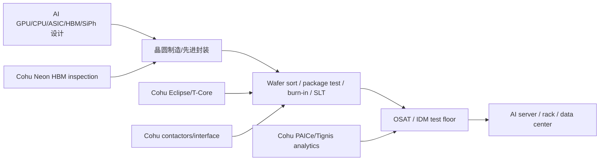

# 公司：AEHR - Aehr Test Systems, Inc. 全面尽调

> 报告日期：2026-05-10（美国周末，股价采用 2026-05-08 美股收盘）。  
> 研究口径：公开财报、SEC 文件、公司新闻稿、最近半年订单公告、项目内非“公司调研”目录的 AI 测试/硅光/光互联/AI 数据中心产业链资料。本文不是投资建议。  
> 关键限制：AEHR 不披露按 AI/非 AI、Sonoma/FOX、WLBI/PLBI 的完整收入拆分；文中产品级收入、利润率、单位含量和情景预测为基于披露订单、交期、历史毛利和行业 BOM 的研究估算。

## 1. 公司整体业务与投资人认知

### 1.1 一句话结论

AEHR 是一家小型半导体可靠性测试和 burn-in 设备公司，核心不是通用 ATE，而是把高价值芯片在晶圆级、裸 die、封装件阶段做长时间高温/高功率可靠性筛选。过去投资人主要把它看成 **SiC 电动车功率半导体 burn-in 设备商**；2024-2026 年故事转为 **AI 加速器、hyperscaler 自研 ASIC、硅光/optical I/O 的高功率 WLBI/PLBI 瓶颈设备商**。

### 1.2 公司卖什么

| 产品/平台 | 形态 | 主要应用 | 投资相关性 |
|---|---|---|---|
| `FOX-XP` / `FOX-NP` | 多晶圆、裸 die/module 的 wafer-level burn-in/test 系统 | AI processor WLBI、硅光 IC、SiC/GaN、存储/HDD 相关器件 | 最高壁垒在 full-wafer contact、并行度、高功率和 WaferPak 生态 |
| `WaferPak` contactor / AutoAligner | 专有 full-wafer contactor、自动对准 | 300mm 晶圆级高并行 burn-in | 耗材属性强，毛利和客户锁定通常高于主机 |
| `DiePak` carrier / loader | 裸 die/module 并行测试载具 | KGD、module/bare die screening | 适合 chiplet/KGD 趋势，但披露较少 |
| `Sonoma` / `Tahoe` | 通过 Incal 收购获得的 packaged-part burn-in 系统 | AI accelerator/GPU/HPC processor PLBI/HTOL | 2026 年订单爆发的核心，已拿到 hyperscaler 自研 AI ASIC 量产订单 |
| 服务、升级、备件 | 升级、自动化、维护 | 已装机客户 | 收入稳定性较好，但单独披露有限 |

### 1.3 最近 3 年重大变化

1. **2023-2024：从 SiC 高增长进入 SiC/EV 去库存冲击。** FY2024 公司收入 $66.2M，利润受一次性税项影响很强；FY2025 收入降至 $59.0M，核心原因是 SiC/EV 需求走弱、客户下单时点拉长。
2. **2024-07/08：收购 Incal Technology，切入 package-level AI burn-in。** 交易价格约 $21M，其中 $14M 现金、$7M 股票。Incal 的 Sonoma/Tahoe 平台把 AEHR 从“晶圆级 FOX/WaferPak”扩到“封装件 PLBI”，直接覆盖 GPU、AI accelerator、HPC processor 的高功率 HTOL/生产 burn-in。
3. **FY2025：扩大 TAM，降低 SiC 单点依赖。** 公司在 FY2025 报告中明确从 SiC 走向 AI processors、GaN、data storage、silicon photonics optical chip-to-chip communication、flash memory 等新市场。
4. **FY2026：订单结构发生质变。** 2026-02 至 2026-04，公司连续披露 AI WLBI、Sonoma PLBI、硅光 WLBI 订单；2026-04-16 披露史上最大 $41M hyperscale AI PLBI 订单，使 FY2026 下半财年 bookings 已超过 $92M。

### 1.4 产业链位置

AEHR 处在 **AI 芯片/硅光器件量产前的可靠性测试设备层**，客户通常是：

- hyperscaler 自研 AI ASIC 供应链中的 test house / OSAT / IDM；
- AI processor 供应商、封装厂、硅光 PIC/光模块供应商；
- SiC/GaN 功率半导体厂、HDD/storage 器件厂、flash memory 厂。

它不直接进入数据中心 BOM，但会被摊入每颗 AI ASIC/GPU、每只硅光收发器、每个 optical engine 的制造/可靠性成本。价值链传导是：

`Hyperscaler AI capex -> AI ASIC/GPU/HBM/光模块需求 -> OSAT/IDM/test house 测试产能 -> AEHR 主机 + WaferPak/BIM/socket 耗材 -> 每颗芯片/每个 optical port 的可靠性成本`

### 1.5 最新市场与财务指标

| 指标 | 最新值 | 日期/口径 | 判断 |
|---|---:|---|---|
| 股价 | $97.23 | 2026-05-08 收盘 | 2026 年 4 月订单后暴涨，估值已高度反映 FY2027 增长预期 |
| 盘后价 | $99.99 | 2026-05-08 盘后 | 周末前最后可见交易价 |
| 市值 | $3.06B | 2026-05-08 / StockAnalysis | 对 TTM 收入 $45.26M，估值极高 |
| TTM 收入 | $45.26M | 截至 2026-02-27 TTM | 同比 -26.4%，但订单已领先收入反转 |
| TTM PE | 不适用 | TTM 净亏损 $11.42M | 当前不应看 trailing PE |
| Forward PE | 约 1,570.7x | 第三方聚合，2026-05-08 | 由于 FY2026/FY2027 EPS 基数极小，数值参考意义弱 |
| PS / Forward PS | 67.6x / 37.7x | 第三方聚合，2026-05-08 | 若 FY2027 收入到 $150M，市值/收入仍约 20x |
| TTM 毛利率 | 30.7% | 截至 2026-02-27 TTM | 受 PLBI 低毛利 mix、产能扩张、保修/运费/关税影响 |
| TTM 净利率 | -25.2% | 截至 2026-02-27 TTM | 低收入规模下固定费用压力大 |
| FY2026 最新指引 | 2H FY26 收入 $25-30M，non-GAAP EPS -$0.09 至 -$0.05 | 2026-04-07 重申 | Q3 已实现 $10.3M，Q4 隐含 $14.7-19.7M |
| FY2026 管理层倾向 | 全年收入接近 $45-50M 高端；2H bookings 高端后续被 $92M+ 打破 | 2026-04-07 / 2026-04-16 | bookings 已显著超原指引 |

### 1.6 资产负债表健康程度

截至 2026-02-27，资产负债表很轻，短期偿债风险低，但库存和收入确认节奏需要盯紧。

| 项目 | 数字 | 判断 |
|---|---:|---|
| 现金及等价物 | $36.9M，含限制性现金新闻稿口径 $37.1M | 足以覆盖短期亏损和扩产 |
| 总流动资产 | $95.9M | 大幅高于流动负债 |
| 存货 | $41.2M | 接近 TTM 收入，反映为订单和扩产备货，但若订单延迟会压现金 |
| 流动负债 | $8.7M | 很低 |
| 总债务 | $10.0M，主要为租赁 | 金融债务压力低 |
| 净现金 | $26.9M | 正净现金 |
| current ratio / quick ratio | 10.97 / 5.79 | 短债健康 |
| FY26 前九个月经营现金流 | -$5.1M | 亏损和营运资本仍消耗现金 |
| FY26 前九个月融资现金流 | +$19.4M | 主要来自 ATM 发股 $19.6M，存在稀释但改善现金 |

健康度评估：**短期健康，经营质量处在订单向收入转换前夜。** 真正风险不是破产，而是 1. 高估值下订单/验收延迟；2. PLBI mix 使毛利率低于投资人预期；3. 大客户集中和发股稀释。

## 2. 最近五次财报对比

> 注：公司未披露完整产品线收入，AI/data center 收入占比为根据订单描述、收入地区/产品变化、管理层措辞估算。

| 财报 | 报告日 | 收入 / YoY | 毛利率 | GAAP 净利润 | Non-GAAP 净利润 | Bookings / B2B | Backlog / 有效 backlog | 订单与交期 | 业务与 AI/data center 判断 |
|---|---:|---:|---:|---:|---:|---:|---:|---|---|
| FY26 Q3，至 2026-02-27 | 2026-04-07 | $10.3M / -44% | 32.7% | -$3.2M | -$1.5M | $37.2M / >3.5x | $38.7M / $50.9M | Q3 内 $14M AI processor WLBI；Q3 后硅光订单；交付多在 6 个月或 FY26 Q4/2H CY26 | 订单强于收入。AI processor PLBI、AI WLBI、硅光成为主线；估算 AI/DC 收入 50-65%，AI/DC bookings 70%+ |
| FY26 Q2，至 2025-11-28 | 2026-01-08 | $9.9M / -27% | 25.7% | -$3.2M | -$1.3M | $6.2M / 0.63x | $11.8M / $18.3M | 公司恢复 2H bookings $60-80M 预期；Q3-to-date Sonoma 订单已超 Q2 | 收入疲软但 pipeline 明显改善；PLBI mix 压毛利；估算 AI/DC 收入 40-55% |
| FY26 Q1，至 2025-08-29 | 2025-10-06 | $11.0M / -16% | 33.9% | -$2.1M | +$0.2M | $11.4M / 1.04x | $15.5M / $17.5M | Lead hyperscaler 追加 Sonoma；AI processor WLBI production showcase；硅光 3.5kW/wafer 升级 | 从 SiC 向 AI/硅光/存储切换；估算 AI/DC 收入 45-60% |
| FY25 Q4，至 2025-05-30 | 2025-07-08 | $14.1M / -15% | 30.3% | -$2.9M | -$0.2M | $11.1M / 0.79x | $15.2M / $16.3M | 不给明确 FY26 指引；称 tariff 和订单时点不确定 | 战略转型明确：AI WLBI、PLBI、GaN、HDD、硅光、flash；AI/DC 收入估算 35-50% |
| FY25 Q3，至 2025-02-28 | 2025-04-08 | $18.3M / 未列全口径，较 FY26 Q3高 | 39.2% | -$0.6M | +$2.0M | $24.1M / 1.32x | $18.2M / $21.8M | bookings solid；SiC 已不再是唯一主线 | FY25 仍在从 SiC 高集中转多元化；AI/DC 占比估算 25-40% |

重要观察：

- Q2 是谷底，Q3 订单已经反转，Q4 之后的核心是 backlog 转收入。
- Q3 毛利率只有 32.7%，不是传统 FOX/WaferPak 高毛利状态；10-Q 指出毛利率下降来自 mix 转向 package-level burn-in、组装和保修成本、运费与关税。
- Q3 后 $41M 大单没有体现在 Q3 backlog 中；若把 $50.9M 有效 backlog 加上 $41M，粗略有效 backlog 可达 **$90M+**，但其中部分 FY26 Q4 订单可能已在 2026-05-10 前出货或进入验收。

## 3. FY2026 最新指引、业务占比与重点产品

### 3.1 指引拆解

截至最新一次财报，AEHR 指引 FY2026 下半财年收入 $25-30M。Q3 已实现 $10.3M，因此 Q4 隐含收入为：

| 口径 | Q4 FY26 隐含收入 | 全年 FY26 收入 |
|---|---:|---:|
| 低端 | $14.7M | $45.9M |
| 高端 | $19.7M | $50.9M |
| 管理层措辞 | 高端 | 接近 $45-50M 高端 |

真正更重要的是 bookings：Q2 时公司说 2H FY26 bookings $60-80M；Q3 后 2026-04-16 公司披露下半财年 bookings 已 **超过 $92M**，且当时 Q4 还剩约 6 周。

### 3.2 FY2026 收入结构估算

| 业务 | FY26 前九个月估算收入 | FY26 收入占比估算 | 增长/变化 | 重要性 |
|---|---:|---:|---|---|
| Sonoma/Tahoe PLBI + BIM/socket | $8-12M | 25-38% | 从 Incal 收购后快速爬坡；Q3 之后新增 $41M 大单 | 最高增量，决定 FY2027 斜率 |
| FOX-XP/FOX-NP WLBI + WaferPak/AutoAligner，AI processor | $8-14M | 25-45% | 2026-02 $14M 订单，6 个月交付；OSAT showcase 与 benchmark eval | 高壁垒，高毛利潜力 |
| FOX-XP/FOX-NP WLBI，silicon photonics / optical I/O | $4-8M | 13-25% | 2026-03 lead customer follow-on + 新大客户 HVM 订单 | 小基数高弹性，AI 光互联绑定 |
| SiC/GaN power semiconductor WLBI | $2-5M | 6-15% | SiC 受 EV 疲软影响；GaN 有 data center power 期权 | 非主线，作为可选弹性 |
| HDD/flash/storage、service/other | $3-6M | 10-20% | HDD/flash 有 AI storage 逻辑，但订单可见度低于 AI ASIC/硅光 | 小业务，不应完全忽略 |

### 3.3 跳过或降权业务

- **传统 mobile sensor、成熟逻辑、低端 service**：增长慢、披露少、对 FY2027 估值解释力低。
- **EV 相关 SiC**：AEHR 曾是 SiC 逻辑强标的，但 2025-2026 EV/SiC 客户订单转弱，目前不应作为主投资主线。
- **非 AI 的普通 packaged-part burn-in**：Incal 平台的溢价来自 ultra-high-power AI processor，不来自普通老化箱。

### 3.4 重点产品清单

1. **Sonoma ultra-high-power PLBI 系统 + BIM + device-specific sockets**  
   2026-04-16 $41M 订单直接验证；订单来自 lead hyperscale customer 的 custom AI processor ASIC，支持 data center training/inference。

2. **FOX-XP fully automated WLBI for AI processors + WaferPak + AutoAligner**  
   2026-02-26 $14M 订单；每套配置可测 9 片 300mm wafer，并配套 full-wafer contactor 和自动对准。

3. **High-power FOX-XP/FOX-NP for silicon photonics / optical I/O**  
   2026-03-03 follow-on order：每套可测 9 片 300mm wafer，最高 3.5kW/wafer；2026-03-31 新增 networking/optical transceiver major customer，直接连接 hyperscale AI data center 光互联。

4. **WaferPak / BIM / socket 耗材**  
   主机订单之后的持续收入来源。AI processor 和硅光器件每一代设计都需要定制 contactor、BIM、socket，客户切换成本高。

5. **GaN/SiC / flash / HDD WLBI 小业务**  
   不作为短线估值核心，但在 data center power、AI storage、NAND WLBI 若验证成功时可能成为第二层增长曲线。

## 4. 当前关键产品贡献、增速、紧缺与垄断力

评分 1-10，越高越乐观。

| 产品/业务 | 当前收入贡献估算 | 当前增长 | AI 基建重要性 | 时间紧急性 | 供需紧张 | 垄断/溢价能力 | 交叉验证 |
|---|---:|---|---:|---:|---:|---:|---|
| Sonoma PLBI for hyperscaler AI ASIC | FY26 收入 $8-12M；已披露未交付/未来交付订单至少 $41M | 从小基数爆发，Q3 后最大订单 | 9 | 9 | 8 | 7.5 | 2026-04 $41M；lead customer current gen 已 ramp，next-gen production win |
| FOX-XP AI processor WLBI | FY26 收入 $8-14M；2026-02 $14M 订单 | +100% 级别潜力 | 8.5 | 8 | 7.5 | 8.5 | 公司称已交付全球首个 production WLBI for AI processors，并与顶级 OSAT 展示 |
| Silicon photonics WLBI | FY26 收入 $4-8M；订单/forecast 可见 | 高增长小基数 | 8 | 8 | 7.5 | 8 | 3.5kW/wafer、9 wafers parallel；lead customer + 新大客户 |
| WaferPak/BIM/socket 耗材 | FY26 收入嵌入主线，估计 $6-10M | 随装机基数递增 | 8 | 8 | 7 | 8.5 | device-specific，换代/NPI 和产能扩张都拉动重复采购 |
| GaN/SiC/data-center power WLBI | FY26 收入 $2-5M | SiC 低迷，GaN 早期 | 5.5 | 5 | 5 | 6 | GaN 首个量产订单、SiC EV softness 抵消 |
| HDD/flash/storage WLBI | FY26 收入 $2-4M | 早期恢复 | 5 | 5 | 4.5 | 5.5 | HDD lead customer、flash memory 供应商验证，但披露订单少 |

## 5. 一年后产品收入贡献预测

假设 FY2026 收入约 $48-51M，FY2027 是订单转收入第一年。

| 产品/业务 | 基准：一年后收入贡献 | 乐观：一年后收入贡献 | 极度乐观：一年后收入贡献 | 收入增速 | 重要性/紧急性/紧缺/垄断变化 |
|---|---:|---:|---:|---|---|
| Sonoma PLBI | $60-80M | $100-140M | $180-240M | +5-15x | 基准已由 $41M 大单支撑；乐观需要 lead hyperscaler next-gen + current-gen 并行；极度乐观需要第二/第三 hyperscaler 或 OSAT 大规模复制 |
| FOX-XP AI processor WLBI | $30-45M | $50-70M | $80-120M | +2-8x | 若更多 AI processor 供应商采用 WLBI 前移，WaferPak 和 AutoAligner 会成为高毛利瓶颈 |
| Silicon photonics WLBI | $20-30M | $35-60M | $70-100M | +3-12x | 1.6T/optical I/O/CPO 量产验证顺利时，3.5kW/wafer 能力成为差异化 |
| WaferPak/BIM/socket 耗材 | $15-25M | $30-45M | $50-80M | +2-8x | 装机基数越大，耗材占比越高，毛利和可预测性上升 |
| GaN/SiC/power WLBI | $8-15M | $15-25M | $30-50M | 0-8x | 乐观依赖 data center power GaN/SiC 而非 EV SiC 复苏 |
| HDD/flash/storage WLBI | $5-10M | $10-18M | $20-35M | +1-6x | NAND/AI storage 若量产验证成功，才会成为第二曲线 |

公司 FY2027 收入情景：

| 情景 | FY2027 收入 | YoY vs FY2026 高端 $50M | 关键假设 |
|---|---:|---:|---|
| 基准 | $110-140M | +120-180% | $92M+ 2H FY26 bookings 大部分转收入；lead hyperscaler Sonoma 顺利出货；硅光和 AI WLBI 继续追加 |
| 乐观 | $160-220M | +220-340% | Sonoma 第二波订单、AI WLBI 多客户转量产、硅光新客户 HVM 扩产 |
| 极度乐观 | $280-380M | +460-660% | 新合同制造产能快速爬满，多个 hyperscaler/OSAT 并行下单，耗材收入占比抬升且验收顺利 |

## 6. BOM、单位含量、价格传导、产能与认证

### 6.1 当前 BOM/单位含量

| 产品 | AEHR 设备单元 BOM/价值构成 | 每 GPU/ASIC 内容量 | 每 rack / 每 MW 内容量 | 每 optical port 内容量 | 当前产能与认证 |
|---|---|---:|---:|---:|---|
| Sonoma PLBI | 高功率 burn-in chassis、power delivery/load board、thermal chamber/control、BIM、device-specific socket、loader/unloader、软件 | 估算 $30-150/颗 AI ASIC/GPU，主要来自设备折旧 + BIM/socket 消耗；高功率/长 burn-in 可更高 | 72 颗/rack 约 $2k-11k；按 7-10 racks/MW 约 $15k-110k/MW | 不适用 | lead hyperscaler current-gen 量产；next-gen 已 production win；$41M 订单；新合同制造设施宣称额外 >20 Sonoma systems/月 |
| FOX-XP AI processor WLBI | 9-wafer FOX-XP、WaferPak full-wafer contactor、AutoAligner、高电流供电/热控、软件 | 估算 $10-60/合格 die；若 WLBI 替代后段报废，ROI 很高 | 72 颗/rack 约 $0.7k-4k；每 MW 约 $5k-40k | 不适用 | lead AI processor customer 量产订单；顶级 OSAT installed showcase；top-tier AI supplier paid evaluation |
| Silicon photonics WLBI | 高功率 FOX-XP/FOX-NP、3.5kW/wafer power、WaferPak、AutoAligner、温控/老化 | 对 AI XPU 间接：通过光模块/optical I/O | 每 AI rack 视光模块数量约 $50-500；每 MW 约 $0.5k-5k | 估算 $0.1-1.5/100G/200G lane，或 $1-10/800G-1.6T module；CPO engine 可 $2-20 | lead SiPh customer production；新 networking/optical transceiver 大客户一次性购买 qualification + HVM 系统；客户 forecast 后续订单 |
| WaferPak/BIM/socket | 专有 contactor、BIM、socket、载具、校准/维修 | 随产品换代和 socket 寿命重复采购；每颗 $10-100+ | 随以上主线累加 | 光器件 per module/port 小额但高重复 | device-specific，客户切换需要重做 correlation/可靠性 |
| GaN/SiC WLBI | FOX 系统 + 高压/高温 WaferPak | 对 data center power 半导体为间接含量，单颗通常 cents-$级 | 每 MW 数据中心电力设备含量极低但可靠性高 | 不适用 | GaN 首个量产订单；SiC 客户需求仍偏弱 |

### 6.2 价格传导链

| 环节 | 价格传导方式 |
|---|---|
| AI ASIC/GPU | 高价值 2.5D/HBM package 报废成本极高，客户愿为更早 WLBI/PLBI 付费；AEHR 的设备成本占芯片 ASP 很低，但能降低 field failure 和整柜 burn-in 风险 |
| 硅光/optical I/O | 1.6T、CPO、optical engine 的良率和可靠性决定模块交期；测试/burn-in 占模块 BOM 约 10-18%，AEHR 只拿其中一小部分，但如果成为并行 WLBI 标准，弹性很高 |
| OSAT/test house | 大客户锁产能时，测试设备和耗材通过长期采购、NRE、产线认证传导；设备商收入领先终端量产 1-3 个季度 |
| 耗材 | WaferPak、BIM、socket 与具体器件绑定，一旦进入量产线，重复订单和维护收入提高毛利稳定性 |

### 6.3 当前产能能力（美元计）

官方披露的硬产能锚点是：Fremont 扩建完成，新增 power/cooling/clean-room manufacturing space；新升级合同制造设施具备 **额外每月超过 20 台 Sonoma 系统** 的全球产能。

| 产能口径 | 保守估算 | 乐观估算 | 说明 |
|---|---:|---:|---|
| Sonoma 合同制造新增产能 | $15-25M/月 | $25-40M/月 | 假设每套系统 + BIM/socket 价值 $0.8-2.0M；订单 mix 差异很大 |
| 年化 Sonoma 可交付收入 | $180-300M | $300-480M | 这是物理产能，不等于订单/验收收入 |
| FOX/WaferPak 产能 | $50-100M/年 | $100-180M/年 | 取决于 WaferPak/contactors 和高功率配置比例 |
| 公司 FY2027 综合收入承载 | $110-220M 较可兑现 | $280M+ 需要极强订单与验收 | 当前组织规模 136 人，扩张执行是关键风险 |

## 7. 一年后产能、采纳程度与认证阶段

| 产品 | 基准：一年后 | 乐观：一年后 | 极度乐观：一年后 |
|---|---|---|---|
| Sonoma PLBI | 年收入承载 $150-220M；lead hyperscaler current-gen + next-gen 量产；1-2 家 test house 扩线 | $250-350M；第二 hyperscaler/AI ASIC 公司导入；BIM/socket 重复收入明显 | $450M+ 物理产能被预订；多个 hyperscaler 自研 ASIC 同时拉货，产能紧缺 |
| FOX-XP AI WLBI | 年收入承载 $50-80M；lead customer 加单，top-tier supplier evaluation 转 production eval | $90-140M；OSAT turnkey solution 成为更多 AI supplier 入口 | $180M+；WLBI 成为高端 AI accelerator CoWoS 前默认筛选之一 |
| Silicon photonics WLBI | 年收入承载 $40-70M；lead customer + 新大客户 HVM；3.5kW/wafer 成为高功率 SiPh 标杆 | $80-130M；多家 1.6T/optical I/O 供应商跟进 | $180M+；CPO/optical I/O 提前放量，测试成为产能上限 |
| WaferPak/BIM/socket | $25-40M；随装机基数稳定增长 | $50-80M；耗材收入占比快速提升 | $100M+；多平台、多器件设计每代换型，形成高毛利 annuity |
| GaN/SiC/storage WLBI | $15-25M | $30-50M | $70M+，需要 GaN data-center power 或 flash WLBI 取得量产突破 |

## 8. 订单积压、供给与未来一年增速

### 8.1 真实订单/交付窗口

| 日期 | 订单/事件 | 金额 | 交付窗口 | 对 backlog 的含义 |
|---|---|---:|---|---|
| 2026-01-08 | Sonoma Q3-to-date 多客户订单 | >$5.5M | FY26 Q3 及以后 | 说明 Q2 后 PLBI 订单回暖 |
| 2026-02-11 | lead hyperscaler next-gen AI ASIC Sonoma 初始 production order | 未披露 | 2026 年夏季 | next-gen 高功率器件生产资格获得 |
| 2026-02-26 | lead AI processor customer FOX-XP WLBI 订单 | $14M | 6 个月内 | AI processor WLBI 进入扩产 |
| 2026-03-03 | lead silicon photonics customer follow-on | 未披露 | 2026 年下半年 | 一套新 high-power FOX-XP + 一套升级，3.5kW/wafer |
| 2026-03-31 | 新 major networking/optical transceiver customer | 未披露 | FY26 Q4 | 一次购买 qualification + HVM 系统，验证新客户 |
| 2026-04-07 | FY26 Q3 bookings | $37.2M | 多数未来几个季度 | B2B >3.5x，backlog $38.7M，有效 backlog $50.9M |
| 2026-04-16 | lead hyperscaler $41M PLBI follow-on | $41M | FY2027 起 | 史上最大订单，2H FY26 bookings >$92M |

### 8.2 增速预测：订单与产能共同约束

| 情景 | 订单假设 | 供给假设 | 取消率/延迟 | 未来一年收入增速 |
|---|---|---|---|---:|
| 基准 | $92M+ 2H bookings 中 75-85% 在 FY2027 确认；新增 bookings $50-90M | Sonoma 新产能逐季爬坡，FOX 扩产平稳 | device-specific 订单取消率低，但验收/客户产线延迟 10-20% | +120-180% |
| 乐观 | lead hyperscaler 再追加 $50M+；AI WLBI 和 SiPh 各新增 2-3 个量产订单 | 合同制造 20+/月可用，WaferPak/BIM 供应跟上 | 延迟 5-10%，无重大取消 | +220-340% |
| 极度乐观 | 多个 hyperscaler 自研 ASIC 同时进入 PLBI，CPO/SiPh 提前放量，FY2027 bookings $300M+ | 产能被客户预订，耗材供应同步扩 | 取消率 <5%，客户预付款锁产能 | +460-660% |

我的判断：**基准 $110-140M 最有可解释性；乐观 $160-220M 需要 Q4/FY27 初继续出现大单；极度乐观需要第二个 hyperscaler 级别 Sonoma 客户或硅光订单从“系统订单”升级为“产线复制”。**

## 9. 竞争格局、替代路径与风险

### 9.1 竞争对手

| 细分 | 主要竞争/替代者 | AEHR 相对优势 | 主要风险 |
|---|---|---|---|
| AI/HPC PLBI/HTOL | Micro Control、ESPEC、Thermotron、Chroma、Cohu、Advantest、OSAT/客户自研治具 | Sonoma high-power、Incal installed base、hyperscaler production reference | 传统 chamber/HTOL 厂商可在低功率或标准化需求中替代；大客户可能内制 |
| AI processor WLBI | 传统 wafer sort + package burn-in 替代、Advantest/Teradyne ATE + probe/prober 生态、OSAT internal solution | FOX/WaferPak full-wafer contact、9-wafer 并行、高功率、高电流；公司称率先量产 AI processor WLBI | WLBI 不一定成为所有 AI 芯片标准流程；良率提高后客户可能减少 burn-in |
| Silicon photonics WLBI | Keysight/VIAVI/Anritsu/Tektronix 光测试、FormFactor/MPI/SUSS probe、模块厂自有 burn-in | 高并行 WLBI + 3.5kW/wafer，提前发现 early-life failures | 光模块厂可能使用 package/module-level reliability flow；CPO 标准变化 |
| SiC/GaN WLBI | Chroma、Cohu、功率半导体自有 burn-in、传统高压测试平台 | SiC 历史装机和 WaferPak know-how | EV SiC 周期弱；GaN 客户分散 |
| 耗材 contactor/socket/BIM | Cohu、Yamaichi、Smiths、Enplas、Leeno、WinWay、客户自研 | WaferPak/BIM 与系统绑定，认证粘性强 | 耗材寿命延长、第二来源要求、客户议价 |

### 9.2 新技术是否是主流

- **PLBI for AI ASIC：更确定。** AI ASIC/GPU 功耗、HBM/2.5D 价值、field failure 成本都在上升；package-level HTOL/production burn-in 很可能成为 hyperscaler 自研芯片量产必需项。
- **WLBI for AI processor：赔率高但需要客户复制。** 它的经济逻辑很强：越早筛掉坏 die，越能避免昂贵封装报废。但每个芯片设计、功耗、晶圆 probe strategy 都不同，推广速度取决于 correlation 和 OSAT 流程接受度。
- **Silicon photonics WLBI：小基数高弹性。** 项目内光互联资料显示 1.6T、CPO/CPX、optical I/O 都把测试/burn-in 变成瓶颈；AEHR 的高功率 9-wafer 并行能力有机会成为特定 SiPh 客户的生产工具。

### 9.3 客户替换成本

替换成本高，原因包括：

- WaferPak/BIM/socket 是 device-specific，需要重做机械、电气、热、可靠性 correlation；
- burn-in 条件和客户良率/field failure 数据强绑定；
- 一旦进 OSAT 量产线，切换会影响客户 NPI 和出货窗口；
- hyperscaler AI ASIC 的数据安全和供应链审查会拉长认证周期。

但替换并非不可能：如果客户采用 package-level 替代 wafer-level、或者将 HTOL/burn-in 交给既有 chamber/test house，AEHR 的增量份额会被压缩。

## 10. 核心风险清单

1. **估值风险最大。** 以 $3B 市值对应 TTM $45M 收入，市场已经在定价 FY2027 大增长。
2. **大客户集中且客户匿名。** $41M 订单来自 lead hyperscale customer；若该 ASIC 项目延迟，影响会很大。
3. **收入确认/验收不等于 bookings。** 高功率系统需要客户现场安装、验收、良率 correlation，订单转收入可能滞后。
4. **毛利率可能低于牛市想象。** Q3 毛利率只有 32.7%，公司明确 PLBI mix 低于 WLBI、且有保修/运费/关税压力。
5. **扩产执行。** 20+ Sonoma systems/月是物理能力声明，真正还要看供应链、工程师、测试、客户 acceptance。
6. **技术路线替代。** 客户可能选择更多 package-level burn-in、系统级 burn-in、或 ATE/handler/SLT 替代 WLBI。
7. **SiC/GaN 复苏不确定。** 传统 SiC 仍受 EV 周期压制。
8. **稀释。** FY26 前九个月 ATM 净融资 $19.6M，增长期可能继续用股权融资。

## 11. 投资结论

AEHR 现在不是一个普通“便宜设备股”，而是一个 **订单验证很强、收入基数很小、估值极高、弹性极大** 的 AI 基建测试瓶颈标的。  

最强事实是：FY26 Q3 bookings $37.2M、B2B >3.5x、有效 backlog $50.9M；随后 $41M 史上最大 hyperscaler AI PLBI 订单把 2H bookings 推到 $92M+。这说明公司已经跨过“是否有 AI 订单”的第一道门槛。

接下来 2-4 个季度要验证的是：

1. $92M+ bookings 能否按期转收入；
2. Sonoma PLBI 毛利率能否随着规模和耗材占比回到 40%+；
3. lead hyperscaler 之外是否出现第二个大 AI ASIC 客户；
4. 硅光订单是否从单套系统/qualification 变成多产线复制；
5. FY2027 是否给出 $100M+ 甚至 $150M+ 收入框架。

若只看公司披露的订单，FY2027 收入翻倍以上并不激进；若市场继续用 $3B+ 市值给它定价，则必须相信 FY2027-FY2028 能从小型设备公司跃迁到 $200M-$300M+ 收入、45%+ 毛利率、持续正现金流的 AI reliability test 平台公司。

## 主要来源

- Aehr FY26 Q3 财报与 10-Q：<https://www.sec.gov/Archives/edgar/data/1040470/000165495426003310/aehr_ex991.htm>，<https://www.sec.gov/Archives/edgar/data/1040470/000165495426003348/aehr_10q.htm>
- 2026-04-16 $41M hyperscaler AI PLBI 订单：<https://www.aehr.com/2026/04/aehr-receives-record-41-million-production-order-from-lead-hyperscale-ai-customer-second-half-bookings-exceed-92-million/>
- 2026-03-31 硅光新客户订单：<https://www.aehr.com/2026/03/aehr-wins-major-new-silicon-photonics-customer-with-high-power-fox-xp-wafer-level-burn-in-system-for-hyperscale-data-center-optical-interconnect-market/>
- 2026-03-03 硅光 follow-on 订单：<https://www.aehr.com/2026/03/aehr-receives-follow-on-order-for-fully-automated-wafer-level-burn-in-systems-powering-ai-optical-i-o-and-data-center-interconnects/>
- 2026-02-26 $14M AI processor WLBI 订单：<https://www.aehr.com/2026/02/aehr-receives-14-million-order-from-lead-ai-processor-customer-for-multiple-new-fully-automated-fox-xp-wafer-level-burn-in-systems/>
- 2026-02-11 next-gen hyperscaler AI ASIC Sonoma win：<https://www.aehr.com/2026/02/aehr-secures-key-ai-production-burn-in-win-with-initial-order-of-sonoma-systems-for-lead-hyperscale-customers-next-generation-ai-asic-processors/>
- FY26 Q2、Q1、FY25 Q4 财报：<https://www.aehr.com/2026/01/aehr-test-systems-reports-fiscal-2026-second-quarter-financial-results-and-reinstates-guidance-driven-by-improved-visibility-for-ai-processor-and-data-center-semiconductor-test-and-burn-in-systems/>，<https://www.aehr.com/2025/10/aehr-test-systems-reports-fiscal-2026-first-quarter-financial-results/>，<https://www.sec.gov/Archives/edgar/data/1040470/000165495425007859/aehrex991.htm>
- Incal 收购 8-K 与新闻稿：<https://www.sec.gov/Archives/edgar/data/1040470/000165495424009808/aehr_8k.htm>，<https://www.aehr.com/2024/07/aehr-test-systems-completes-acquisition-of-incal-technology/>
- StockAnalysis 市场和财务数据：<https://stockanalysis.com/stocks/aehr/>，<https://stockanalysis.com/stocks/aehr/statistics/>，<https://stockanalysis.com/stocks/aehr/financials/>，<https://stockanalysis.com/stocks/aehr/financials/balance-sheet/>
- 项目内参考资料（未使用“公司调研”目录）：`D:\drive\Investment\工作台v5\行业调研_晶圆制造_设备_材料_测试\行业调研_探针卡_ATE与系统级测试_2026-05-08.md`；`D:\drive\Investment\工作台v5\行业调研_晶圆制造_设备_材料_测试\行业调研_硅光材料_光子材料与电光聚合物_2026-05-08.md`；`D:\drive\Investment\工作台v5\行业调研_AI网络_光互联_铜互联\行业调研_封装内光IO与Optical_Chiplet_2026-05-08.md`；`D:\drive\Investment\工作台v5\AI数据中心建设规模与产业链订单映射_2026-2027_美国.md`


# 公司：AMKR Amkor Technology, Inc. 全面尽调

撰写日期：2026-05-10  
股票：AMKR / Nasdaq  
公司：Amkor Technology, Inc.  
口径说明：本文只读取项目内非“公司调研”目录的行业资料，并结合 Amkor 官方财报、SEC 文件、电话会、技术页面、市场数据和近半年 AI/先进封装/光互联行业资料；未参考 `工作台v5/公司调研` 目录下任何既有公司报告。所有未披露的 backlog、AI 数据中心收入、产品毛利率和单机价值量均为估算，表内标明“估算/推断”。

## 1. 公司整体业务、定位与市场看法

Amkor 是全球头部 OSAT（outsourced semiconductor assembly and test，外包半导体封装测试）公司之一，也是少数美国总部、全球多地量产的高端封测平台。它不设计芯片、不做前道晶圆制造，客户把晶圆、裸 die、部分关键材料交给 Amkor，Amkor完成封装、组装、系统级测试、burn-in、可靠性验证，再把成品交回给 fabless、IDM、系统厂或代工生态。公司只有一个报告分部，但按产品分为 Advanced products 和 Mainstream products。

**产业链位置：**  
AI GPU/ASIC/CPU 的上游是 TSMC/Samsung/Intel 等晶圆厂、SK hynix/Samsung/Micron HBM、ABF/中介层/材料/设备；中游是 CoWoS/2.5D/HDFO/SiP/flip-chip/测试封装；下游是 NVIDIA、AMD、Broadcom、Apple、Qualcomm、云厂自研 ASIC、手机/汽车/消费电子客户。Amkor 正处在“先进封装与测试”环节，价值量小于 GPU/HBM/晶圆制造，但在高端 AI package 中具有交付瓶颈属性。

**投资人眼中的 AMKR：**

- 传统认知：周期性 OSAT，手机/通信客户集中度高，毛利率长期低于设备/EDA/晶圆代工，资本开支重，库存和利用率周期明显。
- 2025-2026 新认知：从“Apple/Qualcomm 手机封测链”被重新定价为“AI/HPC advanced packaging second-source / overflow / U.S. onshore capacity”标的。HDFO、2.5D、数据中心 CPU/ASIC、Korea test building、Arizona advanced packaging campus 是估值重估核心。
- 关键约束：最高端 CoWoS/SoIC 仍由 TSMC 主导；Amkor 的 AI 价值更多来自 HDFO/2.5D 外溢、测试、fan-out/bridge/interposer-like 路线、客户第二供应源，而不是完全替代 TSMC。

**过去 3 年重大业务变化：**

| 时间 | 事件 | 对投资判断的影响 |
|---|---:|---|
| 2023-2024 | 宣布/推进美国 Arizona Peoria 先进封装测试项目，初始投资口径约 $2B，后续在客户承诺和 CHIPS Act 支持下扩展。 | 把 Amkor 从亚洲 OSAT 变成美国本土 AI/先进封装战略产能选项。 |
| 2024-2025 | Vietnam 工厂爬坡、Korea 先进封装与测试扩产；Q4 2025 Vietnam 达到 break-even。 | 低成本 SiP/通信产能迁移，释放韩国/台湾/日本资源给高端项目。 |
| 2025 | HDFO 平台进入高量产窗口，管理层称 2026 年 2.5D + HDFO revenue 预计接近 tripling。 | AI/HPC 收入从样品/NRE 进入可见放量期。 |
| 2025-10 | Arizona 新园区动工，项目总投资被公开报道为两阶段最高约 $7B；Apple 和 NVIDIA 被列为初始/关键客户。 | 对 2028+ 收入意义更大，对 2026-2027 主要是 capex、客户锁定和估值期权。 |
| 2026-01 | Kevin Engel 接任 CEO；Giel Rutten 转任执行董事长。 | 交接发生在公司从周期复苏转向大 capex + AI 封装 ramp 的阶段。 |
| 2026 | Q1 2026 电话会披露：一个 HDFO data-center CPU program Q2 ramp，另外两个 data-center HDFO programs 处于 final qualification，Korea 新测试楼年底完工。 | 订单能见度从“故事”变成“客户项目+认证+产能楼+capex”的组合证据。 |

### 最新市场与估值数据

股价和估值采用最近一个交易日口径，因为 2026-05-10 是周日。StockAnalysis/Yahoo 数据显示 AMKR 在 2026-05-08 收盘价为 **$76.61**，52 周高低为 **$79.23 / $17.59-$17.79** 区间；StockAnalysis 2026-05-08 页面口径显示市值 **$18.99B**、企业价值 **$18.76B**。

| 指标 | 最新值 | 日期/口径 | 备注 |
|---|---:|---|---|
| 股价 | $76.61 | 2026-05-08 收盘 | Nasdaq，Yahoo/StockAnalysis 页面一致。 |
| 市值 | $18.99B | 2026-05-08 | 约 247.87M 股。 |
| PE / Forward PE | 44.06x / 33.96x | 2026-05-08 | 基于 TTM EPS $1.74 和 consensus forward EPS。 |
| PS / Forward PS | 2.69x / 2.42x | 2026-05-08 | TTM revenue $7.071B。 |
| TTM 收入 / 净利润 | $7.071B / $436M | TTM to 2026Q1 | TTM revenue 同比约 +12.7%；Q1 2026 revenue 同比 +27.5%。 |
| 毛利率 / 净利率 | 14.43% / 6.17% | TTM to 2026Q1 | Q1 2026 单季 GM 14.2%，net margin 4.9%。 |
| 现金+短投 | $1.849B | 2026-03-31 | 公司 Q1 2026 资产负债表。 |
| 公司口径总债务 | $1.414B | 2026-03-31 | current debt $157M + long-term debt $1.257B；不含部分租赁/其他口径。 |
| StockAnalysis 总债口径 | $1.617B | 2026-05-08 页面 | 对应 net cash $231M、debt/equity 0.35。 |
| 流动比率 / 速动比率 | 2.01x / 约 1.70x | 2026Q1 / StockAnalysis | 流动资产 $3.752B，流动负债 $1.867B。 |
| TTM OCF / CapEx / FCF | $1.217B / $1.049B / $167M | TTM to 2026Q1 | 2026 capex 指引 $2.5B-$3.0B，FCF 会承压。 |

**资产负债表评估：**  
财务健康度目前是“强流动性 + 净现金/低杠杆 + 大 capex 执行风险”。Q1 2026 现金和短投 $1.85B，流动比率约 2.0，短债压力低；但公司 2026 年 capex 指引高达 **$2.5B-$3.0B**，其中 **65%-70%** 是 facilities，主要用于 Arizona、Korea 和全球先进封装布局。这会让 2026-2027 FCF 低于会计利润，投资回报取决于 HDFO/2.5D/测试产能能否被客户按计划装载。

## 2. 最近五个季度财报与订单能见度

Amkor 不披露传统 backlog，也通常不披露 bookings、book-to-bill、lead time、取消率。公司商业模式里很多客户以短周期 forecast、capacity reservation、customer-funded tooling、材料 consignment 或 long-term loading plan 形式给需求，不能直接等同订单积压。因此下表的“订单/交期”分三层：披露事实、管理层表述、基于客户项目与产能建设的推断。

| 财报季度 | 收入与利润 | 产品收入拆分 | 终端市场拆分 | AI 数据中心相关收入估算 | 订单/交期/取消率判断 |
|---|---:|---:|---:|---:|---|
| 2026Q1，2026-04-27 发布 | Revenue **$1.685B**，YoY **+27.5%**；GM **14.2%**；OP margin **6.0%**；net income **$83M**；EPS **$0.33** | Advanced **$1.372B**（81.4%，YoY 约 +29%）；Mainstream **$313M**（18.6%，YoY 约 +21%）；Packaging 89%，Test 11% | Communications **44%**（约 $741M，YoY +40%+）；Computing **21%**（约 $354M）；Auto/Industrial **21%**；Consumer **14%** | 公司称 AI data center 创纪录；估算 **$160M-$220M**，约收入 **9%-13%**，主要在 computing/HDFO/2.5D/test | Q2 guide 中点 $1.80B，QoQ +6.8%，说明需求继续上行。管理层称客户材料延迟影响部分高端硅/内存，但被其他 demand loading 吸收；高端项目取消率低，主风险是材料/认证节奏。 |
| 2025Q4，2026-02-09 发布 | Revenue **$1.888B**，YoY **+15.9%**；GM **16.7%**；OP margin **9.8%**；net income **$172M**；EPS **$0.69** | Advanced **$1.580B**（83.7%）；Mainstream **$308M**；Packaging 89%，Test 11% | Communications **49%**（约 $925M）；Computing **19%**（约 $359M）；Auto/Industrial **18%**；Consumer **14%** | 估算 **$130M-$190M**，约 **7%-10%**；PC/传统 compute 仍混在 computing 中 | Q1 2026 guide 中点 $1.65B，季节性下行但 YoY 强；电话会给出 2026 HDFO/2.5D nearly triple，两个 HDFO DC programs final qualification，是最强订单线索。 |
| 2025Q3，2025-10-27 发布 | Revenue **$1.987B**，YoY **+6.7%**；GM **14.3%**；OP margin **8.0%**；net income **$127M**；EPS **$0.51** | Advanced **$1.684B**（84.8%）；Mainstream **$303M**；Packaging 89%，Test 11% | Communications **51%**（约 $1.013B）；Computing **19%**（约 $378M）；Auto/Industrial **16%**；Consumer **14%** | 估算 **$110M-$170M**，约 **6%-9%** | 典型旺季，Q4 guide 仍强；Q3 发布 CEO succession，同时披露 Arizona 动工和先进封装战略，说明客户项目还在拉动长期产能。 |
| 2025Q2，2025-07-28 发布 | Revenue **$1.511B**，YoY **+3.4%**；GM **12.0%**；OP margin **6.1%**；net income **$54M**；EPS **$0.22**；含 Nanium contingent consideration net benefit | Advanced **$1.228B**（81.3%）；Mainstream **$283M**；Packaging 89%，Test 11% | Communications **40%**；Computing **22%**；Auto/Industrial **20%**；Consumer **18%** | 估算 **$80M-$130M**，约 **5%-9%** | Q3 guide 中点 $1.925B，QoQ +27%，说明通信季节性和高端 computing demand 强反弹；无 backlog 披露。 |
| 2025Q1，2025-04-28 发布 | Revenue **$1.322B**，YoY **-3.2%**；GM **11.9%**；OP margin **2.4%**；net income **$21M**；EPS **$0.09** | Advanced **$1.064B**（80.5%）；Mainstream **$258M**；Packaging 88%，Test 12% | Communications **40%**；Computing **22%**；Auto/Industrial **21%**；Consumer **17%** | 估算 **$55M-$95M**，约 **4%-7%** | 低利用率季度；Q2 guide 中点 $1.500B，后续实际略超。AI/HPC 当时尚未充分进入收入表。 |

**五季结论：**

1. 收入低点在 2025Q1，随后连续三个季度恢复，2026Q1 在季节性淡季仍同比 +27.5%，说明周期复苏叠加 advanced mix。
2. Advanced products 占比稳定在 **80%-85%**，Mainstream 不是增长主轴。
3. Communications 仍是最大现金流来源，Q3-Q4 2025 占 49%-51%，但估值重估来自 computing 中的 AI data center 和 HDFO/2.5D。
4. 毛利率从 2025Q1 的 11.9% 回到 2026Q1 的 14.2%，Q4 2025 的 16.7% 有资产处置收益/高利用率因素，不宜外推为常态。
5. AI data center 收入未单列，但从“record AI data center revenue”“2.5D + HDFO nearly tripling”“HDFO data center CPU Q2 ramp”三组信号看，2026 年 AI/HPC 从低个位数占比向低双位数占比过渡。

## 3. 2026 最新指引、业务收入占比和产品映射

### 3.1 Q2 2026 指引与最新业务结构

Amkor Q1 2026 给出的 Q2 2026 指引如下：

| 指标 | Q2 2026 指引 | 解释 |
|---|---:|---|
| Revenue | **$1.75B-$1.85B**，中点 $1.80B | YoY 约 +19%，QoQ 约 +7%。 |
| Gross margin | **14.5%-15.5%** | 高于 Q1，受收入增长、mix 和利用率改善推动。 |
| Net income | **$105M-$130M** | 中点 $117.5M。 |
| Diluted EPS | **$0.42-$0.52** | 中点 $0.47。 |
| 2026 CapEx | **$2.5B-$3.0B** | 65%-70% facilities，30%-35% equipment。 |

Q1 2026 最新收入占比：

| 维度 | Q1 2026 占比 | 金额估算 | 增长/重点 |
|---|---:|---:|---|
| Advanced products | 81.4% | $1.372B | 核心业务；包含 flip chip、wafer-level、SiP、memory、advanced test、HDFO/2.5D 等。 |
| Mainstream products | 18.6% | $313M | 传统 wirebond、leadframe、power/discrete 等。 |
| Packaging services | 89% | $1.499B | Amkor 最大收入形态。 |
| Test services | 11% | $185M | AI/HPC/HBM/SerDes 测试时间上升，未来占比有上行空间。 |
| Communications | 44% | $741M | 高端 smartphone / RF / AP / SiP 仍是最大收入池。 |
| Computing | 21% | $354M | AI data center 创纪录，Q2 预计 mid-single digit sequential growth。 |
| Automotive & Industrial | 21% | $354M | Advanced auto packaging 创纪录，Q2 预计 mid-single digit growth。 |
| Consumer | 14% | $236M | Q2 预计 low-teens sequential growth，但战略重要性低。 |

### 3.2 公司最侧重的业务

公司最侧重的业务不是所有先进封装，而是四条路径：

1. **HDFO / high-density fan-out / S-SWIFT / S-Connect：** 数据中心 CPU、AI ASIC、chiplet、bridge/interposer alternative。Q2 2026 开始 ramp，一个项目在 HVM，两个项目 final qualification。
2. **2.5D / TSV / interposer / advanced flip-chip assembly：** 承接 AI XPU/HBM 体系的外溢，2026 与 HDFO 合计收入预计 nearly triple。
3. **Advanced test / system-level test / burn-in：** Q1 2026 test 已占 11%，Korea 新测试楼年底完成，受 HBM KGD、SerDes、AI ASIC 老化测试拉动。
4. **U.S. onshore advanced packaging（Arizona）：** 2026-2027 主要是建设和客户认证，2028 后才是收入，但对估值和客户锁定有战略价值。

### 3.3 产品与业务映射

| 业务/产品 | 对应产品和型号/技术 | 当前收入贡献 | 增长与利润判断 | AI 相关性 |
|---|---|---:|---|---|
| HDFO / S-SWIFT / S-Connect | High Density Fan-Out、S-SWIFT interposer-less fan-out、S-Connect embedded silicon bridge / integrated passive / high-bandwidth die-to-die | 2025 估算 $250M-$350M；2026 估算 $750M-$1.05B（含部分 2.5D 重叠） | 高端项目毛利估计 **22%-35%**，明显高于传统 mainstream，但折旧和 ramp yield 会压制初期利润 | 最高，直接绑定 data-center CPU/AI ASIC/chiplet |
| 2.5D / TSV / interposer-like advanced assembly | Silicon interposer / TSV-based 2.5D、large flip-chip BGA、HBM-adjacent assembly/test | 2025 估算 $150M-$250M；2026 估算 $350M-$600M，与 HDFO 口径有重叠 | 毛利估计 **20%-32%**；若客户急单/第二来源溢价，项目毛利可更高 | 最高，AI GPU/ASIC/HBM 封装瓶颈外溢 |
| Advanced test / burn-in / SLT | Wafer sort、final test、system-level test、burn-in、high-speed SerDes/HBM-adjacent test | Q1 2026 test revenue 约 $185M；AI/HPC 相关估算 $40M-$70M | 高端测试毛利估计 **25%-40%**，取决于 ATE 利用率和客户付费模式 | 高，AI package 测试时间和复杂度上行 |
| Photonics / optical chiplet packaging | Lightmatter 3D photonics package、silicon photonics / CPO optical engine packaging、co-packaged optics assembly | 2026 估算 < $50M，多为 NRE/样品/小量 | 2027 前收入小；若进入 CPO/optical chiplet 量产，项目毛利可 **25%-40%+** | 中高，2027-2028 期权 |
| Advanced automotive packaging | ADAS/infotainment SoC、radar、power module、sensor、automotive SiP/FC | Q1 2026 A&I $354M，其中 advanced auto 估算 $180M-$230M | 汽车认证后毛利稳定，增长中高个位数到低双位数 | 非数据中心，但边缘 AI/ADAS 相关 |
| Communications advanced SiP / WLP / FC | Smartphone AP/RF、wearable SiP、connectivity、image/RF front-end packaging | Q1 2026 $741M | 最大现金流来源，但高度季节性和客户集中 | AI 相关性低，主要支撑现金流 |

### 3.4 可跳过的低增长/低 AI 业务

以下业务对公司收入仍重要，但不是本报告未来 12-24 个月的 AI 增长主线：

- Mainstream wirebond、leadframe、传统 power discrete 封装。
- 普通消费电子 SiP、connected home、wearables 中低端封装。
- 传统手机非高端 AP/RF 的成熟封装。
- 普通 memory/storage 封装，不含 HBM-adjacent test/advanced memory package。
- 低端 automotive/industrial 分立器件封装。

## 4. 当前高增长/关键业务：收入贡献、重要性、紧迫性、供需和定价权

评分口径：5 = 极高，1 = 低。

| 关键业务 | 当前收入贡献估算 | 当前增速 | AI 基建重要性 | 时间紧急性 | 供需紧张 | 垄断/溢价能力 | 判断 |
|---|---:|---:|---:|---:|---:|---:|---|
| HDFO / S-SWIFT / S-Connect | 2026 年化 $0.75B-$1.05B；Q1 约 $90M-$140M | 2026 预计 **+150%-220%**，因 nearly tripling | 5 | 5 | 4 | 3.5 | Amkor 最核心 AI 增长点；客户 HVM/final qualification 是硬信号。 |
| 2.5D / TSV / advanced flip-chip | 2026 年化 $0.35B-$0.60B；与 HDFO 有重叠 | 2026 预计 **+60%-120%** | 5 | 5 | 4.5 | 3 | 最高端仍归 TSMC，但外溢/第二来源给 Amkor 机会。 |
| Advanced test / AI/HPC SLT | 2026 年化 AI/HPC 相关 $0.18B-$0.30B；total test 约 $0.75B-$0.85B | AI/HPC test **+30%-60%** | 4.5 | 4.5 | 4 | 3.5 | 测试时间、burn-in 和 KGD 筛选是隐形瓶颈，Korea test building 是关键。 |
| Arizona onshore capacity | 当前收入 0；capex 建设中 | 2026-2027 收入贡献低，2028+ 放量 | 4.5 | 3 | 3.5 | 4 | 不是一年内利润引擎，但对美国 AI/Apple/NVIDIA 供应安全有战略价值。 |
| Photonics / optical chiplet | 2026 < $50M | 基数小，2027 后可能爆发 | 3.5 | 2.5 | 3 | 2.5 | 期权业务；真正 GPU 封装内光 I/O 不太可能 2026 大规模出货。 |
| Advanced automotive | Q1 A&I $354M，advanced auto 估算 $180M-$230M | 2026 预计中高个位数到低双位数 | 2.5 | 3 | 2.5 | 3 | 重要但不是 AI DC 主线，胜在认证粘性和现金流稳定。 |

## 5. 一年后收入贡献三情景预测

以下预测口径为未来四个季度（大致 2026Q2-2027Q1）收入 run-rate，不是公司官方指引。公司级收入从 TTM $7.071B 出发，结合 Q2 2026 指引、H2 HDFO HVM、通信季节性、汽车/工业和消费修复。

| 业务 | 基准情景 | 乐观情景 | 极度乐观情景 |
|---|---:|---:|---:|
| 公司总收入 | **$8.1B-$8.6B**，TTM 增速 +15%-22%；GM 14.5%-16.0% | **$8.8B-$9.5B**，增速 +24%-34%；GM 15.5%-17.5% | **$9.8B-$10.8B**，增速 +38%-53%；GM 17%-19% |
| HDFO / S-SWIFT / S-Connect | **$1.2B-$1.6B**，YoY +60%-100%；重要性 5、紧急性 5、供需 4、溢价 3.5 | **$1.8B-$2.4B**，+120%-180%；供需 4.5、溢价 4 | **$2.7B-$3.5B**，+220%+；需要多个 AI CPU/ASIC 客户提前拉货，供需 5、溢价 4.5 |
| 2.5D / advanced flip-chip | **$0.6B-$0.9B**，+50%-80%；重要性 5、供需 4.5 | **$1.0B-$1.4B**，+100%-160%；第二来源/外溢加速 | **$1.7B-$2.4B**，+200%+；TSMC/IDM 产能极紧，大量外包给 OSAT |
| AI/HPC advanced test | **$0.28B-$0.42B**，+35%-60%；测试楼开始装载 | **$0.45B-$0.65B**，+70%-120%；高端 ATE 稼动率高 | **$0.75B-$1.0B**，+180%+；HBM4/SerDes/SLT 时间成为主瓶颈 |
| Photonics / optical chiplet | **$50M-$150M**；样品/NRE/小批量 | **$150M-$350M**；1-2 个 lead customer pilot | **$500M-$800M**；CPO/optical chiplet 提前导入，概率低但赔率高 |
| Advanced automotive | **$1.4B-$1.6B**，+8%-15% | **$1.6B-$1.9B**，+20%-35% | **$2.0B+**，需 ADAS/EV/China rebound 同时发生 |

**极度乐观情景所需条件：**  
AI data-center CPU/ASIC 客户不只给单一 HDFO 项目，而是多个项目同步 HVM；HBM/CoWoS/ABF 不成为 Amkor 客户交付的上游限制；客户愿意提前锁定 2027 产能；通信大客户季节性不塌；Arizona 虽未出收入但继续强化客户承诺。

## 6. BOM、单位价值量、产能能力与认证阶段

### 6.1 AI package 中 Amkor 可捕获的真实内容量

Amkor 的收入不是整颗 GPU/ASIC 售价，也不是 HBM 销售额，而是封装、组装、测试、可靠性和工程服务的加工价值。因此应按“每颗 compute package 的封装测试服务费”估算。

| 单位 | HDFO/2.5D/AI test 可捕获价值估算 | 价格传导链 | 备注 |
|---|---:|---|---|
| 每颗 AI CPU/ASIC/GPU package | **$150-$800**；高复杂度 2.5D/HDFO + test 可更高 | 云客户 capex -> 芯片厂/ASIC 供应商 -> foundry/HBM/ABF/OSAT -> Amkor 封装测试 | 不含 HBM stack；不含完整 GPU 模块价格。 |
| 每个 NVL72-like AI rack，72 颗 accelerator 口径 | **$10K-$60K** | 若每颗 $150-$800，乘 72；若只参与 CPU/ASIC 非 GPU，则按实际 attach 调整 | 对整柜百万美元级价值量占比低，但交期瓶颈重要。 |
| 每 MW IT load | **$80K-$450K** | 假设 500-750 颗高端 accelerator/MW，乘每颗封测价值 | 取决于每颗功耗、rack 密度和 Amkor attach rate。 |
| 每 800G/1.6T optical port | **$1-$30**，CPO/optical engine 早期可 $20-$150/port | 光模块/交换机客户 -> 光引擎/PIC/EIC -> 封装/测试/光学对准 | 目前 Amkor 在普通 pluggable 模块价值捕获有限；CPO/optical chiplet 才有上行。 |

### 6.2 关键业务 BOM 拆分

| 关键业务 | BOM/工艺内容 | Amkor 价值环节 | 当前产能能力（美元计，估算） | 当前采纳/认证阶段 |
|---|---|---|---:|---|
| HDFO / S-SWIFT / S-Connect | Known-good die、RDL、mold、Cu pillar、embedded bridge/passive、large substrate、underfill、warpage control、final test | Fan-out RDL/assembly、bridge integration、package design co-work、reliability/test | 2026 revenue capacity **$0.8B-$1.2B**；设备 capex 装载后可更高 | 一个 data-center CPU program 2026Q2 ramp；两个 DC HDFO programs final qualification，H2 2026 进入 HVM/meaningful ramp。 |
| 2.5D / TSV / advanced flip-chip | Logic die + HBM stack + silicon interposer/bridge + ABF + underfill + TCB + final test | Amkor 可能承接部分 advanced assembly/test，不一定控制 interposer/CoWoS 核心 | 2026 effective capacity **$0.4B-$0.7B**，与 HDFO 部分共线/重叠 | 客户项目未逐一披露；先进封装平台和 Korea/Arizona 投资说明已获客户路线图支持。 |
| Advanced test / AI/HPC SLT | Wafer sort、KGD、HBM/SerDes/HPC package test、burn-in、system-level test、thermal/electrical reliability | Test cell、handler、ATE loading、SLT fixtures、burn-in capacity | Total test annual run-rate **$0.75B-$0.85B**；AI/HPC test **$0.18B-$0.30B** | Korea 新测试楼预计 2026 年底完工，支持 data center demand into 2027。 |
| Arizona onshore advanced packaging | U.S. advanced packaging campus，phase 1 和 phase 2；客户产线、cleanroom、工具、可靠性体系 | 美国本土 HDFO/2.5D/test capacity，供应安全与客户认证 | 当前收入 0；full ramp potential **$2B-$4B+/year**（长期估算，非官方） | 2025 动工，phase 1 预计 2027 construction complete，2028 production；Apple/NVIDIA/TSMC/CHIPS 生态支持。 |
| Photonics / optical chiplet | SiPh PIC、EIC、laser/ELS、optical engine、CPO socket/package、thermal/mechanical alignment | 2.5D/3D photonics package、co-packaged optical engine assembly/test | 当前 **<$50M**；NRE/样品为主 | Lightmatter partnership 已披露；行业 2026 以 pilot/qualification 为主，GPU package 内光 I/O 量产偏 2027+。 |

### 6.3 一年后产能与认证三情景

| 业务 | 基准：2027Q1 附近 | 乐观：2027Q1 附近 | 极度乐观：2027Q1 附近 |
|---|---:|---:|---:|
| HDFO / S-Connect | Revenue capacity **$1.3B-$1.8B/year**；2-3 个 HVM program；良率进入稳定爬坡 | **$2.0B-$2.8B/year**；多个 data-center CPU/ASIC 客户量产；客户预付款/长期 loading 增加 | **$3.5B+/year**；HDFO 成为部分 AI ASIC 默认 second-source package；工具和材料吃紧 |
| 2.5D / advanced flip-chip | **$0.7B-$1.0B/year**；外溢项目稳定 | **$1.2B-$1.8B/year**；CoWoS 过紧推动 OSAT 承接更多周边工序 | **$2.5B+/year**；客户愿意接受 Amkor 路线替代/补位高端 2.5D |
| AI/HPC test | **$0.35B-$0.50B/year** AI/HPC test；Korea 新楼开始贡献 | **$0.60B-$0.85B/year**；HBM/SerDes/SLT 时间拉长 | **$1B+/year**；测试成为 AI package 瓶颈，ATE 供给吃紧 |
| Arizona | Construction/qualification 为主，收入仍小 | 客户工程线提前进驻，2028 ramp 更确定 | 若政策/客户资金继续加速，2027 后半开始小规模 qualification output，但大收入仍在 2028+ |
| Photonics | **$50M-$150M/year** pilot/NRE | **$150M-$350M/year**，CPO/optical engine 小批量 | **$0.5B+/year**，需要 CPO/optical chiplet 提前变成高端 AI switch 标配 |

## 7. 订单积压、供给与未来一年业务增速推断

Amkor 没有披露 backlog，不能把以下内容当成硬订单。较可靠的“订单能见度”来自：

1. Q2 2026 revenue guide 中点 $1.80B，较 Q1 2026 +6.8%，较 Q2 2025 +19%。
2. 管理层称 2026 computing revenue expected to grow **>20%**，2.5D + HDFO revenue expected to **nearly triple**。
3. 一个 HDFO data-center CPU program 在 Q2 2026 ramp；两个 HDFO data-center programs in final qualification，其中一个 expected to be very high volume with steep ramp。
4. 2026 capex $2.5B-$3.0B，且 65%-70% 是 facilities，说明客户路线图足以支撑多年产能建设。
5. Korea test building 年底完成，明确服务于 2027 data-center demand。
6. Q1 2026 材料/内存/硅供应延迟影响部分 schedule，但未明显压低利用率，说明可替代 demand loading 充足。

### 未来一年业务增速三情景

| 情景 | 未来四季度收入 | 公司收入增速 | HDFO/2.5D 增速 | 订单与供给假设 | 取消率判断 |
|---|---:|---:|---:|---|---|
| 基准 | $8.1B-$8.6B | +15%-22% | +60%-120% | Q2 按 guide；H2 HDFO 稳定 ramp；通信季节性正常；材料延迟不恶化 | 高端 AI 项目取消率低；手机/消费 forecast 可波动 |
| 乐观 | $8.8B-$9.5B | +24%-34% | +120%-180% | 两个 final qualification HDFO program 均进入 HVM；Korea test loading 快；客户提前锁 2027 产能 | 低，客户更可能推迟/拉前而不是取消 |
| 极度乐观 | $9.8B-$10.8B | +38%-53% | +220%+ | AI ASIC/CPU 订单全面前置，CoWoS/TSMC 过紧推动外溢，Amkor 取得战略第二来源份额 | 极低，但上游 HBM/ABF/wafer/ATE 供应可能限制交付 |

**最可能的真实路径：**  
2026 年公司不会像纯 AI 芯片公司那样爆炸式增长，因为 communications 仍占最大收入，Arizona 仍是建设期；但 HDFO/2.5D 和 advanced test 的增量足以让总收入从中个位数周期复苏变成高 teens / low twenties 增长。如果 Q3 2026 HDFO HVM 如期出现，市场会开始按 2027 AI packaging 产能给更高估值。

## 8. 关键产品/业务的竞争格局、替代风险与客户切换成本

### 8.1 竞争对手

| 领域 | 主要竞争对手 | AMKR 优势 | AMKR 风险 |
|---|---|---|---|
| OSAT advanced packaging | ASE/SPIL、JCET、Tongfu、Huatian、Powertech、Hana Micron、UTAC | 全球 footprint、U.S. HQ、Apple/Qualcomm/AI 客户认证、HDFO 技术、Arizona 战略属性 | ASE 规模更大；中国 OSAT 成本更低；客户可能多源压价 |
| 2.5D/CoWoS/HBM-adjacent | TSMC CoWoS/SoIC、Samsung I-Cube/X-Cube、Intel EMIB/Foveros、ASE FOCoS | 可做外溢/second-source/后段工序；美国和韩国产能有战略价值 | 最高端 2.5D 仍由 foundry/IDM 控制，AMKR 定价权低于 TSMC |
| HDFO/fan-out/chiplet | TSMC InFO/CoWoS-L、ASE fan-out、Samsung fan-out、Intel EMIB-T、Deca/JCET 等 | HDFO 量产经验、S-SWIFT/S-Connect 平台、客户项目进入 HVM | 如果客户选择硅中介层/CoWoS-L 或 EMIB，fan-out 份额会被替代 |
| Advanced test | KYEC、ASE Test、Teradyne/Advantest 客户自建测试、Amkor 内部 test peers | 封装+测试一体化，Korea 新楼，系统级可靠性经验 | ATE 供给、测试程序归客户控制，客户可内制或转移 |
| Photonics/CPO packaging | TSMC COUPE/SoIC、Intel silicon photonics、ASE、Fabrinet/Jabil/Foxconn/FIT、Coherent/Lumentum ecosystem | 多 die/2.5D/3D package 经验，Lightmatter 合作 | 2026 仍 early；光学对准/现场可靠性/模块 EMS 价值链不同于传统 OSAT |

### 8.2 技术主流性与替代方案

**HDFO / S-SWIFT / S-Connect 是否会成为主流？**  
它很可能成为 AI CPU/ASIC/chiplet 的重要主流之一，但不会完全替代 CoWoS/2.5D。AI 加速器若需要大量 HBM，硅中介层/CoWoS/EMIB 仍有天然优势；若客户更关注成本、产能、面积、die-to-die bridge、美国/韩国第二来源，HDFO/S-Connect 的吸引力更强。未来 12 个月，HDFO 最大价值是“帮客户绕开或缓解 CoWoS/中介层瓶颈”，而不是成为唯一封装范式。

**2.5D 是否被替代？**  
短期不会。项目内 AI 先进封装底稿显示，2026 主流仍是 CoWoS-L/S + HBM3E + 大尺寸 ABF + TCB + KGD；2027 进入 HBM4、Rubin/MI400/TPU8/ASIC 后，CoWoS-L、SoIC、EMIB-T、I-Cube/X-Cube、HDFO/bridge routes 会并行。替代风险是 foundry/IDM turnkey 把更多价值留在内部，OSAT 只拿到测试/后段。

**Photonics/CPO 是否会快速替代 pluggable？**  
不会在 2026 大规模替代。OFC 2026 和项目光互联底稿指向：2026 最确定的是 800G/1.6T pluggable、200G/lane 器件、switch-side CPO pilot、OCS；GPU package 内 optical I/O 更可能是 2027-2028 高赔率期权。Amkor 在 photonics 上值得跟踪，但不能按 2026 主收入定价。

### 8.3 客户替换成本

| 业务 | 替换成本 | 原因 |
|---|---:|---|
| HDFO / S-Connect data-center CPU/ASIC | 高 | Package stack-up、RDL、SI/PI、thermal、warpage、reliability、yield 和 test program 都需重新验证；HVM 后切换风险高。 |
| 2.5D advanced assembly | 高 | Interposer/substrate/HBM/logic co-design 复杂，换供应商会牵动良率和交期。 |
| Advanced test / SLT | 中高 | 测试程序可转移，但 ATE/handler/fixture/temperature profile、良率数据库和客户认证需要时间。 |
| Communications SiP/mobile | 中 | 手机客户多源能力强，但高端 SiP/良率/seasonal ramp 仍有切换成本。 |
| Mainstream wirebond | 低到中 | 供应商多，价格竞争强。 |
| Photonics/CPO | 目前中，量产后高 | 早期 design-in 仍开放；一旦 optical engine package 通过可靠性和现场维护认证，替换成本上升。 |

## 9. 结论：AMKR 的投资要点、验证指标和风险

### 9.1 核心判断

AMKR 现在是一个“传统 OSAT 周期复苏 + AI advanced packaging 期权 + 美国本土战略产能”的组合。它不是纯 AI 公司，communications 仍是最大收入池；但 HDFO/2.5D 和 advanced test 的增速足以改变利润率和估值叙事。若 2026H2 HDFO data-center projects 进入 HVM，公司 revenue growth 和 gross margin 都可能上台阶。

最值得跟踪的不是整体手机旺季，而是：

1. Q2-Q3 2026 HDFO data-center CPU ramp 是否按期。
2. 两个 final qualification HDFO programs 是否转 HVM，尤其“very high volume / steep ramp”项目。
3. Computing revenue 是否持续 >20% 增长，且 AI data center 是否继续创纪录。
4. Gross margin 是否能在高 capex/折旧下维持 15%+ 并向 17%-19% 靠近。
5. Korea test building 年底完工后的客户 loading。
6. Arizona phase 1 是否按 2027 完工、2028 production 节奏推进，客户承诺是否增加。

### 9.2 最大 upside

- HDFO/2.5D 2026 nearly triple 后，2027 继续由 AI ASIC/CPU/HBM4/CoWoS 外溢拉动。
- TSMC CoWoS/SoIC 过紧，云厂和 ASIC 厂商主动寻找 second source，Amkor 凭美国/韩国/全球 footprint 获得溢价。
- Advanced test 被市场低估：AI/HBM/SerDes/SLT 测试时间拉长，测试收入占比从 11% 提升。
- Arizona 被 Apple/NVIDIA/CHIPS 生态证明后，AMKR 获得更高战略估值，而不只是低毛利 OSAT。

### 9.3 最大风险

- 最高端 AI GPU 封装价值仍被 TSMC/Samsung/Intel 内部平台捕获，Amkor 只获得有限外溢。
- HDFO 项目 final qualification 延期，或客户因上游 HBM/wafer/substrate 瓶颈推迟 ramp。
- 2026 capex $2.5B-$3.0B 造成 FCF 压力，若 loading 不足会形成折旧拖累。
- Communications 客户集中度高，智能手机季节性和单一大客户订单变化会掩盖 AI 增长。
- 估值已经反映大量 AI 乐观：2026-05-08 PE 44x、forward PE 34x，若毛利率无法上台阶，回撤弹性大。

## 主要资料来源

| 类型 | 来源 |
|---|---|
| 公司 Q1 2026 财报 | [Amkor Q1 2026 results](https://ir.amkor.com/news-releases/news-release-details/amkor-technology-reports-financial-results-first-quarter-2026) |
| 公司 Q1 2026 演示稿 | [Amkor Q1 2026 financial results presentation](https://ir.amkor.com/static-files/ae18a55d-51f6-49cf-9eac-15f2ce3bf1d3) |
| 公司 Q1 2026 电话会 | [StockAnalysis AMKR Q1 2026 transcript](https://stockanalysis.com/stocks/amkr/transcripts/554053-q1-2026/) |
| 公司 Q4 2025 财报 | [Amkor Q4 2025 results](https://ir.amkor.com/news-releases/news-release-details/amkor-technology-reports-financial-results-fourth-quarter-2025) |
| 公司 Q4 2025 电话会 | [Amkor Q4 2025 earnings call transcript PDF](https://ir.amkor.com/static-files/41b4afab-87b2-4633-b55e-8ddd7a8e144f) |
| 公司 Q3 2025 财报 | [Amkor Q3 2025 results](https://ir.amkor.com/news-releases/news-release-details/amkor-technology-reports-financial-results-third-quarter-2025) |
| 公司 Q2 2025 财报 | [Amkor Q2 2025 results](https://ir.amkor.com/news-releases/news-release-details/amkor-technology-reports-financial-results-second-quarter-2025) |
| 公司 Q1 2025 财报 | [Amkor Q1 2025 results](https://ir.amkor.com/news-releases/news-release-details/amkor-technology-reports-financial-results-first-quarter-2025) |
| 2025 10-K | [SEC AMKR 2025 Form 10-K](https://www.sec.gov/Archives/edgar/data/1047127/000104712726000014/amkr-20251231.htm) |
| 股价/估值/TTM 财务 | [StockAnalysis AMKR statistics](https://stockanalysis.com/stocks/amkr/statistics/)；Yahoo Finance chart API 截至 2026-05-08 收盘 |
| HDFO/2.5D 技术 | [Amkor High Density Fan-Out information](https://amkor.com/technology/high-density-fan-out/)；[Amkor Advanced Packaging](https://amkor.com/technology/advanced-packaging/) |
| Arizona/CHIPS/客户项目 | [NIST/CHIPS for America: Amkor Technology, Inc. Arizona](https://www.nist.gov/node/1855176)；[U.S. Department of Commerce CHIPS award](https://www.commerce.gov/node/7063)；[Tom's Hardware coverage on Amkor Arizona campus](https://www.tomshardware.com/tech-industry/semiconductors/amkor-breaks-ground-on-multi-billion-dollar-advanced-packaging-campus-in-arizona-nvidia-apple-and-tsmc-to-be-among-early-customers) |
| 项目行业底稿 | `D:\drive\Investment\工作台v5\行业调研_AI服务器_存储_芯片\行业调研_AI芯片先进封装_2026.md`；`D:\drive\Investment\工作台v5\行业调研_AI服务器_存储_芯片\行业调研_HBM与高带宽内存_2026.md`；`D:\drive\Investment\工作台v5\AI数据中心建设规模与产业链订单映射_2026-2027_美国.md`；`D:\drive\Investment\工作台v5\conference_update\ofc_2026_conference_update.md` |


# 公司：ASX — ASE Technology Holding Co., Ltd.（日月光投控）全面尽调

> 股票代码：NYSE: ASX；TWSE: 3711  
> 报告日期：2026-05-09，因美股 2026-05-09/05-10 为周末，股价采用 2026-05-08 美股收盘。  
> 重要口径：ASX 在这里指 ASE Technology Holding Co., Ltd. 的美股 ADR，不是澳大利亚交易所 ASX Limited。NT$ 按 1Q26 官方 FX 约 31.53，或最新月度披露约 31.8 粗略换算；带“估算/推断”的数字不是公司披露。

## 0. 结论先行

ASEH 是全球最大 OSAT/封测集团之一，同时通过 USI 做 EMS。投资人现在看它，已经不只是“传统半导体后周期复苏股”，而是“AI 先进封装外溢 + 测试瓶颈 + 低估值 OSAT 转高端封装”的复合标的。它不是 TSMC CoWoS 那种最强定价权资产，但在 AI 芯片封装产能紧张时，ASE 的 LEAP/VIPack、FOCoS、FC BGA、SiP、系统级测试和硅光/CPO 封装能力会被重新定价。

最新 1Q26 证明主线正在兑现：合并收入 NT$173.7B，同比 +17.2%；ATM 分部收入 NT$112.4B，同比 +29.7%；合并毛利率 20.1%，同比 +3.3pct；净利 NT$14.1B，同比 +87%。公司 2026 年 LEAP 服务收入指引从约 US$3.2B 上修到 **超过 US$3.5B**，对比 2025 年 US$1.6B，意味着 AI/HPC 先进封装收入至少翻倍。

但这不是无风险“垄断票”。最大风险是：TSMC/三星/Intel 把最肥的 2.5D/3D 封装价值留在内部，ASE 承接外溢和部分后段工序；LEAP 全流程线仍处调机和客户认证期，折旧先行；美股 ADR 2026-05-08 收盘 PE 已到 48.8x、forward PE 27.1x，市场已经在给 AI 封装斜率定价。

## 1. 公司业务、产业链位置与估值

### 1.1 业务结构

ASEH 的业务分两大块：

| 业务 | 内容 | 1Q26 收入 | 1Q26 利润率 | 投资含义 |
|---|---:|---:|---:|---|
| ATM，Assembly/Test/Material | 封装、测试、材料；包括 flip chip、bumping、WLP、SiP、FOCoS、FC BGA、2.5D/3D、CPO 相关先进封装 | NT$112.4B，约 US$3.57B | GM 26.0%，OM 14.1% | 核心 AI 弹性来源，1Q26 贡献约 65% 合并收入、91% 合并经营利润 |
| EMS，主要通过 USI | 通讯、消费、工业、汽车、计算相关电子制造服务 | NT$61.9B，约 US$1.96B | GM 9.5%，OM 3.1% | 低毛利，计算/AI accelerator 产品有增量，但不是估值核心 |
| 其他/消除 | 集团内部交易和其他 | 合并口径 Others NT$2.3B | 不适用 | 对投资判断影响小 |

ASE 在产业链里位于晶圆代工/HBM/基板之后、芯片客户/ODM/云厂系统集成之前：负责把逻辑 die、HBM、载板、互连、封装、测试和系统验证串起来。它的客户包括 fabless、IDM、云厂 ASIC 生态、消费电子、通信、汽车和工业客户。

### 1.2 最近 3 年重大变化

| 时间 | 变化 | 投资含义 |
|---|---|---|
| 2023 | 半导体周期低谷，FY23 收入 NT$581.9B，同比 -13.3%，毛利率 15.8% | 传统封测和 EMS 受消费/通信库存周期影响明显 |
| 2024 | 温和复苏，FY24 收入 NT$595.4B，同比 +2.3%，毛利率 16.3% | AI 先进封装开始抵消传统需求低迷，但还不是主导 |
| 2025 | AI/LEAP 加速，FY25 收入 NT$645.4B，同比 +8.4%；净利 NT$40.7B，同比 +25.2%；LEAP 收入 US$1.6B，占 ATM 13%，2024 为 US$0.6B、占 6% | 公司叙事从“封测周期复苏”转为“AI 先进封装外溢” |
| 2026 | 1Q26 ATM 收入同比 +29.7%；Q2 指引合并收入 QoQ +7-9%，ATM QoQ +9-11%；LEAP FY26 指引上修到 >US$3.5B | AI/HPC 产能紧张开始直接进入收入和利润率 |
| 2026 扩产 | 3 月高雄楠梓 NT$17.8B 新设施，2028Q2 完工；4 月仁武高阶测试集群；5 月 ASE/WUS 高雄 AI packaging hub，总投资约 NT$35B，2030 前后贡献 | 管理层用长期 capex 表达需求能见度，但折旧和认证节奏要跟踪 |

### 1.3 最新股价和估值

| 指标 | 数值 | 日期/口径 |
|---|---:|---|
| 股价 | US$34.23，盘后 US$34.45 | 2026-05-08 美股收盘，StockAnalysis |
| 市值 | US$72.05B | 2026-05-08，StockAnalysis |
| PE | 48.77x | 2026-05-08，StockAnalysis |
| Forward PE | 27.06x | 2026-05-08，StockAnalysis |
| PS | 3.43x | 2026-05-08，StockAnalysis |
| TTM 收入 | NT$670.9B，约 US$20.98B | 截至 2026-03-31，StockAnalysis |
| TTM 收入增速 | +9.85% YoY | 截至 2026-03-31 |
| TTM 毛利率 | 18.51% | 截至 2026-03-31 |
| TTM 净利率 | 7.25% | 截至 2026-03-31 |
| 2025 收入/净利 | NT$645.4B / NT$40.7B | FY2025，官方 4Q25 |
| 2025 毛利率/经营利润率 | 17.7% / 7.9% | FY2025，官方 4Q25 |

估值判断：当前 PS 3.4x 对 OSAT/EMS 历史口径已经不便宜，市场是在买 LEAP 翻倍、测试稀缺和 AI 封装外溢。若 LEAP 2027 年继续从 US$3.5B 向 US$5-7B 走，forward PE 有消化空间；若 LEAP 只是 2026 一次性补库存/抢产能，估值会显得偏满。

### 1.4 资产负债表健康度

| 指标 | 1Q26 | 4Q25 | 判断 |
|---|---:|---:|---|
| 现金及约当现金 | NT$87.8B | NT$92.5B | 现金充足，但 capex 强度高 |
| 流动金融资产 | NT$26.1B | NT$9.5B | 可用流动资产增加 |
| 总资产 | NT$957.5B | NT$889.3B | 受扩产和设备投入推动上升 |
| 总负债 | NT$576.4B | NT$516.0B | 杠杆随扩产上升但可控 |
| 股东权益，母公司 | NT$350.6B | NT$346.9B | 权益稳定 |
| 流动比率 | 1.15 | 1.28 | 不宽裕但仍安全 |
| 净债务/权益 | 0.40 | 0.46 | 处于可控区间 |
| 未使用授信 | NT$419.4B | 未列 | 资金弹药充足 |
| 1Q26 设备 capex | US$1.003B | 4Q25 US$733M | 高 capex 周期，短期 FCF 受压 |

健康度评估：中上。ASEH 的债务和流动性没有明显红灯，且有 NT$419B 未用授信；真正压力来自“LEAP/测试设备折旧先跑、收入 Q4 或 2027 才放量”。如果 AI 客户认证推迟，利润率会被折旧和人员成本短期压住。

## 2. 最新及最近 4 次财报对比

### 2.1 关键财务表

| 财报 | 合并收入 | QoQ/YoY | Packaging | Testing | EMS | 毛利率 | 经营利润率 | 净利 | EPS basic | 订单/交期/取消率线索 |
|---|---:|---:|---:|---:|---:|---:|---:|---:|---:|---|
| 1Q26 | NT$173.7B | -2.4% / +17.2% | NT$89.0B | NT$21.0B | NT$61.4B | 20.1% | 10.1% | NT$14.1B | NT$3.24 | 未披露 backlog；管理层称产能和上游 foundry 产能有限、难以前拉，LEAP/传统先进封装/wirebond 均强；Q1 增长不是客户提前拉货 |
| 4Q25 | NT$177.9B | +5.5% / +9.6% | NT$86.5B | NT$20.9B | NT$68.6B | 19.5% | 9.9% | NT$14.7B | NT$3.37 | 2025 LEAP US$1.6B，占 ATM 13%；公司进入 AI 封装加速期 |
| 3Q25 | NT$168.6B | +11.8% / +5.3% | NT$79.8B | NT$18.4B | NT$68.4B | 17.1% | 7.8% | NT$10.9B | NT$2.50 | Q4 指引 +1-2% QoQ、毛利率 +70-100bps；ATM 客户前 10 占 58% |
| 2Q25 | NT$150.8B | +1.8% / +7.5% | NT$73.7B | NT$16.6B | NT$58.4B | 17.0% | 6.8% | NT$7.5B | NT$1.74 | Q3 指引强，ATM 同比 +19%；测试设备投入高 |
| 1Q25 | NT$148.2B | -8.7% / +11.6% | NT$68.4B | NT$16.0B | NT$61.9B | 16.8% | 6.5% | NT$7.6B | NT$1.75 | 传统季节性仍明显；ATM 同比 +17.3%，但 EMS 仍受产品周期影响 |

### 2.2 分部利润率和 AI/Computing 线索

| 财报 | ATM 分部收入 | ATM GM/OM | ATM 应用 mix | ATM 类型 mix | EMS 分部收入 | EMS GM/OM | EMS 应用 mix | AI 数据中心相关推断 |
|---|---:|---:|---|---|---:|---:|---|---|
| 1Q26 | NT$112.4B | 26.0% / 14.1% | 通信 43%，计算 27%，汽车/消费/其他 30% | Bumping/FC/WLP/SiP 49%，wirebond 24%，testing 19%，material 1% | NT$61.9B | 9.5% / 3.1% | 通信 25%，计算 15%，消费 35%，工业 14%，汽车 9% | ATM computing 约 NT$30.4B，EMS computing 约 NT$9.3B；LEAP 主要在 computing，另有部分通信基础设施 |
| 4Q25 | NT$109.7B | 26.3% / 14.7% | 通信 45%，计算 25%，其他 30% | Bumping/FC/WLP/SiP 49%，wirebond 24%，testing 19%，material 1% | NT$69.0B | 9.0% / 2.8% | 通信 30%，计算 11%，消费 36%，工业 13%，汽车 8% | 2025 LEAP US$1.6B；Q4 开始显示 LEAP 和测试利润率弹性 |
| 3Q25 | NT$100.3B | 22.6% / 10.8% | 通信 45%，计算 25%，其他 30% | Bumping/FC/WLP/SiP 48%，wirebond 26%，testing 18%，material 2% | NT$69.0B | 9.2% / 3.7% | 通信 30%，计算 9%，消费 40%，工业 12%，汽车 7% | ATM computing 已升到 25%，说明 AI/HPC 正在稀释手机通信周期 |
| 2Q25 | NT$92.6B | 21.9% / 9.5% | 通信 46%，计算 24%，其他 30% | Bumping/FC/WLP/SiP 47%，wirebond 28%，testing 18%，material 2% | NT$58.8B | 9.4% / 2.6% | 通信 33%，计算 11%，消费 30%，工业 14%，汽车 10% | AI 先进封装需求开始抵消传统季节性 |
| 1Q25 | NT$86.7B | 22.6% / 9.6% | 通信 48%，计算 22%，其他 30% | Bumping/FC/WLP/SiP 46%，wirebond 28%，testing 18%，material 2% | NT$62.3B | 8.9% / 2.6% | 通信 33%，计算 11%，消费 31%，工业 13%，汽车 10% | AI 占比仍早期，通信和消费权重较高 |

### 2.3 Backlog、booking、lead time 与取消率

公司不披露订单积压、booking、lead time 或取消率。因此只能用管理层话术、capex、指引和月度收入做交叉验证：

| 指标 | 证据 | 推断 |
|---|---|---|
| 需求能见度 | LEAP 2025 US$1.6B，2026 指引 >US$3.5B；Q2 指引合并 +7-9% QoQ、ATM +9-11% QoQ；4 月合并收入 +19.2% YoY、ATM +29.3% YoY | 高端 AI/HPC 需求至少覆盖 2026 年大部分扩产节奏 |
| 产能紧张 | 管理层称自身和上游 foundry 产能有限，难以前拉；客户更重视制造确定性、timing、pricing | LEAP 和高端测试具备“交期换价格”条件，但 ASE 定价权弱于 TSMC/HBM |
| 订单真实性 | 管理层称 1Q26 不是提前拉货推动；EMS 计算应用受新 AI accelerator 产品带动 | AI 需求不是单季拉货，至少有项目制交付窗口 |
| 交付窗口 | 全流程 LEAP 线在调机和客户认证期，相关收入大部分在 4Q26 ramp；两栋 LEAP 相关建筑 2027 年初开始逐步 ramp | 2026H2 到 2027H1 是核心观察窗 |
| 取消率 | 未披露；AI LEAP 产能因客户设计、封装认证和产能预约绑定，取消率应低于普通消费 EMS；普通 EMS 消费/通信取消率更高 | 取消风险主要在非 AI EMS 和传统通信/消费链 |

## 3. 2026 最新指引、业务占比和重点产品

### 3.1 1Q26 收入占比

| 口径 | 收入 | 占合并收入 | YoY | 备注 |
|---|---:|---:|---:|---|
| Packaging | NT$89.0B | 51.2% | +30.1% | AI/HPC 先进封装是核心增量 |
| Testing | NT$21.0B | 12.1% | +31.5% | 测试收入增速接近 packaging，说明 AI package/系统测试瓶颈加重 |
| EMS | NT$61.4B | 35.3% | -0.8% | 低毛利，计算应用改善但消费/通信季节性仍明显 |
| Others | NT$2.3B | 1.3% | +21.4% | 非核心 |

### 3.2 2026 指引

| 指引项 | 公司口径 | 投资含义 |
|---|---|---|
| 2Q26 合并收入 | QoQ +7-9% | 2Q26 合并收入约 NT$185.8-189.3B |
| 2Q26 合并毛利率 | QoQ +20-100bps | 1Q26 毛利率 20.1%，即 2Q26 约 20.3-21.1% |
| 2Q26 ATM 收入 | QoQ +9-11% | ATM 约 NT$122.6-124.8B，AI/计算继续主导 |
| 2Q26 ATM 毛利率 | 26-27% | 已接近或超过传统 OSAT 高端区间 |
| 2026 LEAP 收入 | >US$3.5B，较之前 US$3.2B 口径再上修约 10% | 对比 2025 US$1.6B，至少 +119% |
| 2026 capex | 追加 US$0.6B 机器设备，另有建筑/基础设施投入 | 管理层在用真金白银买 2027 产能 |

### 3.3 重点产品和跳过项

重点产品：

| 产品/业务 | 对应技术/型号 | 2026 状态 | 为什么重要 |
|---|---|---|---|
| LEAP/VIPack 先进封装 | FOCoS、FOCoS-Bridge、FC BGA、2.5D/3D、chiplet、CoWoS 生态相关工序、SiP | 2026 指引 >US$3.5B；全流程线调机认证，Q4 ramp | AI GPU/ASIC/HBM 集成的关键产能，直接映射先进封装短缺 |
| 高端测试/系统验证 | Wafer probing、package test、final test、high-frequency/high-power/high-parallelism test、system validation | 1Q26 Testing 收入同比 +31.5%；仁武测试集群启动 | AI package test、HBM KGD、SerDes/NVLink/PCIe/CXL 测试时间变长 |
| Bumping/Flip Chip/WLP/SiP | ATM 类型 mix 49% | 1Q26 约 NT$55.1B，约 US$1.75B | 这是 ASE 从传统 wirebond 向高端封装迁移的主体 |
| FOCoS-Bridge with TSV | 85mm x 85mm test vehicle，单模块 1 个 ASIC + 4 个 HBM3 + 4 个 TSV bridge + 10 个 IPD，3 层 RDL 5um L/S | 2025 技术展示，面向 AI/HPC 下一代高带宽/低功耗 | 若进入客户量产，是 ASE 参与 HBM/chiplet 高端封装的技术期权 |
| CPO/硅光封装 | >75mm x 75mm 大体封装、多 optical engines、<5pJ/bit、1.6Tb/s/3.2Tb/s 网络选项 | 2025 展示，2026 仍偏 pilot/设计导入 | 2027-2028 AI fabric 从 pluggable 向 CPO/NPO 迁移时有潜力 |
| EMS 计算/AI accelerator 产品 | USI computing 应用 | 1Q26 EMS computing 15%，1Q25 为 11% | 收入弹性有，但毛利低于 ATM，作为辅助而非核心 |

跳过或低权重业务：

| 业务 | 原因 |
|---|---|
| 传统 wirebond | 仍有需求，1Q26 ATM 类型占 24%，但增速和定价权低于 LEAP/FC/WLP/SiP |
| 消费 EMS | 1Q26 EMS consumer 35%，但季节性强、毛利低、与 AI 数据中心相关性弱 |
| 普通通信 EMS | 1Q26 EMS communication 降至 25%，主要受产品季节性，不是本轮投资主线 |
| 工业/汽车 EMS | 长期稳定但 AI 弹性弱，除非和 robotics/edge AI 结合 |
| direct material/others | 规模小，战略意义低 |

## 4. 当前关键产品贡献、增速和战略评分

评分 1-5：5 为最强。收入贡献为当前或最近季度估算，非公司逐项披露。

| 产品/业务 | 当前收入贡献 | 收入增速 | AI 基建重要性 | 时间紧急性 | 供需紧张 | 垄断/替代难度 | 溢价能力 | 判断 |
|---|---:|---:|---:|---:|---:|---:|---:|---|
| LEAP/VIPack 先进封装 | 2025 US$1.6B；1Q26 估算 US$0.6-0.8B；FY26 指引 >US$3.5B | 2026 指引至少 +119% | 5.0 | 5.0 | 4.5 | 3.2 | 3.8 | ASE 最核心 AI 资产，但最高端 CoWoS 定价权仍在 TSMC |
| 高端测试/系统验证 | 1Q26 Testing NT$21.0B，约 US$0.67B | +31.5% YoY | 4.5 | 4.5 | 4.0 | 3.3 | 3.5 | AI package 测试时间变长，测试收入可能持续跑赢总收入 |
| Bumping/FC/WLP/SiP | 1Q26 ATM 49%，约 NT$55.1B，约 US$1.75B | 估算 +38% YoY | 4.5 | 4.0 | 4.0 | 3.0 | 3.3 | 包含 LEAP，宽口径下是收入主体 |
| FOCoS-Bridge with TSV | 当前收入很小，估计 <US$50M，主要 NRE/验证 | 低基数 | 4.0 | 3.0 | 2.5 | 3.5 | 4.0 | 技术期权，对 HBM4/高带宽 chiplet 有意义 |
| CPO/硅光封装 | 当前收入很小，估计 <US$50M | 低基数 | 4.0 | 2.5 | 2.5 | 2.8 | 4.0 | 2026 不该按主收入池估值，2027 后可选性高 |
| EMS computing/AI accelerator | 1Q26 EMS computing 约 NT$9.3B，约 US$0.29B | 估算 +35% YoY | 3.2 | 3.0 | 3.0 | 2.0 | 2.2 | 有增量但毛利低，受 ODM/客户议价压制 |

## 5. 未来一年三情景收入预测

### 5.1 关键产品

| 产品/业务 | 基准：未来 12 个月 | 乐观：未来 12 个月 | 极度乐观：未来 12 个月 | 1 年后最该跟踪的 KPI |
|---|---:|---:|---:|---|
| LEAP/VIPack | US$3.6-4.2B，YoY +125-160%；年化 run-rate US$4.5-5.5B | US$4.5-5.2B；run-rate US$6B 左右 | US$6-7B；run-rate US$8B+ | Q4 全流程线 ramp、2027 客户认证、毛利率是否高于 ATM 平均 |
| 高端测试/系统验证 | Testing 总收入 US$3.2-3.6B，AI/HPC 相关占比 45-55% | US$3.8-4.4B，AI/HPC 占比 55-65% | US$4.8-5.8B，测试成为交付瓶颈 | 测试机数量、testing capex、system-level test 项目 |
| Bumping/FC/WLP/SiP | US$7.6-8.5B，含 LEAP | US$9-10.5B | US$11-13B | 类型 mix 中 49% 是否继续提升，wirebond 占比是否下行 |
| FOCoS-Bridge with TSV | US$50-150M，NRE/小批量 | US$150-400M | US$500M-1B | 是否有 HBM4/ASIC 客户设计 win，是否进入量产认证 |
| CPO/硅光封装 | US$30-100M | US$100-300M | US$300-800M | 是否进入交换芯片/CPO 光引擎客户资格认证 |
| EMS computing/AI accelerator | US$1.3-1.6B | US$1.8-2.4B | US$2.5-3.5B | EMS computing mix、毛利率是否不被客户压缩 |

### 5.2 总公司增长

| 情景 | 未来 12 个月合并收入 | 增速 | ATM 增速 | EMS 增速 | 毛利率 | 核心假设 |
|---|---:|---:|---:|---:|---:|---|
| 基准 | NT$790-830B，约 US$25.1-26.3B | +18-24% | +25-33% | +3-8% | 20-22% | Q2 指引兑现，Q4 LEAP ramp，传统半导体温和复苏 |
| 乐观 | NT$840-910B，约 US$26.6-28.9B | +25-35% | +35-45% | +8-15% | 22-24% | LEAP >US$4.5B，测试继续供不应求，EMS 计算产品改善 |
| 极度乐观 | NT$950-1,050B，约 US$30.1-33.3B | +40-55% | +55-70% | +15-25% | 24-26% | AI ASIC/GPU/HBM4 项目提前，客户用预付锁产能，良率和认证无明显延误 |

## 6. BOM、单位内容量、价格传导和当前产能

### 6.1 每 GPU / 每 rack / 每 MW 内容量

以下为 AI 高端 GPU/ASIC accelerator 的估算，用来测算 ASE 可服务收入池，不代表 ASE 单颗实际报价。

| 层级 | 每颗高端 accelerator 内容量 | 每 72-GPU rack 内容量 | 每 1MW IT load 内容量，假设 120kW/rack、约 600 GPU | ASE 可触达环节 |
|---|---:|---:|---:|---|
| 先进封装服务，CoWoS/FOCoS/2.5D/SiP | US$2,000-6,500 | US$0.14-0.47M | US$1.2-3.9M | LEAP/FOCoS/FC/WLP/SiP、部分 2.5D 后段 |
| 高阶载板/机械/TIM | US$1,000-4,000 | US$0.07-0.29M | US$0.6-2.4M | ASE 不完全捕获，更多由基板/材料厂捕获 |
| Package/SLT/burn-in/test | US$150-800 | US$0.01-0.06M | US$0.09-0.48M | Testing、system validation、final test |
| EMS/模块组装，不含 GPU/HBM 本体 | US$500-2,500 | US$0.04-0.18M | US$0.3-1.5M | USI/EMS，毛利低于 ATM |
| ASE 可能实际捕获 | US$300-2,500，取决于客户和工序 | US$0.02-0.18M | US$0.18-1.5M | 高端项目越完整，捕获越高 |

价格传导链：云厂/平台商愿意为交期和良率支付 premium；NVIDIA/AMD/Broadcom/云厂 ASIC 将 HBM、封装、测试、基板涨价打包进 accelerator/rack ASP；TSMC/HBM 捕获最大溢价，ASE 在客户认证和产能紧张时能部分传导，但普通 OSAT 工序会被压价。

### 6.2 每 optical port 内容量

| 产品 | 单位内容量估算 | ASE 相关内容 | 当前阶段 |
|---|---:|---|---|
| 800G/1.6T pluggable | 模块 ASP 约 US$500-3,000，随代际和距离变化大 | ASE 直接参与有限，更多在封装/测试/EMS 边缘环节 | 800G 已放量，1.6T 2026H2-2027 放量 |
| CPO/NPO optical engine | 每 1.6T 等效端口约 US$300-1,500；每 6.4T engine 约 US$1,200-6,000 | 光引擎封装、ASIC/光引擎协同封装、thermal path、测试 | ASE 已展示 CPO，仍偏 pilot |
| ASE 可捕获封装/测试内容 | 每 1.6T 等效端口约 US$30-150；高端 CPO engine 可更高 | CPO package、fiber/engine attach、high-speed optical/electrical test | 2027 后取决于客户认证 |

### 6.3 当前产能、采纳和认证

| 产品 | 当前产能能力，美元计 | 供应链采纳 | 认证/阶段 |
|---|---:|---|---|
| LEAP/VIPack | 2026 指引 >US$3.5B；2025 US$1.6B | 已被客户商业采用，2025 已占 ATM 13% | 全流程 LEAP 线在 tuning/qualification，收入主要 4Q26 ramp |
| 高端测试 | 1Q26 testing 收入年化约 US$2.7B；1Q26 测试 capex US$326M；测试机 7,585 台 | AI/HPC package 和系统验证需求正在推高测试收入 | 仁武测试集群 2026 年启动，面向高阶测试生态 |
| Bumping/FC/WLP/SiP | 1Q26 年化约 US$7B 宽口径 | 已是 ATM 最大类型，49% | 成熟量产，AI 项目认证依客户而定 |
| FOCoS-Bridge with TSV | 当前商业收入小，工程验证阶段 | 技术展示，适配 AI/HPC HBM/chiplet | 85mm x 85mm test vehicle；需客户 design-in |
| CPO/硅光 | 当前商业收入小 | 已演示 <5pJ/bit CPO，面向 1.6/3.2T | OFC 技术展示/客户评估，尚非大规模量产 |
| EMS computing | 1Q26 年化约 US$1.2B | AI accelerator 产品带动计算应用 | 已量产，但客户集中、毛利受压 |

## 7. 未来一年产能、采纳和认证三情景

| 产品 | 基准 | 乐观 | 极度乐观 |
|---|---|---|---|
| LEAP/VIPack | 2026 >US$3.5B 兑现，Q4 full-process line 开始贡献；2027 初两栋相关建筑逐步 ramp | 2026 US$4.5-5.2B，客户认证顺利，2027 run-rate >US$6B | 2026 US$6B+，ASE 成为 TSMC 外溢和云厂 ASIC 封装的重要二供 |
| 高端测试 | 测试机和 capex 支撑 +25-40% 增长，AI package test attach rate 上行 | HBM4/SerDes/SLT 推动 testing +40-60% | 测试成为最短板，客户提前锁 testing slot，pricing 上行 |
| Bumping/FC/WLP/SiP | 类型 mix 维持 49-51%，wirebond 继续下降 | mix 升至 52-55%，高端 FC/SiP 比重提升 | mix >55%，传统封装被 AI package 结构性替代 |
| FOCoS-Bridge with TSV | NRE/小批量验证，收入 <US$150M | 获得 HBM4/AI ASIC design win，收入 US$150-400M | 大客户把 FOCoS-Bridge 作为 CoWoS/EMIB 替代或补充，收入 US$0.5-1B |
| CPO/硅光 | 保持 pilot，收入很小 | 交换芯片客户进入 qualification，2027 有小批量 | NPO/CPO 提前导入 AI switch，ASE 获得封装/测试项目 |
| EMS computing | 计算应用占 EMS 15-18% | 计算应用 18-22%，毛利略改善 | AI accelerator/模块项目拉升，计算占比 25%+ |

## 8. 订单积压和供给推断下的未来一年增速

ASE 不披露 backlog，所以本节用“已披露指引 + 月度收入 + capex + 设施 + 客户集中度 + 行业订单池”推断。

| 证据 | 数字 | 对未来一年增速的含义 |
|---|---:|---|
| 1Q26 ATM 收入 | NT$112.4B，+29.7% YoY | 高端封装需求已进入当期收入 |
| 2026 年 4 月 ATM 月收入 | NT$40.5B，+29.3% YoY | 2Q 起点强，Q2 指引可信 |
| 2Q26 ATM 指引 | +9-11% QoQ | 2Q26 ATM 约 NT$122.6-124.8B，季度年化 >NT$490B |
| LEAP 指引 | 2025 US$1.6B 到 2026 >US$3.5B | 已经相当于新增 >US$1.9B 的 AI 先进封装收入池 |
| 1Q26 capex | US$1.003B，包装 US$636M、测试 US$326M | capex 明显倾向 AI 封装/测试 |
| 设施扩张 | 高雄 NT$17.8B，WUS hub NT$35B，仁武测试集群 | 2026 是扩产落地年，2027 贡献更大 |
| 行业池 | 项目内模型估算 2026 务实情景 CoWoS/先进封装订单 $28-48B，2027 $48-82B；网络/光互联 2026 $65-100B，2027 $100-160B | ASE 不是最大定价权，但足以承接外溢和测试需求 |

未来一年预测：

| 情景 | 合并收入增速 | ATM 增速 | LEAP 增速 | 取消率/交付风险 |
|---|---:|---:|---:|---|
| 基准 | +18-24% | +25-33% | +125-160% | LEAP 取消率低；风险在认证和设备 ramp |
| 乐观 | +25-35% | +35-45% | +180-225% | 客户锁产能，价格传导更顺；EMS 不拖累 |
| 极度乐观 | +40-55% | +55-70% | +275%+ | AI ASIC/GPU/HBM4 抢产能，ASE 高端线供不应求 |

## 9. 竞争格局、替代方案与风险

### 9.1 主要竞争对手

| 领域 | 主要竞争者 | ASE 的位置 |
|---|---|---|
| 高端 2.5D/CoWoS/SoIC | TSMC、Samsung AVP/I-Cube/X-Cube、Intel EMIB/Foveros | ASE 是最强 OSAT 之一，但不掌握最核心前道+CoWoS 一体化定价权 |
| OSAT 先进封装 | Amkor、JCET、Tongfu、Huatian、Powertech、UTAC、Hana Micron | ASE 规模、客户和技术组合领先，Amkor 在美国先进封装受政策支持 |
| 测试 | KYEC、Powertech、Advantest/Teradyne 客户生态、FormFactor/Technoprobe 探针卡 | ASE 有集团内封装+测试协同优势 |
| 基板/材料 | Ibiden、Shinko、Unimicron、Nan Ya、Kinsus、WUS、AT&S、Ajinomoto 等 | ASE 依赖外部基板/材料，WUS 合作意在强化供应链 |
| CPO/硅光封装 | TSMC、Amkor、Coherent、Lumentum、Fabrinet、Broadcom/NVIDIA 生态 | ASE 有早期 CPO 封装技术展示，但客户认证和生态位置待验证 |
| EMS | Foxconn、Quanta、Wiwynn、Inventec、Jabil、Flex、Sanmina | USI 有计算/通信/汽车能力，但毛利率和定价权弱 |

### 9.2 新技术会不会成为主流

| 技术 | 主流概率 | 时间 | 判断 |
|---|---:|---|---|
| 2.5D + HBM + 大尺寸 substrate | 很高 | 已是 2026 主流 | GB300、MI350、TPU、Trainium、Maia、MTIA 都依赖类似架构 |
| FOCoS/FOCoS-Bridge/FC BGA | 中高 | 2026-2028 | 作为 CoWoS 外溢和部分客户替代路线有机会，但要看客户 design-in |
| SoIC/hybrid bonding | 高 | 2027-2029 | 更可能由 TSMC/IDM 捕获主要价值，ASE 可参与部分后段/测试 |
| CPO/NPO/硅光封装 | 中高，但短期收入小 | 2027 小量，2028+ 放量 | 1.6T/3.2T 网络功耗逼近瓶颈，CPO 是方向，但可维护性和标准会拖慢 |
| Panel-level/玻璃基板 | 中 | 2028+ | 是成本曲线期权，短期不能替代 CoWoS/FOCoS 主线 |

### 9.3 客户替换成本

ASE 在高端封装/测试上的客户替换成本明显高于传统封测：

| 切换项 | 成本/时间 |
|---|---|
| 封装 design rule、warpage、thermal、SI/PI 重新验证 | 6-18 个月，视产品复杂度 |
| HBM KGD、载板、underfill、RDL、测试程序重新匹配 | 3-12 个月 |
| 可靠性、burn-in、系统级测试重新认证 | 1-4 个季度 |
| 云厂或芯片客户量产窗口损失 | 对 AI 项目通常比封装单价更昂贵 |

因此，高端 LEAP/测试项目一旦通过认证，粘性强；但如果客户从一开始就设计在 TSMC/Samsung/Intel turnkey 内，ASE 很难后插。

### 9.4 主要风险

1. TSMC 捕获最大价值：AI 最稀缺的先进节点 + CoWoS + SoIC 仍由 TSMC 主导，ASE 的外溢份额可能低于乐观预期。
2. 折旧先行：管理层称 LEAP 全流程线需要成套安装、调机和认证，折旧会早于收入，若 Q4 ramp 延迟，毛利率会承压。
3. 客户集中：1Q26 ATM 前 10 客户占 58%，EMS 前 10 占 71%；单一大客户排产变化会放大波动。
4. EMS 拖累：EMS 35% 合并收入但 OM 仅 3.1%，若消费/通信弱，可能稀释 AI 叙事。
5. 估值风险：ASX ADR 2026-05-08 PE 48.8x、forward PE 27.1x，市场已前置部分 AI 成长。
6. 汇率风险：NTD/USD 对毛利率有明显影响，1Q26 公司估算 FX 对 QoQ 毛利率正贡献 0.6pct、YoY 负贡献 1.2pct。
7. 地缘风险：高端产能高度集中台湾，高雄/楠梓/仁武扩产带来更高地理集中。
8. CPO 技术节奏风险：ASE 已展示 CPO，但 2026 仍以 pilot 为主，不能过早资本化为大收入。

## 10. 最关键跟踪清单

| 时间 | 需要跟踪 | 触发信号 |
|---|---|---|
| 2026Q2 | 合并收入是否达 NT$185.8-189.3B，ATM 是否达 NT$122.6-124.8B | 低于区间说明 1Q 强度不可持续；高于区间说明订单更紧 |
| 2026Q2-Q3 | ATM 毛利率是否保持 26-27% 或继续上行 | 毛利率决定 LEAP 是否只是收入增长，还是利润率重估 |
| 2026Q4 | full-process LEAP 线是否如管理层所说主要 ramp | 最关键节点 |
| 每月收入 | ATM 月收入 YoY 是否维持 25-30%+ | 4 月 ATM +29.3% 是强起点 |
| Capex | 追加 US$0.6B 设备是否继续上修 | 继续上修代表客户锁单更强，也代表折旧更重 |
| 客户/技术 | FOCoS-Bridge、CPO、硅光是否出现明确 design win | 关系到 2027-2028 期权价值 |

## 资料来源

### 官方及市场数据

- [ASE 1Q26 unaudited results, PRNewswire](https://www.prnewswire.com/news-releases/ase-technology-holding-co-ltd-reports-its-unaudited-consolidated-financial-results-for-the-first-quarter-of-2026-302756590.html)
- [ASE 4Q25 and FY2025 unaudited results, PRNewswire](https://www.prnewswire.com/news-releases/ase-technology-holding-co-ltd-reports-its-unaudited-consolidated-financial-results-for-the-fourth-quarter-and-the-full-year-of-2025-302679779.html)
- [ASE 3Q25 unaudited results, PRNewswire](https://www.prnewswire.com/news-releases/ase-technology-holding-co-ltd-reports-its-unaudited-consolidated-financial-results-for-the-third-quarter-of-2025-302599408.html)
- [ASE 2Q25 unaudited results, PRNewswire](https://www.prnewswire.com/news-releases/ase-technology-holding-co-ltd-reports-its-unaudited-consolidated-financial-results-for-the-second-quarter-of-2025-302518315.html)
- [ASE 1Q25 unaudited results, PRNewswire](https://www.prnewswire.com/news-releases/ase-technology-holding-co-ltd-reports-its-unaudited-consolidated-financial-results-for-the-first-quarter-of-2025-302442125.html)
- [ASE April 2026 monthly revenue, StockTitan/PRNewswire](https://www.stocktitan.net/news/ASX/ase-technology-holding-co-ltd-announces-monthly-net-ier5yjfbk9uk.html)
- [ASX stock overview, StockAnalysis](https://stockanalysis.com/stocks/asx/)
- [ASX financials, StockAnalysis](https://stockanalysis.com/stocks/asx/financials/)
- [ASX ratios, StockAnalysis](https://stockanalysis.com/stocks/asx/financials/ratios/)
- [ASE 1Q26 earnings transcript, MarketBeat](https://www.marketbeat.com/earnings/reports/2026-4-29-ase-technology-holding-co-ltd-stock/)

### 公司技术和扩产

- [ASE and WUS AI Packaging Hub, 2026-05-08](https://www.aseglobal.com/press-room/ase-and-wus-announce-strategic-expansion)
- [ASE Kaohsiung high-tech facility, 2026-03-11](https://ase.aseglobal.com/press-room/ase-breaks-ground-on-new-high-tech-facility-in-kaohsiung/)
- [ASE Renwu testing cluster, 2026-04-10](https://ase.aseglobal.com/press-room/ase-breaks-ground-on-new-renwu-plant-to-build-hi-tech-testing-cluster/)
- [ASE CPO demonstration for AI applications](https://www.aseglobal.com/press-room/ase-demonstrates-cpo-for-ai-applications)
- [ASE FOCoS-Bridge with TSV](https://www.aseglobal.com/press-room/ase-announces-focos-bridge-with-tsv)

### 项目内用于交叉验证的行业资料

- `D:\drive\Investment\工作台v5\行业调研_晶圆制造_设备_材料_测试\行业调研_先进逻辑晶圆代工和封装_2026-05-08.md`
- `D:\drive\Investment\工作台v5\行业调研_AI服务器_存储_芯片\行业调研_AI芯片先进封装_2026.md`
- `D:\drive\Investment\工作台v5\行业调研_AI网络_光互联_铜互联\行业调研_CPO_NPO与交换侧光引擎_2026-05-08.md`
- `D:\drive\Investment\工作台v5\AI数据中心建设规模与产业链订单映射_2026-2027_美国.md`


# Camtek Ltd.（CAMT）全面尽调：AI先进封装检测量测的高β小龙头

更新日期：2026-05-09。美国市场当日为周六休市，股价与估值采用 2026-05-08 收盘数据。  
重要口径：截至本报告写作，Camtek 2026Q1 正式财报尚未发布，公司已公告将在 2026-05-12 美股盘前发布 2026Q1 业绩；因此本文的“最新财报”仍为 2025Q4/FY2025，2026Q1 只使用公司指引与 2026 年订单公告。

## 0. 核心结论

Camtek 是半导体先进封装、HBM、chiplet、CoWoS-like 封装产线里的高端自动光学检测与量测设备公司。它不是 GPU、HBM 或数据中心零部件公司，而是 AI 芯片制造扩产的“良率/吞吐/缺陷分类”设备供应商，收入随 OSAT、IDM、存储厂、晶圆厂的先进封装资本开支波动。

投资人眼中的 CAMT：小市值、高毛利、高净现金、强 AI beta 的半导体设备股。公司 2025 年收入 4.96 亿美元，约 50% 收入来自支持 AI 应用的产品；2026 年已披露可在年内交付的 AI/先进封装订单至少约 1.35 亿美元，包括来自 tier-1 IDM 的 4500 万美元 Hawk 订单，以及 2026Q1 来自领先 OSAT 的超过 9000 万美元订单。

核心矛盾：基本面方向很强，但股价已大幅反映乐观预期。2026-05-08 收盘价 205.54 美元，市值约 95.7 亿美元，TTM PE 约 196.7 倍，forward PE 约 59.1 倍，PS 约 19.3 倍。若 2026 年收入只实现公司口径的“双位数增长”，估值偏紧；若 OSAT/HBM/CoWoS-like 订单推动 H2 2026 明显加速，估值才更容易被消化。

## 1. 公司整体业务、产业链位置与财务健康度

### 1.1 公司做什么

Camtek Ltd. 总部在以色列，是高端检测与量测设备供应商。公司设备用于半导体生产流程中的 wafer inspection、metrology、2D/3D bump inspection、RDL 检测、TSV/微凸点/Cu pillar 量测、混合键合相关检测，以及先进封装过程中的缺陷检测和自动缺陷分类。

公司在 2025 年 20-F 中定义的目标市场包括：Advanced Packaging、Chiplets、HBM、Compound Semiconductors、Memory、CMOS Image Sensors、Power、RF、MEMS。客户类型主要包括 OSAT、IDM、晶圆级封装厂和先进封装相关制造商。公司披露截至 2025 年末全球累计装机超过 3000 台系统。

一句话定位：Camtek 位于 AI 芯片产业链的“先进封装制程控制/检测量测”环节，靠提高 HBM、CoWoS-like、chiplet、RDL、micro-bump、hybrid bonding 等工艺的良率和吞吐来获得价值。

### 1.2 投资人心中的公司形象

CAMT 通常被交易为“AI 先进封装设备纯度较高的小龙头”。与 KLA、Applied Materials、ASML、Lam Research 这类全流程大设备公司不同，Camtek 的体量更小、业务更集中、弹性更高；与 Onto Innovation、KLA/Orbotech、Nova、Koh Young、ViTrox 等相比，它在先进封装光学检测/量测和 OSAT/IDM 客户中的曝光度较高。

投资逻辑主要来自三点：

1. AI GPU/ASIC 对 HBM、CoWoS-like、chiplet、2.5D/3D 封装和高密度 RDL 的依赖提升，先进封装每一步都需要更多检测、量测、缺陷分类与良率控制。
2. 先进封装从“后道封装”变得更像“前道制程”，设备复杂度和单机价值量提升，客户更愿意为良率、吞吐和 recipe 经验付费。
3. Camtek 体量小，若单一平台如 Hawk 被多个 tier-1 IDM/OSAT 导入，收入增速和利润弹性会比大型半导体设备公司更明显。

主要担忧也很集中：估值高、客户和区域集中、AI capex 周期波动、KLA/Onto 等竞争对手挤压，以及 2026 年增长明显后置到下半年的执行风险。

### 1.3 最近三年重大业务变化、转型和收购

| 时间 | 事件 | 投资含义 |
|---|---:|---|
| 2023-11 | 完成收购德国 FRT，现金对价约 1 亿美元 | 从 2D/3D 光学检测进一步扩展到高精度表面量测、先进封装和 SiC metrology；增强德国制造和研发能力 |
| 2023-2024 | 连续披露 HBM、high-performance computing、先进封装相关大额订单 | 公司从传统先进封装/多应用检测，明显转向 AI/HBM/CoWoS-like 相关需求驱动 |
| 2024-09 | 推出 Eagle G5 | 面向高吞吐先进封装检测；Clear-Sight 技术用于 Multi-Layer RDL，可检测约 1.4um line/space，且公司称吞吐约翻倍 |
| 2025-02 | 推出 Hawk 平台 | 面向 HBM、chiplets、hybrid bonding、前道/中道相关应用；公司披露可检测约 150nm defect，并测量多达 5 亿个 micro-bumps、pitch 小于 12um 的晶圆 |
| 2025 | FY2025 收入达到 4.961 亿美元，同比增长 15.6%；约 50% 收入来自支持 AI 应用的产品 | AI 先进封装成为公司核心叙事，而非边缘业务 |
| 2026-02 | 披露 tier-1 IDM Hawk 订单约 2500 万美元；加上同一 IDM 其他 repeat orders，合计约 4500 万美元，均预计 2026 年交付 | Hawk 获得 AI 应用客户复购，验证新平台进入生产导入/扩产阶段 |
| 2026-03 | 披露领先 OSAT 多系统订单约 3100 万美元，主要用于支持 AI 的 CoWoS-like 封装；并称 2026Q1 来自领先 OSAT 的订单已超过 9000 万美元 | OSAT 端订单明显加速，支撑 2026H2 收入后置增长 |
| 2026-04 | 宣布收购 Visual Layer，强化视觉 AI 能力 | 使自动缺陷分类、视觉数据分析、throughput/performance 优化更像软件/算法壁垒，而不是单纯硬件设备 |

### 1.4 产业链位置

AI 数据中心需求链条可以简化为：

Hyperscaler AI capex -> NVIDIA/AMD/Broadcom/ASIC 平台 -> TSMC/Samsung/Intel Foundry + HBM 厂 + OSAT/先进封装厂 -> 先进封装检测/量测设备 -> Camtek。

Camtek 的价值不是按每台服务器直接卖零部件，而是体现在封装厂资本开支中。AI 芯片越依赖 HBM、高密度 RDL、micro-bump、interposer、hybrid bonding、chiplet，制造过程越需要高吞吐检测和量测。对客户而言，一台几百万美元的检测设备若能提升良率、减少 false positive、缩短 recipe ramp，即可覆盖设备成本。

### 1.5 最新股价与估值快照

| 指标 | 数值 | 日期/口径 | 解读 |
|---|---:|---|---|
| 股价 | 205.54 美元 | 2026-05-08 收盘 | 2026-05-09 为周六休市；盘后曾报 209.65 美元 |
| 市值 | 95.7 亿美元 | 2026-05-08 | 相对 FY2025 收入约 19.3 倍 PS |
| 企业价值 EV | 92.5 亿美元 | 2026-05-08 | 公司有大量现金/证券，但也有 2030 可转债 |
| TTM PE | 196.7x | TTM/FY2025 GAAP EPS | 2025 GAAP 净利受可转债回购损失压低，因此 PE 偏失真 |
| Forward PE | 59.1x | 市场一致预期口径 | 仍属于高估值半导体设备股 |
| PS | 19.3x | TTM/FY2025 revenue | 已反映强 AI 先进封装预期 |
| Forward PS | 16.8x | 市场一致预期口径 | 需要 2026H2 收入明显加速来消化 |
| TTM/FY2025 收入 | 4.9607 亿美元 | FY2025 | 同比 +15.6% |
| GAAP 毛利率 | 50.5% | FY2025 公司口径 | 高端设备公司水平 |
| Non-GAAP 毛利率 | 51.6% | FY2025 公司口径 | 毛利率稳定在 50%+ |
| GAAP 净利率 | 10.2% | FY2025 | 受债券回购损失影响 |
| Non-GAAP 净利率 | 32.1% | FY2025 | 更能体现经营利润能力 |
| Current ratio | 8.35x | 2025-12-31/StockAnalysis | 短期偿债压力很低 |
| Debt/Equity | 0.86x | 2025-12-31/StockAnalysis | 债务主要为 0% 可转债 |

### 1.6 资产负债表与财务健康度

| 项目 | 数值 | 日期/口径 | 观察 |
|---|---:|---|---|
| 现金、存款、证券合计 | 8.511 亿美元 | 2025-12-31，公司口径 | 包括现金、短期/长期存款和可交易证券 |
| 现金及等价物 | 1.778 亿美元 | 2025-12-31，20-F | 另有短期存款 4.115 亿美元、证券约 2.618 亿美元 |
| 总资产 | 12.598 亿美元 | 2025-12-31 | 体量较小但资产负债表充裕 |
| 流动资产 | 8.970 亿美元 | 2025-12-31 | 对流动负债覆盖充分 |
| 流动负债 | 1.074 亿美元 | 2025-12-31 | 运营负债压力低 |
| 可转债 | 5.198 亿美元 | 2025-12-31 | 主要为 2030 年到期 0% convertible notes |
| 股东权益 | 6.170 亿美元 | 2025-12-31 | 账面净资产稳定 |
| 营运资本 | 7.896 亿美元 | 2025-12-31 | 高于年收入，抗周期能力较强 |
| 存货合计 | 1.278 亿美元 | 2025-12-31 | 公司为了满足短交期和需求增长提前备料，若 AI 需求放缓会形成去库存风险 |
| FY2025 经营现金流 | 1.426 亿美元 | FY2025 | 现金转化能力强 |

财务健康度结论：很健康，但不是没有风险。Camtek 现金/证券充足、流动性极强、经营现金流好，0% 可转债降低了现金利息压力；但公司为了应对高需求和短交期主动维持库存与产能，若 AI 先进封装订单推迟或取消，存货和固定产能会放大下行周期的利润波动。另一个财务/经营风险是区域集中：FY2025 中国收入约 2.439 亿美元，占 49.2%；亚太合计约 91%，受出口管制、客户投资节奏和地缘政治影响较高。

## 2. 最近五个财报季度：财务、订单、AI占比与指引

### 2.1 五个季度核心表

Camtek 不按产品线公开收入，也不逐季公开 bookings/backlog。下表中的订单和 AI 占比为“披露事实 + 合理推断”：公司 20-F 明确约 50% 收入来自支持 AI 应用的产品；2026 年已公告 OSAT/IDM AI 相关订单；但具体季度 backlog、取消率、按产品收入拆分均非公司正式披露。

| 财报季度 | 收入 | 收入增速 | 毛利率 | 经营利润率 | 净利润/EPS | 订单、backlog、交期与客户信号 | AI/先进封装收入占比推断 | 下一季/全年指引 |
|---|---:|---:|---:|---:|---:|---|---:|---|
| 2026Q1 指引，尚未发布 | 约 1.20 亿美元 | 约 +1% y/y，约 -6% q/q | 未披露；按历史估计 50-52% | 未披露；按历史 non-GAAP 约 28-31% | 未披露 | 2026Q1 实际财报将在 2026-05-12 发布；公司此前称 2026 年增长会更偏 H2。2026 年已披露可年内交付 AI/AP 订单至少约 1.35 亿美元，包括 OSAT >9000 万美元和 IDM 约 4500 万美元 | 约 50%+，H2 可能升高 | Q1 约 1.20 亿美元；Q2 增长；H2 更显著增长；FY2026 双位数增长 |
| 2025Q4 | 1.281 亿美元 | +9% y/y | GAAP 50.0%；non-GAAP 51.1% | GAAP 24.7%；non-GAAP 28.6% | GAAP 3590 万美元/EPS 0.71；non-GAAP 4070 万美元/EPS 0.81 | 公司称基于 backlog、订单 pipeline 和客户讨论，预计 2026 年双位数增长；Q4 经营现金流 6120 万美元 | 公司 FY2025 约 50% 收入支持 AI 应用；Q4 run-rate 约 6400 万美元 AI 相关收入 | 2026Q1 约 1.20 亿美元；2026 年双位数增长，H2 更强 |
| 2025Q3 | 1.260 亿美元 | +12% y/y | GAAP 50.0%；non-GAAP 51.5% | GAAP 25.3%；non-GAAP 29.9% | GAAP 净亏损 5320 万美元/EPS -1.16；non-GAAP 净利 4090 万美元/EPS 0.82 | 发行 5 亿美元 0% 2030 可转债，并回购 2026 可转债，导致约 8900 万美元税后一次性资本损失；公司称 2026 增长可能较多发生在 H2 | AI/AP 是主要增长叙事；公司未披露季度产品收入 | 2025Q4 收入约 1.27 亿美元；FY2025 收入约 4.95 亿美元、+15% |
| 2025Q2 | 1.233 亿美元 | +20% y/y | GAAP 50.8%；non-GAAP 51.9% | GAAP 25.9%；non-GAAP 30.3% | GAAP 3370 万美元/EPS 0.69；non-GAAP 3880 万美元/EPS 0.79 | CEO 称增长主要来自 AI high-performance computing 应用；Eagle G5 和 Hawk 用于满足先进封装新要求；订单流和 pipeline 健康并延伸至 Q4 | AI/HPC AP 继续拉动；按 FY2025 50% 口径，季度 AI 相关约 6000 万美元级别 | 2025Q3 收入约 1.25 亿美元 |
| 2025Q1 | 1.186 亿美元 | +22% y/y | GAAP 51.0%；non-GAAP 52.1% | GAAP 27.6%；non-GAAP 31.5% | GAAP 3430 万美元/EPS 0.70；non-GAAP 3870 万美元/EPS 0.79 | CEO 称先进封装为主要增长驱动，尤其是 AI HPC；HBM3E 到 HBM4 转换和下一代 CoWoS/CoWoS-like 需要新工具；当时未见实质关税影响或订单取消 | AI/AP 占比约 50% 附近，且 HBM/HPC 权重上升 | 2025Q2 收入 1.20-1.23 亿美元，约 +17-20% y/y |

### 2.2 财报数字背后的趋势

1. 收入增速从 2025Q1 的 +22% 放缓到 2025Q4 的 +9%，表面看动能下降；但公司解释 2026 年增长会明显后置，因为大额 AI/AP 订单将在 2026 年内交付，尤其支持 H2。
2. 毛利率稳定在 50-52%，说明客户议价压力尚未显著侵蚀毛利；新平台若获得量产导入，软件/recipe/应用工程价值有助于维持高毛利。
3. 2025 GAAP 净利被可转债回购损失扭曲；non-GAAP 净利 1.590 亿美元，non-GAAP EPS 3.26 美元，更能反映经营利润。
4. 订单披露对 2026 更关键：4500 万美元 IDM Hawk 订单和超过 9000 万美元 OSAT 订单都是 2026 年交付口径，相当于 FY2025 收入的约 27%，对 H2 增长有实质支撑。

## 3. 2026 最新指引、收入占比与产品地图

### 3.1 2026 指引

截至 2026-05-09，最新公司指引来自 2025Q4/FY2025 财报：

| 项目 | 公司口径 | 投资解读 |
|---|---|---|
| 2026Q1 收入 | 约 1.20 亿美元 | 低于 2025Q4 的 1.281 亿美元，显示 2026 年开局并非线性加速 |
| 2026Q2 | 预计增长 | Q2 可能恢复环比增长，但关键在 H2 |
| 2026 全年 | 双位数增长 | 若只做到低双位数，当前估值压力大；若 H2 因 OSAT/IDM 订单交付加速，收入可能显著超出低双位数 |
| 2026H2 | 增长更显著 | 与 2026 年已披露 AI/AP 订单交付窗口一致 |

### 3.2 2025 收入结构：公司披露与模型拆分

公司不披露正式产品线收入。以下拆分为基于 20-F、订单公告、产品定位和行业资料的模型估计。

| 业务/应用 | FY2025 估计收入 | 收入占比 | 增速判断 | 证据与备注 |
|---|---:|---:|---|---|
| AI/HPC 先进封装：HBM、chiplet、CoWoS-like、micro-bump、hybrid bonding 相关检测/量测 | 2.45-2.65 亿美元 | 约 50-53% | 高增长 | 公司 20-F 明确约 50% 收入来自支持 AI 应用的产品；2026 已披露至少 1.35 亿美元可年内交付 AI/AP 订单 |
| 非 AI 先进封装：FOWLP、Multi-RDL、CIS、RF、MEMS、power 等 | 1.20-1.50 亿美元 | 约 24-30% | 中低增长 | Eagle/Eagle G5 等平台也服务这些应用；其中部分可转向 AI 封装 |
| Compound/SiC、power、工业/汽车半导体相关 metrology | 0.50-0.80 亿美元 | 约 10-16% | 周期性/结构性中速 | FRT 扩大 SiC 和高精度 metrology 曝光，但 AI 直接相关性弱 |
| 服务、备件、软件、应用工程、其他 | 0.35-0.60 亿美元 | 约 7-12% | 稳定增长 | 公司未单列；装机超过 3000 台提供服务基础 |

### 3.3 产品与型号地图

| 产品/平台 | 对应应用 | AI 相关性 | 重要参数/事实 | 2026 关注点 |
|---|---|---:|---|---|
| Hawk | HBM、chiplet、hybrid bonding、CoWoS-like、front-end/mid-end 相关应用 | 极高 | 可检测约 150nm defect；可测量多达 5 亿个 micro-bumps，pitch 小于 12um；2026 年 tier-1 IDM 相关订单合计约 4500 万美元 | 新平台放量、IDM/OSAT 复购、是否成为 HBM4/CoWoS-like 生产 POR |
| Eagle G5 | Multi-RDL、FOWLP、2.5D、CIS、高吞吐先进封装 | 高 | 2024 年披露初始订单约 2000 万美元；Clear-Sight 用于 Multi-Layer RDL，约 1.4um line/space，吞吐提升 | 高吞吐 RDL/先进封装升级周期 |
| Eagle T-AP / Eagle T-i / Plus | 2D/3D bump inspection、copper pillar、micro-bump、solder/gold bump、RDL | 高 | 同一平台做 2D/3D inspection & metrology；可测 bump down to 2um | 作为现有核心产品线，承接 OSAT/HBM 扩产 |
| MicroProf AP（FRT） | AP metrology、photoresist、TSV/trench、micro-bump/Cu pillar、thinning/bonding/stacking、SiC | 中高 | FRT 2023 年以约 1 亿美元收购，增强德国高精度 metrology | 与 Camtek inspection 平台交叉销售，补足纯检测外的量测能力 |
| AI defect classification / Visual Layer | 自动缺陷分类、视觉数据分析、recipe/throughput 优化 | 高 | 公司称 2026 年将提供 AI inspection 和 automatic defects classification；2026-04 收购 Visual Layer | 软件化、算法化、提升 false positive 控制和客户粘性 |
| Golden Eagle / FO-PLP | Fan-out panel-level package 标准面板检测/量测 | 中等，偏期权 | 面向 FOWLP 高量产；若 panel-level/glass-core 在 AI 封装放量则价值上升 | 2026 不是主线，2027+ 若面板级先进封装成熟则可能成为小而高弹性业务 |

### 3.4 可跳过或低优先级业务

以下业务并非没有价值，但对 2026 AI 数据中心主线的贡献较弱，投资分析中可降低权重：

| 业务/产品 | 跳过理由 |
|---|---|
| 传统 CIS、MEMS、RF、power 检测中与 AI 封装无关的需求 | 周期性更强，增长速度和 AI 基建紧迫性低于 HBM/CoWoS-like |
| 部分 mature node / legacy packaging 应用 | 对公司收入有底盘意义，但很难支撑当前估值倍数 |
| 已被新平台替代的较老 Falcon、Condor、Gannet 等产品线 | 公司 20-F 中已将这些列为旧产品线/逐步退出，重点在 Hawk/Eagle/FRT/AI 软件 |
| 非 AI SiC/power metrology | 可能中长期增长，但与 AI 数据中心直接映射弱，且 2026 半导体功率周期不如 AI AP 紧迫 |

## 4. 关键高增长产品/业务的当前贡献、增速、重要性与供需

评分口径：5 = 极高/极紧张/极强，1 = 较低。收入贡献为模型估计，不是公司正式披露。

| 高增长/关键业务 | 当前收入贡献估计 | 当前收入增速 | AI 基建重要性 | 时间紧急性 | 供需紧张程度 | 垄断/溢价能力 | 依据 |
|---|---:|---:|---:|---:|---:|---:|---|
| Hawk：HBM/chiplet/hybrid bonding/CoWoS-like 高端检测量测 | FY2025 仍处放量早期；2026 已披露 IDM 相关 Hawk 订单约 4500 万美元，另有 OSAT AI/AP 订单可能部分由 Hawk 承接 | 2026 预计 +100% 以上 | 5 | 5 | 5 | 4 | HBM4、micro-bump、hybrid bonding、CoWoS-like 制程复杂度提升；tier-1 IDM 复购 |
| Eagle G5 / Eagle AP：高吞吐 RDL、bump、FOWLP、2.5D/3D AP 检测 | FY2025 估计 2.0-2.8 亿美元，含 AI 与非 AI AP | +15-35% | 4 | 4 | 4 | 3.5 | Eagle 系列是成熟主力平台；G5 提高 throughput 和 fine RDL 检测能力 |
| MicroProf AP / FRT metrology | FY2025 估计 2500-4500 万美元 | +20-50% | 3.5 | 3.5 | 3 | 3 | TSV、trench、micro-bump、Cu pillar、thinning/bonding/stacking 量测需求提升；但披露少 |
| AI defect classification / Visual Layer 软件 | FY2025 估计收入很小，可能 <500-1000 万美元，多数仍绑定硬件 | +50-150%，低基数 | 4 | 4 | 4 | 4 | 缺陷分类、false positive、recipe ramp 对 HBM/CoWoS-like 量产良率重要；2026 年收购强化 |
| Golden Eagle / panel-level packaging 期权 | FY2025 估计 <1000-2000 万美元 | 不确定 | 2.5-4，取决于 PLP/glass-core 采用 | 2.5 | 2.5 | 2.5 | 2026 主线仍是 CoWoS-like/HBM；PLP 若在 2027+ AI 封装成熟则具期权价值 |

## 5. 一年后关键产品收入贡献：基准、乐观、极度乐观

这里预测的是未来 12 个月收入贡献，而非订单额。由于 Camtek 不披露产品收入，以下为基于公司指引、公开订单、行业扩产路径和同业资料的模型推断。

### 5.1 产品级收入场景

| 产品/业务 | 基准情景：未来12个月收入 | 乐观情景：未来12个月收入 | 极度乐观情景：未来12个月收入 | 关键驱动 |
|---|---:|---:|---:|---|
| Hawk：HBM/chiplet/hybrid bonding/CoWoS-like | 1.40-1.70 亿美元，增速 +100% 左右 | 1.80-2.30 亿美元，增速 +150% 左右 | 2.50-3.20 亿美元，增速 +200% 以上 | 已披露 IDM 4500 万美元；OSAT >9000 万美元订单中若高比例为 Hawk/AI AP；HBM4/CoWoS-like 加速导入 |
| Eagle G5 / Eagle AP | 2.50-2.90 亿美元，增速 +15-25% | 3.00-3.50 亿美元，增速 +25-45% | 3.60-4.30 亿美元，增速 +50%+ | G5 和 Eagle AP 成为 OSAT 扩产主力；RDL、micro-bump、2.5D/3D 封装检测量上升 |
| MicroProf AP / FRT | 3500-5000 万美元，增速 +20-35% | 5000-7000 万美元，增速 +40-70% | 7000-1.00 亿美元，增速 +80%+ | Camtek 向 FRT 客户交叉销售，或把 MicroProf 纳入 HBM/SiC/AP 量测 package |
| AI defect classification / Visual Layer | 500-1200 万美元，多数作为硬件附加价值 | 1200-2500 万美元，开始形成可单列软件收入 | 2500-5000 万美元，成为高毛利软件/analytics 层 | 2026 年新 AI inspection/ADC 商业化；Visual Layer 技术转化为 throughput/performance 溢价 |
| Golden Eagle / panel-level / glass-core option | <1000-1500 万美元 | 1500-3500 万美元 | 3500-7000 万美元 | FO-PLP、glass-core、panel-level AI packaging 若提前被采用 |

### 5.2 公司整体收入场景

| 情景 | FY2026/未来12个月收入估计 | 增速 | 逻辑 |
|---|---:|---:|---|
| 基准 | 5.60-6.00 亿美元 | +13-21% | 符合公司“双位数增长”指引；Q1 约 1.20 亿美元，Q2 小幅增长，H2 因订单交付拉升 |
| 乐观 | 6.20-6.90 亿美元 | +25-39% | OSAT/IDM 订单交付顺利，Hawk 和 Eagle G5 加速导入，H2 单季收入上到 1.50 亿美元附近或更高 |
| 极度乐观 | 7.20-8.20 亿美元 | +45-65% | HBM4、CoWoS-like、chiplet 扩产提前，更多 tier-1 客户复购，供应链与 field application support 不构成瓶颈 |

### 5.3 产品重要性、紧急性、供需与溢价的一年后变化

| 产品/业务 | 情景 | AI 基建重要性 | 时间紧急性 | 供需紧张程度 | 垄断/溢价能力 | 一年后判断 |
|---|---|---:|---:|---:|---:|---|
| Hawk | 基准 | 5 | 5 | 4 | 4 | HBM4 与 CoWoS-like 扩产让 Hawk 成为关键新增平台，但仍需与 KLA/Onto/Nova 等竞争 |
| Hawk | 乐观 | 5 | 5 | 5 | 4.5 | 若多个 tier-1 客户 POR 确立，交付窗口和应用工程资源会变得更紧 |
| Hawk | 极度乐观 | 5 | 5 | 5 | 5 | 如果 HBM4/混合键合缺陷检测难度快速上升，Hawk 可获得明显溢价和排产优先权 |
| Eagle G5 / Eagle AP | 基准 | 4 | 4 | 4 | 3.5 | 主力 AP 平台稳定增长，竞争充分但客户替换成本较高 |
| Eagle G5 / Eagle AP | 乐观 | 4.5 | 4.5 | 4.5 | 4 | 若 RDL/2.5D/CoWoS-like 产线扩张超预期，Eagle 平台订单周期拉长 |
| Eagle G5 / Eagle AP | 极度乐观 | 5 | 5 | 5 | 4 | 多平台 AP 扩产同时发生，Eagle 成为 Camtek 收入最大增量之一 |
| MicroProf AP / FRT | 基准 | 3.5 | 3.5 | 3 | 3 | 作为 metrology 补充，增长稳健但不是最强瓶颈 |
| MicroProf AP / FRT | 乐观 | 4 | 4 | 4 | 3.5 | 如果 TSV、bonding、thinning、SiC 量测需求集中增长，FRT 协同放大 |
| MicroProf AP / FRT | 极度乐观 | 4.5 | 4.5 | 4.5 | 4 | 若先进封装从 inspection 走向更多 inline metrology，FRT 价值重估 |
| AI software / Visual Layer | 基准 | 4 | 4 | 3.5 | 4 | 以附加功能提升硬件竞争力，收入单列仍小 |
| AI software / Visual Layer | 乐观 | 4.5 | 4.5 | 4.5 | 4.5 | 自动缺陷分类变成客户 ramp bottleneck，软件成为设备选择标准 |
| AI software / Visual Layer | 极度乐观 | 5 | 5 | 5 | 5 | 如果形成跨客户数据/模型/recipe 反馈循环，Camtek 可显著提高软件溢价 |
| Golden Eagle / PLP option | 基准 | 2.5 | 2.5 | 2 | 2.5 | 保持小业务 |
| Golden Eagle / PLP option | 乐观 | 3.5 | 3.5 | 3.5 | 3 | FO-PLP 或 panel-level AP 开始进入 AI 封装方案评估 |
| Golden Eagle / PLP option | 极度乐观 | 4 | 4 | 4 | 3.5 | 若 glass-core/panel-level package 提前量产，成为潜在增量 |

## 6. BOM、每MW/每rack/每GPU/每optical port含量与价格传导

### 6.1 先说明口径

Camtek 卖的是制造设备，不是装进服务器的 BOM 零部件。因此它没有像 GPU、HBM、光模块那样的“每 rack 直接物料含量”。更合理的做法是把 Camtek 设备作为先进封装产线 capex，按设备产能、使用年限、良率价值分摊到每颗 AI GPU/ASIC、每个 rack、每 MW。

以下为行业模型口径：

1. 高端 Camtek 系统 ASP 公司未披露。根据公开订单“2500 万美元多个 Hawk 系统”“3100 万美元多系统订单”等信息，推测高端系统单机价格大致在 300-800 万美元区间，Hawk/G5 高端配置可能位于区间中高端。
2. 单台系统年处理封装/晶圆/关键步骤能力高度取决于客户 recipe、检测项目、采样率、throughput 和 line balance。按高端 AI 封装口径，单台设备 4 年折旧、每年服务数万到十几万颗高价值封装的假设下，单一检测步骤摊到每颗 AI GPU/ASIC 的设备 capex 可能约 8-25 美元。
3. 先进封装不是只测一次。HBM/CoWoS-like/chiplet package 可能在 RDL、bump、TSV、bonding、interposer、post-bond、final inspection 等多处使用检测/量测。按 5-15 个关键检测/量测触点估计，Camtek 可争取的摊销价值约 40-250 美元/颗高端 AI GPU/ASIC 等效封装。

### 6.2 AI 基建单位含量模型

| 单位 | 假设 | Camtek 等效设备含量 | 解释 |
|---|---:|---:|---|
| 每颗高端 AI GPU/ASIC package | 先进封装多步骤检测/量测；设备 capex 摊销 | 约 40-250 美元/颗，极端复杂封装可更高 | 不是直接 BOM，而是封装厂设备 capex 被摊入封装成本；相对 3-7 万美元 GPU 价值占比很低，但对良率极关键 |
| 每个 72-GPU rack | 72 颗 GPU/ASIC | 约 2880-18000 美元/rack | 若未来 rack 内 GPU 数和封装复杂度提高，含量随之上升 |
| 每 MW AI IT load | 以高功率 rack 约 8-10 个/MW、每 rack 72 GPU 估计 | 约 2.3-18.0 万美元/MW | 取决于 rack 功率、GPU 数、封装复杂度和检测步骤数 |
| 每个 HBM stack | HBM stack 制造和封装检测中部分步骤受益 | 约 0.5-3 美元/stack 级别的检测设备摊销；折合每 GPU 多 stack 后约 5-30 美元 | Camtek 更直接对应 HBM/AP 工艺检测，不是 HBM die 成本本身 |
| 每个 optical port | 当前直接含量接近 0 | 未来 CPO/硅光封装若采用晶圆/面板级检测，可能 <0.5-2 美元/port 的设备摊销 | 这是 2027+ 期权，2026 不是 CAMT 主要收入驱动 |

### 6.3 价格传导链

| 层级 | 谁付钱 | 价格如何传导 |
|---|---|---|
| Hyperscaler | Microsoft、Google、Amazon、Meta、Oracle、xAI 等 | 购买 AI 服务器/GPU/ASIC 集群，形成对 Blackwell/Rubin/MI350/ASIC/TPU 等需求 |
| 芯片平台商 | NVIDIA、AMD、Broadcom/ASIC、Google TPU 等 | 向 foundry/HBM/OSAT 锁定先进封装产能，要求良率、产能和交期 |
| Foundry/HBM/OSAT | TSMC、Samsung、SK hynix、Micron、ASE、Amkor 等 | 投入 CoWoS-like、HBM、2.5D/3D、RDL、bonding、inspection/metrology 设备 |
| Camtek | 设备供应商 | 销售 Hawk/Eagle/MicroProf 等系统，收取设备 ASP、服务、软件、应用工程价值 |
| 成本回收 | 反映到封装报价和产能溢价 | 对客户而言，1% 良率提升在高价值 AI package 上可能对应数亿美元级价值，因此高端检测设备具备溢价空间 |

### 6.4 Camtek 设备自身 BOM 结构

结合项目内半导体检测量测设备行业资料，高端 inspection/metrology 系统的成本结构大致为：

| BOM/成本模块 | 占设备成本估计 | 对 Camtek 的意义 |
|---|---:|---|
| 光学/传感/照明/相机/探测核心 | 25-45% | 决定 defect sensitivity、分辨率和应用边界，是 Hawk/G5 溢价核心 |
| 高精度 stage、运动控制、mechatronics | 15-25% | 决定 throughput、重复性、晶圆/面板处理精度 |
| 图像计算、GPU/FPGA/DRAM/存储 | 10-20% | AI defect classification、实时图像处理和吞吐提升的硬件基础 |
| 软件、算法、recipe、自动缺陷分类 | 5-15% 成本，但价值占比更高 | 成本占比不一定高，但客户粘性和毛利贡献高 |
| 自动化、洁净环境、真空/安全/工厂接口 | 8-15% | 决定能否进入客户量产线 |
| 装配、校准、field application、保修 | 10-20% | 先进封装客户 ramp 需要大量应用工程支持，是隐性产能瓶颈 |

## 7. 产能能力、供应链采纳与认证阶段

### 7.1 当前产能能力

| 项目 | 当前状态 | 投资判断 |
|---|---|---|
| FY2025 实际交付能力 | 收入 4.961 亿美元；Q4 单季 1.281 亿美元，年化约 5.12 亿美元 | 已具备 5 亿美元级年收入交付能力 |
| 2026 基准产能能力 | 模型估计 5.6-6.5 亿美元 | 基于 Q1 约 1.20 亿美元、Q2 增长、H2 更强，以及公司提前备料/扩产 |
| 2026 乐观产能能力 | 模型估计 6.5-7.5 亿美元 | 需要供应链、subcontractor assembly、final integration、field support 均顺畅 |
| 2026 极度乐观产能能力 | 模型估计 8.0 亿美元以上 | 需要 H2 多个大客户同时拉货且供应链不成为瓶颈，执行难度高 |
| 制造方式 | 以色列和德国做最终集成/测试；系统组装与 power-up 可由分包商完成；最终集成通常 6-12 周 | 产能不是单纯厂房问题，还受 optics、stage、compute、工程师和客户验收节奏约束 |
| 供应链风险 | 公司依赖部分单一/有限来源供应商；为短交期提前订购组件和子系统 | 需求旺盛时可保交付，需求下修时带来库存风险 |

### 7.2 当前采纳/认证状态

| 产品/业务 | 当前客户采纳程度 | 认证/导入阶段 |
|---|---|---|
| Hawk | 已有 tier-1 IDM 约 4500 万美元相关订单，均预计 2026 年交付；主要服务 AI 应用 | 已从研发/验证进入生产扩产订单阶段；是否成为更多客户 POR 需观察 2026H2 复购 |
| Eagle G5 | 2024 年已有约 2000 万美元初始订单；面向 AP 高吞吐升级 | 处于客户量产导入/扩产阶段，和 Eagle AP 形成主力产品组合 |
| Eagle AP / Eagle T 系列 | 成熟主力平台，覆盖多种 bump/RDL/AP 应用 | 量产平台，切换成本高，订单随客户扩产波动 |
| MicroProf AP / FRT | FRT 被收购后纳入 Camtek 产品体系，服务 AP 和 SiC | 交叉销售阶段；缺少单独大额订单披露 |
| AI software / Visual Layer | Camtek 称与 Visual Layer 已合作超过一年并把技术整合到产品中 | 2026 年开始强化商业化；客户认证和单独收费模式待验证 |
| Golden Eagle / FO-PLP | 已有产品，但当前不是 AI 主线 | 等待 panel-level/glass-core/FOWLP 在高端 AI 封装中更明确采用 |

### 7.3 一年后产能与认证阶段预测

| 产品/业务 | 情景 | 一年后产能能力/收入承接 | 供应链采纳程度 | 认证阶段 |
|---|---|---:|---|---|
| Hawk | 基准 | 1.4-1.7 亿美元 | 2-3 个核心 tier-1 客户持续采购 | 生产线扩产工具，部分客户 POR |
| Hawk | 乐观 | 1.8-2.3 亿美元 | 多个 OSAT/IDM 同时拉货 | 多客户 POR，HBM4/CoWoS-like 认证推进 |
| Hawk | 极度乐观 | 2.5-3.2 亿美元 | 成为 HBM4/chiplet/hybrid bonding 关键平台之一 | 领先客户标准配置，交期拉长 |
| Eagle G5/AP | 基准 | 2.5-2.9 亿美元 | 主力 AP 客户稳定采购 | 成熟量产 |
| Eagle G5/AP | 乐观 | 3.0-3.5 亿美元 | OSAT 扩产订单持续 | 高吞吐 RDL/AP 默认方案之一 |
| Eagle G5/AP | 极度乐观 | 3.6-4.3 亿美元 | 多地区先进封装扩产同步 | 客户替换成本进一步提高 |
| MicroProf/FRT | 基准 | 3500-5000 万美元 | 与 Camtek 客户交叉销售 | 部分 AP/SiC 产线认证 |
| MicroProf/FRT | 乐观 | 5000-7000 万美元 | 进入更多 HBM/AP 量测流程 | 从离线/抽检向更多 inline metrology 过渡 |
| MicroProf/FRT | 极度乐观 | 7000-1.00 亿美元 | 成为 Camtek 第二增长曲线之一 | 与 inspection 平台联合认证 |
| AI software/Visual Layer | 基准 | 500-1200 万美元 | 作为硬件功能打包 | 随设备认证 |
| AI software/Visual Layer | 乐观 | 1200-2500 万美元 | 部分客户单独付费 | ADC/analytics 成为产品选择因素 |
| AI software/Visual Layer | 极度乐观 | 2500-5000 万美元 | 形成软件 attach rate 和升级收入 | 客户 recipe/数据闭环增强 |

## 8. 基于真实订单和供给的未来一年业务增速预测

### 8.1 已披露订单与推断 backlog

已披露、可量化的 2026 订单信号如下：

| 日期 | 订单/事件 | 金额 | 交付窗口 | 对收入的意义 |
|---|---|---:|---|---|
| 2026-02-11 | tier-1 IDM 多套 Hawk 系统订单，约 2500 万美元；加上同一 IDM 其他 repeat orders 合计约 4500 万美元 | 约 4500 万美元 | 均预计 2026 年交付 | 直接验证 Hawk 在 AI 应用中被 tier-1 IDM 复购 |
| 2026-03-30 | 领先 OSAT 多系统订单约 3100 万美元，主要用于 CoWoS-like AI 封装 | 约 3100 万美元 | 预计 2026 年交付 | OSAT AI/AP 扩产订单具体落地 |
| 2026Q1 | 公司称来自领先 OSAT 的订单已超过 9000 万美元，主要为类似 AI/AP 应用 | >9000 万美元 | 预计 2026 年交付为主 | 说明 OSAT 订单不止单一客户/单一公告 |
| 合计 | 已公开可年内交付 AI/AP 订单 | 至少约 1.35 亿美元 | 2026 年 | 约等于 FY2025 收入的 27%，或 2026Q1 指引收入的 112% |

公司未披露 backlog 总额、book-to-bill、取消率。可以合理推断：2026 年 H2 收入后置的确定性来自这些已披露订单，但全年能否从“双位数增长”提升到 25-40% 增长，取决于未披露订单是否继续增加、客户验收是否顺利、供应链与 field support 是否跟得上。

### 8.2 未来一年增长场景

| 情景 | 收入增速预测 | 订单假设 | 供给/产能假设 | 取消率/推迟风险 | 判断 |
|---|---:|---|---|---|---|
| 基准 | +13-21% | 已披露 1.35 亿美元订单按计划交付，新增订单正常但不爆发 | 年收入能力 5.6-6.5 亿美元 | 低到中；个别客户验收推迟 | 最接近公司“双位数增长”指引 |
| 乐观 | +25-39% | OSAT/IDM 在 Q2-Q4 继续复购，Hawk/G5 成为 HBM4/CoWoS-like 扩产工具 | 年收入能力 6.5-7.5 亿美元 | 低；需求强于供应 | 需要 H2 单季收入明显超过 1.45 亿美元 |
| 极度乐观 | +45-65% | HBM4、CoWoS-like、chiplet、hybrid bonding 多条产线同时加速；新增订单远超已披露 | 年收入能力突破 8 亿美元，需要供应链与工程师同步扩张 | 低取消但高交付瓶颈 | 估值可被更好消化，但执行难度大 |

### 8.3 关键验证指标

未来 2-3 个季度最值得跟踪：

1. 2026Q1 实际收入是否只是约 1.20 亿美元，还是高于指引。
2. 2026Q1/Q2 新订单是否继续出现 3000 万美元以上的 OSAT/IDM 单笔大单。
3. 公司是否开始披露 Hawk 在更多 tier-1 客户的 repeat order 或 production line adoption。
4. 毛利率能否维持 50%+，若 H2 扩产带来加班/供应链/工程支持成本，毛利率可能短期承压。
5. 存货是否继续上升。存货上升若伴随订单增长是正面；若收入未跟上，则可能代表需求或验收延迟。

## 9. 竞争格局、替代方案、客户替换成本与风险

### 9.1 主要竞争对手

| 竞争者 | 相关领域 | 与 Camtek 的关系 |
|---|---|---|
| KLA / Orbotech | 前道 process control、先进封装/基板 inspection、Lumina/Zeta 等 | 规模、客户资源、技术深度强，是最重要的高端竞争者 |
| Onto Innovation | Dragonfly、Firefly、JetStep、先进封装量测/检测 | 与 Camtek 在 HBM、2.5D、RDL、AP inspection/metrology 高度重叠 |
| Nova | 材料/尺寸量测、X-ray、hybrid metrology | 更偏 metrology，可能在先进封装和混合键合量测上竞争 |
| Koh Young | 3D inspection / metrology | 在封装、SMT、3D AOI 领域有技术基础 |
| ViTrox | AOI、半导体封装检测 | 在 AP/OSAT 市场有竞争 |
| UnitySC / Bruker 等 | 先进封装、wafer inspection、metrology | 在部分细分应用和客户中竞争 |
| Applied Materials、ASML/HMI、Hitachi、JEOL | 前道/e-beam/CD-SEM/制程控制邻近领域 | 不完全同类，但若 AP front-endization 加深，边界可能更重叠 |
| 中国本土 AOI/量测厂商 | 成熟封装/中低端检测 | 短期难替代高端 HBM/CoWoS-like，但会压低成熟应用价格 |

### 9.2 Camtek 的竞争优势

1. 聚焦：Camtek 不是全流程设备公司，资源集中在 AP/HBM/chiplet/wafer-level inspection/metrology。
2. 新平台明确对准 AI AP：Hawk 针对 150nm defect、5 亿 micro-bumps、<12um pitch 这类高难度问题，方向贴近 HBM4 和 hybrid bonding。
3. 客户导入信号强：2026 年 tier-1 IDM 和领先 OSAT 均有大额订单，且明确与 AI 应用/CoWoS-like 封装相关。
4. 装机与应用工程壁垒：超过 3000 台装机、客户 recipe、缺陷库、field application 工程师、量产线调参经验构成切换成本。
5. AI 软件强化：Visual Layer 使 Camtek 能把 defect classification、visual analytics、throughput optimization 做成更有粘性的能力。

### 9.3 客户替换成本

先进封装检测量测设备的客户替换成本高，原因包括：

1. 认证周期长：高端设备进入量产线通常要经过 sample、recipe development、line qualification、yield correlation、HVM ramp，周期可达数月到一年以上。
2. 数据和 recipe 锁定：缺陷分类、false positive/false negative 调整、工艺窗口和客户内部良率模型需要长期积累。
3. 产线停机成本高：AI package 价值极高，客户不愿为小幅设备降价冒良率和交期风险。
4. 应用工程绑定：供应商工程师对客户工艺细节理解越深，替换越难。

但 Camtek 并非垄断。KLA、Onto、Nova 等在客户资源和技术平台上很强，一旦客户认为 Camtek 设备 throughput、precision、software 或服务不足，仍可能在下一代产线采用替代供应商。

### 9.4 新技术是否是未来主流

Hawk、Eagle G5、AI defect classification 对准的方向大概率是未来主流，因为 AI 芯片封装正朝以下方向演进：

1. HBM3E -> HBM4 -> 更高层数 HBM，微凸点更密、缺陷容忍度更低。
2. CoWoS-S/CoWoS-L、CoWoS-like、2.5D/3D chiplet 封装面积和复杂度提升。
3. Hybrid bonding、SoIC、D2W/W2W 等技术对 overlay、void、bonding defect 的检测量测要求更高。
4. RDL line/space 继续缩小，传统后道检测技术需要向前道制程控制靠近。
5. 客户不只要找出 defect，还要自动分类、降低 false positive、缩短 ramp time。

因此，Camtek 的主线不是短期概念，而是 AI 先进封装从“产能扩张”走向“良率瓶颈”的必然环节。

### 9.5 风险与替代方案

| 风险 | 具体表现 | 对 CAMT 的影响 |
|---|---|---|
| AI capex 放缓 | Hyperscaler 推迟 GPU/ASIC 集群建设，先进封装厂下修 capex | 订单和 backlog 可见度下降，估值压缩 |
| H2 2026 执行风险 | 公司指引增长后置，若订单验收/交付推迟，收入无法兑现 | 市场会从“订单逻辑”重新定价为“收入未兑现” |
| 竞争对手抢单 | KLA/Onto/Nova 等凭更广产品线、客户关系或更好技术拿下 POR | Hawk/G5 收入上限被压制，毛利率承压 |
| 客户集中和区域集中 | 2025 年单一客户占 11%，中国占 49%，亚太约 91% | 地缘政治、出口管制、单客户 capex 变化影响大 |
| 供应链瓶颈 | optics、stage、compute、subsystem、field engineers 短缺 | 交期拉长，收入确认推迟，客户满意度下降 |
| 库存与需求错配 | 公司提前备料满足短交期，但需求突然变化 | 存货减值或毛利率下降 |
| 技术替代 | 客户使用其他 inspection modality、in-house analytics、或竞争对手混合量测方案 | Camtek 单机价值或 attach rate 下降 |
| 估值风险 | PE/PS 已较高 | 基本面轻微不达预期也可能导致股价大幅波动 |

## 10. 投资框架：如何判断 CAMT 是否还能上修

### 10.1 Bull case

CAMT 的 bull case 是：Hawk + Eagle G5 成为 HBM4/CoWoS-like/chiplet 扩产的关键检测量测组合，2026H2 单季收入跳升到 1.5 亿美元以上，2027 年在 HBM4、Rubin/MI400/TPU8、AI ASIC 扩产中继续拿单；毛利率维持 50%+，non-GAAP 净利率维持 30% 左右，AI 软件/ADC 提升客户粘性和溢价。若收入从 2025 年 4.96 亿美元向 2027 年 8-10 亿美元走，当前高估值有机会被增长消化。

### 10.2 Base case

Base case 是公司达成双位数增长，2026 收入约 5.6-6.0 亿美元，H2 增速改善但未爆发；Hawk 证明新平台价值，但市场仍等待更多客户复购。此时公司基本面健康，但估值偏满，股价更依赖订单新闻和 2027 增长预期。

### 10.3 Bear case

Bear case 是 2026Q1/Q2 收入平淡后，H2 订单交付延迟或客户验收拉长；市场发现已披露订单不足以支撑高增长，且 KLA/Onto 等竞争者在下一代 HBM4/advanced packaging POR 中分走更多份额。若收入增速落在低双位数甚至更低，而 forward PE 仍在高位，估值压缩会成为主要风险。

## 11. 需要持续跟踪的清单

| 跟踪项 | 为什么重要 |
|---|---|
| 2026-05-12 的 2026Q1 实际财报 | 验证 Q1 是否只是 1.20 亿美元低点，管理层是否上调全年语气 |
| 新增 OSAT/IDM 大额订单 | 判断 >1.35 亿美元已披露订单之外是否继续扩张 |
| Hawk 复购与客户数 | 决定新平台是否从单点客户变成多客户标准工具 |
| HBM4 / CoWoS-like / hybrid bonding 量产节点 | 决定 Camtek 检测难度和设备价值量是否继续上升 |
| 毛利率和交付周期 | 供不应求通常支撑毛利；若扩产成本上升，毛利会先暴露压力 |
| 存货变化 | 订单强劲时存货上升是备货；订单转弱时存货上升是风险 |
| 中国/亚太收入变化 | 2025 中国占 49%，政策和客户 capex 风险不可忽视 |
| Visual Layer 商业化 | 判断 AI 软件是否能变成硬件外的高毛利增量 |

## 12. 资料来源

公开资料：

1. Camtek 2025Q4/FY2025 财报公告：`https://www.camtek.com/news-and-events/camtek-announces-record-results-for-the-fourth-quarter-full-year-2025/`
2. Camtek 2025Q3 财报公告：`https://www.camtek.com/news-and-events/camtek-announces-record-results-for-the-third-quarter-of-2025/`
3. Camtek 2025Q2 财报公告：`https://www.camtek.com/news-and-events/camtek-announces-record-results-for-the-second-quarter-of-2025/`
4. Camtek 2025Q1 财报公告：`https://www.camtek.com/news-and-events/camtek-announces-record-results-for-the-first-quarter-of-2025/`
5. Camtek 2026-02-11 tier-1 IDM Hawk 订单公告：`https://www.camtek.com/news-and-events/camtek-receives-multiple-hawk-systems-order-of-approximately-25-million-from-an-idm-for-ai-applications/`
6. Camtek 2026-03-30 leading OSAT 订单公告：`https://www.camtek.com/news-and-events/camtek-receives-31-million-multi-system-order-from-a-leading-osat/`
7. Camtek 2026-04-14 Visual Layer 收购公告：`https://www.camtek.com/news-and-events/camtek-announces-acquisition-of-visual-layer-to-deepen-its-visual-ai-capabilities-in-its-inspection-and-metrology-offering/`
8. Camtek FY2025 Form 20-F：`https://www.sec.gov/Archives/edgar/data/1109138/000117891326001561/zk2634678.htm`
9. StockAnalysis CAMT statistics/valuation 页面：`https://stockanalysis.com/stocks/camt/statistics/`

项目内行业资料，均来自 `D:\drive\Investment\工作台v5` 下非 `公司调研` 目录：

1. `行业调研_晶圆制造_设备_材料_测试\行业调研_半导体检测量测设备_2026-05-08.md`
2. `行业调研_晶圆制造_设备_材料_测试\行业调研_先进封装设备与混合键合_2026-05-08.md`
3. `行业调研_AI服务器_存储_芯片\行业调研_AI芯片先进封装_2026.md`
4. `AI数据中心建设规模与产业链订单映射_2026-2027_美国.md`


# 公司：COHU - Cohu, Inc. 全面尽调

> 写作日期：2026-05-10；市场数据口径：最近可得交易日为 2026-05-08 美股收盘附近。  
> 研究原则：未参考本目录 `公司调研` 下任何旧文件；行业交叉验证参考了项目内 ATE/HBM/高速互连/AI 数据中心相关底稿，并以 Cohu 官方公告、SEC 文件、财报电话会和公开行情数据为主。  
> 结论先行：COHU 已从“后道半导体测试设备周期股”重新被市场定价为“AI/HPC 高功耗处理器测试 + HBM inspection + 高毛利 recurring/software”的小盘弹性标的。问题是：2026 年 AI 订单证据很硬，但公司规模小、GAAP 仍亏损、系统毛利低于 recurring、订单能否从 qualification 变成多客户量产，还要看 2026H2-2027 的交付和复购。

## 0. 高浓度结论

| 维度 | 当前判断 |
|---|---|
| 公司定位 | 后道半导体测试与自动化设备供应商，覆盖 test handler、thermal control、ATE、inspection/metrology、contactors/interface、software analytics、spares/service。不是 Advantest/Teradyne 级别 ATE 寡头，而是更偏“handler + 接口耗材 + 检测 + 软件 + 小型 ATE”的综合后道设备商。 |
| 2026 投资主线 | AI/HPC 处理器功耗、封装尺寸、socket force、温控精度上升，使 Cohu 的 Eclipse + T-Core active thermal handler 从边缘设备变成关键测试 cell；HBM3E/HBM4 放量拉动 Neon inspection/metrology；PAICe/Tignis 软件提供高毛利 recurring 期权。 |
| 最硬订单信号 | 2026-04-02：两家客户给 Eclipse 平台 $30M follow-on orders，预计未来几个季度交付；其中一客户订阅 PAICe Prescriptive，年费潜力 $0.33M。2026Q1 电话会称 orders 同比 +57%，handler orders +54%，inspection orders +64%，semiconductor test orders +163%，computing 订单同比约 +211%。 |
| AI 业务规模 | 2026Q1 管理层把 AI-driven compute opportunity 上调到约 $750M，其中约 $650M test handlers、约 $100M HBM inspection；FY2026 HPC revenue outlook 上调至约 $80M-$100M。以 FY2026 收入指引约 $544M-$566M 估算，HPC 约占 14%-18%。 |
| 财务健康 | 资产负债表强：2026Q1 cash/investments $488.7M、总债务约 $296M-$305M、净现金约 $184M-$193M、current ratio 约 6.4x、working capital $636.9M。短板是 GAAP 仍亏损、TTM net margin 为负、估值已经从低位大幅重估。 |
| 主要风险 | 订单取消/重排条款宽松；HPC 资格认证通常约 6 个月，qualification 转量产存在时点风险；系统 revenue 毛利约 40% 低于 recurring 约 50%；Advantest/Teradyne/Chroma/Hon Precision 等可竞争；中国出口管制与客户自研/OSAT 内部方案是中长期变量。 |

## 1. 公司整体业务、投资人认知、产业链位置与估值

### 1.1 公司做什么

Cohu 成立于 1947 年，是半导体后道测试、自动化、检测量测、接口耗材和软件分析公司。公司在 2025 年 10-K 中定义自己为全球供应商，目标是提升半导体制造良率和生产效率；活跃设备 installed base 超过 25,000 套，覆盖 31 个国家、108 个客户、280 多个高量产工厂。公司只有一个报告分部：Semiconductor Test & Inspection，但内部运营可理解为三类：test handlers/automation，semiconductor test，interface solutions。

产品线拆分：

| 产品线 | 代表产品/能力 | 收入属性 | AI 相关性 |
|---|---|---:|---|
| Test Automation / Handler | Eclipse、T-Core active thermal control、test handlers、tri-temp/high-force handling | 系统收入 + 后续 spares/kits/service | 高。AI/HPC xPU 大封装、高功率、ULFF、junction temperature control 是 2026 核心。 |
| Inspection & Metrology | Neon HBM inspection/metrology、6-sided AOI、micro-pillar metrology、IR/deep learning inspection | 系统收入 | 高。HBM3E/HBM4、advanced package、micro-bump/micro-pillar 检测直接受益。 |
| Semiconductor ATE | Diamondx、RF/digital/mixed-signal/power management test instrumentation | 系统收入 | 中高。AI rack power delivery、GaN/SiC、PMIC/PAC、电源器件测试受益；高端 SoC ATE 仍由 Advantest/Teradyne 主导。 |
| Interface Solutions | contactors、power probe cards、thermal/MEMS/IR/coaxial/Kelvin contactors | recurring/耗材 | 高。AI power、silicon photonics switch、high-current/high-force contactors 具备耗材化属性。 |
| Software Analytics | Tignis PAICe Monitor/PAICe Maker、PAICe Prescriptive、DI-Core analytics | 高毛利订阅/软件 | 中高。OEE、MTTR、predictive/prescriptive maintenance，能把系统订单转成长期 recurring。 |
| Services/Spares | spares、repair、service agreements、applications support | recurring | 中。installed base 越大，1 年质保后 spares/service/kits 回流。 |

### 1.2 投资人心中的 Cohu

Cohu 过去更像“小型后道测试设备周期股”：汽车、工业、移动、消费电子周期驱动明显；系统收入跟客户 CapEx 走，recurring 收入稳定但估值弹性有限。2024-2025 年，市场因汽车/工业低迷、GAAP 亏损和周期底部给低估值。2026 年重新定价来自三点：

1. **AI/HPC 热控测试突然变成刚需。** GPU/CPU/ASIC/XPU 功耗和封装尺寸上升，final test/SLT 需要高 socket force、精密 active thermal、长时间稳定性，Eclipse 的地位上升。
2. **HBM 后段检测量测成为小而高增的收入池。** Neon 2025 年 HBM 收入已上调到 $10M-$11M，2026Q1 电话会进一步预测 Neon HBM revenue 约 $20M，同比 +80%。
3. **订单/qualification 证据从“故事”变成“数字”。** 2026Q1 订单同比 +57%，HPC FY2026 outlook 上调到 $80M-$100M，AI compute opportunity pipeline 约 $750M。

### 1.3 最近 3 年重大业务变化、转型和收购

| 时间 | 事件 | 金额/细节 | 战略含义 |
|---|---|---:|---|
| 2023-01-30 | 收购 MCT Worldwide | 最终净购买价约 $26.8M；MCT 做 strip test handlers、film frame handlers、laser mark handlers。 | 加强 handler/automation，扩展后道自动化产品线。 |
| 2023-10-02 | 收购 Equiptest Engineering / EQT | 调整后购买价约 $50.3M；EQT 提供 high-performance thermal、MEMS、IR、coaxial、Kelvin contactors。 | 加强 interface/contactors，提升 recurring/耗材和高功率接口能力。 |
| 2025-01-07 | 完成收购 Tignis | 购买价 $36.6M；AI process control/analytics 软件，PAICe Monitor/PAICe Maker。 | 从硬件设备扩展到 AI/ML 良率、OEE、predictive/prescriptive maintenance；提高软件 recurring 期权。 |
| 2025 | 战略重组和制造转移 | 2025 年 restructuring charges 明显；2026Q1 重组费用降到 $0.8M。 | 降成本、优化组织，为 AI/HPC 产能爬坡腾资源。 |
| 2025-09 | 发行可转债 | Q4 2025 披露 1.50% convertible senior notes due 2031，本金 $287.5M，净 proceeds 约 $246.7M after debt issuance/capped calls。 | 强化现金和战略灵活性，但稀释/利息/估值需关注。 |
| 2025H2-2026Q1 | AI/HPC 产品线转向 | Neon HBM、Eclipse HPC orders、PAICe software subscription、Diamondx power-device qualification。 | 投资叙事从“周期复苏”转为“AI 后道测试瓶颈”。 |

### 1.4 产业链位置

Cohu 位于半导体后道测试链的中游设备/耗材环节。上游是精密机械、温控模块、传感器、probe/contact 材料、高速仪表模块、软件工程；客户是 IDMs、OSATs、fabless 通过 OSAT/自有 test floor 间接采购。Cohu 不是芯片厂，不直接卖给 AI 数据中心；它卖给生产 GPU/CPU/ASIC/HBM/power/SiPh 器件的测试产线。

产业链映射：



项目内行业底稿给出的 2026-2027 共识是：HBM/advanced package/AI xPU 的测试插入点、test time、thermal control 和良率分析强度上升；其中 active thermal handler/socket、HBM package inspection、SLT/rack test、test software 是“小而关键”的高弹性环节。Cohu 正好卡在这些细分。

### 1.5 最新估值与经营数据

| 指标 | 最新数值 | 日期/口径 | 备注 |
|---|---:|---|---|
| 股价 | $49.54 | 2026-05-08 收盘附近；finance tool latest trade 2026-05-09 00:15 UTC | 当日 +4.3% 左右；52 周低点后重估明显。 |
| 市值 | $2.33B | 2026-05-08，finance tool | 用最新价格和约 47.0M 股本估算。 |
| TTM Revenue | $481.28M | 2026-05-07，StockAnalysis | TTM 收入同比 +23.1%。 |
| P/S | 约 4.8x | 2026-05-08 估算：$2.33B / $481.3M | StockAnalysis 2026-05-07 口径约 4.7x。 |
| PE | n.m. / 负值 | 2026-05-08，TTM EPS -$1.19 | GAAP 亏损，常规 PE 不适用；finance tool 给出约 -41.6x。 |
| Forward PE | 约 58x-60x | StockAnalysis 2026-05-07 forward PE 57.86；按 2026-05-08 股价略上调 | 反映市场已提前定价 2026-2027 复苏。 |
| Q1 2026 revenue growth | +29.3% YoY | 2026Q1 10-Q | $125.1M vs $96.8M。 |
| FY2025 revenue growth | +12.7% YoY | FY2025 10-K | $453.0M vs $401.8M。 |
| Q1 2026 GAAP gross margin | 46.3% | 2026Q1 release/10-Q | mix 和 utilization 改善。 |
| Q1 2026 non-GAAP gross margin | 46.5% | 2026Q1 release | 高于管理层此前预期。 |
| TTM gross margin | 43.47% | StockAnalysis 2026-05-07 | 仍低于历史景气高点。 |
| Q1 2026 GAAP net margin | -9.6% | 2026Q1 release | net loss $12.1M / sales $125.1M。 |
| TTM net margin | -11.54% | StockAnalysis 2026-05-07 | GAAP 仍亏损。 |
| Cash & investments | $488.7M | 2026-03-28 | Q1 增加约 $4.7M。 |
| Total debt | 约 $296M-$305M | 2026-03-28 | 10-Q 明细净额约 $296.1M；电话会口径 total debt $305M。 |
| Net cash | 约 $184M-$193M | 2026-03-28 | 资产负债表很健康。 |
| Current ratio | 约 6.4x | 2026-03-28 | Current assets $754.2M / current liabilities $117.3M。 |
| Operating cash flow | +$10.3M | 2026Q1 | 虽 GAAP 亏损但现金流为正。 |

**资产负债表评价：健康，但盈利质量仍在恢复期。** Cohu 拥有近 $489M cash/investments，足以覆盖 $296M-$305M 债务；current ratio 约 6.4x、working capital $636.9M，短期偿债压力很低。可转债增加了财务灵活性，也带来潜在稀释；2026Q1 稀释股数指引含 4.2M 可转债相关股份，其中 3.3M 被 capped call 抵消但 GAAP EPS 计算仍纳入。真正的风险不是流动性，而是公司能否在扩大 HPC 产能和 R&D 投入的同时，把 GAAP 亏损转回可持续盈利。

## 2. 最新与最近 4 次财报分析

> 说明：Cohu 披露系统/非系统、recurring、gross margin、guidance、部分订单增速；不稳定披露按产品线收入。因此下面“AI/HPC/HBM收入”部分结合管理层口径、订单公告和电话会做推算，已标注为推算。

| 财报季度 | 公布日期 | Revenue / YoY / QoQ | GAAP / non-GAAP 盈利 | GM / EBITDA | 订单、backlog、B2B、lead time、取消率 | 收入结构与业务拆分 | AI/HPC/HBM 相关信息 | 指引与管理层重点 |
|---|---:|---:|---:|---:|---|---|---|---|
| 2026Q1 | 2026-04-30 | $125.1M，+29.3% YoY，+2.4% QoQ | GAAP net loss $12.1M / -$0.26；non-GAAP net income $0.6M / $0.01 | GAAP GM 46.3%；non-GAAP GM 46.5%；Adj. EBITDA $7.0M / 5.6% | Orders +57% YoY；orders +62% QoQ；handler orders +54% YoY；inspection +64% YoY；semiconductor test +163% YoY；computing orders +211% YoY。公开 backlog 未给；2025 YE backlog $165.1M，Q1 订单强，推测 Q1 B2B >1.2x，可能在 1.4x-1.7x。Thermal handler cycle time 约 14 周；大订单交付分摊到数月。取消率未披露；10-K 说明多数订单可取消/重排，惩罚有限。 | Systems $49.44M / 39.5%；Non-systems $75.68M / 60.5%。Recurring 约 60%。电话会称 recurring GM 约 50%、systems GM 约 40%。 | AI compute opportunity 约 $750M：$650M handlers + $100M HBM inspection。FY2026 HPC outlook 提至 $80M-$100M。Neon HBM 2026 revenue 预计约 $20M、+80% YoY；inspection business 2026 约 $70M。HPC systems 2026H1 预计约 $30M。 | Q2 revenue $144M ± $7M，约 +15% QoQ / +34% YoY；FY2026 revenue growth +20%-25%，即约 $544M-$566M；FY2026 GM mid-40%。核心是 HPC ramp、汽车/工业复苏和继续扩产。 |
| 2025Q4 | 2026-02-12 | $122.2M，+30% YoY，-3.2% QoQ；FY2025 $453.0M，+12.7% YoY | GAAP net loss $22.5M / -$0.48；non-GAAP net loss $7.2M / -$0.15 | GAAP GM 40.0%；non-GAAP GM 40.8%；Adj. EBITDA $3.8M / 3.1% | YE backlog $165.1M vs $138.0M 上年末，+19.6%；test cell utilization 12 月约 76%；recurring revenue +4% QoQ、+25% YoY；recurring orders +34% QoQ（来自 Q4 slide 搜索摘要）。取消率未披露。 | FY2025：systems 40%、recurring 60%。Q4 recurring 增长显著，支持耗材/service/spares 复苏。 | Q4 明确提到 ADAS、power devices、computing AI、HBM inspection metrology design-win momentum。Q1 指引 $122M ± $7M，实际 beat 至 $125.1M。 | 2026 初始重点：市场基本面改善，test cell utilization 改善；AI/HBM design wins 加速。 |
| 2025Q3 | 2025-10-29 | $126.2M，+32.4% YoY，+17.2% QoQ | GAAP net loss $4.1M / -$0.09；non-GAAP net loss $2.8M / -$0.06 | GAAP GM 43.8%；non-GAAP GM 44.1%；Adj. EBITDA $11.65M / 9.2% | 官方 headline：约 55% recurring；未给订单金额。Q4 指引 $122M ± $7M。按 Q4 实际与 YE backlog 推断，订单至少维持较好水平但低于 2026Q1 加速。 | Recurring 约 55%，systems 约 45%。 | 官方 headline：Neon HBM inspection 与 Eclipse test handler 在 AI data center markets 加速。2025-09 Neon 订单将 2025 HBM revenue forecast 提到 $10M-$11M。 | 关键拐点季度：AI data center 从“产品发布/小单”变为财报 headline。 |
| 2025Q2 | 2025-07-31 | $107.7M，+2.9% YoY，+11.3% QoQ | GAAP net loss $16.9M / -$0.36；non-GAAP net income $0.7M / $0.02 | GAAP GM 43.7%；non-GAAP GM 44.4%；Adj. EBITDA $3.85M / 3.6% | Test cell utilization QoQ +3 pts 到 75%；收到 $28M design-win order，面向 mobile/automotive，shipping through Q4’25。Q3 指引 $125M ± $7M。 | 约 63% recurring，系统占比低。 | Eclipse 新型号目标 test subcontractors 份额扩张；ULTRA-S contactor 进入 precision analog IC test qualification；AI 还不是 headline。 | 周期复苏早期，主要靠 mobile/auto design-win 和 recurring。 |
| 2025Q1 | 2025-05-01 | $96.8M，-10.0% YoY，+2.9% QoQ | GAAP net loss $30.8M / -$0.66；non-GAAP net loss $0.8M / -$0.02 | GAAP GM 43.7%；non-GAAP GM 44.2%；Adj. EBITDA -$1.9M / -2.0% | 未给订单金额；公司称 design wins、customer expansion、recurring orders pickup。Q2 指引 $106M ± $7M。 | Systems $35.64M / 36.8%；Non-systems $61.16M / 63.2%。 | Tignis 软件开始导入，签下 AI process monitoring demonstrations；AI/HPC 系统收入尚未成为主线。 | 重组和 Tignis 整合期，基本盘弱但订单改善。 |

### 2.1 五个季度趋势解读

1. **收入拐点：** 2025Q1 $96.8M 是低点，2025Q3/Q4/Q1 2026 稳在 $122M-$126M；Q2 2026 指引 $144M，意味着公司进入加速段。
2. **毛利变化：** 2026Q1 non-GAAP GM 46.5% 主要靠 favorable mix 和 recurring 高于预期；但 Q2 和全年因 systems ramp，管理层预计回到 mid-40%。系统毛利约 40%，recurring 约 50%。
3. **订单质量：** 2026Q1 订单同比 +57%、QoQ +62%，且 computing +211%，不是单纯行业复苏；但 Cohu 明确 backlog 可取消/重排，需持续跟踪 shipment 和 revenue recognition。
4. **AI 相关占比：** 2025 年 HPC/AI 仍是高个位数或低双位数；2026 outlook $80M-$100M 意味着 FY2026 约 14%-18%。若 Neon HBM $20M、HPC handler $60M-$80M、power/SiPh/software 合计若干百万，AI 相关 revenue 可能接近 $100M-$120M。
5. **财报质量：** non-GAAP 接近盈亏平衡，Adj. EBITDA 转正；GAAP 仍受 amortization、SBC、重组和税项拖累。真正盈利拐点需要 revenue 上 $150M-$170M/季度且系统毛利稳定。

## 3. 2026 最新指引、收入占比和重点业务

### 3.1 2026 指引拆解

| 指引项 | 管理层口径 | 推算 |
|---|---:|---|
| Q2 2026 revenue | $144M ± $7M | 中点 QoQ +15%、YoY +34%。 |
| FY2026 revenue growth | +20%-25% vs 2025 $453.0M | FY2026 revenue 约 $544M-$566M。 |
| FY2026 gross margin | mid-40% | 系统收入上升带来 mix headwind；recurring 支撑底部。 |
| FY2026 HPC revenue | $80M-$100M | 占 FY2026 revenue 约 14%-18%。 |
| AI compute opportunity | $750M targeted SAM / pipeline | 约 $650M handler + $100M HBM inspection；不是全部 TAM，是 15 个客户/设备类别的 targeted SAM。 |
| Neon HBM revenue | 2026 约 $20M，+80% YoY | 对应 2025 HBM revenue $10M-$11M。 |
| Inspection business | 2026 约 $70M | Neon HBM 是其中最快部分。 |
| CapEx | 约 revenue 2% | FY2026 约 $11M 左右，主要 facility/IT/产能。 |

### 3.2 2026 收入占比估算

| 业务 | 2025 官方/公开口径 | 2026E 收入贡献 | 2026E 占比 | 增速判断 | 重要性 |
|---|---:|---:|---:|---|---|
| Recurring/non-systems：interface、spares、kits、service、software | 2025 收入 60%，即约 $272M | $310M-$335M | 56%-61% | +14%-23% | 稳定器，高毛利；AI 系统 installed base 增长后 2027 recurring 回流。 |
| Systems：handlers、ATE、inspection systems | 2025 收入 40%，即约 $181M | $220M-$255M | 39%-46% | +22%-41% | 2026 增长主要来自 HPC systems 和 inspection。 |
| HPC/AI compute revenue | 2025 未完整披露，推测 $35M-$55M | $80M-$100M | 14%-18% | +80%-150% | 第一主线。 |
| Neon HBM inspection | 2025 $10M-$11M | 约 $20M | 3.5%-3.7% | +80% | 小基数高弹性；HBM4/5 期权。 |
| Inspection overall | 未完整披露 | 约 $70M | 12%-13% | 高双位数 | Neon + advanced package + traditional inspection。 |
| Software analytics | 2025 Tignis revenue not material | 2026 约 $2M-$6M 直接订阅/软件，长期 lifetime value 更大 | <1% | 高增长但小 | 高毛利、粘性强；不能只看当年收入。 |
| Auto/industrial/mobile/consumer 非 AI | 仍占多数 | $420M-$470M，含 overlap | 80%+ | 低到中速复苏 | 基本盘；受周期影响。 |

### 3.3 跳过/低优先级业务

以下业务不是不重要，而是对 2026-2027 AI 数据中心弹性较弱，本报告只做低权重处理：

| 低优先级业务 | 原因 |
|---|---|
| 传统 mobile/consumer handlers | 周期性强，AI 基础设施绑定弱。 |
| 成熟 automotive/industrial 通用测试 | 2026 有复苏，但增速和稀缺性不如 HPC/HBM。 |
| 普通 spares/service | 稳定现金流，但不构成高增长主题；除非与 HPC installed base 绑定。 |
| 传统 RF/mixed-signal 非 AI ATE | Cohu 有产品，但行业主导权和 AI beta 弱于热控 handler/HBM inspection。 |
| 一般 WLCSP/leadframe inspection | 可贡献收入，但不是 HBM/advanced package 核心瓶颈。 |

### 3.4 重点产品和型号

| 重点产品 | 对应业务 | 公开型号/名称 | 当前状态 | 2026 重点 |
|---|---|---|---|---|
| Eclipse + T-Core active thermal control | HPC/AI processor test handler | Eclipse platform、T-Core ATC | 已获得多客户订单，2026Q1 两个 major Eclipse orders；2026-04 $30M follow-on orders。 | FY2026 HPC revenue $80M-$100M 的核心。 |
| Neon HBM inspection/metrology | HBM / advanced package inspection | Neon platform | 已用于 HBM3/HBM4 inspection；2025 revenue $10M-$11M，2026E $20M。 | HBM4/5、micro-pillar、6-sided AOI、AI inspection software。 |
| Diamondx precision instrumentation | Semiconductor ATE / power device test | Diamondx | 2026Q1 被客户用于 power devices testing qualification；semiconductor test orders +163% YoY。 | AI rack power delivery、GaN、power management。 |
| Interface contactors / power probe cards | Interface Solutions | ULTRA-S、thermal/MEMS/IR/coaxial/Kelvin contactors、silicon photonics contactors | EQT 加强；2026Q1 high-current contactors for AI power 增加，SiPh multi-unit order。 | AI power、SiPh switches、high current/high force recurring。 |
| PAICe / Tignis analytics | Software analytics | PAICe Prescriptive、PAICe Monitor、PAICe Maker、DI-Core | $330k/year subscription attached to a system order；Tignis 2025 revenue not material。 | OEE/MTTR，高毛利 recurring，增强客户切换成本。 |

## 4. 当前关键产品/业务：收入贡献、增速、AI 重要性、供需与垄断力

评分口径：5 = 最强；1 = 最弱。

| 产品/业务 | 当前收入贡献 | 收入增速 | AI 基建重要性 | 时间紧急性 | 供需紧张度 | 垄断/溢价能力 | 证据与判断 |
|---|---:|---:|---:|---:|---:|---:|---|
| Eclipse + T-Core HPC thermal handler | 2026E $60M-$80M systems/handler；HPC 总 revenue $80M-$100M | +100% 左右或更高 | 5 | 5 | 4 | 4 | $750M pipeline 中 $650M 来自 handlers；14 周 cycle time但大单交付分数月；thermal head 是潜在 choke point。 |
| Neon HBM inspection/metrology | 2025 $10M-$11M；2026E 约 $20M | +80% | 4 | 4 | 4 | 3.5 | HBM4/5 需要 micro-pillar/warpage/6-sided inspection；系统级 opportunity >$100M。 |
| PAICe/Tignis software analytics | 2026E 直接收入 $2M-$6M；lifetime value 高 | >100%，但小基数 | 3.5 | 4 | 3 | 4 | 一笔系统订单附带 $330k 年费，生命周期可约 $5M；软件毛利高、增强 stickiness。 |
| Diamondx / power device ATE | 2026E $10M-$25M AI power 相关，整体 ATE 更大 | +30%-80% | 3.5 | 4 | 3 | 2.5 | AI rack 800VDC/GaN/PMIC/PAC 对 power test 有拉动；但高端 ATE 竞争强，Cohu 并非龙头。 |
| High-current contactors / Interface for AI power | 2026E $10M-$25M AI 相关 recurring | +30%-70% | 3 | 4 | 4 | 3.5 | 耗材化，随 installed base 和测试并行度增长；EQT 提升高功率 contactor 能力。 |
| Silicon photonics contactors/interface | 当前很小，2026E <$5M | 小基数高增 | 3.5 | 3 | 3 | 3 | 2026Q1 已售出多批 contactors，用于 SiPh switches；管理层称 beachhead，未纳入 $750M。潜力不能漏，但 2026 收入小。 |

## 5. 一年后关键产品/业务三情景预测

时间口径：2027Q2 附近滚动 12 个月 revenue run-rate。金额为 Cohu 对应产品/业务收入贡献估算，不是全球 TAM。

| 产品/业务 | 情景 | 一年后收入贡献 | 收入增速 | AI 重要性 | 时间紧急性 | 供需紧张度 | 垄断/溢价能力 | 核心假设 |
|---|---|---:|---:|---:|---:|---:|---:|---|
| Eclipse + T-Core HPC thermal handler | 基准 | $110M-$140M | +35%-60% | 5 | 5 | 4 | 4 | 现有客户持续拉货；5 个 qualification 中部分 2027 量产。 |
| Eclipse + T-Core HPC thermal handler | 乐观 | $160M-$220M | +80%-130% | 5 | 5 | 5 | 4.5 | $150M-$200M qualification 大部分转订单；thermal heads 仍偏紧。 |
| Eclipse + T-Core HPC thermal handler | 极度乐观 | $250M-$320M | +160%-250% | 5 | 5 | 5 | 5 | Engagement $450M-$500M 提前转 qualification；Cohu 成为多家 AI xPU 平台的 standard handler。 |
| Neon HBM inspection/metrology | 基准 | $30M-$40M | +50%-100% | 4 | 4 | 4 | 3.5 | HBM4 ramp 顺利，HBM3E 维持，Neon 获得 repeat orders。 |
| Neon HBM inspection/metrology | 乐观 | $50M-$70M | +150%-250% | 4.5 | 5 | 5 | 4 | HBM4/16Hi inspection 强度上升，韩国/美国客户扩产。 |
| Neon HBM inspection/metrology | 极度乐观 | $90M-$120M | +350%-500% | 5 | 5 | 5 | 4.5 | HBM5/advanced package inspection 订单提前，> $100M class opportunity 快速兑现。 |
| PAICe/Tignis software analytics | 基准 | $8M-$15M ARR/软件收入 | +100%-200% | 3.5 | 4 | 3 | 4 | 随 Eclipse installed base，OEE/MTTR 软件逐步附加。 |
| PAICe/Tignis software analytics | 乐观 | $20M-$35M | +300%-600% | 4 | 4 | 4 | 4.5 | 多个 HPC 客户要求 PAICe 标配，形成 per-system/per-site 订阅。 |
| PAICe/Tignis software analytics | 极度乐观 | $50M-$80M | +10x+ | 4.5 | 5 | 4 | 5 | test data closed-loop 成为 AI/HPC 量产 gate，软件绑定 OSAT/IDM fleet。 |
| Diamondx / AI power ATE | 基准 | $20M-$35M | +30%-60% | 3.5 | 4 | 3 | 2.5 | AI power/GaN test 增长，Cohu 赢得部分 power device 项目。 |
| Diamondx / AI power ATE | 乐观 | $45M-$70M | +80%-150% | 4 | 4 | 4 | 3 | 800VDC/GaN/PAC 放量，Diamondx 进入更多客户 roadmap。 |
| Diamondx / AI power ATE | 极度乐观 | $90M-$130M | +200%-400% | 4 | 5 | 4 | 3.5 | AI rack power delivery 急速标准化，客户追加 dedicated test capacity。 |
| Interface/contactors for AI power & SiPh | 基准 | $30M-$45M | +30%-70% | 3.5 | 4 | 4 | 3.5 | HPC installed base 后续 spares/contactors 回流。 |
| Interface/contactors for AI power & SiPh | 乐观 | $60M-$90M | +100%-200% | 4 | 4 | 5 | 4 | High-current/SiPh contactors 进入多平台，耗材更新加快。 |
| Interface/contactors for AI power & SiPh | 极度乐观 | $120M-$180M | +300%+ | 4.5 | 5 | 5 | 4.5 | SiPh/CPO switch 与 AI power 双线放量，Cohu interface 成为认证耗材。 |

## 6. BOM、单位含量、价格传导、当前产能与认证

### 6.1 Eclipse + T-Core HPC thermal handler

| 项目 | 内容 |
|---|---|
| 设备 BOM 粗拆 | 机械/自动化平台 20%-30%；active thermal engine / T-Core / thermal heads 20%-35%；socket/contactor/interface 15%-25%；电源/传感/控制 10%-20%；软件/校准/服务 5%-15%；系统集成/质保 5%-10%。 |
| 每 GPU / xPU 内容量 | 对 Cohu 来说不是每颗 GPU 固定 BOM，而是按 test cell 配置收费。粗略估算：高端 AI xPU final test line 每 1 台 handler + thermal head + sockets + interface + service 可覆盖若干 test sites；每颗 xPU 摊销可能从数美元到数十美元，取决于 test time、parallelism、良率策略和 socket 寿命。 |
| 每 rack 内容量 | 若一个 rack 对应 72-144 个高功耗 xPU，Cohu 价值不是装入 rack，而是出厂前测试产能。按设备折旧/耗材摊销，可能相当于每 rack 数百到数千美元的测试设备/耗材摊销。 |
| 每 MW 内容量 | 1MW AI 机房约可承载 500-1,500 个高端加速器，按每颗数美元到数十美元测试设备摊销，Cohu 对应间接含量约 $5k-$50k/MW；极高 test insertion 情形可能更高。 |
| 价格传导链 | GPU/ASIC 价值上升 -> package 报废成本上升 -> final test/thermal SLT 覆盖率上升 -> 客户愿意为温控、throughput、OEE 付费 -> Cohu 系统 + spares + thermal head + PAICe 软件变现。 |
| 当前产能能力 | 管理层称 thermal handler cycle time 约 14 周；正与供应商沟通 thermal head choke points，并在马来西亚招聘、重排产线、增加 floor space。以 FY2026 HPC outlook $80M-$100M 看，当前可确认交付能力至少接近年化 $100M HPC revenue，扩大后可向 $150M+。 |
| 认证阶段 | 两个 major orders / follow-on orders 已进入 production-level engagement；另有 5 个客户 qualification，7 个 early engagement。qualification 通常约 6 个月。 |

### 6.2 Neon HBM inspection/metrology

| 项目 | 内容 |
|---|---|
| 设备 BOM 粗拆 | 高精度视觉/相机/照明 20%-30%；运动平台/handling 20%-30%；IR/深度学习 inspection 软件 10%-20%；metrology optics/sensors 15%-25%；factory automation/sorting 10%-15%；服务/校准/质保 5%-10%。 |
| 每 HBM stack 内容量 | 对 HBM3E/HBM4 final inspection，每 stack 需要 6-sided AOI、micro-pillar metrology、warpage/表面缺陷检测；Cohu 收入按设备而非每 stack 收费。摊销到每 HBM stack 估算约 $0.5-$3，极高良率压力下可更高。 |
| 每 GPU 内容量 | 高端 xPU 绑定 6-12 个 HBM stacks，Neon 间接摊销约 $3-$36/GPU；与 HBM 检测覆盖率和设备利用率相关。 |
| 每 rack / MW 内容量 | 每 rack 约数百到上千 HBM stacks；Neon 间接摊销可达 $1k-$10k/rack、$10k-$80k/MW 的量级。 |
| 价格传导链 | HBM ASP 高、缺货 -> 每个 bad stack/坏 micro-pillar 成本高 -> 后段 inspection 增加 -> 设备商按良率/throughput/误杀率定价。 |
| 当前产能能力 | 2025 HBM revenue $10M-$11M；2026E 约 $20M。官方称此类 inspection/metrology 系统 opportunity >$100M。 |
| 认证阶段 | 已出货 HBM4 inspection 配置；美国 memory/storage 客户下 additional orders；2026Q1 取得美国和韩国客户 repeat/volume orders。 |

### 6.3 PAICe / Tignis software analytics

| 项目 | 内容 |
|---|---|
| 软件 BOM | R&D/数据科学 40%-60%；部署/集成 10%-20%；云/edge/IT 5%-15%；销售/客户成功 15%-25%；模型维护与应用工程 10%-20%。 |
| 单台系统内容量 | 2026Q1 案例：$20M system order 附带 $330k/year 软件订阅；管理层称系统生命周期内可带来约 $5M recurring revenue。 |
| 每 rack / MW 内容量 | 不按 rack 计费；通过 test floor OEE、MTTR、产线 uptime 变现。若 AI test fleet 标配，软件 ARR 可按每站点/每设备/每模块计费。 |
| 价格传导链 | 设备复杂度/停机成本上升 -> OEE/MTTR 价值上升 -> 软件订阅可按节省的停机、工程时间、良率收益收费。 |
| 当前产能能力 | Tignis 2025 revenue not material；2026 已从 pilot 进入 broader production deployment。短期收入小，毛利率潜在 70%-90%。 |
| 认证阶段 | 已随 Eclipse production order 导入；更多客户随 handler qualification 可能附加。 |

### 6.4 Diamondx / AI power device test

| 项目 | 内容 |
|---|---|
| 设备 BOM | precision instrumentation/pin electronics 35%-50%；电源/模拟/RF/混合信号模块 15%-30%；test head/load board/interface 15%-25%；软件/test OS 10%-20%；服务/校准 5%-10%。 |
| 每 rack / MW 内容量 | AI rack 800VDC/GaN/PMIC/PAC 增加 power device 测试需求，但 Cohu 是上游测试设备；摊销到每 rack 通常低于 thermal handler/HBM inspection，约几十到数百美元/rack。 |
| 价格传导链 | AI rack power density 提升 -> GaN/SiC/power management 出货增长 -> power device test capacity 增加 -> Diamondx/接口耗材受益。 |
| 当前产能能力 | 2026Q1 semiconductor test orders +163% YoY；Diamondx 被 qualified for power devices testing。 |
| 认证阶段 | 已有客户 qualification；但 Cohu 在高端 ATE 不是最强，需持续证明 share gain。 |

### 6.5 Interface contactors / SiPh contactors

| 项目 | 内容 |
|---|---|
| BOM 粗拆 | 接触结构/探针材料 25%-40%；精密加工/电镀/封装 20%-30%；陶瓷/有机载板/高频结构 15%-25%；设计仿真/测试 10%-20%；repair/QA 5%-10%。 |
| 每 GPU / optical port 内容量 | High-current contactors 用于 AI power/processor test；SiPh contactors 用于 photonics switch test。电话会称 SiPh 已售出“数个”约 10,000 contacts 级别 contactors。每 optical port 摊销可能为美分到数美元级；但通过耗材寿命和更换频率累积。 |
| 价格传导链 | 高电流/高速/光电测试难度上升 -> contact resistance、寿命、热稳定性要求上升 -> 认证 contactors 具备 premium 和复购。 |
| 当前产能能力 | EQT 新增高性能 thermal/MEMS/IR/coaxial/Kelvin contactors；2026Q1 high-current contactors for AI power adoption 增加。 |
| 认证阶段 | AI power 已在 existing customers 增加；SiPh 是 beachhead，尚未纳入 $750M pipeline。 |

## 7. 一年后产能能力与认证阶段三情景

| 产品/业务 | 情景 | 2027Q2 产能/交付能力（美元计） | 供应链采纳程度 | 认证阶段预测 |
|---|---|---:|---|---|
| Eclipse + T-Core | 基准 | 年化 $130M-$160M HPC systems/recurring 可交付 | 2-3 个主客户量产，若干 OSAT 标准配置 | 现有 2 客户量产；5 个 qualification 中 2-3 个转 production。 |
| Eclipse + T-Core | 乐观 | 年化 $220M-$280M | 多家 U.S. fabless/IDM/OSAT 采用，thermal head 偏紧 | 5 个 qualification 多数转生产；early engagement 部分进入 qual。 |
| Eclipse + T-Core | 极度乐观 | 年化 $350M+ | 成为 AI xPU high-power handler 事实标准之一 | $450M-$500M engagement 快速进入 qualification/订单，2027 产能扩张成瓶颈。 |
| Neon HBM | 基准 | 年化 $35M-$50M | 美国/韩国 HBM 客户重复采购 | HBM4 inspection fully qualified，HBM5 early eval。 |
| Neon HBM | 乐观 | 年化 $70M-$100M | 多家 HBM/advanced package 厂商采用 | HBM4/16Hi 多客户量产，HBM5/advanced package early qual。 |
| Neon HBM | 极度乐观 | 年化 $120M-$180M | HBM/advanced package inspection 高渗透 | >$100M opportunity 超预期兑现，竞争对手供给不足。 |
| PAICe/Tignis | 基准 | ARR/软件年化 $10M-$20M | 随 Cohu 设备附加，部分 OSAT site deployment | 2-4 个生产环境部署。 |
| PAICe/Tignis | 乐观 | $30M-$50M | 多客户要求 OEE/MTTR analytics | 与 Eclipse/Neon 捆绑报价，成为重要选项。 |
| PAICe/Tignis | 极度乐观 | $80M+ | 高端 AI test floor 数据平台化 | 从设备软件变成 test data platform，客户 switching cost 显著提升。 |
| Diamondx/power ATE | 基准 | 年化 $30M-$50M AI power 相关 | 若干 power/GaN 客户采用 | Power device testing 项目量产。 |
| Diamondx/power ATE | 乐观 | $70M-$100M | AI rack power supply chain 多点采用 | GaN/SiC/power management test 订单扩张。 |
| Diamondx/power ATE | 极度乐观 | $150M+ | AI power test capacity 急缺，Cohu 获显著份额 | 多个 hyperscaler 供应链认证。 |
| Interface/SiPh | 基准 | 年化 $40M-$60M AI 相关 | AI power contactors 放量，SiPh 小批量 | SiPh contactors 保持 beachhead。 |
| Interface/SiPh | 乐观 | $90M-$130M | SiPh switch 与 high-current contactor 双线采用 | SiPh handler + contactor 组合进入 qualification。 |
| Interface/SiPh | 极度乐观 | $180M+ | CPO/SiPh 量产测试拉动耗材短缺 | 认证耗材地位形成，复购强。 |

## 8. 订单积压、供给和未来一年业务增速推断

### 8.1 已披露订单与 backlog

| 来源 | 数字/事件 | 对未来 12 个月影响 |
|---|---:|---|
| FY2025 10-K backlog | $165.1M at 2025-12-27 vs $138.0M at 2024-12-28 | backlog +19.6%，通常 12 个月内出货；但可取消/重排。 |
| 2026Q1 orders | orders +57% YoY、+62% QoQ；computing +211% YoY | 强烈指向 Q2/Q3/Q4 revenue ramp。 |
| 2026-04-02 Eclipse | $30M follow-on orders from two customers，未来几个季度交付 | 直接支撑 2026H2 HPC revenue；其中一客户软件年费 $0.33M。 |
| 2026Q1 major orders | 两个 major Eclipse orders；一个客户 3 年增量机会 $100M；另 5 个 customers qualification，对应 $200M incremental opportunity late 2026/2027 | 2026 订单转收入取决于 14 周 cycle time、backlog、revenue recognition。 |
| Neon HBM | 2025 $10M-$11M；2026E $20M；美国/韩国 repeat/volume orders | HBM4 ramp 使 2027 进一步放量。 |

### 8.2 供给/产能约束

关键约束不是传统产能，而是复合约束：

1. **thermal heads 和 active thermal modules**：管理层明确提到正在和供应商排查 choke points，尤其 thermal heads。
2. **马来西亚产线 floor space 与人力**：公司在招聘、re-layout，打开 manufacturing pipeline。
3. **客户 qualification 周期**：通常约 6 个月，完成后才进入 production ramp。
4. **revenue recognition**：大单即使 14 周 cycle time，也会分多个周/月交付，且会受验收影响。
5. **订单取消/重排**：10-K 明确多数订单可取消/重排，惩罚有限，这降低 backlog 确定性。

### 8.3 未来一年增速预测

| 情景 | FY2026 / TTM revenue 预测 | FY2027Q2 run-rate | HPC/AI revenue | 关键假设 |
|---|---:|---:|---:|---|
| 基准 | FY2026 $550M-$570M，+21%-26% | $650M-$720M 年化 | 2026 $85M-$100M；2027Q2 run-rate $130M-$180M | 已披露订单顺利交付；2-3 个 qualification 转量产；汽车/工业温和复苏。 |
| 乐观 | FY2026 $575M-$620M，+27%-37% | $800M-$950M 年化 | 2026 $110M-$140M；2027Q2 run-rate $230M-$330M | $200M qualification 多数转 production；Neon HBM 超预期；PAICe 附加率提升。 |
| 极度乐观 | FY2026 $650M+，+43%+ | $1.1B+ 年化 | 2026 $160M+；2027Q2 run-rate $450M+ | AI xPU testing 短缺，engagement $450M-$500M 提前转订单；Cohu 扩产快且毛利不被稀释。 |

我对 **基准/乐观之间** 的概率最高。原因是：$30M follow-on orders、$80M-$100M FY2026 HPC outlook、Q2 +34% YoY 指引都很具体；但从 $100M 级 HPC revenue 跳到 $300M+ 需要多客户 qualification 成功、产能和验收同步顺畅，仍有执行风险。

## 9. 竞争格局、主流技术判断、替代方案和客户切换成本

### 9.1 竞争格局

| 细分 | Cohu 地位 | 主要竞争对手 | 竞争判断 |
|---|---|---|---|
| High-power thermal handler / test automation | 强，Eclipse/T-Core 在 AI/HPC 订单上被验证 | Advantest、Teradyne、Chroma、Hon Precision、Seiko Epson、TESEC、ASMPT/Boston Semi 等 | Cohu 有产品/客户动能，但不是无竞争垄断；优势在 active thermal、ULFF、高 socket force、field upgrade、installed base。 |
| HBM/advanced package inspection | 小而快速成长 | KLA、Onto Innovation、Camtek、Chroma、Nova、Lasertec、Applied Materials | Cohu Neon 对 HBM final inspection 有切入点，但 KLA/Onto/Camtek 在高级检测量测上更强；Cohu 的机会在后段/六面 AOI/micro-pillar 专项。 |
| SoC/Memory ATE | 非龙头，补充型 | Advantest、Teradyne、Chroma、SPEA、长川科技、华峰测控 | 高端 SoC/memory ATE 龙头是 Advantest/Teradyne；Cohu 的 Diamondx 更适合 power/RF/mixed-signal/precision instrumentation 细分。 |
| Contactors/interface | 较强，recurring 属性好 | WinWay、ISC、LEENO、TSE、Smiths Interconnect、Yamaichi、Enplas、FormFactor、Ironwood | EQT 加强了高功率/高性能 contactor；客户认证和耗材复购是壁垒。 |
| Software analytics | 早期但潜力高 | Teradyne TestInsight、Advantest ACS、PDF Solutions、proteanTecs、NI/Emerson、Optimal+ 相关资产 | 软件能增强 Cohu 设备粘性，但生态/数据访问权限是关键。 |
| SiPh/CPO test interface | beachhead | FormFactor/MPI/Keysight/Advantest/Teradyne/Chroma/MultiLane 等 | 还早，Cohu 已有 contactor 入口，是否扩展到 handler/系统取决于客户路线。 |

### 9.2 Cohu 技术是否会成为主流

| 技术 | 主流性判断 | 原因 | 替代方案 |
|---|---|---|---|
| Active thermal control for HPC package test | 高概率成为主流 | AI xPU 功耗密度上升，junction temperature 控制直接影响 yield、binning、可靠性。 | 客户自研 thermal test cell、Advantest/Teradyne/Chroma/Hon Precision 等竞品。 |
| ULFF/high socket force handler | 高概率成为主流 | 封装尺寸、接触点、电流、HBM 数量上升。 | OSAT 内部夹具、其他 handler 平台。 |
| HBM micro-pillar / 6-sided inspection | 高概率成为主流 | HBM4/5 stack 成本高，后段缺陷代价大。 | KLA/Onto/Camtek/Nova/Lasertec/Chroma 高端 inspection 系统。 |
| PAICe predictive/prescriptive analytics | 中高概率，取决于数据权限 | AI test floor 复杂度提高，OEE/MTTR 有直接 ROI。 | Advantest ACS、Teradyne TestInsight、PDF/proteanTecs、OSAT 内部平台。 |
| SiPh contactors/test | 中期机会，2026 仍早 | AI Ethernet/CPO/SiPh switch 增长，但接口和测试标准未完全固化。 | FormFactor/MPI/Keysight/Chroma/Teradyne 等光电测试生态。 |

### 9.3 客户替换成本

Cohu 的替换成本分三层：

| 层级 | 替换成本 | 说明 |
|---|---:|---|
| 设备平台 | 高 | Handler/thermal/test cell 一旦进入量产，需要重新跑 correlation、throughput、thermal control、socket life、OEE；AI 芯片代际窗口短，客户不愿冒险。 |
| 耗材/interface | 中高 | contactors、thermal heads、kits、spares 是认证耗材，设计适配强；但存在多供应商策略。 |
| 软件/data | 高但取决于部署深度 | PAICe 若接入生产数据、故障模型、维修流程，切换成本会快速上升；若只是 pilot，则粘性有限。 |

### 9.4 核心风险

1. **订单兑现风险：** backlog 可取消/重排，HPC qualification 未必全部转订单。
2. **产能扩张风险：** thermal heads、供应商、马来西亚产线、人力是 2026H2 的真实约束。
3. **毛利 mix 风险：** systems ramp 快于 recurring，会拉低 GM；管理层已提示全年 mid-40%。
4. **竞争风险：** Advantest/Teradyne/Chroma/Hon Precision 可用更强平台或更深客户关系竞争。
5. **客户集中/项目集中风险：** 当前 AI/HPC 订单若集中在少数 U.S. fabless/IDM/OSAT 项目，单项目推迟影响很大。
6. **技术替代风险：** 若客户转向自研 SLT/rack test、OSAT 内部热控方案，或竞品完成快速认证，Cohu share 可能被稀释。
7. **出口管制/中国替代：** Cohu 10-K 明确美国出口管制影响中国半导体销售，长期可能推动中国客户转向非美/本土供应商。
8. **估值风险：** 以 2026-05-08 约 $2.33B 市值和 $481M TTM revenue 看 P/S 约 4.8x；forward PE 近 60x，已经要求 2026-2027 持续 beat。

## 10. 投资跟踪清单

| 优先级 | 跟踪项 | 触发条件 |
|---:|---|---|
| 1 | Q2/Q3 2026 revenue 是否达到/超过 $144M ± $7M 后继续上修 | 若 Q3 指引 >$155M，说明 $30M orders 与新客户 ramp 顺利。 |
| 2 | HPC revenue 是否落在 $80M-$100M 高端 | 若 Q2/Q3 管理层再上调到 $110M+，估值逻辑进一步强化。 |
| 3 | 5 个 qualification 转化率 | 每转 1 个大客户，2027 revenue run-rate 可能增加 $10M-$40M。 |
| 4 | Thermal head / Malaysia capacity | 若 lead time 从 14 周拉长但订单不丢，说明供不应求；若交付延迟导致 revenue miss，则反噬。 |
| 5 | Neon HBM revenue | 2026 是否从 $20M 继续上修到 $30M+。 |
| 6 | PAICe attach rate | 软件订阅是否从 $330k 单点扩展到多客户，多年 LTV 是否被更多披露。 |
| 7 | Gross margin | 若 systems ramp 后仍维持 46%+，说明定价和供应链强；若跌到 42%-43%，利润弹性受损。 |
| 8 | Book-to-bill / backlog | 公司未季度披露 backlog，需用 orders growth、revenue guide、customer advances、inventory 侧推。 |
| 9 | 竞争对手订单 | Chroma/Advantest/Teradyne/Hon Precision 在 high-power thermal handler/SLT 的订单情况。 |

## 11. 最终判断

Cohu 是 2026 年 AI 后道测试链里“小市值、高弹性、但执行风险也高”的标的。最值得重视的不是传统 ATE，而是 **Eclipse + T-Core active thermal handler**：它直接对应 AI/HPC processor 高功率、高温控、高 socket force 的量产瓶颈。第二条线是 **Neon HBM inspection**，基数小但与 HBM4/5 绑定。第三条线是 **PAICe/Tignis 软件**，短期收入小，但可以把硬件系统订单变成高毛利 recurring 和客户粘性。

如果 2026H2 看到：HPC revenue 继续上修、qualification 转 production、Neon HBM 超过 $20M、GM 维持 mid-40% 以上，那么 COHU 的收入天花板会从 $550M 年化被重估到 $700M-$900M 年化。反过来，如果 $30M orders 之后没有新客户转化，或者 systems mix 拉低毛利，当前近 5x P/S、近 60x forward PE 的估值会很脆。

## 资料来源

- Cohu Q1 2026 earnings release / SEC Exhibit 99.1: https://www.sec.gov/Archives/edgar/data/21535/000143774926014188/ex_952461.htm
- Cohu 2026Q1 10-Q: https://www.sec.gov/Archives/edgar/data/21535/000143774926014308/cohu20260328_10q.htm
- Cohu FY2025 10-K: https://www.sec.gov/Archives/edgar/data/21535/000143774926004339/cohu20251227_10k.htm
- Cohu Q4 2025 earnings release: https://ir.cohu.com/news-releases/news-release-details/cohu-reports-fourth-quarter-2025-results
- Cohu Q3 2025 earnings release: https://ir.cohu.com/news-releases/news-release-details/cohu-reports-third-quarter-2025-results
- Cohu Q2 2025 earnings release: https://ir.cohu.com/news-releases/news-release-details/cohu-reports-second-quarter-2025-results
- Cohu Q1 2025 earnings release: https://ir.cohu.com/news-releases/news-release-details/cohu-reports-first-quarter-2025-results
- Cohu $30M Eclipse follow-on orders, 2026-04-02: https://ir.cohu.com/news-releases/news-release-details/cohu-announces-30-million-follow-orders-high-performance
- Cohu second multi-unit Eclipse order, 2026-03-17: https://ir.cohu.com/news-releases/news-release-details/cohu-receives-second-multi-unit-order-testing-next-generation-ai
- Cohu Neon HBM orders, 2025-09-16: https://ir.cohu.com/news-releases/news-release-details/cohu-secures-additional-neon-orders-raises-2025-forecasted-hbm
- Cohu Tignis acquisition announcement, 2024-12-16: https://ir.cohu.com/news-releases/news-release-details/cohu-enhance-data-analytics-and-aiml-platform-acquisition-tignis
- Cohu Q1 2026 call transcript, StockAnalysis: https://stockanalysis.com/stocks/cohu/transcripts/556100-q1-2026/
- COHU stock/valuation snapshot, StockAnalysis: https://stockanalysis.com/stocks/cohu/
- 项目内行业交叉验证：`行业调研_晶圆制造_设备_材料_测试/行业调研_HBM与存储测试设备_2026-05-08.md`、`行业调研_晶圆制造_设备_材料_测试/行业调研_探针卡_ATE与系统级测试_2026-05-08.md`、`行业调研_晶圆制造_设备_材料_测试/行业调研_高速互连与光学验证测试_2026-05-08.md`、`AI数据中心建设规模与产业链订单映射_2026-2027_美国.md`


# 公司：FORM FormFactor Inc.（FormFactor）全面尽调

> 数据日期：2026-05-09。因 2026-05-09 为周六，美股最新可用收盘价使用 2026-05-08 收盘。  
> 研究约束：未参考 `D:\drive\Investment\工作台v5\公司调研` 目录下既有公司报告；使用公司 IR/SEC、产品页、行业会议资料、项目内非公司调研行业底稿及公开市场数据。  
> 货币单位：除特别说明外均为美元。`B/O/X` = 基准 / 乐观 / 极度乐观。

## 0. 核心结论

FormFactor 是 AI/HBM 测试链里最直接的“小而硬”瓶颈资产之一。它不是卖 GPU、HBM 或 ATE 主机，而是卖把晶圆上每颗 die 与测试机连接起来的高端 probe card、probe system、thermal/cryogenic systems、SiPh/CPO 光电测试单元。2026 年投资人重新定价 FORM，核心不是传统半导体设备周期，而是：HBM3E/HBM4、AI networking ASIC、HPC microprocessor 和 CPO/硅光测试把 probe card 从普通耗材变成 AI 芯片有效出货的前置产能。

截至 2026Q1，FORM 最新季度收入 **$226.1M**，同比 **+32.0%**，创历史新高；DRAM probe card 收入 **$82.9M**，同比 **+69.7%**，直接受 HBM 拉动；Foundry & Logic 收入 **$111.2M**，同比 **+30.4%**，由 networking 和 HPC microprocessor probe card 拉动。公司 Q2 FY2026 指引收入 **$240M +/- $5M**、non-GAAP gross margin **49.5% +/- 1.5%**，意味着年化收入 run-rate 接近 **$1.0B**。

估值已经极高：2026-05-08 收盘价 **$147.87**，市值 **$11.53B**，TTM P/E **170x**，forward P/E **58.6x**，P/S 约 **13.7x**。市场已经在买“HBM4 + AI ASIC + CPO 早期卡位”的期权，而不是只买 2025 年 $785M 收入。基本面最强，估值容错率最低。

## 1. 公司业务、产业链位置与财务健康

### 1.1 公司整体业务

FormFactor 提供半导体测试和测量技术，覆盖从 characterization、modeling、reliability、design debug 到 qualification、production test 的 IC 生命周期。公司分两个报告分部：

| 分部 | 主要产品 | 典型客户/应用 | 2026Q1 收入 | 战略意义 |
|---|---:|---|---:|---|
| Probe Cards | DRAM/HBM probe cards、Foundry & Logic probe cards、Flash probe cards、analytical probes | SK hynix、NVIDIA、Intel、TSMC、Samsung/Micron 供应链、foundry/logic、memory IDM、fabless/OSAT | **$198.3M**，占 **87.7%** | 核心利润池。HBM/AI logic wafer sort 的关键接口，具备耗材属性、客户认证壁垒和定制化溢价。 |
| Systems | probe stations、thermal systems、cryogenic systems、SiPh/CPO optical probing/test cell | SiPh/CPO、量测研发、high-power/thermal test、quantum/cryogenic research | **$27.9M**，占 **12.3%** | 当前收入小且 2026Q1 下滑，但 TRITON/Keystone 使其成为 CPO 和光电共测的长期期权。 |

投资人眼中的 FORM：传统上是半导体测试接口和探针卡公司，收入跟 memory/logic probe card 周期、客户 capex 与新产品 ramp 波动；2025H2-2026Q1 以后，市场把它改看成 **HBM probe card + AI networking/HPC probe card + CPO test option**。这也是股价和估值快速上修的主因。

产业链位置：FORM 位于 **ATE/wafer prober 与晶圆/封装被测器件之间**。客户买 Advantest/Teradyne 等 ATE 主机，也需要 probe card、space transformer、MEMS probes、high-density PCB/MLC/MLO、thermal/probe station 才能完成 wafer sort/KGD。AI 芯片越贵、HBM stack 越多、先进封装报废成本越高，probe/test 的价值越大。

### 1.2 最近 3 年重大业务变化

| 时间 | 事件 | 影响 |
|---|---|---|
| 2023Q3 | 完成出售 FRT Metrology 业务给 Camtek，交易金额公开口径约 **$100M** | 收缩非核心 metrology，资源集中到 test/probe/SiPh 等高相关度领域；2023/2024 财报中产生处置收益。 |
| 2025Q2 | 购买 Texas Farmers Branch 制造基地，交易口径约 **$55M**；公司预计 2026Q4 后期开始生产，2027 年 ramp | 产能、成本结构和美国制造 footprint 变化。Q1 2026 已有 **$7.1M** factory start-up cost；若 ramp 顺利，2027 毛利率和产能上限改善。 |
| 2025Q4 | 收购 Keystone Photonics，补强 silicon photonics / CPO wafer testing optical probing | 让 Systems 从传统 probe station/cryogenic 过渡到 TRITON + Pharos + optical/electrical co-test。短期收入小，长期是 AI 网络/CPO 期权。 |
| 2026Q1 | 2026 restructuring plans：整合 Carlsbad、Baldwin Park 等 California manufacturing sites | Q1 产生 **$23.3M** restructuring charges，其中 **$21.5M** 在 cost of revenues；短期压 GAAP 毛利，目标是支撑 target model 和更优 footprint。 |
| 2025H2-2026Q1 | HBM、AI networking、HPC microprocessor probe card 放量 | DRAM 和 F&L 同时加速，Q1 2026 收入创纪录，SK hynix 占收入 **29.5%**，NVIDIA 占 **10.2%**。 |

### 1.3 最新市场数据与财务指标

| 指标 | 数值 | 日期/口径 | 备注 |
|---|---:|---|---|
| 股价 | **$147.87** | 2026-05-08 收盘 | 盘后 $147.50。 |
| 市值 | **$11.53B** | 2026-05-08 | StockAnalysis 口径。 |
| TTM Revenue | **$839.78M** | 截至 2026Q1 | 同比/TTM 增速 **+9.6%**。 |
| TTM Net income | **$68.34M** | 截至 2026Q1 | EPS **$0.87**。 |
| TTM P/E | **170.0x** | 2026-05-08 | GAAP EPS 受 restructuring/start-up cost 影响，但估值仍昂贵。 |
| Forward P/E | **58.6x** | 2026-05-08 | 反映市场预期 2026-2027 EPS 快速扩张。 |
| P/S | **约 13.7x** | 市值 / TTM revenue | $11.53B / $839.78M。 |
| TTM GAAP gross margin | **约 39.4%** | FY2025 + 2026Q1 - 2025Q1 | Q1 GAAP GM 被 restructuring 压低。 |
| 2026Q1 non-GAAP GM | **49.0%** | 2026Q1 | Q2 指引 **49.5% +/- 1.5%**。 |
| TTM net margin | **约 8.1%** | TTM net income / revenue | 2026Q1 GAAP net margin **9.0%**，non-GAAP net margin **19.7%**。 |

### 1.4 资产负债表健康度

资产负债表很健康，是 FORM 能扩产、整合工厂、并继续做小型技术收购的基础。2026Q1 末现金、现金等价物和可交易证券 **$303.3M**；公司披露 $150M revolver 未动用；经营现金流 **$45.0M**、FCF **$30.7M**。2025 年末总资产 **$1.224B**、总负债 **$189M**、股东权益 **$1.035B**，长期/短期 term loan 合计仅约 **$12.2M**。  

风险不是偿债，而是：1）扩产和重组能否按期改善 gross margin；2）HBM/AI 客户集中度过高；3）高估值下任何订单节奏或 CPO adoption 延后都会放大股价波动。

## 2. 最新及最近 4 次财报：五季度数字、订单与 AI 暴露

### 2.1 五季度财务与业务表

| 财报季度 | 收入 / 增速 | Revenue by market segment | 利润率与 EPS | 订单/交期/客户信号 | AI 数据中心相关收入占比（推算） |
|---|---:|---|---|---|---:|
| **2026Q1** | **$226.1M**；QoQ **+5.1%**，YoY **+32.0%** | F&L **$111.2M**（49.2%，YoY +30.4%）；DRAM **$82.9M**（36.7%，YoY +69.7%）；Flash **$4.1M**；Systems **$27.9M** | GAAP GM **38.4%**；non-GAAP GM **49.0%**；GAAP EPS **$0.26**；non-GAAP EPS **$0.56**；Probe Cards GM **50.5%** | Q2 guide **$240M +/- $5M** 再创新高；SK hynix **29.5%**、NVIDIA **10.2%**；公司明确 HBM、networking、HPC microprocessor 拉动。Backlog 未披露，取消率未披露。 | **$105-135M**，约 **46-60%**。HBM DRAM $45-55M、AI networking/HPC F&L $55-75M、CPO/thermal 小量。 |
| **2025Q4** | **$215.2M**；QoQ **+6.2%**，YoY **+13.6%** | F&L **$92.2M**；DRAM **$73.3M**；Flash **$7.4M**；Systems **$42.3M** | GAAP GM **42.2%**；non-GAAP GM **43.9%**；non-GAAP EPS **$0.46** | FY2025 revenue **$785.0M** 创纪录；Q1 guide $225M；DRAM 创纪录但主要由 DDR4/DDR5 等 non-HBM 加强；Keystone acquisition 完成。 | **$85-115M**，约 **40-53%**。DRAM 高但 Q4 non-HBM 比重上升。 |
| **2025Q3** | **$202.7M**；QoQ **+3.5%**，YoY **-2.5%** | F&L **$92.9M**；DRAM **$68.2M**；Flash **$5.3M**；Systems **$36.3M** | GAAP GM **39.8%**；non-GAAP GM **约 41.0%**；non-GAAP EPS **$0.33** | DRAM probe cards double-digit QoQ、创纪录，主要来自 HBM；第三方 transcript 摘要称 Q3 HBM revenue “around $40M”；Q4 guide $210M。 | **$90-110M**，约 **44-54%**。HBM 约 $40M + F&L AI/网络约 $45-60M。 |
| **2025Q2** | **$195.8M**；QoQ **+14.3%**，YoY **-0.8%** | F&L **$99.5M**；DRAM **$57.1M**；Flash **$5.5M**；Systems **$33.7M** | GAAP GM **37.3%**；non-GAAP GM **约 38.4%**；non-GAAP EPS **$0.27** | 公司称 HBM 与 F&L probe cards 强于预期，并已向三大 HBM 厂商 volume shipping；但第二个 HBM DRAM 客户 ramp 成本未预期，压低 margin。 | **$80-100M**，约 **41-51%**。HBM 客户扩到三家，F&L 仍高。 |
| **2025Q1** | **$171.4M**；QoQ **-9.6%**，YoY **+1.6%** | F&L **$85.3M**；DRAM **$48.9M**；Flash **$2.4M**；Systems **$34.8M** | GAAP GM **37.7%**；non-GAAP GM **39.2%**；non-GAAP EPS **$0.23** | DRAM 对中国 shipments 受出口管制限制；Q2 guide $190M，预期双位数 QoQ 成长。 | **$65-85M**，约 **38-50%**。HBM 已有贡献，但未到 2025H2/2026Q1 强度。 |

### 2.2 财报趋势判断

1. 收入拐点在 2025Q2 出现，原因是 HBM 与 F&L probe card 同时超预期；2025Q3/Q4 验证 DRAM record，2026Q1 又由 HBM 与 networking/HPC 同时拉动。
2. 毛利率短期被 HBM 新客户 ramp、restructuring、Texas start-up cost 和 tariffs 压制。核心看 non-GAAP GM：2025Q2 约 38.4% -> 2025Q3 约 41.0% -> 2025Q4 43.9% -> 2026Q1 49.0%，改善非常快。
3. 订单与 backlog：FORM 不披露 backlog/bookings/book-to-bill。可用替代信号是 Q2 2026 revenue guide 再创新高、SK hynix 29.5%、NVIDIA 10.2%、Q2 2025 已向三大 HBM 厂商 volume shipping、Texas 扩产和现有 footprint capacity expansion。
4. 取消率：未披露。由于 HBM/AI logic probe card 与客户 test flow 绑定，设计验证和量产 correlation 成本高，短期取消率应低于普通半导体设备；真正风险是客户 ramp timing 推迟，而不是订单随意取消。

## 3. 2026 最新指引、业务占比与重点/跳过产品

### 3.1 2026Q2 指引

| 指引项 | 2026Q2 指引 | 对比 2026Q1 |
|---|---:|---|
| Revenue | **$240M +/- $5M** | 中值 QoQ **+6.1%**，再创纪录 |
| GAAP gross margin | **46.6% +/- 1.5%** | Q1 为 38.4%，Q1 被 $21.5M restructuring cost 压制 |
| non-GAAP gross margin | **49.5% +/- 1.5%** | Q1 为 49.0%，继续扩张 |
| GAAP diluted EPS | **$0.46 +/- $0.04** | Q1 $0.26 |
| non-GAAP diluted EPS | **$0.61 +/- $0.04** | Q1 $0.56 |

### 3.2 2026Q1 业务收入占比与增长

| 业务 | 2026Q1 收入 | 占比 | YoY | 业务解释 |
|---|---:|---:|---:|---|
| Foundry & Logic probe cards | **$111.2M** | **49.2%** | **+30.4%** | AI networking、HPC microprocessor、GPU/ASIC/CPU 相关 wafer sort。 |
| DRAM probe cards | **$82.9M** | **36.7%** | **+69.7%** | HBM + non-HBM DRAM。HBM 是投资主线，DDR4/DDR5 在 Q4 也贡献过 record。 |
| Flash probe cards | **$4.1M** | **1.8%** | **+73.1%** | 小基数；Baldwin Park closure 后公司预期 Flash 占比下降。 |
| Systems | **$27.9M** | **12.3%** | **-19.9%** | legacy probe station/cryogenic 下滑，thermal systems 增长，TRITON/CPO 处于过渡。 |

最突出业务：**DRAM/HBM probe cards** 和 **Foundry & Logic AI networking/HPC probe cards**。最有潜力小业务：**TRITON + Pharos + Keystone Photonics 的 SiPh/CPO wafer-level optical/electrical co-test**，当前 revenue 小，但若 2027 CPO/CPX/硅光 optical engine 进入 AI switch/high-volume manufacturing，弹性最大。

### 3.3 对应产品与跳过项

| 业务 | 重点产品/型号 | 收入/利润率/增速判断 |
|---|---|---|
| DRAM/HBM probe cards | **SmartMatrix 3000XP**、Matrix/PH-Series、IntelliFusion、HFTAP、MEMS MicroSpring、HBM KGD/known-good-stack at-speed probe | SmartMatrix 3000XP 支持 300mm full-wafer、HBM/GDDR/DRAM、>3000 sites per touchdown、-40C 到 125C，适合 HBM/DRAM 高并行测试。Q1 DRAM $82.9M，YoY +69.7%；Probe Cards segment GM 50.5%，HBM mix 提升时毛利可高于公司平均。 |
| Foundry & Logic AI/HPC probe cards | Apollo、Altius、Katana、Pyramid RF/高频 probe、advanced vertical MEMS、space transformer/MLC/MLO、high-density PCB | Q1 F&L $111.2M，YoY +30.4%；增长来自 networking 与 HPC microprocessor。AI networking ASIC、GPU、DPU/SmartNIC、switch ASIC、CPU server platform 均增加 wafer sort 复杂度。 |
| CPO/SiPh systems | **TRITON** production-ready test cell、Pharos optical probe、SUMMIT200-SiPh、CM300-SiPh、Keystone optical probing | Systems Q1 仅 $27.9M 且 YoY -19.9%，但 TRITON 与 Advantest V93000/TEL 生态结合，面向 CPO/HPC/AI infra/next-gen datacenter。当前收入小，未来 4-8 个季度看 design-in 和 initial volume。 |
| Thermal systems | thermal chucks、high/low temperature wafer probe systems | Q1 Systems decline 被 thermal 增长部分抵消。AI xPU high-power test、HBM temperature corner 会提高重要性，但 FORM 披露有限。 |

跳过/低优先级产品：Flash/NAND probe cards、legacy probe stations、cryogenic/quantum research systems、低端 RF/analog/image sensor 普通 probe card、普通 mature-node 工业/消费 IC probe card。原因：收入或增速小，或与 2026-2027 AI 数据中心瓶颈不直接相关。

## 4. 高增长/关键产品：当前收入贡献与 AI 基建重要性

评分：5 = 极高。

| 关键产品/业务 | 2026Q1 公司收入贡献 | 增速 | AI 基建重要性 | 时间紧急性 | 供需紧张 | 垄断/溢价能力 | 依据与判断 |
|---|---:|---:|---:|---:|---:|---:|---|
| HBM/DRAM probe card + SmartMatrix/Matrix/PH | DRAM segment **$82.9M**；其中 HBM 推算 **$45-55M** | DRAM YoY **+69.7%**；HBM likely > segment average | **5** | **5** | **5** | **4** | HBM wafer probe attach 接近 100%；Q2 2025 已 volume ship to all three HBM manufacturers；SK hynix Q1 2026 占 FORM 收入 29.5%。 |
| Foundry & Logic AI/HPC/networking probe cards | F&L **$111.2M**；AI/HPC/networking 推算 **$55-75M** | YoY **+30.4%** | **4.5** | **4.5** | **4** | **3.5** | 直接服务 networking、HPC microprocessor、GPU/ASIC/CPU wafer sort；客户包括 NVIDIA/Intel/TSMC 生态，NVIDIA Q1 2026 占 10.2%。 |
| CPO/SiPh optical/electrical wafer test：TRITON/Pharos/Keystone | Systems **$27.9M**，CPO/SiPh 推算 **<$5-10M** | 当前小基数；2027 可 >2x | **3.5 当前 / 5 未来** | **4** | **3.5 当前 / 5 未来** | **4** | CPO 2026 收入仍小，但 OFC/GTC/Chiplet Summit 共同指向 1.6T/3.2T、CPO/CPX、photonic interposer 的测试前置需求。 |
| Thermal systems / high-power probe support | Systems 内，推算 **$5-10M** | Systems 总体 -19.9%，thermal 部分增长 | **3.5** | **3.5** | **3** | **3** | HBM4/AI xPU temperature corner、high-power wafer/package test 需要更强 thermal control，但 FORM 不是该环节唯一龙头。 |

## 5. 一年后产品收入三情景预测

口径：预测 2027Q1-Q2 左右的季度 run-rate，并给出年化区间；不是公司正式指引。

| 产品/业务 | B：基准 | O：乐观 | X：极度乐观 |
|---|---|---|---|
| HBM/DRAM probe card | 季度收入 **$100-120M**，年化 **$400-480M**；增速 **+20-45%**；HBM4 小量接棒 HBM3E；重要性/紧急性/供需紧张 **5/5/4.5**；溢价 **4** | 季度 **$125-155M**，年化 **$500-620M**；增速 **+50-85%**；HBM4/16Hi 认证顺利；供需紧张 **5**；溢价 **4.5** | 季度 **$160-200M**，年化 **$640-800M**；增速 **+90-140%**；HBM4/HBM4E/ASIC 同时抢 probe capacity；供需紧张 **5+**；溢价 **5** |
| F&L AI/HPC/networking probe cards | 季度 **$125-145M**，年化 **$500-580M**；增速 **+15-30%**；AI networking/CPU/GPU 稳定 | 季度 **$150-180M**，年化 **$600-720M**；增速 **+35-60%**；AI ASIC/NVIDIA networking 同步扩张 | 季度 **$190-230M**，年化 **$760-920M**；增速 **+70-105%**；OpenAI/Meta/AWS/Google/AMD/NVIDIA 多线 ASIC 与 GPU 同时 pull-in |
| CPO/SiPh TRITON/Pharos/Keystone | 季度 CPO/SiPh revenue **$15-25M**；Systems 总收入 **$40-55M**；CPO high-volume pilot | CPO/SiPh **$30-45M**；Systems **$60-80M**；多个 AI switch/SiPh 客户进入 early volume | CPO/SiPh **$50-80M**；Systems **$90-120M**；CPO/CPX 提前成为高端 AI switch 默认测试路线 |
| Thermal / high-power probe support | 季度 **$8-12M**；随 Systems 温和恢复 | **$12-18M**；AI xPU high-power/thermal corner 拉动 | **$20M+**；如果 wafer/package/rack 级 thermal test 前移，系统需求扩大 |

公司层面 2026-2027 未来一年收入增速推断：  

| 情景 | 未来 12 个月收入 | 对 FY2025 $785M 增速 | 主要假设 |
|---|---:|---:|---|
| B：基准 | **$0.98-1.05B** | **+25-34%** | Q2 guide 兑现，H2 稳步升至 $245-265M/季；HBM3E + AI networking 延续，CPO 小量。 |
| O：乐观 | **$1.10-1.18B** | **+40-50%** | HBM4 probe card pull-in，F&L networking/ASIC 增强，现有 footprint capacity 提升，Texas late-2026 smooth start。 |
| X：极度乐观 | **$1.28-1.40B** | **+63-78%** | HBM4/16Hi/ASIC/CPO 全部提前，客户为交期预订产能，FORM 能把 capacity constraint 转成 ASP/margin。 |

## 6. BOM/内容量、价格传导链、产能与认证

### 6.1 关键 BOM 拆分

| 产品 | BOM/成本结构估算 | 价格传导逻辑 |
|---|---|---|
| 高端 HBM/DRAM/AI logic probe card | MEMS needles/probe head **20-30%**；space transformer/MLC/MLO **25-40%**；PCB/stiffener **10-20%**；assembly/calibration **15-25%**；repair/test **5-15%** | 项目制 NPI + 定制报价 + repeat order。HBM/AI 稀缺时，客户付费买 uptime、yield、交期和 correlation，不只买硬件。 |
| CPO/SiPh wafer test cell | probe station/wafer automation、optical alignment/scanning、Pharos/Keystone optical probe、electrical probe card、Advantest 93k integration、calibration/software | CPO 早期良率和测试方法不稳定，客户愿为统一 test flow、低 loss coupling、自动校准和吞吐付费。 |
| Thermal/high-power wafer probe support | thermal chuck/temperature control、power delivery、fixture、wafer handling、software/calibration | HBM4/AI xPU temperature corners 增加，测试时间和温控稳定性直接影响 yield learning。 |

### 6.2 每 GPU / 每 rack / 每 MW / 每 optical port 的 FORM 内容量

FORM 的产品是制造/测试环节 capex 与耗材，不是 AI server 里可拆卸的 BOM。下面是按测试耗材与设备折旧折算到终端单位的“经济内容量”。

| 单位 | FORM 内容量估算 | 计算逻辑 |
|---|---:|---|
| 每高端 AI GPU/ASIC | **$30-150/GPU**（B），**$80-250/GPU**（O/X） | 一颗 B300/Rubin/MI400/TPU/ASIC 通常绑定 8-12 个 HBM stack；HBM KGD/probe + xPU wafer sort 中 probe card/space transformer/repair 的摊销虽小于 HBM/ATE，但随 HBM4 pin count、parallelism、test time 上升。 |
| 每 NVL72/同级 AI rack | **$2k-11k/rack**（B），**$6k-18k/rack**（O/X） | 72 GPU x $30-150/GPU；若 12 HBM stack/GPU、HBM4/16Hi、良率初期波动，则上沿更高。 |
| 每 MW AI compute | **$17k-90k/MW**（B），**$50k-150k/MW**（O/X） | 若单柜 100-120kW，约 8-10 rack/MW；FORM 内容量相对整柜售价极低，但决定可交付良率，具备高 ROIC。 |
| 每 800G/1.6T optical port | **$3-20/port**（成熟量产摊销），早期 CPO **$20-60/port** | TRITON/Pharos 是 test cell，不进入模块 BOM；CPO/SiPh 初期需更多 optical/electrical co-test、calibration、retest 和良率学习。 |

价格传导链：hyperscaler 长协/预付款 -> NVIDIA/AMD/Broadcom/Google/AWS/Microsoft/Meta/OpenAI ASIC 平台商 -> HBM/Foundry/OSAT/IDM -> ATE/prober/probe card/test cell -> FORM。终端客户为避免几千到数万美元级 xPU/HBM package 报废，以及 rack 级 field failure，愿意把小额测试耗材溢价吸收到更大的 GPU/ASIC/HBM/整柜价格中。

### 6.3 当前产能、供应链采纳与认证

| 产品 | 当前产能能力（美元计） | 被采纳程度 | 认证阶段 |
|---|---:|---|---|
| Probe Cards overall | Q1 2026 Probe Cards revenue **$198M**，年化 **约 $0.79B**；Q2 公司总 revenue guide 年化接近 **$0.96B** | 高。HBM、F&L 是公司主收入；SK hynix 29.5%，NVIDIA 10.2%，Q2 2025 已向三大 HBM 厂商 volume shipping。 | HBM 主要客户已量产认证；AI networking/HPC 量产客户已导入。 |
| HBM/DRAM probe card | Q1 2026 DRAM **$82.9M**，年化 **$0.33B**；HBM 部分估 **$0.18-0.22B 年化** | 很高。HBM wafer probe attach 接近 100%，SK hynix 暴露最大，Samsung/Micron 也有量产 shipping。 | HBM3E 量产；HBM4/16Hi 处于 2026 验证/early ramp。 |
| F&L AI/HPC/networking probe card | Q1 **$111.2M**，年化 **$0.44B**；AI/HPC 部分估 **$0.22-0.30B 年化** | 高。networking/HPC microprocessor probe card 拉动；NVIDIA 进入 >10% 客户。 | 多个 logic/AI 客户量产；下一代 ASIC/GPU 需每代重新 correlation。 |
| CPO/SiPh TRITON/Pharos/Keystone | 现收入小，估年化 **<$40M** | 早期。TRITON 宣称 production-ready，和 Advantest 93k/TEL 生态绑定。 | R&D -> pilot/initial volume；2027 看高端 CPO switch/optical engine 量产认证。 |

### 6.4 一年后产能与认证三情景

| 产品 | B：基准 | O：乐观 | X：极度乐观 |
|---|---|---|---|
| HBM/DRAM probe card | 年化 capacity/revenue **$400-480M**；HBM4 early volume，三大 HBM 厂持续认证 | **$500-620M**；HBM4/16Hi 多客户认证顺利，部分产能被 LTA 锁定 | **$640-800M**；probe card/space transformer 成为 HBM4 出货瓶颈，客户接受 premium slot |
| F&L AI/HPC/networking | **$500-580M**；NVIDIA/Intel/TSMC/Broadcom 生态稳步 | **$600-720M**；AI networking ASIC 与 cloud ASIC 放量 | **$760-920M**；多云 ASIC + GPU + switch ASIC 同步抢产能 |
| CPO/SiPh | **$60-100M 年化**；TRITON pilot 多点 | **$120-180M**；多个 SiPh/CPO 客户 initial volume | **$200-320M**；CPO/CPX 成为高端 AI switch 主流测试流，FORM 与 Advantest/TEL 生态绑定放大 |

## 7. 真实订单积压与供给推断：未来一年业务增速

FORM 不披露 backlog/bookings，必须用渠道/客户/指引推断。

可验证强信号：

1. 2026Q1 收入 $226.1M 创纪录，Q2 guide $240M 中值再创新高，说明可见订单足以覆盖至少一个季度。
2. Q2 2025 公司已向三大 HBM 厂商 volume shipping；2026Q1 SK hynix 单季贡献 29.5%，说明 HBM 客户不是小样品，而是量产订单。
3. NVIDIA Q1 2026 占 10.2%，结合 F&L networking/HPC 说明 FORM 已经直接暴露 AI accelerator/networking 平台。
4. Farmers Branch 2026Q4 late production、2027 ramp，说明公司管理层认为当前需求不是一个季度脉冲。
5. 本项目行业底稿把 HBM/AI probe card、HBM4 tester、CPO test 归入 2026-2027 稀缺测试链；客户认证周期通常 6-18 个月，切换成本高。

未来一年收入增速推断：

| 口径 | 未来一年增速 | 订单/供给假设 | 取消率/交付风险 |
|---|---:|---|---|
| B：基准 | **+25-34% vs FY2025** | Q2 指引兑现，H2 每季 $245-265M；HBM3E、DDR5、AI networking 延续；Texas 对 2026 收入贡献小。 | 取消率低；主要风险是 HBM4 或 customer ramp timing 延后。 |
| O：乐观 | **+40-50%** | HBM4 订单 2026H2 前置，F&L AI networking/ASIC 强于 guide；existing footprint capacity expansion 支撑出货。 | 交期紧，客户接受溢价；ramp 成本下降使 GM 接近/超过 50%。 |
| X：极度乐观 | **+63-78%** | HBM4/16Hi、Rubin/MI400/TPU8、cloud ASIC、CPO pilot 同时拉动；probe card 局部供不应求。 | 供应链在 MEMS probe、space transformer/MLC、工程师、客户认证上受限；若产能跟不上，收入确认反而滞后。 |

## 8. 竞争格局、替代风险与客户切换成本

### 8.1 主要竞争对手

| 细分 | FORM 竞争对手 | FORM 相对位置 |
|---|---|---|
| HBM/DRAM probe card | Micronics Japan/MJC、Japan Electronic Materials/JEM、Technoprobe、MPI、TSE、Microfriend、WinWay、Korea Instrument、Will Technology | 头部供应商之一；优势在 MEMS、SmartMatrix、HBM 客户量产、美国/全球服务；弱点是客户集中和高估值。 |
| Logic/HPC probe card | Technoprobe、MJC、MPI、JEM、SV Probe、TSE、Korea Instrument、Feinmetall、Wentworth | 高端集中但比 HBM 更分散；客户 proximity（台湾/韩国/日本/OSAT）很重要。 |
| Probe stations/probers | TEL、Accretech/Tokyo Seimitsu、MPI、SUSS MicroTec、Semics、Wentworth | FORM/Cascade 在研发/SiPh/特殊测试强；普通 prober 不是最强利润池。 |
| CPO/SiPh test | Teradyne Photon 100、Advantest ecosystem、Keysight、Anritsu、Viavi、EXFO、Chroma、MPI、FiconTEC | TRITON + Advantest 93k + TEL + Keystone 组合有早期系统方案优势，但标准和客户量产路线未完全确定。 |

### 8.2 新技术是否会成为主流

HBM/AI probe card：确定成为主流。HBM3E/HBM4 的 KGD、wafer sort、temperature corner、parallelism 只会增加，不会消失。HBM4 2048-bit I/O、10-11Gbps+、12Hi/16Hi、base die 复杂度提升，会推高 probe card ASP、替换频率和工程服务价值。

Foundry & Logic AI/HPC/networking probe cards：确定成长，但竞争更激烈。AI networking ASIC、switch ASIC、HPC CPU/GPU、cloud ASIC 都需要更复杂 wafer sort；不过供应商更多，客户也会多 source。

CPO/SiPh test：方向正确，但 adoption timing 不确定。OFC/GTC/Chiplet Summit 2026 的信号是 CPO/CPX/photonic interposer 已从概念走向标准、可维护性和产线测试问题；但 1.6T OSFP/XPO 可插拔会延缓一部分 CPO 替代，CPO 大规模收入可能晚于订单和验证 4-8 个季度。

### 8.3 客户替换成本

替换成本高。Probe card、ATE program、wafer prober、test recipe、yield correlation、reliability screen 一旦进入量产，换供应商会重新跑 correlation、良率学习和可靠性验证。对 AI/HBM 客户来说，错过一个 Blackwell/Rubin/MI400/TPU/ASIC ramp window 的代价远高于 probe card 单价。因此 FORM 的进入壁垒不是单个 MEMS 指标，而是 **客户认证 + 工艺数据 + 全球 repair/service + 量产交付稳定性**。

### 8.4 风险

1. 估值风险：P/S 约 13.7x、forward P/E 约 58.6x，已经定价高成长。
2. 客户集中：2026Q1 SK hynix 29.5%，NVIDIA 10.2%；单客户订单节奏变化会放大季度波动。
3. HBM ramp 成本：2025Q2 第二 HBM 客户 ramp-up cost 曾压 margin；HBM4/16Hi 可能再次出现工程成本。
4. CPO adoption timing：TRITON 方向好，但 CPO 可能被 XPO/1.6T/3.2T pluggable 路线延后。
5. 出口管制：中国 DRAM/AI 芯片 probe card shipments 受限制，且国产替代会形成局部竞争。
6. 产能瓶颈反噬：如果 MEMS、MLC/MLO、space transformer 或工程人力不足，订单强不等于收入能同步确认。

## 9. 投资跟踪清单

| 跟踪项 | 为什么重要 | 观察阈值 |
|---|---|---|
| DRAM segment quarterly revenue | HBM 主线最直接 proxy | 2026Q2 若 >$90M，说明 HBM/DRAM momentum 继续；若回落到 <$75M 需警惕。 |
| F&L segment revenue | AI networking/HPC/ASIC proxy | 2026Q2 若维持/超过 $110M，说明 Q1 不是单季。 |
| non-GAAP gross margin | 是否把 ramp/重组转成利润 | 2026Q2 guide 中值 49.5%；若进入 50%+，估值叙事更稳。 |
| SK hynix/NVIDIA/TSMC/Intel 客户占比 | 订单质量和集中度 | SK hynix 高说明 HBM 强，但过高也增波动；NVIDIA 是否连续 >10% 很关键。 |
| Farmers Branch ramp | 2027 产能和成本结构 | 2026Q4 是否按期开始生产，2027 是否达到 initial target production。 |
| TRITON/CPO 客户验证 | 小业务变大业务的信号 | 是否出现 named customer、volume production、与 Advantest/TEL/SiPh foundry 的更多公告。 |

## 资料来源

### 外部公开资料

- FormFactor Q1 FY2026 results：https://investors.formfactor.com/news-releases/news-release-details/formfactor-inc-reports-2026-first-quarter-results  
- FormFactor Q1 FY2026 10-Q mirror / segment data：https://www.stocktitan.net/sec-filings/FORM/10-q-formfactor-inc-quarterly-earnings-report-fd4f2595365c.html  
- FormFactor Q1 FY2026 supplemental information：https://www.marketscreener.com/news/formfactor-q1-26-supplemental-financial-information-ce7f58dad18dff21  
- FormFactor Q4 FY2025 results：https://investors.formfactor.com/news-releases/news-release-details/formfactor-inc-reports-2025-fourth-quarter-results  
- FormFactor Q3 FY2025 results：https://investors.formfactor.com/news-releases/news-release-details/formfactor-inc-reports-2025-third-quarter-results  
- FormFactor Q2 FY2025 results：https://investors.formfactor.com/news-releases/news-release-details/formfactor-inc-reports-2025-second-quarter-results  
- FormFactor Q1 FY2025 results：https://investors.formfactor.com/news-releases/news-release-details/formfactor-inc-reports-2025-first-quarter-results/  
- StockAnalysis FORM quote/valuation：https://stockanalysis.com/stocks/form/  
- FormFactor 2025 10-K mirror：https://companiesmarketcap.com/cad/formfactor/sec-reports-10k/0001039399-26-000009/  
- FormFactor SmartMatrix product page：https://www.formfactor.com/product/probe-cards/dram/smartmatrix/  
- FormFactor TRITON product page：https://www.formfactor.com/product/probe-systems/300-mm-systems/triton/  
- FormFactor TRITON 2026 blog：https://www.formfactor.com/blog/2026/triton-scaling-silicon-photonics-wafer-test-for-high-volume-manufacturing/  
- FormFactor Keystone Photonics acquisition：https://www.formfactor.com/press-release/formfactor-expands-silicon-photonics-test-capabilities-with-acquisition-of-keystone-photonics/  
- Camtek/FormFactor FRT Metrology transaction：https://www.formfactor.com/press-release/camtek-to-aquire-formfactors-frt-metrology-business/  

### 项目内非公司调研底稿

- `D:\drive\Investment\工作台v5\行业调研_晶圆制造_设备_材料_测试\行业调研_探针卡_ATE与系统级测试_2026-05-08.md`
- `D:\drive\Investment\工作台v5\行业调研_晶圆制造_设备_材料_测试\行业调研_HBM与存储测试设备_2026-05-08.md`
- `D:\drive\Investment\工作台v5\行业调研_AI服务器_存储_芯片\行业调研_HBM与高带宽内存_2026.md`
- `D:\drive\Investment\工作台v5\行业调研_AI服务器_存储_芯片\行业调研_AI芯片先进封装_2026.md`
- `D:\drive\Investment\工作台v5\conference_update\chiplet_summit_2026_update.md`
- `D:\drive\Investment\工作台v5\conference_update\nvidia_gtc_2026_research.md`
- `D:\drive\Investment\工作台v5\conference_update\ofc_2026_conference_update.md`
- `D:\drive\Investment\工作台v5\AI数据中心建设规模与产业链订单映射_2026-2027_美国.md`


# IMOS - ChipMOS TECHNOLOGIES INC.（南茂科技）全面尽调

> 写作日期：2026-05-10（美国周日；股价采用 2026-05-08 美股收盘价）。  
> 核心口径：公司最新完整财报为 2025Q4/2025 全年；2026Q1 截至本报告日期只有未经审计营收快报，正式 2026Q1 合并财报董事会批准日为 2026-05-12。  
> 结论先行：IMOS 是台湾中型 OSAT，核心弹性来自 DRAM/Flash 记忆体封测复苏、AI 数据中心带动的 eSSD/DDR4/DDR5 需求、以及客户为瓶颈产能签 take-or-pay。它不是 TSMC/ASE/Amkor 那类高端 CoWoS/HBM 先进封装核心资产，AI beta 更偏“内存封测产能紧张 + 价格传导 + 低估值周期股重定价”。

## 1. 公司业务、定位与投资人眼中的 IMOS

ChipMOS 是台湾 OSAT 公司，提供 memory 与 logic/mixed-signal 的测试、封装，LCD/OLED/车载面板等显示驱动 IC 的封装测试，以及 wafer bumping。设施集中在台湾新竹科学园区、新竹工业区、南部科学园区。公司 2025 年 20-F 将业务分为四个主要收入段：Testing、Assembly、Display panel driver semiconductor assembly and testing、Bumping。

### 1.1 产业链位置

IMOS 位在晶圆制造之后、模组/系统厂之前的后道封测层。它对 AI 基建的链接不是“GPU/HBM/CoWoS 第一核心瓶颈”，而是：

| AI 产业链环节 | IMOS 的真实位置 | 投资含义 |
|---|---|---|
| HBM/CoWoS/GPU 先进封装 | 未披露为高端 HBM stack 或 CoWoS 主供应商 | 不能按 TSMC CoWoS 或 HBM 纯龙头估值 |
| DDR4/DDR5、DRAM/SRAM、NAND/NOR Flash | 记忆体封装、测试、bottleneck capacity 扩张 | 是本轮 AI 数据中心内存/存储短缺的间接受益者 |
| Enterprise SSD / AI storage | Flash/NAND 封测受益于 eSSD 需求 | 收入弹性比传统手机/TV DDIC 强 |
| DDR5 模组 PMIC、logic/mixed-signal、future AI ASIC support | 公司正在扩 portfolio，当前收入小 | 潜在小业务，需要验证 design-in 与客户认证 |
| DDIC、COF/COG、gold bump | 传统强项，但 2025 下滑 | 非 AI 主线，车载/OLED相对稳定，TV/手机偏弱 |

### 1.2 投资人心中是什么公司

市场过去多把 IMOS 看成：低估值、周期性、现金回报尚可、但成长性有限的台湾封测股。2025 下半年到 2026 上半年，叙事发生变化：记忆体上行周期叠加 AI 数据中心拉动 DRAM/eSSD，导致 memory OSAT 产能和材料出现瓶颈，公司开始涨价、提高 capex，并获得客户需求能见度。

最关键的是，IMOS 的股价已经开始提前反映 AI memory OSAT 主题：截至 2026-05-08，IMOS 收盘 $60.27，52 周涨幅约 +252.9%，市值约 $2.07B，TTM P/S 约 2.72x，forward P/E 约 25.1x。估值不再是“深度便宜”。

### 1.3 最近三年重大变化

| 时间 | 事件 | 影响 |
|---|---|---|
| 2024-05 完成、2024-12 收款 | 出售 Unimos Shanghai 剩余 45.0242% 股权，总对价 RMB 979.3M | 降低中国大陆资产暴露，增加现金；业务更集中台湾 |
| 2025 | DDIC 市场转弱，显示驱动 IC 收入从 2024 NT$7.319B 降至 2025 NT$5.870B，同比 -20% | 传统业务拖累利用率和毛利，迫使产能再配置 |
| 2025H2 | Memory 产品强复苏，Q4 memory revenue 同比 +55%+，全年 memory product revenue +26.6% | 公司从 DDIC/传统封测转向 memory bottleneck |
| 2025Q3 | Memory OSAT 价格上调约 5%-18%，以抵消材料成本、BT substrate 与金价上涨 | 证明供需紧张，客户可接受价格传导 |
| 2025Q3/2025Q4 | 宣布从季度电话会改为半年电话会，但财务仍按规定季度发布 | 信息透明度略下降；需更依赖月度营收和 MOPS/SEC |
| 2026Q1 | 计划再次提高 memory OSAT price；2026 capex/sales 约 22%-27%，memory test 约占 capex 50% | AI memory 需求拉动扩产，但 capex/折旧压力上升 |
| 2026 | 低成本 silver alloy bump 已通过 IC/panel 可靠性测试，称较 gold bump 成本低 50%-60%，tablet design-in、mobile sampling | 主要是 DDIC 成本优化，不是 AI 数据中心主线 |

### 1.4 最新估值与经营指标

| 指标 | 最新值 | 日期/口径 | 备注 |
|---|---:|---|---|
| 股价 | $60.27 | 2026-05-08 美股收盘 | 2026-05-10 为周日 |
| 盘后价 | $60.88 | 2026-05-08 19:33 EDT | 仅参考 |
| 市值 | $2.07B | StockAnalysis, 2026-05-08 | ADS 价格映射台湾普通股总股本 |
| PE | 131.35x | TTM, 2026-05-08 | FY2025 净利被 FX/权益法损失压低，PE 失真 |
| Forward PE | 25.11x | 2026-05-08 | 市场已计入 2026 利润修复 |
| P/S | 2.72x | TTM, 2026-05-08 | 对低毛利 OSAT 已不低 |
| TTM 收入 | $762.15M | TTM/FY2025 | FY2025 NT$23.933B |
| FY2025 收入增速 | +5.5% | 2025 vs 2024 | Q4 明显加速 |
| 2026Q1 营收增速 | +25.4% YoY | 未审计快报 | NT$6.936B |
| 2026-04 营收增速 | +32.2% YoY | 未审计月度 | NT$2.461B |
| 毛利率 | 10.83% | TTM/FY2025 | 2025Q4 已恢复到 14.3% |
| 净利率 | 2.07% | TTM/FY2025 | 2025 全年受 FX 与权益法损失影响 |
| 现金及等价物 | NT$14.859B / $473.7M | 2025-12-31 | 流动性强 |
| 长期债务 | NT$12.765B / $407M | 2025-12-31 | 银行借款利率 1.525%-1.975% |
| 总资产 / 总负债 / 权益 | NT$45.352B / NT$21.344B / NT$24.008B | 2025Q4 | 负债率约 47% |
| Current ratio | 2.40x | 2026-05-08 数据商口径 | 健康 |
| Debt / Equity | 0.56x | 2026-05-08 数据商口径 | 可控，但 capex 周期需跟踪 |
| Net debt / Equity | 0.06x | 2026-05-08 数据商口径 | 净杠杆低 |

资产负债表评价：短期健康，现金充足，净债务低，2025 FCF 为 NT$1.555B。但 2026 capex/sales 指引 22%-27%，若全年收入 NT$30B 左右，对应 capex 约 NT$6.6B-8.1B，显著高于 2025 NT$3.666B。若 memory pricing 和 utilization 不能同步提升，折旧和资本回报会压利润。

## 2. 最新及最近四次财报/经营数据

说明：2026Q1 只有营收快报，尚无毛利、净利、业务 mix；表中 2026Q1 mix 为基于 Q4 结构和 2026 年 1-4 月公司表述的推算。公司不披露标准 backlog，订单与交期用 management commentary、take-or-pay、价格上调、产能瓶颈推断。

| 季度 | 收入 | YoY / QoQ | 毛利率 / 净利率 | 利用率与产能 | 业务/产品 mix | 订单、交期、backlog 推断 | AI/数据中心相关 |
|---|---:|---:|---:|---|---|---|---|
| 2026Q1 营收快报 | NT$6.936B / $216.4M | +25.4% YoY / +6.4% QoQ | 未披露 | 未披露；Q1通常工作天数少 | 官方未披露；推算 memory 约 53%-56% | 公司称 persistent AI-related demand/supply imbalance，longer-term visibility 改善 | 强：Q1 高增长由 high-value memory solutions、data center/AI 应用拉动 |
| 2025Q4 完整 | NT$6.521B / $207.9M | +20.8% YoY / +6.1% QoQ | 14.3% / 7.7% | 总 UT 65%；Assembly 75%；Test 65%；DDIC 60%；Bumping 53% | Assembly just over 31%；Testing 24%；Bumping 22%；DDIC just under 21%；Memory just under 50%；DRAM+SRAM >20%；Flash 29% | 客户需求能见度进入 2026；Q1 再次上调 memory OSAT 价格；小批量客户即使 double price 也难获优先产能 | 强：memory revenue +55%+ YoY，computing 占 7.5%、QoQ +26%、FY +57% |
| 2025Q3 | NT$6.144B / $201.7M | +1.2% YoY / +7.1% QoQ | 12.4% / 5.7% | 总 UT 66%；Assembly 68%；Test 70%；DDIC 67%；Bumping 57% | Assembly about 30%；Testing about 25%；Bumping about 22%；DDIC about 22%；Memory about 49%；DRAM 18%；Flash 30% | Memory OSAT price +5%-18%；若扩产需客户签 take-or-pay；准备把 DDIC idle assets 转给 DRAM/Flash、高端 logic test | 强：memory products 由 AI、computing、datacenters 拉动 |
| 2025Q2 | NT$5.736B / $196.6M | -1.3% YoY / +3.7% QoQ | 6.6% / -9.3% | 总 UT 65%；Assembly 64%；Test 67%；DDIC 66%；Bumping 63% | Assembly 27.9%；Testing 23.9%；Bumping 23.2%；DDIC 23.5%；Memory 45.3%；DRAM 15.7%；Flash 29% | Memory demand 改善，但 FX loss NT$690M、DDIC ASP 下行、电费和 gold cost 压毛利 | 中强：memory revenue +21.2% QoQ、+17.6% YoY；Flash +23.1% YoY |
| 2025Q1 | NT$5.532B / $166.7M | +2.1% YoY / +2.5% QoQ | 9.4% / 3.2% | 总 UT 62%；Assembly 55%；Test 61%；DDIC 65%；Bumping 65% | Assembly 24.4%；Testing 21.8%；Bumping 25.4%；DDIC 27.3%；Memory 38.8%；DRAM 13.6%；Flash 24.7% | 短期 rush orders 和 restocking 支撑，但尚未进入明显 AI memory 短缺状态 | 中：Flash +8.6% YoY，NAND Q1 flash 内部占比 37.7% |

### 2.1 最近四季的收入结构粗算

| 季度 | Memory 产品收入估算 | DRAM/SRAM 收入估算 | Flash 收入估算 | DDIC 收入估算 | Testing 收入估算 | Assembly 收入估算 | Bumping 收入估算 |
|---|---:|---:|---:|---:|---:|---:|---:|
| 2025Q1 | NT$2.15B | NT$0.75B | NT$1.37B | NT$1.51B | NT$1.21B | NT$1.35B | NT$1.41B |
| 2025Q2 | NT$2.60B | NT$0.90B | NT$1.66B | NT$1.35B | NT$1.37B | NT$1.60B | NT$1.33B |
| 2025Q3 | NT$3.01B | NT$1.11B | NT$1.84B | NT$1.35B | NT$1.54B | NT$1.84B | NT$1.35B |
| 2025Q4 | NT$3.23B | NT$1.34B | NT$1.89B | NT$1.36B | NT$1.57B | NT$2.03B | NT$1.43B |
| 2026Q1 | NT$3.7B-3.9B 推算 | NT$1.5B-1.7B 推算 | NT$2.0B-2.2B 推算 | 未披露 | 未披露 | 未披露 | 未披露 |

推算要点：2025Q4 memory 产品约 NT$3.2B，全年估算约 NT$11.0B / $350M，占全年收入约 46%，同比 +26.6%。这已经成为公司最重要的增长池。

## 3. 2026 最新指引、业务占比与重点产品

### 3.1 最新官方经营指引

| 指引项 | 公司口径 | 投资解读 |
|---|---|---|
| 需求能见度 | 2026-04 营收稿称 customer demand visibility now extending through 2026 | 这是比普通月度增长更强的订单信号 |
| 供需状态 | Persistent AI-related demand/supply imbalance | Memory OSAT 产能/材料偏紧 |
| 2026Q1 与后续 | Q1 因工作天数通常较慢；H2 强于 H1 | 但实际 Q1 仍 +25.4% YoY，超季节性 |
| Memory vs DDIC | Memory momentum expected better than DDIC in Q1 and coming quarters | 业务重心转向 DRAM/Flash |
| 价格 | Q1 2026 起再次提高 memory products OSAT price | 价格传导能力改善，但不是垄断式定价 |
| CapEx | 2026 capex/sales 约 22%-27%；折旧较 4Q25 每季 +1%-3% | 高成长伴随折旧压力 |
| CapEx 分配 | Memory test 约 50%，logic 约 10%，DDIC+bumping 约 25%，assembly 约 20% | 资金明确投向 memory test 和非 DDIC bumping |
| 客户合约 | 部分 capex 受 3-year take-or-pay contract 保护 | 有助降低扩产空转风险 |

### 3.2 最新完整 mix：2025Q4

| 维度 | 占比 | 增长/状态 |
|---|---:|---|
| Memory products | just under 50% | +8% QoQ，+55%+ YoY；2025 全年 +26.6% |
| DRAM/SRAM | >20% | DRAM Q4 +20% QoQ；2025 全年 +24% |
| Flash | about 29% | +1.6% QoQ，+46%+ YoY；2025 全年 +28% |
| NAND Flash | Q4 Flash 内约 36% | -3.8% QoQ，+70%+ YoY；2025 全年 +38% |
| NOR Flash | Flash 内剩余主要部分 | +2.3% QoQ，+34%+ YoY；2025 全年 +27% |
| DDIC + gold bump | about 40% | +2.6% QoQ，-5% YoY |
| Automotive/Industrial | just under 27% | +13.4% QoQ，+27%+ YoY |
| Smartphone | about 32% | -5% QoQ |
| TV panel | just over 12% | +7.2% QoQ |
| Consumer | just over 21% | +8% QoQ |
| Computing | 7.5% | +26% QoQ，2025 全年 +57% |

### 3.3 跳过或低优先级业务

| 业务/产品 | 为什么跳过 |
|---|---|
| TV/手机 LCD DDIC COF/COG | 2025 需求弱、价格竞争、AI 相关性低 |
| 传统 gold bump for DDIC | 金价上涨更多是成本传导，不是结构性 AI 增长 |
| 普通 NOR Flash 消费电子需求 | 有增长但 AI 数据中心含量有限 |
| 设备出租/其他 | 体量小，非主线 |
| 车载/OLED DDIC | 相对稳定，但不是 AI 数据中心链条；只作为现金流和产能利用率支撑 |

### 3.4 重点和潜力产品

| 产品/业务 | 对应产品/型号/工艺 | 当前收入贡献 | 增长与利润率判断 | AI 相关性 |
|---|---|---:|---|---|
| DRAM/SRAM memory assembly/test | DRAM、niche DRAM、commodity DRAM、DDR4/DDR5 related | Q4 约 NT$1.34B / $42.6M；2025 DRAM +24% | Memory OSAT 涨价、UT 提升；毛利率高于公司平均 | 中高：DDR4/DDR5、server memory、AI edge/high-speed DRAM |
| Flash assembly/test | NAND Flash、NOR Flash、multi-chip flash stacked BGA、game card memory package | Q4 约 NT$1.89B / $60.3M；2025 Flash +28%，NAND +38% | eSSD/AI storage 拉动；NAND 比 NOR 更接近 AI | 中高：enterprise SSD、AI data lake、KV/cache storage |
| Memory testing capacity | Memory test、burn-in、handler/socket/load board 相关服务 | FY2025 Testing segment $181M；2026 capex 约 50%投向 memory test | 高 capex、高折旧，但客户 take-or-pay 降风险 | 高：AI memory 的可交付性依赖测试产能 |
| Logic/mixed-signal expansion | DDR5 module PMIC、smart device logic、healthcare logic、future AI ASIC support | Q4 just under 10%，约 $20M 量级 | 小基数，若客户认证成功弹性大 | 中：AI ASIC support 尚早期，PMIC 更确定 |
| Bumping/RDL/flip chip | fine-pitch wafer bumping、Cu pillar、RDL、flip-chip、非 DDIC bumping | FY2025 Bumping $177M；Q4 wafer bumping 约 $45.7M | 非 DDIC bumping 是重点；silver alloy bump 降成本 | 中：edge AI/high-speed DRAM/logic 封装相关 |
| Silver alloy bump | 取代 pure gold bump，成本低 50%-60%；tablet design-in，mobile sampling | 当前收入很小 | DDIC 降本产品，毛利取决于客户导入 | 低：非数据中心主线，但改善 DDIC 竞争力 |

## 4. 当前关键业务的 AI 重要性、紧迫性、供需与定价权

评分：1 = 弱，5 = 强。收入贡献为公开数据和估算混合，已标注。

| 关键业务 | 当前收入贡献 | 收入增速 | AI 基建重要性 | 时间紧急性 | 供需紧张 | 垄断/溢价能力 | 判断 |
|---|---:|---:|---:|---:|---:|---:|---|
| Memory products 总体 | 2025 估 NT$11.0B / $350M；Q4 约 $103M | FY2025 +26.6%；Q4 +55%+ YoY | 4 | 5 | 4.5 | 3 | 公司最强主线，AI 内存/存储短缺传导到 OSAT |
| DRAM/SRAM | Q4 约 $42.6M | FY2025 +24%；Q4 +20% QoQ | 4 | 5 | 4.5 | 3 | DDR4/DDR5 release to production，客户强需求 |
| Flash/NAND/NOR | Q4 约 $60.3M | FY2025 +28%；NAND +38% | 3.5 | 4 | 4 | 2.8 | eSSD/NAND 更接近 AI；NOR 偏消费/汽车 |
| Memory testing capacity | FY2025 Testing $181M；memory test 未拆 | Testing +14%；2026 capex 50%投 memory test | 4 | 5 | 4.5 | 3.2 | 测试是内存可交付瓶颈之一，capex 有 take-or-pay 保护 |
| Logic/mixed-signal + AI ASIC support | Q4 约 $20M 量级 | 未披露；2026 预计提升 | 3 | 3 | 2.5 | 2.5 | 潜在小业务，需 design-in/认证兑现 |
| Bumping/RDL/flip-chip | FY2025 $177M，+11% | Q4 wafer bumping 约 $45.7M | 3 | 3 | 3 | 2.5 | 非 DDIC bumping、RDL、flip-chip 值得跟踪 |
| DDIC/gold bump | Q4 about $83M；FY DDIC $187M | FY2025 DDIC -20% | 1 | 2 | 2 | 2 | 现金流业务，不是 AI 主线 |

## 5. 一年后收入贡献预测：基准、乐观、极度乐观

基准窗口：2026Q2-2027Q1 滚动 12 个月。假设 USD/TWD 约 31.3。公司不披露 backlog，本表基于 2026 年 1-4 月收入、Q4 mix、capex 指引、客户需求能见度和价格上调推算。

| 业务 | 情景 | 一年后收入贡献 | 收入增速 | AI 重要性 | 紧迫性 | 供需紧张 | 垄断/溢价 | 核心假设 |
|---|---|---:|---:|---:|---:|---:|---:|---|
| Memory products | 基准 | $450M-$500M | +25%-40% | 4 | 5 | 4 | 3 | Q1/Apr 强势延续，H2 强于 H1 |
| Memory products | 乐观 | $520M-$600M | +45%-70% | 4.5 | 5 | 4.5 | 3.3 | take-or-pay 扩产顺利，OSAT price 再上调 |
| Memory products | 极度乐观 | $650M-$750M | +85%-110% | 4.5 | 5 | 5 | 3.5 | AI eSSD/DDR5 全年供不应求，客户为产能付溢价 |
| DRAM/SRAM | 基准 | $170M-$200M | +30%-45% | 4 | 5 | 4.5 | 3 | DDR4/DDR5 release to production 持续 |
| DRAM/SRAM | 乐观 | $220M-$260M | +60%-90% | 4.5 | 5 | 5 | 3.3 | DDR5/PMIC/edge AI DRAM 带动封测瓶颈 |
| DRAM/SRAM | 极度乐观 | $300M+ | +120%+ | 4.5 | 5 | 5 | 3.5 | 客户锁量、价格和利用率同时上行 |
| Flash/NAND/NOR | 基准 | $250M-$290M | +25%-40% | 3.5 | 4 | 4 | 2.8 | eSSD/NAND 强，NOR 正常 |
| Flash/NAND/NOR | 乐观 | $310M-$370M | +50%-75% | 4 | 4.5 | 4.5 | 3 | enterprise NAND/eSSD 封测短缺 |
| Flash/NAND/NOR | 极度乐观 | $420M+ | +100%+ | 4 | 5 | 5 | 3.2 | AI storage 集群拉动 NAND 包装/测试周转 |
| Memory testing capacity | 基准 | $230M-$260M segment-level | +25%-40% | 4 | 5 | 4.5 | 3.2 | 测试 capex 贡献从 H2 开始体现 |
| Memory testing capacity | 乐观 | $280M-$330M | +55%-80% | 4.5 | 5 | 5 | 3.5 | memory tester/handler 瓶颈，客户 take-or-pay |
| Memory testing capacity | 极度乐观 | $380M+ | +100%+ | 4.5 | 5 | 5 | 3.8 | 测试能力成为出货阀门，价格重谈 |
| Logic/mixed-signal / AI ASIC support | 基准 | $90M-$110M | +10%-25% | 3 | 3 | 2.5 | 2.5 | PMIC/logic 扩品类 |
| Logic/mixed-signal / AI ASIC support | 乐观 | $120M-$160M | +40%-70% | 3.5 | 4 | 3 | 3 | AI ASIC support 获小批量订单 |
| Logic/mixed-signal / AI ASIC support | 极度乐观 | $200M+ | +100%+ | 4 | 4 | 3.5 | 3.2 | 新客户认证成功并扩大 |
| Bumping/RDL/flip-chip | 基准 | $200M-$230M | +15%-30% | 3 | 3 | 3 | 2.5 | 非 DDIC bumping 增长抵消 DDIC 弱 |
| Bumping/RDL/flip-chip | 乐观 | $250M-$300M | +40%-70% | 3.5 | 4 | 3.5 | 3 | RDL/flip-chip 用于高频 DRAM/logic |
| Bumping/RDL/flip-chip | 极度乐观 | $350M+ | +90%+ | 4 | 4 | 4 | 3.2 | edge-AI/high-speed DRAM 带动 bumping 结构升级 |

## 6. BOM、AI rack/MW/GPU/port 含量与价格传导

重要说明：公司没有披露单 rack、单 GPU 或单 SSD 的内容量。以下为基于 OSAT 服务费率、AI rack 配置和公司业务结构的量级估算；不能等同于订单披露。

### 6.1 BOM 拆分与 IMOS 可触达部分

| AI 基建 BOM 层 | 全球价值占比 | IMOS 触达方式 | IMOS 内容量判断 |
|---|---:|---|---|
| GPU/XPU die + HBM + CoWoS | AI 服务器最大价值池 | 未披露进入 HBM stack/CoWoS 核心 | 直接含量按 $0 处理，避免误判 |
| CPU/控制面 DRAM、DDR5/MRDIMM、边缘高频 DRAM | 中等 | DRAM/SRAM assembly/test、未来 PMIC/logic | 低单价但高 volume，受 AI 间接拉动 |
| Enterprise SSD / NAND packages | 中高 | Flash/NAND/NOR assembly/test | AI storage/eSSD 是最可信增量 |
| Power/PMIC/logic/mixed-signal | 小到中 | 计划扩展 DDR5 module PMIC、logic products | 认证中/导入中，收入仍小 |
| Display/面板驱动 | 小 | DDIC COF/COG、gold/silver alloy bump | 与 AI 数据中心基本无关 |
| Optical port | 网络光模块、CPO | 公司无公开光电封测主线 | 每 optical port 直接含量 $0 |

### 6.2 每 GPU / rack / MW 的推算内容量

| 口径 | 基准内容量 | 乐观内容量 | 极度乐观内容量 | 解释 |
|---|---:|---:|---:|---|
| 每 GPU | $0-$10 | $5-$20 | $10-$40 | 不计 HBM/CoWoS；只计相关服务器 DRAM/SSD/PMIC 中可能由 IMOS 做封测的份额 |
| 每 AI compute rack | $500-$3,000 | $3,000-$8,000 | $8,000-$20,000 | 取决于 rack 内 CPU DRAM、boot/cache SSD、客户 share；NVL72 类 compute rack 的直接 IMOS 含量不高 |
| 每 AI storage rack | $5,000-$25,000 | $25,000-$75,000 | $75,000-$150,000 | 如果 rack 内大量 enterprise SSD/NAND package 由其客户供应，OSAT fee 放大 |
| 每 MW compute | $10,000-$60,000 | $60,000-$160,000 | $160,000-$400,000 | 假设 20 rack/MW；适合 GPU compute 区 |
| 每 MW storage-heavy | $100,000-$500,000 | $500,000-$1.5M | $1.5M-$3.0M | 适合 AI data lake / KV cache storage 节点 |
| 每 optical port | $0 | $0 | $0 | IMOS 无公开 CPO/光模块封测收入主线 |

价格传导链：hyperscaler AI capex → GPU/ASIC/服务器/SSD 订单 → memory IDM/fabless 客户锁 DRAM/NAND/PMIC 产能 → OSAT memory assembly/test 瓶颈 → IMOS 与客户重谈价格、签 take-or-pay、提高 capex → 折旧上升但 utilization/ASP 抵消。

### 6.3 当前产能能力与认证状态

| 业务 | 当前产能美元计 | 被供应链采纳程度 | 认证/合约阶段 |
|---|---:|---|---|
| 全公司 Q4 run-rate | $832M 年化实际收入 | 成熟供应商 | 已服务头部客户，Customer A/K/B 合计 2025 收入 47% |
| 全公司理论满载 | 粗算 $1.2B-$1.3B 年化 | Q4 总 UT 65%，仍有名义空间 | 实际受 specific process bottleneck 限制 |
| Memory products | Q4 年化约 $410M；2025 约 $350M | 高，主力客户强需求 | 部分 capex 可由 3-year take-or-pay 保护 |
| Memory test | 2026 capex 约 50%投向 memory test | 高，客户需求能见度到 2026 | 价格重谈；小客户难获优先 |
| Logic/AI ASIC support | 当前小，$80M 年化量级 | 早期 | 新客户开发，未披露量产认证 |
| Silver alloy bump | 当前小 | Tablet design-in、mobile sampling | 已通过 IC level 和 panel level reliability tests |

## 7. 一年后产能能力预测

| 业务 | 情景 | 一年后产能美元计 | 被采纳程度 | 认证/合约状态 |
|---|---|---:|---|---|
| 全公司 | 基准 | $1.05B-$1.15B 年收入能力 | 现有客户扩产 | capex 逐季释放，折旧上升 |
| 全公司 | 乐观 | $1.20B-$1.35B | Memory 客户锁量 | 更多 take-or-pay 覆盖 |
| 全公司 | 极度乐观 | $1.45B+ | 产能被主客户预订 | 小客户被挤出，价格优先级上升 |
| Memory products | 基准 | $550M-$650M | 高 | 现有主客户为主 |
| Memory products | 乐观 | $700M-$850M | 很高 | 3-year take-or-pay 扩大 |
| Memory products | 极度乐观 | $1.0B | 供不应求 | 客户预付款/保留产能可能出现 |
| Memory test | 基准 | $280M-$330M segment capacity | 高 | memory test 设备安装爬坡 |
| Memory test | 乐观 | $350M-$450M | 很高 | 测试交期成为订单阀门 |
| Memory test | 极度乐观 | $500M+ | 供不应求 | 客户以价格换产能 |
| Logic/AI ASIC/PMIC | 基准 | $120M | 中 | PMIC/logic 小批量 |
| Logic/AI ASIC/PMIC | 乐观 | $180M | 中高 | AI ASIC support 获客户认证 |
| Logic/AI ASIC/PMIC | 极度乐观 | $250M+ | 高 | 进入战略客户供应链 |
| Bumping/RDL/flip-chip | 基准 | $230M | 中 | 非 DDIC bumping 增加 |
| Bumping/RDL/flip-chip | 乐观 | $300M | 中高 | RDL/Cu pillar/flip-chip 放量 |
| Bumping/RDL/flip-chip | 极度乐观 | $400M+ | 高 | edge-AI/high-speed DRAM 形成新订单 |

## 8. 基于订单积压和供给的未来一年业务增速

公司不披露正式 backlog，但可用于推断的硬信号很多：

| 信号 | 证据 | 对未来一年增速的含义 |
|---|---|---|
| 收入已经加速 | 2026Q1 +25.4% YoY；2026-04 +32.2% YoY | 2026 全年高双位数增长概率高 |
| 需求能见度 | 2026-04 管理层称客户需求 visibility extends through 2026 | 订单不只是短期 rush |
| 供需紧张 | persistent AI-related demand/supply imbalance；小客户 double price 也难获优先 | 产能分配权向大客户倾斜 |
| 价格提升 | 2025Q3 memory OSAT +5%-18%；2026Q1 再涨价 | 收入增速会高于出货量增速 |
| CapEx 保护 | 部分 capex 由 3-year take-or-pay 保护 | 降低扩产后取消率风险 |
| 材料成本 | gold、BT substrate、电费上涨 | 毛利率修复取决于价格传导速度 |
| DDIC 弱 | 2025 DDIC -20%，2026 demand expected weak | 会拖累非 memory 部分 |

### 8.1 未来一年公司整体增速预测

| 情景 | 2026/未来一年收入 | 增速 | 毛利率 | 净利率 | 订单/取消率判断 | 关键条件 |
|---|---:|---:|---:|---:|---|---|
| 基准 | $0.95B-$1.05B | +25%-38% | 14%-17% | 5%-8% | 大客户低取消，小客户波动；未披露 backlog | Memory 强，DDIC 弱但不恶化 |
| 乐观 | $1.10B-$1.25B | +45%-65% | 17%-21% | 8%-12% | take-or-pay 覆盖扩大，价格持续重谈 | H2 更强，memory test capex 顺利 |
| 极度乐观 | $1.35B+ | +75%+ | 22%+ | 12%+ | 产能被主客户锁定，取消率低 | AI storage/DDR5/eSSD 持续供不应求，OSAT 涨价成功 |

更可能的路径是“收入强、利润率慢修复”：2025Q4 毛利率 14.3% 已明显高于全年 10.8%，但 2026 折旧将按季增加 1%-3%，且公司需要消化 gold/BT substrate/电费成本。若 price increase 与 utilization 足够强，利润弹性会很大；若 memory 周期在 2026H2 转弱，capex 会反噬。

## 9. 竞争格局、主流性、替代方案和客户切换成本

### 9.1 主要竞争对手

| 领域 | 竞争对手 | IMOS 相对位置 |
|---|---|---|
| 综合 OSAT | ASE Technology、Amkor、JCET、Tongfu、Huatian、UTAC、Hana Micron | IMOS 规模较小，差异化在台湾 memory/DDIC 经验 |
| Memory packaging/test | Powertech Technology（PTI）、ASE/SPIL、KYEC、Hana Micron、UTAC、memory IDM in-house | IMOS 受益 memory upcycle，但不是 HBM 龙头 |
| Testing | KYEC、ASE、PTI、Amkor、Teradyne/Advantest 设备生态客户 | 客户认证和产能可用性是护城河 |
| DDIC / COF / COG / bumping | Chipbond、LB Semicon、Nepes、JCET、其他中国大陆低成本封测厂 | IMOS 有经验但面对价格竞争 |
| 高端 AI advanced packaging | TSMC、ASE、Amkor、Samsung、Intel | IMOS 不在第一梯队 |

### 9.2 新技术是否是未来主流

| 技术/产品 | 是否主流 | 替代方案 | 风险 |
|---|---|---|---|
| DDR4/DDR5/enterprise NAND 封测 | 是，2026-2027 仍增长 | IDM 内部封测、PTI/ASE/KYEC | 内存价格下行会压 OSAT fee |
| Memory test/burn-in | 是，AI 内存复杂度提高 | 客户内部测试、其他 OSAT | 设备交期、折旧、客户集中 |
| Flip-chip/RDL/Cu pillar | 是，更多 high-speed/high-frequency products 需要 | ASE/Amkor/PTI/IDM 内部 | 需要客户认证，规模尚不明 |
| AI ASIC support | 潜在主流，但公司尚早期 | ASE/Amkor/TSMC/IDM 与大测试厂 | IMOS 可能只拿到低端/边缘份额 |
| Silver alloy bump | DDIC 降本有意义 | gold bump、copper/silver 其他方案、竞争厂复制 | 不是 AI 主线；客户导入慢 |
| DDIC COF/COG | 成熟主流但低增长 | Chipbond、中国大陆低成本厂 | 价格竞争、面板周期、设备专用性 |

### 9.3 客户切换成本

客户切换成本中等偏高，但不是不可替代。原因：

- Memory/logic 封测一旦量产，需要重新验证良率、可靠性、test program、handler/socket、material qualification，切换周期通常按季度计。
- 若客户签 take-or-pay 或预留产能，短期切换成本更高。
- 但 OSAT 行业总体竞争分散，IMOS 没有披露独占技术；若供给缓解，客户有价格谈判权。
- 公司客户集中度高：2025 年 Customer A/K/B 分别占 23%/15%/9%，前三合计约 47%。这既是需求可见度来源，也是议价和订单集中风险。

## 10. 关键风险

1. **AI 标签误读风险。** IMOS 并非高端 HBM/CoWoS 核心供应商，AI 收入主要是 memory/Flash/DDR/eSSD 相关封测间接受益。
2. **内存周期风险。** DRAM/NAND 如果从供不应求转为供给过剩，OSAT price 和 utilization 会同时承压。
3. **CapEx/折旧风险。** 2026 capex/sales 22%-27%，折旧逐季上升；需求若不及预期，ROIC 受损。
4. **DDIC 弱需求。** 2025 DDIC 收入 -20%，公司 20-F 称需求自 2025H2 下滑且 2026 预计仍弱。
5. **材料成本。** gold、BT substrate、电力上涨会吞噬毛利；公司虽涨价，但传导有时滞。
6. **客户集中。** 前三大客户 2025 合计约 47% 收入。
7. **台湾地缘与公用事业风险。** 设施高度集中台湾，受地震、台风、水电供应影响。
8. **信息频率下降。** 公司改为半年电话会，季度 mix 需要靠月度营收和 MOPS 推断。

## 11. 投资判断摘要

IMOS 的投资价值不在“它突然变成先进封装龙头”，而在“一个原本低估值、低利用率、受 DDIC 拖累的 OSAT，被 AI 内存/存储短缺重新拉上价格和利用率曲线”。最有价值的事实是：2026Q1 收入 +25.4%、4 月 +32.2%，管理层说需求能见度到 2026，memory OSAT 已经涨价且部分 capex 有 3 年 take-or-pay 保护。

但当前股价 $60.27、市值 $2.07B、P/S 2.72x、forward P/E 25.1x，已经从“便宜周期股”变成“AI memory OSAT 再定价”。后续需要验证三件事：第一，2026Q1 正式财报毛利率是否继续从 14.3% 向上；第二，memory test capex 能否带来高 utilization 而不是折旧压力；第三，AI 相关订单是否从 DDR/eSSD 进一步扩到 PMIC、logic/AI ASIC、RDL/flip-chip 等小业务。

## 资料来源

- ChipMOS SEC 6-K, 2026-05-08, April 2026 revenue: https://www.sec.gov/Archives/edgar/data/1123134/000119312526213176/imos-6-k-202604revenue.htm
- ChipMOS SEC 6-K, 2026-05-04, Q1 2026 board approval notice: https://www.sec.gov/Archives/edgar/data/1123134/000119312526202399/notice_of_the_bod_2026q1.htm
- ChipMOS SEC 20-F, FY2025 annual report: https://www.sec.gov/Archives/edgar/data/1123134/000119312526153743/imos-20251231.htm
- ChipMOS 2026-04-10 Q1 2026 revenue release: https://www.chipmos.com/english/news/news-detail.aspx?NID=229
- ChipMOS 2026-02-24 Q4/FY2025 results 6-K: https://www.sec.gov/Archives/edgar/data/1123134/000119312526065089/imos-ex99_1.htm
- ChipMOS Q4 2025 transcript, MarketScreener mirror: https://www.marketscreener.com/news/chipmos-technologies-4q25-transcript-022426-ce7e5cdad888fe23
- ChipMOS Q3 2025 transcript PDF: https://www.chipmos.com/upfiles/ADUpload/english/en_pdf_1828613760.pdf
- ChipMOS Q2 2025 transcript PDF: https://www.chipmos.com/upfiles/ADUpload/english/en_pdf_1824812143.pdf
- ChipMOS Q1 2025 transcript PDF: https://www.chipmos.com/upfiles/ADUpload/english/en_pdf_1821010772.pdf
- StockAnalysis IMOS quote/statistics, 2026-05-08 close and valuation: https://stockanalysis.com/stocks/imos/ and https://stockanalysis.com/stocks/imos/statistics/
- 项目内行业资料：D:\drive\Investment\工作台v5\AI数据中心建设规模与产业链订单映射_2026-2027_美国.md
- 项目内行业资料：D:\drive\Investment\工作台v5\AI头部芯片市场占比和规模.md
- 项目内行业资料：D:\drive\Investment\工作台v5\行业调研_晶圆制造_设备_材料_测试\行业调研_HBM与存储测试设备_2026-05-08.md
- 项目内行业资料：D:\drive\Investment\工作台v5\行业调研_AI服务器_存储_芯片\行业调研_AI芯片先进封装_2026.md


# 公司：KEYS Keysight Technologies

> 写作日：2026-05-10（美西 2026-05-09 晚）。股价采用美股 2026-05-08 收盘价。  
> 口径说明：Keysight 不披露“AI 数据中心收入”“产品级 backlog”“客户项目订单金额”。本文把公司官方披露、公开产品发布、行业资料和项目内非“公司调研”资料交叉验证；所有产品级 AI 收入、每 MW / rack / port 内容量、未来一年产能均为推断口径。  
> 核心结论：KEYS 不是 AI 芯片公司，而是 AI 互连、光电、PCIe/CXL/UALink、网络协议和系统级验证的“量尺”。AI rack 越复杂、224G/1.6T 越难量产，Keysight 的测试设备、协议软件和验证平台越像出货 gate。

## 1. 公司业务、投资人认知与财务健康

Keysight Technologies 是高端电子设计、仿真、验证、测试与测量公司，源自 Agilent/HP 测量业务。公司产品覆盖示波器、信号源/分析仪、BERT、AWG、VNA、DCA、光电测试、网络流量测试、协议一致性、EDA/仿真软件、校准和支持服务。收入主要来自 R&D 验证，制造/运维测试占比较低，因此周期性弱于纯 ATE，但强依赖客户研发预算和新标准切换。

投资人眼中的 KEYS：高毛利、高 FCF、技术壁垒强的测试测量龙头，兼具“工业科技周期股”和“AI picks-and-shovels”属性。2025 之前市场更多把它看作 5G/半导体/汽车电子/国防复苏标的；2025H2-2026Q1 以后，AI 数据中心高速互连、1.6T、PCIe 7、CXL、UALink 和光电验证成为估值上修主线。

### 1.1 产业链定位

| 层级 | KEYS 的位置 | 价值来源 |
|---|---|---|
| AI 芯片/ASIC 设计 | PathWave、EDA、3DIC/Chiplet、光子/电源分析 | 芯片 tape-out 前的 SI/PI、SerDes、封装、光电链路仿真 |
| AI 服务器/rack 内互连 | PCIe/CXL/UALink/高速铜互连验证 | 128GT/s PCIe 7、64GT/s PCIe 6、CXL 3、UALink 200G 一致性与调试 |
| AI fabric/以太网网络 | Ixia/IxNetwork、AresONE 1600GE、KAI DC Builder | 1.6T/800G 端口、RoCEv2、拥塞、FEC、AI collective workload 仿真 |
| 光模块/硅光/CPO | DCA、BERT、VNA、LCA、224G IEEE 802.3dj 测试软件 | 224G PAM4、1.6T/3.2T 光电组件、TDECQ/TDECQ-CER、S 参数 |
| 量产与服务 | 自动化测试、校准、KeysightCare、专业服务 | 客户资格认证后形成长期软件、服务和升级收入 |

### 1.2 最近三年重大变化

| 时间 | 事件 | 投资含义 |
|---|---|---|
| 2024 | 收购 ESI Group，增强虚拟原型、CAE、汽车/航空仿真能力 | 从硬件仪器向“设计-仿真-测试闭环”扩展，提高软件和早期设计介入比例 |
| 2024-2025 | 逐步把商业通信里的 wireline/data-center ecosystem 提到战略中心 | AI 数据中心互连成为 CSG 增长驱动，弱化传统 5G 手机周期 |
| 2025-10 | 完成 Spirent Communications 收购；因监管要求，部分高速以太网/网络安全/信道仿真业务被出售给 VIAVI | 补强无线网络测试、定位/PNT、网络 assurance、客户关系；同时 VIAVI 在高速网络测试上更强 |
| 2025-10 | 从 Synopsys 收购 Optical Solutions Group，从 Ansys 收购 PowerArtist RTL 业务 | 补齐光子/硅光设计和芯片功耗分析，贴近 CPO、光 I/O、AI ASIC 设计流 |
| 2025 | 收购 Riscure、AnaPico | 增强嵌入式/IoT 安全测试和 RF/微波仪器能力 |

### 1.3 最新估值与利润指标

| 指标 | 数值 | 日期/口径 |
|---|---:|---|
| 股价 | **$360.30** | 2026-05-08 NYSE 收盘，Yahoo chart |
| 市值 | **约 $61-62B** | 2026-05-08，按公开统计页与收盘价估算 |
| TTM GAAP EPS | **约 $5.55** | FY25 Q2-Q4 + FY26 Q1 |
| TTM PE | **约 65x** | $360.30 / $5.55；StockAnalysis 同期约 63.7x |
| Forward PE | **约 38.7x** | StockAnalysis consensus 口径 |
| TTM PS | **约 10.7x** | 市值 / TTM 收入约 $5.68B |
| Forward PS | **约 8.8x** | StockAnalysis consensus 口径 |
| FY25 收入增速 | **+8%** | FY25 $5.375B vs FY24 $4.979B |
| FY26 Q1 收入增速 | **+23% reported，+14% core** | Q1 FY26；core 排除并购/汇率 |
| TTM GAAP 毛利率 | **约 62%** | Q1 FY26 GAAP GM 62.2%；FY25 GAAP GM 约 62.1% |
| Q1 FY26 非 GAAP 毛利率 | **68.5%** | 公司 Q1 FY26 presentation |
| TTM 净利率 | **约 16.9%** | TTM 净利约 $0.96B / TTM 收入约 $5.68B |

估值判断：按传统测试测量公司看，65x trailing PE / 39x forward PE 很贵；按“AI 互连验证瓶颈 + 高毛利软件/服务 + Q2 指引 30% 增长”看，市场正在给它更接近半导体 IP/EDA 的乘数。当前股价对 FY26/FY27 AI 互连订单持续性已经有较高预期。

### 1.4 资产负债表健康度

截至 2026-01-31：现金及等价物 $2.178B，长期债务 $2.534B，净债务约 $0.36B；流动资产 $4.701B，流动负债 $1.805B，流动比率约 **2.6x**；股东权益约 $6.205B，债务/权益约 **0.41x**。TTM FCF 约 $1.34B，净债务/TTM FCF 约 **0.3x**。财务状况很健康，短期偿债压力低。

需要注意的是，Spirent 等并购后 goodwill + intangibles 约 $4.7B，占总资产约 41%；若并购整合或增长不及预期，未来存在减值风险。债务从 FY24 的 $1.79B 上升到 FY25/FY26Q1 的 $2.53B，但在 FCF 规模下仍很温和。

## 2. 最新及最近四次财报

### 2.1 五个季度核心财报表

| 财报 | 披露日 | Orders | Revenue | Book-to-bill | EPS / FCF | 分部收入与利润率 | End market 收入 | Backlog / 交期 / 取消率 | AI 数据中心相关判断 |
|---|---:|---:|---:|---:|---|---|---|---|---|
| FY26 Q1，至 2026-01-31 | 2026-02-23 | **$1.645B，+30% YoY** | **$1.600B，+23% YoY；core +14%** | **1.03x** | Non-GAAP EPS **$2.17**；FCF **$407M** | CSG **$1.124B +27%**，GM 68%，OPM 27%；EISG **$476M +15%**，GM 62%，OPM 27% | Commercial Comm **$758M +33%**；ADG **$366M +18%**；EI **$476M +15%** | backlog 未披露；按 Q4 $2.697B + orders-revenue 粗推约 **$2.74B**；10-K 称多数 backlog 6 个月内转收入；取消率未披露 | 公司明确称商业通信订单受 AI data center、Edge AI、NTN/6G 推动；推断 AI/DC 相关收入 **$300-400M，约 19-25%** |
| FY25 Q4，至 2025-10-31 | 2025-11-24 | **$1.533B，+14% YoY** | **$1.419B，+10% YoY** | **1.08x** | Non-GAAP EPS **$1.91**；FCF **$188M** | CSG **$990M +11%**，GM 66%，OPM 27%；EISG **$429M +9%**，GM 60%，OPM 25% | Commercial Comm **$660M +12%**；ADG **$330M +9%**；EI **$429M +9%** | official backlog **$2.697B** vs FY24 $2.375B；增加来自 Spirent backlog + orders > revenue；多数 6 个月内转收入 | CSG 增长由 AI data center infrastructure、NTN、defense modernization 拉动；推断 AI/DC **$185-255M，13-18%** |
| FY25 Q3，至 2025-07-31 | 2025-08-19 | **$1.340B，+7% YoY** | **$1.352B，+11% YoY** | **0.99x** | Non-GAAP EPS **$1.72**；FCF **$291M** | CSG **$940M +11%**，GM 67%，OPM 26%；EISG **$412M +11%**，GM 57%，OPM 22% | Commercial Comm **$644M +13%**；ADG **$296M +8%**；EI **$412M +11%** | backlog 未披露；按 orders-revenue 粗推小幅消耗；交期仍以 6 个月内为主 | AI 互连和半导体复苏开始显性化；推断 AI/DC **$135-200M，10-15%** |
| FY25 Q2，至 2025-04-30 | 2025-05-20 | **约 $1.316B，+8% YoY** | **$1.306B，+7% YoY** | **1.01x** | Non-GAAP EPS **$1.70**；FCF **$457M** | CSG **$913M +9%**，GM 67%，OPM 26%；EISG **$393M +5%**，GM 59%，OPM 23% | Commercial Comm **$612M +9%**；ADG **$301M +9%**；EI **$393M +5%** | backlog 未披露；orders 略高于 revenue；取消率未披露 | 管理层称机会 funnel 健康；AI/DC 仍在早期，推断 **$105-155M，8-12%** |
| FY25 Q1，至 2025-01-31 | 2025-02-25 | **$1.263B，+4% YoY** | **$1.298B，+3% YoY** | **0.97x** | Non-GAAP EPS **$1.82**；FCF **$346M** | CSG **$883M +5%**，GM 68%；EISG **$415M -1%** | Commercial Comm **$572M +5%**；ADG **$311M +5%**；EI **$415M -1%** | backlog 未披露；Q1 book-to-bill <1，仍处渐进复苏 | AI 互连尚未成为财报叙事主线；推断 **$90-130M，7-10%** |

### 2.2 财报趋势判断

1. 订单恢复比收入更快：FY25 Q1 book-to-bill 0.97x，到 FY25 Q4 1.08x，FY26 Q1 仍 1.03x；说明不是单纯交付旧 backlog，而是新需求在补。
2. AI 相关叙事从“隐含需求”变成官方措辞：FY26 Q1 presentation 直接写到 AI data center、Edge AI、高速 PCB/interconnect、memory wafer test。
3. 毛利率强于一般硬件公司：Q1 FY26 非 GAAP GM 68.5%，说明高端仪器、软件、服务和应用方案占比较高。
4. backlog 可见度中等：官方只披露 FY25 期末 backlog $2.697B，多数 6 个月内转收入；这支持短期收入，但不是多年电力设备式 backlog。
5. Q2 FY26 指引明显高于历史 run-rate：公司指引 revenue **$1.690-1.710B**、Non-GAAP EPS **$2.27-2.33**，中点同比约 +30%。截至写作日，Q2 FY26 财报尚未发布，公司已公告将于 **2026-05-19** 披露。

## 3. FY26 最新指引、业务占比与重点产品

### 3.1 Q1 FY26 实际收入占比与 Q2 指引拆解

| 口径 | Q1 FY26 实际 | YoY | 收入占比 | Q2 FY26 指引推断 |
|---|---:|---:|---:|---|
| Commercial Communications | $758M | +33% | 47.4% | $800-860M；AI data center + Spirent + wireless/NTN 拉动 |
| Aerospace, Defense & Government | $366M | +18% | 22.9% | $375-410M；EMSO、space/satellite、PNT、欧洲/美国 primes |
| Electronic Industrial | $476M | +15% | 29.8% | $485-520M；semiconductor wafer test、memory、AI high-speed PCB |
| Total | $1.600B | +23% | 100% | 官方指引 $1.690-1.710B，中点 +30% YoY |

最突出的业务是 CSG 中的 commercial communications：Q1 +33%，同时也是 AI 数据中心 exposure 最集中的池子。EISG 虽然 headline 是 industrial，但 Q1 presentation 明确提到 semiconductor wafer test 因 memory 和 domestic semiconductor capacity expansion 双位数增长、general electronics orders 受 AI-related high-speed PCB and interconnect demand 推动，因此不能把 EISG 全部视为低速业务。

### 3.2 重点产品与跳过产品

**可跳过/低优先产品：**传统汽车电子测试、通用电子教育/实验室仪器、成熟 5G 手机终端测试、普通校准/维修服务、非 AI 工业自动化、电池/充电测试中的低速部分。这些业务稳定但不是当前估值弹性来源。

**重点产品/潜力小业务：**

| 业务/产品 | 对应产品型号或平台 | 目前状态 | 为什么重要 |
|---|---|---|---|
| 1.6T AI fabric / Ethernet workload emulation | **AresONE 1600GE**、**KAI DC Builder**、IxNetwork、INPT-1600GE | 2026-03 OFC 发布/展示 | 1.6T 以太网、RoCEv2、AI collective、拥塞控制从芯片样品走向系统验证 |
| 224G/1.6T 光电一致性测试 | **N1095DJCA**、**N1091DJPA**、**N1096 DCA-M**、DCA-X/DCA-M | 2026-03 推 224G IEEE 802.3dj-aligned 方案 | 1.6T 光模块从 R&D 到 HVM 必须测 TDECQ/TDECQ-CER、BER、FEC margin |
| 220GHz 光电组件分析 | **N4378A Lightwave Component Analyzer**、NA5305A/NA5307A extender、PNA/PNA-X | 2026 OFC 推出 | 面向 1.6T/3.2T 光组件、PIC、调制器、PD，属于高端光子测试小而高毛利业务 |
| PCIe/CXL/UALink scale-up validation | **M8050A 120 Gbd BERT**、Infiniium UXR、PCIe 7 Tx/Rx、PCIe 6 protocol compliance、CXL 3 exerciser/analyzer、UALink 200G receiver conformance | 2026 DesignCon/Scale-up portfolio | AMD Helios、自研 ASIC、CXL memory、开放 scale-up 都需要标准化合规和互操作 |
| 448G pathfinding | **M8199B AWG**、**N1046A electrical channel module**、UXR/DCA/VNA/PLTS | 2026 DesignCon demo | 448G 仍早，但 2026-2027 的研发订单会提前进入高端实验室 |
| Chiplet/3DIC/photonic EDA | Chiplet 3D Interconnect Designer、PathWave ADS/SystemVue/EMPro、Synopsys OSG、PowerArtist RTL | 2025-10 并购后交叉销售 | CPO/光 I/O/AI ASIC 需要“仿真-实测 correlation”，软件 attach 提高 recurring revenue |
| Semiconductor wafer / memory test | EISG wafer test、parametric/RF/optical probe、memory/HBM 相关验证 | Q1 FY26 双位数增长 | HBM4、SerDes、硅光、国内半导体扩产提高测试强度 |

## 4. 当前关键产品：收入贡献、增速、重要性与定价权

| 关键业务/产品 | 当前收入贡献估计 | 当前增速估计 | AI 基建重要性 | 时间紧急性 | 供需紧张度 | 垄断/溢价能力 |
|---|---:|---:|---|---|---|---|
| AresONE 1600GE / AI fabric emulation / IxNetwork | FY26 run-rate **$500-750M**，Q1 约 $110-160M | +35-60% | 很高：验证 AI Ethernet/1.6T fabric、RoCEv2、拥塞、job completion time | 很高：2026H2-2027 1.6T/UEC/AI Ethernet 导入前必须验证 | 高：1.6T 测试设备和资深应用工程稀缺 | 高：Keysight/Ixia 安装基数强，但 VIAVI 收购 Spirent HSE 后竞争加剧 |
| 224G/1.6T 光电 PHY 测试（DCA/BERT/VNA/LCA） | FY26 run-rate **$450-650M**，Q1 约 $90-140M | +40-70% | 很高：1.6T 光模块、CPO、silicon photonics 的量产 gate | 很高：OFC 2026 后客户进入 qual/HVM | 很高：高端 DCA/LCA/VNA 交期和应用支持紧张 | 很高：高带宽、校准、标准一致性壁垒强 |
| PCIe/CXL/UALink validation | FY26 run-rate **$250-380M**，Q1 约 $50-80M | +30-55% | 高：AI rack 内 CPU/GPU/NIC/retimer/CXL memory 互连 | 高：PCIe 6/7、CXL 3、UALink 200G 正在 design-in | 中高：协议和一致性软件稀缺，硬件可多供 | 高：PCI-SIG certified、协议深度和互操作数据库形成粘性 |
| EDA/Chiplet/Photonic/Power software | FY26 run-rate **$180-280M** | +20-40% | 中高：早期设计验证、光电 correlation、低功耗设计 | 中高：AI ASIC、CPO、光 I/O 设计提前 12-24 个月发生 | 中：软件交付不受硬件产能约束 | 中高：Cadence/Synopsys/Siemens 竞争强，但 Keysight 的测量闭环差异化 |
| Semiconductor wafer/memory/AI high-speed PCB test | FY26 run-rate **$300-450M** | +20-45% | 中高：HBM/SerDes/封装/PCB 良率与可靠性 | 高：HBM4、224G PCB、domestic semicap 扩张并行 | 中高：高端 probe/parametric/optical test 工程资源紧张 | 中：与 Advantest/Teradyne/FormFactor 等生态重叠，KEYS 更偏验证而非主 ATE |
| ADG/Space/PNT/EMSO（含 Spirent PNT） | FY26 run-rate **$1.5-1.7B** | +12-20% | 对 AI DC 间接，但对公司现金流和估值下限重要 | 高：美国/欧洲国防现代化、卫星通信、PNT | 中高：国防测试认证周期长、供应商少 | 高：认证、长期项目、系统级集成粘性强 |

合计看，FY26 AI 直接/邻近收入贡献估计 **$1.5-2.1B**，占公司 FY26E revenue 的 **22-30%**。这不是官方披露数字，而是由 commercial communications、EISG wafer/high-speed interconnect、产品发布节奏和项目内高速互连模型反推。

## 5. 一年后关键产品贡献：基准/乐观/极度乐观

| 产品/业务 | 未来一年基准 | 未来一年乐观 | 未来一年极度乐观 |
|---|---|---|---|
| AI fabric / AresONE 1600GE / IxNetwork | revenue **$650-850M**，+25-40%；重要性很高；供需中高；溢价高 | **$850M-1.1B**，+45-65%；1.6T/UEC/AI Ethernet 多客户并行验证；供不应求 | **$1.1-1.4B**，+75-100%；3.2T/400G-lane pathfinding 提前，客户抢实验室系统 |
| 224G/1.6T optical PHY test | **$600-800M**，+30-50%；测试成为光模块 HVM gate | **$800M-1.05B**，+60-85%；1.6T 短缺延续、LCA/DCA/BERT 交期拉长 | **$1.05-1.35B**，+90-120%；3.2T/CPO/448G 同时启动，设备 ASP 与软件 license 上行 |
| PCIe/CXL/UALink validation | **$320-470M**，+25-40%；PCIe6/CXL3 进入新平台 | **$470-650M**，+50-75%；AMD/custom ASIC/UALink 生态放大 | **$650-850M**，+85-120%；开放 scale-up 成第二标准，hyperscaler 多套 testbed |
| EDA/Chiplet/Photonic software | **$240-340M**，+25-35%；并购资产交叉销售 | **$340-480M**，+45-70%；CPO/光 I/O 设计密集 | **$480-650M**，+80-120%；光电协同设计成为高端 ASIC 标配 |
| Semiconductor wafer/memory/PCB test | **$380-550M**，+25-40%；HBM4 和 AI high-speed PCB | **$550-750M**，+55-75%；domestic semicap + memory 双拉动 | **$750M-1.0B**，+90-130%；测试时间成为先进封装/HBM 真实瓶颈 |
| ADG/Space/PNT/EMSO | **$1.7-1.9B**，+10-18%；防务预算稳定 | **$1.9-2.1B**，+20-28%；PNT/space/EMSO 项目加速 | **$2.1-2.4B**，+35%+；欧洲与美国多项目提前采购 |

## 6. BOM、每 MW/rack/GPU/port 内容量、价格传导、产能与认证

Keysight 不是数据中心 BOM 中的“每台服务器装一个”的零部件，而是供应链研发、认证、量产和客户验收的测试资本开支。合理的含量口径应按“测试设备/软件在光模块、交换机、ASIC、CPO、PCIe/CXL 产品收入中的摊销”测算。

### 6.1 内容量与价格传导

| 产品/业务 | BOM/测试站构成 | 每 optical port 内容量 | 每 rack 内容量 | 每 MW 内容量 | 价格传导链 |
|---|---|---:|---:|---:|---|
| 1.6T Ethernet / AI fabric emulation | AresONE 1600GE chassis、OSFP 1600 ports、KAI DC Builder、IxNetwork license、support | 客户实验室摊销约 **$20-80/port**；早期 qual 可更高 | 36-72 个 1.6T/800G 等效端口/rack，摊销约 **$1k-8k/rack** | 8-12 racks/MW，约 **$10k-90k/MW** | hyperscaler/NEM/silicon vendor 购买 testbed；若新标准风险高，客户愿意为缩短 bring-up 付费 |
| 224G/1.6T 光电 PHY 测试 | DCA-X/DCA-M、BERT、AWG、VNA/LCA、clock recovery、fixture、IEEE 802.3dj app、calibration | HVM 摊销 **$10-60/port**；早期 1.6T/3.2T **$50-150/port** | **$2k-15k/rack** | **$20k-150k/MW** | 光模块/硅光/PIC 厂先买 R&D/HVM 测试，测试成本随模块 ASP 传导；短缺期客户接受更高测试摊销 |
| PCIe/CXL/UALink validation | M8050A BERT、UXR scope、protocol exerciser/analyzer、compliance suite、CXL/PCIe/UALink software | 按 GPU/NIC/retimer 链路摊销，约 **$10-50/GPU** | 72 GPU rack 约 **$0.7k-4k/rack** | 600-900 GPU/MW，约 **$6k-45k/MW** | CPU/GPU/NIC/retimer/ODM 研发预算支付；进入 PCI-SIG/客户认证后形成软件续费 |
| EDA/Chiplet/Photonic software | license、solver、layout/thermal/power analysis、measurement correlation | 按 ASIC 项目 NRE，不适合 per port；每个高端项目 **$0.5-5M/年** | 间接 | 间接 | 设计阶段由 ASIC/光子/封装团队支付；若 tape-out 节省一次 respin，ROI 极高 |
| Semiconductor wafer/memory/PCB test | wafer parametric/RF/optical test、probe station、automation、application software | 按 chip/PCB 摊销约 **$5-30/GPU/XPU** | **$0.5k-3k/rack** | **$5k-30k/MW** | HBM/SerDes/PCB 良率越低，客户越愿意前置测试；价格由测试时间和良率收益决定 |

### 6.2 当前产能能力与认证阶段

| 产品/业务 | 当前产能能力（美元计，推断） | 供应链采纳程度 | 认证/标准阶段 |
|---|---:|---|---|
| AresONE 1600GE / AI fabric | FY26 可交付 **$0.6-0.8B** | NEM、silicon vendor、hyperscaler lab early deployment；Ixia 安装基础强 | 1.6T Ethernet / 224G SerDes / RoCEv2 workload emulation；非单一认证，属系统验证平台 |
| 224G optical/electrical test | FY26 可交付 **$0.5-0.7B** | 光模块、PIC、DSP、switch ASIC 供应链快速采纳 | IEEE 802.3dj-aligned；N1095/N1091/N1096 面向 conformance readiness/HVM |
| PCIe/CXL/UALink | FY26 可交付 **$0.3-0.4B** | PCIe/CXL 生态成熟；UALink 处早期验证 | PCIe 5 protocol link/transaction solution 已获 PCI-SIG certification；PCIe 6/7、CXL 3、UALink 200G 处验证/一致性阶段 |
| N4378A 220GHz LCA | FY26 可交付 **$50-120M** | 先进光器件/PIC/科研和头部模块厂早期采用 | 面向 1.6T/3.2T 光组件，OFC 2026 后进入客户 eval |
| EDA/photonic/power software | FY26 可交付 **$0.2-0.3B** | 并购资产需要交叉销售验证 | OSG/PowerArtist 已并入 KEYS；客户流转和工具链整合是关键 |

## 7. 一年后产能、采纳与认证情景

| 产品/业务 | 基准：一年后 | 乐观：一年后 | 极度乐观：一年后 |
|---|---|---|---|
| AresONE / AI fabric | 可交付 **$0.8-1.0B**；1.6T testbed 成头部 NEM/云厂标准配置 | **$1.1-1.3B**；UEC/UALink/AI Ethernet 并行，客户重复采购 | **$1.4-1.7B**；3.2T/400G-lane testbed 提前，交期成为瓶颈 |
| 224G/1.6T optical PHY | **$0.8-1.0B**；1.6T HVM 与 IEEE 802.3dj conformance 成常规配置 | **$1.1-1.4B**；1.6T + CPO + 3.2T 使 DCA/LCA/BERT 并行上量 | **$1.5-1.9B**；测试站短缺，客户按产能预订，软件 license 提价 |
| PCIe/CXL/UALink | **$0.45-0.6B**；PCIe6/CXL3 常规化 | **$0.65-0.85B**；UALink 200G 与 PCIe7 早期项目并行 | **$0.9-1.2B**；开放 scale-up 生态成型，客户平台测试矩阵扩大 |
| EDA/Photonic/Power software | **$0.3-0.4B**；并购工具进入 PathWave/EDA 销售 | **$0.45-0.6B**；CPO/optical I/O 项目带动 photonic design | **$0.65-0.85B**；光电协同设计成为 AI ASIC 标配，recurring license 上升 |
| Semiconductor wafer/memory/PCB test | **$0.5-0.7B**；HBM4 NPI、AI PCB 验证 | **$0.75-1.0B**；domestic semicap + HBM4 + SerDes 三重拉动 | **$1.1-1.4B**；前道/封装/系统测试全面瓶颈化 |

## 8. backlog、订单与供给推断：未来一年业务增速

### 8.1 总公司层面

| 情景 | 未来一年收入预测 | 增速判断 | 推理依据 |
|---|---:|---:|---|
| 基准 | **$6.7-7.1B** | +18-25% vs FY25 | Q1 $1.60B + Q2 guide $1.70B；backlog $2.7B，多数 6 个月内转收入；Spirent full-year contribution |
| 乐观 | **$7.2-7.7B** | +34-43% vs FY25 | Q2 beat、Q3/Q4 保持 book-to-bill >1.05；AI data center + defense + EISG memory 持续 |
| 极度乐观 | **$7.8-8.4B** | +45-56% vs FY25 | 1.6T/224G 测试设备交期拉长，客户抢购；并购交叉销售超预期 |

基准更可信。KEYS 的收入不是光模块/服务器那样随 AI 订单爆炸式线性放大，原因是高端测试仪器交付受应用工程、校准、客户验收和项目节奏影响；但其毛利和现金流弹性优于普通硬件。

### 8.2 关键业务层面

| 业务 | 基准增速 | 乐观增速 | 极度乐观增速 | 订单/供给验证方式 |
|---|---:|---:|---:|---|
| AI fabric / Ethernet emulation | +25-40% | +45-65% | +75-100% | 1.6T switch/NIC silicon validation、OFC/DesignCon 客户 demo、IxNetwork license 扩容 |
| 224G/1.6T optical test | +30-50% | +60-85% | +90-120% | 光模块厂 HVM station、DCA/BERT/LCA lead time、IEEE 802.3dj conformance adoption |
| PCIe/CXL/UALink | +25-40% | +50-75% | +85-120% | PCI-SIG/CXL/UALink test suite、AMD/custom ASIC/retimer 客户 design-in |
| EDA/photonic software | +25-35% | +45-70% | +80-120% | OSG/PowerArtist cross-sell、CPO/光 I/O 项目数、EDA recurring attach |
| EISG wafer/memory/PCB | +25-40% | +55-75% | +90-130% | memory wafer test orders、domestic semicap、AI high-speed PCB design win |

取消率判断：公司没有披露取消率。10-K 风险提示提到订单可能被取消或延迟，但过去五个季度未见公开异常取消信号。AI 验证设备的主要风险更可能是客户项目延期、标准路线变化或电力/服务器上电延迟，而非已下订单大规模取消。

## 9. 竞争格局、技术路线和替代风险

### 9.1 主要竞争对手

| 细分 | KEYS 竞争对手 | KEYS 优势 | 风险 |
|---|---|---|---|
| 高端示波器/DCA/BERT/AWG/VNA | Tektronix、Teledyne LeCroy、Anritsu、Rohde & Schwarz、Yokogawa、VIAVI | 测量精度、标准参与、全链路产品组合、校准服务 | 单点仪器可能被竞品替代；客户会多供应商配置 |
| 网络协议/以太网 traffic test | VIAVI、Spirent legacy assets、Xena/Teledyne、EXFO | Ixia installed base、IxNetwork、AresONE 1600GE | VIAVI 收购 Spirent HSE 后在高速以太网测试竞争力增强 |
| PCIe/CXL/协议测试 | Teledyne LeCroy、Tektronix、VIAVI、Synopsys/Cadence VIP、GRL/Allion | PHY + protocol + software + scope/BERT 一体化 | 认证实验室和 EDA VIP 可分流部分价值 |
| EDA/Chiplet/photonic | Cadence、Synopsys、Siemens EDA、Ansys residual assets、Rambus/Alphawave IP | 与真实测量设备结合，适合 simulation-to-measurement correlation | EDA 主平台仍由 Cadence/Synopsys/Siemens 主导 |
| Semiconductor production test | Advantest、Teradyne、Cohu、Chroma、FormFactor/MPI | 验证、parametric、RF/光电测试强 | 大规模 SoC/HBM ATE 不是 KEYS 主战场 |
| RF/无线/6G/NTN | Rohde & Schwarz、Anritsu、NI/Emerson、VIAVI | 6G/NTN/space/defense 应用和系统级方案强 | 5G 手机测试周期趋弱，价格竞争可能压制 |

### 9.2 新技术是否是主流

| 技术 | 是否会成为主流 | KEYS 受益确定性 | 替代风险 |
|---|---|---|---|
| 800G/1.6T pluggable | 2026-2027 主流，1.6T 在 2027 高端新增 AI fabric 占比提高 | 很高 | ASP 下行不影响测试需求，但可能影响客户 capex 节奏 |
| 224G electrical / IEEE 802.3dj | 1.6T 的核心接口，2026-2027 必测 | 很高 | 若 CPO/LPO 路线分化，测试项目改变但测试复杂度不降低 |
| 3.2T / 400G-per-lane | 2027 小批量/验证，2028 后更主流 | 高，且领先收入早于器件量产 | 时间可能推迟；但 pathfinding 仪器先卖 |
| PCIe 6/7、CXL 3、UALink 200G | 开放 AI rack 和内存池化的关键路线 | 高 | NVIDIA NVLink 封闭生态会分流，但 AMD/custom ASIC/云厂 ASIC 需要开放互连 |
| CPO/CPX/XPO | 2026 pilot，2027 高端 switch 小批量，2028 扩大 | 中高，测试需求一定存在 | 架构赢家未定；供应链价值可能被平台公司内化 |
| OCS | Google/TPU 强，GPU/Ethernet 生态仍早 | 中 | OCS 若不扩散到非 Google，市场较窄；但光链路测试仍受益 |

客户替换成本高。高端测试设备进入客户流程后，不只是硬件替换问题，还包括校准、脚本、自动化、历史 correlation 数据、工程师培训、合规报告模板和供应商 FAE 响应。对 hyperscaler、NEM、芯片厂而言，换测试平台可能导致重跑 qualification，成本远高于仪器价差。因此 KEYS 的溢价能力来自“标准参与 + 数据连续性 + 失败定位能力”，不只是仪器带宽。

### 9.3 主要风险

1. 估值风险：当前股价已反映 AI 互连验证高景气，若 Q2/Q3 orders 不持续，multiple 容易压缩。
2. AI capex 延期：电力、液冷、HBM、GPU 上电延迟会推迟客户测试扩容。
3. VIAVI/Spirent 竞争：VIAVI 获得 Spirent 高速以太网/网络安全/信道仿真资产后，对 Keysight/Ixia 构成更强制衡。
4. 并购整合风险：Spirent、OSG、PowerArtist、Riscure、AnaPico 需要整合销售、产品路线和成本。
5. 出口管制/关税：公司 Q1 FY26 outlook 明确排除 2026-02-20 IEEPA tariff ruling 及后续行政动作影响；中国/出口限制会影响客户采购。
6. 技术路线分裂：LPO/LRO/CPO/XPO/OCS/UALink/UEC 并行，客户库存和测试平台投资节奏可能波动。
7. 自研和替代：头部 hyperscaler、NVIDIA/Broadcom/Marvell 可能把部分测试/仿真内化或绑定自有生态。

## 10. 投资判断摘要

KEYS 的好处是“卖铲子但不卖通用铲子”：AI 互连每次从 800G 到 1.6T、从 112G 到 224G、从 PCIe 5 到 PCIe 7，客户都要重新买硬件、软件、夹具、校准和服务。它的收入弹性低于光模块和交换芯片，但利润质量更高，且需求领先量产 6-18 个月。

短期最关键跟踪项：

1. 2026-05-19 Q2 FY26 财报：收入是否超过 $1.70B、orders 是否继续大于 revenue。
2. Commercial Communications 增速是否继续 >30%，AI data center 是否仍是管理层第一顺位叙事。
3. Q2/Q3 是否披露 1.6T、224G、PCIe/CXL、Spirent 整合的更多数字。
4. Backlog 是否继续高于 $2.7B，且 deferred revenue 是否上升。
5. Q2 FY26 毛利是否维持高位；若并购摊销和整合成本压低 GAAP，但 non-GAAP GM 维持，质量仍可接受。

一句话：KEYS 是 AI 数据中心“验证瓶颈”的高质量受益者，核心增量来自 1.6T/224G 光电、AI Ethernet fabric、PCIe/CXL/UALink 和光子/Chiplet EDA；但当前估值已经把它从传统测试测量公司重新定价为 AI/EDA 邻近资产，后续股价最怕 orders 低于高预期。

## 资料来源

### 公司官方与财报

- Keysight FY26 Q1 results: https://investor.keysight.com/investor-news-and-events/financial-press-releases/press-release-details/2026/Keysight-Technologies-Reports-First-Quarter-2026-Results/default.aspx
- Keysight FY26 Q1 results presentation: https://s22.q4cdn.com/444849635/files/doc_earnings/2026/q1/presentation/Q1-26-Results-Presentation.pdf
- Keysight FY25 Q4 and FY2025 results: https://investor.keysight.com/investor-news-and-events/financial-press-releases/press-release-details/2025/Keysight-Technologies-Reports-Fourth-Quarter-and-Fiscal-Year-2025-Results/default.aspx
- Keysight FY25 Q3 results: https://investor.keysight.com/investor-news-and-events/financial-press-releases/press-release-details/2025/Keysight-Technologies-Reports-Third-Quarter-2025-Results/default.aspx
- Keysight FY25 Q2 results: https://investor.keysight.com/investor-news-and-events/financial-press-releases/press-release-details/2025/Keysight-Technologies-Reports-Second-Quarter-2025-Results/default.aspx
- Keysight FY25 Q1 results: https://investor.keysight.com/investor-news-and-events/financial-press-releases/press-release-details/2025/Keysight-Technologies-Reports-First-Quarter-2025-Results/default.aspx
- Keysight 2025 10-K / annual report summary: https://www.stocktitan.net/sec-filings/KEYS/10-k-keysight-technologies-inc-files-annual-report-114ddb39368a.html
- Spirent acquisition completion: https://investor.keysight.com/investor-news-and-events/financial-press-releases/press-release-details/2025/Keysight-Technologies-Completes-Acquisition-of-Spirent-Communications-PLC/default.aspx
- Q2 FY26 report date: https://investor.keysight.com/investor-news-and-events/financial-press-releases/press-release-details/2026/Keysight-Technologies-to-Report-Fiscal-Second-Quarter-Results-on-May-19-2026/default.aspx

### 产品、行业与会议

- Keysight AI data center scale-up validation solutions: https://www.keysight.com/us/en/about/newsroom/news-releases/2026/0218-pr-026-keysight-introduces-scale-up-validation-solutions-for-ai-data-centers.html
- Keysight DesignCon 2026 AI data center/high-speed interconnect demos: https://www.keysight.com/us/en/about/newsroom/news-releases/2026/0209-pr26-028-keysight-to-showcase-advanced-ai-data-center-and-high-speed-interconnect-validation-at-designcon-2026.html
- Keysight AresONE 1600GE / KAI DC Builder: https://www.keysight.com.cn/cn/zh/about/newsroom/news-releases/2026/0310_pr26-044-keysight-debuts-purpose-built-1-6t-ethernet-ai-workload-emulation-platform-to-validate-next-generation-ai-fabrics.html
- Keysight 224G / 1.6T optical network validation: https://www.design-reuse.com/news/202530231-keysight-introduces-new-224g-test-solutions-to-enable-1-6t-optical-network-validation/
- Keysight Lightwave Component Analyzers / N4378A 220GHz LCA: https://www.keysight.com/us/en/products/photonic-and-optical-test/photonic-component-analyzers/lightwave-component-analyzers.html

### 行情与估值

- Yahoo Finance chart API for KEYS close price: https://query1.finance.yahoo.com/v8/finance/chart/KEYS?range=5d&interval=1d
- StockAnalysis KEYS statistics and valuation: https://stockanalysis.com/stocks/keys/statistics/

### 项目内参考资料（未使用“公司调研”目录）

- `D:\drive\Investment\工作台v5\行业调研_晶圆制造_设备_材料_测试\行业调研_高速互连与光学验证测试_2026-05-08.md`
- `D:\drive\Investment\工作台v5\行业调研_AI网络_光互联_铜互联\行业调研_800G_1.6T可插拔光模块_2026-05-08.md`
- `D:\drive\Investment\工作台v5\行业调研_AI网络_光互联_铜互联\行业调研_PCIe_CXL高速IO交换与Retimer_2026-05-08.md`
- `D:\drive\Investment\工作台v5\AI数据中心建设规模与产业链订单映射_2026-2027_美国.md`
- `D:\drive\Investment\工作台v5\AI头部芯片市场占比和规模.md`
- `D:\drive\Investment\工作台v5\conference_update\ofc_2026_conference_update.md`
- `D:\drive\Investment\工作台v5\conference_update\designcon_2026_conference_update.md`

---

非投资建议。本文的产品级收入、AI 占比、每 MW/rack/port 内容量和一年后情景为研究推断，不是公司指引。


# 公司：【Kulicke & Soffa Industries, Inc.（KLIC）】全面尽调

> 写作日期：2026-05-09。市场价格按 2026-05-08 美股收盘附近口径。  
> 研究边界：未参考 `工作台v5/公司调研` 目录下任何既有文件；本报告使用 KLIC 官方财报/SEC 文件、最新电话会材料、过去半年产品公告与项目内非公司目录的 AI/HBM/先进封装产业资料。  
> 重要说明：KLIC 不直接披露 backlog、bookings、B2B、AI 数据中心收入占比和产品级收入。本报告凡涉及这些项目，均明确标为“估算/推断”。

## 0. 一页结论

KLIC 是半导体后道封装设备公司，投资人长期把它看成“传统 wire bonding 设备龙头 + 现金很多 + 强周期”的公司。2026 年叙事正在改变：AI/HPC 上游的 HBM、2.5D/CoWoS、chiplet 和高密度 memory packaging 推动 **Fluxless Thermo-Compression Bonding（FTC/TCB）**、Vertical Wire、ProMEM、先进 flip-chip/hybrid 方案放量，KLIC 正从低估值周期设备公司，尝试重估为 AI 先进封装设备供应商。

最关键的判断：

| 维度 | 结论 |
|---|---|
| 业务定位 | 后道 assembly equipment，位于 wafer fabrication 之后、OSAT/IDM/foundry packaging 产线之中，服务 wire bonding、wedge bonding、thermo-compression、advanced solutions、consumables。 |
| 2026 主线 | Q2 FY26 收入 $242.6M，同比 +49.8%、环比 +21.5%；Q3 FY26 指引 $310M +/- $20M，意味着复苏斜率很陡。 |
| AI 相关性 | 不是数据中心整机供应商，而是 AI 芯片/HBM/先进封装的上游设备 beta。AI 数据中心相关收入目前估算约公司收入 `20-35%`，若把 general semiconductor 中的数据中心网络、power management、storage 一并计入可更高。 |
| 最大产品机会 | FTC/TCB、HEKLA/advanced thermo-compression、APLUS/hybrid flip-chip、ProMEM/Vertical Wire、panel-level/ACELON、power semiconductor ASTERION。 |
| 最核心风险 | KLIC 在 TCB/HB 不是垄断者，ASMPT、Besi、Hanmi/Hanwha、Shibaura、Applied+Besi、EVG/SUSS/SET 等竞争强；hybrid bonding 若更快替代 TCB，KLIC 必须证明自己在下一代 POR 中有份额。 |
| 财务质量 | 资产负债表很强：2026-04-04 现金及短投 $487.9M、占总资产 41.1%，净现金 $254.3M，基本无有息债务压力；但应收和库存上升说明正在为订单 ramp 占用营运资本。 |
| 投资本质 | 这是“周期底部向 AI packaging 设备转型”的再定价标的。若 FY26 下半年收入按指引兑现，全年收入可能接近 $1.05-1.10B，较 FY25 的 $654.1M 增长约 `60-68%`。 |

## 1. 公司整体业务、转型与估值

### 1.1 公司做什么

KLIC 的客户主要是 OSAT、IDM、foundry、memory 厂和部分电子组装/功率模块客户。产品分为五个报告分部：

| 分部 | Q2 FY26 收入 | Q2 FY26 占比 | Q2 FY26 毛利率 | 业务含义 |
|---|---:|---:|---:|---|
| Ball Bonding Equipment | $160.2M | 66.0% | 48.3% | 传统强项，wire bonding/ball bonding，也承接 general semi、memory、smartphone 和部分数据中心相关传统封装容量需求。 |
| Wedge Bonding Equipment | $13.1M | 5.4% | 43.9% | wedge/ultrasonic bonding，服务 power discrete、power module、automotive/industrial。 |
| Advanced Solutions | $24.5M | 10.1% | 57.7% | die attach、advanced packaging、thermo-compression、advanced dispense/panel 相关，AI/HBM 弹性最值得看。 |
| APS | $34.7M | 14.3% | 50.7% | spares、services、bonding tools、consumables，随装机利用率产生高质量现金流。 |
| All Others | $10.2M | 4.2% | 48.1% | 包含调整/退出中的业务和其他小线，战略价值较低。 |

投资人心中，KLIC 过去更像“wire bonding 周期公司”：行业景气时收入和利润弹性极强，低谷时靠净现金和 APS 撑住；估值长期受“传统封装会被先进封装替代”的担忧压制。2026 年的变化在于，AI 产业链不是完全绕开 KLIC，而是把部分高精度 bonding、memory interconnect、vertical wire、TCB 和 power semiconductor 需求重新推到台前。

### 1.2 最近三年重大业务变化

| 时间 | 事件 | 影响 |
|---|---|---|
| FY2024-FY2025 | Project W 先进显示项目取消，2024/2025 财报出现项目取消、减值和补偿。2025 年公司确认 $86.2M 相关协议，其中 $15.1M 计入收入、$71.1M 计入业务停止相关收益。 | 说明大客户项目制业务有集中风险；财报口径短期被一次性项目扭曲。 |
| 2025-03 | 董事会批准停止 Electronics Assembly（EA）设备业务，预计到 FY2026 上半年基本完成。Q2 FY25 出现 $39.8M 减值。 | 业务组合收缩到核心半导体 assembly，降低低 ROIC/低战略相关性业务拖累。 |
| 2025H2-2026 | 连续推出/强化 APLUS hybrid flip-chip、HEKLA thermo-compression die bonder、ASTERION-TW ultrasonic terminal welding、ProMEM、Vertical Wire、ACELON/panel-level 等产品。 | 产品路线从传统 ball/wedge 向 AI/HBM/先进封装/power semiconductor 迁移。 |
| FY2026 | 管理层称需求“faster & stronger than expected”，General Semiconductor 与 Memory 领涨，data center 与 smartphone 驱动产能需求，FTC/TCB 需求强。 | 这是股价和估值重估的核心。 |

### 1.3 最新估值与财务指标

| 指标 | 数值 | 日期/口径 |
|---|---:|---|
| 股价 | $102.66 | 2026-05-08 收盘附近 |
| 市值 | 约 $5.45B | 2026-05-08 附近 |
| PE（ttm） | 约 96.9x | 市场数据口径，受 FY25 低利润拖累 |
| Forward PE | 约 28.9x | 市场数据口径 |
| P/S（ttm） | 约 7.1x | 市值 / TTM 收入 $768.2M 估算 |
| 最新季度收入增速 | +49.8% YoY / +21.5% QoQ | Q2 FY26 ended 2026-04-04 |
| FY26 上半年收入增速 | +34.8% YoY | Q1+Q2 FY26 |
| 最新季度毛利率 | 49.3% | Q2 FY26 |
| TTM 毛利率 | 约 48.0% | Q3 FY25-Q2 FY26 合计估算 |
| 最新季度净利率 | 14.5% GAAP / 17.4% non-GAAP | Q2 FY26 |
| TTM 净利率 | 约 7.2% GAAP | Q3 FY25-Q2 FY26 合计估算 |
| 现金及短投 | $487.9M | 2026-04-04 |
| 净现金 | $254.3M | 公司 Q2 FY26 presentation 定义：现金及投资减流动负债 |

资产负债表健康程度：强。KLIC 的现金和短投占总资产 41.1%，利息费用极小，capex 也轻，FY2026 capex 指引仅 $20-24M。但营运资本正在明显占用：Q2 FY26 应收 $255.6M、库存 $206.3M，分别高于 Q1 的 $215.8M 和 $176.5M；公司解释为销售增长、材料采购和产能 ramp。这个变化是好坏参半：正面是订单/交付在上行，负面是如果客户节奏放慢，库存和应收会放大周期风险。

## 2. 最近五次财报对比

### 2.1 财务与指引

| 财报季度 | 报告/截止日 | 收入 | YoY / QoQ | 毛利率 | GAAP 净利润 | non-GAAP 净利润 | 指引/订单可见度 | AI/DC 相关判断 |
|---|---|---:|---:|---:|---:|---:|---|---|
| Q2 FY26 | 2026-05-06 / 2026-04-04 | $242.6M | +49.8% / +21.5% | 49.3% | $35.1M | $42.1M | Q3 FY26 指引 $310M +/- $20M，EPS $1.00 +/-10% non-GAAP；管理层称 FY26 可见度改善。 | General Semi + Memory 领涨；data center 与 smartphone 推动 capacity needs；FTC/TCB 需求强。AI/DC 占比估算 `25-35%`。 |
| Q1 FY26 | 2026-02-04 / 2026-01-03 | $199.6M | +20.2% / +12.4% | 49.6% | $16.8M | $23.1M | Q2 指引 $220M +/- $20M，实际超出上沿。 | TCB/FTC 和 memory transitions 初步显现；AI/DC 占比估算 `20-30%`。 |
| Q4 FY25 | 2025-11-19 / 2025-10-04 | $177.6M | -2.1% / +19.6% | 45.7% | $6.4M | $14.9M | Q1 FY26 指引 $190M +/- $10M。 | 仍是复苏初期；Project W 与 EA 退出影响淡化。 |
| Q3 FY25 | 2025-08-06 / 2025-06-28 | $148.4M | -18.3% / -8.4% | 46.7% | -$3.3M | $3.8M | Q4 FY25 指引 $170M +/- $10M。 | 周期底部，Ball/APS 下滑，General Semi/Memory 消化库存。 |
| Q2 FY25 | 2025-05-08 / 2025-03-29 | $162.0M | 低迷 / 约 -2.5% | 24.9% | -$84.5M | -$27.9M | 受 EA 停止、减值和 Project W 影响。 | 业务清理季；不能用该季度代表正常利润率。 |

### 2.2 分部收入与毛利率

| 财报季度 | Ball Bonding | Wedge Bonding | Advanced Solutions | APS | All Others | 备注 |
|---|---:|---:|---:|---:|---:|---|
| Q2 FY26 | $160.2M / 48.3% | $13.1M / 43.9% | $24.5M / 57.7% | $34.7M / 50.7% | $10.2M / 48.1% | Ball 同比 +141.7%，主要来自 general semi +$58.5M、memory +$29.8M。 |
| Q1 FY26 | $110.3M / 50.3% | $21.1M / 39.2% | $17.2M / 44.1% | $39.6M / 52.0% | $11.4M / 62.1% | 由 Q2 FY26 10-Q 的半年数据倒推。 |
| Q4 FY25 | $91.0M / 49.9% | $20.0M / 48.9% | $16.1M / 30.9% | $42.8M / 47.3% | $7.6M / 12.1% | 用 FY25 10-K 与 Q3 10-Q 9M 数据倒推，分部口径可能受后续重分类影响。 |
| Q3 FY25 | $76.0M / 50.8% | $22.1M / 43.2% | $10.8M / 46.8% | $36.4M / 43.4% | $3.0M / 6.9% | 收入同比 -18.3%，仍处库存调整。 |
| Q2 FY25 | $66.3M / 50.8% | $36.2M / 44.6% | $17.6M / 58.2% | $31.6M / 51.3% | $10.3M / -350.1% | All Others 被 EA/库存减值严重扭曲。 |

### 2.3 Backlog、bookings、B2B、交期与取消率

KLIC 不披露正式 backlog/bookings/B2B。可做如下推断：

| 项目 | 当前判断 |
|---|---|
| 订单覆盖 | Q3 FY26 指引 $310M +/- $20M，且 Q2 刚实现 $242.6M，说明 2026 年春季订单覆盖显著改善。若 Q4 “slight sequential improvement”兑现，则 FY26 下半年收入可能约 $620-650M。 |
| 隐含 FY26 收入 | 上半年 $442.2M + 下半年估算 $620-650M = $1.06-1.09B，较 FY25 $654.1M 增长约 `62-67%`。 |
| TCB/FTC 交期 | 高端工具需要客户 qualification、recipe、材料和 onsite 工程支持，估算交期/导入窗口 `6-12 个月`，量产客户锁定后取消率低。 |
| 传统 Ball/Wedge 交期 | 常规机台估算 `3-6 个月`，取消/推迟风险高于 TCB，受下游库存周期影响大。 |
| 取消率风险 | Project W 证明大客户项目取消会造成财报波动；但 FY26 当前增量更多来自多客户 General Semi/Memory/OSAT/foundry/IDM，集中度风险低于单一先进显示项目。 |
| 供应侧 | 库存和应收上升表明公司为交付扩产；短期瓶颈更可能是 precision modules、应用工程和客户现场验收，而不是资金。 |

## 3. 最新指引、收入占比与产品拆解

### 3.1 Q3 FY26 指引

公司对 Q3 FY26（截至 2026-07-04）指引：

| 指标 | 指引 |
|---|---:|
| 收入 | $310M +/- $20M |
| 毛利率 | 48.0% +/- 100 bps |
| non-GAAP OpEx | $85M +/- 2% |
| non-GAAP EPS | $1.00 +/- 10% |

最突出业务：Ball Bonding + Advanced Solutions 中由 General Semiconductor、Memory、data center capacity、smartphone technology transitions 拉动的设备需求；FTC/TCB 是最重要的新增长曲线。Wedge/Power semiconductor 有恢复和新品，但体量小于 Ball/TCB。APS 是利用率驱动的高质量现金流。

### 3.2 重点产品与跳过产品

| 类别 | 产品/方向 | 是否重点 | 原因 |
|---|---|---|---|
| FTC/TCB | HEKLA、APTURA-based Fluxless Thermo-Compression、advanced thermo-compression | 重点 | 对 HBM、stacked memory、chiplet、2.5D/advanced packaging 最相关，FY26 顺周期和 AI 叙事最强。 |
| Hybrid/Flip-chip | APLUS hybrid flip-chip、下一代 hybrid/panel platforms | 重点但早期 | 可能切入 AI chiplet、fine-pitch interconnect；认证窗口长，收入还小。 |
| Memory wire | ProMEM、Vertical Wire、advanced memory interconnect | 重点 | 对高密度 DRAM/NAND/eSSD、mobile HBM/LPWIO DRAM 有潜力，小业务不能漏。 |
| Panel/Advanced Dispense | ACELON、新 panel-level solution、advanced dispense | 重点期权 | 当前收入小，但 panel-level/large-package 方向与 2027-2028 AI 封装路线有关。 |
| Power Semi | ASTERION-TW/PW、wedge/ultrasonic terminal welding | 次重点 | 与 AI 数据中心电源链间接受益，也受 EV/renewables 周期影响。 |
| APS | capillaries、spares、services、upgrades | 重点现金流 | 非高增长技术叙事，但装机利用率上行带来利润质量。 |
| Legacy EA/advanced display | EA equipment、Project W 相关先进显示 | 跳过 | 公司已停止 EA 设备业务，Project W 已取消。 |
| 低端 LED/传统消费电子封装 | 普通 LED、低端消费封装 | 跳过 | 增速和战略重要性低，且容易受周期和价格竞争影响。 |

## 4. 高增长/关键业务：当前贡献、重要性与供需

以下为估算，不是公司披露。

| 产品/业务 | 当前年化收入贡献估算 | 当前收入增速 | AI 基建重要性 | 时间紧急性 | 供需紧张 | 垄断/溢价能力 | 判断 |
|---|---:|---:|---:|---:|---:|---:|---|
| FTC/TCB 与 advanced thermo-compression | $180-260M | +80-150% | 5/5 | 5/5 | 4/5 | 3/5 | HBM/2.5D/chiplet 产能扩张必须提前采购设备；KLIC 有份额，但非独占。 |
| ProMEM / Vertical Wire / memory interconnect | $70-120M | +40-90% | 4/5 | 4/5 | 3/5 | 4/5 | KLIC 在 wire bonding/vertical wire know-how 强，可能受 stacked memory、eSSD、mobile HBM/LPWIO 拉动。 |
| APLUS / hybrid flip-chip / panel-level early tools | $20-50M | 低基数高增 | 4/5 | 3/5 | 3/5 | 2/5 | 技术期权，需观察客户认证；若进入 AI chiplet POR，弹性大。 |
| ASTERION / power semiconductor wedge | $50-80M | 0-30% | 2/5 | 3/5 | 2/5 | 3/5 | 数据中心 power chain 间接受益，但 EV 周期拖累仍在。 |
| APS consumables/spares/services | $145-170M | +5-20% | 3/5 | 3/5 | 2/5 | 4/5 | 跟装机利用率和 installed base 走，毛利和现金流质量好。 |

## 5. 未来一年三情景预测

| 产品/业务 | 基准：一年后收入贡献 | 乐观：一年后收入贡献 | 极度乐观：一年后收入贡献 | 关键假设 |
|---|---:|---:|---:|---|
| FTC/TCB 与 advanced thermo-compression | $260-330M，增速 +40-70% | $360-460M，增速 +90-130% | $500-650M，增速 +160%+ | HBM4/stacked DRAM/AI chiplet 客户扩产，KLIC 产能爬坡顺利；极乐观要求客户提前锁 2027 设备。 |
| ProMEM / Vertical Wire | $110-160M，增速 +30-60% | $170-240M，增速 +80-120% | $260-360M，增速 +150%+ | 高密度 memory/eSSD/mobile HBM/LPWIO transitions 提速，KLIC 在 wire/vertical wire 份额稳。 |
| APLUS / hybrid flip-chip / panel-level | $40-80M | $90-160M | $180-300M | 至少 1-2 个 AI/HPC 客户认证；panel-level 和 hybrid 平台从 sample 转量产订单。 |
| ASTERION / power semiconductor | $70-110M | $120-180M | $200-280M | AI 数据中心电源、renewables、EV power module 复苏；但若 EV capex 低迷则仅基准。 |
| APS | $165-190M | $200-240M | $250-300M | 新装机带来 consumables 和 service attach；传统客户利用率恢复。 |

未来一年业务增速推断：

| 情景 | FY26H2-FY27H1 收入 | 公司整体增速 | 订单/供给判断 |
|---|---:|---:|---|
| 基准 | $1.10-1.25B 年化 | +35-55% | Q3 指引兑现，Q4 小幅增长，FY27 维持但不过度加速。 |
| 乐观 | $1.30-1.55B 年化 | +60-85% | TCB/Memory 客户连续追加订单，装机和客户验收顺利。 |
| 极度乐观 | $1.65-2.00B 年化 | +100%+ | HBM4/AI chiplet 急单前置，KLIC 产能、供应商和现场工程支持均不成为瓶颈。 |

## 6. BOM、单位内容量、价格传导与产能

KLIC 的“BOM 内容量”不能像 GPU、光模块那样直接按每颗芯片计入，因为它卖的是设备和 consumables。更合理的口径是：把设备 ASP 按客户产能、折旧和 throughput 分摊到每 GPU、每 rack、每 MW 或每 optical port。

### 6.1 单位内容量估算

| 产品/业务 | 设备 ASP/耗材口径 | 每 GPU 内容量 | 每 rack 内容量 | 每 MW 内容量 | 每 optical port 内容量 | 价格传导链 |
|---|---:|---:|---:|---:|---:|---|
| FTC/TCB | 单台估算 $1.5-4.0M，高端定制更高 | 若进入 HBM/AI package POR，设备折旧摊销约 $20-150/GPU | 72 GPU rack 约 $1.5k-10k | 以 8-10 个高密度 rack/MW 粗算，约 $12k-100k/MW | 不直接对应 | KLIC 设备 -> HBM/OSAT/foundry 封装成本 -> GPU/ASIC module ASP -> 云厂 capex。 |
| ProMEM / Vertical Wire | 单台 wire/memory bonding 工具估算 $0.5-1.5M，另有 capillary 耗材 | 对高端 GPU 直接内容量低；对 eSSD/DRAM/控制芯片按 package 计为 cents-$级 | 间接来自 rack 内 SSD、PMIC、network、control devices | $2k-20k/MW 间接 | 光模块控制芯片/driver 若采用 wire bond，单 port 极低 | 设备/耗材 -> memory/storage/power/control package -> server/rack BOM。 |
| APLUS / hybrid flip-chip / panel | 单台估算 $2-5M | 若进入 chiplet/large package，$30-200/GPU 的设备摊销区间 | $2k-14k/rack | $16k-140k/MW | CPO/photonic package 若采用，可能 $0.5-5/port 设备摊销 | KLIC 工具 -> advanced package yield/cycle time -> AI ASIC/GPU 交付。 |
| ASTERION / power wedge | 单台估算 $0.3-1.5M | 不按 GPU 计 | 与 rack PSU、PDU、power module 间接相关 | $5k-30k/MW 的 power module 封装设备摊销粗估 | 不直接对应 | KLIC welding/wedge -> power module -> PSU/UPS/inverter/EV/renewable/data center power chain。 |
| APS | capillaries、spares、service | 单 GPU 低但持续 | 随装机利用率持续产生 | 随 fab utilization 变化 | 对光口极低 | installed base -> consumables -> 高毛利 recurring revenue。 |

### 6.2 当前与未来产能、认证阶段

| 产品/业务 | 当前产能能力（美元计，估算） | 当前采纳程度 | 当前认证阶段 | 一年后基准 | 一年后乐观 | 一年后极度乐观 |
|---|---:|---|---|---:|---:|---:|
| FTC/TCB | 年化 $250-350M 出货能力，正向更高能力扩 | OSAT、foundry、IDM 均有需求；公司称 customer base growing | 多客户量产/qualification 并行 | $350-450M | $500-650M | $750M+ |
| ProMEM / Vertical Wire | 年化 $100-180M | memory/NAND/eSSD/high-density memory 客户导入 | 量产 + 新应用验证 | $160-230M | $250-350M | $400M+ |
| APLUS / hybrid/panel | 年化 $50-100M | 早期客户兴趣，少量订单/验证 | evaluation/qualification | $100-180M | $200-350M | $450M+ |
| ASTERION / power | 年化 $80-140M | power semi 客户逐步恢复，AI 电力链间接受益 | 量产新品推广 | $120-180M | $220-320M | $400M+ |
| APS | 年化 $160-200M | installed base 高 | 持续服务 | $180-220M | $240-300M | $320M+ |

## 7. 真实订单积压与供给约束下的未来一年增速

公司未披露 backlog，因此采用“指引 + 库存/应收 + 产品公开趋势 + 行业供需”倒推。

| 证据 | 对订单的含义 |
|---|---|
| Q3 FY26 指引中点 $310M，较 Q2 +27.8% | 公司已有足够交付可见度，不像单纯需求展望。 |
| Q2 presentation 称 demand growth faster & stronger than expected，FY26 visibility improved | 客户订单或 forecast 质量明显改善。 |
| Q2 库存升至 $206.3M，应收升至 $255.6M | 公司在备料/交付 ramp，营运资本领先收入。 |
| TCB/FTC、Memory、General Semi 领涨 | 增量不是低毛利传统恢复，而是技术转换 + 产能新增。 |
| EA 停止和 Project W 已过最差冲击 | FY26 比较基数干净，利润弹性更真实。 |

推断 backlog：

| 口径 | 估算 |
|---|---:|
| 已覆盖 Q3 FY26 交付 | $290-330M |
| 若 Q4 小幅高于 Q3，则 Q3-Q4 可见收入 | $600-670M |
| 真实 backlog/firm purchase order 区间 | $500-800M |
| 其中 TCB/Memory/General Semi 高确定性部分 | $250-450M |
| 取消率 | TCB/FTC after qualification 低，估算 <5-10%；传统 general semi/auto/wedge 可能 10-20%；大客户项目制极端风险参照 Project W。 |

未来一年增速：

| 情景 | 订单假设 | 供给假设 | 收入增速 |
|---|---|---|---:|
| 基准 | Q3 指引兑现，Q4 略增，FY27 上半年平稳 | TCB 产能爬坡但仍受应用工程/客户验收约束 | +35-55% |
| 乐观 | HBM4/AI chiplet/stacked memory 订单持续追加，APS 跟装机上行 | 供应链和产线扩建顺利 | +60-85% |
| 极度乐观 | 客户把 2027 设备需求前置，KLIC 拿下更多 HBM/OSAT/foundry POR | 产能扩张、部件供应和客户现场支持都跟上 | +100%+ |

## 8. 竞争格局、替代风险与客户切换成本

| 业务 | 主要竞争对手 | KLIC 优势 | 风险/替代 |
|---|---|---|---|
| Ball/Wire bonding | ASMPT、Shinkawa/Yamaha、Besi、Hesse、Palomar 等 | installed base 大，capillary/APS 绑定强，工艺经验深 | 传统 wire bonding 长期被 flip-chip、TCB、hybrid bonding 侵蚀。 |
| FTC/TCB | ASMPT/AMICRA、Besi、Hanmi/Hanwha、Shibaura、Applied+Besi、TEL、Toray、Palomar/Finetech | fluxless TCB、material handling、客户多元化，FY26 已进入放量 | 竞争非常强；HBM 厂/OSAT 可能选择韩国/日本/ASMPT/Besi 工具。 |
| Hybrid/Flip-chip | Besi、ASMPT、Applied+Besi Kinex、EVG、SUSS/SET、TEL | 传统精密 placement 与 semiconductor assembly 背景 | 真正 D2W/W2W hybrid bonding 高端环节，Besi/Applied/EVG/SUSS 壁垒更强。 |
| Memory interconnect/Vertical Wire | ASMPT、Besi、传统 wire equipment vendors | KLIC wire bonding know-how 和 memory process control 强 | 若 memory 路线更快转向 hybrid copper bonding，Vertical Wire 弹性受限。 |
| Wedge/Power | ASMPT、Hesse、F&K Delvotec、Palomar、其他功率模块设备商 | wedge/ultrasonic bonding 传统强项，功率半导体客户关系 | EV/industrial capex 波动大，AI 数据中心只是间接增量。 |
| APS/Consumables | CoorsTek、SPT/Small Precision Tools、ASMPT 生态、区域耗材商 | installed base 与工艺绑定强，粘性高 | 客户价格压降和第三方耗材替代。 |

新技术是不是主流：TCB/FTC 在 2026-2027 仍是 HBM/2.5D 放量的主线之一，但长期主流会向更细 pitch、更低功耗、更高互连密度的 hybrid bonding 迁移。KLIC 的机会在于：2026 最赚钱的往往不是最未来的技术，而是成熟 2.5D/HBM3E/HBM4 early ramp 所需要的高吞吐、可量产工具。KLIC 的风险也在这里：如果客户在 2027-2028 快速把主线切到 D2W/W2W hybrid bonding，而 KLIC 没有进入核心 POR，当前 AI 估值溢价会回吐。

客户替换成本：一旦设备进入客户 POR，切换成本高。原因包括 recipe、材料、bond profile、yield learning、MES traceability、onsite support、spares、operator training 和可靠性数据。对 AI/HBM package，重新 qualification 可能需要 6-18 个月，因此已认证供应商有真实护城河。但在新技术节点开始前，客户通常会并行认证多家工具商，KLIC 不能把传统 wire bonding 的垄断感直接外推到 TCB/HB。

## 9. 投资监控清单

| 监控项 | 重要性 | 如何验证 |
|---|---|---|
| Q3 FY26 收入是否接近 $310M 中点或超上沿 | 最高 | 2026-08 财报，若超上沿说明订单/供给更强。 |
| Q4 FY26 是否“slight sequential improvement” | 最高 | 若 Q4 再环比增长，FY26 收入可能超过 $1.05B。 |
| TCB/FTC 收入是否持续 aggressive sequential growth | 最高 | 电话会、presentation、库存、客户 capex。 |
| Advanced Solutions 毛利率是否维持 55%+ | 高 | 说明产品 mix 真正向高端先进封装迁移。 |
| Ball Bonding 高增长是否来自高价值技术转换，而不是低端补库存 | 高 | 查看 General Semi/Memory/customer technology transitions 表述。 |
| 应收和库存是否继续快速上升 | 中高 | 如果收入没跟上，营运资本风险会放大。 |
| hybrid bonding 竞争格局 | 高 | Besi、ASMPT、Applied、EVG、SUSS 订单和客户 adoption。 |
| HBM4/CoWoS/Rubin/MI400/TPU8 放量节奏 | 高 | 决定 2027 设备订单是否继续。 |
| EA 退出是否完成且无更多减值 | 中 | 检查 All Others、impairment、restructuring。 |

## 10. 主要来源

| 来源 | 用途 |
|---|---|
| [KLIC Q2 FY26 earnings presentation, 2026-05-07](https://investor.kns.com/image/Live_ECP_Q226.pdf) | 最新收入、利润、Q3 指引、产品趋势、资产负债表摘要。 |
| [KLIC Q2 FY26 10-Q, 2026-05-07](https://www.sec.gov/Archives/edgar/data/56978/000005697826000020/klic-20260404.htm) | 分部收入、分部毛利率、营运资本、现金、capex、风险。 |
| [KLIC Q4 FY25 earnings release, 2025-11-19](https://investor.kns.com/2025-11-19-Kulicke-Soffa-Reports-Fourth-Quarter-2025-Results) | FY25/Q4 财务、Project W、现金和 Q1 FY26 指引。 |
| [KLIC Q3 FY25 earnings release, 2025-08-06](https://investor.kns.com/2025-08-06-Kulicke-Soffa-Reports-Third-Quarter-2025-Results) | Q3 FY25 财务与现金流。 |
| [KLIC Q3 FY25 10-Q](https://www.sec.gov/Archives/edgar/data/56978/000005697825000071/klic-20250628.htm) | Q3 FY25 分部收入、毛利率、EA 停止、Project W。 |
| [KLIC ASTERION-TW product announcement, 2026-03-24](https://investor.kns.com/2026-03-24-Kulicke-Soffa-Launches-ASTERION-TM-TW-Innovative-Ultrasonic-System-Expands-Power-Assembly-Portfolio) | Power semiconductor/wedge 新品。 |
| [Motley Fool KLIC Q2 FY26 transcript, 2026-05-07](https://www.fool.com/earnings/call-transcripts/2026/05/07/klic-q2-2026-earnings-transcript/) | 管理层对 TCB、FY26 可见度和数据中心需求的补充表述。 |
| `行业调研_晶圆制造_设备_材料_测试/行业调研_先进封装设备与混合键合_2026-05-08.md` | 项目内先进封装设备、TCB/HB、HBM4、CPO、供应瓶颈框架。 |
| `行业调研_AI服务器_存储_芯片/行业调研_HBM与高带宽内存_2026.md` | 项目内 HBM3E/HBM4、memory hierarchy、设备/测试需求框架。 |
| `行业调研_AI服务器_存储_芯片/行业调研_AI芯片先进封装_2026.md` | 项目内 AI 芯片先进封装、CoWoS/HBM/TCB/KGD 路径。 |
| `AI头部芯片市场占比和规模.md` | 项目内 2026-2027 AI 芯片出货、HBM/CoWoS 约束、平台路线图。 |


# 公司：MICLF / MYCR - Mycronic AB (publ) 全面尽调

> 生成日期：2026-05-10。`MICLF` 为美国 OTC 代码；主上市代码为 Nasdaq Stockholm `MYCR`。除特别说明外，财务单位为 SEK million。公司不披露 AI 数据中心收入、各业务线订单和取消率，本文凡涉及 AI 收入占比、每 rack/每 optical port 内容量和情景预测，均为基于官方分部披露、订单积压、行业需求和项目内 AI 产业资料的推算。

## 0. 一页结论

Mycronic 是瑞典精密电子制造设备公司，不是芯片公司，也不是光模块公司。它的核心价值在于给电子制造链条提供高精度生产设备：显示/半导体 photomask mask writer、SMT 和点胶涂覆设备、AI 服务器 PCB 测试、光模块/光子封装 die bonder、3D 光子互连、MRAM/磁传感测试、先进封装 plasma 清洗。投资人通常把它看成“高毛利 Pattern Generators + 小而快的 AI 制造设备期权”的工业复合增长公司。

截至 2026Q1，最值得重视的变化是：Global Technologies 已经从小分部变成最强订单弹性来源。2026Q1 该分部 order intake `SEK 915M`，同比 `+260%`，order backlog `SEK 1,692M`，同比约 `3.8x`；公司明确说 PCB Test 受 AI advanced boards 驱动，Die Bonding 受 AI 数据中心光通信高端 transceiver 驱动。High Volume 的点胶/涂覆也出现“optical modules”这个新市场。Pattern Generators 仍是利润发动机，2026Q1 EBIT margin `64.4%`，但 AI 相关性更多来自半导体 photomask 的间接需求。

估值不便宜：主上市 `MYCR` 2026-05-08 收盘 `SEK 297.00`，市值约 `SEK 58.0B`；`MICLF` 2026-05-07 OTC 报价 `USD 27.22`，市值约 `USD 6.29B`。StockAnalysis 口径显示 TTM revenue `SEK 8.30B`、PE `35.1x`、forward PE `35.1x`、PS `7.0x`、TTM gross margin `53.1%`、profit margin `19.9%`。资产负债表很健康：2026-03-31 现金 `SEK 2.72B`，有息负债约 `SEK 0.40B`，净现金 `SEK 2.32B`，current ratio 约 `2.35x`，债务/权益约 `5%`。

## 1. 公司业务、投资人定位和产业链位置

### 1.1 业务结构

Mycronic 有四个财报分部：

| 分部 | 2026Q1收入 | 2026Q1收入占比 | 2026Q1收入增速 | 2026Q1 EBIT margin | 核心产品 | AI 相关性 |
|---|---:|---:|---:|---:|---|---|
| Pattern Generators | `1,291` | `52%` | `+8%` | `64.4%` | Prexision 8000/8/Lite/Entry Evo, FPS, SLX, MMX/MMS, Cowin DST repair/inspection | 中等。半导体 photomask 受 AI/advanced memory 支撑，但 Mycronic 激光 writer 不是最先进 EUV 主层 mask 的唯一工具 |
| PCB Assembly Solutions | `318` | `13%` | `+9%` | `2.5%` | MYPro A40/A41 pick-and-place, MY700 jet printer, MYTower, SPI, GenI AOI/软件 | 低到中。客户侧电子制造复苏和高混线升级；AI 直接纯度低 |
| High Volume | `408` | `16%` | `+24%` | `9.6%` | Axxon MYD/MYC/MYT/MY700JD 点胶、涂覆、半导体/光模块相关 dispensing | 中。2026Q1 公司首次明确 optical modules 是 High Volume 新市场 |
| Global Technologies | `492` | `20%` | `+52%` | `24.1%` | atg/Luther & Maelzer PCB Test, RoBAT SI test, ETZ probes, MRSI die bonding, Vanguard photonic interconnects, Surfx plasma, Hprobe magnetic test | 高。PCB Test、Die Bonding、Photonic Interconnects、Applied Plasma 都可映射到 AI 服务器/光互联/先进封装 |

产业链位置：Mycronic 位于 AI 基建硬件制造的“上游设备”层。终端客户不是 hyperscaler，而是 photomask shop、显示面板厂、PCB 厂、光模块/光器件厂、OSAT/先进封装厂、电子组装厂。价格传导链一般是：

`Hyperscaler / AI 芯片平台` -> `服务器/交换机/光模块/PCB/OSAT 扩产订单` -> `制造设备采购` -> `Mycronic 订单和 backlog`。

这意味着 Mycronic 的收入通常滞后于终端 AI capex 的订单确认，但领先于最终硬件出货；其优势来自客户认证、精度、良率、现场服务和工具交付，而不是每颗 GPU 直接收钱。

### 1.2 最近三年重大变化

| 时间 | 事件 | 战略含义 |
|---|---|---|
| 2024 | 收购 Vanguard Automation，形成 Photonic Interconnects 业务线 | 把 Mycronic 放进 CPO、光子封装、optical I/O、photonic wire bonding 赛道。当前收入小，但期权大 |
| 2024-2025 | High Flex 业务调整，2025Q2 更名为 PCB Assembly Solutions | 从传统高混 SMT 扩展到更完整 PCB assembly 解决方案。2025Q3 生产从 Taby 迁至 Stockholm Kista，释放 Pattern Generators 和 PCB Assembly 的产能 |
| 2025Q1 | 收购 Hprobe | 增加 MRAM/TMR magnetic device ATE，形成 Magnetic Test 业务线。短期非 AI DC 主线，但服务 next-gen memory/sensor |
| 2025Q2 | 收购 RoBAT | RoBAT 做 PCB signal integrity 快速可靠测试，补强 AI server/switch 高速 PCB 测试能力 |
| 2025Q2 | 收购 Surfx | Surfx 做 atmospheric plasma cleaning/activation，用于先进封装、半导体 processing、thermocompression/hybrid bonding 等；公司明确称 3D die stacking 是 AI 革命关键使能技术 |
| 2025Q3-Q4 | High Volume 建泰国工厂，2025Q4 投产/开幕 | Axxon 中国以外生产能力，用于关税、客户产地要求和海外交付 |
| 2026Q1 | 收购 ETZ，完成 Cowin DST 交割 | ETZ 强化 PCB Test probes；Cowin DST 加入 display panel repair 与 display/semiconductor photomask repair |
| 2026Q1 | 2026收入展望上调 | 从 `SEK 8.25B` 上调至 `SEK 8.75B`，对应 2025收入 `SEK 7.94B` 基础上约 `+10%` |

### 1.3 最新股价、估值和财务健康度

| 指标 | 最新数据 | 日期/口径 | 备注 |
|---|---:|---|---|
| 主上市股价 | `SEK 297.00` | 2026-05-08 收盘 | Nasdaq Stockholm `MYCR` |
| OTC股价 | `USD 27.22` | 2026-05-07 收盘 | OTC `MICLF`，成交很薄 |
| 市值 | `SEK 58.0B` / `USD 6.29B` | 2026-05-08 / 2026-05-07 | 主上市更可靠 |
| PE | `35.1x` | 2026-05-08 StockAnalysis | TTM |
| Forward PE | `35.1x` | 2026-05-08 StockAnalysis | 市场预期口径 |
| PS | `7.0x` | 2026-05-08 StockAnalysis | TTM revenue `SEK 8.30B` |
| TTM收入 | `SEK 8.30B` | 截至 2026Q1 | YoY约 `+10.5%` |
| 2025收入增速 | `+12%` reported / `+20%` constant FX | 2025全年 | 2025 revenue `SEK 7.94B` |
| 2026Q1收入增速 | `+17%` reported / `+32%` constant FX | 2026Q1 | FX negative `SEK -323M` |
| Gross margin | `53.1%` TTM；`60.6%` 2026Q1 | StockAnalysis/官方Q1 | Q1因 Prexision 8000 Evo 交付和分部 mix 很高 |
| Net margin | `19.9%` TTM | StockAnalysis | 官方Q1 net profit `SEK 715M`，净利率 `28.6%` |
| 现金 | `SEK 2.72B` | 2026-03-31 | Q1报告 |
| 有息负债 | `SEK 0.40B` | 2026-03-31 | 非流动 `271` + 流动 `130` |
| 净现金 | `SEK 2.32B` | 2026-03-31 | 每股约 `SEK 11.9` |
| Equity | `SEK 7.87B` | 2026-03-31 | Book value/share `SEK 40.29` |
| Current ratio | `2.35x` | 2026-03-31 | current assets `7,004` / current liabilities `2,982` |

财务评价：资产负债表强，净现金足以继续小中型收购和研发扩张；主要风险不在偿债，而在估值、订单波动、PG 高利润分部 mix 波动、并购整合和 AI 相关小业务能否从“期权”变成“规模收入”。2025-2026 acquisitions 让 intangible assets 增至 `SEK 3.76B`，需要关注商誉和技术资产减值风险，但当前现金流和净现金覆盖度很好。

## 2. 最近五个财报季度：订单、收入、利润率、AI 暴露

### 2.1 集团和分部表

| 财报季度 | 发布日期 | Group order intake / B2B / backlog | Group revenue / GM / EBIT margin | 分部收入：PG / PCB AS / High Volume / GT | 分部订单：PG / PCB AS / High Volume / GT | AI数据中心相关收入估算 |
|---|---:|---:|---:|---:|---:|---|
| 2026Q1 | 2026-04-24 | `2,529` / `1.0x` / `4,707` | `2,503` / `60.6%` / `37.5%` | `1,291` / `318` / `408` / `492` | `597` / `287` / `737` / `915` | 直接 AI DC `SEK 300-550M`，约 `12-22%`；核心来自 GT PCB Test、Die Bonding、Vanguard/Surfx，High Volume optical modules 早期贡献 |
| 2025Q4 | 2026-02-05 | `1,939` / `1.0x` / `4,681` | `2,021` / `46.8%` / `16.9%` | `577` / `438` / `448` / `570` | `545` / `362` / `271` / `773` | 直接 AI DC `SEK 280-450M`，约 `14-22%`；GT收入同比 `+41%`，AI PCB/Die Bonding需求强 |
| 2025Q3 | 2025-10-23 | `2,431` / `1.4x` / `4,763` | `1,709` / `47.1%` / `14.9%` | `485` / `314` / `499` / `416` | `789` / `405` / `444` / `797` | 直接 AI DC `SEK 180-320M`，约 `11-19%`；GT backlog `1,066`，订单同比 `+94%` |
| 2025Q2 | 2025-07-11 | `1,330` / `0.6x` / `4,068` | `2,066` / `53.4%` / `27.5%` | `974` / `328` / `443` / `323` | `191` / `356` / `383` / `402` | 直接 AI DC `SEK 120-220M`；GT订单同比 `+95%`，但 Die Bonding 受美中关税不确定性影响 |
| 2025Q1 | 2025-04-25 | `2,058` / `1.0x` / `4,617` | `2,142` / `61.1%` / `36.2%` | `1,197` / `292` / `330` / `323` | `956` / `295` / `553` / `254` | 直接 AI DC `SEK 100-180M`；PCB Test 受 AI advanced server PCB 投资驱动，Die Bonding 订单放慢 |

注：PG = Pattern Generators；PCB AS = PCB Assembly Solutions，2025Q1 名称仍为 High Flex；GT = Global Technologies。AI 收入估算采用“直接映射”口径，不把全部半导体/显示 photomask 收入算作 AI。

### 2.2 分部利润率和订单质量

| 财报季度 | Pattern Generators | PCB Assembly Solutions | High Volume | Global Technologies | 订单/交期/取消率判断 |
|---|---|---|---|---|---|
| 2026Q1 | 收入 `1,291`，GM `77.2%`，EBIT margin `64.4%`；交付首台 Prexision 8000 Evo、1台 Prexision 8 Evo、1台 FPS Evo、4台 SLX | 收入 `318`，GM `36.5%`，EBIT margin `2.5%`；欧美弱，客户等下游firm order | 收入 `408`，GM `41.6%`，EBIT margin `9.6%`；中国消费电子、光模块、北美航空航天强 | 收入 `492`，GM `48.7%`，EBIT margin `24.1%`；订单 `915`，backlog `1,692` | PG backlog 14套系统，计划交付至 2027Q2；GT backlog/季度收入约 `3.4x`。取消率未披露，官方未提示取消，估计低个位数，但 PCB AS 存在下游订单等待 |
| 2025Q4 | 收入 `577`，GM `58.2%`，EBIT margin `30.1%`；低毛利 mix | 收入 `438`，GM `40.5%`，EBIT margin `13.4%`；GenI和MYPro A41发布 | 收入 `448`，GM `41.1%`，EBIT margin `12.3%`，ESOP冲击 `-23M` | 收入 `570`，GM `44.9%`，EBIT margin `20.7%`；订单 `773`，backlog `1,269` | PG backlog 18套系统，最长到 2027Q4；GT订单剔除并购仍 `+45%`。未披露取消 |
| 2025Q3 | 收入 `485`，GM `59.0%`，EBIT margin `33.1%`；产品mix不利 | 收入 `314`，GM `36.0%`，EBIT margin `6.3%`；多地区full-line订单 | 收入 `499`，GM `38.5%`，EBIT margin `15.8%` | 收入 `416`，GM `51.8%`，EBIT margin `10.0%`；订单 `797`，backlog `1,066` | PG backlog 19套系统；一台SLX从 2026Q3 延至 2027Q4，属于交付重排，不等同取消 |
| 2025Q2 | 收入 `974`，GM `69.4%`，EBIT margin `55.1%`；无新系统订单，订单主要 aftermarket | 收入 `328`，GM `37%`，EBIT margin `4.3%` | 收入 `443`，GM `38.5%`，EBIT margin `16.7%` | 收入 `323`，GM `42.2%`，EBIT margin `3.5%`；并购费用压制 | B2B仅 `0.6x`，主要因PG无新系统订单；GT剔除并购订单 `+55%` |
| 2025Q1 | 收入 `1,197`，GM `76.2%`，EBIT margin `62.8%`；收到首台 Prexision 8000 Evo 订单 | 收入 `292`，GM `36.8%`，EBIT margin `-4.6%`；美国关税使收入约 `-15M` | 收入 `330`，GM `43.5%`，EBIT margin `17.9%` | 收入 `323`，GM `45.8%`，EBIT margin `16.6%` | PG backlog 27套系统，能见度最强；GT PCB Test搬入德国新厂并发布 back-drill test |

## 3. 2026 最新指引、业务占比和产品映射

### 3.1 2026 指引

2026Q1后，公司将 2026 年收入展望从 `SEK 8.25B` 上调到 `SEK 8.75B`。以 2025 收入 `SEK 7.938B` 为基数，约为 `+10.2%`。Q1本身已实现收入 `SEK 2.503B`，占全年新指引约 `28.6%`，但 PG 设备交付节奏导致季度不可线性外推。

一个合理的 2026 分部收入拆分估算：

| 分部 | 2025收入 | 2026Q1 TTM | 2026E基准估算 | 关键驱动 |
|---|---:|---:|---:|---|
| Pattern Generators | `3,232` | `3,326` | `3,250-3,650` | 已知 backlog 交付、Prexision 8000 Evo、SLX；产品mix决定利润 |
| PCB Assembly Solutions | `1,372` | `1,398` | `1,300-1,500` | 欧洲/美国弱，Asia较好；Kista搬迁后产能/流程改善 |
| High Volume | `1,720` | `1,798` | `1,900-2,150` | 中国消费电子、光模块新市场、泰国工厂爬坡 |
| Global Technologies | `1,632` | `1,801` | `2,100-2,450` | AI PCB Test、Die Bonding、Surfx、RoBAT、Hprobe、ETZ |
| 内部抵消 | `-18` | `-24` | `-50` 左右 | 分部间收入抵消 |
| 合计 | `7,938` | `8,300` | `8,750` 左右 | 对应公司最新展望 |

### 3.2 重点产品和跳过产品

本报告重点分析：

| 优先级 | 产品/业务 | 为什么重要 |
|---:|---|---|
| 1 | Global Technologies: PCB Test, RoBAT SI test, ETZ probes | AI server/switch/accelerator PCB 更大、更高速、更多层，backdrill/opens/shorts/SI test 变成良率和交付瓶颈 |
| 2 | Global Technologies: MRSI Die Bonding for optical components/transceivers | 800G/1.6T 光模块和 CPO/光引擎需要高精度 die/lens attach；公司官方说 optical communications segment 受 AI 数据中心扩张驱动 |
| 3 | High Volume: Axxon dispensing/coating for optical modules and semiconductor | 2026Q1 公司首次把 optical modules 列为 High Volume 新市场；点胶、underfill、TIM、coating 是光模块和半导体封装的量产工艺 |
| 4 | Global Technologies: Surfx Applied Plasma | 用于 advanced packaging、semiconductor processing、3D die stacking、TCB/HB 前清洗/活化；小业务但 AI 先进封装弹性高 |
| 5 | Global Technologies: Vanguard Photonic Interconnects | Photonic Wire Bonding 和 facet-attached micro-lenses 直接对应 CPO、optical I/O、light engines；当前收入小但技术期权强 |
| 6 | Pattern Generators: SLX / semiconductor photomask tools | AI先进芯片主要靠 e-beam/多束 writer，但激光 mask writer 仍覆盖大量半导体 photomask 和第二层写入；利润率极高 |

可跳过或低权重处理：

| 业务/产品 | 原因 |
|---|---|
| 传统显示 LCD mask writer | 收入和利润重要，但 2026 display 市场仍受价格压力，AI DC 纯度低 |
| PCB Assembly Solutions 传统 SMT 高混线 | 客户行业广，欧洲/美国弱；AI 纯度低，除非进入 AI server SMT full-line |
| 普通消费电子点胶 | High Volume 重要基盘，但增长弹性低于 optical modules/semiconductor |
| Hprobe MRAM/TMR测试 | 长期先进存储/传感期权，未来 AI edge/embedded memory 可能有用，但未来12个月对 AI DC 贡献有限 |
| Aftermarket/service | 稳定高质量收入，TTM约 `SEK 1.97B`、占销售 `24%`，但不是 AI beta 主体 |

## 4. 关键高增长业务：当前收入贡献、紧迫性、供需和垄断力

| 关键业务 | 当前收入贡献估算 | 当前增速 | AI基建重要性 | 时间紧迫性 | 供需紧张度 | 垄断/溢价能力 |
|---|---:|---:|---|---|---|---|
| GT PCB Test + RoBAT/ETZ | GT总收入 TTM `1,801` 中估计 `SEK 650-950M`；2026Q1直接 AI PCB test `SEK 120-220M` | GT订单 `+260%`，PCB Test 官方连续多季“strong/very strong” | 高。AI服务器、交换机、OAM/baseboard、高速背板必须做 bare board electrical、backdrill、SI test | 高。PCB不合格会阻断整机交付 | 乐观。GT backlog/季度收入 `3.4x`，AI PCB厂和东南亚投资强 | 中高。atg/L&M有 installed base，RoBAT补 SI test，ETZ补 probes；但测试设备有替代商 |
| MRSI Die Bonding for optical transceivers | GT内估计 `SEK 350-600M` run-rate；2026Q1估计 `SEK 80-150M` | 官方称 optical communications segment 强需求；行业 1.6T 2026 放量 | 高。800G/1.6T、coherent、CPO optical engine 都要 die/lens attach | 很高。光模块是 AI fabric 短缺点之一 | 乐观到极乐观。项目内资料显示 2026 1.6T模块 >500万只，2027 1200-1800万只基准 | 中高。MRSI photonics 经验强，客户认证后切换成本高；竞争者也强 |
| High Volume / Axxon optical module & semiconductor dispensing | High Volume TTM `1,798`，其中 optical/semiconductor估计 `SEK 150-350M` | 2026Q1 High Volume订单 `737`，同比 `+33%`；光模块为新市场 | 中高。underfill、epoxy、TIM、coating、jetting 影响良率和可靠性 | 高。模块扩产需要自动化点胶和测试后工艺 | 中高。中国/东南亚 optical module 产能扩张明显 | 中。Axxon在中国强，但点胶设备竞争更分散，价格压力比MRSI/PG高 |
| Surfx Applied Plasma | Surfx 2025E revenue `USD 25-30M`，约 `SEK 270-320M`，Q1并表时间有限 | 并购后短期受 integration/retention成本影响；需求来自 3D stacking | 中高到高。TCB/HB/3D die stacking、advanced packaging 清洁活化重要 | 中高。先进封装扩产正在发生，但客户认证慢 | 中。先进封装设备链紧，plasma工具需随线体导入 | 中高。无真空 inline plasma 是差异化，但需进入主流 bonder/OSAT POR |
| Vanguard Photonic Interconnects | 当前估计 `SEK <100M` 年化，商业lead customers但仍早期 | 小基数高增潜力 | 期权极高。PWB/FAML可用于 CPO、OIO、light engines、PIC-to-fiber coupling | 中。2026主要验证，2027开始看小批量 | 当前不紧，未来若CPO放量可能紧 | 技术IP强，但量产验证和标准路径未定，替代路线多 |
| SLX / semiconductor photomask | PG TTM `3,326` 中半导体相关估计 `SEK 700-1,100M`；标准SLX订单 `USD 5-7M`，定制SLX `USD 27-30M` | 2026Q1 PG订单 `597`，同比 `-38%`，但 after-period 定制SLX订单大 | 中。AI先进芯片推动 photomask 需求，但领先EUV主层不由SLX主导 | 中。mask shop扩产和 replacement/modernization 需要长 lead time | 中。PG backlog `1,888`，14套系统至2027Q2 | 高。PG毛利 `77%`、EBIT margin `64%`，显示定价权强；但市场容量有限且订单波动大 |

## 5. 一年后收入贡献情景预测

| 关键业务 | 基准情景：一年后收入贡献/增速 | 乐观情景 | 极度乐观情景 | AI重要性变化 | 供需/垄断变化 |
|---|---:|---:|---:|---|---|
| GT PCB Test + RoBAT/ETZ | `SEK 900M-1.2B`，约 `+30-45%` | `SEK 1.3-1.6B`，约 `+60-80%` | `SEK 1.8B+`，约 `+100%` | AI server PCB和高速交换PCB继续升级，backdrill/SI test更关键 | 基准供需偏紧；乐观下东南亚/中国/美国AI PCB扩产把tester交期拉长 |
| MRSI Die Bonding | `SEK 550-800M`，约 `+35-50%` | `SEK 900M-1.2B`，约 `+70-100%` | `SEK 1.4B+`，约 `+150%` | 1.6T/800G和CPO pilot让die/lens attach成为扩产工具 | 若1.6T模块持续缺货，客户更愿意为高精度/高throughput工具付溢价 |
| Axxon optical/semiconductor dispensing | `SEK 300-500M`，约 `+50-80%` | `SEK 600-800M` | `SEK 1.0B` | optical module从新市场变成High Volume核心增量之一 | 泰国工厂和中国本土需求决定交付；竞争分散使溢价不如MRSI |
| Surfx Applied Plasma | `SEK 350-500M`，约 `+25-60%` | `SEK 600-800M` | `SEK 1.0B+` | 若HBM4/3D stacking/TCB/HB加速，plasma进入更多线体 | 关键在进入主流客户POR；认证后切换成本高 |
| Vanguard Photonic Interconnects | `SEK 100-200M` | `SEK 250-450M` | `SEK 700M+` | 2027若CPO/CPX/XPO小批量，PWB/FAML价值显性 | 当前更像技术期权；一旦被平台采用，IP和材料/软件粘性强 |
| SLX/semiconductor photomask | `SEK 800M-1.1B` | `SEK 1.2-1.5B` | `SEK 1.8B+` | AI mask需求增加，但激光writer是配套层，不是全部主线 | PG供应受产能和大型项目节奏限制，单机ASP高，订单波动仍大 |

## 6. BOM、单位内容量和价格传导链

### 6.1 口径假设

因为 Mycronic 卖的是生产设备，不是装进服务器的元件，下表的“每 rack / 每 GPU / 每 optical port 内容量”是把设备 capex 按产能寿命折算到终端硬件的影子内容量，不是 Mycronic 的直接BOM收入。假设：

- 72-GPU AI rack，功率 `100-140kW`；`1MW` 约 `7-10` 个 rack，`500-720` 个 GPU。
- 每 72-GPU rack 的 scale-out optical module/port 数按 `16-64` 个估算，OCS/TPU-like 架构更高。
- 2026 800G/1.6T 光模块仍是AI网络核心，项目内资料估计 1.6T 2026 出货 `>500万只`，2027 基准 `1200-1800万只`。

### 6.2 单位内容量表

| 业务/产品 | Mycronic工具/工艺BOM拆分 | 每 optical port | 每 rack | 每 GPU | 每 MW | 价格传导链 |
|---|---|---:|---:|---:|---:|---|
| MRSI die/lens bonding | 精密运动平台、vision、eutectic/epoxy die attach、lens attach、UV cure、温控、software、field service | 设备摊销约 `$2-20/port`；高端1.6T/CPO可更高 | `$60-1,300` | `$1-18` | `$0.5k-12k` | 光模块厂扩产 -> die bonder采购；客户更看重良率/throughput/认证，工具ASP可随短缺上行 |
| PCB Test / RoBAT / ETZ | granite/linear motion、8-head probe、camera、Kelvin/HiPOT/isolation、backdrill/SI test、probes耗材、test software | 不适用 | `$500-3,000/rack` 设备摊销 | `$5-40/GPU` | `$4k-30k` | AI PCB层数/高速通道上升 -> 测试时间和精度上升 -> tester/probe需求上升 |
| Axxon dispensing/coating | jet valve、XYZ平台、双阀、inline conveyor、AVI、ESD/cleanroom、underfill/TIM/coating工艺 | `$0.5-8/port` 设备摊销 | `$20-500` | `$0.2-5` | `$0.2k-5k` | 光模块/半导体封装产线扩产 -> dispensing设备；竞争较多，溢价来自cleanroom和工艺良率 |
| Surfx atmospheric plasma | plasma head、gas delivery、inline integration、oxide removal/activation、process control | CPO/光引擎约 `$0.5-5/port`；GPU package约 `$0.1-2/package` | `$10-200` | `$0.1-2` | `$0.1k-2k` | TCB/HB/3D stacking良率要求 -> plasma cleaning/activation；进入POR后切换成本高 |
| Vanguard PWB/FAML | 2-photon lithography/nano-printing、photoresist VanCore、BRIGHTWIRE software、PWB/FAML process | 若采用，`$0.5-10/port` 设备+材料摊销 | `$20-600` | `$0.3-8` | `$0.2k-6k` | CPO/OIO/PIC耦合难度上升 -> PWB/FAML可能按良率和空间节省定价 |
| SLX / Prexision mask writer | 激光曝光平台、光学、stage、metrology、solid-state laser、service | 单芯片摊销通常 `<$0.10`，不适合按port | 对rack影响极低 | `<$0.05/GPU` 级别 | 低 | mask shop capex；标准SLX `USD 5-7M`，定制SLX `USD 27-30M`，PG按系统项目定价 |

### 6.3 当前产能、采纳和认证阶段

| 业务 | 当前产能能力（收入/订单承接口径） | 供应链采纳程度 | 重要认证/阶段 |
|---|---:|---|---|
| Pattern Generators | TTM收入 `SEK 3.33B`，2026Q1 backlog `SEK 1.89B`，14套系统已排至 2027Q2；after-period 定制SLX排至2028 | 显示和半导体mask shop成熟采用，PG是公司利润核心 | 客户项目制验收；Prexision 8000 Evo已首台交付，SLX持续新客户订单 |
| Global Technologies整体 | TTM收入 `SEK 1.80B`，2026Q1订单 `SEK 915M`，backlog `SEK 1.69B` | PCB Test、Die Bonding被AI服务器PCB和光模块厂拉动；并购补齐SI/probes/plasma/MRAM | RoBAT/ETZ/Surfx/Hprobe整合中；客户认证分散在PCB厂、光模块厂、OSAT |
| High Volume / Axxon | TTM收入 `SEK 1.80B`，Q1订单 `SEK 737M`，backlog `SEK 1.01B`；泰国工厂首批机器已组装 | 中国消费电子成熟，optical modules为新市场 | optical module客户仍在导入/扩产阶段；泰国工厂有助于产地和关税要求 |
| Vanguard | 当前收入小，团队约数十人级别；已有commercial lead customers | 研发/试产采用，CPO/OIO大规模采用仍未证明 | 关键在 hyperscaler/switch/optical engine 设计认证，2026多为工程验证 |
| Surfx | 2025E revenue `USD 25-30M`，并入GT | 高级封装/半导体processing/PCB assembly均可用 | 进入TCB/HB/inkjet tool和OSAT线体POR是关键 |

### 6.4 一年后产能、采纳和认证情景

| 业务 | 基准 | 乐观 | 极度乐观 |
|---|---|---|---|
| GT PCB Test | 产能/收入能力 `SEK 1.0-1.3B`；AI PCB厂继续下单，RoBAT/ETZ带来attach | `SEK 1.5-1.8B`；东南亚和中国AI PCB新增产能加速 | `SEK 2.0B+`；AI PCB测试成为交期瓶颈，probe耗材和SI test复购提高 |
| MRSI Die Bonding | `SEK 0.6-0.9B`；1.6T工具订单稳定 | `SEK 1.0-1.3B`；800G/1.6T和CPO光引擎同时扩产 | `SEK 1.5B+`；CPO/optical engine提前进入多客户量产验证 |
| Axxon optical/semiconductor dispensing | `SEK 0.3-0.5B`；optical modules成为稳定增量 | `SEK 0.6-0.8B`；泰国和中国双产地承接光模块扩产 | `SEK 1.0B+`；1.6T短缺使点胶设备客户提前锁单 |
| Surfx | `SEK 0.35-0.5B`；advanced packaging客户逐步认证 | `SEK 0.6-0.8B`；TCB/HB集成设备商更多采用 | `SEK 1.0B+`；HBM4/3D die stacking线体扩产拉动 |
| Vanguard | `SEK 0.1-0.2B`；继续lead customer验证 | `SEK 0.25-0.45B`；CPO/CPX样机和小批量订单 | `SEK 0.7B+`；PWB/FAML进入某个高端switch/optical engine平台 |
| Pattern Generators | PG整体 `SEK 3.3-3.7B`，半导体SLX订单稳定 | `SEK 3.8-4.2B`，更多SLX/inspection订单 | `SEK 4.5B+`，AI mask shop改造和OLED高端mask同时拉动 |

## 7. 基于订单积压和供给的未来一年增长预测

### 7.1 真实订单信号

最硬的订单信号来自官方 backlog：

- 2026Q1 Group backlog `SEK 4.707B`，约等于 Q1 revenue 的 `1.88x`。
- 2026Q1 Global Technologies backlog `SEK 1.692B`，约等于 Q1 revenue 的 `3.44x`，是最强能见度分部。
- 2026Q1 High Volume backlog `SEK 1.011B`，约等于 Q1 revenue 的 `2.48x`，并且 Q1订单创新高 `SEK 737M`。
- Pattern Generators backlog `SEK 1.888B`，14套系统排至 2027Q2；2026-04后又获得一台定制 SLX，价格 `USD 27-30M`，交付 2028，说明高端项目lead time可到 `~2年`。
- PCB Assembly Solutions backlog仅 `SEK 116M`，约 `0.36x`季度收入，短周期且受欧美客户订单确认影响。

### 7.2 未来一年分部增速

| 分部/业务 | 基准增速 | 乐观增速 | 极度乐观增速 | 依据 |
|---|---:|---:|---:|---|
| Global Technologies | `+30-45%` | `+55-75%` | `+100%` | backlog `1.692B`、Q1订单 `915M`、AI PCB Test/Die Bonding双驱动，并购补强 |
| High Volume | `+15-25%` | `+30-45%` | `+60%` | Q1订单 `+33%`、光模块新市场、泰国产能；但消费电子可能波动 |
| Pattern Generators | `0-12%` | `+15-25%` | `+35%` | 交付排程可见但订单波动；定制SLX利好2028，不直接进未来12个月收入 |
| PCB Assembly Solutions | `-5% 至 +8%` | `+10-20%` | `+30%` | 欧美弱，Asia改善，GenI/MYPro A41有新品但AI纯度低 |
| 公司整体 | `+10-14%` | `+18-25%` | `+35%` | 官方2026E `SEK 8.75B` 对应 `+10%`；极度乐观需要GT/HV持续超预期且PG交付mix好 |

取消率：公司不披露。根据 backlog 稳定、Q1上调指引和官方未提示取消，PG/GT实际取消率推断为低个位数；但交付排程存在重排，PCB AS客户也会等待下游firm orders，所以宏观或关税冲击会先表现为订单延迟而非已披露取消。

## 8. 竞争格局、替代风险和客户切换成本

| 业务 | 主要竞争对手 | Mycronic优势 | 替代风险 | 客户切换成本 |
|---|---|---|---|---|
| Pattern Generators / SLX / Prexision | NuFlare、JEOL、IMS Nanofabrication、ASML/HMI/KLA/Lasertec相关mask inspection/metrology生态 | 显示mask writer强势，PG毛利和EBIT margin极高；SLX在laser semiconductor mask writer replacement/modernization有定位 | 领先EUV主层更多依赖e-beam/多束，Mycronic不能按“AI最先进制程设备”估值 | 高。mask writer recipe、service、客户资格认证周期长 |
| PCB Test / atg/L&M / RoBAT | Hioki、Seica、Takaya、SPEA、Gardien、Camtek/Orbotech相关inspection生态 | AI PCB test需求强，backdrill/embedded components/SI test能力补齐；ETZ probes控制耗材 | PCB厂可能多供应商采购，低端测试设备价格竞争 | 中高。测试程序、产线节拍、良率责任、现场服务带来粘性 |
| MRSI Die Bonding | ASMPT/AMICRA、Besi、Kulicke & Soffa、Palomar、ficonTEC、PI等 | MRSI有30年+ advanced optical assembly经验，产品覆盖0.5/1.5/3/5微米精度，适配CoC/CoS、lens attach、gold-box packaging | ASMPT photonics订单强，竞争激烈；光模块ASP下行会压设备预算 | 高。光模块/光器件客户一旦通过良率/可靠性认证，换工具会损失季度级时间 |
| Axxon dispensing/coating | Nordson ASYMTEK、Musashi、PVA、Scheugenpflug/Atlas Copco、Anda、ASMPT等 | 中国高容量客户基础强，MYD/MYC产品覆盖半导体、cleanroom、coating | 点胶设备较分散，国产竞争和价格压力高 | 中。工艺参数和材料绑定有粘性，但替代商多 |
| Surfx atmospheric plasma | Nordson/March、PVA TePla、Diener、Plasma Etch、EVG/ASMPT线体集成方案等 | 无真空、inline integration，适合TCB/HB/3D stacking和高throughput | 若真空plasma或湿法/等离子集成方案成为客户POR，Surfx份额受限 | 中高。进入POR后切换成本高，未进入前不强 |
| Vanguard PWB/FAML | ficonTEC、PI、Nanoscribe、EVG、Ayar/TSMC/自研耦合方案、传统FAU/active alignment | Photonic Wire Bonding和FAML IP独特，可解决PIC-to-fiber/optical component低损耗连接 | CPO标准未统一，传统edge coupler/grating coupler/active alignment也在进步 | 当前中等；若进入平台设计，高 |
| Hprobe Magnetic Test | Advantest、Teradyne、Cohu及专用磁测试厂商 | MRAM/TMR垂直专用技术 | MRAM短期不是AI数据中心主流内存，市场节奏不确定 | 中。ATE平台和测试recipe有锁定，但市场规模小 |

技术路线判断：

- 未来12个月最主流、最可兑现的是 `800G/1.6T pluggable optical modules + AI PCB高速化 + advanced packaging扩产`。Mycronic最直接受益于 MRSI、PCB Test、Axxon、Surfx。
- `CPO/CPX/XPO/OIO` 是 2027-2028 期权，不应把 Vanguard 当前按大规模收入定价，但它是报告中最不能漏的小业务。
- `SLX` 是稳健高毛利半导体mask工具，不是AI GPU前道最核心瓶颈，但AI芯片和advanced memory会增加半导体photomask复杂度和mask shop更新需求。
- 最大风险是：光模块ASP下行快于设备扩产、CPO标准分裂、AI数据中心上电/电力/液冷延期、PG订单季度波动、并购整合费用和人才留存成本继续压GT/HV利润。

## 9. 投资跟踪清单

| 优先级 | 未来6-12个月要跟踪的指标 | 看多信号 | 看空信号 |
|---:|---|---|---|
| 1 | Global Technologies order intake / backlog | 单季订单继续 `>SEK 700M`，backlog继续高于 `SEK 1.5B` | GT订单回落到 `SEK 400M`以下，backlog消化但新单不足 |
| 2 | Die Bonding optical communications口径 | 公司继续点名 AI data center / high-end transceivers；MRSI产品线扩产 | 光模块客户推迟capex，1.6T ASP下行导致设备订单放缓 |
| 3 | PCB Test AI server/switch需求 | AI advanced boards、Southeast Asia investment继续强 | AI PCB厂库存和扩产过剩 |
| 4 | High Volume optical modules | optical modules从“new market”变成持续订单 | 回到消费电子单一驱动，毛利率受压 |
| 5 | Surfx/Vanguard小业务 | Surfx进入TCB/HB/advanced packaging POR；Vanguard出现volume production客户 | 继续只有样机/lead customer，没有可量化订单 |
| 6 | Pattern Generators backlog和mix | 更多SLX/MMX/Prexision 8000订单，交付不延迟 | PG订单空窗、mix差导致毛利率低于50% |
| 7 | 2026全年指引 | 再次上调至 `SEK 9B+` | 汇率/关税/订单延迟导致维持或下修 |

## 10. 资料来源

### 官方公司资料

- Mycronic Q1 2026 press release and PDF: https://www.mycronic.com/news-events/our-press-releases/interim-report-january-march-2026/  
- Mycronic Q1 2026 presentation: https://cdn.prod.nntech.io/company-events/reports/c8e95c5e-b786-3dcc-bedb-b29a9e15755c/presentation.pdf  
- Mycronic FY/Q4 2025 report: https://www.mycronic.com/news-events/our-press-releases/year-end-report-january-december-2025/  
- Mycronic Q3 2025 report: https://www.mycronic.com/news-events/our-press-releases/interim-report-january-september-2025/  
- Mycronic Q2 2025 report: https://www.mycronic.com/news-events/our-press-releases/interim-report-january-june-2025/  
- Mycronic Q1 2025 report: https://www.mycronic.com/news-events/our-press-releases/interim-report-january-march-2025/  
- Mycronic Annual Report 2025: https://storage.mfn.se/74466bcb-9f6d-45f8-9c6a-71c20d3e0d6e/annual-report-2025.pdf  
- Mycronic financial targets: https://www.mycronic.com/investors/financial-sustainability-targets/  
- Surfx acquisition release: https://www.mycronic.com/news-events/our-press-releases/global-technologies-acquires-surfx-in-the-us/  
- MRSI optical components and transceivers application page: https://www.mycronic.com/product-areas/die-bonding/applications/photonics/optical-components-transceivers/  
- Mycronic Photonic Interconnects / Vanguard page: https://www.mycronic.com/product-areas/photonics-interconnects/  
- Vanguard AI & Machine Learning page: https://www.mycronic.com/product-areas/photonic-interconnects/application-markets/ai-machine-learning/  
- Mycronic A9aL PCB test product page: https://www.mycronic.com/product-areas/bare-board-testing/PCB-and-substrate-test-systems/automated-flying-probe-for-PCB-test/a9aL/  
- Axxon MYD50C page: https://en.axxonauto.com/Inline_Dispensing/MYD50C.html  
- SLX order example: https://storage.mfn.se/a/mycronic/715d8698-138b-4b22-992a-23baeb3cf051/mycronic-receives-order-for-an-slx-mask-writer.pdf  

### 市场和估值数据

- MYCR main listing quote/statistics: https://stockanalysis.com/quote/sto/MYCR/  
- MICLF OTC quote: https://stockanalysis.com/quote/otc/MICLF/  
- MYCR valuation/statistics: https://stockanalysis.com/quote/sto/MYCR/statistics/  

### 项目内行业资料（未使用“公司调研”目录文件）

- `D:\drive\Investment\工作台v5\AI数据中心建设规模与产业链订单映射_2026-2027_美国.md`
- `D:\drive\Investment\工作台v5\conference_update\ofc_2026_conference_update.md`
- `D:\drive\Investment\工作台v5\行业调研_AI网络_光互联_铜互联\行业调研_800G_1.6T可插拔光模块_2026-05-08.md`
- `D:\drive\Investment\工作台v5\行业调研_晶圆制造_设备_材料_测试\行业调研_高速互连与光学验证测试_2026-05-08.md`
- `D:\drive\Investment\工作台v5\行业调研_晶圆制造_设备_材料_测试\行业调研_先进封装设备与混合键合_2026-05-08.md`


# 公司：ONTO Onto Innovation Inc.

> 生成日期：2026-05-09。美国股市 2026-05-09 为周六，股价采用 2026-05-08 收盘价。  
> 研究口径：只新做本报告；未参考 `工作台v5/公司调研` 目录下任何既有公司报告。公司披露只有一个 reportable segment；文中 advanced packaging、advanced nodes、software/services 等为管理层电话会使用的市场口径，部分细分收入为本报告推算。

## 0. 结论先行

Onto Innovation 是半导体 process control 设备公司，核心产品是量测、检测、缺陷分类、3D metrology、先进封装光刻和良率软件。它不是直接卖给 AI 数据中心的公司，而是卖给 TSMC/三星/SK hynix/OSAT/先进封装厂/存储厂的设备供应商；AI 受益链条是：AI GPU/ASIC/HBM 需求增加 -> 先进节点、HBM、CoWoS/2.5D/3D/面板级封装扩产 -> 更高检测量测强度 -> ONTO 工具订单。

最核心的投资叙事已经从“中型检测量测设备商”变成“AI HBM + 2.5D/3D advanced packaging 的高弹性 process-control 供应商”。2026Q1 收入 2.919 亿美元，同比约 +9.5%、环比约 +9.4%；管理层给 2026Q2 收入指引 3.20-3.30 亿美元，并把 2026 全年收入增速上调到 `>30%`、advanced packaging 增速上调到 `>50%`、advanced nodes 增速上调到约 `25%`。

订单能见度明显改善。2025Q4 公司披露 backlog 近 3 个月翻倍，达到约两个季度收入量级；同时拿到一个 HBM 客户 `>$240M` 的 Dragonfly 2D inspection + 3D bump metrology volume purchase agreement，覆盖到 2027。2026Q1 又披露 Dragonfly G5 在领先 2.5D logic 客户和 HBM 客户处完成 qualification，3Di 在当季新增 10+ 订单，JetStep 获两家 AI device packaging suppliers qualification。

估值已经明显反映乐观预期。2026-05-08 收盘价 284.67 美元，市值约 141.6 亿美元；StockAnalysis 同日口径 trailing PE 132.4x、forward PE 35.9x、PS 13.7x、forward PS 10.0x。资产负债表很强，现金/短投约 6.54 亿美元、基本无债、current ratio 6.15，但 Rigaku 27% 股权投资约 7.10 亿美元将在 2026H2 消耗现金或引入融资，净现金缓冲会下降。

## 1. 公司业务、产业链位置与近三年变化

### 1.1 公司做什么

ONTO 的业务是半导体制造过程控制，覆盖前道和后道先进封装：

| 层级 | 主要产品/能力 | 应用 |
|---|---|---|
| Advanced packaging inspection/metrology | Dragonfly G3/G5、3Di、EchoScan、Clearfind、sub-surface inspection | HBM、2.5D logic、CoWoS-like package、chiplet、microbump/TSV/hybrid bonding、CPO |
| Advanced packaging lithography/inspection | JetStep、Firefly、StepFAST、PACE lab | panel-level packaging、大尺寸 RDL、large-format heterogeneous packaging |
| Advanced nodes metrology | Atlas/Atlas G6 OCD、Iris films、integrated metrology、Ai Diffract、SpectraProbe、AiGen X | GAA、DRAM/HBM、NAND、TSV、critical films、1nm/2nm 路线 |
| Materials/electrical metrology | Semilab USA: FAaST、CnCV、MBIR | wafer contamination、materials characterization、surface charge metrology、advanced logic/memory/AI packaging |
| Yield software/services | Discover yield management、defect classification、pattern analysis、parts/service | 良率数据、recipe、installed base 服务 |

在产业链位置上，ONTO 是设备端的“良率保险”和“产能爬坡加速器”。AI 芯片越贵、封装越大、HBM 堆叠越复杂，单点 defect 的经济损失越高，客户就越愿意为 100% inspection、更快 recipe、更高 throughput 和更低 nuisance defect 付费。

### 1.2 投资人心中的公司形象

投资人现在看 ONTO，重点不是传统 mature-node cyclicality，而是三条 AI 制造链弹性：

1. HBM/2.5D/3D advanced packaging：Dragonfly、3Di、EchoScan 是最核心弹性。
2. GAA/DRAM/HBM advanced nodes：Atlas G6/OCD、Iris films、integrated metrology 带来前道弹性。
3. 新 metrology 组合：Semilab surface charge/materials + Rigaku X-ray + Ai Diffract，可能把 ONTO 从纯 optical process control 扩到 hybrid optical/X-ray metrology。

### 1.3 近三年重大业务变化

| 时间 | 事件 | 对业务含义 |
|---|---|---|
| 2023 | 披露 Dragonfly G3 for HBM / chip-on-wafer GPU package 订单超过 1 亿美元，交付延伸到 2024 | AI advanced packaging 从“机会”变成订单 |
| 2024-2025 | 3Di、sub-surface inspection、EchoScan 持续进入 HBM、2.5D logic、wafer bonding、CPO 场景 | 从 2D surface inspection 扩为 2D+3D+subsurface 综合平台 |
| 2025-08 | 宣布收购 Semilab International 的部分材料分析产品线 | 增加 surface charge、materials characterization、wafer contamination，提升 advanced node/AP 覆盖 |
| 2025-11-17 | 完成 Semilab USA 相关产品线收购，交易价值约 4.95 亿美元 | 2026 贡献低百百万美元级收入，Q1 已贡献约 2,500 万美元 |
| 2026-03 | Launch Dragonfly G5，HBM manufacturer 完成 HBM4 评估并给出 double-digit Dragonfly G5 与 3Di 订单承诺 | G5 从验证进入 Q2 交付，直接对应 HBM4 和更小 interconnect |
| 2026-04-20 | 宣布与 Rigaku 战略合作，并拟以约 7.10 亿美元收购 Rigaku 27% 股权 | 布局 X-ray/CD-SAXS + Ai Diffract hybrid metrology，不并表但可能带来接近 100% 毛利的软件授权 |
| 2026Q1 | Dragonfly G5 在领先 2.5D logic 客户、HBM 客户完成 qualification；JetStep 在两家 AI device packaging suppliers qualified | 先进封装客户面扩大，panel-level packaging 2027 可能变成新弹性 |

## 2. 股价、估值、利润率与资产负债表

### 2.1 最新市场数据

| 指标 | 数值 | 日期/口径 |
|---|---:|---|
| 股价 | 284.67 美元 | 2026-05-08 收盘 |
| 盘后价 | 287.40 美元 | 2026-05-08 19:56 EDT |
| 市值 | 141.6 亿美元 | StockAnalysis，2026-05-08 |
| Enterprise value | 135.1 亿美元 | StockAnalysis，2026-05-08 |
| TTM revenue | 10.3 亿美元 | StockAnalysis，2026-05-08 |
| TTM net income | 1.064 亿美元 | StockAnalysis，2026-05-08 |
| Trailing PE | 132.41x | StockAnalysis，2026-05-08；受 Semilab purchase accounting/摊销影响 |
| Forward PE | 35.88x | StockAnalysis，2026-05-08 |
| PS / Forward PS | 13.74x / 10.03x | StockAnalysis，2026-05-08 |
| TTM gross margin | 54.19% | StockAnalysis，2026-05-08 |
| TTM operating margin | 18.81% | StockAnalysis，2026-05-08 |
| TTM net margin | 10.33% | StockAnalysis，2026-05-08 |
| 现金与等价物/短投 | 6.54 亿美元 | StockAnalysis 与 2026Q1 披露 |
| 总债务 | n/a/基本无债 | StockAnalysis，2026-05-08 |
| Current ratio / quick ratio | 6.15 / 4.48 | StockAnalysis，2026-05-08 |
| TTM FCF | 2.388 亿美元 | StockAnalysis，2026-05-08 |

### 2.2 财务健康评估

财务健康度高。ONTO 2026Q1 末现金/短投约 6.54 亿美元，working capital 约 11.1 亿美元，基本无债，TTM FCF 2.39 亿美元。对设备公司来说，这是很强的抗周期资产负债表。

主要变化是 Rigaku 交易。公司拟以约 7.10 亿美元购买 Rigaku 27% 股权，预计 2026H2 closing，且不并表。管理层称主要用手头现金，并有融资安排；因此交易完成后净现金会显著下降，若使用债务则 leverage 从“几乎无债”变为“低到中等杠杆”。战略上，它换来 X-ray/CD-SAXS + Ai Diffract 的长期期权；短期上，它降低资产负债表缓冲。

毛利率口径需要拆开看。2026Q1 GAAP gross margin 50.1%，主要受收购摊销、采购会计、重组及 M&A 费用影响；non-GAAP gross margin 55.7%。管理层指引 2026Q2 non-GAAP gross margin 56.0%-56.5%，Q3/Q4 每季至少再提升约 50bps，并希望 Q4 exit operating margin `>30%`。

## 3. 最近五个季度财报与订单/交期

| 财报期 | 收入与增速 | 利润率/EPS | 市场口径收入拆分 | 订单、backlog、lead time | AI 数据中心相关判断 |
|---|---:|---:|---|---|---|
| 2026Q1 | 2.919 亿美元；YoY +9.5%；QoQ +9.4% | GAAP GM 50.1%；non-GAAP GM 55.7%；GAAP EPS 0.67；non-GAAP EPS 1.42 | Specialty + AP 约 1.60 亿美元，其中 AP 约 1.07 亿美元、Semilab 约 0.25 亿美元、其余 specialty；advanced nodes 约 0.80 亿美元，其中 memory/DRAM 约 60%；software/services 为剩余约 0.52 亿美元 | Q2 指引 3.20-3.30 亿美元；backlog 为 record；G5 Q1 已出货 several systems，Q2/Q3/Q4 继续增长；3Di 新增 10+ orders；JetStep 两家 packaging suppliers qualified | 严格口径 AP + HBM/DRAM advanced-node 约 1.55 亿美元，约 53%；若计入部分 GAA/HPC logic 与 AI supply-chain services，广义约 55%-60% |
| 2025Q4 | 2.669 亿美元；YoY +1.1%；QoQ +22% | GAAP GM 46.4%；non-GAAP GM 54.6%；GAAP EPS 0.21；non-GAAP EPS 1.26 | Specialty + AP 约 1.45 亿美元，略超收入一半；其中 2.5D packaging revenue QoQ 近翻倍；Semilab 约 900 万美元；advanced nodes 0.72 亿美元；software/services 约 0.50 亿美元 | HBM VPA `>$240M` through 2027，其中 `>$60M` 3D bump metrology；JetStep + 8 Firefly 大面板封装厂订单；backlog 近 3 个月翻倍，约两个季度收入量级；precision optics lead time 拉长 | AI packaging 从 Q3 低点反弹，订单能见度显著提高；HBM/CoWoS/OSAT/panel 全部进入管理层重点 |
| 2025Q3 | 2.182 亿美元；YoY -13.5%；QoQ -14.0% | GAAP GM 50.7%；non-GAAP GM 54.0%；GAAP EPS 0.57；non-GAAP EPS 0.92 | Specialty + AP 1.13 亿美元，占 52%；advanced nodes 0.54 亿美元，占 25%；software/services 0.51 亿美元，占 23% | Dragonfly 3Di fully qualified by two major HBM customers，并拿到 2.5D logic AI packaging 订单；Q4 指引 2.50-2.65 亿美元；预计 Q4 Specialty + AP 反弹到约 1.50 亿美元 | 这是 2025 低点，主要是 advanced nodes timing/pause；AI packaging/HBM qualification 反而增强 |
| 2025Q2 | 2.536 亿美元；YoY +5%；QoQ -4.9% | GAAP GM 48.2%；non-GAAP GM 54.5%；GAAP EPS 0.69；non-GAAP EPS 1.25 | Advanced nodes 0.89 亿美元，占 35%；Specialty + AP 1.17 亿美元，占 46%；software/services 0.48 亿美元，占 19% | Dragonfly 3Di 已向 10+ customers 出货；advanced applications AI packaging 当季 Dragonfly systems >20 台；Q3 指引 2.10-2.25 亿美元，原因是 advanced nodes spending 暂停 | AI packaging 仍强，但 Q3 节奏受 front-end timing 影响；Semilab 当时仍 pending |
| 2025Q1 | 2.666 亿美元；YoY +16.5%；QoQ +1.0% | GAAP GM 54%；non-GAAP GM 55%；GAAP EPS 1.30；non-GAAP EPS 1.51 | Transcript 口径：Specialty + AP 约 1.29 亿美元，占 48%；software/services 约 0.44 亿美元，占 17%；advanced nodes 约 0.94 亿美元，占 35% | Advanced nodes revenue QoQ doubled；multiple 3D bump metrology systems shipped；Q2 指引 2.40-2.60 亿美元 | 高级节点和先进封装共同支撑 record quarter；但 AP 从 2024Q4 record level 回落 |

### 3.1 Backlog/Bookings/取消率推断

公司不逐季披露 bookings、B2B、取消率。能落地的硬信息有三条：

1. 2025Q4 backlog 约两个季度收入量级，按 Q4 revenue 2.669 亿美元推算约 `5 亿美元+`，且 Q1 管理层继续称 record backlog。
2. 单一 HBM 客户 VPA `>$240M` through 2027，其中 `>$60M` 为 3D bump metrology；管理层后来表示节奏从 2027 权重更高，向 2026/2027 更接近 50/50 拉动。
3. 内部制造 capacity 管理层称可支持约 `20 亿美元` 年化收入 run-rate；真正瓶颈在 precision optics 等供应链，lead time 较固定且在延长。

取消率没有披露。我的判断：基准情景下取消率应低，约 0%-5%，因为工具已通过客户 qualification、对应 HBM/AP 扩产窗口，且客户会先锁定长交期部件；风险主要是 pushout 而不是 outright cancellation。若 AI capex 急刹、HBM 客户库存误配、出口管制升级，则 pushout/cancellation 可升到 5%-15%。

## 4. 2026 最新指引、收入占比与产品映射

### 4.1 2026Q1 实际和 Q2 指引

| 项目 | 数值 |
|---|---:|
| 2026Q1 revenue | 2.919 亿美元 |
| 2026Q1 non-GAAP GM | 55.7% |
| 2026Q1 non-GAAP operating margin | 26.7% |
| 2026Q1 non-GAAP EPS | 1.42 美元 |
| 2026Q2 revenue guide | 3.20-3.30 亿美元，中点 3.25 亿美元 |
| 2026Q2 non-GAAP GM guide | 56.0%-56.5% |
| 2026Q2 non-GAAP operating margin guide | 28.0%-28.6% |
| 2026Q2 non-GAAP EPS midpoint | 约 1.69 美元 |
| 2026 全年 revenue guide/commentary | `>13 亿美元`，同比 `>30%` |
| 2026 advanced packaging outlook | `>50%` growth |
| 2026 advanced nodes outlook | 约 `25%` growth |

### 4.2 2026Q1 业务收入占比

| 口径 | 2026Q1 收入 | 占比 | 同比/环比或趋势 |
|---|---:|---:|---|
| Advanced packaging | 约 1.07 亿美元 | 36.5% | 2026 全年管理层预期 `>50%` 增长；G5/3Di/HBM/2.5D 为主驱动 |
| Semilab USA | 约 0.25 亿美元 | 8.6% | Q4 约 900 万美元，Q1 完整季度约 2,500 万美元；全年低百百万美元级 |
| Specialty devices including power | 约 0.28 亿美元 | 9.6% | power semi 2026 偏弱，管理层原先预计约 -10% |
| Advanced nodes | 约 0.80 亿美元 | 27.4% | 2026 全年约 +25%；其中 memory/DRAM 约 60%，logic 约 40% |
| Software/services | 约 0.52 亿美元 | 17.9% | installed base、parts、yield software；跟随系统装机增长 |
| Formal product source: systems/software | 2.472 亿美元 | 84.7% | SEC 10-Q 口径 |
| Formal product source: parts | 0.266 亿美元 | 9.1% | SEC 10-Q 口径 |
| Formal product source: service | 0.182 亿美元 | 6.2% | SEC 10-Q 口径 |

### 4.3 产品和业务交叉验证

| 重点产品/平台 | 对应业务 | 最新硬事实 | 收入/增速推断 | 利润率推断 |
|---|---|---|---|---|
| Dragonfly G5 | Advanced packaging inspection/metrology | 2026-03 launch；leading HBM manufacturer for HBM4 ramp 完成评估并选择；detect defects down to 150nm；throughput up to 5x previous Dragonfly；double-digit G5 + 3Di orders Q2 起发货 | 当前 G5 从低基数爬坡，Q1 “handful of tools”，Q2/Q3/Q4 nearly double each quarter；advanced packaging 2026 `>50%` 增长 | 硬件+光学+软件，早期 ramp 毛利低于成熟产品，但量产后应高于公司平均；估计 GM 55%-65% |
| Dragonfly G3 + 3Di + EchoScan | HBM/2.5D/3D metrology | Q3 已由两大 HBM 客户 fully qualified；Q4 HBM VPA `>$240M` through 2027；Q1 新增 10+ 3Di orders | 是 2026 advanced packaging revenue 的最大已验证贡献者；current product qualified now，G5 是 upside | 3D metrology/算法价值高，估计 GM 55%-65%；service/recipe 粘性较强 |
| JetStep + Firefly + StepFAST | Panel-level packaging / large panel RDL | Q4 获 JetStep + 8 Firefly systems 的大面板封装厂订单；Q1 JetStep qualified at two suppliers to AI device manufacturers，ramp expectation 2027 | 2026 贡献有限但不能忽略；2027 若 panel-level packaging 供需紧张，弹性显著 | 早期订单硬件比重大，估计 GM 45%-55%；若形成标准产线组合可上行 |
| Atlas G6/OCD + Iris films + integrated metrology | Advanced nodes | 2026Q1 advanced nodes 约 0.80 亿美元；Atlas G6 被第二个 logic customer 选择用于 GAA metrology；2026 advanced nodes 约 +25% | 2026 年化约 3.8-4.2 亿美元业务池；HBM DRAM、GAA logic、NAND recovery | OCD/film metrology 技术壁垒高，估计 GM 55%-65%；竞争强于 AP |
| Semilab FAaST/CnCV/MBIR | Materials/electrical metrology | 2025-11 完成约 4.95 亿美元交易；Q1 贡献约 2,500 万美元；增加 surface charge/materials/wafer contamination | 2026 低百百万美元级；短期部分 power semi 弱，长期 advanced logic/AP 交叉销售 | 公司称排除 purchase accounting 后 accretive；估计 non-GAAP GM 55%+ |
| Rigaku X-ray + Ai Diffract | Hybrid optical/X-ray metrology | ONTO 拟以 7.10 亿美元买 27% Rigaku；Rigaku 2025 revenue `>6 亿美元`，约 40% semiconductor；two key customers selected integrated offering | 2026 不并表；1 年内收入来自 Ai Diffract licensing、additional Atlas sales、Rigaku dividends | 软件 licensing 接近 100% margin；工具 pull-through 取决于客户采纳 |

### 4.4 可以低权重/暂时跳过的产品和业务

以下业务不是没有价值，而是相对 AI/HBM/AP 主线增速或弹性较低：

| 低权重业务 | 原因 |
|---|---|
| Power semiconductor specialty devices | 2026 管理层预计 power semi revenue 约 -10%，EV/infrastructure 周期弱 |
| LED/VCSEL/MEMS/CIS/RF filters/data storage 等 specialty | 长期稳定但不是当前 AI 数据中心主要瓶颈 |
| 常规 parts/service | 现金流好，但增长跟随 installed base，弹性低于 Dragonfly/Atlas/Semilab |
| Mature-node China exposure | 2025 中国收入同比明显下降；先进节点中国受出口管制和客户节奏影响 |

## 5. 高增长/关键业务当前贡献与战略评分

评分 1-5，5 最强。收入贡献为 2026Q1 或当前 run-rate 推算，非公司法定分部。

| 业务/产品 | 当前收入贡献 | 当前增速/订单 | AI 基建重要性 | 时间紧急性 | 供需紧张度 | 垄断/溢价能力 | 关键判断 |
|---|---:|---|---:|---:|---:|---:|---|
| Dragonfly G3/G5 + 3Di/EchoScan | 2026Q1 advanced packaging 约 1.07 亿美元；其中 Dragonfly/3Di 为主，但未单独披露 | Advanced packaging 2026 `>50%`；G5 Q2-Q4 出货加速；HBM VPA `>$240M` | 5.0 | 5.0 | 4.5 | 4.0 | 这是 ONTO 最大 AI 弹性。HBM4、CoWoS-like、hybrid bonding、microbump 缩小都会提高检测强度 |
| Atlas G6/OCD/Iris/integrated metrology | 2026Q1 advanced nodes 约 0.80 亿美元，其中 memory/DRAM 约 0.48 亿美元 | 2026 advanced nodes 约 +25%；Atlas G6 新 logic wins；TSV metrology H2 出货 | 4.5 | 4.0 | 3.5 | 3.2 | 对 GAA、DRAM/HBM 前道关键，但 KLA/Nova/ASML/Hitachi 等竞争更强 |
| JetStep + Firefly panel-level packaging | 当前收入未披露；Q4 已有 JetStep + 8 Firefly 单厂订单 | 两家 AI device packaging suppliers qualification；ramp expectation 2027 | 3.5 现在 / 4.5 期权 | 3.5 | 3.5 | 3.5 | panel-level packaging 仍是期权，但若 2027 大尺寸 AI package 走向 panel/RDL，ONTO 有小业务变大业务的可能 |
| Semilab FAaST/CnCV/MBIR | 2026Q1 约 0.25 亿美元；年化约 1.0 亿美元 | 2026 低百百万美元级；先进材料/surface charge 交叉销售 | 3.5 | 3.5 | 3.0 | 3.5 | 短期是并购贡献，长期看 advanced materials/3D architectures 的检测问题 |
| Rigaku X-ray + Ai Diffract | 2026 当前不并表；潜在 licensing/dividend/Atlas pull-through | two key customers selected integrated offering；closing expected 2026H2 | 4.0 期权 | 3.5 | 3.0 | 4.0 软件端 | 如果 1nm/GAA/HBM4/3D hidden structures 需要 X-ray + optical hybrid，这可能成为 2027-2028 新曲线 |

## 6. 一年后收入贡献预测：基准、乐观、极度乐观

预测口径：未来一年 run-rate/2027Q1 TTM 附近，不是公司指引。以 2025 revenue 10.05 亿美元、2026 管理层 `>13 亿美元` 为锚。

| 产品/业务 | 基准情景 | 乐观情景 | 极度乐观情景 |
|---|---|---|---|
| Dragonfly G3/G5 + 3Di/EchoScan advanced packaging | 年化收入 5.2-6.0 亿美元；YoY +35%-45%；重要性 5；供需紧张 4；溢价 4 | 6.5-7.5 亿美元；YoY +55%-75%；G5 share gain 加快，HBM/2.5D pull-in；供需紧张 4.5 | 8.5 亿美元+；YoY +90%+；HBM4/CoWoS-like/OSAT 全部前拉，精密光学不再严重卡交付；供需紧张 5 |
| Atlas G6/OCD/Iris/integrated metrology advanced nodes | 年化 3.9-4.3 亿美元；YoY +25%-35%；GAA/DRAM/HBM 稳定 | 4.6-5.2 亿美元；YoY +45%-60%；GAA 多客户、HBM DRAM VPAs、NAND recovery | 6.0 亿美元+；YoY +80%+；多座先进 fab 同步开，客户争抢 OCD/film/integrated metrology |
| JetStep + Firefly panel-level packaging | 0.6-0.9 亿美元；2026-2027 初步放量 | 1.0-1.5 亿美元；两家 qualified suppliers 进入 HVM，更多 panel 工厂订单 | 2.0 亿美元+；panel-level packaging 2027 出现供不应求，JetStep/Firefly 成为标准产线组合 |
| Semilab FAaST/CnCV/MBIR | 1.2-1.5 亿美元；交叉销售初见效 | 1.7-2.2 亿美元；surface charge/materials 在 AP/advanced nodes 扩大 | 3.0 亿美元+；与 Onto/Rigaku/Ai Diffract 联合方案进入多个高阶客户 |
| Rigaku X-ray + Ai Diffract | ONTO 直接收入 0.1-0.3 亿美元，主要 software licensing/dividend/Atlas pull-through | 0.3-0.6 亿美元，并带动更多 Atlas G6/OCD | 1.0 亿美元+ 间接/直接贡献；X-ray hybrid metrology 被多个 memory/logic 客户标准化 |
| 公司整体 | FY2026 13.0-13.8 亿美元；YoY +29%-37% | 14.5-16.0 亿美元；YoY +44%-59% | 17.5-20.0 亿美元；接近管理层称可支持的 20 亿美元 run-rate，要求供应链和客户 capex 极顺 |

## 7. BOM、单位内容量和价格传导链

重要说明：ONTO 的设备不是 GPU/rack/MW BOM 的直接采购项；它是制造设备 capex。下面“每 GPU/每 rack/每 MW/每 optical port 内容量”是把 ONTO 可获得的 process-control equipment revenue 按终端 AI 硬件出货进行摊销，属于经济内容量，而不是成品 BOM 中的一颗器件价格。

假设：

- 1 个高端 AI rack = 72 GPUs/accelerators。
- 1 个 liquid-cooled rack 功率约 120-130 kW。
- 1 MW 约 550-650 GPUs/accelerators。
- 一个高端 AI package 需覆盖 HBM known-good-die、interposer/RDL、microbump/TSV、hybrid bonding、after-attach、final package 等多个 inspection/metrology step。

| 产品/业务 | 每 GPU/accelerator 摊销内容量 | 每 72-GPU rack | 每 MW | 每 optical port | 价格传导 |
|---|---:|---:|---:|---:|---|
| Dragonfly/3Di/EchoScan | 基准 5-30 美元；极度乐观 20-60 美元 | 基准 360-2,160 美元；极度乐观 1,440-4,320 美元 | 基准 3,000-18,000 美元；极度乐观 12,000-36,000 美元 | 现有 pluggable optics 直接内容量接近 0；若 CPO/SiPh package 用 3Di/inspection，约 0.02-0.10 美元/port | GPU/ASIC/HBM 需求 -> TSMC/OSAT/HBM 封装 capex -> Dragonfly/3Di tool order -> 2-4 个季度交付/验收 |
| Atlas G6/OCD/Iris/integrated metrology | 3-15 美元；HBM4/GAA 加速时 10-30 美元 | 216-1,080 美元；高端 720-2,160 美元 | 1,800-9,000 美元；高端 6,000-18,000 美元 | SiPh wafer/metrology 情景 0-0.03 美元/port | Advanced node wafer starts -> OCD/films/integrated metrology attach -> tool + software/model revenue |
| JetStep/Firefly panel-level packaging | 仅适用于 panel/RDL 路线：1-10 美元；传统 CoWoS-like 路线可为 0 | 72-720 美元 | 600-6,000 美元 | CPO/optical engine panel package 0.01-0.05 美元/port | 大尺寸 package/RDL 经济性 -> panel-level line capex -> JetStep litho + Firefly inspection |
| Semilab/Rigaku materials/X-ray | 1-8 美元；advanced materials/hybrid metrology 标准化后 5-15 美元 | 72-576 美元；高端 360-1,080 美元 | 600-4,800 美元；高端 3,000-9,000 美元 | SiPh/materials 情景 0.01-0.05 美元/port | Exotic materials/hidden structures -> surface charge/X-ray/materials metrology -> software/license + tool pull-through |

### 7.1 当前产能、供应链采纳与认证阶段

| 产品/业务 | 当前产能能力 | 供应链采纳 | 认证阶段 |
|---|---|---|---|
| Dragonfly/3Di/EchoScan | 公司整体内部产能管理层称可支持约 20 亿美元年化 run-rate；供应链瓶颈在 precision optics | HBM 客户 VPA；leading 2.5D logic customer qualified；15+ applications / 10+ customers pipeline；OSAT 客户增加 | G3/3Di 已在 HBM 与 2.5D logic 多客户 qualified；G5 已在 HBM4 和领先 2.5D logic 客户 qualified，Q2 起加速出货 |
| Atlas G6/OCD/Iris | 内部产能不是主瓶颈，更多取决于客户 fab timing 与 tool mix | 两个 logic customers for GAA；memory/DRAM traction；integrated metrology 从 memory 扩到 logic | Atlas G6 已完成多客户 competitive evaluations，部分客户已选择；TSV metrology H2 2026 初始出货 |
| JetStep/Firefly | 产能相对小，但 panel-level demand 尚在早期 | Q4 JetStep + 8 Firefly 单厂订单；两家 AI device packaging suppliers qualified | 已 qualification；ramp expectation 2027 |
| Semilab FAaST/CnCV/MBIR | 并购后进入 Onto 全球制造/服务体系；Q1 完整季度 2,500 万美元收入 | 既有 Semilab 客户 + Onto advanced node/AP 客户交叉销售 | 已完成产品线收购；先进 AP/logic 协同应用仍在拓展 |
| Rigaku X-ray + Ai Diffract | Rigaku 2025 收入 `>6 亿美元`，约 40% semiconductor；ONTO 不并表 | Integrated offering 已被 two key customers selected | 交易预计 2026H2 close；hybrid metrology 处于客户选型/评估和 early adoption |

### 7.2 一年后产能、采纳和认证预测

| 产品/业务 | 基准 | 乐观 | 极度乐观 |
|---|---|---|---|
| Dragonfly/3Di/EchoScan | ONTO 总 revenue capacity 13-15 亿美元年化可满足；G5 进入多个 HVM ramps；供应链仍紧但可控 | Precision optics 供应改善，G5 在 HBM/2.5D logic 多客户扩散；additional VPAs | 供应链前拉成功，接近 20 亿美元总 run-rate；G5/3Di 成为 HBM4/2.5D 多客户 tool-of-record |
| Atlas G6/OCD/Iris | 2nm/GAA/DRAM/HBM 客户持续下单，25% 左右增长 | 多家 logic/memory VPAs，Atlas G6 与 Rigaku/Ai Diffract 绑定销售 | Hybrid optical/X-ray 成为 advanced logic/memory 新 recipe 标准，Atlas pull-through 大幅提高 |
| JetStep/Firefly | 两家 qualified suppliers 2027 ramp，收入开始可见 | 追加 panel factory phase 2/phase 3 订单，形成 1 亿美元+业务 | 2027 panel-level packaging 供需缺口出现，JetStep/Firefly 成为先进封装扩产核心瓶颈设备之一 |
| Semilab/Rigaku | Semilab 低百百万美元收入，Rigaku closing 后贡献 licensing/dividend | Surface charge/materials 与 Atlas/Dragonfly 联合方案被更多客户采用 | X-ray + surface charge + optical metrology 被 HBM4/GAA/hybrid bonding 标准化，形成新增长平台 |

## 8. 基于订单积压和供给的未来一年业务增速预测

| 情景 | 关键假设 | 2026/未来一年公司收入 | 主要限制 |
|---|---|---:|---|
| 基准 | Q2 指引达成；H2 比 H1 至少 +15%；VPA 约一半拉入 2026；advanced packaging +50%，advanced nodes +25%；precision optics 偶有延迟 | 13.0-13.8 亿美元，同比 +29%-37% | AP/HBM 客户节奏、G5 ramp 良率、供应商 lead time |
| 乐观 | G5 adoption 比管理层保守假设快；additional VPAs 落地；panel-level 有新增订单；Semilab 交叉销售顺利 | 14.5-16.0 亿美元，同比 +44%-59% | 需要供应链、field apps、客户验收同时顺 |
| 极度乐观 | HBM4/Rubin/MI400/TPU/ASIC 带动 HBM+2.5D+panel 多线抢产能；客户愿意 pre-book/pull-in；precision optics 扩产成功 | 17.5-20.0 亿美元，同比 +74%-99% | 接近管理层称内部可支持的 20 亿美元 run-rate，但需要外部供应链不再卡；估值会把执行风险放大 |

我对未来一年的中性判断偏向“基准到乐观之间”。原因是 backlog/VPA/qualification 真实存在，且 Q2 guide 已经把 run-rate 拉到 13 亿美元以上；但极度乐观需要 Dragonfly G5、3Di、Atlas、Semilab/Rigaku、panel-level 同时顺风，且 precision optics 等供应链不拖后腿。

## 9. 竞争格局、替代方案与替换成本

### 9.1 主要竞争对手

| 领域 | ONTO 产品 | 主要竞争对手 | 竞争态势 |
|---|---|---|---|
| Thin film / OCD / CD metrology | Atlas/Atlas G6、Iris、Ai Diffract | KLA、Nova、ASML/HMI、Hitachi 等 | KLA/Nova 强；ONTO 通过 optical ecosystem、spot size、integrated metrology 和 Rigaku X-ray 合作增强差异化 |
| Advanced packaging inspection | Dragonfly G3/G5、3Di、EchoScan | KLA、Camtek、Nova、Utechzone/区域厂商等 | ONTO 在 HBM/2.5D/3D bump 与 multi-sensor 平台上拿到强 proof points；KLA/Camtek 客户基础也深 |
| Packaging lithography | JetStep | Ushio、Canon 等 | JetStep/Firefly 在 panel-level packaging 是小业务期权，尚未证明大规模主流化 |
| Panel inspection | Firefly | GigaVis、KLA/Camtek 相关方案 | 取决于 panel-level packaging 是否进入 AI package 主流供应链 |
| Yield software | Discover、defect classification | PDF Solutions、KLA software、客户自研 | 软件粘性高，但设备绑定更关键 |
| X-ray/hybrid metrology | Ai Diffract + Rigaku X-ray | Rigaku 自身、Bruker、Nova/KLA/其他 X-ray/CD-SAXS players | 2026-2027 属于新技术组合窗口，标准未完全确定 |

### 9.2 新技术是否是主流

确定性最高的是 Dragonfly/3Di/advanced packaging inspection。HBM3E/HBM4、2.5D logic、chiplet、hybrid bonding、microbump 缩小这些方向已是 AI accelerator 的主路线，inspection/metrology 强度只会提高。ONTO 的 G5/3Di 正好踩在这个变化上。

Atlas G6/OCD 是 advanced-node 主流需求，但竞争更硬。GAA、DRAM/HBM、TSV、critical films 都需要 process control；问题不是有没有需求，而是 ONTO 能从 KLA/Nova 等强对手那里拿多少 wallet share。

JetStep/Firefly 的 panel-level packaging 是潜在主流，不是已验证主流。若 2027 AI package 面积继续变大、traditional CoWoS-like capacity 仍紧，panel/RDL 路线会更有吸引力；否则它会保持小而有弹性的补充业务。

Rigaku X-ray + Ai Diffract 是中长期主流候选。越往 1nm/GAA/HBM4/hybrid bonding，hidden structures 和 exotic materials 越多，单纯 optical 会遇到物理信息限制；但 X-ray throughput、cost of ownership、recipe maturity 和客户 fab integration 需要验证。

### 9.3 客户替换成本

替换成本高。先进封装和前道 metrology 不是买一台工具即可替换，客户需要 recipe、defect library、golden die algorithm、tool matching、yield correlation、field application support、factory automation 和量产认证。项目内行业资料对 advanced node/HBM/AP 认证周期的判断是 6-18 个月；ONTO 自身 G5 从 onsite competitive evaluation 到 Q2 shipments，也体现了这个时间成本。

但替换成本不是垄断。大客户通常会多供应商策略，且 KLA、Camtek、Nova 等都有强产品。ONTO 的溢价来自“在关键窗口已通过 qualification + 可交付 + cost of ownership 更好”，而不是永久独占。

### 9.4 主要风险

1. 估值风险：forward PE 35.9x、forward PS 10.0x 已经要求 2026-2027 高增长兑现。
2. 供应链风险：precision optics、光源、stage、image compute、field apps 都可能限制交付。
3. 客户集中：2025 年 Samsung Semiconductor 15%、SK hynix 14%；2024 年 TSMC 23%、Samsung 17%、SK hynix 12%。AI/HBM 客户 capex 节奏对 ONTO 影响大。
4. 订单节奏：backlog 强，但工具收入需要客户验收；pushout 会让季度波动很大。
5. 竞争：KLA/Nova/Camtek 在核心客户处有深 installed base；G5 虽有 wins，但还要持续转化为多客户 HVM。
6. 并购/投资：Semilab 整合、Rigaku 交易 closing、融资和公允价值波动会影响 GAAP 利润和现金。
7. 地缘/出口管制：中国 mature/advanced 市场弱或受限；台湾/韩国集中也带来区域风险。

## 10. 最值得跟踪的验证指标

| 指标 | 为什么重要 | 未来 1-2 个季度观察 |
|---|---|---|
| Dragonfly G5 shipment cadence | 决定 advanced packaging 是否从 +50% 走向更高 | Q2/Q3 是否如管理层所说 nearly double each quarter |
| Additional HBM/DRAM VPAs | 验证 backlog 是否从单客户扩散 | 是否出现第二/第三个 HBM 客户 long-term agreement |
| Advanced packaging gross margin | 验证新平台是否提升利润而非只拉收入 | Q2 56%-56.5% GM 后，Q3/Q4 是否每季 +50bps |
| Precision optics lead time | 供给侧最大瓶颈 | 是否仍被客户 pull-in 压迫，或供应商扩产顺利 |
| JetStep/Firefly panel orders | 小业务变大业务的拐点 | 2026H2 是否有更多 panel factory phase/order |
| Rigaku closing 与 Ai Diffract licensing | X-ray/hybrid metrology 期权兑现 | 2026H2 closing、two key customers 后是否有更多客户 |
| Semilab advanced-node/AP synergies | 并购是否只是 revenue add，还是技术平台扩展 | Q2-Q4 Semilab 是否超低百百万美元年化 run-rate |

## 11. 资料来源

### 官方与财务资料

- Onto Innovation 2026Q1 earnings release: https://investors.ontoinnovation.com/news/news-details/2026/Onto-Innovation-Reports-2026-First-Quarter-Results/default.aspx
- Onto Innovation 2026Q1 10-Q: https://www.sec.gov/Archives/edgar/data/704532/000119312526206707/onto-20260331.htm
- Onto Innovation FY2025 10-K: https://www.sec.gov/Archives/edgar/data/704532/000119312526066937/onto-20260103.htm
- Onto Innovation 2025Q4/FY2025 earnings release: https://investors.ontoinnovation.com/news/news-details/2026/Onto-Innovation-Reports-2025-Fourth-Quarter-and-Full-Year-Results/default.aspx
- Onto Innovation 2025Q3 earnings release: https://investors.ontoinnovation.com/news/news-details/2025/Onto-Innovation-Reports-2025-Third-Quarter-Results/default.aspx
- Onto Innovation 2025Q2 earnings release: https://investors.ontoinnovation.com/news/news-details/2025/Onto-Innovation-Reports-2025-Second-Quarter-Results/default.aspx
- Onto Innovation 2025Q1 earnings release: https://investors.ontoinnovation.com/news/news-details/2025/Onto-Innovation-Reports-2025-First-Quarter-Results/default.aspx
- StockAnalysis ONTO statistics: https://stockanalysis.com/stocks/onto/statistics/

### 电话会与产品资料

- 2026Q1 transcript: https://stockanalysis.com/stocks/onto/transcripts/560656-q1-2026/
- 2025Q4 transcript: https://stockanalysis.com/stocks/onto/transcripts/401878-q4-2025/
- 2025Q2 transcript: https://stockanalysis.com/stocks/onto/transcripts/344404-q2-2025/
- 2025Q3 transcript excerpts: https://www.marketbeat.com/earnings/reports/2025-11-6-onto-innovation-inc-stock/ and https://www.roic.ai/quote/ONTO/transcripts/2025-year/3-quarter
- 2025Q1 transcript excerpts: https://www.stockinsights.ai/us/ONTO/earnings-transcript/fy25-q1-2e72 and https://www.roic.ai/quote/ONTO/transcripts/2025/1
- Dragonfly G5 launch: https://investors.ontoinnovation.com/news/news-details/2026/Onto-Innovation-Launches-Dragonfly-G5-Inspection-System/default.aspx
- Dragonfly G5 2.5D AI packaging qualification: https://investors.ontoinnovation.com/news/news-details/2026/Onto-Innovations-Dragonfly-G5-System-Qualified-for-Applications-in-2-5D-AI-Packaging/default.aspx
- Atlas G6 launch: https://investors.ontoinnovation.com/news/news-details/2025/Onto-Innovation-Launches-Next-Generation-OCD-Metrology-Platform-to-Enable-Process-Control-for-Advanced-AI-Devices/default.aspx
- 3Di/EchoScan process-control suite: https://investors.ontoinnovation.com/news/news-details/2025/Onto-Innovation-Advances-Process-Control-Suite-for-3D-Interconnect-Yields/default.aspx
- Semilab acquisition close: https://investors.ontoinnovation.com/news/news-details/2025/Onto-Innovation-Completes-Acquisition-of-Unique-Materials-Composition-and-Electrical-Analysis-Product-Lines-from-Semilab-International/default.aspx
- Rigaku strategic partnership: https://investors.ontoinnovation.com/news/news-details/2026/Onto-Innovation-Announces-Strategic-Partnership-With-Leading-X-Ray-Provider-Rigaku-To-Advance-Next-Generation-Process-Control-Solutions/default.aspx

### 行业与项目内资料

- SEMI equipment forecast, 2025-2027: https://www.semi.org/en/semi-press-release/global-semiconductor-equipment-sales-projected-to-reach-a-record-of-156-billion-dollars-in-2027-semi-reports
- 项目内行业资料，未读取 `公司调研` 目录：`D:\drive\Investment\工作台v5\行业调研_晶圆制造_设备_材料_测试\行业调研_半导体检测量测设备_2026-05-08.md`
- 项目内行业资料，未读取 `公司调研` 目录：`D:\drive\Investment\工作台v5\行业调研_AI服务器_存储_芯片\行业调研_封装基板_中介层与RDL_2026-05-08.md`


# 公司：PLAB Photronics, Inc.

> 写作日期：2026-05-10。美国股市周末无交易，本文估值数据使用最新可得的 2026-05-08 收盘/盘后数据。  
> 研究范围：Photronics, Inc.（NASDAQ: PLAB），全球 merchant photomask/reticle 供应商，覆盖 IC photomask 与 FPD photomask。  
> 重要口径：公司不披露 AI 数据中心收入、bookings、B2B、取消率；本文凡涉及 AI/DC 收入、订单、产能美元额、BOM 含量的部分均为基于公司披露、行业报告、项目内 AI/光罩底稿的估算。

## 0. 一页结论

PLAB 是“光罩/掩模”赛道里稀缺的美股纯标的：它不是 AI GPU/ASIC 直接供应商，也不是 TSMC/Samsung/Intel 最先进 EUV captive mask shop，但它处在芯片 tape-out 到晶圆量产的早期关键环节。AI 数据中心真正给 PLAB 的拉动不是“每出一颗 GPU 就消耗一张 PLAB 光罩”，而是：更多 AI ASIC/GPU/HBM/先进封装设计开案、更多区域化晶圆厂、更多客户外包 mask、更多 14/12/8nm 及以下资格认证，把 high-end merchant mask 的稼动率、ASP 和客户锁定抬高。

最重要的结论：

| 维度 | 判断 |
|---|---|
| 投资人眼中的公司 | 小市值、强现金流、无债、周期性半导体材料/设备“铲子股”；市场过去常把它当 value/cyclical，2025Q4 后因为 high-end IC record、美国扩产和 AI/区域化叙事被重估。 |
| 最新业绩 | FY2026 Q1 营收 $225.1M，YoY +6.1%，QoQ +4.3%；IC $165.3M，YoY +7%；high-end IC $71.3M，YoY +19%，连续第二季创新高。 |
| 最核心业务 | IC photomask 占 FY2026 Q1 收入 73.4%；FPD 26.6%。按技术：high-end $118.2M，占 52.5%；mainstream $106.8M，占 47.5%。 |
| AI 暴露 | 公司未披露；直接 AI/DC 相关收入估计仍偏小，FY2026 Q1 大概率 $12M-$30M，约 5%-13% 收入。更大的价值来自 high-end IC 与 advanced packaging mask 的“设计活动/资格认证/区域化”间接杠杆。 |
| 订单/积压 | 管理层明确典型 backlog 只有 1-3 周，能见度低；不能把 PLAB 当长 backlog 设备股看。订单信号主要来自 high-end IC record、客户 qualification、Allen/Boise/Korea 扩产和 G8.6 AMOLED 初始订单。 |
| 财务质量 | 2026-02-01 现金+短投 $636.9M，债务约 $0.02M；流动比率约 4.58；总负债/资产约 13%。资产负债表非常健康。 |
| 最大机会 | 1）Boise high-end/multi-beam 扩产；2）Allen 90-40nm 扩产释放 Boise 高端产能；3）韩国 8nm 能力延伸；4）G8.6 AMOLED FPD writer；5）advanced packaging / High-NA / nanoimprint 早期小业务。 |
| 最大风险 | Leading-edge AI 芯片的核心 EUV mask 多由 captive mask shop 处理，PLAB 捕获率有限；中国本土 mask 价格竞争；FPD 周期；$330M FY2026 capex 先压 FCF，收入贡献主要到 2027。 |

## 1. 公司整体业务、定位、估值和财务健康

### 1.1 公司做什么

Photronics 是 photomask/reticle 制造商。Photomask 是把 IC 或 FPD 设计图形转移到晶圆/显示面板上的“母版”，在 lithography 曝光环节使用。公司官网产品线覆盖：

| 产品线 | 具体产品/能力 | 主要客户/用途 | PLAB 业务含义 |
|---|---|---|---|
| Product-proven / mainstream IC masks | 1X/2X/4X/5X reticles、mature binary masks、1X masters/copies、4-14 inch IC masks | 成熟晶圆厂、模拟/功率/MCU/工业/汽车/通信 | 量大、周期性强、价格竞争更明显；现金流底座。 |
| Advanced IC masks | Advanced binary OPC masks、phase-shift masks、EAPSM、high-transmission EAPSM、special-purpose masks/optical gratings；公司称可支持 14-28nm 量产，并向 7nm 及以下/EUV 发展 | foundry、IDM、memory、先进逻辑/高端 mainstream 节点 | 高 ASP、高壁垒，是公司重估核心。 |
| FPD masks | 大尺寸 display photomasks，G10.5+、AMOLED、LTPS、G8.6 | Samsung/LG/中国/韩国/台湾面板厂 | 技术壁垒高但终端周期不同；G8.6 AMOLED 是 2026-2027 小高潮。 |
| 服务 | MaskLink 在线状态、数据传输、快速 cycle time、清洗/修补/本地交付 | 晶圆厂/面板厂制造组织 | 客户粘性来自 qualification、数据安全、交付速度。 |

PLAB 的客户不是 AMD/NVIDIA 这样的 fabless chip designer，而是实际制造芯片/面板的 wafer fabs、IDM、foundry 和 panel makers。Needham 2026 会议中公司 IR 提到其 10% 客户包括 UMC、Samsung、SMIC；客户总数约 675，全球 11 个制造点，收入约 80% 源自亚洲，美国约 17%-18%。

### 1.2 投资人怎么看这家公司

投资人通常把 PLAB 看成三类资产的混合体：

1. **merchant photomask pure-play**：美股少见，和 Toppan/Tekscend、DNP、Taiwan Mask、SK Electronics 等全球少数供应商竞争。
2. **区域化/reshoring 受益者**：美国、韩国、台湾、中国、欧洲均有布局；美国 Allen、Boise 扩产受益于美国晶圆制造回流。
3. **低负债、强现金流周期股**：历史上估值偏低，但 2025Q4 以后因为 high-end IC record 和 FY2026 capex 扩张，市场开始按“高端光罩稀缺产能”重估。

它不是典型 AI 高 beta 公司。真正的 AI 弹性需要通过客户 tape-out、foundry 外包、先进封装和 high-end node migration 间接传导。

### 1.3 近 3 年重大业务变动/转型/收购

| 时间 | 事件 | 影响 |
|---|---|---|
| 2023-2024 | 公司利润率改善，现金流显著增强；继续从 mainstream 向 high-end IC/FPD mix 迁移 | 投资人从“低估值周期股”转向“稳定现金流 + 高端产能扩张”。 |
| 2024-2025 | 美国 Allen, Texas 扩产规划推进；目标从 90nm 扩到 65/40nm，并把部分中低端层从 Boise 转移出来 | Allen 本身是 mid-range/mainstream，但战略价值是释放 Boise high-end capacity。 |
| 2025-05 | CEO 转换：Frank Lee 计划退休并转向亚洲业务/PDMC，George Macricostas 接任 CEO | 创始家族/董事长重新直接掌舵，资本配置更激进。 |
| FY2025 | 回购 $97.4M 股票，平均价约 $19.52；同时 FY2025 capex $188.1M | 证明资产负债表有余裕；回购价远低于 2026-05 股价。 |
| 2025-2026 | Boise 安装美国 merchant multi-beam mask writer；韩国 IC node extension down to 8nm；韩国 FPD 接收最先进 AMOLED mask writer | 把公司从成熟/高端 mainstream 推向更高 ASP、更复杂 mask。 |
| FY2026 | 管理层给出 capex 约 $330M，远高于 FY2025 $188M；项目集中于美国、韩国和 EOL tool upgrade | 短期压 FCF，2027 后收入/利润弹性更大。 |
| 收购 | 过去三年未发现重大收购成为主线 | 增长主要靠有机扩产、JV、客户资格认证和产品 mix。 |

### 1.4 产业链位置

PLAB 处于：

`Chip/Panel design -> EDA/OPC/mask data prep -> Photomask/reticle -> Lithography in wafer/panel fab -> Wafer/Panel production -> Packaging/system`

它的价值来自四点：

| 价值点 | 为什么重要 |
|---|---|
| 早周期 | mask 在 wafer 量产前先被消耗；新设计、re-spin、qualification 会先于芯片收入出现。 |
| 客户锁定 | mask 工艺绑定 foundry design rule、OPC model、defect spec、cleaning、inspection、运输和数据安全；高端切换成本通常 6-18 个月。 |
| 区域化 | 同一芯片设计若在多个地区/厂区生产，可能需要多套 mask set 或本地 qualification。 |
| 高端 ASP | 节点越先进，mask 数量、OPC/ILT复杂度、写入/检测时间、缺陷成本越高。 |

但必须区分：最先进 EUV mask 很大比例由 TSMC/Samsung/Intel 等 captive mask shop 完成；PLAB 的机会更集中在 merchant high-end、advanced mainstream、regionalization、FPD AMOLED、advanced packaging/special-purpose masks。

### 1.5 最新市场与估值数据

数据源：StockAnalysis PLAB 页面，2026-05-08 收盘；公司 Q1 FY2026 报告。

| 指标 | 最新值 | 日期/口径 | 解释 |
|---|---:|---|---|
| 股价 | $53.64 收盘；$53.87 盘后 | 2026-05-08 | 美国周末无交易，作为“今天”最新可得价。 |
| 市值 | $3.16B | 2026-05-08 | 股本约 58.97M。 |
| EV | $2.53B | 2026-05-08 | 现金远高于债务。 |
| PE | 23.01x | TTM | TTM EPS 约 $2.33。 |
| Forward PE | 24.33x | NTM analyst | 价格上涨后 forward PE 不低。 |
| PS | 3.67x | TTM | TTM revenue $862.2M。 |
| Forward PS | 3.46x | NTM | 市场隐含温和收入增长。 |
| TTM 收入 | $862.2M | FY2025 + Q1FY26 - Q1FY25 | TTM revenue growth 约 -0.1%，但 FY2026 Q1 单季 +6.1%。 |
| FY2026 Q1 收入增速 | +6.1% YoY / +4.3% QoQ | 季度截至 2026-02-01 | high-end IC 是主要驱动。 |
| TTM 毛利率 | 35.14% | TTM | FY2026 Q1 为 35.0%。 |
| TTM 经营利润率 | 24.45% | TTM | 高于许多材料类小公司。 |
| TTM 净利率 | 15.83% | attributable net income / revenue | 受 FX、JV minority interest 影响。 |
| 股息 | 无 | 2026-05-08 | 资本配置以 capex 和回购为主。 |

### 1.6 资产负债表和财务健康

截至 FY2026 Q1（2026-02-01）：

| 项目 | 金额 | 解读 |
|---|---:|---|
| 现金及等价物 | $544.1M | 绝对现金充足。 |
| 短期投资 | $92.7M | 现金+短投合计 $636.9M。 |
| 其中 JV 现金/短投 | $459.1M | 需要注意不是全部可由母公司自由调度；公司持 JV 50.01%。 |
| 总资产 | $1.901B | PPE $894.6M，capex 正在上升。 |
| 总权益 | $1.650B | 权益/资产约 86.8%。 |
| 债务 | 约 $0.02M | 基本无债。 |
| 流动资产 | $946.2M | 流动负债 $206.6M，流动比率约 4.58。 |
| Q1 经营现金流 | $97.3M | 占季度收入 43%，公司历史第二高水平之一。 |
| Q1 capex | $47.6M | FY2026 目标 $330M，后续 FCF 会被压。 |
| TTM OCF / capex / FCF | 约 $266.6M / $200.5M / $66.1M | FY2026 capex 提升后，FCF 短期不应线性外推。 |

财务健康结论：非常健康。风险不在偿债，而在 capex 投入后客户 qualification、产能利用率和高端 mix 是否按 2027 节奏兑现。

## 2. 最近五个财报季度分析

### 2.1 关键财务和业务数字

| 财报季度 | 总收入 | GM / OM | GAAP EPS / non-GAAP EPS | IC 收入与增速 | FPD 收入与增速 | high-end / mainstream 拆分 | OCF / CapEx | 订单、交期、backlog、取消率 | AI/DC 相关收入估算 |
|---|---:|---:|---:|---|---|---|---:|---|---|
| FY2026 Q1 截至 2026-02-01 | $225.1M，YoY +6.1%，QoQ +4.3% | 35.0% / 24.4% | $0.74 / $0.61 | $165.3M，YoY +7%，QoQ +5% | $59.8M，YoY +3%，QoQ +3% | IC high-end $71.3M，YoY +19%，QoQ +8%；IC mainstream $94.0M，YoY flat；FPD high-end $46.9M，YoY -6%；FPD mainstream $12.8M，YoY +51% | $97.3M / $47.6M | 公司称 typical backlog 1-3 周；CNY 前 high-end Asia 需求强；WIP/订单在春节前较多，春节导致 Q2 output 下滑。取消率未披露，定制 mask WIP 取消估计低。 | 未披露；估计 $12M-$30M，占 5%-13%。依据 high-end IC、AI-driven chip packaging、High-NA EUV dev 项目。 |
| FY2025 Q4 截至 2025-10-31 | $215.8M，YoY -3.1%，QoQ +2.6% | 35.0% / 24.1% | $1.07 / $0.60 | $157.4M，YoY -4%，QoQ +7% | $58.3M，YoY -1%，QoQ -7% | IC high-end $65.8M，YoY +10%，QoQ +23%，record；IC mainstream $91.6M，YoY -12%；FPD high-end $48.7M，YoY +1%；FPD mainstream $9.6M | $87.8M / $67.5M | Q4 revenue 由 high-end IC 与美国需求拉动；管理层称客户美国预测验证 U.S. investment plans。无 bookings/backlog 披露。 | 估计 $10M-$25M，占 5%-12%。 |
| FY2025 Q3 截至 2025-08-03 | $210.4M，YoY -0.3%，QoQ -0.3% | 33.7% / 22.9% | $0.39 / $0.51 | $147.8M，YoY -5%，QoQ -5% | $62.6M，YoY +14%，QoQ +14% | IC high-end $53.6M，YoY +8%，QoQ -10%；IC mainstream $94.2M，YoY -12%；FPD high-end $53.5M，YoY +11%；FPD mainstream $9.1M，YoY +36% | $50.1M / $24.8M | high-end U.S. recovery 与 strong order patterns；Asia 受地缘/关税顾虑抑制。无取消率披露。 | 估计 $6M-$18M，占 3%-9%。 |
| FY2025 Q2 截至 2025-05-04 | $211.0M，YoY -3%，QoQ -1% | 36.9% / 26.4% | $0.15 / $0.40 | $155.9M，YoY -3%，QoQ +1% | $55.1M，YoY -2%，QoQ -5% | IC high-end $59.3M，YoY +2%；IC mainstream $96.6M，YoY -6%；FPD high-end $43.6M，YoY -9%；FPD mainstream $11.5M，YoY +42% | $31.5M / $60.5M | China/Taiwan JVs 受 node migration 支撑；logic mobile strong，auto/industrial older geometries 软；季中 Korea/China demand uplift。 | 估计 $6M-$16M，占 3%-8%。 |
| FY2025 Q1 截至 2025-02-02 | $212.1M，YoY -2%，QoQ -5% | 35.6% / 24.6% | $0.68 / $0.52 | $154.0M，YoY -2%，QoQ -6% | $58.1M，YoY -1%，QoQ -1% | IC high-end $60.1M，YoY -1%；IC mainstream $93.9M，YoY -3%；FPD high-end $49.7M，YoY -2%；FPD mainstream $8.5M，YoY +5% | $78.5M / $35.2M | 季节性下滑；high-end 产品需求好，成熟 mainstream 软；公司披露收到 initial G8.6 orders。 | 估计 $5M-$15M，占 2%-7%。 |

### 2.2 从五个季度看出的拐点

1. **high-end IC 是主线。** FY2025 Q3 high-end IC $53.6M，FY2025 Q4 $65.8M，FY2026 Q1 $71.3M，两个季度累计 QoQ 明显加速。  
2. **mainstream IC 没有显著增长。** FY2026 Q1 mainstream IC $94.0M，YoY flat；FY2025 多个季度 YoY 下滑，受 older geometries、auto/industrial、地缘和中国竞争影响。  
3. **FPD high-end 高但波动，G8.6 是新变量。** FY2025 Q3 FPD high-end $53.5M 后，Q4/Q1 回到 $48.7M/$46.9M；但 G8.6 AMOLED 订单和新 writer 使 2026H2-2027 有再加速可能。  
4. **短 backlog 决定季度波动大。** PLAB 的典型 backlog 仅 1-3 周，收入对少数高 ASP mask set、客户 tape-out timing 和春节/假期非常敏感。  
5. **capex 从维护型转向增长型。** FY2026 capex 目标 $330M，明显高于 FY2025 $188M；这不是当季收入立刻兑现，而是 2027 产能/资格认证期权。

## 3. FY2026 最新指引、收入占比、产品和重点/跳过业务

### 3.1 最新指引

FY2026 Q2 指引（截至 2026-05-10 最新已公布指引，Q2 正式财报预计 2026-05-27 前后公布）：

| 指标 | FY2026 Q2 指引 | 含义 |
|---|---:|---|
| 收入 | $212M-$220M | 中点 $216M，较 Q1 $225.1M 环比 -4.0%，主因中国春节季节性。 |
| 经营利润率 | 22%-24% | 低于 Q1 24.4%，主要是收入下降和 capex/折旧预期。 |
| non-GAAP EPS | $0.49-$0.55 | 中点 $0.52，低于 Q1 $0.61。 |
| diluted shares | 约 58M | 2025 回购后 share count 下降。 |
| FY2026 capex | 约 $330M | 美国、韩国扩产和 EOL tool upgrade。 |

管理层 assumptions：high-end demand 受 node migration 支撑；Chinese New Year 对 Q2 完整体现；美国和韩国投资继续推进。

### 3.2 FY2026 Q1 收入占比

| 业务/技术 | FY2026 Q1 收入 | 占总收入 | YoY | QoQ | 结论 |
|---|---:|---:|---:|---:|---|
| IC 总计 | $165.3M | 73.4% | +7% | +5% | 公司主引擎。 |
| IC high-end | $71.3M | 31.7% | +19% | +8% | 最突出业务，连续第二季 record。 |
| IC mainstream | $94.0M | 41.8% | 0% | +3% | 现金流底座，但增长低。 |
| FPD 总计 | $59.8M | 26.6% | +3% | +3% | 受 AMOLED/IT display 项目驱动。 |
| FPD high-end | $46.9M | 20.8% | -6% | -4% | 绝对占比高，G8.6 新工具提供期权。 |
| FPD mainstream | $12.8M | 5.7% | +51% | +34% | Q1 强，来自中国 IT 大尺寸显示；持续性待验证。 |
| High-end 合计 | $118.2M | 52.5% | 约 +8% | 约 +3% | 公司战略倾斜区。 |
| Mainstream 合计 | $106.8M | 47.5% | 约 +5% | 约 +6% | 仍占近半，但估值弹性较弱。 |

### 3.3 产品、型号和业务映射

PLAB 不是芯片公司，产品“型号”不是 SKU 式命名，应该按 photomask 类型/技术能力理解：

| 业务 | 对应产品/能力 | 2026 状态 | 利润率与增长判断 |
|---|---|---|---|
| High-end IC photomasks | Advanced binary OPC masks、phase-shift/EAPSM masks、6x6 reticles、12/14nm HVM、8nm and below qualification、advanced DRAM sub-20nm、High-NA EUV development masks、AI-driven packaging application masks | Q1 $71.3M，record；Boise multi-beam qualification，Korea node extension to 8nm | 估计毛利 40%-55%，高于公司平均；未来 12 个月基准 +15%-30%，乐观 +35%-55%。 |
| U.S. regionalization / Allen mid-node masks | 90nm -> 65/40nm 能力扩展；转移 Boise 的 40/65nm 负载 | Allen cleanroom ready，工具到场安装，客户 qualification 预计 2026H2 完成，2027 volume | 本身毛利中等，但释放 Boise 高端产能；战略价值大于直接 ASP。 |
| FPD high-end AMOLED/G8.6 | Large-area FPD masks、G10.5+、AMOLED、LTPS、G8.6 IT OLED masks；韩国最先进 FPD mask writer | 2026-03 已接收新 writer，FY2026 Q2 安装；管理层称 G8.6 仍在 infancy，韩国客户已有首套，中国客户开发中 | 毛利估计 35%-50%；2026H2 起收入弹性，取决于 G8.6 adoption。 |
| Advanced packaging / silicon photonics / specialty masks | Advanced packaging masks、special-purpose masks、optical gratings、nanoimprint/EUV-capable multi-beam writer 相关能力 | 公司提到 AI-driven chip packaging applications 和 High-NA EUV development projects，但未量化 | 当前小业务，估计 $20M-$60M 年化；若 AI ASIC/RDL/CPO tape-out 增多，2027 可成 $60M-$140M 期权。 |
| Mainstream IC | >28nm mature-node binary masks；auto/industrial/analog/power/MCU | Q1 $94M，YoY flat；中国本土竞争集中在 mainstream | 现金流重要，但增长和定价权低；报告后续只作为供给释放和稳定底座提及。 |
| FPD mainstream | LCD/IT display mainstream large masks | Q1 $12.8M，YoY +51%，但基数小 | 若仅是项目 timing，不应高估；除大尺寸 IT OLED/AMOLED 外，低优先级。 |

### 3.4 跳过/低优先级业务

| 低优先级业务 | 为什么低优先级 | 是否完全忽略 |
|---|---|---|
| 成熟 mainstream IC masks | 中国本土竞争、ASP 较低、增长低；FY2025 多季 YoY 下降 | 不完全忽略，因为 Allen 扩产释放 Boise 高端产能。 |
| 普通 LCD / mainstream FPD | 周期性强，ASP 低，面板行业波动大 | Q1 +51% 但基数小，只作为订单 timing 看。 |
| 传统 1X master/copy | 现金流稳定但估值弹性低 | 作为底座，不作为 AI 高增长主线。 |

## 4. 当前高增长/关键产品和业务：收入贡献、增速、重要性、紧张度、垄断力

评分：1 低，5 高。收入为 FY2026 Q1 年化或当前 run-rate 估算。

| 关键业务 | 当前收入贡献估计 | 当前增速 | AI 基建重要性 | 时间紧急性 | 供需紧张度 | 垄断/溢价能力 | 判断 |
|---|---:|---:|---:|---:|---:|---:|---|
| High-end IC photomasks | Q1 $71.3M；年化 $285M | YoY +19% | 4 | 4 | 4 | 4 | PLAB 最重要增长线。直接用于 AI 的比例有限，但 AI ASIC、HBM、DRAM、先进封装、High-NA dev 都推高 high-end mask 需求。 |
| Boise multi-beam / advanced DRAM / 8nm 以下 qualification | 包含在 high-end IC，当前估计 $20M-$60M 年化 | 早期，收入未披露 | 4 | 5 | 4 | 4 | 关键在资格认证和 writer throughput；2026 是 qualification，2027 是收入斜率。 |
| Allen U.S. mid-node expansion | 直接收入未单列；中短期 $30M-$80M 年化增量潜力 | 2027 前低 | 3 | 4 | 3 | 3 | 对 AI 不是直接高端，但美国区域化+释放 Boise capacity 使它战略重要。 |
| G8.6 AMOLED / high-end FPD masks | Q1 high-end FPD $46.9M；年化 $188M | YoY -6%，但 G8.6 新订单/新工具是增量 | 1 | 4 | 4 | 4 | 不直接服务 AI DC；但 PLAB 技术优势和新 writer 可能带来高 ASP/高毛利。 |
| Advanced packaging / silicon photonics / specialty masks | 当前估计 $20M-$60M 年化 | 小基数高增长 | 3 | 4 | 3 | 3 | 潜力小业务，不能漏。AI ASIC/RDL/interposer/CPO 都会消耗 mask，但 PLAB 捕获率不确定。 |
| Mainstream IC masks | Q1 $94.0M；年化 $376M | YoY 0% | 2 | 2 | 2 | 2 | 现金流底座；中国竞争和成熟节点周期使估值弹性较弱。 |

## 5. 一年后关键业务收入贡献三情景

时间口径：未来 12 个月约为 2026-05 至 2027-05。收入不是 FY2027 年报口径，而是从当前向未来一年滚动的业务贡献估算。

| 关键业务 | 当前 run-rate | 基准：一年后 | 乐观：一年后 | 极度乐观：一年后 | AI 重要性变化 | 供需/溢价变化 |
|---|---:|---:|---:|---:|---|---|
| High-end IC photomasks | $285M | $320M-$370M，+12%-30% | $400M-$470M，+40%-65% | $520M-$650M，+80%-130% | 从 4 升至 4.5；AI ASIC/HBM/region fabs 增多 | 基准紧，乐观缺，高端 customer qualification 锁供应商。 |
| Boise multi-beam / advanced DRAM / 8nm 以下 | $20M-$60M | $50M-$100M | $100M-$180M | $180M-$300M | 对 advanced DRAM/HBM、High-NA dev、AI chip packaging 更重要 | qualification 成功后溢价增强；失败则收入后移。 |
| Allen U.S. mid-node expansion | $0-$20M 增量 | $30M-$60M 增量 | $70M-$110M 增量 | $120M-$180M 增量 | 主要间接释放 Boise capacity | 客户更愿意本地 sourcing；但 ASP 不如 high-end。 |
| G8.6 AMOLED/high-end FPD | $188M | $190M-$230M，0%-20% | $240M-$300M，+25%-60% | $320M-$420M，+70%-120% | 与 AI DC 低相关 | 新 writer 若成首选供应，短期溢价强；面板周期是风险。 |
| Advanced packaging/silicon photonics/specialty | $20M-$60M | $40M-$90M | $90M-$170M | $180M-$320M | 从 3 升至 4；AI XPU、RDL、CPO、小批量 NPI 先消耗 mask | 小基数、客户分散，若被 OSAT/foundry 认证，弹性大。 |
| Mainstream IC | $376M | $360M-$400M | $400M-$450M | $460M-$520M | 稳定供应链而非 AI 核心 | 竞争最强，溢价弱；极度乐观来自区域化重复建设。 |

公司整体未来 12 个月收入估算：

| 情景 | 未来 12 个月 PLAB 收入 | YoY/TTM 增速 | 主要假设 |
|---|---:|---:|---|
| 基准 | $900M-$970M | +4%-12% | Q2 季节性后恢复；high-end IC 继续增长但新产能 2027 才明显贡献。 |
| 乐观 | $1.00B-$1.10B | +16%-28% | High-end IC record 延续，Boise/Allen qualification 顺利，G8.6 开始贡献。 |
| 极度乐观 | $1.15B-$1.30B | +33%-51% | AI ASIC/advanced packaging tape-out 超预期、美国/韩国产能提前可用、FPD G8.6 快速放量。 |

## 6. BOM、单位含量、价格传导、当前产能和认证

### 6.1 BOM/成本结构

PLAB 的产品不是每台服务器重复消耗，而是 tape-out/NPI/生产地点维度消耗；所以 per GPU/per rack 是“mask NRE 摊销含量”，不是物理 BOM 零件。

| 产品 | 典型价格/内容量 | BOM/成本构成 | 价格传导 |
|---|---|---|---|
| Advanced IC mask / reticle | 高端 ArF/DUV mask 单张约 $50k-$300k；先进逻辑完整 mask set 可达数百万至数千万美元；PLAB 多在非最先进 captive EUV 之外捕获 | Quartz blank 15%-30%；e-beam/laser write 20%-30%；inspection/repair 15%-25%；OPC/data 10%-20%；折旧/人工 15%-25% | Foundry/IDM 可通过 NRE、expedite fee、engineering change order、capacity reservation、LTA 转嫁给设计客户。 |
| EUV/High-NA development mask | 行业单张可 $300k-$1.2M+，但 PLAB 当前更偏开发/资格认证/能力建设 | EUV blank、writer、AIMS/inspection、repair、pellicle、OPC/ILT 占比高 | 客户更看交期和 defect，不太在意单张 mask 成本；但 PLAB 不是最主要 EUV captive 供应商。 |
| Advanced packaging/RDL/interposer mask | 单张/套大致 $5k-$150k；大尺寸/高 overlay 更高；项目级 NPI 周转快 | 玻璃/Cr substrate 20%-35%；laser/eBeam/LDI 数据 20%-30%；inspection 10%-20%；清洗/物流/良率 15%-25% | AI XPU/CoWoS/RDL re-spin 频繁，价格通过封装 NRE 和项目费传导。 |
| FPD G8.6 AMOLED mask | 大尺寸 mask 项目制，单套/单张价格波动大；PLAB 未披露 ASP | 超大玻璃基板、laser writer、自动搬运、inspection、清洗/物流 | 面板厂为分辨率、亮度、刷新率、良率和上市窗口付费；项目 timing 强。 |
| Specialty/silicon photonics/nanoimprint masks | 小批量 NPI，单项金额小但毛利可能高 | 特殊基板/光栅/纳米图形、writer/inspection、工程服务 | 通过 PIC/光引擎/封装 NRE 传导；2026 对 PLAB 仍是期权。 |

### 6.2 每 MW / rack / GPU / optical port 的真实内容量

| 单位 | 前端 IC photomask 含量 | Advanced packaging mask 含量 | 对 PLAB 的真实含义 |
|---|---:|---:|---|
| 每 GPU/ASIC | 若 mask set $25M、出货 100万颗，摊销 $25/颗；若 25万颗，$100/颗；若 500万颗，$5/颗。 | RDL/interposer masks 可再摊销约 $1-$20/颗，取决于 re-spin 和封装复杂度。 | 单颗含量很小，但 tape-out 先于收入，且 re-spin 对 mask shop 很有利。 |
| 每 NVL72/rack 类 72 颗加速器 | 约 $360-$7,200/rack 的前端 mask 摊销区间 | 约 $72-$1,440/rack | 对 PLAB 不按 rack 出货；rack 越多说明设计量/重制版/区域化生产越值得投入。 |
| 每 MW AI 加速器 | 假设 120kW/rack、72 颗/rack，约 8.3 rack/MW、600颗/MW；前端 mask 摊销约 $3k-$60k/MW | 约 $0.6k-$12k/MW | 相比 GPU/HBM/电力极小，但对 tape-out 进度是前置瓶颈。 |
| 每 optical port | 硅光/PIC/交换芯片 mask 多为 NRE 摊销，可能低至 cents-低个位美元/port；早期小批可高很多 | CPO/optical engine 的封装/光波导/模具 mask 项目更碎 | PLAB 若切入 silicon photonics/specialty masks，价值来自 NPI 和 qualification，不是大规模 port BOM。 |
| 每 FPD 面板 | 不适用 AI rack；按面板世代/尺寸/层数和项目收费 | 不适用 | G8.6 AMOLED 是消费/IT 显示链，不是 AI 数据中心链。 |

### 6.3 当前产能能力、采纳程度和认证阶段

| 关键业务 | 当前产能美元能力估计 | 被供应链采纳程度 | 当前认证/建设阶段 |
|---|---:|---|---|
| High-end IC | 当前 run-rate $285M；可服务高端与 advanced mainstream；受 Boise 高端 capacity 约束 | 高。客户已将 high-end IC 拉到连续 record；中国/台湾/韩国/美国均有需求 | Boise multi-beam writer 正在客户 qualification；美国支持 12/14nm HVM，8nm 以下 qualification。 |
| Allen U.S. mid-node | 直接新增当前低；2027 起估计 $30M-$110M 增量能力 | 中高。美国客户预测支持扩产 | cleanroom ready，工具到场安装；客户 qualification 预计 2026H2 完成；2027 volume。 |
| Korea IC 8nm extension | 当前未单列；估计 2027 可贡献 $30M-$100M 高端增量 | 中。韩国客户/区域化逻辑强 | FY2026 Q1 capex 已包含 Korea node extension down to 8nm。 |
| FPD G8.6 AMOLED | 当前 high-end FPD run-rate $188M；新 writer 有望把高端 FPD 能力推到 $230M-$350M | 中高。韩国客户已有首套 G8.6；中国客户开发中 | 2026-03 收到最先进 FPD mask writer，FY2026 Q2 安装；后续 qualification/ramp。 |
| Advanced packaging/specialty | 当前 $20M-$60M run-rate 估算 | 早期。公司提及 AI packaging 与 High-NA dev，但未量化 | 与高端 IC writer/客户项目绑定；未看到大规模收入披露。 |

## 7. 一年后产能能力和认证阶段三情景

| 业务 | 基准：2027-05 能力/认证 | 乐观：2027-05 能力/认证 | 极度乐观：2027-05 能力/认证 |
|---|---|---|---|
| High-end IC | 年化收入能力 $330M-$400M；Boise MBMW 通过部分客户 qualification；产能仍紧 | $430M-$520M；MBMW 多客户 qualification 完成，advanced DRAM/AI packaging 项目增多 | $600M+；8nm 以下、High-NA dev、advanced packaging 多线并行，expedite/LTA 溢价明显 |
| Allen U.S. mid-node | $30M-$70M 新增能力；40/65nm 客户 qualification 完成部分 | $80M-$130M；Allen 承接大量 Boise 中低端层，Boise 释放高端 capacity | $150M-$220M；美国本地 foundry/IDM 把 mid-node mask 大量外包 |
| Korea IC 8nm | $20M-$60M 新增能力；试产和资格认证 | $70M-$120M；韩国客户设计转入 | $150M+；AI memory/HBM/韩国区域化强驱动 |
| G8.6 AMOLED FPD | $200M-$250M high-end FPD 能力；writer 稼动提升 | $270M-$350M；G8.6 IT OLED/AMOLED 多客户导入 | $400M+；PLAB 成 G8.6 高端 FPD 首选供应商之一 |
| Advanced packaging/specialty | $40M-$90M；小批量 NPI | $100M-$180M；RDL/interposer/硅光/High-NA dev 项目增多 | $250M+；CPO/AI ASIC 相关 specialty masks 成新业务线 |

## 8. 基于订单积压和供给的未来一年业务增速

公司未披露 backlog、bookings、B2B 和取消率；管理层披露 typical backlog 仅 1-3 周。因此不能用传统设备公司 backlog 去推收入。本文使用四类渠道验证：

| 渠道 | 信号 | 对预测的权重 |
|---|---|---|
| 财报实际收入 | high-end IC 连续两季 record，Q1 high-end IC YoY +19% | 最高。已兑现。 |
| 管理层订单/需求描述 | Q1 demand healthy；Q2 下滑主要 CNY；美国 qualification activity 健康 | 高。说明不是单季订单孤点。 |
| 产能/工具 | FY2026 capex $330M；Allen/Boise/Korea/FPD writer 在装机和认证 | 高。但收入主要 2027 后。 |
| 行业底稿 | AI ASIC/HBM/advanced packaging tape-out 增多；mask writer/inspection 交期到 2027-2028 | 中高。行业强，但 PLAB 捕获率有限。 |

### 8.1 未来一年增长预测

| 情景 | 关键订单/供给假设 | FY2026 Q2-Q4 + FY2027 Q1 收入区间 | 公司收入增速 | 取消率/延期假设 |
|---|---|---:|---:|---|
| 基准 | Q2 按中点 $216M；H2 恢复但 Allen/Boise/Korea 大部分未 volume；FPD 稳定 | $900M-$970M | +4%-12% | WIP 取消率 <5%；客户 tape-out timing 导致季度波动。 |
| 乐观 | high-end IC record 继续；Boise qualification 带来 H2 小规模增量；G8.6 writer ramp；mainstream 不再拖累 | $1.00B-$1.10B | +16%-28% | 取消率低；客户愿意为区域化/高端交付锁产能。 |
| 极度乐观 | AI ASIC/advanced packaging tape-out 明显外溢到 merchant；Allen 提前释放 Boise；韩国/FPD writer ramp 快 | $1.15B-$1.30B | +33%-51% | 供不应求，取消率极低，但产能/qualification 是硬约束。 |

### 8.2 订单积压反推

因 typical backlog 1-3 周，按 Q1 $225M 季度收入估算，账面 backlog 可能常态只有约 $17M-$52M，不代表真实年度需求。真正的“隐性 backlog”是客户技术路线和 qualification pipeline：

| 隐性 backlog 项 | 证据 | 交付窗口 | 估算美元机会 |
|---|---|---|---:|
| Allen U.S. customer qualification | 管理层称 customer qualifications 预计 2026H2 完成，volume 2027 | 2026H2-2027 | $30M-$180M 年化增量 |
| Boise high-end opportunities | 管理层称要最大化 Boise 高端 capacity，multi-beam writer qualification 中 | 2026H2-2027 | $50M-$250M 年化增量 |
| Korea 8nm node extension | Q1 capex 已包含 Korea node extension down to 8nm | 2026H2-2027 | $30M-$150M 年化增量 |
| G8.6 AMOLED | 韩国客户首套，中国客户开发；最先进 FPD writer Q2 安装 | 2026H2-2027 | $30M-$200M 年化增量 |
| Advanced packaging/High-NA dev | 公司称正在为 AI-driven chip packaging 和 High-NA EUV development masks 增长 | 2026-2027 | $20M-$250M 年化增量，捕获率不确定 |

## 9. 竞争格局、替代、技术主流性和客户替换成本

### 9.1 主要竞争对手

| 层级 | 主要竞争者 | 对 PLAB 的压力 |
|---|---|---|
| Captive mask shops | TSMC、Samsung、Intel、SK hynix、Micron、SMIC、Rapidus 生态 | 最先进 EUV/2nm/3nm AI 芯片 mask 大多 captive；限制 PLAB AI 直接捕获率。 |
| Merchant photomask | Tekscend/Toppan Photomasks、DNP、Taiwan Mask、SK Electronics、Compugraphics、LG Innotek、Hoya、清溢光电、路维光电、Newway Photomask 等 | high-end merchant 集中度高，mainstream 竞争增强。 |
| FPD photomask | DNP、SK Electronics、LG Innotek、中国本土 display mask 厂 | G8.6 AMOLED 是技术竞赛，PLAB 新 writer 提供领先窗口。 |
| Upstream blanks/materials | HOYA、Shin-Etsu、AGC、S&S Tech 等 | 不是直接竞品，但 blank 供应、缺陷率和认证决定 PLAB 有效产能。 |
| Equipment bottleneck | NuFlare、IMS Nanofabrication、Mycronic、Lasertec、KLA、ZEISS | 这些公司决定行业产能扩张节奏；PLAB 需要排队采购/认证。 |

### 9.2 PLAB 新技术是否是未来主流

| 技术/业务 | 是否主流 | PLAB 位置 | 风险 |
|---|---|---|---|
| High-end IC node migration | 是。28nm 以下、14/12/8nm、advanced DRAM、HBM base die 都在增长 | PLAB 已参与 12/14nm HVM、8nm 以下 qualification | 最先进 2/3nm EUV 多由 captive 掌握。 |
| Multi-beam writer / curvilinear / High-NA dev | 是高端 mask 未来方向 | Boise multi-beam 是关键；PLAB 可支持美国 merchant 高端需求 | 设备良率、客户 qualification、EUV blank/AIMS 不由 PLAB 控制。 |
| Regionalization / reshoring mask supply | 是。美国、欧洲、韩国、日本、中国都在补本地 mask 能力 | PLAB 全球 11 sites 和美国 pure-play 地位强 | 重复建设可能导致 2028 后部分低端产能过剩。 |
| G8.6 AMOLED | 大概率是显示行业中期主线之一 | PLAB 新 FPD writer、韩国客户首套订单，位置强 | OLED IT 面板需求、面板厂 capex、技术路线变化。 |
| Advanced packaging / RDL / CPO masks | 是 AI package 的增量，但市场更碎 | PLAB 有 specialty/advanced packaging exposure，但未披露规模 | Direct imaging、OSAT/foundry 自有 mask、客户认证壁垒。 |
| Mainstream mature-node masks | 长期存在，但非高增长 | PLAB 现金流底座 | 中国价格竞争、成熟周期波动。 |

### 9.3 替代方案和风险

| 风险/替代 | 影响 |
|---|---|
| Captive 内制提升 | TSMC/Samsung/Intel 等为最先进 AI 芯片保密和速度，可能把最肥的 EUV/2nm mask 留在内部。 |
| 中国本土竞争 | 清溢、路维、Newway 等在 mainstream 和部分 advanced DUV 节点追赶，压价格。 |
| Direct imaging / maskless lithography | 在部分先进封装或低量场景可替代 mask，但高产能晶圆/面板曝光短期仍离不开 photomask。 |
| 客户 tape-out 延期 | PLAB backlog 短，季度收入容易被少数高 ASP mask set timing 影响。 |
| 高 capex 折旧 | FY2026 $330M capex 如果 2027 稼动不及预期，会压毛利/FCF。 |
| 地缘和出口管制 | 中国/台湾/韩国/美国均为关键区域，客户、设备、数据跨境都可能受限制。 |
| FPD 周期 | AMOLED/G8.6 期权强，但面板行业历史波动大。 |

### 9.4 客户替换成本

| 产品 | 替换成本 | 解释 |
|---|---|---|
| High-end IC masks | 高，6-18 个月 | 需要重新验证 CD、overlay、defect、cleaning、shipping、wafer print、数据安全；客户通常只愿意认证少数供应商。 |
| Advanced DRAM / 8nm 以下 / High-NA dev | 很高 | 工艺窗口窄，writer/inspection/OPC model 绑定；小差异会影响 wafer yield。 |
| G8.6 AMOLED | 高 | 大尺寸玻璃、自动化、resolution/accuracy/throughput 和面板良率绑定。 |
| Advanced packaging/RDL | 中高 | 单价低于 EUV，但 NPI 周期短、版图变化多，客户需要稳定快速交付。 |
| Mainstream mature masks | 中低 | 技术壁垒低一些，价格竞争更强。 |

## 10. 估值和投资判断

### 10.1 正面

1. **资产负债表极强**：净现金 $636.9M，几乎零债务。  
2. **high-end IC 已经兑现**：Q1 $71.3M，YoY +19%，连续第二季 record。  
3. **FY2026 capex 是成长信号**：$330M 不是维护型公司会做的投入，说明客户需求/qualification pipeline 真实存在。  
4. **AI 不是直接收入，但提高行业温度**：AI ASIC/HBM/advanced packaging tape-out 先消耗 mask，PLAB 是 merchant thermometer。  
5. **美国 pure-play 属性稀缺**：如果美国晶圆制造继续本地化，PLAB 在 Allen/Boise 的位置非常有价值。  

### 10.2 负面

1. **估值已不便宜**：2026-05-08 PE 23x、PS 3.7x，相比过去 PLAB value multiple 已大幅重估。  
2. **短 backlog 限制可见度**：1-3 周 backlog 让季度波动大，不能按设备长单逻辑估值。  
3. **AI 直接捕获率低**：最高端 AI GPU/ASIC 的核心 EUV mask 多在 captive shop，PLAB 更多是二阶受益。  
4. **capex 前置、收入后置**：FY2026 FCF 可能因 $330M capex 被压，2027 才看回报。  
5. **中国 mainstream 竞争和 FPD 周期**：仍占收入的重要部分。  

### 10.3 我的综合判断

PLAB 的基本面质量比传统“低估值小周期股”更好：无债、现金多、经营利润率 24% 左右、high-end mix 超 50%，且在美国/韩国扩产。  
但在 $53.64、$3.16B 市值、23x TTM PE 后，市场已经开始提前给 2027 high-end capacity、AI/区域化和 G8.6 AMOLED 期权定价。

更合理的跟踪框架：

| 需要跟踪的指标 | 为什么重要 |
|---|---|
| FY2026 Q2 是否接近/超过 $220M 指引上沿 | 验证 CNY 后需求恢复强度。 |
| Q2/Q3 high-end IC 是否继续 >$70M | 若维持，说明 Q1 record 不是单季。 |
| Allen customer qualification 2026H2 是否按时完成 | 决定 2027 美国扩产收入。 |
| Boise multi-beam qualification 进展 | 决定高端 IC/AI packaging/advanced DRAM 弹性。 |
| G8.6 AMOLED writer 安装和订单 | 决定 FPD high-end 是否再增长。 |
| FY2026 capex 是否维持 $330M 或上调 | 上调可能是需求强，也可能短期压 FCF。 |
| gross margin 是否稳定 35%+ | 如果 capex 折旧上来但 mix 没改善，估值会承压。 |

## 11. 资料来源

公开资料：

1. [Photronics FY2026 Q1 earnings release](https://photronicsinc.gcs-web.com/news-releases/news-release-details/photronics-reports-first-quarter-fiscal-2026-results)
2. [Photronics FY2026 Q1 investor presentation / Quartr](https://files.quartr.com/conference-calls/16763-2026-02-25.pdf?ref=U3RvY2tBbmFseXNpcw%3D%3D)
3. [Photronics FY2026 Q1 earnings call transcript / StockAnalysis](https://stockanalysis.com/stocks/plab/transcripts/529384-q1-2026/)
4. [Photronics FY2025 Q4/FY2025 results 8-K exhibit / SEC](https://www.sec.gov/Archives/edgar/data/810136/000114036125045083/ef20060918_ex99-1.htm)
5. [Photronics FY2025 Q3 release](https://photronicsinc.gcs-web.com/news-releases/news-release-details/photronics-reports-third-quarter-fiscal-2025-financial-results)
6. [Photronics FY2025 Q2 release](https://photronicsinc.gcs-web.com/news-releases/news-release-details/photronics-reports-second-quarter-fiscal-2025-results-and)
7. [Photronics FY2025 Q1 release PDF](https://photronicsinc.gcs-web.com/node/18461/pdf)
8. [Photronics advanced AMOLED mask writer release, 2026-03-31](https://photronicsinc.gcs-web.com/news-releases/news-release-details/photronics-receives-advanced-mask-writer-expanding-amoled)
9. [Photronics investor relations overview](https://photronicsinc.gcs-web.com/)
10. [Photronics products page](https://www.photronics.com/products/)
11. [Photronics leading-edge advanced photomasks page](https://www.photronics.com/integrated-circuits-ic/leading-edge-advanced-photomasks/)
12. [Photronics integrated circuits page](https://www.photronics.com/integrated-circuits-ic/)
13. [Photronics FPD technology page](https://www.photronics.com/flat-panel-displays-fpd/our-technology/)
14. [StockAnalysis PLAB statistics and valuation](https://stockanalysis.com/stocks/plab/statistics/)
15. [Photronics Needham Growth Conference transcript, 2026-01](https://stockanalysis.com/stocks/plab/transcripts/538130-28th-annual-needham-growth-conference-virtual/)

项目内行业底稿（未读取或引用 `公司调研` 目录下任何旧文件）：

1. `D:\drive\Investment\工作台v5\行业调研_晶圆制造_设备_材料_测试\行业调研_高端光罩与先进封装掩模_2026-05-08.md`
2. `D:\drive\Investment\工作台v5\行业调研_AI服务器_存储_芯片\行业调研_云厂自研AI_ASIC_2026.md`
3. `D:\drive\Investment\工作台v5\AI数据中心建设规模与产业链订单映射_2026-2027_美国.md`


# 公司：TDY Teledyne Technologies Incorporated

> 报告日期：2026-05-10。美股今日为周日，行情数据使用最近交易日 2026-05-08 收盘附近数据。  
> 资料边界：本报告没有参考 `工作台v5/公司调研` 目录下任何旧文件；项目内行业资料仅使用该目录以外的 AI 数据中心、AI 网络、光互联、PCIe/CXL、晶圆制造/测试相关资料。  
> 重要口径：Teledyne Technologies 不披露“AI 数据中心收入”“AI 订单”“MEMS 光交换收入”等单项数据；凡涉及 AI 数据中心收入、单位 BOM、产能和未来情景的数字，均为本报告基于公司披露、行业资料、订单/产品线映射的估算。

## 1. 公司画像、业务结构与最新估值

Teledyne Technologies 是一家高端传感器、数字成像、仪器仪表、航空航天与国防电子的复合型工业科技公司。投资人通常把 TDY 看成“高质量、小众垄断、并购复利型”的公司：业务分散但技术门槛高，客户以国防、航天、工业自动化、海洋、环境监测、半导体/电子测试、科研机构为主；公司不是纯 AI 公司，也不是纯国防公司，而是给多个高可靠场景提供关键传感、成像、测试和电子模块。

过去三年，公司的主要变化不是单一大转型，而是三条线同步推进：

1. FLIR 资产继续从热成像/工业安防扩展到国防无人系统、反无人机、空间红外传感和战场感知，Digital Imaging 成为公司最大业务且承接大量国防订单。
2. 2025 年并购明显加速，公司年报披露收购 Qioptiq Photonics、Micropac、Adimec、Valeport、TransponderTech、Maretron、Aero-Hydraulic 等资产，合计购买价约 11.01 亿美元；这些资产补强光子、航空航天电子、机器视觉、海洋仪器和船舶电子。2026 年一季度又收购 DD-Scientific 与 Novsens，补充气体传感器。
3. AI 数据中心相关业务主要以“卖铲子”的方式存在：Teledyne LeCroy 的 PCIe/高速互连协议分析仪、示波器、Xena 以太网测试仪；MEMS 微镜用于高速网络光交换；机器视觉/高端相机用于半导体和先进封装检测。该部分目前不是收入主体，但与 PCIe Gen6、1.6T/224G、OCS 光交换、AI 服务器电源验证等方向相关。

产业链位置上，TDY 主要处在上游和中游关键部件/仪器层：红外探测器、热像仪、航空航天高可靠电子、海洋传感器、测试仪器、机器视觉相机和 MEMS 工艺/器件。它通常不是最终整机主承包商，也不是 AI 芯片/服务器厂商；它的定价权来自认证、可靠性、客户验证周期和专业场景的替换成本。

### 最新估值与财务指标

| 指标 | 最新值 | 日期/口径 | 备注 |
|---|---:|---|---|
| 股价 | 620.93 美元 | 2026-05-08 收盘附近 | 美股 2026-05-10 为周日 |
| 市值 | 290.8 亿美元 | 2026-05-08/2026-05-10 查询 | 行情口径 |
| PE | 34.16x | 2026-05-08，TTM | StockAnalysis 统计页 |
| Forward PE | 26.37x | 2026-05-08 | 与 FY2026 non-GAAP EPS 指引 23.25-23.55 美元基本一致 |
| PS | 4.62x | 2026-05-08，TTM | 对应 TTM 收入约 62.3 亿美元 |
| 收入增速 | +7.4% | Q1 2026 YoY | Q1 2026 销售额 15.601 亿美元 |
| FY2025 收入增速 | +8.1% | FY2025 YoY | FY2025 销售额 61.18 亿美元 |
| FY2026 隐含收入增速 | 约 +6% 总增速 / +4.5% organic | 管理层 Q1 2026 电话会 | 本报告按管理层表述归纳 |
| 毛利率 | 42.87% | TTM，2026-05-08 | StockAnalysis 统计页 |
| 净利率 | 13.53% | TTM，2026-05-08 | StockAnalysis 统计页 |
| FY2025 自由现金流 | 10.10 亿美元 | FY2025 | 公司年报 |
| FY2025 净债务 | 21.45 亿美元 | FY2025 年末 | 公司年报 |
| FY2025 净杠杆 | 1.4x | FY2025 年末 | 公司年报 |

### 资产负债表健康度

TDY 的资产负债表健康度偏强。FY2025 公司自由现金流 10.10 亿美元，净债务 21.45 亿美元，净杠杆 1.4x；即使 2025 年并购支出较高，杠杆仍处于工业科技公司中偏保守的位置。债务/权益约 0.25x，利息负担与 EBITDA 和自由现金流相比不高。主要风险不是短期偿债压力，而是并购导致商誉和无形资产占比较高、未来若工业/国防周期逆转可能出现减值或 ROIC 下行。

## 2. 最近五个财报季度：收入、订单、利润率与 AI 数据中心暴露

| 财报季度 | 总收入、利润与现金流 | 订单/Backlog/交期 | 分业务收入与增速 | 分业务利润率 | AI 数据中心相关收入估算 |
|---|---|---|---|---|---|
| Q1 2026 | 收入 15.601 亿美元，+7.4%；GAAP EPS 3.99 美元，non-GAAP EPS 5.52 美元，+9.1%；GAAP op margin 18.8%，non-GAAP op margin 22.4%；经营现金流 0.88 亿美元，FCF 0.468 亿美元 | 官方披露 book-to-bill 1.16，推算 bookings 约 18.10 亿美元；Digital Imaging B2B 1.38；总 backlog 超 46 亿美元，创纪录；连续第 10 个季度 B2B >1；部分业务需求高于产能；取消率未披露 | Digital Imaging 8.169 亿美元，+7.9%；Instrumentation 3.614 亿美元，+5.3%；A&D Electronics 2.775 亿美元，+14.4%；Engineered Systems 1.043 亿美元，-2.6% | GAAP：DI 17.3%，Instr 24.5%，A&D 25.7%，ES 11.2%；non-GAAP：DI 23.2%，Instr 25.4%，A&D 27.9%，ES 11.2% | 未披露。本报告估算直接 AI 数据中心相关 0.35-0.60 亿美元，约 2%-4%；若计入半导体检测/先进封装机器视觉，可达 0.55-0.90 亿美元，约 4%-6% |
| Q4 2025 | 收入 16.123 亿美元，+7.4%；GAAP EPS 4.85 美元，non-GAAP EPS 5.95 美元；GAAP op margin 21.5%，non-GAAP 25.0%；FCF 3.392 亿美元 | 公司称季度订单、销售和 backlog 均创纪录；B2B 官方未在摘要中给出，本报告估算 1.05-1.15，对应 bookings 约 16.9-18.5 亿美元；FLIR Defense 与空间红外订单强；取消率未披露 | DI 8.505 亿美元，+3.4%；Instr 3.826 亿美元，+3.7%；A&D 2.759 亿美元，+40.4%；ES 1.033 亿美元，-9.9% | GAAP：DI 19.2%，Instr 28.0%，A&D 25.2%，ES 11.1%；non-GAAP：DI 24.7%，Instr 28.9%，A&D 27.2%，ES 11.1% | 直接 AI DC 估算 0.30-0.55 亿美元；协议测试受 PCIe Gen6 CPU/GPU 芯片组节奏影响，MEMS 光交换与示波器/电源验证为亮点 |
| Q3 2025 | 收入 15.395 亿美元，+7.4%；GAAP EPS 4.29 美元，non-GAAP EPS 5.57 美元；GAAP op margin 18.4%，non-GAAP 22.1%；FCF 3.139 亿美元 | 公司称订单创纪录、backlog 创纪录；B2B >1，本报告估算 1.05-1.12，对应 bookings 约 16.2-17.2 亿美元；FLIR Defense backlog 扩大，部分重大机会尚未进入 backlog | DI 7.854 亿美元，+4.9%；Instr 3.636 亿美元，+3.1%；A&D 2.756 亿美元，+31.1%；ES 1.149 亿美元，-4.7% | GAAP：DI 15.7%，Instr 27.2%，A&D 25.6%，ES 10.6%；non-GAAP 口径 DI 约 21%-22%，Instr/A&D 接近高 20% | 直接 AI DC 估算 0.30-0.50 亿美元；高速协议测试处于换代前低谷，MEMS/光网络和电源测试提供小规模增量 |
| Q2 2025 | 收入 15.137 亿美元，+10.2%；GAAP EPS 4.23 美元，non-GAAP EPS 5.20 美元；GAAP op margin 18.9%，non-GAAP 22.0%；FCF 1.800 亿美元 | 连续第 7 个季度订单超过收入；存在关税预期带来的部分需求前置；B2B 估算 1.02-1.08，对应 bookings 约 15.4-16.4 亿美元；取消率未披露 | DI 7.710 亿美元，+8.8%；Instr 3.675 亿美元，+10.2%；A&D 2.648 亿美元，+18.6%；ES 1.104 亿美元，-0.9% | GAAP：DI 15.5%，Instr 27.6%，A&D 25.2%，ES 11.0% | 直接 AI DC 估算 0.28-0.48 亿美元；Instrumentation 增长部分来自测试/测量和海洋，AI DC 仍为小项 |
| Q1 2025 | 收入 14.523 亿美元，+7.4%；GAAP EPS 3.93 美元，non-GAAP EPS 5.06 美元；GAAP op margin 18.0%，non-GAAP 21.4%；FCF 1.043 亿美元 | 连续第 6 个季度订单超过收入；backlog 创历史新高；B2B 估算 1.03-1.10，对应 bookings 约 15.0-16.0 亿美元；取消率未披露 | DI 7.582 亿美元，+7.1%；Instr 3.433 亿美元，+0.9%；A&D 2.428 亿美元，+22.4%；ES 1.080 亿美元，+5.5% | GAAP：DI 16.2%，Instr 27.0%，A&D 23.0%，ES 10.1% | 直接 AI DC 估算 0.25-0.45 亿美元；PCIe/高速网络测试、半导体相机、MEMS 光交换为主要映射 |

结论：最近五个季度 TDY 的核心信号不是“AI 收入爆发”，而是订单持续大于收入、backlog 连续新高、A&D Electronics 和 FLIR Defense 拉动增长。AI 数据中心相关收入目前更像高质量可选项：绝对规模小，但与高速互连、光交换和电源验证的景气周期相关，2026 年下半年可能随 PCIe Gen6/新 GPU 平台验证恢复。

## 3. 2026 最新指引、收入占比与重点产品

Q1 2026 后，公司给出的 Q2 2026 指引为 GAAP EPS 4.17-4.31 美元、non-GAAP EPS 5.35-5.49 美元；FY2026 指引为 GAAP EPS 18.67-18.97 美元、non-GAAP EPS 23.25-23.55 美元。管理层电话会口径显示，全年收入隐含约 +6% 总增长、约 +4.5% organic 增长。

Q1 2026 收入结构如下：

| 业务 | Q1 2026 收入 | 收入占比 | YoY | 核心判断 |
|---|---:|---:|---:|---|
| Digital Imaging | 8.169 亿美元 | 52.4% | +7.9% | 公司最大业务；FLIR Defense、红外、空间传感、机器视觉、MEMS 都在其中；B2B 1.38 是全公司最强订单信号 |
| Instrumentation | 3.614 亿美元 | 23.2% | +5.3% | 海洋仪器、环境/气体传感、测试测量；AI 相关主要在 LeCroy/Xena、示波器、电源验证、PCIe/以太网协议测试 |
| Aerospace & Defense Electronics | 2.775 亿美元 | 17.8% | +14.4% | 高可靠电子、RF/微波、光子、航空航天电子；增长和利润率都强，受并购和国防需求驱动 |
| Engineered Systems | 1.043 亿美元 | 6.7% | -2.6% | NASA/DOE/核能/工程项目，增长不突出，本文仅作为低优先级业务处理 |

### 重点产品与型号映射

| 业务 | 重点产品/型号 | 增长与利润率判断 | 与 AI/数据中心关系 | 本报告处理 |
|---|---|---|---|---|
| FLIR Defense / Digital Imaging | Black Hornet 4 纳米无人机、Rogue 1 loitering munition、热像仪、红外传感器、战场感知系统 | 订单强、backlog 强；国防型产品毛利通常高于普通工业相机，但受项目结构影响 | 不是 AI 数据中心产品，但与边缘 AI、无人系统、自动识别、热成像算法相关 | 重点 |
| 空间红外/星载传感 / Digital Imaging | 红外探测器、focal plane arrays、SDA 卫星相关传感器 | 认证周期长、替换成本高、供给弹性低；利润率高 | 非数据中心 AI，但与国防空间基础设施相关 | 重点 |
| MEMS 微镜 / Digital Imaging | 用于高速网络光交换的 MEMS micro-mirrors | Q1 2026 管理层称该业务增长超过 20%；规模小但增速高 | 直接映射 OCS/光路交换；项目内 OCS 资料显示光交换可显著降低大规模 AI 网络功耗 | 重点小业务，不能漏掉 |
| Teledyne LeCroy / Instrumentation | Summit M616 PCIe 6.0 protocol analyzer、PCIe/CXL interposer、WaveMaster/LabMaster 示波器、Xena Valkyrie/Chimera 以太网测试仪 | 2026 上半年受 PCIe Gen6 CPU/GPU 芯片组节奏影响，协议测试偏弱；管理层预期 2026 下半年恢复 | 直接对应 AI 服务器 PCIe Gen6/CXL、GPU-NIC、1.6T/224G 网络验证、电源验证 | 重点 |
| 高端机器视觉/半导体检测 / Digital Imaging | Teledyne DALSA、Adimec 高端相机、图像传感器、线扫/面扫相机 | 受半导体资本开支、先进封装检测、工业自动化影响；利润率中高 | 间接映射 AI 芯片制造、先进封装、晶圆/封装检测 | 重点但不夸大 |
| Marine/UUV / Instrumentation | 海洋声学、声呐、AUV/UUV 传感器、Valeport 海洋仪器 | 海洋与无人水下平台订单较好；利润率高于普通仪器 | 非 AI 数据中心；与军用无人化、海底基础设施、海洋能源相关 | 重点 |
| A&D Electronics | Qioptiq 光子器件、Micropac 高可靠电子、微波/RF、航空航天电子模块 | Q1 2026 +14.4%，利润率约 25.7%；并购补强 | 非数据中心 AI；与国防电子、空间、航空平台相关 | 重点 |
| Engineered Systems | NASA/DOE 工程服务、核能、能源系统 | Q1 2026 -2.6%，利润率约 11.2% | 与 AI 数据中心关系弱 | 低优先级，后文跳过大部分细项 |
| 普通工业/科研相机、传统油气/环境仪器、普通船舶电子 | 多品牌、多型号 | 增速较低或周期性较强 | 与 AI 数据中心关系弱 | 除非影响总收入，否则跳过 |

## 4. 高增长/关键业务的当前贡献、紧急性和定价权

评分口径：5 = 最强/最紧急/最供不应求/最高定价权。收入为本报告估算或公司分部口径，非公司逐产品披露。

| 高增长/关键业务 | 当前收入贡献估算 | 当前收入增速 | AI 基建重要性 | 时间紧急性 | 供需紧张 | 垄断/溢价能力 | 证据与判断 |
|---|---:|---:|---:|---:|---:|---:|---|
| FLIR Defense 无人系统、热成像、反无人机 | 年化 8-12 亿美元；其中 Black Hornet/Rogue/无人相关 2.5-4.5 亿美元 | +10%-25%，订单端高于收入端 | 2/5 | 5/5 | 4/5 | 4/5 | Q1 2026 Digital Imaging B2B 1.38；FLIR Defense 订单强；乌克兰、北约、美国陆军小型无人机/反无人机需求提高 |
| 空间红外与 SDA 星载传感 | 年化 1.0-2.0 亿美元 | +15%-30% | 1/5 | 5/5 | 4/5 | 5/5 | Q4 2025 公司称空间红外传感器被 SDA Tranche 3 多数承包商选中；航天级认证和良率构成高壁垒 |
| A&D Electronics 高可靠电子/光子/RF | 分部年化约 11.1 亿美元；高增长子项 4-6 亿美元 | Q1 2026 +14.4%；2025 全年 +28.2% | 1/5 | 4/5 | 3/5 | 4/5 | 国防电子订单、并购 Qioptiq/Micropac、航空航天平台放量；利润率 25%+ |
| Marine/UUV 与海洋仪器 | Instrumentation 内年化约 5-8 亿美元；UUV/无人化子项 1.2-2.0 亿美元 | +8%-20%，UUV 相关更高 | 1/5 | 4/5 | 3/5 | 4/5 | 海军无人水下平台、海底基础设施监测、海洋能源和科研需求；传感器可靠性和认证壁垒高 |
| LeCroy/Xena 高速互连与网络测试 | 年化 1.0-2.0 亿美元；其中 AI DC 直接 0.5-1.0 亿美元 | 2026 上半年偏弱；2H26 可能恢复到 +10%-25% | 4/5 | 4/5 | 3/5 | 3/5 | PCIe Gen6/CXL、GPU-NIC、1.6T/224G、AI 服务器电源验证需要协议分析仪、示波器和以太网流量测试；竞争对手强 |
| MEMS 微镜光交换 | 年化 0.2-0.5 亿美元 | Q1 2026 管理层称 >20% | 4/5 | 3/5 | 3/5 | 3/5 | OCS 对大规模 AI 网络功耗/拓扑重构有吸引力；但 TDY 可能是器件/工艺供应商，不一定掌握系统价值 |
| 高端机器视觉/半导体检测 | 年化 2.5-5.0 亿美元；AI 芯片/先进封装相关 0.8-1.8 亿美元 | +5%-15% | 3/5 | 3/5 | 2/5 | 3/5 | AI 芯片制造和先进封装需要检测成像；但机器视觉竞争分散，客户可替代供应商较多 |

## 5. 一年后收入贡献情景预测

| 业务 | 当前收入基准 | 基准情景：一年后 | 乐观情景：一年后 | 极度乐观情景：一年后 | 情景触发条件 |
|---|---:|---:|---:|---:|---|
| FLIR Defense 无人/热成像/反无人机 | 年化 8-12 亿美元 | 9-13 亿美元，+8%-12%；供需 4/5，定价 4/5 | 10-15 亿美元，+15%-25%；供需 5/5 | 12-18 亿美元，+30% 以上；产能成为主要约束 | 美国/北约小型无人机、反无人机、loitering munition 采购加速；Rogue 1 从初始生产转为多年度批产 |
| 空间红外/SDA | 1.0-2.0 亿美元 | 1.2-2.4 亿美元，+15%-20%；定价 5/5 | 1.5-3.0 亿美元，+25%-40% | 2.0-4.0 亿美元，+50% 以上 | SDA Tranche 3/后续批次持续放量；星载红外探测器良率和交付节奏稳定 |
| A&D Electronics | 分部 11.1 亿美元年化 | 12.0-12.8 亿美元，+8%-15% | 13.0-14.5 亿美元，+17%-30% | 15.0 亿美元以上，+35% 左右 | Qioptiq/Micropac 协同、国防电子平台补库、航空航天复苏 |
| Marine/UUV | 5-8 亿美元 | 5.5-8.8 亿美元，+8%-12% | 6.2-10.0 亿美元，+15%-25% | 7.0-11.5 亿美元，+30% 以上 | 海军 UUV、水下监视、海底电缆/能源基础设施监测需求上行 |
| LeCroy/Xena 高速互连/网络测试 | 1.0-2.0 亿美元 | 1.1-2.2 亿美元，+8%-12%；AI 重要性 4/5 | 1.3-2.6 亿美元，+20%-30%；供需 4/5 | 1.6-3.2 亿美元，+50% 左右；阶段性供不应求 | PCIe Gen6 CPU/GPU、CXL、1.6T/224G、UALink/UEC 验证窗口集中到 2H26-2027 |
| MEMS 微镜光交换 | 0.2-0.5 亿美元 | 0.3-0.6 亿美元，+20%-30% | 0.5-1.0 亿美元，+50%-100% | 1.0-2.0 亿美元，数倍增长 | OCS 从 hyperscaler 内部试点走向更多集群；TDY 从器件供应扩展到更高价值子组件 |
| 高端机器视觉/半导体检测 | 2.5-5.0 亿美元 | 2.7-5.5 亿美元，+5%-10% | 3.0-6.2 亿美元，+15%-25% | 3.5-7.5 亿美元，+35% 左右 | AI 芯片先进封装、HBM/CoWoS 类产能检测、晶圆级检测需求提升 |

## 6. BOM、单位内容量、价格传导、当前产能与认证

### AI 数据中心相关产品：单位内容量

| 产品/业务 | BOM 拆分 | 每 MW / 每 rack / 每 GPU / 每 optical port 内容量 | 当前产能能力（美元计） | 供应链采纳与认证 |
|---|---|---|---:|---|
| LeCroy PCIe/CXL 协议分析仪、示波器、Xena 网络测试 | 高速采集/协议硬件 35%-50%；FPGA/ASIC/存储 15%-25%；interposer/probe/夹具 15%-25%；软件 license 15%-25%；服务 5%-10% | 生产型 AI 服务器 BOM 中为 0；验证型 capex 中，每个芯片/板卡/服务器平台实验室约 50-300 万美元；若摊到 10-100 万个端口，每个电/光端口约 1-10 美元的验证成本 | 高速测试相关年化出货能力估算 1.0-2.0 亿美元 | 已被芯片、服务器、NIC、交换机、实验室客户采用；认证围绕 PCI-SIG PCIe 6.0/未来 7.0、CXL、IEEE/OIF/以太网、UEC/UALink 生态测试 |
| MEMS 微镜光交换器件 | MEMS mirror die/wafer 30%-45%；封装/对准 25%-35%；驱动 ASIC/控制 10%-20%；光学/测试 15%-25% | 若 TDY 只供应器件，每 optical port 约 5-30 美元；若供应更高集成子组件，每 port 约 20-80 美元。按 AI rack 端口架构差异，每 rack 约 100-2,000 美元；每 MW 约 3,000-50,000 美元；每 GPU 约 0-50 美元 | 当前年化能力估算 0.3-0.7 亿美元 | 公司仅披露“高速网络 optical switching 的 MEMS 微镜增长 >20%”；客户名、认证阶段未披露。当前更像 hyperscaler/网络设备商资格验证和小批量导入 |
| 高端机器视觉/半导体检测相机 | 图像传感器 25%-40%；光学/镜头 15%-25%；读出/处理电子 15%-25%；机械/热控 10%-20%；软件/校准 10%-20% | 不进入每 rack/GPU BOM；进入晶圆、封装、光模块检测设备。每台检测/量测设备中 TDY 内容量约 1-20 万美元，高端多相机系统更高 | AI/半导体相关年化能力估算 0.8-1.8 亿美元 | 被设备商和自动化客户采用；认证重点为像素缺陷、稳定性、洁净室、机器视觉接口和客户设备平台验证 |
| 示波器/电源验证 | 高带宽 ADC/前端 35%-50%；FPGA/处理 15%-25%；显示/控制 10%-15%；软件 15%-25% | 生产 BOM 为 0；用于 AI rack 电源、VRM、48V/800V 架构验证。每个电源/服务器开发实验室约 10-100 万美元 | 包含在高速测试能力内 | 管理层称 Q1 2026 示波器增长包括数据中心电源供应测试；认证为客户内部 validation，而非单一外部证书 |

价格传导链为：AI 芯片/服务器/交换机/光模块设计复杂度上升 -> OEM/ODM/芯片厂实验室增加协议、信号完整性、网络流量和电源测试预算 -> LeCroy/Xena/示波器订单；AI 集群规模和功耗压力上升 -> OCS/光路交换试点增加 -> MEMS 微镜或光学子组件订单；先进封装和高速光模块良率要求提高 -> 高端相机/机器视觉进入检测设备。

### 国防、空间、海洋关键产品：单位内容量

| 产品/业务 | BOM 拆分 | 单位内容量 | 当前产能能力（美元计） | 供应链采纳与认证 |
|---|---|---|---:|---|
| Black Hornet 4 / 小型无人系统 | 热像/可见光传感器 25%-40%；飞控/通信 15%-25%；机体/推进/电池 15%-25%；地面站/软件/服务 20%-30% | 按系统/套件计价，不适用每 MW/rack/GPU。单套真实 ASP 公司未披露；订单通常包含硬件、备件、训练和服务 | 无人系统与热成像相关年化能力估算 2.5-4.5 亿美元 | 美国、欧洲和盟友军队已采用；认证包括军用可靠性、保密/通信、安全出口、具体项目验收 |
| Rogue 1 loitering munition | 光电/红外载荷 20%-35%；机体/推进/电池 20%-30%；导航/通信 15%-25%；软件/发射与地面控制 20%-30% | 按弹体/系统/任务包计价，公司未披露单价；本报告不把其作为 AI DC BOM | 初始生产向批产爬坡；当前能力估算 0.5-1.5 亿美元 | Q4 2025 公司称获得首批 production-rate 订单；认证关键是军方测试、杀伤链集成、出口管制 |
| 空间红外 focal plane arrays / detectors | 探测器材料/晶圆 30%-45%；读出电路 15%-25%；封装/低温/热控 20%-30%；筛选/空间级测试 15%-25% | 每颗卫星/载荷 TDY 内容量估算 50-500 万美元，取决于探测器数量、波段、冗余和服务 | 当前能力估算 1.0-2.0 亿美元 | SDA Tranche 3 多数承包商选择是强信号；认证包括空间级辐照、热真空、振动、寿命和平台级验收 |
| UUV/海洋仪器 | 声呐/传感器 25%-40%；压力/导航/通信 15%-25%；耐压壳体/连接器 15%-25%；软件/服务 15%-25% | 按传感器包、仪器、AUV/UUV 子系统计价；不适用 AI rack/GPU | 海洋/UUV 相关能力估算 5-8 亿美元 | 海军、科研、能源客户采用；认证看深海压力、腐蚀、可靠性、军用/民用平台适配 |
| A&D 高可靠电子/光子/RF | 高可靠元器件 25%-40%；光学/微波模块 20%-35%；封装/筛选 15%-25%；工程与认证 15%-25% | 按飞机、导弹、卫星、雷达/通信系统内容量计价；单平台差异大 | A&D Electronics 分部年化能力约 11 亿美元 | 长周期军工/航天项目认证，客户替换成本高；Qioptiq/Micropac 增强光子和高可靠电子能力 |

## 7. 一年后产能、采纳与认证阶段预测

| 业务 | 基准情景 | 乐观情景 | 极度乐观情景 |
|---|---|---|---|
| LeCroy/Xena 高速互连/网络测试 | 年化能力 1.2-2.2 亿美元；PCIe Gen6/CXL 测试需求恢复；采纳范围主要为头部芯片、服务器、NIC/交换机实验室 | 年化能力 1.5-2.8 亿美元；1.6T/224G、UALink/UEC、PCIe Gen6 同时推进，软件 license 和 probe 拉动毛利 | 年化能力 2.0-3.5 亿美元；Gen6/Gen7 过渡和 AI 网络协议验证重叠，出现阶段性排产紧张 |
| MEMS 微镜光交换 | 年化能力 0.4-0.8 亿美元；保持小批量/项目型供货；认证停留在客户平台级验证 | 年化能力 0.8-1.5 亿美元；至少一个大型网络/OCS 平台扩大量产，TDY 进入合格供应商清单 | 年化能力 1.5-2.5 亿美元；OCS 从内部项目外溢到多客户，TDY 从 die/器件提升到子组件价值 |
| 高端机器视觉/半导体检测 | AI/半导体相关能力 1.0-2.0 亿美元；先进封装检测温和增长 | 能力 1.3-2.6 亿美元；CoWoS/HBM/光模块检测设备订单拉动 | 能力 1.8-3.5 亿美元；检测瓶颈扩大，客户双供仍给 TDY 份额 |
| FLIR Defense 无人/热成像 | 产能 9-13 亿美元；Black Hornet/Rogue 等项目按订单交付，供需偏紧 | 产能 10-15 亿美元；美国/欧洲批产订单增加，部分产线扩产 | 产能 12-18 亿美元；多年度框架订单落地，供应链和认证人员成为瓶颈 |
| 空间红外/SDA | 产能 1.2-2.4 亿美元；Tranche 3 交付验证推进 | 产能 1.5-3.0 亿美元；后续批次和更多 primes 采用 | 产能 2.0-4.0 亿美元；空间红外成为 DI 中最高质量增量之一 |
| Marine/UUV | 产能 5.5-8.8 亿美元；海军与商业海洋仪器稳增 | 产能 6.2-10.0 亿美元；UUV 与海底监测订单加速 | 产能 7.0-11.5 亿美元；军用无人水下平台多国采购扩散 |
| A&D Electronics | 产能 12.0-12.8 亿美元；并购资产整合 | 产能 13.0-14.5 亿美元；光子/RF/高可靠电子新项目放量 | 产能 15.0 亿美元以上；国防电子补库和新平台采购叠加 |

## 8. 基于订单积压与供给的未来一年增速预测

TDY 当前最强的可见性来自 backlog。Q1 2026 公司披露 backlog 超过 46 亿美元，book-to-bill 1.16，Digital Imaging B2B 1.38，且已经连续 10 个季度 B2B >1。这说明未来 12 个月收入更受产能、项目交付节奏、认证和客户验收影响，而不是单纯需求不足。

| 口径 | 未来一年总收入预测 | 主要假设 | 业务增速拆分 |
|---|---:|---|---|
| 基准 | 64.5-65.5 亿美元，约 +5.5%-7.0% | 符合管理层 FY2026 约 +6% 总增速；FLIR Defense、A&D、Marine 增长抵消工业短周期疲软；AI 测试 2H26 恢复但不爆发 | DI +5%-7%；Instrumentation +3%-5%；A&D +10%-14%；ES -2%-+3% |
| 乐观 | 66.5-68.5 亿美元，约 +8%-11% | FLIR Defense 与空间红外订单更快转收入；A&D 并购协同顺利；PCIe Gen6/1.6T/AI 电源验证从 2H26 开始补单 | DI +8%-11%；Instrumentation +6%-8%；A&D +15%-22%；ES 0%-+5% |
| 极度乐观 | 69.0-71.5 亿美元，约 +12%-15% | 防务无人系统/反无人机进入批量采购；SDA/空间红外交付放大；高速测试和 MEMS 光交换同时加速；产能扩张没有明显拖累毛利 | DI +12%-16%；Instrumentation +9%-12%；A&D +25% 以上；ES +3%-8% |

Backlog 推断要点：

- 取消率：公司没有披露。防务、航天、海洋项目取消率通常低于普通工业短周期订单；Q2 2025 存在关税预期导致的部分拉货，工业和商业影像订单需要打折看待。
- 交付窗口：国防/航天订单通常 12-36 个月兑现；测试仪器和工业相机更短，通常数周到数季度；MEMS/OCS 若进入 hyperscaler 平台，资格验证时间可能长于实际生产时间。
- 供给瓶颈：FLIR Defense、空间红外、MEMS、空间级高可靠电子更可能受产能/良率/认证人员约束；普通仪器和机器视觉更受需求周期约束。
- 价格传导：国防和空间项目的价格传导较好，高速测试仪器通过软件 license/probe/服务提高毛利；MEMS 光交换若只是 die/工艺供应，定价权低于系统级 OCS 厂商。

## 9. 竞争格局、替代风险与客户替换成本

### FLIR Defense、无人系统与热成像

主要竞争对手包括 RTX、L3Harris、Elbit、Leonardo、Thales、Safran、AeroVironment、Skydio、Anduril、UVision、Shield AI，以及各国本土无人机/反无人机厂商。TDY 的优势是 FLIR 热成像品牌、红外传感、Black Hornet 已有军方部署、Rogue 1 切入 loitering munition。风险在于：无人机价格快速下探、软件/自主能力可能由新进入者主导、军方采购标准变化、出口管制和预算周期。客户替换成本中高，已列装平台的训练、备件、软件、传感器适配和军方认证构成壁垒。

### 空间红外与星载传感

竞争对手包括 RTX、L3Harris、BAE Systems、Leonardo DRS、Northrop Grumman 生态内相关传感器供应商。TDY 的强项是红外探测器、焦平面阵列和空间级验证。该技术路线仍是未来导弹预警、低轨星座、空间态势感知的主流之一；替代风险主要来自主承包商内部化、项目推迟、预算/政治变化和探测器技术路线变化。客户替换成本高，因为空间级器件一旦进入平台设计，重新认证代价极高。

### A&D Electronics 高可靠电子/光子/RF

竞争对手包括 HEICO、TransDigm、Honeywell、Crane、Curtiss-Wright、Moog、CAES、Mercury Systems、L3Harris 等。TDY 通过 Qioptiq、Micropac 等并购补强光子和高可靠电子，形成“长周期项目 + 高认证门槛 + 高现金转化”的业务。风险是国防电子供应商数量较多，TDY 未必在每个子领域拥有绝对垄断；但一旦进入合格供应商清单，替换成本通常高。

### Marine/UUV 与海洋仪器

竞争对手包括 Kongsberg、Saab、Exail、HII、Anduril Dive、General Dynamics、Sonardyne、Nortek 等。TDY 在声学、海洋传感、连接、测量和无人水下相关传感器上有深积累。技术方向与海军无人化、海底电缆/能源基础设施监控一致，长期趋势好。替代风险来自大型平台商垂直整合、客户偏好一体化 UUV 系统而非分立传感器、国别采购限制。客户替换成本中高，原因是海试、耐压、腐蚀和平台集成周期长。

### Teledyne LeCroy/Xena 高速互连与网络测试

主要竞争对手包括 Keysight、Tektronix、Anritsu、VIAVI、Rohde & Schwarz、Spirent、EXFO、Yokogawa。TDY 在 PCIe 协议分析和特定高速互连验证上有强品牌，但不是整个电子测试市场最大玩家。AI 数据中心技术栈中，PCIe Gen6/CXL、GPU-NIC、1.6T/224G、UALink/UEC 都需要验证仪器，所以方向是主流；风险是 Keysight/VIAVI/Anritsu 在光网络和高速 SerDes 上有更大预算和生态位置，TDY 可能只拿到部分验证钱包。客户替换成本中等：实验室可以多供应商并存，但已有测试脚本、夹具、license、工程师习惯会提高粘性。

### MEMS 微镜与 OCS 光交换

OCS 方向的竞争和替代最复杂。系统侧竞争者包括 Google 自研/内部化路线、Lumentum、DiCon、Calient、Polatis/HUBER+SUHNER、Molex、iPronics、Coherent 等；器件侧还可能有 MEMS foundry、硅光、液晶/光开关等路线。项目内 OCS 行业资料显示，光路交换在大规模 AI 集群中有降低功耗、减少 O-E-O 转换、重构拓扑的潜力，但 TDY 披露的是“MEMS 微镜用于 optical switching”，不等于掌握整机 OCS 系统价值。替换成本取决于进入层级：若只是 die/foundry，替换成本中等；若与系统光路、封装、控制算法深度绑定，则替换成本高。

### 高端机器视觉/半导体检测

竞争对手包括 Cognex、Keyence、Basler、Sony 传感器生态、Hamamatsu、Allied Vision、Vieworks、设备商自研相机，以及各类线扫/面扫相机供应商。AI 芯片和先进封装提高检测需求，但机器视觉市场竞争分散，客户双供能力较强。TDY 的优势是高端相机、DALSA/Adimec 技术、工业可靠性和长期客户关系；风险是价格竞争、设备商内制和半导体资本开支周期。

## 10. 投资结论

TDY 不是纯 AI 标的，短期收入和 EPS 的主驱动来自 FLIR Defense、空间红外、A&D Electronics、Marine/UUV 和持续并购整合。AI 数据中心相关业务现在更像“小而重要的期权”：LeCroy/Xena 高速验证、MEMS 微镜光交换、半导体/先进封装机器视觉都有真实技术映射，但公司尚未披露足够规模的 AI 收入口径，不能按纯 AI 基建公司估值。

当前 26x 左右 FY2026 non-GAAP forward PE 对一家 5%-7% 基准收入增速、现金流强、订单积压高、资产负债表稳健的工业科技公司并不便宜，但质量溢价有依据。最需要跟踪的增量指标是：

1. Digital Imaging B2B 是否继续显著高于 1，特别是 FLIR Defense 与空间红外订单是否转收入。
2. Backlog 是否从 46 亿美元继续上升，还是因关税拉货和工业订单回落而减速。
3. Teledyne LeCroy 在 PCIe Gen6/CXL、1.6T/224G、AI 电源验证上的 2H26 订单是否恢复。
4. MEMS 微镜 optical switching 是否从“增长 >20% 的小业务”变成明确披露的千万美元级/亿美元级业务。
5. 2025-2026 并购资产是否维持高利润率并贡献 organic-like growth，而不是只靠外延收入堆叠。

一句话判断：TDY 是高质量国防/传感/测试复合体，AI 数据中心是加分项但不是主菜；若未来 2-4 个季度公司开始明确披露高速测试、MEMS 光交换或半导体检测的订单加速，估值弹性会显著上升。

## 主要资料来源

- Teledyne Technologies Q1 2026 Earnings Release: https://www.teledyne.com/en-us/investors/Documents/2026%20Q1%20-%20Teledyne%20Earnings%20Release.pdf
- Teledyne Technologies Q1 2026 Earnings Call Transcript: https://stockanalysis.com/stocks/tdy/transcripts/544198-q1-2026/
- Teledyne Technologies Q4 2025 Earnings Release: https://www.teledyne.com/en-us/investors/Documents/2025%20Q4%20-%20Teledyne%20Earnings%20Release.pdf
- Teledyne Technologies Q3 2025 Earnings Release: https://www.teledyne.com/en-us/investors/Documents/2025%20Q3%20-%20Teledyne%20Earnings%20Release.pdf
- Teledyne Technologies Q2 2025 Earnings Release: https://www.teledyne.com/en-us/investors/Documents/2025%20Q2%20-%20Teledyne%20Earnings%20Release.pdf
- Teledyne Technologies Q1 2025 Earnings Release: https://www.teledyne.com/en-us/investors/Documents/2025%20Q1%20-%20Teledyne%20Earnings%20Release.pdf
- Teledyne Technologies 2025 Annual Report: https://www.teledyne.com/en-us/investors/Documents/2025%20Teledyne%20Annual%20Report.pdf
- TDY Stock Statistics, StockAnalysis: https://stockanalysis.com/stocks/tdy/statistics/
- Teledyne LeCroy PCI Express Protocol Analyzer: https://www.teledynelecroy.com/protocolanalyzer/pciexpress
- Teledyne LeCroy Summit M616 PCIe 6.0 Protocol Analyzer: https://teledynelecroy.com/protocolanalyzer/summit-m616-pcie-6.0-protocol-analyzer
- Teledyne FLIR Black Hornet product page: https://www.flir.com/products/black-hornet-4/
- 项目内资料（非 `公司调研` 目录）：`D:\drive\Investment\工作台v5\AI数据中心建设规模与产业链订单映射_2026-2027_美国.md`
- 项目内资料（非 `公司调研` 目录）：`D:\drive\Investment\工作台v5\AI头部芯片市场占比和规模.md`
- 项目内资料（非 `公司调研` 目录）：`D:\drive\Investment\工作台v5\行业调研_AI网络_光互联_铜互联\行业调研_PCIe_CXL高速IO交换与Retimer_2026-05-08.md`
- 项目内资料（非 `公司调研` 目录）：`D:\drive\Investment\工作台v5\行业调研_AI网络_光互联_铜互联\行业调研_OCS光路交换_2026-05-08.md`
- 项目内资料（非 `公司调研` 目录）：`D:\drive\Investment\工作台v5\行业调研_晶圆制造_设备_材料_测试\行业调研_高速互连与光学验证测试_2026-05-08.md`


# 公司：TER Teradyne, Inc. 全面尽调

报告日期：2026-05-10  
市场数据口径：美股最新可得收盘价为 2026-05-08；财务数据以 Teradyne 2026Q1 财报、2026Q1 10-Q、2025 10-K、2025Q4 财报为主。  
重要口径说明：Teradyne 不披露传统意义的 backlog / bookings 明细，报告中的订单、产能、BOM 含量和未来一年分产品预测均明确区分“公司披露事实”和“基于订单线索、交付窗口、AI产业链资料的推断”。

## 0. 结论摘要

Teradyne 是 AI 硬件链里“从晶圆到数据中心”的测试平台公司，传统标签是半导体 ATE 龙头之一，过去投资人更多把它看成与 Advantest 竞争的周期性测试设备公司，外加一个尚未充分证明利润弹性的 Robotics 业务。2025-2026 年，市场对 TER 的认知发生了明显迁移：它从“手机/汽车/工业 SoC + 内存测试 + 协作机器人”公司，重新定价为“AI GPU/ASIC、HBM、224G/光互连、硅光/CPO、AI服务器板级测试”的数据中心测试设备平台。

最新财报显示迁移已经落到收入：2026Q1 收入 12.82 亿美元，同比 +87%，其中约 70% 与 AI 需求相关；Semiconductor Test 收入 11.11 亿美元，占总收入 86.6%。公司给 2026Q2 指引收入 11.5-12.5 亿美元，并称 2026 上半年预计占全年收入 55%-60%，隐含 2026 全年收入大约 41-45 亿美元。这个强度显著高于 2025 年 31.90 亿美元收入。

核心增量排序：

| 优先级 | 业务/产品 | 当前证据 | 投资含义 |
|---:|---|---|---|
| 1 | AI compute / networking SoC ATE：UltraFLEXplus、UltraPHY 112G/224G、IG-XL、TestInsight | 2026Q1 SoC 收入 8.82 亿美元，SoC 产品收入约 75% 来自 compute；Q1 获得 merchant GPU 多系统生产测试订单，2026 年已有约 5000 万美元 GPU 收入可见性 | 最直接的 AI GPU/ASIC 测试 beta；估值核心 |
| 2 | HBM / DRAM 测试：Magnum 7 / Magnum 7H | 2026Q1 Memory 收入 2.02 亿美元，同比约 +85%；2025 全年 Memory 5.05 亿美元；公司目标 2028 Memory 16 亿美元、约 50% 份额 | HBM3E/HBM4 扩产、KGD 良率和测试时长提升带来高弹性 |
| 3 | 硅光 / CPO / 光电混合测试：Photon 100、Quantifi Photonics | 2026 年发布 Photon 100；Quantifi 2025 年收购；公司称中期可扩展 TAM 3-7 亿美元/年 | 仍早期，但若 CPO/光引擎进入 HVM，是第二曲线 |
| 4 | AI服务器板级/高速互连测试：Omnyx、MLTP | 2026 年发布 Omnyx；2026 年与 MultiLane 成立 MLTP，面向 AI data center 高速数据连接 | 从芯片测试延伸到 rack/system 级测试，收入规模还需验证 |
| 5 | IST / SLT：Titan HP、企业 SSD/HDD、AI accelerator system-level test | 2025 IST 收入 1.29 亿美元，同比 +52%；2025 年已有 AI compute SLT 进入客户接受/量产推进 | 单位测试时间长、客户粘性高，但 TER 披露粒度低 |
| 6 | Robotics 中的 AI 应用 | 2026Q1 Robotics 收入 9126 万美元，同比 +32%；AI 应用约占 Robotics 15% | 对 TER 总估值不是主驱动，但若大客户 PoR 落地可改善亏损拖累 |

最大风险也很清楚：TER 当前股价已按 AI 测试稀缺资产重估，2026-05-08 收盘价 359.77 美元、市值约 563 亿美元、TTM PE 约 66.8x、forward PE 约 53.7x、P/S 约 14.9x。估值要求 AI compute/HBM 测试需求在 2026H2-2027 继续扩散，而不是只在 2026H1 提前拉货。公司自己也提示 H1 预计占全年 55%-60%，这意味着 H2 环比可能下降或至少增速放缓，订单可见性虽强但节奏可能很“块状”。

## 1. 整体业务、投资人心智、产业链位置与财务健康

### 1.1 公司业务概览

Teradyne 设计、开发并销售自动化测试设备和先进机器人系统。2025 年公司把业务披露为三大板块：

| 板块 | 2025 收入 | 2025 占比 | 2026Q1 收入 | 2026Q1 占比 | 主要产品/客户 |
|---|---:|---:|---:|---:|---|
| Semiconductor Test | 25.24 亿美元 | 79.1% | 11.11 亿美元 | 86.6% | SoC ATE、Memory ATE、IST/SLT；客户为 IDM、fabless、foundry、OSAT、封测厂和大型 AI/半导体客户 |
| Product Test | 3.58 亿美元 | 11.2% | 0.80 亿美元 | 6.3% | PCB/系统级测试、无线测试、硅光/PIC 测试、国防航天电子测试 |
| Robotics | 3.08 亿美元 | 9.7% | 0.91 亿美元 | 7.1% | Universal Robots 协作机器人、MiR AMR/移动机器人 |
| 合计 | 31.90 亿美元 | 100% | 12.82 亿美元 | 100% | 2026Q1 约 70% 收入与 AI 相关 |

Semiconductor Test 内部再分为 SoC、Memory、IST 三类。2026Q1 细分收入为：SoC 8.82 亿美元、Memory 2.02 亿美元、IST 2654 万美元。SoC 是最大业务，AI compute/networking 是当前最强增量；Memory 的关键是 HBM/DRAM；IST 包含 system-level test、HDD/SSD 等。

### 1.2 投资人心中的 TER 是什么公司

历史上，投资人对 TER 的定位是：

| 阶段 | 市场标签 | 估值核心变量 |
|---|---|---|
| 2019-2022 | 高端 SoC ATE + 手机/汽车/工业测试 + Robotics 可选成长 | 手机 SoC、汽车半导体、工业周期、机器人利润率 |
| 2023-2024 | 半导体设备下行周期中的测试设备龙头，AI 早期受益但不确定 | AI accelerator / HBM 测试能否抵消移动和工业疲弱 |
| 2025-2026 | AI 数据中心测试平台，从 wafer 到 package/board/system/optical | AI compute SoC、HBM、224G/硅光/CPO、AI服务器板级测试、订单持续性 |

2026Q1 的变化非常关键：公司明确说约 70% 收入与 AI 需求相关，且强项不只在一个单点，而是贯穿 wafer sort、final test、HBM、SLT、board test、silicon photonics、data center interconnect。投资人现在买的不是单一设备周期，而是 AI 基建复杂度上升带来的“测试强度提升”。

### 1.3 最近 3 年重大业务变动、转型和收购

| 时间 | 事件 | 战略意义 |
|---|---|---|
| 2024-05 | 以约 5.24 亿欧元投资 Technoprobe 10% 股权 | 与探针卡/探针接口核心供应链绑定，强化 wafer probe 生态；2026Q1 该投资公允价值约 10.68 亿美元 |
| 2024-2025 | AI compute 成为 SoC 业务最大组成 | 2023 年 compute 只约占 SoC 产品收入 10%；2025 年 compute 接近 SoC 产品收入 50%，2026Q1 进一步升至约 75% |
| 2025-01 | 收购 Infineon 自动化测试设备技术团队/资产，约 1830 万美元 | 强化功率/汽车/工业及 Infineon 关系；数据中心电源半导体测试是 AI 基建间接受益点 |
| 2025-03 | Product Test 成为新披露分部 | 将生产板测、国防航天、无线、硅光/PIC 测试整合，利于承接 AI server board 与 optical test |
| 2025-05 | 收购 Quantifi Photonics，约 1.272 亿美元 | 获得 PIC / 硅光测试能力，补齐电-光自动化测试 |
| 2025-08 | 发布 Magnum 7H HBM 测试平台 | 面向 HBM，高并行度与高功率 pins，用于降低 HBM 成本测试 |
| 2025-09 | UltraFLEXplus 推出 UltraPHY 224G | 面向 224G PAM4、PCIe Gen7、OIF CEI-224G、UCIe/CXL、硅光等下一代接口 |
| 2026-01 | 与 MultiLane 宣布成立 MLTP JV | 面向 AI 数据中心高速 I/O 和互连测试，Teradyne 为多数股东 |
| 2026-03 | 发布 Photon 100 | 面向硅光和 CPO 的 wafer、optical engine、module 测试 |
| 2026-03 | 发布 Omnyx | 面向 AI 时代的 board test，补充从芯片到系统的测试链条 |
| 2026-04 | 收购 TestInsight，约 2900 万美元 | 强化半导体测试开发、验证、转换软件，缩短 AI/数据中心芯片 time-to-market |

### 1.4 产业链位置

TER 在 AI 硬件产业链中的位置不是芯片供应商，也不是制造设备中的 litho/etch/deposition，而是“电性/功能/可靠性验证与量产测试”。

价格传导链条：

```text
Hyperscaler / AI芯片公司 / 网络芯片公司
        ↓ 指定质量、良率、吞吐、接口标准和量产节奏
Foundry / OSAT / IDM / ODM / EMS / test house
        ↓ 购买 ATE、probe/final test、SLT、board test、optical test、rack/system test
Teradyne / Advantest / Keysight / Cohu / Chroma / 其他测试厂商
        ↓ 测试设备折旧、耗材、接口板、软件和服务进入芯片/板卡/模块 COGS
AI GPU / ASIC / HBM / 光模块 / 交换机 / 服务器 / rack / 数据中心
```

AI 基建中，测试的重要性上升有四个原因：

1. AI accelerator 芯片面积大、功耗高、chiplet/HBM 封装复杂，测试时间和测试覆盖率上升。
2. HBM3E/HBM4 需要 known-good-die / known-good-stack，KGD 良率风险高，测试不能省。
3. 112G/224G/未来 448G 高速接口、UCIe/CXL/PCIe/以太网/硅光/CPO 需要 PHY、BER、jitter、FEC、温漂、眼图等验证。
4. AI server/rack 价值极高，field failure 成本巨大，SLT、burn-in、board test 和 system-level test 相当于“高价值硬件的保险”。

### 1.5 最新估值、股价和财务指标

| 指标 | 最新值 | 日期/口径 | 备注 |
|---|---:|---|---|
| 股价 | 359.77 美元 | 2026-05-08 收盘 | StockAnalysis / finance 数据 |
| 市值 | 563.2 亿美元 | 2026-05-08 | 约 1.565 亿股 |
| 企业价值 EV | 560.1 亿美元 | 2026-05-08 | 净现金小，EV 接近市值 |
| TTM 收入 | 37.9 亿美元 | 截至 2026Q1 | 2025 全年 + 2026Q1 - 2025Q1 |
| TTM 净利润 | 8.54 亿美元 | 截至 2026Q1 | GAAP |
| TTM EPS | 5.39 美元 | 截至 2026Q1 | GAAP |
| PE | 66.8x | 2026-05-08 / TTM | 高度反映 AI 成长预期 |
| Forward PE | 53.7x | 2026-05-08 | 市场一致预期口径 |
| PS | 14.9x | 2026-05-08 / TTM | 对测试设备公司属非常高位 |
| EV/Sales | 14.8x | 2026-05-08 / TTM | 与 P/S 接近 |
| 毛利率 | 58.7% | TTM | 2026Q1 GAAP gross margin 60.9% |
| 营业利润率 | 27.2% | TTM | 2026Q1 GAAP op margin 36.9%，non-GAAP 37.5% |
| 净利率 | 22.6% | TTM | 2026Q1 单季 GAAP 净利率 31.1% |
| 最新季度收入增速 | +87% YoY / +18% QoQ | 2026Q1 | 主要由 AI compute、networking、memory 驱动 |
| 2025 全年收入增速 | +13.1% YoY | 2025 | 31.90 亿美元 vs 2024 年 28.20 亿美元 |

估值判断：当前 TER 已不是低估的周期股，而是高预期的 AI 基建测试稀缺资产。若 2026 全年收入落在 41-45 亿美元，当前 P/S 约 12.5-13.7x；若公司在 2027 前后提前接近 Analyst Day 中的 60 亿美元收入模型，P/S 约 9.4x。但若 2026H2 订单消化、AI capex 放缓或 Advantest 抢份额，当前估值对回撤很敏感。

### 1.6 资产负债表与财务健康程度

| 项目 | 2026Q1 | 2025 年末 | 变化/解读 |
|---|---:|---:|---|
| 现金及等价物 | 2.42 亿美元 | 2.94 亿美元 | Q1 偿还 2 亿美元 revolver 后现金下降 |
| 短期+长期有价证券 | 1.52 亿美元 | 1.55 亿美元 | 稳定 |
| 现金+有价证券 | 3.94 亿美元 | 4.48 亿美元 | 仍有较好流动性 |
| 应收账款 | 11.08 亿美元 | 7.87 亿美元 | Q1 出货强、收入快速放大导致 A/R 上升 |
| 存货 | 3.63 亿美元 | 3.80 亿美元 | 收入大幅增长但存货下降，说明周转改善 |
| 总资产 | 44.34 亿美元 | 41.84 亿美元 | 资产负债表扩张 |
| 短期债务 | 0 | 2.00 亿美元 | Q1 已还清 |
| 总负债 | 12.90 亿美元 | 13.88 亿美元 | 杠杆低 |
| 股东权益 | 31.44 亿美元 | 27.96 亿美元 | Q1 盈利推升 |
| 流动比率 | 2.15x | 1.75x | 健康 |
| 2026Q1 经营现金流 | 2.65 亿美元 | 单季 | 尽管 A/R 增加 3.22 亿美元，仍正向 |
| Q1 后收购/投资现金支出 | 约 1.67 亿美元 | 2026 年 4 月 | MLTP JV + TestInsight，使用 revolver 资金 |

财务健康结论：健康。公司短债在 Q1 末清零，现金+证券 3.94 亿美元，流动比率 2.15x；还有 7.5 亿美元 revolver。主要观察点是应收账款快速上升，2026Q1 A/R 达 11.08 亿美元，约等于季度收入的 86%，说明强出货带来营运资本压力，也可能反映大客户集中和晚季出货。不是偿债风险，但会影响 FCF 节奏。

## 2. 最新和最近 4 次财报：关键数字、订单/交期、业务收入、AI占比

### 2.1 五个季度总表

| 财报季度 | 收入 | YoY / QoQ | Non-GAAP EPS | GAAP GM / Non-GAAP GM | GAAP/Non-GAAP营业利润率 | Semiconductor Test | Product Test | Robotics | AI相关收入占比 | 订单/交期/取消率线索 |
|---|---:|---:|---:|---:|---:|---:|---:|---:|---:|---|
| 2026Q1 | 12.82 亿美元 | +87% / +18% | 2.56 美元 | 60.9% / 约 60.9% | 36.9% / 37.5% | 11.11 亿美元 | 0.80 亿美元 | 0.91 亿美元 | 约 70% | UltraFLEXplus 过去 9 个月出货翻倍仍维持 12-16 周 lead time；Q1 获得首个 merchant GPU 多系统生产测试订单，预计 Q2 安装量产，2026 约 5000 万美元收入可见 |
| 2025Q4 | 10.83 亿美元 | +44% / +41% | 1.80 美元 | 57.2% | GAAP 27.1% / non-GAAP 约 29.0% | 8.83 亿美元 | 1.10 亿美元 | 0.89 亿美元 | >60% | AI compute、networking、memory 强；全年 2026H1 预计反季节性强，占全年较高比例 |
| 2025Q3 | 7.69 亿美元 | 约 +5% / +18% | 0.85 美元 | 58.5% | non-GAAP 20.4% | 6.06 亿美元 | 0.88 亿美元 | 0.75 亿美元 | 40%-50% | Memory 环比翻倍以上；Q4 指引强，说明 HBM/AI SoC 订单拉动已确认 |
| 2025Q2 | 6.52 亿美元 | 约 -11% / -5% | 0.57 美元 | 57.3% | non-GAAP 15.1% | 4.92 亿美元 | 0.85 亿美元 | 0.75 亿美元 | 未披露，显著低于 H2 | Q1 后客户因贸易/关税不确定有 pushout 和资本审查；公司称未见取消；Q2 AI compute forecast 开始转成订单 |
| 2025Q1 | 6.86 亿美元 | +14% / -9% | 0.75 美元 | 60.6% | non-GAAP 20.5% | 5.43 亿美元 | 0.74 亿美元 | 0.69 亿美元 | 未披露 | Q1 移动 SoC 强；HBM 客户消化 2024 产能；获得 HBM4 performance test win 和首个 AI compute SLT 收入 |

### 2.2 五个季度细分收入和增长

单位：百万美元。部分 2025Q4 细分由 2025 全年披露值减去前三季度计算，和公司电话会披露的 SoC/Memory 近似值一致。

| 财报季度 | SoC | SoC 变化 | Memory | Memory 变化 | IST | IST 变化 | Product Test | Product Test 变化 | Robotics | Robotics 变化 | 备注 |
|---|---:|---:|---:|---:|---:|---:|---:|---:|---:|---:|---|
| 2026Q1 | 881.8 | +117% YoY / +36% QoQ | 202.5 | +85% YoY / -2% QoQ | 26.5 | -1% YoY / -11% QoQ | 80.4 | +8% YoY / -27% QoQ | 91.3 | +32% YoY / +2% QoQ | SoC 约 75% 来自 compute，Memory 由 HBM/DRAM 驱动 |
| 2025Q4 | 646.7 | +47% QoQ | 206.0 | +61% QoQ | 30.3 | -19% QoQ | 110.0 | +25% QoQ | 89.0 | +19% QoQ | Q4 AI compute、networking、HBM 同时上行 |
| 2025Q3 | 440.2 | +11% QoQ | 128.1 | >2x QoQ | 37.6 | +9% QoQ | 88.0 | +4% QoQ | 75.0 | 持平 QoQ | AI 相关收入约 40%-50% |
| 2025Q2 | 397.2 | -2% QoQ | 61.0 | -44% QoQ | 34.0 | +27% QoQ | 85.1 | +15% QoQ | 75.0 | +9% QoQ | 客户 pushout 影响短期收入，AI compute 订单开始转强 |
| 2025Q1 | 406.4 | - | 109.4 | - | 26.7 | - | 74.2 | - | 69.0 | - | 低基数季度；HBM 客户消化前期产能 |

### 2.3 分部利润率

| 口径 | Semiconductor Test | Product Test | Robotics | 公司合计 |
|---|---:|---:|---:|---:|
| 2025 全年收入 | 25.24 亿美元 | 3.58 亿美元 | 3.08 亿美元 | 31.90 亿美元 |
| 2025 分部毛利率 | 59.7% | 60.8% | 51.0% | 公司 GAAP GM 58.2% |
| 2025 分部税前利润率 | 27.8% | 17.0% | -32.2% | GAAP 税前利润率约 19.4% |
| 2026Q1 收入 | 11.11 亿美元 | 0.80 亿美元 | 0.91 亿美元 | 12.82 亿美元 |
| 2026Q1 分部毛利率 | 62.7% | 57.0% | 50.5% | 公司 GAAP GM 60.9% |
| 2026Q1 分部税前利润率 | 42.1% | 5.9% | -1.1% | GAAP 税前利润率 36.3% |

利润率要点：AI compute/HBM 拉动 Semiconductor Test 混合，2026Q1 分部税前利润率高达 42.1%。Robotics 仍是利润拖累，但 Q1 已接近盈亏平衡；如果大客户 PoR 和 AI 应用落地，Robotics 的亏损弹性会改善，但短期 TER 的估值主要由 Semiconductor Test 支撑。

### 2.4 订单、backlog、lead time、取消率的可验证事实与推断

| 项目 | 公司披露事实 | 推断 |
|---|---|---|
| Backlog 披露 | 10-K 明确提示 backlog 不能代表未来销售，因为客户可延迟交付或取消订单，可能有取消罚金；不披露按产品的 backlog | 不能把官方 backlog 当主指标，只能用 guide、lead time、客户订单、deferred revenue/customer advances、A/R、交付节奏推断 |
| Lead time | 2026Q1：UltraFLEXplus 过去 9 个月出货翻倍，同时维持 12-16 周 lead time | 供给紧张但未失控，TER 通过 contract manufacturing 和 multi-source 把交期控制在一个季度左右 |
| 取消率 | 2025Q1/Q2：公司提到客户 pushout 和 capital review，但没有取消；2026Q1 未披露取消压力 | AI compute/HBM 的取消率当前低，非 AI 手机/汽车/工业可能仍有推迟风险 |
| AI GPU订单 | 2026Q1 获得首个 merchant GPU 多系统生产测试订单，系统预计 Q2 发货、安装并进入生产；2026 年 GPU 相关收入可见性约 5000 万美元 | 这是 TER 从客户自研 AI ASIC 扩展到 merchant GPU 的关键验证；若该客户量产良率/吞吐达标，2027 可复制到更多 GPU/ASIC 平台 |
| Deferred revenue/customer advances | 2026Q1 deferred revenue and customer advances 为 2.55 亿美元，较 2025 年末 2.04 亿美元增加 5149 万美元 | 未交付硬件和服务义务上升，但金额相对季度收入不大；TER 的订单强度更多体现在 guide 和设备出货，而非 deferred revenue |
| A/R | 2026Q1 A/R 11.08 亿美元，较 2025 年末增加 3.21 亿美元 | 强出货、客户集中和大额设备验收导致回款滞后；需观察 Q2 经营现金流 |

## 3. 2026 最新财报指引、业务收入占比、产品映射与重点产品

### 3.1 2026Q2 指引与全年隐含收入

| 项目 | 公司指引/披露 | 推断 |
|---|---:|---|
| 2026Q2 收入 | 11.5-12.5 亿美元 | 中点 12.0 亿美元，环比 2026Q1 下降约 6.4%，同比仍强 |
| 2026Q2 Non-GAAP EPS | 1.86-2.15 美元 | 中点 2.005 美元 |
| 2026Q2 毛利率 | 58%-59% | 低于 Q1，可能因 mix、产能/交付节奏、产品组合 |
| 2026Q2 opex | 收入的 27%-28% | AI NPI 和软件/光电投入仍高 |
| 2026Q2 non-GAAP op margin | 30%-32% | 仍显著高于 2025 上半年 |
| 2026H1 占全年收入 | 55%-60% | Q1 实际 12.82 亿 + Q2 中点 12.0 亿 = 24.82 亿，隐含全年约 41.4-45.1 亿美元 |
| 2026 全年收入增速 | 公司未给明确全年收入 | 隐含 +30%-41% YoY，相比 2025 年 31.90 亿美元 |

关键信号：公司一边说 AI momentum 很强，一边把 H1 占全年放在 55%-60%。这不是坏消息，而是提醒投资人 2026 年收入会很前置，H2 可能出现客户吸收、安装节奏、program timing 的波动。极度乐观情境必须假设 H2 新 GPU/ASIC/HBM4/SiPho 订单继续接上，而不是 Q1/Q2 的拉货透支。

### 3.2 2026Q1 收入占比与增长

| 业务 | 2026Q1 收入 | 占总收入 | YoY | QoQ | 主要驱动 |
|---|---:|---:|---:|---:|---|
| SoC | 8.82 亿美元 | 68.8% | +117% | +36% | AI compute、networking、XPU/CPU、merchant GPU 初始订单、224G/高速接口 |
| Memory | 2.02 亿美元 | 15.8% | +85% | -2% | HBM/DRAM，Magnum 7 ramp |
| IST | 0.27 亿美元 | 2.1% | -1% | -11% | AI SLT、HDD/SSD；单季节奏波动 |
| Product Test | 0.80 亿美元 | 6.3% | +8% | -27% | 国防航天、生产板测、无线、硅光/PIC |
| Robotics | 0.91 亿美元 | 7.1% | +32% | +2% | 渠道调整后恢复，AI应用约 15% |
| 合计 | 12.82 亿美元 | 100% | +87% | +18% | AI 约 70% 收入 |

最突出和公司最侧重业务：AI compute SoC ATE 与 HBM/DRAM Memory ATE。第二梯队是硅光/CPO/高速互连/board test/SLT，这些业务当前收入小但战略意义高，因为它们把 TER 的覆盖从芯片本体扩展到数据中心互连和系统级质量验证。

### 3.3 产品与业务映射

| 业务 | 重点产品/型号 | 产品角色 | 2026 重要性 |
|---|---|---|---|
| SoC AI compute/networking ATE | UltraFLEXplus、UltraPHY 112G、UltraPHY 224G、IG-XL、TestInsight 软件 | AI GPU/ASIC、networking ASIC、CPU/XPU、SerDes/PHY 的 wafer/final/production test | 最高 |
| Memory/HBM | Magnum 7、Magnum 7H | HBM/DRAM wafer/final/performance test，高并行 pins 和功率 pins 降低 cost-of-test | 最高 |
| IST/SLT | Titan HP、IST 平台、AI accelerator SLT 方案 | 高价值 AI package 的 system-level test、burn-in、企业 SSD/HDD 测试 | 高 |
| Silicon Photonics/CPO | Photon 100、Quantifi Photonics 技术、UltraFLEXplus 集成光电仪器 | PIC、光引擎、CPO module、AI accelerator with CPO、switch CPO 的电光测试 | 高潜力 |
| Board/System/Product Test | Omnyx、生产板测平台、LitePoint、国防航天测试 | AI server board、tray、PCB、无线连接和复杂电子系统测试 | 高潜力 |
| Data center interconnect | MLTP JV、MultiLane 高速 I/O 仪器 | 224G/高速互连、数据中心设备测试，从 wafer 到 system | 高潜力 |
| Power semiconductor / data center power | ETS-800、Infineon AET 技术、UltraFLEX/J750 相关能力 | AI数据中心电源管理、功率器件、汽车/工业/数据中心功率半导体测试 | 中高 |
| Robotics | Universal Robots、MiR AMR、AI 应用包 | 先进制造、半导体、仓储、汽车、AI 驱动应用 | 中 |

### 3.4 可以跳过/低权重的非 AI 产品与业务

这些业务不是没有价值，而是对未来 12 个月 TER 的 AI 重估贡献有限：

| 业务/产品 | 为什么低权重 |
|---|---|
| 传统移动 SoC 测试 | 仍有收入和利润，但 2025-2026 最大弹性来自 AI compute/networking；移动受手机周期影响 |
| 传统汽车/工业非数据中心测试 | 周期性、增长慢；其中与数据中心电源相关部分另列为重点 |
| 传统无线 Wi-Fi 测试 | LitePoint 仍强，但不是 TER 当前估值主因；Wi-Fi 7/8 可保持稳定增长 |
| 国防航天电子测试 | 2025-2026 对 Product Test 有支撑，但规模小、与 AI 数据中心关联弱 |
| Robotics 传统 cobot/AMR | 渠道恢复有价值，但目前利润率和 AI 相关度低于 Semiconductor Test |

### 3.5 不应漏掉的潜力小产品/小业务

| 潜力点 | 证据 | 为什么值得看 |
|---|---|---|
| TestInsight 软件 | 2026-04 收购；用于测试开发、验证、转换，覆盖 TER 和竞争平台 | AI/数据中心芯片 NPI 更复杂，软件可提高客户粘性，毛利率可能高于硬件 |
| Photon 100 双面 wafer / optical engine / CPO module 测试 | 2026-03 发布；支持 wafer、光引擎、CPO module 测试插入点 | 如果硅光/CPO 进入 HVM，TER 有机会成为“电+光+量产自动化”集成商 |
| MLTP 高速 I/O 测试 | 2026-01 JV，Teradyne 多数股东；MultiLane 专长在高速 I/O 和数据中心互连 | 224G/未来 448G、AI data center interconnect 测试需求明显上升 |
| Omnyx board test | 2026-03 发布，定位 AI 时代板级测试 | AI server board/tray 价值高，board test 需求从消费电子/传统服务器升级 |
| Data center power devices 测试 | Q1 auto/industrial 收入中 46% 来自 data center devices；2025 收购 Infineon AET | AI rack 功率上升，power management、SiC/GaN、电源模块测试会变重要 |
| Robotics AI 应用 | Q1 Robotics 约 15% 为 AI 应用；公司曾给 2028 AI应用 1.5 亿美元目标 | 若大客户 PoR 在 2026H2 兑现，Robotics 可从拖累变成可选项 |

## 4. 当前高增长/关键产品：收入贡献、增速、AI基建重要性、供需与定价权

评分：1 低，5 高。收入贡献为当前年化或最近季度推断，不等同公司正式披露的产品级收入。

| 关键业务/产品 | 当前收入贡献估算 | 当前增速 | AI基建重要性 | 时间紧急性 | 供需紧张 | 垄断/溢价能力 | 核心依据 |
|---|---:|---:|---:|---:|---:|---:|---|
| UltraFLEXplus / SoC AI compute & networking ATE | 2026Q1 SoC 8.82 亿美元，其中 compute 约 75% SoC 产品收入，估算单季 6.5-6.7 亿美元 | SoC +117% YoY；compute 2025 年 +90% YoY | 5 | 5 | 4 | 4 | AI GPU/ASIC/CPU/networking ASIC 量产必须测试；lead time 12-16 周 |
| UltraPHY 224G / high-speed PHY | 收入并入 SoC，独立未披露；当前估算单季数千万美元级 | 新产品，随 224G/PCIe7/CXL/UCIe/SiPho 增长 | 5 | 4 | 4 | 3.5 | 224G PAM4、OIF CEI-224G、PCIe Gen7、硅光是 2026-2027 关键验证点 |
| Magnum 7 / Magnum 7H HBM Memory ATE | 2026Q1 Memory 2.02 亿美元；HBM/DRAM 为主要驱动 | Memory +85% YoY；2025 Memory 5.05 亿美元 | 5 | 5 | 4.5 | 4 | HBM3E/HBM4 良率和 KGD 测试不可省；公司给 2028 Memory 16 亿美元目标 |
| Titan HP / IST / AI SLT | 2026Q1 IST 2654 万美元；2025 年 1.29 亿美元 | 2025 +52% YoY；2026Q1 单季波动 | 4 | 4 | 3.5 | 3.5 | AI package 价值高，SLT/burn-in 对 early failure 和系统级问题有价值 |
| Photon 100 / Quantifi / SiPho-CPO test | 当前收入大概率低双位数百万美元/季以内，主要在 Product Test/SoC 边缘 | 早期高增，基数小 | 4.5 | 3.5 | 4 | 3.5 | 硅光/CPO 尚未全面 HVM，但测试复杂度高；中期 TAM 3-7 亿美元/年 |
| Omnyx / Product Test / AI server board | 2026Q1 Product Test 8044 万美元，AI board test 未披露 | Product Test +8% YoY；AI板测新产品初期 | 4 | 4 | 3.5 | 3 | AI server board/rack 价值高，板级故障成本高 |
| MLTP / data center high-speed interconnect test | 2026Q1 尚无完整收入贡献，4 月后开始并表/贡献 | 新业务 | 4.5 | 4 | 4 | 3.5 | 从 wafer 到 system 的高速互连测试，MultiLane 具高频 I/O 仪器能力 |
| Data center power semiconductor test / ETS-800 / AET | Q1 auto/industrial 中 46% 与 data center devices 相关，估算单季 0.7-1.2 亿美元 | Q1 auto/industrial 近翻倍 QoQ | 3.5 | 4 | 3.5 | 3.5 | AI数据中心功率密度上升，电源链测试需求扩张 |
| Robotics AI applications | Q1 Robotics 9126 万美元，其中 AI应用约 15%，即约 1400 万美元 | Robotics +32% YoY；AI应用基数小高增 | 2.5 | 2.5 | 2.5 | 3 | 与 AI 基建关联间接，更多是先进制造/仓储自动化 |

## 5. 未来一年分产品三档预测

未来一年定义为 2026Q2-2027Q1 的滚动 12 个月。预测为研究判断，不是公司指引。

### 5.1 公司总收入三档

| 情境 | 未来一年收入 | 增速判断 | AI收入占比 | 触发条件 |
|---|---:|---:|---:|---|
| 基准 | 46-49 亿美元 | 较 TTM +20%-30% | 65%-70% | 2026H2 按公司“前高后低”节奏消化，HBM/compute 仍强但不继续加速 |
| 乐观 | 52-56 亿美元 | +35%-45% | 70%-75% | 新 AI ASIC/GPU、HBM4 NPI、224G/SiPho/board test 接力，H2 不明显回落 |
| 极度乐观 | 60-64 亿美元 | +55%-70% | 75%+ | ATE TAM 提前进入 120-140 亿美元级公司目标区间，TER 份额稳定，AI订单持续追单 |

### 5.2 分产品收入贡献预测

| 关键业务/产品 | 基准：未来一年收入贡献 | 乐观：未来一年收入贡献 | 极度乐观：未来一年收入贡献 | 基准增速 | 乐观增速 | 极度乐观增速 |
|---|---:|---:|---:|---:|---:|---:|
| SoC AI compute/networking ATE | 22-25 亿美元 | 27-31 亿美元 | 33-38 亿美元 | +45%-60% | +80%-100% | +120%+ |
| HBM/DRAM Memory ATE | 8-9 亿美元 | 10-12 亿美元 | 13-16 亿美元 | +55%-75% vs 2025 | +100%+ | +150%-220% |
| IST / Titan HP / AI SLT | 1.6-2.2 亿美元 | 2.5-3.5 亿美元 | 4.0-5.5 亿美元 | +25%-70% | +90%-170% | +200%+ |
| Photon 100 / SiPho / CPO | 0.8-1.3 亿美元 | 1.5-2.5 亿美元 | 3.0-4.5 亿美元 | 基数小，高增 | 高增 | 爆发式，但需 CPO HVM |
| Omnyx / Product Test / AI server board | 1.5-2.5 亿美元 | 3.0-4.5 亿美元 | 5.0-7.0 亿美元 | +20%-50% | +70%-120% | +150%+ |
| MLTP / 高速互连测试 | 0.5-1.0 亿美元 | 1.5-2.5 亿美元 | 3.0-5.0 亿美元 | 新业务 | 新业务放量 | 若 224G/448G 仪器需求超预期 |
| Data center power semiconductor test | 1.8-2.6 亿美元 | 3.0-4.2 亿美元 | 5.0-6.5 亿美元 | +30%-60% | +80%-130% | +180%+ |
| Robotics AI应用 | 0.8-1.2 亿美元 | 1.5-2.2 亿美元 | 2.5-3.5 亿美元 | +100% 左右 | +200% 左右 | PoR 大客户快速铺开 |

### 5.3 未来一年评分变化

| 关键业务/产品 | 情境 | AI基建重要性 | 时间紧急性 | 供需紧张 | 垄断/溢价能力 | 核心判断 |
|---|---|---:|---:|---:|---:|---|
| SoC AI compute/networking ATE | 基准 | 5 | 5 | 4 | 4 | AI ASIC/GPU 测试继续供不应求，但 TER 保持 12-16 周 lead time |
| SoC AI compute/networking ATE | 乐观 | 5 | 5 | 4.5 | 4.2 | 多个 AI ASIC/GPU program 并行，客户追单 |
| SoC AI compute/networking ATE | 极度乐观 | 5 | 5 | 5 | 4.5 | 2027 项目提前下单，TER/Advantest 均满产，价格和服务议价力上升 |
| HBM Memory ATE | 基准 | 5 | 5 | 4.5 | 4 | HBM3E 扩产 + HBM4 NPI，测试是瓶颈之一 |
| HBM Memory ATE | 乐观 | 5 | 5 | 5 | 4.2 | HBM4 认证/量产提前，DRAM 厂拉设备 |
| HBM Memory ATE | 极度乐观 | 5 | 5 | 5 | 4.5 | HBM/AI package 供需极紧，测试设备成为扩产前置采购 |
| SiPho/CPO/Photon 100 | 基准 | 4 | 3.5 | 3.5 | 3.5 | 先在研发/试产/少量 HVM 部署 |
| SiPho/CPO/Photon 100 | 乐观 | 4.5 | 4 | 4.5 | 4 | CPO/optical engine 工艺成熟，客户需要一体化电光测试 |
| SiPho/CPO/Photon 100 | 极度乐观 | 5 | 5 | 5 | 4.2 | CPO 成为 AI switch/GPU 互连主流路径，测试复杂度拉满 |
| Board/System/MLTP | 基准 | 4 | 4 | 3.5 | 3 | AI server board 和高速互连测试需求稳步上升 |
| Board/System/MLTP | 乐观 | 4.5 | 4.5 | 4.5 | 3.5 | Rack-scale AI 交付导致 system test 扩产 |
| Board/System/MLTP | 极度乐观 | 5 | 5 | 5 | 4 | 224G/448G、liquid-cooled rack、NVL/ASIC 集群使系统测试成为瓶颈 |

## 6. BOM、每 MW / rack / GPU / optical port 内容量、价格传导、产能与认证

### 6.1 先定义：TER 的“BOM 含量”不是装进 GPU 的物料，而是测试设备折旧和测试工序成本

TER 的设备通常不是最终 AI GPU/服务器的直接 BOM，而是 OSAT、foundry、IDM、ODM、EMS、测试厂购买的资本设备。最终内容量应该理解为：为了制造和交付一个 GPU/ASIC、HBM stack、board、rack 或 optical port，需要摊销多少测试设备、接口板、探针、socket、handler、软件、服务和产线调试成本。

因此本报告使用“TER 可捕获的测试设备摊销内容量”：

```text
TER设备售价 / 设备可测试的生命周期单位数 / 利用率 / 良率与重测率
= 每颗芯片、每个HBM stack、每张板、每rack或每MW摊销测试设备内容量
```

### 6.2 AI GPU / ASIC 的测试内容量

| 层级 | 真实测试内容 | TER 相关产品 | 单位内容量估算 | TER 可捕获比例 |
|---|---|---|---:|---:|
| Wafer sort / final test | 数字逻辑、scan、memory interface、SerDes、power、thermal、DFT、功能测试 | UltraFLEXplus、UltraPHY 112G/224G、IG-XL、TestInsight | 成熟 AI chip：20-80 美元/颗；早期复杂 chiplet/XPU：80-250 美元/颗 | 30%-60%，取决于客户是否 TER 平台 |
| HBM stack / KGD 测试 | HBM DRAM die、stack、KGD、speed bin、thermal/retention、repair | Magnum 7 / 7H | HBM3E 成熟：1.5-7.5 美元/stack；HBM4 早期：5-20 美元/stack | 30%-50% |
| Package / SLT / burn-in | 高功耗封装、HBM 互连、NVLink/SerDes、系统级 workload、早期失效筛选 | Titan HP、IST/SLT | 30-150 美元/AI package；极复杂/早期量产可达 200 美元+ | 20%-50% |
| Board / tray test | GPU baseboard、switch tray、power delivery、connectors、firmware、high-speed links | Omnyx、Product Test、MLTP | 100-800 美元/board；高价值 liquid-cooled tray 可更高 | 10%-40% |

按单颗 GPU/ASIC 汇总：

| 情境 | 每 GPU/ASIC TER 地址able测试设备摊销内容量 | 说明 |
|---|---:|---|
| 基准 | 80-250 美元 | 包括 SoC ATE、HBM 测试部分、少量 SLT/board test 摊销 |
| 乐观 | 250-500 美元 | HBM4、chiplet、224G PHY、SLT、board test 同时提高 |
| 极度乐观 | 500-900 美元 | 早期良率低、测试时间长、CPO/board/system test 明显增加；仅适用于高端/新平台早期 |

### 6.3 每 rack 内容量

假设 AI rack 类似高密度 GPU rack，单 rack 可包含约 64-72 个 accelerator，功率 100-140 kW；不同架构差异巨大，因此用区间。

| 内容层 | 基准 | 乐观 | 极度乐观 | 解释 |
|---|---:|---:|---:|---|
| GPU/ASIC ATE 摊销 | 0.6-1.8 万美元/rack | 1.8-3.6 万美元/rack | 3.6-6.5 万美元/rack | 72 GPU * 每 GPU 80-900 美元中的 TER 可捕获段 |
| HBM 测试摊销 | 0.1-0.5 万美元/rack | 0.5-1.5 万美元/rack | 1.5-4.0 万美元/rack | 每 GPU 6-12 个 HBM stacks，TER 只捕获 ATE 部分 |
| SLT / burn-in / package test | 0.5-2.0 万美元/rack | 2.0-5.0 万美元/rack | 5.0-10.0 万美元/rack | 高价值 package 的系统级测试需求 |
| Board / tray / system test | 0.8-3.0 万美元/rack | 3.0-8.0 万美元/rack | 8.0-15.0 万美元/rack | Omnyx、PBT、MLTP 相关机会 |
| Optical / interconnect test | 0.3-2.0 万美元/rack | 2.0-6.0 万美元/rack | 6.0-12.0 万美元/rack | 800G/1.6T/未来 CPO 或 224G/448G 互连 |
| 合计 | 2.3-9.3 万美元/rack | 9.3-24.1 万美元/rack | 24.1-47.5 万美元/rack | 不是 TER 当前确认收入，而是地址able摊销内容量 |

### 6.4 每 MW 内容量

假设 1 MW 支持约 7-10 个高密度 rack 或约 500-700 个高端 accelerator。

| 情境 | TER 地址able测试设备摊销内容量 / MW | 解释 |
|---|---:|---|
| 基准 | 15-80 万美元/MW | 成熟 GPU/HBM、以传统 pluggable optics 为主 |
| 乐观 | 80-200 万美元/MW | HBM4、SLT、board test、224G/1.6T 光电测试增加 |
| 极度乐观 | 200-450 万美元/MW | CPO/系统级测试显著提高，早期良率/可靠性压力导致测试强度上升 |

这个区间的意义：AI 数据中心 capex 每 MW 动辄数千万美元，测试设备摊销占比很小，但故障成本极高，因此客户愿意为测试覆盖率、throughput、yield learning 支付溢价。

### 6.5 每 optical port 内容量

| Optical / electrical port 类型 | 测试内容 | TER/MLTP/Photon 相关性 | 内容量估算 |
|---|---|---|---:|
| 800G pluggable port | BER、眼图、FEC、jitter、温漂、模块功能 | Product Test / Quantifi / MLTP 边缘参与 | 成熟量产 2-10 美元/port |
| 1.6T pluggable port | 112G/224G lanes、PAM4、DSP、thermal | UltraPHY、MLTP、Quantifi | 10-40 美元/port |
| Optical engine / CPO port | 光电协同、alignment、wafer+module、high-density channel、thermal | Photon 100、Quantifi、UltraFLEXplus | 20-100 美元/port 或 engine 等效端口 |
| 未来 3.2T / 448G lane | 更高带宽、更高测试时间和仪器复杂度 | MLTP + UltraPHY 后续路线 | 50-150 美元/port，早期可能更高 |

### 6.6 当前产能能力、供应链采纳和认证阶段

| 业务/产品 | 当前产能能力（收入计） | 供应链采纳程度 | 认证/阶段 |
|---|---:|---|---|
| UltraFLEXplus / SoC ATE | 2026Q1 Semitest 已实现 11.11 亿美元单季收入；公司称 UltraFLEXplus 出货 9 个月翻倍且保持 12-16 周 lead time | 高，已被 AI compute、networking、VIP客户使用；2025 compute 成 SoC 最大收入 | 多个 AI ASIC/CPU/networking 量产；merchant GPU 多系统生产测试订单进入 Q2 安装/生产 |
| Magnum 7 / 7H HBM | 2026Q1 Memory 2.02 亿美元，年化约 8 亿美元；公司 2028 目标 16 亿美元 Memory 收入 | 高，HBM/DRAM 驱动；公司称 Magnum 是行业 de facto standard，并目标约 50% share | HBM4 performance test win 已获得；Magnum 7H 2025 发布、进入客户 ramp |
| Titan HP / IST/SLT | 2025 IST 1.29 亿美元；Q1 单季 2654 万美元 | 中高，已有 AI compute SLT 首批收入/客户接受 | AI accelerator SLT 从 customer acceptance 到量产爬坡；节奏取决于具体客户 |
| Photon 100 / SiPho/CPO | 当前收入小，产品刚发布；中期 TAM 3-7 亿美元/年 | 早期，客户多在研发、NPI、试产或初期量产 | 2026 OFC 发布/展示；支持 wafer、optical engine、CPO module 插入 |
| Omnyx / Product Test | Product Test 2026Q1 8044 万美元，AI board test 未单列 | 早期到中期，生产板测/国防航天有基础，AI server board 新增 | 2026 发布；需要客户板卡/服务器平台认证 |
| MLTP | 2026Q1 尚未完整贡献，4 月后关闭交易 | 早期，MultiLane 在高速 I/O 和数据中心互连有客户基础 | JV 2026-04 后落地，认证随客户标准和仪器设计推进 |
| Data center power test | Q1 auto/industrial 中数据中心设备占比 46%，估算单季 0.7-1.2 亿美元 | 中高，功率半导体客户基础 | ETS-800 2025 发布；Infineon AET 技术/关系增强 |
| Robotics AI应用 | Q1 AI应用约 1400 万美元 | 早期，2025 年大客户 PoR | PoR 不等于大规模收入，需观察 2026H2-2027 转订单 |

## 7. 未来一年产能、采纳与认证三档预测

| 业务/产品 | 情境 | 未来一年产能能力（收入计） | 供应链采纳 | 认证/阶段预测 |
|---|---|---:|---|---|
| UltraFLEXplus / SoC ATE | 基准 | 25-30 亿美元/年 | 现有 AI ASIC/networking 客户扩产；merchant GPU 初始生产 | GPU 订单 Q2 量产，更多平台 NPI |
| UltraFLEXplus / SoC ATE | 乐观 | 32-38 亿美元/年 | hyperscaler ASIC + merchant GPU + networking 同时拉货 | 多客户生产认证，客户二供策略仍给 TER 份额 |
| UltraFLEXplus / SoC ATE | 极度乐观 | 40 亿美元+/年 | AI SoC ATE 全行业紧缺，TER 份额稳定 | 新平台认证提前，客户愿意锁产能 |
| Magnum 7/7H | 基准 | 9-10 亿美元/年 | HBM3E 扩产稳定，HBM4 NPI | HBM4 试产认证推进 |
| Magnum 7/7H | 乐观 | 12-14 亿美元/年 | HBM4 和 DRAM final test 双强 | 多家 DRAM 厂 HBM4 量产认证 |
| Magnum 7/7H | 极度乐观 | 16 亿美元+/年 | 2028 目标提前实现 | HBM4 成为 2027 主流扩产前置采购 |
| Titan HP / IST/SLT | 基准 | 1.8-2.5 亿美元/年 | AI SLT 从少数客户扩到更多 package | 客户量产认证逐步扩大 |
| Titan HP / IST/SLT | 乐观 | 3-4 亿美元/年 | AI package SLT 成标准流程 | 多客户、多平台标准化 |
| Titan HP / IST/SLT | 极度乐观 | 5 亿美元+/年 | 大规模 AI accelerator burn-in/SLT 瓶颈化 | rack/system reliability 要求推高认证覆盖 |
| Photon 100 / SiPho/CPO | 基准 | 1 亿美元左右 | NPI/试产/少量量产 | OFC 后客户 evaluation 到 pilot |
| Photon 100 / SiPho/CPO | 乐观 | 2-3 亿美元 | CPO/optical engine 量产线启动 | 部分 hyperscaler/switch 客户 HVM 认证 |
| Photon 100 / SiPho/CPO | 极度乐观 | 4-5 亿美元 | CPO 进入 AI switch/GPU 主线 | HVM 认证批量通过，Photon 成生产 test cell |
| Omnyx/MLTP/Product Test | 基准 | 2-4 亿美元 | 现有板测客户升级 AI server | 逐客户板级平台认证 |
| Omnyx/MLTP/Product Test | 乐观 | 5-7 亿美元 | 224G/1.6T 和 AI server board test 扩产 | 多家 ODM/EMS/test house 采纳 |
| Omnyx/MLTP/Product Test | 极度乐观 | 9-12 亿美元 | 从 board 到 rack/system 的测试成为 AI 交付瓶颈 | rack-scale certification 和 hyperscaler 标准推动 |

## 8. 基于订单积压、供给和扩产能力的未来一年增速预测

### 8.1 真实订单与供给线索

| 线索 | 强度 | 对未来一年增速的影响 |
|---|---:|---|
| 2026Q1 收入 12.82 亿美元，同比 +87%，AI约70% | 很强 | 已确认需求不是 PPT，是出货和收入 |
| 2026Q2 指引 11.5-12.5 亿美元 | 很强 | 即使环比回落，仍维持高收入平台 |
| H1 占全年 55%-60% | 双刃剑 | 隐含全年 41-45 亿美元，但也暗示 H2 不会简单年化 Q1 |
| UltraFLEXplus 出货 9 个月翻倍，lead time 12-16 周 | 强 | 供应链响应能力好；若订单继续，产能可继续释放 |
| merchant GPU 多系统订单 + 2026 约 5000 万美元可见性 | 中高 | 打开 merchant GPU 客户路径，但短期金额相对公司总收入小 |
| Memory Q1 2.02 亿美元接近 Q4 纪录水平 | 强 | HBM/DRAM 测试需求不是一次性 |
| deferred revenue/customer advances +5149 万美元 QoQ | 中 | 支撑未交付订单，但金额相对收入有限 |
| 2025Q1/Q2 有 pushout、无取消 | 中 | 非 AI 客户会推迟；AI 客户取消风险低但节奏会波动 |
| contract manufacturing 支撑 >80% 收入 | 强 | 扩产弹性较好，但关键零部件/仪器模块仍可能是瓶颈 |

### 8.2 未来一年业务增速三档

| 情境 | 未来一年总收入增速 | Semiconductor Test 增速 | Product Test 增速 | Robotics 增速 | 假设 |
|---|---:|---:|---:|---:|---|
| 基准 | +20%-30% | +25%-35% | +10%-20% | +10%-20% | 2026H2 消化但不塌；AI compute/HBM 高位延续；SiPho/MLTP 贡献小 |
| 乐观 | +35%-45% | +45%-60% | +30%-60% | +20%-35% | H2 新订单接力，HBM4/224G/board test 初步放量；Robotics 大客户开始贡献 |
| 极度乐观 | +55%-70% | +70%-90% | +80%+ | +50%+ | AI accelerator/HBM/SiPho/SLT/MLTP 全部超预期，TER 接近 60 亿美元收入模型 |

### 8.3 订单质量判断

当前订单质量较高，但不是“无条件越多越好”：

1. AI compute/HBM 订单质量最高。原因是客户项目价值高、量产窗口明确、测试是良率和可靠性前置条件。
2. SiPho/CPO/MLTP 订单质量处于验证期。技术方向对，但收入确认取决于 CPO/224G/未来448G 是否快速进入 HVM。
3. Product Test 的 AI board/rack 测试有潜力，但客户自建/ODM内部测试、Keysight/NI/Anritsu/R&S 等竞争会分流。
4. Robotics 的 PoR 不能等同 backlog。需要实际出货、安装、服务和毛利改善验证。

## 9. 竞争格局、技术路线、替代风险与客户替换成本

### 9.1 主要竞争对手

| 领域 | TER 主要竞争对手 | TER 优势 | 主要风险 |
|---|---|---|---|
| High-end SoC ATE | Advantest V93000、Cohu、SPEA、Chroma、客户内部测试 | UltraFLEXplus、IG-XL 生态、AI compute/networking 客户关系、224G 路线 | Advantest 在 HPC/AI SoC 同样强，客户可能双供压价 |
| Memory/HBM ATE | Advantest、Cohu、Chroma、部分客户内部平台 | Magnum 7/7H、HBM/DRAM share、公司 50% share 目标 | HBM 厂商可能维持多供应商；HBM4 节奏若推迟会影响设备需求 |
| Probe/wafer interface | FormFactor、Technoprobe、MPI、Japan Electronic Materials 等 | TER 投资 Technoprobe 10%，生态绑定 | 探针卡本身不由 TER 完全控制；接口交期可影响 ATE 利用率 |
| SLT/burn-in | Chroma、Cohu、Aehr、Advantest、客户/OSAT内部方案 | Titan HP、ATE到SLT数据闭环 | SLT 方案容易客户定制化，规模化速度慢 |
| 高速/光学测试 | Keysight、Anritsu、Rohde & Schwarz、VIAVI、EXFO、NI、MultiLane历史客户生态 | Photon 100、Quantifi、UltraFLEXplus 量产自动化、MLTP | 仪器巨头技术深，CPO 若推迟会拖累需求 |
| Board/system test | Keysight、NI、R&S、Chroma、Cohu、ODM/EMS 自研测试 | Product Test、Omnyx、从芯片到系统的数据链 | ODM/EMS 可能自建，毛利率和标准化低于 ATE |
| Robotics | KUKA、ABB、FANUC、Yaskawa、Staubli、Doosan、Techman、Jaka、Omron、Rockwell、HikRobot、AGILOX 等 | UR/MiR 品牌、渠道、协作机器人先发 | 中国/亚洲低价竞争，盈利修复慢 |

### 9.2 TER 的新技术是否会成为主流

| 技术/产品 | 成为主流概率 | 判断 |
|---|---:|---|
| UltraFLEXplus for AI compute/networking | 高 | AI GPU/ASIC、networking ASIC 的测试复杂度上升是确定方向；TER 和 Advantest 会长期双寡头竞争 |
| Magnum 7/7H for HBM | 高 | HBM3E/HBM4 扩产确定，HBM 测试是良率、速度分档、KGD 的必要环节 |
| UltraPHY 224G | 高 | 224G PAM4、PCIe Gen7、OIF CEI-224G、UCIe/CXL 是 AI 数据中心下一代电互连主线 |
| Photon 100 / CPO test | 中高 | CPO/硅光长期方向强，但 2026-2027 是否大规模量产仍不确定；pluggable optics 可能延长生命周期 |
| Omnyx / board test for AI | 中高 | AI board/rack 价值极高，测试需求必然增加；但标准化和 TER 份额不如 SoC ATE 确定 |
| MLTP / high-speed data center interconnect test | 中高 | 高速互连测试需求确定，JV 能否快速商业化需要观察 |
| Robotics AI应用 | 中 | 自动化趋势确定，但对 TER 估值主线的贡献依赖大客户部署和利润率改善 |

### 9.3 替代方案与风险

| 风险 | 影响路径 | 对 TER 的影响 |
|---|---|---|
| Advantest 份额提升 | AI SoC / HBM 客户双供或切换 | 降低 TER 高增长业务份额和定价权 |
| AI capex 消化 | Hyperscaler GPU/ASIC 订单暂停，OSAT/IDM 延迟测试设备 | 2026H2 或 2027 设备订单波动 |
| HBM/CoWoS/先进封装瓶颈 | 芯片封装产能不足，测试设备安装延后 | TER 订单可能递延，不一定取消 |
| CPO 推迟 | Pluggable optics 和 LPO/LRO 延长生命周期 | Photon 100/MLTP 放量慢于预期 |
| 客户内部测试 | 大客户/ODM/OSAT 自研部分 system test | Board/system test TAM 被压缩 |
| 出口管制和关税 | 中国销售、供应链、客户项目受限 | 10-K 已提示合规限制可能影响部分地区竞争 |
| Robotics 低价竞争 | UR/MiR 毛利和销量受压 | Robotics 利润修复拖后腿 |
| 估值过高 | 增速只要低于预期，倍数压缩 | 股票风险大于公司经营风险 |

### 9.4 客户替换成本

客户替换成本在不同层级差异很大：

| 层级 | 替换成本 | 原因 |
|---|---:|---|
| AI SoC ATE 平台 | 很高 | 测试程序、DFT、loadboard、handler/probe、yield correlation、量产认证、客户工程团队都绑定平台 |
| HBM Memory ATE | 很高 | speed bin、KGD、repair、thermal、parallelism、DRAM 厂认证周期长 |
| SLT / burn-in | 中高 | 和客户系统工作负载、firmware、可靠性模型强绑定，但设备架构更可定制 |
| 硅光/CPO测试 | 中高 | 电光仪器、alignment、光引擎工艺、产线自动化复杂；但早期客户仍会评估多家 |
| Board/system test | 中 | ODM/EMS 可多供应商或自研，替换成本低于 wafer/final test |
| Robotics | 中低 | 应用集成和安全认证有成本，但硬件替代供应商多 |

结论：TER 最强护城河在 SoC ATE 和 HBM ATE；Photon/MLTP/Omnyx 是潜力增量，但护城河需要通过客户认证和量产数据建立。

## 10. 情景估值框架

本报告不做目标价，只给估值压力测试。

| 情境 | 收入 | Non-GAAP EPS 粗估 | 合理 PE 区间 | 隐含市值区间 | 对当前 563 亿美元市值的解释 |
|---|---:|---:|---:|---:|---|
| 基准 2026-2027 | 46-49 亿美元 | 7.0-8.0 美元 | 35-45x | 385-565 亿美元 | 当前价格接近基准上沿，容错率有限 |
| 乐观 | 52-56 亿美元 | 9.0-10.5 美元 | 40-50x | 560-820 亿美元 | 需要 H2 订单接力和 2027 继续高增长 |
| 极度乐观 | 60-64 亿美元 | 11-13 美元 | 45-55x | 780-1120 亿美元 | 需要公司提前进入 Analyst Day 60 亿美元收入模型，同时保持高份额 |
| 下行情境 | 38-42 亿美元 | 5.5-6.5 美元 | 25-35x | 215-360 亿美元 | 若 2026H1 拉货后 H2/2027 消化，估值压缩空间大 |

关键不是 TER 业务是否好，而是“当前股价已经预支了多少好消息”。从经营质量看，TER 是 AI测试链中少数已经兑现收入和利润的公司；从风险收益看，未来 12 个月必须持续跟踪订单/lead time/AI revenue mix，而不能只看单季 EPS beat。

## 11. 后续跟踪清单

| 跟踪项 | 为什么重要 | 观察阈值 |
|---|---|---|
| 2026Q2 实际收入和 Q3 指引 | 验证 H1 前置后 H2 是否断档 | Q3 指引若明显低于 9 亿美元，市场会担心拉货结束 |
| AI revenue mix | 验证 AI 订单持续性 | 维持 65%-70% 以上为强；跌回 50% 以下需警惕 |
| UltraFLEXplus lead time | 衡量供需紧张 | 12-16 周稳定是健康；若缩短很多可能需求降温，若拉长很多可能供应瓶颈 |
| merchant GPU 订单扩展 | 验证从 ASIC 到 merchant GPU 的增量 | 2026 5000 万美元可见性是否上修 |
| Memory/HBM 收入 | 验证 HBM4/HBM3E 扩产 | 单季保持 2 亿美元附近或继续上行 |
| Photon 100 / MLTP / Omnyx 客户认证 | 决定第二增长曲线 | 出现明确 HVM 客户或订单金额 |
| Robotics 毛利和 op margin | 看拖累是否解除 | 分部税前利润转正并持续 |
| A/R 和 FCF | 验证收入质量 | A/R/收入回落、经营现金流跟上净利润 |

## 12. 资料来源

外部公开资料：

- Teradyne 2026Q1 earnings release / 8-K Exhibit 99.1：https://investors.teradyne.com/sec-filings/all-sec-filings/content/0001193125-26-188706/ter-ex99_1.htm
- Teradyne 2026Q1 Form 10-Q：https://investors.teradyne.com/sec-filings/all-sec-filings/content/0001193125-26-201058/ter-20260329.htm
- Teradyne 2025 Form 10-K：https://investors.teradyne.com/sec-filings/all-sec-filings/content/0001193125-26-059002/ter-20251231.htm
- Teradyne 2025Q4 / FY2025 results：https://investors.teradyne.com/news-events/press-releases/detail/433/teradyne-reports-fourth-quarter-and-full-year-2025-results
- Teradyne UltraFLEXplus product page：https://www.teradyne.com/products/ultraflexplus/
- Teradyne Photon 100 product page：https://www.teradyne.com/products/photon-100/
- Teradyne Photon 100 release：https://investors.teradyne.com/news-events/press-releases/detail/436/teradyne-introduces-photon-100
- Teradyne UltraPHY 224G release：https://investors.teradyne.com/news-events/press-releases/detail/423/teradyne-unveils-industry-leading-phy-performance-testing-capabilities
- Teradyne Magnum 7H release：https://investors.teradyne.com/news-events/press-releases/detail/419/teradyne-unveils-magnum-7h---the-next-generation-memory-tester-for-high-bandwidth-memory-devices
- Teradyne / MultiLane JV release：https://investors.teradyne.com/news-events/press-releases/detail/432/teradyne-and-multilane-announce-formation-of-joint-venture-multilane-test-products
- Teradyne TestInsight acquisition release：https://investors.teradyne.com/news-events/press-releases/detail/439/teradyne-acquires-testinsight-accelerating-time-to-market-for-ai-and-data-center-devices
- TER statistics / valuation data：https://stockanalysis.com/stocks/ter/statistics/

本地项目行业资料（未引用“公司调研”目录内文件）：

- `D:\drive\Investment\工作台v5\AI数据中心建设规模与产业链订单映射_2026-2027_美国.md`
- `D:\drive\Investment\工作台v5\AI头部芯片市场占比和规模.md`
- `D:\drive\Investment\工作台v5\行业调研_晶圆制造_设备_材料_测试\行业调研_探针卡_ATE与系统级测试_2026-05-08.md`
- `D:\drive\Investment\工作台v5\行业调研_晶圆制造_设备_材料_测试\行业调研_HBM与存储测试设备_2026-05-08.md`
- `D:\drive\Investment\工作台v5\行业调研_晶圆制造_设备_材料_测试\行业调研_高速互连与光学验证测试_2026-05-08.md`
- `D:\drive\Investment\工作台v5\行业调研_晶圆制造_设备_材料_测试\行业调研_先进逻辑晶圆代工和封装_2026-05-08.md`
- `D:\drive\Investment\工作台v5\conference_update\ofc_2026_conference_update.md`
- `D:\drive\Investment\工作台v5\conference_update\chiplet_summit_2026_update.md`


# TMO — Thermo Fisher Scientific（赛默飞世尔科技）全面尽调

> 日期：2026-05-10（周日，美股最新可用收盘价为 2026-05-08）  
> 股票代码：TMO / NYSE  
> 重要口径：本文未参考 `D:\drive\Investment\工作台v5\公司调研` 目录下任何旧报告；结合了项目内 AI 数据中心、半导体检测量测、先进封装行业资料，以及 2025-2026 最新公司公告、SEC 文件、财报电话会和产品资料。  
> 结论先行：TMO 不是 AI 数据中心硬件 BOM 公司，真实每 MW / rack / GPU / optical port 直接内容量为 0。它的 AI 相关价值主要在两条边缘但有质量的链：1）AI+实验室自动化、数字临床、药物研发效率；2）FEI/electron microscopy 在半导体先进制程、先进封装、失效分析和参考量测里的上游工具属性。当前投资人仍主要把 TMO 看作生命科学工具、诊断、实验室渠道、CRO/CDMO 的大型复合平台，而不是 AI 纯度标的。

## 1. 公司整体业务、投资人认知与财务健康

### 1.1 公司定位

Thermo Fisher Scientific 是全球最大的生命科学工具和实验室服务平台之一，2025 年收入 `44.556B` 美元。公司服务对象包括制药/生物科技、医院和临床诊断实验室、大学/政府、工业与应用市场。公司用四个报告分部管理业务：

| 分部 | 2025 收入 | 2025 占比 | 2025 分部利润率 | 核心业务 |
|---|---:|---:|---:|---|
| Life Sciences Solutions | `$10.374B` | `23.3%` | `36.3%` | 生物试剂、基因科学、生物生产、细胞培养基、单次使用系统、过滤/纯化 |
| Analytical Instruments | `$7.554B` | `17.0%` | `23.0%` | 色谱/质谱、化学分析、电子显微镜、半导体/材料分析 |
| Specialty Diagnostics | `$4.676B` | `10.5%` | `26.9%` | 临床诊断、免疫诊断、移植诊断、微生物等；微生物业务已签约出售 |
| Laboratory Products & Biopharma Services | `$23.984B` | `53.8%` | `14.0%` | 实验室耗材/渠道、Patheon CDMO、PPD 临床研究、Clario 数字终点数据 |
| Eliminations | `-$2.033B` | `-4.6%` | - | 分部间抵消 |

投资人心中的 TMO：大型、高现金流、强渠道、强 M&A 整合能力、低双位数以下有机增长但高质量利润的生命科学复合型公司。它不是高 beta 的 AI 硬件股；它更像“药研和实验室基础设施的 Costco + 工具箱 + 外包服务商”。市场愿意给它较高估值，原因是客户粘性、耗材/服务占比高、品牌强、全球渠道深、PPI 运营系统持续做成本和价格管理。

### 1.2 最近 3 年重大业务变化

| 日期 | 事件 | 金额/影响 | 投资含义 |
|---|---:|---:|---|
| 2023-01 | 收购 The Binding Site | 约 `$2.7B` | 加强多发性骨髓瘤/免疫疾病诊断 |
| 2023-08 | 收购 CorEvitas | 约 `$0.91B` | 增加真实世界证据，补强临床研究数据能力 |
| 2024-07 | 收购 Olink | 约 `$3.146B` 净价 | 进入高增长蛋白组学，和质谱/生命科学工具协同 |
| 2025-09 | 收购 Solventum 过滤和分离业务 | 约 `$3.870B` 初步口径 | 加强 bioproduction 上下游过滤/纯化，扩展到电池、半导体、医疗器械工业过滤 |
| 2025-09 | 收购 Sanofi Ridgefield, NJ sterile fill-finish site | 未披露 | 扩美国无菌灌装产能，服务制药客户本土供应链 |
| 2025-Q4 | 宣布与 OpenAI 合作 | 未披露 | 把 AI 嵌入运营、产品和药物开发流程 |
| 2026-01 | 与 NVIDIA 战略合作 | 未披露 | 把 NVIDIA AI 平台接入科学仪器、实验室基础设施和数据 |
| 2026-03 | 完成收购 Clario | `$8.875B` 现金 + `$125M` 2027 付款 + 最高 `$400M` earnout | 数字 endpoint data 与 PPD 临床研究组合，2026 指引贡献 `$900M` 收入、`$0.32` adjusted EPS |
| 2026-04 | 签约出售微生物业务给 Astorg | 约 `$1.075B`，业务 2025 收入 `$645M` | 剥离低增长/非核心诊断资产，释放资本 |

### 1.3 产业链位置

| 产业链 | TMO 位置 | 议价力 | 增长属性 |
|---|---|---:|---|
| 制药/生物科技研发 | 试剂、仪器、耗材、临床研究、真实世界数据、数字终点、CDMO | 高 | 中高；受 biotech funding、药企 R&D、GLP-1/肿瘤/细胞基因治疗推动 |
| 生物生产 | 培养基、单次使用、过滤/纯化、分析、灌装 | 高 | 高于公司平均；Solventum 过滤增强 |
| 临床诊断 | 免疫诊断、移植诊断、专科诊断 | 中高 | 稳定但低速；微生物将出售 |
| 实验室渠道 | Fisher Scientific、耗材/设备/服务一站式采购 | 高 | 防御性，增长低中个位数 |
| 半导体上游 | FEI/Thermo Scientific TEM、FIB-SEM、PFIB、Vulcan 自动化 TEM 量测 | 中高但小众 | AI 芯片、HBM、CoWoS、2nm/3nm 良率分析带动，但收入基数小 |
| AI 数据中心 | 无直接设备/BOM | 低 | 直接暴露几乎为 0；只有 AI 芯片制造上游间接受益 |

### 1.4 估值与最新市场数据

| 指标 | 最新值 | 日期/口径 | 计算/备注 |
|---|---:|---|---|
| 股价 | `$465.00` | 2026-05-08 收盘 | Yahoo 日线抓取；2026-05-10 为周日 |
| 市值 | 约 `$173.4B` | 2026-05-08 | 用 Q1 2026 diluted avg shares `373M` × 股价估算 |
| TTM 收入 | 约 `$45.197B` | Q1 2026 TTM | 2025 收入 `44.556B` - Q1 2025 `10.364B` + Q1 2026 `11.005B` |
| PS | `3.84x` | 2026-05-08 | 市值 / TTM 收入 |
| GAAP TTM EPS | `$18.19` | Q1 2026 TTM | `17.74 - 3.98 + 4.43` |
| GAAP PE | `25.6x` | 2026-05-08 | 股价 / GAAP TTM EPS |
| Adjusted TTM EPS | `$23.16` | Q1 2026 TTM | `22.87 - 5.15 + 5.44` |
| Adjusted TTM PE | `20.1x` | 2026-05-08 | 股价 / adjusted TTM EPS |
| Forward adjusted PE | `18.7x` | 2026 指引中点 | 2026 adjusted EPS 指引 `$24.64-$25.12`，中点 `$24.88` |
| 最新季度收入增速 | `+6.2%` reported / `+1%` organic | Q1 2026 | Clario、汇率贡献；有机仍温和 |
| 2026 收入指引 | `$47.3B-$48.1B` | Q1 2026 call | reported `+6%-8%`，organic `+3%-4%` |
| Q1 2026 毛利率 | `40.7%` | Q1 2026 | `(11.005-6.529)/11.005` |
| Q1 2026 净利率 | `15.0%` | Q1 2026 | GAAP net income attributable `$1.651B` / revenue `$11.005B` |
| Q1 2026 adjusted operating margin | `21.8%` | Q1 2026 | 同比 -10bp |

### 1.5 资产负债表健康度

| 项目 | Q1 2026 | 2025 年末 | 变化与判断 |
|---|---:|---:|---|
| 现金及现金等价物 | `$3.254B` | `$9.852B` | Clario 收购后现金下降明显 |
| 短期投资 | `$2M` | `$253M` | 基本清空 |
| 当前资产 | `$22.316B` | `$28.707B` | 仍覆盖当前负债 |
| 当前负债 | `$14.621B` | `$15.189B` | 当前比率 `1.53x`，流动性正常 |
| 短债+长期债 | `$43.161B` | `$39.385B` | Clario 融资后债务抬升 |
| 净债务 | 约 `$39.9B` | 约 `$29.3B` | Q1 后杠杆更重 |
| 股东权益 | `$51.940B` | `$53.415B` | 回购 `3.0B` 压低权益 |
| Contract liabilities | `$2.928B` | `$2.710B` | 可作为服务/预收的弱 backlog proxy，但不是订单 backlog |
| Q1 经营现金流 | `$1.192B` | 同比 `$0.723B` | 同比改善 |
| Q1 FCF | `$0.825B` | 同比 `$0.373B` | 同比改善 |
| 管理层口径净杠杆 | `3.5x net debt / adjusted EBITDA` | Q1 2026 call | 偏高但仍由强 FCF 支撑 |

判断：财务健康，但杠杆比收购 Clario 前明显更高。TMO 的资产负债表核心风险不是短期流动性，而是 `Goodwill + acquisition intangibles` 占资产比高、M&A 需要持续兑现协同。以 Q1 2026 资产为例，goodwill `$55.187B`、acquisition-related intangibles `$19.146B`，合计 `$74.333B`，约占总资产 `65.6%`。好处是 TMO 历史整合能力强，坏处是如果 pharma/biotech 或临床外包恢复不及预期，减值和去杠杆压力会被放大。

## 2. 最近五次财报对比

说明：TMO 不披露类似硬件公司的 backlog、bookings、book-to-bill、取消率、lead time。下表中“订单/交期”是基于披露信息、contract liabilities、管理层市场评论和产品渠道信号的推断，不等同于公司正式 backlog。

| 财报季度 | 收入/增速 | Organic | GAAP EPS / Adj EPS | Adj op margin | 分部收入与同比 | 分部利润率 | 订单、交期、取消率推断 | AI 数据中心相关收入占比 |
|---|---:|---:|---:|---:|---|---|---|---:|
| Q1 2026 ended 2026-03-28 | `$11.005B`, `+6.2%` | `+1%` | `$4.43` / `$5.44` | `21.8%` | LSS `$2.636B` `+12.6%`; AI `$1.716B` `-0.1%`; SD `$1.142B` `-0.5%`; LPBS `$6.036B` `+7.0%` | LSS `36.2%`; AI `20.7%`; SD `27.4%`; LPBS `12.9%` | 无 backlog 披露；contract liabilities `$2.928B`，较年末 +8.0%；Clario Q1 贡献约 `$30M` 收入；公司称 pharma/biotech 强，academic/government 弱，industrial flat，diagnostics down。无高取消率披露。 | 直接 DC `0%`；半导体分析/AI lab 估计 `<2%` 公司收入 |
| Q4 2025 ended 2025-12-31 | `$12.215B`, `+7.2%` | `+3%` | `$5.21` / `$6.57` | `23.6%` | LSS `$2.946B` `+13.1%`; AI `$2.215B` `+1.3%`; SD `$1.220B` `+5.4%`; LPBS `$6.379B` `+7.5%` | LSS `35.5%`; AI `26.3%`; SD `26.6%`; LPBS `14.5%` | 2025 年末 contract liabilities `$2.710B`，低于 2024 年末 `$2.852B`；全年有机 `+2%`，无订单积压披露。 | 直接 DC `0%`；半导体/AI lab 估计 `<2%` |
| Q3 2025 ended 2025-09-27 | `$11.122B`, `+4.9%` | `+3%` | `$4.27` / `$5.79` | `23.3%` | LSS `$2.588B` `+8.4%`; AI `$1.893B` `+4.7%`; SD `$1.174B` `+4.0%`; LPBS `$5.970B` `+4.0%` | LSS `37.4%`; AI `22.6%`; SD `27.4%`; LPBS `14.5%` | Solventum 过滤业务 9 月并入，支撑 bioproduction；未披露 B2B；有机改善到 `+3%`。 | 直接 DC `0%`；半导体/AI lab 估计 `<2%` |
| Q2 2025 ended 2025-06-28 | `$10.855B`, `+3.0%` | `+2%` | `$4.28` / `$5.36` | `21.9%` | LSS `$2.499B` `+6.1%`; AI `$1.728B` `-3.0%`; SD `$1.134B` `+1.5%`; LPBS `$5.995B` `+4.1%` | LSS `36.8%`; AI `18.8%`; SD `27.0%`; LPBS `13.8%` | AI 分部利润率低，反映仪器 mix、关税/成本、部分终端需求压力；无 backlog/取消率披露。 | 直接 DC `0%`；半导体/AI lab 估计 `<2%` |
| Q1 2025 ended 2025-03-29 | `$10.364B`, `+0.2%` | `+1%` | `$3.98` / `$5.15` | `21.9%` | LSS `$2.341B` `+2.5%`; AI `$1.718B` `+1.8%`; SD `$1.148B` `+3.5%`; LPBS `$5.640B` `-1.5%` | LSS `35.6%`; AI `23.2%`; SD `26.5%`; LPBS `13.0%` | 发布 Vulcan Automated Lab，半导体分析产品进入 AI/自动化叙事；但财务体量仍小，未披露订单。 | 直接 DC `0%`；半导体/AI lab 估计 `<2%` |

## 3. 2026 最新指引、业务结构和重点产品

### 3.1 2026 指引

Q1 2026 电话会后，公司把全年收入指引从 `$46.3B-$47.2B` 提高到 `$47.3B-$48.1B`，对应 reported growth `+6%-8%`，仍假设 organic growth `+3%-4%`。Adjusted EPS 指引从 `$24.22-$24.80` 上调到 `$24.64-$25.12`。Clario 是指引上调的核心增量：2026 年贡献约 `$900M` 收入、`$0.32` adjusted EPS。

### 3.2 Q1 2026 当前业务收入占比

| 分部 | Q1 2026 收入 | 占总收入 | Reported growth | 管理层 organic 口径 | 重点程度 |
|---|---:|---:|---:|---:|---|
| Life Sciences Solutions | `$2.636B` | `23.9%` | `+12.6%` | 约 `+1%` | 高：bioproduction、Olink、Solventum 过滤 |
| Analytical Instruments | `$1.716B` | `15.6%` | `-0.1%` | 约 `-2%` | 中：电子显微镜/半导体工具有潜力，但整体被仪器周期拖累 |
| Specialty Diagnostics | `$1.142B` | `10.4%` | `-0.5%` | 约 `-3%` | 低中：稳定现金流，微生物出售 |
| Laboratory Products & Biopharma Services | `$6.036B` | `54.8%` | `+7.0%` | 约 `+4%` | 高：Clario、PPD、Patheon、实验室渠道 |
| Eliminations | `-$0.524B` | `-4.8%` | - | - | - |

最突出业务：LPBS 是最大收入池，LSS 是最高利润率和 bioproduction 弹性池。真正可讲 AI 的不是“AI 数据中心收入”，而是 `Clario/PPD 数字临床 + NVIDIA/OpenAI 仪器/实验室 AI + 半导体电子显微镜分析工具`。

### 3.3 产品与型号映射

| 业务/产品线 | 代表产品/型号 | 2026 状态 | 利润率与增速判断 |
|---|---|---|---|
| 生物生产/过滤/单次使用 | Gibco 培养基、Thermo Scientific DynaDrive Single-Use Bioreactor、Solventum filtration & separation、POROS / CaptureSelect 相关纯化、Gibco CTS Compleo Fill and Finish System | pharma/biotech 需求恢复，Solventum 并入 | 分部利润率 `36%` 左右；bioproduction 2025 reported 增长 `$548M`，预计高于公司平均 |
| 临床研究与数字终点 | PPD、Clario endpoint data、Accelerator Drug Development | Clario 2026-03 并入，2026 指引贡献 `$900M` | LPBS 分部利润率 `13%-15%`，Clario 高增长、高 margin，可抬升 mix |
| CDMO / sterile fill-finish | Patheon、Sanofi Ridgefield NJ site、SHL Medical integrated sterile fill-finish and device assembly | 美国药品制造本土化和复杂制剂需求 | 中等利润率，产能利用率决定弹性 |
| 半导体电子显微镜/参考量测 | Vulcan Automated Lab、Helios MX1 PFIB-SEM、Metrios 6S STEM、Helios Hydra / Helios 5 / Helios 6、Spectra Ultra TEM、AutoTEM | AI 芯片、HBM、CoWoS、3D 封装增加原子级 TEM/PFIB 分析需求 | 高端工具毛利高，但 TMO 披露在 Analytical Instruments 内，规模小 |
| 质谱/蛋白组学/精准医学 | Orbitrap Astral Zoom、Orbitrap Excedion Pro、TSQ Certis、Olink Reveal、Ion Torrent Genexus Dx / Oncomine Dx Express | proteomics、precision oncology、药研 AI 数据质量受益 | 仪器毛利高，耗材/服务后续拉动；受 capital equipment 周期影响 |
| AI 实验室自动化软件层 | NVIDIA DGX Spark / BioNeMo / NeMo 与 TMO 仪器/软件连接；OpenAI 用于运营与产品服务 | 早期战略合作，无单独收入披露 | 当前收入小，潜在软件/服务 attach 率高 |
| 专科诊断 | EXENT System、allergy/autoimmune、transplant diagnostics | 稳定现金流 | 低速稳定；微生物业务将出售 |

### 3.4 可以跳过的低增速或非 AI 主线

| 业务/产品 | 跳过原因 |
|---|---|
| Microbiology | 2025 收入 `$645M`，已签约出售给 Astorg，预计 2026H2 完成 |
| 常规实验室耗材和渠道分销 | 现金流稳，但不是高增长 AI 主线 |
| 部分成熟化学分析/环境过程仪器 | 2025 chemical analysis 下降 `$78M`，增速弱于 EM 和质谱 |
| COVID vaccine/therapy 相关服务 | 2025 仍有 moderation，是 LPBS 的拖累项 |
| 常规临床诊断试剂 | 防御性业务，增速和估值弹性不如 bioproduction、Clario、半导体 EM |

## 4. 高增长/关键产品当前评估

评分：1=弱，5=强。收入贡献为模型估算，除公司已披露数字外均非官方。

| 关键产品/业务 | 当前收入贡献估算 | 当前增速 | AI 基建重要性 | 时间紧急性 | 供需紧张 | 垄断/溢价能力 | 关键判断 |
|---|---:|---:|---:|---:|---:|---:|---|
| Clario + PPD 数字临床 endpoint data | 2026 指引贡献 Clario `$0.9B`；PPD/临床研究在 LPBS 内更大但未单列 | Clario high-single-digit；LPBS Q1 reported `+7%` | 2 | 4 | 3 | 4 | 对 AI 药研、临床数据数字化重要，但不属于 AI DC；Clario 平台支持过去十年约 70% FDA/EMA novel drug approvals，客户粘性强 |
| Bioproduction + filtration + single-use | 估计 `$5B-$6B+` 年收入池 | 中高个位数到低双位数 | 2 | 4 | 3 | 4 | 生物药产能、GLP-1、细胞/基因治疗和本土化生产受益；LSS 分部 margin 最高 |
| Patheon CDMO + sterile fill-finish | 估计 `$6B-$9B`，含 pharma services | 中个位数 | 1 | 4 | 3 | 3 | 美国无菌灌装产能有战略价值；周期取决于项目管线和产能利用率 |
| 半导体 EM / Vulcan / Helios MX1 / TEM-PFIB | 估计公司收入 `$0.5B-$0.9B`，其中 AI 芯片相关 `$0.2B-$0.4B` | 中高个位数；新产品可高双位数 | 3 | 5 | 4 | 4 | 不是在线量产主流 process-control，但在失效分析、参考量测、yield ramp 的“最后一公里”有稀缺性 |
| Proteomics/Orbitrap/Olink/clinical NGS | 估计 `$1B-$2B+` 相关收入池 | 中高个位数到低双位数 | 2 | 3 | 3 | 4 | AI 药研需要更高质量多组学数据；Olink 与质谱协同，长期好于传统仪器 |
| NVIDIA/OpenAI AI lab automation layer | 当前未披露，估计 `<$0.1B` 直接增量 | 早期 | 2 | 3 | 2 | 3 | 更像未来软件/服务 attach 期权；需要看到付费产品化 |

对 AI 基建的严格结论：若只看数据中心建设，TMO 几乎没有直接收入；若看 AI 芯片上游，TMO 是“实验室级/失效分析级工具供应商”，重要性不如 KLA、ASML/HMI、Applied、Onto、Nova、Advantest，但在 TEM/PFIB 特定工作流中壁垒深。

## 5. 一年后关键产品情景预测

| 产品/业务 | 情景 | 一年后收入贡献 | 收入增速 | AI 重要性 | 时间紧急性 | 供需紧张 | 垄断/溢价 | 触发条件 |
|---|---|---:|---:|---:|---:|---:|---:|---|
| Clario + PPD 数字临床 | 基准 | Clario run-rate `$1.2B-$1.4B`；TMO 2026 贡献约 `$0.9B` | `+8%-10%` | 2 | 4 | 3 | 4 | 正常并表，药企 R&D 稳定 |
| Clario + PPD 数字临床 | 乐观 | `$1.4B-$1.6B` | `+12%-15%` | 2 | 4 | 3 | 4 | PPD cross-sell、endpoint data attach 提升 |
| Clario + PPD 数字临床 | 极度乐观 | `$1.6B-$1.9B` | `+18%+` | 3 | 5 | 4 | 5 | AI 药研/远程试验加速，synergy 前置兑现 |
| Bioproduction/filtration | 基准 | `$5.8B-$6.3B` | `+6%-8%` | 2 | 4 | 3 | 4 | pharma/biotech 补库存，Solventum 正常整合 |
| Bioproduction/filtration | 乐观 | `$6.3B-$6.8B` | `+9%-12%` | 2 | 4 | 4 | 4 | GLP-1/生物药扩产、一次性系统和过滤吃紧 |
| Bioproduction/filtration | 极度乐观 | `$6.8B-$7.5B` | `+15%+` | 2 | 5 | 4 | 5 | 客户预定产能、美国/亚洲设计中心转化强 |
| CDMO / sterile fill-finish | 基准 | `$6.5B-$8.5B` | `+3%-5%` | 1 | 4 | 3 | 3 | 项目按计划爬坡 |
| CDMO / sterile fill-finish | 乐观 | `$7.0B-$9.5B` | `+6%-9%` | 1 | 4 | 4 | 4 | Ridgefield/SHL 组合拉动高价值订单 |
| CDMO / sterile fill-finish | 极度乐观 | `$8B-$10B+` | `+10%+` | 1 | 5 | 4 | 4 | 美国本土制造需求和复杂制剂抢产能 |
| 半导体 EM / Vulcan / Helios MX1 | 基准 | `$0.6B-$1.0B` | `+8%-12%` | 3 | 5 | 4 | 4 | AI/HBM/CoWoS R&D 与 FA 需求稳定 |
| 半导体 EM / Vulcan / Helios MX1 | 乐观 | `$0.8B-$1.2B` | `+15%-25%` | 3 | 5 | 4 | 5 | Vulcan/Helios MX1 被更多先进逻辑和 HBM 客户采用 |
| 半导体 EM / Vulcan / Helios MX1 | 极度乐观 | `$1.0B-$1.5B` | `+30%+` | 4 | 5 | 5 | 5 | HBM4/Rubin/ASIC 失效分析瓶颈突出，客户抢高端 EM slot |
| Proteomics/Olink/Orbitrap/NGS | 基准 | `$1.5B-$2.2B` | `+6%-10%` | 2 | 3 | 3 | 4 | 蛋白组学和精准医学稳增 |
| Proteomics/Olink/Orbitrap/NGS | 乐观 | `$1.8B-$2.6B` | `+12%-18%` | 2 | 4 | 3 | 4 | AI 药研带动多组学数据采集 |
| Proteomics/Olink/Orbitrap/NGS | 极度乐观 | `$2.3B-$3.0B` | `+20%+` | 3 | 4 | 4 | 5 | Olink+Orbitrap 组合成为大客户标准化平台 |
| AI lab automation software | 基准 | `<$0.1B-$0.2B` | 高但小基数 | 2 | 3 | 2 | 3 | 以合作和内嵌功能为主 |
| AI lab automation software | 乐观 | `$0.2B-$0.4B` | `+100%+` 小基数 | 2 | 4 | 3 | 4 | 出现付费软件、数据连接、仪器自动化包 |
| AI lab automation software | 极度乐观 | `$0.5B+` | `+200%+` 小基数 | 3 | 5 | 4 | 4 | “lab-in-the-loop” 工作流形成商业 SKU |

## 6. BOM、单位内容量、价格传导、产能与认证

### 6.1 对 AI 数据中心 BOM 的真实结论

| 单位 | TMO 直接内容量 | 说明 |
|---|---:|---|
| 每 MW AI 数据中心 | `$0` | TMO 不卖变压器、UPS、液冷、服务器、GPU、网络或光模块 |
| 每 rack | `$0` | TMO 不在 NVL72/GB300/MI400 rack BOM 内 |
| 每 GPU | `$0` | TMO 工具不进入 GPU/ASIC 封装 BOM；只可能作为上游良率/失效分析资本设备被摊销 |
| 每 optical port | `$0` | 不卖光模块、DSP、TIA、激光器、CPO 引擎；只可能做材料/失效分析 |

所以，TMO 的 AI 投资逻辑必须从“直接 BOM”切到“上游工具/研发效率/药研 AI 数据层”。

### 6.2 上游制造/实验室内容量和价格链

| 产品/业务 | 真实内容量口径 | 典型价格链 | 当前产能能力/美元计 | 供应链采纳和认证 |
|---|---|---|---:|---|
| Vulcan Automated Lab | 不进 GPU BOM；按半导体客户实验室/FA/TEM metrology workflow 采购 | AI 芯片/先进封装良率问题 -> 客户购买 TEM/PFIB/自动化样品处理/AI 分析 -> TMO 确认仪器+软件+服务收入 | 估计当前可服务 `$0.1B-$0.3B` 新增年化需求 | 2025 发布，定位 process development/control；仍需逐客户验证，导入周期 6-18 个月 |
| Helios MX1 PFIB-SEM | 不进 wafer BOM；用于 300mm wafer buried structure 3D metrology 和 defect analysis | Foundry/IDM/HBM/OSAT 良率爬坡 -> PFIB-SEM 购买 -> 服务/备件/软件 | 估计半导体 PFIB/SEM 年化收入 `$0.2B-$0.5B` | 产品明确支持 fab host connectivity 和 300mm wafer；客户名未披露 |
| Metrios 6S / TEM / Spectra / AutoTEM | 参考量测/失效分析；按实验室和 fab FA 队列配置 | 高端节点/HBM4 -> 原子级 TEM 数据 -> TEM/STEM + 样品制备 + 自动化软件 | 估计相关年化收入 `$0.3B-$0.6B` | TEM 是 TMO/FEI 强项；但不是 KLA 式量产 inline 工具 |
| Clario endpoint data | 每 GPU/MW 为 0；按临床试验项目和 endpoint 数据服务收费 | 药企 R&D -> PPD/CRO + Clario endpoint data -> 数据管理/分析收入 | 2026 指引贡献 `$0.9B`，annual run-rate 估计 `$1.2B+` | Clario 平台支持约 70% FDA/EMA novel drug approvals over past decade，采纳度高 |
| Bioproduction/filtration | 每 rack/GPU 为 0；按客户产线材料、过滤、一次性系统、培养基消耗 | 生物药产能 -> 耗材/过滤/单次使用 -> recurring revenue | 估计 `$5B-$6B+` 年收入池 | 客户工艺认证强，一旦进入药品生产工艺，切换成本高 |
| CDMO/fill-finish | 每 MW 为 0；按项目/批次/产能合同 | 药企产能外包 -> Patheon/无菌灌装/装置组装 -> 项目收入 | 估计 `$6B-$9B` 相关年收入池 | 需 FDA/GMP/客户质量体系认证，切换成本高但项目周期长 |
| Proteomics/Orbitrap/Olink | 每 GPU 为 0；AI 药研数据生成工具 | AI 药研/多组学 -> 仪器/试剂/数据平台 -> 仪器+耗材+服务 | 估计 `$1B-$2B+` 相关收入池 | 质谱和蛋白组学平台客户粘性高；Olink 仍需协同兑现 |

### 6.3 一年后产能/采纳/认证情景

| 产品/业务 | 基准：一年后产能能力 | 乐观：一年后产能能力 | 极度乐观：一年后产能能力 | 采纳/认证阶段 |
|---|---:|---:|---:|---|
| Vulcan + TEM automation | `$0.2B-$0.4B` | `$0.4B-$0.7B` | `$0.8B+` | 从 early adoption 到多客户 evaluation；若进入先进逻辑/HBM POR，复购变强 |
| Helios MX1 / PFIB-SEM | `$0.3B-$0.6B` | `$0.5B-$0.8B` | `$1.0B` 左右 | 300mm wafer、fab/lab connectivity 有利于先进客户导入 |
| Clario | `$1.2B-$1.4B` annual run-rate | `$1.4B-$1.6B` | `$1.6B-$1.9B` | 已并入；关键看 PPD cross-sell 和大型药企标准化 |
| Bioproduction/filtration | `$5.8B-$6.3B` | `$6.3B-$6.8B` | `$6.8B-$7.5B` | Solventum 过滤整合；客户生产工艺认证提供长期粘性 |
| CDMO/fill-finish | `$6.5B-$8.5B` | `$7B-$9.5B` | `$8B-$10B+` | GMP/FDA/客户项目资格；产能利用率比工具订单更关键 |
| Proteomics/Olink/Orbitrap | `$1.5B-$2.2B` | `$1.8B-$2.6B` | `$2.3B-$3.0B` | Olink 与质谱/临床市场协同验证 |

## 7. 订单积压与未来一年业务增速推断

TMO 不披露完整 backlog/bookings，因此不能像电力设备、网络设备、半导体设备公司那样直接用 backlog 覆盖未来收入。可用 proxy 有四个：

1. `Contract liabilities`：Q1 2026 为 `$2.928B`，较 2025 年末 `$2.710B` 增加 `8.0%`，说明预收/服务合同负债增加，但它不是订单 backlog。
2. Clario：2026 指引明确贡献 `$900M` 收入、`$0.32` adjusted EPS，是最硬的新增收入桥。
3. 管理层全年 organic growth 仍为 `+3%-4%`，说明 Q1 `+1%` 有部分 selling day 和 pharma services phasing 的影响，后续需加速。
4. Microbiology divestiture：2025 收入 `$645M`，预计 2026H2 关闭；会降低 Specialty Diagnostics 收入基数，但释放约 `$1.075B` 资本。

| 产品/业务 | 当前真实订单/供给信号 | 基准未来一年增速 | 乐观未来一年增速 | 极度乐观未来一年增速 | 取消率/风险 |
|---|---|---:|---:|---:|---|
| Clario + PPD | Clario 2026 指引 `$900M`；没有单独 backlog | `+8%-10%` | `+12%-15%` | `+18%+` | CRO 项目可能取消/延迟，但 Clario endpoint 平台粘性高；未见公司披露异常取消 |
| Bioproduction/filtration | 2025 bioproduction reported 增长 `$548M`；Solventum 并入 | `+6%-8%` | `+9%-12%` | `+15%+` | biotech funding、库存周期、客户扩产延迟 |
| CDMO/fill-finish | Ridgefield、SHL 合作增加产能/方案；未披露 backlog | `+3%-5%` | `+6%-9%` | `+10%+` | 项目排期、监管审查、批次失败 |
| 半导体 EM / Vulcan / Helios | 2025 Helios MX1、Vulcan 发布；客户名和订单额未披露 | `+8%-12%` | `+15%-25%` | `+30%+` | 先进 fab capex 放缓、客户验证慢、TMO 不是 inline 主设备 |
| Proteomics/Olink/Orbitrap | Olink 2024 并入，2025 genetic sciences reported 增长 `$82M` | `+6%-10%` | `+12%-18%` | `+20%+` | 仪器 capex 周期、预算冻结、竞争 |

整体公司一年增速判断：基准情景与公司指引一致，2026 reported revenue `+6%-8%`、organic `+3%-4%`。乐观情景为 reported `+8%-10%`、organic `+4%-5%`，需要 pharma/biotech、bioproduction、Clario 和半导体 EM 同时好于预期。极度乐观情景 reported `+10%+`，需要 Clario cross-sell 提前、药企 R&D 明显恢复、AI lab automation 形成可见商业订单。

## 8. 竞争格局、主流技术与替代风险

### 8.1 分产品竞争格局

| 产品/业务 | TMO 主要竞争对手 | TMO 壁垒 | 替代风险 | 客户替换成本 |
|---|---|---|---|---|
| 半导体 TEM/FIB-SEM/PFIB | JEOL、Hitachi High-Tech、Carl Zeiss、Tescan；inline process control 则有 KLA、Applied、ASML/HMI、Onto、Nova | FEI/Thermo 在 TEM、DualBeam、PFIB、半导体 FA 生态深 | KLA/ASML/Applied 的 inline 工具更贴近量产；JEOL/Hitachi/Zeiss 在 EM 分层竞争 | 高：样品制备、recipe、应用工程师、数据和工作流绑定 |
| Vulcan Automated Lab | 客户自建自动化、KLA/Applied/e-beam 数据链、第三方 lab automation | 把机器人、AI、TEM metrology、TMO EM 生态集成 | 若客户只需要 inline high-throughput，不会选 TMO 实验室方案 | 中高：一旦建成 lab workflow，迁移成本高 |
| Bioproduction/filtration | Danaher/Cytiva、Sartorius、Merck KGaA MilliporeSigma、Repligen、Avantor | 培养基、single-use、过滤/纯化、全球服务与工艺认证 | 客户双供应商策略；价格压力 | 高：进入药品工艺后改供应商要验证 |
| CDMO/Patheon/fill-finish | Lonza、Catalent/Novo、Samsung Biologics、WuXi Biologics、FUJIFILM Diosynth、Charles River 相邻 | 全球网络、药企关系、PPD/Clario 上游协同 | 大客户自建或转向更低成本 CDMO | 中高：项目转移成本高但可发生 |
| CRO/PPD + Clario | IQVIA、ICON、Medpace、Fortrea、Parexel、Labcorp Drug Development、Signant Health、Medidata/Dassault、Oracle Health Sciences | 临床执行 + endpoint data + TMO 药研服务组合 | CRO 价格竞争、药企预算、平台专业化对手 | 中高：大型临床项目切换难 |
| Proteomics/Olink/Orbitrap | Danaher/SCIEX、Bruker、Agilent、Waters、SomaLogic/Standard BioTools、Illumina/NGS 相邻 | 高端 Orbitrap 质谱、Olink proximity extension assay、渠道 | Bruker timsTOF、SCIEX、Waters 在质谱竞争强 | 中：仪器平台和方法学锁定，但采购周期波动 |
| AI lab automation | NVIDIA ecosystem、Benchling、TetraScience、LabVantage、Waters/Agilent/Danaher 软件生态、客户自研 | 仪器装机基础和应用数据 | 合作不等于收入；软件平台可能被中立数据层夺走 | 中：取决于是否进入仪器控制和数据闭环 |

### 8.2 新技术是否会成为主流

| 技术 | 主流概率 | 判断 |
|---|---:|---|
| AI-enhanced laboratory automation | 高 | 实验设计、样品处理、仪器运行、数据解读会持续自动化；TMO 与 NVIDIA/OpenAI 合作方向正确 |
| 数字临床 endpoint data | 高 | 远程/设备/患者数据进入临床试验是长期趋势；Clario 与 PPD 协同强 |
| 半导体 Vulcan/TEM 自动化 | 中高 | 原子级 TEM 参考量测需求会增加，但它更像高价值 FA/参考量测，不会替代 KLA 式 inline process control |
| PFIB-SEM buried structure 3D analysis | 中高 | HBM、CoWoS、3D NAND、先进封装复杂度提升，缺陷埋深增加；需求长期存在 |
| Cryo-EM / Glacios / Krios | 中 | 结构生物学持续增长，但预算和装机周期更慢，不是 AI DC 主线 |
| Proteomics+AI drug discovery | 中高 | AI 模型需要高质量实验数据；Olink/Orbitrap 有数据生成价值，但商业化速度取决于药企预算 |

### 8.3 主要风险

1. **AI 纯度误判风险**：TMO 几乎没有直接 AI 数据中心 BOM，若市场寻找 AI 硬件弹性，TMO 不会像电力、光模块、HBM、半导体设备股那样反应。
2. **有机增长偏慢**：Q1 2026 organic 只有 `+1%`，全年要做到 `+3%-4%` 需要后续季度明显加速。
3. **杠杆和 M&A 整合风险**：Clario 使净杠杆到 `3.5x`，如果协同低于预期，回购和估值扩张受限。
4. **Academic/government 和 China 弱**：公司披露美国/中国宏观和学术政府市场疲弱，影响仪器和生命科学工具。
5. **Analytical Instruments margin 压力**：Q1 2026 AI 分部 margin `20.7%`，低于 Q1 2025 的 `23.2%`；Q2 2025 也只有 `18.8%`。
6. **半导体 EM 不是主流量产设备**：在 AI 芯片链里，KLA/ASML/Applied/Onto/Nova/Advantest 的确定性强于 TMO。
7. **微生物出售带来收入剥离**：2025 收入 `$645M` 将从 Specialty Diagnostics 退出，需看资本再部署效率。

## 9. 投资判断

TMO 的核心价值不是“AI 数据中心高弹性”，而是“生命科学工具和药研服务平台的复苏 + M&A 组合优化 + AI 让实验室和临床数据效率提高”。当前估值约 `18.7x` forward adjusted PE，不便宜但低于很多高增长生命科学工具公司；如果公司能把 2026 organic growth 从 Q1 的 `+1%` 拉到全年 `+3%-4%`，并证明 Clario 的高 margin/high single digit growth 可持续，估值有支撑。

最值得跟踪的 6 个指标：

| 指标 | 为什么重要 |
|---|---|
| 2026 organic revenue 是否达到 `+3%-4%` | 这是从“并购驱动”回到“内生恢复”的关键 |
| Clario 2026 收入 `$900M` 和 EPS accretion `$0.32` 是否兑现 | 直接验证 `$8.875B` 收购质量 |
| LSS bioproduction 是否继续高于公司平均增长 | 最高利润率分部的核心弹性 |
| Analytical Instruments margin 能否回到 `23%+` | 半导体 EM、质谱增长要转化为利润 |
| Contract liabilities 是否持续上行 | 服务/项目预收和订单质量的弱 proxy |
| 半导体 EM 是否披露具体客户/订单/装机 | 判断 Vulcan/Helios MX1 是否只是产品发布，还是进入先进客户 POR |

若按 AI 投资框架打分：直接 AI DC 暴露 `1/5`，AI 药研/实验室自动化 `3/5`，AI 芯片上游失效分析 `3/5`，财务质量 `4/5`，短期订单透明度 `2/5`。

## 资料来源

- Thermo Fisher Q1 2026 results：<https://ir.thermofisher.com/investors/news-events/news/news-details/2026/Thermo-Fisher-Scientific-Reports-First-Quarter-2026-Results/default.aspx>
- Thermo Fisher Q4/FY2025 results：<https://ir.thermofisher.com/investors/news-events/news/news-details/2026/Thermo-Fisher-Scientific-Reports-Fourth-Quarter-and-Full-Year-2025-Results/default.aspx>
- SEC 2026 Q1 10-Q：<https://www.sec.gov/Archives/edgar/data/0000097745/000009774526000092/tmo-20260328.htm>
- SEC 2025 10-K：<https://www.sec.gov/Archives/edgar/data/97745/000009774526000018/tmo-20251231.htm>
- Thermo Fisher 完成 Clario 收购：<https://ir.thermofisher.com/investors/news-events/news/news-details/2026/Thermo-Fisher-Scientific-Completes-Acquisition-of-Clario-Holdings-Inc-/default.aspx>
- Thermo Fisher / NVIDIA 合作：<https://ir.thermofisher.com/investors/news-events/news/news-details/2026/Thermo-Fisher-Scientific-Announces-Strategic-Collaboration-With-NVIDIA-Leveraging-AI-to-Advance-Scientific-Instrumentation-and-Accelerate-Laboratory-Performance/default.aspx>
- Thermo Fisher Vulcan Automated Lab：<https://ir.thermofisher.com/investors/news-events/news/news-details/2025/Thermo-Fisher-Scientific-Introduces-the-Vulcan-Automated-Lab-to-Transform-Semiconductor-Analysis/default.aspx>
- Thermo Scientific Helios MX1 PFIB-SEM：<https://www.thermofisher.com/ca/en/home/electron-microscopy/products/dualbeam-fib-sem-microscopes/helios-mx1-pfib-sem.html>
- Microbiology divestiture to Astorg / Nasdaq press release：<https://www.nasdaq.com/press-release/thermo-fisher-scientific-signs-agreement-sell-its-microbiology-business-astorg-2026>
- Q1 2026 earnings transcript / guidance details：<https://www.fool.com/earnings/call-transcripts/2026/04/23/thermo-fisher-tmo-q1-2026-earnings-transcript/>
- 项目内行业资料（未使用公司调研目录）：`D:\drive\Investment\工作台v5\行业调研_晶圆制造_设备_材料_测试\行业调研_半导体检测量测设备_2026-05-08.md`
- 项目内行业资料（未使用公司调研目录）：`D:\drive\Investment\工作台v5\行业调研_晶圆制造_设备_材料_测试\行业调研_先进封装设备与混合键合_2026-05-08.md`
- 项目内行业资料（未使用公司调研目录）：`D:\drive\Investment\工作台v5\AI数据中心建设规模与产业链订单映射_2026-2027_美国.md`

