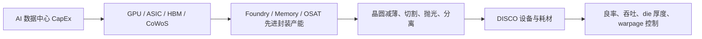
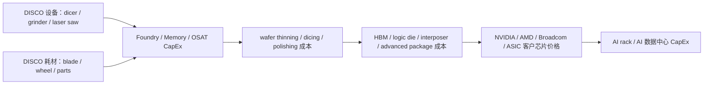
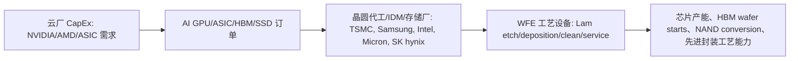
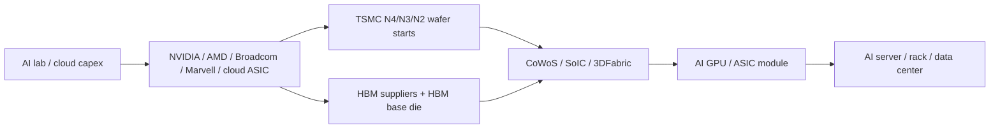
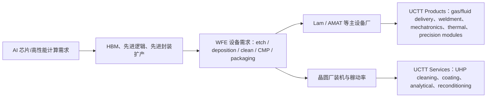
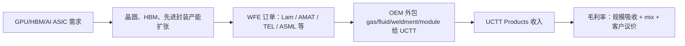

# 公司：ACLS Axcelis Technologies

> 写作截点：2026-05-10。美国市场最近一个完整交易日为 2026-05-08。  
> 研究范围：Axcelis Technologies, Inc.（NASDAQ: ACLS）离子注入设备、CS&I aftermarket、Memory/HBM、SiC Power、Advanced Logic/材料改性、成熟制程和 AI 数据中心间接拉动。  
> 重要口径：Axcelis 不直接销售 AI 服务器、GPU、HBM 或功率器件；它卖的是晶圆厂离子注入设备与服务。因此本文所有“每 MW / 每 rack / 每 GPU 内容量”均为**设备资本开支摊销口径**，不是服务器 BOM 的直接物料价格。  
> 主要资料：Axcelis Q1 2026/Q4-Q1 2025 earnings presentation、2025 10-K、StockAnalysis 当前市场数据、Axcelis 产品资料、项目内 AI 前道设备/存储前道设备/功率半导体报告。非投资建议。

## 0. 最高浓度结论

Axcelis 是一家**高度聚焦离子注入的半导体前道设备公司**。投资人通常把它看作“Applied Materials/Varian 之外的全球离子注入核心供应商 + SiC power 设备周期股 + HBM/DRAM 复苏期权 + CS&I aftermarket 稳定器”。2023-2024 年它吃到 SiC/中国成熟节点扩产红利，2025 年进入 Power/General Mature 消化期；2026 年重新被市场重估，核心原因是 **DRAM/HBM 对 AI 的拉动开始在 Axcelis 的 Memory 出货中体现**，同时它和 Veeco 的合并把公司从单一 implant 供应商扩成更大 WFE 平台。

最关键的事实锚：

- Q1 2026 收入 **$199.0M**，同比 **+3.3%**；系统收入 **$126.3M**，CS&I 收入 **$72.6M**；systems bookings **$128.2M**，B2B **1.02x**，systems backlog **$453.3M**。Memory 占 Q1 shipped system revenue **32%**，约 **$40.4M**，较 Q4 2025 的约 **$14.1M** 显著加速。
- Q1 2026 毛利率从 Q1 2025 的 **46.1%** 降到 **40.5%**，主要受 mix、客户 settlement revenue reversal、Veeco 交易成本和 Memory 高占比影响。公司仍指引 2026 全年收入“相对 2025 持平”，Non-GAAP GM 为 **low-to-mid 40%**。
- FY2025 收入 **$839.0M**，同比 **-17.6%**；系统收入 **$571.0M**，同比 **-27.0%**；CS&I **$268.0M**，同比 **+13.9%**，占收入 **31.9%**，成为抗周期核心。
- 当前估值已经把部分 Memory/HBM 转向提前反映：2026-05-08 收盘价 **$163.03**，市值 **$5.01B**，TTM P/E **50.48x**，forward P/E **40.18x**，P/S **5.93x**，TTM 收入增速 **-11.76%**，TTM 毛利率 **43.61%**，净利率 **11.93%**。
- 资产负债表很强：2026-03-31 cash + short-term investments **$366.6M**，再加 long-term investments **$203.3M**，公司披露口径 cash/marketable securities **$570.0M**；total debt **$42.0M**，net cash **$324.6M**；current ratio **4.59x**，debt/equity **0.04x**。

我的判断：**ACLS 不是直接 AI 数据中心硬件股，而是 AI 制造侧的二阶弹性股**。最强变量不是 GPU 出货本身，而是 HBM/DRAM wafer starts、SiC/GaN 电源器件扩产、2nm/GAA/背面供电材料改性是否把 implant intensity 重新拉高。基准情景下 2026 收入大概率仍是 `$0.85-0.90B` 平台整理；乐观情景 Memory + CS&I 把收入推向 `$0.95-1.05B`；极度乐观情景需要 HBM/DRAM、SiC AI power、Advanced Logic evaluation 三条线同时兑现，收入可回到 `$1.15-1.30B`。

## 1. 公司业务、投资人定位、产业链位置

### 1.1 业务是什么

Axcelis 设计、制造、销售并服务**离子注入系统**。离子注入是把硼、磷、砷、氢、氦、铝等离子以特定 dose、energy、angle 打入硅片或 SiC 晶圆中，以改变器件电性、阈值、电阻、损伤层或材料结构。公司 2025 年收入中 **98.2%** 来自 ion implantation business，剩余 **1.8%** 来自旧 legacy processing systems aftermarket。

主要产品：

| 产品/平台 | 类型 | 主要应用 | AI 相关性 |
|---|---|---|---|
| Purion H / H6 | High Current | DRAM/HBM、逻辑/成熟节点高剂量 implant、低能高剂量 | 高；Q1 2026 推出 H6，并拿到中国新 high current 客户 win |
| Purion Dragon | High Current 架构 | 先进 memory/logic，历史上用于 NAND/memory 客户 evaluation 转量产 | 中高；更偏先进 memory high-current 期权 |
| Purion XE / EXE / XEmax | High Energy | SiC 深注入、superjunction、advanced logic 材料改性、2nm 相关应用 | 高；SiC AI power 与 2nm/GAA/材料改性期权 |
| Purion Power Series+ | SiC Power 组合 | Purion H200+ SiC、M+ SiC、XE+，覆盖 150/200mm、room/warm/hot implant | 中高；AI PSU/800V 未来拉动，但 2026 仍受 EV SiC 消化拖累 |
| Purion M / M+ | Medium Current | 成熟逻辑、功率器件、部分 memory/工业应用 | 中；成熟节点与 power management 间接受益 |
| GSD / E2 / HE / VHE / Ovation ES | Batch/legacy extension | 批量 implant、power/mature fleet 延寿 | 中低；更多是成熟产线和 CS&I |
| CS&I aftermarket | Used tools、spares、upgrades、maintenance、training、Digital Tool Box | 已安装设备生命周期服务；约 3,400 台产品分布 27 国 | 中；AI fab 利用率提高会拉动 spares/upgrades |

### 1.2 投资人心中的形象

投资人看 ACLS 的标签通常有四个：

1. **离子注入双寡头/窄寡头资产。** 2025 10-K 中公司明确称，在 ion implantation systems 市场主要与 Applied Materials 竞争，且 Axcelis 和 Applied 是仅有具备 full range implant products 的供应商。其他竞争者包括 Sumitomo Heavy Industries Ion Technology、Nissin Ion Equipment、AIBT、Kingstone、CETC 等。
2. **SiC power 设备 beta。** 2025 年 power device segment 占 systems shipments value **55%**。这让公司在 2022-2024 年受益于 EV/工业 SiC 扩产，也在 2025-2026 年承受 SiC capacity digestion。
3. **Memory/HBM 复苏期权。** Q1 2026 Memory 占 shipped system revenue **32%**，公司称 DRAM/HBM demand 是 clear highlight，并预计 Memory 2026 强增长、动能延续到 2027。
4. **CS&I aftermarket 稳定器。** FY2025 CS&I **$268M**，同比 **+14%**，占总收入 **31.9%**；Q4 2025 和 Q1 2026 都强调 CS&I 超预期或 record/recovering strength。

### 1.3 最近三年重大变化/转型/收购

| 时间 | 事件 | 投资含义 |
|---|---|---|
| 2023-05 | Russell Low 出任 CEO | 管理层从工程、客户和 implant 技术路线出发，继续强化 implant-only model |
| 2023-2024 | SiC/Power 和中国 mature node 扩产驱动收入上行 | FY2023 收入 **$1.131B**，FY2024 **$1.018B**，公司从中小设备商变为接近 `$1B+` 收入平台 |
| 2025 | Power/General Mature digestion，系统收入下滑；CS&I 占比提升 | FY2025 系统收入 **$571M**，同比 **-27%**；CS&I **$268M**，成为收入质量改善的关键 |
| 2025-08 | 与 GE Aerospace 启动高压 SiC superjunction JDP，使用 Purion XEmax，目标 6.5-10kV power devices | SiC 从 EV 扩到 aerospace、AI/quantum/grid 等高压高可靠场景 |
| 2025-09 | Purion Power Series+、GSD Ovation ES 在 ICSCRM 2025 推出 | 150/200mm SiC、trench/superjunction、hot implant 的产品化强化 |
| 2025-10 | 宣布与 Veeco 全股票合并，合并后企业价值约 **$4.4B**，预计 2026H2 完成 | 从 implant-only 扩为更宽 WFE 平台；协同包括 laser annealing、IBD、MOCVD、compound semi、memory/mature foundry/logic、services |
| 2026-Q1 | Purion H6 high current 推出；Memory/DRAM/HBM 加速；Q2 发出 2nm materials modification 系统 | AI/HBM 和 advanced logic penetration 从“期权”开始进入收入/订单验证 |

### 1.4 产业链位置

Axcelis 位于半导体前道 WFE 中的**离子注入设备**环节。它不是 ASML/KLA/Lam/AMAT 那种覆盖超大 TAM 的平台型龙头，但在 implant 这个小而关键的步骤中有深 know-how。典型价值链如下：

`AI GPU/ASIC/HBM 需求 -> TSMC/Samsung/Intel/SK hynix/Micron/CXMT 等扩产 -> WFE 订单 -> 离子注入设备 -> 客户装机/验收 -> CS&I spares/upgrades/service`

项目内 AI 前道设备资料显示，2026-2027 AI 设备主线为 advanced logic、HBM DRAM、2nm/GAA、背面供电、DRAM/HBM 前道设备和 service。离子注入在总 WFE 中不是最大环节，但在 power devices、DRAM/HBM、advanced logic 材料改性里具备不可替代性。

## 2. 当前股价、估值、财务健康度

### 2.1 市场数据

| 指标 | 数值 | 日期/口径 |
|---|---:|---|
| 股价 | **$163.03** | 2026-05-08 收盘 |
| 盘后价 | **$161.75** | 2026-05-08 19:48 EDT |
| 市值 | **$5.01B** | 2026-05-08 |
| 企业价值 | **$4.69B** | 2026-05-08 |
| TTM P/E | **50.48x** | 2026-05-08 |
| Forward P/E | **40.18x** | 2026-05-08 |
| P/S | **5.93x** | 2026-05-08 |
| Forward P/S | **5.71x** | 2026-05-08 |
| TTM 收入 | **$845.44M** | 截至 2026-03-31 |
| TTM 收入增速 | **-11.76%** | 截至 2026-03-31 |
| TTM 毛利率 | **43.61%** | 截至 2026-03-31 |
| TTM 净利率 | **11.93%** | 截至 2026-03-31 |
| TTM EPS | **$3.21-$3.23** | 来源口径略有差异 |
| Shares outstanding | **30.73M** | 2026-05-08 |
| Short interest | **3.50M / 11.4% shares out** | 2026-05-08 统计页 |

估值判断：当前股价对“2026 flat revenue + 2027 memory/AI recovery”已经给出较高赔率，TTM P/E 约 50x、forward P/E 约 40x，并不便宜。若 2026 只兑现 flat revenue，估值会依赖 2027 订单继续向 Memory/Advanced Logic 切换；若 HBM/DRAM 订单被证实持续，市场会用“Memory 设备小周期”重新定价。

### 2.2 资产负债表

| 指标 | 数值 | 日期/口径 | 评价 |
|---|---:|---|---|
| Cash & equivalents | **$150.8M** | 2026-03-31 | 充足 |
| Short-term investments | **$215.8M** | 2026-03-31 | 高流动性 |
| Long-term investments | **$203.3M** | 2026-03-31 | 公司披露 cash/marketable securities 合计 $570.0M |
| Cash + ST investments | **$366.6M** | 2026-03-31 | 约 $10.35/share |
| Total debt | **$42.0M** | 2026-03-31 | 很低 |
| Net cash | **$324.6M** | 2026-03-31 | 强 |
| Total current assets | **$935.7M** | 2026-03-31 | 包含 inventory $326.1M |
| Current liabilities | **$203.9M** | 2026-03-31 | 压力低 |
| Current ratio | **4.59x** | 2026-05-08 统计页 | 很健康 |
| Debt/equity | **0.04x** | 2026-05-08 统计页 | 几乎无杠杆 |
| Q1 2026 operating cash flow | **$18.1M** | Q1 2026 | 正；但含约 $12M merger cash transaction expenses |
| Q1 2026 FCF | **$16.3M** | Q1 2026 | 正 |
| FY2025 FCF | **$107.0M** | FY2025 | 仍可支持回购/研发 |

财务健康度：**很健康**。最大问题不是偿债，而是收入和毛利周期。公司 2025 年仍回购 **$121.1M** 股票，Q1 2026 没有回购，可能与 Veeco 合并和股价波动有关。库存 **$326M** 相对 TTM revenue **$845M** 偏高但可理解，原因是系统订单、客户验收和配置化交付周期长。

## 3. 最近五次财报拆解

### 3.1 财务和订单表

| 财报季度 | 收入 | YoY | Systems revenue | CS&I revenue | Systems bookings | B2B | Systems backlog | GAAP GM | GAAP OM | GAAP NI/EPS | 关键订单/交期/取消率 |
|---|---:|---:|---:|---:|---:|---:|---:|---:|---:|---:|---|
| Q1 2026 | **$199.0M** | **+3.3%** | **$126.3M** | **$72.6M** | **$128.2M** | **1.02x** | **$453.3M** | **40.5%** | **4.0%** | **$9.2M / $0.30** | Bookings sequentially consistent after Q4 step-up；backlog -0.8% QoQ；Q1 含客户 settlement 造成 **$4.9M** revenue reversal；所有 backlog 订单可取消/重排且 penalty 有限 |
| Q4 2025 | **$238.3M** | **-5.6%** | **$156.5M** | **$81.9M** | **$127.6M** | **0.82x** | **$457.0M** | **47.0%** | **15.2%** | **$34.3M / $1.10** | CS&I 再创纪录；bookings 较 Q3 大幅恢复；FY2026 指引 flat、H2 weighted |
| Q3 2025 | **$213.6M** | **-16.7%** | **$143.7M** | **$69.9M** | **$52.2M** | **0.36x** | **$484.5M** | **41.6%** | **11.7%** | **$26.0M / $0.83** | Bookings trough；公司预计 Q4 sequential improvement；Q2 backlog 被修正为 **$575.7M** |
| Q2 2025 | **$194.5M** | **-24.2%** | **$133.3M** | **$61.3M** | **$96.2M** | **0.72x** | **$575.7M** | **44.9%** | **14.9%** | **$31.4M / $0.98** | Bookings QoQ moderate；1H 2025 bookings 高于 2H 2024；中国 28nm high energy/high current 订单 |
| Q1 2025 | **$192.6M** | **-23.7%** | **$137.6M** | **$55.0M** | **$109.9M** | **0.80x** | **$618.2M** | **46.1%** | **15.1%** | **$28.6M / $0.88** | Bookings +30% QoQ，B2B 0.8x，为 Q4 2023 后最高；backlog 从 Q4 2024 的 $645.8M 下滑 |

### 3.2 Shipped system revenue by end market

> 下表中的美元额为“systems revenue × shipped system revenue mix”估算。Axcelis 披露的是 shipped system revenue mix，不等同公司总收入 mix。

| 财报季度 | Systems revenue | SiC Power | Other Power / IGBT | General Mature | Memory | Advanced Logic | AI 数据中心相关估算 |
|---|---:|---:|---:|---:|---:|---:|---|
| Q1 2026 | $126.3M | **25% / ~$31.6M** | **10% / ~$12.6M** | **33% / ~$41.7M** | **32% / ~$40.4M** | **0% / $0** | 直接 AI 相关约 **$40-50M**：Memory 主要由 DRAM/HBM 支撑；SiC/GM 中 AI power/PMIC 仍是小比例 |
| Q4 2025 | $156.5M | **41% / ~$64.2M** | **12% / ~$18.8M** | **35% / ~$54.8M** | **9% / ~$14.1M** | **3% / ~$4.7M** | 约 **$20-25M**：Memory DRAM/HBM 订单开始转强；Advanced Logic follow-on revenue |
| Q3 2025 | $143.7M | **52% / ~$74.7M** | **18% / ~$25.9M** | **25% / ~$35.9M** | **2% / ~$2.9M** | **3% / ~$4.3M** | 约 **$8-12M**：Memory 低位，SiC 中少量高压/AI power 期权 |
| Q2 2025 | $133.3M | **40% / ~$53.3M** | **15% / ~$20.0M** | **43% / ~$57.3M** | **3% / ~$4.0M** | **0% / $0** | 约 **$5-10M**：DRAM high-current order 但 revenue 未完全体现 |
| Q1 2025 | $137.6M | **37% / ~$50.9M** | **2% Si IGBT / ~$2.8M** | **47% / ~$64.7M** | **14% / ~$19.3M** | **0% / $0** | 约 **$20M**：DRAM sequential growth，但 NAND 仍弱 |

### 3.3 分业务增速和利润率

| 项目 | 最近趋势 | 利润率判断 |
|---|---|---|
| Systems revenue | FY2025 **$571M**，同比 **-27%**；Q1 2026 **$126.3M**，同比 **-8.2%** | 公司不披露 systems GM；受 mix 影响很大。SiC/CS&I mix 高时 GM 好，Memory mix 高时 FY2026 GM 指引 lower |
| CS&I | FY2025 **$268M**，同比 **+14%**；Q1 2026 **$72.6M**，同比 **+32%** | CS&I 包括 spares/upgrades/used tools/labor。10-K line-item services FY2025 GM 为 **-5.1%**，但 CS&I 中 spare/upgrade 属 product revenue，通常毛利显著高于纯 labor |
| Product revenue | FY2025 **$792.0M**，同比 **-18.9%**；product GM **47.9%** | 产品线总体较高，FY2025 受 parts/upgrades mix 支撑 |
| Services revenue | FY2025 **$47.0M**，同比 **+14.7%**；services GM **-5.1%** | 纯 labor/service contract 可因服务成本波动为负，不代表 CS&I 整体为负 |
| Memory systems | FY2025 约 **$40M**；Q1 2026 单季约 **$40M** | 毛利率未披露。公司称 FY2026 GM 下行部分来自 Memory mix higher，说明初期 Memory 工具 margin 可能低于 FY2025 SiC/CS&I mix |
| Power/SiC systems | FY2025 约 **55% systems / ~$314M**；Q1 2026 power 合计约 **$44M** | Purion Power differentiated，但 2025-2026 EV/industrial digestion 压低 volume 和价格弹性 |

## 4. 2026 最新指引和业务占比

### 4.1 Q2 2026 和 FY2026 指引

| 指标 | Q2 2026 指引 | FY2026 管理层口径 |
|---|---:|---|
| Revenue | **$205M** | 仍预计相对 FY2025 **$839M** 持平 |
| Non-GAAP GM | **43.0%** | low-to-mid 40% |
| Non-GAAP opex | **$59M** | 余下季度约 **$60M/quarter** |
| Adjusted EBITDA | **$34M** | 未给全年数字 |
| Non-GAAP diluted EPS | **$0.90** | 未给全年 EPS；Q1 已报 $0.72 |

这意味着管理层隐含 Q2-Q4 2026 合计收入约 `$640M`，平均每季 `$213M` 左右，H2 高于 Q1/Q2。要实现“flat 2026”，关键是 Memory 持续增长、CS&I 稳住 `$70M+` 单季、Power/General Mature 不再继续下行。

### 4.2 Q1 2026 最新业务占比

| 业务 | Q1 2026 占总收入 | Q1 2026 占 systems | Q1 2026 金额估算 | 增长/变化 |
|---|---:|---:|---:|---|
| Systems total | **63.5%** | 100% | **$126.3M** | 同比 **-8.2%**，但 mix 改善向 Memory |
| CS&I | **36.5%** | n/a | **$72.6M** | 同比 **+32%**，战略重要性上升 |
| Memory | **20.3% of total** | **32%** | **~$40.4M** | Q4 2025 为 ~$14.1M；DRAM/HBM 强劲 |
| SiC Power | **15.9% of total** | **25%** | **~$31.6M** | QoQ 从 Q4 的 ~$64.2M 下滑；但 bookings strengthened |
| Other Power | **6.3% of total** | **10%** | **~$12.6M** | IGBT/other power，低优先级 |
| General Mature | **21.0% of total** | **33%** | **~$41.7M** | QoQ 下滑；AI data center/auto/industrial 端需求改善但客户仍 digest |
| Advanced Logic | **0%** | **0%** | **$0** | Q2 early shipment for 2nm materials modification，属于小基数高弹性 |

### 4.3 重点业务和跳过业务

重点业务/产品：

1. **Memory/DRAM/HBM：Purion H6 / Purion H / Purion Dragon high-current。** Q1 2026 最大增量，AI 相关性最强。
2. **SiC Power：Purion Power Series+ / H200+ SiC / M+ SiC / XE+ / XEmax。** 2026 受 digestion 压制，但 AI PSU、800VDC、aerospace/grid 高压 SiC 可能给 2027 形成第二增长曲线。
3. **Advanced Logic / materials modification：Purion XE/EXE/XEmax。** Q1 2026 无收入但 Q2 发出 2nm production materials modification 系统，潜在小业务不能漏。
4. **CS&I aftermarket。** 高 installed base 粘性，收入更稳，是估值底座。
5. **General Mature 中的 high-current/high-energy 订单。** 包括 28nm、中国客户、PMIC/image sensor/AI power management 的部分恢复。

低优先级或暂时跳过业务：

- 传统 Si IGBT 与普通 other power：Q1 2025 只有 2% systems，Q1 2026 other power 10%，但 EV/industrial 消化期仍在。
- 普通汽车/工业/消费 mature capacity：需求恢复但不是 AI 高 beta。
- NAND 纯 layer-count scaling：公司多次称 NAND 客户优先 dep/etch 而非 wafer capacity additions，near-term implant demand limited。
- Legacy processing systems aftermarket：2025 只有 1.8% 收入，战略重要性低。
- 纯 service labor：收入增长但 line-item margin 可为负；不能当高毛利核心。

## 5. 高增长/关键业务当前贡献、重要性、供需和定价力

| 关键业务/产品 | 当前收入贡献 | 当前增速 | AI 基建重要性 | 时间紧急性 | 供需紧张度 | 垄断/溢价能力 | 结论 |
|---|---:|---:|---|---|---|---|---|
| Memory DRAM/HBM high-current：Purion H6/H/Dragon | FY2025 约 **$40M**；Q1 2026 单季约 **$40M** | Q1 QoQ 约 **+187%** vs Q4 2025 估算 | **高**：HBM/DRAM wafer starts 是 AI GPU/ASIC 共同瓶颈 | **高**：HBM4/1c DRAM 2026-2027 排产 | **中高**：客户验证和装机窗口紧，但 Axcelis 工厂未显示严重瓶颈 | **中**：Applied 强竞争，但 Axcelis high-current wins 和 full portfolio 有粘性 | ACLS 最大 2026 增长引擎 |
| CS&I aftermarket | FY2025 **$268M**；Q1 2026 **$72.6M** | Q1 YoY **+32%** | **中**：AI fab utilization 提高拉动 spares/upgrades | **高**：停机损失高，备件和服务时效重要 | **中**：installed base 自然锁定，field service 人才是瓶颈 | **中高**：原厂备件/upgrade 替换成本高 | 收入质量最佳，估值底座 |
| SiC Power：Purion Power Series+ / XEmax | FY2025 约 **$314M**；Q1 2026 SiC 约 **$31.6M** | Q1 QoQ **-51%** vs Q4 2025 估算；bookings strengthened | **中高**：AI PSU/800V/UPS/高压 power conversion 会用 SiC/GaN | **中**：2026 设计验证，2027 才更紧 | **中低到中**：EV SiC digestion 压制普通需求；高压 superjunction/200mm 仍稀缺 | **中高**：Power Series+ 覆盖 150/200mm、hot implant、trench/superjunction | 2026 低谷，2027 期权 |
| Advanced Logic / 2nm material modification：Purion XE/EXE | FY2025 约 **$11M**；Q1 2026 **$0**，Q2 early shipment | 小基数波动 | **高**：2nm/GAA/BSPDN/material modification 对 AI 芯片路线重要 | **中高**：2026 pilot，2027 ramp | **中**：客户 evaluation 周期长 | **中**：Applied/其他设备有替代，但 high-energy know-how 稀缺 | 小业务但不该忽略 |
| General Mature / PMIC / 28nm high-current-high-energy | FY2025 约 **$211M**；Q1 2026 约 **$41.7M** | Q1 QoQ **-24%** vs Q4 2025 估算 | **中**：AI power management、image sensor/auto、edge 控制芯片间接受益 | **中** | **中低**：客户仍 digest capacity | **中低**：替代更多，价格弹性低 | 稳定盘，非核心 AI beta |

## 6. 一年后收入贡献三情景

> 口径：未来 12 个月，即 2026Q2-2027Q1 左右。当前基准为 TTM revenue **$845M** 和 FY2025 revenue **$839M**。

| 业务/产品 | 基准情景 | 乐观情景 | 极度乐观情景 |
|---|---:|---:|---:|
| Memory DRAM/HBM high-current | **$150-180M**；约 +275%-350% vs FY2025 estimated memory systems；AI 重要性 5/5，供需 3.5/5，定价 3/5 | **$200-240M**；DRAM/HBM 客户 follow-on across nodes/regions；供需 4/5，定价 3.5/5 | **$280-350M**；HBM4/1c DRAM 扩产提前，北美/Korea/China 多客户同时下单；供需 4.5/5，定价 4/5 |
| CS&I aftermarket | **$300-320M**；installed base + utilization 驱动；重要性 3/5，供需 3/5，定价 3.5/5 | **$340-370M**；upgrade/service contracts 提升；供需 3.5/5，定价 4/5 | **$400M+**；AI/HBM/China fabs utilization 高，客户锁定备件；供需 4/5，定价 4.5/5 |
| SiC Power / Power Series+ | **$220-260M**；EV/industrial digestion 延续但 Q1 bookings 改善；重要性 3/5，供需 2.5/5，定价 3/5 | **$300-360M**；200mm SiC、China capacity、AI PSU high-end power conversion 回暖；供需 3.5/5，定价 3.5/5 | **$420-500M**；800VDC/AI PSU/GE-style high-voltage SiC superjunction 加速；供需 4/5，定价 4/5 |
| Advanced Logic / 2nm material modification | **$20-35M**；1-3 台 eval/early production | **$50-80M**；2nm materials modification 和 backside power contact follow-on | **$100-150M**；进入先进逻辑客户多节点/多区域 POR，变成新小平台 |
| General Mature / PMIC / image sensor / 28nm | **$160-200M**；客户 digest 后稳定 | **$220-270M**；auto/industrial/AI PMIC utilization 回升 | **$300-360M**；中国 mature + AI power management 同步恢复 |
| 公司总收入 | **$850-900M**，同比 TTM +1%-7% | **$950M-1.05B**，同比 +12%-24% | **$1.15-1.30B**，同比 +36%-54% |

## 7. BOM/内容量、价格传导和产能/认证

### 7.1 价格传导链

Axcelis 的价格传导不是从 GPU/rack BOM 直接传导，而是：

`AI 算力需求 -> GPU/ASIC/HBM 订单 -> HBM/advanced DRAM、SiC/GaN power、advanced logic fab capex -> WFE 采购 -> ion implant tools -> Axcelis systems revenue -> installed base -> CS&I revenue`

关键特点：

- **HBM/DRAM**：HBM stack 增加、die size 更大、KGD 要求更高，带来 DRAM wafer starts 和工艺步骤上升。Axcelis 受益于 memory high-current/high-energy implant，但 implant 不是 HBM 设备最大环节，排序低于 EUV/etch/deposition/metrology。
- **SiC power**：SiC power devices 的 implant intensity 高，尤其 trench/superjunction、deep Al implant、hot implant、150mm 到 200mm 迁移。Axcelis Power Series+ 的技术含量更直接。
- **Advanced logic**：2nm/GAA/BSPDN/material modification 是小基数高弹性。若进入 POR，单客户价值可迅速放大。
- **CS&I**：价格通过 downtime cost、原厂认证、spares availability 和 upgrade productivity 体现，不通过芯片 BOM 体现。

### 7.2 每 MW / rack / GPU / optical port 内容量

> 假设：1MW IT power 约对应 **600-1,100** 颗高端 AI GPU/ASIC 等效芯片；一个高密 rack 约 **72** 颗 GPU/ASIC 等效芯片；高端 GPU/ASIC 通常带 **6-12** 个 HBM stack。以下是 Axcelis 设备资本开支摊销到终端的研究估算，不是客户合同价。

| 业务/产品 | 每 GPU/ASIC 设备摊销内容量 | 每 72-GPU rack | 每 MW | 每 optical port | 说明 |
|---|---:|---:|---:|---:|---|
| Memory high-current implant | **$0.5-$5/GPU** | **$36-$360/rack** | **$300-$5,500/MW** | ~0 | 来源于 HBM/DRAM WFE 中 implant 份额；实际取决于 Axcelis 在 SK/Samsung/Micron/CXMT 的 share |
| SiC Power implant | **$0.2-$3/GPU 等效** | **$15-$220/rack** | **$120-$3,300/MW** | ~0 | 间接对应 AI PSU/UPS/800V power conversion 中 SiC/GaN 器件扩产；2026 普通 SiC 过剩压低实际值 |
| Advanced Logic material modification | **$0.1-$2/GPU** | **$7-$144/rack** | **$60-$2,200/MW** | ~0 | 仅当 2nm/GAA/BSPDN/材料改性进入量产 POR 时成立 |
| CS&I aftermarket | **按设备 installed base，不按 GPU** | n/a | n/a | n/a | 更适合按每台 Axcelis tool 年服务/升级收入估算；粗略为系统 ASP 的 5%-12%/年区间 |
| General Mature/PMIC implant | **$0.05-$0.8/GPU** | **$4-$58/rack** | **$30-$880/MW** | ~0 | AI power management、control IC、image sensor/auto 间接暴露 |

结论：Axcelis 在 AI rack/GPU 的“内容量”很小，真正的投资弹性来自**设备订单倍率**，不是单位 BOM。若全球 AI 芯片/模块 2026 释放金额达到项目内 `$300B-$650B` 情景，哪怕 implant 设备摊销只占极低比例，也足以让一个 `$0.8B` 收入级别公司出现显著增量。

### 7.3 当前产能能力、供应链采纳和认证阶段

| 业务/产品 | 当前公司产能能力（收入计） | 供应链采纳程度 | 认证/阶段 |
|---|---:|---|---|
| Memory high-current | 当前可支持约 **$150-250M/year** memory run-rate，继续上行需客户 qualification 和供应链 slot | Korea/Asia 客户已有出货；Q4 2025 北美 leading memory manufacturer high-current order；Q1 2026 完成 leading North American manufacturer evaluation | 从 evaluation 转 adoption across nodes/regions；部分客户 HVM，北美客户处于 adoption 扩散阶段 |
| CS&I | 当前 run-rate **$290M/year**，一年内可扩至 **$320-370M** | Installed base 约 **3,400** 产品、27 国；原厂服务粘性强 | 已大规模采用；Digital Tool Box/remote diagnosis/training 增强 |
| SiC Power Series+ | 公司历史已支持 **$300M+** annual SiC systems revenue；当前需求低于产能 | 150/200mm SiC、China customers、GE Aerospace JDP、Power Series+ 推出 | HVM proven；200mm/Trench/Superjunction/GE JDP 处于技术升级与客户开发 |
| Advanced Logic materials modification | 当前收入能力小，约 **$20-50M/year**；若客户 POR，产能可从其他 systems mix 调配 | Q4 2025 follow-on，Q1 2026 无收入但 Q2 early shipment for 2nm production materials modification | 2nm production material modification early production/pilot；BSPDN/backside contacts 仍 eval |
| General Mature/PMIC | 可支持 **$160-250M/year** | China 28nm high energy/high current order；PMIC XEmax evaluation；image sensor utilization pockets | 已量产，但客户投资周期弱 |

## 8. 一年后产能和采纳三情景

| 业务/产品 | 基准：产能/采纳/认证 | 乐观：产能/采纳/认证 | 极度乐观：产能/采纳/认证 |
|---|---|---|---|
| Memory high-current | 可交付 **$180M/year**；北美客户完成首轮 adoption；Korea/China 延续 | 可交付 **$240M/year**；2-3 家主流 memory 客户跨 node/region 下 follow-on | 可交付 **$350M/year**；HBM4/1c DRAM 拉动多客户 slot 预订，H6 成为关键 POR |
| CS&I | **$320M/year**；spares/upgrades 稳定增长 | **$370M/year**；service contracts attach 提升 | **$420M/year+**；高利用率 fabs 锁备件和升级包，field service 变瓶颈 |
| SiC Power | **$250M/year**；150/200mm HVM 延续，GE JDP 仍研发 | **$360M/year**；200mm/Trench/Superjunction 客户扩散，AI PSU 供应链试点 | **$500M/year**；AI 800VDC/high-voltage SiC 加速，Power Series+ 被多客户锁产能 |
| Advanced Logic | **$35M/year**；2nm material modification 1-2 客户 early production | **$80M/year**；backside power/material modification follow-on | **$150M/year**；进入先进逻辑量产 POR，多区域复制 |
| General Mature | **$200M/year**；28nm/PMIC 稳定 | **$270M/year**；AI PMIC、auto/industrial utilization 回升 | **$360M/year**；中国 mature 与 AI power management 扩产同时恢复 |

## 9. 基于 backlog、供给和订单的未来一年增速预测

### 9.1 真实订单与 backlog 信号

| 指标 | 当前读数 | 解释 |
|---|---:|---|
| Q1 2026 systems backlog | **$453.3M** | 较 Q4 2025 **$457.0M** 基本持平；较 Q1 2025 **$618.2M** 下滑约 **27%** |
| Q1 2026 systems bookings | **$128.2M** | 与 Q4 2025 **$127.6M** 持平，高于 Q3 2025 trough **$52.2M** |
| Q1 2026 B2B | **1.02x** | 2025 五个季度中最好；说明系统订单不再继续恶化 |
| Backlog coverage | **约 3.6 个 Q1 systems revenue** | `$453.3M / $126.3M`；若按 FY2026 systems 约 `$530-570M`，backlog 覆盖约 80% |
| 取消/重排风险 | 公司明确称订单可取消或重排，penalty 有限或没有 | backlog 不是硬合同；Memory/Power 客户 capex 变化会影响兑现 |
| Lead time | 未披露 | 从 WFE 行业经验看，配置化 systems + 装机验收通常 1-4 个季度收入确认；Axcelis backlog 不含 quarter 内接单即交付订单 |

### 9.2 未来一年收入增速三情景

| 情景 | 订单假设 | 供给/产能假设 | 未来 12M 收入 | 增速 vs TTM $845M | 关键验证 |
|---|---|---|---:|---:|---|
| 基准 | Q2-Q4 bookings 每季 **$110-140M**；Memory 增长、Power/GM 继续 digest | 工厂和供应链可满足；客户验收正常 | **$850-900M** | **+1% 到 +7%** | Q2 revenue $205M 达成；backlog 不低于 $430M |
| 乐观 | Bookings 提升到 **$150-180M/quarter**；Memory follow-on + SiC bookings 恢复 | H6/Power Series+/CS&I 交付顺畅；客户 cleanroom/验收无明显延迟 | **$950M-1.05B** | **+12% 到 +24%** | Q3/Q4 revenue 上到 $230M+；Memory systems 单季维持 $45M+ |
| 极度乐观 | Bookings **$200M+/quarter**；HBM4/DRAM、AI PSU SiC、2nm material modification 同时下单 | 供应链和 field install 不成为瓶颈；部分 2027 需求提前 | **$1.15-1.30B** | **+36% 到 +54%** | Backlog 重新超过 $600M；Advanced Logic 单季有 $20M+；Power 回到 $90M+ systems/quarter |

## 10. 竞争格局、替代风险和客户切换成本

### 10.1 主要竞争对手

| 环节 | 竞争者 | Axcelis 相对位置 |
|---|---|---|
| Full range ion implant | Applied Materials / Varian | 最大竞争者；客户双源和技术路线竞争最直接 |
| High current / high energy / medium current | Sumitomo Heavy Industries Ion Technology、Nissin Ion Equipment、AIBT | 日本/台湾厂商在部分客户和区域有位置，但 full portfolio 不如 Axcelis/Applied |
| 中国本土 implant | Kingstone Semiconductor、CETC、万业/凯世通、中科信、北方华创/屹唐等 | 出口管制下中国客户可能倾向本土供应；Axcelis 仍可向 substantially all Chinese customers 出货，但政策风险高 |
| Aftermarket service/parts | 本地第三方服务商、客户自维护 | 原厂认证、备件、upgrade 和 warranty 粘性强；第三方在成本上竞争 |
| SiC power WFE 广义替代 | AMAT、TEL、Kokusai、Veeco/Aixtron/LPE 等其他工艺设备 | 不是直接替代 implant，但客户 capex 在不同设备类别间分配，implant 不是最大 capex |

### 10.2 新技术是不是未来主流

| 技术/产品 | 是否主流 | 风险 |
|---|---|---|
| HBM/DRAM high-current implant | 是。HBM/advanced DRAM 是 2026-2027 AI 芯片核心瓶颈之一 | Implant share 不一定随 HBM capex 等比例上升；Applied 竞争；memory capex 可能先给 EUV/etch/deposition/metrology |
| SiC Power Series+ / 200mm SiC / hot implant | 中长期是。AI PSU、800VDC、EV、grid、aerospace 都需要高效 power conversion | EV SiC 过剩压价；AI PSU 可能更多采用 GaN/superjunction Si；800VDC 推迟 |
| Advanced Logic materials modification / BSPDN | 可能是高端先进节点主流的一部分，但路径仍早期 | 客户是否把 Axcelis tool 纳入 POR；2nm/BSPDN ramp 延迟；替代工艺或 Applied/其他设备赢单 |
| CS&I Digital Tool Box / aftermarket upgrade | 是。高利用率 fab 更依赖原厂服务和备件 | 第三方服务、客户自维护、价格压力；纯 service labor margin 不稳定 |
| General Mature high-current/high-energy | 是成熟节点必要环节，但不是高增长主流 | 中国国产替代、成熟节点过剩、价格竞争 |

### 10.3 客户替换成本

客户替换成本总体**中高**，但按业务差异很大：

- **Memory/Advanced Logic**：替换成本高。离子注入 recipe、角度、dose uniformity、contamination control、良率数据、客户 POR 都需要长期验证。新工具替换可能带来 yield/ramp 风险。
- **SiC Power**：中高。hot implant、deep Al implant、200mm wafer handling、trench/superjunction recipe 都有工艺粘性；但若客户处于新产线建设而非既有 POR，竞争更开放。
- **General Mature**：中。成熟节点工艺窗口宽一些，价格和交期权重更高。
- **CS&I**：中高。原厂 spares/upgrades 与 warranty/uptime 绑定，第三方服务存在但大客户对停机风险敏感。

## 11. 关键风险

1. **估值先行。** 股价 2026-05-08 已到 **$163.03**，P/S **5.93x**、forward P/E **40.18x**，需要 2027 增长兑现。
2. **2026 公司自己仍指引 flat revenue。** Memory 强，但 Power/General Mature digest 抵消增长。
3. **Backlog 下滑且可取消/重排。** Q1 backlog **$453.3M**，同比下滑约 27%；订单 penalty 有限。
4. **毛利率压力。** Q1 2026 GAAP GM **40.5%**，低于 Q1 2025 **46.1%**；FY2026 Non-GAAP GM 只给 low-to-mid 40%。
5. **中国出口管制。** 2025 中国占总收入 **42%**，Q1 2026 中国仍占 **40%**；公司称目前可继续向 substantially all Chinese customers 出货，但政策不可控。
6. **Applied Materials 竞争。** Applied/Varian 是最核心对手，客户双源会限制 Axcelis 定价。
7. **SiC 周期不确定。** EV SiC 过剩与 wafer 价格下跌会压制普通 SiC capex；AI power 转化为 SiC device capex 需要时间。
8. **Veeco 合并整合风险。** 交易成本已影响 Q1 2026 opex；合并能否产生 cross-sell、技术优化和服务协同仍需验证。

## 12. 监测清单

未来 6-12 个月最应该盯：

1. **Systems bookings 是否连续高于 $150M/quarter。** Q1 2026 的 $128M 只是稳定，不足以支撑极度乐观。
2. **Memory shipped system revenue 是否连续保持 $40M+/quarter。** 如果 Q2-Q3 跌回个位数/低双位数，AI/HBM thesis 要下修。
3. **Leading North American memory manufacturer 是否给 follow-on / multi-node / multi-region orders。**
4. **Purion H6 是否进入更多客户 POR。**
5. **Q2 2nm materials modification shipment 后是否有 follow-on。**
6. **Power Series+ bookings 是否转化为 revenue，尤其 200mm SiC、trench/superjunction、AI power 相关客户。**
7. **CS&I 是否维持 $70M+ 单季。**
8. **Gross margin 能否从 Q1 40.5% 回到 43%+。**
9. **China export controls 对 mature fabs license 的变化。**
10. **Veeco 合并审批、完成时间和整合费用。**

## 13. 资料来源

### 公司与财报

- [Axcelis Q1 2026 Earnings Presentation](https://investor.axcelis.com/static-files/5b86ae99-1113-4b89-aec7-065b222fd506)
- [Axcelis Q4 2025 Earnings Presentation](https://investor.axcelis.com/static-files/449e628a-922a-48b2-a95a-0248c5092560)
- [Axcelis Q3 2025 Earnings Presentation](https://investor.axcelis.com/static-files/be27f810-a5d8-4ea6-b34f-634d9fb82380)
- [Axcelis Q2 2025 Earnings Presentation](https://investor.axcelis.com/static-files/77cd4fd9-c4be-49f7-b70e-fad8bb074e6f)
- [Axcelis Q1 2025 Earnings Presentation](https://investor.axcelis.com/static-files/9fcfe668-73c3-43da-a20a-91c4ba681b85)
- [Axcelis 2025 Form 10-K, SEC](https://www.sec.gov/Archives/edgar/data/1113232/000110465926020461/acls-20251231x10k.htm)
- [StockAnalysis ACLS Statistics, 2026-05-08](https://stockanalysis.com/stocks/acls/statistics/)
- [StockAnalysis ACLS Income Statement](https://stockanalysis.com/stocks/acls/financials/)
- [StockAnalysis ACLS Balance Sheet](https://stockanalysis.com/stocks/acls/financials/balance-sheet/)

### 产品和交易

- [Axcelis Purion H6 product page](https://www.axcelis.com/products/purion-h-high-current-ion-implantation/)
- [Axcelis Purion Power Series+ datasheet](https://www.axcelis.com/wp-content/uploads/2025/11/60350_PowerSeries_Datasheet.pdf)
- [Axcelis + Veeco merger site](https://www.axcelisveeco.com/)
- [Axcelis Stockholders Approve Merger with Veeco, PR Newswire](https://www.prnewswire.com/news-releases/axcelis-stockholders-approve-merger-with-veeco-302680838.html)
- [Axcelis GE Aerospace JDP press release, official mirror/search source](https://axcelis.gcs-web.com/news-releases/news-release-details/axcelis-announces-joint-development-program-ge-aerospace/)

### 项目内行业资料

- `D:\drive\Investment\工作台v5\AI头部芯片市场占比和规模.md`
- `D:\drive\Investment\工作台v5\行业调研_晶圆制造_设备_材料_测试\行业调研_AI芯片前道制造设备_2026.md`
- `D:\drive\Investment\工作台v5\行业调研_晶圆制造_设备_材料_测试\行业调研_存储前道制造设备_2026-05-08.md`
- `D:\drive\Investment\工作台v5\行业调研_AI园区电力_机电_冷却\行业调研_功率半导体与高压保护器件_2026.md`

# 公司：ACMR ACM Research（盛美半导体）全面尽调

> 写作日期：2026-05-10  
> 股票代码：NASDAQ: ACMR  
> 公司：ACM Research, Inc.，主要经营主体为 ACM Research (Shanghai), Inc.（盛美上海，科创板 688082）  
> 结论先行：ACMR 不是直接卖给 AI 数据中心的服务器、光模块或电力设备公司，而是 AI 芯片制造链上游的湿法清洗、电镀、先进封装、炉管、Track、PECVD 设备供应商。其最大投资弹性来自中国半导体设备国产化、ECP/先进封装/新平台放量和全球客户突破；最大折扣来自中国收入占比、出口管制、客户集中、验收周期和毛利率波动。

## 0. 高浓度结论

1. **业务本质**：ACMR 是小型但高速增长的半导体 WFE 设备公司，核心是单片清洗、Tahoe、半关键清洗、ECP 电镀、先进封装湿法设备，并向炉管、Track、PECVD 扩张。2025 年收入 `$901.3M`，2026 年公司指引 `$1.08B-$1.175B`，同比 `+21%-30%`。
2. **投资人眼中的公司**：市场通常把它看成“中国半导体设备国产替代 + AI 芯片制造 picks-and-shovels”的高 beta 标的；但不是低风险全球 WFE 龙头，因为 2025 年中国大陆收入 `$898.0M`，占总收入约 `99.6%`，且 ACM Shanghai/ACM Korea 已在 2024 年 12 月被加入美国 BIS Entity List。
3. **最新财报信号**：2026Q1 收入 `$231.3M`，同比 `+34.2%`；shipments `$240.7M`，同比 `+53.6%`；毛利率 `46.4%`，恢复到长期模型 `42%-48%`区间中部。增长主要来自 ECP 与先进封装应用，清洗大类同比反而 `-5.5%`。
4. **订单能见度**：ACM Shanghai 于 2025-09-29 披露 backlog `RMB 9.0715B`，约 `$1.2716B`，同比 `+34.1%`。这是最关键的订单锚，但口径含“已发货未按中国 GAAP 确认收入”和“未来待发货订单”，不是美国 GAAP backlog，也不能线性等同未来收入。
5. **关键产品排序**：短期最重要是 `ECP/先进封装/面板级电镀`、`Tahoe/SPM/Ultra C 清洗`、`先进封装清洗/flux/vacuum clean`；中期最有期权的是 `PECVD SiCN`、`Track/KrF/Ultra Lith`、`vertical furnace`。成熟半关键清洗、显示面板工具、compound semi gold etch、普通服务备件不是 AI 主线。
6. **AI 相关收入口径**：公司没有披露“AI 数据中心收入”，直接数据中心收入应视为 `0`。可识别的 AI 制造链代理指标是先进封装 ex-ECP、ECP/packaging、SPM/Tahoe/先进逻辑与存储相关清洗。2026Q1 仅先进封装 ex-ECP 是 `$24.5M`、占收入 `10.6%`；若把 ECP/packaging/furnace/other 的一部分计入 AI 制造链，代理暴露约 `20%-35%`，但这是推断。

## 1. 公司整体业务、定位与财务状态

### 1.1 公司在产业链中的位置

ACMR 开发、制造并销售半导体工艺设备，覆盖：

| 设备/业务 | 对应工艺 | 对 AI 芯片链条的关系 | 2025 收入口径 |
|---|---|---|---:|
| Single wafer cleaning、Tahoe、semi-critical cleaning | 前道湿法清洗、SPM、SAPS、TEBO、wet bench、背面/边缘清洗 | 先进逻辑、DRAM/HBM、3D NAND、国产 DUV 多重曝光都需要更高洁净度；但 ACMR 在全球高端 AI 芯片主流供应链份额未披露 | `$626.0M`，`69.5%` |
| ECP front-end and packaging、furnace、other technologies | 铜电镀、RDL、bump、pillar、部分炉管/热处理等 | 与 HBM、CoWoS/2.5D、panel-level packaging、先进封装 RDL 直接相关，是当前增速最高大类 | `$199.6M`，`22.1%` |
| Advanced packaging ex-ECP、services & spares | wafer/panel-level packaging 湿法、flux/vacuum clean、备件服务 | AI 封装洁净度前道化，HBM/large package 对清洗、电镀、检测要求上升 | `$75.8M`，`8.4%` |
| PECVD、Track、vertical furnace | 薄膜沉积、光刻胶涂布显影、热处理 | 大 TAM 新平台，若进入中国逻辑/存储 POR 有弹性；全球竞争极强 | 当前未单独披露 |

2025 年 ACMR 估计产品组合对应的 serviceable available market 约 `$21B`：清洗 `$7.3B`、PECVD `$5.3B`、Track `$3.0B`、furnace `$2.6B`、ECP `$1.5B`、advanced packaging/other `$1.2B+`。全球 WFE 2025 年约 `$123.9B`，ACMR 仍是小份额挑战者，不是全线设备龙头。

### 1.2 最近三年重大业务变化

| 时间 | 变化 | 影响 |
|---|---|---|
| 2023-2025 | 从“清洗设备公司”扩张为多产品 WFE 平台：ECP、advanced packaging、furnace、Track、PECVD | TAM 从单一清洗扩到约 `$21B`；但研发费用和验收周期上升，毛利率波动变大 |
| 2024-12 | ACM Shanghai、ACM Korea 及相关实体被美国 BIS Entity List 点名 | 投资折扣上升；供应链国产化和非美化更重要；全球客户拓展更难但战略必要 |
| 2025-09 | ACM Shanghai 定增净募资约 `RMB 4.4B` / `$623M`，ACMR 对 ACM Shanghai 持股从 `81.1%`降至约 `74.6%` | 资产负债表大幅增强，少数股东权益上升；美国上市主体对核心运营子公司的经济权益被稀释 |
| 2025-09 | ACM Shanghai 披露 backlog `RMB 9.0715B` / `$1.2716B`，同比 `+34.1%` | 2026 收入能见度提高，但口径非 GAAP，包含已发货未确认和待发货 |
| 2025Q4-2026Q1 | 交付首台 panel ECP ap-p；新加坡 foundry 首台 single-wafer clean；北美技术客户、新加坡 OSAT、全球 packaging 客户下单 advanced packaging 工具 | 全球化开始有证据，但收入仍几乎全在中国 |
| 2026 | Oregon facility 计划下半年 ramp；ACM Shanghai 推动港股上市；PECVD SiCN 首台系统出货 | 服务全球客户与双资本平台；新产品从研发进入客户验证 |

### 1.3 最新股价与估值

| 指标 | 数值 | 日期/口径 |
|---|---:|---|
| 股价 | `$59.85` | 2026-05-08 美股收盘 |
| 市值 | 约 `$4.18B` | 2026-05-08，按行情工具 |
| TTM 收入 | 约 `$960.2M` | FY2025 `$901.3M` - 2025Q1 `$172.3M` + 2026Q1 `$231.3M` |
| TTM PE | 约 `45.9x` | 按 TTM 归母净利约 `$91.0M`估算 |
| Forward PE | 约 `33x-34x` | StockAnalysis 2026-05-07 口径约 `33.1x`，用 2026-05-08 股价折算 |
| P/S | 约 `4.35x` | 市值 / TTM 收入 |
| EV/Sales | 约 `3.1x` | 第三方估算口径，因净现金大幅降低 EV |
| 最新季度收入增速 | `+34.2% YoY` | 2026Q1 |
| 2025 全年收入增速 | `+15.2% YoY` | 2025 |
| 2026 收入指引 | `$1.08B-$1.175B`，`+21%-30%` | 2026Q1 仍维持 |
| TTM 毛利率 | 约 `44.2%` | FY2025+2026Q1 滚动估算 |
| TTM 净利率 | 约 `9.5%` | 按归母净利估算 |
| 2026Q1 GAAP 毛利率/归母净利率 | `46.4%` / `7.5%` | 归母净利 `$17.3M` |

### 1.4 资产负债表健康度

截至 2026-03-31：

| 项目 | 数值 | 判断 |
|---|---:|---|
| 现金及等价物 | `$872.3M` | 很强 |
| 现金 + restricted cash + short-term deposits + short-term investment | 约 `$1.287B` | 覆盖债务和未来 capex 充足 |
| 总债务 | 约 `$328.1M` | 短借 `$94.0M`，一年内长债 `$13.3M`，长期借款 `$220.9M` |
| 净现金 | 约 `$959M` | 财务安全垫很厚 |
| 流动资产/流动负债 | `3.51x` | 流动性强 |
| 应收账款 | `$526.5M` | 约 `205` 天收入，客户验收/回款周期长 |
| 存货 | `$738.0M` | 约 `3.2x` 单季收入，重研发/首台验证/长验收模式下正常但需警惕 |
| 客户预收款 | `$168.8M` | 低于 2025 年末 `$187.8M`，需继续跟踪订单转化 |
| 股东权益 | `$2.083B` | 债务/权益约 `15.8%`，杠杆低 |

财务健康程度：**资产负债表强，但营运资本重。** 现金和净现金足以支撑 2026 年约 `$200M` capex、Lingang/Oregon 投资和长验证周期；风险不在偿债，而在高存货、高应收、验收延迟、产品 mix 下行和中国客户扩产节奏。

## 2. 最近五次财报对比

### 2.1 财报核心数字

| 财报季度 | 收入 | YoY | Shipments | GAAP GM | GAAP Op margin | 归母净利 / Non-GAAP 归母净利 | 产品收入：清洗 / ECP+炉管+其他 / 先进封装ex-ECP | 订单、交期、取消率与 AI 暴露 |
|---|---:|---:|---:|---:|---:|---:|---:|---|
| 2026Q1 | `$231.3M` | `+34.2%` | `$240.7M`，`+53.6%` | `46.4%` | `15.6%` | `$17.3M` / `$24.3M` | `$122.5M` / `$84.2M` / `$24.5M` | backlog 未更新；公司维持 FY26 指引。ECP+先进封装合计占 `47.0%`，但并非全是 AI；直接数据中心收入为 `0` |
| 2025Q4 | `$244.4M` | `+9.4%` | `$228M`，同比约 `-13.6%` | `40.9%` | `9.4%` | `$8.0M` / `$17.3M` | `$159.9M` / `$64.1M` / `$20.5M` | 毛利率低于模型下沿，因 semi-critical 价格压力、product mix、inventory provision；advanced packaging 获北美技术客户和新加坡 OSAT 订单 |
| 2025Q3 | `$269.2M` | `+32.0%` | `$263.1M`，`+0.7%` | `42.0%` | `10.7%` | `$35.9M` / `$24.8M` | `$181.6M` / `$59.9M` / `$27.7M` | 2025-09-29 ACM Shanghai backlog `$1.272B`，同比 `+34.1%`；KrF Track 首台发往中国逻辑 fab |
| 2025Q2 | `$215.4M` | `+6.4%` | `$206.4M`，`+1.9%` | `48.5%` | `14.7%` | `$29.8M` / `$36.8M` | `$155.0M` / `$48.0M` / `$12.4M` | Ultra C wb N2 bubbling 获 repeat orders，SPM/Tahoe/plating/furnace 动能延续 |
| 2025Q1 | `$172.3M` | `+13.2%` | `$157M`，低于 2024Q1 `$245M` | `47.9%` | `15.0%` | `$20.4M` / `$31.3M` | `$129.6M` / `$27.6M` / `$15.1M` | 高温 SPM 获中国领先逻辑客户 qualification；美国客户接受 backside/bevel etch；Ultra ECP ap-p 获 3D InCites award |

说明：2025Q2 产品收入为用 2025Q3 九个月累计值减去 2025Q1 和 2025Q3 单季值推算；公司未按产品披露毛利率、bookings、取消率。

### 2.2 产品收入增速

| 财报季度 | 清洗/Tahoe/半关键清洗 YoY | ECP+炉管+其他 YoY | 先进封装ex-ECP/服务备件 YoY | 业务信号 |
|---|---:|---:|---:|---|
| 2026Q1 | `-5.5%` | `+204.9%` | `+62.0%` | 2026 开年增长完全由 ECP/新平台/先进封装驱动，清洗主业短期承压 |
| 2025Q4 | `+3.0%` | `+23.9%` | `+23.8%` | 收入增长温和，毛利受 mix 和 inventory provision 拖累 |
| 2025Q3 | `+12.8%` | `+73.0%` | `+230.5%` | 先进封装和 ECP 爆发，backlog 数据支持 2026 能见度 |
| 2025Q2 | `+1.1%` | `+23.2%` | `+20.4%` | 核心清洗趋稳，新产品开始拉动 |
| 2025Q1 | `+18.4%` | `+7.1%` | `-10.5%` | SPM、Tahoe、furnace 等仍处早期贡献期 |

### 2.3 订单与交期

ACMR 的订单/收入模型要特别小心：

- 生产工具一般 ASP `$0.5M` 到 `$5M+`。
- 常规订单销售周期约 `6-12` 个月；需要新技术开发/验证的产品生命周期可达 `2-4` 年。
- 首台工具客户 evaluation 可长达 `24` 个月或更久，有时接受前不付款。
- 生产 lead time 通常 `2-4` 个月；复杂规格可超过 `6` 个月；公司有时需要基于客户 non-binding forecast 先生产。
- 2025-09-29 backlog `$1.272B` 相当于 2025 年收入 `1.41x`、2026 指引中点 `1.13x`，但含已发货未确认项目，不能当作纯待发货订单。
- 取消率未披露。按半导体设备行业和客户定制属性，进入 POR 或客户扩产计划后的取消率通常低；但 semi-critical 产品竞争加剧、出口管制、客户 capex 延迟会造成推迟或重新议价。

## 3. 2026 最新指引、收入占比与产品映射

### 3.1 2026 指引拆解

公司维持 2026 年收入 `$1.08B-$1.175B`，隐含：

| 项目 | 数值 |
|---|---:|
| 2025 收入 | `$901.3M` |
| 2026 指引 | `$1.080B-$1.175B` |
| 同比增长 | `+21%-30%` |
| 2026Q1 已实现 | `$231.3M` |
| 2026Q2-Q4 还需实现 | `$848.7M-$943.7M` |
| Q2-Q4 平均季度收入要求 | `$282.9M-$314.6M` |

这意味着 2026 下半年必须明显高于 Q1 run-rate。支撑因素是 backlog、新产品周期、ECP/先进封装、Tahoe/SPM/furnace incremental revenue、panel-level plating/flux clean/Track/PECVD evaluation；压制因素是贸易政策、供应链、客户 acceptance timing 和部分低毛利半关键产品竞争。

### 3.2 2026Q1 收入占比

| 业务大类 | 2026Q1 收入 | 占比 | YoY | 结论 |
|---|---:|---:|---:|---|
| Single wafer cleaning、Tahoe、semi-critical cleaning | `$122.5M` | `53.0%` | `-5.5%` | 最大收入池，但短期不是增速核心 |
| ECP front-end & packaging、furnace、other technologies | `$84.2M` | `36.4%` | `+204.9%` | 当前最突出增长引擎，和先进封装、铜电镀、炉管平台相关 |
| Advanced packaging ex-ECP、services & spares | `$24.5M` | `10.6%` | `+62.0%` | 小但高增长，最接近 AI/HBM/large-package 主线 |

### 3.3 重点产品与跳过产品

| 类别 | 产品/型号 | 2026 重点程度 | 原因 |
|---|---|---:|---|
| 重点 | Ultra C SAPS、TEBO、Tahoe、high-temperature SPM、Ultra C wb N2 bubbling、backside/bevel etch | 高 | 清洗是良率核心；SPM/Tahoe 对 advanced logic、DRAM/NAND、复杂 3D 结构更重要 |
| 重点 | Ultra ECP、Ultra ECP map、Ultra ECP ap、Ultra ECP ap-p panel plating、Ultra ECDP | 很高 | Q1 ECP 所在大类同比 `+205%`；RDL、bump、pillar、Cu/Ni/SnAg/Au plating 对先进封装刚需 |
| 重点 | Advanced packaging wet tools、low-pressure panel-level flux cleaning、panel-level vacuum cleaning | 高 | 北美技术客户、新加坡 OSAT、全球 packaging 客户订单是全球化突破信号 |
| 重点小业务 | Vertical furnace / Ultra Fn | 中高 | 2026 有 incremental revenue，但未单独披露；中国逻辑/存储客户若验证成功，收入弹性可观 |
| 重点小业务 | PECVD SiCN | 中高但早期 | 2026Q2 首台系统出货，TAM 大，但目前仍是评价/认证期 |
| 重点小业务 | Ultra Lith KrF Track、Ultra Lith BK | 中 | 中国 DUV 多重曝光和国产替代有战略意义；但 TEL 全球强势，ACMR 处挑战者阶段 |
| 跳过/低权重 | 普通 semi-critical 成熟节点清洗 | 低到中 | 收入大但竞争和毛利压力明显，AI 直接弹性弱 |
| 跳过/低权重 | 普通显示面板相关 Ultra Lith BK | 低 | 与 AI 芯片制造链弱相关，除非迁移到半导体客户 |
| 跳过/低权重 | Compound semiconductor gold etch / Ultra ECDP | 中低 | 功率/射频/化合物半导体有价值，但不是 AI 数据中心主瓶颈 |
| 跳过/低权重 | 传统服务与备件 | 中 | 稳定但不是高增长主线；除 advanced packaging installed base 外不重点建模 |

## 4. 当前关键产品：收入贡献、增速与 AI 基建重要性

| 关键产品/业务 | 当前收入贡献 | 增速 | AI 基建重要性 | 时间紧急性 | 供需紧张程度 | 垄断/溢价能力 |
|---|---:|---:|---|---|---|---|
| 核心清洗：Ultra C/SAPS/TEBO/Tahoe/SPM | TTM 约 `$618.9M`；2026Q1 `$122.5M` | Q1 `-5.5%`，2025 `+8.1%` | 高。先进逻辑、HBM DRAM、NAND、国产 AI DUV 路线都需要更多低损伤清洗 | 高 | 中。全球供应商多，但中国国产替代强 | 中。SAPS/TEBO/Tahoe 有差异化，semi-critical 毛利受压 |
| ECP/铜电镀/packaging plating | 与 furnace/other 合并 TTM 约 `$256.2M`；2026Q1 `$84.2M` | Q1 `+204.9%`，2025 `+32.1%` | 很高。RDL、bump、pillar、TSV/advanced packaging 都依赖电镀 | 很高 | 高。AI package、HBM、panel-level packaging 均在扩张 | 中高。panel-level horizontal ECP 早期有差异化，但需客户认证 |
| Advanced packaging ex-ECP、flux/vacuum clean | TTM 约 `$85.2M`；2026Q1 `$24.5M` | Q1 `+62.0%`，2025 `+45.3%` | 很高。先进封装从后道辅助变成前道级洁净制造 | 很高 | 高。高端封装良率/清洗/flux control 紧 | 中。客户认证后粘性高，但 ACMR 仍在扩大全球客户 |
| Furnace / thermal | 未披露，包含在 ECP+furnace+other；估计 2025 为低数千万美元级 | 管理层预期 2026 增量 | 中高。逻辑/存储热处理刚需，中国国产替代重要 | 中高 | 中 | 低到中。TEL/Kokusai/ASM/NAURA 等强 |
| PECVD SiCN | 当前近零或首台验证收入 | 2026 起步 | 中高。SiCN 等薄膜在先进工艺/封装中重要，但 ACMR 尚未证明份额 | 中 | 中 | 低到中。Applied/Lam/ASM/TEL/拓荆等强 |
| Track / Ultra Lith KrF | 当前近零或低数百万级 | 2025 首台 KrF 出货 | 中。中国 DUV 多重曝光需要本土 Track；全球 AI 主线仍被 TEL 主导 | 高（中国客户） | 中 | 低。TEL 份额极高，ACMR 是新进入者 |

## 5. 一年后关键产品收入贡献预测

口径：未来 12 个月滚动收入，非公司官方指引；以 2026Q1 run-rate、2025 backlog、客户验证、产品周期推断。

| 产品/业务 | 基准 | 乐观 | 极度乐观 |
|---|---:|---:|---:|
| 核心清洗/Tahoe/SPM | `$650M-$720M`，增速 `+5%-15%`；重要性高，供需中等，溢价中 | `$730M-$800M`，增速 `+18%-28%`；Tahoe/SPM 接受加快 | `$820M-$900M`，增速 `+32%-45%`；中国先进逻辑/存储扩产和全球客户带动 |
| ECP/packaging plating + furnace/other | `$330M-$390M`，增速 `+30%-50%`；重要性很高，供需高 | `$430M-$520M`，增速 `+70%-100%`；panel ECP 与 HBM/RDL 订单放量 | `$580M-$700M`，增速 `+125%+`；先进封装和新平台验收集中转收入 |
| Advanced packaging ex-ECP/flux/vacuum clean | `$110M-$140M`，增速 `+30%-65%` | `$150M-$210M`，增速 `+75%-145%` | `$230M-$300M`，增速 `+170%+` |
| Furnace / vertical thermal | `$40M-$80M`，客户扩产和 repeat orders 驱动 | `$90M-$140M`，成为中国客户多站点采购 | `$150M-$220M`，若进入主流逻辑/存储 POR |
| PECVD SiCN | `$5M-$25M`，主要是首台/少量 acceptance | `$30M-$70M`，多客户 evaluation 转量产 | `$80M-$150M`，中国客户为国产替代加速导入 |
| Track / KrF / Ultra Lith | `$5M-$30M` | `$40M-$90M` | `$100M-$180M` |

公司整体情景：

| 情景 | FY2026 收入 | 未来 12 个月收入 | 逻辑 |
|---|---:|---:|---|
| 基准 | `$1.10B-$1.15B` | `$1.15B-$1.22B` | 大致落在官方指引；Q2-Q4 ramp 但不超预期 |
| 乐观 | `$1.175B-$1.25B` | `$1.25B-$1.35B` | backlog 转化顺利，ECP/advanced packaging 加速 |
| 极度乐观 | `$1.30B-$1.40B` | `$1.40B-$1.55B` | 多个新平台 acceptance 集中确认，Oregon/全球客户放量早于预期 |

## 6. BOM、单位内容量、价格传导、产能与认证

### 6.1 重要说明：ACMR 没有直接 rack/GPU/optical port BOM

ACMR 的设备卖给晶圆厂、存储厂、封装厂和 OSAT，不装在 AI rack 里。因此：

- 每 MW 数据中心直接 BOM：`$0`
- 每 AI rack 直接 BOM：`$0`
- 每 GPU 直接 BOM：`$0`
- 每 optical port 直接 BOM：`$0`

更正确的口径是“设备资本开支摊销到 wafer/package/GPU 等效单位”。下表给出的是研究模型，不是公司披露数据：

| 产品 | 工具级 BOM/成本拆分 | 间接内容量模型 |
|---|---|---|
| 单片清洗/Tahoe/SPM | 机械/robotics `20%-35%`；湿法 chamber/槽体 `15%-25%`；chemical delivery/filtration `15%-25%`；controls/software `5%-10%`；install/service/warranty `10%-15%`；制造与研发摊销 `10%-20%` | 若进入某 AI 芯片/HBM wafer POR，摊到每 GPU/ASIC 等效约 `$2-$10`；当前 NVIDIA/TSMC 主链 ACMR 份额未披露，全球主链可能接近 `0` |
| ECP/RDL/panel plating | plating cell/chuck/paddle `20%-30%`；chemical delivery/filter `15%-25%`；power/control `10%-15%`；panel/wafer handling `15%-25%`；software/metrology `5%-10%`；service `10%-15%` | 对 2.5D/RDL/bump/pillar 摊到每 GPU/ASIC 等效约 `$3-$20`；在中国先进封装或 panel-level 成功导入时上沿更高 |
| Advanced packaging clean/flux/vacuum clean | wet/vacuum process module `20%-35%`；contamination control `10%-20%`；robotics/handling `15%-25%`；chemical/flux control `10%-20%`；software/service `10%-20%` | 每 GPU/ASIC package 等效约 `$1-$15`；每 optical port 当前近 `0`，若 CPO/硅光封装进入 ACMR 客户流程才有小额摊销 |
| Furnace/thermal | quartz/chamber/heater `25%-40%`；gas delivery `10%-20%`；vacuum/exhaust `10%-20%`；controls/software `10%-15%`；robotics/service `10%-20%` | 按 wafer starts 摊销，单 GPU 等效通常低于清洗/ECP，但进入 POR 后粘性高 |
| PECVD | chamber/RF/plasma `25%-40%`；gas/vacuum `20%-30%`；temperature/control/software `10%-20%`；robotics/service `10%-20%` | 当前几乎无可验证 per-GPU 内容量；属于 2027 期权 |
| Track/KrF | coat/develop module `25%-40%`；thermal plates `10%-20%`；chemical dispense/filter `15%-25%`；robotics/software `15%-25%` | 中国 DUV 多重曝光路线若导入，按 wafer starts 摊销；全球高端 AI 主链当前 ACMR 内容量可视为 `0` |

### 6.2 价格传导链

AI 数据中心订单并不直接传到 ACMR，而是经由：

`AI capex/GPU或ASIC订单 -> advanced logic wafer starts + HBM/DRAM wafer starts + CoWoS/先进封装 -> 晶圆厂/封装厂 capex -> WFE/先进封装设备采购 -> 工具验收 -> ACMR 收入确认`

最关键的传导环节：

| 环节 | 传导强度 | 对 ACMR 的含义 |
|---|---|---|
| 中国成熟/先进逻辑扩产 | 很高 | 当前收入主来源；国产替代直接利好 |
| HBM/先进 DRAM | 中 | ACMR 可通过清洗、ECP、先进封装湿法受益，但全球 HBM 主链客户份额未披露 |
| CoWoS/2.5D/Panel-level packaging | 高 | Ultra ECP ap-p、advanced packaging clean 的核心机会 |
| 全球 OSAT/北美技术客户 | 中高但早期 | 2025Q4 已有订单，但规模和 repeat order 未披露 |
| CPO/optical packaging | 低但有期权 | 当前不是 ACMR 主收入，未来可能通过清洗/电镀/面板级工艺切入 |

### 6.3 产能、采纳和认证状态

| 产品/业务 | 当前产能能力 | 供应链采纳 | 认证/客户阶段 |
|---|---:|---|---|
| 公司整体 | 2025 shipments `$854M`；2026Q1 shipments `$240.7M`，年化约 `$963M`；Lingang 产能长期可支撑约 `$3B` 年产出 | 中国客户广泛，全球仍早期 | backlog `$1.272B`；Oregon H2 2026 用于全球客户 evaluation/初始生产 |
| 核心清洗/Tahoe/SPM | 现有收入 run-rate `$0.6B+` | 中国 foundry/logic/memory 客户核心采用 | 高温 SPM 已获中国领先逻辑客户 qualification；美国客户已接受 backside/bevel etch |
| ECP/advanced packaging plating | run-rate 快速上升，2026Q1 大类年化 `$337M` | 中国和 advanced packaging 客户增强 | Ultra ECP ap-p 已交付行业领先 panel fabrication 客户；1,500th ECP chamber 已交付 |
| Advanced packaging clean/flux/vacuum | 2026Q1 年化约 `$98M` | 新加坡 OSAT、北美技术客户、全球 packaging 客户订单 | 多项工具 2026 交付，仍需看 repeat order |
| Furnace | 未披露 | 中国客户验证/导入 | 2026 管理层预期 incremental revenue |
| PECVD SiCN | 早期 | 首台系统出货 | 2026Q2 后看客户 evaluation 和 acceptance |
| Track/KrF | 早期 | 中国逻辑客户首台 KrF Track | 2025Q3 首台发货，验证期 |

## 7. 一年后产能、采纳和认证预测

| 产品/业务 | 基准 | 乐观 | 极度乐观 |
|---|---|---|---|
| 公司整体 | 年化 shipments/revenue 能力 `$1.2B-$1.4B`；Oregon 支撑少量全球 evaluation | `$1.5B-$1.8B` 能力，全球客户开始 repeat order | `$2.0B-$2.4B` 能力，Lingang+Oregon+外部供应链顺畅，向 `$3B` 长期产能靠近 |
| 清洗/Tahoe/SPM | 中国多客户 repeat，全球少量接受；认证从单点走向多站点 | Tahoe/SPM 在先进逻辑/存储多个客户形成 POR | 全球 foundry/OSAT 进入 repeat cycle，收入重新加速 |
| ECP/panel plating | Ultra ECP ap-p 完成更多工艺认证，贡献可见收入 | panel-level/RDL/pillar 多客户采用，成为 advanced packaging 主增长项 | 大尺寸 panel-level packaging 提前放量，ACMR 获得稀缺产能溢价 |
| Advanced packaging clean | 北美/新加坡订单完成验收，形成 case study | 多家全球 OSAT 和 technology customer repeat | 成为 AI package wet process 二供，供需紧张带动 ASP |
| Furnace | repeat orders 增加但仍低占比 | 中国逻辑/存储客户导入多机台 | 成为 ACMR 第二成长曲线之一 |
| PECVD | 少量收入确认，仍以 evaluation 为主 | SiCN 平台获多客户 acceptance | 若进入关键客户 POR，收入从近零升至 `$100M+` run-rate |
| Track | KrF tool 完成 acceptance，开始 repeat | 中国 DUV 多重曝光客户加速国产 Track | 在中国 Track 市场形成可见份额，但全球仍难撼动 TEL |

## 8. 基于 backlog 与供给的未来一年业务增速预测

### 8.1 Backlog 与供给约束

| 指标 | 数值/判断 |
|---|---|
| ACM Shanghai backlog | 2025-09-29 `RMB 9.0715B` / `$1.2716B`，同比 `+34.1%` |
| backlog 覆盖 | 约为 2026 指引中点 `1.13x` |
| 2026Q1 shipments/revenue | `$240.7M` / `$231.3M`，shipments/revenue `1.04x` |
| 2025 shipments/revenue | `$854M` / `$901M`，说明 2025 有部分前期发货转收入，也有 shipment 低于 revenue 的验收节奏差 |
| 当前主要瓶颈 | 客户验收、首台工具 evaluation、供应链、贸易政策、semi-critical 竞争、产品 mix |
| 取消率 | 未披露；定制设备正式 PO 后取消率推测较低，但延期和验收推迟风险高 |

### 8.2 三情景业务增速

| 情景 | 未来一年收入增速 | 假设 |
|---|---:|---|
| 基准 | `+22%-28%` | 公司落在官方指引中部；ECP 和 advanced packaging 抵消清洗温和增长；毛利率 `42%-46%` |
| 乐观 | `+30%-40%` | backlog 转化快，Q2-Q4 均值接近 `$320M+`；先进封装全球客户 repeat；毛利率 H2 修复至 `45%-48%` |
| 极度乐观 | `+45%-60%` | 多个首台工具 acceptance 集中确认，PECVD/Track/furnace 有超预期收入，panel ECP 放量；但这高于公司当前指引，需要后续上调指引验证 |

我对真实概率的排序：**基准 55%，乐观 35%，极度乐观 10%**。原因是 backlog 强，但公司在 Q1 beat 后仍维持指引，说明管理层对国际贸易政策、关键客户 capex、供应链、first-tool acceptance 仍保持谨慎。

## 9. 竞争格局、主流性、替代风险与切换成本

### 9.1 竞争对手

| 产品/业务 | 主要竞争对手 | ACMR 位置 |
|---|---|---|
| 单片清洗/湿法 | SCREEN、Tokyo Electron、Lam、SEMES、NAURA/国内清洗设备商 | 中国市场强挑战者；全球主流高端客户仍需验证份额 |
| ECP/电镀 | Lam SABRE、Applied Materials、TEL、SCREEN、ClassOne、国内封装/电镀设备商 | 中国 ECP 和 panel-level ECP 有差异化，advanced packaging 是最大机会 |
| Advanced packaging wet/clean | SCREEN、TEL、Lam、Applied、SUSS/EVG、ASMPT/Besi 相关前后段生态 | ACMR 聚焦湿法/电镀/清洗，不覆盖 bonding 全链 |
| Furnace | TEL、Kokusai、ASM、Applied、NAURA、Piotech | 新进入者，需靠中国客户和成本/本地服务打开 |
| PECVD | Applied、Lam、ASM、TEL、Piotech、NAURA | 早期挑战者，技术和客户认证风险高 |
| Track | TEL、SCREEN、SEMES、DNS 等 | TEL 全球壁垒极高；ACMR 更像中国国产替代期权 |

### 9.2 新技术是否是主流

| 技术/产品 | 是否主流 | 评价 |
|---|---|---|
| 先进湿法清洗、SPM、Tahoe | 是 | 先进逻辑、DRAM/HBM、3D NAND 工艺复杂度提升，清洗次数和洁净度要求上升 |
| ECP/RDL/bump/pillar plating | 是 | 先进封装、HBM、2.5D、panel-level packaging 都需要；ACMR 的 horizontal panel ECP 有潜力 |
| Panel-level packaging | 方向正确但时间不确定 | 成本/throughput 有吸引力，但良率、翘曲、客户认证决定节奏 |
| Furnace/PECVD/Track | 工艺主流，但 ACMR 份额不确定 | 市场巨大，竞争也最激烈；需要证明 POR 和 repeat orders |
| CPO/硅光封装湿法机会 | 长期期权 | 当前不应给高收入权重，2027 以后看 optical packaging 客户验证 |

### 9.3 风险与替代方案

| 风险 | 影响 | 观察指标 |
|---|---|---|
| 中国收入占比过高 | 政策、capex 和客户集中度风险 | 中国大陆收入占比、Other Regions 收入、Oregon/新加坡/北美订单 |
| BIS Entity List 和出口管制 | 零部件、技术、全球客户信心受影响 | 供应链国产化进度、毛利率、交期 |
| 半关键产品竞争 | 毛利率压缩 | GM 是否持续低于 `42%` 下沿 |
| 新平台验收慢 | backlog 转收入慢 | shipments/revenue、finished goods inventory、deferred revenue |
| 客户集中 | 2025 top 4 customers 占 `52.2%` | 单客户收入占比、AR 集中度 |
| ACM Shanghai 股权稀释 | 美国上市主体经济权益下降 | ACMR 对 ACM Shanghai 持股比例、港股上市结构 |
| 全球高端客户二供验证难 | AI 全球主链份额不确定 | 非中国收入、repeat order、客户命名和验收 |

### 9.4 客户替换成本

半导体设备一旦进入客户 POR，替换成本很高：设备不是标准硬件，而是 `tool + recipe + chemistry + yield learning + field service` 的组合。清洗/ECP/先进封装工具如果影响良率，客户切换需要重新验证颗粒、金属污染、CD、uniformity、throughput、queue time 和可靠性。  
但这把双刃剑：ACMR 一旦进入客户线体，粘性高；若竞争对手已是 POR，ACMR 进入也会很慢。

## 10. 投资判断框架

### 10.1 多头要相信什么

- 2026 指引保守，`$1.272B` backlog 会在 2026-2027 转化。
- ECP/先进封装/面板级电镀不是一次性订单，而是 HBM、AI package、国产先进封装的持续 capex。
- 清洗主业在 Q1 暂时下滑后，Tahoe/SPM/Ultra C wb 能恢复增长。
- PECVD、Track、furnace 至少有一个平台成为 `$100M+` 收入曲线。
- 全球客户突破真实，Other Regions 收入从 2025 的 `$3.3M` 逐步放大。

### 10.2 空头要盯什么

- 毛利率持续低于 `42%`，说明竞争和 mix 压力大于新产品溢价。
- Shipments 高但 revenue 不转，存货和应收继续堆高。
- 2026Q2-Q3 平均收入达不到 `$280M+`，指引下沿压力上升。
- 非中国收入仍几乎为零，全球化订单只是样品/首台工具。
- ACM Shanghai 继续融资/上市导致美国主体经济权益被进一步稀释。

### 10.3 关键跟踪 KPI

| KPI | 好信号 | 坏信号 |
|---|---|---|
| Q2-Q4 单季收入 | `$290M+` 且毛利率 `44%+` | 收入低于 `$260M` 或 GM 低于 `42%` |
| Shipments/revenue | `1.0x-1.2x` 且后续收入确认顺畅 | shipments 高、revenue 低、inventory 上升 |
| ECP+advanced packaging 占比 | 稳定 `35%-45%+` 且毛利修复 | 占比高但 GM 下滑，说明价格竞争 |
| Other Regions 收入 | 从个位数百万升至数千万/季度 | 仍接近 `0` |
| New platform acceptance | PECVD/Track/furnace repeat order | 只有首台工具，无 repeat |
| Backlog 更新 | 同比继续增长或覆盖 1 年收入 | 下滑或客户推迟 |

## 11. 资料来源

主要外部资料：

- [ACM Research 2026Q1 results, SEC exhibit](https://www.sec.gov/Archives/edgar/data/1680062/000162828026031688/acmr-q12026xearningsreleas.htm)
- [ACM Research 2025Q4/FY2025 results](https://ir.acmr.com/news-releases/news-release-details/acm-research-reports-fourth-quarter-and-fiscal-year-2025-results)
- [ACM Research 2025 Form 10-K / Annual Report](https://ir.acmr.com/static-files/213a10c2-983c-43a6-9f60-5f145b2e60fb)
- [ACM Shanghai backlog disclosure, SEC 8-K exhibit, 2025-09-29](https://www.sec.gov/Archives/edgar/data/1680062/000168006225000027/acmr-acmshbacklogdata_929x.htm)
- [ACM Research 2025Q3 results](https://acmresearch.gcs-web.com/news-releases/news-release-details/acm-research-reports-third-quarter-2025-results)
- [ACM Research 2025Q2 results](https://ir.acmr.com/news-releases/news-release-details/acm-research-reports-second-quarter-2025-results/)
- [ACM Research 2025Q1 results](https://ir.acmr.com/news-releases/news-release-details/acm-research-reports-first-quarter-2025-results/)
- [ACM Research Q4 2025 earnings transcript, Motley Fool](https://www.fool.com/earnings/call-transcripts/2026/02/27/acm-research-acmr-q4-2025-earnings-transcript/)
- [ACM Research delivers first Ultra ECP ap-p panel electroplating tool](https://ir.acmr.com/news-releases/news-release-details/acm-research-delivers-first-horizontal-panel-electroplating-tool/)
- [StockAnalysis ACMR statistics and valuation](https://stockanalysis.com/stocks/acmr/statistics/)
- [ACM Research investor overview](https://ir.acmr.com/)

项目内交叉验证资料（未读取“公司调研”目录下任何旧文件）：

- `D:\drive\Investment\工作台v5\行业调研_晶圆制造_设备_材料_测试\行业调研_AI芯片前道制造设备_2026.md`
- `D:\drive\Investment\工作台v5\行业调研_晶圆制造_设备_材料_测试\行业调研_先进封装设备与混合键合_2026-05-08.md`
- `D:\drive\Investment\工作台v5\行业调研_AI服务器_存储_芯片\行业调研_HBM与高带宽内存_2026.md`
- `D:\drive\Investment\工作台v5\行业调研_晶圆制造_设备_材料_测试\行业调研_半导体设备子系统与真空_RF_流体模块_2026-05-08.md`
- `D:\drive\Investment\工作台v5\行业调研_晶圆制造_设备_材料_测试\行业调研_先进封装湿化学与表面处理材料_2026-05-08.md`

# 公司：AMAT Applied Materials（应用材料）

> 写作日期：2026-05-10。美股周末无交易，市场价格使用 2026-05-08 美股收盘数据。  
> 口径说明：除公司披露、SEMI/Gartner 等公开数据外，订单、AI 数据中心收入占比、每 GPU/MW 内容量为研究估算；AMAT 不披露季度 bookings、细分产品收入、AI 数据中心收入。  
> 项目内资料使用范围：仅使用 `工作台v5` 内行业/AI 产业链资料，未参考 `工作台v5/公司调研` 目录内任何文件。  
> 非投资建议。

## 0. 结论先行

AMAT 是全球最全谱系的半导体“材料工程 + 工艺设备 + 服务”平台公司。投资人通常把它看成 AI 半导体扩产的 picks-and-shovels：不直接卖 GPU，但在 TSMC/Samsung/Intel/SK hynix/Micron 等客户扩先进逻辑、HBM DRAM、先进封装时，通过沉积、刻蚀、CMP、电镀、离子注入、热处理、eBeam 量测和服务捕获价值。

2026 年 AMAT 的主线不是传统 WFE 周期复苏，而是 **AI 把 leading-edge logic、HBM DRAM、advanced packaging 和 process control 同时拉紧**。公司 FY2026 Q1 管理层明确称 calendar 2026 半导体设备业务预计增长 **20%+**，需求后半年度更强，客户 cleanroom space 是投资节奏瓶颈。AMAT 自称在 leading-edge logic、memory process equipment、advanced packaging 的材料沉积/去除/eBeam 等环节有强领导地位。

最值得盯的五条收入线：

| 优先级 | 业务/产品线 | 当前 AMAT 收入贡献估算 | 未来一年弹性 | 核心判断 |
|---:|---|---:|---|---|
| 1 | HBM/先进 DRAM 前道：ALD/CVD/PVD/Epi、conductor etch、eBeam | FY26 Q1 DRAM segment 约 `$1.75B`；HBM/advanced DRAM 估算 `$1.0-1.3B/季` | 高 | HBM 每 delivered bit 需要普通 DRAM `3-4x` wafer starts，12H 走向 16H/20H，设备强度继续上升。 |
| 2 | GAA/2nm leading-edge logic：Viva、Sym3 Z Magnum、Spectral、Xtera 等 | FY26 Q1 foundry/logic/other 约 `$3.19B`；leading-edge 估算 `$1.9-2.4B/季` | 高 | 2nm/GAA 量产准备把 ALD/Epi、选择性沉积、conductor etch、表面处理、量测价值量抬高。 |
| 3 | eBeam / Process Diagnostics & Control：PROVision 10、CFE eBeam | 公司称 CY2026 CFE eBeam 收入将翻倍至 `>$1B` | 很高 | 3D GAA、HBM4、EUV stochastic、NAND 高层数让光学量测不够用，CFE eBeam 是小基数高增速产品。 |
| 4 | Advanced packaging / hybrid bonding / panel package：Kinex、PVD/CVD/ECD/CMP、NEXX ECD | 估算 FY26 run-rate `$0.8-1.5B`，口径含 RDL/沉积/电镀/CMP/量测 | 很高但早期 | 2026 主要是 HBM/2.5D/RDL，2027 弹性在 D2W hybrid bonding、HBM4/16H、panel-level advanced substrates。 |
| 5 | AGS / AIx service / spares / productivity upgrades | FY26 Q1 `$1.56B`，同比 `+15%`；年化 `$6.2B+` | 中高且稳定 | 装机基数 + 高利用率 + AIx 30,000+ chambers，服务是更稳定利润池。 |

主要风险：估值已明显前置；中国收入/出口管制仍是波动源；客户 cleanroom 与装机验收可能拖延收入确认；advanced packaging/hybrid bonding 可能从订单到 HVM 放量慢于市场预期；AMAT 在 eBeam、etch、ALD/Epi、hybrid bonding 并非处处垄断，KLA/Lam/ASM/TEL/Besi/EVG/SUSS/ASMPT 都在关键节点竞争。

## 1. 公司业务、定位、估值和财务健康

### 1.1 业务构成和产业链位置

AMAT 处在半导体产业链的 **晶圆制造设备与服务层**，上游是精密机械、真空、RF、气体、陶瓷、控制系统和软件，下游是 foundry、logic IDM、memory、OSAT、display 厂。它的价值不来自单一设备垄断，而来自“多工艺组合 + 客户 POR + 服务网络 + 材料工程 know-how”。

| 分部 | FY26 Q1 收入 | 占比 | 毛利/利润率 | 业务实质 |
|---|---:|---:|---|---|
| Semiconductor Systems | `$5.141B` | `73.3%` | GAAP GM `54.3%`，Non-GAAP OM `32.9%` | 沉积、刻蚀、CMP、电镀、离子注入、热处理、量测/检测、先进封装相关设备。 |
| Applied Global Services（AGS） | `$1.559B` | `22.2%` | GM `34.4%`，OM `28.1%` | spares、service agreements、升级、AIx 监测诊断；FY26 起更接近 recurring service 口径。 |
| Other / Display | `$0.312B` | `4.5%` | operating loss `$34M` | 主要为 display 等非核心业务，战略权重下降。 |

产业链定位：

| 节点 | AMAT 强项 | 主要竞争对手 | 护城河 |
|---|---|---|---|
| Deposition / ALD / CVD / PVD / Epi | Producer、Centura、Endura、Spectral、Xtera 等；材料沉积全谱系最广 | ASM、Lam、TEL、Kokusai、Veeco、Ulvac | 客户工艺 recipe、材料 know-how、装机基数、跨工艺集成。 |
| Etch / materials modification | Sym3 系列、Sym3 Z Magnum、Viva radical treatment | Lam、TEL、Hitachi、AMEC、Naura | conductor etch/GAA/DRAM 关键步骤，客户切换需要重新调 recipe。 |
| CMP / ECD / advanced packaging process | CMP、PVD/CVD/ECD、surface prep、Kinex、NEXX ECD | Lam、TEL、Ebara、ASMPT、Besi、EVG、SUSS、Onto/KLA | advanced packaging 的 RDL/电镀/表面处理和前后道协同。 |
| Process control / eBeam | PROVision 10、CFE eBeam、eBeam inspection/metrology | KLA、ASML HMI、Hitachi、Nova、Onto、Lasertec | CFE eBeam 分辨率和 throughput 差异化，但 KLA 仍是 process control 龙头。 |
| Service / software | AIx、spares、comprehensive agreements | OEM 自身、第三方维修、客户自维 | installed base 锁定；越先进节点越依赖原厂服务。 |

### 1.2 投资人眼中的 AMAT

AMAT 通常被视为：

- **半导体设备综合龙头**：不像 ASML 那样单点垄断 EUV，也不像 KLA 那样 process control 毛利极高，但覆盖面最宽，能同时吃到 logic、DRAM/HBM、NAND、advanced packaging。
- **AI WFE beta**：AI 数据中心不是直接贡献 AMAT 收入，而是通过 NVIDIA/AMD/ASIC -> foundry/HBM/packaging capex -> AMAT 工具和服务传导。
- **中国政策风险股**：FY26 Q1 中国收入为总收入 `30%`、semi equipment + AGS 合计口径 `27%`；FY24 曾更高，FY25/FY26 回落到较长期平均附近。出口管制既限制 AMAT 高端设备，也给中国本土设备竞争者窗口。
- **高质量但高周期估值资产**：截至 2026-05-08，PE 已在 `44.6x`、forward PE `35.7x`，市场已把 2026H2-2027 AI WFE 上行预期部分反映进股价。

### 1.3 最近 3 年重大业务变化、转型、收购

| 日期 | 事件 | 影响 |
|---|---|---|
| 2023-2026 | 建设 Silicon Valley `EPIC Center`，公司称为 `$5B` 级、最大美国先进半导体设备 R&D 投资，2026 年运营 | 从“卖单点设备”转向“客户/生态伙伴并行 co-development”，缩短 lab-to-fab；提高 design-in 概率。 |
| 2025-10 | 发布 Kinex、Centura Xtera Epi、PROVision 10 | 面向 advanced packaging hybrid bonding、2nm GAA epi、3D eBeam 量测；直接指向 AI logic/HBM/封装。 |
| 2025-11 / 2026-Q1 | 分部口径调整：Display 并入 Other；FY26 Q1 起 200mm equipment 从 AGS 转入 Semiconductor Systems，AGS 更纯粹服务化；公司 fully allocating support costs | 提高半导体系统和 recurring service 可见度，但历史分部利润率不可完全同比。 |
| 2026-02 | Samsung 加入 EPIC Center；AMAT 发布 Viva、Sym3 Z Magnum、Spectral | Samsung 合作验证 EPIC 模式；Viva/Sym3/Spectral 对应 GAA nanosheet、conductor etch、Moly contact。 |
| 2026-03 | Micron、SK hynix 与 AMAT 签 AI memory / HBM / DRAM / NAND R&D 合作 | AMAT 把 EPIC 绑定三大 memory 客户中的两家，并连接 advanced packaging Singapore 能力。 |
| 2026-04 | Advantest 加入 EPIC platform | 打通前道工艺、inline metrology 与后道测试，对 HBM/3D package 良率闭环有意义。 |
| 2026-05-03 | 与 ASMPT 签协议收购 NEXX business | NEXX 是 large-area advanced packaging deposition/ECD 设备商，补 AMAT 在 panel-level ECD 的短板；交易尚需完成。 |
| 2026-Q1 | 出口管制合规事项计提 `$252.5M` accrual；公司称 DOJ/SEC inquiries 已无 enforcement actions 关闭，BIS settlement 另行披露 | 财务一次性压力有限，但提示中国合规/许可仍是持续风险。 |

### 1.4 最新股价、估值和利润率

| 指标 | 数据 | 日期/口径 |
|---|---:|---|
| 股价 | `$436.93` | 2026-05-08 收盘 |
| 市值 | `$345.57B` | 2026-05-08 |
| Enterprise value | `$344.25B` | 2026-05-08 |
| TTM PE | `44.60x` | 2026-05-08 |
| Forward PE | `35.73x` | 2026-05-08 |
| PS | `12.25x` | 2026-05-08 |
| Forward PS | `10.13x` | 2026-05-08 |
| TTM Revenue | `$28.214B` | 截至 FY26 Q1 TTM |
| TTM revenue growth | `+2.10%` | YoY |
| TTM gross margin | `48.72%` | 截至 FY26 Q1 TTM |
| TTM net margin | `27.78%` | 截至 FY26 Q1 TTM |
| Shares outstanding | `793.61M` | 2026-05-08 |
| 下一次财报 | 2026-05-14 盘后 | FY26 Q2 |

### 1.5 资产负债表健康度

截至 2026-01-25：

| 指标 | 数据 | 判断 |
|---|---:|---|
| Cash + short-term investments | `$8.511B` | 现金充足。 |
| Cash + short + long-term investments | `$13.479B` | 覆盖全部债务后仍为净投资资产。 |
| Total debt | `$6.553B` | 债务规模低于现金/投资组合。 |
| Net cash/investments after debt | `+$6.926B` | 财务弹性强。 |
| Current assets / current liabilities | `2.71x` | 流动性健康。 |
| Total liabilities / assets | `42.3%` | 杠杆温和。 |
| Stockholders' equity | `$21.717B` | Debt/equity 约 `0.30x`。 |
| FY26 Q1 operating cash flow | `$1.686B` | 强现金生成。 |
| FY26 Q1 free cash flow | `$1.040B` | 仍高，但受 EPIC 和制造扩产 capex 影响。 |
| FY26 Q1 shareholder returns | `$702M` | 含回购 `$337M`、股息 `$365M`。 |

结论：财务状况健康。AMAT 的风险不是偿债，而是高估值下的周期/政策/订单兑现风险。公司有能力为 EPIC、NEXX、产能扩张和回购分红同时提供资金。

## 2. 最新和最近 4 次财报分析

说明：FY2026 Q1 起分部口径调整，历史 FY2025 Q1-Q4 的 Semiconductor Systems / AGS / Display 口径与 FY2026 Q1 不完全一致。表中 “AI 数据中心相关占比” 为估算，依据 foundry/logic、DRAM/HBM、advanced packaging、leading-edge service 的暴露度倒推。

| 财报季度 | 总收入 / YoY | GM / Non-GAAP EPS | Semiconductor Systems | AGS / Other | 订单、交期、backlog 与取消率 | AI 数据中心相关估算 |
|---|---:|---|---|---|---|---|
| FY26 Q1 ended 2026-01-25 | `$7.012B`，`-2%` | GAAP GM `49.0%`；Non-GAAP GM `49.1%`；Non-GAAP EPS `$2.38` | `$5.141B`，`-8%`；F/L/other `62%`=`$3.19B`，DRAM `34%`=`$1.75B`，Flash `4%`=`$0.21B`；Semi Non-GAAP OM `32.9%` | AGS `$1.559B`，`+15%`，record；Other `$312M` | bookings 未披露；Q2 revenue guide `$7.65B +/- $0.5B`；管理层称 leading-edge foundry logic 与 DRAM capacity essentially full，客户给出更长可见度；inventory YoY 增约 `$500M`；取消率未披露，估计正常订单 `<3%`，中国许可相关延迟风险较高 | `65-75%`。DRAM record、HBM/GAA/advanced packaging 是核心。 |
| FY25 Q4 ended 2025-10-26 | `$6.800B`，`-3%` | GAAP GM `48.0%`；Non-GAAP GM `48.1%`；Non-GAAP EPS `$2.17` | `$4.760B`，`-8%`；F/L `65%`=`$3.09B`，DRAM `29%`=`$1.38B`，Flash `6%`=`$0.29B`；Semi Non-GAAP OM `32.3%` | AGS `$1.625B`，`-1%`；Corporate/Other `$415M` | FY25 end backlog `$15.002B`，Semi `$7.105B`，AGS `$7.141B`，Other `$756M`；`31%` 不预计 12 个月内履约；公司 Q1 guide `$6.85B +/- $0.5B` | `60-70%`。中国收入降到总收入 `29%`，先进逻辑/HBM 仍是主线。 |
| FY25 Q3 ended 2025-07-27 | `$7.302B`，`+8%` | GAAP GM `48.8%`；Non-GAAP GM `48.9%`；Non-GAAP EPS `$2.48` | `$5.427B`，`+10%`；F/L `69%`=`$3.74B`，DRAM `22%`=`$1.19B`，Flash `9%`=`$0.49B`；Semi Non-GAAP OM `36.4%` | AGS `$1.600B`，`+1%`；Display `$263M` | bookings/backlog 未披露；Q4 guide 降至 `$6.7B +/- $0.5B`，因 China digestion、export license uncertainty、leading-edge spending nonlinear；管理层称 fab buildout schedule 稍慢 | `60-70%`。core services `+10%`，受 leading-edge foundry logic 与 HBM utilization 支撑。 |
| FY25 Q2 ended 2025-04-27 | `$7.100B`，`+7%` | GAAP GM 约 `49.1%`；GAAP EPS `$2.63`；Q3 guide Non-GAAP GM `48.3%`、EPS `$2.35 +/- $0.20` | `$5.255B`，`+7%`；F/L `65%`=`$3.42B`，DRAM `27%`=`$1.42B`，Flash `8%`=`$0.42B`；Semi Non-GAAP OM `36.4%` | AGS `$1.566B`，`+2%`；Display `$259M` | bookings/backlog 未披露；公司称未见客户需求显著变化，供应链和制造 footprint 可应对贸易环境 | `58-68%`。AI compute 仍是 CEO 口径的 dominant driver，但 DRAM YoY 低于去年中国高基数。 |
| FY25 Q1 ended 2025-01-26 | `$7.166B`，`+7%` | GAAP GM `48.8%`；Non-GAAP GM `48.9%`；Non-GAAP EPS `$2.38` | `$5.356B`，`+9%`；F/L `68%`=`$3.64B`，DRAM `28%`=`$1.50B`，Flash `4%`=`$0.21B`；Semi Non-GAAP OM `37.3%` | AGS `$1.594B`，`+8%`；Display `$183M` | Q2 guide `$7.1B +/- $0.4B`，已包含出口管制影响；bookings/cancel 未披露；现金 `$6.3B`，债务 `$6.3B` | `58-68%`。leading-edge foundry logic `+20%`，DRAM 因中国去年高基数同比下滑。 |

财报序列解读：

- FY25 Q1-Q3 是“收入和 margin 很强，但中国/leading-edge 节奏开始让市场担心”的阶段。
- FY25 Q4 是低点和口径切换前夜：收入降、China 归一、backlog `$15B` 仍给出较长可见度。
- FY26 Q1 是叙事重新上修：总收入仍同比 `-2%`，但 DRAM record、AGS `+15%`、Q2 guide 顺序增长 `~9%`，且公司明确把 2026 设备增长锚定 `20%+`。
- backlog 不等于订单无风险。10-K 明确：客户可延迟或取消订单，通常有 cancellation penalty；出口规则变化也会改变 backlog 可兑现性。

## 3. FY2026 最新指引、业务占比和重点产品

### 3.1 FY2026 Q2 指引

| 指标 | FY26 Q2 指引 |
|---|---:|
| Total revenue | `$7.65B +/- $0.50B` |
| Sequential growth | 中点约 `+9%` |
| Non-GAAP EPS | `$2.64 +/- $0.20` |
| Semiconductor Systems revenue | 约 `$5.8B`，占指引中点 `75.8%` |
| AGS revenue | 约 `$1.6B`，占 `20.9%` |
| Other revenue | 约 `$250M`，占 `3.3%` |
| Non-GAAP gross margin | 约 `49.3%` |
| Non-GAAP opex | 约 `$1.415B` |
| Non-GAAP tax rate | 约 `11%` |

公司对 2026 全年更重要的指引是：calendar 2026 半导体设备业务 `>20%` 增长，需求后半年度更强，客户 cleanroom space 是 pacing factor，增长动能延续到 2027。

### 3.2 需要跳过或降权的业务

| 业务/产品 | 为什么降权 |
|---|---|
| Display | FY26 Q1 并入 Other，收入占比仅约 `4.5%`，不是 AI 主线。 |
| ICAPS / mature nodes | 公司称 CY2026 全球和中国 ICAPS WFE 大致 flat；中国政策风险和本土替代带来不确定性。 |
| NAND 普通扩产 | 管理层称 2026 NAND equipment demand modest growth，NAND 仍低于 WFE `10%`；高层数 NAND/HAR etch 可跟踪，但不是 AMAT 最高弹性。 |
| 传统 200mm equipment | FY26 Q1 转入 Semiconductor Systems，但战略价值低于 HBM/GAA/advanced packaging。 |
| 低端 service | AGS 总体重要，但普通维护不如 AIx、comprehensive agreements、advanced-node ramp service 有弹性。 |

### 3.3 重点产品和小而关键的新产品

| 产品/平台 | 所属业务 | 公司披露状态 | 对 AI 的含义 |
|---|---|---|---|
| Viva radical treatment | GAA / materials modification | 2026-02 发布；用于 GAA nanosheet 表面平滑 | 提高 GAA transistor performance；小产品但若进入 N2/N2P POR，粘性很高。 |
| Sym3 Z Magnum | Conductor etch | 2026-02 发布；PVT2 + new source；multiple leading foundry-logic manufacturers 使用 | GAA trench profile、advanced DRAM conductor etch；AMAT 对抗 Lam/TEL 的关键产品。 |
| Spectral ALD | Selective Moly / contact metal | 2026-02 发布；用 molybdenum 替代 tungsten contact，降低 contact resistance | 逻辑 contact 形成的小基数高价值产品；管理层称 ALD Moly 小，但 Copper PVD 仍大一个数量级。 |
| Centura Xtera Epi | GAA Epi | 2025-10 发布；leading logic and memory chipmakers adopting | void-free GAA source/drain epi，gas usage 低 `50%`、cell-to-cell uniformity 改善 `>40%`。 |
| PROVision 10 CFE eBeam | Process control | 2025-10 发布；multiple leading logic and memory chipmakers 使用；CFE revenue CY26 `>$1B` | sub-nm、deep imaging、up to `10x` imaging speed vs TFE；GAA/HBM/NAND 良率工具。 |
| Kinex integrated D2W hybrid bonder | Advanced packaging | 与 Besi 合作；multiple leading-edge logic, memory and OSAT customers 使用 | D2W hybrid bonding 早期最关键整线工具；2026 更多是 qualification/order，2027+ 量产弹性。 |
| NEXX panel-level ECD | Advanced packaging / panel substrate | 2026-05-03 签收购协议 | 补 panel-level advanced substrates 的 ECD；AI package 从 300mm wafer 转到 `510 x 515mm+` panel form factor 时有期权。 |
| AIx service | AGS/software | 30,000+ chambers connected；response time 快 `30%` | 装机服务软件化，提升 uptime/wafer output，也提高 AGS 粘性。 |

## 4. 当前关键产品/业务贡献、增速、重要性、供需和定价

评分：5 = 最强。

| 产品/业务 | 当前收入贡献估算 | 当前增速 | AI 基建重要性 | 时间紧急性 | 供需紧张 | 垄断/溢价 | 判断 |
|---|---:|---:|---:|---:|---:|---:|---|
| HBM/先进 DRAM 前道设备 | FY26 Q1 DRAM `$1.75B`；HBM/advanced DRAM 估算 `$1.0-1.3B/季` | DRAM segment Q1 估算同比 `+16%`；CY26 可 `+25-45%` | 5 | 5 | 5 | 4 | HBM 是 AI GPU/ASIC 的硬瓶颈；AMAT 在 memory deposition、conductor etch、eBeam 强，但非单一垄断。 |
| GAA/2nm logic 工具 | FY26 Q1 leading-edge logic 估算 `$1.9-2.4B/季` | 2026H2 起加速；FY26 Q1 F/L 因节奏同比下滑 | 5 | 4 | 4 | 4 | TSMC N2/Samsung/Intel/ASIC tape-out 会拉动；客户 cleanroom 节奏决定收入确认。 |
| CFE eBeam / PROVision 10 | CY2026 公司目标 `>$1B`；FY25 基数约 `$0.5B` | CY26 `~100%` | 5 | 5 | 4 | 4 | 良率学习工具；KLA 仍强，但 AMAT CFE 有独特 throughput/resolution 卖点。 |
| Advanced packaging / Kinex / ECD/CMP/PVD/CVD | 当前估算 `$0.8-1.5B/年` | CY26 `+30-70%`，取决于 2.5D/RDL 与 HB 订单 | 5 | 4 | 4 | 3.5 | 2026 是 RDL/TCB/HBM package 兑现，D2W HB 多数仍在验证；NEXX 使 panel-level 期权更清晰。 |
| AGS / AIx / spares | FY26 Q1 `$1.559B`，年化 `$6.2B` | Q1 `+15%`，管理层称 double-digit | 4 | 4 | 4 | 4.5 | installed base 内部服务接近锁定；高利用率、先进节点 ramp 提高服务 attach。 |

## 5. 未来一年三情景预测：产品收入和战略指标

未来一年指 2026-05 至 2027-05 的滚动 12 个月。

| 产品/业务 | 情景 | 未来一年 AMAT 收入贡献 | 收入增速 | AI 重要性 | 紧急性 | 供需紧张 | 垄断/溢价 | 触发条件 |
|---|---|---:|---:|---:|---:|---:|---:|---|
| HBM/先进 DRAM 前道 | 基准 | `$5.0-5.8B` | `+20-30%` | 5 | 5 | 4 | 4 | HBM3E 满载、HBM4 2026H2 小批，DRAM capex 正常释放。 |
| HBM/先进 DRAM 前道 | 乐观 | `$6.0-7.2B` | `+35-55%` | 5 | 5 | 5 | 4.5 | HBM4/Rubin/MI400/TPU8 订单提前，三大内存厂锁设备 slot。 |
| HBM/先进 DRAM 前道 | 极度乐观 | `$8.0-9.5B` | `+70%+` | 5 | 5 | 5 | 5 | HBM4E/16H 与 custom HBM 提前放量，客户预付锁 AMAT critical modules。 |
| GAA/2nm logic | 基准 | `$8.5-10.5B` | `+10-20%` | 5 | 4 | 4 | 4 | N2/GAA 正常 ramp，N3/FinFET 扩产延续。 |
| GAA/2nm logic | 乐观 | `$11-13.5B` | `+25-40%` | 5 | 5 | 4.5 | 4.5 | AI ASIC 抢 N2/N2P/A16 产能，Viva/Sym3/Spectral/Xtera 进入多家 POR。 |
| GAA/2nm logic | 极度乐观 | `$14-17B` | `+50%+` | 5 | 5 | 5 | 5 | 2nm AI ASIC tape-out 爆发，BSPDN/1.4nm pilot 设备订单前置。 |
| CFE eBeam / PROVision | 基准 | `$1.1-1.3B` | `+80-110%` | 5 | 5 | 4 | 4 | CY26 revenue `>$1B` 兑现，多家 logic/memory 客户扩 tool fleet。 |
| CFE eBeam / PROVision | 乐观 | `$1.5-1.8B` | `+150%` | 5 | 5 | 5 | 4.5 | GAA/HBM/NAND 良率瓶颈放大，eBeam attach 提升。 |
| CFE eBeam / PROVision | 极度乐观 | `$2.0-2.5B` | `+200%+` | 5 | 5 | 5 | 5 | CFE 成为多层 3D metrology 新标准，客户用 eBeam 换 time-to-yield。 |
| Advanced packaging / Kinex / NEXX | 基准 | `$1.2-1.8B` | `+30-50%` | 5 | 4 | 4 | 3.5 | RDL/ECD/CMP/PVD 需求强，Kinex qualification 继续。 |
| Advanced packaging / Kinex / NEXX | 乐观 | `$2.0-3.0B` | `+70-120%` | 5 | 5 | 5 | 4 | D2W HB 进入头部 ASIC/HBM，NEXX 交易完成并进入 panel substrate roadmaps。 |
| Advanced packaging / Kinex / NEXX | 极度乐观 | `$3.5-5.0B` | `+150%+` | 5 | 5 | 5 | 4.5 | CoWoS/SoIC/panel-level package 全线紧缺，客户把 HB 和 panel ECD 订单提前到 2027。 |
| AGS / AIx | 基准 | `$6.8-7.2B` | `+10-15%` | 4 | 4 | 4 | 4.5 | Installed base 扩大，service attach 正常。 |
| AGS / AIx | 乐观 | `$7.5-8.2B` | `+18-28%` | 4 | 5 | 5 | 5 | 高利用率 + AIx + comprehensive agreements 扩张。 |
| AGS / AIx | 极度乐观 | `$8.5-9.5B` | `+35%+` | 4 | 5 | 5 | 5 | 设备交期紧张，客户优先购买 upgrade/spares 立刻提高 output。 |

## 6. BOM、单位内容量和价格传导链

### 6.1 口径：AMAT 不是服务器 BOM，而是“设备摊销内容量”

AMAT 不直接出现在每台服务器、每个 rack 或每个 optical port 的 BOM 中。真实传导链是：

`AI 数据中心 CapEx -> GPU/ASIC/HBM/封装订单 -> foundry/memory/OSAT capex -> AMAT 工具销售 + AGS 服务 -> 工具折旧/良率/产能成本摊入芯片价格`

因此下表的 “每 GPU / rack / MW 内容量” 是 **AMAT 设备与服务收入在 AI 芯片制造成本中的周期摊销估算**，不是客户采购清单中的直接零件金额。

基础假设：1 个高密 AI rack 约 `72` 个 GPU/accelerator，功率 `100-140kW`；1MW IT load 约 `7-10` 个 rack、`500-720` 个 GPU/accelerator。不同于传统云服务器，HBM/先进封装在 AI rack 价值量中的占比极高。

### 6.2 AMAT 内容量拆分

| AMAT 相关环节 | 每 GPU/ASIC 内容量估算 | 每 72-GPU rack | 每 1MW IT load | 每 optical port | 价格传导 |
|---|---:|---:|---:|---:|---|
| Leading-edge logic 前道：GAA/FinFET deposition、etch、CMP、implant、metrology | `$80-250` | `$5.8k-18k` | `$40k-180k` | 间接，几乎为 0 | Foundry wafer price / mask set / yield premium 吸收；客户为 time-to-market 付费。 |
| HBM/advanced DRAM 前道 | `$60-220` | `$4.3k-15.8k` | `$30k-160k` | 0 | HBM stack ASP 和 LTA 向 memory capex 传导；HBM 缺货时设备溢价更容易被吸收。 |
| Advanced packaging process：RDL/ECD/CMP/PVD/CVD/hybrid bonding | `$20-120` | `$1.4k-8.6k` | `$10k-85k` | 对 CPO/硅光 package 有少量间接 `$0.05-0.50/port` | CoWoS/SoIC/OSAT package fee、substrate/interposer 溢价传导。 |
| eBeam / process control | `$20-90` | `$1.4k-6.5k` | `$10k-65k` | 可忽略 | 良率学习和 defect reduction 间接变成 chip ASP / foundry gross margin。 |
| AGS / spares / AIx service | `$25-80` | `$1.8k-5.8k` | `$12k-58k` | 可忽略 | 工具 uptime 和 yield ramp 变成 fab service 合约。 |
| 合计 | `$205-760/GPU` | `$14.8k-54.7k/rack` | `$102k-548k/MW` | optical port 直接暴露很小 | 设备摊销只占 AI rack 总价很小比例，但对供给和良率是瓶颈级。 |

### 6.3 当前产能、采纳程度和认证阶段

| 产品/业务 | 当前 AMAT 年化产能/收入能力估算 | 供应链采纳 | 认证/阶段 |
|---|---:|---|---|
| HBM/先进 DRAM 前道 | `$4.5-5.5B/年` revenue capability | SK hynix/Micron/Samsung 等 memory capex 周期高度相关；公司与 Micron/SK hynix 已签 EPIC/R&D 合作 | 先进 DRAM/HBM production 和 next-gen R&D 并行；HBM4/HBM4E 仍在客户 ramp/qualification。 |
| GAA/2nm logic | `$8-11B/年` | 多家 leading foundry-logic 使用新工具；GAA 2nm 2026 进入 volume production 准备 | Viva/Sym3/Spectral 多家 leading foundry-logic 使用；Xtera 被 logic/memory chipmakers 采用。 |
| CFE eBeam / PROVision 10 | CY2026 `>$1B` revenue target | multiple leading logic and memory chipmakers 使用 | 从 3D logic/memory metrology 扩大到 HBM/NAND/GAA 良率 ramp。 |
| Advanced packaging / Kinex / NEXX | `$0.8-1.5B/年` 当前 run-rate 估算 | Kinex 被 leading-edge logic、memory、OSAT 客户使用；NEXX 有既有 panel ECD 客户 | Kinex 多处于 qualification/early adoption；NEXX 收购待完成。 |
| AGS / AIx | `$6.2B+` 年化 | 30,000+ chambers connected；客户 installed base 强锁定 | 高级服务和 comprehensive agreements 扩张；AIx 已商用。 |

## 7. 一年后产能、采纳和认证三情景

| 产品/业务 | 情景 | 一年后产能/收入能力 | 供应链采纳 | 未来认证阶段 |
|---|---|---:|---|---|
| HBM/先进 DRAM 前道 | 基准 | `$5.5-6.5B/年` | HBM3E + HBM4 early ramp，三大 memory 客户继续扩产 | HBM4 core die/base die 多客户 HVM ramp。 |
|  | 乐观 | `$7-8.5B/年` | 2027 HBM4 tool slots 提前锁定 | HBM4E/16H pilot line，advanced DRAM 1c/1d qualification。 |
|  | 极度乐观 | `$9-11B/年` | HBM4/4E 供不应求，客户预付锁 chamber | 4F2 / vertical DRAM R&D 转 pilot。 |
| GAA/2nm logic | 基准 | `$10-12B/年` | N2/N2P 正常 ramp | 多家 GAA POR，BSPDN pilot。 |
|  | 乐观 | `$13-16B/年` | AI ASIC 抢先进节点，AMAT 关键工具 repeat orders | 1.4nm/A16/14A early tool of record。 |
|  | 极度乐观 | `$17-20B/年` | 2nm/1.4nm pilot 供给紧张 | backside power、selective metals、Moly contact 大规模 design-in。 |
| CFE eBeam | 基准 | `$1.3-1.6B/年` | leading-edge logic/memory 标配化 | CFE eBeam 进入更多 HBM/NAND/GAA control loops。 |
|  | 乐观 | `$1.8-2.2B/年` | 客户把 eBeam 当 yield-ramp bottleneck tool | Multi-layer 3D metrology repeat orders。 |
|  | 极度乐观 | `$2.5B+` | CFE 成为 HBM4/GAA 核心 POR | 与 AGS/AIx 闭环形成 software+hardware attach。 |
| Advanced packaging | 基准 | `$1.5-2.0B/年` | Kinex qualification 增加；RDL/ECD/CMP 需求强 | NEXX 完成整合，panel ECD 客户保持。 |
|  | 乐观 | `$2.5-3.5B/年` | HB / panel package 被更多 AI ASIC 采用 | D2W HB HVM line，HBM4/SoIC repeat orders。 |
|  | 极度乐观 | `$4.5B+` | 先进封装成为最紧缺 WFE 子市场之一 | Large-format panel package 进入客户 POR。 |
| AGS / AIx | 基准 | `$7.0B/年` | advanced-node installed base 扩大 | AIx coverage 继续提高。 |
|  | 乐观 | `$8.0B/年` | comprehensive agreements 升级 | AIx + spares + predictive maintenance 绑定。 |
|  | 极度乐观 | `$9.0B+` | 设备紧缺时客户先买服务和升级提升 output | 服务合同更长期、更像 subscription。 |

## 8. 订单积压、供给和未来一年业务增速

公开硬数据：

- FY25 末 backlog：`$15.002B`，其中 Semiconductor Systems `$7.105B`、AGS `$7.141B`、Other `$756M`。
- FY25 末 backlog 中约 `31%` 不预计 12 个月内履约。
- FY26 Q1 contract liabilities `$2.472B`，较 FY25 末 `$2.566B` 小幅下降。
- FY26 Q1 库存 `$5.997B`，公司称过去一年库存增加近 `$500M` 以支持 build plans。
- 公司称过去数年系统制造能力几乎翻倍，直接供应商获得更长需求可见度。
- 管理层称 leading-edge foundry logic 和 DRAM capacity essentially full，客户项目/fab expansions 未来几年增加。

AMAT 不披露 quarterly bookings 和 book-to-bill。基于 backlog、Q2 指引、管理层 `>20%` 设备业务增长口径和行业数据，未来一年收入增速可做如下情景：

| 情景 | 未来 12 个月总收入 | YoY / run-rate 增速 | Semi Systems | AGS | 订单/取消率推断 | 供给约束 |
|---|---:|---:|---:|---:|---|---|
| 基准 | `$32-34B` | `+13-20%` | `+18-25%` | `+10-15%` | Backlog 支撑 2-3 季度可见度；取消率估计 `<3%`，主要是延迟而非取消 | cleanroom/装机验收、关键零部件、field engineer。 |
| 乐观 | `$35-37B` | `+25-32%` | `+30-40%` | `+18-25%` | 客户预付/锁设备 slot，cancel `<2%`；H2 订单加速 | HBM/GAA/eBeam chamber、eBeam columns、RF/vacuum/MFC、安装队伍。 |
| 极度乐观 | `$39-42B` | `+40%+` | `+45-60%` | `+30%+` | Backlog/bookings 显著高于 revenue，2027 slot 提前锁满；cancel `<1%` | AMAT 自身制造 capacity、供应商扩产、客户 cleanroom 同时成为瓶颈。 |

关键判断：未来一年 AMAT 的收入瓶颈更可能是“客户 cleanroom + AMAT/supplier manufacturing + field installation”，而不是终端 AI 需求。真正的 downside 来自 AI capex 延后、HBM/CoWoS 产能释放不及预期、或出口管制扩大导致中国可兑现订单下降。

## 9. 竞争格局、技术路线和替代风险

### 9.1 分业务竞争

| AMAT 产品/业务 | 主要竞争对手 | AMAT 优势 | 主要风险/替代 |
|---|---|---|---|
| GAA deposition / epi / selective metal | ASM、TEL、Lam、Kokusai、Veeco、Aixtron | 产品组合宽，Xtera/Spectral 等贴近 GAA 关键步骤，能与 etch/CMP/eBeam 协同 | ASM 在 ALD/Epi 声誉强，TEL/Lam 可在特定步骤抢 POR。 |
| Conductor etch / Sym3 | Lam、TEL、Hitachi、AMEC、Naura | GAA/DRAM conductor etch leadership，自称扩展先进逻辑和 DRAM 份额 | Lam 在 etch 尤其 dielectric/NAND 强；中国本土替代侵蚀中国市场。 |
| eBeam / PROVision 10 | KLA、ASML HMI、Hitachi、Nova、Onto、Lasertec | CFE 技术带来分辨率/速度突破；与 process tools 联动 | KLA process control 生态和数据壁垒极强；客户可能双供。 |
| Advanced packaging / Kinex / ECD | Besi、EVG、SUSS/SET、ASMPT、TEL、Lam、KLA/Onto/Camtek | Kinex 与 Besi 协作，前道沉积/去除/eBeam 加 panel ECD 组合更完整 | D2W HB 量产可能慢；Besi/EVG/SUSS/ASMPT 在 bonding 单点更纯。 |
| AGS / AIx | 原厂服务、第三方、客户自维 | AMAT installed base、spares、recipe、AIx 数据闭环 | 客户压价或自维成熟设备；低端设备服务毛利低。 |

### 9.2 新技术是否是未来主流

| 技术 | 是否主流 | AMAT 机会 | 风险 |
|---|---|---|---|
| GAA / 2nm / backside power | 是，先进逻辑主线 | Viva/Sym3/Spectral/Xtera/eBeam/CMP/etch/deposition 全受益 | 节点 ramp 可能慢；ASML/TEL/ASM/Lam/KLA 同时分食价值。 |
| HBM4 / advanced DRAM | 是，AI memory 主线 | HBM wafer-start multiplier 直接放大 DRAM WFE；AMAT memory process 强 | HBM 价格若回落或客户 capex 节奏放缓，订单会延后。 |
| D2W hybrid bonding | 中长期是高端 3D chiplet 主线，但 2026 不是最大收入 | Kinex 是重要期权；与 Besi 协同 | throughput、void、surface cleanliness、repair/rework 和客户 qualification 可能拖慢 HVM。 |
| Panel-level advanced packaging | 可能成为大尺寸 AI package 重要路线 | NEXX ECD + AMAT PVD/CVD/etch/eBeam 组合 | 标准、良率、生态不成熟；玻璃/organic/panel 路线竞争。 |
| CFE eBeam metrology | 高概率成为先进节点增量工具 | PROVision 10 小基数高增速 | KLA/ASML HMI/Hitachi 竞争强；eBeam throughput 仍是长期约束。 |
| AIx service / connected chamber | 会成为高端 fab 标配 | 30,000+ chambers 数据闭环，服务粘性提升 | 软件价值能否独立定价仍需观察。 |

### 9.3 客户替换成本

AMAT 的客户替换成本通常高，尤其在 leading-edge POR 后：

- 工具 + recipe + chamber condition + metrology loop 一体化，换供应商会触发 `6-18` 个月甚至更长的 qualification。
- 一旦进入 N2/HBM/advanced packaging 的 process of record，客户更关心 yield、uptime、ramp speed，而不是单台工具价格。
- AMAT 的全球 field support 和 spares 体系靠近台湾、韩国、美国、以色列、新加坡等 fab/封装地区，对客户 ramp 速度有实际价值。
- 但 AMAT 并非 ASML 式单点垄断，客户会在可行处维持 Lam/TEL/ASM/KLA/Besi/EVG/SUSS 等多供，防止被单一设备厂锁死。

## 10. 需要持续跟踪的信号

1. 2026-05-14 FY26 Q2 财报：Q3 guide 是否确认 H2 ramp；Semi Systems 是否接近 `$6B+/季`；DRAM record 是否继续。
2. Backlog 是否更新：若 FY26 中期 backlog 明显高于 FY25 末 `$15B`，说明 CY2026 `>20%` 设备增长可信度提升。
3. CFE eBeam：PROVision / CFE revenue 是否真能在 CY2026 到 `>$1B`。
4. HBM4：SK hynix、Micron、Samsung 对 12H/16H/HBM4E 的 capex、良率、客户认证。
5. N2/GAA：TSMC N2、Samsung 2nm、Intel 14A/A16 相关工具装机和 AMAT 新工具进入 POR 的证据。
6. Kinex/NEXX：Kinex 是否从 multi-customer use 变成 repeat HVM orders；NEXX 交易完成后 panel-level ECD 客户是否保留。
7. 中国收入：China revenue 是否维持在 `~30%`，还是因 export controls/国产替代继续下降。
8. 客户 cleanroom：管理层是否继续把 cleanroom space 作为 pacing factor；若缓解，收入确认会更快。

## 11. 来源

### 公司公告、财报和 SEC

- Applied Materials FY2026 Q1 results: https://ir.appliedmaterials.com/news-releases/news-release-details/applied-materials-announces-first-quarter-2026-results
- Applied Materials FY2026 Q1 prepared remarks: https://ir.appliedmaterials.com/static-files/8beb86c0-2533-4d20-ba09-41fab41fc451
- Applied Materials FY2025 Q4/FY2025 results: https://ir.appliedmaterials.com/news-releases/news-release-details/applied-materials-announces-fourth-quarter-and-fiscal-year-2025/
- Applied Materials FY2025 annual report / 10-K: https://ir.appliedmaterials.com/static-files/115198bd-424c-4a9e-9e40-6f4ce2497e81
- Applied Materials FY2025 Q3 results: https://www.globenewswire.com/news-release/2025/08/14/3133822/0/en/Applied-Materials-Announces-Third-Quarter-2025-Results.html
- Applied Materials FY2025 Q2 results: https://ir.appliedmaterials.com/news-releases/news-release-details/applied-materials-announces-second-quarter-2025-results
- Applied Materials FY2025 Q1 results: https://ir.appliedmaterials.com/news-releases/news-release-details/applied-materials-announces-first-quarter-2025-results/
- Applied Materials next-gen chipmaking products, Kinex/Xtera/PROVision 10: https://ir.appliedmaterials.com/news-releases/news-release-details/applied-materials-unveils-next-gen-chipmaking-products/
- Applied Materials transistor/wiring products, Viva/Sym3/Spectral: https://ir.appliedmaterials.com/news-releases/news-release-details/applied-materials-unveils-transistor-and-wiring-innovations/
- Applied Materials + Samsung EPIC Center: https://ir.appliedmaterials.com/news-releases/news-release-details/applied-materials-announces-samsung-electronics-will-join-new
- Applied Materials + Micron AI memory partnership: https://ir.appliedmaterials.com/news-releases/news-release-details/applied-materials-and-micron-partner-advance-us-innovation-next/
- Applied Materials + SK hynix AI memory partnership: https://ir.appliedmaterials.com/news-releases/news-release-details/applied-materials-and-sk-hynix-announce-long-term-rd-partnership
- Applied Materials + Advantest EPIC platform: https://ir.appliedmaterials.com/news-releases/news-release-details/applied-materials-announces-advantest-innovation-partner-epic/
- Applied Materials acquisition of ASMPT NEXX: https://ir.appliedmaterials.com/news-releases/news-release-details/applied-materials-broadens-advanced-packaging-portfolio

### 市场和行业数据

- StockAnalysis AMAT statistics, valuation, 2026-05-08 close: https://stockanalysis.com/stocks/amat/statistics/
- StockAnalysis AMAT financials: https://stockanalysis.com/stocks/amat/financials/
- SEMI 300mm fab equipment spending 2026/2027: https://www.semi.org/en/semi-press-release/semi-projects-double-digit-growth-in-global-300mm-fab-equipment-spending-for-2026-and-2027
- SEMI equipment sales forecast 2027 record: https://www.semi.org/en/MarketInfo/EquipmentMarket
- Gartner semiconductor revenue 2026 outlook: https://www.gartner.com/en/newsroom/press-releases/2026-04-08-gartner-forecasts-worldwide-semiconductor-revenue-to-exceed-us-dollars-one-point-3-trillion-in-2026

### 项目内行业资料（不含 `公司调研` 目录）

- `D:\drive\Investment\工作台v5\行业调研_晶圆制造_设备_材料_测试\行业调研_AI芯片前道制造设备_2026.md`
- `D:\drive\Investment\工作台v5\行业调研_晶圆制造_设备_材料_测试\行业调研_先进封装设备与混合键合_2026-05-08.md`
- `D:\drive\Investment\工作台v5\行业调研_晶圆制造_设备_材料_测试\行业调研_存储前道制造设备_2026-05-08.md`
- `D:\drive\Investment\工作台v5\AI数据中心建设规模与产业链订单映射_2026-2027_美国.md`

# 公司：ASMIY / ASM International N.V.

> 写作日期：2026-05-10（美国周日，市场休市；股价采用最近可得收盘价）。  
> 研究范围：ASM International N.V.，OTC ADR 代码 `ASMIY`，主上市 Euronext Amsterdam 代码 `ASM`。  
> 重要说明：本报告未参考 `D:\drive\Investment\工作台v5\公司调研` 目录下既有公司报告；结合了项目内非公司调研目录中的 AI 芯片、HBM、先进逻辑、前道设备与先进封装行业资料，并用公开公司公告/行业报告交叉验证。  
> 估算口径：ASM 报表为欧元；涉及美元估算时采用 `EUR/USD=1.15` 的近似换算。凡标注“估算/推断”的订单、AI 收入占比、单位内容量，不是公司直接披露。

## 0. 一页结论

ASM International 是全球最重要的前道沉积设备公司之一，核心不是广义半导体设备全覆盖，而是卡在先进逻辑和先进 DRAM 关键层里的 **ALD（原子层沉积）+ Epi（外延）+ 选择性材料工程 + 高附着度服务**。投资人心中它更像“半导体设备里的高端材料工艺平台”：规模小于 ASML、AMAT、Lam、TEL、KLA，但在 single-wafer ALD 具备超过 55% 的强份额，并且受益于 2nm/1.4nm GAA、HBM 相关 DRAM、4F2 DRAM、先进封装 TSV liner 等工艺复杂度上升。

2026 年的核心变化是：AI 数据中心需求不再只传导到 GPU/HBM/CoWoS，而是进一步传导到 TSMC/Samsung/Intel 的先进逻辑产能、SK hynix/Samsung/Micron 的 HBM DRAM 前道、以及高端 fab 的 uptime/service。ASM 2026Q1 收入 `€862.5M`，同比按固定汇率 `+16%`，毛利率 `53.3%`，调整后经营利润率 `33.1%` 创季度纪录；公司指引 2026Q2 收入 `€980M +/-5%`，且 2026H2 高于 H1。

最大投资分歧不在“ASM 是否受益 AI”，答案是明确受益；分歧在于估值已经反映多少。主上市 `ASM.AS` 2026-05-08 收盘 `€882.20`，市值 `€43.13B`，TTM P/E `43.81x`，forward P/E `38.36x`，P/S `13.49x`。这是高质量设备股定价，不是周期底部定价。要继续上行，需要 2026-2027 的 GAA/1.4nm、HBM4/4F2 DRAM、services 和 advanced packaging 小业务持续把 2030 年 `>€5.7B` 收入目标往前拉。

## 1. 公司业务、定位与近三年变化

### 1.1 ASM 做什么

ASM 设计、制造、销售和服务半导体晶圆前道设备，主要用于在硅片上沉积和处理薄膜材料。公司官方把重点放在：

| 业务/技术 | 核心产品/平台 | 主要用途 | AI 相关性 |
|---|---:|---|---|
| ALD / PEALD | XP4 EmerALD、XP4 Pulsar、XP8 Synergis、XP8 DCM/QCM/JQCM/Magma、Tenza | 高-k、金属栅、work-function、barrier/liner、hard mask、低阻金属、封装/TSV liner | 最高；GAA、DRAM/HBM、先进封装都增加 ALD 层数 |
| Epitaxy | Intrepid ES/ESA、Epsilon 2000、Previum pre-clean | Si/SiGe/SiP 外延，GAA channel/source-drain，DRAM/3D NAND 外延层 | 很高；先进逻辑和先进 DRAM 节点强绑定 |
| Spares & Services | 备件、field service、outcome-based service | 高利用率 fab 的 uptime、throughput、良率维护 | 高；AI fab 满载时服务收入更稳 |
| Vertical furnace / PECVD | SONORA、A400 DUO 等 | 扩散、氧化、LPCVD、部分成熟节点/功率/模拟 | 中低；更多是成熟/功率/模拟复苏 |
| SiC Epi | PE1O6A、PE1O8 等 | SiC 功率器件外延 | 当前低；车用/工业更相关 |
| Advanced packaging / CMP 期权 | TSV ALD liner、Axus CMP | TSV、3D integration、compound/MtM CMP | 小但有期权；2027 后观察 |

ASM 处在产业链的“前道 wafer process equipment”层，客户是 TSMC、Samsung、Intel、SK hynix、Micron、中国 mature foundry/memory 等晶圆厂，而不是 NVIDIA、AMD 或云厂商。云厂商 AI capex 的传导链是：

`AI capex -> GPU/ASIC/HBM 长单 -> foundry/HBM wafer starts -> fab capex/WFE -> ASM ALD/Epi/Service`

因此，ASM 在每台 GPU/rack 里没有直接 BOM 物料，但在先进节点和 HBM 产能中有关键工艺设备内容量。

### 1.2 投资人眼中的 ASM

投资人通常把 ASM 看作三类资产的组合：

1. **ALD 龙头。** ASM 披露 single-wafer ALD 市占超过 `55%`，这是公司最强护城河。GAA、DRAM scaling、HBM、选择性沉积都在增加 ALD 强度。
2. **Epi 份额提升者。** 公司披露 leading-edge Epi 市占从 2020 年 `12%` 提高到 2024 年 `25%`；Epi 是 GAA source/drain、channel、advanced DRAM 的关键步骤。
3. **高毛利服务和工艺 know-how 平台。** 2025 年 spares & services 收入 `€715.7M`，其中 outcome-based services 占服务收入 `25%`，比 2024 年 `20%` 提高。

### 1.3 最近三年重大业务变动

| 时间 | 事件 | 对业务的含义 |
|---|---|---|
| 2024 | Hichem M'Saad 接任 CEO 后强化“ALD/Epi 核心 + 长期 2030 增长”战略 | 管理层叙事更聚焦先进逻辑、DRAM 和材料工程 |
| 2025 | 2nm GAA 进入 HVM，ASM 披露 Mo ALD 和 area selective deposition 进入 2nm HVM | ALD/Epi 从研发层进入量产收入；证明技术路线被客户采纳 |
| 2025 | 韩国 Hwaseong 制造与创新中心完成 | 靠近 Samsung/SK hynix/韩国供应链，提高服务和产能响应 |
| 2025 | Scottsdale, Arizona 新 R&D 设施推进，目标 2027 年初完成 | 支撑美国客户和下一代材料工艺研发 |
| 2025-12 | 收购 Axus Technology，补充 compound semiconductor / More-than-Moore CMP 能力 | CMP 与 ASM 的界面工程、化学和 3D integration 方向互补；当前收入小，战略期权大 |
| 2025-12 | 宣布拟在荷兰 Almere 投资数亿欧元新总部、R&D、培训和产品开发设施 | 中长期产能/R&D 扩张信号 |
| 2026-01 | 任命 Gary Ding 为 Chief Product Officer，统一技术业务组织 | 加快跨 ALD/Epi/Plasma/Advanced packaging 的产品路线整合 |
| 2026Q1 起 | 停止披露季度 bookings/backlog，仅年末披露 backlog；2026 起半年度/年度披露 customer segment sales | 订单透明度下降；投资人需用指引、合同负债、客户 capex、供应链信号推断 |

## 2. 最新估值、财务和资产负债表

### 2.1 最新股价与估值

| 指标 | 数值 | 日期/口径 | 备注 |
|---|---:|---|---|
| ASMIY OTC ADR 股价 | `$993.67` | 2026-05-07 收盘 | OTC 流动性较低 |
| ASMIY 市值 | `$49.42B` | 2026-05-07 | StockAnalysis OTC |
| ASMIY P/E | `43.24x` | 2026-05-07 | TTM |
| ASMIY Forward P/E | `37.62x` | 2026-05-07 | 市场一致预期口径 |
| ASM.AS 主上市股价 | `€882.20` | 2026-05-08 17:37 CET | Euronext Amsterdam |
| ASM.AS 市值 | `€43.13B` | 2026-05-08 | 主上市更可比 |
| ASM.AS P/E | `43.81x` | 2026-05-08 | TTM |
| ASM.AS Forward P/E | `38.36x` | 2026-05-08 | 市场一致预期口径 |
| P/S | `13.49x` | 2026-05-08 | TTM |
| TTM 收入 | `€3.20B` | 2026-05-08 | +2.0% |
| TTM 净利润 | `€991.1M` | 2026-05-08 | 净利率约 `31.0%` |
| Q1 2026 收入增速 | reported `+3%` / CC `+16%` | 2026Q1 | USD 贬值压低欧元报表增速 |
| Q1 2026 毛利率 | `53.3%` | 2026Q1 | 产品/客户 mix 强 |
| 2025 全年毛利率 | `51.8%` | FY2025 | 公司历史高位 |
| Q1 2026 调整后经营利润率 | `33.1%` | 2026Q1 | 季度纪录 |

### 2.2 资产负债表健康度

| 项目 | 2026-03-31 | 判断 |
|---|---:|---|
| 现金及等价物 | `€981.6M` | 充足 |
| 总债务 | `€72.0M` | 很低 |
| 净现金 | `€909.6M` | 约 `€18.61/股` |
| 总资产 | `€5.829B` | 随应收和无形资产上升 |
| 股东权益 | `€4.289B` | 权益率约 `73.6%` |
| 流动资产 | `€2.777B` | 高于流动负债 |
| 流动负债 | `€1.237B` | 可控 |
| 流动比率 | `2.25x` | 健康 |
| 速动比率 | `1.70x` | 健康 |
| Debt / Equity | `0.02x` | 几乎无杠杆 |
| 合同负债 | `€570.6M` | 比 2025Q4 的 `€505.8M` 增加，反映客户预收/履约义务 |
| 应收账款 | `€990.5M` | 比 2025Q4 的 `€562.1M` 大幅增加，主要因 Q1 收入后置、季度活动水平上升 |
| 营运资本天数 | `69 天` | 从 2025Q4 的 `45 天` 上升；不是流动性风险，但需观察收款节奏 |

结论：资产负债表非常健康，净现金、低债务、强毛利和高 ROIC 支撑扩产、研发和回购。主要财务风险不是偿债，而是订单透明度下降、应收高企、USD 贬值、客户 capex 节奏和中国/出口管制。

## 3. 最近五次财报对比

### 3.1 核心财务与订单表

| 财报季度 | 收入 | YoY 增速 | 新订单 / Bookings | Backlog 期末 | Book-to-bill | 设备收入 | 服务收入 | 毛利率 | 调整后经营利润率 | 净利润 / 调整后净利润 | 订单与交期/取消率判断 |
|---|---:|---:|---:|---:|---:|---:|---:|---:|---:|---:|---|
| 2026Q1 | `€862.5M` | reported `+3%` / CC `+16%` | 不披露；模型估算 B/B 约 `1.0-1.2` | 不披露；年末披露 | 不披露 | `€675.7M`，CC YoY `+14%` | `€186.8M`，CC YoY `+23%` | `53.3%` | `33.1%` | `€238.5M / €246.0M` | 公司称 AI-led demand 加速、供应链压力上升；合同负债 QoQ `+€64.8M`，Q2 指引强，取消率未披露且未见高取消信号 |
| 2025Q4 | `€698.3M` | reported `-14%` / CC `-7%` | `€802.8M` | `€1,246.9M` | `1.1x` | `€485.2M` | `€213.1M` | `49.8%` | `25.1%` | `€166.1M / €169.6M` | 订单 QoQ `+26%`，先进 logic/foundry 与中国客户恢复；2026 起停止季度订单披露 |
| 2025Q3 | `€800.0M` | reported `+3%` / CC `+8%` | `€636.8M` | `€1,129.0M` | `0.8x` | `€630.6M` | `€169.4M` | `51.9%` | `30.9%` | `€384.1M / €206.2M` | 中国订单显著下滑，部分受出口限制；先进 logic/foundry 订单强劲环比增长但低于原预期；HBM DRAM 订单稳定健康 |
| 2025Q2 | `€835.6M` | reported `+18%` / CC `+23%` | `€702.5M` | `€1,294.7M` | `0.8x` | `€673.7M` | `€161.9M` | `51.8%` | `31.5%` | `€202.4M / €173.0M` | 订单 QoQ 下降，因 advanced logic/foundry 订单时点；Q3 指引 book-to-bill 低于 1；China H1 比预期坚挺 |
| 2025Q1 | `€839.2M` | reported `+31%` / CC `+26%` | `€834.2M` | `€1,514.7M` | `1.0x` | `€668.0M` | `€171.2M` | `53.4%` | `32.3%` | `-€28.9M / €191.9M` | 订单 CC YoY `+14%`，GAA 2nm 和中国贡献强；净亏损来自 ASMPT 非现金减值 `€215M` |

### 3.2 业务结构与 AI 相关收入估算

| 财报季度 | 收入结构 | 客户/应用结构披露 | AI 数据中心相关收入估算 | 重点信息 |
|---|---|---|---:|---|
| 2026Q1 | 设备 `78.3%`，服务 `21.7%` | logic/foundry 为收入主导；leading-edge 和中国 mature logic/foundry rebound；memory 健康但小于 logic/foundry | 约 `60-75%` 的设备收入，即 `€405-507M`；含服务则约 `€500-620M` | AI adoption 扩大、compute capacity 成为约束，客户加快先进逻辑和 memory 投资 |
| 2025Q4 | 设备 `69.5%`，服务 `30.5%` | 设备收入由 logic/foundry 主导，其次 power/analog/wafer，再次 memory | 约 `45-60%` 总收入 | 低收入季度但订单恢复；服务收入高 |
| 2025Q3 | 设备 `78.8%`，服务 `21.2%` | logic/foundry > memory > power/analog/wafer | 约 `50-65%` 总收入 | 先进 logic/foundry 仍强，China order air pocket |
| 2025Q2 | 设备 `80.6%`，服务 `19.4%` | foundry > memory > logic；combined logic/foundry 最大 | 约 `50-65%` 总收入 | GAA 与 HBM-related DRAM 支撑 |
| 2025Q1 | 设备 `79.6%`，服务 `20.4%` | foundry > logic > memory；GAA 占比较高 | 约 `55-70%` 总收入 | GAA 2nm 高峰、HBM DRAM 健康 |

注：ASM 未披露“AI data center revenue”。上表把 leading-edge logic/foundry、HBM-related advanced DRAM、相关服务视为 AI 间接收入池，属于模型估算。

## 4. 2026 指引、业务占比和重点产品

### 4.1 2026 最新指引

| 项目 | 公司口径 | 投资含义 |
|---|---|---|
| 2026Q2 收入 | `€980M +/-5%`，按固定汇率较 Q1 上升 | 中值 QoQ 约 `+14%`，明显强于 Q1 |
| 2026H2 | 高于 H1 | H1 中值约 `€1.84B`，全年收入下限隐含高于 `€3.69B` |
| 2026 主要驱动 | advanced logic/foundry 最强，客户为 AI 需求扩产；1.4nm pilot line 投资预计 H2 开始 | GAA/1.4nm 是 ASM 的核心增量 |
| Memory | 2026 健康增长，但份额仍小于 logic/foundry | HBM-related DRAM、4F2 R&D 是中期弹性 |
| Power/analog/wafer | 低基数逐步恢复 | 当前不是 AI 主线 |
| Gross margin | 预计在新目标 `47-51%` 的上端 | 产品/客户 mix、China、ALD/Epi 强势 |

### 4.2 最新收入占比

| 口径 | 2026Q1 | 增速 | 备注 |
|---|---:|---:|---|
| Equipment | `€675.7M` / `78.3%` | CC YoY `+14%`，CC QoQ `+42%` | 由 logic/foundry 主导 |
| Spares & Services | `€186.8M` / `21.7%` | CC YoY `+23%`，CC QoQ `-11%` | fab utilization 和 outcome-based service 支撑 |
| Logic/foundry | 未披露季度数字 | 2026 主驱动 | 2026 起半年度/年度披露 |
| Memory | 未披露季度数字 | 2026 健康增长 | 2025 memory 为设备收入 `16%`，约 `€393M` |
| Other / power / analog / wafer | 未披露季度数字 | 低基数恢复 | 非 AI 重点较弱 |

### 4.3 跳过或降低权重的业务

| 业务 | 为什么低权重 |
|---|---|
| SiC Epi | 曾是高增长主题，但 2025-2026 power/analog/wafer 低迷，且与 AI 数据中心直接相关性低 |
| A400 DUO、SONORA 等 mature vertical furnace | 稳定但增长和 AI 杠杆低 |
| PECVD/传统 CVD 成熟应用 | ASM 不是最大综合 CVD 厂，AI alpha 不如 ALD/Epi |
| 中国 mature logic/foundry | 2026Q1 反弹对收入和毛利有贡献，但技术壁垒/AI 稀缺性弱于 GAA/HBM |

### 4.4 重点产品和小业务期权

| 重点 | 产品/型号 | 当前阶段 | 为什么不能漏 |
|---|---|---|---|
| GAA logic ALD | XP4 Pulsar、XP4 EmerALD、XP8 Synergis、XP8 PEALD 系列、Tenza | 2nm HVM；1.4nm pilot H2 2026 | Mo ALD、ASD 已进入 2nm HVM；1.4nm 每 100k WSPM 为 ASM 增加 `US$450-500M` SAM |
| Advanced Epi | Intrepid ES/ESA、Previum pre-clean | 2nm/GAA 量产，下一节点 R&D | GAA channel/source-drain 和 advanced DRAM 都提高 Epi 强度 |
| HBM/advanced DRAM ALD/Epi | ALD/Epi 工艺包，不是单一机型 | HBM-related DRAM 健康；4F2 R&D | 4F2 DRAM 每 100k WSPM 为 ASM 增加 `US$400-450M` SAM |
| Services / outcome-based | installed base spares & services | 2025 服务收入 `€715.7M`，outcome-based 占 `25%` | AI fab 满载时客户买 uptime，收入质量高 |
| TSV ALD liner / advanced packaging | ALD liner、表面处理、Axus CMP | 客户 R&D / early wins | Q3 2025 披露 TSV ALD liner wins；可能受益 HBM/3DIC，但当前小 |

## 5. 高增长/关键业务当前贡献与质量评估

### 5.1 当前收入贡献

| 关键业务 | 当前收入贡献估算 | 增速 | AI 重要性 | 时间紧急性 | 供需紧张 | 垄断/溢价能力 | 证据 |
|---|---:|---:|---:|---:|---:|---:|---|
| GAA / leading-edge logic ALD+Epi | 2026Q1 年化约 `€1.8-2.2B` / `$2.1-2.5B` | 2026Q1 设备 CC YoY `+14%`，advanced logic likely 更高 | 极高 | 极高 | 高 | 很高 | 2nm GAA HVM、Mo ALD/ASD 进入量产、1.4nm pilot H2 2026 |
| HBM / advanced DRAM ALD+Epi | 2025 memory equipment 约 `€393M` / `$452M`；2026 run-rate 估算 `$0.5-0.7B` | 2026 “healthy growth” | 高 | 高 | 高 | 高 | HBM DRAM 需求健康，4F2 DRAM R&D，DRAM ALD/Epi SAM 上升 |
| Spares & Services | 2025 `€715.7M` / `$823M`；2026Q1 `€186.8M` | 2025 CC `+18%`，2026Q1 CC `+23%` | 中高 | 高 | 中高 | 高 | installed base 锁定，outcome-based services 占比升至 `25%` |
| Advanced packaging TSV ALD / Axus CMP | 当前估算 `<$100M` 年化 | 低基数高增长 | 中高 | 中 | 中 | 中高 | TSV ALD liner wins，Axus CMP 补足 3D integration/compound |

### 5.2 为什么这些业务重要

1. GAA/2nm/1.4nm：AI ASIC、GPU、CPU 的先进逻辑节点继续向 N2/N2P/A16/14A/1.4nm 迁移，nanosheet/GAA 增加高-k、work-function、inner spacer、selective deposition、source/drain Epi 和 process control 强度。
2. HBM/advanced DRAM：HBM3E/HBM4 不只是封装问题，先要更多先进 DRAM wafer starts。项目内存储前道资料引用 AMAT 口径：HBM 同等 bit 需要普通 DRAM `3-4x` wafer starts，直接拉动 DRAM ALD/CVD/Epi、etch、metrology。
3. Services：AI fab 不允许停机，客户对 uptime/throughput 的价格敏感度低于传统周期。ASM 服务收入高粘性，有助于平滑设备周期。
4. Advanced packaging：短期不是大收入，但 HBM4/16Hi、TSV、D2W/W2W hybrid bonding、3DIC 会把部分 ALD/surface prep/CMP 需求从传统前道延伸到封装。

## 6. 一年后情景预测：收入、重要性、供需与溢价

滚动窗口为 2026-05 至 2027-05。

| 业务 | 情景 | 一年后收入贡献估算 | 收入增速 | AI 重要性 | 时间紧急性 | 供需紧张 | 垄断/溢价能力 | 触发条件 |
|---|---|---:|---:|---:|---:|---:|---:|---|
| GAA / leading-edge logic ALD+Epi | 基准 | `$2.5-2.8B` run-rate | `+18-30%` | 5/5 | 5/5 | 4/5 | 4.5/5 | N2/GAA 延续，1.4nm pilot 正常 |
| GAA / leading-edge logic ALD+Epi | 乐观 | `$2.9-3.3B` | `+35-50%` | 5/5 | 5/5 | 4.5/5 | 4.7/5 | AI ASIC/TSMC N2/Samsung/Intel 同步加单 |
| GAA / leading-edge logic ALD+Epi | 极度乐观 | `$3.4-3.9B` | `+55-75%` | 5/5 | 5/5 | 5/5 | 5/5 | 1.4nm pilot 提前、AI ASIC 抢产能、客户预付款锁槽位 |
| HBM / advanced DRAM ALD+Epi | 基准 | `$0.75-0.9B` | `+30-50%` | 4.5/5 | 4/5 | 4/5 | 4/5 | HBM4 early ramp，HBM3E 持续紧 |
| HBM / advanced DRAM ALD+Epi | 乐观 | `$1.0-1.2B` | `+70-100%` | 5/5 | 4.5/5 | 4.5/5 | 4.3/5 | 三大 HBM 厂扩 capex，4F2 pilot 提前 |
| HBM / advanced DRAM ALD+Epi | 极度乐观 | `$1.3-1.6B` | `+120%+` | 5/5 | 5/5 | 5/5 | 4.5/5 | Rubin/MI400/TPU8/OpenAI ASIC 同时前置 HBM4 |
| Spares & Services | 基准 | `$0.95-1.05B` | `+18-25%` | 3.5/5 | 4/5 | 3.5/5 | 4/5 | installed base 扩大，fab utilization 高 |
| Spares & Services | 乐观 | `$1.1-1.25B` | `+35-45%` | 4/5 | 4.5/5 | 4/5 | 4.3/5 | outcome-based service 渗透继续上升 |
| Spares & Services | 极度乐观 | `$1.3-1.5B` | `+55%+` | 4/5 | 5/5 | 4.5/5 | 4.5/5 | 客户抢 output，service/upgrades 被视为产能 |
| Advanced packaging TSV ALD / Axus CMP | 基准 | `$0.1-0.15B` | `+30-60%` | 3/5 | 3/5 | 3/5 | 3.5/5 | TSV liner wins 转小量收入 |
| Advanced packaging TSV ALD / Axus CMP | 乐观 | `$0.2-0.3B` | `+100%+` | 3.5/5 | 3.5/5 | 3.5/5 | 4/5 | HBM4/3DIC 客户认证扩大 |
| Advanced packaging TSV ALD / Axus CMP | 极度乐观 | `$0.35-0.5B` | `+200%+` | 4/5 | 4/5 | 4/5 | 4.2/5 | TSV ALD / CMP 进入头部客户 POR |

## 7. BOM、单位内容量与价格传导链

### 7.1 先说结论：ASM 对 rack/GPU 没有直接 BOM

ASM 卖的是晶圆厂设备，不卖 GPU、HBM、光模块、服务器或机柜。因此按“真实 BOM”口径：

| 单位 | ASM 直接 BOM 内容量 | 正确理解 |
|---|---:|---|
| 每 MW AI 数据中心 | `$0` 直接物料 | 通过 AI 芯片/HBM wafer capacity 间接传导 |
| 每 rack | `$0` 直接物料 | rack 里没有 ASM 设备；ASM 价值在生产 rack 内芯片的 fab |
| 每 GPU / ASIC | `$0` 直接物料 | 通过先进逻辑 wafer price 和 HBM stack price 间接摊销 |
| 每 optical port | `$0` 直接物料 | 只有在 SiPh/CPO wafer 或封装工艺采用 ASM ALD/表面处理时才间接受益 |

更适合 ASM 的“内容量”单位是 **每 100k WSPM（每月 10 万片 300mm wafer start capacity）对应的 ASM served available market**。

### 7.2 可审计/半可审计的内容量锚

| 技术/节点 | ASM 内容量锚 | 含义 |
|---|---:|---|
| 1.4nm GAA transition | `US$450-500M` ASM SAM / `100k WSPM` | 1.4nm 相对上一代 GAA 增加 ALD/Epi 工艺层和应用 |
| 4F2 DRAM transition | `US$400-450M` ASM SAM / `100k WSPM` | advanced DRAM/HBM 后续节点增加 ALD/Epi 应用 |
| 2025 memory 设备收入 | `€393M` 左右 | memory 为 2025 equipment revenue 的 `16%` |
| 2025 spares & services | `€715.7M` | 每年 installed base monetization，outcome-based 占 `25%` |
| 2026Q2 收入能力 | `€980M +/-5%` 单季 | 年化约 `€3.7-4.1B` 的近期出货/确认能力 |
| 2030 收入目标 | `>€5.7B` | 管理层中长期产能和市场目标 |

### 7.3 对每 GPU/rack 的间接换算

以下是“设备 capex 间接摊销”的粗略框架，不能当作客户采购价：

| 项目 | 逻辑 |
|---|---|
| 每 GPU/ASIC 的 ASM 直接收入 | `0` |
| 每 GPU/ASIC 的 ASM 间接设备折旧内容 | 取决于 foundry/HBM 厂的设备折旧、wafer 成本、良率、die size、HBM stack 数；公开数据不足以审计 |
| GAA logic 侧 | 如果以 `100k WSPM` 年化 `1.2M` 片 300mm wafer 计，`US$450-500M` ASM 增量 SAM 是容量建设 capex，不是单颗芯片售价；折算到每颗大 AI die 通常是低个位数到十几美元量级的设备折旧内容，但战略价值远高于这个摊销数 |
| HBM/DRAM 侧 | 单 GPU 常用 `8-12` 个 HBM stack；每个 12Hi/16Hi HBM stack 对应大量 DRAM die、TSV、KGD 和 bonding。ASM 价值主要在 DRAM wafer 前道 ALD/Epi/CVD，而不是封装 BOM 里的可见单项 |
| 每 rack | 72-GPU rack 可对应 `72` 个先进逻辑 die + `576-864` 个 HBM stack；ASM 间接受益于这些 die/stack 的 wafer capacity 扩建，而不是 rack 装配 |

### 7.4 价格传导链

| 链条 | 价格传导机制 |
|---|---|
| AI 服务需求 | token demand、训练/推理需求提高，云厂加 capex |
| GPU/ASIC/HBM 长协 | NVIDIA/AMD/Broadcom/云厂锁 HBM、CoWoS、foundry 容量 |
| Foundry/HBM fab capex | TSMC/Samsung/Intel/SK/Micron 增加 N2/GAA/HBM DRAM 设备采购 |
| WFE 设备 | ASM 用 ALD/Epi layer intensity、throughput、良率和客户认证获得设备 ASP 和服务收入 |
| 服务/备件 | fab 利用率高时，客户为 uptime 支付溢价，outcome-based service 更容易扩张 |

### 7.5 当前产能能力与采纳程度

| 业务 | 当前产能能力（收入计） | 供应链采纳/认证 |
|---|---:|---|
| GAA ALD/Epi | 2026Q2 单季收入指引支持公司年化 `€3.9B` 左右总收入，GAA 是最大设备驱动 | 2nm HVM；Mo ALD、ASD 进入 2nm HVM；1.4nm pilot 预计 2026H2 |
| HBM/advanced DRAM ALD/Epi | 2025 memory equipment 约 `€393M`，2026 健康增长 | HBM-related DRAM 已贡献收入；4F2 DRAM ALD/Epi application R&D 扩大 |
| Spares & Services | 2025 `€715.7M`，2026Q1 年化约 `€747M` | installed base 自带认证；outcome-based services 2025 占 `25%` |
| Advanced packaging / TSV ALD / Axus CMP | 当前小于主业务，一个低基数期权 | TSV ALD liner 有 recent wins；Axus CMP 刚并入，需看客户认证和 repeat orders |

### 7.6 一年后产能能力与认证阶段预测

| 业务 | 情景 | 一年后产能能力（收入计） | 采纳程度 | 认证/客户阶段 |
|---|---|---:|---|---|
| GAA ALD/Epi | 基准 | 公司总收入 run-rate `€4.0-4.3B` | 2nm HVM，1.4nm pilot 开始 | 1.4nm pilot / tool-of-record 争夺 |
| GAA ALD/Epi | 乐观 | `€4.4-4.7B` | N2/N2P/A16/14A 多客户拉动 | 1.4nm 多客户 pilot |
| GAA ALD/Epi | 极度乐观 | `€4.8-5.2B` | AI ASIC 抢 N2/1.4nm，设备槽位紧 | 1.4nm 订单提前进入 2027 backlog |
| HBM/DRAM ALD/Epi | 基准 | memory/DRAM 相关 run-rate `$0.75-0.9B` | HBM4 early + HBM3E 主力 | 4F2 仍研发/pilot |
| HBM/DRAM ALD/Epi | 乐观 | `$1.0-1.2B` | HBM4 多客户扩产 | 4F2 pilot line 订单 |
| HBM/DRAM ALD/Epi | 极度乐观 | `$1.3B+` | HBM4/HBM4E 提前锁设备 | 4F2/vertical DRAM 工艺包提前 design-in |
| Services | 基准 | `$1.0B` 左右 | installed base 增加 | outcome-based 渗透继续升 |
| Services | 乐观 | `$1.2B` | 高利用率 fab 强服务需求 | 服务升级变成产能项目 |
| Services | 极度乐观 | `$1.4B+` | 交期紧张，客户买 throughput | 长约/产出绑定扩大 |
| Advanced packaging | 基准 | `$0.1-0.15B` | 小批认证 | TSV liner wins 转 revenue |
| Advanced packaging | 乐观 | `$0.2-0.3B` | 多客户 TSV/3DIC | Axus/ALD 联合方案导入 |
| Advanced packaging | 极度乐观 | `$0.35B+` | 头部客户 POR | repeat orders + advanced packaging 规模化 |

## 8. 基于订单积压和供给的未来一年增速预测

### 8.1 真实订单和 backlog

| 指标 | 数值 | 解释 |
|---|---:|---|
| 2025 年初 backlog | `€1,565.7M` | 高基数 |
| 2025 新订单 | `€2,976.4M` | YoY `-1%` |
| 2025 收入 | `€3,173.2M` | YoY `+8%`，CC `+12%` |
| 2025 年末 backlog | `€1,246.9M` | YoY `-20%` |
| 2025 book-to-bill | `0.9x` | 订单消化多于新增 |
| 2026Q1 bookings/backlog | 不披露 | 需要通过指引、合同负债和客户信号推断 |
| 2026Q1 合同负债 | `€570.6M` | QoQ `+€64.8M`，支持需求未弱 |
| 2026Q2 指引 | `€980M +/-5%` | 强于市场预期，显示订单/产能可支撑近端增长 |

取消率：ASM 不披露取消率。Q3 2025 受到中国出口限制和中国订单回落影响，但 Q4 2025 中国订单恢复，Q1 2026 中国 mature logic/foundry 销售强 rebound。对 leading-edge logic/foundry 和 HBM-related DRAM，取消风险低于成熟/中国相关订单。

### 8.2 未来一年公司收入增速情景

| 情景 | 未来 12 个月收入（2026Q2-2027Q1） | 同比/年化增速判断 | 依据 |
|---|---:|---:|---|
| 基准 | `€4.0-4.2B` | `+20-30%` | Q2 `€980M`，H2>H1，advanced logic/foundry 主导，memory 健康 |
| 乐观 | `€4.3-4.6B` | `+35-45%` | 1.4nm pilot、HBM4/DRAM capex、中国 recovery、services 同步上行 |
| 极度乐观 | `€4.7-5.1B` | `+50%+` | AI ASIC/HBM4 需求前置，客户预付款锁 ALD/Epi 槽位，Scottsdale/Korea/供应链爬坡顺利 |

### 8.3 分业务增速预测

| 业务 | 基准 | 乐观 | 极度乐观 | 关键订单/供给信号 |
|---|---:|---:|---:|---|
| GAA logic ALD/Epi | `+20-30%` | `+35-50%` | `+60%+` | 1.4nm pilot、N2/A16/14A 工艺层数、客户 capex |
| HBM/advanced DRAM ALD/Epi | `+30-50%` | `+70-100%` | `+120%+` | HBM4 认证、4F2 pilot、DRAM capex 上修 |
| Services | `+18-25%` | `+35-45%` | `+55%+` | fab utilization、outcome-based service 占比 |
| Advanced packaging / TSV / Axus | `+30-60%` | `+100%+` | `+200%+` | TSV ALD liner repeat orders、Axus CMP 客户认证 |
| Power/analog/wafer / SiC | 低个位数到低双位数恢复 | `+20%` | `+40%` | 低基数复苏；非 AI 主线 |

## 9. 竞争格局、替代风险和客户切换成本

### 9.1 竞争格局

| 业务 | 主要竞争对手 | ASM 地位 |
|---|---|---|
| Single-wafer ALD | Applied Materials、Tokyo Electron、Lam Research、Kokusai、Beneq、Piotech/NAURA 等 | 份额超过 `55%`，最强核心 |
| PEALD / plasma ALD | Applied Materials、TEL、Lam、ASM | ASM XP8 PEALD 系列覆盖先进逻辑和 memory |
| Epi | Applied Materials、Tokyo Electron、Veeco、Aixtron、ASM/LPE | ASM leading-edge Epi 份额 2024 约 `25%`，仍有提升空间 |
| Memory deposition / ALD/CVD/Epi | AMAT、Lam、TEL、Kokusai、ASM | AMAT 综合最全；ASM 在高端 ALD/Epi 有结构性强项 |
| Services | 原厂 OEM 服务为主 | installed base 锁定，第三方替代有限 |
| Advanced packaging ALD/CMP | AMAT、Lam、TEL、EVG/SUSS/Besi/ASMPT/KLA/Onto 等不同环节 | ASM 当前小，但 TSV ALD liner / Axus CMP 有期权 |
| SiC Epi | Aixtron、TEL、ASM/LPE 等 | 受车用/工业周期影响，当前低权重 |

### 9.2 ASM 技术是否是未来主流

结论：ALD/Epi 是主流，而且在 GAA、HBM、4F2 DRAM、先进封装中重要性上升。理由：

1. GAA/nanosheet 需要更精确的原子级薄膜、选择性沉积、work-function 和 source/drain Epi。
2. HBM/advanced DRAM 提高 DRAM wafer starts 和节点复杂度，带来 high-k、metal、spacer、epi、metrology 强度上升。
3. 1.4nm GAA 和 4F2 DRAM 的 ASM SAM 增量分别达到 `US$450-500M/100k WSPM` 与 `US$400-450M/100k WSPM`。
4. 服务收入受 installed base 和 fab utilization 驱动，比单纯设备订单更持久。

### 9.3 风险和替代方案

| 风险 | 影响 | 监控指标 |
|---|---|---|
| 先进逻辑 capex 延迟 | GAA ALD/Epi 订单推迟 | TSMC N2/A16、Samsung 2nm、Intel 14A capex |
| HBM4/4F2 DRAM 延迟 | memory 相关 ALD/Epi 增长慢于预期 | SK/Samsung/Micron HBM4 良率、EUV/DRAM capex |
| 中国出口管制 | mature China 订单波动，可能影响 margin mix | 中国设备销售占比、出口许可、Q4/Q1 rebound 可持续性 |
| 客户多源化 | 压低局部价格或份额 | AMAT/TEL/Lam 在 ALD/Epi 的新 POR |
| USD 贬值 | 欧元报表收入/利润受压 | EUR/USD，ASM >80% 销售以 USD 计价 |
| 供应链瓶颈 | 收入确认推迟，working capital 上升 | 合同负债、应收、交期、客户装机验收 |
| 高估值 | 即使基本面强，也可能因倍数压缩下跌 | forward P/E、WFE 上修/下修、订单透明度 |

### 9.4 客户替换成本

客户替换 ASM 的成本很高，尤其是在 advanced node：

1. **工艺认证成本高。** ALD/Epi recipe 与客户器件结构、材料、良率窗口深度绑定。
2. **良率风险高。** GAA/HBM/DRAM 一个关键层失效会拖慢整条节点 ramp。
3. **时间成本高。** 先进节点 tool-of-record 一旦进入 HVM，替换通常需要 6-18 个月以上验证，且可能影响量产时间表。
4. **服务数据闭环。** Installed base 的 chamber history、maintenance、process drift 数据会增强原厂服务粘性。

## 10. 投资观察框架

### 10.1 未来 6-12 个月最重要的信号

| 优先级 | 信号 | 为什么重要 |
|---:|---|---|
| 1 | 2026H1 segment sales 首次披露 logic/foundry、memory、other | 验证 AI 收入占比和 memory 弹性 |
| 2 | 2026Q2 是否达到 `€980M +/-5%`，H2 指引是否上修 | 判断强需求是否转化为收入 |
| 3 | 1.4nm pilot line 投资是否按 H2 开始 | GAA 下一波订单核心 |
| 4 | HBM4/4F2 DRAM 客户 R&D 是否转订单 | 2027 弹性核心 |
| 5 | 合同负债、应收账款和营运资本天数 | 判断预收/交付/收款质量 |
| 6 | 中国 mature logic/foundry rebound 是否持续 | 影响收入和毛利 mix，也有出口风险 |
| 7 | Services outcome-based 占比 | 高质量 recurring-like 收入指标 |
| 8 | Advanced packaging TSV ALD liner / Axus CMP repeat order | 小业务是否从期权变收入 |

### 10.2 结论性判断

ASM 是 AI 设备链里“不是最显眼但很关键”的资产。它不直接卖 AI 芯片，也不直接卖数据中心硬件，但 AI 数据中心扩张推动的先进逻辑、HBM DRAM、GAA、4F2 DRAM 和 high-utilization fabs，都会增加 ASM 的 ALD/Epi 和 services 价值。

当前基本面处于上行段：Q1 2026 强、Q2 指引强、H2 更强、资产负债表健康。风险在于估值已经较高，且 2026 起订单透明度下降。因此最优跟踪方式不是只看单季 EPS，而是盯 `logic/foundry segment sales + memory growth + 1.4nm pilot + services mix + 合同负债/营运资本` 五个指标。

## 11. 主要资料来源

| 来源 | 用途 |
|---|---|
| [ASM Q1 2026 press release](https://www.asm.com/downloads/25242322-quarterly-reports/2026-q1-quarterly-report) | Q1 2026 收入、利润率、指引、AI demand、业务评论 |
| [ASM Q1 2026 investor presentation](https://www.asm.com/media/olsd33sa/asm_q126_investor_presentation.pdf) | Q1 资产负债表、现金、分业务收入、财务表 |
| [ASM Q4/FY2025 results](https://www.asm.com/media/yvxbavwe/20260303-asm-reports-q4-and-full-year-2025-results.pdf) | FY2025 订单、backlog、收入结构、Axus、披露规则变化 |
| [ASM Q3 2025 results](https://www.asm.com/downloads/25242322-quarterly-reports/2025-q3-quarterly-report) | Q3 订单、backlog、Investor Day 目标、1.4nm/4F2 SAM |
| [ASM Q2 2025 results](https://www.asm.com/downloads/25242322-quarterly-reports/2025-q2-quarterly-report) | Q2 订单、backlog、China/HBM/GAA 评论 |
| [ASM Q1 2025 results](https://www.asm.com/downloads/25242322-quarterly-reports/2025-q1-quarterly-report) | Q1 2025 订单、backlog、GAA 2nm/HBM 评论 |
| [ASM Annual Report 2025 highlight page](https://www.asm.com/investors/highlights-annual-report-2025) | 2025 战略、AI/GAA/DRAM、韩国中心 |
| [ASM investors page](https://www.asm.com/investors) | 公司定位、2025 revenue/gross margin/operating margin/FCF |
| [ASM ALD product page](https://www.asm.com/ald) | ALD 产品和应用：EmerALD、Pulsar、Synergis、XP8 PEALD、Tenza |
| [ASM Epitaxy product page](https://www.asm.com/our-technology-products/epitaxy) | Epi 产品和应用：Intrepid ES/ESA、Epsilon、Previum |
| [ASM Silicon Carbide page](https://www.asm.com/silicon-carbide) | SiC Epi 产品 |
| [ASM Vertical Furnace page](https://www.asm.com/our-technology-products/vertical-furnace) | SONORA、A400 DUO |
| [StockAnalysis ASM.AS quote/statistics](https://stockanalysis.com/quote/ams/ASM/) | 2026-05-08 主上市股价、市值、估值、TTM 财务 |
| [StockAnalysis ASMIY quote](https://stockanalysis.com/quote/otc/ASMIY/) | 2026-05-07 ASMIY OTC ADR 股价和估值 |
| [SEMI 300mm fab equipment outlook 2026/2027](https://www.semi.org/en/semi-press-release/semi-projects-double-digit-growth-in-global-300mm-fab-equipment-spending-for-2026-and-2027) | 300mm fab equipment spending、AI/HBM/logic 行业背景 |
| [Gartner semiconductor forecast 2026](https://www.gartner.com/en/newsroom/press-releases/2026-04-08-gartner-forecasts-worldwide-semiconductor-revenue-to-exceed-us-dollars-one-point-3-trillion-in-2026) | 2026 半导体、memory、hyperscaler AI spending 背景 |
| 本地资料：`行业调研_晶圆制造_设备_材料_测试\行业调研_AI芯片前道制造设备_2026.md` | WFE、GAA、ALD/Epi、HBM 前道设备映射 |
| 本地资料：`行业调研_晶圆制造_设备_材料_测试\行业调研_存储前道制造设备_2026-05-08.md` | HBM/DRAM 前道设备、4F2、ALD/CVD/Epi 背景 |
| 本地资料：`行业调研_晶圆制造_设备_材料_测试\行业调研_先进封装设备与混合键合_2026-05-08.md` | TSV、HBM4、先进封装设备与 ASM 小业务期权 |
| 本地资料：`行业调研_AI服务器_存储_芯片\行业调研_HBM与高带宽内存_2026.md` | HBM3E/HBM4/HBM4E、价格传导、BOM 约束 |
| 本地资料：`AI头部芯片市场占比和规模.md` | 2026-2027 AI GPU/ASIC/HBM 需求映射 |
| 本地资料：`AI数据中心建设规模与产业链订单映射_2026-2027_美国.md` | AI 数据中心 capex 到半导体设备链的订单映射 |

# 公司：ASML / ASML Holding N.V.（ASML）

> 写作日期：2026-05-10。股价与估值采用 2026-05-08 收盘数据，因为 2026-05-10 为周日无美股/欧股新收盘价。  
> 口径：公司财务主要用欧元；股价估值同时列示美股 ADR 和阿姆斯特丹本股。AI 相关收入为研究估算，ASML 不直接披露“AI 数据中心收入”。  
> 资料约束：未参考本项目 `公司调研` 目录下任何已有文件；结合了项目内 AI 数据中心、AI 芯片前道制造、HBM、先进逻辑代工与封装资料。

## 0. 结论先行

ASML 是全球先进半导体制造最核心的“瓶颈设备公司”：EUV 光刻机全球唯一供应商，DUV immersion 也处于绝对领先地位。AI 数据中心对 NVIDIA/AMD/云厂自研 ASIC、HBM3E/HBM4、2nm/GAA 和先进 DRAM 的需求，最终都会传导为先进逻辑和内存厂的 EUV、ArFi DUV、过程控制、服务升级需求。投资人眼中，ASML 是“AI 基建卖铲人 + 欧盟最高质量科技垄断资产 + 地缘出口管制风险资产”。

截至 2025 年末，ASML backlog 为 **€38.8B**，约等于 2026 年收入指引中点 **€38B** 的 102%；backlog 中 **65% 为 EUV、60% 为 Logic、40% 为 Memory**。Q1 2026 公司把 2026 收入指引上调至 **€36B-€40B**、毛利率 **51%-53%**，并明确称客户因 AI 基建投资而加速 2026 及之后的扩产计划。

最重要的判断：**2026 年收入主线不是 High-NA，而是 Low-NA EUV/NXE:3800E + installed-base upgrade + HBM/advanced DRAM 所拉动的 EUV/ArFi 组合。High-NA EXE 是 2027-2029 的估值期权，短期收入小但战略价值极高。**

## 1. 公司业务、产业链位置与财务快照

### 1.1 业务简介

ASML 向晶圆厂出售硬件、软件和服务，用于把集成电路图形批量转移到晶圆上。核心业务分为：

| 业务/产品 | 代表产品 | 2025/2026 重要性 | AI 相关性 |
|---|---|---:|---|
| EUV 光刻 | Low-NA NXE:3600D/3800E/3800F/4200G，High-NA EXE:5000/5200B/5200C | 2025 EUV 系统收入 **€11.6B**，48 台；Q1 2026 系统收入中 EUV 占 **66%** | 最高：N3/N2、先进 DRAM/HBM、未来 14A/A10 必需 |
| DUV 光刻 | ArFi immersion、ArF dry、KrF、i-line、XT:260 | 2025 DUV 系统收入 **€12.0B**，279 台，其中 47% immersion | 高：先进节点大量非 EUV 层仍需 ArFi；中国 AI 芯片依赖 DUV 多重曝光 |
| Installed Base Management | 服务、field option、throughput/overlay 升级 | 2025 收入 **€8.2B**、同比 +26.2%；Q1 2026 **€2.49B** | 高：AI fab 利用率越高，停机损失越大，升级和服务越值钱 |
| Metrology & Inspection / Applications | YieldStar 1385/1390/500，HMI eScan 1100/1000/600，eP5，计算光刻 | 2025 系统销售 **€825M**、同比 +28% | 高但小：EUV stochastic、GAA、HBM 良率控制提高 attach rate |
| Computational lithography / holistic lithography | OPC、process window、scanner/metrology/inspection 闭环软件 | 不单独披露，部分在服务/应用中 | 高：AI 与软件可提高吞吐、良率、time-to-market |

产业链位置：ASML 位于半导体资本开支最上游，客户是 TSMC、Samsung、Intel、SK hynix、Micron、SMIC 等晶圆厂/内存厂；其设备再通过 wafer、HBM、GPU/ASIC、服务器、AI 数据中心链条传导到终端。它不是数据中心硬件 BOM 中的直接物料，而是以“折旧和产能稀缺”嵌入 wafer/HBM/芯片价格。

### 1.2 最近 3 年重大变化

| 时间 | 变化 | 影响 |
|---|---|---|
| 2023-12 | 第一台 High-NA EUV 平台 EXE 交付客户，进入从研发到量产准备阶段 | 把 ASML 垄断从 Low-NA EUV 延伸到 0.55 NA、8nm resolution |
| 2024-11 | Investor Day 给出 2030 年收入机会 **€44B-€60B**、毛利率 **56%-60%** | 市场开始按 AI + litho intensity 长周期重新定价 |
| 2025 | NXE:3800E 放量，并做大量 field upgrade，部分 EUV 系统收入转入 IBM | IBM 收入质量提高，2025 IBM +26.2% |
| 2025 Q2/Q4 | 首台 TWINSCAN EXE:5200B 发货并完成 site acceptance 后确认收入；Q4 确认 2 台 High-NA | High-NA 开始贡献收入，但还不是主线 |
| 2025 Q3 | 推出/确认首个面向 3D integration 的 TWINSCAN XT:260 i-line scanner | 小业务，但为先进封装/3D integration 埋期权 |
| 2025-09 | 向 Mistral AI Series C 投资 **€1.3B**，约 **11% fully diluted** 股权，并取得战略委员会席位 | 把 AI 引入计算光刻、R&D、运营和软件开发；不是财务收购，而是能力投资 |
| 2026 Q1 | 上调 2026 指引至 **€36B-€40B**，称 AI 使客户加速扩产 | 订单和产能预期上修；同时出口管制仍是指引区间变量 |

### 1.3 最新市场估值与盈利质量

| 指标 | 最新值 | 日期/口径 | 备注 |
|---|---:|---|---|
| ASML ADR 股价 | **$1,592.00** | 2026-05-08 收盘 | Nasdaq ADR |
| ADR 市值 | **$597.6B** | 2026-05-08 | StockAnalysis |
| 阿姆斯特丹本股股价 | **€1,319.40** | 2026-05-08 收盘 | AMS:ASML |
| 阿姆斯特丹市值 | **€507.7B** | 2026-05-08 | StockAnalysis |
| PE / Forward PE | **51.8x / 39.1x** | 2026-05-08 ADR | 对应高质量垄断溢价 |
| PS / Forward PS | **15.4x / 14.3x** | 2026-05-08 ADR | 估值偏贵，隐含强增长与高 ROIC |
| TTM 收入 | **€33.69B** | Q2 2025-Q1 2026 | 同比约 +9.7% |
| TTM 毛利率 | **52.6%** | 研究计算 | Q2 2025-Q1 2026 gross profit / sales |
| TTM 净利率 | **29.7%** | 研究计算 | Q2 2025-Q1 2026 net income / sales |
| 2025 收入增速 | **+15.6%** | FY2025 vs FY2024 | 2025 收入 €32.667B |
| 2026 指引收入增速 | **+10.2% 至 +22.4%** | FY2026 guide vs FY2025 | 中点 +16.3% |

### 1.4 资产负债表健康度

ASML 财务非常健康，但营运资金波动大：

| 项目 | Q1 2026 | 判断 |
|---|---:|---|
| 现金 + 短投 | **€8.376B** | 足以覆盖研发、股息、短期波动 |
| 存货 | **€11.711B** | 高，但符合 EUV/DUV 长周期生产和客户排产 |
| 总资产 | **€48.061B** | 资产轻于晶圆厂，但供应链/库存重 |
| 当前负债 | **€20.288B** | 包含客户预付款、应付款等经营性负债 |
| 非流动负债 | **€6.943B** | 杠杆不高 |
| 股东权益 | **€20.830B** | ROE 很高 |
| Current ratio / Debt-to-equity | **1.36 / 0.13** | 2026-05-08 StockAnalysis |
| 净现金 | **约 $6.5B** | StockAnalysis ADR 口径 |
| Q1 2026 FCF | **-€2.608B** | Q1 工作资本与回购/分红季节性；Q4 2025 FCF €10.94B |

结论：资产负债表是高质量。风险不是偿债，而是订单兑现、出口许可、客户 fab 施工/验收节奏，以及估值对增长的容错率。

## 2. 最近 5 次财报对比

> 注：Q1 2026 ASML 未披露 quarterly net bookings 数字；表中对 Q1 2026 订单采用“官方强订单口径 + backlog/客户订单推断”，不作为公司披露值。B2B 用 net bookings / net system sales；Q1 2026 为估算区间。

| 财报季度 | 总收入 / 同比 | 系统收入 / IBM | 毛利率 / 净利率 | Bookings / Backlog / B2B | 技术收入结构（系统收入占比） | 终端/地区与 AI 线索 |
|---|---:|---:|---:|---|---|---|
| **Q1 2026** | **€8.767B** / +13.2% | 系统 **€6.279B**；IBM **€2.488B** | **53.0% / 31.4%** | 官方未披露 bookings；研究估计系统订单 **€8B-€11B**；FY2025 backlog **€38.8B** 为起点；B2B 约 **1.3-1.8x** | EUV **66% ≈ €4.14B**（含 2 台 High-NA），ArFi 23%，ArF dry 2%，KrF 6%，i-line 1%，M&I 2% | 系统收入 Memory 51%、Logic 49%；South Korea 45%、Taiwan 23%、China 19%、USA 12%；AI/HBM 拉动最明显 |
| **Q4 2025** | **€9.718B** / +4.9% vs Q4 2024 | 系统 **€7.584B**；IBM **€2.134B** | **52.2% / 29.2%** | Bookings **€13.158B**，EUV **€7.4B**；backlog **€38.797B**；B2B **1.73x** | EUV 48%，ArFi 40%，ArF dry 2%，KrF 5%，i-line 1%，M&I 4% | 系统收入 Logic 70%、Memory 30%；bookings Memory 56%；China 36%、South Korea 22%、USA 17%；收入确认 2 台 High-NA |
| **Q3 2025** | **€7.516B** / 约 +1% | 系统 **€5.554B**；IBM **€1.962B** | **51.6% / 28.3%** | Bookings **€5.399B**，EUV **€3.6B**；B2B **0.97x** | EUV 38%，ArFi 52%，ArF dry 2%，KrF 3%，i-line 1%，M&I 4% | 系统收入 Logic 65%、Memory 35%；China 42%、Taiwan 30%；发首个 XT:260；Mistral AI 合作嵌入 holistic portfolio |
| **Q2 2025** | **€7.692B** / +23.2% vs Q2 2024 | 系统 **€5.596B**；IBM **€2.096B** | **53.7% / 29.8%** | Bookings **€5.541B**，EUV **€2.3B**；B2B **0.99x** | EUV 48%，ArFi 43%，ArF dry 2%，KrF 4%，i-line 1%，M&I 2% | 系统收入 Logic 69%、Memory 31%；bookings Logic 84%；Taiwan 35%、China 27%；首台 EXE:5200B 发货 |
| **Q1 2025** | **€7.742B** | 系统 **€5.740B**；IBM **€2.001B** | **54.0% / 30.4%** | Bookings **€3.936B**，EUV **€1.2B**；B2B **0.69x** | EUV 56%，ArFi 33%，ArF dry 2%，KrF 5%，i-line 1%，M&I 3% | 系统收入 Logic 58%、Memory 42%；South Korea 40%、China 27%、Taiwan 16%、USA 16%；bookings 偏低引发市场担忧 |

### 2.1 财报趋势解读

1. **订单从 Q1/Q2 低迷到 Q4 爆发。** 2025 Q1 bookings 仅 €3.936B，Q4 跳到 €13.158B，且 memory bookings 占 56%，说明 HBM/先进 DRAM 从“预期”变成“设备订单”。
2. **EUV 占比在 Q1 2026 显著上行。** Q1 2026 EUV 占系统收入 66%，对应约 €4.14B，较 Q1 2025 估算 €3.21B 同比 +29%。
3. **IBM 是第二增长曲线。** 2025 IBM €8.193B，同比增长 26.2%；Q1 2026 IBM €2.488B，占总收入 28.4%，受益于存量 NXE:3800E 升级、field option 和高稼动率服务。
4. **中国收入仍大但占比下降。** 2025 全年系统收入 ship-to China 占 33%，Q1 2026 降至 19%。这符合公司“2026 中国销售显著低于 2024/2025 高位”的口径，也解释估值里的出口管制折扣。
5. **AI 相关收入占比估算：Q1 2026 约 50%-65%。** 口径为 advanced logic + HBM/advanced DRAM + 高利用率服务升级：Memory 系统收入约 €3.2B，Logic 系统收入约 €3.1B，IBM €2.5B，其中相当部分由 AI/HPC/HBM 拉动。

## 3. 2026 最新指引、收入占比和产品重点

### 3.1 Q1 2026 指引

| 指标 | Q2 2026 指引 | FY2026 指引 |
|---|---:|---:|
| 总净销售 | **€8.4B-€9.0B** | **€36B-€40B** |
| IBM 销售 | **约 €2.5B** | 未给具体数，但预计继续增长 |
| 毛利率 | **51%-52%** | **51%-53%** |
| R&D | **约 €1.2B** | 高投入延续 |
| SG&A | **约 €0.3B** | 费用纪律稳定 |
| 有效税率 | 未列 | **约 17%** |

Q1 2026 收入占比：

| 维度 | Q1 2026 金额/占比 | 同比/趋势 | 判断 |
|---|---:|---|---|
| EUV 系统 | **约 €4.14B**，占总收入 47.3% | 同比约 +29% | 2026 最突出业务，含 Low-NA 与少量 High-NA |
| DUV 系统 | **约 €2.01B**，占总收入 22.9% | 同比下降 | 非 EUV 2026 大体与 2025 相近；先进 ArFi 仍关键 |
| M&I 系统 | **约 €0.13B**，占总收入 1.4% | 季度波动大 | 小但战略性强，2025 全年 +28% |
| IBM 服务/升级 | **€2.488B**，占总收入 28.4% | 同比 +24.3% | 高质量、递延性强、与 AI fab 稼动率绑定 |
| Logic 系统 | **约 €3.08B**，占系统 49% | 先进 logic 扩产 | N2/3nm/HPC/mobile 混合 |
| Memory 系统 | **约 €3.20B**，占系统 51% | HBM/DRAM 上修 | Q1 最大边际变化 |

### 3.2 跳过或降权的业务

| 业务/产品 | 为什么降权 |
|---|---|
| Refurbished systems | 2025 使用设备 27 台，更多是成熟产线补充，AI 直接弹性低 |
| 传统 i-line/KrF 成熟节点 | 对 AI 数据中心核心算力的边际拉动弱；但中国 DUV 多重曝光和先进封装 i-line 例外 |
| 非先进节点通用服务 | 稳定但增速和定价权不如 EUV/IBM 高端升级 |
| 成熟节点 DUV 复苏 | 可能受汽车/工业周期影响，但不是 ASML 估值主线 |

### 3.3 重点产品清单，避免漏掉小业务

| 重点产品 | 阶段 | 产品/型号 | 2026 作用 |
|---|---|---|---|
| Low-NA EUV | HVM 主力 | NXE:3600D、NXE:3800E、NXE:3800F；后续 NXE:4200G/H | N3/N2、先进 DRAM/HBM 主力，2026 最确定收入 |
| NXE:3800E PEP | 已发布 | PEP1-E，吞吐从 220 WpH 到 **230 WpH** | 不买新机也能提升客户产能，拉动 IBM |
| High-NA EUV | 量产准备/早期收入 | EXE:5000、EXE:5200B、EXE:5200C/D，后续 EXE:5400E、EXE:5600 R&D | Intel/Samsung/SK hynix 先进节点与 HBM4 的战略期权 |
| ArFi DUV immersion | HVM 主力 | NXT immersion 系列 | 先进节点大量非 EUV 层仍依赖；中国/DRAM/先进逻辑都有需求 |
| XT:260 advanced packaging i-line | 早期 | TWINSCAN XT:260 | 3D integration/先进封装小期权，Q3 2025 首次出货/确认 |
| YieldStar / HMI e-beam | 放量中 | YieldStar 1390/1385/500，HMI eScan 1100/1000/600，eP5 | EUV stochastic、overlay、HBM/GAA 良率瓶颈下价值上升 |
| Computational lithography + Mistral AI | 能力升级 | OPC、scanner-metrology-inspection 闭环、AI 软件工具 | 缩短开发周期，提高良率/吞吐，长期高毛利 attach |

## 4. 高增长/关键产品当前贡献与能力评分

评分 1-5：5 为最高。收入贡献为公司口径或研究估算。

| 产品/业务 | 当前收入贡献 | 增速 | AI 基建重要性 | 时间紧急性 | 供需紧张 | 垄断/溢价 | 结论 |
|---|---:|---:|---:|---:|---:|---:|---|
| Low-NA EUV / NXE | Q1 2026 EUV 系统约 **€4.14B**，其中 Low-NA 估约 **€3.3B-€3.5B**；2025 EUV **€11.6B** | 2026 预计 +30%-50% | 5 | 5 | 5 | 5 | AI GPU/ASIC/HBM 先进节点绕不开 |
| High-NA EUV / EXE | Q1 2026 含 2 台 High-NA，估 **€0.7B-€0.8B**；2025 约 €0.7B-€1.2B | 低基数 +100% 以上 | 4 | 3 | 4 | 5 | 2026 小收入、2027+ 大期权 |
| DUV immersion / ArFi | Q1 2026 ArFi 约 **€1.44B**；2025 DUV **€12.0B** | 2026 持平到小增 | 4 | 4 | 3 | 4 | 非 EUV 层和中国 DUV 路线支撑 |
| IBM 服务/升级 | Q1 2026 **€2.488B**；2025 **€8.193B** | 2025 +26.2%，2026 继续增长 | 5 | 5 | 4 | 5 | 高稼动率、升级包、服务粘性极强 |
| Metrology/Inspection/Applications | 2025 系统 **€825M**，+28%；Q1 2026 约 **€0.13B** | +20%-40% | 4 | 4 | 3 | 3 | 小但不可忽视，良率瓶颈提升价值 |
| XT:260 / 3D integration litho | 2025 首次确认，估 **<€0.1B** | 低基数 | 3 | 3 | 2 | 4 | 小业务，若先进封装前移会有弹性 |

## 5. 未来一年三情景预测

### 5.1 分产品收入与评分

| 产品/业务 | 基准：未来 12 个月 | 乐观：未来 12 个月 | 极度乐观：未来 12 个月 |
|---|---|---|---|
| Low-NA EUV / NXE | 收入 **€14B-€16B**；增速 +25%-40%；重要性 5、紧急性 5、供需 5、溢价 5 | **€16B-€18B**；+40%-55%；2027 80 台 run-rate 提前 | **€18B-€21B**；+55%-75%；客户用升级/预付款抢交期 |
| High-NA EUV / EXE | **€2B-€4B**；Intel/Samsung/SK qualification；重要性 4、紧急性 3 | **€4B-€6B**；更多 EXE:5200B/5200C 完成验收 | **€6B-€8B**；若 HBM4/14A/1.4nm 提前锁定，稀缺溢价明显 |
| DUV immersion / ArFi + mature DUV | **€11B-€12.5B**；基本持平；重要性 4 | **€12.5B-€14.5B**；中国许可范围内 DUV 与 advanced node 补充上修 | **€14.5B-€16B**；DUV 多重曝光和成熟节点复苏共振 |
| IBM 服务/升级 | **€10B-€11B**；+20%-35%；重要性 5、紧急性 5 | **€11.5B-€13B**；NXE:3800E PEP/overlay/field option attach 提高 | **€13B-€15B**；AI fab 满载，客户用升级换短期产能 |
| M&I / computational lithography | **€1.0B-€1.3B**；+20%-40% | **€1.4B-€1.8B**；multi e-beam adoption 更快 | **€2.0B-€2.5B**；GAA/HBM4 良率问题推动更多 inspection |
| XT:260 / advanced packaging | **€0.1B-€0.3B** | **€0.3B-€0.6B** | **€0.6B-€1.0B**；3D integration 前移带来小而快的弹性 |

### 5.2 公司整体未来一年增速

| 情景 | 未来 12 个月收入 | 增速 vs TTM €33.69B | 主要假设 | 约束 |
|---|---:|---:|---|---|
| 基准 | **€39B-€42B** | **+16%-25%** | FY2026 指引中高位；Low-NA 至少 60 台；IBM 年化约 €10B+ | EUV 产能、客户验收、出口管制 |
| 乐观 | **€43B-€46B** | **+28%-37%** | Q4 2025/Q1 2026 订单持续，High-NA 验收顺利，DUV 不下滑 | 供应链与 cleanroom 安装 |
| 极度乐观 | **€48B-€52B** | **+42%-54%** | Low-NA run-rate 提前向 80 台靠拢，High-NA 订单/验收超预期，IBM 升级爆发 | 这是产能而非需求约束，概率低但上行大 |

## 6. BOM、单位内容量与价格传导链

### 6.1 ASML 设备自身 BOM 拆分

| 产品 | 主要 BOM/价值构成 | 价格与毛利判断 |
|---|---|---|
| Low-NA EUV NXE | Zeiss 多层反射镜/光学柱、Cymer EUV 光源、tin droplet + CO2 laser、双工件台、真空腔、reticle/wafer handler、传感器、控制软件、安装调试 | 单台 ASP 约 **€200M-€250M**；毛利随成熟度和升级包改善，估 50%-55% |
| High-NA EUV EXE | 0.55 NA 新光学、anamorphic optics、更快 wafer/reticle stage、更复杂 metrology 和软件 | 单台市场口径 **€350M-€400M+**；早期爬坡成本高，但稀缺性强 |
| DUV immersion ArFi | 高 NA DUV lens、excimer laser、immersion subsystem、stage、overlay/metrology、软件 | 单台 ASP 分散；2025 DUV 平均约 **€43M/台**，immersion 高于 KrF/i-line |
| Metrology/Inspection | 光学/e-beam column、detector、stage、数据处理、defect review 软件 | 硬件小于光刻，但软件和数据粘性高，长期毛利可优于普通硬件 |
| IBM 服务/升级 | field option module、spares、软件 license、现场工程师、性能升级包 | 递延性强，毛利通常高于新机平均，且客户切换成本极高 |

### 6.2 每 MW / rack / GPU / optical port 的 ASML 内容量

ASML 不是服务器直接 BOM，因此下面是“折旧/产能占用口径”的真实经济内容量估算。

| 单位 | ASML 内容量估算 | 解释 |
|---|---:|---|
| 每颗高端 AI GPU/ASIC | **$150-$600** | 先进逻辑 wafer 中 EUV/DUV 折旧 + HBM DRAM 中 EUV/DUV 折旧 + metrology/服务分摊；占 $30k-$70k GPU 模块价值约 0.3%-1.5% |
| 每个 72 GPU AI rack | **$10k-$43k** | 72 × 每 GPU 内容量；若 HBM4 与 N2/N3 层数上行，靠近高端 |
| 每 MW AI 负载 | **$0.09M-$0.43M** | 假设 8-10 个 100kW 级 rack/MW、576-720 GPU/MW；不含 ASML 对网络/CPU/SSD 芯片的附加分摊 |
| 每 800G/1.6T optical port | **$0.2-$5** | 光模块 DSP/交换芯片/硅光芯片也用 DUV/EUV/量测；若只算光器件 DUV 很低，若含交换 ASIC 分摊可到数美元 |
| 每 $1B AI 半导体订单 | **约 $5M-$20M ASML 年化设备折旧/新增产能需求** | 取决于先进节点比例、HBM stack 数、wafer 良率和 fab 利用率 |

价格传导链：

`ASML 工具 ASP/升级费 -> 晶圆厂 capex 与折旧 -> wafer price / LTA / NRE -> GPU/ASIC/HBM BOM -> 服务器/rack ASP -> 云厂 AI capex / token economics`

关键点：当 AI 训练/推理需求紧急时，客户对“工具交期/良率/uptime”的支付意愿远高于对单台设备价格的敏感度。因此 ASML 溢价来自时间价值，而不是普通硬件加价。

## 7. 产能能力、供应链采纳和认证阶段

### 7.1 当前产能与采纳

| 产品 | 当前产能能力（收入计） | 供应链采纳程度 | 认证/验收阶段 |
|---|---:|---|---|
| Low-NA EUV | 2026 输出计划 **至少 60 台**，约 **€12B-€15B** 系统收入能力 | TSMC/Samsung/Intel/SK hynix/Micron 先进节点核心 POR | HVM 成熟，NXE:3800E PEP 已发布 |
| High-NA EUV | 2026 估 **€2B-€4B** 收入能力，取决于 EXE 验收 | Intel 最积极；SK hynix/Samsung 早期；TSMC 更谨慎 | EXE:5200B 进入客户现场/验收/工艺开发；Intel 14A、HBM4 相关验证 |
| DUV immersion | 2026 估 **€11B-€13B** 收入能力，ASML 称 immersion output 接近 2025 | 先进节点非 EUV 层和成熟节点全覆盖 | HVM 成熟；出口许可决定中国可交付范围 |
| IBM 服务/升级 | 年化 **€10B+** | 所有已装机客户高粘性 | 性能升级按客户 qualification；NXE:3800E 230 WpH 立即可用但需客户导入 |
| M&I / HMI / YieldStar | 2025 **€825M**，2026 估 **€1B+** | leading-edge fab adoption 增加 | YieldStar/e-beam 按节点 POR 和良率流程认证 |
| XT:260 | 当前很小 | 先进封装/3D integration 早期 | Q3 2025 首个产品出货/收入确认，处于 design-in/early adoption |

### 7.2 未来一年产能与认证三情景

| 产品 | 基准 | 乐观 | 极度乐观 |
|---|---|---|---|
| Low-NA EUV | 2027 capacity 提升到 **至少 80 台** 的准备；2026 保守按 60+ 台 | 2026 H2 move rate 加速，提前接近 70 台年化 | 供应链和客户验收都顺，2027 80 台能力提前体现在订单/预付款 |
| High-NA EUV | Intel/SK/Samsung 完成更多工艺开发，2027 小批量 HVM | Samsung/SK HBM4 与 Intel 14A 认证更快，TSMC 虽慢但继续评估 | High-NA 成为 HBM4/1.4nm 战略产能，2027 订单明显前置 |
| DUV immersion | 基本持平，China decline 被非中国 advanced logic/memory 抵消 | 中国许可范围内需求强，ArFi 高端交期拉长 | DUV 多重曝光替代和成熟节点复苏叠加 |
| IBM | 年化 €10B-€11B | 年化 €12B-€13B | 年化 €14B+；升级包和软件 attach 率超预期 |
| M&I / computational lithography | €1B+，随 leading-edge ramp 增长 | multi e-beam/overlay control 进入更多 POR | GAA/HBM4 良率不稳，inspection/metrology 支出非线性上升 |

## 8. 订单积压、供给与未来一年业务增速

ASML 不披露 Q1 2026 backlog，但 end-2025 backlog 已足够高。结合 Q4 2025 record bookings、Q1 2026 管理层“order intake continues to be very strong”、SK hynix 2026 年公开约 **$7.9B** EUV 设备采购计划、Samsung/Intel High-NA 安装/采购消息，可以推断非中国 AI/HBM 需求仍大于 ASML 2026 可供产能。

| 变量 | 当前事实 | 对未来一年影响 |
|---|---|---|
| Backlog | 2025 末 **€38.797B**，EUV 65%、Logic 60%、Memory 40% | 覆盖 2026 收入中点，收入可见度强 |
| Q4 bookings | **€13.158B**，EUV €7.4B，Memory 56% | HBM/DRAM 订单确认度高 |
| Q1 order tone | 未给数字，但称客户上调短中期需求、订单继续强 | Q1 bookings 很可能高于 2025 平均季度水平 |
| 产能 | 2026 至少 60 台 Low-NA EUV；2027 至少 80 台 | 需求不是唯一变量，ASML/Zeiss/Cymer/客户安装是天花板 |
| 取消率 | 不披露；官方风险包含 cancellation、pushout、export restrictions | 非中国 AI/HBM 取消风险低；中国出口许可相关 pushout 风险高 |
| 交期 | 研究估计 Low-NA EUV 12-18+ 月，High-NA 18-24+ 月，DUV 6-12 月，升级包数周到数月 | 客户愿意用长期协议和预付款锁产能 |

未来一年业务增速预测：

| 情景 | 订单/供给假设 | 收入增速 | 毛利率 |
|---|---|---:|---:|
| 基准 | Q1/Q2 订单强但产能按计划释放；中国收入下降被韩国/台湾/美国抵消 | **+16%-25%** | **51.5%-53%** |
| 乐观 | SK hynix/Samsung/Intel/TSMC/Samsung memory/logic 均提前锁单；High-NA 验收顺 | **+28%-37%** | **53%-55%** |
| 极度乐观 | AI capex 继续上修，Low-NA 80 台 run-rate 提前，IBM 升级包爆发 | **+42%-54%** | **54%-57%** |

## 9. 竞争格局、替代风险与客户切换成本

### 9.1 主要竞争对手

| 领域 | ASML 地位 | 竞争对手/替代 |
|---|---|---|
| EUV / High-NA EUV | **100% 份额，唯一供应商** | 无直接替代；替代方案是 Low-NA 多重曝光或延后节点 |
| DUV immersion | 绝对领先 | Nikon、Canon 在部分 DUV/成熟节点；先进 immersion ASML 更强 |
| Metrology/Inspection | 重要参与者但非垄断 | KLA、Applied Materials、Hitachi、Nova、Onto、Lasertec |
| Computational lithography | 与设备强绑定 | Synopsys/Cadence/Siemens EDA、内部软件、KLA 数据生态 |
| Advanced packaging litho | 早期进入 | Canon/Nikon/EVG/SUSS/面板级工具等在后道更有存在感 |

### 9.2 新技术是否是主流

| 技术 | 是否会成为主流 | 关键风险 |
|---|---|---|
| Low-NA EUV | 已经是先进逻辑/DRAM 主流，并将延续到 2030 前后 | throughput、stochastic defect、dose、成本 |
| High-NA EUV | 长期大概率进入最先进节点，但节奏分化 | 单台 €350M-€400M+，reticle field/stitching，TSMC 可能延后到 2029/2030 |
| ArFi DUV 多重曝光 | 仍是主流补充，不会被 EUV 完全替代 | 多重曝光成本/周期长，中国出口限制 |
| M&I + computational lithography | 越先进越重要 | KLA 等竞争强，ASML 需证明 holistic 闭环优势 |
| XT:260 / 3D integration litho | 可能成为小而有用的先进封装工具线 | 后道 litho 竞争更多，ASML 是否能扩大产品线仍待观察 |

### 9.3 客户替换成本

ASML 的客户替换成本极高。先进节点一旦把某台 scanner、特定 overlay/OPC/recipe、metrology flow 纳入 process of record，换设备会导致重做工艺窗口、良率学习、客户认证和 tape-out。对 AI XPU 来说，一次 node/package 切换可能影响数亿美元 NRE、数十亿美元芯片订单和 6-18 个月上市窗口。客户购买 ASML 不是只买机器，而是在买“可量产良率 + 交付时间 + 全球现场服务 + 软件闭环”。

## 10. 主要风险

| 风险 | 影响 |
|---|---|
| 出口管制升级 | 中国收入和部分服务/DUV/升级可能受限；指引区间已包含部分不确定性 |
| High-NA ROI 被客户质疑 | TSMC 若推迟到 2029/2030，High-NA 2027-2028 收入曲线会低于极乐观情景 |
| AI capex 放缓 | ASML backlog 有缓冲，但远期订单和估值倍数会受压 |
| 客户 fab 施工/电力/cleanroom 延迟 | ASML 发货不等于收入确认，site acceptance 可能后移 |
| 供应链瓶颈 | Zeiss optics、Cymer source、stage、真空/精密零部件限制产能爬坡 |
| 估值过高 | ADR PE 约 52x、Forward PE 约 39x；任何订单转弱都会放大股价波动 |

## 11. 投资判断

ASML 的业务质量极高：EUV 垄断、backlog 高、资产负债表强、服务升级收入增长、AI/HBM/2nm/GAA 都在提高 lithography intensity。与许多 AI 硬件公司相比，ASML 更像“先进制造产能的收费站”，不直接承担终端模型 ROI 风险，但也无法脱离半导体 capex 周期和地缘限制。

短期看，最强变量是 **2026 EUV 收入上修 + IBM 年化 €10B+ + memory/HBM 订单持续**。中期看，胜负手是 **High-NA 是否在 Intel/Samsung/SK hynix 之外获得更广泛 HVM 采用**。如果 TSMC 到 2029/2030 才大规模采用 High-NA，ASML 仍能靠 Low-NA + 多重曝光 + IBM 增长，但极乐观估值空间会推迟。

## 资料来源

- ASML Q1 2026 results：https://www.asml.com/en/news/press-releases/2026/q1-2026-financial-results
- ASML Q1 2026 IR presentation：https://ourbrand.asml.com/asset/d7b914e6-fdd1-4262-b805-d80f3efcb39a/2026_04_15_Presentation-Investor-Relations-Q1-2026.pdf
- ASML Q1 2026 investor call transcript：https://ourbrand.asml.com/asset/8e1f7393-33dd-4737-a436-cfe1b68cc577/2026_04_15-ASML-Transcript-investor-call-Q1-2026.pdf
- ASML Q4/FY2025 results：https://www.asml.com/en/news/press-releases/2026/q4-2025-financial-results
- ASML Q4 2025 IR presentation：https://ourbrand.asml.com/m/3136300aa4999bc1/original/2026_01_28_Presentation-Investor-Relations-Q4-2025.pdf
- ASML Q3 2025 results：https://www.asml.com/en/news/press-releases/2025/q3-2025-financial-results
- ASML Q2 2025 results：https://www.asml.com/en/news/press-releases/2025/q2-2025-financial-results
- ASML Q1 2025 results：https://www.asml.com/news/press-releases/2025/q1-2025-financial-results
- ASML 2025 Annual Report：https://www.asml.com/en/investors/annual-report/2025
- ASML 2025 Annual Report financials：https://www.asml.com/en/investors/annual-report/2025/financials
- ASML EUV product page：https://www.asml.com/en/products/euv-lithography-systems
- ASML metrology & inspection product page：https://www.asml.com/en/products/metrology-and-inspection-systems
- ASML computational lithography page：https://www.asml.com/en/products/computational-lithography
- ASML-Mistral AI partnership：https://www.asml.com/en/news/press-releases/2025/ASML-Mistral-AI-enter-strategic-partnership
- StockAnalysis ASML ADR statistics：https://stockanalysis.com/stocks/asml/statistics/
- StockAnalysis AMS:ASML：https://stockanalysis.com/quote/ams/ASML/
- Tom's Hardware on Intel EXE:5200B：https://www.tomshardware.com/tech-industry/semiconductors/intel-installs-industrys-first-commercial-high-na-euv-lithography-tool-asml-twinscan-exe-5200b-sets-the-stage-for-14a
- TrendForce on High-NA/TSMC deferral：https://www.trendforce.com/news/2026/05/01/news-behind-tsmcs-high-na-euv-deferral-low-na-stays-strong-customer-landscape-shifts-and-asml-quietly-pivots/
- Tom's Hardware on SK hynix EUV order：https://www.tomshardware.com/tech-industry/semiconductors/sk-hynix-places-record-8-billion-order-for-asml-euv-lithography-machines
- 项目内资料：`行业调研_晶圆制造_设备_材料_测试/行业调研_AI芯片前道制造设备_2026.md`
- 项目内资料：`AI数据中心建设规模与产业链订单映射_2026-2027_美国.md`
- 项目内资料：`行业调研_晶圆制造_设备_材料_测试/行业调研_先进逻辑晶圆代工和封装_2026-05-08.md`

# 公司：DSCSY / DISCO Corporation（迪思科）

报告日期：2026-05-10。市场价格采用美股 ADR 最近可得收盘口径：2026-05-06。  
说明：DSCSY 是 DISCO Corporation 的 OTC ADR；日本普通股代码为 6146.T。DISCO 官方财年 FY2025 指截至 2026-03-31 的年度。本文没有引用本目录（`工作台v5/公司调研`）下任何既有公司报告；行业判断结合了项目内 AI 数据中心、HBM、先进封装等行业底稿。

## 0. 核心结论

DISCO 是 AI/HBM/先进封装产业链中非常典型的“卖铲子”公司：它不卖 GPU、HBM、光模块或服务器，而是卖晶圆级精密加工设备和耗材，覆盖切割（dicing）、研磨/减薄（grinding/thinning）、抛光（polishing）、晶圆贴膜/分离及配套工具。AI 数据中心带来的真实拉动并不体现为“AI 芯片收入”科目，而体现为 IC 客户对高端 dicing saw、blade dicer、laser saw、grinder、研磨轮/切割刀片等设备与耗材的订单和出货。

公司 FY2025 收入 4,368.9 亿日元，同比增长 11.1%；毛利率 70.1%，营业利润率 42.3%，净利率 31.0%。这是半导体设备链里少见的高毛利、高净利、高现金、轻负债模式。资产负债表非常健康：2026-03-31 现金及等价物 4,198.1 亿日元，总资产 7,732.9 亿日元，股东权益 4,976.6 亿日元，权益比率 64.3%。

估值也很贵：DSCSY 2026-05-06 收盘价 48.06 美元，市值约 500.8 亿美元，TTM P/E 约 59.9 倍，forward P/E 约 71.6 倍，P/S 约 17.4 倍。市场已经把它当成 AI/HBM/先进封装高质量受益股定价，而不是普通日本设备周期股。

官方不披露 AI 数据中心收入、backlog/bookings/lead time/cancel rate。本报告用官方“shipments 出货额”、产品结构、IC 应用占比、生产额、下一季度 shipment 指引，以及项目内 HBM/先进封装行业需求映射来做交叉估算。基准判断：FY2025 中 AI/HBM/先进封装相关出货代理值约 1,500-2,000 亿日元，占总出货 34%-46%；FY2026 在基准/乐观/极度乐观情形下，该代理值可能分别达到 1,900-2,400 亿、2,600-3,400 亿、3,600-5,000 亿日元。

## 1. 公司整体业务、市场定位和财务状态

### 1.1 业务概览

DISCO 的官方业务核心是三件事：Kiru（切割）、Kezuru（研磨/减薄）、Migaku（抛光）。对应到半导体制造链，它主要处在前道晶圆制造之后、后道封装/组装/测试之前和过程中，是把晶圆、芯片、HBM die、interposer、光电/功率器件等切薄、切开、修整、分离的关键设备与耗材供应商。

主要产品线如下：

| 业务/产品线 | 代表产品与功能 | AI/HBM/先进封装相关性 |
|---|---:|---|
| Precision Processing Equipment：dicing saws | Blade dicer、laser saw、全自动 dicing saw，例如官方产品线中的 DFD/DAD/DFL 系列；DFD6080 为面向 12 英寸晶圆的全自动 dicing saw | 高。逻辑 die、HBM die、interposer、SiPh/光电器件、chiplet singulation 均需要高良率切割 |
| Precision Processing Equipment：grinders / polishers | 晶圆背磨、超薄化、TAIKO/DBG 等工艺相关设备；官方产品线包括 grinders、polishers、surface planer 等 | 很高。HBM 12H/16H、CoWoS、chiplet 封装需要更薄 die、更严翘曲控制和更高洁净度 |
| Precision Processing Tools | Dicing blade、grinding wheel、polishing wheel 等耗材 | 高。设备装机后形成 recurring consumables；AI/HBM 稼动率越高，耗材周转越快 |
| Others / service / application labs | Wafer mounter、die separator、应用实验室、工艺 recipe、维护服务、零部件等 | 中高。客户导入新工艺时，应用工程和认证能力影响替换成本 |

### 1.2 投资人眼中的 DISCO

投资人通常把 DISCO 看成三类公司的结合体：

1. 高壁垒日本半导体设备龙头：技术点很窄，但在晶圆 dicing、grinding、polishing 这些关键环节深耕，客户认证和工艺 recipe 形成高替换成本。
2. AI/HBM/先进封装受益股：AI 训练/推理芯片需要 HBM、CoWoS/2.5D、chiplet、超薄 die、KGD，都会增加切割、研磨、减薄、耗材需求。
3. 高质量周期股：毛利率 70% 级别、营业利润率 40%+、净利率 30%+，现金多、负债轻；但出货和收入仍受半导体 capex 周期、智能手机、功率半导体、中国客户、汇率影响。

### 1.3 最近三年的重大业务变化/转型

过去三年 DISCO 没有表现出“并购转型型公司”的特征，公开财报资料中也没有看到改变公司边界的大型收购。变化主要是有机结构性变化：

| 时间 | 变化 | 对投资逻辑的影响 |
|---|---|---|
| 2023-2024 | AI 加速器、HBM、先进封装需求抬升，半导体客户对 dicing saw、grinder 的高附加值应用需求增强 | 公司从普通半导体设备周期股，逐步被重新定价为 AI/HBM 设备链受益股 |
| FY2024-FY2025 | DISCO 在季度材料中多次强调 AI-related demand 和 smartphone demand 拉动 IC 客户出货 | Dicing saw 和 grinder 的 IC 应用占比维持在 70%-80% 左右，高于非 IC 应用 |
| FY2025 4Q | Shipment 1,261 亿日元，同比增长 36.3%，dicing saw shipment 创历史新高；设备出货占比 66% | AI/HBM/先进封装订单强度在 2026 年初仍未消失 |
| FY2026 1Q 指引 | 公司指引 sales 1,177 亿日元，同比增长 30.9%；设备 shipment 仍因 AI-related demand 保持高位 | 短期没有看到 AI 设备需求断崖，Q4 后只是因集中出货和日本长假导致 QoQ 回落 |

### 1.4 产业链位置

DISCO 不在 AI 数据中心硬件 BOM 的显性位置，而是在制造设备 capex 和耗材位置：

项目内行业底稿显示，2026 年 AI 先进封装最确定的方向是 CoWoS-L/S、HBM3E/HBM4、TCB/fluxless TCB、KGD/test、大尺寸 ABF/RDL；2027 年可选项包括 D2W/W2W hybrid bonding、16H/20H HBM、SoIC/3D chiplet、CPO/光子封装、glass/panel-level packaging。DISCO 最直接吃到的是其中的 wafer thinning、dicing、polishing、临时键合后薄化/解键合配套、耗材和应用工程。

### 1.5 最新估值与财务健康度

| 指标 | 数值 | 日期/口径 | 备注 |
|---|---:|---|---|
| DSCSY ADR 收盘价 | 48.06 美元 | 2026-05-06 | FinanceCharts / StockAnalysis 口径 |
| 市值 | 约 500.8 亿美元 | 2026-05-06 | ADR/OTC 市场数据 |
| TTM P/E | 约 59.9x | 2026-05-06 | 昂贵，高质量 AI 设备链估值 |
| Forward P/E | 约 71.6x | 2026-05-06 | 口径受汇率、ADR、未来盈利估计影响较大 |
| P/S | 约 17.4x | 2026-05-06 | 对应 TTM revenue 约 28.8 亿美元 |
| FY2025 revenue | 4,368.9 亿日元 | FY2025，截至 2026-03-31 | 同比 +11.1% |
| FY2025 gross margin | 70.1% | FY2025 | 毛利 3,064 亿日元 |
| FY2025 operating margin | 42.3% | FY2025 | 营业利润 1,849.9 亿日元 |
| FY2025 net margin | 31.0% | FY2025 | 归母净利 1,355.2 亿日元 |
| ROE | 28.4% | FY2025 | 高资本回报 |
| 现金及等价物 | 4,198.1 亿日元 | 2026-03-31 | 接近年收入规模 |
| 总资产 | 7,732.9 亿日元 | 2026-03-31 | 资产负债表厚 |
| 股东权益 | 4,976.6 亿日元 | 2026-03-31 | 权益比率 64.3% |
| 财务健康度 | 很强 | 2026-03-31 | 净现金、现金流强、负债压力低 |

资产负债表结论：DISCO 当前不是“融资扩产冒险型”公司，而是现金充裕、利润率高、内生扩产能力强的设备公司。主要风险不在偿债能力，而在估值、半导体 capex 周期、客户验收节奏、日元汇率，以及 AI/HBM 订单兑现是否低于市场预期。

## 2. 最近五次财报：关键数字、出货、业务结构

口径说明：DISCO 的官方财报收入按客户验收等收入确认原则计入 sales；公司同时披露 shipments，后者更接近订单交付和需求强度。公司不披露 backlog/bookings/B2B/lead time/cancellation rate，本节用 shipment、production、下一季度 shipment 指引和产品结构做替代观察。

| 财报季度 | Sales | YoY / QoQ | Shipment | 毛利率 | 营业利润 / OPM | 净利润 / 净利率 | 产品结构和 IC/AI 线索 | 订单、交期、取消率判断 |
|---|---:|---:|---:|---:|---:|---:|---|---|
| FY2024 4Q（2025-01 至 03） | 约 1,207 亿日元 | YoY +26.1%；QoQ +13.1% | 925 亿日元 | 69.8% | 517 亿 / 约 42.8% | 386 亿 / 约 32.0% | 反推 shipment：equipment 约 60%，tools 约 21%，others 约 18%；dicers 约 33%，grinders 约 28% | backlog 未披露；FY2025 4Q 同比高基数仍大增，说明 FY2024 4Q 已不是低谷但 AI 加速仍在后面 |
| FY2025 1Q（2025-04 至 06） | 899 亿日元 | YoY +8.6%；QoQ -25.5% | 1,111 亿日元 | 68.1% | 345 亿 / 38.3% | 238 亿 / 26.4% | Shipment：equipment 68%，tools 19%，others 14%；dicers 35%，其中 blade dicer 18%、laser saw 18%；grinders 29%。Dicing saw IC 占比 78%，grinder IC 占比 80%；海外 89.9% | AI-related 和 smartphone demand 拉动 IC 客户；shipment 高于 sales，说明交付强、验收节奏滞后 |
| FY2025 2Q（2025-07 至 09） | 1,046 亿日元 | YoY 高增；QoQ +16.4% | 963 亿日元 | 约 69.5%（由全年/季度毛利反推） | 444 亿 / 42.4% | 321 亿 / 30.7% | Shipment：equipment 约 58%；dicers 29%，blade dicer 17%，laser saw 12%；grinders 27%；tools/others 合计约 42%。AI-related demand 继续支撑 dicing saw，grinder 对 wafer maker 强、power semis 弱 | shipment QoQ 回落但 sales 上升，体现前期交付转收入；power semi 取消/延后风险高于 AI IC |
| FY2025 3Q（2025-10 至 12） | 1,093 亿日元 | YoY +2.1%；QoQ +4.5% | 1,056 亿日元 | 约 71.1% | 473 亿 / 43.3% | 367 亿 / 33.6% | Shipment：equipment 61%，tools 22%，others 17%；dicers 31%，blade dicer 20%，laser saw 11%；grinders 28%。Dicing saw IC 占比 71%，grinder IC 占比 78%；海外 91.7% | Dicing saw 和 grinder 继续由 AI-related IC 需求支撑；官方 Q3 期间曾给更高 shipment 指引，说明季内验收/出货节奏波动仍大 |
| FY2025 4Q（2026-01 至 03） | 1,331 亿日元 | YoY +10.3%；QoQ +21.8% | 1,261 亿日元 | 71.2% | 588 亿 / 44.2% | 429 亿 / 32.2% | Shipment：equipment 66%，tools 19%，others 15%；dicers 40%，blade dicer 23%，laser saw 17%；grinders 23%。Dicing saw IC 占比 75%，grinder IC 占比 77%；海外 89.7%。Dicing saw shipment 创历史新高 | 4Q shipment 比原预期高 97 亿日元，因 precision processing equipment/tools 生产强；取消率官方未披露，AI IC 设备推断低取消率，交期偏紧 |

### 2.1 过去五季最重要的变化

1. Dicing saw 是最强弹性项。FY2025 4Q dicing saw 占 shipment 40%，其中 blade dicer 23%、laser saw 17%；dicing saw shipment 同比 +65%，blade dicer 同比 +88%。
2. Grinder 是高质量、较稳定的 AI/HBM 减薄环节。FY2025 1Q-4Q grinder 占 shipment 大致 23%-29%；IC 应用占比 77%-80%，但 power semiconductor 需求偏弱。
3. Tools 是 recurring revenue。FY2025 全年 tools shipment 约 21%，同比 +11%；FY2026 1Q tools shipment 指引同比 +9.1%，公司点名 AI-related 和中国客户支撑。
4. 生产端没有塌。FY2025 全年 production 4,023 亿日元，同比 +11.8%；4Q production 1,318 亿日元，QoQ +43.1%；FY2026 1Q production 指引 1,227 亿日元，同比 +7.1%。
5. 海外客户是主体。FY2025 4Q 海外 shipment 1,131 亿日元，占 89.7%；Q3 海外占 91.7%；Q1 海外占 89.9%。AI/HBM 设备需求主要来自亚洲 foundry/memory/OSAT 和全球 IC 客户。

## 3. 2026 最新指引、业务占比、重点产品

### 3.1 FY2026 1Q 官方指引

| 指标 | FY2026 1Q 指引（2026-04 至 06） | YoY | QoQ |
|---|---:|---:|---:|
| Sales | 1,177 亿日元 | +30.9% | -11.5% |
| Operating income | 498 亿日元 | +44.4% | -15.4% |
| OPM | 42.3% | +4.0pct | -1.9pct |
| Ordinary income | 494 亿日元 | +45.2% | -14.8% |
| Net income | 355 亿日元 | +49.5% | -17.2% |
| EPS | 327.49 日元 | +49.5% | -17.2% |
| Assumed FX | USD/JPY 140；EUR/JPY 165 | - | - |

DISCO 官方不提供全年 forecast，只提供季度 forecast。公司解释 FY2026 1Q equipment shipment 因 AI-related demand 仍维持高水平，但因为 FY2025 4Q 集中出货和日本长假，QoQ 会下降；tools 则因 AI-related 和中国客户需求同比增长。

### 3.2 FY2026 1Q shipment 指引：业务占比

| 业务 | FY2026 1Q shipment 指引 | YoY | 占比 | 解读 |
|---|---:|---:|---:|---|
| Precision processing equipment | 770 亿日元 | +1.5% | 66.1% | AI-related 设备仍处高位，但低于 FY2025 4Q 的集中出货 |
| Precision processing tools | 228 亿日元 | +9.1% | 19.6% | 受 AI-related 和中国客户稼动/耗材带动 |
| Others | 166 亿日元 | -9.5% | 14.3% | 低优先级，部分服务/零部件/周边设备 |
| 合计 | 1,164 亿日元 | +1.2% | 100% | shipment 与 sales 不完全同步 |

### 3.3 FY2025 全年产品结构

| 产品/业务 | FY2025 shipment | 占比 | YoY | AI/HBM 相关判断 |
|---|---:|---:|---:|---|
| Equipment 合计 | 约 2,847 亿日元 | 65% | +10% | 主战场 |
| Dicers 合计 | 约 1,533 亿日元 | 35% | +22% | 最强弹性，受 AI/HBM/chiplet/手机 IC 拉动 |
| Blade dicers | 约 876 亿日元 | 20% | +40% | FY2025 4Q 同比 +88%，当前最突出的产品 |
| Laser saws | 约 657 亿日元 | 15% | +3% | 低损伤/精细切割，AI advanced package 和光电应用有潜力 |
| Grinders | 约 1,183 亿日元 | 27% | -2% | 总量略降但 IC/HBM 应用强，power semi 拖累 |
| Other equipment | 约 131 亿日元 | 3% | -8% | 低优先级 |
| Precision processing tools | 约 920 亿日元 | 21% | +11% | 高毛利 recurring consumables |
| Others | 约 613 亿日元 | 14% | +30% | 包括服务、零部件、配套设备等 |
| 合计 | 4,380 亿日元 | 100% | +12.9% | shipment 口径 |

### 3.4 重点产品和跳过产品

重点产品/业务：

| 优先级 | 产品/业务 | 为什么重要 |
|---|---|---|
| 1 | Blade dicer / dicing saw | FY2025 4Q 占 shipment 40% 的 dicer 是最大弹性；blade dicer 同比 +88%；AI/HBM/chiplet 都需要 singulation |
| 1 | Grinder / wafer thinning / TAIKO / DBG 工艺 | HBM 12H/16H、CoWoS、chiplet 对超薄 die、翘曲、裂纹、洁净度要求提升；IC 占比 77%-80% |
| 1 | Precision processing tools：dicing blade、grinding wheel | 高毛利耗材，和装机/稼动绑定；AI/HBM 产能越忙，耗材越稳定 |
| 2 | Laser saw / stealth dicing / low-damage cutting | 对低损伤、窄 kerf、复杂材料和光电/SiPh/CPO 潜在重要；FY2025 全年增速低但 4Q 同比 +43% |
| 2 | 应用实验室、客户 recipe、服务/零部件 | 不一定高收入占比，但决定客户认证和切换成本 |

低优先级或本文跳过的产品/业务：

| 跳过/弱化业务 | 原因 |
|---|---|
| 非 AI power semiconductor 相关 grinder 需求 | 官方多次提到 power semiconductor shipment low，对 AI 数据中心主线贡献低 |
| 普通 electronic components / optical semiconductor 的传统切割 | 可能有 SiPh/CPO 期权，但当前披露中 IC 才是主线 |
| Generic wafer mounter / die separator / 周边设备 | 重要但通常不是 DISCO 投资弹性的核心 |
| 非先进封装的成熟制程硅片切割/研磨 | 增速和供需紧张度通常低于 AI/HBM |

## 4. 关键高增长业务：当前贡献、增速、供需、定价能力

### 4.1 当前 AI/HBM/先进封装收入代理值

官方不披露 AI 数据中心收入。本报告估算方法如下：

1. FY2025 shipment 总额 4,380 亿日元。
2. Dicers、grinders、tools 合计约 3,636 亿日元，占 83%。
3. FY2025 各季度 dicing saw 的 IC 应用占比约 71%-78%；grinder 的 IC 应用占比约 77%-80%。
4. IC 不是全等于 AI，里面包括 smartphone、一般逻辑、存储、汽车/工业等；但官方连续把 AI-related demand 作为 dicing saw/grinder 的核心驱动之一。
5. 因此，保守估算 FY2025 AI/HBM/先进封装相关 shipment 代理值约 1,500-2,000 亿日元，约占总 shipment 34%-46%。

| 关键产品/业务 | FY2025 公司 shipment | 当前 AI/HBM/先进封装贡献估算 | 近期增速信号 | AI 基建重要性（1-5） | 时间紧急性（1-5） | 供需紧张（1-5） | 垄断/溢价能力（1-5） |
|---|---:|---:|---|---:|---:|---:|---:|
| Blade dicer / dicing saw | Dicers 约 1,533 亿日元；其中 blade dicer 约 876 亿日元 | 约 600-850 亿日元 | FY2025 dicer +22%；blade dicer +40%；4Q blade dicer YoY +88% | 5 | 5 | 5 | 4 |
| Laser saw / low-damage dicing | 约 657 亿日元 | 约 200-350 亿日元 | FY2025 +3%，但 4Q YoY +43% | 4 | 4 | 4 | 4 |
| Grinder / thinning / polishing | 约 1,183 亿日元 | 约 500-700 亿日元 | FY2025 -2%，但 IC 占比 77%-80%，power semi 拖累 | 5 | 5 | 4 | 4 |
| Precision processing tools | 约 920 亿日元 | 约 350-550 亿日元 | FY2025 +11%；FY2026 1Q 指引 +9.1% | 4 | 4 | 4 | 4 |
| 服务/应用 recipe/零部件 | Others 约 613 亿日元 | 约 100-250 亿日元 | FY2025 others +30% | 3 | 4 | 3 | 4 |

### 4.2 现阶段最突出业务

最突出的不是 grinder，而是 dicing saw，尤其是 blade dicer。原因很直接：FY2025 全年 dicer +22%，blade dicer +40%；FY2025 4Q dicer 占 shipment 40%，blade dicer 占 23%；4Q dicing saw shipment 创历史新高。AI/HBM/advanced packaging 需要把更多高价值 die、HBM stack 相关 wafer、interposer/chiplet 以更低损伤、更高吞吐、更窄 kerf 切割，dicing 环节从“后段普通工艺”变成良率和产能瓶颈的一部分。

Grinder/thinning 的战略重要性不低于 dicing saw，但 FY2025 全年增速被 power semiconductor 低迷抵消，所以财务表面增速不如 blade dicer。对 HBM4/16H、chiplet、D2W hybrid bonding 来说，grinding/thinning 仍然是未来一年的关键工艺阀门。

## 5. 关键业务未来一年三情景预测

口径：未来一年指 2026 年 4/5 月至 2027 年 3/5 月附近的 12 个月，不是 DISCO 官方全年指引。金额为 shipment/revenue proxy，单位为日元。由于公司不披露 AI/HBM 单独收入，本表为模型估算。

| 产品/业务 | 情景 | 未来一年 AI/HBM/先进封装贡献 | 增速 | AI 重要性 | 时间紧急性 | 供需紧张 | 垄断/溢价 | 关键假设 |
|---|---|---:|---:|---:|---:|---:|---:|---|
| Blade dicer / dicing saw | 基准 | 750-1,000 亿 | +20%-30% | 5 | 5 | 4 | 4 | GB300/B300、MI350、ASIC 与 HBM3E 产能继续扩；smartphone IC 温和 |
| Blade dicer / dicing saw | 乐观 | 1,050-1,400 亿 | +40%-65% | 5 | 5 | 5 | 4-5 | HBM4、Rubin/MI400/ASIC 提前拉货；客户争抢交期 |
| Blade dicer / dicing saw | 极度乐观 | 1,500-2,000 亿 | +75%-120% | 5 | 5 | 5 | 5 | 大规模 HBM4/16H 和 chiplet 产能军备竞赛，客户愿意为交期和良率溢价 |
| Laser saw / low-damage dicing | 基准 | 260-400 亿 | +15%-25% | 4 | 4 | 4 | 4 | 用于低损伤、细间距、光电/SiPh 部分应用 |
| Laser saw / low-damage dicing | 乐观 | 420-650 亿 | +35%-80% | 4-5 | 4-5 | 4-5 | 4 | CPO/SiPh、先进封装低损伤切割渗透提升 |
| Laser saw / low-damage dicing | 极度乐观 | 700-1,000 亿 | +100%+ | 5 | 5 | 5 | 4-5 | 光电共封装、玻璃/新材料、复杂 chiplet 切割需求爆发 |
| Grinder / thinning / polishing | 基准 | 650-850 亿 | +15%-25% | 5 | 5 | 4 | 4 | HBM3E 12H 和 CoWoS 继续扩产；power semi 仍弱 |
| Grinder / thinning / polishing | 乐观 | 900-1,250 亿 | +35%-70% | 5 | 5 | 5 | 4-5 | HBM4/16H、D2W/SoIC、超薄 die 需求提前 |
| Grinder / thinning / polishing | 极度乐观 | 1,350-1,800 亿 | +90%+ | 5 | 5 | 5 | 5 | 减薄/翘曲成为 HBM4 和 3D chiplet 核心瓶颈 |
| Precision processing tools | 基准 | 450-650 亿 | +15%-25% | 4 | 4 | 4 | 4 | 装机与稼动率提升驱动耗材 |
| Precision processing tools | 乐观 | 700-950 亿 | +35%-70% | 4 | 5 | 5 | 4 | AI 产线高稼动、客户提高安全库存 |
| Precision processing tools | 极度乐观 | 1,000-1,350 亿 | +80%+ | 4-5 | 5 | 5 | 5 | 高端刀片/研磨轮紧缺，DISCO 对工艺材料 recipe 议价增强 |
| 服务/应用/零部件 | 基准 | 150-250 亿 | +10%-25% | 3 | 4 | 3 | 4 | 新产线导入、维护和 recipe 支持 |
| 服务/应用/零部件 | 乐观 | 280-450 亿 | +40%-80% | 4 | 4 | 4 | 4 | 客户加速认证、应用实验室利用率高 |
| 服务/应用/零部件 | 极度乐观 | 500-700 亿 | +100%+ | 4 | 5 | 4 | 5 | HBM4/SiPh/玻璃等新材料工艺窗口变窄，应用工程稀缺 |

## 6. BOM、每 MW/rack/GPU/optical port 内容量、价格传导链

### 6.1 重要前提：DISCO 不是终端 BOM 组件

DISCO 的设备不会出现在 GPU 服务器 BOM 清单里。它的“内容量”是制造环节的设备折旧、耗材、服务和良率价值，最终通过 foundry/memory/OSAT 的加工成本传导到 GPU/HBM/ASIC/package 价格。因此，本节给出的是制造成本/资本开支摊销意义上的内容量，而不是服务器采购清单里的零件价格。

### 6.2 AI 加速器制造中的 DISCO 触点

| 制造对象 | DISCO 触点 | 重要性 |
|---|---|---|
| GPU / ASIC logic die | Wafer backgrinding、stress relief、dicing、laser grooving、die separation | 影响 die 良率、边缘崩裂、吞吐 |
| HBM DRAM die | 超薄化、dicing、grinding wheel、blade | HBM 12H/16H 越高，die 越薄，对裂纹和翘曲越敏感 |
| HBM base die / logic base | Grinding、polishing、singulation | HBM4 后 base die 更复杂，工艺窗口更窄 |
| Interposer / bridge / chiplet | 精细切割、低损伤分离 | 大尺寸 interposer 和 chiplet 增加切割难度 |
| Silicon photonics / CPO | Laser saw / low-damage dicing / 光电材料切割 | 现在收入不大，但 CPO 若放量是潜在小业务 |

### 6.3 价格传导链

### 6.4 每 GPU / rack / MW / optical port 内容量估算

假设：1 个高端 AI rack 约 72 颗 GPU/加速器；1MW IT load 约 10 个 100kW rack，即约 720 颗 GPU/加速器。实际取决于 rack 功耗、GPU 数量、ASIC 架构和 HBM 堆叠数。

| 口径 | 基准 | 乐观 | 极度乐观 | 说明 |
|---|---:|---:|---:|---|
| 每颗高端 GPU/ASIC 的 DISCO 制造内容量 | 20-70 美元 | 60-140 美元 | 120-250 美元 | 设备折旧 + blade/wheel 耗材 + 服务摊销；占 GPU 售价比例很低，但对良率/产能杠杆高 |
| 每个 72-GPU rack | 1,400-5,000 美元 | 4,300-10,000 美元 | 8,600-18,000 美元 | 不是 rack BOM，而是上游制造环节摊销 |
| 每 1MW IT load | 14,000-50,000 美元 | 43,000-100,000 美元 | 86,000-180,000 美元 | 若 rack 功率更低、GPU 数更多，单位 MW 内容量上移 |
| 每 optical port | 0.02-0.10 美元 | 0.10-0.50 美元 | 0.50-1.50 美元 | 当前接近零；只有 SiPh/CPO/光电芯片切割放量时才有意义 |

### 6.5 DISCO 内容量拆分

| 成本/价值来源 | 当前占比估计 | 说明 |
|---|---:|---|
| 设备折旧：dicer、grinder、laser saw、polisher | 45%-60% | CapEx 一次性采购，按晶圆/芯片摊销 |
| 耗材：dicing blade、grinding wheel、polishing wheel | 20%-35% | 稼动率越高，耗材越接近 recurring revenue |
| 服务、备件、维护 | 5%-15% | 高端设备停机代价大，客户更愿意买稳定服务 |
| 应用工程 / recipe / qualification 支持 | 5%-15% | 不一定显性计价，但决定认证和替换成本 |

### 6.6 当前产能能力与供应链采纳程度

| 指标 | 当前数据 | 解读 |
|---|---:|---|
| FY2025 production | 4,023 亿日元 | 同比 +11.8%，接近 shipment 4,380 亿日元 |
| FY2025 4Q production | 1,318 亿日元 | QoQ +43.1%；年化约 5,272 亿日元 |
| FY2026 1Q production 指引 | 1,227 亿日元 | 同比 +7.1%；年化约 4,908 亿日元 |
| Outsourced precision processing tools production | FY2025 723 亿日元；FY2026 1Q 指引 230 亿日元 | 耗材外协加工能力在扩 |
| 当前总产能/产出能力估算 | 年化约 4,900-5,300 亿日元 | 以最近两个季度生产额年化估算 |
| 当前 AI/HBM 相关产能能力估算 | 年化约 1,700-2,600 亿日元 | 按 35%-50% AI/HBM/先进封装相关占比估计 |
| 供应链采纳程度 | 高 | 官方显示 IC 客户占 dicing saw/grinder 大头，海外客户约 90% |
| 认证阶段 | 公开资料不逐客户披露 | 既有 dicing/grinding 产品在主流 IC 客户量产线上应已量产认证；HBM4/16H、SiPh/CPO、hybrid bonding 相关新工艺认证仍需逐客户推进 |

## 7. 未来一年产能、采纳、认证三情景

| 情景 | 总 production/供应能力 | AI/HBM 相关供应能力 | 供应链采纳 | 认证/qualification 判断 | 主要瓶颈 |
|---|---:|---:|---|---|---|
| 基准 | 5,000-5,500 亿日元 | 1,900-2,500 亿日元 | Top foundry/memory/OSAT 继续扩量，DISCO 维持高份额 | HBM3E/CoWoS/主流 dicing-grinding 已量产；HBM4 小批量/导入 | 精密加工设备产能、应用工程师、客户验收节奏 |
| 乐观 | 5,600-6,500 亿日元 | 2,700-3,800 亿日元 | HBM4/ASIC/CoWoS-L 拉动更多客户提前锁产能 | HBM4、16H、advanced chiplet process 进入更广泛 POR；耗材安全库存提高 | 高端 blade/wheel、关键部件、客户安装验收 |
| 极度乐观 | 6,500-7,500 亿日元 | 4,000-5,500 亿日元 | 客户为交期预付/排产，DISCO 成为先进封装扩产的稀缺环节之一 | HBM4/16H、SiPh/CPO、glass/新材料多线并行认证；部分工艺 recipe 形成强粘性 | 设备制造人力、超精密部件、洁净装配、现场支持能力 |

## 8. 基于订单积压和供给推断的未来一年公司增速

### 8.1 Backlog/订单推断

DISCO 不披露 backlog、bookings、book-to-bill、lead time、取消率。可以观察的替代指标如下：

| 指标 | 最新信号 | 对订单的含义 |
|---|---|---|
| FY2025 4Q shipment | 1,261 亿日元，YoY +36.3%，高于原预期 97 亿日元 | 客户交付需求强，尤其是 dicing saw 和 grinder |
| FY2025 4Q production | 1,318 亿日元，QoQ +43.1% | 公司在冲产能，不像需求突然转弱 |
| FY2026 1Q shipment 指引 | 1,164 亿日元，YoY +1.2%，QoQ -7.7% | Q4 集中出货后回落，但仍保持高位 |
| FY2026 1Q sales 指引 | 1,177 亿日元，YoY +30.9% | 收入确认会显著高于去年同期 |
| 产品评论 | AI-related equipment 仍处高水平；tools 受 AI-related 和中国客户支撑 | AI/HBM 主线订单韧性强 |
| 取消率 | 官方未披露 | 高端 AI IC 设备通常客户定制/认证深，估计取消率 <5%；power semi 和成熟应用取消/延后风险更高 |

### 8.2 未来一年公司整体业务增速情景

| 情景 | 未来一年 sales 估算 | 同比 FY2025 | 营业利润率 | AI/HBM/先进封装 shipment 代理值 | 逻辑 |
|---|---:|---:|---:|---:|---|
| 基准 | 5,000-5,400 亿日元 | +14%-24% | 42%-44% | 1,900-2,400 亿日元 | Q1 指引兑现；HBM3E/GB300/ASIC 扩产继续；power semi 和普通电子弱 |
| 乐观 | 5,600-6,200 亿日元 | +28%-42% | 44%-47% | 2,600-3,400 亿日元 | HBM4/Rubin/MI400/ASIC 提前建设；blade dicer 和 grinder 交期拉长 |
| 极度乐观 | 6,500-7,500 亿日元 | +49%-72% | 46%-50% | 3,600-5,000 亿日元 | HBM4/16H/CoWoS-L/SoIC/SiPh 多线扩产，客户提前锁设备和耗材 |

最可能的风险不是资产负债表，而是增长预期过高：如果 FY2026 2H AI/HBM 客户进入消化期，或者 HBM4 导入慢于预期，DISCO 可能仍是好公司，但 60x P/E 以上的估值会压缩。

## 9. 竞争格局、替代路线、客户切换成本

### 9.1 主要竞争对手

| 领域 | 竞争对手/替代方 | DISCO 优势 | 风险 |
|---|---|---|---|
| Dicing saw / wafer singulation | Tokyo Seimitsu / ACCRETECH、部分区域 dicing equipment 厂商、客户内部工艺替代 | 产品深、应用实验室强、耗材和设备联动、客户认证深 | 若客户为成本考虑导入第二供应商，价格溢价下降 |
| Grinding / wafer thinning | ACCRETECH、Ebara、部分 CMP/研磨/表面处理设备商 | 超薄化、TAIKO/DBG、dicing/thinning 一体化经验 | HBM4/SoIC 若工艺路线转向不同表面处理方案，价值池可能转移 |
| Laser saw / low-damage dicing | 激光加工设备商、stealth dicing/laser grooving 厂商 | DISCO 同时拥有 blade + laser + process recipe | 技术路线不确定，CPO/SiPh 放量节奏慢 |
| Precision processing tools | 日本/韩国/中国耗材供应商，客户备选 blade/wheel | 设备和耗材适配、良率验证、服务绑定 | 耗材国产化/本地化会侵蚀中低端 |
| 先进封装核心设备价值池 | Besi、ASMPT、K&S、Hanmi/Hanwha、TEL、AMAT、Lam、Ebara、Onto、Camtek 等 | DISCO 在切割/减薄不可或缺 | 价值池最大弹性可能被 TCB/hybrid bonding、inspection/test 厂商拿走 |

### 9.2 新技术是否是未来主流

DISCO 相关技术不是“某一种封装架构”的押注，而是 advanced package 的基础工艺层。无论是 CoWoS、HBM、chiplet、D2W hybrid bonding、SiPh/CPO，最终都需要对晶圆、die、interposer 或光电材料进行减薄、切割、抛光和分离。这使 DISCO 的技术路线比单一封装平台更稳。

但价值弹性不完全相同：

| 技术路线 | 对 DISCO 的影响 | 判断 |
|---|---|---|
| HBM3E 12H | 明确正面，拉动 DRAM die thinning/dicing、耗材 | 2026 主流 |
| HBM4 / 16H | 更正面，die 更薄、base die 更复杂，良率窗口更窄 | 2026 导入、2027 放大 |
| CoWoS-L/S / 2.5D | 正面，chiplet/interposer/package 复杂度提升 | 2026-2027 主流 |
| D2W/W2W hybrid bonding / SoIC | 正面但路径复杂，可能增加 thinning/polishing 清洁度要求 | 2027 期权更大 |
| CPO / silicon photonics | 对 laser saw/low-damage dicing 有小业务潜力 | 当前早期，不可过度外推 |
| Panel-level / glass substrate | 不确定。可能改变 dicing/切割对象和设备形态 | 需要观察 DISCO 产品适配 |

### 9.3 客户替换成本

客户替换成本高，主要来自四点：

1. 良率风险：dicing/grinding 的边缘崩裂、micro-crack、warpage、污染会直接影响高价值 AI die/HBM die 的良率。
2. 认证周期：先进封装客户通常需要逐 wafer、逐材料、逐封装路线验证设备、耗材和 recipe。
3. 耗材绑定：blade/wheel 与设备、材料、工艺参数高度耦合，替换耗材不是简单比价。
4. 停机成本：AI/HBM 产线利用率高，设备停机和良率波动的机会成本很大。

因此在高端 AI/HBM 应用中，DISCO 的溢价能力强于普通后道设备；在成熟应用和成本敏感市场，第二供应商和国产化风险更高。

## 10. 投资监控指标

后续每个季度应重点跟踪：

| 指标 | 为什么重要 |
|---|---|
| Shipment 是否继续高于 1,100-1,250 亿日元区间 | 反映订单交付强度，而不仅是收入确认 |
| Dicer 占比、blade dicer 增速 | 当前最强 AI/HBM 弹性项 |
| Grinder IC 占比与总额 | 判断 power semi 拖累是否被 HBM/AI 覆盖 |
| Tools 增速 | 装机后稼动率和 recurring revenue 最好的代理 |
| Production 与 outsourced tools production | 判断产能是否成为瓶颈 |
| Q2/Q3 指引是否延续 Q1 的 YoY 高增长 | 验证 FY2026 是否从“Q4 集中出货”转为持续高景气 |
| 现金、库存、应收变化 | 观察是否有客户延迟验收或库存堆积 |
| 日元汇率 | 公司以日元报表，海外出货接近 90%，汇率影响利润和估值 |

## 11. 主要风险

1. 估值风险：约 60x TTM P/E、17x P/S 已反映强 AI/HBM 预期。
2. 不披露 backlog：投资人只能通过 shipment、production 和季度指引推断订单，能见度低于直接披露 backlog 的设备公司。
3. HBM4/先进封装节奏：若 HBM4、16H、CoWoS-L、chiplet/SoIC 放量慢，FY2026-2027 高增速可能落空。
4. Power semiconductor 和成熟应用拖累：公司多次提到 power semiconductor 低迷，会抵消 grinder 总增速。
5. 客户集中和区域风险：海外 shipment 接近 90%，亚洲 foundry/memory/OSAT capex 节奏对公司影响大。
6. 竞争和国产替代：中低端 blade/wheel、成熟 dicing/grinding 存在本地化替代；高端短期风险低但不能忽略。
7. 汇率风险：FY2026 1Q 指引假设 USD/JPY 140；日元快速升值会压低海外收入折算和利润。

## 12. 来源

### 官方资料

- DISCO FY2025 full-year / 4Q financial release：<https://www.disco.co.jp/eg/ir/library/doc/fr/fr20260422.pdf>
- DISCO FY2025 full-year / 4Q presentation：<https://www.disco.co.jp/eg/ir/library/doc/film/20260422.pdf>
- DISCO FY2025 3Q financial release：<https://www.disco.co.jp/eg/ir/library/doc/fr/fr20260121.pdf>
- DISCO FY2025 3Q presentation：<https://www.disco.co.jp/eg/ir/library/doc/film/20260121.pdf>
- DISCO FY2025 2Q presentation：<https://www.disco.co.jp/eg/ir/library/doc/film/20251029.pdf>
- DISCO FY2025 1Q presentation：<https://www.disco.co.jp/eg/ir/library/doc/film/20250717.pdf>
- DISCO product information：<https://www.disco.co.jp/eg/products/>

### 市场数据

- FinanceCharts DSCSY summary / price / valuation data：<https://www.financecharts.com/stocks/DSCSY/summary>
- StockAnalysis DSCSY quote / valuation data：<https://stockanalysis.com/quote/otc/DSCSY/>

### 项目内行业底稿

- `D:\drive\Investment\工作台v5\行业调研_晶圆制造_设备_材料_测试\行业调研_先进封装设备与混合键合_2026-05-08.md`
- `D:\drive\Investment\工作台v5\行业调研_AI服务器_存储_芯片\行业调研_AI芯片先进封装_2026.md`
- `D:\drive\Investment\工作台v5\行业调研_AI服务器_存储_芯片\行业调研_HBM与高带宽内存_2026.md`
- `D:\drive\Investment\工作台v5\AI数据中心建设规模与产业链订单映射_2026-2027_美国.md`

# 公司：GFS GlobalFoundries

报告日期：2026-05-10  
口径说明：股价与估值采用美股最近一个交易日 2026-05-08 收盘数据；财务数据以公司 SEC 6-K/20-F 和新闻稿为主，IFRS 口径优先，non-IFRS 单独标注；BOM、AI 数据中心收入、产品级收入与一年后情景为推断值，不是公司披露值。本报告未参考 `工作台v5/公司调研` 目录下既有文件，项目内行业资料只引用非该目录资料。

## 0. 核心结论

GlobalFoundries（GFS）不是先进制程 AI GPU 代工厂，而是“成熟/特色制程 + 可信地域产能 + AI 光互连/车规/电源/边缘 AI”的纯晶圆代工平台。投资人过去把它看作成长性弱于 TSMC、但现金流和长期协议较稳的成熟制程 foundry；2025 年底到 2026 年，市场开始把它重新定价为 AI 数据中心光互连和车规特色制程的供给约束资产。

最关键的变化是：GFS 的 Communications Infrastructure & Data Center（CID）在 2026Q1 收入 2.30 亿美元，同比 +32.2%，成为公司增长最快的披露业务；硅光、SiGe、网络 ASIC/连接芯片和数据中心电源管理是主要牵引。公司没有披露 AI 数据中心收入，但按 CID、technology services、硅光行业报道和管理层口径估算，2026 年 AI 数据中心相关直接/强相关收入大概率在 5 亿至 9 亿美元区间，约占全年收入 7% 至 12%；若把汽车/边缘 AI、MIPS/ARC IP、FDX/eMRAM 纳入“AI 产业链泛相关”，占比可到 20% 左右。

估值已经明显提前反映乐观预期。截至 2026-05-08，GFS 收盘价 73.15 美元，市值 406.5 亿美元，PE 52.6x，forward PE 45.1x，PS 5.94x。这个估值要求公司兑现 Investor Day 给出的 2026-2028 年约 10%-12% 收入 CAGR、2028 年调整后毛利率 40%+，同时硅光收入在 2026 年接近翻倍、2028 年超过 10 亿美元的路线不能失速。

资产负债表健康。2026Q1 末现金和有价证券合计 37.73 亿美元，长期债务 11.47 亿美元，净现金约 26 亿美元；流动比率约 2.57x，合同负债 10.75 亿美元，说明客户预付款和长期承诺仍是扩产融资的重要支撑。主要风险不是短期偿债，而是高估值下的订单兑现、硅光良率/产能爬坡、CPO 商用节奏和成熟制程价格压力。

## 1. 整体业务、投资人认知和产业链位置

### 1.1 公司做什么

GFS 是纯晶圆代工厂，专注“essential chips”：射频、嵌入式存储、模拟/混合信号、电源管理、硅光、SiGe、车规 MCU/控制器、IoT、数据中心连接与网络相关芯片。公司不再追逐最先进逻辑制程，产业链位置在 fabless 芯片设计公司、IDM、系统客户和 hyperscaler 的上游制造环节，提供 PDK、工艺平台、晶圆制造、部分 technology services / NRE 和 IP 组合。

公司的披露口径按终端市场分为：

| 终端市场 | 2026Q1 收入 | 占比 | YoY | 投资含义 |
|---|---:|---:|---:|---|
| Smart Mobile Devices | 5.58 亿美元 | 34.1% | -4.8% | 仍是最大业务，但成长性低，更多是现金流和产能利用率底盘 |
| Communications Infrastructure & Data Center | 2.30 亿美元 | 14.1% | +32.2% | AI 数据中心、硅光、SiGe、Wi-Fi、网络 ASIC 的核心增量 |
| Home & Industrial IoT | 2.55 亿美元 | 15.6% | -22.3% | 周期仍弱，非重点 |
| Automotive | 3.82 亿美元 | 23.4% | +23.6% | 车规、SDV、电源、eNVM、FDX，是中期稳定增长来源 |
| Non-wafer / Technology services | 2.09 亿美元 | 12.8% | +11.2% | NRE、IP、设计服务、长期协议相关服务，是 custom silicon/IP 转型载体 |

### 1.2 投资人眼中的 GFS

过去三年，GFS 的主标签是“美国/新加坡/德国可信成熟制程代工厂”，估值逻辑偏周期复苏、产能利用率、LTA 和汽车/工业复苏。2025Q4 之后，叙事明显转向三条线：

1. AI 数据中心光互连：GF Fotonix、45CLO、SCALE、Advanced Micro Foundry（AMF）扩容，使 GFS 成为纯晶圆代工里最受关注的硅光 foundry 之一。
2. 车规和 physical AI：汽车收入 2025 年 14.10 亿美元，同比 +16.9%；2026Q1 再同比 +23.6%。MIPS、Synopsys ARC IP、eMRAM/FDX 被公司包装为 physical AI 和边缘智能组合。
3. 资本回报和利润率提升：2026 Investor Day 给出 2028 年收入 CAGR 约 10%-12%、调整后毛利率 40%+，并宣布首次季度股息 0.08 美元/股和 8 亿美元回购计划。

### 1.3 最近三年重大业务变化、转型和收购

| 时间 | 事件 | 战略意义 |
|---|---|---|
| 2024-2026 | 美国 CHIPS Act、纽约 Malta 扩产、Burlington GaN/电源平台推进 | 提升美国本土可信制造能力，争取汽车、国防、数据中心和电源客户 |
| 2025-06 | 与 Navitas 合作下一代 GaN power IC，目标包括 AI 数据中心、高性能计算、能源和工业电气化 | 把 GFS 从传统 BCD/PMIC 延伸到宽禁带电源，短期收入小，长期对 48V/高压数据中心电源有期权价值 |
| 2025-08 | 完成收购 MIPS | 获得 RISC-V/实时计算 IP，补强 custom silicon、汽车、工业和数据中心边缘推理能力 |
| 2025-09 | 与 Renesas 扩大多年、多十亿美元战略合作 | 强化车规、工业、AI/edge 相关 MCU/模拟/电源产品的长期装载 |
| 2025-09 | 与 Continental 扩展软件定义汽车半导体合作 | 强化汽车 SDV 芯片和车规长期供应链 |
| 2025-09 | 签署收购 Synopsys ARC processor IP 资产协议，预计 2026H2 完成 | 与 MIPS 一起把 GFS 从制造服务扩展到 IP + design enablement |
| 2025-11 | 宣布收购 AMF，200mm 新加坡硅光产能；行业报道称 GFS 成为收入最大的 pure-play silicon photonics foundry | 解决硅光 200mm 产能、客户 tape-out 和 300mm 迁移路径，是 AI 光互连再定价的核心 |
| 2025-11 | 收购 Infinilink，高速连接芯片、SerDes、光收发芯片组和单片硅光设计能力 | 补齐高速 I/O 和光互连芯片设计能力，提升 technology services/NRE 粘性 |
| 2026-03/05 | OFC 2026 展示 Siluxtek 200G/lane 硅光接收器、SCALE advanced coupling、Auto Grade 1 eMRAM on 22FDX+ | 直接对应 1.6T/6.4T 光互连、CPO/NPO 和车规 eNVM |

### 1.4 最新股价、估值和财务健康

| 指标 | 最新数值 | 日期/口径 |
|---|---:|---|
| 股价 | 73.15 美元 | 2026-05-08 收盘 |
| 市值 | 406.5 亿美元 | 2026-05-08 |
| PE | 52.63x | 2026-05-08，TTM |
| Forward PE | 45.11x | 2026-05-08 |
| PS | 5.94x | 2026-05-08，TTM |
| TTM 收入 | 68.4 亿美元 | StockAnalysis 口径 |
| TTM 收入增速 | +0.8% | StockAnalysis 口径 |
| 2026Q1 收入 | 16.34 亿美元 | +3.1% YoY |
| 2026Q1 毛利率 | 27.6% IFRS；29.7% non-IFRS | 2026Q1 |
| 2026Q1 净利率 | 6.4% IFRS | 1.05 亿美元净利润 |
| 2025 全年收入 | 67.91 亿美元 | +0.6% YoY |
| 2025 全年毛利率 | 25.6% IFRS；27.2% non-IFRS | 2025 |
| 2025 全年净利率 | 13.0% IFRS | 8.86 亿美元净利润 |
| 现金 + 有价证券 | 37.73 亿美元 | 2026-03-31 |
| 长期债务 | 11.47 亿美元 | 2026-03-31 |
| 净现金 | 约 26.3 亿美元 | 现金和证券减长期债务 |
| 流动比率 | 约 2.57x | 67.27 亿美元流动资产 / 26.15 亿美元流动负债 |
| 合同负债 | 10.75 亿美元 | 客户预付款/长期供应安排的负债端体现 |

财务评估：短期偿债压力低，现金充裕，资本开支仍可由经营现金流、客户预付款、政府补助和资产负债表共同支撑。2026Q1 经营现金流 5.42 亿美元，capex 3.09 亿美元，调整后 FCF 2.33 亿美元。主要财务约束是估值和利润率兑现，而不是流动性。

## 2. 最新和最近四次财报

### 2.1 五个季度核心表

单位：收入为百万美元，wafer shipments 为千片 300mm-equivalent；AI 数据中心相关占比为推断，非公司披露。

| 财报季度 | 收入 / YoY | 晶圆收入 / 非晶圆收入 | 出货 / ASP | 毛利率 / Adj EBITDA | 各业务收入与增速 | 订单、交期、backlog 与取消率线索 | AI 数据中心相关收入占比推断 |
|---|---:|---:|---:|---:|---|---|---:|
| 2026Q1 | 1,634 / +3.1% | 1,425 / 209 | 579 / 2,544 美元 | GM 27.6%；non-IFRS GM 29.7%；Adj EBITDA 629，38.5% | SMD 558，-4.8%；CID 230，+32.2%；HIIoT 255，-22.3%；Auto 382，+23.6%；Tech 209，+11.2% | 未披露 bookings/B2B/取消率；合同负债 10.75 亿美元；设计赢单同比近 +50%；汽车和 CID pipeline 近乎翻倍；管理层称 FDX、SiPh、SiGe 在 2026H2/2027 有价格增量 | 直接 6%-10%；强相关 10%-15% |
| 2025Q4 | 1,830 / 0% | 1,612 / 218 | 619 / 2,603 美元 | GM 28.9%；non-IFRS GM 30.1%；Adj EBITDA 762，41.6% | SMD 657，约 -11%；CID 224/225，约 +32%；HIIoT 303/304，约 -15%；Auto 427，约 +3%；Tech 218，约 +42% | 年末 RPO 110 亿美元，51.8% 预计两年内确认；2025 年设计赢单超 500 个，+10%，其中 >95% 为 sole-source；部分 SiPh/SiGe 产能已被客户预留到 2027 | 直接 6%-9%；强相关 10%-14% |
| 2025Q3 | 1,688 / -2.9% | 1,491 / 197 | 602 / 2,477 美元 | GM 27.2%；non-IFRS GM 29.0%；Adj EBITDA 689，40.8% | SMD 752，-13.4%；CID 175，+31.6%；HIIoT 258，-16.2%；Auto 306，+19.5%；Tech 197，+13.2% | Renesas 多年多十亿美元合作；MIPS 收购完成；ARC IP 收购协议；CBIC SiGe 平台 production release；Continental/TTM+合作 | 直接 5%-8%；强相关 9%-13% |
| 2025Q2 | 1,688 / 约 +5% | 1,522 / 166 | 581 / 2,619 美元 | GM 22.3%；non-IFRS GM 24.1%；Adj EBITDA 531，31.5% | SMD 683，约 -10%；CID 171，+11%；HIIoT 300，+2%；Auto 368，+36.3%；Tech 166，约 +30%至+40% | Q2 汽车和 CID 双位数增长；获 CHIPS 第二笔资金；纽约扩产；Navitas GaN 合作；SHIP design ecosystem | 直接 4%-7%；强相关 8%-12% |
| 2025Q1 | 1,585 / +2% | 1,397 / 188 | 543 / 2,571 美元 | GM 22.2%；non-IFRS GM 24.7%；Adj EBITDA 558，35.2% | SMD 586，+0.7%；CID 174，-4.8%；HIIoT 328，-5.6%；Auto 309，+9.2%；Tech 188，+21.2% | 订单恢复仍早期；汽车和 IoT 体现结构性需求，CID 尚未加速；未披露取消率 | 直接 3%-6%；强相关 7%-10% |

### 2.2 财报趋势解读

1. 收入底部已经抬升，但还不是全公司高增。2025 全年收入只 +0.6%，2026Q1 +3.1%，Q2 指引中值 17.60 亿美元，对 2025Q2 约 +4.3%，环比 2026Q1 约 +7.7%。真正高增来自 CID 和汽车，移动与 IoT 仍拖累。
2. 毛利率拐点明确。2025Q2 IFRS 毛利率 22.3%，到 2026Q1 回到 27.6%，Q2 指引 IFRS 27.4%-28.5%、non-IFRS 29.4%-30.5%。管理层目标是 2026 年调整后毛利率超过 30%，2028 年到 40%+。
3. ASP 没有显著崩塌。过去五季 ASP 在 2,477-2,619 美元/300mm-equivalent 之间波动。Q3 ASP 下滑后，Q4 回升到 2,603 美元，说明 mix 和客户预付款/underutilization/payment 项目对单片收入有支撑。
4. 订单可见度主要来自 RPO、LTA、设计赢单和客户预付款，不来自传统 backlog。GFS 不披露 book-to-bill、lead time 和取消率。2025 年末 RPO 110 亿美元较上年减少 12 亿美元，说明旧 LTA 正在消耗或重组；但 SiPh/SiGe/FDX 这些紧张平台有 capacity reservation 和 pricing increment，订单质量高于普通成熟制程。

## 3. 2026 最新指引、业务占比和产品映射

### 3.1 2026Q2 指引

公司 2026Q1 财报给出的 2026Q2 指引：

| 指标 | 2026Q2 指引 |
|---|---:|
| 收入 | 17.60 亿美元 ± 0.25 亿美元 |
| IFRS 毛利率 | 27.4%-28.5% |
| IFRS operating margin | 4.2%-8.5% |
| IFRS EPS | 0.15-0.28 美元 |
| non-IFRS 毛利率 | 29.4%-30.5% |
| non-IFRS operating margin | 11.7%-15.7% |
| non-IFRS EPS | 0.30-0.43 美元 |

按中值看，Q2 收入环比 +7.7%，同比约 +4.3%。这不是爆发式增长，但与 2025 年 0.6% 的全年增速相比，已经是复苏初期。更重要的是，Q2 指引隐含产能利用率、mix 和毛利率持续改善。

### 3.2 业务收入占比和增长重点

2026Q1 业务结构中，增长最突出的三个方向是：

| 业务 | Q1 收入 | 占比 | YoY | 重点产品/平台 | 重要性 |
|---|---:|---:|---:|---|---|
| CID | 2.30 亿美元 | 14.1% | +32.2% | GF Fotonix/45CLO、SiPh PIC、SCALE、SiGe TIA/driver、Wi-Fi、网络 ASIC、satcom | AI 数据中心直接暴露最高 |
| Automotive | 3.82 亿美元 | 23.4% | +23.6% | FDX、BCD、eNVM/eMRAM、车规 MCU/控制器、SDV、电源管理 | 中期收入和利润率底盘 |
| Technology services / non-wafer | 2.09 亿美元 | 12.8% | +11.2% | NRE、IP、MIPS、ARC、Infinilink、高速连接设计服务、客户预付款相关服务 | 提升客户锁定和毛利率 |

低增速或非 AI 重点业务可暂时降低优先级：

| 跳过/低权重业务 | 原因 |
|---|---|
| 传统手机 RF-SOI / 移动相关 mature RF | 规模仍大，但 SMD 2026Q1 -4.8%，2025 全年 -12.1%，更多是现金流底盘 |
| 普通 Home & Industrial IoT | 2026Q1 -22.3%，库存与工业周期恢复慢 |
| 非差异化成熟 CMOS | 价格压力大，替代供应商多，不能支撑高估值 |
| 非 AI/非车规的消费类 PMIC 和连接芯片 | 周期属性强，订单可见度不如 SiPh/SiGe/auto |

### 3.3 重点产品和型号/平台

| 产品/平台 | 对应业务 | 2026 状态 | 收入、利润率和增速判断 |
|---|---|---|---|
| GF Fotonix / 45CLO silicon photonics | CID、Tech services | 300mm monolithic silicon photonics，支持 1.6T pluggable 和 6.4T optical engines；Siluxtek 在 OFC 2026 展示 200G/lane receiver chips | 2025 基数估计低数亿美元；行业报道预期 2026 收入接近/超过翻倍，2028 超 10 亿美元；毛利率应高于公司平均，原因是客户预留产能、PDK/良率壁垒和测试封装复杂 |
| SCALE advanced coupling | CID、CPO/NPO 生态 | 2026 OFC 推出，面向 CPO、scale-up optical interconnect、pluggable supply chain，生态包括 EXFO、SENKO、Corning | 2026 收入贡献小，更多是 2027+ CPO/NPO 设计锁定；若 CPO 商用提前，会显著提升每交换机/每机柜 GF 内容量 |
| Advanced Micro Foundry 200mm SiPh + 300mm 迁移 | CID | 2025 年宣布收购 AMF；扩充新加坡 200mm 硅光，后续随需求转 300mm | 直接解决短期 SiPh 产能，提升 tape-out 周转；2026-2028 是收入弹性来源 |
| SiGe / CBIC / TIA / driver / RF front-end | CID、satcom、光模块 | 2025Q3 CBIC high-performance SiGe production release；管理层称 SiGe 2026 高个位数增长、2030 前低双位数 CAGR | AI 光模块和高速互联需要 TIA/driver；毛利率高于普通成熟制程，产能已有约束 |
| 22FDX / 22FDX+ / Auto Grade 1 eMRAM | Auto、edge AI、IoT | 2026Q1 宣布 Auto Grade 1 eMRAM on FDX；适合低功耗、车规 MCU、边缘 AI 控制器 | 汽车收入 2026Q1 +23.6%；产品生命周期长，切换成本高，利润率优于普通 consumer IoT |
| BCD / PMIC / 电源管理 | Auto、industrial、AI data center power | Renesas、Continental 等长期合作；AI 数据中心电源链有潜在拉动 | 当前 AI DC 直接收入较小，但 48V/高压电源升级会提升内容量；毛利率取决于车规/数据中心认证 |
| GaN power platform with Navitas | AI data center power、EV、industrial | 2025 合作，Burlington 8-inch CMOS-capable platform，仍偏开发/资格认证阶段 | 2026 收入小于硅光，但如果 800V/高压 DC、AI PSU 采用加速，2027 后有上行 |
| MIPS、ARC、Infinilink IP / custom silicon | Tech services、Auto、CID | MIPS 已完成，ARC 预计 2026H2 完成；Infinilink 补高速连接芯片设计 | 更像“拉设计进厂”的毛利率放大器，而非单独大额产品线；可提升 NRE、IP 和 wafer pull-through |

## 4. 当前关键高增长产品/业务评估

评分 1-5：5 为最高。收入贡献为 2026 年当前年化/全年估计区间，按公开披露和行业线索推断。

| 关键业务/产品 | 当前收入贡献估计 | 当前增速 | AI 基建重要性 | 时间紧急性 | 供需紧张 | 垄断/溢价能力 | 依据 |
|---|---:|---:|---:|---:|---:|---:|---|
| Silicon photonics：GF Fotonix/45CLO/AMF | 3.5 亿-5.0 亿美元 | +80%至+120% | 5 | 5 | 4.5 | 4 | 1.6T/6.4T 光互连需求、200G/lane 瓶颈、TrendForce 预期 2026 翻倍、2028 >10 亿美元 |
| SCALE / CPO/NPO advanced coupling | 2026 小于 0.5 亿美元 | 从低基数高增 | 5 | 4 | 4 | 3.5 | 2026 仍以试点和生态验证为主，2027 若 CPO 进入量产会放大 |
| SiGe / CBIC / TIA / driver | AI/networking 相关 2.0 亿-4.0 亿美元；总 SiGe 更高 | +10%至+25% | 4.5 | 4.5 | 4 | 3.5 | 光模块、satcom、高速 RF/模拟前端需要 SiGe；管理层称 capacity constrained、价格增量 |
| CID 网络 ASIC / Wi-Fi / satcom / connectivity | CID 总收入年化约 9.2 亿美元 | Q1 +32.2% | 4 | 4 | 3.5 | 3 | 不全是 AI，但 AI 数据中心、卫星通信和网络升级共同拉动 |
| 22FDX/eMRAM/Auto Grade 1 / edge AI | Auto 年化约 15.3 亿美元；AI/edge 相关为其中一部分 | Q1 Auto +23.6% | 对数据中心 2；对 physical AI 4 | 3.5 | 3.5 | 4 | 车规生命周期长，认证壁垒高，Renesas/Continental 等长期合作 |
| BCD/PMIC 与 GaN power | AI DC 直接小于 1 亿美元；车规/工业更大 | 从低基数 +30%至+80% | 3.5 | 4 | 3 | 3 | AI 机柜供电升级是新机会，但 GaN 仍在资格认证和平台爬坡 |
| MIPS/ARC/Infinilink custom silicon/IP | Tech services 年化约 8.4 亿美元，AI 相关为其中一部分 | +10%至+20% | 3 | 3.5 | 2.5 | 3.5 | 增强设计入口和 wafer pull-through，不是直接 GPU/ASIC 主 die 代工 |

## 5. 一年后关键业务三情景预测

预测窗口：2026Q2 至 2027Q1 或 2027 年年化运行率。收入贡献是产品/业务相关收入，不等同于公司披露 segment。

| 业务/产品 | 基准情景 | 乐观情景 | 极度乐观情景 |
|---|---|---|---|
| Silicon photonics：GF Fotonix/45CLO/AMF | 0.55-0.75B 美元，YoY +50%至+80%；AI 重要性 5，供需 4，溢价 4 | 0.75-0.95B 美元，YoY +80%至+120%；1.6T pluggable 量产加速，客户预付款继续 | 0.95-1.20B 美元，YoY +120%至+180%；CPO/NPO 试点转量产，300mm 迁移提前 |
| SCALE/CPO coupling | 0.03-0.08B 美元，主要 NRE/试产；重要性 5，时间紧急 4 | 0.08-0.18B 美元，进入多客户 qualification 和早期 optical engine | 0.18-0.35B 美元，CPO 交换机/scale-up 网络明显提前，GF 成为关键耦合方案之一 |
| SiGe / CBIC / TIA / driver | AI/networking 0.35-0.50B 美元；增速 +15%至+30%；供需 4 | 0.50-0.70B 美元；200G/lane 光模块放量，价格增量兑现 | 0.70-0.90B 美元；TIA/driver 产能紧张，多个 hyperscaler 光模块链采用 |
| CID 网络 ASIC/Wi-Fi/satcom/connectivity | CID segment 1.05-1.20B 美元年化；YoY +15%至+25% | 1.20-1.40B 美元；AI 网络和 satcom 双驱动 | 1.40-1.65B 美元；网络 ASIC 和光互连均超预期 |
| 22FDX/eMRAM/Auto/edge AI | Auto segment 1.65-1.85B 美元；YoY +10%至+20%；对 AI DC 重要性低，对 physical AI 高 | 1.85-2.05B 美元；车规 eMRAM/FDX 设计加速 | 2.05-2.30B 美元；SDV、机器人、边缘 AI 控制器超预期 |
| BCD/PMIC/GaN power | AI DC 0.08-0.16B 美元；车规/工业另计；供需 3 | 0.16-0.30B 美元；数据中心 48V/高压电源设计赢单转量产 | 0.30-0.50B 美元；GaN/BCD 被 AI PSU 和高功率 rack 快速采用 |
| MIPS/ARC/Infinilink/IP services | Tech services 0.85-0.95B 美元；增速 +10%至+15% | 1.0-1.15B 美元；IP 与 wafer pull-through 增强 | 1.2-1.4B 美元；ARC 收购顺利、custom silicon NRE 大单进入 |

## 6. BOM、每 MW/每 rack/每 GPU/每 optical port 内容量和价格传导

### 6.1 关键假设

AI 数据中心不是按单个 GPU 购买 GFS 产品。GFS 的价值链通常是：hyperscaler/AI OEM 提出带宽和供电需求，交换机/NIC/光模块/电源芯片厂商设计产品，GF 作为 SiPh、SiGe、BCD/GaN 或 specialty CMOS foundry 获得 wafer revenue、NRE 和 IP revenue。

本节假设 2026-2027 年 1MW AI 负载大致对应 8-14 个高密度 rack、576-1,008 个 GPU，网络侧约 1,000-2,500 个 800G-equivalent optical ports，或 600-1,500 个 1.6T ports。实际因 NVL72、scale-up/scale-out 拓扑、over-subscription 和光模块冗余而大幅波动。

### 6.2 BOM 与 GFS 内容量

| 链条位置 | 模块/系统 ASP 参考 | GFS 可捕获内容 | 每 optical port 内容量 | 每 GPU 内容量 | 每 rack 内容量 | 每 MW 内容量 | 价格传导 |
|---|---:|---:|---:|---:|---:|---:|---|
| 800G pluggable optical module | 约 1,000-2,000 美元/只，随规格和时间下降 | SiPh PIC foundry、SiGe TIA/driver、测试/PDK/NRE | 50-150 美元 | 80-300 美元 | 5k-25k 美元 | 0.08M-0.35M 美元 | 光模块价格下降会压缩模块厂毛利，但若 SiPh/SiGe 产能紧张，GF 单 die ASP 下行慢 |
| 1.6T pluggable optical module | 约 2,500-4,500 美元/只，早期高价 | 45CLO/SiPh PIC、200G/lane receiver、SiGe driver/TIA | 110-300 美元 | 150-600 美元 | 10k-55k 美元 | 0.15M-0.70M 美元 | 200G/lane 良率、测试、激光耦合是瓶颈，GF 可通过 capacity reservation 和 NRE 获得溢价 |
| 6.4T optical engine / CPO | 单 optical engine 约数千美元，2026 多为试点 | GF Fotonix、SCALE coupling、SiGe、wafer-level optical test | 折算 75-250 美元/1.6T-equivalent | 100-900 美元 | 15k-80k 美元 | 0.20M-0.90M 美元 | 若 CPO 量产，价值从可插拔模块部分转向交换机内 optical engine，GF 内容量提高 |
| SiGe TIA/driver/RF for optical/satcom | 芯片 ASP 通常低于光模块但良率和性能要求高 | SiGe BiCMOS wafer revenue | 30-90 美元 | 50-200 美元 | 3k-20k 美元 | 0.05M-0.25M 美元 | TIA/driver 数量随 lane 数增加，价格受高速性能和功耗约束 |
| BCD/PMIC/GaN power | AI rack 电源半导体 BOM 高，但 foundry capture 只占部分 | BCD/PMIC wafer，GaN platform wafer | 不适用 | 10-50 美元 | 0.5k-5k 美元 | 0.005M-0.08M 美元 | 电源效率和热管理带来价值，但供应商多，需靠认证和效率差异定价 |
| 22FDX/eMRAM/edge controller | 单芯片数美元至数十美元 | FDX/eMRAM wafer、车规 NVM | 数据中心 rack 几乎可忽略 | 低于 10 美元 | 低于 1k 美元 | 低于 0.02M 美元 | 对 AI 数据中心不是主要 BOM，对汽车/机器人/边缘 AI 是关键 |

光模块 BOM 大致结构：DSP/retimer 约 25%-35%，光学器件和 SiPh/PIC 约 25%-35%，封装/热/连接约 15%-20%，测试/burn-in 约 15%-25%。GF 最直接参与的是 SiPh/PIC、SiGe、光学耦合/测试相关 wafer 和 NRE，不吃整只模块 ASP。

### 6.3 当前产能能力、采纳程度和认证阶段

| 业务/产品 | 当前产能能力美元计 | 供应链采纳程度 | 认证/量产阶段 |
|---|---:|---|---|
| GF Fotonix/45CLO + AMF SiPh | 2026 可服务收入能力估计 0.4-0.6B 美元；若 300mm 迁移顺利，2028 可超过 1B 美元 | 行业报道称 GF 有 20+ active SiPh tape-outs，并与四大/五大 hyperscaler 中多数有合作历史；AMF 补 200mm 客户与产能 | 45CLO/300mm 平台已商用；Siluxtek 200G/lane receiver 展示；多个客户处于 qualification/量产爬坡 |
| SCALE/CPO coupling | 2026 小于 0.1B 美元收入能力，更多是生态试点 | EXFO、SENKO、Corning 进入生态；CPO 客户仍在架构选择 | OFC 2026 发布，处于客户验证、测试方法和封装生态阶段 |
| SiGe/CBIC | 2026 broad SiGe/高速模拟产能收入能力估计 0.6-1.0B 美元，AI/networking 部分 0.2-0.4B 美元 | 光模块、satcom、高速连接设计正在增加；管理层称部分产能受约束 | CBIC production release；光模块 TIA/driver 需随客户模块认证 |
| FDX/eMRAM/auto | 2026 汽车相关收入能力约 1.5-1.8B 美元 | Renesas、Continental 等长期合作；车规设计周期长 | Auto Grade 1 eMRAM on FDX 已宣布；新车型/控制器认证通常 12-36 个月 |
| BCD/PMIC/GaN | AI DC 相关产能收入能力估计小于 0.1B 美元；车规/工业更大 | Renesas 等既有客户稳定；Navitas GaN 处于合作开发 | BCD/PMIC 成熟；GaN 仍在平台开发和客户 qualification |
| IP/custom silicon：MIPS/ARC/Infinilink | Tech services 年化收入能力约 0.8-0.9B 美元 | 设计服务和 IP 可拉动 wafer pull-through；ARC 待交割 | MIPS 已完成；ARC 预计 2026H2；Infinilink 已纳入高速连接能力 |

## 7. 一年后产能、采纳和认证情景

| 业务/产品 | 基准：一年后 | 乐观：一年后 | 极度乐观：一年后 |
|---|---|---|---|
| GF Fotonix/45CLO + AMF | 年收入能力 0.7-0.9B 美元；1.6T pluggable 多客户量产，200G/lane 仍紧 | 0.9-1.2B 美元；AMF 200mm 满载，300mm 转换加快 | 1.2-1.5B 美元；CPO/NPO 提前带动 optical engine 订单，产能预付款扩大 |
| SCALE/CPO | 0.1B 美元以内；2-3 个客户试点 | 0.1-0.25B 美元；至少一个交换机/系统平台进入小批量 | 0.25-0.5B 美元；CPO 被一个大型 hyperscaler scale-up 网络采用 |
| SiGe/CBIC | AI/networking 年收入能力 0.4-0.6B 美元；production release 后设计转量产 | 0.6-0.8B 美元；TIA/driver 供给紧，价格增量保持 | 0.8-1.0B 美元；200G/lane 光模块需求超供给，客户抢产能 |
| FDX/eMRAM/auto | 车规收入能力 1.8-2.0B 美元；更多 Auto Grade 1 设计定点 | 2.0-2.3B 美元；SDV 与 edge AI 控制器拉动新项目 | 2.3B+ 美元；车规库存周期反转叠加新产品上车 |
| BCD/PMIC/GaN | AI DC 收入能力 0.1-0.2B 美元；GaN 开始小批量 | 0.2-0.4B 美元；AI PSU/48V 设计采用 | 0.4-0.7B 美元；高压数据中心供电升级提前，Navitas/GF 平台获得多客户 |
| IP/custom silicon | Tech services 能力 1.0B 美元左右；ARC 完成交割后整合 | 1.2B 美元；IP 拉动多个 custom silicon NRE | 1.4B+ 美元；高速连接与边缘 AI IP 成为 GFS 差异化入口 |

## 8. 基于订单积压和供给推演未来一年增速

### 8.1 可验证订单线索

GFS 不披露传统 backlog、book-to-bill、lead time、取消率。可用替代信号如下：

| 信号 | 当前事实 | 解读 |
|---|---|---|
| RPO | 2025 年末 remaining performance obligations 为 110 亿美元，其中 51.8% 预计未来两年确认 | 平均每年约 28.5 亿美元可见度，但 RPO 不覆盖全部收入，也会随 LTA 修改 |
| 合同负债 | 2026Q1 末 10.75 亿美元 | 客户预付款仍显著，尤其适合支持 capacity reservation 和扩产 |
| 设计赢单 | 2025 年 >500 个，+10%，>95% sole-source；2026Q1 设计赢单同比近 +50% | 产品周期未来 1-3 年收入转化，sole-source 提高粘性 |
| 产能预留 | 管理层称 SiPh/SiGe 部分产能预留到 2027；FDX、SiPh、SiGe 在 2026H2/2027 有价格增量 | AI 光互连相关供给紧张，取消率低于普通成熟制程 |
| LTA 调整 | 2025 RPO 同比减少 12 亿美元，原因包括履约、修改、重组和承诺摊销 | 普通成熟制程/旧客户承诺有调整风险，不应把 RPO 等同硬 backlog |
| 交期 | 公司不披露；行业上普通成熟节点交期已正常化，硅光/SiGe/车规 qualification 周期更长 | 供需紧张集中在差异化平台，而不是所有 fab 产能 |

### 8.2 公司未来一年收入三情景

上一组可比四季度（2025Q2-2026Q1）收入合计约 68.40 亿美元。未来四季度（2026Q2-2027Q1）情景如下：

| 情景 | 未来一年收入预测 | YoY | 核心假设 |
|---|---:|---:|---|
| 基准 | 72.5-75.5 亿美元 | +6%至+10% | Q2 达指引；CID 保持 15%-25% 增长；汽车双位数；SMD/HIIoT 低个位数恢复；毛利率进入 30% non-IFRS 附近 |
| 乐观 | 76.5-81.5 亿美元 | +12%至+19% | 硅光 2026 接近翻倍，1.6T 光模块需求强；SiGe 供给紧；汽车和 edge AI design win 转化；价格增量兑现 |
| 极度乐观 | 82.0-87.5 亿美元 | +20%至+28% | CPO/NPO 或 1.6T optical engine 提前放量；AMF+300mm SiPh 产能爬坡超预期；客户预付款扩大；SMD 不再拖累 |

更可信的投资基准是 2026-2028 年收入 CAGR 10%-12%，因为这是公司 Investor Day 明确口径。极度乐观情景要求 AI 光互连和汽车都同时上行，并且成熟制程价格压力不恶化。

### 8.3 关键业务未来一年增速推演

| 业务 | 当前真实订单/供给依据 | 基准增速 | 乐观增速 | 极度乐观增速 |
|---|---|---:|---:|---:|
| Silicon photonics | 行业报道 20+ tape-outs、收入 2026 翻倍、部分产能预留到 2027；AMF 补 200mm | +50%至+80% | +80%至+120% | +120%至+180% |
| SiGe/CBIC | 2025 production release；光模块 TIA/driver 和 satcom 需求；价格增量 | +15%至+30% | +30%至+60% | +60%至+100% |
| CID overall | Q1 +32.2%；pipeline 近乎翻倍；Q4/Q3 均高增长 | +15%至+25% | +25%至+45% | +45%至+75% |
| Automotive/FDX/eMRAM | Q1 +23.6%；Renesas、Continental；车规生命周期长 | +10%至+20% | +20%至+35% | +35%至+55% |
| BCD/GaN AI power | Navitas 合作，AI PSU/高压电源趋势；当前基数小 | +30%至+80% | +80%至+180% | +180%至+400%，但绝对额仍小 |
| Tech services/IP | MIPS 已完成，ARC 待完成，Infinilink 高速连接能力 | +10%至+15% | +20%至+35% | +40%至+70% |

## 9. 竞争格局、替代方案和切换成本

### 9.1 总体 foundry 竞争

GFS 的主要竞争对手不是单一公司，而是分工明确：

| 领域 | 主要竞争对手 | GFS 优势 | GFS 风险 |
|---|---|---|---|
| 成熟/特色制程 foundry | TSMC specialty、UMC、Tower、VIS、SMIC、Hua Hong、Samsung Foundry、DB HiTek、X-FAB | 美国/新加坡/德国可信产能，汽车和国防客户更容易接受；长期协议多 | 普通 mature node 价格竞争激烈，中国成熟产能扩张压低行业价格 |
| Silicon photonics | TSMC、Intel、Tower/OpenLight、AMF（已纳入 GFS 路线）、AIM Photonics、imec、ST、SkyWater，以及部分系统厂自研 | 300mm GF Fotonix、45CLO、AMF 200mm、SCALE coupling、hyperscaler tape-out 线索 | 硅光路线仍可能被 EML/薄膜铌酸锂、CPO 自研平台或 TSMC/Intel 抢走 |
| SiGe/TIA/driver | Tower、IHP、ST、TSMC、UMC、IDM/自研 | 高速模拟、RF 和光模块链条适配；与硅光协同 | 客户可以分拆 PIC 和 TIA/driver 到不同 foundry，GF 不一定独占整套 BOM |
| GaN/BCD/PMIC | TSMC GaN ecosystem、X-FAB、Episil、Infineon、TI、ST、Navitas/Innoscience/EPC/Power Integrations | Burlington 美国平台和 Navitas 合作；车规/工业客户基础 | 宽禁带竞争拥挤，AI 数据中心最终架构未定，认证周期长 |
| Auto/FDX/eMRAM | TSMC、Samsung、UMC、ST、NXP/Infineon 内部产能、SMIC/Hua Hong 部分低端 | 22FDX/eMRAM、长期车规客户、sole-source 设计 | 汽车周期下行时 LTA 可能重谈；FDX 生态规模不如 FinFET/主流 MCU 平台 |
| IP/custom silicon | Arm、Synopsys、Cadence、SiFive、MIPS/ARC 竞品、Marvell/Broadcom ASIC services | MIPS/ARC/Infinilink 可绑定制造和 NRE | GFS 缺少先进逻辑制程，无法承接主流 AI accelerator compute die |

### 9.2 新技术是否会成为主流

Silicon photonics：方向大概率成立，但节奏不确定。800G 到 1.6T 的链路升级已经发生，200G/lane 是明确瓶颈；1.6T pluggable 先量产，CPO/NPO 更可能在 2026 试点、2027-2028 逐步放量。GF 的硅光会成为主流供应链的一部分，但不保证一家独大。它的优势是 foundry platform 和客户 tape-out，风险是系统厂自研 CPO、TSMC/Intel 入场和封装/激光耦合路径变化。

SiGe/TIA/driver：主流性较高。即使 CPO 路线不同，高速模拟前端仍需要高性能 SiGe/CMOS/RF 工艺。GF 的溢价能力来自性能、良率、PDK 和产能紧张，但客户可多源，因此不是绝对垄断。

FDX/eMRAM/Auto Grade 1：在汽车和边缘 AI 有差异化，但不是数据中心 AI 主线。它更像高可靠、低功耗、长生命周期的稳定利润池。切换成本高，认证周期长，客户一旦量产不轻易迁移。

GaN/AI power：趋势向上，但 GF 尚早。数据中心供电从 rack 到 facility 仍在演化，48V、800V DC、SiC/GaN、传统硅 MOSFET/IGBT 会并存。GF/Navitas 若能拿到 AI PSU 或高压 DC 设计，收入弹性大；否则短期只是技术期权。

MIPS/ARC/Infinilink：不是代工主收入，但能提高客户锁定。它让 GFS 从“只等客户交 GDS”变成“IP + design enablement + foundry”的组合，尤其适合 automotive、industrial、connectivity 和 physical AI。风险是 IP 生态弱于 Arm/Synopsys/Cadence 主流组合。

### 9.3 客户替换成本

GFS 的替换成本在普通成熟制程中等，在 SiPh/SiGe/车规中高到很高。

| 产品 | 替换成本 | 原因 |
|---|---|---|
| 普通 mature CMOS / consumer RF | 中等 | PDK/版图迁移需要时间，但多源 foundry 多，价格敏感 |
| RF-SOI / SiGe | 中高 | 模拟/RF 性能、寄生参数、良率和封装测试依赖工艺，重新验证成本高 |
| Silicon photonics | 很高 | 光学器件、耦合、封装、wafer-level optical test、热稳定性、可靠性都依赖平台；迁移可能 12-24 个月以上 |
| CPO/SCALE | 很高 | 与交换机封装、连接器、测试设备、光纤耦合生态绑定，系统级验证复杂 |
| 车规 FDX/eMRAM/BCD | 很高 | AEC-Q、功能安全、寿命、客户 PPAP/车厂认证，迁移周期可达 18-36 个月 |
| GaN power | 中高 | 可靠性和电源系统认证重要，但供应商较多，若性能不足可替代 |

## 10. 风险和监控指标

### 10.1 主要风险

1. 估值风险：forward PE 45x、PS 5.9x 已经把 AI 光互连、毛利率提升和收入 CAGR 预期计入较多。
2. 硅光节奏风险：1.6T pluggable 会增长，但 CPO/NPO 可能推迟；如果 2026 只是试点，SCALE 收入不会很快放大。
3. 客户集中和多源风险：hyperscaler 和光模块客户有能力导入 TSMC、Intel、Tower 或自研平台，GFS 需要靠良率、产能和 PDK 粘性留住订单。
4. RPO 质量风险：110 亿美元 RPO 不是不可取消 backlog，过去一年已因履约和协议修改下降 12 亿美元。
5. 中国成熟制程供给压力：普通成熟节点价格可能继续承压，抵消 SiPh/auto 的 mix 改善。
6. M&A 整合风险：MIPS、ARC、Infinilink、AMF 都需要转化为 design win 和 wafer pull-through，否则只是费用和叙事。
7. 宏观/关税风险：公司 Q2 2025 管理层曾提到关税/成本影响有限但存在；汽车和工业周期仍可能拖累。

### 10.2 未来 6-12 个月最该跟踪的数字

| 指标 | 目标/观察点 | 解读 |
|---|---|---|
| CID 收入 | 是否连续维持 >25% YoY | 最直接验证 AI 数据中心相关需求 |
| Silicon photonics revenue commentary | 2026 是否接近翻倍 | 验证 TrendForce 和管理层叙事 |
| non-IFRS gross margin | 2026 是否稳定 >30%，2027 是否继续上行 | 验证 mix、价格增量和利用率 |
| RPO 和合同负债 | RPO 是否停止下降，合同负债是否上升 | 验证客户预付款和 capacity reservation |
| 设计赢单数量和 sole-source 比例 | 2026 是否继续高于 2025 | 验证 2027-2028 收入管线 |
| AMF/300mm SiPh 产能 | 是否披露扩产、客户、良率或 tape-out 增加 | 验证硅光产能瓶颈能否变收入 |
| SCALE/CPO 客户验证 | 是否出现 hyperscaler、交换机厂或光模块厂公开认证 | 验证 CPO 不是单纯展会概念 |
| GaN/AI power 量产客户 | 是否有 AI PSU 或数据中心电源客户定点 | 验证电源业务从期权变收入 |

## 资料来源

公开资料：

- StockAnalysis：GFS 价格、估值、市值和 TTM 数据，https://stockanalysis.com/stocks/gfs/
- GFS 2026Q1 earnings release，SEC 6-K exhibit，https://www.sec.gov/Archives/edgar/data/1709048/000170904826000111/globalfoundries1q2026earni.htm
- GFS 2026Q1 Form 6-K，资产负债表和 end-market revenue，https://www.sec.gov/Archives/edgar/data/1709048/000170904826000112/gfs-20260331.htm
- GFS 2025Q4/FY2025 earnings release，https://www.sec.gov/Archives/edgar/data/1709048/000170904826000037/globalfoundries4q2025earni.htm
- GFS 2025 Form 20-F，RPO、全年 end-market revenue 和财务报表，https://www.sec.gov/Archives/edgar/data/0001709048/000170904826000022/gfs-20251231.htm
- GFS 2025Q3 earnings release，https://www.sec.gov/Archives/edgar/data/1709048/000170904825000081/globalfoundries3q2025earni.htm
- GFS 2025Q3 Form 6-K / static filing，https://investors.gf.com/static-files/29cc46a9-efa4-4dcf-a0c3-be70e3db21cd
- GFS 2025Q2 earnings release，https://www.sec.gov/Archives/edgar/data/1709048/000170904825000054/globalfoundries2q2025earni.htm
- GFS 2025Q1 earnings release，https://www.sec.gov/Archives/edgar/data/1709048/000170904825000035/globalfoundries1q2025earni.htm
- Motley Fool：GFS 2026Q1 earnings call transcript，https://www.fool.com/earnings/call-transcripts/2026/05/05/globalfoundries-gfs-q1-2026-earnings-transcript/
- Motley Fool：GFS 2025Q4 earnings call transcript，https://www.fool.com/earnings/call-transcripts/2026/02/11/globalfoundries-gfs-q4-2025-earnings-transcript/
- GlobalFoundries 2026 Investor Day press release，https://www.globenewswire.com/news-release/2026/05/07/3290406/0/en/globalfoundries-outlines-long-term-growth-roadmap-and-announces-first-ever-dividend-at-2026-investor-day.html
- GlobalFoundries Silicon Photonics technology page，https://gf.com/technologies/silicon-photonics/
- GlobalFoundries / Design-Reuse：SCALE silicon photonics advanced coupling at OFC 2026，https://www.design-reuse.com/news/202531380-globalfoundries-introduces-industry-s-first-silicon-photonics-based-reconfigurable-advanced-coupling-for-lightwave-engine-scale/
- TrendForce：GF silicon photonics revenue doubling in 2026 and passing 1B by 2028，https://www.trendforce.com/news/2026/05/07/news-globalfoundries-reportedly-sees-silicon-photonics-revenue-doubling-in-2026-passing-1b-by-2028/
- GlobalFoundries AMF acquisition announcement，https://investors.gf.com/news-releases/news-release-details/globalfoundries-acquire-advanced-micro-foundry-boost-capacity/
- GlobalFoundries MIPS acquisition completion，https://investors.gf.com/news-releases/news-release-details/globalfoundries-completes-acquisition-mips-drive-future-physical/
- GlobalFoundries ARC IP acquisition agreement，https://www.globenewswire.com/news-release/2025/09/22/3153876/0/en/GlobalFoundries-Signs-Agreement-to-Acquire-Processor-IP-Assets-from-Synopsys-to-Expand-Custom-Silicon-Portfolio.html
- Renesas and GlobalFoundries expanded strategic partnership，https://www.renesas.com/en/about/newsroom/renesas-and-globalfoundries-announce-expanded-multi-billion-dollar-strategic-partnership
- Navitas and GlobalFoundries GaN collaboration，https://navitassemi.com/navitas-and-globalfoundries-announce-collaboration-for-next-generation-gan-power-ics/
- Continental and GlobalFoundries SDV partnership，https://investors.gf.com/news-releases/news-release-details/continental-and-globalfoundries-extend-partnership-develop/

项目内资料（非 `公司调研` 目录）：

- `AI数据中心建设规模与产业链订单映射_2026-2027_美国.md`
- `行业调研_晶圆制造_设备_材料_测试/行业调研_先进逻辑晶圆代工和封装_2026-05-08.md`
- `行业调研_晶圆制造_设备_材料_测试/行业调研_AI芯片前道制造设备_2026.md`
- 项目内 AI 光互连、CPO/NPO、硅光和特色 foundry 相关资料片段

# 公司：ICHR Ichor Holdings, Ltd.

> 研究日期：2026-05-10。市场数据截至 2026-05-08 美股收盘。本文为产业与公司尽调，不构成投资建议。  
> 核心限制：ICHR 不披露产品线收入、bookings、backlog、B/B、客户项目订单金额或 AI 数据中心收入；本文对产品线收入、订单积压和产能美元值的拆分均为研究估算，并用公司披露、电话会、同业数据和项目内行业资料交叉校验。  
> 项目内资料仅使用 `工作台v5` 下的行业和 AI 产业链文件，未参考 `工作台v5/公司调研` 目录内任何既有文件。

## 0. 一句话结论

ICHR 是半导体前道设备 OEM 的关键流体输送子系统供应商，核心不是 AI 数据中心 BOM，而是 AI 芯片制造 BOM：GAA 逻辑、HBM/DRAM、先进封装和更复杂的蚀刻/沉积/清洗/CMP 工艺，带动 Lam Research、Applied Materials、ASML 等设备 OEM 增加气体/化学液体输送模块采购。公司 2026Q1 已从 2025 底部走出，Q2 指引收入中点 $300M，环比 +17%，管理层称“无约束需求超过 $300M”，且 2026 每个季度预计继续增长。当前投资逻辑是强周期复苏 + 毛利率修复 + 内制零部件占比提升，但客户集中、毛利率仍低、backlog 不披露、供应链和劳动力是短期瓶颈。

## 1. 公司业务、投资人认知与财务状态

### 1.1 业务定位

Ichor Holdings 设计、工程化和制造半导体资本设备用关键流体输送子系统和部件。主要产品包括：

| 产品/能力 | 用途 | 对 AI 半导体制造的关联 |
|---|---:|---|
| Gas delivery subsystems / gas boxes / gas panels | 给蚀刻、沉积、ALD/CVD 等 process tool 精准输送、监控和控制特种气体 | GAA 逻辑、HBM/DRAM、先进 NAND 都提高蚀刻/沉积步骤数，气体路径复杂度上升 |
| Chemical delivery subsystems | 对 CMP、电镀、清洗等工艺精准混合和分配反应性化学液体 | HBM、CoWoS/RDL、先进封装和高层数存储需要更多清洗、CMP、plating、slurry/化学液体控制 |
| Precision machining、weldments、e-beam/laser welding、vacuum/hydrogen brazing、surface treatment | 关键流体模块、腔体/歧管/焊接件和内部专有部件 | 提升 Ichor-branded content 和毛利率，是 2026 毛利率修复的关键 |
| Defense/aerospace、medical、general industrial | 非半导体高精密制造服务 | 增长可见但占比小，不是 AI 主线 |

产业链位置：ICHR 位于半导体设备 OEM 的二级/一级子系统供应链，客户再把 ICHR 模块集成到蚀刻、沉积、光刻、清洗、CMP 等设备。公司没有直接卖给 hyperscaler、GPU 厂或光模块厂；AI 传导链是：云厂商 AI 资本开支 -> GPU/ASIC 与 HBM 需求 -> foundry/存储厂扩产 -> WFE 订单 -> Lam/AMAT/ASML 等 OEM -> Ichor 子系统订单。

### 1.2 投资人心中的公司

ICHR 在投资人心中更像“高 beta 的 WFE 子系统复苏股”，而不是独立 AI 产品股。优点是客户平台一旦设计导入，替换成本较高，且 2026 WFE 上行时经营杠杆很强。缺点是客户高度集中、议价权弱于 Lam/AMAT/ASML 和 MFC/阀件/过滤材料核心部件厂，毛利率长期只有低双位数到中高双位数，周期下行时容易亏损。

公司 2025 年前两大客户 Lam Research 和 Applied Materials 合计占总销售 76%；2025 年客户收入分别为 Applied Materials $371.7M、Lam Research $351.4M。ASML 在 2025 和 2024 未达到单一客户 10% 收入披露门槛，但仍是重要客户。公司也明确表示多数客户订单以 purchase order 为主，没有最低采购量长期合同。

### 1.3 最近 3 年业务变化、转型和收购

| 时间 | 变化 | 影响 |
|---|---|---|
| 2023 | 半导体 WFE 下行，公司收入 $811.1M，GAAP 净亏损 $43.0M | 固定成本和低利用率拖累，投资人把 ICHR 定价为强周期资产 |
| 2024 | 发行 380 万股普通股，净 proceeds $136.7M；同时偿还信用额度净额 $120.6M | 稀释股本，但显著去杠杆，为 2026 扩产和库存预置腾出资产负债表空间 |
| 2025 | 收入回升至 $947.7M，同比 +11.6%，但 GAAP 净亏损扩大至 $52.8M；Q4 成为周期低点 | 毛利率问题仍突出，Q3/Q4 有搬迁、库存/效率和转型成本扰动 |
| 2025-2026 | Global Footprint Realignment：墨西哥/马来西亚产能重排，substrate、valve、e-beam welding、Ichor-branded parts 内制比例提升 | 目标是把外采或低效率制造转为更高内制率，推动毛利率从 12%-13% 向 15%+ 修复 |
| 最近 3 年 | 未发现大型并购 | 战略重点是消化历史扩张、产能重排、内制化和新产品资格认证，而不是 M&A |

### 1.4 最新估值和经营指标

| 指标 | 数值 | 日期/口径 | 备注 |
|---|---:|---|---|
| 股价 | $74.42 | 2026-05-08 收盘 | After-hours $75.42 |
| 市值 | $2.59B | 2026-05-08 | Shares outstanding 34.75M |
| EV | $2.66B | 2026-05-08 | StockAnalysis 口径 |
| TTM PE | N/A | 2026-05-08 | TTM GAAP 净亏损，EPS -$1.48 |
| Forward PE | 42.0x | 2026-05-08 | 第三方一致预期口径 |
| PS / Forward PS | 2.70x / 2.16x | 2026-05-08 | 对应 TTM revenue $959.3M |
| 2025 收入增速 | +11.6% | FY2025 vs FY2024 | $947.7M vs $849.0M |
| 2026Q1 收入增速 | +4.7% YoY / +14.5% QoQ | Q1 2026 | $256.1M |
| TTM 毛利率 | 12.0% | 2026-05-08 | 第三方 TTM 口径 |
| 2026Q1 GAAP / non-GAAP 毛利率 | 12.6% / 12.8% | Q1 2026 | Q2 管理层预期 13%-14% |
| TTM 净利率 | -5.28% | 2026-05-08 | TTM net income -$50.7M |
| 2026Q1 GAAP 净利率 | -1.0% | Q1 2026 | 净亏损 $2.5M |

### 1.5 资产负债表健康度

截至 2026-03-27，ICHR 资产负债表比利润表健康：

| 项目 | 2026Q1 | 2025Q4 | 变化 |
|---|---:|---:|---:|
| Cash and equivalents | $89.1M | $98.3M | -$9.2M |
| Accounts receivable | $93.1M | $70.5M | +$22.6M，反映收入 ramp |
| Inventory | $252.3M | $231.8M | +$20.5M，预置库存支持 Q2/Q3 拉货 |
| Current assets | $442.1M | $410.1M | +$32.0M |
| Current liabilities | $156.7M | $129.6M | +$27.1M |
| Current ratio | 2.82x | 3.16x | 仍健康 |
| Financial debt | $122.0M | $123.5M | 小幅下降 |
| Debt incl. leases | ~$158.7M | ~$160.2M | StockAnalysis/租赁合并口径 |
| Net debt incl. leases | ~$69.6M | ~$61.9M | 可控 |
| Total assets / liabilities / equity | $972.5M / $304.5M / $668.0M | $942.9M / $279.0M / $663.9M | 负债/资产 31.3% |

Q1 经营现金流 -$2.9M，capex $7.1M，主要因为预置库存和工作资本占用。管理层在电话会上披露 DSO 约 33 天、库存周转 3.7x、净债务覆盖率 1.6x。结论：偿债压力不高，短期主要风险不是破产式财务风险，而是 ramp 期间库存、外协和供应链执行导致的毛利率兑现风险。

## 2. 最新和最近 4 次财报复盘

### 2.1 五个季度核心数字

| 财报季度 | 收入 | 增速 | GAAP GM / non-GAAP GM | GAAP 净利润与 EPS | non-GAAP 净利润与 EPS | 下一季指引 | 订单、交期、取消率推断 |
|---|---:|---:|---:|---:|---:|---:|---|
| 2026Q1, ended 2026-03-27 | $256.1M | +4.7% YoY / +14.5% QoQ | 12.6% / 12.8% | -$2.5M, -$0.07 | $5.3M, $0.15 | Q2 revenue $290-$310M, non-GAAP EPS $0.25-$0.35 | 公司称无约束需求 >$300M，硬 PO 覆盖约 1 个季度、可见性约 6 个月；B/B 估计 1.15-1.30；取消率未披露，近端低 |
| 2025Q4, ended 2025-12-26 | $223.6M | -4.2% YoY / -6.6% QoQ | 9.4% / 11.7% | -$16.0M, -$0.46 | $0.3M, $0.01 | Q1 revenue $240-$260M, non-GAAP EPS $0.08-$0.16 | 周期低点；Q1 指引中点 $250M 已暗示 B/B >1；毛利率受低利用率和转型成本压制 |
| 2025Q3, ended 2025-09-26 | $239.3M | +13.3% YoY / -0.4% QoQ | 4.6% / 12.1% | -$22.9M, -$0.67 | $2.3M, $0.07 | Q4 revenue $210-$230M, non-GAAP EPS -$0.14-$0.02 | Q4 指引下滑，反映客户库存/排产扰动；GAAP GM 异常低，含转型与重组扰动 |
| 2025Q2, ended 2025-06-27 | $240.3M | +18.3% YoY / -1.7% QoQ | 11.3% / 12.5% | -$9.4M, -$0.28 | $1.1M, $0.03 | Q3 revenue $225-$245M, non-GAAP EPS $0.06-$0.18 | 需求“相对稳定”，但公司保守；B/B 约 1.0 附近 |
| 2025Q1, ended 2025-03-28 | $244.5M | +21.4% YoY / +4.8% QoQ | 11.7% / 12.4% | -$4.6M, -$0.13 | $4.2M, $0.12 | Q2 revenue $225-$245M, non-GAAP EPS $0.10-$0.22 | 管理层预计全年上下半年较均衡；未见明显供不应求 |

### 2.2 产品线和 AI 相关收入口径

公司按单一 reportable segment 披露，不给 gas/chemical/component 拆分。基于 10-K 产品描述、客户结构和 2026Q1 电话会，本研究估算如下：

| 季度 | Gas delivery 估算 | Chemical delivery 估算 | Precision machining / weldments / Ichor-branded components 估算 | Defense/aerospace/other | AI 数据中心直接收入 | AI 半导体制造间接暴露 |
|---|---:|---:|---:|---:|---:|---:|
| 2026Q1 | $120-$140M | $45-$70M | $45-$70M | <$25M | $0 | $115-$165M，约 45%-65% |
| 2025Q4 | $100-$125M | $40-$60M | $40-$60M | <$20M | $0 | $85-$130M |
| 2025Q3 | $105-$130M | $40-$65M | $45-$65M | <$20M | $0 | $90-$140M |
| 2025Q2 | $105-$130M | $40-$65M | $45-$65M | <$20M | $0 | $90-$140M |
| 2025Q1 | $110-$135M | $45-$65M | $45-$65M | <$20M | $0 | $90-$145M |

这里的“AI 半导体制造间接暴露”不是公司披露口径，而是根据 GAA/HBM/先进封装在客户 WFE 订单中的占比推断。它不是按 GPU、rack 或 optical port 记账的收入。

## 3. 2026 最新指引、收入占比和重点产品

### 3.1 2026Q2 指引

2026Q2 指引：收入 $290-$310M，中点 $300M；GAAP EPS $0.10-$0.20；non-GAAP EPS $0.25-$0.35。中点相对 Q1 的 $256.1M 环比 +17.1%，相对 2025Q2 的 $240.3M 同比 +24.8%。电话会/纪要显示管理层预计 Q2 毛利率 13%-14%，并继续预计 2026 年每个季度收入环比增长。

Q2 的最突出信号不是单纯收入高于预期，而是“无约束需求超过 $300M”，说明需求端已经不弱，当前限制变成供应链、劳动力、外协和内部零部件导入节奏。管理层还表示，Ichor 拥有超过 $2B 年收入的 brick-and-mortar/cleanroom 基础能力，但要达到 $1.6B 以上且维持 35%-75% Ichor-branded content，需要继续投设备。

### 3.2 最新业务收入占比估算

| 业务 | 2026Q1 收入估算 | 2026Q2 收入估算 | 增长判断 | 毛利率判断 | 公司侧重点 |
|---|---:|---:|---|---|---|
| Gas delivery systems / gas boxes | $120-$140M | $145-$170M | Q2 环比 +15%-25% | 系统集成低双位数，随 Ichor-branded content 提升向中双位数修复 | 最高优先级，受蚀刻/沉积和 GAA/HBM 拉动 |
| Chemical delivery systems | $45-$70M | $55-$80M | Q2 环比 +10%-20% | 低到中双位数；复杂 blending/dispense 比普通 build-to-print 更好 | AI 先进封装和 HBM 的次核心受益 |
| Precision machining / weldments / valves / substrates / e-beam | $45-$70M | $60-$85M | Q2 环比 +20%-35% | 内制件和专有件毛利率高于系统集成，是 GM 修复杠杆 | 2026 战略重点，墨西哥/马来西亚产能 ramp |
| Aerospace/defense/commercial space flow control | <$25M | <$30M | 小基数较快增长 | 可能高于公司平均，但规模小 | 潜在小业务，非 AI 主线 |
| SiC、general industrial、refurbished/legacy tools | <$15M | <$15M | 低或承压 | 分散 | 本报告跳过，除非后续订单显著放大 |

### 3.3 重点产品和跳过产品

重点产品不可漏：

| 产品/小业务 | 型号/形态 | 为什么重要 |
|---|---|---|
| Gas delivery subsystem / gas box / gas panel | 客户定制模块，集成 MFC、阀、regulator、pressure transducer、filters、tubing、welded manifold、控制/测试 | ICHR 最核心收入池；GAA 逻辑步骤数增加、HBM/DRAM 和先进 NAND 提高气体路径复杂度 |
| Ichor-branded flow-control components | 内部阀件、substrate、流控部件，部分导入 gas box | 直接提升系统中自有内容，毛利率弹性最大；电话会称 flow-control 空间存在供给约束窗口 |
| Chemical delivery subsystem | CMP、electroplating、cleaning、chemical blending/dispense 相关模块 | HBM/CoWoS/RDL 和先进封装提高湿法、清洗、CMP、plating 重要性 |
| Precision machined components / weldments / e-beam welding / vacuum brazing | 金属/塑料精密件、焊接件、真空和氢钎焊件 | 产能内迁、墨西哥客户资格认证、马来西亚 machining ramp 是 2026 GM 修复关键 |
| Aerospace/defense/commercial space flow-control | 高精密制造和流控件 | 占比小但增长快，能改善客户/周期分散度，不应忽略 |

跳过或低权重产品：

| 业务 | 跳过原因 |
|---|---|
| AI 数据中心机柜、电源、冷却、光模块、GPU 板级 BOM | ICHR 无直接产品和收入 |
| SiC 相关需求 | 电话会称 silicon carbide 仍受压制，不是 2026 主线 |
| Refurbished tools、general industrial、成熟节点普通 build-to-print | 增速和战略重要性低于 GAA/HBM/先进封装相关 fluid delivery |
| 光刻侧暴露 | 管理层称 etch/dep 增长更快，光刻客户库存消化后或 Q4 回升，但不是最强主线 |

## 4. 当前关键产品的收入贡献、增速和供需评分

评分：5 = 很强/很紧/很高，1 = 很弱/宽松/低。

| 关键业务 | 当前收入贡献估算 | 当前增速 | AI 基建重要性 | 时间紧急性 | 供需紧张程度 | 垄断/溢价能力 | 依据 |
|---|---:|---:|---:|---:|---:|---:|---|
| Gas delivery systems | 2026Q1 $120-$140M；年化 $500-$560M | Q2 估计 +15%-25% QoQ | 4 | 5 | 4 | 3 | 直接进入 etch/dep 工具；GAA 逻辑制程步骤增加约 30% 的管理层说法；Q2 无约束需求 >$300M |
| Chemical delivery systems | 2026Q1 $45-$70M；年化 $180-$280M | Q2 估计 +10%-20% QoQ | 3 | 4 | 3 | 2-3 | HBM/advanced packaging 增加 CMP、plating、cleaning；竞争更分散 |
| Precision machining / weldments / Ichor-branded components | 2026Q1 $45-$70M；年化 $180-$280M | Q2 估计 +20%-35% QoQ | 4 | 5 | 4 | 3-4 | 内制件是毛利率修复核心；墨西哥 substrate、valve、e-beam welding 资格认证推进 |
| Aerospace/defense/commercial space flow-control | 2026Q1 <$25M；年化 <$100M | 小基数高增长 | 1-2 | 3 | 3 | 3 | 非 AI 主线，但 flow-control 能力与半导体部件协同，可能提高利润质量 |

结论：ICHR 的最大增量不是“新增一个 AI 数据中心产品”，而是原有 gas/chemical subsystem 在先进节点和 HBM 工具中的密度提升，以及自有/内制部件比例提高带来的毛利率传导。

## 5. 一年后关键业务收入预测

以下为截至 2027Q1/Q2 附近的年化收入贡献预测，非公司指引。

| 业务 | 基准情形 | 乐观情形 | 极度乐观情形 | 关键假设 |
|---|---:|---:|---:|---|
| Gas delivery systems | $620-$700M，YoY +20%-35% | $720-$850M，YoY +35%-60% | $900M-$1.05B，YoY +70%-100% | GAA/HBM/etch/dep 持续拉动；Lam/AMAT 拉货强；供应链瓶颈可控 |
| Chemical delivery systems | $260-$330M，YoY +15%-30% | $340-$430M，YoY +35%-60% | $460-$580M，YoY +80%+ | CoWoS/RDL、HBM、advanced clean/CMP/plating 超预期；导入更多客户平台 |
| Precision machining / weldments / Ichor-branded components | $280-$360M，YoY +25%-45% | $380-$480M，YoY +60%-90% | $520-$650M，YoY +100%+ | 墨西哥/马来西亚认证与产能爬坡顺利；Ichor-branded content 占比快速提高 |
| Aerospace/defense/commercial space flow-control | $80-$120M | $120-$170M | $180M+ | 防务/商业航天订单转硬订单；不依赖 AI 半导体周期 |
| 公司总收入 run-rate | $1.25-$1.40B | $1.45-$1.65B | $1.70-$2.00B | 管理层称厂房/cleanroom 能支持 $2B+，但供应链、劳动力、设备投资决定兑现速度 |

风险提示：如果 WFE 仅实现 SEMI 行业增速而 ICHR 没有份额提升，基准更合理；如果客户把 GAA/HBM/advanced packaging 设备交付窗口前移，同时 flow-control 瓶颈给 ICHR 新认证机会，乐观或极度乐观才成立。

## 6. BOM、单位内容量、价格传导链、当前产能和认证

### 6.1 数据中心 BOM 真实含量

ICHR 不进入 AI 数据中心物理 BOM。按每 MW、每 rack、每 GPU、每 optical port 看，ICHR 直接内容量为 $0。它的经济暴露发生在“制造这些 GPU/HBM/ASIC 的晶圆厂设备”里。因此更合理的单位是每台 WFE 工具、每 $1B WFE capex、每座先进 fab，而不是每 rack。

### 6.2 价格传导链

| 层级 | 决策者 | 价格/订单如何传导到 ICHR |
|---|---|---|
| AI 数据中心 | Microsoft、Google、Amazon、Meta、xAI、Oracle 等 | 增加 GPU/ASIC/HBM 需求，但不直接向 ICHR 下单 |
| 芯片与内存 | NVIDIA、Broadcom、AMD、TSMC、Samsung、SK hynix、Micron | 更高 HBM、CoWoS、GAA 逻辑需求推动晶圆厂/封装厂 capex |
| WFE OEM | Lam、Applied Materials、ASML 等 | 接收 foundry/memory 厂设备订单，给 ICHR 下 fluid subsystem 和 precision component PO |
| ICHR | Gas/chemical subsystem + components | 硬 PO 约覆盖 1 个季度，软可见性约 6 个月；价格以 OEM 平台、工程规格和交付紧迫性决定 |
| ICHR 供应链 | MFC、阀、regulator、filters、tubing、weldments、machining、electronics | 若上游 MFC/阀/材料紧缺，ICHR 会出现交付和毛利压力；若自有件导入成功，毛利率提升 |

### 6.3 BOM 拆分和单位内容量

| 业务 | 典型 BOM | 每 MW / rack / GPU / optical port | 更合理的单位内容量 | 当前产能能力 | 采纳和认证 |
|---|---|---:|---:|---:|---|
| Gas delivery systems | MFC、valves、regulators、pressure transducers、filters、UHP tubing、welded manifold、controls、测试/清洁/装配 | 直接 $0 | 每 process chamber 约 $15k-$80k；复杂 etch/ALD/CVD gas box 可达 $50k-$200k；每台复杂 process tool 约 $100k-$500k+ | 年化估计 $650-$800M 可执行，厂房上限更高 | 深度导入 Lam/AMAT 平台；新平台资格认证通常 12-36 个月 |
| Chemical delivery systems | tanks、pumps、valves、filters、flow/level/pressure sensors、mixing/dispense controls、UHP plastics/metal path | 直接 $0 | 每湿法/CMP/plating 工具约 $50k-$300k；fab-wide 系统更大但 ICHR 多为工具/模块侧 | 年化估计 $250-$350M | 采纳取决于 OEM 工具设计；竞争更分散 |
| Precision machining / weldments / Ichor-branded components | machined metal/plastic parts、substrates、valves、e-beam/laser welded assemblies、vacuum/hydrogen brazing | 直接 $0 | 每 gas box 或 tool 中可从低千美元到数万美元；价值取决于自有内容占比 | 年化估计 $250-$350M；设备投资后更高 | 墨西哥 substrate 产线已实现同一厂内全工序；valve 墨西哥制造 Q1 达到完整客户资格认证，Q2 退出时目标 full production |
| Aerospace/defense/commercial space flow-control | 高精密流控件、焊接件、machining | 直接 $0 | 不适用 AI fab；按项目/部件计价 | 年化估计 <$100M | 部分 flow-control 订单转硬订单；半导体以外客户认证周期也长 |

### 6.4 每 $1B WFE 的 ICHR 内容量模型

一个更可用的粗模型：

`ICHR revenue = WFE capex x ICHR 所服务工具占比 x fluid subsystem/critical component attach rate x ICHR 平台份额`

研究估算：

| WFE 场景 | ICHR 内容量 / $1B WFE | 解释 |
|---|---:|---|
| 保守 | $4M-$8M | ICHR 只在部分工具平台供货，且外采部件占比高 |
| 基准 | $8M-$18M | Lam/AMAT etch/dep 平台强，gas/chemical/module attach 正常 |
| 乐观 | $18M-$30M | GAA/HBM/advanced packaging 设备 mix 高，且 Ichor-branded content 上升 |

SEMI 预计全球 300mm fab equipment spending 2026 年 +18% 至 $133B，2027 年 +14% 至 $151B。即使 ICHR 只捕获其中很小比例，绝对收入弹性也足够大；关键是客户平台份额和供应能力。

## 7. 一年后产能、采纳和认证阶段预测

| 业务 | 基准产能/采纳 | 乐观产能/采纳 | 极度乐观产能/采纳 |
|---|---|---|---|
| Gas delivery systems | 年化 shipped capacity $700-$850M；现有平台拉货顺利，供应链仍是 gating item | $850M-$1.05B；更多 Ichor-branded flow-control 进入 gas boxes，外协压力下降 | $1.1B+；客户把 GAA/HBM 工具交付前移，Ichor 成为部分短缺件替代来源 |
| Chemical delivery systems | $320-$420M；HBM/CoWoS 相关平台稳定增长 | $450-$600M；先进封装湿法/CMP/plating 订单明显放大 | $650M+；先进封装扩产和清洗/CMP 复杂度超预期 |
| Precision machining / Ichor-branded components | $400-$550M；墨西哥 valve/substrate full production，马来西亚 machining ramp | $600-$750M；更多内制件客户批准，自有内容提升至目标区间中段 | $800M+；flow-control 瓶颈带来新平台 share gain，设备投资及时 |
| Aerospace/defense/commercial space | $100-$130M；项目转量产但占比仍小 | $150-$200M；防务/商业航天订单强 | $220M+；独立成为第二增长曲线，但对公司总收入仍次要 |

认证路径判断：

| 产品 | 当前阶段 | 未来 12 个月关键里程碑 |
|---|---|---|
| 墨西哥 substrate | Q1 电话会称已在同一厂内完成全部制造步骤 | 稳定良率、提高内部供给比例、降低外采/转运成本 |
| 墨西哥 valve | Q1 已获完整客户制造资格认证；目标 Q2 退出时 full production | 扩大进入 gas box 的 Ichor-branded content，改善 GM flow-through |
| E-beam welding Mexico | Q1 风险项已“behind us” | 放大产量，减少瓶颈 |
| Flow-control 新产品 | 半导体 ramp 创造认证窗口，部分商业航天订单转硬订单 | 若进入客户平台，可能成为小而高毛利的业务 |

## 8. Backlog、供给和未来一年业务增速预测

### 8.1 已披露和未披露

公司未披露 backlog、bookings、B/B、lead time 或 cancellation rate。10-K 还强调客户订单多为 purchase order，没有固定最低采购量。可用信号包括：

| 信号 | 含义 |
|---|---|
| Q2 revenue guide $290-$310M | Q1 末至少已有足够 PO/排产支持 $300M 左右短期交付 |
| 管理层称无约束需求 >$300M | Q2 需求大于可交付/保守指引，供给开始影响收入天花板 |
| 硬 PO 约 1 个季度、优秀可见性约 6 个月 | 可见度强于 2025，但不是长期不可取消 backlog |
| Q1 inventory +$20.5M，AR +$22.6M，AP +$24.2M | 公司和供应链都在为 ramp 预置 |
| 供应链和 labor headcount 是主要 pacing items | 需求端不是唯一变量，执行决定收入兑现 |

### 8.2 订单积压估算

| 口径 | 估算 |
|---|---:|
| 2026Q1 末硬 PO / release coverage | 至少 $290-$310M，覆盖 Q2 指引 |
| 未来 6 个月软订单/客户可见性 | $650-$800M，取决于 Q3/Q4 是否双位数环比增长 |
| 2026Q1 book-to-bill | 1.15-1.30 |
| Q2/Q3 lead time | 公司 gas delivery 系统制造可低至 20-30 天，但关键上游件、资格认证、劳动力会拉长实际交付窗口 |
| 取消率 | 未披露；近 1-2 个季度低，6 个月以后中等，受 WFE 周期、出口管制、中国 mature-node capex、客户库存影响 |

### 8.3 未来一年业务增速预测

| 情形 | 公司收入预测 | 增速 | 订单/供给假设 |
|---|---:|---:|---|
| 基准 | CY2026 $1.22-$1.30B；2027Q1/Q2 run-rate $1.35-$1.50B | CY2026 +29%-37%；随后 +10%-20% | Q2 达 $300M，H2 双位数低段环比增长；供应链有噪音但不失控 |
| 乐观 | CY2026 $1.35-$1.45B；2027 run-rate $1.50-$1.70B | CY2026 +42%-53% | Q3/Q4 连续双位数环比，gas/precision 内制件顺利放量；B/B 持续 >1 |
| 极度乐观 | CY2026 $1.55-$1.70B；2027 run-rate 接近 $2.0B | CY2026 +64%-79% | 客户抢 WFE 交期，GAA/HBM/advanced packaging 全面前移；Ichor 供应链、劳动、设备投入全部及时 |

基准情形最合理。极度乐观需要两个条件同时成立：一是 WFE 客户排产强于当前行业预期，二是 ICHR 内部和外部供应链没有成为瓶颈。

## 9. 竞争格局、替代方案和替换成本

### 9.1 竞争对手

| 领域 | 主要竞争者 | ICHR 相对位置 |
|---|---|---|
| Gas/chemical delivery subsystem integration | Ultra Clean Holdings、OEM 内部制造部门、区域性系统集成商 | ICHR 是少数大规模外包供应商之一，但不是独占 |
| MFC / gas control 核心部件 | MKS、HORIBA STEC、Brooks、Fujikin、Parker、Swagelok 等 | ICHR 更多是系统集成和部分自有件，核心 MFC/阀供应仍依赖外部/内制混合 |
| Chemical delivery / wet process fluid handling | Entegris、MKS、Kinetics/Exyte、Mega Fluid Systems、Critical Process Systems Group 等 | ICHR 具备模块设计和制造能力，但材料/过滤/化学品龙头毛利率和议价力更强 |
| Precision machining / weldments / outsourced manufacturing | UCT、Foxsemicon、Ferrotec、Sanmina、Benchmark、地区精密制造商 | ICHR 通过客户协同和地理贴近获得平台优势，价格竞争仍存在 |

同业验证：UCT 2026Q1 revenue $533.7M、Q2 指引 $565-$605M，称处于 multi-year AI-driven expansion 早期；Entegris 2026Q1 revenue $811.9M，Advanced Purity Solutions $463.6M，受先进制程 unit volume 拉动；MKS 2026Q1 也强调 semiconductor 和 advanced circuit board 复杂度提高、AI data centers 到消费电子的需求传导。这些同业信号支持 ICHR 需求改善不是孤立事件。

### 9.2 新技术是否是主流

ICHR 的新技术不是替代 GPU 或网络的新范式，而是制造设备复杂度上升下的“必需工程化能力”。GAA、HBM、advanced packaging、clean/CMP/plating、ALD/CVD/etch 的方向确定性较高，因此 gas/chemical delivery 的重要性会继续上升。Ichor-branded flow-control 和内部 valve/substrate 如果能通过客户认证，会从低毛利集成向更高毛利部件迁移，这是未来 12-24 个月最关键的新产品主线。

### 9.3 替代风险

| 风险 | 影响 | 概率/严重度 |
|---|---|---|
| OEM 内部自制 | Lam/AMAT 可把部分 gas/chemical subsystem 内制，压制外包商份额 | 中概率，中高严重度 |
| UCT 等同业抢份额 | 同质化 build-to-print 项目价格竞争 | 高概率，中严重度 |
| 上游 MFC/阀/过滤材料短缺 | ICHR 交付延迟或外采成本上升 | 中高概率，中严重度 |
| 中国/出口管制和客户 capex 变动 | WFE 订单延后或取消 | 中概率，高严重度 |
| 毛利率目标落空 | 当前估值要求毛利率继续修复；若停留 12%-13%，forward PE 难支撑 | 中概率，高严重度 |
| AI capex 放缓或 HBM 供需缓和 | 先进 WFE 增速下降，订单能见度下降 | 中概率，高严重度 |

### 9.4 客户替换成本

替换成本较高但不是垄断。原因：

| 项目 | 判断 |
|---|---|
| 工程协同 | ICHR 早期参与 OEM 设计，模块需要匹配工具空间、气体/液体路径、洁净度和测试流程 |
| 资格认证 | 新平台或新地点认证通常 12-36 个月；墨西哥 valve/substrate 认证就是 2026 毛利率修复前提 |
| 交期 | 10-K 称某些 gas delivery system 接单后可在 20-30 天制造并完成性能评估，交付弹性对 OEM 有价值 |
| 价格压力 | 前两大客户占 76%，客户议价力强，ICHR 很难像上游关键材料/设备核心部件那样持续提价 |
| 替换结论 | 量产平台替换成本高，新平台竞标仍有竞争；ICHR 溢价能力中等，份额和毛利提升依赖执行和资格认证 |

## 10. 主要监控指标

| 指标 | 为什么重要 | 触发判断 |
|---|---|---|
| Q2 2026 实际收入是否高于 $300M | 验证“无约束需求 >$300M”能否转化为出货 | >$310M 是强信号；<$290M 是执行或需求风险 |
| Q2/Q3 毛利率 | 验证墨西哥/马来西亚和内制件的 GM flow-through | Q2 13%-14%，H2 向 15%+ 走是关键 |
| Inventory 与 AP | 预示 ramp 和供应链状态 | 库存增长但收入不涨 = 风险；库存周转改善 = 正面 |
| Ichor-branded content | 决定从低毛利集成商变为更高毛利子系统厂 | valve/substrate/flow-control 更多客户认证是关键 |
| Lam/AMAT etch/dep backlog 和 WFE 指引 | ICHR 最大客户链条 | 若 WFE 2026/2027 上修，ICHR 弹性大 |
| 订单可见性 | 公司不披露 backlog，只能从电话会和指引推断 | 硬 PO 超 1 季度或软 visibility 延长是正面 |

## 11. 来源

公开来源：

- Ichor 2026Q1 earnings release, SEC 8-K exhibit: https://www.sec.gov/Archives/edgar/data/1652535/000165253526000028/ex-991_26q1xearnings.htm
- Ichor 2026Q1 Form 10-Q: https://www.sec.gov/Archives/edgar/data/1652535/000165253526000031/ichr-20260327.htm
- Ichor FY2025 Form 10-K: https://www.sec.gov/Archives/edgar/data/1652535/000165253526000012/ichr-20251226.htm
- StockAnalysis ICHR overview and statistics: https://stockanalysis.com/stocks/ichr/ , https://stockanalysis.com/stocks/ichr/statistics/
- Ichor 2026Q1 earnings call transcript, Investing.com: https://www.investing.com/news/transcripts/earnings-call-transcript-ichor-holdings-q1-2026-earnings-beat-boosts-stock-93CH-4657499
- Ichor 2026Q1 call highlights, MarketBeat: https://www.marketbeat.com/instant-alerts/ichor-q1-earnings-call-highlights-2026-05-04/
- Ichor 2026Q2 investor conference participation release: https://www.valuespectrum.com/corporate_news/1418461-ichor-announces-participation-in-upcoming-investor-conferences
- SEMI 300mm fab equipment spending forecast, 2026-2027: https://www.semi.org/en/semi-press-release/semi-projects-double-digit-growth-in-global-300mm-fab-equipment-spending-for-2026-and-2027
- Ultra Clean Holdings 2026Q1 release, SEC: https://www.sec.gov/Archives/edgar/data/1275014/000162828026027952/q12026pressrelease.htm
- MKS 2026Q1 release: https://www.globenewswire.com/news-release/2026/05/06/3289424/0/en/mks-inc-reports-first-quarter-2026-financial-results.html
- Entegris 2026Q1 release, SEC: https://www.sec.gov/Archives/edgar/data/1101302/000110130226000099/entgq12026ex991.htm

项目内交叉验证资料：

- `D:\drive\Investment\工作台v5\行业调研_晶圆制造_设备_材料_测试\行业调研_半导体设备子系统与真空_RF_流体模块_2026-05-08.md`
- `D:\drive\Investment\工作台v5\行业调研_晶圆制造_设备_材料_测试\行业调研_半导体高纯水_气体与化学流体系统_2026-05-08.md`
- `D:\drive\Investment\工作台v5\行业调研_晶圆制造_设备_材料_测试\行业调研_AI芯片前道制造设备_2026.md`
- `D:\drive\Investment\工作台v5\AI数据中心建设规模与产业链订单映射_2026-2027_美国.md`

title: "公司：KLAC KLA Corporation"

# 公司：KLAC KLA Corporation（KLA，科磊）全面尽调

> 写作日期：2026-05-10。最新股价使用美国市场 2026-05-08 收盘数据。  
> 研究范围：KLA 官方 FY2026 Q3/Q2/Q1、FY2025 Q4/Q3 财报与股东信、2026 Investor Day、SEC/IR 页面、SEMI 2026 设备支出口径、KLA 产品页，以及项目内半导体设备、先进封装、HBM/AI 产业链资料。未参考本目录下其他公司调研文件。  
> 口径说明：KLA 不披露客户级订单、bookings、取消率、AI 数据中心收入占比和 backlog 具体美元数。本文对这些项目使用“官方定性披露 + 财报分部 + 产品结构 + WFE/AI 设备周期”的模型推断，表中会明确标注。

## 0. 一页结论

KLA 是半导体设备里最接近“良率税”和“制程复杂度税”的公司。它不卖光刻机、刻蚀机或沉积机，而是卖晶圆制造、掩模、先进封装、IC 载板和 PCB 制造中用于发现缺陷、量测形貌、控制 overlay/CD/film、缩短良率学习周期的软件和服务。投资人心里的 KLAC 通常不是最高 beta 的设备股，而是半导体资本开支里毛利最高、服务收入最稳、客户切换成本最高的过程控制龙头。

最关键的变化是 AI 把 KLA 的增长从“先进节点 R&D 与 fab ramp”扩展到“先进逻辑 + HBM/DRAM + advanced packaging + 服务”的全周期需求。公司在 FY2026 Q3 披露：最新季度收入 $3.415B，同比 +11%，非 GAAP 毛利率 62.2%，服务收入 $775M，同比 +16%；CY2026 预计公司收入同比 high-teens，Semiconductor Process Control systems 增长超过 20%，Wafer Equipment 含 Advanced Packaging 市场超过 $140B。Advanced Packaging 已从 2024 年约 $500M 系统收入、2025 年约 $950M 系统收入，推进到 2026 年仅 Semiconductor Process Control 产品组合就约 $1B 的目标。

估值已经很贵。2026-05-08 收盘价 $1,869.19，市值约 $246.3B，TTM PE 约 52.7x，forward PE 约 39.7x，TTM PS 约 18.8x，forward PS 约 15.1x。资产负债表健康：现金及有价证券 $4.96B，长期债务 $5.89B，净债务约 $0.93B，流动比率约 3.0，TTM FCF $4.01B。风险不是短期偿债，而是估值、China/export control、AI capex air pocket、DRAM/零部件成本和 KLA 自身供应链长交期。

## 1. 公司整体业务、定位和财务快照

### 1.1 KLA 到底卖什么

KLA 的业务可以分成三层：

| 层级 | 公司披露分部/产品 | 2026 Q3 规模 | 核心客户 | AI 相关性 |
|---|---:|---:|---|---|
| Semiconductor Process Control | 晶圆/掩模检测、量测、数据分析、服务，包括 wafer inspection、patterning/metrology/reticle inspection、Surfscan、eSL/eDR、Archer、SpectraShape、Axion、Klarity/5D Analyzer 等 | $3.084B，占总收入 90.3% | TSMC、Samsung、SK hynix、Micron、Intel、主要 foundry/IDM、mask shop | 最高：先进逻辑、HBM、EUV mask、advanced packaging 前道化 |
| Specialty Semiconductor Process | SPTS 等 process-enabling 工具，用于先进封装、MEMS、RF、power、compound semi 等 | $164M，占 4.8% | OSAT、foundry、power/RF/MEMS 厂 | 中高：先进封装、TSV、RDL、plasma dicing、compound semi |
| PCB and Component Inspection | PCB/IC substrate、component inspection、direct imaging、AOI、Lumina、Corus/Serena、Orbotech/ICOS 等 | $168M，占 4.9% | PCB/IC substrate/advanced package substrate 厂 | 中高但基数小：ABF/玻璃基板、panel interposer、HPC package final inspection |

KLA 的核心不是单台机器，而是“硬件 + recipe + 算法 + 工程师 + 服务合同”的过程控制闭环。先进晶圆厂一旦把某类缺陷发现、overlay/CD 量测、mask inspection 或封装缺陷分类建立在 KLA 数据和 recipe 上，换供应商会带来重新认证、良率风险、产线停机和时间损失。

### 1.2 过去 3 年的重大业务变动

1. AI 驱动的业务重心上移：2024-2026 年，KLA 管理层反复把增长锚定在 leading-edge foundry/logic、HBM/DRAM、advanced packaging 和 services。过去 KLA 更像研发和 ramp 阶段的良率工具，现在管理层明确说业务已经覆盖 WFE 各增长阶段和先进封装新 SAM。
2. Advanced Packaging 从边缘小业务变成增长引擎：KLA 披露 advanced packaging systems revenue 2024 年超过 $500M，2025 年约 $950M；其中 Process Control 部分约 $635M，2026 年目标约 $1B。Q3 FY26 股东信还称 KLA 在 2025 年 Advanced Wafer-Level Packaging process control 取得第一位置，市场份额提升 14 个百分点。
3. 服务收入加速：CY2025 Services 收入约 $2.9B，同比增长 15%；2026 Investor Day 把长期服务收入 CAGR 从 12-14% 提高到 13-15%，2030 年服务收入目标超过 $5B。服务 95% 左右为 recurring/contract-like，工具寿命长，客户越重视 uptime，服务价值越高。
4. 资本回报加码：2026-03 Investor Day 宣布新增 $7B 回购授权；2026-04 Q3 财报宣布季度股息提高到 $2.30/股。过去 12 个月资本回报 $3.15B。
5. 没有大型并购式转型：KLA 最近几年主要是产品线扩展和既有平台向先进封装/IC substrate 延伸。真正改变公司结构的大交易仍是更早的 Orbotech 收购，以及 SPTS、ICOS 等能力被整合进当前高级封装和 PCB/ICS portfolio。

### 1.3 产业链位置

KLA 位于半导体制造设备的“过程控制/良率管理”环节，卡在 lithography、etch、deposition、CMP、clean、reticle、advanced packaging 与 final package/substrate inspection 之间。它不决定客户买多少 EUV，也不直接卖 GPU/HBM，但客户每增加一个先进节点、EUV mask、HBM stack、CoWoS/SoIC/interposer、glass/ABF substrate，都会增加检测、量测、review、软件分析和服务需求。

KLA 在 Investor Day 披露，process control 市占率自 2021 年以来提升 360 bps，约为最近竞争对手的 7 倍。这个说法很重要：KLA 的竞争优势不是单品垄断，而是 portfolio 和 installed base 叠加后的系统性份额。

### 1.4 最新估值与盈利指标

| 指标 | 数值 | 日期/口径 | 说明 |
|---|---:|---|---|
| 股价 | $1,869.19 | 2026-05-08 美股收盘 | Yahoo chart API 最新 regular market close |
| 市值 | 约 $246.3B | 2026-05-08，股价 x FY26 Q3 diluted shares 131.75M | StockAnalysis 同期口径约 $244.2B，差异来自股本/盘后口径 |
| TTM 收入 | $13.097B | FY25 Q4 至 FY26 Q3 | 同比约 +13.4%；CY2025 收入 $12.745B，同比 +17% |
| TTM 净利润 | $4.671B | FY25 Q4 至 FY26 Q3 GAAP | TTM 净利率约 35.7% |
| PE | 约 52.7x | 2026-05-08 TTM | StockAnalysis 约 52.9x |
| Forward PE | 约 39.7x | 2026-05-08 市场一致预期口径 | StockAnalysis |
| PS | 约 18.8x | 2026-05-08 TTM | StockAnalysis 约 18.6x |
| Forward PS | 约 15.1x | 2026-05-08 市场一致预期口径 | StockAnalysis |
| TTM 毛利率 | 约 61.45% | StockAnalysis/TTM | KLA FY26 Q3 GAAP 毛利率 61.1%，非 GAAP 62.2% |
| TTM 净利率 | 约 35.66% | StockAnalysis/TTM | 设备股中非常高 |
| Q3 FY26 收入增速 | +11.5% YoY，+3.6% QoQ | quarter ended 2026-03-31 | 公司收入 $3.415B |

### 1.5 资产负债表健康度

| 项目 | 2026-03-31 | 解读 |
|---|---:|---|
| 现金及等价物 | $1.787B | 比 2025-06-30 的 $2.079B 略低 |
| 有价证券 | $3.171B | 现金 + 证券合计 $4.958B |
| 应收账款 | $2.304B | 随收入高位运行 |
| 存货 | $3.437B | 高位但合理，KLA 工具有长交期、长供应链 |
| 流动资产 | $11.351B | 流动比率约 3.03 |
| 长期债务 | $5.887B | 净债务约 $0.93B |
| 股东权益 | $5.830B | 回购导致 D/E 看起来偏高 |
| TTM FCF | $4.015B | 过去 12 个月资本回报 $3.151B |

财务状况评价：强。KLA 的问题不是资产负债表，而是周期和估值。其现金流足以覆盖股息、回购和研发；长期债务相对 EBITDA/FCF 不高。隐性风险在于：1）高存货和长供应链对需求拐点敏感；2）中国收入仍高，FY26 Q3 地区收入 China 24%；3）DRAM 内存成本上行会影响其图像处理计算机 BOM，公司已提示未来几个季度毛利率约 100 bps 负面影响。

## 2. 最新与最近 4 次财报：五季度财务和业务拆解

### 2.1 五季度关键财务表

| 财报季度 | 报告日期 | 收入 | YoY / QoQ | GAAP 毛利率 | GAAP 净利润 / EPS | Non-GAAP EPS | Product / Service | FCF |
|---|---:|---:|---:|---:|---:|---:|---:|---:|
| FY26 Q3，Mar-2026 | 2026-04-29 | $3.415B | +11.5% / +3.6% | 61.1% | $1.201B / $9.12 | $9.40 | $2.640B / $0.775B | $622M |
| FY26 Q2，Dec-2025 | 2026-01-29 | $3.297B | +7.2% / +2.7% | 61.4% | $1.146B / $8.68 | $8.85 | $2.511B / $0.786B | $1.262B |
| FY26 Q1，Sep-2025 | 2025-10-29 | $3.210B | +13.0% / +1.1% | 61.3% | $1.121B / $8.47 | $8.81 | $2.465B / $0.745B | $1.066B |
| FY25 Q4，Jun-2025 | 2025-07-31 | $3.175B | +23.6% / +3.6% | 62.0% | $1.203B / $9.06 | $9.38 | $2.472B / $0.703B | $1.065B |
| FY25 Q3，Mar-2025 | 2025-04-30 | $3.063B | +29.8% / n.a. | 61.6% | $1.088B / $8.16 | $8.41 | $2.394B / $0.669B | $990M |

### 2.2 分部与产品结构

| 财报季度 | Semiconductor Process Control | Specialty Semi Process | PCB & Component Inspection | Wafer Inspection | Patterning/metrology/reticle | Services | 官方/推断的 AI 与数据中心暴露 |
|---|---:|---:|---:|---:|---:|---:|---|
| FY26 Q3 | $3.084B，+12.6% YoY | $164M，+4.8% YoY | $168M，-0.5% YoY | 总收入 51%，约 $1.74B，+16% YoY | 18%，约 $615M，-3% YoY | $775M，23%，+16% YoY | 披露驱动来自 leading-edge foundry/logic、HBM、advanced packaging、services。模型估计 AI/HPC 相关 45-55% 收入。 |
| FY26 Q2 | $3.005B，+9.0% YoY | $141M，-12.4% YoY | $152M，-5.5% YoY | 48%，约 $1.58B，+1% YoY | 21%，约 $692M，+31% YoY | $786M，24%，+18% YoY | CY2025 advanced packaging systems revenue 约 $950M；模型估计 AI/HPC 相关 45-55%。 |
| FY26 Q1 | $2.899B，+12.6% YoY | $120M，-6.7% YoY | $189M，+37.3% YoY | 48%，约 $1.54B，+12% YoY | 21%，约 $674M，+16% YoY | $745M，23%，+16% YoY | 中国 39% 拉高成熟/区域需求；模型估计 AI/HPC 相关 40-50%。 |
| FY25 Q4 | $2.878B，+24.7% YoY | $142M，+17.0% YoY | $154M，+10.1% YoY | 56%，约 $1.78B，+52% YoY | 14%，约 $444M，-16% YoY | $703M，22%，+14% YoY | HBM/leading-edge logic 强，advanced packaging 2025 指引上调；模型估计 45-55%。 |
| FY25 Q3 | $2.739B，+30.7% YoY | $157M，+19.8% YoY | $169M，+26.4% YoY | 49%，约 $1.50B，+51% YoY | 21%，约 $643M，+18% YoY | $669M，22%，+13% YoY | 公司明确称需求来自 leading-edge logic 与 HBM supporting AI；模型估计 40-50%。 |

### 2.3 订单、交期、backlog 与取消率

KLA 不披露 bookings、book-to-bill、backlog 数字和取消率。可验证的订单/供应链信息是：

| 时间点 | 官方线索 | 订单/交期推断 |
|---|---|---|
| FY25 Q3 | 公司称未看到客户需求或投资计划发生变化，但全球贸易不确定性高；advanced packaging 2025 目标从约 $500M 进一步上调到超过 $850M。 | 没有披露 backlog；AI/HBM 与 leading-edge logic 需求强，但 China/export control 是最大取消/延迟风险。 |
| FY25 Q4 | 公司称 advanced packaging 2025 预期超过 $925M，process control 占其中 70%+；服务收入继续增长。 | 对 2025 下半年订单可见度上升，客户对 HBM/packaging 抢产能。 |
| FY26 Q1 | 公司估算新增出口管制对 Dec-2025 季度和 CY2026 收入影响约 $300-350M；上半年 2026 收入相对 2025H2 flat to modestly up，后半年加速。 | China 限制抵消一部分 AI 需求；未见全面取消，更多是市场准入损失。 |
| FY26 Q2 | 公司称客户 momentum 过去三个月加速，反映在 system backlog 与 sales funnel；客户 lead time 增加，供应约束限制 2026H1 增长。 | backlog 方向明确增长，lead time 已经拉长。模型估计系统 backlog 至少 1.5-2 个季度系统收入，约 $4-6B 量级。 |
| 2026 Investor Day | CFO 称从下单材料到发货的 natural time fence 接近 60 周；给供应商约 8 个季度可见度；公司“不取消订单”；过去几年向供应商 capacity 投入约 $250M。 | 对上游的订单确定性高，取消率应低于一般半导体设备周期，但需求转弱时会体现为存货和出货节奏压力。 |
| FY26 Q3 | 公司称客户 engagement 反映在 growing systems backlog and sales funnel；继续预计 CY2026 每季度环比增长，CY2027 增速高于 CY2026。 | 供应链仍偏紧；Q4 guide 增长继续。模型估计 systems backlog 进一步升至 $5-7B，取消率低，主要风险是交付窗口和客户 cleanroom 节奏。 |

## 3. 2026 最新指引、业务收入占比和重点产品

### 3.1 FY26 Q4 指引

KLA FY26 Q3 后对 2026-06 季度指引：

| 指标 | 指引 |
|---|---:|
| 收入 | $3.575B +/- $200M |
| GAAP 毛利率 | 60.72% +/- 1.0% |
| Non-GAAP 毛利率 | 61.75% +/- 1.0% |
| GAAP EPS | $9.66 +/- $1.00 |
| Non-GAAP EPS | $9.87 +/- $1.00 |
| Semi Process Control systems 客户 mix | Foundry/Logic 约 82%，Memory 约 18% |
| Memory 内部 mix | DRAM 约 84%，NAND 约 16% |

这里最突出的是 Q4 短期 mix 从 FY26 Q3 的 Foundry/Logic 62%、Memory 38%，转向 Foundry/Logic 82%、Memory 18%。这不是 HBM 需求转弱，而是订单和交付节奏的季度性。管理层仍然把 CY2026 全年增长驱动归因于 leading-edge logic、HBM、advanced packaging 和 services。

### 3.2 CY2026 全年口径

| 项目 | 管理层口径 |
|---|---|
| Wafer Equipment 含 Advanced Packaging | 预计 CY2026 超过 $140B |
| 公司收入 | 预计 CY2026 同比 high teens |
| Semiconductor Process Control systems | 预计 CY2026 增长超过 20% |
| Advanced Packaging SPC portfolio | 从 2025 约 $635M 增至 2026 约 $1B |
| Non-GAAP 毛利率 | CY2026 约 62% +/- 50 bps |
| 毛利率逆风 | DRAM 成本上行和 tariff，DRAM 成本约 100 bps 负面影响 |
| 2027 展望 | 预计 WFE 2027 YoY 增速高于 2026；公司继续增份额 |

### 3.3 重点产品和可跳过产品

重点产品/业务：

| 重点产品/业务 | 对应产品/型号/能力 | 2026 重要性 |
|---|---|---|
| Wafer Inspection | Broadband Plasma patterned wafer inspection、39xx/29xx、8 Series、Surfscan SP7 XP/SP7/SP5、eSL10、eDRX1/eDR7380 | AI GPU/ASIC、HBM DRAM、EUV 层、GAA/2nm 的缺陷发现和良率学习核心 |
| Patterning、Metrology、Reticle | Archer overlay、irArcher 007、SpectraShape、Axion T2000 X-ray metrology、Teron/TeraScan/TeraBeam reticle/mask inspection、PWG | EUV mask、overlay、CD/OCD、HBM/DRAM 与 wafer-to-wafer bonding 控制 |
| Advanced Packaging Process Control | Kronos 1190XR、CIRCL-AP、Micro-SR、eDR7380、PWG5 XT、irArcher 007、Zeta 5xx/6xx、OmniMap RS-200P、Klarity/5D Analyzer/PROLITH | CoWoS/SoIC/HBM/interposer/RDL/Cu pillar/TSV/hybrid bonding 的检测量测 |
| IC substrate / panel-level / glass core | Lumina、Corus、Serena、Orbotech AOI/DI、EcoNet、Ultra Dimension、PCB/ICS chemistry/process control | ABF、panel interposer、glass core、large substrate 良率与大板检测 |
| Services and software | multi-year service contracts、parts、field service、AI-driven service productivity、Klarity、5D Analyzer | 高毛利、可重复、installed base 越大越强 |

可跳过或低优先级产品：

| 产品/业务 | 跳过原因 |
|---|---|
| HDD manufacturing、solar、legacy FPD | 和 AI 数据中心主线关联弱，增长弹性不如先进逻辑/HBM/advanced packaging |
| 普通成熟节点 PCB/HDI、传统 AOI | 量大但竞争更强、毛利和技术壁垒低于 advanced IC substrate/glass/panel RDL |
| 普通 MEMS/RF/power 的部分 SPTS 工具 | 有价值但不属于 AI 算力瓶颈；除非绑定 SiC/GaN power 或先进封装 |
| 非 AI 汽车质量检测工具 | 可靠性需求强，但 2026-2027 增速和 AI capex 的联动较弱 |

## 4. 高增长/关键产品当前贡献、增速和供需紧张度

评分：5 为最高。收入贡献为模型估计，KLA 未按产品线披露所有细项，部分口径会与总收入重叠。

| 关键产品/业务 | 当前收入贡献 | 当前增速 | AI 基建重要性 | 时间紧急性 | 供需紧张度 | 垄断/溢价能力 | 判断 |
|---|---:|---:|---:|---:|---:|---:|---|
| Wafer Inspection，含 BBP、Surfscan、eSL/eDR review | FY26 Q3 约 $1.74B，占总收入 51% | Q3 +16% YoY；CY2025 wafer inspection +25% | 5 | 5 | 4 | 5 | 最高确定性主线。AI 芯片 die size 大、缺陷成本高，良率价值远高于工具成本。 |
| Patterning/metrology/reticle | FY26 Q3 约 $615M，占 18% | Q3 -3% YoY，但 Q2 +31% YoY，reticle 强 | 5 | 4 | 4 | 5 | 季度波动大，但 EUV mask、overlay、GAA、HBM base die 使长期需求强。 |
| HBM/DRAM process control | FY26 Q3 memory mix 38%，DRAM 86%，模型估计 Q3 $0.9-1.1B systems 相关 | DRAM/HBM 强，Q4 mix 降至 18% 属季度节奏 | 5 | 5 | 5 | 4 | HBM3E/HBM4 使 DRAM 从周期品变成 AI 产能瓶颈，KLA 受益于采样密度和可靠性要求上升。 |
| Advanced Packaging process control | 2025 AP systems 约 $950M；SPC 部分约 $635M；2026 SPC AP 目标约 $1B | 2025 systems +70%+；2026 SPC AP 约 +57% | 5 | 5 | 5 | 5 | 最突出的增量小业务，CoWoS/SoIC/hybrid bonding/TSV/RDL 都需要前道级过程控制。 |
| IC substrate / glass / panel-level inspection and DI | FY26 Q3 PCB & Component $168M；AI/HPC 相关约 $50-80M/季 | Q3 segment -0.5% YoY，但 HPC package final inspection 顺周期 | 4 | 4 | 4 | 3 | 小而有潜力。Lumina、Corus、Serena 对 ABF/玻璃基板和 panel interposer 有可选项价值。 |
| Services and software | FY26 Q3 $775M，占 23%；CY2025 $2.9B | Q3 +16% YoY；长期目标 13-15% CAGR | 4 | 4 | 3 | 5 | 现金流质量最高。先进 fab 和 HBM/packaging 产线越怕停机，服务 attach 越强。 |

## 5. 一年后收入贡献预测：基准、乐观、极度乐观

口径：从 2026-05-10 往后约 12 个月，看 2027 年上半年的 run-rate。收入为年化或未来 12 个月近似，不直接相加，因 wafer inspection、HBM、advanced packaging 与 services 有交叉。

| 关键产品/业务 | 基准情景 | 乐观情景 | 极度乐观情景 |
|---|---|---|---|
| Wafer Inspection | 年化 $7.6-8.3B，+12-18%；重要性 5，紧急性 5，供需 4，定价 5 | $8.5-9.5B，+20-30%；客户为良率增加采样密度 | $10B+，+35%+；2nm、HBM4、custom ASIC 同时抢产能，交期显著拉长 |
| Patterning/metrology/reticle | 年化 $2.7-3.2B，+8-15%；重要性 5，供需 4 | $3.3-3.8B，+20-30%；reticle/EUV mask 与 overlay 强 | $4.2B+，+35%+；High-NA 准备、N2/GAA、HBM4 base die 拉动 |
| HBM/DRAM process control | 年化 $4.0-4.8B 相关收入，+15-25%；重要性 5，供需 5 | $5.0-5.8B，+30-45%；HBM4 验证提前变量产 | $6.5B+，+60%+；HBM4/16Hi、MI400/Rubin/TPU8 共同提前 |
| Advanced Packaging process control | CY2027 run-rate $1.25-1.40B，+25-40%；重要性 5，供需 5，定价 5 | $1.55-1.75B，+55-75%；CoWoS、SoIC、RDL、hybrid bonding 均扩 | $2.0B+，+100% 左右；CoWoS 继续紧缺且 panel/glass/hybrid bonding 提前导入 |
| IC substrate / glass / panel-level | 年化 $0.7-0.8B segment，总 AI 相关 $0.25-0.35B | $0.9-1.0B；Lumina/Corus/Serena 在先进 substrate 获更多导入 | $1.2B+；glass core 和 panel interposer 提前规模化 |
| Services and software | $3.4-3.7B，+13-15%；定价/粘性 5 | $3.8-4.1B，+16-20%；高利用率、更多 subscription | $4.3B+，+25%+；AI fab uptime 成为客户第一 KPI，服务 attach 上行 |

## 6. BOM/单位含量、价格传导链、当前产能与认证

### 6.1 重要口径说明

KLA 不在 AI rack、GPU、HBM stack 或 optical port 里提供物理 BOM。这里的“每 GPU/每 rack/每 MW 内容量”是资本设备与服务收入经由 foundry、memory、OSAT、substrate 厂的价格传导，最终摊入 AI accelerator、HBM、advanced package 和 rack 的“设备折旧/服务含量”。它不是 NVIDIA 或云厂商 BOM 里的一颗零件价格。

基础假设：单个高端 AI rack 约 72 GPU/XPU，功率约 100-140 kW；每 1MW 约 7-10 个 rack、500-720 个 GPU/XPU。不同平台差异极大，因此用区间。

| 价值链 | KLA 内容量，基准 | 乐观 | 极度乐观 | 价格传导链 | 当前产能/采纳/认证 |
|---|---:|---:|---:|---|---|
| 先进逻辑 wafer process control | $60-160 / GPU；$4k-12k / 72-GPU rack；$40k-110k / MW | $120-260 / GPU | $220-450 / GPU | CSP/GPU/ASIC 订单 -> TSMC/Samsung/Intel capex -> KLA inspection/metrology -> wafer cost -> chip ASP | HVM 已深度采用。客户认证是 fab POR/recipe 级别，非公开证书。 |
| HBM/DRAM process control | $40-140 / GPU，按 8-12 HBM stacks 估算；$3k-10k/rack | $100-220 / GPU | $180-360 / GPU | NVIDIA/AMD/ASIC 拉 HBM -> SK hynix/Samsung/Micron DRAM/HBM capex -> KLA tools -> HBM ASP | HBM3E 已成熟，HBM4 2026 验证/早期量产。供需最紧。 |
| Advanced packaging process control | $25-120 / GPU；$2k-9k/rack；$20k-80k/MW | $80-180 / GPU | $150-300 / GPU | GPU/HBM package -> CoWoS/SoIC/OSAT/interposer/RDL -> KLA AP tools -> package cost | KLA 称 2025 已成为 AWLP process control #1；CIRCL-AP/Kronos/Micro-SR/eDR 等生产采纳。 |
| IC substrate / panel / glass inspection | $5-30 / GPU；$0.4k-2.2k/rack | $20-60 / GPU | $50-120 / GPU | 大 substrate/ABF/glass/panel interposer -> KLA Lumina/Corus/Serena/Orbotech -> substrate cost | Lumina 2024 推出，advanced ICS 和 glass core 处于导入加速期。 |
| Services/software | $20-80 / GPU 等效；$1.5k-6k/rack | $60-140 / GPU | $120-250 / GPU | KLA installed base -> service contracts/parts/software -> foundry/memory/OSAT opex/capex -> wafer/package cost | 95% 服务收入 recurring/contract-like，>80% subscription contracts。 |
| Optical port | pluggable optics 约 $0.00-0.05/port；CPO/SiPh 约 $0.02-0.20/port | $0.10-0.50/port | $0.50-2.00/port | SiPh/CPO wafer/panel/package -> inspection/metrology -> switch/optics BOM | 当前对 KLAC 很小。若 CPO/optical chiplet 规模化，才会显著上升。 |

### 6.2 当前产能能力与供应链采纳

| 产品/业务 | 2026 当前可服务收入能力 | 供应链采纳程度 | 关键认证阶段 |
|---|---:|---|---|
| Semiconductor Process Control 整体 | FY26 Q4 guide $3.575B 单季，CY2026 high-teens 增长 implies 年化 $14.8-15.2B 公司收入能力 | foundry/logic/memory 龙头 HVM 深度采纳 | 已进入多客户 POR/HVM；每个 fab、layer、recipe 独立认证 |
| Wafer Inspection | 当前单季约 $1.7B，年化 $6.8-7.2B | 先进逻辑、DRAM/HBM、mask/wafer qualification 采纳高 | 已 HVM；新工具/新算法按客户节点认证 |
| Advanced Packaging SPC | 2026 目标约 $1B | CoWoS/SoIC/HBM/interposer/RDL 供应链采纳上升 | 2025 AWLP #1；hybrid bonding、W2W、panel/glass 仍在扩认证 |
| Services | 当前单季 $0.75-0.79B，年化 $3.0-3.2B | installed base 强绑定 | service contract，不是设备认证；客户 uptime KPI 直接驱动 |
| IC substrate / Lumina/Corus/Serena | segment 年化约 $0.6-0.8B | advanced ICS、glass core、panel interposer 在导入 | Lumina/Serena 为 2024 后新品，2026-2027 是客户资格认证与小批量放量期 |

## 7. 一年后产能能力、采纳程度和认证预测

| 产品/业务 | 基准情景 | 乐观情景 | 极度乐观情景 |
|---|---|---|---|
| Wafer Inspection | 产能能力 $8B 年化；客户采样密度稳步提升；N2/GAA/HBM4 新 recipe 认证推进 | $9B+；供应链长料改善，lead time 缩短但仍偏紧 | $10B+；客户为抢 AI 产能提前锁 2028 slot |
| Patterning/metrology/reticle | $3B 年化；EUV mask/overlay 稳健 | $3.5B+；High-NA/N2/HBM4 拉动新工具资格认证 | $4B+；mask inspection 和 overlay 成为 schedule bottleneck |
| Advanced Packaging SPC | $1.3-1.4B；CIRCL-AP/Kronos/eDR/irArcher/PWG 在更多 OSAT/foundry 线复制 | $1.6-1.8B；hybrid bonding、W2W overlay、RDL/TSV 检测放量 | $2B+；panel/glass/hybrid bonding 提前成为 AI package 主流路径之一 |
| IC substrate/glass/panel | $0.75B segment；Lumina/Serena 更多客户 qualification | $1.0B；ABF 和 panel interposer 供应商导入加速 | $1.2B+；glass core 进入高端 XPU 小批量 |
| Services | $3.6B；13-15% CAGR | $4.0B；高利用率和部件消耗上升 | $4.3B+；AI fab/rack 交付压力使客户接受更高服务 attach 和 SLA |

## 8. 基于真实订单积压和供给约束的未来一年增速预测

### 8.1 官方可验证订单与供给线索

| 线索 | 结论 |
|---|---|
| Q2 FY26 股东信：客户 momentum 过去三个月加速，反映在 system backlog 和 sales funnel | backlog 正在增长，但未披露美元数 |
| Q2 FY26：客户 lead times increasing due to supply constraints，限制 2026H1 增长 | 需求强于短期供给 |
| Q3 FY26：growing systems backlog and sales funnel，预计 CY2026 每季度环比增长 | 订单覆盖度支持 high-teens 全年增长 |
| Investor Day：natural time fence 接近 60 周，给供应商 8 个季度 visibility，公司不取消订单 | 订单和供应链承诺较长，取消率低，但转弱时存货压力会先出现 |
| Investor Day：过去几年供应商 capacity 投入约 $250M | KLA 已在为 2026H2/2027 扩产做准备 |
| Q3 FY26：DRAM 成本高、已 secured required supply meet build plan | KLA 自身 BOM 也受 AI 内存挤压，但目前能满足 build plan |

### 8.2 公司未来一年增速预测

| 情景 | 收入增速 | 关键假设 | Backlog/供给判断 |
|---|---:|---|---|
| 基准 | 未来 12 个月 +15-20%，CY2026 约 high-teens，FY2027 上半年保持双位数 | WFE 含 AP 超 $140B，2027 增速高于 2026；China 影响可控；KLA 供应链按计划扩 | backlog 足以覆盖 1.5-2 个季度系统收入；lead time 仍长但可管理 |
| 乐观 | +22-30% | 先进逻辑、HBM4、CoWoS/SoIC、custom ASIC 同时放量；客户 cleanroom 与 power 配合顺利 | backlog 2 个季度以上，客户愿意提前锁 2027/2028 slot；取消率低 |
| 极度乐观 | +35% 以上 | 2027 WFE 加速显著，Rubin/MI400/TPU8/OpenAI/Broadcom ASIC 提前，HBM4 供应链扩产顺利 | KLA 工具成为局部瓶颈，pricing/expedite/service attach 增强，但交付被光学、计算、DRAM、cleanroom 限制 |

### 8.3 关键产品未来一年增速预测

| 关键业务 | 基准 | 乐观 | 极度乐观 |
|---|---:|---:|---:|
| Wafer Inspection | +12-18% | +20-30% | +35%+ |
| Patterning/metrology/reticle | +8-15% | +20-30% | +35%+ |
| HBM/DRAM process control | +15-25% | +30-45% | +60%+ |
| Advanced Packaging SPC | +25-40% | +55-75% | +100% 左右 |
| Services | +13-15% | +16-20% | +25%+ |
| PCB/ICS/component inspection | +10-20% | +25-40% | +50%+ |

## 9. 竞争格局、替代风险和客户切换成本

### 9.1 主要竞争对手

| 领域 | 竞争对手 | KLA 相对位置 |
|---|---|---|
| Process control 总体 | Applied Materials PDC、ASML/HMI、Hitachi High-Tech、Onto、Nova、Lasertec、Camtek、JEOL、Bruker、Rigaku | KLA 市占率和 portfolio 最强，约为最近竞争对手 7 倍 |
| Optical wafer inspection | Applied、Onto、Hitachi、部分国产厂商 | KLA BBP/Surfscan/wafer inspection 是核心壁垒 |
| e-beam inspection/review | ASML/HMI、Applied、Hitachi、JEOL | KLA eSL/eDR 强，但 multi-beam 方向 ASML/HMI 是强竞争者 |
| Overlay/metrology | ASML YieldStar、Onto、Nova、Hitachi、Applied | KLA Archer/SpectraShape/Axion 强，Nova/Onto 在特定 metrology 很强 |
| Reticle/mask inspection | Lasertec、ASML/HMI、NuFlare、JEOL | KLA 重要，但 EUV mask blank 领域 Lasertec 极强 |
| Advanced packaging inspection/metrology | Onto、Camtek、Koh Young、Nova、ViTrox、UnitySC | KLA 2025 AWLP process control #1，但 Camtek/Onto 在封装和 OSAT 线很有竞争力 |
| IC substrate / PCB | Orbotech/KLA、Koh Young、ViTrox、Camtek、日系/台系/韩系 AOI/DI 厂 | KLA 通过 Orbotech、Lumina、Corus、Serena 有强产品线，但竞争较 process control 分散 |

### 9.2 新技术是不是未来主流

| 新技术 | 主流概率 | 为什么 |
|---|---:|---|
| AI defect classification + optical/e-beam hybrid inspection | 高 | 数据量太大，人工 recipe 和传统规则无法覆盖先进逻辑/HBM/封装缺陷空间 |
| HBM/DRAM 更高 process-control intensity | 高 | HBM stack 更高、base die 更复杂、冗余更低，良率成本放大 |
| Advanced packaging 前道化过程控制 | 高 | CoWoS/SoIC/RDL/TSV/hybrid bonding 价值密度接近前道，传统后道 AOI 不够 |
| Panel/glass substrate inspection | 中高 | 取决于 glass core 和 panel interposer 量产节奏，2026 更多是验证/早期导入 |
| CPO/SiPh optical package inspection | 中 | 长期重要，但 2026-2027 对 KLA 收入仍小；更多是可选项 |

### 9.3 替代方案和风险

| 风险 | 影响 |
|---|---|
| ASML/HMI multi-beam、Applied PDC、Hitachi CD-SEM、Nova/Onto 混合量测在局部超越 | KLA 单品份额可能被侵蚀，但 portfolio 仍强 |
| Advanced packaging 里 Camtek/Onto/Koh Young 更贴近 OSAT 快速迭代 | KLA 在封装领域的高增长不等于无竞争 |
| China export controls | FY26 Q1 管理层估算对 Dec-2025 季度与 CY2026 收入影响约 $300-350M；高端工具限制还可能扩大 |
| AI capex 过热后回撤 | KLA backlog 和高存货会放大收入波动，估值最先压缩 |
| DRAM/高性能计算部件成本上升 | 公司提示 image-processing computer 中 DRAM 成本对毛利约 100 bps 负面影响 |
| 客户 cleanroom、power、fab schedule 延误 | KLA 可以有订单但收入确认推迟 |

### 9.4 客户切换成本

切换成本非常高，原因包括：

1. KLA 工具常嵌入客户的 process window、defect pareto、overlay control、APC 和 yield-learning flow。
2. 新工具导入需要 layer-by-layer、recipe-by-recipe、fab-by-fab 认证。先进节点/HBM/advanced packaging 上，误报、漏报或 throughput 不达标会直接影响 ramp。
3. KLA 的服务、零部件、数据格式、Klarity/5D Analyzer 和现场工程师构成长期依赖。
4. 对 AI 产能客户而言，良率提升 1% 的价值远高于单台工具差价。KLA Investor Day 举例：leading-edge 客户 1% 增量良率可带来超过 $150M 年化增量收入。

## 10. 投资判断框架

### 10.1 多头观点

KLA 是 AI 基建中少数“间接受益但利润率极高”的公司。GPU、ASIC、HBM、CoWoS、SoIC、ABF、玻璃基板、EUV mask、2nm/GAA 都会提高过程控制强度。公司既有设备收入弹性，又有服务收入稳定器。2026-2027 若 WFE 继续被 AI/HBM/advanced packaging 推高，KLA 的增长可以超过 WFE。

### 10.2 空头观点

估值已经把高质量和 AI 周期大幅资本化。forward PE 近 40x、PS 约 15x，对设备股非常高。任何 WFE 增速放缓、AI capex 预算修正、中国限制扩大、HBM/CoWoS 扩产延误、毛利率受 BOM 和 tariff 挤压，都会造成估值压缩。KLA 是好公司，但不一定是任何价格都合理的股票。

### 10.3 需要持续跟踪的信号

| 信号 | 为什么重要 |
|---|---|
| 每季度 Wafer Inspection 占比和 YoY | 最直接的 AI/先进节点强度指标 |
| Patterning/reticle 是否恢复 | 判断 EUV mask、custom ASIC design starts 和 N2/GAA 进度 |
| Advanced Packaging SPC 2026 $1B 目标是否上修 | 这是最清晰的小业务高增长主线 |
| Services 是否维持 15% 左右增长 | 决定现金流质量和估值下限 |
| Q4 以后 memory mix 是否回升 | 判断 HBM/DRAM process-control 强度是否只是季度波动 |
| China 占比与 export-control 影响 | 24-39% 地区收入波动对估值影响大 |
| DRAM 成本/毛利率 100 bps 逆风是否缓解 | 直接影响非 GAAP GM 62% 目标 |
| 2027 WFE 指引 | KLA 管理层已罕见提前表达 2027 增速高于 2026，若兑现是强催化 |

## 11. 资料来源

主要官方与市场数据：

- KLA FY2026 Q3 earnings release，2026-04-29：[KLA IR](https://ir.kla.com/news-events/press-releases/detail/514/kla-corporation-reports-fiscal-2026-third-quarter-results)
- KLA FY2026 Q2 earnings release，2026-01-29：[KLA IR](https://ir.kla.com/news-events/press-releases/detail/509/kla-corporation-reports-fiscal-2026-second-quarter-results)
- KLA FY2026 Q1 earnings release，2025-10-29：[KLA IR](https://ir.kla.com/news-events/press-releases/detail/505/kla-corporation-reports-fiscal-2026-first-quarter-results)
- KLA FY2025 Q4/FY2025 earnings release，2025-07-31：[KLA IR](https://ir.kla.com/news-events/press-releases/detail/500/kla-corporation-reports-fiscal-2025-fourth-quarter-and-full)
- KLA FY2025 Q3 earnings release，2025-04-30：[KLA IR](https://ir.kla.com/news-events/press-releases/detail/494/kla-corporation-reports-fiscal-2025-third-quarter-results)
- KLA Investor Day 2026：[KLA IR](https://ir.kla.com/news-events/investor-day-2026)
- KLA statistics/valuation：[StockAnalysis](https://stockanalysis.com/stocks/klac/statistics/)
- Yahoo Finance chart quote API / KLAC quote：[Yahoo Finance](https://finance.yahoo.com/quote/KLAC/)
- SEMI 300mm fab equipment spending forecast 2026/2027：[SEMI](https://www.semi.org/en/semi-press-release/semi-projects-double-digit-growth-in-global-300mm-fab-equipment-spending-for-2026-and-2027)

KLA 产品资料：

- eSL10 e-beam inspection：[KLA](https://www.kla.com/esl10-ebeam-inspection)
- Defect inspection and review / Surfscan / eDR：[KLA](https://www.spts.com/products/wafer-manufacturing/wafer-defect-inspection-review)
- Advanced Packaging overview：[KLA](https://www.spts.com/solutions/advancedpackaging)
- Wafer inspection and metrology for advanced packaging：[KLA](https://www.spts.com/products/packaging-manufacturing/wafer-inspection-and-metrology-for-advanced-packaging)
- IC substrate portfolio, Lumina/Corus/Serena：[KLA IR](https://ir.kla.com/news-events/press-releases/detail/485/kla-unveils-comprehensive-ic-substrate-portfolio-for-a-new)
- PCB/IC substrate inspection and metrology：[KLA](https://www.spts.com/products/pcb-ic-substrate-manufacturing/inspection-metrology)
- Archer/SpectraShape product launch：[KLA IR](https://ir.kla.com/news-events/press-releases/detail/24/kla-introduces-new-ic-metrology-systems)
- Axion T2000 X-ray metrology：[KLA IR](https://ir.kla.com/news-events/press-releases/detail/447/kla-launches-revolutionary-x-ray-metrology-system)

论坛/市场情绪，低权重参考：

- Reddit 投资者讨论 KLAC process control moat：[r/investing_discussion](https://www.reddit.com/r/investing_discussion/comments/1sdsa2j/klac_everyone_calls_this_a_cyclical_chip/)
- Reddit 半导体从业/学习讨论 KLA inspection/metrology：[r/Semiconductors](https://www.reddit.com/r/Semiconductors/comments/1shk5by/where_do_you_think_work_would_be_it_interesting/)

项目内产业背景资料：

- `D:\drive\Investment\工作台v5\行业调研_晶圆制造_设备_材料_测试\行业调研_半导体检测量测设备_2026-05-08.md`
- `D:\drive\Investment\工作台v5\行业调研_晶圆制造_设备_材料_测试\行业调研_AI芯片前道制造设备_2026.md`
- `D:\drive\Investment\工作台v5\行业调研_晶圆制造_设备_材料_测试\行业调研_先进封装设备与混合键合_2026-05-08.md`
- `D:\drive\Investment\工作台v5\行业调研_晶圆制造_设备_材料_测试\行业调研_HBM与存储测试设备_2026-05-08.md`
- `D:\drive\Investment\工作台v5\AI数据中心建设规模与产业链订单映射_2026-2027_美国.md`

非投资建议。本文用于产业链研究和情景分析，所有未披露的订单、backlog、AI 收入占比、每 GPU/每 rack 含量均为模型估算。

# 公司：LRCX Lam Research（泛林集团）全面尽调

> 研究日期：2026-05-10。股价/估值尽量采用 2026-05-08 美股收盘或 2026-05-09 UTC 可得最新口径；财务数据采用 Lam Research 2026 财年 Q3（截至 2026-03-29）和最近 4 个季度官方披露。  
> 重要口径：Lam 不直接披露 backlog/bookings、AI 数据中心收入、各产品线利润率。本报告用 deferred revenue、未验收日本发货、系统收入终端市场拆分、客户 capex/设备订单、项目内 AI/HBM/先进封装底稿做交叉推断；所有“估算”不等于公司指引。

## 0. 结论摘要

Lam Research 是全球最核心的晶圆前道设备公司之一，强项在 **刻蚀、沉积、清洗/去胶、先进封装相关湿法/电镀、以及 installed base 服务**。它不是 AI 芯片公司，也不直接卖给数据中心；但在 AI 产业链里，它处在 **TSMC/Samsung/Intel/Micron/SK hynix/YMTC/CXMT 等制造商的上游设备层**，通过先进逻辑、HBM/DRAM、3D NAND、CoWoS/RDL/TSV/HBM 封装工艺吃到 AI capex 的二阶放大。

核心投资判断：

| 维度 | 判断 |
|---|---|
| 投资人心智 | Lam 是“半导体设备三巨头/四巨头”里的 **etch/deposition/memory beta 龙头**：AI 需求越靠上游、越偏 HBM/NAND/先进逻辑，Lam 的弹性越大；但也伴随 WFE 周期、China exposure、出口管制和估值过高风险。 |
| 最新财报 | FY26 Q3 收入 **$5.841B**，同比 **+23.8%**，GAAP GM **49.8%**，GAAP OPM **35.0%**，EPS **$1.45**；Q4 指引收入 **$6.60B ± $0.40B**，再环比 +13% 左右。 |
| 最新收入结构 | FY26 Q3 Systems **$3.731B / 63.9%**，Customer support-related **$2.111B / 36.1%**；系统/升级市场口径 Foundry **54%**、Memory **39%**、Logic/IDM **7%**；电话会进一步拆分 DRAM **27%**、NVM **12%**。 |
| AI 相关收入 | 公司不披露。按领先 foundry AI/HPC、HBM/advanced DRAM、AI inference SSD、CSBG 高利用率服务推算，FY26 Q3 “AI-sensitive”收入约 **$2.3B-$2.9B**，占总收入约 **40%-50%**；Q4 指引口径可能升至 **$2.7B-$3.4B**。 |
| 订单/积压 | 官方不披露 backlog。FY26 Q3 deferred revenue **$2.22B**，另有日本客户未验收发货未来收入 **$434M**，合计代理指标约 **$2.65B**，较 FY26 Q2 的约 **$2.48B** 上升约 **7%**。NAND conversion 的 **$40B** 多数投资前移到 2027 年底前，是最明确的订单可见度来源。 |
| 最重要产品线 | 1. DRAM/HBM etch + ALD/CVD；2. 3D NAND high-aspect-ratio etch/deposition；3. leading-edge foundry/logic etch + deposition；4. CSBG 服务/升级/备件；5. advanced packaging/RDL/ECD/TSV/clean；6. Aether dry resist。 |
| 最大风险 | 估值高：2026-05-08/09 口径 P/E 约 **54.8x**，forward P/E 约 **40x**；中国区域 FY26 Q3 收入 **34%**，出口管制和国产替代会同时影响需求和可供货性；WFE 订单若被 cleanroom、EUV、客户融资或 memory 价格反转拖延，收入确认会后移。 |

## 1. 公司整体业务、产业链定位和财务健康

### 1.1 公司业务是什么

Lam Research 为晶圆厂提供 wafer fabrication equipment 和服务，核心流程包括：

| 业务/工艺 | 代表产品家族 | 在 AI 芯片供应链中的作用 |
|---|---|---|
| Conductor etch | Kiyo、Akara、Versys Metal | 先进逻辑 transistor/interconnect、DRAM active materials、部分多重图形化和先进节点关键刻蚀。 |
| Dielectric etch / HAR etch | Flex、Vantex、Sense.i、Syndion | 3D NAND channel-hole/staircase、DRAM capacitor/contact、TSV/HBM/先进封装深硅刻蚀。 |
| Deposition / ALD / CVD | Striker、ALTUS Halo、VECTOR、SPEED | DRAM low-k spacer、gap fill、moly/tungsten metallization、先进逻辑与存储的高均匀性薄膜。 |
| Clean / strip / bevel clean | DV-Prime、Da Vinci、EOS、SP Series、Coronus、GAMMA | 多步骤清洗、去胶、边缘清洁，影响良率和颗粒缺陷；高层数 NAND 和先进封装工序数增加直接推升需求。 |
| ECD / advanced packaging | SABRE、SABRE 3D、Kallisto、SEMSYSCO wet processing | RDL、电镀、micro-bump、TSV fill、advanced substrates/packaging，受 CoWoS/HBM/2.5D 扩产拉动。 |
| Customer support business group | Service、spares、upgrades、Reliant refurbished systems | Installed base 服务、备件、生产率升级和成熟/翻新设备；高利用率周期里利润稳定性强。 |
| Aether dry resist | Aether dry resist/development + etch/deposition integration | EUV DRAM/High-NA patterning 降 dose、降 defect、提升 scanner productivity，是小基数但高期权业务。 |

### 1.2 投资人心中的 Lam

投资人通常把 Lam 看成三层资产：

1. **半导体设备周期股**：收入随 WFE capex 波动，memory downturn 会压系统收入，recovery 会快速放大利润。
2. **AI 基建上游设备 beta**：AI 不是直接收入项，但 AI GPU/ASIC 需要先进逻辑、HBM、NAND、先进封装；这些路径都增加 etch/deposition/clean 强度。
3. **高壁垒 installed-base 复利资产**：FY26 Q3 CSBG 已达 **$2.111B/quarter**，占收入 **36.1%**，服务、备件、升级在产能紧缺期有更高 attach 和更好现金可见度。

相对 ASML，Lam 没有 EUV 垄断；相对 KLA，Lam 更偏 process tool 和 memory beta；相对 Applied Materials，Lam 产品线更聚焦，尤其在 **3D NAND HAR etch、DRAM etch/deposition、HBM/advanced memory 工艺模块**上更有弹性。

### 1.3 最近 3 年重大变化、转型和收购

| 时间 | 事件 | 对业务含义 |
|---|---|---|
| 2023-2024 | Memory downturn 后恢复，China revenue 在成熟/本土客户扩产中保持高占比 | Lam 经历周期压力后，2025-2026 受 foundry、DRAM/HBM、NAND conversion 修复带动，收入重新创高。 |
| 2024-05 | 董事会批准 **$10B** 回购授权和 **10-for-1** 股票拆分；拆分后股票 2024-10-03 开始交易 | 资本市场事件，不改变业务，但反映管理层对现金流和长期需求的信心。 |
| 2025-01 | Aether dry resist 被一家 leading memory manufacturer 选为 advanced DRAM 量产 tool of record | dry resist 从研发/合作进入量产导入，对 EUV DRAM/HBM、未来 High-NA 逻辑有期权价值。 |
| 2025-2026 | Lam 把 AI 叙事从“芯片需求”落到 deposition/etch intensity、SAM share、CSBG、NAND conversion | 管理层称 2026 WFE 约 **$140B**且有上行偏差，Lam SAM 占 WFE 比例略高于 mid-30%，中期目标 high-30%。 |
| 2026-03 | IBM 与 Lam 推进五年合作，用 Aether dry resist、Kiyo/Akara etch、Striker/ALTUS Halo deposition 验证 sub-1nm/high-NA process flow | Aether 从 memory 扩展到 High-NA logic 的 design-in 阶段，仍小基数，但可能扩大到 foundry/logic。 |
| 最近 3 年收购 | 无重大转型式并购；SEMSYSCO 于 2022-11 收购，略早于 3 年窗口 | SEMSYSCO 的 advanced substrates/wet processing 能力在 2025-2026 advanced packaging/RDL/TSV 需求中开始更重要。 |

### 1.4 产业链位置

Lam 在产业链中不接触终端 AI 数据中心客户，而是卖给制造侧：

AI 对 Lam 的价格传导链：

| AI 需求 | 制造端变化 | Lam 受益环节 |
|---|---|---|
| GPU/ASIC 大 die、N2/N3/N4 高利用率 | leading-edge foundry capex、更多 etch/deposition steps、yield learning | Kiyo/Flex/Selective Etch/Striker/ALTUS/Sense.i、CSBG spares/upgrades。 |
| HBM3E/HBM4/HBM4E | advanced DRAM wafer starts 放大，HBM per delivered bit 需要更多 wafer starts；1c/1γ/1δ DRAM 工艺更复杂 | DRAM conductor/dielectric etch、Striker ALD、ALTUS Halo、Aether dry resist、KGD/TSV 相关工具。 |
| AI inference SSD / KV cache / QLC eSSD | 3D NAND 从低谷转向 200+、300+ layer conversion；Lam 管理层称多数 $40B conversion 会在 2027 年底前发生 | 3D NAND HAR etch、Vantex/Flex、stack deposition/gap fill、clean/strip、service。 |
| CoWoS/HBM/2.5D 封装 | RDL、电镀、TSV、wet processing、package clean/inspection 工序数上升 | SABRE/SABRE 3D、Syndion、SEMSYSCO wet processing、clean/deposition/etch。 |

### 1.5 最新股价、估值和盈利质量

| 指标 | 数值 | 日期/口径 |
|---|---:|---|
| 股价 | **$294.05** | 2026-05-09 00:01 UTC 附近，约对应 2026-05-08 美股交易后口径 |
| 市值 | **$369.69B** | 同上，约 12.5 亿股稀释/流通量级 |
| TTM P/E | **54.76x** | 最新行情口径 |
| Forward P/E | **39.81x** | StockAnalysis 2026-05-07 收盘口径；按 $294.05 股价静态外推约 40x+ |
| P/S | **约 17.1x** | $369.69B 市值 / TTM revenue $21.68B |
| TTM 收入 | **$21.68B** | 最近四季：FY25 Q4 + FY26 Q1/Q2/Q3 |
| TTM 收入增速 | **约 +26.5% YoY** | StockAnalysis 2026-05-07/最新财务口径 |
| TTM 毛利率 | **约 49.98%** | StockAnalysis/最近四季接近 50% |
| TTM 净利率 | **约 30.94%** | TTM net income $6.71B / TTM revenue $21.68B |
| FY26 Q3 GAAP GM / OPM | **49.8% / 35.0%** | 2026-03-29 季度 |
| FY26 Q4 指引 GM / OPM | **50.5% / 36.5%** | 2026-04-22 公司指引 |

估值结论：Lam 当前不是便宜的传统设备周期股，而是被市场按 **AI/WFE 上行 + memory capex 周期 + 高质量服务收入 + 近 50% 毛利率**重新定价。若 2026-2027 WFE 和 memory/HBM capex 持续上修，40x forward P/E 可被增长消化；若 WFE 从订单转收入延迟或中国出口管制扩大，估值压缩空间很大。

### 1.6 资产负债表健康程度

截至 FY26 Q3（2026-03-29）：

| 指标 | 数值 | 评价 |
|---|---:|---|
| Cash, cash equivalents, restricted cash | **$4.751B** | 仍是净现金/低杠杆状态。 |
| Total current assets | **$13.297B** | 应收 $4.133B、库存 $4.000B，反映高收入和长交付周期。 |
| Total current liabilities | **$5.242B** | current ratio **2.54x**，短期偿付充足。 |
| Long-term debt + finance lease | **$3.730B** | 总债务约 $3.734B，现金覆盖后净现金约 **$1.0B**。 |
| Stockholders' equity | **$10.585B** | Debt/equity 约 **0.35x**，杠杆温和。 |
| FY26 Q3 operating cash flow | **$1.141B** | Q3 capex/intangibles $0.332B，季度 FCF 约 **$0.81B**。 |
| FY26 前 9 个月 operating cash flow | **$4.400B** | capex/intangibles $0.778B，前 9 个月 FCF 约 **$3.62B**。 |

财务健康度：**强**。Lam 的风险不是流动性，而是周期和政策：库存/应收随系统收入上行，若客户验收、出口管制、cleanroom readiness 或 memory price reversal 影响收入确认，营运资本会波动；但当前现金、服务收入、毛利率和 OCF 能覆盖研发、资本开支、股息和部分回购。

## 2. 最新及最近 4 次财报

说明：Lam 不披露 bookings/backlog。下表的“订单/交期代理”用 deferred revenue、未验收日本发货、下一季指引、WFE/客户 capex 信息推断。Systems 终端市场金额按 systems revenue 乘以市场 mix 粗算；Lam 口径是“leading/non-leading equipment and upgrade revenue market mix”，不是纯系统硬拆。

| 财报季度 | 收入 / 增速 | GAAP GM / OPM / EPS | Systems / CSBG | 终端市场拆分与估算金额 | 订单、交期、取消率代理 | AI 数据中心相关收入占比估算 |
|---|---:|---:|---:|---|---|---|
| FY26 Q3，2026-03-29 | **$5.841B**；QoQ **+9%**；YoY **+23.8%** | **49.8% / 35.0% / $1.45**；Non-GAAP EPS $1.47 | Systems **$3.731B**；CSBG **$2.111B** | Foundry **54%**≈$2.01B；Memory **39%**≈$1.46B；Logic **7%**≈$0.26B。电话会拆分 DRAM **27%**≈$1.01B、NVM **12%**≈$0.45B。 | Deferred revenue **$2.22B**，日本未验收未来收入 **$434M**，合计代理 **$2.65B**，QoQ +约 7%；Q4 指引 $6.6B。HBM、NAND conversion、foundry capex 均上修，取消率低，交期/qual 典型 6-18 个月。 | **40%-50%**：advanced foundry/HPC、DRAM/HBM、AI SSD/NAND、CSBG 高利用率服务共同驱动。 |
| FY26 Q2，2025-12-28 | **$5.345B**；QoQ 持平；YoY **+22.1%** | **49.6% / 33.9% / $1.26**；Non-GAAP EPS $1.27 | Systems **$3.357B**；CSBG **$1.987B** | Foundry **59%**≈$1.98B；Memory **34%**≈$1.14B；Logic **7%**≈$0.24B。 | Deferred revenue **$2.25B**，日本未验收 **$226M**，代理 **$2.48B**，较 FY26 Q1 代理下降；但 Q3 指引 $5.7B 且实际超出。 | **35%-45%**：Foundry 高占比中成熟节点较多，memory 中 DRAM 增强、NVM 较弱。 |
| FY26 Q1，2025-09-28 | **$5.324B**；QoQ **+3%**；YoY **+27.7%** | **50.4% / 34.4% / $1.24**；Non-GAAP EPS $1.26 | Systems **$3.548B**；CSBG **$1.777B** | Foundry **60%**≈$2.13B；Memory **34%**≈$1.21B；Logic **6%**≈$0.21B。 | Deferred revenue **$2.77B**，日本未验收 **$131M**，代理 **$2.90B**；Q2 指引 $5.2B。China 收入 43%，需关注出口管制。 | **35%-45%**：foundry/China/mature node 比重高，AI 敏感度低于 FY26 Q3，但 CSBG 和 DRAM 仍强。 |
| FY25 Q4，2025-06-29 | **$5.171B**；QoQ **+9.6%**；YoY **+33.6%** | **50.1% / 33.7% / $1.35**；Non-GAAP EPS $1.33 | Systems **$3.438B**；CSBG **$1.734B** | Foundry **52%**≈$1.79B；Memory **41%**≈$1.41B；Logic **7%**≈$0.24B。 | Deferred revenue **$2.681B**，日本未验收 **$342M**，代理 **$3.02B**，较 FY25 Q3 代理约 +16%；Q1 FY26 指引 $5.2B。 | **35%-45%**：memory 占比高，NAND/DRAM 修复和 advanced packaging 相关工艺贡献上升。 |
| FY25 Q3，2025-03-30 | **$4.720B**；QoQ **+8%**；YoY **+24.4%** | **49.0% / 33.1% / $1.03**；Non-GAAP EPS $1.04 | Systems **$3.035B**；CSBG **$1.685B** | Memory **43%**≈$1.31B；Foundry **48%**≈$1.46B；Logic **9%**≈$0.27B。 | Deferred revenue **$2.011B**，日本未验收 **$587M**，代理 **$2.60B**；Q4 FY25 指引 $5.0B。公司仍提示 tariff uncertainty，但需求强。 | **30%-40%**：memory recovery 刚开始，AI/HBM 传导在后续季度更明显。 |

财报趋势：

1. **收入台阶从 $4.7B 升到 $5.8B，Q4 指引直接到 $6.6B。** 这代表 Lam 从 FY25 的复苏进入 FY26 的加速。
2. **CSBG 绝对规模创高，服务收入不是小配角。** FY26 Q3 CSBG $2.111B，已接近 FY25 Q3 的 1.25 倍。高利用率、备件、升级和 Reliant 使利润抗周期。
3. **Foundry 仍是最大收入池，但 memory 是边际弹性。** FY26 Q3 memory 从 Q2 的 34%升至 39%，DRAM 27%、NVM 12%，对应 HBM/DRAM 和 NAND conversion 同时回暖。
4. **分业务利润率未披露。** 公司整体 GM 接近 50%；按行业经验，高端 etch/deposition、service/upgrades、dry resist 和先进节点工具毛利高于成熟 Reliant/部分 clean，但 exact segment margin 不能硬算。

## 3. 2026 最新指引、业务收入占比与产品分析

### 3.1 最新指引

Lam 对 FY26 Q4（截至 2026-06-28）指引：

| 指标 | 指引 |
|---|---:|
| Revenue | **$6.60B ± $0.40B** |
| GAAP / Non-GAAP gross margin | **50.5% ± 1ppt** |
| GAAP / Non-GAAP operating margin | **36.5% ± 1ppt** |
| EPS | **$1.65 ± $0.15** |
| Diluted share count | **1.255B** |

指引含义：按中值看，Q4 收入较 Q3 **+13%**，且毛利率/经营利润率同步抬升，说明 Lam 不只是发货量增加，还在产品 mix、产能利用、服务/升级 attach 上改善。

### 3.2 最新业务收入占比

FY26 Q3 实际：

| 维度 | 收入/占比 |
|---|---:|
| Systems revenue | **$3.731B / 63.9%** |
| Customer support-related revenue and other | **$2.111B / 36.1%** |
| Foundry market mix | **54%** of equipment/upgrade market mix，按 systems 粗算 **$2.01B** |
| DRAM market mix | **27%** of systems，粗算 **$1.01B** |
| NVM market mix | **12%** of systems，粗算 **$0.45B** |
| Logic/IDM | **7%**，粗算 **$0.26B** |
| China/Korea/Taiwan 区域收入 | **34% / 23% / 23%**，三地合计 **80%** |

### 3.3 公司最侧重的业务

Lam 2026 侧重点非常清晰：

1. **Memory/HBM/DRAM**：AI 的 power/performance 要求推动 1C/1γ/advanced DRAM 和 HBM4。Lam 提到 Striker ALD 等 dielectric deposition applications 在 advanced DRAM 里增长，DRAM revenue 在 FY26 Q3 创纪录。
2. **NAND conversion**：AI inference 的 token economics、KV cache、QLC SSD 使 data center NAND 需求抬升。Lam 重申 200+ layer NAND conversion 需要约 **$40B**投资，且多数会在 2027 年底前发生。
3. **Leading-edge foundry/logic**：AI GPU/ASIC、HBM base die、advanced node 和 backside/power delivery 工艺提升 etch/deposition 强度。
4. **CSBG installed base**：客户在产能紧缺时买 uptime、throughput、upgrade 和 priority service，不只是买新设备。
5. **Aether dry resist**：当前小，但可能成为 DRAM EUV 和 high-NA EUV 的 productivity lever。

### 3.4 跳过或降低权重的业务

下列业务不是没有价值，而是在本报告中不作为高增长 AI 主线：

| 业务 | 降低权重原因 |
|---|---|
| Mature-node Reliant refurbished systems | 稳定现金流，但 AI 相关度和增速低于 HBM/advanced foundry/NAND conversion。 |
| 非 AI 消费电子成熟逻辑、IoT、普通 power/discrete | 需求周期性强，不能解释 FY26 指引上修的主要弹性。 |
| 普通 wet clean/strip 中低端应用 | 工序数提升有利，但竞争更分散，议价低于 critical etch/deposition。 |
| CPO/optical port 直接设备 | Lam 当前不是光模块/CPO 纯设备商，只有通过 RDL/沉积/刻蚀/clean 间接受益。 |

### 3.5 重点产品和小而有潜力的业务

| 重点业务 | 产品/型号例子 | 当前规模判断 | 毛利/增长判断 |
|---|---|---:|---|
| DRAM/HBM etch + deposition | Akara/Kiyo conductor etch、Flex/Vantex dielectric etch、Striker ALD、ALTUS Halo moly/tungsten fill、Aether dry resist | FY26 Q3 DRAM systems 粗算 **$1.01B/quarter**；HBM/advanced DRAM 子集估计 **$0.4B-$0.6B/quarter** | 毛利大概率高于公司平均或接近平均上沿；1C/HBM4、wafer-start multiplier、POR lock-in 支撑 20%-60% 增长弹性。 |
| 3D NAND HAR etch/deposition | Vantex/Sense.i、Flex、Syndion、ALTUS/Striker、clean/strip | FY26 Q3 NVM systems 粗算 **$0.45B/quarter**；Lam 管理层称 NAND equipment spend share **50%+** | $40B conversion 多数在 2027 年底前发生；HAR etch 是 Lam 最强壁垒之一。 |
| Foundry/logic advanced etch/deposition | Kiyo/Akara、Flex、Selective Etch、Striker、ALTUS、VECTOR | FY26 Q3 foundry systems 粗算 **$2.01B/quarter**；AI/HPC 子集估计 **$0.9B-$1.2B/quarter** | N2/GAA/backside power/AI ASIC 带来复杂度；但竞争比 NAND/HBM 更强。 |
| CSBG service/spares/upgrades | Service、spares、upgrades、Reliant | FY26 Q3 **$2.111B/quarter**，年化 **$8.4B** | 高利用率时最稳，毛利估计高于系统平均；客户停机成本高，服务 attach 强。 |
| Advanced packaging/RDL/TSV/wet process | SABRE/SABRE 3D、Syndion TSV etch、SEMSYSCO wet processing、Kallisto、clean/deposition | 未单独披露；估计年化 **$0.4B-$1.0B** 范围 | Advanced packaging revenue 2026 预计增长 **>50%**；Lam 纯度不如 BESI/ASMPT/SUSS，但可吃 RDL/TSV/clean 工艺。 |
| Aether dry resist | Aether dry resist/develop + Lam etch/deposition integration | 估计当前收入 **<$0.2B/year**，但已获 memory TOR | 若从单客户 advanced DRAM 扩散到多家 memory/high-NA logic，1 年后可到 **$0.2B-$1.0B+**；小业务不能漏。 |

## 4. 高增长/关键业务当前收入贡献与 AI 重要性

评分：1 低，5 高。供需紧张越高表示越供不应求；垄断/溢价能力越高表示客户替代越难、Lam 可通过工具配置、服务、priority slot 或良率价值定价。

| 业务 | 当前收入贡献估算 | 收入增速判断 | AI 基建重要性 | 时间紧急性 | 供需紧张 | 垄断/溢价能力 | 交叉验证 |
|---|---:|---|---:|---:|---:|---:|---|
| DRAM/HBM etch + deposition | FY26 Q3 DRAM systems **$1.01B/q**；HBM/advanced DRAM 子集 **$0.4B-$0.6B/q** | +25%-60% 年化弹性 | 5 | 5 | 5 | 4 | HBM 市场 2026 约 $60B、2027 约 $80B；HBM per bit wafer starts 高于普通 DRAM；Micron/Samsung/SK hynix capex 上修。 |
| 3D NAND HAR etch/deposition/clean | FY26 Q3 NVM systems **$0.45B/q**；年化约 **$1.8B**，加服务约 **$2B+** | +30%-100% 取决于 conversion 拉动 | 4 | 4 | 4 | 5 | Lam 称多数 **$40B NAND conversion** 在 2027 年底前发生；项目底稿认为 AI inference SSD/KV cache 推动 NAND 从弱周期回主线。 |
| Foundry/logic advanced etch/deposition | FY26 Q3 foundry systems **$2.01B/q**；AI/HPC 子集 **$0.9B-$1.2B/q** | +15%-45% | 5 | 4 | 4 | 3 | TSMC/leading-edge capex、AI ASIC/GPU、HBM base die 需要 advanced node；但 AMAT/TEL/ASM 竞争强。 |
| CSBG installed-base service/upgrades | FY26 Q3 **$2.111B/q**，年化 **$8.4B** | +8%-25% | 4 | 5 | 4 | 4 | 高利用率 fabs 买 uptime/throughput；installed base 超 100,000 chambers，服务/备件/升级粘性强。 |
| Advanced packaging/RDL/TSV/wet processing | 估计 **$0.1B-$0.25B/q**，未披露 | +50%+，但基数小 | 4 | 4 | 4 | 3 | CoWoS/HBM/RDL/TSV 工序增加；Lam 有 SABRE/Syndion/SEMSYSCO，但不是 bonding/test 纯标的。 |
| Aether dry resist | 估计 **<$0.05B/q** 当前收入 | 从小基数翻倍或数倍 | 4 | 3 | 3 | 4 | 2025 获 leading memory manufacturer advanced DRAM TOR；2026 IBM high-NA/sub-1nm collaboration。 |

## 5. 一年后关键业务三情景预测

未来一年口径：2026H2-2027H1 的滚动收入/订单能力，不等于 Lam 财年正式指引。

| 业务 | 情景 | 一年后收入贡献 | 收入增速 | AI 重要性 | 时间紧急性 | 供需紧张 | 垄断/溢价 | 核心假设 |
|---|---|---:|---:|---:|---:|---:|---:|---|
| DRAM/HBM etch + deposition | 基准 | **$5.0B-$6.0B/year** | +25%-40% | 5 | 5 | 4 | 4 | HBM4/1C DRAM 逐步扩，Lam DRAM share 维持。 |
|  | 乐观 | **$6.5B-$8.0B/year** | +50%-80% | 5 | 5 | 5 | 4 | HBM4/HBM4E、SOCAMM、custom base die 加速，DRAM customers 抢槽。 |
|  | 极度乐观 | **$8.5B-$10.5B/year** | +90%+ | 5 | 5 | 5 | 5 | HBM4 供不应求延续，内存厂高毛利支撑设备急单，Aether/Striker/Kiyo 同时扩散。 |
| 3D NAND HAR etch/deposition | 基准 | **$2.3B-$3.0B/year** | +25%-60% | 4 | 4 | 4 | 5 | $40B conversion 按计划前移，data center SSD 需求强。 |
|  | 乐观 | **$3.5B-$4.8B/year** | +80%-150% | 4 | 5 | 5 | 5 | AI inference/KV cache 推动 300+ layer conversion 和新增产能。 |
|  | 极度乐观 | **$5.0B-$7.0B/year** | +170%+ | 5 | 5 | 5 | 5 | NAND ASP/利润超预期，YMTC/Kioxia/Samsung/Micron 同步扩，HAR chamber 变成瓶颈。 |
| Foundry/logic advanced etch/deposition | 基准 | **$8B-$9B/year** | +10%-20% | 5 | 4 | 3 | 3 | Leading-edge AI/HPC 继续强，成熟节点中国/非 AI 放缓抵消部分增长。 |
|  | 乐观 | **$10B-$12B/year** | +35%-60% | 5 | 5 | 4 | 4 | N2/A16/GAA/AI ASIC 和 HBM base die capex 上修。 |
|  | 极度乐观 | **$13B-$15B/year** | +75%+ | 5 | 5 | 5 | 4 | Foundry capacity 全面紧，客户为 AI ASIC/GPU 抢设备和 field support。 |
| CSBG service/upgrades | 基准 | **$8.8B-$9.5B/year** | +8%-15% | 4 | 5 | 4 | 4 | Installed base 高利用率，spares 和 upgrades 稳定。 |
|  | 乐观 | **$10B-$11.5B/year** | +20%-35% | 4 | 5 | 5 | 4 | 客户买 throughput/uptime，service bundle 提价。 |
|  | 极度乐观 | **$12B-$13.5B/year** | +45%+ | 5 | 5 | 5 | 5 | 新装机与升级并行，field service 和 critical spares 供给紧。 |
| Advanced packaging/RDL/TSV | 基准 | **$0.6B-$1.0B/year** | +40%-70% | 4 | 4 | 4 | 3 | RDL/TSV/SABRE/SEMSYSCO 随 CoWoS/HBM 扩。 |
|  | 乐观 | **$1.0B-$1.8B/year** | +100%+ | 4 | 5 | 5 | 4 | Advanced packaging revenue >50% 且 repeat orders 增多。 |
|  | 极度乐观 | **$2B-$3B/year** | 数倍 | 5 | 5 | 5 | 4 | CoWoS 过紧，RDL/TSV/wet processing 成为关键产能瓶颈。 |
| Aether dry resist | 基准 | **$0.1B-$0.3B/year** | 数倍但小 | 4 | 3 | 3 | 4 | 单一 leading memory 客户 advanced DRAM 量产导入。 |
|  | 乐观 | **$0.3B-$0.8B/year** | 数倍 | 4 | 4 | 4 | 4 | 多家 memory 复制，EUV dose/productivity 价值被验证。 |
|  | 极度乐观 | **$0.8B-$1.5B/year** | 10x 级小基数 | 5 | 4 | 5 | 5 | DRAM EUV 和 high-NA logic 同时 design-in，Aether 变成 patterning productivity 标配。 |

## 6. BOM、单位内容量、价格传导、当前产能与认证

### 6.1 先明确：Lam 不是服务器 BOM 直接供应商

Lam 的真实“内容量”不在 AI rack 的采购 BOM 上。每 MW、每 rack、每 GPU、每 optical port 的 Lam 直接物料收入均为 **$0**；有意义的是 **制造设备折旧/摊销到芯片和封装产能中的隐含 WFE 内容量**。

以下为推算口径：把 Lam 工具收入按 AI GPU/ASIC、HBM、NAND/eSSD、advanced packaging 的产能建设成本摊到终端单位。它适合判断价格传导和收入弹性，不适合当作 NVIDIA/云厂直接 BOM。

### 6.2 单位隐含内容量估算

假设一个高端 AI rack 约 72 GPU，功耗 100-140kW；1MW 约 500-700 GPU。不同平台差异极大，所以下表用区间。

| Lam 受益环节 | 每 GPU/accelerator 隐含 Lam WFE 内容量 | 每 72-GPU rack | 每 MW IT 负载 | 每 optical port | 说明 |
|---|---:|---:|---:|---:|---|
| Advanced foundry etch/deposition | **$40-$180** | **$3k-$13k** | **$20k-$120k** | $0 | 大 die、N2/N3/N4、AI ASIC/GPU capacity amortization；不是直接 BOM。 |
| HBM/advanced DRAM etch/deposition/dry resist | **$50-$300** | **$4k-$22k** | **$25k-$200k** | $0 | 每 GPU 6-12 颗 HBM stack，HBM4/16H/更大 die 会拉高 wafer starts 和设备强度。 |
| 3D NAND/eSSD conversion tools | **$0-$30** 或 **$1.5-$4/TB NAND output** | 取决于是否把外部存储计入 rack | 取决于 AI storage cluster 架构 | $0 | AI inference SSD/KV cache 是间接传导，通常不随 GPU 一一对应。 |
| Advanced packaging/RDL/TSV/wet processing | **$10-$80** | **$0.7k-$6k** | **$5k-$50k** | $0-$0.5 | Lam 不是 TCB/HB 纯设备商，主要通过 RDL/TSV/ECD/clean 工序摊销。 |
| Aether dry resist | 当前 **<$5**，乐观可到 **$10-$50** | 当前小 | 当前小 | $0 | 取决于 DRAM EUV/high-NA adoption；目前仍是期权。 |
| 合计 | **基准 $100-$350；乐观 $200-$650；极度乐观 $350-$1,000+** | **基准 $7k-$25k；乐观 $14k-$47k；极度乐观 $25k-$72k+** | **基准 $50k-$250k；乐观 $100k-$450k；极度乐观 $200k-$700k+** | 接近 $0 | 这是设备资本开支摊销，不是采购清单。 |

### 6.3 价格传导链

| 环节 | 价格如何传导到 Lam |
|---|---|
| HBM/DRAM 长协和高 ASP | 内存厂利润上行，提前锁 EUV、etch、deposition、metrology 槽位；Lam 通过高端配置、priority installation、service bundle 体现价格。 |
| AI GPU/ASIC 供不应求 | Foundry 加快 leading-edge 扩产和良率学习，客户买 Lam 工具的原因是 yield/throughput，不只是硬件 ASP。 |
| NAND/eSSD 价格修复 | NAND 厂先做 conversion，再做新增产能；Lam 在 3D NAND HAR etch 份额高，订单确定性强。 |
| Advanced packaging 紧缺 | RDL、TSV、电镀、wet processing、clean 工艺更密集，Lam/AMAT/TEL/ASM 等前道平台公司吃到小但高增的设备池。 |
| Installed base 高利用率 | 客户停机成本高，spares/upgrades/service 的议价能力强，CSBG 毛利和现金流稳定。 |

### 6.4 当前产能能力、供应链采纳和认证

| 业务 | 当前 Lam 收入/产能能力（美元计） | 供应链采纳程度 | 认证/POR 阶段 |
|---|---:|---|---|
| DRAM/HBM etch + deposition | 当前年化 systems 约 **$4B** DRAM；加服务/升级约 **$4.5B-$5.5B**能力 | Samsung/SK hynix/Micron 等 advanced DRAM/HBM 产线高度采纳；Lam 称 DRAM revenue 创纪录 | Striker/ALD、Kiyo/Akara/Flex 等为 HVM 工具；Aether 已获一家 leading memory manufacturer advanced DRAM TOR。 |
| 3D NAND HAR etch/deposition | 当前年化 NVM systems 约 **$1.8B**，加服务约 **$2B-$2.5B** | Lam 在 NAND equipment spend 机会中 **50%+**份额，3D NAND HAR 是核心强项 | 200+ layer conversion HVM；300+ layer ramp；400+ layer/cryo/HAR 为 qualification/pilot。 |
| Foundry/logic advanced etch/deposition | 当前年化 foundry systems 约 **$8B**，AI/HPC 子集 **$3.5B-$5B** | Leading-edge foundry/logic 广泛采纳；竞争者 AMAT/TEL/ASM 同时强 | N3/N2/GAA/advanced logic HVM/POR；sub-1nm/high-NA dry resist 与 IBM 处于五年验证合作。 |
| CSBG service/upgrades | FY26 Q3 年化 **$8.4B** | 超 100,000 chambers installed base；高利用率客户普遍需要 spares/upgrades | 不存在单一认证，更多是 installed base lock-in 和工艺 recipe 绑定。 |
| Advanced packaging/RDL/TSV | 估计当前年化 **$0.4B-$1.0B** | Foundry/OSAT/memory packaging 局部采纳；Lam 纯度中等 | SABRE/Syndion/SEMSYSCO 在 RDL/TSV/wet process/advanced substrates HVM 或客户线导入。 |
| Aether dry resist | 当前估计 **<$0.2B/year** | 单一 leading memory customer 已进入 production TOR；JSR/Inpria cross-license 扩生态 | Advanced DRAM production TOR；High-NA logic 处于 IBM Albany NanoTech validation。 |

## 7. 一年后产能能力、采纳和认证情景

| 业务 | 情景 | 一年后 Lam 产能/收入能力 | 供应链采纳程度 | 认证/阶段变化 |
|---|---|---:|---|---|
| DRAM/HBM etch + deposition | 基准 | **$5B-$6B/year** | 主要 HBM/DRAM 厂扩产继续，采纳率高 | 1C/HBM4 HVM 扩，Aether 单客户量产稳定。 |
|  | 乐观 | **$6.5B-$8B/year** | 多客户 HBM4/HBM4E 设备槽提前锁满 | Striker/Akara/Kiyo/Flex 多 POR；Aether 扩到第二/第三 memory 客户。 |
|  | 极度乐观 | **$8.5B-$10.5B/year** | HBM4/HBM4E、SOCAMM、base-die foundry 同步抢设备 | Dry resist + etch/deposition 形成 bundled process solution。 |
| 3D NAND HAR | 基准 | **$2.3B-$3B/year** | 200+ conversion 加速 | 300+ layer conversion 成熟。 |
|  | 乐观 | **$3.5B-$4.8B/year** | NAND 厂从 conversion 走向新增产能 | 300+ layer HVM，400+ layer pilot 订单。 |
|  | 极度乐观 | **$5B-$7B/year** | AI SSD/eSSD 拉动全行业 capex | HAR/cryo etch chamber 成为 bottleneck，客户提前锁 2028 slot。 |
| Foundry/logic | 基准 | **$8B-$9B/year** | AI/HPC leading-edge 稳定，成熟节点分化 | N2/GAA HVM，High-NA dry resist 仍验证。 |
|  | 乐观 | **$10B-$12B/year** | TSMC/Samsung/Intel/ASIC foundry capex 上修 | Aether/Kiyo/Akara/Striker 在 high-NA logic flow 建更多 reference。 |
|  | 极度乐观 | **$13B-$15B/year** | AI ASIC 产能争夺外溢到多家 foundry | sub-1nm/high-NA dry resist 提前 design-in。 |
| CSBG | 基准 | **$8.8B-$9.5B/year** | 服务 attach 稳定 | Spares/upgrades 持续。 |
|  | 乐观 | **$10B-$11.5B/year** | 客户用升级包换 throughput | 更多 productivity upgrade/AI remote diagnostics。 |
|  | 极度乐观 | **$12B-$13.5B/year** | field service 和 critical spares 自身变稀缺 | 服务合同更长期、更高 attach。 |
| Advanced packaging/RDL | 基准 | **$0.6B-$1B/year** | CoWoS/RDL/TSV 继续满载 | SABRE/Syndion/SEMSYSCO repeat orders。 |
|  | 乐观 | **$1B-$1.8B/year** | Lam 在 foundry/memory packaging 线份额提升 | RDL/TSV/clean 成为高端封装 POR。 |
|  | 极度乐观 | **$2B-$3B/year** | CoWoS/SoIC/EMIB/CPO 工艺扩散 | Lam 从 peripheral process 进入更多关键工序。 |
| Aether | 基准 | **$0.1B-$0.3B/year** | 单客户 advanced DRAM 稳定 | Production TOR 转量产收入。 |
|  | 乐观 | **$0.3B-$0.8B/year** | 多 memory 客户复制 | Low-NA EUV DRAM dry resist 多 POR。 |
|  | 极度乐观 | **$0.8B-$1.5B/year** | Memory + logic 同时 design-in | High-NA EUV reference flow 形成，客户提前锁工具。 |

## 8. Backlog、供给和未来一年业务增速推断

### 8.1 真实 backlog 不披露，代理指标怎么读

Lam 官方不披露 backlog/bookings。最有用的代理指标：

| 指标 | FY25 Q3 | FY25 Q4 | FY26 Q1 | FY26 Q2 | FY26 Q3 |
|---|---:|---:|---:|---:|---:|
| Deferred revenue | $2.011B | $2.681B | $2.77B | $2.25B | $2.22B |
| 日本未验收发货未来收入 | $587M | $342M | $131M | $226M | $434M |
| 合计代理 | **$2.60B** | **$3.02B** | **$2.90B** | **$2.48B** | **$2.65B** |
| 下一季收入指引中值 | $5.0B | $5.2B | $5.2B | $5.7B | $6.6B |

解读：

1. Deferred revenue 从 FY25 Q4/FY26 Q1 高位回落，不代表需求差，因为日本未验收发货、客户验收节奏、advance deposits 会扰动。
2. FY26 Q3 代理指标 QoQ 回升，且 Q4 指引大幅上修到 $6.6B，说明实际发货/验收窗口改善。
3. Lam 管理层把 2026 WFE 提至 **$140B**且有上行偏差，并称客户 across all device segments spending projections moved higher，这是比单季 deferred revenue 更重要的 demand signal。

### 8.2 客户项目和订单窗口推断

| 客户/项目 | Lam 相关环节 | 订单窗口与取消率判断 |
|---|---|---|
| SK hynix M15X/Yongin advanced DRAM/HBM | DRAM/HBM etch/deposition、EUV patterning adjacent、service | SK hynix 已用约 $8B 锁 ASML EUV，说明 HBM/advanced DRAM 资本开支确定性强；Lam 工具通常随 fab line 配套，取消率低。 |
| Micron Boise/Hiroshima/Tongluo/Singapore | HBM4/HBM4E DRAM、NAND/eSSD、service | Micron FY26 capex >$25B，FY27 equipment spend 继续增加；HBM4 12H 已量产，HBM4E 2027 ramp，Lam 订单能见度高。 |
| Samsung HBM4/SOCAMM2/Rubin base die | Advanced DRAM、foundry base die、packaging process | Samsung HBM4/SOCAMM2 for Rubin 和 base-die supply 是 2026-2027 设备需求核心，Lam 在 DRAM/foundry/packaging 多点受益。 |
| TSMC N3/N2/CoWoS/HBM base die | Foundry etch/deposition、RDL/advanced packaging、CSBG | TSMC 2026 capex 指向高端，AI/HPC 占比高；Lam 受益但竞争激烈。 |
| NAND makers：Samsung、Kioxia/WD、Micron、YMTC | 200+、300+ layer conversion，HAR etch/deposition/clean | Lam 明确 $40B conversion 多数 2027 年底前发生；conversion 类订单一旦进入 install/qual，取消率低于新增 speculative capacity。 |
| 中国 YMTC/CXMT/SMIC ecosystem | 可供货设备、成熟/部分先进 memory tools、service | China revenue 高，但出口管制和国产替代双重风险。可供货产品有政策稀缺性，先进受限产品有损失风险。 |

### 8.3 未来一年业务增速情景

| 情景 | 总收入未来一年估计 | 增速 vs TTM $21.68B | 订单/供给假设 | 取消率/延迟风险 |
|---|---:|---:|---|---|
| 基准 | **$24B-$26B** | **+10%-20%** | Q4 FY26 $6.6B 附近兑现，FY27 初维持高位；HBM/DRAM、CSBG、NAND conversion 稳定。 | HBM/leading-edge 取消率低；部分 China/mature node 延迟。 |
| 乐观 | **$27B-$30B** | **+25%-38%** | WFE 2026 $140B 以上，2027 继续增长；Lam SAM 占比提升；NAND conversion 和 HBM4 设备同时放量。 | cleanroom/field service 是主要瓶颈，非需求不足。 |
| 极度乐观 | **$31B-$35B** | **+43%-61%** | AI capex/HBM4/NAND/advanced packaging 全线超预期，客户用预付款锁设备槽和服务。 | 主要风险是供应链产能、出口管制、客户验收，不是订单。 |

对订单积压的推断：

- **HBM/DRAM**：实际 backlog 很可能高于 deferred revenue 显示，因为很多设备订单与客户 line readiness、验收和 instalment payment 绑定。需求强，取消率估计 **<5%-10%**。
- **NAND conversion**：$40B conversion 被前移，说明客户已有明确技术升级路线；若 NAND ASP 回落，新增产能可能延后，但 conversion 仍较刚性。取消率 **5%-15%**。
- **Foundry/logic**：AI/HPC leading-edge 取消率低，mature/China node 更敏感。整体 **5%-15%**，政策风险另计。
- **CSBG**：服务/备件/升级与运行中产线绑定，取消率最低，更多是客户利用率影响订单强弱。

## 9. 竞争格局、主流性、替代风险和客户切换成本

### 9.1 主要竞争对手

| Lam 业务 | 主要竞争对手 | Lam 优势 | 风险 |
|---|---|---|---|
| Conductor/dielectric etch | Applied Materials、Tokyo Electron、AMEC、NAURA | 3D NAND HAR、DRAM etch、installed base、recipe lock-in 强 | 中国客户可能因出口管制转向 AMEC/NAURA；foundry 先进节点 AMAT/TEL 竞争强。 |
| Deposition / ALD / CVD | Applied Materials、ASM International、Tokyo Electron、Kokusai、Piotech、NAURA | Striker ALD、ALTUS/Halo、memory/advanced packaging 结合 etch 的工艺协同 | ASM 在 ALD/epi 高端强，AMAT 产品面更宽。 |
| Wet clean / strip / bevel clean | SCREEN、Tokyo Electron、SEMES、ACM Research、NAURA、Kingsemi | clean 与 etch/deposition package 协同；CSBG 服务网络强 | Clean 竞争更分散，国产替代更快。 |
| Advanced packaging RDL/TSV/ECD/wet process | Applied Materials、TEL、Ebara、ACM、SCREEN、SUSS、EVG、BESI/ASMPT（bonding） | SABRE/Syndion/SEMSYSCO 与前道客户关系 | Lam 不是 bonding/test 纯标的，advanced packaging 纯度不如 BESI/ASMPT/SUSS/EVG。 |
| Dry resist / EUV patterning adjacent | 传统 wet CAR/MOR 生态：TOK、JSR/Inpria、Fujifilm、Shin-Etsu、DuPont、Merck；track/scanner 生态 TEL/SCREEN/ASML | Aether 已获 memory TOR，并与 JSR/Inpria cross-license，IBM high-NA 合作 | adoption 可能慢，客户可能继续优化湿法 resist/MOR；High-NA 节奏延后会推迟逻辑侧收入。 |
| CSBG / installed base service | 原厂服务通常自成体系；二手/翻新市场有小厂 | 原厂 recipe、spares、field engineer、upgrade 数据闭环不可替代 | 客户若 capex 下行会压升级，但关键备件和服务仍刚性。 |

### 9.2 Lam 的技术是不是未来主流

| 技术 | 是否主流 | 判断 |
|---|---|---|
| 3D NAND HAR etch/deposition | 是 | 层数从 200+ 到 300+/400+，高纵横比刻蚀难度非线性上升，Lam 的主战场仍在主流路径上。 |
| DRAM/HBM advanced etch + ALD/CVD | 是 | HBM4/1C/1γ、未来 4F²/vertical DRAM 都提高 ALD/etch/material intensity；Lam 是核心供应商之一。 |
| Foundry advanced etch/deposition | 是 | GAA/backside power/selective etch/advanced interconnect 是先进逻辑主流，但竞争格局不如 NAND 集中。 |
| Aether dry resist | 可能成为重要分支，但未完全确定 | 已获 memory TOR，能降低 EUV dose/defect、提高 productivity；是否成为多客户默认工艺仍需看 2026-2027 量产数据。 |
| Advanced packaging RDL/TSV/wet process | 是，但 Lam 纯度中等 | CoWoS/2.5D/HBM 都需要 RDL/TSV/clean；Lam 不是最纯 hybrid bonding 标的，但能吃到工艺扩散。 |

### 9.3 替代方案和风险

1. **技术替代**：如果 High-NA EUV 减少多重图形化和部分 etch steps，可能压低某些 patterning-related etch 需求；但 High-NA 同时需要更严格 resist/development/etch integration，对 Aether 反而可能有利。
2. **客户内生/工艺简化**：foundry/memory 客户持续优化流程，可能减少某些重复步骤；但 AI 芯片和 HBM 的复杂度目前方向是增加而非减少。
3. **竞争替代**：AMAT/TEL/ASM 在 deposition/etch/ALD 很强；中国 AMEC/NAURA/Piotech/ACM 在本土客户验证加速。
4. **出口管制**：China 区域收入 FY26 Q3 **34%**。若美国扩大 advanced memory/logic 设备限制，短期 revenue 和 backlog 会被影响；中期也会加速国产替代。
5. **需求反转**：AI capex 若因 token ROI、融资成本或电力瓶颈降温，WFE 最先体现订单延后；Lam 因系统收入高 beta 会波动。
6. **估值风险**：若市场从 AI growth multiple 切回设备周期 multiple，P/E 从 50x+ 回落会比基本面下修更快。

### 9.4 客户切换成本

客户切换成本很高，原因：

| 维度 | 切换成本 |
|---|---|
| Recipe lock-in | 先进 memory/foundry tool 从 eval 到 HVM 通常 **6-18 个月**，先进节点或新材料更久。 |
| Yield 杠杆 | HBM4、3D NAND、large die AI ASIC 的缺陷成本极高；1%-2% 良率差异常常高于设备 ASP 差异。 |
| Field support | 新厂 ramp、installation、chamber matching、spares 需要原厂工程师；2026-2027 field service 本身可能成为瓶颈。 |
| Process integration | Etch、deposition、clean、dry resist 不是孤立工具，需要和前后段、metrology、lithography 共同调参。 |
| Installed base | CSBG 超 100,000 chambers 的数据、备件、升级路径，使客户不愿轻易替换。 |

因此，Lam 的壁垒不是法律垄断，而是 **良率、recipe、服务网络、客户认证和设备槽位**共同构成的事实粘性。

## 10. 监测清单

未来 6-12 个月最该跟踪：

1. Lam FY26 Q4 是否兑现 **$6.6B**收入和 **50.5%**毛利率，尤其 systems/CSBG 是否同步增长。
2. FY27 WFE 指引是否继续高于 2026 的 **$140B**，Lam SAM 是否从 mid-30% 向 high-30%推进。
3. Memory mix：DRAM/HBM 是否继续高于 27%，NVM 是否从 12%继续恢复。
4. NAND **$40B conversion**前移节奏：如果订单转收入快，Lam HAR etch 弹性会非常大。
5. Aether dry resist 是否新增第二家 memory 客户，或 IBM/high-NA 合作是否进入 foundry decision window。
6. China revenue 是否从 34%下行，以及出口管制对 deferred revenue/Japan acceptance/inventory 的影响。
7. CSBG 是否继续创高；若服务增速超过 systems，利润质量反而更稳。
8. 先进封装/RDL/TSV 是否在电话会中被量化；若 advanced packaging revenue >50%增长被反复确认，小业务估值权重应上调。

## 资料来源

### 公司官方/监管文件

- Lam Research FY26 Q3 earnings release, 2026-04-22: <https://investor.lamresearch.com/2026-04-22-Lam-Research-Corporation-Reports-Financial-Results-for-the-Quarter-Ended-March-29%2C-2026?asPDF=>
- Lam Research FY26 Q3 Form 10-Q: <https://www.sec.gov/Archives/edgar/data/707549/000070754926000022/lrcx-20260329.htm>
- Lam Research FY26 Q2 earnings release: <https://investor.lamresearch.com/2026-01-28-Lam-Research-Corporation-Reports-Financial-Results-for-the-Quarter-Ended-December-28%2C-2025?asPDF=>
- Lam Research FY26 Q2 Form 10-Q: <https://www.sec.gov/Archives/edgar/data/707549/000070754926000009/lrcx-20251228.htm>
- Lam Research FY26 Q1 earnings release: <https://investor.lamresearch.com/2025-10-22-Lam-Research-Corporation-Reports-Financial-Results-for-the-Quarter-Ended-September-28%2C-2025?asPDF=>
- Lam Research FY26 Q1 Form 10-Q: <https://www.sec.gov/Archives/edgar/data/707549/000070754925000085/lrcx-20250928.htm>
- Lam Research FY25 Q4 earnings release: <https://investor.lamresearch.com/2025-07-30-Lam-Research-Corporation-Reports-Financial-Results-for-the-Quarter-Ended-June-29%2C-2025?asPDF=>
- Lam Research FY25 Form 10-K: <https://www.sec.gov/Archives/edgar/data/707549/000070754925000075/lrcx-20250629.htm>
- Lam Research FY25 Q3 earnings release: <https://investor.lamresearch.com/2025-04-23-Lam-Research-Corporation-Reports-Financial-Results-for-the-Quarter-Ended-March-30%2C-2025?asPDF=>
- Lam Research FY25 Q3 Form 10-Q: <https://www.sec.gov/Archives/edgar/data/707549/000070754925000054/lrcx-20250330.htm>
- Lam Research Q3 FY2026 earnings transcript, Motley Fool: <https://www.fool.com/earnings/call-transcripts/2026/04/22/lam-research-lrcx-q3-2026-earnings-transcript/>
- Lam Aether advanced DRAM production tool of record, 2025-01-29: <https://newsroom.lamresearch.com/2025-01-29-Breakthrough-EUV-Dry-Photoresist-Technology-from-Lam-Research-Adopted-by-Leading-Memory-Manufacturer>
- IBM and Lam sub-1nm logic / Aether dry resist collaboration, 2026-03-17: <https://newsroom.lamresearch.com/ibm-lam-sub-1nm-logic-aether-dry-resist>
- JSR/Inpria and Lam cross-licensing/collaboration, 2025-09-16: <https://www.jsr.co.jp/jsr_e/news/2025/20250916.html>
- Lam 2024 $10B repurchase authorization and 10-for-1 stock split: <https://newsroom.lamresearch.com/2024-05-21-Lam-Research-Corporation-Announces-10-Billion-Share-Repurchase-Authorization-and-a-10-for-1-Stock-Split>

### 行业与市场数据

- SEMI global semiconductor equipment sales forecast, 2026/2027 $145B/$156B: <https://www.semi.org/en/semi-press-release/global-semiconductor-equipment-sales-projected-to-reach-a-record-of-156-billion-dollars-in-2027-semi-reports>
- SEMI 300mm fab equipment spending 2026/2027 $133B/$151B: <https://www.semi.org/en/semi-press-release/semi-projects-double-digit-growth-in-global-300mm-fab-equipment-spending-for-2026-and-2027>
- StockAnalysis LRCX statistics and valuation: <https://stockanalysis.com/stocks/lrcx/statistics/>
- StockAnalysis LRCX financials: <https://stockanalysis.com/stocks/lrcx/financials/>
- Chiplet Summit 2026 HBM/advanced packaging materials and project notes: <https://chipletsummit.com/2026-program-at-a-glance/>

### 项目内底稿（未使用“公司调研”目录文件）

- `D:\drive\Investment\工作台v5\AI数据中心建设规模与产业链订单映射_2026-2027_美国.md`
- `D:\drive\Investment\工作台v5\行业调研_晶圆制造_设备_材料_测试\行业调研_存储前道制造设备_2026-05-08.md`
- `D:\drive\Investment\工作台v5\行业调研_晶圆制造_设备_材料_测试\行业调研_先进封装设备与混合键合_2026-05-08.md`
- `D:\drive\Investment\工作台v5\conference_update\chiplet_summit_2026_update.md`

### 小道/论坛信息处理

- 最近 Reddit/散户论坛中出现“Lam 是每颗 AI 芯片背后的设备商”“Musk/Terafab 向 Lam 询价”“可能探索收购 BESI”等说法；本报告只把这类信息作为市场情绪和 rumors 观察，**未纳入基准收入预测**，除非未来有公司公告、客户订单或可靠媒体确认。

# MKSI - MKS Inc. 公司全面尽调

> 日期：2026-05-10。今天是周日，最近一个美股交易日为 2026-05-08。  
> 结论先行：MKSI 不是直接卖 GPU、光模块或服务器 BOM 的公司，而是卖给半导体设备、先进封装/PCB、光子制造和工业客户的关键子系统、激光/运动控制、湿化学/电镀设备和耗材。AI 对 MKSI 的拉动主要发生在两个位置：前道先进逻辑/DRAM 的 WFE 强度提升，以及 AI 服务器/ASIC/GPU 引发的高阶 PCB、ABF/FC-BGA、先进封装和高速光互联制造复杂度提升。

## 1. 公司整体业务、市场形象与产业链位置

MKS Inc.（NASDAQ: MKSI，原 MKS Instruments）是半导体与先进电子制造的“关键子系统 + 工艺化学 + 光子设备”供应商。公司把业务按终端市场披露为三类：

| 终端市场 | 2026Q1收入 | 占比 | 主要产品和客户位置 | AI相关性 |
|---|---:|---:|---|---|
| Semiconductor | $466M | 43% | 真空、压力/流量、气体/蒸汽输送、RF/微波功率、remote plasma、dissolved gas、激光/光子/运动控制，供给 WFE OEM 与晶圆厂 | 高。先进 DRAM、NAND upgrade、logic/foundry、沉积/刻蚀复杂度提升 |
| Electronics & Packaging | $321M | 30% | Atotech 湿化学、电镀设备、PCB/封装基板化学品；ESI 激光钻孔；Spectra-Physics/Newport 光子与运动控制 | 高。AI PCB、package substrate、WLP、HDI、ABF/FC-BGA、CPO/光模块制造 |
| Specialty Industrial | $291M | 27% | 工业、生命科学、研究与国防、datacom、光学/光子工具 | 中。datacom/defense 有增长，传统汽车/工业较弱 |

投资人心中，MKSI 更像“半导体设备周期的高质量二阶供应商 + Atotech 先进封装耗材平台”，而不是单一设备主机厂。它的优势是 designed-in 深、客户替换成本高、耗材/服务占比高；短板是杠杆仍高，且收入仍跟 WFE、PCB capex、消费电子和中国贸易环境波动。

过去 3 年重大变化：

| 时间 | 事件 | 影响 |
|---|---|---|
| 2022-08后持续到2026 | Atotech 并表与整合 | 把 MKSI 从传统仪器/子系统/光子公司扩到电子化学、电镀设备和先进封装耗材。2025 Electronics & Packaging 收入 $1.111B，同比增长约 20%，成为 AI PCB/先进封装弹性来源。 |
| 2023 | 网络安全事件后恢复经营 | 影响历史交付和成本，2025-2026 已不再是核心变量，但提高了投资人对运营韧性的关注。 |
| 2024-2026 | 持续去杠杆与债务再融资 | 2024发行 $1.4B 可转债；2026Q1 发行 €1.0B 4.25% 2034票据、重做 term loan、revolver 提到 $1.0B，年化利息费用预计下降。 |
| 2025 | 公司名称从 MKS Instruments, Inc. 变为 MKS Inc. | 品牌上弱化“仪器”，突出多平台制造技术公司。 |
| 2026-06起 | Malaysia supercenter 上线 | 管理层称该设施支持近期和长期生产需求，且至少到 2027 不需要新增楼宇。它是半导体/E&P 强订单兑现的关键产能缓冲。 |

### 最新市场与估值数据

| 指标 | 数值 | 日期/口径 |
|---|---:|---|
| 股价 | $313.21 | 2026-05-08收盘，StockAnalysis/StockTitan口径 |
| 市值 | 约 $21.2B-$22.3B | 2026-05-08附近，不同数据源因稀释股本/盘后口径略有差异 |
| TTM P/E | 约 63x-66x | 2026-05-08附近，StockAnalysis显示 trailing P/E 约 62.94 |
| Forward P/E | 约 24.4x | 2026-05-08附近，StockAnalysis统计 |
| P/S | 约 5.2x-5.5x | 市值 / TTM收入约 $4.072B |
| TTM收入 | $4.072B | 2025Q2-Q4 + 2026Q1 |
| 2026Q1收入增速 | +15.2% YoY | $1.078B vs $936M |
| FY2025收入增速 | +9.6% YoY | $3.931B vs $3.586B |
| TTM毛利率 | 约 46.7% | 公司近四季毛利率加权 |
| TTM净利率 | 约 8.0% | StockAnalysis统计，Q1 2026 GAAP净利 $84M |

### 资产负债表健康度

2026Q1 末现金 $569M；secured term loan principal $1.6B、convertible senior notes $1.4B、senior notes €1.0B，另有 $1.0B revolver 可用。2026Q1 因股价触发可转债转换条件，$1.4B 可转债被列为短债，使 current liabilities 从 2025Q4 的 $927M 升至 $2.291B，current ratio 降到约 1.11，quick ratio 约 0.59。  

这不是流动性危机，更像会计分类 + 高杠杆并存：现金 + revolver liquidity 超过 $1.5B，且 2026年5月公司又提前还了 $100M term loan。但净债务约 $3.7B、净杠杆约 3.5x，仍是估值折扣和下行风险的核心。健康度判断：经营现金流和毛利质量好，短期偿债可控；但资产负债表不轻，需要 2026-2027 的 AI/WFE/E&P 周期兑现来继续去杠杆。

## 2. 最近五个季度财报与订单信号

公司不定量披露 backlog、bookings、B2B、取消率。下表里的订单/交期为“管理层订单表述 + 下季指引 + 业务逻辑”的推断，不是公司披露的硬 backlog。

| 财报季度 | 总收入 / YoY | 半导体 | E&P | Specialty Industrial | 毛利率 / non-GAAP op margin | EPS / EBITDA | 订单与交期推断 | AI/数据中心相关收入推断 |
|---|---:|---:|---:|---:|---:|---:|---|---|
| 2026Q1 | $1.078B / +15% | $466M / +13% | $321M / +27% | $291M / +8% | 47.0% / 21.8% | non-GAAP EPS $2.30；Adj. EBITDA $277M | 强 bookings across end markets；Q2收入指引 $1.20B，隐含 B2B >1。强项是 remote plasma/microwave for DRAM、dissolved gas for logic、back-end lasers、laser drilling、chemistry、chemistry equipment。 | 高相关口径约 $400M-$500M/季；直接光互联/数据中心制造工具约 $20M-$45M/季。 |
| 2025Q4 | $1.033B / +10% | $435M / +9% | $303M / +19% | $295M / +5% | 46.4% / 21.0% | non-GAAP EPS $2.47；Adj. EBITDA $249M | 全部终端需求改善；E&P化学品 +16% YoY（剔除FX/Pd）；全年 chemistry equipment record，工具安装后 6-12个月带来化学品耗材尾流。 | 约 $350M-$430M/季。E&P AI-related chemistry equipment 是亮点。 |
| 2025Q3 | $988M / +10% | $415M / +10% | $289M / +25% | $284M / -1% | 46.6% / 20.8% | non-GAAP EPS $1.93；Adj. EBITDA $240M | 收入位于指引上半区；E&P由 chemistry + chemistry equipment 支撑，客户投资 AI-related applications；NAND upgrade 从强 Q2 回落。 | 约 $330M-$400M/季。E&P增速最强。 |
| 2025Q2 | $973M / +10% | $432M / +17% | $266M / +16% | $275M / -5% | 46.6% / 20.8% | non-GAAP EPS $1.77；Adj. EBITDA $240M | 收入超指引上限；E&P chemistry / chemistry equipment 订单继续，先进封装和 AI-related applications 强；关税拖累毛利约 115bp。 | 约 $320M-$380M/季。半导体和E&P同步贡献。 |
| 2025Q1 | $936M / +8% | $413M / +18% | $253M / +22% | $270M / -13% | 47.4% / 20.2% | non-GAAP EPS $1.71；Adj. EBITDA $236M | 半导体与E&P出现 demand improvement pockets；chemistry equipment AI订单有动能，但 Q2总指引 $925M 当时仍保守。 | 约 $280M-$340M/季。 |

按报告分部看，2026Q1 VSD/PSD/MSD收入分别为 $425M/$303M/$350M，分部毛利率 42.9%/47.2%/52.2%。MSD 主要承载 Atotech 电子化学/表面处理，毛利率最高；PSD 在 2026Q1 毛利率上升明显，受激光/光子/运动控制组合改善。

## 3. 2026最新指引、收入占比与重点业务

2026Q2 指引：

| 指引项 | 2026Q2中点 | QoQ | YoY |
|---|---:|---:|---:|
| 总收入 | $1.200B +/- $40M | +11% | +23% |
| Semiconductor | $550M +/- $15M | 高 teens | >25% |
| Electronics & Packaging | $350M +/- $15M | 高 single digit | >30% |
| Specialty Industrial | $300M +/- $10M | 低 single digit | 约 +9% |
| 毛利率 | 47.0% +/- 100bp | 持平/改善 | 关税仍有压力 |
| non-GAAP EPS | $2.90 +/- $0.30 | +26% | 明显增长 |
| Adj. EBITDA | $328M +/- $26M | +18% | 强增长 |

最突出业务是 E&P 的 Atotech chemistry / chemistry equipment 与半导体端 VSD 的 advanced deposition/etch 子系统。管理层反复强调的不是“AI数据中心整机收入”，而是“AI使先进芯片和高级互连制造更复杂，带来更多工艺步骤、更多电镀/化学/激光钻孔/等离子/RF/气体控制需求”。

### 重点产品与型号

| 产品/业务 | 对应产品和型号 | 业务位置 | 利润率判断 | 销售增速判断 | 备注 |
|---|---|---|---|---|---|
| Remote plasma / microwave plasma / reactive gas | ASTeX AX2600/AX2700 3kW microwave plasma subsystems；AX7610S chemical downstream plasma source；R*evolution remote plasma source up to 6kW | VSD，半导体沉积/刻蚀/清洗/去胶 | 分部毛利率约 43%，高端 designed-in 子系统毛利可能高于 VSD平均 | 2026Q2 半导体指引 >25% YoY，remote plasma/microwave bookings 强 | DRAM 3D结构、HBM相关DRAM、logic/foundry 先进节点受益 |
| RF power、pressure/flow/vacuum、dissolved gas | ENI/Alter RF power、Baratron压力计、MFC、气体/蒸汽输送、dissolved gas solution | VSD/PSD，WFE关键子系统 | 40%+分部毛利；服务和备件提升生命周期利润 | 2026Q1 Semi +13%，Q2预计 >25% YoY | 更像“每台WFE工具含量提升”，不是独立爆品 |
| Atotech electronics chemistry + chemistry equipment | MultiPlate electrochemical plating system；Uniplate P 等水平设备；surface treatment、metallization、electrolytic plating、final finish、Cu pillar/RDL/TSV/dual damascene plating chemistries | MSD，E&P | MSD分部毛利率 52.2%，耗材化学品更高，设备低于化学品 | Q1 E&P +27%；chemistry sales +22% YoY（剔除FX/Pd）；Q2 E&P >30% YoY | AI高阶PCB、ABF、package substrate、WLP、RDL/TSV 是最确定高弹性 |
| ESI laser drilling | Geode CO2 via drilling for HDI PCB；Geode A CO2 via drilling for FCBGA ABF IC substrates；flex PCB via drilling系统 | PSD/E&P | 设备型毛利高于普通机械设备，PSD分部毛利率 47.2% | 管理层称 laser drilling order environment very robust | ABF/FC-BGA、HDI、LEO satellite rigid PCB、手机/PC flex都拉动 |
| Photonics for optical transceiver manufacturing | Newport HybrYX air-bearing XY stages；Spectra-Physics ultrafast lasers；Ophir laser measurement；precision motion / optics | PSD/Specialty Industrial | 取决于定制程度，毛利中高 | datacom和AI光互联工具链增长，但MKSI未披露规模 | Photonics West 2026官方把 AI、半导体制造和高速数据基础设施放在同一主题 |

### 跳过或低权重业务

以下业务仍贡献现金流，但不是本报告的高增长主线：传统汽车功能/装饰表面处理、普通工业真空、普通生命科学/研究仪器、显示面板成熟制程、低阶PCB、非AI消费电子季节性订单、通用服务/备件中与先进节点无关部分。

## 4. 当前高增长/关键业务收入贡献与供应紧张度

| 关键业务 | 当前季度收入贡献估计 | 当前增速 | AI基建重要性 | 时间紧急性 | 供需紧张 | 垄断/溢价能力 |
|---|---:|---:|---|---|---|---|
| 半导体先进制程子系统包：remote plasma、microwave、RF、dissolved gas、flow/pressure/vacuum | $300M-$380M/季，基于 Semi $466M 和 VSD/PSD产品组合估算 | Semi Q1 +13%；Q2指引 >25% YoY | 5/5。先进逻辑、DRAM/HBM、NAND upgrade 的沉积/刻蚀/清洗强度提升 | 5/5。客户扩产窗口与节点切换不可延误 | 4/5。强 bookings，但公司称 Malaysia 产能可支撑 | 4/5。designed-in、认证周期长，但同类子系统有AEIS、INFICON、HORIBA等竞争 |
| Atotech先进封装/PCB化学品和化学设备 | $190M-$240M/季，基于 E&P $321M 和 chemistry/equipment表述估算 | E&P +27%；chemistry +22% YoY；Q2 E&P >30% | 5/5。ABF、RDL、Cu pillar、TSV、HDI/AI PCB 是 GPU/ASIC交付瓶颈之一 | 5/5。新AI ASIC/GPU板卡窗口短，客户不能等良率爬坡 | 4/5。chemistry equipment record year 后，耗材尾流可见度高 | 4/5。工艺配方 + 设备 + 服务绑定，切换成本高 |
| ESI Geode/Geode A 激光钻孔 | $75M-$110M/季，E&P中设备型收入估计 | 管理层称 laser drilling orders very robust | 4/5。AI服务器PCB、ABF/FCBGA、HDI via 密度提升 | 4/5。ABF/高阶PCB扩产需提前采购设备 | 4/5。高精度CO2/UV激光钻孔设备交期和安装调试约束明显 | 3/5。ESI强，但Mitsubishi、Hitachi Via Mechanics、Han's Laser等可替代 |
| Photonics/optical transceiver制造工具 | $20M-$45M/季，Specialty/datacom和PSD中估计 | datacom增长，但公司未拆分 | 3/5。间接受益800G/1.6T、CPO、光模块制造 | 3/5。光模块产能紧，但MKSI不是核心光芯片/模块供应商 | 3/5。光学测试/运动控制部分紧，整体不如激光器/模块紧 | 3/5。Newport/Spectra-Physics/Ophir品牌强，但替代厂较多 |

当前 MKSI 的“AI收入占比”建议分两层看：

| 口径 | 2026Q1估计 | 解释 |
|---|---:|---|
| 直接AI数据中心设备收入 | 约 2%-4% | 光模块/数据中心光子制造工具、datacom相关，不卖服务器和光模块本体 |
| AI制造链高相关收入 | 约 35%-45% | 先进半导体 + E&P 中明确由 AI复杂度拉动的部分 |
| AI周期敏感收入 | 约 55%-65% | 几乎全部 Semiconductor，加上 E&P先进板/封装，受AI capex与消费电子共同影响 |

## 5. 一年后高增长业务三情景预测

以下为 2027Q1-Q2附近的季度收入贡献估计，基准以当前 Q2 2026指引和公司现有产能为起点。

| 关键业务 | 基准 | 乐观 | 极度乐观 |
|---|---:|---:|---:|
| 半导体先进制程子系统包 | $430M-$480M/季，YoY +20%-30%；重要性5，紧急性4，供需4，溢价4 | $520M-$590M/季，YoY +40%-55%；先进DRAM/logic WFE同时上行 | $650M-$750M/季，YoY +70%-95%；HBM/logic/China+1工具拉货叠加，供应接近瓶颈 |
| Atotech先进封装/PCB化学品和设备 | $260M-$310M/季，YoY +25%-35%；耗材尾流兑现 | $330M-$400M/季，YoY +50%-70%；ABF、AI PCB、WLP同步扩产 | $450M-$550M/季，YoY +90%-130%；多个AI ASIC客户前置封装/基板产能 |
| ESI激光钻孔 | $105M-$140M/季，YoY +25%-35% | $150M-$200M/季，YoY +60%-90% | $220M-$300M/季，YoY +140%-180%；ABF/HDI设备缺货且ASP坚挺 |
| Photonics/光互联制造工具 | $35M-$60M/季，YoY +35%-55% | $65M-$100M/季，YoY +80%-130% | $110M-$160M/季，YoY +200%+；CPO/1.6T/3.2T制造测试线集中扩产 |

公司总收入三情景：

| 口径 | 未来12个月收入 | 增速对TTM $4.072B | 毛利率 | 关键条件 |
|---|---:|---:|---:|---|
| 基准 | $5.0B-$5.3B | +23%-30% | 46.5%-47.5% | Q2指引兑现，Semi和E&P强但不失控，SI温和恢复 |
| 乐观 | $5.5B-$6.0B | +35%-47% | 47.5%-48.5% | WFE上行、AI PCB/ABF扩产、chemistry耗材尾流显著 |
| 极度乐观 | $6.3B-$6.8B | +55%-67% | 48%-49% | AI芯片/ASIC订单前置，PCB/封装设备供不应求，Malaysia ramp顺畅 |

## 6. BOM拆分、单位含量与价格传导链

重要口径：MKSI 绝大多数产品不是服务器、GPU、光模块的直接 BOM。它的真实含量应按“制造设备 capex + 化学品耗材 + 服务/备件”摊到 GPU、rack、MW、optical port。

| 业务 | 制造链BOM/成本拆分 | 单位MKSI含量估计 | 价格传导链 |
|---|---|---:|---|
| 半导体先进制程子系统 | 一台沉积/刻蚀/清洗工具中，真空/压力/流量/RF/remote plasma/gas delivery/传感器/光学子系统可占工具BOM数个百分点；MKSI可能占其中重要份额 | 直接每GPU BOM = $0；按晶圆厂capex摊销约 $5-$20/GPU，约 $300-$1,500/rack，约 $3k-$15k/MW | Hyperscaler capex -> GPU/ASIC订单 -> TSMC/DRAM厂WFE -> AMAT/Lam/TEL等主机厂 -> MKSI子系统 |
| Atotech先进封装/PCB化学品 | ABF/FCBGA/HDI制造中包括除胶渣、沉铜、电镀铜、RDL/Cu pillar/TSV、表面处理、最终表面处理；化学品随产量持续消耗 | 每GPU/ASIC封装与板级摊销约 $8-$35；72GPU rack 约 $600-$2,500；1MW约 $5k-$25k | AI芯片封装/基板需求 -> OSAT/基板厂/PCB厂扩产 -> Atotech设备安装 -> 6-12个月后化学品耗材增长 |
| ESI激光钻孔 | HDI/ABF/FCBGA/AI服务器PCB的via形成，CO2/UV激光、运动控制、自动上下料、在线能量监控；设备摊销占终端PCB/载板成本小比例 | 每GPU/ASIC约 $3-$15；rack约 $200-$1,200；1MW约 $2k-$12k | GPU/ASIC板卡和switch板复杂度 -> PCB/基板厂买Geode/Geode A -> 折旧进入PCB/基板ASP |
| Photonics/光模块制造工具 | 光模块/硅光/CPO产线用精密运动、激光功率测量、光学台、对准与测试工具；MKSI不卖主要光芯片/模块 | 每800G/1.6T optical port约 $0.1-$2摊销；rack约 $20-$300；1MW约 $200-$3k | AI网络端口需求 -> 光模块/光引擎产线扩产 -> Newport/Ophir/Spectra-Physics工具与服务 |

### 当前产能与供应链采纳

| 业务 | 当前产能能力（收入计） | 供应链采纳程度 | 认证阶段 |
|---|---:|---|---|
| 半导体子系统 | 以Q2指引看，Semi收入能力约 $550M/季，年化 $2.2B | 高。公司称自己是WFE生态最广泛的关键子系统供应商之一，覆盖沉积/刻蚀/清洗/量测等 | 已量产认证。每个WFE平台/晶圆节点需单独qualification |
| Atotech化学/设备 | E&P Q2指引 $350M/季，年化 $1.4B；其中Atotech相关估计占多数 | 高。Atotech在PCB/package substrate/wet chemistry深耕，设备和化学品绑定 | 已量产，先进封装/RDL/TSV/ABF新线持续客户认证 |
| ESI激光钻孔 | 当前估计 $0.3B-$0.5B年化能力 | 中高。Flex PCB强，Geode A面向ABF/FCBGA高增长 | Geode已商业化，Geode A处于先进ABF客户扩产/验证加速阶段 |
| Photonics工具 | 当前估计 $0.1B-$0.2B年化AI相关能力 | 中。品牌强，但不是光模块核心短缺件 | 光模块/CPO客户产线工具级认证，项目分散 |

## 7. 一年后产能、采纳与认证三情景

| 业务 | 基准 | 乐观 | 极度乐观 |
|---|---|---|---|
| 半导体子系统 | 年化收入能力 $2.3B-$2.6B；Malaysia ramp支持；认证随WFE平台迭代 | $2.8B-$3.2B；advanced DRAM/logic平台份额提升 | $3.5B+；客户要求锁产能，部分长交期部件成为瓶颈 |
| Atotech化学/设备 | 年化 $1.5B-$1.8B；设备安装带来耗材尾流 | $2.0B-$2.4B；先进PCB/ABF客户扩线，chemistry attach提升 | $2.8B+；AI ASIC/GPU客户前置产能，化学品成为交付约束之一 |
| ESI激光钻孔 | 年化 $0.45B-$0.6B；Geode A更多ABF线认证 | $0.7B-$0.9B；多家IC substrate厂复制扩产 | $1.0B+；高端激光钻孔设备交期拉长，ASP上行 |
| Photonics工具 | 年化 $0.2B-$0.3B；1.6T产线工具增量 | $0.4B-$0.6B；CPO/CPX/XPO试产线变多 | $0.8B+；CPO/optical engine提前量产，测试/对准工具短缺 |

## 8. 基于订单与供给的未来一年业务增速判断

MKSI没有披露 backlog，因此只能用以下信号推断：

1. 2026Q1管理层称 strong bookings across end markets，且 Q2收入中点 $1.2B 比 Q1高约 $122M，说明 book-to-bill 大概率明显高于 1。  
2. 2026Q2 Semi 指引 $550M，较2025Q2 $432M 增长约 27%，且管理层点名 remote plasma/microwave、dissolved gas、lasers。  
3. 2026Q2 E&P 指引 $350M，较2025Q2 $266M 增长约 32%，管理层点名 laser drilling、chemistry、chemistry equipment。  
4. Atotech chemistry equipment 2025 record year 是未来化学品耗材的领先指标，管理层历史表述为设备安装后约 6-12个月带来化学品需求。  
5. Malaysia supercenter 2026年6月上线，降低“订单有但产能不够”的风险。

| 情景 | 未来一年收入增速 | 订单/交付假设 | 取消率假设 | 供给约束 |
|---|---:|---|---|---|
| 基准 | +23%-30% | Q2强指引兑现，Semi/E&P B2B略高于1，客户按计划扩产 | 低，<5%，因设备/化学品为产线刚需 | 主要是子组件、安装调试、化学品产能节奏 |
| 乐观 | +35%-47% | WFE和AI PCB订单继续上修，E&P设备订单转耗材 | 很低，<3%，客户为交期支付溢价 | Malaysia顺利，部分激光钻孔/RF/remote plasma交期拉长 |
| 极度乐观 | +55%-67% | 多个AI芯片/ASIC客户前置2027需求，WFE和封装基板扩产同步 | 极低，订单更多是排产锁定 | 高端子系统、设备安装团队、化学品认证、客户现场验收成为瓶颈 |

## 9. 竞争格局、主流性与风险

| 业务 | 主要竞争对手 | MKSI优势 | 替代/风险 | 客户替换成本 |
|---|---|---|---|---|
| 半导体子系统：RF、真空、remote plasma、气体/流量/压力 | Advanced Energy、INFICON、HORIBA、VAT、Edwards/Atlas Copco、Pfeiffer、Ichor、Daihen、TRUMPF Hüttinger | 组合广，designed-in深，服务和备件体系强，覆盖超过单一部件 | WFE周期下行、出口管制、主机厂双供、价格压力 | 高。改子系统会牵涉工艺窗口、良率和工具认证 |
| Atotech化学/电镀设备 | DuPont、MacDermid Alpha/Element Solutions、JCU、Uyemura、Technic、SCREEN/Applied等设备生态 | 配方 + 设备 + 服务闭环，MSD毛利率高，耗材有复购 | 客户自研配方、低价亚洲化学品、环保法规、金属价格pass-through拖毛利 | 很高。化学配方换供应商会重新跑良率和可靠性 |
| ESI激光钻孔 | Mitsubishi Electric、Hitachi Via Mechanics、LPKF、Han's Laser、大族/德龙、Schmoll等 | 在flex和精密激光加工经验深，Geode A直接切ABF/FCBGA | 中国/日本设备商价格竞争，PCB capex周期波动 | 中高。量产线验证后不轻易换，但新线可双供 |
| Photonics/光模块制造工具 | Coherent、IPG、TRUMPF、Hamamatsu、PI、Aerotech、Keysight、VIAVI、Anritsu、Thorlabs | Newport/Spectra-Physics/Ophir品牌和精密运动/光学测量组合 | 光模块厂自制治具，测试价值更多流向Keysight/VIAVI等 | 中。实验室/产线工具可替换，但高精度自动化线替换有成本 |

技术主流性判断：

- Remote plasma、RF power、气体/流量/压力控制是先进制程主流，不是短期概念。AI只是在提高工艺强度和WFE节奏。
- Atotech的化学品/电镀设备是AI高阶PCB、RDL、Cu pillar、TSV、package substrate的主流路径之一，短期替代风险低。
- ESI激光钻孔在HDI/ABF/FCBGA里方向正确，但设备竞争比化学品更激烈，需看Geode A客户扩产速度。
- 光子制造工具是有期权的小业务。800G/1.6T/CPO明确增长，但MKSI不是Coherent/Lumentum那种直接光器件公司，收入弹性更间接。

主要风险：

1. 估值已经反映强预期，Forward P/E约24x，P/S约5x以上，若Q3-Q4 bookings转弱，回撤会很快。  
2. 杠杆仍高，净杠杆约3.5x，虽然现金流好，但利率/周期同时不利时弹性变负。  
3. 关税和palladium pass-through压毛利。2025已出现关税对毛利率的拖累。  
4. 半导体出口管制和中国客户不确定性。  
5. Atotech/E&P部分同时受AI和消费电子影响，智能手机/PC季节性可能掩盖真实AI需求。  
6. 没有披露 backlog 和客户订单金额，外部只能通过指引、设备订单和耗材尾流交叉验证。

## 10. 投资判断摘要

MKSI的核心看点不是“AI数据中心直接卖铲子”，而是“AI复杂度让半导体前道、先进封装、PCB和光互联制造每一步都更难”。2026Q1/Q2指引显示两个最强增量：Semi revenue 从 $466M 跳到 $550M，E&P 从 $321M 跳到 $350M。若Q3继续上修，MKSI会从“周期复苏股”转成“AI制造复杂度股”；若订单只是客户提前拉货，当前估值会很脆。

最值得盯的 KPI：

| KPI | 为什么重要 |
|---|---|
| Q3 2026 Semi指引是否继续高于 $550M | 验证WFE/advanced DRAM/logic订单不是一次性恢复 |
| E&P chemistry sales增速是否维持 20%+ | 验证 chemistry equipment record year 转化为耗材收入 |
| Malaysia supercenter ramp | 决定强 bookings 能否变成收入 |
| 净杠杆是否从 3.5x 向 3.0x以下走 | 决定估值是否能继续重估 |
| laser drilling orders与Geode A客户进展 | 判断ABF/AI PCB弹性是否成为小业务大弹性 |
| Photonics/datacom是否单独披露更多 | 判断光互联制造工具是否从小期权变成可建模收入 |

## 主要资料来源

- MKS 2026Q1财报新闻稿：https://investor.mks.com/node/24111/pdf  
- MKS 2026Q1 earnings presentation 页面：https://www.marketscreener.com/news/mks-mksi-1q-26-earnings-call-presentation-ce7f58d3de8af223  
- MKS 2026Q1 earnings call transcript：https://www.fool.com/earnings/call-transcripts/2026/05/07/mks-mksi-q1-2026-earnings-call-transcript/  
- MKS 2025Q4/FY2025财报新闻稿：https://investor.mks.com/news-releases/news-release-details/mks-inc-reports-fourth-quarter-and-full-year-2025-financial  
- MKS 2025Q4 presentation 页面：https://www.marketscreener.com/news/mks-mksi-4q-25-earnings-call-presentation-ce7e5ddede88f724  
- MKS 2025Q3财报新闻稿：https://investor.mks.com/news-releases/news-release-details/mks-inc-reports-third-quarter-2025-financial-results  
- MKS 2025Q3 presentation 页面：https://www.marketscreener.com/news/mks-mksi-3q-25-earnings-call-presentation-ce7d5cd2d08ef026  
- MKS 2025Q2 presentation PDF：https://investor.mksinst.com/static-files/9fe1b329-c6e5-4900-a5f5-3d785c524fa3  
- MKS SEC 2026Q1 10-Q：https://www.sec.gov/Archives/edgar/data/1049502/000104950226000062/mksi-20260331.htm  
- MKS SEC 2025 10-K：https://www.sec.gov/Archives/edgar/data/1049502/000119312526066820/mksi-20251231.htm  
- StockAnalysis MKSI statistics：https://stockanalysis.com/stocks/mksi/statistics/  
- MKS Photonics West 2026官方新闻稿：https://investor.mks.com/news-releases/news-release-details/mks-inc-unveils-photonics-solutions-advance-ai-quantum-and  
- MKS remote plasma sources：https://www.mks.com/c/remote-plasma-sources-for-process  
- MKS AX2600/AX2700 microwave plasma subsystems：https://www.mks.com/f/microwave-plasma-subsystems  
- MKS AX7610S chemical downstream plasma source：https://www.mks.com/p/AX7610S  
- MKS R*evolution remote plasma source：https://www.mks.com/p/AX7696MKS-01  
- MKS package substrate solutions：https://www.mks.com/s/package-substrate-manufacturing-solutions  
- Atotech electronics overview：https://www.atotech.com/products/electronics/  
- Atotech MultiPlate：https://www.atotech.com/products/electronics/electronics-equipment/multiplate/  
- Atotech electronics equipment overview：https://www.atotech.com/products/electronics/electronics-equipment/  
- ESI HDI and IC substrate processing：https://www.esi.com/solutions/rigid-pcb-processing/hdi-and-ic-substrate/  
- ESI Geode CO2 via drilling：https://www.esi.com/f/geode-co2-laser-via-drilling-system  
- ESI Geode A ABF via drilling：https://www.esi.com/f/geode-a-abf-via-drilling-system  
- 项目内背景资料（未使用“公司调研”目录）：`AI头部芯片市场占比和规模.md`、`AI数据中心建设规模与产业链订单映射_2026-2027_美国.md`、`行业调研_晶圆制造_设备_材料_测试/行业调研_半导体设备子系统与真空_RF_流体模块_2026-05-08.md`、`行业调研_AI服务器_存储_芯片/行业调研_封装基板_中介层与RDL_2026-05-08.md`、`行业调研_AI网络_光互联_铜互联/行业调研_封装内光IO与Optical_Chiplet_2026-05-08.md`

# 公司：NVMI / Nova Ltd. 全面尽调

> 生成日期：2026-05-10（美国周日，市场未开盘）。股价与估值采用美股 2026-05-08 收盘数据。  
> 最新已发布财报：Nova 于 2026-02-12 发布的 2025Q4 / FY2025 财报；截至 2026-05-10，2026Q1 财报尚未发布，公司公告的发布时间为 2026-05-14 盘前。因此本文把“2026年最新一次财报”定义为 2026-02-12 发布的 2025Q4/FY2025 财报及其 2026Q1 指引。  
> 资料边界：本文没有参考 `工作台v5/公司调研` 目录下的既有公司报告；仅使用公司公告/20-F/投资者材料、公开行情财务数据、会议/技术资料，以及项目内非“公司调研”目录的行业与 AI 产业链底稿。

## 0. 核心结论

Nova 是半导体制造环节的过程控制 / 量测设备公司，不是直接卖给 AI 数据中心的部件供应商。它的 AI 暴露来自上游：先进逻辑 GAA/2nm、先进 DRAM/HBM、CoWoS/SoIC/先进封装、材料工程和化学制程控制。AI 芯片越大、HBM 层数越高、封装越复杂，晶圆和封装环节的良率风险越高，Nova 的光学、X-ray、SIMS、Raman、化学分析和后道晶圆量测工具的需求弹性越大。

2025 年公司交出高质量增长：收入 8.806 亿美元，同比增长 31%；GAAP 净利率约 29.4%；非 GAAP 毛利率约 59%；经营现金流 2.82 亿美元。公司同时披露 GAA、DRAM 和 advanced packaging 销售创纪录，且 Optical、Materials、Chemical Metrology 均创纪录。2026Q1 收入指引 2.22-2.32 亿美元，中位数 2.27 亿美元，基本持平 2025Q4、同比约 +19%，管理层称 2026 年增长有望超过长期 10%-15% 模型。

估值已经很贵：截至 2026-05-08 收盘，股价约 521.16 美元，市值约 166 亿美元，TTM P/E 约 63.9x，forward P/E 约 48.9x，P/S 约 18.8x。资产负债表健康，现金及短投约 8.44 亿美元，总债务约 6.58 亿美元，净现金约 1.87 亿美元，但 0% 可转债带来潜在稀释，需要结合回购节奏看。

最值得跟踪的不是“Nova 是否有 AI 数据中心收入”，而是：HBM4/16H/20H、CoWoS-L/S、SoIC/hybrid bonding、2nm/GAA、BSPDN 与 advanced DRAM 量产是否把材料/化学/后道量测从“小但快”的业务推成公司新的收入台阶。本文基准情形估计 Nova 未来一年收入约 10.2-10.8 亿美元，同比增长 16%-23%；乐观情形约 11.0-12.0 亿美元；极度乐观情形约 12.5-13.5 亿美元。

## 1. 整体业务、投资人认知、产业链位置与财务健康

### 1.1 公司做什么

Nova Ltd. 是半导体过程控制量测公司，产品用于晶圆制造和先进封装中的关键尺寸、薄膜、材料组成、应力/晶体结构、晶圆形貌、化学槽液与制程状态监控。公司客户主要是大型晶圆代工、逻辑、存储和先进封装相关厂商。

核心产品族包括：

| 技术平台 | 代表产品/型号 | 主要用途 | AI 相关性 |
|---|---:|---|---|
| Optical CD / integrated metrology | Nova i Platform | 集成式光学 CD、薄膜、形貌量测，嵌入光刻、刻蚀、CMP、沉积等工艺线 | GAA/2nm、先进 DRAM、HBM 前道良率 |
| Stand-alone optical metrology | Nova T-platform、Nova MMSR、Nova VeloCD | 独立式 CD、overlay/形貌、薄膜和复杂结构量测 | 先进逻辑和存储制程控制 |
| Spectral interferometry / reflectometry | Nova Prism、Nova SemDex、Nova WMC | 膜厚、晶圆形貌、粗糙度、后道晶圆量测 | advanced packaging、wafer-level packaging、HBM/CoWoS |
| X-ray materials metrology | Nova VeraFlex | XPS/XRF 薄膜组成、元素和材料工程量测 | GAA gate stack、DRAM/HBM 材料、先进封装金属层 |
| SIMS materials metrology | Nova Metrion | 材料深度剖析、掺杂/组成 profile | 先进节点、DRAM/HBM、复杂材料堆叠 |
| Raman optical materials metrology | Nova Elipson | 应力、晶格、结晶度、材料组成 | GAA/SiGe/strain engineering、存储材料 |
| Chemical process control | ancosys / AncoScene / Ancolyzer 等 | 电镀、CMP、湿法化学槽液分析和补给 | RDL、TSV、bump、advanced packaging、HBM/CoWoS |

### 1.2 投资人心中的 Nova

投资人通常把 Nova 看成“小型高质量过程控制平台”，位置介于 KLA 的全栈过程控制龙头和 Onto/Camtek 等更专注的先进封装/检测公司之间。市场给它高估值，原因是：毛利率高、净利率高、现金流强、客户粘性强、AI 制造链暴露清晰，并且它的材料/化学/后道量测组合比纯光学 CD 公司更有扩展空间。

市场的核心担忧也很直接：公司规模仍小，客户集中度较高，中国收入占比高，半导体设备周期性强，KLA/Onto/Camtek/Applied/ASML-HMI 等大平台有技术和渠道挤压能力；同时当前估值已经把不少 AI 上游增长提前计入。

### 1.3 最近 3 年重大业务变化 / 转型 / 收购

| 时间 | 事件 | 影响 |
|---:|---|---|
| 2021-07 | 公司法定名称由 Nova Measuring Instruments Ltd. 改为 Nova Ltd. | 从“测量仪器”单一印象转向更宽的过程控制平台叙事 |
| 2022-01 | 收购德国 ancosys GmbH | 补齐 chemical analysis / chemical metrology，进入电镀、CMP、湿法过程控制，增强 advanced packaging 暴露 |
| 2023-2025 | GAA、DRAM/HBM、advanced packaging 需求成为增长主线 | 公司从传统 optical CD 周期股，转向 AI 制造链良率控制资产 |
| 2025-01 | 收购 Sentronics Metrology GmbH | 增强后道 wafer-level packaging、specialty devices、模块化 dimensional metrology 能力 |
| 2025 | FY2025 收入 8.806 亿美元，同比增长 31%；Optical、Materials、Chemical Metrology 均创纪录 | 证明并非单一产品周期，而是多平台同步增长 |

### 1.4 产业链位置

Nova 处在半导体设备中的过程控制 / metrology 子行业。它不直接生产芯片、HBM、GPU、服务器、交换机或光模块，而是服务于台积电、三星、SK hynix、美光、Intel、Foundry/IDM/OSAT 等上游制造链的制程窗口、良率爬坡和量产稳定性。

在 AI 产业链中，它的价值传导链是：

AI 数据中心 capex → GPU/ASIC/HBM/高速网络需求 → 先进逻辑、HBM、CoWoS/SoIC/先进封装扩产 → 新材料和 3D 结构更复杂 → 量测点、recipe、抽检密度和良率控制预算上升 → Nova 设备和服务收入增长。

项目内行业底稿对过程控制的判断是：2026-2027 AI 芯片制造瓶颈会从单纯前道扩产，扩散到 HBM、advanced packaging、X-ray/材料量测、hybrid metrology、KGD/封装测试和数据化良率控制。Nova 处于这条链条中“非最大但弹性很高”的位置。

### 1.5 最新股价、估值与利润率

| 指标 | 数值 | 日期/口径 | 解读 |
|---|---:|---|---|
| 股价 | 521.16 美元 | 2026-05-08 收盘 | 2026-05-10 为周日，无当日交易价 |
| 市值 | 约 166 亿美元 | 2026-05-08 | 以公开行情/股本估算 |
| Enterprise Value | 约 157 亿美元 | 2026-05-08 | 现金较多，EV 低于市值 |
| TTM P/E | 约 63.9x | 2026-05-08 | 高成长/高质量溢价明显 |
| Forward P/E | 约 48.9x | 2026-05-08 | 已经反映 2026 增长预期 |
| P/S | 约 18.8x | 2026-05-08 | 对设备股而言非常高 |
| TTM 收入 | 8.806 亿美元 | FY2025 / TTM | 同比 +31.0% |
| 毛利率 | 57.4% GAAP / 约 59% non-GAAP | FY2025 | 产品毛利率约 60%，服务约 47% |
| 净利率 | 29.4% | FY2025 GAAP | 过程控制资产的利润质量很高 |
| 经营现金流 | 2.82 亿美元 | FY2025 | 现金转换强 |
| 自由现金流率 | 约 28% | TTM 公开财务口径 | 支撑回购和并购 |

### 1.6 资产负债表健康程度

截至 2025-12-31，公司现金及短期投资约 8.44 亿美元，总债务约 6.58 亿美元，净现金约 1.87 亿美元；流动资产约 11.56 亿美元，营运资本约 7.72 亿美元，总股东权益约 13.18 亿美元。2025 年公司还完成 0% 可转债融资，获得约 11 亿美元 gross proceeds，并在 2025 年回购约 1.30 亿美元股票。

财务健康度评估：高。公司有净现金、强现金流、低利息负担和高毛利率，短期偿债压力低。主要财务风险不是破产风险，而是高估值下的增长兑现风险、可转债潜在稀释、以及半导体设备周期和出口管制造成的订单波动。

## 2. 最新及最近 4 次财报分析

### 2.1 官方财务数字

| 财报季度 | 发布日期 | 收入 | 同比 / 环比 | GAAP 净利润 / diluted EPS | non-GAAP 净利润 / diluted EPS | 毛利率 / 经营表现 | 下一季指引 |
|---|---:|---:|---:|---:|---:|---|---|
| 2025Q4 | 2026-02-12 | 2.221 亿美元 | +14% / 约 +0.2% | 6470 万美元 / 1.94 美元 | 7220 万美元 / 2.14 美元 | GAAP 毛利率约 58%；non-GAAP 毛利率 60%，non-GAAP 经营利润率约 32% | 2026Q1 收入 2.22-2.32 亿美元；non-GAAP EPS 2.13-2.25 美元 |
| 2025Q3 | 2025-11-06 | 2.217 亿美元 | +35% / +13% | 6140 万美元 / 1.90 美元 | 7000 万美元 / 2.16 美元 | GAAP 毛利率约 57%；non-GAAP 毛利率 59% | 2025Q4 收入 2.15-2.35 亿美元 |
| 2025Q2 | 2025-08-07 | 1.954 亿美元 | +25% / +2.6% | 5220 万美元 / 1.65 美元 | 5990 万美元 / 1.88 美元 | 高毛利稳定，Q3 指引继续上调 | 2025Q3 收入 2.08-2.18 亿美元；FY2025 收入指引上调至 8.20-8.50 亿美元 |
| 2025Q1 | 2025-05-08 | 1.905 亿美元 | +34% / -2.2% | 5470 万美元 / 1.70 美元 | 6040 万美元 / 1.85 美元 | 年初即显示强需求 | 2025Q2 收入 1.92-2.02 亿美元；FY2025 收入指引上调至 8.00-8.30 亿美元 |
| 2024Q4 | 2025-02-13 | 1.948 亿美元 | 约 +45% / 约 +19% | 5050 万美元 / 1.58 美元 | 6230 万美元 / 1.94 美元 | GAAP 毛利率约 56%；non-GAAP 毛利率约 58% | 2025Q1 收入约 1.82-1.92 亿美元区间 |

### 2.2 订单、交期、业务收入、AI 相关占比：披露与推断

Nova 不披露标准化 bookings、book-to-bill、完整 backlog、取消率或各产品线季度收入。公司 20-F 明确提示：backlog 不是可靠预测指标，客户可能改变交付日期，订单也可能在少量或无罚金情况下取消/延迟。公司披露的可量化未履约义务是 RPO：截至 2025-12-31 为 9309 万美元，其中 deferred revenue 7241 万美元、未开票未确认部分 2068 万美元，预计大部分在未来一年确认。RPO 不是完整 backlog，只能视为保守的可见收入底座。

下表中的产品/服务拆分和 AI 制造链占比为估算：产品/服务按 FY2025 年度 80%/20% 结构套用季度，AI 占比按管理层披露的 GAA、DRAM/HBM、advanced packaging 强度、行业底稿和季度增长推断。

| 财报季度 | 产品收入估算 / 服务收入估算 | 业务与应用侧重点 | 订单与交期推断 | AI 数据中心制造链相关收入占比估算 |
|---|---:|---|---|---:|
| 2025Q4 | 产品约 1.78 亿美元；服务约 0.44 亿美元 | GAA、DRAM、advanced packaging 创纪录；Optical、Materials、Chemical Metrology 全线创新高 | Q1 指引中位数 2.27 亿美元，环比略增；book-to-bill 估计约 1.0x-1.2x。高端材料/先进封装工具交期估计 6-9 个月，普通配置 3-6 个月 | 55%-65% |
| 2025Q3 | 产品约 1.77 亿美元；服务约 0.44 亿美元 | advanced packaging 和 advanced memory 创纪录，Q4 指引维持高位 | Q3 环比 +13%，说明 Q2-Q3 订单转交付强；book-to-bill 估计 >1.1x | 55%-65% |
| 2025Q2 | 产品约 1.56 亿美元；服务约 0.39 亿美元 | 全年指引上调；先进节点、存储与封装需求继续增强 | Q3 指引中位数显著高于 Q2，显示 H2 订单能见度提高 | 50%-60% |
| 2025Q1 | 产品约 1.52 亿美元；服务约 0.38 亿美元 | 年初即把 FY2025 指引上调，显示 2024 下半年订单延续 | Q2 指引高于 Q1，book-to-bill 估计 >1.0x；客户 POR 锁定使 leading-edge 取消率较低 | 45%-55% |
| 2024Q4 | 产品约 1.56 亿美元；服务约 0.39 亿美元 | 2025 增长基础形成，先进逻辑/存储恢复 | 进入 2025 的可见订单较强，但中国和设备周期仍是变量 | 40%-50% |

结论：Nova 2025 年增长不是单季拉货，而是从 2025Q1 到 Q4 指引连续上修、收入平台从 1.9 亿美元抬升至 2.2 亿美元以上。由于公司没有披露 backlog，未来一年真实增速更应看三件事：Q2-Q4 2026 指引是否继续上修、advanced packaging/materials/chemical 是否继续创纪录、中国 33% 收入是否受出口或国产替代扰动。

## 3. 2026 最新指引、业务收入占比与产品映射

### 3.1 最新指引

2026Q1 指引为收入 2.22-2.32 亿美元，中位数 2.27 亿美元；GAAP diluted EPS 1.90-2.02 美元；non-GAAP diluted EPS 2.13-2.25 美元。中位数相对 2025Q4 的 2.221 亿美元约 +2%，相对 2025Q1 的 1.905 亿美元约 +19%。

管理层在 2025Q4 电话会中表示，2026 年增长预计超过公司长期 10%-15% 模型。结合 Q1 年化收入约 9.08 亿美元，这句话隐含 H2 需要继续抬升，才能达到 10.2 亿美元以上的年收入平台。

### 3.2 FY2025 披露的收入占比

| 维度 | 2025 收入 | 占比 | 同比 | 毛利率/利润特征 |
|---|---:|---:|---:|---|
| 产品 | 7.056 亿美元 | 80% | +31% | 产品毛利率约 60%，主要受高端工具 mix、软件/recipe 和服务附加价值影响 |
| 服务 | 1.750 亿美元 | 20% | +31% | 服务毛利率约 47%，管理层长期希望服务约占收入 20%-25%，毛利率有望向 50% 靠拢 |
| 合计 | 8.806 亿美元 | 100% | +31% | GAAP 毛利率约 57.4%；non-GAAP 毛利率约 59% |

地域收入占比：2025 年中国 33%、台湾 29%、韩国 16%、美国 9%、其他 13%。前五大客户合计占 52%，最大客户占 23%，第二大客户占 10%。这说明 Nova 的增长高度绑定少数 leading-edge 客户的 capex 和 POR。

### 3.3 业务与产品收入估算

公司没有披露按技术平台的收入，以下为基于产品组合、收购、年度产品/服务收入、管理层关键词和行业需求的估算。第 4 行 advanced packaging 是应用维度，会和光学、材料、化学产品重叠，不能与第 1-3 行简单相加。

| 业务/产品族 | 对应产品和型号 | FY2025 收入贡献估算 | 2025 增速估算 | 毛利率估算 | 最突出的需求来源 |
|---|---|---:|---:|---:|---|
| Optical CD / dimensional metrology | Nova i Platform、Nova T-platform、Nova MMSR、Nova VeloCD、Prism、SemDex、WMC | 3.90-4.40 亿美元 | +20%-35% | 58%-64% | GAA/2nm、先进 DRAM、复杂 3D 结构、CMP/etch/deposition 控制 |
| Materials metrology | VeraFlex、Metrion、Elipson | 1.60-2.10 亿美元 | +30%-50% | 60%-67% | GAA gate stack、SiGe/strain、HBM/DRAM 材料堆叠、先进封装金属/介质 |
| Chemical process control | ancosys/AncoScene/Ancolyzer 等 | 1.05-1.40 亿美元 | +30%-55% | 55%-65% | 电镀、CMP、RDL、TSV、bump、先进封装湿法过程 |
| Advanced packaging / backend wafer metrology | Sentronics WMC/Prism/SemDex、化学/材料/光学组合方案 | 0.90-1.40 亿美元（应用口径） | +40%-80% | 55%-65% | HBM、CoWoS、wafer-level packaging、hybrid bonding 前置验证 |
| 服务、软件、recipe、安装基盘 | 工具服务、备件、应用工程、recipe/modeling | 1.750 亿美元（披露） | +31% | 47% | installed base 扩大，客户良率爬坡期服务密度上升 |

### 3.4 重点产品与不重点产品

重点产品/业务：

| 优先级 | 产品/业务 | 为什么重要 |
|---:|---|---|
| 1 | Materials metrology：VeraFlex / Metrion / Elipson | GAA、HBM4、advanced DRAM、复杂材料堆叠都需要材料组成、应力、深度剖析和薄膜控制；KLA 不完全替代 Nova 的组合能力 |
| 2 | Chemical process control：ancosys 系列 | 先进封装、RDL、TSV、电镀/CMP 的 process window 很窄，AI 封装扩张会抬升化学量测密度 |
| 3 | Advanced packaging 后道晶圆量测：Sentronics / WMC / Prism / SemDex | HBM/CoWoS/SoIC/hybrid bonding 的 warpage、topography、bump/RDL、void/overlay 需要更多 2D/3D metrology |
| 4 | Optical CD / integrated metrology：Nova i / T / MMSR / VeloCD | 仍是公司基本盘，GAA/2nm/DRAM 节点越复杂，in-line optical CD 价值越高 |
| 5 | 服务、软件、recipe 和应用工程 | 毛利不如产品高，但粘性强；recipe 和客户数据是切换壁垒 |

低优先级或本文跳过的业务：非 AI 相关成熟节点扩产、普通 analog/specialty 器件量测、非关键服务维护、没有 HBM/AI 逻辑拉动的传统 3D NAND 工艺。它们可能贡献收入，但增长弹性和估值解释力弱于 GAA/HBM/advanced packaging。

潜在“小而不能漏”的业务：Sentronics 后道晶圆量测、ancosys chemical metrology、Elipson Raman、WMC/Prism/SemDex 这类后道/形貌/材料工具。它们当前收入可能不大，但一旦 HBM4、hybrid bonding 或 panel-level / glass-core packaging 加速，收入弹性可能高于公司平均。

## 4. 关键产品当前贡献、AI 重要性、供需和定价权

评分：5 为最高。收入贡献为 FY2025 或当前年化口径估算，部分应用口径会重叠。

| 关键产品/业务 | 当前收入贡献估算 | 当前增速估算 | AI 基建技术栈重要性 | 时间紧急性 | 供需紧张程度 | 垄断/溢价能力 | 判断 |
|---|---:|---:|---:|---:|---:|---:|---|
| Optical CD / integrated metrology | 3.9-4.4 亿美元 | +20%-35% | 4 | 4 | 3 | 3.5 | GAA/DRAM 量产必需，但竞争者多，Nova 依靠 hybrid metrology 和 recipe 取胜 |
| Materials metrology：VeraFlex/Metrion/Elipson | 1.6-2.1 亿美元 | +30%-50% | 5 | 5 | 4 | 4 | 材料工程成为 GAA/HBM/先进封装瓶颈，工具验证周期长，客户一旦导入切换成本高 |
| Chemical process control：ancosys | 1.05-1.40 亿美元 | +30%-55% | 4 | 4 | 4 | 3.5 | advanced packaging 湿法过程复杂度提升，化学槽液监控从“辅助”变成良率控制 |
| Advanced packaging 后道晶圆量测 | 0.9-1.4 亿美元（应用口径） | +40%-80% | 5 | 5 | 4.5 | 3.5 | HBM/CoWoS/hybrid bonding 扩产直接拉动；竞争也最激烈，Onto/Camtek/KLA 都在争 |
| 服务/软件/应用工程 | 1.75 亿美元 | +31% | 4 | 3 | 3 | 4 | installed base 扩大后稳定增长，recipe 数据和现场应用工程形成粘性 |

## 5. 未来一年关键产品收入预测：基准、乐观、极度乐观

下表是未来 12 个月收入贡献估算，非公司指引。Advanced packaging 为应用口径，可能和光学/材料/化学重复。

| 产品/业务 | 基准情形 | 乐观情形 | 极度乐观情形 | 触发条件 |
|---|---:|---:|---:|---|
| Optical CD / integrated metrology | 4.6-5.2 亿美元，+18%-28% | 5.2-5.9 亿美元，+30%-45% | 6.0-6.8 亿美元，+50% 以上 | 2nm/GAA、先进 DRAM 和 HBM 相关前道扩产继续上修 |
| Materials metrology | 2.2-2.8 亿美元，+30%-40% | 2.9-3.6 亿美元，+55%-75% | 3.8-4.8 亿美元，+90% 以上 | HBM4、GAA gate stack、SiGe/strain、复杂材料堆叠进入高密度量产监控 |
| Chemical process control | 1.45-1.85 亿美元，+35%-50% | 1.9-2.5 亿美元，+70%-100% | 2.6-3.4 亿美元，+120% 以上 | RDL/TSV/bump/CoWoS 电镀和 CMP 扩产，化学分析从实验室转向更高 in-line 密度 |
| Advanced packaging 后道量测 | 1.6-2.2 亿美元，+45%-60% | 2.4-3.3 亿美元，+80%-120% | 3.5-4.8 亿美元，+150% 以上 | CoWoS-L/S、HBM4、SoIC/hybrid bonding、wafer-level packaging 扩产超预期 |
| 服务/软件/应用工程 | 2.10-2.25 亿美元，+20%-28% | 2.30-2.60 亿美元，+30%-49% | 2.75-3.20 亿美元，+57%-83% | installed base 快速扩大，客户爬坡期服务密度提高，软件/recipe 附加价值提升 |

重要性变化判断：未来一年中，advanced packaging、materials、chemical 的重要性和紧急性会提升最快；optical CD 仍是基本盘，但收入弹性可能低于材料/化学/后道。Nova 最大的向上修正来自“多平台同时吃到 AI 制造链”的情况，而不是单一工具型号爆发。

## 6. BOM、单位 AI 基建含量、价格传导、产能和认证

### 6.1 Nova 工具的 BOM 拆分

项目内行业底稿给出的高端量测工具 BOM 结构可映射到 Nova：

| BOM 模块 | 成本占比估算 | Nova 相关产品 | 价格/毛利含义 |
|---|---:|---|---|
| 光学 / X-ray / SIMS / Raman / chemical sensor 核心模块 | 25%-45% | Nova i/T/MMSR/VeloCD、VeraFlex、Metrion、Elipson、ancosys | 技术差异最大，决定 ASP 和 gross margin |
| 精密 stage、mechatronics、振动/温控/环境控制 | 15%-25% | 所有高端平台 | 精度、throughput、repeatability 决定客户 POR |
| 计算、图像处理、存储、控制硬件 | 10%-20% | optical、X-ray、Raman、后道 3D/形貌 | 数据量和算法复杂度上升，软件价值提高 |
| 软件、modeling、recipe、AI/数据分析 | 5%-15% 成本；价值占比更高 | hybrid metrology、process control software | 形成客户数据壁垒和服务收入 |
| EFEM、自动化、真空/安全/化学流路 | 8%-15% | in-line / wet chemical / advanced packaging 工具 | 决定 fab 兼容性和 uptime |
| 装配、校准、验收、field install、保修 | 10%-20% | 全部 | 应用工程能力是隐性产能瓶颈 |

### 6.2 每 MW / rack / GPU / optical port 的 Nova 含量

Nova 不进入数据中心 BOM。下面是“上游制造设备折旧/良率控制成本”分摊到 AI 硬件的估算，用于理解价格传导，不代表客户直接采购 Nova。

模型假设：1MW IT 负载约对应 7-10 个 NVL72 类 AI rack、约 500-720 个高端 GPU/ASIC 加速器；每个高端 AI package 价值约 3-7 万美元；AI 服务器和网络硬件约 2500-6000 万美元/MW。Nova 内容量随 HBM4、GAA、advanced packaging、hybrid bonding 强度上升。

| 单位 | 当前 Nova 间接内容量估算 | 未来一年上行情形 | 主要传导环节 |
|---|---:|---:|---|
| 每 MW AI IT 负载 | 5万-18万美元/MW | 8万-30万美元/MW | GPU/ASIC + HBM + CoWoS/SoIC 制造链量测设备摊销 |
| 每 AI rack | 0.5万-1.8万美元/rack | 0.8万-3.0万美元/rack | 先进逻辑、HBM、advanced packaging 的良率控制成本 |
| 每 GPU/AI ASIC package | 40-160 美元/package | 70-280 美元/package | GAA/advanced node、HBM、interposer/RDL、封装形貌/材料/化学量测 |
| 每 HBM stack | 2-8 美元/stack | 5-15 美元/stack | DRAM 前道材料/CD、stacking/packaging 量测、KGD 良率控制 |
| 每 optical port | 0-0.20 美元/port | CPO/硅光若放量可达 0.30-1.50 美元/port | 目前 Nova 与光模块端口关系弱；未来取决于硅光/共封装光学晶圆量测导入 |

### 6.3 当前产能能力、供应链采纳和认证阶段

“产能能力（美元计）”用公司可交付/可确认收入能力估算，不等同于物理产线满产披露值。Nova 未披露各产品产能。

| 产品/业务 | 当前收入/产能能力估算 | 供应链采纳程度 | 认证/资格阶段 | 瓶颈 |
|---|---:|---|---|---|
| Optical CD / integrated metrology | 年化约 4.0-4.5 亿美元 | leading foundry、logic、memory 已广泛采用 | 多数为 HVM POR / production qualified | 高端 optics、stage、应用 recipe、客户现场工程 |
| Materials metrology | 年化约 1.7-2.2 亿美元 | 先进节点和先进存储客户采用度提升 | VeraFlex/Metrion/Elipson 在关键客户处处于量产/扩展导入 | X-ray/SIMS/Raman 核心模块、算法模型、客户验证周期 |
| Chemical process control | 年化约 1.1-1.5 亿美元 | advanced packaging 和湿法制程客户采用度上升 | ancosys 系列在 wet process / plating / CMP 处于生产导入和扩点 | 化学方法学、fab 自动化集成、现场服务 |
| Advanced packaging 后道晶圆量测 | 应用口径约 0.9-1.4 亿美元 | HBM/CoWoS/wafer-level packaging 链条采用度快速提高 | Sentronics 相关产品处于客户扩展验证 / HVM 切入阶段 | 客户 recipe、throughput、与 Onto/Camtek/KLA 的工具选择 |
| 服务/软件/应用工程 | 年化约 1.8-2.1 亿美元 | installed base 自然渗透 | 已随工具绑定；软件/recipe 深度取决于客户 | field application engineers、备件、区域服务能力 |

半导体设备行业没有统一公开“认证证书”。真正的认证是客户 process of record、tool of record、copy-exact、生产线验收和良率数据闭环。Nova 的老平台多处于 HVM qualified，新收购和新应用通常经历 demo/evaluation → process qualification → POR → HVM copy exact。

## 7. 未来一年产能、采纳和认证阶段预测

| 产品/业务 | 基准情形 | 乐观情形 | 极度乐观情形 |
|---|---|---|---|
| Optical CD / integrated metrology | 产能/收入能力 4.8-5.3 亿美元；先进逻辑和 DRAM 按现有 POR 扩点 | 5.5-6.2 亿美元；2nm/GAA 与 HBM 相关前道拉动更多 copy exact | 6.5-7.2 亿美元；客户多节点同时扩产，lead time 拉长到 9-12 个月 |
| Materials metrology | 2.4-3.0 亿美元；更多 HBM/DRAM/GAA 关键层导入 | 3.2-4.0 亿美元；X-ray/SIMS/Raman 从抽检提高到更高 sampling density | 4.2-5.2 亿美元；HBM4/16H/20H 和 GAA 材料工程超预期，形成缺货 |
| Chemical process control | 1.6-2.0 亿美元；advanced packaging 湿法扩产拉动 | 2.2-2.8 亿美元；RDL/TSV/bump/CMP 工艺点扩展 | 3.0-3.8 亿美元；CoWoS/hybrid bonding/PLP 多路线同时拉动 |
| Advanced packaging 后道晶圆量测 | 1.8-2.4 亿美元应用口径；Sentronics 完成更多客户验证 | 2.6-3.6 亿美元；HBM4/CoWoS-L/S 扩产使后道 metrology 预算上修 | 3.8-5.0 亿美元；hybrid bonding 进入高密度量产验证，Nova 拿到多个 POR |
| 服务/软件/应用工程 | 2.1-2.3 亿美元；保持约 20%-25% 收入占比 | 2.4-2.7 亿美元；工具安装基数和 recipe 服务提升 | 2.8-3.2 亿美元；客户爬坡压力大，服务和应用工程成为瓶颈资源 |

## 8. 基于订单积压、供给与真实需求的未来一年增速预测

### 8.1 可验证事实

1. 公司不披露完整 backlog/bookings/B2B/取消率。  
2. 2025-12-31 RPO 为 9309 万美元，仅占 FY2025 收入约 10.6%，不能代表完整 backlog。  
3. 2025 收入 +31%，产品 +31%，服务 +31%，说明需求不是只来自单一一次性出货。  
4. 2026Q1 指引中位数 2.27 亿美元，年化 9.08 亿美元；要实现管理层“高于 10%-15% 长期模型”的说法，H2 需要再抬升。  
5. 管理层明确提到 GAA、DRAM/HBM、advanced packaging 创纪录，且 Optical、Materials、Chemical Metrology 创纪录。  
6. 中国仍占 33% 收入，既是需求来源，也是出口管制/国产替代风险。

### 8.2 渠道与行业交叉验证

项目内行业底稿显示，2026-2027 AI 芯片制造的高确定性瓶颈包括 HBM3E/HBM4、CoWoS/SoIC、advanced packaging 2D/3D metrology、X-ray/materials metrology、hybrid bonding inspection/metrology、AI defect classification 和现场应用工程。先进封装 metrology/inspection 未来 12 个月市场空间在基准情形约 45-70 亿美元，乐观 65-100 亿美元，极度乐观 100-150 亿美元；optical + X-ray hybrid metrology 未来 12 个月市场空间基准约 12-25 亿美元，乐观 25-45 亿美元，极度乐观 45-80 亿美元。Nova 的 materials/chemical/advanced packaging 组合与这些增量方向重合度高。

### 8.3 未来一年公司收入情景

| 情景 | 未来一年收入预测 | 同比增速 | 隐含订单/供给判断 | 取消率/风险 | 触发条件 |
|---|---:|---:|---|---|---|
| 基准 | 10.2-10.8 亿美元 | +16%-23% | book-to-bill 约 1.05x-1.15x；lead time 3-6 个月，高端工具 6-9 个月；产能可通过供应链和应用工程扩张消化 | 低到中；leading-edge 取消率低，中国成熟节点和出口管制风险较高 | 2026H2 存储/HBM、GAA、advanced packaging 正常扩产 |
| 乐观 | 11.0-12.0 亿美元 | +25%-36% | book-to-bill 约 1.2x-1.4x；materials/chemical/AP 工具供应偏紧；部分高端工具交期 9 个月 | 中；客户可能提前下单锁产能，但设备周期反转会放大波动 | HBM4/CoWoS-L/S、2nm/GAA、DRAM capex 同时上修 |
| 极度乐观 | 12.5-13.5 亿美元 | +42%-53% | book-to-bill 1.5x 以上；advanced packaging 和 materials 形成结构性缺货；应用工程成为核心瓶颈 | 中高；执行、验收、出口许可、客户 capex 节奏都可能导致延期 | HBM4 16H/20H、hybrid bonding、CoWoS/SoIC 多路线同时量产抢装 |

我的基准判断：Nova 2026 年收入达到 10 亿美元以上的概率较高；达到 12 亿美元需要 H2 明显加速和多平台持续创纪录；达到 13 亿美元以上需要先进封装/材料/化学业务同时超预期，且没有明显出口管制或客户验收延迟。

## 9. 竞争格局、主流性、风险与替代方案

### 9.1 主要竞争者

| 产品/业务 | 主要竞争对手 | Nova 优势 | 替代风险 | 客户替换成本 |
|---|---|---|---|---|
| Optical CD / dimensional metrology | KLA、Onto、Applied Materials、Hitachi、ASML/HMI、部分本土厂商 | 光学 CD 与 hybrid metrology 经验深，集成式工具和客户 recipe 粘性强 | KLA 平台能力更强；e-beam/multi-beam 在部分关键层替代光学；客户可能多供应商分散 | 高。制程 recipe、SPC 数据和 POR 切换通常需要 6-18 个月 |
| Materials metrology | KLA、Bruker、Rigaku、Semilab、Applied、Onto、实验室型分析设备商 | X-ray/SIMS/Raman 组合稀缺，能覆盖材料组成、深度剖析和应力 | 客户可能用更慢的 lab metrology 或 KLA/Bruker/Rigaku 工具替代；throughput 不达标会限制 in-line 渗透 | 高。材料模型与良率数据积累后切换代价大 |
| Chemical process control | ECI/化学分析设备商、湿法设备自带 metrology、Horiba/Metrohm 等分析方案、客户自研方法 | ancosys 补齐电镀/CMP/湿法过程，能和 Nova 其他 metrology 形成组合 | 湿法设备商集成监控、客户使用低成本离线分析、本土供应商替代 | 中高。方法学、槽液模型和 fab 自动化集成完成后粘性较强 |
| Advanced packaging 后道晶圆量测 | Onto、Camtek、KLA、Bruker、UnitySC、Koh Young、ViTrox、OSAT 自有方案 | 光学/材料/化学组合，Sentronics 增强后道 wafer metrology | Onto 和 Camtek 在先进封装检测/量测上存在强先发；KLA 可用平台化销售挤压 | 中高。封装线变更比前道略容易，但 HBM/CoWoS 良率数据绑定后切换成本上升 |
| 服务/软件/recipe | 各设备商自有服务体系 | installed base、现场应用工程和 recipe/modeling 数据 | 客户多供应商策略、内部数据平台整合 | 很高。服务与生产 uptime 绑定，非价格因素占比高 |

### 9.2 Nova 的技术是否是未来主流

结论：方向是主流，但公司不是唯一主流。未来主流不是某一种单点工具，而是 hybrid metrology：光学 + X-ray + e-beam + materials + chemical + AI analytics 的组合。GAA、HBM4、advanced packaging、hybrid bonding 都需要更多非破坏、in-line、可建模、可和良率数据闭环的量测。Nova 的产品组合符合这个方向，尤其 materials/chemical/advanced packaging 让它比传统 optical CD 公司更有 AI 制造链弹性。

风险在于：KLA 等大平台可以通过更完整的 inspection/review/metrology 数据闭环提高客户绑定；Onto/Camtek 在 advanced packaging 具备强存在感；ASML/HMI、Applied、Hitachi 在 e-beam/CD-SEM/过程工具数据上有替代路径。Nova 的最优解是继续在材料、化学、后道和 hybrid metrology 上做差异化，而不是和 KLA 正面对抗全栈过程控制。

### 9.3 关键风险

| 风险 | 影响 | 观察指标 |
|---|---|---|
| 高估值风险 | 即使公司基本面好，P/E 60x+、P/S 18x+ 对增长失速非常敏感 | 2026Q2-Q4 指引是否继续上修；订单语气是否转弱 |
| 中国收入与出口管制 | 中国 2025 收入占 33%，出口许可、客户名单和国产替代都会影响订单 | 20-F 风险披露、BIS 规则、公司对中国需求的口径变化 |
| 客户集中 | 前五大客户 52%，最大客户 23% | 最大客户 capex、节点节奏、HBM/Foundry 订单变化 |
| 先进封装竞争 | Onto/Camtek/KLA 争夺 HBM/CoWoS 检测量测预算 | Nova advanced packaging 是否继续创纪录；Sentronics 协同是否显现 |
| 技术替代 | e-beam/multi-beam、CD-SEM、X-ray/IR/AI inspection 可能改变抽检结构 | 客户 POR、tool of record、throughput 和 sampling density |
| 并购整合 | ancosys、Sentronics 需要完成销售/产品/服务体系整合 | Chemical 和后道量测收入是否持续高于公司平均 |
| 供应链与应用工程瓶颈 | 高端 optics、X-ray/SIMS/Raman 模块、stage、现场工程可能限制交付 | lead time、毛利率、库存、应收和递延收入变化 |

## 10. 跟踪清单

1. 2026-05-14 的 2026Q1 财报：收入是否超过 2.32 亿美元上限，Q2 指引是否高于 2.35 亿美元。  
2. 管理层是否继续使用 record sales / GAA / DRAM / advanced packaging / chemical metrology / materials metrology 等关键词。  
3. 2026 年全年收入指引是否明确走向 10.5 亿美元以上。  
4. 产品毛利率是否维持 59%-60% 区间；若 advanced packaging/chemical mix 提升但毛利率不降，是强信号。  
5. RPO、deferred revenue、库存和应收变化：判断订单可见度和交付节奏。  
6. 中国收入占比是否继续下降而总收入不受影响；这代表台湾/韩国/美国先进节点需求正在接住增长。  
7. Sentronics 相关产品是否进入 leading HBM/CoWoS 客户 HVM POR。  
8. HBM4/16H/20H、CoWoS-L/S、SoIC/hybrid bonding 的客户 capex 是否从“预期”变成“设备订单”。

## 资料来源

公开资料：

- Nova 2025Q4 / FY2025 results，2026-02-12：<https://www.novami.com/investors/press-releases/nova-reports-fourth-quarter-and-record-full-year-2025-results/>
- Nova 2025 Form 20-F：<https://www.novami.com/wp-content/uploads/2026/02/nova-2025-form-20-f-accessible.pdf>
- Nova 2025Q3 results：<https://www.novami.com/investors/press-releases/nova-reports-third-quarter-2025-results/>
- Nova 2025Q2 results：<https://www.novami.com/investors/press-releases/nova-reports-second-quarter-2025-results/>
- Nova 2025Q1 results：<https://www.novami.com/investors/press-releases/nova-reports-first-quarter-2025-results/>
- Nova Q1 2025 investor presentation：<https://www.novami.com/wp-content/uploads/2025/06/nova-ltd-q1-2025-investor-presentation.pdf>
- Nova SPIE 2026 metrology blog：<https://www.novami.com/blog/advancing-3d-integration-and-beol-scaling-novas-metrology-innovations-at-spie-2026/>
- StockAnalysis NVMI statistics / financials / balance sheet：<https://stockanalysis.com/stocks/nvmi/statistics/>、<https://stockanalysis.com/stocks/nvmi/financials/>、<https://stockanalysis.com/stocks/nvmi/financials/balance-sheet/>
- AlphaSpread Nova 2025Q4 earnings transcript：<https://www.alphaspread.com/security/nasdaq/nvmi/earnings-calls/q4-2025>

项目内行业底稿：

- `D:\drive\Investment\工作台v5\行业调研_晶圆制造_设备_材料_测试\行业调研_半导体检测量测设备_2026-05-08.md`
- `D:\drive\Investment\工作台v5\行业调研_晶圆制造_设备_材料_测试\行业调研_先进封装设备与混合键合_2026-05-08.md`
- `D:\drive\Investment\工作台v5\行业调研_晶圆制造_设备_材料_测试\行业调研_AI芯片前道制造设备_2026.md`
- `D:\drive\Investment\工作台v5\AI数据中心建设规模与产业链订单映射_2026-2027_美国.md`

# 公司：TSEM Tower Semiconductor（Tower Semiconductor Ltd.）全面尽调

撰写日期：2026-05-10。股价和估值口径为美股 2026-05-08 收盘后可得数据；公司最新实际财报为 2025Q4/FY2025，2026Q1 业绩截至撰写日尚未发布，Tower IR 季度页最新仍列示 2025Q4。

结论先行：Tower 已经从“低估值成熟制程特色代工”被市场重估为“AI 光互联上游硅光/SiGe 产能瓶颈”。2025 年公司收入只增长 9%，但 SiPho 收入从 2024 年的 $106M 增至 $228M，同比 +115%；Q4 SiPho 单季 $95M，折合年化 $380M。公司披露 2024-2026 年累计 $920M 投入 SiPho/SiGe 扩产，目标在 2026 年底把 SiPho 月 wafer starts 做到 2025Q4 出货 run-rate 的 5 倍以上，且超过 70% 总 SiPho 产能已被客户预留或正在预留到 2028 年。这是本报告最核心的投资变量。

## 1. 公司整体业务、市场定位和最新估值

Tower Semiconductor 是以色列特色晶圆代工厂，核心不是先进逻辑，而是面向模拟/混合信号/RF/硅光/传感/功率的差异化制程平台。公司工厂覆盖以色列 Migdal Haemek、美国 Newport Beach、意大利 Agrate、日本 Uozu/Tonami/Arai 等地，2025 年底拥有约 4,500 名员工。公司在 2025 年 20-F 中把业务定义为 specialty process technologies foundry，平台包括 SiGe、BiCMOS、RF SOI、SiPho、power management、CMOS image sensors、display backplanes、mixed-signal CMOS 和 discretes。

在投资人心中，Tower 过去更像“成熟节点模拟/RF 代工 + 日本合资厂周期股”，估值受手机 RF、工业、汽车库存周期约束。2025-2026 年叙事发生变化：AI 数据中心 800G/1.6T 光模块、200G/lane、LPO/LRO、CPO/NPO、外置激光源和硅光 PIC 把 SiPho/SiGe 推成瓶颈，Tower 因 PH18/SiPho、SiGe BiCMOS、OpenLight 生态和多地特色产能而被重估。它不是 NVIDIA/ASIC 主芯片链条里的先进逻辑制造商，而是 AI 光互联、RF 前端、电源管理和传感器这些“先进系统外围必需件”的特色代工平台。

### 最近三年重大业务变化

| 时间 | 事件 | 对公司定位的影响 |
|---|---|---|
| 2023-08 | Intel 收购 Tower 失败，Intel 向 Tower 支付 $353M 终止费。 | Tower 保持独立；账上现金增强。市场重新用独立特色代工逻辑定价。 |
| 2023-2025 | Tower 与 Intel 曾签署 New Mexico “capacity corridor”合作；2025 年披露 Intel 不按原计划履约并进入调解。 | 美国新增 300mm 产能不确定，短期不能把 Intel NM 当作确定供给；同时凸显 Tower 自有 SiPho/SiGe 扩产更重要。 |
| 2024Q4-2025 | Agrate 300mm RF-SOI 平台完成资格认证并进入量产；公司称一名大型 RF 客户已开始投产，第二名大客户预计 2027 年 ramp、2028 年收入体现。 | 300mm RF-SOI 成为移动 RF 前端和高端 SOI 产能的第二增长曲线。 |
| 2025 | 关闭/退出 150mm Fab 1，把相关客户迁移到 200mm Fab 2。 | 优化低效率老产能，释放资源给更高价值 SiPho/SiGe/模拟平台。 |
| 2025Q4 | 宣布 2024-2026 年 SiPho/SiGe 累计 $920M 投资，其中 $650M 用于额外产能、$270M 已完成 Fab 2/Fab 3/Fab 9/Fab 7 相关投资。 | 公司明确转向 AI 光互联产能扩张；2027 full starts 是关键兑现节点。 |
| 2026-02 至 2026-04 | 与 NVIDIA 推进 1.6T 数据中心光模块硅光平台；与 Scintil 推 DWDM laser source；与 Xanadu 深化光量子合作；与 Oriole Networks 推 3D 光电集成；与 Lightwave Logic/NLM Photonics 把 EO polymer modulator 导入 PH18 PDK。 | Tower 从传统 foundry 变成光子平台/IP/PDK 生态节点，长期看客户粘性高于普通成熟制程。 |
| 2026-04 | 与 NTCJ 签署日本制造设施重组：Tower 拟取得 300mm Fab 7 全权控制，NTCJ 取得 200mm Fab 5 全权控制，目标 2027-04-01 完成。 | 300mm 资源进一步向 Tower 战略平台集中，利好 SiPho、RF SOI、power 和 sensors 的长期排产自主性。 |

### 最新股价、估值和利润率

| 指标 | 最新数据 | 日期/口径 | 解读 |
|---|---:|---|---|
| 股价 | $211.02 | 2026-05-08 美股收盘；Webull/市场行情口径 | 过去一年涨幅非常大，股价已经反映相当多 SiPho/AI 叙事。 |
| 市值 | 约 $23.4B-$23.8B | 2026-05-08；不同行情源略有差异 | 对 2025 收入 $1.566B，PS 已进入高成长半导体平台估值区间。 |
| TTM P/E | 约 108.8x | StockAnalysis 2026-05-08 quote | 若只看 2025 GAAP EPS，公司非常贵。 |
| Forward P/E | 约 71.2x | StockAnalysis 2026-05-08 quote | 市场在买 2027-2028 SiPho 产能扩张，不是在买当前利润。 |
| P/S | 约 15.2x | 市值 / 2025 收入 $1.566B | 远高于传统成熟代工，接近“稀缺 AI 供应链平台”定价。 |
| 2025 收入增速 | +9% YoY | FY2025，$1.566B vs $1.440B | 整体增速中等，结构变化远大于总量。 |
| 2025 GAAP gross margin | 23.2% | FY2025，gross profit $363.7M | 仍是 foundry 制造毛利，不是芯片设计毛利。 |
| 2025 GAAP operating margin | 12.4% | FY2025，operating profit $194.9M | SiPho 量产和稼动率提升有 operating leverage。 |
| 2025 GAAP net margin | 14.1% | FY2025，net income $220.3M | 2025 税项/利息收入等影响较大，单看净利率不宜线性外推。 |
| 2025 non-GAAP EPS | $2.52 | FY2025 | 若按非 GAAP，估值仍高但低于 GAAP 口径。 |

### 资产负债表健康程度

Tower 的资产负债表非常健康，风险主要不是偿债，而是扩产执行和估值兑现。

| 指标 | 2025-12-31 数据 | 评估 |
|---|---:|---|
| 现金、短存和可交易证券 | $1.152B | 对一年 capex 和营运资金有很强缓冲。 |
| 总债务 | $161.5M | 债务很低。 |
| 净现金 | 约 $990M | 扩产前现金垫厚，客户预付款进一步降低资金压力。 |
| 流动资产 / 流动负债 | $1.710B / $263.7M，约 6.5x | 短期偿债能力很强。 |
| 股东权益 / 总资产 | $3.026B / $3.464B，约 87% | 杠杆极低。 |
| 2025 经营现金流 | $395M | 若剔除一次性 lease 预付款 $105M，公司披露 operating cash flow 为约 $500M。 |
| 2025 capex | $437M | 因 SiPho/SiGe 扩产，FCF 短期受压；这是战略性而非被动维修 capex。 |

## 2. 最近五个财报季度复盘

公司不披露标准 backlog/bookings/B2B/cancellation rate。能交叉验证的事实是：普通 foundry 订单通常提前 2-6 个月下 PO；SiPho/SiGe 从 wafer starts 到出货约 3-4 个月；SiPho 扩产获得客户预付款和产能预留，取消率未披露但显著低于普通 spot 订单。2025Q1 管理层明确表示没有看到关税导致客户订单 pullback。

| 财报季度 | 收入/增速 | 利润率和 EPS | 指引与订单/交期线索 | 业务结构与 AI 数据中心相关占比 |
|---|---:|---:|---|---|
| 2025Q4，2026-02 发布 | Revenue $440.2M，YoY +14%，QoQ +11%；FY2025 revenue $1.566B，YoY +9% | GAAP GM 26.7%，OPM 16.1%，net margin 18.2%；non-GAAP EPS $0.78 | 指引 2026Q1 revenue $412M ±5%，同比约 +15%；SiPho Q4 revenue $95M，折合年化 $380M；2026 年底目标 SiPho monthly wafer starts 超 2025Q4 出货 run-rate 的 5x；>70% SiPho 总产能已被预留/预留中至 2028 | RF infrastructure 32% revenue，约 $141M；其中 SiPho $95M，约 22% revenue。RF mobile 24%，power 15%，sensors/displays 15%，mixed/discrete 约 14%。AI 相关主要是 SiPho/SiGe optical。 |
| 2025Q3，2025-11 发布 | Revenue $395.7M，YoY +6.8%，QoQ +6.3% | GAAP GM 23.5%，OPM 12.8%，net margin 13.6%；non-GAAP EPS $0.60 | 指引 2025Q4 revenue $440M ±5%；新增约 $300M SiPho 扩产，管理层称 demand 未来数年显著超过当前产能；SiPho wafer 周期约 3-4 个月，Q4 增长来自 Q3 wafer starts | RF infrastructure $107M，占 27%，YoY +60%；其中 SiPho $52M，占 13%，YoY 约 +70%。RF mobile 按 Q4 100M+趋势恢复。 |
| 2025Q2，2025-07 发布 | Revenue $372.1M，YoY +6%，QoQ +4% | GAAP GM 21.5%，OPM 10.7%，net margin 12.5%；non-GAAP EPS $0.53 | 指引 2025Q3 revenue $395M ±5%；管理层称 RF SOI Q2 QoQ +20%，Q3 目标再 +30%；SiPho receive-side 新应用可额外增加约 20% TAM，且到 2026 年底出货需求较当时产能翻倍 | RF infrastructure >$90M，占约 24%-25%；Power 从 2024Q2 10% 升至 18%；AI 相关收入主要在 SiPho/SiGe，估算 $90M+。 |
| 2025Q1，2025-05 发布 | Revenue $358.2M，YoY +9%，QoQ -7.5% | GAAP GM 20.4%，OPM 9.2%，net margin 11.2%；non-GAAP EPS $0.46 | 指引 2025Q2 revenue $372M ±5%；管理层称 1.6T 生产 ramp 已开始，多个客户用 800G 和 1.6T 驱动 AI data center；客户 PO 通常提前 2-6 个月，未见关税导致订单 pullback | RF infrastructure 从 2024Q1 14% 升至 22%，约 $79M；Power 从 10% 升至 18%，约 $64M。AI 相关占比约 22%。 |
| 2024Q4，2025-02 发布 | Revenue $387.2M，QoQ/YoY 复苏，FY2024 revenue $1.440B | GAAP GM 22.4%，OPM 12.0%，net margin 14.2%；non-GAAP EPS 约 $0.60 | 2025 顺季增长起点；1.6T/800G 订单和 RF mobile 库存正常化成为 2025 年驱动。Backlog 未披露 | FY2024 SiPho $106M、SiGe+SiPho $241M；按全年和前三季推算，Q4 RF infrastructure 约 $78M-$82M，占约 20%-21%。 |

## 3. 最新指引、业务收入占比和重点产品

截至 2026-05-10，Tower 尚未发布 2026Q1 实际财报；最新一次明确指引来自 2025Q4：2026Q1 revenue $412M ±5%，中点同比约 +15%。管理层同时给出更长期目标：2028 年收入约 $2.84B、EBITDA 约 $900M、净利润约 $555M，其中 SiPho/SiGe 扩产是最主要的增长斜率。

### 2025 全年业务收入拆分

| 业务/平台 | 2025 revenue | 占比 | YoY | 关键产品/型号/平台 | 判断 |
|---|---:|---:|---:|---|---|
| RF infrastructure：SiPho + SiGe | $421M | 27% | +75% | PH18/PH18DA/PH18M SiPho、SiGe BiCMOS、200G/lane optical transceiver EIC/PIC、1.6T optical module、DWDM laser source、CPO/OCS/3D photonics | 最关键。AI 光互联直接相关，Q4 单季占比升至 32%。 |
| 其中 SiPho | $228M | 14.6% | +115% | PH18 silicon photonics PIC、OpenLight 集成激光 PIC、Scintil DWDM laser source、Lightwave/NLM EO polymer modulator PDK、Oriole 3D photonics | 最高弹性。Q4 $95M 年化 $380M，2027 看 $920M 扩产兑现。 |
| 其中 SiGe | 约 $193M | 12.3% | +43% | High-speed analog、driver/TIA、CDR、RF/毫米波、satcom/radar beamforming | 与 1.6T/3.2T 光链路同步放量，毛利和壁垒高于普通成熟 CMOS。 |
| RF mobile | 约 $360M | 23% | -15%，但 300mm RFSOI +5.5% | 200mm/300mm RFSOI switch/tuner、pSemi PCM RF switch、Fab10 Agrate RFSOI | 大业务，AI 相关弱；恢复性增长而非核心重估来源。 |
| Power management | 约 $251M | 16% | +20% | BCD、PMIC、envelope tracker、700V/65nm BCD、Switch Semiconductor Novo-Drive SW2001 | AI 服务器 48V/电源控制有潜力，但公开 AI 收入占比低。 |
| Sensors and displays | 约 $251M | 16% | +10% | CMOS image sensor、global shutter、SPAD/ToF、OLED-on-silicon backplane、LightIC FMCW LiDAR | 工业/消费/AR/物理 AI 期权；确定性低于 SiPho。 |
| Mixed-signal CMOS | 约 $110M | 7% | -18% | 工业/通信混合信号 | 非核心，可跳过。 |
| Discrete | 约 $172M | 11% | -14% | 分立器件 | 低增长、低战略弹性，可跳过。 |

### 跳过或低优先级业务

低优先级不是“无价值”，而是在本报告 AI 基建投资框架下斜率和信息优势较弱：mixed-signal CMOS、discrete、普通工业/消费传感、非 AI 手机 RF 存量业务、传统低速模拟代工。这些业务提供现金流和稼动率，但不是当前市值重估的主因。

### 重点和不能漏掉的小业务

| 重点产品/小业务 | 为什么重要 | 当前证据 |
|---|---|---|
| PH18/PH18DA SiPho PIC | 1.6T/3.2T 光模块、LPO/LRO、CPO/NPO 的硅光平台；客户切换成本高。 | Tower 与 NVIDIA 1.6T AI infrastructure 合作；OpenLight 在 Tower PH18DA 上推 3.2T DR8 PIC、1.6T DR8 LRO/LPO 变体。 |
| SiGe driver/TIA/high-speed analog | 200G/lane 和未来 400G/lane 需要高线性度、低噪声、高带宽模拟前端。 | 2025 SiGe revenue 约 $193M，YoY +43%；Fab2/Fab3/Fab9/Fab7 同时扩。 |
| Receive-side SiPho | 公司称可额外增加 SiPho TAM 约 20%。 | 2025Q2 电话会提到新 receive-side application。 |
| OpenLight 集成激光/III-V-on-Si | 如果 integrated laser PIC/CPO 成立，Tower 从普通 SiPh wafer 扩到更高价值 optical engine。 | OpenLight 已有 volume production orders 线索；2026 推 3.2T DR8 PIC。 |
| Scintil DWDM laser source | AI 数据中心 CPO/laser source/DWDM 是高毛利、强供需环节。 | 2026-02 Scintil 称基于 Tower 工艺的 LEAF Light laser source 可支持高通道数 DWDM，面向 AI DC 互联。 |
| Lightwave Logic/NLM EO polymer modulator | 200G/400G modulator architecture，若高带宽低功耗 polymer 路线进 PDK，可放大 PH18 生态价值。 | 2026 年宣布把 110GHz+ EO polymer modulator reference design 导入 Tower PH18 PDK，2026 engineering tapeout。 |
| Oriole 3D photonics | 光电 3D 集成/AI 网络小芯片期权。 | 2026-03 Oriole 与 Tower 合作开发 3D photonics，目标把 AI 数据中心光互联 power 和 latency 降低。 |
| Xanadu 光量子 | 短期收入小，但说明 Tower SiPho 平台能服务 quantum/advanced photonics。 | 2026-02 Xanadu 与 Tower 深化合作，支持 photonic quantum computing hardware。 |
| Switch Semiconductor Novo-Drive SW2001 | AI server/cloud storage/telecom 电源管理可能形成小而高增的 BCD 客户。 | 2025-12 Switch 宣布 SW2001 用 Tower 高压功率平台量产。 |

## 4. 当前高增长/关键业务的收入贡献、AI重要性和供需

评分：1 低，5 极高。收入贡献为 2025 实际或 2025Q4 年化估算。

| 关键业务 | 当前收入贡献 | 当前增速 | AI 基建重要性 | 时间紧急性 | 供需紧张 | 垄断/溢价能力 | 解释 |
|---|---:|---:|---:|---:|---:|---:|---|
| SiPho PIC / PH18 optical platform | 2025 $228M；2025Q4 年化 $380M | 2025 +115% | 5 | 5 | 5 | 4 | 1.6T/3.2T、LPO/LRO、CPO/NPO 都要高良率 PIC/PDK/wafer-level optical test；>70% capacity reserved/pre-reserved 至 2028。 |
| SiGe high-speed analog / driver / TIA | 2025 约 $193M | 2025 +43% | 4 | 5 | 4 | 4 | 200G/lane 光链路、driver/TIA/CDR/low-noise analog 是速度瓶颈；客户验证和模型粘性强。 |
| CPO/OCS/ELS/3D photonics adjacent | 2025 估 $10M-$30M，主要含在 SiPho/SiGe | 高基数外小额增长 | 5 | 3 | 4 | 4 | 2026 多为 pilot/qual/NRE，2027 若 socketed CPO/NPO 通过可维护性验证，弹性大。 |
| RF-SOI mobile / wireless | 2025 约 $360M | 2025 -15%；300mm RFSOI +5.5% | 1 | 2 | 2 | 3 | 大收入池但与 AI 数据中心弱相关；Agrate 300mm 和新客户可能恢复增长。 |
| Power management BCD/HV | 2025 约 $251M | 2025 +20% | 3 | 4 | 3 | 3 | AI rack 48V/800V、电源 PMIC/hot-swap/eFuse 是本地项目确认的成长方向；Tower AI 曝光尚未拆分。 |
| Sensors/display/physical AI | 2025 约 $251M | 2025 +10% | 2 | 2 | 2 | 3 | AR/OLED-on-silicon、FMCW LiDAR、machine vision 有物理 AI 期权，但收入兑现慢。 |

## 5. 未来一年收入贡献三情景预测

时间口径：未来 12 个月约为 2026-05 至 2027-05。由于 2026Q1 尚未公布，预测用 2025Q4 年化、2026Q1 指引和公司扩产节奏交叉估算。以下是研究模型，不是公司指引。

| 关键业务 | 基准情景：未来一年收入/增速 | 乐观情景：未来一年收入/增速 | 极度乐观情景：未来一年收入/增速 | AI 重要性/紧急性/供需/垄断变化 |
|---|---:|---:|---:|---|
| SiPho PIC / PH18 | $600M-$700M，YoY +160%-200% | $800M-$950M，YoY +250%-315% | $1.1B-$1.3B，YoY +380%-470% | 基准下 1.6T pluggable 成主力；乐观下 2026Q4 扩产顺利并在 2027Q1/Q2转收入；极度乐观隐含 1.6T 短缺延续、CPO/NPO 预付款提前。重要性 5，供需 5。 |
| SiGe driver/TIA/high-speed analog | $250M-$310M，YoY +30%-60% | $340M-$430M，YoY +75%-125% | $500M-$650M，YoY +160%-235% | 与 1.6T/3.2T 光器件同步放大；若 200G/lane LPO/LRO 和 400G/lane engineering tapeout 提前，SiGe 产能紧张和 ASP 上行。 |
| CPO/OCS/ELS/3D photonics adjacent | $30M-$70M | $80M-$160M | $200M-$350M | 短期多为 NRE、pilot、工程 wafer 和少量量产；极度乐观需 NVIDIA/Broadcom/Google/Arista 类客户把 2027 高端 switch 设计锁入 Tower 生态。 |
| RF-SOI mobile/wireless | $380M-$430M，低双位数恢复 | $460M-$540M | $600M-$700M | 与 AI 弱相关；取决于手机 RF 库存复苏、300mm RFSOI 新客户、Agrate 爬坡。 |
| Power management BCD/HV | $300M-$340M，+20%-35% | $380M-$450M，+50%-80% | $520M-$650M，+105%-160% | AI power PMIC/hot-swap/eFuse 若成为 8英寸/12英寸紧缺品，Tower 可受益；但公开直接订单线索弱于 SiPho。 |
| Sensors/display/physical AI | $270M-$310M，+8%-25% | $340M-$430M，+35%-70% | $500M-$650M，+100%-160% | OLED-on-silicon、FMCW LiDAR、quantum/advanced photonics 的收入节奏不如光模块确定。 |

## 6. BOM、美元含量、价格传导链和当前产能

Tower 是 foundry，不卖完整光模块、交换机或 GPU。因此“真实内容量”应理解为：每个 AI 基建单位中，最终会传导成 Tower wafer revenue 的 foundry content。下面估算基于 2026 AI 1.6T 模块/端口、NVL72/GB300/Rubin 类高密机架和本地项目的光互联模型。

### 6.1 光互联 BOM 和 Tower 含量

| 层级 | 典型 BOM | Tower 可能捕获 | 估算美元含量 |
|---|---|---|---:|
| 每个 1.6T optical port/module | DSP/retimer、SiPh PIC 或 EML/laser、driver/TIA/CDR、photodiode、MCU/PMIC、PCB、connector、optical engine、assembly/test | SiPho PIC wafer、SiGe driver/TIA wafer、部分 photonics platform NRE/test | SiPho $20-$80/port；SiGe $10-$40/port；合计 $30-$120/1.6T port。早期短缺或定制 CPO 可更高。 |
| 每 GPU | Scale-out 网络通常约 0.5-2.0 个 1.6T 等效光口/GPU；不同拓扑、oversubscription 和 OCS/CPO 架构差异很大 | 同上 | $15-$240/GPU；基准约 $50-$100/GPU。 |
| 每 72-GPU rack | 约 36-144 个 1.6T 等效光口；若把交换机两端模块都计入，等效模块数可进一步上升 | 同上 | $1k-$17k/rack；基准 $4k-$10k/rack。 |
| 每 1MW IT load | 以 1.2-1.4kW/GPU 估算，约 700-830 GPU/MW；按 0.5-2.0 个 1.6T 等效光口/GPU | 同上 | $25k-$200k/MW；极高网络冗余/CPO early design 可到 $300k+/MW。 |

价格传导链：Hyperscaler/NVIDIA/Arista/Broadcom/Cisco 设定网络代际与端口需求 -> 光模块/光引擎厂锁 PIC/EIC/laser/DSP -> photonics customer 通过 PDK tapeout、wafer starts、prepayment 和 capacity reservation 锁 Tower -> Tower 以 wafer revenue/NRE/test 收入确认。价格弹性不直接来自模块 ASP，而来自产能短缺、客户预付款、PDK 锁定、良率和交期。

### 6.2 当前产能能力和采用阶段

| 业务 | 当前产能/收入能力 | 被供应链采纳程度 | 认证/资格阶段 |
|---|---:|---|---|
| SiPho PIC / PH18 | 2025Q4 出货年化 $380M；2026 年底目标 monthly wafer starts 超 2025Q4 run-rate 的 5x，对应理论年化能力可达 $1.5B-$2.0B 量级，但收入需等 2027 转化 | 高。NVIDIA 1.6T、OpenLight、Scintil、Lightwave/NLM、Oriole、Xanadu 等生态信号密集 | 1.6T 已量产/爬坡；3.2T、CPO/NPO、EO polymer、3D photonics 处于 engineering tapeout、sample、customer qual 阶段。 |
| SiGe high-speed analog | 2025 revenue 约 $193M；Fab2/Fab3/Fab9/Fab7 均涉及扩产 | 高。1.6T/200G lane 的 driver/TIA/CDR 和 RF high-speed analog 需求强 | 已量产，Fab7 300mm/新产能仍在 qualification/ramp。 |
| CPO/ELS/3D photonics | 当前收入小，多含在 SiPho/SiGe | 中等偏早期。NVIDIA/Broadcom 等行业路线清楚，但 Tower 直接量产规模尚未披露 | Pilot/engineering/customer qualification；2027 是关键验证年。 |
| RF-SOI | 2025 revenue 约 $360M；Fab10 Agrate 300mm 已进 volume production | 高。大型 RF 前端客户已开始生产，第二客户 2027 ramp | Agrate qualified；新客户按 mobile RF 周期 ramp。 |
| Power BCD/HV | 2025 revenue 约 $251M；Uozu/200mm/300mm power 平台贡献 | 中。AI power 逻辑强，但 Tower 披露更多是 envelope tracker、cloud storage/telecom power | 量产平台；AI server-specific 认证未充分披露。 |
| Sensors/display | 2025 revenue 约 $251M | 中。机器视觉、OLED-on-silicon、LiDAR/quantum 客户分散 | OLED-on-silicon 已开始 volume production；FMCW/quantum 多为合作/开发。 |

## 7. 未来一年产能能力和认证阶段三情景

| 关键业务 | 基准：2027年中产能/采用 | 乐观：2027年中产能/采用 | 极度乐观：2027年中产能/采用 |
|---|---|---|---|
| SiPho PIC / PH18 | 2026Q4 扩产安装/qual 完成，2027H1 revenue run-rate $800M-$1.0B；1.6T pluggable 多客户量产，3.2T sample | 2027H1 run-rate $1.2B-$1.5B；receive-side + CPO/NPO pilot 贡献明显，客户预付款继续增加 | 2027H1 run-rate $1.8B-$2.2B；1.6T 短缺延续，3.2T/400G-lane 提前 small volume，CPO/NPO 进入头部客户 production qual |
| SiGe driver/TIA | 年化能力 $300M-$400M；200G/lane 主力 | $500M-$650M；LPO/LRO 和 400G/lane early design 提高 ASP | $800M+；SiGe 和 SiPho 同时 oversubscribed，客户接受涨价/预付款 |
| CPO/ELS/3D photonics | $50M-$100M 年化，主要 NRE/pilot | $150M-$300M 年化，socketed CPO/NPO 通过部分客户 qual | $400M-$700M 年化，Rubin/TPU8/OpenAI/Broadcom 类项目锁产能 |
| RF-SOI | Agrate 稳定爬坡，收入恢复至 $430M-$480M 年化 | 新客户 ramp 提前，年化 $550M+ | 手机 RF 周期强复苏 + 300mm share gain，年化 $700M+ |
| Power BCD/HV | $330M-$380M 年化；AI power 占比仍低 | AI rack PMIC/hot-swap/eFuse 客户导入，年化 $450M-$550M | 8英寸/12英寸 power analog 紧缺，年化 $650M+ |
| Sensors/display | $300M-$350M 年化 | OLED-on-silicon/physical AI 拉动，$450M+ | AR/LiDAR/quantum 光子项目商业化提前，$650M+ |

## 8. 基于订单积压和供给的未来一年业务增速预测

Tower 没有披露 consolidated backlog，因此必须用渠道变量推断：客户产能预留、预付款、Q4 run-rate、capex 安装时间、wafer cycle、客户项目名、行业 1.6T 出货和模块厂订单。

### 已知订单/供给证据

| 证据 | 含义 | 对未来一年收入的影响 |
|---|---|---|
| >70% SiPho 总产能已被预留或正在预留到 2028，且由客户预付款支持 | 这不是普通短单，取消率预计低于普通 foundry spot order | 提高 2026H2-2027H1 可见度；若客户项目延期，仍可能推迟 revenue timing。 |
| 2025Q4 SiPho $95M，年化 $380M | 当前真实出货 run-rate 已显著高于 2025 全年平均 | 即使不扩产，2026 SiPho 也有高增；扩产决定 2027 斜率。 |
| 2026Q4 目标 SiPho monthly starts 超 2025Q4 出货 run-rate 5x | 供给侧准备的是 2027 收入，而不是 2025 周期反弹 | 若 3-4 个月 wafer cycle，2027Q1/Q2 才能充分确认收入。 |
| NVIDIA 1.6T、OpenLight 3.2T、Scintil DWDM、Lightwave/NLM PDK 等客户项目 | 需求不是单一客户，而是平台生态 | 降低单点项目风险，但也会带来排产优先级和良率管理压力。 |
| 本地 AI 光互联模型：2026 1.6T 可插拔 >500 万只，2027 1200万-1800万只基准，乐观 2000万+ | 下游端口数增长足以吃掉上游 SiPho/SiGe 扩产 | Tower 的收入瓶颈更可能是有效产能/良率/测试，而不是需求。 |

### 未来一年公司整体收入预测

| 情景 | 未来 12 个月 revenue | YoY/当前 run-rate 增速 | 关键假设 |
|---|---:|---:|---|
| 基准 | $1.95B-$2.15B | +25%-37% vs FY2025 | Q1 指引达成；SiPho 2026H2 ramp，RF mobile 修复，power/sensors 小幅增长；扩产主要在 2027Q1 开始转收入。 |
| 乐观 | $2.30B-$2.60B | +47%-66% | SiPho 扩产 qualification 顺利，客户预付款转成有效出货；1.6T 缺货延续；SiGe/Power 也涨。 |
| 极度乐观 | $2.80B-$3.20B | +79%-104% | 2026Q4 starts 和 2027Q1 revenue 转化超预期，CPO/NPO/3.2T 工程单前置，产能溢价明显；基本提前兑现 2028 目标。 |

取消率判断：普通 foundry 客户可能因 AI 机房上电、模块 ASP、客户资本开支节奏延后订单；但 Tower SiPho 被预付款和产能预留绑定，取消风险更可能表现为交付窗口后移，而不是直接取消。最大短期风险是扩产良率/qualification 未如期，而不是 demand 消失。

## 9. 竞争格局、替代路线和客户替换成本

### 竞争对手和替代路线

| 业务 | 主要竞争对手 | 替代技术/路线 | Tower 优势 | 主要风险 |
|---|---|---|---|---|
| SiPho foundry/PIC | GlobalFoundries/AMF、TSMC COUPE、Intel Silicon Photonics、UMC/Wavetek/HyperLight TFLN、ST、imec/AIM、Silex/SkyWater 等 | InP EML、VCSEL、TFLN modulator、CPO/NPO optical engine、coherent-lite | PH18/PH18DA 生态、OpenLight 集成激光、NVIDIA 1.6T 信号、产能预留和多厂扩张 | GF 收购 AMF 后 aggressive 扩张；TSMC/GF 若形成更完整 CPO platform，会抢高端客户。 |
| SiGe BiCMOS/high-speed analog | GF、IHP、TSMC、UMC、部分 IDM/专用 SiGe foundry | CMOS driver、InP/III-V high-speed EIC、DSP 集成 | Tower SiGe 与 SiPho 同平台协同，客户可一站式做 PIC+EIC | 价格被大客户压制；400G/lane 可能要求新材料/新架构。 |
| RF-SOI | GF、UMC、TSMC、Samsung、SMIC/HHGrace、Soitec 生态 | GaAs/RFFE 模块、MEMS switch、集成化 PA/RF front-end | 300mm Agrate + 既有 RFSOI 客户，pSemi PCM design win | 手机 RF 周期弱、客户集中、国产替代压价。 |
| Power BCD/HV | TSMC、UMC、VIS、X-FAB、DB HiTek、GF、HHGrace/SMIC、TI/ST/Infineon/onsemi 自有 | GaN/SiC discrete、模块化电源、数字电源 SoC | Tower 多节点 BCD/HV 和客户认证，AI power 可附着 | 公开 AI power design win 少；高压/SiC/GaN 不一定由 Tower 捕获。 |
| Sensors/display | Sony、ST、onsemi、TSMC、UMC、X-FAB、Teledyne DALSA | SPAD、event-based sensor、OLED microdisplay、FMCW LiDAR、quantum photonics | 长期 CIS/industrial sensor 平台，OLED-on-silicon 已量产 | 单个项目周期长；消费 AR/VR 需求不稳定。 |

### 新技术是否会成为主流

1.6T pluggable + SiPho/EML 并行会是 2026-2027 主流，CPO/NPO/CPX 更可能在 2027 起从高端 switch 侧进入小批量/中批量。Tower 当前最确定的是 pluggable 1.6T 的 SiPho/SiGe foundry value，不应把 2026 收入全归因于 CPO。3.2T/400G-lane、EO polymer、TFLN、integrated laser 和 3D photonics 是 2027-2028 弹性来源，短期更多是 NRE、qualification 和客户锁产能。

客户替换成本很高。原因包括：PDK 和器件模型绑定、光电协同版图重做、module firmware/CMIS/thermal/reliability 重新验证、wafer-level optical test/known-good-die 流程重建、hyperscaler 端口认证周期 6-18 个月、以及生产良率经验曲线。普通成熟 CMOS 可以多源，SiPho/SiGe/CPO 平台不能简单用低价 wafer 替代。

### 核心风险

| 风险 | 影响 | 观察指标 |
|---|---|---|
| 股价已提前反映 2027-2028 乐观情景 | P/S 约 15x、forward P/E 约 71x，容错率低 | Q1/Q2 指引、SiPho quarterly revenue、capex install/qual 进度。 |
| SiPho 扩产良率或资格认证延期 | revenue timing 后移，毛利率低于预期 | 2026Q4 monthly starts 是否达到 5x、2027 full starts 是否兑现。 |
| 1.6T ASP 下行快于端口增长 | 下游模块厂压价传导到 wafer ASP/NRE | 模块厂毛利、800G/1.6T 价格、客户多供策略。 |
| GF/TSMC/UMC/TFLN 路线竞争 | Tower 高端平台份额被稀释 | GF Fotonix/AMF、TSMC COUPE、UMC TFLN 客户 tapeout。 |
| AI 数据中心上电和融资延迟 | 光模块订单可能前置后延迟确认 | CSP capex、NeoCloud 融资、电力并网、GPU/HBM 交付。 |
| Intel NM/日本重组执行不确定 | 美国/300mm 产能路径和资本配置受扰 | Intel mediation 结果、日本 Fab7 控制权 2027-04 是否落地。 |

## 10. 资料来源

### 公司一手资料

- Tower Semiconductor IR quarterly results: https://ir.towersemi.com/financial-information/quarterly-results/
- Tower 2025Q4/FY2025 results release: https://ir.towersemi.com/static-files/5c056bf6-e681-45ea-a9eb-aaf1cb93c91d
- Tower 2025Q4 earnings call transcript: https://ir.towersemi.com/static-files/f38d31b4-510d-4123-a19d-2735b1e89a64
- Tower 2025Q3 results release: https://ir.towersemi.com/static-files/4d8fc730-7c91-47fb-b483-2fc2eb44ff80
- Tower 2025Q3 earnings call transcript: https://ir.towersemi.com/static-files/2b01b220-e4af-40d8-aff4-bbaee87c45d4
- Tower 2025Q2 results release: https://ir.towersemi.com/static-files/30897a72-2621-4178-8ca8-9b119a202b7b
- Tower 2025Q2 earnings call transcript: https://ir.towersemi.com/static-files/1f8fd62a-c57f-4d71-9d29-d0a141efbbca
- Tower 2025Q1 results release: https://ir.towersemi.com/static-files/ffab40c5-7f29-4958-8f23-5ac9c9644720
- Tower 2025 Form 20-F: https://www.sec.gov/Archives/edgar/data/928876/000117891326002318/zk2635149.htm
- Tower + NVIDIA 1.6T SiPho release: https://ir.towersemi.com/node/16511/pdf
- Tower + Xanadu strategic collaboration: https://ir.towersemi.com/news-releases/news-release-details/xanadu-and-tower-semiconductor-deepen-strategic-collaboration

### 行业和市场资料

- StockAnalysis TSEM statistics: https://stockanalysis.com/stocks/tsem/statistics/
- Webull TSEM quote: https://www.webull.com/quote/nasdaq-tsem
- OpenLight 3.2T DR8 silicon photonics PICs: https://openlightphotonics.com/newsroom/openlight-introduces-3-2t-dr8-silicon-photonics-pics-as-well-as-1-6t-dr8-lro-and-lpo-variants
- NVIDIA Spectrum-X photonics: https://developer.nvidia.com/blog/using-spectrum-x-photonics-and-copackaged-optics-for-power-efficient-ai-data-center-networking/
- TrendForce 800G+ optical module/OCS note: https://www.trendforce.com/presscenter/news/20260210-12919.html
- OFC 2026 official news: https://www.ofcconference.org/news-media/news-releases/2026/ofc-2026-opens-next-week-in-los-angeles-with-sold-out-exhibition-as-ai-driven-network-demand-fuels/

### 本地项目资料（未读取“公司调研”目录内任何旧报告）

- `D:\drive\Investment\工作台v5\行业调研_晶圆制造_设备_材料_测试\行业调研_特种晶圆代工_2026.md`
- `D:\drive\Investment\工作台v5\行业调研_AI网络_光互联_铜互联\行业调研_800G_1.6T可插拔光模块_2026-05-08.md`
- `D:\drive\Investment\工作台v5\行业调研_AI网络_光互联_铜互联\行业调研_CPO_NPO与交换侧光引擎_2026-05-08.md`
- `D:\drive\Investment\工作台v5\AI数据中心建设规模与产业链订单映射_2026-2027_美国.md`

非投资建议。本文为产业链和公司基本面研究，涉及未来一年收入、产能和供需的部分为情景推演，尤其是 CPO/NPO、3.2T、EO polymer、3D photonics、quantum/physical AI 等早期方向，公开披露有限，需用后续财报、客户订单和产能资格认证持续修正。

# 公司：TSM 台积电（Taiwan Semiconductor Manufacturing Company）

> 研究日期：2026-05-10。股价/估值采用 2026-05-08 美股收盘口径；财务采用 TSMC 2026Q1 财报、2026Q2 指引和 2026-04 月度收入；行业判断结合最近半年公开财报、法说会、年报、技术会议、TrendForce/行业报告，以及项目内 `公司调研` 目录之外的 AI 芯片、先进封装、AI 数据中心和光互联底稿。  
> 重要口径：TSMC 不披露 backlog、bookings、客户订单金额、AI 数据中心收入、分业务利润率和产品级 BOM。本文凡涉及这些项目，均标为“估算/推断”，用公司披露的产能、收入结构、客户路线图、CoWoS/HBM/AI ASIC 供需和行业订单进行交叉验证。

## 0. 一页结论

TSMC 是 2026 年 AI 基础设施最核心的“共同产能阀门”：NVIDIA Blackwell/GB300、AMD MI350/MI400、Google/Broadcom TPU、AWS Trainium、Microsoft Maia、Meta/OpenAI/Broadcom XPU、Marvell/Broadcom AI networking ASIC、HBM4 logic base die 和 CPO/硅光封装，都直接或间接排队使用 TSMC 的先进逻辑节点和先进封装。

投资人眼中的 TSMC 已从“智能手机周期里的先进晶圆代工龙头”升级为“AI 算力资本开支的核心基础设施公司”。2026Q1 HPC 收入占比已经达到 **61%**，先进节点（7nm 及以下）收入占晶圆收入 **74%**，公司指引 2026Q2 美元收入 **$39.0B-$40.2B**、毛利率 **65.5%-67.5%**，并预计 2026 全年美元收入增长 **略高于 30%**。

最重要的投资变量不是普通晶圆代工市占率，而是四个瓶颈的同步扩张：**4/5nm AI GPU 与 ASIC 产能、3nm AI/HPC 与 HBM base die、2nm/GAA 新节点、CoWoS/SoIC/3DFabric 先进封装**。其中 CoWoS/advanced packaging 是未来 12 个月最直接的交付阀门；N2/N2P/A16 是 2027-2028 年利润率和技术垄断的再定价点。

## 1. 公司业务、市场定位与财务健康

### 1.1 整体业务

TSMC 是全球最大纯晶圆代工厂，业务包括先进逻辑晶圆制造、成熟/特殊制程、先进封装与测试、3DFabric/CoWoS/SoIC/InFO、设计生态/OIP、IP/EDA 协同和全球 fab 运营。公司 2025 年为 **534 个客户**生产 **12,682 种产品**，使用 **305 种不同制程技术**；年产能约 **17.7M 片 12 英寸等效晶圆**。

按 2026Q1 收入口径，平台结构为：HPC **61%**、Smartphone **26%**、IoT **6%**、Automotive **4%**、DCE **1%**、Other **2%**。按制程结构，3nm **25%**、5nm **36%**、7nm **13%**，先进节点合计 **74%**。这说明 TSMC 的利润池已高度绑定 AI/HPC，而非传统手机换机周期。

### 1.2 最近三年重大变化

| 时间 | 变化 | 投资含义 |
|---|---:|---|
| 2023-2024 | AI GPU/HBM/CoWoS 需求开始压过手机周期；NVIDIA、AMD、Broadcom/Google、AWS、Marvell 等拉动 HPC | TSMC 从“Apple cycle”转为“AI capacity cycle” |
| 2024Q4 | Arizona Fab 21 Phase 1 进入 N4 高量产；日本熊本 JASM 量产；德国 ESMC 与美国后续 fab 推进 | 地缘风险有所分散，但海外 fab 成本/折旧可能稀释毛利 |
| 2025 | 3nm 全年收入占比 **23%**，HPC 全年占比 **58%**；NVIDIA 成为最大客户的市场估算上升 | 客户结构从 Apple 主导转向 NVIDIA/AI 主导，收入弹性更强但客户集中更高 |
| 2025Q4-2026 | N2 进入 HVM 准备/初期高量产；N2P/A16/A14 路线公开；CoWoS/SoIC/COUPE 被纳入 AI 系统路线 | 先进节点和先进封装变成同一个平台，客户替换成本明显上升 |
| 2026 | 管理层称 AI accelerator 未来 5 年 CAGR 可达 **high-50s%**，并将 2026 capex 推至 **$52B-$56B** 高位区间 | 资本开支强度高，但需求可见度也高；核心看扩产 ROIC 和供给消化 |

### 1.3 产业链位置

TSMC 位于 AI 半导体产业链的“工艺平台 + 封装平台”中枢：

TSMC 的护城河不是单一晶圆厂，而是 **PDK、EDA/IP、客户联合设计、良率数据、先进制程、CoWoS/SoIC 封装、生态认证、客户产能预定** 的组合。一旦 GPU/ASIC 在 TSMC 节点完成 tape-out 并通过系统级认证，切换到 Samsung/Intel 的成本通常是 **12-24 个月设计周期 + 新 mask/NRE + 良率风险 + 封装重新认证**。

### 1.4 最新股价和估值

| 指标 | 数值 | 日期/口径 | 备注 |
|---|---:|---|---|
| ADR 收盘价 | **$411.68** | 2026-05-08 | NYSE: TSM |
| 市值 | **约 $1.90T** | 2026-05-08 | ADR/普通股折算 |
| TTM PE | **30.9x-31.8x** | 2026-05-08 | 不同数据商口径差异来自 TTM EPS/汇率 |
| Forward PE | **约 22.1x-24.3x** | 2026-05-08 | 取决于 2026/2027 EPS 一致预期 |
| TTM P/S | **约 14.8x** | 2026-05-08 | 以 TTM revenue 约 $128.3B、market cap $1.90T 估算 |
| TTM 收入 | **约 $128.3B** | 2026-05-08 | 同比约 +30% 级别 |
| 2026Q1 毛利率 | **66.2%** | 2026Q1 | 创高位，Q2 指引 65.5%-67.5% |
| 2026Q1 净利率 | **50.5%** | 2026Q1 | 净利润 NT$555.4B / revenue NT$1,103.8B |
| 2025 全年毛利率 | **59.9%** | FY2025 | 2024 为 56.1% |
| 2025 全年净利率 | **45.1%** | FY2025 | 净利润 NT$1,783.2B |

估值评价：TSM 绝对估值已经不便宜，TTM P/S 接近 15x、PE 约 31x；但若 2026-2027 AI/HPC 收入能继续 30%+ 增长，forward PE 约 22-24x 对一个净利率 45%-50%、净现金充足、关键产能供不应求的龙头仍有基本面支撑。主要风险是 AI capex/ROI 放缓、地缘风险和海外 fab 成本。

### 1.5 资产负债表与财务健康

| 项目 | 2026Q1 数值 | 评价 |
|---|---:|---|
| 现金及有价证券 | **NT$3,383.6B**，约 **$106B** | 超强现金储备 |
| 计息债务 | **NT$1,057.3B**，约 **$33B** | 低杠杆 |
| 净现金 | **NT$2,326.3B**，约 **$73B** | 可覆盖高 capex 周期 |
| 流动资产/流动负债 | **约 2.5x** | 短债压力很低 |
| 2026Q1 经营现金流 | **NT$699.0B**，约 **$21.8B** | 现金生成极强 |
| 2026Q1 资本开支 | **NT$350.8B**，约 **$11.0B** | 仍可产生大量 FCF |
| 2026Q1 自由现金流估算 | **NT$348.2B**，约 **$10.9B** | capex 高位下仍健康 |

财务结论：资产负债表非常健康。真正约束不是偿债能力，而是 **$52B-$56B 年度 capex 是否能以高利用率、高 ASP 和高良率转化为未来现金流**。在 AI 需求持续的情形下，财务风险低；在 AI capex 突然降温的情形下，风险会体现为折旧上升、海外成本高、成熟产能利用率下降，而不是流动性危机。

## 2. 最近五个财报季度分析

### 2.1 财报数字总表

| 财报季度 | 收入与增速 | 利润率 | 制程结构 | 平台收入结构（估算美元） | 订单/交期/取消率推断 | AI 数据中心相关收入估算 |
|---|---:|---:|---|---|---|---:|
| **2026Q1** | **$35.90B / NT$1,103.8B**；YoY **+40.6% USD / +35.3% NTD**；QoQ **+6.7% USD / +2.7% NTD** | GM **66.2%**；OM **58.1%**；净利率 **50.5%** | 3nm **25%**、5nm **36%**、7nm **13%**；先进节点 **74%** | HPC **61% / $21.90B**；Smartphone **26% / $9.33B**；IoT **6% / $2.15B**；Auto **4% / $1.44B** | 未披露 backlog；HPC QoQ **+20%**、smartphone **-22%**；AI/CoWoS/N3 排产紧，取消率推断低；成熟/手机季节性正常 | **$13.5B-$17.0B**，约 **38%-47%**；含 AI GPU/ASIC wafer、HBM base die、CoWoS、AI networking ASIC |
| **2025Q4** | **$33.67B / NT$1,026.9B**；YoY **+26.9% USD / +14.3% NTD**；QoQ **+1.5% USD / +4.3% NTD** | GM **62.3%**；OM **54.0%**；净利率 **48.3%** | 3nm **28%**、5nm **35%**、7nm **14%**；先进节点 **77%** | HPC **55% / $18.52B**；Smartphone **32% / $10.77B**；IoT **5% / $1.68B**；Auto **5% / $1.68B** | AI/HPC 与手机季节性抵消；CoWoS/先进封装仍被预定；N3/5 utilization 高，取消率推断低 | **$11.0B-$14.5B**，约 **33%-43%** |
| **2025Q3** | **$33.10B / NT$989.9B**；YoY **+40.8% USD / +30.3% NTD**；QoQ **+10.1% USD / +6.0% NTD** | GM **59.5%**；OM **50.6%**；净利率 **45.7%** | 3nm **23%**、5nm **37%**、7nm **14%**；先进节点 **74%** | HPC **57% / $18.87B**；Smartphone **30% / $9.93B**；IoT **5% / $1.66B**；Auto **4% / $1.32B** | AI demand strong；HPC 环比基本稳定，手机旺季上升；N3/CoWoS 仍为瓶颈 | **$11.0B-$13.8B**，约 **33%-42%** |
| **2025Q2** | **$30.07B / NT$933.8B**；YoY **+44.4% USD / +38.6% NTD**；QoQ **+17.8% USD / +11.3% NTD** | GM **58.6%**；OM **49.6%**；净利率 **42.7%** | 3nm **24%**、5nm **36%**、7nm **14%**；先进节点 **74%** | HPC **60% / $18.04B**；Smartphone **27% / $8.12B**；IoT **5% / $1.50B**；Auto **5% / $1.50B** | HPC、Smartphone、IoT、DCE 均环比上行；AI 订单进入全年主节奏；取消率推断低 | **$9.5B-$11.8B**，约 **32%-39%** |
| **2025Q1** | **$25.53B / NT$839.3B**；YoY **+41.6% USD / +35.3% NTD**；QoQ **-4.2% USD / -3.4% NTD** | GM **58.8%**；OM **48.5%**；净利率 **43.1%** | 3nm **22%**、5nm **36%**、7nm **15%**；先进节点 **73%** | HPC **59% / $15.06B**；Smartphone **28% / $7.15B**；IoT **5% / $1.28B**；Auto **5% / $1.28B** | Smartphone 季节性下滑；AI/HPC offset；CoWoS 仍短缺；客户取消推断集中在非 AI 消费/成熟节点 | **$7.5B-$9.0B**，约 **29%-35%** |

注：AI 数据中心相关收入为本文估算，不是公司披露。估算包括 AI GPU/ASIC 前道、AI networking ASIC、HBM logic base die、CoWoS/SoIC/advanced package。HPC 平台还包含 PC/CPU/游戏/通用服务器等，不能等同于 AI 数据中心。

### 2.2 近五季趋势

1. **HPC 已经是主平台。** 2025Q1 到 2026Q1，HPC 季度收入从约 **$15.1B** 增至 **$21.9B**，同比约 **+45%**，且 2026Q1 在手机季节性下滑时仍带动公司总收入环比增长。
2. **利润率进入 AI 稀缺产能状态。** 2026Q1 毛利率 **66.2%**，比 2025Q1 高 **7.4pp**；背后是 3nm/5nm mix、利用率、汇率、CoWoS/advanced packaging 议价和成本学习曲线共同作用。
3. **先进节点浓度高。** 最近五季先进节点占晶圆收入稳定在 **73%-77%**，说明 TSMC 新增收入主要来自先进节点，而不是成熟节点补量。
4. **Backlog 不披露，但可见度极高。** 管理层多次提到 AI accelerator 高增长、advanced packaging 供给紧张、2026 capex 高位；TrendForce 和项目底稿均指向 CoWoS/advanced packaging 与 HBM 共同制约 AI 服务器交付。

## 3. 2026 最新指引、业务收入占比和产品映射

### 3.1 2026Q2 与全年指引

| 项目 | 公司最新指引 |
|---|---:|
| 2026Q2 revenue | **$39.0B-$40.2B** |
| 2026Q2 gross margin | **65.5%-67.5%** |
| 2026Q2 operating margin | **56.5%-58.5%** |
| 2026 全年美元收入增长 | **略高于 30%** |
| 2026 capex | 原区间 **$52B-$56B**，公司称更可能接近高端 |
| AI accelerator 未来 5 年 CAGR | **high-50s%** |
| 技术路线 | N2 已进入高量产准备；N2P/A16 后续，A14 面向 2028；CoWoS/SoIC/COUPE 继续扩展 |

2026 年收入最突出的业务是 **HPC/AI**，最突出的产品是 **4/5nm AI GPU wafer + 3nm AI/HPC ASIC + CoWoS/advanced packaging**。Smartphone 仍是高利润客户池，但 2026 投资弹性低于 AI。

### 3.2 当前业务和对应产品

| 业务/平台 | 2026Q1 占比 | 对应产品/型号 | 增长和利润判断 | 投资重要性 |
|---|---:|---|---|---|
| HPC / AI | **61%** | NVIDIA B200/GB200/B300/GB300、Rubin early、AMD MI350/MI400、Google TPU、AWS Trainium、Microsoft Maia、Meta/OpenAI/Broadcom ASIC、Marvell/Broadcom switch/NIC/DSP ASIC | 增速最高；N4/N5/N3 和 CoWoS utilization 高；毛利率推断高于公司平均 | 最高 |
| Smartphone | **26%** | Apple A/M 系列、Qualcomm/MediaTek 高端 SoC、N3/N2 首批手机芯片 | 稳定现金流；季节性强；N2 初期客户之一 | 中高 |
| IoT | **6%** | AI edge SoC、MCU、连接芯片、低功耗 SoC | 增速低于 HPC；成熟/特殊制程为主 | 低到中 |
| Automotive | **4%** | ADAS SoC、车载 MCU、电源/模拟/传感、车规 HPC | 2025-2026 受库存和车市周期影响；长期有 AI/ADAS 增量 | 中 |
| DCE / Other | **3%** | 消费电子、DTV、legacy consumer | 对 AI 主线贡献低 | 低 |

### 3.3 可跳过的低增速业务

以下业务对 2026-2027 AI 投资主线弹性低，可以在本报告中弱化：传统 DCE、低端 IoT MCU、非 AI 消费电子、成熟显示驱动、部分传统汽车 MCU、低端 RF/连接芯片、8 英寸/6 英寸 legacy 产能。它们会影响利用率和折旧吸收，但不是股价主驱动。

### 3.4 不能漏掉的小业务/期权

| 小业务/产品 | 当前规模 | 为什么不能漏 |
|---|---:|---|
| **HBM4 logic base die / custom HBM base die** | 收入计入 N3/N5/HPC，独立披露缺失 | HBM4 以后 base die 更逻辑化，TSMC 可能通过 SK hynix/Micron/ASIC 客户协同拿到高价值 wafer |
| **SoIC / hybrid bonding** | 低个位数十亿美元级别估算 | 未来 chiplet、3D stacking、HBM/cHBM、optical I/O 的关键工艺 |
| **COUPE / 硅光封装** | 2026 收入很小，偏 pilot/qualification | CPO/optical I/O 若成为 AI network 主流，TSMC 从“逻辑代工”进入“光电先进封装平台” |
| **CoPoS / panel-level packaging / glass substrate 相关方案** | 研发/验证期 | 若 CoWoS 受尺寸、成本和基板瓶颈限制，可能成为 2027-2028 扩产路径 |
| **AI power/PMIC/特殊制程** | 分散在 specialty/成熟节点 | AI rack 高电流、高瞬态负载推动 PMIC、电源管理、硅光 driver/TIA 需求 |

## 4. 高增长/关键产品当前贡献与战略评分

评分：5 为最高。收入为年化当前 run-rate 或 2026 估算，多个项目存在口径重叠，不能简单相加。

| 产品/业务 | 当前收入贡献估算 | 当前增速 | AI 基建重要性 | 时间紧急性 | 供需紧张度 | 垄断/溢价能力 | 核心判断 |
|---|---:|---:|---:|---:|---:|---:|---|
| **N4/N5/4NP AI GPU/ASIC wafer** | **$30B-$40B/年** | +25%-45% | 5 | 5 | 5 | 5 | Blackwell/GB300、MI350、部分 ASIC 仍是 2026 主量；客户愿为交期付溢价 |
| **N3/N3P AI/HPC + HBM base die** | **$18B-$28B/年** | +70%-120% | 5 | 5 | 5 | 5 | 3nm 从手机扩散到 AI ASIC、networking、HBM base die；2026-2027 最强节点增量 |
| **N2/N2P/A16** | **<$5B/年** | 低基数高增长 | 5 | 4 | 4 | 5 | 2026 revenue 仍早期；2027 起承担下一代 AI/手机旗舰和 GAA 溢价 |
| **CoWoS / 3DFabric advanced packaging** | **$18B-$26B/年** | +60%-90% | 5 | 5 | 5 | 5 | GPU/ASIC + HBM 有效交付瓶颈；行业公开估计 2026 年底 CoWoS 产能约 11.5-14 万片/月 |
| **SoIC / hybrid bonding** | **$1B-$3B/年** | +50%-100% | 4 | 4 | 4 | 5 | 3D chiplet、future HBM/cHBM、先进封装功耗和带宽瓶颈的解决路径 |
| **HBM4/cHBM logic base die 协同** | **$1B-$3B/年** | +100%+ | 5 | 4 | 5 | 4 | SK hynix/Micron/Samsung 的 HBM4 base die 与 ASIC 客户协同会把 foundry 价值抬高 |
| **COUPE / silicon photonics / optical I/O** | **<$0.2B/年** | N/M | 3 到 5 | 3 | 3 | 4 | 当前是远期期权；若 CPO/optical chiplet 进入 AI rack，战略价值很高 |

## 5. 一年后产品收入贡献：基准、乐观、极度乐观

时间口径：约 2027Q2 run-rate。收入为 TSMC 可归因收入估算，节点、封装、base die 之间存在重叠。

| 产品/业务 | 基准情景 | 乐观情景 | 极度乐观情景 |
|---|---:|---:|---:|
| N4/N5/4NP AI GPU/ASIC wafer | **$35B-$45B**；+10%-25%；供需仍紧但 Blackwell 逐步成熟 | **$45B-$60B**；+30%-55%；GB300 延续、Rubin 过渡顺利 | **$65B-$80B**；+70%-100%；Blackwell Ultra 追加单与 ASIC 同时挤产能 |
| N3/N3P AI/HPC + HBM base die | **$40B-$55B**；+80%-120%；AI ASIC/HBM base die 放量 | **$60B-$80B**；+130%-200%；cloud ASIC 和 networking ASIC 爆发 | **$85B-$110B**；+250%+；3nm 成为 AI ASIC 主节点且 ASP 强 |
| N2/N2P/A16 | **$12B-$20B**；首批 high-end ramp | **$22B-$35B**；AI/手机多客户提前锁定 | **$35B-$55B**；客户把 2028 需求前置，GAA 产能紧缺 |
| CoWoS / 3DFabric | **$32B-$45B**；+50%-80%；产能释放但仍排队 | **$45B-$65B**；+90%-150%；OSAT/外包承接顺利，HBM4 多供 | **$65B-$90B**；+180%+；Rubin/MI400/TPU/OpenAI ASIC 同时拉货 |
| SoIC / hybrid bonding | **$5B-$9B**；高端 chiplet 增加 | **$10B-$18B**；HBM4/cHBM/optical I/O design-in | **$20B-$35B**；3D stacking 成下一代 AI package 默认 |
| HBM4/cHBM base die | **$4B-$8B**；Rubin/MI400 early ramp | **$8B-$16B**；多客户 ASIC 采用 custom base die | **$18B-$30B**；cHBM 提前商品化，foundry 溢价上升 |
| COUPE / silicon photonics | **$0.5B-$1.5B**；switch 侧 pilot | **$2B-$5B**；CPO/CPX 进入多个 hyperscaler | **$6B-$12B**；optical I/O 进入 AI ASIC 封装窗口 |

### 5.1 战略评分的一年后变化

| 产品/业务 | 基准 | 乐观 | 极度乐观 |
|---|---|---|---|
| N4/N5 AI wafer | 重要性 5，紧张度 4，溢价 4 | 重要性 5，紧张度 5，溢价 5 | 重要性 5，紧张度 5，溢价 5 |
| N3 AI/HPC | 重要性 5，紧张度 5，溢价 5 | 重要性 5，紧张度 5，溢价 5 | 重要性 5，紧张度 5+，溢价 5 |
| N2/N2P/A16 | 重要性 5，紧张度 4，溢价 5 | 重要性 5，紧张度 5，溢价 5 | 重要性 5，紧张度 5+，溢价 5 |
| CoWoS/3DFabric | 重要性 5，紧张度 5，溢价 5 | 重要性 5，紧张度 5+，溢价 5 | 重要性 5，紧张度 5+，溢价 5 |
| SoIC/hybrid | 重要性 4，紧张度 4，溢价 5 | 重要性 5，紧张度 5，溢价 5 | 重要性 5，紧张度 5+，溢价 5 |
| COUPE/SiPh | 重要性 3，紧张度 3，溢价 4 | 重要性 4，紧张度 4，溢价 5 | 重要性 5，紧张度 5，溢价 5 |

## 6. BOM、单位内容量、价格传导与认证

### 6.1 AI rack / GPU / MW 中的 TSMC 内容量估算

| 单位 | TSMC 内容量估算 | 内容构成 | 价格传导 |
|---|---:|---|---|
| 每颗高端 AI GPU/ASIC | **$3,000-$10,000** | 先进逻辑 die、mask/NRE 摊销、CoWoS/advanced package、部分 SoIC/测试；不含 HBM 成品价值 | 云厂 capex -> NVIDIA/AMD/Broadcom ASP -> wafer start/CoWoS capacity reservation -> TSMC wafer/packaging ASP |
| 每个 72-GPU AI rack | **$0.4M-$1.3M** | 72 颗 GPU/ASIC 的 wafer+package、CPU/NVSwitch/NIC/retimer/switch ASIC 中的 TSMC wafer | AI rack 延迟上线的机会成本远高于 wafer/packaging 溢价，短缺时传导顺畅 |
| 每 MW IT power | **$4M-$12M** | 约 7-10 个高密 rack/MW；TSMC 内容取决于 GPU/ASIC 数量、rack 功率和网络 ASIC attach | hyperscaler 以多年租约/云服务价格/内部 token economics 吸收上游涨价 |
| 每 800G/1.6T optical port | **$20-$150** 当前；CPO/COUPE 可达 **$80-$250** | switch/NIC/DSP/retimer/SiPh PIC/optical engine 中的先进节点 wafer 和封装 | 交换芯片和光引擎通过节能、面板密度、可靠性向客户收费 |

注：这是供应链内容量估算。TSMC 不披露客户产品级 ASP，也不会把 wafer、advanced packaging 与客户最终 GPU/rack ASP 映射公开。

### 6.2 关键业务的 BOM 拆分和产能/认证

| 产品/业务 | BOM 拆分 | 当前产能能力（美元计） | 被供应链采纳程度 | 认证阶段 |
|---|---|---:|---|---|
| N4/N5 AI GPU/ASIC | EUV/DUV 前道、mask、良率学习、wafer test、CoWoS 前序接口、客户 IP/EDA signoff | **$30B-$40B/年 AI 相关 run-rate** | NVIDIA/AMD/ASIC 头部客户高度采用 | 已量产认证，客户替换成本极高 |
| N3/N3P AI/HPC | 更高密度逻辑、HBM base die、AI ASIC、networking ASIC、先进 clock/power/signoff | **$18B-$28B/年 AI/HPC run-rate** | Apple+HPC 双主线，AI ASIC 采用加速 | 量产中；部分 AI ASIC/HBM base die 处于 ramp/qualification |
| N2/N2P/A16 | GAA nanosheet、背面供电相关工艺、EUV/DUV、高端 SRAM/功耗优化 | **2026 早期，<$5B/年** | 头部 smartphone/HPC 客户 design-in | HVM 准备/初期 ramp；2027 放大 |
| CoWoS/3DFabric | interposer/RDL、HBM attach、large substrate、underfill、thermal、package test、CoWoS-S/L/R | **$18B-$26B/年估算** | NVIDIA/AMD/Broadcom/Google/AWS 等高端 xPU 共同依赖 | 已量产；交期紧，产能被预定 |
| SoIC/hybrid bonding | die-to-die bonding、wafer thinning、alignment、thermal/mechanical、KGD test | **$1B-$3B/年估算** | 高端 chiplet/3DIC 早期采用 | 生产+客户导入；下一代 AI package 认证中 |
| HBM4/cHBM base die | HBM logic base die、PHY/controller、custom interface、thermal/power co-design | **$1B-$3B/年估算** | SK hynix/Micron/ASIC 生态开始绑定 | HBM4/Rubin/MI400/ASIC 认证窗口 |
| COUPE/SiPh optical I/O | EIC/PIC、SoIC-X、CoWoS 集成、remote/external laser、fiber attach、optical test | **<$0.2B/年** | 早期战略采用 | Pilot/qualification，2027 看客户量产窗口 |

## 7. 一年后产能能力、采纳和认证阶段预测

| 产品/业务 | 基准 | 乐观 | 极度乐观 |
|---|---|---|---|
| N4/N5 AI wafer | 产能 **$35B-$45B**；Blackwell/GB300 继续主力；认证稳定 | **$45B-$60B**；部分 N4/N5 被追加单锁死 | **$65B-$80B**；N4/N5 与 N3 同时紧缺，非 AI 客户被挤出 |
| N3/N3P AI/HPC | **$40B-$55B**；AI ASIC/HBM base die 批量；多客户认证完成 | **$60B-$80B**；cloud ASIC 进入主流；先进 networking 占比上升 | **$85B-$110B**；N3 产能成为 2027 最大瓶颈之一 |
| N2/N2P/A16 | **$12B-$20B**；首批手机/HPC 量产 | **$22B-$35B**；AI ASIC 提前采用；良率快于预期 | **$35B-$55B**；GAA 供不应求，客户用预付款锁产能 |
| CoWoS/3DFabric | **$32B-$45B**；CoWoS 2027 月产能约 17 万片附近 | **$45B-$65B**；OSAT/外包承接顺利，HBM4 供给配合 | **$65B-$90B**；CoWoS 被 2028 需求提前预定 |
| SoIC/hybrid | **$5B-$9B**；high-end chiplet 认证扩大 | **$10B-$18B**；HBM/cHBM、3D SRAM、optical I/O design-in | **$20B-$35B**；成为下一代 AI ASIC 默认封装环节 |
| HBM4/cHBM base die | **$4B-$8B**；Rubin/MI400/ASIC 早期量产 | **$8B-$16B**；多 HBM 供应商通过客户认证 | **$18B-$30B**；cHBM/custom base die 提前进入高端 ASIC |
| COUPE/SiPh | **$0.5B-$1.5B**；switch CPO pilot | **$2B-$5B**；多个 hyperscaler CPO/CPX 小批量 | **$6B-$12B**；optical I/O 进入 XPU package，TSMC 获平台溢价 |

## 8. 订单积压、真实供给与未来一年增速推断

TSMC 不披露 backlog/book-to-bill。可观察到的订单线索包括：2026 capex 指向 **$52B-$56B** 高位；2026Q2 revenue guide 环比继续大增；AI accelerator 未来五年 high-50s% CAGR；TrendForce/行业资料指向 2026 年底 CoWoS 月产能 **11.5-14 万片**、2027 年约 **17 万片**；项目 AI 芯片底稿显示 2026 主量是 GB300/B300、Trainium2/3、TPU Ironwood、MI350/Maia/MTIA，2027 切换 Rubin/MI400/TPU8/OpenAI XPU/HBM4。

### 8.1 渠道/订单推断

| 线索 | 对 TSMC 的含义 |
|---|---|
| NVIDIA Blackwell Ultra/GB300 与 2026 高端 GPU 出货占比上升 | N4/4NP + CoWoS-L/S 全年紧张 |
| HBM3E/HBM4 长协和多供应商认证 | HBM 产出不等于 AI GPU 可交付，必须匹配 CoWoS/advanced package |
| Broadcom/Google/Meta/OpenAI/AWS custom ASIC 放量 | N3/N4 wafer starts 与 advanced package 从单一 NVIDIA 扩散到多客户 |
| CoWoS 产能估计 2026 年底 11.5-14 万片/月、2027 17 万片/月 | 产能增长快，但仍可能被 2027 需求提前预定 |
| 非 AI 消费/汽车库存周期正常化 | 取消率主要来自非 AI，AI/HPC 取消率推断低 |

### 8.2 未来一年业务增速预测

| 产品/业务 | 基准增速 | 乐观增速 | 极度乐观增速 | 推断依据 |
|---|---:|---:|---:|---|
| N4/N5 AI wafer | **+10%-25%** | **+30%-55%** | **+70%-100%** | Blackwell/GB300 延续，部分需求迁移到 N3/N2 |
| N3 AI/HPC | **+80%-120%** | **+130%-200%** | **+250%+** | AI ASIC、HBM base die、networking ASIC 同时上量 |
| N2/N2P/A16 | **3x-5x** | **5x-8x** | **8x-12x** | 低基数，GAA 初期客户锁定 |
| CoWoS/3DFabric | **+50%-80%** | **+90%-150%** | **+180%+** | CoWoS 扩产、OSAT 补位、Rubin/MI400/TPU8/HBM4 |
| SoIC/hybrid | **+70%-150%** | **+200%-400%** | **5x-10x** | 3DIC 低基数，客户认证窗口打开 |
| COUPE/SiPh | **3x-8x** | **10x-25x** | **30x+** | 当前收入很小，取决于 CPO/optical I/O 是否从 pilot 转量产 |
| 公司总收入 | **+25%-32%** | **+35%-45%** | **+50%-65%** | 基于 2026 公司 guide、AI 产能释放、海外扩产和供需紧张度 |

## 9. 竞争格局、主流技术和替代风险

### 9.1 主要竞争对手

| 领域 | 竞争者 | TSMC 优势 | 竞争风险 |
|---|---|---|---|
| 先进逻辑 foundry | Samsung Foundry、Intel Foundry、SMIC（受限）、GlobalFoundries/UMC（非领先节点） | 良率、客户生态、PDK/IP、规模、先进封装协同 | Samsung 3nm GAA 追赶；Intel 18A/14A 若拿到外部大客户会分流 |
| AI advanced packaging | Intel EMIB/Foveros、Samsung AVP/I-Cube/X-Cube、ASE/Amkor、JCET | CoWoS 量产规模、客户认证、前道+封装一体化 | OSAT 承接后段可能分走部分收入；Intel/Samsung 可提供 second source |
| HBM base die / custom HBM | Samsung memory+foundry 一体化、SK hynix+TSMC、Micron+TSMC/生态 | TSMC 可与 SK hynix/Micron/ASIC 客户深度绑定 | Samsung 一体化若良率追上，可能成为 HBM4/cHBM 强竞争者 |
| Optical I/O / CPO foundry | Intel SiPh、GlobalFoundries/AMF、Tower/OpenLight、Samsung、imec | CoWoS/SoIC/COUPE 组合和 AI 客户入口 | 标准不统一、CPO 可维护性和良率风险、客户可能采用外部 SiPh foundry |

### 9.2 新技术是否会成为主流

| 技术 | 主流化判断 | 时间 |
|---|---|---|
| N3 AI ASIC/HBM base die | 高确定性主流 | 2026-2027 |
| N2/GAA | 高确定性主流，但初期产能昂贵 | 2027-2028 |
| CoWoS-L/S/R | AI GPU/ASIC + HBM 的事实主流 | 2026-2027 |
| SoIC/hybrid bonding | 未来高端 chiplet/3DIC 主流候选 | 2027-2029 |
| COUPE/CPO/optical I/O | 高潜力但时点不确定；先在 switch/CPO，后到 XPU package | 2027-2030 |
| Glass substrate / panel-level | 成本和尺寸优化路线，不会立即替代 CoWoS | 2028+ |

### 9.3 风险和替代方案

1. **AI capex ROI 风险。** 若云厂商发现 token revenue/租赁价格无法覆盖 GPU/rack 成本，2027 订单会从极度乐观回到基准。
2. **电力/HBM/基板限制。** 即使 TSMC wafer/CoWoS 扩产，HBM、ABF、液冷、电力并网仍会限制最终 rack 上线。
3. **客户集中。** NVIDIA 和 Apple 份额过高；NVIDIA 若转移部分封装/second source，会影响边际增长。
4. **地缘政治。** 台湾海峡风险、美国出口管制、中国客户限制、美国/日本/德国海外 fab 成本都会影响估值折现率。
5. **技术替代。** Samsung/Intel 如果在 GAA、advanced packaging、HBM integration 上显著追赶，客户可能采用 second source 降低 TSMC 议价。
6. **海外 fab 毛利稀释。** 美国 fab 成本更高；若补贴、定价和客户承诺不足，会拖累长期毛利。
7. **CPO/optical I/O 商业化风险。** 可维护性、测试、标准、现场故障和多供生态都未完全成熟，不能把 COUPE 过早当成确定收入。

## 10. 投资跟踪清单

| 优先级 | 跟踪项 | 为什么重要 |
|---:|---|---|
| 1 | 2026Q2/Q3 HPC 占比、N3 占比、毛利率是否继续上行 | 验证 AI/HPC 是否继续支撑公司级利润率 |
| 2 | CoWoS 月产能、外包比例、OSAT 协同和交期 | 决定 AI GPU/ASIC 真实交付能力 |
| 3 | NVIDIA GB300/Rubin、AMD MI400、Google TPU、AWS Trainium、OpenAI/Broadcom XPU 的量产窗口 | 决定 2026H2-2027 wafer/packaging 排产 |
| 4 | HBM4 三大供应商认证和 base die 归属 | 决定 TSMC 是否在 HBM4/cHBM 中捕获新增 foundry 价值 |
| 5 | N2 良率、客户 tape-out、A16/A14 时间表 | 决定 2027-2028 节点溢价 |
| 6 | 美国/日本/德国 fab 毛利、补贴、产能利用率 | 决定长期 margin ceiling |
| 7 | COUPE/CPO 客户 pilot 变成量产订单的时间 | 决定远期期权是否进入财务模型 |

## 11. 主要来源

### 公司和财务

| 来源 | 关键信息 |
|---|---|
| [TSMC 2026Q1 Results](https://investor.tsmc.com/english/quarterly-results/2026/q1) | 2026Q1 收入、毛利率、平台/制程结构、资产负债表、Q2 指引 |
| [TSMC 2026Q1 Transcript](https://investor.tsmc.com/english/quarterly-results/2026/q1) | AI accelerator CAGR、capex、advanced packaging、N2/N3/AI demand 管理层表述 |
| [TSMC 2025 Annual Report](https://investor.tsmc.com/static/annualReports/2025/english/index.html) | 2025 全年财务、产能、客户/产品数量、技术路线和全球 fab |
| [TSMC 2026 April Revenue Report](https://investor.tsmc.com/english/monthly-revenue/2026) | 2026 年 4 月及 YTD 月度收入 |
| [StockAnalysis TSM statistics](https://stockanalysis.com/stocks/tsm/statistics/) | 2026-05-08 market cap、PE、forward PE、revenue/NI 数据商口径 |
| [FinanceCharts TSM PE](https://www.financecharts.com/stocks/TSM/value/pe-ratio) | PE 交叉验证 |

### 行业、技术和供应链

| 来源 | 关键信息 |
|---|---|
| [TSMC 2026 Technology Symposium](https://www.tsmc.com/static/english/campaign/Symposium2026/index.htm) | N2/N2P/A16/A14、3DFabric、AI/advanced packaging 技术路线 |
| [TrendForce: TSMC CoWoS capacity and Intel EMIB competition](https://www.trendforce.com/news/2026/04/16/news-tsmc-says-cowos-offers-industrys-largest-reticle-size-packaging-amid-intel-emib-rivalry-copos-advances/) | CoWoS 2026/2027 产能、先进封装瓶颈 |
| [TrendForce: NVIDIA Blackwell/Rubin 2026 shipment mix](https://www.trendforce.com/presscenter/news/20260408-13003.html) | 2026 Blackwell 占比、Rubin 进度、AI GPU 需求结构 |
| [NVIDIA Vera Rubin official release](https://investor.nvidia.com/news/press-release-details/2026/NVIDIA-Vera-Rubin-Opens-Agentic-AI-Frontier/default.aspx) | Rubin、NVLink、CPO、AI factory 路线 |
| [Gartner semiconductor revenue forecast 2026](https://www.gartner.com/en/newsroom/press-releases/2026-04-08-gartner-forecasts-worldwide-semiconductor-revenue-to-exceed-us-dollars-one-point-3-trillion-in-2026) | 2026-2027 半导体总量和 AI 半导体上限校验 |

### 项目内底稿（未使用 `公司调研` 目录）

| 本地文件 | 用途 |
|---|---|
| `D:\drive\Investment\工作台v5\AI头部芯片市场占比和规模.md` | AI GPU/ASIC/HBM/CoWoS 2026-2027 三情景、芯片路线和产能释放 |
| `D:\drive\Investment\工作台v5\AI数据中心建设规模与产业链订单映射_2026-2027_美国.md` | AI 数据中心 capex、订单映射、CoWoS/先进封装订单池 |
| `D:\drive\Investment\工作台v5\行业调研_AI服务器_存储_芯片\行业调研_HBM与高带宽内存_2026.md` | HBM3E/HBM4、HBM base die、CoWoS/ABF/测试瓶颈 |
| `D:\drive\Investment\工作台v5\行业调研_AI服务器_存储_芯片\行业调研_AI芯片先进封装_2026.md` | CoWoS/SoIC/advanced packaging、BOM 和客户采用 |
| `D:\drive\Investment\工作台v5\行业调研_AI网络_光互联_铜互联\行业调研_封装内光IO与Optical_Chiplet_2026-05-08.md` | COUPE、硅光、optical chiplet、CPO/OCI 远期期权 |
| `D:\drive\Investment\工作台v5\conference_update\date_2026_conference_research.md` | DATE 2026 对 advanced packaging、chiplet、EDA 和 TSMC 1Q26 的交叉验证 |

## 12. 结论

TSMC 的 2026 投资主线可以浓缩成一句话：**AI 需求不是简单拉动公司收入，而是在把 TSMC 的先进逻辑、先进封装、HBM base die、N2/GAA 和硅光封装变成一个共同产能平台。** 这使 TSMC 的定价权、客户锁定和利润率都高于传统 foundry 周期。

基准情景下，公司未来一年仍可保持 **25%-32%** 收入增长；乐观情景为 **35%-45%**；极度乐观情景在 AI capex、CoWoS/HBM、电力和客户上电全部顺利时可达 **50%+**，但这需要多个瓶颈同时放行。最值得跟踪的是 CoWoS 交付、N3/N2 AI tape-out、HBM4 base die 归属和海外 fab 毛利。TSMC 仍是 AI 半导体链条里最难替代的基础资产之一，但当前估值已经要求市场相信 2026-2027 AI 基建不会只是短周期，而是持续多年的平台级扩张。

# 公司：UCTT Ultra Clean Holdings, Inc.（Ultra Clean / UCT）

> 报告日期：2026-05-10。美股最新可得交易日为 2026-05-08。  
> 研究范围：公开财报、SEC 文件、公司投资者材料、行业资料、过去半年公司电话会/新闻稿，以及项目内非“公司调研”目录的半导体设备、AI 基建、先进封装与流体/真空/RF 子系统资料。  
> 重要口径：UCTT 只披露 `Products` 和 `Services` 两个分部，不披露单一产品线收入、AI 数据中心直接收入或 backlog。本文对 gas/fluid delivery、weldment、mechatronics、UHP cleaning、先进封装/HBM 相关收入的拆分均为基于产品目录、客户结构、财报表述、行业资料和财务交叉验证的估算，不能与官方分部简单相加。

## 0. 核心结论

UCTT 是半导体设备产业链里的“设备中的设备”供应商：它不卖晶圆制造设备给台积电、三星、Intel 或 Micron，而是给 Lam Research、Applied Materials 等 WFE 主设备厂供应高洁净度气体/化学液体输送、焊接件、精密机械、机器人/热控子系统，以及给晶圆厂和 OEM 提供超高纯清洗、涂层、分析和翻新服务。公司在投资人眼里通常不是纯 AI 数据中心公司，而是 **AI 芯片扩产、先进节点、HBM/先进封装和 WFE 上行周期的高 beta 外包制造标的**。

2026 年的关键信号明显转强：2026Q1 收入 5.337 亿美元，环比增长 5.3%；2026Q2 指引中点 5.85 亿美元，环比再增长 9.6%、同比增长 12.8%；2026Q1 存货单季增加 9,100 万美元，管理层解释主要是为更高的 Products 需求备货。公司还披露当前体系大约可支持 30 亿美元年收入，并可用相对温和资本开支扩到约 40 亿美元年收入。这意味着如果 Lam/AMAT 的 AI/先进制程设备需求兑现，UCTT 的收入弹性会快于自身固定资产扩张。

但它的护城河并非“垄断型”。UCTT 更像经过主设备厂长期认证的工程制造平台，优势在洁净制造、复杂焊接/装配、全球交付和客户嵌入；劣势是毛利率低、客户集中、订单可被客户重排或取消。2026Q1 Lam Research 与 Applied Materials 合计贡献约 72.0% 收入，客户集中是最大风险。

## 1. 公司业务、投资者认知、产业链位置与估值

### 1.1 业务概览

Ultra Clean Holdings, Inc. 总部在美国，核心业务分为两块：

| 分部 | 官方 2026Q1 收入 | 收入占比 | 主要内容 | AI/WFE 传导 |
|---|---:|---:|---|---|
| Products | 4.657 亿美元 | 87.3% | 气体输送、化学流体输送、精密焊接件、精密机械加工、mechatronics、机器人/热控、设备模块集成 | 通过 Lam/AMAT 等主设备厂进入 etch、deposition、clean、CMP、先进封装、HBM 相关设备 |
| Services | 6,800 万美元 | 12.7% | 超高纯清洗、涂层、分析、设备腔体零件翻新/清洁服务 | 跟随晶圆厂稼动率、先进制程 chamber 数量、etch/deposition chamber 维护频率 |

公司的产业链位置：

投资人通常将 UCTT 视为半导体资本开支周期股。AI 对公司的影响不是每台 GPU 上有 UCTT 零件，而是 AI 芯片和 HBM 扩产推动 WFE 设备订单，进而推动主设备厂外包更多高洁净模块给 UCTT。这个传导链的优点是弹性高，缺点是滞后且周期性强。

### 1.2 最近 3 年重大变化

| 时间 | 变化 | 对投资含义 |
|---|---|---|
| 2023-2024 | 半导体设备下行周期、客户去库存和 WFE 低迷压制 Products 需求 | 收入与毛利率承压，固定成本吸收不足，市场把 UCTT 当作周期底部修复标的 |
| 2024-2025 | AI 驱动的先进制程、HBM、先进封装需求逐步传导到 WFE；但 2025 全年收入仍只有 20.54 亿美元，GAAP 净亏损 1.173 亿美元 | 需求改善先体现在 Services 稳定和 Products 订单节奏改善，利润表仍被 impairment、利息、周期低谷影响 |
| 2025Q4-2026Q1 | 完成再融资，管理层预计 2026 年利息费用减少约 450-500 万美元；2026Q1 存货增加 9,100 万美元用于支持更高需求 | 财务费用下降加上收入爬坡，有利于 EPS 弹性；但库存增加也放大客户重排风险 |
| 2026Q1 | 管理层指出 2026 年 WFE 预期更有利，约 1,400-1,450 亿美元；大客户多个核心产品线需求强劲 | UCTT 从“周期底部修复”转向“AI/先进节点 WFE 上行的外包制造杠杆” |
| 2026 | 公司称现有体系可支持约 30 亿美元年收入，并可用相对温和投资扩至约 40 亿美元 | 如果收入从 20.5 亿美元向 25-30 亿美元推进，经营杠杆可能比收入增速更明显 |

### 1.3 最新估值和财务健康度

| 指标 | 数值 | 日期/口径 | 解读 |
|---|---:|---|---|
| 股价 | 87.10 美元 | 2026-05-08 收盘 | 2026Q1 财报后市场显著重估 |
| 市值 | 39.46 亿美元 | 2026-05-08 | 约等于 TTM 收入 1.91 倍 |
| 企业价值 EV | 约 42.24 亿美元 | 市值 + 净债务，2026Q1 资产负债表 | 对低毛利周期股不便宜，隐含 2026/2027 增长预期 |
| GAAP P/E | 约 -20.3x | 2026-05-08，TTM GAAP 亏损 | 2025 impairment 和周期低谷导致 GAAP 盈利失真 |
| Forward P/E | 约 26.0x | 用 2026-05-07 forward P/E 23.86x 隐含 EPS 约 3.35 美元，并用 2026-05-08 股价重算 | 市场按 2026/2027 EPS 恢复定价 |
| P/S | 约 1.91x | TTM 收入 20.691 亿美元，2026-05-08 市值 | 明显高于低谷期代工/模块制造商估值 |
| TTM 收入 | 20.691 亿美元 | 2025FY 收入替换 2025Q1 为 2026Q1 | 同比大致持平，增长拐点在 2026Q2 指引 |
| 2026Q1 GAAP 毛利率 | 15.8% | 2026Q1 | 高于 2025FY 14.3%，显示规模吸收改善 |
| 2026Q1 non-GAAP 毛利率 | 16.5% | 2026Q1 | Services 毛利率 30.0%，Products 毛利率 14.6% |
| 2026Q1 GAAP 净利率 | -0.5% | GAAP 净亏损 270 万美元 / 收入 5.337 亿美元 | 已接近盈亏平衡 |
| 2026Q1 non-GAAP 净利率 | 2.7% | non-GAAP 净利 1,450 万美元 | 收入继续上行时 EPS 弹性来自毛利率和固定成本吸收 |
| 现金 | 3.235 亿美元 | 2026-03-27 | 流动性较好 |
| 总债务 | 6.019 亿美元 | 2026-03-27 | 杠杆不低，但期限结构经再融资改善 |
| 净债务 | 2.784 亿美元 | 2026-03-27 | 净债务/市值约 7.1% |
| 流动比率 | 3.07x | 2026Q1 | 短期偿债能力强 |
| 存货 | 4.819 亿美元 | 2026-03-27 | 单季增加 9,100 万美元，约 98 天 Q1 COGS |
| 股东权益 | 11.248 亿美元 | 2026-03-27 | 账面权益充足 |
| 有形权益 | 约 2.038 亿美元 | 股东权益 - goodwill - intangibles | 资产结构收购痕迹重，有形资本缓冲一般 |

财务健康度判断：**流动性健康，资产负债表可支撑 2026 需求爬坡；但存货、客户集中、低毛利和无形资产占比高使它不是低风险资产负债表。** 如果 2026Q2-Q4 订单按指引兑现，库存增加是积极备货；如果主设备厂重排交期，库存会变成现金流压力。

## 2. 最近 5 次财报：收入、利润率、订单与 AI 传导

UCTT 不披露正式 backlog、book-to-bill、取消率或 lead time。公司在 10-K 中也提示 backlog 对未来销售并非可靠指标，因为客户订单和预测可以重排或取消。因此，下表的“订单/交期判断”是基于收入指引、库存变化、客户表述、行业 WFE 预期和大客户需求的推断。

| 财报季度 | 总收入 | Products 收入 / 占比 | Services 收入 / 占比 | 毛利率与利润 | 指引/需求信号 | 订单、交期、取消率推断 | AI 数据中心相关收入占比 |
|---|---:|---:|---:|---|---|---|---|
| 2026Q1 | 5.337 亿美元；环比 +5.3%，同比 +2.9% | 4.657 亿美元，87.3%；环比 +5.3%，同比 +1.9%；non-GAAP GM 14.6% | 6,800 万美元，12.7%；环比 +5.9%，同比 +10.4%；GM 30.0% | GAAP GM 15.8%；non-GAAP GM 16.5%；GAAP EPS -0.06；non-GAAP EPS 0.31 | 2026Q2 指引 5.65-6.05 亿美元，中点环比 +9.6%、同比 +12.8% | 存货单季 +9,100 万美元，管理层称主要为 Products 需求爬坡；Q2 指引说明近端订单能见度较强。未披露取消率，推测短期取消率低但客户仍可重排 | 官方未披露。按客户与产品映射估算，直接受 AI/先进节点/HBM WFE 拉动的收入可能为总收入 35-55%，其中大部分在 Products |
| 2025Q4 | 5.066 亿美元；环比 -0.7%，同比 -10.1% | 4.424 亿美元，87.3%；环比 -0.6%；non-GAAP GM 14.1% | 6,420 万美元，12.7%；环比 -1.2%；GM 29.7% | GAAP GM 15.1%；non-GAAP GM 16.1%；GAAP EPS -0.72；non-GAAP EPS 0.22；GAAP 亏损包含 impairment 等项目 | 2026Q1 指引 5.10-5.50 亿美元，中点较 Q4 +4.6% | 管理层称 2025 年需求逐步改善并延续到 2026Q1；订单还不是爆发，但客户排产开始向上 | AI/WFE 修复开始体现，估算相关收入占比 30-50% |
| 2025Q3 | 5.100 亿美元；环比 -1.7% | 4.450 亿美元，87.3%；环比 -2.2%；non-GAAP GM 12.9% | 6,500 万美元，12.7%；环比 +1.7%；GM 29.2% | GAAP GM 14.2%；non-GAAP GM 15.0%；GAAP EPS -0.13；non-GAAP EPS 0.23 | 2025Q4 指引后来兑现为 5.066 亿美元 | Products 仍处低位，Services 稳定说明装机基数和 fab utilization 比新设备订单更早修复 | AI 相关仍主要是客户 NPI/先进设备准备，收入占比估算 25-45% |
| 2025Q2 | 5.188 亿美元；环比约持平 | 4.549 亿美元，87.7%；环比 -0.5%；non-GAAP GM 13.0% | 6,390 万美元，12.3%；环比 +3.7%；GM 30.6% | GAAP GM 14.4%；non-GAAP GM 15.2%；GAAP EPS -0.21；non-GAAP EPS 0.21 | 需求仍在消化周期底部 | Services 连续改善，Products 尚未明显受益于 AI WFE 扩产 | AI 相关占比估算 25-40% |
| 2025Q1 | 5.186 亿美元；环比 -7.9% | 4.570 亿美元，88.1%；环比 -9.2%；non-GAAP GM 13.5% | 6,160 万美元，11.9%；环比 +3.0%；GM 29.5% | GAAP GM 14.9%；non-GAAP GM 15.4%；GAAP EPS -0.16；non-GAAP EPS 0.22 | 2025 年初仍是 WFE 复苏早期 | 新设备相关订单弱，服务业务韧性好；没有 backlog 透明度 | AI 相关收入未被公司单列，估算仍以先进节点客户项目为主 |

重点观察：

1. Products 的毛利率从 2025Q3 non-GAAP 12.9% 提升到 2026Q1 14.6%，说明规模利用率和产品组合改善。  
2. Services 收入规模较小但毛利率稳定在约 29-31%，是公司盈利质量更好的部分。  
3. 2026Q2 指引中点 5.85 亿美元是拐点信号，若兑现，将是 2025 年以来最强季度收入。  
4. 订单挤压的最强间接证据不是公开 backlog，而是 2026Q1 存货增加 9,100 万美元、Q2 收入指引大幅上调，以及管理层对大客户多条核心产品线需求强劲的表述。

## 3. 2026 最新指引、业务收入占比和产品侧重点

### 3.1 最新指引

UCTT 在 2026Q1 财报中给出 2026Q2 指引：

| 指标 | 2026Q2 指引 | 中点 | 对比 |
|---|---:|---:|---|
| 收入 | 5.65-6.05 亿美元 | 5.85 亿美元 | 环比 2026Q1 +9.6%，同比 2025Q2 +12.8% |
| GAAP EPS | 0.07-0.23 美元 | 0.15 美元 | 从 2026Q1 -0.06 转正 |
| non-GAAP EPS | 0.44-0.60 美元 | 0.52 美元 | 较 2026Q1 0.31 明显提升 |

如果 2026Q2 分部结构与 2026Q1 类似，则 Products 约 5.10 亿美元、Services 约 7,400 万美元。但在设备上行早期，Products 可能增长更快，Services 更稳。

### 3.2 产品线与官方/估算收入映射

| 产品/业务 | 官方归属 | 2026Q1 收入贡献 | 增长状态 | 重要性 |
|---|---|---:|---|---|
| 气体输送、化学流体输送、焊接件、精密模块集成 | Products | 公司未拆分；估算 3.0-3.4 亿美元/季度 | 2026Q1 后加速，受 Lam/AMAT 排产拉动 | 最关键，直接嵌入 etch/deposition/clean/CMP/先进封装工具 |
| Precision mechatronics、机器人、thermal solutions、precision machining | Products | 公司未拆分；估算 0.9-1.2 亿美元/季度 | 随 WFE 新设备订单复苏 | 中高重要，取决于客户项目资格 |
| UHP cleaning、coating、analytical、reconditioning | Services | 官方 6,800 万美元/季度 | 2026Q1 同比 +10.4%，毛利率 30.0% | 高质量利润来源，与 installed base 和 fab utilization 相关 |
| HBM/先进封装相关 wet/clean/fluid/NPI 模块 | 主要在 Products，部分 Services | 交叉口径，估算 0.4-0.7 亿美元/季度，已包含在上面 Products/Services | 高增长小基数 | 不能漏掉的小业务；若混合键合、CoWoS-L/S、HBM4 扩产加速，弹性大 |
| 非半导体或低端传统加工 | Products/其他 | 未披露，估算占比较低 | 低增长 | 本报告不重点展开 |

### 3.3 跳过的低优先级业务

以下业务不是没有价值，而是对 AI/WFE 弹性和投资判断权重较低：

| 业务 | 跳过原因 |
|---|---|
| 通用精密加工中的低复杂度件 | 可替代性高、毛利率低、与 AI 扩产的边际弹性弱 |
| 非先进节点相关的成熟制程零部件 | 需求稳定但增长较慢，难以解释 2026 估值重估 |
| 非半导体终端的杂项产品 | 披露不足且收入占比有限 |
| 普通维护类服务中不涉及先进 chamber 的清洗 | 稳定现金流，但不是 AI 供需紧张主线 |

## 4. 高增长/关键业务：当前收入、增速、紧迫性与定价能力

### 4.1 当前状态总表

| 关键业务 | 当前收入贡献 | 当前增速 | AI 基建技术栈重要性 | 时间紧急性 | 供需紧张程度 | 垄断/溢价能力 |
|---|---:|---|---|---|---|---|
| Gas/fluid delivery、weldment、精密模块集成 | 估算 2026Q1 3.0-3.4 亿美元；年化 12.0-13.6 亿美元 | Products 2026Q1 环比 +5.3%，Q2 指引暗示加速 | 高。先进 etch/deposition/clean/CMP 工具的洁净输送和模块质量直接影响良率 | 高。AI 芯片、HBM、2nm/GAA、backside power 推动 WFE 排产 | 偏紧。库存增加和 Q2 指引显示客户拉货 | 中等。客户认证和工程能力形成壁垒，但不是核心 MFC/阀件垄断 |
| UHP cleaning、coating、analytical Services | 2026Q1 6,800 万美元；年化 2.72 亿美元 | 2026Q1 同比 +10.4%，环比 +5.9% | 中高。先进 chamber 零件清洁度、涂层和颗粒控制影响 uptime 与良率 | 中高。装机和稼动率恢复后服务需求跟随 | 中等偏紧。高端清洗/涂层产能和 fab proximity 重要 | 中等偏高。资格认证、recipe、地理布局提高切换成本 |
| HBM/先进封装 wet/clean/fluid/NPI 模块 | 交叉口径，估算 2026Q1 4,000-7,000 万美元，已包含在 Products/Services | 高于公司平均，行业处扩产早期 | 高。CoWoS、HBM3E/4、混合键合、RDL、清洗/化学液体控制是瓶颈环节 | 高。2026-2027 AI 封装产能仍是关键约束 | 偏紧到紧。高洁净 wet/chemical 与认证产能不易快速复制 | 中等。UCTT 是合格供应商之一，但竞争与客户自制并存 |
| Precision mechatronics、thermal、robotic subsystems | 估算 2026Q1 9,000 万-1.2 亿美元 | 随 Products 恢复，中个位数到双位数 | 中。对设备 throughput、热稳定性和自动化有价值，但 AI 专属性低于 gas/fluid | 中 | 中等 | 中等偏低到中等，取决于具体客户项目资格 |

### 4.2 交叉验证

1. 官方 Products 2026Q1 收入 4.657 亿美元，占总收入 87.3%。如果气体/流体/焊接/模块集成贡献 65-73% 的 Products，则季度收入约 3.0-3.4 亿美元；剩余为 mechatronics、thermal、machining 等。这个拆分与 UCTT 产品目录和客户结构匹配。  
2. Services 官方收入 6,800 万美元，毛利率 30.0%，远高于 Products 的 14.6% non-GAAP 毛利率。服务业务的收入规模小，但每新增 1 美元收入对利润贡献更高。  
3. 2026Q1 Lam Research 贡献 51.5% 收入，Applied Materials 贡献 20.5%。Lam/AMAT 是 etch、deposition、clean、CMP、封装相关工具的核心 OEM，所以 UCTT 的 AI 暴露主要通过这两个客户间接实现。  
4. 项目内半导体设备子系统资料显示，GAA/2nm、HBM、CoWoS、混合键合、高深宽比 etch 会提高真空、气体、化学流体、清洗/涂层和精密模块复杂度。UCTT 的产品正处在这个复杂度上升的供应链节点。

## 5. 高增长/关键业务：一年后收入与情景预测

以下是对未来四个季度，即 2026Q2-2027Q1 附近年化贡献的估算。交叉口径项目已标注，不应与官方 Products/Services 直接求和。

### 5.1 Gas/fluid delivery、weldment、精密模块集成

| 情景 | 一年后收入贡献 | 收入增速 | AI 基建重要性 | 时间紧急性 | 供需紧张 | 垄断/溢价 |
|---|---:|---:|---|---|---|---|
| 基准 | 年化 14.5-16.5 亿美元 | +15% 至 +25% | 高 | 高 | 偏紧 | 中等，主要来自认证和交付可靠性 |
| 乐观 | 年化 17.0-19.5 亿美元 | +25% 至 +40% | 很高 | 很高 | 紧 | 中等偏高，客户为保交期接受较好价格 |
| 极度乐观 | 年化 20.0-23.0 亿美元 | +40% 至 +60% | 很高 | 极高 | 很紧 | 中等偏高，但仍受主设备厂议价压制 |

判断依据：管理层 Q2 指引、Q1 存货增加、WFE 预期从周期底部上修，以及公司称当前体系可支持约 30 亿美元年收入。该业务是 UCTT 未来一年最主要增量来源。

### 5.2 UHP cleaning、coating、analytical Services

| 情景 | 一年后收入贡献 | 收入增速 | AI 基建重要性 | 时间紧急性 | 供需紧张 | 垄断/溢价 |
|---|---:|---:|---|---|---|---|
| 基准 | 年化 3.20-3.60 亿美元 | +18% 至 +32% | 中高 | 中高 | 中等偏紧 | 中等偏高 |
| 乐观 | 年化 3.70-4.30 亿美元 | +35% 至 +58% | 高 | 高 | 紧 | 较高，高端 recipe 和区域服务能力有壁垒 |
| 极度乐观 | 年化 4.50-5.20 亿美元 | +65% 至 +90% | 高 | 很高 | 很紧 | 较高，但需要服务产能、人员和客户资格同步扩张 |

判断依据：Services 2026Q1 同比已增长 10.4%，毛利率约 30%，且装机和稼动率恢复通常带来持续服务需求。上行空间取决于先进 chamber installed base 和客户把清洗/涂层外包给 UCTT 的比例。

### 5.3 HBM/先进封装 wet/clean/fluid/NPI 模块

该项是交叉口径，已包含在 Products 和 Services 中，但必须单列，因为它是潜在高增速小业务。

| 情景 | 一年后收入贡献 | 收入增速 | AI 基建重要性 | 时间紧急性 | 供需紧张 | 垄断/溢价 |
|---|---:|---:|---|---|---|---|
| 基准 | 年化 2.20-3.00 亿美元 | +25% 至 +50% | 高 | 高 | 偏紧 | 中等 |
| 乐观 | 年化 3.20-4.50 亿美元 | +60% 至 +100% | 很高 | 很高 | 紧 | 中等偏高 |
| 极度乐观 | 年化 5.00-7.00 亿美元 | +120% 以上 | 很高 | 极高 | 很紧 | 中等偏高，但客户多源化会压制超额利润 |

判断依据：HBM3E/4、CoWoS-L/S、混合键合和先进封装湿法/清洗/化学控制需求是 2026-2027 设备产业链的高增长点。UCTT 没有披露该项收入，但其 fluid delivery、cleaning、weldment 和 NPI 能力与该领域高度相关。

### 5.4 Precision mechatronics、thermal、robotic subsystems

| 情景 | 一年后收入贡献 | 收入增速 | AI 基建重要性 | 时间紧急性 | 供需紧张 | 垄断/溢价 |
|---|---:|---:|---|---|---|---|
| 基准 | 年化 4.0-4.8 亿美元 | +8% 至 +15% | 中 | 中 | 中等 | 中等偏低 |
| 乐观 | 年化 5.0-5.8 亿美元 | +18% 至 +30% | 中高 | 中高 | 中等偏紧 | 中等 |
| 极度乐观 | 年化 6.0-7.0 亿美元 | +35% 至 +50% | 中高 | 高 | 紧 | 中等，前提是进入更多关键平台 |

该项对 AI 不是最直接，但在先进设备自动化、热稳定和 throughput 中仍有价值。

## 6. BOM、单位含量与价格传导链

### 6.1 先说明：UCTT 不是 AI 服务器 BOM 供应商

UCTT 的收入不在 GPU、rack、optical port 的直接 BOM 中。它的真实位置在 AI 芯片制造设备的上游。因此：

| 单位 | UCTT 是否有直接 BOM 内容 | 更合理的映射 |
|---|---|---|
| 每 GPU | 没有直接零部件 | GPU/HBM 需求上升，推动晶圆与封装扩产，再推动 WFE 工具和工具子系统需求 |
| 每 rack | 没有直接零部件 | 高功率 rack 数量上升，间接对应 AI accelerator 出货、HBM 消耗和晶圆投片 |
| 每 MW 数据中心 | 没有直接零部件 | 每 MW 对应 IT 硬件采购，再间接传导至半导体资本开支 |
| 每 optical port | 直接内容极低或没有 | 若 CPO/硅光制造设备使用 UHP wet/clean/gas 模块，UCTT 间接受益 |
| 每 WFE tool | 有真实内容 | 气体/流体输送、焊接件、精密模块、清洗/涂层服务 |
| 每先进 fab/封装线 | 有真实内容 | 通过多台 etch/deposition/clean/CMP/packaging 工具形成累计内容量 |

### 6.2 Gas/fluid delivery、weldment、精密模块集成 BOM

| 层级 | 典型内容 | 粗略内容量 | UCTT 捕获方式 |
|---|---|---:|---|
| 单台 etch/deposition/clean/CMP 设备 | Gas box、gas panel、weldment、manifold、chemical delivery、frame、精密机械件、热控/机电模块 | 单台工具 5 万-50 万美元；高复杂工具的子系统包可达 20 万-150 万美元 | UCTT 多数是 build-to-print 与模块集成，捕获其中 15-45% 价值，核心 MFC/阀/泵/传感器通常由其他供应商供货 |
| 每 1,000 WSPM 先进逻辑/HBM 产能 | 多台 etch、deposition、clean、metrology、packaging 工具 | UCTT 可寻址内容约 10 万-40 万美元，复杂项目可能更高 | 取决于 Lam/AMAT 工具占比、客户自制比例和 UCTT 是否在 AVL |
| 每 10 亿美元 AI accelerator 硬件需求 | 通过 GPU/HBM 投片和封装扩产转化为 WFE 资本开支 | 粗略对应 2,500 万-6,000 万美元上游 WFE 需求，UCTT 可寻址约 50 万-180 万美元 | 高不确定，适合方向判断，不适合精确建模 |
| 每 MW AI 数据中心 | 不直接消耗 UCTT 产品 | 若 1MW IT 硬件 2,500 万-4,000 万美元，则对应 UCTT 上游摊薄价值可能只有数万美元量级 | 不建议用每 MW 精确估值 |

价格传导链：

### 6.3 UHP cleaning、coating、analytical Services BOM

| 层级 | 典型内容 | 粗略内容量 | UCTT 捕获方式 |
|---|---|---:|---|
| 单个 etch/deposition chamber/年 | Chamber parts 清洗、涂层、检测、翻新 | 每 chamber 每年约 1 万-10 万美元以上，先进制程和高稼动率下更高 | 取决于 fab 外包比例、服务半径、qualification 和 recipe |
| 每座先进 fab/年 | 大量 chamber parts 周期性清洗与涂层 | 可形成千万美元级服务池 | UCTT 以区域服务中心、客户资格和工艺数据粘性捕获 |
| 每 HBM/先进封装线/年 | Wet/clean 相关部件清洁、污染控制、分析 | 单线数百万美元级服务机会 | 取决于先进封装工具采用率和本地服务能力 |

Services 的价格传导比 Products 更接近 installed base：设备装得越多、稼动越高、chamber 越复杂，清洗/涂层/分析频次和价值越高。毛利率 30% 左右说明该业务比 Products 更有利润弹性。

### 6.4 HBM/先进封装 wet/clean/fluid/NPI 模块 BOM

| 应用 | 关键模块 | 粗略内容量 | 重要性 |
|---|---|---:|---|
| CoWoS-L/S、RDL、interposer | 化学液体输送、清洗、过滤、湿法模块、焊接件 | 单台工具 5 万-40 万美元 UCTT 可寻址内容 | 高，污染控制和化学稳定性影响良率 |
| HBM3E/4 封装与测试前段 | 清洗、表面处理、湿法/热控模块 | 单线累计百万美元级 UCTT 机会 | 高，HBM 产能紧张使设备交付窗口更急 |
| 混合键合 | 超洁净表面处理、清洗、化学液体控制、分析服务 | 早期 NPI 小，但认证后放量快 | 很高，未来 HBM4/逻辑封装潜在主流 |
| CPO/硅光制造 | 清洗、湿法、精密模块 | 当前小，未来取决于 CPO 放量 | 中高，属潜在小业务 |

## 7. 产能能力、供应链采纳与认证阶段

### 7.1 当前产能与采纳

| 项目 | 当前状态 | 证据与判断 |
|---|---|---|
| 公司总产能 | 当前体系大约可支持 30 亿美元年收入；可用相对温和投资扩至约 40 亿美元 | 2025Q4 电话会管理层表述；2025FY 收入 20.54 亿美元，说明仍有可用产能 |
| 2026 近端供给 | 2026Q1 存货 4.819 亿美元，单季 +9,100 万美元 | 备货支持 Q2 及后续需求，但也提高营运资本占用 |
| 供应链采纳 | Lam 2026Q1 收入占比 51.5%，AMAT 20.5% | 说明 UCTT 已深度进入主设备厂供应链，且多条核心产品线被采用 |
| 认证阶段 | 公司未披露逐产品认证表 | 实际认证通常是 OEM AVL、NPI/PPAP 类流程、洁净度/颗粒/泄漏/焊接/材料追溯、fab recipe 资格，而非公开证书 |
| 地理布局 | 美国、欧洲、亚洲多地区制造和服务 | 对客户 near-shoring、交期、关税和服务半径有价值 |

### 7.2 一年后产能和采纳情景

| 情景 | 产能能力 | 供应链采纳 | 认证/资格进展 |
|---|---:|---|---|
| 基准 | 收入承载能力维持 30 亿美元左右，利用率提升至 80% 上下 | 继续以 Lam/AMAT 为主，更多平台从 NPI 转量产 | 现有 AVL 扩 SKU，服务端通过更多 fab/site qualification |
| 乐观 | 有效承载能力 33-36 亿美元，靠瓶颈工序扩班、外协和低 capex 改造 | 大客户增加外包比例，先进节点/封装项目采用率提升 | 先进封装 wet/clean 模块和高端清洗涂层资格放大 |
| 极度乐观 | 向 40 亿美元年收入承载能力推进 | 主设备厂为保交付把更多复杂模块外包给 UCTT | 多个高增长平台完成资格，UCTT 获得更稳定 share；风险是良率、人员、供应商和库存管理跟不上 |

## 8. 订单积压、供给与未来一年业务增速预测

### 8.1 Backlog 推断

公开信息不能给出真实 backlog 数字。合理推断如下：

| 线索 | 含义 | 强度 |
|---|---|---|
| 2026Q2 收入指引中点 5.85 亿美元 | 比 2026Q1 高 5,130 万美元，环比 +9.6% | 强 |
| 2026Q1 存货增加 9,100 万美元 | 公司为 Products 需求预先备料，通常对应客户 forecast/PO 可见度 | 强 |
| Products 对 AMAT 销售增长 35.9%，对 Lam 增长 7.5% | 两大客户拉动明显，尤其 AMAT 相关需求弹性高 | 中强 |
| 管理层称约 40% 的 sequential demand increase 是季度内出现 | 客户加单/拉货节奏偏强，但也说明预测变化快 | 中 |
| 2026 WFE 约 1,400-1,450 亿美元的管理层预期，SEMI 预计 300mm fab equipment 2026 年 1,330 亿美元、2027 年 1,510 亿美元 | 行业方向支持 2026-2027 上行 | 中强 |
| 公司不披露 backlog，且订单可重排/取消 | 不能把库存等同于无风险订单 | 风险项 |

结论：**未来 1-2 个季度订单能见度偏强，未来一年能见度中等偏强，但仍受 Lam/AMAT 排产、WFE 周期和出口/贸易限制影响。**

### 8.2 未来一年公司收入预测

| 情景 | 未来四季度收入 | 增速 | 假设 |
|---|---:|---:|---|
| 基准 | 24.5-26.0 亿美元 | 约 +15% 至 +25% | Q2 指引兑现，H2 环比温和增长；Products 毛利率随规模提升，Services 保持双位数增长 |
| 乐观 | 27.0-29.5 亿美元 | 约 +25% 至 +40% | Lam/AMAT 排产继续上修，AI/先进节点/HBM 设备订单传导更快，UCTT 接近 30 亿美元现有承载能力 |
| 极度乐观 | 30.5-33.0 亿美元 | 约 +40% 至 +55% | WFE pull-in、客户外包比例提升、库存变成交付收入，产能瓶颈通过扩班和低 capex 快速消化 |

毛利率方向：

| 情景 | GAAP/non-GAAP 毛利率可能区间 | 主要驱动 |
|---|---:|---|
| 基准 | non-GAAP GM 16.5-18.0% | Products 规模吸收、Services 占比稳定 |
| 乐观 | non-GAAP GM 18.0-20.0% | 高复杂模块和 Services 增长，固定成本摊薄 |
| 极度乐观 | non-GAAP GM 20.0% 以上 | 供给紧张给定价和 mix 带来额外弹性；但主设备厂议价会限制上限 |

需要警惕：如果库存增加对应客户 forecast 而非不可取消订单，任何大客户排产变化都会先冲击 UCTT 的现金流和库存周转。

## 9. 竞争格局、替代方案与客户切换成本

### 9.1 主要竞争对手

| 领域 | 竞争对手 | 竞争焦点 |
|---|---|---|
| 半导体设备模块集成、gas box、fluid delivery、weldment | Ichor Systems、Foxsemicon、Ferrotec、Sanmina、Jabil、Benchmark、Celestica、Kinetics/Exyte 体系供应商、区域精密制造商 | 价格、交期、洁净制造能力、客户资格、全球制造布局 |
| MFC、阀、流体/气体核心部件 | MKS Instruments、HORIBA STEC、Fujikin、Brooks、Parker、SMC、CKD、Swagelok、Entegris | 核心部件技术、精度、可靠性、毛利率；UCTT 更多是系统集成和制造 |
| 陶瓷、石英、涂层和 chamber parts | CoorsTek、Kyocera、Morgan Advanced Materials、NGK、TOTO、Ferrotec、Momentive | 材料、涂层寿命、颗粒控制、先进制程资格 |
| 清洗、涂层、parts services | KoMiCo、Entegris/CMC 相关服务、TOTO、CoorsTek、区域 fab service providers | Fab proximity、recipe、turnaround time、资格认证、价格 |
| 主设备厂内部制造 | Lam、AMAT 等客户自制能力 | 当外包价格或交付不理想时，客户可内制或多源化 |

### 9.2 UCTT 技术路线是否是主流

UCTT 的路线不是某个单点技术押注，而是主设备厂外包复杂洁净模块和服务的产业趋势。这个趋势大概率是主流，原因有三点：

1. 先进节点和 HBM/先进封装让设备子系统复杂度上升，OEM 倾向把非核心但高复杂制造交给合格供应链。  
2. AI 需求造成设备交付窗口紧张，主设备厂为缩短交期需要更多外部产能。  
3. UHP cleaning/coating 服务随 installed base 累积，具有持续性和较高毛利率。

但 UCTT 并不拥有不可替代的核心工艺 IP。它的壁垒更多来自 qualification、工程经验、洁净制造体系和交付历史。

### 9.3 客户替换成本

| 维度 | 替换成本 | 说明 |
|---|---|---|
| 已量产 WFE 平台的关键模块 | 高 | 换供应商需要重新验证尺寸、公差、洁净度、泄漏、颗粒、材料追溯和可靠性，可能影响设备交付 |
| 新平台 NPI 阶段 | 中 | 客户会多源评估，UCTT 需争取 design-in 和 AVL |
| 低复杂度加工件 | 低到中 | 价格竞争更激烈 |
| UHP cleaning/coating 服务 | 中高 | Recipe、fab qualification、turnaround time 和污染控制数据形成粘性 |
| 核心 MFC/阀/传感器 | UCTT 替换成本不适用 | UCTT 多为集成/制造，不是这些高毛利核心部件的主要技术垄断者 |

### 9.4 主要风险

| 风险 | 影响 |
|---|---|
| 客户集中 | 2026Q1 Lam 51.5%、AMAT 20.5%，任何一个客户排产变化都会显著影响收入 |
| 低毛利商业模式 | Products non-GAAP GM 14.6%，议价权弱于核心部件商，成本波动和利用率变化会放大利润波动 |
| Backlog 不透明 | 公司不披露可验证 backlog，库存增加可能代表需求强，也可能在客户重排时变成压力 |
| WFE 周期性 | AI 强劲不等于所有 WFE 永远上行，存储、逻辑、成熟制程资本开支可能波动 |
| 出口管制和地缘政治 | 中国、先进制程设备限制、关税和供应链迁移可能改变客户交付节奏 |
| 无形资产与债务 | Goodwill 和 intangibles 合计约 9.21 亿美元，有形权益约 2.04 亿美元；若周期下行，减值风险仍在 |
| 替代与多源化 | Ichor、Foxsemicon、Ferrotec、Jabil/Sanmina 等可在不同模块上竞争，客户也可能内部制造 |

## 10. 投资监控指标

未来 4 个季度最应该跟踪的指标：

| 指标 | 为什么重要 | 健康信号 | 风险信号 |
|---|---|---|---|
| Products 收入环比 | 直接体现 WFE 订单传导 | 连续高个位数/双位数环比增长 | 指引不达预期或 H2 回落 |
| 存货与经营现金流 | 验证备货是否转化为收入 | 存货周转改善、经营现金流转正 | 存货继续大增但收入不跟 |
| Products non-GAAP GM | 反映规模吸收和价格/mix | 从 14.6% 向 16-18% 提升 | 收入增长但毛利率不动，说明议价弱 |
| Services 收入和 GM | 高质量利润来源 | 收入双位数增长、GM 维持 29-31% | Fab utilization 或服务资格不及预期 |
| Lam/AMAT 收入占比 | 既是增长来源也是集中风险 | 绝对收入增长同时客户结构略分散 | 单一客户占比继续升高 |
| Q3/Q4 指引 | 判断 AI/WFE 是否进入持续上行 | 2026H2 收入接近或超过 6 亿美元/季 | Q2 后指引回落 |
| Capex 与产能表述 | 判断 30 亿到 40 亿美元承载能力是否可信 | 小 capex 带来收入扩张 | 为扩产大量烧现金 |

## 11. 总结

UCTT 的投资逻辑可以压缩为一句话：**它是 AI 芯片制造扩产、先进节点和 HBM/先进封装带来的 WFE 子系统外包弹性标的，而不是直接 AI 服务器零部件公司。**

基准情景下，2026Q2 指引和库存信号足以支持未来四季度 24.5-26.0 亿美元收入判断，较 2025 年明显恢复；乐观情景下，如果 Lam/AMAT 的先进制程和 AI 相关工具排产继续上修，UCTT 可以接近 30 亿美元现有承载能力；极度乐观情景需要客户外包比例提升、先进封装/HBM 小业务快速放大、以及 UCTT 在产能和营运资本上不掉链。

最值得重视的不是单一“AI 产品型号”，而是三类能力：一是 gas/fluid delivery 和精密模块集成，二是 UHP cleaning/coating 服务，三是 HBM/先进封装 wet/clean/fluid/NPI 相关小业务。三者共同决定 UCTT 能否从低毛利周期制造商，阶段性重估为 AI WFE 上行周期的高 beta 平台。

## 12. 主要资料来源

- Ultra Clean 2026Q1 press release / Form 8-K：<https://www.sec.gov/Archives/edgar/data/1275014/000162828026027952/q12026pressrelease.htm>
- Ultra Clean 2026Q1 Form 10-Q：<https://www.sec.gov/Archives/edgar/data/1275014/000162828026028365/uctt-20260327.htm>
- Ultra Clean 2025 Form 10-K：<https://www.sec.gov/Archives/edgar/data/1275014/000162828026010744/uctt-20251226.htm>
- Ultra Clean 2025Q4 and FY2025 results：<https://www.prnewswire.com/news-releases/ultra-clean-reports-fourth-quarter-and-full-year-2025-financial-results-302694911.html>
- Ultra Clean 2025Q3 results：<https://www.prnewswire.com/news-releases/ultra-clean-reports-third-quarter-2025-financial-results-302597204.html>
- Ultra Clean 2025Q2 results：<https://www.prnewswire.com/news-releases/ultra-clean-reports-second-quarter-2025-financial-results-302514906.html>
- Ultra Clean 2025Q1 results：<https://www.prnewswire.com/news-releases/ultra-clean-reports-first-quarter-2025-financial-results-302438275.html>
- Ultra Clean Spring 2026 investor presentation：<https://s29.q4cdn.com/619069826/files/doc_presentations/2026/Apr/28/UCT-Corporate-Presentation-Spring_2026.pdf>
- Ultra Clean product pages：<https://www.uct.com/products/mechatronics/default.aspx>，<https://www.uct.com/products/thermal-solutions/default.aspx>，<https://www.uct.com/products/weldment/default.aspx>
- Ultra Clean 2026Q1 earnings call transcript：<https://www.fool.com/earnings/call-transcripts/2026/04/28/ultra-clean-uctt-q1-2026-earnings-transcript/>
- SEMI 300mm fab equipment spending forecast：<https://www.semi.org/en/semi-press-release/semi-projects-double-digit-growth-in-global-300mm-fab-equipment-spending-for-2026-and-2027>
- Gartner semiconductor revenue forecast, 2026：<https://www.gartner.com/en/newsroom/press-releases/2026-04-08-gartner-forecasts-worldwide-semiconductor-revenue-to-exceed-us-dollars-one-point-3-trillion-in-2026>
- Lam Research AI etch/deposition industry discussion：<https://newsroom.lamresearch.com/how-deposition-and-etch-are-reshaping-chips-for-the-ai-era?blog=true>
- 项目内行业资料：`D:\drive\Investment\工作台v5\行业调研_晶圆制造_设备_材料_测试\行业调研_半导体设备子系统与真空_RF_流体模块_2026-05-08.md`
- 项目内行业资料：`D:\drive\Investment\工作台v5\行业调研_晶圆制造_设备_材料_测试\行业调研_半导体高纯水_气体与化学流体系统_2026-05-08.md`
- 项目内行业资料：`D:\drive\Investment\工作台v5\行业调研_晶圆制造_设备_材料_测试\行业调研_AI芯片前道制造设备_2026.md`
- 项目内行业资料：`D:\drive\Investment\工作台v5\行业调研_晶圆制造_设备_材料_测试\行业调研_先进封装设备与混合键合_2026-05-08.md`
- 项目内行业资料：`D:\drive\Investment\工作台v5\AI数据中心建设规模与产业链订单映射_2026-2027_美国.md`

# 公司：UMC - United Microelectronics Corporation（联华电子）全面尽调

报告日期：2026-05-10（美西时间）。行情日为 2026-05-08 美股收盘，因为 2026-05-10 是周日。  
股票：NYSE: UMC；TWSE: 2303。  
核心结论：UMC 不是先进 AI GPU 代工主链的高 beta 公司，而是现金充裕、成熟/特色制程领先的二线纯晶圆代工厂。2026-2027 的弹性来自 22nm logic/specialty、Intel 12nm 合作、TFLN/硅光、新型 2.5D/3D interposer 和数据中心电源/联网/边缘 AI 相关成熟制程；其中 TFLN 和 active interposer 的 AI 叙事强，但当前收入仍小，不能用 TSMC/CoWoS 逻辑估值。

## 1. 公司整体业务、定位与最新估值

### 1.1 业务画像

UMC 是全球主要纯晶圆代工厂之一，提供逻辑和特色工艺代工服务，重点不是 3nm/2nm 先进逻辑，而是 22/28nm、40nm、65nm、90nm 以及 8 英寸成熟节点上的高压、eNVM、RFSOI、BCD、混合信号、显示驱动、影像传感、电源管理、MCU、网络与通信 IC。公司官方披露，UMC 拥有 12 座生产 fab，合计产能超过 40 万片/月 12 英寸等效晶圆，且生产 fab 均通过 IATF 16949 车规质量认证。

投资人通常把 UMC 看作：

- **成熟制程周期股 + 分红/现金流股**：估值比 TSMC 低，增长也更低，股价对稼动率、ASP、NTD/USD、库存周期和成熟节点价格弹性敏感。
- **特色制程防守型代工厂**：22/28nm、eHV、BCD、RFSOI、eNVM 等比普通成熟逻辑更有客户粘性，但定价权弱于 TSMC leading-edge + CoWoS。
- **AI 外围期权股**：UMC 不代工 NVIDIA/AMD/Google 顶级 AI die，但可能通过 networking IC、MCU、PMIC、硅光/TFLN、interposer、Intel 12nm chiplet/混合信号平台参与 AI 基建外围。

### 1.2 过去 3 年重大业务变化

| 时间 | 事件 | 投资含义 |
|---|---|---|
| 2024-01 | UMC 与 Intel 宣布合作开发美国制造的 12nm FinFET 制程，目标 2027 年生产 | UMC 以低 capex 方式获得美国制造选项和 FinFET 延伸路线；商业化取决于 Intel Foundry 执行、客户导入和 PDK/IP 生态 |
| 2025-04 | 新加坡 Fab 12i Phase 3 正式启用，一期 2026 年量产；UMC 称新加坡总产能将超过 100 万片/年 | 强化供应链多元化和 22nm 客户支持；折旧压力可控但需要稼动率兑现 |
| 2025 | 22nm 收入全年同比 +93%，4Q25 创新高，22/28nm 全年占 foundry 收入 37% | 22nm 是当前最真实的增长主线，产品从 DDIC 扩到 networking、MCU 等 |
| 2025H2 | UMC 完成 12 英寸硅光产线配置，获得 imec iSiPP300 硅光工艺授权并开始 trial run | UMC 进入 300mm silicon photonics 试运行阶段，但短期收入仍小 |
| 2025-12 | 与 Polar Semiconductor 签署 MOU，探索美国 8 英寸高压/功率/传感代工 | 面向汽车、数据中心、电网、机器人、航天国防等成熟制程美国本土化需求 |
| 2026-03 | HyperLight、UMC、Wavetek 宣布 TFLN Chiplet 平台高量产 foundry 合作；随后加入 Jabil 推动数据中心规模部署 | 这是 UMC 最直接的 AI 光互联期权；当前处于客户认证/早期部署，不是大收入池 |
| 2026-03 | Adeia 与 UMC 扩大混合键合合作 | 强化 3D W2W hybrid bonding、active interposer 等先进封装能力，但 UMC 仍不是 CoWoS 主导者 |

### 1.3 产业链位置

UMC 位于半导体产业链的晶圆代工环节，客户包括 fabless 和 IDM。1Q26 foundry 客户结构为 fabless 86%、IDM 14%；地区结构为亚洲 65%、北美 21%、欧洲 9%、日本 5%。在全球 foundry 格局中，UMC 属于第二梯队成熟/特色制程厂。TrendForce 估计 4Q25 全球前十 foundry 收入约 463 亿美元，其中 UMC 约 19.93 亿美元，份额约 4.3%，收入规模低于 TSMC、Samsung Foundry、SMIC，高于或接近 GlobalFoundries。

### 1.4 最新行情与估值

| 指标 | 最新值/估算 | 日期与口径 | 备注 |
|---|---:|---|---|
| 股价 | US$15.42/ADS | 2026-05-08 NYSE 收盘，行情工具 | 1 ADS = 5 普通股；2026-05-10 为周日 |
| 市值 | 约 US$38.8B | 2026-05-08，按 1Q26 稀释普通股 12.583B/5 ADS 等效计算 | 若直接用普通股数乘 ADS 价会高估 |
| TTM 收入 | 约 US$7.76B | FY2025 + 1Q26 - 1Q25 | FY2025 收入 US$7.573B；1Q26 收入 US$1.93B |
| TTM EPS/ADS | 约 US$0.643 | FY2025 EPADS 0.532 + 1Q26 0.204 - 1Q25 0.093 | 1Q26 含投资收益，质量高但非纯经营 |
| PE, TTM | 约 24.0x | 2026-05-08 价格 / TTM EPADS | 比成熟代工历史均值偏贵，反映 22nm/AI photonics 期权和市场风险偏好 |
| Forward PE | 约 21-24x（自建 2026E EPADS 0.65-0.72）；聚合网站 2026-04 中旬曾显示 17.7x | 2026-05-08 估算 | 近期股价上行后 forward PE 已明显抬升；实际取决于 2H26 稼动率和非经营收益 |
| PS, TTM | 约 5.0x | 2026-05-08 市值 / TTM 收入 | 对成熟制程代工偏高，需要 22nm 和 AI 新业务兑现 |
| 收入增速 | 1Q26 +5.5% YoY；FY2025 +2.3% YoY；2Q26 指引隐含 QoQ 高个位数到低双位数 | 官方财报 | 2026 有望重回中高个位数增长 |
| 毛利率 | 29.2% | 1Q26 | 4Q25 为 30.7%，1Q25 为 26.7% |
| 经营利润率 | 18.5% | 1Q26 | 成熟节点周期复苏但折旧仍压制 |
| 净利率 | 26.5% | 1Q26 | 受 NT$5.0B 投资收益拉动；经营口径应看 operating margin |

### 1.5 资产负债表健康程度

UMC 的财务状况很健康。1Q26 现金及等价物 NT$109.0B，基金与投资 NT$87.1B，合计 NT$196.1B；总资产 NT$599.9B，总负债 NT$193.2B，总权益 NT$406.7B。现金加投资略高于总负债，财务杠杆低。1Q26 经营现金流 NT$22.0B，资本开支 NT$13.2B，自由现金流 NT$8.8B。未来 12 个月银行贷款偿还 NT$6.68B，不构成压力。

风险在于：UMC 是高固定成本行业，毛利率对稼动率和 ASP 高敏感；2026 capex 预算 US$1.5B，90% 投向 12 英寸，若需求弱于指引，折旧和价格竞争会压制利润。

## 2. 最近 5 次财报核心数据

UMC 不披露 backlog、bookings、B2B、取消率。下表中的订单/交期为基于管理层指引、稼动率、晶圆出货、22nm tape-out、行业库存和客户认证周期的推断。

| 财报季度 | 收入 | YoY/QoQ | 毛利率/经营利润率 | 净利 | 稀释/普通 EPS | 晶圆出货/稼动率/产能 | 22/28nm 与 22nm | 应用收入占比 | Backlog/Bookings/交期推断 | AI/DC 相关收入判断 |
|---|---:|---|---|---:|---:|---|---|---|---|---|
| 1Q26, 2026-04-29 | NT$61.04B, US$1.93B | +5.5% YoY, -1.2% QoQ | 29.2% / 18.5% | NT$16.17B | NT$1.29, EPADS US$0.204 | 1,021K 12" eq；79%；1,283K | 22/28nm 34%；22nm 14% 且创新高，年内 >50 客户完成 22nm tape-out | 通信 39%、消费 32%、电脑 12%、其他 17% | 2Q26 指引：出货高个位数增长、ASP 低个位数增长、稼动率 low-80%；说明订单恢复强于 1Q，取消率未见异常 | 直接 AI/DC 很小，估计季度 US$30-80M，主要在 networking、MCU/PMIC、硅光/advanced packaging 早期项目 |
| 4Q25, 2026-01-28 | NT$61.81B, US$1.97B | +2.4% YoY, +4.5% QoQ | 30.7% / 19.8% | NT$10.06B | NT$0.81, EPADS US$0.129 | 994K；78%；1,305K | 22/28nm 36%；22nm QoQ +31%，占总收入 >13%；FY25 22nm +93% | 通信 42%、消费 28%、电脑 12%、其他 18% | 出货持平但 ASP/汇率/mix 好转；1Q26 指引出货持平、GM high-20%，显示年底订单稳定但未紧缺 | AI 叙事开始转强：先进封装、硅光将成为 2026+ growth catalysts，但当季贡献仍不大 |
| 3Q25, 2025-10-29 | NT$59.13B, US$1.94B | -2.2% YoY, +0.6% QoQ | 29.8% / 18.8% | NT$14.98B | NT$1.20, EPADS US$0.197 | 1,000K；78%；1,305K | 22/28nm 35%；22nm >10% 销售，2025 年预计 >50 tape-outs | 通信 42%、消费 29%、电脑 12%、其他 17% | 4Q25 指引出货持平、GM high-20%；22nm traction 抵消一般成熟节点平淡 | AI/DC 主要通过 networking、server PMIC、特色封装 NRE，收入占比估计 <5% |
| 2Q25, 2025-07-30 | NT$58.76B, US$2.01B | +3.4% YoY, +1.6% QoQ | 28.7% / 18.4% | NT$8.90B | NT$0.71, EPADS US$0.121 | 967K；76%；1,290K | 22/28nm 40%，创当时新高 | 通信 41%、消费 33%、电脑 11%、其他 15% | 3Q25 指引出货低个位数增长，GM 约等于 2Q 但受汇率影响；订单恢复但 ASP 未强涨 | 22nm networking 与工业/通信复苏带来部分 AI 外围弹性 |
| 1Q25, 2025-04-30 | NT$57.86B, US$1.74B | +5.9% YoY, -4.2% QoQ | 26.7% / 16.9% | NT$7.78B | NT$0.62, EPADS US$0.093 | 910K；69%；1,264K | 22/28nm 37%；22nm QoQ +46%，来自 OLED DDIC、image signal processor、networking chip | 通信 40%、消费 34%、电脑 11%、其他 15% | 2Q25 指引出货 +5-7%、GM 约 30%；说明周期底部后补库存开始 | AI/DC 直接贡献很低，但 networking chip 是 22nm 最早验证点之一 |

季度趋势：2025 年 UMC 的核心不是收入爆发，而是稼动率从 69% 修复到 79%、22nm 从低基数快速增长、毛利率从 26.7% 修复到 29-31%。这说明 UMC 仍处在成熟制程周期复苏而非供给极端短缺阶段。

## 3. 2026 最新指引、收入结构与产品映射

### 3.1 2Q26 指引

官方 1Q26 指引：

- 晶圆出货：QoQ 高个位数增长。
- ASP：美元口径低个位数增长。
- 毛利率：约 30%。
- 稼动率：low-80%。
- 2Q26 总产能：1,305K 12 英寸等效晶圆。
- 2026 capex：US$1.5B。

按 1Q26 US$1.93B 收入、出货 +8-9%、ASP +1-3% 粗算，2Q26 收入中枢约 US$2.10-2.16B，若汇率不利则 NTD 收入弹性略低。

### 3.2 1Q26 收入占比和金额

| 维度 | 占比 | 1Q26 收入估算 | 增长/变化 |
|---|---:|---:|---|
| 22/28nm | 34% | US$656M | 22nm 占 14%，创新高；28nm 约 20%，相对成熟 |
| 22nm 单独 | 14% | US$270M | 4Q25 占 >13%，1Q26 继续创新高；2025 全年 +93% |
| 40nm | 18% | US$347M | 通信、消费、显示/控制等，稳定 |
| 65nm | 18% | US$347M | MCU、电源、显示、工业/车用，稳定 |
| 90nm | 8% | US$154M | 成熟节点，低增长 |
| 0.11/0.13um | 7% | US$135M | 8 英寸/成熟应用为主 |
| 0.15/0.18um | 10% | US$193M | BCD、eHV、RFSOI、车规/工业等 |
| 0.25/0.35um | 4% | US$77M | 低增长成熟业务 |
| 0.5um 以上 | 1% | US$19M | 低增长长尾 |
| 通信应用 | 39% | US$753M | AI 外围最相关，含 broadband、Bluetooth、Ethernet、LAN、DSP 等 |
| 消费应用 | 32% | US$618M | DDIC、DTV/STB、flash controller、游戏/消费 IC 等 |
| 电脑应用 | 12% | US$232M | PC chipset、USB、I/O、WLAN 等 |
| 其他 | 17% | US$328M | 汽车、工业、能源等 |

### 3.3 可跳过的低增速业务

以下业务对 UMC 现金流有意义，但对 AI 主题投资弹性较低，本报告不展开：

- 90nm 以上普通消费/长尾逻辑。
- DVD、CD-RW、STB、玩具、普通 smart card 等传统消费 IC。
- 标准 0.25/0.35um 与 0.5um 以上非车规长尾。
- 普通 28nm DDIC 中不向 OLED/高端显示/车用迁移的部分。
- 与 AI 数据中心无关的普通 PC 外围低端芯片。

### 3.4 重点产品和小而有潜力的业务

| 业务/产品 | 当前收入贡献 | 2026 重点原因 | 对应产品/型号/平台 |
|---|---:|---|---|
| 22nm logic/specialty | 1Q26 约 US$270M；年化约 US$1.1B | 已经是最大可验证增长点，>50 客户 2026 年完成 tape-out；应用扩到 DDIC、networking、MCU | 22uLP、22uLL、22nm eNVM、22nm RRAM/MRAM、22nm eHV、22nm BSI-CSI |
| 22/28nm 整体 | 1Q26 约 US$656M；年化约 US$2.6B | 产品 mix 改善、毛利率抬升核心 | 28nm/22nm logic、eHV、eNVM、DDIC、ISP、networking、MCU |
| Intel/UMC 12nm | 2026 收入主要 NRE/试片，估计 <US$50M | 2027 量产前的期权，可提供美国制造 FinFET + mixed-signal/RF 连续路线 | Intel/UMC 12nm，Intel 称相对 UMC 14nm 性能/功耗 +10%、面积 -10%、等性能功耗 -20% |
| TFLN photonics, UMC/Wavetek/HyperLight/Jabil | 2026 早期收入估计 US$10-60M | 直接面向 AI data center optics，若 1.6T/3.2T 低功耗需求加速，弹性高 | HyperLight TFLN Chiplet Platform、20W fully retimed 1.6T-DR8 reference module、400G/lane TFLN PIC、145GHz packaged modulator |
| 12-inch silicon photonics | 2026 试运行/NRE，估计 <US$50M | UMC 2025 配置 12-inch 硅光产线、获得 imec iSiPP300 授权并 trial run | micro-ring modulator、GeSi EAM、low-loss fiber interface、Si/Ge/SiGe photonics |
| 2.5D/3D IC, active interposer, DTC, hybrid bonding | 2026 估计 US$30-120M | UMC 已披露 DTC 2.5D interposer 向大客户出货，active interposer 多客户验证；AI/HBM/edge AI 相关 | 2.5D TSI with optional DTC、3D W2W hybrid bonding、3D active interposer、TSV-middle logic process |
| BCD/eHV/RFSOI/PMIC/Power | 年收入规模大但难单独披露，估计数亿美元级 | 数据中心电源、汽车、电网、机器人、工业补库存可维持 8 英寸利用率 | 110/55nm BCD、55/40/28/22/14nm eHV、110/90/55/40nm RF-SOI |

## 4. 高增长或关键业务当前贡献与 AI 基建重要性

评分：5 为最高。供需紧张度越高越供不应求。

| 业务 | 当前收入贡献 | 当前增速 | AI 基建重要性 | 时间紧急性 | 供需紧张度 | 垄断/溢价能力 | 核心判断 |
|---|---:|---:|---:|---:|---:|---:|---|
| 22nm logic/specialty | US$270M/季，年化 US$1.1B | FY25 +93%；1Q26 继续创新高 | 3 | 4 | 3 | 3 | 真实增长主线，但 AI 纯度中等，更多是 networking、MCU、display/ISP |
| 22/28nm platform | US$656M/季，年化 US$2.6B | 1Q26 占比 34%，较 2Q25 40% 回落但 22nm mix 好 | 3 | 4 | 3 | 3 | UMC 毛利修复核心；28nm 竞争比 22nm 更强 |
| Intel/UMC 12nm | 当前小，<US$50M/年 | NRE/PDK 阶段 | 3 | 3 | 2 | 3 | 若 2027 量产，提供美国本土成熟 FinFET 选项；短期不贡献 EPS |
| TFLN photonics | 当前小，估计 US$10-60M/年 | 从 0 到 1 | 5 | 5 | 4 | 4 | 最像 AI 光互联期权；优势是低功耗、高带宽，风险是与 SiPh/InP/EO polymer 竞争 |
| 12-inch silicon photonics | 当前小，NRE/试运行 | 从 0 到 1 | 4 | 4 | 3 | 3 | PDK/客户 trial 重要，商业收入需等 2027+ |
| 2.5D/3D interposer/hybrid bonding | US$30-120M/年估计 | 高双位数但基数小 | 4 | 4 | 3 | 3 | 有 DTC/active interposer 差异化，但不能与 TSMC CoWoS 定价权等同 |
| BCD/eHV/RFSOI/Power | 数亿美元级，拆分不披露 | 中低个位数到中双位数 | 3 | 3 | 3 | 3 | 数据中心电源和车规需求支撑，但不是高 beta AI 业务 |

## 5. 一年后收入贡献三情景

时间口径：未来 12 个月，即 2026-05 至 2027-05 的年化收入能力或可实现收入区间。

| 业务 | 基准 | 乐观 | 极度乐观 | 重要性/紧急性变化 | 供需与定价变化 |
|---|---:|---:|---:|---|---|
| 22nm logic/specialty | US$1.35-1.50B，+25-40% | US$1.6-1.8B，+50-70% | US$2.0-2.2B，+85-105% | 仍是 UMC 最确定增长项，重要性 3-4 | 客户 tape-out 转量产后，部分 22nm slot 可溢价；但 TSMC/GF/SMIC 竞争存在 |
| 22/28nm platform | US$2.9-3.2B，+10-25% | US$3.3-3.8B，+25-45% | US$4.0-4.6B，+50-75% | 对整体毛利率最重要 | 28nm 价格弹性有限，22nm mix 决定上限 |
| Intel/UMC 12nm | US$30-100M | US$100-250M | US$250-600M | 2027 初可能从 NRE 转试产/早期 HVM | 若美国本土 FinFET 供给稀缺，可有战略溢价；量产延迟是最大风险 |
| TFLN photonics | US$20-60M | US$80-180M | US$200-400M | AI 光互联紧急性上升到 5 | 若进入 1.6T/3.2T design-in，供需紧张度 4-5，溢价能力 4-5 |
| 12-inch silicon photonics | US$20-80M | US$80-200M | US$200-500M | 2027 客户 trial/tape-out 决定后续 | PDK 和 wafer-level optical test 认证通过后溢价提升 |
| 2.5D/3D interposer/hybrid bonding | US$70-150M | US$150-300M | US$300-600M | 若 active interposer 进入 HBM/edge AI，重要性 4 | 与 TSMC/Intel/Samsung/ASE 竞争，溢价取决于客户认证 |
| BCD/eHV/RFSOI/Power | US$0.8-1.2B 相关收入池估算，+5-12% | +12-20% | +20-35% | 数据中心电源和汽车工业补库存支撑 | 8 英寸本土化和 IATF 认证带来粘性，但价格弹性有限 |

综合预测：在基准情景，UMC 未来一年公司总收入增速约 +8-12%；乐观 +13-20%；极度乐观 +22-30%。极度乐观需要 22nm 超预期、2Q26 后稼动率持续 85%+、TFLN 或 active interposer 获得头部客户批量订单，以及成熟节点 ASP 不下滑。

## 6. BOM、单位内容量、价格传导链与当前产能

### 6.1 关键假设

UMC 的产品多数是代工服务，不直接以“每 GPU BOM”销售。下表把 UMC 可能捕获的 foundry content 放入 AI 基建单位中，均为估算：

- 1 个高密 AI rack：72-144 GPU/ASIC，功耗 80-140kW。
- 1MW IT load：约 7-12 个高密 rack，约 576-1,152 GPU/ASIC。
- 1 个 1.6T optical module：8 条 200G lane；2026 ASP 常见区间约 US$2,000-4,000。
- UMC 对 TFLN/SiPh 的收入不是模块 ASP，而是 wafer/PIC/foundry/KGD/NRE 的一部分。

### 6.2 当前单位内容量

| 业务 | 每 optical port/module | 每 GPU/ASIC | 每 rack | 每 MW | 价格传导链 |
|---|---:|---:|---:|---:|---|
| 22nm networking/MCU/control IC | 若在 NIC/switch/控制路径中，UMC wafer content 约 US$0.1-2/端口 | US$0-2 | US$20-300 | US$200-3,000 | 云厂/设备厂 -> ASIC/控制芯片设计商 -> UMC wafer；价格随 wafer ASP 和 mask/NRE 传导 |
| TFLN Tx PIC/foundry | 1.6T 模块若采用 TFLN，UMC/Wavetek foundry content 估 US$20-80/模块；极早期可更高 | 间接，按 GPU optics attach 约 US$5-40/GPU | US$1,000-10,000 | US$10,000-120,000 | 云厂付模块价 -> 模块厂/Jabil -> HyperLight PIC/design -> UMC/Wavetek wafer/KGD |
| 12-inch SiPh PIC/foundry | SiPh PIC foundry content 估 US$10-60/高速模块，取决于是否集成 EAM/Ge/SiGe | US$3-30/GPU | US$500-8,000 | US$5,000-90,000 | 模块/光引擎 -> PIC designer -> UMC PDK/wafer/test |
| 2.5D DTC/active interposer | 若进入 AI package，UMC interposer/foundry content 约 US$20-150/AI package | US$20-150 | US$1,400-21,600 | US$12,000-170,000 | GPU/ASIC vendor -> packaging integrator/OSAT -> UMC interposer wafer/DTC/TSV |
| BCD/eHV/RFSOI/PMIC/Power | 数据中心电源、传感、RF/控制器中 UMC content 约 US$0.1-5/板卡/模块 | US$1-10 | US$100-1,000 | US$1,000-12,000 | 电源/NIC/模块/控制芯片厂 -> UMC 8 英寸/12 英寸成熟制程 |
| Intel/UMC 12nm | 2026 主要 NRE/MPW；量产后按 die，约 US$1-30/chiplet 不等 | 暂不显著 | 暂不显著 | 暂不显著 | ADG/HPC/defense/industrial 客户 -> Intel Foundry/UMC PDK -> Arizona wafer |

### 6.3 当前产能能力与认证

| 业务 | 当前产能能力（美元计） | 供应链采纳程度 | 认证/阶段 |
|---|---:|---|---|
| UMC 总 foundry | Q1 满产收入能力约 US$2.4B/季，年化约 US$9.7-10.0B；实际 1Q26 US$1.93B，2Q26 指引约 US$2.1B+ | 成熟量产，客户广泛 | 12 fabs，IATF 16949 |
| 22nm | 当前年化收入约 US$1.1B；有效收入能力估 US$1.3-1.6B | >50 客户 2026 年完成 tape-out，已量产 DDIC、networking、MCU 等 | 工艺成熟，客户 tape-out 加速 |
| Intel/UMC 12nm | 2026 商业产能尚未形成，NRE/试片级 | 设计 enablement 与生态导入中 | 目标 2027 生产；Intel 平台资料仍标注 preliminary |
| TFLN/Wavetek | 当前收入能力估 US$20-80M/年，取决于 6/8 英寸线客户认证 | HyperLight + Jabil 合作，面向 hyperscale AI data center optics | 从 foundry qualified manufacturing 向 customer-qualified production 过渡 |
| 12-inch silicon photonics | 试运行/NRE，收入能力估 US$20-80M/年 | 已获 imec iSiPP300 授权，客户 tape-out/试产 | 2025 完成产线配置和 trial run |
| 2.5D/3D interposer/hybrid bonding | 当前收入能力估 US$50-150M/年 | DTC interposer 已向大客户出货；active interposer 多客户验证 | 3D W2W hybrid bonding、active interposer、RF components 量产经验 |
| BCD/eHV/RFSOI | 数亿美元级成熟产能 | 汽车、工业、电源、通信客户稳定 | IATF 16949，车规/工业认证周期长 |

## 7. 一年后产能、采纳与认证三情景

| 业务 | 基准 | 乐观 | 极度乐观 |
|---|---|---|---|
| 22nm | 年收入能力 US$1.5B；>50 tape-out 中部分量产 | 年收入能力 US$1.8B；networking/MCU/OLED DDIC 同步放量 | 年收入能力 US$2.2B；22nm 成为 UMC mix 改善主引擎 |
| Intel/UMC 12nm | 2027 前后客户 MPW/风险试产，收入 US$30-100M | PDK/IP 生态顺利，早期客户锁产能，收入 US$100-250M | ADG/industrial/AI edge chiplet 需求提前，收入 US$250M+ |
| TFLN | 6/8 英寸线完成更多客户 qual，收入 US$20-60M | 进入 1.6T 模块设计赢单，Jabil 规模部署，收入 US$80-180M | 3.2T/400G-lane 或低功耗 1.6T 采用加速，收入 US$200-400M |
| 12-inch SiPh | PDK/MPW/客户 trial，收入 US$20-80M | SiPh PIC 获得光模块/光引擎客户试产，收入 US$80-200M | CPO/CPX/NPO 早期项目提前，收入 US$200M+ |
| 2.5D/3D interposer | active interposer 多客户验证，收入 US$70-150M | HBM/edge AI/LLM 客户导入，收入 US$150-300M | 大客户把 UMC 作为 TSMC CoWoS 之外的特定 interposer 二供，收入 US$300M+ |
| BCD/eHV/RFSOI | 稳定增长，8 英寸稼动改善 | Polar/美国本土化协作形成客户导入 | 数据中心电源和美国本土化订单明显加速 |

## 8. 订单积压、供给与未来一年增速推断

UMC 不披露 backlog 和 cancellation rate，因此用三个信号推断：

1. **出货指引**：2Q26 wafer shipments 高个位数增长，ASP 低个位数增长，稼动率 low-80%，说明 1Q26 末订单动能明显增强。
2. **22nm tape-outs**：年内 >50 客户完成 22nm tape-out，通常 tape-out 到量产需要 2-4 个季度，形成 2H26-2027 收入转化。
3. **行业需求**：本项目 AI 数据中心模型显示，2026 网络/光互联、HBM/先进封装是最强 beta；UMC 只捕获外围，不捕获主 GPU die，因此公司级增速会低于 AI 光模块/CoWoS/HBM。

| 业务 | 当前订单/供给推断 | 基准未来一年增速 | 乐观 | 极度乐观 | 取消率/交期判断 |
|---|---|---:|---:|---:|---|
| 22nm | tape-out 多，Q4/Q1 连续创新高 | +25-40% | +50-70% | +85-105% | 客户认证后取消率低；交期约 12-24 周，紧张时更长 |
| 22/28nm | 28nm 成熟竞争强，22nm mix 改善 | +10-25% | +25-45% | +50-75% | 取消率正常；若消费需求转弱，28nm 订单弹性回落 |
| TFLN | 合作已官宣，但量产订单金额未披露 | 从小基数增长，收入仍 <1% | 收入进入 1-2% | 收入接近 3-5% | 客户认证 6-18 个月；一旦进 hyperscaler 模块，替换成本高 |
| 12-inch SiPh | trial run/PDK，未形成大 backlog | 小额 NRE/试片 | 多客户 MPW | 早期 CPO/光引擎收入 | 认证长，取消更多表现为项目延后 |
| 2.5D/3D interposer | 已向大客户出货，但未披露订单 | +30-60% | +80-150% | +200%+ | 与 package/customer co-design 强绑定，取消率低但验证失败风险高 |
| BCD/eHV/RFSOI | 车规/工业/电源订单稳定 | +5-12% | +12-20% | +20-35% | 车规和工业生命周期长；普通消费可取消 |

公司级未来一年收入增速：基准 +8-12%；乐观 +13-20%；极度乐观 +22-30%。毛利率：基准 29-31%；乐观 31-34%；极度乐观 34-37%。极度乐观需要 22nm 快速上量和新业务早期高毛利 NRE/产能溢价。

## 9. 竞争格局、替代路线与客户替换成本

### 9.1 22/28nm 与特色制程

| 竞争者 | 强项 | UMC 相对位置 |
|---|---|---|
| TSMC | 22/28nm 客户生态、车规/工业/消费完整，品牌最强 | UMC 以成本、特色制程和二供定位竞争 |
| GlobalFoundries | 22FDX、RF、汽车、美国/欧洲制造 | GF 在 RF/FD-SOI 和地缘供应链有优势；UMC 在亚洲产能和 22nm momentum 上强 |
| SMIC/Hua Hong | 中国本土客户、成熟节点扩产 | 价格和本土化竞争强，但出口管制/高端客户认证限制 |
| Samsung Foundry | 28/14/特色制程与先进节点联动 | 对 UMC 是中高端竞争者，但客户信任和成熟特色节点稳定性不完全相同 |
| Tower/X-FAB/VIS/PSMC | Analog、BCD、车规、8 英寸特色 | 在局部特色制程竞争强，规模小于 UMC |

替换成本：对普通成熟逻辑低到中；对 eHV/BCD/RFSOI/eNVM/车规和 22nm 已认证平台为中高。原因是 PDK、IP、mask、良率数据、AEC-Q/IATF、客户系统认证需要重做。

### 9.2 Intel/UMC 12nm

主要竞争是 TSMC 12/16nm、Samsung 14nm、GF 12LP/22FDX、Intel 16、以及部分 SMIC N+1/N+2 替代。UMC/Intel 的卖点不是性能领先，而是美国制造、FinFET 延续路径、RF/mixed-signal/chiplet 组合。风险是 Intel Foundry 客户生态仍在重建，若 PDK/IP、良率或交期不稳，客户会继续留在 TSMC/GF。

替换成本：设计初期低，tape-out 后高。若客户为国防/航天/政府或工业长生命周期，认证后粘性强。

### 9.3 TFLN/硅光

| 路线 | 优势 | 对 TFLN/UMC 的威胁 |
|---|---|---|
| SiPh + InP EML/EAM/DFB | 量产生态更成熟，Tower/GF/TSMC/Intel/Coherent/Broadcom 都在推进 | 成本和良率成熟度可能压制 TFLN |
| TFLN | 低驱动电压、低损耗、高带宽；HyperLight 20W 1.6T reference module 有低功耗卖点 | 需要证明 6/8 英寸 wafer scale、封装、可靠性、成本 |
| EO polymer/SOH | 极低 VπL 和高速潜力，PDK 生态在 2026 打开 | 可靠性/寿命/封装仍需验证，但若通过，低功耗优势强 |
| BTO-on-Si | 长期 Pockels 材料期权，300mm 兼容潜力 | 2027 前商业化较早期，对 2026 威胁小 |
| CPO/CPX/NPO | 改变模块形态，可能减少传统 pluggable BOM | 也会增加光引擎/ELS/PIC foundry 机会，UMC 可参与但不一定胜出 |

替换成本：模块认证前低，进入 hyperscaler 1.6T/3.2T 平台后高。AI 数据中心的 BER、功耗、热漂移、RMA 和链路稳定性认证比单颗器件指标更重要。

### 9.4 2.5D/3D interposer/hybrid bonding

核心竞争者是 TSMC CoWoS/SoIC、Intel EMIB/Foveros、Samsung I-Cube/X-Cube、ASE/Amkor 的 2.5D/advanced packaging。UMC 的机会在特定 interposer、DTC、active interposer、RF/edge AI/heterogeneous module，而不是替代 TSMC 高端 GPU CoWoS。

替换成本：高。interposer/package 设计与芯片 floorplan、SI/PI、thermal、HBM/SerDes test recipe 强绑定，一旦通过客户认证，切换代价高。

## 10. 投资判断与监控指标

### 10.1 一句话判断

UMC 的 2026 投资关键是：22nm 能否把公司收入从低个位数拉到双位数增长，TFLN/SiPh/interposer 能否从“好故事”变成有订单金额和客户认证阶段的收入，Intel 12nm 能否在 2027 前给出可信客户 pipeline。

### 10.2 最重要监控指标

1. 2Q26 实际收入是否达到 US$2.1B+，毛利率是否接近或高于 30%。
2. 22nm 收入占比是否从 14% 继续向 16-20% 走。
3. 2026 年 >50 个 22nm tape-out 中有多少转量产，应用是否从 DDIC 扩到 networking/MCU/edge AI。
4. TFLN 是否披露客户 design win、模块厂订单金额、Jabil 产能节奏、Telcordia/可靠性认证。
5. 12-inch SiPh 是否披露 PDK v1.0、MPW、客户 tape-out 或量产时间表。
6. Intel/UMC 12nm 是否披露首批客户、PDK/IP 生态和 2027 风险试产里程碑。
7. Active interposer 是否有 HBM/AI/LLM 客户量产线索。
8. 8 英寸成熟节点稼动率是否受 PMIC/server power/车规补库存拉动。
9. NTD/USD 走势。NTD 升值会压缩 UMC 毛利率。
10. Capex 是否维持 US$1.5B，若上修，说明需求强；若下修，说明周期修复不足。

## 11. 主要风险

- AI 纯度风险：UMC 不是 AI accelerator 主 die 代工厂，市场若按 TSMC/CoWoS 逻辑给溢价，容易高估。
- 成熟制程价格风险：SMIC、Hua Hong、PSMC、VIS、GF、Tower 等在 28nm 以上节点竞争，ASP 可能提前回落。
- Intel 12nm 执行风险：Intel Foundry 客户生态、良率、交付和商业条款仍需验证。
- TFLN 技术替代风险：SiPh/InP/EO polymer/BTO 都在争夺 1.6T/3.2T/CPO 的低功耗发射端。
- 认证周期风险：AI 光模块、CPO、interposer 认证可能 6-18 个月甚至更长，收入延后常见。
- 汇率风险：2025 毛利率下行部分来自 NTD 升值；2026 若 NTD 再升值，美元 ASP 改善可能被抵消。
- 周期风险：消费/通信补库存若回落，稼动率从 low-80% 重回 70% 区间，毛利率会快速受压。

## 12. 资料来源

### 公司与监管文件

- UMC 1Q26 财报新闻稿 PDF：https://event-prod.zucast.com/attach/d22741a9fff8fe0774f2e7f231e42e19/12243/UMC26Q1%20report.pdf
- UMC 1Q26 投资者简报：https://www.umc.com/upload/media/08_Investors/Financials/Quarterly_Results/Quarterly_2020-2029_English_pdf/2026/Q1_2026/UMC26Q1_financial_presentation-E.pdf
- UMC 4Q25 财报新闻稿：https://www.umc.com/upload/media/08_Investors/Financials/Quarterly_Results/Quarterly_2020-2029_English_pdf/2025/Q4_2025/UMC25Q4_report.pdf
- UMC 3Q25 财报新闻稿：https://www.umc.com/upload/media/08_Investors/Financials/Quarterly_Results/Quarterly_2020-2029_English_pdf/2025/Q3_2025/UMC25Q3_report.pdf
- UMC 2Q25 财报新闻稿：https://www.umc.com/upload/media/08_Investors/Financials/Quarterly_Results/Quarterly_2020-2029_English_pdf/2025/Q2_2025/UMC25Q2_report.pdf
- UMC 1Q25 财报新闻稿：https://www.umc.com/upload/media/08_Investors/Financials/Quarterly_Results/Quarterly_2020-2029_English_pdf/2025/Q1_2025/UMC25Q1_report.pdf
- UMC 2025 Form 20-F：https://www.umc.com/upload/media/08_Investors/Annual_Reports/Form-20_pdf_eng/Form_20-F_December_31_2025.pdf
- UMC 公司概览：https://www.umc.com/en/StaticPage/about_overview
- UMC 2.5D/3D IC 技术页：https://www.umc.com/en/Product/technologies/Detail/2.5D_3D%20IC
- UMC 与 Intel 12nm 合作公告：https://www.umc.com/en/News/press_release/Content/corporate/20240125
- UMC 与 Polar Semiconductor MOU：https://www.umc.com/en/News/press_release/Content/corporate/20251204
- Intel Foundry ADG platform brief：https://www.intel.com/content/dam/www/central-libraries/us/en/documents/2026-02/intel-foundry-adg-platform-brief.pdf
- HyperLight/UMC/Wavetek/Jabil TFLN 数据中心部署公告：https://www.nasdaq.com/press-release/hyperlight-and-umc-collaborate-jabil-bring-tfln-photonics-data-center-scale

### 行业与市场资料

- TrendForce 4Q25 foundry 市场：https://www.trendforce.com/presscenter/news/20260312-12965.html
- TrendForce 3Q25 foundry 市场：https://www.trendforce.com/presscenter/news/20251212-12834.html
- StockAnalysis UMC 估值聚合页：https://stockanalysis.com/stocks/umc/
- Macrotrends UMC PE 历史页：https://www.macrotrends.net/stocks/charts/UMC/united-microelectronics/pe-ratio

### 项目内已用行业资料（未参考“公司调研”目录）

- `D:\drive\Investment\工作台v5\AI数据中心建设规模与产业链订单映射_2026-2027_美国.md`
- `D:\drive\Investment\工作台v5\AI头部芯片市场占比和规模.md`
- `D:\drive\Investment\工作台v5\行业调研_晶圆制造_设备_材料_测试\行业调研_先进逻辑晶圆代工和封装_2026-05-08.md`
- `D:\drive\Investment\工作台v5\行业调研_晶圆制造_设备_材料_测试\行业调研_硅光材料_光子材料与电光聚合物_2026-05-08.md`
- `D:\drive\Investment\工作台v5\行业调研_AI网络_光互联_铜互联\行业调研_800G_1.6T可插拔光模块_2026-05-08.md`

# 公司：VECO Veeco Instruments Inc. 全面尽调

> 研究日期：2026-05-10。行情数据截至 2026-05-08 美股收盘。  
> 重要边界：本报告没有参考 `工作台v5/公司调研` 目录下既有文件；项目内参考仅来自 AI 数据中心、光互联、先进封装、AI 存储和晶圆制造设备等行业资料。  
> 核心结论：VECO 不是直接卖 GPU、光模块或 AI 服务器的公司，而是卖制造这些器件所需的专用工艺设备。2026 年最大的新增叙事是 **InP 激光器制造设备**：公司在 2026-05-05 宣布收到 **$250M+** 的 Spector IBD、Lumina MOCVD、WaferEtch 订单，服务 800G/1.6T 光模块和硅光/CPO 光源制造，2026 开始交付、2027 明显加速。这个订单把 VECO 从“专用小型半导体设备商”重估为 AI 光互联瓶颈设备供应商。

## 1. 整体业务、定位、估值与资产负债表

### 1.1 公司业务与产业链位置

Veeco 是美国半导体工艺设备公司，核心产品不是通用刻蚀/沉积大平台，而是一组细分但高壁垒的设备：Laser Spike Annealing / Nanosecond Annealing、Ion Beam Deposition / Etch、MOCVD、单片湿法清洗/刻蚀、先进封装光刻、MBE、ALD/PVD 等。公司在 SEC 10-Q 中披露自己是单一经营分部，但按下游市场展示收入：Semiconductor、Compound Semiconductor、Data Storage、Scientific & Other。

在产业链中，VECO 位于 **AI 芯片、HBM、EUV 光罩、先进封装、InP 激光器和 HDD/HAMR 的上游设备层**。投资人眼中的公司过去是“周期性、小而专、客户集中、产品线分散”的半导体设备股；2026 年以后，叙事更集中到三条 AI 相关主线：

- **AI 光互联制造设备**：Lumina MOCVD 做 InP 外延，WaferEtch/WaferStorm 做刻蚀和 lift-off，Spector IBD 做 InP 激光器 facet coating。公司披露 InP 激光制造未来数年约 **$2B** 累计机会，并已拿到 **$250M+** 订单。
- **先进逻辑/HBM 退火设备**：LSA 是三家 Tier-1 logic 客户的 production tool of record；公司称在领先 HBM 客户也是 production tool of record，另有第二家 Tier-1 DRAM 客户评估，潜在 2026H2 pilot line 订单。
- **AI 数据中心存储和 EUV 光罩链条**：IBD 用于 EUV mask blank 多层膜、EUV pellicle membrane，也用于 HDD/HAMR 数据存储设备。公司披露 Data Storage 业务 2026 已 full booked，并延伸到 2027。

### 1.2 最近 3 年重大业务变化

| 时间 | 事件 | 投资含义 |
|---|---:|---|
| 2023-01 | 收购 Epiluvac AB，进入/加强 SiC CVD epitaxy 设备。 | 把公司从 LED/MOCVD 历史周期向 SiC/GaN/compound semi 扩展，但短期贡献不大。 |
| 2024-2025 | 总收入从 2024 的 **$717.3M** 降至 2025 的 **$664.3M**，同比 **-7.4%**；但 Semiconductor end-market 2025 仍增长至 **$476.6M**。 | 旧的 Compound Semi、Data Storage 较弱，先进封装/逻辑相关半导体业务相对抗周期。 |
| 2025-10 | 宣布与 Axcelis all-stock merger，交易企业价值约 **$4.4B**；VECO 股东每股换 **0.3575** 股 ACLS，合并后 Axcelis/Veeco 股东约 **58%/42%**。 | 若完成，将形成美国第四大 WFE 供应商之一，产品从 ion implant 扩到 laser anneal、IBD、MOCVD、wet processing。 |
| 2026-02 | VECO 股东批准 Axcelis 合并；仍需中国 SAMR 等监管批准，双方预计 2026H2 完成。 | 交易套利、监管时间、整合成本会影响股价；基本面估值要同时看独立 VECO 和合并后公司。 |
| 2026-03 到 2026-05 | InP 光通信激光器订单连续落地：2026-03 披露某全球光通信激光制造商订购多台 Lumina 和 Spector，Lumina 成为该客户 InP epitaxy production tool of record；2026-05 披露 **$250M+** 多客户订单。 | 这是过去半年最关键变化：AI 光互联把 VECO 的 MOCVD/IBD/wet processing 同时拉进增量订单。 |

### 1.3 最新行情、估值与利润率

| 指标 | 最新数据 | 日期/口径 | 备注 |
|---|---:|---|---|
| 股价 | **$59.42** | 2026-05-08 收盘 | After-hours 为 $61.50；报告采用收盘价。 |
| 市值 | **$3.63B** | 2026-05-08 | StockAnalysis 口径。 |
| TTM 收入 | **$655.34M** | 2026-05-08 | 同比 -7.7%。 |
| 2025 收入 | **$664.29M** | FY2025 | 同比 -7.39%。 |
| PE | **156.91x** | 2026-05-08 | GAAP TTM EPS $0.38 被并购费用、周期低点和毛利压力影响。 |
| Forward PE | **27.25x** | 2026-05-08 | 市场已开始定价 FY2026 EPS 反弹。 |
| P/S | **5.53x** | 2026-05-08 | 对历史 VECO 偏高，对 AI 光互联设备稀缺性不算极端。 |
| 毛利率 | **38.57% TTM** | 2026-05-08 | 2026Q1 GAAP/Non-GAAP GM 仅 **35.3%/36.2%**；FY2026 指引 Non-GAAP GM **41%-43%**。 |
| 净利率 | **3.53% TTM** | 2026-05-08 | 2026Q1 GAAP 亏损 $0.3M，Non-GAAP 净利 $8.9M。 |
| FY2026 收入指引 | **$740M-$800M** | 2026-05-05 | 对 FY2025 中点增长约 **+15.9%**。 |
| FY2026 Non-GAAP EPS 指引 | **$1.50-$1.85** | 2026-05-05 | 对应 forward PE 约 32x-40x，StockAnalysis forward PE 口径为 27.25x。 |

### 1.4 资产负债表健康度

截至 2026Q1，VECO 资产负债表偏健康，问题不在偿债，而在存货、应收和并购交易不确定性。

| 指标 | 2026-03-31 | 解读 |
|---|---:|---|
| 现金 + 短期投资 | **$383.3M** | Q1 presentation 口径；相当于市值约 10.6%。 |
| 应收账款 | **$150.5M** | 较 2025Q4 的 $110.7M 上升，DSO 从 60 天升至 **86 天**。 |
| 存货 | **$282.2M** | DIO **245 天**，很高；一方面支持 2026 ramp，另一方面若订单取消会有风险。 |
| 流动资产 | **$873.4M** | 流动性充足。 |
| 流动负债 | **$206.7M** | Current ratio 约 **4.23x**。 |
| 长期债务 carrying value | **$226.3M** | 2029 convertible notes，票息 2.875%，初始转换价 $29.22。 |
| 净现金 | **约 $157M** | 用现金+短投减长期债务 carrying value；StockAnalysis 用总债务口径给净现金 **$121.8M**。 |
| 股东权益 | **$883.7M** | Debt/equity 约 0.26-0.30x。 |

结论：财务杠杆低，现金足以支持短期扩产和营运资金；但 Q1 毛利率低、DSO/DIO 高，说明公司正处于订单转收入前的库存和应收压力阶段。若 $250M+ InP 订单按期转收入，资产负债表会改善；若光模块客户延迟 capex，库存周转会成为股价风险。

## 2. 最近 5 次财报：收入、订单、Backlog 与 AI 相关度

> VECO 不定期披露正式 backlog，通常披露订单、tool-of-record、booking momentum 和 delivery window。下表中“AI 数据中心收入占比”为模型估算，因为公司没有按 AI/non-AI 拆分收入。

| 财报季度 | 披露日期 | 收入 / YoY / QoQ | GAAP / Non-GAAP GM | GAAP EPS / Non-GAAP EPS | End-market 收入 | 订单、交期、取消率 | AI 数据中心相关收入占比估算 |
|---|---:|---:|---:|---:|---|---|---:|
| 2026Q1 | 2026-05-05 | **$158.3M / -5.4% / -4.1%** | **35.3% / 36.2%** | **-$0.01 / $0.14** | Semi **$109.0M** 69%；Compound **$18.8M** 12%；Data Storage **$10.2M** 6%；Sci/Other **$20.3M** 13%。 | 最大新增是 **$250M+ InP 激光器设备订单**，2026 起交付、2027 显著加速；Data Storage 业务 full booked 2026 并延伸至 2027；未披露取消率。 | **35%-50%**。收入端仍主要是 advanced logic/AP/HBM，订单端 AI 光互联权重显著上升。 |
| 2025Q4 | 2026-02-25 | **$165.0M / -9.4% / -0.5%** | **36.7% / 37.7%** | **$0.02 / $0.24** | Semi **$110.5M**；Compound **$20.1M**；Data Storage **$10.2M**；Sci/Other **$24.2M**。 | 公司给 FY2026 收入 **$740M-$800M** 指引，并称二半 2025 bookings 加速；Q1 指引低于市场但全年维持增长。 | **30%-45%**。AI/先进封装和 InP pipeline 已形成，但大单尚未完全公开。 |
| 2025Q3 | 2025-11-05 | **$165.9M / -10.2% / -0.1%** | **40.8% / 41.9%** | **$0.17 / $0.36** | Semi **$118.3M**；Compound **$10.9M**；Data Storage **$10.0M**；Sci/Other **$26.7M**。 | Q4 指引收入 $155M-$175M；Data Storage 和 compound orders 开始改善。 | **28%-40%**。Q3 已能看到 AI/AP/EUV 光罩订单，但光互联大单仍在后续确认。 |
| 2025Q2 | 2025-08-06 | **$166.1M / -5.6% / -0.7%** | **41.4% / 42.6%** | **$0.20 / $0.36** | Semi **$123.9M**；Compound **$14.2M**；Data Storage **$12.4M**；Sci/Other **$15.7M**。 | CEO 明确称 Q2 由 HPC/AI 扩张带动，具体来自 advanced packaging wet/lithography 和 EUV mask blank IBD shipments；Q3 指引 $150M-$170M。 | **30%-45%**。先进封装和 EUV mask blank 是主要 AI 相关收入。 |
| 2025Q1 | 2025-05-07 | **$167.3M / -4.1% / -8.1%** | **40.9% / 41.7%** | **$0.20 / $0.37** | Semi **$123.8M**；Compound **$14.4M**；Data Storage **$6.7M**；Sci/Other **$22.4M**。 | Intel 2025 EPIC supplier award；新 Laser Annealing 和 Wet Processing application wins；Q2 指引 $135M-$165M。 | **25%-40%**。AI 相关度主要体现在先进封装/逻辑/DRAM 工艺，不在光互联。 |

### 2.1 最近五个季度的关键变化

- 收入表面上横盘：2025Q1 到 2026Q1 从 $167.3M 降到 $158.3M；但订单质量变了，旧业务下滑被 AI 光互联、先进封装、HBM 和 Data Storage/HAMR 订单替代。
- 2026Q1 毛利率异常低：GAAP GM 35.3%，低于 2025Q2-Q3 的 41%+，原因主要是产品 mix、并购费用和收入确认节奏。FY2026 指引 Non-GAAP GM 41%-43%，说明管理层预计后续 mix 修复。
- China 收入大幅下降：Q1 10-Q 披露 Semiconductor 收入同比 -12%，主要因为中国收入下降 **74%**，被 Rest of APAC +38%、美国 +69% 部分抵消。美国出口、关税、海关 hold shipment 是持续风险。
- 订单能见度比财报收入更好：InP $250M+、Data Storage fully booked into 2027、HBM/DRAM LSA 评估，是未来 4-8 个季度比过去 5 个季度更重要的信号。

## 3. 2026 最新指引、收入占比、产品地图

### 3.1 2026Q1 收入结构与增长

| End-market | 2026Q1 收入 | 占比 | YoY | 核心产品 | AI 相关性 |
|---|---:|---:|---:|---|---|
| Semiconductor | **$109.0M** | **69%** | **-12%** | LSA/NSA、先进封装 wet/lithography、IBD-EUV、IBD300 | 很高。逻辑、HBM、DRAM、2.5D AP、EUV mask 均与 AI 芯片/HBM 绑定。 |
| Compound Semiconductor | **$18.8M** | **12%** | **+31%** | Lumina/Lumina+ MOCVD、Propel 300 GaN、WaferEtch/WaferStorm、Spector IBD | 最高增量来自 InP laser for 800G/1.6T/CPO；GaN power 是远期 AI power efficiency 期权。 |
| Data Storage | **$10.2M** | **6%** | **+52%** | Ion Beam、wet process for HDD/HAMR | AI 训练数据湖、RAG、KV cache、对象存储拉动 nearline HDD/HAMR。 |
| Scientific & Other | **$20.3M** | **13%** | **-9%** | MBE、ALD、R&D MOCVD/IBD/IBE | 低。更多是政府/高校/R&D，收入波动但战略权重低。 |

FY2026 指引：收入 **$740M-$800M**，中点 **$770M**，同比 FY2025 **+15.9%**；Q2 2026 指引 **$170M-$190M**，中点 $180M，环比 Q1 **+13.7%**，同比 Q2 2025 **+8.4%**。这意味着公司管理层认为 Q1 是低点，二季度开始进入订单转收入通道。

### 3.2 重点产品与跳过产品

**重点产品和业务**

| 产品/平台 | 所属业务 | 直接用途 | 为什么重要 |
|---|---|---|---|
| **Spector IBD** | Compound Semi / Data Storage / Semiconductor | InP 激光器 facet coating、EUV mask blank 多层膜、EUV pellicle、HDD/HAMR 薄膜 | 2026 最强产品。$250M+ InP 订单“大部分”为 Spector，且公司称 Spector 在 laser facet coating 是高度差异化。 |
| **Lumina / Lumina+ MOCVD** | Compound Semi | InP / AsP 外延；光通信激光器、太阳能、其他 optoelectronics | 2026-03 某全球光通信激光制造商把 Lumina 设为 InP epitaxy production tool of record。 |
| **WaferEtch / WaferStorm Wet Processing** | Compound Semi / Semiconductor | InP etch、metal lift-off、advanced packaging wet process | 与 Spector/Lumina 形成 InP 激光器三件套；同时受益 2.5D AI accelerators。 |
| **LSA / NSA Laser Annealing** | Semiconductor | advanced logic、GAA、contact anneal、HBM/DRAM low thermal budget anneal | LSA 是三家 Tier-1 logic customers production tool of record；HBM 客户已有 POR；NSA 是下一代低热预算增量。 |
| **IBD300 / IBD-EUV** | Semiconductor | DRAM bitline low-resistance film、EUV mask blank、High-NA EUV、pellicle | EUV/High-NA 和先进 DRAM 都是 AI 芯片间接受益；IBD300 在领先 DRAM 客户评估。 |
| **Data Storage Ion Beam / Wet** | Data Storage | HDD/HAMR 生产设备 | 2026 fully booked into 2027；AI 数据湖/长期存储需求提升 HAMR 设备价值。 |
| **Propel 300 GaN-on-Si** | Compound Semi | 200/300mm GaN power device | 当前收入小，但 AI 数据中心电源效率和高功率密度使其成为可选小期权。 |

**本报告降低权重或跳过的业务**

| 跳过项 | 原因 |
|---|---|
| Scientific & Other 中的大学/政府 MBE、ALD、R&D 设备 | Q1 占 13%，但增长慢、客户分散、AI 数据中心收入弹性弱。 |
| 传统 LED / MicroLED 非 AI 消费链 | 可用 Lumina/MOCVD，但需求周期和 AI 数据中心弱相关。 |
| Space-grade solar cell / Rocket Lab 订单 | 证明 Lumina+ 量产能力，但不是 AI 数据中心核心链条。 |
| 成熟中国 WFE/非先进节点设备 | China 收入受出口/关税/海关影响，且 Q1 已显著下滑。 |

## 4. 高增长/关键业务的当前贡献、重要性、供需和定价权

> 说明：公司只披露 end-market，不披露按产品收入和产品毛利。以下“产品收入贡献”为模型估算，用 2025-2026 end-market mix、公司订单披露和产品用途交叉验证，不应等同于公司披露。

| 关键业务 | 当前收入贡献估算 | 当前增速 | AI 技术栈重要性 | 时间紧急性 | 供需紧张 | 垄断/溢价能力 | 毛利率推测 |
|---|---:|---:|---:|---:|---:|---:|---:|
| InP 激光器制造三件套：Spector IBD + Lumina MOCVD + WaferEtch/WaferStorm | 2026Q1 识别收入仍小，未来订单池 **$250M+**；2026 收入贡献估 **$70M-$140M** | 订单同比数倍增长 | **5/5** | **5/5** | **5/5** | **4.5/5** | 45%-55%，Spector 可能更高 |
| LSA/NSA advanced logic + HBM/DRAM anneal | 年化收入估 **$180M-$240M** | 中高个位数到 20%+，取决于 HBM/DRAM eval 转 POR | **4.5/5** | **4/5** | **3.5/5** | **4/5** | 45%-55% |
| Advanced Packaging wet/lithography | 年化收入估 **$110M-$160M** | 10%-25% | **4/5** | **4/5** | **3.5/5** | **3/5** | 35%-45% |
| EUV mask blank / pellicle / DRAM IBD | 年化收入估 **$50M-$90M** | 10%-30% | **4/5** | **4/5** | **3.5/5** | **4/5** | 40%-55% |
| Data Storage Ion Beam / Wet for HAMR | 2025 **$39.2M**；2026 估 **$60M-$90M** | 50%+ | **3.5/5** | **4/5** | **4/5** | **3.5/5** | 40%-50% |
| Propel 300 / GaN-on-Si / SiC CVD | 2026 估 **$20M-$50M**，订单期权更大 | 小基数高增长 | **3/5** | **3/5** | **2.5/5** | **3/5** | 35%-45% |

### 4.1 交叉验证：为什么 InP 是当前最突出业务

外部产业链信号与公司订单一致：

- TrendForce 预计 800G 及以上光模块出货占比从 2024 的 **19.5%** 上升到 2026 的 **60%+**；Google TPU Ironwood 相关 800G+ 光模块需求预计 **600 万只以上**。
- Coherent 在 OFC 2026 披露其 InP portfolio 覆盖 400mW high-power CW laser、200G EML for 1.6T、400G/lane D-EML、photodiodes、IQ modulators，并称正在显著提升 6-inch InP 产能。
- VECO 2026-05-05 订单明确来自多个客户，用于 Spector、Lumina 和 WaferEtch，且大部分 Spector 订单来自 800G/1.6T transceiver manufacturers for hyperscale data centers。

这三个信号同时指向同一个瓶颈：AI cluster 从铜互联和 400G/800G 向 800G/1.6T、硅光、CPO/OCS 迁移时，**InP 激光器和高可靠 facet coating 不是可忽略小环节，而是光模块供给节奏的一部分**。

## 5. 未来一年收入贡献：基准、乐观、极度乐观

> 预测区间为 2026Q2-2027Q1 rolling 12 months，独立 VECO 口径，不假设 Axcelis 合并完成后的交叉销售收入。极度乐观口径超过公司当前 FY2026 指引，需要 $250M+ InP 订单更快交付、重复订单出现、Data Storage/HAMR 和 advanced packaging 同时超预期。

| 业务 | 基准收入贡献 / 增速 | 乐观收入贡献 / 增速 | 极度乐观收入贡献 / 增速 | AI 重要性变化 | 供需/定价变化 |
|---|---:|---:|---:|---|---|
| InP 激光器制造设备 | **$120M-$180M / +100%+** | **$220M-$300M / +200%+** | **$350M-$450M / +300%+** | 从“增量订单”变成公司第一增长引擎。 | 基准已供不应求；极度乐观下 Spector 交期可能成为瓶颈并带来 ASP/mix 上行。 |
| LSA/NSA advanced logic/HBM | **$220M-$270M / +10%-20%** | **$300M-$360M / +30%-50%** | **$400M+ / +70%+** | HBM4/vertical DRAM/GAA 使低热预算退火更关键。 | LSA POR 稳固；NSA 若获 Tier-1 logic/DRAM pilot，定价权上升。 |
| Advanced Packaging wet/lithography | **$130M-$170M / +10%-25%** | **$190M-$250M / +40%-70%** | **$300M+ / +100%** | 2.5D/3D AP、HBM、chiplet 扩产推动。 | 竞争更多，溢价低于 Spector/LSA，但客户认证稳定。 |
| EUV mask/pellicle/DRAM IBD | **$70M-$110M / +15%-30%** | **$120M-$170M / +50%-90%** | **$220M+ / +150%** | High-NA EUV、DRAM bitline、advanced memory 增量。 | 若 IBD300 DRAM eval 转量产，壁垒提升。 |
| Data Storage/HAMR | **$70M-$100M / +70%-150%** | **$110M-$150M / +180%-280%** | **$170M-$220M / +300%+** | AI 数据湖和 nearline HDD 扩产使存储设备从周期修复变成 AI 配套。 | 公司披露 2026 full booked into 2027，取消率推测低。 |
| GaN/SiC/Propel 300 | **$30M-$60M / +20%-60%** | **$80M-$130M / +100%+** | **$180M+** | AI power efficiency 的中期期权。 | 取决于 leading power IDM pilot line 后续订单。 |

公司层面收入情景：

| 情景 | 未来一年收入 | 对 TTM $655M 增速 | 关键假设 |
|---|---:|---:|---|
| 基准 | **$780M-$850M** | **+19%-30%** | FY2026 指引达成，InP $250M 订单小部分在 2026 转收入，Data Storage 2H26 贡献。 |
| 乐观 | **$900M-$1.0B** | **+37%-53%** | InP 订单 2027 前半明显加速，LSA/DRAM pilot 和 AP orders 转化，毛利回到 42%+。 |
| 极度乐观 | **$1.05B-$1.20B** | **+60%-83%** | 1.6T/CPO 光源短缺扩大，Spector/Lumina 重复订单，Data Storage/HAMR 和 HBM/DRAM 同时强。 |

## 6. BOM、每 MW / 每 rack / 每 GPU / 每 optical port 含量与价格传导

### 6.1 重要口径：VECO 不是 rack BOM 公司

VECO 的设备不会直接装进 AI rack，所以 **直接 BOM 含量为 $0/rack、$0/GPU、$0/MW**。有意义的是“上游资本设备摊销含量”：客户购买 VECO 工具后，用这些工具生产 InP 激光器、先进逻辑/HBM、EUV 光罩或 HDD/HAMR，最终摊入每个 optical port、每颗 GPU、每个 AI rack。

模型假设：

- 高端液冷 AI rack 约 72 GPU 级；1MW IT load 约 7-12 个 rack，取决于 80-140kW/rack。
- 每 GPU 的 scale-out 光端口等效量按 2-6 个 800G-equivalent optical ports 估算，含 spine/oversubscription 和冗余。
- 下表为 VECO 设备销售收入摊销，不是客户 BOM 发票价格。

| 关键业务 | BOM 拆分中的 VECO 位置 | 每 optical port 含量 | 每 GPU 含量 | 每 72-GPU rack 含量 | 每 MW 含量 | 价格传导链 |
|---|---|---:|---:|---:|---:|---|
| InP 激光器制造三件套 | InP epitaxy、etch/lift-off、facet coating 设备摊销；直接 module BOM 中对应 laser die/laser array、optical coating、SiPh external laser。 | **$0.10-$0.60** 基准；乐观 $0.60-$1.20；极度 $1.20-$2.50。 | **$0.2-$3.6** 基准；极度 $2.4-$15。 | **$15-$260** 基准；极度 $170-$1,080。 | **$0.1k-$3.1k** 基准；极度 $1.2k-$13k。 | Hyperscaler capex -> optical transceiver maker -> InP laser/SiPh fab -> Veeco tool order。供给紧时，tool capex 先于模块收入 6-18 个月。 |
| LSA/NSA advanced logic/HBM | 先进逻辑/HBM/DRAM wafer fab 中的 dopant activation、contact anneal、materials modification。 | N/A | **$2-$15** 基准；乐观 $15-$35；极度 $35-$60。 | **$150-$1,100** 基准；极度 $2,500-$4,300。 | **$1k-$13k** 基准；极度 $18k-$52k。 | AI accelerator vendor -> foundry/memory capex -> WFE order -> VECO LSA/NSA。 |
| Advanced Packaging wet/lithography | 2.5D/3D packaging wet clean、etch、photo/litho 周边；服务 HBM/CoWoS 类先进封装。 | N/A | **$1-$8** 基准；乐观 $8-$18；极度 $18-$30。 | **$70-$580** 基准；极度 $1,300-$2,200。 | **$0.5k-$7k** 基准；极度 $9k-$26k。 | GPU/HBM package demand -> OSAT/foundry packaging capex -> wet/lithography tools。 |
| EUV/DRAM IBD | EUV mask blank multilayer mirror、pellicle membrane、DRAM bitline low-resistance films。 | N/A | **$0.5-$5** 间接摊销。 | **$40-$360** | **$0.3k-$4k** | Advanced node WFE -> mask blank/DRAM customers -> IBD systems。 |
| Data Storage/HAMR | HDD head/media thin-film manufacturing equipment；不按 GPU 计，更适合按 drive/EB。 | N/A | N/A | N/A | 取决于 AI storage attach；按 HDD 估 **$0.05-$0.40/drive**。 | AI 数据湖/长期存储 -> Seagate/WDC/Toshiba 等 nearline/HAMR capex -> Veeco ion beam/wet tools。 |
| GaN/Propel 300 | AI data center power device wafer fab 的 GaN-on-Si MOCVD。 | N/A | 远期每 GPU power chain 摊销可能 **<$1-$5**。 | **<$100-$400** | **<$1k-$5k** | AI power density -> power IDM/foundry capex -> GaN MOCVD。 |

### 6.2 产能能力与供应链采纳

| 业务 | 当前产能能力（美元计） | 当前采纳程度 | 认证/量产阶段 |
|---|---:|---|---|
| InP 激光器制造三件套 | 已披露 **$250M+** 订单；2026 起交付，2027 加速。 | 多客户；大部分 Spector 订单来自 800G/1.6T transceiver manufacturers；2026-03 某全球光通信激光制造商多台 Lumina/Spector 订单。 | Lumina 在该客户为 InP epitaxy production tool of record；Spector 被公司称为 laser facet coating 关键/偏 production tool of record 级。 |
| LSA/NSA | Semiconductor 业务 FY2025 **$476.6M**，其中 LSA/NSA 是最大核心之一。 | LSA 是三家 Tier-1 logic customers POR；leading HBM customer POR。 | LSA 已量产；NSA 在 Tier-1 logic 评估，并预计向第三家 Tier-1 logic 交付 eval。 |
| Wet AP | Q1 2026 有 leading OSAT orders，支持 next-generation AI accelerators 2.5D AP。 | OSAT/先进封装客户采用。 | HVM 工艺订单；具体客户未披露。 |
| EUV/DRAM IBD | EUV mask blank 和 High-NA EUV 相关需求继续；IBD300 两台在领先 DRAM 客户评估。 | EUV mask blank 客户持续；DRAM IBD300 早期。 | EUV/HVM；IBD300 为 eval 阶段。 |
| Data Storage/HAMR | 2025 收入 **$39.2M**；2026 fully booked into 2027。 | 云和 AI 数据中心需求驱动 Q3/Q4 2025 订单；客户利用率上升。 | HVM/扩产阶段；HAMR 新技术渗透。 |
| GaN/Propel 300 | 小基数；leading power IDM evaluation，2025 年底拿到 multi-chamber pilot-line order。 | 1 家 leading power IDM 评估/试线。 | Eval + pilot line，2026H2 可能追加订单供 2027 delivery。 |

## 7. 一年后产能、采纳和认证情景

| 业务 | 基准：一年后 | 乐观：一年后 | 极度乐观：一年后 |
|---|---|---|---|
| InP 激光器制造三件套 | 年收入能力 **$120M-$180M**；$250M 订单进入交付；Spector 交期 6-12 个月。 | 年收入能力 **$220M-$300M**；第二批客户/重复订单；Lumina 和 Spector 在更多 InP laser lines 成 POR。 | 年收入能力 **$350M-$450M**；1.6T/CPO 光源短缺使客户预付/锁产能，Spector 成为明显供给瓶颈。 |
| LSA/NSA | LSA 继续在 logic/HBM 量产；第二家 DRAM 客户 pilot line order 落地。 | NSA 至少一家 Tier-1 logic 或 memory 客户转 pilot；HBM4/vertical DRAM 路线拉动。 | NSA 多客户 POR，退火成为 HBM/3D DRAM 关键扩产瓶颈之一。 |
| Wet AP | Leading OSAT 订单转收入；2.5D AP 收入稳定增长。 | 先进封装外溢到更多 OSAT/IDM，wet processing 进入多客户 repeat order。 | 若 CoWoS/2.5D 产能极度短缺，wet/lithography 成为 VECO 第二增长曲线。 |
| EUV/DRAM IBD | EUV mask blank/High-NA 小步增长；IBD300 仍 eval。 | 一家 DRAM 客户 pilot，EUV pellicle 订单增加。 | DRAM bitline application 验证成功，IBD300 形成新 SAM。 |
| Data Storage/HAMR | 2026 full booked 转收入，2027 backlog 继续。 | AI 存储长协延长，HAMR 产能扩张使收入翻倍。 | HDD/HAMR 供给紧张延至 2028，Data Storage 回到 $150M+ 年化业务。 |
| GaN/Propel 300 | Pilot-line 收入确认，等待扩产决定。 | Leading power IDM 在 2026H2 下追加系统订单，2027 delivery。 | GaN-on-Si 被 AI data center power architecture 选中，Propel 300 成为小而高弹性的 power semi 设备业务。 |

## 8. 真实订单积压、供给与未来一年增速预测

### 8.1 可验证订单和供给信号

| 信号 | 事实 | 对增长的含义 |
|---|---|---|
| InP $250M+ 订单 | 2026-05-05 公司披露多客户、Spector/Lumina/WaferEtch 订单，2026 开始交付、2027 显著加速。 | 如果按 6-8 季度交付，相当于 **$30M-$40M/quarter** 增量；若 4-6 季度交付，增量更陡。 |
| Spector 大部分订单来自 800G/1.6T transceiver manufacturers | 订单直接与 hyperscale data centers 相关。 | 与项目内光互联判断一致：800G/1.6T 和 InP laser 供给是 2026-2027 瓶颈。 |
| Data Storage full booked | 公司披露 Q3/Q4 2025 来自云/AI 数据中心的 ion beam/wet orders 将推动 2026 2H 收入，业务 2026 fully booked 并延伸到 2027。 | 这比 2025 $39.2M 收入高出很多，支持 2026 $60M-$90M、乐观 $100M+。 |
| LSA tool-of-record | 三家 Tier-1 logic customers POR；leading HBM customer POR。 | 逻辑/HBM 工艺订单更稳定，取消率低于 commodity capex。 |
| Wet AP orders | Q1 2026 leading OSAT customers 下单，服务下一代 2.5D AI accelerators。 | 先进封装订单与 GPU/HBM/CoWoS 产能强绑定。 |
| 取消率 | 公司未披露取消率。 | 因设备高度定制、客户认证长、订单用于产能扩张，基准假设取消率低；但若 1.6T 光模块需求短期过热后回落，InP 订单递延风险上升。 |

### 8.2 未来一年增长模型

| 情景 | 收入增长 | Non-GAAP GM | 订单/供给假设 | 主要风险 |
|---|---:|---:|---|---|
| 基准 | **+18%-28%** | **40%-43%** | FY2026 指引达成；InP 订单部分转收入；Data Storage 2H26 上台阶；LSA/advanced packaging 稳定。 | 毛利恢复慢、China/customs、订单验收延迟。 |
| 乐观 | **+35%-50%** | **42%-45%** | InP 订单加速，Spector/Lumina repeat orders；Data Storage/HAMR 超预期；DRAM LSA pilot 转订单。 | 供应链零部件、产能爬坡、客户产线建设速度。 |
| 极度乐观 | **+60%-80%** | **44%-47%** | 1.6T/CPO 光源供不应求，客户提前锁工具；$250M+ 订单只是第一波；NSA/IBD300 同时转 pilot。 | 光模块价格战提前、客户 overspend 后砍单、合并整合拖慢交付。 |

## 9. 竞争格局、主流技术判断、替代方案和切换成本

### 9.1 竞争格局

| 业务 | 主要竞争/替代 | VECO 优势 | 风险 |
|---|---|---|---|
| InP MOCVD：Lumina/Lumina+ | Aixtron、AMEC、Taiyo Nippon Sanso、Agnitron/Riber 等；客户自研/旧 batch tools。 | TurboDisc、8-inch 兼容、Lumina 已在光通信客户成为 InP epitaxy POR。 | MOCVD 不是单一厂商垄断，客户可二供；若 InP 路线被 SiPh/VCSEL/薄膜铌酸锂部分替代，需求结构变。 |
| Spector IBD for laser facet coating | E-beam evaporation、ion-assisted deposition、PVD、其他光学镀膜设备商如 Optorun/Shincron/Denton/Oxford/Canon Anelva 等。 | 公司称 Spector 能做低吸收、低损耗、厚度/反射率精控膜，降低 COD 风险，适合高功率 InP laser。 | 若客户用较低成本镀膜路线满足可靠性，Spector 溢价受限。 |
| LSA/NSA | Applied Materials、SCREEN、Mattson、Kokusai/TEL 相关热处理/退火路线，客户内部工艺替代。 | LSA 已是三家 Tier-1 logic POR，客户替换成本高。 | NSA 若评估进展慢，先进节点退火增量不一定快速收入化。 |
| Wet Processing / AP | SCREEN、TEL、Lam、ACM Research、SUSS/EVG/ClassOne 等。 | 在 compound/AP 特定应用和客户协作上有优势。 | 湿法设备竞争更多，价格/毛利受压；中国厂商可能在非尖端场景替代。 |
| EUV/DRAM IBD | Canon Anelva、Bühler/Leybold、Optorun、Oxford/Plasma-Therm/Denton，AMAT/Lam/TEL 邻近 PVD/etch。 | EUV mask blank 和特定 low-resistance film 工艺壁垒高。 | EUV mask blank 产能集中，客户数量少；DRAM IBD300 仍在评估。 |
| Data Storage/HAMR | 客户内部工具、Canon Anelva/其他薄膜沉积和刻蚀设备商。 | 历史数据存储客户关系和 ion beam know-how。 | HDD/HAMR 是周期性市场，AI 数据增长不等于每年线性扩产。 |
| GaN/Propel 300 | Aixtron、AMEC、Applied/TEL 邻近 CVD、客户内部路线。 | 300mm GaN-on-Si eval/pilot 证明技术进入头部客户视野。 | 当前收入小，AI power 半导体路线不确定，SiC/GaN/Si superjunction/48V power architecture 竞争。 |

### 9.2 新技术是否是主流

- **InP laser for 800G/1.6T/CPO 是 2026-2027 主流增量之一。** 即使 CPO 长期提升，外置光源、InP CW laser、EML/photodiode、硅光集成仍需要高质量 InP 器件和镀膜。短期最确定仍是 800G/1.6T pluggable，CPO/OIO 是 2027 以后更大弹性。
- **LSA/NSA 是先进逻辑和 HBM/DRAM 路线的关键工艺，但收入弹性慢于 InP。** 因为 foundry/memory 客户认证周期更长、订单转换更保守。
- **Data Storage/HAMR 是 AI 数据中心的间接受益而非核心 AI 算力。** 长上下文、RAG、多模态和训练数据湖会扩大 nearline HDD/SSD 需求，但设备订单仍强周期。
- **GaN/Propel 300 是潜力小业务。** AI 电力效率需求真实，但最终 power device 路线和客户扩产节奏尚未清晰，不应把它和 InP 订单同等定价。

### 9.3 客户替换成本

客户切换成本高低排序：

1. **最高：Spector IBD InP facet coating、LSA logic/HBM POR、EUV mask blank IBD。** 这些工艺直接影响器件良率、寿命、COD、膜厚/反射率和先进节点性能；换设备要重新跑 process qualification，通常 6-18 个月，且承担量产风险。
2. **中高：Lumina MOCVD InP epitaxy、Wet AP。** MOCVD 和 wet processing 有竞争设备，但客户一旦把 epitaxy recipe、wafer size、yield 和 run-to-run control 固定在某平台，切换成本高。
3. **中：Data Storage/HAMR tools。** 客户集中且认证严格，但周期性 capex 能让订单波动。
4. **中低：Scientific & Other / R&D tools。** 客户分散，议价和替代更容易。

## 10. 投资判断摘要

VECO 当前最值得跟踪的不是 Q1 单季 EPS，而是三件事：

1. **$250M+ InP 订单的交付斜率**：如果 2026 只是开始、2027 明显加速，VECO 未来一年收入可能从 $700M 级跃升到 $900M-$1B 级。
2. **Spector 是否成为 InP laser facet coating 的事实标准**：如果大部分 800G/1.6T/CPO 光源客户都需要 Spector，VECO 的溢价和毛利会显著高于普通 MOCVD/湿法设备。
3. **LSA/NSA 与 HBM/DRAM pilot 的二次确认**：InP 是短期爆点，LSA/NSA 是中期护城河。第二家 DRAM/HBM 客户转 pilot 或 POR，会让公司不只是“光模块设备股”。

估值上，$59.42 股价对应 **5.5x TTM P/S、27.3x forward PE**，已经不是便宜周期股；但若 InP 订单只是第一波，且 FY2027 收入上台阶，市场会把它按“AI 光互联瓶颈设备商”重新定价。反过来，如果 $250M+ 订单交付慢、毛利无法回到 41%-43%、或 Axcelis 合并因监管/整合拖累，公司当前估值也有明显回撤空间。

## 资料来源

- Veeco 2026Q1 press release：<https://s1.q4cdn.com/522285864/files/doc_financials/2026/q1/PressRelease-Q120262026-05-05FINAL.pdf>
- Veeco 2026Q1 presentation：<https://s1.q4cdn.com/522285864/files/doc_financials/2026/q1/Q12026EarningsPresentation2026-05-05FINAL.pdf>
- Veeco 2026Q1 10-Q：<https://www.sec.gov/Archives/edgar/data/103145/000110465926055672/veco-20260331x10q.htm>
- Veeco $250M+ InP laser equipment orders：<https://www.globenewswire.com/news-release/2026/05/05/3288217/0/en/Veeco-Announces-250-Million-in-Equipment-Orders-for-Manufacturing-Indium-Phosphide-Lasers.html>
- Veeco 2026-03 Lumina/Spector InP order：<https://ir.veeco.com/news-and-events/news-details/2026/Veeco-Books-Multi-System-Lumina-and-Spector-Orders-for-Manufacturing-Indium-Phosphide-InP-based-Optical-Components/default.aspx>
- Veeco 2025Q4/FY2025 results：<https://ir.veeco.com/news-and-events/news-details/2026/Veeco-Reports-Fourth-Quarter-and-Fiscal-Year-2025-Financial-Results/default.aspx>
- Veeco 2025Q3/Q2/Q1 results：<https://ir.veeco.com/news-and-events/news-details/2025/Veeco-Reports-Third-Quarter-2025-Financial-Results/default.aspx>；<https://ir.veeco.com/news-and-events/news-details/2025/Veeco-Reports-Second-Quarter-2025-Financial-Results/default.aspx>；<https://ir.veeco.com/news-and-events/news-details/2025/Veeco-Reports-First-Quarter-2025-Financial-Results/default.aspx>
- Veeco Lumina+ / Rocket Lab order：<https://s1.q4cdn.com/522285864/files/doc_news/2025/Oct/10/Lumina-RocketLab-Press-Release-Final-2025-10-06.pdf>
- VECO market data and ratios：<https://stockanalysis.com/stocks/veco/>；<https://stockanalysis.com/stocks/veco/statistics/>
- Axcelis + Veeco merger：<https://www.axcelisveeco.com/>；VECO stockholder approval：<https://ir.veeco.com/news-and-events/news-details/2026/Veeco-Stockholders-Approve-Merger-with-Axcelis/default.aspx>
- TrendForce optical transceiver 2026 outlook：<https://www.trendforce.com/presscenter/news/20260210-12919.html>
- Gartner semiconductor 2026 outlook：<https://www.gartner.com/en/newsroom/press-releases/2026-04-08-gartner-forecasts-worldwide-semiconductor-revenue-to-exceed-us-dollars-one-point-3-trillion-in-2026>
- Coherent OFC 2026 InP portfolio：<https://rss.globenewswire.com/news-release/2026/03/17/3257758/11543/en/coherent-demonstrates-inp-technology-innovation-with-a-broad-range-of-products.html>
- 项目内参考资料（不含 `公司调研`）：`AI数据中心建设规模与产业链订单映射_2026-2027_美国.md`、`conference_update/ofc_2026_conference_update.md`、`conference_update/designcon_2026_conference_update.md`、`conference_update/nvidia_gtc_2026_research.md`、`行业调研_AI网络_光互联_铜互联/行业调研_800G_1.6T可插拔光模块_2026-05-08.md`、`行业调研_AI服务器_存储_芯片/行业调研_AI芯片先进封装_2026.md`、`行业调研_AI服务器_存储_芯片/行业调研_AI-native存储与KV Cache基础设施_2026-05-08.md`、`行业调研_晶圆制造_设备_材料_测试/行业调研_AI芯片前道制造设备_2026.md`。

非投资建议；用于产业链研究和情景分析。
