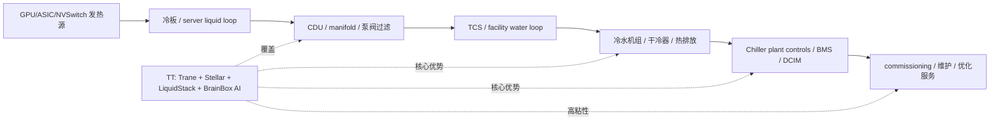
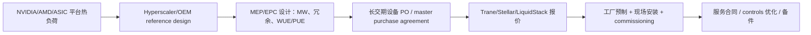

# 公司：ALLE Allegion plc

> 生成日期：2026-05-10（美国太平洋时间）。2026-05-10 是周日，股价采用 2026-05-08 最新收盘/最后成交数据。  
> 范围说明：本报告未参考 `工作台v5/公司调研` 目录下既有公司报告；结合了 Allegion 官方公告、SEC 文件、市场数据，以及项目内非公司调研目录的 AI 数据中心/物理安防产业链资料。

## 0. 结论先行

Allegion 是全球门控五金、机械锁、电子门禁、身份凭证、门体与开口解决方案公司。投资人通常把 ALLE 看成高质量安防工业股：品牌强、渠道深、毛利率高、现金流好、并购整合稳定，但不是 AI 纯正标的。它在 AI 数据中心里的位置不是 GPU、光模块或电力主设备，而是“物理安全 + 合规开站 + 门/柜级访问审计”的边缘但刚性环节。

2025 年公司收入 40.67 亿美元，同比增长 7.8%，调整后 EBITDA 10.08 亿美元，调整后 EBITDA 率 24.8%。2026Q1 收入 10.34 亿美元，同比增长 9.7%，有机增长 2.6%；公司把 2026 全年收入指引提高到同比增长 6%-8%，有机增长 2%-4%。资产负债表健康：2026Q1 现金 3.09 亿美元，长期债务 20.30 亿美元，流动比率约 1.91x，净债务/TTM 调整后 EBITDA 约 1.7x。

AI 数据中心相关收入公司未单独披露。按产品和项目内容量推算，当前直接数据中心开口、电子门禁、机柜/房间访问控制、RF/声学/防火门等收入大概率仍是低个位数占比，估计约 0.6%-3.0% 公司收入，即年化约 2500 万-1.2 亿美元；但增速可能显著高于公司平均。最值得跟踪的是：电子门禁与凭证读卡器、ELATEC 多协议读卡器、Overtur 规格化/BIM 协同、Krieger/Steelcraft/Republic/DCI 数据中心门体和框架、Schlage/Von Duprin/LCN 数据中心门控五金。

## 1. 公司整体业务、投资人认知、产业链位置与估值

### 1.1 业务概览

Allegion plc 总部在爱尔兰都柏林，2013 年从 Ingersoll Rand 分拆上市。公司主营安全与出入控制解决方案，核心产品包括机械锁、电子锁、门禁控制、读卡器、凭证、门闭器、逃生装置、门体、门框、软件/SaaS 和规格化协同工具。

主要品牌包括 Schlage、Von Duprin、LCN、Steelcraft、Republic、Interflex、SimonsVoss、Krieger、ELATEC、Gatewise、Waitwhile 等。公司销售模式重度依赖建筑规范、建筑师/安防顾问指定、分销商、门五金渠道、锁匠、系统集成商和 OEM 客户。北美商业/机构市场是利润核心。

产业链位置可以概括为：

| 环节 | Allegion 位置 | 价值来源 |
|---|---:|---|
| 建筑设计/规格 | 门五金表、BIM、Overtur 规格协同 | 早期指定形成锁定 |
| 物理开口 | 门、框、铰链、闭门器、逃生装置、防火/声学/RF 门 | 安规、交期、品牌、渠道 |
| 电子门禁 | 电子锁、读卡器、移动凭证、控制接口 | 身份认证、审计、兼容性 |
| 软件/服务 | SaaS、访客/排队/物业门禁、规格管理 | 高毛利、留存、交叉销售 |
| AI 数据中心 | 园区/楼栋/机房/笼区/机柜的访问控制和审计 | 合规开站、资产保护、保险和客户审计 |

### 1.2 投资人眼中的 ALLE

市场通常把 ALLE 定位为“高毛利、强品牌、稳健并购、非住宅周期暴露”的工业/安防复合增长股，而不是高 beta 科技股。核心投资逻辑是：

| 维度 | 投资人通常的看法 |
|---|---|
| 护城河 | Schlage、Von Duprin、LCN 等品牌强；建筑规格指定和渠道关系形成切换成本 |
| 周期性 | 非住宅新建、改造、教育、医疗、政府、商业地产周期会影响需求 |
| 成长性 | 电子化、软件化、移动凭证、并购驱动 mix 改善 |
| 盈利质量 | 2025 调整后 EBITDA 率 24.8%，Americas 调整后经营利润率常在 27%-30% |
| AI 相关性 | 非核心但有可验证暴露：数据中心物理安全、门控、读卡器、机柜级审计 |
| 主要担忧 | 住宅疲软、国际 ERP 执行、金属/关税成本、并购整合、电子门禁平台竞争 |

### 1.3 最近 3 年重大变化、转型和并购

1. 电子产品与软件占比上升。2025 年机械产品收入 27.14 亿美元，占 66.7%；电子产品收入 10.75 亿美元，占 26.4%，同比增长 13.6%；服务和软件收入 2.78 亿美元，占 6.8%，同比增长 9.7%。
2. 2025 年并购显著加速。公司 2025 年完成 9 笔收购，合计对价约 6.32 亿美元；这些收购在 2025 年并表后贡献收入 9300 万美元、经营利润 1670 万美元。
3. ELATEC 收购强化读卡器和多协议凭证。ELATEC 是德国 RFID/移动凭证/多频读卡器公司，面向 OEM 和系统集成商，有助于 Allegion 从“门锁/五金”向“身份读取入口”延伸。
4. Gatewise 和 Waitwhile 强化 SaaS。Gatewise 偏多户住宅云门禁；Waitwhile 偏预约、排队、访客流程软件。两者对 AI 数据中心不是直接收入主体，但与园区访客、承包商排程、门禁运营存在交叉。
5. 2026 年 3 月收购 Door Controls Inc.（DCI）。DCI 提供中空金属门和门框，覆盖加州、内华达、亚利桑那，特点是低资本、快速交付、定制门解决方案。对西部美国数据中心、工业、商业项目交付更有帮助。
6. 2026 年 Data Center World 展会，公司明确展示“mission-critical data center solutions”，包括 Overtur、Krieger STC 51 声学/RF 屏蔽门、Schlage L Series Electronic Latch Retraction Mortise Lock、LCN 4040XP、LCN Senior Swing、Von Duprin Outdoor Defense、Steelcraft/Republic/Trimco/门框五金等。

### 1.4 最新估值与财务健康

| 指标 | 最新值 | 日期/口径 | 备注 |
|---|---:|---|---|
| 股价 | 134.37 美元 | 2026-05-08 收盘/最后成交 | 2026-05-10 为周日 |
| 市值 | 116.4 亿美元 | 2026-05-08/StockAnalysis | 工业安防中大型公司 |
| EV | 133.5 亿美元 | 2026-05-08/StockAnalysis | 含净债务 |
| TTM PE | 18.36x | 2026-05-08/StockAnalysis | EPS 约 7.32 美元 |
| Forward PE | 14.90x | 2026-05-08/StockAnalysis | 对应 2026 调整 EPS 指引 8.70-8.90x 更接近 15x |
| PS | 2.78x | 2026-05-08/StockAnalysis | TTM 收入约 41.6 亿美元 |
| Forward PS | 2.58x | 2026-05-08/StockAnalysis | 2026 指引收入约 43.1 亿-43.9 亿美元 |
| 2026Q1 收入增速 | +9.7% reported / +2.6% organic | 2026Q1 | 并购贡献明显 |
| 2026 全年收入指引 | +6%-8% reported / +2%-4% organic | 2026Q1 更新 | 较年初上调 |
| 毛利率 | 44.0% | 2026Q1 | TTM/StockAnalysis 约 45.0% |
| 净利率 | 13.4% | 2026Q1 | TTM/StockAnalysis 约 15.2% |
| 现金 | 3.09 亿美元 | 2026-03-31 | 资产负债表 |
| 长期债务 | 20.30 亿美元 | 2026-03-31 | 主要为长期债 |
| 流动比率 | 1.91x | 2026-03-31 | 流动资产 14.23 亿/流动负债 7.46 亿 |
| 债务/权益 | 0.97x | 2026-03-31/StockAnalysis | 杠杆可控 |
| 净债务/TTM 调整 EBITDA | 约 1.7x | 推算 | 以 2025 调整 EBITDA 10.08 亿美元及 Q1 更新估算 |

财务健康度评价：健康。公司盈利能力强、现金流稳定、杠杆中等，仍有并购空间。需要关注的是 2025 年并购密集导致整合复杂度上升，以及国际业务 ERP 系统实施在 2026Q1 造成收入确认扰动。

## 2. 最新和最近 4 次财报

公司不披露标准化 backlog/bookings/lead time/cancellation rate。下表中的订单与交付为公告、管理层文字和产品周期推断，明确标注为“未披露/推断”的项目不应等同订单数据。

| 财报季度 | 收入与增速 | 分部收入与增速 | 产品/软件结构 | 利润率 | 订单、交期、取消率 | AI 数据中心相关收入占比 |
|---|---:|---|---|---|---|---|
| 2026Q1，最新 | 收入 10.336 亿美元，+9.7% reported，+2.6% organic | Americas 8.099 亿，+6.9% reported/+4.5% organic；International 2.237 亿，+21.5% reported/-5.3% organic | Products 9.616 亿，占 93.0%；Services/software 7200 万，占 7.0%，+15.4% | 毛利率 44.0%；经营率 18.6%；调整经营率 21.2%；净利率 13.4%；调整 EPS 1.80 美元 | backlog 未量化；International 因软件系统实施影响收入确认，公司称将由既有订单和 backlog 支撑全年恢复；取消率未披露 | 未披露；按数据中心门控/电子门禁推算低个位数，估计 0.6%-3.0% |
| 2025Q4 | 收入 10.332 亿美元，+9.3% reported，+3.3% organic | Americas 7.955 亿，+6.1% reported/+4.8% organic；International 2.377 亿，+21.5% reported/-2.3% organic | FY 2025 机械 27.139 亿，占 66.7%；电子 10.751 亿，占 26.4%；服务软件 2.783 亿，占 6.8% | 毛利率 44.5%；经营率 18.3%；调整经营率 22.4%；净利率 14.3%；调整 EPS 1.94 美元 | 订单未披露；非住宅电子和并购支撑增长；住宅偏弱 | 未披露；Data Center World 2026 前夕已形成数据中心组合，但未量化 |
| 2025Q3 | 收入 10.702 亿美元，+10.7% reported，+5.9% organic | Americas 8.440 亿，+7.9% reported/+6.4% organic；International 2.262 亿，+22.5% reported/+3.6% organic | 电子产品增长继续快于机械；软件/服务延续高个位数至双位数增长 | 毛利率约 45.8%；调整经营率 24.1%；净利率 17.6%；调整 EPS 2.30 美元 | 订单未披露；全年指引上调，隐含订单/渠道需求稳定 | 未披露；更多体现为非住宅电子门禁需求 |
| 2025Q2 | 收入 10.220 亿美元，+5.8% reported，+3.2% organic | Americas 8.215 亿，+6.6% reported/+4.5% organic；International 2.005 亿，+2.9% reported/-2.2% organic | 单季首次收入超过 10 亿美元；电子与非住宅更强 | 毛利率 45.6%；调整经营率 23.7%；净利率 15.6%；调整 EPS 2.04 美元 | 订单未披露；全年指引上调，说明取消率未见明显恶化 | 未披露；推断数据中心仍是非住宅中的小但高增长垂直 |
| 2025Q1 | 收入 9.419 亿美元，+5.4% reported，+4.0% organic | Americas 7.578 亿，+6.8% reported/+4.9% organic；International 1.841 亿，-0.3% reported/+0.9% organic | 机械仍为大头，电子/软件快于公司平均 | 毛利率 44.9%；调整经营率 22.7%；净利率 15.7%；调整 EPS 1.86 美元 | 订单未披露；2025 年初指引 already 偏稳健 | 未披露；AI 数据中心直接披露为零 |

关键读法：

- Americas 是利润核心。2026Q1 Americas 调整经营利润率 28.1%，2025Q2/Q3 均接近 30%。
- International 更受并购和系统实施影响。2026Q1 reported 增长 21.5%，但 organic -5.3%，主要不是需求崩塌，而是软件系统实施影响收入确认。
- 电子产品是增速核心。2025 电子产品收入 10.75 亿美元，同比增长 13.6%，显著快于机械产品的 5.5%。
- 服务/软件小而快。2026Q1 services/software 收入 7200 万美元，同比增长 15.4%，是 mix 改善来源。

## 3. 2026 指引、收入占比和产品映射

### 3.1 2026 最新指引

2026Q1 后公司上调全年指引：

| 项目 | 2026 最新指引 | 含义 |
|---|---:|---|
| 收入增长 | +6%-8% reported | 以 2025 收入 40.67 亿美元估算，2026 收入约 43.11 亿-43.93 亿美元 |
| 有机收入增长 | +2%-4% | 核心需求温和增长，并购贡献仍大 |
| 报告 EPS | 7.95-8.15 美元 | 含重组/并购摊销等 |
| 调整 EPS | 8.70-8.90 美元 | 同比 2025 年 8.07 美元增长约 7.8%-10.3% |
| 可用现金流 | 调整后净利润的 85%-95% | 现金转化率仍强 |
| 有效税率 | 18%-19% | 稳定 |

### 3.2 收入占比

| 口径 | 2025/2026 最新结构 | 增长 |
|---|---:|---:|
| 机械产品 | 2025 收入 27.139 亿美元，占 66.7% | +5.5% |
| 电子产品 | 2025 收入 10.751 亿美元，占 26.4% | +13.6% |
| 服务和软件 | 2025 收入 2.783 亿美元，占 6.8% | +9.7% |
| Americas | 2026Q1 收入 8.099 亿美元，占 78.4% | +6.9% reported/+4.5% organic |
| International | 2026Q1 收入 2.237 亿美元，占 21.6% | +21.5% reported/-5.3% organic |
| Products | 2026Q1 收入 9.616 亿美元，占 93.0% | +9.3% 左右推算 |
| Services/software | 2026Q1 收入 7200 万美元，占 7.0% | +15.4% |

### 3.3 重点产品和小业务

| 业务/产品 | 具体产品/型号 | 为什么重要 | 2026 侧重点 |
|---|---|---|---|
| 电子门禁和电子锁 | Schlage 电子锁、Schlage L Series Electronic Latch Retration Mortise Lock、SimonsVoss、Interflex、移动凭证 | 收入 10.75 亿美元、2025 增速 13.6%；AI 数据中心需要门区/笼区/机房访问审计 | 继续推高电子产品 mix，非住宅和机构场景优先 |
| ELATEC 读卡器/多协议凭证 | TWN4 系列、Secustos、RFID/移动凭证、多频读卡器 | 连接 Allegion 门控与第三方 PACS/OEM；Aliro、移动钱包、OSDP 等互操作趋势增强 | 并购整合、交叉销售、OEM/系统集成商扩张 |
| 数据中心门体和开口组合 | Krieger STC 51 声学/RF 屏蔽门、Steelcraft/Republic/Trimco、DCI 中空金属门框 | 数据中心开站必须通过消防、安防、声学/RF、通行和应急要求；交期影响 commissioning | 通过 DCI 快速交付和 Data Center World 垂直营销扩大份额 |
| 出口装置/闭门器/自动门 | Von Duprin Outdoor Defense、LCN 4040XP、LCN Senior Swing | 每个关键开口都需要，品牌和安规强 | 在数据中心、教育、医疗、政府等非住宅项目绑定销售 |
| 软件/SaaS | Overtur、Gatewise、Waitwhile、Interflex 软件 | 服务/软件 2026Q1 +15.4%；高毛利，可把硬件指定前移到设计阶段 | 规格协同、访客/预约/物业门禁、移动访问 |
| 规格化和项目协同 | Overtur 云平台 | 建筑师、门五金顾问、总包、业主协同门表，帮助形成早期指定 | 数据中心大型项目多专业协同，规格锁定价值高 |

### 3.4 可跳过或低优先级业务

以下业务并非无价值，但相对本报告的 AI/数据中心高增长问题，优先级较低：

| 业务/产品 | 跳过原因 |
|---|---|
| 传统住宅机械锁、门把手、deadbolt | 增速低，受住宅周期影响，AI 数据中心相关性弱 |
| 非智能传统钥匙系统 | 替换周期稳定但缺少 AI 增量 |
| 普通消费类便携安全/自行车锁 | 体量和 AI 相关性低 |
| 国际部分低增速传统机械产品 | 2026Q1 organic 受 ERP 影响为负，短期验证难度高 |
| 非数据中心普通商业门框 | 仍是现金流基础，但不是高增速主题 |

## 4. 当前关键业务收入贡献、增速和 AI 基建重要性

评分：5 为最高。收入贡献为估算时会明确标注。

| 关键业务/产品 | 当前收入贡献 | 当前增速 | AI 基建重要性 | 时间紧急性 | 供需紧张度 | 垄断/溢价能力 | 判断 |
|---|---:|---:|---:|---:|---:|---:|---|
| 电子产品：电子锁、门禁、凭证、读卡器 | 2025 收入 10.751 亿美元 | +13.6% | 4 | 4 | 3 | 4 | 数据中心、教育、医疗、企业园区都需要访问审计，是公司最重要增长池 |
| 服务和软件：Overtur、Gatewise、Waitwhile、Interflex 软件 | 2025 收入 2.783 亿美元；2026Q1 7200 万美元 | 2025 +9.7%；2026Q1 +15.4% | 3 | 3 | 2 | 4 | 体量小但毛利高，能提高客户粘性和硬件指定率 |
| 数据中心门体/开口/门控五金组合 | 未披露；估计当前年化 6000 万-1.2 亿美元 | 估计 +20%-40% | 4 | 5 | 4 | 4 | 不是 AI 算力核心 BOM，但影响项目验收、合规、保险和客户审计 |
| ELATEC 多协议读卡器和移动凭证 | 未单独披露；结合 2025 并购贡献，估计年化 7000 万-1.2 亿美元 | 估计 +10%-20% | 3 | 4 | 2 | 3 | 价值在互操作和 OEM 渠道，若 Aliro/钱包凭证普及，战略价值上升 |
| Overtur 规格/BIM/门表协同 | 未披露；估计千万美元级别 | 估计双位数 | 3 | 4 | 1 | 4 | 直接收入小，但影响规格锁定，是数据中心大项目早期卡位工具 |
| DCI/Steelcraft/Republic 快速交付门框 | DCI 未披露；门体/框架属于机械大盘 | 估计高于机械平均 | 3 | 5 | 4 | 3 | 数据中心建设中交期价值高，西部美国区域增强明显 |

## 5. 一年后关键业务收入贡献预测：基准、乐观、极度乐观

| 关键业务/产品 | 基准情景：2027 年中 run-rate | 乐观情景 | 极度乐观情景 | 关键触发因素 |
|---|---:|---:|---:|---|
| 电子产品 | 约 11.5 亿美元，+7% | 约 12.1 亿美元，+13% | 约 12.9 亿美元，+20% | 非住宅电子门禁、ELATEC 交叉销售、移动凭证加速 |
| 服务和软件 | 约 3.10 亿美元，+11% | 约 3.35 亿美元，+20% | 约 3.65 亿美元，+31% | Gatewise/Waitwhile 并表、Overtur 使用增加、Interflex 软件增长 |
| 数据中心门体/开口/门控组合 | 约 9000 万-1.4 亿美元，+20%-40% | 约 1.4 亿-2.2 亿美元，+50%-80% | 约 2.2 亿-3.5 亿美元，接近翻倍或以上 | AI colo 快速建设、DCI 快交付、Hyperscaler/colo 规格指定 |
| ELATEC 读卡器/移动凭证 | 约 9500 万-1.25 亿美元 | 约 1.2 亿-1.6 亿美元 | 约 1.6 亿-2.2 亿美元 | Aliro/钱包凭证、PACS/OEM 兼容、Schlage/SimonsVoss 联动 |
| Overtur/规格化工具 | 千万至数千万美元 | 数千万美元 | 若绑定大型数据中心标准化门表，可高双位数增长 | 设计阶段指定率提升、BIM/门表数据成为项目协同标准 |

按 AI 基建维度的三情景评分：

| 业务/产品 | 情景 | AI 重要性 | 时间紧急性 | 供需紧张度 | 垄断/溢价能力 |
|---|---|---:|---:|---:|---:|
| 数据中心开口/门体/门控五金 | 基准 | 4 | 5 | 3 | 3 |
| 数据中心开口/门体/门控五金 | 乐观 | 4 | 5 | 4 | 4 |
| 数据中心开口/门体/门控五金 | 极度乐观 | 5 | 5 | 5 | 4 |
| 电子门禁/电子锁 | 基准 | 4 | 4 | 3 | 4 |
| 电子门禁/电子锁 | 乐观 | 4 | 5 | 4 | 4 |
| 电子门禁/电子锁 | 极度乐观 | 5 | 5 | 4 | 5 |
| ELATEC 读卡器/移动凭证 | 基准 | 3 | 4 | 2 | 3 |
| ELATEC 读卡器/移动凭证 | 乐观 | 4 | 4 | 3 | 4 |
| ELATEC 读卡器/移动凭证 | 极度乐观 | 4 | 5 | 4 | 4 |
| Overtur/软件/SaaS | 基准 | 3 | 3 | 1 | 4 |
| Overtur/软件/SaaS | 乐观 | 3 | 4 | 2 | 4 |
| Overtur/软件/SaaS | 极度乐观 | 4 | 4 | 2 | 5 |

## 6. BOM、单位内容量、价格传导、产能与认证

### 6.1 AI 数据中心单位内容量

项目内 AI 数据中心产业链资料显示，2026 年 AI 相关机柜围护结构与物理安防全球收入池基准情景约 140 亿-190 亿美元，乐观 200 亿-280 亿美元，极度乐观 320 亿-450 亿美元；其中“机房/笼区/机柜级访问控制、智能门锁、审计追踪”会随高价值 GPU rack 普及而加速。

对 Allegion 来说，真实单位内容量不是按 GPU 或 optical port 直接计价，而是按“开口数量、受控门点、读卡点、机柜/笼区访问点、软件项目”计价。以下为工程估算，适用于 1MW AI hall 或 1MW 等效数据中心区域：

| 项目 | 每 MW 内容量 | 每 rack 内容量（假设 100-150kW/rack，即 7-12 rack/MW） | 每 GPU 内容量（假设 72 GPU/rack） | 每 optical port 内容量 | Allegion 可捕获收入 |
|---|---:|---:|---:|---:|---:|
| 园区/机房受控门点 | 5-16 个受控/特殊开口/MW | 0.4-2.3 个开口/rack | 不直接绑定 | 不直接绑定 | 普通受控开口 1500-8000 美元/个；特殊声学/RF/防火/高安门 5000-25000 美元/个 |
| 门控五金 | 每个关键开口 1 套锁体/闭门器/逃生装置/读卡接口 | 随开口分摊 | 不直接绑定 | 不直接绑定 | 500-5000 美元/开口，品牌和安规决定溢价 |
| 读卡器/凭证 | 5-30 个读卡点/MW | 0.4-4.3 个读卡点/rack | 不直接绑定 | 不直接绑定 | 100-600 美元/读卡器硬件，系统集成另计 |
| 机柜/笼区电子锁 | 0-2 套/rack，取决于客户是否要求柜级审计 | 0-2 套/rack | 约 4-21 美元/GPU，按 300-1500 美元/rack 分摊 | 0 | 300-1500 美元/rack，含硬件、安装、软件接口 |
| Overtur/项目软件 | 项目级授权/服务 | 大项目分摊 | 不直接绑定 | 0 | 大型项目 1 万-10 万美元以上，按 MW 分摊通常低于 1000-3000 美元/MW |

结论：Allegion 对 AI 数据中心的美元内容量小于电力、冷却、机柜、光模块，但其“开站/验收/安规/审计”属性很强。GPU 价值越高、客户合规越严格，柜级和房间级审计的 attach rate 越高。

### 6.2 BOM 和毛利率推断

项目内行业资料给出的相关 BOM/毛利区间如下，可用于交叉验证 Allegion 的产品利润率：

| 产品 | BOM/成本结构 | 行业毛利率区间 | Allegion 可能位置 |
|---|---|---:|---|
| 高端门控五金/电子锁 | 金属件、锁体、控制板、执行器、读头、认证、渠道服务 | 硬件约 35%-55% | Schlage/Von Duprin/LCN 品牌强，可能处于中高位 |
| 机柜电子锁/智能把手 | 锁/执行器/读头/控制板 35%-55%；软件/固件 10%-25%；安装/布线 20%-35% | 硬件 35%-55%；软件/服务 60%+ | ALLE 不是机柜锁主导厂，但门禁和凭证可参与 |
| VMS/ACS/物理安全平台 | 硬件 35%-55%；软件 10%-30%；集成 20%-35%；维护 10%-20% | 混合毛利 35%-55%；软件 70%-85% | Allegion 在门控/凭证强，平台层弱于 Genetec/LenelS2/CCURE |
| 高负载/预集成 rack | 基础 rack、液冷管汇、母排、线缆、测试、物流 | 25%-50% | Allegion 不做主机柜系统，更多是柜锁/门禁接口 |
| 特殊门/框/声学/RF 门 | 钢材、芯材、屏蔽结构、五金、认证、定制加工、物流 | 20%-40%+ | Krieger/Steelcraft/Republic/DCI 可因认证和交期获得溢价 |

### 6.3 价格传导链

| 产品链 | 价格传导路径 | 谁掌握议价权 |
|---|---|---|
| 数据中心门体/门框/五金 | Allegion 品牌/工厂 -> 分销商/门五金顾问 -> 总包/EPC/数据中心业主 -> hyperscaler/colo 租户 | 设计指定和门表一旦确定，替换成本高；总包压价但不能轻易换认证产品 |
| 电子门禁/锁体 | Allegion/Schlage/SimonsVoss -> 安防集成商/PACS 平台 -> 业主/物业/数据中心运营商 | PACS 平台和系统集成商影响选型；Allegion 靠兼容性和品牌保溢价 |
| ELATEC 读卡器 | ELATEC -> OEM/设备商/系统集成商 -> 终端业主 | OEM 设计赢单后粘性高；初期认证周期长 |
| Overtur/软件 | Allegion -> 建筑师/门五金顾问/业主/总包 | 软件直接收入小，但能前置指定并降低项目返工 |

### 6.4 当前产能能力和认证/采纳

| 业务 | 当前产能/收入能力 | 采纳程度 | 认证/阶段 |
|---|---:|---|---|
| 电子产品 | 2025 已实现 10.75 亿美元收入，短期可支撑 11 亿-13 亿美元级别 run-rate | 商业、教育、医疗、多户住宅广泛采用 | ANSI/BHMA、UL/fire、OSDP/PACS 兼容、移动凭证生态；Aliro 等互操作标准需继续跟踪 |
| 服务和软件 | 2025 收入 2.78 亿美元，2026Q1 年化约 2.88 亿美元 | Overtur 在规格协同，Gatewise/Waitwhile 在物业/访客流程 | 软件认证更多是平台安全、隐私、集成兼容，不是单一硬件认证 |
| 数据中心门体/开口组合 | 官方未给美元产能；结合 DCI/Steelcraft/Republic/Krieger，估计可承载 1 亿美元以上垂直收入 | Data Center World 2026 已作为独立垂直展示；未披露客户和订单 | 防火、声学 STC、RF shielding、出口/生命安全、项目门表批准；进入客户 AVL 是关键 |
| ELATEC 读卡器 | 并购后可能年化 7000 万-1.2 亿美元收入级别 | OEM 和系统集成商渠道采用 | 多频 RFID、移动凭证、Aliro/钱包凭证、PACS/OEM 兼容认证是关键 |

## 7. 一年后产能、采纳与认证预测：三情景

| 业务 | 基准情景 | 乐观情景 | 极度乐观情景 |
|---|---|---|---|
| 电子产品 | 产能/收入能力 12 亿美元左右；有机中高个位数；继续以非住宅门禁为主 | 产能/收入能力 13 亿美元左右；ELATEC 和移动凭证交叉销售更快 | 产能/收入能力 14 亿美元以上；AI 园区、金融、政府、医院加强门禁审计 |
| 服务和软件 | 3.2 亿-3.3 亿美元收入能力；Gatewise/Waitwhile 平稳并表 | 3.6 亿-3.8 亿美元；Overtur 更深进入大型项目协同 | 4.0 亿-4.2 亿美元；访客/预约/门禁/规格工具形成更完整平台 |
| 数据中心开口/门体/门控 | 1.5 亿美元以内垂直能力；从展示/投标进入更多项目门表 | 2.0 亿-2.5 亿美元；DCI 快交付和西部美国项目贡献明显 | 3.5 亿-4.0 亿美元；若大型 colo/hyperscaler 批量指定，特殊门和电子门禁供应紧张 |
| ELATEC/多协议读卡器 | 1.3 亿美元左右能力；OEM 认证稳步推进 | 1.8 亿美元左右；Aliro/移动钱包凭证带来更多设计赢单 | 2.5 亿美元左右；多协议读卡器成为跨系统标准化入口 |
| 认证/客户采纳 | 完成更多 PACS/OEM 兼容和客户 AVL | Aliro/移动凭证认证案例增加，数据中心门表指定增加 | 柜级/房间级访问审计成为保险、客户审计或合同条款，高价值 GPU 区 attach rate 大幅提升 |

## 8. 基于订单积压和供给的未来一年增速预测

### 8.1 可验证订单和 backlog 线索

Allegion 未披露按产品的 backlog、bookings、B2B、lead time 或取消率。可用线索包括：

- 2026Q1 公司明确表示 International 因软件系统实施影响收入确认，但预计全年会因既有订单和 backlog 支撑而恢复。
- 2026 全年收入指引从年初的 +5.5%-7.5% 提高至 +6%-8%，说明订单/渠道可见度至少没有恶化。
- 2025 年 9 笔收购并表后仅贡献 9300 万美元收入，2026 将有更完整全年贡献。
- 2026 年 3 月 DCI 收购补强美国西部中空金属门/门框快交付能力，对数据中心密集区域有增量价值。
- 2026 Data Center World 展示完整数据中心开口组合，说明公司已把数据中心作为垂直市场主动销售，而非被动接单。

### 8.2 三情景公司未来一年增速

| 情景 | 公司总收入未来一年增速 | 电子产品 | 服务/软件 | 数据中心相关垂直 | 订单/供给假设 |
|---|---:|---:|---:|---:|---|
| 基准 | +6%-8% | +7%-10% | +10%-15% | +20%-40%，但基数小 | 非住宅稳健，住宅平，国际 ERP 恢复，取消率低但无显著供不应求 |
| 乐观 | +8%-10% | +12%-15% | +18%-22% | +50%-80% | AI colo 和机构项目加速，ELATEC/Overtur/Schlage 联动，DCI 交付形成差异 |
| 极度乐观 | +10%-13% | +18%-22% | +25%-35% | 约翻倍或更高 | 大型数据中心客户把门体/门禁/柜级审计标准化指定，特殊门和集成商交付成为瓶颈 |

取消率推断：公司未披露取消率。从指引上调、非住宅增长和 backlog 文字看，取消率没有明显上升信号。住宅和国际低增速更多是周期与系统实施问题。数据中心项目取消率通常低于普通商业地产，但延期风险存在；真正瓶颈更可能是业主审批、认证、特殊门交期、系统集成商工时，而不是 Allegion 单一硬件产能。

## 9. 竞争格局、技术路线、替代风险和客户切换成本

### 9.1 主要竞争对手

| 领域 | 主要竞争对手 | Allegion 相对位置 |
|---|---|---|
| 机械锁/商业门控五金 | ASSA ABLOY、dormakaba、Stanley/Best、Hager、PDQ | 北美品牌强，Schlage/Von Duprin/LCN 在商业规格中地位高 |
| 电子门禁/凭证 | ASSA ABLOY/HID、dormakaba、Johnson Controls、Honeywell/LenelS2、Motorola/Openpath | 门端硬件强，平台层不是最强 |
| 读卡器/OEM 凭证 | HID、STid、Identiv、Suprema、NXP/Infineon 生态 | ELATEC 强在多协议、OEM 和互操作 |
| 安防平台/VMS/ACS | Genetec、LenelS2、Software House/CCURE、Axis、Bosch、Motorola/Avigilon、Verkada、Rhombus | Allegion 需要与这些平台兼容，而不是完全替代 |
| 机柜/电子锁 | Southco、ASSA ABLOY/HES/ABLOY、TZ Limited、EMKA、DIRAK、Panduit、nVent | Allegion 在建筑门控强，机柜锁不是绝对主导 |
| 特殊门/门框 | ASSA ABLOY 旗下门体品牌、区域中空金属门厂、Krieger 细分竞争者 | Krieger/Steelcraft/Republic/DCI 增强特殊门和快交付 |

### 9.2 新技术是否会成为主流

更可能成为主流的方向：

1. 移动凭证和多协议读卡器。企业不希望被单一卡技术锁死，多协议、钱包凭证、Aliro 类互操作标准会提高读卡器价值。
2. OSDP Secure Channel 和可审计门禁。高安全设施会从“开门即可”转向“谁、何时、在哪个门/柜、是否授权”的审计闭环。
3. 柜级/笼区访问控制。GPU rack 单柜价值可达数百万美元，高价值资产使机柜锁、电子把手、门禁日志从可选项变成合规/保险工具。
4. 规格/BIM 协同。大型数据中心项目工期紧，门表错误会拖累验收；Overtur 这类工具的直接收入虽小，但能提高 Allegion 被指定概率。
5. 特殊声学/RF/防火/高安门。随着 AI 数据中心靠近城市、电网节点和高安全客户，声学、屏蔽、消防、应急逃生要求更复杂。

不确定或风险较大的方向：

- Allegion 不拥有完整企业安防平台入口，可能被 Genetec、LenelS2、CCURE、Axis、Motorola/Openpath 等平台层压缩数据价值。
- HID/ASSA ABLOY 在凭证和读卡生态强，ELATEC 需要证明并购后交叉销售能力。
- Hyperscaler 可能自定义标准，压低五金供应商溢价。
- 机柜级智能锁可能由机柜厂、PDU 厂或 Southco/EMKA/DIRAK 等工业锁厂拿走更多份额。
- 建筑消防、生命安全、RF/声学认证周期长，若认证或客户 AVL 进入慢，收入兑现会滞后。
- 国际 ERP 执行问题若延续，会影响海外有机增长和利润率。

### 9.3 客户替换成本

客户替换成本较高，尤其在非住宅和数据中心场景：

- 设计阶段：门五金表、BIM、消防/生命安全、门禁系统兼容一旦定稿，改品牌会导致重新审图和重新认证。
- 施工阶段：门、框、锁体、闭门器、逃生装置、读卡器、布线、PACS 集成互相依赖，替换会拖期。
- 运营阶段：凭证、访问权限、审计日志、维护备件、锁匠/集成商培训形成粘性。
- 数据中心场景：客户、保险、合规、租户审计会强化标准化；高价值 GPU rack 使“便宜替代”风险下降。

因此，Allegion 的最大优势不是某个单品不可替代，而是“早期规格指定 + 门端硬件完整组合 + 渠道/认证 + 维护生态”。最大风险是平台层和凭证层被竞争对手掌控，Allegion 只保留低速机械硬件角色。

## 10. 后续跟踪信号

1. 管理层是否首次量化 data center vertical、mission-critical、AI campus、rack-level access control 收入或订单。
2. 电子产品有机增速是否持续快于公司 2%-4% organic 指引。
3. Services/software 是否保持 15% 左右增长，Gatewise/Waitwhile 是否带来高毛利留存。
4. ELATEC 是否披露 OEM wins、Aliro/移动钱包凭证认证和 Schlage/SimonsVoss 交叉销售。
5. DCI 是否提高美国西部数据中心门框交付速度，是否带来 margin-accretive 收入。
6. International ERP 影响是否在 2026 下半年恢复，若未恢复会削弱整体 organic。
7. 竞争对手 ASSA ABLOY/HID、Genetec、LenelS2、Southco、EMKA、DIRAK 是否在 AI 数据中心柜级访问控制中拿到更明确标准。

## 来源

- Allegion 2026Q1 财报新闻稿 PDF：<https://investor.allegion.com/~/media/Files/A/Allegion-IR/press-release/q1-2026-allegion-earnings-call-press-release.pdf>
- Allegion 2025Q4/2025 全年财报：<https://investor.allegion.com/news-and-events/news-releases/2026/02-17-2026-110034304>
- Allegion 2025Q3 财报：<https://investor.allegion.com/news-and-events/news-releases/2025/10-23-2025-110035007>
- Allegion 2025Q2 财报：<https://investor.allegion.com/news-and-events/news-releases/2025/07-24-2025-110052252>
- Allegion 2025Q1 财报：<https://investor.allegion.com/news-and-events/news-releases/2025/04-24-2025-110016175>
- Allegion 2025 Form 10-K：<https://www.sec.gov/Archives/edgar/data/1579241/000157924126000007/alle-20251231.htm>
- Allegion 2026Q1 Form 10-Q：<https://www.sec.gov/Archives/edgar/data/1579241/000157924126000015/alle-20260331.htm>
- Allegion 收购 Door Controls Inc.：<https://investor.allegion.com/news-and-events/news-releases/2026/03-04-2026-130025758>
- Allegion Data Center World 2026 展示数据中心解决方案：<https://www.prnewswire.com/news-releases/allegion-to-showcase-mission-critical-data-center-solutions-at-data-center-world-2026-302743504.html>
- Allegion 收购 ELATEC：<https://investor.allegion.com/news-and-events/news-releases/2025/07-02-2025-130023032>
- Allegion 收购 Gatewise：<https://investor.allegion.com/news-and-events/news-releases/2025/07-31-2025-130020093>
- Allegion 收购 Waitwhile：<https://investor.allegion.com/news-and-events/news-releases/2025/11-05-2025-130018058>
- StockAnalysis ALLE 估值和财务统计：<https://stockanalysis.com/stocks/alle/statistics/>
- StockAnalysis ALLE 收入历史：<https://stockanalysis.com/stocks/alle/revenue/>
- 项目内非公司调研资料：`D:\drive\Investment\工作台v5\行业调研_AI园区电力_机电_冷却\行业调研_机柜围护结构与物理安防_2026.md`
- 项目内非公司调研资料：`D:\drive\Investment\工作台v5\AI数据中心建设规模与产业链订单映射_2026-2027_美国.md`


# 公司：CARR Carrier Global Corporation（开利全球）

> 日期：2026-05-10  
> 口径：美元；市值、估值和股价采用 2026-05-08 美股收盘数据，因为 2026-05-10 为周日。  
> 资料边界：未参考本目录 `公司调研` 下任何旧文件。结合了项目内 AI 数据中心冷却/液冷/建设规模资料、Carrier 官方财报与产品公告、SEC/IR 文件、行业会议和市场数据。  
> 结论强度标记：`披露` = 公司或官方来源明确披露；`推算` = 用披露数据和行业单位价值量估算；`判断` = 投资研究观点。

## 0. 一页结论

Carrier 是全球 HVAC 老牌龙头，投资人过去把它看作“住宅 HVAC + 商业 HVAC + 运输冷链”的工业周期股；2024-2026 年组合重塑后，公司正在被重新定价为“纯度更高的智能气候/能源解决方案公司”，其中 AI 数据中心冷却成为最有弹性的增量。

最重要的事实是：Carrier 的全球数据中心销售从 2024 年约 **$0.5B**、2025 年约 **$1.0B**，公司 2026 年目标约 **$1.5B**，且 2026Q1 管理层称当前数据中心 backlog 已覆盖全年预期销售；Q1 全球数据中心订单同比 **>500%**，全球 Commercial HVAC 订单 **+35%**。这说明需求已经进入订单和积压，而不是只有产品叙事。

但 CARR 不是纯液冷股。它的 AI 数据中心价值主要在三层：一是大型冷水机组/空冷离心机组/水冷离心机组与设施侧热排放；二是 CDU 和 direct-to-chip liquid cooling 的系统入口；三是 QuantumLeap、Automated Logic、Nlyte、Abound、BluEdge 服务带来的控制与长期运维。短期美元收入最大的是 chiller 和商业 HVAC，弹性最大的是 CDU/液冷和服务 attach，长期毛利更好的可能是 controls + service。

最大的投资矛盾：2026 年住宅 HVAC 和中国 RLC 仍拖累利润率，Q1 调整后经营利润同比 -30%，CSA segment margin 从 22.2% 降至 14.9%；但商业 HVAC、aftermarket、数据中心订单在加速。CARR 的重估取决于数据中心能否从 2026 年 $1.5B 目标爬到 2027 年 $2B-$3B，并把低毛利项目型设备转化成服务、控制和长期维护收入。

## 1. 公司整体业务与投资人认知

### 1.1 公司业务结构

Carrier Global Corporation 是从 United Technologies 拆分出来的全球 HVAC、气候与冷链公司，当前报告分部为四块：

| 分部 | 2025 收入 | 2025 segment operating margin | 核心业务 | 投资含义 |
|---|---:|---:|---|---|
| Climate Solutions Americas, CSA | $10.47B | 20.5% | 美洲住宅 HVAC、light commercial、commercial HVAC、NORESCO 以外口径的商业系统 | 最大利润池；2025 H2/2026 Q1 被美国住宅去库存拖累，但数据中心订单主要落在这里。 |
| Climate Solutions Europe, CSE | $5.04B | 8.8% | Viessmann 住宅/轻商热泵、欧洲商业 HVAC、锅炉和服务 | Viessmann 是战略转型核心；短期受欧洲热泵周期影响，长期受电气化和安装商渠道驱动。 |
| Climate Solutions Asia Pacific, Middle East & Africa, CSAME | $3.34B | 13.4% | 亚洲/中东/澳洲 HVAC，含中国 RLC、商业系统 | 中国 RLC 是拖累；印度、澳洲、中东商业需求较强。 |
| Climate Solutions Transportation, CST | $2.89B | 15.6% | Truck/trailer、container、Sensitech 冷链监测 | 运输冷链周期性较强；Container 2025/2026 高增，非 AI 核心。 |

2026Q1 的业务收入占比为：CSA **46.8%**、CSE **24.2%**、CSAME **15.6%**、CST **13.4%**。服务收入 Q1 为 **$674M**，同比从 $566M 增长约 **19%**，服务/aftermarket 对利润质量很关键。

### 1.2 投资人心中的 CARR

过去：住宅 HVAC 周期、利率敏感、经销商库存、美国房屋交易、欧洲热泵补贴周期。  
现在：组合大幅简化后，投资人开始把 CARR 与 Trane、Johnson Controls、Vertiv、Schneider、Modine/Airedale 一起放进“AI 数据中心热管理”篮子里比较。

市场给 CARR 的估值介于传统工业和 AI 基建之间：截至 2026-05-08 收盘，CARR 股价 **$66.83**，市值 **$55.51B**，TTM PE **44.54x**，Forward PE **23.82x**，PS **2.54x**，Forward PS **2.44x**。这不是便宜周期股估值，已经隐含商业 HVAC/数据中心改善预期。

### 1.3 最近 3 年重大业务变动

| 时间 | 事件 | 金额/规模 | 战略意义 |
|---|---|---:|---|
| 2023-04 宣布，2024-01 完成 | 收购 Viessmann Climate Solutions | 交易总对价约 $14B 级别，Viessmann 员工约 12,000 | 将欧洲热泵、安装商渠道和住宅/轻商电气化纳入 Carrier，成为“气候解决方案”纯化核心。 |
| 2024-06 | Honeywell 完成收购 Carrier Global Access Solutions | $4.95B | 剥离安防/门禁资产，降低 Fire & Security 曝口。 |
| 2024-10 | 完成商业制冷业务出售给海尔 | EV $775M，含约 $200M 净养老金负债 | 退出低协同商业制冷，集中 HVAC、气候与冷链。 |
| 2024-12 | 完成 Commercial & Residential Fire 出售 | EV $3.0B | Fire & Security 退出基本完成，组合更聚焦。 |
| 2025 | 发布 QuantumLeap 数据中心热管理套件，推出 CDU；投资 STL/ZutaCore 等 | 未披露 | 从传统 chiller/HVAC 向 chip-to-chiller 热链条延伸。 |
| 2025-12 宣布，预计 2026H1 完成 | 出售 Riello 给 Ariston | 金额未在公告摘要中披露；2026 指引中 Riello exit 收入逆风约 $250M-$350M | 进一步削减欧洲传统燃烧/锅炉资产，聚焦差异化气候和能源解决方案。 |
| 2026-04 | 追加 ZutaCore 投资 | 未披露 | 补齐 waterless/two-phase direct-to-chip 液冷期权。 |

### 1.4 产业链定位

Carrier 位于 AI 数据中心产业链的 **设施侧热管理层**，不是服务器 OEM，也不是冷板/QD 纯组件龙头。它更像“中央热源/热排放 + 建筑控制 + 服务”的平台型供应商。

| AI 基建层级 | CARR 位置 | 价值捕获方式 |
|---|---|---|
| GPU/ASIC/服务器 | 不直接参与 | 间接受益于 GB300/Rubin/ASIC rack 功率上升。 |
| Rack 液冷组件 | 通过 CDU、ZutaCore、STL 和集成方案切入 | 当前规模小，但增长最快。 |
| Facility water/chiller plant | 核心强项 | AquaEdge 30CF、19MV、水冷/空冷冷水机组、CRAH、控制系统。 |
| BAS/DCIM/控制 | 较强 | Automated Logic、Nlyte、Abound、QuantumLeap、服务协议。 |
| Aftermarket 服务 | 强 | 70,000+ connected chillers、110,000 chillers under long-term agreements，复杂 chiller 服务合同覆盖率 70%-80%。 |

## 2. 最新估值、利润率与资产负债表

### 2.1 市场与利润率快照

| 指标 | 数值 | 日期/口径 | 来源/说明 |
|---|---:|---|---|
| 股价 | $66.83 | 2026-05-08 close | StockAnalysis；2026-05-10 为周日。 |
| 盘后 | $67.16 | 2026-05-08 19:56 ET | 同上。 |
| 市值 | $55.51B | 2026-05-08 | 同上。 |
| EV | $66.71B | 2026-05-08 | 同上。 |
| TTM Revenue | $21.87B | 2026-05-08 TTM | 同上。 |
| 2026 公司收入指引 | ~$22.0B | 2026-04-30 | Carrier Q1 2026。 |
| TTM revenue growth | -1.9% | 2026-05-08 TTM | 受 divestiture 和住宅拖累。 |
| 2026 organic growth guide | flat to low-single-digit | 2026-04-30 | Riello exit、住宅弱但 CHVAC 强。 |
| PE | 44.54x | TTM | GAAP TTM 受重组/摊销/住宅周期影响。 |
| Forward PE | 23.82x | forward | 约等于 $66.83 / 2026E adj EPS ~$2.80。 |
| PS | 2.54x | TTM | 市值 / TTM sales。 |
| Gross margin | 25.18% | TTM | StockAnalysis。 |
| Operating margin | 8.48% | TTM | StockAnalysis。 |
| Net margin | 5.99% | TTM | StockAnalysis。 |
| 2026 adj operating profit guide | ~$3.4B | 2026-04-30 | 对应 adjusted op margin 约 15.5%。 |
| 2026 adj EPS guide | ~$2.80 | 2026-04-30 | 同上。 |
| 2026 FCF guide | ~$2.0B | 2026-04-30 | 同上。 |

### 2.2 资产负债表健康度

截至 2026Q1，Carrier 现金 **$1.371B**，短债/一年内到期债务 **$1.736B**，长期债务 **$10.422B**，总债务约 **$12.158B**，净债务约 **$10.787B**。总资产 **$37.186B**，总负债 **$23.385B**，权益 **$13.801B**。

| 指标 | 数值 | 评价 |
|---|---:|---|
| Current assets / current liabilities | $9.018B / $8.585B | Current ratio 约 1.05，流动性够用但不宽。 |
| Cash / total debt | $1.371B / ~$12.158B | 杠杆偏高，主要来自 Viessmann 收购后组合重塑。 |
| Net debt / 2026E adj operating profit | ~$10.8B / $3.4B = 3.2x | 工业公司可承受但没有大规模并购余地。 |
| TTM debt / EBITDA | 约 3.78x | 市场数据口径，说明资产负债表仍处于去杠杆/现金回收阶段。 |
| Interest coverage | 约 4.06x | 能覆盖，但利率/再融资不是完全无风险。 |
| Q1 FCF | -$15M | 季节性 + AR 增加；全年仍指引 ~$2B。 |
| Share repurchase | Q1 回购 $306M；2026 指引 ~$1.5B | 回购有支撑，但需平衡去杠杆。 |

判断：财务状况 **中等健康**。短期没有流动性问题，FCF 指引强；但 Viessmann 后债务不低，若住宅/欧洲热泵/中国继续弱，或数据中心项目毛利低于预期，去杠杆和回购会互相挤压。CARR 的资产负债表不适合再做超大收购，更适合小额技术投资、产能扩建和服务网络扩张。

## 3. 最近五个财报季度：订单、分部收入、利润率与 AI 数据中心

> 注意：Carrier 不按季度披露完整 backlog 金额、数据中心收入明细、取消率和交期。下表对未披露项做了推算，并保守标注。订单在 Carrier 定义中是客户合同承诺，但可能不一定带取消罚款。

| 财报季度 | 公司收入 / organic | adj op profit / margin | EPS / FCF | 订单与 backlog | CSA | CSE | CSAME | CST | AI 数据中心收入与占比 |
|---|---:|---:|---:|---|---|---|---|---|---|
| 2026Q1 | $5.341B / -1% organic，reported +2% | $594M / 11.1% | adj EPS $0.57；FCF -$15M | 披露：公司订单 +11%，global CHVAC +35%，CSA CHVAC +80%，数据中心订单 >500%；data center backlog 覆盖 2026E $1.5B 销售。推算交期：2026H2 交付斜率更陡，6-18 个月；取消率未披露，hyperscaler 类项目低，电力延迟导致推迟风险高于取消风险。 | $2.501B，-3% organic，margin 14.9%；Resi -12%，Light CML +9%，Commercial +1% | $1.293B，organic flat，margin 6.9%；RLC LSD up，Commercial MSD down | $834M，-1% organic，margin 9.7%；India +35%，Australia +65%，China RLC -25% | $713M，+5% organic，margin 14.2%；Container >35% | 披露目标：2026E ~$1.5B，年收入占比约 6.8%；Q1 收入推算 $0.25B-$0.35B，占季收入 5%-7%，订单显著超收入。 |
| 2025Q4 | $4.837B / -9% organic | $455M / 9.4% | adj EPS $0.34；FCF $909M | 披露：Q4 数据中心订单 4x 或 CSA data center orders >5x；全年 data center orders +~60%；Commercial HVAC backlog 强。住宅去库存冲击当季利润。 | $1.935B，-17% organic，margin 8.7%；Orders +35%，Commercial orders >80%，Commercial sales DD up，data center sales ~2x | $1.332B，-2% organic，margin 9.0%；Commercial MSD up | $798M，-9% organic，margin 11.9%；China total -20% | $772M，reported +13%；Container >45% | 披露：2025 data center sales ~$1.0B；Q4 data center sales 推算 $0.25B-$0.35B，占季收入约 5%-7%。 |
| 2025Q3 | $5.579B 推算 / -4% organic；reported -7% | 披露 adj EPS $0.67；分部利润合计 $865M，企业调整后 lower | adj EPS $0.67；FCF $224M | 披露：commercial HVAC Americas strong，CSA Commercial sales +30%；data centers sales >3x；订单受 prior-year CSA residential pre-order 影响，剔除后公司订单 low-single-digit up；data center pipeline/backlog 支撑 2026。 | $2.711B，-8% organic，margin 19.7%；Commercial sales +30%，data center >3x，aftermarket mid-teens up | $1.290B，-3% organic，margin 9.3%；heat pumps +mid-teens，Germany +45% | $833M，-2% organic，margin 11.6%；India/Middle East 强 | $745M，+6% organic，margin 15.4%；Container +50% | 推算：Q3 data center sales $0.25B-$0.30B，占季收入 4.5%-5.5%；Q3 onward backlog 延伸到 2026/2028 项目。 |
| 2025Q2 | $6.113B / +6% organic | $1.166B / 19.1% | adj EPS $0.92；FCF $568M | 披露：organic orders down high-teens，主要受 CSA residential tough comp；剔除 CSA residential，公司订单 mid-single-digit up；Q2 CHVAC backlog 约 +40%（图示）；披露 $45M data center order。 | $3.252B，+14% organic，margin 27.0%；Commercial sales +45%，Residential +11%，Light CML -20% | $1.253B，organic flat，margin 7.9%；Germany heat pump units >50% | $882M，-4% organic，margin 15.3%；India/Japan/Middle East 强，中国 -11% | $726M，-1% organic，margin 17.6%；Container MSD up | 2025 data center revenue on track to double to ~$1B；Q2 推算 $0.20B-$0.25B，占 3%-4%。 |
| 2025Q1 | $5.218B / +2% organic | $843M / 16.2% | adj EPS $0.65；FCF $420M | 披露：公司订单 high-single-digit up；backlog sequential +15%+、YoY +10%；商业和长周期 backlog 强。 | $2.572B，+9% organic，margin 22.2%；Commercial and Residential each about +20% | $1.169B，-7% organic，margin 9.0%；Commercial MSD up | $826M，-6% organic，margin 14.6% | $651M，+2% organic，margin 14.9%；Container +20% | 推算：2024 base ~$0.5B，2025 ramp early；Q1 data center sales $0.15B-$0.20B，占 3%-4%。 |

### 3.1 读表结论

1. **数据中心订单远快于收入确认。** 2025 年收入约 $1B，2026 年 backlog 已覆盖 $1.5B 目标；Q4/Q1 的 >4x/>5x 订单说明 2027 可见度在增强。
2. **CSA 是矛盾中心。** 数据中心、商业 HVAC、aftermarket 都在 CSA/CHVAC 中高增，但住宅 HVAC 去库存/销量下滑直接压低工厂吸收和利润率。
3. **CSE 与 Viessmann 是长期电气化资产，短期不是 AI 主线。** 德国热泵恢复有亮点，但欧洲商业 HVAC 和促销压制 margin。
4. **CST 非 AI，但现金流不错。** Container 强增长和 Sensitech 冷链监测改善结构，但不应给 AI 估值溢价。

## 4. 2026 指引、收入占比与重点业务

### 4.1 2026 最新指引

Carrier 在 2026Q1 后重申全年指引：

| 项目 | 2026 指引 | 关键假设 |
|---|---:|---|
| Sales | ~$22B | Organic flat to LSD；FX +1%；Riello exit 净影响约 -1%，收入逆风从 prior $350M 调整为 ~$250M。 |
| Adjusted operating profit | ~$3.4B | 住宅弱、关税/成本、数据中心和 aftermarket 增长抵消。 |
| Adjusted EPS | ~$2.80 | 税率、回购、成本行动支撑。 |
| Free cash flow | ~$2.0B | Q1 季节性低，全年仍强。 |
| Share repurchase | ~$1.5B | 小于 2025，说明仍重视资产负债表。 |
| Data center sales | 目标至少 ~$1.5B，管理层称希望超过 | Backlog 已覆盖全年目标，H2 交付更重要。 |

### 4.2 2026 各业务收入占比和增长

| 业务 | 2026 公司指引/观察 | 2026E 收入粗估 | 占总收入 | 增长判断 |
|---|---|---:|---:|---|
| CSA Residential | 2026 指引 HSD down；Q1 -12%，H1 约 -20%，H2 因去库存基数改善 | $4.0B-$4.7B | 18%-21% | 低增长/负增长，非重点。 |
| CSA Light Commercial | 2026 指引 HSD down；Q1 orders +10%，sales +9%，但全年仍谨慎 | $1.2B-$1.6B | 5%-7% | 低到中速，非 AI 主线。 |
| Global Commercial HVAC / CHVAC | 2026 预计连续第六年 DD growth；CSA commercial guide mid-teens；数据中心拉动 | $7.0B-$8.0B | 32%-36% | 最高质量增长主线。 |
| Global data center sales | 2024 ~$0.5B，2025 ~$1.0B，2026 target ~$1.5B+ | $1.5B-$1.8B | 7%-8% | 高增长，+50% 或更高。 |
| Aftermarket / services | 2020-2025 DD CAGR，2025 >$5B，2026 第六年 DD growth | $5.5B-$6.0B | 25%-27% | 高质量、较高毛利。 |
| CSE RLC / heat pump | 2026 CSE RLC flat；欧洲热泵/锅炉 mix 支撑 | $3.0B-$3.5B | 14%-16% | 中期有电气化，短期非 AI。 |
| CSAME | 指引 flat；China HSD down，balance M-HSD up | $3.3B-$3.5B | 15%-16% | 区域分化，非核心。 |
| CST | 指引 flat；Truck/trailer weak，Container strong | $2.8B-$3.0B | 13%-14% | 冷链周期，跳过 AI 分析。 |

### 4.3 跳过的低增速/非 AI 产品和业务

| 跳过项 | 原因 |
|---|---|
| 美国住宅 HVAC 空调/热泵/炉子 | 2026 H1 仍受去库存、房屋交易、利率影响；与 AI 数据中心无直接耦合。 |
| 欧洲住宅锅炉/普通热泵 | Viessmann 长期重要，但短期电气化周期和补贴政策驱动，不是 AI 基建核心。 |
| 中国 RLC | 2025/2026 持续弱，Q1 中国 RLC 约 -25%，不贡献高增长。 |
| Truck & Trailer 制冷 | 周期性强，CST 指引 global truck/trailer 约 -20% orders，非 AI。 |
| Container 冷链 OptimaLine | 2025/2026 增长很强，但不是 AI 数据中心链条；可作为现金流业务，不给 AI 溢价。 |
| 普通楼宇舒适空调、标准 AHU/CRAC | 可增长但竞争多、价值量低于高密 chiller/CDU/controls。 |

## 5. 重点产品和业务：当前收入贡献、增速、稀缺性与定价权

### 5.1 重点产品清单

| 产品/业务 | 主要型号/平台 | 当前收入贡献（推算） | 增速 | AI 重要性 | 时间紧急性 | 供需紧张 | 垄断/溢价能力 |
|---|---|---:|---:|---|---|---|---|
| 高密数据中心冷水机组/热排放 | AquaEdge 30CF air-cooled centrifugal chiller；AquaEdge 19MV water-cooled magnetic-bearing centrifugal chiller；水冷/空冷 chiller plant | 2026E data center sales 中约 $0.9B-$1.2B | 2026E +40%-60% | 很高：液冷最终仍要把热排出去 | 很急：园区建设长交期，需提前锁单 | 紧：3MW+、极端环境、低 GWP、测试能力受限 | 中高：Trane/JCI/Daikin 强，但 Carrier 有 chiller 工程和服务基础。 |
| CDU / Direct-to-chip 液冷入口 | Carrier CDU；2025 首款 CDU；2026 规划 higher-capacity CDU up to 5MW；ZutaCore HyperCool | 2026E $50M-$200M | +100%+，小基数 | 高：高密 AI rack 的交付前提 | 很急：GB300/Rubin/ASIC rack 需要 | 很紧：2MW+ CDU、低 approach temp、现场服务 | 中：Carrier 非纯液冷龙头，需追 Vertiv/Schneider/CoolIT；ZutaCore 提供技术期权。 |
| QuantumLeap 集成热管理 | Chip-to-chiller suite：chillers、air handling、CDU、Automated Logic、Nlyte、Abound、service | 2026E data center sales 中约 $0.2B-$0.4B，且嵌入设备销售 | +30%-60% | 高：AI hall 需要 cooling + BAS/DCIM 统一控制 | 中高：项目复杂度正在上升 | 紧：软件接口/服务人才稀缺 | 中高：客户锁定来自数据、BAS、服务合同。 |
| Aftermarket / connected chillers / BluEdge | BluEdge；connected chillers；long-term service agreements；parts capture | 2025 aftermarket >$5B；data center related 2026E $0.2B-$0.3B | DD；data center service +30%+ | 高：冷却 uptime 直接影响 GPU 可用性 | 中：设备安装后持续兑现 | 紧：合格技师和备件网络 | 高：服务合同、备件和远程监控粘性强。 |
| 高效商业 HVAC for data halls | CRAH、custom AHU、air handling、residual heat cooling、controls | 2026E $0.2B-$0.4B | +20%-40% | 中高：液冷后仍需冷却 PSU/网络/存储/空间余热 | 急：风液混合改造多 | 中 | 中：产品较分散，交付和认证比单价更重要。 |

### 5.2 产品交叉验证

Carrier 的数据中心收入增长可被三个事实交叉验证：

1. 公司披露 2025 数据中心 sales 从 2024 的约 $0.5B 翻到约 $1.0B，2026 目标约 $1.5B，且 Q1 backlog 已覆盖。
2. 产品侧 2025-2026 连续推出 QuantumLeap、CDU、AquaEdge 30CF，并追加 ZutaCore 投资，说明公司不是只靠传统 chiller 吃订单。
3. 行业侧 AI 机架密度快速上升，项目内冷却/HVAC 资料显示 2026 全球 AI 数据中心冷却/HVAC 订单池基准约 **$35B-$65B**，2027 约 **$55B-$95B**；直接液冷小组件未来 12 个月基准订单池 **$10B-$18B**。Carrier 2026 data center sales 目标 $1.5B 对应全球广义冷却订单池份额约 2%-4%，并不夸张。

## 6. 重点产品：一年后收入贡献三情景

> 这里的一年后指 2027 年中附近 LTM/annualized 口径，不等同于 2027 全年指引。基准假设 CARR 继续转换 backlog；乐观假设 2026H2 新订单持续；极度乐观假设 hyperscaler 提前锁定 2027-2028 冷却产能且 Carrier 在 chiller+CDU 中拿 share。

| 产品/业务 | 2026E 当前贡献 | 2027 中基准 | 2027 中乐观 | 2027 中极度乐观 | AI 重要性变化 | 供需/定价变化 |
|---|---:|---:|---:|---:|---|---|
| 数据中心总销售 | $1.5B-$1.8B | $2.0B-$2.3B，+30%-45% | $2.5B-$3.0B，+55%-75% | $3.2B-$4.0B，+100%+ | 从 7%-8% 收入占比升至 9%-16% | 基准仍紧；极度乐观出现提前锁产能。 |
| 高密 chiller/thermal plant | $0.9B-$1.2B | $1.2B-$1.5B | $1.6B-$2.0B | $2.2B-$2.8B | 仍是最大美元池 | 3MW+、快速重启、极端温度和低水耗产品有溢价。 |
| CDU/direct liquid cooling | $50M-$200M | $150M-$350M | $350M-$700M | $800M-$1.2B | 从期权变成显性收入线 | 若 5MW CDU 商业化顺利，毛利和估值弹性最大。 |
| QuantumLeap / controls / DCIM | $0.2B-$0.4B | $0.3B-$0.5B | $0.5B-$0.8B | $0.9B-$1.3B | 重要性上升，因为 AI factory 复杂度提高 | 软件和服务毛利最优，但收入确认慢。 |
| Data center service/aftermarket | $0.2B-$0.3B | $0.3B-$0.45B | $0.45B-$0.65B | $0.7B-$1.0B | 从设备销售转向生命周期 | 高复杂 chiller 服务合同覆盖率可提高议价。 |

## 7. BOM、单位价值量和价格传导

### 7.1 Carrier 相关产品的单位内容量

| 产品 | 每 MW IT load 的 Carrier 可捕获内容量 | 每 100kW rack 内容量 | 每 GPU 内容量（假设 72 GPU / 120-140kW rack） | 每 optical port 内容量 | 说明 |
|---|---:|---:|---:|---:|---|
| 高密 chiller / thermal plant | $0.30M-$0.90M/MW（设备和控制，非 EPC all-in） | $30k-$90k/rack | $400-$1,200/GPU | $0 直接；网络残余热间接受益 | 取决于 air-cooled vs water-cooled、N+1 冗余、低噪、低水耗、free-cooling 和服务包。 |
| Carrier CDU / L2L-L2A | $0.20M-$0.80M/MW；高端 2MW-5MW CDU 可更高 | $20k-$80k/rack，抢交付可 $100k+ | $300-$1,100/GPU | $0 直接；未来液冷交换机可能有小额 | 对应 100kW rack 一台/若干 rack 共用 CDU；低 approach temp 和冗余泵提高价值。 |
| QuantumLeap BAS/DCIM/controls | $50k-$200k/MW | $5k-$20k/rack | $70-$280/GPU | $0-$2/port 间接 | 如果把 Nlyte/DCIM、BAS、监测、软件服务打包，价值量上升。 |
| Service / BluEdge / parts | 年化 $20k-$80k/MW，生命周期累计更高 | 年化 $2k-$8k/rack | 年化 $30-$110/GPU | 0 | 服务合同、备件、远程监控和 predictive maintenance。 |
| ZutaCore two-phase D2C | Carrier 当前多为投资/合作，直接收入未披露 | 若商业化：$50k-$200k/rack 的系统价值中 Carrier 分成未明 | $700-$2,500/GPU 的高端热流场景总价值，Carrier 不一定全捕获 | 0 | 技术期权，取决于是否进入 hyperscaler/OEM AVL。 |

### 7.2 典型 BOM 拆分

| 产品 | BOM/成本结构 | 毛利驱动 | 价格传导链 |
|---|---|---|---|
| 3MW+ air/water-cooled chiller | 压缩机/电机/VFD 25%-35%；换热器/盘管 20%-30%；风机/泵 10%-15%；制冷剂/阀件 10%-15%；控制/框架/测试 15%-25% | 极端环境运行、快速重启、COP、低噪、水耗、工厂测试位 | GPU rack 功率上升 -> heat rejection MW 上升 -> 长交期 chiller 提前下单 -> 压缩机/铜铝/制冷剂/测试产能涨价 -> 项目制报价传导。 |
| CDU | 泵/VFD 15%-25%；板换 15%-25%；阀/过滤/水箱 15%-25%；传感器/控制 10%-15%；外壳/管路/测试 20%-30% | approach temp、压损、冗余、软件、现场调试 | GB300/Rubin/ASIC 液冷需求 -> 2MW+ CDU 标准化 -> 低 ATD 和冗余溢价 -> 现场服务/备件绑定。 |
| Controls/DCIM | 传感器/网关/控制器/软件平台/现场集成 | 数据闭环、SLA、节能、GPU uptime | 冷却复杂度提升 -> BAS/DCIM 合并 -> 节能收益与 uptime 价值 -> 软件订阅和服务合同。 |
| Aftermarket | 技师、备件、远程诊断、升级改造 | 服务覆盖率、备件稀缺、长期协议 | 设备装机量 -> connected chiller -> service agreement -> parts capture 和 modernization。 |

## 8. 产能能力、供应链采纳与认证阶段

| 产品/业务 | 当前产能能力（美元计，推算） | 供应链采纳 | 认证/阶段 |
|---|---:|---|---|
| 高密 chiller/thermal plant | 2026 可支持 data center sales 约 $1B+；公司称 CSA CHVAC capacity 自 2023 起提升 >3x | 已被数据中心客户大规模采用，2025-2026 订单明确放量 | AquaEdge 30CF/19MV 为商业可售产品；需项目级 AHRI/UL/当地规范/客户工厂验收，非 NVIDIA 认证型产品。 |
| Carrier CDU | 当前小基数，2026E $50M-$200M；公司称 2026 将推 up to 5MW 更高容量 CDU | 处于早期采用，欧洲/美国产品已发布，和 QuantumLeap 绑定 | CDU 已商用/发布；客户侧仍需 OEM/hyperscaler site qualification、压力测试、流体兼容验证。 |
| ZutaCore two-phase | Carrier 直接产能未披露，更多是技术合作/投资 | 早期试点和高热流场景导入 | 无公开大规模 hyperscaler AVL；属于 2027-2028 期权。 |
| QuantumLeap / Nlyte / BAS | Nlyte 已部署 300+ data centers、>1M racks、10M data points；connected chillers >70k | 采纳成熟，但 AI factory 一体化仍在升级 | 软件/控制侧无单一硬件认证，关键在客户网络安全、BAS/DCIM 集成、SLA。 |
| Service/aftermarket | 110k chillers under long-term agreements；高复杂 chiller 70%-80% 服务合同覆盖 | 成熟且高粘性 | 服务资质、技师网络、备件体系是核心壁垒。 |

### 8.1 一年后产能和认证三情景

| 产品 | 基准 2027 | 乐观 2027 | 极度乐观 2027 |
|---|---|---|---|
| 高密 chiller | 产能支持 $1.2B-$1.5B data center sales；更多项目级认证 | 支持 $1.6B-$2.0B；关键客户提前锁 2028 交期 | 支持 $2.2B-$2.8B；工厂测试位/压缩机成为瓶颈，价格上行 |
| CDU | 支持 $150M-$350M；5MW CDU 进入少量项目 | 支持 $350M-$700M；2MW-5MW CDU 成为 QuantumLeap 标配模块 | 支持 $0.8B-$1.2B；若进入头部 AI rack reference design，出现明显溢价 |
| ZutaCore | 试点扩大，仍难大规模收入 | 进入若干缺水/极高热流项目 | 两相方案被头部客户导入小规模 pod，Carrier 技术期权重估 |
| Controls/Service | 更多 data center chiller 连接与服务合同 | BAS/DCIM 与 cooling plant 绑定率上升 | AI cooling optimization 形成高毛利服务收入，售后 attach 明显上行 |

## 9. 基于 backlog 和供给的未来一年增速预测

### 9.1 Backlog / order 事实锚

| 事实 | 含义 |
|---|---|
| 2025 data center sales ~$1.0B，2026 target ~$1.5B | 公司已给出 50% 左右增长路径。 |
| 2026Q1 data center backlog fully covers expected 2026 data center sales | 至少约 $1.5B 2026 data center sales 已有 backlog 覆盖，收入风险主要是交付/安装节奏。 |
| 2026Q1 data center orders >500%，2025Q4 CSA data center orders >5x | 2027 backlog 大概率已经在形成，但金额未披露。 |
| Q1 global CHVAC orders +35%，CSA CHVAC +80% | 数据中心不是单点，带动整体商业 HVAC backlog。 |
| 订单可能无取消罚款 | 宏观/电力/客户融资变化会推迟或取消，需折扣处理 backlog 质量。 |

### 9.2 未来一年业务增速三情景

| 情景 | 数据中心收入 2027 中 run-rate | 增速 | 订单/供给假设 | 取消/延后假设 |
|---|---:|---:|---|---|
| 基准 | $2.0B-$2.3B | +30%-45% | 2026 backlog 顺利转换；chiller 和服务为主，CDU 小幅贡献 | 10%-20% 项目因电力/现场施工延后，但大多不取消。 |
| 乐观 | $2.5B-$3.0B | +55%-75% | Q1/Q2 的 >500% 订单转为 2027 backlog；Carrier chiller share 提升，CDU 上量 | 延后率 5%-15%，客户愿意提前锁货。 |
| 极度乐观 | $3.2B-$4.0B | +100%+ | Hyperscaler 和 colo 把 2027/2028 冷却需求前置；5MW CDU 和 30CF/19MV 同时放量 | 取消率低于 5%，更多是交付排队；Carrier 获得交期溢价。 |

## 10. 竞争格局、主流技术与替代风险

### 10.1 主要竞争对手

| 赛道 | 主要对手 | Carrier 相对位置 |
|---|---|---|
| 大型 chiller / thermal plant | Trane、Johnson Controls/YORK、Daikin、Mitsubishi、Modine/Airedale、Munters/Geoclima、STULZ、AAON | 第一梯队之一；优势在品牌、chiller 工程、服务网络；JCI/Trane 在 AI reference design 和收购液冷上更积极。 |
| CDU / direct liquid cooling | Vertiv、Schneider/Motivair、CoolIT/Ecolab、nVent、Boyd/Eaton、Delta、Nidec、Modine/Airedale | 追赶者/集成者；Carrier 有系统入口，但纯液冷份额弱于 Vertiv/CoolIT/Schneider。 |
| Two-phase / waterless | ZutaCore、Accelsius/Legrand、LiquidStack/Trane、Submer、GRC、Iceotope | 通过 ZutaCore 投资获得期权，但商业化和认证仍未证明。 |
| Controls/DCIM | Schneider EcoStruxure、JCI OpenBlue、Vertiv Unify、Siemens、Honeywell、NVIDIA Omniverse DSX | Carrier 有 Automated Logic/Nlyte/Abound，但需要证明能进入 AI factory 统一控制栈。 |
| Service/aftermarket | Trane、JCI、Daikin、Vertiv、Schneider | Carrier 强项，服务覆盖和 connected chiller 提升是高质量增长来源。 |

### 10.2 新技术是否是主流

| 技术 | 是否主流 | 对 CARR 的影响 |
|---|---|---|
| 风液混合：D2C + chiller/dry cooler/CRAH | 2026-2027 主流 | 最利好 CARR，因为液冷不消灭 chiller，反而要求更复杂 facility thermal chain。 |
| 单相 direct-to-chip | 高密 AI rack 主流 | CARR 需要通过 CDU/合作补强，不然只吃设施侧。 |
| 2MW-5MW CDU | 2026-2027 快速主流化 | CARR 计划 up to 5MW CDU，若成功可提升 AI 纯度。 |
| Two-phase/waterless | 2026 试点，2027-2028 期权 | ZutaCore 投资有价值，但不能作为当前收入主线。 |
| Immersion | 特定场景 | Trane/LiquidStack 更直接；CARR 目前不领先。 |
| Chiller-less warm-water/dry cooler | 地区性增长 | 对传统 chiller 有替代风险，但极端天气/冗余/混合负载仍需要机械制冷，风险可控。 |
| 800VDC / MW rack | 早期 design-in | 间接提高冷却密度，利好高端 thermal plant 和 CDU。 |

### 10.3 客户替换成本

Carrier 的替换成本在 **chiller plant + BAS + service** 层高于单机设备层。原因是数据中心冷却系统一旦设计好，涉及机房水环、制冷剂、泵组、控制逻辑、备件、维护 SOP、报警策略和服务协议；更换供应商可能要重新做热模型、控制联调、工厂验收和现场 commissioning。纯硬件 chiller 仍有竞争替代，但带服务和控制后粘性明显提高。

## 11. 风险清单

| 风险 | 影响 | 监控指标 |
|---|---|---|
| 住宅 HVAC 周期继续弱 | CSA margin 修复慢，掩盖数据中心增长 | 美国家装/房屋交易、渠道库存、CSA Resi orders。 |
| 数据中心 backlog 毛利低于预期 | 收入高增但利润不释放 | CSA commercial margin、adjusted operating margin bridge、mix。 |
| 交付瓶颈 | 收入从 2026 延到 2027，现金流承压 | Chiller factory capacity、lead time、AR/inventory。 |
| 纯液冷份额不够 | AI 估值弹性弱于 Vertiv/Schneider/CoolIT/Ecolab | CDU revenue、5MW CDU launch、ZutaCore customer wins。 |
| 电力/许可导致项目延期 | Backlog 转收入慢 | Hyperscaler capex、utility interconnection、客户项目进度。 |
| Viessmann/欧洲热泵周期 | CSE margin 低迷、资产回报受疑 | 德国热泵 units、CSE RLC guide、synergy delivery。 |
| 高杠杆和高摊销 | GAAP EPS/PE 看起来贵，回购空间受限 | Net debt、interest expense、FCF conversion。 |

## 12. 需要继续跟踪的高频指标

1. 每季 data center sales 是否从 $1.5B annual target 向 $2B+ run-rate 迁移。
2. Commercial HVAC backlog 的金额、增长和 book-to-bill。
3. CSA margin 是否从 Q1 的 14.9% 回到 20%+。
4. CDU 产品是否披露订单、客户、容量、认证或 up to 5MW 的实际交付。
5. AquaEdge 30CF/19MV 在大型数据中心项目中的 win rate。
6. Connected chillers、service attachment rate、Nlyte/BAS/DCIM 在数据中心的合同进展。
7. 数据中心项目延迟/取消率，尤其是电力接入慢导致的转换风险。

## 13. 资料来源

### Carrier 官方与财报

- [Carrier Q1 2026 Earnings Press Release](https://s205.q4cdn.com/164393362/files/doc_financials/2026/q1/Carrier-Q1-2026-Earnings-Press-Release.pdf)
- [Carrier Q1 2026 Earnings Webcast](https://s205.q4cdn.com/164393362/files/doc_financials/2026/q1/Carrier-Q1-2026-Earnings-Release-Webcast.pdf)
- [Carrier Q1 2026 Earnings Transcript](https://s205.q4cdn.com/164393362/files/doc_events/2026/Apr/30/2026-04-30-CARR-Q1-2026-Earnings-Call-CORRECTED-TRANSCRIPT.pdf)
- [Carrier Q4 2025 Earnings Webcast](https://s205.q4cdn.com/164393362/files/doc_financials/2025/q4/Carrier-Q4-2025-Earnings-Release-Webcast.pdf)
- [Carrier Q4 2025 Earnings Transcript](https://s205.q4cdn.com/164393362/files/doc_events/2026/Feb/05/Carrier-Global-Corp-CARR-US-Q4-2025-Earnings-Call-5-February-2026-7_30-AM-ET_CORRECTED-TRANSCRIPT.pdf)
- [Carrier Q3 2025 Earnings Webcast](https://s205.q4cdn.com/164393362/files/doc_financials/2025/q3/Carrier-Q3-2025-Earnings-Release-Webcast.pdf)
- [Carrier Q2 2025 Earnings Release](https://s205.q4cdn.com/164393362/files/doc_financials/2025/q2/Carrier-Q2-2025-Earnings-Release.pdf)
- [Carrier Q2 2025 Earnings Webcast](https://s205.q4cdn.com/164393362/files/doc_financials/2025/q2/Carrier-Q2-2025-Earnings-Release-Webcast.pdf)
- [Carrier Q1 2025 Earnings Release](https://s205.q4cdn.com/164393362/files/doc_financials/2025/q1/Carrier-Q1-2025-Earnings-Release-FINAL.pdf)
- [Carrier 2025 Annual Report](https://www.sec.gov/Archives/edgar/data/1783180/000178318026000018/carrier-2025xannualreport.pdf)

### Carrier 产品和转型

- [Carrier AquaEdge 30CF release, 2026-02-26](https://www.prnewswire.com/news-releases/carrier-introduces-aquaedge-30cf-chiller-to-enhance-data-center-reliability-and-uptime-302697529.html)
- [Carrier CDU product page](https://www.carrier.com/commercial/en/us/carrier-cdu/)
- [Carrier Europe CDU release, 2026-01-13](https://www.carrier.com/commercial/en/eu/news/news-article/carrier-expands-data-centre-cooling-portfolio-with-new-coolant-distribution-unit.html)
- [Carrier QuantumLeap release, 2025-02-06](https://www.corporate.carrier.com/news/news-articles/202502_carrier-introduces-quantumleap-comprehensive-suite-innovative-energyefficient-solutions-for-data-center-thermal-management.html)
- [Carrier expands ZutaCore investment, 2026-04-29](https://www.prnewswire.com/news-releases/carrier-ventures-expands-investment-in-zutacore-to-scale-liquid-cooling-for-ai-data-centers-302757118.html)
- [Carrier AquaEdge 19MV data center page](https://www.carrier.com/commercial/en/us/19mv/data-center/)
- [Carrier completes Viessmann acquisition](https://www.carrier.com/refrigeration/en/worldwide/news/news-article/carrier-completes-acquisition-of-viessmann-climate-solutions-na.html)
- [Carrier completes Commercial Refrigeration sale to Haier](https://www.prnewswire.com/news-releases/carrier-completes-775m-sale-of-its-commercial-refrigeration-business-to-haier-302265505.html)
- [Carrier agrees to sell Riello to Ariston](https://www.corporate.carrier.com/news/news-articles/202512_carrier-announces-agreement-sell-riello-ariston-group.html)

### 市场数据与行业资料

- [StockAnalysis CARR overview/statistics](https://stockanalysis.com/stocks/carr/)
- [Dell'Oro liquid cooling forecast](https://www.prnewswire.com/news-releases/data-center-liquid-cooling-market-to-approach-7-billion-by-2029-as-ai-deployments-accelerate-according-to-delloro-group-302655848.html)
- [Uptime Institute liquid cooling view](https://journal.uptimeinstitute.com/liquid-cooling-will-not-outgrow-its-high-density-niche/)
- 项目内资料：`D:\drive\Investment\工作台v5\行业调研_AI园区电力_机电_冷却\行业调研_数据中心风冷_冷水机组与HVAC_2026.md`
- 项目内资料：`D:\drive\Investment\工作台v5\行业调研_AI园区电力_机电_冷却\行业调研_液冷小组件与流体控制_2026.md`
- 项目内资料：`D:\drive\Investment\工作台v5\AI数据中心建设规模与产业链订单映射_2026-2027_美国.md`
- 项目内资料：`D:\drive\Investment\工作台v5\conference_update\data_center_world_2026_research_report.md`

---

非投资建议。本报告的预测部分高度依赖 AI 数据中心建设继续强劲、Carrier 能将 backlog 转化为收入、并在 CDU/controls/service 中提高捕获率；若住宅 HVAC 下行超预期、数据中心项目因电力延期、或液冷份额被 Vertiv/Schneider/CoolIT/Ecolab 等对手夺走，CARR 的 AI 溢价会被压缩。


# 公司：CAT Caterpillar Inc. 公司全面尽调：AI 数据中心电力把“周期机械股”重定价为物理 AI 基建供应商

> 生成日期：2026-05-10。本文未参考 `工作台v5/公司调研` 目录下既有文件；结合了项目内 AI 数据中心电力、微电网、机柜供电和会议资料。  
> 口径说明：Caterpillar 官方不披露“AI 数据中心收入”或单产品 backlog。本文将“官方披露”和“模型估算”分开标注；所有估算均为投资研究用近似值，不是公司指引。

## 0. 结论摘要

CAT 现在不是单纯的“挖机、推土机、矿卡”周期股，而是同时暴露在三条 AI 物理基建链条上：

1. **数据中心电力**：Power & Energy 已成为最大且最快增长的分部。1Q26 Power Generation 销售 **$2.817B，+41% YoY**，零售端 Power Generation **+48% YoY**，官方明确称主要由数据中心大功率发电机组和涡轮相关服务驱动。  
2. **订单可见度**：1Q26 总 backlog **$62.7B，+79% YoY、+ $11.5B QoQ**；1Q26 total first-quarter orders 创历史纪录。公司披露大型往复式发动机 backlog 自 2024 年 1 月初次扩产计划以来增长 **>3.5x**，部分订单排到 **2028 年**。  
3. **产能重估**：大型往复式发动机产能目标从 2024 基线的 **2x** 上调到 **接近 3x**；新增投资主要发生在 **2027-2029**，完成后管理层估计可新增约 **15GW/年**产能。Power Generation 2030 目标从 2024 年基线 **>2x** 上修到 **>3x**。  
4. **关键订单验证**：AIP/Boyd CAT 2GW AI hyperscale power 项目交付窗口 **2026-09 到 2027-08**；PROPWR 框架协议最高 **2.1GW**，未来 5 年滚动进 backlog；1Q26 时公司称这已是第 **6 个**至少 **1GW** 的 prime power 协议。  
5. **投资风险**：估值已把 AI 电力叙事打满。截至可抓到的最新美股收盘数据 **2026-05-07**，CAT 约 **$895.69/股**、市值约 **$412.6B**、TTM PE 约 **44.6-46x**、forward PE 约 **37x**，明显高于传统工程机械股历史中枢。若数据中心自备电源审批、天然气接入、排放许可或 AI capex 预期降温，估值弹性会反向很大。

## 1. 公司整体业务、定位与财务快照

### 1.1 业务和产业链位置

Caterpillar 是全球工程机械、矿业设备、发动机、工业燃气轮机、柴油电力机车和设备金融的龙头。2026 年报表分部调整后，核心为：

| 分部 | 主要产品 | 产业链位置 | 1Q26 销售 | 同比 | 分部利润率 |
|---|---:|---|---:|---:|---:|
| Power & Energy | 大型柴油/天然气往复式发动机、发电机组、Solar Turbines 工业燃气轮机、油气压缩、工业动力、服务 | AI 数据中心供电、油气和工业电力的设备层；从备电进入 prime power/微电网 | **$7.031B** | **+22%** | **20.6%** |
| Construction Industries | 挖掘机、装载机、推土机、压实、道路设备、租赁/零售支持 | 数据中心土建、基础设施、非住宅、住宅和租赁链 | **$7.161B** | **+38%** | **21.4%** |
| Resource Industries | 矿卡、装载/运输、矿山自动驾驶、铁路/Progress Rail | 铜、金、铁矿、骨料、关键矿产和铁路装备 | **$3.797B** | **+4%** | **10.0%** |
| Financial Products | Cat Financial 贷款、租赁、保险 | 设备销售的融资放大器和周期缓冲器 | **$1.096B** | **+9%** | **22.4%** |

投资人过去看 CAT，核心是“全球工程机械+矿业 capex 周期+高股东回报”。2025-2026 年叙事发生变化：CAT 正被市场看作 **AI 数据中心电力瓶颈的上游设备商**。它不做 AI 芯片，但它卖“让 AI 芯片上电”的大型发电设备、微电网组件和后续服务。

### 1.2 最近 3 年重大业务变化、转型和收购

| 时间 | 事件 | 投资含义 |
|---|---|---|
| 2024-01 起 | 公司首次宣布大型往复式发动机扩产；到 1Q26 管理层称该 backlog 已增长 **>3.5x** | 数据中心和油气需求让发动机产能成为核心瓶颈，订单能见度拉长到 2028 年。 |
| 2025-05-01 | Joe Creed 接任 CEO；Jim Umpleby 转为 Executive Chairman，后续 Creed 2026 年成为 Chairman & CEO | 新 CEO 过去深度参与 Energy & Transportation、Electric Power、Oil & Gas，管理层能力圈与当前 AI 电力叙事匹配。 |
| 2025-11 Investor Day | 2030 目标：Power Generation sales 较 2024 **>2x**，大型发动机产能 **2x** | 把 Power Generation 从周期业务升级为结构性增长业务。 |
| 2026-01 | CES 发布 Cat AI Assistant、NVIDIA 协作、工业 AI/自治路线 | 不是直接贡献大收入，但强化“物理 AI/工业 AI”定位。 |
| 2026-02 | 完成 RPMGlobal 收购；交易价值约 **AUD 1.123B**，1Q26 10-Q 记录有限寿命无形资产 **$200M**、goodwill **$546M** | 强化矿业软件、调度、模拟、资产管理；与矿卡自动驾驶和关键矿产 capex 形成组合。 |
| 2026-01-2026-04 | AIP 2GW、PROPWR 最高 2.1GW 等多 GW 协议 | CAT 从传统数据中心 standby generator 进入 behind-the-meter prime power。 |
| 2026-01-01 报表口径 | Rail division 从 Power & Energy 移到 Resource Industries，历史口径重列 | 让 Power & Energy 更纯粹地展示发动机、发电、油气和工业动力，AI 电力属性更清晰。 |

### 1.3 最新股价、估值和盈利能力

2026-05-10 是周日，公开数据源可抓到的最新美股收盘多数截至 **2026-05-07**。

| 指标 | 最新值 | 日期/口径 | 备注 |
|---|---:|---|---|
| 股价 | **$895.69** | 2026-05-07 收盘；MacroTrends/StockAnalysis | 1Q26 财报后大幅重估。 |
| 市值 | **约 $412.6B** | 2026-05-07；StockAnalysis | 对应约 460M 股量级。 |
| TTM PE | **约 44.6-46.2x** | 2026-05-07；MacroTrends/StockAnalysis | 用 TTM EPS/市场价口径略有差异。 |
| Forward PE | **约 37.1x** | 2026-05-07；StockAnalysis | 已显著高于传统机械周期股。 |
| P/S | **约 5.8-5.9x** | 本文用市值 / TTM revenue $70.8B 估算 | TTM revenue = FY25 + 1Q26 - 1Q25。 |
| 收入增速 | **1Q26 +22% YoY；TTM +11.9%；FY25 +4%** | 官方财报+本文计算 | 1Q26 由 Power & Energy 和 Construction 同时拉动。 |
| 毛利率 | **约 33.4%** | TTM，本文用 revenue - COGS / revenue | 若用第三方 cost-of-revenue 口径，可能低至约 28-29%。 |
| 净利率 | **约 13.3%** | TTM，本文用净利润 $9.43B / revenue $70.76B | 与 StockAnalysis 口径一致。 |
| 股息率 | **约 0.7%** | 2026-05-07 | 资本回报主要来自回购。 |

### 1.4 资产负债表健康度

| 项目 | 1Q26 | 2025 年末 | 解读 |
|---|---:|---:|---|
| Enterprise cash | **$4.1B** | **$10.0B** | 1Q26 大幅回落，主因回购和分红 **$5.7B**，其中回购约 **$5.0B**。 |
| 另有较长期流动证券 | **$1.3B** | 未同口径披露 | 补充流动性。 |
| 总资产 | **$95.8B** | **$98.6B** | 包含 Cat Financial。 |
| 总负债 | **$77.1B** | **$77.3B** | 财务公司债务抬高合并杠杆。 |
| 股东权益 | **$18.7B** | **$21.3B** | 回购导致权益下降。 |
| Current ratio | **1.35x** | **1.44x** | 仍可接受。 |
| MP&E long-term debt | **约 $11.0B** | **约 $11.0B** | 核心工业业务净债务约 $7.7B，健康。 |
| Cat Financial past dues | **1.39%** | **1.37%** | 低于 1Q25 的 1.58%，资产质量稳。 |
| Cat Financial allowance / finance receivables | **0.86%** | **0.86%** | 信用损失准备稳定。 |

判断：**财务健康，但估值和资本配置变激进。** 核心工业业务现金流强，2025 MP&E free cash flow **$9.5B**，1Q26 指引上调为 2026 高于 2025；但公司在高股价阶段继续大额回购，且未来发动机扩产使 MP&E capex 到 2030 年平均 **4-5% of MP&E sales**，会降低短期 FCF 弹性。

## 2. 最近 5 次财报对比：收入、backlog、分部和 AI 数据中心暴露

注：2026 年起 Rail 从 Power & Energy 移至 Resource Industries，1Q26 和 1Q25 已按新口径重列；2Q25-4Q25 表格保留当时 Energy & Transportation 口径，其中包含 Transportation/Rail。

| 财报季度 | 总收入 | EPS / Adj EPS | 调整后经营利润率 | Backlog / 订单 | Power & Energy / Energy & Transportation | Power Generation | Construction | Resource | AI 数据中心相关收入估算 |
|---|---:|---:|---:|---|---:|---:|---:|---:|---|
| **1Q26** | **$17.415B，+22%** | **$5.47 / $5.54** | **18.0%** | **$62.7B，+79% YoY，+$11.5B QoQ；1Q orders 历史纪录** | **$7.031B，+22%，利润率 20.6%** | **$2.817B，+41%；零售 Power Gen +48%** | **$7.161B，+38%，利润率 21.4%** | **$3.797B，+4%，利润率 10.0%** | 官方不披露；本文估计本季数据中心电力收入约 **$1.8-2.4B**，约收入 **10-14%**。 |
| **4Q25** | **$19.133B，+18%** | **$5.12 / $5.16** | **15.6%** | **约 $51B，+71% YoY；强订单跨三大分部** | **$9.400B，+23%，利润率 19.6%** | **$3.238B，+44%** | **$6.926B，+15%** | **$3.353B，+13%** | PG 增量 $996M 主要数据中心；本季数据中心电力估算 **$2.0-2.7B**。 |
| **3Q25** | **$17.638B，+10%** | **$4.88 / $4.95** | **17.5%** | **约 $39.8B；+约 $2.4B QoQ，主要 E&T** | **$8.397B，+17%，利润率 20.0%** | **$2.634B，+31%** | **$6.760B，+7%** | **$3.110B，+2%** | PG 增量 $623M 主要数据中心；本季估算 **$1.6-2.2B**。 |
| **2Q25** | **$16.569B，-1%** | **$4.62 / $4.72** | **17.6%** | **约 $37.5B；+约 $2.5B QoQ，Power Gen/O&G/Transportation 驱动** | **$7.836B，+7%，利润率 20.2%** | **$2.407B，+28%** | **$6.190B，-7%** | **$3.087B，-4%** | PG 增量 $522M 主要数据中心；本季估算 **$1.4-2.0B**。 |
| **1Q25** | **$14.249B，-10%** | **$4.20 / $4.25** | **18.3%** | **约 $35.0B；+约 $5B QoQ organic backlog growth** | **$6.568B，-2%，利润率 20.0%** | **$1.996B，+23%** | **$5.184B，-19%** | **$2.884B，-10%** | PG 增量 $378M 主要数据中心；本季估算 **$1.1-1.6B**。 |

### 2.1 Backlog 和交期推断

| 项目 | 官方/渠道证据 | 推断 |
|---|---|---|
| 总 backlog | 1Q26 **$62.7B**；4Q25 **约 $51B**；1Q25 **约 $35B** | 从 2025 初到 2026 初，backlog 从正常周期订单变成多年度工程项目订单。 |
| 12 个月可交付比例 | 4Q25 电话会：约 **62%** backlog 预计未来 12 个月交付，低于历史平均 | Backlog duration 被 Power & Energy 拉长；说明交期/项目窗口延伸。 |
| 大型发动机 backlog | 自 2024-01 初始扩产计划以来增长 **>3.5x** | 不是临时补库存，客户在锁 2027-2028 产能。 |
| 取消率 | 公司未披露；大型框架协议常有价格 escalator 和交付窗口 | 对 prime power 项目，取消风险低于普通设备库存，但取决于 AI 园区融资、燃气/排放许可和数据中心租约。 |
| 价格传导 | 1Q26 Q&A：多年期订单通常带 price escalators；产能紧张处价格能力更强 | 2026-2027 交付的 backlog 不一定按当前成本锁死，具备一定抗通胀和关税缓冲。 |

## 3. 2026 最新指引、业务占比和重点产品

### 3.1 2026 指引

| 指引项目 | 2026 最新口径 | 对投资判断的意义 |
|---|---|---|
| 全年销售收入 | **低双位数增长**，高于 1 月指引 | 以 2025 revenue $67.6B 为基线，2026 revenue 大致可能在 **$74-77B+**。 |
| 调整后经营利润率 | 高于 1 月预期；含关税仍接近目标区间底部；不含关税在目标区间上半部 | 关税压制毛利，但量增和价格传导抵消一部分。 |
| 2026 tariff cost | **$2.2-2.4B**，低于此前 $2.6B 估计 | 是 2026 最大利润噪音。 |
| MP&E free cash flow | 高于 2025 的 **$9.5B** | 说明即使扩产，现金流仍强。 |
| MP&E capex | 2026 约 **$3.5B**；2030 前平均 **4-5% of MP&E sales** | 扩产进入资本开支周期，短期 FCF yield 不会线性放大。 |
| 2030 enterprise sales CAGR | 从 2024 到 2030 **6-9%**，上修自 5-7% | 长期增长中枢上修。 |
| 2030 Power Generation sales | 从 2024 基线 **>3x** | 2024 PG 约 $7.8B，则 2030 目标隐含 **>$23B**。 |

### 3.2 1Q26 收入占比

| 1Q26 项目 | 收入 | 占公司总收入 | 增速 | 突出度 |
|---|---:|---:|---:|---|
| Power & Energy | **$7.031B** | **40.4%** | **+22%** | AI 数据中心电力、油气、工业动力，最核心。 |
| Construction Industries | **$7.161B** | **41.1%** | **+38%** | 受经销商库存恢复、北美非住宅、数据中心土建和基础设施支撑。 |
| Resource Industries | **$3.797B** | **21.8%** | **+4%** | 铜/金矿和自动驾驶矿卡是长期逻辑，但 1Q26 利润被关税压制。 |
| Financial Products | **$1.096B** | **6.3%** | **+9%** | 融资支持设备销售，信用质量良好。 |

分部合计高于公司总收入，因为存在 corporate eliminations 和 inter-segment。

### 3.3 产品矩阵：重点、低优先级和潜在小业务

| 分类 | 产品/型号 | 2026 重要性 | 利润率/增速判断 | 是否重点 |
|---|---|---|---|---|
| 大型柴油备电 | Cat **3516E** 60Hz **2.725-3.0MW**，C175-16/C175-20，3600/C280 系列 | 数据中心传统 N+1/N+2 备电核心；客户认证深 | 设备毛利估计 22-35%；数据中心备电订单 +20-35% | **重点** |
| 天然气往复式 prime power | Cat G3516/G3520K、CG260-16 **4.0-4.3MW continuous / 4.5MW standby**，多台并联 | BYOP/behind-the-meter AI 园区核心；AIP 2GW 明确验证 | 设备毛利估计 25-38%；2026-2027 订单高增长 | **最重点** |
| Solar Turbines | Taurus 70 **8.18MWe**，Mars 100 **11.35MWe**，Titan 130 **16.53MWe**，Titan 250 **23.1MWe**，Titan 350 **34-38MWe** | 适合较大功率 block、油气压缩和部分数据中心现场发电 | 涡轮/服务毛利高于普通设备；增长由数据中心和油气共同拉动 | **重点** |
| 微电网控制/BESS/开关柜集成 | Cat Energy Control System、Master Microgrid Controller、BESS、switchgear、dealer integration | 解决 AI 负载快速波动、孤岛/并网、黑启动；CAT 有设备+服务入口 | 纯控制软件/工程 35-65% 毛利，设备 blended 15-35% | **潜力小业务，不应漏掉** |
| 服务/后市场 | 发动机大修、涡轮热部件、远程监测、服务合约、零件 | Prime power 从低运行小时备电变成高运行小时，服务收入弹性更大 | 公司 2025 services revenue **$24B**，2030 目标 **$30B** | **重点** |
| 数据中心土建设备 | 大型挖机、推土机、轮装、压实、租赁设备 | 受 AI campus 土建、道路、管线、变电站、燃气管网拉动 | 与 Construction 绑定，毛利 18-22%；不是最纯 AI 但贡献大 | 中重点 |
| 矿业自动驾驶/软件 | Autonomous Haulage、Cat MineStar、RPMGlobal XPAC/HAULSIM/TALPAC 等 | 关键矿产、铜矿、金矿长期 capex；AI 芯片供应链上游矿产 | 软件收入小但毛利高；自动驾驶提升矿卡粘性 | 潜力中小业务 |
| 工业小发动机、Marine、Rail、普通 China excavator | 小型工业、船用、铁路设备、传统低增速区域机械 | 与 AI 数据中心关联弱或增速较低 | 可忽略细分建模 | **跳过** |
| Cat Financial、品牌授权 | 融资、保险、服饰/其他授权 | 对估值支撑有限，不是 AI 链条 | 金融利润稳定但不高增长 | **跳过** |

## 4. 当前关键产品/业务：收入贡献、增速、AI 技术栈重要性和供需

评分：5 = 极高。

| 关键业务/产品 | 当前收入贡献估算 | 最新增速证据 | AI 基建重要性 | 时间紧急性 | 供需紧张 | 垄断/溢价 | 核心判断 |
|---|---:|---|---:|---:|---:|---:|---|
| 数据中心 Power Generation：大型柴油/天然气发电机组 | 2025 PG **$10.275B**；TTM PG **$11.096B**；其中数据中心相关估计 **$7-9B** | 1Q26 PG **+41%**；零售 PG **+48%** | 5 | 5 | 5 | 4 | AI 数据中心现在常被电力而非 GPU 限制，CAT 是最直接受益者。 |
| 天然气 prime power / BYOP | 2025 仍小于备电，1Q26 开始快速进 backlog；AIP 2GW 单单估计 **$1.5-2.5B** 设备收入，2026-2027 确认 | 六个至少 1GW 协议；AIP 2026-09 到 2027-08 交付；PROPWR 5 年最高 2.1GW | 5 | 5 | 5 | 4 | 从 standby 转 prime 是商业模式升级，后续服务收入更大。 |
| Solar Turbines / 大型工业燃机 | 数据中心直接贡献估计 **$0.8-1.8B TTM**；Oil & Gas/Turbine 总贡献更大 | 1Q26 公司称 PG turbines and turbine-related services 增长；Oil & Gas turbines 增长 | 4 | 4 | 4 | 4 | 与 GE/Siemens 大燃机不同，Solar 更偏工业中型、模块化、油气压缩/现场发电。 |
| 服务/后市场 | 全公司 2025 services revenue **$24B**；数据中心电力服务估计 **$1-2B**，会随 prime power 增长 | 2030 services 目标 **$30B**；prime power 运行小时远高于备电 | 4 | 4 | 4 | 5 | 设备卖出后才开始服务长尾，毛利和客户锁定强。 |
| 微电网控制、BESS、switchgear integration | 当前收入估计 **<$1B-$1.5B** | AIP 方案包含天然气发电+BESS 以处理 AI 负载波动；行业资料显示 2026 微电网/BESS attach 加速 | 4 | 5 | 4 | 3 | 小而关键，决定 CAT 是否从“卖机组”升级为“卖 power block”。 |
| 数据中心土建设备 | Construction 中数据中心相关估计 **$1.5-3B TTM** | 1Q26 Construction **+38%**；官方称数据中心投资支撑 construction spending | 3 | 4 | 3 | 3 | 不是瓶颈最高的环节，但土建开工先于 IT 上架，需求确定。 |
| 矿业自动驾驶/RPMGlobal | 软件当前收入小；Resource 2025 约 **$12.4B**，关键矿产相关占比较高但不披露 | 4Q25 autonomous haul trucks **827 台** vs 2024 年末 **690 台**；RPMGlobal 2026-02 完成 | 3 | 3 | 3 | 4 | 间接受益于铜/电力/AI 矿产需求，长期粘性高。 |

## 5. 一年后收入贡献预测：基准、乐观、极度乐观

口径：预测 2026-05 到 2027-05 或 FY2027 run-rate，不等同公司指引。

| 业务/产品 | 基准情景 | 乐观情景 | 极度乐观情景 |
|---|---|---|---|
| 大型柴油/天然气数据中心发电机组 | 数据中心相关收入 **$9-11B**；增速 **+20-30%**；供需仍紧；价格 escalator 抵消部分关税 | **$11-14B**；增速 **+35-50%**；AIP+新 GW 协议顺利入 backlog/交付；大型发动机交期继续拉长 | **$15-19B**；增速 **+60%+**；更多 hyperscaler 接受 BYOP，燃气接入和排放许可未显著拖延 |
| Prime power 天然气机组 | **$2-4B**收入确认；订单继续高于收入；战略重要性 5/5 | **$4-6B**；多 GW 项目进入 NTP，服务合同绑定 | **$7-10B**；prime power 成为电网排队地区 AI 园区标配，客户预付款锁产能 |
| Solar Turbines / 工业燃机 | 数据中心相关 **$1-2B**；Oil & Gas 维持强 | **$2-3.5B**；中型燃机成为 10-50MW block 方案 | **$4B+**；燃机 slot 紧缺溢出到 Solar 中型机，数据中心 CHP/微电网扩大 |
| 服务/后市场 | 数据中心电力服务 **$1.5-2.5B**；公司 services 向 **$25-26B** | **$2.5-3.5B**；prime power 高运行小时带来零件和大修前置 | **$4B+**；客户签长期服务协议，远程监测和数字服务 attach 提升 |
| 微电网/BESS/控制 | **$0.8-1.5B**；多为项目配套 | **$1.5-3B**；BESS 和 EMS attach rate 快速提升 | **$3-5B**；CAT dealer/集成商成为标准化 power block 总包入口 |
| 数据中心土建设备 | **$2-3.5B**；北美非住宅和数据中心稳 | **$3.5-5B**；megacampus 土建和燃气/变电配套开工密集 | **$5-7B**；AI campus 从公告进入批量施工，租赁/二手机价格坚挺 |
| 矿业自动驾驶/RPMGlobal | 软件+自治贡献仍小，Resource 收入 **中个位数增长** | 铜/金 capex 推动 Resource **高个位数到低双位数** | 关键矿产项目加速，自治矿卡和软件成为订单差异化因素 |

## 6. BOM、单位含量、价格传导链和认证

### 6.1 每 MW / 每 rack / 每 GPU / 每 optical port 的 CAT 内容量

| 场景 | CAT 内容量估算 | 价格/BOM 拆分 | 解释 |
|---|---:|---|---|
| 传统柴油备电：每 1MW IT load | 通常 **1.1-1.5MW** nameplate backup genset，取决于 N+1/N+2、PUE、冗余 | genset **$0.45-0.80M/MW**；发动机+alternator 45-60%，散热/燃油/排气 15-25%，控制/开关/测试 10-20%，封装/EPC 10-20% | 100MW IT 数据中心可能对应 120-160MW 备电 nameplate。 |
| 天然气 prime power：每 1MW IT load | 通常 **1.0-1.3MW** 发电 nameplate，加 BESS/UPS 做瞬态和备用 | gas reciprocating **$0.8-1.3M/MW**；发动机/发电机 45-55%，燃气处理+排放 15-25%，控制+并联开关 10-20%，封装调试 10-20% | AI 园区追求 time-to-power，天然气机组从补充电源变主电源。 |
| Solar turbine block | 每台 **8-38MWe**；适合 10MW/25MW/50MW 电力 block | turbine package **$0.8-1.4M/MW**，LTSA 服务另计 | 与大型联合循环不同，Solar 更模块化，适合工业/油气/现场电力。 |
| 每 100kW AI rack | 备电/prime CAT nameplate **0.11-0.15MW** | 对应 genset 设备价值约 **$50k-$200k/rack**，取决于柴油备电还是天然气 prime | 100kW rack 已是 2026 AI 新建项目常见目标。 |
| 每 1MW rack | CAT nameplate **1.1-1.5MW** | 设备价值约 **$0.5-2.0M/rack** | 1MW rack 仍是早期/高端，但行业会议已进入标准化讨论。 |
| 每 GPU | 若高端 rack 72 GPU、120-180kW IT，则每 GPU facility power **约 2.0-3.0kW**；CAT nameplate **约 2.3-4.0kW/GPU** | 备电价值 **$1k-$3k/GPU**；prime power 可 **$2k-$5k/GPU** | 和 GPU ASP 相比不大，但没有电就无法确认 AI capacity。 |
| 每 optical port | CAT 无直接 optical BOM；按 1MW rack 512-2048 高速端口倒推 | 备电/prime power 分摊 **约 $250-$4,000/port**，取决于 rack 功率和端口密度 | 这只是电力基础设施分摊，不是光模块采购口径。 |

### 6.2 价格传导链

`Hyperscaler/AI 租户 capex 上修 -> 开发商/colo 要 time-to-power -> EPC/能源开发商锁定 GW 级发电 block -> CAT dealer/直销签 frame agreement -> CAT backlog -> 发动机、alternator、涡轮、控制器、散热、排放、开关柜供应商扩产 -> 交付后服务/零件/LTSA`

关键传导点：

- 多年期订单通常有 **price escalator**，不会完全锁死在下单时价格。
- 数据中心客户愿意为 **交付窗口** 付溢价；电力设备的价格弹性来自“GPU 闲置成本远高于发电设备价差”。
- Prime power 比 standby 更利好服务，因为运行小时高、热部件/大修/油液/监控/备件需求更快出现。

### 6.3 产能能力、供应链采纳和认证阶段

| 产品 | 当前产能/美元能力估算 | 被供应链采纳程度 | 认证/许可状态 |
|---|---:|---|---|
| 大型往复式发动机 | 2025 PG $10.3B，TTM $11.1B；2026 年可向 $13-16B run-rate | 高：AIP、PROPWR 和至少 6 个 GW 级协议验证 | 机组级 UL/NFPA/排放认证成熟；项目层面仍需 AHJ、空气排放、燃气接入、并网/孤岛保护。 |
| 3516E/C175 柴油备电 | 供应链成熟，但数据中心认证和交期是壁垒 | 极高：传统数据中心备电主流 | Tier 2/Tier 4 Final、NFPA 110、UL switchgear/controls、客户 site acceptance test。 |
| G3520K/CG260 天然气 | 扩产中；G3520K 2.55MW，CG260-16 4.0-4.3MW continuous | 高增长：AIP 类 prime power 将其推向 AI 场景 | G3520K 控制满足 UL6200 / UL2300 3rd ed.；CG260 有多国 grid code 选项；项目需排放许可。 |
| Solar Turbines | 2025 涡轮订单/服务强，Oil & Gas backlog healthy | 中高：油气、工业、部分 DC 现场电力 | 需燃机排放、噪音、燃气供应和 LTSA 认证；客户工程验证较深。 |
| 微电网/BESS/控制 | CAT 自身占比小，但可随机组打包 | 中：AIP 方案明示 gas + BESS，应对 AI 负载波动 | BESS 需 UL9540/消防/并网模型；微电网控制需保护定值、黑启动、网络安全验证。 |
| RPMGlobal/矿业软件 | 收入小，收购后整合期 | 中：矿山计划/仿真/调度软件需客户流程集成 | 软件认证不是硬件型，关键是数据迁移、矿山 workflow、与 MineStar/车队系统集成。 |

## 7. 一年后产能、采纳和认证预测

| 产品 | 基准 | 乐观 | 极度乐观 |
|---|---|---|---|
| 大型往复式发动机 | 2027 开始看到新增产线贡献；年收入能力向 **$15B+** 靠近 | 供应商同步扩产，2027 可见更多 2028 订单；年收入能力 **$18B+** | 新增 15GW/年产能计划执行提前，2027-2028 订单覆盖率极高，年收入能力向 **$20B+** |
| 天然气 prime power | AIP 交付验证形成参考案例；1-2 个新增 GW 项目进入 NTP | gas+BESS+EMS 成为电力受限园区标准方案 | 地方监管接受客户自付 BYOP，多个州复制，CAT dealer 体系变成 power block 渠道 |
| 柴油/HVO 备电 | 继续是 backup 标配；排放许可更严格 | HVO/低碳燃料支持帮助通过 ESG/许可审查 | 若电网稳定性担忧上升，N+2 冗余提高每 MW 内容量 |
| Solar Turbines | 数据中心小批导入，油气维持高利用 | 中型燃机从油气外溢到 10-50MW DC block | 大燃机 slot 太紧，客户转向 Solar 中型模块多台并联 |
| 微电网/BESS/控制 | 与大型机组 attach，收入仍小 | BESS attach rate 到 **50-70%** 的 prime power 项目 | 控制/EMS 被客户认证后复制，成为高毛利软件和工程费池 |
| RPMGlobal/自治矿业 | 与 Cat MineStar 开始打包销售 | 铜/金矿 capex 推动软件和自动驾驶导入 | 关键矿产项目加速，软件成为矿卡/服务竞争差异点 |

## 8. Backlog、供给和未来一年业务增速预测

### 8.1 真实订单线索

| 订单/线索 | 数字 | 交付窗口 | 对收入影响 |
|---|---:|---|---|
| 总 backlog | **$62.7B** | 多数 12-24 个月；4Q25 时约 62% 未来 12 个月交付 | 支撑 2026 低双位数增长。 |
| AIP/Boyd CAT Monarch | **2GW** fast-response natural gas generator sets | **2026-09 到 2027-08** | 估计 **$1.5-2.5B** 设备收入，且进入 1Q26 backlog。 |
| Monarch campus 远期潜力 | **约 8GW** | 多阶段 | 如果后续阶段落地，CAT 有 incumbent 优势。 |
| PROPWR | 最高 **2.1GW**，加此前 550MW，合计潜在 **2.6GW** | 未来 5 年；2031/2032 完整部署 | rolling basis 入 backlog，增强长期可见度。 |
| GW 级协议数量 | 1Q26 称至少 **6 个** >=1GW prime power 协议 | 多年 | 说明不是单客户单项目。 |
| 大型往复式发动机 backlog | 2024-01 以来 **>3.5x** | 部分到 **2028** | 扩产不是投机，背后有客户 forecast。 |

### 8.2 未来一年业务增速

| 口径 | 2026-2027 revenue / growth 预测 | 核心假设 |
|---|---|---|
| 基准 | 公司总收入 **+10-14%**；Power & Energy **+15-22%**；Power Generation **+25-35%** | AIP 交付按期启动；现有 backlog 正常转收入；关税不再恶化。 |
| 乐观 | 公司总收入 **+15-20%**；Power & Energy **+25-35%**；Power Generation **+40-55%** | PROPWR 和新增 GW 项目滚动入单；发动机扩产快于计划；数据中心客户继续锁 2028 slot。 |
| 极度乐观 | 公司总收入 **+22-30%**；Power & Energy **+40%+**；Power Generation **+70%+** | 电网排队恶化、BYOP 监管放行、天然气接入和排放许可不构成硬约束，CAT 能从竞争对手抢 slot。 |

取消率判断：目前大额订单更像项目设备锁产能，不像经销商库存订单。若项目已拿到租户承购、燃气接入和融资，取消率应低；最大风险是 **permit / gas interconnect / PPA economics / AI 租户资本开支**，而不是 CAT 自身需求。

## 9. 竞争格局、替代方案和风险

### 9.1 竞争对手

| 赛道 | 主要竞争对手 | CAT 优势 | CAT 劣势/风险 |
|---|---|---|---|
| 数据中心柴油备电 | Cummins、Rolls-Royce mtu、Kohler、Generac、Mitsubishi Engine、Aggreko/Himoinsa | 全球 dealer/service 网络、3516/C175 装机基础、客户认证深 | 柴油排放和噪音许可压力上升；客户可能多供应商分散风险。 |
| 天然气往复式 prime power | Cummins、Rolls-Royce mtu、Wartsila、INNIO Jenbacher、Generac、Mitsubishi、MAN | AIP 2GW 和多 GW 协议证明能力；大型发动机和服务网络强 | 燃气接入、NOx/CO2 许可、供应商扩产限制。 |
| 工业燃气轮机 | GE Vernova、Siemens Energy、Mitsubishi Power、Baker Hughes/Nuovo Pignone、Solar Turbines 内部是 CAT | Solar Turbines 在中型工业燃机和油气压缩强 | 大型 combined cycle 项目不是 CAT 主场，GE/Siemens/Mitsubishi slot 更强。 |
| 微电网/BESS/EMS | Schneider/AlphaStruxure、Eaton、ABB、Siemens、GE Vernova、Tesla、Fluence、Wartsila、Generac/EPC、SEL/ETAP | 可把机组、控制、服务和 dealer integration 打包 | 纯软件/电力电子不是 CAT 最强项，需合作或生态补齐。 |
| 施工设备 | Komatsu、Deere、Volvo CE、Hitachi、Liebherr、CNH/Terex | 品牌、经销商、租赁和北美基础设施暴露 | 周期性强，数据中心土建不是独占市场。 |
| 矿业自动驾驶/软件 | Komatsu FrontRunner、Epiroc、Sandvik、Hexagon、Wenco、Modular Mining、RPMGlobal 同行 | 车队、MineStar、RPMGlobal、dealer 服务闭环 | 矿山软件集成慢，短期收入对估值影响小。 |

### 9.2 新技术是否会成为主流

| 技术/方案 | 主流概率 | 对 CAT 的影响 |
|---|---:|---|
| 柴油/HVO 备电 | 高，但增速低于 prime power | CAT 现金流稳定来源，非爆发点。 |
| 天然气往复式机组 + BESS + 微电网 | **高**，未来 24-36 个月最务实 | 最大增量。比核电、地热、长时储能更快上电。 |
| 工业燃机 power block | 中高 | 适合中大功率 block；会和 GE/Siemens/Mitsubishi 大机形成分层。 |
| 燃料电池 | 中 | Bloom/Oracle 等验证存在，但供应链、成本、燃气/氢路线不确定；可能替代部分天然气机组。 |
| 小型核电/核电重启 | 中长期高，短期低 | 2026-2028 对 CAT 订单替代有限；更多影响 2030 后。 |
| 电网扩建/公用事业供电 | 长期必然，短期慢 | 若电网审批加速，prime power 需求可能回落，但备电仍需要。 |
| 800VDC/MVDC | 技术趋势高，但与 CAT 不是直接竞争 | 会提高 BESS/微电网控制要求，可能利好 CAT integration。 |

### 9.3 替换成本

客户替换 CAT 的成本较高，原因包括：

- 数据中心发电设备需要客户标准化、现场验收、运行维护流程和备件库认证。
- 多台机组并联和微电网保护逻辑不是简单换品牌；涉及短路电流、黑启动、同步并网、AI 瞬态负载、BESS 协调。
- Dealer/service 网络对 uptime 很关键。对 prime power 客户，停机不是“备电失败”，而是直接影响 GPU revenue。
- 长期服务、价格 escalator、备件和远程监控绑定后，切换成本继续上升。

## 10. 主要风险

| 风险 | 影响路径 | 观察指标 |
|---|---|---|
| 数据中心 capex 降温 | Power Generation 订单增速下降、估值压缩 | hyperscaler capex、AI 租赁价格、GPU 利用率、colo 预租率。 |
| 燃气接入和排放许可 | Prime power 项目延期，backlog 转收入慢 | pipeline interconnect、NOx/CO2 permit、地方社区反对。 |
| 关税和供应链成本 | 分部利润率被压制 | 2026 tariff cost 是否高于 $2.2-2.4B；供应商涨价。 |
| 扩产执行 | 2027-2029 capex 高但收入确认慢 | 大型发动机产能爬坡、供应商交付、alternator/控制器/散热瓶颈。 |
| 估值风险 | 好消息已反映，PE/PS 高 | CAT 相对 Cummins、GE Vernova、Komatsu、Deere 的估值溢价。 |
| 技术替代 | fuel cell、grid expansion、nuclear/SMR、utility PPA 替代部分 prime power | 大型 AI 园区真实能源结构。 |

## 11. 监控清单

1. **2Q26 财报**：Power Generation sales 是否继续 >35% 增长；Power & Energy margin 是否维持 20% 附近。  
2. **Backlog duration**：未来 12 个月交付比例若继续下降，说明订单更长；若下降太快也可能意味着收入确认滞后。  
3. **AIP Monarch 项目**：2026-09 是否按期发货，是否披露后续阶段。  
4. **PROPWR rolling backlog**：是否从框架协议转成具体采购订单。  
5. **大型发动机扩产**：2027 年是否出现实际新增 unit output；供应商瓶颈是否被管理层点名。  
6. **监管/排放**：AI 自备电源项目是否遭遇州/地方许可阻力。  
7. **服务收入**：prime power 是否开始拉高 parts、field service、LTSA。  

## 12. 资料来源

### 官方财报与电话会

- [Caterpillar 1Q 2026 earnings release](https://www.caterpillar.com/content/dam/caterpillarDotCom/releases/1q26/1q26-caterpillar-inc-financial-results.pdf)
- [Caterpillar 1Q 2026 analyst slide deck](https://s25.q4cdn.com/358376879/files/doc_financials/2026/q1/1Q-2026-Analyst-Slide-Deck_Final.pdf)
- [Caterpillar 1Q 2026 earnings transcript](https://s25.q4cdn.com/358376879/files/doc_financials/2026/q1/Q1-2026-Earnings-Transcript.pdf)
- [Caterpillar 4Q 2025 and FY2025 earnings release](https://www.caterpillar.com/content/dam/caterpillarDotCom/releases/4q25/4q25-caterpillar-inc-financial-results.pdf)
- [Caterpillar 4Q 2025 earnings transcript](https://s25.q4cdn.com/358376879/files/doc_financials/2025/q4/updated/4Q-2025-Caterpillar-Inc-Earnings-Conference-Call_Transcript.pdf)
- [Caterpillar 3Q 2025 earnings release](https://www.caterpillar.com/content/dam/caterpillarDotCom/releases/3q25/3q25-caterpillar-inc-financial-results.pdf)
- [Caterpillar 2Q 2025 earnings release](https://www.caterpillar.com/content/dam/caterpillarDotCom/releases/2q25/2q25-caterpillar-inc-financial-results.pdf)
- [Caterpillar 1Q 2025 earnings release](https://www.caterpillar.com/content/dam/caterpillarDotCom/releases/1q25/1q25-caterpillar-inc-financial-results.pdf)
- [Caterpillar 1Q 2026 10-Q, SEC](https://www.sec.gov/Archives/edgar/data/18230/000001823026000021/cat-20260331.htm)

### 公司公告、产品和项目

- [AIP / Boyd CAT / Caterpillar 2GW hyperscale AI power alliance](https://www.caterpillar.com/en/news/corporate-press-releases/h/aip-boyd-cat.html)
- [PROPWR / Caterpillar up to 2.1GW agreement](https://www.caterpillar.com/en/news/corporate-press-releases/h/pro-pwr-agreement.html)
- [Caterpillar RPMGlobal acquisition completion](https://www.caterpillar.com/en/news/corporate-press-releases/h/rpm-global-acquisition.html)
- [Caterpillar CEO transition: Joe Creed elected CEO](https://www.caterpillar.com/en/news/corporate-press-releases/h/caterpillar-next-ceo.html)
- [Caterpillar CES 2026 AI Assistant / industrial AI announcement](https://investors.caterpillar.com/news/news-details/2026/Caterpillar-Unveils-AI-Powered-Future-and-Invests-in-the-Workforce-Building-It/default.aspx)
- [Cat 3516E 60Hz diesel generator set product page](https://www.cat.com/en_US/products/new/power-systems/electric-power/diesel-generator-sets/1000033111.html)
- [Cat G3520K gas generator set product page](https://www.cat.com/en_US/products/new/power-systems/electric-power/gas-generator-sets/126540.html)
- [Cat CG260-16 gas generator set product page](https://www.cat.com/en_US/products/new/power-systems/electric-power/gas-generator-sets/15969826.html)
- [Solar Turbines turbine ratings](https://www.solarturbines.com/en_US/products/turbine-ratings.html)

### 第三方市场与行业资料

- [S&P Global: Caterpillar taps AI power boom](https://www.spglobal.com/market-intelligence/en/news-insights/research/2026/03/caterpillar-taps-ai-power-boom-to-drive-next-phase-of-growth)
- [StockAnalysis CAT statistics](https://stockanalysis.com/stocks/cat/statistics/)
- [MacroTrends CAT PE ratio](https://www.macrotrends.net/stocks/charts/CAT/caterpillar/pe-ratio)
- 项目内资料：`AI数据中心建设规模与产业链订单映射_2026-2027_美国.md`
- 项目内资料：`conference_update/data_center_world_2026_research_report.md`
- 项目内资料：`行业调研_AI园区电力_机电_冷却/行业调研_数据中心自备发电与微电网_2026-05-08.md`
- 项目内资料：`行业调研_AI园区电力_机电_冷却/行业调研_中压直流_800VDC与固态变压器_2026-05-08.md`
- 项目内资料：`行业调研_AI园区电力_机电_冷却/行业调研_DCIM_能控与AI工厂数字孪生_2026-05-08.md`


# 公司：DCI Donaldson Company, Inc.（Donaldson）

> 日期：2026-05-10。DCI 财年截至 7 月 31 日；截至本文撰写日，最新已披露季度为 FY2026 Q2（截至 2026-01-31，2026-02-26 发布），FY2026 Q3 尚未发布。  
> 说明：本报告未参考 `工作台v5/公司调研` 目录下既有文件；AI 数据中心、液冷、HDD/存储判断结合了项目内行业底稿，并把公司披露事实与模型估算分开标注。非投资建议。

## 0. 核心结论

Donaldson 是一家百年过滤技术公司，不是 AI 芯片或服务器公司。投资人通常把它看成“高质量工业过滤 compounder”：移动设备 aftermarket 提供现金流，工业过滤/电力/航空防务提供项目弹性，Life Sciences 提供长期可选项但过去两年执行有波动。FY2026 最新主线是：**销售继续创新高，但 Q2 毛利受 Power Generation 产线转移、运营效率和 footprint 优化拖累；AI 相关真正值得看的是数据中心液冷过滤、HDD Disk Drive 过滤、以及 AI 园区电力/发电过滤。**

最重要的判断：

| 方向 | 当前对 DCI 重要性 | AI 相关性 | 结论 |
|---|---:|---:|---|
| Mobile Aftermarket | 极高，FY2025 Aftermarket $1.82B | 低 | 公司现金牛，稳定但不是 AI beta。 |
| Industrial / Power Generation | 中高，IFS FY2025 $914M，Q2 FY2026 +7.2% | 中高 | AI 园区备电、燃气轮机、发电过滤会拉动；Facet 并购把燃油/流体过滤和耗材周期做厚。 |
| Life Sciences / Disk Drive | 中，Life Sciences FY2025 $295.5M，Q2 FY2026 +16.2% | 中高 | AI 数据湖和 nearline HDD 周期带来二阶受益；DCI 不披露 Disk Drive 收入，需要模型估算。 |
| Data Center Coolant Filtration Skid / PP100-HF | 目前小 | 高 | 新兴产品，小基数但赔率好；若进入 hyperscaler / CDU OEM AVL，FY2027 可从几百万美元跃迁到数千万美元。 |
| Bioprocessing | 低到中 | 低 | 2023-2025 并购后有 impairment，短期不是主线。 |

## 1. 公司整体业务、定位和财务健康

### 1.1 业务结构和产业链位置

Donaldson 成立于 1915 年，是过滤系统、过滤耗材和污染控制方案供应商。公司 FY2025 收入 $3.691B，分三大段：

| FY2025 分部 | FY2025 收入 | 占比 | 主要产品/客户 | 产业链位置 |
|---|---:|---:|---|---|
| Mobile Solutions | $2.291B | 62.1% | Off-Road、On-Road、Aftermarket；空气、燃油、润滑油、液压过滤，排放系统，传感/监测 | 工程机械、农业、采矿、卡车 OEM 与替换滤芯渠道 |
| Industrial Solutions | $1.104B | 29.9% | 工业空气过滤、工业气体、液压、Power Generation、Aerospace & Defense | 工厂、发电、燃气压缩、LNG、航空/防务平台的设备与耗材 |
| Life Sciences | $295.5M | 8.0% | Food & Beverage、Disk Drive、Vehicle Electrification、Medical Device、Microelectronics、Bioprocessing | HDD、半导体、食品饮料、生物制药设备和膜材料的微环境过滤 |

产业链位置不是“整机总包”，而是**被客户认证后的过滤件、过滤模块和服务**。核心价值来自三点：材料科学、客户应用验证、长期替换周期。对于 AI 数据中心，DCI 可触达的不是 GPU 主 BOM，而是：

1. **液冷回路污染控制**：D2C/direct-to-chip 液冷要求冷却液颗粒、电导率、腐蚀和微生物受控，DCI 的 Data Center Coolant Filtration Skid 与 PP100-HF 高流量滤芯瞄准 CDU/TCS 过滤。
2. **AI 存储链**：Disk Drive 过滤件保护 HDD 微环境；AI 训练数据湖、RAG、视频/多模态数据留存强化 nearline HDD 长约。
3. **AI 园区电力链**：燃气轮机、柴油/燃气发电、燃油/空气/润滑过滤需求上升；Q2 FY2026 IFS 增长主要来自 Power Generation 新设备。

### 1.2 投资人心中的公司形象

市场给 DCI 的估值更接近“优质工业零部件 + aftermarket 复利”，而不是高 beta 成长股。优点是分散客户、低杠杆、现金流稳定、连续股东回报；弱点是收入增速通常中低个位数，且 Life Sciences 并购整合曾出现减值。以 2026-05-08 收盘数据看，DCI 约 26.9x trailing PE、20.2x forward PE、2.65x PS，对一家 FY2026 指引收入 +1% 至 +5% 的工业公司并不便宜；估值隐含市场相信其 adjusted operating margin 会回到 16%+，并且 Facet 和高毛利耗材可以改善组合。

### 1.3 最近 3 年重大业务变动/转型/收购

| 时间 | 事件 | 战略含义 |
|---|---|---|
| FY2022 | 收购 Solaris Biotechnology、Purilogics | 进入/扩展生物制药设备、TFF、色谱/纯化耗材，试图把传统过滤能力延伸到 Life Sciences 高毛利市场。 |
| FY2023 | 收购 Isolere Bio、Univercells Technologies | 继续押注细胞/基因治疗、病毒载体纯化、固定床生物反应器等；但商业化慢。 |
| FY2025 Q3 | 对两个 upstream bioprocessing 业务计提 $62.0M 税前无形资产减值 | 说明 Life Sciences 中 bioprocessing 并购节奏和市场兑现低于最初预期。 |
| FY2025 | footprint optimization、费用结构优化 | 通过产线转移和工厂布局优化提高长期效率；短期拖累 Q2 FY2026 毛利。 |
| 2026-02 | 宣布以约 $820M 现金收购 Facet Filtration | Facet 年销售近 $110M，约 70% 来自有监管替换周期的耗材，面向航空防务和 Power Generation；公司称 FY2027 EPS 增厚、margin accretive。 |

### 1.4 最新估值和财务快照

| 指标 | 数值 | 日期/口径 | 备注 |
|---|---:|---|---|
| 股价 | $86.00 | 2026-05-08 收盘 | StockAnalysis |
| 市值 | $9.96B | 2026-05-08 | StockAnalysis |
| EV | $10.45B | 2026-05-08 | StockAnalysis |
| PE | 26.90x | 2026-05-08 TTM | StockAnalysis |
| Forward PE | 20.22x | 2026-05-08 | StockAnalysis |
| PS / Forward PS | 2.65x / 2.51x | 2026-05-08 | StockAnalysis |
| TTM 收入 | $3.75B | 2026-05-08 TTM | FY2026 YTD 收入 +3.5% |
| TTM 净利润 | $378.5M | 2026-05-08 TTM | 净利率 10.09% |
| TTM 毛利率 | 34.60% | 2026-05-08 TTM | FY2026 Q2 单季 33.5% |
| TTM 经营利润率 | 15.15% | 2026-05-08 TTM | FY2026 adjusted op margin 指引 16.0%-16.4% |
| 现金 | $194.4M | 2026-01-31 | 最新 10-Q |
| 总债务 | $680.8M | 2026-01-31 | 最新 10-Q / StockAnalysis |
| 净债务 | $486.4M | 2026-01-31 | 约 0.7x TTM EBITDA |
| Current ratio | 2.29x | 2026-05-08 | 短债压力低 |
| Debt / EBITDA | 0.97x | 2026-05-08 TTM | Facet 收购后会升高 |
| Interest coverage | 20.60x | 2026-05-08 TTM | 偿息能力强 |
| TTM FCF | $349.8M | 2026-05-08 TTM | FCF margin 9.32% |

资产负债表评估：截至 2026-01-31，公司流动资产 $1.527B、流动负债 $665.9M，营运资本 $861.1M；库存 $555.8M 较 2025-07-31 增加 $42.2M，DSO 67 天、DIO 84 天、现金周期 95 天，较 FY2025 年末拉长 10 天。短期看，库存和应收占用上升，Q2 FCF conversion 只有 19.4%；中长期看，债务低、现金流稳定。若 Facet $820M 全部以现金/新债融资，粗略 pro forma 净债务可升至约 $1.3B，按 TTM EBITDA $666M 加 Facet EBITDA 约 $40M-$50M 估算，净债务/EBITDA 约 1.8x-2.0x，仍健康，但会降低 FY2026 下半年回购空间。

## 2. 最近 5 次财报对比

> 注：DCI 不披露季度 bookings、订单取消率、细分 backlog、Disk Drive 或数据中心过滤收入。表内“AI/DC 收入”是模型估算，主要包含 Disk Drive 过滤、数据中心液冷过滤、Power Generation 中可能与数据中心备电相关的部分，不等同公司披露口径。

| 财报季度 | 发布日 | 收入 / YoY | GM / Op margin | EPS | 分部收入和增速 | 分部税前利润率 | 订单、交期、backlog | AI/DC 相关收入估算 |
|---|---:|---:|---:|---:|---|---|---|---:|
| FY2026 Q2，2026-01-31 | 2026-02-26 | $896.3M，+3.0% | GM 33.5%，adj GM 33.7%；op 13.2%，adj op 14.0% | GAAP $0.78；adj $0.83 | Mobile $556.6M +1.6%；Industrial $259.7M +2.4%；Life Sciences $80.0M +16.2% | Mobile 16.8%；Industrial 11.9%；Life 9.3% | 公司称 backlog 强，Q2 毛利受 Power Generation 产线转移/高需求影响；未披露 bookings。推断 B/B 约 1.0x+，IFS Power Gen 和 Life Sciences 高于公司平均，A&D 因项目 timing 低。 | $30M-$55M/季 |
| FY2026 Q1，2025-10-31 | 2025-12-04 | $935.4M，+3.9% | GM 35.2%，adj GM 35.4%；op 16.0%，adj op 15.5% | GAAP $0.97；adj 约 $0.94 | Mobile $598.3M +4.5%；Industrial $257.8M +0.1%；Life Sciences $79.3M +13.1% | Mobile 18.6%；Industrial 12.5%；Life 9.2% | Aftermarket、Power Generation、Life Sciences 支撑；未披露 backlog。推断 B/B 接近 1.0x。 | $28M-$50M/季 |
| FY2025 Q4，2025-07-31 | 2025-08-27 | $980.7M，+4.8% | GM 34.5%，adj GM 34.8%；op 15.5%，adj op 16.4% | GAAP $0.97；adj $1.03 | Mobile $588.4M +2.3%；Industrial $309.8M +7.7%；Life Sciences $82.4M +14.1% | Mobile 19.1%；Industrial 20.9%；Life 5.3% | FY2025 年末 90 天内交付 backlog $552.2M，低于 FY2024 的 $574.7M；但 Q4 IFS/Power Gen 和 Life Sciences 动能好。 | $25M-$45M/季 |
| FY2025 Q3，2025-04-30 | 2025-06-03 | $940.1M，+1.3% | GM 34.2%；op 9.3%，adj op 约 16.3% | GAAP $0.48；adj $0.99 | Mobile $582.6M -0.4%；Industrial $283.3M +5.3%；Life Sciences $74.2M +0.7% | Mobile 18.1%；Industrial 18.1%；Life 7.8% | A&D +27.1%，IFS +1.4%；Life Sciences bioprocessing 减值 $62M。未披露 bookings。 | $22M-$40M/季 |
| FY2025 Q2，2025-01-31 | 2025-02-27 | $870.0M，-0.8% | GM 35.2%；op 14.4%，adj op 15.2% | GAAP $0.79；adj $0.83 | Mobile $547.5M -0.5%；Industrial $253.7M -3.7%；Life Sciences $68.8M +9.2% | Mobile 17.4%；Industrial 16.1%；Life -0.7% | Q2 基数中 OE channel 订单较强，后来 FY2026 Q2 Aftermarket 对比承压。未披露 backlog。 | $18M-$32M/季 |

解读：

1. FY2026 上半年的真实亮点是 **Life Sciences 恢复到接近 9% 税前利润率**，且 Disk Drive 和 Food & Beverage 是公司点名驱动。
2. Industrial Q2 表面增长 +2.4%，但利润率从 16.1% 降至 11.9%，主要是 Power Generation 高需求下产线转移和效率成本，说明订单不是主要问题，交付效率是短期瓶颈。
3. 公司总 backlog 只在年报披露“90 天内交付 backlog”：2025-07-31 为 $552.2M，约等于 FY2025 单季平均收入的 60%；没有季度 bookings，所以不能直接建模精确 book-to-bill。

## 3. FY2026 最新指引、收入占比和产品拆解

### 3.1 FY2026 Q2 后公司指引

| 指标 | FY2026 最新指引 | 变化/含义 |
|---|---:|---|
| 总收入 | +1% 至 +5% YoY | 维持此前预期；价格和汇率各贡献约 1pct，关税影响预计不重大。 |
| Mobile | +2% 至 +6% | 从此前 flat 至 +4% 上调；Off-Road 中个位数增长，On-Road flat，Aftermarket 中个位数增长。 |
| Industrial | -1% 至 +3% | 从此前 +2% 至 +6% 下调，因 volume 较弱；IFS low-single digit，Power Generation 和 dust collection 有贡献；A&D 中个位数下降。 |
| Life Sciences | +5% 至 +9% | 从此前 +1% 至 +5% 上调；Food & Beverage 和 Disk Drive 是增长主因。 |
| Adjusted EPS | $3.93 至 $4.01 | 低于此前 $3.95 至 $4.11，主要是毛利压力。 |
| Adjusted operating margin | 16.0% 至 16.4% | 低于此前 16.2% 至 16.8%，但仍高于 FY2025 adjusted 15.7%。 |
| Capex | $60M 至 $75M | 低资本强度；Facet 后暂停下半年增量回购。 |
| Adjusted FCF conversion | 85% 至 95% | 下半年需释放营运资本。 |

以 FY2026 上半年实际收入看，业务占比为 Mobile 63.0%、Industrial 28.3%、Life Sciences 8.7%。未来一年最该跟踪的不是传统 On-Road 或普通 Off-Road，而是下面几类。

### 3.2 跳过或低优先级业务

| 业务 | 跳过原因 |
|---|---|
| On-Road truck filtration | FY2026 Q2 -9.2%，全球卡车产量低迷，指引 flat；不是 AI 主线。 |
| Off-Road OEM first-fit | Q2 +7.8% 是周期修复，但与 AI 基建相关性低；aftermarket 更稳定。 |
| 普通 Mobile replacement filters | 现金流核心，但增长中个位数，不是高 beta。 |
| Bioprocessing upstream equipment | 2023-2025 扩张后出现 $62M 减值，短期能见度弱。 |
| Vehicle Electrification/Medical Device 小业务 | 公司未披露足够数据；可以跟踪但不是 FY2026 主要增速来源。 |

### 3.3 重点产品和业务

| 重点方向 | 对应产品/型号 | 所属分部 | 当前证据 | 收入规模和利润率判断 |
|---|---|---|---|---|
| Data Center Coolant Filtration | Data Center Coolant Filtration Skid；PP100-HF high-flow pleated filter；面向 CDU / TCS | 多数应落在 Industrial / liquid filtration | Donaldson 官方页面称 D2C 液冷成为主流，PP100-HF 相对 size 2 bag filter 具备 14.6x 表面积、1.4x 推荐流量、3.5x DHC | 当前估算 <$15M/年；若进入 hyperscaler/CDU OEM 标准 BOM，毛利率可高于 Industrial 平均，GM 35%-50%，耗材更高。 |
| Disk Drive Filtration | HDD 内部微环境过滤、ePTFE/PTFE 膜、静电介质、湿气/有机污染控制；Class 100 高量产制造 | Life Sciences | Q2 FY2026 Life Sciences +16.2%，公司点名 Disk Drive；官方称服务 cloud computing/storage 场景，已有 40+ 年 disk drive 过滤经验 | 当前估算 $80M-$120M/年；税前利润率估计 15%-25%，取决于 HDD OEM 价格和材料良率。 |
| Power Generation filtration | 燃气轮机/发电空气入口系统、燃油/润滑/液体过滤、监测和替换滤芯 | Industrial / IFS | Q2 FY2026 IFS +7.2%，公司点名 Power Generation new equipment；毛利短期受产线转移拖累 | 当前相关收入估算 $180M-$260M/年；项目设备 GM 25%-35%，aftermarket/耗材 GM 40%-55%。 |
| Facet fuel/fluid filtration | 航空/防务/工业/Power Generation 燃油和流体过滤，耗材替换周期 | 将并入 Industrial | $820M 收购，年销售近 $110M，约 70% 销售为有监管替换周期的耗材；FY2027 EPS accretive | 收购后新增 $110M 年收入；EBITDA margin 隐含约 20%+，公司称高于 DCI 平均。 |
| Microelectronics / PTFE membrane filters | 半导体制造、传感器、电池系统、微环境气/液过滤 | Life Sciences | FY2025 10-K 将 Microelectronics 列入 Life Sciences；AI 晶圆厂和先进封装扩产相关 | 当前估算 $20M-$50M/年；竞争强，增长看客户认证，非主线但不能漏。 |

## 4. 关键产品当前贡献、AI 基建重要性和供需紧张度

评分：5 = 很高，1 = 很低。收入为模型估算，不是公司披露。

| 产品/业务 | 当前 FY2026 年化收入贡献 | 收入增速 | AI 基建重要性 | 时间紧急性 | 供需紧张 | 垄断/溢价能力 | 解释 |
|---|---:|---:|---:|---:|---:|---:|---|
| Data Center Coolant Filtration Skid / PP100-HF | $5M-$15M | >50%，小基数 | 4 | 5 | 4 | 3 | 100kW+ AI rack 使液冷过滤从隐性件变成可靠性件；但 Parker/Pall/Eaton/本土滤芯商也能做，DCI 需要认证转化。 |
| Disk Drive Filtration | $80M-$120M | 15%-35% | 3 | 4 | 3 | 3 | AI 数据湖/RAG/视频推理强化 nearline HDD；过滤件是 HDD 可靠性件，认证后粘性高，但 HDD OEM 会双供。 |
| Power Generation filtration | $180M-$260M | 5%-15% | 3 | 4 | 3 | 3 | AI 园区备电、燃气发电和 LNG/gas compression 需求提高；项目交期和 OEM 平台认证有粘性。 |
| Facet fuel/fluid filtration | $0 当前并表；交易目标 $110M/年 | 交易后并表增长 | 2-3 | 3 | 3 | 4 | 耗材替换周期强，A&D/Power Gen 稳；AI 相关性来自发电和燃油保障，不是直接 GPU 链。 |
| Microelectronics/PTFE | $20M-$50M | 5%-20% | 2 | 3 | 2 | 2 | 先进制造扩产有拉动，但 Entegris/Pall 等竞争强，DCI 披露不足。 |

## 5. 一年后收入情景预测

### 5.1 按产品预测

| 产品/业务 | 基准情景，2027 年中 | 乐观情景，2027 年中 | 极度乐观情景，2027 年中 |
|---|---:|---:|---:|
| Data Center Coolant Filtration | 收入 $25M-$50M；进入若干 CDU/TCS 供应商 AVL；供需偏紧；定价力中高 | $60M-$100M；至少 1-2 家 hyperscaler 项目批量采用；过滤 skid + 耗材形成复购 | $120M-$200M；成为 GB300/Rubin 类 AI hall 标准化 TCS 过滤件之一，短交期溢价明显 |
| Disk Drive Filtration | $100M-$145M；nearline HDD 高容量盘增长带动 +20%-30% | $140M-$190M；HDD 长约/AI 数据湖提前锁量，+50% 左右 | $200M-$280M；AI 视频/agentic inference 带来 HDD/对象存储抢货，+100%+ |
| Power Generation filtration | $220M-$320M；Power Gen 维持 mid/high-single digit，Facet 部分贡献 | $320M-$450M；Facet 全年并表，AI 园区燃气/备电订单更强 | $500M-$700M；美国 AI 园区现场发电加速，燃气轮机/大型 genset 过滤和燃油系统供不应求 |
| Facet | $80M-$120M 并表贡献，EPS accretive | $120M-$160M；耗材增长和 synergies 提前兑现 | $170M-$220M；A&D + Power Gen 双周期，regulated replacement 周期提高复购 |
| Microelectronics/PTFE | $25M-$60M | $60M-$90M | $100M-$150M |

### 5.2 评分变化预测

| 产品/业务 | 情景 | AI 重要性 | 时间紧急性 | 供需紧张 | 垄断/溢价 |
|---|---|---:|---:|---:|---:|
| Data Center Coolant Filtration | 基准 / 乐观 / 极乐观 | 4 / 5 / 5 | 5 / 5 / 5 | 3 / 4 / 5 | 3 / 4 / 4 |
| Disk Drive Filtration | 基准 / 乐观 / 极乐观 | 3 / 4 / 4 | 4 / 4 / 5 | 3 / 4 / 5 | 3 / 3 / 4 |
| Power Generation filtration | 基准 / 乐观 / 极乐观 | 3 / 3 / 4 | 4 / 4 / 5 | 3 / 4 / 5 | 3 / 3 / 4 |
| Facet | 基准 / 乐观 / 极乐观 | 2 / 3 / 3 | 3 / 4 / 4 | 3 / 4 / 4 | 4 / 4 / 5 |
| Microelectronics/PTFE | 基准 / 乐观 / 极乐观 | 2 / 3 / 3 | 3 / 3 / 4 | 2 / 3 / 4 | 2 / 3 / 3 |

## 6. BOM 拆分、每 MW / rack / GPU 的内容量与价格传导

### 6.1 Data Center Coolant Filtration Skid / PP100-HF

| 层级 | 内容量估算 | 价格传导 |
|---|---:|---|
| 每 1MW 液冷 IT load | 1 套 skid 或 skid 份额；2-8 支高流量滤芯初装；压差表/传感器、阀、管路、外壳、旁路 | 初装硬件 $20k-$100k/MW；高冗余/短交期可到 $150k/MW |
| 每 100kW rack | $2k-$10k/rack 初装过滤硬件分摊；耗材 $0.3k-$2k/rack/年 | 在 $180k-$450k/rack 热管理项目中占 0.5%-3%，但影响冷板堵塞和停机风险 |
| 每 GPU，按 72 GPU / 132kW rack | $35-$180/GPU 初装；耗材 $5-$35/GPU/年 | 对 GPU BOM 几乎不可见，但对 uptime 和保修责任重要 |
| BOM | 滤芯/滤材 20%-35%；壳体/压力容器 20%-30%；阀/传感器/仪表 15%-25%；skid 结构/测试 15%-20%；工程/服务 10%-20% | 价格从 CDU/TCS 总包传导给 colo/hyperscaler；客户对通过验证的低压降、高 DHC、易维护件价格敏感度低 |

产能/采纳：当前应处于早期商业推广到项目验证阶段；公司页面已有明确 data center 专用方案，但未披露客户、认证阶段或收入。基准认为 FY2026 可交付能力 $20M-$50M，2027 基准 $50M-$120M；乐观/极乐观 $150M-$250M。关键认证包括 CDU/TCS OEM AVL、hyperscaler site spec、OCP/ASHRAE 冷却环境兼容、材料兼容、压力/泄漏/颗粒效率和维护流程验证。

### 6.2 Disk Drive Filtration

| 层级 | 内容量估算 | 价格传导 |
|---|---:|---|
| 每 HDD | 2-5 个过滤/吸附/膜材料部件；单盘 $0.3-$2.0 | HDD OEM 按平台认证采购，价格传导到 nearline HDD $/TB，过滤件占比很小但可靠性权重高 |
| 每 4U 60 盘 JBOD | $18-$120 | 对服务器/存储节点 BOM 不显眼，但 failure rate 影响质保和 fleet 成本 |
| 每 42U 存储 rack | 900-1,100 盘时约 $300-$2,200 | 若高容量 HDD 缺货，合格滤材供应商可保 ASP |
| 每 1MW 存储功耗 | 70-200 个存储 rack，约 $20k-$400k | 与 GPU MW 不直接对应；AI 数据湖越大，HDD 盘数越多 |
| BOM | ePTFE/PTFE/静电滤材和吸附剂 35%-50%；精密模切/封装 20%-30%；Class 100 制造/测试 15%-25%；工程/NPI 10%-20% | HDD OEM 双供压价，但一旦平台认证，切换需要重新可靠性验证 |

产能/采纳：Donaldson 官方称 disk drive 过滤已服务 40+ 年并具备高量产 Class 100 制造。当前采纳程度高但客户和份额未披露。基准估计 FY2026 年化收入 $80M-$120M，产能可支持 $120M-$160M；2027 基准 $100M-$145M，乐观 $140M-$190M，极乐观 $200M-$280M。认证节奏跟随 HDD OEM 平台，HAMR/ePMR/UltraSMR 新平台会触发新材料和吸附要求。

### 6.3 Power Generation / Facet fuel & fluid filtration

| 层级 | 内容量估算 | 价格传导 |
|---|---:|---|
| 每 MW 备电/燃气发电 | 空气入口、燃油、水分离、润滑/液压过滤初装 $2k-$15k/MW；大型燃气轮机项目可更高 | 通过 genset OEM、EPC、燃气轮机 OEM 和 MRO 传导给数据中心业主 |
| 每 100MW AI 园区电力 | 初装过滤/燃油处理 $0.2M-$1.5M；年耗材 $0.05M-$0.3M | 在电力 CapEx 中占比低，但交付窗口和停机风险重要 |
| Facet 耗材 | 航空/防务/工业燃油过滤元件、coalescer/separator 类产品 | 约 70% 销售来自有监管替换周期耗材，毛利和复购优于普通项目设备 |
| BOM | 滤材/介质 25%-40%；金属壳体/容器 20%-35%；阀件/密封/传感 10%-20%；测试/认证/文件 10%-20%；服务 5%-15% | OEM/监管认证和长期替换周期增强定价力 |

产能/采纳：Q2 FY2026 Power Generation 高需求已造成生产转移和效率成本，说明短期供给/产线爬坡是约束。当前 DCI Power Gen 相关年化收入模型为 $180M-$260M，Facet 完成后额外 $110M 销售池。2027 基准产能 $350M-$500M，乐观 $500M-$700M，极乐观 $800M+。认证包括发电机/燃机 OEM AVL、燃油系统监管、航空/防务平台资质、客户 MRO 规范。

## 7. 一年后产能和供应链采纳预测

| 产品/业务 | 基准产能，2027 年中 | 乐观产能，2027 年中 | 极乐观产能，2027 年中 | 采纳/认证阶段 |
|---|---:|---:|---:|---|
| Data Center Coolant Filtration | $50M-$120M | $150M-$250M | $300M+ | 基准：CDU/TCS OEM 小批量 AVL；乐观：1-2 个 hyperscaler 项目标准化；极乐观：OCP/大型 AI hall spec 采用高流量滤芯替代 bag filter |
| Disk Drive Filtration | $120M-$170M | $180M-$240M | $300M+ | 基准：现有 HDD OEM 平台持续；乐观：高容量 nearline 新平台放量；极乐观：AI 存储 LTA 使 HDD OEM 加速新平台认证 |
| Power Generation filtration | $300M-$450M | $450M-$650M | $800M+ | 基准：Power Gen 产线转移完成；乐观：AI 园区备电/燃气订单提前；极乐观：现场发电成为数据中心交付瓶颈，过滤/燃油系统同步抢货 |
| Facet | $120M-$150M | $160M-$220M | $250M+ | 基准：交易完成后并入 DCI；乐观：交叉销售和 synergies；极乐观：A&D/Power Gen regulated replacement cycle 扩大 |
| Microelectronics/PTFE | $50M-$80M | $90M-$140M | $180M+ | 基准：现有半导体/传感客户；乐观：先进封装/AI fab 认证；极乐观：新膜材料被关键客户批量采用 |

## 8. 未来一年业务增速：真实订单积压与供给约束推断

公司披露事实：

1. FY2025 年末 90 天内交付 backlog 为 $552.2M，低于 FY2024 的 $574.7M。
2. FY2026 Q2 管理层称“strong backlogs”支撑 FY2026 record sales / operating margin / earnings。
3. Q2 FY2026 毛利压力部分来自 Power Generation 高需求下的生产转移，说明 demand mix 与交付调整同时存在。
4. FY2026 全年收入指引仍为 +1% 至 +5%，其中 Life Sciences +5% 至 +9%，Mobile +2% 至 +6%，Industrial -1% 至 +3%。

模型推断：

| 情景 | FY2026 H2 至 FY2027 H1 公司总收入增速 | 关键假设 |
|---|---:|---|
| 基准 | +3% 至 +6% | FY2026 指引中点兑现；Facet 关闭后 FY2027 带来约 $80M-$120M 年化并表贡献；Power Gen 交付改善，Life Sciences Disk Drive 保持双位数。 |
| 乐观 | +7% 至 +12% | AI 存储/HDD、Power Gen、Facet 消耗品同时向好；Data Center Coolant Filtration 从小批量进入项目复制；毛利回到 35%+。 |
| 极度乐观 | +13% 至 +20% | Facet 迅速并表且增长，AI 园区电力过滤和液冷过滤进入供不应求，Disk Drive 过滤受 nearline HDD 长约推动；公司能在 2027 前扩产不拖累毛利。 |

取消率：DCI 未披露。模型上，Mobile OEM 周期和 Industrial 项目 timing 有延后风险；aftermarket、Facet 耗材、Disk Drive 平台量产后的取消率低。Data Center Coolant Filtration 若未进入客户 AVL，订单不确定性高；一旦进入标准化 TCS/CDU 设计，取消率会下降但会跟随 AI rack/GPU 交付节奏。

## 9. 竞争格局、替代方案和客户替换成本

### 9.1 Data Center Coolant Filtration

| 维度 | 分析 |
|---|---|
| 主要竞争对手 | Parker / Pall、Eaton、Filtration Group、Pentair、3M/Cuno legacy、AAL/Filson 等工业过滤商；CDU 系统商也可能内建过滤方案。 |
| 技术路线是否主流 | 是。D2C 液冷对颗粒、腐蚀、气泡和微生物控制要求提升；过滤不是可选项，而是可靠性保障。 |
| DCI 优势 | PP100-HF 高流量 pleated filter 明确对标传统 bag filter 的密封、DHC、占地和维护问题；公司有滤材、壳体、工业客户服务经验。 |
| 风险 | 客户可能沿用 CDU OEM 默认滤芯；bag filter 低成本方案可在低端项目继续存在；hyperscaler 认证周期长。 |
| 替换成本 | 中高。一旦 TCS/CDU 管路、维护流程、备件库存和保修责任绑定，换供应商需要重新验证压降、颗粒效率、材料兼容和维护窗口。 |

### 9.2 Disk Drive Filtration

| 维度 | 分析 |
|---|---|
| 主要竞争对手 | MANN+HUMMEL、Pall/filtration majors、HDD OEM 内部/亚洲精密材料供应链。 |
| 技术路线是否主流 | 是。HDD 内部微环境过滤仍是可靠性必需，尤其高容量 nearline HDD、HAMR/ePMR/SMR 对污染更敏感。 |
| DCI 优势 | 40+ 年 disk drive 过滤经验、Class 100 制造、PTFE/ePTFE/静电介质和全球工程服务。 |
| 风险 | HDD 单位出货若被 QLC SSD 挤压，或 HDD OEM 强行压价；HAMR 新平台可能改变滤材要求。 |
| 替换成本 | 中高。HDD 平台从材料到 firmware/reliability 都要 qualification，量产后换供应商成本高，但 OEM 通常保留双供。 |

### 9.3 Power Generation / Facet

| 维度 | 分析 |
|---|---|
| 主要竞争对手 | Camfil、AAF/Flanders、Parker/Pall、MANN+HUMMEL、CECO、Filtration Group、Clarcor/Parker legacy、各类燃机/发电机 OEM 自有过滤件。 |
| 技术路线是否主流 | 是。数据中心备电和燃气发电越大，空气入口和燃油/润滑过滤越关键。 |
| DCI 优势 | Power Generation 已经是 IFS 驱动项；Facet 提供高耗材比例和航空/防务/发电客户基础。 |
| 风险 | AI 园区最终可能更多使用电网/PPA/电池储能而不是现场发电；燃机交期、环保许可和燃料供应限制项目节奏。 |
| 替换成本 | 中等到高。项目设备可竞争招标，但燃机/航空/防务/燃油系统认证和替换件周期会提高粘性。 |

## 10. 投资跟踪清单

1. FY2026 Q3（预计 2026 年 6 月）是否兑现 Q2 管理层说的下半年运营改善：重点看 gross margin 是否回到 35% 附近、Industrial EBT margin 是否从 11.9% 回升。
2. Facet 是否按期在 FY2026 下半年关闭，以及融资成本、整合费用、FY2027 EPS accretion 是否维持。
3. Life Sciences 中 Disk Drive 是否连续 3-4 个季度双位数增长；如果公司开始单独披露 Disk Drive，那将显著提高 AI 存储链可见度。
4. Data Center Coolant Filtration 是否出现客户名、CDU OEM 合作、OCP/ASHRAE/大型数据中心项目验证信息。没有客户验证前，这只是高赔率小业务。
5. Power Generation 高需求是否从“产线转移拖累毛利”变成“高毛利交付”；如果 backlog 强但毛利不修复，说明执行问题大于需求红利。

## 11. 主要来源

公司与财务：

- Donaldson FY2026 Q2 earnings release, 2026-02-26：https://s204.q4cdn.com/581939372/files/doc_financials/2026/q2/DCI_Q2-26_Earnings-Release.pdf
- Donaldson FY2026 Q1 earnings release：https://ir.donaldson.com/news/news-details/2025/Donaldson-Reports-Record-First-Quarter-Fiscal-Year-2026-Sales-and-Earnings/default.aspx
- Donaldson FY2025 Q4 / full-year earnings release：https://www.businesswire.com/news/home/20250827349017/en/Donaldson-Reports-Record-Fourth-Quarter-Full-Year-2025-Sales-and-Earnings
- Donaldson FY2025 Q3 earnings release：https://ir.donaldson.com/news/news-details/2025/Donaldson-Reports-Third-Quarter-Fiscal-Year-2025-Sales-and-Earnings/default.aspx
- Donaldson FY2026 Q2 10-Q：https://www.sec.gov/Archives/edgar/data/29644/000002964426000026/dci-20260131.htm
- Donaldson FY2025 10-K：https://www.sec.gov/Archives/edgar/data/29644/000002964425000098/dci-20250731.htm
- DCI valuation and market data, 2026-05-08：https://stockanalysis.com/stocks/dci/statistics/
- StockAnalysis transcript index for FY2026 conference/earnings chronology：https://stockanalysis.com/stocks/dci/transcripts/

产品与行业：

- Donaldson Data Center Coolant Filtration Skid / PP100-HF：https://info.donaldson.com/en-amer-data-centers.html
- Donaldson Disk Drive Filtration：https://www.donaldson.com/en/products/disk-drive.html
- Facet acquisition announcement summary：https://www.nasdaq.com/press-release/donaldson-acquire-facet-innovator-mission-critical-fuel-and-fluid-filtration
- 项目内底稿：`D:\drive\Investment\工作台v5\AI数据中心建设规模与产业链订单映射_2026-2027_美国.md`
- 项目内底稿：`D:\drive\Investment\工作台v5\行业调研_AI园区电力_机电_冷却\行业调研_数据中心直液冷系统_2026.md`
- 项目内底稿：`D:\drive\Investment\工作台v5\行业调研_AI园区电力_机电_冷却\行业调研_冷却液_水处理_过滤与制冷剂.md`
- 项目内底稿：`D:\drive\Investment\工作台v5\行业调研_AI服务器_存储_芯片\行业调研_HDD_对象存储与冷温数据存储_2026.md`


# 公司：DOV Dover Corporation（Dover）

> 生成日期：2026-05-10。  
> 重要口径：本报告没有参考 `工作台v5/公司调研` 目录下的其他文件；行业交叉验证仅使用项目内非“公司调研”目录的 AI 数据中心、液冷、服务器/机架和电力链资料，以及公司公告、年报、电话会、产品页与第三方市场数据。Dover 未披露产品级 AI 数据中心收入、backlog、交期和取消率，本文涉及产品级收入、产能、BOM 内容量、利润率的部分均明确标注为“测算/推断”。

## 1. 公司整体业务、投资人定位、财务与估值

### 1.1 Dover 是什么公司

Dover Corporation 是一家美国多元化工业制造商，2025 年收入 **$8.09B**，员工约 **24,000**，业务通过五个分部经营：

| 分部 | 2025 收入 | 2025 收入占比 | 2025 分部利润率 | 主要产品/终端 |
|---|---:|---:|---:|---|
| Engineered Products | $1.09B | 13.4% | 20.0% | 车辆维修设备、航空航天/国防射频组件、绞盘/提升、焊接/流体点胶 |
| Clean Energy & Fueling | $2.13B | 26.3% | 19.6% | OPW 燃料/清洁能源/工业气体流体控制、零售加油、LPG/工业气体组件 |
| Imaging & Identification | $1.17B | 14.5% | 26.8% | Markem-Imaje 标识、编码、追溯、耗材、软件 |
| Pumps & Process Solutions | $2.15B | 26.6% | 30.3% | PSG 泵、CPC 快接头、MAAG 聚合物处理、biopharma 单次使用组件、FW Murphy 控制 |
| Climate & Sustainability Technologies | $1.56B | 19.2% | 17.0% | SWEP 板式换热器、商用制冷、CO2 制冷、门柜、热管理 |

投资人通常把 DOV 看成 **高质量、多元化、去中心化经营的工业复合增长股**：不是单一周期品，而是通过“利基工业平台 + 小中型并购 + 生产率改进 + 资本回报”长期复利。2025-2026 年的新增叙事是：DOV 约 **20% 组合**直接参与数据中心液冷、电气化、清洁能源组件、单次使用生物制药和 CO2 制冷等 secular growth 市场；其中 AI 数据中心最关键的是 **CPC 热管理快接头、SWEP 液冷换热器、SIKORA 高压电缆检测、天然气/电力基础设施精密组件**。

产业链位置：DOV 不做 AI 芯片、服务器整机或数据中心 EPC；它是 AI 基建“低单价、高可靠性、认证壁垒”的工业部件供应商，处在以下链条：

```text
AI GPU/ASIC 平台升功耗
  -> direct-to-chip 液冷成为默认
  -> CDU / manifold / blind-mate QD / BPHE / 泵阀 / 水质监控需求上升
  -> Dover CPC、SWEP、PSG 等切入

AI 园区缺电和并网排队
  -> 高压电缆、天然气压缩、发电/燃气基础设施扩张
  -> Dover SIKORA、FW Murphy、Clean Energy & Fueling 组件切入
```

### 1.2 最近 3 年重大组合变化

| 时间 | 动作 | 金额 | 业务含义 |
|---|---:|---:|---|
| 2023-12 | 收购 **FW Murphy Production Controls** | $526M | 加强天然气压缩、清洁能源和 power generation 控制/优化能力，纳入 Pumps & Process Solutions。 |
| 2024-03-31 | 出售 **De-Sta-Co** | $676M | 从 Engineered Products 剥离非核心自动化/夹具资产，未列为 discontinued operation。 |
| 2024-07 | 收购 **Marshall Excelsior Company** | $396M | 扩大 Clean Energy & Fueling 的 LPG/工业气体高工程流体控制组件。 |
| 2024-10-08 | 出售 **ESG business** | $2.0B | 从 Engineered Products 剥离垃圾收集/压实设备，属于战略性 discontinued operation；显著提高组合质量和资产负债表灵活性。 |
| 2025-01 | 收购 **Cryo-Mach** | $28.9M | 扩大低温离心泵、机械密封和配件，服务 LNG/氢/工业气体等 cryogenic 应用。 |
| 2025-06 | 收购 **SIKORA AG** 99.8% | $608M | MAAG/PPS 获得线缆、光纤、软管、塑料等生产过程测量/检测/控制；受益高压电缆、电气化、AI 园区电力建设。 |
| 2025-06 | 收购 **ipp Pump Products GmbH** | $16.5M | 增加卫生泵技术，服务生物制药/食品等关键卫生应用。 |
| 2025-08 | 收购 **Site IQ LLC** | $11.4M | 为 Clean Energy & Fueling 增加燃料站远程监控硬件/软件。 |

判断：DOV 的组合在 2024-2025 年明显从传统低增长机械资产转向 **高毛利、高可靠性、AI/电气化/清洁能源/生物制药**。ESG/De-Sta-Co 出售释放资金，SIKORA/FW Murphy/MEC 等收购把公司放到 AI 电力和气体基础设施链条中。

### 1.3 最新股价和估值

截至 **2026-05-08 美股收盘**，DOV 收盘价 **$219.83**，当日 -0.48%；2026-05-10 是周日，因此这是本文可取得的最近交易日价格。

| 指标 | 数值 | 日期/口径 |
|---|---:|---|
| 股价 | $219.83 | 2026-05-08 收盘 |
| 市值 | $29.60B | 2026-05-08 |
| 企业价值 | $31.25B | 2026-05-08 |
| TTM 收入 | $8.28B | 2026-05-08，TTM |
| TTM 收入增速 | +7.1% | 2026-05-08，TTM |
| 2026Q1 收入增速 | +10.1% reported；+5.3% organic | 2026Q1 |
| PE | 27.46x | 2026-05-08，TTM |
| Forward PE | 20.14x | 2026-05-08 |
| PS | 3.58x | 2026-05-08，TTM |
| Forward PS | 3.37x | 2026-05-08 |
| 毛利率 | 40.04% | TTM |
| 经营利润率 | 17.83% | TTM |
| 净利率 | 13.30% | TTM |
| 股息率 | 0.95% | 2026-05-08 |

估值判断：20x forward PE 对传统工业公司不便宜，但 DOV 的核心理由是 **高 ROIC 利基工业平台 + AI/电力/liquid cooling 的小而高弹性暴露 + 并购复利**。若 AI/电力相关收入在 2026-2027 从 >$1B 向 $1.5B-$2B 级别爬升，估值溢价有支撑；若液冷订单转收入慢或被标准化压价，估值弹性会回到普通多元工业股。

### 1.4 资产负债表健康度

| 指标 | 数值 | 评价 |
|---|---:|---|
| 现金及等价物 | $1.64B | 现金充足，可覆盖近端债务与并购/回购。 |
| 总债务 | $3.29B | 绝对债务不低，但与 EBITDA 和 FCF 相比可控。 |
| 净债务 | $1.65B | 约 $12.24/股。 |
| Current ratio | 1.87x | 短期偿债能力健康。 |
| Quick ratio | 1.25x | 流动性较稳。 |
| Debt / EBITDA | 1.68x | 工业公司中偏保守。 |
| Interest coverage | 13.22x | 利息覆盖强。 |
| TTM FCF | $1.14B | FCF margin 约 13.7%，支撑股息、回购和 bolt-on M&A。 |
| 2025 官方 FCF | $1.118B | 2025 operating cash flow $1.338B，capex $220M。 |

资产负债表结论：健康。2024 出售 ESG 带来 $2.0B 资金后，DOV 仍在 2025 做了 $665M 收购和 $500M ASR 回购，但净债务/资本仍低，官方 2025 年末 net debt / net capitalization 为 **18.2%**。当前杠杆对继续小中型并购、扩产 CPC/SWEP/流体控制产线、回购都有余地。

## 2. 最新和最近 4 次财报：数字、订单和业务信息

### 2.1 最近五个季度核心表

单位：收入/订单为百万美元。分部顺序为 EP / CEF / I&I / PPS / CST，即 Engineered Products、Clean Energy & Fueling、Imaging & Identification、Pumps & Process Solutions、Climate & Sustainability Technologies。

| 财报季度 | 总收入 | YoY | Adj EPS | 分部收入 EP/CEF/I&I/PPS/CST | 分部收入 YoY | 分部利润率 EP/CEF/I&I/PPS/CST | Bookings | B/B | 订单、交期、取消率与 AI/DC 信息 |
|---|---:|---:|---:|---|---|---|---:|---:|---|
| 2026Q1，2026-04-23 | $2,053.6 | +10.1%；organic +5.3% | $2.28 | 266.6 / 554.8 / 285.4 / 537.8 / 411.1 | +4.7% / +13.0% / +1.9% / +9.0% / +18.2% | 16.9% / 17.9% / 27.1% / 31.5% / 15.6% | $2,463.7 | 1.20x | 所有 5 个分部 B/B >1；CST B/B 1.57x 最强。管理层称 trailing 12-month bookings +12%，AI 与 power infrastructure 2026 收入将 **> $1B**。未披露 backlog/cancel rate；bookings 定义已扣除 prior de-bookings。 |
| 2025Q4，2026-01-30 | $2,099.1 | +8.8% | $2.51 | 275.5 / 551.9 / 302.2 / 583.6 / 387.3 | -4.4% / +4.5% / +4.7% / +21.8% / +11.4% | 22.6% / 19.2% / 26.0% / 29.5% / 15.6% | $2,139.7 | 1.02x | CST B/B 1.21x、CEF 1.06x；PPS B/B 0.86x 但收入强。2026 初始指引：收入 +5%-7%，organic +3%-5%，Adj EPS $10.45-$10.65。 |
| 2025Q3，2025-10-23 | $2,077.8 | +4.8% | $2.62 | 279.7 / 541.4 / 299.1 / 550.9 / 408.5 | -5.5% / +8.1% / +5.3% / +16.6% / -5.2% | 20.6% / 21.9% / 27.3% / 30.6% / 18.6% | $1,999.7 | 0.96x | 订单同比增长约高个位数；Climate 订单显著改善，热交换器、CO2 制冷和零售维护改善。AI 液冷在 CPC/SWEP 侧继续放量，但未单列。 |
| 2025Q2，2025-07-24 | $2,049.6 | +5.2% | $2.44 | 275.9 / 546.1 / 292.0 / 520.6 / 416.2 | -3.3% / +17.9% / +1.5% / +9.1% / -4.7% | 19.4% / 19.7% / 26.3% / 30.6% / 18.6% | $2,008.6 | 0.98x | CEF 受 MEC 并购和清洁能源/燃料组件拉动；PPS 有 SIKORA/Cryo-Mach/ipp 贡献。B/B 接近 1，未显示取消恶化。 |
| 2025Q1，2025-04-24 | $1,866.1 | -0.9% | $2.05 | 254.6 / 491.1 / 280.1 / 493.6 / 347.9 | -23.5% / +10.4% / +1.2% / +6.0% / -4.5% | 17.3% / 17.4% / 27.7% / 30.6% / 15.0% | $1,989.6 | 1.07x | EP 因 De-Sta-Co 出售导致 reported 下滑；PPS 和 CEF 是增长主力。Bookings 高于收入，订单质量尚可。 |

### 2.2 订单/交期结论

1. **公司不披露 backlog 明细**，但披露 bookings。2026Q1 bookings $2.464B、B/B 1.20x，是过去五个季度最强，且五个分部全部 >1，说明收入可见度提高。
2. **CST 是 2026Q1 订单弹性最大分部**：收入 $411M，但 bookings $647M，B/B 1.57x。结合公司年报中“北美 data center liquid cooling applications 加速拉动 brazed plate heat exchangers”的表述，SWEP 很可能是订单斜率最高的 AI 相关资产之一。
3. **PPS 是利润率和 AI 液冷质量最高分部**：2026Q1 分部利润率 31.5%，adjusted EBITDA margin 34.1%；CPC data center thermal connectors、biopharma、FW Murphy/SIKORA 都在该分部。PPS 2026Q1 organic -0.8%，说明 AI/电力增长被其他周期业务抵消，不能直接用分部有机增速代表 CPC 增速。
4. **交期/lead time 推断**：管理层在 2026Q1 电话会提到 longer-cycle businesses 的订单改善，尤其 power generation、aerospace/defense components、heat exchangers、CO2 refrigeration 等。液冷快接头、换热器、现场服务在行业中通常需要 1-4 个季度交付窗口；新平台认证和设计导入更长。
5. **取消率**：DOV 未披露 cancellation rate。Bookings 定义明确“orders received from customers in current period and exclude de-bookings related to prior orders”，因此 bookings 已净额反映 prior de-bookings；过去五季 B/B 没有出现异常崩塌信号。

## 3. 2026 最新指引、收入占比与重点产品

### 3.1 2026Q1 最新指引

| 指标 | 公司最新指引/披露 | 含义 |
|---|---:|---|
| 2026 GAAP EPS | $8.92-$9.12 | 包含收购摊销、重组等。 |
| 2026 Adjusted EPS | $10.45-$10.65 | 中点 $10.55，对应截至 2026-05-08 forward PE 约 20.8x。 |
| 2026 总收入增长 | +5%-7% | 以 2025 收入 $8.093B 计算，2026 收入约 $8.50B-$8.66B。 |
| 2026 organic growth | +3%-5% | 并购/FX 之外的内生增长。 |
| AI + power infrastructure 相关收入 | 2026 预计 **> $1B** | 管理层电话会口径；约占 2026 指引收入的 11.5%-12.0% 以上。 |
| 重点投资 | 高 ROI 产能扩张、生产率投资、M&A pipeline | 资产负债表支持继续扩 CPC/SWEP/SIKORA 等高增长平台。 |

### 3.2 2026Q1 业务收入占比、增长和重点

| 分部 | 2026Q1 收入占比 | 2026Q1 reported growth | 2026Q1 organic growth | 2026Q1 分部利润率 | 2026Q1 B/B | 判断 |
|---|---:|---:|---:|---:|---:|---|
| Engineered Products | 13.0% | +4.7% | +2.1% | 16.9% | 1.10x | 航空/国防、车辆服务等；AI 关联弱。 |
| Clean Energy & Fueling | 27.0% | +13.0% | +11.1% | 17.9% | 1.11x | 清洁能源/工业气体/流体控制强，AI 电力和天然气基础设施间接受益。 |
| Imaging & Identification | 13.9% | +1.9% | -3.3% | 27.1% | 1.10x | 高毛利稳定业务，AI 关联弱。 |
| Pumps & Process Solutions | 26.2% | +9.0% | -0.8% | 31.5% | 1.11x | CPC 液冷快接头、SIKORA、FW Murphy、biopharma。利润率最高，是 AI 相关质量核心。 |
| Climate & Sustainability Technologies | 20.0% | +18.2% | +15.2% | 15.6% | 1.57x | SWEP 数据中心换热器和 CO2 制冷。订单弹性最突出。 |

最突出业务：**CST 的 SWEP 换热器订单斜率 + PPS 的 CPC 热管理快接头利润率 + SIKORA/电力链并购资产**。DOV 不是一个纯 AI 公司，但 AI 相关收入从“组合里的小产品”变成了“能影响全年增速和估值叙事”的业务。

### 3.3 产品映射：重点、潜力小业务与跳过业务

| 类别 | 对应分部/公司 | 产品/型号/能力 | AI/DC 重要性 | 处理方式 |
|---|---|---|---|---|
| 热管理快接头 | PPS / CPC | Everis UQD / UQDB / UQD06，OCP UQD 兼容连接器，blind-mate dry-break couplings，liquid cooling loop connectors | 最高；每个高密 rack 数百个连接点，失效成本极高 | 重点分析 |
| 数据中心换热器 | CST / SWEP | Brazed plate heat exchangers；B220、B320、B85、B4T/B4TS 等；用于 CDU、facility water、warm-water/free cooling | 很高；CDU 和二次侧冷却核心部件 | 重点分析 |
| 电缆/电气化检测 | PPS / SIKORA | PURITY CONCEPT V；线缆、光纤、软管、塑料生产测量/检测/控制 | 中高；不是 rack BOM，但服务 AI 园区高压电缆与电气化 CAPEX | 重点分析 |
| 天然气/电力精密组件和控制 | PPS / FW Murphy、PSG 等 | reciprocating compression control、泵、密封、数字控制、precision components | 中高；AI 园区现场发电/燃气压缩/电力基础设施间接受益 | 重点分析 |
| Clean energy/cryogenic flow control | CEF / OPW、MEC、Cryo-Mach | LNG/氢/工业气体/LPG 流体控制、低温泵、连接与监控 | 中；与数据中心备用/现场能源相关，但 AI 直接度低 | 次重点 |
| 单次使用生物制药组件 | PPS | biopharma single-use components | 增长健康、利润好，但非 AI | 简写，跳过深入 AI 分析 |
| Markem-Imaje 标识/编码 | I&I | 打码、追溯、耗材、软件 | 稳定高毛利，AI 基建无关 | 跳过 |
| 车辆维修/vehicle service | EP | lifts、wheel service、diagnostics | AI 无关 | 跳过 |
| 车辆洗车/retail fueling conventional | CEF | 洗车、传统加油设备 | 低速/周期性，AI 无关 | 跳过 |
| 聚合物处理设备 | PPS / MAAG | polymer processing equipment | 2025 年报称客户优化过去几年大额扩产，需求下降 | 跳过 |
| 商用制冷门柜/食品零售 | CST | refrigerated door cases、CO2 refrigeration | CO2 制冷双位数增长，但非 AI；只在分部层面提及 | 跳过深入 |

## 4. 当前高增长/关键业务：收入贡献、增速、供需与定价权

以下为 2026 当前运行口径测算。评分 1-5，5 为最高。收入贡献为 DOV 可确认收入，不是终端 AI capex。

| 产品/业务 | 当前收入贡献测算 | 当前增速测算 | AI 基建重要性 | 时间紧急性 | 供需紧张 | 垄断/溢价 | 依据与判断 |
|---|---:|---:|---:|---:|---:|---:|---|
| CPC 数据中心液冷快接头/连接器 | $300M-$450M 年化 | +40%-70% | 5 | 5 | 5 | 4 | DOV 年报直接提到 data center liquid cooling thermal connectors 强需求；CPC 为 OCP UQD 生态关键供应商，故障成本远高于部件价格。 |
| SWEP 数据中心 brazed plate heat exchanger | $180M-$300M 年化 | +35%-65% | 4 | 5 | 4 | 3 | 年报称北美液冷数据中心应用显著加速；CST 2026Q1 organic +15.2%、B/B 1.57x。 |
| SIKORA 高压电缆/光纤/生产检测 | $120M-$170M 年化 | +15%-30% | 3 | 4 | 3 | 3 | SIKORA 2025-06 收购价 $608M；高压电缆生产检测受益 AI 园区电力与电气化，但不在 rack BOM。 |
| FW Murphy/PSG/precision components for gas & power | $350M-$550M 年化 | +15%-35% | 3 | 5 | 4 | 3 | 管理层提 power generation、natural gas compression、precision components 订单强；AI 园区缺电使现场电源和燃气基础设施加速。 |
| OPW/MEC/Cryo-Mach clean energy & industrial gas flow control | $250M-$450M 年化 AI/power adjacent | +10%-25% | 2-3 | 4 | 3 | 3 | CEF 2026Q1 organic +11.1%；MEC/Cryo-Mach 增强 LPG/工业气体/低温流体控制。AI 直接度低于 CPC/SWEP。 |

关键结论：DOV 的“AI 核心产品”不是一个大系统，而是一组小部件。最值得重估的是 **CPC 快接头**，因为它具有小部件、大失效成本、认证锁定、供给扩张受精密制造/测试限制的特征；其次是 **SWEP 换热器**，它更接近数据中心 CDU/设施冷却设备供应链，体量大但竞争和价格弹性更工业化。

## 5. 一年后收入贡献三情景预测

时间口径：未来一年，即 2026Q2-2027Q1 滚动收入贡献。评分同上。

| 产品/业务 | 情景 | 一年后收入贡献 | 收入增速 | AI 重要性 | 时间紧急性 | 供需紧张 | 垄断/溢价 | 核心假设 |
|---|---|---:|---:|---:|---:|---:|---:|---|
| CPC 液冷快接头 | 基准 | $450M-$650M | +40%-55% | 5 | 5 | 4 | 4 | GB300/MI350/TPU/Trainium 逐步交付；OCP UQD 标准化提高量，但普通件价格开始被比较。 |
| CPC 液冷快接头 | 乐观 | $650M-$900M | +65%-95% | 5 | 5 | 5 | 4-5 | GB300 和 hyperscaler ASIC rack 同步放量，QDs 成为显性瓶颈，客户提前锁产能。 |
| CPC 液冷快接头 | 极度乐观 | $0.9B-$1.2B | +100%-150% | 5 | 5 | 5 | 5 | 100kW+ rack 几乎全液冷，CPC 在多家 OEM/hyperscaler AVL 中份额提升，UQD08/mini-QD 新代际加价。 |
| SWEP 数据中心换热器 | 基准 | $250M-$380M | +30%-45% | 4 | 5 | 4 | 3 | CST backlog 转收入，1-2MW CDU 和二次侧水环增量。 |
| SWEP 数据中心换热器 | 乐观 | $380M-$550M | +55%-80% | 4 | 5 | 4 | 3-4 | L2L/warm-water 架构提前，SWEP 获得更多 CDU/OEM design-in。 |
| SWEP 数据中心换热器 | 极度乐观 | $550M-$800M | +90%-140% | 4 | 5 | 5 | 4 | 大型 AI factory 标准化 2MW+ CDU，板换交期紧张，北美客户优先 nearshore/可靠供应。 |
| SIKORA 高压电缆检测 | 基准 | $150M-$220M | +15%-30% | 3 | 4 | 3 | 3 | 高压电缆扩产和质量检测需求稳定，DOV 渠道扩大。 |
| SIKORA 高压电缆检测 | 乐观 | $220M-$300M | +35%-55% | 3 | 4 | 4 | 3-4 | AI 园区电力接入和 HVDC/高压电缆订单前置，检测设备排产延长。 |
| SIKORA 高压电缆检测 | 极度乐观 | $300M-$420M | +70%-110% | 3 | 5 | 4 | 4 | 电缆扩产潮类似“电力设备超级周期”，质量检测成为新线刚需。 |
| FW Murphy/Power precision | 基准 | $450M-$650M | +15%-30% | 3 | 5 | 4 | 3 | 天然气压缩、发电、power generation components 稳定增长。 |
| FW Murphy/Power precision | 乐观 | $650M-$900M | +35%-55% | 3-4 | 5 | 4 | 3-4 | 数据中心现场发电、燃机/压缩设备订单超预期。 |
| FW Murphy/Power precision | 极度乐观 | $0.9B-$1.3B | +70%-110% | 4 | 5 | 5 | 4 | 电网瓶颈迫使 GW 级 AI 园区提前采购自备电源和气体基础设施。 |
| OPW/MEC/Cryogenic flow control | 基准 | $300M-$500M | +10%-20% | 2-3 | 4 | 3 | 3 | clean energy/industrial gas/lower-carbon fuel component demand 延续。 |
| OPW/MEC/Cryogenic flow control | 乐观 | $500M-$700M | +25%-45% | 3 | 4 | 4 | 3 | LNG/氢/工业气体和数据中心现场能源项目同步增长。 |
| OPW/MEC/Cryogenic flow control | 极度乐观 | $700M-$1.0B | +55%-90% | 3 | 5 | 4 | 3-4 | AI 园区能源约束带来 cryogenic/industrial gas/fluid-control 订单前置。 |

组合层面：DOV 管理层给出的 2026 AI+power infrastructure **>$1B** 是可信底线。基准情景下，未来一年该篮子可到 **$1.3B-$2.0B**；乐观 **$1.9B-$2.7B**；极度乐观 **$2.7B-$3.7B**。直接 AI 数据中心液冷子集大约为上述的 45%-60%，其余来自电力、燃气、线缆和清洁能源基础设施。

## 6. BOM、单位内容量、价格传导、当前产能和认证

### 6.1 每 MW / rack / GPU / optical port 内容量

核心假设：2026 高端 AI rack 以 100-150kW/rack 为主，GB300/NVL72 级 rack 约 132-142kW。每 MW 约 7-10 个高密 rack。DOV 不披露单价，下面为工程化测算。

| 产品/业务 | 每 MW 内容量 | 每 100-150kW rack 内容量 | 每 GPU 内容量 | 每 optical port 内容量 | 说明 |
|---|---:|---:|---:|---:|---|
| CPC 液冷快接头/QD/manifold connectors | $150k-$600k/MW | $15k-$75k/rack | $200-$1,000/GPU | 0；若光模块/交换机液冷化，未来 mini-QD 可形成 $5-$50/port 经济内容量 | 业内资料显示高密系统可有数百个连接点；按 >500 个 QD/系统、ASP $30-$120/连接点推算。 |
| SWEP brazed plate heat exchangers | $50k-$180k/MW | $5k-$25k/rack；若 1-3MW central CDU，按 MW 分摊 | $70-$350/GPU | 0；CPO/switch tray 液冷化后间接受益 | BPHE 位于 CDU、设施水环、free cooling/warm-water loop，不一定每 rack 独立配置。 |
| SIKORA 高压电缆/光纤检测 | $5k-$25k/MW 经济摊销 | 不适用 | 不适用 | 不适用 | 不是数据中心设备 BOM；是高压电缆/光纤/材料生产线 capex 的检测设备，按 AI 园区电力扩建间接摊销。 |
| FW Murphy/Power precision components | $10k-$80k/MW，取决于是否自备燃气/压缩/发电 | 不适用 | 不适用 | 不适用 | 绑定现场发电、天然气压缩、燃机/发动机控制和泵阀，不进入服务器 rack。 |
| OPW/MEC/Cryogenic/industrial gas flow control | $5k-$50k/MW，场景差异极大 | 不适用 | 不适用 | 不适用 | 与 LNG/氢/工业气体/备用能源链条相关，AI 直接含量低。 |

### 6.2 BOM 拆分和价格传导链

| 产品/业务 | BOM 拆分 | 价格传导链 | 当前产能能力（收入计，测算） | 当前采纳/认证阶段 |
|---|---|---|---:|---|
| CPC 快接头/QD | 金属/聚合物壳体 20%-30%；精密加工 25%-40%；密封件 10%-20%；装配/测试 20%-30%；认证/工程 5%-10% | NVIDIA/AMD/ASIC 平台热设计 -> OEM/CDU/冷板厂指定 QD 标准 -> CPC/竞争对手供货 -> 部件进入 liquid loop；客户为低泄漏、低压降、交期付溢价 | 年收入 run-rate $300M-$450M；可交付产能估计 $450M-$700M | OCP UQD/UQDB 生态参与者；CPC 称其为 OCP UQD 2.0 标准 workstream 核心贡献者，并与芯片厂、冷却集成商、AI 平台伙伴合作。具体 NVIDIA AVL 未公开。 |
| SWEP BPHE | 不锈钢/铜/镍板片 35%-50%；钎焊/制造 20%-30%；测试 10%-15%；工程/定制 10%-20% | CDU/设施水环设计 -> BPHE 规格（容量、approach temp、介质、压降） -> SWEP/Alfa Laval/Danfoss 等供货 -> 数据中心冷却包 | 数据中心相关 run-rate $180M-$300M；可交付产能估计 $250M-$450M | 已在数据中心、CDU、液冷、EcoDataCenter 等案例中应用；正式认证通常由 CDU/OEM/业主项目完成。 |
| SIKORA 检测 | 光学/X-ray/传感器 25%-40%；控制/软件 25%-35%；机械平台 15%-25%；服务/调试 10%-20% | 电缆厂扩产 -> SIKORA 测量/检测设备 -> 高压电缆质量提升 -> AI 园区并网/电力建设 | run-rate $120M-$170M；可交付产能估计 $160M-$230M | 已有线缆/光纤/塑料工业客户基础；新认证取决于电缆厂产线和客户质量体系。 |
| FW Murphy/Power precision | 控制器/传感器/电子 25%-35%；机械/阀泵/密封 25%-40%；软件/服务 10%-20%；测试/集成 15%-25% | 数据中心/电力项目 -> 发电/压缩设备 OEM/集成商 -> Dover 控制/泵阀/精密件 -> 现场交付 | AI/power-adjacent run-rate $350M-$550M；可交付产能估计 $500M-$750M | 认证更多来自发动机/压缩机/发电系统 OEM 和能源客户，不是 OCP 类标准。 |

### 6.3 价格传导链

1. **AI 芯片功耗上升**：GB300/Rubin/MI400/TPU/Trainium 级别 rack 从 80kW 走向 130kW+，每 rack 液冷连接点、流量、压降要求上升，CPC 和 SWEP 单 rack 内容量随功率密度抬升。
2. **交付时间价值上升**：AI rack 不能上线会直接损失 token 产能，客户对 QD、CDU、换热器和现场服务的价格敏感度低于普通 HVAC。
3. **认证锁定**：一旦某类 QD/manifold/plate exchanger 进入 OEM/hyperscaler 标准设计，切换供应商需要重新验证泄漏、压降、流量、材料兼容和运维 SOP。
4. **标准化双刃剑**：OCP/UQD 标准扩大市场，也会把通用件商品化；真正溢价留给低压降、blind-mate、低泄漏、可追溯、现场 failure rate 数据好的供应商。

## 7. 一年后产能能力、采纳和认证三情景

| 产品/业务 | 情景 | 一年后产能能力（收入计） | 供应链采纳程度 | 认证/标准阶段 |
|---|---|---:|---|---|
| CPC 快接头/QD | 基准 | $650M-$850M/年 | 多家 OEM/CDU/冷板厂持续采用，份额稳定 | OCP UQD/UQDB 兼容持续；UQD08/高流量件更多项目认证。 |
| CPC 快接头/QD | 乐观 | $900M-$1.2B/年 | 进入更多 hyperscaler 标准 BOM；部分客户提前锁 2027 产能 | OCP UQD 2.0、mini-QD/低压降方案形成高端认证池。 |
| CPC 快接头/QD | 极度乐观 | $1.2B-$1.6B/年 | 成为 GB300/Rubin/ASIC rack 的核心瓶颈供应商之一 | 多平台 AVL 锁定，认证数据形成准垄断定价。 |
| SWEP BPHE | 基准 | $350M-$500M/年 | CDU 厂和设施冷却项目采纳扩大 | 通过更多 L2L/L2A CDU 项目验证。 |
| SWEP BPHE | 乐观 | $550M-$750M/年 | 2MW+ CDU、warm-water/free-cooling 项目标准化 | 高温水、去离子水、PG25 等材料兼容认证扩大。 |
| SWEP BPHE | 极度乐观 | $800M-$1.1B/年 | 数据中心 BPHE 成为 CST 主要增长引擎 | 与 hyperscaler/OEM CDU design guide 深度绑定。 |
| SIKORA | 基准 | $180M-$250M/年 | 高压电缆扩产线更多采用 | 产线级认证，非 rack 标准。 |
| SIKORA | 乐观 | $250M-$350M/年 | 电力电缆厂扩产潮使测量/检测设备交期拉长 | 与更多 HV cable OEM 的标准质控流程绑定。 |
| SIKORA | 极度乐观 | $350M-$500M/年 | 高压电缆/光纤/电气化投资强于预期 | 电网/数据中心客户要求更严质量追溯，检测设备前置。 |
| Power precision/FW Murphy | 基准 | $600M-$800M/年 | 发电/压缩 OEM 订单稳定 | OEM 项目认证延续。 |
| Power precision/FW Murphy | 乐观 | $850M-$1.1B/年 | AI 园区现场能源项目扩大 | 控制/传感/压缩系统进入更多 frame agreement。 |
| Power precision/FW Murphy | 极度乐观 | $1.2B-$1.6B/年 | 燃气发电和自备能源成为 AI 园区普遍方案 | 系统级认证和现场服务能力成为瓶颈。 |

## 8. 基于真实订单与供给的未来一年业务增速预测

DOV 未披露 backlog，因此用 **bookings、B/B、分部订单斜率、电话会和产品线公开信号**推断。

| 产品/业务 | 真实订单/供给锚点 | 基准未来一年增速 | 乐观未来一年增速 | 极度乐观未来一年增速 | 取消率/风险判断 |
|---|---|---:|---:|---:|---|
| CPC 快接头/QD | PPS 2026Q1 B/B 1.11；公司年报和电话会直接称 data center liquid cooling thermal connectors 强；CPC 参与 OCP UQD 2.0 并扩产 | +40%-55% | +65%-95% | +100%-150% | 取消率未披露；高端 AI rack 项目取消概率低于普通工业订单，但 GPU/HBM 延迟会造成交付递延。 |
| SWEP BPHE | CST 2026Q1 B/B 1.57；公司称北美数据中心液冷应用显著加速 | +30%-45% | +55%-80% | +90%-140% | 项目制订单若数据中心上电/水环延迟，会递延；换热器替代供应商较多，价格风险高于 CPC。 |
| SIKORA | 2025 收购，PPS 年报称其服务 high-voltage cable applications supporting electrification | +15%-30% | +35%-55% | +70%-110% | 电缆厂 capex 可能受利率/电网审批节奏影响；但 AI 园区高压电缆需求偏结构性。 |
| FW Murphy/Power precision | 管理层称 power generation、natural gas compression 和 longer-cycle power components 订单增强 | +15%-30% | +35%-55% | +70%-110% | 依赖燃机/压缩设备 OEM 产能、许可和并网；客户项目取消低，延迟常见。 |
| OPW/MEC/Cryogenic | CEF 2026Q1 organic +11.1%、B/B 1.11；MEC/Cryo-Mach 并购增加 clean energy/industrial gas 暴露 | +10%-20% | +25%-45% | +55%-90% | AI 直接度低，若油气/工业气体周期转弱会抵消。 |

公司整体未来一年增速推断：

| 情景 | DOV 未来一年总收入增速 | 逻辑 |
|---|---:|---|
| 基准 | +5%-8% | 接近官方 +5%-7% 指引；AI/power 增量被普通工业、I&I、聚合物处理等抵消。 |
| 乐观 | +8%-12% | CPC/SWEP 和 power infrastructure 转收入更快，CST/PPS mix 改善。 |
| 极度乐观 | +12%-18% | AI rack 液冷与现场能源订单同步爆发，CPC/SWEP 成为显性瓶颈，DOV 上调全年指引。 |

## 9. 竞争格局、主流性、替代风险和客户替换成本

### 9.1 竞争格局

| 环节 | DOV 资产 | 主要竞争对手 | DOV 优势 | 风险 |
|---|---|---|---|---|
| 液冷快接头/QD | CPC | Parker Hannifin、Danfoss、Staubli、CEJN、Faster、Swagelok、KRES、GF | CPC 是高可靠 fluid connector 头部品牌，OCP/UQD 生态可见度高，和芯片/OEM/冷却集成商协作深 | 标准化后多家供应商互配；客户压价；亚洲供应商可能中低端替代。 |
| BPHE / 数据中心换热器 | SWEP | Alfa Laval、Danfoss、Kelvion、SPX Flow、SWEP 外的欧洲/亚洲板换厂 | SWEP 在紧凑高效 brazed plate heat exchanger 经验强，DOV 可与 CPC/PSG 形成系统协同 | 换热器更像工业制造，长期毛利不如认证 QD；CDU 厂可能多源采购。 |
| CDU/系统液冷 | DOV 主要提供组件，不是完整系统主导 | Vertiv、Schneider/Motivair、CoolIT/Ecolab、Boyd/Eaton、nVent、Modine/Airedale、Delta、Nidec、Envicool | DOV 可卖关键组件给多家系统商，避免押注单一 CDU 平台 | 若系统商垂直整合 QD/换热器或绑定独家供应商，DOV 份额受压。 |
| 高压电缆检测 | SIKORA | Zumbach、Beta LaserMike/NDC、Proton Products、国内线缆检测厂 | 精密测量/控制、全球客户基础、DOV 资本支持 | 该业务不是 AI 直接 BOM；电缆 capex 周期波动。 |
| 发电/压缩控制与精密组件 | FW Murphy/PSG 等 | Caterpillar/GE/Siemens/INNIO 体系内控制、Woodward、Emerson、Parker、Danfoss、ITT、Xylem | 利基控制/泵阀/组件组合，服务天然气压缩和 power generation | 大 OEM 内部化、项目制周期、政策/燃料风险。 |

### 9.2 DOV 技术是否主流

1. **direct-to-chip 单相液冷是 2026-2027 主流**。项目内液冷资料显示，高端 AI rack 已从风冷升级到 direct-to-chip + CDU + manifold + QD。DOV 的 CPC/SWEP 正好处在这条主线上。
2. **OCP UQD 标准化有利于放量，也会削弱绝对垄断**。客户希望多源互配，DOV 需要靠低泄漏、低压降、量产良率和现场可靠性保持溢价。
3. **两相液冷/浸没式短期不是主流**。若 2027 以后 2kW-4kW+ 芯片快速普及，两相 direct-to-chip 可能分流一部分 CPC/SWEP 内容量，但仍需要高可靠连接、密封和流体控制。
4. **液冷化会扩散到网络/光模块**。1.6T/CPO/高功耗 switch tray 可能带来 mini-QD 和光模块热管理新需求，这是 CPC 的潜力小业务，2026 还小，2027-2028 值得跟踪。

### 9.3 替代方案和风险

| 风险/替代 | 对 DOV 的影响 |
|---|---|
| GPU/HBM/CoWoS 延迟 | 液冷组件订单可能递延，不一定取消；短期库存和产能利用率承压。 |
| CDU/冷板厂垂直整合 | 可能减少 SWEP/CPC 外采份额；但高可靠 QD 的认证和 field data 不易内部化。 |
| OCP 标准降低门槛 | 增加多源竞争，压低普通 QD ASP；高端低压降/blind-mate/mini-QD 仍有溢价。 |
| 风冷/后门换热延长寿命 | 对低密度 AI 或企业边缘机房有替代，但 100kW+ rack 难以经济覆盖。 |
| 两相/浸没式路线 | 若迅速成熟，会改变冷却 BOM；短期仍受材料兼容、服务、PFAS、维护和认证限制。 |
| 客户资本开支审查 | AI 需求若放缓，电力/冷却订单可能推迟；但 DOV 的 power infrastructure 曝露可部分对冲。 |
| 关税和本地化 | 精密连接器和换热器供应链可能需要北美/欧洲本地化，短期成本上升，长期利好有本地产能的头部供应商。 |

### 9.4 客户替换成本

| 产品 | 替换成本 | 原因 |
|---|---|---|
| CPC 液冷 QD | 高 | 需要重新做泄漏、压力循环、插拔寿命、材料兼容、压降、现场维护 SOP；一次泄漏可能影响整 rack 高价值 GPU。 |
| SWEP BPHE | 中高 | 需重新验证 CDU 热性能、approach temperature、压降、冷却介质、腐蚀和清洁度；但可多源供应。 |
| SIKORA 检测 | 中高 | 一旦嵌入电缆厂产线质量控制和客户认证，替换需重建测量一致性和过程数据。 |
| FW Murphy/Power controls | 中 | 绑定发动机/压缩机/发电设备 OEM 和现场服务；项目周期长，但可替代供应商较多。 |

## 10. 结论与跟踪指标

DOV 是一个“工业复合增长股 + AI 液冷/电力基础设施期权”的组合。当前财务健康、订单明显改善，2026Q1 B/B 1.20x，CST B/B 1.57x 是最强的前瞻信号。真正能改变估值叙事的不是传统 I&I、车辆服务或零售燃料设备，而是：

1. **CPC 液冷快接头是否从 $300M-$450M 年化冲向 $650M-$900M+**；
2. **SWEP 换热器是否把 CST 的 1.57x B/B 转成连续几个季度的双位数 organic growth**；
3. **AI+power infrastructure 是否从 2026 >$1B 变成 2027 $1.5B-$2B 级别**；
4. **CPC/SWEP 的扩产和认证是否带来毛利率上行，而不是被 OCP 标准化快速压价**；
5. **DOV 是否继续用出售 ESG 后的资产负债表做高 ROIC bolt-on M&A，而不是低回报扩张**。

跟踪指标清单：

| 指标 | 重要性 |
|---|---|
| 每季度 CST bookings 和 B/B | SWEP/data center BPHE 订单强弱的最直接公开代理。 |
| PPS organic growth 与 margin | CPC/SIKORA/FW Murphy 增长能否抵消 polymer/biopharma/周期业务。 |
| 管理层对 AI + power infrastructure 收入口径是否上调 | 若从 >$1B 上调到 $1.2B-$1.5B，估值弹性明显。 |
| OCP UQD 2.0、UQD08、mini-QD 认证/客户案例 | 判断 CPC 是否保持高端认证溢价。 |
| GB300/Rubin/MI400/TPU/Trainium rack 上架节奏 | 决定液冷组件订单转收入。 |
| SWEP 北美产能和数据中心客户案例 | 判断 CST backlog 转收入能力。 |
| 天然气发电/现场能源订单 | 决定 FW Murphy/clean energy components 的第二增长曲线。 |

## 资料来源

1. Dover Q1 2026 earnings release，2026-04-23：<https://investors.dovercorporation.com/news-releases/news-release-details/dover-reports-first-quarter-2026-results>  
2. Dover Q4/FY2025 earnings release，2026-01-30：<https://investors.dovercorporation.com/news-releases/news-release-details/dover-reports-fourth-quarter-and-full-year-2025-results>  
3. Dover 2025 Annual Report / Form 10-K：<https://investors.dovercorporation.com/static-files/9c63e878-7360-4321-bbe7-3bf875511dad>  
4. Dover 2026 Company Overview：<https://www.dovercorporation.com/2026overview/>  
5. StockAnalysis DOV overview / statistics，2026-05-08：<https://stockanalysis.com/stocks/dov/>，<https://stockanalysis.com/stocks/dov/statistics/>  
6. Motley Fool Q1 2026 earnings call transcript：<https://www.fool.com/earnings/call-transcripts/2026/04/23/dover-dov-q1-2026-earnings-call-transcript/>  
7. CPC / Dover UQD06 liquid cooling press release：<https://investors.dovercorporation.com/news-releases/news-release-details/new-cpc-solution-tackles-growing-liquid-cooling-needs-ai>  
8. CPC data center liquid cooling news：<https://www.cpcworldwide.com/News-and-Events/2026/May/CPC-Featured-Data-Center-Liquid-Cooling-Piece>  
9. Data Center Knowledge on CPC quick disconnects：<https://www.datacenterknowledge.com/data-center-cooling/why-quick-disconnects-matter-for-data-center-liquid-cooling>  
10. SWEP liquid cooling applications：<https://www.swep.net/applications/liquid-cooling/>  
11. SWEP data center case story：<https://www.swep.net/references/ecodatacenter/>  
12. Staubli UQD generation 2 competitive reference：<https://www.staubli.com/global/en/fluid-connectors/news-media/press-releases/new-uqd.html>  
13. 项目内行业资料：`AI数据中心建设规模与产业链订单映射_2026-2027_美国.md`、`行业调研_AI园区电力_机电_冷却/行业调研_数据中心直液冷系统_2026.md`、`行业调研_AI园区电力_机电_冷却/行业调研_液冷小组件与流体控制_2026.md`。  


# 公司：FIX Comfort Systems USA

> 数据日期：2026-05-10。由于 2026-05-10 是周日，股价使用最近交易日 2026-05-08 收盘价。  
> 研究边界：本报告没有读取或参考 `工作台v5/公司调研` 目录下的既有公司报告；使用了公司公开披露、SEC 文件、最新投资者资料、电话会记录、行业资料，以及项目内非公司调研目录的 AI 数据中心电力/机电/冷却资料。  
> 关键口径：公司不直接披露 “AI 数据中心收入”。报告把官方披露的 `Technology` 客户收入、技术部门项目 booking、Texas modular operation、North Carolina/Indiana/Texas 数据中心相关项目作为推断锚，所有 “AI/DC 估算” 均为研究推算，不是公司指引。

## 1. 公司整体业务、投资人认知、产业链位置

### 1.1 业务概览

Comfort Systems USA 是美国大型机械、电气和管道系统专业承包商，核心业务是为商业、工业和机构客户设计、安装、维护、维修和更换 MEP 系统。公司业务不是卖标准化设备，而是把 HVAC、冷却、管道、配电、电气工程、控制、消防、预制模块、调试和维护变成可交付的工程项目。

| 业务口径 | 主要内容 | 2026Q1 收入 | 2026Q1 占比 | 2026Q1 YoY | 2026Q1 毛利率 | 2026Q1 分部经营利润率 |
|---|---:|---:|---:|---:|---:|---:|
| Mechanical | HVAC、冷水/热水系统、管道、plumbing、controls、off-site construction、monitoring、fire protection | $2.061B | 71.9% | +47.0% | 26.9% | 19.3% |
| Electrical | 电气施工、工程、安装、服务、配电与数据中心电力系统集成 | $0.805B | 28.1% | +87.5% | 24.9% | 14.9% |
| 合计 | MEP 工程与服务 | $2.865B | 100% | +56.5% | 26.3% | 17.0% |

投资人眼中的 FIX 已经从传统 HVAC/商业施工公司，重估为美国 AI 数据中心 MEP 交付能力龙头之一。核心叙事是：AI 数据中心并不只缺 GPU，也缺能按期交付的电力、冷却、机电安装、调试和预制化模块。FIX 的稀缺性在于美国本土分散经营网络、数据中心项目履历、熟练工与项目经理、预制化/offsite 产能、以及能在需求爆发时筛选客户和项目。

### 1.2 最近 3 年重大变化

| 时间 | 变化 | 投资含义 |
|---|---|---|
| 2023-2025 | `Technology` 客户收入从 $1.114B 增至 $4.099B，收入占比从 21.4% 升至 45.0%。 | 公司收入重心快速转向数据中心、芯片/技术设施和高复杂度工业项目。 |
| 2024-02 | 收购 Summit Industrial Construction 与 J&S Mechanical Contractors。J&S 具备数据中心 HVAC 和医疗气体能力。 | 强化机械/数据中心能力，扩大东南部和工业客户覆盖。 |
| 2025-01 至 2025-10 | 收购 Century Contractors、Right Way Plumbing & Mechanical、Feyen Zylstra、Meisner Electric。Feyen Zylstra 和 Meisner 为电气公司，合计预计贡献超过 $200M 年收入、$15-20M EBITDA。 | 电气业务占比上升，直接受益 AI 数据中心电力链条。 |
| 2025-2026 | Texas modular operation 成为 backlog 最大增量来源之一，2026Q1 同店 YoY backlog 增长中 Texas modular operation 贡献约 $1.50B。 | 从纯现场施工向预制化 MEP / modular capacity 迁移，客户愿意为工期确定性付溢价。 |
| 2026Q1 | 购买 $103M 建筑以支持 modular business 增长，全年 capex 将高于历史均值。 | 管理层用自有资本扩产，且电话会提到部分客户需要多年产能承诺。 |

### 1.3 产业链位置

FIX 位于 AI 数据中心基础设施链条中 “施工和交付” 的中下游，靠近最终业主和总包：

`Hyperscaler / Colo / AI Lab / NeoCloud` -> `开发商 / GC / EPC` -> `MEP 专业承包商 FIX/EME/私营区域强商` -> `电力设备、冷却设备、管道、铜、钢、劳动力、调试与服务`

FIX 不像 Vertiv、Schneider、Eaton 那样卖 UPS、switchgear、CDU 或 busway 标准设备；它捕获的是工程集成、安装、预制、调试、变更订单、服务和项目风险管理价值。AI 数据中心技术迭代越快，业主越需要能把多代 GPU/ASIC 的 power/cooling spec 落地成可运行白空间的承包商。

### 1.4 最新估值与财务指标

| 指标 | 最新值 | 日期/口径 |
|---|---:|---|
| 股价 | $1,952.37 | 2026-05-08 收盘，Yahoo chart API |
| 市值 | 约 $68.82B | 股价 x 2026Q1 稀释股数 35.251M，研究计算 |
| TTM 收入 | $10.136B | FY2025 + 2026Q1 - 2025Q1 |
| TTM 收入增速 | +38.4% | StockAnalysis TTM 口径，2026-05 |
| TTM 净利润 | $1.224B | FY2025 + 2026Q1 - 2025Q1 |
| TTM EPS | 约 $34.71 | 研究计算 |
| TTM PE | 约 56.2x | 研究计算；StockAnalysis 2026-05-07 为 56.04x |
| Forward PE | 约 44.2x | StockAnalysis 2026-05-07 |
| PS | 约 6.79x | 市值 / TTM 收入 |
| TTM 毛利率 | 25.1% | 研究计算 |
| TTM 净利率 | 12.1% | 研究计算 |
| 2026Q1 毛利率 / 净利率 | 26.3% / 12.9% | 公司 2026Q1 |
| 2026Q1 backlog | $12.455B | 公司 2026Q1 |

估值结论：FIX 的估值已经不是传统 specialty contractor，而是接近高成长 AI 基建稀缺资产。核心争议不是业务是否强，而是 56x TTM PE、约 44x forward PE 是否已经透支了未来 2-3 年的数据中心 MEP 超景气。若毛利率从 25-26% 回落到 21-23%，或数据中心项目因电力/融资延期，估值压缩风险很大。

### 1.5 资产负债表健康度

| 指标 | 2026-03-31 | 评价 |
|---|---:|---|
| 现金及等价物 | $1.050B | 极强；现金余额接近长期债务 27 倍。 |
| 长债 + 一年内到期债务 | 约 $39.1M | 债务很轻。 |
| 净现金 | 约 $1.011B | 扩产和并购弹性很大。 |
| 流动资产 / 流动负债 | $4.501B / $3.631B | Current ratio 1.24x，工程公司可接受。 |
| Billings in excess / deferred revenue | $2.345B | 客户预付款和项目进度款强，反映技术项目提前锁定。 |
| 股东权益 | $2.815B | 负债/资产 59.4%，但有大量合同负债，不等同金融杠杆。 |
| 2026Q1 CFO / FCF | $389M / $242M | 即使 capex $147M，仍产生强 FCF。 |

财务健康度：很健康。主要风险不是偿债，而是固定价合同估算、劳动力和材料成本、变更订单确认、单一大客户集中、以及 backlog 最终是否转化为利润。2025 年一个客户贡献约 12.8% 合并收入，客户集中度需要监控。

## 2. 最近五个财报季度：收入、利润、订单、AI/DC 线索

### 2.1 财报季度总表

| 财报季度 | 收入 | YoY | 毛利率 | 经营利润率 | 净利 / EPS | Adj. EBITDA | Backlog | 估算 bookings / B2B | Technology 收入 | AI/DC 收入估算 |
|---|---:|---:|---:|---:|---:|---:|---:|---:|---:|---:|
| 2026Q1 | $2.865B | +56.5% | 26.3% | 17.0% | $370M / $10.51 | $524M / 18.3% | $12.455B | $3.375B / 1.18x | $1.617B, 56.4%, +138.6% YoY | $1.2-1.5B, 42-52% |
| 2025Q4 | $2.646B | +41.5% | 25.5% | 16.1% | $331M / $9.37 | $464M / 17.5% | $11.945B | $5.214B / 1.97x | $1.365B, 51.6%, 约 +98% YoY | $1.05-1.30B, 40-49% |
| 2025Q3 | $2.451B | +35.2% | 24.8% | 15.5% | $292M / $8.25 | $414M / 16.9% | $9.377B | $3.704B / 1.51x | $1.123B, 45.8%, +82.4% YoY | $0.78-0.98B, 32-40% |
| 2025Q2 | $2.173B | +20.1% | 23.5% | 13.8% | $231M / $6.53 | $334M / 15.4% | $8.124B | $3.408B / 1.57x | $0.934B, 43.0%, +66.4% YoY | $0.61-0.78B, 28-36% |
| 2025Q1 | $1.831B | +19.1% | 22.0% | 11.4% | $169M / $4.75 | $243M / 13.3% | $6.889B | $2.726B / 1.49x | $0.678B, 37.0%, +45.8% YoY | $0.46-0.59B, 25-32% |

注：bookings 估算 = 期末 backlog + 当季收入 - 期初 backlog。公司指出 service agreements、service work、短周期项目不进入 backlog，所以该 book-to-bill 只是方向性估算。AI/DC 收入估算以 `Technology` 客户收入为上限，再按数据中心/芯片项目线索折扣。

### 2.2 分部收入与利润率

| 财报季度 | Mechanical 收入 / YoY / GP% / OP% | Electrical 收入 / YoY / GP% / OP% | 订单和交期线索 |
|---|---:|---:|---|
| 2026Q1 | $2.061B / +47.0% / 26.9% / 19.3% | $0.805B / +87.5% / 24.9% / 14.9% | backlog $12.45B；同店 YoY backlog +$5.32B，其中 Texas modular +$1.50B、NC +$1.20B、Texas mechanical +$899M、Indiana +$670M、Texas electrical +$664M，主要来自 technology。 |
| 2025Q4 | $1.822B / +25.5% / 24.9% / 16.5% | $0.824B / +98.2% / 26.9% / 17.5% | backlog $11.94B，QoQ +$2.57B；同店 QoQ +$2.40B，主要来自 Texas modular +$1.20B、Texas operation +$540M、NC manufacturing +$372M。 |
| 2025Q3 | $1.810B / +25.8% / 24.3% / 15.9% | $0.641B / +71.4% / 26.2% / 16.9% | backlog $9.38B；QoQ +15.4%；technology 项目 bookings 来自 Indiana +$546M、Texas +$326M。 |
| 2025Q2 | $1.639B / +12.9% / 22.9% / 14.5% | $0.535B / +49.1% / 25.3% / 15.0% | backlog $8.12B；QoQ +17.9%；technology bookings 来自 Texas electrical +$534M、NC +$412M。 |
| 2025Q1 | $1.402B / +18.3% / 21.7% / 12.3% | $0.429B / +21.9% / 23.0% / 12.8% | backlog $6.89B；QoQ +14.9%；technology bookings 来自 NC +$318M、Texas electrical +$182M、Indiana +$112M。 |

### 2.3 订单积压、交付窗口、取消率

- Backlog 从 2024 年末 $5.99B 增至 2026Q1 $12.45B，15 个月增长约 108%。
- 公司说明 backlog 主要是 installation and replacement project work，通常在未来 6-12 个月转化收入；service agreement 和短周期服务一般不进入 backlog。
- 2025 年 10-K 披露，$11.94B remaining performance obligations 中约 65-75% 预计 12 个月内确认收入。
- 取消率没有披露。基于客户预付款/contract liabilities 上升、管理层称 backlog 在高 burn rate 下继续增长、且大型客户做产能承诺，当前取消率推断偏低。但电力并网、融资、客户信用和 AI 需求节奏仍可能导致项目延期，不应把全部 backlog 看成无风险订单。

## 3. 2026 最新指引、业务收入占比和重点产品/业务

### 3.1 2026Q1 最新业务收入占比

| 2026Q1 客户类型 | 收入 | 占比 | YoY | 投资含义 |
|---|---:|---:|---:|---|
| Technology | $1.617B | 56.4% | +138.6% | 最核心增量，主要对应数据中心、芯片/技术设施。 |
| Manufacturing | $0.536B | 18.7% | +18.5% | 工业/制造稳定，部分半导体和先进制造也可能与 AI 供应链相关。 |
| Healthcare | $0.221B | 7.7% | +20.8% | 稳定但不是估值主线。 |
| Government | $0.133B | 4.8% | +38.6% | 中低速、项目制。 |
| Education | $0.130B | 4.5% | -19.2% | 非重点。 |
| Office/Retail/Residential/Other | $0.228B | 7.9% | 低速或波动 | 非 AI 主线。 |

按活动类型看，2026Q1 新建项目收入 $2.133B，占 74.5%，同比从 58.2% 大幅提升；existing building construction 为 $437M，占 15.2%；service projects 和 service calls/maintenance 合计 $295M，占 10.3%。这说明当下收入主要来自新建 AI/技术设施，而不是传统维护服务。

### 3.2 2026 指引和管理层侧重点

公司没有像制造业那样给出详细 EPS/分部收入指引，但 2026Q1 电话会/资料给出方向：2026 年收入增长预期为 mid-to-high 20%，且管理层称 backlog、pipeline 和 demand 仍强；毛利率在 $43.1M 特殊 change order benefit 剔除后仍约 25.2%，管理层认为未来数季仍可维持近几个季度的高利润率水平。

公司最侧重的业务不是 “卖某个设备型号”，而是四类能力：

1. Technology/data center MEP 项目交付。
2. Modular/offsite construction 和预制化 MEP 产能。
3. Electrical segment，尤其数据中心电力系统安装和工程。
4. 数据中心建成后的 service、maintenance、controls、monitoring 和 retrofit。

### 3.3 跳过的非核心产品/业务

以下业务仍重要，但不是本报告的 AI 高增长主线：

| 跳过/低权重业务 | 原因 |
|---|---|
| 普通商业楼宇 HVAC 更换与服务 | 稳定但增长和估值弹性低于数据中心。 |
| Education、Office、Retail、Residential | 2026Q1 占比小或增长弱，无法解释估值重估。 |
| 常规政府/医疗项目 | 有利润和现金流价值，但技术路线和供需紧张度不如 AI 数据中心。 |
| 传统低密度风冷机房服务 | 会继续存在，但高密 AI rack 的增量在液冷、电力和预制化。 |

### 3.4 重点产品/业务与对应内容

| 重点业务 | 对应 “产品/型号” 或项目交付件 | 收入/增速推断 | 利润率推断 | 交叉验证 |
|---|---|---:|---:|---|
| Data center mechanical MEP | 冷水/热水管网、chiller/cooling tower 接入、CDU/液冷二次侧管路、HVAC、air handler、消防、plumbing、controls、commissioning | 2026Q1 mechanical $2.061B；technology 机械增量至少 $452M；AI/DC 机械季度收入估算 $0.9-1.2B | 分部 GP 26.9%，OP 19.3%；项目成熟后高于传统施工 | 2026Q1 tech revenue $1.617B；same-store revenue growth 由 Texas/Indiana/NC technology 项目驱动。 |
| Data center electrical | switchgear/PDU/busway 安装、conduit/cable tray、rack/row power、UPS/generator/BESS 接入、低压/中压配电施工、调试 | 2026Q1 electrical $805M，+87.5%；Texas electrical technology 增量 $201M | GP 24.9%，OP 14.9%；电工短缺时可提价 | backlog 中 Texas electrical YoY +$664M，Q2/Q3/Q4 电气增速持续 49%/71%/98%。 |
| Modular/offsite construction | MEP racks、pipe racks、skids、utility modules、white-space/power/cooling pods、factory acceptance test | 收入不披露；Texas modular backlog YoY +$1.50B，推断年化收入能力已进入 $1B+ | 预制化可降低现场返工和工期风险，项目 GP 可能高于现场施工 | 2026Q1 $103M 建筑购买用于 modular business；客户多年度产能承诺。 |
| Controls/BAS/monitoring/service | building automation、能源管理、monitoring、维护、retrofit、液冷/电力改造服务 | 2026Q1 service projects + service calls $295M；AI/DC 子集小但会随装机基数增长 | 服务毛利通常高于施工，但公司未拆分 | 管理层称数据中心 installed base 会带来维护和 retrofit 机会。 |

## 4. 当前高增长/关键业务：收入贡献、重要性、供需与定价权

评分：1 低，5 极高。收入贡献为研究推算，业务之间存在重叠，不能简单相加。

| 业务 | 当前收入贡献 | 收入增速 | AI 基建重要性 | 时间紧急性 | 供需紧张 | 垄断/溢价能力 | 判断 |
|---|---:|---:|---:|---:|---:|---:|---|
| Data center mechanical MEP | 2026Q1 估算 $0.9-1.2B；年化 $3.6-4.8B | Technology +139% YoY；机械 +47% YoY | 5 | 5 | 4 | 4 | 高密 rack 要把冷却从芯片/机柜扩展到设施级，机械 MEP 是上电前置条件。 |
| Data center electrical | 2026Q1 估算 $0.4-0.55B；年化 $1.6-2.2B | Electrical +87.5% YoY | 5 | 5 | 4 | 4 | 电工、配电安装、调试是 AI 数据中心最紧缺现场资源之一。 |
| Modular/offsite MEP | 当前年化估算 $1.0-1.6B，嵌入 mechanical/electrical | Backlog 线索显示 >100% | 5 | 5 | 5 | 4 | 客户买的是确定交付窗口；Texas modular backlog 是最强信号。 |
| Service/BAS/retrofit | AI/DC 子集年化估算 $0.2-0.4B | 20-40%，未来可能加速 | 4 | 3 | 3 | 3 | 建成后的维护、传感、监控、改造是潜在长期现金流。 |

## 5. 一年后高增长业务情景预测

时间点：2027 年 5 月前后 LTM / run-rate。收入为 FIX 可确认收入，不是客户 capex。

| 业务 | 基准情景 | 乐观情景 | 极度乐观情景 |
|---|---|---|---|
| Data center mechanical MEP | 年收入 $4.6-5.4B；增速 20-35%；重要性 5；供需 4；定价 3-4 | $5.6-6.5B；增速 40-60%；重要性 5；供需 5；定价 4 | $6.6-7.8B；增速 65%+；重要性 5；供需 5；定价 4-5 |
| Data center electrical | 年收入 $2.2-2.7B；增速 35-55%；重要性 5；供需 4；定价 4 | $2.8-3.5B；增速 65-90%；重要性 5；供需 5；定价 4 | $3.7-4.5B；增速 100%+；重要性 5；供需 5；定价 4-5 |
| Modular/offsite MEP | 年收入 $1.6-2.4B；增速 50-70%；重要性 5；供需 5；定价 4 | $2.5-3.5B；增速 80-120%；重要性 5；供需 5；定价 4-5 | $3.6-5.0B；增速 150%+；重要性 5；供需 5；定价 5 |
| Service/BAS/retrofit | $0.4-0.7B；增速 30-60%；重要性 4；供需 3；定价 3 | $0.7-1.0B；增速 70-120%；重要性 4；供需 4；定价 4 | $1.0-1.5B；增速 150%+；重要性 4-5；供需 4；定价 4 |

公司整体情景：

| 情景 | 未来 12 个月收入 | 增速 | 经营利润率 | 关键假设 |
|---|---:|---:|---:|---|
| 基准 | $12.0-13.0B | +18-28% vs TTM | 15-16% | backlog 65-75% 转化，mid/high-20% 2026 收入增长兑现，毛利率小幅正常化。 |
| 乐观 | $13.0-14.5B | +28-43% | 16-17% | 数据中心项目继续前置，modular 扩产顺利，电气业务维持高增长。 |
| 极度乐观 | $15.0-16.5B | +48-63% | 17-18% | hyperscaler/neocloud 加速交付，客户锁定多年产能，FIX 继续获得 premium pricing 和 change order upside。 |

## 6. BOM、内容量、价格传导、产能和认证

### 6.1 每 MW / rack / GPU / optical port 的 FIX 内容量

FIX 是工程服务商，不是设备 BOM 厂商。以下是 AI 数据中心 100-140kW/rack 场景下，按 FIX 可捕获工程收入做的分摊。

| 单位 | FIX 可捕获内容量 | 真实内容 | 关键说明 |
|---|---:|---|---|
| 每 MW IT load | $4M-10M/MW | 机械安装 $2.0-4.5M；电气安装 $1.5-3.5M；预制模块 $0.8-2.5M；controls/commissioning $0.2-0.6M | 取决于业主是否 owner-furnished major equipment。FIX 捕获安装、集成、调试、部分材料和预制价值，不捕获 GPU/服务器价值。 |
| 每 rack | $0.4M-1.4M/rack | 假设 100-140kW/rack，即 1MW 约 7-10 个 rack | GB300/NVL72 类 rack 使单位 rack 的电力和冷却施工内容显著高于传统 5-15kW rack。 |
| 每 GPU | $7k-19k/GPU | 假设每 rack 72 GPU，1MW 约 500-720 GPU | 这是设施侧 MEP 分摊，不是 GPU 直接 BOM。 |
| 每 optical port | $0.7k-5.0k/port | 假设 1MW 高密集群约 2,000-6,000 个高速光端口 | MEP 与 optical port 没有直接 BOM 关系，只能作为 “每端口背后设施支持成本” 的分摊。 |
| 年度服务/MW | $50k-200k/MW/年 | 维护、监控、controls、retrofit、液冷/电力检查 | 数据中心建成后，服务收入可能从一次性施工转为高粘性 recurring/retrofit。 |

### 6.2 MEP 项目 BOM 拆分

| 项目类型 | 成本结构 | 毛利/定价驱动 |
|---|---|---|
| 机械 MEP 安装 | 人工 35-50%；管材/阀门/铜/钢/支架 25-35%；设备与子包 10-20%；项目管理/调试 10-15% | 工期、返工率、工人利用率、项目复杂度、change order、客户信用。 |
| 电气施工 | 电工/工程师 35-50%；铜线/桥架/导管/接地/端接 25-40%；配电设备安装与子包 10-25%；调试 5-15% | 熟练电工紧缺、switchgear/busway/PDU 交期、现场窗口、低压/中压安全责任。 |
| 预制 MEP / modular | 设备与材料 45-60%；工厂人工 10-20%；钢结构/外壳 10-20%；FAT/测试/物流 10-15% | 标准化、工厂利用率、运输半径、客户多年产能承诺、现场缩短工期价值。 |
| Controls/BAS/service | 人工/工程 35-55%；软件/控制器/传感 10-25%；维护与备件 20-35% | 数据入口、uptime 责任、客户标准化、服务 SLA。 |

### 6.3 价格传导链

`AI capacity shortage` -> `客户愿为 time-to-power / time-to-token 付费` -> `GC/EPC 需要锁定 MEP 产能` -> `FIX 选择项目和客户` -> `客户承担更多供应链风险或接受提前采购/变更订单` -> `毛利率和现金流提升`

证据：

- 2026Q1 毛利率 26.3%，即使剔除 $43.1M change order / closeout benefit，毛利率仍约 25.2%。
- 2026Q1 backlog 在高收入 burn rate 下继续升至 $12.45B。
- 管理层在 Q1 电话会中强调，当前约束更多是 supply issue，而非 demand issue；可接的项目多于可执行能力。
- Q1 capex 中 $103M 建筑购买用于支持 modular business，表明公司将产能变成稀缺资产。

### 6.4 当前产能能力和认证/采纳

| 业务 | 当前产能能力，美元计 | 供应链采纳程度 | 认证/资格阶段 |
|---|---:|---|---|
| 整体 MEP 交付 | Q1 年化收入 $11.5B；backlog $12.45B；未来 12 个月可确认 backlog 估算 $8.1-9.3B | 已被 technology/data center 客户大规模采用；2026Q1 technology 占收入 56.4% | contractor prequalification、bonding、安全、客户项目履历、州/地方法规许可。 |
| Mechanical/data center | 年化 mechanical 收入 $8.2B，其中 AI/DC 估算 $3.6-4.8B | Texas、Indiana、North Carolina 多地 technology 项目贡献增长 | 客户工程标准、BIM/VDC、液冷/冷却系统调试能力、数据中心运行可靠性记录。 |
| Electrical/data center | 年化 electrical 收入 $3.2B，其中 AI/DC 估算 $1.6-2.2B | Texas electrical operation 是 backlog 增量核心之一 | 电气承包资质、低压/中压安装资质、客户 AVL、安全和调试标准。 |
| Modular/offsite | 估算年化 $1.0-1.6B，订单可见度高；Texas modular YoY backlog +$1.50B | 客户已要求产能承诺；公司购置建筑扩产 | 工厂 FAT、运输/吊装方案、客户标准模块认证、项目重复交付记录。 |

## 7. 一年后产能、采纳和认证阶段预测

| 业务 | 基准 | 乐观 | 极度乐观 |
|---|---|---|---|
| Mechanical/data center | 产能收入 $4.6-5.4B；采纳从核心州扩至更多 operating locations；认证仍以客户项目资质为主 | $5.6-6.5B；进入更多 hyperscaler/colo 标准项目；液冷二次侧与预制模块更标准化 | $6.6-7.8B；成为少数可承接多园区批量复制的 MEP 平台 |
| Electrical/data center | $2.2-2.7B；电工和项目经理仍是瓶颈 | $2.8-3.5B；Texas electrical 模式向更多州复制 | $3.7-4.5B；电力施工成为主要供给瓶颈，FIX 获得更强溢价 |
| Modular/offsite | $1.6-2.4B；新建筑和产线爬坡 | $2.5-3.5B；客户多年容量承诺转成标准化模块订单 | $3.6-5.0B；modular capacity 类似 “产能槽位”，客户预付款和锁单增强 |
| Service/BAS/retrofit | $0.4-0.7B；从建成数据中心获得服务 attach | $0.7-1.0B；维护、controls、retrofit 附加率提升 | $1.0-1.5B；AI 数据中心 installed base 转化为高毛利持续服务池 |

认证阶段展望：

- 2026-2027 的关键不是公开标准认证，而是 hyperscaler/colo 客户内部认证、重复项目履历、可靠性、现场安全和供应链协同。
- OCP/NVIDIA/Schneider/Vertiv 等参考设计会影响电力、液冷、模块化接口，但 FIX 的认证更多体现为 “能否进入项目短名单并承担交付责任”。
- 若 800VDC、Rubin/Kyber、1MW rack 在 2027 进入小批量，FIX 的机会来自新标准下的电力/冷却现场改造和调试，而不是 DC breaker 或设备本身。

## 8. 基于 backlog、订单、供给预测未来一年增速

### 8.1 Backlog 约束和收入可见度

截至 2026Q1，backlog $12.45B。按公司 2025 10-K 的 RPO 转化口径，若 65-75% 在 12 个月内确认，未来一年仅 backlog 就支持约 $8.1-9.3B 收入；再加上 service work、短周期项目和新接订单，未来 12 个月收入达到 $12B+ 是基准场景。

关键推断：

- 2026Q1 book-to-bill 约 1.18x，低于 2025Q4 的 1.97x，但这是在收入大幅加速后的正常化，并非需求下降。
- Q1 同店 YoY backlog +$5.32B，其中 technology 相关命名项目贡献约 $4.93B，占绝大多数。
- backlog 中 technology / data center 的实际占比未披露，但基于客户收入和项目增量，研究推断 2026Q1 约 60-70% backlog 与 technology/data center/芯片设施相关。

### 8.2 三情景未来一年业务增速

| 情景 | 订单/供给假设 | 未来一年收入增速 | AI/DC 收入增速 | 风险 |
|---|---|---:|---:|---|
| 基准 | backlog 正常转化；modular 扩产逐步爬坡；客户项目不大规模取消 | +18-28% | +25-45% | 毛利率从异常高位略回落；电力并网使部分项目延期。 |
| 乐观 | hyperscaler/colo 继续抢 MEP 产能；客户愿意签多年容量；电气继续高增长 | +28-43% | +45-70% | 劳动力、材料、设备交期成为主要瓶颈。 |
| 极度乐观 | GB300/Rubin/ASIC、现场电力、液冷与预制化同步加速；FIX 成为关键客户容量槽位 | +48-63% | +75-110% | 执行风险和项目集中度上升，估值可能继续脱离传统工程公司框架。 |

## 9. 竞争格局、替代风险、技术主流与客户替换成本

### 9.1 主要竞争对手

| 类别 | 竞争者 | 与 FIX 的关系 |
|---|---|---|
| 上市专业承包商 | EMCOR、Quanta Services、MYR Group、MasTec | 最直接可比。EMCOR 更大且多元，Quanta 更偏输配电/公用事业，FIX 数据中心 MEP beta 更纯。 |
| 私营/区域电气与 MEP 强商 | Rosendin、M.C. Dean、Faith Technologies、Southland、Bergelectric、Cupertino Electric、Tri-City | 在具体州、具体客户和工会/非工会市场竞争激烈。 |
| 总包/EPC | Turner、DPR、Holder、HITT、Clayco、Mortenson、Skanska、Jacobs、AECOM、Fluor、Kiewit | 通常作为总包/设计施工方与 FIX 协作或分包，也可能内生部分能力。 |
| 设备/模块化平台商 | Vertiv、Schneider、Eaton、Siemens、ABB、nVent、Flex、Jabil、Foxconn | 不是完全同类；可能在 prefabricated power/cooling module 上与 MEP 承包商价值边界交叉。 |

### 9.2 技术路线是否主流

FIX 受益的主流路径很清晰：

- 2026 主流：415/480VAC + 高密 busway/rPDU + direct-to-chip 液冷 + L2A/L2L CDU + 预制 power/cooling/MEP block + BIM/数字化调试。
- 2027 变化：Rubin、MI400、TPU/Trainium 后续代际提高 rack density，L2L warm-water、45C loop、800VDC 小批量、1MW rack 叙事增强。
- 对 FIX 来说，路线变化本身不是坏事。只要客户仍需要现场电力/冷却/调试/改造，技术变复杂反而提高合格 MEP 承包商价值。

### 9.3 替代风险

| 风险 | 影响 | 缓释因素 |
|---|---|---|
| 设备商/ODM 把模块做得更标准化，减少现场 MEP 工时 | 压低施工价值量 | 现场并网、消防、冷却水、结构、调试、当地许可仍需要本地专业承包能力。 |
| Hyperscaler 自建工程团队和自有标准模块 | 降低外包比例 | 自建不等于自施工，规模越大越需要认证承包商和区域劳动力。 |
| AI capex 放缓或项目取消 | backlog 延后，估值压缩 | backlog 多数 6-12 个月转化，且电力/白空间先行订单比服务器周期更早。 |
| 劳动力不足 | 收入增长受限，成本上升 | 劳动力紧缺也提升价格和项目选择权；公司强调不超接无法执行项目。 |
| 固定价合同估算错误 | 毛利率回撤 | 公司近几个季度执行强，但高毛利包含 change order 和 closeout benefit，不应线性外推。 |

### 9.4 客户替换成本

客户替换成本高。原因：

1. 数据中心项目一旦进入施工，MEP 承包商掌握现场 BIM、进度、材料排期、子包和调试责任，中途替换会延误上电。
2. AI rack 价值极高，客户不会为了低价换掉已验证的电力/冷却/调试团队。
3. 预制化模块需要前期设计冻结、工厂测试、运输和现场窗口配合，供应商绑定比传统施工更强。
4. 客户多年度产能承诺会进一步提高黏性。

## 10. 投资监控指标

| 监控项 | 为什么重要 |
|---|---|
| Backlog QoQ 增速和 book-to-bill | 判断数据中心订单是否继续前置。低于 1x 且持续两个季度需要警惕。 |
| Technology 收入占比 | 若从 56% 回落且总收入不增长，估值逻辑削弱。 |
| Mechanical/Electrical 毛利率 | 2026Q1 26.3% 很高，若正常化到 21-23%，EPS 弹性会明显下降。 |
| Modular capex 和客户容量承诺 | 这是公司最像 “产能资产” 的部分，也是未来 alpha 来源。 |
| Contract liabilities / billings in excess | 客户预付款和项目启动信号，2026Q1 $2.345B。 |
| 单一客户集中度 | 2025 最大客户 12.8%，若项目节奏改变会影响收入和估值。 |
| 业内电力/冷却设备交期 | 变压器、switchgear、busway、CDU、冷机延迟会拖慢 MEP 交付。 |

## 11. 结论

FIX 是美国 AI 数据中心建设链条里最纯的 MEP 交付能力标的之一。2026Q1 的数字非常强：收入 +56.5%，Technology 收入 +138.6%，backlog $12.45B，净现金约 $1.01B，毛利率 26.3%。这不是普通 HVAC 周期，而是 AI 数据中心把机械、电气、冷却、预制和调试变成瓶颈资产。

最乐观的地方：订单不是只在公司口头叙事里，而是体现在 Texas modular、North Carolina、Indiana、Texas electrical 的具体 backlog 增量中。最需要小心的地方：估值已经按高成长 AI 基建定价，且 Q1 毛利率含 $43.1M 变更/结算收益。只要 backlog 转化和 modular 扩产持续，FIX 仍可能保持高增；但若项目延期、毛利率正常化或客户 capex 放缓，44x forward PE 的容错率不高。

## 主要来源

- Comfort Systems USA 2026Q1 results: https://investors.comfortsystemsusa.com/news-releases/news-release-details/comfort-systems-usa-reports-first-quarter-2026-results
- Comfort Systems USA 2026Q1 Form 10-Q: https://www.sec.gov/Archives/edgar/data/1035983/000110465926047689/fix-20260331x10q.htm
- Comfort Systems USA FY2025 Form 10-K: https://www.sec.gov/Archives/edgar/data/1035983/000110465926017530/fix-20251231x10k.htm
- Comfort Systems USA 2025Q4 results: https://investors.comfortsystemsusa.com/news-releases/news-release-details/comfort-systems-usa-reports-fourth-quarter-and-full-year-2025
- Comfort Systems USA 2025Q3 results: https://investors.comfortsystemsusa.com/news-releases/news-release-details/comfort-systems-usa-reports-third-quarter-2025-results
- Comfort Systems USA 2025Q2 results: https://investors.comfortsystemsusa.com/news-releases/news-release-details/comfort-systems-usa-reports-second-quarter-2025-results
- Comfort Systems USA 2025Q1 results: https://investors.comfortsystemsusa.com/news-releases/news-release-details/comfort-systems-usa-reports-first-quarter-2025-results
- StockAnalysis valuation/ratios and transcript summaries: https://stockanalysis.com/stocks/fix/ and https://stockanalysis.com/stocks/fix/transcripts/
- Yahoo chart API price source: https://query1.finance.yahoo.com/v8/finance/chart/FIX
- 项目内非公司调研资料：`AI数据中心建设规模与产业链订单映射_2026-2027_美国.md`
- 项目内非公司调研资料：`行业调研_AI园区电力_机电_冷却/行业调研_数据中心土建_MEP与预制化交付_2026-05-08.md`
- 项目内非公司调研资料：`行业调研_AI园区电力_机电_冷却/行业调研_数据中心直液冷系统_2026.md`
- 项目内非公司调研资料：`行业调研_AI园区电力_机电_冷却/行业调研_数据中心风冷_冷水机组与HVAC_2026.md`
- CBRE 2026 Data Centers outlook: https://www.cbre.com/insights/books/us-real-estate-market-outlook-2026/data-centers
- JLL 2026 Global Data Center Outlook: https://www.jll.com/en-ca/insights/market-outlook/data-center-outlook
- McKinsey data center build-out: https://www.mckinsey.com/industries/technology-media-and-telecommunications/our-insights/the-7-trillion-dollar-data-center-build-out-how-industrials-can-capture-their-share
- OCP Open DC for AI: https://www.opencompute.org/projects/open-dc-for-ai
- NVIDIA 800VDC architecture: https://developer.nvidia.com/blog/nvidia-800-v-hvdc-architecture-will-power-the-next-generation-of-ai-factories/
- 行业/论坛低置信度参考：Reddit `r/StockInvest`、`r/stocks` 中 FIX 估值与劳动力约束讨论，仅作情绪和争议点观察，不作为财务事实来源。


# 公司：FTV Fortive Corporation

> 截至日期：2026-05-10。今天是周日，美股最新可用收盘价采用 2026-05-08 收盘。  
> 口径说明：Fortive 已在 2025-06-28 完成 Precision Technologies / Ralliant 分拆。除特别说明外，本文使用 continuing operations / New Fortive 口径。公司不披露产品线级 AI 数据中心收入、bookings、取消率和硬件 backlog；本文把官方披露事实和推断分开标注。  
> 本报告未参考 `工作台v5/公司调研` 目录下其他文件；项目内产业背景仅使用非公司调研目录的 AI 数据中心、光互联、电力设备行业底稿做交叉校验。

## 0. 一页结论

Fortive 现在不是传统意义上的“多元工业集团”，也不是 AI 芯片或数据中心硬件主供应商；它是分拆 Ralliant 后更聚焦的工业技术与医疗 workflow 公司。核心资产是 Fluke、ServiceChannel、Accruent、Gordian、Industrial Scientific、ASP、Provation 等品牌，特点是高毛利、强现金流、约 50% recurring revenue、低资本开支和强 buyback。

投资人眼里的 FTV：过去像 Danaher 系工业 compounder 的低 beta 版本；2025 年分拆后，市场重新看它是否能从低个位数增长提升到 3%-4%+ core growth，同时用 60%+ 毛利、近 30% EBITDA margin 和持续回购把 EPS 做出中高个位数到双位数增长。争议是：FTV 的 AI 暴露真实但“小”，不像电力、液冷、光模块、GPU 那样有直接大单弹性。

2026 年最值得盯的不是普通 Fluke 万用表，而是 **Fluke 数据中心测试/认证/O&M tool belt**：CertiFiber Max、Versiv/LinkWare、功率质量、电池测试、热成像、校准和 eMaint 维护软件。管理层称 CertiFiber Max 客户反应“显著超预期”，并在努力进入 hyperscaler 标准维护工具集。我的判断：这是 FTV 最接近 AI 数据中心 capex 的小而高质量业务，但当前收入占比大概率仍只有低个位数。

财务状态：Q1 2026 收入 $1.069B、reported/core growth +7.7%/+5.3%，GAAP 净利率 12.8%，调整 EBITDA margin 29.3%。FY2026 指引维持 adjusted EPS $2.90-$3.00，管理层称趋势偏区间上半部，全年 reported revenue 约 $4.3B、core growth 2%-3% 且偏上沿。资产负债表健康但不保守：Q1 后总债务约 $3.58B、现金约 $356M、gross debt / adjusted EBITDA 约 2.8x，主要因为分拆后已用约 $1.8B 回购 35M 股。

## 1. 公司业务、定位、重大变化与财务快照

### 1.1 业务结构

| 分部 | 2025 收入 | 2025 占比 | 主要品牌/产品 | 增长属性 |
|---|---:|---:|---|---|
| Intelligent Operating Solutions, IOS | $2.856B | 68.7% | Fluke 测试仪器、ServiceChannel、Gordian、Accruent、Industrial Scientific、Intelex、eMaint | 高毛利、软件/服务/仪器混合；AI 数据中心相关主要在这里 |
| Advanced Healthcare Solutions, AHS | $1.303B | 31.3% | ASP/STERRAD 低温灭菌、Censis/CensiTrac、Fluke Biomedical、LANDAUER/RaySafe、Provation | 医疗 workflow、耗材/服务/软件；CapEx 有医院预算周期压力 |
| 合计 | $4.159B | 100% | 产品和软件 $3.341B；服务 $817.8M | 2025 reported/core growth +1.9%/+1.7% |

产业链位置：FTV 位于工业与医疗 workflow 的“工具、软件、认证、维护、安全”层，不在 AI GPU、光模块、交换芯片、电力设备或液冷设备的一线 BOM 中。它的 AI 数据中心价值来自施工交付前的光纤/电力认证、调试验收，以及投运后的可靠性维护和资产管理。

### 1.2 最近 3 年重大变化

| 时间 | 事件 | 投资含义 |
|---|---|---|
| 2024-01 | 收购 EA Elektro-Automatik，交易总对价约 $1.72B；当时属 Precision Technologies，面向高功率电子测试、电池、能源等 | 强化电气测试能力，但 2025 分拆后主要进入 Ralliant，不再是 FTV 核心 |
| 2025-06-28 | 完成 Precision Technologies 100% spin-off，Ralliant 以 `RAL` 上市；FTV 股东每 3 股 FTV 获 1 股 RAL | FTV 从三分部变为 IOS + AHS，两块业务更偏软件、服务、医疗 workflow 与 Fluke 工具 |
| 2025-06 | Investor Day 提出 Fortive Accelerated：约 50% recurring revenue、3%-4% core growth、利润率扩张、纪律化资本配置 | 估值从 conglomerate discount 转向“高质量工业软件/工具组合能否再加速” |
| 2025H2-2026Q1 | 新 CEO Olumide Soroye 上任；三季度以来累计回购约 $1.8B / 35M 股 / 超过 10% diluted shares | EPS 增长很大一部分来自资本配置；同时增加杠杆 |
| 2026Q1 | CertiFiber Max、eMaint AI、ServiceChannel AI、Provation Mira 等 AI/数据中心/医疗 AI 产品密集推出 | 产品叙事从“成熟工业工具”转向“AI-enabled workflow + 数据中心运维认证” |

### 1.3 估值与财务快照

| 指标 | 最新值 | 日期/口径 |
|---|---:|---|
| 股价 | $60.43 | 2026-05-08 收盘 |
| 市值 | $18.42B | 2026-05-08 |
| Enterprise value | $21.65B | 2026-05-08 |
| PE / Forward PE | 35.51x / 19.92x | 2026-05-08；forward PE 与 FY2026 adjusted EPS 指引中点约 $2.95 接近 |
| P/S / Forward P/S | 4.35x / 4.19x | 2026-05-08 |
| TTM 收入 / 收入增速 | $4.24B / +19.3% | StockAnalysis TTM 口径；公司 continuing ops FY2025 为 $4.159B |
| Q1 2026 收入增速 | reported +7.7%；core +5.3% | 2026-04-30 财报 |
| TTM 毛利率 / 净利率 | 63.25% / 12.84% | 2026-05-08 |
| Q1 2026 毛利率 / 净利率 | 63.2% / 12.8% | 10-Q continuing ops |
| 调整 EBITDA margin | 29.3% | Q1 2026 |
| FY2026 指引 | adjusted EPS $2.90-$3.00；reported revenue 约 $4.3B；core growth 2%-3% 偏上沿 | Q1 2026 call |

### 1.4 资产负债表健康度

| 项目 | 数值 | 判断 |
|---|---:|---|
| 现金及等价物 | $356.1M | 现金不厚，但公司 FCF 生成强 |
| 总债务 | $3.58B | 杠杆上升，主要由回购和分拆资本结构导致 |
| 净债务 | 约 $3.23B | 对 $1.2B 左右 EBITDA 的公司可控，但不是净现金资产 |
| Gross debt / adjusted EBITDA | 约 2.8x | 管理层 Q1 2026 披露；可接受但需看回购节奏 |
| Current ratio / Quick ratio | 0.71 / 0.53 | 流动比率偏低，工业软件/服务 deferred revenue 模式下可接受 |
| Debt / Equity | 0.59 | 不高；权益受 Ralliant 分拆和回购影响下降 |
| TTM FCF | $965.7M | FCF margin 约 22.8%，是资产负债表安全垫 |
| FY2025 FCF | $931M | continuing ops；capex 仅 $105M，资本强度低 |

结论：资产负债表 **健康但杠杆化**。最核心的安全垫是高毛利、低 capex、软件/服务递延收入和 $900M-$1B 级 FCF。主要风险不是短期偿债，而是如果 core growth 低于 2% 且继续大规模回购，杠杆和估值都会受压。

## 2. 最新与最近 4 次财报

### 2.1 五个季度核心财务表

| 财报季度 | 总收入 / reported-core growth | GAAP 净利与净利率 | Adj. EBITDA / margin | Adj. EPS / FCF | IOS：收入 / 增速 / Adj. EBITDA margin | AHS：收入 / 增速 / Adj. EBITDA margin | 订单、交期、取消率、RPO | AI 数据中心相关收入占比 |
|---|---:|---:|---:|---:|---|---|---|---|
| Q1 2026，2026-04-03 | $1.069B / +7.7% / +5.3% | $136M / 12.8% | $314M / 29.3% | $0.70 / $194M | $743M / +7.6% reported, +5.2% core / 34.3% | $326M / +7.9% reported, +5.8% core / 25.7% | RPO $839.9M；deferred revenue $472.4M；Fluke orders growth > revenue；强订单模式使全年 core growth 偏指引上沿；未披露取消率 | 估算 $40-70M，约 4%-7%；直接来自 Fluke DC testing、power quality、thermal、battery、calibration、eMaint/ServiceChannel DC workflow |
| Q4 2025，2025-12-31 | $1.123B / +4.6% / +3.3% | $192M / 17.1% | $358M / 31.9% | $0.90 / $314M | $770M / +5.3% reported, +4.1% core / 37.4% | $353M / +3.2% reported, +1.6% core / 26.0% | RPO $840.7M；deferred revenue $464.4M；Q4 推出 CertiFiber Max，ServiceChannel AI release；未披露 B2B | 估算 $35-60M，约 3%-5%；DC 测试产品开始形成 pull-through |
| Q3 2025，2025-09-26 | $1.027B / +2.3% / +1.9% | $117M / 11.4% | $309M / 30.1% | $0.68 / $266M | $699M / +2.6% reported, +2.2% core / 34.6% | $328M / +1.9% reported, +1.1% core / 28.1% | 分拆后第一个完整季度；回购 $1.0B / 21M 股；未披露 backlog；财报称提高 FY2025 指引 | 估算 $25-45M，约 2.5%-4.5%；数据中心垂直开始被管理层强调 |
| Q2 2025，2025-06-27 | $1.016B / -0.4% / -0.7% | $112M / 11.0% | $288M / 28.4% | $0.58 / $180M | $697M / +0.1% reported, -0.2% core / 33.8% | $320M / -1.3% reported, -1.9% core / 26.9% | 完成 Ralliant 分拆；贸易、医疗、政府支出政策不确定性压制需求；未披露取消率 | 估算 $20-35M，约 2%-3.5%；尚未形成显性收入主线 |
| Q1 2025，2025-03-28，pro forma continuing comps | $993M / 对比口径 | $113M / 11.3% | $277M / 27.9% | $0.55 / $171M | $691M / 对比口径 / 34.2% | $302M / 对比口径 / 23.6% | 当时公司仍含 PT 披露；continuing ops 口径来自 Q1 2026 对比表；未披露 backlog | 估算 $15-30M，约 1.5%-3%；AI/DC 还不是独立叙事 |

### 2.2 财报解读

1. **增长明显再加速，但部分来自 selling days。** Q1 2026 core growth +5.3%，其中约 150bp 来自额外销售日；剔除后仍约 +3.8%，明显高于 Q2 2025 的 -0.7% 和 Q3 的 +1.9%。
2. **利润率扩张是真实亮点。** Q1 2026 gross margin 63.2%，同比下降约 100bp，主要是关税和产品 mix；但 adjusted EBITDA margin 反而扩张 140bp，说明结构性降本、FBS 和回购对 EPS 很强。
3. **RPO 稳定，不是硬件 backlog 公司。** Q1 RPO $839.9M，基本持平 Q4 $840.7M，主要是订阅软件、服务和支持合同；FTV 硬件多为短周期和渠道模式，不能像 Eaton/Vertiv 那样用 backlog 判断爆发。
4. **订单质量信号来自管理层口径。** Q1 call 明确说 Fluke order volume strong 且 orders growth outpaced revenue；全年 core growth 2%-3% 正偏上沿。取消率无披露，结合软件合同和专业工具短周期属性，取消风险低于服务器/电力项目，但医院资本设备仍可能推迟。
5. **AI 数据中心收入仍小。** 即便将 Fluke DC testing、power quality、battery、thermal、calibration、eMaint/ServiceChannel 数据中心 O&M 全算入，Q1 2026 直接 AI/DC 暴露大概率仍低于公司收入 7%。

## 3. 2026 指引、收入占比与产品侧重点

### 3.1 最新指引和 Q1 收入结构

| 口径 | Q1 2026 数值 | YoY | 占总收入 |
|---|---:|---:|---:|
| 总收入 | $1.069B | +7.7% reported / +5.3% core | 100% |
| 产品和软件 | $860.8M | +7.0% | 80.5% |
| 服务 | $208.6M | +10.7% | 19.5% |
| IOS | $743.2M | +7.6% reported / +5.2% core | 69.5% |
| AHS | $326.2M | +7.9% reported / +5.8% core | 30.5% |
| 北美 | $634.5M | +6.6% | 59.3% |
| EMEA | $191.8M | +14.6% | 17.9% |
| APAC | $194.7M | +5.1% | 18.2% |
| 拉美 | $48.4M | +6.4% | 4.5% |

| 终端市场 | Q1 2026 收入 | YoY | 占总收入 | 解读 |
|---|---:|---:|---:|---|
| Healthcare | $320.7M | +8.2% | 30.0% | AHS 主体；Provation/耗材/服务强，资本设备仍谨慎 |
| Industrial & Manufacturing | $314.2M | +5.3% | 29.4% | Fluke、Industrial Scientific、eMaint 等 |
| Energy & Infrastructure | $178.7M | +7.9% | 16.7% | 电力质量、校准、设施基础设施受益 |
| Retail | $87.7M | +22.1% | 8.2% | ServiceChannel 多站点设施软件强 |
| Government | $84.0M | +1.9% | 7.9% | 稳定但低增速 |
| Other | $84.1M | +7.0% | 7.9% | 通信、电子等混合口径 |

FY2026：管理层维持 adjusted EPS $2.90-$3.00，称趋势偏区间上半部；全年 reported revenue 约 $4.3B，core growth 2%-3% 且偏上沿。Q4 因少 4 个 selling days 有 $15M-$20M revenue headwind。

### 3.2 重点产品与被跳过产品

| 类别 | 对应产品/型号/平台 | 2026 增长和利润率判断 | 是否重点 |
|---|---|---|---|
| Fluke 数据中心物理层测试 | CertiFiber Max、Versiv 平台、LinkWare Live、OptiFiber/DSX、MPO/MMC adapters | CertiFiber Max 可 1 秒内认证最多 24 芯，多模 MPO/MMC 直接支持；AI DC 高密光纤导致 certification 工具需求强。毛利推断高于公司平均硬件毛利，软件/LinkWare 更高 | 重点 |
| Fluke 数据中心电力/热/电池/O&M | power quality analyzer、battery tester、thermal imager、calibration tools、eMaint CMMS/EAM | 不是一次性装入 rack，而是 commissioning + O&M 工具；随高密 rack、液冷 CDU、电池/UPS、功率质量监控需求增长。毛利高，收入体量中等 | 重点 |
| Facilities & Asset Lifecycle Software | ServiceChannel AI、Accruent、Gordian、eMaint AI、Intelex | Q1 facility/asset lifecycle solutions 增速高于 IOS；ServiceChannel North America multi-site maintenance 强。软件毛利高、实施和客户成功成本也高 | 重点 |
| Industrial Scientific gas detection HaaS | 便携/区域气体检测、Docking、iNet/connected safety、HaaS | Q1 hardware-as-a-service 强，北美/欧洲/中东份额提升；AI DC 间接受益于电池室、柴油/燃气、冷却/设施安全 | 次重点 |
| Provation AI 医疗文档 | Provation Apex、Mira Documentation Assist | 2026-03 推出语音 AI 实时结构化 GI procedure documentation；医疗软件高粘性、高毛利，增长好但与 AI DC 无关 | 重点但非 AI DC |
| ASP 低温灭菌 | STERRAD、STERRAD Ultra GI、耗材、服务 | 欧洲 commercial launch，耗材/服务稳定；医院 CapEx 压力仍在。利润率中高，增速低中个位数到中个位数 | 保留跟踪 |
| Fluke 普通工业仪表、传统校准 | 手持万用表、普通电气测试、基础校准 | 稳定现金牛，非 AI 增速有限 | 跳过深挖 |
| Radiation / Biomedical / Censis | LANDAUER、RaySafe、Fluke Biomedical、Censis | 医疗安全和合规属性稳定，但 AI/DC 关联弱 | 跳过深挖 |
| Gordian 传统工程数据/成本库 | RSMeans 类成本数据、采购/施工 workflow | 可能受基础设施建设影响，但不是 AI DC 单点高弹性 | 跳过深挖 |

## 4. 当前关键产品/业务：收入贡献、增速、重要性与定价权

评分：1=弱，5=极强。美元为年化 revenue contribution 估算，非公司披露。

| 关键产品/业务 | 目前收入贡献估算 | 收入增速估算 | AI 基建重要性 | 时间紧急性 | 供需紧张 | 垄断/溢价 | 依据与交叉验证 |
|---|---:|---:|---:|---:|---:|---:|---|
| Fluke 数据中心测试认证/O&M tool belt | $120M-$220M 年化；Q1 $30M-$55M | +35%-70% | 4.0 | 4.5 | 3.5 | 4.0 | 800G/1.6T 光纤密度、液冷、电力质量和 UPS/电池使验收工具更刚需；CertiFiber Max 客户反应超预期 |
| ServiceChannel / Accruent / eMaint AI 设施与资产软件 | $0.9B-$1.2B 年化平台收入；AI 功能直接增量 <$50M | +6%-12%；AI feature attach 更高 | 3.0 | 3.5 | 2.5 | 3.5 | recurring revenue 约 50%；Q1 设施/资产生命周期软件在 IOS 内强于分部增速；客户切换成本高 |
| Industrial Scientific gas detection HaaS | $250M-$400M 年化 | +8%-15% | 2.0 | 3.0 | 2.5 | 3.0 | 数据中心只是小场景；主需求来自工业安全、能源、化工、公共设施 |
| Provation Apex / Mira Documentation Assist | $220M-$320M 年化 | +10%-18% | 0.5 | 3.5 | 2.0 | 4.0 | GI procedure workflow 深、>5,000 医院/ASC/诊所覆盖；Mira 是 AI 功能层，非 AI DC |
| ASP / STERRAD / sterilization consumables & service | $750M-$950M 年化 | +2%-6% | 0 | 3.0 | 2.0 | 3.5 | AHS 底盘，耗材/服务防御性强；资本设备受医院预算影响 |

当前最强组合是 **Fluke data center + Facilities software AI**。前者与 AI 基建建设和验收直接相关，后者通过维护工单、资产数据、服务商 marketplace、AI SOP/work order 进入投运后 O&M。二者共同构成 FTV 的 AI data center “真实但非爆炸性”主线。

## 5. 一年后关键产品/业务三情景预测

| 产品/业务 | 情景 | 2027Q2 年化收入贡献 | 收入增速 | AI 基建重要性 | 时间紧急性 | 供需紧张 | 垄断/溢价 | 触发条件 |
|---|---|---:|---:|---:|---:|---:|---:|---|
| Fluke 数据中心测试认证/O&M | 基准 | $180M-$280M | +35%-50% | 4.0 | 4.0 | 3.5 | 4.0 | CertiFiber Max 拉动 fiber + power + thermal + battery 套装；进入更多 contractor specs |
| Fluke 数据中心测试认证/O&M | 乐观 | $300M-$450M | +80%-120% | 4.5 | 5.0 | 4.5 | 4.5 | 被 2-3 家 hyperscaler 标准维护/验收工具集采用；800G/1.6T 与液冷调试同步放量 |
| Fluke 数据中心测试认证/O&M | 极度乐观 | $500M-$700M | +150%+ | 5.0 | 5.0 | 5.0 | 4.5 | CertiFiber Max 形成事实标准，Fluke DC tool kit 打包采购；AI campus O&M 订阅/校准服务快速 attach |
| Facilities / asset lifecycle AI software | 基准 | $1.0B-$1.3B | +7%-12% | 3.0 | 3.5 | 2.5 | 3.5 | ServiceChannel/eMaint AI 提高 NDR，multi-site 继续强 |
| Facilities / asset lifecycle AI software | 乐观 | $1.25B-$1.55B | +15%-25% | 3.5 | 4.0 | 3.0 | 4.0 | AI work-order、SOP builder、provider marketplace 成为订阅 upsell；数据中心客户扩张 |
| Facilities / asset lifecycle AI software | 极度乐观 | $1.6B-$2.0B | +35%+ | 4.0 | 4.5 | 3.5 | 4.0 | AI agents 自动化设施工单，客户把 CMMS/EAM/DCIM 周边工作流迁入 Fortive 平台 |
| Industrial Scientific HaaS | 基准 | $290M-$450M | +8%-13% | 2.0 | 3.0 | 2.5 | 3.0 | HaaS share gain 延续 |
| Industrial Scientific HaaS | 乐观 | $400M-$550M | +18%-30% | 2.5 | 3.5 | 3.0 | 3.5 | 能源、氢气、数据中心燃气/电池安全监测项目增加 |
| Industrial Scientific HaaS | 极度乐观 | $550M-$750M | +40%+ | 3.0 | 4.0 | 3.5 | 3.5 | Connected safety 变成多行业 HaaS 标准，传感器/服务一体化提价 |
| Provation Apex / Mira | 基准 | $260M-$370M | +10%-16% | 0.5 | 3.5 | 2.0 | 4.0 | Mira 在 GI documentation 内 upsell；Apex cloud 迁移 |
| Provation Apex / Mira | 乐观 | $350M-$480M | +25%-40% | 0.5 | 4.0 | 2.5 | 4.5 | 医院 AI documentation 预算释放，Mira attach rate 快速提高 |
| Provation Apex / Mira | 极度乐观 | $500M-$650M | +60%+ | 0.5 | 4.5 | 3.0 | 4.5 | 多科室扩展，成为 procedural documentation AI 平台 |
| ASP / STERRAD | 基准 | $800M-$1.0B | +3%-6% | 0 | 3.0 | 2.0 | 3.5 | 耗材/服务稳定，资本设备小幅改善 |
| ASP / STERRAD | 乐观 | $950M-$1.15B | +8%-14% | 0 | 3.5 | 2.5 | 3.5 | STERRAD Ultra GI 欧洲导入顺利，医院 CapEx 好转 |
| ASP / STERRAD | 极度乐观 | $1.2B-$1.4B | +25%+ | 0 | 4.0 | 3.0 | 4.0 | 新灭菌标准/医院投资周期上行，耗材附着提升 |

## 6. BOM、单位内容量、价格传导、当前产能与认证

### 6.1 单位内容量和价格传导

| 产品/业务 | BOM / 成本结构粗拆 | 每 MW / rack / GPU / optical port 内容量 | 价格传导链 | 当前产能能力（美元计，估算） | 供应链采纳和认证阶段 |
|---|---|---|---|---:|---|
| Fluke CertiFiber Max / fiber certification | 测量光学模块、光源/探测器、Versiv 主机、UniPort MPO/MMC adapters、LinkWare/云报告、校准服务、渠道支持 | 不装入 rack。按 AI DC commissioning：约 $5k-$25k/MW 的 fiber certification 工具摊销；约 $100-$1,000/rack；约 $0.02-$0.20/optical port 的设备摊销。每 GPU 含量可忽略 | 800G/1.6T 光口数、MPO/MMC 密度上升 -> 认证时间和错误成本上升 -> 承包商购买高吞吐 certifier -> LinkWare 报告成为交付凭证 | $80M-$150M 当前 AI/DC 年化交付能力；Fluke 总制造/渠道可放大到 $250M+，瓶颈更多是客户 spec-in 和渠道培训 | CertiFiber Max 已 commercial launch；支持 12/16/24 MPO 与 16/24 MMC；下一步是 hyperscaler / colo / cabling contractor 标准验收清单 |
| Fluke power quality / battery / thermal / calibration / eMaint DC O&M | 传感器、电气测量模块、热像仪 optics、battery conductance/impedance、校准硬件、CMMS 软件、服务/校准 | 新建/投运数据中心约 $10k-$60k/MW 的工具和服务池；约 $500-$5,000/rack；每 GPU 几美元级摊销，非直接 BOM | 高密 rack、液冷 CDU、UPS/BESS、电网扰动 -> 电能质量/热/电池/校准故障成本上升 -> 维护团队采购 Fluke 工具与 eMaint workflow | $100M-$200M AI/DC 年化能力；硬件供给不明显短缺，服务/校准网络和 vertical sales 是瓶颈 | Fluke data center solution 已成组合营销；管理层称在争取进入 hyperscaler standard maintenance tool sets |
| ServiceChannel / Accruent / Gordian / eMaint AI | SaaS 平台、AI/LLM 推理、asset graph、provider marketplace、ERP/SCADA/BMS/API 集成、客户成功 | 按站点/设施/资产订阅，不按 GPU。数据中心 O&M 软件可约 $2k-$20k/MW-year；大型 campus 更高；rack 口径约 $100-$2,000/rack-year | 设施资产复杂度上升 -> 工单、服务商、SOP、资产台账和合规自动化需求上升 -> subscription + marketplace take rate | 平台年化收入 $0.9B-$1.2B；新增 AI 功能供给受工程/实施而非硬件限制 | ServiceChannel AI 2026 spring release；eMaint AI beta 已给现有客户；资产识别等功能 2026 下半年 beta |
| Industrial Scientific gas detection HaaS | 气体传感器、泵、外壳、电池、dock、蜂窝/云连接、校准气体、服务 | 数据中心每 MW 通常 $1k-$10k 初始或年化服务，主要在电池室、发电机/燃气、维护安全；rack/GPU/optical port 近似 0 | 安全合规 + HaaS 减少客户维护负担 -> recurring service / device rental | $250M-$400M 年化收入底盘；供应链能力稳定 | 产品需符合区域本安/安全标准；HaaS 被北美、欧洲、中东工业客户采用，DC 只是边际增量 |
| Provation Apex / Mira | 临床 workflow SaaS、语音识别/LLM、EHR 接口、结构化医疗数据、合规/安全、实施培训 | 非 AI DC。按医院/ASC/医生/程序量收费；每 procedure 的软件价值从几美元到数十美元不等 | 医生文档负担 + 准确编码/合规 -> 语音结构化文档 -> Apex/Mira upsell | $220M-$320M 年化估算；云软件可扩，瓶颈是医院 IT 和合规采购周期 | Provation 覆盖 >5,000 医院、ASC、医生组和诊所；Mira 2026-03 launch |
| ASP / STERRAD / consumables | 设备、灭菌耗材、服务、validation、质量/法规、渠道 | 非 AI DC。按医院设备安装量和 procedure 消耗 | 感染控制和低温灭菌需求 -> STERRAD capital install base -> consumables/service recurring | $750M-$950M 年化估算 | 医疗器械监管和医院采购认证；STERRAD Ultra GI 欧洲 commercial launch |

### 6.2 关键判断

Fluke 的单位内容量看起来小，但价值不在“每 rack 多少美元”，而在“避免多百万美元 rack 因光纤、功率质量、热异常、UPS/电池问题停机”。这也是 Fluke 能有溢价的核心逻辑：测试工具本身不是 AI BOM 大项，但在验收和 O&M 中具备高责任权重。

## 7. 一年后产能能力、采纳与认证阶段三情景

| 产品/业务 | 基准：2027Q2 | 乐观：2027Q2 | 极度乐观：2027Q2 |
|---|---|---|---|
| Fluke CertiFiber Max / DC fiber testing | 年化交付能力 $150M-$250M；进入更多 cabling contractor 标配；hyperscaler spec-in 早期 | $300M-$450M；2-3 家大客户/colo 将其列入标准验收工具；MPO/MMC 高密认证成为默认 | $500M+；CertiFiber Max + LinkWare 成为高密 DC 光纤验收事实标准之一，交付排期偏紧 |
| Fluke power/thermal/battery/calibration/eMaint | 年化能力 $200M-$350M；随 AI hall O&M 扩 | $400M-$650M；bundle 化销售，校准/服务 attach 上升 | $800M+；Fluke 被视为 AI DC operations reliability tool suite，服务订阅显著扩张 |
| ServiceChannel / Accruent / eMaint AI | 平台 $1.0B-$1.3B；AI 功能提高续约和 ARPU | $1.25B-$1.55B；AI agent/voice/SOP 功能进入付费 tier | $1.6B+；资产/设施 agent workflow 形成新收入层，客户 NDR 明显抬升 |
| Industrial Scientific HaaS | $290M-$450M；工业安全 HaaS 稳定 | $400M-$550M；能源/氢/数据中心安全监测增加 | $550M+；connected safety 变成多行业标准，HaaS 供给偏紧 |
| Provation Mira / Apex | $260M-$370M；Mira 在 GI 逐步 attach | $350M-$480M；Mira 成为 procedural documentation 主要 upsell | $500M+；多科室扩张，医院 AI documentation 预算加速 |
| ASP / STERRAD | $800M-$1.0B；耗材/服务平稳 | $950M-$1.15B；Ultra GI 和医院 CapEx 改善 | $1.2B+；新产品周期和医院投资周期共振 |

认证阶段展望：FTV 的“认证”更多不是 NVIDIA/光模块式资格认证，而是客户内部标准、合规验证、EHR/IT 安全、采购 AVL 和现场工作流固化。对 Fluke 数据中心工具，最关键里程碑是被 hyperscaler/colo/cabling contractor 写入验收和维护 SOP；对 healthcare AI，是医院 IT、隐私、安全、EHR 接口和医生 workflow 验证。

## 8. 基于订单积压和供给的未来一年业务增速预测

### 8.1 真实订单和供给

| 订单/供给指标 | 最新事实 | 解读 |
|---|---:|---|
| RPO | Q1 2026 $839.9M；Q4 2025 $840.7M | 稳定；主要是软件订阅、服务和支持合同；不代表全部短周期硬件订单 |
| Deferred revenue | Q1 2026 $472.4M；Q4 2025 $464.4M | 小幅上升，软件/服务续费稳定 |
| Fluke orders | Q1 管理层称 order volume strong，orders growth outpaced revenue | Fluke 数据中心和专业仪器 demand 较强；未披露金额 |
| FY2026 指引 | revenue 约 $4.3B；core growth 2%-3% 偏上沿 | 公司仍给低中个位数增长，不是 AI 硬件爆发型 |
| 交期 | 未披露；专业仪器/软件通常短于电力设备和服务器 | 供给瓶颈不是主要限制，关键是客户 spec-in、渠道和销售覆盖 |
| 取消率 | 未披露 | 软件/服务合同取消率预计低；医院资本设备和渠道库存可能推迟；AI DC 工具因项目延期会有 timing risk |

### 8.2 公司未来一年收入增速情景

| 情景 | 未来 12 个月收入 | YoY / run-rate 增速 | 关键假设 |
|---|---:|---:|---|
| 基准 | $4.35B-$4.50B | +3%-6% | FY2026 指引基本兑现；Q1 超预期部分被 Q4 少销售日抵消；AHS 稳定，IOS 维持中个位数 |
| 乐观 | $4.55B-$4.75B | +7%-12% | Fluke DC tool suite、ServiceChannel/eMaint AI、Provation Mira 带来高于指引的 organic growth；小型 bolt-on M&A 有贡献 |
| 极度乐观 | $4.85B-$5.10B | +14%-20% | CertiFiber Max 被多个 hyperscaler/colo 标准化采用，软件 AI attach 超预期，AHS 资本设备复苏，且至少一笔 accretive bolt-on M&A 落地 |

我的基准判断：FTV 未来一年公司级收入更可能在 **中个位数**，不是 AI 高 beta。更有弹性的是产品线级：Fluke 数据中心测试/O&M 可以 50%+ 增长，但当前基数太小，难以把公司整体拉到双位数，除非 hyperscaler 标准维护工具集采用速度显著超预期。

## 9. 竞争格局、技术主流性、风险与替换成本

| 业务 | 主要竞争对手 | FTV 优势 | 替代风险 | 客户替换成本 |
|---|---|---|---|---|
| Fluke 数据中心 fiber / copper certification | VIAVI、EXFO、Keysight、Anritsu、VeEX、AFL、IDEAL、TREND Networks、部分低价亚洲仪器 | Fluke/Fluke Networks 在现场 certifier、contractor、LinkWare 报告、Versiv 平台有强品牌；CertiFiber Max 支持 24 fiber MPO/MMC 和高吞吐 | 低价 certifier 侵蚀中低端；VIAVI/EXFO 在 carrier/optical network test 更强；交换机 telemetry 和自研诊断可能减少部分手工测试 | 中高。验收报告、校准证书、承包商培训、客户 SOP 和历史数据让替换成本高 |
| Fluke power/thermal/battery/calibration/eMaint | Hioki、Megger、Chauvin Arnoux、Testo、Teledyne FLIR、SKF、Emerson AMS、IBM Maximo、UpKeep | 品牌信任、工具广、校准/服务网络、eMaint 与传感器/CMMS 结合 | 单点工具可被替代；大客户可能用 DCIM/BMS/自研 O&M 平台 | 中。单个仪表低，整套工具+校准+CMMS 数据后较高 |
| ServiceChannel / Accruent / Gordian / eMaint | IBM Maximo、ServiceNow、SAP、Oracle、Planon、FM:Systems、Trimble、Autodesk、IFS、UpKeep、MaintainX | 多站点设施维护、provider marketplace、资产数据、工单流和 recurring 合同 | ServiceNow/Maximo 等平台可把 AI agent 做成横向功能；生成式 AI 可能压低软件差异化 | 高。资产台账、历史工单、供应商网络、SLA、ERP/EHR/财务集成迁移成本大 |
| Industrial Scientific gas detection | MSA Safety、Honeywell、Drager、Blackline Safety、RKI、Teledyne Gas & Flame、Emerson | HaaS/connected safety、dock/calibration/服务模式、工业渠道 | 传感器硬件本身相对可替代，客户多供应商策略 | 中。硬件可换，但 HaaS 数据、校准流程、合规记录提升粘性 |
| Provation / Mira | Epic/Cerner/Oracle Health、MEDITECH、ModMed、Abridge、Suki、Nuance/DAX、Ambience Healthcare 等 | GI procedure workflow 专深，结构化数据、临床模板、既有装机和医院合规 | Ambient clinical AI 竞争激烈，EHR 厂商可内嵌文档 AI | 高。临床流程、EHR、医生习惯、合规和 billing 接口切换成本高 |
| ASP/STERRAD | Steris、Getinge、3M、Belimed、Tuttnauer、Steelco 等 | 低温灭菌装机、耗材/服务、品牌和合规经验 | 医院 CapEx 周期；竞品灭菌技术；监管/安全事件 | 中高。装机、耗材、SOP、验证和医院培训形成粘性 |

### 9.1 技术是否会成为主流

- **CertiFiber Max 路线：主流概率高。** AI 数据中心从 400G/800G 向 1.6T、MPO/MMC、高密 fiber trunk 迁移，物理层认证只会更重要。它不会像 GPU 一样变成大收入池，但很可能成为承包商和运营商的标准工具升级周期。
- **ServiceChannel/eMaint AI：主流概率高但竞争强。** AI 工单、AI SOP、语音生成 work order、资产识别会成为 CMMS/EAM 标配，差异化在数据和 workflow，而不是模型本身。
- **Provation Mira：方向正确但医疗 AI 竞争更拥挤。** 专科 workflow 内嵌 AI 的成功率高于通用 ambient AI，但 EHR 大厂和独立 ambient AI 公司都会竞争。
- **Industrial Scientific HaaS：稳定，不是 AI 主线。** Connected safety 和 HaaS 是工业安全主流趋势，但与 AI DC 的收入弹性有限。

### 9.2 最大风险

1. **AI 数据中心收入被市场高估。** FTV 的 AI 暴露是工具和软件，不是光模块、电力设备、GPU 或液冷；总收入弹性有限。
2. **关税和 mix 压制毛利。** Q1 2026 gross margin 同比下降约 100bp，IOS 下降约 150bp，管理层预计关税影响在年内逐步缓和，但仍是风险。
3. **医院 CapEx 慎重。** AHS 中低温灭菌资本需求 Q1 仅 modest improvement，医院预算压力仍在。
4. **软件 AI 功能被平台化。** ServiceNow、Maximo、Epic/Oracle Health、Microsoft/Nuance 都能把 AI 内嵌到 workflow，FTV 必须用垂直数据和流程深度防守。
5. **回购驱动 EPS 的可持续性。** 分拆后回购很强，但若股价不便宜或增长未加速，继续加杠杆回购的边际收益下降。

## 10. 观察指标

| 指标 | 为什么重要 |
|---|---|
| Q2/Q3 2026 core growth 是否仍在 3%+ | 验证 Q1 是否只是 selling days 和补库存 |
| Fluke data center orders 是否继续超过 revenue | 验证 CertiFiber Max 和 DC tool belt 是否进入真实项目采购 |
| 管理层是否披露 data center vertical revenue 或客户 spec-in | 若披露，会显著提高 AI 叙事可信度 |
| RPO / deferred revenue 是否恢复增长 | 软件/服务续费和 upsell 的可见指标 |
| IOS adjusted gross margin 是否从关税影响中恢复 | 决定高毛利硬件和软件 mix 是否改善 |
| AHS capital demand 是否改善 | 决定 AHS 是否从拖累变稳定贡献 |
| 回购速度与净杠杆 | EPS 增长和资产负债表风险的平衡点 |

## 资料来源

公司官方与财报：

- Fortive Q1 2026 results：https://investors.fortive.com/news-events/press-releases/detail/284/fortive-reports-first-quarter-2026-results
- Fortive Q1 2026 10-Q：https://investors.fortive.com/sec-filings/all-sec-filings/content/0001659166-26-000013/ftv-20260403.htm
- Fortive FY2025 10-K：https://investors.fortive.com/sec-filings/all-sec-filings/content/0001659166-26-000007/ftv-20251231.htm
- Fortive Q4/FY2025 results：https://investors.fortive.com/news-events/press-releases/detail/280/fortive-reports-fourth-quarter-and-full-year-2025-results
- Fortive Q3 2025 results：https://investors.fortive.com/news-events/press-releases/detail/275/fortive-reports-third-quarter-2025-results
- Fortive Q2 2025 results：https://investors.fortive.com/news-events/press-releases/detail/271/fortive-reports-second-quarter-2025-results
- Fortive Q1 2025 results：https://investors.fortive.com/news-events/press-releases/detail/261/fortive-reports-first-quarter-2025-results
- Fortive Investor Day 2025 press release：https://investors.fortive.com/news-events/press-releases/detail/267/fortive-to-outline-value-creation-strategy-and-financial-framework
- Ralliant separation announcement：https://www.businesswire.com/news/home/20250630319069/en/Fortive-Announces-Completion-of-the-Ralliant-Separation-and-Appointment-of-Olumide-Soroye-as-President-CEO-and-Director-of-Fortive
- EA Elektro-Automatik acquisition announcement：https://investors.fortive.com/news-events/press-releases/detail/20/fortive-to-acquire-ea-elektro-automatik-an-industry-leading-provider-of-electronic-test-measurement-solutions

产品与会议/行业资料：

- Fortive Q1 2026 earnings transcript, Motley Fool：https://www.fool.com/earnings/call-transcripts/2026/04/30/fortive-ftv-q1-2026-earnings-transcript/
- Fortive Q1 2026 transcript, Benzinga：https://www.benzinga.com/insights/news/26/04/52184948/full-transcript-fortive-q1-2026-earnings-call
- Fluke data center solutions：https://www.fluke.com/en-us/products/industries/data-centers
- Fluke Networks CertiFiber Max launch：https://www.nasdaq.com/press-release/fluke-networks-launches-certifiber-max-setting-new-benchmark-high-density-multi-0
- Lightwave Online CertiFiber Max：https://www.lightwaveonline.com/home/product/55355399/fluke-certifiber-max
- Fluke eMaint AI launch：https://www.nasdaq.com/press-release/fluke-transforms-emaint-purpose-built-ai-platform-accelerate-smarter-faster-0
- ServiceChannel Spring 2026 product release：https://servicechannel.com/blog/spring-2026-product-release/
- Provation Mira launch：https://www.provationmedical.com/news/introducing-provation-mira-documentation-assist/
- Provation company page：https://www.fortive.com/provation

市场数据：

- StockAnalysis FTV overview：https://stockanalysis.com/stocks/ftv/
- StockAnalysis FTV statistics：https://stockanalysis.com/stocks/ftv/statistics/

项目内产业底稿（非 `公司调研` 目录）：

- `D:\drive\Investment\工作台v5\AI数据中心建设规模与产业链订单映射_2026-2027_美国.md`
- `D:\drive\Investment\工作台v5\行业调研_AI网络_光互联_铜互联\行业调研_800G_1.6T可插拔光模块_2026-05-08.md`
- `D:\drive\Investment\工作台v5\行业调研_AI园区电力_机电_冷却\行业调研_数据中心开关设备与变压器.md`


# 公司：JCI Johnson Controls International plc

> 版本日期：2026-05-10。美股最近一个交易日为 2026-05-08。  
> 研究范围：公开财报、电话会、公司产品资料、行业资料，以及项目内非“公司调研”目录下的 AI 数据中心/冷却/DCIM 行业材料。未参考 `工作台v5/公司调研` 目录下既有公司报告。  
> 重要说明：JCI 不直接披露“AI 数据中心收入、数据中心 backlog、每类产品毛利率”。本文把公司披露数据与渠道/行业映射估算分开标注；所有产品级 AI 收入、BOM、产能、订单拆分均为研究模型，不是公司指引。

## 一页结论

Johnson Controls（JCI）正在从“传统楼宇设备与消防安防公司”重新被市场定价为“AI 数据中心热管理 + 楼宇自动化 + 服务”的工业公司。公司不是 GPU、网络或电力设备供应商，而是 AI factory 的设施层供应商，核心价值在于让高功率计算园区可被冷却、监控、消防合规并按期交付。

最关键的变化是：2025 财年出售 Residential & Light Commercial HVAC 给 Bosch，JCI 收到约 69 亿美元税后及交易费用后净现金，并用约 50 亿美元做加速回购；公司业务重心明显转向商业楼宇、数据中心、服务和数字化。2026 年又宣布收购 Alloy Enterprises，补齐 3D 打印液冷冷板/直接液冷能力。这个组合使 JCI 从“楼宇 HVAC 周期股”向“AI 数据中心热链集成商”靠近。

最新财报的信号很强：2026 财年 Q2 销售额 61.42 亿美元，同比增长 8%，有机增长 6%；订单有机增长 30%；期末 backlog 达 200 亿美元，有机同比增长 26%，其中约 70% 可在未来 12 个月转化。管理层明确表示数据中心是订单增长的重要驱动，并披露 CDU 业务 2026 财年约 1 亿美元、pipeline 为“数亿美元”级别。

当前投资重点不是 JCI 总收入个位数增长，而是数据中心相关收入可能从约 30-40 亿美元级别向 50-70 亿美元级别爬升。最大弹性来自 YORK 大型冷水机组、Silent-Aire 定制空气侧设备、CDU/直接液冷、OpenBlue/Metasys 控制系统和高密度数据中心生命周期服务。最大风险则是电力接入延迟、客户项目节奏波动、液冷标准未完全统一、以及 Trane、Carrier、Daikin、Vertiv、Schneider、Modine/Airedale 等竞争。

## 1. 公司业务、市场认知、产业链定位与财务状态

### 1.1 整体业务

JCI 是全球楼宇技术公司，主要业务包括：

| 业务层 | 主要内容 | 数据中心相关性 | 商业特征 |
|---|---:|---:|---|
| Products & Systems | YORK 冷水机组、空气处理设备、Silent-Aire 定制机房冷却、消防、安防、控制系统 | 高 | 项目型收入，受数据中心 capex 驱动 |
| Services | 维保、改造、调试、能效优化、远程监测 | 中高 | 复购性更强，利润率和现金流质量更好 |
| Building Automation / Digital | Metasys、OpenBlue、Smart Ready Chillers、BMS/控制层 | 高 | 软件/控制/服务附着，高毛利，客户替换成本高 |
| Fire & Security | 探测、抑制、门禁、视频、消防系统 | 中 | 数据中心合规刚需，但增长弹性低于热管理 |

2026 财年 Q2，JCI 收入按新区域分部为：Americas 41.21 亿美元，占 67.1%；EMEA/LA 12.82 亿美元，占 20.9%；APAC 7.39 亿美元，占 12.0%。按披露口径看，Products & Systems 收入 41.99 亿美元，占 68.4%；Services 收入 19.43 亿美元，占 31.6%。

### 1.2 投资人眼中的 JCI

传统上，投资人把 JCI 看作成熟楼宇科技/商用 HVAC/消防安防公司，增长不快，但服务收入、装机基础和现金流稳定。2025-2026 年以后，市场开始把它部分放进 AI 数据中心基础设施篮子里，但它的 beta 低于 Vertiv，也不同于纯电力链公司。

JCI 的投资叙事现在有三层：

| 叙事 | 证据 | 估值含义 |
|---|---|---|
| 精简组合后的楼宇科技公司 | 出售 R&LC，回购，区域重组 | 降低低利润/低战略资产占比 |
| AI 数据中心热管理供应商 | Q2 FY26 订单 +30%、backlog +26%，数据中心为重要驱动 | 给予更高成长性和订单可见度 |
| 服务和数字化复利 | 服务约三分之一收入，OpenBlue/Metasys/Smart Ready | 提高利润率与估值稳定性 |

### 1.3 最近 3 年重大业务变动

| 时间 | 事件 | 对公司定位的影响 |
|---|---|---|
| 2024-2025 | 出售 Residential & Light Commercial HVAC 给 Bosch | 剥离住宅/轻商 HVAC，聚焦商业楼宇、工业和数据中心 |
| 2025 Q4 | 出售 R&LC 获得约 69 亿美元净现金；启动约 50 亿美元 ASR | 资产负债表更灵活，EPS 被回购支撑 |
| 2025 Q4 | 出售 ADT Mexico Business，金额约 6 亿美元 | 继续做组合精简 |
| 2025-2026 | 组织口径调整为 Americas、EMEA/LA、APAC 三大区域 | 使服务、产品和区域执行更集中 |
| 2026-02 | 发布 1GW AI 数据中心热管理参考设计，支持 NVIDIA DSX | 从设备供应向 AI factory 参考架构靠拢 |
| 2026-03 | 宣布收购 Alloy Enterprises | 进入先进 3D 打印直接液冷/冷板能力 |
| 2026-05 | 发布空气冷却 AI factory 参考设计 | 强化“大型冷水机组 + 空气侧 + 控制”的差异化 |

### 1.4 产业链定位

JCI 位于 AI 数据中心产业链的设施层，介于数据中心业主/云厂商/EPC 和冷却、控制、消防、服务设备之间。

| AI 基建层级 | 代表内容 | JCI 位置 |
|---|---|---|
| 算力层 | GPU、CPU、HBM、服务器 | 不参与核心芯片 |
| 网络层 | 交换机、光模块、光纤 | 基本不参与 |
| 电力层 | 变压器、开关柜、UPS、发电机 | 间接相关，非主战场 |
| 热管理层 | 冷水机组、CDU、冷板、干冷器、CRAH/FCW | 核心位置 |
| 楼宇控制层 | BMS、DCIM、传感器、控制算法 | 核心位置之一 |
| 安全合规层 | 消防、抑制、门禁、视频 | JCI 有较强附着 |
| 运营服务层 | 调试、维保、能效优化 | 长尾收入和利润池 |

### 1.5 最新估值与财务指标

| 指标 | 最新值 | 日期/口径 | 备注 |
|---|---:|---|---|
| 股价 | 139.52 美元 | 2026-05-08 收盘/最近交易日 | 2026-05-10 为周末 |
| 市值 | 约 850-851 亿美元 | 2026-05-08/05-07 | 数据源略有差异 |
| 企业价值 | 约 945 亿美元 | 2026-05-07 | StockAnalysis |
| P/E | 约 25-26x | 2026-05-08 | 按金融行情/EPS 口径 |
| Forward P/E | 约 26.3x | 2026-05-07 | StockAnalysis；若用 FY26 EPS 指引中点 4.85 美元，则约 28.8x |
| P/S | 约 3.48x | 2026-05-07 | StockAnalysis / CompaniesMarketCap |
| TTM 收入 | 244.3 亿美元 | 截至 2026-03-31 附近 | StockAnalysis |
| TTM 收入增速 | 约 5.1% | 2026-05-07 | StockAnalysis |
| Q2 FY26 收入增速 | +8% reported / +6% organic | 截至 2026-03-31 | 公司披露 |
| TTM 毛利率 | 36.47% | 截至 2026-03-31 | Macrotrends / StockAnalysis |
| Q2 FY26 毛利率 | 36.8% | 截至 2026-03-31 | 22.63 亿美元毛利 / 61.42 亿美元销售额 |
| TTM 净利率 | 14.17% | 截至 2026-03-31 | 包含组合出售/会计口径影响 |
| Q2 FY26 持续经营净利率 | 9.9% | 截至 2026-03-31 | 6.10 亿美元持续经营净利润 / 61.42 亿美元销售额 |

### 1.6 资产负债表健康程度

JCI 资产负债表总体健康，杠杆可控，但商誉占比高，流动比率不厚。

| 指标 | Q2 FY26 数值 | 评价 |
|---|---:|---|
| 现金 | 6.98 亿美元 | 现金余额不高，但有信用额度 |
| 总债务 | 约 95.23 亿美元 | 包含一年内债务与长期债务 |
| 净债务 | 约 88 亿美元 | 公司披露净债务 |
| 净债务/调整后 EBITDA | 2.0x | 对工业公司而言健康 |
| 固定利率债务占比 | 86% | 利率风险较低 |
| 加权平均利率 | 3.6% | 资金成本低 |
| 未提取信贷额度 | 25 亿美元 | 流动性缓冲充足 |
| 当前资产/当前负债 | 131.83 亿 / 126.44 亿美元 | 当前比率约 1.04，偏紧但可接受 |
| 应收账款 | 66.27 亿美元 | 大项目型公司常态，需关注回款 |
| 存货 | 15.14 亿美元 | 相对收入规模不高 |
| 商誉 | 165.11 亿美元 | 并购型公司特征，若增长不达预期有减值风险 |
| 信用评级 | BBB+ / Baa1 | 投资级 |
| Q2 FY26 自由现金流 | 6.04 亿美元 | 单季现金转化强 |
| FY26 指引 FCF 转化率 | 约 100% | 支持回购和扩产 |

结论：JCI 的财务状态足以支撑数据中心产能扩张和 Alloy 等小型并购。主要财务风险不是偿债，而是大项目执行、应收回款、商誉、以及在订单很强时扩产导致短期生产率和利润率波动。

## 2. 最新与最近 4 次财报

### 2.1 五个季度核心数据

| 财报季度 | 报告日期 | 销售额与增速 | EPS / 利润率 | 分部收入与利润率 | 订单、backlog、交期 | AI 数据中心相关判断 |
|---|---:|---:|---:|---|---|---|
| Q2 FY26 | 2026-05-06 | 61.42 亿美元，reported +8%，organic +6% | GAAP EPS 0.94 美元；调整 EPS 1.19 美元，+45%；调整 segment EBITA margin 15.5%，+180 bps | Americas 41.21 亿美元，organic +7%，margin 19.5%；EMEA/LA 12.82 亿，+3%，margin 14.9%；APAC 7.39 亿，+4%，margin 19.8%；Products & Systems 41.99 亿，Services 19.43 亿 | 订单 organic +30%；期末 backlog 200 亿美元，organic +26%；Americas backlog 149 亿，+32%；约 70% backlog 可在未来 12 个月转化 | 数据中心为最重要订单驱动之一；管理层称 CDU FY26 约 1 亿美元，pipeline 数亿美元；估算当季 DC 相关收入约 8-10 亿美元 |
| Q1 FY26 | 2026-02-04 | 57.97 亿美元，reported +7%，organic +6% | GAAP EPS 0.57 美元；调整 EPS 0.89 美元，+39%；调整 segment EBITA margin 12.4%，+200 bps | Americas 38.43 亿，organic +6%，margin 16.4%；EMEA/LA 12.61 亿，+7%，margin 13.0%；APAC 6.93 亿，+7%，margin 16.9%；Products & Systems 约 40 亿，Services 约 18 亿 | 订单 organic +39%；backlog 182 亿美元，organic +20%；Americas orders +56%，backlog 133 亿，+22% | 数据中心订单强度已显著抬升；估算当季 DC 相关收入约 7-9 亿美元，backlog 明显先于收入释放 |
| Q4 FY25 | 2025-11-04 | 64 亿美元，reported +3%，organic +4% | GAAP EPS 0.80 美元；调整 EPS 1.26 美元，+13%；segment margin 16.6%，+150 bps | Americas 43.25 亿，organic +5%，margin 19.9%；EMEA/LA 13.37 亿，+4%，margin 15.6%；APAC 7.80 亿，+2%，margin 17.8% | 订单 organic +6%；backlog 149 亿美元，organic +13%；Americas backlog 102 亿，+16% | 数据中心开始成为 backlog 上行主因之一；出售 R&LC 后公司更聚焦商业与 DC；估算当季 DC 收入约 6-8 亿美元 |
| Q3 FY25 | 2025-07-29 | 61 亿美元，reported +3%，organic +6% | GAAP EPS 0.76 美元；调整 EPS 1.05 美元，+8%；segment EBITA margin 15.5%，+60 bps | Americas 40.42 亿，organic +6%，margin 18.5%；EMEA/LA 12.73 亿，+6%，margin 14.1%；APAC 7.37 亿，+10%，margin 19.4% | 公司网页未完整列出总订单/backlog；按相邻季度和全年口径估算，订单约低个位数增长，backlog 约 145-147 亿美元 | 数据中心订单处于加速前段，收入贡献仍低于 FY26；估算当季 DC 收入约 5-7 亿美元 |
| Q2 FY25 | 2025-05-07 | 56.76 亿美元，reported +1%，organic +7% | GAAP EPS 0.61 美元；调整 EPS 0.82 美元，+5%；segment EBITA margin 13.7%，+40 bps | 旧口径：Building Solutions N.A. 27.55 亿，organic +8%，margin 14.4%；EMEA/LA 11.36 亿，+6%，margin 8.6%；APAC 6.47 亿，+14%，margin 13.7%；Global Products 11.36 亿，+3%，margin 21.4% | 订单 organic +5%；Building Solutions backlog 140 亿美元，organic +12% | AI 数据中心订单在增长，但还未形成 FY26 这样强的披露信号；估算当季 DC 收入约 4.5-6.0 亿美元 |

### 2.2 财报趋势解读

1. 收入增速没有订单增速那么强，说明 JCI 正处于订单先行、收入滞后释放阶段。Q1 FY26 订单 +39%、Q2 FY26 订单 +30%，但收入 organic 仅 +6%，backlog 从 149 亿美元升至 200 亿美元。
2. Americas 是 AI 数据中心最核心区域。Q2 FY26 Americas orders +43%，backlog +32%，远高于 EMEA/LA 和 APAC。
3. 毛利率和 segment margin 在修复。Q2 FY26 adjusted segment EBITA margin 15.5%，同比 +180 bps，说明组合出售、价格、执行和服务占比正在改善。
4. Backlog 质量要看电力接入。管理层在 Q2 电话会上表示，约 30% backlog 转化受挑战的首要原因是客户电力可用性或电气基础设施到位时间，而不是需求消失。
5. 取消率未披露。结合 hyperscaler/colo 数据中心项目特点，本文假设取消率低个位数，主要风险是延期 6-18 个月，而不是订单大量取消。

## 3. 2026 最新指引、业务占比与重点产品

### 3.1 最新指引

| 指引项目 | 最新指引 | 含义 |
|---|---:|---|
| Q3 FY26 销售额 | reported 低个位数增长，organic 中个位数增长 | Q3 收入仍受项目节奏影响 |
| Q3 FY26 调整 EPS | 1.08-1.10 美元 | 同比继续增长 |
| FY26 销售额 | reported 中个位数增长，organic 约 +6% | 全公司仍是中个位数增长框架 |
| FY26 adjusted segment EBITA margin | 同比 +110-130 bps | 组合优化与执行改善持续 |
| FY26 调整 EPS | 4.80-4.90 美元 | 指引较此前上调 |
| FY26 adjusted FCF conversion | 约 100% | 现金流支撑扩产/回购 |

### 3.2 Q2 FY26 业务收入占比

| 维度 | 收入 | 占比 | 增长/特征 |
|---|---:|---:|---|
| Americas | 41.21 亿美元 | 67.1% | organic +7%，orders +43%，backlog +32% |
| EMEA/LA | 12.82 亿美元 | 20.9% | organic +3%，orders +5%，backlog +13% |
| APAC | 7.39 亿美元 | 12.0% | organic +4%，orders +4%，backlog +14% |
| Products & Systems | 41.99 亿美元 | 68.4% | 数据中心项目收入主要落在此处 |
| Services | 19.43 亿美元 | 31.6% | 复购性更强，利润率通常更高 |

### 3.3 产品与业务映射

| 产品/业务 | 对应产品与型号/方案 | 增长属性 | 估算利润率 | 2026 重点 |
|---|---|---:|---:|---|
| 大型冷水机组与热管理 plant | YORK YK、YK-HT two-stage economized centrifugal chiller、YDAM air-cooled chiller、YVAM magnetic bearing chiller、YVFA free cooling screw chiller、YHAU absorption chiller | 高 | 毛利率约 28-42%，项目条件好时更高 | AI factory 热管理核心，1GW/220MW 参考设计核心 |
| Silent-Aire 定制空气侧设备 | Custom AHU、CRAH、FCW、模块化机械系统、干冷器/空气侧集成 | 高 | 毛利率约 20-35% | AI 数据中心交付节奏和工程经验壁垒 |
| CDU / 直接液冷 | 500kW 至 10MW+ CDU、TCS、冷却液回路、Alloy 3D 打印冷板/液冷部件 | 极高但基数小 | 毛利率约 30-55%，成熟后看认证与规模 | 公司披露 FY26 CDU 约 1 亿美元、pipeline 数亿美元 |
| OpenBlue / Metasys / Smart Ready Chillers | BMS、传感器、控制器、优化软件、远程监测、数字孪生接口 | 中高 | 软件/控制毛利率可达 55-80%，项目混合后较低 | 数据中心从设备走向控制系统绑定 |
| Fire & Security | 探测、消防抑制、门禁、视频、报警 | 中 | 毛利率约 25-40% | 数据中心合规必需，但成长弹性不如冷却 |
| 生命周期服务 | 调试、维护、能效优化、升级改造、备件 | 中高 | 服务毛利率通常高于设备 | 随装机基础增长形成后周期收入 |

### 3.4 可跳过的低优先级业务

以下业务不是本文重点，因为对 AI 数据中心高增长叙事的弹性较低：

| 业务/产品 | 跳过原因 |
|---|---|
| 普通办公/商业楼宇 HVAC 项目 | 规模大但增速通常低于 AI 数据中心 |
| 住宅与轻商 HVAC | 已出售给 Bosch，不再是 JCI 核心 |
| 常规消防安防维护 | 稳定但不是高 beta 增长来源 |
| 传统低密度机房风冷替换 | 仍有收入，但高密度 AI rack 方向更重要 |
| 非数据中心普通楼宇自动化 | 重要但不构成 AI 基建紧缺链 |

## 4. 高增长/关键产品当前贡献、紧急性与垄断能力

评分说明：重要性、时间紧急性、供需紧张、垄断/溢价能力均为 1-5 分，5 分最高。

| 关键产品/业务 | FY26 当前收入贡献估算 | 当前增速估算 | AI 基建重要性 | 时间紧急性 | 供需紧张 | 垄断/溢价能力 | 核心判断 |
|---|---:|---:|---:|---:|---:|---:|---|
| YORK 大型冷水机组/热管理 plant | DC 相关年化 13-18 亿美元 | +25-45% | 5 | 5 | 4 | 4 | 高密度 AI 数据中心仍需要把热从机房带到室外，冷水机组和高 lift 技术是交付瓶颈之一 |
| Silent-Aire 空气侧/模块化冷却 | DC 相关年化 9-14 亿美元 | +25-40% | 4 | 4 | 3.5 | 3.5 | 数据中心定制工程经验重要，客户看重交付和可靠性 |
| CDU/直接液冷/Alloy | FY26 披露 CDU 约 1 亿美元，含相关工程估算 1-2 亿美元 | +100%+ | 4.5 | 5 | 4.5 | 3 当前，若认证成功升至 4 | 小基数、高增速、产品标准仍在演进，是 JCI 未来最有弹性的小业务 |
| OpenBlue/Metasys/Smart Ready | DC 相关年化 3.5-6.0 亿美元 | +20-35% | 4 | 4 | 2.5 | 4 | 数据中心运营需要控制、监测、能效优化；JCI 强在 HVAC/BMS，不强在全电力 DCIM |
| Fire & Security | DC 相关年化 4-7 亿美元 | +10-20% | 3 | 3 | 2.5 | 3.5 | 合规刚需，附着率高，但不是最紧缺环节 |
| 数据中心生命周期服务 | DC 相关年化 5-8 亿美元 | +15-25% | 4 | 4 | 3 | 4 | 装机后复购与服务网络形成粘性，是利润质量最好的部分之一 |

当前最突出的业务是大型冷水机组/热管理 plant，其次是 Silent-Aire 和服务。最有潜力的小业务是 CDU/直接液冷/Alloy，因为它现在收入小，但与 GB200/GB300、Rubin 级高密度 rack 的热密度升级直接相关。

## 5. 未来一年收入贡献三情景

### 5.1 总体数据中心相关收入情景

| 情景 | 未来一年 DC 相关收入估算 | 增速 | 假设 |
|---|---:|---:|---|
| 基准 | 42-52 亿美元 | +25-35% | 70% 总 backlog 按期转化；电力接入导致部分项目延期；CDU 从 1 亿美元向 2.5-4 亿美元提升 |
| 乐观 | 58-72 亿美元 | +55-75% | Americas 数据中心项目加速，JCI 新增产能释放，Silent-Aire 与 YORK 交付顺畅 |
| 极度乐观 | 80-100 亿美元 | +100%+ | 大客户 1GW/220MW cluster 项目集中释放，电力瓶颈缓解，CDU/Alloy 拿到关键客户认证 |

### 5.2 产品级三情景

| 产品/业务 | 基准：一年后收入/判断 | 乐观：一年后收入/判断 | 极度乐观：一年后收入/判断 |
|---|---|---|---|
| YORK 大型冷水机组/热管理 plant | 18-23 亿美元，+25-35%；重要性 5，供需 4 | 25-33 亿美元，+60-85%；重要性 5，供需 4.5 | 35-45 亿美元，+120%+；重要性 5，供需 5 |
| Silent-Aire 空气侧/模块化冷却 | 12-17 亿美元，+20-35%；供需 3.5 | 18-25 亿美元，+50-80%；供需 4 | 28-36 亿美元，+100%+；供需 4.5 |
| CDU/直接液冷/Alloy | 2.5-4.0 亿美元，+150-300%；认证仍在客户项目推进 | 5-8 亿美元，成为多个客户标准配置之一 | 10-15 亿美元，Alloy/冷板/CDU 获一个以上大型客户规模导入 |
| OpenBlue/Metasys/Smart Ready | 5-8 亿美元，+25-40%；与 chiller/service 绑定 | 9-13 亿美元，+60-100%；数字孪生和远程优化附着率提升 | 15-22 亿美元，成为 AI factory 控制栈核心供应商之一 |
| Fire & Security | 5-8 亿美元，+10-20%；稳定附着 | 8-11 亿美元，+30-50%；大型园区打包提升 | 12-16 亿美元，随园区项目极端放量 |
| 生命周期服务 | 7-10 亿美元，+20-35%；装机带来服务池 | 10-15 亿美元，+50-80%；高端服务合同附着率提升 | 18-25 亿美元，AI factory 运营服务成为大客户长期包 |

## 6. BOM、单位内容量与价格传导链

### 6.1 每 MW / 每 rack / 每 GPU / 每 optical port 内容量

假设：AI rack 功率 100-150kW，单 rack 72 GPU；1MW IT load 对应约 7-10 个高密度 rack。不同 PUE、冗余、气候、水资源约束会使金额波动很大。下表为 JCI 可捕获收入，不是整个数据中心 capex。

| 产品/业务 | 每 MW IT load 内容量 | 每 100-150kW rack 内容量 | 每 GPU 内容量 | 每 optical port 内容量 | 说明 |
|---|---:|---:|---:|---:|---|
| YORK 冷水机组/中央冷却 plant | 35-90 万美元/MW | 3.5-13.5 万美元/rack | 500-1,900 美元/GPU | 10-40 美元/port 的热管理分摊 | 包括冷水机组、泵组、换热、部分热排放；高冗余/高 lift/少水方案价值更高 |
| Silent-Aire 空气侧/CRAH/FCW/模块化机械 | 15-45 万美元/MW | 1.5-7.0 万美元/rack | 200-1,000 美元/GPU | 5-20 美元/port 分摊 | 风冷或混合冷却仍需要空气侧和房间级热管理 |
| CDU/直接液冷/TCS | 10-40 万美元/MW，极高密度可更高 | 1.5-8.0 万美元/rack | 200-1,100 美元/GPU | 通常无直接内容量 | 行业严格 DLC 硬件 BOM 约 4.5-7 万美元/rack，系统销售/集成约 7.5-14 万美元/rack；JCI 捕获取决于是否拿到 CDU/冷板/集成 |
| OpenBlue/Metasys/Smart controls | 5-20 万美元/MW | 0.5-2.5 万美元/rack | 70-350 美元/GPU | 2-10 美元/port 分摊 | BMS、传感器、控制器、软件、远程监测；价值来自可靠性和能效 |
| Fire & Security | 8-25 万美元/MW | 0.8-3.5 万美元/rack | 110-500 美元/GPU | 无直接内容量 | 合规必需，取决于建筑、分区和抑制方案 |
| 生命周期服务 | 2-8 万美元/MW/年 | 2,000-12,000 美元/rack/年 | 30-170 美元/GPU/年 | 无直接内容量 | 包括维保、备件、调试、能效优化；随装机累积 |

### 6.2 BOM 拆分

| 业务 | BOM/成本构成 | 毛利率驱动 | 价格传导链 |
|---|---|---|---|
| 大型冷水机组 | 压缩机、换热器、铜/铝/钢、VFD、电控、制冷剂、测试、运输 | 高效率、高 lift、少水、低噪音、可靠性认证 | 铜/钢/压缩机/制冷剂成本 -> 项目报价 -> 节能/节水/节地价值 -> 溢价 |
| 空气侧/模块化 | 风机、电机、盘管、过滤、机柜、控制器、结构件、现场集成 | 定制工程、交付周期、Silent-Aire 大客户经验 | 材料和人工 -> 模块化交付 -> 缩短 time-to-power -> 溢价 |
| CDU/直接液冷 | 泵、换热器、阀、过滤、传感器、控制器、接头、管路、冷却液、冷板 | 泄漏可靠性、压力/流量控制、客户认证、冷板热阻 | 关键部件紧缺 -> 认证供应商 -> 高密度 rack 刚需 -> 高毛利 |
| Controls/OpenBlue | 控制器、传感器、软件、网关、BMS 工程、云/边缘服务 | 软件附着、服务合同、能效算法、与 chiller 绑定 | 设备销售 -> 控制系统 -> 监测订阅/服务 -> 长尾收入 |
| Fire/Security | 探测器、抑制剂、管路、阀、控制盘、门禁/视频 | 合规要求、工程资质、集成能力 | 建设标准 -> 认证工程商 -> 系统集成 -> 服务续约 |

## 7. 当前产能、供应链采纳与认证状态

### 7.1 当前状态

| 产品/业务 | 当前产能能力估算 | 供应链采纳程度 | 认证/标准状态 | 评价 |
|---|---:|---|---|---|
| YORK 大型冷水机组 | DC 年交付能力约 15-25 亿美元 | 高，已进入大型数据中心热管理方案 | 产品本身为成熟 HVAC 设备，项目级需满足 UL/ASHRAE/客户 AVL；JCI 参考设计支持 NVIDIA DSX | 已有硬产能，管理层称继续加产能 |
| Silent-Aire 空气侧/模块化 | DC 年交付能力约 10-18 亿美元 | 高，尤其北美 hyperscale/colo | 项目级工程认证和客户标准 | 工程交付能力是主要瓶颈 |
| CDU/直接液冷/Alloy | 当前商业收入约 1 亿美元级，年产能约 1-3 亿美元 | 中低到中，仍在导入期 | CDU/冷板需要客户平台认证；Alloy 预计 Q3 FY26 close，产品一年内推向市场 | 最有弹性但认证风险最高 |
| OpenBlue/Metasys | DC 年交付能力约 5-8 亿美元 | 中高，随 HVAC/BMS 绑定 | BMS/网络安全/客户 IT 标准 | JCI 在 HVAC 控制强，但完整 DCIM 需与电力/IT 系统配合 |
| Fire & Security | DC 年交付能力约 5-8 亿美元 | 高 | 消防规范、FM/UL/当地 AHJ | 稳定附着 |
| Services | DC 年服务能力约 6-10 亿美元 | 中高 | 服务资质、SLA | 随装机基础自然增长 |

### 7.2 一年后产能与认证三情景

| 产品/业务 | 基准 | 乐观 | 极度乐观 |
|---|---|---|---|
| YORK 大型冷水机组 | DC 年产能 20-30 亿美元；客户 AVL 持续扩大 | 30-40 亿美元；高 lift/少水方案成为更多 AI campus 标配 | 45 亿美元+；若 power-to-cooling 交付窗口极紧，JCI 获得更强议价 |
| Silent-Aire 空气侧/模块化 | 15-22 亿美元；北美项目持续 | 25-32 亿美元；模块化交付扩张 | 35 亿美元+；大客户以园区包方式采购 |
| CDU/直接液冷/Alloy | 3-5 亿美元；Alloy 完成导入/样机验证 | 7-10 亿美元；一个或多个 hyperscaler 规模认证 | 15 亿美元+；冷板/CDU 成为 JCI 第二增长曲线 |
| OpenBlue/Metasys | 8-10 亿美元；更多 Smart Ready Chillers 附着 | 12-16 亿美元；与数字孪生/能效优化绑定 | 20 亿美元+；成为 AI factory 控制层核心 |
| Fire & Security | 7-10 亿美元；随项目增长 | 10-13 亿美元 | 16 亿美元+ |
| Services | 9-12 亿美元；服务 attach 提升 | 15-20 亿美元；SLA/远程监控提升 | 25 亿美元+；高密度 AI factory 运营复杂度推升服务包 |

## 8. 基于 backlog、供给与订单的未来一年增速预测

### 8.1 Backlog 拆分推断

公司披露 Q2 FY26 总 backlog 200 亿美元，约 70% 可在未来 12 个月转化，即约 140 亿美元具备短期收入可见度。公司未披露数据中心 backlog，本文按 Americas backlog 增长、订单增长、管理层“数据中心重要驱动”描述和行业项目容量映射估算：

| 项目 | 数值/估算 | 依据 |
|---|---:|---|
| 总 backlog | 200 亿美元 | 公司披露 |
| 未来 12 个月可转化 | 约 140 亿美元 | 公司披露约 70% |
| Americas backlog | 149 亿美元 | 公司披露 |
| 数据中心相关 backlog 估算 | 55-80 亿美元 | 按 Americas 新增 backlog、数据中心订单强度、产品组合估算 |
| 未来 12 个月 DC backlog 可转化 | 30-52 亿美元 | 数据中心项目交付长于普通楼宇，按 55-65% 转化 |
| 项目延期风险 | 中高 | 管理层称 backlog 受挑战的首要原因是客户电力/电气基础设施 |
| 取消率假设 | 低个位数 | 未披露；hyperscaler 项目更多是延期而非取消 |

### 8.2 未来一年业务增速三情景

| 情景 | 公司总收入增速 | 数据中心相关收入增速 | 订单/backlog 假设 | 供给假设 | 取消/延期假设 |
|---|---:|---:|---|---|---|
| 基准 | +7-10% | +25-35% | backlog 正常转化，新增订单从 Q1/Q2 高位回落但仍双位数 | YORK/Silent-Aire 产能逐步释放，CDU 小规模提升 | 取消率低个位数，10-20% DC 项目延期 |
| 乐观 | +12-17% | +55-75% | Americas 数据中心订单继续强，部分大客户项目进入收入 | 新产能释放顺畅，关键部件无严重瓶颈 | 延期降至 5-10%，power bottleneck 缓解 |
| 极度乐观 | +20-25% | +100%+ | 1GW/220MW cluster 级项目集中落地，JCI 获取更大系统包 | Chiller、Silent-Aire、CDU 同时扩产，Alloy 认证超预期 | 延期低，客户抢交付窗口，JCI 价格权提升 |

JCI 的未来一年关键不是“有没有需求”，而是三件事：客户电力是否到位、JCI 自身扩产是否顺利、以及 CDU/液冷能否从 1 亿美元级别进入 5 亿美元以上量级。

## 9. 竞争格局、技术路线与替代风险

### 9.1 主要竞争对手

| 领域 | 主要竞争对手 | JCI 优势 | JCI 风险 |
|---|---|---|---|
| 大型冷水机组/HVAC | Trane、Carrier、Daikin、Mitsubishi、LG、Midea、Gree | YORK 品牌、全球装机、服务网络、高 lift/少水方案 | Trane/Carrier/Daikin 同样具备大客户和产品深度 |
| 数据中心空气侧/模块化 | Modine/Airedale、Munters/Geoclima、STULZ、AAON、Vertiv/ThermoKey | Silent-Aire 数据中心定制经验、与 YORK/controls 打包 | 空气侧设备部分可能被模块化集成商压价 |
| CDU/直接液冷 | Vertiv、Schneider/Motivair、CoolIT、Boyd、Eaton、nVent、Delta、LiquidStack、ZutaCore、Modine | 收购 Alloy 后有进入冷板/先进液冷潜力，可与 chiller/BMS 打包 | 起步晚于部分液冷纯玩家，客户认证周期长 |
| 控制/DCIM/BMS | Schneider EcoStruxure/ETAP/AVEVA、Siemens、ABB、Honeywell、Eaton、Vertiv、NVIDIA DSX 生态 | Metasys/OpenBlue 与 HVAC 深度绑定，BMS 强 | 在全电力 + IT + 数字孪生 DCIM 栈中不是唯一核心 |
| 消防安防 | Siemens、Honeywell、Bosch、Carrier/Kidde、Halma、Fike | 系统集成与服务网络 | 增长弹性较低，竞争充分 |

### 9.2 新技术是否会成为主流

未来 1-2 年主流路线大概率不是“液冷完全替代风冷/HVAC”，而是混合架构：

| 技术路线 | 主流程度 | 对 JCI 的影响 |
|---|---|---|
| Direct-to-chip 液冷 + CDU + 中央冷水/干冷系统 | 高 | 利好 JCI 的 chiller、CDU、controls 和服务 |
| 风冷/液冷混合机房 | 高 | 利好 Silent-Aire、CRAH/FCW、YORK air-cooled chiller |
| 高温水冷/少水/零水热排放 | 高 | 利好 YK-HT、高 lift、air-cooled guide |
| 浸没式液冷 | 中低，偏特定场景 | 若大规模替代 D2C，会削弱部分空气侧和冷板路线，但短期不太可能成为 hyperscale 主流 |
| 客户自研控制系统 | 中 | 可能压缩 OpenBlue/Metasys 软件价值，但 HVAC/BMS 现场控制仍需专业供应商 |
| 直接干冷/自然冷却 | 地域性强 | 在气候合适地区替代部分 chiller，但高密度 rack 和冗余要求仍保留机械冷却价值 |

### 9.3 客户替换成本

| 产品/业务 | 替换成本 | 原因 |
|---|---:|---|
| 大型冷水机组/冷却 plant | 高 | 一旦进入园区设计、管路、电气、控制和运维标准，替换会影响工期与可靠性 |
| Silent-Aire 空气侧/模块化 | 中高 | 定制设计和交付窗口重要，但部分设备可多供应商竞标 |
| CDU/冷板/直接液冷 | 高 | 客户认证、泄漏可靠性、流体、接头、服务器平台适配决定替换难度 |
| OpenBlue/Metasys | 中高 | BMS 与现场设备、报警、运维流程绑定；但上层 DCIM 可由客户或第三方集成 |
| Fire/Security | 中 | 合规和施工资质有壁垒，但硬件竞争充分 |
| Services | 高 | 原厂维保、备件、SLA 和运行数据积累形成粘性 |

## 10. 投资观察清单

| 观察项 | 为什么重要 | 触发信号 |
|---|---|---|
| 数据中心订单增速是否维持双位数 | 决定 backlog 是否继续扩张 | Americas orders、管理层数据中心评论 |
| Backlog 转化率 | 判断订单是真收入还是延期 | 70% 12 个月转化口径是否下修 |
| 电力接入瓶颈 | 当前最大外部约束 | 管理层是否继续强调 power availability |
| CDU 收入 | 小业务高弹性 | 从 1 亿美元走向 3-5 亿美元 |
| Alloy 认证进展 | 决定 JCI 能否进入冷板/直接液冷高壁垒环节 | Q3 FY26 close、客户验证、产品推向市场 |
| Segment margin | 订单高增长是否伴随利润释放 | FY26 +110-130 bps 是否达成 |
| 服务 attach rate | 决定长期利润质量 | Services 占比、服务 organic growth |
| 竞争对手报价和交期 | 影响 JCI 溢价能力 | Trane/Carrier/Daikin/Vertiv/Schneider 的项目 wins |

## 11. 结论

JCI 是 AI 数据中心热管理链条里“更稳但不最纯”的标的。它的优势是 YORK 大型冷水机组、Silent-Aire 定制数据中心冷却、全球服务网络、OpenBlue/Metasys 控制层，以及消防安防等一站式楼宇能力。它的短板是直接液冷和冷板起步较晚，完整 DCIM/电力控制栈不如 Schneider/Eaton/ABB/Vertiv 这些电力侧公司，且总收入仍有大量普通楼宇业务稀释成长性。

未来一年最值得跟踪的不是公司全口径 organic growth 从 6% 到 8% 的小变化，而是：数据中心 backlog 是否能从估算 55-80 亿美元继续上行，CDU/Alloy 能否从 1 亿美元级别跨过 5 亿美元级别，YORK/Silent-Aire 是否能在电力瓶颈缓解后把高订单转成高收入。若这些兑现，JCI 的数据中心相关收入有机会从 30-40 亿美元级别抬升到 60 亿美元以上，市场会继续把它从普通楼宇工业股向 AI thermal infrastructure 资产重估。

## 主要来源

1. Johnson Controls Q2 FY26 press release, 2026-05-06: https://investors.johnsoncontrols.com/news/news-details/2026/Johnson-Controls-Reports-Strong-Q2-Results-Raises-FY26-Guidance/default.aspx
2. Johnson Controls Q2 FY26 earnings transcript PDF, 2026-05-06: https://s21.q4cdn.com/502874060/files/doc_earnings/2026/q2/transcript/Q2-2026-Transcript.pdf
3. Johnson Controls Q1 FY26 earnings release PDF, 2026-02-04: https://investors.johnsoncontrols.com/~/media/Files/J/Johnson-Controls-IR-V2/press-release/johnson-controls-q1-26-earnings-release.pdf
4. Johnson Controls Q4 FY25 press release, 2025-11-04: https://investors.johnsoncontrols.com/news/news-details/2025/Johnson-Controls-Reports-Strong-Q4-Results-Raises-FY26-Guidance/default.aspx
5. Johnson Controls Q3 FY25 press release, 2025-07-29: https://investors.johnsoncontrols.com/news-and-events/press-releases/johnson-controls-international-plc/2025/07-29-2025-115521382
6. Johnson Controls Q2 FY25 press release, 2025-05-07: https://investors.johnsoncontrols.com/news/news-details/2025/Johnson-Controls-Reports-Strong-Q2-Results-Raises-FY25-Guidance/default.aspx
7. Johnson Controls 1GW AI data center thermal management reference design, 2026-02-02: https://investors.johnsoncontrols.com/news/news-details/2026/Johnson-Controls-launches-series-of-thermal-management-reference-design-guides-for-gigawatt-scale-AI-data-centers/default.aspx
8. Johnson Controls air-cooled AI factory reference design, 2026-05-05: https://www.johnsoncontrols.com/media-center/news/press-releases/2026/05/05/johnson-controls-releases-second-data-center-reference-design-guide-to-advance-industrialscale-ai-fa
9. Johnson Controls YORK YK-HT chiller release, 2026-02-02: https://investors.johnsoncontrols.com/news/news-details/2026/Johnson-Controls-previews-YORK-YK-HT-two-stage-economized-centrifugal-chiller-at-AHR-Expo-delivering-energy-water-and-space-savings/default.aspx
10. NVIDIA Vera Rubin DSX AI factory reference design, 2026-03-18: https://investor.nvidia.com/news/press-release-details/2026/NVIDIA-Releases-Vera-Rubin-DSX-AI-Factory-Reference-Design-and-Omniverse-DSX-Digital-Twin-Blueprint-With-Broad-Industry-Support/default.aspx
11. StockAnalysis JCI statistics: https://stockanalysis.com/stocks/jci/statistics/
12. StockAnalysis JCI quote: https://stockanalysis.com/stocks/jci/
13. CompaniesMarketCap JCI market cap and ratios: https://companiesmarketcap.com/johnson-controls/marketcap/
14. Macrotrends JCI gross margin: https://www.macrotrends.net/stocks/charts/JCI/johnson-controls/gross-margin
15. Macrotrends JCI net profit margin: https://www.macrotrends.net/stocks/charts/JCI/johnson-controls/net-profit-margin
16. Dell'Oro liquid cooling market forecast, 2025-10-28: https://www.prnewswire.com/news-releases/data-center-liquid-cooling-market-to-approach-7-billion-by-2029-as-ai-deployments-accelerate-according-to-delloro-group-302655848.html
17. 项目内非公司调研材料：`AI数据中心建设规模与产业链订单映射_2026-2027_美国.md`
18. 项目内非公司调研材料：`行业调研_AI园区电力_机电_冷却/行业调研_数据中心风冷_冷水机组与HVAC_2026.md`
19. 项目内非公司调研材料：`行业调研_AI园区电力_机电_冷却/行业调研_数据中心直液冷系统_2026.md`
20. 项目内非公司调研材料：`行业调研_AI园区电力_机电_冷却/行业调研_DCIM_能控与AI工厂数字孪生_2026-05-08.md`


# 公司：MOD Modine Manufacturing Company 全面尽调

> 日期：2026-05-09。最新股价与估值使用 2026-05-08 美股收盘数据；最新已发布财报为 FY2026 Q3，即截至 2025-12-31 的季度，2026-02-04 发布。FY2026 Q4 预期在 2026-05-20 盘后发布，本文不把未发布季度当作事实。  
> 核心结论：MOD 正从百年热管理/汽车与工业换热公司，被市场重新定价为 AI 数据中心冷却扩产公司。真正的投资变量不是传统车用热管理，而是 Airedale by Modine 的 chiller、CDU、定制 AHU、控制系统和模块化数据中心产能，能否把 FY2026 的约 $1.1B 数据中心收入，扩成 FY2027 的 $1.6B-$2.2B、FY2028 的 $2B-$3B 级别。

## 1. 公司整体业务、市场认知与财务快照

### 1.1 业务定位

Modine 是一家热管理技术公司，传统能力来自换热器、热交换、车辆/工业热管理。FY2026 Q3 仍按两大段披露：

| 分部 | FY2026 Q3 收入 | 同比 | 调整后 EBITDA | 调整后 EBITDA margin | 投资意义 |
|---|---:|---:|---:|---:|---|
| Climate Solutions | $544.6M | +51% | $97.4M | 17.9% | 核心增长引擎；数据中心销售 +78%，HVAC Technologies +48% |
| Performance Technologies | $266.0M | +1% | $39.3M | 14.8% | 车用/商用车/工业热管理，正在剥离给 Gentherm |
| Corporate/elimination | -$5.6M | n.m. | -$17.1M | n.m. | 公司费用 |
| 合计 | $805.0M | +31% | $119.6M | 14.9% | Q3 收入和 EBITDA 均上调全年展望 |

投资人现在看 MOD，主要不是看传统制造周期，而是看三件事：

1. **数据中心冷却纯度提升。** 2026-04-01 起公司内部设立 Data Centers segment，FY2027 Q1 开始单独披露；Data Centers 原属于 Climate Solutions。
2. **剥离低速资产。** 2026-01-29 宣布把 Performance Technologies 分拆并与 Gentherm 合并，Reverse Morris Trust 交易价值约 $1.0B，预计 2026 年四季度完成；Modine 将拿到约 $210M 现金并继续持有纯粹 Climate Solutions，同时股东获得合并后 Gentherm/Performance Technologies 40%权益。
3. **AI 数据中心产能爬坡。** 公司称 FY2026 数据中心收入将同比增长超过 70%，并把未来两年数据中心收入年增速展望提高到 50%-70%，超过原先 FY2028 $2B 目标。

### 1.2 最近三年重大变化

| 时间 | 事件 | 影响 |
|---|---|---|
| FY2021 以后 | 推行“New Modine”和 80/20 组合优化 | 退出低回报项目，把资源转向高毛利、高增长、任务关键 thermal management |
| 2023-10 | 出售德国三项汽车业务 | 减少低增长汽车暴露，释放管理资源 |
| 2023-07 | 收购 Napps Technology | 补充空气/水冷 chiller、冷凝机组、热泵能力，服务数据中心与 HVAC |
| 2024-03 | 收购 Scott Springfield Manufacturing | 获得数据中心 air handling unit / custom AHU 能力，增强北美 hyperscale/colo 交付 |
| 2025-04 至 2025-07 | 收购 AbsolutAire、L.B. White、Climate by Design；Climate by Design 现金价约 $64.1M，年销售约 $45M | 强化 HVAC Technologies、关键工艺空气处理和加湿/除湿能力；非 AI 但提高 Climate Solutions 规模和利润质量 |
| 2025-07 起 | 宣布 $100M 美国数据中心产能投资，扩 Grenada MS、Franklin WI、Jefferson City MO、Grand Prairie TX，并在 Chennai India 启动数据中心产品生产 | 从低量高混转为高量定制；Q2 FY26 已招募/转岗约 1,200 名数据中心员工 |
| 2026-01 | 推出 TurboChill 3+MW | 把 free-cooling air-cooled chiller 定位到 GPU-powered AI 数据中心 |
| 2026-01 | 宣布剥离 Performance Technologies 给 Gentherm | 交易完成后 MOD 更像纯数据中心冷却+商用 HVAC&R 平台 |
| 2026-04 | 新设 Data Centers segment，Art Laszlo 任 President, Data Centers | 公司治理和披露口径向数据中心业务倾斜 |

### 1.3 股价、估值和利润率

| 指标 | 数值 | 日期/口径 | 备注 |
|---|---:|---|---|
| 股价 | $273.00 | 2026-05-08 收盘 | 盘后 $274.50 |
| 市值 | $14.40B | 2026-05-08 | EV 约 $15.05B |
| TTM PE | 149.0x | 2026-05-08 | 被 Q3 FY26 $116.1M 非现金养老金终止费用扭曲 |
| Forward PE | 39.4x | 2026-05-08 | 市场已按高成长冷却资产重估 |
| PS / Forward PS | 5.0x / 3.8x | 2026-05-08 | 对传统工业制造很高，对 AI thermal pure-play 可解释 |
| TTM revenue | $2.874B | 截至 2025-12-31 | YoY +13.15% |
| TTM gross margin | 23.7% | 截至 2025-12-31 | Q3 FY26 为 23.1%，扩产导致短期压缩 |
| FY2025 gross margin | 24.9% | FY2025 | FY2024 为 21.8% |
| TTM GAAP net margin | 约 3.4% | 用 TTM net income $97.8M / revenue $2.874B 估算 | Q3 非现金养老金费用拉低 |
| FY2025 net margin | 约 7.2% | net earnings $185.5M / revenue $2.5835B | 更能代表正常化盈利 |
| Current ratio | 2.19x | 2026-05-08/最近资产负债表 | 流动性充足 |
| Debt / EBITDA | 约 1.57x | 2026-05-08 | 净债务/EBITDA 约 1.32x |

### 1.4 资产负债表健康度

截至 2025-12-31，Modine 总债务 $615.8M、现金 $98.7M、净债务 $517.1M。净债务较 FY2025 末增加 $237.9M，原因是数据中心扩产、营运资本、收购和资本开支。FY2026 前九个月经营现金流 $53.8M，自由现金流 -$47.4M，资本开支 $101.2M，其中主要是 Climate Solutions / Data Centers 扩产。

判断：**财务健康，但现金流处在“主动吃营运资本和固定成本”的扩产阶段。** 杠杆不高，利息覆盖充足；真正风险不是偿债，而是 Q4/FY2027 新产线利用率。如果 Gentherm 交易按计划完成，约 $210M 现金分配会用于降债，公司称 pro forma net leverage 将低于 1.0x。

## 2. 最近五个财报季度

MOD 不披露标准 backlog/bookings；管理层披露“record order intake”“current order book”“future funnel”和长期协议谈判。下表中数据中心收入为基于公司披露的产品组年报、季度同比增长和同比增量反推，已标注为估算。

| 财报季度 | 总收入 / YoY | EPS / Adj EPS | Adj EBITDA | Climate Solutions 收入 / margin | Performance Technologies 收入 / margin | 数据中心收入估算 | 订单/交期/取消率线索 |
|---|---:|---:|---:|---:|---:|---:|---|
| FY2026 Q3，2025-12-31 | $805.0M / +31% | -$0.90 / $1.19 | $119.6M | $544.6M / adj EBITDA margin 17.9%；gross margin 24.8% | $266.0M / 14.8%；gross margin 18.9% | 约 $296.7M，YoY +78%，约占总收入 36.9% | record order intake；FY2026 数据中心收入预计 YoY >70%；Q4 implied $400M+，年化 run-rate $1.6B |
| FY2026 Q2，2025-09-30 | $738.9M / +12% | $0.83 / $1.06 | $103.8M | $454.4M / 16.7%；gross margin 24.6% | $286.3M / 14.7%；gross margin 18.9% | 约 $227.9M，YoY +42%，约占总收入 30.8% | Grenada 2/5 chiller lines 生产；Franklin、Jefferson City、Grand Prairie 产线推进；Q3/Q4 后收入显著跳升 |
| FY2026 Q1，2025-06-30 | $682.8M / +3% | $0.95 / $1.06 | $101.4M | $397.4M / 20.0%；gross margin 28.4% | $285.5M / 13.1%；gross margin 18.2% | 约 $185.3M，YoY +15%，约占总收入 27.1% | 宣布/执行 $100M 数据中心产能扩张；库存上升支持数据中心需求 |
| FY2025 Q4，2025-03-31 | $647.2M / +7% | $0.92 / $1.12 | $104.1M | $356.3M / 21.4%；gross margin 29.7% | $294.8M / 15.0%；gross margin 20.4% | 约 $156M，约占总收入 24.1% | 管理层称 FY2026 受当前 order book 和 future opportunities 支撑；FY2025 数据中心全年 $644.2M |
| FY2025 Q3，2024-12-31 | $616.8M / +10% | $0.76 / $0.92 | $87.3M | $360.8M / 21.0%；gross margin 28.6% | $262.2M / 10.8%；gross margin 17.8% | 约 $166.7M，约占总收入 27.0% | Scott Springfield 协同和 organic data center growth 抵消其他业务下滑 |

反推公式：FY2026 Q3 数据中心 YoY +78%，同比增加 $130M，因此 FY2025 Q3 约 $166.7M、FY2026 Q3 约 $296.7M；FY2026 Q2 同比增加 $67.4M、+42%，因此 FY2025 Q2 约 $160.5M、FY2026 Q2 约 $227.9M；FY2025 年报数据中心 cooling 产品组 $644.2M，配合 FY2025 H1 $321.5M 反推 Q4 约 $156M。

## 3. FY2026 最新指引、业务占比与产品映射

### 3.1 FY2026 指引

截至 FY2026 Q3，公司把 FY2026 指引提高为：

| 指标 | FY2026 指引 | 解读 |
|---|---:|---|
| Net sales | +20% 至 +25% | 对 FY2025 $2.5835B，隐含 FY2026 约 $3.10B-$3.23B |
| Adjusted EBITDA | $455M-$475M | 隐含 adj EBITDA margin 约 14.3%-15.3% |
| Data Centers revenue | YoY >70% | FY2025 数据中心 cooling 产品组 $644.2M，FY2026 至少约 $1.10B |
| 未来两年 Data Centers 增长 | 年增 50%-70% | 以 FY2026 约 $1.1B 为基准，FY2027 约 $1.65B-$1.87B；极乐观按产能利用和 LTA 可到 $2.2B |
| FY2028 Data Centers 目标 | 超过原 $2B 目标 | Q3 call 中管理层承认若 70% 持续，FY2028 可接近 $3B 区间 |

### 3.2 当前业务占比

| 口径 | FY2025 | FY2026E | 说明 |
|---|---:|---:|---|
| Data center cooling / Data Centers | $644.2M，约占公司总收入 24.9%，约占 Climate Solutions 44.7% | 约 $1.10B-$1.15B，约占公司总收入 34%-36% | FY2027 起单独披露，核心增长资产 |
| Commercial HVAC&R / HVAC Technologies / Heat Transfer | FY2025 Climate Solutions 扣除数据中心后约 $797M | 约 $0.9B-$1.0B | 增长来自 L.B. White、AbsolutAire、Climate by Design，以及 indoor air quality/critical process air |
| Performance Technologies | FY2025 $1.1635B | FY2026E 约 $1.1B | 车用/商用车/工业热管理，计划 2026 年四季度剥离给 Gentherm |

### 3.3 数据中心产品矩阵

| 产品/业务 | 对应产品和型号 | 当前状态 | FY2026 收入贡献估算 | 利润率推断 | 重要性 |
|---|---|---|---:|---:|---|
| 高密度 chiller / 热拒绝 | Airedale TurboChill DCS、TurboChill 3+MW、Turbocor chiller、stainless steel TurboChill DCS extension | 已规模交付，3+MW 于 2026-01 发布；Grenada/Jefferson City/Grand Prairie 多线扩产 | $520M-$650M | gross margin 25%-35%，成熟后 32%-42% | 最大收入池；AI hall 即使直液冷也需要热拒绝和 free-cooling/机械制冷兜底 |
| CDU / direct liquid cooling infrastructure | Airedale CDU 400kW-2MW+；CDU10/12 in-row 约 1MW，CDU15 skid 约 2.1MW | 产品已上市，属于早中期放量；适配 W2/W3 水温、1K-4K approach | $90M-$170M | gross margin 28%-38%，乐观 35%-45% | 高 beta；GB300/Rubin/MI400/TPU 高密 rack 推动 |
| 定制 AHU / CRAH / airside cooling | Scott Springfield custom AHU、Airedale data center custom AHU、SmartCool / airside products | 规模交付，Scott Springfield 是 FY2025 增长核心 | $230M-$330M | gross margin 22%-32% | 混合冷却架构中仍需要风侧余热、网络/存储/电源散热 |
| 控制系统/软件/服务 | Cooling AI、Cooling System Optimizer、ACIS BMS、Helix Unit Controls、IQity、Cloud Diagnostics | 嵌入式随设备交付；服务属性增强 | $40M-$80M | gross margin 45%-65% | 小但高毛利；若接入 DCIM/AI workload-aware cooling，长期价值提高 |
| 模块化数据中心/预制化热链 | Franklin 和 Dallas 产线可生产 modular data centers；Q2 FY26 已向一名客户初始发货并做设计修改 | 早期潜力业务，和 hyperscaler/neo-cloud 讨论中 | <$50M | 项目 gross margin 18%-30%，成熟后 25%-35% | 小业务但不能漏；time-to-power 溢价高 |

跳过/低优先级业务：车用 air-cooled、liquid-cooled、advanced solutions 等 Performance Technologies 产品；普通 unit ventilators、学校 IAQ、传统 heating products、低增长 heat transfer coils。它们对短期股价叙事的重要性低于数据中心，但剥离和成本控制会影响净利率。

## 4. 高增长关键产品的当前评估

评分 1-5，5 为最强。供需紧张程度越高代表越供不应求。

| 产品/业务 | 当前收入贡献 | 收入增速 | AI 基建重要性 | 时间紧急性 | 供需紧张 | 垄断/溢价能力 | 依据 |
|---|---:|---:|---:|---:|---:|---:|---|
| Chiller / 热拒绝 | $520M-$650M FY2026E | +60%-90% | 5 | 5 | 4 | 3.5 | $180M 新 AI infra 客户订单，2025-H1 2026 交付；Q4 implied run-rate $1.6B 数据中心年化 |
| CDU / 液冷基础设施 | $90M-$170M FY2026E | +50%-100% | 5 | 5 | 4.5 | 3.5 | 400kW-2MW+ 产品覆盖；高密 GPU rack 需要 L2L/L2A CDU |
| 定制 AHU / airside | $230M-$330M FY2026E | +25%-50% | 4 | 4 | 3.5 | 3 | Scott Springfield 协同，混合机房仍需风侧余热和空气处理 |
| 控制/软件/服务 | $40M-$80M FY2026E | +30%-70% | 4 | 4 | 3 | 4 | PUE/WUE 是客户核心痛点；软件/服务毛利高 |
| 模块化数据中心 | <$50M FY2026E | 早期，不适合同比 | 4 | 4 | 3 | 3 | 已有初始发货和客户讨论；取决于设计 freeze 与项目制复制 |

管理层在 Q3 call 中给出几个关键信号：数据中心 pipeline 视野从三年前 8-12 个月、到一年前 24-36 个月，扩展到现在“看五年”；客户正在转向长期供货协议，管理层表示愿意用 LTA 锁定全部产能；两家过去未买过 Modine chiller 的 hyperscaler 已做 FY2027/FY2028 pilot build，field trial 决策通常需要几个季度。

## 5. 一年后收入贡献三情景

基准以 FY2026E Data Centers $1.10B 为起点。极度乐观口径假设 Q4 FY2026 $400M+ 年化 run-rate 顺利转为 FY2027 产能利用，且 LTA 提前锁单。

| 产品/业务 | 基准：一年后收入/增速 | 乐观：一年后收入/增速 | 极度乐观：一年后收入/增速 | 重要性/紧急性/供需/溢价变化 |
|---|---:|---:|---:|---|
| Chiller / 热拒绝 | $0.90B / +55% | $1.10B / +75% | $1.35B / +110% | 重要性 5；若热浪、水资源和 mixed-density 机房成为约束，free-cooling hybrid chiller 溢价增强 |
| CDU / 液冷基础设施 | $0.20B / +50% | $0.32B / +100% | $0.50B / +200% | GB300/Rubin attach rate 决定弹性；若客户把 L2L 作为新建 AI hall 默认，供需最紧 |
| 定制 AHU / airside | $0.36B / +25% | $0.45B / +45% | $0.55B / +70% | 与 chiller/CDU 打包能力提高客户切换成本；增长低于液冷但确定性高 |
| 控制/软件/服务 | $0.08B / +40% | $0.13B / +80% | $0.20B / +150% | 若 PUE/WUE 优化和 predictive maintenance 纳入 SLA，毛利和估值倍数最高 |
| 模块化数据中心 | $0.06B | $0.12B | $0.25B | 取决于 neo-cloud/hyperscaler 预制化路线；小业务但期权价值大 |
| Data Centers 合计 | $1.65B / +50% | $1.95B / +75% | $2.25B / +100% | 对应公司收入占比从 FY2026E 约 35% 升至 45%-55% |

## 6. BOM、每 MW / 每 rack / 每 GPU 内容量与价格传导

### 6.1 单位内容量估算

以 1MW IT load、约 7 个 132-142kW GB300/NVL72 等级高密 rack 为单位。Modine 不做 GPU 冷板本体主供应商的公开披露，以下只估算 Modine 可参与的设施侧/机房侧热管理内容。

| 产品 | 每 MW Modine 可触达设备价值 | 每 132-142kW rack | 每 GPU，按 72 GPU/rack | 每 optical port | BOM 拆分 |
|---|---:|---:|---:|---:|---|
| Chiller / free-cooling 热拒绝 | $0.35M-$0.90M/MW | $50k-$130k/rack | $700-$1,800/GPU | 无直接内容量 | 压缩机/电机/VFD 25%-35%；换热器/盘管 20%-30%；风机/泵 10%-15%；制冷剂/阀件/管路 10%-15%；控制/框架/测试 15%-25% |
| CDU | $0.12M-$0.32M/MW | $17k-$45k/rack | $240-$625/GPU | 无直接内容量 | 泵/VFD 15%-25%；板换 15%-25%；阀组/过滤/水箱 15%-25%；传感与控制 10%-15%；管路/外壳/测试 20%-30% |
| AHU/CRAH/RDHx/airside | $0.15M-$0.50M/MW | $21k-$70k/rack | $290-$970/GPU | 无直接内容量 | 盘管/EC 风机 30%-45%；钣金/框架 15%-25%；阀件/控制 10%-15%；过滤/加湿 5%-10%；测试与安装 15%-20% |
| 控制/软件/服务 | $0.03M-$0.10M/MW upfront，另有服务 | $4k-$14k/rack | $55-$195/GPU | 无直接内容量 | 传感器、BMS 接口、optimizer 软件、cloud diagnostics、现场服务 |
| 模块化热链/预制化 | $0.30M-$1.20M/MW 冷却相关；完整模块远高于此 | $40k-$170k/rack | $560-$2,400/GPU | 无直接内容量 | chiller/CDU/AHU、管路、控制、工厂测试、现场 commissioning |

价格传导链：

1. NVIDIA/AMD/ASIC 平台功耗上升，rack power 从 30kW 走向 100kW+，客户必须把热链提前锁定。
2. GPU 到场前，项目方先采购 chiller、CDU、AHU、泵阀、控制和 commissioning；这些设备延误会阻塞上电和收入确认。
3. 铜、铝、不锈钢、压缩机、VFD、泵、风机涨价可通过项目报价和 escalator 传导；短交期和认证产能可额外溢价。
4. 一旦进入 hyperscaler AVL / pilot validated / LTA，替换供应商会触发 CFD、BMS、管路、维护流程和可靠性重新验证，切换成本高。

### 6.2 当前产能能力与认证/采纳

| 产品 | 当前产能能力，美元计 | 供应链采纳程度 | 认证/客户阶段 |
|---|---:|---|---|
| Chiller / 热拒绝 | FY2026 Q4 数据中心 implied $400M+ 单季收入，年化 $1.6B；公开扩产完成后管理层称可支撑 FY2028 $2B 以上，极高利用可到 $3B 区间 | 已被 hyperscale、colo、AI infra developer 采纳；2025 $180M 新客户订单交付至 2026H1 | 多名 hyperscaler 在不同 engagement level；两名过去未采购 chiller 的 hyperscaler 处于 pilot / field trial，数季度后决策 |
| CDU | 公司未披露单独产能；按产品线和产地估算当前 $0.1B-$0.2B run-rate，随美国/欧洲扩产提升 | 早期至中期采纳，适合 L2L/L2A 高密 rack | 产品参数符合 ASHRAE W2/W3 水温；CDU AHF 符合 IEEE 519；客户 AVL 未披露 |
| AHU / airside | Scott Springfield + Airedale/新增可 flex facility，估算 $0.25B-$0.35B FY2026 数据中心相关 | 已经由 Scott Springfield 进入数据中心/telecom/healthcare/aerospace 客户 | 定制项目认证，更多依赖客户工程规范而非通用型号 |
| 控制/软件 | 随设备装机扩大，估算 $40M-$80M | 通过 Cooling AI、Cooling System Optimizer、ACIS、Cloud Diagnostics 随设备进入 | BMS/DCIM 集成程度是关键，未见 NVIDIA DSX 官方绑定 |
| 模块化数据中心 | 早期，<$50M | 已向一个客户初始发货，和 hyperscaler、neo-cloud 讨论 | 设计修改阶段，尚未规模化 |

## 7. 一年后产能和采纳三情景

| 产品 | 基准产能/采纳 | 乐观产能/采纳 | 极度乐观产能/采纳 |
|---|---|---|---|
| Chiller / 热拒绝 | FY2027 数据中心收入能力 $1.7B；pilot 客户部分转量产；LTA 覆盖 40%-60%可用产能 | FY2027 收入能力 $2.0B；新增 hyperscaler 至少 1 个正式扩量；LTA 覆盖 60%-80% | FY2027 收入能力 $2.3B+；FY2028 $3B 路径提前被订单验证；LTA 覆盖 80%+ |
| CDU | $0.25B-$0.35B 能力；新建高密 AI hall 中渗透继续上升 | $0.4B-$0.6B 能力；L2L 新建项目明显放量 | $0.7B+ 能力；若 GB300/Rubin 液冷 attach 与 2MW+ CDU 紧缺，出现短交期溢价 |
| AHU / airside | $0.4B 能力；随 chiller 打包销售 | $0.5B 能力；定制 AHU 和 modular airside 复制 | $0.6B+；预制化/模块化热链把 airside 纳入标准包 |
| 控制/软件 | $0.1B 能力；以设备附带为主 | $0.15B-$0.20B；节能/PUE/WUE 作为项目验收 KPI | $0.25B+；从控制系统升级为 cooling optimization service |
| 模块化数据中心 | $0.05B-$0.1B；少数客户 | $0.15B-$0.25B；neo-cloud 采购 | $0.3B+；Grand Prairie/Franklin flex lines 转成预制化数据中心产品线 |

## 8. 基于订单积压和供给的未来一年增长预测

MOD 不披露 backlog。可验证线索如下：

| 线索 | 可推断内容 |
|---|---|
| 2025-02 $180M Airedale 数据中心 cooling system 订单，来自新 AI infrastructure developer，Rockbridge VA 与 Grenada MS 生产，2025 至 2026H1 交付 | 至少一个新客户已经给出九位数订单；交付窗口跨 5 个季度 |
| FY2026 Q2：Grenada 规划 5 条 chiller 线、当时 2 条生产；Jefferson City 4 条，Q4 先开 2 条；Grand Prairie 5 条 early FY2027；Franklin Q3 初始生产 | 产线爬坡是收入确认约束，不是需求不足 |
| FY2026 Q2：全年已招/转岗约 1,200 名数据中心员工，导致短期 margin erosion | 管理层愿意先承担固定成本，说明订单可见度足够高 |
| FY2026 Q3：record order intake；Q4 implied data center revenue $400M+，年化 $1.6B | FY2026 退出速度显著高于 FY2026 全年平均 |
| FY2026 Q3：pipeline 可见度延长到约五年，长期供货协议正在谈 | 若 LTA 签署，收入可见度和估值中枢继续上移 |
| 管理层称现有公开资本投入足以到 FY2028 $3B 区间，但 FY2027 年底产能就位后仍需爬 utilization | 资本开支不是最大瓶颈，执行和客户验收是瓶颈 |

三情景预测：

| 情景 | FY2027 Data Centers 收入 | YoY | 订单/供给假设 | 取消率/延迟风险 |
|---|---:|---:|---|---|
| 基准 | $1.65B | +50% | Q4 FY26 $400M+ run-rate 部分延续；新线按计划爬坡；pilot 客户小批转量产 | 取消率低，延期 5%-10%，主要来自客户 site power/GPU 到货 |
| 乐观 | $1.95B | +75% | 长期协议覆盖主要客户；20 条线前期产能利用快于预期；chiller 与 CDU 同步放量 | 取消率很低，延期 <5%，但 mix 和加班成本压制 margin |
| 极度乐观 | $2.25B | +100% | GB300/Blackwell Ultra/Rubin 预拉货，hyperscaler/neo-cloud 锁全产能；Q4 FY26 run-rate 基础上连续环比增长 | 主要风险转为执行：质量、现场 commissioning、供应商短缺 |

## 9. 竞争格局、技术路线与替代风险

### 9.1 主要竞争对手

| 细分 | 竞争对手 | MOD/Airedale 位置 |
|---|---|---|
| 大型 chiller / 热拒绝 | Johnson Controls/YORK、Trane、Carrier、Daikin、Vertiv/ThermoKey、Munters/Geoclima、STULZ、AAON/BASX | 非最大，但在数据中心高效 free-cooling、定制化和北美扩产上具备强势 niche |
| CDU / 液冷 | Vertiv、CoolIT/Ecolab、Schneider/Motivair、Eaton/Boyd、nVent、Delta、Trane/LiquidStack、Carrier/ZutaCore | 有产品和客户基础，但不是冷板/QD 最强玩家；优势在 chiller+CDU+AHU+controls 组合 |
| AHU / airside | Johnson Controls/Silent-Aire、AAON/BASX、Vertiv、STULZ、Munters、当地工程商 | Scott Springfield 增强北美定制 AHU，适合与 chiller 打包 |
| Controls / DCIM | Schneider EcoStruxure、Vertiv、JCI OpenBlue、Carrier QuantumLeap、Trane/BrainBox AI、Siemens、Honeywell、NVIDIA Omniverse DSX | 有 Cooling AI 和 optimizer，但生态控制力弱于 Schneider/Vertiv/JCI |
| Modular / prefab | Vertiv、Schneider、Eaton、Legrand/nVent、JCI、Trane、数据中心 EPC | 早期选手，若制造线可 flex，可能切入 neo-cloud 快速交付 |

### 9.2 技术路线是否主流

Modine 的核心押注不是“只押传统风冷”，而是 **hybrid thermal chain**：服务器侧 direct liquid cooling 上架，设施侧仍需要 chiller、dry cooler、AHU、CDU、控制和服务。这个路线在 2026-2027 是主流，因为：

1. GB300/NVL72 级别 100kW+ rack 必须液冷，但并不消灭设施侧热拒绝。
2. 高温水和 free cooling 会减少机械制冷小时数，但热浪、混合密度机房、局部回风、冗余和全球气候差异仍需要 chiller 兜底。
3. 低 WUE 与低 PUE 是客户同时追求的指标，air-cooled / hybrid free-cooling chiller 反而在缺水地区更重要。
4. 数据中心项目看重 time-to-power 和 commissioning，能提供端到端产品组合的供应商比单点设备商更容易进入长期协议。

### 9.3 风险与替代方案

| 风险 | 影响 | 对 MOD 的判断 |
|---|---|---|
| 高温液冷和 dry-cooler-only 方案减少 chiller 内容量 | chiller per MW 下降 | 中等风险。Modine 已用 TurboChill 3+MW 反驳“高温芯片不需要 chiller”，强调热浪、mixed rack density 和可靠性 |
| Vertiv/Schneider/JCI/Carrier 端到端能力更强 | MOD 可能失去大客户标准包 | 高风险。MOD 必须靠效率、定制、交付和 Airedale 技术维持 niche 溢价 |
| 客户集中和 LTA 议价 | 锁产能但压价格 | 中等风险。LTA 提升可见度，但若以低价锁多年，会限制 margin upside |
| 产线爬坡失败 | FY2027 收入/利润失速 | 高风险。Q2/Q3 已出现扩产成本导致 Climate Solutions margin 压缩 |
| GPU/HBM/电力延迟 | 冷却订单交付推迟 | 中等风险。部分设备可先行采购，但客户 site power 不到位会推迟确认 |
| 两相/浸没冷却突发主流化 | CDU/chiller 价值重新分配 | 低至中等风险，2026-2027 仍以单相 D2C + facility heat rejection 为主 |
| 材料、关税、劳动力 | 成本传导滞后 | 中等风险。铜、铝、钢、不锈钢、压缩机、VFD 和熟练工都是瓶颈 |

客户替换成本：中高。一旦 chiller/CDU/AHU/controls 进入客户数据大厅标准、BMS/DCIM、备件和运维流程，替换供应商需要重新做热仿真、管路接口、commissioning、可靠性测试和现场培训。对于 AI 数据中心，设备成本占 GPU 价值很小，客户更不愿用小幅降价换 downtime 风险。

## 10. 最终投资判断

MOD 的投资故事已经从“工业制造改善”变成“AI thermal infrastructure capacity option”。公司目前最重要的事实是：FY2025 数据中心 cooling revenue $644.2M；FY2026 管理层预计超过 70% 增长，约 $1.1B+；Q3 FY2026 管理层暗示 Q4 数据中心 revenue 可超过 $400M，年化 run-rate $1.6B；未来两年管理层给出 50%-70% 年增长。

我对 MOD 的主判断：

1. **短期最大催化是 FY2026 Q4 和 FY2027 初始指引。** 如果 2026-05-20 的 Q4 验证 $400M+ 数据中心单季收入，并给出 FY2027 接近 $1.7B-$2.0B 的数据中心指引，估值会继续按 pure-play data center cooling 交易。
2. **最关键产品是 chiller/热拒绝，不是纯 CDU。** 市场容易把 AI 冷却等同液冷；但 Modine 当前最大收入和订单仍来自 Airedale chiller、free cooling、AHU 和端到端热链。CDU 是高 beta 小基数期权。
3. **真正的风险是执行和毛利，而不是需求。** 数据中心 demand/funnel 很强，但 Q2/Q3 已证明扩产会吞掉短期毛利；如果产线良率、人员培训、客户设计修改和 commissioning 拖延，股价对高倍数很敏感。
4. **剥离 Performance Technologies 是估值结构变化。** 交易完成后，MOD 的收入规模会下降，但增长纯度、资本配置和可比公司估值会更像 Vertiv/Trane/Carrier 的数据中心 thermal 资产，而不是传统汽车供应商。

## 资料来源

| 类别 | 来源 |
|---|---|
| 最新股价/估值/TTM 财务 | StockAnalysis MOD statistics、financials、ratios：https://stockanalysis.com/stocks/mod/statistics/ ，https://stockanalysis.com/stocks/mod/financials/ ，https://stockanalysis.com/stocks/mod/financials/ratios/ |
| 最新财报 | Modine FY2026 Q3 release：https://investors.modine.com/news/news-details/2026/Modine-Reports-Third-Quarter-Fiscal-2026-Results/default.aspx |
| SEC 文件 | FY2026 Q3 10-Q：https://www.sec.gov/Archives/edgar/data/67347/000110465926010790/mod-20251231x10q.htm ；FY2025 10-K：https://www.sec.gov/Archives/edgar/data/67347/000155837025008058/mod-20250331x10k.htm |
| 财报电话会 | FY2026 Q3 transcript：https://s205.q4cdn.com/270741342/files/doc_financials/2026/q3/Modine_Transcript-Q3FY26.pdf ；FY2026 Q2 transcript：https://s205.q4cdn.com/270741342/files/doc_financials/2026/q2/Modine_TRX_Q2-FY26.pdf |
| 历史季度 | FY2026 Q2/Q1、FY2025 Q4/Q3 earnings releases：https://investors.modine.com/news/ |
| Gentherm 交易 | Gentherm/Modine release：https://ir.gentherm.com/news-releases/news-release-details/gentherm-and-modines-performance-technologies-business-combine ；Modine transaction deck：https://s205.q4cdn.com/270741342/files/doc_downloads/2026/Modine-Transaction-IR-Deck-Final.pdf |
| Data Centers segment | PRNewswire 2026-04-14：https://www.prnewswire.com/news-releases/modine-promotes-art-laszlo-to-president-of-newly-created-data-centers-segment-302740876.html |
| 产品/订单 | Airedale CDU：https://www.airedale.com/data-centers/liquid-cooling/cdu/ ；TurboChill 3+MW：https://investors.modine.com/news/news-details/2026/Airedale-by-Modine-Unveils-TurboChill-3MW-Redefining-Air-Cooled-Efficiency-for-AI-Data-Centers/default.aspx ；$180M data center cooling orders：https://www.modine.com/news/modine-secures-180-million-in-orders-for-data-center-cooling-systems/ |
| 项目内行业资料 | `D:\drive\Investment\工作台v5\AI数据中心建设规模与产业链订单映射_2026-2027_美国.md`；`D:\drive\Investment\工作台v5\行业调研_AI园区电力_机电_冷却\行业调研_数据中心直液冷系统_2026.md`；`D:\drive\Investment\工作台v5\行业调研_AI园区电力_机电_冷却\行业调研_数据中心风冷_冷水机组与HVAC_2026.md` |

非投资建议。本文使用公开资料和情景推演，凡未由公司直接披露的 backlog、产品收入拆分、产品利润率、产能美元额均标注为估算。


# 公司：MSI Motorola Solutions（摩托罗拉解决方案）

生成日期：2026-05-10  
口径说明：行情采用最近一个交易日 2026-05-08 收盘；最新财报为 2026-05-07 公布的 2026Q1，财季截至 2026-04-04。本文未参考本目录下其他公司调研文件；项目内行业资料仅使用非“公司调研”目录下的 AI 数据中心/物理安防行业底稿作为交叉验证。

## 0. 核心结论

Motorola Solutions（MSI）不是 AI 芯片或 AI 数据中心算力链公司，而是“公共安全、关键通信、视频安防、门禁、911/指挥中心软件”的 mission-critical 平台公司。投资人通常把它看成高可见度、高切换成本、强现金流的防御型复利股：P25/TETRA/LMR 无线通信系统构成存量基本盘，Video Security & Access Control 和 Command Center 软件构成增量，Silvus MANET 把公司带进防务、无人系统和抗干扰高带宽移动网络。

2026Q1 的主线很清楚：总收入 $2.714B，同比增长 7%；Software & Services 收入 $1.155B，同比增长 18%，占比升至 43%；Products & Systems Integration 收入 $1.559B，同比增长 1%。公司 Q1 末 backlog 达 $15.7B，同比增长 11%，并把 2026 全年收入指引上调至约 $12.8B，对 2025 年 $11.682B 是约 9.6% 增长。

AI 相关性应分三层看：第一层是产品内 AI，包括 Assist、SVX、Command Center agents、Avigilon AI video analytics，已经进入订单和收购节奏；第二层是 AI 数据中心物理安防，包括 Avigilon Alta/Unity、视频、门禁、访客和 SOC 工作流，是一个小但高粘性的支线；第三层是 GPU、HBM、光模块、交换芯片、液冷和机柜供电，MSI 无直接 BOM 价值量，不能把它当成 AI 算力供应链公司。

## 1. 公司业务、投资人认知、产业链位置与估值

### 1.1 业务结构

MSI 自称是公共安全、政府/防务和企业客户的 mission-critical safety and security technology 公司，服务超过 100,000 个客户、覆盖 100 多个国家。公司按两个会计分部披露：

| 分部 | 2025 收入 | 占 2025 收入 | 2025 增速 | 2025 GAAP operating margin | 主要内容 |
|---|---:|---:|---:|---:|---|
| Products and Systems Integration | $7.253B | 62% | +5% | 24.3% | P25/TETRA/DMR 通信基础设施与终端、MANET、摄像头、门禁硬件、系统集成 |
| Software and Services | $4.429B | 38% | +13% | 27.7% | LMR/MCN 托管与支持服务、Command Center、911/CAD/RMS、Video SaaS/服务、网络安全与维护 |
| 合计 | $11.682B | 100% | +8% | 25.6% | 公共安全与关键设施平台 |

按产品技术拆分，2025 年大致为：

| 技术线 | 2025 收入估算 | 占总收入 | 估算依据 | 增长/定位 |
|---|---:|---:|---|---|
| Mission Critical Networks（MCN，原 LMR + Silvus MANET） | 约 $8.66B | 约 74% | P&SI 中 MCN 占 84%，S&S 中 MCN 占 58% | 最大基本盘；P25/TETRA/DMR、APX、ASTRO、DIMETRA、Silvus MANET |
| Video Security & Access Control | 约 $2.09B | 约 18% | P&SI 中 Video 占 16%，S&S 中 Video 占 21% | 高增长；Avigilon Alta/Unity、AI 摄像头、门禁、视频分析 |
| Command Center | 约 $0.93B | 约 8% | S&S 中 Command Center 占 21% | 高增长；911、CAD/RMS、evidence、Assist AI agents |

MSI 的产业链位置不是“单点硬件供应商”，而是面向公共安全和关键设施的系统平台商：它卖终端（radio/camera/body cam）、网络基础设施、系统集成、软件平台和长期服务。客户多为州/地方政府、联邦政府、防务、警消急救、交通、能源、公用事业、学校、医院、零售、体育场馆和数据中心等高安全场景。

### 1.2 投资人心中的 MSI

市场通常给 MSI 高估值，原因是：

- Mission-critical：警消急救、911、P25/TETRA 网络、关键设施视频和门禁不能轻易宕机，可靠性权重高于单纯价格。
- 高切换成本：无线网络、频谱、终端、调度台、录音、证据、门禁、视频和 CAD/RMS 流程一旦部署，替换周期以多年计。
- Backlog 可见度高：2026Q1 总 backlog $15.7B；2026Q1 RPO $9.5B，其中 $4.1B 预计 12 个月内确认。
- 软件和服务占比上升：2026Q1 S&S 占收入 43%，同比增 18%，较 2025 全年 38% 的占比继续上移。
- M&A 能力强：通过收购 Avigilon、Openpath、Ava、Rave、Noggin、RapidDeploy、Theatro、Silvus、Blue Eye、Exacom、Hyper 等，把传统 LMR 扩展为安全平台。

主要风险也很清楚：估值较贵，净债务因 Silvus 收购上升；美国政府和州/地方预算周期会影响订单；视频/门禁云平台竞争激烈；AI 用在公共安全中会带来隐私、偏见、合规与责任风险；公司也明确提到 AI 数据中心带动的 memory 成本上升正在推高供应链成本。

### 1.3 最近三年重大业务变化、转型和收购

| 时间 | 事件 | 金额/事实 | 战略意义 |
|---|---|---:|---|
| 2024 | Noggin、3tc、Silent Sentinel、IPVideo、车队定位/管理业务等收购 | 单项从数千万到约 $132M | 扩 Command Center、长距摄像、传感和企业安全 |
| 2025-02 | 收购 RapidDeploy | $240M + 股权补偿 | 补强 cloud-native 911 |
| 2025-03 | 收购 Theatro | $174M + 股权补偿 | AI/语音前线工作流，与 body cam、panic button、radio 联动 |
| 2025-04 | 发布 SVX 与 Assist | SVX 为 APX NEXT 的 voice + video + AI 设备 | 把 radio、body camera、evidence 和 AI 助手融合 |
| 2025-08 | 收购 Silvus Technologies | $4.4B，另有最高 $600M earnout | 进入高增长 MANET、防务、无人系统、抗干扰移动 mesh 网络 |
| 2025-11 | 收购 Blue Eye | $79M + 股权补偿 | AI-powered enterprise remote video monitoring |
| 2026-03 | 宣布收购 Bell Canada LMR networks services business | CAD $675M，预计 2026Q4 完成 | 加强加拿大 LMR 服务收入与存量网络 |
| 2026-03/04 | 收购 Exacom 与 Hyper | 合计约 $90M net cash；Hyper 单项 $23M，Exacom $67M | 录音/日志 + agentic AI，补强 Command Center 和 Assist agents |

### 1.4 最新行情与估值

| 指标 | 数值 | 日期/口径 | 备注 |
|---|---:|---|---|
| 股价 | $383.99 | 2026-05-08 收盘 | 当前日期 2026-05-10 为周日，采用最近交易日 |
| 市值 | 约 $64.5B | 2026-05-08，按约 168.0M diluted shares 近似 | 股价 x diluted shares |
| TTM 收入 | 约 $11.868B | 2025 全年 - 2025Q1 + 2026Q1 | $11.682B - $2.528B + $2.714B |
| 2026 收入指引 | 约 $12.8B | 2026Q1 release | 对 2025 增长约 9.6% |
| TTM GAAP EPS | 约 $12.40 | 同上 | $12.75 - $2.53 + $2.18 |
| P/E | 约 31.0x | 股价 / TTM GAAP EPS | 高于普通工业股，低于高增长纯软件 |
| Forward P/E | 约 22.7x | 股价 / 2026 non-GAAP EPS 指引中点 $16.93 | 公司未给 GAAP EPS 指引 |
| P/S | 约 5.4x | 市值 / TTM 收入 | 反映高毛利、backlog 与复利预期 |
| TTM 毛利率 | 约 51.4% | TTM gross margin / TTM sales | 2026Q1 单季为 50.2% |
| TTM 净利率 | 约 17.6% | TTM net income attributable / TTM sales | 2026Q1 受 Silvus earnout 和 amortization 压低 |
| 2026Q1 non-GAAP operating margin | 28.8% | 2026Q1 release | 同比 +50 bps |

### 1.5 资产负债表健康度

MSI 财务质量总体健康，但杠杆已经因 Silvus 收购明显抬高。

| 指标 | 2026Q1 | 2025 年末 | 解读 |
|---|---:|---:|---|
| Cash & equivalents | $0.886B | $1.165B | Q1 季节性现金下降 |
| Total assets | $19.080B | $19.389B | Goodwill $6.885B、intangibles $3.046B，M&A 资产占比高 |
| Total current assets | $5.951B | $6.300B | 包含 AR、contract assets、inventory |
| Total current liabilities | $5.559B | $6.078B | 流动比率约 1.07x |
| Total debt | $8.965B | $9.162B | Q1 偿还 $200M 364-day term loan |
| Net debt | 约 $8.08B | 约 $8.00B | 对 2025 OCF $2.8B 可承受，但不是低杠杆 |
| 2025 operating cash flow / FCF | $2.8B / $2.6B | - | FCF 转化强 |
| 2026Q1 OCF / FCF | $451M / $389M | - | 库存和利息/税款影响，仍强 |
| Revolver | $2.25B | 到期 2030 | Q1 无 commercial paper outstanding |

健康度判断：现金流与 backlog 支撑较强，债务为 investment grade，Q1 也披露公司符合财务 covenant；短板是 $9.9B goodwill + intangibles 占资产过半，且净债务约 $8.1B，若 Silvus 增长低于预期或政府预算收缩，估值和杠杆会同时承压。

## 2. 最近五个季度财报、订单和分部趋势

### 2.1 五个季度核心数字

| 财报季度 | 披露日期 | 收入 | YoY | P&SI 收入 / YoY / non-GAAP OM | S&S 收入 / YoY / non-GAAP OM | GAAP EPS / non-GAAP EPS | Backlog / 订单线索 | AI/DC 相关收入占比 |
|---|---:|---:|---:|---|---|---|---|---|
| 2026Q1 | 2026-05-07 | $2.714B | +7% | $1.559B / +1% / 24.8% | $1.155B / +18% / 34.2% | $2.18 / $3.37 | Record Q1 backlog $15.7B，YoY +$1.6B/+11%；P&SI backlog YoY +$255M/+7%，S&S +$1.3B/+13%；record Q1 orders | 直接 AI data center 约 0；产品内 AI/视频/Command 增量明显，AI DC 物理安防估算 <1%-2% |
| 2025Q4 | 2026-02-11 | $3.380B | +12% | $2.158B / +11% / 30.9% | $1.222B / +15% / 34.3% | $3.86 / $4.59 | 年末 backlog $15.742B，YoY +$1.045B；P&SI $3.812B，S&S $11.930B；Q4 order implied 约 $4.5B，book-to-bill 约 1.34x | 同上；Blue Eye 加入 Video RVM |
| 2025Q3 | 2025-10-30 | $3.009B | +8% | $1.897B / +6% / 29.3% | $1.112B / +11% / 32.6% | $3.33 / $4.06 | Backlog $14.6B，YoY +$467M；record Q3 orders；Silvus closing；implied orders 约 $3.5B | Silvus 初始并表，防务/无人系统高增长 |
| 2025Q2 | 2025-08-07 | $2.765B | +5% | $1.653B / flat / 26.7% | $1.112B / +15% / 33.8% | $3.04 / $3.57 | Backlog $14.1B，YoY +$150M；record Q2 orders；宣布/随后完成 Silvus | Command/Video/LMR services 强 |
| 2025Q1 | 2025-05-01 | $2.528B | +6% | $1.546B / +4% / 28.1% | $0.982B / +9% / 28.7% | $2.53 / $3.18 | Backlog $14.1B，YoY -$306M；P&SI backlog YoY -$1.0B，S&S +$732M | 发布 SVX、Assist；RapidDeploy/Theatro 并入 Command |

说明：公司不披露季度 bookings 明细；表中 implied orders = 当季收入 + backlog 顺序变动，因 backlog 取整、外汇、并购和合同条款会有误差，只作方向验证。公司也不披露 lead time 和取消率；10-K 披露系统合同里程碑一般 6 个月至 2 年，服务合同可多年甚至数十年，且 backlog 包含“believed to be firm”的订单。

### 2.2 2026Q1 按技术线拆分

| 技术线 | 2026Q1 收入 | 2025Q1 收入 | YoY | 占 2026Q1 收入 | 细分 |
|---|---:|---:|---:|---:|---|
| MCN | $1.968B | $1.901B | +3.5% | 72.5% | P&SI $1.288B，同比 -2%；S&S $680M，同比 +16% |
| Video | $510M | $441M | +15.6% | 18.8% | P&SI $271M，同比 +17%；S&S $239M，同比 +14% |
| Command Center | $236M | $186M | +26.9% | 8.7% | 全部在 S&S；RapidDeploy、Theatro、Exacom、Hyper 推动 |
| 合计 | $2.714B | $2.528B | +7.4% | 100% | S&S 占比升至 43% |

2026Q1 最突出的是 Command Center 增速最高、Video 保持双位数、MCN services 因维护/托管/软件升级稳健增长；P&SI 的 MCN 硬件和系统收入受北美节奏、mix、supply chain cost 和 Silvus earnout/amortization 影响，GAAP margin 短期承压。

## 3. 最新指引、业务占比、重点产品与跳过项

### 3.1 2026 最新指引

| 指引项 | 2026Q1 后最新指引 | 之前指引 | 含义 |
|---|---:|---:|---|
| 2026Q2 revenue growth | 约 +8.5% YoY | - | 对 2025Q2 $2.765B，隐含 Q2 约 $3.00B |
| 2026Q2 non-GAAP EPS | $3.82-$3.88 | - | 中点 $3.85 |
| 2026 全年收入 | 约 $12.8B | $12.7B | 对 2025 +9.6% |
| 2026 全年 non-GAAP EPS | $16.87-$16.99 | $16.70-$16.85 | 中点 $16.93 |
| Backlog | Q1 末 $15.7B，Q1 record | - | 支撑全年上调 |

### 3.2 当前业务收入占比与增速

| 维度 | 2026Q1 占比 | 2026Q1 增速 | 公司最侧重的方向 |
|---|---:|---:|---|
| P&SI | 57% | +1% | 保持 MCN/Video 硬件和系统交付；Silvus 进入 P&SI 和 S&S |
| S&S | 43% | +18% | 最高优先级：服务、软件、Command Center、AI workflow |
| MCN | 72.5% | +3.5% | 现金牛 + 防务 MANET 新增量 |
| Video | 18.8% | +15.6% | 企业、公共安全、数据中心/关键设施物理安防 |
| Command Center | 8.7% | +26.9% | 911、CAD/RMS、Assist agents，最强软件增速 |

### 3.3 重点产品和型号/平台

| 重点产品/业务 | 对应产品/型号/平台 | 当前收入贡献 | 增速与利润率判断 | 交叉验证 |
|---|---|---:|---|---|
| MCN 核心通信 | ASTRO P25、DIMETRA/TETRA、DMR/MOTOTRBO、APX NEXT/APX 系列、PCR radios、WAVE PTX、网络基础设施和集成 | 2026Q1 MCN $1.968B，全年口径约 $8.8B-$9.2B | 硬件/系统增长低中个位数，服务双位数；P&SI non-GAAP OM 24.8%，S&S 34.2% | Q1 $148M U.S. Federal P25 device + SVX orders；$41M MN DOT P25 services renewal |
| Silvus MANET | StreamCaster/高带宽软件定义 MANET、MIMO mesh、unmanned systems C2、border/ISR video backhaul | 2025 预期收入约 $475M，45% adjusted EBITDA margin；2026 并表后可能 $0.7B-$0.9B | 高增长、高毛利；earnout up to $600M 说明管理层保留高增长弹性 | Q1 $78M German unmanned systems order，Q4 $20M unmanned provider，Q3 $10M NATO country |
| SVX + Assist | SVX video remote speaker microphone for APX NEXT；Assist AI 公共安全助手 | 早期；已进入 $148M Federal P25+SVX order | 高附加值、绑定 APX NEXT 装机；软件 attach rate 是利润关键 | SVX 把 secure voice、video、AI、evidence 合一，减少设备数量 |
| Avigilon Video & Access | Avigilon Alta cloud、Avigilon Unity on-prem、AI cameras、H6A PTZ、Alta Smart Locks、Intercom Touch、Operator cloud SOC、Avigilon GenAI、LPR、visitor/access control | 2026Q1 Video $510M，2025 全年约 $2.09B | Q1 +15.6%；硬件毛利中高，软件/云/analytics 高毛利 | ISC West 2026 展示 AI-powered security、unified video/access、Operator、GenAI |
| Command Center | 911 call handling、CAD/RMS、CommandCentral、RapidDeploy、Exacom logging、Theatro AI voice workflow、Hyper Assist Agents | 2026Q1 $236M，+26.9%；2025 全年约 $0.93B | 最高增长；软件/服务毛利高，但实施周期和政府采购长 | Hyper 处理非紧急电话、实时语言/场景辅助；Exacom 统一 911 audio/radio/video logs |
| AI 数据中心物理安防 | Avigilon Alta/Unity、门禁、视频、访客、远程监控、SOC workflow、AI analytics | 公司不披露；估算当前 <$100M-$200M/年，即 <2% 收入 | 小基数高增长；主要是 Video/Command 子集 | 项目内 AI 物理安防底稿估 2026 网络安全/物理安防订单池 $4B-$8B、2027 $6B-$12B |

### 3.4 可以跳过或低优先级业务

以下业务不是本报告的 AI/高增长重点，但仍是现金流基本盘：

- 传统 professional/commercial radio 的低端替换需求：收入稳定但增长低。
- 纯传统 on-prem 视频硬件、无 analytics 的摄像头替换：竞争激烈，差异化弱。
- Pelco/老 VMS 存量迁移：有维护收入，但不是最强增量。
- 基础安装集成服务：项目收入大，但利润率和可复制性低于软件/服务。
- 与 GPU、HBM、光模块、AI 服务器、液冷 CDU、PDU、busway、机柜的直接 BOM：MSI 基本没有直接收入。

## 4. 高增长/关键产品当前贡献、AI 基建重要性和供需

评分：5 = 很高，1 = 很低。

| 产品/业务 | 当前收入贡献 | 当前收入增速 | 对 AI 技术栈重要性 | 时间紧急性 | 供需紧张 | 垄断/溢价能力 | 解释 |
|---|---:|---:|---:|---:|---:|---:|---|
| MCN 核心通信 | FY2026E $8.8B-$9.2B，含 S&S | 低中个位数，services 双位数 | 2 | 4 | 3 | 5 | 对 AI DC 不核心，但对公共安全/政府不可替代；P25/TETRA 切换成本极高 |
| Silvus MANET | FY2026E $0.7B-$0.9B，重叠在 MCN | 25%-50%+ | 3 | 5 | 4 | 4 | 无人系统、战术视频、边境/ISR、抗干扰 C2 增长快；带 AI-enabled unmanned systems 间接受益 |
| SVX + Assist | FY2026E $0.1B-$0.3B 早期，嵌在 MCN/Video/Command | 高增长早期 | 2 | 4 | 3 | 4 | 把 APX NEXT 装机、body video、AI evidence 绑定，可能提升更新周期 ASP |
| Avigilon Video/Access | FY2026E $2.3B-$2.5B | 12%-18% | 3 | 4 | 3 | 3 | 企业和关键设施安全刚需；AI data center 只是子集，但物理安防软件粘性高 |
| Command Center/Assist Agents | FY2026E $1.1B-$1.2B | 20%+ | 2 | 5 | 3 | 4 | 911 人手不足、云化、agentic AI 和记录/证据统一是急迫问题 |
| AI 数据中心物理安防子集 | FY2026E $0.1B-$0.2B，估算 | 30%+，小基数 | 3 | 4 | 3 | 3 | 对 GPU 集群“不是算力瓶颈”，但对数据中心审计、合规、资产安全是必装项 |

## 5. 一年后收入贡献预测：基准、乐观、极度乐观

以下为 2027 年滚动收入贡献估算，注意 Silvus、SVX、AI data center security 均包含在 MCN/Video/Command Center 内，不能简单相加为公司总收入。

| 产品/业务 | 基准情景：一年后贡献/增速 | 乐观情景：一年后贡献/增速 | 极度乐观情景：一年后贡献/增速 | AI 基建重要性 | 时间紧急性 | 供需紧张 | 垄断/溢价 |
|---|---|---|---|---:|---:|---:|---:|
| MCN 核心通信 | $9.2B-$9.6B，+4%-6% | $9.8B-$10.2B，+8%-10% | $10.5B+，+15% | 2 | 4 | 3 | 5 |
| Silvus MANET | $0.9B-$1.0B，+25%-35% | $1.2B-$1.4B，+50%+ | $1.6B-$2.0B，+80%+ | 3 | 5 | 5 | 4 |
| SVX + Assist | $0.25B-$0.4B | $0.5B-$0.8B | $1.0B+ | 2 | 4 | 4 | 4 |
| Avigilon Video/Access | $2.6B-$2.8B，+12%-15% | $3.0B-$3.2B，+20%-25% | $3.5B-$4.0B，+35%+ | 3 | 4 | 4 | 3 |
| Command Center/Assist Agents | $1.35B-$1.45B，+20%+ | $1.6B-$1.8B，+35%+ | $2.0B-$2.3B，+60%+ | 2 | 5 | 4 | 4 |
| AI 数据中心物理安防子集 | $0.15B-$0.30B | $0.30B-$0.60B | $0.75B-$1.0B | 3 | 4 | 4 | 3 |

公司层面基准情景：2026 指引 $12.8B 后，2027 收入约 $13.7B-$14.0B，增长 7%-10%。乐观情景：$14.4B-$14.8B，增长 12%-16%。极度乐观：$15.5B+，增长 20%+，需要 Silvus 放量、Command Center AI agents 加速、Video/Access 企业订单和数据中心安全项目同时超预期。

## 6. BOM、单位价值量、价格传导与认证

### 6.1 MSI 与 AI 数据中心 BOM 的真实关系

MSI 不提供 GPU、NIC、switch、optical module、server、rack power、CDU 或 PDU。因此：

- 每 GPU 直接价值量：约 $0。
- 每 optical port 直接价值量：约 $0。
- 每 AI rack 直接价值量：若仅算算力 rack BOM，约 $0；若客户配置机柜级门禁/摄像/审计，可能有 $500-$5,000/rack 的安防相关外延内容，但不一定由 MSI 独占。
- 每 MW 数据中心物理安防价值量：估算 $100k-$500k/MW，极高安全/主权 AI/colo 可更高；包括周界视频、门禁、访客、SOC 软件、证据留存、安装集成和维护订阅。

### 6.2 重点业务 BOM 与价格链

| 产品/业务 | BOM/成本结构估算 | 单位价值量 | 价格传导链 | 当前产能/交付能力 | 认证/采纳 |
|---|---|---|---|---|---|
| MCN P25/TETRA 系统 | Radio device、RF infrastructure、site controller、dispatch console、router/switch/server、installation、software license、support | 单个大型州/城市项目 $10M-$200M+；终端单价通常数千美元级 | 政府预算 -> 系统升级 -> 设备/软件/服务打包；可靠性和认证支撑溢价 | 公司全年收入能力约 $12.8B；系统合同通常 6 个月-2 年实施 | P25/TETRA/DMR 生态深，客户认证和频谱/调度流程构成壁垒 |
| Silvus MANET | Software-defined radio hardware、RF front-end、MIMO antenna、encryption/waveform/software、ruggedization、support | 单节点约数万美金级；UAS/边境/战术网络项目 $10M-$100M+ | Defense/UAS 平台集成 -> 网络节点 -> 软件/维护；抗干扰和视频带宽决定溢价 | 2025 预期收入 $475M，45% adj. EBITDA；2026 订单显示继续扩产 | U.S./allied military、NATO、无人系统供应链采纳；项目认证比民用周期更长 |
| SVX + Assist | Camera module、radio accessory、mic/speaker/audio DSP、battery、encryption、evidence software、AI workflow | 每 officer 套件估 $1k-$5k 增量；与 APX NEXT/radio bundle 后更高 | APX refresh -> SVX attach -> evidence/Assist subscription | 早期放量；Q1 Federal $148M P25 + SVX order 是验证 | 公共安全现场认证、CJIS/evidence workflow、agency policy |
| Avigilon Video/Access | Camera/sensor/NVR 或 cloud connector、door controller/reader/lock、VMS/ACS license、AI analytics、storage、installation | 企业/学校/医院/数据中心项目 $100k-$10M+；大型多站点更高 | Camera/access hardware -> license/SaaS -> AI analytics -> monitoring service | Video 2026Q1 $510M；全年估 $2.3B-$2.5B | Avigilon 披露 NDAA compliant、SOC2 Type II、ISO 27001+、SAFETY Act Designation |
| Command Center/Assist Agents | Call handling、CAD/RMS、logging、recording、GIS、cloud hosting、AI models、workflow integration、training | 单 agency $100k-$10M+，大型州/县/国际项目可数千万 | 911/CAD procurement -> implementation -> multi-year subscription/support | Command 2026Q1 $236M；全年估 $1.1B-$1.2B | PSAP/public safety 采购、CJIS/安全审计、人工监督机制 |
| AI data center physical security subset | Perimeter cameras、badge/mobile credential、visitor, mantrap/turnstile integration、SOC/VMS/ACS、audit logs | $100k-$500k/MW；$5M-$50M/100MW 园区为合理范围 | AI campus capex -> physical security package -> SaaS/maintenance | MSI 未披露；可从 Video/Access 产能中承接 | NDAA/SOC2/ISO + 数据中心客户安全审计；竞争强 |

### 6.3 一年后产能/采纳/认证预测

| 产品/业务 | 基准 | 乐观 | 极度乐观 |
|---|---|---|---|
| MCN 核心 | 年收入能力 $9B+；政府项目按 backlog 逐步确认 | 北美和国际 P25/TETRA 更新叠加 Bell Canada，服务 attach 提升 | 大型联邦/州项目与国际防务订单推动 $10B+ MCN |
| Silvus MANET | 产能/收入能力 $0.9B-$1.0B；更多 UAS、border、tactical orders | $1.2B-$1.4B；进入更多 allied defense/UAS prime contractor AVL | $1.6B-$2.0B；earnout 高概率触发，MANET 成 MSI 第二增长曲线 |
| SVX + Assist | 重点 agency 小规模到中规模部署，软件订阅开始 | APX NEXT refresh 中 attach rate 快速提高 | 变成美国 public safety 标准配置之一 |
| Avigilon Video/Access | 数据中心、学校、医院、零售多站点继续增长 | Alta/Unity/GenAI 与 Operator SOC 拉高 SaaS mix | 大型 AI/关键设施客户把统一视频+门禁+AI workflow 标准化 |
| Command Center/Assist Agents | Hyper/Exacom/RapidDeploy/Theatro 整合完成，PSAP agent 早期商用 | 语言实时辅助、非紧急电话分流、logging 进入多州/多县项目 | 911 人手短缺推动 agentic Assist 成新预算项 |
| AI data center physical security | MSI 获得少量园区/colo 项目，年收入 $0.15B-$0.30B | 进入更多 AI colo/主权 AI 项目，$0.30B-$0.60B | 关键设施安全升级潮，$0.75B-$1.0B，但仍非公司主收入 |

## 7. 基于订单积压和供给的未来一年业务增速

### 7.1 订单积压推断

| 项目 | 数值/事实 | 对增速的含义 |
|---|---:|---|
| Q1 2026 backlog | $15.7B，YoY +11% | 高于全年收入指引 $12.8B，收入可见度强 |
| Q1 2026 RPO | $9.5B，其中 $4.1B 预计 12 个月内确认 | 服务和系统合同有明确未来收入池 |
| 2025 年末 backlog | $15.742B，P&SI $3.812B，S&S $11.930B | S&S backlog 占 76%，收入韧性强 |
| 2025 年末预计 2026 确认 backlog | $4.8B | 覆盖 2026 指引约 38% |
| Q1 2026 notable wins | $148M Federal P25+SVX；$78M Silvus German UAS；$41M MN DOT renewal；$24M Denver Command Center | 新产品已开始进入大单 |
| 取消率 | 未披露 | 政府合同可 convenience termination，但公司称 backlog 订单 believed firm；未见取消率上升信号 |

### 7.2 未来一年公司增速情景

| 情景 | 未来一年收入增速 | 关键假设 | 订单/供给约束 |
|---|---:|---|---|
| 基准 | +7%-10% | FY2026 指引兑现；S&S +mid/high teens，P&SI low/mid single digit；Silvus 稳定并表 | memory 成本、tariffs、政府采购周期造成 margin 压力但不阻断交付 |
| 乐观 | +12%-16% | Silvus UAS/defense 订单持续，Video/Command double-digit；Bell Canada Q4 完成后提供服务收入 | 产能、工程人员和实施资源成为主要约束 |
| 极度乐观 | +20%+ | Silvus 接近/触发 earnout 高增长，SVX/Assist 成批量配置，Command AI agents 快速商业化，AI data center/critical infrastructure security 项目加速 | 防务认证和政府预算释放必须同步，且不能出现重大合规/AI 责任事故 |

## 8. 竞争格局、替代方案和客户替换成本

### 8.1 主要竞争对手

| 技术线 | MSI 主要竞争对手 | 竞争格局 |
|---|---|---|
| MCN/LMR/P25/TETRA/MANET | Airbus, Hytera, L3Harris, JVCKenwood, Icom, Sepura, Tait, BK Technologies, DTC, Doodle Labs, Persistent Systems, TrellisWare, Zebra | MSI 在北美 public safety LMR 极强；MANET 领域 Silvus 面对 Persistent/TrellisWare/Doodle 等防务网络玩家 |
| Video Security & Access | Axis, Genetec, Bosch, Honeywell/LenelS2, Johnson Controls, Verkada, Rhombus, Eagle Eye, Milestone, Hanwha, Hikvision/Dahua, Brivo, Flock, Axon | 市场大但竞争激烈；MSI 优势是公共安全/LMR/Command workflow 联动 |
| Command Center | Axon, Hexagon, Tyler, CentralSquare, RapidSOS, Carbyne, Intrado, Comtech, Oracle Public Safety, Versaterm, Mark43, Everbridge, AlertMedia | 替换成本很高，采购周期长；AI agents 是新竞争点 |
| 数据中心物理安防 | Genetec, Axis, Honeywell/LenelS2, Johnson Controls, Bosch, Siemens, Gallagher, AMAG, Verkada, Rhombus, Cisco Meraki | MSI/Avigilon 是候选平台之一，不是垄断；认证、开放接口、云/本地混合部署决定份额 |

### 8.2 新技术是否会成为主流

| 新技术/产品 | 是否可能成为主流 | 支持理由 | 风险/替代 |
|---|---|---|---|
| SVX + Assist | 中高 | 设备融合减少 officer 佩戴设备；AI evidence/reporting 有明确 ROI | 警务 AI 合规、工会/隐私争议、采购预算 |
| Command Center Assist Agents | 高 | PSAP 人手不足、非紧急电话分流、语言实时辅助痛点强 | AI 幻觉/责任边界；必须 human-in-the-loop |
| Silvus MANET | 高 | 无人系统、contested environment、抗干扰高带宽视频网络需求增长 | 防务采购周期、竞争 MANET/mesh radio、UAS 平台自研网络 |
| Avigilon cloud + AI analytics | 中高 | 企业和关键设施从 reactive video 转向 proactive analytics | Genetec/Axis/Verkada/Rhombus 等竞争；论坛反馈显示 UI、云连接器、多站点搜索体验会影响采用 |
| AI data center physical security | 中 | 高价值 GPU rack、主权 AI、合规审计让物理安全必装 | 项目占 MSI 总收入小；Genetec/Axis/Honeywell/Johnson Controls 等强竞争 |

### 8.3 客户替换成本

MSI 的替换成本在 MCN 和 Command Center 最高。P25/TETRA 网络涉及频谱、基站、终端、dispatch console、录音、CAD/RMS、培训和维护，替换通常是多年项目。Command Center 替换涉及 911 接警、CAD/RMS、证据、审计、数据迁移和 SOP，失败成本极高。Video/Access 替换成本中等偏高：摄像头/门禁硬件可替换，但视频证据、权限、历史数据、SOC workflow、AI analytics 和多站点集成会提高粘性。数据中心安防替换成本也较高，因为一旦接入 BMS/DCIM/SOC、访客流程、审计和客户认证，变更供应商需要重新审查。

## 9. 投资监控指标

1. Backlog 是否继续高于 $15B，尤其是 S&S backlog 增速是否维持双位数。
2. Silvus 订单：单季度 $50M+ 级别防务/UAS 订单是否持续出现，以及 earnout fair value 是否继续上调。
3. Command Center 增速：是否维持 20%+，Hyper/Exacom/RapidDeploy/Theatro 是否形成统一 Assist workflow。
4. Video 增速和 SaaS mix：Avigilon Alta/Unity、Operator、GenAI、remote monitoring 是否拉高软件/服务毛利。
5. P&SI gross margin：2026Q1 P&SI gross margin 受 mix 和 supply chain cost 下滑，若 memory/tariff 压力不能传导，会压估值。
6. AI 数据中心订单：关注是否披露 data center/critical infrastructure Video/Access 大单；目前这仍是小支线，不是主逻辑。
7. 债务与资本配置：Silvus 后 total debt 约 $9.0B，若继续大额收购，需看 FCF 去杠杆速度。

## 10. 信息来源

- Motorola Solutions 2026Q1 earnings release, 2026-05-07: https://www.motorolasolutions.com/newsroom/press-releases/motorola-solutions-reports-q1-2026-financial-results.html
- Motorola Solutions 2026Q1 Form 10-Q: https://www.motorolasolutions.com/content/dam/msi/investors/doc_financials/2026/q1-2026/msi_q1_2026_10-q.pdf
- Motorola Solutions 2025 annual report/Form 10-K: https://www.motorolasolutions.com/content/dam/msi/investors/doc_financials/2025/annual-report/msi_2025_annual_report.pdf
- Motorola Solutions 2025Q4/FY earnings release: https://www.motorolasolutions.com/newsroom/press-releases/motorola-solutions-reports-q4-and-fy-2025-financial-results.html
- Motorola Solutions 2025Q3 earnings release: https://www.motorolasolutions.com/newsroom/press-releases/motorola-solutions-reports-q3-2025-financial-results.html
- Motorola Solutions 2025Q2 earnings release: https://www.motorolasolutions.com/newsroom/press-releases/motorola-solutions-reports-q2-2025-financial-results.html
- Motorola Solutions 2025Q1 earnings release: https://www.motorolasolutions.com/newsroom/press-releases/motorola-solutions-reports-first-quarter-2025-financial-results.html
- SVX + Assist launch: https://www.motorolasolutions.com/newsroom/press-releases/motorola-solutions-launches-svx-and-assist.html
- Hyper acquisition + Assist Agents: https://www.motorolasolutions.com/newsroom/press-releases/hyper-acquisition-and-new-agentic-assist-agents.html
- Silvus acquisition investor update transcript: https://www.motorolasolutions.com/content/dam/msi/investors/doc_downloads/transcripts/2025/transcript_msi_update_call_intent_to_acquire_silvus_05-28-25.pdf
- Avigilon homepage and certifications: https://www.avigilon.com/
- Avigilon ISC West 2026 guide: https://www.avigilon.com/blog/isc-west
- StockAnalysis valuation snapshot for cross-check: https://stockanalysis.com/stocks/msi/statistics/
- 项目内交叉验证资料：`D:\drive\Investment\工作台v5\AI数据中心建设规模与产业链订单映射_2026-2027_美国.md`
- 项目内交叉验证资料：`D:\drive\Investment\工作台v5\行业调研_AI园区电力_机电_冷却\行业调研_机柜围护结构与物理安防_2026.md`


# 公司：PH Parker-Hannifin Corporation（派克汉尼汾）

报告日期：2026-05-10（美股休市日）；股价与估值采用最近一个交易日 2026-05-08 收盘数据。  
研究范围：公开财报、10-Q、电话会、收购公告、产品技术资料、行业媒体/会议材料；结合项目内非“公司调研”目录的 AI 数据中心、电力机电、液冷组件行业资料。未参考“工作台v5/公司调研”目录下任何旧文件。  
核心结论：PH 不是 AI 芯片公司，而是高质量的运动与控制、航空航天、流体连接和热管理组件公司。2026 年最核心的利润驱动仍是 Aerospace Systems 的长周期 backlog 和高 margin；AI 数据中心液冷目前约占销售 1%，但在 UQD/盲插快接、软管、阀件、过滤、子系统组件上具备高增长选择权。

## 1. 公司整体业务、投资人认知与财务快照

### 1.1 公司定位

Parker-Hannifin 是全球运动与控制技术公司，业务横跨工业设备、航空航天与防务、运输、非道路车辆、能源、HVAC/R、电子/半导体和数据中心。公司报告分为两个段：

| 报告段 | FY26 Q3 收入 | 占比 | FY26 Q3 organic growth | FY26 Q3 adjusted segment margin | 产业链位置 |
|---|---:|---:|---:|---:|---|
| Diversified Industrial - North America | $2.141B | 39.0% | +2.8% | 25.3% | 工业运动控制、连接件、过滤、密封、流体/气体处理、热管理组件 |
| Diversified Industrial - International | $1.531B | 27.9% | +3.3% | 25.3% | 同上，亚太电子/半导体与工业自动化增长较好 |
| Aerospace Systems | $1.814B | 33.1% | +14.2% | 29.5% | 飞机/发动机液压、燃油、热管理、密封、传感、控制与售后件 |

PH 在投资人心中通常是“高质量工业复利股”：不是最便宜的周期股，而是靠 Win Strategy、分散终端、价格/成本管理、并购整合、航空售后和现金流持续抬高 ROIC 与利润率的工业龙头。当前市场也在把它当作“工业质量因子 + 航空航天 backlog + 小型 AI 液冷可选项”来定价。

产业链位置：

- 航空航天：Tier 1/2 关键系统与组件供应商，产品一旦进入机型/发动机平台，认证和售后周期很长，替换成本高。
- 工业：上游/中游高可靠部件与子系统供应商，覆盖阀、泵、软管、快接、过滤、密封、电机控制、仪器和传感。
- AI 数据中心：不是 GPU、服务器、CDU 或冷板主供应商；更像液冷链条里的高可靠“流体连接/控制/过滤/子系统”供应商。Parker 管理层在 FY26 Q3 电话会称数据中心业务约占销售 1%，仍未大到单列 vertical，但增长很快，并服务行业领先客户。

### 1.2 最近 3 年重大业务变化

| 时间 | 事件 | 金额/规模 | 战略含义 |
|---|---:|---:|---|
| 2022-09 | 完成 Meggitt PLC 收购 | 约 £6.3B；Meggitt 截至 2022-06-30 的 12 个月收入约 £1.63B | 显著提高 Aerospace/Defense、售后、长周期平台收入占比，是近年组合转型最大事件 |
| 2024-11 | 出售 Meggitt 相关 CFC 复合材料/燃油容器业务及一项非核心过滤业务 | CFC 净 proceeds $555M，另有非核心过滤 $66M | 剥离非核心资产，降低组合复杂度 |
| 2025-09-18 | 完成 Curtis Instruments 收购 | 约 $1.0B cash；Curtis CY2025 sales 预计约 $320M | 加强工业/非道路车辆电气化：电机速度控制器、仪表、功率转换、输入设备 |
| 2025-11 | 宣布收购 Filtration Group | $9.25B cash；目标公司 CY2025 sales 约 $2.0B，EBITDA margin 23.5%，85% recurring/aftermarket，第三年 run-rate synergies $220M | 把组合进一步推向过滤、生命科学、HVAC/R、工业净化和高 recurring 收入；但会临时抬高杠杆 |
| 2025-2026 | 数据中心液冷成为管理层明确讨论的小型高增长业务 | FY26 Q3 电话会口径约 1% sales | 对 AI 基建是小而快的期权，重点在 UQD、UQDB/CDB、流体连接、过滤与子系统 |

### 1.3 最新估值与财务指标

截至 2026-05-08 收盘，PH 最新交易价为 $878.83；2026-05-10 是周日，因此这是“今天”可得的最新收盘价。

| 指标 | 最新值 | 日期/口径 | 备注 |
|---|---:|---|---|
| 股价 | $878.83 | 2026-05-08 close | after-hours $879.69 |
| 市值 | $110.81B | 2026-05-08 | shares outstanding 126.09M |
| Enterprise value | $119.91B | 2026-05-08 | 含净债务 |
| PE | 32.42x | TTM | 质量股估值，不便宜 |
| Forward PE | 26.43x | forward | 隐含 FY26/FY27 EPS 继续增长 |
| PS | 5.28x | TTM | 工业股中偏高 |
| TTM revenue | $20.99B | 2026-05-08 | YoY +6.0% |
| TTM net income | $3.48B | 2026-05-08 | net margin 16.58% |
| Gross margin | 37.44% | TTM | FY26 Q3 单季约 36.8%，YTD 约 37.2% |
| Operating margin | 21.68% | TTM | adjusted segment margin 更高，FY26 Q3 为 26.7% |
| Net margin | 16.58% | TTM | 工业龙头中优秀 |
| Free cash flow | $3.68B | TTM | FCF margin 17.53% |
| Current ratio | 1.13x | 2026-03-31/TTM statistics | 流动性够用但不是“净现金型” |
| Total debt | $9.58B | 2026-03-31 | cash $476M，net debt 约 $9.11B |
| Debt/EBITDA | 1.72x | TTM | 收购 Filtration 后会阶段性升高 |
| Interest coverage | 11.23x | TTM | 利息覆盖充足 |

资产负债表评估：

- 2026-03-31：current assets $7.608B，current liabilities $6.737B，流动比率约 1.13x；现金 $476M，短债/一年内到期债务 $2.813B，长期债务 $6.769B，总债务 $9.582B，股东权益 $14.609B。
- 净债务/TTM EBITDA 约 1.66-1.72x，结合 FY26 adjusted FCF 指引 $3.3-$3.6B，当前财务健康。
- 风险点在 Filtration Group：若 $9.25B 全现金完成，粗算 pro forma net debt 约 $18.4B；目标 EBITDA 约 $470M，叠加 $220M 第三年协同后，pro forma net leverage 可能接近 3.0x。仍可承受，但未来 12-24 个月资本配置会更偏向整合和降杠杆。

## 2. 最新及最近 4 次财报：订单、交期、业务收入、margin、AI 数据中心占比

说明：PH 不披露数据中心 backlog、bookings、lead time 或取消率。下表的 AI/DC 收入为管理层“约 1% sales”口径外推；FY25 以前未披露，标为估算。交期用 backlog/季度收入 run-rate 粗略反推，Aerospace 因认证和平台周期明显长于 Industrial。

| 财报季度 | 总收入/增长 | Adj EPS | Adj segment margin | 订单/Backlog/交期推断 | 业务收入与 margin | AI 数据中心相关收入占比 |
|---|---:|---:|---:|---|---|---:|
| FY26 Q3 ended 2026-03-31 | $5.486B；reported +10.6%；organic +6.5% | $8.17；+18% | 26.7% | orders +9%；total backlog $12.5B；DI backlog $4.065B，Aero backlog $8.413B；67% total backlog 预计 12 个月内转收入；DI backlog 覆盖约 1.1 个季度销售，Aero 约 4.6 个季度；未披露取消率，未见异常取消 | DI NA $2.141B，organic +2.8%，adj margin 25.3%；DI Int'l $1.531B，organic +3.3%，adj margin 25.3%；Aero $1.814B，organic +14.2%，adj margin 29.5% | 管理层称约 1%；约 $55M/季，年化约 $0.21B |
| FY26 Q2 ended 2025-12-31 | $5.174B；organic +6.6% | $7.65 | 27.1% | orders +9%；total backlog $11.7B；Aero backlog 约 $8.0B，DI 约 $3.7B；Aerospace backlog +12%；取消率未披露 | DI NA $1.986B，organic +2.5%，adj margin 25.4%；DI Int'l $1.482B，organic +4.6%，adj margin 26.0%；Aero $1.706B，organic +13.5%，adj margin 30.2% | 约 $52M/季，约 1% 或略低 |
| FY26 Q1 ended 2025-09-30 | $5.084B；organic +5.0% | $7.22 | 27.4% | orders +8%；total backlog $11.3B；Aero backlog +13%；Curtis 9/18 起并表；取消率未披露 | DI NA $2.044B，organic +2.1%，adj margin 27.0%；DI Int'l $1.399B，organic +1.0%，adj margin 25.0%；Aero $1.641B，organic +12.8%，adj margin 30.0% | 约 $45-$51M/季，约 1% 或略低 |
| FY25 Q4 ended 2025-06-30 | $5.243B；organic +2.0% | $7.69 | 26.9% | orders +5%；Aero backlog $7.4B；total backlog 约 $11.0B；Aero backlog +13%；取消率未披露 | DI NA $2.075B，organic -1.4%，adj margin 26.7%；DI Int'l $1.492B，organic +0.6%，adj margin 24.7%；Aero $1.676B，organic +8.6%，adj margin 29.0% | 未披露；估算 <$50M/季 |
| FY25 Q3 ended 2025-03-31 | $4.960B；organic +1.0% | $6.94 | 26.3% | orders +9%；DI backlog $3.748B，Aero backlog $7.292B，total 约 $11.04B；Aero backlog +11%；取消率未披露 | DI NA $2.031B，organic -3.5%，adj margin 25.2%；DI Int'l $1.358B，organic -2.8%，adj margin 25.1%；Aero $1.572B，organic +11.7%，adj margin 28.7% | 未披露；估算 <$40-$45M/季 |

读数：

- Aerospace 是当前最强主线：FY26 Q3 organic +14.2%，Q3 backlog $8.413B，约等于 4.6 个季度收入，且 commercial OEM +22%、aftermarket +14%。
- Industrial 正在复苏但不爆发：FY26 Q3 DI organic +3.0%，orders 连续强于销售；DI backlog $4.065B，约 91% 可以在未来 12 个月确认，说明交付周期大多是数月级。
- AI 数据中心是小基数高增速：管理层只给“约 1% sales”，即 TTM 约 $0.21B 量级。它现在对 PH 总收入拉动有限，但对 DI 订单增速、产品 mix 和投资者叙事有放大作用。

## 3. 2026 年最新指引、收入占比与重点产品

### 3.1 FY26 最新指引

FY26 Q3 后公司上调全年指引：

| 指标 | FY26 最新指引 | 解读 |
|---|---:|---|
| Reported sales growth | +7.0% | FY25 revenue $19.851B，对应 FY26 约 $21.24B |
| Organic sales growth | +5.5% | Q3 单季 organic +6.5%，全年更保守 |
| Acquisitions / divestitures / FX | +1.0% / -1.0% / +1.5% | Curtis 带来并购贡献，汇率有利 |
| Adjusted segment operating margin | 27.2% | YoY 约 +110 bps；incremental margin 约 40% |
| Adjusted EPS | $31.20 midpoint | YoY +14.2% |
| Adjusted FCF | $3.3-$3.6B | midpoint $3.45B，约 16.2% of sales，conversion 约 100% |
| FY26 organic by vertical | Aerospace +12%；Industrial NA/International 各约 +2.5% | Aerospace 继续领跑，Industrial 温和复苏 |

### 3.2 当前业务收入占比与增长

按 FY26 Q3 单季：

| 业务 | 收入占比 | 增长 | 最突出逻辑 |
|---|---:|---:|---|
| Aerospace Systems | 33.1% | organic +14.2% | commercial OEM、commercial MRO、defense OEM/aftermarket 全面正增长，backlog 厚，margin 29.5% |
| Diversified Industrial North America | 39.0% | organic +2.8% | in-plant/industrial、off-highway、energy 支撑；transportation 拖累 |
| Diversified Industrial International | 27.9% | organic +3.3% | Asia organic +9.6%，电子/半导体和工业设备需求较强 |
| Data Center inside DI | 约 1.0% of company sales | 未披露，管理层称快速增长 | AI 高密度 rack 推动液冷快接、流体连接、过滤和子系统 |

管理层披露/暗示的 vertical 方向：

- Aerospace：FY26 organic 指引 +12%，公司最侧重、最确定的增长业务。
- In-plant industrial：正 low-single；自动化和生产率投资仍有需求。
- Transportation：从 mid-single decline 改善到 low-single decline，但仍是低质量增长。
- Off-highway：正 low-single；建筑和基建好于农业。
- Energy：正 low-single；power gen 强，upstream soft。
- HVAC/R：正 mid-single；commercial HVAC、refrigeration、filtration、aftermarket 走强。
- Data center：未单列 vertical，约 1% sales；液冷、power gen、automation、construction 都有外溢收益。

### 3.3 跳过或降低权重的产品/业务

本报告后续重点放在 Aerospace、AI 数据中心液冷、Filtration Group 和 Curtis 电气化。以下业务不作为主要 alpha 来源：

- 传统工业液压/气动/软管/接头的普通品类：规模大、现金流好，但 2026 指引多为 low-single 增长。
- 运输市场相关普通运动控制：FY26 仍 low-single decline。
- 非 AI 的 off-highway、energy、HVAC/R 普通组件：有周期复苏和 power gen 机会，但缺少 PH 单独披露和高增速证据。
- 数据中心里的非液冷间接受益：例如建筑设备、备用电源、自动化组件，可能受益但无法形成可验证的 PH-specific 订单。

### 3.4 重点产品与型号

| 业务/产品组 | 对应产品/型号 | 2026 重要性 |
|---|---|---|
| Aerospace Systems | 飞机/发动机液压、燃油、热管理、密封、传感、控制、发动机部件、Meggitt 相关产品和售后件 | 公司利润和 backlog 核心；平台认证和售后锁定强 |
| AI 数据中心液冷快接 | UQD Series，UQDB Series，CDB Series，CDT Series，NSG/NSP1/ORV/BMQC 等 | 最 AI 相关的小业务；UQD 与 OCP/NPN 生态相关，低泄漏/低压降/cleanroom/helium leak test 是卖点 |
| CDB 盲插快接 | CDB-751-12MB-01 Female Socket；CDB-752-12MB-01 Male Plug；75 psi static design，150 psi max static，Cv 约 7.0-7.2，10-70°C，stainless steel/EPDM | 面向 CDU/pump hot swap、rack/server 液冷维护，价值在 uptime 和防漏 |
| UQD 系列 | UQD02/04/06/08，1/8"-1/2"，150 psi，0-70°C，OCP/NPN approved，cleanroom assembly，helium leak testing | AI rack manifold、IT gear、柔性软管标准连接，标准化有利规模化但也带来价格竞争 |
| UQDB 盲插系列 | UQDB04/06 等，OCP UQDB，self-alignment，non-spill，适合 rack 内密集空间 | 面向高密度 rack、服务器抽插维护，单价和认证壁垒高于普通 UQD |
| Filtration Group pending | life sciences、HVAC/R、industrial、purification filtration media 与工程产品 | 不是 AI 纯主题，但 recurring/aftermarket 85%，对估值质量和 margin 有意义 |
| Curtis electrification | motor speed controllers、instrumentation、power conversion、input devices、software/sensors | 加强移动机械电气化；AI 相关性弱，增长取决于非道路/工业电动化周期 |

## 4. 当前关键产品/业务：收入贡献、增速、AI 重要性、供需与定价权

评分：1 低，5 高。收入为当前 run-rate 或可归属收入估算。

| 业务/产品 | 当前收入贡献 | 当前增速 | AI 基建重要性 | 时间紧急性 | 供需紧张程度 | 垄断/溢价能力 | 判断 |
|---|---:|---:|---:|---:|---:|---:|---|
| Aerospace Systems | TTM 约 $6.84B；A&D vertical 约 $7.3B | FY26 Q3 organic +14.2%；FY26 guide +12% | 1 | 4 | 4 | 4 | 非 AI，但对公司 EPS 最重要；backlog 充足，margin 最高 |
| AI 数据中心液冷快接/流体控制 | TTM 约 $0.20-$0.22B；Q3 run-rate 约 $55M/季 | 未披露；小基数下估计 +50%-80% | 4 | 5 | 4 | 3.5 | 对 AI rack 液冷是高可靠小部件，认证和质量比绝对价格更重要 |
| Filtration Group pending | 当前 PH 并表为 $0；目标 CY2025 sales 约 $2.0B | 目标业务推测 low/mid-single organic；协同驱动利润 | 2 | 3 | 3 | 3.5 | 组合质量提升和 recurring 收入，AI 只间接受益于 HVAC/空气/液体过滤 |
| Curtis electrification | 并购后至 FY26 Q3 累计贡献 $160.6M；年化约 $0.32B | 2026 工业/非道路电气化温和 | 1 | 2 | 2.5 | 3 | 补充型收购，暂非高爆发主线 |

## 5. 未来一年收入贡献预测：基准、乐观、极度乐观

| 业务/产品 | 情景 | 一年后收入贡献 | 收入增速 | AI 重要性 | 紧急性 | 供需紧张 | 溢价能力 | 关键前提 |
|---|---|---:|---:|---:|---:|---:|---:|---|
| Aerospace Systems | 基准 | $7.6-$7.9B | +9%-11% | 1 | 4 | 4 | 4 | OEM rate 稳步提升，MRO low-teens，防务 mid-single |
| Aerospace Systems | 乐观 | $8.1-$8.4B | +13%-16% | 1 | 4 | 4.5 | 4.2 | commercial OEM low-20s 可持续，售后 mix 改善 |
| Aerospace Systems | 极度乐观 | $8.7-$9.2B | +18%-23% | 1 | 4.5 | 5 | 4.5 | 空客/波音供应链改善、发动机售后强、defense 加速 |
| AI 数据中心液冷快接/流体控制 | 基准 | $0.30-$0.33B | +40%-55% | 4 | 4.5 | 3.5 | 3.5 | GB300/ASIC rack 继续导入液冷，Parker 保持部分 AVL 份额 |
| AI 数据中心液冷快接/流体控制 | 乐观 | $0.40-$0.45B | +80%-110% | 4.5 | 5 | 4 | 4 | UQD/UQDB/CDB 放量，hyperscaler/OEM 认证扩大，交期仍紧 |
| AI 数据中心液冷快接/流体控制 | 极度乐观 | $0.60-$0.70B | +180%-230% | 5 | 5 | 4.5 | 4.2 | Parker 从单一 QD 扩到更大 fluid-control subsystem，客户拉货明显提前 |
| Filtration Group | 基准 | 并表 run-rate $2.0B；未来 12 个月贡献 $1.0-$1.6B 取决于 close date | +LSD organic；并购贡献主导 | 2 | 3 | 3 | 3.5 | 2026-11 前后完成，首年协同有限 |
| Filtration Group | 乐观 | run-rate $2.1-$2.2B | +5%-8% organic/price + synergy | 2 | 3 | 3.5 | 3.8 | HVAC/life sciences/industrial filtration 稳健，协同提前 |
| Filtration Group | 极度乐观 | run-rate $2.3B+ | +10%+ | 2.5 | 3.5 | 4 | 4 | 数据中心 HVAC/空气质量、生命科学、售后耗材同步扩张 |
| Curtis electrification | 基准 | $0.33-$0.36B | +3%-8% | 1 | 2 | 2.5 | 3 | 工业电气化温和，off-highway 低个位数 |
| Curtis electrification | 乐观 | $0.38-$0.42B | +15%-25% | 1 | 2.5 | 3 | 3.2 | 电动移动机械项目恢复，Parker 渠道交叉销售 |
| Curtis electrification | 极度乐观 | $0.45-$0.50B | +35%-55% | 1 | 3 | 3.5 | 3.5 | 客户平台切换更快，控制器/软件 attach rate 提高 |

PH consolidated 粗略 NTM：

- 基准：organic +4%-6%，Filtration stub 并表带来 $1.0-$1.6B，NTM sales 约 $23.0-$24.0B，增长 +9%-13%。
- 乐观：Aerospace 强、Industrial 修复、Filtration 提前并表，NTM sales 约 $24.5-$25.5B，增长 +15%-20%。
- 极度乐观：Aerospace +20% 附近、AI 液冷接近 $0.6B+、Filtration 全年化较快，NTM sales 可接近 $26B+，但这需要并购和有机增长同时顺风。

## 6. BOM、每 MW/rack/GPU/optical port 内容量、价格传导、当前产能与认证

### 6.1 AI 数据中心液冷快接/流体控制

公开第三方口径校验：Tom's Hardware 引述 Morgan Stanley 资料称，GB300 NVL72 rack 液冷组件 BOM 约 $49,860，其中 18 个 compute trays 合计约 $40,680，9 个 switch trays 合计约 $9,180；Vera Rubin NVL144 液冷组件约 $55,710。该数据不是 Parker 官方订单，只用于估算 rack 液冷价值池。

Parker-addressable 内容：

| 层级 | 真实内容 | PH 可触达产品 | 内容量估算 |
|---|---|---|---:|
| 每 rack，GB300/NVL72 类 120-150kW | 冷板、manifold、软管、UQD/UQDB、blind-mate QD、阀、过滤、传感、CDU/泵连接 | UQD/UQDB/CDB、CDT、软管、阀件、过滤、流体连接子系统 | 基准 $4k-$8k/rack；乐观 $10k-$18k/rack；极度乐观 $25k-$40k/rack（含更大 subsystem scope） |
| 每 MW | 约 7 rack/MW（按 140kW/rack） | 同上 | 基准 $28k-$57k/MW；乐观 $70k-$130k/MW；极度乐观 $175k-$280k/MW |
| 每 GPU | 72 GPUs/rack | 主要是 rack/托盘连接间接摊销 | 基准 $55-$110/GPU；乐观 $140-$250/GPU；极度乐观 $350-$555/GPU |
| 每 optical port | 目前 GPU rack 光端口本身一般不直接用 Parker QD | 未来液冷交换机、CPO、mini-QD 才可能形成内容 | 当前基准 $0/port；乐观/未来 $2-$10/port；极度乐观 $5-$25/port，但 Parker 尚无明确 mini-QD 光端口公告 |

典型 BOM 拆分和 Parker 卡位：

| 模块 | BOM 占比/成本驱动 | Parker 相关性 | 毛利率推断 |
|---|---|---|---|
| 冷板/TIM/加工 | 高热流冷板是 rack 冷却 BOM 最大项之一；铜/铝、微通道加工、焊接、清洗测试 | PH 非主流冷板供应商，通常不直接吃最大 BOM | 不作为 PH 主要收入假设 |
| 快接 UQD/UQDB/CDB | 不锈钢/黄铜/聚合物、精密加工、EPDM/FKM 密封、cleanroom、helium leak test、OCP/NPN 认证 | PH 核心卡位；单价不一定最高，但失败成本极高 | 高可靠产品毛利率估计 35%-50%，规模化后价格承压 |
| 软管/管路/manifold/阀/过滤 | 材料、弯管、焊接、阀件、传感、清洁度、压降、耐久 | PH 可提供完整 fluid conveyance/控制组合 | 估计 25%-45%，认证和交付窗口决定溢价 |
| CDU/pump 连接 | 大流量、低压降、热插拔/维护、盲插 | CDB/CDT/UQDB 相关 | 若进入客户标准件，溢价能力较强 |

价格传导链：

Hyperscaler/GPU platform spec -> server OEM/ODM/rack integrator -> CDU/冷板/manifold/液冷 loop 供应商 -> QD/软管/阀/过滤供应商（Parker/CPC/Stäubli/CEJN 等） -> 不锈钢/密封材料/精密加工/cleanroom/test。  
PH 能否拿到超额利润，取决于是否在客户 AVL/RVL 和 OCP/NPN 标准件中成为可靠供方，而不是简单随整机 BOM 线性增长。

当前产能与认证：

| 项目 | 当前状态 |
|---|---|
| 当前收入能力 | 管理层口径约 1% sales，即 $0.20-$0.22B 年化收入；考虑在建自动化/产线，当前可服务收入能力估计 $0.25-$0.40B/年 |
| 认证/标准 | UQD 基于 OCP/open design 并获 NPN approved；UQDB 适配 OCP UQDB；CDB 面向数据中心，cleanroom/100% helium leak/低泄漏、低压降 |
| 客户采纳 | 管理层称与行业领先客户合作；未披露客户名称或订单金额。NPN/OCP 说明进入生态资格，但不等于独家订单 |
| 供需 | 高端低压降、盲插、低泄漏 QD 的认证和测试周期使供给不完全弹性；但 OCP 互换性会压低长期垄断 |

### 6.2 Aerospace Systems

| 维度 | 内容 |
|---|---|
| BOM/shipset | 机型差异极大，PH/Meggitt 的液压、燃油、密封、热管理、传感和控制内容可从每架数十万美元到百万美元级不等，取决于平台和系统包；不适合用 MW/rack/GPU/optical port 衡量 |
| 当前产能能力 | Q3 annualized revenue $7.26B；TTM revenue 约 $6.84B；backlog $8.413B，其中约 56% 可在未来 12 个月确认 |
| 认证/客户采纳 | 长周期航空平台认证和售后件绑定，客户替换难度高 |
| 供需 | 供应链较 2022-2024 改善，但 commercial OEM、MRO 和 defense backlog 仍使交期/产能偏紧 |

### 6.3 Filtration Group 与 Curtis

| 业务 | BOM/内容量 | 当前产能/收入能力 | 认证/采纳 |
|---|---|---|---|
| Filtration Group | 与 MW/rack/GPU/optical port 不直接对应；可能在 HVAC/R、空气过滤、液体净化、生命科学耗材中有 recurring content | 目标 CY2025 sales 约 $2.0B，EBITDA margin 23.5%；close 后 PH 可整合渠道和采购 | 目标业务具备 proprietary filtration media 和 process capabilities；交易还需监管/成交 |
| Curtis | 与 AI rack BOM 不对应；产品为电机控制器、仪表、功率转换、输入设备、软件/传感 | CY2025 sales 约 $320M；并表至 FY26 Q3 累计贡献 $160.6M | 工业/移动机械客户平台采纳，切换成本中等 |

## 7. 未来一年产能、供应链采纳与认证阶段预测

| 业务/产品 | 情景 | 一年后产能能力（美元计） | 供应链采纳 | 认证/阶段预测 |
|---|---|---:|---|---|
| AI 数据中心液冷快接/流体控制 | 基准 | $0.35-$0.50B/年 | OCP/NPN 标准件继续进入 rack manifold/IT gear AVL；Parker 份额稳定 | UQD/UQDB/CDB 维持 NPN/OCP 资格，更多客户 AVL |
| AI 数据中心液冷快接/流体控制 | 乐观 | $0.55-$0.80B/年 | GB300、custom ASIC、高密度 rack 的 QD/盲插需求放大；Parker 从 QD 扩到 hose/valve/filter kit | 进入更多 hyperscaler RVL/AVL，CDB/盲插规格成为客户标准件 |
| AI 数据中心液冷快接/流体控制 | 极度乐观 | $0.90-$1.20B/年 | Parker 赢得大型 rack-level subsystem 包，产线多班/自动化扩产 | 客户把 Parker 作为 preferred/dual-source 核心供方；但需持续验证低泄漏和低压降 |
| Aerospace Systems | 基准 | $7.8-$8.2B/年 | OEM/MRO 交付改善，backlog 转化 | 现有平台认证延续 |
| Aerospace Systems | 乐观 | $8.3-$8.7B/年 | commercial OEM 和 MRO 同步强 | 新平台/售后 attach 提高 |
| Aerospace Systems | 极度乐观 | $9.0B+ | 供应链限制进一步缓解，防务补库存 | 平台扩产和售后件更强 |
| Filtration Group | 基准 | $2.0B run-rate | Parker 渠道整合，采购协同启动 | 监管完成，整合第一年 |
| Filtration Group | 乐观 | $2.1-$2.2B run-rate | HVAC/R、life sciences、industrial aftermarket 交叉销售 | 协同提前，客户留存稳定 |
| Filtration Group | 极度乐观 | $2.3B+ run-rate | 数据中心 HVAC/过滤需求叠加 | 协同和 price/cost 均顺 |
| Curtis | 基准 | $0.34-$0.37B/年 | Parker mobile machinery 渠道吸收 | 现有客户平台延续 |
| Curtis | 乐观 | $0.40-$0.45B/年 | 电气化项目恢复 | 更多 OEM 平台设计中标 |
| Curtis | 极度乐观 | $0.50B/年 | 控制器+软件+传感 attach 扩大 | 成为若干移动机械平台标准件 |

## 8. 基于 backlog、订单和供给的未来一年业务增速预测

| 业务 | 真实可见订单/供给 | 基准增速 | 乐观增速 | 极度乐观增速 | 取消率/延迟风险 |
|---|---|---:|---:|---:|---|
| Aerospace Systems | Q3 backlog $8.413B，约 56% 未来 12 个月确认；Q3 orders +14%；commercial OEM +22%、aftermarket +14% | +9%-11% | +13%-16% | +18%-23% | 取消率低，但 OEM 节奏、发动机/供应链瓶颈可延迟确认 |
| Diversified Industrial ex AI | DI backlog $4.065B，约 91% 未来 12 个月确认；Q3 DI organic +3.0%，orders NA +7%/Int'l +6% | +2%-4% | +5%-7% | +8%-10% | 运输/农业拖累；库存去化和 macro 是关键 |
| AI 数据中心液冷 | 公司未披露 backlog；用 $0.21B run-rate、管理层“快速增长”、OCP/NPN 资格和行业液冷导入推断，当前订单池可能 $0.25-$0.45B | +40%-55% | +80%-110% | +180%-230% | 短期取消率估计低于 5%，但 rack 设计变更、客户二供/三供、标准切换会推迟订单 |
| Filtration Group | 已宣布 $9.25B 交易，目标 $2B sales；仍待 close | 并购贡献主导，stub $1.0-$1.6B | stub $1.6-$2.0B | 全年化更快 | 监管/成交 timing、整合和杠杆 |
| Curtis | CY2025 目标约 $320M；FY26 YTD 并表 $160.6M | +3%-8% | +15%-25% | +35%-55% | 工业电气化周期放缓风险 |

对 PH 总体：未来一年自然增长不是 AI 纯爆发，而是 Aerospace + Industrial 温和恢复 + Filtration 并购贡献。AI 液冷即便翻倍，对公司总收入也只贡献约 1 个百分点上下，但对估值叙事、DI mix 和未来 optionality 有意义。

## 9. 竞争格局、主流技术判断、替代风险与切换成本

### 9.1 AI 数据中心液冷快接/流体控制

主要竞争对手：

| 环节 | 竞争对手 | 竞争重点 |
|---|---|---|
| UQD/UQDB/盲插快接 | CPC/Dover Everis UQD，Stäubli LQD/UQD，CEJN UQD/UQDB，Danfoss，Eaton，Faster，Festo，GF，Amphenol，部分亚洲供应商 | OCP/NPN 资格、低泄漏、低压降、盲插容差、交期、单位成本 |
| 软管/流体输送 | Gates Data Master，Danfoss，Parker，Eaton，ContiTech 等 | 清洁度、弯曲半径、阻燃、材料析出、长期可靠性 |
| CDU/系统 | Vertiv，Schneider/Motivair，CoolIT/Ecolab，Boyd，Delta，Nidec，Modine，nVent，LiquidStack/Trane 等 | 系统集成、服务网络、客户标准、机房侧交付能力 |
| 冷板 | Boyd，CoolIT，Auras，AVC，Delta 等 | 高热流设计、均温、压降、量产和良率 |

技术主流判断：

- 2026-2027 年，高密度 AI rack 的主流方向是 direct-to-chip liquid cooling + rack/CDU/manifold + 标准化 UQD/UQDB；这与 Parker 产品方向一致。
- OCP/NPN 标准化会扩大市场，但也削弱单一供应商垄断。Parker 的护城河不是“唯一规格”，而是可靠性、cleanroom/helium leak testing、全球产能、客户认证和交付稳定性。
- 替代方案包括更强风冷/后门换热、浸没式、二相冷却、嵌入式冷却、低连接数 manifold 设计。若 rack 架构减少 QD 数量或更偏向整合供应商，Parker 内容量会低于乐观假设。

客户替换成本：

- 设计前期：中等。OCP 互换性让多供容易。
- 量产后：高。液冷 leak 一次就可能导致昂贵停机，客户不会轻易替换已验证连接件。
- 极端情况下：若 Parker 不能给到交期或价格，客户会转向 CPC/Stäubli/CEJN 等二供，标准化会降低价格天花板。

### 9.2 Aerospace Systems

主要竞争对手：Eaton、Woodward、Moog、RTX/Collins、Honeywell、Safran、TransDigm、Crane、ITT 等。

判断：

- 新技术不一定是 AI 主流，但对 PH 是利润主流。Meggitt 提升了 Parker 在航空防务、售后和长周期平台的内容量。
- 替代风险低于普通工业品，因为航空认证、飞行安全、供应商资格和售后网络形成高切换成本。
- 风险主要来自 OEM 产量延迟、供应链瓶颈、平台降价压力、地缘/防务预算变化和收购整合。

### 9.3 Filtration Group

主要竞争对手：Donaldson、Pall/Danaher、3M filtration、Pentair、Camfil、MANN+HUMMEL、AAF/Flanders、Freudenberg 等。

判断：

- 这项交易不是 AI 高弹性交易，而是 portfolio quality 交易：recurring/aftermarket 占 85%，EBITDA margin 23.5%，与 Parker 的过滤、HVAC/R、life sciences 和工业客户重叠。
- 风险是 $9.25B cash 价格不低，19.6x CY2025 adjusted EBITDA before synergies，必须靠 $220M 年化协同、交叉销售和降杠杆兑现。

### 9.4 Curtis electrification

主要竞争对手：Danfoss Power Solutions/Editron、BorgWarner、Zapi、Nidec、Sevcon 等。

判断：

- Curtis 强化 Parker 在电动/混动移动机械和工业车辆的控制器能力；与液压/气动技术互补。
- 非道路电气化长期方向明确，但 2026 宏观和车辆周期不算强，短期不是 PH 最大增长点。

## 10. 投资判断摘要

正面：

- FY26 Q3 record sales、record backlog、orders +9%，Aerospace backlog $8.4B；EPS 和 FCF 指引上调。
- Adjusted segment margin 26.7%，FY26 指引 27.2%，说明价格/成本和组合优化继续奏效。
- Aerospace organic +14.2%、margin 29.5%，是当前最确定的增长和利润来源。
- AI 数据中心液冷约 $0.2B 年化，小但方向正确；UQD/UQDB/CDB 与 OCP/NPN 标准、高可靠快接需求匹配。
- Filtration Group 若顺利完成，将提高 recurring/aftermarket 和过滤业务权重。

负面/风险：

- 估值高：32.4x TTM PE、26.4x forward PE、5.3x sales，已经反映“高质量工业股”预期。
- AI 数据中心当前只有约 1% sales，不能用纯 AI 供应链倍数定价整个公司。
- Filtration Group 全现金并购会把 pro forma leverage 推向约 3x，整合执行和协同兑现很关键。
- UQD/OCP 标准化让市场扩大，也让二供和价格竞争变强。
- Aerospace 的高 backlog 需要 OEM/供应链持续改善；若交付延迟，会影响收入确认节奏。

一句话判断：PH 是“航空航天长周期 backlog + 工业复苏 + 现金流复利”的高质量工业公司，AI 液冷是当前约 1% sales 的高增长期权。真正决定未来 12 个月股价的，大概率仍是 Aerospace margin/backlog 转化、Filtration Group 交易杠杆与协同、以及市场是否相信数据中心液冷可从 $0.2B 级别成长到 $0.5B-$0.7B 级别。

## 主要来源

公开资料：

- Parker FY26 Q3 earnings release: https://investors.parker.com/news-events/press-releases/detail/506/parker-reports-fiscal-2026-third-quarter-results
- Parker FY26 Q3 Form 10-Q: https://investors.parker.com/sec-filings/all-sec-filings/content/0000076334-26-000073/ph-20260331.htm
- Parker FY26 Q3 earnings transcript: https://stockanalysis.com/stocks/ph/transcripts/548585-q3-2026/
- Parker FY26 Q2 earnings release: https://investors.parker.com/news-events/press-releases/detail/499/parker-reports-fiscal-2026-second-quarter-results
- Parker FY26 Q1 earnings release: https://investors.parker.com/news-events/press-releases/detail/495/parker-reports-fiscal-2026-first-quarter-results
- Parker FY25 Q4 and full-year earnings release: https://investors.parker.com/news-events/press-releases/detail/492/parker-reports-fiscal-2025-fourth-quarter-and-full-year
- Parker FY25 Q3 earnings release: https://investors.parker.com/news-events/press-releases/detail/489/parker-reports-fiscal-2025-third-quarter-results
- PH valuation/statistics: https://stockanalysis.com/stocks/ph/ and https://stockanalysis.com/stocks/ph/statistics/
- Parker to acquire Filtration Group: https://investors.parker.com/news-events/press-releases/detail/496/parker-to-acquire-filtration-group-corporation
- Parker completes Curtis Instruments acquisition: https://investors.parker.com/news-events/press-releases/detail/491/parker-completes-curtis-instruments-acquisition
- Parker completes Meggitt acquisition: https://d1io3yog0oux5.cloudfront.net/_89fe168c954e74a3b0e1c00ee29fef7c/parker/news/2022-09-13_Parker_Completes_Acquisition_of_Meggitt_15.pdf
- Parker liquid cooling couplings: https://discover.parker.com/LiquidCoolingCouplings
- Parker UQD Series: https://discover.parker.com/UQD-Series
- Parker UQD product page: https://ph.parker.com/us/th/non-spill-liquid-cooling-universal-quick-disconnect-couplings-uqd-series
- Parker UQDB product page: https://ph.parker.com/NL/en/flat-face-hydraulic-liquid-cooling-universal-quick-disconnect-blindmate-couplings-uqdb-series
- Parker CDB Series Bulletin: https://www.parker.com/content/dam/Parker-com/Literature/Quick-Coupling/CDB%20Series%20Bulletin.pdf
- Power & Motion Tech data center cooling article: https://www.powermotiontech.com/hydraulics/article/55290074/hydraulics-and-pneumatics-play-important-role-in-data-center-cooling
- Tom's Hardware/Morgan Stanley GB300 NVL72 liquid cooling BOM article: https://www.tomshardware.com/pc-components/cooling/cooling-system-for-a-single-nvidia-blackwell-ultra-nvl72-rack-costs-a-staggering-usd50-000-set-to-increase-to-usd56-000-with-next-generation-nvl144-racks
- CPC Everis UQD: https://www.cpcworldwide.com/Liquid-Cooling/Products/Universal-Quick-Disconnects-UQDs
- Stäubli LQD 2026: https://www.staubli.com/us/en/news/global/2026/lqd-coupling-data-center-liquid-cooling.html
- CEJN UQD/UQDB thermal control pages: https://www.cejn.com/en-us/products/thermal-control/uqdb-couplings/

项目内非“公司调研”资料：

- `D:\drive\Investment\工作台v5\AI数据中心建设规模与产业链订单映射_2026-2027_美国.md`
- `D:\drive\Investment\工作台v5\行业调研_AI园区电力_机电_冷却\行业调研_液冷小组件与流体控制_2026.md`
- `D:\drive\Investment\工作台v5\conference_update\data_center_world_2026_research_report.md`


# PNR - Pentair plc 公司全面尽调

> 生成日期：2026-05-10  
> 最新市场数据口径：2026-05-08 美股收盘，因为 2026-05-10 为周日。  
> 重要结论先行：Pentair 是水处理、泵、流体控制和泳池设备公司，不是 AI 芯片、AI 服务器、光模块、CDU/冷板或机柜电力公司。它在 AI 数据中心技术栈里的可验证位置主要是“设施侧水处理/过滤/回用/泵阀/市政供水可靠性”的邻近机会；目前没有公开证据显示其进入 NVIDIA/AMD/云厂商液冷 rack BOM、GPU BOM 或 optical port BOM。

## 0. 核心判断

Pentair 在投资人心中更像“高质量水务工业 + 高利润泳池周期股 + Dividend King”，而不是 AI 基建高 beta 标的。它的投资叙事是：水稀缺、美国/市政基础设施老化、商用水质、住宅/泳池维修替换、Pentair Business System/80-20 降本、稳定现金流与回购分红。Q1 2026 公司继续交出“低个位数收入增长 + 高 margin 扩张”的组合：销售 $1.037B，同比增长 2.6%；调整后 ROS 25.0%，同比扩张 100 bps；调整后 EPS $1.22，同比增长 10%。公司把 2026 年调整后 EPS 指引收窄到 $5.30-$5.40，销售增速约 2%-4%。

最容易误判的地方：PNR 不是 nVent。Pentair 2018 年把电气/机柜相关业务分拆成 nVent，今天的 PNR 已经不是数据中心机柜、配电、液冷 CDU 或电气外壳公司。2026 年 PNR 的 AI 数据中心直接收入占比应视为 0%-1% 左右的“不可证实小数”，基准口径下不足以驱动公司整体增速；极度乐观口径下，如果 X-Flow/膜、水回用、设施侧过滤/水质监测在水紧张数据中心项目中被采用，也更可能贡献几十百万美元级别的新增订单，而不是十亿美元级别 AI rack BOM。

## 1. 公司整体业务、定位、估值与财务健康

### 1.1 公司业务与产业链位置

Pentair 是 S&P 500 水解决方案公司，2025 年收入 $4.176B，约 9,000 名员工，服务 150 多个国家。公司业务按 2026 年新口径分为三块：

| 2026 新口径业务 | Q1 2026 收入 | 占 Q1 收入 | Q1 2026 增速 | Q1 2026 分部利润率 | 核心产品/应用 | AI 数据中心直接相关性 |
|---|---:|---:|---:|---:|---|---|
| Flow / Move Water | $258.1M | 24.9% | +11.0%，core +2.5% | 23.7% | 商业/市政/工业泵、压力容器、膜生物反应器、废水回用、先进膜过滤、Hydra-Stop 插入阀/停水隔离设备 | 低到中：可用于园区/市政/设施水系统，但非 rack/芯片级 |
| Water Solutions / Improve Water | $391.0M | 37.7% | -0.6%，core +0.9% | 25.5% | Everpure 商用过滤、Manitowoc Ice、住宅软水/过滤、压力罐、控制阀，2026 起并入住宅/农业泵 | 低：商用水质和建筑设施相关，AI 数据中心直接证据弱 |
| Pool / Enjoy Water | $387.1M | 37.3% | +0.8%，core +0.5% | 33.1% | 泳池泵、过滤器、加热器、灯、自动控制、清洁器、热泵、Pool app/IntelliCenter | 基本无：高利润消费/渠道业务 |

产业链位置：Pentair 采购钢、不锈钢、电子组件、驱动/电机、树脂/玻纤/环氧、金属和涂料，生产水处理系统、泵、阀、过滤、泳池设备，再通过批发/零售渠道、OEM、工程商、市政/工业客户和经销商销售。公司不是半导体、服务器、电力设备或数据中心总包商。

### 1.2 投资人眼中的 PNR

| 维度 | 结论 |
|---|---|
| 质量属性 | 高 ROIC、强 FCF、分红 50 年连续增长，Q1 2026 公司称净债务/EBITDA 1.7x、ROIC 16.6%。 |
| 成长属性 | 不是高成长，2025 销售 +2.3%，Q1 2026 +2.6%，2026 指引 +2%-4%。成长主要来自 Pool 价格/维修替换、Hydra-Stop、商业/市政水、工业水和 margin 扩张。 |
| 周期属性 | 住宅、泳池、天气、渠道库存和早买计划影响大。Pool 一个客户占 2025 年合并收入约 18%，渠道集中度是风险。 |
| AI 属性 | 设施侧水处理/过滤/回用是潜在间接受益；没有公开披露的 AI 数据中心 backlog、GPU/rack/optical port BOM、hyperscaler AVL 或 OCP/NVIDIA 液冷认证。 |
| 估值属性 | 按 2026-05-08 收盘 $76.82，TTM GAAP P/E 约 19.3x，按公司 2026 调整后 EPS 指引中点 $5.35 的 forward P/E 约 14.4x；更像价值/工业质量股，而非 AI 高 beta 估值。 |

### 1.3 最近 3 年重大业务变动、转型和收购

| 时间 | 事件 | 金额/数据 | 影响 |
|---|---:|---:|---|
| 2022-07 | 收购 Manitowoc Ice | 约 $1.6B 现金 | 扩大商用水解决方案和食品服务冰机平台；虽然超过严格 3 年一点，但仍是当前 Water Solutions 结构的核心来源。 |
| 2024-12 | 收购 G & F Manufacturing | $116.0M 现金净额，含 $108.0M upfront 与 earn-out | 扩大 Pool 热泵产品线；2025 Pool 增长中 acquisition/divestiture 贡献约 2.0 pct。 |
| 2024-2025 | 住宅/商业业务退出、Transformation Program、80/20 | 2025 Water Solutions 收入 -6.1%，部分来自 2024Q4 与 2025Q2 业务退出；2025 调整后 ROS 25.2%，同比 +170 bps | 公司牺牲部分低质量收入，换 margin 和现金质量。 |
| 2025-09 | 收购 Hydra-Stop | $292.1M 现金净额；官方称 2025E 收入约 $50M、ROS 约 30% | 增强市政/公用事业水管网维修、插入阀、line stop 工具；Q1 2026 Flow 收入增长里 M&A 贡献约 4.3 pct。 |
| 2026-01 | 重新划分 Flow 与 Water Solutions | 住宅/农业泵从 Flow 转入 Water Solutions；Pool 不变 | 让 Flow 更集中于商业/基础设施/工业，Water Solutions 更面向住宅/渠道整合。 |
| 2026-03 | Investor Day 提出 2026-2028 长期算法 | 强调水稀缺、基础设施现代化、margin 扩张和 FCF | 不是 AI 数据中心专场，而是水务平台化与运营效率故事。 |

### 1.4 当前股价、估值与盈利质量

| 指标 | 数值 | 日期/口径 | 备注 |
|---|---:|---|---|
| 股价 | $76.82 | 2026-05-08 收盘，Yahoo Finance chart | 52 周区间约 $76.69-$113.95；当前接近 52 周低位。 |
| 市值 | 约 $12.4B-$12.6B | 2026-05-08；按 161.6M 普通股 / 163.7M 稀释股估算 | 10-K 披露 2025-12-31 已发行 163.2M，Q1 2026 期末 161.6M。 |
| TTM 收入 | $4.202B | 2025 全年 - 2025Q1 + 2026Q1 | Q1 2026 收入 $1.0367B。 |
| 收入增速 | Q1 2026 +2.6%；core +1.1% | 2026-03-31 季度 | 2025 全年 +2.3%。 |
| P/E | 约 19.3x GAAP continuing TTM；约 15.3x adjusted TTM | 2026-05-08 价格 / TTM EPS | TTM continuing EPS 约 $3.98；adjusted TTM EPS 约 $5.03。 |
| Forward P/E | 约 14.4x adjusted；约 15.7x GAAP | 2026-05-08 价格 / 2026 指引中点 | 公司 2026 adjusted EPS 指引 $5.30-$5.40；GAAP EPS $4.83-$4.93。 |
| P/S | 约 3.0x | 市值 / TTM 收入 | 对低个位数增长工业公司不便宜，但 margin 和 FCF 质量较高。 |
| 毛利率 | Q1 2026 41.8%；TTM 约 40.9% | 2026Q1、TTM | Q1 毛利率同比 +190 bps。 |
| 净利率 | Q1 continuing 15.5%；TTM continuing 约 15.6% | 2026Q1、TTM | Q1 含 discontinued ops 净利率约 16.6%。 |
| 调整后 ROS | Q1 2026 25.0%；2025 全年 25.2% | 公司非 GAAP | 16 个季度连续 margin 扩张。 |

### 1.5 资产负债表健康程度

截至 2026-03-31，Pentair 总资产 $7.072B，现金 $67.7M，长期债务 $1.944B，总负债 $3.262B，权益 $3.810B。流动资产 $1.763B，流动负债 $939.5M，流动比率约 1.88x。公司 Q1 为季节性现金流低点，FCF 为 -$85.7M，管理层仍指引全年 FCF 约等于净利润，并预计 Q2 随季节性反转产生显著现金。

健康度判断：财务状况稳健但不是无杠杆。净债务约 $1.877B，Q1 公司披露净债务/EBITDA 1.7x，处于可控区间；2025 FCF $748.4M，足以支持分红、回购和 bolt-on M&A。主要风险在于 goodwill+intangibles 约 $4.58B，占总资产约 65%，说明历史并购占资产比重高；若 Manitowoc Ice、Hydra-Stop 或 Pool 相关资产增长不达预期，存在减值/ROIC 压力。总体评分：健康，杠杆适中，现金转换强，M&A 资产质量需持续跟踪。

## 2. 最新和最近 4 次财报分析

> 注：Q1 2026 起公司把住宅/农业泵从 Flow 调入 Water Solutions；下表为了可比性，Q1 2026 采用新口径，2025Q1 同时列示公司在 Q1 2026 材料中重述的新口径；2025Q2-Q4 官方季度表仍以旧口径披露。公司未逐季披露 bookings、取消率、lead time；订单/交期栏以 backlog、RPO、管理层表述和季节性规律推断。

| 财报季度 | 总收入 / 增速 | 调整后 EPS / 调整后 ROS | Flow 收入与利润率 | Water Solutions 收入与利润率 | Pool 收入与利润率 | 订单、交期、backlog、取消率 | AI 数据中心相关收入占比 |
|---|---:|---:|---:|---:|---:|---|---|
| 2026Q1，2026-04-28 发布 | $1.0367B，+2.6%；core +1.1% | Adj EPS $1.22，+10%；adj ROS 25.0% | 新口径 $258.1M，+11.0%，core +2.5%；ROS 23.7%；Hydra-Stop 和价格驱动 | 新口径 $391.0M，-0.6%，core +0.9%；ROS 25.5%；商业 -5%，含 Q2 2025 业务退出 -9 pct 影响；住宅/工业 +3% | $387.1M，+0.8%，core +0.5%；ROS 33.1%；价格 +6.3 pct 抵消 volume -5.8 pct | 10-Q 披露剩余履约义务 $123.3M，多数 12-18 个月确认；公司称业务大部分短周期，Q1 现金流季节性使用 | 0%-1% 估计；未披露 AI/data center 收入 |
| 2025Q4，2026-02-03 发布 | $1.0205B，+5%；core +4% | Adj EPS $1.18，+9%；adj ROS 24.7% | 旧口径 $394.4M，+9%，core +4%；ROS 22.8% | 旧口径 $232.3M，-10%，core -4%；ROS 23.5% | $393.4M，+11%，core +9%；ROS 33.6% | 2025 年末 backlog $567.5M，同比 -7.1%；Flow $387.2M +9.9%，Water Solutions $53.2M -22.8%，Pool $127.1M -33.1%；Pool 下滑主要为 early-buy 订单交付时点 | 0%-1%；无直接披露 |
| 2025Q3，2025-10-21 发布 | $1.0220B，+3%；core +3% | Adj EPS $1.24，+14%；adj ROS 25.7% | 旧口径 $394.0M，+6%，core +4%；ROS 24.2% | 旧口径 $273.3M，-6%，core flat；ROS 25.0% | $354.3M，+7%，core +6%；ROS 32.8% | 收购 Hydra-Stop 于 2025-09-17 完成；Q3 FCF $179M；公司上调 2025 销售和 EPS 指引 | 0%-1%；Hydra-Stop 与市政/公用事业相关，非 AI 专用 |
| 2025Q2，2025-07-22 发布 | $1.1231B，+2%；core +1% | Adj EPS $1.39，+14%；adj ROS 26.4% | 旧口径 $397.3M，flat，core -1%；ROS 23.4% | 旧口径 $298.3M，-4%，core -3%；ROS 23.5% | $427.2M，+9%，core +7%；ROS 35.7% | Q2 是季节性强现金季度，FCF $596M；管理层表示住宅市场恢复尚未明显，但已准备捕捉需求回升 | 0%-1%；无直接披露 |
| 2025Q1，2025-04-22 发布 | $1.0104B，-1%；core -1% | Adj EPS $1.11，+18%；adj ROS 24.0% | 新口径重述 $232.6M；ROS 21.6%。旧口径披露 Flow $367.9M，-4%，core -3%，ROS 22.7% | 新口径重述 $393.5M；ROS 23.9%。旧口径披露 Water Solutions $258.2M，-5%，core -4%，ROS 23.5% | $383.9M，+7%，core +4%；ROS 32.8% | Q1 FCF -$55.7M；关税不确定下公司采取涨价、预购库存、限制订单等措施 | 0%-1%；无直接披露 |

财报趋势总结：收入端不强，利润端很强。2025-2026 的主线是价格、生产率、80/20、Transformation、业务退出和高 margin Pool/Flow 组合改善。Pool 是最高利润池，但 Q1 2026 volume 仍为负；Flow 受 Hydra-Stop 和商业/市政基础设施驱动表现最好；Water Solutions 的商用退出和住宅疲软拖累收入，但 margin 继续扩张。

## 3. 2026 最新指引、收入占比、产品与重点/跳过业务

### 3.1 最新指引与业务收入占比

公司 2026Q1 后最新指引：

| 指引项 | 2026 最新指引 |
|---|---:|
| FY 2026 销售 | 同比 +2%-4% |
| FY 2026 调整后 operating income | +6%-8% |
| FY 2026 GAAP EPS | $4.83-$4.93，同比增长 23%-25% |
| FY 2026 adjusted EPS | $5.30-$5.40，同比增长 8%-10% |
| FY 2026 FCF | 约等于净利润 |
| FY 2026 CapEx | 约 $80M |
| Q2 2026 销售 | 同比约 +1% |
| Q2 2026 adjusted EPS | $1.47-$1.50，同比增长 6%-8% |

Q1 2026 收入占比和利润权重：

| 分部 | 收入占比 | 分部利润占比 | 读法 |
|---|---:|---:|---|
| Flow | 24.9% | 21.2% | 增速最高，Hydra-Stop 和市政/基础设施是亮点；利润率低于 Pool 但明显改善。 |
| Water Solutions | 37.7% | 34.5% | 收入最大，商用退出拖累增长；价格和生产率支撑 margin。 |
| Pool | 37.3% | 44.3% | 公司利润核心，33%+ ROS；增长受住宅/维修替换/渠道库存/天气影响。 |

### 3.2 产品、型号、规模和增速交叉验证

| 产品/业务 | 公开产品/型号例子 | 2026 当前收入贡献估计 | 增速/利润率线索 | 交叉验证 |
|---|---|---:|---|---|
| Hydra-Stop 插入阀、line stop fitting、安装工具 | Insta-Valve 250、Insta-Valve Plus 250、Insta-Valve 20-24、HSF 250 line stop fittings | 2025E 约 $50M；2026E 约 $60M-$70M | 官方收购公告称 ROS 约 30%；Q1 2026 Flow M&A 贡献约 4.3 pct，即约 $10M 季度增量 | Q1 Flow 总收入 +11%，core +2.5%，说明收购和 FX 是高增长主要来源。 |
| Flow 商业/市政/工业水系统 | Aurora、Fairbanks Nijhuis、Hydromatic、Myers、X-Flow、Codeline、Südmo、Haffmans 等 | 新口径 Flow 年化约 $1.0B；其中 X-Flow/膜/水回用推测 $100M-$200M | Q1 2026 Flow ROS 23.7%，同比 +210 bps；2025 年末 Flow backlog $387.2M，+9.9% | Backlog 支持 2026 commercial/municipal 可见度，但多数订单仍短周期。 |
| Water Solutions 商用过滤与冰机 | Everpure QT/FX/XCLM+、High Flow CSR、Manitowoc Ice | 旧口径 2025 Water Solutions 商用约 66% * $1.062B = ~$701M；新口径因住宅/农业泵并入后不完全可比 | Q1 2026 商业 -5%，但含 Q2 2025 business exit -9 pct；剔除退出后底层可能为正 | Everpure 食品服务过滤、冰机强，但不是 AI 数据中心水处理核心产品。 |
| Pool 高效泵、过滤、加热、自动化、热泵 | IntelliCenter、Pentair Pool app、变量速泵、ETi heaters、G&F/GulfStream 热泵、Pleatco 滤芯、Kreepy Krauly | 2025 Pool $1.559B，Q1 2026 年化 $1.55B | 2025 +8.5%，ROS 33.8%；Q1 2026 +0.8%，price +6.3 pct、volume -5.8 pct | 利润最强；Pool Brain 集成预计 2026 late summer 推出，但短期收入贡献很小。 |

### 3.3 AI 芯片 / AI 数据中心相关产品核查

Pentair 没有 AI 芯片、AI 加速器、HBM、光模块、交换机、server rack、CDU、冷板、快接头、PDU、UPS、母线槽或 chiller 产品。其潜在 AI 数据中心相关性只在以下设施侧：

| 潜在相关项 | 现实判断 |
|---|---|
| X-Flow 膜、MBR、废水回用、先进膜过滤 | 与数据中心水回用/冷却塔补水/水紧张审批逻辑匹配，但没有公开披露 hyperscaler 数据中心订单或认证。 |
| Flow 泵、压力容器、工业水/市政水系统 | 数据中心园区最终需要供水、消防、排水、污水/回用系统，但 PNR 没有披露 AI 园区项目名、订单额或交付窗口。 |
| Hydra-Stop 插入阀/line stop | 对市政水管网不停水维修有价值，可间接服务数据中心所在社区/园区供水可靠性；不是数据中心机房设备。 |
| Water Solutions 商用过滤 | 可服务数据中心办公/餐饮/建筑水质，但对 AI 算力密度无决定作用。 |

### 3.4 跳过或低优先级业务

以下业务对 AI 基建或高增长判断不关键，后续只作为公司基底收入处理：

| 业务/产品 | 跳过原因 |
|---|---|
| 普通住宅软水、全屋过滤、压力罐、控制阀 | 住宅周期和渠道业务，AI 相关性低。 |
| 农业喷嘴、住宅/农业水泵 | 并入 Water Solutions 后有渠道协同，但与 AI 数据中心无直接关系。 |
| 食品服务冰机与普通商用饮水过滤 | 稳定现金流产品，但不是 AI 冷却水处理。 |
| 普通泳池过滤器、灯、清洁器、附件 | 高 margin 但低 AI 相关；保留 Pool 自动化/热泵作为高利润/数字化观察点。 |
| 工业气体回收/空气过滤中非水处理部分 | 公司披露粒度不足，且与 AI 数据中心弱相关。 |

### 3.5 重点和潜力小业务

| 优先级 | 产品/业务 | 为什么不能漏 |
|---:|---|---|
| 1 | Hydra-Stop | 收购规模小但 ROS 约 30%，切中美国老旧水基础设施，Flow backlog 增长也主要在这个方向。 |
| 2 | X-Flow/先进膜/水回用 | 是 PNR 最可能被 AI 数据中心“水约束”外溢带到的产品线；基数小，弹性比整体公司高。 |
| 3 | Pool 自动化/连接设备 + Pool Brain | Pool 本来就是利润核心，数字化若改善服务商效率和黏性，可能提高替换和附加销售。 |
| 4 | Pool 热泵/G&F | 电气化、节能和东南部泳池市场扩展，产品线较小但能抬升 Pool mix。 |
| 5 | Everpure 高端商用过滤/PFAS/scale inhibition | 食品服务/商用渠道稳定；若 PFAS/水质法规加强，耗材属性较好。 |

## 4. 关键产品当前贡献、AI 重要性、紧急性、供需和定价权

评分：1=低，5=高。AI 重要性是相对 AI 基建技术栈，不是对 PNR 本身重要性。

| 关键产品/业务 | 当前收入贡献估计 | 当前增速 | 对 AI 基建重要性 | 时间紧急性 | 供需紧张 | 垄断/溢价能力 | 判断 |
|---|---:|---:|---:|---:|---:|---:|---|
| Hydra-Stop 市政插入阀/line stop | $50M 2025E；2026E $60M-$70M | 20%-35%，由收购并表和基础设施需求驱动 | 2 | 3 | 3 | 4 | 不是 AI 机房设备，但对水管网不停水维护有稀缺性，ROS 约 30% 显示产品力。 |
| X-Flow/膜/水回用/工业水 | 推测 $100M-$200M 年收入 | 5%-12%，数据中心采用时可更高 | 3 | 3 | 3 | 3 | 数据中心水回用和冷却水预处理是真实趋势，但 PNR 未披露项目；属于“可选受益”。 |
| Flow 商业/基础设施泵和水系统 | 新口径 Flow 年化约 $1.0B，其中 commercial/infrastructure/industrial 为主体 | Q1 +11%，core +2.5% | 2 | 3 | 3 | 3 | 受市政水、消防、污水、基础设施拉动；AI 园区只是一部分潜在需求。 |
| Water Solutions 商用过滤/冰机 | 旧口径商用约 $700M | Q1 商业 -5%，但剔除 business exit 可能为低个位数正增长 | 1 | 2 | 2 | 3 | 食品服务过滤有品牌和耗材属性；AI 直接性低。 |
| Pool 高效泵/自动化/热泵 | 2025 Pool $1.559B | 2025 +8.5%，Q1 2026 +0.8% | 0 | 2 | 2 | 4 | 对公司利润最重要，对 AI 无关；Pool ROS 33%+ 是核心价值。 |

## 5. 关键产品一年后收入贡献情景

| 产品/业务 | 2027 年前后基准情景 | 2027 年前后乐观情景 | 2027 年前后极度乐观情景 |
|---|---|---|---|
| Hydra-Stop | 收入 $65M-$75M，增速 10%-20%；AI 重要性 2，紧急性 3，供需 3，溢价 4 | 收入 $80M-$95M，增速 25%-40%；市政/公用事业预算加速，交付窗口拉长，供需 4 | 收入 $100M+，增速 50%+；若大型公用事业标准化采用，供需 4-5，溢价 4-5 |
| X-Flow/膜/水回用 | 收入 $110M-$220M，增速 5%-12%；AI 重要性 3，供需 3 | 收入 $140M-$280M，增速 15%-30%；水紧张地区 AI 园区采用预处理/回用，供需 4 | 收入 $200M-$350M，增速 40%+；若多个 hyperscaler 园区采用，供需 4，溢价 3-4 |
| Flow 商业/基础设施水系统 | 新口径 Flow $1.05B-$1.10B，增速 3%-7%；AI 重要性 2 | $1.12B-$1.20B，增速 8%-15%；municipal/industrial + Hydra 协同 | $1.25B+，增速 20%+；需要住宅外业务、Hydra 和大型水项目同时超预期 |
| Water Solutions 商用过滤/冰机 | $700M-$760M 商用相关，低个位数增长；AI 重要性 1 | $780M-$850M，5%-10%；PFAS/水质/餐饮恢复 | $900M+，15%+；需要商用渠道回暖和新产品突破，不由 AI 驱动 |
| Pool 高效泵/自动化/热泵 | Pool $1.58B-$1.65B，增速 1%-5%；AI 重要性 0 | $1.70B-$1.85B，增速 8%-15%；住宅/维修替换回暖，Pool Brain 改善服务商黏性 | $1.95B+，增速 20%+；需要住宅、渠道补库、热泵和自动化同时强劲 |

整体公司一年后增速推演：基准 2026/2027 仍是 2%-5% 销售增长、EPS 高个位数增长；乐观 5%-7% 销售增长；极度乐观 8%-10% 销售增长需要住宅恢复、Pool volume 转正、Hydra-Stop 扩张、Water Solutions 退出影响消退和工业/市政订单共振。AI 数据中心即使顺利，也更可能贡献 0-2 pct 的“可选增量”，不是主驱动。

## 6. BOM、单位内容量、价格传导、当前产能与认证

### 6.1 每 MW / rack / GPU / optical port 的真实内容量

| 产品/业务 | 每 GPU | 每 optical port | 每 132-142kW AI rack | 每 MW AI IT load | 说明 |
|---|---:|---:|---:|---:|---|
| Pentair 直接 AI 芯片/服务器/光互联 BOM | $0 | $0 | $0 | $0 | PNR 没有 GPU、光模块、交换芯片、冷板、CDU、QD、PDU 等产品。 |
| X-Flow/膜/设施侧水处理，如被数据中心项目采用 | $0 | $0 | 约 $0-$20k/rack 的设施分摊，项目差异极大 | 基准 $50k-$250k/MW；水回用/ZLD/复杂许可项目可到 $0.2M-$1.0M/MW | 这是设施/园区水系统，不进入 rack BOM；PNR 也未披露被采用。 |
| Hydra-Stop 插入阀/line stop | $0 | $0 | $0，若按园区水管网分摊可忽略 | $0-$20k/MW，取决于水主管网改造数量 | 更多是市政/公用事业维修工具，不是数据中心设备。 |
| Everpure 商用过滤/冰机 | $0 | $0 | $0 | 几乎为 0；办公/餐饮设施可有少量 | 对 AI 算力交付无决定性。 |
| Pool 产品 | $0 | $0 | $0 | $0 | 与 AI 数据中心无关。 |

### 6.2 BOM 拆分与价格传导

| 产品/业务 | BOM/成本拆分估计 | 价格传导链 | 毛利/ROS 推断 |
|---|---|---|---|
| X-Flow/膜/水回用系统 | 膜/过滤模块 25%-40%；泵阀/压力容器/仪表 20%-30%；管道/水箱/安装 20%-30%；调试/服务/化学品 10%-25% | 水权/许可/节水目标 -> EPC/业主 -> 水处理 skid/膜/过滤供应商 -> 运维耗材 | 分部 ROS 23%-24%；膜/耗材可高于系统平均，EPC 低于平均。 |
| Hydra-Stop | 阀体/不锈钢/铸件 30%-45%；加工/密封/测试 20%-30%；安装工具/渠道/服务 15%-30%；认证/工程 5%-15% | 市政停水成本/应急维修 -> 公用事业/承包商 -> 插入阀/line stop 设备 | 官方 ROS 约 30%，高于 Flow 平均，说明定价权较好。 |
| Everpure 商用过滤 | 过滤介质/活性炭/壳体 30%-45%；认证测试 5%-10%；渠道/服务 25%-40%；物流 5%-15% | 水质/设备保护/餐饮品牌标准 -> 食品服务渠道/OEM -> 滤芯复购 | Water Solutions ROS 25.5%；耗材和品牌系统应高于普通设备。 |
| Pool 自动化/泵/热泵 | 电机/驱动/电子 30%-45%；塑料/金属/换热器 20%-35%；渠道/保修/服务 15%-30%；软件/云 低但上升 | 能效法规/维修替换/服务商安装 -> 分销商/服务商 -> 消费者 | Pool ROS 33%+，是公司最高质量利润池。 |

### 6.3 当前产能能力与供应链采纳

| 产品/业务 | 当前产能能力，美元计 | 被供应链采纳程度 | 认证/标准阶段 |
|---|---:|---|---|
| Flow 新口径整体 | 年化约 $1.0B 出货能力 | 全球商业、市政、工业渠道成熟 | 普通工业/市政标准；未见 AI 液冷/OCP/NVIDIA 认证。 |
| Hydra-Stop | 至少 $50M-$70M/年收入能力，收购后可借 Pentair 渠道扩张 | 美国水务/市政、公用事业和承包商；仍是 niche | HSF 250 披露 NSF 61、ANSI 372 by UL；有 AIS-compliant option。 |
| X-Flow/膜/水回用 | 推测 $100M-$200M/年收入能力，未披露单独产能 | 工程公司、OEM、工业水客户；数据中心采纳未公开 | 工业水/膜应用标准；未见 hyperscaler 数据中心 AVL 披露。 |
| Everpure/Manitowoc 商用水/冰 | 旧口径商用约 $700M 收入池 | 食品服务、咖啡、餐饮、酒店、医疗等渠道成熟 | 多个 Everpure 系统披露 NSF/ANSI 42 等认证，按型号不同。 |
| Pool | 2025 $1.559B 收入能力 | 北美泳池服务商/分销商强；一个 Pool 客户占合并收入 18% | ENERGY STAR/UL 等按产品；Pool Brain 集成计划 late summer 2026 推出。 |

## 7. 一年后产能、采纳和认证情景

| 产品/业务 | 基准 | 乐观 | 极度乐观 |
|---|---|---|---|
| Hydra-Stop | 产能/销售 $65M-$75M；Pentair 渠道吸收，认证维持 NSF/ANSI/AIS | $80M-$95M；更多公用事业标准化采用，交期延长 | $100M+；大型市政/私营水务框架协议，可能扩产品尺寸/工具 |
| X-Flow/膜/水回用 | $110M-$220M；工业/市政为主，数据中心试点少量 | $140M-$280M；若水紧张 AI 园区开始指定膜/回用方案，进入 EPC 短名单 | $200M-$350M；若获得 hyperscaler 多园区水回用/预处理标准，采纳从项目制变半标准化 |
| Flow 商业/基础设施水系统 | $1.05B-$1.10B；市政/工业稳定 | $1.12B-$1.20B；Hydra + municipal + industrial 同步 | $1.25B+；大型供水、消防、废水和园区项目集中落地 |
| Everpure/商用过滤 | $700M-$760M；食品服务低个位数恢复 | $780M-$850M；PFAS/水质法规和商用客户恢复 | $900M+；需要多渠道补库和新认证滤芯放量 |
| Pool 自动化/热泵 | $1.58B-$1.65B；Pool Brain 贡献品牌黏性但收入小 | $1.70B-$1.85B；热泵、自动化、维修替换和住宅回暖 | $1.95B+；渠道补库和高 margin 产品 mix 同时超预期 |

## 8. 基于真实 backlog 与供给预测未来一年业务增速

### 8.1 真实订单与 backlog 约束

公司披露的最硬订单数据是 2025 年末 backlog 和 2026Q1 RPO：

| 指标 | 数值 | 解读 |
|---|---:|---|
| 2025-12-31 backlog | $567.5M，同比 -7.1% | 不是强劲订单爆发；主要下滑来自 Pool early-buy 交付时点。 |
| Flow backlog | $387.2M，同比 +9.9% | 最健康，支持 commercial/municipal/infrastructure。 |
| Water Solutions backlog | $53.2M，同比 -22.8% | 业务退出和短周期属性影响大。 |
| Pool backlog | $127.1M，同比 -33.1% | 早买计划时点造成波动，不宜机械外推。 |
| 2026-03-31 RPO | $123.3M | 只包括原始期限一年以上合同，大部分 12-18 个月确认；PNR 大量业务为当月接单当月交付。 |

渠道验证和订单推断：

| 业务 | 渠道/小道信号 | 对订单/取消率判断 |
|---|---|---|
| Pool | Reddit/PoolPros/HomeAssistant 等论坛对 Pentair 泳池设备品牌认可与 app/集成/保修服务抱怨并存；Pool Brain 集成说明公司在服务商软件生态补课 | 品牌和安装商渠道强，但软件体验是风险；取消率未披露，更多是住宅需求和渠道库存风险。 |
| Hydra-Stop | 产品本身主打“不停水维修”，Hydra-Stop 网站称插入阀和 line stop 可避免系统 shutdown；收购公告披露 30% ROS | 市政/公用事业需求刚性较高，项目取消率应低于住宅/Pool，但采购周期较长。 |
| X-Flow/水回用 | AI 数据中心行业资料显示冷却水、过滤、回用在水紧张地区重要性上升；但 PNR 无公开客户项目 | 有行业需求但无公司订单验证；只能作为 option，不应给高确定性。 |

### 8.2 未来一年增速情景

| 情景 | 公司未来一年收入增速 | Flow | Water Solutions | Pool | 核心假设 |
|---|---:|---:|---:|---:|---|
| 基准 | +2%-4% | +4%-7% | 0%-3% | +1%-4% | 符合公司 2026 指引；住宅恢复有限，商业/工业/市政扩张，Pool volume 逐步改善但不爆发。 |
| 乐观 | +5%-7% | +8%-12% | +3%-6% | +6%-10% | Hydra-Stop 渠道协同强，Water Solutions 业务退出基数影响消退，Pool 维修替换和热泵/自动化回暖。 |
| 极度乐观 | +8%-10% | +15%-22% | +7%-10% | +12%-18% | 美国住宅和 Pool 渠道补库恢复，同时 AI/工业/市政水项目带来 X-Flow/Flow 订单；这是高门槛场景。 |

AI 数据中心增量拆分：基准几乎不贡献；乐观贡献公司增速 0.5-1.0 pct；极度乐观贡献 1-2 pct。若出现公开 hyperscaler 水处理/回用项目名、订单金额、交付窗口，才可上修。

## 9. 竞争格局、技术主流性、替代方案和切换成本

### 9.1 竞争格局

| 业务 | 主要竞争对手 | PNR 优势 | 风险 |
|---|---|---|---|
| Flow 泵/市政/工业水 | Xylem、Grundfos、KSB、Sulzer、Franklin Electric、Flowserve、SPX Flow、Wilo、Parker/filtration 等 | 品牌组合广，Hydra-Stop niche 高 ROS，Flow backlog 增长 | 竞争分散且客户重价格/规格；大型水项目本地化强。 |
| X-Flow/膜/水回用 | Veolia、Ecolab/Nalco/Ovivo、Xylem/Evoqua、DuPont Water、Kurita、Suez/Veolia、Gradiant、Aquatech、Pall/Danaher、3M/滤材 | X-Flow 膜历史和 Pentair 工业水平台 | 数据中心水处理更偏工程+化学+运维，Pentair 未证明其在 hyperscaler 标准化中领先。 |
| Water Solutions 商用过滤/冰机 | A. O. Smith、Culligan、Brita、3M/Filtrete、EcoWater、Watts、Manitowoc/ice peers、Hoshizaki 等 | Everpure 和 Manitowoc 品牌、渠道和耗材 | 食品服务周期、业务退出、竞争促销。 |
| Pool | Hayward、Fluidra/Jandy/Zodiac、Waterco、Maytronics、Rheem/Raypak、区域服务品牌 | Pool ROS 33%+，品牌和分销强，自动化/节能产品组合 | 住宅周期、天气、渠道库存、软件体验、单一大客户集中。 |
| AI 数据中心水/过滤 | Veolia、Ecolab/Nalco、Xylem/Evoqua、Kurita、Solenis、DuPont Water、Pall/Danaher、Donaldson、Parker、Amiad、LAKOS 等 | Pentair 可用 X-Flow/过滤/泵切入局部项目 | 没有公开 AI 数据中心认证；Ecolab 收 CoolIT 后形成“液冷硬件+水化学+服务”闭环，竞争更强。 |

### 9.2 技术是否是未来主流

| 技术/产品 | 是否主流 | 结论 |
|---|---|---|
| 数据中心直液冷中的冷板/CDU/QD | 是主流 | 但 Pentair 不做核心设备。主流供应商是 Vertiv、CoolIT/Ecolab、Schneider/Motivair、Eaton/Boyd、nVent、Modine/Airedale、Delta 等。 |
| 数据中心设施侧水处理/回用/过滤 | 会变得更重要 | 水紧张、许可和 ESG/社区压力会提高重要性；Pentair 可以参与，但没有公开领先证据。 |
| Hydra-Stop 不停水插入阀 | 在老旧水网维修中是有价值 niche | 技术不是 AI 主线，但水网现代化长期需求真实。 |
| Pool 自动化/连接设备 | 是 Pool 行业服务效率趋势 | Pool Brain 集成方向正确；但论坛反馈显示 app/集成体验仍需改善。 |

### 9.3 替代方案和风险

| 风险 | 影响 |
|---|---|
| AI 数据中心水处理被 Ecolab/Veolia/Xylem/Evoqua/Kurita 等大水务化学服务商拿走 | PNR 的 X-Flow/过滤机会被压缩为部件供应或无缘项目。 |
| 数据中心从蒸发冷却/水冷转向更多干冷、闭环高温水或低水耗方案 | 水处理/补水量下降，但闭环水质监测仍有机会。 |
| Pool 住宅需求持续弱、渠道去库存或天气不利 | Pool 是利润核心，volume -5.8% 的 Q1 2026 不能忽视。 |
| 关税、金属/树脂/电子件通胀 | Q1 2026 公司称 price offset inflation，但若成本再上行，渠道接受度是关键。 |
| 大客户集中 | Pool 一个客户占合并收入 18%，客户议价/库存策略会影响季度波动。 |
| 并购整合/商誉减值 | goodwill+intangibles 占资产约 65%，M&A 失败会伤害 ROIC。 |

### 9.4 客户替换成本

| 业务 | 替换成本 |
|---|---|
| Hydra-Stop | 中高。插入阀/line stop 与施工工具、人员培训、认证、管径规格和应急维修流程绑定；若公用事业已建立标准，替换较慢。 |
| X-Flow/膜/水回用 | 中。膜系统和水处理 skid 与水质、清洗策略、回收率、运维合同绑定；但大型 EPC 可选择多个供应商。 |
| Everpure 商用过滤 | 中。食品服务客户重口感、水垢控制、设备保修和滤芯复购；但替代品牌多。 |
| Pool | 中高。安装商/服务商熟悉度、自动化生态、保修和分销渠道形成粘性；软件体验差会降低粘性。 |
| AI 数据中心设施水 | 目前对 PNR 未形成可验证锁定。若未来进入 hyperscaler 标准，替换成本才会上升。 |

## 10. 投资结论

PNR 是一家财务纪律和利润率优秀的水务工业公司，当前股价下按 2026 adjusted EPS 指引中点约 14.4x forward P/E，估值比高 beta AI 基建公司低很多，也合理，因为它没有明确 AI 订单。公司最确定的价值来自 Pool 高 margin、Flow/Hydra-Stop 市政基础设施、Water Solutions margin 修复和现金回购分红。

我对“PNR 是 AI 数据中心水处理受益股”的判断是：有邻近逻辑，但证据不足。数据中心液冷和水处理确实在 2026-2027 升级为重要设施问题，项目内行业资料也把水处理/过滤/冲洗/水质监测列为高 ROIC 环节；但 Pentair 没有披露 AI 数据中心客户、订单、认证、rack 内容量或 backlog。基准投资框架里，不应该给它 AI 纯正标的估值；只能把 X-Flow/膜/水回用和 Flow 市政水系统作为免费期权。

最关键跟踪指标：

1. Flow backlog 是否继续同比增长，Hydra-Stop 是否从 $50M 收入级别爬到 $80M-$100M。
2. 公司是否第一次披露 data center、hyperscaler、AI campus、水回用项目、订单金额或客户认证。
3. Pool volume 是否转正，Q1 2026 price +6.3 pct 但 volume -5.8 pct 的结构能否改善。
4. Water Solutions business exit 影响消退后，商业过滤/冰机是否恢复正增长。
5. 全年 FCF 是否兑现“约等于净利润”，并在回购后维持净债务/EBITDA 低于 2x。

## 资料来源

公司与 SEC：

- Pentair Q1 2026 earnings release: <https://investors.pentair.com/news-releases/news-release-details/pentair-reports-strong-first-quarter-2026-results>
- Pentair Q1 2026 earnings presentation: <https://investors.pentair.com/static-files/ee0c421f-bdad-490c-b11d-901d5ba6593d>
- Pentair 2026 Q1 Form 10-Q: <https://www.sec.gov/Archives/edgar/data/77360/000007736026000027/pnr-20260331.htm>
- Pentair 2025 Form 10-K: <https://www.sec.gov/Archives/edgar/data/77360/000007736026000007/pnr-20251231.htm>
- Pentair Q4/FY 2025 earnings release: <https://investors.pentair.com/news-releases/news-release-details/pentair-reports-strong-fourth-quarter-and-full-year-2025-results>
- Pentair Q3 2025 earnings release: <https://investors.pentair.com/news-releases/news-release-details/pentair-reports-strong-third-quarter-2025-results>
- Pentair Q2 2025 earnings release: <https://investors.pentair.com/news-releases/news-release-details/pentair-reports-strong-second-quarter-2025-results>
- Pentair Q1 2025 earnings release: <https://investors.pentair.com/news-releases/news-release-details/pentair-reports-strong-first-quarter-2025-results>
- Pentair 2026 Investor Day release: <https://investors.pentair.com/news-releases/news-release-details/pentair-hosts-2026-investor-day>
- Pentair Hydra-Stop acquisition release PDF: <https://investors.pentair.com/node/26496/pdf>

产品与行业：

- Pentair Commercial Water Filtration / Everpure: <https://www.pentair.com/commercial-filtration/products/filtration-systems.html>
- Pentair X-Flow overview: <https://xflow.pentair.com/en/about-us>
- Hydra-Stop insertion valves and line stopping: <https://hydra-stop.com/>
- Hydra-Stop HSF 250 product page: <https://www.hydra-stop.com/product/hsf-250-line-stop-fittings/>
- Pentair Pool / Pool Brain integration coverage: <https://www.aquamagazine.com/news/article/15824283/pentair-pool-pentair-pool-and-pool-brain-to-release-technology-integration-to-accelerate-digital-transformation-of-pool-service-through-datadriven-insights>
- Yahoo Finance chart endpoint used for 2026-05-08 stock price: <https://query1.finance.yahoo.com/v8/finance/chart/PNR?interval=1d&range=5d>

项目内行业资料：

- `D:\drive\Investment\工作台v5\行业调研_AI园区电力_机电_冷却\行业调研_冷却液_水处理_过滤与制冷剂.md`
- `D:\drive\Investment\工作台v5\行业调研_AI园区电力_机电_冷却\行业调研_数据中心直液冷系统_2026.md`
- `D:\drive\Investment\工作台v5\AI数据中心建设规模与产业链订单映射_2026-2027_美国.md`
- `D:\drive\Investment\工作台v5\行业调研_晶圆制造_设备_材料_测试\行业调研_半导体高纯水_气体与化学流体系统_2026-05-08.md`

论坛/渠道观察，仅作轶事参考，不作为财务模型核心：

- Pentair app / Home Assistant integration discussion: <https://www.reddit.com/r/homeassistant/comments/1rx654j/pentaircloud_integration_failure/>
- Pool automation brand discussion: <https://www.reddit.com/r/swimmingpools/comments/1racmu1/pool_automation_brand_agnostic_diy_integration/>
- Pentair pool app complaint thread: <https://www.reddit.com/r/Pentair/comments/1qyx4eb/why_does_the_pentair_app_and_interface_suck_so_bad/>


# 公司：RKLB Rocket Lab Corporation

> 研究日期：2026-05-11。股价与估值采用 2026-05-08 美股收盘/盘后可得数据；2026-05-09 至 2026-05-10 为周末，未形成新的常规收盘价。  
> 口径说明：本报告未参考本目录下任何既有公司调研文件；项目内行业背景仅参考非 `公司调研` 路径的 AI 数据中心、光互联、AI 服务器与电力产业链资料。公司披露为主，渠道/论坛信息只用于交叉验证和风险提示。

## 1. 业务全景、投资人定位与财务健康

Rocket Lab 是一家“端到端空间基础设施公司”，不是单纯小火箭公司。业务分两条主线：

| 业务 | 2026Q1 收入 | 占比 | 2026Q1 毛利率 | 核心产品 |
|---|---:|---:|---:|---|
| Space Systems | $136.7M | 68.2% | 35.3% | 卫星平台、SDA/国防卫星、太阳能阵列、反作用轮、星敏感器、无线电、分离系统、EO/IR 光学载荷、Mynaric 激光通信终端、Gauss 电推进 |
| Launch Services | $63.7M | 31.8% | 44.3% | Electron 小型轨道发射、HASTE 高超音速试验、Neutron 中型可复用火箭 |
| 合计 | $200.3M | 100% | 38.2% | 发射 + 卫星 + 组件 + 未来星座服务 |

投资人眼中的 RKLB 是“公开市场里最接近 SpaceX 二供期权的公司”，但真正支撑当下收入的不是 Neutron，而是 Space Systems。市场给它极高倍数，核心押注包括：美国国防空间预算、SDA/Golden Dome、HASTE 高超音速测试、Neutron 成功首飞，以及通过并购把关键卫星子系统变成内供和商供平台。

### 最近 3 年重大变化

| 时间 | 事件 | 影响 |
|---|---|---|
| 2024 | 获 SDA Tranche 2 Transport Layer-Beta $515M 合同，18 颗卫星 | RKLB 从“发射商/组件商”升级为美国国防卫星 prime contractor |
| 2025Q1 | Neutron 入选美国 Space Force NSSL Phase 3 Lane 1，计划可竞争 $5.6B 级国家安全发射任务 | Neutron 获政府任务准入，但仍未首飞 |
| 2025Q3 | 收购 GEOST，最高 $325M 现金+股权；开设 Launch Complex 3 | 补齐 EO/IR、导弹预警和空间态势感知载荷能力 |
| 2025Q4 | 获 SDA Tracking Layer Tranche 3 $816M 合同，18 颗导弹预警/跟踪卫星；收购 Optical Support Inc 和 Precision Components Ltd | Space Systems backlog 跃升；加强光学载荷和精密制造 |
| 2026Q1 | $190M/20 次 HASTE 高超音速测试合同；Q1 签 31 个 Electron/HASTE 和 5 个 Neutron 发射合同 | Launch backlog 从 $475.6M 升至 $921.4M |
| 2026Q2 初 | 完成 Mynaric 收购，交易对价 $155.3M；宣布收购 Motiv；推出 Gauss 电推进；与 Raytheon 入选 Space Based Interceptor 项目 | 激光通信、空间机械、电推进、Golden Dome 形成新产品池 |

### 产业链位置

Rocket Lab 的位置在“空间基础设施栈”的中上游和执行层：

- 发射层：Electron 是小卫星专用发射的高可靠供给；HASTE 是高超音速试验服务；Neutron 是中型发射的第二增长曲线。
- 卫星平台层：Photon、Pioneer、Explorer、Lightning、Flatellite，覆盖 LEO、MEO、GEO、深空、再入和大星座。
- 组件层：太阳能电池/阵列、反作用轮、星敏感器、无线电、分离系统、复合材料结构、软件、光学载荷、激光通信、电推进。
- 国防任务层：SDA、MDA、USSF、Golden Dome/SBI、HASTE/MACH-TB。
- AI 数据中心相关性：当前几乎没有地面 AI 数据中心收入；潜在相关主要是“空间数据中心供电的硅太阳能阵列”和“卫星间激光链路”。对每 rack、每 GPU 的当前含量为 $0。

### 最新市场与财务指标

| 指标 | 最新值 | 日期/口径 |
|---|---:|---|
| 股价 | $105.47；盘后 $106.02 | 2026-05-08 收盘/盘后 |
| 市值 | $61.04B | 2026-05-08，StockAnalysis |
| 企业价值 | $59.70B | 2026-05-08 |
| PE / Forward PE | N/A / N/A | 仍为亏损 |
| P/S / Forward P/S | 89.82x / 65.20x | 估值很激进 |
| TTM 收入 | $679.58M | 截至 2026Q1 |
| TTM 收入增速 | +45.83% | 截至 2026Q1 |
| TTM 毛利率 | 36.56% | 截至 2026Q1 |
| TTM 净利率 | -26.87% | 截至 2026Q1 |
| 现金与等价物/债务 | $1.38B / $138.7M | 2026Q1 后行情页口径 |
| 净现金 | $1.34B | 约 $2.31/股 |
| 流动比率 / Debt-to-Equity | 4.47 / 0.06 | 资产负债表强 |
| TTM 自由现金流 | -$316.3M | 仍处重投入阶段 |

财务健康度：资产负债表很强，经营质量仍在爬坡。2026Q1 公司披露现金 $1.205B、流动有价证券 $177.9M、非流动有价证券 $93.5M，合计现金/证券/受限现金约 $1.48B；总负债 $555.6M，股东权益 $2.264B。问题不是偿债，而是高估值、Neutron 研发烧钱、持续 ATM/股权融资摊薄，以及 Space Systems 大型国防合同初期毛利低于成熟组件业务。

## 2. 最近 5 次财报核心数字

| 财报季度 | 收入 / YoY | GAAP GM / 净亏损 | Launch Services | Space Systems | Backlog / 订单与交期 | AI 数据中心收入 |
|---|---:|---:|---:|---:|---|---|
| 2026Q1 | $200.3M，+63.5% | 38.2%，-$45.0M；Adj. EBITDA -$11.8M | $63.7M，+79%；GM 44.3%；6 次 Electron，HASTE over-time 收入提升 | $136.7M，+57%；GM 35.3%；产品收入 $127.5M | Backlog $2.220B，Space $1.298B、Launch $921M；约 36% 12 个月内确认；Q1 签 31 个 Electron/HASTE + 5 个 Neutron，发射 manifest >70 | 当前披露为 0；硅太阳能阵列是未来空间 AI 供电期权 |
| 2025Q4 | $179.7M，+36% | 38.0%，-$52.9M；Non-GAAP GM 44.3% | 约 $75.9M，GM 47.5%；7 次发射，全年 21 次、100% 成功 | 约 $103.8M，GM 31.0%；SDA T3 拉动 backlog | Backlog $1.847B，Space $1.372B、Launch $475.6M；约 37% 12 个月内确认；获 SDA T3 $816M | 0；发布“空间数据中心硅太阳能阵列” |
| 2025Q3 | $155.1M，+48% | 37.0%，-$18.3M；含 $41.1M 税项收益；Adj. EBITDA -$26.3M | $40.9M，GM 58.1%；17 个 Electron 合同，2 次 HASTE | $114.2M，GM 29.4%；GEOST 并表开始 | Backlog $1.096B，Space $586.3M、Launch $509.7M；约 57% 12 个月内确认；LC-3 正式开放 | 0 |
| 2025Q2 | $144.5M，+36% | 32.1%，-$66.4M | $46.6M，GM 30.5%；5 次 Electron | $97.9M，GM 32.9%；SDA T2 进入生产 | Backlog $995.4M，Space $585.8M、Launch $409.6M；约 58% 12 个月内确认 | 0 |
| 2025Q1 | $122.6M，+32% | 28.8%，-$60.6M | $35.6M，GM 20.3%；5 次 Electron | $87.0M，GM 32.2% | Backlog $1.067B，Space $644.8M、Launch $422.1M；约 56% 12 个月内确认；Neutron 入选 NSSL Lane 1，HASTE 入选多个高超音速框架 | 0 |

订单质量判断：

- Backlog 从 2025Q3 的 $1.096B 跳到 2026Q1 的 $2.220B，6 个月净增约 $1.124B，主要由 SDA T3、HASTE、Neutron/Electron 批量发射订单驱动。
- 2026Q1 仅 36% backlog 在 12 个月内确认，低于 2025Q2/Q3 的 57%-58%，说明新订单更长周期、偏大项目，收入可见度上升但交付周期拉长。
- 公司未披露统一取消率。Launch 合同一般对客户延期/取消有保护条款，但发射时间仍受客户卫星交付、天气、监管和火箭硬件影响。
- Q2 2026 指引：收入 $225M-$240M，GAAP GM 33%-35%，Non-GAAP GM 38%-40%，GAAP OpEx $138M-$144M，Adj. EBITDA 亏损 $20M-$26M。收入继续创高，但毛利率因 Space Systems 大项目 mix 和并购整合略低于 Q1。

## 3. 2026 最新业务收入占比、产品与取舍

2026Q1 实际收入构成：Space Systems 68.2%，Launch 31.8%；产品收入 $127.5M，服务收入 $72.9M。最突出的业务不是 AI，而是国防空间系统和发射 backlog 的同步扩张。公司最侧重三件事：

1. 把 Space Systems 做成美国国防和商业星座的“新型 prime + 组件平台”。
2. 用 HASTE 抓住美国高超音速测试瓶颈。
3. 让 Neutron 进入中型发射市场，打开大型星座和国家安全任务。

### 产品映射

| 业务 | 重点产品/型号 | 重要性 | 当前收入判断 | 利润率/增速判断 |
|---|---|---|---|---|
| 发射 | Electron、Kick Stage | 成熟现金流与品牌；300kg LEO，87 次发射、250+ 卫星部署口径 | Launch FY2025 $199M，2026Q1 $63.7M | Q1 Launch GM 44.3%，高于公司平均；增长受发射节奏和客户准备约束 |
| 高超音速测试 | HASTE | 国防测试瓶颈，700kg 载荷，3-7.5+ km/s 分离速度，Wallops 发射 | $190M/20 次 TRMC + $30M/3 次 Anduril，隐含约 $9.5M-$10M/次 | Block-buy、短交期、政府/Anduril 需求使毛利潜力高于普通 Electron |
| 中型发射 | Neutron、Archimedes、Hungry Hippo fairing | 13,000kg LEO，可复用，目标抢 SpaceX Falcon 9 二供需求 | 当前收入很小，已签 5 个 dedicated Neutron，confidential bulk launch | 成败决定估值上限；Q4 2026 首飞目标，失败/延期是最大风险 |
| 卫星平台 | Lightning、Pioneer、Explorer、Photon、Flatellite | SDA、Globalstar、Varda、LOXSAT、ESCAPADE、未来自有星座 | Space Systems 2026Q1 $136.7M；SDA T2/T3 合同合计约 $1.331B | 大项目早期 GM 约 30%-35%；量产和内供组件可提升 |
| 国防光学载荷 | GEOST/Optical Systems，EO/IR、SWIR/MWIR/LWIR、space domain awareness | Golden Dome、SDA Tracking、SBI 的关键能力 | GEOST 2025Q3 后并表，收入未单列 | 高可靠载荷价值高，认证和安全资质带来壁垒 |
| 激光通信 | Mynaric CONDOR Mk3/Mk3.1、HAWK | SDA 光链路供应瓶颈；卫星间高速低截获通信 | 2026Q2 开始并表；已为 RKLB $1.3B SDA 合同供货 | 先整合良率/交付，后看规模毛利；供应紧张，ASP 有韧性 |
| 空间电力 | 砷化镓/锗太阳能、硅太阳能阵列、混合阵列 | 当前卫星电力；未来空间数据中心供电期权 | 未单列；SolAero 基础上放量 | 传统 space solar 毛利较好；硅阵列若规模化可能降 ASP 但扩 TAM |
| 电推进 | Gauss Hall thruster、PPU、PMA | 星座 station-keeping 与长寿命任务瓶颈 | 2026 新产品，当前贡献很小 | 公司称产线设计 >200 台/年；若获得星座 design-in，收入弹性高 |
| 空间机械 | Motiv：SADA、天线/推进云台、精密驱动电子 | 解决 SADA 等供应瓶颈，补齐垂直整合 | 交易已签待完成 | 内供降成本/保交期，外供空间取决于认证和产能 |

可跳过或低权重业务：常规软件服务、普通地面站/任务运营、低价值分离系统配件、非国防小型商业单星任务、传统星敏感器/反作用轮的低端 SKU。这些有收入但不是估值重估的主因。不能漏掉的小产品包括 Gauss、电推进 PPU、Mynaric 光终端、硅太阳能阵列、Motiv SADA、Flatellite、辐射环境优化 star tracker。

## 4. 当前关键产品贡献、供需与定价力

| 关键产品/业务 | 当前收入贡献估算 | 增速 | 对 AI 基建重要性 | 时间紧急性 | 供需紧张 | 垄断/溢价能力 |
|---|---:|---:|---|---|---|---|
| SDA/国防 Space Systems | 2026Q1 Space Systems $136.7M，其中 SDA/国防应为核心但未单列；当前年化 $550M+ | +57% YoY | 地面 AI 低；国防“空间感知+数据链”极高 | 极高，SDA/Golden Dome 有明确交付窗口 | 高，合格 prime 和组件有限 | 中高，RKLB 是新 prime，但仍与传统大厂竞争 |
| Electron/HASTE Launch | 2026Q1 $63.7M；HASTE 合同 $220M 已披露 | Launch +79% YoY | 地面 AI 低；空间 AI 需要低成本入轨 | HASTE 极高，Electron 中高 | HASTE 高；Electron 中 | HASTE 高于 Electron；Electron 依赖可靠性溢价 |
| Neutron | 当前收入低；Launch backlog 中 Neutron 已开始出现 | 从 0 起步 | 对大型空间基础设施/空间 AI 中高 | 极高，Q4 2026 首飞窗口 | 若成功，二供需求强 | 初期低于 SpaceX，但二供稀缺有溢价 |
| Mynaric 激光通信 | 2026Q2 并表；内部 SDA 需求明确 | 从低基数高增 | 对空间数据中心/卫星 mesh 高；地面 AI 低 | 高，SDA Tranche 2/3 交付 | 很高，行业长期缺量产 OCT | 中高，但 CACI/Tesat/Skyloom 仍竞争 |
| EO/IR 光学载荷 | GEOST/OSI 并入 Space Systems；未单列 | 高，随导弹预警/跟踪 | 对 AI 低；对国防空间架构极高 | 极高 | 高，安全资质和光学制造稀缺 | 中高 |
| Solar Solutions/硅太阳能阵列 | 未单列；属于 Space Systems 产品收入 | 中高；空间数据中心为期权 | 对空间 AI 数据中心极高；对地面 AI 为 0 | 中，真正 GW 级空间 DC 仍早期 | 传统 GaAs/Ge 受矿物约束；硅阵列若成功可缓解 | 中，Spectrolab/Azur/CESI/Solestial 竞争 |
| Gauss 电推进 | 2026 新品，当前很小 | 从 0 起步 | 间接支持空间 AI 星座部署 | 中高 | 高，电推进量产是星座瓶颈 | 中，需飞行履历 |

## 5. 未来一年收入情景预测

以下为 2026Q2 至 2027Q1 滚动 12 个月估算，不是公司指引。锚点：2026Q1 TTM 收入 $679.6M；2026Q1 backlog $2.220B，其中约 36% 预计 12 个月内确认，约 $799M；Q2 2026 指引中点 $232.5M。

| 产品/业务 | 基准 | 乐观 | 极度乐观 |
|---|---:|---:|---:|
| Space Systems 合计 | $650M-$780M，+45%-70%；SDA T2/T3、GEOST、太阳能和组件放量 | $850M-$1.05B，+90%-130%；Mynaric/GEOST 交付顺利，更多 Golden Dome 子合同 | $1.2B-$1.5B，+165%-230%；SBI/大星座/空间电力订单提前确认 |
| Launch 合计，不含大规模 Neutron | $330M-$420M，+45%-85%；Electron/HASTE 25-30 次年化节奏 | $500M-$650M，+120%-185%；HASTE block-buy 和商业 Electron 同步加速 | $800M-$1.0B，+250%-340%；Neutron 成功后早期确认显著收入 |
| Neutron 单独 | $0-$30M；首飞前多为递延或小额工程收入 | $50M-$150M；Q4 2026 首飞并确认部分客户里程碑 | $200M-$350M；首飞成功且 2027Q1/Q2 快速排任务 |
| Mynaric/OISL | $40M-$80M；主要满足 SDA 内部项目 | $100M-$180M；第三方 SDA/商业客户恢复下单 | $250M-$400M；产能和良率明显改善，成为规模化光链路供应商 |
| Solar/硅太阳能阵列 | $80M-$140M；传统卫星电力为主 | $150M-$300M；硅/混合阵列拿到星座订单 | $400M-$700M；空间数据中心早期 MW 级订单出现 |
| Gauss 电推进 | $5M-$20M；样机/首批客户 | $30M-$80M；>200 台/年产线利用率提升 | $120M-$220M；大星座 design-in，ASP $0.4M-$1.0M/套 |
| 公司总收入 | $1.0B-$1.15B，GM 34%-38% | $1.25B-$1.45B，GM 38%-42% | $1.65B-$2.0B，GM 42%-45% |

AI 技术栈重要性评分：对地面 AI 机房为 0；对“空间 AI/轨道数据中心”中，Solar Solutions、Mynaric、Neutron、Gauss 的重要性分别为 9/10、8/10、8/10、6/10。但空间 AI 数据中心仍是早期主题，不能把它等同于 2026 地面 GPU/HBM/光模块订单。

## 6. BOM、每 MW / rack / GPU / optical port 含量与价格传导

### 对地面 AI 数据中心的真实含量

| 计量单位 | RKLB 当前含量 |
|---|---:|
| 每 MW 地面 AI 数据中心 | $0 |
| 每 rack / 每 GPU | $0 |
| 每 800G/1.6T 光模块端口 | $0 |
| 每 optical port，若指卫星间激光通信端口 | 有潜在含量，见下表 |

项目内 AI 数据中心资料显示，2026-2027 美国 AI DC 的核心收入池在 GPU/服务器、HBM、光模块/交换机、电力和液冷；RKLB 不在这些地面链条里。它的 AI 相关性只来自未来把算力、供电、通信搬到轨道的可能性。

### 空间产品 BOM 与价格链

| 产品 | 单位内容量/BOM | 价格传导链 | 当前产能/采纳/认证 |
|---|---|---|---|
| HASTE 高超音速测试 | 每发：Electron 衍生一二级、Rutherford 发动机、改造三段、任务设计、Wallops 发射操作、测控、国防安全流程 | DoD/TRMC/Anduril 预算 -> Kratos/MACH-TB/客户 -> RKLB 发射服务。$190M/20 发和 $30M/3 发显示约 $9.5M-$10M/发 | 已有 100% HASTE 成功率口径；2023 起多次飞行；23 发已披露 block-buy |
| Electron | 每发：9 台一级 Rutherford、1 台真空 Rutherford、Kick Stage/Curie、碳复合结构、发射场和任务集成 | 客户按 mission 购买专用轨道和时间确定性；2025 Launch 收入 $199M/21 发，粗略 ASP $9.5M/发 | 2025 21 次发射，2026Q1 6 次；高可靠成熟产能 |
| Neutron | 每发：9 台 Archimedes、碳复合一级、二级、5m captive fairing、回收/着陆平台、LC-3 | 客户购买中型发射和 SpaceX 二供；Neutron 成功后 ASP 可能落在几十百万美元级，实际未披露 | LC-3 完成、fairing qualified；2026 年 1 月 Stage 1 tank rupture 后首飞目标 Q4 2026；NSSL/VADR 准入但未飞行认证 |
| SDA/国防卫星 | 每星：平台 bus、太阳能阵列、反作用轮、星敏感器、无线电/加密通信、OISL、推进、热控、EO/IR 或通信 payload、AIT、地面/任务运营 | SDA/USSF 合同 -> RKLB prime -> 内供组件和外部子包。T2 $515M/18 星约 $28.6M/星；T3 $816M/18 星约 $45.3M/星 | T2 设计确认后进入生产；T3 新签；40+ spacecraft in backlog |
| Mynaric OISL | 每光终端：光学头/望远镜、激光收发、fine steering、OCC/调制解调、PAT 软件、热控、结构件 | SDA/prime/商业星座 -> OISL 终端供应商 -> 卫星 prime。公开订单显示 $15M T2 供货、$6M 小订单，但单位数量未披露；估算政府量产终端 $0.3M-$1.0M/台 | CONDOR Mk3 已交付 >100 台、制造 >150 个 optical heads；SDA T0/T1 标准合规，Mk3.1 面向 T2 |
| Solar Solutions/硅太阳能 | 每 MW 轨道电力：太阳能电池/CIC、模块、基板、阵列翼、部署结构、SADA/驱动、电源管理、线束、辐射/热设计 | 星座/轨道 DC 客户 -> 空间电力供应商 -> cell/module/panel/wing。估算 RKLB 可捕获 $20M-$80M/MW 轨道电力，取决于硅阵列成本和空间级认证 | 公司称已有全球最大 GaAs/Ge space solar installed capacity；2025 获 $23.9M CHIPS 奖励扩 Albuquerque 半导体产能；硅阵列为新导入 |
| Gauss 电推进 | 每套：Hall thruster、PPU、Propellant Management Assembly、xenon/krypton 气路、软件接口 | 卫星 prime/星座客户 -> 推进系统 -> 整星平台；估算 $0.2M-$1.0M/套，视功率/冗余 | 公司称产线设计 >200 thrusters/year；需飞行履历和客户 qualification |
| Motiv SADA/机械 | 每星：Solar Array Drive Assembly、antenna/propulsion gimbal、filter wheel、precision drive electronics | 关键机械供应瓶颈 -> 内供降成本/保交期 -> 外供可能 | 交易待完成；Motiv 有 Mars-proven heritage |

## 7. 一年后产能、采纳和认证情景

| 产品 | 基准 | 乐观 | 极度乐观 |
|---|---|---|---|
| HASTE/Electron | 年化 25-30 发，HASTE 按 $50M-$80M/年确认；客户为 DoD、Anduril、商业星座 | 年化 30-35 发，HASTE $100M+；Wallops/LC-1 并行高节奏 | 35-45 发，HASTE 成为美国高超音速测试默认平台之一 |
| Neutron | Q4 2026 首飞尝试，2027H1 仍测试/认证 | 首飞成功，2027H1 开始商业/政府任务准备 | 首飞成功后快速获得 NSSL/商业星座追加，2027 年多发 |
| SDA/国防卫星 | 36 颗 SDA T2/T3 按计划生产，年化 Space Systems $650M+ | T2/T3 生产效率提升，Golden Dome/SBI 衍生订单增加 | RKLB 成为小型敏捷国防 prime 的标杆，新增 $1B+ 合同 |
| Mynaric OISL | 年产 150-300 台终端/光头等效，优先内供 SDA | 500+ 台/年，Mk3.1 获更多 prime 采用 | 1000 台/年级目标形成，商业星座和欧洲项目打开 |
| Solar/硅阵列 | CHIPS 扩产贡献，传统 space solar + 小量硅阵列认证 | 硅/混合阵列进入大星座 AVL | 轨道 AI 数据中心签 MW 级试点，RKLB 按 MW 锁单 |
| Gauss | >200 台/年产线小批量利用，完成首批飞行验证 | 大星座客户 design-in，产线利用率 50%+ | 扩产到 500+ 台/年，推进系统成为组件平台新增长点 |

## 8. 基于 backlog 和供给的未来一年业务增速

| 情景 | 收入增速 | 关键假设 | 订单/供给验证 |
|---|---:|---|---|
| 基准 | +50%-70%，未来 12 个月收入 $1.0B-$1.15B | Q2 达到 $225M-$240M；Space Systems 继续按 SDA 节奏确认；HASTE 开始贡献；Neutron 2026 仅小额确认 | 2026Q1 backlog $2.220B，36% 12 个月内确认约 $799M；Q2 指引中点 $232.5M 已覆盖大部分基准 |
| 乐观 | +85%-110%，收入 $1.25B-$1.45B | Mynaric 顺利整合，Space Systems GM 稳定；Electron/HASTE 年化 30+；Neutron 首飞成功但收入初期有限 | Launch backlog 从 $475.6M 到 $921.4M，说明发射需求不是问题，问题在产能和执行 |
| 极度乐观 | +140%-190%，收入 $1.65B-$2.0B | Neutron Q4 2026 首飞成功并快速转订单；SBI/Golden Dome 大额追加；空间电力/激光链路订单提前 | 需要同时满足火箭首飞、国防预算、并购整合和产能爬坡，概率低但解释当前高估值 |

取消率与交期推断：Space Systems 大合同取消率低但存在政府预算/项目变更风险；Launch 客户可延期，发射收入与客户卫星交付强绑定。公司 2026Q1 约 $2.22B backlog 中仅 36% 一年内确认，意味着积压是“长交付订单”，不能简单按 backlog/季度收入线性折算。

## 9. 竞争格局、替代风险与客户切换成本

| 领域 | 主要竞争者 | RKLB 优势 | 风险/替代 | 客户切换成本 |
|---|---|---|---|---|
| 小型专用发射 | Firefly Alpha、ABL、Astra、Isar、PLD、rideshare on SpaceX | Electron 高成功率、专用轨道、响应速度、三发射台 | SpaceX rideshare 价格压制；新进入者若成功会压 ASP | 中等。专用任务重视 schedule/orbit，签约后切换成本高 |
| 中型发射 Neutron | SpaceX Falcon 9、Blue Origin New Glenn、ULA Vulcan、Relativity Terran R、Stoke Nova | 若成功，是公开市场稀缺二供；可与自家卫星/组件捆绑 | 首飞失败、复用难度、成本不及 Falcon 9、认证周期 | 首飞前低；进入 NSSL/商业星座后高 |
| 高超音速测试 HASTE | Stratolaunch、Leidos/Dynetics、Kratos 生态、传统 sounding rockets、军方自有靶标 | 已飞、短周期、约 $10M/发、Wallops 位置、Electron heritage | 国防预算变动，竞争平台提升载荷/速度 | 高。试验数据、接口、任务流程一旦建立不易换 |
| 卫星 prime/Space Systems | Lockheed Martin、Northrop Grumman、L3Harris、Boeing、RTX、York、Terran Orbital、Maxar | 垂直整合，速度和成本，SDA 36 颗合同背书 | 大厂政治资源和系统工程深度更强；大合同执行风险 | 高。卫星平台、载荷、OISL、地面系统一体化后切换代价很高 |
| OISL 激光通信 | CACI、Tesat-Spacecom、Skyloom、SA Photonics、SpaceX 内部 | Mynaric 已有 SDA 供货，RKLB 内部需求可拉规模 | Mynaric 过去有良率/供应商问题；SDA 合格供应商不止一家 | 高。OCT 标准虽开放，但飞行资质和互操作测试周期长 |
| Space solar | Boeing Spectrolab、Airbus/Azur Space、CESI、Solestial、Redwire | SolAero heritage，垂直整合，CHIPS 支持，美国本土供应 | 硅阵列效率/辐射寿命不及 III-V；价格下行 | 中高。空间电力一旦定型，换料需重做环境和寿命认证 |
| 电推进 | Busek、Safran/Exotrail、Thales、Aerojet、Accion、Benchmark Space | 内供平台和 >200 台/年设计产能 | Gauss 缺飞行履历，客户认证慢 | 中高。推进系统影响整星寿命和保险 |
| EO/IR payload | RTX、L3Harris、Northrop、Lockheed、BAE/Ball、Leidos | GEOST/OSI 补强，贴近 SDA/Golden Dome | 大厂 sensor heritage 强，安全资质和算法壁垒高 | 高。国防 payload 认证和保密流程重 |

技术主流性判断：

- Electron/HASTE 是成熟主流，不是颠覆性新技术，价值在可靠供给和高 cadence。
- Neutron 的中型可复用路线是主流，但 SpaceX 已证明并垄断先发优势。RKLB 不是技术领先，而是“可信第二供应商”期权。
- OISL 是 SDA/未来星座主流，Mynaric 的问题不是方向，而是量产、良率和准时交付。
- 硅太阳能阵列用于空间数据中心是早期路线。它解决 GaAs/Ge 供给和成本问题，但必须证明辐射寿命、单位功率质量、部署可靠性和系统级经济性。
- Gauss 电推进方向正确，但要等飞行履历和大星座 design-in。

## 10. 投资判断框架

多头看点：

- 2026Q1 收入 $200.3M、+63.5%，backlog $2.22B，已经进入规模化收入阶段。
- Space Systems 从组件商升级为 prime contractor，SDA 合同合计约 $1.331B，说明美国政府愿意把大项目给 RKLB。
- Launch backlog 在 Q1 2026 跳升至 $921M，HASTE 和 Neutron 订单证明发射端并未被市场淘汰。
- 资产负债表净现金，短期资金风险低。
- Mynaric、GEOST、Motiv、Gauss、硅太阳能阵列把公司从“卖发射”变成“卖空间基础设施 BOM”。

空头/风险：

- 估值极高：P/S 89.8x，Forward P/S 65.2x，已经价格化了 Neutron 成功和 Space Systems 高增速。
- 仍亏损且 FCF 为负，TTM FCF -$316M，Neutron 首飞前后仍会烧钱。
- Neutron Stage 1 tank rupture 后首飞推到 Q4 2026，任何进一步延期都会压估值。
- Space Systems 大合同毛利初期不高，Q2 2026 指引 GM 33%-35% 低于 Q1。
- 并购整合风险集中：GEOST、Mynaric、OSI、PCL、Motiv 都需要产能、质量和安全流程融合。
- AI 数据中心叙事当前不是收入，不能用地面 AI 供应链倍数硬套。

## 资料来源

- Rocket Lab 2026Q1 earnings release：<https://www.globenewswire.com/news-release/2026/05/07/3290563/0/en/rocket-lab-announces-first-quarter-2026-financial-results-surpasses-all-guidance-metrics-including-revenue-margin-and-adjusted-ebitda-posts-record-200m-quarterly-revenue-and-over-2.html>
- Rocket Lab 2026Q1 10-Q / segment data：<https://investors.rocketlabcorp.com/node/12471/html>
- Rocket Lab 2025Q4/FY2025 release：<https://investors.rocketlabcorp.com/node/12026/pdf>
- Rocket Lab 2025Q3 release：<https://investors.rocketlabcorp.com/node/11536/pdf>
- Rocket Lab 2025Q2 release：<https://investors.rocketlabcorp.com/node/11196/pdf>
- Rocket Lab 2025Q1 release：<https://investors.rocketlabcorp.com/node/10761/pdf>
- StockAnalysis RKLB quote/statistics/financials：<https://stockanalysis.com/stocks/rklb/>，<https://stockanalysis.com/stocks/rklb/statistics/>，<https://stockanalysis.com/stocks/rklb/financials/>
- Rocket Lab Electron / Neutron / HASTE / Spacecraft / Optical Systems / Gauss product pages：<https://rocketlabcorp.com/launch/electron/>，<https://rocketlabcorp.com/launch/neutron/>，<https://rocketlabcorp.com/launch/haste/>，<https://rocketlabcorp.com/space-systems/spacecraft/>，<https://rocketlabcorp.com/space-systems/optical-systems/>，<https://rocketlabcorp.com/space-systems/gauss-propulsion/>
- Rocket Lab Mynaric acquisition：<https://investors.rocketlabcorp.com/node/12346/pdf>
- Rocket Lab silicon solar arrays for space-based data centers：<https://investors.rocketlabcorp.com/node/12061/pdf>
- Rocket Lab Gauss announcement：<https://rocketlabcorp.com/updates/rocket-lab-unveils-new-electric-propulsion-satellite-thruster-to-meet-constellation-demand/>
- Rocket Lab HASTE/TRMC and Anduril announcements：<https://rocketlabcorp.com/updates/rocket-lab-secures-190m-contract-for-20x-haste-launches-cements-hypersonics-leadership-with-department-of-war-partnership/>，<https://www.stocktitan.net/news/RKLB/rocket-lab-awarded-30-million-contract-for-haste-hypersonic-rocket-eladz9v4tpd3.html>
- Rocket Lab / Raytheon Space Based Interceptor：<https://rocketlabcorp.com/updates/rocket-lab-and-raytheon-selected-to-demonstrate-advanced-capabilities-for-u-s-space-forces-space-based-interceptor-program/>
- Mynaric CONDOR Mk3 product and production updates：<https://mynaric.com/fair/condor-mk3-2/>，<https://mynaric.com/news/mynaric-advances-laser-communications-with-product-deliveries-and-technology-milestones/>
- 项目内背景资料：`AI数据中心建设规模与产业链订单映射_2026-2027_美国.md`、`行业调研_AI网络_光互联_铜互联/行业调研_800G_1.6T可插拔光模块_2026-05-08.md`、`行业调研_AI服务器_存储_芯片/行业调研_云厂自研AI_ASIC_2026.md`。


# 公司：TSLA Tesla, Inc.（特斯拉）全面尽调

> 日期：2026-05-10（美股最近收盘日为 2026-05-08）。  
> 口径：美元；`B`=十亿美元，`M`=百万，`GWh`=吉瓦时。本文不引用本目录既有公司报告；项目内行业背景仅参考非“公司调研”目录下的 AI 数据中心、电力、AI 芯片产业链资料。本文不是投资建议。

## 0. 核心结论

Tesla 当前不是一家“纯电动车公司”，也还不是一家已经把 AI 数据中心收入外部化的公司；它是以汽车现金流和资本市场信用，重仓押注 **物理 AI（FSD/Robotaxi/Optimus）+ 电化学储能 + 自有 AI 训练基础设施** 的高贝塔制造平台。

最值得跟踪的不是传统汽车销量单一指标，而是四条线：  
1. **Megapack/Megablock**：2025 全年储能部署 46.7GWh、收入 $12.77B，同比 +27%；Q1 2026 储能收入下滑但毛利率跃升至约 39.5%，且能源业务长期未履约义务 $10.15B、未来 12 个月预计确认 $5.02B。  
2. **FSD/Robotaxi**：Q1 2026 活跃 FSD 付费基数 1.28M，同比 +51%；Robotaxi 已从 Austin 扩到 Dallas/Houston，但 2026 收入大概率仍小。  
3. **Optimus**：Q1 2026 披露 Fremont 1M 台/年一代线、Texas 10M 台/年二代线的规划，但当前几乎零外部收入，属于高期权。  
4. **AI 训练/AI5**：Cortex 1 >100k H100e、Cortex 2 >130k H100e；AI5 已被媒体和产业链报道为 tape-out/样片阶段，直接收入为零，但决定 FSD 与 Optimus 的边际能力和硬件成本曲线。

财务上，Tesla 很健康但估值极端：截至 2026-05-08 收盘，股价 $428.35，市值约 $1.61T，TTM P/E 约 416.6x，forward P/E 约 197.7x，PS 约 16.4x。资产负债表净现金约 $28.85B，Q1 2026 现金及短投 $44.74B；但公司将 2026 capex 指引抬到 **超过 $25B**，并提示后续几个季度可能为负自由现金流。

## 1. 公司整体业务、市场形象、近三年变化与产业链定位

### 1.1 业务结构

Tesla 的披露分三大收入线：

| 业务 | Q1 2026收入 | Q1 2026占比 | YoY | 核心产品/服务 | 投资含义 |
|---|---:|---:|---:|---|---|
| Automotive | $16.234B | 72.5% | +16% | Model 3/Y、Cybertruck、Semi、Cybercab准备、FSD、监管积分、租赁 | 仍是现金流主体；销量、ASP、毛利和FSD attach 决定基本盘 |
| Energy generation and storage | $2.408B | 10.8% | -12% | Megapack、Megablock/Megapack 3、Powerwall、太阳能、Autobidder/Powerhub等 | AI数据中心电力瓶颈带来的最直接外部收入弹性 |
| Services and other | $3.745B | 16.7% | +42% | 维修、二手车、保险、超充、配件等 | 规模随保有量扩张，毛利低但改善明显 |
| 合计 | $22.387B | 100% | +16% |  | Q1 2026毛利率 21.1%，经营利润率 4.2% |

### 1.2 投资人心中的 Tesla

投资人对 TSLA 的分歧极大：

- **多头视角**：Tesla 是“物理 AI 平台”，汽车只是部署边缘推理、收集数据、分发软件、承接 Robotaxi 和 Optimus 的载体；Megapack 则受益于 AI 数据中心电力短缺。
- **空头视角**：当下大部分收入仍是周期性汽车与储能硬件，2025 收入同比 -3%、GAAP净利同比 -46%，当前估值已经提前折现 Robotaxi/Optimus 的巨大成功。
- **现实财务状态**：净现金充足、短债压力小、经营现金流仍强；但 2026 进入重资本开支周期，AI/机器人/电池/储能产线同时扩张，对执行力要求极高。

### 1.3 最近三年重大变化/转型

| 时间 | 变化 | 影响 |
|---|---|---|
| 2023-2024 | 全球 EV 价格战、Model 3/Y 降价，汽车毛利中枢下移 | 传统“高增长高毛利汽车公司”叙事受损 |
| 2023-2025 | Cybertruck量产与“Other models”波动，S/X相对边缘化 | 高端车型收入贡献下降，产品组合转向更低成本、更自治化 |
| 2024-2026 | FSD v12/v13/v14 端到端路线、Robotaxi 从 Austin 试点到 Texas 多城 | Tesla估值开始更依赖自动驾驶兑现 |
| 2024-2026 | Lathrop、Shanghai、Houston Megafactory；Megapack 3/Megablock推出 | 储能从边缘业务变成第二增长曲线 |
| 2025-2026 | 公司口径转向“physical AI company” | 资本开支与研发更偏 AI compute、机器人、Cybercab |
| 2026 | Optimus 工厂规划披露：Fremont 1M/年、Texas 长期 10M/年 | 高期权，但尚无外部收入验证 |
| 2026 | Capex预期提升至 >$25B | 从轻资产软件想象转为重资产 AI制造平台 |

### 1.4 产业链位置

Tesla 纵向整合程度高：

- 上游：电池材料、4680、电池包、LFP、锂精炼、阴极材料；但高端AI训练芯片仍高度依赖 NVIDIA，AI5/AI6依赖 TSMC/Samsung/存储供应链。
- 中游：整车、Megapack、Powerwall、Supercharger、Autobidder、电力电子、车载AI计算机、制造软件。
- 下游：消费者汽车、车队/Robotaxi、公共事业/IPP/数据中心储能、保险/充电/服务。

在 AI 基建栈里，Tesla 不是 NVIDIA/AMD 那类卖算力芯片的公司；它的直接机会是 **AI数据中心电力缓冲与储能（Megapack）**，间接机会是 **用自建AI训练集群训练FSD/机器人模型，再把模型部署到车辆/机器人边缘端**。

### 1.5 最新估值、盈利能力与资产负债表

| 指标 | 最新值 | 日期/口径 | 备注 |
|---|---:|---|---|
| 股价 | $428.35 | 2026-05-08收盘 | after-hours $427.98 |
| 市值 | $1.61T | 2026-05-08 | StockAnalysis |
| Enterprise value | $1.58T | 2026-05-08 | StockAnalysis |
| TTM PE | 416.56x | 2026-05-08 | TTM净利 $3.86B |
| Forward PE | 197.69x | 2026-05-08 | 基于市场预期 |
| PS / Forward PS | 16.44x / 14.97x | 2026-05-08 | 明显高于汽车/储能硬件同业 |
| TTM收入 | $97.88B | 截至Q1 2026 | Q2'25-Q1'26 |
| TTM收入增速 | 约 +5.5% | vs Q2'24-Q1'25估算 | 2025全年收入仍同比 -3% |
| TTM毛利率 | 19.07% | 截至Q1 2026 | Q1 2026季度毛利率 21.1% |
| TTM净利率 | 3.95% | 截至Q1 2026 | 净利率仍低 |
| 现金及短投 | $44.743B | 2026-03-31 | Tesla Q1 2026 |
| 总债务 | 约 $15.89B | 2026-05-08统计口径 | 含租赁/无追索债 |
| 净现金 | 约 $28.85B | 2026-05-08统计口径 | 资产负债表很强 |
| 流动比率 | 2.04x | 2026-05-08统计口径 | 短期偿债压力低 |
| Q1 2026 FCF | $1.444B | 2026-03-31 | 但公司预计后续capex拖累FCF |

**资产负债表评价**：健康。Q1 2026 总资产 $143.724B、总负债 $58.922B、股东权益 $84.116B；现金及短投 $44.743B，存货 $14.434B，PP&E $43.213B。风险不在偿债，而在资本配置：> $25B capex 需要 FSD/Optimus/Megapack 产能兑现，否则 ROIC 会继续被摊薄。

## 2. 最新与最近五个季度财报对比

### 2.1 五季度核心数字

| 财报季度 | 总收入 | Automotive | Energy | Services | 总毛利率 | 经营利润/率 | GAAP净利(归母) | FCF | 交付量 | 储能部署 | FSD付费基数 | 库存天数/订单判断 |
|---|---:|---:|---:|---:|---:|---:|---:|---:|---:|---:|---:|---|
| Q1 2025 | $19.335B | $13.967B | $2.730B | $2.638B | 16.3% | $0.399B / 2.1% | $0.409B | $0.664B | 336,681 | 10.4GWh | 0.85M | 22天；Model Y换线压制交付 |
| Q2 2025 | $22.496B | $16.661B | $2.789B | $3.046B | 17.2% | $0.923B / 4.1% | $1.172B | $0.146B | 384,122 | 9.6GWh | 0.95M | 24天；Robotaxi Austin初启，能源部署环比低 |
| Q3 2025 | $28.095B | $21.205B | $3.415B | $3.475B | 18.0% | $1.624B / 5.8% | $1.373B | $3.990B | 497,099 | 12.5GWh | 1.04M | 10天；交付强、储能新高 |
| Q4 2025 | $24.901B | $17.693B | $3.837B | $3.371B | 20.1% | $1.409B / 5.7% | $0.840B | $1.420B | 418,227 | 14.2GWh | 1.10M | 15天；储能收入和毛利创高，汽车YoY仍-11% |
| Q1 2026 | $22.387B | $16.234B | $2.408B | $3.745B | 21.1% | $0.941B / 4.2% | $0.477B | $1.444B | 358,023 | 8.8GWh | 1.28M | 27天；官方称需求反弹/订单强，但库存天数上升 |

### 2.2 各业务毛利率估算

按 Tesla 披露的分部收入与分部成本估算：

| 财报季度 | Automotive毛利率 | Energy毛利率 | Services毛利率 | 关键信号 |
|---|---:|---:|---:|---|
| Q1 2025 | 16.2% | 28.8% | 3.8% | 汽车和服务毛利偏低，能源已明显优于汽车 |
| Q2 2025 | 17.2% | 30.3% | 5.4% | 能源毛利继续改善 |
| Q3 2025 | 17.0% | 31.4% | 10.5% | 服务毛利改善，能源部署放量 |
| Q4 2025 | 20.4% | 28.6% | 8.8% | 汽车毛利明显改善，能源GP创高但率回落 |
| Q1 2026 | 21.1% | 39.5% | 9.2% | 能源毛利含关税/一次性收益，不能线性外推 |

### 2.3 Backlog / bookings / lead time / 取消率

Tesla 不像工业公司那样完整披露 bookings、backlog、取消率。可用的近似指标如下：

| 项目 | 最新可核验指标 | 解读 |
|---|---:|---|
| 能源业务长期未履约义务 | $10.15B，未来12个月预计确认 $5.02B（2026-03-31） | 这是最接近 backlog 的硬数字；还排除了原始期限≤1年等合同，真实订单池更大 |
| 能源客户预付款相关递延收入 | $2.17B（2026-03-31） | 支持需求可见度，但也反映项目交付节奏约束 |
| 汽车订单 | 未披露金额；Q1 2026会议摘要称订单积压强 | 但Q1库存天数升至27天，说明整体供不应求并不均衡 |
| FSD递延收入 | 汽车相关递延收入 $4.00B，未来12个月预计确认 $0.941B | 包含FSD、联网、OTA、免费超充等，不全是FSD |
| FSD付费基数 | 1.28M，YoY +51% | 软件收入增长核心领先指标 |
| 储能交期 | Megapack网页可下订、$10k不可退订金、价格每年+2% | 公开页面不等于真实大项目交付窗口；大客户合同以项目排产为准 |
| 取消率 | 未披露 | 汽车可从库存天数和交期反推；能源需看项目融资/并网/激励变化 |

## 3. 2026最新指引、收入占比与重点产品

### 3.1 官方指引与市场共识

Tesla Q1 2026 官方给出的最硬指引是：

- 2026 capex 预计 **超过 $25B**，由 AI initiatives、compute infrastructure/data centers、制造和R&D产线、AI-enabled资产、服务/充电网络扩张驱动。
- Cybercab 与 Tesla Semi 预计 2026 年进入量产。
- Megapack 3 / Megablock 的 Houston 工厂计划 2026 年开始生产。
- Optimus 一代百万台线将在 Fremont 准备，Texas 二代线目标长期 10M/年。

公司没有给出传统意义上的全年收入/交付指引。Tesla IR 发布的卖方共识（2026-04-17）显示：2026全年收入均值约 $99.832B，其中 Automotive $68.646B、Energy $16.773B、Services $14.413B；全年energy部署共识约 60.1GWh，FCF共识为 -$6.584B。

### 3.2 重点与跳过业务

**重点业务/产品**：

| 优先级 | 产品/业务 | 为什么重要 |
|---|---|---|
| 1 | Megapack / Megapack 3 / Megablock | AI数据中心“先锁电力”趋势下，Tesla最直接外部AI基建收入 |
| 2 | FSD / Robotaxi | 决定汽车从硬件毛利转向软件/车队经济性的估值重定价 |
| 3 | Optimus | 若量产成功，是远大于汽车的劳动替代期权；当前验证不足 |
| 4 | AI5 / Dojo 3 / Cortex AI compute | 不是外部收入，但决定FSD和Optimus训练/推理成本 |
| 5 | Cybercab | Robotaxi规模化硬件载体，可能重塑长期车型组合 |
| 6 | Semi / Megacharger | 高功率充电和商用车平台；与储能/电网互动，但AI属性弱于上面几项 |

**低优先级/跳过业务**：Model S/X、Roadster、传统太阳能安装、普通维修/配件、二手车、常规保险、普通超充扩站。这些业务或规模小、或增长较慢、或更偏支持性收入；本文仅在总体财务中体现。

## 4. 高增长/关键产品当前贡献与AI基础设施重要性

| 产品/业务 | 当前收入贡献 | 当前增速/指标 | AI基建重要性 | 时间紧急性 | 供需紧张 | 垄断/溢价能力 |
|---|---:|---|---|---|---|---|
| Megapack/Megablock | TTM Energy收入 $12.45B；Q1 2026 $2.41B | Q1 -12% YoY；2025全年 +27%；TTM部署约45.1GWh | 高：AI园区电力平滑、LVRT、并网加速、备电 | 很高：电力排队、变压器/并网慢 | 高：RPO $10.15B，产能与项目并网约束 | 中高：Tesla软件+集成强，但Sungrow/Fluence/CRRC/HyperStrong价格竞争 |
| FSD/Robotaxi | FSD/联网等汽车递延收入 $4.00B；未来12个月确认 $0.94B；Robotaxi收入未披露 | FSD付费基数 1.28M，+51% YoY | 中高：边缘AI推理、真实世界数据闭环 | 高：估值需要尽快证明安全与规模 | 中：软件可复制，监管/安全是瓶颈 | 高但未完全证明：无激光雷达低成本路线若成功有成本优势 |
| Optimus | 当前外部收入约0 | 产线建设阶段 | 潜在极高：物理AI终端 | 中高：2026-2027需证明量产/可靠性 | 未知：供应链未验证 | 未知偏高：若整机+AI栈闭环成功，替换成本高 |
| AI5/Dojo/Cortex | 外部收入0；内部capex大 | Cortex合计 >230k H100e；AI5样片/tape-out报道 | 高：支撑FSD/Robotaxi/Optimus训练与边缘推理 | 很高：当前仍依赖NVIDIA训练算力 | 高：先进制程/封装/存储紧张 | 中：Tesla自研降低长期成本，但foundry与存储受制于供应链 |
| Cybercab | 当前收入约0 | 2026量产准备 | 中高：Robotaxi专用低成本硬件 | 高：Robotaxi fleet扩张需要低成本车 | 未验证 | 若FSD成功则高；否则只是新车型 |
| Semi/Megacharger | 混在Other models，当前很小 | 2026量产准备 | 低到中：高功率充电可带动Megapack | 中 | 初期供应紧 | 中：重卡TCO需验证 |

## 5. 一年后收入贡献情景预测

> 模型估算：以 2027年中附近年化收入/确认收入为口径，不等同于2027全年财报预测。

| 产品/业务 | 基准情景 | 乐观情景 | 极度乐观情景 | 判断依据 |
|---|---:|---:|---:|---|
| Megapack/Megablock | $17-19B，60-70GWh，毛利率 28-32% | $22-25B，75-90GWh，毛利率 30-35% | $28-34B，100-120GWh，毛利率 32-38% | 当前60GWh级产能+Houston爬坡；AI数据中心BESS订单可能前置 |
| FSD/Robotaxi软件 | $2-3B确认收入 | $4-6B | $8-12B | FSD付费基数1.28M；若欧洲扩展+美国Robotaxi城市扩张，软件收入可加速 |
| Robotaxi/Cybercab fleet | $0.3-1.2B | $1.5-5B | $7-10B | 取决于Cybercab产量、城市许可、利用率；2026收入仍可能不显著 |
| Optimus | <$0.5B，多为内部部署/样机 | $1-3B | $5-8B | 如果2026末量产线启动，2027中可形成早期收入；极乐观需5-10万台级 |
| AI5/Dojo/AI compute | 外部收入0；内部降本尚小 | 外部收入0；AI5开始车/机器人导入 | 外部收入0-2B，若开始对外/关联方计算服务 | 目前主要是内部能力，不应计入外部AI芯片销售 |
| Semi/Megacharger | $1-3B | $4-6B | $8-10B | full capacity 50k/年仍远；初期5k-15k台更合理 |

## 6. BOM、单位内容量、价格传导、产能与认证

### 6.1 Megapack / Megablock

**当前产品规格与单位内容量**

| 口径 | 内容量 |
|---|---|
| Megapack 2小时版本 | 1.927MW / 3.854MWh，每台约24个AC电池模块+24个并网逆变单元+热管理+AC断路器+IP66外壳 |
| Megapack 4小时版本 | 0.979MW / 3.916MWh，往返效率93.7% |
| 每1MW / 2小时 | 约0.519台Megapack，约2.0MWh，约12.5个AC电池模块/逆变单元 |
| 每100MW / 2小时 | 约52台Megapack，约200MWh；Tesla ERCOT材料称2H BESS约0.5英亩/100MW DC |
| Megablock / Megapack 3 | 媒体披露为4台Megapack 3 + 变压器/开关设备，约20MWh，约91%效率，站点密度约248MWh/acre |
| 认证 | IP66，UL 1973 / 9540 / 9540A / 1741，IEC 62619；数据中心LVRT材料提到可满足IEEE 2800 ride-through要求 |

**BOM拆分（模型估算）**

| BOM层 | 成本占比 | 价格传导 |
|---|---:|---|
| LFP电芯/模组 | 45-60% | 碳酸锂、LFP电芯、IRA本土化、关税直接影响毛利 |
| PCS/逆变器/电力电子/控制 | 10-18% | grid-forming、LVRT、响应速度决定溢价 |
| 热管理/消防/机柜结构 | 8-15% | 安全认证、IP等级、寿命和维护成本决定客户接受度 |
| 变压器/开关设备/E-house（Megablock更高） | 8-18% | AI园区电气设备交期长，预制化提升价值 |
| 软件/EMS/Autobidder/服务 | 5-12% | 高毛利，形成生命周期收入和客户锁定 |
| 安装/物流/质保 | 8-15% | 项目地点、并网、保修条款影响确认毛利 |

**产能与采用**

- 最新官方Q1 2026产能表：California Megapack 40GWh、Shanghai Megapack 20GWh、Texas Megapack construction；Nevada Powerwall >6GWh。
- 2025全年储能部署46.7GWh，Q1 2026部署8.8GWh；说明短期部署受项目节奏、库存和电池包/供应链约束，不是简单满产。
- Q1 2026能源长期未履约义务 $10.15B，未来12个月预计确认 $5.02B；Clearway 订单媒体报道为490MW/1,356MWh、约$450M，2026起交付。
- AI数据中心采用：Tesla ERCOT材料给出 Gigafactory Texas 130MW/260MWh behind-the-meter系统，以及xAI Colossus 200k GPU、约250MW负载的应用案例。

### 6.2 FSD / Robotaxi / Cybercab

**单位内容量与BOM**

| 层级 | 内容 |
|---|---|
| 每车边缘AI硬件 | Tesla自研车载AI计算机、摄像头感知、车规电源/散热/冗余；Tesla路线核心是不使用昂贵激光雷达 |
| 每Robotaxi车辆BOM增量 | 车载计算、摄像头清洁/可靠性、远程监控通信、车队运维、清洁/充电/保险 |
| 每城市部署BOM | 车辆、充电/停车、远程协助、地图/运营域验证、客服与事故响应 |
| 每GPU训练内容量 | Tesla未披露；Cortex 1 >100k H100e，Cortex 2 >130k H100e。按H100级GPU 0.7kW芯片功耗估算，230k H100e对应约161MW芯片功耗，含服务器/网络/冷却后IT负载可达约200-280MW |

**认证与采用**

- Q1 2026官方披露：FSD (Supervised) 4月在 Netherlands 获批；Robotaxi 4月在 Dallas/Houston 推出无安全员服务。
- 监管层面：FSD Supervised 不是无人驾驶许可；Robotaxi按城市/州/运营域逐步扩张。
- 客户采用：1.28M FSD付费基数是核心指标；替换成本来自用户习惯、车队数据、OTA和车辆残值。

### 6.3 AI5 / Dojo / Cortex

**当前状态**

| 项目 | 状态 |
|---|---|
| Cortex 1 | Texas，>100k H100e，production |
| Cortex 2 | Texas，>130k H100e，early ramp / online running training workloads |
| Dojo 3 | 官方Q1材料称继续custom silicon development with Dojo 3，以降低训练成本 |
| AI5 | 产业媒体报道已tape-out/样片；TrendForce转述韩媒称样片来自Samsung韩国线、SK hynix/Samsung memory参与，量产可能横跨TSMC/Samsung，2027更现实 |

**BOM与价格传导（推断）**

| 层 | 内容 | 价格传导 |
|---|---|---|
| AI训练集群 | NVIDIA GPU/HBM、服务器、NVLink/以太网、光模块、交换机、液冷、电力、Megapack/UPS | Tesla当前是买方，受GPU/HBM/电力供给约束 |
| AI5边缘推理芯片 | 先进逻辑die、LPDDR/GDDR类存储、封装基板、电源管理、PCIe/Arm CPU/视频ISP | 成功后降低每车/每机器人推理成本，提升模型容量 |
| Dojo训练芯片 | wafer-scale/定制训练架构、封装、供电/冷却 | 若成功可降低训练成本，但生态和良率风险高 |
| 每optical port | Tesla未披露Cortex拓扑；按AI集群常规，GPU scale-out通常需要400G/800G端口，端口价值由光模块+交换芯片+NIC构成 | 光互联/交换端口随GPU规模放大，但Tesla不是该环节供应商 |

### 6.4 Optimus

| 项目 | 内容 |
|---|---|
| 当前收入 | 外部收入约0；Q1 2026仍是产线准备 |
| 规划产能 | Fremont一代线目标1M台/年；Texas二代线长期目标10M台/年 |
| BOM拆分（估算） | 执行器/电机/减速器 25-35%；电池/电源 8-12%；结构件 10-15%；传感/摄像头 5-10%；AI计算 10-20%；线束/热管理/装配 15-25%；软件摊销另计 |
| 认证 | 未披露外部工业/安全认证；进入工厂和客户现场需满足人机协作、功能安全、充电、电池运输等认证 |
| 采用 | 先Tesla内部工厂，再外部客户；真正订单需要看可靠性、维修、任务泛化和单位劳动成本 |

## 7. 一年后产能、供应链采用与认证情景

| 产品 | 基准 | 乐观 | 极度乐观 |
|---|---|---|---|
| Megapack/Megablock产能 | 可交付60-75GWh/年，Houston小批量 | 80-100GWh/年，Houston 20-30GWh年化 | 110-140GWh/年，Houston接近50GWh年化，Shanghai恢复/扩至40GWh口径 |
| Megapack供应链采用 | Utility/IPP为主，AI DC试点增加 | 数据中心把BESS纳入并网/平滑标准包 | 大型AI campus默认配2h/4h BESS，Megablock进入批量复制 |
| Megapack认证 | 现有UL/IEC/IP66继续；IEEE2800/并网模型项目化验证 | 数据中心LVRT、grid-forming进入更多utility白名单 | AI园区“BESS+switchgear skid”成为标准招标项 |
| FSD/Robotaxi | 3-8个城市小规模，欧洲Supervised扩展有限 | 10-20城市，部分州无人化扩大 | 30+城市，Cybercab fleet开始规模部署 |
| AI5 | 工程验证/车规验证，少量测试车/机器人 | 2027内导入新车/Optimus前期批量 | AI5快速替代AI4，AI6样片推进 |
| Optimus | 内部工厂试产，<10k台 | 10k-50k台，早期外部客户 | 50k-100k+台，形成可见收入 |
| Semi/Megacharger | 5k-15k台年化 | 20k-30k台年化 | 50k台年化接近规划上限 |

## 8. 基于订单积压与供给的未来一年增速预测

### 8.1 分业务增速

| 业务 | 真实订单/供给依据 | 基准增速 | 乐观增速 | 极度乐观增速 |
|---|---|---:|---:|---:|
| Energy | RPO $10.15B；未来12个月确认 $5.02B；60GWh官方产能；Houston建设 | +30-45% | +55-80% | +100%+ |
| Automotive硬件 | Q1交付+6% YoY但库存27天；电池包为限制因素；Cybercab/Semi量产 | +0-8% | +10-18% | +25-35% |
| FSD/Robotaxi软件 | FSD基数+51%；荷兰获批；Texas扩城 | +40-70% | +100-150% | +200%+ |
| Services | 保有量、二手车、保险、超充；Q1 +42% | +20-30% | +30-45% | +50%+ |
| Optimus | 产线未投产，订单未知 | 几乎无贡献 | 小规模收入 | 形成数十亿美元级收入 |

### 8.2 取消率与交付风险

- **能源取消/延期风险**：并网延迟、项目融资、IRA/关税变化、客户PPA价格变化。RPO条款提示激励/关税可能影响交易价格或执行能力。
- **汽车取消风险**：订单积压与库存天数同时存在，说明需求强弱高度区域化/车型化；价格调整仍可能是需求管理工具。
- **Robotaxi风险**：事故、监管调查、城市运营域限制、远程协助成本过高，都会拖慢收入确认。
- **Optimus风险**：硬件可靠性、执行器寿命、任务泛化、维修网络和安全认证；比车更难快速量产。
- **AI5风险**：先进制程良率、车规验证、软件栈迁移、与HW4兼容/升级策略。

## 9. 竞争格局、替代方案与客户替换成本

### 9.1 Megapack / BESS

| 竞争对手 | 优势 | Tesla优势 | 风险 |
|---|---|---|---|
| Sungrow | 成本强、全球份额逼近Tesla、PowerTitan迭代快 | 北美品牌、软件、项目经验、Megapack集成度 | 中国供应链关税/安全审查；但价格压力很大 |
| Fluence | 公用事业项目经验、软件、全球客户 | Tesla硬件制造规模和垂直整合 | Fluence更偏开放集成，客户可多供应商 |
| CRRC/HyperStrong/BYD/CATL生态 | 中国供应链、低成本、容量大 | 北美数据中心/utility可接受度更高 | 全球BESS价格竞争持续压毛利 |
| Wärtsilä/Power Electronics/ABB/Schneider生态 | 电气系统集成强 | Tesla电池+软件+车/AI数据中心自用案例 | 电气巨头可能把BESS纳入端到端包 |

客户替换成本中等偏高：大型BESS项目一旦完成并网模型、消防安全、EMS集成、运维合同，替换不容易；但新项目可以重新招标，价格竞争会持续。

### 9.2 Robotaxi / FSD

| 对手 | 路线 | Tesla比较 |
|---|---|---|
| Waymo | 多传感器、高精地图、运营域渐进扩张；2026已多城运营 | Waymo安全记录和运营成熟度领先；Tesla若纯视觉成功，单位车成本和扩张速度更强 |
| Zoox | 专用Robotaxi车+封闭运营 | 产品体验强但规模慢 |
| Mobileye/传统OEM | L2+/L3供应商路线 | 可进入多OEM，但数据闭环和整车控制弱于Tesla |
| 中国Robotaxi（百度、小马、文远等） | 政策区域化、低成本车队 | 中国场景强，美国/欧洲扩张受限 |

客户替换成本高：FSD一旦随车购买/订阅并形成使用习惯，用户换车成本高；Robotaxi乘客端替换成本低，但城市运营、车辆维护和保险体系形成规模后有壁垒。

### 9.3 Optimus

| 对手 | 优势 | Tesla风险/优势 |
|---|---|---|
| Figure AI | 商业合作、通用机器人叙事强 | Tesla制造和电池/AI闭环强，但外部客户验证少 |
| Agility Robotics | 仓储场景清晰 | Optimus泛化更大但更难 |
| Unitree/中国机器人链 | 成本和迭代速度快 | Tesla若要高毛利，必须证明可靠性与软件能力 |
| Apptronik/Boston Dynamics等 | 工业/运动控制经验 | Tesla量产能力可能领先，但安全认证和任务落地仍需验证 |

替换成本取决于软件和流程集成：如果机器人只是硬件劳动力，价格竞争会很快；如果能绑定Tesla任务学习、fleet learning、维修和安全栈，客户替换成本会提高。

### 9.4 AI5 / AI compute

Tesla 的AI5不是面向云数据中心销售的merchant GPU，而是车/机器人边缘推理ASIC。竞争对象不是 NVIDIA H100/GB300本身，而是：

- 汽车端：Mobileye EyeQ、Qualcomm Snapdragon Ride、NVIDIA DRIVE Thor、地平线/华为等。
- 机器人端：NVIDIA Jetson/Thor、Qualcomm robotics SoC、各类边缘AI ASIC。
- 训练端：NVIDIA GPU仍是核心；Dojo若成功才可能降低内部训练成本。

替代风险：如果视觉-only路线遇到长尾安全瓶颈，Tesla可能需要增加传感器或限制ODD，成本优势会下降。若AI5延迟，HW4车队可运行的模型规模可能成为FSD进展约束。

## 10. AI数据中心与Megapack的交叉验证

项目内 AI数据中心产业链资料显示，2026-2027 美国AI数据中心最确定的先行订单池是 **电力与能源**：变压器、switchgear、busway、UPS、BESS、现场发电和PPA。基准情景下，2026美国AI可交付新增IT负载约4.5-6.0GW，乐观6.0-8.0GW，极乐观8.5-11.0GW；BESS/UPS/电能质量订单属于“GPU到之前先下单”的环节。

这与Tesla Megapack资料交叉验证：

- AI训练负载存在0.1-1Hz慢波动和5-30Hz快波动，功率需求可从100%降到10%；Tesla称Megapack并联到负载可减少70%+高频变化。
- 数据中心需要“更快拿电”：Tesla材料举例称电网扩容多年交期，而BESS可通过负荷塑形/柔性接入加速上电。
- xAI Colossus案例：200k GPU、约250MW，匹配AI数据中心电力波动对BESS的需求。
- 项目内电力链资料把Grid-interactive BESS + switchgear skid列为2026-2027高增长产品，Tesla正好处在这个交叉点。

因此，**Megapack是TSLA当前最直接可财务确认的AI基础设施收入入口**；FSD/Optimus是更大但更不确定的AI应用期权；Cortex/AI5是内部投入而非外部收入。

## 11. 主要风险

1. **估值风险**：TTM PE超400x、forward PE近200x，要求Robotaxi/Optimus/Megapack至少一条大幅超预期。
2. **汽车基本盘风险**：EV竞争、价格战、政策补贴变化、库存天数上升，会压制现金流。
3. **储能毛利不可线性外推**：Q1 2026能源毛利率39.5%包含一次性关税/收益因素；BESS行业价格竞争强。
4. **Robotaxi监管和安全风险**：事故、城市限制、远程协助成本会显著影响单位经济性。
5. **Optimus量产风险**：机器人硬件寿命、安全认证、任务泛化均未被财报验证。
6. **AI5/Dojo执行风险**：先进制程、封装、车规认证、软件栈迁移不确定；训练端仍依赖NVIDIA。
7. **资本开支风险**：> $25B capex 若不能形成高ROIC收入，会稀释自由现金流与估值支撑。

## 12. 跟踪指标清单

| 指标 | 为什么重要 |
|---|---|
| Energy RPO、递延收入、储能部署GWh、每GWh收入 | 判断Megapack真实订单与价格 |
| Megapack Houston SOP、产能爬坡、Megapack 3客户项目 | 判断2027能源收入天花板 |
| FSD付费基数、递延收入确认、欧洲扩展 | 判断软件收入斜率 |
| Robotaxi城市数、车辆数、每车日收入、事故/接管率 | 判断Robotaxi是否从展示转为业务 |
| Cybercab产量与单位成本 | 判断Robotaxi fleet能否低成本扩张 |
| Optimus产量、内部部署小时数、外部订单 | 判断机器人期权是否进入财务验证 |
| AI5车规验证/量产节点、HW4升级策略 | 判断边缘推理硬件瓶颈 |
| Capex、FCF、现金余额 | 判断重资本开支周期是否可承受 |

## 13. 资料来源

- Tesla IR，Q1 2026 shareholder deck：<https://assets-ir.tesla.com/tesla-contents/IR/TSLA-Q1-2026-Update.pdf>
- Tesla IR，Q4/FY2025 shareholder deck：<https://assets-ir.tesla.com/tesla-contents/IR/TSLA-Q4-2025-Update.pdf>
- Tesla IR quarterly disclosure page：<https://ir.tesla.com/>
- Tesla Q1 2026 10-Q：<https://www.sec.gov/Archives/edgar/data/1318605/000162828026026673/tsla-20260331.htm>
- Tesla FY2025 10-K：<https://www.sec.gov/Archives/edgar/data/1318605/000162828026003952/tsla-20251231.htm>
- Tesla Q1 2026 earnings consensus：<https://ir.tesla.com/press-release/earnings-consensus-first-quarter-2026>
- StockAnalysis TSLA statistics（股价、估值、TTM财务）：<https://stockanalysis.com/stocks/tsla/statistics/>
- Tesla Megapack order/spec page：<https://www.tesla.com/megapack/design>
- Tesla Megapack resources：<https://www.tesla.com/support/energy/megapack/resources>
- Tesla ERCOT data center battery storage deck（Megapack at data centers）：<https://www.ercot.com/files/docs/2025/05/15/11-Megapack-at-Data-Centers-_-ERCOT-LLWG_5.16.25_vShare.pdf>
- TechCrunch Megapack 3 / Megablock coverage：<https://techcrunch.com/2025/09/09/tesla-revamps-the-megapack-in-attempt-to-reverse-its-declining-storage-business/>
- pv magazine USA，LGES LFP / Tesla Megapack 3 supply report：<https://pv-magazine-usa.com/2026/03/17/u-s-government-confirms-tesla-as-mystery-buyer-in-4-3-billion-lg-energy-solution-lfp-deal/>
- Drive Tesla，Clearway Megapack order：<https://driveteslacanada.ca/news/tesla-secures-megapack-order-from-clearway-energy/>
- TrendForce，Tesla AI5 supply-chain report：<https://www.trendforce.com/news/2026/04/16/news-tesla-ai5-reportedly-uses-sk-hynix-memory-samsung-lpddr5x-samsung-sf2t-process-applied-ahead-of-ai6/>
- Tom's Hardware，AI5 sample/tape-out coverage：<https://www.tomshardware.com/tech-industry/artificial-intelligence/elon-musk-demonstrates-first-sample-of-tesla-ai5-processor-accidentally-thanks-tsc-rather-than-tsmc-claims-40x-performance-boost-over-the-predecessor>
- TechCrunch，Robotaxi Dallas/Houston expansion：<https://techcrunch.com/2026/04/18/tesla-brings-its-robotaxi-service-to-dallas-and-houston/>
- NL Times / RDW Netherlands FSD approval coverage：<https://nltimes.nl/2026/04/11/netherlands-first-europe-approve-tesla-supervised-driver-assist-system>
- 项目内行业背景：`D:\drive\Investment\工作台v5\AI数据中心建设规模与产业链订单映射_2026-2027_美国.md`
- 项目内行业背景：`D:\drive\Investment\工作台v5\AI头部芯片市场占比和规模.md`
- 项目内行业背景：`D:\drive\Investment\工作台v5\行业调研_AI园区电力_机电_冷却\行业调研_数据中心开关设备与变压器.md`


# 公司：TT Trane Technologies plc（特灵科技）

> 研究日期：2026-05-10  
> 最新市场数据：截至 2026-05-08 美股收盘，这是本报告写作时最新可得交易日。  
> 研究范围：Trane Technologies（NYSE: TT）的整体业务、最近五个季度财报、2026 指引、AI 数据中心热管理产品线、订单/产能/竞争格局。  
> 本报告未参考 `工作台v5/公司调研` 目录下任何既有文件；项目内行业背景来自 `行业调研_AI园区电力_机电_冷却`、`AI数据中心建设规模与产业链订单映射_2026-2027_美国.md`、`conference_update/data_center_world_2026_research_report.md` 等公司调研目录以外资料。

## 0. 一页结论

Trane Technologies 是全球商用 HVAC、楼宇热管理、运输冷链和服务的头部公司。投资人眼中的 TT 不是“纯 AI 股票”，而是一个高质量工业复利资产：品牌强、服务占比高、现金流好、管理层执行稳定；2024-2026 年新增的 AI 叙事来自数据中心冷却需求，尤其是大型冷水机组、模块化冷站、CDU、液冷和运维服务。

最重要的变化是：数据中心热管理正在从“卖冷水机组/空调设备”升级为“芯片到园区的热链条工程”。GB300/NVL72、Trainium、TPU、Maia、MI400 等高密 AI 平台把 rack power 推到 100kW+，直接液冷上机架，但热最终仍要由冷水机组、干冷器、泵站、控制系统、运维服务排出。TT 的优势在中央冷站、商用 HVAC 服务网络、数据中心客户工程能力；通过 Stellar Energy 补齐模块化冷站，通过 LiquidStack 补齐 CDU/冷板/浸没液冷。

2026Q1 是拐点季度：企业 bookings $6.691B，同比 +27%；backlog 达 $10.7B，较 2025 年底 +30% 以上；Americas 商用 HVAC bookings 约 +40%，applied equipment bookings +160% 以上；combined Americas + EMEA CHVAC backlog 自年初增加约 $2.7B，其中约 $1B 来自 Stellar Energy。管理层将 2026 年收入指引上调至 reported +9.5%、organic +7%，EPS 指引上调至 $14.75-$14.95。

核心投资判断：TT 已进入 AI 数据中心冷却主链，但当前估值已反映相当多乐观预期。截至 2026-05-08，股价 $466.17，市值 $103.05B，TTM P/E 35.6x，forward P/E 30.4x，P/S 4.77x。短期 alpha 取决于 applied backlog 转收入速度、Stellar/LiquidStack 规模化、数据中心服务收入兑现；主要风险是项目受电力/许可推迟、液冷部件被 Vertiv/CoolIT/Schneider 等抢走、以及住宅/运输业务拖累利润率。

## 1. 公司整体业务、定位和财务状态

### 1.1 业务结构

TT 通过两大品牌 Trane 和 Thermo King 提供气候控制和热管理产品。2025 年公司收入 $21.322B，同比 +7.5%；调整后 EBITDA $4.276B，调整后 EBITDA margin 20.1%；自由现金流 $2.887B，FCF conversion 98%。

| 2025 年报告分部 | 2025 收入 | 收入占比 | 收入增速 | Segment Adj. EBITDA | EBITDA margin | 主要内容 |
|---|---:|---:|---:|---:|---:|---|
| Americas | $17.169B | 80.5% | +8.0% | $3.713B | 21.6% | 北美/拉美商用 HVAC、楼宇控制和能源服务、住宅 HVAC、运输制冷 |
| EMEA | $2.802B | 13.1% | +9.6% | $0.513B | 18.3% | 欧洲/中东/非洲 HVAC、服务、能源方案、运输制冷 |
| Asia Pacific | $1.351B | 6.3% | -2.0% | $0.324B | 23.9% | 亚太商用楼宇 HVAC、服务、运输制冷；中国偏弱、亚洲其他地区较强 |
| 合计 | $21.322B | 100% | +7.5% | $4.550B segment EBITDA | 21.3% | 公司调整后 EBITDA 为 $4.276B，含 corporate 和其他项 |

管理层披露服务业务约占企业收入 1/3，即按 2025 收入口径约 $7.1B；服务自 2020 年以来低双位数 CAGR，是 TT 的利润质量和估值溢价来源。数据中心服务目前仍处早期，随着 2024-2026 年大型 applied data center equipment 进入投运，后续维护、commissioning、优化、备件会形成更长服务尾巴。

### 1.2 投资人如何看这家公司

投资人通常把 TT 看成四类资产的叠加：

| 视角 | 具体含义 | 对估值的影响 |
|---|---|---|
| 高质量工业复利股 | 2020 年以来收入 CAGR 约 11%，调整后 EPS CAGR 约 24%，调整后 EBITDA margin 扩张 470bp，FCF conversion 106% | 支撑高于传统工业股的 P/E |
| 能效和脱碳基础设施股 | 楼宇能效、热泵、冷水机组、低 GWP 制冷剂、控制系统和服务 | 需求更稳，受政策和能耗约束长期支持 |
| AI 数据中心热管理受益股 | 数据中心 applied cooling、模块化冷站、CDU、液冷、服务 | 2025H2-2026Q1 订单加速，提升成长性预期 |
| 周期混合股 | 住宅 HVAC、运输制冷和部分亚太需求仍有周期性 | 可能压制短期 margin 和订单稳定性 |

### 1.3 最近 3 年重大业务变化、转型和收购

| 时间 | 事件 | 战略意义 |
|---|---|---|
| 2024-2025 | 继续从传统 HVAC 设备公司向“设备 + 控制 + 服务 + 能源效率”平台升级 | 服务占比约 1/3，低双位数增长；提高 recurring revenue 和客户粘性 |
| 2025-01-02 | 完成 BrainBox AI 收购，BrainBox 是使用 AI 做 HVAC 优化的楼宇管理平台 | 加强数字控制、AI-enabled service、能效优化能力 |
| 2025 上半年 | 收购欧洲多个销售和服务渠道商 | 加强 EMEA 服务和渠道覆盖，短期拖累 EMEA margin，长期提高服务渗透 |
| 2025-12 宣布，2026Q1 并入 | Stellar Energy，模块化/turnkey 数据中心冷却方案商 | Q1 2026 带来约 $1B backlog；公司预计 2026 收入约 $500M，2-3 年做到 $1B+，mid-teens+ EBITDA |
| 2026-02 宣布，2026Q1 并入 | LiquidStack，数据中心液冷技术公司 | 补齐 CDU、direct-to-chip、冷板、浸没冷却；让 TT 从中央冷站延伸到芯片侧热管理 |
| 2026 | 获得 Kieback&Peter 49% 权益，布局楼宇自动化硬件/软件和能源管理 | 与 BrainBox AI、Trane 控制系统形成楼宇/数据中心智能控制组合 |

### 1.4 产业链定位

TT 在 AI 基建链条中的位置不是 GPU、光模块或电力设备，而是 thermal chain：



项目内 AI 冷却资料的核心判断是：2026 年不是“风冷 vs 液冷”的替代年，而是“direct-to-chip 液冷上机架，冷水机组/干冷器/风侧系统继续承接热排放”的混合架构放量年。这正好匹配 TT 的强项。

### 1.5 最新股价和估值

| 指标 | 数值 | 日期/口径 |
|---|---:|---|
| 股价 | $466.17 | 2026-05-08 收盘 |
| 盘后价 | $466.50 | 2026-05-08 19:53 EDT |
| 市值 | $103.05B | 2026-05-08 |
| 企业价值 | $106.59B | 2026-05-08 |
| TTM 收入 | $21.60B | 2026-05-08，TTM |
| TTM 净利润 | $2.90B | 2026-05-08，TTM |
| TTM EPS | $12.93 | 2026-05-08，TTM |
| TTM P/E | 35.59x | 2026-05-08 |
| Forward P/E | 30.44x | 2026-05-08 |
| P/S | 4.77x | 2026-05-08 |
| Forward P/S | 4.23x | 2026-05-08 |
| Gross margin | 35.92% | TTM |
| Operating margin | 18.01% | TTM |
| Net margin | 13.42% | TTM |
| ROIC | 25.69% | TTM |
| 2026 公司指引 | reported revenue +9.5%，organic +7%，EPS $14.75-$14.95 | 2026Q1 earnings |

估值结论：TT 的质量很好，但 30x forward P/E 对工业股不便宜。市场已把“AI 数据中心冷却 + 服务复利 + 高 ROIC”显著计入价格。除非数据中心相关收入在 2026H2-2027 明显高于指引，否则短期估值弹性不如更纯的液冷/电力设备公司。

### 1.6 资产负债表和财务健康度

| 指标 | 数值 | 评价 |
|---|---:|---|
| 现金 | $1.074B | 2026-03-31 |
| 债务 | $4.616B | 2026-03-31 |
| 净债务 | 约 $3.54B | 可控 |
| Debt / EBITDA | 约 1.02x | 很健康 |
| Debt / FCF | 约 1.47x | 很健康 |
| Current ratio | 1.10x | 工业公司正常偏紧，但配合现金流足够 |
| Interest coverage | 17.35x | 利息覆盖充足 |
| 2026Q1 FCF | $573M | 同比 +$343M |
| 2025 FCF | $2.887B | FCF conversion 98% |
| 信用评级 | A3 / A- | 公司材料披露，投资级 |
| 2026 capex 计划 | 2%-3% of revenue | 高于历史 1%-2%，用于 Stellar Florida/Texas 扩产和 applied factories |

财务健康度：强。TT 有能力同时做 M&A、扩产、分红和回购。主要需要监控的是：Stellar/LiquidStack 扩产和整合是否压低短期 margin；高 backlog 是否带来工作资本上升；关税、铜铝、压缩机、VFD、制冷剂和现场人工成本是否侵蚀项目利润。

## 2. 最近五个季度财报分析

### 2.1 五个季度核心数字

公司不按“商用 HVAC / 住宅 / 运输制冷 / 数据中心”逐项披露季度收入，只披露三大地理 segment；管理层在电话会中披露 CHVAC、applied、data center、services 的订单和定性增长。因此下表用报告分部收入为硬数据，并在“订单/数据中心信号”中加入管理层披露的业务线信息。

| 财报季度 | 发布日 | Bookings | Net revenues | Organic revenue growth | Adj. operating margin | Adj. EPS | Backlog / book-to-bill | 分部收入 | 数据中心 / AI 冷却关键信号 |
|---|---:|---:|---:|---:|---:|---:|---|---|---|
| 2026Q1 | 2026-04-30 | $6.691B，同比 +27%，organic +24% | $4.969B，同比 +6%，organic +3% | +3% | 16.0%，同比 -20bp | $2.63，同比 +7% | backlog $10.7B，较 2025 年底 +30%+；book-to-bill 135% | Americas $3.998B；EMEA $0.640B；APAC $0.332B | Americas CHVAC bookings 约 +40%；applied equipment bookings +160%+；Americas CHVAC backlog 近 +70% YoY；combined Americas + EMEA CHVAC backlog 较年初 +$2.7B，其中 Stellar 约 $1B |
| 2025Q4 | 2026-01-29 | $5.760B，同比 +24%，organic +22% | $5.145B，同比 +6%，organic +4% | +4% | 16.3%，持平 | $2.86，同比 +10% | backlog $7.8B；book-to-bill 112%；global CHVAC book-to-bill 114% | Americas $4.013B；EMEA $0.771B；APAC $0.361B | Americas CHVAC bookings >35%；applied bookings >120%；applied book-to-bill 200%；Americas CHVAC backlog 较 2024 年底 +25%；EMEA CHVAC backlog +40% |
| 2025Q3 | 2025-10-30 | $5.979B，同比 +15%，organic +13% | $5.743B，同比 +6%，organic +4% | +4% | 20.6%，同比 +170bp | $3.88，同比 +15% | backlog $7.2B，较 2024 年底 +7%；CHVAC 各地区 book-to-bill >100% | Americas $4.663B；EMEA $0.750B；APAC $0.330B | Americas CHVAC organic bookings 约 +30%；applied solutions +100%+；ex-Residential 企业 bookings +26%、revenues +10% |
| 2025Q2 | 2025-07-30 | $5.626B，同比 +5%，organic +4% | $5.746B，同比 +8%，organic +7% | +7% | 20.3%，同比 +90bp | $3.88，同比 +18% | backlog $7.1B，较 2024 年底 +6%，环比 -$125M；CHVAC 全地区 book-to-bill >100% | Americas $4.692B；EMEA $0.708B；APAC $0.346B | Americas CHVAC bookings >20%；bespoke applied solutions orders +60%+；电话会讨论数据中心 CDU、水冷/风冷组合与 air handling |
| 2025Q1 | 2025-04-30 | $5.283B，同比 +4%，organic +4% | $4.688B，同比 +11%，organic +11% | +11% | 16.2%，同比 +100bp | $2.45，同比 +26% | book-to-bill 113%；Americas CHVAC book-to-bill 115%，较 2024 年底增加约 $400M backlog；EMEA book-to-bill 130% | Americas $3.801B；EMEA $0.574B；APAC $0.314B | Americas 商用 HVAC 再创 bookings 新高；数据中心强但公司未单列披露 |

### 2.2 最近五季的趋势判断

1. **订单加速远强于收入。** 2026Q1 revenue 只 +6%，但 bookings +27%、backlog +30%+。这说明数据中心和大型 applied 项目尚未完全转收入，2026H2 和 2027 可见度高。
2. **Applied 是数据中心主信号。** 2025Q2 applied +60%+，2025Q3 +100%+，2025Q4 +120%+，2026Q1 +160%+。管理层明确说数据中心非常强，但 applied 增长也包括高等教育、政府、医疗等垂直。
3. **Residential 和 Transport 是拖累。** 2025Q4 Americas margin 被 residential 约 60% deleverage 影响；2026 公司预计 residential 全年 flattish，Americas transport 市场 2026 仍中个位数下滑、晚 2026/2027 复苏。
4. **EMEA margin 被 M&A 整合和中东影响压低。** 2026Q1 EMEA adjusted margin 11.9%，同比 -260bp；Q1 另有 Middle East headwind。
5. **APAC 收入小但 margin 高。** 2025 年 APAC 仅 6.3% 收入，但 segment EBITDA margin 23.9%；中国偏弱，Rest of Asia 订单强。

## 3. 2026 指引、业务收入占比和产品线

### 3.1 2026 最新指引

| 指标 | 2026Q1 更新后指引 | 1 月初始指引 | 解读 |
|---|---:|---:|---|
| Organic revenue growth | 约 +7% | +6% 至 +7% | 提到区间高端 |
| Reported revenue growth | 约 +9.5% | 约 +8.5% 至 +9.5% | M&A 和 FX 贡献 |
| Adj. EPS | $14.75-$14.95 | $14.65-$14.85 | 同比约 +13% 至 +15% |
| Q2 2026 organic revenue | 约 +5% | 未披露 | H2 加速 |
| Q2 2026 Adj. EPS | $4.20-$4.25 | 未披露 | backlog 转收入开始体现 |
| Operating leverage | organic 25%+ | organic 25%+ | 需要抵消 tariff/inflation 和投资 |
| FCF | ≥ adjusted net earnings | ≥ adjusted net earnings | 现金流质量仍强 |
| Capex | 2%-3% of revenue | Q4 指引为 1%-2% | 因 Stellar Florida/Texas 扩产和 applied factories 投资上调 |

### 3.2 2026Q1 收入占比

| 分部 | 2026Q1 收入 | 占比 | Organic revenue growth | Bookings growth | 业务重点 |
|---|---:|---:|---:|---:|---|
| Americas | $3.998B | 80.5% | +4% | organic +29% | 商用 HVAC/applied 和 data center 是最强主线；住宅下滑；运输略增长 |
| EMEA | $0.640B | 12.9% | -1% | organic -9% | CHVAC revenue +约 4%，transport 下滑，中东拖累 |
| Asia Pacific | $0.332B | 6.7% | +3% | organic +26% | Rest of Asia orders +约 50%，中国 low-single-digit 增长 |

### 3.3 哪些业务最突出，哪些可以低权重处理

重点业务：

| 优先级 | 业务 | 为什么重要 |
|---:|---|---|
| 1 | Americas Commercial HVAC / Applied equipment | 数据中心订单最集中，2026Q1 bookings 约 +40%，applied equipment +160%+，backlog 近 +70% YoY |
| 2 | Data center modular cooling：Stellar Energy | 2026Q1 带入约 $1B backlog，预计 2026 revenue 约 $500M，2-3 年目标 $1B+ |
| 3 | Liquid cooling / CDU / LiquidStack | AI rack 从风冷向 direct-to-chip + CDU 转换，TT 从中央冷站延伸到芯片侧 |
| 4 | Services / commissioning / controls | 占收入约 1/3，低双位数 CAGR；数据中心 equipment 投运后会带长期服务尾巴 |
| 5 | BrainBox AI / building automation / chiller plant optimization | 毛利和粘性高，适合把设备卖成系统和服务 |

低权重处理或跳过的业务：

| 业务/产品 | 跳过原因 |
|---|---|
| Residential HVAC：furnaces、unitary、home automation、residential filters | 2026 指引 flattish，2025H2 经历渠道库存调整，AI 相关性低 |
| Transport refrigeration：Thermo King truck/trailer/APU、container refrigeration | 2026 市场预计中个位数下滑，晚 2026/2027 复苏，AI 数据中心相关性低 |
| 普通低密度 commercial HVAC、通用 coils/condensers、dehumidifiers | 稳定但增长弹性和 AI 关联弱 |
| 中国传统楼宇 HVAC | APAC 总体收入占比小，中国宏观仍动态，非主线 |
| Bus/rail HVAC、cold storage、ultra-low temperature freezers | 业务有价值，但不是本报告 AI 基建主线 |

### 3.4 重点产品和型号

| 业务 | 产品/型号 | 关键事实 | 利润率/增长推断 |
|---|---|---|---|
| 大型冷水机组和热排放 | Trane CenTraVac、Ascend ACR、Sintesis Prime RTAF、Sintesis Excellent GVAF、Air-Cooled Magnetic Bearing Chiller TCA、XStream RTWF/RTSF heat pumps | Data center line card 列出 water-cooled chillers、air-cooled chillers、heat recovery、RTAF、GVAF、RTSF/RTWF；RTAF 容量最高约 1.91MW，RTWF HT 最高约 1.5MW，RTSF HT 约 400kW | 大型 chiller 毛利估计 25%-40%；数据中心长交期和高可靠版本可高于普通 HVAC |
| 模块化冷站 | Stellar Energy modular chiller plants / turnkey data center cooling | 管理层称 Stellar 是 turnkey data center cooling leader，2026 revenue 约 $500M，2-3 年 $1B+，mid-teens+ EBITDA | EBITDA margin 中双位数以上，低于高毛利服务，但增长快、交付确定性强 |
| CDU / direct-to-chip | Trane TCDU；LiquidStack CDU-1MW；Trane next-gen CDU up to 10MW | Trane CDU 页面称最高 10MW 冷却能力；1MW CDU brochure 显示 1,004/1,202/1,350kW 三档、25-micron filtration、Integrated ATS with supercapacitor、PG25 | CDU 毛利估计 30%-45%；如果进入 hyperscaler 标准设计，短期可更高 |
| 液冷系统 | LiquidStack cold plate, direct-to-chip, immersion, DataTank, EdgeTank, CryptoTank, MicroModular, MacroModular | 官方收购稿称 LiquidStack 提供高密度液冷、冷板式液冷、浸没式液冷，覆盖冷却液分配到芯片冷却 | 当前收入小，增速最高；技术路线以单相 D2C + CDU 为 2026 主流，浸没偏小众 |
| 控制和数字服务 | Trane Chiller Plant Controls、data center facility controls、BrainBox AI、Kieback&Peter | 数据中心 line card 强调 chiller plant controls 用运营数据优化系统；BrainBox AI 做 AI HVAC optimization | 软件/服务毛利可 45%-70%，但规模需要设备装机基数 |
| 数据中心服务 | start-up、commissioning、proactive maintenance、service agreements、data-center-qualified technicians | EMEA line card 披露 EMEA 超 1,000 名技术人员 24/365；Q1 2026 管理层提到技术员获得 data center commissioning certification | 服务占公司总收入约 1/3，低双位数 CAGR；数据中心服务仍在 early innings |

### 3.5 AI 数据中心收入占比估算

公司没有披露 data center revenue。基于已披露 backlog、Stellar revenue 指引、applied bookings 和 segment 收入，本报告估算：

| 口径 | 2025E | 2026E 基准 | 2026E 乐观 | 说明 |
|---|---:|---:|---:|---|
| TT 直接 data center thermal revenue | $1.5B-$2.1B | $2.4B-$3.0B | $3.2B-$4.0B | 包括 chillers/applied systems、Stellar、CDU/LiquidStack、controls 和服务 |
| 占公司收入 | 7%-10% | 10%-13% | 14%-17% | 2026 公司收入约 $23.3B 指引口径 |
| 其中 Stellar | 0 | 约 $0.5B | $0.55B-$0.65B | 管理层明确预计 2026 $500M |
| 其中 CDU/LiquidStack | <$0.1B-$0.2B | $0.15B-$0.35B | $0.4B-$0.7B | 收购刚完成，取决于 hyperscaler 认证和产能 |
| 其中服务/controls | $0.2B-$0.4B | $0.35B-$0.65B | $0.7B-$1.0B | 设备投运后延迟释放 |

这只是估算。保守看，2026 年 TT 仍主要是商用 HVAC 和服务公司；乐观看，数据中心会从单一 vertical 变成影响公司整体增长斜率的核心业务。

## 4. 关键产品当前贡献和战略评分

评分：5 为最高。收入贡献为本报告估算的 2026 年 data center / AI 相关直接收入，不是公司披露值。

| 关键产品/业务 | 2026E 收入贡献 | 当前增速 | AI 基建重要性 | 时间紧急性 | 供需紧张 | 垄断/溢价能力 | 判断 |
|---|---:|---:|---:|---:|---:|---:|---|
| Applied data center cooling：大型 chillers、air/water-cooled systems、heat rejection、controls | $1.4B-$2.0B | +25%-45% | 5 | 5 | 4 | 4 | 液冷不会消灭冷水机组，100MW/GW 园区仍要排热；TT 是头部供应商 |
| Stellar modular chiller plants / turnkey cooling | 约 $0.5B | +40%-60% | 5 | 5 | 5 | 4 | 直接解决 skilled labor scarcity 和 time-to-power；$1B backlog 明确 |
| LiquidStack / Trane CDU / direct-to-chip cooling | $0.15B-$0.35B | +80%-150% | 5 | 5 | 5 | 3 | 主流方向正确，但 TT 进入较晚，需和 Vertiv/CoolIT/Schneider 等竞争 |
| Data center services / commissioning / maintenance | $0.35B-$0.65B | +20%-40% | 4 | 4 | 3 | 4 | 长期价值高，设备交付后服务尾巴才释放 |
| Controls / BrainBox AI / chiller plant optimization | $0.1B-$0.25B | +20%-50% | 4 | 3 | 3 | 4 | 软件毛利高，需绑定设备和客户数据闭环 |

## 5. 一年后收入预测：基准、乐观、极度乐观

口径：预测 2027Q2 附近 LTM 或 2027 年 run-rate 对公司收入贡献。

| 产品/业务 | 情景 | 一年后收入贡献 | 收入增速 | AI 重要性 | 时间紧急性 | 供需紧张 | 垄断/溢价能力 |
|---|---|---:|---:|---:|---:|---:|---:|
| Applied data center cooling | 基准 | $2.0B-$2.7B | +25%-35% | 5 | 5 | 4 | 4 |
| Applied data center cooling | 乐观 | $2.8B-$3.6B | +50%-70% | 5 | 5 | 5 | 4 |
| Applied data center cooling | 极度乐观 | $4.0B-$5.5B | +90%-130% | 5 | 5 | 5 | 5 |
| Stellar modular cooling | 基准 | $0.70B-$0.85B | +40%-70% | 5 | 5 | 5 | 4 |
| Stellar modular cooling | 乐观 | $0.95B-$1.15B | +90%-130% | 5 | 5 | 5 | 4 |
| Stellar modular cooling | 极度乐观 | $1.3B-$1.6B | +160%-220% | 5 | 5 | 5 | 5 |
| CDU / LiquidStack / direct-to-chip | 基准 | $0.40B-$0.70B | +80%-150% | 5 | 5 | 5 | 3 |
| CDU / LiquidStack / direct-to-chip | 乐观 | $0.80B-$1.20B | +200%-300% | 5 | 5 | 5 | 4 |
| CDU / LiquidStack / direct-to-chip | 极度乐观 | $1.5B-$2.0B | +400%+ | 5 | 5 | 5 | 4 |
| Data center services | 基准 | $0.60B-$0.90B | +35%-60% | 4 | 4 | 3 | 4 |
| Data center services | 乐观 | $1.0B-$1.4B | +80%-130% | 4 | 4 | 4 | 5 |
| Data center services | 极度乐观 | $1.6B-$2.2B | +180%-250% | 5 | 5 | 4 | 5 |
| Controls / BrainBox AI | 基准 | $0.20B-$0.40B | +40%-80% | 4 | 3 | 3 | 4 |
| Controls / BrainBox AI | 乐观 | $0.45B-$0.70B | +100%-180% | 4 | 4 | 4 | 5 |
| Controls / BrainBox AI | 极度乐观 | $0.8B-$1.2B | +250%+ | 5 | 4 | 4 | 5 |

## 6. BOM、单位内容量、价格传导和认证

### 6.1 每 MW / 每 rack / 每 GPU 的 TT 内容量

TT 不卖 GPU 和光模块，因此“每 optical port”没有直接内容量。TT 的价值主要按 MW 热负荷、data hall、rack 热负荷分摊。

| 单位 | TT 可捕获内容量：基准 | 乐观 | 极度乐观 | 说明 |
|---|---:|---:|---:|---|
| 每 1MW IT load：传统/混合 cooling plant | $0.25M-$0.60M | $0.60M-$1.00M | $1.00M-$1.60M | chiller、pump、controls、airside、commissioning，是否含模块化冷站差异很大 |
| 每 1MW IT load：Stellar 模块化冷站 | $0.50M-$1.20M | $1.20M-$1.80M | $1.80M-$2.50M | 预制化、工程、skid/enclosure、controls 增加 TT 内容量 |
| 每 1MW IT load：CDU / direct-to-chip | $0.15M-$0.40M | $0.40M-$0.80M | $0.80M-$1.30M | 如果只供应 CDU 则较低；若带冷板、manifold、服务则更高 |
| 每 132-142kW GB300/NVL72 rack：TT 设施侧 cooling | $35k-$110k | $110k-$220k | $220k-$350k | 按 1MW 可服务约 7-8 个 132-142kW rack 分摊 |
| 每 132-142kW GB300/NVL72 rack：rack 内液冷硬件参考 | $50k-$140k | $140k-$220k | $220k+ | 第三方报道称 GB300 NVL72 rack thermal BOM 约 $50k；TT 是否捕获取决于 LiquidStack 进入 BOM |
| 每 GPU：按 72 GPU/rack 分摊 | $500-$3,000 | $3,000-$6,000 | $6,000+ | 设施侧 + CDU + 部分冷板分摊；不是 GPU BOM |
| 每 optical port | $0 直接内容量；$1-$10 间接冷却分摊 | $10-$30 | $30+ | TT 不参与光模块；只在交换机/网络 rack 的空间冷却中间接分摊 |

### 6.2 BOM 拆分

| 产品 | BOM/成本结构 | TT 捕获点 | 毛利关键 |
|---|---|---|---|
| 大型冷水机组 | 压缩机/电机/VFD 25%-35%；换热器/盘管 20%-30%；风机/泵 10%-15%；制冷剂/阀件/管路 10%-15%；控制/框架/测试 15%-25% | Trane chillers、controls、factory test、commissioning | COP/IPLV、rapid restart、free cooling、低噪声、低 GWP、极端天气可靠性 |
| CDU | 泵/VFD 15%-25%；板式换热器 15%-25%；阀组/过滤/水箱 15%-25%；传感/控制 10%-15%；管路/外壳/装配测试 20%-30% | Trane TCDU、LiquidStack CDU、controls、service | 压降、冗余、front service、filter、ATS/supercapacitor、泄漏风险 |
| 冷板/液冷 loop | 铜/基材 25%-35%；加工/焊接 20%-30%；密封/连接 10%-20%；测试良率 15%-25%；工程验证 10%+ | LiquidStack cold plate / direct-to-chip | 平台认证、热阻、压降、泄漏率、芯片 hotspot map |
| 模块化冷站 | chillers 30%-45%；泵/换热/管路 15%-25%；电气/控制 10%-20%；钢结构/skid/enclosure 10%-20%；工程/调试 10%-20% | Stellar turnkey/modular design-build | 交期、现场人工替代、工厂预制、工程责任边界 |
| Controls / digital | 传感器、控制器、BMS/DCIM 接口、软件、云平台、现场服务 | Trane controls、BrainBox AI、Kieback&Peter | 数据闭环、节能收益、SLA、设备绑定 |

### 6.3 价格传导链



价格传导要点：

1. GPU/Rack 功率上升先传导到 reference design，再传导到 chiller plant、CDU、TCS 管路和服务。
2. 数据中心客户更看重 time-to-power 和 uptime，短期愿意为交期、认证、可靠性付溢价。
3. 大型项目常有 master purchase agreements 和 long-term capacity agreements，原材料、关税、变更单通过合同条款部分传导。
4. 一旦进入客户标准设计，切换供应商会影响水路、控制、服务、备件和 commissioning，价格韧性较普通 HVAC 更强。

### 6.4 当前产能能力、采纳和认证阶段

| 产品/业务 | 当前产能能力（美元计，估算） | 供应链采纳程度 | 认证/验证阶段 |
|---|---:|---|---|
| Applied data center cooling | 2026 可支持约 $1.5B-$2.5B data center revenue；公司正扩 applied factories | 已被 hyperscaler、colo、chip manufacturers、MEP/influencers 纳入 reference design 讨论 | Trane 商用 HVAC 和冷站体系成熟；具体客户认证未公开 |
| Stellar modular cooling | 2026 revenue 指引约 $500M，backlog 约 $1B；Florida/Texas 扩产 | 已有明确 backlog，数据中心客户采纳高 | 模块化冷站属于项目工程认证；公司未披露单一 hyperscaler 认证名单 |
| LiquidStack / CDU | 2026 估算 $0.15B-$0.35B revenue capacity；Texas/Hong Kong 制造和工程团队并入 | Trane CDU 已商业发布；LiquidStack 技术被 Trane 产品线采用 | Trane 称液冷系统 tested/validated/certified；未公开 NVIDIA/GB300 AVL 状态 |
| Services / commissioning | 公司全球服务网络，EMEA line card 披露 1,000+ 技术人员 24/365；美国有 data center commissioning 培训 | 既有 Trane 服务网络强；数据中心专门服务仍在扩 | 技术员培训认证已推进；客户 SLA 认证未公开 |
| Controls / BrainBox AI | 软件扩展性高，收入受装机基础限制 | 先在楼宇 HVAC 优化中应用，数据中心需要与 chiller plant/BMS/DCIM 深度集成 | 楼宇控制成熟；AI data center workload-aware cooling 尚属早期 |

## 7. 一年后产能、采纳和认证情景

| 产品/业务 | 情景 | 一年后产能能力（美元计） | 供应链采纳程度 | 未来认证/验证阶段 |
|---|---|---:|---|---|
| Applied data center cooling | 基准 | $2.5B-$3.2B | 继续进入美国 hyperscaler/colo 项目 | 更多 customer-specific reference design，但不一定公开 |
| Applied data center cooling | 乐观 | $3.5B-$4.5B | 成为多个 100MW+ 园区标准冷站供应商之一 | 长协和 master purchase agreement 增加 |
| Applied data center cooling | 极度乐观 | $5B+ | 进入 GW 级 AI Factory 复制项目 | 客户标准设计锁定，交付比单价更重要 |
| Stellar modular cooling | 基准 | $0.8B-$1.0B | 数据中心项目继续吸收，扩产顺利 | 形成标准 modular plant SKU/工程模板 |
| Stellar modular cooling | 乐观 | $1.1B-$1.4B | 2027 提前达到管理层 $1B+ 目标 | 多站点复制和客户长协 |
| Stellar modular cooling | 极度乐观 | $1.6B+ | 模块化冷站成为 TT 最强 data center 增量 | 以工厂预制取代现场工程瓶颈 |
| LiquidStack / CDU | 基准 | $0.5B-$0.8B | 在 Trane 既有客户中 attach 到部分 D2C 项目 | 完成更多服务器/OEM/hyperscaler 验证 |
| LiquidStack / CDU | 乐观 | $1.0B-$1.5B | 成为 TT 数据中心系统报价的标配模块 | 进入 1-2 个头部 AI rack reference design |
| LiquidStack / CDU | 极度乐观 | $2B+ | CDU/冷板短缺，TT 获得明显份额 | 被多个 GPU/ASIC 平台验证，但执行难度高 |
| Services / controls | 基准 | $0.8B-$1.2B | 随 2025-2026 equipment 投运自然爬坡 | commissioning/SLA 标准化 |
| Services / controls | 乐观 | $1.5B-$2.0B | 数据中心服务从 one-of-14 verticals 变成重点 vertical | 与 BrainBox AI/chiller controls 形成高毛利捆绑 |
| Services / controls | 极度乐观 | $2.5B+ | AI data hall dynamic cooling 需要持续优化，服务 attach rate 大幅提升 | 与 DCIM/workload scheduler 更深集成 |

## 8. 订单积压、供给和未来一年业务增速

### 8.1 真实订单和 backlog 线索

| 线索 | 数字 | 含义 |
|---|---:|---|
| 2026Q1 enterprise backlog | $10.7B | 较 2025 年底 $7.8B 增加 $2.9B，+30%+ |
| 2026Q1 combined Americas + EMEA CHVAC backlog 增量 | +$2.7B | 大部分 backlog 增量集中在商用 HVAC |
| Stellar backlog | 约 $1B | 并入 Q1 backlog，管理层预计约一半 2026 发货 |
| Q1 organic/core backlog 增量 | 约 $1.7B-$1.8B | 管理层称扣除 acquisition 后仍显著高于历史正常季度波动 |
| Americas CHVAC book-to-bill | 约 150% | 说明订单远高于当季收入 |
| Americas CHVAC backlog | 近 +70% YoY | 2026H2 和 2027 revenue visibility 强 |
| Applied bookings | 2025Q3 +100%+；2025Q4 +120%+；2026Q1 +160%+ | 数据中心和 mega projects 正在转化为订单 |
| 工厂利用 | 多数工厂仍只跑两班 | 仍有扩产弹性，但 applied 和 Stellar 正在追加 capex |
| 2026 capex | 2%-3% revenue | 高于历史 1%-2%，用于扩产 |

### 8.2 渠道/项目推断

公司不披露具体客户项目名、订单取消率和交付窗口。本报告基于公开电话会和行业资料推断：

| 项目属性 | 推断 |
|---|---|
| 客户类型 | hyperscaler、colo、AI data center developers、芯片厂/OEM reference design 生态；管理层明确提到 hyperscalers、chip manufacturers 和 influencers |
| 交付窗口 | Stellar backlog 约半数 2026 发货；applied equipment backlog 多数对应 2026H2-2027；大型冷站/MEP 长交期通常 6-18 个月 |
| 取消率 | 未披露；数据中心项目因电力/许可可能延期，但一旦进入 construction/PO，mission critical cooling 取消率应低于普通周期性设备 |
| 主要供给瓶颈 | 大型 chillers、压缩机/VFD、铜铝、泵阀、低 GWP 制冷剂、工厂测试位、现场 commissioning 人才、数据中心客户认证 |
| 价格/毛利风险 | Tariff/inflation、spot buys、expedited freight、M&A integration cost；公司预计用 BOS、price 和 productivity 抵消 |

### 8.3 未来一年增速预测

| 口径 | 基准 | 乐观 | 极度乐观 | 触发条件 |
|---|---:|---:|---:|---|
| 公司总收入未来 12 个月 | +9%-12% | +13%-16% | +18%-22% | backlog 正常转收入，住宅/运输不再拖累 |
| Organic revenue | +7%-9% | +10%-13% | +15%+ | CHVAC backlog 加速、服务高增长 |
| Americas Commercial HVAC revenue | +12%-18% | +20%-28% | +35%+ | applied backlog 2026H2 转收入，data center 交付顺利 |
| Data center thermal revenue | +40%-70% | +80%-120% | +150%+ | Stellar、CDU、chillers 同时拉动；AI rack 交付不被电力/HBM拖延 |
| Adj. EPS | +13%-15%（公司指引） | +16%-20% | +22%+ | 价格/生产率抵消成本，Stellar 稀释有限，服务 mix 提升 |
| FCF | ≥ adjusted net earnings | 105%-115% conversion | 115%+ conversion | 工作资本回收良好，项目预付款改善 |

## 9. 竞争格局、技术路线和风险

### 9.1 主要竞争对手

| 子市场 | 主要竞争对手 | TT 相对位置 |
|---|---|---|
| 大型冷水机组 / HVAC 主机 | Carrier、Johnson Controls/YORK、Daikin、Mitsubishi、Modine/Airedale、Munters/Geoclima、STULZ、AAON/BASX | TT 是全球头部，品牌、服务和数据中心应用经验强 |
| 数据中心模块化冷却 / 预制化 | Vertiv、Schneider、JCI/Silent-Aire、Carrier、Eaton、nVent、Legrand/Rittal、EPC 厂商 | Stellar 显著增强 TT，但 Vertiv/Schneider/JCI 也很强 |
| CDU / direct liquid cooling | Vertiv、CoolIT/Ecolab、Schneider/Motivair、Eaton/Boyd、nVent、Delta、Modine/Airedale、Cooler Master、AVC、Auras | TT 通过 LiquidStack 入场，强在系统整合，纯液冷份额仍需追赶 |
| 快接头/歧管/冷板部件 | CPC/Dover、Parker、Danfoss、Stäubli、CEJN、Boyd、CoolIT、Cooler Master、AVC、Auras | TT 直接部件壁垒不如专业件厂，但可通过 LiquidStack 和系统方案捕获 |
| 控制软件/DCIM/BMS | Schneider EcoStruxure、JCI OpenBlue、Carrier、Siemens、Honeywell、Vertiv、NVIDIA Omniverse DSX 生态 | Trane controls + BrainBox AI 有基础，但数据中心 workload-aware cooling 仍早期 |
| 服务和维护 | Carrier、JCI、Vertiv、Schneider、Daikin、当地机械服务商 | TT 服务网络是核心壁垒，数据中心专门 certification 正在强化 |

### 9.2 新技术是否是主流

| 技术 | 2026-2027 主流性 | 对 TT 的影响 |
|---|---|---|
| 单相 direct-to-chip + CDU + 冷水机组/干冷器 | 高，最确定主线 | 非常利好。TT 可同时卖 CDU、chiller、controls、service |
| L2A 过渡型 CDU | 2026 存量改造重要，2027 新建占比下降 | 利好 retrofit，但长期需要 L2L 能力 |
| L2L warm-water | 2027 新建 AI hall 主流化 | 利好 Trane chillers/controls 和 LiquidStack CDU |
| 浸没式液冷 | 2026-2027 仍小众/特定场景 | LiquidStack 有技术储备，但不应作为主收入预测 |
| 两相 direct-to-chip | 早期试点，2027H2 后更重要 | 若单相冷板遇到 2kW+ 芯片热流瓶颈，TT 需要持续技术跟进 |
| 800VDC / DC power native | 电力侧方向明确，但 TT 不做 DC power 设备 | 管理层明确不进入 DC power，但会确保系统兼容 DC power |
| AI cooling optimization / digital twin | 早期但高毛利 | BrainBox AI 和 chiller plant controls 有潜力，但需打通 DCIM/workload 数据 |

### 9.3 客户替换成本

| 层级 | 替换成本 | 原因 |
|---|---|---|
| 冷水机组/冷站 | 高 | 设计、管路、控制、备件、服务和冗余方案已经嵌入 MEP |
| 模块化冷站 | 高 | 工厂预制尺寸、接口、运输、现场吊装和 commissioning 难以临时换供应商 |
| CDU/液冷 loop | 中高 | 取决于是否进入 server/rack reference design；一旦绑定 QD/管路/水质/维护流程，切换成本高 |
| 冷板/快接头 | 很高 | 需要芯片/OEM/客户认证，漏液责任巨大 |
| 普通 AHU/CRAH/风侧设备 | 中 | 竞争较多，但数据中心项目认证和交期仍有壁垒 |
| 控制软件/服务 | 高 | 数据历史、SLA、远程监控、现场人员和备件体系形成粘性 |

### 9.4 主要风险

| 风险 | 影响 |
|---|---|
| 数据中心项目电力/并网/许可延期 | 订单不一定取消，但收入确认推迟，backlog 周转变慢 |
| 估值过高 | 30x forward P/E 已经需要较高成长兑现 |
| LiquidStack 规模化不及预期 | TT 可能只能捕获 chiller/模块化冷站，错失 CDU/冷板高增速环节 |
| Stellar margin 初期低于预期 | 模块化工程业务 mid-teens+ EBITDA，低于 TT segment margin，整合期可能稀释 |
| Tariff / inflation / 供应链 spot buys | 压缩项目毛利，尤其是长周期固定价项目 |
| 住宅 HVAC 和运输制冷复苏慢 | 非 AI 业务仍占大头，可能拖累总增长和 Americas margin |
| 竞争加剧 | Carrier、JCI、Vertiv、Schneider、CoolIT/Ecolab 都在抢 AI cooling 预算 |
| 标准化导致硬件 commoditization | OCP/UQD 等标准降低部分部件差异化，服务和系统集成更重要 |

## 10. 参考来源

### 官方/财报资料

- Trane Technologies 2026Q1 earnings release: https://s2.q4cdn.com/950394465/files/doc_financials/2026/q1/Q1-2026-Earnings-Release-Final.pdf
- Trane Technologies 2026Q1 earnings presentation: https://s2.q4cdn.com/950394465/files/doc_financials/2026/q1/Q1-2026-Earnings-Presentation-Final.pdf
- Trane Technologies 2026Q1 earnings transcript: https://s2.q4cdn.com/950394465/files/doc_events/2026/Apr/30/Trane-Technologies-Q1-2026-Earnings-Transcript.pdf
- Trane Technologies 2025Q4 earnings release / SEC exhibit: https://www.sec.gov/Archives/edgar/data/1466258/000162828026003953/exhibit991-q42025earningsr.htm
- Trane Technologies 2025Q4 earnings presentation: https://s2.q4cdn.com/950394465/files/doc_financials/2025/q4/v2/Q4-2025-Earnings-Presentation-Final.pdf
- Trane Technologies 2025Q4 earnings transcript: https://s2.q4cdn.com/950394465/files/doc_financials/2025/q4/v2/Trane-Technologies-Q4-2025-Earnings-Transcript.pdf
- Trane Technologies 2025Q3 earnings release: https://s2.q4cdn.com/950394465/files/doc_financials/2025/q3/Q3-2025-Earnings-Release-Final.pdf
- Trane Technologies 2025Q2 earnings release: https://s2.q4cdn.com/950394465/files/doc_financials/2025/q2/Q2-2025-Earnings-Release-Final.pdf
- Trane Technologies 2025Q1 earnings release: https://s2.q4cdn.com/950394465/files/doc_financials/2025/q1/Q1-2025-Earnings-Release-Final.pdf
- Trane Technologies 2025 annual report: https://s2.q4cdn.com/950394465/files/doc_financials/2025/ar/Trane-technologies-annual-report-web-ready-final.pdf
- Trane CDU product page: https://www.trane.com/commercial/north-america/us/en/products-systems/liquid-cooling-systems/coolant-distribution-unit-cdu.html
- Trane thermal management / CDU release: https://www.trane.com/commercial/north-america/us/en/about-us/newsroom/press-releases/trane-expands-thermal-management-system-capabilities.html
- Trane LiquidStack acquisition release: https://www.tranetechnologies.cn/zh_cn/index/news/2026/Trane-Technologies-to-Acquire-LiquidStack-to-Accelerate-End-to-End-Data-Center-Thermal-Management-Solutions.html
- Trane data center solutions line card: https://www.trane.com/content/dam/Trane/Commercial/media/north-america/events/datacloud-global-congress-2025/emea-data-center-line-card.pdf

### 市场和行业资料

- StockAnalysis TT quote/statistics: https://stockanalysis.com/stocks/tt/ and https://stockanalysis.com/stocks/tt/statistics/
- NVIDIA GB300 NVL72 official page: https://www.nvidia.com/en-gb/data-center/gb300-nvl72/
- NVIDIA GB300 NVL72 reference architecture PDF: https://docs.nvidia.com/enterprise-reference-architectures/nvl72-ai-factory-with-gb300-nvl72-dual-plane-networking-architecture.pdf
- Uptime Institute, liquid cooling view: https://journal.uptimeinstitute.com/liquid-cooling-will-not-outgrow-its-high-density-niche/
- Dell'Oro liquid cooling market release: https://www.prnewswire.com/news-releases/data-center-liquid-cooling-market-to-approach-7-billion-by-2029-as-ai-deployments-accelerate-according-to-delloro-group-302655848.html
- Tom's Hardware / Morgan Stanley rack cooling BOM reference: https://www.tomshardware.com/pc-components/cooling/cooling-system-for-a-single-nvidia-blackwell-ultra-nvl72-rack-costs-a-staggering-usd50-000-set-to-increase-to-usd56-000-with-next-generation-nvl144-racks

### 项目内行业资料（未使用公司调研目录）

- `D:\drive\Investment\工作台v5\行业调研_AI园区电力_机电_冷却\行业调研_数据中心风冷_冷水机组与HVAC_2026.md`
- `D:\drive\Investment\工作台v5\行业调研_AI园区电力_机电_冷却\行业调研_数据中心直液冷系统_2026.md`
- `D:\drive\Investment\工作台v5\AI数据中心建设规模与产业链订单映射_2026-2027_美国.md`
- `D:\drive\Investment\工作台v5\conference_update\data_center_world_2026_research_report.md`


# 公司：VRT - Vertiv Holdings Co 全面尽调

> 日期：2026-05-09。本文未参考 `工作台v5/公司调研` 目录下任何既有公司报告；公开信息以 Vertiv IR/SEC、StockAnalysis、公司技术公告、NVIDIA/OCP/行业资料为主，并结合项目内 AI 数据中心电力、液冷、机架供电、预制化交付、DCIM 等行业研究。非公司披露的订单拆分、AI 收入占比、产品线收入、每 MW/每 rack 价值量均为估算，已在表中标注。

## 0. 结论摘要

Vertiv 是目前美股中最纯的 “AI 数据中心电力 + 热管理 + 预制化基础设施 + 服务” 组合之一。市场买它不是买传统 UPS，而是买 AI factory 从 GPU 订单变成可上电、可冷却、可验收算力的瓶颈环节。2025Q4 公司 organic orders 同比 +252%、book-to-bill 约 2.9x、backlog 达 **$15.0B**；2026Q1 收入 **$2.65B**、同比 +30%、全年收入指引上调至 **$13.5B-$14.0B**，这是当前投资故事的核心锚。

估值已经极高。2026-05-08 收盘价 **$339.97**，市值 **$130.59B**，TTM P/E **85.44x**，Forward P/E **49.96x**，P/S **12.04x**，Forward P/S **8.99x**。这意味着股价已经定价了较长时间的高增长和 margin expansion。若 2026H2 GB300、Blackwell Ultra、AI colo/hyperscaler 项目兑现，VRT 有继续上修空间；若 AI 数据中心项目延迟、800VDC 标准落地慢、客户压价或执行失误，估值回撤会很快。

最重要的业务不是单一产品，而是 **power + cooling + rack + prefabricated module + service + software** 的成套交付能力。高增长产品优先级：1）UPS/配电/母线/电能质量；2）CoolChip/XDU/CDU、RDHx、液冷流体服务和 heat rejection；3）MegaMod/SmartRun/Great Lakes/BMarko 的预制化白区和灰区模块；4）PurgeRite/服务；5）360AI/Waylay/Environet/OneCore 控制与运维软件；6）800VDC/HVDC 作为 2027 弹性期权。

## 1. 公司业务、投资人认知、产业链定位

### 1.1 整体业务

Vertiv 的业务是 critical digital infrastructure：让数据中心、通信网络、商业/工业关键设施持续供电、散热、监控和维护。公司官网和财报把产品分为：

| 大类 | 核心产品 | AI 数据中心相关性 |
|---|---|---|
| Critical Power | UPS、DC power、power distribution、static transfer switch、power monitoring/control、Li-ion battery cabinet | 极高。AI rack 功率从 10kW 级进入 100kW+，电力链从备用系统变成交付前置条件 |
| Thermal Management | High-density cooling、room/in-row/rack cooling、heat rejection、rear-door heat exchanger、CDU、液冷环路 | 极高。GB200/GB300/Rubin/MI400 等把 DTC 液冷从可选变成主流 |
| Racks & Enclosures / Integrated Solutions | 标准/定制机柜、OCP 机柜、预制化 power/cooling block、MegaMod、SmartRun | 很高。整柜/整列/模块化 AI factory 缩短施工周期 |
| Monitoring & Management | Environet、Vertiv Intelligence、360AI、OneCore、Waylay | 中高。AI 工厂需要 power-cooling-workload telemetry 和预测性维护 |
| Services | UPS/battery/thermal/rPDU/DC power/ERS 服务、液冷冲洗/过滤/调试 | 很高。液冷和高压电力的现场服务、认证、SLA 是重要壁垒 |

公司收入按地理区域披露，而不是按产品线披露。2026Q1 地区收入：Americas **$1.814B**，占 **68.5%**；APAC **$514M**，占 **19.4%**；EMEA **$321M**，占 **12.1%**。按产品/服务披露：Products **$2.091B**，占 **78.9%**；Services & spares **$558M**，占 **21.1%**。

### 1.2 投资人心中的 VRT

投资人通常把 VRT 看成三类资产的叠加：

| 认知标签 | 事实锚 | 含义 |
|---|---|---|
| AI 基建 picks-and-shovels | 2025Q4 organic orders +252%、backlog $15.0B；2026Q1 Americas organic sales +44.3% | 不直接卖 GPU，但卖 GPU 上电和散热所需基础设施 |
| 高增长工业科技股 | FY2025 organic sales +26.3%；FY2026 指引 organic +29%-31% | 增速已接近高成长科技硬件，而非传统工业个位数增长 |
| 订单可见度资产 | 2025Q4 backlog $15.0B，约为 FY2025 revenue 的 1.47x | 项目型收入可见度强，但也有项目延迟和取消风险 |
| 技术/认证壁垒股 | NVIDIA GB200/GB300 参考架构、800VDC 合作、4,000+ field service engineers | 通过 reference design 和服务网络提高客户替换成本 |
| 高估值高波动股 | Forward P/E 约 50x、52 周涨幅约 +256%、beta 2.10 | 对订单、毛利、AI capex 预期高度敏感 |

### 1.3 最近 3 年重大业务变化、转型、收购

| 时间 | 事件 | 战略意义 |
|---|---|---|
| 2023 起 | Giordano Albertazzi 任 CEO 后，聚焦执行、margin、AI 数据中心需求和全球产能 | 公司从传统关键基础设施供应商，被重新定价为 AI 数据中心基础设施核心受益者 |
| 2024 | 与 NVIDIA 发布/共研 GB200 NVL72 7MW 级 power/cooling 参考架构 | 从卖单品升级为参与 AI factory reference design |
| 2025-03 | 全球推出 Vertiv SmartRun，整合高密度 busbar、液冷管路、hot aisle containment 和网络基础设施 | 把现场 fit-out 转成预制化 overhead infrastructure |
| 2025-06 | 发布 NVIDIA GB300 NVL72 142kW power/cooling reference architecture 和 Omniverse SimReady 资产 | GB300/NVL72 上电、液冷、空间效率成为 VRT 直接卖点 |
| 2025-08 | 完成 Great Lakes Data Racks & Cabinets 收购，价格约 **$200M**，扩展机柜/集成白区能力 | 强化 high-density racks、custom cabinets、factory integration |
| 2025-08 | 收购 Waylay NV，AI/hyperautomation 软件平台 | 增强 AI-based monitoring、predictive services、performance optimization |
| 2025-12 | 完成 PurgeRite 收购，价格约 **$1.0B**，另有最高 $250M earn-out；约 10x 2026E EBITDA | 补强液冷冲洗、过滤、purging、commissioning 等服务，服务毛利高于公司平均 |
| 2026-03 | 宣布拟收购 ThermoKey S.p.A.，heat rejection / heat exchange | 补齐端到端 thermal chain，尤其 EMEA 制造能力 |
| 2026-04 | 收购 BMarko Structures | 增强北美 manufactured / prefabricated / converged infrastructure 结构件和工程控制 |
| 2026-04 | 收购 Strategic Thermal Labs | 增强 advanced liquid-cooling 系统能力，小但有技术期权 |
| 2025-11 至 2026H2 | 与 NVIDIA 推进 800VDC 平台设计，计划 2026H2 发布相关产品组合 | 2027 Rubin Ultra/Kyber、500kW-1MW rack 的高弹性期权 |

### 1.4 产业链位置

AI 数据中心链条可以简化为：电力接入/变电 -> UPS/BESS/配电 -> 白区机柜/母线/PDU -> AI server rack -> 液冷/CDU/heat rejection -> DCIM/运维服务。VRT 处在 IT 设备之外、但比传统 MEP 更靠近 AI rack 的位置。它不控制 GPU/HBM，但控制 “GPU 能不能按计划上架、上电、散热和稳定运行” 的一大部分工程链。

项目内行业研究给出的 2026-2027 美国/全球 AI 数据中心非 IT 基础设施中，电力链和液冷是先行订单池：电力设备包括 transformer/switchgear/busway/UPS/BESS，冷却包括 CDU、冷板、泵阀、heat rejection。VRT 同时覆盖 UPS/BESS、电能质量、机柜/母线/PDU、液冷、预制化模块和 DCIM/服务，综合度仅少数公司能匹敌，主要对手是 Schneider Electric、Eaton、ABB、Delta、Huawei、Siemens/Legrand/nVent 等。

## 2. 当前股价、估值、财务健康度

### 2.1 市场数据

数据源：[StockAnalysis VRT statistics](https://stockanalysis.com/stocks/vrt/statistics/)，截至 2026-05-08 美股收盘。

| 指标 | 数值 | 日期/口径 |
|---|---:|---|
| 股价 | **$339.97** | 2026-05-08 16:00 EDT 收盘 |
| 盘后价 | $341.50 | 2026-05-08 19:59 EDT |
| 市值 | **$130.59B** | 2026-05-08 |
| Enterprise Value | $131.35B | 2026-05-08 |
| TTM P/E | **85.44x** | TTM EPS $3.98 |
| Forward P/E | **49.96x** | StockAnalysis consensus |
| P/S | **12.04x** | TTM revenue $10.84B |
| Forward P/S | **8.99x** | consensus forward sales |
| TTM revenue | **$10.84B** | 最近 12 个月 |
| TTM net income | **$1.56B** | 最近 12 个月 |
| TTM gross margin | **37.15%** | 最近 12 个月 |
| TTM operating margin | **18.80%** | 最近 12 个月 |
| TTM net margin | **14.37%** | 最近 12 个月 |
| TTM FCF | **$2.28B** | FCF margin 21.04% |
| 52 周涨幅 | **+255.92%** | 2026-05-08 |
| Beta | 2.10 | 5 年 beta |

### 2.2 资产负债表健康度

| 指标 | 数值 | 判断 |
|---|---:|---|
| 2026Q1 cash + short-term investments | **$2.50B** | 流动性强 |
| 2026Q1 long-term debt, net | **$2.92B** | 债务可控 |
| StockAnalysis total debt | $3.26B | 含更广义债务口径 |
| Net cash / debt position | net debt 约 $0.76B | 低杠杆 |
| Company net leverage | **约 0.2x** | 2026Q1，公司披露 |
| Current ratio | **1.49x** | 健康 |
| Quick ratio | 1.06x | 健康但项目型营运资本仍重 |
| Debt / EBITDA | 1.30x | 健康 |
| Interest coverage | 27.88x | 利息压力很低 |
| 2026Q1 liquidity | **$5.0B** | 包括现金/短投/信贷 |
| 信用评级 | Moody's Baa3、S&P BBB- | 2026-02 首次投资级 |
| 资本结构动作 | 发行 $2.1B senior unsecured notes，设立 $2.5B revolver，并偿还 term loan / ABL | 提高期限和融资弹性 |

结论：资产负债表是强项。VRT 目前不是高杠杆周期股，反而是现金流和预收款改善的项目型成长股。2026Q1 deferred revenue 从 2025 年底 **$1.815B** 升至 **$2.462B**，一个季度增加 **$647M**，与大型项目预付款和 backlog 转化相互印证。主要财务风险不是偿债，而是高增长下的产能扩张、并购整合、项目固定价、关税/铜/钢/电池成本、以及应收和库存占用。

## 3. 最近五次财报：订单、收入、利润率、AI 数据中心占比

### 3.1 五季核心财务和订单表

| 财报季度 | 披露日 | 收入 / YoY / organic | 订单、BTB、Backlog | 毛利率 / 净利率 | Adj. operating profit / margin | 分区域收入和利润率 | Products / Services | AI 数据中心相关估算 |
|---|---:|---:|---|---:|---:|---|---|---|
| **2026Q1** | 2026-04-22 | **$2.650B**, +30.1%, organic +22.6% | Q1 未披露新 orders/backlog；Q4 backlog $15.0B 延续；deferred revenue QoQ +$647M；Q2 指引 $3.25B-$3.45B | **37.7% / 14.7%** | **$551M / 20.8%** | AMER $1.814B +53.1%, org +44.3%, margin 27.0%；APAC $514M +14.9%, margin 13.1%；EMEA $321M -20.3%, margin 16.6% | Products $2.091B +29.8%；Services $558M +31.4% | 公司未披露；估算 core data center 70%+，AI/high-density 35%-50%，Americas 是主引擎 |
| **2025Q4** | 2026-02-11 | **$2.880B**, +22.7%, organic +19.3% | Organic orders **+252% YoY**、+117% QoQ；TTM organic orders +81%；BTB **~2.9x**；backlog **$15.0B**, +109% YoY | **38.9% / 15.5%** | **$668M / 23.2%** | AMER $1.886B +50.2%, org +46.2%, margin 30.1%；APAC $492M -9.6%；EMEA $502M -8.2% | Products $2.309B +23.2%；Services $571M +21.0% | 极高。公司称 Americas 与 hyperscale/colocation data centers 是订单主驱动 |
| **2025Q3** | 2025-10-22 | **$2.676B**, +29.0%, organic +28.4% | Organic orders **+60% YoY**、+20% QoQ；TTM organic orders +21%；BTB **~1.4x**；backlog **$9.5B** | **37.8% / 14.9%** | **$596M / 22.3%** | AMER $1.712B +42.9%, org +43.0%, margin 29.3%；APAC $520M +20.2%；EMEA $444M +0.2% | Products $2.168B +34.2%；Services $508M +11.0% | 高。AI-driven infrastructure 被公司明确列为需求和 backlog 增长驱动 |
| **2025Q2** | 2025-07-30 | **$2.638B**, +35.1%, organic +34.0% | Organic orders **+15% YoY**、+11% QoQ；TTM organic orders +11%；BTB **~1.2x**；backlog **$8.5B** | **34.0% / 12.3%** | **$489M / 18.5%** | AMER $1.602B +42.9%, org +43.2%, margin 24.0%；APAC $560M +36.9%；EMEA $476M +12.5% | Products $2.119B +39.6%；Services $519M +19.2% | 高。收入超预期但 margin 受关税、供应链迁移和执行成本影响 |
| **2025Q1** | 2025-04-23 | **$2.036B**, +24.2%, organic +25.3% | Orders **+13% YoY**、+21% QoQ；TTM orders +20%；BTB **~1.4x**；backlog **$7.9B**, QoQ +10% | **33.7% / 8.1%** | **$337M / 16.5%** | AMER $1.185B +28.1%, org +28.8%, margin 21.9%；APAC $447M +34.6%；EMEA $404M +5.7% | Products $1.611B +30.2%；Services $425M +5.8% | 中高。公司提到 iGenius AI infrastructure、NVIDIA GB200/GB300 参考设计 |

资料来源：Vertiv [2026Q1 release](https://investors.vertiv.com/news/news-details/2026/Vertiv-Reports-Strong-First-Quarter-with-Diluted-EPS-Growth-of-136-Adjusted-Diluted-EPS-Growth-of-83-Raises-Full-Year-Guidance/default.aspx)、[2025Q4 release](https://investors.vertiv.com/news/news-details/2026/Vertiv-Reports-Strong-Fourth-Quarter-with-Organic-Orders-Growth-of-252-and-Diluted-EPS-Growth-of-200-Adjusted-Diluted-EPS-37/)、[2025Q3 release](https://investors.vertiv.com/news/news-details/2025/Vertiv-Reports-Strong-Third-Quarter-Results-including-Organic-Orders-60-Diluted-EPS-122-Adjusted-EPS-63-Raises-2025-Guidance/)、SEC [2025Q2 exhibit](https://www.sec.gov/Archives/edgar/data/1674101/000167410125000006/q22025exhibit991vrt7302025.htm)、SEC [2025Q1 exhibit](https://www.sec.gov/Archives/edgar/data/1674101/000162828025018915/q12025exhibit991vrt042325.htm)。

### 3.2 财报趋势解读

| 观察 | 含义 |
|---|---|
| Backlog 从 2025Q1 $7.9B -> Q2 $8.5B -> Q3 $9.5B -> Q4 $15.0B | Q4 出现阶跃式订单爆发，核心来自 Americas、hyperscale、colocation 和 AI infrastructure |
| Q1 2026 未披露新 backlog | 不能简单假设继续增长；但 deferred revenue 增至 $2.462B、Q2/FY 指引上调，说明大订单正在进入预收和交付 |
| Americas 2026Q1 收入占比 68.5%、organic +44.3% | 北美 AI 数据中心是公司业绩核心，区域集中度提高 |
| EMEA 2026Q1 -29.4% organic | 2025 重组/执行/项目时点影响仍在，管理层预计 2026H2 改善；也是 ThermoKey 等并购补位原因 |
| 产品收入增速持续快于服务，但 2026Q1 服务 +31.4% | PurgeRite/服务扩张开始进入收入；服务通常高于公司平均 margin，能增强周期韧性 |
| Adjusted op margin 从 Q2 18.5% -> Q3 22.3% -> Q4 23.2%，Q1 2026 20.8% | Q2 关税/供应链冲击后恢复；Q1 季节性和投资增加，全年指引 22.8%-23.8% |

## 4. 2026 最新指引、收入占比、重点业务与被跳过业务

### 4.1 2026 最新一次财报指引

2026Q1 后，公司上调全年指引：

| 指标 | 2026Q2 指引 | FY2026 指引 | 重点 |
|---|---:|---:|---|
| Net sales | **$3.25B-$3.45B** | **$13.50B-$14.00B** | FY 中点 $13.75B，同比 FY2025 $10.23B 增约 +34.4% |
| Organic sales growth | +20%-24% | **+29%-31%** | 高于 Q4 2025 初始 FY 指引 +27%-29% |
| Adjusted operating profit | $690M-$730M | **$3.14B-$3.26B** | FY 中点 $3.20B |
| Adjusted operating margin | 20.7%-21.7% | **22.8%-23.8%** | FY 中点约 23.3% |
| Adjusted diluted EPS | $1.37-$1.43 | **$6.30-$6.40** | FY 中点同比 +51% |
| Adjusted FCF | 未披露 | **$2.10B-$2.30B** | FCF conversion 很强 |

### 4.2 2026Q1 收入占比

| 维度 | 收入 | 占比 | 同比增长 | Organic 增长 | 结论 |
|---|---:|---:|---:|---:|---|
| Americas | $1.814B | **68.5%** | +53.1% | +44.3% | 最大、最快、利润率最高，是 AI hyperscale/colo 主战场 |
| APAC | $514M | 19.4% | +14.9% | +12.0% | 稳健增长，利润率 13.1% |
| EMEA | $321M | 12.1% | -20.3% | -29.4% | 短期拖累，管理层做重组和并购补强 |
| Products | $2.091B | **78.9%** | +29.8% | +24.9% | 高密电力/冷却/预制化硬件驱动 |
| Services & spares | $558M | 21.1% | +31.4% | +13.7% | 服务收入受并购和液冷调试需求推动 |

### 4.3 重点产品/业务与收入估算

公司不披露按产品线收入；下表是基于产品/服务口径、公司并购方向、订单/行业资料和 VRT FY2026 $13.75B 指引的估算。产品之间有套包和交叉，不能机械相加。

| 产品/业务 | 对应产品和型号/平台 | 当前收入贡献估算 | 增速估算 | 毛利/利润率判断 | 证据和交叉验证 |
|---|---|---:|---:|---|---|
| AI power train：UPS、配电、电能质量、PDU、busway、rack power | Liebert UPS、Trinergy UPS、EnergyCore Li-ion cabinet、PowerDirect in-rack DC power、rack PDU、PowerNexus/电力控制、static transfer switch | FY2026 revenue exposure **$5.0B-$6.0B**；AI 相关 $3.5B-$4.8B | +25%-45% | 产品 gross margin 30%-40%，系统/认证/服务 attach 后更高；公司级 adj op margin 23% 左右 | 2026Q1 Products +29.8%，Americas +53.1%；AI 数据中心必须先锁 UPS/配电，项目内行业研究把 UPS/BESS/电能质量列为高确定性订单池 |
| Thermal management / liquid cooling / heat rejection | Vertiv CoolChip CDU 70-1350kW、Liebert XDU、CoolLoop RDHx、CoolChip in-rack CDU、Fluid Network Rack Manifold、MegaMod CoolChip、ThermoKey heat rejection、STL 技术 | Thermal 总 exposure **$3.5B-$4.5B**；direct liquid cooling 子集 $1.2B-$2.0B | +35%-60%，direct liquid cooling 可能 +60%+ | CDU/冷板/泵阀/服务毛利 30%-50%；热管理服务更高 | NVIDIA GB300 142kW reference design、CoolChip CDU 产品页、PurgeRite/Strategic Thermal/ThermoKey 并购均指向端到端 thermal chain |
| Prefabricated / integrated infrastructure / racks | MegaMod HDX、MegaMod CoolChip、SmartRun overhead infrastructure、Great Lakes racks/cabinets、BMarko structures、OCP racks | FY2026 exposure **$1.8B-$2.8B** | +40%-70% | 模块化集成毛利 22%-35%；若含工程服务和认证可更高 | Great Lakes $200M 收购、BMarko 2026 收购、SmartRun 2025 launch；AI campus 需要缩短 time-to-capacity |
| Services / liquid cooling commissioning / ERS | PurgeRite flushing/purging/filtration、UPS/battery/thermal/rPDU services、Electrical Reliability Services | FY2026 服务收入 **$2.7B-$3.1B**，其中液冷服务快速上升 | +20%-35%；液冷 fluid management +60%+ | 服务 margin 通常高于公司平均；PurgeRite 被公司称为 margin accretive | 2026Q1 Services +31.4%；PurgeRite $1.0B 收购约 10x 2026E EBITDA |
| Software / DCIM / digital twin / AI ops | Environet、Vertiv Intelligence、360AI、OneCore、Waylay hyperautomation/genAI、SimReady assets | FY2026 单独可见收入 **$0.2B-$0.5B**，更多以 bundle 体现 | +40%-100%，小基数 | 纯软件高毛利，但实施服务稀释；硬件绑定提高 stickiness | Waylay 收购、NVIDIA Omniverse SimReady、360AI/OneCore |
| 800VDC / HVDC / rack-level DC/DC | Centralized rectifiers、DC busways、rack-level DC/DC converters、800VDC protection/service | 2026 revenue 可能 **<$0.2B-$0.4B**，主要为设计导入/样板 | 2026H2 起，2027 弹性最大 | 高压安全、固态保护、认证、服务可支撑较高溢价 | Vertiv/NVIDIA 800VDC readiness 称 2026H2 产品组合、对齐 2027 Rubin Ultra |

### 4.4 可以跳过或降低权重的业务

| 业务/产品 | 跳过原因 |
|---|---|
| 传统通信网络 DC power、部分 NetSure telecom 需求 | 相对成熟，增速低于 AI 数据中心，且受电信 capex 周期影响 |
| 低密企业机房、网络 closet、micro data center | 不是当前 VRT 订单爆发主因，价值量和紧迫性低 |
| 传统 KVM、serial console、低端 monitoring 单品 | 有现金流和客户基础，但不是 2026-2027 AI 增量核心 |
| 传统 CRAC/CRAH room cooling 的低密改造 | 存量仍有需求，但 AI 高密度正把价值转向 DTC、RDHx、CDU、heat rejection |
| VRLA 电池替换 | 仍存在，但 Li-ion UPS cabinet、BESS、grid-interactive UPS 更重要 |
| 普通机柜/钣金外壳 | 只有进入 OCP/AI rack、液冷/电力集成、预制化模块时才值得高权重 |

## 5. 高增长关键产品当前贡献、重要性、紧急性、供需和定价权

评分：1 低，5 高。收入为当前 12 个月或 FY2026 近似 run-rate 估算，存在产品交叉。

| 关键产品/业务 | 当前 VRT 收入贡献估算 | 当前收入增速 | AI 基建重要性 | 时间紧急性 | 供需紧张 | 垄断/认证能力 | 溢价能力 | 核心判断 |
|---|---:|---:|---:|---:|---:|---:|---:|---|
| UPS/配电/电能质量/power train | $5.0B-$6.0B | +25%-45% | 5 | 5 | 4 | 4 | 4 | 所有 AI 数据中心先锁电力，VRT 是第一梯队综合供应商 |
| 液冷/CDU/RDHx/thermal chain | $3.5B-$4.5B | +35%-60% | 5 | 5 | 5 | 4 | 5 | 100kW+ rack 把液冷变成交付条件，漏液风险和服务能力形成壁垒 |
| 预制化模块/AI factory blocks/racks | $1.8B-$2.8B | +40%-70% | 4 | 5 | 4 | 3.5 | 4 | time-to-power/time-to-token 变成客户 KPI，工厂集成价值上升 |
| Services/PurgeRite/ERS | $2.7B-$3.1B | +20%-35%；液冷服务更快 | 4 | 5 | 4 | 4 | 4.5 | 液冷冲洗、过滤、commissioning 是 AI rack 上线前置服务，且毛利好 |
| Software/360AI/Waylay/OneCore/DCIM | $0.2B-$0.5B | +40%-100% | 4 | 4 | 3 | 3.5 | 4 | 单独收入小，但决定硬件 bundle、预测维护和客户锁定 |
| 800VDC/HVDC | <$0.2B-$0.4B | 小基数高增长 | 5 for 2027 | 3 in 2026, 5 in 2027 | 4 | 4 | 5 | 2026 是 design-in，2027 Rubin Ultra/Kyber/1MW rack 才验证收入弹性 |

## 6. 一年后关键产品三情景预测

口径：从 2026-05 往后 12 个月，近似 2026H2-2027H1 revenue run-rate；不是公司指引。

| 产品/业务 | 情景 | 一年后收入贡献估算 | 增速 | AI 重要性 | 紧急性 | 供需紧张 | 垄断/认证 | 溢价能力 | 关键假设 |
|---|---|---:|---:|---:|---:|---:|---:|---:|---|
| UPS/配电/电能质量 | 基准 | $6.3B-$7.0B | +20%-30% | 5 | 5 | 4 | 4 | 4 | Q4 backlog 按计划转收入，BTB 1.1x+ |
| UPS/配电/电能质量 | 乐观 | $7.5B-$8.5B | +35%-50% | 5 | 5 | 5 | 4 | 4.5 | AI campus 并网和电力设备锁单继续前置 |
| UPS/配电/电能质量 | 极度乐观 | $9.0B-$10.5B | +60%+ | 5 | 5 | 5 | 4.5 | 5 | 大客户为交期支付溢价，UPS/BESS/Power block 供不应求 |
| 液冷/CDU/thermal chain | 基准 | $4.7B-$5.4B | +30%-45% | 5 | 5 | 5 | 4 | 5 | GB300/NVL72 批量交付，液冷 attach 继续上升 |
| 液冷/CDU/thermal chain | 乐观 | $5.8B-$7.0B | +55%-75% | 5 | 5 | 5 | 4.5 | 5 | GB300 + TPU/Trainium/Maia/MI350 同步拉动 |
| 液冷/CDU/thermal chain | 极度乐观 | $7.5B-$9.0B | +90%+ | 5 | 5 | 5 | 5 | 5 | 100kW+ rack 成为主流交付单元，CDU/服务持续缺口 |
| 预制化模块/racks | 基准 | $2.8B-$3.4B | +25%-45% | 4 | 5 | 4 | 3.5 | 4 | Great Lakes/BMarko/SmartRun 进入更多项目 |
| 预制化模块/racks | 乐观 | $3.8B-$4.8B | +60%+ | 4 | 5 | 5 | 4 | 4.5 | 工厂集成显著缩短现场施工，客户成套采购 |
| 预制化模块/racks | 极度乐观 | $5.5B-$7.0B | +100%+ | 5 | 5 | 5 | 4.5 | 5 | BYOP&C/AI factory blocks 成为大项目标准采购方式 |
| Services/PurgeRite/ERS | 基准 | $3.1B-$3.5B | +18%-28% | 4 | 5 | 4 | 4 | 4.5 | 服务 attach 随装机增长 |
| Services/PurgeRite/ERS | 乐观 | $3.7B-$4.3B | +35%-50% | 4 | 5 | 5 | 4.5 | 5 | 液冷 commissioning/过滤/维护成为瓶颈 |
| Services/PurgeRite/ERS | 极度乐观 | $4.7B-$5.5B | +70%+ | 5 | 5 | 5 | 5 | 5 | 客户把 uptime 和液冷责任外包给少数服务商 |
| Software/DCIM/360AI | 基准 | $0.5B-$0.7B | +40%-70% | 4 | 4 | 3 | 3.5 | 4 | 随硬件 bundle 增长 |
| Software/DCIM/360AI | 乐观 | $0.8B-$1.1B | +100%+ | 5 | 4 | 4 | 4 | 4.5 | DSX/Omniverse/Waylay 接入大型项目运维闭环 |
| Software/DCIM/360AI | 极度乐观 | $1.3B-$1.8B | +200%+ | 5 | 5 | 4 | 4.5 | 5 | AI 工厂按 MW/token 进行电热联合优化，软件单独收费提高 |
| 800VDC/HVDC | 基准 | $0.6B-$1.0B | 小基数多倍 | 5 | 4 | 4 | 4 | 5 | 2026H2 产品发布，2027H1 少数新建 AI factory 导入 |
| 800VDC/HVDC | 乐观 | $1.5B-$2.5B | 多倍 | 5 | 5 | 5 | 4.5 | 5 | Rubin/Rubin Ultra/Kyber 早期项目采用 800VDC |
| 800VDC/HVDC | 极度乐观 | $3.0B-$5.0B | 多倍 | 5 | 5 | 5 | 5 | 5 | 500kW-1MW rack 设计前置，VRT 进入客户标准架构 |

## 7. BOM、每 MW / 每 rack / 每 GPU / 每 optical port 价值量与价格传导

### 7.1 AI 数据中心每 MW 口径

口径：1MW IT load，不含 GPU/服务器/网络设备本体。不同项目差异极大，以下是高密 AI 项目可参考区间。

| 层级 | 主要内容 | 全市场典型价值量 / MW | VRT 可捕获内容 / MW | 价格传导 |
|---|---|---:|---:|---|
| 上游电力接入 | 变压器、中压开关柜、保护、E-house | $0.4M-$1.2M | $0.1M-$0.4M，取决于 VRT 是否做 power block | 铜、钢、变压器交期直接进入项目报价 |
| UPS/电池/电能质量 | MW 级 UPS、Li-ion cabinet、static switch、BMS | $0.5M-$1.2M | **$0.3M-$0.9M** | 电芯、功率半导体、铜排、关税可传导但有项目合同滞后 |
| 白区配电 | busway、rPDU、RPP、rack PDU、monitoring | $0.25M-$0.7M | **$0.15M-$0.45M** | 高密认证件供不应求时可溢价 |
| 液冷白区 | CDU、manifold、RDHx、冷板接口、泵阀、传感、漏液检测 | $0.5M-$1.8M | **$0.35M-$1.2M** | 泵阀、快接、铜/不锈钢、控制器，按 rack density 溢价 |
| Heat rejection / secondary loop | dry cooler、chiller、heat exchanger、cooling tower、pumps | $0.4M-$1.3M | $0.1M-$0.6M，ThermoKey 后提高 | 气候、水权和能效要求决定 ASP |
| 预制化模块和安装服务 | power/cooling block、SmartRun、工厂测试、现场调试 | $0.3M-$1.2M | **$0.2M-$0.8M** | 客户为工期缩短支付溢价 |
| 软件/运维 | DCIM、EPMS、BMS 接入、预测维护、SLA | $0.05M-$0.25M | $0.03M-$0.15M | 按 site/MW/device/SLA 收费 |
| **合计** | 传统高密 AI 非 IT 基础设施 | **$2.0M-$6.5M / MW** | **$1.1M-$4.5M / MW** | VRT 捕获率取决于是否提供成套 power+cold+service |

### 7.2 每 rack / 每 GPU / 每 optical port

以 NVIDIA GB300 NVL72 级别估算：单 rack 约 **142kW**，72 GPU。1MW 约对应 7 个 142kW rack。

| 口径 | VRT 内容量估算 | 解释 |
|---|---:|---|
| 每 142kW AI rack，直接 rack/白区内容 | **$150k-$450k / rack** | rack enclosure、rack PDU、busbar、in-rack CDU/歧管、RDHx、漏液检测、监控、现场服务 |
| 每 142kW AI rack，含上游 UPS/配电/heat rejection 分摊 | **$350k-$900k / rack** | 把 UPS、Li-ion、配电、二次侧冷却、预制化和服务按 rack 功率分摊 |
| 每 GPU，直接 rack/白区内容 | **$2.1k-$6.3k / GPU** | $150k-$450k / 72 GPU |
| 每 GPU，含上游设施分摊 | **$4.9k-$12.5k / GPU** | $350k-$900k / 72 GPU |
| 每 optical port | **VRT 光模块直接 BOM = $0**；间接设施分摊约 **$250-$2,000 / 800G port** | VRT 不卖光模块；若按每 GPU 4-8 个等效网络/光端口摊分，power/cooling/rack 成本形成间接 burden |
| 每 MW VRT 可捕获 | **$1.1M-$4.5M / MW** | 成套供应程度越高、液冷 attach 越高、预制化越多，越接近上沿 |

价格链条：GPU/AI 平台路线决定 rack density -> colo/hyperscaler 锁定机电方案 -> EPC/设计院把 power/cooling block 纳入招标 -> Vertiv 报价 UPS、PDU、CDU、RDHx、机柜、模块、软件、服务 -> 上游铜、钢、泵阀、功率半导体、电芯、控制器、钣金涨价通过项目报价和 escalator 部分传导。最大风险在 fixed-price contract 和关税变动：VRT 2025Q2 已经展示过关税和供应链迁移对 margin 的短期冲击。

### 7.3 当前产能能力、采纳程度、认证

| 产品/业务 | 当前产能能力，美元计 | 供应链采纳程度 | 重要认证/平台阶段 |
|---|---:|---|---|
| UPS/配电/power train | 2026 指引支撑公司总 revenue $13.5B-$14.0B；power train 估算 $5B-$6B | 高。hyperscale/colo 项目广泛采用第一梯队供应商 | UL/NFPA/AHJ、客户数据中心标准、UPS/电池安全认证；投资级评级有助于大项目履约担保 |
| CoolChip/XDU/CDU/液冷 | Thermal exposure $3.5B-$4.5B，direct liquid cooling 子集 $1.2B-$2.0B | 快速提高。GB300/NVL72 reference design、CoolChip CDU 产品化 | NVIDIA GB200/GB300 reference design；OCP/客户液冷规范；漏液/水质/流量/压差测试 |
| 预制化模块/racks | $1.8B-$2.8B exposure；Great Lakes、BMarko 加北美/欧洲制造能力 | 中高。AI 项目为缩短工期更愿意采用 | 客户工程验证、运输/现场安装/AHJ、OCP racks |
| Services/PurgeRite | $2.7B-$3.1B FY2026 服务收入 | 高。液冷 fluid management 是 commissioning 前置服务 | hyperscaler/Tier 1 colo 现场资质、安全培训、服务 SLA |
| Software/DCIM | $0.2B-$0.5B 显性收入，更多作为 bundle | 中。多数 hyperscaler 有自研系统，但需要设备 telemetry 和资产模型 | 网络安全、客户 IT/OT 集成、NVIDIA SimReady / Omniverse 资产 |
| 800VDC/HVDC | 2026 小量，估算 <$0.4B；产品组合计划 2026H2 | 早期。处于设计导入和样板阶段 | 高压 DC 安全、拉弧保护、固态断路、运维流程、NVIDIA 800VDC ecosystem |

### 7.4 一年后产能和认证情景

| 产品/业务 | 基准：一年后 | 乐观：一年后 | 极度乐观：一年后 |
|---|---|---|---|
| UPS/配电/power train | capacity/revenue $6.3B-$7.0B；客户采纳继续高；UL/AHJ 成熟 | $7.5B-$8.5B；新 capacity 被大客户锁定 | $9B+；电力 block 供不应求，客户预付款显著 |
| 液冷/CDU | $4.7B-$5.4B；GB300 量产认证稳定 | $5.8B-$7.0B；多平台 CDU/冷板/服务标准化 | $7.5B+；液冷成为高密 rack 默认，低质供应商出清 |
| 预制化模块/racks | $2.8B-$3.4B；Great Lakes/BMarko 整合完成 | $3.8B-$4.8B；AI factory blocks 成套交付 | $5.5B+；客户按整列/整舱采购 |
| Services/PurgeRite | $3.1B-$3.5B；服务 attach 稳步上升 | $3.7B-$4.3B；液冷冲洗/维护成为瓶颈 | $4.7B+；服务容量本身成稀缺资产 |
| Software/DCIM | $0.5B-$0.7B；软件更多 bundle | $0.8B-$1.1B；DSX/Waylay 接入更多项目 | $1.3B+；power-cooling-workload 闭环控制开始单独收费 |
| 800VDC/HVDC | $0.6B-$1.0B；少数客户 design-in | $1.5B-$2.5B；Rubin/Kyber 早期采用 | $3B+；500kW-1MW rack 项目前置，成为高端项目默认架构之一 |

## 8. 基于 backlog 和供给的未来一年公司增长预测

### 8.1 Backlog 和订单真实性

| 证据 | 含义 |
|---|---|
| 2025Q4 organic orders +252%，BTB ~2.9x，backlog $15.0B | 大项目真实下单，不只是 pipeline |
| 2025Q4 deferred revenue +$668M，2026Q1 deferred revenue 再 +$647M 至 $2.462B | 客户预付款/项目进度款上升，取消率应低于普通非约束 pipeline |
| 2026Q1 FY 指引上调至 $13.5B-$14.0B，Q2 指引 $3.25B-$3.45B | 管理层对 backlog 转收入有较高把握 |
| 2026Q1 capex $112.6M，远高于 2025Q1 $36.5M | 公司正在扩产以消化订单 |
| 风险披露明确提到 long sales cycles、customer order cancellation、failure to realize backlog、fixed-price contracts | backlog 不是无风险收入，项目延迟会影响季度节奏 |

### 8.2 未来一年公司整体增速三情景

| 情景 | 未来 12 个月收入 | 增速 | Adj. op margin | Backlog/BTB | 订单取消/延迟假设 | 产能约束 | 投资含义 |
|---|---:|---:|---:|---|---|---|---|
| 基准 | **$16.5B-$17.5B** | +20%-27% vs FY2026 guide midpoint annualized | 24%-25% | BTB 1.05x-1.20x；backlog $16B-$18B | 取消 5%-8%，更多是交付窗口后移 | CDU、服务技师、预制化工厂、功率件 | 股价需靠持续 beat/raise 支撑，估值仍不便宜 |
| 乐观 | **$18.5B-$20.5B** | +35%-49% | 25%-27% | BTB 1.25x-1.45x；backlog $20B-$24B | 取消 3%-6%，客户预付款上升 | 液冷/UPS/现场服务全面紧 | 估值可被高增长和 margin 扩张消化 |
| 极度乐观 | **$22B-$25B** | +60%-82% | 27%-29% | BTB 1.5x+；backlog $28B-$35B | 取消 <3%-5%，项目抢产能 | 800VDC、液冷、预制化、field service 全线供不应求 | VRT 成为 AI factory 标准供应商，收入曲线重估 |

我的基准判断偏向 **未来 12 个月 +20%-35%**，乐观情形可上探 +40% 以上。Q4 2025 的 $15B backlog 给 2026 已经提供强可见度，但 2027 增速要看新订单是否持续、GB300/Rubin/ASIC rack 是否顺利上电、以及 VRT 自身能否把收购和扩产变成交付能力。

## 9. 竞争格局、技术路线、替代风险和客户替换成本

### 9.1 竞争对手矩阵

| 领域 | VRT 主要对手 | VRT 相对优势 | VRT 风险 |
|---|---|---|---|
| UPS/critical power | Schneider/APC、Eaton、ABB、Delta、Huawei Digital Power、Socomec、Piller | 全球服务、数据中心经验、NVIDIA reference design、成套方案 | Schneider/Eaton/ABB 技术和客户关系同样强；Delta/Lite-On 在电源硬件上成本强 |
| 配电/PDU/busway/rack power | Schneider、Eaton、Legrand/Starline、nVent、Hubbell、ABB、Siemens、Panduit | power + cooling + rack 集成；服务网络 | Legrand/nVent 在白区配电和机柜生态强，Eaton 在 grid-to-chip 强 |
| 液冷/CDU/冷板/热管理 | Schneider/Motivair、CoolIT、Boyd/Eaton、Modine、nVent、Danfoss、STULZ、Delta、Asetek、LiquidStack、Submer | CoolChip/XDU、PurgeRite、ThermoKey/STL、NVIDIA GB300 reference | CoolIT/Boyd 在服务器冷板生态强；Schneider 通过 Motivair 补强 |
| 预制化模块 | Schneider、Eaton/Fibrebond、Compass、Flex、Jabil、Foxconn、Quanta/Wiwynn、PCX、TAS、Exyte | MegaMod、SmartRun、Great Lakes、BMarko，端到端方案 | ODM/EPC 可能向上延伸，客户可能多源采购 |
| DCIM/软件/数字孪生 | Schneider EcoStruxure/ETAP/AVEVA、Eaton Brightlayer、Siemens、ABB Ability、Sunbird、Nlyte、Hyperview、Phaidra、NVIDIA DSX | 硬件 telemetry + 服务绑定；Waylay/360AI | Hyperscaler 自研强，纯软件收入可能被压缩 |
| 800VDC/HVDC | Eaton、Schneider、ABB、Delta、Lite-On、Siemens、GE Vernova、Hitachi Energy、TI/ST/Infineon/Navitas 生态 | 800VDC 产品组合计划明确、NVIDIA 协同、服务能力 | 标准尚早，Delta/Lite-On 在 power rack/PSU 上 aggressive，ABB/Eaton 在高压保护强 |

### 9.2 VRT 新技术是否是未来主流

| 技术/产品 | 是否主流 | 判断 |
|---|---|---|
| 480/415VAC 到 UPS/配电，再到 48/54V rack power | 2026 主流 | 成熟、可认证、可大规模部署，GB300/B300 当年仍主要靠这一路线 |
| Direct-to-chip liquid cooling + CDU/RDHx | 2026-2027 主流 | 100kW+ AI rack 几乎不可绕开；浸没式会存在但不是 2026 主流 |
| 预制化 power/cooling blocks | 越来越主流 | 现场劳动力和调试成为瓶颈，工厂集成能缩短 time-to-capacity |
| 800VDC/HVDC | 2027 以后高端 AI factory 重要路线，但 2026 仍是试点/设计导入 | 若 rack 从 100kW 走向 300kW-1MW，800VDC 逻辑强；但 AHJ、安全、保护、维护和标准化决定节奏 |
| Software/digital twin/AI ops | 必需但 monetization 不确定 | 大型客户可能自研，但设备资产模型、telemetry 和服务 SLA 会给 VRT 绑定机会 |

### 9.3 替代方案和风险

| 风险/替代 | 对 VRT 的影响 |
|---|---|
| AI capex 或数据中心建设延期 | backlog 转收入延后，股价估值受压 |
| GPU/HBM/CoWoS 交付节奏低于预期 | rack power/cooling 延后，但已签电力/预制订单可能缓冲 |
| 800VDC 标准化慢 | 800VDC 收入弹性延后，但 48/54V 和传统 UPS 仍受益 |
| Schneider/Eaton/Delta 抢份额 | VRT 不是垄断，需靠 reference design、服务和产能守份额 |
| 客户自研/ODM 上延 | hyperscaler 可能把部分机柜/液冷/控制内化，压低供应商 margin |
| 液冷事故 | 漏液、过滤、水质、气泡、腐蚀会造成客户巨额损失，利好头部也会放大保修风险 |
| 固定价合同和关税 | 2025Q2 已出现 margin 压力；铜、钢、电芯、功率半导体和关税需传导 |
| 并购整合 | PurgeRite、Great Lakes、BMarko、ThermoKey、STL 需要整合成可复制交付能力 |

### 9.4 客户替换成本

VRT 的客户替换成本在高密 AI 项目中高于传统数据中心单品，原因是：

1. Reference design 绑定：GB200/GB300/NVL72 级别需要 power、cooling、rack、液冷控制同时验证，换供应商不是换一个部件。
2. 认证链长：客户、server OEM/ODM、colo、EPC、保险、AHJ、运维团队都要接受。
3. 现场服务网络：液冷冲洗、过滤、调试、UPS/battery 服务和紧急响应对 uptime 影响很大。
4. 项目风险大：一个漏液/跳闸事故可能造成百万美元级损失，客户愿意为已验证供应商付溢价。
5. 预付款和 backlog：deferred revenue 上升说明项目绑定和资金承诺增强。

但 VRT 没有绝对垄断。客户会多源采购 Schneider、Eaton、ABB、Delta、CoolIT、Boyd、nVent、Legrand、Rittal 等供应商，以避免单点风险。VRT 的超额收益来自 “组合能力和交付速度”，不是单点专利垄断。

## 10. 关键跟踪指标

| 指标 | 为什么重要 |
|---|---|
| 2026Q2/Q3 orders、book-to-bill、backlog 是否继续披露或继续增长 | 判断 Q4 2025 是否一次性大单，还是持续 AI 订单周期 |
| Americas organic growth 和 margin | 核心 AI hyperscale/colo 区域 |
| EMEA 是否在 2026H2 修复 | 决定全年 margin 和 ThermoKey/重组效果 |
| Services & spares 增速和 margin | PurgeRite 是否真正提升高毛利服务 |
| Capex、产能扩张和库存 | 判断能否把 backlog 转成收入 |
| Deferred revenue | 交叉验证订单质量、预付款和取消率 |
| NVIDIA GB300/Rubin、AMD MI400、TPU/Trainium/Maia 项目节奏 | 决定液冷和高密 power 的真实交付斜率 |
| 800VDC 产品发布、认证、客户试点 | 2027 弹性期权是否进入订单 |
| 关税/铜/钢/电芯/功率半导体成本 | 影响短期 gross margin |
| 大客户集中度和项目延期 | 估值最大的下行风险 |

## 11. 资料来源

- Vertiv IR：[2026Q1 earnings release](https://investors.vertiv.com/news/news-details/2026/Vertiv-Reports-Strong-First-Quarter-with-Diluted-EPS-Growth-of-136-Adjusted-Diluted-EPS-Growth-of-83-Raises-Full-Year-Guidance/default.aspx)
- Vertiv IR：[2025Q4 earnings release](https://investors.vertiv.com/news/news-details/2026/Vertiv-Reports-Strong-Fourth-Quarter-with-Organic-Orders-Growth-of-252-and-Diluted-EPS-Growth-of-200-Adjusted-Diluted-EPS-37/)
- Vertiv IR：[2025Q3 earnings release](https://investors.vertiv.com/news/news-details/2025/Vertiv-Reports-Strong-Third-Quarter-Results-including-Organic-Orders-60-Diluted-EPS-122-Adjusted-EPS-63-Raises-2025-Guidance/)
- SEC：[2025Q2 earnings exhibit](https://www.sec.gov/Archives/edgar/data/1674101/000167410125000006/q22025exhibit991vrt7302025.htm)
- SEC：[2025Q1 earnings exhibit](https://www.sec.gov/Archives/edgar/data/1674101/000162828025018915/q12025exhibit991vrt042325.htm)
- StockAnalysis：[VRT statistics and valuation](https://stockanalysis.com/stocks/vrt/statistics/)
- Vertiv：[Great Lakes acquisition](https://investors.vertiv.com/news/news-details/2025/Vertiv-Completes-Acquisition-of-Great-Lakes-Data-Racks--Cabinets/default.aspx)
- Vertiv：[PurgeRite acquisition](https://investors.vertiv.com/news/news-details/2025/Vertiv-Completes-Acquisition-of-PurgeRite-Expanding-Leadership-in-Liquid-Cooling-Services/default.aspx)
- Vertiv：[Waylay acquisition](https://investors.vertiv.com/financial-news/news-details/2025/Vertiv-Acquires-Generative-AI-Software-Leader-Waylay-NV-to-Enhance-Critical-Digital-Infrastructure-Operational-Intelligence-Optimization-and-Services/)
- Vertiv：[BMarko acquisition](https://investors.vertiv.com/news/news-details/2026/Vertiv-Acquires-BMarko-Structures-to-Expand-Capacity-for-Manufactured-and-Converged-Infrastructure-Solutions/default.aspx)
- Vertiv：[ThermoKey acquisition announcement](https://investors.vertiv.com/news/news-details/2026/Vertiv-to-Acquire-ThermoKey-Expanding-Heat-Rejection-Portfolio-for-Converged-Physical-Infrastructure/default.aspx)
- Vertiv：[Strategic Thermal Labs acquisition](https://investors.vertiv.com/news/news-details/2026/Vertiv-Strengthens-Liquid-Cooling-System-Capability-with-Acquisition-of-Strategic-Thermal-Labs/)
- Vertiv：[GB300 NVL72 142kW reference architecture](https://investors.vertiv.com/news/news-details/2025/Vertiv-Develops-Energy-Efficient-Cooling-and-Power-Reference-Architecture-for-the-NVIDIA-GB300-NVL72-Platform-Available-as-SimReady-Assets-in-NVIDIA-Omniverse-Blueprint-for-AI-Factory-Design-and-Operations/default.aspx)
- Vertiv：[800VDC readiness with NVIDIA](https://investors.vertiv.com/news/news-details/2025/From-Vision-to-Readiness-Vertiv-Collaborates-with-NVIDIA-to-Advance-800-VDC-Platform-Designs-to-Power-the-Next-Generation-of-AI-Factories/default.aspx)
- Vertiv：[MegaMod HDX modular liquid cooling infrastructure](https://investors.vertiv.com/news/news-details/2026/Vertiv-Introduces-New-Modular-Liquid-Cooling-Infrastructure-Solution-to-Support-High-Density-Compute-Requirements-in-North-America-and-EMEA/default.aspx)
- Vertiv：[CoolChip CDU product page](https://www.vertiv.com/en-us/products-catalog/thermal-management/high-density-solutions/liebert-xdu-x-treme-density-coolant-distribution-unit/)
- NVIDIA：[800 VDC Architecture](https://www.nvidia.com/en-us/data-center/technologies/800-vdc-architecture/)
- NVIDIA Developer Blog：[800V HVDC Architecture for AI factories](https://developer.nvidia.com/blog/nvidia-800-v-hvdc-architecture-will-power-the-next-generation-of-ai-factories/)
- NVIDIA：[GB300 NVL72](https://www.nvidia.com/en-us/data-center/gb300-nvl72/)
- OCP：[Open DC for AI](https://www.opencompute.org/projects/open-dc-for-ai)
- McKinsey：[The $7 trillion data center build-out](https://www.mckinsey.com/industries/technology-media-and-telecommunications/our-insights/the-7-trillion-dollar-data-center-build-out-how-industrials-can-capture-their-share)
- 项目内行业资料：`AI数据中心建设规模与产业链订单映射_2026-2027_美国.md`、`行业调研_AI园区电力_机电_冷却/行业调研_数据中心UPS与电池储能_2026-05-08.md`、`行业调研_机柜级供电与服务器电源架构_2026.md`、`行业调研_数据中心直液冷系统_2026.md`、`行业调研_数据中心土建_MEP与预制化交付_2026-05-08.md`、`行业调研_DCIM_能控与AI工厂数字孪生_2026-05-08.md`、`AI头部芯片市场占比和规模.md`。

