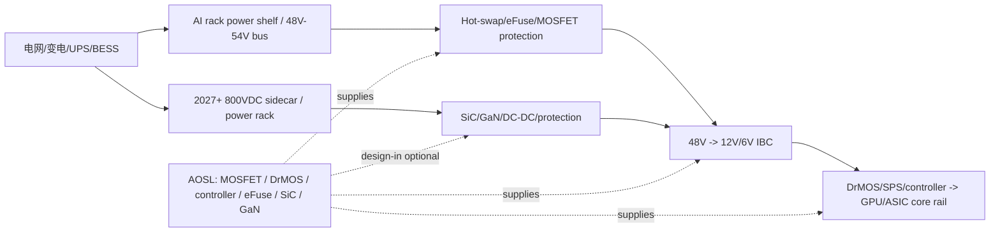
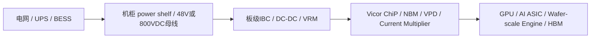

# 公司：ABBNY ABB Ltd（ABB）全面尽调

> 研究日期：2026-05-10。货币单位默认美元；`B`=十亿美元，`M`=百万美元。  
> 方法说明：本文没有参考 `工作台v5/公司调研` 目录下已有公司文件；使用 ABB 官方 2025 年报、2025Q1-2026Q1 财报/演示/新闻稿、行情与估值网站、ABB 数据中心产品资料，以及项目内非公司调研目录的 AI 数据中心电力/机电/会议资料。  
> 重要口径：ABB 自 2026Q1 起把 Robotics 列为待出售/已停止经营项目，继续经营业务主要按 **Electrification、Motion、Automation** 三个业务区披露；2025Q1-Q3 仍有旧口径中的 Process Automation、Robotics & Discrete Automation。

## 1. 公司整体业务、投资人认知与财务状态

### 1.1 ABB 是什么公司

ABB 是瑞士工业电气化与自动化龙头。当前核心不是“机器人公司”，而是 **电气化设备 + 电机/变频驱动 + 工业自动化控制系统** 的高质量工业组合。投资人通常把 ABB 看成：

- **电气化周期核心受益者**：数据中心、电网扩容、建筑电气化、工业配电、低压/中压保护设备带来长期需求。
- **工业自动化质量资产**：Motion 与 Automation 订单周期性较工业资本开支相关，但服务、软件、控制系统和装机基础提高了利润率稳定性。
- **资产组合持续优化的欧洲工业股**：剥离低回报业务、买入区域/技术拼图、提高回购与现金回报。
- **AI 数据中心电力链条的二线核心受益者**：不是 GPU/光模块公司，但 AI 数据中心的限制正在从芯片扩展到“可交付电力”，ABB 的中压/低压开关柜、UPS、断路器、e-house、控制与数字化配电进入更高增长区间。

按 2026Q1 收入，三大业务大致为：

| 业务区 | 2026Q1收入 | 占集团收入 | 可比收入增速 | 2026Q1订单 | 2026Q1运营EBITA率 | 投资含义 |
|---|---:|---:|---:|---:|---:|---|
| Electrification | $4.613B | 52.8% | +15% | $6.647B | 24.0% | 最核心：数据中心订单同比三位数增长，订单/收入=1.44，积压 $11.46B |
| Motion | $2.142B | 24.5% | +7% | $2.548B | 18.5% | 电机、变频器、HVAC/泵/风机驱动；AI 数据中心冷却是增量，但不是主披露口径 |
| Automation | $2.147B | 24.6% | +10% | $2.464B | 14.7% | 工业控制、测量、能源/矿业/流程行业自动化；AI 数据中心直接相关度较低 |
| Corporate/Elim. | -$168M | -1.9% | n.a. | -$361M | n.a. | 抵消项 |

### 1.2 最近 3 年重大变动、转型、收购

| 时间 | 事件 | 影响 |
|---|---|---|
| 2023 | 收购 Eve Systems，增强智能家居/楼宇端 Matter/Thread 生态 | 小体量，但补强 Smart Buildings 与连接设备 |
| 2024 | 收购 SEAM Group，强化资产管理、可靠性咨询、维护服务 | 增强 Electrification 服务收入和安装基础变现 |
| 2024 | 收购 Födisch Group，补强排放监测和过程分析 | Automation/Measurement 分析仪表能力增强 |
| 2025-03 | 完成收购 Siemens 在中国的 wiring accessories 业务 | 扩大中国低压/楼宇终端产品渠道，但中国地产/建筑周期仍偏弱 |
| 2025 | 收购 Sensorfact，补强中小企业能效监控 SaaS | 对 ABB Ability/能源管理软件有协同，体量小但毛利高 |
| 2025 | 收购 BrightLoop，补强电力电子/高功率密度转换 | 对 Motion/电气化、储能、移动电源与未来 DC 架构有技术价值 |
| 2025-12 | 完成收购 Gamesa Electric 的电力电子业务 | 并入 Motion，2026Q1 给 Motion 收入贡献约 +3%，但稀释利润率约 70bp |
| 2026-03/04 | ABB 宣布出售 Robotics 给 SoftBank，企业价值 $5.375B；2026Q1 起列为停止经营 | ABB 更聚焦电气化、Motion、工业自动化；机器人不再是继续经营核心估值驱动 |
| 2025-2026 | 与 NVIDIA 合作开发面向下一代 AI 数据中心的 800VDC 电力架构 | 让 ABB 从传统 AC 配电/UPS 供应商进入未来 `grid-to-chip` 架构讨论 |

产业链定位：ABB 位于 AI 数据中心的 **灰空间/电力基础设施层**，主要覆盖并网后到机房/机柜前的中压/低压配电、保护、UPS、电能质量、能效监控、驱动与控制。它不是大电网 LPT 纯玩家；ABB 2020 年把 Power Grids 出售给 Hitachi Energy，因此超高压输电/大型电力变压器的直接敞口弱于 Hitachi Energy、GE Vernova、Siemens Energy。但 ABB 在数据中心园区内部的中低压、UPS、breaker、switchgear、e-house 与数字配电仍有明显受益。

### 1.3 最新股价、估值与盈利质量

截至 2026-05-10 是周日，最新可用美股/OTC 交易日为 2026-05-08。ABBNY 是 ABB Ltd 的美国 ADR/OTC 代码；ABB 在美国也有 NYSE 代码 `ABB`。不同行情源因 ADR/交易所口径可能略有差异。

| 指标 | 数值 | 日期/口径 | 备注 |
|---|---:|---|---|
| ABBNY 最新收盘价 | 约 $106.50 | 2026-05-08，Investing 历史行情页 | 周日无新交易；2026-05-07 StockAnalysis 报 $102.92 |
| 市值 | 约 $198B | 按 $106.50、StockAnalysis 2026-05-07 市值 $191.82B 线性调整 | 近似值 |
| TTM 收入 | $34.57B | 2025 收入 $33.220B - 2025Q1 继续经营 $7.382B + 2026Q1 $8.734B | 继续经营口径 |
| 最新季度收入增速 | +18% reported / +11% comparable | 2026Q1 | 公司口径 |
| FY2025 收入增速 | +9% reported / +7% comparable | FY2025 | 公司口径 |
| P/S | 约 5.7x | 按 $198B / $34.57B | 较传统工业股高，反映电气化/AI电力溢价 |
| TTM 净利润 | 约 $4.96B | 继续经营近似：2025 $4.734B - 2025Q1 $1.102B + 2026Q1 $1.324B | 不含已停止经营机器人 |
| P/E | 约 40x | 按 $198B / $4.96B | 高于多数工业电气设备同业，低于纯 AI 硬件 |
| Forward P/E | 约 34-35x | StockAnalysis 2026-05-07 forward PE 33.5x，按 2026-05-08 价格粗调 | 取决于卖方 EPS |
| TTM 毛利率 | 约 40.4% | 继续经营近似 | 2026Q1 毛利率 39.4%，FY2025 41.1% |
| TTM 净利率 | 约 14.3% | 继续经营近似 | 质量较高 |
| 2026Q1 运营EBITA率 | 23.5% | 公司口径 | Q1 季度新高，Electrification 24.0% |

### 1.4 资产负债表健康度

ABB 财务状态健康，短期不是资产负债表约束型公司。

- 2026Q1 现金及等价物 $3.325B，短期投资 $2.601B，合计流动金融资产约 $5.926B。
- 2026Q1 总收入 $8.734B、运营现金流 $1.423B、自由现金流 $1.250B，FCF/净利润约 94%。
- 2026Q1 期末集团积压订单 $27.515B，同比增长约 22%，约等于 3.15 个季度收入。
- 继续经营业务运营 EBITA $2.049B，运营 EBITA 率 23.5%；利润率说明价格、组合和执行力仍强。
- 风险在估值和项目交付，而不是偿债：数据中心电气设备扩产、客户项目延期、关税/铜钢价格会影响营运资本和毛利率，但 ABB 有足够现金流承受。

## 2. 最新及最近 4 次财报：订单、交期、业务收入、利润率、AI 数据中心占比

ABB 不披露按终端市场的完整收入、取消率和 lead time。下表中 **订单/积压/收入/利润率为官方披露**；AI 数据中心占比、交期和取消率为基于官方描述、订单增量、项目资料与行业供需的推算。

| 财报季度 | 集团订单 / B2B / 积压 | 集团收入 / 增速 | 利润率与现金流 | 业务收入与利润率 | AI 数据中心相关信息 |
|---|---:|---:|---:|---|---|
| 2026Q1，2026-04-22 | 订单 $11.298B，reported +23%，comparable +16%；B2B 1.29；积压 $27.515B，+22% | 收入 $8.734B，reported +18%，comparable +11% | 毛利 $3.440B，GM 39.4%；运营EBITA $2.049B，率 23.5%；净利 $1.324B；FCF $1.250B | Electrification 收入 $4.613B、+15% comp、率 24.0%；Motion $2.142B、+7%、率 18.5%；Automation $2.147B、+10%、率 14.7% | Electrification 订单 $6.647B，+44% comp，数据中心订单同比三位数增长；推算 AI/DC 收入占集团 8-12%、订单占集团 10-15%；交期：关键 MV/LV/UPS 约 6-18 个月，部分开关柜/变压器链条 18-36 个月；取消率低，更多是项目延期 |
| 2025Q4，2026-01-29 | 订单 $10.316B，reported +33%，comp +32%；B2B 1.14；积压 $25.282B，+17% | 收入 $9.052B，reported +13%，comp +9% | 毛利 $3.658B，GM 40.4%；运营EBITA $1.588B，率 17.6%；净利 $1.280B；FCF $1.517B | Electrification 收入 $4.702B、+12% comp、率 22.6%；Motion $2.260B、+6%、率 18.3%；Automation $2.243B、+9%、率 13.9% | 公司称 Electrification 的 data center segment 订单“非常强”，多个大型数据中心项目订单；推算 AI/DC 收入占集团 7-10%、订单占 9-13% |
| 2025Q3，2025-10-16 | 订单 $9.143B，reported +12%，comp +9%；B2B 1.01；积压 $22.460B，+11% | 收入 $9.083B，reported +11%，comp +6% | 毛利 $3.702B，GM 40.8%；运营EBITA $1.766B，率 19.4%；净利 $1.244B；FCF $1.136B | Electrification $4.571B、+10% comp、率 23.7%；Motion $2.078B、+3%、率 19.8%；Process Automation $1.875B、+3%、率 14.3%；Robotics $0.822B、+8%、率 7.2% | Electrification data centers 订单同比 double-digit 增长；推算 AI/DC 收入占集团 6-9%；电力设备 lead time 已开始支撑 backlog |
| 2025Q2，2025-07-17 | 订单 $9.785B，reported +16%，comp +11%；B2B 1.10；积压 $22.584B，+9% | 收入 $8.900B，reported +8%，comp +3% | 毛利 $3.574B，GM 40.2%；运营EBITA $1.710B，率 19.2%；净利 $1.181B；FCF $933M | Electrification $4.359B、+4% comp、率 23.0%；Motion $2.127B、+5%、率 20.8%；Process Automation $1.811B、-4%、率 14.2%；Robotics $0.857B、+11%、率 6.7% | 公司称数据中心订单 double-digit 增长，Electrification 的 data center segment 非常强；推算 AI/DC 收入占集团 5-8% |
| 2025Q1，2025-04-17 | 订单 $9.213B，reported +3%，comp +4%；B2B 1.16；积压 $21.479B，+7% | 收入 $7.935B，reported +1%，comp +1% | 毛利 $3.311B，GM 41.7%；运营EBITA $1.520B，率 19.2%；净利 $1.118B；FCF $398M | Electrification $3.918B、+5% comp、率 22.9%；Motion $1.853B、-1%、率 19.9%；Process Automation $1.528B、-6%、率 13.0%；Robotics $0.830B、+6%、率 5.1% | Applied Digital 400MW 项目第一批订单分布在 2024Q4/2025Q1；数据中心开始从“强终端”转为财报中可见订单增量；推算 AI/DC 收入占集团 4-7% |

交叉验证要点：

- ABB 集团 2026Q1 订单比收入高 $2.564B，增量主要来自 Electrification。Electrification 2026Q1 订单/收入=1.44，积压 $11.46B，同比 +40%，这是 AI 数据中心与电气化周期最直接的财报证据。
- 2025Q4 到 2026Q1，集团积压从 $25.282B 升到 $27.515B，单季净增 $2.233B；Electrification 积压从 $9.438B 升到 $11.460B，单季净增 $2.022B，几乎贡献全部净增。
- ABB 没披露取消率。结合 AI 数据中心客户通常预付、锁定电力设备排产、关键设备替代困难，已进入 ABB backlog 的订单取消率应低于普通建筑周期；但项目 push-out 风险存在，未来 12 个月可按 1-5% 真取消、5-15% 交付窗口后移建模。

## 3. 2026 最新指引、收入占比、重点业务与产品

### 3.1 2026Q1 后公司指引

公司在 2026Q1 后给出的基调：

- 2026Q2：预计可比收入增长 **mid-single digit**，运营 EBITA margin 约 **20%**。
- 2026 全年：预计可比收入增长 **high-single to low-double digit**，book-to-bill 为正，运营 EBITA margin 同比改善。

这说明 ABB 不是只靠 backlog 短期拉动，而是把 2026 的增长和利润率继续上修到高质量工业公司区间。最突出业务是 Electrification，最突出终端是 data centers；公司最侧重的产品方向是 **AI-ready power infrastructure、medium-voltage UPS、数字化 switchgear、800VDC、低压保护与配电、能效软件**。

### 3.2 重点产品、型号与推算利润率

| 业务/产品族 | 对应产品/型号 | 2026 重要性 | 推算毛利/运营利润率 | 销售增速与规模判断 |
|---|---|---|---:|---|
| 中压/低压数据中心配电 | UniGear ZS1、ZX/ZX2 GIS、MNS、NeoGear、ReliaGear、SACE Emax 2/XT、TruONE ATS、保护继电器、e-house/集成开关设备 | AI 数据中心灰空间核心，订单最确定 | GM 35-45%；运营 20-30%，高于集团平均 | 2026Q1 data center 订单三位数；2026E AI/DC 相关收入 $2.0-3.5B |
| Medium-voltage UPS / 电能质量 | **HiPerGuard**，25MW block，可并联到 50MW；LV UPS：MegaFlex DPA、DPA 250 S4 等 | 大型 AI 园区从低压 UPS 转向中压模块化保护，降低转换级数和占地 | GM 35-45%；运营 20-30% | 当前收入仍小于传统配电，但订单弹性高；2026-2027 最有可能成为 ABB 小而快的亮点 |
| 800VDC / 固态保护 | ABB-NVIDIA 800VDC 架构合作；SACE Infinitus 固态断路器；DC-rated protection、arc mitigation | 未来 Rubin/1MW rack 方向的期权，不是 2026 主收入 | 初期 GM 45-60%，软件/保护算法更高 | 2026 以 design-in/pilot 为主；若进入 hyperscaler RFP，2027 订单可明显放大 |
| 安装产品/线缆保护/母线和连接 | Thomas & Betts、Carlon、cable cleats、grounding/bonding、connectors、conduit、tray 生态 | 高密 rack 让线缆路径、接地、短路保护、cleats 变成安全约束 | GM 30-45%；运营 18-28% | 随 100kW+ rack 放量，white space 与 gray space 同时受益 |
| Motion：HVAC/泵/风机驱动 | ACH580、ACS580、ACS880、SynRM motor + drive packages | 数据中心冷却、电力效率和水系统间接受益 | GM 30-40%；运营 18-25% | 数据中心相关增速高，但 Motion 整体受工业周期影响；2026Q1 Motion 订单 +14% reported |
| 数字配电/能效软件 | ABB Ability Energy Manager、EDCS、OPTIMAX、Sensorfact | 小体量高毛利，帮助客户做能效、容量管理、预测性维护 | 软件 GM 60-80%；集团内收入占比小 | 受 AI 数据中心运维复杂度拉动，但短期收入不如硬件明显 |

### 3.3 可跳过或权重较低的业务

以下业务仍有价值，但在本报告的 AI 数据中心高增长框架下权重较低：

- Robotics：已同意出售给 SoftBank，2026Q1 起列为停止经营，不应继续当作 ABB 核心估值驱动。
- 传统离散自动化、机床/通用机器人：与 Physical AI 有长期叙事，但已不在继续经营主体。
- 住宅楼宇开关插座、传统智能家居：受建筑周期影响，AI 数据中心相关度低。
- 传统流程工业 DCS/仪表：矿业、化工、纸浆、海事等周期可贡献现金流，但不是 AI 基建的急迫瓶颈。
- E-mobility 充电：ABB 已降低/调整相关敞口，增长确定性弱于数据中心电气化。

## 4. 高增长/关键业务：当前收入贡献、AI 基建重要性、供需和定价权

| 关键业务 | 当前 ABB 收入贡献推算 | 收入增速 | AI 基建重要性 | 时间紧急性 | 供需紧张程度 | 垄断/溢价能力 |
|---|---:|---:|---|---|---|---|
| 数据中心中低压配电与 switchgear package | 2026Q1 约 $0.45-0.75B；年化 $2.0-3.0B | +40-70% | 很高：决定 time-to-power 和供电可靠性 | 很高：设备需早于服务器 6-24 个月锁定 | 高：行业 switchgear/transformer lead time 常见 12-36 个月 | 中高：ABB、Schneider、Eaton、Siemens、Powell 等少数合格供应商 |
| HiPerGuard / MV UPS + LV UPS | 当前年化约 $0.3-0.7B，订单大于收入 | +50-100% | 很高：25MW/50MW block 适配大园区 | 很高：大型 AI 园区先定电力保护 | 高：MV UPS 可认证供应商少，项目制交付 | 高：设计锁定、FAT/认证、服务体系形成溢价 |
| 800VDC + 固态 DC 保护 | 当前收入 <$50M，更多是 design-in | n.m. | 中长期很高：面向 500kW-1MW rack、减少转换损耗 | 2026 设计紧急，收入 2027+ | 早期供需不是量产瓶颈，标准/认证是瓶颈 | 若与 NVIDIA/OCP 标准绑定，定价权高；否则只是可选方案 |
| Installation products / cable protection / grounding | 当前年化约 $0.4-0.9B AI/DC 相关 | +25-50% | 中高：高密 rack 需要更强短路、接地、路径管理 | 高：施工期刚需 | 中高：渠道库存和认证供应商重要 | 中：产品分散，但 T&B/Carlon 品牌和渠道有溢价 |
| Motion HVAC drives/motors | 当前年化约 $0.2-0.5B AI/DC 相关 | +20-40% | 中：冷却系统耗电和可靠性需要 VFD/高效电机 | 中高：随机电施工采购 | 中：Danfoss/Siemens/Schneider/WEG 竞争 | 中：效率、服务和长期可靠性有溢价 |
| Digital energy management / Sensorfact / ABB Ability | 当前 AI/DC 直接收入 <$0.2B | +30-60% | 中：帮助运维、预测维护、能效优化 | 中：先硬件后软件 | 供给不紧，集成能力紧 | 中高：软件毛利高，但客户可用 Schneider/Eaton/Siemens/Vertiv 软件替代 |

## 5. 一年后情景预测：收入贡献、重要性、供需、定价权

| 关键业务 | 基准情景：未来 12 个月收入贡献/增速 | 乐观情景 | 极度乐观情景 | 关键判断 |
|---|---:|---:|---:|---|
| 数据中心中低压配电与 switchgear package | $2.8-4.0B，+30-45% | $4.0-5.5B，+55-75% | $5.5-7.5B，+90%+ | 基准已包含 ABB backlog 转化；极乐观需要 hyperscaler/neo-cloud 同时加速并且 ABB 产能无明显瓶颈 |
| HiPerGuard / MV UPS + LV UPS | $0.5-0.9B，+40-70% | $0.9-1.6B，+80-120% | $1.6-2.8B，+150%+ | Applied Digital 400MW 与同类 25MW block 项目是验证；收入确认取决于交付窗口 |
| 800VDC + 固态 DC 保护 | 收入 <$0.1B，订单/design-in $0.2-0.5B | 收入 $0.1-0.3B，订单 $0.5-1.2B | 收入 $0.3-0.7B，订单 $1.5-3.0B | 2026 更像期权；若 NVIDIA/Rubin/OCP 800VDC 写入项目规格，订单先于收入爆发 |
| Installation/cable protection/grounding | $0.7-1.2B，+25-40% | $1.1-1.8B，+45-70% | $1.8-2.8B，+90%+ | 受 100kW+ rack、white space 电力路径、短路保护要求拉动 |
| Motion HVAC drives/motors | $0.4-0.8B，+20-35% | $0.8-1.2B，+40-60% | $1.2-1.8B，+75%+ | 冷却系统和水系统电机驱动随数据中心交付放量，但竞争更充分 |
| Digital energy management | $0.15-0.30B，+30-50% | $0.30-0.55B，+60-90% | $0.55-1.0B，+100%+ | 小基数；需要和硬件项目打包进入运维期 |

## 6. BOM、每 MW/每 rack/每 GPU/每 optical port 内容量、价格传导和认证

### 6.1 ABB 在 AI 数据中心电力 BOM 的位置

项目内 AI 数据中心模型显示，2026-2027 美国 AI 数据中心 CapEx 中，电力设备/UPS/BESS/变压器/开关柜/busway 是最确定的“先订单、后算力”环节。ABB 的可服务市场主要在 `变电站后段 - 中压配电 - UPS/电能质量 - 低压配电 - 机房/机柜前端 - 数字监控`。

| 层级 | ABB 可售内容 | 每 MW IT load 的真实内容量（设备口径，估算） | 每 100kW rack | 每 GPU（NVL72 72GPU/100kW 近似） | 每 optical port |
|---|---|---:|---:|---:|---:|
| 中压 switchgear/e-house/保护 | UniGear/ZX、保护继电器、断路器、e-house、FAT/工程 | $0.15-0.45M/MW | $15-45k | $210-625/GPU | 无直接端口内容；按网络功耗摊销约 $5-20/port |
| UPS/电能质量 | HiPerGuard MV UPS、MegaFlex DPA、DPA 系列、储能接口 | $0.20-0.60M/MW | $20-60k | $280-830/GPU | 间接约 $5-25/port |
| 低压配电/断路器/ATS | MNS/NeoGear/ReliaGear、SACE Emax/XT、TruONE ATS | $0.10-0.30M/MW | $10-30k | $140-420/GPU | 间接约 $3-15/port |
| 安装产品/接地/线缆保护 | T&B/Carlon、cleats、conduit、grounding/bonding、connectors | $0.05-0.20M/MW | $5-20k | $70-280/GPU | 间接约 $1-8/port |
| Motion 冷却驱动 | HVAC drives、pump/fan drives、high-efficiency motor | $0.03-0.12M/MW | $3-12k | $40-170/GPU | 不适用 |
| 数字化与能效软件 | ABB Ability、EDCS、Energy Manager、Sensorfact | $0.01-0.05M/MW 初装，运维另计 | $1-5k | $15-70/GPU | 不适用 |

价格传导链：

1. AI 芯片功耗和 rack 密度上升，推动机房 IT load 与瞬态负载上升。
2. 业主为了缩短 time-to-power，提前锁定 MV switchgear、UPS、breaker、busway、e-house、监控系统。
3. ABB 对铜、钢、电子元件、工程/FAT 和交期加急费进行报价；大型项目通常包含材料 escalator、变更单和服务合同。
4. 设备稀缺时，溢价不是单纯 ASP 涨价，而是更高比例的模块化集成、预制、测试、服务和数字化包。

### 6.2 当前产能、采纳程度与认证

| 产品/业务 | 当前产能能力（美元计，推算） | 被供应链采纳程度 | 认证/阶段 |
|---|---:|---|---|
| 数据中心配电/switchgear package | ABB Electrification 年收入 run-rate 约 $18.5B；AI/DC 可交付年化约 $3-5B | 已进入 hyperscaler、colo、EPC 和数据中心集成商合格供应商池；2026Q1 数据中心订单三位数增长 | IEC/ANSI/UL 产品线成熟；项目级 FAT/现场验收是关键 |
| HiPerGuard / MV UPS | 当前可服务大型项目订单约数百 MW/年，按设备价值约 $0.5-1.5B/年能力 | Applied Digital 400MW 项目采用；ABB 称 HiPerGuard 已 secured 超过 330MW 数据中心容量 | ABB 白皮书/产品资料称 HiPerGuard 面向大规模 DC，25MW block，可并联至 50MW；项目级认证/FAT 关键 |
| 800VDC + SACE Infinitus | 当前收入能力小，更多是样机、pilot、design-in | 与 NVIDIA 合作开发下一代 AI DC 800VDC；供应链仍在标准化 | SACE Infinitus 已有 IEC 认证；800VDC 系统仍处 NVIDIA/OCP/客户工程验证阶段 |
| Installation/cable protection/grounding | 可利用 T&B/Carlon 全球渠道与现有产能，AI/DC 年化能力约 $0.5-1.5B | 数据中心 EPC/电气承包商渠道成熟，Graybar/Wesco/Sonepar 等渠道可拉动 | UL/CSA/IEC/NEC 相关产品认证成熟；HVDC/DC-rated cleats 需新项目验证 |
| Motion HVAC drives/motors | Motion 年收入 run-rate 约 $8.6B；数据中心冷却相关可交付约 $0.5-1.5B | 冷却设备 OEM、MEP/EPC 和数据中心业主可采用，但竞争充分 | VFD/电机认证成熟；项目更看可靠性、能效和现场服务 |

## 7. 一年后产能、采纳程度与认证阶段预测

| 产品/业务 | 基准：一年后 | 乐观：一年后 | 极度乐观：一年后 |
|---|---|---|---|
| 数据中心配电/switchgear package | AI/DC 年化交付能力 $4-6B；更多模块化 e-house 与标准 power block | $6-8B；北美/欧洲/中东大客户重复项目复制 | $8-11B；数据中心成为 Electrification 最大增量终端之一，产能排队仍紧 |
| HiPerGuard / MV UPS | 形成 $0.8-1.5B 年化订单能力；25MW/50MW block 在大型园区中更常见 | $1.5-2.5B；多家 neo-cloud/colo 采用 MV UPS block | $2.5-4B；MV UPS 被视为 100MW+ AI campus 默认配置之一 |
| 800VDC + 固态保护 | 进入少数 pilot，订单 $0.2-0.5B，收入很小 | 进入 2027 Rubin/高密 rack 项目规格，订单 $0.5-1.2B | 被 hyperscaler 写入参考设计，订单 $1.5-3B，ABB 获得早期标准红利 |
| Installation/cable protection/grounding | AI/DC 年化能力 $1-2B；DC-rated 产品认证逐步补齐 | $2-3B；HVDC/高短路电流带来高端 cleats/grounding 升级 | $3-5B；800VDC 与 500kW+ rack 加速，材料/渠道短缺支持溢价 |
| Motion HVAC drives/motors | $0.8-1.2B AI/DC 年化交付能力 | $1.2-1.8B；液冷辅助系统、泵和风机驱动同步放量 | $1.8-2.5B；数据中心冷却成为 Motion 最重要高增长终端之一 |

## 8. 基于 backlog、供给和真实项目的未来一年业务增速预测

官方没有披露 data center backlog。推算框架：

- 2026Q1 集团 backlog $27.515B，其中 Electrification $11.460B。
- 2026Q1 Electrification backlog 单季净增约 $2.022B，几乎解释集团 backlog 单季净增。
- Electrification 2026Q1 订单 $6.647B，同比 +51% reported，data centers 三位数增长。
- Applied Digital 400MW 项目第一批订单在 2024Q4/2025Q1 入账，说明 ABB 数据中心订单不是口头 pipeline，而是已进入订单和交付窗口。
- 行业端，APPA/Wood Mackenzie 口径称美国数据中心电气设备市场到 2030 可达约 $65B，关键部件交期常见 18-36 个月；本地 AI 数据中心模型也把变压器/switchgear/busway/UPS 列为 2026-2027 最确定先行订单池。

| 情景 | ABB 集团未来 12 个月收入增速 | Electrification 增速 | AI/DC 相关收入增速 | 订单/积压判断 | 取消/延期判断 |
|---|---:|---:|---:|---|---|
| 基准 | +9-11% | +12-16% | +35-50% | B2B 保持 >1，集团 backlog 继续高个位数/低双位数增长 | 真取消 1-5%，延期 5-10% |
| 乐观 | +12-15% | +18-24% | +60-85% | Electrification B2B 继续 1.2+，data center backlog 占 EL backlog 25-35% | 真取消 <3%，延期 5-8%，客户预付款锁定产能 |
| 极度乐观 | +16-20% | +25-35% | +100%+ | 800VDC/MV UPS/power block 被多个大客户复制，EL backlog 接近或超过 $15B | 项目延期仍有，但被新增订单覆盖；瓶颈转为 ABB 产能和认证/FAT |

最大的限制不是需求，而是：

- 中压 switchgear、UPS、breaker、铜/钢件、保护控制组件和工厂 FAT 能力；
- 客户侧并网、许可、土建和 EPC 进度；
- 800VDC 标准化速度；
- ABB 自身在北美是否能拿到足够产能/渠道/现场服务资源。

## 9. 竞争格局、主流技术风险、替代方案与客户替换成本

### 9.1 主要竞争对手

| 领域 | ABB 对手 | ABB 相对位置 |
|---|---|---|
| MV/LV switchgear、breaker、配电 | Schneider Electric、Eaton、Siemens、Powell、Hubbell、Vertiv/E+I、Legrand、nVent、GE Vernova 部分设备 | 第一梯队；北美数据中心项目中 Eaton/Schneider 更强，ABB 在 MV UPS/数字化和全球项目有差异化 |
| UPS/电能质量 | Schneider/APC、Eaton、Vertiv、Delta、Legrand、Huawei、Socomec | MV UPS 是差异化；传统 LV UPS 竞争激烈 |
| 800VDC/HVDC 数据中心架构 | Schneider、Eaton、Hitachi Energy、Siemens、Vertiv、Delta、Vicor、NVIDIA/OCP 生态 | 与 NVIDIA 合作是加分项，但标准未定，赢家未确定 |
| BESS/微电网/PCS | Tesla、Fluence、Sungrow、Wartsila、Powin、GE Vernova、Hitachi、Siemens、Schneider、Eaton | ABB 可做控制/电力电子/集成，但不是电芯或 Megapack 纯龙头 |
| HVAC drives/motors | Danfoss、Siemens、Schneider、WEG、Rockwell、Yaskawa、Nidec | ABB 是全球第一梯队，利润率好，但替代供应商较多 |
| 数字能源/DCIM/EPMS | Schneider EcoStruxure/ETAP/AVEVA、Eaton Brightlayer、Siemens、Vertiv、Johnson Controls、Honeywell、NVIDIA DSX 生态 | ABB 有硬件基础和 Ability，但 DCIM/AI factory 操作系统话语权弱于 Schneider/NVIDIA/Vertiv 组合 |

### 9.2 技术是否会成为主流

- **MV UPS / modular power block**：高概率成为 100MW+ AI campus 的重要路线之一。原因是传统 LV UPS 在占地、线损、转换级数、施工复杂度上承压。风险是不同客户会选择 BESS、rotary UPS、grid-forming inverter、低压分布式 UPS 或备用发电组合，不会只有一种架构。
- **800VDC / HVDC rack power**：方向正确，但 2026 主要是标准、pilot 和 design-in。OCP EMEA 2026 的 800VDC、700/1400V、750/1500V 讨论说明行业正在认真推进；但保护、断路、arc flash、安全运维、连接器和维修流程未完全成熟。2027-2028 才更可能规模收入化。
- **数字化 switchgear / solid-state breaker**：更高密、更高动态负载的 AI 数据中心需要更快保护和可观测性。SACE Infinitus 若与 800VDC/HVDC 结合，可能从小产品变成关键保护节点。风险是成本高、故障模式和客户运维习惯需要验证。
- **Motion drives for cooling**：确定是主流，但不是独占技术。液冷、冷却水系统、泵/风机效率都会提升 VFD attach rate，替代风险主要来自同业 VFD 和冷却 OEM 自带方案。

### 9.3 客户替换成本

客户替换成本较高，尤其在项目进入设计、短路计算、保护配合、UL/IEC submittal、FAT 和现场调试之后：

- **设计锁定**：switchgear/UPS/breaker 型号进入单线图、保护配合和 BIM 后，更换会导致重新计算和审批。
- **认证锁定**：数据中心业主、EPC、保险、当地 AHJ、UL/IEC/ANSI 认证共同限制替代。
- **交期锁定**：关键设备排产已锁定后，换供应商会重排队，可能造成 months 级延期。
- **服务锁定**：数据中心生命周期服务、备件、现场工程师响应和远程监控会提高粘性。

替换成本最高的是 MV UPS、e-house、switchgear package；中等的是低压断路器、安装产品和 VFD；最低的是标准 conduit/connector，但数据中心项目对渠道、认证、交期仍形成一定壁垒。

## 10. 投资结论

ABB 当前的核心矛盾是：**基本面正在被 AI 数据中心电气化上修，但估值已经不便宜**。2026Q1 的 Electrification 订单、积压和数据中心三位数增长，是最强证据。与更纯的数据中心电力公司相比，ABB 的好处是收入更分散、利润率更稳、资产负债表健康；不足是 AI/DC 收入占比仍只是集团一部分，且 ABB 没有 Hitachi Energy/GE Vernova 那样的大型电网变压器直接 beta。

最值得跟踪的 6 个信号：

1. Electrification backlog 是否从 $11.46B 继续快速上升，特别是数据中心订单是否仍三位数或高双位数。
2. HiPerGuard/MV UPS 是否披露更多 25MW/50MW block 项目、MW 数和客户名称。
3. 800VDC 与 NVIDIA/OCP 是否从合作宣传进入正式 RFP、认证或量产项目。
4. Electrification 运营 EBITA 率能否在高订单下维持 23-25%，说明价格和产能没有被成本吃掉。
5. 北美数据中心项目是否从订单转为交付，是否出现大规模延期/取消。
6. Robotics 出售现金回笼后的资本配置：回购、并购数据中心电力/软件资产，还是降杠杆。

综合判断：ABBNY/ABB 是 AI 数据中心“电力瓶颈”主题里质量较高、确定性较强但估值也较充分的标的。未来一年 alpha 主要来自 Electrification 数据中心订单继续超预期、MV UPS/800VDC 小业务变大、以及集团利润率继续抬升；主要风险是 AI 数据中心项目延期、800VDC 收入化慢于叙事、同业 Eaton/Schneider/Vertiv 抢走北美高价值项目，以及高估值下任何订单降速都会被放大。

## 主要资料来源

- ABB Q1 2026 press release / financial information / presentation: https://global.abb/group/en/investors/quarterly-results
- ABB Q4/Q3/Q2/Q1 2025 quarterly results: https://global.abb/group/en/investors/quarterly-results
- ABB 2025 Annual Reporting Suite: https://global.abb/group/en/investors/annual-reporting-suite
- ABB ADR investor page: https://new.abb.com/investorrelations/shareholderservice/american-depositary-share-ads
- ABB to develop next-generation AI data centers with NVIDIA: https://resources.news.e.abb.com/attachments/published/129805/en-US/D1659BBF0D16/20251013_ABB_to_develop_next-generation_AI_data_centers_with_NVIDIA_EN.pdf
- ABB and Applied Digital 400MW data center order: https://resources.news.e.abb.com/attachments/published/124456/en-US/72F03783B78E/20250312_ABB_to_help_power_Applied_Digital%27s_next-generation_AI_data_center_complex_in_North_Dakota_EN.pdf
- ABB AI-ready data center whitepaper: https://library.e.abb.com/public/a449dee6307644f5b3c0f49b20cd9b9e/9AKK108471A8471_en_A_AI%20Ready%20Data%20Centers%20Whitepaper.pdf
- ABB Electrification data center Q1 2026 notes: https://powertalk.electrification.us.abb.com/ELUS26-Data-Center-Q1.html
- StockAnalysis ABBNY statistics: https://stockanalysis.com/quote/otc/ABBNY/
- Investing ABBNY historical data: https://www.investing.com/equities/abb-ltd-adr-historical-data
- APPA/Wood Mackenzie data center electrical equipment market note: https://www.publicpower.org/periodical/article/us-data-center-electrical-equipment-market-projected-surge-65-billion
- 项目内资料：`AI数据中心建设规模与产业链订单映射_2026-2027_美国.md`
- 项目内资料：`行业调研_AI园区电力_机电_冷却/行业调研_数据中心电力接入与高压变电_2026.md`
- 项目内资料：`行业调研_AI园区电力_机电_冷却/行业调研_数据中心低压配电_PDU与母线槽_2026.md`
- 项目内资料：`conference_update/data_center_world_2026_research_report.md`
- 项目内资料：`conference_update/OCP_EMEA_Summit_2026_高密度调研报告.md`

# 公司：AOSL Alpha and Omega Semiconductor Limited

> 报告日期：2026-05-09（美国太平洋时间）；市场数据采用 2026-05-08 美股收盘。  
> 结论属性：产业链/公司尽调，不构成投资建议。  
> 关键限制：AOSL 不披露正式 backlog、AI 数据中心收入、单产品收入和客户项目金额；本文对 AI/服务器产品收入、BOM 内容量、订单和产能的拆分均为“官方口径 + 财报线索 + 行业 BOM 模型”的估算，并在表中标注。

## 1. 公司整体业务、定位与财务健康度

### 1.1 公司是什么

Alpha and Omega Semiconductor（AOS，股票代码 AOSL）是小市值功率半导体公司，业务是设计、开发并供应 power semiconductor。产品覆盖：

| 产品族 | 典型产品 | 主要下游 |
|---|---|---|
| Discrete / DMOS | 低压/中压 MOSFET、Super Junction MOSFET、TVS、IGBT、SiC、GaN | PC、显卡、服务器、电源、工业、汽车、消费电子 |
| Power IC | DrMOS/SPS、multiphase controller、EZBuck、电池保护、eFuse、Type-C protection、gate driver、digital power | AI/服务器/显卡核心供电、手机电池保护、PC/AI PC、快充、电源 |
| Modules | IPM、motor control、功率模块 | 家电、工业电机、电动工具、e-mobility |

公司 2025 10-K 称其有约 2,800 个产品，FY2025 新增 100+ 个产品；截至 2025-06-30，美国已授权专利 949 项、待审 64 项。AOS 的差异化不是单一制程领先，而是把 discrete、IC 设计、封装和应用工程打包，向客户提供“application-specific total solutions”。这也是 CEO Stephen Chang 2023 年上任后反复强调的转型方向。

### 1.2 投资人眼中的 AOSL

投资人通常把 AOSL 看成三层叙事叠加：

| 层级 | 市场认知 | 当前证据 |
|---|---|---|
| 旧叙事 | PC、消费、手机、电源链的周期性功率半导体供应商，毛利率受利用率和价格周期影响 | FY2026 Q3 非 GAAP 毛利率 21.7%，仍低于历史较好水平；PC/consumer 仍有拖累 |
| 转型叙事 | 从“卖分立器件”转向“控制器 + power stage + MOSFET + 封装”的 total solution | Power IC 在 FY2025 Q4 和 FY2026 Q1 接近产品收入 40%；AI/graphics/smartphone 推动 BOM 扩张 |
| AI 期权 | 48V/54V AI rack、hot-swap、IBC、DrMOS、800VDC SiC/GaN 可能带来新增长曲线 | FY2026 Q3 advanced computing 占 Computing 的 25%，环比翻倍以上、同比 +40% 以上；公司称中压 MOSFET backlog 提供较好 visibility |

### 1.3 最近 3 年重大业务变化

| 时间 | 事件 | 投资含义 |
|---|---|---|
| 2023 | Stephen Chang 接任 CEO，提出从 component supplier 转向 application-specific total solution | 公司开始把研发投向高 BOM、高壁垒、高毛利应用，而不是低端 commodity MOSFET |
| 2024-2026 | AI/graphics、smartphone battery protection、PC total solution 成为重点 | Power IC 与中压 MOSFET 的重要性提升；毛利率改善取决于 mix 而非纯涨价 |
| 2025-07 | 签署 CQJV 股权转让，出售重庆合资公司约 20.3% 股权，总代价 $150M；持股从 39.2% 降到 18.9% | 换取现金、降低 JV 会计波动；CQJV 仍是重要 wafer/packaging 供应商，新投资者计划扩产 |
| FY2025 Q4 | 因 CQJV 估值录得 $76.8M impairment，GAAP 净亏损扩大 | 非现金冲击导致 TTM PE 失真；资产负债表现金改善更重要 |
| 2025-2026 | 发布/展示 48V hot-swap、AI IBC MOSFET、SmartClamp DrMOS、800VDC SiC/GaN、APEC AI power 产品 | 进入 AI data center power 的设计导入窗口，但多数 800V 收入更偏 2027+ |

### 1.4 产业链位置

AOSL 位于 AI 基建电源树的“半导体器件/模块”层，不是整柜电源系统商，也不是服务器 ODM。

结论：AOSL 的 AI 价值不是“每台服务器都有很高美元含量”，而是若进入某些 hyperscaler/ODM 平台，单位 rack 内容量小但数量大、替换成本高、毛利率高于传统消费/PC MOSFET。

### 1.5 最新估值与经营指标

| 指标 | 最新值 | 日期/口径 | 备注 |
|---|---:|---|---|
| 股价 | $37.90 | 2026-05-08 收盘，Yahoo Finance chart API | 5 日区间内 2026-05-06 曾触及 $49.97，财报后回落 |
| 市值 | 约 $1.13B | $37.90 x 29.93M 股（2026-04-30 outstanding） | SEC 10-Q 披露 outstanding 29.93M |
| TTM revenue | 约 $685.1M | FY2025 Q4-FY2026 Q3 | $176.5M + $182.5M + $162.3M + $163.8M |
| P/S | 约 1.65x | 2026-05-08 | 市值 / TTM revenue；StockAnalysis 2026-05-07 显示 PS 约 1.64x |
| Forward P/S | 约 1.50x | StockAnalysis，2026-05-07 | 取决于 FY2027 收入预期 |
| PE / Forward PE | N/M | TTM 净亏损，forward PE 多数数据源为 N/A | TTM net loss 约 -$106M，负 PE 没有可比意义 |
| 最新季度收入增速 | -0.5% YoY，+0.9% QoQ | FY2026 Q3 | 9M FY2026 收入 $508.6M，同比约 -2.1% |
| FY2026 Q3 GAAP / non-GAAP 毛利率 | 21.1% / 21.7% | FY2026 Q3 | 公司指引 FY2026 Q4 non-GAAP GM 23% ±1% |
| TTM gross margin / net margin | 约 22.4% / -15.5% | StockAnalysis 2026-05-07 | 净利率被 CQJV impairment 和低利用率压低 |

### 1.6 资产负债表健康度

截至 FY2026 Q3（2026-03-31）：

| 项目 | 金额 | 评价 |
|---|---:|---|
| Cash and equivalents | $190.3M | 占市值约 17%；对小型功率半导体公司很重要 |
| Accounts receivable | $38.3M | DSO 20 天，回款质量较好 |
| Inventory | $199.0M | 平均库存天数 139 天，仍偏高；反映周期底部和新品备货并存 |
| Current assets | $452.8M | current ratio 约 3.32x |
| PP&E net | $314.2M | 仍有制造/封装资产和长期供应链布局 |
| Total assets | $976.4M | 账面资产扎实，但部分资产收益率偏低 |
| Current liabilities | $136.5M | 短债压力低 |
| Total liabilities | $176.2M | 负债/资产约 18.0% |
| Debt + finance leases | 约 $5.9M | 净现金约 $184M；若含 operating leases，总债务/租赁也仅约 $29M |
| Shareholders' equity | $800.2M | 市净率约 1.4x |

判断：财务健康度较好，主要风险不是偿债，而是盈利能力和库存/利用率。公司有现金支撑 R&D、产能扩张和 buyback；FY2026 Q2/Q3 连续经营现金流为负，说明收入底部和研发投入仍在消耗现金，但目前不构成流动性风险。

## 2. 最近 5 次财报：数字、订单、产品与 AI 线索

### 2.1 五个季度可比表

| 财报季度 | 收入 / QoQ / YoY | GAAP GM / non-GAAP GM | GAAP 净利润 / non-GAAP EPS | 产品收入拆分 | 终端市场拆分 | 订单、交期、backlog、AI 数据中心线索 |
|---|---:|---:|---:|---|---|---|
| FY2026 Q3 截至 2026-03-31 2026-05-06 发布 | $163.8M +0.9% QoQ -0.5% YoY | 21.1% / 21.7% | -$13.8M / -$0.28 | DMOS $115.1M，+13.9% QoQ，+7.7% YoY；Power IC $46.9M，-20.3% QoQ，-14.1% YoY；other $1.8M | Computing 49.1% ≈ $80.4M；Consumer 11.8% ≈ $19.3M；Communications 20.6% ≈ $33.7M；Power Supply & Industrial 17.4% ≈ $28.5M | Advanced Computing 占 Computing 25%，约 $20.1M，环比翻倍以上、同比 +40% 以上；公司称中压 MOSFET 用于 hot-swap/IBC，客户扩至 PSU provider、module maker、cloud、hyperscaler，backlog 给出较好 visibility；部分新 MOSFET 官方 lead time 14-16 周 |
| FY2026 Q2 截至 2025-12-31 2026-02-05 发布 | $162.3M -11.1% QoQ -6.3% YoY | 21.5% / 22.2% | 约 -$13.3M / -$0.16 | DMOS $101.0M，-6.9% QoQ，-10.6% YoY；Power IC $58.8M，-19.1% QoQ，+9.5% YoY；other $2.5M | Computing 49.6% ≈ $80.5M；Consumer 11.8% ≈ $19.2M；Communications 20.4% ≈ $33.1M；PSI 16.7% ≈ $27.1M | AI/graphics 处于库存消化，GPU 分配优先 AI data center 而非传统 graphics；但公司称 medium-voltage MOSFET 已进入 leading ODM build phase，用于 major hyperscale hot-swap 和 48V-to-12V IBC |
| FY2026 Q1 截至 2025-09-30 2025-11-05 发布 | $182.5M +3.4% QoQ +0.3% YoY | 23.5% / 24.1% | -$2.1M / +$0.13 | DMOS $108.5M，+1.1% QoQ，-11.4% YoY；Power IC $72.7M，+5.9% QoQ，+37.3% YoY；other $1.3M | Computing 53.2% ≈ $97.1M；Consumer 12.9% ≈ $23.5M；Communications 估算 $32.6M；PSI 15.3% ≈ $27.9M | AI/graphics 环比消化但同比翻倍以上；一个初始 data center program ramp 小于原计划；公司新增 48V-to-12V PDB 机会，强调 800VDC 新设计周期 |
| FY2025 Q4 截至 2025-06-30 2025-08-06 发布 | $176.5M +7.2% QoQ +9.4% YoY | 23.4% / 24.4% | -$77.1M GAAP（含 impairment）/ +$0.02 | DMOS $107.3M，+0.4% QoQ，+5.1% YoY；Power IC $68.7M，+25.8% QoQ，+30.2% YoY；other $0.5M；license 已结束 | Computing 52.6% ≈ $92.8M；Consumer 15.1% ≈ $26.7M；Communications 15.2% ≈ $26.8M；PSI 16.8% ≈ $29.7M | AI/graphics 达季度新高，受新 AI program 初始出货拉动；公司预计 FY2026 Q1 进入 digestion；CQJV 股权出售公告，预计拿到 $150M 现金 |
| FY2025 Q3 截至 2025-03-31 2025-05-07 发布 | $164.6M -4.9% QoQ +9.7% YoY | 21.4% / 22.5% | 约 -$10.7M / -$0.10 | DMOS $106.8M，-5.4% QoQ，+13.9% YoY；Power IC $54.6M，+1.6% QoQ，+9.2% YoY；assembly $0.4M；license $2.8M | Computing 47.9% ≈ $78.8M；Consumer 13.0% ≈ $21.4M；Communications 17.2% ≈ $28.3M；PSI 19.9% ≈ $32.8M | 数据中心应用拿到 design win，BOM content 显著增加，使用 multiphase controllers 和 multiple power stages per GPU；3 月已开始量产并延续到 6 月；H2 visibility 有限 |

### 2.2 财报里的核心变化

1. **公司收入还没有真正进入 AI 爆发期。** FY2026 Q3 advanced computing 约 $20M/季，已经可见，但占总收入约 12.3%；若剔除 graphics，纯 AI data center 估计仍只有高个位数到低双位数收入占比。
2. **Power IC 是转型抓手，但短期波动大。** FY2026 Q1 Power IC $72.7M 创高，FY2026 Q3 回落到 $46.9M，说明 AI/PC/手机平台节奏和客户 allocation 对收入影响很大。
3. **中压 MOSFET 是最新财报最强信号。** FY2026 Q3 DMOS 环比 +13.9%，在总收入几乎持平时明显跑赢，和公司所说 AI/server hot-swap、IBC 需求吻合。
4. **毛利率仍处周期底部。** 公司认为 FY2026 Q2/Q3 是收入和毛利率近端底部，FY2026 Q4 指引 non-GAAP GM 23% ±1%，说明 mix 改善开始但还不强。

## 3. FY2026 最新指引、业务占比和产品映射

### 3.1 FY2026 Q4 指引

公司对截至 2026-06-30 的 FY2026 Q4 指引：

| 指标 | 指引 |
|---|---:|
| Revenue | $168M ± $10M |
| GAAP gross margin | 22.3% ±1% |
| Non-GAAP gross margin | 23.0% ±1% |
| GAAP opex | $52.0M ± $1.0M |
| Non-GAAP opex | $45.5M ± $1.0M |
| Interest income vs expense | 利息收入高于利息支出约 $1.0M |
| Tax expense | $1.0M-$1.2M |

分业务指引：

| 业务 | FY2026 Q3 收入占比/金额 | Q3 增速 | Q4 管理层方向 | 重点 |
|---|---:|---:|---|---|
| Computing | 49.1% / ≈ $80.4M | +2.1% YoY，-0.1% QoQ | low-to-mid single digit QoQ growth | AI/server strong，PC 大体稳定，tablet 季节性下滑 |
| Advanced Computing（Computing 内部） | Computing 的 25% / ≈ $20.1M | 环比翻倍以上，同比 +40%+ | strong sequential growth | AI、server、graphics，中压 MOSFET、hot-swap、IBC |
| Consumer | 11.8% / ≈ $19.3M | -9.8% YoY，+0.8% QoQ | flattish QoQ | wearables 仍好，gaming 当前周期成熟，home appliance 弱 |
| Communications | 20.6% / ≈ $33.7M | +18.7% YoY，+1.9% QoQ | slight QoQ decline，但 YoY 高增 | Tier One U.S. smartphone battery protection，higher charging current 带来 BOM 扩张 |
| Power Supply & Industrial | 17.4% / ≈ $28.5M | -13.1% YoY，+5.3% QoQ | mid-single digit QoQ growth | e-mobility India backlog、DC fans 受 AI/data center build-out 拉动 |

### 3.2 应跳过或降权的业务

以下业务不是本报告的 AI 投资主线，除非它们贡献现金流或产能约束：

| 业务/产品 | 降权原因 |
|---|---|
| Home appliances | 需求偏弱，AI 相关性低 |
| Mature console gaming | 当前主机周期成熟，管理层预计下一代平台 2028 才更明显 |
| Power tools | 仍在库存/消费周期恢复，AI 相关性低 |
| IPM5 / motor control / appliance motor | Kaynes India 高量产有战略意义，但不属于 AI data center |
| Quick chargers / Type-C EPR / smartphone charger | 增长来自高充电电流，不是 AI 基建 |
| 普通 PC / notebook MOSFET | Panther Lake/AI PC 有 BOM 提升，但增长弹性低于 AI server |

### 3.3 重点产品和型号

| 产品/型号 | 所在业务 | 官方信息 | AI 相关判断 |
|---|---|---|---|
| **AOLV66935** 100V High SOA MOSFET | DMOS / server protection | LFPAK8x8；Rds(on) 1.85 mOhm；334A @25C；236A @100C；pulsed 1336A；1k 价 $3.60；lead time 14-16 周；用于 48V hot-swap | 2026 最确定 AI server socket 之一；48V rack live insertion / tray protection 需要高 SOA |
| **AONC40202** 25V MOSFET | DMOS / IBC | DFN3.3x3.3 double-sided cooling source-down；405A；0.7 mOhm；1k 价 $1.85；lead time 14-16 周 | 用于 IBC DC-DC，受益于 48V-to-12V/6V 中间母线 |
| **AONC68816** 80V MOSFET | DMOS / IBC | DFN3.3x3.3；119A；4.7 mOhm；1k 价 $1.95；lead time 14-16 周 | 与 AONC40202 配合覆盖高密 DC-DC/AI server power |
| **AOZ53228QI / AOZ53262QI / AOZ53263QI** SmartClamp DrMOS | Power IC / DrMOS | 18V / 60A、70A、80A；AI server、data center、high-end graphics；AOZ53228QI datasheet：2.5-18V input、60A continuous、OCP 100A ±10%、2MHz、QFN5x5 | 面向 GPU/SoC multiphase VR；保护功能适合 AI 负载瞬态 |
| **AOZ73216QI / AOZ73104QI** controller | Power IC / AI core power | 16-phase 2-rail controller，OVR16；4-phase controller，OVR4-22 | 若绑定 GPU/SoC 平台，可提升每 GPU BOM |
| **AOZ52986QI** SPS | Power IC / power stage | QFN3x4，Intel common footprint；高效率、热性能 | AI notebook/PC 和部分 compute power，AI DC 权重低于 DrMOS/controller |
| **AOM020V120X3 / AOGT020V120X2Q** SiC | WBG | AOS 称用于 800VDC high-voltage conversion、power sidecar 或 13.8kV AC 到 800VDC 相关 conversion stage | 2027 期权，2026 以 design-in/sample 为主 |
| **AOGT035V65GA1 / AOFG018V10GA1** GaN | WBG | 650V GaN、100V GaN；用于 800VDC rack 内 high-density DC-DC | 若 800V-to-12V/6V 路线加速，弹性高；但竞争很强 |
| **AOZ17517QI** 60A eFuse | Power IC / server rail protection | 12V server/data center/telecom rail；0.65 mOhm；QFN5x5 | 12V branch protection，有确定需求但单位价值低 |
| **AOTL037V60DE2** 600V Super Junction MOSFET | DMOS / PSU | 600V 37mOhm TOLL；1k 价 $5.58；16 周 lead time；servers/workstations/telecom/solar | 数据中心 PSU/AC-DC 可受益，但 AI 专属性低于 48V/DrMOS/800V WBG |

## 4. 当前高增长/关键业务评估

评分：5=最高。当前收入贡献为 FY2026 Q3 估算。

| 关键业务 | 当前收入贡献估算 | 当前增速线索 | AI 基建重要性 | 时间紧急性 | 供需紧张度 | 垄断/溢价能力 | 判断 |
|---|---:|---|---:|---:|---:|---:|---|
| 48V hot-swap / high-SOA 中压 MOSFET | $8M-$12M/季 | Advanced Computing 环比翻倍以上，DMOS +13.9% QoQ；公司称 backlog visibility 好 | 5 | 5 | 4 | 3 | 2026 最现实的 AI revenue driver；不是垄断，但 SOA、封装和客户认证能形成 socket 粘性 |
| 48V-to-12V/6V IBC MOSFET | $4M-$8M/季 | leading ODM build phase；AONC40202/AONC68816 生产量供货，14-16 周 lead time | 5 | 5 | 4 | 3 | 随 GB300/Trainium/TPU/ASIC 48V rack 放量；价格低但数量大 |
| DrMOS/SPS/multiphase controller for GPU/SoC | $6M-$10M/季 | FY2025 Q3 已有 data center design win；FY2026 Q3 advanced computing +40% YoY | 4 | 4 | 3 | 3 | 若赢得多相控制器 + 多 power stages per GPU，BOM 弹性大；MPS/Infineon/Vicor 竞争强 |
| 800VDC SiC/GaN | $0M-$2M/季 | AOS 宣布支持 NVIDIA 800VDC，并称与 NVIDIA 协作设计 800VDC power semiconductors | 5 | 3（2026）/5（2027） | 2（当前）/4（2027） | 2-3 | 高赔率期权；2026 不应高估收入，2027 取决于 Kyber/Rubin Ultra 和认证 |
| Server eFuse / 12V rail protection | $2M-$5M/季 | AOZ17517QI 60A eFuse 发布；server rail 保护需求稳定 | 3 | 4 | 3 | 3 | 内容量小但可靠性价值高，适合做 total solution 附加件 |
| DC fan / data center fan power | $1M-$3M/季 | FY2026 Q3 PSI 中 DC fans 是强项，受 AI infrastructure build-out 拉动 | 2 | 3 | 3 | 2 | 不是核心 AI 半导体，但可提供额外增量 |
| Tier One U.S. smartphone battery protection | $30M+ /季 | Communications +18.7% YoY；higher charging current 推动 BOM | 0 | 4 | 4 | 4 | 非 AI，但对现金流和毛利很重要；可能与 AI 产品争抢部分产能 |

## 5. 一年后关键业务贡献预测

口径：从 2026-04 到 2027-03 的滚动 12 个月贡献；基于 FY2026 Q3 run-rate、FY2026 Q4 指引、公司“2027 acceleration”表述和行业 AI rack 放量模型。

| 业务 | 基准情景 | 乐观情景 | 极度乐观情景 |
|---|---|---|---|
| 48V hot-swap / high-SOA MOSFET | 收入 $45M-$60M；同比/年化增长 +35%-70%；重要性 5；紧急性 5；供需 4；溢价 3 | 收入 $70M-$95M；增长 +90%-150%；供需 4-5；溢价 3-4 | 收入 $110M-$150M；增长 +200%+；供需 5；若被多个 hyperscaler rack 采用，溢价 4 |
| IBC MOSFET | 收入 $25M-$40M；增长 +30%-80%；重要性 5；供需 3-4 | 收入 $45M-$70M；增长 +100%+；供需 4 | 收入 $80M-$120M；若 48V-to-12V PDB 多客户放量，供需 5 |
| DrMOS/SPS/controller | 收入 $35M-$50M；增长 +20%-50%；重要性 4；溢价 3 | 收入 $55M-$80M；若 controller + power stage total solution 赢平台，溢价 4 | 收入 $85M-$120M；若进入 GPU/ASIC 多相核心供电主 socket，溢价 4-5 |
| 800VDC SiC/GaN | 收入 $5M-$12M；多为样品、小批量、工程项目；重要性 5 但收入仍小 | 收入 $15M-$30M；进入 2027 pilot / sidecar / PDB；供需 3-4 | 收入 $35M-$60M；若 Rubin/Kyber 订单前置且 AOS 进入 reference design，供需 4-5 |
| Server eFuse / protection | 收入 $12M-$22M；增长 +20%-50% | 收入 $25M-$40M；随 12V branch protection attach 提升 | 收入 $45M-$65M；如果 smart protection 成为 AI tray 标配 |
| Smartphone battery protection | 收入 $130M-$160M；增长中高个位数到 teens | 收入 $170M-$210M；premium model BOM 扩张 | 收入 $220M-$260M；若 Tier One 份额/ASP 同升 |

公司总收入情景：

| 情景 | 未来 12 个月公司收入 | 增速 | 毛利率判断 | 触发条件 |
|---|---:|---:|---|---|
| 基准 | $720M-$780M | +7%-15% vs FY2026E | non-GAAP GM 24%-26% | AI/server 增长抵消 PC/consumer 弱；Q4 guide 达成；库存天数缓慢下降 |
| 乐观 | $820M-$900M | +21%-33% | non-GAAP GM 26%-29% | Advanced Computing 进入多个 hyperscaler/ODM 平台，Power IC 恢复，手机保护继续高增 |
| 极度乐观 | $950M-$1.10B | +40%-63% | non-GAAP GM 29%-33% | 48V MOSFET + DrMOS + 800V WBG 同时放量，公司接近或突破 $1B 年收入目标 |

## 6. BOM 内容量、价格传导、当前产能和认证

### 6.1 估算前提

行业底稿和 NVIDIA GB300 架构给出的重要锚点：

- GB300 NVL72 参考架构最高约 142kW/rack，72 GPU/rack；1MW IT power 约等于 7 台 142kW rack。
- 2026 主流路径是 48V/50V/54V rack power shelf + 48V hot-swap + IBC + 多相 VRM；800VDC 多为 2026 design-in、2027 放量。
- 数据中心 power semiconductor 的第三方低口径锚点约为 2026 年 $5B，单 rack power semiconductor BOM 从 2025 年约 $2,300 走向 2031 年约 $7,600；AOSL 只能捕获其中某些 socket。

### 6.2 AOSL 关键产品 BOM 内容量

| 产品/业务 | 每 rack 内容量估算（142kW/72 GPU rack） | 每 MW 内容量估算 | 每 GPU 内容量估算 | 每 optical port 内容量 | 价格传导链 |
|---|---:|---:|---:|---:|---|
| 48V hot-swap AOLV66935 类 MOSFET | 72-144 颗 hot-swap MOSFET，AOS list price $3.60/1k；AOS revenue 约 $0.3K-$0.8K/rack，若冗余/多路输入更高可到 $1.5K | $2K-$10K/MW | $4-$20/GPU 等效 | 0 | AOS MOSFET -> hot-swap board/PDB -> ODM rack -> hyperscaler；器件成本占 rack 极低，可靠性可传导溢价 |
| IBC MOSFET AONC40202/AONC68816 | 约 $0.5K-$2.5K/rack；取决于 48V-to-12V/6V converter 拓扑和 AOS socket share | $4K-$18K/MW | $7-$35/GPU | 0 | AOS MOSFET -> DC/DC module / PDB -> compute tray；铜耗/效率/热设计决定 ASP |
| DrMOS/SPS/controller | 若只拿部分 phase，$1K-$4K/rack；若 controller + 多 power stage per GPU 深度采用，$5K-$12K/rack | $7K-$85K/MW | $15-$170/GPU | 可为 switch/optical module power 提供极少量 PMIC，$0.05-$0.30/port | AOS Power IC -> GPU/SoC board VR -> accelerator tray；一旦 layout 和电源完整性验证锁定，替换成本高 |
| 800V SiC/GaN | 2026 pilot：$0.1K-$1K/rack；2027 若进入 800V sidecar/PDB，$1K-$5K/rack 甚至更高 | 2026 $0.7K-$7K/MW；2027 潜在 $7K-$35K/MW | $1-$70/GPU 等效，取决于是否按 rack 而非 GPU 计价 | 0 | AOS WBG device -> 800V DC/DC / sidecar / power rack -> rack；若认证通过，按效率和安全溢价传导 |
| 12V eFuse / branch protection | $0.2K-$1K/rack | $1K-$7K/MW | $3-$15/GPU | $0.05-$0.20/optical port（若用于 optical/switch board rail protection） | eFuse/保护 IC -> board protection -> ODM；保护昂贵 GPU/ASIC，客户价格敏感度低 |

### 6.3 当前产能能力和采纳程度

| 产品/业务 | 当前产能能力（美元计，估算年化） | 当前被供应链采纳程度 | 认证/阶段 |
|---|---:|---|---|
| 48V hot-swap / high-SOA MOSFET | $40M-$60M 可见年化能力；公司正在扩中压 capacity | 已 shipping 至 hot-swap/IBC 应用，进入 leading ODM for major hyperscale customer 的 build phase | AOLV66935 生产供货，14-16 周 lead time；IATF 16949 facility；客户平台认证未披露 |
| IBC MOSFET | $25M-$50M 可见年化能力 | PSU provider、module maker、cloud/hyperscaler 相关客户扩展 | AONC40202/AONC68816 量产供货，14-16 周 lead time |
| DrMOS/SPS/controller | $40M-$70M 可见年化能力；Power IC 总体年化 run-rate 约 $190M-$290M 波动 | 已有 data center design win 和 graphics/AI 出货；AI notebook/Intel IMVP9.3 产品已量产 | AOZ53228 family 已发布；AOZ73216QI OVR16、AOZ73104QI OVR4-22；部分 Intel IMVP9.3 产品量产 |
| 800V SiC/GaN | <$10M 年化收入能力，实际收入更小；产能不是主要瓶颈，认证/客户导入才是瓶颈 | AOS 宣布支持 NVIDIA 800VDC，称与 NVIDIA 协作设计；尚未披露量产订单 | design-in / ecosystem 阶段；2026 看样机和客户验证 |
| Server eFuse | $10M-$25M 年化能力 | 12V server/data center rail protection，处于产品导入 | AOZ17517QI 60A eFuse 已发布 |

### 6.4 一年后产能和采纳情景

| 产品/业务 | 基准：一年后 | 乐观：一年后 | 极度乐观：一年后 |
|---|---|---|---|
| 48V hot-swap / high-SOA MOSFET | 年产能/收入承载 $60M-$90M；2-3 个 ODM/平台量产；客户认证扩展 | $100M-$140M；多个 hyperscaler rack 平台采用；14-16 周 lead time 维持 | $160M-$220M；供给受封装/中压 wafer 限制，进入 allocation-like 状态 |
| IBC MOSFET | $45M-$70M；48V-to-12V PDB 出货扩大 | $80M-$120M；多个 module maker 采用 | $140M-$200M；48V IBC 成主要增长瓶颈之一 |
| DrMOS/SPS/controller | $60M-$90M；AI/graphics + AI PC 修复 | $100M-$150M；至少一个 AI accelerator/SoC 平台深度采用 | $170M-$250M；total solution 每 GPU 内容量显著提升 |
| 800V SiC/GaN | $15M-$30M capacity，收入 $5M-$12M；认证进入 pilot | $40M-$80M capacity，收入 $15M-$30M；进入 2027 sidecar/PDB AVL | $100M+ capacity plan，收入 $35M-$60M；若 800VDC 订单前置，成为估值重估触发器 |
| Server eFuse/protection | $20M-$35M；作为 total solution 附加 | $40M-$60M；smart protection attach 增加 | $70M-$100M；与 800V/48V protection 一起形成保护产品线 |

## 7. 基于订单/产能的未来一年业务增速推断

AOSL 没有披露 backlog 数字，但 FY2026 Q3 管理层给出几条可用于推断的订单信号：

| 线索 | 可推断内容 |
|---|---|
| “backlog provides good visibility” | 中压 MOSFET 订单已足以支持近期产能扩张，不只是样品需求 |
| “leading ODMs for major hyperscale customers” | 已经进入真实 AI server/rack build phase，而非实验室验证 |
| 客户包括 PSU provider、module maker、cloud service provider、major hyperscaler | 需求来自多个层级，不完全依赖单一显卡客户 |
| AONC/AOLV 产品 lead time 14-16 周 | 不是极端短缺，但已是可见订单/排产周期 |
| FY2026 Q4 guide 仅 $168M ± $10M | 2026 上半年仍是爬坡，不是收入爆发 |
| 管理层称 2027+ new programs ramp 更明显 | 大部分 AI 设计导入要到 2027 才会充分反映 |

未来一年公司增速推断：

| 情景 | 订单/供给假设 | 取消率/推迟率假设 | Advanced Computing 增速 | 公司总收入增速 |
|---|---|---:|---:|---:|
| 基准 | 当前 backlog 支撑中压 MOSFET 扩产；AI server 订单逐季增加，但 PC/consumer 拖累 | AI/server 取消率低，推迟率 10%-20%；graphics/PC 推迟更高 | +30%-60% | +7%-15% |
| 乐观 | hyperscaler/ODM build phase 扩至多个平台；Power IC 恢复；智能手机 BOM 扩张继续 | AI/server 推迟率 <10%；客户愿为交期预下单 | +90%-140% | +21%-33% |
| 极度乐观 | 48V hot-swap、IBC、DrMOS 同时成为多平台瓶颈；800VDC pilot 转订单 | AI/server 取消率 <5%，供给决定收入；产能扩张及时 | +180%-260% | +40%-63% |

我的判断：**基准到乐观之间概率最高。** 原因是公司自己仍说 calendar 2026 是 modest revenue growth，真正 acceleration 在 2027；但 FY2026 Q3 advanced computing 的环比翻倍说明拐点已经开始出现在局部产品，而不是纯故事。

## 8. 竞争格局、技术主流性与替代风险

### 8.1 竞争对手

| AOSL 产品线 | 主要竞争对手 | AOSL 优势 | AOSL 劣势 |
|---|---|---|---|
| 中压/低压 MOSFET、hot-swap MOSFET | Infineon、onsemi、Vishay、Nexperia、ST、Toshiba、ROHM、Diodes、TI、Renesas | AlphaSGT、high SOA、低 Rds(on)、封装和客户定制能力；小公司响应快 | 规模、渠道、车规/工业覆盖弱于大厂；不是垄断 |
| DrMOS/SPS/controller | MPS、Infineon、Renesas、TI、ADI/Maxim、onsemi、Vicor、Empower | 能把 controller + power stage + MOSFET 做 total solution；已进入 AI/graphics | MPS 在 AI power 模块心智强，Vicor/Empower 在 VPD/vertical power 更激进 |
| eFuse / hot-swap / protection | TI、ADI、MPS、Infineon、onsemi、Nexperia、Littelfuse | MOSFET + IC 组合；AOS AOZ17517QI 等可补齐方案 | TI/ADI 在 hot-swap controller 和系统参考设计更强 |
| 800V SiC/GaN | Infineon、ST、onsemi、Wolfspeed、ROHM、Navitas、TI、Renesas/Transphorm、Power Integrations、Innoscience | AOS 已被列入 NVIDIA 800V 生态叙事，产品组合覆盖 SiC/GaN/MOSFET/IC | WBG 规模和品牌弱于头部；800V 认证窗口竞争极强 |
| IPM/motor control | Infineon、ST、onsemi、Mitsubishi、Renesas、Power Integrations | Kaynes India OSAT 扩展全球制造 | 非 AI 主线，毛利和增速不如 AI power |

### 8.2 新技术是否是主流

| 技术 | 是否主流 | 时间点 | 对 AOSL 的意义 |
|---|---|---|---|
| 48V/54V rack + hot-swap + IBC | 是，2026 已是 AI rack 主流 | 2026-2027 | AOSL 最确定受益方向 |
| DrMOS/SPS/multiphase GPU core power | 是，但形态会演进 | 2026-2028 | AOSL 若能拿 total solution，BOM 弹性大 |
| 800VDC | 是下一代方向，但 2026 不是大规模收入主流 | 2027+ | AOSL 的高赔率期权；要看是否进入认证和量产 AVL |
| Vertical power / in-package VRM | 可能成为高端 xPU 主流之一 | 2027-2029 | 对传统 DrMOS 既是机会也是替代风险 |
| 800V-to-6V/12V 直降 | 有可能成为高端 rack 主流，但保护/EMI/认证难 | 2027-2029 | 若直降减少 48V IBC 层，AOSL 中压 MOSFET 部分 socket 可能被替代，但 WBG/保护机会增加 |

### 8.3 替代风险和客户替换成本

| 风险 | 影响 | 替换成本 |
|---|---|---|
| MPS/Vicor/Empower/Infineon 把电源模块更深度集成，减少分立 MOSFET/DrMOS socket | AOSL 传统 MOSFET 和 DrMOS ASP 受压 | 中高；GPU/ASIC board layout 一旦定版，替换难，但下一代平台可改 |
| 800VDC 进展慢于预期 | AOSL WBG 期权推迟，市场回到 48V 增长 | 低；48V 产品仍受益 |
| PC/consumer 弱于预期 | 传统业务拖累总收入和利用率，抵消 AI 增长 | 低；客户可延后订单 |
| Tier One smartphone 需求或份额变化 | Communications 高毛利现金流受影响 | 中；电池保护方案有认证粘性，但消费电子年度改款会重新议价 |
| 客户集中/单一 AI program digestion | 收入波动大，类似 FY2026 Q1-Q2 AI/graphics 消化 | 中；AOSL 正在扩客户和应用 footprint |
| 中国/美国贸易与供应链限制 | CQJV、亚洲供应链、客户出口合规受影响 | 中高；功率半导体虽不如 GPU 敏感，但客户平台受影响 |

## 9. 投资观察点

未来 2-3 个季度最关键的验证点：

| 观察点 | 为什么重要 |
|---|---|
| FY2026 Q4 实际收入是否接近或超过 $178M 指引上沿 | 证明 Q2/Q3 真是底部，AI/server + smartphone mix 可拉动收入 |
| Computing 中 Advanced Computing 是否继续强环比增长 | 这是 AI 叙事从产品发布转为收入的最直接指标 |
| DMOS 是否继续跑赢 Power IC / 总收入 | 验证中压 MOSFET hot-swap/IBC 的真实订单强度 |
| Power IC 是否从 $46.9M 修复 | DrMOS/controller 是毛利率改善关键 |
| non-GAAP GM 是否回到 24%+ | mix 改善和利用率恢复必须最终体现在毛利 |
| Inventory days 从 139 天下降 | 防止“备货式增长”而非真实 sell-through |
| 公司是否披露更多 hyperscaler/ODM 或 800VDC 认证进展 | 800V 期权需要从 press release 变成 AVL/design win |

## 10. 核心结论

1. **AOSL 不是 AI 算力核心股，而是 AI 电源树的小型高弹性零部件股。** 当前 AI/advanced computing 收入约 $20M/季，不足以支撑极端估值，但增长斜率明显。
2. **2026 最可验证的产品是 48V hot-swap / IBC 中压 MOSFET，而不是 800VDC。** 800VDC 是 2027+ 期权。
3. **公司资产负债表健康，净现金充足，最大问题是盈利能力。** 若毛利率不能回到 mid/high-20s，AI 叙事会被低利用率和 opex 吃掉。
4. **最好的情景是 AOSL 同时拿到 hot-swap MOSFET、IBC MOSFET、DrMOS/controller total solution。** 这会把每 rack 内容量从几百美元推向数千美元甚至上万美元。
5. **最主要风险是竞争格局强、AOSL 非垄断。** MPS、Infineon、TI、Vicor、onsemi、ST、Navitas 等都在同一条 AI power 赛道上。AOSL 的胜负取决于 design-in，而不是行业 beta 本身。

## 11. 主要来源

| 来源 | 用途 |
|---|---|
| [AOSL FY2026 Q3 earnings release](https://investor.aosmd.com/press-releases/press-release-details/2026/Alpha-and-Omega-Semiconductor-Reports-Financial-Results-for-the-Fiscal-Third-Quarter-of-2026-Ended-March-31-2026/default.aspx) | 最新季度收入、毛利率、指引、现金 |
| [AOSL FY2026 Q3 prepared remarks PDF](https://s22.q4cdn.com/656605939/files/doc_financials/2026/q3/AOSL-FYQ3-26-Earnings-Call-Prepared-Remarks.pdf) | FY2026 Q3 分业务、advanced computing、backlog、AI/server 线索 |
| [AOSL FY2026 Q2 prepared remarks PDF](https://s22.q4cdn.com/656605939/files/doc_financials/2026/q2/AOSL-FYQ2-26-Earnings-Call-Prepared-Remarks.pdf) | FY2026 Q2 分业务、CQJV 现金、AI data center build phase |
| [AOSL FY2026 Q1 prepared remarks PDF](https://s22.q4cdn.com/656605939/files/doc_financials/2026/q1/AOSL-FYQ1-26-Earnings-Call-Prepared-Remarks.pdf) | FY2026 Q1 Power IC、800VDC、AI/graphics 消化 |
| [AOSL FY2025 Q4 prepared remarks PDF](https://s22.q4cdn.com/656605939/files/doc_financials/2025/q4/AOSL-FYQ4-25-Earnings-Call-Prepared-Remarks.pdf) | FY2025 Q4 AI/graphics record、CQJV 股权出售 |
| [AOSL FY2025 Q3 prepared remarks PDF](https://s22.q4cdn.com/656605939/files/doc_financials/2025/q3/AOSL-FYQ3-25-Earnings-Call-Prepared-Remarks.pdf) | FY2025 Q3 data center design win、多相控制器和 power stages per GPU |
| [AOSL 2025 Form 10-K, SEC](https://www.sec.gov/Archives/edgar/data/1387467/000162828025041297/aosl-20250630.htm) | 产品数量、专利、业务描述、FY2025 披露 |
| [AOSL FY2026 Q3 Form 10-Q, SEC](https://www.sec.gov/Archives/edgar/data/1387467/000162828026031360/aosl-20260331.htm) | 资产负债表、outstanding shares、9M 财务数据 |
| [AOSL SmartClamp DrMOS release](https://investor.aosmd.com/press-releases/press-release-details/2026/Alpha-and-Omega-Semiconductor-Unveils-SmartClamp-Protected-DrMOS-Family-for-AI-Servers-and-High-End-GPUs/default.aspx) | AOZ53228/262/263/261/267 产品和应用 |
| [AOZ53228QI datasheet](https://www.aosmd.com/sites/default/files/res/datasheets/AOZ53228QI.pdf) | 18V/60A DrMOS、OCP、2MHz、QFN5x5 等参数 |
| [AOSL 25V/80V MOSFET release](https://www.aosmd.com/news/alpha-and-omega-semiconductor-introduces-25v-and-80v-mosfets-state-art-packaging-meets) | AONC40202/AONC68816 参数、价格、lead time |
| [AOSL 48V hot-swap MOSFET release](https://www.aosmd.com/news/alpha-and-omega-semiconductor-enables-48v-hot-swap-ai-servers-new-high-soa-mosfet-lfpak-8x8) | AOLV66935 参数、价格、lead time、AI server 应用 |
| [AOSL APEC 2026 release](https://www.aosmd.com/news/apec-2026-alpha-and-omega-semiconductor-showcase-advanced-solutions-ai-core-power-ai-factory) | AI core power、AI factory、SiC/GaN、controller、MOSFET 产品清单 |
| [AOSL 800VDC / NVIDIA architecture release](https://investor.aosmd.com/press-releases/press-release-details/2025/Alpha-and-Omega-Semiconductor-Supports-800-VDC-Power-Architecture-for-Next-Generation-AI-Factories-with-Innovative-SiC-and-GaN-Power-MOSFET-and-Power-IC-Solutions/default.aspx) | AOS 800VDC 产品定位和 NVIDIA 协作表述 |
| [AOSL 600V Super Junction MOSFET release](https://www.aosmd.com/news/alpha-and-omega-semiconductor-unveils-its-powerful-amos-e2-600v-super-junction-mosfet-platform) | AOTL037V60DE2 参数、价格、应用 |
| [AOSL Kaynes IPM5 release](https://www.aosmd.com/news/alpha-and-omega-semiconductor-announces-commencement-production-intelligent-power-module-ipm5) | IPM5、印度 OSAT 量产、17 dies module |
| [NVIDIA 800VDC technical blog](https://developer.nvidia.com/blog/nvidia-800-v-hvdc-architecture-will-power-the-next-generation-of-ai-factories/) | 800VDC、1MW rack、2027、铜耗/效率等架构判断 |
| [NVIDIA 800VDC ecosystem blog](https://developer.nvidia.com/blog/building-the-800-vdc-ecosystem-for-efficient-scalable-ai-factories/) | Kyber、800VDC ecosystem、OCP/whitepaper 信号 |
| [StockAnalysis AOSL statistics](https://stockanalysis.com/stocks/aosl/statistics/) | P/S、forward P/S、毛利率、净利率、市场数据交叉验证 |
| [Yahoo Finance chart API for AOSL](https://query1.finance.yahoo.com/v8/finance/chart/AOSL?range=5d&interval=1d) | 2026-05-08 收盘价、52 周高低、成交量 |

# 公司：ATKR Atkore Inc.（Atkore）

> 研究日期：2026-05-10。2026-05-10 为周日，股价和市值采用 2026-05-08 美股收盘数据。  
> 范围说明：本报告未参考 `工作台v5/公司调研` 目录下任何既有文件；行业交叉验证使用项目内非该目录的 AI 数据中心、电力、机电、冷却和线缆管理资料，并结合公司公告、SEC 文件、产品页、财报演示和市场数据。  
> 重要口径：Atkore 不披露标准化 backlog / bookings / book-to-bill / lead time / cancellation rate。本报告中涉及订单、AI 数据中心收入占比、交期和取消率的内容，均为基于公司披露、产品组合、项目需求、客户渠道属性和行业容量模型的推断，不等同公司官方披露。

## 1. 一页结论

Atkore 是一家美国电气基础设施和安全基础设施制造商，核心不是 AI 芯片、服务器、交换机或电源模块，而是 AI 数据中心和非住宅建设中非常基础但绕不开的“物理通道、支撑、线缆管理和预制安装”供应商。它的产品包括钢制/PVC/玻璃纤维导管、导管配件、AC/MC 电缆、柔性导管、线缆桥架、wire basket、Unistrut/Power-Strut 金属支架、预制模块、热通道封闭和施工服务。

投资人眼中的 ATKR 大致有两层形象：

1. 传统周期股：COVID 后 PVC、钢制导管和 HDPE 管材的超额价差回落，毛利率从高峰下行，2025 年又有 HDPE 减值和 PVC 管反垄断诉讼，导致 TTM 净亏损、PE 失真。
2. 隐含 AI 基建股：它不是 Vertiv、Eaton、Schneider、nVent 这类主动电力/热管理瓶颈公司，但在数据中心扩建中提供 conduit、cable tray、strut、prefab 和施工服务，受益于 hyperscaler / colo 的 AI 园区建设。

我的判断：ATKR 是“AI 基建二阶受益 + 周期修复”的混合标的。最大 alpha 不在普通 PVC/钢导管，而在 Unistrut 预制支撑、wire basket / cable tray、数据中心项目级 construction services、specialty conduit。公司估值不贵，但需要证明两个问题：一是 commodity price deflation 已经接近底部；二是数据中心项目需求能把金属支架、线缆管理和导管的 volume/mix 拉起来。

## 2. 公司整体业务、产业链位置与最近三年变化

### 2.1 业务结构

Atkore 2025 财年收入为 28.50 亿美元，分为两个报告分部：

| 分部 | FY2025 收入 | 收入占比 | 核心产品 | 典型客户/渠道 | AI 数据中心相关性 |
|---|---:|---:|---|---|---|
| Electrical | 19.98 亿美元 | 70.1% | 金属导管、PVC 导管、玻璃纤维导管、导管配件、AC/MC 电缆、柔性导管、pre-wired/modular devices | Sonepar、CED、Wesco、Graybar、Rexel 等电气分销商，电气承包商，EPC | 高。数据中心需要大量电力、控制、安防、地下 duct bank 和设备间导管路径 |
| Safety & Infrastructure | 8.52 亿美元 | 29.9% | Mechanical tube、metal framing、Unistrut/Power-Strut、cable tray、wire basket、construction services、perimeter security | 工程分销商、承包商、数据中心总包和专业承包商 | 高。Unistrut、cable tray、prefab、热通道封闭更贴近 AI 数据中心增量 |

FY2025 细分产品收入：

| 产品类别 | FY2025 收入 | FY2024 收入 | FY2023 收入 | 2025 vs 2024 | 备注 |
|---|---:|---:|---:|---:|---|
| Metal Electrical Conduit and Fittings | 4.56 亿美元 | 5.52 亿美元 | 5.29 亿美元 | -17.4% | 钢价/价差正常化拖累 |
| Plastic Pipe, Conduit and Fittings | 6.74 亿美元 | 9.22 亿美元 | 12.52 亿美元 | -26.9% | PVC/HDPE 周期下行和 HDPE 问题最大 |
| Electrical Cable and Flexible Conduit | 4.94 亿美元 | 4.90 亿美元 | 5.07 亿美元 | +0.8% | 稳定但 FY2026 上半年仍承压 |
| Other Electrical Products | 3.75 亿美元 | 3.92 亿美元 | 3.87 亿美元 | -4.3% | 包含 international cable management、fiberglass conduit、corrosion-resistant conduit |
| Mechanical Tube | 3.07 亿美元 | 3.53 亿美元 | 3.68 亿美元 | -13.1% | 低 AI 相关度，部分已处置 |
| Other Safety & Infrastructure | 5.46 亿美元 | 4.94 亿美元 | 4.76 亿美元 | +10.3% | 包含 metal framing、construction services、perimeter security、cable management，是 AI/DC 最重要口径 |

### 2.2 产业链位置

Atkore 位于 AI 数据中心建设链条的中游偏下游：

| 上游/下游位置 | 参与者 | Atkore 对应位置 |
|---|---|---|
| 需求方 | Hyperscaler、云厂商、AI lab、colo、企业数据中心 | 间接受益，不直接决定 GPU 采购 |
| 设计/总包 | EPC、GC、MEP 工程公司、低压/电气承包商 | 进入项目规格书、BIM、submittal 和预制清单 |
| 核心电力/冷却设备 | Vertiv、Eaton、Schneider、ABB、Siemens、nVent、Legrand | 不是主设备，但为 busbar、线缆、照明、冷却/电力路径提供支撑和通道 |
| 物理通道/支撑/线缆管理 | Conduit、cable tray、wire basket、strut、hanger、prefab module | Atkore 的主要位置 |
| 分销/安装 | Sonepar、CED、Wesco、Graybar、Rexel、电气承包商 | Atkore 很依赖分销渠道；FY2025 Sonepar USA 超过收入 10% |

这种位置的特点是：单瓦价值量低于 UPS、switchgear、transformer、rack PDU、液冷 CDU，但需求非常广、替换难度在项目执行期较高，且能通过 prefab、BIM、快速安装和国内产能获取溢价。

### 2.3 最近三年重大业务变化

| 时间 | 事件 | 影响 |
|---|---|---|
| 2022-2023 | 继续消化 HDPE / polymer pipe 收购周期，包括 Elite Polymer Solutions 等资产 | 当时扩大至 HDPE、宽带、地下管道等领域，但后来遇到 BEAD/宽带建设节奏、价格和技术替代压力 |
| FY2024-FY2025 | PVC/钢制导管价格正常化，疫情后超额利润回落 | 收入从 FY2023 的 35.19 亿美元降至 FY2025 的 28.50 亿美元，毛利率明显低于高峰 |
| 2025-02 | 出售 Northwest Polymers | 退出部分低协同/低回报资产 |
| FY2025 | HDPE reporting unit 大额减值，Q2 有约 1.277 亿美元 impairment，Q4 仍有商誉/商标/无形资产减值 | 说明 HDPE 收购逻辑受挫，是过去三年最大负面转型 |
| 2025-12 | 出售 Tectron Tube | 降低 mechanical tube 暴露，聚焦电气和基础设施 |
| 2026-03 | 退出 Electrical 分部三处美国制造设施 | 成本结构优化和组合收缩 |
| 2026-04 | 出售 HDPE pipe business 给 Infra Pipes，同时获得 Infra Pipes 10% 股权并作出 2,800 万美元现金贡献；另出售比利时 coating / powder units 给 Vergo | 基本承认 HDPE 管材不是核心；FY2026 divestitures 预计减少收入约 7,500 万美元 |
| FY2026 Q2 | PVC pipe antitrust litigation 计提，包含 1.365 亿美元 settlement，预计 FY2026 Q3 支付 | 造成 Q2 和 TTM 净亏损，压低表观 PE，但现金流冲击可承受 |

战略方向已经从“多元化管材扩张”重新回到“电气基础设施、数据中心项目、metal framing / cable management / construction services、domestic manufacturing”的主线。

## 3. 最新估值、盈利能力和资产负债表

### 3.1 最新市场数据

| 指标 | 数值 | 日期/口径 | 解读 |
|---|---:|---|---|
| 股价 | 74.29 美元 | 2026-05-08 收盘 | 2026-05-10 是周日，采用上一交易日 |
| 市值 | 25.1 亿美元 | 2026-05-08 / StockAnalysis | 中小型工业制造商 |
| 企业价值 EV | 29.9 亿美元 | 2026-05-08 / StockAnalysis | EV/Sales 约 1.04x |
| TTM 收入 | 28.74 亿美元 | 截至 FY2026 Q2 后滚动口径 | 与 FY2025 全年 28.50 亿美元接近，收入进入企稳期 |
| TTM PE | N/A | TTM 净亏损 1.205 亿美元 | 被诉讼计提和减值扭曲 |
| Forward PE | 14.03x | 2026-05-08 / StockAnalysis | 对 FY2026 指引 EPS 5.05-5.55 美元较合理 |
| P/S | 0.87x | 2026-05-08 / StockAnalysis | 对周期制造商不贵 |
| Forward P/S | 0.81x | 2026-05-08 / StockAnalysis | 隐含收入恢复有限 |
| TTM 毛利率 | 20.87% | StockAnalysis | 低于 FY2024 以前高利润阶段 |
| TTM 净利率 | -4.19% | StockAnalysis | 主要由诉讼和减值造成，不代表正常经营利润率 |
| FY2026 Q2 毛利率 | 18.6% | 2026-05-05 财报 | 仍处低位，价格压力未完全消失 |
| FY2026 Q2 调整后 EBITDA margin | 11.1% | 2026-05-05 财报 | 管理层 FY2026 指引隐含全年 11.7%-12.3% |
| FY2026 指引收入 | 29.0-29.5 亿美元 | Q2 FY2026 presentation | 同比 FY2025 +1.7% 至 +3.5%，但剔除 divestitures 后 organic volume 更好 |
| FY2026 指引调整后 EBITDA | 3.40-3.60 亿美元 | Q2 FY2026 presentation | 周期底部附近的盈利基准 |
| FY2026 指引调整后 EPS | 5.05-5.55 美元 | Q2 FY2026 presentation | 对应 forward PE 约 13.4x-14.7x |

### 3.2 资产负债表健康度

截至 FY2026 Q2（2026-03-27）：

| 项目 | 数值 | 评价 |
|---|---:|---|
| 现金 | 4.423 亿美元 | 对 1.365 亿美元 PVC settlement 有缓冲 |
| 应收账款 | 5.579 亿美元 | 随项目/分销商周期波动 |
| 库存 | 4.011 亿美元 | 制造企业正常但需防价格下行时库存损失 |
| 流动资产 | 17.135 亿美元 | 流动性充足 |
| 流动负债 | 6.499 亿美元 | Current ratio 约 2.64x |
| 长期债务 | 7.571 亿美元 | 官方报表口径，StockAnalysis 总债务含租赁等为 9.189 亿美元 |
| 股东权益 | 12.809 亿美元 | P/B 约 1.96x |
| FY2026 H1 经营现金流 | -85 万美元 | H1 被营运资本和一次性事项拖累 |
| FY2026 H1 自由现金流 | -5,350 万美元 | Capex 5,260 万美元；管理层预计 H2 正常化 |
| FY2026 预计 capex | 8,000-9,000 万美元 | 不算激进扩产 |

健康度判断：资产负债表总体健康，但不是无风险。官方净债务约 3.18 亿美元，相对 FY2026 指引 EBITDA 中点 3.50 亿美元，净杠杆约 0.9x；若用 StockAnalysis 含租赁总债务 9.19 亿美元，债务/EBITDA 约 3.1x。1.365 亿美元 settlement 会在 Q3 消耗现金，但不会造成流动性压力。真正的财务风险在于：价格继续下行、诉讼后续、营运资本占用、以及 FY2026 H2 是否真的能恢复现金流。

## 4. 最近五个财报季度

### 4.1 财报核心数字

| 财报季度 | 披露日期/期间 | 总收入与同比 | Electrical 收入/同比/Adj. EBITDA margin | Safety & Infrastructure 收入/同比/Adj. EBITDA margin | 毛利率/调整后 EBITDA | EPS/净利润 | 订单、交期、取消率推断 | AI 数据中心收入占比推断 |
|---|---|---:|---:|---:|---:|---:|---|---|
| FY2026 Q2 | 2026-05-05；截至 2026-03-27 | 7.314 亿美元，+4.2% | 5.325 亿美元，+8.1%，14.0% | 1.991 亿美元，-4.9%，8.7% | 毛利率 18.6%；Adj. EBITDA 8,110 万美元，margin 11.1% | 净亏损 1.241 亿美元；Adj. EPS 1.23 美元 | 不披露 backlog/bookings。收入增量中 volume +3,230 万美元、price +1,020 万美元；管理层维持 Q3 高于 Q2、Q4 略高于 Q3 的节奏，说明数据中心/项目需求在 ramp。无取消率披露。 | 数据中心相关约 9%-13%（6,500-9,500 万美元）；AI 专项约 4%-7%（3,000-5,000 万美元）。估算。 |
| FY2026 Q1 | 2026-02-03；截至 2025-12-26 | 6.555 亿美元，-0.9% | 4.696 亿美元，+0.9%，11.7% | 1.863 亿美元，-5.3%，16.2% | 毛利率 19.2%；Adj. EBITDA 6,910 万美元，margin 10.5% | 净利润 1,500 万美元；Adj. EPS 0.83 美元 | 不披露 backlog。volume +1,530 万美元、price -1,810 万美元，价格仍是逆风；FY2026 初始指引为 organic volume 中个位数增长。 | 数据中心相关约 8%-12%（5,000-8,000 万美元）；AI 专项约 3%-6%。估算。 |
| FY2025 Q4 | 2025-11；截至 2025-09-30 | 7.520 亿美元，-4.6% | 5.189 亿美元，-8.1%，12.7% | 2.334 亿美元，+4.0%，11.5% | Adj. EBITDA 7,090 万美元，margin 9.4% | 净亏损 5,440 万美元；Adj. EPS 0.69 美元 | 不披露 backlog。HDPE 减值、portfolio cleanup 和设施退出压低利润；项目/数据中心需求开始成为 FY2026 volume 修复的主要叙事。 | 数据中心相关约 8%-11%（6,000-8,500 万美元）；AI 专项约 3%-5%。估算。 |
| FY2025 Q3 | 2025-08-05；截至 2025-06-27 | 7.350 亿美元，-10.6% | 5.040 亿美元，-15.8%，16.6% | 2.313 亿美元，+3.2%，13.7% | 毛利率 24.0%；Adj. EBITDA 1.008 亿美元，margin 13.7% | 净利润 5,570 万美元；Adj. EPS 1.63 美元 | 不披露 backlog。volume +1,630 万美元但 selling price -9,420 万美元，典型价格下行周期；未见数据中心项目取消披露。 | 数据中心相关约 7%-10%（5,000-7,500 万美元）；AI 专项约 3%-5%。估算。 |
| FY2025 Q2 | 2025-05-06；截至 2025-03-28 | 7.017 亿美元，-11.5% | 4.927 亿美元，-16.6%，18.5% | 2.093 亿美元，+3.4%，17.2% | 毛利率 26.4%；Adj. EBITDA 1.164 亿美元，margin 16.6% | 净亏损 5,010 万美元；Adj. EPS 2.04 美元 | 不披露 backlog。volume +3,890 万美元但 price -1.314 亿美元；HDPE impairment 约 1.277 亿美元，宽带/HDPE 是主要负面订单链，而不是 AI 数据中心。 | 数据中心相关约 7%-10%（5,000-7,000 万美元）；AI 专项约 2%-4%。估算。 |

### 4.2 读表要点

1. 收入已经从 2025 年的价格下行周期中企稳。FY2026 Q2 总收入同比 +4.2%，Electrical +8.1%，说明 volume 和部分 price 已经转正。
2. 利润率仍处低位。Q2 FY2026 毛利率 18.6%，低于 FY2025 Q2 的 26.4%；这说明价格/组合压力还没有完全修复。
3. Safety & Infrastructure 在 Q2 FY2026 同比 -4.9%，但其中 metal framing、cable management、construction services 仍是数据中心叙事核心。分部收入被其他低增长/处置业务掩盖。
4. 公司不披露 backlog，无法像 power equipment 公司一样用 book-to-bill 直接验证。可用 proxy 是 organic volume、FY2026 sequential guide、产品组合、客户负债、分销渠道库存和数据中心项目建设强度。
5. Customer liabilities 从 FY2025 年末 1.285 亿美元降至 FY2026 Q2 的 8,860 万美元，但这不是标准 backlog，不能机械解读为订单下降。

## 5. FY2026 指引、收入占比与产品映射

### 5.1 最新 FY2026 指引

| 指标 | FY2026 指引 | 含义 |
|---|---:|---|
| 净销售额 | 29.0-29.5 亿美元 | FY2025 为 28.50 亿美元，表观增长 +1.7% 至 +3.5% |
| Organic volume | 中个位数增长 | 说明 divestiture 和价格逆风掩盖真实 volume |
| Divestitures 影响 | 收入减少约 7,500 万美元 | HDPE、Tectron Tube、比利时 coating/powder 等处置 |
| Adj. EBITDA | 3.40-3.60 亿美元 | 隐含 margin 约 11.7%-12.3% |
| Adj. EPS | 5.05-5.55 美元 | 对应 2026-05-08 forward PE 约 14x |
| Capex | 8,000-9,000 万美元 | 主要是维护、效率和有选择的扩产，不是激进 greenfield |
| 季度节奏 | Q3 销售高于 Q2，Q4 略高于 Q3 | 数据中心/项目 demand ramp 是关键解释 |

### 5.2 FY2026 上半年产品组合

Atkore 在 Q2 FY2026 演示材料中给出 FY2026 YTD 产品 mix。以 FY2026 H1 总收入 13.869 亿美元估算：

| 产品组 | FY2026 H1 收入占比 | FY2026 H1 估算收入 | 同比/业务动能 | 数据中心相关性 |
|---|---:|---:|---|---|
| Metal Framing, Cable Management & Construction Services | 27% | 3.745 亿美元 | 低个位数增长；公司称项目和数据中心需求将继续 ramp | 最高。Unistrut、Power-Strut、Cope、US Tray、wire basket、prefab、HAC |
| Plastic Pipe, Conduit & Fittings | 22% | 3.051 亿美元 | 高个位数增长 | 高。PVC duct bank、地下/室外 conduit、数据中心园区配电路径 |
| Metal Electrical Conduit & Fittings | 22% | 3.051 亿美元 | 中个位数增长 | 高。钢制 conduit、specialty conduit、设备间和屋内电气路径 |
| Electrical Cable & Flexible Conduit | 17% | 2.358 亿美元 | 中个位数下降 | 中。分支电路、照明、控制、柔性连接，但不是 AI rack power 主瓶颈 |
| Mechanical Tube & Other | 12% | 1.664 亿美元 | 双位数增长 | 低到中。部分为非 AI 工业/安全基础设施，机械管低相关 |

### 5.3 对应产品和型号/品牌

| 业务/产品组 | 对应品牌/产品 | 数据中心用途 | 重要程度 |
|---|---|---|---|
| Metal framing / strut / supports | Unistrut、Power-Strut、strut channel、fittings、trapeze、seismic bracing、hanger systems | 支撑 cable tray、busbar、照明、管线、热通道封闭、液冷/电气管线；可预制 | 最高 |
| Cable management | Cope Cable Tray、US Tray、Rapid Tray Wire Basket、aluminum I-beam welded tray、steel swaged tray、tray fittings | 800G/1.6T 光纤、铜缆、控制线、电力线分层布线；保障 bend radius、散热和维护 | 最高 |
| Construction services / prefab | Unistrut Construction、BIM modeling、IPD、prefabricated modules、installation、Hot Aisle Containment | 将 strut、tray、wire basket、lighting、busbar supports 做成可复制模块，缩短现场工期 | 最高 |
| Metal conduit | Allied Tube & Conduit、steel EMT/IMC/RMC、specialty steel conduit | 电力和控制线路保护；白区/灰区、配电房、屋顶、外场 | 高 |
| Plastic / fiberglass conduit | Heritage Plastics PVC、FRE Composites fiberglass conduit、RTRC、corrosion-resistant conduit | 地下 duct bank、utility yard、屋顶/腐蚀环境、发电机/储能区、园区管廊 | 高 |
| Corrosion-resistant conduit | Calbond、Calpipe | 室外、屋顶、化学/腐蚀/潮湿环境，数据中心发电和冷却区域 | 中高，小但有溢价 |
| Electrical cable / flexible conduit | AFC Cable Systems、Kaf-Tech、AC/MC cable、flexible metal conduit、liquidtight conduit | 分支电路、照明、控制、局部设备连接 | 中 |
| Pre-wired / modular devices | Atkore pre-wired and modular device products | 和预制机电模块结合，减少现场人工 | 中高，小业务潜力 |

### 5.4 跳过或低优先级业务

以下业务不是完全没有收入，但对 AI 数据中心增量和投资弹性较低，本报告不作为重点：

| 业务/产品 | 低优先级原因 |
|---|---|
| HDPE pipe | 已出售给 Infra Pipes，Atkore 仅保留 10% 股权；过去是减值和拖累来源 |
| Mechanical tube / Tectron Tube | Tectron Tube 已出售；机械管和 AI 数据中心的直接弹性较低 |
| Perimeter security / fencing / traffic products | 数据中心园区需要安全围界，但单位价值量和技术壁垒低于电气/线缆管理 |
| 普通 AC/MC cable 和 flexible conduit | 总量稳定但 FY2026 H1 中个位数下降，不是 AI rack 或电力瓶颈 |
| Commodity PVC/steel conduit 无项目绑定部分 | 规模大但价格周期属性强，alpha 低于 specialty conduit 和 prefab |

### 5.5 不能漏掉的小业务

| 小业务/小产品 | 为什么有潜力 |
|---|---|
| BIM/Revit toolbar、hanger configurator、submittal/BOM automation | 将 commodity support 转化为设计锁定和施工效率工具，有助进入 hyperscaler/colo 标准化项目 |
| Unistrut Hot Aisle Containment | 与 strut、tray、wire basket、lighting、busbar supports 绑定，若 AI rack 密度继续上升，热通道/维护空间会更重要 |
| Fiberglass / corrosion-resistant conduit | 数据中心外场、公用工程、备用电源、储能、冷却水和屋顶环境更复杂，小体量但毛利率可能高于普通 PVC |
| Pre-wired/modular devices | 如果与 repeatable data hall / 12.5MW / 25MW block 式建设结合，可提升每 MW 内容量 |

## 6. 高增长/关键产品：当前贡献、重要性、供需和溢价

评分：1 低，5 高。收入为本报告推断的 AI/data-center-exposed 年化收入，不是公司披露。

| 关键产品/业务 | 当前公司总收入贡献 | 当前 AI/DC 年化收入推断 | 当前增速推断 | AI 基建重要性 | 时间紧急性 | 供需紧张度 | 垄断/溢价能力 | 核心判断 |
|---|---:|---:|---:|---:|---:|---:|---:|---|
| Unistrut/Power-Strut metal framing、prefab、construction services、HAC | FY2026 H1 product group 3.745 亿美元的一部分；该 group 年化约 7.5 亿美元 | 8,000 万-1.4 亿美元 | 数据中心子集约 +10%-25%；整体 group 低个位数 | 4.5 | 4.5 | 3.5 | 3.0 | 最接近 AI 数据中心工期瓶颈；不是材料稀缺，而是工程、预制、BIM 和现场安装能力稀缺 |
| Cable tray / wire basket / cable management | 包含在 metal framing/cable management group 和 other S&I | 6,000 万-1.1 亿美元 | +10%-30% | 4.0 | 4.0 | 3.0 | 2.5 | 800G/1.6T 光纤、铜缆和高密 rack 增加路径复杂度；竞争较多但项目锁定后替换成本中等 |
| Metal/PVC/fiberglass/specialty conduit & fittings | FY2026 H1 plastic + metal conduit 合计约 6.10 亿美元；另有 fiberglass/corrosion-resistant | 1.0 亿-1.6 亿美元 | +5%-15%；specialty 高于普通导管 | 3.5 | 3.5 | 2.5 | 2.0 | 数据中心必需品，但普通品类价格周期强；specialty conduit 和国内供货更有溢价 |
| AC/MC cable、flexible conduit、pre-wired/modular devices | FY2026 H1 2.358 亿美元 | 2,000 万-4,000 万美元 | 普通产品下降，modular/pre-wired 可增长 | 2.5 | 2.5 | 2.0 | 2.0 | 不是核心 AI 资产，但若进入预制电气模块，可获得小而高质量的增量 |

当前总推断：Atkore 的数据中心相关年化收入约 2.6 亿-4.5 亿美元，占公司收入约 9%-15%；其中 AI-specific 收入约 1.2 亿-2.2 亿美元，占 4%-8%。这解释了为什么 ATKR 有 AI 基建弹性，但不是纯 AI 基建股。

## 7. 一年后收入贡献情景

| 产品/业务 | 基准情景：一年后收入贡献 | 乐观情景：一年后收入贡献 | 极度乐观情景：一年后收入贡献 | 情景触发因素 |
|---|---:|---:|---:|---|
| Unistrut/Power-Strut + prefab + construction services + HAC | 1.0 亿-1.8 亿美元，+15%-30% | 1.8 亿-2.8 亿美元，+40%-70% | 3.0 亿-4.5 亿美元，+100%-200% | 基准：项目 ramp 正常；乐观：hyperscaler/colo 标准化模块采用；极度乐观：多个 AI campus 复制 Unistrut prefab 套件 |
| Cable tray / wire basket / cable management | 8,000 万-1.5 亿美元，+15%-35% | 1.5 亿-2.4 亿美元，+50%-90% | 2.5 亿-3.8 亿美元，+120%-250% | 光纤/铜缆密度、1.6T 网络、液冷后维护路径复杂度上升 |
| Metal/PVC/fiberglass/specialty conduit | 1.2 亿-2.0 亿美元，+5%-20% | 2.0 亿-3.2 亿美元，+30%-70% | 3.2 亿-5.0 亿美元，+80%-180% | 数据中心园区电力/地下管廊/utility yard 扩张，specialty conduit mix 提升 |
| AC/MC cable、flexible conduit、pre-wired/modular devices | 2,500 万-5,000 万美元，+0%-25% | 5,000 万-8,000 万美元，+40%-100% | 8,000 万-1.3 亿美元，+100%-250% | 预制电气模块进入 repeatable data hall，普通 cable 单独看仍可能低增长 |

综合一年后 AI/DC-exposed 收入：

| 情景 | AI/DC-exposed 收入 | 占公司收入 | AI-specific 收入 | 关键含义 |
|---|---:|---:|---:|---|
| 基准 | 3.2 亿-5.0 亿美元 | 10%-16% | 1.6 亿-2.8 亿美元 | 仍是二阶弹性，足以支撑 volume 修复 |
| 乐观 | 5.0 亿-7.5 亿美元 | 15%-22% | 2.8 亿-4.8 亿美元 | ATKR 开始被市场重新定价为 AI data center infrastructure supplier |
| 极度乐观 | 8.5 亿-11.5 亿美元 | 24%-30% | 5.0 亿-7.5 亿美元 | 需要标准化 prefab/cable-management 套件进入多个大型 AI campus，概率低但弹性大 |

## 8. BOM、单位内容量、价格传导、产能和认证

### 8.1 每 MW / rack / GPU / optical port 内容量

单位内容量为数据中心项目的材料和 Atkore 可参与 scope 估算，不是公司官方报价。1 个 100kW rack 约等于 0.1MW；若 72 GPU/rack，则每 MW 约 720 GPU。光口数量因 800G/1.6T 网络拓扑差异极大，因此只给 pathway allocation。

| 产品/业务 | BOM 内容 | 每 MW 内容量 | 每 100kW rack 内容量 | 每 GPU 内容量 | 每 optical port 内容量 | 价格传导链 |
|---|---|---:|---:|---:|---:|---|
| Unistrut/strut/prefab/HAC | strut channel、fittings、trapeze、hanger、seismic bracing、busbar/lighting/tray supports、HAC frame、预制安装包 | 硬件 7万-18万美元/MW；含 prefab/安装服务可达 10万-25万美元/MW | 7,000-18,000 美元/rack；含服务 1万-2.5万美元 | 100-250 美元/GPU；含服务可更高 | 1-5 美元/port，主要是间接支撑 | 钢材/铝材/紧固件 - Atkore 制造/预制 - 分销商/EPC - 电气/低压承包商 - hyperscaler/colo capex |
| Cable tray / wire basket / cable management | ladder tray、wire basket、aluminum I-beam tray、steel swaged tray、tray fittings、splice、drop-out、grounding | 8万-18万美元/MW | 8,000-18,000 美元/rack | 110-250 美元/GPU | 5-25 美元/port，取决于光纤密度和网络层级 | 钢/铝/wire rod - tray/wire basket 制造 - 项目规格 - 分销/承包商 - 数据中心 |
| Metal/PVC/fiberglass/specialty conduit | EMT/IMC/RMC、PVC duct bank、RTRC/fiberglass、corrosion-resistant conduit、fittings、elbows、couplings | 10万-25万美元/MW；园区/地下/utility-heavy 项目更高 | 1万-2.5万美元/rack 等效，实际多在灰区/外场 | 140-350 美元/GPU 等效 | 0-5 美元/port | PVC resin/steel/fiberglass - conduit 制造 - 电气分销 - 承包商 - AHJ/项目验收 |
| AC/MC/flexible/pre-wired | AC/MC cable、flexible metal conduit、liquidtight、pre-wired assemblies、modular devices | 3万-8万美元/MW | 3,000-8,000 美元/rack | 40-110 美元/GPU | 可忽略 | 铜/钢/PVC - cable/flex 制造 - 分销/承包商 - 现场安装或 prefab |

项目内行业模型给出的更大范围：AI 数据中心每 1GW IT load 的 conduit / tray / cable-management 设备和材料价值约 6.5 亿-11.5 亿美元，极度乐观可到 14 亿美元/GW；即 65万-115万美元/MW。Atkore 不可能吃下全部，因为该口径包含多个厂商、安装、不同材料和项目差异；上表只估算 Atkore 可参与的单项 scope。

### 8.2 当前产能、供应链采纳和认证

| 产品/业务 | 当前产能能力（美元计） | 供应链采纳程度 | 认证/准入状态 | 当前瓶颈 |
|---|---:|---|---|---|
| Unistrut/strut/prefab/HAC | Metal framing/cable management/construction services 所在 product group 年化约 7.5 亿美元；AI/DC 可服务产能估计 1.5亿-2.5 亿美元/年 | 公司称 Unistrut Construction 服务 leading Enterprise and Co-Lo datacenters，并为 Fortune 50 technology companies 工作；项目经验强 | 结构、载荷、seismic、UL/NEMA/NEC 相关 submittal；无 NVIDIA/OCP 级别公开认证 | 工程设计、BIM、预制排产、现场安装人力、项目规格锁定 |
| Cable tray / wire basket | 当前 AI/DC 可服务产能估计 1.2亿-2.0 亿美元/年 | 通过 Cope、US Tray、Rapid Tray 进入数据中心和 high-tech 项目；Rapid Tray 具有 NEMA 8A/12A 负载等级 | NEMA load class、NEC/NEMA VE/UL 相关要求；项目级 AHJ 和 engineer approval | 大项目交期、铝/钢成本、分销库存、项目 submittal 周期 |
| Metal/PVC/fiberglass/specialty conduit | Electrical 分部年化收入约 20 亿美元；普通 conduit 总产能大，AI/DC 可服务产能估计 2亿-3.5 亿美元/年 | 通过 Sonepar/CED 等电气分销深度覆盖；数据中心 page 明确列示 steel/PVC/fiberglass/flexible conduit | UL/NEC/NEMA、RTRC/fiberglass、corrosion-resistant 相关标准和 AHJ | 普通品类不是产能而是价格；specialty 是规格、认证和交期 |
| AC/MC/flexible/pre-wired | FY2026 H1 年化约 4.7 亿美元；AI/DC 可服务产能估计 5,000万-1.0 亿美元/年 | 分销渠道成熟，pre-wired/modular 需项目规格和 prefab 协同 | UL/NEC、项目 submittal | 普通 end market 疲软；要靠 prefab 绑定提高价值量 |

### 8.3 一年后产能、采纳和认证情景

| 产品/业务 | 基准情景 | 乐观情景 | 极度乐观情景 |
|---|---|---|---|
| Unistrut/strut/prefab/HAC | AI/DC 可交付能力 1.5亿-2.5 亿美元；更多项目 AVL/spec 通过 | 可交付能力 2.5亿-4.0 亿美元；若 hyperscaler/colo 采用标准化 prefab kit，设计锁定增强 | 可交付能力 4.5亿-7.0 亿美元；需要追加班次、外包加工、项目复制和安装合作伙伴扩张 |
| Cable tray / wire basket | 可交付能力 1.5亿-2.5 亿美元；NEMA/NEC submittal 常态化 | 可交付能力 2.5亿-4.0 亿美元；进入更多 800G/1.6T 高密光纤项目 | 可交付能力 4.0亿-6.0 亿美元；需行业严重交期紧张和 Atkore 扩产/库存前置 |
| Metal/PVC/fiberglass/specialty conduit | AI/DC 可交付能力 2.5亿-4.0 亿美元；普通导管价格稳定 | 可交付能力 4.0亿-6.5 亿美元；specialty conduit 和地下 duct bank 需求放大 | 可交付能力 6.5亿-9.0 亿美元；需要多个 GW 级 AI campus 同时拉货 |
| AC/MC/flexible/pre-wired | 可交付能力 6,000万-1.1 亿美元；普通产品低增长 | 可交付能力 1.1亿-1.8 亿美元；pre-wired/modular 被更多 prefab 数据厅采用 | 可交付能力 1.8亿-2.5 亿美元；需要 repeatable electrical module 标准化 |

## 9. 真实订单、积压、供给与未来一年业务增速

### 9.1 可验证事实与推断框架

可验证事实：

1. Atkore 不披露 backlog、bookings、book-to-bill、lead time 和 cancellation rate。
2. FY2026 Q2 总收入同比 +4.2%，其中 volume +3,230 万美元，price +1,020 万美元，说明 volume 和 price 的短期组合比 FY2025 改善。
3. FY2026 H1 总收入 +1.7%，divestitures 拖累 1,930 万美元，selling price 拖累 790 万美元，volume 增加 4,260 万美元。
4. 管理层维持 FY2026 全年收入 29.0-29.5 亿美元、adjusted EBITDA 3.40-3.60 亿美元，并预期 Q3 高于 Q2、Q4 略高于 Q3。
5. 公司明确在 metal framing/cable management/construction services 和 plastic conduit 中看到 data center / project demand ramp。
6. HDPE/宽带链条是过去订单/需求低于预期的主要负面来源；HDPE 已被处置。

推断框架：

| 指标 | 结论 |
|---|---|
| Backlog | 未披露。由于 products 多通过分销和项目采购，公开 backlog 代表性弱于大型电力设备公司 |
| Bookings | 未披露。可用 organic volume 和 sequential guide 替代观察 |
| Lead time | 普通 conduit/tray/strut 不是全行业最紧的瓶颈；项目级 prefab、specialty conduit、大批量 cable tray 的交期更可能紧 |
| Cancellation rate | 未披露。AI 数据中心 cancellation 风险低于 HDPE/宽带，但项目可能因电力接入、transformer/switchgear、AHJ、融资和 GPU 节奏延迟 1-2 个季度 |
| 价格弹性 | 普通 PVC/steel conduit 价格传导弱于 2021-2022；specialty/prefab/cable-management 可以通过规格和工期溢价 |

### 9.2 未来一年公司增速情景

| 情景 | 未来 12 个月收入 | 同比/相对 FY2026 指引 | AI/DC-exposed 收入 | Adjusted EBITDA margin | 订单/供给假设 | 概率判断 |
|---|---:|---:|---:|---:|---|---|
| 基准 | 30.0亿-31.2 亿美元 | 相对 FY2026 指引 +3%-7% | 3.2亿-5.0 亿美元 | 12.5%-14.5% | 数据中心项目 ramp 抵消普通导管价格压力；divestiture 影响消失；无大规模取消 | 最高 |
| 乐观 | 32.0亿-33.5 亿美元 | +10%-15% | 5.0亿-7.5 亿美元 | 15%-17% | AI campus 建设带来 cable tray/strut/prefab 大单；价格企稳；项目级产品 mix 提升 | 中 |
| 极度乐观 | 35.5亿-38.5 亿美元 | +22%-32% | 8.5亿-11.5 亿美元 | 17%-20% | 多个 GW 级 AI campus 同时推进，Atkore 标准化 prefab/tray/conduit kit 被复制采用，行业供给紧张导致溢价 | 低到中低 |

极度乐观的约束：Atkore 的产品不是 transformer、switchgear、UPS 或 CDU 这种明确短缺的主设备；因此即使 AI 建设极强，公司也需要通过项目规格、分销库存、BIM/prefab 和施工服务把“必要但可替代”的材料转化为更高份额和更高毛利。

## 10. 竞争格局、替代技术与切换成本

| 产品/业务 | 主要竞争对手 | Atkore 优势 | 风险/替代方案 | 客户切换成本 |
|---|---|---|---|---|
| Steel/PVC/fiberglass conduit | Zekelman/Wheatland、Nucor Tubular、Western Tube、Robroy、ABB/Thomas & Betts、IPEX、Cantex、JM Eagle、Prime Conduit、Dura-Line/Orbia、Champion Fiberglass | 国内制造、分销渠道、产品线完整、specialty conduit 品牌 | 普通 conduit commodity 化；PVC/steel 价格下行；进口/区域供应商替代 | 普通品低到中；项目规格、UL/AHJ 和库存锁定后中等 |
| Cable tray / wire basket | Eaton B-Line/Flextray、Legrand Cablofil/Ortronics、nVent CADDY/ERICO/SCHROFF、Panduit、OBO Bettermann、Niedax、MP Husky、Chatsworth、Leviton、Schneider/APC、ABB | Cope、US Tray、Rapid Tray 产品组合；data center/high-tech 应用；可与 Unistrut 支撑绑定 | Legrand/Panduit/nVent 在数据中心网络和机柜生态更强；Eaton/Schneider 可随电力系统打包 | 中等。设计后替换需重新 submittal、载荷/接地/弯曲半径验证 |
| Unistrut/strut/prefab/supports | nVent CADDY/ERICO、Eaton B-Line/TOLCO、Hilti/Oglaend、Gripple、Sikla、Walraven、Anvil/ASC | Unistrut 品牌强，prefab/construction services 和 data center references 是差异化 | EPC/GC 自建 prefab；nVent/Hilti/Eaton 进入标准化支撑系统 | 中到高。进入 prefab 和施工排程后，替换会影响 BIM、吊装、安装工序和验收 |
| Pre-wired/modular devices | Legrand、Schneider、Eaton、Panduit、Vertiv 周边模块商、本地 prefab shop | 能与 Atkore conduit/strut/tray 组合 | 主设备商和 EPC 更容易做整体模块；Atkore 可能只拿材料份额 | 中。若进入模块规格则较高，否则较低 |
| HAC / containment | Legrand、Schneider/APC、Vertiv、Chatsworth、nVent/Rittal、Panduit | 可与 Unistrut 支撑、tray、lighting、busbar supports 集成 | 高密 AI rack 越来越由机柜/冷却/电力整体方案商定义 | 中。数据厅设计确定后替换不容易，但新项目可重新竞标 |

### 10.1 新技术是否主流

AI 数据中心的方向大概率是主流：更高 rack density、更多 800G/1.6T 光连接、液冷、1MW rack 探索、800VDC、MV UPS、repeatable 12.5MW/25MW power block、prefab data hall。Atkore 不是这些技术的核心定义者，但会受益于它们带来的三类需求：

1. 更复杂的线缆路径：更多 cable tray、wire basket、光纤/铜缆分层、接地和维护空间。
2. 更高的结构与施工要求：更多 strut、seismic bracing、busbar/lighting/tray support、prefab module。
3. 更大的园区电力和地下工程：更多 conduit、duct bank、fiberglass/corrosion-resistant conduit。

### 10.2 技术替代风险

| 替代/风险 | 对 Atkore 的影响 |
|---|---|
| Busway / power shelf / rack-level power 更集成 | 可能减少部分传统 branch conduit，但仍需要支撑、吊架、接地、路径和上游 conduit |
| 800VDC 架构 | 可能改变低压配电路径，增加隔离、接地、arc protection 和认证要求；利好 specialty support，但普通 conduit 不一定受益 |
| Co-packaged optics / optical circuit switching | 可能减少部分 front-panel optical patching，但数据中心总体光纤 trunk、管理和维护路径仍会上升 |
| 主设备商模块化集成 | Vertiv、Schneider、Eaton、Legrand、nVent 可能把支撑/线缆管理打包，压缩 Atkore 直接份额 |
| EPC/GC 自建 prefab shop | 削弱 Unistrut Construction 的服务溢价，但仍可能采购 Atkore 材料 |
| 商品价格下行 | 普通 PVC/steel conduit 收入和毛利受压，可能抵消 AI volume |
| 诉讼和监管 | PVC settlement 已计提大额现金流出，后续 antitrust 或客户索赔仍需跟踪 |

## 11. 观察指标

未来 2-4 个季度最应跟踪：

1. Metal Framing, Cable Management & Construction Services 是否从低个位数增长加速到高个位数或双位数。
2. FY2026 Q3/Q4 是否兑现“Q3 高于 Q2、Q4 略高于 Q3”的 sequential guide。
3. Gross margin 是否从 18%-19% 区间回到 20% 以上，调整后 EBITDA margin 是否回到 13%-15%。
4. 公司是否在 earnings call 中首次更具体披露 data center revenue、project backlog、large customer wins、lead time 或 prefab capacity。
5. Divestitures 后 HDPE/机械管拖累是否完全消失。
6. Sonepar/CED/Wesco/Graybar 等渠道库存是否健康，是否有提前备货。
7. Unistrut、Cope、US Tray、Rapid Tray、FRE/Calbond/Calpipe 是否被更多大型 AI campus 规格书引用。
8. 行业层面 2026-2027 美国 AI 数据中心新交付 IT load 是否接近 6-11GW/年；如果低于该区间，Atkore 的 AI 弹性会下降。

## 12. 投资结论

ATKR 的核心矛盾不是“有没有 AI 需求”，而是“AI 需求能否大到足以覆盖传统产品价格下行和历史错误资产的后遗症”。公司现在已经通过出售 HDPE、Tectron Tube、比利时 coating/powder 和关闭部分设施来做组合清理，资产负债表仍能承受 settlement，FY2026 指引也显示 volume 正在修复。

我会把 ATKR 定位为：

| 维度 | 判断 |
|---|---|
| AI 纯度 | 中低。AI/DC-exposed 当前约 9%-15% 收入，AI-specific 约 4%-8% |
| AI 弹性 | 中高。若 prefab + cable management + conduit 被 hyperscaler 标准化采用，收入弹性明显 |
| 技术壁垒 | 中。普通导管低，Unistrut prefab/cable management/project execution 中等 |
| 供需紧张 | 中。没有 transformer/UPS/switchgear 那样紧，但项目级 prefab 和 specialty path 可能紧 |
| 财务质量 | 中。资产负债表健康，利润率处周期低位，TTM 净利被诉讼/减值扭曲 |
| 主要上行催化 | 数据中心项目订单更明确、margin 回升、cash flow 正常化、公司开始披露 DC 口径 |
| 主要下行风险 | PVC/steel 价格继续跌、数据中心项目延迟、普通产品竞争、诉讼后续、AI 需求估算过高 |

基准情景下，ATKR 更像一个恢复到 13%-15% EBITDA margin 的周期修复股；乐观情景下，市场可能重新把它看作 AI 数据中心 physical infrastructure supplier，给予更高 EV/EBITDA 和 P/S；极度乐观情景需要多个 GW 级 AI 园区把 Unistrut/cable tray/conduit/prefab 做成可复制 BOM，这不是当前公司披露能够证明的事实，但值得作为期权跟踪。

## 13. 资料来源

公司与财务资料：

- Atkore, [Q2 FY2026 Results, reported 2026-05-05](https://investors.atkore.com/investors/news/news-details/2026/Atkore-Inc--Announces-Second-Quarter-2026-Results/default.aspx)
- Atkore, [Q2 FY2026 Earnings Presentation](https://dam.atkore.com/api/public/content/q2-2026-earnings-presentation)
- Atkore, Q1 FY2026 Results, reported 2026-02-03
- Atkore, Q4 FY2025 Results and FY2025 update
- SEC, [Atkore Q3 FY2025 Exhibit 99.1](https://www.sec.gov/Archives/edgar/data/1666138/000166613825000153/atkr3q25exhibit991.htm)
- SEC, [Atkore FY2025 Form 10-K](https://www.sec.gov/Archives/edgar/data/1666138/000162828025054049/atkr-20250930.htm)
- StockAnalysis, [ATKR Statistics and Valuation](https://stockanalysis.com/stocks/atkr/statistics/)

产品与市场资料：

- Atkore, [Data Centers Products](https://www.atkore.com/en-us/markets/data-centers)
- Atkore, [Data Center Construction / Unistrut Construction](https://www.atkore.com/en-eu/products/global-construction-services/data-center-construction)
- Atkore, [Rapid Tray Cable Tray](https://www.atkore.com/en-us/products/cable-management/rapid-tray-cable-tray)

项目内用于交叉验证的非“公司调研”资料：

- `D:\drive\Investment\工作台v5\AI数据中心建设规模与产业链订单映射_2026-2027_美国.md`
- `D:\drive\Investment\工作台v5\行业调研_AI园区电力_机电_冷却\行业调研_导管桥架与线缆管理.md`
- `D:\drive\Investment\工作台v5\conference_update\data_center_world_2026_research_report.md`

# 公司：DIOD Diodes Incorporated（Diodes Inc.）全面尽调

> 日期：2026-05-10  
> 研究对象：Diodes Incorporated，NASDAQ: DIOD  
> 口径说明：公司没有披露按产品线、AI 数据中心、backlog 或 bookings 的精确美元拆分。本文对这些项目使用“披露数据 + end-market mix + 电话会产品描述 + AI 基建 BOM 映射”的推断口径，并在表格中标注为估算。  
> 本文没有参考 `工作台v5/公司调研` 目录下任何旧文件；交叉验证使用的是项目内行业调研文件、公司官方材料、SEC 文件与公开网页。

## 1. 公司整体业务、定位与投资人眼中的 DIOD

### 1.1 公司是什么

Diodes Incorporated 是一家应用特定标准产品（ASSP）半导体供应商，核心是模拟、分立功率、逻辑、混合信号、时钟/连接、信号完整性和功率管理器件。公司并不是 GPU、CPU、ASIC、HBM 或光模块 DSP 这种 AI 主芯片公司，而是 AI 服务器、汽车、工业、通信和消费电子板级系统里的“高数量、小单价、认证驱动”的器件供应商。

公司披露的规模特征：

| 项目 | 最新披露 |
|---|---:|
| 成立历史 | 1959 年成立，约 67 年历史 |
| 连续盈利 | 34 年 |
| 员工 | 约 8,000 人 |
| 产品 SKU | 超过 28,000 个 |
| 2025 出货 | 超过 45B 颗 |
| 客户数 | 超过 50,000 |
| 1Q26 渠道结构 | 分销约 63%，OEM/EMS 约 37% |
| 1Q26 重点终端 | 工业 24%，汽车 20%，计算 26%，消费 17%，通信 13% |

产品大类包括：

- 分立与功率：二极管、整流器、晶体管、MOSFET、SiC 二极管/MOSFET、保护器件、SBR、TVS、ESD、BJT。
- 模拟与功率管理：AC-DC、DC-DC、LDO、voltage reference、LED driver、power switch、voltage supervisor、USB PD/power switch。
- 时钟与连接：clock IC、crystal oscillator、PCIe clock generator/buffer、PCIe packet switch、multi-protocol switch、ReDriver/repeater、interface、level shifter、I2C/I3C/eUSB 等。
- 传感与隔离：Hall sensor、digital isolator、AOI/contact image sensor 等。

### 1.2 投资人如何看这家公司

投资人通常把 DIOD 看作一家“质量较好的小中盘模拟/分立半导体周期股”，优点是产品线广、客户分散、净现金、自由现金流为正、汽车/工业认证壁垒逐步提高；缺点是毛利率明显低于高端模拟龙头，也低于纯高速互联芯片公司，产品中仍有较多可替代的标准件，收入随半导体周期和渠道库存波动明显。

2025-2026 年投资叙事明显变化：  
1. 2024-2025 从库存去化周期走向复苏，2025 全年收入同比 +13%，为 2021 后最高增长。  
2. 计算市场 2025 全年 +25%，公司明确说主要来自 AI server-related applications。  
3. 2026 年 1Q 收入同比 +22.1%，管理层把增长归因于 automotive、industrial 和 AI server-related applications。  
4. 公司发布 2028 年 3 年中期目标：收入 $2.0B、毛利 $700M、毛利率 35%+、non-GAAP EPS $4+。这隐含从 2025 年 $1.482B 收入到 2028 年约 10.5% 收入 CAGR，以及毛利约 15% CAGR。  
5. 股价截至 2026-05-08 收盘过去 52 周上涨约 184%，估值已经显著重定价，市场不再只按普通分立器件周期股定价。

我的判断：DIOD 的 AI 属性是真实的，但属于“AI server board content expansion”，不是 AI 核心算力资产。它更像 AI 服务器的电源、保护、时钟、连接、信号完整性和热管理传感器件的组合供应商；单机价值量不高，但只要进入 hyperscaler / ODM / OEM 设计，认证周期和供货稳定性会形成中等切换成本。

### 1.3 最近 3 年重大业务变动、转型和收购

| 时间 | 事件 | 影响 |
|---|---|---|
| 2022 | 收购 onsemi South Portland, Maine wafer fab and operations，即公司材料中的 SPFAB | 增加美国本土 wafer fab 能力；2025-2026 管理层反复提到 GFAB/SPFAB 客户 adoption 和 process/product qualification。 |
| 2023-2024 | 半导体库存周期下行，汽车/工业需求恢复慢，渠道去库存 | 2024 收入降至 $1.311B，2025 初仍有 underloading cost 压力。 |
| 2024 | 收购 Fortemedia | 补充语音/音频/信号处理相关能力；对当前 AI 数据中心收入不是主驱动，更偏消费、PC、嵌入式和智能终端。 |
| 2025 | 收入恢复到 $1.482B，同比 +13%；计算市场 +25%，汽车、工业双位数增长 | 公司战略重心从“广泛标准件”进一步转向汽车、工业、AI server 高毛利应用。 |
| 2025-05 | 与 Global Advanced Packaging Test Limited 建立 ATX Malaysia 43% joint venture，目的为 testing and packaging 协同 | 补强后段封测和区域供应链弹性，契合公司“advanced packaging / product qualification”方向。 |
| 2025-2026 | 制造服务协议逐步结束，GFAB/SPFAB 产品与工艺转入内部 fabs；管理层称 2027 起毛利率受益更明显 | 关键在提高 utilization、降低 underloading、改善毛利率。 |
| 2026-02 | 发布 3 年中期目标：2028 年收入 $2B、毛利 $700M、GM 35%+、non-GAAP EPS $4+ | 明确把 automotive、industrial、AI server-related applications 作为重点投资和销售方向。 |
| 2026-05 | 发布 PCIe 7.0 ultra-low jitter clock generator PI6CG33A06；1Q26 财报确认 AI server momentum | 说明 DIOD 在 PCIe 6/7 时钟、ReDriver、MUX/buffer 等高速板级器件继续前置 design-in。 |

### 1.4 产业链定位

DIOD 在 AI 基建技术栈中的位置：

| AI 基建层级 | DIOD 是否核心 | 典型产品 |
|---|---:|---|
| GPU/ASIC/HBM | 否 | 无核心 GPU/HBM 主芯片 |
| CPU/NIC/SSD 周边 | 中 | I2C/I3C/eUSB/USB switch、level shifter、LDO、reset/supervisor、low-RDS switch |
| PCIe/CXL 信号链 | 中 | PCIe 6.0 ReDriver、PCIe 7.0 clock generator、clock buffer、MUX/buffer、packet switch |
| AI server PSU / BBU / hot-swap | 中 | SBR、SiC diode/MOSFET、BJT、TVS、transient protection、digital isolator |
| 光模块/SmartNIC 时钟 | 小到中 | differential crystal oscillator、ultra-low jitter timing |
| 机柜/园区电力 | 小 | 高压保护、隔离、SiC/整流器，通常不是系统主供应商 |
| 汽车/工业边缘 AI | 中 | 车规 ReDriver、level shifter、LED driver、Hall sensor、AOI image sensor、motor driver |

在产业链中，它不是垄断型芯片平台公司，而是“被大量 BOM 吸收的合格器件供应商”。优势来自：产品宽度、封装能力、供应链弹性、车规/工业认证、长期客户关系和替代供应链价值。风险来自：标准件价格压力、Nexperia/TI/onsemi/Infineon/Vishay 等竞争、客户可取消订单、AI 收入披露不透明。

### 1.5 最新股价、估值和财务健康度

截至 2026-05-08 美股收盘，StockAnalysis 显示：

| 指标 | 数值 | 日期/口径 |
|---|---:|---|
| 股价 | $111.41 | 2026-05-08 收盘 |
| 盘后价 | $112.34 | 2026-05-08 19:59 EDT |
| 市值 | $5.12B | 2026-05-08 |
| 企业价值 EV | $4.82B | 2026-05-08 |
| PE | 60.21x | TTM，2026-05-08 |
| Forward PE | 35.65x | 2026-05-08 |
| PS | 3.29x | TTM，2026-05-08 |
| Forward PS | 2.83x | 2026-05-08 |
| TTM 收入 | $1.56B | Q2 2025-Q1 2026 |
| TTM 净利润 | $85.54M | GAAP |
| TTM EPS | $1.85 | GAAP |
| TTM 毛利率 | 31.28% | StockAnalysis |
| TTM 净利率 | 5.50% | StockAnalysis |
| 1Q26 收入增速 | +22.1% YoY，+3.5% QoQ | 公司披露 |
| LTM 收入增速（估算） | 约 +16.0% | Q2 2025-Q1 2026 vs Q2 2024-Q1 2025 |
| 2025 全年收入增速 | +13.0% | $1.482B vs $1.311B |

资产负债表健康度：

| 指标 | 数值 | 评价 |
|---|---:|---|
| 现金、受限现金与短投 | $409M | 1Q26 公司披露 |
| 总债务 | $55M | 1Q26 公司披露 |
| 净现金 | 约 $354M | 按公司口径估算 |
| 工作资本 | $891M | 1Q26 |
| 库存 | $493M | 1Q26，较 2025 年末 $472M 上升 |
| Current ratio | 3.17x | StockAnalysis |
| Debt / Equity | 0.05x | StockAnalysis |
| 股东权益 | $1.951B | 1Q26 |
| 1Q26 经营现金流 | $64.3M | 占收入 15.9% |
| 1Q26 FCF | $32.4M | CapEx $31.9M 后 |

结论：资产负债表非常健康，几乎无财务杠杆，净现金和营运资本足以支撑库存、客户导入和温和扩产。主要财务风险不是偿债，而是：毛利率仍只有 31-33% 区间、库存绝对额较高、制造 utilization 仍在恢复、估值已经预支较多 2026-2028 利润恢复。

## 2. 最近 5 次财报：核心数字、订单/交期、业务结构与 AI 数据中心推断

### 2.1 财报总表

| 财报季度 | 收入 | 增速 | GAAP GM | GAAP 净利/EPS | Non-GAAP EPS | EBITDA | 现金/债务/营运资本 | 订单、交期、backlog、渠道信息 |
|---|---:|---:|---:|---:|---:|---:|---:|---|
| 1Q26，2026-05-07 发布 | $405.5M | +22.1% YoY；+3.5% QoQ | 31.8% | $15.0M / $0.32 | $0.43 | $49.4M，12.2% margin | $409M / $55M / $891M | 管理层称 demand strong、visibility improving；channel inventory 美元和周数继续下降；pricing stabilized，受供应偏紧可向上；POS 支持真实需求。 |
| 4Q25，2026-02-10 发布 | $391.6M | +15.4% YoY；-0.2% QoQ | 31.1% | $10.2M / $0.22 | $0.34 | $41.9M，10.7% margin | $382M / $56M / $879M | 管理层称 strong backlog、strong bookings、strong book-to-bill；channel inventory 回到 11-14 周正常区间；Q1 指引显著好于季节性。 |
| 3Q25，2025-11-06 发布 | $392.2M | +12.0% YoY；+7.1% QoQ | 30.7% | $14.3M / $0.31 | $0.37 | $46.6M，11.9% margin | $392M / $58M / $890M | 汽车/工业恢复慢于预期，但均环比和同比增长；Q4 指引 $380M 中值；industrial backlog improvement、rush orders 增多。 |
| 2Q25，2025-08-07 发布 | $366.2M | +14.5% YoY；+10.3% QoQ | 31.5% | $46.1M / $0.99，含投资与处置收益 | $0.32 | $84.5M，23.1% margin，受非经常项目影响 | $333M / $54M / $871M | POS 各区域环比增长，亚洲 double-digit；channel inventory 和 internal inventory days 下降；Q3 指引 $392M，中值 +12% YoY。 |
| 1Q25，2025-05-08 发布 | $332.1M | +10.0% YoY；-2.1% QoQ | 31.5% | -$4.4M / -$0.10 | $0.19 | $26.2M，7.9% margin | $349M / $52M / $868M | 仍在库存恢复早期；Q2 指引 $355M，中值 +11% YoY；董事会授权 $100M 回购。 |

### 2.2 按终端市场的收入拆分和 AI 数据中心收入估算

公司按单一财务分部报告，不披露按产品线利润率，也不披露 AI server revenue。以下收入拆分中，1Q26 和 4Q25 为公司披露/电话会披露；3Q25 以 4Q25 电话会的环比描述反推；2Q25 和 1Q25 为根据披露文字和季度趋势推断。

| 财报季度 | 汽车 | 工业 | 计算 | 消费 | 通信 | AI 数据中心相关收入占比（估算） | 关键解释 |
|---|---:|---:|---:|---:|---:|---|
| 1Q26 | 20%，约 $81M，+32% YoY | 24%，约 $97M，+31% YoY，+13.2% QoQ | 26%，约 $105M，+21% YoY，-3.7% QoQ | 17%，约 $69M，+26% YoY | 13%，约 $53M，+17% YoY | 约 15-21%，即 $60-85M | 计算中 AI server/data center 需求强，但 notebook/motherboard 被 memory shortage 拖累；工业中 AI server PSU、thermal、BBU 明确放量；通信中 smart NIC、networking module、optical module timing 受 AI infrastructure 拉动。 |
| 4Q25 | 20%，约 $78M | 22%，约 $86M | 28%，约 $110M | 17%，约 $67M | 13%，约 $51M | 约 13-18%，即 $50-70M | 全年计算市场 +25%，主要由 AI server-related applications 驱动；Q4 台湾 AI server-related computing 强。 |
| 3Q25 | 约 19%，约 $74M | 约 22%，约 $86M | 约 28%，约 $110M | 约 18%，约 $70M | 约 13%，约 $51M | 约 12-17%，即 $45-65M | 公司称增长由 general computing、AI-related server、data center、edge computing 需求驱动；consumer mix 对 GM 有压力。 |
| 2Q25 | 估算汽车+工业约 40-41%，约 $148-150M | 同左 | 估算约 25-27%，约 $92-99M | 消费本季最强，估算约 19-21% | 估算约 12-14% | 约 9-14%，即 $33-51M | Q3 指引增长主要来自亚洲 AI-related computing、consumer 和中国 EV automotive demand。 |
| 1Q25 | 汽车 19%，约 $63M | 汽车+工业仍高于目标模型 40%，工业估算约 $70M | 估算约 25-27% | 估算约 17-19% | 估算约 12-14% | 约 8-12%，即 $27-40M | AI server 仍处于复苏早期，库存去化未完全结束。 |

### 2.3 订单和交期的可用证据

DIOD 不披露 backlog 美元额。SEC 2025 10-K 明确写到：订单通常在交付前 1 个月到超过 12 个月预订，但客户订单通常可取消或修改且无罚金；公司认为任一时点 backlog 不是未来销售的准确衡量。这个披露非常重要，说明不能把管理层口头的 strong backlog 直接资本化为确定收入。

但是，过去两个季度的渠道信号明显改善：

| 信号 | 强弱 | 解释 |
|---|---:|---|
| Q4 25 strong backlog/bookings/book-to-bill | 强 | 管理层在电话会 Q&A 中明确提到，用以解释强 Q1 指引。 |
| channel inventory 回到 11-14 周正常区间 | 强 | 说明分销端去库存基本完成，后续订单更接近终端 POS。 |
| Q1 26 POS resale 支撑收入，channel inventory 美元和周数继续下降 | 强 | 公司称 Q1 通常季节性 -5% 到 -6%，但实际 +3.5% QoQ，说明不是简单塞货。 |
| pricing stabilized / supply-constrained market price upward | 中强 | Q1 管理层表示定价稳定，紧供给环境下价格更稳定或上行。 |
| lead time tightening / customer requalification | 中 | 分析师问到 lead time tightening 和 2027 capacity re-qualification，管理层确认客户在 constrained supply 中更愿意做 qualification，尤其要长期供货保障。 |
| cancellation risk | 中 | 10-K 表示客户可取消，backlog 不应等同确定收入；但车规/工业/AI server 平台 design-in 的取消率通常低于普通消费标准件。 |

## 3. 1Q26 指引、业务占比、产品线与高增长重点

### 3.1 最新指引

1Q26 后公司给出 2Q26 指引：

| 指标 | 2Q26 指引 |
|---|---:|
| 收入 | 约 $435M，±3% |
| 同比增速 | 中值 +18.8% |
| 环比增速 | 中值 +7.3% |
| GAAP 毛利率 | 32.8%，±1% |
| Non-GAAP EPS | $0.60，±$0.10 |

这个指引含义很直接：公司从 2025 年“收入修复但毛利受 underloading 和 mix 压力影响”，进入 2026 年“收入继续上行 + utilization 改善 + automotive/industrial/data center mix 改善”的阶段。2Q26 中值 $435M 若实现，将是连续第六个 double-digit YoY growth quarter。

### 3.2 1Q26 业务占比和增长

| 终端市场 | 1Q26 占产品收入 | 估算收入 | 增长 | 重要性 |
|---|---:|---:|---:|---|
| 工业 | 24% | $97M | +31% YoY，+13.2% QoQ | 当前最强环比增长，AI server PSU、thermal、BBU、factory automation、AOI inspection 均有贡献。 |
| 汽车 | 20% | $81M | +32% YoY，环比估算约 +3-4% | 高毛利和认证壁垒来源，电气化、ADAS、lighting、motor control、BMS 拉动。 |
| 计算 | 26% | $105M | +21% YoY，-3.7% QoQ | AI server/data center 强，但 PC/notebook/motherboard 和 memory shortage 抵消部分增长。 |
| 消费 | 17% | $69M | +26% YoY，+3.8% QoQ | fast charging、gaming、home，但战略重要性低于前三类。 |
| 通信 | 13% | $53M | +17% YoY，+3.8% QoQ | SmartNIC、networking module、optical module timing、5G/wireless RF power 有 AI 间接拉动。 |

公司最侧重的业务：automotive、industrial、AI server-related computing/data center。消费和普通 PC/手机属于恢复性业务，优先级较低。

### 3.3 重点产品和型号：AI / 数据中心相关

| 产品族 | 型号/披露名称 | 应用 | 价格/技术事实 | 利润率和增长判断 |
|---|---|---|---|---|
| PCIe 7.0 ultra-low jitter clock generator | PI6CG33A06 | 服务器、HPC、networking、AI data center platform；128 GT/s PCIe link reference clock | 6 输出，25MHz/100MHz；RMS jitter <30fs，低于 PCIe 7.0 67fs；LP-HCSL clock power 至少 -50%；省最多 24 个外部电阻；$2.80/3,000 颗 | 小单价但高认证价值；毛利率估算 45-60%，2026 为 design-in / sampling，2027 后随 PCIe 7 平台放量。 |
| PCIe 6.0 64GT/s PAM4 linear ReDriver | PI3EQX64904 | AI data center storage/server、5G networking、CPU-NIC、CPU-NVMe、HPC CPU-CPU | 四差分通道，64GT/s，向下兼容 PCIe 5/4/3；industrial temp；低延迟、低功耗、低成本延长 PCB trace | 比 retimer 价值量低但更便宜；适用于成本敏感链路。毛利率估算 40-55%，2026-2027 是主力高增长品类。 |
| PCIe 6/7 MUX buffers、clock buffers、timing | PCIe 5.0/6.0/7.0 clock solutions、PCIe 6.0/7.0 MUX buffers | AI server 主板、accelerator、NIC、SSD、server clock tree | 管理层称在多个 AI server platforms adoption；Q4 称 PCIe 5/6 clock solutions momentum strong | 与公司 Pericom legacy 和 timing/connectivity 能力相关，设计进入后切换成本中高。 |
| I2C/I3C、level shifter、eUSB2、USB switch | I3C portfolio、voltage level shifters、eUSB2 repeaters、I2C repeaters/multipliers | server、AI server、workstation、PC/ODM/OEM 平台 | 管理层称 I3C/level shifter 已被 leading hyperscale and AI customers 使用，eUSB2 在 major PC OEM/ODM widespread design wins | 单价低但颗数多；毛利率估算 35-50%，增长随 AI server 和平台 IO 复杂度上升。 |
| DDR MUX | 未披露具体型号 | AI server/data center memory bandwidth expansion | Q4 电话会称 DDR MUX robust growth | 受 AI server 内存通道和管理接口复杂化拉动；小业务但不能忽略。 |
| Differential crystal oscillators / ultra-low jitter timing | 未披露具体型号 | SmartNIC、networking modules、800G/1.6T transceiver | Q4 称 differential crystal oscillators 进入 smart NIC 和 optical modules，支持 800G/1.6T | 贴近 AI network，但 DIOD 不是 SiTime/Skyworks 级 timing platform；估算毛利 40-55%。 |
| Server power protection / hot-swap / transient protection | high power transient protection、rectifying BBU、SBR、TVS、reset IC、5V low-RDS switch | AI server hot-swap power rail、BBU、SSD/data center rail | Q1 称 high power transient protection 进入 server hot-swap power rail；rectifying BBU 支持 scalable resiliency power architecture | 价值量比普通保护件高，但竞争激烈；毛利估算 30-45%，增长 20-40%。 |
| AI server PSU / thermal management | BJT portfolio、Hall sensors、LDO、voltage reference | AI server PSU、BLDC fan、thermal management、power supply accuracy | Q1 称 BJT 在 AI server PSU winning designs，Hall sensor 用于 BLDC fan thermal management | 与 AI rack 功耗/散热强相关，单价低但 attach 高。 |
| SiC diodes / SiC MOSFET / high-voltage isolation | 60A 650V SiC diodes、1200V SiC Schottky Barrier Diodes、SiC MOSFET、API772x RobustISO | AI server PSU、industrial power、data center power supplies、energy storage | MOSFET brochure 明确 SiC 适用于 data center and telecom power supplies；API772x 面向 data center power supplies，5000Vrms/UL1577、8000Vpk VDE、12.8kV surge | DIOD 有产品但非行业龙头；增长快，溢价来自认证/封装/供应保障。 |

### 3.4 可跳过或低优先级业务

这些业务有收入，但对 AI 数据中心弹性较弱，本文不展开预测：

- 普通 notebook/motherboard 和 PC 平台中低端器件，尤其受 memory shortage 与 PC 周期影响的部分。
- 消费充电、home appliance、gaming、home automation 相关 rectifier、Zener、USB PD controller、LED driver。
- Smartphone battery FET、high PSRR LDO、data-line protection。
- HDMI ReDriver、consumer display ReDriver。
- 普通二极管、晶体管、整流器中没有进入 AI server PSU / SSD / networking 的 commodity 部分。

## 4. 当前高增长/关键产品贡献、增速、重要性、供需和溢价能力

评分口径：5 = 最高，1 = 最低。收入为 DIOD 当前季度 run-rate 推断，不是公司披露值。

| 关键产品/业务 | 当前收入贡献估算 | 当前增速估算 | AI 基建重要性 | 时间紧急性 | 供需紧张程度 | 垄断/替代难度 | 溢价能力 | 判断 |
|---|---:|---:|---:|---:|---:|---:|---:|---|
| PCIe/timing/signal-integrity：clock、ReDriver、MUX/buffer、I3C/eUSB/level shifter | 1Q26 约 $35-55M | +25-50% YoY | 4 | 4 | 4 | 2.5 | 3 | AI server IO 复杂度上升，PCIe Gen6/7 和 800G/1.6T 拉动真实；但 DIOD 多数是 support IC，不是 Astera/Broadcom/Marvell 的高价 retimer/fabric switch。 |
| AI server power/protection/thermal：SBR、BJT、TVS、BBU rectifier、Hall、LDO、reset、low-RDS switch | 1Q26 约 $25-40M | +25-45% YoY | 4 | 5 | 3.5 | 2 | 3 | 每个 AI rack 都需要保护、热插拔、风扇/液冷辅助和 PSU 周边；低单价高 attach，客户更重视供货与可靠性。 |
| SiC / high-voltage isolation / data-center PSU power | 1Q26 约 $8-18M | +30-60% YoY，小基数 | 4 | 4 | 3 | 1.5 | 3 | 650/1200V SiC 与 RobustISO 符合 AI PSU 和高压电力趋势，但 DIOD 面对 Infineon/onsemi/ST/ROHM/TI 等强竞争。 |
| Automotive ADAS/electrification/lighting/motor control | 1Q26 约 $81M | +32% YoY | 对 AI DC 为 1；对公司为 5 | 4 | 3 | 2.5 | 3.5 | 不是 AI 数据中心，但它是 DIOD 毛利率改善的核心。AEC/PPAP/IATF 认证提高切换成本。 |
| Industrial automation/AOI/AIoT sensing | 1Q26 约 $10-20M | +20-45% YoY | 2 | 3 | 3 | 2 | 3 | AOI contact image sensor、factory automation、medical、inspection 是小但高潜力方向，受 AI 质检/工业自动化拉动。 |

## 5. 一年后关键产品收入贡献预测：基准、乐观、极度乐观

时间口径：未来 4 个季度滚动收入，即大致 2Q26-1Q27。公司总体收入预测见第 8 节。

| 产品/业务 | 基准情景 | 乐观情景 | 极度乐观情景 | AI 重要性/紧急性变化 | 供需与溢价变化 |
|---|---:|---:|---:|---|---|
| PCIe/timing/signal-integrity | $190-260M，约 +25-40% | $260-350M，约 +45-70% | $350-480M，约 +80-120% | PCIe 6.0 进入更多 AI server，PCIe 7.0 以 design-in 为主；重要性维持 4-4.5 | 基准价格稳定；乐观因认证/紧供给溢价；极度乐观中 hyperscaler 平台缺料带来优先供货溢价。 |
| AI server power/protection/thermal | $140-190M，约 +20-35% | $190-260M，约 +40-70% | $260-360M，约 +80-120% | AI rack 功率持续升高，hot-swap/BBU/thermal attach 上升；紧急性 5 | 普通保护件仍有替代，PSU/BBU 认证件溢价增强。 |
| SiC / isolation / high-voltage power | $45-70M，约 +35-60% | $70-110M，约 +80-130% | $110-160M，约 +150%+ | 高端 PSU 从 3.3/5.5/8kW 走向更高密度，重要性上升到 4-4.5 | DIOD 份额受大厂限制；极度乐观需关键 PSU 客户放量。 |
| Automotive ADAS/electrification | $370-430M，约 +15-25% | $430-500M，约 +30-45% | $500-600M，约 +50%+ | 对公司盈利重要性维持 5；对 AI DC 不直接 | Nexperia 等供应扰动、车规客户二供导入可提高 share，但 commodity 部分价格仍受压。 |
| Industrial automation/AOI/AIoT | $55-85M，约 +20-40% | $85-120M，约 +50-90% | $120-170M，约 +100%+ | AOI/inspection 与自动化投资恢复；重要性 2-3 | 小业务弹性大，但可见度低。 |

## 6. BOM 拆分、单位内容量、价格传导链、产能与认证

### 6.1 AI rack / MW / GPU / optical port 的 DIOD 内容量估算

假设：单个高端 AI rack 约 80-120kW；每 MW 对应约 8-12 个 rack；每个 rack 约 64-72 个 GPU/ASIC 加速器。DIOD 内容量是“若设计赢单后的可服务内容量”，不是每个 rack 必然全由 DIOD 供货。

| 产品族 | 每 rack 内容量 | 每 MW 内容量 | 每 GPU/ASIC 内容量 | 每 optical port 内容量 | 价格传导链 |
|---|---:|---:|---:|---:|---|
| PCIe clock / buffer / oscillator | 约 $20-80/rack；高端平台若多板卡/多 NIC/多 SSD 可到 $100+ | 约 $160-960/MW | $0.3-1.5/GPU | optical module / NIC timing 约 $0.05-0.50/port，若采用 differential XO 可更高 | DIOD ASP $0.3-3/颗，PI6CG33A06 $2.80/3k；经分销/OEM 进入 motherboard、NIC、SSD、switch module。 |
| PCIe ReDriver / MUX / signal integrity | 约 $50-300/rack，取决于链路长度和是否用 ReDriver 而非 Retimer | 约 $400-3,600/MW | $0.7-4/GPU | 通常不直接按 optical port 计，更多在 PCIe/NIC/SSD link | DIOD ReDriver/MUX ASP 估算 $2-8；板级 SI 问题越多，attach 越高。 |
| I2C/I3C/eUSB/level shifter/USB switch | 约 $30-150/rack | 约 $240-1,800/MW | $0.4-2/GPU | small control/switch content $0.02-0.20/port | ASP 低但颗数多；通过 server board、baseboard、management board、SSD/NIC 附板吸收。 |
| Hot-swap / protection / BBU / TVS / SBR / reset | 约 $80-300/rack | 约 $640-3,600/MW | $1-4/GPU | 高速端口 ESD/保护 $0.02-0.20/port | 保护器件单价低，但每条电源轨/接口都需要；高压/高 surge 器件 ASP 和毛利更好。 |
| PSU 周边 BJT / SiC diode / SBR / isolator | 约 $50-300/rack；若 DIOD 赢得高端 PSU SiC/isolator socket 可更高 | 约 $400-3,600/MW | $0.7-4/GPU | 不适用 | PSU ODM 采购器件，进入电源模块；PSU 再进入 rack OEM/ODM。 |
| Thermal Hall sensor / fan / motor control | 风冷/混合冷却 rack 约 $5-50；液冷 rack 较低 | 约 $40-600/MW | $0.1-0.7/GPU | 不适用 | Fan module / thermal subsystem 采购，单价低，attach 高。 |

合计 DIOD 可服务内容量：

| 情景 | 每 rack DIOD 可服务内容量 | 每 MW DIOD 可服务内容量 | 含义 |
|---|---:|---:|---|
| 基准 | $250-700/rack | $2,000-8,400/MW | 只赢部分 timing、switch、protection、power 周边 socket。 |
| 乐观 | $700-1,500/rack | $5,600-18,000/MW | AI server platform 多板卡、多 PSU、BBU、SSD/NIC content 扩张，DIOD 多产品组合进入。 |
| 极度乐观 | $1,500-2,800/rack | $12,000-33,600/MW | PCIe/timing + PSU/BBU/protection + thermal + control interface 多线共振，并进入重点 hyperscaler / ODM 平台。 |

这解释了 DIOD 的 AI 收入结构：即使每 rack 内容量只有几百到几千美元，AI rack 建设数量足够大，且产品同时分布在服务器、PSU、BBU、NIC、SSD、optical module 和 thermal subsystem 中，也能支撑几千万到数亿美元级别的年收入池。

### 6.2 当前产能能力、供应链采纳和认证

| 产品/业务 | 当前产能能力（美元计，估算） | 供应链采纳程度 | 认证/资格阶段 |
|---|---:|---|---|
| PCIe/timing/signal-integrity | 当前公司整体 LTM 收入 $1.56B，相关产品年化可支撑约 $180-250M；真正瓶颈是客户认证和高端封装/测试排产 | 已被 AI server platforms、major PC OEM/ODM、leading hyperscale and AI customers 采用或设计中；PCIe 7.0 为早期 design-in | PI6CG33A06 支持 PCIe 7.0 common clock jitter <30fs、Intel CK440Q-Lite；PCIe 7.0 量产认证仍需客户平台验证。 |
| AI server power/protection/thermal | 年化可支撑约 $120-180M；普通保护件产能弹性较高，高 surge/PSU socket 受 qualification 约束 | AI server PSU、thermal fan、BBU、hot-swap power rail 均有设计赢单描述 | server/PSU 客户 qualification；保护件通常按客户 reliability、surge、thermal、safety 测试导入。 |
| SiC / isolation / high-voltage power | 年化可支撑约 $40-70M；若客户放量可能需要外协/内部 fab 与封测协调 | 60A 650V SiC diode、1200V SiC SBD、SiC MOSFET 有 traction；API772x 面向 data center power supplies | API772x 按 UL 1577 5000Vrms、VDE 0884-17 8000Vpk 规格设计；SiC/MOSFET 需 PSU/OBC/industrial customer qualification。 |
| Automotive ADAS/electrification | 年化可支撑 $330M+；公司 2025 新品 650+，约 40% 面向汽车 | OEM/Tier 1 engagements 扩大；内容量从 2023 年 $160/vehicle 到 2024 $213、2025 $239 | 车规产品 AEC qualified、IATF 16949 facilities、PPAP support；认证周期长但黏性高。 |
| Industrial automation/AOI | 年化可支撑 $50M+ | AOI contact image sensor 在 IC inspection、battery film、glass、digital check/car scanners 多个 design-in | 主要是工业客户认证，周期中等。 |

## 7. 一年后产能、采纳和认证阶段预测

| 产品/业务 | 基准 | 乐观 | 极度乐观 |
|---|---|---|---|
| PCIe/timing/signal-integrity | 年收入产能 $260M 左右；PCIe 6.0 ReDriver/MUX/buffer 放量，PCIe 7.0 sampling/design-in | 年收入产能 $350M+；多个 AI server ODM 和 hyperscaler 批量采用 PCIe 6/7 timing 与 MUX/buffer | 年收入产能 $450M+；PCIe 7.0 clock 被头部平台提前锁定，需封测/clock tree 验证资源优先排产 |
| AI server power/protection/thermal | 年收入产能 $190M；AI server PSU/BBU/hot-swap socket 稳定扩张 | 年收入产能 $260M；BBU/PSU protection 和 thermal Hall 进入更多 rack SKU | 年收入产能 $350M+；AI rack 功率密度拉高导致高 surge/hot-swap/BBU 器件供不应求 |
| SiC / isolation / high-voltage | 年收入产能 $70M；继续小基数高增 | 年收入产能 $110M；API772x/SiC 在 PSU/industrial power 客户认证进度超预期 | 年收入产能 $160M；AI PSU 客户大规模采用，需与 SiC 大厂竞争产能和价格 |
| Automotive ADAS/electrification | 年收入产能 $430M；内容量稳步升至 $250/vehicle 级 | 年收入产能 $500M；供应扰动带来更多二供资格 | 年收入产能 $600M；EV/ADAS/lighting 多平台同步放量 |
| Industrial automation/AOI | 年收入产能 $85M | 年收入产能 $120M | 年收入产能 $170M，小业务爆发但可见度最低 |

## 8. 基于订单积压、供给和产能的未来一年增速预测

### 8.1 订单积压推断

真实硬数据：

- 10-K：backlog 可取消、通常交付前 1 个月到 12+ 个月下单，不能作为未来销售精确指标。
- Q4 25：管理层称 strong backlog、strong bookings、strong book-to-bill。
- Q4 25：channel inventory 回到 11-14 周正常区间。
- Q1 26：channel inventory 美元和周数继续下降，POS 支持真实需求。
- Q1 26：pricing 稳定，供应偏紧市场中可稳定或向上。
- Q2 26 指引：$435M 中值，+18.8% YoY，+7.3% QoQ。

推断：未来 2-3 个季度的收入能见度较强，尤其汽车、工业、AI server power/timing/connectivity；但一年维度仍受宏观、客户库存、PC/memory shortage、客户取消订单和制造 qualification 约束。

### 8.2 公司总收入预测

| 情景 | 未来 4 季度收入 | 相对 LTM $1.56B 增长 | 毛利率路径 | 关键假设 |
|---|---:|---:|---:|---|
| 基准 | $1.78-1.90B | +14-22% | 32.5-34.0% | Q2 指引达成；Q3/Q4 季节性偏强；AI server、汽车、工业继续增长；PC/消费平稳；underloading 改善但未完全释放。 |
| 乐观 | $1.90-2.08B | +22-34% | 33.5-35.0% | AI server socket 扩张，汽车二供/设计赢单兑现；工业欧洲/北美恢复；pricing 稳定；GFAB/SPFAB adoption 更快。 |
| 极度乐观 | $2.08-2.30B | +34-48% | 34.5-36.5% | AI rack/PSU/timing/protection 订单超预期，back-end capacity 和 qualification 不是瓶颈，客户把 2027 需求前置锁定。 |

我的基准更偏 $1.82-1.88B。原因是 Q2 指引已强，但公司长期目标是 2028 到 $2B；若未来一年就接近或超过 $2B，需要 AI server 和汽车/工业同时超季节性运行，且没有渠道库存反复。

### 8.3 高增长业务增速预测

| 业务 | 基准未来一年增速 | 乐观 | 极度乐观 | 订单/供给依据 |
|---|---:|---:|---:|---|
| PCIe/timing/signal-integrity | +25-40% | +45-70% | +80-120% | AI server platforms adoption、PCIe 6/7 产品发布、SmartNIC/optical module timing。 |
| AI server power/protection/thermal | +20-35% | +40-70% | +80-120% | Q1 明确提到 AI server PSU、thermal fan、BBU、hot-swap rail；AI rack 功率密度上升。 |
| SiC/high-voltage/isolation | +35-60% | +80-130% | +150%+ | 小基数；AI PSU 和 industrial power traction；但大厂竞争强。 |
| Automotive | +15-25% | +30-45% | +50%+ | Q1 +32% YoY、设计赢单、供应扰动/二供机会；但车市周期限制。 |
| Industrial/AOI | +20-40% | +50-90% | +100%+ | 1Q26 工业 +31% YoY、欧洲恢复、AI infrastructure/automation/inspection。 |

## 9. 竞争格局、替代风险与客户切换成本

### 9.1 总体竞争者

公司 10-K 列出的主要竞争者包括 Infineon、Epson、Kyocera、Nexperia、NXP、onsemi、Renesas、Texas Instruments、Vishay。按产品族扩展看，还应关注 STMicroelectronics、ROHM、Microchip、Skyworks、SiTime、Monolithic Power、Alpha & Omega、Littelfuse、Broadcom、Marvell、Astera Labs、Parade、Montage、Credo 等。

### 9.2 分产品竞争格局

| 产品/业务 | 主要竞争对手 | DIOD 技术是否主流 | 替代风险 | 客户切换成本 |
|---|---|---|---|---|
| PCIe clock / timing | SiTime、Skyworks、Microchip、Renesas、TI、Epson、Kyocera | 主流。PCIe 6/7 clock tree 和低 jitter 是 AI server 刚需 | 中高。DIOD 有 PI6CG33A06 亮点，但不是 timing 平台龙头 | 中高。进入 server clock tree 后需 SI、jitter、platform validation。 |
| PCIe ReDriver / MUX / signal integrity | Astera、Broadcom、Marvell、Parade、Montage、Microchip、TI、Analog Devices、NXP | ReDriver 是主流成本/低延迟方案，但高端长链路更可能用 retimer/AEC | 高。DIOD 缺高价 AI fabric switch/retimer 平台优势 | 中。ReDriver/MUX 可替代，但板级 SI 验证有成本。 |
| I2C/I3C/eUSB/level shifter | TI、NXP、Renesas、onsemi、Microchip、Nexperia | 主流，数量随平台复杂度上升 | 中高。标准接口 IC 可替代 | 低到中。若进入 hyperscaler reference design 则提高到中。 |
| SBR/TVS/ESD/protection | Vishay、Nexperia、Littelfuse、onsemi、ST、Bourns、Semtech | 主流，AI server power rail/IO protection 必需 | 高。普通保护件竞争激烈 | 低到中；高 surge/hot-swap safety critical socket 为中高。 |
| SiC diode/MOSFET | Infineon、onsemi、ST、ROHM、Wolfspeed、Vishay、Nexperia | 主流，AI PSU 需要高效率 | 高。DIOD 不是 SiC 龙头 | 中。PSU 一旦认证切换不低，但大客户可多源。 |
| Digital isolator | TI、ADI、Skyworks/Silicon Labs、onsemi、Infineon、Nexperia | 主流，高压电源/工业自动化刚需 | 中高 | 中高。安全认证和系统可靠性提高切换成本。 |
| Automotive | Nexperia、Infineon、NXP、onsemi、TI、ST、Vishay、Renesas | 主流，车规认证是关键 | 中 | 高。AEC/PPAP/IATF 和 Tier 1/OEM 流程长。 |
| AOI/contact image sensor | Canon、Mitsubishi Electric、ROHM、各类 CIS/inspection sensor 供应商 | 小众但有工业检测需求 | 中 | 中。设备平台认证后较粘。 |

### 9.3 是否代表未来主流

主流方向：

- PCIe 6/7 clock、ReDriver/MUX/buffer：是主流，但 DIOD 的价值量更多是配套，不是最高价值链条。
- 48V/54V rack power protection、BBU、hot-swap、PSU 周边：是主流，AI rack 功率密度提升只会增加保护和电源控制器件需求。
- SiC/GaN/high-voltage isolation：是主流，尤其 AI PSU 从 3.3kW/5.5kW/8kW 向更高密度演进；DIOD 的机会取决于能否在大厂之外赢得 PSU socket。
- Automotive electrification/ADAS：是主流，对公司盈利和毛利率更重要，但不是 AI data center beta。

非主流或风险：

- PCIe ReDriver 在部分 Gen6/Gen7 长距离、高损耗链路中可能被 full retimer、AEC/SCM 或 optical-aware retimer 替代。
- 普通 SBR/TVS/ESD、二极管、晶体管长期价格压力大。
- PCIe 7.0 clock generator 2026 更多是 design-in，短期收入不会像 AI GPU/HBM 那样爆发。
- 公司 AI 收入透明度低，若市场把 DIOD 当“高纯度 AI 互联芯片”估值，会有预期错配风险。

## 10. 投资结论

DIOD 的核心投资逻辑不是“它拥有不可替代的 AI 芯片”，而是：

1. 半导体周期复苏已从库存去化进入 POS/订单改善阶段。
2. AI server 使计算、通信、工业电源和 thermal/protection 的板级内容量上升。
3. 汽车和工业恢复提供高毛利 mix 改善。
4. GFAB/SPFAB adoption、manufacturing service agreement 结束、utilization 改善，有望把毛利率从 31-32% 推向 35%+。
5. 净现金资产负债表降低下行财务风险。

最重要的跟踪指标：

- 2Q26 是否达到 $435M 中值和 32.8% GM。
- Q3/Q4 是否继续显著好于季节性。
- channel inventory 是否维持正常周数而非再次累积。
- 管理层是否继续披露 AI server platforms adoption、hyperscale customer、book-to-bill、pricing 趋势。
- GFAB/SPFAB 客户产品转入是否在 2027 前体现毛利率改善。
- AI 相关产品是否从“design wins”走向明确 revenue contribution。

估值上，2026-05-08 的 PE 60x、forward PE 35.7x 已经不便宜。若未来一年收入只到 $1.8B、毛利率 33%、non-GAAP EPS 约 $2.3-2.8，则当前价格需要市场相信 2028 年 $4+ EPS 目标兑现；若 AI/server 与汽车/工业同时超预期，股票仍有成长股重估空间。反之，如果 Q2 后增长回到正常季节性、毛利率无法突破 33-34%、AI 收入只是小额配套，估值回撤风险较高。

## 11. 资料来源

官方与财务资料：

- Diodes 1Q26 财报新闻稿：https://www.diodes.com/about/news/press-releases/diodes-incorporated-reports-first-quarter-2026-financial-results
- Diodes 1Q26 Financial Presentation：https://investor.diodes.com/static-files/2eee08c3-3b73-4436-a77b-a747b3e76f32
- Diodes Q1 2026 Investor Profile：https://investor.diodes.com/static-files/80fc9ebb-28f0-422a-a480-9e92124be9ed
- Diodes 4Q25 财报新闻稿：https://investor.diodes.com/news-releases/news-release-details/diodes-incorporated-reports-fourth-quarter-fiscal-2025-financial
- Diodes 4Q25 Financial Presentation：https://investor.diodes.com/static-files/2d429344-952c-4b0d-abf8-787831156058
- Diodes Q4 2025 corrected transcript：https://investor.diodes.com/static-files/c413d8d7-4dcf-4a76-81c7-5eb0f8f7c056
- Diodes 3Q25 财报新闻稿：https://investor.diodes.com/news-releases/news-release-details/diodes-incorporated-reports-third-quarter-fiscal-2025-financial
- Diodes 2Q25 财报新闻稿：https://investor.diodes.com/news-releases/news-release-details/diodes-incorporated-reports-second-quarter-fiscal-2025-financial
- Diodes 1Q25 财报新闻稿：https://investor.diodes.com/news-releases/news-release-details/diodes-incorporated-reports-first-quarter-fiscal-2025-financial
- DIOD 2025 Form 10-K：https://www.sec.gov/Archives/edgar/data/0000029002/000119312526044918/diod-20251231.htm
- StockAnalysis DIOD Statistics：https://stockanalysis.com/stocks/diod/statistics/

产品与行业证据：

- PI6CG33A06 PCIe 7.0 clock generator 新闻稿：https://www.diodes.com/about/news/press-releases/pcie-7-0-clock-generator-from-diodes-incorporated-delivers-sub-30fs-jitter-for-next-gen-ai-infrastructure
- PI3EQX64904 PCIe 6.0 ReDriver 新闻稿：https://www.diodes.com/about/news/press-releases/64gts-pam4-linear-redriver-from-diodes-incorporated-delivers-enhanced-signal-quality-for-pcie-6-0-interface-speeds
- PI3EQX32904Q automotive ReDriver 新闻稿：https://www.diodes.com/about/news/press-releases/four-channel-redriver-from-diodes-incorporated-delivers-32gbps-signal-integrity-for-next-generation-automotive-smart-cockpit-platforms
- API772x RobustISO digital isolator 新闻稿：https://www.diodes.com/about/news/press-releases/robustiso-family-of-dual-channel-digital-isolators-from-diodes-incorporated-enhances-safety-and-reliability-in-high-voltage-systems
- Diodes MOSFET Brochure 2025：https://www.diodes.com/assets/MediaList-Attachments/MOSFET-Brochure-2025.pdf
- Diodes Company Profile：https://www.diodes.com/about/company/company-profile/

项目内行业资料：

- `D:\drive\Investment\工作台v5\行业调研_AI网络_光互联_铜互联\行业调研_PCIe_CXL高速IO交换与Retimer_2026-05-08.md`
- `D:\drive\Investment\工作台v5\行业调研_AI服务器_存储_芯片\行业调研_精密时钟与同步芯片_2026.md`
- `D:\drive\Investment\工作台v5\行业调研_AI园区电力_机电_冷却\行业调研_机柜级供电与服务器电源架构_2026.md`
- `D:\drive\Investment\工作台v5\行业调研_AI园区电力_机电_冷却\行业调研_功率半导体与高压保护器件_2026.md`
- `D:\drive\Investment\工作台v5\AI数据中心建设规模与产业链订单映射_2026-2027_美国.md`

# 公司：ETN Eaton Corporation plc（伊顿）全面尽调

> 口径说明：本报告截至 2026-05-10；因 2026-05-10 为周日，股价采用 2026-05-08 美股收盘价。所有金额默认美元。报告只使用公开资料、SEC 文件、Eaton 官方财报/演示、市场数据源，以及项目内非“公司调研”目录的行业资料；未参考“工作台v5/公司调研”目录下既有公司报告。未披露数据用“估算/推断”标注。

## 1. 公司整体业务、定位与财务健康

### 1.1 投资人眼中的 Eaton

Eaton 是全球电力管理与工业电气设备龙头。过去投资人把它看作“高质量工业电气 compounder”：稳定现金流、强定价权、分散终端市场、较高ROIC。2024-2026 年之后，市场对 ETN 的核心定价逻辑明显转向“AI 数据中心电力瓶颈资产”：它不是卖 GPU，而是卖变压器、开关柜、断路器、母线槽、UPS、电力模块、液冷部件和数据中心电力软件，这些是 AI 园区从电网到机柜的必需品。

在 AI 产业链里，Eaton 位于“电网/园区电力接入 -> 中压/低压配电 -> UPS/电能质量 -> 母线槽/机架电源 -> 液冷/热管理 -> 软件监控”的中上游。项目内行业资料显示，2026-2027 年 AI 数据中心最确定的瓶颈并非单一服务器零部件，而是电力交付链：大型变压器、MV/LV switchgear、busway、UPS/BESS、prefab power module、现场工程和认证交付。Eaton 的核心价值正卡在这些交期长、认证重、替换成本高的环节。

### 1.2 最近三年重大业务变化/转型/收购

| 时间 | 事件 | 战略含义 |
|---|---:|---|
| 2024-2025 | Eaton 持续扩产 Electrical Americas；公司在 Q4 2025 材料中称累计投入约 $1.5B 用于扩充美国电气产能 | 直接对应数据中心、公用事业、商业建筑、工业电气化订单增长；提高 backlog 转 revenue 能力 |
| 2025-04 | 收购 Fibrebond Corporation | Fibrebond 做预制模块化电力/通信外壳，强化 data center “speed-to-power” 能力；让 Eaton 从卖元件走向卖集成电力模块 |
| 2025-08 | 收购 Resilient Power Systems | 强化固态变压器、DC 快充、未来 DC 配电和高功率电力电子能力；对 800VDC / MVDC 数据中心技术路线有期权价值 |
| 2026-03 | 完成 Boyd Thermal 收购 | 把 Eaton 从“电力链”扩展到“电力+液冷”组合。Boyd 是冷板、CDU、manifold、液冷系统供应商，直接面向高密度 AI 机柜 |
| 2026-03 | 与 NVIDIA 在 GTC 2026 展示 Beam Rubin DSX grid-to-chip 平台 | 将 Eaton 的配电/电源架构嵌入 NVIDIA Vera Rubin DSX 参考设计语境，提高在下一代 AI 工厂设计中的标准化程度 |
| 2026 outlook | 计划分拆 Mobility，目标 2027Q1 前后完成 | 进一步突出电气业务，弱化汽车周期拖累；估值更接近电气化/AI 数据中心平台 |

### 1.3 最新估值与关键财务指标

| 指标 | 最新值 | 日期/口径 | 备注 |
|---|---:|---|---|
| 股价 | $401.51 | 2026-05-08 收盘 | NYSE；2026-05-10 为周日无常规交易 |
| 市值 | 约 $155.9B | 2026-05-08；StockAnalysis / 388.3M 股估算 | 与 Yahoo/StockAnalysis 口径接近 |
| PE | 39.28x | 2026-05-08；StockAnalysis | 高于传统工业股，反映 AI 电力溢价 |
| Forward PE | 28.60x | 2026-05-08；StockAnalysis | 以 2026/2027 预期 EPS 折现 |
| PS | 5.47x | 2026-05-08；StockAnalysis | 对电气设备龙头属于高位 |
| TTM收入 | 约 $28.52B | Q2 2025-Q1 2026 | Q1 2026 revenue $7.451B |
| Q1 2026收入增速 | +17% YoY；organic +10% | Eaton Q1 2026 | 含并购/汇率等影响 |
| 2025收入增速 | +10.3% YoY | 2025 10-K | 2025 sales $27.448B |
| Q1 2026毛利率 | 35.6% | SEC 10-Q：gross profit $2.652B / sales $7.451B | 并购与产品组合影响，低于 2025 全年 |
| 2025毛利率 | 37.6% | SEC 10-K | 2024 为 38.2% |
| Q1 2026净利率 | 11.6% | net income attributable $866M / sales $7.451B | GAAP 口径 |
| 2025净利率 | 14.9% | net income attributable $4.087B / sales $27.448B | 高质量工业利润率 |
| 2026 adj. EPS 指引 | $12.25-$12.75 | Eaton Q1 2026 | 中点 $12.50，对应约 +12% |
| 2026 organic growth 指引 | +7.5% 至 +9.5% | Eaton Q1 2026 | Electrical Americas 指引最高 |
| 2026 segment margin 指引 | 24.5%-24.9% | Eaton Q1 2026 | 继续扩张 |
| 2026 operating cash flow 指引 | $5.0B-$5.4B | Eaton Q1 2026 deck | FCF 指引约 $3.9B-$4.3B |

### 1.4 资产负债表健康度

| 指标 | 2026-03-31 | 2025-12-31 | 判断 |
|---|---:|---:|---|
| 总资产 | $55.085B | $41.251B | Boyd 收购导致资产、商誉和债务大幅上升 |
| 现金及等价物 | $565M | 约 $621M | 现金余额不高，但经营现金流强 |
| 短期投资 | $186M | $181M | 现金+短投约 $751M |
| 流动资产 | $14.005B | $12.355B |  |
| 流动负债 | $11.741B | $9.370B |  |
| 流动比率 | 1.19x | 1.32x | 收购后仍可接受，但安全垫下降 |
| 短债+一年内到期长债 | $2.594B | $1.137B | 收购融资压力上升 |
| 长期债务 | $18.535B | $8.758B | Boyd 后杠杆显著抬升 |
| 总债务 | $21.129B | $9.895B | 估算口径 |
| 净债务 | 约 $20.38B | 约 $9.09B | 收购后进入去杠杆周期 |
| 股东权益 | $19.721B | $19.425B | 净债务/权益约 1.03x |
| 商誉 | $21.402B | 明显低于 Q1 2026 | 并购形成的无形资产和商誉需关注减值风险 |
| 其他无形资产 | $11.259B | 明显低于 Q1 2026 | Boyd/Fibrebond/Ultra PCS 等并购后上升 |

结论：Eaton 的资产负债表“健康但不再轻杠杆”。收购 Boyd 后净债务上升到约 $20B，短期最重要的任务是用 $5B 级经营现金流去杠杆。考虑到电气业务 backlog 创新高、segment margin 仍在 24%+，信用风险不高；但若 AI 数据中心订单延迟、并购协同低于预期，估值和债务消化都会承压。

## 2. 最新及最近四次财报：五个季度对比

### 2.1 核心财务与订单

| 财报季度 | 总收入 | YoY | GAAP EPS | 调整EPS | 毛利率/净利率 | Electrical Americas订单/Backlog | AI数据中心相关信号 |
|---|---:|---:|---:|---:|---:|---|---|
| 2026Q1 | $7.451B | +17% | $2.22 | $2.72 | 35.6% / 11.6% | 过去12个月订单 +42%；backlog +44%；EA backlog $14.5B | data center orders +约240%；data center sales +约50%；公司称 data center revenue 2026 将超过 $7B |
| 2025Q4 | $7.055B | 约 +11% | 约 $2.91 | 官方全年 adj EPS $11.17；Q4估算约 $3.0+ | 36.8% / 16.0% | 过去12个月订单 +16%；backlog +31%；EA backlog $13.2B | data center orders +约200%；revenue 持续高双位数增长；2026 需求强 |
| 2025Q3 | $6.988B | +10% | $2.59 | 官方未在SEC中披露；市场口径约 $3.0 | 38.3% / 14.5% | EA订单 momentum 继续强；backlog 约 $12.0B，YoY +20% | 官方强调 data center 和 utility 需求驱动，未逐项披露 DC booking |
| 2025Q2 | $7.028B | +11% | $2.51 | 官方未在SEC中披露；市场口径约 $2.9 | 37.0% / 14.0% | EA订单 +55%（含大型 data center 订单）；backlog +17%；EA backlog $11.4B | data center booking 大幅抬升，是 backlog 斜率变化的关键季度 |
| 2025Q1 | $6.377B | +7% | $2.45 | 约 $2.7 | 38.4% / 15.1% | EA订单 organic 约 +6%；若剔除上年大型 data center 订单则约 +14%；backlog organic +9% | AI/DC 仍强，但 2024Q1 大单形成高基数 |

说明：Q4 2025 单季收入、成本、净利由 2025 10-K 全年数减 Q1-Q3 累计数推算；季度调整 EPS 以官方 press release/analyst deck 为主，SEC 文件主要披露 GAAP EPS。Eaton 不披露逐季取消率；从连续 book-to-bill >1、EA backlog 从 $10.1B 升至 $14.5B 推断，取消率目前低，主要风险是客户重排交付窗口而非大量取消。

### 2.2 分业务收入与利润率

| 季度 | Electrical Americas | Electrical Global | Aerospace | Mobility/Vehicle+eMobility | 合计收入 |
|---|---:|---:|---:|---:|---:|
| 2026Q1 | $3.600B；OP $922M；25.6% | $1.945B；OP $373M；19.2% | $1.139B；OP $304M；26.7% | $0.766B；OP $89M；11.6% | $7.451B |
| 2025Q4 | $3.506B；OP $1.046B；29.8% | $1.729B；OP $340M；19.7% | $1.111B；OP $267M；24.0% | $0.710B；OP $86M；12.1% | $7.055B |
| 2025Q3 | $3.410B；OP $1.034B；30.3% | $1.724B；OP $330M；19.1% | $1.079B；OP $280M；25.9% | $0.775B；OP $123M；15.9% | $6.988B |
| 2025Q2 | $3.350B；OP $987M；29.5% | $1.753B；OP $353M；20.1% | $1.080B；OP $240M；22.2% | $0.845B；OP $123M；14.6% | $7.028B |
| 2025Q1 | $3.010B；OP $904M；30.0% | $1.610B；OP $300M；18.6% | $0.979B；OP $226M；23.1% | $0.779B；OP $100M；12.8% | $6.377B |

观察：Electrical Americas 是利润核心，2025 年接近 30% operating margin；Q1 2026 margin 降至 25.6%，主要与并购、产能爬坡、项目组合和费用节奏有关。若 AI 数据中心高价订单继续转收入，EA margin 中期仍有恢复空间。Electrical Global 在 2026 起将纳入 Boyd Thermal 的增长贡献，利润率会受并购摊销、整合费用、液冷初期规模效率影响。

### 2.3 订单、交期、Backlog、取消率判断

| 项目 | 当前公开信息 | 推断 |
|---|---|---|
| Backlog | EA backlog：2025Q1约 $10.1B，Q2 $11.4B，Q3 $12.0B，Q4 $13.2B，2026Q1 $14.5B | 五季连续创新高，说明客户在提前锁产能 |
| Bookings | 2026Q1 EA过去12个月订单 +42%；data center orders +约240%；2025Q4 data center orders +约200%；2025Q2 EA订单 +55% | 数据中心大单从“个别大单”变成“多客户/多园区”订单池 |
| B2B | Electrical Americas 2025Q4约 1.2，2026Q1继续 >1 | 收入确认仍落后于订单，2026-2027 backlog 转收入是主线 |
| Lead time | 公司不逐项披露；行业资料显示大型变压器/MV switchgear/eHouse常见交期 9-24个月，紧缺品更长 | AI客户提前 12-24个月下单，Eaton 具备更强定价权和产能排队权 |
| 取消率 | 未披露 | 目前推断低。真正风险不是取消，而是客户因电网接入、GPU到货、融资或许可审批而重排交付 |
| AI数据中心收入占比 | Eaton deck 显示 data centers & distributed IT 是公司重要终端；Q1 2026 data center sales +约50%，2026数据中心收入目标/预期超过 $7B | 2026E consolidated data center相关收入约 $7B-$8B，约占收入 23%-26%；其中 Boyd 液冷贡献加速上升 |

## 3. 2026 最新指引、业务占比与重点产品

### 3.1 2026 指引拆分

| 业务 | Q1 2026收入占比 | Q1 2026 YoY | 2026官方/管理层方向 | 重要性 |
|---|---:|---:|---|---|
| Electrical Americas | 48% | +20% | 订单、backlog、data center booking 最强；2026 organic growth 高于公司平均 | 最核心，AI电力主线 |
| Electrical Global | 26% | +21% | Boyd 收购并入后，液冷/全球电气增长增强 | 第二核心，液冷和海外电气链 |
| Aerospace | 15% | +16% | 商用航空、国防、aftermarket 支撑高利润 | 高质量但非AI主线 |
| Mobility | 10% | -2% | 拟分拆，增速低、利润率低 | 估值上会被市场弱化 |

2026 年公司最侧重的业务是 data center / utility / electrical capacity expansion。Electrical Americas 是订单和利润主引擎；Electrical Global 因 Boyd Thermal 获得 AI 液冷入口；Aerospace 是高利润稳定器；Mobility 是待分拆资产。

### 3.2 跳过/弱化分析的业务

以下业务不是没有价值，而是与本次“AI芯片/AI数据中心”主线相关性低，或增速/估值权重较低：

| 业务/产品 | 跳过原因 |
|---|---|
| 传统 Vehicle：发动机阀、变速箱、商用车零部件 | 周期性强、增速低，且拟分拆 |
| eMobility 汽车高压配电、逆变器、DC/DC | 规模小，2025全年收入约 $604M，OP仅 $14M；与AI数据中心无直接强关联 |
| 住宅 wiring devices、普通断路器、低端商业配电 | 稳定现金流，但非主要增量 |
| Aerospace 液压/燃油/运动控制 | 高利润增长业务，但不是AI基础设施 |

### 3.3 重点和不应漏掉的小产品

| 产品/业务 | 对应产品/型号/能力 | 2026状态 | 为什么重要 |
|---|---|---|---|
| 数据中心中低压配电核心 | MV/LV switchgear、Power Defense breaker、transformer、panelboard、switchboard、busway、RPP、STS | 已规模化，backlog 创新高 | AI园区“从电网到机柜”的主干；交期长、认证重 |
| UPS/电能质量 | Power Xpert UPS、93PM/9395类三相UPS、EnergyAware UPS、grid-interactive power | 成熟并升级 | 高密度AI园区必须保证电能质量和冗余；可与BESS/电网互动 |
| Busway / rack power | Pow-R-Way busway、ePDU/Tripp Lite、智能PDU | 高密度机柜需求上升 | 70-150kW rack 需要更高电流、更高监控粒度 |
| Prefab power / eHouse | Fibrebond 模块化电力外壳、NordicEPOD/Flexnode投资相关能力 | 加速放量 | 客户买的是“更快送电”，不是单件开关柜；减少现场施工瓶颈 |
| Boyd Thermal 液冷 | cold plate、CDU、manifold、quick-disconnect集成、液冷系统 | 2026并入 | 训练机柜液冷渗透率快速上升；Eaton 从电力扩到热管理 |
| Beam Rubin DSX / grid-to-chip | 面向 NVIDIA Vera Rubin DSX 的电力架构、数字孪生/Omniverse SimReady资产 | 参考设计/生态验证阶段 | 如果成为下一代AI工厂标准，Eaton可提前锁定设计位 |
| Resilient Power Systems / 800VDC / SST | 固态变压器、高功率DC配电、电力电子保护 | 小规模、期权型 | 2027后若800VDC进机房，Eaton有技术选项 |
| Brightlayer / 监控软件 | 电力监测、资产管理、预测维护、DCIM/能源管理接口 | 高毛利但规模较小 | 绑定硬件后提高替换成本和服务收入 |
| SPAN/负载管理投资 | Eaton 对 SPAN 投资约 $75M、约7%权益 | 小业务/期权 | 对住宅/小商业更直接，但长期可延伸到柔性负载和边缘电力管理 |

## 4. 高增长/关键产品当前贡献、增速、AI重要性与供需

评分：1=弱，5=强。收入为公司未完整披露时的估算。

| 关键产品/业务 | 当前收入贡献估算 | 当前增速 | AI基建重要性 | 时间紧急性 | 供需紧张 | 垄断/溢价能力 | 当前判断 |
|---|---:|---:|---:|---:|---:|---:|---|
| 核心数据中心电力链：switchgear/transformer/UPS/busway/PDU | 2026E约 $5.8B-$6.8B；Q1 run-rate约 $1.4B-$1.7B | Q1 data center sales +约50%；orders +约240% | 5 | 5 | 5 | 4 | Eaton 是最直接的AI电力瓶颈受益者，订单强于收入 |
| Prefab power / eHouse / Fibrebond | 2026E约 $0.8B-$1.3B | 估算 +30%-60% | 4 | 5 | 4 | 4 | speed-to-power 是客户核心诉求，模块化交付能缩短园区上线 |
| Boyd Thermal 液冷 | Boyd 2026E全口径约 $1.7B；Eaton并表贡献约 $1.3B-$1.5B | 估算 +50%上下 | 5 | 5 | 5 | 4 | 高密度GPU机柜从风冷转向D2C液冷，Eaton新增高增长曲线 |
| Beam Rubin DSX / 800VDC / SST / DC protection | 2026E收入 <$0.2B，更多是设计位/试点 | 低基数高增长 | 4 | 3 | 3 | 3 | 中短期收入小，若NVIDIA下一代架构推动800VDC，期权价值高 |
| Brightlayer / 软件/服务/Grid-interactive | 2026E约 $0.3B-$0.7B data-center相关 | 估算 +15%-30% | 4 | 4 | 3 | 4 | 单独收入不大，但提高粘性、margin 和后市场服务 |

## 5. 一年后收入贡献三情景

时间口径：从 2026-05 展望未来12个月，即大致 2026Q2-2027Q1/2027H1 run-rate。收入为年化或未来12个月贡献估算。

| 产品/业务 | 基准情景 | 乐观情景 | 极度乐观情景 |
|---|---|---|---|
| 核心数据中心电力链 | 收入 $7.5B-$9.0B；增速 +20%-35%；重要性5、紧急性5、供需5、溢价4 | 收入 $9.0B-$11.5B；增速 +35%-60%；backlog快速转化 | 收入 $12B-$14B；增速 +70%+；要求超大园区不延迟、Eaton扩产顺利、客户愿意溢价锁产能 |
| Prefab power/eHouse | 收入 $1.2B-$1.7B；增速 +25%-40%；重要性4、紧急性5、供需4、溢价4 | 收入 $1.8B-$2.6B；多园区复制化采购 | 收入 $3B-$4B；hyperscaler 标准化模块化电力包，Fibrebond/NordicEPOD产能快速爬坡 |
| Boyd Thermal液冷 | 收入 $2.0B-$2.5B；增速 +25%-45%；重要性5、紧急性5、供需5、溢价4 | 收入 $2.7B-$3.5B；GB300/Rubin机柜液冷渗透率更快 | 收入 $4B-$5B；冷板/CDU/Manifold成为Eaton电力包的捆绑销售 |
| Beam Rubin DSX/800VDC/SST | 收入 $0.2B-$0.5B；更多来自工程/试点；重要性4、紧急性3、供需3、溢价3 | 收入 $0.5B-$1.2B；参考设计转早期订单 | 收入 $1.5B-$2.5B；800VDC在下一代AI园区提前商业化，但这是低概率高弹性 |
| 软件/服务/Grid-interactive | 收入 $0.5B-$0.9B；增速 +20%-35%；重要性4、紧急性4、供需3、溢价4 | 收入 $0.9B-$1.5B；硬件随附软件渗透提升 | 收入 $1.5B-$2.2B；电网互动、BESS、能源调度成为园区标配 |

综合判断：未来12个月 Eaton 的“真实业务增速”更多由供给决定而非需求决定。Q1 2026 EA backlog $14.5B、data center orders +约240%，说明需求超过当期交付能力。基准情景下公司总收入 2026-2027 维持高个位数到低双位数增长；AI/DC相关业务可维持 25%-40% 增长。极度乐观情景需要满足三个条件：电网接入不严重拖延、Eaton/Boyd/Fibrebond产能顺利爬坡、NVIDIA/云厂商下一代机柜按计划量产。

## 6. BOM拆分、单位内容量、价格传导、当前产能/认证

### 6.1 AI园区电力链：每 MW / rack / GPU / optical port 内容量

以下是“Eaton可触达/可竞争”的内容量，不等于 Eaton 在每个项目都全部拿到。

| 层级 | 内容 | 单位价值估算 | Eaton相关产品 |
|---|---|---:|---|
| 每MW IT load | 中压开关柜、变压器、低压开关柜、UPS、busway、RPP/STS、监控软件、服务 | $0.8M-$1.6M/MW；高冗余/预制模块可到 $2M+/MW | MV/LV switchgear、Power Defense、Power Xpert UPS、Pow-R-Way、Brightlayer |
| 每100kW AI rack | 按 $0.8M-$1.6M/MW折算，电力链 $80k-$160k/rack | $80k-$160k/rack | busway tap-off、rack PDU、上游开关柜和UPS摊销 |
| 每GPU | 以72-GPU/100-140kW机柜摊销，电力链约 $1.1k-$2.2k/GPU；高冗余项目更高 | $1k-$3k/GPU | Facility power摊销，不是板级电源BOM |
| 每optical port | Eaton不直接卖光模块/交换ASIC；按机柜电力摊销通常 <$5-$20/port | 低、间接 | 主要通过交换机/光模块所在机柜的供电与冷却摊销 |

价格传导链：Hyperscaler/colo capex -> EPC/总包 -> electrical package / modular power vendor -> Eaton 设备与系统 -> 上游铜、钢、GOES/CRGO、断路器、真空灭弧室、半导体、电容、控制器。当前最有议价权的环节是交期最长、认证最重的 switchgear、transformer、UPS 和 prefab module。

### 6.2 液冷内容量

项目内液冷行业资料显示，高密度AI rack液冷小组件和系统的内容量快速上升：

| 层级 | 内容 | 单位价值估算 | Boyd/Eaton相关 |
|---|---|---:|---|
| 每rack | cold plates、manifold、CDU分摊、管路、QD、传感器、泄漏检测 | 基准 $120k-$250k/rack；乐观 $220k-$450k/rack；极端 $450k-$900k/rack | Boyd cold plate/CDU/manifold/系统集成 |
| 每MW | 以100kW rack计，约10 rack/MW | $1.2M-$2.5M/MW 基准；高端可 $4M+/MW | 液冷系统通常与建筑冷却水环、CDU和机柜集成 |
| 每GPU | cold plate loop $150-$450/GPU；高端QD $30-$120/个，通常每GPU/每冷板多点连接 | $150-$600+/GPU | GPU/CPU冷板、连接器、manifold |
| 每optical port | 当前液冷主要围绕GPU/CPU；交换机/光模块液冷仍早期 | 低到中，取决于液冷交换机渗透 | 不是 Boyd 当前最大收入点 |

### 6.3 当前产能、采用程度与认证

| 产品 | 当前产能能力（美元计，估算） | 被供应链采纳程度 | 认证/阶段 |
|---|---:|---|---|
| 核心电力链 | Eaton 2026E data center相关电力交付能力约 $6B-$7B+；EA backlog $14.5B支持未来交付 | 已被 hyperscaler、colo、utility、EPC 广泛采用；客户不完全披露 | UL/IEC/ANSI/IEEE/NEMA等成熟认证；项目级短路、保护协调、现场验收是关键 |
| Prefab power/eHouse | 2026E $0.8B-$1.3B | 快速提升；客户重视交付速度和标准化 | 工厂预制+现场验收；认证依项目和地区 |
| Boyd液冷 | Boyd 2026E全口径约 $1.7B；Eaton并表约 $1.3B-$1.5B | 已在AI服务器/高密度计算供应链中具备客户基础 | OCP/UQD生态、客户AVL、服务器OEM/ODM验证、泄漏/可靠性测试 |
| Beam Rubin DSX/800VDC/SST | 当前收入小，产能更多是工程/样机/小批量 | NVIDIA生态展示提高设计采用概率，但仍非主流量产 | 参考设计、数字孪生、客户试点；800VDC标准和保护认证仍在演进 |
| Brightlayer/软件服务 | 依附硬件出货，可随项目扩张 | 采纳度取决于客户是否接受Eaton软件栈和API | 网络安全、客户IT/OT集成、DCIM接口验证 |

## 7. 一年后产能与认证三情景

| 产品 | 基准 | 乐观 | 极度乐观 |
|---|---|---|---|
| 核心电力链 | 年化data center交付能力 $8B-$9B；backlog继续>1年收入 | $10B-$12B；扩产、外协和模块化产能同步释放 | $13B-$15B；需要供应链瓶颈明显缓解，且客户接受更高预付款/排产机制 |
| Prefab power/eHouse | $1.3B-$1.8B；Fibrebond整合顺利 | $2B-$3B；标准化模块被多个园区复制 | $4B+；Eaton成为大型AI园区模块化电力主包之一 |
| Boyd液冷 | $2.0B-$2.5B；完成并购整合，保持客户认证 | $3B-$3.5B；获得更多GPU平台/ODM设计位 | $4B-$5B；液冷与Eaton电力包绑定销售，CDU/冷板交付能力成为瓶颈 |
| 800VDC/SST/DC protection | $0.2B-$0.5B；试点/早期订单 | $0.5B-$1.2B；NVIDIA或 hyperscaler 参考架构推动小批量 | $1.5B-$2.5B；800VDC成为部分新建AI园区默认架构之一 |
| 软件/服务 | $0.5B-$0.9B；随硬件渗透 | $1B-$1.5B；能源调度和预测维护成为标配 | $2B左右；电网互动/虚拟电厂/AI园区能量管理形成高毛利订阅 |

## 8. 基于真实订单积压与供给的未来一年业务增速预测

### 8.1 数据中心订单池交叉验证

项目内行业资料给出的 2026-2027 美国AI数据中心建设规模为：2026年 $400B-$490B、2027年 $520B-$650B；其中电力与能源订单池 2026年约 $80B-$125B，2027年约 $120B-$180B。变压器/switchgear/busway 2026年约 $32B-$52B，2027年约 $48B-$78B；UPS/BESS 2026年约 $18B-$30B，2027年约 $28B-$45B。  

Eaton Q1 2026 data center orders +约240%、EA backlog $14.5B，与该行业订单池方向一致。也就是说，Eaton 的增长不是单纯“管理层讲故事”，而是与行业电力链大订单池、交期瓶颈和客户提前锁产能相互验证。

### 8.2 未来一年增速三情景

| 口径 | 核心假设 | Eaton总收入增速 | AI/DC相关收入增速 | 风险/验证点 |
|---|---|---:|---:|---|
| 基准 | Eaton按官方 2026 organic +7.5%-9.5%执行；EA backlog逐步转收入；Boyd并表贡献 | +9%-12% | +25%-40% | 交期仍紧但可控；项目不大规模延期 |
| 乐观 | AI园区开工更快；data center order高位延续；Fibrebond/Boyd产能爬坡顺利 | +12%-16% | +45%-65% | 需要供应链与现场工程同步释放 |
| 极度乐观 | 800VDC/模块化电力/液冷组合变成标准化采购；大客户愿意预付款锁产能 | +18%-22% | +80%+ | 低概率；最大约束是变压器、开关柜、CDU、现场调试和电网接入 |

取消率判断：公开资料未披露 cancellation rate。当前更合理的担忧是“订单排产重排”和“客户园区送电时间后移”，不是订单大面积取消。若GPU/电力接入/许可审批错配，收入确认可能从 2026H2 推到 2027，但 backlog 不一定消失。

## 9. 竞争格局、技术主流性、替代风险与客户替换成本

### 9.1 分产品竞争格局

| 产品/业务 | 主要竞争对手 | Eaton优势 | 风险/替代 |
|---|---|---|---|
| MV/LV switchgear、breaker、配电系统 | Schneider Electric、ABB、Siemens、GE Vernova、Powell、Vertiv部分系统 | 北美渠道深、认证和安装基础强、EA backlog高、产品线全 | 客户多供应商策略；本地化/关税；大型客户压价 |
| Transformer/utility power | Hitachi Energy、Siemens Energy、GE Vernova/Prolec、Howard、ERMCO、Virginia Transformer | Eaton在配电和系统集成强，能与开关柜/UPS打包 | 大型变压器产能不是Eaton绝对垄断；钢材/GOES紧缺 |
| UPS/Power quality | Vertiv、Schneider/APC、ABB、Huawei部分海外市场 | Eaton UPS与配电组合完整，适合园区级方案 | 低价竞争、模块化UPS架构变化、BESS替代部分传统UPS功能 |
| Busway/PDU | Legrand/Starline/Raritan/ServerTech、Schneider、Vertiv、nVent、Panduit | Pow-R-Way、ePDU/Tripp Lite组合；可与上游配电协同 | rack PDU标准化程度高，替换成本低于中压/低压主设备 |
| Prefab power/eHouse | Schneider、Vertiv、ABB、Siemens、Powell、AZZ、区域模块厂 | Fibrebond强化北美预制能力；Eaton可卖完整电力包 | 现场EPC和模块厂可绕开单一品牌；产能爬坡和质量控制风险 |
| 液冷 | Schneider/Motivair、Vertiv、Delta、CoolIT/Ecolab、Boyd/Eaton、Asetek、ZutaCore、服务器ODM自研 | Boyd进入冷板/CDU/系统集成；Eaton能与电力包交叉销售 | 液冷设计位竞争激烈；客户可能选择ODM/OEM内制或多供应商 |
| 800VDC/SST/DC保护 | Schneider、ABB、Siemens、Vertiv、Delta、Vicor、台达/华为海外、初创公司 | Resilient Power + NVIDIA DSX生态展示；电力电子能力增强 | 标准不确定；若主流仍是415/480V AC + 48V rack，收入兑现慢 |
| 软件/能源管理 | Schneider EcoStruxure、Siemens、ABB Ability、Vertiv、DCIM厂商 | Brightlayer与硬件绑定，数据资产来自设备 | hyperscaler自研平台强；软件单独议价能力有限 |

### 9.2 新技术是否会成为主流

1. 2026 主流仍是 415/480V AC 配电 + 高电流 busway + 智能 rack PDU + 直接液冷。Eaton 在这条路线上的收入确定性最高。
2. 2027 以后 800VDC、MVDC、固态变压器、grid-interactive UPS/BESS 的试点会增加，但不应把 2026 收入模型建立在大规模 800VDC 上。
3. 液冷已经从“可选升级”变成高密度训练集群的必要条件。Boyd 让 Eaton 拿到热管理入口，这是本轮收购最关键的战略意义。
4. Prefab power/eHouse 大概率会成为新建大型AI园区的主流交付方式之一，因为客户购买的是“送电时间”，模块化可以减少现场施工和认证摩擦。

### 9.3 客户替换成本

| 环节 | 替换成本 | 原因 |
|---|---:|---|
| 中压/低压主配电、开关柜、保护协调 | 高 | 设计阶段锁定、短路计算、保护选择性、UL/IEEE认证、现场调试；换供应商会影响进度 |
| 大型UPS/电能质量系统 | 中高 | 与冗余架构、维护体系、软件监控绑定 |
| Prefab power模块 | 高 | 工厂预制、运输、现场安装、接口标准提前锁定 |
| 液冷冷板/CDU/manifold | 中高 | 受GPU/服务器OEM/ODM设计位、泄漏可靠性、维护体系影响 |
| rack PDU/传感器 | 中 | 规格较标准化，但高密度项目会因监控软件和供货节奏形成粘性 |
| 软件/DCIM/能源管理 | 中到高 | 若深入接入OT数据和客户运维流程，替换成本上升；若只是仪表盘，替换成本较低 |

## 10. 投资结论与关键风险

### 10.1 结论

Eaton 是 AI 数据中心电力链中确定性最高的上市标的之一。它的核心不是“某个单品爆发”，而是多个瓶颈环节叠加：中低压开关柜、变压器/配电、UPS、busway、PDU、prefab power、液冷、软件监控。Q1 2026 data center orders +约240%、EA backlog $14.5B、2026 data center revenue预期超过 $7B，说明未来12个月的收入可见度很高。

最重要的变化是 Boyd Thermal：Eaton 从纯电力链扩展到“电力+热管理”。如果高密度AI机柜继续向液冷迁移，Eaton 可以把电力包、液冷包和软件包交叉销售，单MW内容量显著提高。

估值上，ETN 已经不便宜。$401.51 股价、约 $156B 市值、PE 39x、Forward PE 28.6x，意味着市场已经给了 AI 电气化溢价。未来股价继续上行需要三件事：data center backlog持续转收入、Boyd整合带来高增长、Electrical Americas margin恢复/维持高位。

### 10.2 核心监控指标

| 指标 | 为什么重要 | 当前状态 |
|---|---|---|
| Electrical Americas backlog | 最直接衡量AI/utility电力需求 | Q1 2026 $14.5B，+44% |
| Data center orders growth | 判断是否仍供不应求 | Q1 2026 +约240% |
| Book-to-bill | 判断订单是否继续快于收入 | Electrical Americas 仍 >1 |
| Boyd季度收入和margin | 验证液冷收购是否值高估值 | 2026Q2开始重点看 |
| EA segment margin | 判断扩产/并购是否稀释利润 | Q1 2026 25.6%，低于2025高位 |
| 净债务/EBITDA | Boyd后资产负债表关键变量 | 债务明显上升，需靠现金流去杠杆 |
| 800VDC/DSX真实订单 | 验证期权业务是否转收入 | 目前仍是参考设计/试点阶段 |

### 10.3 主要风险

| 风险 | 影响 |
|---|---|
| AI数据中心建设节奏后移 | backlog转收入延迟，估值回调 |
| 电网接入/许可/现场工程瓶颈 | 即使设备有订单，也可能推迟交付和验收 |
| Boyd整合低于预期 | 高价收购形成商誉和债务压力 |
| 高估值 | Forward PE 28.6x对工业股较高，容错率低 |
| 竞争对手扩产 | Schneider、ABB、Siemens、Vertiv、Legrand等会抢订单 |
| 技术路线变化 | 若800VDC或新型架构改变传统UPS/配电内容量，产品组合需调整 |
| 大客户议价/多供应商 | hyperscaler不愿让单一供应商获得过强溢价 |

## 资料来源

- Eaton Q1 2026 results press release: https://www.eaton.com/us/en-us/company/news-insights/news-releases/2026/eaton-reports-record-first-quarter-2026-results.html
- Eaton Q1 2026 analyst presentation: https://www.eaton.com/content/dam/eaton/company/investor-relations/quarterly-earnings/filings/2026/q1/q1-2026-analyst-presentation.pdf
- Eaton Q4 2025 analyst presentation: https://www.eaton.com/content/dam/eaton/company/investor-relations/quarterly-earnings/filings/2025/q4/4Q-2025-analyst-presentation.pdf
- Eaton FY2025 10-K / SEC filing: https://www.sec.gov/Archives/edgar/data/1551182/000155118226000007/etn-20251231.htm
- Eaton Q1 2026 10-Q / SEC filing: https://www.sec.gov/Archives/edgar/data/1551182/000155118226000013/etn-20260331.htm
- Eaton / NVIDIA Beam Rubin DSX announcement: https://www.eaton.com/us/en-us/company/news-insights/news-releases/2026/eaton-collaborates-with-nvidia-to-unveil-its-beam-rubin-dsx-platform.html
- Eaton Boyd Thermal acquisition completion: https://www.eaton.com/us/en-us/company/news-insights/news-releases/2026/eaton-completes-acquisition-of-leading-liquid-cooling-solutions-provider-boyd-thermal.html
- Eaton Boyd Thermal acquisition agreement: https://www.eaton.com/us/en-us/company/news-insights/news-releases/2025/eaton-signs-agreement-to-acquire-boyd-thermal--expanding-solutio.html
- Eaton Resilient Power Systems acquisition: https://www.eaton.com/us/en-us/company/news-insights/news-releases/2025/eaton-completes-acquisition-of-resilient-power-systems-inc---str.html
- Eaton Fibrebond acquisition: https://www.eaton.com/us/en-us/company/news-insights/news-releases/2025/eaton-completes-acquisition-of-fibrebond.html
- Eaton modular data center offering / Flexnode: https://www.eaton.com/us/en-us/company/news-insights/news-releases/2026/eaton-expands-modular-data-center-offering.html
- Eaton SPAN strategic partnership: https://www.eaton.com/us/en-us/company/news-insights/news-releases/2026/eaton-and-span-establish-strategic-partnership.html
- StockAnalysis ETN statistics: https://stockanalysis.com/stocks/etn/statistics/
- 项目内行业资料：`D:\drive\Investment\工作台v5\AI数据中心建设规模与产业链订单映射_2026-2027_美国.md`
- 项目内行业资料：`D:\drive\Investment\工作台v5\行业调研_AI园区电力_机电_冷却\行业调研_数据中心开关设备与变压器.md`
- 项目内行业资料：`D:\drive\Investment\工作台v5\行业调研_AI园区电力_机电_冷却\行业调研_数据中心低压配电_PDU与母线槽_2026.md`
- 项目内行业资料：`D:\drive\Investment\工作台v5\行业调研_AI园区电力_机电_冷却\行业调研_液冷小组件与流体控制_2026.md`

# 公司：HUBB Hubbell Incorporated（Hubbell/哈贝尔）

> 报告日期：2026-05-10  
> 股票与财务口径：行情为 2026-05-08 美股收盘；财务以 2026Q1 最新披露为主，2025 年季度数据已尽量用 FIFO 调整后口径。  
> 重要说明：Hubbell 不披露逐产品 backlog、数据中心收入绝对值、客户项目名、取消率、每 MW 内容量。本文把“公司披露事实”和“基于产品、财报、行业底稿的估算”分开写；估算用于投资研究，不等同公司指引。

## 0. 一句话结论

HUBB 是一个“电气基础设施 compounder”，不是 AI 芯片股；但它处在 AI 数据中心从 **grid-to-chip** 建设链条中两个很吃紧的位置：一是数据中心白空间/电力模块的 PowerGain、PDU、MPU、PCX modular power skid；二是 utility 侧的 T&D、substation、765kV transmission 和 DMC Power swage connector。  

2026 年最关键的新信息是：Hubbell 2026Q1 数据中心市场收入增长约 **40%**，公司把全年数据中心增长预期从约 **15%** 上调到 **25%+**；约一半数据中心 exposure 来自长周期 modular power distribution skid，订单已排到全年且“little incremental capacity”，另一半是短周期 book-and-bill 产品，公司正逐季加产能和库存。这个组合使 HUBB 对 AI 数据中心的弹性比传统 wiring company 更高，但它仍不是 Vertiv/Schneider/Eaton 那种全站电力系统总包，收入弹性会被产能和产品边界限制。

## 1. 公司整体业务、投资人认知和估值

### 1.1 业务定位

Hubbell 是美国电气与公用事业基础设施制造商，2025 年收入 **$5.845B**。公司把业务分成两段：

| 业务段 | 2025 收入估算 | 2026Q1 收入 | 2026Q1 占比 | 核心产品 | AI 数据中心相关性 |
|---|---:|---:|---:|---|---|
| Utility Solutions | ~$3.67B | $948.9M | 62.6% | T&D connectors、substation components、insulators、arresters、grounding、grid automation、AMI、meters、protection/control | 高，主要是数据中心并网、变电站、输配电扩容、765kV transmission，属于 front-of-meter |
| Electrical Solutions | ~$2.17B | $567.8M | 37.4% | wiring devices、PowerGain PDU/MPU/connectors、PCX modular power skids、PDU transformers、power quality、cable management、racks/cabinets | 更直接，数据中心 power distribution、rack/row power、prefab skid 是核心增长点 |

HUBB 在产业链中的位置不是“发电/变压器/UPS/液冷总包”，而是 **关键电气部件 + 子系统 + 预制电力模块**：  

`Utility/grid interconnection -> substation/T&D connectors/grounding -> building electrical distribution -> modular skids/switchboard/PDU transformer -> MPU/PDU/high-power connectors -> rack/server power entry`

### 1.2 投资人心智

投资人通常把 HUBB 看作：

1. **美国电网现代化和电气化受益股**：utility T&D、load growth、resiliency、distribution hardening 是长期主线。
2. **高质量工业 compounder**：2025 adjusted operating margin **22.7%**，2025 free cash flow **$874.7M**，现金转换率约 90%。
3. **AI 数据中心“电力铲子股”**：数据中心不是最大业务，但增长率显著高于公司平均，并且订单可见度在 2026Q1 明显改善。
4. **估值偏高的防御成长股**：按 2026-05-08 收盘价，TTM P/E 约 29x，按 2026 adjusted EPS 指引中点 forward P/E 约 25x，市场已经给了高质量和 AI/grid 双主题溢价。

### 1.3 最近 3 年重大业务变化

| 时间 | 事项 | 金额/影响 | 战略意义 |
|---|---|---:|---|
| 2023Q4 | 收购 Systems Control | 金额未在本文重点测算 | 补强 Utility Solutions 的 substation control and relay panels，增强数据中心并网/变电站交付能力 |
| 2024Q1 | 出售 residential lighting | 2023 该业务销售 $187.1M；交易现金价 $131M，HUBB 录得 $5.3M 税前亏损 | 剥离低战略性、低 AI/grid 相关业务，提升组合质量 |
| 2025Q1 | 收购 Ventev | 约 $73M | 补充 wireless network power/protect/connect 生态，放入 Electrical Solutions |
| 2025Q3 | 收购 Nicor | 约 $56M | 补充 water metering endpoint / AMI network endpoint，放入 Utility Solutions |
| 2025-10-01 | 完成收购 DMC Power | 约 $829M net of cash acquired；公司此前公告交易价约 $825M | 关键交易。DMC 是 utility substation/transmission swage connector and tooling 供应商，直接受益于 datacenter interconnection、T&D、substation 投资 |
| 2026Q1 | 提高全年指引 | 2026 total sales growth 8-11%，organic 6-9%，adjusted EPS $19.30-$19.85 | 数据中心和 T&D 订单强，Q1 book-to-bill 接近 1.2，支持上调 |

### 1.4 最新估值和盈利质量

| 指标 | 数值 | 日期/口径 |
|---|---:|---|
| 股价 | $492.58 | 2026-05-08 收盘，Yahoo chart API |
| 市值 | ~$26.2B | 用 2026-02-05 shares outstanding 53.16M 粗算 |
| TTM Revenue | ~$5.996B | 2025Q2-Q4 + 2026Q1 |
| TTM Revenue growth | +7.2% | 对比 2024Q2-Q4 + 2025Q1 |
| 最新季度收入增速 | +11.1%；organic +8.2% | 2026Q1 |
| TTM Gross margin | 35.5% | 2025Q2-Q4 + 2026Q1 |
| TTM Net margin | 15.1% | 以 attributable net income 计 |
| TTM P/E | 29.1x | TTM diluted EPS ~$16.93 |
| 2026 Forward P/E | 25.2x adjusted / 27.8x GAAP | 2026Q1 后指引中点：adj EPS $19.575，GAAP EPS $17.725 |
| TTM P/S | 4.37x | 市值 / TTM revenue |
| 2026Q1 adjusted operating margin | 19.8% | +110 bps y/y |
| 2025 free cash flow | $874.7M | Q4/FY2025 披露 |

资产负债表健康度：健康但杠杆比 2024 提高。2026Q1 总资产 **$8.418B**，现金及投资 **$616.7M**，总债务 **$2.573B**，net debt **$1.956B**，net debt / total capital **31%**，current ratio 约 **1.58x**。DMC 收购和回购推高债务，但 2025 FCF $874.7M、2026 指引仍要求 adjusted net income 的 90%+ FCF conversion，财务弹性仍好。

## 2. 最近 5 个财报季度：收入、利润、订单、业务线和 AI 数据中心

### 2.1 关键财报表

| 财报季度 | 总收入 / 增速 | Adj EPS | 毛利率 | Adj op margin | Utility Solutions | Electrical Solutions | 订单/Backlog/Lead time | AI 数据中心信息 |
|---|---:|---:|---:|---:|---|---|---|---|
| 2026Q1 | $1.517B，+11.1%；organic +8.2% | $3.93，+16% | 33.3% | 19.8% | $948.9M，+10.7%；organic +6.8%；adj margin 21.8%；Grid Infrastructure +18%，Grid Automation -7% | $567.8M，+11.8%；organic +10.6%；adj margin 16.4% | Q1 order rate / book-to-bill 接近 1.2；长周期数据中心 skid 订单已覆盖全年，短周期产品继续加库存和产能；公司称未见重大供应链约束 | 数据中心市场收入约 +40%；全年数据中心增长预期上调至 >25%；约一半 exposure 是 long-cycle modular power distribution skid |
| 2025Q4 | $1.493B，+11.9%；organic +9% | $4.73，+15% | 35.2% | 23.4% | $936M，+10%；organic +7%；adj margin 25.1%；Grid Infrastructure +18%，Grid Automation -8% | $557M，+14%；organic +13%；adj margin 20.5% | 2025 年末 firm backlog $2.159B vs 2024 年末 $1.898B；基本都将在 2026 发货，仅约 $20M 多年期 backlog | 数据中心已超过 HES segment sales 的 10%，当时公司预期 2026 data center mid-to-high teens，随后 2026Q1 上调 |
| 2025Q3 | $1.502B，+4%；organic +3% | $5.17 | 36.2% | 23.9% | $943.8M，+1%；organic ~+1%；adj margin 25.7%；Grid Infrastructure +9%，Grid Automation -18% | $558.6M，+10%；organic +8%；adj margin 20.8% | 未披露 backlog；披露 T&D、数据中心订单动能强；DMC 于 2025-10-01 季后完成 | Electrical organic +8% 由 datacenter 和 light industrial 推动 |
| 2025Q2 | $1.484B，+2%；organic +2% | $4.93 | 37.2% | 约 24% | ~$935M，约 +1%；adj op ~$239M，adj margin 25.5%；Grid Infrastructure 强、Grid Automation 弱 | ~$549M，+4%；organic 约 +3.5-4%；adj op $124M，adj margin 22.5% | 未披露 backlog；全年 organic sales 指引调至 4-6%，EPS 指引上调 | 继续披露 datacenter vertical 强，带动 HES 增长 |
| 2025Q1 | $1.365B，-2.4%；organic -0.6% | $3.38（FIFO 调整后可比） | 32.4% | 18.7% | $857.1M，-4.2%；organic -3.7%；adj margin 19.9%；Grid Infrastructure +1%，Grid Automation -15% | $508.1M，+0.6%；organic +4.8%；adj margin 16.7% | 订单在 Grid Infrastructure 主要终端市场强；FCF $11M，季节性低 | Electrical organic growth 由数据中心市场强劲推动 |

### 2.2 Backlog 和订单的真实解读

Hubbell 不是典型的长周期设备公司，大部分收入来自短制造周期或库存产品，因此 backlog 只覆盖部分收入。公司披露的 firm backlog：

| 日期 | Firm backlog | 同比/变化 | 交付窗口 |
|---|---:|---:|---|
| 2024-12-31 | $1.898B | - | 多数为短周期/一年内 |
| 2025-12-31 | $2.159B | +13.8% | Electrical Solutions 和 Utility Solutions 的绝大多数 backlog 预计 2026 发货；约 $20M 属多年期 meters/grid monitoring |

关键推断：

1. **2026Q1 book-to-bill 接近 1.2** 说明 backlog 在 Q1 大概率继续增厚，而不是只消耗 2025 订单。
2. 数据中心长周期 skid 的订单已经覆盖全年，说明此细分真实供需偏紧，短期增长受产能约束。
3. 短周期 PowerGain/PDU/connector 需求仍在增长，公司通过“每季度增加产能和库存”释放更多收入，因此 2026 下半年仍有上修空间。
4. 公司没有披露取消率；结合“没有显著 pull-forward”“price increases sticking”“客户建设活动加速”，当前取消风险低，但若 AI 项目并网/融资延迟，2027 交付窗口可能后移。

## 3. 2026 最新指引、业务占比和重点产品

### 3.1 2026Q1 后最新指引

| 指标 | 2026Q1 后指引 | 2025 实际或前次参考 | 含义 |
|---|---:|---:|---|
| Total sales growth | 8-11% | Q4 后初始指引 7-9% | 上调 2 个点左右 |
| Organic sales growth | 6-9% | Q4 后初始指引 5-7% | T&D + data center + price |
| GAAP diluted EPS | $17.45-$18.00 | 2025 $16.54 | 中点 +7.2% |
| Adjusted EPS | $19.30-$19.85 | 2025 $18.21 | 中点 +7.5% |
| Free cash flow conversion | 90%+ of adjusted net income | 2025 约 90% | 仍强调现金质量 |
| 数据中心增长 | >25% | Q4 电话会原预期 mid-to-high teens | 最大变化点 |

公司称 organic growth 指引中约 **3 个百分点来自 price**，其余来自 volume；价格主要针对 metals inflation，Q2 初开始执行，30-60 天进入 backlog/渠道。

### 3.2 业务收入占比和增长

2026Q1 收入占比：Utility Solutions **62.6%**，Electrical Solutions **37.4%**。  

2026Q1 最突出的增长点：

1. **Electrical data center**：Q1 +40%，全年 >25%，公司最显性的 AI 数据中心直接敞口。
2. **Utility Grid Infrastructure**：Q1 +18%，受 transmission/substation/distribution load growth、resiliency、数据中心并网推动。
3. **DMC Power**：2026 revenue 预期约 $130M，且 Q1 表现“above initial expectations”；这是一笔高增长高毛利收购。
4. **765kV high-voltage transmission**：公司估算未来十年自身 content 对应约 **$1.5B** addressable opportunity，约 **7,000 miles** 高压输电线；这可在 transmission/substation 原有 high-single-digit 框架上额外贡献约 1pt 增长。

### 3.3 跳过的低增速/低 AI 相关业务

以下不是报告重点：

| 业务/产品 | 跳过原因 |
|---|---|
| Residential lighting | 2024Q1 已出售，且 AI/grid 相关性低 |
| 普通 residential wiring devices、home-center/retail products | 增速与 AI 数据中心关联低，竞争更标准化 |
| Grid Automation 中的 AMI/meters | 2025Q1 -15%、2025Q3 -18%、2025Q4 -8%、2026Q1 -7%，目前仍在低位修复；长期有 AMI 2.0 机会，但不是 2026 AI 主线 |
| 普通 racks/cabinets、通用 cable management | 可随数据中心增长，但差异化和定价权弱于 PowerGain、PDU、MPU、modular skid 和 substation connectors |
| 工业/轻工业非数据中心产品 | 有韧性，但不是高弹性 AI 链条 |

### 3.4 重点和可能被忽略的小产品

| 产品/业务 | 对应品牌/型号/线索 | 为什么重要 |
|---|---|---|
| PowerGain high-power connectorized system | PowerGain connectors、basic/intelligent PDU、MPU；最高 200A/415V；RPP 到 rack PDU 的 connectorized power-delivery system | 直接对准 100kW+ AI cabinet，减少 hardwiring、线缆和安装时间，是 HES 数据中心短周期高增长核心 |
| PCX prefabricated modular power distribution skids | PCX FLX-PEC、FLX-MDC、power equipment centers、modular data center skids | 约占 Hubbell 数据中心 exposure 一半，长周期订单已排满全年；价值量比单个 connector/PDU 大 |
| Modular switchboard / PDU transformer | Hubbell modular switchboard；PDU transformer 150-1250 kVA | 不如 PowerGain 显眼，但每 MW 内容量可观，适合预制化数据中心电力模块 |
| Active harmonic filters / power quality | power quality、active harmonic filter | AI rack 的高功率 PSU、UPS、变频泵、动态负载会提高谐波和功率质量要求，小产品但毛利可能较好 |
| DMC Power swage connectors and tooling | DMC swage connection system for utility substation/transmission | 数据中心并网和 substation 扩容的高毛利连接技术；HUBB 用 $829M 收购，2026 revenue 约 $130M |
| 765kV transmission components | Transmission/substation connectors、insulators、arresters、grounding、hardware | 数据中心 load growth 需要远距离输电，765kV 是增量机会；公司估自身 content 十年 $1.5B |

## 4. 当前高增长/关键产品：收入贡献、增速、AI 重要性和供需

评分：5 = 最高。

| 关键产品/业务 | 当前收入贡献估算 | 当前增速 | AI 基建重要性 | 时间紧急性 | 供需紧张 | 垄断/溢价能力 | 解释 |
|---|---:|---:|---:|---:|---:|---:|---|
| PCX modular power distribution skid / modular power centers | 2026 run-rate 约 $140-180M；约占数据中心 exposure 一半 | 25-40% | 5 | 5 | 5 | 4 | 长周期订单 booked through 2026，little incremental capacity；客户买的是 time-to-power/time-to-revenue |
| PowerGain PDU/MPU/high-power connectors | 2026 run-rate 约 $140-180M；另一半数据中心 exposure | 30-50% | 5 | 5 | 4 | 4 | Q1 数据中心 +40%；公司逐季加产能和库存；200A/415V、connectorized power delivery 对 100kW+ rack 直接相关 |
| DMC swage connectors + Hubbell substation/T&D connectors | DMC 2026 revenue 约 $130M；更广 Grid Infrastructure 中数据中心相关收入估 $250-450M/年 | DMC 20%+；Grid Infrastructure Q1 +18% | 5 | 5 | 4 | 4 | 数据中心 interconnection、substation、transmission 是最早锁单环节；DMC 是高毛利技术补强 |
| 765kV transmission components | 当前 transmission business 约 $400-500M 讨论口径；765kV 增量十年 TAM $1.5B | 初期，未来可额外 +1pt growth | 4 | 4 | 4 | 4 | AI load growth 需要远距离大功率输电，765kV 可减少损耗和线路占地 |
| PDU transformers / active harmonic filters / power quality | 估 $30-70M/年数据中心相关 | 15-35% | 4 | 4 | 3 | 3 | 小而可能高毛利；AI rack 动态负载和高功率 PSU 提高电能质量价值 |

## 5. 一年后收入贡献预测：基准/乐观/极度乐观

时间点：未来 12 个月 run-rate，约 2027Q2 附近。金额为 Hubbell 相关产品收入，不是总市场规模。

| 产品/业务 | 情景 | 一年后收入贡献 | 收入增速 | AI 重要性 | 时间紧急性 | 供需紧张 | 垄断/溢价能力 |
|---|---|---:|---:|---:|---:|---:|---:|
| PCX modular power skid | 基准 | $185-220M | +25-35% | 5 | 5 | 4 | 4 |
|  | 乐观 | $230-280M | +50-65% | 5 | 5 | 5 | 4 |
|  | 极度乐观 | $300-380M | +90-120% | 5 | 5 | 5 | 5 |
| PowerGain PDU/MPU/connectors | 基准 | $190-230M | +25-35% | 5 | 5 | 4 | 4 |
|  | 乐观 | $250-320M | +55-80% | 5 | 5 | 5 | 4 |
|  | 极度乐观 | $350-450M | +100-150% | 5 | 5 | 5 | 5 |
| DMC + substation/T&D data-center interconnection | 基准 | DMC $155-180M；广义 data-center/grid content $330-520M | +15-25% | 5 | 5 | 4 | 4 |
|  | 乐观 | DMC $190-230M；广义 $450-650M | +30-45% | 5 | 5 | 5 | 4 |
|  | 极度乐观 | DMC $250-300M；广义 $650-900M | +55-80% | 5 | 5 | 5 | 5 |
| 765kV/high-voltage transmission components | 基准 | $40-80M annual incremental run-rate | 初期放量 | 4 | 4 | 4 | 4 |
|  | 乐观 | $80-140M | 项目加速 | 5 | 5 | 4 | 4 |
|  | 极度乐观 | $150-250M | 多 RTO/ISO 项目前置 | 5 | 5 | 5 | 5 |
| PDU transformer / power quality | 基准 | $45-85M | +20-35% | 4 | 4 | 3 | 3 |
|  | 乐观 | $75-120M | +50-80% | 4 | 4 | 4 | 4 |
|  | 极度乐观 | $120-180M | +100%+ | 4 | 5 | 4 | 4 |

## 6. BOM、每 MW/每 rack/每 GPU/每 optical port 内容量和价格传导

### 6.1 内容量估算

假设：AI rack 70-150kW，GB300/NVL72 类高端 rack 约 142kW、72 GPU；1MW 对应约 7-14 个高密 rack，或约 500-1,000 个 GPU。金额为 Hubbell 可捕获内容，不是全电气包价值。

| 产品 | 典型 BOM 内容 | Hubbell 内容量 / MW | Hubbell 内容量 / rack | Hubbell 内容量 / GPU | Hubbell 内容量 / optical port | 价格传导链 |
|---|---|---:|---:|---:|---:|---|
| PCX modular power skid / power equipment center | switchboard、panel、PDU transformer、protection、bus/cable、controls、enclosure、factory test、site integration | $0.20-0.70M/MW | $20-100k/rack | $280-1,400/GPU | N/A | 铜/断路器/钣金/工程人工 -> PCX skid 报价 -> EPC/colo/hyperscaler -> AI hall time-to-power |
| PowerGain PDU/MPU/connectors | 200A/415V connector、rack PDU、MPU、RPP-to-rack cable/connectors、monitoring | $0.08-0.25M/MW | $8-25k/rack | $110-350/GPU | N/A | 铜/插接件/断路器/计量控制器 -> PDU/MPU ASP -> rack fit-out/EPC -> AI rack 上电 |
| Structured cabling / cabinets / cable management | fiber/copper cabling、patch panel、cabinets、wire/cable/hose management | $0.03-0.12M/MW | $3-15k/rack | $40-200/GPU | $20-80/optical port | 光纤/铜缆/机柜/安装 -> cabling package -> white-space contractor |
| DMC + substation connectors/grounding | swage connectors、tooling、substation connectors、grounding、insulators、arresters | $0.015-0.060M/MW | $2-8k/rack | $30-120/GPU | N/A | 铜/铝/合金/工具 -> utility/substation equipment -> utility interconnection cost -> data center power availability |
| 765kV transmission content | transmission connectors、hardware、insulators、arresters、grounding | 按 MW 难直接换算；公司披露 content 约 $1.5B / 7,000 miles，即 ~$214k/mile | N/A | N/A | N/A | 高压工程材料/认证/测试 -> transmission project -> utility rate base/PPA/interconnect |
| PDU transformer / active harmonic filter | 150-1250kVA dry-type nonlinear isolation transformer、active harmonic filter、power quality controls | $0.04-0.18M/MW | $4-25k/rack | $60-250/GPU | N/A | 电工钢/铜/功率电子/测试 -> PDU/power quality package -> facility electrical package |

### 6.2 产能、供应链采纳和认证

| 产品 | 当前产能能力估算 | 供应链采纳程度 | 认证/资质 | 当前判断 |
|---|---:|---|---|---|
| PCX modular skids | 2026 数据中心相关 $140-180M run-rate；长周期订单排满全年 | 已被 hyperscaler/colo/OEM 型项目采纳；PCX 官网称自 2004 年以来交付数百个 modular data centers | PCX ISO9001；产品可提供 UL certifications；factory-built/tested | 供不应求，主要瓶颈是工厂产能、工程/FAT 和项目管理 |
| PowerGain PDU/MPU/connectors | 2026 数据中心相关 $140-180M run-rate；短周期仍在逐季扩产 | 处在新建/改造 AI cabinet power delivery 需求主线 | 官方称 UL-listed；PowerGain 支持 up to 200A/415V；Premise Wiring Mission Critical / certified installer 25-year guarantee | 短周期弹性更高，能受益于客户临时加单 |
| DMC swage connectors | 2026 revenue 约 $130M；Q1 表现高于初始预期 | Utility substation/transmission 客户采用加速；被 HUBB 并入 T&D | Utility 客户认证/AVL 为主；公开披露未给统一认证阶段 | 高毛利、高增长，受益于 substation/interconnection 长周期 |
| 765kV components | 正在开发、测试和容量投资 | 与 major customers 协同开发 | 高压 transmission 客户测试和项目认证 | 2026 是早期订单/测试，2027+ 放量 |
| PDU transformer / harmonic filters | 未披露；估 $30-70M/年 data-center-related | 作为 Hubbell data center portfolio 的配套产品 | UL/IEC/客户规范取决于型号 | 小但不可忽视，可能被 PCX/PowerGain 打包销售 |

## 7. 一年后产能和认证阶段预测

| 产品 | 情景 | 一年后产能能力 | 供应链采纳 | 认证/阶段 |
|---|---|---:|---|---|
| PCX modular skids | 基准 | $220-260M/年 | 更多 colo/hyperscaler 项目纳入标准包 | UL/ISO/客户 FAT 流程稳定，新增厂内测试资源 |
|  | 乐观 | $280-350M/年 | 大客户预付/锁产能 | 模块化 skid 成为部分客户重复设计 |
|  | 极度乐观 | $400M+/年 | 2027 项目前置，HUBB 需外协或扩产 | 产能 slot 本身成为客户采购标的 |
| PowerGain PDU/MPU/connectors | 基准 | $230-280M/年 | 100kW+ rack attach rate 上升 | UL-listed 产品线扩 SKU，MPU 从 coming-soon/early deployment 转商用 |
|  | 乐观 | $320-400M/年 | 被更多 rack OEM/EPC 标准化 | 客户 AVL 扩大，库存周转加快 |
|  | 极度乐观 | $500M/年级别 | 供需偏紧，客户接受替代接口前锁单 | 形成少数 certified high-power connectorized systems |
| DMC + T&D connectors | 基准 | DMC $170M 左右 | Substation/T&D 标准项目延续 | Utility AVL 扩大 |
|  | 乐观 | $230M+ | 数据中心 interconnection 项目集中推进 | 新机器/设施扩产转化 |
|  | 极度乐观 | $300M+ | 765kV/T&D 项目前置 | 高压/大电流测试资源偏紧 |
| 765kV components | 基准 | $50-100M annual run-rate | early project wins | major customer testing / initial project |
|  | 乐观 | $100-180M | 多 utility/RTO 项目进入采购 | 型号/客户认证加快 |
|  | 极度乐观 | $200M+ | 高压输电进入 AI power bottleneck 解决方案 | 产能和测试成为关键 |

## 8. 基于订单积压和供给的未来一年业务增速预测

### 8.1 高增长业务分项

| 业务 | 已知订单/供给事实 | 基准增速 | 乐观增速 | 极度乐观增速 |
|---|---|---:|---:|---:|
| Electrical data center | Q1 +40%；全年 guide >25%；一半 long-cycle skids booked through year，另一半 short-cycle 继续加产能 | +25-35% | +40-55% | +65-90% |
| Utility Grid Infrastructure | Q1 +18%；T&D order rates strong；DMC 并入；765kV early wins | +10-14% | +15-22% | +25-35% |
| DMC Power | 2026 revenue 约 $130M；Q1 above expectations；HUBB 认为高增长高毛利 | +20-30% | +40-60% | +80%+ |
| Grid Automation | Q1 -7%，公司预计 Q2 起逐步改善，Aclara 下滑收窄 | 0-5% | +5-10% | +10-15% |
| 公司整体 | 2026 guide total +8-11%，organic +6-9%；backlog +14% y/y；Q1 book-to-bill close to 1.2 | +8-10% | +11-14% | +15-18% |

### 8.2 取消率和交付窗口推断

Hubbell 未披露取消率。当前最合理推断：

| 指标 | 推断 |
|---|---|
| 取消率 | 低。原因：数据中心长周期订单排满全年；价格上调没有导致异常 pull-forward 或明显需求反弹；客户讨论 constructive |
| 交付窗口 | Short-cycle products：数周到数月；modular skid：6-12 个月级别；utility/substation projects：3-12+ 个月；765kV transmission：多年 |
| 最大交付约束 | PCX skid 工厂产能、工程/FAT、断路器和铜铝件；短周期产品是库存和产能；utility 是客户项目节奏和电网施工窗口 |
| 最大需求风险 | AI 数据中心并网/电力设备延迟导致交付后移；hyperscaler 重新排序 capex；2027 若 GPU/电力节奏错配，HUBB 订单可能延迟而非取消 |

## 9. 竞争格局、替代风险和客户切换成本

### 9.1 主要竞争对手

| 细分 | HUBB 位置 | 主要竞争对手 | 竞争判断 |
|---|---|---|---|
| Data center modular electrical skids / power modules | PCX 有专门能力，但不是最大全站平台商 | Vertiv、Schneider、Eaton/Fibrebond、Siemens/Rittal、ABB、Delta、nVent/Avail | HUBB 在特定 prefab electrical module 有优势；全站整合和 UPS/thermal 生态弱于 Vertiv/Schneider/Eaton |
| High-power PDU/MPU/connectors | PowerGain 200A/415V 是差异化产品线 | Legrand Raritan/Server Technology/Starline、Vertiv Geist、Schneider APC、Eaton/Tripp Lite、Panduit、Leviton | HUBB 可在 connectorized high-power delivery 抢份额，但高端智能 rPDU 心智仍由 Legrand/Vertiv/Schneider/Eaton 主导 |
| Substation/T&D connectors | HUBB + DMC + Burndy/Connector Products 组合强 | Eaton/Cooper、TE Connectivity、Preformed Line Products、MacLean Power、AFL、Southwire、S&C、Powell | Utility AVL 和可靠性壁垒高，DMC swage 技术带来差异化 |
| 765kV/high voltage transmission | 早期增量，HUBB 有 components content | GE Vernova、Hitachi Energy、Siemens Energy、ABB、Mitsubishi、Hubbell、PLP、MacLean | 不是 winner-take-all；项目制、多供应商，但认证和客户关系重要 |
| Power quality / PDU transformer | 配套产品 | Schneider、Eaton、ABB、Siemens、Legrand、Hammond、SolaHD/Emerson 等 | 小产品，打包能力比单品更重要 |

### 9.2 新技术是不是主流

| 技术 | 是否主流 | 对 HUBB 的影响 |
|---|---|---|
| 415/480V AC + high-current busway/PDU/MPU | 2026-2027 主流 | 利好 PowerGain、PDU、MPU、PCX |
| ORv3/48V rack busbar/power shelf | 2026 快速放量 | HUBB 不做核心 PSU，但可通过 connectors、PDU、rack power entry、cabling 边缘受益 |
| 800VDC / sidecar / DC busway | 2026 试点，2027 小批量，2028+ 更大 | 双刃剑：可能替代部分传统 AC PDU，但也创造新 DC connector/protection/busway 需求；HUBB 需要证明能进入 800VDC reference design |
| Prefabricated power blocks | 正在成为大型 AI campus 交付主线 | 利好 PCX；交付能力和标准化比单品价格更重要 |
| 765kV transmission | 美国 AI load growth 下的重要增量 | 利好 Utility Solutions，尤其 high-voltage connectors/hardware |

### 9.3 风险和替代方案

1. **800VDC 改变白空间配电架构**：如果 Vertiv/Schneider/Eaton/Delta 主导 800VDC power rack 和 DC busway，HUBB 的传统 PDU/MPU 可能被压缩；应跟踪 Hubbell 是否推出 DC PowerGain/高压直流 connector 产品。
2. **客户 dual-source 压价**：hyperscaler 一旦把 PowerGain 或 PCX 功能标准化，可能引入 Legrand、Eaton、Schneider、Vertiv、nVent 等供应商压价。
3. **PCX 产能瓶颈**：long-cycle skids 已排满全年，说明需求强，但也说明 2026 上修受 capacity ceiling 限制。
4. **Utility capex 再排序**：AMI/meters 已被 utilities 降优先级，若 utilities 因数据中心投资挤压其他预算，Grid Automation 复苏会慢。
5. **估值风险**：25x adjusted forward P/E 对电气制造商不便宜；若 AI 数据中心订单只是 2026 一次性高峰，估值会压缩。
6. **材料和关税**：铜、铝、钢、断路器、电子控制件价格上涨通常可传导，但会形成 margin percentage 压力。

### 9.4 客户切换成本

| 产品 | 切换成本 | 原因 |
|---|---|---|
| PCX modular skids | 高 | BIM/电气设计、FAT/SAT、现场吊装、保护逻辑、交付窗口和质保绑定 |
| PowerGain PDU/MPU/connectors | 中高 | 机柜开孔、线缆、RPP-to-rack 路径、PDU 固件/监控、客户 AVL、运维备件 |
| DMC / T&D connectors | 高 | Utility AVL、工具链、安装培训、substation reliability、故障成本极高 |
| 765kV components | 高 | 高压测试、客户认证、长期项目履约 |
| 普通 racks/cabinets/cable management | 中低 | 标准化程度更高，价格竞争更强 |

## 10. 结论：HUBB 的 AI 交易要盯什么

最值得盯的不是“公司是不是 AI 公司”，而是以下 6 个指标：

1. **Electrical data center growth 是否继续 >25%**：若 2026Q2/Q3 继续接近 30-40%，市场会重新定价 HES 的增长率。
2. **PCX long-cycle skid capacity**：订单已经排满，下一步看扩产速度和 2027 backlog。
3. **PowerGain/MPU 是否从产品页变成大客户标准件**：这是短周期弹性最大的产品线。
4. **DMC 2026 $130M revenue 是否上修**：DMC 是高毛利并购，若实际跑到 $150M+，说明数据中心 interconnection 和 substation 需求强于预期。
5. **765kV 项目 wins**：$1.5B / 10 年 TAM 对 HUBB 不算巨大，但能延长 T&D 高增长周期。
6. **毛利率和 price-cost**：HUBB 能传导 metals inflation，但若 revenue 高增却 margin percentage 下滑，说明项目 mix 或材料成本吃掉溢价。

基准判断：HUBB 是 AI 数据中心电力链条里确定性较高、弹性中等偏上的标的。它的优势是客户认证、关键部件、模块化交付和 T&D 位置；短板是没有 Vertiv/Schneider/Eaton 那种完整 critical power/UPS/cooling/software 平台。当前估值已反映不少乐观预期，后续超额收益主要来自数据中心增长持续上修、DMC/765kV 放量和 PCX/PowerGain 产能扩张。

## 资料来源

- Hubbell 2026Q1 earnings release: https://hubbell.gcs-web.com/news-releases/news-release-details/hubbell-reports-first-quarter-2026-results  
- Hubbell 2026Q1 earnings transcript, Motley Fool: https://www.fool.com/earnings/call-transcripts/2026/04/30/hubbell-hubb-q1-2026-earnings-transcript/  
- Hubbell 2025 Form 10-K, SEC: https://www.sec.gov/Archives/edgar/data/48898/000162828026007500/hubb-20251231.htm  
- Hubbell 2025Q4/FY2025 release, Nasdaq mirror: https://www.nasdaq.com/press-release/hubbell-reports-fourth-quarter-and-full-year-2025-results-2026-02-03  
- Hubbell 2025Q3 release: https://hubbell.gcs-web.com/news-releases/news-release-details/hubbell-reports-third-quarter-2025-results  
- Hubbell 2025Q2 release: https://hubbell.gcs-web.com/news-releases/news-release-details/hubbell-reports-second-quarter-2025-results  
- Hubbell 2025Q1 release: https://hubbell.gcs-web.com/news-releases/news-release-details/hubbell-reports-first-quarter-2025-results  
- Hubbell DMC Power acquisition release: https://hubbell.gcs-web.com/news-releases/news-release-details/hubbell-acquire-dmc-power  
- Hubbell Data Centers product page: https://www.hubbell.com/hubbell/en/markets/data-center  
- Hubbell Premise Wiring Data Center page: https://www.hubbell.com/hubbellpremisewiring/en/data-center  
- PCX modular data centers: https://www.pcxcorp.com/products/prefabricated-modular-data-centers/  
- Yahoo Finance chart API for 2026-05-08 close: https://query1.finance.yahoo.com/v8/finance/chart/HUBB?range=5d&interval=1d  
- 本项目行业底稿：`AI数据中心建设规模与产业链订单映射_2026-2027_美国.md`、`行业调研_AI园区电力_机电_冷却/行业调研_数据中心低压配电_PDU与母线槽_2026.md`、`行业调研_AI园区电力_机电_冷却/行业调研_机柜级供电与服务器电源架构_2026.md`、`行业调研_AI园区电力_机电_冷却/行业调研_数据中心开关设备与变压器.md`。

# 公司：IFNNY Infineon Technologies AG（英飞凌科技）全面尽调

> 日期：2026-05-10  
> 股票：IFNNY，美国OTCQX ADS；公司普通股为Xetra `IFX`。Infineon官方说明每1份ADS代表1股普通股，比例1:1。  
> 口径：公司财务主要用欧元；美元换算以公司FY2026 Q2指引假设的EUR/USD 1.17为近似。本文没有参考本项目“公司调研”目录下其他文件；行业交叉验证使用项目内AI电力、功率半导体、机柜供电与800VDC资料。

## 0. 结论先行

Infineon不是AI训练芯片公司，而是AI数据中心电源树的关键功率半导体供应商，位置在“grid-to-core”：从UPS/整流、AI服务器PSU、48V/54V机柜母线、IBC、VRM/TLVR、hot-swap/eFuse，到800VDC、CoolSiC JFET热插拔、GaN/SiC高频转换和固态变压器。市场过去把它主要看成欧洲汽车/工业半导体周期股；2025H2以来，估值重心明显转向“汽车周期复苏 + AI power supply supply-limited增长”。

最重要的数字是：管理层确认FY2026 AI数据中心专用电源方案收入约`EUR 1.5bn`，FY2027约`EUR 2.5bn`；FY2026 Q2称AI业务处于allocation，客户需求高于可供给，且公司“几乎进入所有相关关键平台”。公司披露AI电源半导体内容量为`$100-$250/kW`，当前平均约`$175/kW`。这意味着Infineon当前不是靠“讲800V故事”重估，而是已经靠48V/54V与AI PSU/板级供电兑现收入；800VDC、SST、SSCB是2027-2028期权。

主要风险也很清楚：IFNNY/IFX已经被AI电源收入重估，截至2026-05-08，IFNNY约`$73.40`，普通股IFX约`EUR 61.66`，市值约`EUR 80.1bn / USD 94bn`，TTM PE约`75x`、forward PE约`28.6x`、PS约`5.3x`。若AI电源从“供给约束”变成“订单取消/多供压价”，或者800VDC放量晚于2027，估值回撤空间大。

## 1. 公司整体业务、定位与市场认知

### 1.1 公司是什么

Infineon Technologies AG是德国功率系统与IoT半导体IDM，核心产品包括：

| 业务/分部 | FY2025收入占比 | 主要产品 | 投资人视角 |
|---|---:|---|---|
| Automotive（ATV） | 50% | AURIX/Traveo MCU、功率半导体、车身功率、雷达、传感、汽车以太网 | 全球汽车半导体龙头，软件定义汽车是结构增长，EV高压功率链短期承压 |
| Power & Sensor Systems（PSS） | 29% | OptiMOS、CoolGaN、CoolSiC、AI电源、IBC、VRM/TLVR、雷达/MEMS/传感 | 当前最重要的AI增长引擎，Q2 FY26利润率升至20.4% |
| Green Industrial Power（GIP） | 10% | IGBT/SiC模块、工业驱动、储能、输配电、UPS、SST/SSCB | 工业周期复苏 + 电网/AI数据中心电力基础设施受益 |
| Connected Secure Systems（CSS） | 11% | 安全IC、支付、身份、IoT MCU/连接、Wi-Fi/BLE/Thread/Matter | 周期较弱，Edge AI有长期期权但不是当前主线 |

FY2026 Q4起，公司将从四个分部调整为三个：Automotive、Power Systems、Edge Systems。这个调整的信号是：管理层希望把“功率系统”作为更清晰的增长主轴，把AI数据中心、电网、工业电力和部分PSS/GIP产品线整合成更容易被市场理解的故事。

### 1.2 最近三年重大业务变化

| 时间 | 事件 | 影响 |
|---|---|---|
| 2023 | 收购GaN Systems | 补齐GaN功率器件能力，使Infineon可同时提供Si、SiC、GaN三种材料，当前AI PSU/IBC的GaN ramp直接受益 |
| 2025-08 | 完成收购Marvell汽车以太网业务，交易价格约`$2.5bn` | 强化SDV、区域架构、汽车MCU+Ethernet组合；增加债务与PPA摊销 |
| 2025-2026 | 与NVIDIA推进800V HVDC AI数据中心电源架构 | 从传统服务器电源器件延伸到800V hot-swap、IBC、高压保护和grid-to-core系统方案 |
| 2026-02 | 宣布收购ams OSRAM非光学模拟/混合信号传感器组合，价格`EUR 570mn`，预计CY2026收入`~EUR 230mn` | 补强汽车、工业、医疗传感；预计2026年二季度日历年关闭，关闭后即增厚EPS |
| 2026 | 提前`EUR 500mn` AI相关产能投资，Dresden Smart Power Fab计划2026-07-02开幕 | 支撑FY2027 AI电源收入从FY2026的`EUR 1.5bn`增至`EUR 2.5bn` |

### 1.3 产业链位置

Infineon处在AI基础设施的电源半导体层，不卖GPU、不卖整柜、不卖光模块，但它的器件嵌在以下链条中：

`电网/UPS/BESS/SST -> AC/DC整流与PFC -> AI服务器PSU/power shelf -> 48V/54V机柜母线 -> IBC 48V到12V/6V -> VRM/TLVR到GPU核心电压 -> hot-swap/eFuse/SSCB保护`

产业链上游是晶圆、SiC/GaN材料、封装、功率模块；下游是Delta、Lite-On、Flex、Vertiv、Eaton、Schneider、服务器ODM/OEM、NVIDIA/AMD/云厂商。Infineon的壁垒不是单颗MOSFET，而是材料组合、封装、可靠性、系统参考设计、客户认证和交付能力。

### 1.4 最新估值与财务健康

| 指标 | 最新值 | 日期/口径 | 说明 |
|---|---:|---|---|
| IFNNY价格 | `$73.40` | 2026-05-09 IST / 对应美国2026-05-08附近收盘 | Investing/INDmoney口径 |
| IFX普通股价格 | `EUR 61.66` | 2026-05-08 17:39 CET | Xetra延迟报价 |
| 市值 | `EUR 80.13bn`，约`USD 94bn` | 2026-05-08 | StockAnalysis/Investing口径略有差异 |
| TTM PE | `~75.2x`（IFX）；IFNNY第三方约`71.7x` | 2026-05-08/09 | 受FY2025利润低谷与M&A摊销影响 |
| Forward PE | `~28.6x` | 2026-05-08 | 市场在提前定价FY2026/FY2027 AI与周期复苏 |
| PS | `~5.30x` | 2026-05-08 | TTM收入`EUR 15.12bn` |
| TTM收入 | `EUR 15.12bn` | 2026-05-08 | StockAnalysis |
| TTM毛利率 | `41.16%` | TTM | Q2 FY26调整后毛利率约`41.0%` |
| TTM净利率 | `7.23%` | TTM | 净利率被M&A、闲置成本、EV高压业务拖累 |
| Q2 FY26收入增速 | `+6% YoY`，汇率调整后`>14% YoY`；`+4% QoQ` | 季度截至2026-03-31 | 公司披露 |
| FY2026指引 | 收入`16+bn EUR`，较FY2025 `EUR 14.662bn`至少约`+9%` | 2026-05-06 | 从“moderate growth”上调到“significantly up” |
| FY2026 Segment Result Margin | `~20%` | 2026-05-06指引 | 前次为high-teens |
| FY2026 FCF / Adj. FCF | `~EUR 1.25bn / 1.65bn` | 2026-05-06指引 | 上调自`1.0bn / 1.4bn` |

资产负债表健康度：中等偏健康，但进入投资与M&A加杠杆阶段。

| 资产负债指标 | 2026-03-31 | 评价 |
|---|---:|---|
| 现金及金融投资 | `EUR 2.153bn` | 流动性充足 |
| 短债+长期债 | `EUR 7.874bn` | Marvell交易与扩产后债务上升 |
| 净债务 | `EUR 5.721bn` | 净杠杆仍可控，但高于FY2024/25早期 |
| 流动资产/流动负债 | `10.523 / 6.616 = 1.59x` | 短期偿债安全 |
| 存货 | `EUR 4.540bn` | 高但渠道库存已趋低，AI相关产能紧 |
| Debt/EBITDA | 第三方约`2.3x`，净债/EBITDA约`1.7x` | 仍在可管理区间 |
| Q2 FY26 FCF | `-EUR 63mn` | 季度仍受投资影响，但较Q1 `-199mn`改善 |

判断：财务状况可以支撑扩产和小中型并购；短板是高估值需要FY2027 AI电源兑现，且债务/摊销让下行周期中的利润弹性变差。

## 2. 最近五次财报核心表

> 注：Infineon不逐季披露AI数据中心收入、bookings和lead time。表中“AI数据中心收入”是根据FY2026 `EUR 1.5bn`目标、FY2027 `EUR 2.5bn`指引、PSS季度增长与管理层表述推断；Backlog中Q2 FY26 `EUR 25bn`为公司披露，Q1 FY26约`EUR 21bn`由Q2环比增加`EUR 4bn`反推，其余为趋势估计。

| 财报 | 发布日 | 总收入 / 增速 | Segment Result / Margin | ATV收入 / Margin | GIP收入 / Margin | PSS收入 / Margin | CSS收入 / Margin | 订单、交期、取消率、库存 | AI数据中心收入与占比推断 |
|---|---:|---:|---:|---:|---:|---:|---:|---|---|
| Q2 FY26 | 2026-05-06 | `EUR 3.812bn`；`+4% QoQ`，`+6% YoY`，汇率调整`>14% YoY` | `EUR 653mn` / `17.1%` | `1.830bn` / `18.1%` | `403mn` / `11.7%` | `1.260bn` / `20.4%` | `319mn` / `5.6%` | Backlog `~EUR 25bn`，`+EUR 4bn QoQ`，`+25% YoY`；订单、交期、取消率、库存均显著改善；AI业务allocation，可确认订单到下一财年 | `~EUR 0.35-0.40bn`，约集团`9-10%`、PSS `28-32%` |
| Q1 FY26 | 2026-02-04 | `EUR 3.662bn`；约`+7% YoY`，季节性`-7% QoQ` | `EUR 655mn` / `17.9%` | `1.821bn` / `22.1%` | `349mn` / `8.9%` | `1.171bn` / `17.4%` | `321mn` / `7.2%` | 正常业务客户仍短单；AI需求高于供给，`EUR 500mn` AI产能投资提前；推断backlog约`EUR 21bn` | `~EUR 0.30-0.35bn`，约集团`8-9%` |
| Q4 FY25 | 2025-11-12 | `EUR 3.943bn`；FY25全年`EUR 14.662bn`，`-2% YoY` | `EUR 717mn` / `18.2%` | `1.921bn` / `22.4%` | `442mn` / `16.3%` | `1.210bn` / `14.5%` | `369mn` / `12.2%` | 普通汽车/工业/消费仍混合，许多客户短单；AI FY2026目标大幅提高到`EUR 1.5bn`；Marvell交易导致FY25报告FCF为负 | `~EUR 0.18-0.22bn`，约集团`5-6%` |
| Q3 FY25 | 2025-08-05 | `EUR 3.704bn`；`+3% QoQ`，基本持平YoY | `EUR 668mn` / `18.0%` | `1.870bn` / `19.8%` | `409mn` / `15.2%` | `1.075bn` / `18.3%` | `349mn` / `11.2%` | 库存修正大体完成，客户“driving on sight”；渠道库存健康；客户财务压力仍可能导致目标库存继续下调 | `~EUR 0.15-0.18bn`，约集团`4-5%` |
| Q2 FY25 | 2025-05-08 | `EUR 3.591bn`；`+5% QoQ`，`-1% YoY` | `EUR 601mn` / `16.7%` | `1.858bn` / `20.7%` | `377mn` / `10.9%` | `999mn` / `13.5%` | `356mn` / `11.2%` | 以Q2 FY26 backlog `EUR 25bn` YoY `+25%`反推，2025-03 backlog约`EUR 20bn`；宏观/库存仍偏弱 | `~EUR 0.12-0.15bn`，约集团`3-4%` |

### 2.1 财报读数

1. **PSS是利润弹性的核心。** Q2 FY26 PSS收入`EUR 1.260bn`，同比`+26%`、环比`+8%`，Segment Margin `20.4%`，明显高于集团`17.1%`。这是AI power带来的mix升级。
2. **ATV仍是最大收入池，但短期被EV高压拖累。** Automotive Q2收入`EUR 1.83bn`基本稳定，Segment Margin从Q1 `22.1%`降至`18.1%`，原因包括EV高压业务低迷、重组费用、年度价格调整。
3. **GIP开始从周期低点修复。** Q2收入`EUR 403mn`，环比`+15%`，电力基础设施、HVAC、家电、储能和输配电改善；SST/SSCB有第一收入和设计漏斗。
4. **CSS不是当前重点。** Q2收入`EUR 319mn`，利润率`5.6%`；IoT/security仍弱，Wi-Fi 7 tri-radio是Edge AI长线期权。

## 3. 2026最新指引、收入占比与业务侧重点

### 3.1 FY2026指引

| 项目 | Q2 FY26后最新指引 | 投资含义 |
|---|---:|---|
| FY2026收入 | `16+bn EUR` | 至少较FY2025 `+9%`，实际接近`+10-12%`概率较高 |
| Q3 FY26收入 | `~EUR 4.1bn` | 环比`+8%`，确认复苏不是单季 |
| 调整后毛利率 | low-to-mid 40s | 比此前low 40s上调 |
| Segment Result Margin | `~20%` | AI power mix与产能利用率改善 |
| FCF | `~EUR 1.25bn` | 从`~EUR 1.0bn`上调 |
| Adjusted FCF | `~EUR 1.65bn` | 约收入`10%` |
| AI数据中心电源收入 | FY2026 `~EUR 1.5bn`；FY2027 `~EUR 2.5bn` | 纯AI数据中心口径，不含传统数据中心约`EUR 0.5bn` |

### 3.2 2026收入结构估算

以FY2026收入`EUR 16.1-16.4bn`估算：

| 业务/应用 | FY2026收入估算 | 增长/变化 | 重要性 |
|---|---:|---|---|
| Automotive整体 | `~EUR 7.3-7.6bn` | 低个位数到中个位数，SDV强、xEV高压弱 | 现金牛+周期修复 |
| PSS整体 | `~EUR 5.1-5.4bn` | 高双位数，AI power驱动 | 最大增量 |
| 其中AI数据中心专用电源 | `~EUR 1.5bn / ~$1.76bn` | 约从FY2025 `~EUR 0.6bn`到FY2026，增长约`+150%` | 核心重估因子 |
| 传统数据中心电源 | `~EUR 0.5bn / ~$0.59bn` | 温和增长 | 附带受益 |
| GIP整体 | `~EUR 1.6-1.8bn` | 电网、储能、UPS、HVAC复苏；SST/SSCB小基数高增 | 2027期权 |
| CSS整体 | `~EUR 1.3bn` | 低增长/低利润 | 非主线 |
| ams OSRAM传感器资产 | CY2026 `~EUR 230mn`，Q2关闭后并表有限 | 中长期补强传感/Edge AI/机器人 | 小但有战略价值 |

### 3.3 可以跳过的低增速/低优先级业务

| 暂时低优先级 | 原因 |
|---|---|
| 高压EV drivetrain功率半导体 | 长期趋势未坏，但Q2 FY26明确拖累ATV利润，高压e-mobility短期艰难 |
| Classic powertrain | 现金流业务，增长弹性小 |
| Smart card / government documents | Q2 CSS下滑，宏观与订单节奏影响大 |
| 普通IoT/consumer connectivity | IoT仍处弱周期，Wi-Fi 7是长线但不是FY2026利润主线 |
| 商品化NOR Flash、普通MEMS/麦克风 | 竞争激烈，和AI数据中心关联弱 |
| 家电/传统工业驱动 | 周期修复有帮助，但不是公司重估核心 |

### 3.4 重点与容易漏掉的小业务

| 重点产品/业务 | 对应产品/型号/方案 | 当前状态 | 为什么不能漏 |
|---|---|---|---|
| AI PSU/电源转换 | 8kW AI server SMPS、CoolSiC 650/750V、CoolGaN、OptiMOS、gate driver/controller | 已放量，AI业务allocation | FY2026 `EUR 1.5bn`主贡献 |
| GaN AI数据中心 | CoolGaN、GaN Systems技术、IBC/多级电源转换 | Q2称已向选定电源socket出货，设计pipeline快速扩张 | 100V/650V GaN可能成为48V/IBC/800V后级效率核心 |
| SiC AI与800V hot-swap | CoolSiC MOSFET/JFET、REF_XDP701_4800类参考设计、1200V CoolSiC JFET | 与NVIDIA 800V架构绑定，支持安全热插拔 | 800VDC若放量，保护/热插拔是架构许可条件 |
| 48V/54V hot-swap/eFuse | XDP hot-swap/eFuse、OptiMOS enhanced SOA MOSFET、current sense | 随GB300/ORv3/AI rack放量 | 高端AI rack不愿为省小钱冒downtime风险 |
| TLVR/板级供电模块 | TDM24745T TLVR quad-phase power module，电流密度`>2A/mm2` | 2026发布，AI accelerator核心轨 | GPU/ASIC电流上千安，靠近芯片供电是长期高毛利 |
| SST/SSCB | 固态变压器、solid-state circuit breaker、SiC/GaN/driver/controller | Q2称FY2026已有第一收入，设计漏斗robust | 2027-2028 AI园区电力期权，可能把电力设备半导体含量大幅提高 |
| SDV汽车以太网+MCU | AURIX、TRAVEO、Marvell Automotive Ethernet组合、雷达传感 | 订单改善，MCU份额从`32%`到`36%` | 汽车周期反弹时的基本盘，非AI但利润稳定 |
| ams OSRAM传感器组合 | 非光学模拟/混合信号传感器、医疗/工业/汽车传感 | 待关闭，`EUR 570mn`价格，`~EUR 230mn`收入 | 小体量但补强物理AI、机器人、医疗传感 |

## 4. 当前关键产品/业务：收入贡献、增速、重要性、供需与定价权

> 评分：5为最高。美元收入按EUR/USD 1.17换算。部分产品间存在重叠，不可简单相加；“AI power总收入”是总口径，其下GaN/SiC/hot-swap/TLVR是组成与技术切片。

| 产品/业务 | 当前收入贡献 | 增速 | AI基建重要性 | 时间紧急性 | 供需紧张 | 垄断/溢价能力 | 依据 |
|---|---:|---:|---:|---:|---:|---:|---|
| AI数据中心专用电源方案总包 | FY2026 `~EUR 1.5bn / ~$1.76bn` | 约`+150% YoY`；FY2027官方指引`+67%`到`EUR 2.5bn` | 5 | 5 | 5 | 4 | Q2称allocation，需求高于供给，平均内容量`$175/kW` |
| GaN AI电源转换/IBC | FY2026估`EUR 0.20-0.35bn` | `>100%`，小基数快速爬坡 | 4.5 | 5 | 4.5 | 4 | 已向选定socket出货，pipeline跨多个转换级扩张 |
| SiC AI PSU、800V热插拔与SST器件 | FY2026估`EUR 0.35-0.55bn` | AI相关强，整体SiC低双位数增长 | 4.5 | 4.5 | 4 | 4 | CoolSiC JFET支持800V hot-swap；SolarEdge SST用SiC |
| 48V/54V hot-swap/eFuse/OptiMOS | FY2026估`EUR 0.30-0.50bn` | `+50-100%`，随GB300/ORv3放量 | 5 | 5 | 4.5 | 4 | 2026主流仍是48V/54V rack，保护件直接关系GPU资产安全 |
| 板级VRM/TLVR/VPD/垂直供电 | FY2026估`EUR 0.10-0.25bn` | 小基数`+50-100%` | 4.5 | 4 | 4 | 4.5 | TDM24745T、AI xPU电流密度提升，design-in粘性强 |
| SST/SSCB固态电力基础设施 | FY2026估`<EUR 0.05-0.10bn` | 从零到一 | 4 | 3.5 | 3 | 3.5 | Q2称已有第一收入与robust design-in funnel |
| SDV MCU + Automotive Ethernet + Radar | FY2026估`EUR 1.6-2.0bn`相关应用口径 | 中个位数到双位数，汽车整体较慢 | 2.5 | 3 | 3 | 4 | 车规认证壁垒高，MCU份额提升；非AI DC核心 |
| 传感/Edge AI/机器人 | ams资产CY2026 `~EUR 230mn`；现有传感另计 | 中长期高于CSS平均 | 2 | 2.5 | 2.5 | 3.5 | 物理AI/机器人期权，但收入小 |

## 5. 一年后情景预测：收入、增速、重要性与定价权

| 产品/业务 | 基准情景：一年后 | 乐观情景：一年后 | 极度乐观情景：一年后 |
|---|---|---|---|
| AI数据中心电源总包 | FY2027 `EUR 2.5bn / ~$2.9bn`，增速`~+67%`；重要性5、紧急性5、供需4.5、溢价4 | `EUR 3.0bn / ~$3.5bn`，增速`~+100%`；Dresden与IGBT转产顺利，客户提前锁单；供需5 | `EUR 3.5-4.0bn / ~$4.1-4.7bn`，增速`+130-165%`；800V/GB300/Rubin订单前置；供需5、溢价4.5 |
| GaN AI电源转换/IBC | `EUR 0.5-0.7bn`；GaN从选定socket扩到IBC/PSU多个级 | `EUR 0.8-1.0bn`；100V/650V GaN成为高端AI电源标准件 | `EUR 1.2bn+`；GaN在800V->54/12/6V与高频PSU大规模design-in |
| SiC AI PSU/800V hot-swap/SST | `EUR 0.6-0.8bn`；800V hot-swap试点、AI PSU稳定放量 | `EUR 1.0bn`；NVIDIA 800V维护架构采用加快，SST项目进入pilot | `EUR 1.3bn+`；800V rack高压保护与SST订单前置，SiC短缺从EV转向AI高性能封装 |
| 48V/54V hot-swap/eFuse/OptiMOS | `EUR 0.7-0.9bn`；GB300/B300、Trainium/TPU/MI350继续拉动 | `EUR 1.0-1.2bn`；power shelf和rack bus保护成为瓶颈件 | `EUR 1.5bn`；电源保护ASP上行，客户为交付确定性付溢价 |
| VRM/TLVR/VPD/垂直供电 | `EUR 0.3-0.5bn`；高端AI accelerator design-in | `EUR 0.6-0.8bn`；>1000A xPU推动TLVR/模块放量 | `EUR 1.0bn+`；垂直/封装附近供电成为Rubin/ASIC性能释放必要条件 |
| SST/SSCB | `EUR 0.1-0.2bn`；第一收入扩大，仍以设计验证为主 | `EUR 0.3-0.5bn`；SolarEdge/Eaton/数据中心pilot增加 | `EUR 0.8bn+`；AI园区因变压器/电网瓶颈提前采用SST/SSCB |
| SDV汽车 | `EUR 1.8-2.1bn`相关应用；订单补库温和 | `EUR 2.2-2.5bn`；汽车以太网+MCU协同强 | `EUR 2.8bn+`；SDV/域控大规模升级但不应作为AI主线估值 |

## 6. BOM、内容量、价格传导与产能/认证

### 6.1 Infineon公开内容量：从每kW到每MW、每rack、每GPU

Infineon Q2 FY26披露：AI电源半导体内容量为`$100-$250/kW`，当前平均约`$175/kW`。据此可得到：

| 口径 | 低值 `$100/kW` | 当前均值 `$175/kW` | 高值 `$250/kW` |
|---|---:|---:|---:|
| 每MW AI IT负载Infineon内容量 | `$100k` | `$175k` | `$250k` |
| GB300 NVL72级`142kW`整柜 | `$14.2k` | `$24.9k` | `$35.5k` |
| 未来`500kW`高密rack | `$50k` | `$87.5k` | `$125k` |
| 未来`1MW`rack | `$100k` | `$175k` | `$250k` |
| 以72 GPU/rack估算，每GPU内容量 | `$197` | `$345` | `$493` |
| 每5.5kW PSU对应功率口径内容量 | `$550` | `$963` | `$1,375` |
| 每8kW AI PSU对应功率口径内容量 | `$800` | `$1,400` | `$2,000` |
| 每optical port | 直接内容量低，估`$0.2-$2/port` | 主要是交换/光模块板上电源与保护 | Infineon不是光DSP/TIA主标的 |

注意：`$100-$250/kW`是Infineon在“给定power envelope”中的半导体价值，并非只在PSU一颗器件中体现。它覆盖PFC/LLC、SiC/GaN/MOSFET、driver、controller、IBC、VRM、hot-swap、保护与传感等多层。

### 6.2 BOM拆分

| 系统 | BOM构成 | Infineon可捕获部分 | 价格传导 |
|---|---|---|---|
| 5.5-8kW AI PSU / power shelf | 功率开关25-35%、磁件15-25%、电容10-15%、控制/驱动/传感8-12%、PCB/连接器/热件10-15%、组测10-15% | CoolSiC、CoolGaN、OptiMOS、driver、controller、传感 | SiC/GaN die与封装涨价 -> PSU/power shelf -> ODM/OEM -> AI rack。因电源成本占整柜低、停机成本高，涨价容易传导 |
| 48V/54V hot-swap/eFuse | enhanced SOA MOSFET、hot-swap controller、current sense、TVS/保护、PMBus/遥测 | XDP/OptiMOS/driver/sense | 单价不高但故障损失极大，客户重可靠性与认证 |
| 48V->12V/6V IBC | 100V/150V GaN/MOSFET、controller、磁件、热封装 | CoolGaN/OptiMOS/controller | 高效率释放板面积与热预算，premium强 |
| GPU/ASIC Vcore/TLVR | SPS/DrMOS、controller、MOSFET、封装、电感、电容 | TLVR模块、controller、power stage | design-in后需重做电源完整性验证，替换成本高 |
| 800V PDB / DC/DC | SiC/GaN开关30-45%、磁件20-30%、隔离驱动/传感/MCU10-15%、保护5-10% | CoolSiC JFET/MOSFET、CoolGaN、driver、controller、hot-swap | 2026定制/样机ASP高，2027量产后硬件ASP可能回落但认证件保价 |
| SST/MVSST | MV SiC模块20-35%、HF变压器10-18%、DC-link电容10-18%、绝缘/机柜10-20%、控制/软件5-12%、测试认证8-15% | SiC模块、gate driver、MCU、传感、保护 | 由系统效率、可用性、安装周期和认证决定溢价 |

### 6.3 当前产能能力与供应链采纳

| 产品/业务 | 当前产能能力（美元收入计） | 供应链采纳 | 认证/阶段 |
|---|---:|---|---|
| AI数据中心电源总包 | FY2026 `~$1.76bn`可供给收入；以`$175/kW`平均内容量对应`~10GW` AI IT负载 | 管理层称几乎进入所有相关关键平台，AI业务allocation | 量产供货，客户确认订单已延伸到下一财年 |
| GaN AI电源 | 估`$0.25-0.40bn` FY2026 | 已向选定power supply sockets供货，design-in pipeline快速扩张 | 量产+design-in并行 |
| SiC AI PSU/800V hot-swap | 估`$0.4-0.65bn` FY2026 | NVIDIA 800V架构合作；SolarEdge SST合作用SiC | 48V/PSU量产；800V hot-swap处于参考设计/生态验证 |
| 48V hot-swap/eFuse/OptiMOS | 估`$0.35-0.60bn` FY2026 | GB300/ORv3/AI rack主流架构需要 | 已量产，随AI rack扩产 |
| TLVR/Vcore模块 | 估`$0.12-0.30bn` FY2026 | AI accelerator高电流核心轨design-in | 新品/客户验证，2027放量看平台定点 |
| SST/SSCB | FY2026初始收入，估`<$0.1bn` | Q2称solid-state transformer和solid-state circuit breaker均有robust design-in funnel | 早期收入+客户项目验证，UL/IEC/OCP/800V标准仍在收敛 |

## 7. 一年后产能、采纳与认证阶段预测

| 产品/业务 | 基准 | 乐观 | 极度乐观 |
|---|---|---|---|
| AI电源总包产能 | `~$2.9bn` FY2027收入能力，对应`~16.7GW`平均内容量 | `$3.5bn`，Dresden/转产/外协顺利，对应`~20GW` | `$4.1-4.7bn`，客户预付款与产能再加速，对应`23-27GW` |
| GaN | 多平台量产，IBC/PSU socket扩大 | GaN成为高端AI PSU/IBC重要标准件 | 800V->12/6V与高频PSU同步导入，部分器件紧缺 |
| SiC/800V hot-swap | NVIDIA生态样机/小批，PSU持续放量 | 800V rack pilot采用CoolSiC JFET热插拔 | 800V维护标准把SiC hot-swap变成强制件，SST拉动1200V/3300V |
| 48V hot-swap/eFuse | GB300/MI350/TPU/Trainium高端rack高渗透 | supply-limited，客户锁长期供货 | 交付瓶颈从GPU扩展到电源保护，ASP上行 |
| TLVR/VPD | 少数高端xPU量产design-in | Rubin/ASIC/MI400提高采用率 | 高端xPU电源完整性瓶颈倒逼封装附近供电 |
| SST/SSCB | 真实数据中心pilot，收入仍小 | 多个AI园区SST/SSCB试点，认证阶段推进 | 变压器/电网交期导致SST订单提前，收入斜率陡升 |

## 8. 基于真实订单积压和供给的未来一年增速预测

Q2 FY26最硬的订单线索是backlog：`EUR 25bn`，环比增加`EUR 4bn`，同比增加约`25%`。同时公司称订单、交期、取消率、库存均显著改善，当前季度backlog继续增长，且在产能允许范围内已经确认客户订单到下一财年。AI相关业务则明确是allocation，需求高于供给。

| 情景 | 公司未来一年收入预测 | AI数据中心电源预测 | PSS预测 | 关键假设 |
|---|---:|---:|---:|---|
| 基准 | 未来四季度收入`EUR 17.0-18.0bn`，约`+10-15%` | FY2027 `EUR 2.5bn` | `+20-30%` | Q3/Q4 FY26按指引兑现，FY27上半年AI产能释放，汽车温和补库 |
| 乐观 | `EUR 18.0-19.0bn`，约`+18-25%` | `EUR 3.0bn` | `+35-45%` | AI客户预订单转收入，GIP电网/UPS/数据中心基础设施放量，汽车SDV补库 |
| 极度乐观 | `EUR 19.5-21.0bn`，约`+30%`上下 | `EUR 3.5-4.0bn` | `+50%+` | GB300/Rubin/ASIC集群加速，800V/AI power订单前置，Dresden与转产超预期 |

我对“backlog质量”的判断：

1. **AI power backlog质量高。** 公司说supply-limited、allocation且客户需求继续上升，这类订单取消率低。
2. **汽车backlog质量中等。** 订单 intake在改善，但EV高压和全球汽车需求仍可能波动。
3. **工业/GIP backlog质量改善。** 电网、储能、AI数据中心UPS/HVAC属于更确定的基础设施链。
4. **CSS质量偏弱。** 政府文档、IoT、消费相关订单可见度低。

## 9. 竞争格局、技术主流性与替代风险

### 9.1 主要竞争对手

| 领域 | 竞争对手 | Infineon位置 |
|---|---|---|
| 宽口径功率半导体 | onsemi、ST、TI、Renesas、Vishay、ROHM、Toshiba、Mitsubishi、Fuji、Nexperia | 全球功率半导体龙头之一，材料组合最全 |
| SiC | onsemi EliteSiC、STPOWER SiC、Wolfspeed、ROHM、Mitsubishi、Navitas/GeneSiC、中国SiC厂商 | CoolSiC有IDM、封装和车规/工业认证；普通SiC面临价格竞争 |
| GaN | TI、Navitas、Power Integrations、Renesas/Transphorm、EPC、Innoscience、ST、ROHM、Nexperia | 收购GaN Systems后补齐；优势是可与Si/SiC/driver/controller打包 |
| AI PSU/电源控制 | TI、ST、onsemi、Navitas、Renesas、Power Integrations、MPS、Vicor、AOS | 系统方案强，PSS客户覆盖广 |
| Vcore/VRM/TLVR | MPS、Vicor、TI、Renesas、ADI、onsemi、Empower | Infineon是强玩家，但MPS/Vicor在高密模块上也很强 |
| 800V hot-swap/SSCB | TI、ST、ADI、onsemi、Littelfuse、Eaton、ABB、Schneider | CoolSiC JFET热插拔是差异点，但标准尚未冻结 |
| SST/MVSST | Eaton、Enphase、ABB、GE Vernova、Hitachi Energy、Schneider、Delta、Wolfspeed、Navitas | Infineon更偏半导体与系统参考设计，不是整机SST主承包 |
| Automotive MCU/SDV | NXP、Renesas、ST、TI、Qualcomm、Bosch | 汽车MCU份额提升到约36%，Marvell汽车以太网增强SDV组合 |

### 9.2 新技术会成为主流吗

| 技术 | 主流概率 | 时间 | 判断 |
|---|---:|---|---|
| 48V/54V AI rack + high power PSU | 很高 | 2026已主流 | GB300/B300、Trainium、TPU、MI350均受益，是当前收入主线 |
| SiC/GaN高端AI PSU | 高 | 2026-2027 | 效率、功率密度、热管理使WBG从可选变必需 |
| GaN IBC/中间母线 | 高 | 2026H2-2027 | 高频、高效率、体积优势明显 |
| TLVR/VPD/封装附近供电 | 中高 | 2027-2028 | xPU电流继续上升后会成为性能瓶颈解法 |
| 800VDC | 中高但节奏不确定 | 2026 design-in，2027首轮放量 | NVIDIA生态推动强，但安规、连接器、运维、保险、客户标准需要时间 |
| MVSST/MVDC | 中，赔率高 | 2027 pilot，2028+更现实 | 解决变压器/空间/效率问题，但认证和工程周期长 |

### 9.3 替代方案和风险

| 风险/替代 | 对Infineon的影响 |
|---|---|
| 800VDC推迟 | 短期影响有限，因为FY2026主收入来自48V/54V/PSU；长期估值期权受损 |
| 客户多供策略 | 云厂商/NVIDIA不会只押一家，TI/ST/onsemi/Navitas/MPS/Vicor会分份额 |
| 普通SiC商品化 | 中国EV SiC产能可能压低普通器件价格；AI-qualified封装和可靠性可减缓 |
| GaN可靠性/EMI/动态Rds(on) | 若高功率GaN验证慢，GaN收入斜率放缓 |
| AI CapEx下修 | supply-limited叙事转为库存风险，PE会先压缩 |
| GPU/HBM/CoWoS供给拖延 | 电源订单可能领先但收入确认延后 |
| 美元走弱 | 公司已把EUR/USD从1.15调到1.17；继续走弱会压制欧元收入和利润 |
| M&A整合和债务 | Marvell/ams OSRAM带来战略补强，也提高债务和整合复杂度 |
| 汽车EV高压业务继续恶化 | ATV利润率受压，抵消AI power上行 |

### 9.4 客户替换成本

客户替换成本偏高，原因有四个：

1. **电源完整性验证复杂。** VRM/TLVR/IBC替换会影响瞬态响应、EMI、热设计和板级布局。
2. **认证周期长。** Hyperscaler、NVIDIA/AMD平台、ODM/OEM、OCP、UL/IEC都要验证。
3. **失效成本极高。** 单颗电源/保护器件成本远低于GPU tray损坏或AI rack downtime成本。
4. **交付能力稀缺。** 公司已能确认订单到下一财年，说明客户愿意提前锁产能。

但Infineon没有绝对垄断。AI power是高增长市场，TI/ST/onsemi/Navitas/MPS/Vicor等都在积极进入。Infineon的优势是材料、系统和客户覆盖广；劣势是不能独占任何一个标准。

## 10. 投资跟踪指标

| 优先级 | 跟踪项 | 为什么重要 |
|---:|---|---|
| 1 | FY2026 AI power是否达到`EUR 1.5bn`，FY2027是否维持/上调`EUR 2.5bn` | 核心估值锚 |
| 2 | Q3/Q4 FY26 PSS收入与Segment Margin | 判断AI mix是否继续扩张 |
| 3 | Backlog是否继续高于`EUR 25bn`，AI是否仍allocation | 判断订单质量与供需 |
| 4 | Dresden Smart Power Fab ramp、IGBT产能转AI进度 | 判断FY2027供给上限 |
| 5 | GaN socket数量与IBC/PSU设计导入 | 判断高毛利产品斜率 |
| 6 | NVIDIA 800VDC生态中Infineon hot-swap是否成为标准件 | 决定2027期权 |
| 7 | SolarEdge/Eaton/其他SST项目是否进入真实AI数据中心pilot | GIP小业务变大业务的信号 |
| 8 | ATV高压EV业务是否止跌 | 汽车拖累是否消除 |
| 9 | EUR/USD | 欧元报表对美元很敏感 |
| 10 | 竞争对手TI/ST/onsemi/Navitas/MPS/Vicor的AI power设计赢单 | 判断份额与定价权 |

## 11. 主要来源

### 公司与财务

- [Infineon Q2 FY2026 press release, 2026-05-06](https://www.infineon.com/press-release/2026/infxx202605-082)
- [Infineon Q2 FY2026 press release PDF](https://www.infineon.com/assets/row/public/documents/corporate/press/2026/infxx202605-082e.pdf)
- [Infineon Q2 FY2026 investor presentation](https://www.infineon.com/assets/row/public/documents/corporate/fy2026-q2-web-en.pdf)
- [Infineon Q2 FY2026 analyst call intro statement](https://www.infineon.com/row/public/documents/corporate/investors/presentations/2026/2026-05-06-q2-fy26-intro-statement-analyst-call-v01-00-en.pdf)
- [Investing.com Q2 FY2026 transcript mirror](https://m.investing.com/news/transcripts/earnings-call-transcript-infineon-technologies-q2-2026-sees-stock-rise-on-positive-outlook-93CH-4661787?ampMode=1)
- [Infineon Q1 FY2026 press release](https://www.infineon.com/press-release/2026/infxx202602-042)
- [Infineon Q1 FY2026 analyst call intro statement](https://www.infineon.com/assets/row/public/documents/corporate/investors/presentations/2026/2026-02-04-q1-fy26-intro-statement-analyst-call-v01-00-en.pdf)
- [Infineon FY2025/Q4 FY2025 press release](https://www.infineon.com/press-release/2025/infxx202511-021)
- [Infineon Q3 FY2025 press release](https://www.infineon.com/press-release/2025/INFXX202508-130)
- [Infineon Annual Report 2025](https://www.infineon.com/assets/row/public/documents/corporate/investors/annual-reports/2025/2025-annual-report-v01-00-en.pdf)
- [Infineon ADS information: IFNNY ADS represents one ordinary share](https://www.infineon.com/cms/en/about-infineon/investor/infineon-share-old/share-facts/ads/)
- [StockAnalysis IFX statistics and valuation](https://stockanalysis.com/quote/etr/IFX/statistics/)
- [StockAnalysis IFX financial ratios](https://stockanalysis.com/quote/etr/IFX/financials/ratios/)
- [Investing.com IFNNY quote page](https://es.investing.com/equities/infineon-technologies-ag)
- [INDmoney IFNNY quote page](https://www.indmoney.com/us-stocks/infineon-technologies-adr-share-price-ifnny)

### 业务变化与AI电源

- [Infineon 800V AI data center power architecture with NVIDIA, 2025-10-13](https://www.infineon.com/press-release/2025/INFXX202510-003)
- [Infineon and NVIDIA 800V HVDC collaboration, 2025-05-20](https://www.infineon.com/press-release/2025/INFXX202505-107)
- [Infineon and SolarEdge SST collaboration, Chinese official release](https://www.infineon.cn/press-release/2025/INFXX202511-019)
- [Infineon ams OSRAM sensor portfolio acquisition, 2026-02-03](https://www.infineon.com/press-release/2026/infxx202602-0431)
- [Infineon completes Marvell Automotive Ethernet acquisition, 2025-08-14](https://www.infineon.com/press-release/2025/INFXX202508-133)

### 项目内行业交叉验证资料

- `D:\drive\Investment\工作台v5\行业调研_AI园区电力_机电_冷却\行业调研_功率半导体与高压保护器件_2026.md`
- `D:\drive\Investment\工作台v5\行业调研_AI园区电力_机电_冷却\行业调研_中压直流_800VDC与固态变压器_2026-05-08.md`
- `D:\drive\Investment\工作台v5\行业调研_AI园区电力_机电_冷却\行业调研_机柜级供电与服务器电源架构_2026.md`
- `D:\drive\Investment\工作台v5\AI数据中心建设规模与产业链订单映射_2026-2027_美国.md`

# 公司：LFUS Littelfuse, Inc. 全面尽调

> 生成日期：2026-05-10。市场价格使用 2026-05-08 美股收盘数据。  
> 说明：本报告没有参考 `工作台v5/公司调研` 目录下的其他文件；项目内行业背景仅引用 `行业调研_AI园区电力_机电_冷却`、`行业调研_AI服务器_存储_芯片`、`conference_update` 与根目录 AI 基建模型。所有“AI/数据中心收入”除公司明确披露外均为模型估算。

## 1. 公司整体业务、投资人认知与财务快照

Littelfuse 是一家“电能安全与保护”公司，核心不是 GPU、服务器或光模块，而是电路保护、功率控制、传感、继电保护、熔断器、TVS/ESD、Si/SiC MOSFET、工业控制、发电机/电网保护等安全关键小部件。公司 2025 年收入 $2.386B，三大分部为 Electronics $1.346B、Transportation $676M、Industrial $364M；2026Q1 收入 $657.0M，其中 Electronics $362.8M、Transportation $170.4M、Industrial $123.8M。

投资人过去主要把 LFUS 看作“高 ROIC、强现金流、周期性电子/汽车/工业元件 compounder”。2025Q4 到 2026Q1 之后，市场叙事明显变成“AI 数据中心电力、grid utility、HVDC/800VDC、Basler 高功率控制资产”的重估。2026Q1 公司披露数据中心和 grid/utility demand 双位数增长、book-to-bill well above 1.0、bookings 再次同比 +20% 以上；股价 52 周涨幅约 +139%。

### 最近 3 年重大变化

| 时间 | 事项 | 影响 |
|---|---:|---|
| 2023-02 | 收购 Western Automation，约 $162M；年化收入约 $25M | 扩展 EV charging、industrial safety、renewables 的漏电/触电保护产品。 |
| 2024-12-31 | 完成 Dortmund 200mm 晶圆厂收购，约 EUR94M | 强化 power semiconductor 产能，用于 energy storage、automation、motor drives、renewables、power supplies、charging infrastructure。 |
| 2025 | 销售组织从产品线导向改为 market-facing | 10-K 称其目标是用完整技术组合解决客户复杂电力问题，改善跨分部交叉销售。 |
| 2025-10/12 | 收购 Basler Electric，交易价约 $350M cash，预计 2026 收入贡献 $130-135M，高 teens adj. EBITDA margin | 进入 grid/utility、power generation、data center 的 regulators、genset controls、excitation systems、protective relays、custom transformers。 |
| 2025Q4 | Electronics-Semiconductor 计提 $301M goodwill impairment | GAAP TTM 净利润转负，但现金流与调整后利润仍强；也说明传统 power semi 复苏并不均匀。 |

### 产业链位置

LFUS 位于 AI 基建电力链的“保护与控制层”：上接铜、银、硅、陶瓷、树脂、半导体晶圆与代工/封测；下游进入数据中心 UPS、PDU、RPP、rack PDU、PSU、power shelf、busway、switchgear、MV/LV transformer、发电机组、BESS、HVDC sidecar、服务器/交换机/光模块 PCB。其单件价值通常很小，但故障成本极高，认证后更换成本高于普通电子料。

### 市场与财务指标

| 指标 | 数值 | 日期/口径 |
|---|---:|---|
| 股价 | $457.03 | 2026-05-08 收盘 |
| 市值 | $11.56B-$11.62B | StockAnalysis / finance tool，2026-05-08 |
| EV | $11.79B | StockAnalysis，2026-05-08 |
| PE | n/a / trailing PE 为负 | TTM 净亏损受 2025Q4 impairment 影响 |
| Forward PE | 29.94x | StockAnalysis，2026-05-08 |
| P/S / Forward P/S | 4.64x / 4.16x | StockAnalysis，2026-05-08 |
| TTM 收入 / 增速 | $2.49B / +12.6% | StockAnalysis，2026-05-08 |
| 毛利率 / 经营利润率 / 净利率 | 38.57% / 15.84% / -1.61% | StockAnalysis TTM |
| FCF / FCF margin | $389.6M / 15.65% | StockAnalysis TTM |
| 2026Q1 GAAP / adjusted EPS | $2.96 / $3.31 | 公司 2026Q1 |
| 2026Q1 adj. EBITDA margin | 22.9% | 公司 2026Q1 |

资产负债表健康。2026Q1 现金 $481.7M，current assets $1.376B，current liabilities $527.3M，current ratio 2.61；公司披露 funded debt $635.2M、net debt $567.6M、credit-agreement net leverage 1.0x，远低于 3.5x covenant。TTM GAAP 净亏损来自非现金商誉减值，不代表经营现金流恶化；Q1 FCF $66.2M，同比 +55%。

## 2. 最近 5 个季度财报拆解

### 2.1 财报核心表

| 季度 | 总收入 / YoY / organic | Adj EPS / GAAP EPS | Adj EBITDA margin | 分部收入：Electronics / Transportation / Industrial | 分部 adj EBITDA margin：E / T / I | 订单、backlog、交期线索 | AI/数据中心线索 |
|---|---:|---:|---:|---:|---:|---|---|
| 2026Q1 | $657.0M / +18.5% / +9% | $3.31 / $2.96 | 22.9% | $362.8M / $170.4M / $123.8M | 25.1% / 19.1% / 21.9% | book-to-bill well above 1.0；bookings 再次同比 +20% 以上；若 B2B 1.10-1.20，季末 backlog 模型约 $1.14-1.20B | data center 与 grid/utility infrastructure 强双位数增长；Industrial +45%，Basler 贡献 +39ppt |
| 2025Q4 | $593.9M / +12.2% / +7% | $2.69 / -$9.72 | 20.5% | $345.2M / $163.8M / $85.0M | 23.7% / 16.0% / 16.2% | FY25 backlog $1.071B vs FY24 $664.9M，几乎全部计划 2026 交付；Q1 指引提到 strengthening backlog | 公司首次系统展示 data center ecosystem；称 HVDC white-space content 是 today 的 2-4x |
| 2025Q3 | $624.6M / +10.1% / +6.5% | $2.95 / $2.77 | 21.5% | $357.5M / $171.3M / $95.9M | 24.0% / 16.8% / 20.7% | Q4 指引称 strong backlog，但 end-market mixed | Industrial 强在 energy storage、renewables、data center；宣布 Basler |
| 2025Q2 | $613.4M / +9.8% / +6.2% | $2.85 / $2.30 | 21.4% | $335.7M / $179.4M / $98.3M | 21.6% / 20.5% / 22.1% | “strongest bookings since 1H22”；Q3 指引进入 strong backlog | Industrial +17% organic，来自 grid storage、renewables、data center、industrial safety、HVAC |
| 2025Q1 | $554.3M / +3.5% / +2.9% | $2.19 / $1.75 | 20.1% | $307.2M / $161.9M / $85.2M | 22.1% / 17.1% / 18.5% | improved bookings；公司称需求恢复但宏观/关税不确定 | Industrial robust growth；AI/DC 仍未成为单独披露项目 |

### 2.2 产品线收入表

单位：百万美元。公司披露口径是业务线，不是终端应用；AI 数据中心占比需另行估算。

| 季度 | Passive products & sensors | Semiconductor | Commercial vehicle | Passenger car | Auto sensors | Industrial products |
|---|---:|---:|---:|---:|---:|---:|
| 2026Q1 | 187.1 | 175.7 | 78.9 | 76.2 | 15.3 | 123.8 |
| 2025Q4 | 174.9 | 170.3 | 76.2 | 72.8 | 14.7 | 85.0 |
| 2025Q3 | 183.4 | 174.1 | 80.3 | 75.6 | 15.4 | 95.9 |
| 2025Q2 | 168.7 | 167.0 | 86.3 | 76.2 | 17.0 | 98.3 |
| 2025Q1 | 149.0 | 158.3 | 77.8 | 69.0 | 15.1 | 85.2 |

最重要的变化是：Passive/sensors 从 2025Q1 的 $149M 到 2026Q1 的 $187M，Q1 organic +22%；Semiconductor Q1 organic +8%，但 power semiconductor 仍软、protection semiconductor 更强；Industrial 因 Basler 从 $85M 抬升到 $124M，Q1 reported +45%。

## 3. 2026 最新指引、业务占比与重点产品

2026Q2 指引：收入 $690-710M，中点 $700M，环比 +7%、同比 +14%、organic +8%、Basler +6ppt；adjusted EPS $3.65-3.85。公司 2025 pro forma 终端市场占比为：Passenger Vehicle 21%、Commercial Vehicle 9%、Data Center & Building Infrastructure 19%、Renewables/Grid/Utility 7%、Diversified Industrials 18%、Construction & Industrial Equipment 17%、Consumer Electronics 9%。

按 2026Q1 实际收入，分部占比为：Electronics 55.2%、Transportation 25.9%、Industrial 18.8%。但按 AI 基建相关性，真正需要盯的不是 Transportation，而是：

| 优先级 | 产品/业务 | 对应产品与型号举例 | 当前收入贡献估算 | 增长/利润判断 |
|---|---|---|---:|---|
| 1 | Industrial high-power protection + Basler | Basler regulators、genset controls、excitation systems、protective relays、custom transformers；Littelfuse medium-voltage fuses、GFCI/RCD、arc-fault、temperature sensors | Basler 2026 指引 $130-135M；Industrial 2026Q1 $123.8M | 高 teens EBITDA margin 起步，若 data center genset、grid interconnect、retrofit 拉动，利润率可向 Industrial 平均 20%+ 靠拢 |
| 2 | Data center fuses / circuit protection | 607 10x32mm 500Vdc/Vac fuses、487 fuses、surface-mount fuses、PICO/NANO、PolySwitch PPTC、medium-voltage fuses、PSR high-speed semiconductor fuses | 直接 AI/DC 年化估算 $150-250M；公司未披露 | 小件高可靠，客户对涨价不敏感；高压/大电流/认证产品毛利高于普通电子料 |
| 3 | Protection semiconductor + TVS/ESD/SIDACtor/GDT | TVS diode arrays、discrete TVS、SIDACtor protection thyristors、gas discharge tubes、varistors、ESD suppressors | data-center/communications 年化估算 $80-160M | 随 800G/1.6T、server/networking 端口数增长，但单端口价值小；规模靠 attach rate |
| 4 | Power semiconductor / SiC / gate drivers | 1200V/1700V SiC MOSFETs，例如 LSIC1MO120G0040、LSIC1MO170E0750/LSIC1MO170T0750；MOSFET/IGBT driver ICs、thyristors、rectifiers、IGBTs | AI/DC/HVDC 直接年化估算 $40-100M；半导体总收入年化约 $700M | 800VDC/SST 是高弹性方向，但 LFUS 尚非 NVIDIA 800VDC 公开核心伙伴，采用风险高 |
| 5 | HVDC / 800VDC white-space protection | HVDC bus、DC PDU、sidecar 1MW+、PSU shelf、high-speed fuses、SiC switches、sensing/monitoring | 当前小，更多是 2027 期权；公司称 HVDC white-space content 可达 today 的 2-4x | 若 Rubin/Kyber 800VDC 架构落地，单位 MW 内容量提升最快 |

可以跳过或低权重跟踪：Commercial vehicle、Passenger vehicle、Auto sensors、consumer electronics、普通 HVAC、marine exit 后的相关收入。这些业务贡献现金流，但不是 AI 基建重估核心。

## 4. 高增长/关键业务的当前收入、AI 重要性与供需

评分 1-5，5 为最高。收入为模型估算，避免把公司未披露数据当作事实。

| 关键业务 | 当前收入贡献 | 收入增速 | AI 基建重要性 | 时间紧急性 | 供需紧张 | 垄断/溢价能力 | 结论 |
|---|---:|---:|---:|---:|---:|---:|---|
| Basler + Industrial grid/data-center protection | Basler 指引 $130-135M/2026；LFUS Industrial 年化约 $495M | Q1 Industrial +45% reported，organic +5% | 4.5 | 5 | 4 | 3.5 | 数据中心并网、发电机、utility upgrade 的交付瓶颈先于 GPU，Basler 是最清晰增量 |
| Data-center fuses / circuit protection | $150-250M/年估算 | Q1 passive/sensors organic +22%；Industrial data center 强 | 4 | 4.5 | 3.5 | 3.5 | 单件小、认证重、替换成本中高；最稳健 |
| TVS/ESD/SIDACtor/GDT 通信保护 | $80-160M/年估算 | 随 server/networking 端口增长，中高个位到双位数 | 3 | 4 | 3 | 3 | 端口价值低但 attach 广；受益于 800G/1.6T 与 rack-scale |
| Power semi / SiC / gate drivers | AI/DC 直接 $40-100M/年估算；半导体总年化约 $700M | Q1 semiconductor organic +8%，power semi 仍软 | 3.5 | 4 | 3 | 2.5 | 800VDC/SST 期权大，但竞争强、LFUS 平台锁定证据不足 |
| HVDC/800VDC protection | 当前 <$50M/年估算 | 从低基数，2027 可能明显加速 | 4.5 | 3.5 当前、2027=5 | 4 | 3 | 公司称 white-space content 2-4x；现阶段主要看 design-in/认证 |

## 5. 一年后收入情景预测

口径：截至 2027Q2 附近的年化收入贡献，不是公司正式指引。

| 关键业务 | 基准 | 乐观 | 极度乐观 |
|---|---:|---:|---:|
| Basler + Industrial high-power controls | $150-160M，+12-18%；重要性 4.5，紧急性 5，供需 4，溢价 3.5 | $175-190M，+30-40%；utility/data center design wins 提前排产 | $220M+，+60% 左右；backup generation、grid retrofit、data center control 批量拉货 |
| Data-center fuses / circuit protection | $190-300M，+20-25%；供需 3.5 | $240-360M，+35-45%；客户锁定高压/高可靠保护库存 | $350-500M，+60%+；800VDC 和 1MW rack 拉高每 MW 内容量 |
| TVS/ESD/SIDACtor/GDT | $100-190M，+15-20% | $130-240M，+35% | $200-320M，+60%+，如果 1.6T/高端 switch port 与 AI rack 端口数超预期 |
| Power semi / SiC / gate drivers | $60-130M，+20-30% | $120-220M，+70% | $250M+，前提是 LFUS SiC/driver 进入 800VDC sidecar、SST、UPS 高端设计 |
| HVDC/800VDC protection | $50-100M，小批量 | $120-220M，2027 项目导入 | $300M+，若 high-power DC protection 成为 Rubin/Kyber 新建 AI factory 默认配置 |

## 6. BOM、每 MW / rack / GPU / optical port 内容量与价格传导

以下是模型化拆分，用于交叉验证 LFUS 收入弹性。真实设计由 OEM/ODM、电源厂、hyperscaler RFP 与认证决定。

| 场景 | LFUS 可卖内容 | 每 rack 内容量 | 每 MW 内容量 | 每 GPU / optical port 内容量 | 价格传导 |
|---|---|---:|---:|---:|---|
| GB300/NVL72 约 120-142kW rack，传统 AC+UPS+48/54V | 607/487 cartridge fuses、PICO/NANO、PPTC、TVS/ESD、PSR fuses、rack PDU/PSU 保护 | $1k-5k/rack；若进入 PSU power stage 可达 $3k-8k | $10k-40k/MW | $5-25/GPU；$0.10-1/optical port | 元件占整柜成本极低，但认证失败成本高，铜/银/硅涨价较容易传导 |
| UPS/PDU/RPP/busway/low-voltage switchgear | PSR high-speed semiconductor fuses、MV/LV fuses、relays、sensing、SPD/TVS | $2k-10k/rack 等效 | $20k-80k/MW | 不适用 | 通过 Eaton/Schneider/Vertiv/ABB/ODM/电气分销链传导给 colo/hyperscaler |
| Onsite power / generator / grid interconnect | Basler regulators、genset controls、excitation systems、protective relays、custom transformers | 按 MW/机组，不按 rack | $20k-100k/MW；大型发电/utility 项目可更高 | 不适用 | 项目制，客户为交付窗口和可靠性支付溢价 |
| HVDC/800VDC sidecar / DC PDU | DC fuses、high-speed fuses、SiC/MOSFET/driver、sensing、fault isolation、protective relays | $5k-15k/rack；高端早期项目更高 | $35k-120k/MW | $10-40/GPU 等效 | 认证和安全标准未完全成熟；一旦进入 reference design，价格按可用性而非 BOM 成本传导 |

产能能力：公司当前总收入 run-rate 已接近 $2.6-2.8B，Q2 指引中点 $700M；FY25 backlog $1.071B 且几乎全部 2026 交付。Basler 2026 可交付 $130-135M；Dortmund fab 增强 power semi 内部供应链。综合判断，2026 当前 AI/DC/电力相关可交付收入能力约 $350-550M/年，2027 基准可扩到 $500-650M；极度乐观需依赖 Basler 扩产、HVDC 设计导入和半导体/熔断器产能爬坡。

认证/采纳：PSR fuses tested to IEC 60269-4；607 系列有 cUR/UR/TUV 文件；低阻 PPTC 有 UL/TUV；制造体系覆盖 ISO 9001、部分 IATF 16949/ISO 14001。800VDC/HVDC 侧仍处于 design-in/标准成熟阶段；项目内 GTC/OCP 资料显示 NVIDIA 800VDC 生态公开名单更偏 ABB、Eaton、Schneider、Vertiv、Delta、Lite-On、TI、ST、Infineon、onsemi、Navitas 等，LFUS 的证据是自身 data-center/HVDC 内容量披露，而不是 NVIDIA 公开核心认证。

## 7. 一年后产能与采纳情景

| 关键业务 | 基准 | 乐观 | 极度乐观 |
|---|---|---|---|
| Basler/high-power controls | 年产能 $150-170M；2027 utility design win 开始出货 | $190-220M；data center genset/utility retrofit 形成多项目排产 | $250M+；垂直整合和替换/升级市场一起放量 |
| Data-center fuses/circuit protection | $250-350M 可交付；现有分销/OEM 认证延续 | $400-500M；客户因交期提前锁库存 | $600M+；HVDC 使高压保护件 ASP 和数量双升 |
| TVS/ESD/SIDACtor/GDT | 主要随服务器/网络出货扩产，产能弹性较好 | 高端端口保护进入更多 AI switch/optics RFP | 光互联端口数超预期，保护器件订单前置 |
| Power semi/SiC/driver | Dortmund 改善内部供应；仍受客户设计周期限制 | 进入部分 UPS/PFC/800VDC power shelf | 进入大型 800VDC/SST reference design，产能需资本开支和外协配合 |
| HVDC/800VDC protection | PoC/小批量，认证为主 | 2027 新建 AI factory 早期复制 | 800VDC 成为 high-end rack 默认路线之一，LFUS 内容 2-4x 兑现 |

## 8. 基于 backlog 与供给的未来一年业务增速推断

官方确定性最高的数据是 FY25 backlog $1.071B，较 FY24 $664.9M 增加 $406M，且几乎全部安排 2026 交付；2026Q1 book-to-bill well above 1.0，bookings +20% 以上，Q2 指引继续说 backlog 与 bookings momentum 强。若用 Q1 B2B 1.10-1.20 粗算，Q1 末 backlog 可能较年初再增加 $66-131M，达到 $1.14-1.20B。这支持公司 2026 上半年收入从 Q1 $657M 到 Q2 中点 $700M 的上行。

| 情景 | 未来 12 个月收入增速 | 关键假设 | 风险 |
|---|---:|---|---|
| 基准 | +10-14% | Q2 指引兑现；Basler $130-135M；Electronics passive/protection 正常补库存；Industrial data center/grid 强，HVAC 和 commercial vehicle 抵消部分增长 | 客户库存正常化、住宅 HVAC/商车拖累 |
| 乐观 | +16-22% | backlog 转化顺利；Basler 协同优于预期；data center/grid 订单继续提前锁；fuse/protection ASP 受高压化支撑 | 产能/交期限制、半导体 power products 复苏慢 |
| 极度乐观 | +25-35% | 800VDC/HVDC 设计导入提前；utility/genset/data center controls 批量项目；客户为了 AI factory 抢保护/控制件 | 需要公开 design win 或 backlog 继续跳升验证 |

取消率判断：公司未披露取消率。鉴于 backlog 大多 2026 交付、客户应用偏安全关键且 data center 电力链交期紧，取消风险低于消费电子，但若 AI capex 延后，订单可能从取消表现为交付窗口后移。

## 9. 竞争格局、技术路线与替代风险

| 业务 | 主要竞争对手 | LFUS 优势 | 替代/风险 |
|---|---|---|---|
| Electronics protection/passive | Eaton/Bussmann、Bourns、TDK、Vishay、Semtech、Mersen、Bel Fuse | 品类宽、分销强、设计支持深、保护件品牌强 | 标准 fuse/TVS 可多源；价格竞争；客户可用 Mersen/Eaton/Bourns 替代 |
| Power semiconductor/SiC | Infineon、onsemi、STMicro、Wolfspeed、ROHM、Vishay、Navitas、TI/MPS/ADI/Renesas 控制链 | IXYS/Dortmund 产能、保护+功率组合 | LFUS 不是 SiC 龙头；2025Q4 impairment 暗示传统 power semi 盈利承压 |
| Industrial fuses/relays/controls | Eaton、GE Multilin、Mersen、ABB、Schneider、Siemens、SEL | Basler 深耕发电/电网保护，replacement/retrofit 约 70% 业务，高壁垒 | 大型电气系统商能 bundling；hyperscaler 可能倾向一站式 Schneider/Eaton/ABB |
| Data center power ecosystem | Eaton、Schneider、Vertiv、ABB、Delta、Lite-On、nVent、Hubbell、Powell | LFUS 是安全关键小件供应商，可嵌入多家系统商 BOM | 如果 800VDC 标准由系统商垂直整合，LFUS 可能只拿到低美元小件 |

新技术是否主流：高功率 rack、800VDC/HVDC、更多 DC protection、sidecar/power rack、onsite power 与 grid modernization 方向大概率是 2027-2028 主线，但 LFUS 的兑现路径不是“卖整套 800VDC 系统”，而是卖保护、控制、熔断、继电、功率半导体和传感。主流方向利好它的内容量，但不自动赋予垄断地位。

客户替换成本：普通低压小 fuse/TVS 替换成本低到中；高压 DC fuse、PSR high-speed fuse、protective relay、Basler excitation/genset controls、custom transformer、已通过 UL/IEC/TUV/客户 RFP 的安全关键件替换成本中高。越靠近高压、故障隔离、发电/并网保护，越有溢价。

## 10. 结论

LFUS 是 AI 基建中“便宜但不能坏”的电力保护/控制标的，最值得跟踪的不是传统汽车和消费电子，而是 Basler、Industrial data center/grid、high-speed fuses、protection semiconductors、SiC/HVDC 设计导入。当前估值已经反映大量乐观预期：forward PE 约 30x、P/S 约 4.6x，股价 52 周涨幅超过 100%；因此后续验证点要非常具体：

1. Q2 2026 是否达到 $700M 中点，且 organic +8% 兑现。
2. Backlog 是否继续高于 $1.1B，book-to-bill 是否仍明显 >1。
3. Basler 2026 $130-135M 收入与高 teens EBITDA margin 是否上修。
4. 管理层是否在 Investor Day 给出 data center / grid / HVDC 的可量化 TAM、content per MW、design win。
5. 是否出现 800VDC/HVDC 公开客户认证，尤其是 NVIDIA/Vertiv/Eaton/Schneider/Delta/Lite-On 生态中的 BOM 证据。

若只看 2026，基准逻辑是“强 backlog + Basler + data center/grid 工业需求”支撑双位数增长；若看 2027，真正的上行期权是 HVDC/800VDC 让 LFUS 每 MW 内容量从普通保护件变成高压故障隔离、熔断、继电、SiC 和控制组合，官方已经给出 white-space content 2-4x 的方向性信号。

## 主要来源

- Littelfuse 2026Q1 earnings release and presentation: https://investor.littelfuse.com/news/news-details/2026/Littelfuse-Reports-First-Quarter-Results-for-2026/default.aspx ; https://s202.q4cdn.com/691005561/files/doc_financials/2026/q1/Q1-2026-Earnings-Presentation_Final.pdf
- Littelfuse 2025Q4/FY25 earnings release and presentation: https://investor.littelfuse.com/news/news-details/2026/Littelfuse-Reports-Fourth-Quarter-and-Full-Year-2025-Results/default.aspx ; https://s202.q4cdn.com/691005561/files/doc_financials/2025/q4/Q4-2025-Earnings-Presentation_Final.pdf
- Littelfuse 2025 10-K: https://www.sec.gov/Archives/edgar/data/889331/000114036126009261/ny20057422x4_ars.pdf
- Littelfuse Basler acquisition presentation: https://s202.q4cdn.com/691005561/files/doc_presentations/2025/Oct/28/Littelfuse-to-Acquire-Basler-Electric.pdf
- Littelfuse Q2/Q3 2025 presentations: https://s202.q4cdn.com/691005561/files/doc_financials/2025/q2/V2/Q2-2025-Earnings-Presentation_FINAL.pdf ; https://s202.q4cdn.com/691005561/files/doc_financials/2025/q3/v2/Q3-2025-Earnings-Presentation.pdf
- StockAnalysis LFUS quote/statistics, 2026-05-08: https://stockanalysis.com/stocks/lfus/ ; https://stockanalysis.com/stocks/lfus/statistics/
- Littelfuse product pages: Data Center & Communications Solutions, PSR high-speed fuses, 607 cartridge fuses, Si/SiC MOSFETs, SiC MOSFET series: https://www.littelfuse.com/applications/data-center-communications-solutions ; https://www.littelfuse.com/products/fuses-overcurrent-protection/fuses/high-speed-semiconductor-fuses/square-body-fuses/psr-bolted-blade ; https://www.littelfuse.com/products/fuses-overcurrent-protection/fuses/cartridge-fuses/10x32mm-fuses/607 ; https://www.littelfuse.com/products/power-semiconductors-control-ics/mosfets-si-sic
- 项目内行业背景：`AI数据中心建设规模与产业链订单映射_2026-2027_美国.md`、`行业调研_AI园区电力_机电_冷却/行业调研_中压直流_800VDC与固态变压器_2026-05-08.md`、`行业调研_AI园区电力_机电_冷却/行业调研_机柜级供电与服务器电源架构_2026.md`、`conference_update/nvidia_gtc_2026_research.md`、`conference_update/OCP_EMEA_Summit_2026_高密度调研报告.md`。

# 公司：MIELY Mitsubishi Electric Corporation（三菱电机）

> 生成日期：2026-05-10。股票口径：MIELY 为美国 OTC ADR，主要交易股为东京交易所 6503.T。财务单位默认用日元，美元换算采用 2026-05-08 MIELY 与 6503.T 收盘价隐含汇率约 153.7 日元/美元。  
> 重要说明：三菱电机不披露 AI 数据中心收入、AI backlog 或分产品利润率；本文把官方披露、市场数据、行业文件推算分开标注。本文未引用“工作台v5/公司调研”目录下既有文件。

## 0. 核心结论

三菱电机不是纯 AI 芯片公司，而是一家日本综合电机、自动化、能源、楼宇、空调、汽车电子、防务与半导体器件集团。AI 相关弹性主要来自四条线：800G/1.6T 光通信器件中的 EML/TOSA/APD；AI 数据中心供配电、UPS、能量管理和与 Foxconn 的 AI 数据中心方案合作；半导体和光器件制造扩产带来的 FA 自动化需求；以及面向 HVDC、STATCOM、UPS、800VDC/MVDC 的高压 IGBT/SiC 功率模块。

投资人现在更多把三菱电机看作“日本工业再评级 + 防务/电网/自动化 + 数据中心光器件期权”的组合，而不是 NVIDIA 供应链单点弹性股。FY2026 公司收入 5.895 万亿日元，同比增长 7%，净利润 4,078 亿日元，同比增长 26%；资产负债表净现金约 3,683 亿日元，权益比率 60.9%，财务风险低。估值端已不便宜：2026-05-08 MIELY 收盘 84.05 美元，6503.T 收盘 6,460 日元，市值约 13.22 万亿日元，TTM PE 约 32.6 倍，forward PE 约 27.8 倍。

最值得盯的变量是：半导体与器件部门 Q4 订单趋势同比 +70%，公司明确说“光通信器件因数据中心需求增加”；FA Systems Q4 订单同比 +30%，说明半导体、电子元件、智能手机和 EV 相关资本开支恢复；FY2027 防务与空间收入指引 5,600 亿日元，同比增长 32.9%；Foxconn AI 数据中心 MoU 目前还是合作框架，不应当直接当成 backlog。

## 1. 公司整体业务、产业链位置与估值

### 1.1 公司业务画像

三菱电机的核心业务横跨电力系统、工厂自动化、汽车设备、楼宇、空调、数字平台、半导体与器件。FY2026 按公司披露的业务收入看，最大板块是 Life（楼宇系统、空调与家电），其次是 Industry & Mobility（FA 与汽车设备），再是 Infrastructure（公共事业、能源、防务与空间）。

| FY2026 业务 | 收入 | 同比 | 营业利润 | 营业利润率 | 产业链位置 |
|---|---:|---:|---:|---:|---|
| Infrastructure | 14,634 亿日元 | +19% | 1,558 亿日元 | 10.6% | 电网、公共事业、防务、空间、UPS/电力系统 |
| Industry & Mobility | 16,738 亿日元 | +1.8% | 1,032 亿日元 | 6.2% | 工厂自动化、半导体设备链自动化、汽车电子 |
| Life | 23,182 亿日元 | +6.1% | 1,637 亿日元 | 7.1% | 电梯、楼宇、空调与制冷 |
| Business Platform | 1,580 亿日元 | +7.6% | 150 亿日元 | 9.5% | Serendie、DX、IT/OT 数据平台 |
| Semiconductor & Device | 2,871 亿日元 | +0.3% | 475 亿日元 | 16.6% | 功率半导体、光通信器件、高频器件 |
| Others | 8,235 亿日元 | -3.3% | 275 亿日元 | 3.3% | 采购、物流、服务等 |

在 AI 基建产业链里，公司更像“二级关键瓶颈供应商”：不是 GPU、HBM 或交换芯片供应商，但在光器件、电力系统、UPS、功率器件、自动化控制这些环节具备设计资格和长期客户关系。它的 AI 敞口目前不像 Vertiv、Eaton、Schneider 或 Coherent 那样纯，但胜在业务面宽、资产负债表稳、日系客户和亚洲制造链渗透深。

### 1.2 最近 3 年重大业务变动

1. 汽车业务重组：公司已把部分乘用车电机、发电机、电动助力转向和制动控制软件相关业务转入与 AISIN、ADVICS、J-QuAD Dynamics 的合资体系。2026 年 4 月，公司又宣布与 Foxconn 就汽车设备业务联合运营展开全面磋商。汽车设备 FY2026 收入 8,756 亿日元，同比 -4.7%，FY2027 指引 8,400 亿日元，同比 -4.1%，说明公司正在从低回报、周期性强的汽车硬件中收缩或寻找合作方。

2. 半导体投资重点转向光器件：公司在 Integrated Report 2025 中明确表示，由于 EV 短期需求放缓，功率器件投资优先级调整，同时把资源转向“数据中心光器件”并退出 LCD。2025 IR Day 的 Semiconductor & Device 材料把 800G/1.6T 光模块用 EML chip、EML TOSA、APD ROSA 和 CPO 器件列为增长重点。

3. AI 数据中心方案合作：2026-03-27 公司与 Foxconn 签署 MoU，计划把 Foxconn 的 AI 服务器、rack-level systems、液冷和基础设施建设能力，与三菱电机的 OT、DX、电力、空调和能源管理能力组合成 AI 数据中心方案。这是战略信号，但还不是可量化订单。

4. 防务、空间和电网拉动 Infrastructure：FY2026 Infrastructure 收入同比 +19%，防务与空间收入 4,214 亿日元，同比 +19.1%；FY2027 防务与空间收入指引 5,600 亿日元，同比 +32.9%。这条线不是 AI 数据中心，但对公司估值和利润稳定性越来越重要。

### 1.3 最新市场数据与估值

| 指标 | 最新值 | 日期/口径 | 备注 |
|---|---:|---|---|
| MIELY 收盘价 | 84.05 美元 | 2026-05-08 | OTC ADR，流动性低于东京主股 |
| 6503.T 收盘价 | 6,460 日元 | 2026-05-08 | 东京交易所主股 |
| ADR 隐含比例 | 约 2 股普通股/ADR | 2026-05-08 | 2 x 6,460 / 84.05 = 隐含 USDJPY 153.7 |
| 市值 | 13.22 万亿日元，约 860 亿美元 | 2026-05-08 附近 | StockAnalysis 6503.T 口径 |
| TTM PE | 32.58x | FY2026 TTM | 股价已反映再评级 |
| Forward PE | 27.84x | 未来 12 个月一致预期口径 | 仍高于传统综合电机股低位区间 |
| PS | 2.24x | FY2026 TTM | 收入增长温和，PS 偏高依赖利润率提升 |
| FY2026 收入增速 | +7% | 年度结果 | 收入 5.895 万亿日元 |
| 毛利率 | 32.05% | TTM 统计口径 | 官方口径未在快报中单列毛利率 |
| 营业利润率 | 7.35% | FY2026 | 营业利润 4,331 亿日元 |
| 净利率 | 6.92% | FY2026 | 归母净利 4,078 亿日元 |
| 52 周区间 | MIELY 37.53-86.00 美元 | 2026-05-08 | 接近 52 周高位 |

### 1.4 资产负债表健康度

资产负债表很健康。FY2026 末总资产 70,883 亿日元，权益 43,196 亿日元，归母权益比率 60.9%；现金及等价物 7,316 亿日元，债券和借款 3,633 亿日元，净现金约 3,683 亿日元。StockAnalysis 统计的 current ratio 为 1.77，debt/equity 为 0.08。

现金流也较稳：FY2026 经营现金流 5,759 亿日元，投资现金流 -3,444 亿日元，官方自由现金流 2,315 亿日元，融资现金流 -638 亿日元。需要注意的是，公司库存 12,014 亿日元，合同资产 7,511 亿日元，合同负债 4,126 亿日元；合同负债同比增加 819 亿日元，说明项目型业务的预收/订单执行基础改善，但并不能直接等同于 AI backlog。

## 2. 最近 5 个财报节点分析

> 口径说明：公司不披露集团统一 backlog、bookings、lead time 和取消率。下表“订单趋势”为公司在季度演示材料中披露的订单同比趋势；Q4 单季收入、利润为全年数减去前三季度数的推算值；AI 数据中心收入占比为基于光器件、电力系统、UPS、FA 半导体链条和数据中心相关披露的估算。

| 财报节点 | 核心财务数字 | 订单、交期、取消率 | 业务收入和利润信息 | AI 数据中心相关占比估算 |
|---|---|---|---|---|
| FY2026 Q4/FY2026 全年，2026-04-28 | 全年收入 58,947 亿日元，+7%；营业利润 4,331 亿日元，+11%；归母净利 4,078 亿日元，+26%。Q4 单季推算收入 17,387 亿日元，+14.3%；营业利润 1,384 亿日元，+56.8%；归母净利 1,096 亿日元，+44.2%。 | Q4 FA Systems 订单趋势 +30%；Semiconductor & Device 订单趋势 +70%。公司未披露 lead time 和取消率；合同负债全年增加 819 亿日元至 4,126 亿日元。 | 全年 Infrastructure 14,634 亿日元，+19%，利润率 10.6%；FA 7,982 亿日元，+10%；Auto 8,756 亿日元，-4.7%；Life 23,182 亿日元，+6.1%；Semiconductor & Device 2,871 亿日元，+0.3%，利润率 16.6%。 | 约 3%-6%，即 2,000-3,600 亿日元级别的直接和间接 AI 敞口。硬数据不足，最确定部分是光通信器件、FA 半导体链条、数据中心电力/能量管理。 |
| FY2026 Q3，2026-02-03 | Q3 单季收入 14,235 亿日元，+5%；剔除 Next-Stage 费用的营业利润 1,447 亿日元，+18%。前三季度收入 41,560 亿日元，+4%；报告营业利润 2,947 亿日元，-3%；归母净利 2,982 亿日元，+20%。 | Infrastructure 订单趋势 +30%；FA Systems +20%；Semiconductor & Device +40%。未披露取消率。 | Q3 Infrastructure 3,442 亿日元，+19%；FA 2,014 亿日元，+10%；Auto 2,137 亿日元，-18%；Life 5,009 亿日元，+4%；Semiconductor & Device 692 亿日元，-6%。 | 约 3%-5%。Q3 光器件需求已有数据中心支撑，但半导体部门总收入仍受工业、消费和 LCD 下滑拖累。 |
| FY2026 Q2/H1，2025-10-31 | Q2 单季收入 13,440 亿日元，+2%；剔除 Next-Stage 费用的营业利润 1,210 亿日元，+8%。H1 收入 27,324 亿日元，+3%；报告营业利润 1,499 亿日元，-17%；归母净利 1,550 亿日元，+5%。 | Infrastructure 订单趋势 +5%；FA Systems +20%；Semiconductor & Device +10%。未披露 lead time 和取消率。 | Q2 Infrastructure 3,200 亿日元，+13%；FA 1,935 亿日元，+16%；Auto 2,223 亿日元，-12%；Life 4,536 亿日元，大致持平；Semiconductor & Device 763 亿日元，+4%。 | 约 2%-4%。FA 半导体、电子元件和智能手机需求恢复比 AI 电力收入更清晰。 |
| FY2026 Q1，2025-07-31 | Q1 收入 13,884 亿日元，+5%；营业利润 674 亿日元，-12%；税前利润 894 亿日元，-25%；归母净利 732 亿日元，-37%。 | Infrastructure 订单趋势 +30%；FA Systems +35%；Semiconductor & Device +20%。未披露取消率。 | Q1 Infrastructure 3,040 亿日元，+23%；FA 1,732 亿日元，+17%；Auto 2,612 亿日元，-11%；Life 4,433 亿日元，+3%；Semiconductor & Device 743 亿日元，+4%。 | 约 2%-4%。增长主要来自电网、半导体/电子元件自动化和光器件早期恢复。 |
| FY2025 Q4/FY2025 全年，2025-04-28 | FY2025 全年收入 55,217 亿日元；营业利润 3,918 亿日元；归母净利 3,240 亿日元。Q4 单季推算收入 15,214 亿日元；营业利润 883 亿日元；归母净利 760 亿日元。 | 年报未给出与 FY2026 同口径的 Q4 订单趋势。 | FY2025 是 FY2026 对比基期；汽车下行、FA 复苏初期、功率器件从 EV 周期转弱。 | 约 2%-3%。AI 数据中心主要还停留在光器件和电力系统的早期订单阶段。 |

## 3. FY2027 最新指引、业务占比与产品拆解

### 3.1 最新指引

公司对 FY2027（截至 2027-03-31 财年）的指引偏保守：收入 59,000 亿日元，大致持平；营业利润 5,000 亿日元，同比增长 15%；税前利润 5,100 亿日元，同比增长 1%；归母净利 4,100 亿日元，同比增长 1%；ROE 8.0%。汇率假设为 1 美元 = 135 日元，1 欧元 = 155 日元，1 人民币 = 18.5 日元，明显比 2026-05-08 市场汇率更强日元，因此收入端含有汇率逆风。

| FY2027 指引 | 收入 | 同比 | 营业利润 | 同比 | 解读 |
|---|---:|---:|---:|---:|---|
| Infrastructure | 16,100 亿日元 | +10% | 1,650 亿日元 | +6% | 防务、公共事业支撑；能源系统因项目节奏 -9.2% |
| Public Utility | 6,200 亿日元 | +9.0% | 未单列 | 未单列 | 公共交通、水务、社会基础设施 |
| Energy Systems | 4,300 亿日元 | -9.2% | 未单列 | 未单列 | 电网需求长期好，但 FY2027 项目节奏下滑 |
| Defense & Space | 5,600 亿日元 | +32.9% | 未单列 | 未单列 | 公司最明确的高增长指引 |
| Industry & Mobility | 16,400 亿日元 | -2% | 1,600 亿日元 | +55% | 汽车收缩但利润改善；FA 收入平稳 |
| FA Systems | 8,000 亿日元 | +0.2% | 未单列 | 未单列 | 指引保守，订单趋势好于收入指引 |
| Automotive Equipment | 8,400 亿日元 | -4.1% | 未单列 | 未单列 | 仍是拖累项 |
| Life | 22,800 亿日元 | -2% | 1,850 亿日元 | +13% | 空调汇率/地区需求压制，利润率改善 |
| Building Systems | 7,200 亿日元 | +1.7% | 未单列 | 未单列 | 电梯、楼宇控制 |
| AC & Home Products | 15,600 亿日元 | -3.1% | 未单列 | 未单列 | 非 AI 主线 |
| Business Platform | 1,700 亿日元 | +8% | 200 亿日元 | +33% | DX、OT 数据平台、Serendie |
| Semiconductor & Device | 2,800 亿日元 | -2% | 380 亿日元 | -20% | 官方指引偏弱，光器件增长被功率器件和低增长业务抵消 |

### 3.2 重点产品与跳过产品

下表把官方产品、AI 相关推算和行业口径合在一起。利润率为产品层面估算，不等同于公司披露的板块营业利润率。

| 业务/产品 | 对应产品和型号 | FY2026 收入基数 | 增长与利润率判断 | AI 数据中心相关性 |
|---|---|---:|---|---|
| 光通信器件 | EML chip、EML TOSA、APD ROSA、800G/1.6T 光模块器件、CPO device | 半导体与器件总收入 2,871 亿日元；其中数据中心光器件估算 350-700 亿日元 | Q4 半导体与器件订单趋势 +70%，公司明确说光通信器件受数据中心需求拉动。产品毛利率估算 35%-55%，早期 1.6T/CPO 可更高。 | 高。对应 AI 集群 800G/1.6T 互联，是最直接的 AI 光器件弹性。 |
| AI 数据中心供配电、UPS、能量管理 | 数据中心 UPS/critical power、开关柜、配电、能量管理、OT/DX、Foxconn AI DC solution；北美 UPS 产品线公开销售 9900 系列等 | Infrastructure + Business Platform + Life 中相关收入估算 600-1,500 亿日元 | 直接订单未披露。行业供配电紧张，时间价值高；若 Foxconn 合作转化为项目，弹性大。系统毛利率估算 25%-40%，服务和认证件更高。 | 高。AI 数据中心先有电力、后有算力，供电链条是项目开工硬约束。 |
| FA 半导体/光器件制造自动化 | MELSEC iQ-R/iQ-F PLC、MELSERVO-J5/JET、FREQROL 变频器、MELFA 机器人、GOT HMI、CC-Link IE TSN、CNC M800/M80、ICONICS/GENESIS64 | FA Systems FY2026 收入 7,982 亿日元，+10%；其中 AI 半导体/光器件链条估算 800-1,450 亿日元 | Q4 FA 订单趋势 +30%；半导体、电子元件、智能手机、EV 相关需求恢复。产品毛利率估算 35%-50%，板块营业利润率低于产品毛利率。 | 中高。不是单台 GPU 内容量，但受益于 HBM、先进封装、光模块、半导体设备和工厂扩产。 |
| HVIGBT/SiC 功率模块 | HVIGBT modules、SiC power modules、高压模块，用于 HVDC、STATCOM、轨交、可再生能源、UPS、未来 800VDC/MVDC | 半导体与器件中的功率器件收入未单列；AI 直接收入估算小于 150 亿日元，广义电网/电力收入更高 | 电网输配电需求强，但 EV、工业、消费器件偏弱。高压模块议价好于中低压 SiC。产品毛利率估算 30%-50%。 | 中，未来可升高。AI 机房 800VDC、固态变压器、UPS 和电网侧 HVDC 会增加功率模块含量。 |
| Defense & Space | 防务电子、雷达、导弹/卫星相关系统、空间系统 | FY2026 收入 4,214 亿日元，+19.1%；FY2027 指引 5,600 亿日元，+32.9% | 公司最明确的 FY2027 高增长业务。项目型、认证壁垒高，利润率估计高于传统硬件平均。 | 非 AI 数据中心，但对公司利润和估值支撑很强。 |

低优先级或跳过业务：汽车设备中的传统乘用车硬件、传统家用空调和家电、普通电梯维保以外的新梯周期、LCD、工业/消费类低增长半导体、非数据中心相关的普通楼宇系统。这些业务收入规模大，但不是 AI 基建主线，且部分还在拖累增长。

## 4. 高增长或关键产品的当前收入贡献与战略评分

评分采用 1-5 分，5 分最高。收入贡献为 FY2026 估算，美元换算采用 153.7 日元/美元。

| 关键产品/业务 | 当前收入贡献估算 | 当前增长信号 | AI 技术栈重要性 | 时间紧急性 | 供需紧张度 | 垄断/溢价能力 | 判断 |
|---|---:|---|---:|---:|---:|---:|---|
| 800G/1.6T 光器件：EML/TOSA/APD/CPO | 350-700 亿日元，约 2.3-4.6 亿美元 | 半导体与器件 Q4 订单趋势 +70%；公司称光器件受数据中心需求拉动 | 4 | 5 | 4 | 3.5 | AI 集群从 800G 向 1.6T 过渡，InP EML/TOSA 仍是 2026-2027 主流路线之一；但模块商通常多供，不能视为单一垄断。 |
| AI 数据中心供配电、UPS、能量管理、Foxconn solution | 600-1,500 亿日元，约 3.9-9.8 亿美元 | Foxconn MoU；电网、电力系统和数据中心电力行业整体紧张 | 5 | 5 | 5 | 3 | AI 项目最缺的是可用电力和交付能力。三菱有电力与 OT/DX 能力，但在北美超大规模 DC 的默认份额不如 Vertiv、Eaton、Schneider。 |
| FA 半导体/光器件制造自动化 | 800-1,450 亿日元，约 5.2-9.4 亿美元 | FA FY2026 +10%；Q4 订单趋势 +30% | 3 | 4 | 3 | 4 | 受益于半导体、光模块、HBM、先进封装和电子制造扩产。替换成本高，MELSEC/servo/robot 装机基础强。 |
| HVIGBT/SiC 功率模块 | AI 直接收入小于 150 亿日元，广义电网/功率器件更高 | 电力输配电需求强；EV/工业/消费端拖累 | 3 | 3 | 3 | 3.5 | 高压 IGBT/SiC 在 HVDC、STATCOM、UPS、800VDC/MVDC 中有潜力，但 AI 直接收入仍小。 |
| Defense & Space | 4,214 亿日元，约 27.4 亿美元 | FY2027 指引 +32.9% | 1 | 4 | 4 | 4 | 非 AI 主线，但订单确定性和政策支撑最强，是未来一年公司增长最硬的官方口径。 |

## 5. 一年后收入贡献情景预测

| 产品/业务 | 基准情景，FY2027 收入贡献 | 乐观情景 | 极度乐观情景 | 关键假设 |
|---|---:|---:|---:|---|
| 800G/1.6T 光器件 | 550-850 亿日元，同比增长约 40%-70% | 850-1,200 亿日元，同比增长约 80%-130% | 1,300-1,800 亿日元，同比增长 150%+ | 1.6T DR8/2xDR4 放量，200G EML/TOSA 供给紧张；三菱保持数据中心 EML/TOSA 高份额。 |
| AI 数据中心供配电、UPS、能量管理 | 900-1,800 亿日元，同比增长约 30%-60% | 1,800-3,000 亿日元，同比增长约 70%-120% | 3,000-5,000 亿日元，同比增长 150%+ | Foxconn 合作进入 100MW 级项目；三菱把 UPS、电力系统、能源管理和 OT/DX 打包卖入 AI DC。 |
| FA 半导体/光器件制造自动化 | 900-1,600 亿日元，同比增长约 10%-20% | 1,300-2,200 亿日元，同比增长约 30%-50% | 2,000-3,200 亿日元，同比增长 70%+ | 半导体设备、光模块制造、先进封装、HBM 和亚洲电子制造扩产同步恢复。 |
| HVIGBT/SiC 功率模块 | AI 直接 150-300 亿日元 | 300-600 亿日元 | 700-1,200 亿日元 | 800VDC、MVSST、UPS、HVDC/STATCOM 采用三菱高压模块；但 FY2027 官方半导体与器件总收入仍指引 -2%。 |
| Defense & Space | 5,600 亿日元，公司官方指引 +32.9% | 5,800-6,500 亿日元 | 7,000 亿日元以上 | 日本防务预算、空间项目和产能爬坡超预期。 |

## 6. BOM、单位内容量、价格传导、当前产能与认证

### 6.1 光器件：EML/TOSA/APD/CPO

800G/1.6T 光模块 BOM 中，光学引擎、EML/SiPh/VCSEL、PD、driver/TIA 通常合计占 40%-55%；其中 EML/TOSA/APD 属于高价值、高测试时间、高可靠性环节。行业文件估算，800G 可插拔模块 2026 收入池约 160-220 亿美元，1.6T 模块 2026 收入池约 70-100 亿美元；200G InP EML/PD/driver-TIA 2026 收入池约 25-45 亿美元，2027 可升至 50-100 亿美元。

单位内容量估算：

| 口径 | Mitsubishi 可获取内容量估算 | 说明 |
|---|---:|---|
| 每 optical port | 30-120 美元/800G 端口；80-250 美元/1.6T 端口 | 取决于是否供应 EML chip、TOSA、APD ROSA，及模块架构。 |
| 每 GPU | 15-180 美元 | 假设每 GPU 对应 0.5-1.5 个 800G 等效端口，且三菱只拿到部分光器件内容。 |
| 每 72-GPU rack | 1,000-20,000 美元 | 取决于东西向互联、scale-out 比例和是否按双端光模块计算。 |
| 每 MW | 20,000-250,000 美元 | 假设每 MW 包含 7-10 个 100-150kW 高密 rack，且光互联密度差异很大。 |

价格传导链：hyperscaler/NVIDIA/Broadcom/交换机厂提出带宽需求，光模块厂锁定 800G/1.6T 模块，EML/TOSA 供应商通过 LTA、产能预留、可靠性认证和加急交付获得溢价。当前产能金额未披露；根据公司“扩大数据中心光器件销售和制造能力”“到 2026 年最大化生产”的表述，估算 FY2026 数据中心光器件年化能力约 500-900 亿日元，真正瓶颈是 InP 外延、EML 良率、封装和老化测试。认证阶段主要是模块厂 AVL、可靠性测试、Telcordia/GR-468 类测试、客户系统认证；CPO 仍处于早期器件和客户验证阶段。

### 6.2 AI 数据中心供配电、UPS 和能量管理

AI 数据中心每 MW 电气链条总内容量通常可达 80-280 万美元，包括中低压配电、变压器、UPS、母线槽、PDU、监控、施工和测试。若三菱以 UPS、开关柜、电力监控、能量管理、OT/DX 系统参与，单 MW 可获取内容量估算 10-50 万美元；每 100-150kW rack 对应 1-7 万美元；每 GPU 口径不稳定，约 100-1,000 美元，主要由机柜功率密度决定。

BOM 拆分：

| 子系统 | BOM 主要构成 | 毛利率估算 |
|---|---|---:|
| UPS/critical power | 功率模块、IGBT/SiC、磁性件、电容、控制板、旁路、机柜、测试、服务 | 25%-40%，高可靠性和服务合同更高 |
| 低压开关柜 | 断路器/保护 30%-45%，母排 20%-30%，钣金 10%-15%，计量控制 5%-15%，工程装配测试 15%-25% | 30%-42% |
| 母线槽/配电 | 铜/铝 45%-60%，外壳 10%-15%，绝缘/接头 8%-12%，tap-off/断路器 10%-20%，人工测试物流 10%-15% | 30%-47% |
| 能量管理/OT/DX | 传感器、网关、SCADA、EMS、软件、集成服务 | 40%+，取决于软件和服务比例 |

当前产能金额未披露。结合 Infrastructure FY2026 1.46 万亿日元收入、能源和公共事业项目能力、以及海外 UPS/critical power 基础，估算可面向 AI DC 的可调配年收入能力约 1,000-2,500 亿日元。供应链采纳程度目前是“区域性和项目型”，Foxconn MoU 处于方案和项目导入阶段，尚无公开客户项目名和订单金额。认证包括 UL/IEC、NFPA/NEC、短路测试、FAT/SAT、AHJ、保险和 hyperscaler AVL，替换周期长。

### 6.3 FA 半导体与光器件制造自动化

FA 不适合按每 MW 或每 rack 计量，核心内容量在 fab、光模块工厂和先进封装线。经验估算，每 10 亿美元半导体/光器件制造资本开支中，三菱可获取 500-2,000 万美元的 PLC、servo、drive、robot、HMI、CNC、SCADA 和运动控制内容，取决于客户标准化程度。产品 BOM 以控制器、伺服驱动、编码器、电机、机器人本体、减速器、控制柜、软件授权和工程服务为主。

当前 FA Systems FY2026 收入 7,982 亿日元，Q4 订单趋势 +30%，供应链采纳程度高，尤其在日本、亚洲电子制造和半导体设备链。认证更多是客户工厂标准、SEMI 安全规范、IEC 62443 工控安全、设备商 AVL 和长期维护体系。客户替换成本高，因为程序、备件、工程师技能和产线节拍都绑定。

### 6.4 HVIGBT/SiC 功率模块

AI 数据中心功率半导体内容量正在上升。行业文件估算，AI rack 功率半导体 BOM 可从约 2,300 美元/rack 提高到约 7,600 美元/rack；按 10 个 100kW rack/MW 粗算，为 23,000-76,000 美元/MW。若采用 800VDC、MVSST 或高压 UPS，SiC/HVIGBT 模块含量更高，三菱若 design-in，可获取其中 5%-20%。

BOM 拆分：8kW AI PSU 中功率开关约 25%-35%，磁性件 15%-25%，电容 10%-15%，控制/驱动/检测 8%-12%，PCB/连接/散热 10%-15%，组装测试 10%-15%。MVSST 中，中高压 SiC 模块可占 20%-35%，高频变压器和磁性件 10%-18%，DC-link 电容 10%-18%，绝缘/机柜 10%-20%，控制软件 5%-12%，认证测试 8%-15%。

当前采用程度：HVIGBT 在电网、STATCOM、HVDC、轨交等领域成熟；AI 机房 800VDC/MVDC 仍处于 2026 设计导入和小批量阶段。认证包括功率循环、热循环、局放、绝缘、短路、UL/IEC、电源系统级验证。公司高压模块壁垒强，但中低压 SiC 面临 Infineon、onsemi、ST、ROHM、Wolfspeed、Fuji、StarPower 等激烈竞争。

## 7. 一年后产能、采纳与认证情景

| 产品/业务 | 基准情景 | 乐观情景 | 极度乐观情景 |
|---|---|---|---|
| 光器件 | AI 光器件可供收入能力 800-1,200 亿日元；更多 800G/1.6T 模块厂 AVL 通过；CPO 继续样品验证。 | 可供收入能力 1,200-1,700 亿日元；1.6T DR8/2xDR4 客户认证扩大，200G EML 良率提升。 | 可供收入能力 2,000 亿日元以上；CPO/ELS 早期设计赢单，客户为产能预留支付溢价。 |
| AI DC 供配电/UPS/能量管理 | 可面向 AI DC 的收入能力 1,500-2,500 亿日元；Foxconn 合作形成参考设计或试点项目。 | 能力 3,000-4,500 亿日元；进入多个 100MW 级 AI 园区供配电子系统。 | 能力 6,000 亿日元以上；Foxconn rack/infra 方案绑定三菱电力与能量管理，形成亚洲或北美大项目标准包。 |
| FA 半导体/光器件自动化 | FA 总收入接近 8,000 亿日元；AI 相关制造链条 900-1,600 亿日元。 | 半导体、光模块、先进封装扩产增强，AI 相关 1,300-2,200 亿日元。 | 大客户标准化采购放量，AI 相关 2,000-3,200 亿日元。 |
| HVIGBT/SiC | AI 直接能力 200-400 亿日元；HVIGBT 电网需求强，800VDC 仍以试点为主。 | AI 直接能力 600-1,000 亿日元；MVSST/UPS/800VDC 获得更多系统级认证。 | AI 直接能力 1,500 亿日元以上；800VDC 或 MVDC 在超高密 rack 项目中提前放量。 |
| Defense & Space | 按官方指引实现 5,600 亿日元收入。 | 产能爬坡快于计划，5,800-6,500 亿日元。 | 防务预算、项目交付和出口限制均有利，收入 7,000 亿日元以上。 |

## 8. 基于订单积压和供给的未来一年增速推断

公司没有披露集团 backlog，但可用几个硬信号推断：

1. 合同负债从 FY2025 末增加 819 亿日元至 FY2026 末 4,126 亿日元，说明预收和项目执行基础改善。  
2. Q4 FA Systems 订单趋势 +30%，Semiconductor & Device 订单趋势 +70%；这两个数字分别对应半导体/电子制造复苏和数据中心光器件需求。  
3. FY2027 指引中 Defense & Space +32.9%，Infrastructure +10%，说明项目类 backlog 足以支撑增长。  
4. 公司没有披露取消率上升，也没有看到库存大幅堆积：库存全年仅增加 178 亿日元至 12,014 亿日元。  
5. 行业侧验证显示 AI 电力设备、母线槽、UPS、光器件和 1.6T 模块交付窗口紧张，电力设备通常比计算设备更早锁单。

| 口径 | 未来一年收入增速判断 | 订单/供给依据 | 风险 |
|---|---:|---|---|
| 公司官方基准 | 总收入约持平，59,000 亿日元；营业利润 +15% | 公司使用 135 日元/美元强日元假设，且汽车、空调和半导体部门指引偏保守 | 若日元更强、空调疲弱、汽车业务继续下滑，收入端承压 |
| 本报告基准 | 总收入 +0%-3%；AI 相关收入 +25%-60% | FA 和光器件订单趋势好，防务高增长，电力项目支撑 | Foxconn AI DC 还未转化为订单；半导体部门官方仍指引 -2% |
| 乐观 | 总收入 +4%-7%；AI 相关收入 +70%-120% | 光器件 1.6T 放量，FA 半导体链条恢复，供配电项目紧张导致价格和交付溢价 | 产能、认证和客户 AVL 速度不足 |
| 极度乐观 | 总收入 +8%-12%；AI 相关收入 150%+ | Foxconn 合作落地多个 100MW 级项目；三菱光器件、UPS/电力系统、能量管理同时 design-in | 大项目容易推迟；超大客户可能优先选择既有北美/欧洲一线电力供应商 |

按产品拆开看，未来一年最可能超预期的是光器件和防务；最不确定但赔率最高的是 Foxconn AI 数据中心方案；最稳但弹性中等的是 FA 半导体自动化；功率半导体要看 800VDC/MVSST 节点，目前仍不能把小批量试点当作收入主线。

## 9. 竞争格局、主流技术、替代风险和客户替换成本

| 关键业务 | 主要竞争对手 | 技术路线是否主流 | 替代风险 | 客户替换成本 |
|---|---|---|---|---|
| 800G/1.6T EML/TOSA/APD/CPO | Lumentum、Coherent、Sumitomo Electric、Furukawa、Broadcom、AOI、中国 InP/光器件供应商 | 2026-2027 年 800G/1.6T 可插拔仍是主流；CPO 是 2027 后的潜在增量 | SiPh + CW laser 架构可能削弱 EML 价值；模块 ASP 下行；客户多供；中国供应链追赶 | 高。通过可靠性、良率、AVL 和系统验证后替换周期通常 6-18 个月，但客户会保留第二供应商。 |
| AI DC 供配电、UPS、能量管理 | Vertiv、Eaton、Schneider、ABB、Siemens、Delta、Huawei、Legrand、nVent/Starline、Piller、Socomec | 2026 主流仍是 415/480V AC + UPS + 48V rack；800VDC 预计 2027 后逐步试点 | 三菱不是北美 hyperscaler 默认一线供应商；Foxconn MoU 可能停留在方案层；客户更看服务网络和交付 | 很高。电气系统一旦进入设计、FAT/SAT、AHJ 和保险流程，替换会带来交期和认证损失。 |
| FA 半导体/光器件自动化 | Siemens、Rockwell、Omron、Keyence、Fanuc、Yaskawa、Schneider、Beckhoff、ABB、Delta | PLC、servo、机器人、TSN 工业网络和 SCADA 是主流；AI inspection 和 digital twin 是增量 | 半导体 capex 周期反转；中国本土自动化替代；客户压价 | 高。程序、备件、工程师技能、产线节拍和长期维护都形成锁定。 |
| HVIGBT/SiC 功率模块 | Infineon、onsemi、ST、Wolfspeed、ROHM、Fuji、Semikron Danfoss、StarPower、CRRC、Toshiba | HVIGBT 在电网和轨交成熟；SiC 在 UPS、AI PSU、800VDC 仍处于设计导入到早期放量 | EV SiC 产能过剩压价；GaN 在部分电源段替代；800VDC/MVDC 推迟 | 高。模块一旦进入热设计、驱动、保护、系统认证，替换成本高。 |
| Defense & Space | 日本国内 NEC、Toshiba、IHI 等；国际上 Lockheed Martin、RTX、Northrop 等按项目竞争 | 国防电子和空间系统由政策、预算和认证驱动，不是消费技术周期 | 预算节奏、出口管制、项目延迟、成本超支 | 极高。客户资格、项目认证、长期维护和安全审查使替换极慢。 |

## 10. 投资判断框架

三菱电机的投资核心不是“AI 数据中心收入已经占比很高”，而是“传统工业集团正在出现多个 AI 相关看涨期权”。最硬的官方数据是 FY2026 净利润 +26%、净现金、Q4 光器件/半导体订单 +70%、FA 订单 +30%、FY2027 防务与空间 +32.9%。最不硬但最有想象空间的是 Foxconn AI 数据中心 MoU 和 800VDC/MVDC 功率器件机会。

当前股价接近 52 周高位，TTM PE 约 32.6 倍，forward PE 约 27.8 倍。若只按传统综合电机和 FY2027 收入持平来估值，安全边际不厚；若光器件、AI DC 电力系统、FA 半导体自动化和防务同时兑现，公司有机会把收入低个位数增长变成利润率提升和估值继续扩张。接下来最重要的跟踪指标是：半导体与器件部门订单是否连续高增长；是否披露 Foxconn AI DC 客户或项目金额；FY2027 上半年 FA 收入能否跑赢“+0.2%”指引；Energy Systems 虽指引下滑，但数据中心电力订单是否能抵消项目节奏；以及汽车业务重组是否减少利润拖累。

## 11. 主要资料来源

| 类型 | 来源 |
|---|---|
| 官方财报 | Mitsubishi Electric FY2026 annual results, 2026-04-28: https://www.mitsubishielectric.com/en/pr/2026/pdf/0428_co1.pdf |
| 官方演示 | Mitsubishi Electric FY2026 annual presentation, 2026-04-28: https://www.mitsubishielectric.com/en/pr/2026/pdf/0428_co2.pdf |
| 官方季度 | Mitsubishi Electric FY2026 Q3 presentation, 2026-02-03: https://www.mitsubishielectric.com/en/pr/2026/pdf/0203-a2.pdf |
| 官方季度 | Mitsubishi Electric FY2026 H1 presentation, 2025-10-31: https://www.mitsubishielectric.com/en/pr/2025/pdf/1031-a2.pdf |
| 官方季度 | Mitsubishi Electric FY2026 Q1 presentation, 2025-07-31: https://www.mitsubishielectric.com/en/pr/2025/pdf/0731-2.pdf |
| 官方财报 | Mitsubishi Electric FY2025 annual results, 2025-04-28: https://www.mitsubishielectric.com/en/pr/2025/pdf/0428-a1.pdf |
| 官方综合报告 | Mitsubishi Electric Integrated Report 2025: https://www.mitsubishielectric.com/investors/library/integrated-report/pdf/2025/integrated-report2025-en.pdf |
| 官方 IR Day | Semiconductor & Device Strategy, IR Day 2025: https://www.mitsubishielectric.com/en/pr/2025/pdf/0528-5.pdf |
| 官方新闻 | Mitsubishi Electric signs MoU with Foxconn on AI Data Center Solutions, 2026-03-27: https://www.mitsubishielectric.com/en/pr/2026/0327/ |
| 市场数据 | StockAnalysis 6503.T statistics: https://stockanalysis.com/quote/tyo/6503/statistics/ |
| 市场数据 | Yahoo Finance MIELY and 6503.T price data: https://finance.yahoo.com/quote/MIELY/ and https://finance.yahoo.com/quote/6503.T/ |
| 项目内行业资料 | D:\drive\Investment\工作台v5\AI数据中心建设规模与产业链订单映射_2026-2027_美国.md |
| 项目内行业资料 | D:\drive\Investment\工作台v5\行业调研_AI网络_光互联_铜互联\行业调研_800G_1.6T可插拔光模块_2026-05-08.md |
| 项目内行业资料 | D:\drive\Investment\工作台v5\行业调研_AI网络_光互联_铜互联\行业调研_激光器_EML与光器件_2026-05-08.md |
| 项目内行业资料 | D:\drive\Investment\工作台v5\行业调研_AI园区电力_机电_冷却\行业调研_数据中心低压配电_PDU与母线槽_2026.md |
| 项目内行业资料 | D:\drive\Investment\工作台v5\行业调研_AI园区电力_机电_冷却\行业调研_数据中心UPS与电池储能_2026-05-08.md |
| 项目内行业资料 | D:\drive\Investment\工作台v5\行业调研_AI园区电力_机电_冷却\行业调研_中压直流_800VDC与固态变压器_2026-05-08.md |
| 项目内行业资料 | D:\drive\Investment\工作台v5\行业调研_AI园区电力_机电_冷却\行业调研_功率半导体与高压保护器件_2026.md |

# 公司：MPWR Monolithic Power Systems（MPS）

> 日期：2026-05-10。市场数据因 2026-05-10 为周日，采用 2026-05-08 美股收盘价；财务数据采用公司 2026Q1 earnings commentary、2025 10-K、公司 earnings call transcript、MPS investor overview、项目内 AI 服务器/供电/光互联行业底稿。  
> 结论先行：MPWR 是 AI 数据中心电源链条中少数能同时覆盖 GPU/CPU 核心供电、服务器/ASIC 板级电源、光模块/交换机电源、存储/DDR5 电源，并正在向 48V/800V rack power solution 延伸的高质量模拟/电源公司。估值已高度定价：2026-05-08 收盘价约 $1,600.84，对应市值约 $78.6B、TTM P/E 约 115x、P/S 约 26.6x、forward P/E 约 62-63x。

## 1. 整体业务、投资人认知和财务状态

### 1.1 公司业务和产业链位置

MPS 是 fabless 电源管理半导体公司，核心能力是 proprietary BCD/功率工艺、系统级电源设计、封装和模块化。公司产品不是 GPU/CPU 本身，而是在 AI 服务器、光模块、交换机、DDR5/存储、汽车 ADAS/48V、工业和消费设备中完成电压转换、核心供电、保护、监控和瞬态响应。

在产业链里，MPS 位于 **AI accelerator/服务器/光模块/交换机的板级和模块级电源层**：

- 上游：TSMC/GlobalFoundries/其它晶圆代工、封测、磁性件、封装材料、功率器件和被动件。
- 中游：MPS Intelli-Phase/DrMOS、DC/DC、PMIC、power modules、数字控制器、传感/保护、光模块多路电源、DDR5/存储电源。
- 下游：NVIDIA/AMD/Broadcom ASIC/云厂自研 ASIC 平台、Dell/HPE/Supermicro/ODM、光模块厂、交换机厂、汽车 Tier 1/OEM。

投资人心中的 MPWR：高 ROIC、高毛利、长期跑赢模拟半导体行业的“电源管理 compounder”，2024-2026 叙事从传统 analog growth 转为 **AI power density + data center power attach**。它不是普通 PSU 厂，也不是纯功率器件厂，而是靠“更小、更高效率、更快 transient、更容易 design-in”的 silicon + module 捕获高端电源价值。

### 1.2 最近 3 年重大业务变化

| 时间 | 变化 | 投资含义 |
|---|---:|---|
| 2024 | Enterprise Data 因 AI 平台/大客户放量成为公司最大成长引擎之一，但客户集中和季度波动加大。 | 市场开始把 MPWR 视为 AI 数据中心电源供应链标的，估值抬升但波动也上升。 |
| 2025 | 公司全年收入 $2.790B，同比 +26.4%；非 Enterprise Data end markets 同比 >40%；Storage & Computing、Auto、Comms 都高速恢复。 | 证明不是单一 AI 客户故事，数据中心外溢到 memory/storage/optical/switch。 |
| 2025 | 公司称 record module revenue，并从 chip-only supplier 转向 full-service, silicon-based solutions provider。 | 模块化和系统方案提高单机价值量与客户粘性，但也需要更多产能/测试/系统工程。 |
| 2025 | 达成 >$4B geographically balanced capacity，并继续增加供应链伙伴。 | 订单可见度增强，且降低中国制造/地缘风险；这对 AI 客户 qual 很关键。 |
| 2026Q1 | 公司把近未来制造能力目标从 $4B 提到 $6B。 | 管理层看到更多设计赢单和订单活动；若转化顺利，2027 收入天花板抬升。 |
| 2026Q1 | Enterprise Data 2026 增长“floor”从 50% 上调到约 85% YoY。 | Backlog/ordering visibility 明显改善，是本轮股价重估核心。 |
| 2026 | CFO Bernie Blegen 退休/过渡，Tony Balow/Rob Dean 承接沟通。 | 基本面主线未变，但在高估值和财报重述背景下，投资人会更关注财务控制连续性。 |
| 2024-2025 | 没有大型并购驱动；2025 10-K 显示 goodwill 仅约 $25.9M、acquisition-related intangibles 约 $8.8M。 | 增长主要靠内生产品和 design wins，不是靠收购堆收入。 |

### 1.3 最新估值和盈利质量

| 指标 | 数值 | 日期/口径 | 备注 |
|---|---:|---|---|
| 股价 | $1,600.84 | 2026-05-08 收盘，Yahoo chart API | 当日高 $1,617.05、低 $1,581.94。 |
| 市值 | 约 $78.6B | 2026-05-08；49.129M shares outstanding * $1,600.84 | 公司 Q1 披露期末 shares outstanding 约 49.129M。 |
| TTM Revenue | 约 $2.957B | 2025Q2-2026Q1 | Q1'26 $804.2M + Q4'25 $751.2M + Q3'25 $737.2M + Q2'25 $664.6M。 |
| TTM Revenue growth | 约 +23.9% | StockAnalysis 2026-05-07；亦可由 TTM 推算 | 最新 Q1'26 单季同比 +26.1%。 |
| TTM GAAP net income | 约 $679.7M | 2025Q2-2026Q1 | 与 StockAnalysis TTM net income 约 $679.66M 接近。 |
| TTM P/E | 约 114-115x | 2026-05-08 估算 | StockAnalysis 2026-05-07 为 112.78x；用 05-08 收盘价调后约 115x。 |
| Forward P/E | 约 62-63x | StockAnalysis 2026-05-07 forward P/E 61.68x，按 05-08 股价微调 | 市场已把 2026-2027 AI 增长大量计入。 |
| P/S | 约 26.6x | 市值 / TTM revenue | 极高，容错率低。 |
| Q1'26 GAAP gross margin | 55.3% | 2026Q1 | 非 GAAP 55.5%。 |
| Q1'26 GAAP net margin | 24.0% | $193.2M / $804.2M | TTM net margin 约 23.0%。 |
| Q2'26 指引 | 收入 $890-910M；GAAP GM 55.1-55.7%；non-GAAP GM 55.3-55.9% | 2026-04-30 | 收入中点 $900M，QoQ +11.9%，YoY +35.4%。 |

### 1.4 资产负债表健康程度

截至 2026-03-31：

| 项目 | 数值 | 评价 |
|---|---:|---|
| Cash + short-term investments | $1.367B | 净现金充裕，接近 TTM revenue 的 46%。 |
| Total current assets | $2.331B | 流动资产厚。 |
| Total current liabilities | $487.0M | Current ratio 约 4.8x。 |
| Total liabilities | $771.5M | 无明显金融债务压力。 |
| Stockholders' equity | $3.677B | Equity/Assets 约 82.7%。 |
| Accounts receivable / DSO | $302.1M / 34 days | DSO 从 Q4'25 的 31 天升至 34 天，仍健康。 |
| Inventory / DOI | $619.2M / 157 days | 库存天数偏高但公司称用 next-quarter revenue 算为 140 天，较 Q4 下降 3 天；AI 产能准备会提高库存。 |
| Operating cash flow | Q1'26 $250.3M | 单季 CFO / net income 约 1.30x，现金转化好。 |

健康度结论：资产负债表非常强，几乎是净现金公司；真正风险不在偿债，而在 **估值、需求预期、客户/platform ramp、inventory/lead time、财报重述和内部控制修复**。2025 10-K 披露前期 2024 10-K 和 2025 各 10-Q 因 unintentional tax accounting error 不应再依赖，主要影响递延税项/净利润/权益，对 revenue、gross profit、operating income 基本无影响；但在高估值公司上，这是治理折扣项。

## 2. 最近 5 次财报：收入、业务、订单和交期

> 注：公司不披露正式 backlog 金额、bookings 金额、lead time、取消率；下表“订单/交期”列基于 earnings call 管理层描述和渠道/产业链交叉验证。利润率按公司整体披露，MPS 不按 end market 披露毛利。

| 财报季度 | 总收入 / 增速 | GAAP GM / non-GAAP GM | GAAP EPS / non-GAAP EPS | End-market 收入 | AI 数据中心相关占比（估算） | 订单/交期/取消率 | 关键解读 |
|---|---:|---:|---:|---|---:|---|---|
| 2026Q1 | $804.2M；QoQ +7.1%；YoY +26.1% | 55.3% / 55.5% | $3.92 / $5.10 | Enterprise Data $262.8M (+12.6% QoQ, +97.7% YoY, 32.7%); S&C $174.4M; Auto $152.4M; Comms $111.5M (+33.1% QoQ, +55.5% YoY); Consumer $54.5M; Industrial $48.6M | 约 45-55%：Enterprise Data 大部 + Comms 光模块/交换机 + S&C storage/DDR5 | Strong ordering patterns 延续；ED 2026 增长 floor 上调至约 85%；Comms ordering 强但未覆盖全年；未披露取消率 | 业绩核心是 ED 和 Comms 双加速；Q2 指引 $900M 中点显示收入斜率变陡。 |
| 2025Q4 | $751.2M；QoQ +1.9%；YoY +20.8% | 55.2% / 55.5% | $3.49（Q1'26 更新）/ $4.79 | ED $233.5M (+21.9% QoQ, +19.8% YoY, 31.1%); S&C $162.1M; Auto $151.0M; Comms $83.7M; Consumer $66.2M; Industrial $54.7M | 约 40-50% | Book-to-bill “well in excess of 1”；backlog 延伸到 2026Q2-Q3；channel inventory 在低端；客户因行业 capacity concern 拉长 ordering patterns | 这是订单可见度的拐点；公司还披露已 sample 800V data center power solution。 |
| 2025Q3 | $737.2M；QoQ +10.9%；YoY +18.9% | 55.1% / 55.5% | $3.71 / $4.73 | ED $191.5M (+33% QoQ, +3.8% YoY, 26.0%); S&C $186.6M; Auto $151.5M; Comms $79.9M; Consumer $72.4M; Industrial $55.3M | 约 35-45% | Book-to-bill 未给具体；Q2 call 时仍是较短 lead time/near-term orders；Q3 已看到 ED AI power sales 加速 | Enterprise Data 从 Q2 低谷明显恢复，AI 应用电源拉动。 |
| 2025Q2 | $664.6M；QoQ +4.2%；YoY +31.0% | 55.1% / 55.5% | $2.81（restated）/ $4.21 | S&C $195.3M (+70.0% YoY); Auto $145.1M; ED $144.0M (+8.4% QoQ, -23.1% YoY); Comms $73.8M (+69.3% YoY); Consumer $59.7M; Industrial $46.7M | 约 32-40% | 管理层称 current capacity 支持 $4B revenue，目标 50% outside China；当时订单更短期，未形成 1.4-1.5x 这类超高 B2B；无取消率数据 | ASIC AI power initial shipments 开始；客户集中度预期回到 mid/high-single digit。 |
| 2025Q1 | $637.6M；QoQ +2.6%；YoY +39.2% | 55.4% / 55.7% | $2.81（restated）/ $4.04 | S&C $188.5M (+77.7% YoY); Auto $144.9M; ED $132.9M (-31.8% QoQ, -11.2% YoY); Comms $71.8M (+53.7% YoY); Consumer $56.9M; Industrial $42.6M | 约 30-38% | Q4'24 订单模式延续；公司称在所有主要 Enterprise Data customers 赢得 designs，收入 ramp 预计 2025H2 | 这是 ED 低点附近；市场关注从单一客户回落转向新 design wins 的 H2 ramp。 |

## 3. 2026 最新指引、业务占比和产品地图

### 3.1 2026Q1 收入结构和 Q2 指引

2026Q1 收入占比：

| End market | Q1'26 revenue | 占比 | QoQ | YoY | AI 相关判断 |
|---|---:|---:|---:|---:|---|
| Enterprise Data | $262.8M | 32.7% | +12.6% | +97.7% | 最核心，AI accelerator/server power。 |
| Storage & Computing | $174.4M | 21.7% | +7.6% | -7.5% | Data center storage/DDR5 强，notebook 拖累。 |
| Automotive | $152.4M | 18.9% | +0.9% | +5.1% | ADAS、48V、zonal、BMS；非 AI DC，但物理 AI/机器人有潜力。 |
| Communications | $111.5M | 13.9% | +33.1% | +55.5% | 光模块和交换机电源，AI 网络 beta 很强。 |
| Consumer | $54.5M | 6.8% | -17.5% | -4.2% | 低优先级。 |
| Industrial | $48.6M | 6.0% | -11.2% | +14.2% | 低优先级，除 robotics/building automation。 |

Q2'26 指引收入 $890-910M，中点 $900M，较 Q1 增长约 +11.9%，较 Q2'25 增长约 +35.4%。按管理层表述，Q2 增长由 Enterprise Data、Communications、Storage data-center pull-through、Auto 后续 ramp 准备共同驱动。

### 3.2 重点产品和型号

| 业务/产品组 | 对应产品/型号 | 2026 状态 | 为什么重要 |
|---|---|---|---|
| AI accelerator / CPU server core power | Intelli-Phase / Monolithic DrMOS：MP87190 90A、MP86998 80A、MP86956 70A、MP86936/MP86965/MP86945A 60A、MP86992/MP86950 50A；多相 controller；Accu-Sense/temperature telemetry | 已量产，AI/server revenue 主力 | AI GPU/ASIC 核心电压低、瞬态电流高，VRM 直接决定性能、稳定性、效率和散热。 |
| 高电流 power modules / ZPD | MPM3695-100 16V/100A PMBus scalable module，可并联至 800A；MPM3698/MPM3699/MPM82504 等高电流模块；ZPD power distribution architecture | 模块收入创纪录；3A/mm2 current density 产品已 sample/qualified 并开始出货 | 从 discrete power stage 转向 integrated module，提高 $/GPU、客户锁定和设计门槛。 |
| 48V / rack power / 800V data center | 48V modules、power isolation / rack power、800V power solution for data center（已 sampling） | 2026 以 sample/design-in 为主，2027 可能放量 | 800VDC 是 2027 之后 AI factory 高功率 rack 的期权；MPS 若进入 DC/DC/控制/保护，可扩展出新 TAM。 |
| Optical module / switch power | MPM54313 optical/telecom integrated power module；MPM3860、MPM3822C、MPM38x4C、MPM4710、MP5418/MP5418A、MP8833A 等多路低噪声/高效率模块和 DC/DC | Q1'26 Comms +33% QoQ，AI 光模块和 switch 拉动 | 800G/1.6T 模块功耗上升、空间受限，电源模块价值和 attach rate 上升。 |
| DDR5 / memory / storage power and interface | DDR5 power management、storage power、HDD/SSD power；公司 Q1'26 称首批 DDR5 high-speed interface products 已向 major customers sampling | Storage 端强，DDR5 interface 是新产品 | AI 服务器内存/SSD/KV cache 增长外溢，且 DDR5 PMIC/SPD/RCD/接口芯片有新进入机会。 |
| Automotive 48V / ADAS / robotics BMS | 48V e-fuse、kilowatt-level zonal controller、Auto BMS、ADAS sensor power、robotics BMS full solution | Auto Q1'26 YoY +5.1%，H2 依赖 design ramp；robotics 2026 volume low but visible | 非 AI DC 主线，但若 humanoid/AMR/robotics 放量，MPS 的小型高密度电源和 BMS 可成为小而快业务。 |

### 3.3 跳过或低优先级业务

以下业务仍可贡献现金流，但不是本报告高增长核心：consumer TV/gaming/home appliance、notebook 低毛利电源、industrial meters/instrumentation、通用 USB/charging、传统低功率 buck/boost、普通 power source。原因是增速低、竞争充分、与 AI rack 上电瓶颈关联弱。

## 4. 关键产品当前贡献、增速、重要性和供需

> 估算方法：MPS 只披露 end market revenue，不披露产品线收入。下表把 Enterprise Data、Communications、Storage & Computing 中与 AI DC 相关的部分拆分；数值为基于公司 Q1'26 披露、Q2 指引、管理层订单表述和项目内 AI rack/optics/power 行业底稿的区间推断。

| 高增长/关键业务 | 当前收入贡献（Q1'26 估算） | 当前 annualized revenue run-rate | 当前增速 | AI 基建重要性 | 时间紧急性 | 供需紧张程度 | 垄断/溢价能力 |
|---|---:|---:|---:|---|---|---|---|
| AI accelerator / server core power（Intelli-Phase + controllers + modules） | $165-200M | $660-800M | ED YoY +97.7%；核心 AI power 估计 >100% YoY | 5/5：GPU/ASIC/CPU 供电刚性 | 5/5：GB300/B300、ASIC rack 2026 交付窗口 | 4/5：客户 order pattern 拉长，MPS 扩产到 $6B | 4/5：少数玩家竞争，design-in 切换成本高，但非垄断 |
| Optical module / switch power | $75-95M | $300-380M | Comms YoY +55.5%、QoQ +33.1% | 4/5：800G/1.6T 光模块和 switch 密度上升 | 5/5：2026 是 800G 高峰和 1.6T 导入年 | 4/5：光模块供应链紧，低噪声小尺寸电源受益 | 3.5/5：模块空间和效率给 MPS 溢价，但多供应商 |
| Storage/DDR5/data-center memory power | $75-100M | $300-400M | S&C Q1 QoQ +7.6%；data-center storage 强于 notebook | 3.5/5：AI storage/KV cache/DDR5 扩容 | 4/5：AI 推理带动 storage 和 memory | 3/5：存储强但 notebook 周期拖累 | 3/5：新 DDR5 interface 可提高粘性，PMIC 竞争多 |
| 800V / rack-power / ZPD next-gen | 当前收入很小，<$10-20M；主要 sample/NRE/早期 module | <$50-80M | 从低基数快速增长 | 4.5/5：2027 1MW rack/800VDC 的期权 | 3/5 当前；2027 升至 5/5 | 2/5 当前；认证后 4/5 | 4/5 若进入平台 reference design，议价强 |
| Robotics / physical AI / BMS | <$10-20M | <$40-80M | 低基数高增，2026 可略微 move the needle | 2.5/5 对 AI DC；4/5 对 physical AI | 2/5 当前 | 2/5 | 3.5/5 系统方案/小型化有壁垒 |

## 5. 一年后收入贡献情景预测

> 口径：预测 2027Q1 附近的年度化收入能力/贡献，不是公司正式指引。基准 = 已有 backlog/order visibility 正常转化；乐观 = GB300/ASIC/光模块/存储同步强，MPS share 稳定；极度乐观 = 2027 需求前置、客户因供电/光模块/AI rack 上电抢锁产能，MPS $6B 产能目标快速接近。

| 关键业务 | 基准：一年后 revenue contribution | 乐观：一年后 revenue contribution | 极度乐观：一年后 revenue contribution | 重要性变化 | 供需/溢价变化 |
|---|---:|---:|---:|---|---|
| AI accelerator/server core power | $1.05-1.25B；YoY +45-65% | $1.35-1.60B；YoY +75-100% | $1.80-2.10B；YoY +120%+ | 从 5/5 维持 5/5；变成公司最大利润引擎 | 基准供需偏紧；乐观进入 allocation；极乐观客户为交期接受 premium/容量预留 |
| Optical module/switch power | $0.50-0.65B；YoY +45-70% | $0.70-0.90B；YoY +90-130% | $1.0-1.2B；YoY +160%+ | 由 4/5 升至 4.5/5；1.6T/102.4T switch 拉动 | 1.6T 小尺寸电源模块短缺，早期毛利高；800G 后期 ASP 压力 |
| Storage/DDR5/data-center memory power | $0.42-0.55B；YoY +20-40% | $0.60-0.75B；YoY +50-80% | $0.85-1.05B；YoY +100%+ | 由 3.5/5 升至 4/5，取决于 AI storage/KV cache | 供需中性到偏紧；若 DDR5 interface 设计成功，粘性增强 |
| 800V/rack-power/ZPD next-gen | $0.08-0.15B | $0.20-0.35B | $0.50-0.80B | 2027 从期权变成重要增量 | 认证阶段决定一切；进入 NVIDIA/云厂/OEM AVL 后溢价显著 |
| Robotics/physical AI/BMS | $0.04-0.08B | $0.10-0.18B | $0.25-0.40B | 仍非主线，但可能成为 2027-2028 小业务惊喜 | 取决于 robotics OEM ramp，短期供需不紧 |

整体公司层面：若 Enterprise Data 2026 至少 +85%，则 2026 ED revenue floor 约 $1.30B（2025 ED $701.8M * 1.85）。在基准/乐观/极度乐观下，未来 12 个月公司总收入增速大致为 **+30-35% / +40-50% / +60%+**。主要约束不是资产负债表，而是客户平台量产、power module 产能、封装/测试、整柜上电和外部电力链条。

## 6. BOM 拆分、单位内容量、产能和认证

### 6.1 AI accelerator/server core power

| 项目 | 估算 |
|---|---|
| 典型 BOM | 多相 controller 5-10%；power stage/DrMOS/Intelli-Phase 35-50%；inductor/capacitor 20-30%；telemetry/current sense/temp sense/protection 5-10%；PCB/thermal/test/firmware support 10-20%。MPS 主要捕获 controller + power stage/module + sensing/telemetry。 |
| 每 GPU 内容量 | 若 MPS 赢得核心/HBM/aux rail：约 $60-180/GPU；若按全市场/部分 socket 加权：约 $20-80/GPU。GB300 NVL72 72 GPU 对应 $1.4k-5.8k/rack 加权，赢满关键 socket 可 $4k-13k/rack。 |
| 每 rack 内容量 | GB300/Rubin/Helios 级 rack：MPS effective $3k-12k/rack；乐观 $12k-25k/rack；若 ZPD/模块/更多 rails 进入，极端可 $25k-40k/rack。 |
| 每 MW 内容量 | 以 142kW GB300 rack 计，每 MW 约 7 rack：effective $20k-85k/MW；乐观 $85k-175k/MW；极端 $175k-280k/MW。 |
| 价格传导 | MPS -> server board/GPU baseboard/OAM/UBB supplier -> ODM/OEM -> hyperscaler/neocloud。由于电源占整柜 BOM 小、停机代价大，材料/封测/产能涨价较容易传导。 |
| 当前产能能力 | 公司整体已超过 $4B 年收入支持能力，目标 $6B；推断 AI/server core power 当前可支持 $1.2-1.7B 年化收入。 |
| 采纳程度 | 多个主要 Enterprise Data 客户 design wins；管理层称主要 socket 未丢、AI/GPU power 只剩少数可靠玩家。 |
| 认证阶段 | 量产 + 新平台 qual；3A/mm2 current-density module 已客户 qualification 并开始出货；ZPD/更高密度设计处于平台导入。 |

一年后产能/采纳预测：

| 情景 | 产能能力（美元计） | 供应链采纳 | 认证阶段 |
|---|---:|---|---|
| 基准 | $1.6-2.0B | GB300/B300/ASIC 多客户稳定；CPU server tailwind 延续 | 已量产平台扩 SKU，ZPD 少量量产 |
| 乐观 | $2.2-2.8B | 多个 hyperscaler ASIC + NVIDIA 平台并行扩大 | ZPD/高 current-density module 成为高端 xPU 默认选项之一 |
| 极度乐观 | $3.2B+ | 客户提前锁 2027 产能，MPS 接近 $6B 总产能目标 | 新一代 rack-scale/GPU/ASIC 平台 reference design 绑定 |

### 6.2 Optical module / switch power

| 项目 | 估算 |
|---|---|
| 典型 BOM | DC/DC buck module/PMIC 25-45%；low-noise rails/LDO 10-20%；inductor/capacitor 15-25%；telemetry/control 5-10%；thermal/EMI/layout support 10-20%。 |
| 每 optical port 内容量 | 800G OSFP/QSFP-DD：$1.5-5/module；1.6T：$3-9/module；早期 LRO/TRO/FRO 或更复杂 optical engine：$6-15/module。 |
| 每 switch 内容量 | 64-port 800G/1.6T switch 若 MPS power attach 高：$100-600/box；高端 102.4T/204.8T switch 可更高。 |
| 每 rack 内容量 | AI rack 外部 scale-out 光模块数量随 topology 变化很大。按 72 GPU rack、每 GPU 1-2 个 800G/1.6T 外联等效端口，MPS 内容 $100-1,000/rack；若含 switch board power 可 $500-2,000/rack。 |
| 当前产能能力 | 推断 $0.4-0.6B 年化；Q1 Comms run-rate $446M，总体高增长。 |
| 采纳程度 | 公司明确称 Comms 增长来自 optical modules and switches；MPS 官网重点推广 MPM54313/MPM38xx 等 optical power modules。 |
| 认证阶段 | 800G 量产，1.6T/高端 switch 持续 qualification；客户认证周期 6-18 个月。 |

一年后产能/采纳预测：

| 情景 | 产能能力（美元计） | 采纳/认证 |
|---|---:|---|
| 基准 | $0.7-0.9B | 800G 稳定，1.6T 多客户小批到中批 |
| 乐观 | $1.0-1.3B | 1.6T 成为高端 AI fabric 默认新增配置，MPS attach 提高 |
| 极度乐观 | $1.5B+ | 1.6T/OCS/CPO/CPX 光引擎供电同步紧缺，MPS 进入更多 reference design |

### 6.3 Storage/DDR5/data-center memory power

| 项目 | 估算 |
|---|---|
| 典型 BOM | DDR5 PMIC/SPD/RCD/接口、SSD/HDD power、storage controller rails、server memory power modules。 |
| 每 server/rack 内容量 | 普通服务器 $5-30；AI storage/context rack 可能 $50-300/rack；若 DDR5 interface/PMIC attach 成功，可随 DIMM 数量线性上升。 |
| 当前产能能力 | 推断 $0.6-0.8B 年化，其中 data-center memory/storage 约 $0.3-0.4B。 |
| 采纳程度 | Q1'26 公司称 storage 强、DDR5 high-speed interface products 已向 major customers sampling。 |
| 认证阶段 | Storage power 量产；DDR5 high-speed interface 处于 major customer sampling，尚未大规模收入确认。 |

一年后情景：

| 情景 | 产能能力（美元计） | 采纳/认证 |
|---|---:|---|
| 基准 | $0.8-1.0B | Storage/HDD/SSD/memory power 稳定，DDR5 interface 小量 |
| 乐观 | $1.1-1.3B | DDR5 interface 通过主要客户验证，AI storage attach 上升 |
| 极度乐观 | $1.5B+ | KV cache/context rack 大幅前置，storage power 与 DDR5/SSD 共同紧缺 |

### 6.4 800V / rack-power / ZPD next-gen

| 项目 | 估算 |
|---|---|
| 典型 BOM | 800V-to-54/12/6V DC/DC 控制、driver、power stage、SiC/GaN/MOSFET、隔离/传感、eFuse/protection、telemetry、封装/热管理。MPS 更可能先捕获控制/模块/低压转换，不是整套 power rack。 |
| 每 rack 内容量 | 2026 48V rack 中 MPS 多在板级；若 800V rack 采用 MPS DC/DC/控制，$500-3,000/rack；若 module 化深入，$3,000-10,000/rack。 |
| 每 MW 内容量 | 以未来 500kW-1MW rack 估，$1k-20k/MW 早期；量产成熟后可 $20k-80k/MW。 |
| 当前产能能力 | 当前小，<$0.1B；更接近 sampling/qualification。 |
| 采纳程度 | 公司 Q4'25 明确称 sampling 800V power solution for data center；项目行业底稿显示 NVIDIA 800VDC 生态列有 MPS。 |
| 认证阶段 | 2026 design-in/sample；真正量产取决于 2027 Rubin Ultra/Kyber、AI factory 800VDC 安全认证、UL/IEC/NEC/NFPA 路径。 |

一年后情景：

| 情景 | 产能能力（美元计） | 采纳/认证 |
|---|---:|---|
| 基准 | $0.15-0.25B | 少数客户 pilot / design-in，收入仍小 |
| 乐观 | $0.35-0.60B | 进入 2027 高端 rack 平台 AVL，开始量产 |
| 极度乐观 | $0.8B+ | 大客户把 2028 的 800VDC 需求前置，MPS 成为关键 DC/DC/控制供应商 |

## 7. Backlog、供给和未来一年增速推断

公司未披露 backlog 金额、客户项目名、订单金额、取消率。能确认的信息：

- Q4'25 book-to-bill well in excess of 1，backlog 延伸到 2026Q2-Q3。
- Q1'26 strong ordering patterns 延续，Enterprise Data 2026 增长 floor 提到约 85%。
- Q2'26 收入指引中点 $900M，隐含 QoQ +11.9%、YoY +35.4%。
- 公司产能从 >$4B 支持能力提升到 near-future $6B 目标。
- 管理层称增长不是单一客户，而是 existing customers、新客户、新平台、server tailwinds、optical/switch/storage pull-through。

交叉验证：

- 项目内 AI 服务器底稿显示，2026 主线是 GB300/B300 Blackwell Ultra 大规模交付，Dell FY26 AI server backlog 高、整机瓶颈在 GPU/HBM/液冷/供电/整柜测试。
- 机柜级供电底稿显示 GB300 NVL72 约 142kW/rack、8 个 33kW power shelf；48V/54V power shelf 和板级 VRM 是 2026 最确定订单池，800VDC 是 2027 期权。
- 光互联底稿显示 2026 AI optical market 高增长，800G+ 占比升至 60%+，1.6T 开始规模导入；这与 MPWR Comms Q1 +33% QoQ 相互印证。

未来一年公司收入增速情景：

| 情景 | 订单和供给假设 | 2026Q2-2027Q1 revenue path | 未来一年总收入增速 | 主要风险 |
|---|---|---:|---:|---|
| 基准 | ED backlog 足够覆盖 Q2-Q3；Q4 和 2027Q1 正常补单；$4B+ capacity 足够，$6B 逐步爬坡 | Q2 $900M；Q3 $930-970M；Q4 $960-1,020M；2027Q1 $1.0B 左右 | +30-35% | AI rack 上电慢、optical ASP 降、inventory 消化 |
| 乐观 | GB300/ASIC/optical/storage 同步；客户提前下单锁 power modules；capacity 扩展顺利 | Q2 $900M；Q3 $1.0B+；Q4 $1.1B；2027Q1 $1.15B+ | +40-50% | 产能/封测/测试工位不足、gross margin 改善慢 |
| 极度乐观 | 2027 AI factory 需求前置，MPS 关键 socket 增份额，800V/ZPD/1.6T power attach 提前贡献 | 2027Q1 单季 $1.25B+，年化接近 $5B | +60%+ | 高估值下任何订单延迟都会引发大幅去估值；客户双供压价 |

取消率判断：没有直接披露。由于 power IC/module 是低 BOM 占比、高故障代价、高认证成本的刚性件，已进入客户平台的订单取消率通常低于普通消费电子；但若 GPU/HBM/电力并网延迟，MPS 收入可能从“取消”表现为“交付窗口后移”。

## 8. 竞争格局、主流性、替代方案和替换成本

### 8.1 AI accelerator/server core power

| 维度 | 结论 |
|---|---|
| 主要竞争对手 | Infineon、Vicor、TI、Renesas、ADI/Maxim、onsemi、ST、Empower、EPC、Navitas、ROHM、Richtek、AOS、Power Integrations 等。 |
| MPWR 优势 | Monolithic power stage、高效率、小封装、低 parasitic、current/temperature telemetry、模块化、快速 design support；公司称 AI/GPU power 可靠玩家只剩少数，MPS 是其中之一。 |
| 是否主流 | 是。AI xPU 功耗上升使多相 VRM、48V IBC、TLVR、ZPD/vertical power 成为主流方向。 |
| 替代方案 | Vicor 48V direct-to-load、Infineon TLVR、Empower VPD、TI/Renesas/ADI discrete controller + power stage、客户自研 power board。 |
| 替换成本 | 高。更换 VRM/power module 会触发板级 layout、EMI、thermal、firmware、BMC telemetry、系统 burn-in 和平台重新认证。 |
| 风险 | 客户要求 dual-source；NVIDIA/ASIC 平台换代导致 socket share 变化；MPS 毛利处在 55-56% 低端，若模块化成本高于预期，利润弹性不如收入。 |

### 8.2 Optical module/switch power

| 维度 | 结论 |
|---|---|
| 主要竞争对手 | TI、ADI、Renesas、MPS、Richtek、Silergy、Monolithic/other PMIC vendors，以及模块厂自有参考设计。 |
| MPWR 优势 | 小尺寸、低 EMI、低噪声、集成电感模块、I2C/MTP programmable、多 rail power module；MPM54313 等直接对 optical/telecom。 |
| 是否主流 | 是。800G/1.6T 模块功耗和热密度上升，电源从“普通 buck”变成影响良率和性能的设计件。 |
| 替代方案 | Discrete buck + LDO、其它 PMIC、host board 供电优化、CPO/ELS 改变模块形态。 |
| 替换成本 | 中高。光模块客户认证长，power noise 会影响 optical DSP/TIA/laser 稳定性；但模块厂多供意愿强，长期 ASP 压力大。 |

### 8.3 Storage/DDR5/memory power

| 维度 | 结论 |
|---|---|
| 竞争对手 | Renesas、Rambus、Montage、TI、ADI、Monolithic、Samsung ecosystem、Microchip 等。 |
| MPWR 优势 | Storage power 和 DDR5 power 基础强，新 DDR5 high-speed interface sampling 可扩大 TAM。 |
| 是否主流 | Data center storage/DDR5 是 AI 推理扩张的必要外溢，但不是 MPWR 最强壁垒。 |
| 替代方案 | DDR5 PMIC/SPD/RCD 多供、CPU 平台 vendor reference design、SSD controller reference power。 |
| 替换成本 | 中等；若只做电源，替换较容易；若进入 DDR5 interface/telemetry，粘性提高。 |

### 8.4 800V/rack-power/ZPD

| 维度 | 结论 |
|---|---|
| 竞争对手 | 系统层：Vertiv、Delta、Lite-On、Eaton、Schneider、ABB、Siemens、ST、TI、Infineon、Navitas；板级/模块层：MPS、Infineon、Vicor、Empower、TI、ST、Navitas/EPC。 |
| MPWR 优势 | 能把 silicon、module、packaging 和 system-level know-how 结合；已 sampling 800V data center power solution。 |
| 是否主流 | 48V/54V 在 2026 是主流；800VDC 是 2027+ 高功率 AI factory 主流候选，不是 2026 大收入主线。 |
| 替代方案 | 继续 48V power shelf、54V busbar、sidecar power、集中 AC/DC + 低压 DC/DC、Vicor/Infineon/TI/ST 方案。 |
| 替换成本 | 如果进入 reference design，极高；若只是 early sample，仍需证明安全认证、效率、热、可靠性和现场维护。 |

## 9. 投资结论和关键监控点

### 9.1 结论

MPWR 的基本面正在从“模拟半导体优质成长股”升级为“AI 数据中心电源密度瓶颈股”。最强证据不是单季度收入，而是：

1. Enterprise Data Q1'26 $262.8M，同比 +97.7%，且 2026 growth floor 提到约 85%。
2. Communications Q1'26 $111.5M，QoQ +33.1%，直接来自 optical modules and switches。
3. 公司从 >$4B capacity 目标提升到 near-future $6B。
4. Record module revenue、ZPD/3A/mm2、高电流 Intelli-Phase 和 800V data center sampling 指向更高 $/socket。

但股票层面已很贵：约 115x TTM P/E、约 26.6x P/S、约 62-63x forward P/E。它更像“基本面好但必须持续 beat-and-raise 的 AI infrastructure quality compounder”，不是低估值周期股。

### 9.2 未来 4 个季度最重要监控

| 监控点 | 看什么 | bullish 信号 | bearish 信号 |
|---|---|---|---|
| Enterprise Data revenue | Q2/Q3 是否持续超 $300M 单季 | 2026 ED 指引从 85% floor 再上修 | Q3/Q4 平台延迟，ED QoQ 放缓 |
| Comms optical/switch | Comms 是否继续 above corporate average | 1.6T/102.4T switch power 设计赢单 | 800G ASP 下行抵消量增 |
| 毛利率 | non-GAAP GM 能否从 55.5% 向 56%+ 改善 | backlog 拉长带来 mix/定价改善 | 模块化收入高但成本高，GM 卡在低端 |
| Capacity | $6B 目标进度 | 新供应商 qual、outside China 产能扩大 | 扩产慢或库存上升但订单不兑现 |
| 800V/ZPD | 客户认证阶段 | 800V power solution 获量产平台认证 | 800V 被推迟到 2028 或被系统厂/功率器件厂主导 |
| 财务控制 | 重述/内控修复 | 后续 10-Q clean、无新增调整 | 继续出现 accounting/control 问题 |

## 资料来源

- MPS Q1 2026 Earnings Commentary: https://www.monolithicpower.com/media/investor-relations/press-releases/Q1_2026_MPS_Earnings_Commentary.pdf
- MPS Q4/FY2025 Earnings Commentary: https://www.monolithicpower.com/media/investor-relations/press-releases/Q4_2025_MPS_Earnings_Commentary.pdf
- MPS Q3 2025 Earnings Commentary: https://www.monolithicpower.com/media/investor-relations/press-releases/Q3_2025_MPS_Earnings_Commentary.pdf
- MPS Q2 2025 Earnings Commentary: https://www.monolithicpower.com/media/investor-relations/press-releases/Q2_2025_MPS_Earnings_Commentary.pdf
- MPS Q1 2025 Earnings Commentary: https://www.monolithicpower.com/media/investor-relations/press-releases/Q1_2025_MPS_Earnings_Commentary.pdf
- MPS Q1 2026 Earnings Call Transcript: https://www.monolithicpower.com/media/investor-relations/events/MPS_Q1_2026_Earnings_Call_Transcript.pdf
- MPS Q4 2025 Earnings Webinar Transcript: https://www.monolithicpower.com/media/investor-relations/events/Q4_2025_MPS_Earnings_Webinar_Transcript.pdf
- MPS Q1 2026 Investor Overview: https://www.monolithicpower.com/media/investor-relations/events/Q1_2026_MPS_Investor_Overview.pdf
- MPWR 2025 Form 10-K, SEC EDGAR: https://www.sec.gov/Archives/edgar/data/1280452/000143774926006113/mpwr20251231_10k.htm
- StockAnalysis MPWR overview/statistics, 2026-05-07: https://stockanalysis.com/stocks/mpwr/ and https://stockanalysis.com/stocks/mpwr/statistics/
- Yahoo Finance chart API quote, MPWR 2026-05-08 close: https://query1.finance.yahoo.com/v8/finance/chart/MPWR?range=5d&interval=1d
- MPS MP87190 product page: https://www.monolithicpower.com/en/products/power-management/data-center/processor-core-power-intelli-phase-monolithic-drmos/mp87190.html
- MPS MP86936 product page: https://www.monolithicpower.com/en/products/power-management/data-center/processor-core-power-intelli-phase-monolithic-drmos/mp86936.html
- MPS MP86965 product page: https://www.monolithicpower.com/en/products/power-management/data-center/mp86965.html
- MPS Power Modules page: https://www.monolithicpower.com/en/products/power-modules.html
- MPS high-speed optical communication power article: https://www.monolithicpower.com/en/learning/resources/designing-a-module-for-high-speed-optical-communication
- NVIDIA GB300 NVL72 Reference Architecture: https://docs.nvidia.com/enterprise-reference-architectures/nvl72-ai-factory-with-gb300-nvl72-dual-plane-networking-architecture.pdf
- NVIDIA 800 VDC Architecture: https://www.nvidia.com/en-us/data-center/technologies/800-vdc-architecture/
- NVIDIA 800 VDC technical blog: https://developer.nvidia.com/blog/nvidia-800-v-hvdc-architecture-will-power-the-next-generation-of-ai-factories/
- OCP Delta 33kW ORv3 Power Shelf: https://www.opencompute.org/products/430/delta-33kw-1ou-open-rack-v3-power-shelf
- Infineon TLVR module release: https://www.infineon.com/market-news/2026/infpss202603-076
- 项目内行业底稿：`AI头部芯片市场占比和规模.md`、`行业调研_AI园区电力_机电_冷却/行业调研_机柜级供电与服务器电源架构_2026.md`、`行业调研_AI服务器_存储_芯片/行业调研_AI服务器整机与机架集成_2026-05-08.md`、`行业调研_AI网络_光互联_铜互联/行业调研_800G_1.6T可插拔光模块_2026-05-08.md`。

# 公司：NVTS Navitas Semiconductor Corporation

> 撰写日期：2026-05-10  
> 研究范围：Navitas Semiconductor（NASDAQ: NVTS）的 GaN/SiC 功率半导体、AI 数据中心 800VDC 电源架构、服务器 PSU/Power Shelf、SST/电网与能源业务。  
> 口径说明：公司没有披露按终端市场/产品线划分的完整收入、backlog、book-to-bill、AI 数据中心收入占比。本文把“公司披露事实”和“推断/情景预测”分开写；凡没有公司直接披露的收入占比、订单、产能金额均为基于财报、指引、库存、设计赢单、会议展示、行业底稿和供应链节奏的估算。  
> 本报告未参考 `工作台v5/公司调研` 目录下其他公司报告；仅结合项目内行业底稿与公开资料。

## 0. 高浓度结论

1. **NVTS 是“AI 电力架构期权”，不是 AI 芯片公司。** 它卖的是 GaN/SiC 功率器件和参考设计，目标是从移动快充扩到 AI 数据中心 PSU、800VDC PDB、SST、电网与能源。投资人买的是 2027-2028 年 800VDC/1MW rack 放量的 option value，而不是当前收入体量。
2. **2026 年收入仍小，估值已经很重。** 最新股价约 **$18.20**、市值约 **$4.2B**；TTM 收入约 **$40.5M**，TTM P/S 约 **103x**。PE 和 forward PE 均无意义，因为 GAAP/非 GAAP 均亏损。
3. **业务已硬转向高功率市场。** 2025 年公司主动收缩中国移动/消费渠道，Q4 2025 高功率市场首次贡献收入大头，移动/消费降到低于 25%；Q1 2026 管理层称高功率市场收入同比 **+35%**，并继续扩展客户 engagement 与 backlog。
4. **最新 Q1 2026 财报显示“底部爬出”，但不是拐点兑现。** Q1 2026 收入 **$8.6M**，同比 **-38.7%**、环比 **+17.8%**；Q2 2026 指引 **$10.0M ± $0.5M**，非 GAAP 毛利率 **39.25% ± 0.75%**。
5. **资产负债表健康，但商业模式还在烧钱验证期。** 2026-03-31 现金/等价物 **$221.0M**，总负债 **$61.3M**，基本无传统金融债；Q1 非 GAAP 净亏损 **$9.8M**，现金 runway 够长，但如果收入爬坡慢，股权稀释仍是核心风险。
6. **800VDC 的行业节奏对 NVTS 很关键：2026 是 design-in / demo / pilot，2027 才可能第一轮规模收入。** 项目内行业底稿判断：2026 最确定放量仍是 48V/54V power shelf、AI PSU、Vcore/IBC；800VDC 在 2026 主要是客户定点与样机验证。
7. **最关键产品不是传统 GaNFast 手机快充，而是：650V GaNSafe/GaNFast、100V GaN、GeneSiC 1200V/3300V SiC、20kW 800V-to-6V PDB、250kW SST demo。** 其中 20kW PDB 官方披露每板使用 **16 颗 NV6034 650V 11mΩ GaNSafe**，这是当前最强 AI 叙事锚点。
8. **NVTS 没有垄断。** TI、ST、Infineon/GaN Systems、onsemi、Renesas/Transphorm、Power Integrations、EPC、Innoscience、ROHM、AOS、Wolfspeed、Qorvo/UnitedSiC 都在抢 GaN/SiC 与 800VDC。NVTS 的优势是纯 WBG 定位、GaN+SiC 组合、NVIDIA 800V 生态曝光、早期 demo；弱点是收入小、客户集中度/渠道波动、系统级交付能力弱于电源/电气巨头。
9. **一年内业务增速的真实决定变量不是“市场 TAM”，而是 backlog 能否从 design win 变成量产 PO。** 基准情景未来 4 个季度收入约 **$50M-$60M**；乐观 **$70M-$90M**；极度乐观 **$110M-$150M**。极度乐观需要 800V PDB/AI PSU 客户提前量产或锁定大额预订单。

## 1. 公司业务、投资人认知与财务健康

### 1.1 公司整体业务

Navitas 是一家 fabless 宽禁带功率半导体公司，核心技术是 **GaN-on-Si 功率 IC/FET** 与通过 GeneSiC 获得的 **SiC MOSFET/JFET/二极管**。产品用于把电能更高效、更高频、更高功率密度地转换到目标电压，主要应用包括：

| 应用 | NVTS 对应产品 | 当前状态 | 投资含义 |
|---|---|---|---|
| 移动/消费快充 | GaNFast、GaNSlim、GaNSense | 历史主力，但 2025 明显下滑；中国手机/消费渠道去库存和竞争压力大 | 当前不应作为主估值锚 |
| AI 服务器 PSU / Power Shelf | 650V GaN、GeneSiC SiC、drivers/controllers | 2025-2026 开始转入高功率客户验证 | 2026 最现实收入池 |
| AI 800VDC PDB | 650V GaNSafe、100V GaN、20kW 800V-to-6V PDB | GTC 2026 展示，官方称面向 NVIDIA AI infrastructure；仍处 design-in/pilot | 2027 期权最大 |
| 固态变压器/电网 | 1200V/3300V/更高压 GeneSiC，250kW SST demo | APEC/GTC 技术展示，商用更偏 2027-2028+ | 高赔率、慢兑现 |
| 太阳能/储能/EV | 双向 GaN、SiC、IsoFast | 有设计活动，但非 AI 主线 | 中期补充增长 |

投资人眼中的 NVTS 大致是三种混合体：

- **从移动快充转型的 GaN 纯标的。** 过去收入高度依赖消费电子，2025 年收入断崖下滑，市场对“只是手机快充公司”的叙事已经失去耐心。
- **AI 电力架构稀缺期权。** NVIDIA 800VDC 生态、20kW 800V-to-6V PDB、SST demo 把 NVTS 推到 AI power 叙事前台。
- **高风险小收入公司。** 市值已经按多年后 800V 量产定价；当前收入、毛利、亏损和客户验证节奏都还不足以支撑传统估值。

### 1.2 最近 3 年重大变化、转型与收购

| 时间 | 事件 | 对业务的影响 |
|---|---|---|
| 2022-08 | 收购 GeneSiC，取得 SiC MOSFET/JFET/二极管组合 | 严格说略早于最近 3 年窗口，但这是公司从 GaN 消费转向高功率/工业/能源/AI 的关键前提 |
| 2024-2025 | 移动/消费收入下滑，渠道去库存和中国客户压力加大 | 公司开始弱化低增长消费业务，把叙事转向高功率 |
| 2025-05 | NVIDIA 选择 Navitas 参与下一代 800V HVDC AI 数据中心电力架构合作 | 形成 AI 数据中心核心叙事，但不是量产订单披露 |
| 2025 Q2 | 公司披露已募集约 $100M 额外资金，并推动 8-inch GaN foundry 关系 | 为高功率产品导入、库存和研发提供资金 |
| 2025-09 | Chris Allexandre 接任 CEO，Gene Sheridan 转任董事会主席 | 经营重心转向商业执行、高功率客户、资本纪律 |
| 2025 Q4 | “Navitas 2.0”重组，裁员约 19%，终止低 ROI 中国移动渠道安排 | 降低费用、收缩低毛利/低增长业务、改善销售质量 |
| 2025-11 | 与 GlobalFoundries 宣布长期战略 GaN 技术与制造伙伴关系 | 目标是美国 200mm/8-inch GaN 制造与供应链韧性；2026 后半导入节奏值得跟踪 |
| 2026-03 | GTC/APEC 展示 20kW 800V-to-6V PDB 与 250kW SST | 从“概念合作”推进到硬件 demo/客户验证阶段 |

### 1.3 产业链位置

NVTS 位于 **AI 数据中心电源树的器件/参考设计层**，不是电源系统集成商，也不是服务器 ODM。

`GaN/SiC wafer/foundry -> Navitas packaged device / power IC -> PSU/PDB/DC-DC/SST module -> Delta/Lite-On/Vertiv/Schneider/Eaton/ODM -> AI rack / data center operator`

它的价值取决于：

- 是否被 AI PSU、800V PDB、SST、power shelf 设计定点；
- 是否能在效率、功率密度、热设计、可靠性、认证和交付周期上证明优于 Si superjunction、SiC、其他 GaN；
- 是否能在客户双源策略下保住份额和价格。

### 1.4 最新股价与估值指标

美国当前日期为 2026-05-10 周日，美股无交易；以下价格采用最新可得的 2026-05-08/2026-05-09 抓取口径。

| 指标 | 数值 | 日期/口径 | 评价 |
|---|---:|---|---|
| 股价 | **$18.20** | 2026-05-09 抓取/最近美股收盘附近 | 近期被 AI power/800V 叙事强烈重估 |
| 市值 | **约 $4.19B-$4.25B** | finance 抓取 $4.186B；按 2026-05-01 已发行 233.7M 股和 $18.20 计算为 $4.25B | 对当前收入非常激进 |
| TTM 收入 | **$40.5M** | FY2025 $45.916M + Q1 2026 $8.598M - Q1 2025 $14.018M | 仍是很小收入基数 |
| TTM P/S | **约 103x** | $4.186B / $40.5M | 完全是期权估值 |
| Forward P/S | **约 70x-85x** | 以本文基准 FY2026/未来 12M $50M-$60M 收入估算 | 仍极高 |
| PE | N.M. | TTM GAAP 净亏损；机械负 PE 无意义 | 亏损期 |
| Forward PE | N.M. | 2026/2027 仍大概率亏损 | 不应用 PE 定价 |
| FY2025 收入增速 | **-44.9% YoY** | FY2025 收入 $45.916M vs FY2024 $83.257M | 消费/移动下滑严重 |
| Q1 2026 收入增速 | **-38.7% YoY，+17.8% QoQ** | Q1 2026 $8.598M vs Q1 2025 $14.018M、Q4 2025 $7.300M | 环比见底但同比仍差 |
| GAAP 毛利率 | **Q1 2026 -9.3%；TTM 约 -9.8%** | 含无形资产摊销/库存等影响 | GAAP 毛利失真偏大 |
| 非 GAAP 毛利率 | **Q1 2026 39.0%；FY2025 38.4%** | 公司口径 | 更接近产品经济性，但仍低于成熟模拟/功率同行 |
| TTM GAAP 净利率 | **约 -331%** | TTM GAAP 净亏损约 $133.9M | 经营杠杆尚未形成 |
| Q1 2026 非 GAAP 净亏损 | **$9.8M** | 公司口径 | 费用基数仍高 |

### 1.5 资产负债表健康程度

| 项目 | 2026-03-31 | 评价 |
|---|---:|---|
| 现金及现金等价物 | **$221.0M** | 很强，主要来自 2025 融资与收缩支出 |
| 流动资产 | **$245.8M** | 现金占大头，库存 $14.9M |
| 流动负债 | **$56.8M** | 含 earnout liability 约 $30.5M |
| 总负债 | **$61.3M** | 传统金融债很少，融资租赁约 $0.7M |
| 当前比率 | **约 4.3x** | 短期偿付压力低 |
| 净现金 | **约 $220.3M** | 几乎无净债务 |
| Q1 2026 非 GAAP 净亏损 | **$9.8M** | 单看现金可支撑较长研发/验证周期 |

结论：**财务健康度在小型亏损半导体公司里偏好**，短期破产/债务压力低；真正风险不是资产负债表，而是 **收入爬坡不及估值、持续亏损导致再融资/稀释、800V design-in 不能转订单**。

## 2. 最近 5 次财报与订单线索

| 财报季度 | 收入与增速 | 毛利率/亏损 | 指引 | 订单、backlog、lead time、取消率 | 业务结构与 AI 数据中心线索 |
|---|---:|---|---|---|---|
| **Q1 2026** 2026-05-05 发布 | **$8.598M**；同比 **-38.7%**；环比 **+17.8%** | GAAP GM **-9.3%**；非 GAAP GM **39.0%**；GAAP 净亏损 **$33.8M**；非 GAAP 净亏损 **$9.8M** | Q2 2026 收入 **$10.0M ± $0.5M**；非 GAAP GM **39.25% ±0.75%**；非 GAAP opex **$14.5M-$15.5M** | 公司称高功率市场增长带来客户 engagement 与 **order backlog 扩大**，但未披露金额；Q2 指引暗示短期订单覆盖约 $10M；800V 量产 lead time 更像 6-18 个月认证，不是标准分销件 | 高功率市场同比 **+35%**，已成核心；AI data center 仍以 sample/NRE/demo/早期客户验证为主，直接收入估计 **$0.5M-$1.5M** |
| **Q4 2025 / FY2025** 2026-02-26 发布 | Q4 **$7.300M**；FY2025 **$45.916M**，同比 **-44.9%** | Q4 GAAP GM **-17.2%**；非 GAAP GM **38.7%**；FY2025 非 GAAP GM **38.4%**；FY2025 GAAP 净亏损 **$117.0M** | Q1 2026 指引收入 **$8M-$9M**，非 GAAP GM **38.5% ±0.5%** | 管理层把 Q4 视为重组与收入底部；低 ROI 移动渠道被砍，取消/渠道风险主要在消费端；高功率客户验证周期较长但取消率应低于移动分销 | **高功率市场首次超过收入 50%**；移动/消费降至 **<25%**；AI 数据中心、能源、电气化成为重点 |
| **Q3 2025** 2025-11-03 发布 | **$10.108M**；同比 **-53.4%**；环比 **-30.2%** | GAAP GM **-6.9%**；非 GAAP GM **39.1%**；非 GAAP 净亏损约 **$10.0M** | Q4 2025 指引约 **$7M-$8M** | 此季度仍在消化消费/移动渠道下行；重组前 visibility 差，bookings 质量低；NVIDIA 800V 合作刚转入生态曝光 | NVIDIA 800V power partner 叙事升温，但收入尚未体现；高功率业务占比上升来自低基数和消费萎缩双重作用 |
| **Q2 2025** 2025-08-04 发布 | **$14.485M**；同比 **-29.2%**；环比 **+3.3%** | GAAP GM **-11.6%**；非 GAAP GM **35.3%**；非 GAAP 净亏损约 **$11.2M** | Q3 2025 指引收入 **$10M-$12M** | 公司称获约 **$100M** 资金，并推进 8-inch GaN supply/foundry 关系；但 Q3 指引转弱说明移动/消费订单不稳 | NVIDIA 800V 合作在 Q2 后成为最大外部催化；AI 收入尚早，高功率从 design win 转 revenue 的时间延迟明显 |
| **Q1 2025** 2025-05-05 发布 | **$14.018M**；同比 **-39.5%**；环比 **-22.1%** | GAAP GM **9.1%**；非 GAAP GM **38.1%**；非 GAAP 净亏损 **$11.2M** | Q2 2025 指引 **$14M-$15M** | 公司提到累计设计赢单/机会池扩大，市场曾讨论约 **$450M design wins**，但这不是 backlog，也不能直接当订单 | 还是消费转高功率的过渡期；AI 数据中心主要是早期 design-in 和产品路线，而非收入 |

**Backlog 判断：**

- NVTS 没有披露正式 backlog 金额、book-to-bill、订单取消率。
- Q1 2026 官方措辞“expanded order backlog”说明高功率客户有真实订单进入，但无法判断规模。
- **设计赢单不是订单。** 对 AI PSU/800V PDB，design win 到量产通常要 6-18 个月，包括效率、热、EMI、可靠性、安规、固件/系统联调。
- 取消风险结构分化：移动/消费渠道取消率和价格压力高；AI/工业/能源一旦定点后替换成本高，但项目延期风险来自 800V 标准、客户 architecture freeze、数据中心上电与 NVIDIA/Rubin/Kyber 节奏。

## 3. 2026 最新指引、业务占比与产品图谱

### 3.1 Q1 2026 后的最新指引

Q2 2026 指引：

| 指标 | 指引 | 含义 |
|---|---:|---|
| 收入 | **$10.0M ± $0.5M** | 环比 Q1 中值增长约 **+16%** |
| 非 GAAP 毛利率 | **39.25% ±0.75%** | 毛利率稳定在 38%-40%，尚未体现 AI 高 ASP 放量 |
| 非 GAAP opex | **$14.5M-$15.5M** | 即使 Q2 达指引中值，仍会明显亏损 |

管理层重点：高功率市场收入同比 +35%，客户 engagement 与 backlog 扩大；数据中心/AI、工业、能源、EV/solar 是核心优先级。

### 3.2 2026 Q1 收入结构估算

公司不披露按终端市场拆分。以下为结合“高功率同比 +35%”“Q4 高功率 >50%”“移动/消费 <25%”“Q1 地区收入美国 41%、中国 36%”的估算。

| 业务/终端市场 | Q1 2026 收入占比估算 | Q1 2026 收入美元估算 | 增速/趋势 | 说明 |
|---|---:|---:|---|---|
| 高功率合计 | **65%-75%** | **$5.6M-$6.4M** | 同比 **+35%** | 包括 AI/数据中心、工业、电网、能源、EV/solar、performance computing |
| AI 数据中心直接相关 | **5%-15%** | **$0.4M-$1.3M** | 高增长但小基数 | 主要是 sample、engineering、早期客户项目；不应理解为已规模量产 |
| 工业/电网/能源/SiC | **25%-40%** | **$2.1M-$3.4M** | 中高增长 | GeneSiC 的高压器件、能源/工业客户更可能先贡献现金 |
| Performance computing / AI PSU | **15%-25%** | **$1.3M-$2.1M** | 高增长 | 服务器 PSU、power shelf、DC/DC 早期设计导入 |
| 移动/消费 | **15%-25%** | **$1.3M-$2.1M** | 低增速/下滑 | 低优先级；公司已砍部分中国渠道 |
| 其他 | **0%-10%** | **$0-$0.9M** | 波动 | 分销、legacy、小客户 |

### 3.3 产品和型号梳理

| 产品组 | 代表型号/平台 | 对应业务 | 当前重点 |
|---|---|---|---|
| **650V GaNSafe / GaNFast** | NV6034 650V 11mΩ DFN8x8-DC；NV613x/NV61xx 系列 | AI PSU、800V PDB、EV/solar、industrial power | 20kW 800V-to-6V PDB 明确使用 **16 颗 NV6034** |
| **100V GaN** | NVG011C10LC 100V 0.8mΩ、NVG015C10LC 1.1mΩ、NVG033C10LC 2.2mΩ 等 | 48V/54V 到 12V/6V/低压转换，AI board/rack DC/DC | 8-inch/200mm 低成本 GaN 产线是关键 |
| **GeneSiC SiC** | 1200V/1700V/3300V MOSFET/JFET/diode；Gen-5 SiC；top-side cooled packages | SST、grid、AI PSU、EV/solar、energy storage | 高压、高温、高可靠应用；AI 800V/SST 长周期受益 |
| **20kW 800V-to-6V PDB** | 800VDC 输入、6V 输出，目标效率约 97.5%；16x NV6034 | AI 数据中心下一代 power delivery | GTC 2026 核心展示，最强 AI 产品信号 |
| **10kW 800V-to-50V/54V brick** | 800V 转 50/54V 中间母线 | 复用 48V/54V 生态的过渡方案 | 2027 可能比 800V 直降 6V 更先量产 |
| **250kW SST demo** | Navitas + EPFL，3300V/1200V GeneSiC | AI data center 800VDC facility/grid | 高赔率、慢兑现，工程认证更难 |
| **双向 GaN / IsoFast / 辅助电源** | 太阳能、ESS、EV OBC、auxiliary power | 非 AI 但高功率 | 小业务里有潜力，不应完全忽略 |

### 3.4 可以跳过或低权重观察的业务

| 业务 | 跳过/低权重原因 |
|---|---|
| 手机/消费快充 GaNFast | 曾是主业务，但 2025 下滑严重，竞争激烈、ASP 压力大、客户粘性低 |
| 中国低端分销渠道 | 公司已终止部分低 ROI 渠道安排；渠道收入质量不高 |
| 普通家电/低功率 adapter | TAM 大但增速、毛利和 AI 相关性不足 |
| 非 AI 普通 EV/solar commodity SiC | 仍有价值，但 SiC 价格竞争激烈，需区分高压/高可靠 niche |

## 4. 高增长/关键产品当前贡献、AI 重要性与供需

评分：1=低，5=高。收入贡献为 Q1 2026 单季度估算。

| 关键产品/业务 | 当前收入贡献估算 | 当前收入增速 | AI 基建重要性 | 时间紧急性 | 供需紧张 | 垄断/溢价 | 判断 |
|---|---:|---|---:|---:|---:|---:|---|
| **650V GaN for AI PSU/PDB** | **$1.0M-$2.0M/季** | 高增长，小基数 | 4 | 4 | 3 | 3 | 8kW-30kW PSU 与 800V PDB 都需要高频高效器件；但 TI/ST/Infineon/Renesas 等竞争强 |
| **20kW 800V-to-6V PDB** | **<$0.5M/季**，多为 demo/sample/NRE | 从 0 起步 | 5 | 3 | 2 | 3 | 技术叙事极强，但 2026 更像 design-in；是否进入 NVIDIA/ODM 量产 BOM 是关键 |
| **100V GaN for 48V/54V/6V DC/DC** | **$0.2M-$0.8M/季** | 高增长，小基数 | 4 | 4 | 3 | 2 | 贴近 AI rack/board 中间母线，市场大；MPS/Vicor/Infineon/TI 等强势 |
| **GeneSiC SiC for SST/grid/AI PSU** | **$2.0M-$3.5M/季** | 中高增长 | 4 | 3 | 3 | 3 | 对 SST、UPS/BESS、AI PSU 高压段重要；SiC 行业存在 EV 过剩价格压力，但高压高可靠 niche 好于车规 commodity |
| **250kW SST / MVSST 方向** | **几乎无量产收入** | 0 起步 | 5 | 2 | 2 | 4 | 如果 2027-2028 800VDC facility-level 放量，弹性大；但认证、并网、系统工程周期长 |
| **双向 GaN / solar / ESS / EV OBC** | **$0.5M-$1.5M/季** | 中高增长 | 2 | 3 | 2 | 2 | 非 AI，但可填补收入；竞争和客户认证分散 |

## 5. 一年后收入贡献三情景预测

以下预测口径为 **未来 4 个季度（Q2 2026-Q1 2027）产品/业务收入贡献**。不是公司指引。

| 产品/业务 | 基准情景 | 乐观情景 | 极度乐观情景 |
|---|---|---|---|
| **650V GaN for AI PSU/PDB** | 收入 **$8M-$14M**；同比高双位数到翻倍；重要性 4、紧急性 4、供需 3、溢价 3 | **$18M-$30M**；AI PSU/800V pilot 多客户转小批；重要性 5、紧急性 4、供需 4、溢价 4 | **$45M-$65M**；进入 1-2 个大客户量产 BOM；重要性 5、紧急性 5、供需 5、溢价 4 |
| **20kW 800V-to-6V PDB / 800V direct conversion** | **$2M-$6M**；sample/NRE/小批；重要性 5、紧急性 3、供需 2、溢价 3 | **$10M-$25M**；Rubin/Kyber/ODM pilot 提前；重要性 5、紧急性 4、供需 4、溢价 4 | **$35M-$60M**；客户提前锁 2027-2028 需求；重要性 5、紧急性 5、供需 5、溢价 5 |
| **100V GaN for lower-voltage DC/DC** | **$3M-$7M**；8-inch ramp 初步贡献；重要性 4、紧急性 4、供需 3、溢价 2 | **$10M-$18M**；48V/54V 到 6V/12V attach 上升；重要性 4、紧急性 4、供需 4、溢价 3 | **$22M-$35M**；GPU/ASIC board power 认证突破；重要性 5、紧急性 5、供需 5、溢价 4 |
| **GeneSiC SiC for grid/SST/AI PSU/energy** | **$18M-$26M**；较稳增长；重要性 4、紧急性 3、供需 3、溢价 3 | **$30M-$45M**；SST/AI PSU/energy 客户同时拉动；重要性 4、紧急性 4、供需 4、溢价 4 | **$55M-$75M**；MVSST/高压 AI DC 项目提前；重要性 5、紧急性 4、供需 5、溢价 4 |
| **双向 GaN / solar / ESS / EV OBC** | **$5M-$9M**；非 AI 填底；重要性 2、紧急性 3、供需 2、溢价 2 | **$10M-$18M**；能源/EV OBC design-in 转量产；重要性 2、紧急性 3、供需 3、溢价 3 | **$22M-$35M**；能源与 AI 电力侧融合，ESS/BBU 拉动；重要性 3、紧急性 4、供需 4、溢价 3 |

公司总收入三情景：

| 情景 | Q2 2026-Q1 2027 收入估算 | 相比 TTM $40.5M | 需要发生什么 |
|---|---:|---:|---|
| 基准 | **$50M-$60M** | **+23%-48%** | Q2 达标，之后顺序增长；高功率补消费下滑 |
| 乐观 | **$70M-$90M** | **+73%-122%** | AI PSU/800V PDB/SiC 客户多点小批量，backlog 真实放大 |
| 极度乐观 | **$110M-$150M** | **+172%-270%** | 至少一个大客户把 800V/AI PSU 需求提前锁单并量产；GF/Powerchip 产能顺利 |

## 6. BOM、内容量、价格传导与当前产能

### 6.1 每 MW / rack / GPU / optical port 内容量

| 产品 | 已知 BOM 事实 | 每 MW 内容量 | 每 rack 内容量 | 每 GPU 内容量 | 每 optical port 内容量 |
|---|---|---:|---:|---:|---:|
| **20kW 800V-to-6V PDB** | 官方 2-pager 披露：每 20kW PDB 使用 **16x NV6034 650V GaNSafe** | **50 块 PDB/MW；800 颗 NV6034/MW** | 若 1MW rack：50 块/800 颗；若 600kW rack：30 块/480 颗；若 142kW GB300 级等效：约 7 块/112 颗 | 取决于 rack GPU 数和功耗。若 72 GPU/1MW，约 **11 颗 NV6034/GPU**；若 72 GPU/142kW，约 **1.6 颗/GPU 等效** | 无直接内容量；只通过 switch/PSU 分摊，近似为 0 |
| **800V-to-50/54V DC/DC brick** | 公司披露 10kW 级方案，但未披露 FET 数 | **100 个 10kW brick/MW**；GaN/SiC 器件数量需按拓扑估算 | 1MW rack 约 100 个 10kW 等效模块；实际会合并成 power shelf/sidecar | 按 72 GPU/1MW，约 1.4 个 10kW 等效/GPU | 仅通过交换机供电间接分摊，低 |
| **AI PSU / 33kW ORv3 power shelf** | 行业底稿：33kW shelf 由 6x5.5kW PSU 构成；功率半导体/控制约占 BOM 25%-35% | 约 30 个 33kW shelf/MW | GB300 142kW rack 官方参考为 8 个 33kW shelf | 72 GPU rack 等效约 0.11 个 shelf/GPU | 数据中心交换机 PSU 可分摊到端口，NVTS 直接 attach 不确定 |
| **250kW SST demo** | Navitas/EPFL demo 使用 GeneSiC 3300V/1200V 器件；未披露具体器件数 | **4 个 250kW SST block/MW** | 1MW rack/facility block 等效 4 个 | 不适合按 GPU 分摊 | 不适用 |
| **100V GaN lower-voltage DC/DC** | 100V 0.8mΩ/1.1mΩ/2.2mΩ RTQFN 系列 | 取决于 48V/54V 到 12V/6V 模块拓扑；每 MW 可达数千颗低压 FET | 100kW+ rack 低压转换器数量大，但 NVTS attach 未披露 | 每 GPU 内容量可能从数颗到十数颗，取决于是否进入 board-level power | 光模块端口电源通常是低压 PMIC/DrMOS，NVTS 当前直接内容量很低 |

**关键结论：** 20kW PDB 的 **16 颗 NV6034/20kW** 是当前最硬的内容量锚。若未来 800V-to-6V 直接转换成为 1MW rack 路线，NVTS 单 MW 可有 **800 颗 650V GaN FET** 的显性内容量；但若客户先采用 800V-to-48/54V，再由其他供应商做 IBC/VRM，NVTS 内容量会被稀释。

### 6.2 价格传导链

`GaN/SiC wafer + foundry + package + test -> Navitas device ASP -> PSU/PDB/SST module BOM -> power shelf/sidecar -> ODM/OEM rack -> CSP/AI factory capex`

价格传导逻辑：

- 功率器件在 AI rack 总价中占比很小，但失效代价很高，因此 **通过认证的器件可按可靠性和交付确定性定价**。
- 800VDC 早期定制件按工程服务、样机、NRE、小批量溢价定价；规模化后硬件 ASP 会下行，毛利靠封装、可靠性、控制/保护、客户锁定维持。
- 若 GaN/SiC 器件缺货，PSU/PDB 厂商较容易把涨价传导给整柜客户，因为电源成本占整柜 $3M-$9M 比例低。

### 6.3 当前产能能力与采用程度

公司没有披露按产品线的美元产能。以下为推断：

| 产能/供应链要素 | 当前状态 | 美元产能推断 | 采用程度 |
|---|---|---:|---|
| 既有 GaN fabless 供应链 | 历史曾支持 FY2024 $83.3M 收入；2025 下滑主要是需求/渠道而非晶圆能力 | 当前产品组合下可支持 **$80M-$120M/年** 收入，不是硬产能上限 | 消费成熟；高功率认证仍爬坡 |
| Powerchip 8-inch/200mm 100V GaN | 2025-2026 推进，目标降低成本、扩大中低压 GaN | 2026 以试产/客户验证为主；量产后可支持 **$50M-$150M/年** 增量潜力 | 需看 100V GaN 是否进入 AI board/rack design-in |
| GlobalFoundries GaN partnership | 2025-11 官宣长期战略合作，目标美国 8-inch GaN 制造 | 2026H2 后才可能逐步贡献；2027 若顺利可把高功率产能推向 **$150M-$300M/年** 潜力 | 对 hyperscaler/国防/美国供应链加分，但不是立即收入 |
| GeneSiC SiC | 通过收购整合，高压产品组合成熟度高于纯 GaN 初创 | 当前收入受订单/认证约束，非短期 wafer 上限；潜在 **$40M-$100M/年** | 工业/能源/高压客户较早，AI SST 尚早 |
| 20kW PDB / 250kW SST | demo/参考设计，不是标准大批量 SKU | 当前美元产能意义有限；关键是客户定点 | GTC/APEC 曝光强，量产认证未披露 |

## 7. 一年后产能与供应链采纳三情景

| 产品/业务 | 基准：一年后产能/采纳 | 乐观：一年后产能/采纳 | 极度乐观：一年后产能/采纳 |
|---|---|---|---|
| 650V GaN AI PSU/PDB | 可支持 **$80M-$120M/年** 公司级收入；1-3 个 AI PSU/PDB 客户小批 | 可支持 **$150M-$220M/年**；进入多个 PSU/PDB AVL，开始被 ODM 复用 | 可支持 **$300M+/年**；至少一个 hyperscaler/NVIDIA 生态大项目预锁产能 |
| 20kW 800V-to-6V PDB | 认证阶段：demo -> EVT/DVT；少量 pilot | DVT/PVT，小批量 rack pilot；可能进入 2027 Rubin/Kyber 设计基准 | 量产前置，成为特定 rack power conversion 标准件之一 |
| 100V GaN | Powerchip/8-inch ramp 初期；客户 sampling | 进入 AI board/rack DC/DC 量产验证；多家电源模块厂采纳 | 在 48V/54V 到 6V/12V 中形成明显 attach，成为高增长第二曲线 |
| GeneSiC SiC | 工业/能源持续；SST 仍 pilot | AI PSU/SST/UPS/BESS 多客户认证；高压 SiC 成为主要收入来源 | MVSST/800V facility 项目提前，GeneSiC 成为 NVTS 收入核心 |
| SST/MVSST | 实验室/field pilot，认证前 | 1-2 个真实 AI data center field trial | 早期 1MW+ blocks 订单，收入先于全面商用确认 |

## 8. Backlog、真实订单与未来一年业务增速

### 8.1 已知订单事实与不可知项

| 项目 | 事实 | 投资解读 |
|---|---|---|
| Backlog | 公司 Q1 2026 称 order backlog 扩大，但未披露金额 | 说明高功率订单开始进入，但规模不可验证 |
| Design wins | 公司历史披露设计赢单/机会池扩大；市场常提 $450M 级 design wins | 不能当 backlog；半导体 design win 转收入存在 6-24 个月滞后 |
| NVIDIA 合作 | NVIDIA 选择 Navitas 合作下一代 800V HVDC；GTC 2026 展示 PDB | 强技术背书，但不是 NVIDIA 采购承诺 |
| Q2 2026 指引 | $10M ± $0.5M | 短期订单覆盖改善，但仍不足以证明 800V 放量 |
| 取消率 | 未披露 | 移动/消费取消和渠道风险高；AI/工业定点后取消率低但项目延期风险高 |
| Lead time | 未披露 | 标准器件 8-16 周可合理估；AI 800V/PSU/SST 认证和量产导入 6-18 个月 |

### 8.2 未来 4 个季度收入路径

| 情景 | Q2 2026 | Q3 2026 | Q4 2026 | Q1 2027 | 未来 4Q 合计 | 核心假设 |
|---|---:|---:|---:|---:|---:|---|
| 基准 | $10M | $12M | $14M | $16M | **$52M** | 高功率顺序增长，移动继续低位；800V 仍主要 sample/pilot |
| 乐观 | $10.5M | $15M | $20M | $27M | **$72.5M** | AI PSU/GaN/SiC 多客户小批，Powerchip/GF 客户验证顺利 |
| 极度乐观 | $10.5M | $20M | $35M | $50M | **$115.5M** | 一个或多个 800V/AI PSU 大项目提前锁单，backlog 转收入明显加速 |

### 8.3 订单积压与供给的判断

| 维度 | 基准 | 乐观 | 极度乐观 |
|---|---|---|---|
| 真实 backlog | 支撑 Q2/Q3 顺序增长，估计 **$20M-$35M** 可见订单/短单池 | 年内可见订单池 **$50M-$90M** | 年内和 2027 前置订单池 **$120M+** |
| 供应能力 | 现有 fabless + 库存足够支持 $50M-$60M 收入 | 8-inch/Powerchip 与高功率封测开始贡献 | GF/Powerchip/客户预付款共同锁定大额产能 |
| 供需紧张 | 公司层面不紧，客户认证紧 | 特定 GaN/SiC 高可靠封装和工程资源紧 | 通过认证的 800V PDB/AI PSU 器件供不应求 |
| 取消/延期风险 | 中等：移动下滑、AI 认证慢 | 中低：高功率订单质量提升 | 中等：极度乐观依赖客户提前量产，任何架构延迟都会回撤 |

## 9. 竞争格局、技术主流性与替代风险

### 9.1 主要竞争对手

| 细分 | NVTS 竞争对手 | 竞争重点 |
|---|---|---|
| 650V/700V GaN | TI、Infineon/GaN Systems、ST、Renesas/Transphorm、Power Integrations、EPC、Innoscience、ROHM、Nexperia | 集成驱动、动态 Rds(on)、短路鲁棒性、封装热阻、EMI、成本 |
| 100V/150V GaN | EPC、Infineon、TI、Innoscience、MPS/模块厂、AOS、Renesas | 低 Rds(on)、8-inch 成本、板级封装、模块化 |
| SiC MOSFET/JFET | Infineon、onsemi、ST、Wolfspeed、ROHM、Mitsubishi、Fuji、Microchip、Qorvo/UnitedSiC | 高压可靠性、良率、封装、价格、长期供货 |
| AI PSU / Power Shelf 器件 | Infineon、onsemi、ST、TI、Renesas、Power Integrations、ROHM | 8kW-30kW PSU 效率、top-side cooling、控制器生态 |
| 800V PDB / DC/DC | TI、ST、Infineon、Renesas、MPS、Vicor、Delta、Lite-On、Vertiv、Schneider/Eaton 系统方案 | 800V-to-48/54V vs 800V-to-12/6V 路线、安规、系统集成 |
| SST/MVSST | Eaton、Enphase、ABB、GE Vernova、Hitachi Energy、Schneider、Siemens、Wolfspeed、onsemi、ST | MV 认证、并网、冗余、SiC 模块、现场服务 |

### 9.2 NVTS 技术会成为主流吗？

| 技术 | 成为主流概率 | 结论 |
|---|---:|---|
| GaN/SiC 在高密 PSU 中替代更多 Si | 高 | 已是行业方向；问题是 NVTS 份额而不是技术方向 |
| 800VDC 进入 AI factory | 中高 | NVIDIA/电气巨头推动强，但 2026 仍不是大规模收入年 |
| 800V-to-6V 直接转换 | 中 | 系统价值大，但风险也大；800V-to-48/54V 可能先量产，保留中间母线更稳 |
| SST/MVSST | 中低到中 | 长期方向有吸引力；2027 前更像 pilot，2028+ 才考验规模 |
| Navitas 成为核心/唯一供应商 | 低 | 客户一定要求双源/多源，TI/ST/Infineon 等不会缺席 |

### 9.3 客户替换成本

| 阶段 | 替换成本 | 说明 |
|---|---:|---|
| 方案评估/sample | 低 | 客户可并行测试 TI/ST/Infineon/Renesas/Navitas |
| EVT/DVT | 中 | 更换器件会影响效率、热、EMI、layout、固件保护 |
| PVT/量产后 | 高 | AI rack 电源树重测成本高；高功率器件失效责任大 |
| 系统级 800V/SST | 很高 | 涉及安规、保险、运维、现场服务；一旦通过认证粘性强 |

### 9.4 最大风险

1. **800V 放量延后。** 若 Rubin/Kyber/MI400 或 hyperscaler 新建 AI factory 延迟，NVTS 800V 叙事会先杀估值。
2. **客户选择 800V-to-48/54V 过渡路线，削弱 800V-to-6V 内容量。** 这会保留传统 IBC/VRM 生态，NVTS 的 direct PDB 内容量不一定兑现。
3. **TI/ST/Infineon 等大厂拿走主份额。** 它们有控制器、隔离、驱动、模拟、系统团队和大客户信任。
4. **SiC 价格竞争。** EV SiC 过剩可能压低普通 SiC ASP；GeneSiC 必须靠高压/高可靠 niche 防守毛利。
5. **收入太小导致估值波动极大。** 即使收入从 $40M 到 $80M，当前市值也仍很贵；任何财报 miss 都会放大波动。
6. **稀释风险。** 公司现金充足，但若 2027 仍未盈利，市场可能继续担心股权融资。

## 10. 未来 12 个月最关键跟踪指标

| 指标 | 为什么重要 |
|---|---|
| Q2/Q3 2026 收入是否连续超过指引 | 验证 Q4 2025 是否真是底部 |
| 高功率收入占比是否稳定 >70% | 决定公司是否真正摆脱移动快充 |
| 公司是否披露 AI 数据中心收入或具体客户 PO | 当前最大信息空白 |
| 20kW 800V-to-6V PDB 是否进入客户 EVT/DVT/PVT | 决定 AI 叙事能否从 demo 变收入 |
| GF/Powerchip 8-inch GaN 是否按计划量产 | 决定成本、产能和美国供应链价值 |
| 非 GAAP 毛利率是否上到 42%-45% | 说明高功率/定制产品开始改善产品 mix |
| opex 是否保持在 $14M-$16M/季 | 如果收入不放量，费用纪律决定现金消耗 |
| backlog 是否开始量化披露 | 能显著降低估值不确定性 |
| NVIDIA/Rubin/Kyber/800VDC 生态是否出现量产设计 | NVTS 最大期权 |
| TI/ST/Infineon 800V 产品是否抢先进入量产 | 判断 NVTS 份额风险 |

## 11. 主要资料来源

### 公司与财报

| 来源 | 关键内容 |
|---|---|
| [Navitas Q1 2026 results](https://ir.navitassemi.com/news-releases/news-release-details/navitas-semiconductor-announces-first-quarter-2026-financial) | Q1 2026 收入 $8.6M、Q2 指引、高功率 +35%、20kW PDB、250kW SST、现金 |
| [Navitas Q1 2026 10-Q](https://ir.navitassemi.com/node/11636/html) | 现金、负债、收入地区、股份数、财务报表细项 |
| [Navitas Q4/FY2025 results](https://ir.navitassemi.com/news-releases/news-release-details/navitas-semiconductor-announces-fourth-quarter-and-full-year-0) | FY2025 收入 $45.9M、Q4 高功率 >50%、移动/消费 <25%、Navitas 2.0 |
| [Navitas Q3 2025 results](https://ir.navitassemi.com/news-releases/news-release-details/navitas-semiconductor-announces-third-quarter-2025-financial) | Q3 2025 收入、毛利、重组前业务趋势 |
| [Navitas Q2 2025 results](https://ir.navitassemi.com/news-releases/news-release-details/navitas-semiconductor-announces-second-quarter-2025-financial) | Q2 2025 收入、融资、8-inch GaN 供应链线索 |
| [Navitas Q1 2025 results](https://ir.navitassemi.com/news-releases/news-release-details/navitas-semiconductor-announces-first-quarter-2025-financial) | Q1 2025 收入、毛利、设计赢单周期 |
| [NVIDIA selects Navitas 800V collaboration](https://ir.navitassemi.com/news-releases/news-release-details/nvidia-selects-navitas-collaborate-next-generation-800-v-hvdc/) | NVIDIA 选择 Navitas 参与下一代 800V HVDC AI 数据中心电力架构 |
| [Navitas 800V-to-6V PDB at GTC 2026](https://navitassemi.com/navitas-debuts-revolutionary-800-v-6-v-power-delivery-board-at-nvidia-gtc-2026/) | 20kW 800V-to-6V PDB、AI infrastructure 叙事 |
| [Navitas 20kW PDB 2-pager](https://navitassemi.com/wp-content/uploads/2026/03/20kW-800VDC-to-6VDC-PDB-2pager_Final.pdf) | 16x NV6034 650V GaNSafe、20kW、800V-to-6V 内容量 |
| [Navitas / EPFL 250kW SST](https://navitassemi.com/navitas-epfl-to-demonstrate-novel-solid-state-transformer-solution-for-ai-data-center-enabling-800-v-dc-implementation/) | 250kW SST、3300V/1200V GeneSiC、800VDC implementation |
| [Navitas GlobalFoundries partnership](https://ir.navitassemi.com/news-releases/news-release-details/navitas-semiconductor-and-globalfoundries-announce-strategic) | 长期 GaN 技术与制造合作、美国供应链 |

### 行业与本地底稿

| 来源 | 关键内容 |
|---|---|
| `D:\drive\Investment\工作台v5\行业调研_AI园区电力_机电_冷却\行业调研_功率半导体与高压保护器件_2026.md` | 2026 48V/54V 最确定、2027 800V 拐点、功率半导体市场、BOM 与毛利率 |
| `D:\drive\Investment\工作台v5\行业调研_AI园区电力_机电_冷却\行业调研_中压直流_800VDC与固态变压器_2026-05-08.md` | 800VDC / MVSST / MVDC 节奏、sidecar 与 facility-level 路线 |
| `D:\drive\Investment\工作台v5\行业调研_AI园区电力_机电_冷却\行业调研_机柜级供电与服务器电源架构_2026.md` | GB300 142kW、33kW power shelf、800V 2027 期权、机柜电源 BOM |
| `D:\drive\Investment\工作台v5\AI数据中心建设规模与产业链订单映射_2026-2027_美国.md` | AI 数据中心 capex、AI rack、GPU/服务器、电力链条订单映射 |
| `D:\drive\Investment\工作台v5\AI头部芯片市场占比和规模.md` | GB300/B300、Rubin、MI400、Trainium、TPU、ASIC 等平台出货节奏 |

---

**一句话总结：** NVTS 当前最像“用 $40M TTM 收入承载 $4B+ AI 800V 期权”的公司。短期看 Q2-Q4 2026 能否顺序增长、非 GAAP 毛利能否维持 40%+；中期看 20kW 800V-to-6V PDB、100V GaN、GeneSiC SiC 是否进入 NVIDIA/ODM/hyperscaler 的量产 BOM。若 2027 800VDC 成为 Rubin/Kyber/1MW rack 的真实主线，NVTS 有极高弹性；若 800V 延迟或份额被 TI/ST/Infineon 抢走，当前估值会非常脆弱。

# 公司：NVT nVent Electric plc 全面尽调

> 撰写日期：2026-05-10。美股周末无交易，股价与市值使用 2026-05-08 收盘数据。  
> 研究口径：本文不参考本目录下任何既有“公司调研”文件；结合公司公告、SEC 文件、投资者日、财报电话会、产品发布、以及项目内非“公司调研”目录的 AI 数据中心/电力/机电/冷却行业资料。公司未披露的产品线收入、AI 数据中心占比、交期、取消率、BOM 内容量均明确标注为估算或推算。本文不是投资建议。

## 0. 结论先行

nVent Electric（NVT）已经从传统电气连接、机柜围护、接地和线缆管理公司，快速重估为 AI 数据中心“电力 + 冷却 + 物理基础设施”供应商。它不卖 GPU，也不卖服务器整机；它卖的是 AI 数据中心必须落地的液冷、机柜、PDU、母线/配电、线缆桥架、接地、模块化电气房、switchgear/bus systems 等硬基础设施。

最核心的变化是：2025 年数据中心收入已经超过 10 亿美元，2022-2025 年 CAGR 约 40%；2026Q1 数据中心销售同比“well over 100%”，公司 RPO/Backlog 达到 25.91 亿美元，约一半来自数据中心、约一半来自电力公用事业，多数将在未来 12 个月确认。NVT 的 AI 暴露不是单点产品，而是从 white space 到 gray space 的多产品组合，单 MW 机会公司口径约 100 万美元。

投资逻辑偏“卖铲子”：AI 算力扩张带动高功率密度机柜、液冷、PDU、母线、接地、线缆路径、预制电气房和配电模块需求。NVT 的强项是经过认证的工程化产品、项目制交付、客户 AVL/规范嵌入、以及 Hoffman/Schroff/CADDY/ERICO/ILSCO/Trachte 等品牌组合。缺点是估值已经很贵，且部分增长来自收购和 backlog 转化；如果 hyperscaler 电力接入、GPU 节奏或资本开支放缓，订单可能延期而不是取消。

## 1. 公司整体业务、投资人认知、转型与财务健康度

### 1.1 业务概览和产业链位置

NVT 是全球电气连接和保护解决方案供应商，2025 年收入 38.93 亿美元。公司目前分为两大业务：

| 业务板块 | 2025 收入 | 2025 占比 | 2025 调整后 ROS | 2026Q1 收入 | 2026Q1 调整后 ROS | AI 数据中心相关产品 |
|---|---:|---:|---:|---:|---:|---|
| Systems Protection | 25.93 亿美元 | 67% | 20.7% | 8.95 亿美元 | 22.7% | 机柜/围护、液冷、CDU、RDHx、PDU、模块化电气房、switchgear systems、power distribution |
| Electrical Connections | 13.00 亿美元 | 33% | 28.7% | 3.47 亿美元 | 24.4% | 母线/电力连接、线缆管理、接地、bonding、cable cleats、CADDY/ERICO/ILSCO |

按终端市场看，2025 年收入结构为 Infrastructure 45%、Commercial & Residential 23%、Industrial 32%。其中数据中心收入超过 10 亿美元，约占全年收入 26%；电力公用事业收入约 6 亿美元，约占 15%。这两个市场合计已经超过公司收入 40%，并且是当前增长和估值重估的主要来源。

NVT 在 AI 数据中心产业链中的位置更接近“机电基础设施与工程化部件 Tier 1/Tier 2”：

| AI 数据中心环节 | NVT 位置 | 典型产品 |
|---|---|---|
| White space，服务器机房内部 | 机柜、液冷、PDU、rack/row power、线缆路径 | RackChiller CDU800/CDU100、RDHx Pro、High Power Density PDU Gen 4、Schroff/Hoffman racks |
| Gray space，配电与机电空间 | 模块化电气房、switchgear、bus systems、power distribution | Trachte engineered buildings、switchgear systems、bus systems |
| 物理安装与安全 | 桥架、支架、接地、cable cleats、bonding | CADDY WBT wire basket tray、ERICO grounding/bonding、ILSCO lugs/connectors |
| AI 园区快速交付 | 预制化、模块化、认证产品包 | 预制电气房、BIM/standard kits、液冷集成测试 |

### 1.2 投资人眼中的 NVT

过去 NVT 更像一家优质但偏周期的电气连接/围护件公司，估值由工业、商业建筑、电气安全和现金流质量决定。2024-2026 年的重估来自三个方向：

1. AI 数据中心收入突破 10 亿美元，且订单和 backlog 显示 2026 年继续高增。
2. 通过 Trachte 和 Electrical Products Group，把产品从 white space 机柜/连接件扩展到 gray space 的模块化电气房、switchgear 和 bus systems。
3. 卖掉 Thermal Management 后，业务组合更集中在高增长、高资本开支的电气基础设施和数据中心。

因此市场现在更愿意把 NVT 看成“AI 电力和液冷基础设施平台”，而不是普通电气零部件公司。

### 1.3 最近 3 年重大业务变化

| 时间 | 事件 | 金额/影响 | 战略含义 |
|---|---|---:|---|
| 2024-07 | 收购 Trachte | 约 6.875 亿美元 | 加强 engineered buildings、模块化电气房、数据中心/电力公用事业 gray space 能力 |
| 2025-01 | 出售 Thermal Management 业务给 Brookfield 关联方 | 净现金收益约 16 亿美元 | 退出较传统热管理资产，释放资本，组合更集中 |
| 2025-05 | 收购 Electrical Products Group | 约 10 亿美元 | 增加 enclosures、switchgear、bus systems，直接受益数据中心和电力公用事业 |
| 2025-2026 | 数据中心成为最大成长引擎 | 2025 数据中心收入 >10 亿美元；2026Q1 同比 >100% | 公司估值逻辑从工业电气扩展到 AI 基建 |
| 2026-03 | 投资者日上调中期增长框架 | 中期有机增速 10%-13%，收购贡献每年 >3pts，调整后 EPS CAGR 17%-20% | 管理层把数据中心、电力公用事业作为组合升级核心 |

### 1.4 最新估值和经营指标

| 指标 | 数值 | 日期/口径 |
|---|---:|---|
| 股价 | 169.95 美元 | 2026-05-08 美股收盘 |
| 市值 | 278.72 亿美元 | 2026-05-08 |
| Quote feed PE | 28.1x | 2026-05-08；不同数据商 EPS 口径差异较大 |
| 继续经营 TTM PE | 约 57.6x | 按最近四季 GAAP EPS：0.65 + 0.73 + 0.71 + 0.86 = 2.95 美元推算 |
| 调整后 TTM PE | 约 45.2x | 按最近四季调整后 EPS：0.86 + 0.91 + 0.90 + 1.09 = 3.76 美元推算 |
| Forward PE | 约 37.8x | 按 FY2026 调整后 EPS 指引中点 4.50 美元推算 |
| 第三方 consensus forward PE | 约 34.2x | StockAnalysis 2026-05-07 附近数据 |
| TTM 收入 | 43.26 亿美元 | 2025Q2-2026Q1 |
| TTM 收入增速 | 约 40.4% | 以 2024Q2-2025Q1 为基数推算 |
| PS | 约 6.4x | 市值 / TTM 收入 |
| TTM 毛利率 | 约 37.0% | 2025Q2-2026Q1 |
| TTM 继续经营净利率 | 约 11.1% | 2025Q2-2026Q1 |
| 2026Q1 调整后 ROS | 20.0% | 公司披露 |

估值结论：NVT 已经不是便宜的工业股。按 2026 年调整后 EPS 指引中点仍接近 38x forward PE，市场明显在为 AI 数据中心 backlog、液冷、gray space 电力产品和长期有机增速付溢价。风险在于任何 backlog 转化放缓都会放大估值波动。

### 1.5 资产负债表健康度

截至 2026-03-31：

| 项目 | 数值 | 评价 |
|---|---:|---|
| 现金 | 1.90 亿美元 | 现金不算厚，但经营现金流强 |
| 总资产 | 69.94 亿美元 | 收购后资产规模明显扩大 |
| 流动资产 | 16.78 亿美元 |  |
| 流动负债 | 9.95 亿美元 |  |
| 流动比率 | 约 1.69x | 短期偿债安全 |
| 短期债务 | 0.138 亿美元 | 近端压力低 |
| 长期债务 | 15.43 亿美元 | 杠杆可控 |
| 净债务 | 约 13.67 亿美元 | 约为 2025 调整后 EBITDA 的 1.3x-1.6x 估算区间 |
| 商誉 + 无形资产 | 约 45.50 亿美元 | 占总资产约 65%，收购整合和减值是核心风险 |
| 2025 自由现金流 | 5.61 亿美元 | 现金转化强，支持扩产和并购 |

财务健康度：整体健康，杠杆不高，现金流质量较好。最大财务风险不是流动性，而是高估值下的收购整合、商誉/无形资产占比高，以及 2026-2027 年为数据中心扩产带来的执行风险。

## 2. 最近 5 次财报：收入、订单、业务、AI 数据中心暴露

公司没有逐季披露完整的 AI 数据中心收入、bookings、lead time、取消率。下表中“AI/DC 收入估算”根据 2025 数据中心收入 >10 亿美元、2026Q1 数据中心同比 >100%、2026Q1 backlog 一半为数据中心、以及各季度 Systems Protection/Infrastructure 增长推算。

| 财报季度 | 总收入与增速 | EPS/利润率 | Systems Protection | Electrical Connections | 订单、backlog、交期 | AI/DC 收入估算与要点 |
|---|---:|---:|---:|---:|---|---|
| 2026Q1 | 12.42 亿美元，+53%，organic +34% | GAAP EPS 0.86；调整后 EPS 1.09；毛利率 35.9%；净利率 11.3%；调整后 ROS 20.0% | 8.95 亿美元，+76%，organic +50%，ROS 22.7% | 3.47 亿美元，+15%，organic +8%，ROS 24.4% | RPO/Backlog 25.91 亿美元，约一半 DC、约一半 power utilities，多数未来 12 个月确认；organic orders +40%；不含 DC 订单仍 mid-teens 增长 | AI/DC 约 4.5-5.2 亿美元，占收入约 36%-42%；DC 销售同比 >100%；液冷、PDU、电力管理、线缆路径、engineered buildings、power connections 均贡献 |
| 2025Q4 | 10.667 亿美元，+42%，organic +24% | GAAP EPS 0.71；调整后 EPS 0.90；毛利率 36.5%；净利率 10.9%；调整后 ROS 19.7% | 7.37 亿美元，+58%，organic +34%，ROS 20.3% | 3.30 亿美元，+15%，organic +8%，ROS 27.6% | RPO 23.499 亿美元；2025 年末口径开始包含全部 RPO，因此与前三季不完全可比；公司称订单/销售/backlog 创纪录 | AI/DC 约 3.0-3.8 亿美元；2025 全年 DC >10 亿美元，Q4 是明显加速季度 |
| 2025Q3 | 10.54 亿美元，+35%，organic +16% | GAAP EPS 0.73；调整后 EPS 0.91；毛利率 37.4%；净利率 11.3%；调整后 ROS 20.2% | 7.16 亿美元，+50%，organic +23%，ROS 20.4% | 3.38 亿美元，+11%，organic +5%，ROS 30.0% | RPO 8.277 亿美元；公司称 record orders、record sales、record backlog，并扩大多个设施的数据中心和电力公用事业产能 | AI/DC 约 2.6-3.4 亿美元；主要由 Systems Protection、收购资产和高密度机房需求驱动 |
| 2025Q2 | 9.631 亿美元，+30%，organic +9% | GAAP EPS 0.65；调整后 EPS 0.86；毛利率 38.6%；净利率 11.1%；调整后 ROS 20.8% | 6.32 亿美元，+43%，organic +10%，ROS 21.7% | 3.31 亿美元，+11%，organic +7%，ROS 28.7% | RPO 8.273 亿美元；backlog 同比增加超过 4 倍；数据中心和电力公用事业需求强 | AI/DC 约 2.2-3.0 亿美元；Electrical Products Group 并表带来 switchgear/bus/enclosure 增量 |
| 2025Q1 | 8.09 亿美元，+11%，organic +2% | GAAP EPS 0.52；调整后 EPS 0.67；调整后 ROS 20.0% | 5.08 亿美元，+16%，organic 持平，ROS 20.5% | 3.01 亿美元，+3%，organic +4%，ROS 28.3% | RPO 1.458 亿美元；订单双位数增长，backlog 环比双位数增长；注意前三季 RPO 口径只统计部分长期合同 | AI/DC 约 1.7-2.3 亿美元；这是 2026Q1 “同比 >100%”的低基数 |

交期和取消率判断：

| 项目 | 公开披露 | 推断 |
|---|---|---|
| Backlog/RPO 可见度 | 2026Q1 RPO 25.91 亿美元，多数未来 12 个月确认 | 2026 年收入指引可见度高；RPO 占 FY2026 指引收入中点约 52% |
| Lead time | 公司未披露标准交期；10-K 称大部分传统订单在当月或 90 天内交付，但基础设施项目因设计/制造周期可能超过 1 年 | 数据中心 gray space、engineered buildings、switchgear、液冷集成件交期明显长于普通连接件；6-12 个月窗口更符合项目制产品 |
| 取消率 | 未披露 | RPO/客户项目通常为 firm PO/项目合同，取消率大概率低个位数；真正风险更像“电力/GPU/地产审批导致延期”，而非订单直接消失 |
| 订单质量 | 2026Q1 organic orders +40%；不含 DC 仍 mid-teens | DC 不是唯一增长点，power utilities 也在拉动 backlog，降低单一终端风险 |

## 3. 2026 年最新指引、业务占比和产品映射

### 3.1 2026 年最新指引

2026Q1 后，公司上调全年指引：

| 指标 | FY2026 最新指引 | 含义 |
|---|---:|---|
| 报告口径销售增长 | +26% 至 +28% | 以 2025 收入 38.93 亿美元计算，约 49.0-49.8 亿美元 |
| Organic sales growth | +21% 至 +23% | AI 数据中心和电力公用事业驱动，收购不是唯一增长源 |
| GAAP EPS | 3.68-3.78 美元 | 受摊销、整合、税项等影响 |
| 调整后 EPS | 4.45-4.55 美元 | 同比 2025 年 3.35 美元增长约 33%-36% |
| 2026Q2 销售增长 | +28% 至 +30% | organic +23% 至 +25% |
| 2026Q2 调整后 EPS | 1.12-1.15 美元 | Q2 仍保持高增长 |

### 3.2 业务占比：2025 实际与 2026Q1 最新

| 口径 | 2025 | 2026Q1 | 变化 |
|---|---:|---:|---|
| Systems Protection | 67% | 72% | 数据中心、液冷、engineered buildings 拉升占比 |
| Electrical Connections | 33% | 28% | 增速也高，但低于 Systems Protection |
| Infrastructure 终端市场 | 45% | 估算 >55% | DC + power utilities 成为公司增长中心 |
| Data Centers | >10 亿美元，约 26% | 估算 36%-42% | 2026Q1 同比 >100%，公司重估核心 |
| Power Utilities | 约 6 亿美元，约 15% | 估算 17%-22% | 与 DC backlog 大致各占一半 |

### 3.3 产品和型号映射

重点产品与业务：

| 产品/业务 | 主要品牌/型号 | 对应收入板块 | 为什么重要 |
|---|---|---|---|
| 液冷与 rack thermal ecosystem | RackChiller CDU800、RackChiller CDU100、RDHx Pro、LTA Sidecar HRU、manifolds、Thermal Control System、in-row/in-rack CDU | Systems Protection | 高功率 GPU 机柜从空气冷却转向液冷，单位价值量和认证壁垒最高 |
| 高密度 PDU 与 power management | High Power Density PDUs Gen 4、rack/overhead PDU、智能监控、电力管理 | Systems Protection | AI rack 功率从 20-40kW 走向 80-150kW+，PDU 成为 rack-scale 基础设施 |
| 模块化电气房、switchgear、bus systems | Trachte engineered buildings、Electrical Products Group switchgear/bus systems | Systems Protection | 100MW 级 AI 园区瓶颈在电力接入和 gray space 交付 |
| 线缆管理、桥架、接地、cable cleats | CADDY WBT wire basket tray、ERICO grounding/bonding、ILSCO lugs/connectors | Electrical Connections | GPU cluster 光纤/铜缆/电力线缆密度上升，安装效率和电气安全重要性提高 |
| 高密度机柜、围护结构 | Hoffman、Schroff、PF Series Rack、server/network rack enclosures | Systems Protection | 机柜从普通空壳变成液冷、电力、传感、线缆管理承载平台 |

低优先级或本文跳过的产品：

| 产品/业务 | 跳过原因 |
|---|---|
| 传统 commercial/residential fittings、普通低压连接件 | 增速较低，AI 相关性弱 |
| 普通工业围护箱、低功率 air-cooled racks | 有现金流但不是估值重估核心 |
| 传统 conduit/fittings、标准支架 | 可被商品化替代，毛利和定价权低于认证型 AI 数据中心产品 |
| 非数据中心的普通工业自动化、能源客户项目 | 对公司重要，但与本报告 AI 基建问题相关性较低；电力公用事业另列为 DC 的相邻高增长项 |

### 3.4 官方消息、会议消息与渠道推断

可验证的强信号：

1. 2026Q1 电话会：数据中心销售同比超过 100%，订单强劲，backlog 约一半来自数据中心；top 5 数据中心客户合计超过公司总销售 10%，但单个客户集中度不构成明显风险。
2. 2026 投资者日：公司披露数据中心总机会约 250 亿美元，NVT 2025 数据中心销售超过 10 亿美元，单 MW 机会约 100 万美元，white space 约占 75%、gray space 约占 25%。
3. SC25 产品发布：推出 RackChiller CDU800、CDU100、RDHx Pro、LTA Sidecar HRU、高功率密度 PDU Gen 4，并强调与 Siemens 的电力/冷却协作。
4. nVent + Siemens + NVIDIA 100MW AI 数据中心参考设计：这是参考架构/blueprint，不是订单披露；但说明 NVT 产品正在进入 100MW 级 AI 园区设计讨论。
5. 扩产：公司称自 2025 年 1 月以来在 7 个地点增加超过 40 万平方英尺产能，Blaine, Minnesota 数据中心能力投产，目标到 2026 年底大约翻倍液冷产能。

未能公开验证的部分：

| 需要的信息 | 公开状态 | 本文处理方式 |
|---|---|---|
| 具体 hyperscaler 项目名、订单金额 | 未逐项披露 | 不编造项目名；使用公司披露的 backlog、客户集中度和产品发布交叉验证 |
| 具体 lead time | 未披露 | 以传统订单 0-90 天、基础设施项目可超过 1 年为边界估算 |
| 具体取消率 | 未披露 | 用 RPO/项目制订单性质推断低取消、高延期风险 |
| 各产品毛利率 | 未披露 | 用分部 ROS、行业 BOM、产品工程化程度估算 |

## 4. 当前高增长/关键产品：收入贡献、增速、重要性、供需和定价权

评分说明：AI 基建重要性、时间紧急性、供需紧张度、垄断/溢价能力均为 1-5 分，5 为最高。收入为 NVT 口径估算，不是公司披露口径。

| 高增长/关键产品 | 当前收入贡献估算 | 当前增速估算 | AI 基建重要性 | 时间紧急性 | 供需紧张度 | 垄断/溢价能力 | 关键判断 |
|---|---:|---:|---:|---:|---:|---:|---|
| 液冷 + rack thermal ecosystem | 2025：3.5-4.5 亿美元；2026Q1 年化：7-9 亿美元 | >100% | 5 | 5 | 4-5 | 4 | GB300/Rubin 级高功率 rack 需要直接液冷、CDU、manifold、RDHx 组合；客户认证和工程测试形成壁垒 |
| 模块化电气房 + switchgear + bus systems | 2025 DC 相关：2.5-3.5 亿美元；含 power utilities 总量约 7-9 亿美元 | 50%-100% | 4 | 5 | 4 | 4 | AI 园区最紧的环节之一是电力接入和 gray space 交付；Trachte/EPG 收购强化能力 |
| 高密度 PDU + power management + power connections | 2025 DC 相关：1.5-2.5 亿美元；2026Q1 年化：2.5-3.5 亿美元 | 50%-100% | 5 | 4 | 4 | 3-4 | rack 功率密度上升使 PDU、母线、传感监控和连接可靠性成为必需品 |
| 线缆路径、桥架、接地、cable cleats | 2025 DC 相关：1.2-2.0 亿美元；2026Q1 年化：2.0-3.0 亿美元 | 40%-80% | 4 | 4 | 3-4 | 3 | 产品本身部分商品化，但认证、安装效率、BIM kits、接地安全和交期能提升定价 |
| 高密度机柜/围护结构 | 2025 DC 相关：1.2-2.0 亿美元；2026Q1 年化：1.8-2.8 亿美元 | 40%-80% | 3-4 | 4 | 3-4 | 3 | 空机柜定价权一般；液冷-ready、预集成、带 PDU/传感/线缆管理的 rack 定价权更好 |

当前最突出业务是液冷与数据中心电力/配电基础设施。毛利率推断上，Electrical Connections 历史 ROS 更高，说明连接、接地、线缆管理等成熟产品利润率强；Systems Protection 因并购、项目集成、产能扩张和产品组合影响，ROS 较低但正在扩张。液冷、预制化电气房、高功率 PDU 的中长期毛利率取决于客户认证深度和工程服务占比，预计优于普通金属件，低于纯软件/半导体。

## 5. 一年后收入贡献预测：基准、乐观、极度乐观

预测区间为未来 12 个月 NVT 口径产品收入贡献估算，不等同公司正式指引。极度乐观情形要求 hyperscaler 资本开支、GPU 供应、电力接入、液冷认证和 NVT 扩产全部顺利。

| 产品/业务 | 基准情形：一年后收入贡献与增速 | 乐观情形 | 极度乐观情形 | AI 重要性/紧急性/供需/溢价 |
|---|---:|---:|---:|---|
| 液冷 + rack thermal ecosystem | 8.5-10.5 亿美元，+45%-65% | 11-13.5 亿美元，+75%-110% | 14.5-18 亿美元，+130%+ | 5 / 5 / 4-5 / 4-5 |
| 模块化电气房 + switchgear + bus systems，DC 相关 | 4.5-6.0 亿美元，+35%-55% | 6.5-8.5 亿美元，+70%-110% | 9.5-12.5 亿美元，+140%+ | 4 / 5 / 4 / 4 |
| 高密度 PDU + power management + power connections | 3.0-4.2 亿美元，+35%-60% | 4.5-6.0 亿美元，+80%-120% | 7.0-9.0 亿美元，+150%+ | 5 / 4 / 4 / 3-4 |
| 线缆路径、桥架、接地、cable cleats | 2.3-3.2 亿美元，+25%-45% | 3.5-5.0 亿美元，+70%-120% | 6.0-8.5 亿美元，+180%+ | 4 / 4 / 3-4 / 3 |
| 高密度机柜/围护结构 | 2.5-3.5 亿美元，+25%-50% | 3.8-5.5 亿美元，+80%-130% | 6.5-9.0 亿美元，+200%+ | 3-4 / 4 / 3-4 / 3 |
| NVT 数据中心总收入 | 19-23 亿美元 | 24-30 亿美元 | 32-40 亿美元 | 公司口径 2025 已 >10 亿美元；2026Q1 已进入强加速 |

情景理解：

| 情景 | 核心假设 |
|---|---|
| 基准 | FY2026 公司收入落在 49.0-49.8 亿美元指引区间；RPO 大部分按期确认；液冷产能到年底接近翻倍；数据中心全年收入约 17-20 亿美元 |
| 乐观 | AI rack 液冷渗透率快于预期，NVT 在 Siemens/NVIDIA/大型 OEM/MEP 生态中拿到更多标准设计；backlog conversion 高，价格可抵消关税和材料成本 |
| 极度乐观 | GB300/Rubin/MI400 等平台推动 100kW+ rack 大规模部署，客户把更多 pre-integrated rack power/cooling/gray space 模块交给 NVT；产能和认证成为真正瓶颈 |

## 6. BOM、单位内容量、价格传导链、当前产能与认证

### 6.1 单位内容量总览

公司在投资者日给出的数据中心机会为约 100 万美元/MW。按公司披露 white space 约 75%、gray space 约 25% 拆分，可理解为每 MW AI IT load 中，NVT 能够争取的总内容量约 70-110 万美元/MW，取决于是否拿到液冷、PDU、线缆路径、机柜和 gray-space 电力模块的组合订单。

| 产品/业务 | 每 MW 内容量估算 | 每 100kW rack 内容量估算 | 每 GPU 内容量估算 | 每 optical port 内容量估算 | 说明 |
|---|---:|---:|---:|---:|---|
| 液冷 + rack thermal | 35-55 万美元/MW | 3.5-7.0 万美元/rack | 500-1,000 美元/GPU，按 72 GPU/rack 粗算 | 不适用 | 不含服务器内部 cold plate 的全部价值；NVT 更偏 CDU、manifold、RDHx、TCS、集成件 |
| 模块化电气房 + switchgear + bus systems | 20-35 万美元/MW | 折算 2-4 万美元/rack | 280-560 美元/GPU | 不适用 | 对 100MW 园区约 2,000-3,500 万美元机会，取决于 NVT 是否拿到 gray-space 包 |
| 高密度 PDU + power management | 12-25 万美元/MW | 0.8-2.0 万美元/rack | 110-280 美元/GPU | 不适用 | 高功率 rack、监控、母线和连接件提高内容量 |
| 线缆路径、桥架、接地、cable cleats | 4-12 万美元/MW，NVT 捕获口径 | 0.4-1.2 万美元/rack | 55-170 美元/GPU | 2-15 美元/port | 行业全口径线缆管理材料价值更高，NVT 只捕获其中一部分 |
| 高密度机柜/围护 | 8-18 万美元/MW | 0.8-2.5 万美元/rack | 110-350 美元/GPU | 间接，不按 port 计 | 液冷-ready、预集成、带传感/PDU/线缆管理的 rack 价值量更高 |

### 6.2 BOM 拆分和价格传导链

| 产品/业务 | BOM 拆分 | 价格传导链 | 当前产能能力 | 供应链采纳/认证阶段 |
|---|---|---|---|---|
| 液冷 + rack thermal | CDU：泵 15%-25%，换热器 15%-25%，阀门/传感/控制 15%-25%，柜体/管路/过滤/膨胀罐 15%-20%，电气/软件/测试 15%-20%，服务 5%-10% | hyperscaler/colo 或 OEM/MEP 规格定义 -> nVent 集成 CDU/manifold/RDHx/TCS -> 泵、换热器、阀、金属加工、传感器供应商；快速交付和认证可加价 | 2025 收入估算 3.5-4.5 亿美元；2026Q1 年化 7-9 亿美元；公司称 2026 年底液冷产能大约翻倍 | 已在大型数据中心生态中商业采用；公司披露自 2020 年以来部署 >2GW 液冷；具体 NVIDIA RVL/OEM AVL 名单未逐项披露 |
| 模块化电气房 + switchgear + bus systems | 钢结构/围护 25%-35%，switchgear/bus/copper/aluminum 25%-35%，控制/保护 10%-20%，工程和测试 15%-25%，物流 10%-15% | hyperscaler/utility/colo -> EPC/MEP -> nVent Trachte/EPG -> switchgear/bus/steel/electrical components；项目制可转嫁铜铝钢和关税 | 受 RPO 25.91 亿美元支撑；其中约一半 DC、一半 power utilities；产能受工程、测试、现场窗口约束 | UL/ANSI/IEC/customer spec 项目认证；NVIDIA/Siemens 100MW blueprint 是架构信号，不是订单 |
| 高密度 PDU + power management | 铜/铝母线和导体 35%-55%，断路器/电子/传感 15%-25%，外壳 10%-15%，装配/测试 10%-20%，固件/监控 5%-10% | rack OEM/colo/hyperscaler -> nVent PDU/power distribution -> 电气元件/金属件供应商；高功率密度和监控功能提升 ASP | 2025 DC 估算 1.5-2.5 亿美元；2026Q1 年化 2.5-3.5 亿美元 | High Power Density PDU Gen 4 已发布；800V DC 等下一代电力架构仍在行业标准化和客户验证阶段 |
| 线缆路径、桥架、接地、cable cleats | 钢/锌/铝/聚合物 25%-60%，成型/表面处理 10%-20%，安装工程/BIM 10%-20%，物流 8%-15%，测试/认证 5%-10% | EPC/MEP/installer -> nVent CADDY/ERICO/ILSCO -> 金属/塑料/紧固件供应商；BIM kits 和认证产品提高毛利 | 2025 DC 估算 1.2-2.0 亿美元；扩产和跨销售可支持 2-3 亿美元年化 | 在数据中心安装链条中采纳度高；普通桥架替代性高，接地/cable cleats/认证 kits 替代性较低 |
| 高密度机柜/围护 | 钢/铝 30%-45%，门/面板 10%-18%，导轨/脚轮/抗震 8%-15%，锁/线缆管理 5%-10%，人工 15%-25%，包装物流 8%-15%，QA/overhead 8%-15% | OEM/colo/hyperscaler -> nVent Hoffman/Schroff -> 金属加工/配件/涂装供应商；预集成 rack 提升价值量 | 2025 DC 估算 1.2-2.0 亿美元；Blaine 等产能增加支持增长 | ORV3/GB300/Rubin 级 rack-scale 认证是未来关键；空机柜低壁垒，液冷-ready/预集成高壁垒 |

## 7. 一年后产能、采纳和认证阶段预测

| 产品/业务 | 基准情形：一年后产能和采纳 | 乐观情形 | 极度乐观情形 |
|---|---|---|---|
| 液冷 + rack thermal | 年交付能力约 10-12 亿美元；Blaine 和既有设施爬坡完成；更多 hyperscaler/colo 项目采用 | 年交付能力约 13-16 亿美元；CDU800/CDU100/RDHx Pro 被多个 AI rack 项目标准化 | 年交付能力约 18-22 亿美元；NVT 成为多家大型客户液冷 rack/facility 标准包核心供应商，认证/测试能力成为瓶颈 |
| 模块化电气房 + switchgear + bus systems | DC 相关年产能约 7-9 亿美元；power utilities 另有 7 亿美元级别需求支撑 | DC 相关 10-13 亿美元；更多 100MW+ 园区采用模块化 gray-space 交付 | DC 相关 15 亿美元+；电力短缺推动预制化电气房成为 hyperscaler 标准采购模式 |
| 高密度 PDU + power management | 年产能约 4-5 亿美元；Gen 4 PDU 扩大部署 | 年产能 6-8 亿美元；高功率 PDU 与 liquid cooling/rack package 绑定销售 | 年产能 10 亿美元；800V DC 或更高功率 rack 架构提前放量 |
| 线缆路径、桥架、接地、cable cleats | 年产能约 3-4 亿美元；BIM kits、接地、安全件渗透率提升 | 年产能 5-7 亿美元；CADDY/ERICO/ILSCO 与 DC EPC/MEP 标准设计绑定 | 年产能约 9 亿美元；AI 园区交付赶工导致标准化安装包溢价 |
| 高密度机柜/围护 | 年产能约 3.5-4.5 亿美元；液冷-ready rack 放量 | 年产能 5.5-7.5 亿美元；机柜、PDU、液冷 manifold 预集成比例提升 | 年产能约 10 亿美元；rack-scale 预集成成为主流，NVT 获取更大 BOM |

认证判断：一年后最关键的不是单一 UL/CE 证书，而是进入客户标准设计、OEM/ODM AVL、EPC/MEP preferred vendor list、液冷兼容性测试、泄漏/压降/冷却性能验证、以及 100MW 级园区参考设计。NVT 已经具备明显进入资格，但具体客户认证名单公开披露有限。

## 8. 基于 backlog、订单和产能的未来一年增长预测

### 8.1 已知订单和供给约束

| 指标 | 数字 | 解释 |
|---|---:|---|
| 2026Q1 RPO/Backlog | 25.91 亿美元 | 约为 FY2026 指引收入中点 49.4 亿美元的 52% |
| Backlog 构成 | 约一半数据中心、一半电力公用事业 | 两个高增长终端共同支撑，不是单一客户故事 |
| Backlog 同比 | 约 3 倍 | 电话会口径 |
| 2026Q1 organic orders | +40% | 不含数据中心仍 mid-teens |
| 新增产能 | 2025 年以来 7 个地点增加 >40 万平方英尺 | 支撑数据中心和电力公用事业交付 |
| 2026 capex | 约销售额 3.5% | 以 2026 指引收入中点估算约 1.7 亿美元 |
| 液冷产能 | 目标到 2026 年底大约翻倍 | 关键变量 |

### 8.2 未来一年收入增速情景

| 情景 | 公司总收入预测 | 数据中心收入预测 | 增速判断 | 订单/供给假设 |
|---|---:|---:|---|---|
| 基准 | 未来 12 个月约 49-52 亿美元 | 19-23 亿美元 | 公司总收入 +20%-28%；DC +70%-110% | RPO 大部分按期确认；液冷产能翻倍基本完成；电力项目有部分延期但不取消 |
| 乐观 | 52-56 亿美元 | 24-30 亿美元 | 公司总收入 +30%-38%；DC +120%-180% | backlog conversion >70%；hyperscaler 液冷和 gray-space 模块化采购加速；价格抵消关税/材料成本 |
| 极度乐观 | 56-60 亿美元 | 32-40 亿美元 | 公司总收入 +40%+；DC 可接近翻倍再翻倍 | AI rack、电力接入、GPU 供应、客户认证、NVT 扩产全部顺利；新增订单继续超过出货 |

取消率和延期风险：

1. 数据中心和电力公用事业项目通常有 firm PO、工程设计和长期交付窗口，真实取消率大概率低于普通消费电子订单。
2. 更大的风险是 delay：电力接入、变压器/switchgear、GPU 交付、现场施工许可、液冷标准变更，都可能把收入从某个季度推迟到后续季度。
3. 公司 2026 指引已经较激进，若 RPO 转化率低于预期，高估值会迅速反映在股价波动上。

## 9. 竞争格局、技术主流性、风险和替代方案

### 9.1 竞争对手

| 产品/业务 | 主要竞争对手 | NVT 优势 | 风险/替代 |
|---|---|---|---|
| 液冷/CDU/RDHx/manifold | Vertiv、Schneider/Motivair、CoolIT/Ecolab、Boyd、Parker/CPC、Delta、Nidec、Rittal、Modine、Envicool、Auras/AVC | >2GW 液冷部署、Hoffman/Schroff 机柜和 PDU 组合、测试实验室、与 Siemens/NVIDIA reference design 关联 | CDU 和 manifold 可能被 ODM/OEM 内部化；两相液冷、浸没式、rear-door/air-assisted 方案可能分流；大客户压价 |
| 模块化电气房/switchgear/bus systems | Eaton、Schneider、Siemens、ABB、Vertiv、Powell、Legrand、Rittal、Fibrebond、NordicEPOD、区域性 prefab 厂商 | Trachte + EPG 扩展 gray space，能够与 DC white-space 产品交叉销售 | 电力设备长周期、项目延期、铜铝钢成本、地方供应商竞争 |
| PDU/power management/power connections | Eaton、Schneider/APC、Legrand/Starline/Raritan/Server Technology、Vertiv、ABB、Siemens、Delta、Hubbell、Powell | 数据中心 portfolio 完整；高功率 PDU Gen 4，电力连接和机柜/液冷组合销售 | 800V DC 标准不确定；传统 PDU 竞争激烈；hyperscaler 定制可能压缩供应商毛利 |
| 线缆路径/桥架/接地/cable cleats | Legrand Cablofil、Eaton B-Line、Panduit、Atkore/Unistrut、Hilti/Oglaend、OBO、Hubbell、CommScope、Corning、Belden | CADDY/ERICO/ILSCO 品牌强，接地和安全件认证属性更高，安装效率/BIM kit 有价值 | 普通桥架商品化；钢价和价格竞争；长期 CPO/硅光可能改变部分光纤布线路径 |
| 机柜/围护 | Schneider/APC、Vertiv、Legrand/Minkels、Eaton/Tripp Lite、Rittal、Panduit/CPI、Great Lakes、服务器 OEM/ODM | Hoffman/Schroff 品牌、液冷-ready 和预集成能力，能与 PDU/液冷/线缆管理绑定 | 空机柜低壁垒；ODM 自制；AI rack 标准变化快 |

### 9.2 新技术是否是未来主流

液冷是主流方向。GB200/GB300、Rubin、MI300/MI400 级别集群让 80-150kW+ rack 变得常见，传统空气冷却难以经济覆盖。NVT 的 CDU、RDHx、manifold、液冷-ready rack、PDU 组合处在这条主线。

模块化电气房和预制化 gray space 也是主流方向。AI 园区真正受限的往往是电力接入、switchgear、变压器、UPS、母线和施工窗口。预制化可以压缩现场施工时间，NVT 的 Trachte/EPG 收购正好对准这个瓶颈。

高功率 PDU、rack power management、母线和电力连接是不可选项。GPU cluster 功率密度提高后，PDU 不再是低价值插排，而是带监控、传感、故障隔离和高可靠连接的核心基础设施。

线缆路径、接地和 cable cleats 不性感，但时间紧急性高。AI 数据中心建设速度越快，标准化安装包、接地安全、线缆管理和物理可维护性越重要。缺点是普通产品容易商品化，NVT 必须依赖认证、安装效率和客户规范嵌入来维持溢价。

### 9.3 客户替换成本

| 产品层级 | 替换成本 | 原因 |
|---|---|---|
| 液冷/CDU/manifold/RDHx | 高 | 需要热仿真、泄漏测试、冷却液兼容、压降验证、现场服务和客户/OEM 认证；更换供应商会影响上线节奏 |
| 模块化电气房/switchgear | 高 | 设计、认证、施工窗口、utility/EPC/MEP 协同复杂，替换供应商会造成项目延期 |
| 高功率 PDU/power management | 中高 | rack 电气设计、监控协议、安全认证和维护流程绑定 |
| 接地/cable cleats/认证线缆管理 | 中高 | 安全规范和安装标准绑定，但仍存在同类品牌替代 |
| 普通桥架/空机柜/标准支架 | 低到中 | 商品化程度高，价格和交期更重要 |

## 10. 关键风险

1. 估值风险：按 2026 调整后 EPS 指引中点仍接近 38x forward PE，市场对 AI backlog 已经给高溢价。
2. Backlog 转化风险：公开 backlog 很强，但如果电力接入、施工、GPU 交付或客户资本开支放缓，收入可能延期。
3. 并购整合风险：Trachte 和 EPG 提升了战略位置，也带来无形资产、商誉、整合和执行复杂度。
4. 毛利率风险：2026Q1 毛利率 35.9%，低于 2025Q2-Q4，说明收购组合、项目制产品、扩产、关税和材料成本可能压制利润率。
5. 技术标准风险：液冷接口、800V DC、rack-scale 架构和 hyperscaler 标准仍在快速变化，错误站队会影响产品生命周期。
6. 竞争压价风险：Vertiv、Schneider、Eaton、Legrand、ABB、Siemens 等都有强客户关系和更完整的数据中心电力/热管理组合。
7. 客户集中度风险：2025 年一个 Systems Protection 客户约占 consolidated net sales 11%；数据中心 top 5 客户合计超过公司总销售 10%，大客户议价能力强。

## 11. 最终判断

NVT 是 AI 数据中心 capex 外溢到电力、液冷和机电基础设施的代表性公司。它的亮点不在单一爆款产品，而在组合：液冷 + PDU + 高密度机柜 + 线缆/接地 + 模块化电气房 + switchgear/bus systems，能够覆盖 AI 园区从 white space 到 gray space 的多处瓶颈。

未来一年最值得跟踪的四个指标：

1. RPO/Backlog 是否继续增长，尤其是数据中心 backlog 是否在高基数上继续扩张。
2. 液冷产能翻倍是否按计划完成，CDU800/CDU100/RDHx Pro 是否进入更多客户标准设计。
3. Systems Protection ROS 是否在高增长中继续提升，而不是被项目制和扩产成本吞噬。
4. FY2026 指引是否再次上调，或至少 Q2/Q3 的 organic growth 和 orders 是否维持 20%+。

如果 AI 数据中心建设维持高景气，NVT 的收入和 EPS 仍有上修空间；如果 AI capex 出现节奏性降温，NVT 的高估值和 backlog 延期风险会比传统工业股更敏感。

## 资料来源与口径

公开资料：

- nVent 2026Q1 earnings release / SEC 8-K：`https://www.sec.gov/Archives/edgar/data/1720635/000162828026029098/q12026nvtpressrelease.htm`
- nVent 2026Q1 10-Q：`https://www.sec.gov/Archives/edgar/data/1720635/000162828026029370/nvt-20260331.htm`
- nVent 2025 10-K：`https://www.sec.gov/Archives/edgar/data/1720635/000162828026008608/nvt-20251231.htm`
- nVent 2026Q1 earnings transcript：`https://s22.q4cdn.com/268397047/files/doc_financials/2026/q1/NVT-Q1-Earnings-Transcript.pdf`
- nVent 2026 Investor Day presentation：`https://s22.q4cdn.com/268397047/files/doc_downloads/2026/03/18/2026-NVT-Investor-Day-Presentation.pdf`
- nVent 2026 Investor Day transcript：`https://s22.q4cdn.com/268397047/files/doc_downloads/2026/Investor-Day-Transcript.pdf`
- nVent 2025Q4 earnings release：`https://www.sec.gov/Archives/edgar/data/1720635/000162828026005930/q42025nvtpressrelease.htm`
- nVent 2025Q3 earnings release：`https://www.sec.gov/Archives/edgar/data/1720635/000162828025047661/q32025nvtpressrelease.htm`
- nVent 2025Q2 earnings release：`https://www.sec.gov/Archives/edgar/data/1720635/000162828025037127/q22025nvtpressrelease.htm`
- nVent 2025Q1 earnings release：`https://www.sec.gov/Archives/edgar/data/1720635/000172063525000029/q12025nvtpressrelease.htm`
- nVent SC25 liquid cooling and power portfolio announcement：`https://s22.q4cdn.com/268397047/files/doc_news/nVent-Unveils-New-Liquid-Cooling-and-Power-Portfolio-at-SC25-2025.pdf`
- nVent / Siemens / NVIDIA 100MW AI data center blueprint：`https://www.nvent.com/en-us/data-solutions/100-mw-hyperscale-ai-data-center-blueprint`
- nVent liquid cooling products：`https://www.nvent.com/en-us/data-solutions/products/liquid-cooling-products`
- nVent data center rack enclosures：`https://www.nvent.com/en-us/data-solutions/products/enclosures-server-network-racks`
- nVent CADDY wire basket tray：`https://www.nvent.com/en-us/caddy/products/wire-basket-tray-system`
- StockAnalysis NVT statistics：`https://stockanalysis.com/stocks/nvt/statistics/`

项目内参考资料（均不在“公司调研”目录）：

- `D:\drive\Investment\工作台v5\AI数据中心建设规模与产业链订单映射_2026-2027_美国.md`
- `D:\drive\Investment\工作台v5\AI头部芯片市场占比和规模.md`
- `D:\drive\Investment\工作台v5\行业调研_AI园区电力_机电_冷却\行业调研_导管桥架与线缆管理.md`
- `D:\drive\Investment\工作台v5\行业调研_AI园区电力_机电_冷却\行业调研_机柜围护结构与物理安防_2026.md`
- `D:\drive\Investment\工作台v5\行业调研_AI园区电力_机电_冷却\行业调研_液冷小组件与流体控制_2026.md`
- `D:\drive\Investment\工作台v5\行业调研_AI园区电力_机电_冷却\行业调研_数据中心直液冷系统_2026.md`

# 公司：POWI Power Integrations, Inc. 全面尽调

> 报告日期：2026-05-10。美股最新可用交易日为 2026-05-08，因此股价与市值使用 2026-05-08 收盘数据。  
> 资料范围：本报告未参考 `工作台v5/公司调研` 目录下任何既有公司报告；使用 POWI 官方财报/电话会材料、SEC 年报、公开市场数据、公司产品发布、以及项目内非公司调研目录的 AI 数据中心电力链资料。  
> 重要口径：POWI 官方把业务作为一个经营分部披露，按终端市场披露收入；Backlog 不作为有效经营指标披露。因此涉及订单、AI 数据中心收入、产品线收入的地方，均区分“公司披露值”和“本文估算/渠道推断”。

## 0. 核心结论

Power Integrations 是一家高压电源转换 IC 公司，不是当前意义上的“AI 服务器电源主供应商”。它的核心资产是高压模拟/混合信号 IC、集成高压开关的 AC-DC 转换器、PowiGaN 氮化镓器件、门极驱动器和电源安全/能效器件，主要收入仍来自消费、工业、通信和计算终端。2026 年 Q1 收入中，消费 29.6%、工业 29.5%、通信 28.4%、计算 12.5%；AI 数据中心直接收入公司没有披露，本文估算仍低于公司收入的 1%-2%，更可能处在百万美元级而不是千万美元级。

POWI 的 AI 可选项来自 NVIDIA 800VDC 架构合作和高压 GaN 产品。公司在 2025 年 Q3 电话会中明确表示，NVIDIA 是其 hyperscale power systems 的客户/合作方，800VDC 架构下公司每机架内容量有机会从目前约 1 美元提升到数百美元。这是报告里最重要的“期权”：它对 2026 年收入贡献小，但若 800VDC 在 2027 年以后成为 AI 工厂主流架构，POWI 的单 rack 内容量和估值叙事可能发生非线性变化。

当前投资画像是“高毛利、无债务、强现金、周期底部恢复中的高压电源 IC 公司，加一个 800VDC/GaN AI 期权”。但估值已经很贵：2026-05-08 收盘价 73.28 美元，市值约 40.94 亿美元，TTM GAAP PE 约 244 倍，Forward PE 约 46 倍，P/S 约 9.2 倍。换句话说，市场已经在为利润恢复和 GaN/AI 期权付费，而不是只按 2025-2026 年实际利润定价。

## 1. 整体业务、投资人认知与财务健康

### 1.1 公司业务

Power Integrations 是 fabless 高压电源转换芯片公司，设计模拟和混合信号 IC，用于高压 AC-DC 电源转换、BLDC 电机驱动、高压门极驱动、电源安全和能效管理。公司不直接生产整套 AI 电源柜或 PSU，而是向电源适配器、家电、工业电源、可再生能源、服务器/通信电源、汽车辅助电源等场景提供高压 IC、控制器、开关器件和驱动器。

公司的终端市场分为四类：

| 终端市场 | 典型场景 | 2026 Q1 收入占比 | 投资含义 |
|---|---:|---:|---|
| Consumer | 家电、消费电源、显示器、智能设备 | 29.6% | 周期性强，库存和中国消费刺激影响大 |
| Industrial | 工业电源、电机驱动、可再生能源、仪表、建筑自动化 | 29.5% | 毛利和生命周期相对好，是公司高压化主战场 |
| Communications | 手机快充、电信设备、网络设备电源 | 28.4% | PowerVia、InnoSwitch 等产品拉动，受手机/通信设备周期影响 |
| Computer | PC、服务器、数据中心相关电源 | 12.5% | 最接近 AI 数据中心叙事，但当前规模仍小 |

### 1.2 投资人心中的 POWI

投资人通常把 POWI 看成三类资产的组合：

1. **高质量模拟/功率 IC 公司**：毛利率长期在 50% 以上，资产负债表无债务，现金充足，产品生命周期长。
2. **消费/工业周期恢复股**：2024-2025 年受客户库存、消费电子和家电周期影响，收入和利润仍在恢复。
3. **GaN/800VDC AI 电力链期权**：900V、1250V、1700V PowiGaN 和 NVIDIA 800VDC 架构合作提供估值弹性，但当前不是收入主体。

### 1.3 最近三年重大业务变化

| 时间 | 变化 | 重要性 |
|---|---|---|
| 2023 | 公司推出 900V PowiGaN 扩展 InnoSwitch3 系列 | 把 GaN 从低压/中低功率快充拓展到更高输入电压和更高可靠性场景 |
| 2024 | 推出 1700V PowiGaN InnoMux-2 相关产品 | 对工业、家电、显示器和高压辅助电源更重要，显示 POWI 在高压 GaN 上持续加码 |
| 2025 | 1250V PowiGaN 产品发布；公司称 900V GaN 订单有望让 2026 年相关收入翻倍 | 900V/1250V 是从“技术展示”走向订单放量的关键阶段 |
| 2025 | 高功率电机驱动组合增强，包括 gate-driver control board 技术和 micro-module driver 产品 | 工业、电机、可再生能源和高压系统收入的长期抓手 |
| 2025 Q3 | 公司公开确认与 NVIDIA 在 hyperscale power systems 和 800VDC 架构上合作 | AI 数据中心电力链期权正式进入投资叙事 |
| 2026 APEC | 推出 TOPSwitch-GaN，集成 1700V GaN，支持 400W+ flyback PSU，效率超过 93% | 若高压 flyback 在服务器辅助电源、工业和 800V 配电中被采用，可能打开新内容量 |

过去三年没有发现类似“改变公司主业”的大型收购，变化主要来自内部产品迭代：PowiGaN 电压平台上移、PowerVia/InnoSwitch 在快充和通信中渗透、SCALE/门极驱动向高功率工业拓展。

### 1.4 产业链位置

POWI 位于“电源系统厂商/ODM 上游的高压功率 IC 与控制 IC 层”。它不是 Delta、Lite-On、Vertiv、Eaton、Schneider 这种系统供应商，也不是 NVIDIA/AMD GPU 厂商；它更像是高压电源中的“控制+开关+保护”芯片供应商。  

在 AI 数据中心电力链中，POWI 的潜在位置包括：

| AI 电力链节点 | POWI 可参与内容 | 当前确定性 |
|---|---|---:|
| 33kW/50kW 电源 shelf 内部控制和高压开关 | PowiGaN、控制 IC、辅助电源 IC、驱动器 | 中 |
| 48V/54V 服务器/机架辅助电源 | InnoSwitch、PowerVia、PowiGaN | 中 |
| 800VDC rack 或 data hall 配电 | 高压 GaN、隔离/辅助电源、保护/驱动 | 低到中，处于设计导入期 |
| GPU board VRM/Vcore | POWI 不是主力，竞争者更多是 MPS、Renesas、Infineon、TI、ADI 等 | 低 |
| 光模块/optical port | POWI 没有直接光口内容量，只有外围电源机会 | 低 |

### 1.5 当前股价与估值

| 指标 | 数值 | 日期/口径 |
|---|---:|---|
| 股价 | 73.28 美元 | 2026-05-08 收盘 |
| 市值 | 40.94 亿美元 | 2026-05-08 |
| 52 周区间 | 40.78-73.67 美元 | 2026-05-08 |
| TTM 收入 | 4.463 亿美元 | 2025 Q2 至 2026 Q1 |
| TTM 收入增速 | +6.18% YoY | 截至 2026-03-31 |
| P/S | 约 9.17 倍 | 市值 / TTM 收入 |
| GAAP TTM 净利润 | 约 1,660 万美元 | 本文按最近四季财报计算 |
| GAAP PE | 约 244 倍 | 市场数据口径，与本文计算接近 |
| Non-GAAP TTM 净利润 | 约 6,670 万美元 | 2025 Q2 至 2026 Q1 |
| Non-GAAP PE | 约 61 倍 | 市值 / non-GAAP TTM 净利润 |
| Forward PE | 约 46 倍 | StockAnalysis 2026-05-08 附近页面口径 |
| 最新季度 GAAP 毛利率 | 52.6% | 2026 Q1 |
| 最新季度 non-GAAP 毛利率 | 53.3% | 2026 Q1 |
| TTM GAAP 毛利率 | 约 53.9% | 本文按最近四季计算 |
| 最新季度 GAAP 净利率 | 约 3.0% | 2026 Q1 |
| TTM GAAP 净利率 | 约 3.7% | 本文按最近四季计算 |
| 现金+短期投资 | 2.678 亿美元 | 2026-03-31 |
| 有息债务 | 0 | 2026-03-31 |
| Q1 经营现金流 | 1,740 万美元 | 2026 Q1 |
| Q1 自由现金流 | 1,140 万美元 | 2026 Q1 |

### 1.6 资产负债表健康度

财务健康度高，但库存偏重。2026 Q1 末公司有 2.678 亿美元现金和短期投资，零债务，单季经营现金流 1,740 万美元，自由现金流 1,140 万美元。现金相当于 TTM 收入的约 60%，足以覆盖研发、回购、分红和周期性下行。

需要注意的是库存。2026 Q1 内部库存天数为 292 天，2025 Q3 曾达到 322 天，2025 Q2 为 318 天。虽然分销库存 2026 Q1 为 8.9 周，只略高于公司目标区间，但内部库存说明公司在需求波动和产品切换期仍承受较高营运资本占用。综合判断：资产负债表很健康，破产/流动性风险低；真正的财务风险是高估值下收入恢复速度和毛利率改善低于预期。

## 2. 最近五次财报与订单/交期/Backlog 分析

POWI 在 2025 年年报中明确说明，Backlog 通常不是有意义的经营指标，因为订单经常可取消或重新排期且没有重大处罚，客户多数在交付前 90 天内下单。因此本文用“分销库存、内部库存、下一季指引、管理层订单评论”来推断 bookings、B2B、取消率和交期。

| 财报季度 | 收入与增长 | 毛利率/利润 | 终端市场和业务重点 | 订单、交期、Backlog 推断 | AI/数据中心相关信息 |
|---|---:|---:|---|---|---|
| 2026 Q1，2026-05-07 发布 | 收入 1.083 亿美元，QoQ -9%，YoY +3%；Q2 指引 1.15 亿美元 ±500 万 | GAAP GM 52.6%，non-GAAP GM 53.3%；GAAP 净利 330 万，EPS 0.06；non-GAAP 净利 1,390 万，EPS 0.25 | Consumer 29.6%/3,210 万美元/YoY -14%；Industrial 29.5%/3,190 万/YoY +16%；Communications 28.4%/3,080 万/YoY -1%；Computer 12.5%/1,350 万/YoY +38% | 分销库存 8.9 周，内部库存 292 天；Q2 指引中值 QoQ +6%，说明 sell-through 仍可恢复，但宏观和贸易政策让客户下单谨慎；Backlog 仍不可视 | CEO 称高功率应用、电机驱动、家电、可再生能源 design-win 动能良好；PowiGaN ramp 快，900V GaN 订单预计让 2026 年相关收入翻倍 |
| 2025 Q4，2026-02-10 发布 | 收入 1.032 亿美元，QoQ -13%，YoY +1%；2025 全年收入 4.435 亿，YoY +5% | GAAP GM 52.9%，non-GAAP GM 53.4%；GAAP 净利 1,329 万，EPS 0.23；non-GAAP EPS 0.22 | Q4 受广泛客户库存修正影响，消费端压力最大；全年收入结构为 Industrial 33%、Consumer 31%、Communications 26%、Computer 10% | 公司此前预计 Q4 分销 sell-in 低于 sell-through，分销库存年底低于目标；对应 B2B <1、客户排期推迟增加 | 公司强调 1250V GaN、1650/1700V GaN、X-cap discharge IC 和高功率电机驱动组合；AI 仍未形成单独披露收入 |
| 2025 Q3，2025-11-06 发布 | 收入 1.189 亿美元，QoQ +3%；Q4 指引 1.05 亿美元 ±500 万 | GAAP GM 54.5%，non-GAAP GM 54.9%；GAAP 净亏损约 136 万；non-GAAP 净利约 2,020 万 | Communications QoQ +18%，Computer +5%，Industrial +1%，Consumer 下滑 | 分销库存 7.9 周，接近 8 周目标；内部库存 322 天；Q4 指引下滑，说明 Q3 后段客户库存修正和订单放缓 | 电话会明确 NVIDIA 是客户/合作方；800VDC 架构中 POWI 每 rack 内容量可从约 1 美元提升到数百美元 |
| 2025 Q2，2025-08-06 发布 | 收入 1.159 亿美元，QoQ +10%，YoY +9%；Q3 指引 1.25 亿美元 ±500 万 | GAAP GM 55.2%，non-GAAP GM 55.7%；GAAP 净利 137 万，EPS 0.02；non-GAAP 净利 1,990 万，EPS 0.35 | 四个终端市场均实现双位数 QoQ 增长；通信、计算和消费复苏，工业较稳 | 分销库存 7.5 周，低于目标；内部库存 318 天；客户因关税不确定性要求 late-Q2 delivery，订单模式逐渐正常化；B2B 推断 >1 | 数据中心没有单独披露；计算业务恢复但更多是 PC/服务器/电源周期，不应全部归因 AI |
| 2025 Q1，2025-05-12 发布 | 收入 1.055 亿美元，QoQ 持平，YoY -25%；Q2 指引 1.15 亿美元 ±500 万 | GAAP GM 52.6%，non-GAAP GM 53.1%；GAAP EPS 0.05；non-GAAP EPS 0.24 | 通信预计 Q2 继续增长；PowerVia 在中低端手机充电器 traction 强；家电受客户库存和中国刺激节奏约束 | 周期底部后的早期恢复，B2B 约等于或略高于 1；Backlog 披露价值低 | AI 相关收入未披露；主要关注 GaN、PowerVia 和工业恢复 |

### 2.1 最近五季的关键读数

1. **收入不是高速成长形态**：最近四季 TTM 收入 4.463 亿美元，YoY 约 +6.2%。这是一家从周期底部恢复的功率 IC 公司，不是 50%-100% 增速的 AI 供应链公司。
2. **利润弹性仍未释放**：non-GAAP TTM 净利约 6,670 万美元，但 GAAP TTM 净利只有约 1,660 万美元，股权激励、重组/税项和费用杠杆仍压低 GAAP 利润。
3. **渠道库存整体可控，内部库存偏高**：分销库存 7.5-8.9 周，接近目标；内部库存 292-322 天，说明供给不是短缺，更多是产品/需求错配和周期恢复慢。
4. **AI 订单没有量化披露**：NVIDIA/800VDC 是设计导入和架构合作，不是已经能在收入表里单独识别的大订单。

## 3. 2026 最新指引、收入占比与产品线分析

### 3.1 2026 Q2 指引

| 指标 | 2026 Q2 指引 | 对 2026 Q1 的含义 |
|---|---:|---|
| 收入 | 1.15 亿美元 ±500 万 | 中值 QoQ +6.2% |
| GAAP 毛利率 | 52.5%-53.0% | 与 Q1 52.6% 基本持平 |
| Non-GAAP 毛利率 | 53.5%-54.0% | 较 Q1 53.3% 小幅改善 |
| GAAP opex | 约 5,750 万美元 | 费用仍高，利润率恢复依赖收入杠杆 |
| Non-GAAP opex | 约 4,900 万美元 | 费用纪律尚可，但增长不快时 EPS 弹性有限 |

### 3.2 2026 Q1 收入结构

| 终端市场 | 2026 Q1 收入 | 占比 | YoY 增长 | 投资解读 |
|---|---:|---:|---:|---|
| Consumer | 3,210 万美元 | 29.6% | -14% | 仍受消费电子和家电库存拖累 |
| Industrial | 3,190 万美元 | 29.5% | +16% | 当前最健康的终端，受电机、工业和可再生能源 design-win 支撑 |
| Communications | 3,080 万美元 | 28.4% | -1% | PowerVia/手机快充有 traction，但同比仍未明显加速 |
| Computer | 1,350 万美元 | 12.5% | +38% | 高增长但基数小，可能包括 PC/服务器/数据中心相关电源恢复 |
| 合计 | 1.083 亿美元 | 100% | +3% | AI 相关没有单列，不能把 Computer 全部视为 AI |

### 3.3 重点产品与跳过项

| 分类 | 产品/技术 | 对应业务 | 是否重点分析 | 原因 |
|---|---|---|---:|---|
| 重点 | 800VDC AI rack-power 相关高压 GaN/控制/辅助电源 | Computer/Industrial，潜在 AI 数据中心 | 是 | NVIDIA 合作披露，单 rack 内容量可能从约 1 美元到数百美元 |
| 重点 | 900V/1250V/1700V PowiGaN | Industrial、Communications、Computer、Consumer | 是 | 公司称 900V GaN 订单预计让 2026 年收入翻倍；1700V 提升高压 flyback 能力 |
| 重点 | TOPSwitch-GaN 1700V | 工业电源、服务器辅助电源、家电、太阳能辅助电源 | 是 | 2026 APEC 新品，400W+ flyback、超过 93% 效率、无需散热片到约 400W 的卖点突出 |
| 重点 | PowerVia / InnoSwitch 系列 | 手机快充、适配器、通信、辅助电源 | 是 | 大收入基盘，PowerVia 在中低端手机充电器 traction 强 |
| 重点 | SCALE 门极驱动、电机驱动和高功率模块 | Industrial、renewables、motor drives | 是 | 工业高压化和可再生能源恢复的关键产品 |
| 跳过/低权重 | 传统低功率消费电源 IC | Consumer | 否 | 增速低、库存周期影响大，AI 相关性弱 |
| 跳过/低权重 | 普通 X-cap discharge 和安全 IC | Consumer/Industrial | 部分跳过 | 毛利可能好，但单独增长和 AI 重要性不足 |
| 跳过/低权重 | 非高压、非差异化适配器控制器 | Communications/Consumer | 部分跳过 | 容易受价格竞争和终端周期影响 |

## 4. 当前高增长/关键产品和业务评估

### 4.1 当前收入贡献、增速、重要性与供需

| 关键业务/产品 | 当前收入贡献估算 | 当前增速 | AI 基建重要性 | 时间紧急性 | 供需紧张程度 | 垄断/溢价能力 |
|---|---:|---:|---:|---:|---:|---:|
| 800VDC AI rack-power 相关内容 | 公司未披露；本文估算当前直接 AI 收入 <500 万美元/年，更可能 <1% 收入 | 从极低基数增长 | 高，但取决于 800VDC 是否规模化 | 高，2026 是设计导入窗口 | 中，更多是认证/架构瓶颈，不是 POWI 产能短缺 | 中到高；PowiGaN 集成能力强，但系统供应商和大厂可替代 |
| 900V/1250V/1700V PowiGaN | 公司未披露；本文估算 PowiGaN 相关年化收入约 4,000-7,000 万美元，含非 AI 应用 | 900V GaN 订单预计 2026 翻倍 | 中，高压辅助电源和 800V 配电可用 | 中到高 | 中；公司库存充足，需求在爬坡 | 中到高；高压集成 GaN 稀缺，但 GaN 竞争激烈 |
| TOPSwitch-GaN 1700V | 2026 新品，当前收入估算仍 <1,000 万美元/年 | 新品从低基数增长 | 中，适合高压辅助电源，不是 GPU 主电源 | 中 | 低到中；主要瓶颈是客户验证 | 高；1700V 集成 GaN 有差异化 |
| PowerVia / InnoSwitch 高频 AC-DC | 是公司大收入基盘之一；通信+消费+计算合计 Q1 约 7,640 万美元，但并非全为该产品 | 中低到中；PowerVia 局部高增长 | 低到中，AI 辅助电源有机会 | 中 | 中；客户库存影响大 | 中；品牌强但快充/适配器竞争多 |
| SCALE 门极驱动/电机驱动/工业高压 | Industrial Q1 3,190 万美元，年化约 1.28 亿美元；其中部分为驱动和高压产品 | Industrial Q1 YoY +16% | 低到中；更多是工业/可再生能源，不是 AI rack 核心 | 中 | 中；工业客户认证慢 | 中；可靠性和认证带来切换成本 |

### 4.2 利润率、规模和交叉验证

POWI 只披露公司整体毛利率，不披露产品线毛利。结合公司 2026 Q1 non-GAAP 毛利率 53.3%、高压集成器件通常具备更高 ASP 和差异化，本文估算如下：

| 产品/业务 | 毛利率推断 | 验证逻辑 |
|---|---:|---|
| 高压 PowiGaN / TOPSwitch-GaN | 55%-65% | 高压集成、差异化强，若良率成熟通常高于公司均值；新品早期可能被验证成本抵消 |
| 800VDC AI rack-power 内容 | 55%-70% | 如果是专用高压 GaN/控制/保护 IC，溢价较好；若被系统厂商压价则回落到公司均值 |
| PowerVia / InnoSwitch 大批量适配器 | 45%-58% | 大批量消费/通信市场价格竞争更强，但集成度提高可保护毛利 |
| SCALE/门极驱动/工业 | 50%-62% | 工业生命周期长、认证成本高、切换成本高，毛利一般优于普通消费 |

## 5. 一年后关键产品三情景预测

### 5.1 产品/业务收入贡献预测

| 产品/业务 | 基准情景，2027 年中前后 | 乐观情景 | 极度乐观情景 |
|---|---:|---:|---:|
| 800VDC AI rack-power | 年收入 200-500 万美元；YoY +100%-200%；以样机、试点、少量 hyperscaler rack 为主 | 年收入 800-1,500 万美元；YoY 数倍；NVIDIA/系统供应商进入早期小批量 | 年收入 2,000-4,000 万美元；需要 800VDC rack 明显提前规模化，概率较低 |
| 900V/1250V/1700V PowiGaN | 年收入 6,000-8,000 万美元；增速 +30%-60% | 年收入 9,000-12,000 万美元；900V 翻倍且 1250/1700V 进入多客户设计 | 年收入 1.4-1.8 亿美元；高压 GaN 在工业、AI 辅助、家电、太阳能全面放量 |
| TOPSwitch-GaN 1700V | 年收入 500-1,500 万美元 | 年收入 2,000-3,500 万美元 | 年收入 5,000 万美元以上；需要高功率 flyback 被大规模采用 |
| PowerVia / InnoSwitch | 年收入 2.8-3.2 亿美元相关收入池，增速 +5%-10% | 3.3-3.7 亿美元，增速 +15%-25% | 3.9-4.3 亿美元，手机快充和适配器周期强复苏 |
| SCALE/工业高压/电机驱动 | 年收入 1.3-1.45 亿美元，增速 +5%-13% | 1.5-1.75 亿美元，增速 +18%-35% | 1.9-2.2 亿美元，可再生能源和电机驱动超预期恢复 |

> 注：产品线收入存在重叠，不能简单相加为公司总收入。例如 PowiGaN 可能嵌入 InnoSwitch/TOPSwitch，Industrial 收入也可能包含 SCALE 和高压 GaN。

### 5.2 AI 基建重要性、紧急性、供需和溢价三情景

| 产品/业务 | 基准 | 乐观 | 极度乐观 |
|---|---|---|---|
| 800VDC AI rack-power | 重要性高但收入小；2026-2027 是认证窗口；供需不紧，瓶颈是客户架构采纳；溢价中高 | 800VDC 成为 1MW rack 的重点路线之一；POWI 内容量进入 $100+/rack；供给开始偏紧；溢价强 | NVIDIA/头部 hyperscaler 加速 800VDC，内容量 $300-$700/rack；认证卡位形成准垄断溢价 |
| 高压 PowiGaN | AI 辅助电源重要性中；非 AI 工业重要性高；供需平衡；溢价中高 | GaN 替代硅 MOSFET/部分 SiC 在中高压辅助电源加速；订单紧张；溢价提高 | 1700V GaN 成为高压 flyback 标配之一；POWI 在集成高压 GaN 上获得明显定价权 |
| PowerVia/InnoSwitch | AI 重要性低到中；消费/通信恢复主导；供需平衡 | 适配器和通信设备复苏，部分服务器辅助电源采用；供需略紧 | 大客户平台化采用，收入弹性强，但 AI 相关性仍不如 800VDC |
| SCALE/工业驱动 | AI 重要性低到中；工业和可再生能源主导；供需平衡 | 工业高压和储能/太阳能恢复，认证客户放量 | 若数据中心配电、储能和电机驱动需求同步上行，驱动器供给偏紧 |

## 6. BOM、内容量、价格传导链、产能和认证

### 6.1 AI rack 电源架构中的 POWI 内容量

项目内 AI 电力链资料显示，2026 年最确定的主流架构仍是 48V/54V rack power shelf；例如 GB300 NVL72 参考架构约 142kW/rack，8 个 33kW power shelf，每个 shelf 6 个 5.5kW PSU，输出 48V/50V/54V。800VDC 更像 2026 年 design-in/pilot、2027 年以后规模化的路线。

POWI 在这个架构里的内容量可拆为三层：

| 计量单位 | 当前内容量估算 | 800VDC 成功后内容量估算 | 计算说明 |
|---|---:|---:|---|
| 每 rack | 约 1 美元，公司 Q3 2025 电话会口径 | 100-700 美元/rack | 公司称“从约 1 美元到数百美元/rack”；本文用 100-700 美元作为情景范围 |
| 每 GPU，按 72 GPU/rack | 当前约 0.014 美元/GPU | 1.39-9.72 美元/GPU | 每 rack 内容量 / 72 |
| 每 MW，按 142kW/rack | 当前约 7 美元/MW | 704-4,930 美元/MW | 每 MW 约 7.04 个 142kW rack |
| 每 MW，按未来 1MW rack | 当前约 1 美元/MW | 100-700 美元/MW | 1MW rack 下 rack 数减少，半导体内容量要看电源分区 |
| 每 optical port | 0 美元直接内容量 | 0 美元直接内容量，外围电源另计 | POWI 不卖光模块或 DSP；只可能参与交换机/光模块供电链外围 |

### 6.2 33kW power shelf BOM 与 POWI 可捕获部分

项目内机柜级供电资料给出的 33kW shelf BOM 大致为：功率半导体/控制/驱动/保护 25%-35%，磁性器件 15%-25%，电容 8%-15%，PCB/母排/连接器 12%-20%，结构/风扇/散热 8%-15%，测试/固件/质保 8%-15%。POWI 只捕获第一类中的一小部分，即高压开关、控制、驱动、辅助供电和保护 IC，而不是整个 power shelf 价值。

| BOM 层级 | POWI 产品可能位置 | 价格传导链 |
|---|---|---|
| AC/DC 或 HVDC/DC 主功率级 | PowiGaN、TOPSwitch-GaN、控制器 | POWI 芯片 ASP → PSU 模块 BOM → power shelf ASP → rack/system ASP → hyperscaler capex |
| 辅助/偏置电源 | InnoSwitch、PowerVia、TOPSwitch | 单颗/多颗 IC ASP 较低，但数量随 rack 复杂度增加 |
| 门极驱动/隔离驱动 | SCALE、driver products | 工业和高压模块价值更高，客户认证周期长 |
| 保护/安全/放电 | X-cap discharge、安全 IC | 单价低，但可靠性和认证带来粘性 |

### 6.3 当前产能能力与采纳程度

| 产品/业务 | 当前产能能力，美元计 | 供应链采纳程度 | 认证/阶段 |
|---|---:|---|---|
| 800VDC AI rack-power | 未披露；以 POWI 当前 4.46 亿美元 TTM 收入和 292 天内部库存看，短期不是产能瓶颈；本文估计可承接 2,000-5,000 万美元/年级别 AI 芯片收入而无需大规模新 capex，但需晶圆/封测排产 | NVIDIA 合作已公开，但大规模 hyperscaler 采用未披露 | 设计导入/架构验证阶段；需系统供应商、NVIDIA 平台、OCP/UL/IEC/NEC/NFPA 等安全链条验证 |
| 900V/1250V PowiGaN | 公司称 900V GaN 订单预计 2026 年让相关收入翻倍，说明已有可交付产能 | 已进入多终端应用，汽车辅助、工业、适配器、家电等 | 多产品已发布/量产；客户平台认证滚动进行 |
| 1700V TOPSwitch-GaN | 新品早期，美元产能未披露；本文估计 2026 年可支持百万到千万美元级放量 | APEC 2026 发布，客户采纳仍需验证 | 新品发布/样品/早期设计导入；高压安全认证是关键 |
| PowerVia/InnoSwitch | 已是公司大批量产品能力，支撑通信/消费主收入 | 手机充电器、适配器、通信电源客户采纳较成熟 | 大量成熟认证，新增平台按客户导入 |
| SCALE/工业高压驱动 | 工业客户认证慢但生命周期长，产能主要看封测和模块/板卡配置 | 电机驱动、可再生能源、工业电源客户采纳 | 工业/汽车/可再生能源平台认证周期较长 |

## 7. 一年后产能、采纳和认证三情景

| 产品/业务 | 基准情景 | 乐观情景 | 极度乐观情景 |
|---|---|---|---|
| 800VDC AI rack-power | 可服务 500-1,000 万美元/年收入；1-2 个客户/平台小批量；完成若干 reference design 验证 | 可服务 2,000-5,000 万美元/年；进入 NVIDIA 生态的多个 power shelf/PDB 设计；OCP/客户安全认证推进 | 可服务 5,000 万-1 亿美元/年；进入头部 hyperscaler 800VDC rack 的标准 BOM；认证成为进入壁垒 |
| 900V/1250V PowiGaN | 可支持 6,000-8,000 万美元/年相关收入；订单翻倍兑现 | 可支持 1 亿美元以上；多电压平台跨工业、通信、汽车辅助放量 | 可支持 1.5 亿美元以上；高压 GaN 成为公司主增长曲线 |
| 1700V TOPSwitch-GaN | 客户样机和小批量，500-1,500 万美元收入能力 | 多个工业/服务器辅助电源平台导入，2,000-3,500 万美元收入能力 | 高功率 flyback 拓扑成为主流替代方案之一，5,000 万美元以上收入能力 |
| PowerVia/InnoSwitch | 产能足以支撑 5%-10% 增长；认证成熟 | 手机/通信恢复，产能向高 ASP 产品倾斜 | 消费和通信强周期叠加 GaN 迁移，产能利用率明显改善 |
| SCALE/工业驱动 | 工业平台稳步认证；可支持低双位数增长 | 可再生能源、电机驱动客户订单恢复 | 数据中心储能/高压配电和工业同步上行，驱动产品供给偏紧 |

## 8. 基于订单积压和供给的未来一年增速预测

### 8.1 订单与供给现实

POWI 不披露有效 backlog，且客户订单通常可取消或重排。真实可观测信号如下：

| 信号 | 当前读数 | 对未来一年含义 |
|---|---|---|
| 2026 Q2 收入指引 | 1.15 亿美元 ±500 万，QoQ +6% | 需求从 Q1 低点恢复，但不是爆发 |
| 分销库存 | 2026 Q1 为 8.9 周，高于目标附近 | 渠道没有明显短缺，短期涨价能力有限 |
| 内部库存 | 292 天，仍高 | 供应能力充足，毛利提升更多靠 mix 和稼动率 |
| 900V GaN 订单 | 公司称预计 2026 年相关收入翻倍 | 高压 GaN 是最确定的产品级增长点 |
| 800VDC/NVIDIA | 合作披露，但无订单金额、项目名或交付窗口 | 高期权、低可见度；不能作为 2026 收入主预测 |
| 取消率/延期 | 年报称订单可取消/重排；Q4 2025 发生广泛库存修正 | 未来一年仍需给订单可见度打折 |

### 8.2 公司总收入三情景

| 情景 | 未来一年收入预测 | 增速 | 关键假设 |
|---|---:|---:|---|
| 基准 | 4.75-4.95 亿美元 | +6%-11% | Q2 指引兑现，H2 温和恢复；工业稳定，通信/计算修复，消费仍弱；AI 800VDC 收入仍小 |
| 乐观 | 5.10-5.50 亿美元 | +14%-23% | 900V GaN 翻倍、PowerVia/通信恢复、Computer 继续高双位数增长，工业保持双位数 |
| 极度乐观 | 5.75-6.50 亿美元 | +29%-46% | 高压 GaN、通信、工业、计算同步强；800VDC 提前小规模放量；渠道补库而非继续去库 |

### 8.3 关键业务未来一年增速

| 业务 | 基准 | 乐观 | 极度乐观 |
|---|---:|---:|---:|
| 800VDC AI rack-power | +100%-200%，但基数极小 | +300%-700% | +1,000% 以上，但需具体客户订单验证 |
| PowiGaN 高压平台 | +30%-60% | +70%-120% | +150% 以上 |
| PowerVia/InnoSwitch | +5%-10% | +15%-25% | +30% 以上 |
| SCALE/工业高压 | +5%-13% | +18%-35% | +40% 以上 |

## 9. 竞争格局、技术主流性和替代风险

### 9.1 主要竞争对手

| 领域 | 竞争对手 | POWI 相对位置 |
|---|---|---|
| AC-DC 控制器/集成开关 | Infineon、STMicroelectronics、onsemi、TI、Renesas、Diodes、MPS | POWI 在高集成 AC-DC 和节能待机方面品牌强，长期客户基础好 |
| GaN 功率器件 | Navitas、Infineon/GaN Systems、TI、Renesas/Transphorm、Innoscience、EPC、ROHM、ST | POWI 的优势是高压集成和控制 IC 绑定；劣势是生态规模和高功率系统覆盖不如大 IDM |
| AI 电源系统 | Delta、Lite-On、AcBel、Flex、Vicor、Vertiv、Eaton、Schneider、ABB | POWI 是上游 IC，不是系统总包；必须进入系统厂商 BOM 才能放量 |
| VRM/Vcore/板级电源 | MPS、Renesas、Infineon、TI、ADI、Vicor、onsemi | POWI 不是 GPU Vcore 主供应商，AI GPU 板级内容量有限 |
| 门极驱动/工业高压 | Infineon、ST、onsemi、TI、Broadcom/Avago、Wolfspeed、Semikron Danfoss | SCALE 产品有工业粘性，但竞争者更大、产品线更全 |

### 9.2 新技术是否是主流

**48V/54V rack power shelf 是 2026 年主流，800VDC 是未来期权。** 项目内 AI 电力链资料显示，2026 年 AI rack 最确定的方向仍是 48V/54V power shelf，70-140kW/rack 是主流高端密度；800VDC 更适合 1MW rack、data hall 级配电和更长距离高效率传输，但安全、标准、运维和认证难度更高。

**GaN 是主流化方向，但不等于 POWI 独占。** 高压 GaN 在高频、高效率、小体积辅助电源中趋势明确；但在大功率主变换、数据中心整流、UPS 和中压配电中，SiC、硅超结 MOSFET、IGBT/SiC 模块仍有大量应用。POWI 的 900V/1250V/1700V PowiGaN 具备差异化，但竞争对手包括大 IDM、专业 GaN 公司和中国供应商。

### 9.3 替代方案与风险

| 风险 | 影响 | 观察指标 |
|---|---|---|
| 800VDC 采纳慢于预期 | AI 期权收入延后，估值叙事受压 | NVIDIA/OCP 800VDC reference design、UL/IEC 标准、hyperscaler 公开项目 |
| 系统厂商自研或选择其他 GaN/SiC | POWI 内容量低于“数百美元/rack” | Delta/Lite-On/Vertiv 等 PSU BOM，GaN/SiC 供应商 design-win |
| 订单可取消且 backlog 不透明 | 收入预测误差大 | 分销库存、Q3/Q4 指引、内部库存天数 |
| 消费/通信复苏不及预期 | 大收入基盘增长慢 | Consumer、Communications QoQ 和渠道库存 |
| 高估值下利润率恢复慢 | PE 压缩 | non-GAAP GM 是否回到 55%+、opex 杠杆是否释放 |
| 中国低价 GaN 和电源 IC 竞争 | ASP 和毛利承压 | 中国适配器、家电、工业客户份额变化 |

### 9.4 客户替换成本

POWI 的替换成本在消费快充中等，在工业/高压/汽车辅助和数据中心电力链中较高。原因是电源 IC 替换不仅是芯片替代，还涉及磁性器件、PCB、EMI、热设计、安全认证、可靠性测试和系统效率曲线。对 800VDC 和 1700V GaN 这类高压产品，替换成本会进一步提高，因为认证和安全责任更重。但一旦系统架构尚未锁定，客户仍有很强的供应商选择权；POWI 只有在进入 reference design 和量产 BOM 后，替换成本才真正转化为护城河。

## 10. 投资判断框架

| 维度 | 判断 |
|---|---|
| 当前业务质量 | 高毛利、无债务、现金强，产品长期性好 |
| 当前增长质量 | 低到中；收入恢复而非爆发 |
| AI 相关当前收入 | 很小，估算 <1%-2% |
| AI 相关期权价值 | 高，集中在 800VDC 和高压 PowiGaN |
| 估值安全边际 | 低；市场已经给了 AI/GaN 和利润恢复溢价 |
| 最重要的下一步验证 | 2026 年 900V GaN 收入是否真的翻倍；NVIDIA/800VDC 是否出现明确订单、认证阶段、系统厂商 BOM 或客户项目名 |

一句话总结：POWI 不是“已经吃到 AI capex 的公司”，而是“高质量功率 IC 底盘 + 高压 GaN 产品周期 + NVIDIA 800VDC 远期 call option”。投资上最需要避免的错误，是把未来数百美元/rack 的潜在内容量直接贴现为今天的收入；最需要跟踪的正面催化，是 900V/1250V/1700V PowiGaN 从订单翻倍走向可量化收入，以及 800VDC 从合作/演示走向客户认证和量产 BOM。

## 11. 资料来源

1. Power Integrations Q1 2026 results, 2026-05-07: https://investors.power.com/news/news-details/2026/Power-Integrations-Reports-First-Quarter-Financial-Results/default.aspx
2. Power Integrations Q1 2026 earnings slides: https://s27.q4cdn.com/802031818/files/doc_financials/2026/q1/POWI-Q1-2026-Earnings-Slides.pdf
3. Power Integrations Q4 2025 results, 2026-02-10: https://investors.power.com/news/news-details/2026/Power-Integrations-Reports-Fourth-Quarter-Financial-Results/default.aspx
4. Power Integrations Q3 2025 earnings transcript: https://s27.q4cdn.com/802031818/files/doc_financials/2025/q3/POWI-Q3-2025-Earnings-Transcript.pdf
5. Power Integrations Q2 2025 results, 2025-08-06: https://investors.power.com/news/news-details/2025/Power-Integrations-Reports-Second-Quarter-Financial-Results/default.aspx
6. Power Integrations Q2 2025 earnings transcript: https://s27.q4cdn.com/802031818/files/doc_financials/2025/q2/POWI-Q2-2025-Earnings-Transcript.pdf
7. Power Integrations Q1 2025 results, 2025-05-12: https://investors.power.com/news/news-details/2025/Power-Integrations-Reports-First-Quarter-Financial-Results/default.aspx
8. Power Integrations 2025 Form 10-K / annual report: https://www.sec.gov/Archives/edgar/data/833640/000083364026000069/powi-20251231xars.pdf
9. Power Integrations 1250V GaN release, 2025-03-04: https://www.power.com/company/newsroom/press-releases/power-integrations-1250-volt-gan-switch-ics-extend-power-supply-efficiency
10. Power Integrations 1700V InnoMux-2 release, 2024-04-16: https://www.power.com/company/newsroom/press-releases/power-integrations-introduces-worlds-most-powerful-switcher-ics
11. Power Integrations TOPSwitch-GaN 1700V release, 2026-03-18: https://www.power.com/company/newsroom/press-releases/power-integrations-launches-worlds-first-1700-v-gan-switch-ics
12. Power Integrations 900V GaN release, 2023-05-23: https://www.power.com/company/newsroom/press-releases/power-integrations-unveils-900-v-gallium-nitride-extension-innoSwitch3
13. StockAnalysis POWI market data: https://stockanalysis.com/stocks/powi/
14. Investing.com POWI market data: https://www.investing.com/equities/power-integrations
15. CompaniesMarketCap POWI revenue and market cap data: https://companiesmarketcap.com/power-integrations/revenue/
16. 项目内非公司调研资料：`D:\drive\Investment\工作台v5\行业调研_AI园区电力_机电_冷却\行业调研_机柜级供电与服务器电源架构_2026.md`
17. 项目内非公司调研资料：`D:\drive\Investment\工作台v5\行业调研_AI园区电力_机电_冷却\行业调研_功率半导体与高压保护器件_2026.md`
18. 项目内非公司调研资料：`D:\drive\Investment\工作台v5\AI数据中心建设规模与产业链订单映射_2026-2027_美国.md`
19. 项目内非公司调研资料：`D:\drive\Investment\工作台v5\conference_update\xcelerated_compute_show_2026_report.md`

# 公司：POWL Powell Industries, Inc. 全面尽调

> 生成日期：2026-05-09（America/Los_Angeles）。市场数据以 2026-05-08 美股最近可得行情和 2026-05-07/08 公开估值页为准；公司基本面以 Powell FY2026 Q2（截至 2026-03-31，2026-05-04/05 发布）为最新财报。本文没有读取或引用本目录下其他公司调研文件。

## 0. 一句话结论

Powell Industries（POWL）是 AI 数据中心电力链里偏“灰空间/园区电力”的高纯度小盘工业股：它不卖 GPU、服务器、光模块，也不是完整 UPS/变压器巨头，而是做中压开关柜、Power Control Room/E-house、母线/Bus Duct、DC switchgear、保护控制和自动化集成。投资人现在把它看成“AI 数据中心上电瓶颈 + 电力公用事业扩容 + LNG/天然气周期”三重订单周期的受益者。核心矛盾是：订单和 backlog 已经非常强，但股价也已把小工业公司重估成高成长 AI 电力股，估值容错率明显变低。

## 1. 公司整体业务、产业链定位与估值

### 1.1 业务与产业链位置

POWL 总部在 Houston，主要开发、设计、制造和服务定制化电力分配、控制、监测系统。公司披露为单一报告分部，收入来自“custom-engineered equipment and systems for the distribution, control and monitoring of electrical energy”。主要终端市场包括 Oil & Gas、Petrochemical、Electric Utility、Commercial & Other Industrial（含 data centers）、Light Rail Traction Power 和其他工业/公共部门。

它在 AI 数据中心产业链的位置不是“IT 白空间末端 PDU”或“服务器电源”，而是更上游、更工程化的电力节点：

| 数据中心电力层级 | POWL 参与度 | 典型产品 |
|---|---:|---|
| 公用事业/现场发电接入、34.5/13.8kV 园区配电 | 高 | MV metal-clad switchgear、Power/Vac、PowlVac、E-house/PCR、控制/保护 |
| Behind-the-meter onsite generation 与多期园区 power train | 高 | E-house、Power Control Room、Substation Control Center、Bus systems、保护控制 |
| 480/415V 低压配电、白空间 busway/rPDU | 中低 | LV switchgear、部分 bus duct；但 POWL 不是 Legrand/Vertiv/APC 式 rPDU 主供应商 |
| 800VDC / DC distribution | 早期可选项 | 现有牵引电力 DC switchgear 800-1600VDC、4-8kA；数据中心应用仍需 R&D 和认证 |
| GPU / 光互联 / optical port | 直接参与度为 0 | 只有按 MW/rack 分摊的设施电力内容量，无 optical port BOM |

### 1.2 近三年重大业务变化

1. **市场组合从油气/石化向 Utility + Data Center 多元化。** FY2025 Electric Utility 收入 $279.0M、同比 +50%；Commercial & Other Industrial 收入 $178.2M、同比 +19%。Q4 FY2025 管理层称 Electric Utility + Commercial/Other Industrial 两个市场合计占 FY2025 收入 41%、占 backlog 48%，而五年前占 backlog 不到 20%。
2. **数据中心从小机会变成核心 backlog 驱动。** FY2026 Q1 data center 订单“well in excess of $100M”，包括约 $75M 首个 data center megaproject；FY2026 Q2 又拿到一个超过 $75M 的 data center MV distribution order；Q2 后又拿到超过 $400M 的 greenfield data center behind-the-meter order，是公司史上最大单笔订单。
3. **收购 Remsdaq，补齐自动化/SCADA。** 2025-07 宣布以约 £12.2M / $16.3M 收购英国 Remsdaq，FY2025 Q4 完成，最终总对价约 $18.4M（含取得现金）。目标是把 POWL 的硬件、传感和 Remsdaq SCADA/RTU 结合，扩 Utility、Data Center、自动化和服务收入。
4. **扩产但仍谨慎。** FY2025 完成 Houston electrical products facility 扩建；2025-08 宣布 Jacintoport 约 $12.4M 投资，增加约 335,000 sqft 生产能力，预计 FY2026 H2 完成；FY2026 Q2 又评估约 50,000 sqft 租赁设施 + $8M 金属加工设备，以及 $70-100M、250,000-300,000 sqft greenfield 扩产项目，潜在年收入能力 $100-250M，但 greenfield 至少约两年见效。
5. **2026-04 实施 3-for-1 stock split。** 2026-04-06 起按拆股后交易；本文 EPS 均尽量使用拆股后口径。

### 1.3 最新估值与财务健康度

| 指标 | 最新值/估算 | 日期与说明 |
|---|---:|---|
| 股价 | $309.39 | 2026-05-08 美股最近可得报价；周末无新收盘价 |
| 市值 | 约 $11.3B | $309.39 x 约 36.6M diluted shares |
| TTM 收入 | $1.132B | Q3 FY2025 至 Q2 FY2026 |
| TTM 收入增速 | 约 +4.5% | TTM vs 前一年 TTM；Q2 FY2026 单季收入同比 +6% |
| TTM 毛利率 | 约 30.1% | TTM gross profit 约 $340.8M |
| TTM 净利率 | 约 16.5% | TTM net income 约 $186.9M |
| TTM EPS | 约 $5.11-5.12 | 拆股后口径 |
| PE | 约 60x | StockAnalysis 在 $305.93 时列 59.72x；按 $309.39 约线性上调至 60x |
| Forward PE | 约 52-53x | StockAnalysis 2026-05-07 列 Forward PE 52.08x；按最新价约 52.7x |
| PS | 约 10.0x | 市值 / TTM revenue；StockAnalysis 2026-05-07 列 PS 9.77x |
| Forward PS | 约 8.8-8.9x | StockAnalysis 2026-05-07 列 Forward PS 8.76x |
| 现金与短投 | $544.9M | 2026-03-31 |
| 债务 | Revolver 未提款；LC $78.7M | $150M revolver，2026-03-31 无借款 |
| 流动比率 | 约 2.3x | 2026-03-31 current assets / current liabilities |
| Working capital | $561.1M | 2026-03-31 |

财务健康度非常强：净现金约 $545M，几乎没有金融杠杆，经营现金流 FY2026 H1 为 $94.8M，backlog 和预收/里程碑付款对营运资金有帮助。主要财务风险不是破产式杠杆，而是项目制 fixed-price contract 的执行风险、原材料/关税/工程变更风险，以及估值已经远高于传统电气设备小盘股。

## 2. 最新与最近 4 次财报复盘

说明：POWL 不披露按产品利润率，也不直接披露数据中心收入；只披露终端市场收入、订单、backlog。表中“AI 数据中心收入/占比”为基于 Commercial & Other Industrial 收入、订单披露和 backlog mix 的区间估计，置信度低于订单/backlog。

| 财季 | 收入 / GM / NI | Bookings / B2B / Backlog | 分市场收入 | AI 数据中心相关披露与推断 | 利润率和交期 |
|---|---:|---:|---|---|---|
| Q2 FY2026 ended 2026-03-31 | Revenue $296.6M，同比 +6%；GM 29.6%；NI $45.9M，净利率 15.5%；EPS $1.25 | Bookings $489.7M，同比 +97%；B2B 1.65x；Backlog $1.8B，环比 +12%、同比 +33%；约 $1.1B 未来 12 个月转收入 | Oil & Gas $112.7M +11%；Electric Utility $80.5M +14%；Commercial & Other Industrial $54.4M +35%；Petrochemical $27.6M -37%；Traction $9.0M -10%；Other $12.3M -5% | Q2 内一个 data center mega order >$75M；Q2 后一个 >$400M data center behind-the-meter order 未进 Q2 backlog；C&I backlog 29% of total，其中 data center 为 low-20s% of total backlog，推断 Q2 末 data center backlog 约 $360-420M，季后变成约 $760-820M+ | 公司称 pricing stable、project closeout 贡献约 90bp GM；电气设备交期仍紧，管理层称不是简单拒单，而是和客户协商施工顺序/交付节奏 |
| Q1 FY2026 ended 2025-12-31 | Revenue $251.2M，同比 +4%；GM 28.4%；NI $41.4M，净利率 16.5%；拆股后 EPS 约 $1.13 | Bookings $438.8M，同比 +63%；B2B 1.75x；Backlog $1.6B，环比 +14%；约 $933M 未来 12 个月转收入 | Oil & Gas $97.9M +2%；Electric Utility $69.3M +35%；C&I $40.6M -8%；Petrochemical $22.8M -31%；Traction $8.6M +5%；Other $12.0M +36% | C&I 订单接近当季 awards 一半；data center orders well in excess of $100M，含约 $75M data center megaproject；数据中心收入仍处早期 ramp，估计 $15-30M/季 | 第一财季季节性较弱，但 GM 比 FY2025 Q1 提升 370bp；公司预期 FY2026 GM 可维持 FY2025 水平 |
| Q4 FY2025 ended 2025-09-30 | Revenue $298.0M，同比 +8%；GM 31.4%；NI $51.4M，净利率 17.3%；拆股后 EPS 约 $1.41 | Bookings $271M；B2B 0.91x；Backlog $1.4B，同比 +3% | Oil & Gas $104.3M；Electric Utility $82.5M，约 +100%；C&I $44.0M，-9%；Petrochemical $37.9M，-25%；Traction $14.5M，+85%；Other $14.8M | 管理层称 data center operator 持续把 power availability/reliability 视为 AI expansion 约束，POWL 机会在 size/volume/product application 上升；Q4 无 mega project | GM 创高，项目 closeout 约贡献 100bp；公司称 FY2026 upper-20s GM realistic |
| Q3 FY2025 ended 2025-06-30 | Revenue $286.3M，同比 -1%；GM 30.7%；NI $48.2M，净利率 16.8%；拆股后 EPS 约 $1.32 | Bookings $362.1M；B2B 1.26x；Backlog $1.4B，环比 +7% | Oil & Gas $105.5M -8%；Electric Utility $74.9M +31%；C&I $49.5M +18%；Petrochemical $36.3M -36%；Traction $8.5M +61%；Other $11.5M | C&I 同比增长说明数据中心/工业电力有贡献，但公司未拆数据中心收入；当季大单主要是 $60M utility、$80M offshore modules、$30M traction | GM 30.7%，受 volume leverage、执行和 closeout 拉动 |
| Q2 FY2025 ended 2025-03-31 | Revenue $278.6M，同比 +9%；GM 29.9%；NI $46.3M，净利率 16.6%；拆股后 EPS $1.27 | Bookings $249M；B2B 0.89x；Backlog $1.3B，基本持平 | Oil & Gas $101.2M -3%；Electric Utility $70.3M +48%；C&I $40.4M +16%；Petrochemical $43.7M -13%；Traction $10.0M +122%；Other $13.0M | 数据中心尚未成为单独披露的主线，但公司称 Houston Electrical Products 扩产将支持 Electric Utilities 和 Commercial/Data Centers | GM 从 FY2025 Q1 的 24.7% 跳升到 29.9%，体现执行、效率和 closeout |

## 3. FY2026 最新指引、收入占比与重点产品

### 3.1 最新管理层指引

POWL 没有给具体全年 revenue/EPS guidance。最新口径是：

| 指引/表述 | 投资含义 |
|---|---|
| FY2026 市场活动在所有核心市场 favorable，数据中心和 AI capacity growth、未来电力需求会继续支持 C&I 和 Utility | 数据中心和公用事业是估值重估的主线 |
| 当前 backlog margin profile 支持 FY2026 margin 与 FY2025 相近；Q4 FY2025 管理层称 FY2026 全年 upper-20s gross margin realistic | 2024-2025 的 29-31% GM 不被视作一次性峰值，但 closeout 有 90-125bp 尾wind |
| Q2 FY2026 backlog $1.8B，其中约 $1.1B 未来 12 个月转收入；Q2 后 $400M+ data center order 进入 Q3 | FY2026 H2/FY2027 可见度增强，尤其 data center |
| R&D 约 1%-1.5% revenue；SG&A upper single digits | 公司在 DC、automation、government/defense 上投资，但不会立刻变成软件公司 |

### 3.2 最新 Q2 FY2026 收入占比

| 终端市场 | Q2 FY2026 收入 | 占比 | 同比 | 判断 |
|---|---:|---:|---:|---|
| Oil & Gas excl. Petrochemical | $112.7M | 38.0% | +11% | 仍是最大收入池，LNG/天然气强，但非 AI |
| Electric Utility | $80.5M | 27.1% | +14% | AI 用电、电网投资、发电/配电升级共同驱动，是最重要的间接受益业务 |
| Commercial & Other Industrial | $54.4M | 18.4% | +35% | 数据中心在此项，是最高弹性业务 |
| Petrochemical | $27.6M | 9.3% | -37% | 低景气/项目尾声，暂不作为 AI 主线 |
| Light Rail Traction Power | $9.0M | 3.1% | -10% | 小业务；DC switchgear 技术可迁移，但收入非 AI |
| All Others | $12.3M | 4.2% | -5% | 大学/政府/其他，不是主线 |

### 3.3 跳过或低权重业务

以下业务不是本文的 AI 数据中心主线，只保留风险和周期观察：

| 业务 | 跳过原因 |
|---|---|
| 传统 Petrochemical 项目 | FY2026 Q2 收入同比 -37%，公司称大项目进入尾声、booking activity 较低 |
| 一般 Oil & Gas/refining/pipeline 工业模块 | 仍重要、现金流强，但增长逻辑更多来自 LNG/天然气周期，不是 AI |
| Light Rail Traction Power | 收入占比仅约 3%；但其 DC switchgear 技术对 800VDC 有潜在迁移价值 |
| 普通服务/维修/备件 | 高质量但披露少，规模小；作为附加利润而非主线建模 |

### 3.4 重点产品和小而有潜力产品

| 产品/业务 | 对应型号/产品线 | 当前收入贡献估计 | 增速/订单 | 利润率判断 | 重要性 |
|---|---|---:|---|---|---|
| Data center MV switchgear | PowlVac、Power/Vac、PowlGear ME、ANSI metal-clad 5-38kV、Type 298 IEC MV | 披露在 C&I；FY2026 H1 C&I $95.1M，其中 data center revenue 估计 $35-60M；backlog 更重要 | FY2026 H1 data center awards >$175M，季后再 +$400M | MV switchgear 行业 GM 常见 26-38%，紧急/认证项目可 30%+；POWL consolidated GM 29-31% | AI 数据中心必备，短交期/认证带来定价权 |
| Behind-the-meter E-house / PCR / power modules | Power Control Rooms (PCR)、E-Houses、Power Control Aisle、Mobile Substations、Substation Control Center | 季后 $400M data center order，约两年 burn，未来 12 个月可贡献 $150-220M revenue | 单笔最大订单，初始 phase 为 couple GW、多 phase campus | 项目制 GM 18-30%，若标准化和工厂预制可上移；POWL 执行好时接近 consolidated GM | AI 园区“time-to-power”核心瓶颈 |
| Electric Utility MV/substation package | MV switchgear、control center、protection/automation、utility distribution/generation equipment | Q2 FY2026 $80.5M；H1 $149.8M；backlog 30% of $1.8B ≈ $540M | FY2025 +50%；FY2026 H1 +23%；Q2 另有 utility mega >$75M | 类似 MV/e-house，GM 高于传统重工业平均 | AI 用电和电网升级的间接受益，需求更宽 |
| Bus systems / bus duct | Cable bus、Non-Segregated phase bus duct、Iso-Phase bus duct、Segregated phase bus duct、DC duct；最高 38kV、5,000A/8,000A 等 | 未披露；估计全公司年化 $60-120M 级别，data center/onsite generation 子集较小 | 随发电、变压器连接、园区电力放量 | 铜铝占比高，GM 25-40%，tap-off/定制和交期提高溢价 | 对 onsite generation、transformer/generator connection 重要 |
| Automation / SCADA / RTU | Remsdaq SCADA RTU、Substation Control Center、保护继电/通信/监控 | Remsdaq 规模小，FY2025 acquisition $18.4M；短期收入估计 <$30M/年 | 管理层称数据中心和 utility 均有商业兴趣，North America 已开始报价 | 软件/自动化 attach 可 margin-accretive，潜在 GM 35%+ | 小但有潜力，能提高系统 attach rate 和服务粘性 |
| DC switchgear / 800VDC option | 牵引电力 DC switchgear 800-1600VDC、4,000-8,000A，Brush NDC breaker；未来需 rectifier/R&D | 当前数据中心收入接近 0 | 2026-2027 仍 pilot；公司称“in the conversation” | 若进入首批认证，早期 GM 可高；但竞争强、研发和标准风险高 | 不是 2026 主收入，但可能影响 2027-2028 估值弹性 |

## 4. 当前高增长/关键业务评估

| 业务 | 当前对公司收入贡献 | 收入/订单增速 | AI 基建重要性 | 时间紧急性 | 供需紧张 | 垄断/溢价能力 |
|---|---:|---:|---|---|---|---|
| Data center MV switchgear | 收入未披露；FY2026 H1 估计 $35-60M，visible data center backlog 季后约 $760-820M+ | FY2026 H1 data center awards >$575M（含季后） | 极高：34.5/13.8kV 园区配电几乎每个 AI campus 必配 | 极高：先锁电力设备，否则 GPU 到场也无法变 revenue | 高：行业交期 18-36 个月，客户锁产能 | 中高：POWL 是合格供应商但非垄断；凭交付信用、定制能力和 slot 溢价 |
| Behind-the-meter E-house/PCR | 季后单笔 $400M，约两年 burn；当前收入未进 Q2 | 从 0 到 $400M+ 单笔订单，极强 | 极高：on-site generation/微电网是电网慢于 AI 的解决方案 | 极高：客户买的是 time-to-power | 极高：工厂集成、工程、测试、现场 sequencing 稀缺 | 中高：一旦进入多期 campus，替换成本高；但大型客户仍会多供应商 |
| Electric Utility package | Q2 $80.5M，H1 $149.8M；backlog 约 $540M | FY2025 +50%，FY2026 H1 +23%；Q2 utility mega >$75M | 高：支撑数据中心接入和电网扩容，但客户不限 AI | 高 | 高：utility 和 data center 抢同一 MV/HV 产能 | 中：竞争更多，但 POWL 在北美定制 MV 和执行上有位置 |
| Bus systems / bus duct | 未披露，估计 $60-120M/年 | 随 generation、transformer connection、utility/data center 放量 | 中高：generation/transformer connection、DC duct 有价值 | 中高 | 中高：铜/铝和测试/工程受限，但竞争比 MV switchgear 分散 | 中：材料占比高，溢价来自定制、认证、交期 |
| Automation/SCADA/Remsdaq | 小于公司 5% revenue；估计 <$30M/年 | 新收购，低基数增长 | 中高：高密数据中心和 utility 需要监测、保护、网络安全 | 中 | 中：软件/RTU 不像 switchgear 那么缺，但客户认证慢 | 中高：attach 后粘性强，margin accretive |
| DC switchgear/800VDC | 数据中心收入接近 0 | 2026 pilot / conversation | 2026 低，2027+ 可能高 | 当前中，未来高 | 当前低，首批认证后高 | 当前低；需和 ABB/Eaton/Schneider/Siemens/Vertiv/Delta 竞争 |

## 5. 一年后收入贡献三情景

口径：预测 2026-04-01 至 2027-03-31 左右的未来 12 个月收入贡献；公司不披露产品收入，以下为基于 backlog、订单 burn、行业 MW 扩张和扩产节奏的估算。

| 业务 | 基准 | 乐观 | 极度乐观 |
|---|---:|---:|---:|
| Data center MV switchgear / distribution | $280-360M；同比/年化 +150-250%；重要性极高、紧急性极高、供需紧、溢价中高 | $400-550M；更多 hyperscaler/NeoCloud 项目复制；供不应求更明显 | $650-850M；$400M 项目后续内部/多期 scope 加速，Q3/Q4 再拿 mega |
| Behind-the-meter E-house/PCR/power modules | $150-220M；主要来自 $400M order 两年 burn | $250-350M；同客户追加 phase 或其他 onsite generation 订单 | $400-600M；大型 AI campus 将 onsite generation power block 标准化 |
| Electric Utility MV/substation/control | $330-420M；受 AI 和电网双驱动 | $450-550M；utility generation/distribution mega 继续 | $650M+；AI 负载并网和电网扩容订单前置 |
| Bus systems / bus duct | $70-110M；数据中心/发电贡献提升 | $120-180M；on-site generation 与 transformer/generator connection 放量 | $220-300M；DC duct/高电流 bus systems 与 campus power train 绑定 |
| Automation/SCADA/Remsdaq/service | $20-35M | $40-60M | $75-100M；若成为 data center/utility package 标配 attach |
| DC switchgear / 800VDC data center | $0-10M；少量 engineering/pilot | $20-50M；1-2 个首批客户验证 | $75-150M；800VDC 被高密 Rubin/Helios/ASIC 项目写入首批采购 |

公司整体未来 12 个月收入增速：基准 +15-25%，乐观 +30-45%，极度乐观 +55-75%。约束不是需求，而是工程、工厂 slot、FAT/测试、项目管理、供应链和现场 commissioning。

## 6. BOM、单位内容量、价格传导、产能和认证

### 6.1 POWL 产品 BOM 与价格传导

| 产品 | BOM 拆分 | 价格传导机制 |
|---|---|---|
| MV switchgear | 真空断路器/灭弧室 20-35%；铜母排 12-25%；钢柜体 10-20%；继电保护/控制 10-20%；人工装配/测试 15-25%；工程/物流 5-12% | 铜/钢通过项目报价、bid validity、escalator 和变更单传导；短交期、arc-resistant、digital、客户 AVL 带来能力溢价 |
| E-house / PCR / Power module | 内置 switchgear/transformer/UPS/母线/控制设备 45-65%；结构/HVAC/消防 10-20%；工程集成 10-20%；运输/吊装 5-10% | 客户为 time-to-power、工厂预制、FAT、现场劳动力节省付 premium |
| Bus duct / bus systems | 铜/铝 45-60%；壳体 10-15%；绝缘/接头 8-12%；保护/tap-off 10-20%；人工/测试/物流 10-15% | 大宗金属传导 + 高电流/定制/认证/交期溢价 |
| Automation/SCADA | RTU/IO/通信 25-40%；保护继电/面板 20-35%；软件/工程 20-40%；commissioning 10-20% | 设备毛利 + 工程服务 + 后续维护；网络安全和客户集成提高切换成本 |
| DC switchgear/rectifier | DC breaker/eFuse 25-40%；铜/母线/绝缘 20-30%；电力电子/整流 20-35%；控制/保护 10-20%；测试 10-20% | 早期认证和客户共同开发可高毛利，但可靠性责任大 |

### 6.2 单位内容量

| 单位 | POWL 可捕获内容量 | 说明 |
|---|---:|---|
| 每 MW AI IT load | $0.15-0.30M/MW 已由 $400M / “couple GW” behind-the-meter order 交叉验证；若含内部 MV/e-house/control，POWL addressable 可到 $0.25-0.70M/MW | 全数据中心电力链总价值远高于此，含大型变压器、UPS、PDU、busway、BESS、EPC 后可达数百万美元/MW，但不全属于 POWL |
| 每 100kW rack | $15k-70k/rack，按 $0.15-0.70M/MW 除以 10 racks/MW | POWL 是设施级分摊，不是每柜 rPDU 直接 BOM |
| 每 GB300/NVL72 级 rack | 约 $20k-95k/rack，若单 rack 约 132-140kW | 高功率 rack 提高每 rack 分摊内容量 |
| 每 GPU | 约 $280-1,360/GPU，按 1MW 约 514-545 GPUs、$0.15-0.70M/MW 分摊 | 不是 GPU BOM，而是上电设施分摊 |
| 每 optical port | $0 direct | POWL 不卖光模块、交换芯片或 optical port；只能按 MW 间接分摊 |

### 6.3 当前产能和采纳程度

| 产品 | 当前产能能力（美元计） | 供应链采纳/认证 |
|---|---:|---|
| MV switchgear / distribution | 公司 TTM revenue $1.13B，现有年化可执行能力约 $1.2-1.4B；data center 专项 capacity 未披露 | 已被 data center、utility、LNG 客户采纳；Q1/Q2/季后数据中心 mega orders 验证。产品符合 ANSI/NEMA/IEEE/UL/CSA 等；Power/Vac/PowlVac 为成熟线 |
| E-house/PCR | 受 Jacintoport、Houston、Ohio、international footprint 限制；$400M order 已需 multi-division/multi-country execution | 已获 NeoCloud/greenfield data center behind-the-meter 单一 PO；多期 campus 是否追加内部 scope 仍待验证 |
| Bus systems | 产品覆盖 cable bus、non-seg、iso-phase、segregated、DC duct，最高 38kV/数千安级；产能未披露 | Utility、co-gen、industrial 采纳成熟；data center onsite generation 受益 |
| Automation/SCADA | Remsdaq 仍小；North America 报价刚启动 | Utility RTU/SCADA 成熟；与 POWL package 的 attach 需要客户导入 |
| DC switchgear/800VDC | 牵引市场产品成熟；数据中心 800VDC 尚无大规模产能 | DC switchgear 800-1600VDC、4,000-8,000A 已用于 traction；data center 需 R&D、rectifier、标准和客户认证 |

## 7. 一年后产能与认证三情景

| 产品 | 基准 | 乐观 | 极度乐观 |
|---|---|---|---|
| MV switchgear | 年 revenue capacity $1.4-1.6B；data center customers 继续扩 AVL；交期仍紧 | $1.6-1.9B；50k sqft leased fab 和工程效率释放；更多 hyperscaler/NeoCloud 直接采购 | $2.0B+ run-rate 订单能力；greenfield 已决策，客户锁 2028 capacity slot |
| E-house/PCR | Jacintoport 335k sqft 完成，支持 $400M order burn | 标准化 power block，单客户多期复制；制造排程从项目制转 SKU 化 | 多个 1GW campus 使用 POWL power train，客户预付锁产能 |
| Bus systems | 随 generation/utility 稳步增长 | 与 onsite generation/E-house 绑定，提高 attach rate | DC duct/高电流 bus 系统进入高密 AI campus 早期标准 |
| Automation/SCADA | Remsdaq 完成北美初步导入 | Utility + DC package attach，SCADA/RTU/控制中心绑定销售 | 成为 Powell electrical automation 标准层，服务和软件收入显著扩张 |
| DC/800VDC | 小规模 demo/engineering | 1-2 个 data center pilot 认证，进入客户测试清单 | 进入 2027 新建高密 AI rack 采购包，取得首批 commercial PO |

## 8. 基于 backlog/供给的未来一年业务增速推断

真实订单线索：

- FY2026 Q2 backlog $1.8B，约 $1.1B 未来 12 个月转收入。
- FY2026 H1 bookings $928.5M，同比 +79%；Q2 bookings $489.7M，同比 +97%。
- Q2 末 backlog 尚未包含季后 >$400M data center order；计入后 pro forma backlog 约 $2.2B。
- FY2026 H1 data center disclosed orders：Q1 >$100M，Q2 >$75M，季后 >$400M，合计 >$575M。
- $400M order 管理层称 roughly two-year burn，运行到 FY2028；单一 PO，初始 phase 是 behind-the-meter / outside-the-data-center，规模为 couple GW，多期 campus。
- 公司没有披露取消率；10-Q 提醒 backlog 可能因取消、scope reduction 或修改变化。以当前 AI power bottleneck 和订单前置看，短期取消率应低于普通周期工业项目，但 NeoCloud 融资/电力许可仍是风险。

| 情景 | 未来一年公司收入 | 增速 | 关键假设 |
|---|---:|---:|---|
| 基准 | $1.30-1.42B | +15-25% | $1.1B backlog 按期转换，$400M data center order 贡献 $150-220M；产能扩张温和释放 |
| 乐观 | $1.48-1.65B | +30-45% | 数据中心订单继续复制，utility/LNG 无明显延期；50k sqft 租赁和工程效率释放 |
| 极度乐观 | $1.75-2.00B | +55-75% | 多个 mega data center/utility 订单前置，客户预付锁产能，POWL 将更多项目标准化并提高 throughput |

核心瓶颈：工程设计、项目管理、FAT/测试、金属加工、开关柜关键件、铜/钢/断路器、现场 commissioning。管理层称尚未需要“turn down orders”，但重点是能否满足 schedules，因此实际增速很可能由可交付产能而不是需求决定。

## 9. 竞争格局、技术路线和替代风险

### 9.1 主要竞争对手

| 环节 | 主要竞争对手 | POWL 相对位置 |
|---|---|---|
| MV/LV switchgear | Eaton、Schneider、ABB、Siemens、GE Vernova、Vertiv/E+I、nVent/Avail、Hubbell、S&C、G&W、Mitsubishi、LS Electric | 小而专，北美 custom-engineered MV/e-house 执行强；产品线不如巨头端到端完整 |
| E-house / modular power | Vertiv、Eaton/Fibrebond、Schneider、ABB、Siemens、nVent Trachte/Avail、GE Vernova、AZZ、Dashiell | 在复杂项目和 power control rooms 上历史长，$400M order 证明可拿超大单 |
| Busway/bus duct | Legrand Starline、Eaton、Schneider、Siemens、ABB、nVent、EAE、LS Electric | 强在 industrial/utility/co-gen bus systems；数据中心白空间 busway 心智不如 Starline/Legrand |
| Automation/SCADA | SEL、Schneider、Eaton、ABB、Siemens、GE Vernova、Hitachi Energy、OSI/GE、Schweitzer | Remsdaq 补短板，但规模和软件生态仍小 |
| 800VDC/DC protection | ABB、Eaton、Schneider、Siemens、Hitachi Energy、GE Vernova、Vertiv、Delta、Infineon、TI、onsemi、Navitas、ST | 有 traction DC switchgear 基础，但数据中心标准和生态位置尚早 |

### 9.2 技术路线是不是主流

2026-2027 主流仍是传统 AC power train：utility feed / onsite generation -> HV/MV substation -> 34.5/13.8kV MV switchgear -> 480/415V LV distribution -> busway/PDU/rack power。POWL 的 MV switchgear、E-house/PCR、bus systems 正在主流路线上。

800VDC/MVDC 是 2027-2028 的高弹性变量，不是 2026 主要收入来源。NVIDIA、OCP/Current OS、Delta、Siemens/Rittal 等都在推动 DC 架构，但 DC arc fault、保护选择性、消防、运维培训、标准、客户认证都还需要时间。POWL 的机会是用 traction DC switchgear 和 rectifier R&D 进入早期项目；风险是 Eaton/Schneider/ABB/Siemens/Vertiv/Delta 更早绑定标准和客户。

### 9.3 替代风险和客户切换成本

客户切换成本高：中压开关柜和 E-house 涉及短路电流、arc-flash、保护协调、温升、UL/ANSI/IEC/IEEE、FAT、BIM、现场 sequencing、备件、运维 SOP。大型 AI campus 一旦设计定型，后续多期倾向复制供应商，故 POWL 的 $400M 单一 PO 有潜在“land and expand”价值。

但 POWL 没有垄断。大型客户会维持多供应商策略，Eaton/Schneider/ABB/Siemens/Vertiv 等拥有更完整产品线和全球服务。若 POWL 扩产慢、交付延迟、质量事故或报价过高，客户可把后续 phase 分给巨头或区域供应商。

## 10. 投资视角的核心跟踪指标

| 指标 | 为什么重要 |
|---|---|
| Q3 FY2026 backlog 是否纳入 >$400M data center order 后超过 $2.2B | 验证 data center mega order 的正式入账和后续可见度 |
| C&I backlog 中 data center 是否从 low-20s% 继续跳升 | 判断 AI exposure 是否从题材变成主体 |
| FY2026 H2 gross margin 是否保持 29-31% | 验证项目 closeout 之外的真实可持续毛利 |
| $400M order 的 revenue burn 和是否追加 inside-the-data-center scope | 判断 POWL 从 outside plant 进入更多内部配电 |
| 50k sqft leased fab、$8M equipment、$70-100M greenfield 决策 | 判断未来 $1.5B+ revenue run-rate 是否可交付 |
| Remsdaq attach rate 和 automation revenue | 判断 POWL 能否从项目硬件公司变成更高 ROIC 的系统/服务公司 |
| 800VDC 客户认证/PO | 判断 2027-2028 新技术 beta，而不是 2026 基本盘 |

## 11. 主要风险

1. **估值风险。** 约 60x TTM PE、约 10x TTM sales 对项目制电气制造商非常高，市场已经把 backlog 和 AI 电力稀缺外推。
2. **订单集中和项目执行风险。** $400M 单一 PO 体量很大，任何设计变更、供应链延迟、现场施工延期都可能影响收入确认和毛利。
3. **NeoCloud/数据中心融资风险。** 管理层披露 $400M 项目在 NeoCloud space；若客户融资、租约、GPU 供给、电力许可或并网变化，后续 phase 有不确定性。
4. **扩产滞后。** 如果 demand > capacity，收入确认慢；如果 2027-2028 行业扩产过快，普通 switchgear 价格可能回落。
5. **技术替代。** 800VDC、solid-state protection、标准化 power rack 若由巨头锁定，POWL 可能只能留在传统 AC/MV 范围。
6. **原材料/关税。** 铜、钢、铝、断路器、控制件涨价和关税会冲击 fixed-price project；公司有 copper hedge 和报价有效期管理，但不是完全免疫。

## 12. 来源

- Powell FY2026 Q2 earnings release / SEC 8-K exhibit, 2026-05-04: https://www.sec.gov/Archives/edgar/data/80420/000008042026000063/ex991-powlq2xfy2026earning.htm
- Powell FY2026 Q2 Form 10-Q, 2026-05-05: https://www.sec.gov/Archives/edgar/data/80420/000008042026000070/powl-20260331.htm
- Powell FY2026 Q2 earnings call transcript, Motley Fool, 2026-05-05: https://www.fool.com/earnings/call-transcripts/2026/05/05/powell-powl-q2-2026-earnings-call-transcript/
- Powell FY2026 Q1 8-K / earnings release PDF, 2026-02-03: https://powellindustriesinc.gcs-web.com/static-files/5a2af01d-fbd5-4837-a64b-11212ea64dfa
- Powell FY2025 Q4/full-year release, 2025-11-18: https://powellindustriesinc.gcs-web.com/news-releases/news-release-details/powell-industries-announces-fourth-quarter-and-full-year-0
- Powell FY2025 10-K: https://www.sec.gov/Archives/edgar/data/80420/000008042025000152/powl-20250930.htm
- Powell FY2025 Q4 call transcript, Roic AI: https://www.roic.ai/quote/POWL/transcripts/2025-year/4-quarter
- Powell FY2025 Q3 release and 10-Q: https://powellindustriesinc.gcs-web.com/news-releases/news-release-details/powell-industries-announces-third-quarter-fiscal-2025-results ; https://www.sec.gov/Archives/edgar/data/80420/000008042025000098/powl-20250630.htm
- Powell FY2025 Q2 release and 10-Q: https://powellindustriesinc.gcs-web.com/news-releases/news-release-details/powell-industries-announces-second-quarter-fiscal-2025-results ; https://www.sec.gov/Archives/edgar/data/80420/000008042025000061/powl-20250331.htm
- Powell Remsdaq acquisition release: https://powellindustriesinc.gcs-web.com/news-releases/news-release-details/powell-industries-announces-agreement-acquire-remsdaq-ltd
- Powell product pages: ANSI metal-clad switchgear https://www.powellind.com/ansi-metal-clad-switchgear ; PowlVac https://www.powellind.com/powlvac-switchgear ; Power/Vac https://www.powellind.com/power-vac-switchgear ; Integrated Packaged Solutions https://www.powellind.com/integrated-package-solutions ; Bus Systems https://www.powellind.com/bus-systems ; DC Switchgear https://www.powellind.com/traction-power-equipment
- StockAnalysis valuation page, POWL, 2026-05: https://stockanalysis.com/stocks/powl/ ; ratios https://stockanalysis.com/stocks/powl/financials/ratios/ ; statistics https://stockanalysis.com/stocks/powl/statistics/
- NVIDIA 800VDC architecture: https://developer.nvidia.com/blog/nvidia-800-v-hvdc-architecture-will-power-the-next-generation-of-ai-factories/
- NVIDIA Vera Rubin POD technical blog: https://developer.nvidia.com/blog/nvidia-vera-rubin-pod-seven-chips-five-rack-scale-systems-one-ai-supercomputer/
- OCP / Current OS LVDC data center power distribution white paper: https://currentos.org/wp-content/uploads/2026/04/20260409_OCP-CurrentOS-Alliance-Direct-Current-Adoption-Data-Centers.pdf
- JLL Global Data Center Outlook: https://www.jll.com/en-uk/insights/market-outlook/global-data-centers
- APPA / Wood Mackenzie data center electrical equipment market note: https://www.publicpower.org/periodical/article/us-data-center-electrical-equipment-market-projected-surge-65-billion
- 项目内背景资料（非公司调研目录）：`AI数据中心建设规模与产业链订单映射_2026-2027_美国.md`、`行业调研_AI园区电力_机电_冷却/行业调研_数据中心开关设备与变压器.md`、`行业调研_AI园区电力_机电_冷却/行业调研_数据中心电力接入与高压变电_2026.md`、`行业调研_AI园区电力_机电_冷却/行业调研_数据中心低压配电_PDU与母线槽_2026.md`。

免责声明：本文是研究资料，不构成投资建议。所有未披露的产品级收入、数据中心收入、单位 MW 内容量和利润率均为基于公开订单、backlog、产品结构和行业资料的推断，应随公司后续披露修正。

# 公司：ST Sensata Technologies Holding plc（森萨塔科技）全面尽调

> 数据截至：2026-05-10。市场价格使用最新交易日 2026-05-08 收盘价。  
> 代码口径：`ST` 为 NYSE: Sensata Technologies Holding plc，不是 STMicroelectronics（常用美股代码 `STM`）。本报告在引用项目内 800VDC/功率半导体资料时，凡出现 `ST` 指 STMicroelectronics 的内容均不作为 Sensata 收入口径，只用于 AI 数据中心电力架构背景。

## 0. 结论摘要

Sensata 是一家高可靠传感器、电气保护、功率转换组件公司，传统核心在汽车、重卡/工程机械、航空航天、工业 HVAC/R。投资人过去把它看成“高毛利、强现金流、但增长慢且杠杆偏高的汽车/工业传感器平台”。2025-2026 的变化在于：公司通过退出低回报产品、债务削减、分部重组，把叙事从“汽车周期股”转向“工业技术+数据中心可选项”。

当前最值得跟踪的不是 2026 已经确认的大额 AI 数据中心收入，而是 2026-2027 的设计导入：公司在 Q1 2026 电话会披露数据中心产品已被两个 hyperscaler 纳入规格，新的 flow sensor 产品已从开发进入客户验证，Dynapower 正在竞标多个大型 UPS 项目。公司没有披露这些机会的客户名、订单金额、backlog 或交付窗口，因此应把它们视为中期 call option，而不是当期订单。

财务上，Sensata 已恢复有机增长，Q1 2026 营收 $934.8M，同比 +2.6%，有机 +4.2%，调整后经营利润率 18.6%。资产负债表比 2024-2025 初期健康，Q1 2026 现金 $635.1M，总债务约 $2.85B，管理层口径净杠杆 2.65x，流动比率约 2.75x。主要问题是：TTM GAAP 净利率受 Dynapower 减值拖累只有 1.3%，净债务仍约 $2.22B，Dynapower 2024/2025 连续减值说明新能源/储能资产曾被高估。

AI 数据中心相关优先级排序：  
1. 低压 AC PDU/CDU 断路器与 GFCI：现有收入最确定，增长中等。  
2. 液冷流量/压力/温度传感器和新 flow sensor：收入基数小，但若进入 hyperscaler CDU/机柜标准，弹性最大。  
3. 高压 DC contactor / DC protection：2026 设计导入，2027 取决于 800VDC/sidecar 真实放量。  
4. Dynapower UPS、grid-forming inverter、DC/DC：单项目金额最大，但竞争最强、认证和项目执行风险最高。  
5. 航空/防务与商用设备：公司 2026 当期增长最强，但 AI 数据中心属性弱，更多是防务、航空 backlog 和重卡/发电机组周期。

## 1. 公司整体业务、市场定位与财务健康度

### 1.1 业务结构和产业链位置

Sensata 的产品不是 AI 芯片，也不是服务器整机，而是“关键场景中不允许失效”的传感器、电气保护和功率转换组件。公司 2025 10-K 披露，它开发和销售传感器、sensor-rich solutions、电气保护组件和系统，传感器把压力、温度、位置等物理量转成电子信号；公司 top 10 客户平均合作年限 36 年，且 2025/2024/2023 没有单一客户超过收入 10%。

按 2025 Q4 起的新分部：

| 分部 | Q1 2026 收入 | 收入占比 | Q1 2026 同比/有机增长 | 调整后分部利润率 | 典型产品与客户 | 产业链位置 |
|---|---:|---:|---:|---:|---|---|
| Automotive | $524.8M | 56.1% | 披露收入 -0.8%；电话会称有机 +1%，相对全球轻车产量约 -3% 实现 4pct outgrowth | 23.5% | 压力、温度、位置、TPMS、高压 EV/HEV 保护与接触器 | Tier 2/1 组件供应商，平台寿命长，切换成本高 |
| Industrials | $184.2M | 19.7% | 披露收入 -0.8%；电话会称有机 +1%，美国住宅/HVAC 与施工疲软被 gas leak detection 与新产品抵消 | 27.1% | 工业压力/流量/温度传感、A2L/A3 refrigerant leak detection、Airpax 断路器、GIGAVAC 接触器、Dynapower PCS/UPS/DC/DC | 工业 OEM、HVAC、数据中心、能源、微电网组件 |
| Aerospace, Defense & Commercial Equipment | $225.8M | 24.2% | 披露收入 +14.8%；电话会称有机 +17% | 28.1% | 航空/防务断路器与传感器，重卡/工程机械/农业设备传感器 | 高认证、长周期平台，防务/航空 backlog 驱动 |

AI 数据中心中，Sensata 的位置在“电力和热管理的低价值但高可靠组件层”：

`电网/UPS/BESS/发电机 -> PCS/逆变器/保护 -> PDU/busway/rack PDU/CDU -> 服务器/液冷机柜 -> GPU`

Sensata 能触达的插槽包括：PDU/CDU 断路器、GFCI、高压 DC contactor、压力/流量/温度传感器、HVAC/R A2L/A3 leak sensor、Dynapower grid-forming inverter 和 DC/DC converter。它没有 GPU/HBM/网络/光模块内容量，每 optical port 内容量基本为零。

### 1.2 投资人眼中的 Sensata

投资人通常会给 Sensata 三个标签：

| 标签 | 证据 | 投资含义 |
|---|---|---|
| 高现金流工业组件平台 | 2025 FCF $490.3M，创纪录；Q1 2026 FCF $104.6M，FCF conversion 83% | 债务削减和回购有支撑 |
| 增长偏慢、汽车暴露大 | Q1 2026 Automotive 仍占 56.1%；FY2025 收入 $3.705B，同比 -5.8%，TTM 收入仍同比 -2.85% | 估值通常低于高增长工业/AI 电力股 |
| 转型与数据中心可选项 | Q4 2025 重组为三分部；Q1 2026 披露两家 hyperscaler 规格导入和 flow sensor 客户验证 | 若 2027 起数据中心订单兑现，估值从低倍数工业件向 AI 电力件重估 |

### 1.3 最近三年重大业务变化

| 时间 | 事件 | 对业务的影响 |
|---|---|---|
| 2022-07 | 以 $580M 收购 Dynapower，进入高压功率转换、储能、微电网、EV 充电和工业/防务电源 | 为数据中心 UPS、on-site power、grid-forming inverter 留下期权，但 2024/2025 两次减值说明原新能源需求低于预期 |
| 2024-2025 | 启动“operational performance、capital allocation、return to growth”三大支柱；退出约 $200M 年化低回报产品收入 | 2025 收入受 divestiture/product lifecycle management 拖累，但毛利和 FCF 改善；Q1 2026 是最后一个有显著收入逆风的季度 |
| 2024/2025 Q3 | Dynapower 分别计提 $150.1M 和 $225.7M goodwill impairment；2025 Q3 另有清洁能源政策和排放法规相关非现金费用 | 对 GAAP 利润和投资人信任造成压力；也倒逼公司把 Dynapower 从新能源泛化叙事转向数据中心 UPS/微电网 |
| 2025 Q4 | 分部重组为 Automotive、Industrials、Aerospace Defense & Commercial Equipment | 数据中心机会集中放入 Industrials，航空/防务和重卡周期单独呈现，投资人可更清楚看增长来源 |
| 2025 Q4 | 现金 tender offer 回购 $354M 4.0% notes，支付约 $350M | 债务下降，2025 年底净杠杆从 2024 年底 3.0x 降至 2.7x |
| 2025-07 | 推出 HEC 高效率接触器，用于 400V/800V EV 架构切换 | 主要是 EV 产品，但技术能力可佐证公司在高压 switching、低接触电阻、可靠性方面的底盘 |
| 2026 Q1 | 数据中心成为明确增长项目：两个 hyperscaler 规格导入，new flow sensor 进入客户验证，Dynapower 竞标多个大型 UPS 项目 | 这是 AI 数据中心拐点的最重要公开信号，但仍未形成披露 backlog |

### 1.4 最新估值与利润率

| 指标 | 数值 | 日期/口径 | 备注 |
|---|---:|---|---|
| 股价 | $44.93 | 2026-05-08 收盘 | StockAnalysis 实时页 |
| 市值 | $6.534B | 2026-05-08 | StockAnalysis |
| 企业价值 EV | $8.749B | 2026-05-08 | StockAnalysis |
| PE | 138.8x | 2026-05-08，TTM GAAP | 受 2025 Dynapower impairment 影响，GAAP EPS 低 |
| Forward PE | 11.84x | 2026-05-08 | 更贴近调整后盈利能力 |
| PS | 1.75x | 2026-05-08 | 低于多数 AI 电力链公司 |
| EV/Sales | 2.35x | 2026-05-08 | 含净债务 |
| TTM 收入 | $3.728B | 截至 2026-03-31 | 同比 -2.85% |
| Q1 2026 收入增长 | +2.6% 披露；+4.2% organic | 2026-03-31 季度 | 重返有机增长 |
| TTM 毛利率 | 29.45% | 截至 2026-03-31 | Q1 2026 单季 GAAP 毛利率约 30.6% |
| TTM 净利率 | 1.30% | 截至 2026-03-31 | 受 2025 非现金减值拖累；Q1 2026 单季 GAAP 净利率约 9.3%，调整后净利率约 13.4% |
| FY2025 调整后经营利润率 | 19.0% | FY2025 | 公司承诺防守 19% 年度 margin floor |
| Q1 2026 调整后经营利润率 | 18.6% | 2026-03-31 季度 | tariff pass-through 对 margin 稀释约 30bp |
| TTM FCF | $508.3M | 截至 2026-03-31 | FCF yield 约 7.78% |

### 1.5 资产负债表健康度

| 项目 | Q1 2026 | 2025 年底 | 评估 |
|---|---:|---:|---|
| 现金及等价物 | $635.1M | $573.0M | 现金充足 |
| 总资产 | $6.815B | $6.752B | 其中 goodwill $3.158B，资产质量仍需折价看待 |
| 当前资产 | $2.087B | $1.994B | 流动性改善 |
| 当前负债 | $758.6M | $775.1M | 流动比率约 2.75x |
| 长期债务净额 | $2.829B | $2.829B | Q4 2025 已回购 $354M 4.0% notes |
| 总债务含租赁估算 | 约 $2.85B | 约 $2.85B | 净债务约 $2.22B |
| 股东权益 | $2.856B | $2.785B | Debt/equity 约 1.0x |
| 管理层净杠杆 | 2.65x | 2.7x | 从 2024 年底 3.0x 改善，但仍不是轻杠杆公司 |
| Q1 利息费用 | $34.1M | - | 年化约 $136M，利率压力仍会吃掉一部分利润 |

健康度判断：可投资级现金流特征强于 GAAP 利润表。公司当前不是流动性风险，而是“高 goodwill、高债务、增长验证不足”的估值折价问题。只要 FCF 维持 $450M-$550M/年，债务可继续下降；若 Dynapower 数据中心项目不兑现，市场会继续怀疑 2022 年收购质量。

## 2. 最近五次财报拆解

> 说明：2025 Q4 起公司重组为三大新分部，并重述 Q1 2025 和 Q4/FY2025 的可比数据。Q1-Q3 2025 当时仍披露旧分部 `Performance Sensing` 与 `Sensing Solutions`；下表保留原披露口径，并在备注中用 end market 占比辅助对齐。公司不披露统一 backlog、bookings、book-to-bill、lead time 或取消率，相关列为公开信息加渠道/产业链推断。

| 财报 | 总收入、增速 | 利润与现金流 | 分部收入与利润率 | 订单/交期/取消率信息 | AI 数据中心收入占比判断 |
|---|---:|---:|---|---|---|
| Q1 2026，2026-04-28 发布，季度截至 2026-03-31 | $934.8M，+2.6% reported，+4.2% organic | GAAP operating income $141.6M，15.2%；adj OI $174.0M，18.6%；GAAP EPS $0.59；adj EPS $0.86；FCF $104.6M | Automotive $524.8M，23.5%；Industrials $184.2M，27.1%；ADCE $225.8M，28.1% | 不披露 backlog。电话会称 commercial equipment order book 增加，lead time 使 Sensata 收入通常先于 truck build rate；航空 backlog 强，防务支出加速。数据中心：产品被 2 个 hyperscaler spec-in，new flow sensor 从开发进入客户验证；Dynapower 正竞标多个大型 UPS 项目。取消率：设计导入阶段估 10%-30%，正式 PO 后低很多 | 公司未披露。估算当季 AI/DC 直接收入 $10M-$25M，约 1%-3%，主要来自既有低压 AC electrical protection、HVAC/sensing、少量 Dynapower/能源项目；真正 800VDC/液冷新产品仍在验证 |
| Q4 2025，2026-02-19 发布，季度截至 2025-12-31 | $917.9M，+1.1% reported，+3.5% organic；为 2024 Q1 后首次同比增长 | GAAP operating income $100.1M，10.9%；adj OI $179.7M，19.6%；adj EPS $0.88；FCF $151.8M；FY2025 FCF $490.3M | Automotive $527.0M，24.4%；Industrials $191.5M，30.9%；ADCE $199.4M，28.1% | Q4 建立数据中心专项增长 initiative，并把 top performers 投入该项目；公司称 data center today 有内容但 underpenetrated。2025 回购/退还债务 $354M，净杠杆 2.7x | 估算当季 AI/DC 直接收入 $10M-$25M，约 1%-3%。更重要是 Q4 立项和 2026 设计导入 |
| Q3 2025，2025-10-28 发布，季度截至 2025-09-30 | $932.0M，-5.2% reported，+3.1% organic | GAAP operating loss $(122.9)M，含约 $259M 清洁能源政策/排放法规相关费用，其中 Dynapower goodwill impairment $225.7M；adj OI $179.6M，19.3%；adj EPS $0.89；FCF $136.2M，FCF conversion 105% | 旧分部：Performance Sensing $656.9M，23.7%；Sensing Solutions $275.0M，30.9%。End market：Automotive 57.6%，Heavy vehicle/off-road 17.0%，Industrial 14.0%，HVAC 6.0%，Aerospace 5.4% | 不披露 backlog。减值说明 Dynapower 原新能源/清洁能源假设下修，若没有数据中心 UPS 新需求，Dynapower 仍是风险资产 | 估算 <2%。Q3 尚未披露 hyperscaler design-in，数据中心叙事弱 |
| Q2 2025，2025-07-29 发布，季度截至 2025-06-30 | $943.4M，-8.9% reported，主要由 divestiture 和 product lifecycle actions 拖累 | GAAP operating income $138.1M，14.6%；adj OI $179.1M，19.0%；adj EPS $0.87；FCF $115.5M；cash $661.8M | 旧分部：Performance Sensing $652.2M，22.5%；Sensing Solutions $291.2M，30.2%。End market：Automotive 57.1%，Heavy/off-road 17.2%，Industrial 12.7%，HVAC 7.3%，Aerospace 5.7% | 不披露 backlog。管理层重点是 back-to-basics、成本控制、FCF；尚无明显数据中心订单披露 | 估算 <2%，主要来自既有电气保护/HVAC 零部件，不构成公司级增长驱动 |
| Q1 2025，2025-05-08 发布，季度截至 2025-03-31 | $911.3M，-9.5% reported | GAAP operating income $122.2M，13.4%；adj OI $166.5M，18.3%；adj EPS $0.78；FCF $86.6M；cash $588.1M | 旧分部：Performance Sensing $650.4M，22.0%；Sensing Solutions $260.8M，29.2%。End market：Automotive 58.3%，Heavy/off-road 17.0%，Industrial 15.2%，HVAC 4.3%，Aerospace 5.2% | 不披露 backlog。新 CEO/管理层强调改善运营、资本配置、恢复增长 | 估算 <2%。数据中心仍是潜在机会，而不是披露的业务线 |

五个季度的主线：收入从 2025 上半年的大幅 reported 下滑转为 Q4/Q1 有机增长；利润率守住 18%-20%；FCF 明显强于 GAAP 净利润；数据中心从 Q4 2025 的组织专项进入 Q1 2026 的客户规格导入。

## 3. 2026 最新指引、收入结构与重点产品

### 3.1 Q2 2026 指引

公司 Q1 2026 财报给出的 Q2 2026 指引：

| 指标 | Q2 2026 指引 | Q2 2025 实际 | 同比 |
|---|---:|---:|---:|
| 收入 | $950M-$980M | $943M | +1% 至 +4% |
| 调整后经营利润 | $182M-$190M | $179M | +2% 至 +6% |
| 调整后经营利润率 | 19.2%-19.4% | 19.0% | +20bp 至 +40bp |
| 调整后净利润 | $131M-$139M | $127M | +3% 至 +9% |
| 调整后 EPS | $0.89-$0.95 | $0.87 | +2% 至 +9% |
| tariff pass-through | 约 $8M | - | 对 adj OI/NI/EPS 预计净影响为 0 |

公司只给一季指引，理由是地缘政治和终端需求波动。管理层同时表示，如果终端需求不显著恶化，市场对下半年每季调整后经营利润率约 +30bp 的预期与公司看法一致；若需求恶化，公司会防守全年 19% margin floor。

### 3.2 Q1 2026 收入占比和增长质量

| 业务 | Q1 2026 收入 | 占比 | 同比增长 | 增长质量 |
|---|---:|---:|---:|---|
| Automotive | $524.8M | 56.1% | -0.8% reported；约 +1% organic | 低成长但稳定，靠 content outgrowth；不是 AI 主线 |
| Industrials | $184.2M | 19.7% | -0.8% reported；约 +1% organic | 数据中心、thermal management、electrical protection、power/peak management 是增量方向；美国住宅/HVAC 仍拖累 |
| Aerospace, Defense & Commercial Equipment | $225.8M | 24.2% | +14.8% reported；约 +17% organic | 2026 当前最强业务，由航空 backlog、防务支出、商用设备订单领先指标驱动 |

最突出业务：当期增长看 ADCE，未来估值弹性看 Industrials 中的数据中心。Automotive 仍贡献最大收入和现金流，但不是估值重估核心。

### 3.3 应跳过的低增速/非 AI 产品与业务

这些业务对公司现金流很重要，但与用户要求的 AI 数据中心重点相关性低，后文不展开：

| 业务/产品 | 跳过理由 |
|---|---|
| 传统乘用车 ICE 压力/温度/位置传感器、TPMS | 收入大但低增长，和 AI 数据中心无直接交叉 |
| 普通 HVAC/R 住宅市场传感器 | 受住宅/HVAC 周期影响，Q1 2026 仍疲软；A2L/A3 leak sensor 与数据中心冷却相关部分会保留 |
| 普通农业、工程机械、商用车传感器 | 周期性强，非 AI；只保留“数据中心柴油发电机组/商用设备订单领先”这一间接项 |
| 传统低压 AC 电气保护在非数据中心工业场景 | 与 AI 关联弱；数据中心 PDU/CDU 应用保留 |
| EV 乘用车 HEC contactor | 技术同源但收入主要在 EV；除用于证明高压 switching 能力外，不作为 AI 收入主线 |

### 3.4 重点产品和型号

| 重点产品/业务 | 对应产品和型号 | 官方/渠道信号 | 2026 毛利率与增速判断 |
|---|---|---|---|
| 数据中心液冷/热管理传感器 | PTE7100/PTE7300 压力传感器，温度传感器，Cynergy3 flow/level sensors，新 flow sensor/flow center，RGD/MGD A2L leak sensors | Q1 2026：new flow sensor 已从开发进入客户验证；Sensata 官网将 data center thermal management 定义为压力、流量、温度、gas sensing 组合；A2L RGD/MGD 声称 15+ 年寿命、UL 60335-2-40 | 数据中心直接收入基数小，估算 2026 run-rate $15M-$40M；毛利率可能 35%-50%，定制/认证件高于普通工业传感器；2027 若 hyperscaler CDU/液冷机柜设计导入，增速可 >100% |
| 低压 AC PDU/CDU 断路器和 GFCI | Airpax hydraulic-magnetic breakers：1RU、209、JAE/JRE/JLE、IAL/CEL/LEL、IELR、SNAPAK；PGFM GFCI | Sensata 官网称 circuit breakers 用于 data center，从 CDU 到 rack PDU；产品覆盖 0.1A-1,200A，并具 UL、TUV、CCC、CSA、MIL 等认证 | 这是当前最确定的数据中心收入。估算 2026 run-rate $25M-$60M；毛利率 30%-45%；增长 10%-30%，随 PDU/CDU 数量和高密机柜放量 |
| 高压 DC contactor / DC switching / protection | HX360 800A/1500VDC contactor，10kV isolation，IP67/IP69K；GIGAVAC GX up to 800VDC，GV up to 1000VDC，GTM 400-500A up to 1500V；HEC 400V/800V EV contactor | Q1 2026：800VDC、高压 DC power systems 会增加 contactor 需求；NVIDIA 800VDC/Kyber 架构在 2027 才 full-scale production；项目内行业资料把 DC breaker/protection 视为 2027 高 ASP 标准件 | 2026 以 design-in 和样机为主，数据中心直接收入估算 <$15M；毛利率 35%-55%；若 800V sidecar/power rack 进入 hyperscaler 标准，2027 斜率高 |
| Dynapower UPS、grid-forming inverter、DC/DC | CPS-1250/CPS-2500：1.336/2.672MVA，350-800VAC，511-1500VDC，UL1741 Ed.3/IEEE1547；DPS-1000：1MW DC/DC，100-1500VDC，最高 99% 效率，最多并联 6MW | Q1 2026：Dynapower 正竞标多个大型 UPS 项目；Sensata data center 页称 Dynapower grid-forming inverter/DC converter 可支撑 onsite generation、AI 动态负载、voltage transient ride-through；Dynapower 官网页面披露历史 45k power conversion units、2GW clean energy systems | 单项目金额最大，但 2025 减值说明历史新能源市场承压。估算 2026 data center 直接/准直接 run-rate $10M-$40M；若 UPS 项目中标，2027 可跃迁到 $100M+ |
| 航空/防务和商用设备高可靠断路器/传感器 | 航空/防务 Airpax breakers、传感器；商用车/工程机械压力/温度/控制件；潜在数据中心柴油发电机组传感器 | Q1 2026 ADCE 有机 +17%；商业设备订单增加；防务支出加速；商业 aircraft backlog 强 | 公司当前增长最强，分部利润率 28.1%。AI 数据中心相关主要是备用发电机组和电力设备供应链间接需求，估算占公司 <1% |

## 4. 当前关键产品对公司的收入贡献、技术重要性与供需

> 收入贡献为估算，因为公司未披露 data center revenue、产品线收入或 backlog。估算目标是量级判断，不是精确预测。

| 关键产品/业务 | 当前对公司收入贡献，美元 | 当前收入增速 | 对 AI 基建重要性 | 时间紧急性 | 供需紧张程度 | 垄断/溢价能力 |
|---|---:|---:|---|---|---|---|
| 低压 AC PDU/CDU 断路器、GFCI | 估算 data center run-rate $25M-$60M；公司整体 circuit breaker/electrical protection 更大但未披露 | +10%-30% | 高。每个 rack PDU、CDU、配电支路都要保护，且认证后替换成本高 | 高。2026 GB300/Blackwell Ultra 与高密 CDU/PDU 先消耗这些传统保护件 | 中等。断路器供应商较多，但 UL/TUV/MIL 认证和客户 AVL 限制替换 | 中高。不是独家，但高可靠认证件 ASP 和毛利强于普通工业件 |
| 液冷 flow/pressure/temp sensors 和新 flow sensor | 估算 data center run-rate $15M-$40M，其中新 flow sensor 仍在客户验证 | +30%-80%，但小基数 | 很高。液冷 rack/CDU 必须实时测流量、压差、温度、泄漏，直接影响 GPU throttle 与停机风险 | 很高。2026 设计定点，2027 随液冷加速才放量 | 中高。合格传感器多，但 hyperscaler/ODM 认证周期长 | 中高。单价小但失效成本极高，定制和可靠性可溢价 |
| 高压 DC contactor/DC switching/protection | 估算 data center run-rate <$15M；能源/BESS/EV/工业中有更大收入基础 | 设计导入阶段，收入增速不代表需求斜率 | 很高。800VDC 没有成熟保护/隔离就无法规模运维；DC 无自然过零，保护难度高 | 2026 规格导入紧急，收入更可能从 2027 开始 | 中高。高压 contactor、solid-state/hybrid breaker 都需要高可靠测试和认证 | 中。Sensata/GIGAVAC 技术强，但 Eaton、ABB、Schneider、Littelfuse、Mersen、TE 等竞争强 |
| Dynapower UPS/grid-forming inverter/DC/DC | 估算 data center run-rate $10M-$40M；Dynapower 总收入未披露，2025 减值后应谨慎 | 2026 取决于几个大型 UPS 项目是否从 pipeline 转 PO | 很高。AI 负载动态摆动、并网排队、现场 BESS/发电机都需要 grid-forming/UPS | 高。数据中心项目先锁电力，UPS/BESS/变压器是 long lead 项 | 高。数据中心电力设备整体供不应求，但 PCS/UPS 头部被 Vertiv/Eaton/Schneider/ABB 等占据 | 中低到中。Dynapower 技术有差异，但品牌/服务网络弱于电气巨头 |
| A2L/A3 refrigerant leak detection | 估算 data center/HVAC overlap $5M-$15M；broader HVAC leak detection 更大 | +20%-50%，由低 GWP refrigerant 迁移驱动 | 中。对 chiller/CRAC/热泵安全合规重要，但不是 AI rack 核心瓶颈 | 中。法规驱动强于 AI 直接驱动 | 中。UL 60335-2-40 认证带来门槛 | 中高。Sensata 声称 Resonix RGD 是多种 A2L refrigerant 的 UL recognized 方案，15+ 年寿命、无需校准 |
| ADCE 航空/防务/商用设备 | 分部 Q1 2026 $225.8M，约年化 $900M；AI 直接 < $20M-$40M | Q1 organic +17% | 对 AI 间接。防务/航空不是 AI 数据中心；商用设备可能受备用柴油发电机组需求带动 | 高但非 AI | 航空/防务供给紧、认证长 | 高。长周期平台和认证提高替换成本 |

## 5. 一年后收入贡献情景预测

> 预测窗口：从 2026-05-10 往后约一年，即 2027 年中 run-rate 或 FY2027 贡献趋势。口径为 Sensata 可确认收入，不是终端数据中心 CapEx。

| 产品/业务 | 基准情景 | 乐观情景 | 极度乐观情景 |
|---|---|---|---|
| 低压 AC PDU/CDU 断路器、GFCI | 2027 run-rate $45M-$75M，+20%-40%；AI 重要性高，供需中等偏紧，溢价中高；主要随 rack PDU/CDU 出货自然增长 | $80M-$120M，+60%-120%；进入更多 hyperscaler/ODM PDU/CDU 标准件；客户替换成本高 | $150M-$220M，+3x 左右；前提是 Sensata 在高密 PDU、CDU 和 rack power distribution 中拿到多个平台 AVL，且电力设备交期继续紧 |
| 液冷 flow/pressure/temp sensors、新 flow sensor | $35M-$70M，+50%-100%；至少一个 hyperscaler/ODM 通过验证，小批量出货；重要性很高，供需中等偏紧 | $90M-$160M，+3x-5x；两个 hyperscaler 规格导入转成 2027 高密液冷 rack/CDU 量产；新 flow sensor 成为标准 socket | $220M-$350M，+8x-10x；多个 CDU/sidecar/rack 方案锁定 Sensata flow/pressure/temp 套件，并绑定 OCP/ODM 设计 |
| 高压 DC contactor/DC switching/protection | $20M-$50M，主要是 800V sidecar/ESS/UPS pilot；技术重要性很高，但 800VDC full-scale 仍在 2027 后 | $80M-$180M；Kyber/Rubin/800V sidecar 在 2027 H2 比预期更快，Sensata HX/GX/GV 类产品进入早期量产 | $250M-$450M；800VDC 保护件被几个 hyperscaler 作为必配，Sensata 在 contactor/hybrid protection 上获得高份额 |
| Dynapower UPS/grid-forming inverter/DC/DC | data center 项目收入 $60M-$120M；中标少量 UPS/微电网项目，交付部分确认 | $180M-$350M；“多个大型 UPS 项目”转为 PO，2027 形成 $200M+ annualized pipeline；需要项目执行和服务能力支撑 | $500M-$800M；大型 hyperscaler 或 NeoCloud 标准化 Dynapower PCS/UPS block，快速复制；这一情景要求融资、产能、认证和现场服务全部顺利，概率低但上行巨大 |
| A2L/A3 leak detection 与数据中心 HVAC/R | $15M-$35M data center overlap；broader HVAC 更大；法规驱动稳定 | $40M-$75M；低 GWP chiller/CRAC 在数据中心方案中加速使用，Sensata 多 refrigerant 认证形成份额 | $100M+；若 data center cooling OEM 将 A2L/A3 leak sensor 标配化且 Sensata 获得多家头部 OEM 长单 |
| ADCE 航空/防务/商用设备 | 分部收入 $900M-$980M，+5%-10%；AI 直接贡献仍小 | $1.0B-$1.08B，+12%-18%；航空 backlog、防务、重卡补库同步 | $1.15B+，+25% 左右；防务平台加速、重卡回补、数据中心发电机组相关商用设备传感器同步增长 |

## 6. BOM 内容量、价格传导链、当前产能与认证

### 6.1 每 MW / 每 rack / 每 GPU / 每 optical port 内容量估算

假设：AI rack 功率 132kW-142kW，对应约 7-8 个 rack/MW；每 rack 72 GPU。Sensata 无光互联产品，`每 optical port` 直接内容量为 $0。

| 产品/业务 | 每 rack 内容量 | 每 MW 内容量 | 每 GPU 内容量 | 每 optical port | BOM 与价格链 |
|---|---:|---:|---:|---:|---|
| 液冷 flow/pressure/temp sensors | $150-$600/rack；若含 CDU 分摊可达 $500-$1,500/rack | $1.5k-$10k/MW | $2-$20/GPU | $0 | MEMS/strain gauge/flow element、金属/塑料壳体、连接器、校准与测试 -> CDU/rack manifold/OEM -> ODM/EPC -> hyperscaler |
| A2L/A3 refrigerant leak sensor | chiller/CRAC 分摊 $20-$150/rack，视冷却系统架构而定 | $100-$750/MW | <$2/GPU | $0 | 声学/NDIR gas sensor、MCU、校准、UL 认证 -> HVAC/R OEM -> data center mechanical contractor |
| Airpax 断路器/GFCI | $200-$2,000/rack，取决于 rack PDU、CDU、branch circuits 数量；高电流保护更高 | $2k-$15k/MW | $3-$30/GPU | $0 | 双金属/磁机构、触点、壳体、UL/TUV/MIL 测试 -> rack PDU/CDU/panel OEM -> electrical contractor/hyperscaler |
| 高压 DC contactor/DC switching | 2026 pilot $1k-$10k/rack；800V sidecar/ESS 架构下 2-8 个 contactor，单价估 $250-$1,500+ | $10k-$75k/MW | $15-$140/GPU | $0 | 触点/陶瓷或气密封装/线圈/辅助触点/高压测试 -> power shelf/sidecar/BESS/UPS OEM -> AI hall 电力架构 |
| Dynapower PCS/UPS/grid-forming inverter | 按 140kW rack 分摊 $11k-$56k/rack；若 N+1/2N 和 BESS/UPS premium，可更高 | $80k-$400k/MW | $150-$800/GPU | $0 | IGBT/SiC 模块、磁件、电容、控制板、断路器、机柜、软件和现场服务 -> UPS/BESS/power block integrator -> data center owner |
| 商用设备/发电机组传感器 | 间接，按备用发电容量分摊 $50-$400/rack | $500-$3k/MW | <$5/GPU | $0 | 发动机压力/温度/位置传感器 -> genset OEM -> EPC/hyperscaler |

### 6.2 当前产能能力和供应链采纳程度

| 产品/业务 | 当前产能能力，美元计 | 被供应链采纳程度 | 认证/验证阶段 |
|---|---:|---|---|
| 液冷/热管理传感器 | Sensata 传感器是全球量产平台，若只看 data center 新产品，当前可支持约 $50M-$100M 年收入；扩产主要是封装、校准、测试工站 | 已有 data center 既有 sensing/HVAC 内容；new flow sensor 进入客户验证；两个 hyperscaler 规格导入尚未披露量产 | PTE 压力传感器满足工业 EMC/机械 shock 等；new flow sensor 处于 customer validation；OCP member 有助于标准对齐但不是认证 |
| A2L/A3 leak detection | broader HVAC 量产能力已建立；data center 可承接约 $20M-$50M 年收入 | HVAC OEM 采纳度高于 data center；数据中心 chiller/CRAC 使用低 GWP refrigerant 越多越受益 | RGD/MGD A2L under UL 60335-2-40，部分方案覆盖 R32/R454A/B/C/R455；寿命 15+ 年 |
| Airpax 断路器/GFCI | 成熟产品，当前 data center 产能估 $75M-$150M 年收入；瓶颈更多是客户 AVL 和高规格定制 | 已用于 datacenters、telecom、electrical distribution、defense；data center 官网明确从 CDU 到 rack PDU | UL、TUV、CCC、CSA、MIL 等；0.1A-1,200A |
| 高压 contactor/DC switching | 当前 data center 直接产能估 $30M-$80M，能源/EV/工业共享产能更大；高压测试和气密封装是约束 | EV、ESS、PV、DC fast charging、工业 drives 已采纳；AI 800VDC 数据中心仍早期 | HX360：800A/1500VDC、10kV isolation、IP67/IP69K、UL1604；GX/GV 等具 cRUus/RoHS/CE 等 |
| Dynapower UPS/PCS/DC/DC | Dynapower 历史累计 45k power conversion units、2GW clean energy systems；当前可承接 data center 项目收入估 $100M-$250M/年，若大型 UPS 中标需供应链/代工/现场服务扩张 | 2025 减值显示传统新能源/储能假设偏弱；data center 端处于 active bidding 和 pipeline 阶段，尚未披露中标客户 | CPS-1250/2500：UL1741 Ed.3、IEEE1547、CSA 22.2 #107.1、IEEE519、CEC listed；用于数据中心 UPS 还需项目级 UL1778/NFPA/AHJ/SLA 验收 |

## 7. 一年后产能、采纳和认证情景

| 产品/业务 | 基准 | 乐观 | 极度乐观 |
|---|---|---|---|
| 液冷/热管理传感器 | data center 年化产能 $80M-$120M；1 个 hyperscaler 或 ODM design-in 转小批量；flow sensor 完成客户验证进入 AVL | $150M-$250M；2 个 hyperscaler 方案量产，进入 CDU/rack manifold reference BOM；供应链采纳从“验证”变“多项目报价” | $350M+；成为多家 CDU/ODM 默认传感套件，OCP/客户规格形成事实标准 |
| A2L/A3 leak detection | $30M-$60M data center/HVAC overlap；主要随低 GWP chiller 出货 | $75M-$120M；数据中心 CRAC/chiller OEM 把 leak sensor 标配化 | $150M+；低 GWP refrigerant 在 AI data center 冷却方案中快速成为默认 |
| Airpax 断路器/GFCI | $100M-$160M data center 产能；既有 UL/TUV/MIL 认证足够；更多 PDU/CDU AVL | $180M-$250M；高密 rack PDU 与 CDU 订单拉动，交期略紧 | $300M+；电力保护件供给紧张，Sensata 通过全球产能拿份额 |
| 高压 contactor/DC switching | $80M-$150M 可服务 800V/DC pilot；1-2 个客户完成 800V sidecar/rack pilot | $200M-$400M；进入 Kyber/Rubin 早期量产 power rack/sidecar；HX/GX/GV 类产品完成数据中心级认证 | $600M+；DC protection 成为 800V rack 必配，Sensata 获得 hyperscaler 批量标准件地位 |
| Dynapower UPS/PCS/DC/DC | data center 项目产能 $150M-$250M；中标少量 UPS/微电网，项目级验收推进 | $350M-$600M；大型 UPS 项目转 PO，标准 power block 重复交付；需外协机柜、磁件、功率模块供应链 | $800M-$1B+；成为某个 hyperscaler/NeoCloud onsite power 标准平台；现场服务和质量体系是最大约束 |

## 8. 订单积压、供给与未来一年业务增速预测

### 8.1 真实订单和 backlog 能见度

公司没有披露 consolidated backlog、bookings、book-to-bill、lead time 或取消率。公开可验证信息只有：

| 信息点 | 可靠性 | 对订单判断的意义 |
|---|---|---|
| Q1 2026 产品被两个 hyperscaler spec-in | 高，管理层电话会披露 | 是设计导入，不等于订单；若进入 hyperscaler reference BOM，2027 收入弹性大 |
| Q1 2026 new flow sensor 从开发进入 customer validation | 高 | 处于量产前最后关键阶段之一；失败风险仍在 |
| Q1 2026 Dynapower 正竞标多个大型 UPS 项目，pipeline extensive | 高 | 尚未披露中标、金额和交付窗口；项目型收入波动大 |
| Q1 2026 commercial equipment order book 增加，lead time 使 Sensata 收入领先 truck build rate | 高 | ADCE 2026 下半年有回补概率；与数据中心发电机组需求可能间接相关 |
| 航空 backlog 强、防务支出加速 | 高 | ADCE 未来 4-8 季度的高 margin 增长支撑 |
| 2025 Q3 Dynapower impairment $225.7M | 高 | 说明历史新能源订单/利润预期不足；对极度乐观数据中心 UPS 情景必须打折 |

### 8.2 未来一年业务增速预测

| 业务 | 基准：未来 12 个月 | 乐观：未来 12 个月 | 极度乐观：未来 12 个月 |
|---|---:|---:|---:|
| 公司总收入 | $3.82B-$3.95B，+3%-6%；Q2 指引低个位数，H2 由 HVAC 稳定、truck 补库、ADCE 延续驱动 | $4.00B-$4.15B，+8%-12%；ADCE 强、Industrial 数据中心订单开始确认，Automotive 稳定 | $4.25B-$4.45B，+14%-20%；需要 Dynapower 大型 UPS 中标并快速确认、液冷/800V design-in 提前量产 |
| Automotive | 0%-3% | +4%-6% | +8% |
| Industrials | +4%-8%；数据中心 run-rate 从估算 $50M-$100M 提升到 $90M-$160M | +12%-20%；数据中心 run-rate $200M-$350M | +30%-50%；数据中心 run-rate $500M+，Dynapower 大项目贡献明显 |
| ADCE | +8%-14%；航空/防务 backlog、truck order book lead indicator | +15%-22% | +25%-35%，需要 truck/genset/defense 同步强 |
| 调整后经营利润率 | 19.0%-19.5% | 19.5%-20.5% | 20.5%+，取决于数据中心高毛利产品占比和 tariff pass-through |

取消率和交付窗口判断：

| 订单类型 | 交付窗口 | 取消/延期风险 | 解释 |
|---|---|---|---|
| 传感器/断路器标准件 | 8-26 周常见，客户项目可提前锁 6-12 个月 | 低到中 | 标准件 once AVL 后稳定，但 rack/数据中心项目延期会影响拉货 |
| Hyperscaler design-in | 2026 验证，2027 H2 更可能规模收入 | 中 | 可能因 800VDC 标准、液冷架构、GPU 代际延迟而推后 |
| Dynapower UPS/PCS 项目 | 9-24 个月 | 中高，PO 前 20%-40% 可能延期/输单；PO 后显著降低 | 电气项目受融资、并网、AHJ、现场工程、客户标准影响 |
| Aerospace/defense 平台 | 多年 | 低 | 认证和平台寿命长，一旦进入平台很难替换 |

## 9. 竞争格局、主流性、替代方案与替换成本

### 9.1 竞争对手

| 产品/业务 | 主要竞争对手 | Sensata 相对优势 | 主要短板 |
|---|---|---|---|
| 工业/液冷压力、流量、温度传感器 | TE Connectivity、Honeywell、Amphenol、Danfoss、Parker、WIKA、ifm、Gems/Fortive、Emerson | 汽车级高可靠制造、定制工程、长期客户关系、传感器组合宽 | 在数据中心液冷专用传感器中不是唯一标准，客户可多源 |
| A2L/A3 leak detection | Honeywell、Danfoss、Mitsubishi/Daikin 内部方案、Panasonic、NDIR/半导体气体传感器供应商 | Resonix RGD/MGD UL 60335-2-40、多 refrigerant、15+ 年寿命、无需现场校准 | 数据中心价值量小，主要法规驱动，非 AI 核心瓶颈 |
| Circuit breakers/GFCI | Eaton、Schneider、ABB、Siemens、Littelfuse、Mersen、Carling/Schurter、Phoenix Contact、TE/其他工业保护件 | Airpax 品牌、hydraulic-magnetic 精度、UL/TUV/CCC/CSA/MIL 认证、0.1A-1,200A 宽范围 | 电气巨头可以用系统级 switchgear/PDU 打包，Sensata 多为组件 |
| 高压 DC contactor/DC protection | TE Connectivity/Kilovac、Littelfuse、Eaton Bussmann/Breaktor、Mersen、ABB、Schneider、Siemens、Mitsubishi、Gigavac/Sensata 自身 | GIGAVAC 密封接触器技术，HX360 10kV isolation、IP67/IP69K，EV/ESS/工业经验 | 800VDC data center 仍新市场，客户可能偏好拥有系统级电气架构能力的供应商 |
| Dynapower UPS/PCS/grid-forming inverter | Vertiv、Eaton、Schneider、ABB、Siemens、Hitachi Energy、SMA、Sungrow、Power Electronics、Ingeteam、Tesla/Fluence/Powin/Wartsila | 60+ 年 power conversion、grid-forming/Dynamic Transfer/black start 技术、CPS/DPS 高压范围 | 数据中心 mission-critical UPS 品牌和服务网络弱于 Vertiv/Eaton/Schneider；2025 减值削弱信用 |
| 航空/防务/商用设备 | Honeywell、Parker/Meggitt、Eaton、Collins、Safran、TransDigm、TE Connectivity | 高认证、长平台寿命、分部 28%+ margin | 增长受平台和政府预算影响，不是 AI 主题 |

### 9.2 新技术是否是未来主流

| 技术 | 主流性判断 | 对 Sensata 的意义 | 风险/替代 |
|---|---|---|---|
| 液冷 | 高概率成为高密 AI rack 主流。项目内资料显示 GB300/Blackwell Ultra 级 rack 约 130kW-142kW，Rubin/MI400 进一步推高热密度 | 直接拉动 pressure/flow/temp sensors、leak detection、CDU/PDU protection | 若 GPU 功耗/密度低于预期或客户继续用 L2A/风冷过渡，传感器放量推迟 |
| 800VDC rack/sidecar | 2026 design-in，2027 随 NVIDIA Kyber/Rubin 架构进入 early scale；不是 2026 主流收入 | 高压 contactor/DC protection 的核心上行 | 54V/48V 生态继续延寿；800V 标准、AHJ、保险、运维安全推迟 |
| Grid-forming UPS/BESS/on-site power | AI 数据中心 power bottleneck 下有结构性需求，尤其并网慢、负载动态大时 | Dynapower 最大机会 | Vertiv/Eaton/Schneider/ABB 系统方案优势强；客户可能偏好一站式电气巨头 |
| 高可靠 PDU/CDU 断路器 | 已是主流，且高密度 PDU/CDU 增加保护点 | 当前最确定收入 | ASP 不如高压 DC/PCS，竞争相对成熟 |

### 9.3 客户替换成本

| 产品 | 替换成本 |
|---|---|
| 传感器 | 中高。需要重新验证精度、EMC、耐压、寿命、泄漏/水锤、接口和 firmware；在液冷 rack 中失效成本远高于 BOM |
| 断路器/GFCI | 高。涉及 UL/TUV/CSA/MIL、系统短路测试、选择性保护、panel/PDU 机械设计；客户不愿因小额节省承担停机风险 |
| 高压 contactor/DC protection | 很高。涉及 DC arc、短路能量、绝缘寿命、失效安全、机械寿命、热管理；一旦进入 800V reference design，切换需要重新安全认证 |
| Dynapower UPS/PCS | 中高到很高。项目级验收、并网、BESS/发电机兼容、现场服务和 SLA 使切换成本高；但在正式中标前，客户比较供应商能力和价格，竞争很激烈 |
| 航空/防务 | 极高。认证和平台寿命可达十年以上，是 Sensata 高利润率来源 |

## 10. 投资判断框架

### 10.1 Bull case

Sensata 估值约 11.8x forward PE、1.75x sales，并没有给太多 AI 数据中心溢价。如果公司在 2026-2027 证明两家 hyperscaler design-in 转化为 revenue，Industrial 增速从低个位数提升到双位数，同时净杠杆降至 <2.5x，市场可能把它从“低增长汽车传感器”重估为“AI 电力/热管理组件平台”。最有弹性的催化剂是：flow sensor 获得客户量产验证、Dynapower 披露数据中心 UPS 大单、800VDC contactor/protection 进入 hyperscaler reference design。

### 10.2 Bear case

数据中心机会停留在 design-in，没有披露订单金额；Dynapower 2024/2025 连续减值说明公司曾经高估新能源功率转换增长。Automotive 仍占 56%，若全球轻车/中国/欧洲需求下修，Industrial 又受 HVAC/住宅疲软，整体收入可能继续低个位数。高压 800VDC 若从 2027 推迟到 2028，Sensata 数据中心高弹性产品收入也会推迟。

### 10.3 最重要的跟踪指标

| 指标 | 为什么重要 | 观察窗口 |
|---|---|---|
| 管理层是否披露 data center revenue 或 backlog | 当前最大不确定性是收入量级 | 2026 Q2-Q4 |
| 两个 hyperscaler spec-in 是否转 PO/AVL/量产 | 决定 liquid cooling sensors 和 DC protection 是否进入斜率 | 2026 H2-2027 H1 |
| Dynapower UPS 项目是否中标，金额和交付期 | 最大单项收入弹性，也是最大执行风险 | 2026 H2 |
| Industrial organic growth 是否超过 +5% | 证明数据中心/thermal/electrical protection 抵消 HVAC 疲软 | 2026 H2 |
| 净杠杆是否降至 2.5x 以下 | 降低债务折价，提高回购/并购弹性 | FY2026 |
| Q2/Q3 调整后经营利润率是否维持 19%+ | 验证 margin floor 不是一次性成本削减 | 2026 |

## 11. 参考资料

### 公司与财务

- Sensata Q1 2026 results, 2026-04-28: https://investors.sensata.com/news/news-details/2026/Sensata-Technologies-Reports-First-Quarter-2026-Financial-Results/default.aspx
- Sensata Q4/FY2025 results, 2026-02-19: https://investors.sensata.com/news/news-details/2026/Sensata-Technologies-Reports-Fourth-Quarter-and-Full-Year-2025-Financial-Results/default.aspx
- Sensata Q3 2025 results, 2025-10-28: https://investors.sensata.com/news/news-details/2025/Sensata-Technologies-Reports-Third-Quarter-2025-Financial-Results/default.aspx
- Sensata Q2 2025 results, 2025-07-29: https://investors.sensata.com/news/news-details/2025/Sensata-Technologies-Reports-Second-Quarter-2025-Financial-Results/default.aspx
- Sensata Q1 2025 results, 2025-05-08: https://investors.sensata.com/news/news-details/2025/Sensata-Technologies-Reports-First-Quarter-2025-Financial-Results/default.aspx
- Sensata 2025 Form 10-K: https://www.sec.gov/Archives/edgar/data/1477294/000147729426000007/st-20251231.htm
- StockAnalysis ST statistics/valuation, 2026-05-08: https://stockanalysis.com/stocks/st/statistics/
- StockAnalysis ST financials and ratios: https://stockanalysis.com/stocks/st/financials/ and https://stockanalysis.com/stocks/st/financials/ratios/
- Sensata completes Dynapower acquisition, 2022-07-13: https://investors.sensata.com/investors/news-releases/press-release-details/2022/Sensata-Technologies-Completes-Acquisition-of-Dynapower/default.aspx

### 产品与技术

- Sensata data centers solutions: https://www.sensata.com/industries/data-centers
- Sensata circuit breakers and power switches: https://www.sensata.com/products/circuit-breakers/circuit-breakers-and-power-switches
- Sensata HX360 contactor: https://www.sensata.com/products/contactors-and-fuses/hx360-series-contactors
- Sensata contactors and industrial fuses: https://www.sensata.com/products/gigavac-power-contactors-fuses
- Sensata A2L refrigerant leak detection sensors: https://www.sensata.com/products/gas-detection-sensors-systems/a2l-refrigerant-leak-detection-sensors
- Sensata liquid level and flow sensors: https://www.sensata.com/products/liquid-level-and-flow-sensors
- Sensata PTE industrial pressure sensors: https://www.sensata.com/products/pressure-sensors/pte-industrial-pressure-sensors
- Dynapower CPS-1250/CPS-2500: https://dynapower.com/products/energy-storage/cps-1250-2500/
- Dynapower DPS-1000 DC/DC: https://dynapower.com/products/energy-storage/dps-1000-dc-dc-converter/
- NVIDIA 800VDC architecture: https://www.nvidia.com/en-au/data-center/technologies/800-vdc-architecture/
- NVIDIA technical blog, 800VDC ecosystem: https://developer.nvidia.com/blog/building-the-800-vdc-ecosystem-for-efficient-scalable-ai-factories/
- Open Compute Project cooling environments: https://www.opencompute.org/community/cooling-environments

### 项目内行业资料

- `D:\drive\Investment\工作台v5\AI数据中心建设规模与产业链订单映射_2026-2027_美国.md`
- `D:\drive\Investment\工作台v5\行业调研_AI园区电力_机电_冷却\行业调研_中压直流_800VDC与固态变压器_2026-05-08.md`
- `D:\drive\Investment\工作台v5\行业调研_AI园区电力_机电_冷却\行业调研_功率半导体与高压保护器件_2026.md`
- `D:\drive\Investment\工作台v5\行业调研_AI园区电力_机电_冷却\行业调研_数据中心低压配电_PDU与母线槽_2026.md`
- `D:\drive\Investment\工作台v5\行业调研_AI园区电力_机电_冷却\行业调研_数据中心直液冷系统_2026.md`

# VICR Vicor Corporation 全面尽调

> 生成日期：2026-05-10  
> 公司：Vicor Corporation，NASDAQ: VICR  
> 研究口径：不参考本目录下其他公司调研文件；结合官方 IR/SEC、过去半年财报与会议资料、公开行业资料，以及项目内非“公司调研”目录的 AI 数据中心、AI 芯片、机柜供电资料。  
> 结论先行：VICR 是一家小收入体量、高技术弹性、高估值的 AI/HPC 电源架构公司。市场买的是 2nd-gen VPD、NBM/ChiP 高密度功率模块、IP 授权、Fab One 扩产和潜在第二 fab，而不是传统 Brick 电源模块。

## 1. 公司整体业务、投资人认知和财务健康度

### 1.1 公司业务和产业链位置

Vicor 设计、开发、制造和销售模块化电源组件与完整电源系统，核心技术是高频开关、电源拓扑、封装、材料和制造工艺。公司把产品分为两大类：

| 业务/产品线 | 2025收入 | 2025占产品+royalty收入 | 2026 Q1收入 | 2026 Q1占比 | 定位 |
|---|---:|---:|---:|---:|---|
| Advanced Products including Royalty Revenue | $248.6M | 61.0% | $64.9M | 57.5% | 新一代高密度电源模块、FPA、ChiP、NBM、VPD、current multiplier、AI/HPC/高端工业/ATE/国防 |
| Brick Products | $159.1M | 39.0% | $48.0M | 42.5% | 成熟集成式电源转换器，工业、国防、仪器、交通等高混低量市场 |
| Patent litigation settlement | $45.0M | 不属于经常性产品收入 | $0 | 0% | 2025 Q2一次性知识产权和解收入 |

产业链位置：Vicor 不像 Delta/Lite-On/Vertiv/Eaton 那样主要卖整柜 power shelf 或全站电气设备，也不是 MPS/Infineon/TI 那种广谱电源 IC 公司。它更靠近 AI 加速器和高性能处理器的“近负载高电流供电”环节，产品和 IP 解决的是 48V rack/bus 到核心电压之间的电流密度、瞬态响应、热和封装约束。它在 AI 基建栈里的位置可以概括为：

投资人心中，VICR 是“AI 电源 bottleneck + IP monetization + capacity option”的股票。它的收入规模目前仍小，2026 Q1 单季收入只有 $113.0M，但 Q1 backlog 跳到 $300.6M，book-to-bill 高于 2，管理层称近期产能接近 sold out，并把 Fab One 长期年收入产能目标从约 $1B 上调到至少 $1.5B。这使它的估值不按传统电源模块股给，而按“AI 供电架构稀缺资产”给。

### 1.2 最近3年重大业务变化

1. 业务重心从 Brick Products 转向 Advanced Products。2025 Advanced Products including royalty revenue 增长 26.0% 到 $248.6M，Brick Products 下滑 1.6% 到 $159.1M。公司明确把资源投向高增长、低混高量的 Advanced 产品，保留 Brick 的成熟现金流。
2. AI/HPC 成为投资叙事核心。2025 10-K 披露 Advanced Products 目前集中在 enterprise computing 的 data center 和 hyperscaler 领域，用于服务器主板、服务器机架和数据中心基础设施供电，并称公司在 AI 加速器供电新兴市场建立了领导地位。
3. IP 授权从附属收入变成核心利润杠杆。2025 royalty revenue 为 $57.4M，约占产品+royalty收入 14.1%；2025 Q2 另有 $45.0M 专利和解收入。2026 Q1 管理层称 licensing 是高增长且“接近100%毛利”的业务，过去曾讨论过 royalty 可达到 product revenue 的 50% 量级。
4. 诉讼与 ITC exclusion order 成为商业工具。公司 2025 已取得首个 ITC 行动成果，Q4 2025 称第二个 ITC investigation 已启动，目标是限制侵犯 NBM IP 的 power modules 和 computing systems 进口。2026 Q1 公司认为“非法进口被阻止”正在促使行业重视 Vicor license。
5. 产能路线变化。Fab One 原被视为约 $1B 年收入产能，2026 Q1 管理层称通过缩短瓶颈工序 cycle time、外移部分非关键工序、购买第二条 3DI interconnect line，可把 Fab One 目标提高到至少 $1.5B。第二 fab 选址从 greenfield 更偏向现成建筑，以加快导入。
6. 无重大收购。过去3年未见改变公司主业的大型收购，主要转型来自自研产品、制造扩产和 IP 授权。

### 1.3 最新市场数据和估值

| 指标 | 最新值 | 日期/口径 | 备注 |
|---|---:|---|---|
| 股价 | $256.47 | 2026-05-08 收盘 | StockAnalysis 页面显示；5月10日为周末，5月8日是最近交易日 |
| 市值 | 约 $11.9B | 2026-05-08收盘估算 | $256.47 x 约46.4M摊薄/等效股本 |
| TTM PE | 约 86-87x | 2026-05-08 | 用最近4季 EPS $2.99 粗算为 85.8x；StockAnalysis 统计约 87.4x |
| Forward PE | 约 74.2x | 2026-05-07/08 数据源 | 对应市场隐含未来12个月 EPS 约 $3.45 |
| P/S | 约 27.9x | TTM product+royalty，不含2025 Q2和解 | $11.91B / 约$426.7M |
| Reported TTM P/S | 约 25.3x | 含 $45M settlement | $11.91B / 约$471.7M |
| Forward P/S | 约 18.8x | 数据源口径 | 对应 FY2026 指引约 $570M加上市场股本口径差异 |
| 最新收入增速 | +20.2% YoY | 2026 Q1 | $113.0M vs $94.0M |
| FY2025产品+royalty收入增速 | +13.5% YoY | FY2025 | $407.7M vs $359.1M，不含 $45M settlement |
| FY2025 reported收入+settlement增速 | +26.1% YoY | FY2025 | $452.7M vs $359.1M |
| Gross margin | 55.2% | 2026 Q1 | 2025全年含settlement为57.3% |
| Net margin | 18.3% | 2026 Q1 | $20.7M / $113.0M |
| TTM net margin | 约29.0% | TTM含税项和settlement | TTM net income约 $136.7M；高于正常运营利润率 |

### 1.4 资产负债表健康度

Vicor 的财务状况非常健康，风险主要不是偿债，而是估值、客户/产品导入、产能和法律结果。

| 资产负债项目 | 2026-03-31 | 2025-12-31 | 解读 |
|---|---:|---:|---|
| Cash & equivalents | $404.2M | $402.8M | 现金充足 |
| Current assets | $599.5M | $587.4M | 高流动性 |
| Current liabilities | $41.9M | $65.3M | Q1支付 SynQor $28.6M 后 litigation accrual 归零 |
| Current ratio | 14.3x | 9.0x | 极强 |
| Total assets | $804.9M | $785.8M | 资产负债表扩张温和 |
| Total liabilities | $50.8M | $74.0M | 几乎无传统债务，主要是经营负债和租赁 |
| Equity | $754.1M | $711.8M | 权益厚 |
| Inventory | $94.8M | $91.3M | Q1环比+3.8%，为更高出货备货 |
| Operating cash flow | -$3.9M | Q1 2026 | 受 $28.6M litigation payment 拖累，剔除后为正 |
| CapEx | $12.4M | Q1 2026 | 扩产投入上升；CIP约$10.7M，尚有约$33.9M设备支出 |

结论：公司净现金约 $404M，负债极低，足以支撑短期设备扩产和第二 fab 前期投入。真正的财务风险是高估值要求未来收入快速兑现；如果 VPD/授权节奏慢于预期，估值压缩会比经营现金流问题更早出现。

## 2. 最近5次财报复盘

注：Backlog 是未来12个月计划出货产品订单，不含 royalty/settlement。Bookings 为模型估算：`期末backlog - 上季backlog + product revenue`，仅用于判断订单趋势。

| 财报季度 | 披露日期 | Total revenue / reported | Product revenue | Royalty revenue | Settlement | Advanced incl. royalty | Brick | Gross margin | Net income / EPS | Backlog | 估算Bookings / B2B | 订单/交期/取消率 | AI数据中心相关占比估算 |
|---|---:|---:|---:|---:|---:|---:|---:|---:|---:|---:|---:|---|---:|
| 2026 Q1 | 2026-04-21 | $113.0M, +20.2% YoY, +5.3% QoQ | $98.0M | $15.0M | $0 | $64.9M, +8.5% YoY | $48.0M, +40.9% YoY | 55.2% | $20.7M / $0.44 | $300.6M, +75% YoY, +70% QoQ | ~$221.7M / 2.26x | Q1 book-to-bill >2；Q2 bookings 仍强；12个月backlog滚动确认；近端产能 sold out | 35-45%，以Advanced中HPC/AI和NBM/VPD royalty为proxy |
| 2025 Q4 | 2026-02-19 | $107.3M, +11.5% YoY | $92.7M | $14.5M | $0 | $62.6M | $44.6M | 55.4% | $46.5M / $1.01，含$27.3M税收收益 | $176.9M, +13.8% YoY, +15.8% QoQ | ~$116.9M / 1.26x | Book-to-bill >1.2；管理层称2026 product revenue应创纪录 | 30-40% |
| 2025 Q3 | 2025-10-21 | $110.4M, +18.5% YoY | $88.7M | $21.7M | $0 | $65.5M, +32.6% YoY | $44.9M, +2.6% YoY | 57.5% | $28.3M / $0.63 | $152.8M, +1.5% YoY, -1.5% QoQ | ~$86.3M / 0.97x | Licensing run-rate高，Q3含royalty catch-up；管理层称Fab final test yield约98%，满产吸收将改善毛利 | 35-45%，Q3 royalty拉高 |
| 2025 Q2 | 2025-07-22 | $141.0M reported；不含settlement为$96.0M | $85.7M | $10.4M | $45.0M | $60.6M | $35.5M | 65.3% reported；不含settlement约49.1% | $41.2M / $0.91 | $155.2M, +0.9% YoY, -9.6% QoQ | ~$69.2M / 0.81x | Book-to-bill低于1；渠道称关税和中国订单犹豫/取消影响；公司实施10% tariff surcharge | 25-35%，不含settlement |
| 2025 Q1 | 2025-04-29 | $94.0M, +12.0% YoY, -2.3% QoQ | $83.2M | $10.8M | $0 | $59.9M | $34.1M | 47.2% | $2.5M / $0.06 | $171.7M, +14.2% YoY, +10.4% QoQ | ~$99.5M / 1.20x | Book-to-bill>1；licensee转向未授权新一代产品拖累royalty；仍在给lead customer交付高密VPD系统 | 30-40% |

主要观察：

1. 2025 Q2 的 $45M settlement 和 2025 Q4 的 $27.3M 税收收益让利润曲线失真，评估经营趋势应看 Q1 2026 的 55.2%毛利率、15.0%经营利润率和 $300.6M backlog。
2. Q1 2026 是订单拐点。Backlog 环比增长 $123.7M，估算 bookings 约 $222M，约为 product revenue 的 2.26倍。
3. Advanced Products 的季度收入在 $60M-$65M附近横盘了一年，真正的变化在 backlog 和产能计划，而不是已确认收入。也就是说，投资人赌的是未来几个季度把订单变成收入。
4. Brick Products Q1 2026同比+40.9%，但公司战略不是把 Brick 做成 AI 主线，而是把先进产能留给 VPD/NBM/ChiP 和高增长客户。

## 3. 2026最新指引、业务占比和重点产品

### 3.1 2026指引

管理层在 Q1 2026 call 给出：

| 指引项目 | 数字 | 含义 |
|---|---:|---|
| 2026 Q2 revenue | 近 $126M | 较Q1环比约+11.5% |
| FY2026 revenue | 近 $570M | 较FY2025 product+royalty+settlement的$452.7M增长约26%；较不含settlement的$407.7M增长约40% |
| Book-to-bill | Q1 >2，Q2仍强 | Backlog大概率继续上升 |
| Licensing假设 | 不假设第二个ITC case在2027 final determination前带来新license | 指引保守；新license/settlement是上行期权 |
| Margin | 随收入增长继续扩张 | Fab吸收、royalty、产品mix改善 |
| Capacity | Fab One由约$1B目标提高到至少$1.5B年收入产能 | 2026-2027需求强于原规划 |

### 3.2 业务收入占比和增长

2026 Q1收入结构：

| 收入项 | Q1 2026 | YoY | QoQ | 占比 | 重点判断 |
|---|---:|---:|---:|---:|---|
| Product revenue | $98.0M | +17.8% | +5.7% | 86.8% | 硬件出货进入爬坡，但仍受产能制约 |
| Royalty revenue | $15.0M | +39.1% | +2.9% | 13.2% | 高毛利，直接放大利润率 |
| Advanced incl royalty | $64.9M | +8.5% | +3.7% | 57.5% | AI/HPC、NBM/VPD、IP授权都在此类中 |
| Brick | $48.0M | +40.9% | +7.7% | 42.5% | Q1增长强，但长期战略重要性低于Advanced |

### 3.3 应跳过或低权重产品

低权重不等于没有收入，而是对 VICR 的 AI 估值弹性贡献较小：

| 产品/业务 | 为什么低权重 |
|---|---|
| 传统 Brick DC-DC converters | 成熟高混低量，增长和AI相关性较弱，长期不会决定估值上限 |
| 工业/交通/通用仪器中的普通电源模块 | 稳定现金流，但不具备AI供不应求和IP授权弹性 |
| 普通AC/DC或12V服务器电源 | Vicor不是Delta/Lite-On式整柜PSU龙头，不能按普通PSU市场给核心弹性 |
| 低压传统多相VR替代件 | 竞争充分，MPS/Infineon/TI/Renesas等供应商强，Vicor优势主要在高电流密度和VPD/NBM架构 |

### 3.4 重点和突出产品

| 重点产品/业务 | 对应产品/型号/技术 | 当前阶段 | 为什么重要 |
|---|---|---|---|
| 2nd-gen VPD | Vertical Power Delivery，1.5mm package，约3A/mm² current density，最高40x current multiplication | lead customer 2026 H2 generational transition，年底前开始ramp；后续HPC客户跟进 | 面向wafer-scale engine、advanced multi-die、CoWoS/AI chiplet，是公司AI估值核心 |
| NBM / NBM IP licensing | Non-isolated Bus Converter；ITC第二案围绕 NBM IP | 已有royalty $15M/Q1；第二ITC案是2027上行期权 | 授权毛利近100%，且exclusion order可迫使OEM/hyperscaler谈license |
| ChiP high-density modules | ChiP package、BCM、DCM、PRM、VTM、current multipliers等 | Fab One量产，Q3/Q4安装第二条3DI line | 把Fab固定成本转为高毛利收入的核心硬件平台 |
| Current multipliers for ATE and semiconductor equipment | ASIC/memory test head、pin electronics用高电流、低噪声、薄型电源模块 | Q1 2026订单强，受AI半导体测试扩张拉动 | 小但高毛利，和AI芯片/HBM/ATE资本开支交叉验证 |
| Advanced Products royalty + settlement engine | 既有license，潜在新license和海关/ITC enforcement | FY2026指引不含新license | 法律结果可让收入和利润非线性上跳 |

## 4. 当前关键产品贡献、增速、供需和定价能力

以下为研究估算，因公司不披露单产品收入，使用 Advanced Products、royalty、backlog、call commentary 和行业需求做交叉验证。

| 产品/业务 | 当前季度收入贡献估算 | 当前增速 | AI基建重要性 | 时间紧急性 | 供需紧张程度 | 垄断/溢价能力 | 证据 |
|---|---:|---:|---|---|---|---|---|
| 2nd-gen VPD / current multiplier for AI processors | $20-35M/Q，含lead customer相关Advanced硬件估算 | 2026 H2开始更陡 | 极高 | 极高 | 极紧，管理层称未来相当长时间capacity constrained | 高，靠封装高度、电流密度、40x current multiplication和IP | lead wafer-scale engine ramp；H2 generational transition |
| NBM/IP royalty | $15.0M/Q，约$60M年化 | Q1 +39% YoY，Q4后稳定 | 高 | 高 | 取决于ITC/legal，不是制造产能 | 极高，接近100%毛利，exclusion order提供议价 | Q1 royalty $15M；second ITC case |
| ChiP/FPA Advanced modules，含48V bus、NBM、BCM/DCM/PRM/VTM | Advanced excl royalty约$50.0M/Q；AI/HPC部分估 $25-40M/Q | Advanced Q1 +8.5% YoY，backlog预示后续加速 | 高 | 高 | Fab One近端产能基本售罄 | 中高，design-in强，但有MPS/Infineon/TI等替代 | Fab One $1B到$1.5B capacity target |
| ATE/semicap current multipliers | $5-15M/Q估算 | 高于公司平均 | 中高 | 中高 | 订单强但可被排产挤压 | 中高，低噪声、高电流密度、薄型封装 | top 100 industrial OEMs，semiconductor manufacturing/test受益AI |
| Brick Products | $48.0M/Q | Q1 +40.9% YoY | 低到中 | 中 | 不紧，非AI主瓶颈 | 中低 | 成熟市场，高混低量 |

## 5. 一年后产品收入贡献预测

口径：未来12个月，即 2026 Q2到2027 Q1，含硬件和royalty，不含未披露一次性和解，除非在乐观/极度乐观情景单列。基准遵循公司FY2026约$570M指引，并假设Q1 2027延续高出货；乐观假设Fab One瓶颈改善更快；极度乐观假设新license或提前settlement叠加产能爬坡。

| 产品/业务 | 基准收入贡献 | 乐观收入贡献 | 极度乐观收入贡献 | 未来12个月增速 | 重要性/紧急性变化 | 供需紧张 | 垄断和溢价 |
|---|---:|---:|---:|---:|---|---|---|
| 2nd-gen VPD / AI current multiplier | $180-230M | $260-340M | $380-520M | +70%到+200% | 从lead customer过渡到更多HPC客户；重要性继续上升 | 基准仍sold out；乐观/极度为产能瓶颈 | 极高，但取决于是否持续赢得xPU参考设计 |
| NBM/IP royalty | $70-90M | $110-170M | $200-300M | +15%到+250% | 第二ITC案推进增强客户谈判压力 | 不受硬件产能约束 | 极高；法律确定性越强，溢价越强 |
| ChiP/FPA Advanced modules，非纯VPD | $140-190M | $200-270M | $300-420M | +30%到+150% | AI rack、ATE、defense共同拉动 | 产能紧，Fab One吸收改善 | 中高，取决于design-in粘性和交期 |
| ATE/semicap current multiplier | $45-70M | $75-110M | $120-160M | +35%到+150% | AI半导体测试负载提高，属于小而高质业务 | 中高 | 中高，ATE认证和噪声/密度要求带来粘性 |
| Brick Products | $180-220M | $220-260M | $260-300M | 0%到+35% | 对AI估值贡献下降 | 正常 | 中低 |
| 公司合计 | $630-670M | $740-800M | $900M-$1.05B | +35%到+120% vs reported TTM；+48%到+145% vs ex-settlement TTM | 基准已是高增长；极度乐观需要legal和产能双击 | 高 | 估值已计入较多乐观 |

## 6. BOM、每MW/每rack/每GPU/每optical port内容量和价格传导

### 6.1 行业功率与系统假设

项目内机柜供电资料显示，2026最确定路线是 48/50/54V ORv3/MGX power shelf，GB300 NVL72 参考架构约 142kW/rack，8个33kW power shelf，每个shelf 6个5.5kW PSU。2027 增量期权是 800VDC/Kyber 和 1MW rack，但2026收入确认仍以48V/54V为主。

| 口径 | 假设 |
|---|---|
| 1 MW IT负载 | 约7个142kW GB300级rack，或8-10个100-120kW rack |
| GB300/NVL72级rack | 72 GPU，约120-142kW，电源链含power shelf、48V busbar、板级IBC/VRM/VPD |
| 单GPU/AI ASIC功耗 | 高端约1.0-2.0kW，含供电损耗和系统overhead按rack口径更高 |
| Vicor可捕获环节 | 不是整柜PSU总额，而是板级/近封装DC-DC、NBM/VPD/current multiplier、IP royalty |

### 6.2 关键产品BOM和内容量

| Vicor产品/业务 | BOM拆分 | 每MW内容量估算 | 每142kW rack内容量估算 | 每GPU/xPU内容量估算 | 每optical port内容量 | 价格传导链 |
|---|---|---:|---:|---:|---:|---|
| 2nd-gen VPD / current multiplier | 专有封装基板和3DI互连 20-30%；功率半导体/开关/控制 25-35%；磁性件/电容/去耦 15-25%；测试/良率/封装 15-25%；IP/软件/质量 5-10% | $120k-$350k/MW；极高端wafer-scale可更高 | $17k-$50k/rack | $200-$700/GPU或AI ASIC；wafer-scale按系统可达数千美元 | 不直接按光口计 | xPU OEM/ODM把高密度供电模块计入accelerator tray；因占整柜比例低但失效代价高，涨价可向AI rack总价传导 |
| NBM / 48V bus converter / ChiP module | ChiP封装和专用工艺 25-35%；power stage/控制 25-35%；磁性件/电容 15-25%；测试和burn-in 10-20% | $70k-$220k/MW | $10k-$31k/rack | $120-$430/GPU等效 | 间接给switch tray供电，约$1-$5/800G光口等效 | 通过48V rack、server board、switch tray的DC-DC BOM传导；被认证后切换成本高 |
| IP royalty / license | 无硬件BOM；成本主要是法律、专利维护、licensing运营 | $10k-$80k/MW等效，取决于被授权power module价值和license条款 | $1k-$11k/rack等效 | $15-$150/GPU等效 | 可按switch/compute系统分摊，通常不可见 | OEM/CM/ODM/licensee支付；再内嵌到power module、server/rack报价；毛利接近100%，但法律结果决定议价 |
| ATE/test head current multiplier | 高电流薄型模块、低噪声设计、散热和连接 50%+；测试/认证 15-25% | 不适合按MW；按ATE装机 | 不适合按rack | 每test head $1k-$10k | 不适用 | ATE厂商和semicap客户愿意为电流密度/低噪声/交期付费，向测试设备ASP传导 |
| Brick Products | 传统电源转换器，磁性件/功率器件/PCB/外壳/测试为主 | 低 | 低 | 低 | 低 | 工业/国防/交通客户订单传导，AI关联弱 |

说明：每GPU/rack/MW内容量是模型估算，不是公司披露。Vicor在AI GPU标准rack中的真实内容量取决于是否被设计进 VPD/NBM 或仅收取license；若只是license，硬件内容量可能由其他供应商实现，但Vicor仍获得royalty。

### 6.3 当前产能、采纳程度和认证阶段

| 产品/业务 | 当前产能能力（美元计） | 被供应链采纳程度 | 认证/导入阶段 |
|---|---:|---|---|
| VPD / 2nd-gen VPD | 当前实际收入能力受Fab One限制；公司2026总收入指引$570M，Fab One长期目标至少$1.5B年收入 | lead customer已进入高密AI推理/wafer-scale ramp；其他HPC客户等待lead customer generational transition后跟进 | lead customer 2026 H2切换，年底前ramp；后续客户demo/design-in |
| NBM/IP licensing | 不受硬件产能限制；Q1 royalty $15M，约$60M年化 | 已有licensee；ITC/exclusion order促使OEM/hyperscaler重新评估供应风险 | 第一ITC action已有结果；第二ITC investigation 2026已启动，final determination预计2027 |
| ChiP Advanced modules | Fab One现有出货年化约$400M-$500M级，目标至少$1.5B | 数据中心、工业、ATE、国防多市场需求强 | 3DI第二线Q3-Q4安装；部分工序外移到受控临近设施 |
| ATE/semicap current multiplier | 小规模高毛利产能，受Fab分配约束 | top 100 industrial OEMs、ATE和semicap订单强 | 多客户平台验证，非单一客户 |

## 7. 一年后产能、采纳和认证阶段预测

| 产品/业务 | 基准产能能力 | 乐观产能能力 | 极度乐观产能能力 | 被采纳程度 | 认证阶段变化 |
|---|---:|---:|---:|---|---|
| VPD / 2nd-gen VPD | 支撑$200M-$250M年化VPD相关收入 | $300M-$400M年化 | $500M+年化，若alternate source启动 | lead customer量产，1-2个follow-on HPC客户小批 | 从lead customer ramp进入多客户design-win |
| NBM/IP licensing | $70M-$90M年化 | $120M-$180M年化 | $250M+年化，若提前license/settlement | 更多OEM/CM愿意签license避免exclusion风险 | 第二ITC案进入更明确节点，海关执行强化 |
| ChiP/FPA Advanced modules | 公司总收入 run-rate $650M左右 | $750M-$850M | $1B+ | Advanced在公司收入占比升至60-65% | Fab One瓶颈缓解，第二fab建筑/工序迁移推进 |
| ATE/semicap current multipliers | $60M-$80M年化 | $90M-$120M | $150M+ | AI半导体测试需求扩大 | ATE平台认证扩大，但排产受AI/HPC挤压 |

## 8. Backlog、供给和未来一年业务增速预测

### 8.1 当前订单真实强度

| 指标 | 数值 | 判断 |
|---|---:|---|
| 2026 Q1 backlog | $300.6M | 历史高位，环比+70% |
| 2026 Q1 product revenue | $98.0M | backlog约为单季product revenue 3.1倍 |
| Q1估算bookings | ~$221.7M | book-to-bill约2.26x，与管理层“>2”一致 |
| Q2 bookings口径 | 管理层称和Q1一样强 | Q2 backlog大概率继续增加 |
| Backlog定义 | 未来12个月计划出货产品订单 | 不含 royalty，不含潜在settlement |
| 取消率 | 未披露 | Q2 2025曾有中国/关税相关取消或犹豫；2026 Q1因容量紧张和战略客户占比提升，基准假设取消率0-5% |

### 8.2 三情景业务增速

| 情景 | 订单和供给假设 | 未来12个月收入 | 同比/TTM增速 | 期末backlog估算 | 关键验证信号 |
|---|---|---:|---:|---:|---|
| 基准 | FY2026按$570M附近；Q2 $126M，H2爬坡；book-to-bill从>2回落至1.1-1.3；无新license | $630-670M | +35-42% vs reported TTM；+48-57% vs ex-settlement TTM | $380-460M | Q2收入接近$126M，gross margin >55%，backlog继续升 |
| 乐观 | Fab One瓶颈改善快；Q3/Q4收入$165M-$190M；existing royalty略升；部分新客户VPD下单 | $740-800M | +57-70% vs reported TTM | $500-650M | 3DI线准时安装，Advanced收入环比加速，book-to-bill仍>1.4 |
| 极度乐观 | 新license/settlement提前；alternate source或第二fab临时工序贡献；客户预付锁产能 | $900M-$1.05B | +90-120% vs reported TTM | $800M+ | 新license公告、ITC/Customs执行、lead customer和hyperscaler订单超预期 |

主要风险：若Fab扩产慢、lead customer ramp推迟、ITC进展弱、或AI客户把VPD替换为自有/竞品VR方案，收入可能只接近管理层指引下沿，估值将承压。

## 9. 竞争格局、替代方案和客户切换成本

### 9.1 竞争对手地图

| 环节 | 主要竞争对手 | Vicor优势 | 替代风险 |
|---|---|---|---|
| 近负载高电流VPD/current multiplier | MPS、Infineon、TI、Renesas、ADI、onsemi、ST、Empower、EPC、Navitas、客户自研IVR | 1.5mm薄型、3A/mm²、最高40x current multiplication、IP组合 | IVR/semi-IVR、背面供电、客户自研封装内VR、竞品VPD规避专利 |
| 48V bus converter/NBM/IBC | MPS、Infineon、TI、Renesas、ST、Delta、Flex、Advanced Energy、Bel Power、Murata/TDK | 高功率密度、ChiP制造、专利和ITC leverage | 标准化48V模块供应商增多，价格竞争 |
| rack power shelf/PSU | Delta、Lite-On、Chicony、AcBel、Flex、Advanced Energy、Vertiv、Eaton、Schneider | Vicor不是全栈rack PSU龙头，优势是模块/IP | 整柜供应商把DC/DC和VRM集成到自己的power shelf或board方案 |
| IP licensing | 专利池、客户谈判、ITC enforcement | 已有exclusion order经验，128项美国专利，期限到2026-2043 | 法律败诉、专利绕开、客户选择非侵权架构 |
| ATE/semicap电源模块 | MPS、TDK-Lambda、Advanced Energy、XP Power、Infineon等 | 高电流密度、低噪声、薄型模块 | ATE客户多源供应，设计周期长但可替换 |

### 9.2 新技术是否会成为主流

| 技术路线 | 主流概率 | 理由 |
|---|---:|---|
| 48V rack + 板级IBC/VRM | 极高 | 2026主流，GB300/NVL72、OCP ORv3、MGX和多家云厂已采用 |
| VPD/近负载高电流供电 | 高，但高端优先 | AI xPU核心电压低、电流高、瞬态快；封装/板背供电成为性能变量 |
| 800VDC到rack | 中高，2027后 | 项目内资料显示2026为设计导入，2027随Rubin Ultra/Kyber小批量；标准和安全认证仍是门槛 |
| 全封装内IVR | 中 | 面积/热/效率和current multiplication不足，短期更多是混合架构 |
| 多相VRM继续堆料 | 中 | 成熟、便宜、供应商多，但在2000A+、高级封装和低损耗场景越来越吃力 |

### 9.3 客户切换成本

客户切换成本高，原因有四个：

1. 电源模块换型会触发电气、热、机械、固件、BMC、可靠性和整柜burn-in重测。
2. AI加速器掉压、噪声或瞬态响应不足会直接影响系统稳定性和性能释放。
3. 若涉及ITC/exclusion order，客户不只是替换硬件，还要处理进口和供应连续性风险。
4. 对 $3M-$9M 的AI rack，Vicor模块或license成本占比不高，客户更愿意为确定交付和法律安全付溢价。

切换风险也不能忽视：hyperscaler和AI芯片公司有强动机多源化，尤其在Vicor近端产能受限时，客户会推动alternate source、license或非侵权方案。Vicor自己也在探索2nd-gen VPD alternate source，说明单源供应虽然增强定价，但也限制渗透率。

## 10. 投资判断框架

### 10.1 多头逻辑

1. Q1 2026 backlog $300.6M，book-to-bill >2，是真实订单拐点。
2. FY2026指引 $570M 不假设第二ITC案带来的新license，存在法律上行期权。
3. 2nd-gen VPD指标强：1.5mm、3A/mm²、最高40x current multiplication，面向wafer-scale和advanced AI packages。
4. Fab One从$1B目标升至至少$1.5B，说明需求大于原产能规划。
5. 资产负债表无压力，$404M现金可以支撑扩产。
6. AI rack功率密度上升，本地行业资料显示48V/54V power shelf、板级VRM/VPD、瞬态功率管理是2026-2027高确定性方向。

### 10.2 空头/风险逻辑

1. 估值极高，2026-05-08股价对应约86-87x TTM PE、约28x ex-settlement TTM P/S。
2. Advanced确认收入尚未明显爆发，过去5季在$60M-$65M附近，当前主要靠订单和预期。
3. 客户集中和lead customer风险高；公司未披露lead customer占比。
4. IP/legal outcome不确定，且诉讼时间长。
5. 产能扩张执行风险高，3DI、外移工序、第二fab、alternate source都需要良率和客户认证。
6. 竞品可能通过IVR、semi-IVR、背面供电、非侵权bus converter绕开。
7. AI数据中心上电受HBM、CoWoS、电力、液冷、融资约束。即使订单存在，收入确认可能延迟。

### 10.3 最重要跟踪指标

| 指标 | 多头阈值 | 风险阈值 |
|---|---:|---:|
| Quarterly revenue | Q2接近$126M，Q3/Q4继续>15% QoQ | Q2低于$120M或H2不加速 |
| Backlog | Q2继续上升至>$350M | Q2 backlog不升或取消上升 |
| Advanced revenue | 连续两个季度环比高个位数/双位数增长 | 仍卡在$60M-$65M |
| Royalty revenue | 稳定>$15M/Q，或新license | 跌回<$12M/Q |
| Gross margin | >56%-58%且随收入扩张 | <53%或被扩产低吸收拖累 |
| Fab expansion | 3DI线Q3-Q4到位，CIP转固定资产 | 工序外移或第二fab延迟 |
| Legal/IP | Customs/ITC进展、新license | ITC不利、客户成功规避专利 |
| Lead customer ramp | 2026 H2开始2nd-gen VPD ramp | ramp推迟到2027 |

## 11. 来源

### 官方与财报

| 来源 | 链接 | 用途 |
|---|---|---|
| Vicor Q1 2026 earnings release | https://vicorcorporation.gcs-web.com/news-releases/news-release-details/vicor-corporation-reports-results-first-quarter-ended-march-13 | Q1收入、毛利、现金、backlog、CEO评论 |
| Vicor Q1 2026 10-Q | https://www.sec.gov/Archives/edgar/data/751978/000119312526194947/vicr-20260331.htm | Advanced/Brick分拆、资产负债表、诉讼、backlog定义 |
| Vicor Q4/FY2025 earnings release | https://vicorcorporation.gcs-web.com/news-releases/news-release-details/vicor-corporation-reports-results-fourth-quarter-and-year-8 | FY2025、Q4、第二ITC、Fab/授权展望 |
| Vicor 2025 10-K | https://www.sec.gov/Archives/edgar/data/0000751978/000119312526085102/vicr-20251231.htm | 业务描述、Advanced/Brick年度收入、专利、R&D、风险 |
| Vicor Q3 2025 earnings release | https://vicorcorporation.gcs-web.com/news-releases/news-release-details/vicor-corporation-reports-results-third-quarter-ended-15 | Q3财务和98% final test yield评论 |
| Vicor Q3 2025 10-Q | https://www.sec.gov/Archives/edgar/data/751978/000119312525256259/vicr-20250930.htm | Q3 Advanced/Brick分拆 |
| Vicor Q2 2025 earnings release | https://vicorcorporation.gcs-web.com/news-releases/news-release-details/vicor-corporation-reports-results-second-quarter-ended-june-14 | Q2财务、$45M settlement、backlog |
| Vicor Q2 2025 10-Q | https://www.sec.gov/Archives/edgar/data/751978/000095017025101161/vicr-20250630.htm | Q2 Advanced/Brick分拆、backlog定义 |
| Vicor Q1 2025 earnings release | https://vicorcorporation.gcs-web.com/news-releases/news-release-details/vicor-corporation-reports-results-first-quarter-ended-march-12 | Q1 2025财务、lead customer VPD评论 |
| Motley Fool Q1 2026 transcript | https://www.fool.com/earnings/call-transcripts/2026/05/03/vicor-vicr-q1-2026-earnings-transcript/ | 2026指引、VPD规格、capacity、backlog、客户和竞争描述 |
| StockAnalysis VICR statistics/transcripts | https://stockanalysis.com/stocks/vicr/ | 2026-05-08价格、估值、transcript索引 |

### 项目内非公司调研资料

| 本地资料 | 用途 |
|---|---|
| `D:\drive\Investment\工作台v5\行业调研_AI园区电力_机电_冷却\行业调研_机柜级供电与服务器电源架构_2026.md` | 48V/54V、GB300 142kW rack、33kW power shelf、800VDC、VPD/VRM、BOM和毛利假设 |
| `D:\drive\Investment\工作台v5\AI头部芯片市场占比和规模.md` | Blackwell/GB300、Rubin、TPU、Trainium、MI400等AI芯片节奏和供电需求 |
| `D:\drive\Investment\工作台v5\AI数据中心建设规模与产业链订单映射_2026-2027_美国.md` | 美国AI DC CapEx、电力、机架、GPU/服务器、HBM/CoWoS、液冷约束 |
| `D:\drive\Investment\工作台v5\行业调研_AI服务器_存储_芯片\行业调研_AI服务器整机与机架集成_2026-05-08.md` | AI rack-scale系统、液冷、整柜供电、服务器/机架收入池 |

---

非投资建议。VICR 的 upside 主要来自“订单积压转收入 + 2nd-gen VPD客户扩散 + IP授权兑现 + Fab产能扩张”；downside 主要来自估值、产能执行、法律不确定性和客户多源替代。

# 公司：VSH Vishay Intertechnology, Inc.（威世科技）全面尽调

研究日期：2026-05-10。市场数据截至 2026-05-08 美股收盘。财报口径截至 Vishay 已发布的 2025Q4/FY2025；公司 2026Q1 财报安排在 2026-05-13 发布，因此本文所谓“2026 最新指引”指 2025Q4 财报中给出的 2026Q1 指引，而不是尚未发布的 2026Q1 实绩。

重要口径：Vishay 不披露 AI 数据中心收入、客户项目名、AI 订单金额或单独 AI backlog。本文把“已披露财务数字”和“AI 相关收入推算”分开；AI 推算基于公司公开提到的 AI server 初始出货、AI-related power demand、季度 book-to-bill/backlog、产品组合、项目内 AI 机柜供电产业链资料，以及公开产品资料交叉验证。

## 0. 核心结论

VSH 不是纯 AI 公司，而是全球离散半导体和无源器件的广谱供应商。它在 AI 基建中的真实位置不是 GPU、交换芯片或光模块主价值层，而是在电源、功率转换、保护、感测、磁性元件、薄膜基板这些“每个电源架构都需要、单颗价值低但可靠性要求高”的底层器件层。

截至 2025Q4，AI 相关业务已经从“初始出货”进入“订单拉动可见”阶段：2024Q4 管理层提到 AI server 初始出货；2025Q3 提到 AI-related power requirements；2025Q4 明确说工业和 AI-related power applications 推动收入增长，订单达到三年高点，book-to-bill 达 1.20，backlog 达 13.14 亿美元、4.9 个月。

但它仍有三个限制：第一，AI 收入占比大概率仍小，本文估算 2025 年直接 AI 数据中心收入约 0.8-1.5 亿美元，占公司收入 2.5%-5%；第二，毛利率只有约 19%-20%，说明公司仍处于周期恢复和产能投资消化期，不是高毛利 AI 组件商；第三，当前股价 34.26 美元、forward PE 约 65.4、PS 约 1.52，市场已经给了比传统周期零部件公司更高的复苏/AI 期权定价。

投资判断上，VSH 的关键不是“是不是 AI 概念”，而是三个更具体的问题：

1. 2025Q4 的 1.20 book-to-bill 和三年高订单，是不是能在 2026 年转化为持续发货，而非分销补库。
2. Newport、Itzehoe、Mexico、8 英寸二极管扩产等 capex，能否在 2026-2027 年降低 Newport 拖累并贡献收入。
3. Vishay 的 MOSFET、SiC、IHLP 电感、Power Metal Strip 电流检测电阻、薄膜光模块 submount，能否进入 AI rack PSU、48V/54V 供电、UPS/BESS、800G/1.6T 光模块的客户认证清单。

## 1. 公司整体业务、定位和财务状态

### 1.1 业务结构

Vishay 是全球最大级别的离散半导体和无源电子元件制造商之一。公司把业务分成六个产品板块：

| 板块 | 2025 收入 | 收入占比 | 2025 同比 | 2025 分部经营利润率 | 主要产品 | AI 基建相关性 |
|---|---:|---:|---:|---:|---|---|
| Resistors 电阻 | 7.593 亿美元 | 24.7% | +4.6% | 16.2% | 电流检测、分流器、厚膜/薄膜、电阻网络、热敏/浪涌限制 | 中高：PSU 电流检测、rack power 保护、光模块薄膜平台 |
| MOSFETs | 6.305 亿美元 | 20.5% | +4.7% | -4.8% | 低压 TrenchFET、高压 Super Junction、SiC MOSFET、Power IC | 高：服务器 PSU、48V/54V 供电、UPS/BESS、未来 800VDC |
| Diodes 二极管 | 5.928 亿美元 | 19.3% | +1.9% | 15.1% | 整流器、FRED、TVS、ESD、保护器件、功率模块 | 中高：电源整流、保护、浪涌、数据中心电力链 |
| Capacitors 电容 | 5.056 亿美元 | 16.5% | +10.1% | 16.4% | 钽、薄膜、陶瓷、铝电容、电力电容 | 中：PSU/DC-link/hold-up/UPS/BESS |
| Inductors 电感 | 3.644 亿美元 | 11.9% | +2.3% | 23.3% | IHLP 低剖面大电流电感、定制磁性元件 | 高：高功率 PSU、48V 中间母线、板级 POL |
| Optoelectronic 光电 | 2.166 亿美元 | 7.1% | +2.0% | 10.1% | 光耦、红外、传感器、LED 等 | 低到中；但 2026 年薄膜 submount 切入 800G/1.6T 光模块链 |
| 合计 | 30.690 亿美元 | 100% | +4.5% | 公司 GAAP 经营利润率约 1.9% | 离散半导体 + 无源器件 | AI 暴露是电源和光互连小组件，不是主系统 |

产业链位置：Vishay 位于电子硬件供应链的上游基础器件层，向 OEM、EMS、分销商、汽车 Tier-1、工业、电源、通信、航空航天、军工和医疗客户销售。对于 AI 数据中心，它更可能通过以下链条进入：

Vishay 元件 -> PSU/电源模块/BBU/UPS/光模块供应商 -> ODM/OEM/rack integrator -> hyperscaler 或 AI cloud。

### 1.2 投资人眼中的 VSH

传统视角下，VSH 是一家周期性工业/汽车电子元件公司：产品组合宽、客户分散、现金流长期尚可、有分红，但增长率和毛利率不高。投资人通常把它看成“工业和汽车周期复苏 + 产能周期 + 低估值/分红”的标的。

2025 下半年以后，市场关注点发生变化：公司连续提到 smart grid、AI-related power requirements、AI-related power applications，加上 Q4 订单达到三年高点，AI 电源链期权开始被定价。这个期权真实存在，但目前还没有足够披露证明 VSH 已经拿到大型 AI rack 平台的独家或准独家订单。

### 1.3 最近 3 年重大业务变化

| 时间 | 事件 | 影响 |
|---|---|---|
| 2023 | 新管理层推动 “Vishay 3.0” 战略 | 从传统周期元件公司转向更主动的客户工程、扩产、并购、渠道和 FAE 驱动，目标是提高增长率和资本回报。 |
| 2024 | 收购 Nexperia Newport 200mm 晶圆厂，交易现金约 1.775 亿美元 | 获得英国 Newport 车规 200mm wafer fab，产能超过 3 万片/月。短期拖累毛利率和现金流，长期用于 MOSFET、SiC MOSFET/diode 扩产和能力升级。 |
| 2024 | 收购 Ametherm，净现金约 3148 万美元 | 补强浪涌电流限制器和功率热敏电阻，归入 Resistors；与电源、UPS、工业和汽车电气化相关。 |
| 2024 | 收购 Birkelbach Kondensatortechnik，净现金约 1584 万美元 | 垂直整合电容介质金属化薄膜供应，增强 Capacitors 成本和供应控制。 |
| 2024 | MOSFET goodwill impairment 约 6649 万美元 | 说明 MOSFET 业务过去盈利能力和预期受压，Newport 和新一轮扩产还需要证明回报。 |
| 2025 | Q4 book-to-bill 1.20、半导体 1.27、backlog 4.9 个月 | 周期恢复更清晰；公司称订单达到三年高点，收入受工业和 AI-related power applications 推动。 |
| 2026 | 计划 growth capex 4.00-4.25 亿美元、maintenance capex 1.50-1.75 亿美元 | 继续重投入：Newport 200mm、Itzehoe 300mm MOSFET、Mexico 电感/非线性电阻、8 英寸二极管扩产。 |

### 1.4 最新股价、估值和经营指标

| 指标 | 最新值 | 日期/口径 |
|---|---:|---|
| 股价 | 34.26 美元 | 2026-05-08 收盘 |
| 52 周区间 | 10.35-34.48 美元 | 2026-05-08 |
| 市值 | 46.6 亿美元 | 2026-05-08 |
| 企业价值 EV | 52.2 亿美元 | 2026-05-08 |
| TTM 收入 | 30.69 亿美元 | FY2025/TTM |
| 收入增速 | +4.47% | FY2025 同比 |
| PE | 不适用 | TTM 净亏损 |
| Forward PE | 65.43 | 2026-05-08 数据源估算 |
| PS | 1.52 | 2026-05-08 |
| Forward PS | 1.35 | 2026-05-08 |
| 毛利率 | 19.38% | FY2025/TTM |
| 经营利润率 | 1.85% | FY2025/TTM |
| 净利率 | -0.29% | FY2025/TTM |
| 每股股息 | 0.40 美元 | 年化 |
| 股息率 | 1.17% | 按 2026-05-08 股价 |
| Beta | 1.37 | 5 年月度口径 |

估值解读：股价在过去一年大幅上涨，当前 forward PE 已明显高于传统离散/无源器件周期股常见估值。若 2026 只是普通补库周期，估值偏紧；若 AI 电源链订单持续、毛利率回到 23%-25%、Newport 拖累快速缩小，则估值可由“周期恢复 + AI 电源期权”支撑。

### 1.5 资产负债表健康程度

| 项目 | FY2025 数字 |
|---|---:|
| 现金及等价物 | 5.150 亿美元 |
| 短期投资 | 0.003 亿美元 |
| 应收账款 | 3.818 亿美元 |
| 存货 | 7.592 亿美元 |
| 流动资产 | 18.872 亿美元 |
| 流动负债 | 7.204 亿美元 |
| 流动比率 | 2.62 |
| 总资产 | 42.342 亿美元 |
| 长期债务及一年内到期债务合计 | 9.509 亿美元 |
| 净债务 | 4.357 亿美元 |
| 总权益 | 20.883 亿美元 |
| 经营现金流 | 1.843 亿美元 |
| Capex | 2.733 亿美元 |
| 自由现金流 | 约 -0.890 亿美元 |
| 股息 | 0.542 亿美元 |
| 回购 | 0.125 亿美元 |

判断：短期偿债压力不大，现金和流动资产足够覆盖流动负债，净债务相对权益也不高。但财务质量不是“轻资产高 FCF”型。2025 年自由现金流为负，原因是公司处在扩产/并购后整合期，Newport 仍拖累毛利率，2026 年 capex 计划进一步升至 5.50-6.00 亿美元区间。健康程度可以评为“流动性安全、杠杆可控、但资本开支和利润率修复压力较高”。

## 2. 最新和最近四次财报分析

以下五个季度为最新已发布财报 2025Q4 及前四个季度。

### 2.1 公司层面：收入、订单、backlog、交期和 AI 暴露

| 财报季度 | 发布时间 | 收入 | 环比 | 毛利率 | 经营利润率 | EPS | Book-to-bill | Backlog | 订单/交期/取消率解读 | AI 数据中心收入占比推算 |
|---|---:|---:|---:|---:|---:|---:|---:|---:|---|---:|
| 2025Q4 | 2026-02-04 | 8.009 亿美元 | +1.3% | 19.6% | 1.8% | GAAP 0.01 美元 | 1.20；半导体 1.27；无源 1.13 | 13.141 亿美元；4.9 个月 | Q4 订单约 9.61 亿美元，达到三年高点。管理层称工业和 AI-related power applications 推动需求。公司仍说要保持 competitive lead times，说明供应紧张上升但未到普遍缺货。 | 约 3%-6%；直接 AI 收入估算 2500-5000 万美元/季 |
| 2025Q3 | 2025-11-05 | 7.906 亿美元 | +3.7% | 19.5% | 2.4% | GAAP -0.06；调整后 0.04 美元 | 0.97；半导体 0.96；无源 0.98 | 11.527 亿美元；4.4 个月 | Q3 收入增长但 B2B 低于 1，可能是前期订单消化或分销补库节奏波动。管理层提到 smart grid、AI-related power、汽车、航空防务。 | 约 2%-5% |
| 2025Q2 | 2025-08-06 | 7.623 亿美元 | +6.6% | 19.5% | 2.9% | GAAP 0.01；调整后 -0.07 美元 | 1.02；半导体 0.98；无源 1.06 | 11.749 亿美元；4.6 个月 | 市场恢复从分销、EMS、各终端扩散；无源订单强于半导体。Newport 拖累毛利率约 160 bps。 | 约 2%-4% |
| 2025Q1 | 2025-05-07 | 7.152 亿美元 | +0.1% | 19.0% | 0.1% | GAAP -0.03 美元 | 1.08；半导体 1.12；无源 1.04 | 11.243 亿美元；4.7 个月 | 管理层称渠道库存大部分正常化；给出 Q2 顺序增长约 6% 的指引。Newport 拖累毛利率约 200 bps。 | 约 1.5%-4% |
| 2024Q4 | 2025-02-05 | 7.147 亿美元 | 未列 | 19.9% | -7.9% | GAAP -0.49；调整后 0.00 美元 | 1.01；半导体 0.99；无源 1.03 | 10.515 亿美元；4.4 个月 | 九个季度后首次 B2B 转正；公司提到 smart grid 订单强、AI servers 初始出货。经营亏损主要受 impairment 和周期低谷影响。 | 约 1%-3% |

Backlog 质量：公司披露 backlog 只包括预计 12 个月内交付的 open orders，但许多订单可被客户取消或重排而不承担显著罚金。因此 13.141 亿美元 backlog 是强信号，但不能等同不可取消订单。正面因素是 Q4 订单三年高、B2B 1.20、半导体 B2B 1.27；风险是分销商补库可能放大短期订单。

### 2.2 分业务季度数据

单位：百万美元。括号内为该季度分部经营利润率。

| 财报季度 | MOSFETs | Diodes | Optoelectronic | Resistors | Inductors | Capacitors | 重点变化 |
|---|---:|---:|---:|---:|---:|---:|---|
| 2025Q4 | 172.6（-0.5%） | 154.2（15.3%） | 55.7（4.5%） | 189.4（14.3%） | 92.6（25.4%） | 136.5（16.6%） | MOSFET +3.3% q/q，Diodes +3.1%，Capacitors +4.5%；半导体订单强于无源。 |
| 2025Q3 | 167.1（-3.8%） | 149.6（15.2%） | 55.6（12.9%） | 195.7（15.3%） | 92.0（26.6%） | 130.6（15.2%） | MOSFET +12.4% q/q；Capacitors +7.8%；Inductors 环比回落但利润率最高。 |
| 2025Q2 | 148.6（-9.7%） | 147.9（15.0%） | 54.1（12.6%） | 194.8（17.9%） | 95.7（24.0%） | 121.1（16.3%） | 全板块环比增长，Inductors +13.7%，Resistors +8.5%。 |
| 2025Q1 | 142.1（-6.1%） | 141.0（15.0%） | 51.2（10.6%） | 179.5（17.4%） | 84.1（16.5%） | 117.4（17.5%） | 渠道库存正常化早期，半导体 B2B 1.12。 |
| 2024Q4 | 146.6（0.8%） | 141.4（16.1%） | 46.9（1.1%） | 177.0（12.7%） | 83.4（25.0%） | 119.3（20.0%） | AI servers 初始出货；Q4 B2B 首次转正。 |

观察：

1. 2025 年增长的质量不完全来自 AI，更多是周期恢复 + 分销/EMS/终端需求改善。真正有 AI 解释力的是 MOSFET Q4 订单弹性、Inductors 高利润率、Capacitors 同比高增、Resistors/Power Metal Strip 的电源链价值。
2. MOSFET 业务仍亏损，是最关键的转型压力点。AI 电源需要 MOSFET/SiC，但 Vishay 必须把 Newport 和 Itzehoe 的产能转成合格出货和毛利率改善。
3. Inductors 是利润率最好的板块之一，2025 分部经营利润率 23.3%，在 AI PSU、48V/54V 中间母线和板级电源里有更好的经济性。

## 3. 2026 指引、收入占比和重点产品

### 3.1 2026 最新指引

公司在 2025Q4 财报中给出的 2026Q1 指引：

| 指标 | 2026Q1 指引 | 解读 |
|---|---:|---|
| 收入 | 8.00-8.30 亿美元 | 中点 8.15 亿美元，较 2025Q1 的 7.152 亿美元同比约 +13.9%，较 2025Q4 环比约 +1.8%。 |
| 毛利率 | 19.9% +/- 50 bps | 比 2025Q4 19.6% 略升。 |
| Newport 拖累 | 50-75 bps | 明显小于 2025Q1 约 200 bps、Q4 约 130 bps，说明 Newport 的利润拖累在下降。 |

这份指引的核心不是毛利率大幅提升，而是“高 backlog + 高 B2B + Newport 拖累下降 + Q1 淡季仍同比双位数增长”。如果 2026Q1 实绩确认订单转收入，市场会继续把它作为 AI 电源链和工业周期复苏标的定价。

### 3.2 终端市场收入占比

按 2025 全年 30.690 亿美元收入估算：

| 终端市场 | 2025 占比 | 估算收入 | 2025 vs 2024 | AI 相关性 |
|---|---:|---:|---:|---|
| Industrial | 44% | 13.50 亿美元 | +4.4% | 高。数据中心电力、smart grid、工业电源、UPS/BESS 多归在这里。 |
| Automotive | 33% | 10.13 亿美元 | +6.5% | 中。电动车、车规 MOSFET/二极管/传感/电容支撑产能认证，但不直接等于 AI。 |
| Other | 12% | 3.68 亿美元 | +6.6% | 中高。公司定义包括 power supplies、consumer、computing、medical；AI server/PSU 最可能部分落在这里。 |
| Aerospace/Defense | 6% | 1.84 亿美元 | -1.4% | 低到中。高可靠元件利润好，但与 AI 数据中心弱相关。 |
| Telecommunications | 5% | 1.53 亿美元 | -1.8% | 中。800G/1.6T 光模块链条可能从 telecom/数据通信恢复受益。 |

### 3.3 重点产品和型号映射

| 业务 | 重点产品/型号/平台 | 官方或公开信号 | 对 AI 数据中心的推断 |
|---|---|---|---|
| MOSFETs | TrenchFET Gen IV/Gen V、SkyFET、PowerPAK、TO-Leadless、TOLL、D2PAK、TO-220/247、Super Junction E/EF/EM/EN 系列、SiC Gen IV 650V/1200V/1700V | Vishay 发布 “SiC & Silicon MOSFETs for AI Applications”资料，明确用途包括 server power、data storage、signal communication、battery management。 | 直接对应 AI server PSU、48V/54V bus、BBU/UPS、电源保护；但竞争激烈，Vishay 不是唯一核心供应商。 |
| Diodes | FRED、TVS/ESD、整流器、保护二极管、功率模块 | Vishay 10-K 称其是 rectifiers 领先供应商之一；2025Q4 半导体 B2B 1.27。 | 电源整流和保护是 AI rack power 的基础 BOM，单价低但设计认证有粘性。 |
| Inductors | IHLP 低剖面大电流电感、屏蔽功率电感、定制磁性元件 | 2026 年仍有高温、高电流 IHLP 新品；公司 2026 capex 包含 Mexico power inductors 扩产。 | AI PSU 和 48V/板级供电需要高电流、低 DCR、低损耗磁性元件；这是 VSH 最值得盯的小而美板块。 |
| Resistors | Power Metal Strip 超低阻电流检测电阻、薄膜/厚膜精密电阻、非线性电阻、Ametherm 浪涌限制/热敏电阻 | Resistors 是最大板块，custom/certified 占比较高；2026 capex 包含 Mexico non-linear resistors。 | 电源电流检测、保护、热管理、浪涌限制在高功率 rack 电源中不可缺；价值量低但验证周期长。 |
| Capacitors | 薄膜、钽、陶瓷、铝电容、电力电容；Birkelbach 金属化薄膜 | Capacitors 2025 同比 +10.1%，为六大板块最高。 | 对 PSU DC-link、hold-up、UPS/BESS、滤波有价值；但竞争比电感/电流检测更商品化。 |
| Thin-film optical submount | Vishay Sfernice 可定制薄膜 submount，AlN/氧化铝，microbumps、conductive epoxy、R/C/L、transmission lines、ground planes；DC 至 70GHz，支持最高 1.6 Tbit/s silicon photonics | 2026-04 官方新品，样品和量产可供，lead time 18 周。 | 小业务但潜在很有意思：如果进入 800G/1.6T 光模块，单件价值不高但增速可能远高于公司平均。 |
| SiC power modules | 1200V/1700V SOT-227 SiC MOSFET 模块，低至 5mΩ/7mΩ，连续电流最高 393A | 2026-02 官方新品，样品和量产可供，lead time 16 周。 | 更偏 EV、工业、UPS、储能和设施电力。对 AI 数据中心是“电力基础设施”暴露，不是 GPU rack 直接 BOM。 |

### 3.4 可以暂时降低权重的产品/业务

以下业务并非无价值，但对 AI 数据中心增量弹性较低，本文不作为重点估值驱动：

| 低权重业务 | 原因 |
|---|---|
| 通用红外、遥控、普通 LED、基础光电传感器 | 归属 Optoelectronic，但与 AI 数据中心功率/光互连主增量关系弱。 |
| 标准 commodity 电阻/电容/二极管 | 竞争充分、议价能力弱，更多跟随电子周期。 |
| 传统消费电子相关元件 | 终端增长弱，且 Vishay 的 AI 叙事不在这里。 |
| 非 AI 汽车 legacy 产品 | 汽车是重要基本盘，但不是本文重点；除非与 SiC、车规 MOSFET、高可靠电容等共享产能认证。 |
| 军工/航空高可靠元件 | 利润率和认证壁垒较好，但增长节奏与 AI rack power 不同步。 |

## 4. 当前高增长/关键业务的收入贡献、增速和供需判断

评分 1-5：5 为最高。收入为本文估算，不是公司披露值。

| 关键业务 | 当前公司总收入基底 | 当前 AI/数据中心相关收入估算 | 当前增速判断 | AI 基建重要性 | 时间紧急性 | 供需紧张度 | 垄断/溢价能力 | 结论 |
|---|---:|---:|---|---:|---:|---:|---:|---|
| Si/SJ/SiC MOSFET + rectifier/diode for AI power | MOSFETs 6.305 亿美元；Diodes 5.928 亿美元 | 4500-9000 万美元/年 | 低基数高增，估计 +30%-80%；总板块 2025 增速仅 +3%-5% | 4.5 | 4.5 | 3.5 | 2.5 | AI rack 电源最直接的 Vishay 半导体入口；但 MOSFET 竞争强、VSH 毛利率尚未证明。 |
| Power inductors / high-current magnetics | Inductors 3.644 亿美元 | 2000-4500 万美元/年 | 估计 +25%-60%；板块 2025 +2.3% 但 Q2/Q3 弹性强 | 4.5 | 4.0 | 4.0 | 3.0 | 48V/54V、5.5kW PSU、33kW shelf 越普及，磁性元件瓶颈越明显。VSH 利润率较好。 |
| Current sense resistors / Power Metal Strip / thermistors | Resistors 7.593 亿美元 | 2500-6000 万美元/年 | 估计 +20%-50%；板块 2025 +4.6% | 3.5 | 3.5 | 3.0 | 3.5 | 电流检测和保护价值量小，但在高功率电源中必须验证；Power Metal Strip 具备一定品牌和可靠性溢价。 |
| Capacitors for PSU/UPS/BESS | Capacitors 5.056 亿美元 | 2000-5000 万美元/年 | 估计 +20%-60%；板块 2025 +10.1% | 3.5 | 3.5 | 3.0 | 2.5 | 电容是 AI 电力链必要件，但替代供应多；Birkelbach 提升薄膜自供。 |
| Thin-film submount for 800G/1.6T optical transceivers | 体量未披露，可能归入 Sfernice/薄膜业务 | 当前小于 500 万美元/年 | 从小基数可高增 | 3.5 | 4.0 | 3.0 | 3.0 | 支持 1.6T silicon photonics 是亮点；需要看是否被光模块大厂认证。 |
| SiC modules for UPS/BESS/smart grid/data center power | SiC 在 MOSFET/模块内未单列 | AI 邻近收入小于 2000 万美元/年 | 低基数高增，但主要不在服务器 rack 内 | 3.5 | 3.0 | 3.0 | 2.5 | 更像设施侧电力期权；Newport 和 MaxPower 技术是长期变量。 |

当前直接 AI 数据中心收入合计估算：约 0.8-1.5 亿美元，占 2025 收入约 2.5%-5%。若把 smart grid、UPS、BESS、数据中心电力基础设施的间接 AI 暴露纳入，广义 AI/AI 电力链收入可估到约 1.5-2.5 亿美元，占比约 5%-8%。

## 5. 一年后收入贡献预测：基准、乐观、极度乐观

预测期：未来 12 个月，大致对应 2026 年收入贡献。以下均为 AI/数据中心相关收入估算，不是各板块总收入。

| 关键业务 | 基准情景 | 乐观情景 | 极度乐观情景 | 情景触发条件 |
|---|---:|---:|---:|---|
| Si/SJ/SiC MOSFET + diode/rectifier | 9000 万-1.50 亿美元；同比 +50%-90%；重要性 4.5；紧张度 3.5；溢价 2.5 | 1.60-2.60 亿美元；同比 +120%-200%；紧张度 4.0 | 3.00-4.50 亿美元；同比 +250%-400%；紧张度 5.0 | 基准：现有 PSU/工业电源订单延续。乐观：进入更多 AI server PSU/rack power BOM。极度乐观：Newport/Itzehoe 认证加速并拿到多个大平台。 |
| Power inductors / magnetics | 5500 万-9000 万美元；同比 +60%-100%；重要性 4.5；紧张度 4.0；溢价 3.0 | 1.00-1.80 亿美元；同比 +150%-300%；紧张度 4.5 | 2.00-3.20 亿美元；同比 +350%-600%；紧张度 5.0 | 取决于 33kW shelf、5.5kW PSU、48V/54V 中间母线订单和 Mexico 扩产。 |
| Current sense / Power Metal Strip / thermistors | 6000 万-1.00 亿美元；同比 +40%-80%；重要性 3.5；紧张度 3.5；溢价 3.5 | 1.10-1.70 亿美元；同比 +100%-220%；紧张度 4.0 | 1.80-2.50 亿美元；同比 +250%-400%；紧张度 4.5 | 需要高功率电源客户把 Vishay current sense/shunt 作为合格件，且 Ametherm/非线性电阻进入更多保护位点。 |
| Capacitors for PSU/UPS/BESS | 5500 万-9000 万美元；同比 +50%-100%；重要性 3.5；紧张度 3.5；溢价 2.5 | 1.00-1.60 亿美元；同比 +150%-250%；紧张度 4.0 | 1.80-2.60 亿美元；同比 +300%-500%；紧张度 4.5 | 取决于 UPS/BESS/BBU、PSU hold-up、薄膜电容和电力电容订单。 |
| Thin-film optical submount | 500 万-1500 万美元；同比高增；重要性 3.5；紧张度 3.0；溢价 3.0 | 2000 万-5000 万美元；重要性 4.0；紧张度 4.0 | 7000 万-1.20 亿美元；重要性 4.5；紧张度 5.0 | 需要 800G/1.6T 光模块客户设计定点。极度乐观要求多个头部 transceiver/silicon photonics 平台采用。 |
| SiC modules / data center power infrastructure | 2000 万-4000 万美元；重要性 3.5；紧张度 3.0；溢价 2.5 | 5000 万-1.00 亿美元；重要性 4.0；紧张度 4.0 | 1.20-2.00 亿美元；重要性 4.5；紧张度 4.5 | 取决于 UPS/BESS、on-site power、800VDC 前期系统试点，而不只取决于 GPU rack。 |

汇总预测：

| 情景 | 未来 12 个月直接 AI/数据中心相关收入 | 占公司收入估算 | 公司总收入推算 | 核心含义 |
|---|---:|---:|---:|---|
| 基准 | 1.7-3.0 亿美元 | 5%-9% | 33.5-35.0 亿美元；同比 +9%-14% | AI 是增量亮点，但公司仍主要是工业/汽车周期恢复。 |
| 乐观 | 3.5-6.0 亿美元 | 10%-16% | 36.5-38.5 亿美元；同比 +19%-25% | AI power 从“点状订单”变成多产品线共同拉动。 |
| 极度乐观 | 7.0-11.0 亿美元 | 17%-25% | 40.5-43.5 亿美元；同比 +32%-42% | 需要大客户平台化采用、产能认证顺利、Newport/Itzehoe/Mexico 扩产快速兑现；概率低但上行空间大。 |

## 6. BOM 拆分、单位内容量、价格传导、当前产能和认证

项目内 AI 机柜供电资料显示，2026 年高功率 AI rack 供电大概率以 480/415VAC 到 rack power shelf，再到 48V/50V/54V DC bus，再到计算托盘/板级 12V、6V、core conversion 为主；800VDC 在 2026 年进入设计和早期生态，收入确认更偏 2027。33kW ORv3 power shelf 的 BOM 中，功率半导体/控制/驱动/保护约占 25%-35%，磁性元件约 15%-25%，电容约 8%-15%。

单位假设：参考 GB300/NVL72 级别高功率机柜，单 rack 峰值约 100-142kW，本文用 142kW/72 GPU 做上限估算；1MW IT 约 7 个此类 rack。光互连按每 rack 100-150 个 800G 等效外部光口、每 MW 700-1100 个 800G 等效光口估算。真实内容量会随 OEM PSU 方案、供电架构、是否 800VDC、是否使用集成 power module 大幅变化。

| 产品/业务 | BOM 位置 | Vishay 可能内容量 | 价格传导链 | 当前产能能力推算 | 当前采用/认证阶段 |
|---|---|---:|---|---:|---|
| MOSFET/SiC/Diode/Rectifier | AC-DC、DC-DC、PFC、同步整流、保护、BBU/UPS | 每 33kW shelf 50-250 美元；每 rack 400-2000 美元；每 MW 2800-14000 美元；每 GPU 6-28 美元。若 SiC/高压方案占比提高，单 rack 可上行至 3000-6000 美元。 | Vishay -> PSU/power shelf 厂商 -> ODM/OEM/rack integrator -> cloud。功率半导体涨价可通过 PSU 传导，因其占整 rack 成本低但故障风险高。 | AI 可分配年化出货能力约 8000 万-1.5 亿美元；公司整体 Q4 年化收入约 32 亿美元，Newport 长期 wafer 产能超过 3 万片/月但仍在爬坡。 | 客户级 BOM/design-in；未看到公开 NVIDIA/GB300 直接认证。Newport/Itzehoe 需要车规/工业/电源客户 qualification。 |
| Power inductors / magnetics | PFC/LLC/多相电源、48V 中间母线、板级 POL、滤波 | 每 33kW shelf 40-180 美元；每 rack 320-1440 美元；每 MW 2200-10000 美元；每 GPU 4-20 美元。 | Vishay -> PSU/VRM/board vendor -> server/rack OEM -> cloud。磁性元件若成为交期瓶颈，议价优于普通被动件。 | AI 适用年化能力约 6000 万-1.2 亿美元；Mexico power inductors 扩产是关键。 | 主要是 PSU/ODM 平台认证；高温、低 DCR、高电流型号需随电源拓扑验证。 |
| Current sense / shunt / thermistor | 电流检测、过流保护、浪涌限制、温度补偿、保护网络 | 每 33kW shelf 15-75 美元；每 rack 120-600 美元；每 MW 800-4200 美元；每 GPU 2-8 美元。 | Vishay -> PSU/保护板/EMS -> rack OEM。可靠性验证后替换成本高于普通电阻。 | AI 适用年化能力约 8000 万-1.5 亿美元；Resistors 总收入基底最大。 | Power Metal Strip/热敏/浪涌限制多为客户 BOM 认证；Ametherm 加强 inrush limiting 产品。 |
| Capacitors | DC-link、hold-up、滤波、snubber、UPS/BBU 储能接口 | 每 33kW shelf 25-150 美元；每 rack 200-1200 美元；每 MW 1400-8400 美元；每 GPU 3-17 美元。 | Vishay -> PSU/UPS/BBU/EMS -> data center/rack。薄膜和电力电容涨价可部分传导。 | AI 适用年化能力约 7000 万-1.4 亿美元；Birkelbach 提升薄膜介质自供。 | PSU/UPS 供应商 qualification；电容寿命、温升、纹波电流是核心。 |
| Thin-film optical submount | 800G/1.6T silicon photonics 光模块内的基板/传输线/无源集成 | 每 optical port 0.5-5 美元；每 rack 50-750 美元；每 MW 350-5500 美元。 | Vishay -> 光模块/硅光封装厂 -> 交换机/AI cluster 网络。若进入定制封装，价格弹性好。 | 当前年化能力可能 500 万-2000 万美元；官方 lead time 18 周。 | 官方称 samples 和 production quantities available。需要光模块厂商设计认证，未见公开大客户定点。 |
| SiC modules / facilities power | UPS、BESS、on-site power、工业电源、未来 800VDC 配电 | 设施侧每 MW 5000-30000 美元 Vishay 内容量；rack 内直接内容量目前不高。 | Vishay -> UPS/BESS/电力设备厂 -> 数据中心电力 EPC/cloud。 | AI 邻近年化能力约 2000 万-6000 万美元；官方 SiC module lead time 16 周。 | 更多处于工业/UPS/能源客户认证，不等于 AI rack 平台认证。 |

## 7. 一年后产能能力、供应链采纳和认证阶段预测

以下为 AI/数据中心相关可服务收入能力估算。

| 产品/业务 | 基准：一年后产能与认证 | 乐观：一年后产能与认证 | 极度乐观：一年后产能与认证 |
|---|---|---|---|
| MOSFET/SiC/Diode/Rectifier | 1.5-2.5 亿美元年化 AI 可服务能力；进入若干 PSU/工业电源客户扩量；Newport 拖累继续下降。 | 3.0-5.0 亿美元；多个 AI PSU/rack power 客户设计定点，半导体 B2B 持续高于 1.1。 | 6.0-9.0 亿美元；Newport/Itzehoe 认证速度超预期，进入头部 AI rack 平台多供应商清单。 |
| Power inductors / magnetics | 1.0-1.8 亿美元；Mexico 扩产释放，主力是高功率 PSU 和 48V 电源。 | 2.0-3.5 亿美元；大客户将 IHLP/定制磁性件用于多个 rack power BOM。 | 4.0-6.0 亿美元；磁性元件成为 AI 电源瓶颈，Vishay 获得高优先级配额和价格。 |
| Current sense / thermistor | 1.2-2.0 亿美元；Power Metal Strip 和 Ametherm 进入更多电源保护位点。 | 2.2-3.5 亿美元；高可靠 shunt/浪涌限制跨 PSU、BBU、UPS 扩散。 | 4.0-5.5 亿美元；客户在高功率平台上倾向认证后锁定，替换成本显著提高。 |
| Capacitors | 1.2-2.2 亿美元；薄膜和电力电容与 PSU/UPS 需求同步成长。 | 2.5-4.0 亿美元；BESS/BBU 与 high-power shelf 双拉动。 | 4.5-6.5 亿美元；电容供应链再度紧张，Vishay 获得溢价和长单。 |
| Thin-film optical submount | 1500 万-4000 万美元；完成 1-2 家模块客户验证并小批量。 | 5000 万-1.2 亿美元；进入若干 800G/1.6T 模块平台量产。 | 1.5-2.5 亿美元；成为 1.6T silicon photonics 定制 submount 的重要供应商之一。 |
| SiC modules / facilities power | 5000 万-1.0 亿美元；UPS/BESS/工业客户小规模增长。 | 1.2-2.5 亿美元；AI data center power infrastructure 项目采用增加。 | 3.0-4.5 亿美元；800VDC/高压数据中心电力方案提前放量。 |

认证判断：目前没有公开证据表明 Vishay 某个 AI 产品已经获得 NVIDIA GB300/NVL72 级别平台“点名认证”。更现实的路径是通过 PSU、电源模块、ODM、EMS、光模块厂商的 BOM 认证间接进入平台。对于 Vishay 这类器件商，客户认证比公开营销更重要，也更难被外部验证。

## 8. 根据订单积压和供给推断未来一年业务增速

### 8.1 已知订单信号

| 信号 | 数字 | 含义 |
|---|---:|---|
| 2025Q4 收入 | 8.009 亿美元 | 年化约 32.04 亿美元。 |
| 2025Q4 book-to-bill | 1.20 | Q4 订单粗算约 9.61 亿美元。 |
| 2025Q4 半导体 book-to-bill | 1.27 | 半导体订单强于无源；MOSFET/Diodes/Opto Q4 收入合计约 3.825 亿美元，订单粗算约 4.86 亿美元。 |
| 2025Q4 无源 book-to-bill | 1.13 | 无源 Q4 收入合计约 4.184 亿美元，订单粗算约 4.73 亿美元。 |
| Backlog | 13.141 亿美元 | 同比 2024Q4 的 10.515 亿美元约 +25%；覆盖 Q4 年化收入约 41%。 |
| Backlog 月数 | 4.9 个月 | 高于 2025Q3 的 4.4 个月。 |
| 2026Q1 指引中点 | 8.15 亿美元 | 同比 2025Q1 约 +13.9%。 |

### 8.2 未来一年增速情景

| 情景 | 公司总收入增速 | AI/数据中心相关收入增速 | 供给约束 | 取消率/订单风险 | 判断 |
|---|---:|---:|---|---|---|
| 基准 | +9%-14%，收入 33.5-35.0 亿美元 | +60%-120%，收入 1.7-3.0 亿美元 | 可控；主要靠现有产线、Newport 拖累下降、Mexico 小幅释放 | 中等。分销补库可能回落，但 backlog 仍能支撑上半年 | 最可能。VSH 是复苏周期 + AI 电源小比例放量。 |
| 乐观 | +19%-25%，收入 36.5-38.5 亿美元 | +180%-350%，收入 3.5-6.0 亿美元 | MOSFET、磁性元件、电容、认证工程资源开始紧 | 中低。真实终端项目拉动大于渠道库存波动 | 需要 Q1/Q2 连续 B2B >1.05、backlog 维持 5 个月附近、毛利率上行。 |
| 极度乐观 | +32%-42%，收入 40.5-43.5 亿美元 | +500% 以上，收入 7.0-11.0 亿美元 | 高。Newport/Itzehoe/Mexico 产能、客户 qualification、测试封装成为瓶颈 | 中。若客户 double ordering 或平台延期，回撤大 | 概率低。需要 AI rack PSU 和 1.6T 光模块等多个产品线同时拿到大平台订单。 |

最重要的验证指标：

1. 2026Q1 实绩是否超过 8.15 亿美元中点，以及 Q2 指引是否继续环比增长。
2. Book-to-bill 是否连续高于 1.05，尤其半导体是否持续高于无源。
3. Backlog 是否维持或超过 5 个月，同时管理层是否仍说 lead times competitive；如果 backlog 升但 lead time 不拉长，说明扩产有效。
4. Newport 拖累是否从 50-75 bps 继续下降；若下降慢，AI 电源上行会被毛利吞掉。
5. 公司是否首次披露 AI server、power shelf、48V、800VDC、1.6T optical transceiver 相关设计定点或客户类别。

## 9. 竞争格局、技术主流性、替代风险和客户替换成本

### 9.1 分产品竞争格局

| 产品/业务 | 主要竞争对手 | VSH 优势 | 风险/替代方案 | 客户替换成本 |
|---|---|---|---|---|
| MOSFET/SiC/Diode | Infineon、onsemi、STMicroelectronics、Nexperia、Renesas、Toshiba、ROHM、Diodes Inc.；在 AI 电源模块还会遇到 MPS、TI、Vicor、ADI、Navitas、EPC、Power Integrations 等 | 产品线宽、全球制造、Newport 200mm、Itzehoe 300mm、低压到高压/SiC 组合；整流器地位强 | AI 电源价值可能向集成 power module、GaN、SiC 龙头、控制器/驱动集成商集中；VSH MOSFET 利润率仍弱 | 中。标准 MOSFET 可替换，但高功率电源认证、热设计、EMI 和可靠性测试会提高替换成本。 |
| Power inductors / magnetics | TDK/EPCOS、Murata、Yageo、Bourns、Panasonic、Taiyo Yuden、Cyntec、Coilcraft | IHLP 大电流低剖面产品线、较高分部利润率、Mexico 扩产 | ODM/PSU 厂商可多供应商认证；定制磁件可能被内部设计或其他磁性件厂替代 | 中高。若是定制磁件且完成热/损耗/EMI 验证，替换成本明显高。 |
| Current sense / shunt / thermistor | Bourns、KOA、Panasonic、Yageo、Susumu、Isabellenhütte、Viking 等 | Power Metal Strip 品牌、低阻电流检测经验、Ametherm 浪涌限制补强 | 标准电阻竞争激烈；客户可二供；价格压力常在 | 中高。电流检测精度、温漂、可靠性和板级热设计验证后，替换成本高于普通电阻。 |
| Capacitors | Murata、TDK、Kyocera/AVX、Yageo/KEMET、Nichicon、Panasonic、Taiyo Yuden、Rubycon 等 | 产品线全，Birkelbach 薄膜介质垂直整合 | 电容品类更商品化；MLCC/薄膜/铝电容各有强竞争者；供需周期波动大 | 中。高纹波、高寿命、车规/工业认证电容替换成本较高；普通电容较低。 |
| Thin-film optical submount | Kyocera、Coherent/II-VI、Materion、Rogers、各类陶瓷/薄膜/RF 基板和光模块封装供应商 | Vishay Sfernice 薄膜电阻/RF 衰减器工艺，可在 AlN/氧化铝上集成 R/C/L、传输线和 microbumps | 光模块客户可能采用自研基板、硅光封装厂内部方案或其他陶瓷/玻璃/有机基板 | 高。若进入 1.6T optical engine 设计，RF/热/贴装/可靠性验证复杂，替换成本较高。 |
| SiC modules / facilities power | Infineon、Wolfspeed、ROHM、onsemi、ST、Mitsubishi Electric、Semikron Danfoss 等 | Vishay 有 SiC MOSFET/模块产品和 Newport 长期潜力 | SiC 主流玩家强；UPS/BESS 也可能使用 IGBT、SiC 混合或 GaN；数据中心 800VDC 推进节奏不确定 | 中。设施级电力设备认证周期长，但供应商多。 |

### 9.2 新技术是否是主流

AI rack 的供电方向正在从传统服务器电源向更高功率密度、更高电压、更强瞬态管理演进。项目内行业资料指出，2026 年主流收入更可能在 480/415VAC 到 rack power shelf、48V/50V/54V bus、板级 12V/6V/core conversion；800VDC 更像 2026 设计锁定、2027 以后收入加速的方向。VSH 的 Si/SJ MOSFET、SiC、二极管、电感、电阻、电容都位于这个迁移的基础 BOM 中。

但是主流不等于垄断。真正溢价最高的可能是集成电源模块、控制器、数字电源管理、先进封装、液冷/电力系统集成，而 Vishay 更多是“关键但可多供应”的元件。因此 VSH 的最佳投资叙事不是单个产品颠覆，而是多条基础器件同时随 AI power TAM 扩张，并通过认证和供给可靠性获取份额。

### 9.3 最大风险

| 风险 | 影响 |
|---|---|
| AI 收入披露不足 | 市场可能把“AI-related power”过度外推，实际占比若只有低个位数，估值容易回落。 |
| 毛利率修复慢 | 19%-20% 毛利率无法支撑高估值；Newport 若继续拖累，AI 增量也未必转利润。 |
| Capex 高、FCF 为负 | 2026 capex 5.50-6.00 亿美元会继续压制自由现金流。 |
| 标准件竞争和价格压力 | 低端 MOSFET、二极管、电容、电阻仍会受周期和价格竞争影响。 |
| 客户平台不透明 | 没有公开客户项目、订单金额和交付窗口，外部只能通过 B2B/backlog/管理层语言推断。 |
| 替代技术 | GaN、SiC 龙头、集成 power module、800VDC 架构变化、PSU 内部设计变化，都可能降低 VSH 单位内容量。 |
| 分销补库误判 | B2B 和 backlog 的一部分可能来自渠道补库，若终端需求不跟上，后续订单会回落。 |

## 10. 需要继续跟踪的催化剂清单

| 时间/事件 | 应看什么 |
|---|---|
| 2026-05-13 2026Q1 财报 | 收入是否高于 8.15 亿美元中点；Q2 指引；book-to-bill；backlog 月数；Newport 拖累；是否新增 AI power 语言。 |
| 2026 年后续季度 | 半导体 B2B 是否持续高于 1；MOSFET 分部是否从亏损转正；Inductors/Capacitors 是否继续高毛利增长。 |
| Product news | 是否出现 AI server PSU、48V/54V、800VDC、1.6T optical transceiver 客户/应用的明确产品认证。 |
| Capex update | Newport/Itzehoe/Mexico/8 英寸二极管扩产是否按计划；2027 capex 是否下降。 |
| 竞争对手财报 | Infineon、onsemi、ST、ROHM、MPS、TDK、Murata、Yageo 等是否提到 AI power passives/semis 供需紧张。 |

## 11. 资料来源

公开来源：

1. Vishay FY2025 Form 10-K，SEC：<https://www.sec.gov/Archives/edgar/data/103730/000010373026000019/form10k.htm>
2. Vishay 2025Q4 earnings release，SEC Exhibit 99.1：<https://www.sec.gov/Archives/edgar/data/103730/000010373026000008/exhibit99-1.htm>
3. Vishay 2025Q3 earnings release，SEC Exhibit 99.1：<https://www.sec.gov/Archives/edgar/data/103730/000010373025000066/exhibit99-1.htm>
4. Vishay 2025Q2 earnings release，SEC Exhibit 99.1：<https://www.sec.gov/Archives/edgar/data/103730/000010373025000053/exhibit99-1.htm>
5. Vishay 2025Q1 earnings release，SEC Exhibit 99.1：<https://www.sec.gov/Archives/edgar/data/103730/000010373025000035/exhibit99-1.htm>
6. Vishay 2024Q4 earnings release，SEC Exhibit 99.1：<https://www.sec.gov/Archives/edgar/data/103730/000010373025000006/exhibit99-1.htm>
7. Vishay 2025Q4 investor presentation：<https://ir.vishay.com/static-files/f76b9dec-ed92-40b6-a2fa-6f235567b497>
8. Vishay quarterly results IR page：<https://ir.vishay.com/financial-information/quarterly-results>
9. StockAnalysis VSH quote/statistics：<https://stockanalysis.com/stocks/vsh/>
10. StockAnalysis VSH financial ratios：<https://stockanalysis.com/stocks/vsh/financials/ratios/>
11. Vishay SiC & Silicon MOSFETs for AI Applications PDF：<https://www.vishay.com/docs/47011/ai-mosfets.pdf>
12. Vishay 1.6 Tbit/s silicon photonics thin-film submount press release：<https://www.vishay.com/en/company/press/releases/2026/Submount-STF/>
13. Vishay SiC MOSFET modules press release：<https://www.vishay.com/en/company/press/releases/2026/VS-SF50LA120-et-al/>

项目内行业资料（未使用“公司调研”目录）：

1. `行业调研_AI园区电力_机电_冷却/行业调研_机柜级供电与服务器电源架构_2026.md`
2. `AI头部芯片市场占比和规模.md`
3. `AI数据中心建设规模与产业链订单映射_2026-2027_美国.md`

# WOLF Wolfspeed, Inc. 全面尽调

> 日期：2026-05-10。货币单位默认美元。  
> 重要口径：Wolfspeed 于 2025-06-30 进入预打包 Chapter 11，并于 2025-09-29 退出重整；Q2 FY26 起采用 fresh-start accounting，历史季度与后续季度的资产、负债、折旧、每股数据不可机械同比。本文把官方披露、渠道推断和模型预测分开标注。非投资建议。

## 1. 公司整体业务、产业链位置与投资人认知

### 1.1 公司是什么

Wolfspeed 是美国碳化硅（SiC）材料与功率器件公司，业务集中在两条线：

| 业务线 | FY26 Q3 收入 | 收入占比 | 产品 | 产业链位置 |
|---|---:|---:|---|---|
| Power Products | $100.1M | 66.6% | SiC MOSFET、Schottky diode、power modules、power die；包括 WolfPACK、TOLT/U2 top-side cooled 封装、10kV MOSFET die | 功率半导体 IDM；面向 EV、工业、能源、AI 数据中心电源 |
| Materials Products | $50.1M | 33.4% | SiC bare wafer、epitaxial wafer、GaN-on-SiC epi 等 | SiC 衬底/外延上游；供内部 Mohawk Valley 200mm 器件 fab，也向外部客户供货 |

官方公司描述是“silicon carbide materials、Power Modules、Discrete Power Devices、Power Die Products”。投资人眼中的 WOLF 不是成熟盈利半导体公司，而是 **高杠杆、高固定成本、重整后重新定价的 SiC 纯牌照/产能期权**：

- 牛方看点：美国本土垂直整合 SiC、200mm SiC 制造平台、材料端市场地位、AI 数据中心 800VDC/SST 对高压 SiC 的增量。
- 熊方看点：2025 年破产重整、老股权稀释、毛利率仍为负、EV/工业 SiC 需求疲软、中国 SiC 价格竞争、Siler City/Mohawk Valley 利用率不足。
- 2026 年新叙事：从“EV SiC 产能周期”转向“AI data center power infrastructure”，但目前 AI 收入仍是中小比例，尚未替代 EV/工业下行。

### 1.2 过去 3 年重大业务变动

| 时间 | 事件 | 对公司定位的影响 |
|---|---|---|
| 2023-07 | 与 Renesas 签 10 年 SiC 晶圆供应协议，Renesas 提供 $2B deposit，覆盖 150mm 与未来 200mm SiC wafer/epi wafer。 | 强化材料端长期客户关系；但 deposit/债务结构后来成为资本结构压力的一部分。 |
| 2023-12 | 完成将 RF 业务出售给 MACOM，Wolfspeed 获约 $75M 现金与 711,528 股 MACOM 股票，交易完成后公司称自身成为唯一 SiC pure-play。 | 从 Cree/LED/RF 混合体进一步收缩为 SiC 材料+功率器件。 |
| 2024-2025 | 加速把器件生产从 Durham 150mm 转到 Mohawk Valley 200mm；FY25 启动裁员与设施整合。 | 目标是降低 150mm/200mm 双线成本，但短期 underutilization 和重组费用拖垮毛利。 |
| 2025-06-30 | 公司与 Wolfspeed Texas 自愿申请 Chapter 11，执行预打包重整。 | 说明原有债务与扩产节奏不可持续，股权风险大幅释放但老股东严重受损。 |
| 2025-09-29 | 退出 Chapter 11；官方称总债务降低约 70%，现金利息降低约 60%，到期延至 2030。 | 重整后获得生存时间，但仍需证明工厂利用率、良率与订单。 |
| FY26 Q2 | 完成 Durham 150mm device production shutdown，比计划提前约 1 个月；Durham 设施转向 materials production。 | Power Products 更集中在 Mohawk Valley 200mm；材料端成为 Durham/Siler City 的主任务。 |
| 2026-01 至 2026-03 | 发布 300mm 单晶 SiC wafer、TOLT top-side cooled package、10kV SiC MOSFET、300mm SiC advanced packaging 构想。 | 把 AI 电源/高压直流/SST/先进封装变成新增长故事。 |
| 2026-03 | $379M 3.5% convertible 1.5 lien notes + $96.9M common stock/pre-funded warrants 私募，用于赎回 $475.9M 高成本 senior secured notes；预计年利息降 $62M、总债务降 $97M。 | 进一步延长 runway，但带来潜在摊薄。 |

### 1.3 最新股价与估值财务快照

截至 2026-05-08 收盘（2026-05-10 为周日，最新交易日为 2026-05-08）：

| 指标 | 数值 | 日期/口径 | 备注 |
|---|---:|---|---|
| 股价 | $46.60 | 2026-05-08 close | StockAnalysis 实时报价页 |
| 市值 | $2.10B | 2026-05-08 | 45.09M shares outstanding；重整后股本同比 +3,513.86% |
| EV | $2.66B | 2026-05-08 | StockAnalysis |
| PE | n/a | 2026-05-08 | TTM 亏损，PE 无意义 |
| Forward PE | n/a | 2026-05-08 | 分析师仍预计亏损 |
| PS | 2.95x | TTM revenue $712.5M | 受股价 Q3 财报后急涨影响 |
| Forward PS | 2.70x | StockAnalysis | 以未来收入估计 |
| TTM 收入 | $712.5M | 截至 2026-03-29 | 同比 -6.41% |
| FY25 收入 | $757.6M | FY ended 2025-06-29 | 同比 -6.14% |
| TTM 毛利率 | -17.40% | 截至 2026-03-29 | underutilization + 重组/会计影响 |
| TTM 净利率 | -72.93% | 截至 2026-03-29 | 重整会计和负毛利共同拖累 |
| 现金+短投 | $1.1648B | 2026-03-29 | 官方 Q3 FY26 |
| 总债务 | $1.72B | 2026-03-29 | StockAnalysis；官方 Q3 表列 long-term debt $922.2M、convertible notes net $798.3M |
| 净债务 | 约 $0.56B | 2026-03-29 | 现金短投仍厚，但烧钱未止 |
| Current ratio | 7.03x | 2026-03-29 | 短期流动性强 |
| Debt/equity | 1.69x | 2026-03-29 | 重整后权益转正，但杠杆仍高 |

### 1.4 资产负债表健康度

**短期生存能力：中等偏强。** 2026-03-29 现金、现金等价物与短投 $1.1648B，流动负债 $243.1M，账面股东权益 $1.0217B；Q2 收到约 $700M Section 48D cash tax refunds，并用部分 proceeds 退休债务。Q3 又通过 $475.9M 私募/换债降低高成本债，年利息预计减少 $62M。

**经营健康度：仍弱。** Q3 FY26 营业现金流 -$84M，Q3 revenue $150.2M、GAAP gross margin -27%、non-GAAP gross margin -21%。公司有足够现金熬过几个季度，但需要收入恢复和产能利用率提高，否则现金会继续被负 EBITDA、利息和必要 capex 消耗。

**会计可比性：差。** Q2 FY26 fresh-start accounting 把资产负债按公允价值重估，Q2 的 inventory step-up、PP&E 重估、D&A 变化让 GAAP 毛利率和净利率失真。报告中更应看：收入、Power/Materials mix、现金余额、经营现金流、underutilization、AI 数据中心收入趋势。

## 2. 最新及最近 4 次财报：收入、利润率、订单与 AI 数据中心

### 2.1 五个季度核心数字

| 财报 | 披露日期 | 总收入 | Power Products | Materials Products | Mohawk Valley Fab | GAAP / non-GAAP GM | 净亏损/Adj. EBITDA | AI 数据中心收入 | 订单、交期、取消/渠道信号 |
|---|---:|---:|---:|---:|---:|---:|---:|---|---|
| Q3 FY26，季度截至 2026-03-29 | 2026-05-05 | $150.2M，同比 -19.0%，环比 -10.9% | $100.1M，同比 -6.9%，环比 -15.4% | $50.1M，同比 -35.7%，环比 -0.2% | 未披露 | -27% / -21% | GAAP net loss -$119.9M；Adj. EBITDA -$61.7M；OCF -$84M | 官方称 sequential growth 约 +30%，仍为 moderate but expanding part；本文估 $8-18M/季 | Q4 指引 $140-160M、GM 仍负；显示 backlog 不强，EV/工业和 Materials 仍弱。 |
| Q2 FY26，季度截至 2025-12-28 | 2026-02-04 | $168.5M，同比 -6.6% | $118.3M，同比 +30.3% | $50.2M，同比 -44.0% | $76M | -46% / -34% | GAAP net loss -$150.6M；Adj. EBITDA -$82M | 官方称 AI datacenter revenue 环比 +50%，但 modest | 收入下滑因 FY26 H1 客户提前从 Durham fab 买货、破产期间部分客户 second sourcing、EV 需求较弱；Q3 指引 $140-160M。 |
| Q1 FY26，季度截至 2025-09-28 | 2025-10-29 | $196.8M，同比 +1.1% | $131.8M，同比 +35.7% | $65.0M，同比 -33.4% | $97M | -39% / -26% | GAAP net loss -$643.6M，含 $504M reorg items；non-GAAP net loss -$85.2M | 未披露；本文估低个位数到高个位数百万美元 | Q2 指引 $150-190M；客户在 Durham closure 前提前买货，渠道库存透支后续需求。 |
| Q4 FY25，季度截至 2025-06-29 | 2025-08-25 | $197.0M，同比 -1.8% | $118.6M，同比 +13.4% | $78.4M，同比 -18.4% | $94.1M | -13% / -1% | GAAP EPS -$4.30；non-GAAP EPS -$0.77 | 未披露 | FY25 全年 revenue $757.6M，同比 -6.1%；重整方案等待法院批准，客户观望和信用风险上升。 |
| Q3 FY25，季度截至 2025-03-30 | 2025-05-08 | $185.4M，同比 -7.6% | $107.5M，同比 +5.3% | $77.9M，同比 -21.0% | $78M | -12% / +2% | GAAP net loss -$285.5M；non-GAAP net loss -$110.8M | 未披露 | 完成 $200M ATM，税收退款/激励改善流动性；但 capex、债务与利用率压力已经很明显。 |

### 2.2 财报序列的真实含义

1. **Power Products 是唯一相对有韧性的收入线。** Q1/Q2 FY26 Power 同比 +35.7%/+30.3%，但 Q3 FY26 转为同比 -6.9%，说明前两个季度有 Durham 关厂前拉货和渠道库存因素，Q3 回到弱需求现实。
2. **Materials Products 正在经历 SiC 周期下行。** 最近 5 季度 Materials 从 $77.9M-$78.4M 降到 $50M 左右，核心原因是 EV/工业 SiC wafer 需求弱、客户 second source、150mm/200mm 迁移和价格压力。
3. **毛利率不是“低”，而是负。** Q3 FY26 non-GAAP gross margin -21%，比 Q2 -34% 改善，但仍说明 Mohawk Valley/Siler City/Durham 固定成本远大于当前出货毛利。
4. **AI 数据中心收入已连续加速，但基数小。** Q2 +50% QoQ、Q3 +30% QoQ；若 Q1 以 $4-9M 测算，Q3 约 $8-18M，占 Q3 总收入约 5-12%。这足以构成叙事拐点，但远不足以修复公司级毛利。
5. **Backlog 不披露，不能把 design win 当订单。** 官方明确说部分客户在 FY26 H1 提前买货、破产期间 second sourcing、EV demand weaker。这比“订单积压强”更像“短期需求被前置+客户风险控制”。

## 3. FY26 最新指引、收入结构、重点产品与被跳过业务

### 3.1 最新一次指引

Q3 FY26 财报给出的 Q4 FY26 指引：

| 项目 | 指引 |
|---|---|
| Revenue | $140M-$160M，中点 $150M，环比约持平 |
| Operating expenses | 约与 Q3 持平 |
| Gross margin | Q4 仍为负 |

按 FY26 已披露季度加 Q4 中点粗算：

| FY26 年化框架 | 数字 |
|---|---:|
| Q1 FY26 actual | $196.8M |
| Q2 FY26 actual | $168.5M |
| Q3 FY26 actual | $150.2M |
| Q4 FY26 guide midpoint | $150.0M |
| FY26 粗略收入 | $665.5M |
| FY25 收入 | $757.6M |
| FY26 粗略同比 | -12.2% |

这意味着：**2026 年公司不是处于收入爆发，而是处于重整后“守现金、降成本、找新端市场”的低谷修复期。**

### 3.2 最新收入占比与增长

以 Q3 FY26 为最新口径：

| 业务 | 收入 | 占比 | 同比 | 环比 | 重点判断 |
|---|---:|---:|---:|---:|---|
| Power Products | $100.1M | 66.6% | -6.9% | -15.4% | 仍是公司主体；AI data center、Toyota OBC、Hopewind inverter 是新设计赢单方向。 |
| Materials Products | $50.1M | 33.4% | -35.7% | -0.2% | 仍弱；但 200mm/300mm SiC 是公司最有差异化的长期资产。 |
| AI data center 应用 | 未披露，本文估 $8-18M | 5-12% | 无直接同比 | +30% | 增速最快，但不是当前利润救星。 |

### 3.3 重点产品图谱

| 产品/方向 | 对应业务 | 2026 状态 | 为什么重要 |
|---|---|---|---|
| TOLT top-side cooled package，Gen 4 MOSFET | Power Products | 2026-01 发布，面向 AI/hyperscale rack power supply | 48V/54V AI rack 仍是 2026 主流，3.3kW/5.5kW/8kW 到 30kW PSU 需要更高功率密度和热路径。 |
| U2 + TOLT top-side cooled families | Power Products | TOLT 是三类 top-side cooled package 的第二类 | top-side cooling、copper clip、低热阻封装是 AI PSU 竞争点。 |
| WolfPACK modules，含 1200V/1700V/2300V 类中高压模块 | Power Products | 已商用；白皮书提到 2300V module 支持 1500VDC bus | UPS/BESS、800V sidecar、SST、多电平变换器需要中高压 SiC。 |
| CPM3-10000-0300A 10kV SiC MOSFET die | Power Products | 2026-03 发布，available for customer sampling and qualification | AI 数据中心 grid interface/SST 的高压器件；官方称 99% conversion efficiency、>10kHz、BDOL 1000h 零 bipolar degradation。 |
| 200mm SiC bare/epi wafers | Materials Products | 商业化，Renesas 10 年协议，内部 Mohawk Valley 使用 | SiC 成本曲线、良率与美国供应链韧性的核心。 |
| 300mm single-crystal SiC wafer | Materials/R&D | 2026-01 技术里程碑 | 远期先进封装、AI/HPC interposer/heat spreader、AR/VR 与高效功率器件可选项。 |
| 300mm SiC advanced packaging platform | Materials/R&D | 2026-03 partner evaluation program；foundry/OSAT/system architects/research institutions | 远期解决大封装热、机械、电性能瓶颈；不是 2026-2027 主要收入。 |

### 3.4 可以跳过或低权重业务

| 跳过/低权重 | 原因 |
|---|---|
| RF/GaN-on-SiC RF 器件业务 | 已于 2023-12 出售给 MACOM，不再是 Wolfspeed 持续经营核心。 |
| LED/lighting | Cree 已出售 LED/Lighting 相关业务，非当前投资主题。 |
| 普通 EV traction inverter SiC | 仍是大市场，但 2025-2026 弱需求、价格竞争和 second sourcing 压力较大；本文只把 Toyota OBC 等新设计赢单作为验证点。 |
| 传统工业/renewables 低压通用器件 | 有收入但不是 2026 AI 投资弹性的核心。 |
| 300mm advanced packaging 当前收入 | 重要期权，但 2026-2027 更像 NRE/评估/合作，非公司收入修复主线。 |

## 4. 高增长/关键业务当前贡献与战略评分

评分：1=弱，5=强。收入为本文根据官方披露与行业模型估算，非公司披露。

| 关键产品/业务 | 当前季度收入贡献估算 | 当前增速 | AI 基建重要性 | 时间紧急性 | 供需紧张度 | 垄断/溢价能力 | 解释 |
|---|---:|---:|---:|---:|---:|---:|---|
| AI PSU / rack power SiC：TOLT/U2/top-side cooled MOSFET/diode | $8-18M | Q2 +50% QoQ，Q3 +30% QoQ | 4 | 4 | 3 | 2.5 | 2026 主流 AI rack 仍是 48/54V power shelf + 5.5kW PSU；Wolfspeed可参与，但 Infineon/onsemi/ST/TI/Navitas 等竞争强。 |
| 1200V/1700V/2300V SiC module / WolfPACK for UPS/BESS/800V/SST | $5-15M | 中低双位数到高双位数设计导入 | 4 | 3 | 3 | 3 | 2026 多为 UPS/BESS/工业与 800V 试点，2027 随 Rubin/Kyber/MI400 拉动。 |
| 10kV SiC MOSFET die for MVSST / grid-to-800V | <$1M | 从零开始，sampling | 5 | 2.5 | 4 | 4.5 | 官方称行业首个商用 10kV SiC MOSFET；SST 生态仍早，gate driver/绝缘/认证缺口大。 |
| 200mm SiC materials + Mohawk Valley 200mm platform | Materials $50.1M/季；内部支撑 Power $100.1M | Materials 同比 -35.7%；Power 同比 -6.9% | 3.5 | 3 | 2.5 | 3.5 | 当前周期弱，但 200mm 良率/成本是长期壁垒。 |
| 300mm SiC wafer / AI advanced packaging substrate | $0-1M NRE/样品 | 技术里程碑，无收入基数 | 3.5 | 1.5 | 4 | 4 | 远期可能做 interposer/heat spreader；与玻璃基板、硅中介层、AlN/diamond 等竞争。 |

### 当前最重要结论

**Wolfspeed 的 AI 收入不是 GPU/光模块那种 2026 立刻爆发，而是“功率密度和高压架构升级带来的滞后 beta”。** 本项目 AI 供电模型显示：2026 最确定的是 48/54V power shelf、5.5kW-8kW PSU、hot-swap/eFuse、Vcore；800VDC 和 SST 是 2027-2028 弹性。Wolfspeed 最直接参与的是 AI PSU WBG 器件、SST/MV SiC、材料平台，而不是 rack-level 系统集成。

## 5. 一年后收入贡献预测：基准 / 乐观 / 极度乐观

定义：从 2026-05-10 往后 4 个季度，约 FY27 Q1-Q3 run-rate；不是 FY27 完整财年指引。公司没有提供长期数字，以下为模型。

### 5.1 公司级收入框架

| 情景 | 未来 4 季度收入 | 相对 FY26 粗略 $665M | GAAP/非 GAAP 毛利趋势 | 必要条件 |
|---|---:|---:|---|---|
| 基准 | $700-800M | +5% 到 +20% | GM 从负数走向 -5% 至 +8%，但仍可能亏损 | EV/工业企稳，AI PSU 继续 30% 附近环比放缓增长，Materials 稳定。 |
| 乐观 | $850M-$1.05B | +28% 到 +58% | GM +8% 至 +18% | AI PSU/TOLT 进入多家 PSU/OEM，Toyota/Hopewind 等量产，Materials 200mm 出货恢复。 |
| 极度乐观 | $1.10B-$1.35B | +65% 到 +103% | GM +18% 至 +30% | Rubin/Kyber/MI400/800V 提前锁单，MVSST pilot 真实采购，Siler City/Mohawk Valley 利用率快速提升。 |

### 5.2 产品级预测

| 关键产品/业务 | 当前季度收入估算 | 基准：一年后年化收入 | 乐观：一年后年化收入 | 极度乐观：一年后年化收入 | AI 重要性/紧急性变化 | 供需与溢价变化 |
|---|---:|---:|---:|---:|---|---|
| AI PSU / rack power TOLT/U2/Gen4 SiC | $8-18M | $80-140M，+80-150% | $160-280M，+200-350% | $350-500M，+500%+ | 2026 高、2027 更高；仍围绕 48/54V 和过渡 PSU | 基准为竞争性紧；极度乐观下 AI-qualified top-side cooled package 可溢价。 |
| WolfPACK / 1200-2300V SiC for UPS/BESS/800V sidecar/SST | $5-15M | $40-80M | $90-160M | $180-300M | 从辅助变成 800V power room/sidecar 的关键器件 | 若 800V pilot 成功，定制 module 溢价高；否则被 Infineon/ST/onsemi 分流。 |
| 10kV MOSFET CPM3-10000-0300A | <$1M | $2-8M，samples/qualification | $10-30M，field pilots | $40-80M，少数 MW block 预订单 | 重要性从 2.5 升到 4；紧急性取决于 transformer lead time | 10kV commercial die 稀缺，WOLF 溢价最强；但系统生态成熟慢。 |
| 200mm SiC materials / epi | $50.1M/季 | $190-230M | $240-330M | $350-500M | AI 对 materials 的直接拉动仍小，间接来自 power devices | 普通 EV/工业 wafer 价格承压；高质量 200mm/美国供应链仍有 premium。 |
| 300mm SiC advanced packaging | $0-1M | $0-2M | $5-20M | $30-75M | 一年内仍非关键，2028-2030 期权 | 若 foundry/OSAT 战略合作，技术期权估值上升；收入验证慢。 |

## 6. BOM、真实内容量、价格传导、当前产能与认证

### 6.1 AI PSU / TOLT / top-side cooled SiC

**系统位置：** 415/480VAC -> 48/50/54V rack power shelf -> compute tray；GB300 NVL72 类机柜最高约 142kW，参考架构为 8 个 33kW power shelf，每 shelf 6 个 5.5kW PSU。2026 年这是最确定的 AI rack 电源路径。

| 维度 | 内容量估算 |
|---|---:|
| 每 5.5kW PSU | WBG power semiconductor BOM 约 $20-$80；若高端 top-side cooled SiC attach 较高，WOLF 可吃 $10-$50 |
| 每 33kW power shelf | 6 个 PSU，对 WOLF content 约 $60-$300，极端高端可 $400+ |
| 每 142kW GB300 rack | 48 个 5.5kW PSU；WOLF content 约 $500-$2,400，乐观 $3,000-$5,000 |
| 每 MW IT load | 约 7 个 142kW rack；WOLF content 约 $3,500-$17,000，乐观 $20,000-$35,000 |
| 每 GPU | 72-GPU rack 口径约 $7-$33/GPU，乐观 $40-$70/GPU |
| 每 optical port | 直接含量近似 0；只通过交换机/光模块 PSU 的电源器件间接体现，通常 <$1/port |

**BOM 拆分：** 高功率 PSU power stage 中 power switches 约 25-35%，磁件 15-25%，电容 10-15%，控制/驱动/传感 8-12%，PCB/连接器/热件 10-15%，组装测试 10-15%。Wolfspeed 主要参与 power switches 和部分 die/module。

**价格传导链：** SiC die/package -> PSU OEM（Delta/Lite-On/AcBel/Bel/台系电源）-> rack power shelf / ODM（Quanta/Wiwynn/Foxconn/Dell/SMCI）-> hyperscaler / NVIDIA MGX/DSX。电源成本占整柜 $3M-$9M 很低，若能提高效率/减少故障，ASP 更容易向上游传导。

**当前产能能力（美元计）：** 以 Q3 Power Products $100.1M、Q1/Q2 Power $131.8M/$118.3M 估计，当前有效 Power revenue run-rate $400-$520M/年；AI PSU 专用可交付 run-rate 估 $40-$90M/年，取决于封装认证和客户 design-in。

**供应链采纳/认证：** TOLT 2026-01 发布，官方称 purpose-designed for AI/hyperscale data centers；尚无公开 named hyperscaler/PSU 量产客户。阶段：sample/design-in，2026H2 观察 PSU/OEM 认证。

### 6.2 WolfPACK / 1200-2300V SiC module for UPS/BESS/800V sidecar/SST

| 维度 | 内容量估算 |
|---|---:|
| 每 1MW UPS/BESS/sidecar conversion | SiC module/device content $5k-$30k/MW；若全 SiC、高频、高冗余，$30k-$80k/MW |
| 每 142kW rack 对应上游 sidecar | $700-$4,300/rack，取决于是否集中整流/800V sidecar |
| 每 GPU | $10-$60/GPU 间接 content |
| 每 optical port | 无直接 content |

**BOM：** 800V sidecar/power rack 中 WBG/Si power semis 15-25%，magnetics 10-18%，capacitors/CBU 8-15%，busbar/connector/protection 15-25%，control/sensing 5-10%，enclosure/thermal 10-18%，assembly/test/warranty 10-18%。Wolfspeed 主要在 SiC modules/die。

**当前产能能力：** 当前相关收入估 $5-$15M/季；年化 $20-$60M。理论上可从 Power Products 总产能中切换，但 module 封装、客户验证、系统测试比 die 产能更约束。

**采纳/认证：** WolfPACK 等中压 module 已商用；AI 800V/SST 应用属于设计导入。认证看 UL/IEC、客户系统短路测试、thermal cycling、cosmic ray FIT、24/7 可靠性。

### 6.3 10kV SiC MOSFET for MVSST / grid-to-rack

官方 2026-03 发布 CPM3-10000-0300A 10,000V SiC MOSFET die，available now for customer sampling and qualification。官方白皮书称：

- 800V DC bus 需要 1200V SiC 做 AC/DC 与 DC/DC，conversion losses 可降 25-40%。
- 对 >5kV blocking voltage SST，10kV SiC MOSFET 可简化 cell architecture。
- CPM3-10000-0300A 可实现 99% conversion efficiency，较 HV Si IGBT 方案 thermal cooling system 可降 50%。
- 可 >10,000Hz switching，而 6500V IGBT 通常受限几百 Hz。
- BDOL 1000 小时测试零 bipolar degradation；6,000VDC typical operation 下 cosmic ray FIT 要求高于行业要求约 4x。

| 维度 | 内容量估算 |
|---|---:|
| 每 1MW MVSST/SST block | 10kV SiC die/module content $20k-$80k/MW；乐观 $80k-$160k/MW；极度 $150k-$300k/MW |
| 每 1.25MW SST rack/block | $25k-$100k base；极度 $190k-$375k |
| 每 142kW AI rack 若由 MVSST 平摊 | $2.8k-$11k/rack base；极度 $21k-$43k/rack |
| 每 GPU | $40-$150/GPU base；极度 $300-$600/GPU |
| 每 optical port | 无直接 content |

**BOM：** MVSST 中 MV SiC modules 20-35%，高频 transformer/magnetics 10-18%，DC-link capacitors 10-18%，MV insulation/enclosure 10-20%，control/software 5-12%，thermal 5-10%，certification/test 8-15%。

**当前产能能力：** 2026 当前收入几乎为 samples，美元计 <$5M/年。受约束的不是晶圆总量，而是 10kV die 良率、厚外延、封装/绝缘、gate driver 与 SST 厂商认证。

**采纳/认证：** customer sampling and qualification；尚无公开 AI data center MVSST 客户量产。关键认证路径：BDOL/TDDB/FIT -> SST vendor module -> UL/IEC/AHJ/保险 -> hyperscaler field pilot -> MW block replication。

### 6.4 200mm SiC materials / Mohawk Valley 200mm platform

| 维度 | 内容量估算 |
|---|---:|
| 每 200mm SiC wafer/epi | 行业 ASP 分散，bare/epi 与质量等级差异大；本文估高品质 200mm bare/epi 可在数千美元级别 |
| 每 MW AI power electronics | 若按 PSU/800V/SST 的 SiC device 反推，materials content 约 $2k-$20k/MW；极端全 SiC SST 可更高 |
| 每 rack/GPU | 对普通 48V rack 间接 content $3-$30/GPU；SST 情景显著上升 |

**当前产能能力：** Materials Products Q3 FY26 $50.1M，年化 $200M；Siler City 和 Durham materials 产能长期空间大，但当前受需求、客户 200mm 迁移、价格与现金纪律约束。有效销售能力估 $220-$280M/年，长期若 Siler City 高利用率可远超当前。

**采纳/认证：** Renesas 10 年协议是核心外部验证；汽车/工业/能源客户导入周期长，200mm 迁移需要客户 device fab 适配。AI advanced packaging 用 300mm 则仍处 partner evaluation。

### 6.5 300mm SiC advanced packaging substrate

| 维度 | 内容量估算 |
|---|---:|
| 每 advanced package/interposer | 当前无商业 ASP；若作为大尺寸 interposer/heat spreader，单件价值可能从数百到数千美元，取决于面积、加工、良率 |
| 每 rack/GPU | 2026-2027 近似 0；若 2029+ 进入 HPC package，可能按每 accelerator package 计价 |
| 每 MW/optical port | 当前无可验证直接 content |

**当前产能能力：** 单晶 300mm wafer 技术展示，收入近零。  
**采纳/认证：** 官方称正在与 foundries、OSATs、system architects、research institutions 评估 technical feasibility、performance benefits、reliability、integration pathways。阶段：概念验证/合作评估，不是客户认证完成。

## 7. 一年后产能能力、采纳程度与认证阶段预测

| 产品/业务 | 基准：一年后 | 乐观：一年后 | 极度乐观：一年后 |
|---|---|---|---|
| AI PSU / TOLT | 有效 AI PSU revenue capacity $100-$160M/年；2-4 个 PSU/OEM design-in；认证处于部分量产/客户 AVL。 | capacity $200-$350M/年；进入 hyperscaler AI rack PSU 多项目；top-side cooled package 供应偏紧。 | capacity $400-$600M/年；AI rack PSU 成为 Power Products 主增长线；客户给预付款/长期锁单。 |
| WolfPACK / 1200-2300V | capacity $70-$120M/年；UPS/BESS/sidecar design-in 增加；800V 仍小批。 | capacity $150-$250M/年；Rubin/MI400 800V sidecar 小批量；module 认证完成。 | capacity $300-$450M/年；800V sidecar 与 BESS/UPS 同时拉动；封装/系统测试成为瓶颈。 |
| 10kV MOSFET | capacity $10-$30M/年；sampling + 1-2 个 SST vendor pilot；可靠性包基本完成。 | capacity $50-$100M/年；多个 MW block field pilot；gate driver/绝缘方案配套。 | capacity $120-$250M/年；AI campus 抢变压器交期，少数 hyperscaler 预订单前置。 |
| 200mm materials | effective sales capacity $230-$300M/年；Renesas/内部 MVF 消化为主。 | $320-$450M/年；外部 200mm 客户恢复；Siler City 更高利用。 | $500-$750M/年；AI/industrial/EV 同时恢复，200mm wafer 重新紧张。 |
| 300mm SiC packaging | $0-$5M NRE/sample；partner evaluation。 | $10-$30M NRE/strategic project；foundry/OSAT joint demo。 | $50-$100M 早期战略订单/政府或客户 NRE；但仍非规模量产。 |

## 8. 基于订单积压与供给的未来一年业务增速

### 8.1 已确认或可验证订单/需求信号

| 信号 | 强度 | 解读 |
|---|---:|---|
| Renesas 10 年 $2B deposit / wafer supply agreement | 高，但不是短期 revenue backlog | 长期材料客户关系真实；但 2025-2026 Renesas/EV SiC 策略与重整条款使收入兑现节奏不确定。 |
| Toyota OBC 与 Hopewind inverter customer wins | 中 | 说明 Power Products 仍有新设计赢单，但未披露金额。 |
| Q2/Q3 AI data center revenue +50%/+30% QoQ | 中高 | AI 应用真实增长，但基数小。 |
| Q3/Q4 revenue guide 均约 $150M | 偏弱 | 若 backlog 很强，Q4 不应继续持平且 GM 仍负。 |
| 客户提前从 Durham 买货、second sourcing、EV demand weaker | 明确负面 | 这是官方解释，显示 near-term order quality 不强。 |
| 10kV MOSFET/TOLT/300mm 发布 | 技术正面，订单未证实 | 支撑 2027 期权，不足以证明 2026 revenue。 |

### 8.2 增速预测

| 情景 | 未来 4 季度公司总收入增速 | Power Products 增速 | Materials Products 增速 | AI data center revenue 增速 | 依据 |
|---|---:|---:|---:|---:|---|
| 基准 | +5% 到 +20% | +15% 到 +30% | -5% 到 +10% | +80% 到 +150% | Q4 低位持平后，AI PSU 与 Toyota/Hopewind 部分量产，但 EV/材料只企稳。 |
| 乐观 | +28% 到 +58% | +45% 到 +75% | +20% 到 +45% | +200% 到 +350% | 800V design-in 提前转订单，200mm 材料客户恢复，Mohawk Valley 利用率改善。 |
| 极度乐观 | +65% 到 +103% | +90% 到 +140% | +60% 到 +120% | +500%+ | Rubin/Kyber/MI400/AI Factory 把 2027-2028 电源订单前置；SST pilot/10kV MOSFET 进入实际采购。 |

### 8.3 取消率/交期推断

- **普通 EV/工业 SiC：** 供需不紧，取消/延期/second-source 风险高；交期更接近正常化甚至客户去库存。
- **AI PSU top-side cooled package：** 需求上升，交期可能从标准交期拉长到季度级，但竞争供应多，不是完全垄断。
- **10kV SiC/MVSST：** 需求不是传统 backlog，而是 qualification bottleneck；若某 SST vendor 获得 AI campus pilot，交期会突然紧张。
- **200mm/300mm materials：** 200mm 高品质材料仍有壁垒，但 EV SiC 过剩压价；300mm 是技术验证，不谈交期。

## 9. 竞争格局、主流性、替代方案与客户切换成本

### 9.1 竞争对手

| 领域 | 主要竞争对手 | Wolfspeed 相对位置 |
|---|---|---|
| SiC substrate / epi | Coherent、SK Siltron CSS、ROHM/SiCrystal、ST、SICC、TankeBlue、Sanan、Resonac、Soitec SmartSiC | 2024 SiC substrate revenue share 约 33.7%，仍是材料端龙头之一；但中国与日韩产能扩张压价。 |
| SiC power device/module | Infineon、STMicro、onsemi、ROHM、Mitsubishi、Fuji、Toshiba、Microchip、Navitas/GeneSiC、Qorvo/UnitedSiC、StarPower、CRRC Times、BASiC、Silan、Sanan | 材料强于器件市占；器件端面对车规与工业巨头强竞争。 |
| AI PSU / top-side cooled package | Infineon CoolSiC/CoolGaN、onsemi EliteSiC/CJFET/GaN、ST STPOWER SiC/GaN、TI GaN/analog、Navitas GaNFast/GeneSiC、Renesas/Transphorm、Power Integrations、ROHM | TOLT 是方向正确，但 top-side cooled/高密封装不是独占，客户更看效率、供货、认证和参考设计。 |
| 800V DC/DC / sidecar semiconductor | TI、ST、Infineon、onsemi、Renesas、Navitas、AOS、MPS、Vicor、Power Integrations | Wolfspeed 可卖 SiC 器件，但缺完整 controller/driver/reference design 生态。 |
| MVSST / grid-to-rack | Eaton、Enphase、ABB、GE Vernova、Hitachi Energy、Schneider、Siemens、Delta、DG Matrix、Heron；器件侧 Infineon/onsemi/ST/ROHM | 10kV MOSFET 是稀缺点，但系统客户由电气巨头主导。 |
| 300mm advanced packaging material | Silicon interposer/CoWoS、glass substrate/TGV、AlN/Si3N4 ceramics、CVD diamond、copper heat spreader、direct liquid cooling、silicon bridge/RDL | SiC thermal/mechanical potential强，但生态和成本远未证明。 |

### 9.2 新技术是否会成为主流

| 技术 | 是否主流 | 时间判断 | 风险 |
|---|---|---|---|
| 48/54V AI rack PSU + top-side cooled WBG | 是，2026 已是主流路径 | 2026 立刻相关 | 竞争激烈，ASP 会被 PSU OEM 压价；WOLF 需证明认证与供货。 |
| 800VDC rack/sidecar | 大概率成为 2027+ 高端 AI Factory 主流之一 | 2026 design-in，2027 首轮量产 | 安规、DC 拉弧、connector、serviceability、AHJ/保险接受速度。 |
| MVSST / 10kV SiC | 高赔率，但不一定成为 2027 主流 | 2026 sampling，2027 pilot，2028+ scale | gate driver、绝缘、系统保护、传统 transformer+UPS 替代惯性。 |
| 300mm SiC advanced packaging | 期权，不是近期主流 | 2028-2030 才能验证 | 玻璃基板、硅中介层、diamond/ceramic heat spreader 与液冷路线竞争；成本/良率未知。 |
| 200mm SiC 全面替代 150mm | 是，长期必然 | 2025-2028 | 客户 fab 迁移慢；200mm 良率、成本和需求周期需匹配。 |

### 9.3 客户替换成本

| 产品 | 替换成本 | 原因 |
|---|---|---|
| 车规/工业 SiC MOSFET/module | 高 | 车规/工业可靠性验证长，board layout、thermal、gate drive、EMI 需重做；但客户已在做 second source。 |
| AI PSU power device | 中 | PSU 认证和热设计有成本，但 Infineon/onsemi/ST/TI/Navitas 方案多，客户会双供。 |
| 10kV SiC for SST | 很高 | 系统拓扑、绝缘、驱动、保护、FIT 和认证深绑定；一旦进入 MVSST 设计，替换难。 |
| SiC substrate/epi | 中高 | 外延缺陷、良率、device yield 深绑定；但低端/普通 wafer 有价格替代。 |
| 300mm SiC packaging | 未定 | 生态未锁定，当前切换成本低；若未来进入 package stack，切换成本会极高。 |

## 10. 投资判断摘要

### 10.1 多头论点

1. 重整后总债务降低约 70%，2026 又进一步降低高成本债和利息，破产尾部风险较 2025 年显著下降。
2. 现金 $1.16B、current ratio 7.03x，短期 runway 足够支撑产品转向和产能调整。
3. AI data center revenue 连续 +50%/+30% QoQ，说明 WOLF 确实拿到了新端市场增量。
4. TOLT、10kV MOSFET、300mm SiC 都卡在 AI 电源/高压直流/先进封装叙事里，若 2027 800VDC 订单提前，弹性大。
5. SiC substrate 端仍有结构性壁垒，200mm/300mm 技术资产稀缺。

### 10.2 空头论点

1. Q4 FY26 指引仍只有 $140-160M，收入没有立刻恢复；FY26 粗略收入可能同比 -12%。
2. 毛利率仍为负，Q3 non-GAAP GM -21%，产能利用率是硬伤。
3. 客户 second sourcing 和 EV 弱需求是官方承认的问题，不是市场谣言。
4. AI 数据中心收入基数小，短期无法填补 EV/Materials 下行。
5. 竞争对手在 AI PSU/800V 参考设计上更完整，WOLF 有器件和材料，但系统生态不如 TI/ST/Infineon/onsemi/Navitas/Delta/Vertiv 等组合。
6. 300mm SiC advanced packaging 是远期期权，容易被市场提前资本化，但收入兑现很慢。

### 10.3 关键跟踪指标

| 指标 | 触发意义 |
|---|---|
| Q4 FY26 实际 revenue 是否 >$160M | 证明 Q3 低谷开始修复。 |
| non-GAAP GM 是否从 -21% 快速接近 0 | 证明 utilization 和 fresh-start 库存影响改善。 |
| AI data center revenue 是否披露绝对值 | 若 >$25M/季，叙事从“option”变成“业务线”。 |
| TOLT 是否有 named PSU/OEM/hyperscaler 设计赢单 | 证明 AI PSU 路线真实进入订单。 |
| 10kV MOSFET 是否进入 SST vendor pilot | 这是高压 AI 电力期权的第一验证点。 |
| Siler City/Durham materials utilization | 决定 Materials 能否止跌和现金流修复。 |
| Capex discipline 与 OCF | 若 OCF 仍每季 -$80M 至 -$120M，现金 runway 会重新成为估值约束。 |
| 客户 second-sourcing 是否放缓 | 决定 Power Products 份额能否恢复。 |

## 11. 资料来源

- Wolfspeed Q3 FY26 earnings release, 2026-05-05: https://assets.wolfspeed.com/uploads/2026/05/Wolfspeed_Q3_2026_Earnings_Release.pdf
- Wolfspeed Q2 FY26 earnings release, 2026-02-04: https://assets.wolfspeed.com/uploads/2026/02/Wolfspeed_Q2_2026_Earnings_Release.pdf
- Wolfspeed Q1 FY26 earnings release, 2025-10-29: https://www.nasdaq.com/press-release/wolfspeed-reports-financial-results-first-quarter-fiscal-2026-2025-10-29
- Wolfspeed Q4/FY25 earnings release, 2025-08-25: https://www.businesswire.com/news/home/20250825684787/en/Wolfspeed-Reports-Financial-Results-for-the-Fourth-Quarter-and-Full-Fiscal-Year-2025
- Wolfspeed Q3 FY25 earnings release, 2025-05-08: https://assets.wolfspeed.com/uploads/2025/05/Wolfspeed_Q3_2025_Earnings_Release.pdf
- StockAnalysis WOLF quote/statistics/revenue, checked 2026-05-09/10: https://stockanalysis.com/stocks/wolf/statistics/ and https://stockanalysis.com/stocks/wolf/revenue/
- Chapter 11 emergence announcement, 2025-09-29: https://investor.wolfspeed.com/news/news-details/2025/Wolfspeed-Successfully-Completes-Financial-Restructuring-Emerges-as-Financially-Stronger-Company-Well-Positioned-in-Silicon-Carbide-Market/default.aspx
- $379M notes + $96.9M equity/private placement, 2026-03-19: https://investor.wolfspeed.com/news/news-details/2026/Wolfspeed-Announces-Subscriptions-for-379-Million-of-Convertible-Notes-and-96-9-Million-of-Common-Stock-and-Pre-Funded-Warrants/default.aspx
- Strategic refinancing closing, 2026-03-26: https://www.wolfspeed.com/company/news-events/news/strategic-refinancing-and-new-equity-issuance-support-wolfspeeds-long-term-growth-potential/
- TOLT portfolio announcement, 2026-01-29: https://www.wolfspeed.com/company/news-events/news/wolfspeed-unveils-next-gen-tolt-portfolio-to-address-surging-ai-datacenter-demand/
- 10kV SiC MOSFET announcement, 2026-03-05: https://www.wolfspeed.com/company/news-events/news/wolfspeed-introduces-industrys-first-commercially-available-10000v-silicon-carbide-power-mosfet/
- Wolfspeed SiC SST white paper, 2026-03: https://assets.wolfspeed.com/uploads/2026/03/Wolfspeed_Powering_AI_with_reliable_SiC-based_solid-state_transformers_white_paper.pdf
- 300mm SiC breakthrough, 2026-01-13: https://www.wolfspeed.com/company/news-events/news/wolfspeed-achieves-300mm-silicon-carbide-sic-technology-breakthrough/
- 300mm SiC advanced packaging announcement, 2026-03-10: https://www.wolfspeed.com/company/news-events/news/wolfspeed-unveils-foundation-for-next-generation-ai-data-center-advanced-packaging-leveraging-300mm-silicon-carbide-technology/
- RF business sale to MACOM completed, 2023-12-04: https://www.wolfspeed.com/company/news-events/news/wolfspeed-completes-sale-of-rf-business-to-macom/
- Renesas 10-year SiC wafer supply agreement, 2023-07-05: https://www.wolfspeed.com/company/news-events/news/renesas-wolfspeed-10-year-wafer-supply-agreement/
- TrendForce / Semiconductor Today, 2024 SiC substrate share: https://www.semiconductor-today.com/news_items/2025/may/trendforce-120525.shtml
- 本项目行业资料（未引用公司调研目录）：`AI数据中心建设规模与产业链订单映射_2026-2027_美国.md`、`行业调研_AI园区电力_机电_冷却\行业调研_功率半导体与高压保护器件_2026.md`、`行业调研_AI园区电力_机电_冷却\行业调研_机柜级供电与服务器电源架构_2026.md`、`行业调研_AI园区电力_机电_冷却\行业调研_中压直流_800VDC与固态变压器_2026-05-08.md`。
