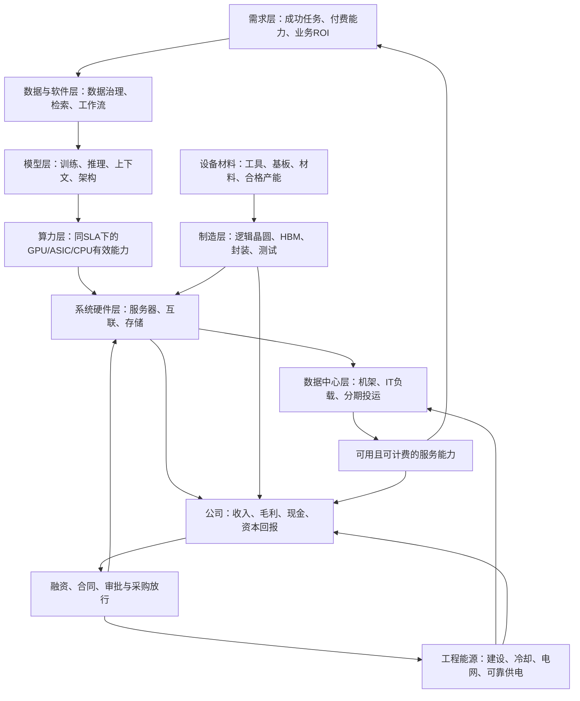

# AI产业链全局图谱与口径字典

报告日期：2026-09-18  
研究截止日期：2026-09-18（America/Los_Angeles；只纳入截至该日已公开的资料）  
完成日期：2026-09-18  
主要数据日期：公司经营数据以截至2026年5—8月的最新已披露财季为主；技术与标准更新至2026-09-17；跨行业规模采用各机构明确注明期间的统计或预测。  
性质：独立产业背景研究；不作公司投资分层、估值排序或交易建议。  
金额约定：USD bn＝十亿美元，USD mn＝百万美元；金额为名义值。实际披露保留原值，研究估计使用区间；非美元合同保留原币并仅在有明确假设时换算。

## 一、结论先行：先识别交易与资产，再判断传导

**AI产业链不能用一个“总市场规模”覆盖。应建立四本金额账、一本物理账，并用项目、合同和产品配置连接。** 四本金额账分别是终端服务支出、基础设施资产取得、供应链中间销售、上游生产能力扩张；物理账记录工作负载、设备、合格产能、电力和交付状态。美元单位相同，不意味着经济对象相同。

| 核心判断 | 适用范围与当前证据 | 成立条件、限制与反证 |
|---|---|---|
| token增长不能直接推导GPU采购增长 | 全球训练/推理；模型、缓存、批处理、任务完成率影响单位任务耗用。MLPerf已区分不同任务与服务场景，2026-09-17更新又加入端到端RAG与边缘agent测试。[MLCommons][R23] | 只有在工作负载可比、效率及可用存量不足以吸收需求、客户愿意付费时，才形成增量采购。反证是付费使用未增长、利用率下降或任务成本改善由存量承接 |
| 当前已有真实订单、交付与收入，不是所有“AI相关”都只有叙事 | Dell截至2026-07-31财季披露AI服务器收入USD 16.4bn、当季订单USD 60.9bn、期末backlog USD 95bn；三者分别是收入流、订单流、订单存量。[Dell][R08] | 可确认Dell已有业务暴露，不能把三项相加，也不能把服务器收入加到内含的GPU、HBM收入上作为终端支出 |
| CapEx变动可能来自口径或价格，而非更多算力 | 微软2026-07-29披露租赁分类变化会影响CapEx指标；在排除该变化后，CY2026投资预期未因此改变。[微软][R01] | 必须并看现金、融资租赁新增、经营租赁、实物到货和投运。报告CapEx下降本身不能证明建设收缩 |
| 电力约束是地点、日期、可靠性和权利的组合 | IEA 2026年研究；美国公用事业项目与PJM规则。[IEA][R17]、[FERC][R27]、[Entergy][R29] | 已签PPA、已批项目、已建变电站与机房可计费负载是不同阶段；额定发电容量不等于可用IT负载 |
| 性能与互联升级可能重新分配价值，而非普遍增加部件销售 | NVIDIA的CPO产品进展、UEC标准更新和华为2026-09-17 NPO发布均显示连接架构正在变化。[NVIDIA][R21]、[UEC][R24]、[华为][R34] | 供应商宣称的性能仍需客户验收与同条件测试。光引擎可能替代可插拔模块，板上互联可能改变铜缆、DSP和连接器组合 |
| 制造设备与工程受益需跨过额外决策层 | 设备采购取决于晶圆厂/存储厂的扩产与工艺决策；EPC取决于项目放行和现场能力。SEMI市场包含非AI用途。[SEMI][R12]、[ASML][R11] | “AI芯片需求增加”不等于“所有设备销售等比例增加”；存量产线增产、良率提升和节点迁移会改变设备强度 |
| 收入增长不能证明资本回报改善 | CoreWeave Q2 2026净利息费用USD 0.640bn；折旧还分布在technology and infrastructure费用中。[CoreWeave 10-Q][R06] | 必须归并经济成本后比较单位算力利润、现金、债务与更新支出；不同公司的会计毛利率不可机械横比 |

本研究的独立数量结论集中在**采购边界清楚的100 MW园区、token服务能力、存量与增量采购、订单确认及价格敏感性**。对2026—2028年全球AI专用支出不制造单点总量：公开披露还不能完整剥离非AI、内部自用、租赁和上下游重复项。真正的观察窗口是下一次客户验收、上电、财报或产能认证。本文按未来3、12、24个月设置验证期。

## 二、研究边界、证据分级与统一计量规则

### 2.1 本次资料边界

本报告事实与数字均来自本次联网获取的公开资料。只为确定输出位置和操作规则读取了适用目录的AGENTS.md；没有读取旧研究、索引、缓存或中间结论作为研究依据。完整报告只写入本文件。

证据标签贯穿全文：**F＝已披露事实；M＝管理层目标、产品主张或预期；T＝第三方估计/预测；E＝本研究条件估计；U＝公开资料不足、尚不可识别。** 公司公开声明本身可核实，不代表其未来结果已经实现。对上市公司财季使用截止日期，不把FY2027自动当成2027自然年。

| 来源类别 | 优先读取项 | 可支持的结论 | 不应支持的结论 |
|---|---|---|---|
| SEC、财报、监管决定 | 主体、业务分部、现金流、租赁、履约、集中度 | 已确认经营与会计边界；具体规则与批复事件 | 未拆分的AI收入、未来全面交付 |
| 公司产品/客户/项目公告 | 产品配置、版本、客户、部署阶段 | 产品存在、供应关系、路线选择 | 未披露ASP、市场份额、量产良率、第三方认证性能 |
| IEA、PJM、行业机构 | 样本、区域、时点、统计方法与预测情景 | 物理量及市场边界、外部约束 | 把北美主要市场样本外推全球，或把全数据中心改名为AI |
| 标准组织、论文、会议 | 版本、测试负载、延迟、精度、质量阈值 | 技术机制与可复测性能 | 不受条件限制的商业TCO、所有模型的性能增益 |
| 可信媒体及非正式线索 | 原始提供者、日期、利益关系、验证状态 | 待验证事件线索 | 直接进入基准收入或合格产能 |

引用编号对应第十一节的完整来源表。主要动态数值尽量同时给出披露日期与经济期间；未署日期的产品页明确标为“截至研究日网页快照”。受限网页不把未读到的全文当作已核验资料。

### 2.2 每个数值必须带的坐标

最小记录为：`主体/项目ID × 产品配置/版本 × 地域 × 经济期间 × 披露日期 × 单位 × 存量或流量 × 总额或净额 × 交易对手 × 所有权/采购边界 × 状态 × 来源与置信度`。

例如“某云厂2027年2 GW”若缺少IT还是设施负载、合同还是运行、全年平均还是年末额定、哪一方建设，就不能乘统一美元/MW，更不能进入当期供应商收入。

**可加总的必要条件**：对象互斥、期间一致、地域一致、产品/价格基准一致、状态一致、交易边界一致、无集团内部或转售重复；只满足“都是美元”或“都是GW”不够。

### 2.3 四本金额账和一本物理账

| 账本 | 统计对象 | 典型项目 | 与其他账的连接 |
|---|---|---|---|
| A：外部最终服务支出 | 选定终端客户向AI服务提供者支付的金额 | 订阅、API、按成功任务计费、广告主支出中的可识别增量 | 应用购买云服务属于中间投入；统计端点由研究问题确定，不与中间云/API全额相加 |
| B：基础设施资产取得 | 按资产唯一ID识别的新建、扩容、替换资产 | 服务器、网络、存储、建筑、MEP、接入 | 可以由租户、开发商、utility分别持有；资产只计一次，付款与取得需时间桥接 |
| C：供应链交易 | 各层公司对外销售 | 系统、GPU、HBM、封装、晶圆、工程 | 可分别测业务规模；纵向相加只能叫交易总流水，不是新增最终需求 |
| D：上游生产能力投资 | 芯片厂、设备/材料厂的自身扩产 | 厂房、工具、封装线、激光器产线 | 与B是不同资产，若研究全社会产业投资可并列或经去重合计；不能把D塞进同一AI园区BOM |
| P：物理状态 | 工作量、设备与合格交付能力 | token、GPU-hour、wafer、stack、rack、MW、MWh | 是金额账的校验约束；只有明确采购单元和成交/报价边界时才换美元 |

“最终支出”随研究边界改变：服务器对云厂是资产终端采购，对提供AI应用服务的全链是资本投入；必须说清所回答的是哪一个问题。

## 三、全局产业链分层图谱

### 3.1 主图：需求、供给与融资共同决定交付



箭头是有条件的连接，不是固定受益方向。数据与软件也可以直接向终端收费；边缘推理可以绕开云数据中心；能源与制造分别约束项目和系统，而不是需求增长后自动同步扩张。

### 3.2 全局产业链图谱表

以下周期是分析窗口，不是全行业交期统计；具体项目以合同、认证与现场里程碑替代。

| 层级 | 子环节/关键产品服务 | 上游驱动 | 下游影响 | 核心指标 | 连接条件与时滞 | 代表公司/组织及证据边界 |
|---|---|---|---|---|---|---|
| 需求层 | 代码、搜索、广告、企业流程、视频、科研 | 成功率、付费预算、节约的人力与时间 | 任务数、服务收入、峰值并发 | 成功任务/日、留存、付费率、净ARPU | 试用到续约通常需跨预算/部署周期；使用不等于付款 | Microsoft、Google、Anthropic；收入与使用证据见R01、R03、R31、R32 |
| 数据与软件层 | 数据库、RAG、治理、权限、编排、沙箱 | 数据质量、工作流集成、合规边界 | 输入长度、缓存命中、CPU和存储负担 | 检索QPS、活跃数据量、任务成本 | 数据整理可能先于GPU采购；集成失败可阻断采用 | AWS、VAST Data、云平台；IT4LIA公开合同提供具体组合R30 |
| 模型层 | 预训练、后训练、MoE、推理、多模态 | 质量目标、上下文和推理预算 | FLOPs、权重容量、KV、通信 | 活跃/总参数、训练run、输出token、延迟 | 新模型可迁移也可重训；技术进步不能直接折算采购 | Google、Anthropic、DeepSeek；R25、R31、R32 |
| 算力层 | GPU、ASIC、CPU、边缘推理 | 负载组合、软件栈、成本与时延 | 系统采购、云价格、算力利用 | 同负载TPS、GPU-hour、可用率、TCO | 芯片可得不等于软件可迁移；采购需超出可复用存量 | NVIDIA、Broadcom、AWS、华为；R05、R09、R03、R34 |
| 数据中心层 | 自建、colo、NeoCloud、主权集群 | 可融资租约、服务合同、地点限制 | IT容量和收入上线节奏 | 已签/在建/已上电/计费MW | 工程、设备与接入最长路径决定完成时间 | CoreWeave、Core Scientific、EuroHPC；R06、R07、R30 |
| 系统硬件层 | GPU tray、CPU、主板、机柜、PSU | 平台配置与架构 | 可交付服务器/机架数量 | BOM、ASP、合格出货、返修 | GPU供给、整机测试、现场验收 | Dell、ODM生态、NVIDIA；R08、R20 |
| 系统硬件层 | scale-up/out/across互联 | 并行策略、集群规模、距离 | 集群利用率及光/铜组合 | 端口、带宽、阻塞比、故障率 | 不同网络域分开建模；新标准需互操作认证 | Arista、NVIDIA、Broadcom；R09、R10、R21、R24 |
| 系统硬件层 | DDR、SSD、HDD、存储系统、缓存层 | 数据集、检查点、RAG、KV offload | 数据供给与推理时延 | TB/PB、IOPS、带宽、留存期 | 不是每新增token都形成永久保存；缓存层可替代高成本内存 | Micron、VAST及系统厂；R15、R16、R30 |
| 半导体制造层 | 逻辑晶圆、chiplet、先进封装、基板 | 有效芯片订单、工艺路线 | 合格GPU/ASIC及系统交付 | wafer starts、good dies、合格封装/月 | 同节点不同die面积、封装面积不能一比一换算 | TSMC及封测生态；R36 |
| 半导体制造层 | HBM、堆叠、DRAM、NAND | 容量/带宽需求、供应协议 | 板卡配置、售价及供给竞争 | stack、GB、层数、yield、ASP | HBM占用晶圆与洁净室资源；转产可能逆转普通DRAM价格 | Micron；R15、R16 |
| 制造设备材料层 | 光刻、刻蚀、沉积、键合、ATE、基板材料 | 晶圆厂扩产、节点迁移、步骤数 | 上游产能与良率 | 工具吞吐、验收、装机、材料耗用 | 工具到厂还需调试与认证；长期投资不等于当期产出 | ASML、材料/测试供应商；R11、R12；未核实个别厂商AI份额 |
| 工程能源层 | 高压变电、接入、输配电、PPA | 地点、可靠性与合同保障 | 能否上电及电价 | firm MW、变压器/开关交期、审批 | PPA不自动产生输电容量；建设常跨多年 | Entergy、PJM区域电网；R27—R29 |
| 工程能源层 | UPS、配电、液冷、MEP、消防、调试 | rack密度、热负荷、冗余设计 | 系统可用率与PUE | kW/rack、流量、温差、冷却能力 | 液冷需IT与设施接口适配；设备交付不等于联调通过 | Vertiv、EMCOR；R13、R37 |
| 公司经营映射 | 销售、服务、资产运营、融资 | 订单所有权、交付、定价与资本结构 | 收入、利润、现金、ROIC | AI可识别收入、GM、D&A、营运资本 | 所有层都要穿过合同与会计确认；不构成第十个可加总市场 | 第八节逐一说明 |

### 3.3 地域坐标不能省略

| 地域/组织方式 | 必须另外核对的连接 | 当前可复核样本 | 不能外推的部分 |
|---|---|---|---|
| 美国hyperscaler/NeoCloud | 资本预算、租赁/SPV、PJM等电网规则、客户融资 | 云厂财报；Core Scientific与CoreWeave；Entergy项目 | 美国公司的全球CapEx不是美国地域支出 |
| 中国 | 软件适配、国产系统配置、当地电价/接入、采购验收、适用出口与合规条件 | 华为2026-09-17超节点产品发布R34 | 发布不证明全国出货和客户ROI；没有证据不能给上市“合作方”分收入 |
| 欧洲 | 公共采购与服务预算、能源/数据边界、主权分区 | IT4LIA已签采购合同R30；Gigafactories仍处招标阶段R33 | 公共算力可免费提供给用户，使用量不能直接乘商业API售价 |
| 中东 | 分期目标、土地电力水资源、采购许可、真实客户 | 2025-05-22 Stargate UAE公告：整体1 GW、2026年首期200 MW目标R35 | 公告中的200 MW未在本研究中核实为已投运；不能将1 GW重复加首期 |
| 日本、韩国及其他亚太 | HBM/逻辑供应、进口设备、地理与建设成本 | 全球制造/设备披露和JLL地域成本研究 | 半导体产地不等于终端算力使用地；不以美国BOM或电价覆盖所有地区 |

## 四、核心口径字典与当前数据锚点

### 4.1 口径字典表

| 术语 | 本报告标准定义 | 单位/性质 | 可加总吗 | 常见误用 | 优先来源 | 校验或反证 |
|---|---|---|---|---|---|---|
| AI需求 | 为完成指定任务所需的质量合格工作量，训练与推理分别登记 | 任务、run、请求、token；期间流量 | 同任务/质量/计数边界内可；跨模态须保留原量 | 用户热度当收入；测试调用当付费需求 | 客户使用、续约、账单、实验记录 | 成功率、净支付、留存是否同步 |
| token需求 | 按指定tokenizer和模型分别统计输入、输出、缓存读取、内部生成 | tokens/期间 | 同定义且去重才可；异构token总数仅是计数总和 | 所有输入和输出等成本；跨平台API重复记 | 平台账单与技术文档 | tokenizer、缓存、reasoning和转售边界 |
| 云AI收入 | 对外售出的AI相关实例、API、托管或软件服务；逐类独立记录 | USD/期间，收入流 | 同层去内部交易后可；应用与底层云需抵销重叠 | AWS/Azure全部算AI；把内部ASIC云服务叫芯片外销 | 分部及产品级财报、披露说明 | 对外交易、AI业务定义、总额/净额 |
| ARR/run-rate | 将某个时点合同或短期收入按既定方式年化 | USD/年，时点指标 | 不与当年已确认收入相加 | 运行率当全年收入；混同订阅ARR与消耗年化 | 公司定义、月度基础 | 明确年化基期、季节性与流失 |
| AI CapEx | 可归属于AI基础设施的资本化资产取得/支出，先声明现金或权责边界 | USD/期间，流量 | 相同定义、资产去重后可 | 公司全CapEx＝AI；融资款＝CapEx | 现金流、租赁附注、工程清单 | 非AI、租赁、共享资产分摊和付款时差 |
| facility CapEx | 建筑、核心机电等设施资产；包含项依项目合同确定 | USD/项目或USD/IT MW | 与不重叠的IT采购可加 | 含MEP报价再加冷却/电力；与房地产估值混同 | 工程预算、成本基准 | 土地、接入、税费、液冷、融资利息是否包含 |
| AI数据中心建设规模 | 新建及改造项目的物理状态与对应不重复资产投资 | MW/GW、USD；状态必须注明 | 同期同状态的不同项目可 | 规划＝在建＝已上电；全DC＝AI DC | 审批、客户/业主双边披露、现场交付 | 项目ID、AI/非AI分区、分期变化 |
| AI订单池 | 在指定采购边界、期间可争取或已签的外部采购价值 | USD/期间或时点 | 互斥采购包可；主合同与分包不可 | TAM、意向、bookings、backlog混用 | 合同、采购公告、订单定义 | 取消权、融资条件、交付里程碑 |
| bookings | 期间新增订单，区分毛额/净取消及调整 | USD/期间，流量 | 同期同边界可 | 当收入；与backlog相加 | 公司订单定义 | 订单滚动表和取消 |
| backlog/RPO | 未完成订单或尚未履行义务；二者不默认相同 | USD/时点，存量 | 不同供应商纵向不能作终端需求合计 | backlog等于现金、不可取消债权或下一年收入 | 合同与收入确认附注 | 未来确认分布、服务可用条件、可变对价 |
| GPU-hour | 指定SKU占用一小时；区分分配、计费和有效工作小时 | GPU-hour，流量 | 同SKU/精度/SLA可；异构需性能换算 | GPU忙碌率＝付费利用率；H100小时＝ASIC小时 | 集群计量、调度、账单 | 性能、停机、预约空置、抢占 |
| 有效算力存量 | 能在目标软件、质量、时延下提供服务的可用设备能力 | 同工作负载吞吐/秒，时点存量 | 同负载可合并，须考虑互联/调度 | 峰值FLOPS当有效产出 | 基准与生产遥测 | TTFT、TPOT、失败率、数据/通信等待 |
| 芯片产能释放 | 某期新增可交付合格芯片/模块，不自动等同整机上线 | GPU/ASIC、good dies、modules/期间 | 同产品可；晶圆、裸die、封装不能混加 | 产能月末运行率×12当当年出货 | 产能、良率、认证、库存 | 工艺/封装/HBM/板卡中最低可交付环节 |
| wafer | 明确直径、工艺、产品与wafer starts或完成片 | wafers/月、片/期 | 同口径可；12英寸等效只校面积 | 不同die面积的每片产出相同 | 代工与制造披露 | die面积、良率、周期、产品组合 |
| HBM stack | 合格堆叠封装，必须注明代际、层数、容量与带宽 | stacks、GB、GB/s | 同配置可；8-high与12-high不按同一价值相加 | stack数＝DRAM die数；HBM金额再加GPU全价 | 规格、供货协议、认证 | 层数、良率、每加速器stack数 |
| rack | 机架级采购/安装单元；计算柜和网络/存储柜分开 | racks、kW/rack | 同配置可；混合机架数不代表算力 | 每rack固定72 GPU；额定功率当平均耗电 | 配置清单、产品与现场资料 | tray数量、CPU、网络、冗余、电力设计 |
| IT load | 本文严格拆成“额定IT容量”和“实际IT功率” | MW/GW；容量或瞬时负荷 | 同状态和测量边界可 | 将两种MW混同；facility MW当IT MW | 电表、设计及验收 | PUE、负载率、可计费与设备实际功耗 |
| facility load | 包含IT与设施损耗的总功率/容量，注明备用是否计入 | MW | 不与IT MW相加 | 2N冗余当双倍可售容量 | 总表与设计文件 | 与同期IT表计对账 |
| PUE | 同一期间设施总能耗/IT能耗；设计值与实测值分开 | 比率 | 不可简单算术平均，需按IT能耗加权 | 用年平均PUE准确推尖峰接入容量 | 实测、标准及工程设计 | 气温、部分负载、测量边界 |
| PPA/接入/firm power | 电量采购合约、并网权利、可靠可用容量，三者分开 | USD/MWh、MW、期限 | 仅相同经济对象可 | 可再生PPA MW＝24×7保供IT MW | utility、ISO、监管、合同 | 时间匹配、输电、容量信用、后备 |
| 存储 | 数据容量、带宽与IO能力，区分HBM/DDR/SSD/HDD/系统 | GB/TB/PB、IOPS、GB/s | 同层可；部件和系统销售有嵌套 | 所有AI存储＝HBM；生成token全部永久留存 | 配置、遥测、IDC、财报 | 压缩、复制、删除、分层与回收 |
| 价值捕获 | 公司从业务留下的毛利、经营利润及资本回报 | USD、margin、ROIC | 公司利润可统计，但不是AI最终支出 | 高收入＝高利润；EBITDA＝现金 | 财报与资本投入 | 定价、竞争、质保、折旧、税和资本结构 |

### 4.2 已披露金额：给各层定标，不拼接成“AI总规模”

| 数据锚点 | 披露日；经济期间 | 数值及标签 | 可回答的问题 | 不能推导的结论 |
|---|---|---|---|---|
| Microsoft | 2026-07-29；截至2026-06-30季度 | 现金PP&E USD 35.8bn；含融资租赁的CapEx约USD 41bn（F）[R01] | 同公司现金/租赁桥接 | 全部为AI；新融资租赁与本金付款等同 |
| Alphabet | 2026-07-22；Q2 2026 | PP&E购买USD 44.924bn（F）[R02] | 公司资产现金投入 | 全额为Google Cloud或AI |
| Meta | 2026-07-29；Q2 2026 | PP&E USD 30.116bn，融资租赁本金USD 0.962bn，合计USD 31.078bn（F）；CY2026同口径USD 130—145bn（M）[R04] | 现金投入与融资本金的区别 | 本金是本期新增资产；内部推荐算力是对外云AI收入 |
| Amazon | 10-Q署期2026-07-30；Q2 2026 | cash capital expenditures USD 53.1bn（F）[R03a] | AWS相关和履约网络等混合投资 | 整池AI CapEx；与其他厂商租赁口径无条件可比 |
| AWS | 2026-07-30；Q2 2026 | 收入USD 42.2bn；公司称AI、chips业务运行率各超过USD 25bn（F/M）[R03] | 实际云业务与公司自定义指标 | 两个运行率互斥、可相加；内部芯片业务等于独立半导体外销 |
| NVIDIA | 2026-08-26；截至2026-07-26季度 | Data Center收入USD 89.0bn（F）[R05] | 加速计算/互联平台商业交付 | 全球全部AI芯片；裸GPU价值；终端服务支付 |
| Broadcom | 2026-09-02；截至2026-08-02季度 | AI semiconductor收入USD 16.7bn（公司定义F）[R09] | 定制加速器与网络的真实收入暴露 | 全部为ASIC；云厂内部ASIC的独立终端售价 |
| Dell | 2026-09-01；截至2026-07-31季度 | AI服务器收入16.4、订单60.9、期末backlog 95，单位USD bn（F）[R08] | 采购、交付与存量订单的不同 | 三项相加；订单全在未来12个月确认 |
| CoreWeave | 2026-08-11；2026-06-30时点 | revenue backlog约USD 104bn（公司定义F，包含RPO及其他合同预期收入）[R06b] | 合同可见度 | 等于GAAP RPO或保证收入；不受服务交付条件影响 |
| Anthropic | 2026-05-28；当月达到的年化指标 | run-rate收入超过USD 47bn（公司披露M/F）；非全年审计收入[R32] | 服务采用形成商业规模的证据 | 2026全年收入；全球应用支出；与底层云全额相加 |

**一个可加的有限例子**：微软、Alphabet、Meta同一自然季度的现金PP&E约为`35.8 + 44.924 + 30.116 = USD 110.8bn`。这是三个公司披露的**PP&E现金购买样本合计**，未含Meta融资租赁本金；不是全球AI投资，不是资产新形成总额，也不排除企业间资产交易等需进一步核对的事项。Amazon头条指标另列，未强行归一化。

### 4.3 第三方市场与物理锚点

| 范围 | 来源披露/经济期间 | 数据及使用方法 | 与AI及其他表的重叠 |
|---|---|---|---|
| 全球数据中心电力 | IEA，2026-04-16报告；2025估计及2030中心预测 | 2025年485 TWh、2030年约950 TWh（T）；折算全年平均设施功率约55.4和108.4 GW（E）[R17] | 全数据中心，不是AI IT额定容量；平均电力也不是接入申请量 |
| 全球设施建造成本 | JLL，2026-01-05；2026预测 | shell/core平均USD 11.3mn/MW；IT装修另计（T）[R18] | 非整座AI数据中心全栈成本；项目还要核土地、接入与合同包含项 |
| 全球数据中心扩建 | JLL同报告；2026—2030 | 约100 GW新增容量与接近USD 3tn全周期投入叙述（T）[R18] | 全DC、多年预测；不能年化为2026收入，也不能当独立AI总市场 |
| 北美重点市场样本 | CBRE，2026-09-08；H1 2026 | 北弗吉尼亚容量4,496.5 MW、空置率0.2%（T）[R19] | 区域租赁市场统计，不代表全球AI GPU利用率 |
| 全球半导体制造设备 | SEMI，2026-07-14；CY2026预测 | USD 165.9bn（T；保留机构点估计）[R12] | 涵盖逻辑、存储等多用途；其中AI可归因部分未单独确定 |
| 全球数据中心以太网交换机 | IDC，2026-03-18；2025全年 | USD 32.5bn（T/统计）[R14] | 包含非AI；并非全网络，也不能再加系统内所有交换芯片收入 |
| 全球外置OEM企业存储系统 | IDC，2026-07-01；Q1 2026 | USD 9.9bn（T/统计）[R14b] | 不包括全部内置/自建存储，也不是AI专属；NAND涨价会放大金额 |
| 全球以太网光模块 | LightCounting，2026年7月；2026预测 | 预计增长73%（T），仅用作修订方向与范围提示[R22] | 不能将早期预测金额与后续增速拼成一个未经核实的市场值 |
| 全球液冷制造商收入 | Dell'Oro，2026-01-08；2029预测 | 约USD 7bn（T）[R13b] | 不等于全部HVAC/施工收入；可能嵌在服务器或设施合同中 |
| 全球工程交付条件 | Turner & Townsend，2026研究/截至研究日网页 | 数据中心和先进制造与其他建筑市场表现分化（T）[R38] | 不能用所有建筑业周期替代AI机电承包订单周期 |

这些锚点**不构成可相加的一列**。IEA的2030电量与JLL的2030容量也不能直接互证：必须先统一是否IT容量、地域/企业覆盖、年末还是全年平均、负载率及PUE。

## 五、跨层推导公式：适用条件、数量估计与不可识别处

### 5.1 公式总表与约束登记

以下为本研究的模型定义，不是行业共识预测。未注明实测的数据均为E类假设。时间索引`t`可以是月、季度或年，但各项必须使用同一期间；未来12个月指2026-09-19至2027-09-18，未来24个月相应截至2028-09-18。`a`为设备可用率，`u`为可用时间中的工作占用率，`η`为工作期间相对参考性能的效率，三者不得重复折减。

本节计算区间是给定参数上下限形成的**条件范围**，不是统计置信区间，也不意味着所有极端参数一定同时出现。采购价格、设备性能、功率密度和利用率可能相关；实际项目应按一致配置组合重算。美元采购范围不能代替供货报价，示例结果不能乘一个未经核实的全球项目数量生成市场预测。

| 公式ID | 可用对象/地域/期间 | 关键约束和尚未证明步骤 | 下修或改模条件 |
|---|---|---|---|
| F1：任务到付费 | 全球或指定国家；云/企业推理；2026—2028按年度/月份 | 任务成功率、付费意愿、token定义；尚未证明免费用户会付费 | 净留存、净ARPU、完成率或付费任务下降 |
| F2：token到算力 | 指定模型、SKU、SLA；任一地域；未来3/12个月 | 计算、内存、通信与延迟；需生产吞吐测试 | 同质量下吞吐提高、缓存改善，或真实流量低于假设 |
| F3：训练到GPU-hour | 单次训练或实验组合；全球；具体run期间 | 模型结构、优化器、并行、故障与数据处理 | 训练算法/活跃参数变化；利用率较预计高则所需小时下调 |
| F4：存量到新增采购 | 云厂/NeoCloud/企业分别；2027或未来12/24个月 | 可复用存量、退役、目标利用率、预算、电力 | 流量减少、效率/利用率提升、退役延后 |
| F5：机架到MW与电量 | 选定园区；示例美国；2026设计、2027—2028部署 | 额定/平均功率、PUE、负载爬坡、接入 | 上架延迟、功率下降、密度配置改变 |
| F6：MW到资产支出 | 同一项目、同一价格基年；示例2026美元、分期至2028 | 土地、设施/IT采购边界、价格与融资 | 报价下降、工程删减、由存量改造代替新建 |
| F7：芯片到合格供给 | 全球或单工厂/产品；2026—2028季度 | 各die、HBM、封装、基板、测试匹配；良率未披露 | 认证推迟、良率/可分配产能下降，或需求取消 |
| F8：互联/存储附着 | 指定训练/推理集群；全球；2026—2028产品代际 | 网络拓扑、光铜距离、数据留存、内存分层 | 拓扑更扁平、CPO/NPO替代、缓存压缩/回收 |
| F9：订单到收入 | 单公司或外部采购池；全球/合同地域；季度至24个月 | 取消、验收、服务可用、总额净额；已得订单不再乘份额 | 订单延期/撤销、会计口径变更、客户信用下降 |
| F10：收入到回报 | 单公司/业务；未来12/24个月及资产全寿命 | 价格、经济折旧、维护资本、融资、税、股权稀释 | 质保成本/资本占用增加、售价降低、资产加速过时 |
| F11：效率与价格反馈 | 同质量服务市场；全球/区域分开；12—24个月 | 价格传导、需求弹性、采用上限和竞争进入 | 需求反应不足、利润率恶化或融资约束先收紧 |

### 5.2 F1：需求首先按任务与支付边界计量

```text
任务量_j = 活跃用户_j × 使用频次_j × 请求/任务_j
计算工作量_j = 任务量_j × 实际模型调用次数/任务_j
Qin_j、Qout_j、Qcache_j = 计算工作量_j × 相应平均token数

API确认前账单价值
  = Σ[(Qin_noncache × pin + Qcache × pcache + Qout × pout) / 10^6]
    + 工具/检索/多模态等独立收费 - 折扣 - credits - 退款

订阅价值 = 净付费席位 × 实现ARPU × 期间
按结果付费价值 = 通过验收的成功任务 × 实现单价
```

同一产品如果采用订阅加超额用量，应按实际合同拆分；不能同时用席位收入和全量token标价重复估值。广告和推荐的AI经济价值，应以增量转化、增量广告收入或可识别成本节省检验，不能把全部广告收入重新归类为新增AI收入。

Google在2026年I/O披露每月处理超过3.2 quadrillion tokens，即`3.2×10^15`，范围是其各产品入口，不是全部付费API；该指标与Cloud客户token子集也不能相加。[Google I/O][R31] 该量只锚定某公司的工作负载规模，不能用统一价格换成“Google AI收入”。

**独立估计A：一年1万亿输出token的账单边界。** 假设指定文本API输出净价为USD 0.5—5/百万token，则输出部分账单为USD 0.5—5mn。这里的价格是2026-09-18设定的灵敏度参数，未经特定客户报价校准，置信度低；输入、缓存、工具和订阅均另计。这不是所有token的市场价格，也不是全球市场预测。只要实际成交价或token定义改变，即须重算。

### 5.3 F2—F3：token、FLOPs与GPU-hour

优先采用同质量、同延迟、同输入/输出长度分布的实测吞吐：

```text
Hbusy = Q / (qbusy × 3,600)
N所需 = Q / (qbusy × a × u × 期间秒数)
```

`qbusy`为工作期间每GPU的有效输出token/s，必须已经计入模型并行和所需配套工作；若测试对象为8-GPU组，应先用组总吞吐除以8。若吞吐已由全年服务遥测计算，不再额外乘占用率。若输入prefill与输出decode由不同资源池完成，应分池测算，避免把只测decode的性能用于全流程。

当只能使用计算量代理时：

```text
工作FLOPs = Σ[工作负载token数 × 对应FLOPs/token] + 额外非token运算
所需参考峰值FLOP/s = 工作FLOPs / (期间秒数 × η × a × u)
N计算下限 = 所需参考峰值FLOP/s / 单设备同精度参考峰值FLOP/s
```

这才是从工作量到参考硬件能力的完整量纲。`token × FLOPs/token ÷ 年秒数`仅得到平均工作FLOP/s，**尚未得到GPU数量**。实际台数还要同时满足内存、带宽、网络和SLA；并行开销可能使简单下限不可达。

```text
密集Transformer训练近似计算量 ≈ 6 × 参数量P × 训练token数T
训练GPU-hour ≈ 训练总FLOPs / (单GPU参考FLOP/s × ηtrain × 3,600)
项目训练成本 = 最终run + 预实验/失败run + 后训练 + 数据/人力/基础设施费用
```

`6PT`只是密集模型标准训练的粗近似，不覆盖所有attention、MoE路由、多模态编码和优化器成本；不能把MoE总参数直接当作每token激活参数。DeepSeek-V3技术报告给出671B总参数、37B激活参数及特定训练GPU-hour，证明架构与成本边界需要区分；不把该单模型训练披露当成研发总投入。[DeepSeek论文][R25]

KV缓存的普通attention近似为：

```text
KV bytes ≈ 2 × 层数 × KV heads × head dimension × 保留序列长度
           × 并发序列数 × 每元素字节数
```

该式适用于相应常规结构，不应不加修正地用于MLA等压缩结构。PagedAttention论文说明内存管理可改变碎片、共享与吞吐；论文特定配置增益不能原样推广所有生产负载。[SOSP论文][R26]

**独立估计B：1万亿输出token/年的容量。** 假设`qbusy=200—1,000 token/s/GPU`、`a=90%`、`u=50%—70%`，365天全年，对应约**0.278—1.389百万有效GPU-hour、51—353块GPU的连续可用部署需求（向上取整）**。q区间为研究演算假设，非某SKU实测范围，置信度低；不涵盖另建的训练池、额外prefill池和冗余部署。

| 改变项 | 其他条件固定时的结果 | 需要核验 |
|---|---|---|
| 任务量增长一倍 | 所需有效工作量约增长一倍 | 是否实际付费、是否多了失败重试 |
| 同SLA吞吐提高一倍 | 对同量任务的GPU需求约减半 | 硬件/模型精度/质量与功耗是否可比 |
| 占用率从50%提高至70% | 同量任务所需设备约减少28.6% | 峰值排队是否仍满足SLA |
| 输入上下文显著增长 | 不能仅用原输出TPS重算 | prefill成本、KV、带宽及缓存命中 |

该演算跨度表明：没有生产负载分布就不能用全球token粗算GPU市场。MLPerf的Offline、Server、Interactive和质量条件必须对齐；TDP或电源铭牌也不能冒充实测功耗。[MLPerf规则][R23a]

### 5.4 F4：先算可用存量，再算新增和替换

```text
K存量有效,t = Σ[仍在服役设备_i × 同工作负载性能_i,t × 可用率_i,t]
需要部署能力,t = 需求工作量,t / (期间长度 × 目标占用率)
新增采购有效能力,t = max(0, 需要部署能力,t - 可复用存量有效能力,t)
净新增存量 = 新投运 - 退役；采购还须加交付在途/备件，但不能重复加已在退役差额中的替换
```

对混合设备，更准确的方法是按任务类别分配存量并求约束优化；不能把无法运行某模型的旧卡用“总FLOPS”抵扣新模型所需设备。

**独立估计C：效率提升不必产生新增采购。** 单一兼容资源池有100台标准化设备，基期需求70个满载产能单位；未来12个月需求增长60%至112，软件/负载优化使每台能力提高50%，目标利用率上限80%。所需台数为`112/(1.5×0.8)=93.3`。不退役时无须新增；若退役10台、可复用90台，则需要约3.3台等效能力，而不是因需求增长60%就新增60台。

若需求增长200%至210，相同条件所需175台，扣90台后新增85台。两种结果共享相同效率假设，却产生相反的采购弹性。这里的效率提升假设可在存量设备上实现；若只有新硬件才能取得1.5倍性能，必须另算存量性能，不能沿用本例。

### 5.5 F5—F6：从rack到100 MW园区采购与运行成本

```text
计算rack数量 = IT额定MW × 分配给计算rack的比例 × 1,000 / 计算rack额定kW
GPU数量 = 计算rack数量 × 每rack GPU数
设施年电量(MWh) = IT额定MW × 年平均IT负载率 × 年度实测/假设PUE × 8,760
年电费 = 设施电量 × 综合购电单价 + 未包含的容量/网络/固定费用
```

接入容量需单独按设计峰值、可用率、冗余与同时系数确定；年平均PUE只适合电量估算。N+1/2N备用电源是可靠性资产，不能把重复备用容量当成新增可售IT负载。

**独立估计D：美国、2026价格基准、拟于2027—2028分期上线的100 MW额定IT园区。** 为隔离口径，选用GB200 NVL72式72-GPU计算rack作为配置例子，并非预测未来只采购这一代。72 GPU来自产品资料；120 kW/rack、80%计算rack功率分配等是本研究假设，须由工程规格替换。[NVIDIA产品][R20]

| 输入/输出 | 范围或数值 | 来源/置信度 | 边界与重叠控制 |
|---|---|---|---|
| 额定IT容量 | 100 MW | E；设计案例 | 不是100 MW设施总功率 |
| 计算rack分配 | 80 MW，120 kW/rack | E；低到中 | 其余20 MW留给外部网络、存储和其他IT；不是额外100 MW |
| 计算rack/GPU | 约667 rack、48,000 GPU | E；算术高、配置低到中 | 理论连续值；实际按整rack和配电块取整 |
| 每计算rack采购 | USD 3—5mn | E；低，假设报价区间 | 定义含GPU/HBM/封装、CPU、柜内互联和必要rack集成；不是公开成交价 |
| 计算系统采购 | USD 2.00—3.33bn | E | 内含HBM、封装等不再加计 |
| 外部网络与存储 | USD 0.20—0.50bn | E；低 | 仅计算rack合同未含的系统，排除柜内互联与同一光模块重复 |
| shell/core及设施MEP | USD 1.0—1.5bn | E；中低；以JLL USD 11.3mn/MW预测为锚扩展[R18] | 假定含项目基础电气/冷却/施工；需核对液冷接口、消防、冗余 |
| 可识别三包合计 | **USD 3.2—5.33bn** | E；低到中 | 不含土地、特殊场外接入、自建电源、税费及建设期融资；不是交钥匙总价 |
| 负载率/PUE | 65%—85%；1.15—1.30 | E；低到中 | 无现场实测；不把GPU占用率直接当全IT电力负载率 |
| 年设施电量 | **0.655—0.968 TWh** | E | 全年稳定运行情景；投运首年应按月爬坡 |
| 综合电能单价 | USD 50—120/MWh | E；低，敏感性假设 | 未经当地tariff或合同校准；固定/需量费用如未含另加 |
| 年电能费用 | **USD 32.7—116.2mn** | E | Opex，不再加作建设CapEx；不含重复出售电量 |

该采购估计对应**USD 32—53.3mn/额定IT MW**的三包范围；线性放大至1 GW为USD 32—53.3bn，但规模采购、接入和园区规划可能非线性。高端结果的IT单价高于JLL概括的部分项目装修基准，主要由假设rack报价推动，提示必须以实际采购合同校准，不能借机构成本锚为整段区间背书。

若实际设备价格下降20%、其余不变，三包投资约减少USD 0.40—0.67bn；若额定IT容量仍为100 MW，能耗不必下降相同比例。若功率密度由120提升至240 kW/rack，在计算功率仍80 MW时rack数约减半，但每rack GPU数、性能与ASP通常也变，不能据此推导GPU采购必然减半。

对于融资，若上述建设投资有60%需要债务，融资利率提高2个百分点，满额债务年度利息增加约**USD 38.4—64.0mn**（E）。这是固定比例和满额余额的压力测试，非市场报价；足以改变项目余量，却不会自动改变客户token需求。建设期提款和利息资本化必须另列。

### 5.6 F7：从wafer、HBM到可交付芯片

```text
良品die_i = 投入晶圆_i × 每片理论die_i × 晶圆/切割良率_i
逻辑可组装单元 = min_i(良品die_i / 每加速器所需die_i)
HBM可组装单元 = 合格stack数量 / 每加速器stack数
平台合格产出 = min(逻辑可组装单元、HBM可组装单元、匹配封装能力、
                     基板可用量、板卡/模块装配能力、测试合格吞吐)
可上线系统 = min(合格系统供给、现场可用电力/冷却支持的系统数、网络/软件验收通过数)
```

min关系须先统一到同产品、同时间、同配置的合格单元。中间库存可缓冲短期差异；不是每期所有环节产量都相同，也不能再对已合格的stack重复乘一次堆叠良率。

**独立估计E：采用前述48,000-GPU配置，若每GPU假设6—8个HBM stack，则需要288,000—384,000个合格stack。** stack数是研究参数，不声称对应GB200的实际配置；若都采用12-high，则对应345.6万—460.8万颗DRAM die的堆叠内容量，另有base die和生产损耗。没有die面积、良率、节点与每片良品数，不能进一步声称需要多少DRAM晶圆；也不能按一个未知stack售价构造美元订单。

“CoWoS每月多少片”还需明确是工艺wafer、interposer面积等效还是完成封装、产品尺寸、良率、是否已认证及产能爬坡。TSMC总HPC收入、总晶圆出货和全年CapEx不直接给出某GPU的供给上限。[TSMC披露][R36] Micron风险披露明确指出HBM和普通DRAM存在晶圆/洁净室资源竞争及转产价格风险，因此供给释放既可能解除AI瓶颈，也可能压低另一个市场的价格。[Micron 10-Q][R16]

设备采购需另外计算：

```text
特定工具需求 ≈ 新增目标产能 × 每单位产能所需工艺步骤强度 / 工具有效吞吐
             + 工艺迁移新增配置 + 更新替换 - 可复用/升级能力
```

该式适用于同工艺与工具组的工程估计；不能用AI芯片销售增速直接乘设备市场。工具价格、安装、验收、良率爬坡使收入与最终产能释放发生在不同季度。

### 5.7 F8：网络和存储按任务拓扑附着

```text
可插拔光模块需求 = Σ[需要光连接的物理链路 × 每链路端点数 × 模块配置比例]
                   + 合理备件 - 内嵌/CPO/NPO替代的可插拔端点
网络采购 = 不重叠的交换系统 + NIC/DPU + 外采模块/线缆 + 软件/集成
```

交换机整机报价若已含模块，不能再加。scale-up是紧耦合计算域、scale-out是跨节点集群、scale-across是更长距离/跨站点连接；各自的距离、带宽、延迟和可维护性决定光铜组合，不存在全球统一“每GPU固定若干个光模块”。华为最新发布直接提供了NPO替代原模块配置的厂商案例，但客户实测和总采购价值仍未知。[华为][R34]

```text
持久存储需求 = 新增需留存数据/日 × 保留天数 × 复制/纠删码系数 / 压缩系数
              + 模型/训练检查点 + 原始数据集 - 可删除或复用数据
存储系统数量 ≥ max(容量约束、吞吐约束、IOPS约束、可靠性约束各自所需系统数)
```

KV缓存可落在HBM、DDR或其他层级，是否能卸载取决于延迟与带宽；更多SSD未必意味着更少HBM，二者可能是互补也可能是替代。数据库/治理软件创造的价值需要付费查询、订阅或按任务合同，不应随PB增长机械线性外推。

### 5.8 F9—F10：订单、收入、利润和现金的桥接

```text
期末backlog = 期初backlog + 同口径净新订单 - 由该backlog转出的履约收入
             + 汇率/并购/范围调整

未分配外部采购池的公司收入 = Σ[采购池_j × 公司获得份额_j × 当期履约比例_j]
公司已取得订单的当期收入 = Σ[公司订单_j × 当期履约比例_j]
```

这里的履约比例只用于可按相应合同确认的收入；硬件控制权转移、工程按进度、云服务按可用时间/使用计费不能混用。没有滚动定义时，不能用上述等式硬推bookings。CoreWeave的revenue backlog明确比RPO覆盖更宽，并受交付/服务可用条件约束。[CoreWeave][R06b]

**独立估计F：USD 1bn的外部、尚未分配采购包。** 若某公司份额15%—25%、未来12个月确认40%—70%，收入为USD 60—175mn；假设对应毛利率20%—30%，毛利为USD 12—52.5mn。所有比例均为研究敏感性参数，不对应具体公司预测，置信度低。若USD 1bn本来就是该公司已签订单，则收入应为USD 400—700mn，不再乘份额。

```text
业务毛利 = 收入 - 相应销售成本
可比经济经营利润 = 收入 - 全部运营成本 - 经济折旧/摊销
NOPAT = 可比经营利润 × (1 - 适用税率)
ROIC = NOPAT / 平均投入资本
企业自由现金流 ≈ NOPAT + 非现金折旧摊销 - 资本支出 - 营运资本增加
普通股剩余现金还需扣债务/租赁等权利要求，考虑再融资和稀释
```

损益折旧年限不等于经济寿命。比较云厂与NeoCloud时，应统一设备折旧、租金、网络、电费和资本化研发的归属；比较OEM与芯片厂时，还要区分GPU是否由客户供料、总额还是净额确认。不能用公司整体毛利率直接推某个未披露AI产品的利润率。

### 5.9 F11：效率、价格与价值分配的条件关系

设同质量单位任务计算成本下降到原来的`k`（0<k<1），其中传导给客户的价格比例为`p1/p0`，需求价格弹性为`ε`：

```text
任务量比值 ≈ (p1/p0)^(-ε) × 非价格采用变化
总计算工作量比值 ≈ 任务量比值 × 单任务计算量比值
```

仅在质量、收入和服务定义可比、未触及预算/采用上限时适用；`ε`未知时不能预言“效率越高一定越耗算力”。若价格和单位工作量都减半，忽略其他变化，`ε=0.5/1/1.5`时，总工作量分别约为原来的0.71/1.00/1.41倍（E）。即使达到1.41倍，也要经过F4才转成采购。

系统收入还受ASP影响：销量增长40%、ASP下降30%，收入是`1.4×0.7=0.98`，反而下降2%（E）；若硬件采购额名义上升20%、ASP上升25%，数量约为原来的0.96。判断“CapEx上修”的弹性必须先拆数量、价格、组合、支付时点和租赁分类。

## 六、通用细分行业归属映射

表中的价值捕获与反证主要为本研究机制推断；产品/产业事实由所列来源锚定。没有逐公司客户和订单证据的行业，不赋予“必然AI受益”结论。

| 细分行业 | 所属层级 | 上游驱动 | 下游约束 | 主要价值捕获点 | 主要反证指标/替代 | 证据锚点 |
|---|---|---|---|---|---|---|
| 高压接入与变电 | 工程能源 | 地点明确的新增firm负荷 | 上电日期、供电质量 | 合格设备、接入能力、可回收投资 | 接入延期、客户撤回、交期下降、费用回收受限 | R27—R29 |
| 输配电与发电 | 工程能源 | 新负荷、电网可靠性 | 电价、可用功率 | 受监管资产收益/合同电价 | 电量低于约定、成本超支、非firm容量被当firm | R17、R28、R29 |
| 燃机/现场能源 | 工程能源 | 接入慢、可调度电源需求 | 燃料、排放、维护与冗余 | 设备和长期维护 | 燃机交期与许可仍拖延；自建未更快 | R17 |
| UPS/BESS/配电 | 工程能源/硬件 | 负载瞬变、可靠性、密度 | 掉电与暂态稳定 | 控制、认证、系统集成 | 冗余架构变化、可维护性下降、价格竞争 | R13、R17 |
| 液冷、CDU、热交换 | 系统/工程接口 | 芯片功率、机架密度 | 热稳定与可靠性 | 整机/设施协同、维保 | 供液温度和设计改变、漏液/质保、通用化 | R13、R13b、R20 |
| EPC/MEP/调试/消防 | 工程交付 | 已融资且开工的项目 | 现场劳动力、联调、投运 | 专业执行、变更管理 | 固定价合同成本超支、验收延迟、订单未转收入 | R37、R38 |
| AI服务器与rack集成 | 系统硬件 | GPU/ASIC平台与客户配置 | 合格整机交付 | 集成、交付、服务attach | GPU过手收入放大、ODM直采、保修支出 | R08、R20 |
| GPU与定制ASIC | 算力/硬件 | 工作负载、软件与TCO | 性能/容量/生态 | 架构、软件、设计与供应保障 | ASIC/CPU替代、租价下降、单位任务算力减少 | R03、R05、R09 |
| HBM | 半导体制造 | 加速器容量与带宽 | 芯片/模块可交付量 | 合格产能、工艺、协议与定价 | ASP下降、客户认证延迟、stack库存和转产 | R15、R16 |
| DDR/低功耗DRAM | 半导体制造/系统 | CPU、agent沙箱、缓存分层 | 主机容量与能效 | 位供给和产品组合 | HBM供给切换、CPU部署不足、容量利用率低 | R15、R16 |
| SSD/NAND、HDD | 半导体/系统 | 数据留存、检查点、检索 | 容量/吞吐 | 成本/bit、企业认证、存储软件 | 价格拉动大于bit增长、压缩删除、客户自行集成 | R14b、R15 |
| 以太网/InfiniBand交换 | 系统硬件 | 集群扩展与并行通信 | 有效算力利用率 | 软件、系统可靠性、客户认证 | 拓扑简化、白盒、scale-up域扩大而外部端口减少 | R10、R14、R24 |
| 光模块/光引擎/激光器 | 系统/半导体 | 光连接端口、速度和距离 | 带宽、能耗与良率 | 高速光电与合格供给 | CPO/NPO/LPO改变DSP和模块形态、铜连接距离延伸 | R21、R22、R34 |
| 铜缆/AEC/连接器 | 系统硬件 | 机柜布局、距离和速率 | 信号质量与维护 | 工艺、认证与密度 | 近距离光化、接口集成、架构改变 | R20—R22；个别供应商份额U |
| 先进封装/键合/ABF | 半导体制造 | chiplet、HBM及面积 | 合格加速器供给 | 工艺、尺寸与良率 | 设计面积变化、扩产后利用率下滑 | R15、R36；ABF单独AI金额U |
| 晶圆代工 | 半导体制造 | AI与非AI设计、节点选择 | 合格die及成本 | 工艺/良率、客户组合 | ASIC挤占GPU但未增加总wafer；大die良率变化 | R36 |
| 光刻/刻蚀/沉积等设备 | 设备材料 | 工艺步骤、产能扩张与替换 | 节点与产能爬坡 | 技术、服务、装机基础 | 延后扩产、工具复用、升级替代新机 | R11、R12 |
| 测试/老化/量测 | 设备材料 | die复杂度、可靠性、封装价值 | 出货合格率与测试时间 | 测试覆盖、吞吐和工艺 | 并行测试提高、测试时间缩短、量产延期 | R12；具体AI份额U |
| 材料、特气、硅片、化学品 | 设备材料 | 真实wafer starts与工艺消耗 | 良率、连续生产 | 纯度认证、供货稳定性 | 芯片收入由ASP拉动而wafer未增；材料节耗 | 制造消耗模型F7；专属订单U |
| 数据/检索/治理/安全软件 | 数据与软件 | 业务落地、权限和可靠性 | 可用数据及任务完成率 | 集成、黏性、订阅与按量收入 | 云平台捆绑、开源、付费席位减少 | R03、R23、R30 |
| 边缘/机器人/端侧AI | 需求/算力 | 延迟、隐私、离线与功耗约束 | 云调用和终端BOM | 本地计算、系统整合 | 任务回流云端、设备出货慢、端侧质量不足 | R23；不假定等量新增云DC需求 |

## 七、关键不确定性与跨层条件传导

### 7.1 供需系统的三种约束不能混为一谈

**需求约束**看成功任务、付费和续约；**能力约束**看合格设备、软件与上电；**资金约束**看客户信用、可提款融资、合同抵押和资产更新。三者共同决定采购。某环节涨价可能使其利润暂时改善，同时降低下游扩张能力；高利润又可能吸引扩产，最终反转价格。

| 重要连接 | 当前证据下的基准条件与范围 | 乐观/突破的附加条件 | 悲观、替代或传导失效 | 时滞与判别证据 |
|---|---|---|---|---|
| 采用→付费 | 已有平台运行率、订单与产品使用证据，但全球净付费任务总量U | 成功率提高，企业持续扩席/按量付费，客户ROI可量化 | 免费扩用、捆绑降价、重试token增长而业务结果未改善 | 未来3个月使用/续约先验证，6—12个月收入结构验证；R01、R31、R32 |
| 效率→需求→采购 | 不预设反弹；F11给出工作量可降、平或增的边界 | 价格下降引发足够弹性且超出可用存量 | 现有集群吸收全部增量；高端任务转小模型或端侧 | 先看同SLA成本，再看利用率与采购；未来12个月 |
| ASIC替代GPU | 工作负载稳定、软件迁移可行时成立 | 大客户有规模和设计能力，单任务TCO下降 | 通用需求/快速模型迭代提高迁移成本；设计或封装延误 | 先客户上线，再看续购；12—24个月；R03、R09 |
| AI CapEx上修→硬件 | 必须是新增真实采购数量且合同可交付 | 电力和系统供给同时扩张、价格不完全下滑 | 价格上涨、提前付款、租赁变化或非AI投资解释上修 | 未来3—12个月交付/验收、库存和应付；R01—R04 |
| HBM/封装扩产→系统供给 | 短板可能在其他环节；合格产品配置需匹配 | 逻辑、HBM、封装、板卡与机房同时可用 | 产线已装未认证；模块有货但缺电；扩产使ASP下降 | 数季到24个月，按客户认证和合格出货；R15、R16 |
| 新建MW→服务收入 | 已计费能力优于签约能力；同一资产只计一次 | 工程联调、客户任务与融资同步到位 | 上电但利用不足；客户合同因服务不可用延期 | 未来3/12/24个月逐项目验收；R06、R07 |
| 互联升级→光模块收入 | 更高带宽可增加价值，模块形态份额不确定 | 端口和速度增长超过单位bit降价/集成替代 | NPO/CPO减少可插拔端点；拓扑变化减少链路 | 先量产资格/系统验收，再看采购BOM；R21、R22、R34 |
| 电力紧张→能源设备利润 | 仅已获合同与合规回收路径的项目可映射 | 长交期环节取得价格与服务收入 | 加急、保函、成本和现场延期侵蚀利润 | 合同到施工跨年；R27—R29、R37 |
| 云收入→普通股价值 | 需覆盖折旧、租金、融资与更新资本 | 利用率/价格改善快于成本，客户更分散 | 租价先降而债务、租赁固定；需持续融资稀释 | 未来12—24个月现金回收与再融资；R06 |

### 7.2 未来12个月的资源池压力情景

为避免预填全球增长结论，以下只模拟一个2026-09-18基期的兼容推理资源池，基期设备100、需求70、未来退役10。性能提升设为可在保留设备上实现；如不能实现，必须改模。情景是比较工具，**不赋予全球发生概率，也不声称覆盖全部未来状态**。

| 条件情景 | 需求量比值 | 单机能力比值 | 目标利用率上限 | 需要台数 | 扣除90台存量后的新增等效台数 | 经济含义 |
|---|---:|---:|---:|---:|---:|---|
| 需求偏弱、效率兑现 | 1.10 | 1.50 | 80% | 64.2 | 0 | 需求仍增长但存在闲置；硬件采购可收缩 |
| 有采用增长、效率吸收 | 1.60 | 1.50 | 80% | 93.3 | 3.3 | 基本靠存量；设施不必同比扩张 |
| 高采用、质量驱动复杂任务 | 3.00 | 1.50 | 80% | 175.0 | 85.0 | 采购显著放大；还须融资与上电 |
| 技术/调度改善不足 | 1.60 | 1.10 | 70% | 145.5 | 55.5 | 需求相同却更耗硬件；客户单位成本可能更差 |

若最后两种情景缺乏电力，结果可以是排队、价格上涨、流量迁移或需求流失，而不是表中设备立即交付。若ASIC改进仅替代GPU，整个集群性能增长也不等于GPU厂商收入增长。

### 7.3 少数可判别事件的概率判断

概率为2026-09-18研究判断，不是统计校准结果；区间体现证据不完整。只对明确事件赋值，不给定义、会计恒等式和单位换算赋概率。

| 事件与成功标准 | 目标时期/概率对象 | 研究概率区间 | 依据、主要未知 | 上调/下调证据 |
|---|---|---|---|---|
| 至少一个已公开CPO/NPO架构，在非供应商宣传材料中出现具名外部客户的生产部署证据 | 截至2027-09-18；事件概率 | 65%—85%，中低置信度 | 厂商已有量产/产品发布R21、R34；尚缺本研究可核的广泛客户验收 | 客户确认上线/维护记录上调；延迟或退回旧配置下调。不是“可插拔收入下降”的概率 |
| 至少一个可重复的生产类工作负载，同质量/SLA单位任务成本较基期下降30%以上 | 截至2027-09-18；技术/部署事件概率 | 60%—85%，中低 | 基准与内存管理存在改善机制R23、R26；生产电价、软硬件成本及迁移费未知 | 客户全成本实测上调；只有厂商峰值性能、质量下降则不达标 |
| 假定成本已下降≥30%，指定客户的付费任务增长仍使采购能力需求超过既有可复用容量 | 成本改善后的12个月；条件概率 | 不给数值，U | 全球缺乏可比客户样本、弹性和存量利用率；F4可出现相反结果 | 续约、工作负载、利用率、预算与采购合同共同辨识 |
| 同时满足“成本改善→采用→超存量采购→按期上电→正增量现金回报” | 未来24个月；整条路径概率 | 不可可靠识别 | 多事件相关，融资/电力/客户需求有共同冲击 | 不能把前两行区间及任意采用概率按独立事件相乘 |

前两行不是互斥情景，概率无需合计100%。突破可以包含在乐观采用路径中，不作为与乐观并列的独立概率池。对全球2027/2028市场方向保持条件判断，比给未经校准的50/30/20分布更可复核。

### 7.4 当投资上修或融资转弱，谁先变化

**上修时最大弹性取决于上修原因。** 在数量扩张且供给可用时，加速系统和匹配互联直接跟随；在密度提高而总MW不变时，液冷、供电接口、光电架构变化可能更大；若只是设施先行，则EPC/配电先有订单，GPU收入未必同步；若只是价格上涨，供应商收入可涨而实物量不涨。没有组成拆分时，不做统一行业弹性排名。

**融资或最终需求转弱通常先影响可撤销与边际新增部分**：现货/短期算力价格、融资条款、尚未放行项目、可取消硬件订单和旧设备残值；已验收的长期合同可能延后体现压力。随后是库存、设备排期和工程新签，再到产线利用率及扩产。具体顺序依合同的取消权、预付款、抵押和客户集中度改变；不是保证每家公司按同一顺序受压。

## 八、公司经营映射：业务暴露、价值捕获与替代

### 8.1 映射原则

一家公司可同时是AI资产买方、对外服务卖方、芯片设计方和被投企业的股东。应按**业务活动与交易对手**定位，而不是把公司固定放在唯一一层。分清四种证据：已确认产品收入；已签合同但待履约；具备产品能力但份额未知；只有主题关联。后两种不能填入已确认AI收入。

公司经营暴露不只来自销售：云厂还暴露于折旧、能源、长期租赁、资本更新和融资；供应商暴露于客户集中、库存、担保、代垫资金和质保。研究“受益”需同时检查收入与投入资本两端。

### 8.2 公司经营映射示例

| 公司/环节 | 产业链位置 | 收入暴露口径及证据 | 采用或交付条件 | 替代关系 | 毛利/ROIC机制（研究推断） | 不可直接映射处 |
|---|---|---|---|---|---|---|
| Microsoft | 应用、云、模型服务、资产买方 | 云/软件混合业务，AI独立净收入仍需拆分；R01 | 付费席位、API/实例使用、算力可用 | 自研/第三方模型、软硬件效率、不同计算平台 | ARPU和使用收入对比折旧、租金和单位任务成本 | Cloud收入非全部AI；租赁分类改变不能当真实缩减 |
| Amazon/AWS | 云、定制芯片、应用 | AWS收入及自定义AI/chips运行率；R03 | 客户实际服务使用、迁移和合同履行 | Trainium/Graviton与其他硬件的负载竞争 | 自研降本与规模经济，需覆盖设计和资本占用 | chips运行率不等于裸芯片外销；AI/chips可能重叠 |
| Alphabet | 应用广告、云、模型与内部算力 | 云/广告/服务与PP&E分别披露；R02、R31 | 可识别变现与新增工作量 | 自研平台、任务路由、小模型、缓存 | 搜索增量价值与单位查询成本共同作用 | token总数不能乘API标价；广告收入不全属AI新增 |
| Meta | 内部推荐/广告、模型、资产买方 | CapEx可确认；独立云AI收入不由现有数据给出；R04 | 广告转化改善、用户体验与投入回报 | 自研模型/硬件、算法效率 | 增量广告毛利扣额外折旧与运算成本 | 把内部推理按外部GPU租价虚构收入 |
| NVIDIA | 加速计算和互联平台 | Data Center季度收入真实，但不等于裸GPU；R05 | 平台采购、供应匹配、客户验收 | ASIC、其他GPU、任务下沉、算法效率 | 系统/软件生态、产品组合、定价与供给 | 无法由收入直接反推GPU颗数或IT MW |
| Broadcom | 定制AI加速器与网络芯片 | 公司定义AI semiconductor收入；R09 | 客户设计成功、量产认证与订单 | GPU、客户其他设计伙伴、自研程度变化 | 设计复杂度、量产规模、客户议价 | 不把全部AI收入当ASIC；不代表客户内部转移价 |
| Dell | 服务器、存储、系统集成 | 明确AI服务器收入/订单/backlog；R08 | 元件到货、整机测试、交付条款 | ODM直采、客户自集成、平台改变 | 集成与服务收入，GPU过手和营运资本可能稀释回报 | ISG整体利润率不等于AI服务器毛利率 |
| Arista | 网络系统/软件 | Q2 2026总收入USD 3.036bn，披露AI fabric产品；非全AI；R10 | 客户选型、网络认证、批量交付 | 其他网络系统、白盒、不同网络域架构 | 软件、可靠性、支持服务和系统差异化 | 总收入不能直接乘某个AI项目MW |
| Micron | HBM、DRAM、NAND与SSD | 产品和供货协议明确；总收入不等于HBM/AI；R15、R16 | 代际认证、良率与客户平台 | 其他存储厂、容量优化、HBM/普通DRAM资源切换 | ASP、bit成本、产品组合与重资本周期 | 多年协议不自动保证长期超额利润；不可加到GPU价上 |
| TSMC | 晶圆代工和封装 | 晶圆/平台/节点与财务披露；R36 | 客户设计、良率、封装与产能调配 | 客户架构与die面积改变、其他合格工艺 | 工艺和良率、利用率、折旧、地区成本 | HPC不是纯AI；公司CapEx不是终端数据中心CapEx |
| ASML | 制造设备与装机服务 | 光刻系统和服务收入；R11 | 晶圆厂投资、设备交付验收、工艺部署 | 升级/复用、节点选择，非简单同功能替代 | 技术、工具性能、服务与研发强度 | 全部订单不等于AI订单；不能直连云厂每USD CapEx |
| Vertiv | 配电、热管理与服务 | Q2 2026收入USD 3.274bn；多产品组合；R13 | 项目设计、rack/设施适配、联调 | 同业、客户自设计、不同冷却/电力架构 | 系统可靠性、交期、服务、质保成本 | 全部收入不是液冷，也不是纯AI |
| EMCOR | MEP工程、服务 | Q2 2026总收入USD 5.15bn、期末RPO USD 17.14bn；R37 | 真实开工、人员、材料、工程进度 | 其他承包商、模块化与业主自采 | 项目执行、固定价风险、现金预收与施工资金 | 总RPO包含非AI项目；EPC合同内设备不能另作独立终端支出 |
| CoreWeave | 算力服务与资产融资 | 服务收入、合同、债务与成本；R06、R06b | 交付可用容量、客户支付与融资提款 | hyperscaler/其他NeoCloud、自建与ASIC | 利用率/租价对比折旧、电费、利息和更新资本 | 高backlog不保证正自由现金流 |
| Core Scientific | 高密度colo与存量资产改造 | 截至2026-06-30约590 MW客户租赁容量，其中约395 MW开始计费；R07 | 改造验收、客户与能源条件 | 自建、其他可上电地点 | 上电速度与租金，资本负担和单客户集中 | 590与395不能相加；不能与租户同一MW再计 |
| Entergy | 发电、输配电、供电 | 具体Meta项目协议/投资及批复事件；R28、R29 | 审批、建设、成本分摊、用电履约 | 地点迁移、现场电源、负荷管理 | 合同/监管回收、融资与施工成本 | 全公司售电或CapEx不等于AI；客户节省是预期非利润 |
| 华为/主权系统生态 | 算力、互联、系统 | 官方产品与架构信息可确认，单产品收入未知；R34 | 客户生产部署、软件适配、供应与验收 | GPU/国产方案及不同网络架构 | 整体系统能力与交付；具体利润U | 华为非上市；不能将发布会规格直接映射任何上市“合作公司” |
| 仅称“进入AI供应链”的材料/工业公司 | 待定位 | 没有产品、客户、订单、确认金额时属U | 先取得具体交付证据 | 替代关系也待识别 | 暂不能判断 | 通用铜、化工、电力、地产等概念相关不构成AI收入证明 |

### 8.3 一个真实的跨公司映射案例

Core Scientific披露的约590 MW租赁客户容量与395 MW已开始计费容量，是同一组业务的不同状态；其租户CoreWeave的服务收入和客户合同又处在下游。**不能计算“房东590 MW＋租户590 MW＝1.18 GW”，也不能把云服务合同全额加到房东租赁合同上称终端需求。** 395/590约67%只是截至2026-06-30该披露集合的计费状态比例，不是GPU利用率、工程完成百分比或全行业转换率。[Core Scientific 10-Q，署期2026-07-28][R07]

类似地，IT4LIA的公开采购将集成、Dell硬件、NVIDIA平台和VAST数据层连接起来，证实多家公司可参与同一项目，但没有各方合同分配就不能给每家分同一个全额订单。该项目采购、交付、安装及维护预算为EUR 290mn，披露于2026-04-22；采用纯展示汇率假设USD 1.05—1.20/EUR，对应**USD 304.5—348mn**（E，不是当日汇率或新的估值区间）。EU承担的50%与意大利共融资属于资金来源，不是两份项目。[EuroHPC][R30]

## 九、重复计算、误用口径与新闻归位

### 9.1 可以相加与不能相加的判断表

| 数字组合 | 处理结论 | 原因及正确展示 |
|---|---|---|
| 同项目不重叠的计算系统、外部网络、存储、设施工程 | 可条件相加 | 必须核对采购合同所含配套；第五节三包估计示范 |
| 不同最终客户、同期间、同定义的服务支出 | 可去重相加 | 抵销转售/API中间层、内部交易及重叠用户付款 |
| 同一资产从规划到在建到投运的MW | 不可相加 | 状态迁移；用存量滚动与新增流量 |
| 芯片＋HBM＋封装＋服务器全价 | 不可作为最终采购额相加 | 上游价值已嵌入下游售价；部件可作BOM拆解 |
| EPC总包＋总包买的变压器/液冷 | 不可直接相加 | 业主直接采购和承包商采购需排重 |
| 云AI收入＋模型API收入＋应用收入 | 不可直接当终端市场相加 | 中间采购、转售或代销总额净额问题 |
| 云厂CapEx＋供应商收入 | 不可当两份需求 | 一笔资产采购的买方与卖方及不同确认时点 |
| 公司年度CapEx＋跨年园区宣布投资 | 不可直接相加 | 同项目很可能已经纳入年度预算 |
| backlog＋bookings＋revenue | 不可相加 | 时点存量、期间流量、已履约价值 |
| 融资租赁资产新增＋本金偿付 | 不可作为当期新增资产重复相加 | 前者资产取得，后者既有融资现金偿还 |
| 开发商建造成本＋租户使用权资产＋租约总额 | 不可作物理资产总额相加 | 同一设施的所有权、使用权和长期服务现金流 |
| PPA MW＋数据中心IT MW＋备用发电MW | 不可相加成可用算力电力 | 电量合约、负载、备用资源不同；需可靠性对账 |
| foundry设备CapEx＋AI园区CapEx | 分账 | 不同固定资产可用于更广泛社会投资研究，但不是一个园区的成本 |
| 借款/融资轮金额＋CapEx＋未来云承诺 | 不可相加 | 资金来源、资金用途和经营合同；同一资金可能循环使用 |
| run-rate＋已实现全年/季度收入 | 不可相加 | 年化指标与实际流量重叠 |
| 全球＋美国＋中国样本 | 不可相加 | 地理包含关系；公司注册地也不代表支出地域 |
| 多供应商毛利总和 | 有条件研究价值分配 | 要控制产业边界、存货跨期和合并范围；不等于国民账户增加值，更非最终支出 |

### 9.2 同一笔USD 100最终采购的演示账

纯演示：云厂向系统厂采购USD 100；系统厂向芯片平台商支付USD 65、向其他部件商支付USD 15，保留USD 20用于本层成本和利润；平台商再向代工/存储/封装支付USD 30。若把100、65、15、30全加，总流水为210，但**云厂的最终设备采购仍为100**。20不是净利润，35也不是平台商净利润；还包含工资、研发、折旧、销售等费用。

若代工厂另买USD 10工具扩产，这是另一项生产性资产；可在“全链固定资产形成”的另一本账计量，不能说云厂购买了一台USD 110服务器。若银行为云厂贷款USD 80，这只是资金来源，不能再加为180市场需求。

### 9.3 看到新闻后的归位流程与实际例子

依次记录：**事件主体与交易对手→产品/项目→期间与状态→金额账或物理账→是否已包含在其他池→交付和支付条件→公司收入确认→成本与资本占用→待验证项。** 信息不足时保留未知，不用行业平均补齐关键商业条款。

| 新闻/披露 | 应归到哪里 | 首选计量 | 重叠检查 | 公司经营映射与下一证据 |
|---|---|---|---|---|
| “云厂上调CapEx” | B账，另设租赁/现金桥 | 当年资本支出变化及资产类别 | 股权投资、租赁和非AI部分 | 看实物数量/交付，不直接给各供应商统一增长率；R01 |
| “GPU销售增长” | C账算力平台销售 | 产品/系统收入与交付 | 整机内含GPU、网络和HBM | SKU/ASP/配置后才推台数；R05 |
| “新增1 GW项目” | P账项目规划状态 | IT/facility、分期、firm power | 园区/一期、开发商/租户 | 有采购放行和上电里程碑才推收入；R35 |
| “光引擎替代现有模块” | F8技术/BOM变更 | 光端点、带宽、功耗、可维护性 | 系统价内嵌与外采 | 重分模块、激光器、封装与交换机价值，先验收再量化；R34 |
| “政府启动算力招标” | 订单机会池，尚非公司订单 | 招标范围、服务或硬件、预算时期 | 国家配套资金和总项目 | EuroHPC 2026-07-30招标预期2027年选定项目，不能入2026已签收入；R33 |
| “公开项目签订采购合同” | B/C账明确交易 | 合同金额与包含的维护期限 | 集成商与部件供应商 | IT4LIA可以确认供应链位置，分配份额仍U；R30 |
| “厂商新增HBM产能” | D/P账制造能力 | 认证stack/月、良率、爬坡 | 晶圆与封装同产能不同表示 | 在客户平台匹配前不映射全部GPU放量；R15、R16 |
| “电力公司为AI建设新电厂” | 独立能源资产与合同 | firm MW、投资与成本回收 | 已批准原期与新增申请 | Entergy新协议不同于原批复，需分别跟踪；R28、R29 |

## 十、新证据如何改变计量与传导判断

### 10.1 必须保留的不同解释

| 观察结果 | 解释一 | 解释二/三 | 能区分解释的新证据 |
|---|---|---|---|
| token暴增 | 付费任务扩张 | 上下文变长、失败重试、低价免费流量、统计边界扩大 | 同模型成功任务、付费token、实现价格、缓存前后统计 |
| CapEx增长快 | 实物扩张 | 元件价格上涨、融资租赁新增、付款提前、非AI资产 | SKU数量/ASP、PP&E新增与现金桥、租赁、交付批次 |
| 网络收入强 | AI集群端口增多 | 速度升级或ASP上涨；非AI网络刷新 | 端口出货、按速度产品组合、客户项目归因 |
| HBM/存储收入强 | 出货bit/stack增加 | 价格/组合上涨，或客户提前备货 | 合格出货、ASP、库存、下游平台交付与消耗 |
| 数据中心空置率极低 | 真实短缺 | 长期预租占位但计算设备未上架 | 实际计费MW、负载曲线、验收与租约取消 |
| 芯片性能提高 | 固定任务需要更少算力 | 更复杂任务被采用，或极端测试条件造成表观提升 | 同质量/SLA生产TCO与成功任务变化 |
| 利润率改善 | 效率/定价真正提高 | 折旧年限、成本分类、资本化或投资公允价值变化 | 经营现金、经济折旧、非经营项目与资本投入 |

### 10.2 截止本次研究已发生的边界更新

| 新证据 | 对字典/连接的具体改变 | 仍未解决 |
|---|---|---|
| IEA于2026-04-16更新电力展望R17 | 本报告以485 TWh（2025）和约950 TWh（2030预测）为主要锚，旧版2024基数/2030预测不混入同一时期 | 不能从电量唯一反推AI额定IT容量 |
| 微软2026-07-29解释数据中心租赁分类R01 | CapEx比较必须保留现金、融资租赁与经营租赁桥 | 尚不能只由头条投资数字推实物新增 |
| UEC 2026-07-16版本1.0.3发布R24 | 标准记录改为具体版本，不只写“采用以太网” | 版本发布不证明客户互操作与份额 |
| MLPerf 2026-09-17版本6.1加入端到端RAG和边缘agent类别R23 | 有些需求应以任务/工作流测量，而非只测文本decode TPS | 基准仍不能代表所有企业生产流量 |
| 华为2026-09-17 NPO超节点发布R34 | 光模块字典需拆可插拔模块、近封装光引擎与系统内嵌采购 | 厂商性能、实际客户装机、成本与供应商分账仍须验证 |
| Core Scientific 2026-06-30容量状态R07 | 同一客户容量要分签约与计费，不能将其等同 | 尚不能由计费MW确定实际GPU负载率 |
| EuroHPC 2026-07-30 Gigafactories招标R33 | 公共部门可通过购买计算服务时间支持资产融资，未必直接买所有设备 | 尚未选定项目/供应商时不能分配收入 |

### 10.3 更新触发器与最早可验证窗口

| 观察窗口 | 优先新增证据 | 改变哪条连接 | 应采取的研究调整 |
|---|---|---|---|
| 未来3个月，至2026-12-18 | 下一轮财报订单取消/确认、模型SLA实测、客户具体上线、项目验收 | F1/F2/F9 | 区分使用与收入；若吞吐改善，先调整存量能力再调整采购 |
| 未来12个月，至2027-09-18 | 已签租约的计费MW、产线认证、付费留存、融资提款与固定成本 | F4/F5/F7/F10 | 重算可上线供给与现金成本，不只更新远期总投资 |
| 未来24个月，至2028-09-18 | 新代际续购、老卡残值、扩产后ASP、上电兑现、客户ROI | F7/F8/F10/F11 | 检验技术进步是否扩大最终需求、压低价格或迁移价值 |

下列缺口会实质影响结论，不能被“行业高景气”替代：全球付费token/成功任务的可比总量；云厂AI专用支出的可审计分拆；内部ASIC独立采购/转移定价；不同封装产品合格产能和良率；现场机架真实成交价；CPO/NPO的外部客户部署与分产品毛利；中国/中东项目采购许可、交付与回款的完整交叉验证。

### 10.4 非正式及非一手线索的隔离

| 线索 | 来源类型/日期 | 当前验证状态与置信度 | 本报告处理 |
|---|---|---|---|
| 媒体称Anthropic后续run-rate超过USD 65bn | Axios转述Bloomberg所见材料，2026-08-17，R39 | 非公司本次核验的一手财报；中低；基础期间与审计状态须核实 | 单独保留为后续核验线索；主要事实锚仍用公司2026-05-28披露，不将两者相加 |
| 招聘、论坛、渠道的“产能已满/交期缩短” | 本报告未取得足够可交叉验证的具体样本 | 未验证 | 不进入订单、ASP、产能或概率的数值基准 |
| 中国政府采购网页的算力服务器成交线索 | 2026-08-03公告被搜索检索到，但正文访问403 | 未完整核验 | 不使用其中金额、配置或供应商结论；以已读到正文的EuroHPC合同满足采购证据链 |

**适用于任意新闻的最终判断**应写成：“该证据属于哪一账、哪一层、哪个时点；已经证明哪一步；还欠缺哪项采用、交付、价格或资本条件；可能从谁转移价值；出现什么证据时下修。”对无法回答的部分保留U，而不是把上游容量、客户计划与公司利润连成一条无条件增长链。

## 十一、Reference和数字来源附录

### 11.1 一手公司、平台与监管申报

所有网页访问日期为2026-09-18。置信度针对所支持的具体事实，不把公司预测或宣传性能自动评为高置信度商业结果。来源表里的日期是披露/署期，经济期间另列。

| 编号与来源 | 日期/对应期间 | 来源层级 | 支持的定义、数字或判断 | 是否一手 | 置信度与备注 |
|---|---|---|---|---|---|
| [R01 Microsoft FY26Q4电话会][R01] | 2026-07-29；截至2026-06-30季度及CY2026预期 | 公司IR | 现金PP&E、含租赁CapEx及分类变动；云/应用边界 | 是 | 披露高；未来投资与分类影响属M；美元数字有四舍五入 |
| [R02 Alphabet Q2 2026业绩附件][R02] | 2026-07-22；Q2/H1 2026 | SEC公司附件 | Q2 PP&E USD 44.924bn，公司/Cloud边界 | 是 | 高；不拆AI专用比例 |
| [R03 Amazon Q2 2026业绩][R03] | 2026-07-30；Q2 2026及当时运行率 | 公司公告 | AWS收入42.2bn，AI/chips运行率各超25bn；存在定义重叠风险 | 是 | 财务披露高；自定义运行率中，非全年收入 |
| [R03a Amazon Q2 2026 10-Q][R03a] | 署期2026-07-30；截至2026-06-30 | SEC | cash CapEx 53.1bn；技术基础设施及履约网络混合 | 是 | 高；不把投资活动总现金等同CapEx |
| [R04 Meta Q2 2026业绩附件][R04] | 2026-07-29；Q2 2026/CY2026指引 | SEC公司附件 | PP&E30.116bn、融资本金0.962bn、130—145bn年度指引 | 是 | 实际高、指引中；内部算力非对外收入 |
| [R05 NVIDIA FY2027 Q2业绩][R05] | 2026-08-26；截至2026-07-26 | 公司公告 | Data Center收入89.0bn，算力/互联平台层已实现销售 | 是 | 高；非单颗GPU量价表 |
| [R06 CoreWeave Q2 2026 10-Q][R06] | 2026-08-11；截至2026-06-30 | SEC | 利息0.640bn、折旧费用分类、服务/融资关系 | 是 | 高；经济成本比较须统一口径 |
| [R06b CoreWeave季度业绩页][R06b] | 2026-08-11；2026-06-30时点 | 公司IR | 约104bn revenue backlog及包含范围、履约条件 | 是 | 中高；本次搜索索引返回了正文，直接打开为动态空壳；定义按返回文本，未冒充完整静态正文 |
| [R07 Core Scientific Q2 2026 10-Q][R07] | 署期2026-07-28；截至2026-06-30 | SEC | 租赁客户容量约590 MW、约395 MW开始计费及集中风险 | 是 | 高；不能当GPU利用率 |
| [R08 Dell FY2027 Q2业绩][R08] | 2026-09-01；截至2026-07-31 | 公司IR | AI服务器收入/订单/backlog分别16.4/60.9/95bn | 是 | 高；不使用财年标签替代自然年 |
| [R09 Broadcom FY2026 Q3业绩][R09] | 2026-09-02；截至2026-08-02 | 公司IR | AI semiconductor收入16.7bn及产品范围 | 是 | 高，但AI属于公司定义；未分ASIC/网络金额 |
| [R10 Arista Q2 2026业绩][R10] | 2026-08-04；截至2026-06-30 | 公司公告 | 总收入3.036bn、AI fabric产品与网络层映射 | 是 | 高；不推全部AI占比 |
| [R11 ASML Q2 2026业绩][R11] | 2026-07-15；Q2 2026 | 公司公告 | 光刻设备与服务、客户扩产连接 | 是 | 经营披露高、产能计划中；未把欧元整体收入换为AI美元池 |
| [R13 Vertiv Q2 2026业绩][R13] | 2026-07-29；截至2026-06-30 | SEC公司附件 | 收入3.274bn、产品/交付与订单风险 | 是 | 高；总额不是单独液冷市场 |
| [R15 Micron FY2026 Q3准备发言][R15] | 2026-06-24；截至2026-05-28财季与后续展望 | 公司IR PDF | HBM代际、存储复杂度、供货协议与产能/认证机制 | 是 | 经营披露中高，路线及未来供应中；新版官方PDF已打开 |
| [R16 Micron FY2026 Q3 10-Q][R16] | 2026-06-25；截至2026-05-28 | SEC格式公司PDF | HBM消耗晶圆/洁净室资源及转产普通DRAM风险 | 是 | 高；风险机制不是已发生市场崩跌 |
| [R32 Anthropic Series H公告][R32] | 2026-05-28；2026年5月运行率 | 公司公告 | 年化收入超过47bn及企业采用 | 是 | 中；非年度审计收入，不用于估值 |
| [R36 TSMC 2Q26财务演示][R36] | 2026-07-16；Q2 2026 | SEC公司附件 | 财务、节点、晶圆单位与CapEx独立边界 | 是 | 高；未取得可直接分配到GPU型号的合格产能 |
| [R37 EMCOR Q2 2026业绩][R37] | 2026-07-30；截至2026-06-30 | 公司IR/PDF | 总收入5.15bn、RPO17.14bn及工程业务映射 | 是 | 高；原网页与链接PDF均核对，非全AI |

### 11.2 电力、数据中心、制造、网络、光与存储第三方研究

这里“一手”指机构自己的研究发布，不表示其预测为已实现事实；公开摘要之外的付费数据库未读取。

| 编号与来源 | 日期/期间 | 来源层级 | 支持内容 | 是否一手 | 置信度与备注 |
|---|---|---|---|---|---|
| [R12 SEMI设备预测][R12] | 2026-07-14；2026—2028预测 | 行业组织 | 2026制造设备市场预测165.9bn及全行业范围 | 机构原始发布 | 中；不当AI专属设备市场 |
| [R13b Dell'Oro液冷预测][R13b] | 2026-01-08；2029预测 | 行业机构 | 约7bn制造商收入及液冷统计层级 | 机构原始发布 | 中；不是EPC/全部热管理 |
| [R14 IDC交换机统计][R14] | 2026-03-18；2025全年/Q4 | 行业机构 | 数据中心以太网交换机2025年32.5bn | 机构原始发布 | 中高；全数据中心，非纯AI |
| [R14b IDC企业存储统计][R14b] | 2026-07-01；Q1 2026 | 行业机构 | 外置OEM企业存储9.9bn及价格/需求混合驱动 | 机构原始发布 | 中高；页面不同段落年度增长口径不完全一致，未使用有差异的年度增速 |
| [R17 IEA Key Questions on Energy and AI][R17] | 2026-04-16；2025估计/2030预测 | 国际能源机构 | 485/950 TWh；电网、现场发电与融资约束 | 机构原始研究 | 基期中高、预测中；全DC用电 |
| [R18 JLL 2026数据中心展望][R18] | 2026-01-05；2026成本/2026—2030建设预测 | 地产/工程研究 | shell/core 11.3mn/MW、IT另外投入、全DC多年规模 | 机构原始研究 | 中；正文已读，PDF超时；未依赖PDF独有城市成本表 |
| [R19 CBRE北美市场研究公告][R19] | 2026-09-08；H1 2026 | 地产研究 | 北弗吉尼亚4,496.5 MW及0.2%空置 | 机构原始发布 | 中高；区域样本，不是GPU利用率 |
| [R22 LightCounting云数据中心光学报告摘要][R22] | 2026年7月；2026预测 | 光通信行业机构 | 以太网光模块增速修订至73%、统计范围与不确定性 | 机构原始发布 | 中；未把不同版本市场范围拼接 |
| [R38 Turner & Townsend 2026市场条件][R38] | 2026报告，网页未署具体日；研究日访问 | 工程成本研究 | 数据中心/先进制造与其他建筑市场分化 | 机构原始调研 | 中；定性工程背景，不用于给出具体项目报价 |

### 11.3 技术、标准、会议与项目来源

| 编号与来源 | 日期/适用版本 | 来源层级 | 支持内容 | 是否一手 | 置信度与备注 |
|---|---|---|---|---|---|
| [R20 NVIDIA GB200 NVL72产品页][R20] | 未署日；2026-09-18页面快照 | 产品资料 | 36 CPU、72 GPU及液冷rack尺度 | 是 | 配置高；本报告120 kW与价格不是从该页读取 |
| [R21 NVIDIA GTC Taipei Vera Rubin公告][R21] | 2026-05-31 | 顶级技术会议/公司路线 | 平台量产与Spectrum-X CPO产品进展 | 是 | 产品声明中高；量产/性能为厂商主张，不是外部部署审计 |
| [R23 MLPerf Inference v6.1解读][R23] | 2026-09-17；v6.1 | 标准化基准组织 | 任务/场景分层、端到端RAG和边缘agent测试 | 是 | 规则高；提交结果不等于全部生产性能 |
| [R23a MLPerf Datacenter规则入口][R23a] | 动态页面；2026-09-18快照 | 技术基准 | 质量、场景、延迟与功耗测量边界 | 是 | 高；不引用某单一系统分数作普适性能 |
| [R24 UEC规范历史][R24] | 最新1.0.3于2026-07-16发布 | 技术标准 | 规范版本与互联可比较条件 | 是 | 高；不代表所有设备已通过互操作 |
| [R25 DeepSeek-V3 Technical Report][R25] | 2024-12-27首发；特定模型报告 | 模型技术论文 | 总/激活参数、MoE与训练工作量边界 | 作者一手 | 机制高、厂商训练披露中；不推全研发成本 |
| [R26 PagedAttention/SOSP 2023论文][R26] | 2023-09-12首发 | 顶级系统会议论文 | KV管理、碎片/共享对吞吐的影响 | 作者一手 | 机制高；增益仅适用论文条件 |
| [R27 FERC co-location事实说明][R27] | 2025-12-18，页面2025-12-19更新 | 监管文件说明 | 同址供电仍涉及输电服务/费用与可靠性规则 | 是 | 高；作为已发生监管事件，不声称涵盖所有2026实施细节 |
| [R28 Entergy原项目获批公告][R28] | 2025-08-20；项目跨年至2028等 | utility IR/审批披露 | 三座新发电设施及原批准阶段 | 公司一手转述批复 | 中高；未将该公告当后续新增项目全部获批 |
| [R29 Entergy新增Meta协议][R29] | 2026-03-27；长期建设与供电 | utility官方通讯稿 | 新增发电/输电/储能等合同方向，成本分摊 | 是，PRNewswire承载 | 协议事实中高、节省预期中；不是独立监管批准 |
| [R30 EuroHPC IT4LIA采购合同][R30] | 2026-04-22；跨期采购、交付、安装、维护 | 公共采购机构 | 290mn欧元总预算、供应链组合及50%联合出资 | 是 | 高；未披露各供应商份额；美元换算为研究假设 |
| [R31 Google I/O 2026演讲][R31] | 2026-05-19；当月运行口径 | 公司开发者大会 | 月token超过3.2×10^15及产品入口边界 | 是 | 使用披露中高；不等于付费API总量 |
| [R33 EuroHPC Gigafactories招标][R33] | 2026-07-30；2026招标/2027选择计划 | 官方招标公告 | 采购计算服务时间的融资/交付模式；招标不是订单 | 是 | 招标事实高、时间表中 |
| [R34 华为全联接大会昇腾960公告][R34] | 2026-09-17 | 公司技术会议/产品 | NPO超节点及光模块形态替代机制 | 是 | 发布高、性能/量产主张中；缺客户独立验证 |
| [R35 Stargate UAE公告][R35] | 2025-05-22；整体计划与2026首期目标 | AI平台项目公告 | 1 GW整体与200 MW分期包含关系 | 是 | 公告高、实际投运U；无已验收证明 |
| [R40 PJM负荷预测资料目录][R40] | 2026-01-14年度预测、2026-07-24年中信息更新 | 电网运营机构 | 负荷预测有版本、状态和方法审核 | 是 | 高；本报告未从目录推新增GW预测值 |

### 11.4 降权来源与访问限制

| 来源 | 日期 | 来源类型 | 支持什么 | 是否一手 | 验证与使用限制 |
|---|---|---|---|---|---|
| [R39 Axios关于Anthropic运行率报道][R39] | 2026-08-17 | 媒体转述/非正式财务线索 | 说明存在比公司五月公告更新但未由本研究一手核验的数字 | 否 | 仅列线索，不进入基准财务汇总或概率数值 |
| 中国政府采购算力成交公告 | 2026-08-03 | 官方网页，访问403 | 仅确认检索到一项公告 | 未读正文 | 不作金额、供应商与配置证据；未列为事实引用 |
| Micron旧static-files链接 | 研究日访问 | 旧URL重定向 | 提示链接迁移 | 不适用 | 已改读当前IR所链官方PDF R15/R16，不使用重定向页面冒充旧PDF内容 |
| JLL展望PDF | 研究日访问 | PDF超时 | 仅作为访问限制记录 | 不适用 | 数值使用成功打开的官网正文R18 |

### 11.5 研究估计的可复算索引

| 估计 | 输入来源与性质 | 公式/主要结果 | 置信度 | 重复计算及反证 |
|---|---|---|---|---|
| A：1万亿输出token账单 | Q与USD 0.5—5/百万token均为情景参数 | Q/10^6×价格＝USD 0.5—5mn | 低；算术高 | 不加订阅重复收入；实际报价/定义改变即重算 |
| B：算力服务需求 | q=200—1,000、a=0.9、u=0.5—0.7为假设 | 0.278—1.389百万busy GPU-hour；部署51—353 GPU | 低；须实测校准 | q是否已包含效率；不重复扣利用率 |
| C：存量吸收 | 100台、70需求、1.6倍需求、1.5倍能力、80%利用上限、10台退役，均为假设 | 93.3需求台数−90剩余＝3.3新增等效台 | 条件模型高、参数低 | 软件改善若不适用于旧设备须重算 |
| D：100 MW园区 | 72-GPU配置R20；设施锚R18；其余为2026-09-18研究参数 | 三包USD 3.2—5.33bn；0.655—0.968 TWh/年；电费32.7—116.2mn/年 | 低到中 | 排除内含HBM/MEP重复；不包含特殊场外资产；以实际报价反证 |
| E：HBM内容量 | 48,000 GPU×假设6—8 stack×假设12层 | 288,000—384,000 stack；345.6万—460.8万DRAM die | 参数低、算术高 | 不是GB200实际HBM配置；不外推wafer/美元 |
| F：采购池到收入 | 1bn池、15%—25%份额、40%—70%确认、20%—30%GM均为假设 | 收入60—175mn、毛利12—52.5mn | 低 | 公司自有订单不乘份额；取消/延迟重算 |
| 三家现金PP&E样本 | R01、R02、R04实际披露 | 35.8+44.924+30.116≈110.8bn | 高，但非AI专用 | 同期样本合计，不代表新资产形成或全球TAM |
| 电量到平均功率 | R17的485/950 TWh | TWh/8.76＝55.4/108.4 GW | 算术高，原预测中 | 不是额定IT负载或GPU数量 |
| IT4LIA美元展示 | R30 EUR 290mn；假设汇率1.05—1.20 | USD 304.5—348mn | 原币预算高、汇率假设低 | 非实时汇率；不加各层全额合同 |

本报告没有将条件演算标注为实际市场调查，没有将第三方远期预测当作已签订单，也没有从公司经营暴露推导普通股回报。所有公式、情景和行业映射以本文所列边界为有效范围。

[R01]: https://www.microsoft.com/en-us/investor/events/fy-2026/earnings-fy-2026-q4
[R02]: https://www.sec.gov/Archives/edgar/data/1652044/000165204426000066/googexhibit991q22026.htm
[R03]: https://www.aboutamazon.com/news/company-news/amazon-earnings-q2-2026-report
[R03a]: https://www.sec.gov/Archives/edgar/data/1018724/000101872426000026/amzn-20260630.htm
[R04]: https://www.sec.gov/Archives/edgar/data/1326801/000162828026050596/meta-06302026xexhibit991.htm
[R05]: https://nvidianews.nvidia.com/news/nvidia-announces-financial-results-for-second-quarter-fiscal-2027
[R06]: https://www.sec.gov/Archives/edgar/data/1769628/000176962826000366/crwv-20260630.htm
[R06b]: https://investors.coreweave.com/financials/quarterly-results/
[R07]: https://www.sec.gov/Archives/edgar/data/1839341/000183934126000014/core-20260630.htm
[R08]: https://investors.delltechnologies.com/news-releases/news-release-details/dell-technologies-delivers-second-quarter-fiscal-2027-financial
[R09]: https://investors.broadcom.com/news-releases/news-release-details/broadcom-inc-announces-third-quarter-fiscal-year-2026-financial
[R10]: https://www.arista.com/company/news/press-release/24401-pr-20260804
[R11]: https://www.asml.com/en/news/press-releases/2026/q2-2026-financial-results
[R12]: https://www.semi.org/en/semi-press-release/global-semiconductor-equipment-sales-forecast-to-reach-a-record-229-billion-dollars-in-2028-semi-reports
[R13]: https://www.sec.gov/Archives/edgar/data/1674101/000162828026050323/q22026exhibit991vrt07292026.htm
[R13b]: https://www.delloro.com/news/data-center-liquid-cooling-market-to-approach-7-billion-by-2029-as-ai-deployments-accelerate/
[R14]: https://www.idc.com/resource-center/blog/ethernet-switch-market-size-and-growth-datacenter-segment-surges-60-in-q4-as-ai-workloads-expand/
[R14b]: https://www.idc.com/promo/enterprise-storage-systems/
[R15]: https://s25.q4cdn.com/621799436/files/doc_financials/2026/q3/Q3-FY26-Prepared-Remarks.pdf
[R16]: https://s25.q4cdn.com/621799436/files/doc_financials/2026/q3/0000723125-26-000015.pdf
[R17]: https://www.iea.org/reports/key-questions-on-energy-and-ai/executive-summary
[R18]: https://www.jll.com/en-us/insights/market-outlook/data-center-outlook
[R19]: https://www.cbre.com/press-releases/north-american-data-center-demand-continues-to-outpace-supply-despite-record-construction
[R20]: https://www.nvidia.com/en-us/data-center/gb200-nvl72/
[R21]: https://nvidianews.nvidia.com/news/vera-rubin-full-production-agentic-ai-factory
[R22]: https://lightcounting.com/newsletter/en/july-2026-cloud-data-center-optics-385
[R23]: https://mlcommons.org/2026/09/chairs-mlperf-inference-v6-1/
[R23a]: https://mlcommons.org/benchmarks/inference-datacenter/
[R24]: https://ultraethernet.org/specification-history/
[R25]: https://arxiv.org/abs/2412.19437
[R26]: https://arxiv.org/abs/2309.06180
[R27]: https://ferc.gov/news-events/news/fact-sheet-ferc-directs-nations-largest-grid-operator-create-new-rules-embrace
[R28]: https://www.entergy.com/news/entergy-louisiana-receives-lpsc-approval-for-major-infrastructure-investments-to-support-metas-data-center-and-improve-reliability
[R29]: https://www.prnewswire.com/news-releases/entergy-louisiana-announces-a-new-agreement-with-meta-that-will-deliver-an-additional-2b-in-customer-savings-302727258.html
[R30]: https://www.eurohpc-ju.europa.eu/eurohpc-ju-signs-contract-boost-ai-capabilities-it4lia-ai-factory-2026-04-22_en
[R31]: https://blog.google/intl/en-in/company-news/technology/sundar-pichai-io-2026/
[R32]: https://www.anthropic.com/news/series-h
[R33]: https://www.eurohpc-ju.europa.eu/eurohpc-joint-undertaking-launches-ai-gigafactories-call-2026-07-30_en
[R34]: https://www.huawei.com/cn/news/2026/9/hc-ascend960-supernode
[R35]: https://openai.com/index/introducing-stargate-uae/
[R36]: https://www.sec.gov/Archives/edgar/data/1046179/000104617926000451/a2q26presentatione.htm
[R37]: https://emcorgroup.com/investor-relations/press-releases/2026-news/emcor-group-inc-reports-second-quarter-2026-results
[R38]: https://publications.turnerandtownsend.com/global-construction-market-intelligence-2026-us/market-conditions
[R39]: https://www.axios.com/2026/08/17/anthropic-revenue-run-rate-ipo-openai
[R40]: https://www.pjm.com/planning/resource-adequacy-planning/load-forecast-dev-process.aspx?p=1
