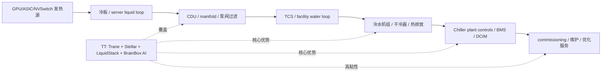
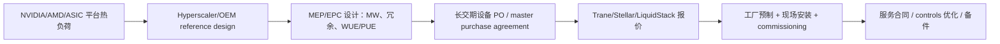

# 公司：TT Trane Technologies plc（特灵科技）

> 研究日期：2026-05-10  
> 最新市场数据：截至 2026-05-08 美股收盘，这是本报告写作时最新可得交易日。  
> 研究范围：Trane Technologies（NYSE: TT）的整体业务、最近五个季度财报、2026 指引、AI 数据中心热管理产品线、订单/产能/竞争格局。  
> 本报告未参考 `工作台v5/公司调研` 目录下任何既有文件；项目内行业背景来自 `行业调研_AI园区电力_机电_冷却`、`行业调研/AI数据中心建设规模与产业链订单映射_2026-2027_美国.md`、`conference_update/data_center_world_2026_research_report.md` 等公司调研目录以外资料。

## 0. 一页结论

Trane Technologies 是全球商用 HVAC、楼宇热管理、运输冷链和服务的头部公司。投资人眼中的 TT 不是“纯 AI 股票”，而是一个高质量工业复利资产：品牌强、服务占比高、现金流好、管理层执行稳定；2024-2026 年新增的 AI 叙事来自数据中心冷却需求，尤其是大型冷水机组、模块化冷站、CDU、液冷和运维服务。

最重要的变化是：数据中心热管理正在从“卖冷水机组/空调设备”升级为“芯片到园区的热链条工程”。GB300/NVL72、Trainium、TPU、Maia、MI400 等高密 AI 平台把 rack power 推到 100kW+，直接液冷上机架，但热最终仍要由冷水机组、干冷器、泵站、控制系统、运维服务排出。TT 的优势在中央冷站、商用 HVAC 服务网络、数据中心客户工程能力；通过 Stellar Energy 补齐模块化冷站，通过 LiquidStack 补齐 CDU/冷板/浸没液冷。

2026Q1 是拐点季度：企业 bookings $6.691B，同比 +27%；backlog 达 $10.7B，较 2025 年底 +30% 以上；Americas 商用 HVAC bookings 约 +40%，applied equipment bookings +160% 以上；combined Americas + EMEA CHVAC backlog 自年初增加约 $2.7B，其中约 $1B 来自 Stellar Energy。管理层将 2026 年收入指引上调至 reported +9.5%、organic +7%，EPS 指引上调至 $14.75-$14.95。

核心投资判断：TT 已进入 AI 数据中心冷却主链，但当前估值已反映相当多乐观预期。截至 2026-05-08，股价 $466.17，市值 $103.05B，TTM P/E 35.6x，forward P/E 30.4x，P/S 4.77x。短期 alpha 取决于 applied backlog 转收入速度、Stellar/LiquidStack 规模化、数据中心服务收入兑现；主要风险是项目受电力/许可推迟、液冷部件被 Vertiv/CoolIT/Schneider 等抢走、以及住宅/运输业务拖累利润率。

## 1. 公司整体业务、定位和财务状态

### 1.1 业务结构

TT 通过两大品牌 Trane 和 Thermo King 提供气候控制和热管理产品。2025 年公司收入 $21.322B，同比 +7.5%；调整后 EBITDA $4.276B，调整后 EBITDA margin 20.1%；自由现金流 $2.887B，FCF conversion 98%。

| 2025 年报告分部 | 2025 收入 | 收入占比 | 收入增速 | Segment Adj. EBITDA | EBITDA margin | 主要内容 |
|---|---:|---:|---:|---:|---:|---|
| Americas | $17.169B | 80.5% | +8.0% | $3.713B | 21.6% | 北美/拉美商用 HVAC、楼宇控制和能源服务、住宅 HVAC、运输制冷 |
| EMEA | $2.802B | 13.1% | +9.6% | $0.513B | 18.3% | 欧洲/中东/非洲 HVAC、服务、能源方案、运输制冷 |
| Asia Pacific | $1.351B | 6.3% | -2.0% | $0.324B | 23.9% | 亚太商用楼宇 HVAC、服务、运输制冷；中国偏弱、亚洲其他地区较强 |
| 合计 | $21.322B | 100% | +7.5% | $4.550B segment EBITDA | 21.3% | 公司调整后 EBITDA 为 $4.276B，含 corporate 和其他项 |

管理层披露服务业务约占企业收入 1/3，即按 2025 收入口径约 $7.1B；服务自 2020 年以来低双位数 CAGR，是 TT 的利润质量和估值溢价来源。数据中心服务目前仍处早期，随着 2024-2026 年大型 applied data center equipment 进入投运，后续维护、commissioning、优化、备件会形成更长服务尾巴。

### 1.2 投资人如何看这家公司

投资人通常把 TT 看成四类资产的叠加：

| 视角 | 具体含义 | 对估值的影响 |
|---|---|---|
| 高质量工业复利股 | 2020 年以来收入 CAGR 约 11%，调整后 EPS CAGR 约 24%，调整后 EBITDA margin 扩张 470bp，FCF conversion 106% | 支撑高于传统工业股的 P/E |
| 能效和脱碳基础设施股 | 楼宇能效、热泵、冷水机组、低 GWP 制冷剂、控制系统和服务 | 需求更稳，受政策和能耗约束长期支持 |
| AI 数据中心热管理受益股 | 数据中心 applied cooling、模块化冷站、CDU、液冷、服务 | 2025H2-2026Q1 订单加速，提升成长性预期 |
| 周期混合股 | 住宅 HVAC、运输制冷和部分亚太需求仍有周期性 | 可能压制短期 margin 和订单稳定性 |

### 1.3 最近 3 年重大业务变化、转型和收购

| 时间 | 事件 | 战略意义 |
|---|---|---|
| 2024-2025 | 继续从传统 HVAC 设备公司向“设备 + 控制 + 服务 + 能源效率”平台升级 | 服务占比约 1/3，低双位数增长；提高 recurring revenue 和客户粘性 |
| 2025-01-02 | 完成 BrainBox AI 收购，BrainBox 是使用 AI 做 HVAC 优化的楼宇管理平台 | 加强数字控制、AI-enabled service、能效优化能力 |
| 2025 上半年 | 收购欧洲多个销售和服务渠道商 | 加强 EMEA 服务和渠道覆盖，短期拖累 EMEA margin，长期提高服务渗透 |
| 2025-12 宣布，2026Q1 并入 | Stellar Energy，模块化/turnkey 数据中心冷却方案商 | Q1 2026 带来约 $1B backlog；公司预计 2026 收入约 $500M，2-3 年做到 $1B+，mid-teens+ EBITDA |
| 2026-02 宣布，2026Q1 并入 | LiquidStack，数据中心液冷技术公司 | 补齐 CDU、direct-to-chip、冷板、浸没冷却；让 TT 从中央冷站延伸到芯片侧热管理 |
| 2026 | 获得 Kieback&Peter 49% 权益，布局楼宇自动化硬件/软件和能源管理 | 与 BrainBox AI、Trane 控制系统形成楼宇/数据中心智能控制组合 |

### 1.4 产业链定位

TT 在 AI 基建链条中的位置不是 GPU、光模块或电力设备，而是 thermal chain：

项目内 AI 冷却资料的核心判断是：2026 年不是“风冷 vs 液冷”的替代年，而是“direct-to-chip 液冷上机架，冷水机组/干冷器/风侧系统继续承接热排放”的混合架构放量年。这正好匹配 TT 的强项。

### 1.5 最新股价和估值

| 指标 | 数值 | 日期/口径 |
|---|---:|---|
| 股价 | $466.17 | 2026-05-08 收盘 |
| 盘后价 | $466.50 | 2026-05-08 19:53 EDT |
| 市值 | $103.05B | 2026-05-08 |
| 企业价值 | $106.59B | 2026-05-08 |
| TTM 收入 | $21.60B | 2026-05-08，TTM |
| TTM 净利润 | $2.90B | 2026-05-08，TTM |
| TTM EPS | $12.93 | 2026-05-08，TTM |
| TTM P/E | 35.59x | 2026-05-08 |
| Forward P/E | 30.44x | 2026-05-08 |
| P/S | 4.77x | 2026-05-08 |
| Forward P/S | 4.23x | 2026-05-08 |
| Gross margin | 35.92% | TTM |
| Operating margin | 18.01% | TTM |
| Net margin | 13.42% | TTM |
| ROIC | 25.69% | TTM |
| 2026 公司指引 | reported revenue +9.5%，organic +7%，EPS $14.75-$14.95 | 2026Q1 earnings |

估值结论：TT 的质量很好，但 30x forward P/E 对工业股不便宜。市场已把“AI 数据中心冷却 + 服务复利 + 高 ROIC”显著计入价格。除非数据中心相关收入在 2026H2-2027 明显高于指引，否则短期估值弹性不如更纯的液冷/电力设备公司。

### 1.6 资产负债表和财务健康度

| 指标 | 数值 | 评价 |
|---|---:|---|
| 现金 | $1.074B | 2026-03-31 |
| 债务 | $4.616B | 2026-03-31 |
| 净债务 | 约 $3.54B | 可控 |
| Debt / EBITDA | 约 1.02x | 很健康 |
| Debt / FCF | 约 1.47x | 很健康 |
| Current ratio | 1.10x | 工业公司正常偏紧，但配合现金流足够 |
| Interest coverage | 17.35x | 利息覆盖充足 |
| 2026Q1 FCF | $573M | 同比 +$343M |
| 2025 FCF | $2.887B | FCF conversion 98% |
| 信用评级 | A3 / A- | 公司材料披露，投资级 |
| 2026 capex 计划 | 2%-3% of revenue | 高于历史 1%-2%，用于 Stellar Florida/Texas 扩产和 applied factories |

财务健康度：强。TT 有能力同时做 M&A、扩产、分红和回购。主要需要监控的是：Stellar/LiquidStack 扩产和整合是否压低短期 margin；高 backlog 是否带来工作资本上升；关税、铜铝、压缩机、VFD、制冷剂和现场人工成本是否侵蚀项目利润。

## 2. 最近五个季度财报分析

### 2.1 五个季度核心数字

公司不按“商用 HVAC / 住宅 / 运输制冷 / 数据中心”逐项披露季度收入，只披露三大地理 segment；管理层在电话会中披露 CHVAC、applied、data center、services 的订单和定性增长。因此下表用报告分部收入为硬数据，并在“订单/数据中心信号”中加入管理层披露的业务线信息。

| 财报季度 | 发布日 | Bookings | Net revenues | Organic revenue growth | Adj. operating margin | Adj. EPS | Backlog / book-to-bill | 分部收入 | 数据中心 / AI 冷却关键信号 |
|---|---:|---:|---:|---:|---:|---:|---|---|---|
| 2026Q1 | 2026-04-30 | $6.691B，同比 +27%，organic +24% | $4.969B，同比 +6%，organic +3% | +3% | 16.0%，同比 -20bp | $2.63，同比 +7% | backlog $10.7B，较 2025 年底 +30%+；book-to-bill 135% | Americas $3.998B；EMEA $0.640B；APAC $0.332B | Americas CHVAC bookings 约 +40%；applied equipment bookings +160%+；Americas CHVAC backlog 近 +70% YoY；combined Americas + EMEA CHVAC backlog 较年初 +$2.7B，其中 Stellar 约 $1B |
| 2025Q4 | 2026-01-29 | $5.760B，同比 +24%，organic +22% | $5.145B，同比 +6%，organic +4% | +4% | 16.3%，持平 | $2.86，同比 +10% | backlog $7.8B；book-to-bill 112%；global CHVAC book-to-bill 114% | Americas $4.013B；EMEA $0.771B；APAC $0.361B | Americas CHVAC bookings >35%；applied bookings >120%；applied book-to-bill 200%；Americas CHVAC backlog 较 2024 年底 +25%；EMEA CHVAC backlog +40% |
| 2025Q3 | 2025-10-30 | $5.979B，同比 +15%，organic +13% | $5.743B，同比 +6%，organic +4% | +4% | 20.6%，同比 +170bp | $3.88，同比 +15% | backlog $7.2B，较 2024 年底 +7%；CHVAC 各地区 book-to-bill >100% | Americas $4.663B；EMEA $0.750B；APAC $0.330B | Americas CHVAC organic bookings 约 +30%；applied solutions +100%+；ex-Residential 企业 bookings +26%、revenues +10% |
| 2025Q2 | 2025-07-30 | $5.626B，同比 +5%，organic +4% | $5.746B，同比 +8%，organic +7% | +7% | 20.3%，同比 +90bp | $3.88，同比 +18% | backlog $7.1B，较 2024 年底 +6%，环比 -$125M；CHVAC 全地区 book-to-bill >100% | Americas $4.692B；EMEA $0.708B；APAC $0.346B | Americas CHVAC bookings >20%；bespoke applied solutions orders +60%+；电话会讨论数据中心 CDU、水冷/风冷组合与 air handling |
| 2025Q1 | 2025-04-30 | $5.283B，同比 +4%，organic +4% | $4.688B，同比 +11%，organic +11% | +11% | 16.2%，同比 +100bp | $2.45，同比 +26% | book-to-bill 113%；Americas CHVAC book-to-bill 115%，较 2024 年底增加约 $400M backlog；EMEA book-to-bill 130% | Americas $3.801B；EMEA $0.574B；APAC $0.314B | Americas 商用 HVAC 再创 bookings 新高；数据中心强但公司未单列披露 |

### 2.2 最近五季的趋势判断

1. **订单加速远强于收入。** 2026Q1 revenue 只 +6%，但 bookings +27%、backlog +30%+。这说明数据中心和大型 applied 项目尚未完全转收入，2026H2 和 2027 可见度高。
2. **Applied 是数据中心主信号。** 2025Q2 applied +60%+，2025Q3 +100%+，2025Q4 +120%+，2026Q1 +160%+。管理层明确说数据中心非常强，但 applied 增长也包括高等教育、政府、医疗等垂直。
3. **Residential 和 Transport 是拖累。** 2025Q4 Americas margin 被 residential 约 60% deleverage 影响；2026 公司预计 residential 全年 flattish，Americas transport 市场 2026 仍中个位数下滑、晚 2026/2027 复苏。
4. **EMEA margin 被 M&A 整合和中东影响压低。** 2026Q1 EMEA adjusted margin 11.9%，同比 -260bp；Q1 另有 Middle East headwind。
5. **APAC 收入小但 margin 高。** 2025 年 APAC 仅 6.3% 收入，但 segment EBITDA margin 23.9%；中国偏弱，Rest of Asia 订单强。

## 3. 2026 指引、业务收入占比和产品线

### 3.1 2026 最新指引

| 指标 | 2026Q1 更新后指引 | 1 月初始指引 | 解读 |
|---|---:|---:|---|
| Organic revenue growth | 约 +7% | +6% 至 +7% | 提到区间高端 |
| Reported revenue growth | 约 +9.5% | 约 +8.5% 至 +9.5% | M&A 和 FX 贡献 |
| Adj. EPS | $14.75-$14.95 | $14.65-$14.85 | 同比约 +13% 至 +15% |
| Q2 2026 organic revenue | 约 +5% | 未披露 | H2 加速 |
| Q2 2026 Adj. EPS | $4.20-$4.25 | 未披露 | backlog 转收入开始体现 |
| Operating leverage | organic 25%+ | organic 25%+ | 需要抵消 tariff/inflation 和投资 |
| FCF | ≥ adjusted net earnings | ≥ adjusted net earnings | 现金流质量仍强 |
| Capex | 2%-3% of revenue | Q4 指引为 1%-2% | 因 Stellar Florida/Texas 扩产和 applied factories 投资上调 |

### 3.2 2026Q1 收入占比

| 分部 | 2026Q1 收入 | 占比 | Organic revenue growth | Bookings growth | 业务重点 |
|---|---:|---:|---:|---:|---|
| Americas | $3.998B | 80.5% | +4% | organic +29% | 商用 HVAC/applied 和 data center 是最强主线；住宅下滑；运输略增长 |
| EMEA | $0.640B | 12.9% | -1% | organic -9% | CHVAC revenue +约 4%，transport 下滑，中东拖累 |
| Asia Pacific | $0.332B | 6.7% | +3% | organic +26% | Rest of Asia orders +约 50%，中国 low-single-digit 增长 |

### 3.3 哪些业务最突出，哪些可以低权重处理

重点业务：

| 优先级 | 业务 | 为什么重要 |
|---:|---|---|
| 1 | Americas Commercial HVAC / Applied equipment | 数据中心订单最集中，2026Q1 bookings 约 +40%，applied equipment +160%+，backlog 近 +70% YoY |
| 2 | Data center modular cooling：Stellar Energy | 2026Q1 带入约 $1B backlog，预计 2026 revenue 约 $500M，2-3 年目标 $1B+ |
| 3 | Liquid cooling / CDU / LiquidStack | AI rack 从风冷向 direct-to-chip + CDU 转换，TT 从中央冷站延伸到芯片侧 |
| 4 | Services / commissioning / controls | 占收入约 1/3，低双位数 CAGR；数据中心 equipment 投运后会带长期服务尾巴 |
| 5 | BrainBox AI / building automation / chiller plant optimization | 毛利和粘性高，适合把设备卖成系统和服务 |

低权重处理或跳过的业务：

| 业务/产品 | 跳过原因 |
|---|---|
| Residential HVAC：furnaces、unitary、home automation、residential filters | 2026 指引 flattish，2025H2 经历渠道库存调整，AI 相关性低 |
| Transport refrigeration：Thermo King truck/trailer/APU、container refrigeration | 2026 市场预计中个位数下滑，晚 2026/2027 复苏，AI 数据中心相关性低 |
| 普通低密度 commercial HVAC、通用 coils/condensers、dehumidifiers | 稳定但增长弹性和 AI 关联弱 |
| 中国传统楼宇 HVAC | APAC 总体收入占比小，中国宏观仍动态，非主线 |
| Bus/rail HVAC、cold storage、ultra-low temperature freezers | 业务有价值，但不是本报告 AI 基建主线 |

### 3.4 重点产品和型号

| 业务 | 产品/型号 | 关键事实 | 利润率/增长推断 |
|---|---|---|---|
| 大型冷水机组和热排放 | Trane CenTraVac、Ascend ACR、Sintesis Prime RTAF、Sintesis Excellent GVAF、Air-Cooled Magnetic Bearing Chiller TCA、XStream RTWF/RTSF heat pumps | Data center line card 列出 water-cooled chillers、air-cooled chillers、heat recovery、RTAF、GVAF、RTSF/RTWF；RTAF 容量最高约 1.91MW，RTWF HT 最高约 1.5MW，RTSF HT 约 400kW | 大型 chiller 毛利估计 25%-40%；数据中心长交期和高可靠版本可高于普通 HVAC |
| 模块化冷站 | Stellar Energy modular chiller plants / turnkey data center cooling | 管理层称 Stellar 是 turnkey data center cooling leader，2026 revenue 约 $500M，2-3 年 $1B+，mid-teens+ EBITDA | EBITDA margin 中双位数以上，低于高毛利服务，但增长快、交付确定性强 |
| CDU / direct-to-chip | Trane TCDU；LiquidStack CDU-1MW；Trane next-gen CDU up to 10MW | Trane CDU 页面称最高 10MW 冷却能力；1MW CDU brochure 显示 1,004/1,202/1,350kW 三档、25-micron filtration、Integrated ATS with supercapacitor、PG25 | CDU 毛利估计 30%-45%；如果进入 hyperscaler 标准设计，短期可更高 |
| 液冷系统 | LiquidStack cold plate, direct-to-chip, immersion, DataTank, EdgeTank, CryptoTank, MicroModular, MacroModular | 官方收购稿称 LiquidStack 提供高密度液冷、冷板式液冷、浸没式液冷，覆盖冷却液分配到芯片冷却 | 当前收入小，增速最高；技术路线以单相 D2C + CDU 为 2026 主流，浸没偏小众 |
| 控制和数字服务 | Trane Chiller Plant Controls、data center facility controls、BrainBox AI、Kieback&Peter | 数据中心 line card 强调 chiller plant controls 用运营数据优化系统；BrainBox AI 做 AI HVAC optimization | 软件/服务毛利可 45%-70%，但规模需要设备装机基数 |
| 数据中心服务 | start-up、commissioning、proactive maintenance、service agreements、data-center-qualified technicians | EMEA line card 披露 EMEA 超 1,000 名技术人员 24/365；Q1 2026 管理层提到技术员获得 data center commissioning certification | 服务占公司总收入约 1/3，低双位数 CAGR；数据中心服务仍在 early innings |

### 3.5 AI 数据中心收入占比估算

公司没有披露 data center revenue。基于已披露 backlog、Stellar revenue 指引、applied bookings 和 segment 收入，本报告估算：

| 口径 | 2025E | 2026E 基准 | 2026E 乐观 | 说明 |
|---|---:|---:|---:|---|
| TT 直接 data center thermal revenue | $1.5B-$2.1B | $2.4B-$3.0B | $3.2B-$4.0B | 包括 chillers/applied systems、Stellar、CDU/LiquidStack、controls 和服务 |
| 占公司收入 | 7%-10% | 10%-13% | 14%-17% | 2026 公司收入约 $23.3B 指引口径 |
| 其中 Stellar | 0 | 约 $0.5B | $0.55B-$0.65B | 管理层明确预计 2026 $500M |
| 其中 CDU/LiquidStack | <$0.1B-$0.2B | $0.15B-$0.35B | $0.4B-$0.7B | 收购刚完成，取决于 hyperscaler 认证和产能 |
| 其中服务/controls | $0.2B-$0.4B | $0.35B-$0.65B | $0.7B-$1.0B | 设备投运后延迟释放 |

这只是估算。保守看，2026 年 TT 仍主要是商用 HVAC 和服务公司；乐观看，数据中心会从单一 vertical 变成影响公司整体增长斜率的核心业务。

## 4. 关键产品当前贡献和战略评分

评分：5 为最高。收入贡献为本报告估算的 2026 年 data center / AI 相关直接收入，不是公司披露值。

| 关键产品/业务 | 2026E 收入贡献 | 当前增速 | AI 基建重要性 | 时间紧急性 | 供需紧张 | 垄断/溢价能力 | 判断 |
|---|---:|---:|---:|---:|---:|---:|---|
| Applied data center cooling：大型 chillers、air/water-cooled systems、heat rejection、controls | $1.4B-$2.0B | +25%-45% | 5 | 5 | 4 | 4 | 液冷不会消灭冷水机组，100MW/GW 园区仍要排热；TT 是头部供应商 |
| Stellar modular chiller plants / turnkey cooling | 约 $0.5B | +40%-60% | 5 | 5 | 5 | 4 | 直接解决 skilled labor scarcity 和 time-to-power；$1B backlog 明确 |
| LiquidStack / Trane CDU / direct-to-chip cooling | $0.15B-$0.35B | +80%-150% | 5 | 5 | 5 | 3 | 主流方向正确，但 TT 进入较晚，需和 Vertiv/CoolIT/Schneider 等竞争 |
| Data center services / commissioning / maintenance | $0.35B-$0.65B | +20%-40% | 4 | 4 | 3 | 4 | 长期价值高，设备交付后服务尾巴才释放 |
| Controls / BrainBox AI / chiller plant optimization | $0.1B-$0.25B | +20%-50% | 4 | 3 | 3 | 4 | 软件毛利高，需绑定设备和客户数据闭环 |

## 5. 一年后收入预测：基准、乐观、极度乐观

口径：预测 2027Q2 附近 LTM 或 2027 年 run-rate 对公司收入贡献。

| 产品/业务 | 情景 | 一年后收入贡献 | 收入增速 | AI 重要性 | 时间紧急性 | 供需紧张 | 垄断/溢价能力 |
|---|---|---:|---:|---:|---:|---:|---:|
| Applied data center cooling | 基准 | $2.0B-$2.7B | +25%-35% | 5 | 5 | 4 | 4 |
| Applied data center cooling | 乐观 | $2.8B-$3.6B | +50%-70% | 5 | 5 | 5 | 4 |
| Applied data center cooling | 极度乐观 | $4.0B-$5.5B | +90%-130% | 5 | 5 | 5 | 5 |
| Stellar modular cooling | 基准 | $0.70B-$0.85B | +40%-70% | 5 | 5 | 5 | 4 |
| Stellar modular cooling | 乐观 | $0.95B-$1.15B | +90%-130% | 5 | 5 | 5 | 4 |
| Stellar modular cooling | 极度乐观 | $1.3B-$1.6B | +160%-220% | 5 | 5 | 5 | 5 |
| CDU / LiquidStack / direct-to-chip | 基准 | $0.40B-$0.70B | +80%-150% | 5 | 5 | 5 | 3 |
| CDU / LiquidStack / direct-to-chip | 乐观 | $0.80B-$1.20B | +200%-300% | 5 | 5 | 5 | 4 |
| CDU / LiquidStack / direct-to-chip | 极度乐观 | $1.5B-$2.0B | +400%+ | 5 | 5 | 5 | 4 |
| Data center services | 基准 | $0.60B-$0.90B | +35%-60% | 4 | 4 | 3 | 4 |
| Data center services | 乐观 | $1.0B-$1.4B | +80%-130% | 4 | 4 | 4 | 5 |
| Data center services | 极度乐观 | $1.6B-$2.2B | +180%-250% | 5 | 5 | 4 | 5 |
| Controls / BrainBox AI | 基准 | $0.20B-$0.40B | +40%-80% | 4 | 3 | 3 | 4 |
| Controls / BrainBox AI | 乐观 | $0.45B-$0.70B | +100%-180% | 4 | 4 | 4 | 5 |
| Controls / BrainBox AI | 极度乐观 | $0.8B-$1.2B | +250%+ | 5 | 4 | 4 | 5 |

## 6. BOM、单位内容量、价格传导和认证

### 6.1 每 MW / 每 rack / 每 GPU 的 TT 内容量

TT 不卖 GPU 和光模块，因此“每 optical port”没有直接内容量。TT 的价值主要按 MW 热负荷、data hall、rack 热负荷分摊。

| 单位 | TT 可捕获内容量：基准 | 乐观 | 极度乐观 | 说明 |
|---|---:|---:|---:|---|
| 每 1MW IT load：传统/混合 cooling plant | $0.25M-$0.60M | $0.60M-$1.00M | $1.00M-$1.60M | chiller、pump、controls、airside、commissioning，是否含模块化冷站差异很大 |
| 每 1MW IT load：Stellar 模块化冷站 | $0.50M-$1.20M | $1.20M-$1.80M | $1.80M-$2.50M | 预制化、工程、skid/enclosure、controls 增加 TT 内容量 |
| 每 1MW IT load：CDU / direct-to-chip | $0.15M-$0.40M | $0.40M-$0.80M | $0.80M-$1.30M | 如果只供应 CDU 则较低；若带冷板、manifold、服务则更高 |
| 每 132-142kW GB300/NVL72 rack：TT 设施侧 cooling | $35k-$110k | $110k-$220k | $220k-$350k | 按 1MW 可服务约 7-8 个 132-142kW rack 分摊 |
| 每 132-142kW GB300/NVL72 rack：rack 内液冷硬件参考 | $50k-$140k | $140k-$220k | $220k+ | 第三方报道称 GB300 NVL72 rack thermal BOM 约 $50k；TT 是否捕获取决于 LiquidStack 进入 BOM |
| 每 GPU：按 72 GPU/rack 分摊 | $500-$3,000 | $3,000-$6,000 | $6,000+ | 设施侧 + CDU + 部分冷板分摊；不是 GPU BOM |
| 每 optical port | $0 直接内容量；$1-$10 间接冷却分摊 | $10-$30 | $30+ | TT 不参与光模块；只在交换机/网络 rack 的空间冷却中间接分摊 |

### 6.2 BOM 拆分

| 产品 | BOM/成本结构 | TT 捕获点 | 毛利关键 |
|---|---|---|---|
| 大型冷水机组 | 压缩机/电机/VFD 25%-35%；换热器/盘管 20%-30%；风机/泵 10%-15%；制冷剂/阀件/管路 10%-15%；控制/框架/测试 15%-25% | Trane chillers、controls、factory test、commissioning | COP/IPLV、rapid restart、free cooling、低噪声、低 GWP、极端天气可靠性 |
| CDU | 泵/VFD 15%-25%；板式换热器 15%-25%；阀组/过滤/水箱 15%-25%；传感/控制 10%-15%；管路/外壳/装配测试 20%-30% | Trane TCDU、LiquidStack CDU、controls、service | 压降、冗余、front service、filter、ATS/supercapacitor、泄漏风险 |
| 冷板/液冷 loop | 铜/基材 25%-35%；加工/焊接 20%-30%；密封/连接 10%-20%；测试良率 15%-25%；工程验证 10%+ | LiquidStack cold plate / direct-to-chip | 平台认证、热阻、压降、泄漏率、芯片 hotspot map |
| 模块化冷站 | chillers 30%-45%；泵/换热/管路 15%-25%；电气/控制 10%-20%；钢结构/skid/enclosure 10%-20%；工程/调试 10%-20% | Stellar turnkey/modular design-build | 交期、现场人工替代、工厂预制、工程责任边界 |
| Controls / digital | 传感器、控制器、BMS/DCIM 接口、软件、云平台、现场服务 | Trane controls、BrainBox AI、Kieback&Peter | 数据闭环、节能收益、SLA、设备绑定 |

### 6.3 价格传导链

价格传导要点：

1. GPU/Rack 功率上升先传导到 reference design，再传导到 chiller plant、CDU、TCS 管路和服务。
2. 数据中心客户更看重 time-to-power 和 uptime，短期愿意为交期、认证、可靠性付溢价。
3. 大型项目常有 master purchase agreements 和 long-term capacity agreements，原材料、关税、变更单通过合同条款部分传导。
4. 一旦进入客户标准设计，切换供应商会影响水路、控制、服务、备件和 commissioning，价格韧性较普通 HVAC 更强。

### 6.4 当前产能能力、采纳和认证阶段

| 产品/业务 | 当前产能能力（美元计，估算） | 供应链采纳程度 | 认证/验证阶段 |
|---|---:|---|---|
| Applied data center cooling | 2026 可支持约 $1.5B-$2.5B data center revenue；公司正扩 applied factories | 已被 hyperscaler、colo、chip manufacturers、MEP/influencers 纳入 reference design 讨论 | Trane 商用 HVAC 和冷站体系成熟；具体客户认证未公开 |
| Stellar modular cooling | 2026 revenue 指引约 $500M，backlog 约 $1B；Florida/Texas 扩产 | 已有明确 backlog，数据中心客户采纳高 | 模块化冷站属于项目工程认证；公司未披露单一 hyperscaler 认证名单 |
| LiquidStack / CDU | 2026 估算 $0.15B-$0.35B revenue capacity；Texas/Hong Kong 制造和工程团队并入 | Trane CDU 已商业发布；LiquidStack 技术被 Trane 产品线采用 | Trane 称液冷系统 tested/validated/certified；未公开 NVIDIA/GB300 AVL 状态 |
| Services / commissioning | 公司全球服务网络，EMEA line card 披露 1,000+ 技术人员 24/365；美国有 data center commissioning 培训 | 既有 Trane 服务网络强；数据中心专门服务仍在扩 | 技术员培训认证已推进；客户 SLA 认证未公开 |
| Controls / BrainBox AI | 软件扩展性高，收入受装机基础限制 | 先在楼宇 HVAC 优化中应用，数据中心需要与 chiller plant/BMS/DCIM 深度集成 | 楼宇控制成熟；AI data center workload-aware cooling 尚属早期 |

## 7. 一年后产能、采纳和认证情景

| 产品/业务 | 情景 | 一年后产能能力（美元计） | 供应链采纳程度 | 未来认证/验证阶段 |
|---|---|---:|---|---|
| Applied data center cooling | 基准 | $2.5B-$3.2B | 继续进入美国 hyperscaler/colo 项目 | 更多 customer-specific reference design，但不一定公开 |
| Applied data center cooling | 乐观 | $3.5B-$4.5B | 成为多个 100MW+ 园区标准冷站供应商之一 | 长协和 master purchase agreement 增加 |
| Applied data center cooling | 极度乐观 | $5B+ | 进入 GW 级 AI Factory 复制项目 | 客户标准设计锁定，交付比单价更重要 |
| Stellar modular cooling | 基准 | $0.8B-$1.0B | 数据中心项目继续吸收，扩产顺利 | 形成标准 modular plant SKU/工程模板 |
| Stellar modular cooling | 乐观 | $1.1B-$1.4B | 2027 提前达到管理层 $1B+ 目标 | 多站点复制和客户长协 |
| Stellar modular cooling | 极度乐观 | $1.6B+ | 模块化冷站成为 TT 最强 data center 增量 | 以工厂预制取代现场工程瓶颈 |
| LiquidStack / CDU | 基准 | $0.5B-$0.8B | 在 Trane 既有客户中 attach 到部分 D2C 项目 | 完成更多服务器/OEM/hyperscaler 验证 |
| LiquidStack / CDU | 乐观 | $1.0B-$1.5B | 成为 TT 数据中心系统报价的标配模块 | 进入 1-2 个头部 AI rack reference design |
| LiquidStack / CDU | 极度乐观 | $2B+ | CDU/冷板短缺，TT 获得明显份额 | 被多个 GPU/ASIC 平台验证，但执行难度高 |
| Services / controls | 基准 | $0.8B-$1.2B | 随 2025-2026 equipment 投运自然爬坡 | commissioning/SLA 标准化 |
| Services / controls | 乐观 | $1.5B-$2.0B | 数据中心服务从 one-of-14 verticals 变成重点 vertical | 与 BrainBox AI/chiller controls 形成高毛利捆绑 |
| Services / controls | 极度乐观 | $2.5B+ | AI data hall dynamic cooling 需要持续优化，服务 attach rate 大幅提升 | 与 DCIM/workload scheduler 更深集成 |

## 8. 订单积压、供给和未来一年业务增速

### 8.1 真实订单和 backlog 线索

| 线索 | 数字 | 含义 |
|---|---:|---|
| 2026Q1 enterprise backlog | $10.7B | 较 2025 年底 $7.8B 增加 $2.9B，+30%+ |
| 2026Q1 combined Americas + EMEA CHVAC backlog 增量 | +$2.7B | 大部分 backlog 增量集中在商用 HVAC |
| Stellar backlog | 约 $1B | 并入 Q1 backlog，管理层预计约一半 2026 发货 |
| Q1 organic/core backlog 增量 | 约 $1.7B-$1.8B | 管理层称扣除 acquisition 后仍显著高于历史正常季度波动 |
| Americas CHVAC book-to-bill | 约 150% | 说明订单远高于当季收入 |
| Americas CHVAC backlog | 近 +70% YoY | 2026H2 和 2027 revenue visibility 强 |
| Applied bookings | 2025Q3 +100%+；2025Q4 +120%+；2026Q1 +160%+ | 数据中心和 mega projects 正在转化为订单 |
| 工厂利用 | 多数工厂仍只跑两班 | 仍有扩产弹性，但 applied 和 Stellar 正在追加 capex |
| 2026 capex | 2%-3% revenue | 高于历史 1%-2%，用于扩产 |

### 8.2 渠道/项目推断

公司不披露具体客户项目名、订单取消率和交付窗口。本报告基于公开电话会和行业资料推断：

| 项目属性 | 推断 |
|---|---|
| 客户类型 | hyperscaler、colo、AI data center developers、芯片厂/OEM reference design 生态；管理层明确提到 hyperscalers、chip manufacturers 和 influencers |
| 交付窗口 | Stellar backlog 约半数 2026 发货；applied equipment backlog 多数对应 2026H2-2027；大型冷站/MEP 长交期通常 6-18 个月 |
| 取消率 | 未披露；数据中心项目因电力/许可可能延期，但一旦进入 construction/PO，mission critical cooling 取消率应低于普通周期性设备 |
| 主要供给瓶颈 | 大型 chillers、压缩机/VFD、铜铝、泵阀、低 GWP 制冷剂、工厂测试位、现场 commissioning 人才、数据中心客户认证 |
| 价格/毛利风险 | Tariff/inflation、spot buys、expedited freight、M&A integration cost；公司预计用 BOS、price 和 productivity 抵消 |

### 8.3 未来一年增速预测

| 口径 | 基准 | 乐观 | 极度乐观 | 触发条件 |
|---|---:|---:|---:|---|
| 公司总收入未来 12 个月 | +9%-12% | +13%-16% | +18%-22% | backlog 正常转收入，住宅/运输不再拖累 |
| Organic revenue | +7%-9% | +10%-13% | +15%+ | CHVAC backlog 加速、服务高增长 |
| Americas Commercial HVAC revenue | +12%-18% | +20%-28% | +35%+ | applied backlog 2026H2 转收入，data center 交付顺利 |
| Data center thermal revenue | +40%-70% | +80%-120% | +150%+ | Stellar、CDU、chillers 同时拉动；AI rack 交付不被电力/HBM拖延 |
| Adj. EPS | +13%-15%（公司指引） | +16%-20% | +22%+ | 价格/生产率抵消成本，Stellar 稀释有限，服务 mix 提升 |
| FCF | ≥ adjusted net earnings | 105%-115% conversion | 115%+ conversion | 工作资本回收良好，项目预付款改善 |

## 9. 竞争格局、技术路线和风险

### 9.1 主要竞争对手

| 子市场 | 主要竞争对手 | TT 相对位置 |
|---|---|---|
| 大型冷水机组 / HVAC 主机 | Carrier、Johnson Controls/YORK、Daikin、Mitsubishi、Modine/Airedale、Munters/Geoclima、STULZ、AAON/BASX | TT 是全球头部，品牌、服务和数据中心应用经验强 |
| 数据中心模块化冷却 / 预制化 | Vertiv、Schneider、JCI/Silent-Aire、Carrier、Eaton、nVent、Legrand/Rittal、EPC 厂商 | Stellar 显著增强 TT，但 Vertiv/Schneider/JCI 也很强 |
| CDU / direct liquid cooling | Vertiv、CoolIT/Ecolab、Schneider/Motivair、Eaton/Boyd、nVent、Delta、Modine/Airedale、Cooler Master、AVC、Auras | TT 通过 LiquidStack 入场，强在系统整合，纯液冷份额仍需追赶 |
| 快接头/歧管/冷板部件 | CPC/Dover、Parker、Danfoss、Stäubli、CEJN、Boyd、CoolIT、Cooler Master、AVC、Auras | TT 直接部件壁垒不如专业件厂，但可通过 LiquidStack 和系统方案捕获 |
| 控制软件/DCIM/BMS | Schneider EcoStruxure、JCI OpenBlue、Carrier、Siemens、Honeywell、Vertiv、NVIDIA Omniverse DSX 生态 | Trane controls + BrainBox AI 有基础，但数据中心 workload-aware cooling 仍早期 |
| 服务和维护 | Carrier、JCI、Vertiv、Schneider、Daikin、当地机械服务商 | TT 服务网络是核心壁垒，数据中心专门 certification 正在强化 |

### 9.2 新技术是否是主流

| 技术 | 2026-2027 主流性 | 对 TT 的影响 |
|---|---|---|
| 单相 direct-to-chip + CDU + 冷水机组/干冷器 | 高，最确定主线 | 非常利好。TT 可同时卖 CDU、chiller、controls、service |
| L2A 过渡型 CDU | 2026 存量改造重要，2027 新建占比下降 | 利好 retrofit，但长期需要 L2L 能力 |
| L2L warm-water | 2027 新建 AI hall 主流化 | 利好 Trane chillers/controls 和 LiquidStack CDU |
| 浸没式液冷 | 2026-2027 仍小众/特定场景 | LiquidStack 有技术储备，但不应作为主收入预测 |
| 两相 direct-to-chip | 早期试点，2027H2 后更重要 | 若单相冷板遇到 2kW+ 芯片热流瓶颈，TT 需要持续技术跟进 |
| 800VDC / DC power native | 电力侧方向明确，但 TT 不做 DC power 设备 | 管理层明确不进入 DC power，但会确保系统兼容 DC power |
| AI cooling optimization / digital twin | 早期但高毛利 | BrainBox AI 和 chiller plant controls 有潜力，但需打通 DCIM/workload 数据 |

### 9.3 客户替换成本

| 层级 | 替换成本 | 原因 |
|---|---|---|
| 冷水机组/冷站 | 高 | 设计、管路、控制、备件、服务和冗余方案已经嵌入 MEP |
| 模块化冷站 | 高 | 工厂预制尺寸、接口、运输、现场吊装和 commissioning 难以临时换供应商 |
| CDU/液冷 loop | 中高 | 取决于是否进入 server/rack reference design；一旦绑定 QD/管路/水质/维护流程，切换成本高 |
| 冷板/快接头 | 很高 | 需要芯片/OEM/客户认证，漏液责任巨大 |
| 普通 AHU/CRAH/风侧设备 | 中 | 竞争较多，但数据中心项目认证和交期仍有壁垒 |
| 控制软件/服务 | 高 | 数据历史、SLA、远程监控、现场人员和备件体系形成粘性 |

### 9.4 主要风险

| 风险 | 影响 |
|---|---|
| 数据中心项目电力/并网/许可延期 | 订单不一定取消，但收入确认推迟，backlog 周转变慢 |
| 估值过高 | 30x forward P/E 已经需要较高成长兑现 |
| LiquidStack 规模化不及预期 | TT 可能只能捕获 chiller/模块化冷站，错失 CDU/冷板高增速环节 |
| Stellar margin 初期低于预期 | 模块化工程业务 mid-teens+ EBITDA，低于 TT segment margin，整合期可能稀释 |
| Tariff / inflation / 供应链 spot buys | 压缩项目毛利，尤其是长周期固定价项目 |
| 住宅 HVAC 和运输制冷复苏慢 | 非 AI 业务仍占大头，可能拖累总增长和 Americas margin |
| 竞争加剧 | Carrier、JCI、Vertiv、Schneider、CoolIT/Ecolab 都在抢 AI cooling 预算 |
| 标准化导致硬件 commoditization | OCP/UQD 等标准降低部分部件差异化，服务和系统集成更重要 |

## 10. 参考来源

### 官方/财报资料

- Trane Technologies 2026Q1 earnings release: https://s2.q4cdn.com/950394465/files/doc_financials/2026/q1/Q1-2026-Earnings-Release-Final.pdf
- Trane Technologies 2026Q1 earnings presentation: https://s2.q4cdn.com/950394465/files/doc_financials/2026/q1/Q1-2026-Earnings-Presentation-Final.pdf
- Trane Technologies 2026Q1 earnings transcript: https://s2.q4cdn.com/950394465/files/doc_events/2026/Apr/30/Trane-Technologies-Q1-2026-Earnings-Transcript.pdf
- Trane Technologies 2025Q4 earnings release / SEC exhibit: https://www.sec.gov/Archives/edgar/data/1466258/000162828026003953/exhibit991-q42025earningsr.htm
- Trane Technologies 2025Q4 earnings presentation: https://s2.q4cdn.com/950394465/files/doc_financials/2025/q4/v2/Q4-2025-Earnings-Presentation-Final.pdf
- Trane Technologies 2025Q4 earnings transcript: https://s2.q4cdn.com/950394465/files/doc_financials/2025/q4/v2/Trane-Technologies-Q4-2025-Earnings-Transcript.pdf
- Trane Technologies 2025Q3 earnings release: https://s2.q4cdn.com/950394465/files/doc_financials/2025/q3/Q3-2025-Earnings-Release-Final.pdf
- Trane Technologies 2025Q2 earnings release: https://s2.q4cdn.com/950394465/files/doc_financials/2025/q2/Q2-2025-Earnings-Release-Final.pdf
- Trane Technologies 2025Q1 earnings release: https://s2.q4cdn.com/950394465/files/doc_financials/2025/q1/Q1-2025-Earnings-Release-Final.pdf
- Trane Technologies 2025 annual report: https://s2.q4cdn.com/950394465/files/doc_financials/2025/ar/Trane-technologies-annual-report-web-ready-final.pdf
- Trane CDU product page: https://www.trane.com/commercial/north-america/us/en/products-systems/liquid-cooling-systems/coolant-distribution-unit-cdu.html
- Trane thermal management / CDU release: https://www.trane.com/commercial/north-america/us/en/about-us/newsroom/press-releases/trane-expands-thermal-management-system-capabilities.html
- Trane LiquidStack acquisition release: https://www.tranetechnologies.cn/zh_cn/index/news/2026/Trane-Technologies-to-Acquire-LiquidStack-to-Accelerate-End-to-End-Data-Center-Thermal-Management-Solutions.html
- Trane data center solutions line card: https://www.trane.com/content/dam/Trane/Commercial/media/north-america/events/datacloud-global-congress-2025/emea-data-center-line-card.pdf

### 市场和行业资料

- StockAnalysis TT quote/statistics: https://stockanalysis.com/stocks/tt/ and https://stockanalysis.com/stocks/tt/statistics/
- NVIDIA GB300 NVL72 official page: https://www.nvidia.com/en-gb/data-center/gb300-nvl72/
- NVIDIA GB300 NVL72 reference architecture PDF: https://docs.nvidia.com/enterprise-reference-architectures/nvl72-ai-factory-with-gb300-nvl72-dual-plane-networking-architecture.pdf
- Uptime Institute, liquid cooling view: https://journal.uptimeinstitute.com/liquid-cooling-will-not-outgrow-its-high-density-niche/
- Dell'Oro liquid cooling market release: https://www.prnewswire.com/news-releases/data-center-liquid-cooling-market-to-approach-7-billion-by-2029-as-ai-deployments-accelerate-according-to-delloro-group-302655848.html
- Tom's Hardware / Morgan Stanley rack cooling BOM reference: https://www.tomshardware.com/pc-components/cooling/cooling-system-for-a-single-nvidia-blackwell-ultra-nvl72-rack-costs-a-staggering-usd50-000-set-to-increase-to-usd56-000-with-next-generation-nvl144-racks

### 项目内行业资料（未使用公司调研目录）

- `D:\drive\Investment\工作台v5\行业调研_AI园区电力_机电_冷却\行业调研_数据中心风冷_冷水机组与HVAC_2026.md`
- `D:\drive\Investment\工作台v5\行业调研_AI园区电力_机电_冷却\行业调研_数据中心直液冷系统_2026.md`
- `D:\drive\Investment\工作台v5\AI产业和股票研究结果\行业调研\行业调研/AI数据中心建设规模与产业链订单映射_2026-2027_美国.md`
- `D:\drive\Investment\工作台v5\conference_update\data_center_world_2026_research_report.md`

