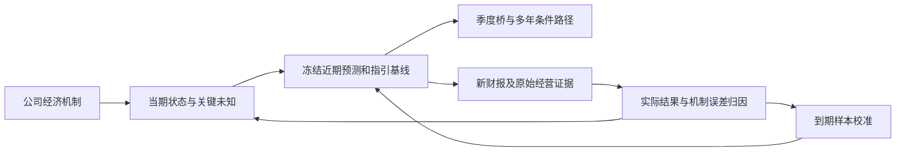

# 公司调研报告的财报后检验与研究改进分析

核查截止：2026年9月30日20:20:38，美国太平洋时间（UTC：2026-10-01 03:20:38）。对象是项目当前索引全部221家公司各自最新的正式公司调研结果。研究方案采用[2026-09-21现行公司方案](D:/investment/基本面/公司调研/研究方案/研究方案_20260921_234521.md)。本次只分析经营研究与预测可靠性，不重做公司情景投资决策。

**结论：现行公司调研在解释业务、资本和风险方面已相当扎实，但尚未形成足以证明短期预测可靠性的持续检验系统。此次新数据支持MU、JBL的经营方向，同时显示季度预测对象需要集中记录、年度误差要剔除已知期间、年度模型需要与最新季度状态重新衔接。不能将这些结果推广成221家公司预测准确或不准确的统计结论。**

## 1. 全量核查结果与检验口径

221家公司均有正式结果报告。正文研究截止日、文件名日期与冻结清单一致；日期分布为9月18日7家、9月21日15家、9月22日133家、9月26日66家。部分跨日成稿另行记录，成稿时间不替代研究截止日。报告窗口仅过去4—12天，因此到期样本很少是正常的。

检验方法是：冻结报告及SHA-256；核对200家公司的ticker—CIK与SEC最近申报；官方IR补核40家，其中覆盖全部21家未匹配SEC ticker者，两组重叠19家；对9月18—30日13份Nasdaq财报日历作交叉筛查。日历只发现候选，最终类别按公司正式披露正文判断。“未检出”限定于这些已核查官方渠道与截止时间。

| 公司 | 原报告截止日 | 报告后新增披露 | 性质 | 能检验什么 |
|---|---|---|---|---|
| [MU](D:/investment/基本面/公司调研/结果/AI服务器_存储_EMS/MU_Micron_Technology_美光科技_公司调研_2026-09-18.md) | 9/18 | 9/30 FY26Q4及全年，期末9/3 | 新财季实绩；另有未来指引 | 已结束财季估计、量价及现金机制；FY27仍未到期 |
| [JBL](D:/investment/基本面/公司调研/结果/AI服务器_存储_EMS/JBL_Jabil_Inc_公司调研_2026-09-22.md) | 9/22 | 9/30 FY26Q4及全年，期末8/31 | 初步未审计实绩；另有未来指引 | 未披露Q4估计、供应链资金；FY27仍未到期 |
| [IMOS](D:/investment/基本面/公司调研/结果/封测_检测_计量_光罩/IMOS_ChipMOS_Technologies_南茂科技_公司调研_2026-09-22.md) | 9/22 | 9/29新增8月利润/EPS | 未审计月度利润，收入早已公布 | 盈利恢复方向；不能代替Q3分部、毛利与现金 |
| [ADBE](D:/investment/基本面/公司调研/结果/企业软件_数据平台/ADBE_Adobe_公司调研_2026-09-18.md) | 9/18 | 9/22 FY26Q3 10-Q | 同财季详细申报，Q3实绩已9/10发布 | 收购资金、成本机制的新细节；不是新财季命中 |

其余217家未检出上述新增财务结果。新完整季度/全年样本只有2家；不能把另219家公司都视为“预测尚未出错”，也不能把月度利润和旧期10-Q加入季度预测胜率。

逐家原报告、核查源、日期和分类见[221家公司全量筛查表](D:/investment/备份/公司调研财报后验检验_2026-09-30/全量筛查.md)，结构化证据见[全量筛查.json](D:/investment/备份/公司调研财报后验检验_2026-09-30/全量筛查.json)。

容易误判的更新包括：TSEM 9/23技术研讨会预告；TSM 9/24持股与资本拨款月末资料；UMC 9/29重复9/10的持股及质押公告；BABA 9/29股份变动披露；HOYA 9/25旧Q1财报后FAQ；Daikin 9/28综合报告；Yaskawa 9/30综合报告。它们可能有信息价值，但不是新增财季实绩。海外逐家公司日期及官网来源见[补充核查](D:/investment/备份/公司调研财报后验检验_2026-09-30/foreign_notes.md)。

## 2. MU：方向得到支持，FY27工作模型需要重新确定起点

### 2.1 近期方向与指引基线

原报告第9、13、19、110—114行判断：经营强势主要来自价格及组合，FY27继续强经营较有依据，同时不能将稀缺价格永久化。它引用FY26Q4收入50±1B、GAAP毛利率约86%的旧管理层指引，并明确这是指引，未伪装成自有季度预测。

9/30实绩为Q4收入54.229B、GAAP毛利率86.8%、经营现金43.973B，全年收入133.188B。相对旧Q4中点，收入高8.46%；相对原报告“前三季78.959B＋Q4中点50B”的全年条件数128.959B，仅高3.28%。全年差异较小，是因为大量收入已知，不能据此给研究者独立预测记一次准确命中。[MU新财报](https://investors.micron.com/news/press-release/2026/Micron-Technology-Inc--Reports-Record-Fiscal-Fourth-Quarter-and-Full-Year-2026-Results/default.aspx)

原报告研究截止9/18时，Q4已于9/3结束。该部分属于对已经发生、尚未披露结果的估计（nowcast），不是提前一季预测。它对现金与价格机制的判断，比全年数字是否接近更值得检验。

### 2.2 14周季度会改变对实物增长的理解

新披露DRAM bit环比增中个位数、平均售价增高十几%；NAND bit约增10%、价格约增30%。利润仍主要由价格贡献。原报告对这一机制的认识被支持。[MU电话会准备稿，第7页](https://s25.q4cdn.com/621799436/files/doc_financials/2026/q4/Q4-FY26-Prepared-Remarks.pdf)

但Q4为14周，Q3为13周。如果仅作量纲检查，取DRAM bit增长5%的示意中值，则每周出货约变化为1.05×13/14−1≈−2.5%；NAND约为1.10×13/14−1≈+2.1%。这不是公司披露的周度生产率，也未校正交付节奏。它说明不能把季度总bit增长直接解释成有效产能增长。

原报告第110—112、449行已经要求周数校正，不是方案缺少这个思想；现在要把检查实际执行。若季度销量的大部分增长来自多一周，未来平均合格供给的依据便弱于表面季度增幅。

### 2.3 工作路径与最新管理层目标已出现明显差距

原FY27条件工作路径为收入202.16B、GAAP经营利润156.72B、净CapEx46B；最支持收入区间170—235B。这些是研究路径，普通工作区间不是置信区间。[原报告，第380—401行](D:/investment/基本面/公司调研/结果/AI服务器_存储_EMS/MU_Micron_Technology_美光科技_公司调研_2026-09-18.md:380)

新Q1收入指引61.5±1.5B，并预计FY27每季收入环比增长。**如果Q1按指引中点实现且后面各季继续增长，全年收入会超过246B；即使Q1从低端60B起步，同一条件下全年也超过240B。**240/246是本审阅由指引条件推得的门槛，不是公司直接给出的全年收入指引，更不是实绩。[MU演示材料，Guidance页](https://investors.micron.com/files/doc_financials/2026/q4/Q4-26-Earnings-Deck.pdf)

保留旧工作点202.16B且第一季实现61.5B，意味着后三季平均只有46.89B；这与管理层的新增长路径不相容。原报告也有253.68B的强路径，新信息更接近那类规模。合理动作是重审工作状态与假设，不是宣布旧报告已经被FY27实际证伪，也不是把253.68B强路径曾被列出算作主预测命中。

新CapEx目标上半年约25B、下半年更高，指向全年约50B以上，高于旧工作值46B。若其他假设都不变，仅这一项使旧FCF代理约少4B或更多；但收入、税、成本、库存和利润也在变化，不能把这条敏感性当成最新FCF预测。[MU演示材料，Guidance/Capex页](https://investors.micron.com/files/doc_financials/2026/q4/Q4-26-Earnings-Deck.pdf)

**新的起点检查尤其重要。**实际Q4 54.229B按14周校正成52周运行水平约201.42B，已经接近旧FY27工作收入202.16B。这是运行水平对照，不是FY27预测。原模型相对旧全年看增长很高，相对最新末季状态却几乎不增长；两个说法能同时成立。

### 2.4 现金、产品组合和会计时点需要联合解释

期末应收36.197B，对照Q3的31.025B。以季度收入及财政天数粗算，应收天数代理约由68.1降到65.4天，并非仅凭应收绝对额增加就能断言回款恶化。这是粗略时点代理，不是正式DSO。[MU新财报，资产负债表](https://investors.micron.com/news/press-release/2026/Micron-Technology-Inc--Reports-Record-Fiscal-Fourth-Quarter-and-Full-Year-2026-Results/default.aspx)

新资料还支持两条原报告的重要边界：增加HBM组合不必然提高分部利润率；客户保证金进入融资现金流，不能加入FCF。库存天数提高又与提前备货及制造奖金资本化有关，下一季成本确认可能滞后于现金与奖金决策。需要从库存、成本到下一季毛利建立解释，不能只用高毛利率外推。[MU准备稿，第7—9页](https://s25.q4cdn.com/621799436/files/doc_financials/2026/q4/Q4-FY26-Prepared-Remarks.pdf)

**MU判定：业务强势、涨价驱动和资本承受力的方向较可信；旧FY27规模、资本支出与利润现金联动需要更新。2027—2028的精确数字和事件概率尚未被实际检验。**原报告能够清楚说明未知，这是优点；透明模型还需要经跨期检验，才能证明参数具有预测能力。

## 3. JBL：全年估计接近，未披露Q4偏差却不小

### 3.1 年度误差会奖励已知历史

原报告FY26收入35B采用6月管理层指引；9/30新实绩35.954B，高2.73%。但未披露Q4实际10.616B，对旧指引9.2—10.0B，中点偏差+10.58%、高端偏差+6.16%。前九个月25.338B早已披露，使全年差异被稀释。[旧Q3公告](https://investors.jabil.com/news/news-details/2026/Jabil-Posts-Third-Quarter-Results/default.aspx)、[新Q4及全年财报](https://investors.jabil.com/news/news-details/2026/Jabil-Posts-Fourth-Quarter-and-Fiscal-Year-2026-Results/default.aspx)

9/22研究时财年8/31已经结束，因此FY26同样属于nowcast，而且主要使用指引基线。报告主要自主判断在FY27；不能因为FY26年值较接近，就断言FY27短期预测可靠。

### 3.2 集团净额隐藏业务差异

| FY27，十亿美元 | 原报告工作路径 | 新管理层目标 | 差异及含义 |
|---|---:|---:|---|
| 集团收入 | 41.6，支持区间40—43 | 44.5 | 比工作点高6.97%；未实现 |
| 云及数据中心 | 15.2 | 17.5 | +2.3，约占集团差额79% |
| 资本设备 | 3.6 | 4.2 | +0.6 |
| 网络 | 4.2 | 3.9 | −0.3 |
| 汽车交通 | 4.4 | 5.0 | +0.6 |
| 医疗包装 | 5.8 | 5.6 | −0.2 |

来源：[原模型](D:/investment/基本面/公司调研/结果/AI服务器_存储_EMS/JBL_Jabil_Inc_公司调研_2026-09-22.md:319)、[官方9/30演示文稿，第39—43页](https://s27.q4cdn.com/276975351/files/content_files/Q4-FY26-Investor-Briefing-Presentation-Final.pdf)。新目标比原工作区间更强，但原报告另有45.3B突破路径；这是新信息要求更新状态判断，不是年度实绩已经判错。

净差额看起来有限，不代表各分支都识别正确。有的偏保守，有的偏高，集团值存在对冲。未来检验应保留分支差异，再区分交付、内容量、净价、收购和确认时间。

### 3.3 下一季利润可能下降，年度方向仍可向上

原报告没有独立FY27Q1营收、利润率或现金预测。新Q1指引中点收入11.0B、核心经营利润0.622B，隐含核心利润率5.65%；刚公布Q4为0.675/10.616≈6.36%，相差约−70bp。这两季不是相同结果性质：Q4是实绩，Q1是目标。[新财报，Q1 Outlook](https://investors.jabil.com/news/news-details/2026/Jabil-Posts-Fourth-Quarter-and-Fiscal-Year-2026-Results/default.aspx)

因此“FY27增长、全年利润率改善”和“下一季利润率先下降”可以同时成立。年度路径需要与产品组合、扩产费用、季节性和股份费用的季度节奏桥接。报告未承诺下一季不会回落，此处是预测可检验性不够，不是已经作错一项季度承诺。

### 3.4 正FCF与资金依赖同时存在

FY26经营现金2.002B减毛CapEx0.628B，普通FCF为1.374B；再加出售固定资产现金0.158B，公司调整FCF为1.532B。调整口径不能替代普通现金口径。5月末至8月末应付增加2.536B、存货增加1.480B、应收增加1.040B；余额变化并不逐项等于现金流变化。[新财报，现金流及资产负债表](https://investors.jabil.com/news/news-details/2026/Jabil-Posts-Fourth-Quarter-and-Fiscal-Year-2026-Results/default.aspx)

原报告识别供应链资金约束有价值。强收入和正FCF没有消除大量备料、应收、应付共同扩张的风险；最新表也不证明已经发生流动性危机。研究应追问资金由谁先提供、付款期怎样匹配，而不是把调整FCF超指引视作所有现金问题已经解决。

**JBL判定：增长与利润改善的经营方向受到支持，现金约束的认识较好；原FY27规模偏向更保守状态，季度路径需补足，分支仍缺到期实绩校准。FY27/FY28概率事件都未到期。**详细审阅、资料取得限制及原报告行号见[JBL底稿](D:/investment/备份/公司调研财报后验检验_2026-09-30/jbl_audit.md)。官方文字电话会稿本次尚未取得，没有假称已经完整听完回放。

## 4. IMOS：月度盈利恢复有新证据，现金和经营利润仍未验证

9/29因台湾交易信息披露门槛，新公布8月未经审计税前利润5.30亿元新台币、归母净利4.33亿元、普通股EPS0.62。收入27.86亿元此前9/10已知，新信息主要是利润。归母净利同比增长117.6%，以同月收入粗算净利率15.54%，高于Q2约12.08%。[IMOS 9/29原始披露](https://www.sec.gov/Archives/edgar/data/1123134/000119312526405910/discloses_financial_info.htm)

这支持原报告“走出低谷、盈利恢复”的方向，却不能直接验证下半年经常性营业利润率14%—18%。月净利不是经常性营业利润，未披露当月分部、毛利、汇兑/投资/处置明细和现金，机制仍可能有多种解释。不能把一个月净利乘十二，也不能认为利润增长已证明设备投入赚回了资本。

原报告已用7—8月收入约束2026全年306.8亿—319.3亿元，并独立估计9月26.5亿—30亿元、Q4 81亿—90亿元。[原报告，第305—318行](D:/investment/基本面/公司调研/结果/封测_检测_计量_光罩/IMOS_ChipMOS_Technologies_南茂科技_公司调研_2026-09-22.md:305) 这些未来收入检验点仍未公开结果；不应把早已知道的8月收入再次算一次命中。

它的研究形式比只给年度增长率更易检验。真正有价值的下一步是9月收入、Q3测试利用率与分部利润、材料库存及应收、设备实际付款能否一起支持利润恢复。原报告已区分管理层FCF与现金流量表FCF，这是应保留的优点。

**IMOS判定：近期盈利恢复得到部分支持；2026剩余收入、经常性利润以及2027增长和现金预测尚未到验证期限。**这一月度披露由特殊交易条件触发，不是随机抽样，不能拿来推全体公司报告的可靠率。

## 5. ADBE：同财季详细申报也会改变重要未知

9/22的10-Q对应原报告已经知道的Q3，不能作为财季预测命中。它新增的明细仍有价值：Topaz收购对价约340M美元、主要为现金、预计FY26Q4完成，收敛了原报告“价格未知”的资金需求。[ADBE新10-Q，Note 13](https://www.sec.gov/Archives/edgar/data/796343/000079634326000156/adbe-20260828.htm)

订阅成本633M对比510M、同比约增24%，是9/10损益表已知的水平。新10-Q的重要增量是解释其中hosting/data center对增长贡献约22个百分点。[9/10原损益表](https://www.sec.gov/Archives/edgar/data/796343/000079634326000147/adbeex991q326.htm)、[新10-Q，MD&A Cost of Revenue](https://www.sec.gov/Archives/edgar/data/796343/000079634326000156/adbe-20260828.htm)

22个百分点是相对于上年成本基数的贡献，不是hosting成本本身只增长22%，也不是该成本全部属于AI。以510M基数粗算约112M，对应订阅成本总增加123M的大部分；这与原报告“AI/订阅增长伴随利润和投入压力”的机制相符，却仍不能推出某个AI产品独立盈利或未来Q4毛利确定下降。

Topaz的340M也不能用来删除所有并购压力：原报告2B是收购压力假设，不是Topaz已知报价。正确更新是收敛Topaz这笔、保留其他用途的未知。它说明“没有新财季”与“没有重要新财务信息”不同。更新通道需要读取正式详细申报的附注、经营成本桥及期后事项，不能只监测业绩标题。

**ADBE判定：现金用途的一个未知可以收敛，利润压力机制得到新增支持；未来季度与全年经营预测并未因此被检验。**详细对照见[ADBE底稿](D:/investment/备份/公司调研财报后验检验_2026-09-30/adbe_audit.md)。

## 6. 对短期可靠性可以作出的判断

| 检验层次 | 本次证据 | 结论 |
|---|---|---|
| 方向 | MU/JBL经营强，IMOS利润恢复 | 获得支持，但样本偏少、行业相关、期限短 |
| 数量级 | MU/JBL新未来指引高于原工作路径 | 需要更新原状态，不能说未来实绩已证伪 |
| 时间 | MU/JBL没有集中自有下一季预测 | 短期节奏可靠性尚不能计分；IMOS有明确月/季待验值 |
| 机制 | MU量价、JBL资金、ADBE成本明细有支撑 | 解释能力较好；产品份额与净价等参数尚缺持续验证 |
| 现金 | 强利润与保证金/应付/设备支出并存 | 原报告重视现金是优点；未来股东现金仍要另验 |
| 概率 | FY27/28等事件多数未到期 | 不能算成功率、不能据两份财报证明概率已校准 |

更准确的评价是：**已有报告提供了一套比较可信、透明的经营解释，但尚不是经过验证的短期预测系统。**内容合理、公式闭合、来源一手，与“下一季数值比简单指引更准”是不同能力。还须防止事后挑选命中句子、把强路径存在当主预测命中，以及借更新模型覆盖原判断。

## 7. 现行方案已经具备的东西

方案的主要机制不应推倒重来。它已经要求：最近约五季可比财务与期间口径（45—49行）；买方预算和实际商业验证（67—75）；合格供给及时间门槛（79—83）；利润到现金与资本约束（95—101）；阶段、延迟和失败门槛（119—126）；概率对象、基础率及相容状态（152—174）；模型复核与管理层同口径指引比较（178—180）。[现行方案](D:/investment/基本面/公司调研/研究方案/研究方案_20260921_234521.md)

原MU还校正财政周数、回顾三次指引偏差并列下一财报量价现金指标。原JBL区分核心/GAAP/普通与调整FCF。IMOS清楚区分净利、经常性营业利润及不同FCF定义。这些都是执行上的正面样本。

横向有目的地抽读31份，确认20份已存在明确季度研究数值或分支季度路径，5份给年度目标所需季度门槛/相容示例，6份主要研究全年、多年或商业阶段。这不是随机样本，不能外推总体占比，也不能笼统声称所有报告都没有季度预测。ALAB已有Q4自有收入范围，MRVL已解释与近期指引的差异；主要问题是将这些已有预测集中冻结，并保持不同类型的检验口径。原文行号和分类证据见[横向方法审阅](D:/investment/备份/公司调研财报后验检验_2026-09-30/methodology_audit.md)。

因此，新增客户/供应链验证、资本回报、概率三条原则本身不会解决此次问题。需要把已有原则变成容易维护、能发现误差的实际研究操作。

## 8. 最应新增的研究结构与操作

### 8.1 每份报告冻结3—5项决定结论的近期判断

建议集中记录：预测编号、研究截止日、目标经济期间、指标定义、预测性质、自有数值/范围或事件、当时指引基线、差异理由、关键前提、下次可观察结果、到期实际与误差。指标随业务而变，不要求每家公司固定预测EPS。

必须分开已经结束但未公布的估计、真正未来季度预测、多年条件路径、仅用于说明门槛的算例。研究报告现在通常写了截止日与期间，但预测散在长文内，不便完整评分。

对成熟业务，至少选一个季度能验证的营收/利润/现金判断；对尚无稳定营收的业务，选择认证、实际验收、重复付费、最低承诺或融资门槛。数据不足时给方向或阶段，不为了评分强写精确季度值。

### 8.2 先建立近期季度桥，再汇成年与多年路径

年度模型要能解释近期已经发生的状态：最新实际、尚未披露期间、下一季、后续爬坡。MU不能长期以Q3起点保持旧FY27参数；JBL不能用全年利润率代表每季。IMOS用已发生月收入约束剩余月份，是可保留的例子。

报告应显示经济期结束日、首次公开日、研究日，以及最新关键状态的经济年龄。MU研究日9/18很新，但最新完整财季截至5/28，已经相隔113天；新文件日期不能让这些数量价格成为9月现状。变化快的变量需要较高更新频率，稳定业务无需机械按月重估所有参数。

### 8.3 与简单基线比较信息增量

应同时保留发布时管理层指引、研究自有预测，以及适合公司的季节性运行水平基线。问题是研究有没有更早识别指引偏差、看懂现金和利润的变化，是否改善了判断，而不是模型是否写得复杂。

年度误差要剔除已知实际后，再检验未披露部分。MU全年+3.28%与Q4+8.46%、JBL全年+2.73%与Q4+10.58%的差别，就是这个改进的实际理由。没有超出指引的自主判断，可以明确写出，不必制造假精度。

### 8.4 记录结果误差与机制误差

财报后先保留原预测，再按数量、净价、组合、份额、成本、汇率/并购、确认时点、营运资本分解；无法识别的保留为残差。分支误差不相互消掉，利润和现金分别检查。

同一结果可能有不同质量：收入命中而量价完全猜反，利润命中靠费用延后，现金命中靠应付延长，都不能与机制也命中等量计分。反过来，交付推迟一季导致收入不及预期，不一定意味着长期客户价值失效，需要按时间误差与需求误差分别处理。

### 8.5 形成独立的到期复盘与校准流程

现行正式研究的本地读取规则有独立取证目的，不必取消。评价流程可读取冻结旧报告；新研究继续依现行边界独立取证。保留原输入、预测及后续版本，避免新报告覆盖旧预测后失去检验对象。

累计足够到期样本后，检查概率判断是否长期偏乐观/保守；收入用数额及相对误差，利润跨零时不用百分比放大，利润率用百分点/基点，阶段事件用完成、延迟或失败。普通工作区间不是置信区间，不给它伪造统计覆盖率。

样本还要按行业、周期和前瞻时长分组。同一AI投资周期下十家同时变强，不能当十次完全独立确认。研究方案改变的效果应保持同一截止日事实，再比较结果；不能把新财报带来的信息改善归功于方案文本更长。

## 9. 信息渠道怎样补充才有用

| 要解决的问题 | 适合的原始渠道 | 具体操作与边界 |
|---|---|---|
| 披露是否发生、是否有新期间 | 公司IR财务日历/新闻、SEC submissions及附件、MOPS/HKEX/TDnet | 分离首次公开日、监管提交日、经济期；申报有时晚于业绩发布，日历有时只是计划 |
| 详细财务改变了哪个未知 | 10-Q/10-K/20-F附注、成本桥、现金表、期后事项 | ADBE对价与成本桥是实质增量；不能只比首页收入EPS |
| 月/季度活动是否偏离路径 | 公司官方月营收、月订单/出货、交易所临时财务披露 | IMOS月利润有价值；月净利不代替营业利润和现金；累积值与单月值分开 |
| 需求由谁付款和兑现 | 客户财报/完整问答、采购及验收、实际部署与续购材料 | 买方资本开支不等于某供应商订单；供应商公告里的客户引言仍可能同源 |
| 有效供给和项目时间 | 设备/关键材料供应商交付、客户认证、项目建设与安装验收材料 | 建筑面积、采购设备、招聘是阶段线索，不能直接兑换收入 |
| 净价、成本与竞争 | 数据拥有者原始价格调查、供应商与客户实际条款、同配置产品/工艺比较 | 现货价不等于公司合约净价；零售价不等于制造商收入；留存口径和方法变化 |
| 商业化是否跨越阶段 | 客户重复付费、监管批准、完整量产测试与实际可靠性 | 展示和资格不等于大规模收入；早期公司应验门槛而非硬造EPS |
| 难以公开量化的关键变量 | 有对象、有期间、有指标的产业访谈与可复核样本调查 | 询问当前工作量、认证、交期、价格变化；区分亲自经历与转述，并与财报或交付核对 |

建立的应是一张“关键变量—最有辨别力的来源—领先多久—更新频率—反证怎样影响模型”表。来源多本身没有价值，十篇转载同一公告仍是一个原始证据。优先研究会改变数量、时间、利润或现金的少数未知，再扩展通道。

具体到本次公司：MU优先净价/bit/财政周数、客户合同覆盖及现金；JBL优先云项目交付与采购内容、分支制造组合、客户/供应商资金安排；IMOS优先测试利用率、并测效率、材料成本与实际设备付款；ADBE优先付费转化、订阅成本桥、AI推理支出与收购/回购现金用途。四类变量需要不同渠道，不能用一套新闻数量标准替代。

## 10. 有价值的洞见与更合理的研究组织

**第一，年度看上去准，可能只是已知历史占比高。**应该关注剩余未知部分的难度，以及真正提前预测多久。财季结束后的估计与提前一年预测，不应放进同一个可靠率。

**第二，一个很乐观的同比增长数字，可能对应一个保守的末季状态假设。**MU旧FY27相对旧年度增长很高，最新Q4周数运行水平却已接近旧FY27工作点。这提示用经济状态理解模型比用同比标签更有效。

**第三，总量接近可能掩盖分支机制不准。**JBL集团目标差额有业务对冲，MU的HBM组合、IMOS的材料转嫁也可能使收入增长与利润率增长分离。机制误差决定模型下一季还能不能用。

**第四，利润、现金与资本政策有反馈，不能只提高营收而冻结支出。**更强需求会促使MU提高投入；JBL增长需要备料及供应链资金；IMOS盈利恢复仍可能被设备付款吸收；ADBE新订阅收入也带来hosting成本。模型应让管理层扩产、付款和成本动作随状态改变。

**第五，同一个财季的详细申报，可能比一份新标题更有判断价值。**ADBE收购对价、成本明细收敛了重要未知。财报更新不能只设“新季度/不是新季度”的二元开关，应按每项信息对应的变量处理。

**第六，好的研究可能更早发现自己需要改，而不是永远保留一个好看的预测。**原报告可以在当时合理，新证据也可以要求换工作状态；复盘要同时问当时信息下是否合理、后来什么改变、更新有没有沿价值传导完整传入数量、利润和现金。

较适合当前项目的组织是保留三层：相对稳定的公司经济机制；少量滚动更新的近期经营预测；独立保存原预测并按到期结果复盘。多年路径仍然重要，但它应由近期约束与关键门槛连接起来。无需把221家公司都变成逐月精确模型，也无需再给长报告堆同样的风险说明。

**优先级建议：先加预测登记和财报后误差归因，再补季度桥与变量更新渠道，随后累计校准证据。**这比继续加长背景介绍更能提高研究可检验性，也更容易发现哪些复杂模型实际上没有增加判断力。

## 11. 证据与工作边界

本次未修改正式公司报告、公司索引或研究方案。全221份冻结哈希复核一致。具体原始源、审阅底稿、日期字段及计算均在本备份目录；[定量对照](D:/investment/备份/公司调研财报后验检验_2026-09-30/定量对照.json)记录单位、比较分母和未来指引的条件限制。横向结构筛查不等于对221份报告逐一人工深度评级；真正深入比较的是本次出现重要财务增量的公司。

截止日之后的实际结果未用于预测检验。新管理层目标未作为到期实际，多年条件路径未以一季结果硬判对错。有限样本只能发现方法和执行问题，目前不能给整个研究方案可靠率。
