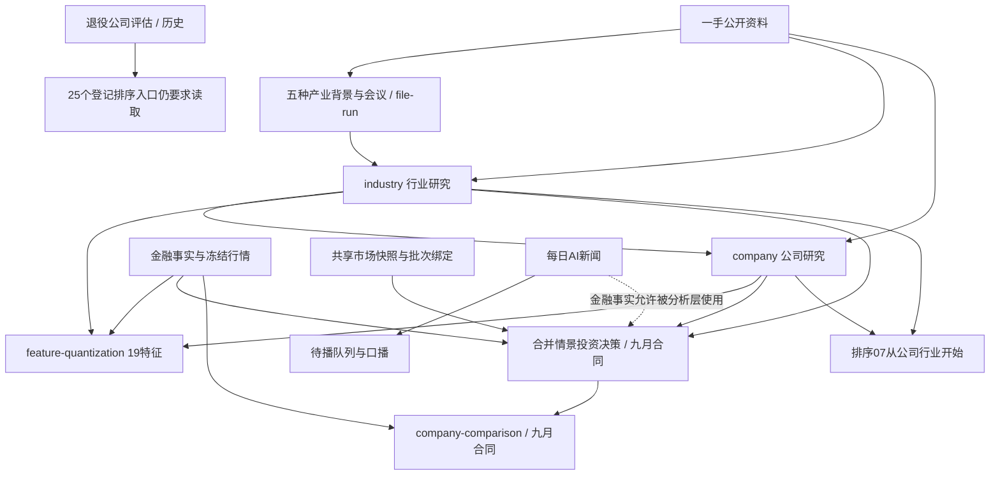

# Investment运行流程总审计与研究方案改进建议

审计日期：2026-09-05；行情比较截止最近完成交易日2026-09-04。本次根据最新要求，从“问题诊断”推进到逐流程、逐研究方案的具体改进建议。所有内容只写入备份；未修改正式方案、索引、队列、配置或网站，未启动runner。本轮不设计技术面与情绪面的改进。

**总体判断：项目已有很强的技术和经营研究，最突出的问题是跨层语义、版本、预测期限与最终选择责任没有贯通。** 有些信息上游已经识别，下游却在不同身份、时期、尺度下重用；有些任务被要求输出上游根本没有提供的数据；有些分析层反复重建同一家公司，却没有稳定裁决互相冲突的建议。继续增加同类报告数量，不足以解决这些问题。

建议保留company、industry、合并后的company-investment-decision这三个核心责任；重做company-comparison的任务单位和冲突裁决；将19特征中的重复完整建模归入其合理主人；26排序按独立推断职责整合，先处理25个退役输入入口。五产业背景和会议应保留前沿发现及独立挑战，但共享可对账的关键事实；增加产业的经济机制覆盖，而非只继续把硬件BOM拆细。**这些是下一版方案建议，尚未通过新一轮真实运行验证。**

## 1. 阅读路径与覆盖边界

| 文档 | 解决的问题 |
|---|---|
| [01 运行流程与全部方案入口](<D:/drive/Investment/备份/流程审计与研究方案改进_2026-09-05/01_运行流程与方案清单.md>) | 7个domain、各自任务单位、26排序与19特征精确路径、file-run所有任务族、外部供数 |
| [公司与industry逐题修订](<D:/drive/Investment/备份/流程审计与研究方案改进_2026-09-05/evidence/公司与产业流程审计.md>) | 两份主方案每一题如何增删、哪些硬件/乐观先验该放宽、产业扩围与公司价值传导 |
| [03 特征量化19份方案逐项修订](<D:/drive/Investment/备份/流程审计与研究方案改进_2026-09-05/03_特征量化19方案逐项改进.md>) | 逐个保留/合并/暂停计算/调整输入、模型错误与AI裁量 |
| [情景决策与公司对比逐章节修订](<D:/drive/Investment/备份/流程审计与研究方案改进_2026-09-05/evidence/情景与对比流程审计.md>) | 3/6个月主目标、条件矩阵、24快照核实、全量比较冲突与裁决 |
| [26排序及91评估模板逐项修订](<D:/drive/Investment/备份/流程审计与研究方案改进_2026-09-05/evidence/排序各方案流程审计.md>) | 85项排序章节条款变化、各法Top30复算、去留依据与反证 |
| [04 file-run非排序方案逐项修订](<D:/drive/Investment/备份/流程审计与研究方案改进_2026-09-05/04_file-run非排序方案逐项改进.md>) | 五背景、会议通用与4包装、24公司4组及综合、区间涨跌 |
| [编排与版本契约](<D:/drive/Investment/备份/流程审计与研究方案改进_2026-09-05/evidence/运行编排与上游版本契约审计.md>) | 优先组不是依赖图、任务版本、输入/输出身份、现有保护与实际执行 |
| [金融数据与新闻供数](<D:/drive/Investment/备份/流程审计与研究方案改进_2026-09-05/evidence/周边数据与新闻供数流程审计.md>) | 6个自动化职责、季度共识数据缺口、新闻到研究的交接、发布边界 |

本轮全量核查当前192公司稿、77行业稿的存在/日期/本地链接；192情景与192对比的版本和结构；16收益特征3072行以及3门槛；26排序身份28张榜。公司/行业语义细读各10份，跨全部6个行业分类，属于定向样本，**不由这20份推断全量报告语义错误率**。所有外部数字并未逐条重查；报告中的“原文数字”证明研究写了什么，不能混同独立验证现实数字为真。历史价格与七月原文审计沿用[上一轮完整复盘](<D:/drive/Investment/备份/项目反思_2026-09-04/00_项目反思与问题诊断.md>)；本轮补算Top30，不重抓同一截止日的行情。

## 2. 真实流程：知识依赖和机器调度是两件事

这张图展示已核实的主要输入关系，省略部分直接补证和原始金融输入；不是所有箭头都已经由同批运行证明，更不是排序已接上九月合并层。特征分未被当前情景/对比正式允许继承。新闻能被分析层作为金融事实使用，但没有成为company/industry输入合同中的常规变化入口。

runner实际按五组排序：industry → company → feature/sentiment → decision → comparison/file-run。它看最高组还有没有pending/running/retry_pending，不理解某个file-run是行业上游背景还是下游总排名。若把上游会议、行业和公司混在同批，可能出现按类型合法、按知识依赖不合理的顺序；上游最终failed也不等于消费者应自动继续。**这属于静态条件风险，尚未证明本次八月任务发生过这种错误。** 八月四分组最晚14:01:44完成、master14:04:09启动，是相反的真实执行证据。当前活动queue为空，done182只是当前归档。来源：[运行编排与上游版本契约审计](<D:/drive/Investment/备份/流程审计与研究方案改进_2026-09-05/evidence/运行编排与上游版本契约审计.md>)。

## 3. 最需要优先处理的八个问题

| 问题 | 可核实数字或原文 | 对前30建议的影响 | 反证与边界 |
|---|---|---|---|
| ① 新旧合同没有完全贯通 | 26排序入口中25读退役评估、0显式读合并情景；当前192情景和192对比都没有九月合并后产物 | 同一“正式目录”不能保证内容已有新经营基准；只换消费者路径可能把旧依赖藏起来 | 合并代码与条文本身已实施；不能用旧结果宣布新方案失败 |
| ② 公司间比较没有解决相反结论 | 同为7/14的176份对比，共15,400无序对；2,962对严格反向，占19.23%；其中2,839双方各自推荐对方，123双方各自推荐自己 | 若使用该比较形成前30，选择可能受比较方向影响；重复判断未形成可追溯的默认选择 | 不是简单“偏袒被研究公司”，也不是所有分歧都属事实错误；同日仍可能有来源/条件差异。未据此宣称历史排序实际消费了这些比较 |
| ③ 信息对象在层间发生串扰 | N15有52/192被标pre_revenue；ARM与PENG原稿已有显著公司收入，只有新产品未创收 | 产品期权风险可能污染全公司盈利、稀释和破产场景 | 未发现生成代码，不能猜具体解析错误；未证明历史建议消费了这项特征，不能归因七月失利；其余50个标签尚未逐一判定 |
| ④ 所需数据与供数职责不匹配 | N07为0/192有效分，N14仅15/192，N04仅11/192有合格披露前指引；G02因无成交深度等输入把192只全列不可投资/零容量 | 任务形式存在不等于能提供预期修正、预期差和流动性判断；NA不可误作坏公司 | 每日金融快照原职责为价格/估值/TTM/forward，并未承诺冻结季度共识；NA比编造正确 |
| ⑤ 本地历史引用与期间定义不稳定 | 1,419次可解析公司本地Markdown链接中991次断链，涉及143份公司稿；75唯一目标都能在备份找回。10份行业定向样本中，T+3有7季度流量、3年化/未来12月池 | 下游可能找错版或把年化金额当季度收入，无法稳定复算跨公司增长 | 引用失效不等于资料丢失；期间差异通常在正文有解释，缺陷在公共交付契约 |
| ⑥ 投资期限仍以长周期为主 | 情景主期12–18个月，对比多为6–18/8–16个月，N15为3–5年；已有短期事件表但不是短期价格预测 | 长期价值发现和未来3/6个月超额收益尚未成为同一个明确任务 | 不能要求三个月兑现五年现金流；远期技术也可在近期提前定价 |
| ⑦ 信息很丰富，变化交接仍不完整 | 五背景约38万字符、公司约779万、行业约402万；新闻9/4底稿67候选组/72信号，已有delta和原始来源标记 | 新证据可能只进播报队列；缺少统一记录，难以判明哪些变化已进入哪份研究、是否改变关键变量 | 篇幅不等于浪费，新闻量不等于投资信息量；分析层允许读金融事实，不能说完全没有新闻输入 |
| ⑧ 多方法数量与独立证据量脱节 | 26排序28榜；同一合并模型若被重复打分再投票，会把同源推断当多源确认 | 表面共识可能高于真实证据强度，方法数量不提供确定收益保障 | 当前未证明排序反向喂养情景的机器反馈环；这是迁移后需避免的推断重复计票 |

来源分别见[排序证据](<D:/drive/Investment/备份/流程审计与研究方案改进_2026-09-05/evidence/排序各方案流程审计.md>)、[比较及N15独立核验](<D:/drive/Investment/备份/流程审计与研究方案改进_2026-09-05/evidence/情景与对比流程审计.md>)、[特征全量证据](<D:/drive/Investment/备份/流程审计与研究方案改进_2026-09-05/03_特征量化19方案逐项改进.md>)、[上游链接与期间证据](<D:/drive/Investment/备份/流程审计与研究方案改进_2026-09-05/evidence/公司与产业流程审计.md>)、[新闻与快照证据](<D:/drive/Investment/备份/流程审计与研究方案改进_2026-09-05/evidence/周边数据与新闻供数流程审计.md>)。

N15还呈现190个有效分中171个恰为3.5（90.0%）、已展示预期回报中位数−56.25%。这说明连续评分的有效区分力和任务期限需要重审，但负回报本身不证明模型错。ARM仅去掉15%归零分支、其余经营和资本结构数值保持不变并重归一概率后，预期收益仍约−89.1%；这不是修正全部阶段假设后的重新估值，不能声称纠正公司阶段就会使ARM成为优选。这个反事实检验将“已证实的语义错误”与“尚未证实的投资影响”分开。

## 4. 反复核对后，问题更接近六种根因

**第一，共同上游的上行先验存在被多层重复继承的风险，但现金与竞争约束并非普遍缺失。** 公司/行业方案要求偏乐观、固定数量瓶颈或硬件单位，可能让新应用、成熟现金业务、买方获益和瓶颈缓解机会依赖AI主动突破模板。不过当前PENG、MOD、MU等报告已有营运资金、订单质量、不可相加合同和执行风险；ADBE已经抵抗“只看AI-first”的窄口径。真实修订是去掉预设答案，让公司特有的价值机制决定分析深度，并要求下游回应这些反证。不能把亏损一概归为上游不懂现金。

**第二，对象、量纲和时间相似的词，承担了不同经济含义。** 产品未创收与公司未创收、三个月后年化收入与未来三个月收入、backlog与不可撤销采购、芯片绑定价值与上市公司营收，都不是可互换字段。高能力AI可在单篇解释得很好，跨篇消费者仍可能只取表格或结论。约束应落在关键变量交付，而非逼AI用相同推理步骤。

**第三，独立研究没有与冲突裁决配套。** 独立建模可以发现原作者盲区，不能取消；但192家公司每个方向、每个哲学都重新完整研究，会同时生成许多互相矛盾的默认选择。先共享可追溯事实，再保留假设不同的挑战，最后解释究竟因事实、口径、模型、期限还是投资偏好而不同，比强制投票有用。若差异合理，可保留条件选择，不必伪造全序一致。

**第四，研究的经济真相与市场价格发现尚未闭合。** “这家公司未来会很好”只覆盖经营路径；“市场当前隐含什么、哪项新证据能改变它、多久被采纳、当前股价是否已支付”决定3/6个月的投资建议。N07/14暴露预期数据不足；公司情景已有事件账本，却需要把事件与明确期限的价格路径接上。此处可以有原创、非共识推断，不必须等卖方发布同口径精确点值。

**第五，控制平面的成功标准与研究的经济有效性不同。** 文件存在、非空、写入时间正确有必要，但不能判断“季度还是年化”“产品还是公司”。当前测试明确排除正式输出内容judge，是已有设计，不是漏接某个hook。建议保留边界清晰的身份/版本/关键量纲检查，以及AI对决定性语义冲突的审议；不要再用字段齐全或另一个模型打高分代替投资能力。轻量检查不负责强迫观点一致。

**第六，信息获取与信息被决策消费是两种产出。** 新闻为了口播去重、快照为了最新行情、行业为了全景知识，各自都可成功，但未必改变前30名单。尤其同一消息的第二次客户确认，可能没有新的口播洞见，却提高了投资证据强度。研究交接须沿用事件身份标明哪个变量、哪个版本被更新，不能把“已播”当“已研究”。

## 5. 宏观与意外事件：不能只添一章风险，也不能全归因外部冲击

共享市场快照已经包含利率、信用、盈利修正和市场功能。八月24份公司报告的锁定回显全部一致；当前情景方案也已经允许市场通过需求、预算、融资和供应链推动经营行迁移，要求联动并禁止默认经营与市场概率独立相乘。**“项目完全没考虑宏观/联合影响”不是本次证据支持的结论。** 正面证据与具体条款见[情景与对比流程审计](<D:/drive/Investment/备份/流程审计与研究方案改进_2026-09-05/evidence/情景与对比流程审计.md>)。

要补的责任更具体：战争、能源价格、通胀、出口限制等原始事件，先在行业/公司研究中映射到客户预算、成本传导、产能、合同、融资与资本结构；情景层消费同一个事件版本，分析它如何同时影响经营路径与折现/风险溢价，并避免两层重复扣同一损失。共同市场状态仍使用锁定输入，个股暴露不应成为每家公司自行重判全市场的借口。这不需要本次重做技术/情绪流程。

复盘时区分：事前已有且未使用；事前只有弱线索但权重判断错；发布后真正的新冲击；方向正确但信息/兑现时序错；仍无法归因。对短窗收益做了市场/行业调整，也不能把剩余项直接命名为某次战争或情绪。本文没有为具体个股未经核实地分配这种因果权重。

## 6. 按domain做什么改变：保留判断力，调整责任边界

| 流程 | 建议处置 | 对研究方案的具体核心变化 |
|---|---|---|
| industry | 保留；扩大经济机制覆盖 | 原8个问题保留需求/竞争/交付价值，放宽固定瓶颈数与乐观答案；所有供需池可对账；增加应用付费、软件效率、替代/需求破坏和资本约束。可开放提出新行业，是否入正式索引另有依据 |
| company | 保留；保留原创经营建模 | 原9题按真实商业模式使用合适单位；成熟业务、潜在蚕食、客户付款/交付/资金链纳入；公司与产品身份分开。行业假设不直接乘成公司份额；完整每股估值留在情景主体 |
| feature-quantization | 保留诊断职责，合并重复完整模型 | N05/N14/N15的完整估值/预期差/分布与情景内部建模分工；N02/N10、N08/N11共享原始事实但保持不同经济问题；N07等有输入后再计算，不强填；G02把数据不足与不可投资分清 |
| company-investment-decision | 保留九月合并方向，改主交付期限 | 3月/6月直接判断、3–6月时序，远期价值仍作锚；20格是条件工具，概率可以局部且有依据，不为填矩阵编完整频率；市场隐含要求与证据确认单列；宏观联动利用已有章节加明确交接 |
| company-comparison | 保留独立裁决，重做任务单位 | 全池发现与重点配对分开；优先前30边界、最强落选对手与重大冲突，已冻结事实共享；每次对比说明新增推断，停止每对每哲学从头完整建模。保留不可全序的条件差异 |
| file-run排序 | 26身份逐一整理，暂不按短窗输赢定权重 | 先迁移退役输入的语义合同；重复估值票合并为有明确差异的挑战；发现右尾、反证、执行建议分职；91评估冻结预测/交易规则/全版本试验记录 |
| file-run背景/会议/专项 | 保留前沿探索与跨层挑战 | 五背景公共口径共用、不同推断保留；会议不强造全套市场数字；专项分组减少重复单公司估值，综合负责冲突和条件选择 |
| runner编排 | 在下一运行合同中补显式依赖与版本 | 任务列必需的具体上游/可选输入、截止日和是否允许降级；共享快照锁定的已实现做法推广到实际消费的关键报告，不以文件“最新”代替合同版本 |

这张表是导航，具体替换位置、可写入方案的条款、保留的反证、输出小样与验收边界都在对应分报告。没有把19个特征或26个排序统一套进同一张评分表。

产业扩围应针对未充分覆盖的盈利机制。当前77行业里75处于四大AI基础设施分类，含EDA和运行时软件，另外机器人/商业航天各1；不能说75全是硬件，更不能以此证明所有非AI业务缺失。可先围绕现有候选的应用预算、软件利润、服务/数据的可扩展性、成熟业务现金创造和技术替代找证据缺口，允许AI提出未知方向。研究资源优先投向有望改变经营或预期判断的机制，同时为尚无直接投资映射、但具高信息价值的前沿探索保留空间；不设机械翻倍目标。公司/industry分报告给出了扩展与不扩展的具体边界。

## 7. 前30主交付：约束可比较性，放开探索和推断

以下是写入各决策/排序下一版的共同交付约定，不是要求每层都再写一套长报告：

> 目标是研究日起三个月、六个月的可评估投资判断，并解释三至六个月窗口的事件和价格兑现。以冻结的证券身份、信息截止、价格日期为起点；长期价值模型可以自由选择，但需解释近端价格发现机制。对前30与最强落选反例，说明决定性预期差、现金/每股价值传导、最强反证、当前可执行或待条件成立的性质，以及什么新证据会改变选择。允许给范围、条件、部分次序或暂不可判，不强迫编造概率、不为凑30只加入不合格标的。

研究员可以使用不同估值、非传统技术/商业指标，推翻上游结论，提出新行业、非对称机会与替代解释。统一的是对象、量纲、时点、责任和对证据的响应，不是网页数量、固定计算流程或每段长度。对未知的重要机会可以大胆估算，但模型假设与事实不能混写，无法精确建模不等于价值为零。

“最强落选反例”尤其重要：重点30不是只对当前高分公司增配研究，而是允许新发现挑战边界。公司池外发现需保留其尚未覆盖/尚未验证身份；可投资推荐仍需足够证券和经营证据。整个池的轻量扫描继续保留，深度研究由决定性不确定性和改变选择的可能性分配，不能用固定评分阈值封死发现。

## 8. 用实际表现约束改进，而不是按这个窗口重新挑赢家

7/13收盘到9/4只有39个交易收益间隔，尚不足三个月。下表是原名次机械Top30等权、复权口径，不等于每个方法当时确实建议买足30只；次日开盘另列，避免把报告日已发生的涨幅算可捕获。完整28榜、Rank IC、赢家捕获和成员见[sorting_top30_metrics](<D:/drive/Investment/备份/流程审计与研究方案改进_2026-09-05/data/sorting_top30_metrics.csv>)。

| 方法 | 报告日收盘Top30 | 次日开盘Top30 | 实际赢家30捕获 | 它对诊断的约束 |
|---|---:|---:|---:|---|
| 01 风险调整赔率 | +2.42% | +1.56% | 9/30 | “核心”标签仍需同窗可交易基准验证 |
| 03 反证惩罚压力防守 | −3.26% | −5.87% | 7/30 | 不能把防守措辞当尾部保护已经成立 |
| 05 反证惩罚优先 | −9.44% | −12.82% | 2/30 | 值得重审证据门槛/排序结构，但尚非长期失败证明 |
| 15 高进攻性需求弹性 | +6.63% | +3.97% | 13/30 | 已退出方法也可在这段更好，不能按目录标签认为已经定案 |
| 排序N02 反证闭环与尾部生存 | +2.59% | +2.66% | 9/30 | 与05差异提醒：反证本身不能简单全删，应看具体判据 |

同窗SPY约+2.81%，次日开盘约+2.57%；公司池平均−4.97%。旧共识20按7/13收盘约+4.89%，统一7/14开盘后约+2.5741%，SPY约+2.5676%，显著缩小了看似超额。共识20是审计构造，不是用户真实组合。价格、分红、ADR/OTC限制、样本和来源详见[192公司逐股复盘](<D:/drive/Investment/备份/项目反思_2026-09-04/01_192家公司逐股复盘表.md>)及[全部排序历史比较](<D:/drive/Investment/备份/项目反思_2026-09-04/02_全部排序与对比结果.md>)。

个股上，SMCI+43.13%、MSFT+28.04%、DELL+22.92%与PENG−32.96%、MOD−16.91%、WDC−15.86%同时存在。P上涨32.05%但共识排135，06F却排6，说明可能错在信息/方法的综合与采纳，不能说所有研究都没发现P。AEHR按7/13起算+26.82%，按7/15为−1.74%，说明事件与发布时间会实质改变“错过”的定义。这些是上一轮的价格和原榜复核结果，本轮以它们追问职责，不把事后涨跌自动变成基本面真伪裁判。

评估方案下一版须冻结当时全池/方法/目标期限/可执行条件。三个月、六个月分别成熟后评价；三至六个月的分段结果仍使用t0冻结的选择与条件，不能在三个月后挑赢家再伪称原预测。绩效之外记录方向、超额、下行路径、区间覆盖与宽度、概率校准，以及事前证据/模型是否被后续数据证伪；某种概率并未输出就不计算它的“命中率”。

这里引用两项方法依据而非硬套参数：Gneiting与Raftery讨论适当评分规则，支持将诚实概率/区间和实际结果一起评价，区间不能只看覆盖而不管宽度；Harvey、Liu与Zhu讨论大量因子反复试验的统计问题，支持保留全部方法/版本试验记录，不能看了一个窗口再选最好看的权重。它们不证明本项目现在已经有足够样本，也不意味着把论文的数值门槛直接复制进提示词。[概率与区间评估原论文](https://sites.stat.washington.edu/people/raftery/Research/PDF/Gneiting2007jasa.pdf)；[多重方法检验原论文](https://people.duke.edu/~charvey/Research/Published_Papers/P118_and_the_cross.PDF)。

## 9. 下一版应先改变什么，以及什么还不能下结论

先处理**会让不同流程在谈不同对象**的错误：退役入口与旧内容身份、引用版本、产品/公司层级、期间/价值层、NA语义。接着处理**决策职责**：3/6个月主目标、统一事实与独立挑战、比较冲突裁决、前30落选反例。之后才扩供数与产业覆盖，并按各分报告逐条修改对应方案；有真实新样本后再评价哪些方法应该晋升或退出。这是依据证据依赖的实施顺序建议，尚未执行。

不能证明的部分保留：没有逐条核实数百万字符中的所有外部事实；没有证明N15的全部分类都是同一种程序错误；没有证明这些特征被历史建议实际消费及造成投资损失；没有证明某一宏观事件解释了某只股票的残差；没有证明九月合并后的方案已经改善或失败；39个交易收益间隔不能证明3/6个月预测能力，更不能证明长期。已明确的结构问题无需等待六个月才修，但方法的投资有效性必须留给冻结后的真实新预测检验。

所有提案均保存在本目录；正式研究方案与生产运行没有变更。可复核数据、引用行号、源文件hash和复现脚本随附。

最终交付核验记录见[核验摘要](<D:/drive/Investment/备份/流程审计与研究方案改进_2026-09-05/data/delivery_validation_summary.json>)及[源文件hash明细](<D:/drive/Investment/备份/流程审计与研究方案改进_2026-09-05/data/delivery_source_hash_validation.csv>)；脚本用途及文字审阅边界见[复现说明](<D:/drive/Investment/备份/流程审计与研究方案改进_2026-09-05/scripts/README.md>)。核验链接和源文件未变，不等于已逐条验证全部外部事实或证明新策略有效。
